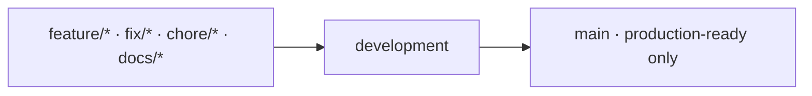
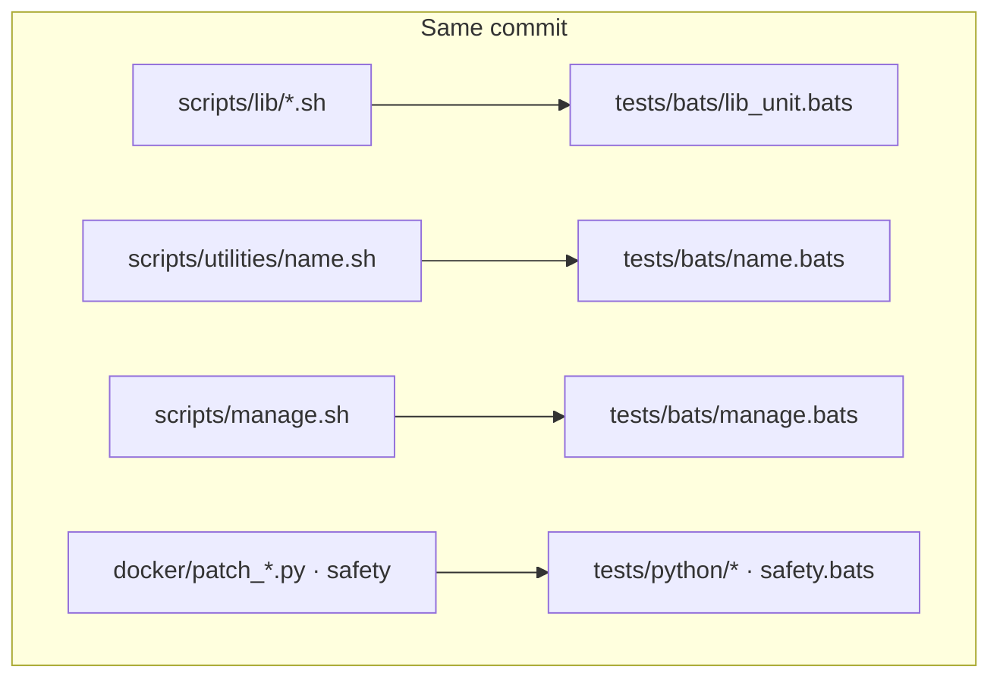
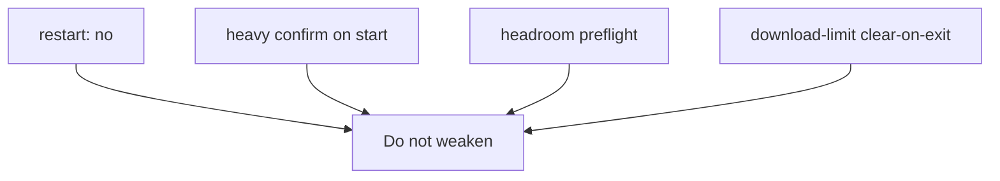

# AGENTS.md

Guidelines for AI coding agents in **ez-comfy-stack**.

Shared style lives in [docs/project-conventions.md](docs/project-conventions.md). **Shell code follows the [Google Shell Style Guide](https://google.github.io/styleguide/shellguide.html)** with documented deviations in that conventions page. This file is **agent workflow** only.

## Branching

| Branch | Role |
| --- | --- |
| `development` | Primary integration |
| `main` | Production-ready promotion only |

- Branch from `development`: `feature/…`, `fix/…`, `chore/…`, `docs/…`  
- Never force-push protected branches  
- Conventional commits: `feat:`, `fix:`, `docs:`, `test:`, `chore:`  



## TDD

Default for non-trivial changes:

1. **Red** — failing BATS or pytest  
2. **Green** — minimum production change  
3. **Refactor** — keep green  

### Tests ship with production code

**Always commit tests in the same change as the files they cover.** Do not land a feature or fix and follow up with a separate “add tests” commit for that work.

| Production change | Same commit includes |
| --- | --- |
| `scripts/lib/*.sh` | `tests/bats/lib_unit.bats` (or a focused bats file) |
| `scripts/utilities/<name>.sh` | `tests/bats/<name>.bats` (or extend existing) |
| `scripts/manage.sh` | `tests/bats/manage.bats` |
| `docker/patch_*.py` / compose safety fields | `tests/python/*` and/or `tests/bats/safety.bats` |



### Shell style (Google)

When adding or editing shell (including `tests/bats/*.bash` helpers and `tests/*.sh` runners):

- Prefer `"${var}"`, `[[ … ]]`, `$(…)`, process substitution over `find | while`
- Document functions with **Globals / Arguments / Outputs / Returns**
- Run `make fmt` and `make lint` (ShellCheck warnings are defects)
- Do not use `eval` or aliases in scripts
- See conventions for intentional deviations (`env bash`, modular script length)
- Coverage: new functions must be **named and exercised under `tests/`** in the same commit
Finish with:

```bash
make test
make coverage
make lint
```

## Safety callouts

Any change to Docker resources, restart policy, headroom, or download-limit must state **safety impact**. Do not weaken:

- `restart: "no"`  
- heavy confirm on start  
- headroom preflight  
- download-limit clear-on-exit for wrap  



## Paths

Prefer relative paths. Prefer `./scripts/manage.sh` for operator actions.

## Docs

Update `docs/*.md` and README when operator behavior changes. MkDocs pages need frontmatter + “What's on this page” / “What this enables”.

Prefer **relative** in-repo doc links. Public site publishes after merge via `.github/workflows/deploy-docs.yml` (mike): `main` → `/latest/`, `development` → `/development/`.

## Scope

This is a **sample** stack. Do not pull in K3s, Bazel, full dashboard, or multi-node NCCL. Point long-term users at nvidia-dgx-spark-lab.
