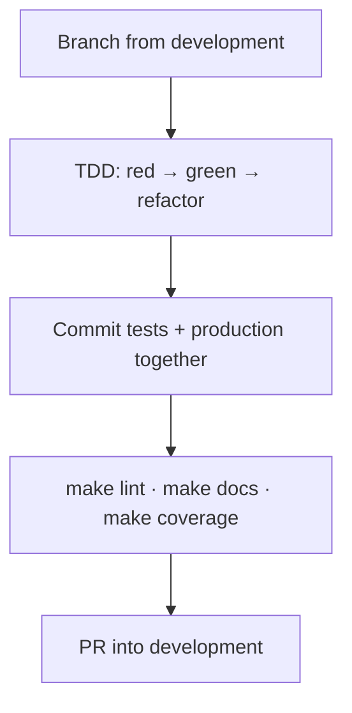
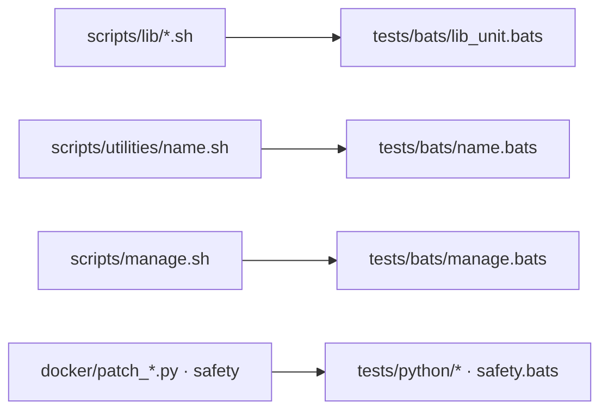

# Contributing

Thanks for improving **ez-comfy-stack**.

## Workflow

1. Branch from latest `development`  
2. Prefer TDD (`make test` / `make coverage`)  
3. **Commit tests with the production files they cover** (same commit)  
4. Run `make lint` and `make docs`  
5. Open a PR into `development`  



## Commit messages

```text
<type>: <imperative summary>
```

Types: `feat`, `fix`, `docs`, `test`, `chore`, `ci`, `refactor`.

## Tests ship with production code



## PR checklist

- [ ] Tests updated in the same commits as the code they exercise  
- [ ] `make coverage` passes (100% gate)  
- [ ] `make lint` clean  
- [ ] `make docs` (mkdocs strict)  
- [ ] Safety impact called out if Docker/resources/download-limit changed  
- [ ] Docs updated for operator-facing changes  

## Style

See [docs/project-conventions.md](docs/project-conventions.md) and [AGENTS.md](AGENTS.md).
