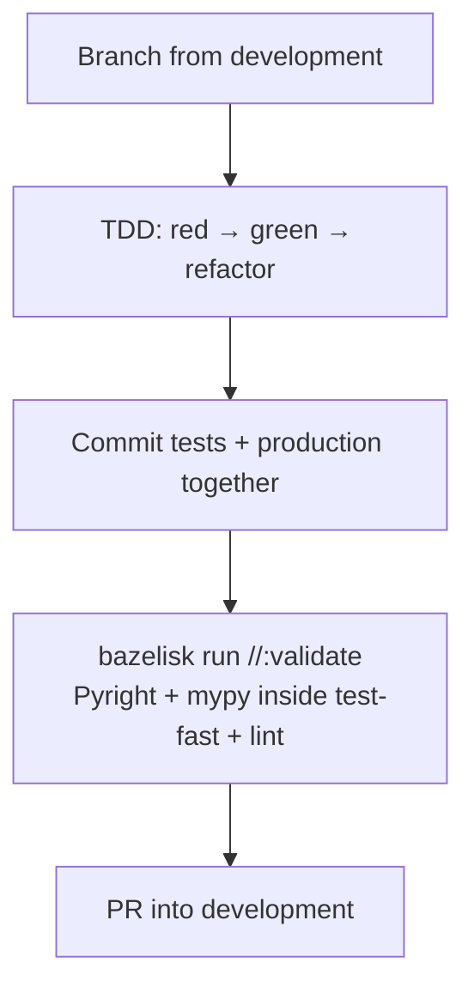
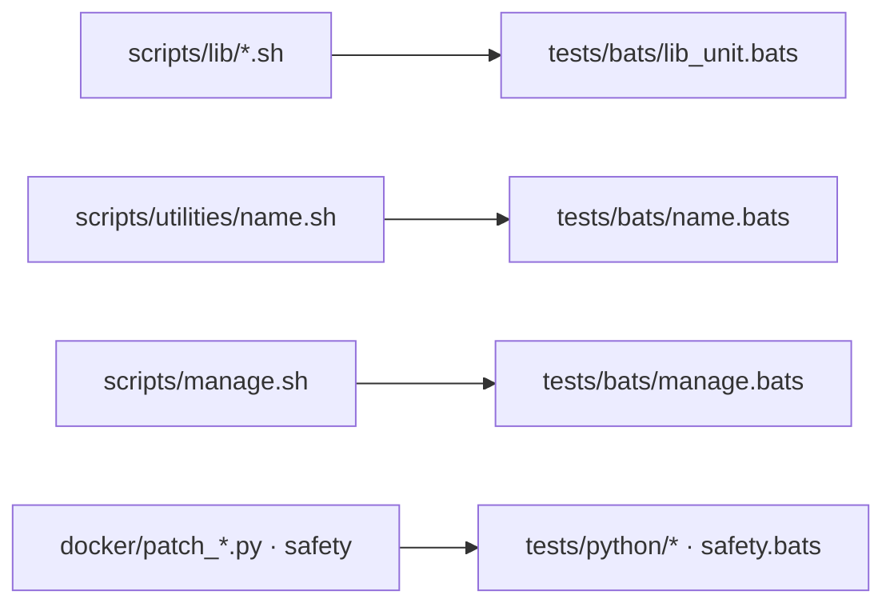

# Contributing

Thanks for improving **ez-comfy-stack**.

## Workflow

1. Branch from latest `development`
2. Prefer TDD (`bazelisk test //:test-fast` / `make test`)
3. **Commit tests with the production files they cover** (same commit)
4. Run `bazelisk test //:lint --test_tag_filters=manual` and `bazelisk run //docs:docs` (`make lint` / `make docs` shims)
5. Open a PR into `development`

Install Python test tools once: `pip install -r tests/requirements.txt`.

To ship a keeper from a live `_user` graph (does **not** commit):

```bash
./scripts/manage.sh promote-workflow \
  --from "${COMFY_OUTPUT_DIR}/comfy-user/default/workflows/_user/my-hook.json" \
  --lane klein \
  --id my-hook
```

Destination is `workflows/_lab/<lane>/<id>.json` (optional `--subdir`). Do not repeat lane tokens in the filename. Must not contain MiniMax / Klein 9B / FLUX.2-dev / Seedance / Kling / z_image_turbo. Then stamp App Mode, add or adjust `_build_*.py` / tests, and `make test`. Never copy `_lab` into `_user`.



## Commit messages

```text
<type>: <imperative summary>
```

Types: `feat`, `fix`, `docs`, `test`, `chore`, `ci`, `refactor`.

## Tests ship with production code



## PR checklist

- [ ] Tests updated in the same commits as the code they exercise
- [ ] `bazelisk test //:test-fast` (or `make coverage`) passes (100% first-party Python + Pyright + mypy)
- [ ] `bazelisk test //:lint --test_tag_filters=manual` clean
- [ ] `bazelisk run //docs:docs` (mkdocs strict)
- [ ] Safety impact called out if Docker/resources/download-limit changed
- [ ] Docs updated for operator-facing changes
- [ ] AI-drafted docs still received a human pass

## Published docs

Public site: [latest](https://toxicoder.github.io/ez-comfy-stack/latest/) (`main`) · [development](https://toxicoder.github.io/ez-comfy-stack/development/) (`development`).

- PRs validate with `make docs` only (strict MkDocs).
- After merge to `main` or `development`, `.github/workflows/deploy-docs.yml` publishes via **mike** → `gh-pages` (versioned aliases). Each alias shows a **Last published** chip stamped at that deploy (`EZ_DOCS_PUBLISHED_AT`).
- Prefer **relative** in-repo doc links (`docs/…`, same-folder page links) so they work on the branch you are viewing and under each published version path.
- Install the pinned stack: `pip install -r docs/requirements.txt`.

## Style

See [docs/project-conventions.md](docs/project-conventions.md), [docs/contribute/docs-style.md](docs/contribute/docs-style.md), and [AGENTS.md](AGENTS.md). **AI-drafted docs still need a human pass** before merge.
