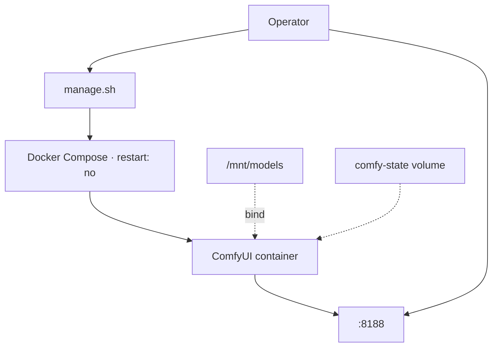
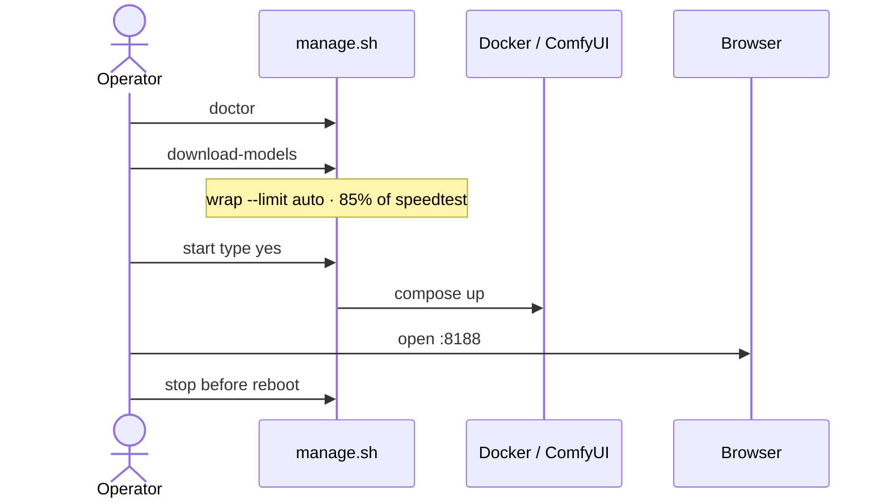
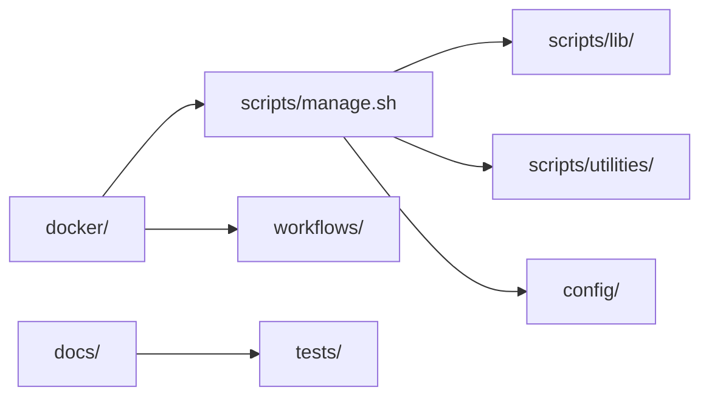

# ez-comfy-stack

[](https://toxicoder.github.io/ez-comfy-stack/latest/)
[](https://toxicoder.github.io/ez-comfy-stack/development/)
[](https://github.com/toxicoder/ez-comfy-stack/actions/workflows/ci.yml)
[](LICENSE)

**Simplified Visual Generative AI** demo for a **single NVIDIA DGX Spark**: ComfyUI with a **US-safe local studio** (Apache Klein 4B stills, Apache Wan 2.2 silent motion, LTX distilled AV), Docker Compose, shared `/mnt/models` cache, and remote-SSH-safe download throttling.

**Documentation:** [latest](https://toxicoder.github.io/ez-comfy-stack/latest/) (from `main`) · [development](https://toxicoder.github.io/ez-comfy-stack/development/) (from `development`) — MkDocs Material, published per branch via GitHub Pages.

Inspired by [nvidia-dgx-spark-lab](https://github.com/toxicoder/nvidia-dgx-spark-lab) visual workloads — without K3s, Ansible, or the full lab dashboard. Use the lab for production multi-stack operations; use this repo for faster demos. Local US-safe models only: [licenses](docs/licenses.md) · optional independent Sparks: [Spark farm](docs/spark-farm.md).

## Goals

- One command path to a working ComfyUI US-safe studio on one Spark  

- Shared model cache compatible with other stacks (`/mnt/models`)  
- Operator CLI (`manage.sh`) for start / stop / status / doctor  
- Bandwidth-limited downloads with **auto = 85% of speedtest**  
- Never auto-start heavy GPU work after reboot  
- Hermetic tests with a **100% coverage gate**

## Architecture



## Quick start

Full walkthrough (prerequisites, setup, workflows): **[Getting Started](https://toxicoder.github.io/ez-comfy-stack/latest/getting-started/)** (or the [development](https://toxicoder.github.io/ez-comfy-stack/development/getting-started/) docs if you track that branch).

```bash
./scripts/manage.sh setup --install-docker   # .env, MODELS_DIR, Docker if needed
# set HF_TOKEN in .env if models are gated
./scripts/manage.sh doctor
./scripts/manage.sh download-models   # throttled Klein 4B + Wan 5B + LTX-2.5
./scripts/manage.sh start             # type yes
./scripts/manage.sh status
# open http://<spark-ip>:8188
./scripts/manage.sh stop              # before reboot
```



## Layout

```text
docker/           Dockerfile + compose (us-safe-studio)
scripts/manage.sh Operator CLI
scripts/lib/      Shared shell helpers
scripts/utilities download-image, download-wan, download-ltx, download-limit, spark-farm
config/           Resource / headroom policy
workflows/        Seeded lab ComfyUI example graphs (still/GIF/dream-house apps; 90s shorts under workflows/shorts/)
docs/             MkDocs site
tests/            BATS + pytest + coverage gate
```



## Documentation

**Read online (published):** [latest](https://toxicoder.github.io/ez-comfy-stack/latest/) · [development](https://toxicoder.github.io/ez-comfy-stack/development/)

CI deploys docs via `.github/workflows/deploy-docs.yml` after push to `main` / `development` (docs paths) or `workflow_dispatch`. PR checks run `make docs` only.

```bash
pip install -r docs/requirements.txt
make docs          # site/ (strict MkDocs build)
# or: mkdocs serve
```

Key pages (branch-relative source): [Getting Started](docs/getting-started.md) · [Visual Generative AI](docs/visual-generative-ai.md) · [Download Limit](docs/download-limit.md) · [Reboot Safety](docs/reboot-safety.md)

## Development

```bash
make test
make coverage
make lint
make docs
```

## Safety

- Compose `restart: "no"` — manual start only  
- Heavy confirmation + free RAM/disk headroom  
- Download throttle by default  
- See [docs/reboot-safety.md](docs/reboot-safety.md)

## License

MIT — see [LICENSE](LICENSE).
