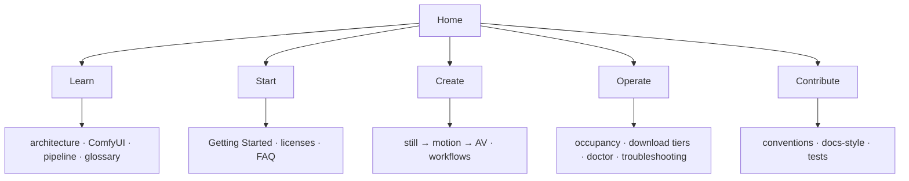

# ez-comfy-stack

[](https://toxicoder.github.io/ez-comfy-stack/latest/)
[](https://toxicoder.github.io/ez-comfy-stack/development/)
[](https://github.com/toxicoder/ez-comfy-stack/actions/workflows/ci.yml)
[](LICENSE)

**Simplified Visual Generative AI** demo for a **single NVIDIA DGX Spark**: ComfyUI in Docker Compose with a **US-safe local studio** (Apache Klein 4B stills, Apache Wan 2.2 silent motion, LTX-2.5 distilled AV), occupancy XOR, and remote-SSH-safe downloads.

| Feature | Default |
| --- | --- |
| Runtime | Docker Compose, one ComfyUI service |
| US-safe models | Klein 4B + Wan 2.2 + LTX-2.5 |
| Occupancy | One heavy GPU job (XOR) |
| Downloads | `download-limit auto` = **85%** of measured Mbps (24h host cache) |
| Restart | `restart: "no"` — type **yes** on start |
| Tests | Hermetic **100%** coverage gate (`bazelisk run //:validate`) |

**Documentation:** [latest](https://toxicoder.github.io/ez-comfy-stack/latest/) (from `main`) · [development](https://toxicoder.github.io/ez-comfy-stack/development/) (from `development`).

When to use this sample vs [nvidia-dgx-spark-lab](https://github.com/toxicoder/nvidia-dgx-spark-lab): [docs/start/when-to-use-vs-spark-lab.md](docs/start/when-to-use-vs-spark-lab.md). Licenses: [docs/licenses.md](docs/licenses.md).

## Documentation map



## Quick start

Full walkthrough: **[Getting Started](https://toxicoder.github.io/ez-comfy-stack/latest/getting-started/)** (or the [development](https://toxicoder.github.io/ez-comfy-stack/development/getting-started/) docs if you track that branch). Session variables:

```bash
export SPARK_HOST="${SPARK_HOST:-127.0.0.1}"
export SPARK_USER="${SPARK_USER:-$USER}"
export MODELS_DIR="${MODELS_DIR:-/mnt/models}"
export COMFY_OUTPUT_DIR="${COMFY_OUTPUT_DIR:-/mnt/comfy-output}"
export COMFY_PORT="${COMFY_PORT:-8188}"

./scripts/manage.sh setup --install-docker
./scripts/manage.sh doctor
./scripts/manage.sh download-models   # Klein 4B + Wan 2.2 5B + LTX-2.5
./scripts/manage.sh start             # type yes
# open http://${SPARK_HOST}:${COMFY_PORT}
# laptop: ssh -L "${COMFY_PORT}:127.0.0.1:${COMFY_PORT}" "${SPARK_USER}@${SPARK_HOST}"
./scripts/manage.sh stop              # before reboot
```

## Safety

- Compose `restart: "no"` — manual start only
- Heavy confirmation + free RAM/disk headroom
- Download throttle by default; wrap **clears on exit**
- See [docs/reboot-safety.md](docs/reboot-safety.md)

## License

MIT — see [LICENSE](LICENSE).
