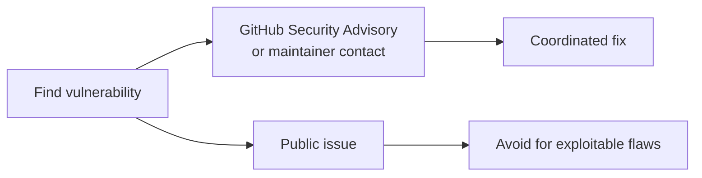
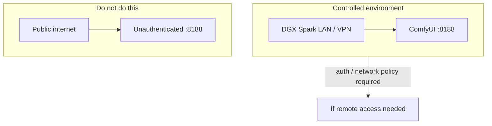
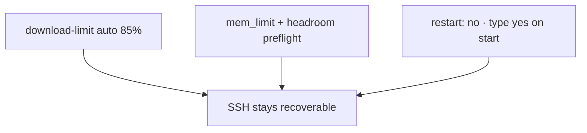

# Security

## Reporting

Please report vulnerabilities privately via GitHub Security Advisories on this repository (or the maintainer contact listed on the GitHub profile). Do not open public issues for exploitable flaws.

## Scope notes

- This project is a **lab/demo** stack for controlled DGX Spark environments.  
- Do not expose ComfyUI (port 8188) to the public internet without authentication / network policy.  
- Never commit `HF_TOKEN`, `.env`, or host secrets.  
- `download-limit` uses `sudo` for wondershaper — review sudoers policy on shared hosts.  

## Operational safety

Resource exhaustion can be as bad as a software CVE when the host is remote-only. Prefer:

- Bandwidth limits for large downloads  
- Docker memory limits and host headroom checks  
- Manual start only (`restart: "no"`)  

