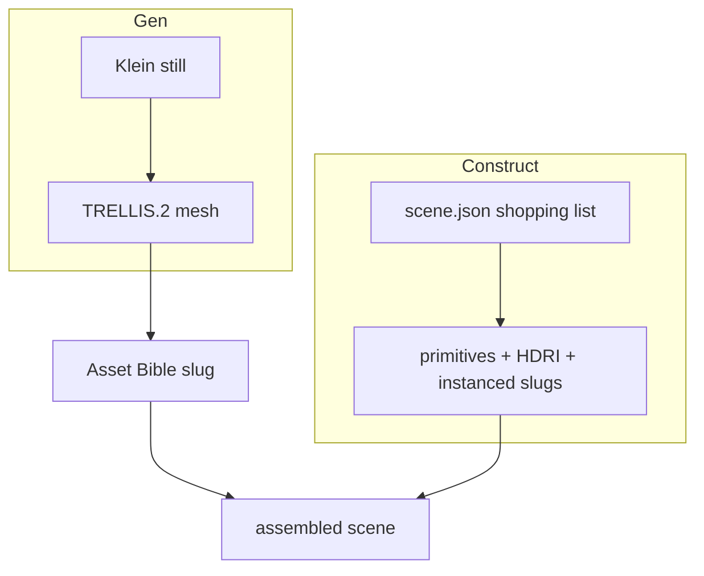

# Asset Bible

**What's on this page**

- Where assets live (`COMFY_OUTPUT_DIR/assets`, never `MODELS_DIR`)
- Gen vs Construct (honest limits)
- `ez.asset.v1` records and `scene.json` that instance slugs
- Operator verb that exists today: `asset-ls`

**What this enables**

- A versioned catalog of reusable props/characters/sets as **outputs**
- Scene files that shop for slugs instead of embedding meshes
- Read-only listing now; mint/iterate/promote verbs come later (P-A1)

!!! warning "Honesty"

    There is **no** US-safe default-pack model that emits a textured city from one sentence. Whole-scene **fast draft** is Construct (primitives + HDRI + instanced bible assets). Whole-scene **hero** is Construct layout + Gen hero pieces. TRELLIS-on-a-full-scene-still is **DRAFT-ONLY**.

This does **not** replace ez_film, the 5.00s printer, or occupancy. `restart: "no"`, heavy confirm, headroom, and download-limit are unchanged. No Blender in Docker. No MCP binary. No new default weights.



---

## Gen vs Construct

| Lane | Meaning | Use |
| --- | --- | --- |
| **Gen** | Klein still → TRELLIS.2 | Hero *pieces* (a mug, a jacket, a hero mesh) |
| **Construct** | `scene.json` shopping list | Layout: primitives, HDRI, **instances of bible slugs** |

`mcp-construct` is still reserved (no MCP binary). **`bpy-primitive`** now has one operator verb: `./scripts/manage.sh house-views` builds a greybox set under `assets/sets/<slug>/` (layout + GLB + ten 1024×1280 clay stills). Host Blender stays a [sidecar](blender-gb10-sidecar.md) (dies if compose is up). Playbook: [Dream-house tours](learn/dream-house.md).

---

## Where files go

| Path | What |
| --- | --- |
| `${COMFY_OUTPUT_DIR}/assets/<kind>/<slug>/asset.yaml` | `ez.asset.v1` record |
| `…/mesh/`, `…/views/`, `…/variants/`, `…/prompts.jsonl` | Takes and previews |
| `${COMFY_OUTPUT_DIR}/assets/index.yaml` | Catalog index (written by the library, not by `asset-ls`) |
| `MODELS_DIR` | Weights only — **never** bible assets |
| `guides/` | Docs/guides — **never** generated GLBs |

Kinds: `object` · `character` · `building` · `set` · `scene` · `material` · `hdri` (directories are plural: `objects/`, …).

Schema and a sample scene that **instances slugs** (no embedded mesh bytes): repo-root `schemas/asset.yaml` and `schemas/scene.json`.

---

## Operator verbs

| Verb | Status |
| --- | --- |
| `asset-ls` | **Shipped** — read-only catalog |
| `house-views` | **Shipped** — occupancy-gated Blender greybox + Instagram clay stills (`bpy-primitive` sets) |
| `asset-new` / `asset-iterate` / `asset-promote` | Coming (P-A1) |

```bash
./scripts/manage.sh asset-ls
./scripts/manage.sh asset-ls --json
./scripts/utilities/asset-ls.sh --output-dir "${COMFY_OUTPUT_DIR}/assets"
```

Empty catalog is success. Occupancy for Gen (Klein + TRELLIS) is the same one-heavy-job rule as [Studio sidecars](studio-sidecars.md). TRELLIS.2 remains opt-in `download-3d`, not `download-models`. See [Model licenses](licenses.md).
