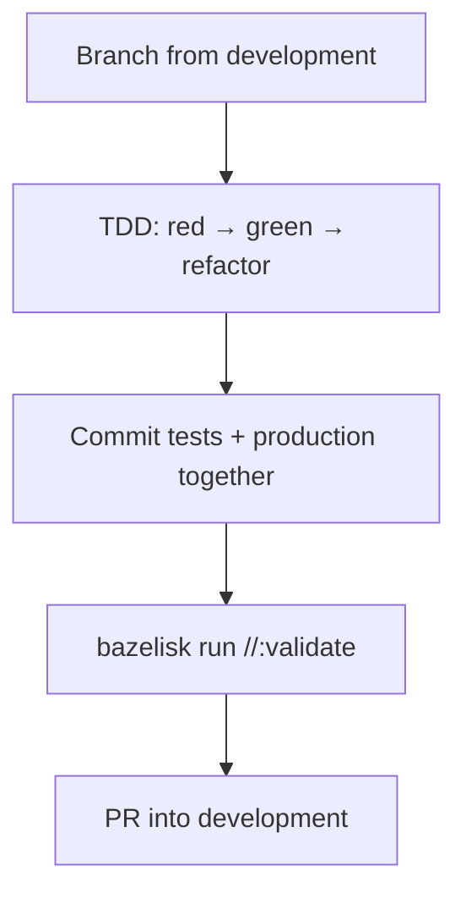

# Contributing

**What's on this page**

- **Canonical file** — repo-root `CONTRIBUTING.md` (this page is a summary)
- **Branch + TDD** — from `development`, tests in the same commit
- **Editor** — shared `.vscode/` tasks wrap `bazelisk` (no secrets in workspace files)
- **PR checklist** including safety and docs
- **Human review** — **AI-drafted docs still need a human pass**

**What this enables**

- **Opening** a PR into `development` without copying the root file into the docs site
- **Finding** style and test gates from the published docs
- **Keeping** MiniMax graphs out of `_lab`, and Klein 9B / FLUX.2-dev off authored lab UNET pins

Canonical source: [CONTRIBUTING.md on GitHub](https://github.com/toxicoder/ez-comfy-stack/blob/__DOCS_GIT_REF__/CONTRIBUTING.md). Do not treat this page as a second source of truth.

```bash
export SPARK_HOST="${SPARK_HOST:-127.0.0.1}"
export SPARK_USER="${SPARK_USER:-$USER}"
export MODELS_DIR="${MODELS_DIR:-/mnt/models}"
export COMFY_OUTPUT_DIR="${COMFY_OUTPUT_DIR:-/mnt/comfy-output}"
export COMFY_PORT="${COMFY_PORT:-8188}"
export DOWNLOAD_LIMIT="${DOWNLOAD_LIMIT:-auto}"
```

Session vars are for operator fences. Contributors still branch from **`development`** (literal name).

---

## Workflow (from the root file)

1. Branch from latest `development`
2. Prefer TDD (`bazelisk test //:test-fast` / `make test`)
3. **Commit tests with the production files they cover** (same commit)
4. Run `bazelisk test //:lint --test_tag_filters=manual` and `bazelisk run //docs:docs`
5. Open a PR into `development`

How merge commits, squash, rebase, and stacked PRs work in this repo: [How we land changes](../learn/merges.md). Land each PR **into `development`**. A GitHub Merged badge on a PR whose base is another topic branch does not update `development`.

Install Python test tools once: `pip install -r tests/requirements.txt`.

VS Code / Cursor: open the repo root and **Run Task → validate** (same as `bazelisk run //:validate`). Also `doctor` and `docs-serve`. Shared `.vscode/` files are generic — no `.env`, interpreter path, or host variables. Format-on-save is shell and Starlark only. Optional Linux toolchain: [Contributor Dev Container](devcontainer.md).



Promote a live `_user` graph (does **not** commit):

```bash
./scripts/manage.sh promote-workflow \
  --from "${COMFY_OUTPUT_DIR}/comfy-user/default/workflows/_user/my-hook.json" \
  --lane stills \
  --id my-hook
```

Must not contain MiniMax / Seedance / Kling / z_image_turbo, and must not pin Klein 9B / FLUX.2-dev as the UNETLoader widget. Then stamp App Mode, add or adjust `_build_*.py` / tests, and `make test`. Never copy `_lab` into `_user`.

Commit titles: `feat`, `fix`, `docs`, `test`, `chore`, `ci`, `refactor`.

---

## PR checklist

- [ ] Tests updated in the same commits as the code they exercise
- [ ] `bazelisk test //:test-fast` (or `make coverage`) passes (100% first-party Python + Pyright + mypy)
- [ ] `bazelisk test //:lint --test_tag_filters=manual` clean
- [ ] `bazelisk run //docs:docs` (Fumadocs static export)
- [ ] Safety impact called out if Docker/resources/download-limit changed
- [ ] Docs updated for operator-facing changes
- [ ] **AI-drafted docs still received a human pass**

Do not weaken `restart: "no"`, heavy confirm on `start`, headroom, or download-limit clear-on-exit.

---

## Related

| Need | Page |
| --- | --- |
| Shell / Docker / docs chrome | [Project conventions](../project-conventions.md) |
| Contributor Dev Container | [Dev Container](devcontainer.md) |
| Page template / ezcmd | [Docs style](docs-style.md) |
| Make targets / Pages aliases | [Testing docs](testing-docs.md) |
| Vulnerability reporting | [Security](security.md) |
| Agent workflow | [AGENTS.md on GitHub](https://github.com/toxicoder/ez-comfy-stack/blob/__DOCS_GIT_REF__/AGENTS.md) |
