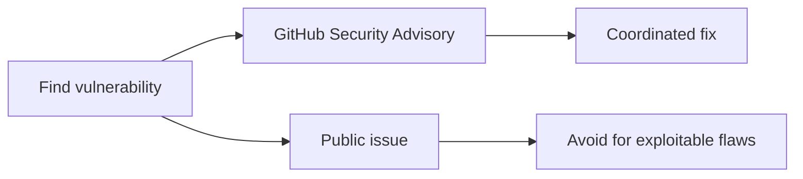
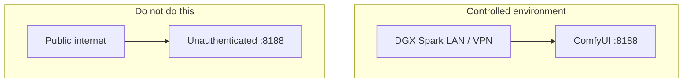

# Security

**What's on this page**

- **Canonical file** — repo-root `SECURITY.md` (this page is a summary)
- **Private reporting** — GitHub Security Advisories
- **Do not expose Comfy `:8188`** to the public internet
- **Operational safety** — headroom, `restart: "no"`, download-limit

**What this enables**

- **Reporting** flaws without a public issue for exploitable bugs
- **Keeping** `HF_TOKEN` and `.env` out of git
- **Remembering** resource exhaustion on a remote Spark is as bad as a CVE

Canonical source: [SECURITY.md on GitHub](https://github.com/toxicoder/ez-comfy-stack/blob/__DOCS_GIT_REF__/SECURITY.md). **AI-drafted docs still need a human pass.**

```bash
export SPARK_HOST="${SPARK_HOST:-127.0.0.1}"
export SPARK_USER="${SPARK_USER:-$USER}"
export MODELS_DIR="${MODELS_DIR:-/mnt/models}"
export COMFY_OUTPUT_DIR="${COMFY_OUTPUT_DIR:-/mnt/comfy-output}"
export COMFY_PORT="${COMFY_PORT:-8188}"
export DOWNLOAD_LIMIT="${DOWNLOAD_LIMIT:-auto}"
```

Prefer SSH tunnels over opening `${COMFY_PORT}` on a public NIC:

```bash
ssh -L "${COMFY_PORT}:127.0.0.1:${COMFY_PORT}" "${SPARK_USER}@${SPARK_HOST}"
```

---

## Reporting

Report vulnerabilities **privately** via GitHub Security Advisories on this repository (or the maintainer contact listed on the GitHub profile). **Do not** open public issues for exploitable flaws.



---

## Scope notes (from the root file)

- This project is a **lab/demo** stack for controlled DGX Spark environments.
- **Do not expose ComfyUI (port 8188) to the public internet** without authentication / network policy.
- Never commit `HF_TOKEN`, `.env`, or host secrets.
- `download-limit` uses `sudo` for wondershaper — review sudoers policy on shared hosts.



studio-ui (`${STUDIO_UI_PORT:-8190}`) is an optional jobstore board, also not a public product: [studio-ui](../reference/studio-ui.md).

---

## Operational safety

Resource exhaustion can be as bad as a software CVE when the host is remote-only:

- Bandwidth limits for large downloads (`${DOWNLOAD_LIMIT}`, wrap **always clears on exit**)
- Docker memory limits (`90g` / `80g`) and host headroom (`MIN_HOST_FREE_GIB` 28)
- Manual start only (`restart: "no"`, type **yes**)

<Callout type="error" title="Do not weaken these for demos">
  Occupancy XOR, `restart: "no"`, headroom preflight, and download-limit clear-on-exit stay in force. [Occupancy matrix](../operate/occupancy-matrix.md) · [Reboot safety](../reboot-safety.md).
</Callout>
