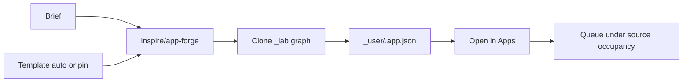

# App Forge

**What's on this page**

- How App Forge picks a shipped lab graph from a brief
- Where the new App is written (`_user/`, never `_lab/`)
- Path D `studio-mcp` tools
- Occupancy for the generator vs the result

**What this enables**

- Making a new operator App without editing raw JSON
- Keeping US-safe coords, App Mode widgets, and occupancy from the template
- Driving the same pipeline from a laptop agent

**Who this is for:** studio users after Prompt Forge. Occupancy **llm**. No UNET.

Load **inspire/app-forge**. Type a **Brief**, leave **Template** on auto (or pin `stills/instagram-square`), set **Slug**, Queue.

```bash
export SPARK_HOST="${SPARK_HOST:-127.0.0.1}"
export SPARK_USER="${SPARK_USER:-$USER}"
export MODELS_DIR="${MODELS_DIR:-/mnt/models}"
export COMFY_OUTPUT_DIR="${COMFY_OUTPUT_DIR:-/mnt/comfy-output}"
export COMFY_PORT="${COMFY_PORT:-8188}"
export DOWNLOAD_LIMIT="${DOWNLOAD_LIMIT:-auto}"
```



---

## What it writes

The generator App is occupancy **llm** (nothing GPU unless `llm-desk` is the writing desk). The **result** keeps the source occupancy (`klein` / `wan` / `ltx` / …). Open `_user/<slug>` and Queue only when that family is legal.

| Widget | Role |
| --- | --- |
| **Brief** | What the new App should make |
| **Template** | `auto` or a lab id (`stills/still-draft`, `motion/silent/still-to-video-5s`, …) |
| **Slug** | Live filename stem (`mug-ig`) |
| **As app** | On writes `*.app.json` (Apps sidebar) |
| **Overwrite** | Off refuses an existing `_user` file |

Dest: `${COMFY_OUTPUT_DIR}/comfy-user/default/workflows/_user/<slug>.app.json`. Never `workflows/_lab/`. Keepers: `./scripts/manage.sh promote-workflow`.

---

## How auto picks

When Template is **auto**, App Forge asks the on-box GGUF (or the 35B sidecar when `llm-desk` is up) for `{template, slug, slots}`. If the GGUF is missing it uses a keyword heuristic: `1:1` / square → `stills/instagram-square`, silent / i2v → `motion/silent/still-to-video-5s`, ltx / foley → `motion/av/still-to-video-8s`, default `stills/still-draft`. It never invents node types.

Official Comfy Cloud MCP / PyPI `comfy-mcp` stay out of the image. This is the in-tree analog: templates first, typed tools, no `execute_code`.

---

## Path D

```bash
./scripts/manage.sh studio-mcp --stdio
./scripts/manage.sh studio-mcp --call generate_app '{"brief":"1:1 IG still of a mug","slug":"mug-ig"}'
```

Same pipeline as the App. Does not Queue Comfy. Does not refuse a GPU session. Does not map `idle` → `blender-desk`.

Next: open the new App, then [Prompt Forge](../studio-apps.md) or **stills/still-draft**.
