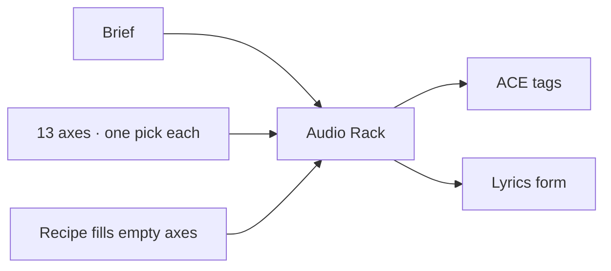

# Audio Rack

**What's on this page**

- Thirteen audio/music axes you pick one-at-a-time
- How the rack splices ACE-Step tags and lyrics form
- Flavor rules (vocal, instrumental, podcast bed)
- Recipes, including Drive-through bass-set starters
- Conflicts, and handoff to rap-draft

**What this enables**

- Building a professional ACE-Step prompt from dropdowns instead of remembering tag grammar
- Copying tags and lyrics form into **audio/music/rap-draft**, **audio/music/rap-full**, or a podcast bed

**Who this is for:** studio users after Prompt Forge / Cinema Rack. Occupancy **llm**. No UNET. Do not load ACE-Step on this canvas.

Load **inspire/audio-rack**. Optional **Brief**, pick techniques, Queue, then read the vocal and instrumental Enhance boxes.

## Axes

Pick **none** or one id per axis. Splicing is across axes, not two tempos on one take.

| Widget | Axis | Instrumental / podcast |
| --- | --- | --- |
| Genre | Genre | kept |
| Tempo | Tempo and Groove | kept; notes emit BPM |
| Drums | Drums and Rhythm | kept |
| Bass | Bass and Low End | kept |
| Harmony | Harmony and Mode | kept (tags only; does not set ACE keyscale) |
| Instruments | Instruments and Texture | kept |
| Vocal | Vocal Identity | omitted |
| Form | Form and Arrangement | Timed ACE skeletons (`[pre-chorus]`, `[bridge]`, `[breakdown]`, `[build-up]`), not color pockets |
| Mix | Mix and Production | kept |
| Space | Space and Ambience | kept |
| Sound design | Sound Design | drop-first FX may be dropped on podcast |
| Mood | Mood and Energy | kept |
| Use | Use Case | kept |

Catalog encyclopedia (generated, do not hand-edit): [Audio technique catalogs](../generated/audio/index.md).

ACE tag order is encoder grammar, not widget order: genre → mood → drums → bass → instruments → harmony → vocal → mix → space → design → use → BPM last. Form writes lyrics only.

## Flavors

| Family | What the rack emits |
| --- | --- |
| `ace_vocal` | Genre-first tags including vocal identity. Lyrics = brief (if any) + form skeleton. |
| `ace_instrumental` | Vocal axis dropped. Tags force `instrumental, no vocals`. Form uses `[inst]` / `[drop]`. Brief omitted. |
| `podcast_bed` | Same as instrumental, plus techniques that are not `podcast_ok` are dropped. |

A **Recipe** fills axes that are still `none`. An explicit dropdown always wins.

When two picks conflict, the **later splice-order** axis wins. Notes on the rack list what was dropped.

The rack emits at most one BPM token. Match `TextEncodeAceStepAudio1.5` BPM to that note. Do not also type a second BPM in the brief.

## Drive-through recipes

Shipped Drive-through takes under `_lab/audio/albums/drive-through/` splice these starters. The arranger then snaps tempo onto 165–176 and replaces the form with a per-take sequence of 2-bar stanzas (150–480 s, each cell under 3 seconds). Bass identity stays with the recipe:

| Recipe | Genre |
| --- | --- |
| `rec_drive_through_drop` | Hybrid trap |
| `rec_drive_riddim` | Riddim bass |
| `rec_drive_tearout` | Tearout |
| `rec_drive_brostep` | Brostep |
| `rec_drive_wave` | Wave bass |
| `rec_drive_color` | Color bass |
| `rec_drive_dirty` | Dirty bass |
| `rec_drive_dirty_dubstep` | Dirty dubstep |
| `rec_drive_drumstep` | Drumstep |
| `rec_drive_neuro` | Neuro bass |
| `rec_drive_chest` | Chest bass |
| `rec_drive_festival_trap` | Festival trap |
| `rec_drive_dj_shout` | Hybrid trap + `voc_dj_shout` |

Instrumental takes use `mix_drive_lock` (no brass, no horns, no trumpets, heavy chest bass, bass boosted). DJ-shout treats use `mix_drive_treat` with the same brass lock. Do not pick `ins_warped_saw` on a Drive-through graph (supersaw is a high-pitch needle). Playbook: [Drive-through EDM](music-edm.md).

## Handoff

1. Queue **inspire/audio-rack** (occupancy **llm**).
2. Copy the tags / lyrics boxes.
3. Paste into **audio/music/rap-draft** (or a Drive-through / podcast bed graph). Set Family to `ace_instrumental` / `podcast_bed` first if you want those filters already applied.
4. Optional: turn Enhance **off** on the destination if the rack string is already ACE-native.

Do **not** co-resident ACE-Step with Klein / Wan / LTX. The rack canvas is occupancy **llm** so you can splice without loading the AIO.

Safety impact: none. Prompt JSON + CPU node. No Docker, restart, or headroom change.
