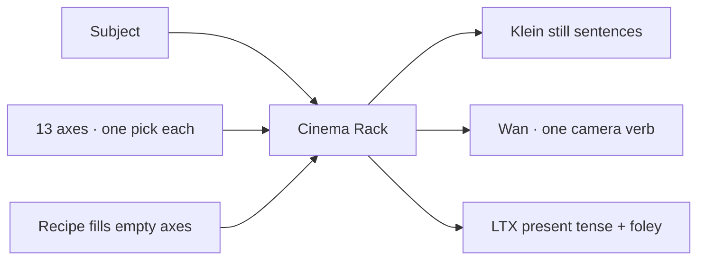

# Cinema Rack

**What's on this page**

- Thirteen cinematography axes you pick one-at-a-time
- How the rack splices Klein / Wan / LTX strings
- Flavor rules (stills, I2V look-skip, one Wan camera)
- Recipes, conflicts, and handoff to still-draft
- 5s muted encyclopedia clips for shipped techniques

**What this enables**

- Building a professional shot from dropdowns instead of remembering film grammar
- Copying a family CLIP string into **stills/still-draft**, **motion/silent/text-to-video-5s**, or **motion/av/text-to-video-5s**
- Watching a 5s example of a pick on the generated technique page

**Who this is for:** studio users after Prompt Forge. Occupancy **llm**. No UNET.

Load **inspire/cinema-rack**. Type a **Subject**, pick techniques, Queue, then read the three Enhance CLIP boxes.

## Axes

Pick **none** or one id per axis. Splicing is across axes, not two dollies on one shot.

| Widget | Axis | Still behavior |
| --- | --- | --- |
| Shot size | Framing and Shot Size | clause |
| Angle | Camera Angles | clause |
| Camera move | Camera Movement | freeze (`still` field) |
| Lens | Lenses and Optics | clause |
| Composition | Composition | clause |
| Lighting | Lighting | clause |
| Color | Color and Film Look | clause |
| Time | Time and Motion | freeze |
| Optical FX | In-Camera and Optical Effects | freeze |
| Edit | Editing and Transitions | omitted on stills |
| Weather | Atmosphere and Weather | clause; LTX foley |
| Genre | Genre Looks | clause |
| Viral look | Viral Looks | freeze |

Catalog encyclopedia (generated, do not hand-edit): [Cinema technique catalogs](../generated/cinema/index.md). When a 5s muted illustration is shipped, the axis table links a poster to a technique page. Clips live under `docs/assets/cinema/<axis_id>/<technique_id>.mp4` (Git LFS) with a JPEG poster; compress with `./scripts/utilities/compress-cinema-clip.sh`.

Klein sentence order is cinematic grammar, not widget order: shot size → angle → lens → composition → lighting → color → weather → genre → viral → time → move → optical → edit.

## Flavors

| Family | What the rack emits |
| --- | --- |
| `klein` / `klein_edit` | Subject + still clauses. Motion axes use the `still` freeze. Editing dropped. |
| `klein_identity` | Lighting / color / weather / genre only. No camera, angle, move, or edit (bible stays camera-free). |
| `wan_t2v` | Look clauses + **exactly one** camera token (`wan_token`, else `fixed camera`). |
| `wan_i2v` | Camera + time/optical/edit only. Subject ignored. Start image owns look. |
| `ltx_t2v` / `ltx_i2v` | Present-tense clauses. Weather/optical `audio` interleaved. I2V still drops look axes. |

Style dropdown on the Enhance nodes stays **none** so `apply_style_to_prompt` does not strip cinema grade language. Use the 150 style presets when you want a medium (anime, watercolor); use Cinema Rack when you want camera/light/time.

Lazy Prompt Enhance (Klein / Wan / LTX and the other visual families) now **writes** this same catalog language: named shot sizes, lighting patterns, millimetre-equivalent lenses, recipe packages adapted to the user's inventory, and exactly one Wan token. The rack remains the deterministic dropdown splice; Enhance is the 4B rewriter that should sound like the rack.

## Recipes and conflicts

A **Recipe** fills axes that are still `none`. An explicit dropdown always wins.

When two picks conflict, the **later splice-order** axis wins (viral may override color; a camera move may drop an optical smash-zoom). Notes on the rack list what was dropped.

Wan never emits two camera verbs. Do not also type `dolly in` in the subject.

## Handoff

1. Queue **inspire/cinema-rack** (occupancy **llm**).
2. Copy the Klein / Wan / LTX CLIP box.
3. Paste into **stills/still-draft**, **motion/silent/text-to-video-5s**, or **motion/av/text-to-video-5s**. For I2V, set Family to `wan_i2v` / `ltx_i2v` first so look axes are already omitted.
4. Optional: turn Enhance **off** on the destination if the rack string is already model-native.

Safety impact: none. Prompt JSON + CPU node. No Docker, restart, or headroom change.
