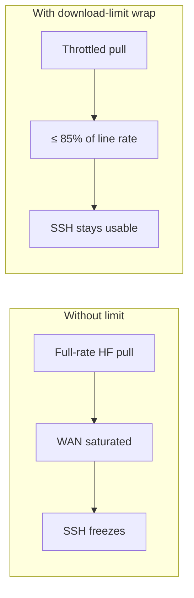
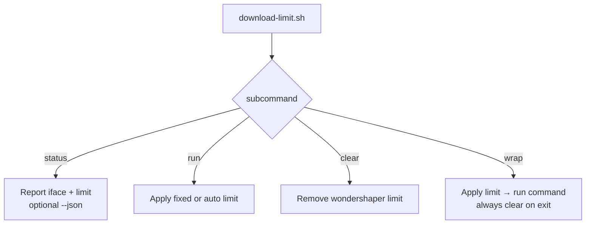
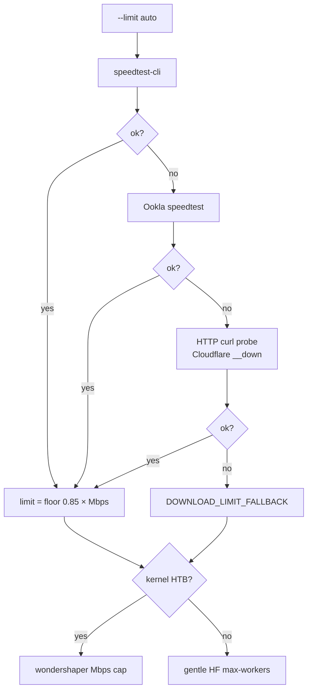
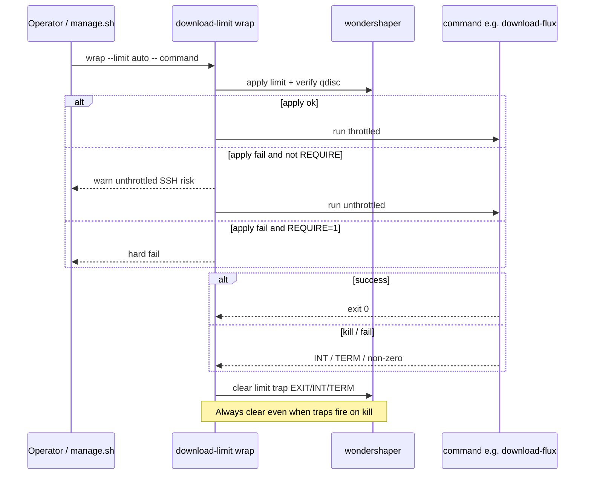
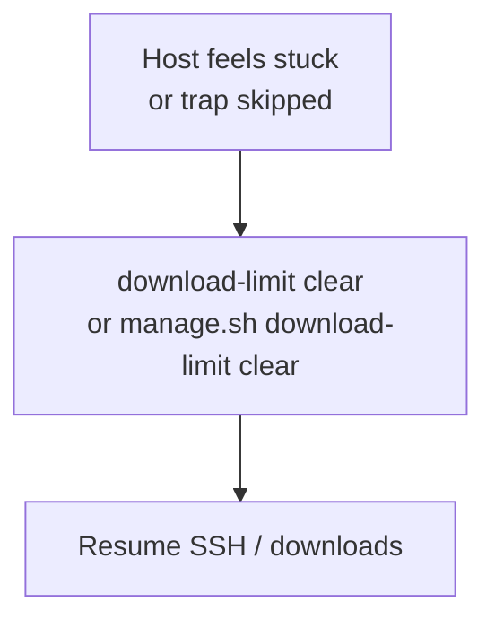

# Download Limit

**What's on this page**

- Why bandwidth limits matter on remote Sparks
- CLI usage (`status`, `run`, `clear`, `wrap`)
- Manual Mbps cap (`download-models --limit N`) vs auto
- Auto mode (85% of speedtest) and wrap lifecycle

**What this enables**

- Downloading multi‑GB FLUX/LTX weights without saturating the uplink and freezing SSH

---

## Why

DGX Spark nodes are often operated **over the internet** without physical console access. A full-rate Hugging Face pull can starve interactive SSH. This utility applies kernel-level traffic shaping via **wondershaper** when HTB is available, and falls back to gentler HF client settings when it is not.

Inspired by the throttled Ollama downloader in `dgx-spark-it-up`, generalized and improved with **auto** limiting.



---

## Commands

| Command | Purpose |
| --- | --- |
| `status [--json]` | Report interface + current limit |
| `run --limit 50` | Apply a fixed Mbps cap |
| `run --limit auto` | Measure line rate, apply 85% |
| `clear` | Remove wondershaper limit |
| `wrap --limit auto` or `--limit N` | Apply → run command → **always clear on exit** |
| `manage.sh download-models --limit N` | Same wrap; **N** is a standing Mbps cap for this download |

```bash
./scripts/utilities/download-limit.sh status [--json]
./scripts/utilities/download-limit.sh run --limit 50
./scripts/utilities/download-limit.sh run --limit auto
./scripts/utilities/download-limit.sh clear
./scripts/utilities/download-limit.sh wrap --limit auto -- <command...>
```

Via manage:

```bash
./scripts/manage.sh download-limit clear
./scripts/manage.sh download-models                 # wrap --limit ${DOWNLOAD_LIMIT:-auto}
./scripts/manage.sh download-models --limit 40      # fixed 40 Mbps; overrides .env for this run
./scripts/manage.sh download-models --limit off     # no throttle (SSH risk)
```

`--limit N` is integer **Mbps** (not MB/s). 40 Mbps ≈ 5 MB/s. `.env` `DOWNLOAD_LIMIT=40` is the persistent default; the flag wins for one invocation. Wrap still **clears on exit**.



---

## Auto mode (measure real Mbps)

When you pass `--limit auto`:

1. **Clear** any existing bandwidth limits on the default-route interface (wondershaper + best-effort `tc`) so residual caps do not skew the result
2. **Install `speedtest-cli`** hard (`pip --user`, `--break-system-packages`, `pipx`, `apt`/`python3-speedtest-cli` with `sudo -n`)
3. Try `speedtest-cli --simple`
4. Else Ookla `speedtest`
5. Else **HTTP probe** multi-URL (Cloudflare, OVH, GitHub, …) via `curl -4`
6. Apply `floor(0.85 × measured)` (minimum 1 Mbps) when the sample is **trusted**
7. If all probes fail: **do not** use idle NIC RX as line rate — use default `max-workers=4` and start download

++ctrl+c++ kills the download process group, progress heartbeat, and HTTP probes (INT→TERM→KILL).

Override HTTP probe: `SPEEDTEST_HTTP_URL`, `SPEEDTEST_HTTP_BYTES`.



Upload is set to a high **legal** “uncapped” rate (clamped for HTB). Extremely large historical defaults (e.g. 100000 Mbps) produced `Illegal "rate"` on some kernels.

---

## DGX Spark / no HTB

Many Spark kernels lack `sch_htb` / IFB (`qdisc kind is unknown`). The tool **detects** this and **does not** spam wondershaper/RTNETLINK.

| Path | Behavior |
| --- | --- |
| HTB available | wondershaper hard Mbps cap at 85% of measured |
| HTB missing (typical Spark) | **Gentle HF mode**: `HF_DOWNLOAD_MAX_WORKERS` from measured Mbps (floor **2**–4), `HF_HUB_ENABLE_HF_TRANSFER=0` — not a hard Mbps cap |
| `DOWNLOAD_LIMIT=off` | Full blast (**SSH risk**) |

Model downloads keep a **real TTY** for `hf`/`tqdm` progress (no `2>&1 | tee` on interactive sessions). Cache hits still flash `100%` in 0s. Heartbeats every 10s show `du` growth under the target dir if bars are quiet.

---

## Apply verification and soft-fail

After wondershaper runs, the utility checks that a shaping qdisc is active (`tc qdisc show`, or hermetic mocks). If apply fails or HTB is missing:

| Command | Behavior |
| --- | --- |
| `run` | **Hard-fail** (operator asked for a standing limit) |
| `wrap` | **Soft path**: gentle HF workers + clear on exit |
| `wrap` + `DOWNLOAD_LIMIT_REQUIRE=1` | **Hard-fail** like `run` |

!!! warning "Safety impact"

    Gentle mode reduces parallel download stampede but is **not** a kernel Mbps cap. Prefer HTB where available. **Clear-on-exit remains mandatory** for `wrap`.

---

## Ctrl+C

Downloads run in a **process group**. ++ctrl+c++ (SIGINT) or SIGTERM:

1. Forwards to `hf` / nested bash (not only `tee`)
2. Clears wondershaper limits if any
3. Exits promptly (status 130)

You should not need `kill -9` on leftover download processes after a clean Ctrl+C.

---

## Wrap lifecycle

`wrap` always clears on `EXIT` / `INT` / `TERM` so a killed download cannot leave the host permanently throttled.



---

## Emergency clear

If the host feels “stuck” throttled after a crash:

```bash
./scripts/utilities/download-limit.sh clear
# or:
./scripts/manage.sh download-limit clear
```



---

## Units

Limits are in **Mbps** (megabits), not MB/s. Example: **40 Mbps ≈ 5 MB/s**.

---

## Advanced

??? abstract "Live speed when preflight fails"

    If auto mode cannot measure speed **before** download:

    1. **Measure phase** (~15s): sample NIC RX while a short HTTP download generates traffic (not the multi‑GB model pull — avoids HF locks and kill/restart hangs)
    2. Set target = 85% of live Mbps → gentle HF max-workers (or kernel HTB only if `sudo -n` works and qdisc applies)
    3. **Download phase**: one **foreground** model download with live tqdm progress

    No interactive sudo during this path. Mock/tests: `LAB_MOCK_LIVE_RX_MBPS`.
