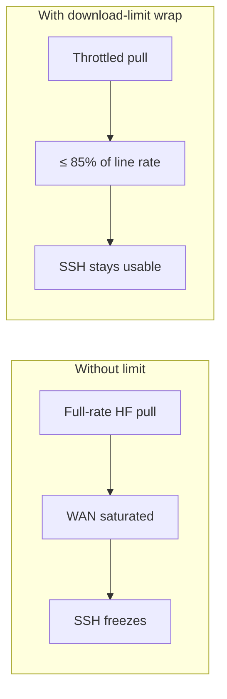
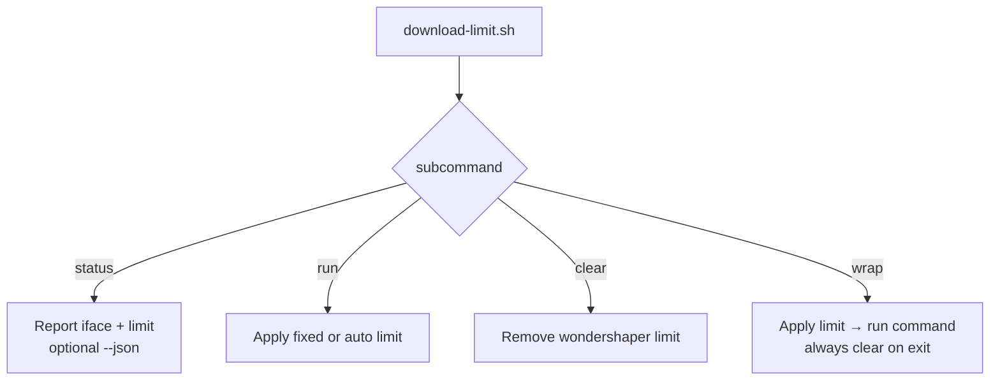
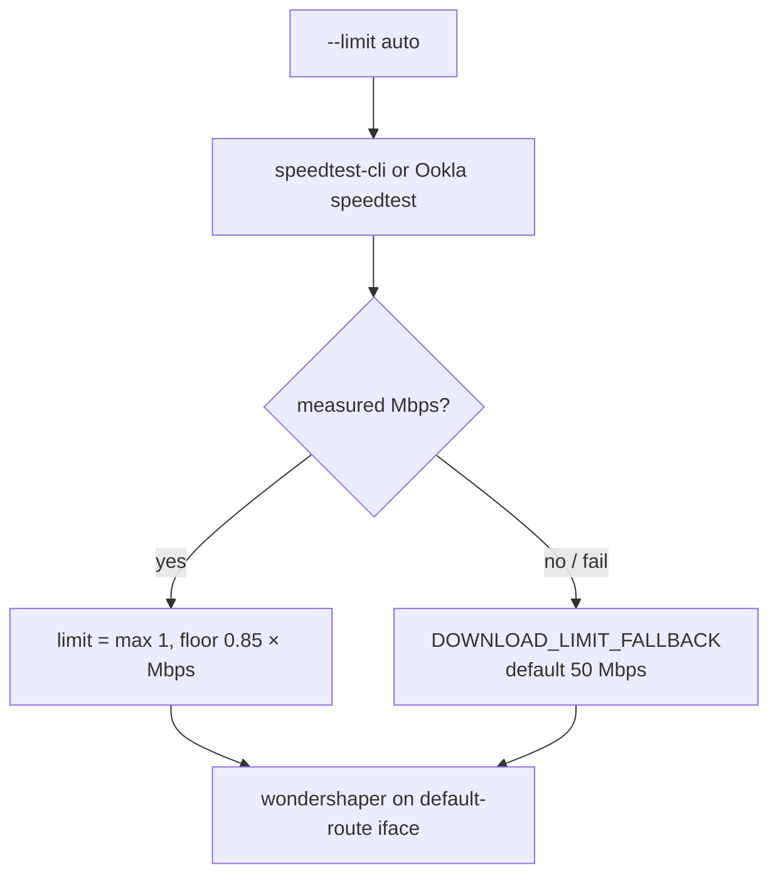
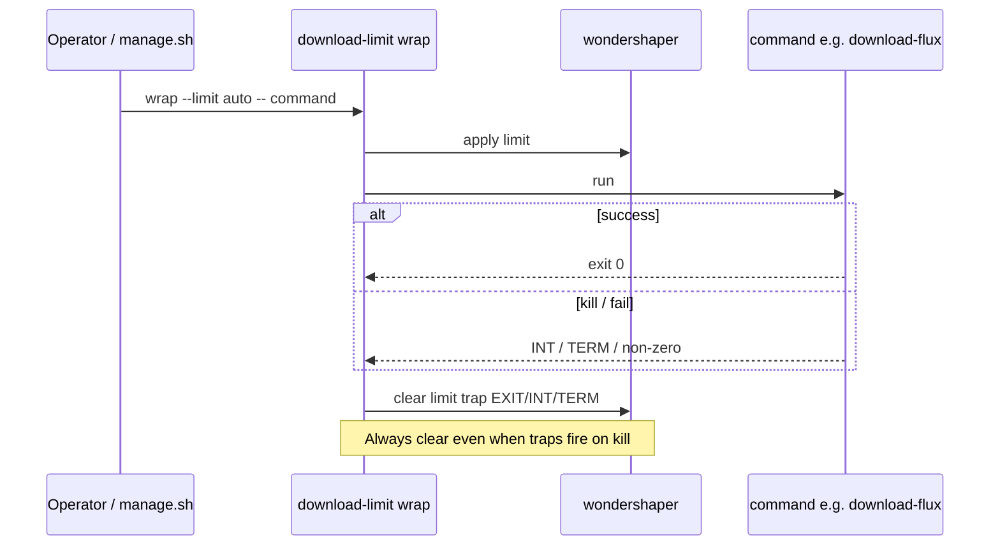
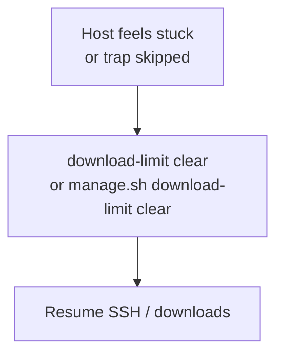

# Download Limit

**What's on this page**

- Why bandwidth limits matter on remote Sparks
- CLI usage (`status`, `run`, `clear`, `wrap`)
- Auto mode (85% of speedtest) and wrap lifecycle

**What this enables**

- Downloading multi‑GB FLUX/LTX weights without saturating the uplink and freezing SSH

## Why

DGX Spark nodes are often operated **over the internet** without physical console access. A full-rate Hugging Face pull can starve interactive SSH. This utility applies kernel-level traffic shaping via **wondershaper**.

Inspired by the throttled Ollama downloader in `dgx-spark-it-up`, generalized and improved with **auto** limiting.



## Commands

```bash
./scripts/utilities/download-limit.sh status [--json]
./scripts/utilities/download-limit.sh run --limit 50
./scripts/utilities/download-limit.sh run --limit auto
./scripts/utilities/download-limit.sh clear
./scripts/utilities/download-limit.sh wrap --limit auto -- <command...>
```

Via manage:

```bash
./scripts/manage.sh download-limit clear
./scripts/manage.sh download-models   # wrap --limit ${DOWNLOAD_LIMIT:-auto}
```

### CLI decision tree



## Auto mode

1. Run `speedtest-cli` (or Ookla `speedtest`)  
2. Read download Mbps  
3. Apply `floor(0.85 × measured)` (minimum 1 Mbps)  
4. If speedtest fails, use `DOWNLOAD_LIMIT_FALLBACK` (default 50)



## Wrap lifecycle

`wrap` always clears on `EXIT` / `INT` / `TERM` so a killed download cannot leave the host permanently throttled.



## Emergency clear

If the host feels “stuck” throttled after a crash:

```bash
./scripts/utilities/download-limit.sh clear
```

`wrap` always clears on `EXIT` / `INT` / `TERM`.



## Units

Limits are in **Mbps** (megabits), not MB/s. Example: 40 Mbps ≈ 5 MB/s.
