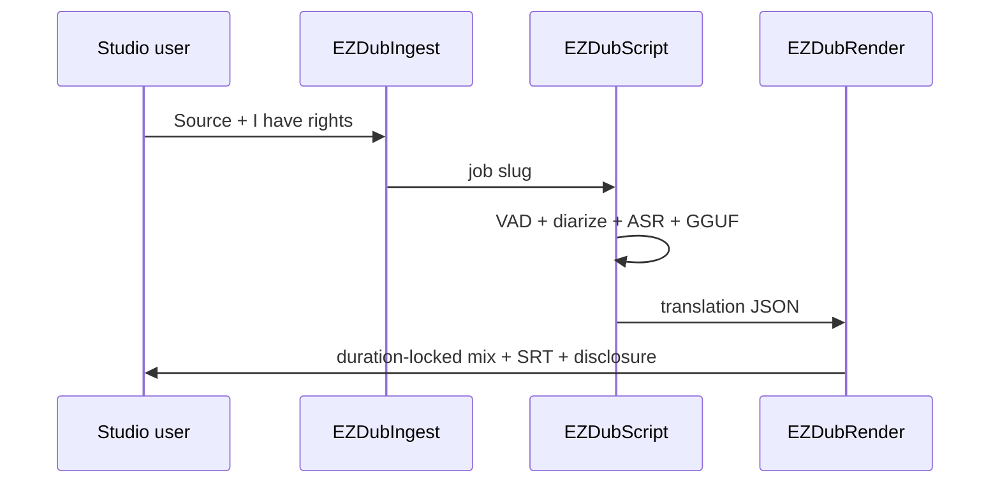

# Local dub

**What's on this page**

- Rights gate (required) vs the original-character podcast lane
- App Mode: source file dropdown + upload (or URL), languages, stage, clone engine
- Cascade: ingest → diarize → ASR → translate → clone → duration lock
- YouTube Studio multi-language audio upload (audio-only file + SRT)
- `download-dub` usage, sequential Queue, and loudnorm
- Optional still-image MP4 when you have no source video (host `audio-still-video`)

**What this enables**

- A second audio track in another language that keeps each speaker’s voice
- A duration-locked WAV/MP3 for YouTube Languages → Audio
- Source and translated SRT captions from the same turns

!!! warning "Not legal advice"

    Platform rules, copyright, and voice-likeness law change. Read the current YouTube, FTC, and USCO pages before you monetize. Do not clone people without consent.

!!! warning "Do not weaken"

    `restart: "no"`, type **yes** on start, headroom, and download-limit are unchanged. Occupancy is **audio** — stop Klein / Wan / LTX first.

## This is not the podcast lane

[Local podcast](podcast.md) invents hosts and uses Kokoro stock voices. This lane clones **recorded speakers** from a show you own or are licensed to translate. Different disclosure. Different App.

First spoken bumper (optional overlay, sidecar always written):

> This audio is an AI-translated dub. Voices are synthesized from the original speakers with the rights-holder's authorization.

## Rights

Queue **refuses** unless App **I have rights** is on. That widget defaults **off**.

Use this App when:

- You own the recording, or
- Every speaker consented, and you have a license to translate and redistribute

Do not paste celebrity reference WAVs. Refs are extracted from **this** job’s audio. URL ingest is for operator-owned or licensed URLs only. YouTube’s terms of service still apply to `yt-dlp`.

## Quality bar

Production-usable for podcasts with 2–6 speakers and mostly turn-taking. Editable translation JSON is the quality lever (Stage **analyze**, edit, Stage **render**).

Hard cases: heavy overlap, stadium noise, singing, very fast banter, on-camera lip sync. **No lip-sync OSS** (Wav2Lip stays banned). Mouths will not match on talking-head video.

## Engines

| Stage | Default | License | Download |
| --- | --- | --- | --- |
| VAD | Silero VAD ONNX (energy VAD fallback) | MIT | `download-dub --tier asr` |
| ASR | faster-whisper large-v3 | MIT | `download-dub --tier asr` |
| Translate | On-box Qwen3-4B-Instruct GGUF | Apache 2.0 | already in `download-models` |
| Clone | Chatterbox Multilingual V3 (23 languages, PerTh on) | MIT | `download-dub --tier clone` |
| Clone alt | Qwen3-TTS 0.6B | Apache 2.0 | `download-podcast --tier qwen3tts` |

`faster-whisper`, Chatterbox, and `yt-dlp` are **optional runtime** installs inside the container venv. They are **not** baked in `phase-nodes.sh`. The graph still loads if a wheel is missing; Queue fail-softs until you install it and download the pack.

Chatterbox languages: Arabic, Danish, German, Greek, English, Spanish, Finnish, French, Hebrew, Hindi, Italian, Japanese, Korean, Malay, Dutch, Norwegian, Polish, Portuguese, Russian, Swedish, Swahili, Turkish, Chinese. Soccer EN→ES is first-class.

Banned: F5-TTS, XTTS, Fish, Higgs, NLLB, SeamlessM4T, ElevenLabs, Wav2Lip, TTS-Audio-Suite.

## Download

Dub weights are **opt-in**. `./scripts/manage.sh download-models` does **not** pull them. `doctor` prints dub JSON and still exits 0 when the pack is absent.

```ezcmd
id: download-dub
```

```bash
./scripts/manage.sh download-dub --tier asr        # Silero VAD + faster-whisper large-v3
./scripts/manage.sh download-dub --tier clone      # Chatterbox Multilingual V3
./scripts/manage.sh download-dub --tier all
# same --limit auto|N|off wrap as download-models (always clears on exit)
```

Optional runtime (container venv; invalidates a baked layer if you rebuild):

```bash
pip install faster-whisper
# clone engine: follow the Chatterbox card; keep PerTh on
# URL ingest on the host:
pip install yt-dlp
```

## App

Graph: **dub-localize-lab-example** (`extra.lab_profile` `us-safe-dub`). Occupancy **audio**.

| Widget | Role |
| --- | --- |
| **Source file** | Dropdown of wav/mp4/mkv/mp3 already in `${COMFY_OUTPUT_DIR}/input` (container `/inputs`). Default `(none)` |
| **Upload media** | Choose a local file; Comfy stores it in `input/` |
| **Source URL** | Optional http(s) you have rights to fetch. Overrides Source file when set |
| **I have rights** | Required. Off refuses Queue |
| **Job slug** | `${COMFY_OUTPUT_DIR}/dubs/<slug>/` |
| **Target language** | Default Spanish |
| **Source language** | `auto` or pin |
| **Rewrite translation** | On: diarize + ASR + GGUF. Off: pin the JSON |
| **Stage** | `all` / `analyze` / `render` |
| **Clone engine** | chatterbox-ml or qwen3tts |
| **Keep original bed** | Gaps keep ambience |
| **Spoken disclosure** | 3 s overlay; sidecar always written |

## Sequential Queue

1. `download-dub --tier asr` then `--tier clone`
2. Optional: `faster-whisper` (and Chatterbox) in the Comfy venv
3. `./scripts/manage.sh start` — type **yes**
4. Load **dub-localize-lab-example**. Pick **Source file** or **Upload media** (or set **Source URL**). Turn **I have rights** on. Queue
5. Files under `${COMFY_OUTPUT_DIR}` as `ez_dub_mix_*.flac` / `ez_dub_yt_*.mp3` plus `${COMFY_OUTPUT_DIR}/dubs/<slug>/ez_dub_yt.wav`
6. Loudness:

```bash
./scripts/utilities/podcast-loudnorm.sh run --in "${COMFY_OUTPUT_DIR}/dubs/episode/ez_dub_yt.wav" --target youtube
```

URL helper (host, writes `${COMFY_OUTPUT_DIR}/input`, survives `cleanup`):

```bash
./scripts/utilities/dub-fetch.sh run --url 'https://www.youtube.com/watch?v=YOUR_VIDEO'
```

Reload the App if it was already open, then pick that wav/mp4 in **Source file**.

## YouTube multi-language audio

Do **not** rely on muxing two AAC tracks into one MP4 as the YouTube path. Studio wants an **audio-only** file roughly the same length as the video.

1. Upload the original video as usual
2. YouTube Studio (desktop) → **Languages** (or Subtitles) → the video → **Add language**
3. Under Audio / Dub, upload `ez_dub_yt.wav` (or the loudnormed file)
4. Upload `ez_dub.es.srt` (or your target) as captions
5. Flip YouTube’s synthetic/altered-content toggle
6. If YouTube already auto-dubbed that language, delete the auto-dub first

MLA is rolling out; not every channel has it. Duration lock exists so Studio accepts the file.

Optional local mux (VLC/archive, not the documented YouTube upload) can use ffmpeg against `source_video.mp4` in the job dir.

When there is **no** source video and you want a still-image YouTube file (cover + dubbed audio), keep the graph as FLAC/MP3 and mux on the host:

```bash
./scripts/manage.sh audio-still-video \
  --audio "${COMFY_OUTPUT_DIR}/dubs/episode/ez_dub_yt.wav" \
  --image "${COMFY_OUTPUT_DIR}/ez_podcast_00001_.png"
```

Do not treat that MP4 as the YouTube Languages extra-audio path — Studio still wants the duration-locked WAV.

## What runs on Queue



Cover art is a **later** Klein session. Occupancy: do not load LTX + this together.

Start still requires typing `yes`. Compose `restart: "no"` is unchanged.
