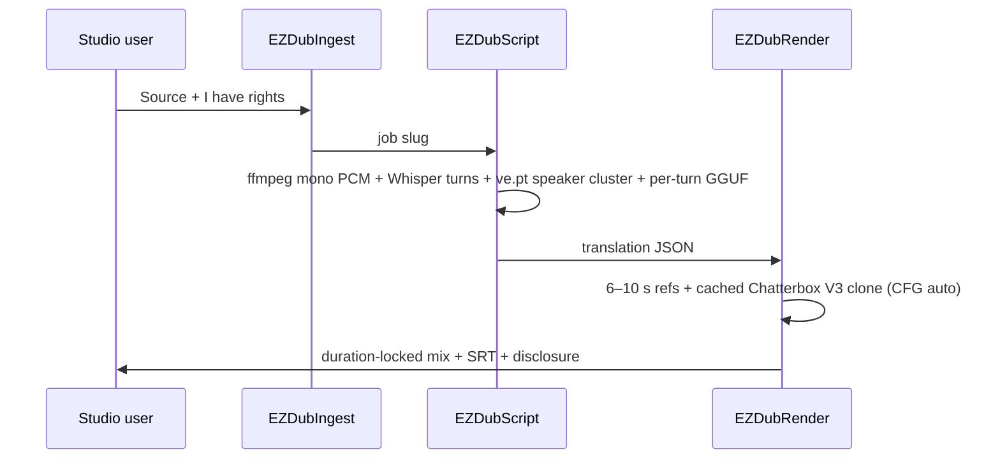

# Local dub

**What's on this page**

- Rights gate (required) vs the original-character podcast lane
- App Mode: source file dropdown + upload (or URL), languages, stage, clone engine, Clone CFG
- Cascade: ingest → ASR turns → speaker cluster (`ve.pt`) → translate → clone → pitch-preserving duration lock
- YouTube Studio multi-language audio upload (audio-only file + SRT)
- `download-dub` usage, sequential Queue, and loudnorm
- Optional still-image MP4 when you have no source video (host `audio-still-video`)

**What this enables**

- A second audio track in another language that keeps each speaker’s voice
- A duration-locked WAV/MP3 for YouTube Languages → Audio
- Source and translated SRT captions from the same turns

!!! warning "Not legal advice"

    Platform rules, copyright, and voice-likeness law change. Read the current YouTube, FTC, and USCO pages before you monetize. Do not clone people without consent.

!!! warning "Do not weaken"

    `restart: "no"`, type **yes** on start, headroom, and download-limit are unchanged. Occupancy is **audio** — stop Klein / Wan / LTX first.

## This is not the podcast lane

[Local podcast](podcast.md) invents hosts and uses Kokoro stock voices. This lane clones **recorded speakers** from a show you own or are licensed to translate. Different disclosure. Different App.

First spoken bumper (optional overlay, sidecar always written):

> This audio is an AI-translated dub. Voices are synthesized from the original speakers with the rights-holder's authorization.

## Rights

Queue **refuses** unless App **I have rights** is on. That widget defaults **off**.

Use this App when:

- You own the recording, or
- Every speaker consented, and you have a license to translate and redistribute

Do not paste celebrity reference WAVs. Refs are extracted from **this** job’s audio. URL ingest is for operator-owned or licensed URLs only. YouTube’s terms of service still apply to `yt-dlp`.

## Quality bar

Production-usable for podcasts with 2–6 speakers and mostly turn-taking. Clone quality levers: clean 6–10 s per-speaker refs (one take when possible), **Clone CFG** 0 on EN→ES (less English accent), pitch-preserving duration lock. Editable translation JSON is the other lever (Stage **analyze**, edit, Stage **render**).

Hard cases: heavy overlap, stadium noise, singing, very fast banter, on-camera lip sync. **No lip-sync OSS** (Wav2Lip stays banned). Mouths will not match on talking-head video.

## Engines

| Stage | Default | License | Download |
| --- | --- | --- | --- |
| ASR / turns | faster-whisper large-v3 segments (`vad_filter` when the wheel supports it) | MIT | `download-dub --tier asr` |
| Speakers | Chatterbox `VoiceEncoder` + `ve.pt` (same embedding the clone uses). Energy fingerprint if the wheel is missing | MIT | `download-dub --tier clone` |
| VAD helper | faster-whisper Silero filter; ONNX on disk is the download leftover | MIT | `download-dub --tier asr` |
| Translate | On-box Qwen3-4B-Instruct GGUF, **one turn at a time** (ISO source → target, temp 0.3, 120 s timeout). Needs `llama-cpp-python` CPU wheel | Apache 2.0 | GGUF already in `download-models`; wheel via CPU extra-index as `--index-url`, `download-dub`, or Queue self-heal |
| Clone | Chatterbox Multilingual V3 (cached `from_local` + ISO `language_id`, PerTh on). Cross-lang `cfg_weight` auto is 0. Lines over 300 characters split | MIT | `download-dub --tier clone` |
| Clone alt | Qwen3-TTS 0.6B Base (`generate_voice_clone` + the same per-speaker refs) | Apache 2.0 | `download-podcast --tier qwen3tts` |

`faster-whisper`, `chatterbox-tts`, and `llama-cpp-python` are fail-soft-baked in `phase-nodes.sh`. ASR and clone install **separately**: ASR first, then `setuptools<82` (PerTh / `pkg_resources`) and the Chatterbox GitHub zip (`CHATTERBOX_TTS_REF`, `--no-deps --force-reinstall`) so Chatterbox cannot pin `torch==2.6.0` over the lab 2.14 cu130 venv. PyPI `chatterbox-tts==0.1.7` has no `t3_model=v3`. setuptools 82+ leaves `perth.PerthImplicitWatermarker` as `None` — clone status names that miss (do not disable PerTh). llama-cpp-python uses the **official CPU extra-index as `--index-url`** (`--only-binary=:all:`, pin `0.3.35`, no CUDA extra-index) because PyPI is sdist-only and `--extra-index-url` alone can miss the aarch64 wheel. Direct GitHub manylinux wheel is the fallback (`--force-reinstall --no-deps`) when pip is already satisfied but `from llama_cpp import Llama` still fails. `download-dub` pip-installs ASR, the CPU wheel, the setuptools pin, and clone into a **running** container (volume venv Comfy execs). Restart heals PerTh when the watermarker is not callable. Queue also self-heals `llama-cpp-python` on first miss — no extra restart for the wheel. `yt-dlp` stays optional for URL ingest. The graph still loads if a wheel is missing; Queue writes an **empty mix** plus **Dub status** (never the original recording, never English cloned as the target). Missing llama.cpp / GGUF is **blocking** when Rewrite translation is on and source ≠ target — Queue does not run ASR or clone. On DGX Spark, CTranslate2 PyPI wheels are **CPU-only**; Whisper loads CPU int8 first.

Chatterbox languages: Arabic, Danish, German, Greek, English, Spanish, Finnish, French, Hebrew, Hindi, Italian, Japanese, Korean, Malay, Dutch, Norwegian, Polish, Portuguese, Russian, Swedish, Swahili, Turkish, Chinese. Soccer EN→ES is first-class.

Banned: F5-TTS, XTTS, Fish, Higgs, NLLB, SeamlessM4T, ElevenLabs, Wav2Lip, TTS-Audio-Suite.

## Download

Dub weights are **opt-in**. `./scripts/manage.sh download-models` does **not** pull them. `doctor` prints dub JSON and still exits 0 when the pack is absent.

```ezcmd
id: download-dub
```

```bash
./scripts/manage.sh download-dub --tier asr        # Silero VAD + faster-whisper large-v3
./scripts/manage.sh download-dub --tier clone      # Chatterbox Multilingual V3 (ve.pt + s3gen.pt + T3 V3 + conds.pt)
./scripts/manage.sh download-dub --tier all
# same --limit auto|N|off wrap as download-models (always clears on exit)
# with compose up: pip install faster-whisper, llama-cpp-python CPU wheel,
# setuptools<82 (PerTh), then Chatterbox V3 zip --no-deps
# (Queue also self-heals llama.cpp; restart heals PerTh)
```

URL ingest on the host (optional):

```bash
pip install yt-dlp
```

## App

Graph: **dub-localize-lab-example** (`extra.lab_profile` `us-safe-dub`). Occupancy **audio**.

| Widget | Role |
| --- | --- |
| **Source file** | Dropdown of wav/mp4/mkv/mp3 already in `${COMFY_OUTPUT_DIR}/input` (container `/inputs`). Default `(none)` |
| **Upload media** | Choose a local file; Comfy stores it in `input/` |
| **Source URL** | Optional http(s) you have rights to fetch. Overrides Source file when set |
| **I have rights** | Required. Off refuses Queue |
| **Job slug** | `${COMFY_OUTPUT_DIR}/dubs/<slug>/` |
| **Target language** | Default Spanish |
| **Source language** | `auto` or pin |
| **Rewrite translation** | On: ASR + speaker cluster + per-turn GGUF into `text_target`. Off: pin the JSON |
| **Dub status** | After Queue: speaker/turn counts + `translated N/M`, or the blocking miss (`faster-whisper not installed`, `clone pack missing`, `llama.cpp unavailable`, `GGUF missing`, `t3_model=v3`, `resemble-perth watermarker missing`) |
| **Stage** | `all` / `analyze` / `render` |
| **Clone engine** | chatterbox-ml or qwen3tts |
| **Keep original bed** | Gaps keep ambience |
| **Spoken disclosure** | 3 s overlay; sidecar always written |
| **Speaking speed** | 1.0 default. Pitch-preserving stretch when fitting the original window |
| **Clone CFG** | −1 auto: 0 when source ≠ target (EN→ES). 0.5 same-language. Raise toward 0.5 if you want more of the original accent |
| **Exaggeration** | 0.5 neutral. Higher is more intense and faster |

## Sequential Queue

1. `./scripts/manage.sh start` — type **yes**
2. `download-dub --tier asr` then `--tier clone` (clone is `ve.pt` + `s3gen.pt` + T3 V3 + tokenizer JSON + `conds.pt`, not t3-only). With the stack up this pip-installs faster-whisper, the llama-cpp-python **CPU wheel**, `setuptools<82`, then the Chatterbox V3 zip `--no-deps --force-reinstall`. Queue also self-heals a missing CPU wheel (no extra restart). Confirm: `docker exec ez-comfy-studio /comfy-state/ComfyUI/.venv/bin/python -c 'from llama_cpp import Llama'` and that `inspect.signature(ChatterboxMultilingualTTS.from_local)` includes `t3_model` and `callable(perth.PerthImplicitWatermarker)`.
3. Load **dub-localize-lab-example**. Pick **Source file** or **Upload media** (or set **Source URL**). Turn **I have rights** on. Queue once (Stage **all**, Rewrite translation **on**).
4. Ingest Dub status must be **`ok`**. If script JSON says `missing source.wav` / empty `turns`, ingest never wrote the wav — rights still off, source still `(none)`, or extract failed. Read ingest status first.
5. **Dub status** must list speaker/turn counts (and `translated N/M`), not `ASR pack missing` / `clone engine missing` / `llama.cpp unavailable` / `GGUF missing` / `t3_model=v3` / `resemble-perth watermarker missing`. The Translation JSON `text_target` fields must be the target language. A llama.cpp / GGUF miss **stops Queue** (empty mix, empty `text_target`) — it does not clone English as Spanish. `llama.cpp unavailable` with a `docker exec … pip install --force-reinstall` line means Llama still will not import (pip “already satisfied” is not enough) — run that command, then confirm `from llama_cpp import Llama`, then Queue again. Do not treat “restart” as the fix for llama.cpp. `resemble-perth watermarker missing` **does** need pip `'setuptools<82'` then a restart so perth reimports.
6. Files under `${COMFY_OUTPUT_DIR}` as `ez_dub_mix_*.flac` / `ez_dub_yt_*.mp3` plus `${COMFY_OUTPUT_DIR}/dubs/<slug>/ez_dub_yt.wav`
7. Loudness:

```bash
./scripts/utilities/podcast-loudnorm.sh run --in "${COMFY_OUTPUT_DIR}/dubs/episode/ez_dub_yt.wav" --target youtube
```

URL helper (host, writes `${COMFY_OUTPUT_DIR}/input`, survives `cleanup`):

```bash
./scripts/utilities/dub-fetch.sh run --url 'https://www.youtube.com/watch?v=YOUR_VIDEO'
```

Reload the App if it was already open, then pick that wav/mp4 in **Source file**.

## YouTube multi-language audio

Do **not** rely on muxing two AAC tracks into one MP4 as the YouTube path. Studio wants an **audio-only** file roughly the same length as the video.

1. Upload the original video as usual
2. YouTube Studio (desktop) → **Languages** (or Subtitles) → the video → **Add language**
3. Under Audio / Dub, upload `ez_dub_yt.wav` (or the loudnormed file)
4. Upload `ez_dub.es.srt` (or your target) as captions
5. Flip YouTube’s synthetic/altered-content toggle
6. If YouTube already auto-dubbed that language, delete the auto-dub first

MLA is rolling out; not every channel has it. Duration lock exists so Studio accepts the file.

Optional local mux (VLC/archive, not the documented YouTube upload) can use ffmpeg against `source_video.mp4` in the job dir.

When there is **no** source video and you want a still-image YouTube file (cover + dubbed audio), keep the graph as FLAC/MP3 and mux on the host:

```bash
./scripts/manage.sh audio-still-video \
  --audio "${COMFY_OUTPUT_DIR}/dubs/episode/ez_dub_yt.wav" \
  --image "${COMFY_OUTPUT_DIR}/ez_podcast_00001_.png"
```

Do not treat that MP4 as the YouTube Languages extra-audio path — Studio still wants the duration-locked WAV.

## What runs on Queue



Cover art is a **later** Klein session. Occupancy: do not load LTX + this together.

Start still requires typing `yes`. Compose `restart: "no"` is unchanged.
