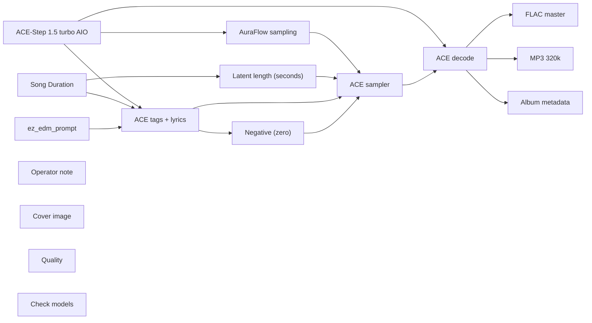

# audio/albums/drive-through/afterparty

**What's on this page**

- **Every track, cover, and album-pack graph** in this folder
- **Shared ACE-Step topology** (one printer, unique widgets per take)
- **Node parameter reference** for the types on these graphs

**What this enables**

- **Queuing one numbered take** or `album-render`
- **Reading tags, lyrics, seed, BPM** without opening raw JSON

**Who this is for:** studio users after `download-music`. Occupancy **audio** (cover stills are **klein** — separate session).

> Generated from `workflows/_lab/audio/albums/drive-through/afterparty/`. Do not hand-edit this file.

## Purpose

Numbered takes under `audio/albums/drive-through/afterparty/`. Queue one track, or `./scripts/manage.sh album-render --album drive-through/afterparty`.

```text
## 01-brake-fade

US-safe EDM **97 s** take: **brake fade**. Fictional act **Drive-through** (hardcore, pure of heart). Native ACE-Step 1.5 turbo AIO. Live bass-set take. Instrumental score is empty-body ACE markers (`[drop - cues]`, `[inst - cues]`, `[build-up]`, `[breakdown]`, `[outro]`) so ACE does not sing production notes. Form **drv-ef39bb90aa**. Short build, then the drop. Later stanzas switch layers. No section is a long loop. No brass and no high leads. Vocals are a rare DJ treat on other graphs, not here. Queue this graph **on its own** — draft-first is the generic rap lane, not a prerequisite. Occupancy **audio** only; a longer Queue is expected.

1. Weights: `./scripts/manage.sh download-music --tier turbo` (same AIO dest as `download-podcast --tier acestep`; ~10 GB, opt-in, not `download-models`).
2. Prompt enhance is **off** so tags, BPM, language, and `[drop]` / `[inst]` / `[outro]` stay as written. Turn Enhance on only if you want the 4B rewriter.
3. Tags vs score: tags are genre/instrument hints; lyrics are the arrangement. Keep App **Vocal / instrumental** on instrumental so ACE does not sing. Encoder language is `unknown`. Free-text lines under a marker are lyrics — keep cues inside the brackets.
4. Original arrangements only. No “in the style of <living artist>”. No living-DJ names. No famous-hook paraphrases.
5. ACE-Step timbre is **invented**, not a cloned act.
6. Sampler: 8 steps, cfg 1, euler, simple. Duration 97 s, bpm 168, language unknown, timesignature 4, key E minor, form drv-ef39bb90aa, generate_audio_codes true. Seed 457.
7. Saves: `01 - Brake Fade` FLAC master + 320 kbps MP3 under `${COMFY_OUTPUT_DIR}`.
8. Cover separately: Queue **stills/thumbnail.json** or **stills/podcast-cover.json**. Do not embed Klein here.
9. Human selection and edit before any release. Prompts are not authorship (USCO Part 2 / Thaler).
10. Do not co-resident with LTX / Wan / Klein on this Spark.

Occupancy: audio — stop Klein / Wan / LTX session. One GB10 job.
```

## Shared graph



## Graphs in this album

| Graph | Nodes | Occupancy |
| --- | --- | --- |
| `audio/albums/drive-through/afterparty/01-brake-fade` | 16 | audio |
| `audio/albums/drive-through/afterparty/02-diesel-hum` | 16 | audio |
| `audio/albums/drive-through/afterparty/03-axle-grind` | 16 | audio |
| `audio/albums/drive-through/afterparty/04-weigh-station` | 16 | audio |
| `audio/albums/drive-through/afterparty/05-black-ice` | 16 | audio |
| `audio/albums/drive-through/afterparty/06-high-beams` | 16 | audio |
| `audio/albums/drive-through/afterparty/07-chain-hook` | 16 | audio |
| `audio/albums/drive-through/afterparty/08-grit-plate` | 16 | audio |
| `audio/albums/drive-through/afterparty/09-steel-grate` | 16 | audio |
| `audio/albums/drive-through/afterparty/10-rest-bay` | 16 | audio |
| `audio/albums/drive-through/afterparty/11-haul-crate` | 16 | audio |
| `audio/albums/drive-through/afterparty/12-night-splice` | 16 | audio |
| `audio/albums/drive-through/afterparty/13-torque-bay` | 16 | audio |
| `audio/albums/drive-through/afterparty/14-spare-drum` | 16 | audio |
| `audio/albums/drive-through/afterparty/15-oil-pan` | 16 | audio |
| `audio/albums/drive-through/afterparty/16-curb-check` | 16 | audio |
| `audio/albums/drive-through/afterparty/17-last-exit` | 16 | audio |
| `audio/albums/drive-through/afterparty/18-asphalt-heart` | 16 | audio |
| `audio/albums/drive-through/afterparty/19-clutch-slam` | 16 | audio |
| `audio/albums/drive-through/afterparty/20-trailer-hitch` | 16 | audio |
| `audio/albums/drive-through/afterparty/album` | 4 | none |
| `audio/albums/drive-through/afterparty/cover` | 18 | klein |

## `01-brake-fade`

Catalog id `audio/albums/drive-through/afterparty/01-brake-fade`.

US-safe EDM take: Drive-through brake-fade dirty bass warp, ACE-Step 1.5 turbo AIO, instrumental, warped bass, invented timbre
Prompt enhance is **off** so authored text (recipe, script labels, ACE tags, or film shots) is encoded as written. Turn Enhance on only if you want the 4B rewriter.

**ACE-Step 1.5 turbo AIO** (`CheckpointLoaderSimple`)

| Slot | Value |
| --- | --- |
| 0 | `ace_step_1.5_turbo_aio.safetensors` |

**AuraFlow sampling** (`ModelSamplingAuraFlow`)

| Slot | Value |
| --- | --- |
| 0 | `3` |

**Song Duration** (`PrimitiveNode`)

| Slot | Value |
| --- | --- |
| 0 | `97.0` |
| 1 | `fixed` |

**Latent length (seconds)** (`EmptyAceStep1.5LatentAudio`)

| Slot | Value |
| --- | --- |
| 0 | `97.0` |
| 1 | `1` |

**ez_edm_prompt** (`EZAceStepPromptEnhance`)

| Slot | Value |
| --- | --- |
| 0 | `custom` |
| 1 | `dirty bass, warped bass, chest-sub, rapid hi-hats, trap drums, stacked 808, 808…` |
| 2 | `[build-up - bitcrushed 808, wide 3D bass field, kick tightens, accelerating hat…` |
| 3 | `false` |
| 4 | `instrumental` |
| 5 | `audio/albums/drive-through/afterparty/01-brake-fade` |

```text
dirty bass, warped bass, chest-sub, rapid hi-hats, trap drums, stacked 808, 808, original composition, heavy chest bass, bass boosted, wide low-mid layers, fast switch-ups, deep 3D spatial low-mid, stacked 808 layers, electric warp texture, wavy FM layers, drop first, 168 bpm, instrumental, no vocals
```

```text
[build-up - bitcrushed 808, wide 3D bass field, kick tightens, accelerating hats, rolling hats, chest-sub 808 warp, 2 bars]

[drop - octave sub pulse, bass circles the low-mid, panning bass layer, full send warped drop, double-time feel, body bass, chest-sub melody, rapid hi-hats, late snare, dirty bass, heavy dirty drop, 2 bars]

[build-up - FM warp sub, bass pans wide behind, kick tightens, rising energy, early kick, brake wreck, 2 bars]

[inst - neuro wobble sub, layers surround the ear, kick pattern flip, syncopated hats, rapid hi-hats roll, 2 bars]

[drop - phase-distorted sub, 3D low-mid orbit, wide stereo layer, heavy warped drop, double-time feel, octave sub stack, low reese counterline, offbeat hats, open hat, 808 slide, 2 bars]

[inst - chest-sub, low-mid orbits the sub, ghost snare, closed hat, stacked 808 wall, 2 bars]

[drop - wavy phase sub, sub anchored, mids orbit, panning bass layer, full send reese drop, double-time feel, octave sub stack, low wobble answer, acid squelch line, rapid hi-hats, room snare, harder warped drop, 2 bars]

[build-up - bitcrushed 808, panning low-mid sweep, kick tightens, tempo push, tight kick, chest-sub grind, 2 bars]

[inst - octave sub pulse, sub center, low-mid moves wide, kick only on downbeats, 2 bars]

[drop - FM warp sub, low-mid from every angle, wide stereo layer, heavy reese drop, body bass, wavy low-mid line, distorted sub figure, offbeat hats, pushed snare, kick tightens, 2 bars]

[build-up - neuro wobble sub, wide 3D bass field, sparse four-on-floor kick, 2 bars]

[drop - phase-distorted sub, bass circles the low-mid, panning bass layer, full send wobble drop, double-time feel, body bass, body bass answer, wobble FM voice, rapid hi-hats, hat density up, chest-sub 808 punch, 2 bars]

[build-up - chest-sub, bass pans wide behind, kick tightens, accelerating hats, octave sub stack, kick opens, low rumble wreck, 2 bars]

[inst - wavy phase sub, layers surround the ear, downbeat sub pulse, 2 bars]

[drop - bitcrushed 808, 3D low-mid orbit, wide stereo layer, heavy wobble drop, double-time feel, octave sub stack, low-mid bass melody, acid squelch line, offbeat hats, snare answers, full send drop, 2 bars]

[build-up - octave sub pulse, low-mid orbits the sub, kick tightens, accelerating hats, body bass, offbeat push, warped dirty, 2 bars]

[drop - FM warp sub, sub anchored, mids orbit, panning bass layer, full send warped drop, double-time feel, octave sub stack, low reese counterline, square-wave pulse figure, rapid hi-hats, straight hats, kick holds, 2 bars]

[build-up - neuro wobble sub, panning low-mid sweep, kick tightens, rising energy, body bass, body bass answer, distorted sub figure, triplet hats, 808 ride, 2 bars]

[drop - phase-distorted sub, sub center, low-mid moves wide, parallel low-mid layer, stacked reese drop, octave sub stack, low wobble answer, granular bass figure, kick pattern flip, backbeat shove, 2 bars]

[inst - chest-sub, low-mid from every angle, downbeat kick, 2 bars]

[build-up - wavy phase sub, wide 3D bass field, kick tightens, rising energy, octave sub stack, low-mid bass melody, phase-wavy synth line, dry hats, 2 bars]

[drop - bitcrushed 808, bass circles the low-mid, panning bass layer, full send reese drop, body bass, wavy low-mid line, warped FM lead, rapid hi-hats, wide hat bed, 2 bars]

[inst - octave sub pulse, bass pans wide behind, sparse four-on-floor kick, 2 bars]

[drop - FM warp sub, layers surround the ear, parallel low-mid layer, stacked wobble drop, body bass, body bass answer, neuro wobble lead, kick pattern flip, side snare, 2 bars]

[inst - neuro wobble sub, 3D low-mid orbit, wide stereo layer, octave sub stack, low wobble answer, square-wave pulse figure, offbeat hats, rolling hats, 2 bars]

[drop - phase-distorted sub, low-mid orbits the sub, octave 808 stack, harder warped drop, double-time feel, body bass, chest-sub melody, distorted sub figure, ghost snare, late snare, 2 bars]

[inst - chest-sub, sub anchored, mids orbit, panning bass layer, octave sub stack, low-mid bass melody, granular bass figure, rapid hi-hats, early kick, 2 bars]

[drop - wavy phase sub, panning low-mid sweep, layered sub stack, wreck reese drop, double-time feel, body bass, wavy low-mid line, wobble FM voice, trap drums denser, syncopated hats, 2 bars]

[build-up - bitcrushed 808, sub center, low-mid moves wide, kick tightens, tempo push, parallel low-mid layer, octave sub stack, low reese counterline, phase-wavy synth line, open hat, 2 bars]

[inst - octave sub pulse, low-mid from every angle, downbeat sub pulse, 2 bars]

[drop - FM warp sub, wide 3D bass field, octave 808 stack, harder reese drop, double-time feel, octave sub stack, low wobble answer, acid squelch line, ghost snare, room snare, 2 bars]

[build-up - neuro wobble sub, bass circles the low-mid, downbeat kick, 2 bars]

[inst - phase-distorted sub, bass pans wide behind, layered sub stack, octave sub stack, low-mid bass melody, square-wave pulse figure, trap drums denser, loose hats, 2 bars]

[outro - FM warp sub, panning low-mid sweep, kick pattern flip, rapid hi-hats, body bass, chest-sub melody, tight kick, 2 bars]
```

**ACE tags + lyrics** (`TextEncodeAceStepAudio1.5`)

| Slot | Value |
| --- | --- |
| 0 | `dirty bass, warped bass, chest-sub, rapid hi-hats, trap drums, stacked 808, 808…` |
| 1 | `[build-up - bitcrushed 808, wide 3D bass field, kick tightens, accelerating hat…` |
| 2 | `457` |
| 3 | `fixed` |
| 4 | `168` |
| 5 | `97.0` |
| 6 | `4` |
| 7 | `unknown` |
| 8 | `E minor` |
| 9 | `true` |
| 10 | `2.0` |
| 11 | `0.85` |
| 12 | `0.9` |
| 13 | `0` |
| 14 | `0.0` |

```text
dirty bass, warped bass, chest-sub, rapid hi-hats, trap drums, stacked 808, 808, original composition, heavy chest bass, bass boosted, wide low-mid layers, fast switch-ups, deep 3D spatial low-mid, stacked 808 layers, electric warp texture, wavy FM layers, drop first, 168 bpm, instrumental, no vocals
```

```text
[build-up - bitcrushed 808, wide 3D bass field, kick tightens, accelerating hats, rolling hats, chest-sub 808 warp, 2 bars]

[drop - octave sub pulse, bass circles the low-mid, panning bass layer, full send warped drop, double-time feel, body bass, chest-sub melody, rapid hi-hats, late snare, dirty bass, heavy dirty drop, 2 bars]

[build-up - FM warp sub, bass pans wide behind, kick tightens, rising energy, early kick, brake wreck, 2 bars]

[inst - neuro wobble sub, layers surround the ear, kick pattern flip, syncopated hats, rapid hi-hats roll, 2 bars]

[drop - phase-distorted sub, 3D low-mid orbit, wide stereo layer, heavy warped drop, double-time feel, octave sub stack, low reese counterline, offbeat hats, open hat, 808 slide, 2 bars]

[inst - chest-sub, low-mid orbits the sub, ghost snare, closed hat, stacked 808 wall, 2 bars]

[drop - wavy phase sub, sub anchored, mids orbit, panning bass layer, full send reese drop, double-time feel, octave sub stack, low wobble answer, acid squelch line, rapid hi-hats, room snare, harder warped drop, 2 bars]

[build-up - bitcrushed 808, panning low-mid sweep, kick tightens, tempo push, tight kick, chest-sub grind, 2 bars]

[inst - octave sub pulse, sub center, low-mid moves wide, kick only on downbeats, 2 bars]

[drop - FM warp sub, low-mid from every angle, wide stereo layer, heavy reese drop, body bass, wavy low-mid line, distorted sub figure, offbeat hats, pushed snare, kick tightens, 2 bars]

[build-up - neuro wobble sub, wide 3D bass field, sparse four-on-floor kick, 2 bars]

[drop - phase-distorted sub, bass circles the low-mid, panning bass layer, full send wobble drop, double-time feel, body bass, body bass answer, wobble FM voice, rapid hi-hats, hat density up, chest-sub 808 punch, 2 bars]

[build-up - chest-sub, bass pans wide behind, kick tightens, accelerating hats, octave sub stack, kick opens, low rumble wreck, 2 bars]

[inst - wavy phase sub, layers surround the ear, downbeat sub pulse, 2 bars]

[drop - bitcrushed 808, 3D low-mid orbit, wide stereo layer, heavy wobble drop, double-time feel, octave sub stack, low-mid bass melody, acid squelch line, offbeat hats, snare answers, full send drop, 2 bars]

[build-up - octave sub pulse, low-mid orbits the sub, kick tightens, accelerating hats, body bass, offbeat push, warped dirty, 2 bars]

[drop - FM warp sub, sub anchored, mids orbit, panning bass layer, full send warped drop, double-time feel, octave sub stack, low reese counterline, square-wave pulse figure, rapid hi-hats, straight hats, kick holds, 2 bars]

[build-up - neuro wobble sub, panning low-mid sweep, kick tightens, rising energy, body bass, body bass answer, distorted sub figure, triplet hats, 808 ride, 2 bars]

[drop - phase-distorted sub, sub center, low-mid moves wide, parallel low-mid layer, stacked reese drop, octave sub stack, low wobble answer, granular bass figure, kick pattern flip, backbeat shove, 2 bars]

[inst - chest-sub, low-mid from every angle, downbeat kick, 2 bars]

[build-up - wavy phase sub, wide 3D bass field, kick tightens, rising energy, octave sub stack, low-mid bass melody, phase-wavy synth line, dry hats, 2 bars]

[drop - bitcrushed 808, bass circles the low-mid, panning bass layer, full send reese drop, body bass, wavy low-mid line, warped FM lead, rapid hi-hats, wide hat bed, 2 bars]

[inst - octave sub pulse, bass pans wide behind, sparse four-on-floor kick, 2 bars]

[drop - FM warp sub, layers surround the ear, parallel low-mid layer, stacked wobble drop, body bass, body bass answer, neuro wobble lead, kick pattern flip, side snare, 2 bars]

[inst - neuro wobble sub, 3D low-mid orbit, wide stereo layer, octave sub stack, low wobble answer, square-wave pulse figure, offbeat hats, rolling hats, 2 bars]

[drop - phase-distorted sub, low-mid orbits the sub, octave 808 stack, harder warped drop, double-time feel, body bass, chest-sub melody, distorted sub figure, ghost snare, late snare, 2 bars]

[inst - chest-sub, sub anchored, mids orbit, panning bass layer, octave sub stack, low-mid bass melody, granular bass figure, rapid hi-hats, early kick, 2 bars]

[drop - wavy phase sub, panning low-mid sweep, layered sub stack, wreck reese drop, double-time feel, body bass, wavy low-mid line, wobble FM voice, trap drums denser, syncopated hats, 2 bars]

[build-up - bitcrushed 808, sub center, low-mid moves wide, kick tightens, tempo push, parallel low-mid layer, octave sub stack, low reese counterline, phase-wavy synth line, open hat, 2 bars]

[inst - octave sub pulse, low-mid from every angle, downbeat sub pulse, 2 bars]

[drop - FM warp sub, wide 3D bass field, octave 808 stack, harder reese drop, double-time feel, octave sub stack, low wobble answer, acid squelch line, ghost snare, room snare, 2 bars]

[build-up - neuro wobble sub, bass circles the low-mid, downbeat kick, 2 bars]

[inst - phase-distorted sub, bass pans wide behind, layered sub stack, octave sub stack, low-mid bass melody, square-wave pulse figure, trap drums denser, loose hats, 2 bars]

[outro - FM warp sub, panning low-mid sweep, kick pattern flip, rapid hi-hats, body bass, chest-sub melody, tight kick, 2 bars]
```

**ACE sampler** (`KSampler`)

| Slot | Value |
| --- | --- |
| 0 | `457` |
| 1 | `fixed` |
| 2 | `8` |
| 3 | `1.0` |
| 4 | `euler` |
| 5 | `simple` |
| 6 | `1.0` |

**FLAC master** (`SaveAudio`)

| Slot | Value |
| --- | --- |
| 0 | `01 - Brake Fade` |

**MP3 320k** (`SaveAudioMP3`)

| Slot | Value |
| --- | --- |
| 0 | `01 - Brake Fade` |
| 1 | `320k` |

**Cover image** (`LoadImage`)

| Slot | Value |
| --- | --- |
| 0 | `cover.png` |
| 1 | `image` |

**Album metadata** (`EZAudioMetadata`)

| Slot | Value |
| --- | --- |
| 0 | `Drive-through` |
| 1 | `Afterparty` |
| 2 | `Brake Fade` |
| 3 | `1` |
| 4 | `20` |
| 5 | `2026` |
| 6 | `skip` |
| 7 | `01 - Brake Fade` |

**Quality** (`EZQuality`)

| Slot | Value |
| --- | --- |
| 0 | `lab` |

**Check models** (`EZModelCheck`)

| Slot | Value |
| --- | --- |
| 0 | `Click Check models. Queue does not run this node.` |

## `02-diesel-hum`

Catalog id `audio/albums/drive-through/afterparty/02-diesel-hum`.

US-safe EDM take: Drive-through diesel-hum hybrid trap warp, ACE-Step 1.5 turbo AIO, instrumental, warped bass, invented timbre
Prompt enhance is **off** so authored text (recipe, script labels, ACE tags, or film shots) is encoded as written. Turn Enhance on only if you want the 4B rewriter.

**ACE-Step 1.5 turbo AIO** (`CheckpointLoaderSimple`)

| Slot | Value |
| --- | --- |
| 0 | `ace_step_1.5_turbo_aio.safetensors` |

**AuraFlow sampling** (`ModelSamplingAuraFlow`)

| Slot | Value |
| --- | --- |
| 0 | `3` |

**Song Duration** (`PrimitiveNode`)

| Slot | Value |
| --- | --- |
| 0 | `104.0` |
| 1 | `fixed` |

**Latent length (seconds)** (`EmptyAceStep1.5LatentAudio`)

| Slot | Value |
| --- | --- |
| 0 | `104.0` |
| 1 | `1` |

**ez_edm_prompt** (`EZAceStepPromptEnhance`)

| Slot | Value |
| --- | --- |
| 0 | `custom` |
| 1 | `warped hybrid-trap, trap drums, rapid hi-hats, dual-action pedal bass, chest-su…` |
| 2 | `[build-up - wavy phase sub, bass circles the low-mid, kick tightens, tempo push…` |
| 3 | `false` |
| 4 | `instrumental` |
| 5 | `audio/albums/drive-through/afterparty/02-diesel-hum` |

```text
warped hybrid-trap, trap drums, rapid hi-hats, dual-action pedal bass, chest-sub, 808, warped bass, original composition, heavy chest bass, bass boosted, wide low-mid layers, fast switch-ups, deep 3D spatial low-mid, stacked 808 layers, electric warp texture, wavy FM layers, drop first, 170 bpm, instrumental, no vocals
```

```text
[build-up - wavy phase sub, bass circles the low-mid, kick tightens, tempo push, ghost notes, dual-action pedal bass, 2 bars]

[drop - bitcrushed 808, bass pans wide behind, panning bass layer, wreck warped drop, double-time feel, low chest-sub, low wobble answer, ghost snare, dry hats, warped hybrid-trap, dual-action pedal bass, heavy warped drop, 2 bars]

[breakdown - phase-distorted sub, sub anchored, mids orbit, rapid hi-hats, tempo dip, octave 808 stack, low chest-sub, low-mid bass melody, open hat, 2 bars]

[drop - FM warp sub, 3D low-mid orbit, parallel low-mid layer, heavy reese drop, double-time feel, low chest-sub, low-mid bass melody, trap drums denser, mono kick, pedal 808 hold, 2 bars]

[inst - neuro wobble sub, low-mid orbits the sub, downbeat sub pulse, 2 bars]

[drop - phase-distorted sub, sub anchored, mids orbit, octave 808 stack, full send wobble drop, low chest-sub, low reese counterline, offbeat hats, rolling hats, rapid hi-hats roll, 2 bars]

[build-up - chest-sub, panning low-mid sweep, kick tightens, tempo push, late snare, stacked 808 wall, 2 bars]

[inst - wavy phase sub, sub center, low-mid moves wide, rapid hi-hats, early kick, hybrid chest-sub, 2 bars]

[drop - bitcrushed 808, low-mid from every angle, parallel low-mid layer, heavy wobble drop, double-time feel, mono chest-sub, chest-sub melody, trap drums denser, syncopated hats, harder warped drop, 2 bars]

[build-up - octave sub pulse, wide 3D bass field, kick tightens, tempo push, low chest-sub, open hat, chest-sub wreck, 2 bars]

[inst - FM warp sub, bass circles the low-mid, mono chest-sub, offbeat hats, closed hat, pedal warp, 2 bars]

[build-up - neuro wobble sub, bass pans wide behind, kick tightens, accelerating hats, low chest-sub, room snare, kick holds, 2 bars]

[drop - phase-distorted sub, layers surround the ear, layered sub stack, stacked reese drop, double-time feel, mono chest-sub, body bass answer, phase-wavy synth line, rapid hi-hats, tight kick, full send drop, 2 bars]

[build-up - chest-sub, 3D low-mid orbit, kick tightens, rising energy, low chest-sub, loose hats, hats denser, 2 bars]

[drop - wavy phase sub, low-mid orbits the sub, wide stereo layer, harder wobble drop, double-time feel, mono chest-sub, chest-sub melody, acid squelch line, kick pattern flip, pushed snare, pedal ride, 2 bars]

[inst - bitcrushed 808, sub anchored, mids orbit, kick only on downbeats, 2 bars]

[drop - octave sub pulse, panning low-mid sweep, panning bass layer, wreck warped drop, double-time feel, mono chest-sub, wavy low-mid line, square-wave pulse figure, ghost snare, hat density up, 2 bars]

[inst - FM warp sub, sub center, low-mid moves wide, low chest-sub, rapid hi-hats, kick opens, 2 bars]

[build-up - neuro wobble sub, low-mid from every angle, kick tightens, tempo push, mono chest-sub, body bass answer, granular bass figure, kick tightens, 2 bars]

[drop - phase-distorted sub, wide 3D bass field, wide stereo layer, harder warped drop, double-time feel, low chest-sub, low wobble answer, wobble FM voice, kick pattern flip, snare answers, 2 bars]

[build-up - chest-sub, bass circles the low-mid, kick tightens, accelerating hats, mono chest-sub, chest-sub melody, phase-wavy synth line, offbeat push, 2 bars]

[inst - wavy phase sub, bass pans wide behind, low chest-sub, low-mid bass melody, warped FM lead, ghost snare, straight hats, 2 bars]

[drop - bitcrushed 808, layers surround the ear, layered sub stack, stacked warped drop, double-time feel, mono chest-sub, wavy low-mid line, acid squelch line, rapid hi-hats, triplet hats, 2 bars]

[build-up - octave sub pulse, 3D low-mid orbit, kick tightens, accelerating hats, low chest-sub, low reese counterline, backbeat shove, 2 bars]

[inst - FM warp sub, low-mid orbits the sub, mono chest-sub, body bass answer, kick pattern flip, ghost notes, 2 bars]

[drop - neuro wobble sub, sub anchored, mids orbit, octave 808 stack, full send warped drop, double-time feel, low chest-sub, low wobble answer, distorted sub figure, offbeat hats, dry hats, 2 bars]

[build-up - phase-distorted sub, panning low-mid sweep, kick tightens, accelerating hats, panning bass layer, mono chest-sub, chest-sub melody, granular bass figure, wide hat bed, 2 bars]

[drop - chest-sub, sub center, low-mid moves wide, layered sub stack, stacked reese drop, double-time feel, low chest-sub, low-mid bass melody, rapid hi-hats, mono kick, 2 bars]

[build-up - wavy phase sub, low-mid from every angle, kick tightens, rising energy, parallel low-mid layer, mono chest-sub, wavy low-mid line, phase-wavy synth line, side snare, 2 bars]

[drop - bitcrushed 808, wide 3D bass field, wide stereo layer, harder wobble drop, low chest-sub, low reese counterline, warped FM lead, kick pattern flip, rolling hats, 2 bars]

[inst - octave sub pulse, bass circles the low-mid, downbeat kick, 2 bars]

[drop - wavy phase sub, low-mid from every angle, layered sub stack, harder wobble drop, double-time feel, body bass, body bass answer, acid squelch line, kick pattern flip, syncopated hats, 2 bars]

[inst - neuro wobble sub, layers surround the ear, layered sub stack, mono chest-sub, chest-sub melody, square-wave pulse figure, rapid hi-hats, syncopated hats, 2 bars]

[drop - octave sub pulse, bass circles the low-mid, wide stereo layer, wreck warped drop, double-time feel, body bass, chest-sub melody, square-wave pulse figure, ghost snare, closed hat, 2 bars]

[build-up - chest-sub, low-mid orbits the sub, kick tightens, rising energy, wide stereo layer, mono chest-sub, wavy low-mid line, granular bass figure, closed hat, 2 bars]

[inst - wavy phase sub, sub anchored, mids orbit, octave 808 stack, low chest-sub, low reese counterline, wobble FM voice, offbeat hats, room snare, 2 bars]

[outro - neuro wobble sub, layers surround the ear, kick pattern flip, rapid hi-hats, mono chest-sub, wavy low-mid line, closed hat, 2 bars]
```

**ACE tags + lyrics** (`TextEncodeAceStepAudio1.5`)

| Slot | Value |
| --- | --- |
| 0 | `warped hybrid-trap, trap drums, rapid hi-hats, dual-action pedal bass, chest-su…` |
| 1 | `[build-up - wavy phase sub, bass circles the low-mid, kick tightens, tempo push…` |
| 2 | `461` |
| 3 | `fixed` |
| 4 | `170` |
| 5 | `104.0` |
| 6 | `4` |
| 7 | `unknown` |
| 8 | `G major` |
| 9 | `true` |
| 10 | `2.0` |
| 11 | `0.85` |
| 12 | `0.9` |
| 13 | `0` |
| 14 | `0.0` |

```text
warped hybrid-trap, trap drums, rapid hi-hats, dual-action pedal bass, chest-sub, 808, warped bass, original composition, heavy chest bass, bass boosted, wide low-mid layers, fast switch-ups, deep 3D spatial low-mid, stacked 808 layers, electric warp texture, wavy FM layers, drop first, 170 bpm, instrumental, no vocals
```

```text
[build-up - wavy phase sub, bass circles the low-mid, kick tightens, tempo push, ghost notes, dual-action pedal bass, 2 bars]

[drop - bitcrushed 808, bass pans wide behind, panning bass layer, wreck warped drop, double-time feel, low chest-sub, low wobble answer, ghost snare, dry hats, warped hybrid-trap, dual-action pedal bass, heavy warped drop, 2 bars]

[breakdown - phase-distorted sub, sub anchored, mids orbit, rapid hi-hats, tempo dip, octave 808 stack, low chest-sub, low-mid bass melody, open hat, 2 bars]

[drop - FM warp sub, 3D low-mid orbit, parallel low-mid layer, heavy reese drop, double-time feel, low chest-sub, low-mid bass melody, trap drums denser, mono kick, pedal 808 hold, 2 bars]

[inst - neuro wobble sub, low-mid orbits the sub, downbeat sub pulse, 2 bars]

[drop - phase-distorted sub, sub anchored, mids orbit, octave 808 stack, full send wobble drop, low chest-sub, low reese counterline, offbeat hats, rolling hats, rapid hi-hats roll, 2 bars]

[build-up - chest-sub, panning low-mid sweep, kick tightens, tempo push, late snare, stacked 808 wall, 2 bars]

[inst - wavy phase sub, sub center, low-mid moves wide, rapid hi-hats, early kick, hybrid chest-sub, 2 bars]

[drop - bitcrushed 808, low-mid from every angle, parallel low-mid layer, heavy wobble drop, double-time feel, mono chest-sub, chest-sub melody, trap drums denser, syncopated hats, harder warped drop, 2 bars]

[build-up - octave sub pulse, wide 3D bass field, kick tightens, tempo push, low chest-sub, open hat, chest-sub wreck, 2 bars]

[inst - FM warp sub, bass circles the low-mid, mono chest-sub, offbeat hats, closed hat, pedal warp, 2 bars]

[build-up - neuro wobble sub, bass pans wide behind, kick tightens, accelerating hats, low chest-sub, room snare, kick holds, 2 bars]

[drop - phase-distorted sub, layers surround the ear, layered sub stack, stacked reese drop, double-time feel, mono chest-sub, body bass answer, phase-wavy synth line, rapid hi-hats, tight kick, full send drop, 2 bars]

[build-up - chest-sub, 3D low-mid orbit, kick tightens, rising energy, low chest-sub, loose hats, hats denser, 2 bars]

[drop - wavy phase sub, low-mid orbits the sub, wide stereo layer, harder wobble drop, double-time feel, mono chest-sub, chest-sub melody, acid squelch line, kick pattern flip, pushed snare, pedal ride, 2 bars]

[inst - bitcrushed 808, sub anchored, mids orbit, kick only on downbeats, 2 bars]

[drop - octave sub pulse, panning low-mid sweep, panning bass layer, wreck warped drop, double-time feel, mono chest-sub, wavy low-mid line, square-wave pulse figure, ghost snare, hat density up, 2 bars]

[inst - FM warp sub, sub center, low-mid moves wide, low chest-sub, rapid hi-hats, kick opens, 2 bars]

[build-up - neuro wobble sub, low-mid from every angle, kick tightens, tempo push, mono chest-sub, body bass answer, granular bass figure, kick tightens, 2 bars]

[drop - phase-distorted sub, wide 3D bass field, wide stereo layer, harder warped drop, double-time feel, low chest-sub, low wobble answer, wobble FM voice, kick pattern flip, snare answers, 2 bars]

[build-up - chest-sub, bass circles the low-mid, kick tightens, accelerating hats, mono chest-sub, chest-sub melody, phase-wavy synth line, offbeat push, 2 bars]

[inst - wavy phase sub, bass pans wide behind, low chest-sub, low-mid bass melody, warped FM lead, ghost snare, straight hats, 2 bars]

[drop - bitcrushed 808, layers surround the ear, layered sub stack, stacked warped drop, double-time feel, mono chest-sub, wavy low-mid line, acid squelch line, rapid hi-hats, triplet hats, 2 bars]

[build-up - octave sub pulse, 3D low-mid orbit, kick tightens, accelerating hats, low chest-sub, low reese counterline, backbeat shove, 2 bars]

[inst - FM warp sub, low-mid orbits the sub, mono chest-sub, body bass answer, kick pattern flip, ghost notes, 2 bars]

[drop - neuro wobble sub, sub anchored, mids orbit, octave 808 stack, full send warped drop, double-time feel, low chest-sub, low wobble answer, distorted sub figure, offbeat hats, dry hats, 2 bars]

[build-up - phase-distorted sub, panning low-mid sweep, kick tightens, accelerating hats, panning bass layer, mono chest-sub, chest-sub melody, granular bass figure, wide hat bed, 2 bars]

[drop - chest-sub, sub center, low-mid moves wide, layered sub stack, stacked reese drop, double-time feel, low chest-sub, low-mid bass melody, rapid hi-hats, mono kick, 2 bars]

[build-up - wavy phase sub, low-mid from every angle, kick tightens, rising energy, parallel low-mid layer, mono chest-sub, wavy low-mid line, phase-wavy synth line, side snare, 2 bars]

[drop - bitcrushed 808, wide 3D bass field, wide stereo layer, harder wobble drop, low chest-sub, low reese counterline, warped FM lead, kick pattern flip, rolling hats, 2 bars]

[inst - octave sub pulse, bass circles the low-mid, downbeat kick, 2 bars]

[drop - wavy phase sub, low-mid from every angle, layered sub stack, harder wobble drop, double-time feel, body bass, body bass answer, acid squelch line, kick pattern flip, syncopated hats, 2 bars]

[inst - neuro wobble sub, layers surround the ear, layered sub stack, mono chest-sub, chest-sub melody, square-wave pulse figure, rapid hi-hats, syncopated hats, 2 bars]

[drop - octave sub pulse, bass circles the low-mid, wide stereo layer, wreck warped drop, double-time feel, body bass, chest-sub melody, square-wave pulse figure, ghost snare, closed hat, 2 bars]

[build-up - chest-sub, low-mid orbits the sub, kick tightens, rising energy, wide stereo layer, mono chest-sub, wavy low-mid line, granular bass figure, closed hat, 2 bars]

[inst - wavy phase sub, sub anchored, mids orbit, octave 808 stack, low chest-sub, low reese counterline, wobble FM voice, offbeat hats, room snare, 2 bars]

[outro - neuro wobble sub, layers surround the ear, kick pattern flip, rapid hi-hats, mono chest-sub, wavy low-mid line, closed hat, 2 bars]
```

**ACE sampler** (`KSampler`)

| Slot | Value |
| --- | --- |
| 0 | `461` |
| 1 | `fixed` |
| 2 | `8` |
| 3 | `1.0` |
| 4 | `euler` |
| 5 | `simple` |
| 6 | `1.0` |

**FLAC master** (`SaveAudio`)

| Slot | Value |
| --- | --- |
| 0 | `02 - Diesel Hum` |

**MP3 320k** (`SaveAudioMP3`)

| Slot | Value |
| --- | --- |
| 0 | `02 - Diesel Hum` |
| 1 | `320k` |

**Cover image** (`LoadImage`)

| Slot | Value |
| --- | --- |
| 0 | `cover.png` |
| 1 | `image` |

**Album metadata** (`EZAudioMetadata`)

| Slot | Value |
| --- | --- |
| 0 | `Drive-through` |
| 1 | `Afterparty` |
| 2 | `Diesel Hum` |
| 3 | `2` |
| 4 | `20` |
| 5 | `2026` |
| 6 | `skip` |
| 7 | `02 - Diesel Hum` |

**Quality** (`EZQuality`)

| Slot | Value |
| --- | --- |
| 0 | `lab` |

**Check models** (`EZModelCheck`)

| Slot | Value |
| --- | --- |
| 0 | `Click Check models. Queue does not run this node.` |

## `03-axle-grind`

Catalog id `audio/albums/drive-through/afterparty/03-axle-grind`.

US-safe EDM take: Drive-through axle-grind tearout warp, ACE-Step 1.5 turbo AIO, instrumental, warped bass, invented timbre
Prompt enhance is **off** so authored text (recipe, script labels, ACE tags, or film shots) is encoded as written. Turn Enhance on only if you want the 4B rewriter.

**ACE-Step 1.5 turbo AIO** (`CheckpointLoaderSimple`)

| Slot | Value |
| --- | --- |
| 0 | `ace_step_1.5_turbo_aio.safetensors` |

**AuraFlow sampling** (`ModelSamplingAuraFlow`)

| Slot | Value |
| --- | --- |
| 0 | `3` |

**Song Duration** (`PrimitiveNode`)

| Slot | Value |
| --- | --- |
| 0 | `110.0` |
| 1 | `fixed` |

**Latent length (seconds)** (`EmptyAceStep1.5LatentAudio`)

| Slot | Value |
| --- | --- |
| 0 | `110.0` |
| 1 | `1` |

**ez_edm_prompt** (`EZAceStepPromptEnhance`)

| Slot | Value |
| --- | --- |
| 0 | `custom` |
| 1 | `tearout, warped bass, chest-sub, rapid hi-hats, trap drums, growl bass, 808, or…` |
| 2 | `[build-up - wavy phase sub, sub center, low-mid moves wide, kick tightens, temp…` |
| 3 | `false` |
| 4 | `instrumental` |
| 5 | `audio/albums/drive-through/afterparty/03-axle-grind` |

```text
tearout, warped bass, chest-sub, rapid hi-hats, trap drums, growl bass, 808, original composition, heavy chest bass, bass boosted, wide low-mid layers, fast switch-ups, deep 3D spatial low-mid, stacked 808 layers, electric warp texture, wavy FM layers, drop first, 170 bpm, instrumental, no vocals
```

```text
[build-up - wavy phase sub, sub center, low-mid moves wide, kick tightens, tempo push, room snare, growl wreck, 2 bars]

[drop - bitcrushed 808, low-mid from every angle, parallel low-mid layer, heavy wobble drop, stacked 808, chest-sub melody, granular bass figure, trap drums denser, tight kick, tearout, heavy tearout drop, 2 bars]

[build-up - octave sub pulse, wide 3D bass field, kick only on downbeats, 2 bars]

[drop - FM warp sub, bass circles the low-mid, octave 808 stack, full send warped drop, double-time feel, stacked 808, wavy low-mid line, phase-wavy synth line, offbeat hats, pushed snare, warped axle, 2 bars]

[build-up - neuro wobble sub, bass pans wide behind, kick tightens, rising energy, chopped hats, rapid hi-hats roll, 2 bars]

[drop - phase-distorted sub, layers surround the ear, layered sub stack, stacked reese drop, stacked 808, body bass answer, rapid hi-hats, hat density up, growl sustain, 2 bars]

[inst - chest-sub, 3D low-mid orbit, trap drums denser, kick opens, sub crush, 2 bars]

[drop - wavy phase sub, low-mid orbits the sub, wide stereo layer, harder wobble drop, stacked 808, chest-sub melody, square-wave pulse figure, kick pattern flip, kick tightens, harder warped drop, 2 bars]

[build-up - bitcrushed 808, sub anchored, mids orbit, kick tightens, accelerating hats, snare answers, chest-sub 808, 2 bars]

[drop - octave sub pulse, panning low-mid sweep, panning bass layer, wreck warped drop, stacked 808, wavy low-mid line, ghost snare, offbeat push, rapid hi-hats denser, 2 bars]

[build-up - FM warp sub, sub center, low-mid moves wide, kick only on downbeats, 2 bars]

[drop - neuro wobble sub, low-mid from every angle, parallel low-mid layer, heavy reese drop, double-time feel, stacked 808, body bass answer, trap drums denser, triplet hats, growl hold, 2 bars]

[build-up - phase-distorted sub, wide 3D bass field, kick tightens, tempo push, FM 808, backbeat shove, stacked growl wreck, 2 bars]

[drop - chest-sub, bass circles the low-mid, octave 808 stack, full send wobble drop, stacked 808, chest-sub melody, acid squelch line, offbeat hats, ghost notes, full send drop, 2 bars]

[build-up - wavy phase sub, bass pans wide behind, kick tightens, accelerating hats, FM 808, dry hats, tearout warp, 2 bars]

[drop - bitcrushed 808, layers surround the ear, layered sub stack, stacked warped drop, stacked 808, wavy low-mid line, square-wave pulse figure, rapid hi-hats, wide hat bed, harder growl drop, 2 bars]

[build-up - octave sub pulse, 3D low-mid orbit, sparse four-on-floor kick, 2 bars]

[inst - FM warp sub, low-mid orbits the sub, stacked 808, kick pattern flip, side snare, low 808 wreck, 2 bars]

[drop - neuro wobble sub, sub anchored, mids orbit, octave 808 stack, full send warped drop, FM 808, low wobble answer, offbeat hats, rolling hats, axle grind, 2 bars]

[build-up - phase-distorted sub, panning low-mid sweep, kick tightens, rising energy, stacked 808, late snare, kick holds, 2 bars]

[drop - chest-sub, sub center, low-mid moves wide, layered sub stack, stacked reese drop, FM 808, low-mid bass melody, warped FM lead, rapid hi-hats, early kick, hats denser, 2 bars]

[inst - wavy phase sub, low-mid from every angle, stacked 808, wavy low-mid line, acid squelch line, trap drums denser, syncopated hats, growl ride, 2 bars]

[drop - bitcrushed 808, wide 3D bass field, wide stereo layer, harder wobble drop, double-time feel, FM 808, low reese counterline, neuro wobble lead, kick pattern flip, open hat, 2 bars]

[inst - octave sub pulse, bass circles the low-mid, downbeat sub pulse, 2 bars]

[drop - FM warp sub, bass pans wide behind, panning bass layer, wreck warped drop, FM 808, low wobble answer, ghost snare, room snare, 2 bars]

[inst - neuro wobble sub, layers surround the ear, downbeat kick, 2 bars]

[drop - phase-distorted sub, 3D low-mid orbit, parallel low-mid layer, heavy reese drop, FM 808, low-mid bass melody, wobble FM voice, trap drums denser, loose hats, 2 bars]

[build-up - chest-sub, low-mid orbits the sub, kick tightens, tempo push, stacked 808, wavy low-mid line, phase-wavy synth line, pushed snare, 2 bars]

[drop - wavy phase sub, sub anchored, mids orbit, octave 808 stack, full send wobble drop, double-time feel, FM 808, low reese counterline, warped FM lead, offbeat hats, chopped hats, 2 bars]

[build-up - bitcrushed 808, panning low-mid sweep, kick tightens, accelerating hats, panning bass layer, stacked 808, body bass answer, hat density up, 2 bars]

[drop - octave sub pulse, sub center, low-mid moves wide, layered sub stack, stacked warped drop, FM 808, low wobble answer, neuro wobble lead, rapid hi-hats, kick opens, 2 bars]

[inst - FM warp sub, low-mid from every angle, parallel low-mid layer, stacked 808, chest-sub melody, trap drums denser, kick tightens, 2 bars]

[drop - neuro wobble sub, wide 3D bass field, wide stereo layer, harder reese drop, FM 808, low-mid bass melody, distorted sub figure, kick pattern flip, snare answers, 2 bars]

[inst - phase-distorted sub, bass circles the low-mid, octave 808 stack, stacked 808, wavy low-mid line, granular bass figure, offbeat hats, offbeat push, 2 bars]

[drop - chest-sub, bass pans wide behind, panning bass layer, wreck wobble drop, double-time feel, FM 808, low reese counterline, ghost snare, straight hats, 2 bars]

[build-up - wavy phase sub, layers surround the ear, kick tightens, accelerating hats, layered sub stack, stacked 808, body bass answer, triplet hats, 2 bars]

[drop - bitcrushed 808, 3D low-mid orbit, parallel low-mid layer, heavy warped drop, FM 808, low wobble answer, trap drums denser, backbeat shove, 2 bars]

[inst - octave sub pulse, low-mid orbits the sub, wide stereo layer, stacked 808, chest-sub melody, acid squelch line, kick pattern flip, ghost notes, 2 bars]

[outro - neuro wobble sub, bass circles the low-mid, kick pattern flip, rapid hi-hats, stacked 808, wavy low-mid line, offbeat push, 2 bars]
```

**ACE tags + lyrics** (`TextEncodeAceStepAudio1.5`)

| Slot | Value |
| --- | --- |
| 0 | `tearout, warped bass, chest-sub, rapid hi-hats, trap drums, growl bass, 808, or…` |
| 1 | `[build-up - wavy phase sub, sub center, low-mid moves wide, kick tightens, temp…` |
| 2 | `463` |
| 3 | `fixed` |
| 4 | `170` |
| 5 | `110.0` |
| 6 | `4` |
| 7 | `unknown` |
| 8 | `B minor` |
| 9 | `true` |
| 10 | `2.0` |
| 11 | `0.85` |
| 12 | `0.9` |
| 13 | `0` |
| 14 | `0.0` |

```text
tearout, warped bass, chest-sub, rapid hi-hats, trap drums, growl bass, 808, original composition, heavy chest bass, bass boosted, wide low-mid layers, fast switch-ups, deep 3D spatial low-mid, stacked 808 layers, electric warp texture, wavy FM layers, drop first, 170 bpm, instrumental, no vocals
```

```text
[build-up - wavy phase sub, sub center, low-mid moves wide, kick tightens, tempo push, room snare, growl wreck, 2 bars]

[drop - bitcrushed 808, low-mid from every angle, parallel low-mid layer, heavy wobble drop, stacked 808, chest-sub melody, granular bass figure, trap drums denser, tight kick, tearout, heavy tearout drop, 2 bars]

[build-up - octave sub pulse, wide 3D bass field, kick only on downbeats, 2 bars]

[drop - FM warp sub, bass circles the low-mid, octave 808 stack, full send warped drop, double-time feel, stacked 808, wavy low-mid line, phase-wavy synth line, offbeat hats, pushed snare, warped axle, 2 bars]

[build-up - neuro wobble sub, bass pans wide behind, kick tightens, rising energy, chopped hats, rapid hi-hats roll, 2 bars]

[drop - phase-distorted sub, layers surround the ear, layered sub stack, stacked reese drop, stacked 808, body bass answer, rapid hi-hats, hat density up, growl sustain, 2 bars]

[inst - chest-sub, 3D low-mid orbit, trap drums denser, kick opens, sub crush, 2 bars]

[drop - wavy phase sub, low-mid orbits the sub, wide stereo layer, harder wobble drop, stacked 808, chest-sub melody, square-wave pulse figure, kick pattern flip, kick tightens, harder warped drop, 2 bars]

[build-up - bitcrushed 808, sub anchored, mids orbit, kick tightens, accelerating hats, snare answers, chest-sub 808, 2 bars]

[drop - octave sub pulse, panning low-mid sweep, panning bass layer, wreck warped drop, stacked 808, wavy low-mid line, ghost snare, offbeat push, rapid hi-hats denser, 2 bars]

[build-up - FM warp sub, sub center, low-mid moves wide, kick only on downbeats, 2 bars]

[drop - neuro wobble sub, low-mid from every angle, parallel low-mid layer, heavy reese drop, double-time feel, stacked 808, body bass answer, trap drums denser, triplet hats, growl hold, 2 bars]

[build-up - phase-distorted sub, wide 3D bass field, kick tightens, tempo push, FM 808, backbeat shove, stacked growl wreck, 2 bars]

[drop - chest-sub, bass circles the low-mid, octave 808 stack, full send wobble drop, stacked 808, chest-sub melody, acid squelch line, offbeat hats, ghost notes, full send drop, 2 bars]

[build-up - wavy phase sub, bass pans wide behind, kick tightens, accelerating hats, FM 808, dry hats, tearout warp, 2 bars]

[drop - bitcrushed 808, layers surround the ear, layered sub stack, stacked warped drop, stacked 808, wavy low-mid line, square-wave pulse figure, rapid hi-hats, wide hat bed, harder growl drop, 2 bars]

[build-up - octave sub pulse, 3D low-mid orbit, sparse four-on-floor kick, 2 bars]

[inst - FM warp sub, low-mid orbits the sub, stacked 808, kick pattern flip, side snare, low 808 wreck, 2 bars]

[drop - neuro wobble sub, sub anchored, mids orbit, octave 808 stack, full send warped drop, FM 808, low wobble answer, offbeat hats, rolling hats, axle grind, 2 bars]

[build-up - phase-distorted sub, panning low-mid sweep, kick tightens, rising energy, stacked 808, late snare, kick holds, 2 bars]

[drop - chest-sub, sub center, low-mid moves wide, layered sub stack, stacked reese drop, FM 808, low-mid bass melody, warped FM lead, rapid hi-hats, early kick, hats denser, 2 bars]

[inst - wavy phase sub, low-mid from every angle, stacked 808, wavy low-mid line, acid squelch line, trap drums denser, syncopated hats, growl ride, 2 bars]

[drop - bitcrushed 808, wide 3D bass field, wide stereo layer, harder wobble drop, double-time feel, FM 808, low reese counterline, neuro wobble lead, kick pattern flip, open hat, 2 bars]

[inst - octave sub pulse, bass circles the low-mid, downbeat sub pulse, 2 bars]

[drop - FM warp sub, bass pans wide behind, panning bass layer, wreck warped drop, FM 808, low wobble answer, ghost snare, room snare, 2 bars]

[inst - neuro wobble sub, layers surround the ear, downbeat kick, 2 bars]

[drop - phase-distorted sub, 3D low-mid orbit, parallel low-mid layer, heavy reese drop, FM 808, low-mid bass melody, wobble FM voice, trap drums denser, loose hats, 2 bars]

[build-up - chest-sub, low-mid orbits the sub, kick tightens, tempo push, stacked 808, wavy low-mid line, phase-wavy synth line, pushed snare, 2 bars]

[drop - wavy phase sub, sub anchored, mids orbit, octave 808 stack, full send wobble drop, double-time feel, FM 808, low reese counterline, warped FM lead, offbeat hats, chopped hats, 2 bars]

[build-up - bitcrushed 808, panning low-mid sweep, kick tightens, accelerating hats, panning bass layer, stacked 808, body bass answer, hat density up, 2 bars]

[drop - octave sub pulse, sub center, low-mid moves wide, layered sub stack, stacked warped drop, FM 808, low wobble answer, neuro wobble lead, rapid hi-hats, kick opens, 2 bars]

[inst - FM warp sub, low-mid from every angle, parallel low-mid layer, stacked 808, chest-sub melody, trap drums denser, kick tightens, 2 bars]

[drop - neuro wobble sub, wide 3D bass field, wide stereo layer, harder reese drop, FM 808, low-mid bass melody, distorted sub figure, kick pattern flip, snare answers, 2 bars]

[inst - phase-distorted sub, bass circles the low-mid, octave 808 stack, stacked 808, wavy low-mid line, granular bass figure, offbeat hats, offbeat push, 2 bars]

[drop - chest-sub, bass pans wide behind, panning bass layer, wreck wobble drop, double-time feel, FM 808, low reese counterline, ghost snare, straight hats, 2 bars]

[build-up - wavy phase sub, layers surround the ear, kick tightens, accelerating hats, layered sub stack, stacked 808, body bass answer, triplet hats, 2 bars]

[drop - bitcrushed 808, 3D low-mid orbit, parallel low-mid layer, heavy warped drop, FM 808, low wobble answer, trap drums denser, backbeat shove, 2 bars]

[inst - octave sub pulse, low-mid orbits the sub, wide stereo layer, stacked 808, chest-sub melody, acid squelch line, kick pattern flip, ghost notes, 2 bars]

[outro - neuro wobble sub, bass circles the low-mid, kick pattern flip, rapid hi-hats, stacked 808, wavy low-mid line, offbeat push, 2 bars]
```

**ACE sampler** (`KSampler`)

| Slot | Value |
| --- | --- |
| 0 | `463` |
| 1 | `fixed` |
| 2 | `8` |
| 3 | `1.0` |
| 4 | `euler` |
| 5 | `simple` |
| 6 | `1.0` |

**FLAC master** (`SaveAudio`)

| Slot | Value |
| --- | --- |
| 0 | `03 - Axle Grind` |

**MP3 320k** (`SaveAudioMP3`)

| Slot | Value |
| --- | --- |
| 0 | `03 - Axle Grind` |
| 1 | `320k` |

**Cover image** (`LoadImage`)

| Slot | Value |
| --- | --- |
| 0 | `cover.png` |
| 1 | `image` |

**Album metadata** (`EZAudioMetadata`)

| Slot | Value |
| --- | --- |
| 0 | `Drive-through` |
| 1 | `Afterparty` |
| 2 | `Axle Grind` |
| 3 | `3` |
| 4 | `20` |
| 5 | `2026` |
| 6 | `skip` |
| 7 | `03 - Axle Grind` |

**Quality** (`EZQuality`)

| Slot | Value |
| --- | --- |
| 0 | `lab` |

**Check models** (`EZModelCheck`)

| Slot | Value |
| --- | --- |
| 0 | `Click Check models. Queue does not run this node.` |

## `04-weigh-station`

Catalog id `audio/albums/drive-through/afterparty/04-weigh-station`.

US-safe EDM take: Drive-through weigh-station brostep warp, ACE-Step 1.5 turbo AIO, instrumental, warped bass, invented timbre
Prompt enhance is **off** so authored text (recipe, script labels, ACE tags, or film shots) is encoded as written. Turn Enhance on only if you want the 4B rewriter.

**ACE-Step 1.5 turbo AIO** (`CheckpointLoaderSimple`)

| Slot | Value |
| --- | --- |
| 0 | `ace_step_1.5_turbo_aio.safetensors` |

**AuraFlow sampling** (`ModelSamplingAuraFlow`)

| Slot | Value |
| --- | --- |
| 0 | `3` |

**Song Duration** (`PrimitiveNode`)

| Slot | Value |
| --- | --- |
| 0 | `112.0` |
| 1 | `fixed` |

**Latent length (seconds)** (`EmptyAceStep1.5LatentAudio`)

| Slot | Value |
| --- | --- |
| 0 | `112.0` |
| 1 | `1` |

**ez_edm_prompt** (`EZAceStepPromptEnhance`)

| Slot | Value |
| --- | --- |
| 0 | `custom` |
| 1 | `brostep, growl bass, chest-sub, rapid hi-hats, trap drums, stacked 808, warped …` |
| 2 | `[build-up - neuro wobble sub, wide 3D bass field, kick tightens, tempo push, wi…` |
| 3 | `false` |
| 4 | `instrumental` |
| 5 | `audio/albums/drive-through/afterparty/04-weigh-station` |

```text
brostep, growl bass, chest-sub, rapid hi-hats, trap drums, stacked 808, warped bass, 808, original composition, heavy chest bass, bass boosted, wide low-mid layers, fast switch-ups, deep 3D spatial low-mid, stacked 808 layers, electric warp texture, wavy FM layers, drop first, 172 bpm, instrumental, no vocals
```

```text
[build-up - neuro wobble sub, wide 3D bass field, kick tightens, tempo push, wide hat bed, stacked 808 warp, 2 bars]

[drop - phase-distorted sub, bass circles the low-mid, parallel low-mid layer, full send warped drop, double-time feel, low chest-sub, chest-sub melody, ghost snare, mono kick, brostep, heavy brostep drop, 2 bars]

[inst - chest-sub, bass pans wide behind, rapid hi-hats, side snare, weigh wreck, 2 bars]

[build-up - wavy phase sub, layers surround the ear, kick tightens, tempo push, rolling hats, rapid hi-hats roll, 2 bars]

[inst - bitcrushed 808, 3D low-mid orbit, kick pattern flip, late snare, growl hold, 2 bars]

[drop - octave sub pulse, low-mid orbits the sub, layered sub stack, harder wobble drop, low chest-sub, body bass answer, distorted sub figure, offbeat hats, early kick, harder growl drop, 2 bars]

[build-up - FM warp sub, sub anchored, mids orbit, sparse four-on-floor kick, 2 bars]

[inst - neuro wobble sub, panning low-mid sweep, rapid hi-hats, open hat, chest-sub wall, 2 bars]

[drop - phase-distorted sub, sub center, low-mid moves wide, octave 808 stack, stacked wobble drop, double-time feel, mono chest-sub, low-mid bass melody, phase-wavy synth line, trap drums denser, closed hat, chest-sub 808, 2 bars]

[build-up - chest-sub, low-mid from every angle, downbeat sub pulse, 2 bars]

[inst - wavy phase sub, wide 3D bass field, offbeat hats, tight kick, kick tightens, 2 bars]

[drop - bitcrushed 808, bass circles the low-mid, parallel low-mid layer, full send wobble drop, low chest-sub, body bass answer, ghost snare, loose hats, 808 punch, 2 bars]

[inst - octave sub pulse, bass pans wide behind, mono chest-sub, rapid hi-hats, pushed snare, body bass wreck, 2 bars]

[drop - FM warp sub, layers surround the ear, octave 808 stack, stacked warped drop, low chest-sub, chest-sub melody, distorted sub figure, trap drums denser, chopped hats, full send drop, 2 bars]

[inst - neuro wobble sub, 3D low-mid orbit, mono chest-sub, kick pattern flip, hat density up, warped brostep, 2 bars]

[drop - phase-distorted sub, low-mid orbits the sub, layered sub stack, harder reese drop, double-time feel, low chest-sub, wavy low-mid line, wobble FM voice, offbeat hats, kick opens, kick holds, 2 bars]

[inst - chest-sub, sub anchored, mids orbit, kick only on downbeats, 2 bars]

[drop - wavy phase sub, panning low-mid sweep, wide stereo layer, wreck wobble drop, low chest-sub, body bass answer, warped FM lead, rapid hi-hats, snare answers, 808 ride, 2 bars]

[build-up - bitcrushed 808, sub center, low-mid moves wide, kick tightens, tempo push, mono chest-sub, offbeat push, 2 bars]

[inst - octave sub pulse, low-mid from every angle, downbeat kick, 2 bars]

[drop - FM warp sub, wide 3D bass field, layered sub stack, harder wobble drop, mono chest-sub, low-mid bass melody, square-wave pulse figure, offbeat hats, triplet hats, 2 bars]

[build-up - neuro wobble sub, bass circles the low-mid, kick tightens, tempo push, low chest-sub, wavy low-mid line, backbeat shove, 2 bars]

[drop - phase-distorted sub, bass pans wide behind, wide stereo layer, wreck warped drop, mono chest-sub, low reese counterline, rapid hi-hats, ghost notes, 2 bars]

[build-up - chest-sub, layers surround the ear, kick tightens, accelerating hats, low chest-sub, body bass answer, dry hats, 2 bars]

[drop - wavy phase sub, 3D low-mid orbit, panning bass layer, heavy reese drop, double-time feel, mono chest-sub, low wobble answer, phase-wavy synth line, kick pattern flip, wide hat bed, 2 bars]

[build-up - bitcrushed 808, low-mid orbits the sub, kick tightens, rising energy, low chest-sub, chest-sub melody, warped FM lead, mono kick, 2 bars]

[inst - octave sub pulse, sub anchored, mids orbit, mono chest-sub, low-mid bass melody, ghost snare, side snare, 2 bars]

[drop - FM warp sub, panning low-mid sweep, wide stereo layer, wreck reese drop, low chest-sub, wavy low-mid line, rapid hi-hats, rolling hats, 2 bars]

[inst - neuro wobble sub, sub center, low-mid moves wide, kick only on downbeats, 2 bars]

[drop - phase-distorted sub, low-mid from every angle, panning bass layer, heavy wobble drop, low chest-sub, body bass answer, kick pattern flip, early kick, 2 bars]

[build-up - chest-sub, wide 3D bass field, kick tightens, tempo push, layered sub stack, mono chest-sub, low wobble answer, syncopated hats, 2 bars]

[drop - neuro wobble sub, sub center, low-mid moves wide, wide stereo layer, heavy wobble drop, body bass, low wobble answer, granular bass figure, kick pattern flip, closed hat, 2 bars]

[build-up - bitcrushed 808, bass pans wide behind, kick tightens, accelerating hats, wide stereo layer, mono chest-sub, low-mid bass melody, closed hat, 2 bars]

[drop - octave sub pulse, layers surround the ear, octave 808 stack, stacked reese drop, double-time feel, low chest-sub, wavy low-mid line, warped FM lead, trap drums denser, room snare, 2 bars]

[inst - FM warp sub, 3D low-mid orbit, panning bass layer, mono chest-sub, low reese counterline, acid squelch line, kick pattern flip, tight kick, 2 bars]

[drop - bitcrushed 808, bass pans wide behind, parallel low-mid layer, stacked reese drop, double-time feel, body bass, low reese counterline, acid squelch line, trap drums denser, pushed snare, 2 bars]

[inst - phase-distorted sub, sub anchored, mids orbit, parallel low-mid layer, mono chest-sub, low wobble answer, ghost snare, pushed snare, 2 bars]

[drop - chest-sub, panning low-mid sweep, wide stereo layer, wreck warped drop, double-time feel, low chest-sub, chest-sub melody, rapid hi-hats, chopped hats, 2 bars]

[inst - wavy phase sub, sub center, low-mid moves wide, octave 808 stack, mono chest-sub, low-mid bass melody, trap drums denser, hat density up, 2 bars]

[outro - neuro wobble sub, low-mid from every angle, kick pattern flip, rapid hi-hats, low chest-sub, chest-sub melody, straight hats, 2 bars]
```

**ACE tags + lyrics** (`TextEncodeAceStepAudio1.5`)

| Slot | Value |
| --- | --- |
| 0 | `brostep, growl bass, chest-sub, rapid hi-hats, trap drums, stacked 808, warped …` |
| 1 | `[build-up - neuro wobble sub, wide 3D bass field, kick tightens, tempo push, wi…` |
| 2 | `467` |
| 3 | `fixed` |
| 4 | `172` |
| 5 | `112.0` |
| 6 | `4` |
| 7 | `unknown` |
| 8 | `D major` |
| 9 | `true` |
| 10 | `2.0` |
| 11 | `0.85` |
| 12 | `0.9` |
| 13 | `0` |
| 14 | `0.0` |

```text
brostep, growl bass, chest-sub, rapid hi-hats, trap drums, stacked 808, warped bass, 808, original composition, heavy chest bass, bass boosted, wide low-mid layers, fast switch-ups, deep 3D spatial low-mid, stacked 808 layers, electric warp texture, wavy FM layers, drop first, 172 bpm, instrumental, no vocals
```

```text
[build-up - neuro wobble sub, wide 3D bass field, kick tightens, tempo push, wide hat bed, stacked 808 warp, 2 bars]

[drop - phase-distorted sub, bass circles the low-mid, parallel low-mid layer, full send warped drop, double-time feel, low chest-sub, chest-sub melody, ghost snare, mono kick, brostep, heavy brostep drop, 2 bars]

[inst - chest-sub, bass pans wide behind, rapid hi-hats, side snare, weigh wreck, 2 bars]

[build-up - wavy phase sub, layers surround the ear, kick tightens, tempo push, rolling hats, rapid hi-hats roll, 2 bars]

[inst - bitcrushed 808, 3D low-mid orbit, kick pattern flip, late snare, growl hold, 2 bars]

[drop - octave sub pulse, low-mid orbits the sub, layered sub stack, harder wobble drop, low chest-sub, body bass answer, distorted sub figure, offbeat hats, early kick, harder growl drop, 2 bars]

[build-up - FM warp sub, sub anchored, mids orbit, sparse four-on-floor kick, 2 bars]

[inst - neuro wobble sub, panning low-mid sweep, rapid hi-hats, open hat, chest-sub wall, 2 bars]

[drop - phase-distorted sub, sub center, low-mid moves wide, octave 808 stack, stacked wobble drop, double-time feel, mono chest-sub, low-mid bass melody, phase-wavy synth line, trap drums denser, closed hat, chest-sub 808, 2 bars]

[build-up - chest-sub, low-mid from every angle, downbeat sub pulse, 2 bars]

[inst - wavy phase sub, wide 3D bass field, offbeat hats, tight kick, kick tightens, 2 bars]

[drop - bitcrushed 808, bass circles the low-mid, parallel low-mid layer, full send wobble drop, low chest-sub, body bass answer, ghost snare, loose hats, 808 punch, 2 bars]

[inst - octave sub pulse, bass pans wide behind, mono chest-sub, rapid hi-hats, pushed snare, body bass wreck, 2 bars]

[drop - FM warp sub, layers surround the ear, octave 808 stack, stacked warped drop, low chest-sub, chest-sub melody, distorted sub figure, trap drums denser, chopped hats, full send drop, 2 bars]

[inst - neuro wobble sub, 3D low-mid orbit, mono chest-sub, kick pattern flip, hat density up, warped brostep, 2 bars]

[drop - phase-distorted sub, low-mid orbits the sub, layered sub stack, harder reese drop, double-time feel, low chest-sub, wavy low-mid line, wobble FM voice, offbeat hats, kick opens, kick holds, 2 bars]

[inst - chest-sub, sub anchored, mids orbit, kick only on downbeats, 2 bars]

[drop - wavy phase sub, panning low-mid sweep, wide stereo layer, wreck wobble drop, low chest-sub, body bass answer, warped FM lead, rapid hi-hats, snare answers, 808 ride, 2 bars]

[build-up - bitcrushed 808, sub center, low-mid moves wide, kick tightens, tempo push, mono chest-sub, offbeat push, 2 bars]

[inst - octave sub pulse, low-mid from every angle, downbeat kick, 2 bars]

[drop - FM warp sub, wide 3D bass field, layered sub stack, harder wobble drop, mono chest-sub, low-mid bass melody, square-wave pulse figure, offbeat hats, triplet hats, 2 bars]

[build-up - neuro wobble sub, bass circles the low-mid, kick tightens, tempo push, low chest-sub, wavy low-mid line, backbeat shove, 2 bars]

[drop - phase-distorted sub, bass pans wide behind, wide stereo layer, wreck warped drop, mono chest-sub, low reese counterline, rapid hi-hats, ghost notes, 2 bars]

[build-up - chest-sub, layers surround the ear, kick tightens, accelerating hats, low chest-sub, body bass answer, dry hats, 2 bars]

[drop - wavy phase sub, 3D low-mid orbit, panning bass layer, heavy reese drop, double-time feel, mono chest-sub, low wobble answer, phase-wavy synth line, kick pattern flip, wide hat bed, 2 bars]

[build-up - bitcrushed 808, low-mid orbits the sub, kick tightens, rising energy, low chest-sub, chest-sub melody, warped FM lead, mono kick, 2 bars]

[inst - octave sub pulse, sub anchored, mids orbit, mono chest-sub, low-mid bass melody, ghost snare, side snare, 2 bars]

[drop - FM warp sub, panning low-mid sweep, wide stereo layer, wreck reese drop, low chest-sub, wavy low-mid line, rapid hi-hats, rolling hats, 2 bars]

[inst - neuro wobble sub, sub center, low-mid moves wide, kick only on downbeats, 2 bars]

[drop - phase-distorted sub, low-mid from every angle, panning bass layer, heavy wobble drop, low chest-sub, body bass answer, kick pattern flip, early kick, 2 bars]

[build-up - chest-sub, wide 3D bass field, kick tightens, tempo push, layered sub stack, mono chest-sub, low wobble answer, syncopated hats, 2 bars]

[drop - neuro wobble sub, sub center, low-mid moves wide, wide stereo layer, heavy wobble drop, body bass, low wobble answer, granular bass figure, kick pattern flip, closed hat, 2 bars]

[build-up - bitcrushed 808, bass pans wide behind, kick tightens, accelerating hats, wide stereo layer, mono chest-sub, low-mid bass melody, closed hat, 2 bars]

[drop - octave sub pulse, layers surround the ear, octave 808 stack, stacked reese drop, double-time feel, low chest-sub, wavy low-mid line, warped FM lead, trap drums denser, room snare, 2 bars]

[inst - FM warp sub, 3D low-mid orbit, panning bass layer, mono chest-sub, low reese counterline, acid squelch line, kick pattern flip, tight kick, 2 bars]

[drop - bitcrushed 808, bass pans wide behind, parallel low-mid layer, stacked reese drop, double-time feel, body bass, low reese counterline, acid squelch line, trap drums denser, pushed snare, 2 bars]

[inst - phase-distorted sub, sub anchored, mids orbit, parallel low-mid layer, mono chest-sub, low wobble answer, ghost snare, pushed snare, 2 bars]

[drop - chest-sub, panning low-mid sweep, wide stereo layer, wreck warped drop, double-time feel, low chest-sub, chest-sub melody, rapid hi-hats, chopped hats, 2 bars]

[inst - wavy phase sub, sub center, low-mid moves wide, octave 808 stack, mono chest-sub, low-mid bass melody, trap drums denser, hat density up, 2 bars]

[outro - neuro wobble sub, low-mid from every angle, kick pattern flip, rapid hi-hats, low chest-sub, chest-sub melody, straight hats, 2 bars]
```

**ACE sampler** (`KSampler`)

| Slot | Value |
| --- | --- |
| 0 | `467` |
| 1 | `fixed` |
| 2 | `8` |
| 3 | `1.0` |
| 4 | `euler` |
| 5 | `simple` |
| 6 | `1.0` |

**FLAC master** (`SaveAudio`)

| Slot | Value |
| --- | --- |
| 0 | `04 - Weigh Station` |

**MP3 320k** (`SaveAudioMP3`)

| Slot | Value |
| --- | --- |
| 0 | `04 - Weigh Station` |
| 1 | `320k` |

**Cover image** (`LoadImage`)

| Slot | Value |
| --- | --- |
| 0 | `cover.png` |
| 1 | `image` |

**Album metadata** (`EZAudioMetadata`)

| Slot | Value |
| --- | --- |
| 0 | `Drive-through` |
| 1 | `Afterparty` |
| 2 | `Weigh Station` |
| 3 | `4` |
| 4 | `20` |
| 5 | `2026` |
| 6 | `skip` |
| 7 | `04 - Weigh Station` |

**Quality** (`EZQuality`)

| Slot | Value |
| --- | --- |
| 0 | `lab` |

**Check models** (`EZModelCheck`)

| Slot | Value |
| --- | --- |
| 0 | `Click Check models. Queue does not run this node.` |

## `05-black-ice`

Catalog id `audio/albums/drive-through/afterparty/05-black-ice`.

US-safe EDM take: Drive-through black-ice riddim warp, ACE-Step 1.5 turbo AIO, instrumental, warped bass, invented timbre
Prompt enhance is **off** so authored text (recipe, script labels, ACE tags, or film shots) is encoded as written. Turn Enhance on only if you want the 4B rewriter.

**ACE-Step 1.5 turbo AIO** (`CheckpointLoaderSimple`)

| Slot | Value |
| --- | --- |
| 0 | `ace_step_1.5_turbo_aio.safetensors` |

**AuraFlow sampling** (`ModelSamplingAuraFlow`)

| Slot | Value |
| --- | --- |
| 0 | `3` |

**Song Duration** (`PrimitiveNode`)

| Slot | Value |
| --- | --- |
| 0 | `117.0` |
| 1 | `fixed` |

**Latent length (seconds)** (`EmptyAceStep1.5LatentAudio`)

| Slot | Value |
| --- | --- |
| 0 | `117.0` |
| 1 | `1` |

**ez_edm_prompt** (`EZAceStepPromptEnhance`)

| Slot | Value |
| --- | --- |
| 0 | `custom` |
| 1 | `riddim, warped bass, chest-sub, rapid hi-hats, trap drums, wobble bass, 808, or…` |
| 2 | `[build-up - neuro wobble sub, wide 3D bass field, kick tightens, tempo push, ki…` |
| 3 | `false` |
| 4 | `instrumental` |
| 5 | `audio/albums/drive-through/afterparty/05-black-ice` |

```text
riddim, warped bass, chest-sub, rapid hi-hats, trap drums, wobble bass, 808, original composition, heavy chest bass, bass boosted, wide low-mid layers, fast switch-ups, deep 3D spatial low-mid, stacked 808 layers, electric warp texture, wavy FM layers, drop first, 172 bpm, instrumental, no vocals
```

```text
[build-up - neuro wobble sub, wide 3D bass field, kick tightens, tempo push, kick tightens, wobble wreck, 2 bars]

[drop - phase-distorted sub, bass circles the low-mid, layered sub stack, full send wobble drop, FM 808, body bass answer, trap drums denser, snare answers, wobble bass, heavy riddim drop, 2 bars]

[build-up - chest-sub, bass pans wide behind, downbeat kick, 2 bars]

[drop - wavy phase sub, layers surround the ear, wide stereo layer, stacked warped drop, FM 808, chest-sub melody, phase-wavy synth line, offbeat hats, straight hats, warped ice, 2 bars]

[build-up - bitcrushed 808, 3D low-mid orbit, downbeat sub pulse, 2 bars]

[inst - octave sub pulse, low-mid orbits the sub, rapid hi-hats, backbeat shove, rapid hi-hats roll, 2 bars]

[drop - FM warp sub, sub anchored, mids orbit, layered sub stack, full send warped drop, stacked 808, low reese counterline, trap drums denser, ghost notes, wobble sustain, 2 bars]

[inst - neuro wobble sub, panning low-mid sweep, kick pattern flip, dry hats, chest warped wreck, 2 bars]

[drop - phase-distorted sub, sub center, low-mid moves wide, wide stereo layer, stacked reese drop, stacked 808, low wobble answer, offbeat hats, wide hat bed, harder warped drop, 2 bars]

[build-up - chest-sub, low-mid from every angle, sparse four-on-floor kick, 2 bars]

[inst - wavy phase sub, wide 3D bass field, rapid hi-hats, side snare, 808 crush, 2 bars]

[build-up - bitcrushed 808, bass circles the low-mid, kick only on downbeats, 2 bars]

[drop - octave sub pulse, bass pans wide behind, parallel low-mid layer, wreck warped drop, double-time feel, stacked 808, low reese counterline, warped FM lead, kick pattern flip, late snare, rapid hi-hats denser, 2 bars]

[build-up - FM warp sub, layers surround the ear, kick tightens, rising energy, FM 808, early kick, wobble hold, 2 bars]

[inst - neuro wobble sub, 3D low-mid orbit, stacked 808, ghost snare, syncopated hats, sub crush wreck, 2 bars]

[drop - phase-distorted sub, low-mid orbits the sub, panning bass layer, harder warped drop, FM 808, chest-sub melody, rapid hi-hats, open hat, full send drop, 2 bars]

[build-up - chest-sub, sub anchored, mids orbit, kick tightens, rising energy, stacked 808, closed hat, chest warped, 2 bars]

[inst - wavy phase sub, panning low-mid sweep, FM 808, kick pattern flip, room snare, kick tightens, 2 bars]

[drop - bitcrushed 808, sub center, low-mid moves wide, wide stereo layer, stacked warped drop, stacked 808, low reese counterline, offbeat hats, tight kick, bass warped hold, 2 bars]

[build-up - octave sub pulse, low-mid from every angle, kick only on downbeats, 2 bars]

[drop - FM warp sub, wide 3D bass field, panning bass layer, harder reese drop, stacked 808, low wobble answer, warped FM lead, rapid hi-hats, pushed snare, low rumble wreck, 2 bars]

[build-up - neuro wobble sub, bass circles the low-mid, kick tightens, tempo push, FM 808, chopped hats, riddim 808, 2 bars]

[drop - phase-distorted sub, bass pans wide behind, parallel low-mid layer, wreck wobble drop, double-time feel, stacked 808, low-mid bass melody, neuro wobble lead, kick pattern flip, hat density up, kick holds, 2 bars]

[build-up - chest-sub, layers surround the ear, kick tightens, accelerating hats, FM 808, wavy low-mid line, kick opens, hats denser, 2 bars]

[inst - wavy phase sub, 3D low-mid orbit, stacked 808, low reese counterline, distorted sub figure, ghost snare, kick tightens, wobble ride, 2 bars]

[build-up - bitcrushed 808, low-mid orbits the sub, kick tightens, rising energy, FM 808, body bass answer, granular bass figure, snare answers, 2 bars]

[drop - octave sub pulse, sub anchored, mids orbit, layered sub stack, full send reese drop, stacked 808, low wobble answer, wobble FM voice, trap drums denser, offbeat push, 2 bars]

[build-up - FM warp sub, panning low-mid sweep, kick only on downbeats, 2 bars]

[drop - neuro wobble sub, sub center, low-mid moves wide, wide stereo layer, stacked wobble drop, stacked 808, low-mid bass melody, warped FM lead, offbeat hats, triplet hats, 2 bars]

[build-up - phase-distorted sub, low-mid from every angle, kick tightens, accelerating hats, FM 808, wavy low-mid line, acid squelch line, backbeat shove, 2 bars]

[drop - chest-sub, wide 3D bass field, panning bass layer, harder warped drop, stacked 808, low reese counterline, rapid hi-hats, ghost notes, 2 bars]

[build-up - wavy phase sub, bass circles the low-mid, kick only on downbeats, 2 bars]

[inst - bitcrushed 808, bass pans wide behind, parallel low-mid layer, stacked 808, low wobble answer, kick pattern flip, wide hat bed, 2 bars]

[drop - chest-sub, wide 3D bass field, octave 808 stack, full send wobble drop, mono chest-sub, low wobble answer, distorted sub figure, trap drums denser, side snare, 2 bars]

[inst - FM warp sub, 3D low-mid orbit, octave 808 stack, stacked 808, low-mid bass melody, ghost snare, side snare, 2 bars]

[drop - neuro wobble sub, low-mid orbits the sub, panning bass layer, harder reese drop, FM 808, wavy low-mid line, phase-wavy synth line, rapid hi-hats, rolling hats, 2 bars]

[inst - phase-distorted sub, sub anchored, mids orbit, layered sub stack, stacked 808, low reese counterline, trap drums denser, late snare, 2 bars]

[drop - chest-sub, panning low-mid sweep, parallel low-mid layer, wreck wobble drop, double-time feel, FM 808, body bass answer, kick pattern flip, early kick, 2 bars]

[inst - wavy phase sub, sub center, low-mid moves wide, downbeat kick, 2 bars]

[build-up - bitcrushed 808, low-mid from every angle, kick tightens, tempo push, octave 808 stack, FM 808, chest-sub melody, square-wave pulse figure, open hat, 2 bars]

[inst - octave sub pulse, wide 3D bass field, downbeat sub pulse, 2 bars]

[outro - bitcrushed 808, sub anchored, mids orbit, kick pattern flip, rapid hi-hats, stacked 808, low-mid bass melody, triplet hats, 2 bars]
```

**ACE tags + lyrics** (`TextEncodeAceStepAudio1.5`)

| Slot | Value |
| --- | --- |
| 0 | `riddim, warped bass, chest-sub, rapid hi-hats, trap drums, wobble bass, 808, or…` |
| 1 | `[build-up - neuro wobble sub, wide 3D bass field, kick tightens, tempo push, ki…` |
| 2 | `479` |
| 3 | `fixed` |
| 4 | `172` |
| 5 | `117.0` |
| 6 | `4` |
| 7 | `unknown` |
| 8 | `F# minor` |
| 9 | `true` |
| 10 | `2.0` |
| 11 | `0.85` |
| 12 | `0.9` |
| 13 | `0` |
| 14 | `0.0` |

```text
riddim, warped bass, chest-sub, rapid hi-hats, trap drums, wobble bass, 808, original composition, heavy chest bass, bass boosted, wide low-mid layers, fast switch-ups, deep 3D spatial low-mid, stacked 808 layers, electric warp texture, wavy FM layers, drop first, 172 bpm, instrumental, no vocals
```

```text
[build-up - neuro wobble sub, wide 3D bass field, kick tightens, tempo push, kick tightens, wobble wreck, 2 bars]

[drop - phase-distorted sub, bass circles the low-mid, layered sub stack, full send wobble drop, FM 808, body bass answer, trap drums denser, snare answers, wobble bass, heavy riddim drop, 2 bars]

[build-up - chest-sub, bass pans wide behind, downbeat kick, 2 bars]

[drop - wavy phase sub, layers surround the ear, wide stereo layer, stacked warped drop, FM 808, chest-sub melody, phase-wavy synth line, offbeat hats, straight hats, warped ice, 2 bars]

[build-up - bitcrushed 808, 3D low-mid orbit, downbeat sub pulse, 2 bars]

[inst - octave sub pulse, low-mid orbits the sub, rapid hi-hats, backbeat shove, rapid hi-hats roll, 2 bars]

[drop - FM warp sub, sub anchored, mids orbit, layered sub stack, full send warped drop, stacked 808, low reese counterline, trap drums denser, ghost notes, wobble sustain, 2 bars]

[inst - neuro wobble sub, panning low-mid sweep, kick pattern flip, dry hats, chest warped wreck, 2 bars]

[drop - phase-distorted sub, sub center, low-mid moves wide, wide stereo layer, stacked reese drop, stacked 808, low wobble answer, offbeat hats, wide hat bed, harder warped drop, 2 bars]

[build-up - chest-sub, low-mid from every angle, sparse four-on-floor kick, 2 bars]

[inst - wavy phase sub, wide 3D bass field, rapid hi-hats, side snare, 808 crush, 2 bars]

[build-up - bitcrushed 808, bass circles the low-mid, kick only on downbeats, 2 bars]

[drop - octave sub pulse, bass pans wide behind, parallel low-mid layer, wreck warped drop, double-time feel, stacked 808, low reese counterline, warped FM lead, kick pattern flip, late snare, rapid hi-hats denser, 2 bars]

[build-up - FM warp sub, layers surround the ear, kick tightens, rising energy, FM 808, early kick, wobble hold, 2 bars]

[inst - neuro wobble sub, 3D low-mid orbit, stacked 808, ghost snare, syncopated hats, sub crush wreck, 2 bars]

[drop - phase-distorted sub, low-mid orbits the sub, panning bass layer, harder warped drop, FM 808, chest-sub melody, rapid hi-hats, open hat, full send drop, 2 bars]

[build-up - chest-sub, sub anchored, mids orbit, kick tightens, rising energy, stacked 808, closed hat, chest warped, 2 bars]

[inst - wavy phase sub, panning low-mid sweep, FM 808, kick pattern flip, room snare, kick tightens, 2 bars]

[drop - bitcrushed 808, sub center, low-mid moves wide, wide stereo layer, stacked warped drop, stacked 808, low reese counterline, offbeat hats, tight kick, bass warped hold, 2 bars]

[build-up - octave sub pulse, low-mid from every angle, kick only on downbeats, 2 bars]

[drop - FM warp sub, wide 3D bass field, panning bass layer, harder reese drop, stacked 808, low wobble answer, warped FM lead, rapid hi-hats, pushed snare, low rumble wreck, 2 bars]

[build-up - neuro wobble sub, bass circles the low-mid, kick tightens, tempo push, FM 808, chopped hats, riddim 808, 2 bars]

[drop - phase-distorted sub, bass pans wide behind, parallel low-mid layer, wreck wobble drop, double-time feel, stacked 808, low-mid bass melody, neuro wobble lead, kick pattern flip, hat density up, kick holds, 2 bars]

[build-up - chest-sub, layers surround the ear, kick tightens, accelerating hats, FM 808, wavy low-mid line, kick opens, hats denser, 2 bars]

[inst - wavy phase sub, 3D low-mid orbit, stacked 808, low reese counterline, distorted sub figure, ghost snare, kick tightens, wobble ride, 2 bars]

[build-up - bitcrushed 808, low-mid orbits the sub, kick tightens, rising energy, FM 808, body bass answer, granular bass figure, snare answers, 2 bars]

[drop - octave sub pulse, sub anchored, mids orbit, layered sub stack, full send reese drop, stacked 808, low wobble answer, wobble FM voice, trap drums denser, offbeat push, 2 bars]

[build-up - FM warp sub, panning low-mid sweep, kick only on downbeats, 2 bars]

[drop - neuro wobble sub, sub center, low-mid moves wide, wide stereo layer, stacked wobble drop, stacked 808, low-mid bass melody, warped FM lead, offbeat hats, triplet hats, 2 bars]

[build-up - phase-distorted sub, low-mid from every angle, kick tightens, accelerating hats, FM 808, wavy low-mid line, acid squelch line, backbeat shove, 2 bars]

[drop - chest-sub, wide 3D bass field, panning bass layer, harder warped drop, stacked 808, low reese counterline, rapid hi-hats, ghost notes, 2 bars]

[build-up - wavy phase sub, bass circles the low-mid, kick only on downbeats, 2 bars]

[inst - bitcrushed 808, bass pans wide behind, parallel low-mid layer, stacked 808, low wobble answer, kick pattern flip, wide hat bed, 2 bars]

[drop - chest-sub, wide 3D bass field, octave 808 stack, full send wobble drop, mono chest-sub, low wobble answer, distorted sub figure, trap drums denser, side snare, 2 bars]

[inst - FM warp sub, 3D low-mid orbit, octave 808 stack, stacked 808, low-mid bass melody, ghost snare, side snare, 2 bars]

[drop - neuro wobble sub, low-mid orbits the sub, panning bass layer, harder reese drop, FM 808, wavy low-mid line, phase-wavy synth line, rapid hi-hats, rolling hats, 2 bars]

[inst - phase-distorted sub, sub anchored, mids orbit, layered sub stack, stacked 808, low reese counterline, trap drums denser, late snare, 2 bars]

[drop - chest-sub, panning low-mid sweep, parallel low-mid layer, wreck wobble drop, double-time feel, FM 808, body bass answer, kick pattern flip, early kick, 2 bars]

[inst - wavy phase sub, sub center, low-mid moves wide, downbeat kick, 2 bars]

[build-up - bitcrushed 808, low-mid from every angle, kick tightens, tempo push, octave 808 stack, FM 808, chest-sub melody, square-wave pulse figure, open hat, 2 bars]

[inst - octave sub pulse, wide 3D bass field, downbeat sub pulse, 2 bars]

[outro - bitcrushed 808, sub anchored, mids orbit, kick pattern flip, rapid hi-hats, stacked 808, low-mid bass melody, triplet hats, 2 bars]
```

**ACE sampler** (`KSampler`)

| Slot | Value |
| --- | --- |
| 0 | `479` |
| 1 | `fixed` |
| 2 | `8` |
| 3 | `1.0` |
| 4 | `euler` |
| 5 | `simple` |
| 6 | `1.0` |

**FLAC master** (`SaveAudio`)

| Slot | Value |
| --- | --- |
| 0 | `05 - Black Ice` |

**MP3 320k** (`SaveAudioMP3`)

| Slot | Value |
| --- | --- |
| 0 | `05 - Black Ice` |
| 1 | `320k` |

**Cover image** (`LoadImage`)

| Slot | Value |
| --- | --- |
| 0 | `cover.png` |
| 1 | `image` |

**Album metadata** (`EZAudioMetadata`)

| Slot | Value |
| --- | --- |
| 0 | `Drive-through` |
| 1 | `Afterparty` |
| 2 | `Black Ice` |
| 3 | `5` |
| 4 | `20` |
| 5 | `2026` |
| 6 | `skip` |
| 7 | `05 - Black Ice` |

**Quality** (`EZQuality`)

| Slot | Value |
| --- | --- |
| 0 | `lab` |

**Check models** (`EZModelCheck`)

| Slot | Value |
| --- | --- |
| 0 | `Click Check models. Queue does not run this node.` |

## `06-high-beams`

Catalog id `audio/albums/drive-through/afterparty/06-high-beams`.

US-safe EDM take: Drive-through high-beams color bass warp, ACE-Step 1.5 turbo AIO, instrumental, warped bass, invented timbre
Prompt enhance is **off** so authored text (recipe, script labels, ACE tags, or film shots) is encoded as written. Turn Enhance on only if you want the 4B rewriter.

**ACE-Step 1.5 turbo AIO** (`CheckpointLoaderSimple`)

| Slot | Value |
| --- | --- |
| 0 | `ace_step_1.5_turbo_aio.safetensors` |

**AuraFlow sampling** (`ModelSamplingAuraFlow`)

| Slot | Value |
| --- | --- |
| 0 | `3` |

**Song Duration** (`PrimitiveNode`)

| Slot | Value |
| --- | --- |
| 0 | `95.0` |
| 1 | `fixed` |

**Latent length (seconds)** (`EmptyAceStep1.5LatentAudio`)

| Slot | Value |
| --- | --- |
| 0 | `95.0` |
| 1 | `1` |

**ez_edm_prompt** (`EZAceStepPromptEnhance`)

| Slot | Value |
| --- | --- |
| 0 | `custom` |
| 1 | `color bass, low-mid bass, chest-sub, rapid hi-hats, trap drums, dual-action ped…` |
| 2 | `[build-up - wavy phase sub, bass circles the low-mid, kick tightens, accelerati…` |
| 3 | `false` |
| 4 | `instrumental` |
| 5 | `audio/albums/drive-through/afterparty/06-high-beams` |

```text
color bass, low-mid bass, chest-sub, rapid hi-hats, trap drums, dual-action pedal bass, 808, warped bass, original composition, heavy chest bass, bass boosted, wide low-mid layers, fast switch-ups, deep 3D spatial low-mid, stacked 808 layers, electric warp texture, wavy FM layers, drop first, 172 bpm, instrumental, no vocals
```

```text
[build-up - wavy phase sub, bass circles the low-mid, kick tightens, accelerating hats, straight hats, dual-action pedal bass, 2 bars]

[drop - bitcrushed 808, bass pans wide behind, parallel low-mid layer, harder warped drop, double-time feel, mono chest-sub, body bass answer, offbeat hats, triplet hats, color bass, dual-action pedal bass, heavy color drop, 2 bars]

[build-up - octave sub pulse, layers surround the ear, downbeat kick, 2 bars]

[inst - FM warp sub, 3D low-mid orbit, rapid hi-hats, ghost notes, pedal 808 hold, 2 bars]

[drop - neuro wobble sub, low-mid orbits the sub, panning bass layer, stacked warped drop, low chest-sub, low-mid bass melody, square-wave pulse figure, trap drums denser, dry hats, rapid hi-hats roll, 2 bars]

[inst - phase-distorted sub, sub anchored, mids orbit, kick pattern flip, wide hat bed, hybrid 808 wall, 2 bars]

[drop - chest-sub, panning low-mid sweep, parallel low-mid layer, harder reese drop, low chest-sub, low reese counterline, granular bass figure, offbeat hats, mono kick, harder stacked drop, 2 bars]

[inst - wavy phase sub, sub center, low-mid moves wide, ghost snare, side snare, color warped, 2 bars]

[drop - bitcrushed 808, low-mid from every angle, octave 808 stack, wreck wobble drop, low chest-sub, low wobble answer, rapid hi-hats, rolling hats, kick tightens, 2 bars]

[build-up - octave sub pulse, wide 3D bass field, kick tightens, accelerating hats, mono chest-sub, late snare, chest-sub 808, 2 bars]

[drop - FM warp sub, bass circles the low-mid, layered sub stack, heavy warped drop, low chest-sub, low-mid bass melody, kick pattern flip, early kick, full send drop, 2 bars]

[inst - neuro wobble sub, bass pans wide behind, mono chest-sub, offbeat hats, syncopated hats, body sub wreck, 2 bars]

[drop - phase-distorted sub, layers surround the ear, wide stereo layer, full send reese drop, low chest-sub, low reese counterline, ghost snare, open hat, warped color, 2 bars]

[build-up - chest-sub, 3D low-mid orbit, kick tightens, tempo push, mono chest-sub, closed hat, stacked 808 wreck, 2 bars]

[inst - wavy phase sub, low-mid orbits the sub, low chest-sub, trap drums denser, room snare, pedal warp, 2 bars]

[build-up - bitcrushed 808, sub anchored, mids orbit, kick only on downbeats, 2 bars]

[inst - octave sub pulse, panning low-mid sweep, low chest-sub, offbeat hats, loose hats, kick holds, 2 bars]

[drop - FM warp sub, sub center, low-mid moves wide, wide stereo layer, full send wobble drop, mono chest-sub, wavy low-mid line, warped FM lead, ghost snare, pushed snare, harder warped drop, 2 bars]

[build-up - neuro wobble sub, low-mid from every angle, kick tightens, accelerating hats, low chest-sub, low reese counterline, acid squelch line, chopped hats, hats denser, 2 bars]

[inst - phase-distorted sub, wide 3D bass field, mono chest-sub, body bass answer, trap drums denser, hat density up, color ride, 2 bars]

[drop - chest-sub, bass circles the low-mid, layered sub stack, heavy wobble drop, double-time feel, low chest-sub, low wobble answer, square-wave pulse figure, kick pattern flip, kick opens, 2 bars]

[inst - wavy phase sub, bass pans wide behind, mono chest-sub, chest-sub melody, distorted sub figure, offbeat hats, kick tightens, 2 bars]

[drop - bitcrushed 808, layers surround the ear, wide stereo layer, full send warped drop, double-time feel, low chest-sub, low-mid bass melody, granular bass figure, ghost snare, snare answers, 2 bars]

[build-up - octave sub pulse, 3D low-mid orbit, kick tightens, rising energy, mono chest-sub, wavy low-mid line, offbeat push, 2 bars]

[inst - FM warp sub, low-mid orbits the sub, panning bass layer, low chest-sub, low reese counterline, trap drums denser, straight hats, 2 bars]

[drop - neuro wobble sub, sub anchored, mids orbit, layered sub stack, heavy warped drop, mono chest-sub, body bass answer, kick pattern flip, triplet hats, 2 bars]

[build-up - phase-distorted sub, panning low-mid sweep, downbeat kick, 2 bars]

[drop - chest-sub, sub center, low-mid moves wide, wide stereo layer, full send reese drop, mono chest-sub, chest-sub melody, neuro wobble lead, ghost snare, ghost notes, 2 bars]

[build-up - wavy phase sub, low-mid from every angle, kick tightens, tempo push, octave 808 stack, low chest-sub, low-mid bass melody, square-wave pulse figure, dry hats, 2 bars]

[drop - bitcrushed 808, wide 3D bass field, panning bass layer, stacked wobble drop, double-time feel, mono chest-sub, wavy low-mid line, trap drums denser, wide hat bed, 2 bars]

[build-up - octave sub pulse, bass circles the low-mid, kick tightens, accelerating hats, layered sub stack, low chest-sub, low reese counterline, granular bass figure, mono kick, 2 bars]

[drop - wavy phase sub, low-mid from every angle, wide stereo layer, stacked wobble drop, double-time feel, octave sub stack, low reese counterline, trap drums denser, rolling hats, 2 bars]

[build-up - neuro wobble sub, layers surround the ear, kick tightens, rising energy, wide stereo layer, low chest-sub, low wobble answer, phase-wavy synth line, rolling hats, 2 bars]

[outro - phase-distorted sub, low-mid orbits the sub, kick pattern flip, rapid hi-hats, low chest-sub, low reese counterline, straight hats, 2 bars]
```

**ACE tags + lyrics** (`TextEncodeAceStepAudio1.5`)

| Slot | Value |
| --- | --- |
| 0 | `color bass, low-mid bass, chest-sub, rapid hi-hats, trap drums, dual-action ped…` |
| 1 | `[build-up - wavy phase sub, bass circles the low-mid, kick tightens, accelerati…` |
| 2 | `487` |
| 3 | `fixed` |
| 4 | `172` |
| 5 | `95.0` |
| 6 | `4` |
| 7 | `unknown` |
| 8 | `A major` |
| 9 | `true` |
| 10 | `2.0` |
| 11 | `0.85` |
| 12 | `0.9` |
| 13 | `0` |
| 14 | `0.0` |

```text
color bass, low-mid bass, chest-sub, rapid hi-hats, trap drums, dual-action pedal bass, 808, warped bass, original composition, heavy chest bass, bass boosted, wide low-mid layers, fast switch-ups, deep 3D spatial low-mid, stacked 808 layers, electric warp texture, wavy FM layers, drop first, 172 bpm, instrumental, no vocals
```

```text
[build-up - wavy phase sub, bass circles the low-mid, kick tightens, accelerating hats, straight hats, dual-action pedal bass, 2 bars]

[drop - bitcrushed 808, bass pans wide behind, parallel low-mid layer, harder warped drop, double-time feel, mono chest-sub, body bass answer, offbeat hats, triplet hats, color bass, dual-action pedal bass, heavy color drop, 2 bars]

[build-up - octave sub pulse, layers surround the ear, downbeat kick, 2 bars]

[inst - FM warp sub, 3D low-mid orbit, rapid hi-hats, ghost notes, pedal 808 hold, 2 bars]

[drop - neuro wobble sub, low-mid orbits the sub, panning bass layer, stacked warped drop, low chest-sub, low-mid bass melody, square-wave pulse figure, trap drums denser, dry hats, rapid hi-hats roll, 2 bars]

[inst - phase-distorted sub, sub anchored, mids orbit, kick pattern flip, wide hat bed, hybrid 808 wall, 2 bars]

[drop - chest-sub, panning low-mid sweep, parallel low-mid layer, harder reese drop, low chest-sub, low reese counterline, granular bass figure, offbeat hats, mono kick, harder stacked drop, 2 bars]

[inst - wavy phase sub, sub center, low-mid moves wide, ghost snare, side snare, color warped, 2 bars]

[drop - bitcrushed 808, low-mid from every angle, octave 808 stack, wreck wobble drop, low chest-sub, low wobble answer, rapid hi-hats, rolling hats, kick tightens, 2 bars]

[build-up - octave sub pulse, wide 3D bass field, kick tightens, accelerating hats, mono chest-sub, late snare, chest-sub 808, 2 bars]

[drop - FM warp sub, bass circles the low-mid, layered sub stack, heavy warped drop, low chest-sub, low-mid bass melody, kick pattern flip, early kick, full send drop, 2 bars]

[inst - neuro wobble sub, bass pans wide behind, mono chest-sub, offbeat hats, syncopated hats, body sub wreck, 2 bars]

[drop - phase-distorted sub, layers surround the ear, wide stereo layer, full send reese drop, low chest-sub, low reese counterline, ghost snare, open hat, warped color, 2 bars]

[build-up - chest-sub, 3D low-mid orbit, kick tightens, tempo push, mono chest-sub, closed hat, stacked 808 wreck, 2 bars]

[inst - wavy phase sub, low-mid orbits the sub, low chest-sub, trap drums denser, room snare, pedal warp, 2 bars]

[build-up - bitcrushed 808, sub anchored, mids orbit, kick only on downbeats, 2 bars]

[inst - octave sub pulse, panning low-mid sweep, low chest-sub, offbeat hats, loose hats, kick holds, 2 bars]

[drop - FM warp sub, sub center, low-mid moves wide, wide stereo layer, full send wobble drop, mono chest-sub, wavy low-mid line, warped FM lead, ghost snare, pushed snare, harder warped drop, 2 bars]

[build-up - neuro wobble sub, low-mid from every angle, kick tightens, accelerating hats, low chest-sub, low reese counterline, acid squelch line, chopped hats, hats denser, 2 bars]

[inst - phase-distorted sub, wide 3D bass field, mono chest-sub, body bass answer, trap drums denser, hat density up, color ride, 2 bars]

[drop - chest-sub, bass circles the low-mid, layered sub stack, heavy wobble drop, double-time feel, low chest-sub, low wobble answer, square-wave pulse figure, kick pattern flip, kick opens, 2 bars]

[inst - wavy phase sub, bass pans wide behind, mono chest-sub, chest-sub melody, distorted sub figure, offbeat hats, kick tightens, 2 bars]

[drop - bitcrushed 808, layers surround the ear, wide stereo layer, full send warped drop, double-time feel, low chest-sub, low-mid bass melody, granular bass figure, ghost snare, snare answers, 2 bars]

[build-up - octave sub pulse, 3D low-mid orbit, kick tightens, rising energy, mono chest-sub, wavy low-mid line, offbeat push, 2 bars]

[inst - FM warp sub, low-mid orbits the sub, panning bass layer, low chest-sub, low reese counterline, trap drums denser, straight hats, 2 bars]

[drop - neuro wobble sub, sub anchored, mids orbit, layered sub stack, heavy warped drop, mono chest-sub, body bass answer, kick pattern flip, triplet hats, 2 bars]

[build-up - phase-distorted sub, panning low-mid sweep, downbeat kick, 2 bars]

[drop - chest-sub, sub center, low-mid moves wide, wide stereo layer, full send reese drop, mono chest-sub, chest-sub melody, neuro wobble lead, ghost snare, ghost notes, 2 bars]

[build-up - wavy phase sub, low-mid from every angle, kick tightens, tempo push, octave 808 stack, low chest-sub, low-mid bass melody, square-wave pulse figure, dry hats, 2 bars]

[drop - bitcrushed 808, wide 3D bass field, panning bass layer, stacked wobble drop, double-time feel, mono chest-sub, wavy low-mid line, trap drums denser, wide hat bed, 2 bars]

[build-up - octave sub pulse, bass circles the low-mid, kick tightens, accelerating hats, layered sub stack, low chest-sub, low reese counterline, granular bass figure, mono kick, 2 bars]

[drop - wavy phase sub, low-mid from every angle, wide stereo layer, stacked wobble drop, double-time feel, octave sub stack, low reese counterline, trap drums denser, rolling hats, 2 bars]

[build-up - neuro wobble sub, layers surround the ear, kick tightens, rising energy, wide stereo layer, low chest-sub, low wobble answer, phase-wavy synth line, rolling hats, 2 bars]

[outro - phase-distorted sub, low-mid orbits the sub, kick pattern flip, rapid hi-hats, low chest-sub, low reese counterline, straight hats, 2 bars]
```

**ACE sampler** (`KSampler`)

| Slot | Value |
| --- | --- |
| 0 | `487` |
| 1 | `fixed` |
| 2 | `8` |
| 3 | `1.0` |
| 4 | `euler` |
| 5 | `simple` |
| 6 | `1.0` |

**FLAC master** (`SaveAudio`)

| Slot | Value |
| --- | --- |
| 0 | `06 - High Beams` |

**MP3 320k** (`SaveAudioMP3`)

| Slot | Value |
| --- | --- |
| 0 | `06 - High Beams` |
| 1 | `320k` |

**Cover image** (`LoadImage`)

| Slot | Value |
| --- | --- |
| 0 | `cover.png` |
| 1 | `image` |

**Album metadata** (`EZAudioMetadata`)

| Slot | Value |
| --- | --- |
| 0 | `Drive-through` |
| 1 | `Afterparty` |
| 2 | `High Beams` |
| 3 | `6` |
| 4 | `20` |
| 5 | `2026` |
| 6 | `skip` |
| 7 | `06 - High Beams` |

**Quality** (`EZQuality`)

| Slot | Value |
| --- | --- |
| 0 | `lab` |

**Check models** (`EZModelCheck`)

| Slot | Value |
| --- | --- |
| 0 | `Click Check models. Queue does not run this node.` |

## `07-chain-hook`

Catalog id `audio/albums/drive-through/afterparty/07-chain-hook`.

US-safe EDM take: Drive-through chain-hook dirty dubstep warp, ACE-Step 1.5 turbo AIO, instrumental, warped bass, invented timbre
Prompt enhance is **off** so authored text (recipe, script labels, ACE tags, or film shots) is encoded as written. Turn Enhance on only if you want the 4B rewriter.

**ACE-Step 1.5 turbo AIO** (`CheckpointLoaderSimple`)

| Slot | Value |
| --- | --- |
| 0 | `ace_step_1.5_turbo_aio.safetensors` |

**AuraFlow sampling** (`ModelSamplingAuraFlow`)

| Slot | Value |
| --- | --- |
| 0 | `3` |

**Song Duration** (`PrimitiveNode`)

| Slot | Value |
| --- | --- |
| 0 | `102.0` |
| 1 | `fixed` |

**Latent length (seconds)** (`EmptyAceStep1.5LatentAudio`)

| Slot | Value |
| --- | --- |
| 0 | `102.0` |
| 1 | `1` |

**ez_edm_prompt** (`EZAceStepPromptEnhance`)

| Slot | Value |
| --- | --- |
| 0 | `custom` |
| 1 | `dirty dubstep, wobble bass, chest-sub, rapid hi-hats, trap drums, growl bass, 8…` |
| 2 | `[build-up - neuro wobble sub, bass circles the low-mid, kick tightens, accelera…` |
| 3 | `false` |
| 4 | `instrumental` |
| 5 | `audio/albums/drive-through/afterparty/07-chain-hook` |

```text
dirty dubstep, wobble bass, chest-sub, rapid hi-hats, trap drums, growl bass, 808, warped bass, original composition, heavy chest bass, bass boosted, wide low-mid layers, fast switch-ups, deep 3D spatial low-mid, stacked 808 layers, electric warp texture, wavy FM layers, drop first, 174 bpm, instrumental, no vocals
```

```text
[build-up - neuro wobble sub, bass circles the low-mid, kick tightens, accelerating hats, tight kick, growl wreck, 2 bars]

[drop - phase-distorted sub, bass pans wide behind, panning bass layer, heavy reese drop, mono chest-sub, chest-sub melody, phase-wavy synth line, offbeat hats, loose hats, brostep, heavy brostep drop, 2 bars]

[inst - chest-sub, layers surround the ear, ghost snare, pushed snare, warped chain, 2 bars]

[drop - wavy phase sub, 3D low-mid orbit, parallel low-mid layer, full send wobble drop, double-time feel, mono chest-sub, wavy low-mid line, rapid hi-hats, chopped hats, harder dirty drop, 2 bars]

[build-up - bitcrushed 808, low-mid orbits the sub, kick tightens, tempo push, hat density up, dubstep wreck, 2 bars]

[inst - octave sub pulse, sub anchored, mids orbit, downbeat sub pulse, 2 bars]

[drop - FM warp sub, panning low-mid sweep, panning bass layer, heavy wobble drop, low chest-sub, low wobble answer, distorted sub figure, offbeat hats, kick tightens, chest-sub 808 warped, 2 bars]

[inst - neuro wobble sub, sub center, low-mid moves wide, ghost snare, snare answers, stacked 808 wreck, 2 bars]

[drop - phase-distorted sub, low-mid from every angle, parallel low-mid layer, full send warped drop, low chest-sub, low-mid bass melody, wobble FM voice, rapid hi-hats, offbeat push, full send drop, 2 bars]

[inst - chest-sub, wide 3D bass field, downbeat sub pulse, 2 bars]

[drop - wavy phase sub, bass circles the low-mid, octave 808 stack, stacked reese drop, low chest-sub, low reese counterline, warped FM lead, kick pattern flip, triplet hats, trap growl, 2 bars]

[inst - bitcrushed 808, bass pans wide behind, downbeat kick, 2 bars]

[build-up - octave sub pulse, layers surround the ear, kick tightens, accelerating hats, low chest-sub, ghost notes, kick holds, 2 bars]

[drop - FM warp sub, 3D low-mid orbit, parallel low-mid layer, full send reese drop, double-time feel, mono chest-sub, chest-sub melody, rapid hi-hats, dry hats, rapid hi-hats roll, 2 bars]

[inst - neuro wobble sub, low-mid orbits the sub, low chest-sub, trap drums denser, wide hat bed, growl ride, 2 bars]

[build-up - phase-distorted sub, sub anchored, mids orbit, kick tightens, accelerating hats, mono chest-sub, mono kick, 2 bars]

[inst - chest-sub, panning low-mid sweep, low chest-sub, offbeat hats, side snare, 2 bars]

[drop - wavy phase sub, sub center, low-mid moves wide, layered sub stack, harder warped drop, double-time feel, mono chest-sub, body bass answer, phase-wavy synth line, ghost snare, rolling hats, 2 bars]

[build-up - bitcrushed 808, low-mid from every angle, sparse four-on-floor kick, 2 bars]

[inst - octave sub pulse, wide 3D bass field, mono chest-sub, chest-sub melody, acid squelch line, trap drums denser, early kick, 2 bars]

[drop - FM warp sub, bass circles the low-mid, octave 808 stack, stacked warped drop, double-time feel, low chest-sub, low-mid bass melody, neuro wobble lead, kick pattern flip, syncopated hats, 2 bars]

[build-up - neuro wobble sub, bass pans wide behind, kick tightens, accelerating hats, mono chest-sub, wavy low-mid line, square-wave pulse figure, open hat, 2 bars]

[inst - phase-distorted sub, layers surround the ear, low chest-sub, low reese counterline, distorted sub figure, ghost snare, closed hat, 2 bars]

[drop - chest-sub, 3D low-mid orbit, parallel low-mid layer, full send warped drop, double-time feel, mono chest-sub, body bass answer, rapid hi-hats, room snare, 2 bars]

[build-up - wavy phase sub, low-mid orbits the sub, kick tightens, accelerating hats, low chest-sub, low wobble answer, wobble FM voice, tight kick, 2 bars]

[drop - bitcrushed 808, sub anchored, mids orbit, octave 808 stack, stacked reese drop, mono chest-sub, chest-sub melody, phase-wavy synth line, kick pattern flip, loose hats, 2 bars]

[build-up - octave sub pulse, panning low-mid sweep, kick tightens, rising energy, panning bass layer, low chest-sub, low-mid bass melody, pushed snare, 2 bars]

[drop - FM warp sub, sub center, low-mid moves wide, layered sub stack, harder wobble drop, double-time feel, mono chest-sub, wavy low-mid line, acid squelch line, ghost snare, chopped hats, 2 bars]

[inst - neuro wobble sub, low-mid from every angle, parallel low-mid layer, low chest-sub, low reese counterline, rapid hi-hats, hat density up, 2 bars]

[drop - phase-distorted sub, wide 3D bass field, wide stereo layer, wreck warped drop, mono chest-sub, body bass answer, square-wave pulse figure, trap drums denser, kick opens, 2 bars]

[inst - chest-sub, bass circles the low-mid, octave 808 stack, low chest-sub, low wobble answer, kick pattern flip, kick tightens, 2 bars]

[drop - neuro wobble sub, low-mid from every angle, layered sub stack, wreck warped drop, octave sub stack, low wobble answer, trap drums denser, offbeat push, 2 bars]

[build-up - bitcrushed 808, layers surround the ear, kick only on downbeats, 2 bars]

[drop - chest-sub, bass circles the low-mid, wide stereo layer, heavy reese drop, octave sub stack, low-mid bass melody, wobble FM voice, offbeat hats, triplet hats, 2 bars]

[build-up - FM warp sub, low-mid orbits the sub, kick tightens, tempo push, wide stereo layer, low chest-sub, low reese counterline, warped FM lead, triplet hats, 2 bars]

[inst - neuro wobble sub, sub anchored, mids orbit, octave 808 stack, mono chest-sub, body bass answer, kick pattern flip, backbeat shove, 2 bars]

[outro - chest-sub, wide 3D bass field, kick pattern flip, rapid hi-hats, mono chest-sub, chest-sub melody, snare answers, 2 bars]
```

**ACE tags + lyrics** (`TextEncodeAceStepAudio1.5`)

| Slot | Value |
| --- | --- |
| 0 | `dirty dubstep, wobble bass, chest-sub, rapid hi-hats, trap drums, growl bass, 8…` |
| 1 | `[build-up - neuro wobble sub, bass circles the low-mid, kick tightens, accelera…` |
| 2 | `491` |
| 3 | `fixed` |
| 4 | `174` |
| 5 | `102.0` |
| 6 | `4` |
| 7 | `unknown` |
| 8 | `A minor` |
| 9 | `true` |
| 10 | `2.0` |
| 11 | `0.85` |
| 12 | `0.9` |
| 13 | `0` |
| 14 | `0.0` |

```text
dirty dubstep, wobble bass, chest-sub, rapid hi-hats, trap drums, growl bass, 808, warped bass, original composition, heavy chest bass, bass boosted, wide low-mid layers, fast switch-ups, deep 3D spatial low-mid, stacked 808 layers, electric warp texture, wavy FM layers, drop first, 174 bpm, instrumental, no vocals
```

```text
[build-up - neuro wobble sub, bass circles the low-mid, kick tightens, accelerating hats, tight kick, growl wreck, 2 bars]

[drop - phase-distorted sub, bass pans wide behind, panning bass layer, heavy reese drop, mono chest-sub, chest-sub melody, phase-wavy synth line, offbeat hats, loose hats, brostep, heavy brostep drop, 2 bars]

[inst - chest-sub, layers surround the ear, ghost snare, pushed snare, warped chain, 2 bars]

[drop - wavy phase sub, 3D low-mid orbit, parallel low-mid layer, full send wobble drop, double-time feel, mono chest-sub, wavy low-mid line, rapid hi-hats, chopped hats, harder dirty drop, 2 bars]

[build-up - bitcrushed 808, low-mid orbits the sub, kick tightens, tempo push, hat density up, dubstep wreck, 2 bars]

[inst - octave sub pulse, sub anchored, mids orbit, downbeat sub pulse, 2 bars]

[drop - FM warp sub, panning low-mid sweep, panning bass layer, heavy wobble drop, low chest-sub, low wobble answer, distorted sub figure, offbeat hats, kick tightens, chest-sub 808 warped, 2 bars]

[inst - neuro wobble sub, sub center, low-mid moves wide, ghost snare, snare answers, stacked 808 wreck, 2 bars]

[drop - phase-distorted sub, low-mid from every angle, parallel low-mid layer, full send warped drop, low chest-sub, low-mid bass melody, wobble FM voice, rapid hi-hats, offbeat push, full send drop, 2 bars]

[inst - chest-sub, wide 3D bass field, downbeat sub pulse, 2 bars]

[drop - wavy phase sub, bass circles the low-mid, octave 808 stack, stacked reese drop, low chest-sub, low reese counterline, warped FM lead, kick pattern flip, triplet hats, trap growl, 2 bars]

[inst - bitcrushed 808, bass pans wide behind, downbeat kick, 2 bars]

[build-up - octave sub pulse, layers surround the ear, kick tightens, accelerating hats, low chest-sub, ghost notes, kick holds, 2 bars]

[drop - FM warp sub, 3D low-mid orbit, parallel low-mid layer, full send reese drop, double-time feel, mono chest-sub, chest-sub melody, rapid hi-hats, dry hats, rapid hi-hats roll, 2 bars]

[inst - neuro wobble sub, low-mid orbits the sub, low chest-sub, trap drums denser, wide hat bed, growl ride, 2 bars]

[build-up - phase-distorted sub, sub anchored, mids orbit, kick tightens, accelerating hats, mono chest-sub, mono kick, 2 bars]

[inst - chest-sub, panning low-mid sweep, low chest-sub, offbeat hats, side snare, 2 bars]

[drop - wavy phase sub, sub center, low-mid moves wide, layered sub stack, harder warped drop, double-time feel, mono chest-sub, body bass answer, phase-wavy synth line, ghost snare, rolling hats, 2 bars]

[build-up - bitcrushed 808, low-mid from every angle, sparse four-on-floor kick, 2 bars]

[inst - octave sub pulse, wide 3D bass field, mono chest-sub, chest-sub melody, acid squelch line, trap drums denser, early kick, 2 bars]

[drop - FM warp sub, bass circles the low-mid, octave 808 stack, stacked warped drop, double-time feel, low chest-sub, low-mid bass melody, neuro wobble lead, kick pattern flip, syncopated hats, 2 bars]

[build-up - neuro wobble sub, bass pans wide behind, kick tightens, accelerating hats, mono chest-sub, wavy low-mid line, square-wave pulse figure, open hat, 2 bars]

[inst - phase-distorted sub, layers surround the ear, low chest-sub, low reese counterline, distorted sub figure, ghost snare, closed hat, 2 bars]

[drop - chest-sub, 3D low-mid orbit, parallel low-mid layer, full send warped drop, double-time feel, mono chest-sub, body bass answer, rapid hi-hats, room snare, 2 bars]

[build-up - wavy phase sub, low-mid orbits the sub, kick tightens, accelerating hats, low chest-sub, low wobble answer, wobble FM voice, tight kick, 2 bars]

[drop - bitcrushed 808, sub anchored, mids orbit, octave 808 stack, stacked reese drop, mono chest-sub, chest-sub melody, phase-wavy synth line, kick pattern flip, loose hats, 2 bars]

[build-up - octave sub pulse, panning low-mid sweep, kick tightens, rising energy, panning bass layer, low chest-sub, low-mid bass melody, pushed snare, 2 bars]

[drop - FM warp sub, sub center, low-mid moves wide, layered sub stack, harder wobble drop, double-time feel, mono chest-sub, wavy low-mid line, acid squelch line, ghost snare, chopped hats, 2 bars]

[inst - neuro wobble sub, low-mid from every angle, parallel low-mid layer, low chest-sub, low reese counterline, rapid hi-hats, hat density up, 2 bars]

[drop - phase-distorted sub, wide 3D bass field, wide stereo layer, wreck warped drop, mono chest-sub, body bass answer, square-wave pulse figure, trap drums denser, kick opens, 2 bars]

[inst - chest-sub, bass circles the low-mid, octave 808 stack, low chest-sub, low wobble answer, kick pattern flip, kick tightens, 2 bars]

[drop - neuro wobble sub, low-mid from every angle, layered sub stack, wreck warped drop, octave sub stack, low wobble answer, trap drums denser, offbeat push, 2 bars]

[build-up - bitcrushed 808, layers surround the ear, kick only on downbeats, 2 bars]

[drop - chest-sub, bass circles the low-mid, wide stereo layer, heavy reese drop, octave sub stack, low-mid bass melody, wobble FM voice, offbeat hats, triplet hats, 2 bars]

[build-up - FM warp sub, low-mid orbits the sub, kick tightens, tempo push, wide stereo layer, low chest-sub, low reese counterline, warped FM lead, triplet hats, 2 bars]

[inst - neuro wobble sub, sub anchored, mids orbit, octave 808 stack, mono chest-sub, body bass answer, kick pattern flip, backbeat shove, 2 bars]

[outro - chest-sub, wide 3D bass field, kick pattern flip, rapid hi-hats, mono chest-sub, chest-sub melody, snare answers, 2 bars]
```

**ACE sampler** (`KSampler`)

| Slot | Value |
| --- | --- |
| 0 | `491` |
| 1 | `fixed` |
| 2 | `8` |
| 3 | `1.0` |
| 4 | `euler` |
| 5 | `simple` |
| 6 | `1.0` |

**FLAC master** (`SaveAudio`)

| Slot | Value |
| --- | --- |
| 0 | `07 - Chain Hook` |

**MP3 320k** (`SaveAudioMP3`)

| Slot | Value |
| --- | --- |
| 0 | `07 - Chain Hook` |
| 1 | `320k` |

**Cover image** (`LoadImage`)

| Slot | Value |
| --- | --- |
| 0 | `cover.png` |
| 1 | `image` |

**Album metadata** (`EZAudioMetadata`)

| Slot | Value |
| --- | --- |
| 0 | `Drive-through` |
| 1 | `Afterparty` |
| 2 | `Chain Hook` |
| 3 | `7` |
| 4 | `20` |
| 5 | `2026` |
| 6 | `skip` |
| 7 | `07 - Chain Hook` |

**Quality** (`EZQuality`)

| Slot | Value |
| --- | --- |
| 0 | `lab` |

**Check models** (`EZModelCheck`)

| Slot | Value |
| --- | --- |
| 0 | `Click Check models. Queue does not run this node.` |

## `08-grit-plate`

Catalog id `audio/albums/drive-through/afterparty/08-grit-plate`.

US-safe EDM take: Drive-through grit-plate wave bass warp, ACE-Step 1.5 turbo AIO, instrumental, warped bass, invented timbre
Prompt enhance is **off** so authored text (recipe, script labels, ACE tags, or film shots) is encoded as written. Turn Enhance on only if you want the 4B rewriter.

**ACE-Step 1.5 turbo AIO** (`CheckpointLoaderSimple`)

| Slot | Value |
| --- | --- |
| 0 | `ace_step_1.5_turbo_aio.safetensors` |

**AuraFlow sampling** (`ModelSamplingAuraFlow`)

| Slot | Value |
| --- | --- |
| 0 | `3` |

**Song Duration** (`PrimitiveNode`)

| Slot | Value |
| --- | --- |
| 0 | `111.0` |
| 1 | `fixed` |

**Latent length (seconds)** (`EmptyAceStep1.5LatentAudio`)

| Slot | Value |
| --- | --- |
| 0 | `111.0` |
| 1 | `1` |

**ez_edm_prompt** (`EZAceStepPromptEnhance`)

| Slot | Value |
| --- | --- |
| 0 | `custom` |
| 1 | `wave bass, warped bass, 808, rapid hi-hats, trap drums, fold bass, chest-sub, o…` |
| 2 | `[build-up - neuro wobble sub, bass circles the low-mid, kick tightens, accelera…` |
| 3 | `false` |
| 4 | `instrumental` |
| 5 | `audio/albums/drive-through/afterparty/08-grit-plate` |

```text
wave bass, warped bass, 808, rapid hi-hats, trap drums, fold bass, chest-sub, original composition, heavy chest bass, bass boosted, wide low-mid layers, fast switch-ups, deep 3D spatial low-mid, stacked 808 layers, electric warp texture, wavy FM layers, drop first, 168 bpm, instrumental, no vocals
```

```text
[build-up - neuro wobble sub, bass circles the low-mid, kick tightens, accelerating hats, straight hats, warped 808 wreck, 2 bars]

[drop - phase-distorted sub, bass pans wide behind, parallel low-mid layer, stacked wobble drop, double-time feel, low chest-sub, low reese counterline, phase-wavy synth line, ghost snare, triplet hats, wave bass, heavy wave drop, 2 bars]

[build-up - chest-sub, layers surround the ear, downbeat kick, 2 bars]

[inst - wavy phase sub, 3D low-mid orbit, trap drums denser, ghost notes, grit fold, 2 bars]

[drop - bitcrushed 808, low-mid orbits the sub, panning bass layer, full send wobble drop, mono chest-sub, chest-sub melody, kick pattern flip, dry hats, rapid hi-hats denser, 2 bars]

[inst - octave sub pulse, sub anchored, mids orbit, offbeat hats, wide hat bed, wave 808 hold grit, 2 bars]

[drop - FM warp sub, panning low-mid sweep, parallel low-mid layer, stacked warped drop, double-time feel, mono chest-sub, wavy low-mid line, distorted sub figure, ghost snare, mono kick, harder warped drop, 2 bars]

[build-up - neuro wobble sub, sub center, low-mid moves wide, kick tightens, tempo push, side snare, stacked 808 wall, 2 bars]

[drop - phase-distorted sub, low-mid from every angle, octave 808 stack, harder reese drop, mono chest-sub, body bass answer, trap drums denser, rolling hats, 2 bars]

[build-up - chest-sub, wide 3D bass field, kick tightens, accelerating hats, late snare, body bass wreck, 2 bars]

[inst - wavy phase sub, bass circles the low-mid, mono chest-sub, offbeat hats, early kick, wave warp, 2 bars]

[drop - bitcrushed 808, bass pans wide behind, parallel low-mid layer, stacked reese drop, low chest-sub, low-mid bass melody, ghost snare, syncopated hats, full send drop, 2 bars]

[build-up - octave sub pulse, layers surround the ear, kick tightens, accelerating hats, mono chest-sub, open hat, kick holds, 2 bars]

[drop - FM warp sub, 3D low-mid orbit, octave 808 stack, harder wobble drop, double-time feel, low chest-sub, low reese counterline, trap drums denser, closed hat, hats denser, 2 bars]

[build-up - neuro wobble sub, low-mid orbits the sub, kick tightens, rising energy, mono chest-sub, room snare, wave ride, 2 bars]

[inst - phase-distorted sub, sub anchored, mids orbit, low chest-sub, offbeat hats, tight kick, 2 bars]

[drop - chest-sub, panning low-mid sweep, parallel low-mid layer, stacked wobble drop, double-time feel, mono chest-sub, chest-sub melody, wobble FM voice, ghost snare, loose hats, 2 bars]

[inst - wavy phase sub, sub center, low-mid moves wide, sparse four-on-floor kick, 2 bars]

[drop - bitcrushed 808, low-mid from every angle, octave 808 stack, harder warped drop, mono chest-sub, wavy low-mid line, trap drums denser, chopped hats, 2 bars]

[build-up - octave sub pulse, wide 3D bass field, kick only on downbeats, 2 bars]

[drop - FM warp sub, bass circles the low-mid, layered sub stack, wreck reese drop, mono chest-sub, body bass answer, offbeat hats, kick opens, 2 bars]

[build-up - neuro wobble sub, bass pans wide behind, kick tightens, accelerating hats, low chest-sub, low wobble answer, kick tightens, 2 bars]

[inst - phase-distorted sub, layers surround the ear, mono chest-sub, chest-sub melody, rapid hi-hats, snare answers, 2 bars]

[drop - chest-sub, 3D low-mid orbit, octave 808 stack, harder reese drop, double-time feel, low chest-sub, low-mid bass melody, trap drums denser, offbeat push, 2 bars]

[inst - wavy phase sub, low-mid orbits the sub, mono chest-sub, wavy low-mid line, kick pattern flip, straight hats, 2 bars]

[drop - bitcrushed 808, sub anchored, mids orbit, layered sub stack, wreck wobble drop, double-time feel, low chest-sub, low reese counterline, phase-wavy synth line, offbeat hats, triplet hats, 2 bars]

[build-up - octave sub pulse, panning low-mid sweep, kick tightens, rising energy, mono chest-sub, body bass answer, warped FM lead, backbeat shove, 2 bars]

[drop - FM warp sub, sub center, low-mid moves wide, wide stereo layer, heavy warped drop, double-time feel, low chest-sub, low wobble answer, acid squelch line, rapid hi-hats, ghost notes, 2 bars]

[inst - neuro wobble sub, low-mid from every angle, octave 808 stack, mono chest-sub, chest-sub melody, trap drums denser, dry hats, 2 bars]

[build-up - phase-distorted sub, wide 3D bass field, kick tightens, rising energy, panning bass layer, low chest-sub, low-mid bass melody, square-wave pulse figure, wide hat bed, 2 bars]

[inst - chest-sub, bass circles the low-mid, layered sub stack, mono chest-sub, wavy low-mid line, offbeat hats, mono kick, 2 bars]

[drop - neuro wobble sub, low-mid from every angle, wide stereo layer, full send reese drop, double-time feel, body bass, wavy low-mid line, kick pattern flip, rolling hats, 2 bars]

[build-up - bitcrushed 808, layers surround the ear, kick tightens, rising energy, wide stereo layer, mono chest-sub, body bass answer, wobble FM voice, rolling hats, 2 bars]

[drop - octave sub pulse, 3D low-mid orbit, octave 808 stack, harder warped drop, double-time feel, low chest-sub, low wobble answer, phase-wavy synth line, trap drums denser, late snare, 2 bars]

[inst - FM warp sub, low-mid orbits the sub, panning bass layer, mono chest-sub, chest-sub melody, warped FM lead, kick pattern flip, early kick, 2 bars]

[drop - neuro wobble sub, sub anchored, mids orbit, layered sub stack, wreck reese drop, double-time feel, low chest-sub, low-mid bass melody, acid squelch line, offbeat hats, syncopated hats, 2 bars]

[inst - phase-distorted sub, panning low-mid sweep, parallel low-mid layer, mono chest-sub, wavy low-mid line, ghost snare, open hat, 2 bars]

[drop - chest-sub, sub center, low-mid moves wide, wide stereo layer, heavy wobble drop, low chest-sub, low reese counterline, rapid hi-hats, closed hat, 2 bars]

[outro - octave sub pulse, low-mid orbits the sub, kick pattern flip, rapid hi-hats, mono chest-sub, wavy low-mid line, straight hats, 2 bars]
```

**ACE tags + lyrics** (`TextEncodeAceStepAudio1.5`)

| Slot | Value |
| --- | --- |
| 0 | `wave bass, warped bass, 808, rapid hi-hats, trap drums, fold bass, chest-sub, o…` |
| 1 | `[build-up - neuro wobble sub, bass circles the low-mid, kick tightens, accelera…` |
| 2 | `499` |
| 3 | `fixed` |
| 4 | `168` |
| 5 | `111.0` |
| 6 | `4` |
| 7 | `unknown` |
| 8 | `C major` |
| 9 | `true` |
| 10 | `2.0` |
| 11 | `0.85` |
| 12 | `0.9` |
| 13 | `0` |
| 14 | `0.0` |

```text
wave bass, warped bass, 808, rapid hi-hats, trap drums, fold bass, chest-sub, original composition, heavy chest bass, bass boosted, wide low-mid layers, fast switch-ups, deep 3D spatial low-mid, stacked 808 layers, electric warp texture, wavy FM layers, drop first, 168 bpm, instrumental, no vocals
```

```text
[build-up - neuro wobble sub, bass circles the low-mid, kick tightens, accelerating hats, straight hats, warped 808 wreck, 2 bars]

[drop - phase-distorted sub, bass pans wide behind, parallel low-mid layer, stacked wobble drop, double-time feel, low chest-sub, low reese counterline, phase-wavy synth line, ghost snare, triplet hats, wave bass, heavy wave drop, 2 bars]

[build-up - chest-sub, layers surround the ear, downbeat kick, 2 bars]

[inst - wavy phase sub, 3D low-mid orbit, trap drums denser, ghost notes, grit fold, 2 bars]

[drop - bitcrushed 808, low-mid orbits the sub, panning bass layer, full send wobble drop, mono chest-sub, chest-sub melody, kick pattern flip, dry hats, rapid hi-hats denser, 2 bars]

[inst - octave sub pulse, sub anchored, mids orbit, offbeat hats, wide hat bed, wave 808 hold grit, 2 bars]

[drop - FM warp sub, panning low-mid sweep, parallel low-mid layer, stacked warped drop, double-time feel, mono chest-sub, wavy low-mid line, distorted sub figure, ghost snare, mono kick, harder warped drop, 2 bars]

[build-up - neuro wobble sub, sub center, low-mid moves wide, kick tightens, tempo push, side snare, stacked 808 wall, 2 bars]

[drop - phase-distorted sub, low-mid from every angle, octave 808 stack, harder reese drop, mono chest-sub, body bass answer, trap drums denser, rolling hats, 2 bars]

[build-up - chest-sub, wide 3D bass field, kick tightens, accelerating hats, late snare, body bass wreck, 2 bars]

[inst - wavy phase sub, bass circles the low-mid, mono chest-sub, offbeat hats, early kick, wave warp, 2 bars]

[drop - bitcrushed 808, bass pans wide behind, parallel low-mid layer, stacked reese drop, low chest-sub, low-mid bass melody, ghost snare, syncopated hats, full send drop, 2 bars]

[build-up - octave sub pulse, layers surround the ear, kick tightens, accelerating hats, mono chest-sub, open hat, kick holds, 2 bars]

[drop - FM warp sub, 3D low-mid orbit, octave 808 stack, harder wobble drop, double-time feel, low chest-sub, low reese counterline, trap drums denser, closed hat, hats denser, 2 bars]

[build-up - neuro wobble sub, low-mid orbits the sub, kick tightens, rising energy, mono chest-sub, room snare, wave ride, 2 bars]

[inst - phase-distorted sub, sub anchored, mids orbit, low chest-sub, offbeat hats, tight kick, 2 bars]

[drop - chest-sub, panning low-mid sweep, parallel low-mid layer, stacked wobble drop, double-time feel, mono chest-sub, chest-sub melody, wobble FM voice, ghost snare, loose hats, 2 bars]

[inst - wavy phase sub, sub center, low-mid moves wide, sparse four-on-floor kick, 2 bars]

[drop - bitcrushed 808, low-mid from every angle, octave 808 stack, harder warped drop, mono chest-sub, wavy low-mid line, trap drums denser, chopped hats, 2 bars]

[build-up - octave sub pulse, wide 3D bass field, kick only on downbeats, 2 bars]

[drop - FM warp sub, bass circles the low-mid, layered sub stack, wreck reese drop, mono chest-sub, body bass answer, offbeat hats, kick opens, 2 bars]

[build-up - neuro wobble sub, bass pans wide behind, kick tightens, accelerating hats, low chest-sub, low wobble answer, kick tightens, 2 bars]

[inst - phase-distorted sub, layers surround the ear, mono chest-sub, chest-sub melody, rapid hi-hats, snare answers, 2 bars]

[drop - chest-sub, 3D low-mid orbit, octave 808 stack, harder reese drop, double-time feel, low chest-sub, low-mid bass melody, trap drums denser, offbeat push, 2 bars]

[inst - wavy phase sub, low-mid orbits the sub, mono chest-sub, wavy low-mid line, kick pattern flip, straight hats, 2 bars]

[drop - bitcrushed 808, sub anchored, mids orbit, layered sub stack, wreck wobble drop, double-time feel, low chest-sub, low reese counterline, phase-wavy synth line, offbeat hats, triplet hats, 2 bars]

[build-up - octave sub pulse, panning low-mid sweep, kick tightens, rising energy, mono chest-sub, body bass answer, warped FM lead, backbeat shove, 2 bars]

[drop - FM warp sub, sub center, low-mid moves wide, wide stereo layer, heavy warped drop, double-time feel, low chest-sub, low wobble answer, acid squelch line, rapid hi-hats, ghost notes, 2 bars]

[inst - neuro wobble sub, low-mid from every angle, octave 808 stack, mono chest-sub, chest-sub melody, trap drums denser, dry hats, 2 bars]

[build-up - phase-distorted sub, wide 3D bass field, kick tightens, rising energy, panning bass layer, low chest-sub, low-mid bass melody, square-wave pulse figure, wide hat bed, 2 bars]

[inst - chest-sub, bass circles the low-mid, layered sub stack, mono chest-sub, wavy low-mid line, offbeat hats, mono kick, 2 bars]

[drop - neuro wobble sub, low-mid from every angle, wide stereo layer, full send reese drop, double-time feel, body bass, wavy low-mid line, kick pattern flip, rolling hats, 2 bars]

[build-up - bitcrushed 808, layers surround the ear, kick tightens, rising energy, wide stereo layer, mono chest-sub, body bass answer, wobble FM voice, rolling hats, 2 bars]

[drop - octave sub pulse, 3D low-mid orbit, octave 808 stack, harder warped drop, double-time feel, low chest-sub, low wobble answer, phase-wavy synth line, trap drums denser, late snare, 2 bars]

[inst - FM warp sub, low-mid orbits the sub, panning bass layer, mono chest-sub, chest-sub melody, warped FM lead, kick pattern flip, early kick, 2 bars]

[drop - neuro wobble sub, sub anchored, mids orbit, layered sub stack, wreck reese drop, double-time feel, low chest-sub, low-mid bass melody, acid squelch line, offbeat hats, syncopated hats, 2 bars]

[inst - phase-distorted sub, panning low-mid sweep, parallel low-mid layer, mono chest-sub, wavy low-mid line, ghost snare, open hat, 2 bars]

[drop - chest-sub, sub center, low-mid moves wide, wide stereo layer, heavy wobble drop, low chest-sub, low reese counterline, rapid hi-hats, closed hat, 2 bars]

[outro - octave sub pulse, low-mid orbits the sub, kick pattern flip, rapid hi-hats, mono chest-sub, wavy low-mid line, straight hats, 2 bars]
```

**ACE sampler** (`KSampler`)

| Slot | Value |
| --- | --- |
| 0 | `499` |
| 1 | `fixed` |
| 2 | `8` |
| 3 | `1.0` |
| 4 | `euler` |
| 5 | `simple` |
| 6 | `1.0` |

**FLAC master** (`SaveAudio`)

| Slot | Value |
| --- | --- |
| 0 | `08 - Grit Plate` |

**MP3 320k** (`SaveAudioMP3`)

| Slot | Value |
| --- | --- |
| 0 | `08 - Grit Plate` |
| 1 | `320k` |

**Cover image** (`LoadImage`)

| Slot | Value |
| --- | --- |
| 0 | `cover.png` |
| 1 | `image` |

**Album metadata** (`EZAudioMetadata`)

| Slot | Value |
| --- | --- |
| 0 | `Drive-through` |
| 1 | `Afterparty` |
| 2 | `Grit Plate` |
| 3 | `8` |
| 4 | `20` |
| 5 | `2026` |
| 6 | `skip` |
| 7 | `08 - Grit Plate` |

**Quality** (`EZQuality`)

| Slot | Value |
| --- | --- |
| 0 | `lab` |

**Check models** (`EZModelCheck`)

| Slot | Value |
| --- | --- |
| 0 | `Click Check models. Queue does not run this node.` |

## `09-steel-grate`

Catalog id `audio/albums/drive-through/afterparty/09-steel-grate`.

US-safe EDM take: Drive-through steel-grate drumstep warp, ACE-Step 1.5 turbo AIO, instrumental, warped bass, invented timbre
Prompt enhance is **off** so authored text (recipe, script labels, ACE tags, or film shots) is encoded as written. Turn Enhance on only if you want the 4B rewriter.

**ACE-Step 1.5 turbo AIO** (`CheckpointLoaderSimple`)

| Slot | Value |
| --- | --- |
| 0 | `ace_step_1.5_turbo_aio.safetensors` |

**AuraFlow sampling** (`ModelSamplingAuraFlow`)

| Slot | Value |
| --- | --- |
| 0 | `3` |

**Song Duration** (`PrimitiveNode`)

| Slot | Value |
| --- | --- |
| 0 | `110.0` |
| 1 | `fixed` |

**Latent length (seconds)** (`EmptyAceStep1.5LatentAudio`)

| Slot | Value |
| --- | --- |
| 0 | `110.0` |
| 1 | `1` |

**ez_edm_prompt** (`EZAceStepPromptEnhance`)

| Slot | Value |
| --- | --- |
| 0 | `custom` |
| 1 | `drumstep, amen break, chest-sub, trap drums, reese bass, warped bass, 808, orig…` |
| 2 | `[build-up - octave sub pulse, low-mid orbits the sub, kick tightens, rising ene…` |
| 3 | `false` |
| 4 | `instrumental` |
| 5 | `audio/albums/drive-through/afterparty/09-steel-grate` |

```text
drumstep, amen break, chest-sub, trap drums, reese bass, warped bass, 808, original composition, heavy chest bass, bass boosted, wide low-mid layers, fast switch-ups, deep 3D spatial low-mid, stacked 808 layers, electric warp texture, wavy FM layers, drop first, 174 bpm, instrumental, no vocals
```

```text
[build-up - octave sub pulse, low-mid orbits the sub, kick tightens, rising energy, tight kick, reese wreck, 2 bars]

[drop - FM warp sub, sub anchored, mids orbit, wide stereo layer, harder warped drop, body bass, low-mid bass melody, distorted sub figure, kick pattern flip, loose hats, amen break, heavy amen drop, 2 bars]

[build-up - neuro wobble sub, panning low-mid sweep, kick tightens, tempo push, pushed snare, warped grate, 2 bars]

[drop - phase-distorted sub, sub center, low-mid moves wide, panning bass layer, wreck reese drop, body bass, low reese counterline, wobble FM voice, ghost snare, chopped hats, amen break, 2 bars]

[build-up - chest-sub, low-mid from every angle, kick tightens, accelerating hats, hat density up, rapid hi-hats 808 grate, 2 bars]

[drop - wavy phase sub, wide 3D bass field, parallel low-mid layer, heavy wobble drop, body bass, low wobble answer, trap drums denser, kick opens, harder reese drop, 2 bars]

[build-up - bitcrushed 808, bass circles the low-mid, kick tightens, rising energy, kick tightens, reese stack, 2 bars]

[drop - octave sub pulse, bass pans wide behind, octave 808 stack, full send warped drop, body bass, low-mid bass melody, offbeat hats, snare answers, chest-sub 808, 2 bars]

[build-up - FM warp sub, layers surround the ear, kick tightens, tempo push, offbeat push, hats denser, 2 bars]

[inst - neuro wobble sub, 3D low-mid orbit, rapid hi-hats, straight hats, reese hold, 2 bars]

[build-up - phase-distorted sub, low-mid orbits the sub, kick tightens, accelerating hats, triplet hats, stacked amen wreck, 2 bars]

[inst - chest-sub, sub anchored, mids orbit, body bass, kick pattern flip, backbeat shove, warped 808, 2 bars]

[drop - wavy phase sub, panning low-mid sweep, octave 808 stack, full send reese drop, octave sub stack, chest-sub melody, offbeat hats, ghost notes, full send drop, 2 bars]

[inst - bitcrushed 808, sub center, low-mid moves wide, body bass, ghost snare, dry hats, kick tightens, 2 bars]

[drop - octave sub pulse, low-mid from every angle, layered sub stack, stacked wobble drop, octave sub stack, wavy low-mid line, acid squelch line, rapid hi-hats, wide hat bed, chest-sub 808 punch, 2 bars]

[inst - FM warp sub, wide 3D bass field, body bass, trap drums denser, mono kick, chest-sub 808 wreck, 2 bars]

[drop - neuro wobble sub, bass circles the low-mid, wide stereo layer, harder warped drop, octave sub stack, body bass answer, square-wave pulse figure, kick pattern flip, side snare, 2 bars]

[build-up - phase-distorted sub, bass pans wide behind, kick tightens, tempo push, body bass, rolling hats, drumstep grind, 2 bars]

[drop - chest-sub, layers surround the ear, panning bass layer, wreck reese drop, double-time feel, octave sub stack, chest-sub melody, granular bass figure, ghost snare, late snare, low rumble wreck, 2 bars]

[build-up - wavy phase sub, 3D low-mid orbit, kick tightens, accelerating hats, body bass, early kick, reese wall, 2 bars]

[inst - bitcrushed 808, low-mid orbits the sub, octave sub stack, trap drums denser, syncopated hats, kick holds, 2 bars]

[drop - octave sub pulse, sub anchored, mids orbit, wide stereo layer, harder reese drop, double-time feel, body bass, low reese counterline, warped FM lead, kick pattern flip, open hat, reese ride, 2 bars]

[inst - FM warp sub, panning low-mid sweep, sparse four-on-floor kick, 2 bars]

[build-up - neuro wobble sub, sub center, low-mid moves wide, kick tightens, tempo push, body bass, low wobble answer, neuro wobble lead, room snare, 2 bars]

[inst - phase-distorted sub, low-mid from every angle, octave sub stack, chest-sub melody, rapid hi-hats, tight kick, 2 bars]

[drop - chest-sub, wide 3D bass field, parallel low-mid layer, heavy warped drop, double-time feel, body bass, low-mid bass melody, distorted sub figure, trap drums denser, loose hats, 2 bars]

[build-up - wavy phase sub, bass circles the low-mid, kick tightens, tempo push, octave sub stack, wavy low-mid line, granular bass figure, pushed snare, 2 bars]

[inst - bitcrushed 808, bass pans wide behind, body bass, low reese counterline, wobble FM voice, offbeat hats, chopped hats, 2 bars]

[drop - octave sub pulse, layers surround the ear, panning bass layer, wreck warped drop, double-time feel, octave sub stack, body bass answer, phase-wavy synth line, ghost snare, hat density up, 2 bars]

[inst - FM warp sub, 3D low-mid orbit, body bass, low wobble answer, rapid hi-hats, kick opens, 2 bars]

[drop - neuro wobble sub, low-mid orbits the sub, parallel low-mid layer, heavy reese drop, octave sub stack, chest-sub melody, trap drums denser, kick tightens, 2 bars]

[build-up - phase-distorted sub, sub anchored, mids orbit, downbeat kick, 2 bars]

[inst - chest-sub, panning low-mid sweep, octave 808 stack, octave sub stack, wavy low-mid line, offbeat hats, offbeat push, 2 bars]

[drop - neuro wobble sub, low-mid orbits the sub, layered sub stack, harder warped drop, FM 808, wavy low-mid line, square-wave pulse figure, kick pattern flip, triplet hats, 2 bars]

[build-up - bitcrushed 808, low-mid from every angle, kick tightens, accelerating hats, layered sub stack, octave sub stack, body bass answer, granular bass figure, triplet hats, 2 bars]

[drop - chest-sub, panning low-mid sweep, wide stereo layer, wreck reese drop, FM 808, body bass answer, ghost snare, ghost notes, 2 bars]

[inst - FM warp sub, bass circles the low-mid, wide stereo layer, octave sub stack, chest-sub melody, kick pattern flip, ghost notes, 2 bars]

[drop - bitcrushed 808, low-mid from every angle, panning bass layer, heavy wobble drop, FM 808, chest-sub melody, trap drums denser, wide hat bed, 2 bars]

[build-up - phase-distorted sub, layers surround the ear, sparse four-on-floor kick, 2 bars]

[outro - phase-distorted sub, 3D low-mid orbit, kick pattern flip, rapid hi-hats, body bass, low reese counterline, mono kick, 2 bars]
```

**ACE tags + lyrics** (`TextEncodeAceStepAudio1.5`)

| Slot | Value |
| --- | --- |
| 0 | `drumstep, amen break, chest-sub, trap drums, reese bass, warped bass, 808, orig…` |
| 1 | `[build-up - octave sub pulse, low-mid orbits the sub, kick tightens, rising ene…` |
| 2 | `503` |
| 3 | `fixed` |
| 4 | `174` |
| 5 | `110.0` |
| 6 | `4` |
| 7 | `unknown` |
| 8 | `E minor` |
| 9 | `true` |
| 10 | `2.0` |
| 11 | `0.85` |
| 12 | `0.9` |
| 13 | `0` |
| 14 | `0.0` |

```text
drumstep, amen break, chest-sub, trap drums, reese bass, warped bass, 808, original composition, heavy chest bass, bass boosted, wide low-mid layers, fast switch-ups, deep 3D spatial low-mid, stacked 808 layers, electric warp texture, wavy FM layers, drop first, 174 bpm, instrumental, no vocals
```

```text
[build-up - octave sub pulse, low-mid orbits the sub, kick tightens, rising energy, tight kick, reese wreck, 2 bars]

[drop - FM warp sub, sub anchored, mids orbit, wide stereo layer, harder warped drop, body bass, low-mid bass melody, distorted sub figure, kick pattern flip, loose hats, amen break, heavy amen drop, 2 bars]

[build-up - neuro wobble sub, panning low-mid sweep, kick tightens, tempo push, pushed snare, warped grate, 2 bars]

[drop - phase-distorted sub, sub center, low-mid moves wide, panning bass layer, wreck reese drop, body bass, low reese counterline, wobble FM voice, ghost snare, chopped hats, amen break, 2 bars]

[build-up - chest-sub, low-mid from every angle, kick tightens, accelerating hats, hat density up, rapid hi-hats 808 grate, 2 bars]

[drop - wavy phase sub, wide 3D bass field, parallel low-mid layer, heavy wobble drop, body bass, low wobble answer, trap drums denser, kick opens, harder reese drop, 2 bars]

[build-up - bitcrushed 808, bass circles the low-mid, kick tightens, rising energy, kick tightens, reese stack, 2 bars]

[drop - octave sub pulse, bass pans wide behind, octave 808 stack, full send warped drop, body bass, low-mid bass melody, offbeat hats, snare answers, chest-sub 808, 2 bars]

[build-up - FM warp sub, layers surround the ear, kick tightens, tempo push, offbeat push, hats denser, 2 bars]

[inst - neuro wobble sub, 3D low-mid orbit, rapid hi-hats, straight hats, reese hold, 2 bars]

[build-up - phase-distorted sub, low-mid orbits the sub, kick tightens, accelerating hats, triplet hats, stacked amen wreck, 2 bars]

[inst - chest-sub, sub anchored, mids orbit, body bass, kick pattern flip, backbeat shove, warped 808, 2 bars]

[drop - wavy phase sub, panning low-mid sweep, octave 808 stack, full send reese drop, octave sub stack, chest-sub melody, offbeat hats, ghost notes, full send drop, 2 bars]

[inst - bitcrushed 808, sub center, low-mid moves wide, body bass, ghost snare, dry hats, kick tightens, 2 bars]

[drop - octave sub pulse, low-mid from every angle, layered sub stack, stacked wobble drop, octave sub stack, wavy low-mid line, acid squelch line, rapid hi-hats, wide hat bed, chest-sub 808 punch, 2 bars]

[inst - FM warp sub, wide 3D bass field, body bass, trap drums denser, mono kick, chest-sub 808 wreck, 2 bars]

[drop - neuro wobble sub, bass circles the low-mid, wide stereo layer, harder warped drop, octave sub stack, body bass answer, square-wave pulse figure, kick pattern flip, side snare, 2 bars]

[build-up - phase-distorted sub, bass pans wide behind, kick tightens, tempo push, body bass, rolling hats, drumstep grind, 2 bars]

[drop - chest-sub, layers surround the ear, panning bass layer, wreck reese drop, double-time feel, octave sub stack, chest-sub melody, granular bass figure, ghost snare, late snare, low rumble wreck, 2 bars]

[build-up - wavy phase sub, 3D low-mid orbit, kick tightens, accelerating hats, body bass, early kick, reese wall, 2 bars]

[inst - bitcrushed 808, low-mid orbits the sub, octave sub stack, trap drums denser, syncopated hats, kick holds, 2 bars]

[drop - octave sub pulse, sub anchored, mids orbit, wide stereo layer, harder reese drop, double-time feel, body bass, low reese counterline, warped FM lead, kick pattern flip, open hat, reese ride, 2 bars]

[inst - FM warp sub, panning low-mid sweep, sparse four-on-floor kick, 2 bars]

[build-up - neuro wobble sub, sub center, low-mid moves wide, kick tightens, tempo push, body bass, low wobble answer, neuro wobble lead, room snare, 2 bars]

[inst - phase-distorted sub, low-mid from every angle, octave sub stack, chest-sub melody, rapid hi-hats, tight kick, 2 bars]

[drop - chest-sub, wide 3D bass field, parallel low-mid layer, heavy warped drop, double-time feel, body bass, low-mid bass melody, distorted sub figure, trap drums denser, loose hats, 2 bars]

[build-up - wavy phase sub, bass circles the low-mid, kick tightens, tempo push, octave sub stack, wavy low-mid line, granular bass figure, pushed snare, 2 bars]

[inst - bitcrushed 808, bass pans wide behind, body bass, low reese counterline, wobble FM voice, offbeat hats, chopped hats, 2 bars]

[drop - octave sub pulse, layers surround the ear, panning bass layer, wreck warped drop, double-time feel, octave sub stack, body bass answer, phase-wavy synth line, ghost snare, hat density up, 2 bars]

[inst - FM warp sub, 3D low-mid orbit, body bass, low wobble answer, rapid hi-hats, kick opens, 2 bars]

[drop - neuro wobble sub, low-mid orbits the sub, parallel low-mid layer, heavy reese drop, octave sub stack, chest-sub melody, trap drums denser, kick tightens, 2 bars]

[build-up - phase-distorted sub, sub anchored, mids orbit, downbeat kick, 2 bars]

[inst - chest-sub, panning low-mid sweep, octave 808 stack, octave sub stack, wavy low-mid line, offbeat hats, offbeat push, 2 bars]

[drop - neuro wobble sub, low-mid orbits the sub, layered sub stack, harder warped drop, FM 808, wavy low-mid line, square-wave pulse figure, kick pattern flip, triplet hats, 2 bars]

[build-up - bitcrushed 808, low-mid from every angle, kick tightens, accelerating hats, layered sub stack, octave sub stack, body bass answer, granular bass figure, triplet hats, 2 bars]

[drop - chest-sub, panning low-mid sweep, wide stereo layer, wreck reese drop, FM 808, body bass answer, ghost snare, ghost notes, 2 bars]

[inst - FM warp sub, bass circles the low-mid, wide stereo layer, octave sub stack, chest-sub melody, kick pattern flip, ghost notes, 2 bars]

[drop - bitcrushed 808, low-mid from every angle, panning bass layer, heavy wobble drop, FM 808, chest-sub melody, trap drums denser, wide hat bed, 2 bars]

[build-up - phase-distorted sub, layers surround the ear, sparse four-on-floor kick, 2 bars]

[outro - phase-distorted sub, 3D low-mid orbit, kick pattern flip, rapid hi-hats, body bass, low reese counterline, mono kick, 2 bars]
```

**ACE sampler** (`KSampler`)

| Slot | Value |
| --- | --- |
| 0 | `503` |
| 1 | `fixed` |
| 2 | `8` |
| 3 | `1.0` |
| 4 | `euler` |
| 5 | `simple` |
| 6 | `1.0` |

**FLAC master** (`SaveAudio`)

| Slot | Value |
| --- | --- |
| 0 | `09 - Steel Grate` |

**MP3 320k** (`SaveAudioMP3`)

| Slot | Value |
| --- | --- |
| 0 | `09 - Steel Grate` |
| 1 | `320k` |

**Cover image** (`LoadImage`)

| Slot | Value |
| --- | --- |
| 0 | `cover.png` |
| 1 | `image` |

**Album metadata** (`EZAudioMetadata`)

| Slot | Value |
| --- | --- |
| 0 | `Drive-through` |
| 1 | `Afterparty` |
| 2 | `Steel Grate` |
| 3 | `9` |
| 4 | `20` |
| 5 | `2026` |
| 6 | `skip` |
| 7 | `09 - Steel Grate` |

**Quality** (`EZQuality`)

| Slot | Value |
| --- | --- |
| 0 | `lab` |

**Check models** (`EZModelCheck`)

| Slot | Value |
| --- | --- |
| 0 | `Click Check models. Queue does not run this node.` |

## `10-rest-bay`

Catalog id `audio/albums/drive-through/afterparty/10-rest-bay`.

US-safe EDM take: Drive-through rest-bay chest bass warp, ACE-Step 1.5 turbo AIO, instrumental, warped bass, invented timbre
Prompt enhance is **off** so authored text (recipe, script labels, ACE tags, or film shots) is encoded as written. Turn Enhance on only if you want the 4B rewriter.

**ACE-Step 1.5 turbo AIO** (`CheckpointLoaderSimple`)

| Slot | Value |
| --- | --- |
| 0 | `ace_step_1.5_turbo_aio.safetensors` |

**AuraFlow sampling** (`ModelSamplingAuraFlow`)

| Slot | Value |
| --- | --- |
| 0 | `3` |

**Song Duration** (`PrimitiveNode`)

| Slot | Value |
| --- | --- |
| 0 | `116.0` |
| 1 | `fixed` |

**Latent length (seconds)** (`EmptyAceStep1.5LatentAudio`)

| Slot | Value |
| --- | --- |
| 0 | `116.0` |
| 1 | `1` |

**ez_edm_prompt** (`EZAceStepPromptEnhance`)

| Slot | Value |
| --- | --- |
| 0 | `custom` |
| 1 | `chest bass, chest-sub, 808, rapid hi-hats, trap drums, dual-action pedal bass, …` |
| 2 | `[build-up - phase-distorted sub, low-mid from every angle, kick tightens, risin…` |
| 3 | `false` |
| 4 | `instrumental` |
| 5 | `audio/albums/drive-through/afterparty/10-rest-bay` |

```text
chest bass, chest-sub, 808, rapid hi-hats, trap drums, dual-action pedal bass, warped bass, original composition, heavy chest bass, bass boosted, wide low-mid layers, fast switch-ups, deep 3D spatial low-mid, stacked 808 layers, electric warp texture, wavy FM layers, drop first, 170 bpm, instrumental, no vocals
```

```text
[build-up - phase-distorted sub, low-mid from every angle, kick tightens, rising energy, open hat, dual-action pedal bass, 2 bars]

[drop - chest-sub, wide 3D bass field, octave 808 stack, wreck reese drop, double-time feel, FM 808, low wobble answer, wobble FM voice, rapid hi-hats, closed hat, dual-action pedal bass, heavy chest drop, 2 bars]

[build-up - wavy phase sub, bass circles the low-mid, kick tightens, tempo push, room snare, sub warp wreck, 2 bars]

[inst - bitcrushed 808, bass pans wide behind, downbeat kick, 2 bars]

[drop - octave sub pulse, layers surround the ear, parallel low-mid layer, harder reese drop, double-time feel, stacked 808, wavy low-mid line, acid squelch line, offbeat hats, loose hats, pedal 808 hold, 2 bars]

[build-up - FM warp sub, 3D low-mid orbit, kick tightens, tempo push, pushed snare, rapid hi-hats roll, 2 bars]

[inst - neuro wobble sub, low-mid orbits the sub, rapid hi-hats, chopped hats, stacked 808 wall, 2 bars]

[drop - phase-distorted sub, sub anchored, mids orbit, panning bass layer, stacked reese drop, FM 808, low wobble answer, distorted sub figure, trap drums denser, hat density up, harder warped drop, 2 bars]

[build-up - chest-sub, panning low-mid sweep, kick tightens, tempo push, kick opens, 2 bars]

[inst - wavy phase sub, sub center, low-mid moves wide, downbeat sub pulse, 2 bars]

[drop - bitcrushed 808, low-mid from every angle, wide stereo layer, full send reese drop, stacked 808, wavy low-mid line, ghost snare, snare answers, kick tightens, 2 bars]

[inst - octave sub pulse, wide 3D bass field, downbeat kick, 2 bars]

[drop - FM warp sub, bass circles the low-mid, panning bass layer, stacked wobble drop, stacked 808, body bass answer, acid squelch line, trap drums denser, straight hats, chest-sub 808, 2 bars]

[build-up - neuro wobble sub, bass pans wide behind, downbeat sub pulse, 2 bars]

[inst - phase-distorted sub, layers surround the ear, stacked 808, offbeat hats, backbeat shove, body chest wreck, 2 bars]

[drop - chest-sub, 3D low-mid orbit, wide stereo layer, full send wobble drop, double-time feel, FM 808, low-mid bass melody, ghost snare, ghost notes, full send drop, 2 bars]

[inst - wavy phase sub, low-mid orbits the sub, stacked 808, rapid hi-hats, dry hats, pedal warp, 2 bars]

[drop - bitcrushed 808, sub anchored, mids orbit, panning bass layer, stacked warped drop, double-time feel, FM 808, low reese counterline, trap drums denser, wide hat bed, harder stacked drop, 2 bars]

[build-up - octave sub pulse, panning low-mid sweep, sparse four-on-floor kick, 2 bars]

[drop - FM warp sub, sub center, low-mid moves wide, parallel low-mid layer, harder reese drop, double-time feel, FM 808, low wobble answer, warped FM lead, offbeat hats, side snare, low 808 wreck, 2 bars]

[inst - neuro wobble sub, low-mid from every angle, kick only on downbeats, 2 bars]

[drop - phase-distorted sub, wide 3D bass field, octave 808 stack, wreck wobble drop, double-time feel, FM 808, low-mid bass melody, neuro wobble lead, rapid hi-hats, late snare, trap warped, 2 bars]

[build-up - chest-sub, bass circles the low-mid, kick tightens, accelerating hats, stacked 808, early kick, kick holds, 2 bars]

[drop - wavy phase sub, bass pans wide behind, layered sub stack, heavy warped drop, double-time feel, FM 808, low reese counterline, kick pattern flip, syncopated hats, hats denser, 2 bars]

[inst - bitcrushed 808, layers surround the ear, stacked 808, body bass answer, granular bass figure, offbeat hats, open hat, pedal ride, 2 bars]

[build-up - octave sub pulse, 3D low-mid orbit, kick tightens, accelerating hats, FM 808, low wobble answer, closed hat, 2 bars]

[drop - FM warp sub, low-mid orbits the sub, octave 808 stack, wreck warped drop, stacked 808, chest-sub melody, rapid hi-hats, room snare, 2 bars]

[build-up - neuro wobble sub, sub anchored, mids orbit, downbeat kick, 2 bars]

[inst - phase-distorted sub, panning low-mid sweep, stacked 808, wavy low-mid line, acid squelch line, kick pattern flip, loose hats, 2 bars]

[drop - chest-sub, sub center, low-mid moves wide, parallel low-mid layer, harder warped drop, double-time feel, FM 808, low reese counterline, neuro wobble lead, offbeat hats, pushed snare, 2 bars]

[inst - wavy phase sub, low-mid from every angle, stacked 808, body bass answer, square-wave pulse figure, ghost snare, chopped hats, 2 bars]

[build-up - bitcrushed 808, wide 3D bass field, kick tightens, accelerating hats, FM 808, low wobble answer, hat density up, 2 bars]

[drop - octave sub pulse, bass circles the low-mid, panning bass layer, stacked warped drop, double-time feel, stacked 808, chest-sub melody, trap drums denser, kick opens, 2 bars]

[build-up - FM warp sub, bass pans wide behind, kick tightens, rising energy, layered sub stack, FM 808, low-mid bass melody, kick tightens, 2 bars]

[inst - neuro wobble sub, layers surround the ear, sparse four-on-floor kick, 2 bars]

[drop - phase-distorted sub, 3D low-mid orbit, wide stereo layer, full send warped drop, FM 808, low reese counterline, warped FM lead, ghost snare, offbeat push, 2 bars]

[inst - chest-sub, low-mid orbits the sub, octave 808 stack, stacked 808, body bass answer, rapid hi-hats, straight hats, 2 bars]

[drop - neuro wobble sub, layers surround the ear, layered sub stack, full send warped drop, double-time feel, mono chest-sub, body bass answer, acid squelch line, ghost snare, backbeat shove, 2 bars]

[build-up - bitcrushed 808, panning low-mid sweep, kick tightens, tempo push, layered sub stack, stacked 808, chest-sub melody, square-wave pulse figure, backbeat shove, 2 bars]

[inst - octave sub pulse, sub center, low-mid moves wide, parallel low-mid layer, FM 808, low-mid bass melody, distorted sub figure, offbeat hats, ghost notes, 2 bars]

[outro - bitcrushed 808, wide 3D bass field, kick pattern flip, rapid hi-hats, FM 808, low-mid bass melody, kick tightens, 2 bars]
```

**ACE tags + lyrics** (`TextEncodeAceStepAudio1.5`)

| Slot | Value |
| --- | --- |
| 0 | `chest bass, chest-sub, 808, rapid hi-hats, trap drums, dual-action pedal bass, …` |
| 1 | `[build-up - phase-distorted sub, low-mid from every angle, kick tightens, risin…` |
| 2 | `509` |
| 3 | `fixed` |
| 4 | `170` |
| 5 | `116.0` |
| 6 | `4` |
| 7 | `unknown` |
| 8 | `G major` |
| 9 | `true` |
| 10 | `2.0` |
| 11 | `0.85` |
| 12 | `0.9` |
| 13 | `0` |
| 14 | `0.0` |

```text
chest bass, chest-sub, 808, rapid hi-hats, trap drums, dual-action pedal bass, warped bass, original composition, heavy chest bass, bass boosted, wide low-mid layers, fast switch-ups, deep 3D spatial low-mid, stacked 808 layers, electric warp texture, wavy FM layers, drop first, 170 bpm, instrumental, no vocals
```

```text
[build-up - phase-distorted sub, low-mid from every angle, kick tightens, rising energy, open hat, dual-action pedal bass, 2 bars]

[drop - chest-sub, wide 3D bass field, octave 808 stack, wreck reese drop, double-time feel, FM 808, low wobble answer, wobble FM voice, rapid hi-hats, closed hat, dual-action pedal bass, heavy chest drop, 2 bars]

[build-up - wavy phase sub, bass circles the low-mid, kick tightens, tempo push, room snare, sub warp wreck, 2 bars]

[inst - bitcrushed 808, bass pans wide behind, downbeat kick, 2 bars]

[drop - octave sub pulse, layers surround the ear, parallel low-mid layer, harder reese drop, double-time feel, stacked 808, wavy low-mid line, acid squelch line, offbeat hats, loose hats, pedal 808 hold, 2 bars]

[build-up - FM warp sub, 3D low-mid orbit, kick tightens, tempo push, pushed snare, rapid hi-hats roll, 2 bars]

[inst - neuro wobble sub, low-mid orbits the sub, rapid hi-hats, chopped hats, stacked 808 wall, 2 bars]

[drop - phase-distorted sub, sub anchored, mids orbit, panning bass layer, stacked reese drop, FM 808, low wobble answer, distorted sub figure, trap drums denser, hat density up, harder warped drop, 2 bars]

[build-up - chest-sub, panning low-mid sweep, kick tightens, tempo push, kick opens, 2 bars]

[inst - wavy phase sub, sub center, low-mid moves wide, downbeat sub pulse, 2 bars]

[drop - bitcrushed 808, low-mid from every angle, wide stereo layer, full send reese drop, stacked 808, wavy low-mid line, ghost snare, snare answers, kick tightens, 2 bars]

[inst - octave sub pulse, wide 3D bass field, downbeat kick, 2 bars]

[drop - FM warp sub, bass circles the low-mid, panning bass layer, stacked wobble drop, stacked 808, body bass answer, acid squelch line, trap drums denser, straight hats, chest-sub 808, 2 bars]

[build-up - neuro wobble sub, bass pans wide behind, downbeat sub pulse, 2 bars]

[inst - phase-distorted sub, layers surround the ear, stacked 808, offbeat hats, backbeat shove, body chest wreck, 2 bars]

[drop - chest-sub, 3D low-mid orbit, wide stereo layer, full send wobble drop, double-time feel, FM 808, low-mid bass melody, ghost snare, ghost notes, full send drop, 2 bars]

[inst - wavy phase sub, low-mid orbits the sub, stacked 808, rapid hi-hats, dry hats, pedal warp, 2 bars]

[drop - bitcrushed 808, sub anchored, mids orbit, panning bass layer, stacked warped drop, double-time feel, FM 808, low reese counterline, trap drums denser, wide hat bed, harder stacked drop, 2 bars]

[build-up - octave sub pulse, panning low-mid sweep, sparse four-on-floor kick, 2 bars]

[drop - FM warp sub, sub center, low-mid moves wide, parallel low-mid layer, harder reese drop, double-time feel, FM 808, low wobble answer, warped FM lead, offbeat hats, side snare, low 808 wreck, 2 bars]

[inst - neuro wobble sub, low-mid from every angle, kick only on downbeats, 2 bars]

[drop - phase-distorted sub, wide 3D bass field, octave 808 stack, wreck wobble drop, double-time feel, FM 808, low-mid bass melody, neuro wobble lead, rapid hi-hats, late snare, trap warped, 2 bars]

[build-up - chest-sub, bass circles the low-mid, kick tightens, accelerating hats, stacked 808, early kick, kick holds, 2 bars]

[drop - wavy phase sub, bass pans wide behind, layered sub stack, heavy warped drop, double-time feel, FM 808, low reese counterline, kick pattern flip, syncopated hats, hats denser, 2 bars]

[inst - bitcrushed 808, layers surround the ear, stacked 808, body bass answer, granular bass figure, offbeat hats, open hat, pedal ride, 2 bars]

[build-up - octave sub pulse, 3D low-mid orbit, kick tightens, accelerating hats, FM 808, low wobble answer, closed hat, 2 bars]

[drop - FM warp sub, low-mid orbits the sub, octave 808 stack, wreck warped drop, stacked 808, chest-sub melody, rapid hi-hats, room snare, 2 bars]

[build-up - neuro wobble sub, sub anchored, mids orbit, downbeat kick, 2 bars]

[inst - phase-distorted sub, panning low-mid sweep, stacked 808, wavy low-mid line, acid squelch line, kick pattern flip, loose hats, 2 bars]

[drop - chest-sub, sub center, low-mid moves wide, parallel low-mid layer, harder warped drop, double-time feel, FM 808, low reese counterline, neuro wobble lead, offbeat hats, pushed snare, 2 bars]

[inst - wavy phase sub, low-mid from every angle, stacked 808, body bass answer, square-wave pulse figure, ghost snare, chopped hats, 2 bars]

[build-up - bitcrushed 808, wide 3D bass field, kick tightens, accelerating hats, FM 808, low wobble answer, hat density up, 2 bars]

[drop - octave sub pulse, bass circles the low-mid, panning bass layer, stacked warped drop, double-time feel, stacked 808, chest-sub melody, trap drums denser, kick opens, 2 bars]

[build-up - FM warp sub, bass pans wide behind, kick tightens, rising energy, layered sub stack, FM 808, low-mid bass melody, kick tightens, 2 bars]

[inst - neuro wobble sub, layers surround the ear, sparse four-on-floor kick, 2 bars]

[drop - phase-distorted sub, 3D low-mid orbit, wide stereo layer, full send warped drop, FM 808, low reese counterline, warped FM lead, ghost snare, offbeat push, 2 bars]

[inst - chest-sub, low-mid orbits the sub, octave 808 stack, stacked 808, body bass answer, rapid hi-hats, straight hats, 2 bars]

[drop - neuro wobble sub, layers surround the ear, layered sub stack, full send warped drop, double-time feel, mono chest-sub, body bass answer, acid squelch line, ghost snare, backbeat shove, 2 bars]

[build-up - bitcrushed 808, panning low-mid sweep, kick tightens, tempo push, layered sub stack, stacked 808, chest-sub melody, square-wave pulse figure, backbeat shove, 2 bars]

[inst - octave sub pulse, sub center, low-mid moves wide, parallel low-mid layer, FM 808, low-mid bass melody, distorted sub figure, offbeat hats, ghost notes, 2 bars]

[outro - bitcrushed 808, wide 3D bass field, kick pattern flip, rapid hi-hats, FM 808, low-mid bass melody, kick tightens, 2 bars]
```

**ACE sampler** (`KSampler`)

| Slot | Value |
| --- | --- |
| 0 | `509` |
| 1 | `fixed` |
| 2 | `8` |
| 3 | `1.0` |
| 4 | `euler` |
| 5 | `simple` |
| 6 | `1.0` |

**FLAC master** (`SaveAudio`)

| Slot | Value |
| --- | --- |
| 0 | `10 - Rest Bay` |

**MP3 320k** (`SaveAudioMP3`)

| Slot | Value |
| --- | --- |
| 0 | `10 - Rest Bay` |
| 1 | `320k` |

**Cover image** (`LoadImage`)

| Slot | Value |
| --- | --- |
| 0 | `cover.png` |
| 1 | `image` |

**Album metadata** (`EZAudioMetadata`)

| Slot | Value |
| --- | --- |
| 0 | `Drive-through` |
| 1 | `Afterparty` |
| 2 | `Rest Bay` |
| 3 | `10` |
| 4 | `20` |
| 5 | `2026` |
| 6 | `skip` |
| 7 | `10 - Rest Bay` |

**Quality** (`EZQuality`)

| Slot | Value |
| --- | --- |
| 0 | `lab` |

**Check models** (`EZModelCheck`)

| Slot | Value |
| --- | --- |
| 0 | `Click Check models. Queue does not run this node.` |

## `11-haul-crate`

Catalog id `audio/albums/drive-through/afterparty/11-haul-crate`.

US-safe EDM take: Drive-through haul-crate hybrid trap warp, ACE-Step 1.5 turbo AIO, instrumental, warped bass, invented timbre
Prompt enhance is **off** so authored text (recipe, script labels, ACE tags, or film shots) is encoded as written. Turn Enhance on only if you want the 4B rewriter.

**ACE-Step 1.5 turbo AIO** (`CheckpointLoaderSimple`)

| Slot | Value |
| --- | --- |
| 0 | `ace_step_1.5_turbo_aio.safetensors` |

**AuraFlow sampling** (`ModelSamplingAuraFlow`)

| Slot | Value |
| --- | --- |
| 0 | `3` |

**Song Duration** (`PrimitiveNode`)

| Slot | Value |
| --- | --- |
| 0 | `94.0` |
| 1 | `fixed` |

**Latent length (seconds)** (`EmptyAceStep1.5LatentAudio`)

| Slot | Value |
| --- | --- |
| 0 | `94.0` |
| 1 | `1` |

**ez_edm_prompt** (`EZAceStepPromptEnhance`)

| Slot | Value |
| --- | --- |
| 0 | `custom` |
| 1 | `dirty bass, warped bass, chest-sub, rapid hi-hats, trap drums, chest-sub bass, …` |
| 2 | `[build-up - bitcrushed 808, panning low-mid sweep, kick tightens, accelerating …` |
| 3 | `false` |
| 4 | `instrumental` |
| 5 | `audio/albums/drive-through/afterparty/11-haul-crate` |

```text
dirty bass, warped bass, chest-sub, rapid hi-hats, trap drums, chest-sub bass, 808, original composition, heavy chest bass, bass boosted, wide low-mid layers, fast switch-ups, deep 3D spatial low-mid, stacked 808 layers, electric warp texture, wavy FM layers, drop first, 174 bpm, instrumental, no vocals
```

```text
[build-up - bitcrushed 808, panning low-mid sweep, kick tightens, accelerating hats, closed hat, trap drums 808 wreck, 2 bars]

[drop - octave sub pulse, sub center, low-mid moves wide, wide stereo layer, harder warped drop, double-time feel, mono chest-sub, low reese counterline, phase-wavy synth line, kick pattern flip, room snare, warped hybrid-trap, heavy hybrid drop, 2 bars]

[build-up - FM warp sub, low-mid from every angle, kick tightens, rising energy, tight kick, warped crate, 2 bars]

[drop - neuro wobble sub, wide 3D bass field, panning bass layer, wreck reese drop, double-time feel, mono chest-sub, low wobble answer, ghost snare, loose hats, rapid hi-hats roll, 2 bars]

[inst - phase-distorted sub, bass circles the low-mid, rapid hi-hats, pushed snare, 808 slide, 2 bars]

[build-up - chest-sub, bass pans wide behind, kick tightens, rising energy, chopped hats, stacked trap bass, 2 bars]

[drop - wavy phase sub, layers surround the ear, wide stereo layer, harder reese drop, low chest-sub, wavy low-mid line, kick pattern flip, hat density up, harder warped drop, 2 bars]

[build-up - bitcrushed 808, 3D low-mid orbit, sparse four-on-floor kick, 2 bars]

[drop - octave sub pulse, low-mid orbits the sub, panning bass layer, wreck wobble drop, low chest-sub, body bass answer, wobble FM voice, ghost snare, kick tightens, 2 bars]

[build-up - FM warp sub, sub anchored, mids orbit, kick tightens, accelerating hats, mono chest-sub, snare answers, 2 bars]

[inst - neuro wobble sub, panning low-mid sweep, downbeat sub pulse, 2 bars]

[drop - phase-distorted sub, sub center, low-mid moves wide, wide stereo layer, harder wobble drop, double-time feel, mono chest-sub, low-mid bass melody, kick pattern flip, straight hats, chest-sub 808 punch, 2 bars]

[build-up - chest-sub, low-mid from every angle, kick tightens, accelerating hats, low chest-sub, triplet hats, chest-sub 808 wall, 2 bars]

[drop - wavy phase sub, wide 3D bass field, panning bass layer, wreck warped drop, double-time feel, mono chest-sub, low reese counterline, square-wave pulse figure, ghost snare, backbeat shove, full send drop, 2 bars]

[build-up - bitcrushed 808, bass circles the low-mid, downbeat sub pulse, 2 bars]

[drop - octave sub pulse, bass pans wide behind, parallel low-mid layer, heavy reese drop, mono chest-sub, low wobble answer, granular bass figure, trap drums denser, dry hats, hybrid warp, 2 bars]

[inst - FM warp sub, layers surround the ear, low chest-sub, kick pattern flip, wide hat bed, kick holds, 2 bars]

[drop - neuro wobble sub, 3D low-mid orbit, octave 808 stack, full send wobble drop, mono chest-sub, low-mid bass melody, phase-wavy synth line, offbeat hats, mono kick, 808 ride, 2 bars]

[build-up - phase-distorted sub, low-mid orbits the sub, kick tightens, accelerating hats, low chest-sub, wavy low-mid line, warped FM lead, side snare, 2 bars]

[drop - chest-sub, sub anchored, mids orbit, layered sub stack, stacked warped drop, mono chest-sub, low reese counterline, acid squelch line, rapid hi-hats, rolling hats, 2 bars]

[build-up - wavy phase sub, panning low-mid sweep, kick tightens, rising energy, low chest-sub, body bass answer, neuro wobble lead, late snare, 2 bars]

[inst - bitcrushed 808, sub center, low-mid moves wide, kick only on downbeats, 2 bars]

[build-up - octave sub pulse, low-mid from every angle, kick tightens, tempo push, low chest-sub, chest-sub melody, distorted sub figure, syncopated hats, 2 bars]

[inst - FM warp sub, wide 3D bass field, mono chest-sub, low-mid bass melody, ghost snare, open hat, 2 bars]

[build-up - neuro wobble sub, bass circles the low-mid, kick tightens, accelerating hats, layered sub stack, low chest-sub, wavy low-mid line, closed hat, 2 bars]

[inst - phase-distorted sub, bass pans wide behind, parallel low-mid layer, mono chest-sub, low reese counterline, phase-wavy synth line, trap drums denser, room snare, 2 bars]

[drop - chest-sub, layers surround the ear, wide stereo layer, harder wobble drop, low chest-sub, body bass answer, kick pattern flip, tight kick, 2 bars]

[build-up - wavy phase sub, 3D low-mid orbit, kick tightens, accelerating hats, octave 808 stack, mono chest-sub, low wobble answer, loose hats, 2 bars]

[inst - bitcrushed 808, low-mid orbits the sub, downbeat kick, 2 bars]

[drop - octave sub pulse, sub anchored, mids orbit, layered sub stack, stacked wobble drop, mono chest-sub, low-mid bass melody, rapid hi-hats, chopped hats, 2 bars]

[inst - FM warp sub, panning low-mid sweep, parallel low-mid layer, low chest-sub, wavy low-mid line, trap drums denser, hat density up, 2 bars]

[drop - bitcrushed 808, low-mid orbits the sub, octave 808 stack, stacked wobble drop, double-time feel, octave sub stack, wavy low-mid line, rapid hi-hats, kick tightens, 2 bars]

[build-up - phase-distorted sub, low-mid from every angle, kick tightens, rising energy, octave 808 stack, low chest-sub, body bass answer, wobble FM voice, kick tightens, 2 bars]

[outro - chest-sub, low-mid from every angle, kick pattern flip, rapid hi-hats, low chest-sub, chest-sub melody, offbeat push, 2 bars]
```

**ACE tags + lyrics** (`TextEncodeAceStepAudio1.5`)

| Slot | Value |
| --- | --- |
| 0 | `dirty bass, warped bass, chest-sub, rapid hi-hats, trap drums, chest-sub bass, …` |
| 1 | `[build-up - bitcrushed 808, panning low-mid sweep, kick tightens, accelerating …` |
| 2 | `521` |
| 3 | `fixed` |
| 4 | `174` |
| 5 | `94.0` |
| 6 | `4` |
| 7 | `unknown` |
| 8 | `B minor` |
| 9 | `true` |
| 10 | `2.0` |
| 11 | `0.85` |
| 12 | `0.9` |
| 13 | `0` |
| 14 | `0.0` |

```text
dirty bass, warped bass, chest-sub, rapid hi-hats, trap drums, chest-sub bass, 808, original composition, heavy chest bass, bass boosted, wide low-mid layers, fast switch-ups, deep 3D spatial low-mid, stacked 808 layers, electric warp texture, wavy FM layers, drop first, 174 bpm, instrumental, no vocals
```

```text
[build-up - bitcrushed 808, panning low-mid sweep, kick tightens, accelerating hats, closed hat, trap drums 808 wreck, 2 bars]

[drop - octave sub pulse, sub center, low-mid moves wide, wide stereo layer, harder warped drop, double-time feel, mono chest-sub, low reese counterline, phase-wavy synth line, kick pattern flip, room snare, warped hybrid-trap, heavy hybrid drop, 2 bars]

[build-up - FM warp sub, low-mid from every angle, kick tightens, rising energy, tight kick, warped crate, 2 bars]

[drop - neuro wobble sub, wide 3D bass field, panning bass layer, wreck reese drop, double-time feel, mono chest-sub, low wobble answer, ghost snare, loose hats, rapid hi-hats roll, 2 bars]

[inst - phase-distorted sub, bass circles the low-mid, rapid hi-hats, pushed snare, 808 slide, 2 bars]

[build-up - chest-sub, bass pans wide behind, kick tightens, rising energy, chopped hats, stacked trap bass, 2 bars]

[drop - wavy phase sub, layers surround the ear, wide stereo layer, harder reese drop, low chest-sub, wavy low-mid line, kick pattern flip, hat density up, harder warped drop, 2 bars]

[build-up - bitcrushed 808, 3D low-mid orbit, sparse four-on-floor kick, 2 bars]

[drop - octave sub pulse, low-mid orbits the sub, panning bass layer, wreck wobble drop, low chest-sub, body bass answer, wobble FM voice, ghost snare, kick tightens, 2 bars]

[build-up - FM warp sub, sub anchored, mids orbit, kick tightens, accelerating hats, mono chest-sub, snare answers, 2 bars]

[inst - neuro wobble sub, panning low-mid sweep, downbeat sub pulse, 2 bars]

[drop - phase-distorted sub, sub center, low-mid moves wide, wide stereo layer, harder wobble drop, double-time feel, mono chest-sub, low-mid bass melody, kick pattern flip, straight hats, chest-sub 808 punch, 2 bars]

[build-up - chest-sub, low-mid from every angle, kick tightens, accelerating hats, low chest-sub, triplet hats, chest-sub 808 wall, 2 bars]

[drop - wavy phase sub, wide 3D bass field, panning bass layer, wreck warped drop, double-time feel, mono chest-sub, low reese counterline, square-wave pulse figure, ghost snare, backbeat shove, full send drop, 2 bars]

[build-up - bitcrushed 808, bass circles the low-mid, downbeat sub pulse, 2 bars]

[drop - octave sub pulse, bass pans wide behind, parallel low-mid layer, heavy reese drop, mono chest-sub, low wobble answer, granular bass figure, trap drums denser, dry hats, hybrid warp, 2 bars]

[inst - FM warp sub, layers surround the ear, low chest-sub, kick pattern flip, wide hat bed, kick holds, 2 bars]

[drop - neuro wobble sub, 3D low-mid orbit, octave 808 stack, full send wobble drop, mono chest-sub, low-mid bass melody, phase-wavy synth line, offbeat hats, mono kick, 808 ride, 2 bars]

[build-up - phase-distorted sub, low-mid orbits the sub, kick tightens, accelerating hats, low chest-sub, wavy low-mid line, warped FM lead, side snare, 2 bars]

[drop - chest-sub, sub anchored, mids orbit, layered sub stack, stacked warped drop, mono chest-sub, low reese counterline, acid squelch line, rapid hi-hats, rolling hats, 2 bars]

[build-up - wavy phase sub, panning low-mid sweep, kick tightens, rising energy, low chest-sub, body bass answer, neuro wobble lead, late snare, 2 bars]

[inst - bitcrushed 808, sub center, low-mid moves wide, kick only on downbeats, 2 bars]

[build-up - octave sub pulse, low-mid from every angle, kick tightens, tempo push, low chest-sub, chest-sub melody, distorted sub figure, syncopated hats, 2 bars]

[inst - FM warp sub, wide 3D bass field, mono chest-sub, low-mid bass melody, ghost snare, open hat, 2 bars]

[build-up - neuro wobble sub, bass circles the low-mid, kick tightens, accelerating hats, layered sub stack, low chest-sub, wavy low-mid line, closed hat, 2 bars]

[inst - phase-distorted sub, bass pans wide behind, parallel low-mid layer, mono chest-sub, low reese counterline, phase-wavy synth line, trap drums denser, room snare, 2 bars]

[drop - chest-sub, layers surround the ear, wide stereo layer, harder wobble drop, low chest-sub, body bass answer, kick pattern flip, tight kick, 2 bars]

[build-up - wavy phase sub, 3D low-mid orbit, kick tightens, accelerating hats, octave 808 stack, mono chest-sub, low wobble answer, loose hats, 2 bars]

[inst - bitcrushed 808, low-mid orbits the sub, downbeat kick, 2 bars]

[drop - octave sub pulse, sub anchored, mids orbit, layered sub stack, stacked wobble drop, mono chest-sub, low-mid bass melody, rapid hi-hats, chopped hats, 2 bars]

[inst - FM warp sub, panning low-mid sweep, parallel low-mid layer, low chest-sub, wavy low-mid line, trap drums denser, hat density up, 2 bars]

[drop - bitcrushed 808, low-mid orbits the sub, octave 808 stack, stacked wobble drop, double-time feel, octave sub stack, wavy low-mid line, rapid hi-hats, kick tightens, 2 bars]

[build-up - phase-distorted sub, low-mid from every angle, kick tightens, rising energy, octave 808 stack, low chest-sub, body bass answer, wobble FM voice, kick tightens, 2 bars]

[outro - chest-sub, low-mid from every angle, kick pattern flip, rapid hi-hats, low chest-sub, chest-sub melody, offbeat push, 2 bars]
```

**ACE sampler** (`KSampler`)

| Slot | Value |
| --- | --- |
| 0 | `521` |
| 1 | `fixed` |
| 2 | `8` |
| 3 | `1.0` |
| 4 | `euler` |
| 5 | `simple` |
| 6 | `1.0` |

**FLAC master** (`SaveAudio`)

| Slot | Value |
| --- | --- |
| 0 | `11 - Haul Crate` |

**MP3 320k** (`SaveAudioMP3`)

| Slot | Value |
| --- | --- |
| 0 | `11 - Haul Crate` |
| 1 | `320k` |

**Cover image** (`LoadImage`)

| Slot | Value |
| --- | --- |
| 0 | `cover.png` |
| 1 | `image` |

**Album metadata** (`EZAudioMetadata`)

| Slot | Value |
| --- | --- |
| 0 | `Drive-through` |
| 1 | `Afterparty` |
| 2 | `Haul Crate` |
| 3 | `11` |
| 4 | `20` |
| 5 | `2026` |
| 6 | `skip` |
| 7 | `11 - Haul Crate` |

**Quality** (`EZQuality`)

| Slot | Value |
| --- | --- |
| 0 | `lab` |

**Check models** (`EZModelCheck`)

| Slot | Value |
| --- | --- |
| 0 | `Click Check models. Queue does not run this node.` |

## `12-night-splice`

Catalog id `audio/albums/drive-through/afterparty/12-night-splice`.

US-safe EDM take: Drive-through night-splice wave bass warp, ACE-Step 1.5 turbo AIO, instrumental, warped bass, invented timbre
Prompt enhance is **off** so authored text (recipe, script labels, ACE tags, or film shots) is encoded as written. Turn Enhance on only if you want the 4B rewriter.

**ACE-Step 1.5 turbo AIO** (`CheckpointLoaderSimple`)

| Slot | Value |
| --- | --- |
| 0 | `ace_step_1.5_turbo_aio.safetensors` |

**AuraFlow sampling** (`ModelSamplingAuraFlow`)

| Slot | Value |
| --- | --- |
| 0 | `3` |

**Song Duration** (`PrimitiveNode`)

| Slot | Value |
| --- | --- |
| 0 | `104.0` |
| 1 | `fixed` |

**Latent length (seconds)** (`EmptyAceStep1.5LatentAudio`)

| Slot | Value |
| --- | --- |
| 0 | `104.0` |
| 1 | `1` |

**ez_edm_prompt** (`EZAceStepPromptEnhance`)

| Slot | Value |
| --- | --- |
| 0 | `custom` |
| 1 | `wave bass, warped bass, 808, rapid hi-hats, trap drums, fold bass, chest-sub, o…` |
| 2 | `[build-up - chest-sub, panning low-mid sweep, kick tightens, tempo push, dry ha…` |
| 3 | `false` |
| 4 | `instrumental` |
| 5 | `audio/albums/drive-through/afterparty/12-night-splice` |

```text
wave bass, warped bass, 808, rapid hi-hats, trap drums, fold bass, chest-sub, original composition, heavy chest bass, bass boosted, wide low-mid layers, fast switch-ups, deep 3D spatial low-mid, stacked 808 layers, electric warp texture, wavy FM layers, drop first, 170 bpm, instrumental, no vocals
```

```text
[build-up - chest-sub, panning low-mid sweep, kick tightens, tempo push, dry hats, warped bass wreck, 2 bars]

[drop - wavy phase sub, sub center, low-mid moves wide, panning bass layer, full send wobble drop, body bass, low reese counterline, neuro wobble lead, ghost snare, wide hat bed, wave bass, heavy wave drop, 2 bars]

[inst - bitcrushed 808, low-mid from every angle, rapid hi-hats, mono kick, splice 808, 2 bars]

[drop - octave sub pulse, wide 3D bass field, parallel low-mid layer, stacked warped drop, body bass, low wobble answer, distorted sub figure, trap drums denser, side snare, rapid hi-hats denser, 2 bars]

[build-up - FM warp sub, bass circles the low-mid, kick tightens, rising energy, rolling hats, wave 808 sustain splice, 2 bars]

[drop - neuro wobble sub, bass pans wide behind, octave 808 stack, harder reese drop, body bass, low-mid bass melody, offbeat hats, late snare, harder warped drop, 2 bars]

[build-up - phase-distorted sub, layers surround the ear, kick tightens, tempo push, early kick, chest-sub 808 wall, 2 bars]

[inst - chest-sub, 3D low-mid orbit, rapid hi-hats, syncopated hats, chest-sub fold, 2 bars]

[drop - wavy phase sub, low-mid orbits the sub, parallel low-mid layer, stacked reese drop, octave sub stack, body bass answer, acid squelch line, trap drums denser, open hat, full send drop, 2 bars]

[build-up - bitcrushed 808, sub anchored, mids orbit, kick tightens, tempo push, body bass, closed hat, low swell wreck, 2 bars]

[inst - octave sub pulse, panning low-mid sweep, downbeat sub pulse, 2 bars]

[drop - FM warp sub, sub center, low-mid moves wide, panning bass layer, full send reese drop, body bass, low-mid bass melody, ghost snare, tight kick, wave warp, 2 bars]

[inst - neuro wobble sub, low-mid from every angle, octave sub stack, rapid hi-hats, loose hats, kick holds, 2 bars]

[build-up - phase-distorted sub, wide 3D bass field, kick tightens, rising energy, body bass, pushed snare, hats denser, 2 bars]

[inst - chest-sub, bass circles the low-mid, octave sub stack, kick pattern flip, chopped hats, wave ride, 2 bars]

[drop - wavy phase sub, bass pans wide behind, octave 808 stack, harder warped drop, double-time feel, body bass, low wobble answer, warped FM lead, offbeat hats, hat density up, 2 bars]

[build-up - bitcrushed 808, layers surround the ear, kick tightens, rising energy, octave sub stack, kick opens, 2 bars]

[drop - octave sub pulse, 3D low-mid orbit, layered sub stack, wreck reese drop, double-time feel, body bass, low-mid bass melody, neuro wobble lead, rapid hi-hats, kick tightens, 2 bars]

[inst - FM warp sub, low-mid orbits the sub, octave sub stack, wavy low-mid line, trap drums denser, snare answers, 2 bars]

[drop - neuro wobble sub, sub anchored, mids orbit, wide stereo layer, heavy wobble drop, double-time feel, body bass, low reese counterline, distorted sub figure, kick pattern flip, offbeat push, 2 bars]

[build-up - phase-distorted sub, panning low-mid sweep, downbeat kick, 2 bars]

[inst - chest-sub, sub center, low-mid moves wide, body bass, low wobble answer, ghost snare, triplet hats, 2 bars]

[drop - wavy phase sub, low-mid from every angle, layered sub stack, wreck wobble drop, double-time feel, octave sub stack, chest-sub melody, phase-wavy synth line, rapid hi-hats, backbeat shove, 2 bars]

[build-up - bitcrushed 808, wide 3D bass field, kick tightens, accelerating hats, body bass, low-mid bass melody, ghost notes, 2 bars]

[drop - octave sub pulse, bass circles the low-mid, wide stereo layer, heavy warped drop, double-time feel, octave sub stack, wavy low-mid line, acid squelch line, kick pattern flip, dry hats, 2 bars]

[build-up - FM warp sub, bass pans wide behind, kick tightens, rising energy, body bass, low reese counterline, neuro wobble lead, wide hat bed, 2 bars]

[inst - neuro wobble sub, layers surround the ear, panning bass layer, octave sub stack, body bass answer, ghost snare, mono kick, 2 bars]

[build-up - phase-distorted sub, 3D low-mid orbit, kick tightens, tempo push, layered sub stack, body bass, low wobble answer, distorted sub figure, side snare, 2 bars]

[inst - chest-sub, low-mid orbits the sub, downbeat kick, 2 bars]

[build-up - wavy phase sub, sub anchored, mids orbit, kick tightens, accelerating hats, wide stereo layer, body bass, low-mid bass melody, wobble FM voice, late snare, 2 bars]

[drop - bitcrushed 808, panning low-mid sweep, octave 808 stack, harder warped drop, double-time feel, octave sub stack, wavy low-mid line, offbeat hats, early kick, 2 bars]

[build-up - octave sub pulse, sub center, low-mid moves wide, sparse four-on-floor kick, 2 bars]

[drop - FM warp sub, low-mid from every angle, layered sub stack, wreck reese drop, double-time feel, octave sub stack, body bass answer, rapid hi-hats, open hat, 2 bars]

[build-up - neuro wobble sub, wide 3D bass field, kick tightens, tempo push, parallel low-mid layer, body bass, low wobble answer, closed hat, 2 bars]

[inst - phase-distorted sub, bass circles the low-mid, wide stereo layer, octave sub stack, chest-sub melody, kick pattern flip, room snare, 2 bars]

[drop - FM warp sub, low-mid from every angle, panning bass layer, stacked warped drop, FM 808, chest-sub melody, square-wave pulse figure, trap drums denser, loose hats, 2 bars]

[outro - wavy phase sub, low-mid orbits the sub, kick pattern flip, rapid hi-hats, octave sub stack, wavy low-mid line, dry hats, 2 bars]
```

**ACE tags + lyrics** (`TextEncodeAceStepAudio1.5`)

| Slot | Value |
| --- | --- |
| 0 | `wave bass, warped bass, 808, rapid hi-hats, trap drums, fold bass, chest-sub, o…` |
| 1 | `[build-up - chest-sub, panning low-mid sweep, kick tightens, tempo push, dry ha…` |
| 2 | `523` |
| 3 | `fixed` |
| 4 | `170` |
| 5 | `104.0` |
| 6 | `4` |
| 7 | `unknown` |
| 8 | `D major` |
| 9 | `true` |
| 10 | `2.0` |
| 11 | `0.85` |
| 12 | `0.9` |
| 13 | `0` |
| 14 | `0.0` |

```text
wave bass, warped bass, 808, rapid hi-hats, trap drums, fold bass, chest-sub, original composition, heavy chest bass, bass boosted, wide low-mid layers, fast switch-ups, deep 3D spatial low-mid, stacked 808 layers, electric warp texture, wavy FM layers, drop first, 170 bpm, instrumental, no vocals
```

```text
[build-up - chest-sub, panning low-mid sweep, kick tightens, tempo push, dry hats, warped bass wreck, 2 bars]

[drop - wavy phase sub, sub center, low-mid moves wide, panning bass layer, full send wobble drop, body bass, low reese counterline, neuro wobble lead, ghost snare, wide hat bed, wave bass, heavy wave drop, 2 bars]

[inst - bitcrushed 808, low-mid from every angle, rapid hi-hats, mono kick, splice 808, 2 bars]

[drop - octave sub pulse, wide 3D bass field, parallel low-mid layer, stacked warped drop, body bass, low wobble answer, distorted sub figure, trap drums denser, side snare, rapid hi-hats denser, 2 bars]

[build-up - FM warp sub, bass circles the low-mid, kick tightens, rising energy, rolling hats, wave 808 sustain splice, 2 bars]

[drop - neuro wobble sub, bass pans wide behind, octave 808 stack, harder reese drop, body bass, low-mid bass melody, offbeat hats, late snare, harder warped drop, 2 bars]

[build-up - phase-distorted sub, layers surround the ear, kick tightens, tempo push, early kick, chest-sub 808 wall, 2 bars]

[inst - chest-sub, 3D low-mid orbit, rapid hi-hats, syncopated hats, chest-sub fold, 2 bars]

[drop - wavy phase sub, low-mid orbits the sub, parallel low-mid layer, stacked reese drop, octave sub stack, body bass answer, acid squelch line, trap drums denser, open hat, full send drop, 2 bars]

[build-up - bitcrushed 808, sub anchored, mids orbit, kick tightens, tempo push, body bass, closed hat, low swell wreck, 2 bars]

[inst - octave sub pulse, panning low-mid sweep, downbeat sub pulse, 2 bars]

[drop - FM warp sub, sub center, low-mid moves wide, panning bass layer, full send reese drop, body bass, low-mid bass melody, ghost snare, tight kick, wave warp, 2 bars]

[inst - neuro wobble sub, low-mid from every angle, octave sub stack, rapid hi-hats, loose hats, kick holds, 2 bars]

[build-up - phase-distorted sub, wide 3D bass field, kick tightens, rising energy, body bass, pushed snare, hats denser, 2 bars]

[inst - chest-sub, bass circles the low-mid, octave sub stack, kick pattern flip, chopped hats, wave ride, 2 bars]

[drop - wavy phase sub, bass pans wide behind, octave 808 stack, harder warped drop, double-time feel, body bass, low wobble answer, warped FM lead, offbeat hats, hat density up, 2 bars]

[build-up - bitcrushed 808, layers surround the ear, kick tightens, rising energy, octave sub stack, kick opens, 2 bars]

[drop - octave sub pulse, 3D low-mid orbit, layered sub stack, wreck reese drop, double-time feel, body bass, low-mid bass melody, neuro wobble lead, rapid hi-hats, kick tightens, 2 bars]

[inst - FM warp sub, low-mid orbits the sub, octave sub stack, wavy low-mid line, trap drums denser, snare answers, 2 bars]

[drop - neuro wobble sub, sub anchored, mids orbit, wide stereo layer, heavy wobble drop, double-time feel, body bass, low reese counterline, distorted sub figure, kick pattern flip, offbeat push, 2 bars]

[build-up - phase-distorted sub, panning low-mid sweep, downbeat kick, 2 bars]

[inst - chest-sub, sub center, low-mid moves wide, body bass, low wobble answer, ghost snare, triplet hats, 2 bars]

[drop - wavy phase sub, low-mid from every angle, layered sub stack, wreck wobble drop, double-time feel, octave sub stack, chest-sub melody, phase-wavy synth line, rapid hi-hats, backbeat shove, 2 bars]

[build-up - bitcrushed 808, wide 3D bass field, kick tightens, accelerating hats, body bass, low-mid bass melody, ghost notes, 2 bars]

[drop - octave sub pulse, bass circles the low-mid, wide stereo layer, heavy warped drop, double-time feel, octave sub stack, wavy low-mid line, acid squelch line, kick pattern flip, dry hats, 2 bars]

[build-up - FM warp sub, bass pans wide behind, kick tightens, rising energy, body bass, low reese counterline, neuro wobble lead, wide hat bed, 2 bars]

[inst - neuro wobble sub, layers surround the ear, panning bass layer, octave sub stack, body bass answer, ghost snare, mono kick, 2 bars]

[build-up - phase-distorted sub, 3D low-mid orbit, kick tightens, tempo push, layered sub stack, body bass, low wobble answer, distorted sub figure, side snare, 2 bars]

[inst - chest-sub, low-mid orbits the sub, downbeat kick, 2 bars]

[build-up - wavy phase sub, sub anchored, mids orbit, kick tightens, accelerating hats, wide stereo layer, body bass, low-mid bass melody, wobble FM voice, late snare, 2 bars]

[drop - bitcrushed 808, panning low-mid sweep, octave 808 stack, harder warped drop, double-time feel, octave sub stack, wavy low-mid line, offbeat hats, early kick, 2 bars]

[build-up - octave sub pulse, sub center, low-mid moves wide, sparse four-on-floor kick, 2 bars]

[drop - FM warp sub, low-mid from every angle, layered sub stack, wreck reese drop, double-time feel, octave sub stack, body bass answer, rapid hi-hats, open hat, 2 bars]

[build-up - neuro wobble sub, wide 3D bass field, kick tightens, tempo push, parallel low-mid layer, body bass, low wobble answer, closed hat, 2 bars]

[inst - phase-distorted sub, bass circles the low-mid, wide stereo layer, octave sub stack, chest-sub melody, kick pattern flip, room snare, 2 bars]

[drop - FM warp sub, low-mid from every angle, panning bass layer, stacked warped drop, FM 808, chest-sub melody, square-wave pulse figure, trap drums denser, loose hats, 2 bars]

[outro - wavy phase sub, low-mid orbits the sub, kick pattern flip, rapid hi-hats, octave sub stack, wavy low-mid line, dry hats, 2 bars]
```

**ACE sampler** (`KSampler`)

| Slot | Value |
| --- | --- |
| 0 | `523` |
| 1 | `fixed` |
| 2 | `8` |
| 3 | `1.0` |
| 4 | `euler` |
| 5 | `simple` |
| 6 | `1.0` |

**FLAC master** (`SaveAudio`)

| Slot | Value |
| --- | --- |
| 0 | `12 - Night Splice` |

**MP3 320k** (`SaveAudioMP3`)

| Slot | Value |
| --- | --- |
| 0 | `12 - Night Splice` |
| 1 | `320k` |

**Cover image** (`LoadImage`)

| Slot | Value |
| --- | --- |
| 0 | `cover.png` |
| 1 | `image` |

**Album metadata** (`EZAudioMetadata`)

| Slot | Value |
| --- | --- |
| 0 | `Drive-through` |
| 1 | `Afterparty` |
| 2 | `Night Splice` |
| 3 | `12` |
| 4 | `20` |
| 5 | `2026` |
| 6 | `skip` |
| 7 | `12 - Night Splice` |

**Quality** (`EZQuality`)

| Slot | Value |
| --- | --- |
| 0 | `lab` |

**Check models** (`EZModelCheck`)

| Slot | Value |
| --- | --- |
| 0 | `Click Check models. Queue does not run this node.` |

## `13-torque-bay`

Catalog id `audio/albums/drive-through/afterparty/13-torque-bay`.

US-safe EDM take: Drive-through torque-bay neuro bass warp, ACE-Step 1.5 turbo AIO, instrumental, warped bass, invented timbre
Prompt enhance is **off** so authored text (recipe, script labels, ACE tags, or film shots) is encoded as written. Turn Enhance on only if you want the 4B rewriter.

**ACE-Step 1.5 turbo AIO** (`CheckpointLoaderSimple`)

| Slot | Value |
| --- | --- |
| 0 | `ace_step_1.5_turbo_aio.safetensors` |

**AuraFlow sampling** (`ModelSamplingAuraFlow`)

| Slot | Value |
| --- | --- |
| 0 | `3` |

**Song Duration** (`PrimitiveNode`)

| Slot | Value |
| --- | --- |
| 0 | `109.0` |
| 1 | `fixed` |

**Latent length (seconds)** (`EmptyAceStep1.5LatentAudio`)

| Slot | Value |
| --- | --- |
| 0 | `109.0` |
| 1 | `1` |

**ez_edm_prompt** (`EZAceStepPromptEnhance`)

| Slot | Value |
| --- | --- |
| 0 | `custom` |
| 1 | `drumstep, amen break, chest-sub, rapid hi-hats, trap drums, reese bass, warped …` |
| 2 | `[build-up - wavy phase sub, bass pans wide behind, kick tightens, rising energy…` |
| 3 | `false` |
| 4 | `instrumental` |
| 5 | `audio/albums/drive-through/afterparty/13-torque-bay` |

```text
drumstep, amen break, chest-sub, rapid hi-hats, trap drums, reese bass, warped bass, 808, original composition, heavy chest bass, bass boosted, wide low-mid layers, fast switch-ups, deep 3D spatial low-mid, stacked 808 layers, electric warp texture, wavy FM layers, drop first, 176 bpm, instrumental, no vocals
```

```text
[build-up - wavy phase sub, bass pans wide behind, kick tightens, rising energy, hat density up, reese 808 wreck, 2 bars]

[drop - bitcrushed 808, layers surround the ear, parallel low-mid layer, heavy wobble drop, octave sub stack, wavy low-mid line, acid squelch line, ghost snare, kick opens, reese bass, heavy neuro drop, 2 bars]

[build-up - octave sub pulse, 3D low-mid orbit, kick tightens, tempo push, kick tightens, warped torque, 2 bars]

[inst - FM warp sub, low-mid orbits the sub, downbeat sub pulse, 2 bars]

[drop - neuro wobble sub, sub anchored, mids orbit, panning bass layer, wreck wobble drop, double-time feel, body bass, low wobble answer, kick pattern flip, offbeat push, hats denser, 2 bars]

[build-up - phase-distorted sub, panning low-mid sweep, kick tightens, tempo push, straight hats, reese hold, 2 bars]

[inst - chest-sub, sub center, low-mid moves wide, ghost snare, triplet hats, chest reese wreck, 2 bars]

[build-up - wavy phase sub, low-mid from every angle, downbeat sub pulse, 2 bars]

[drop - bitcrushed 808, wide 3D bass field, octave 808 stack, full send reese drop, body bass, low reese counterline, warped FM lead, trap drums denser, ghost notes, harder stacked drop, 2 bars]

[build-up - octave sub pulse, bass circles the low-mid, kick tightens, rising energy, dry hats, chest-sub coil, 2 bars]

[inst - FM warp sub, bass pans wide behind, body bass, offbeat hats, wide hat bed, rapid hi-hats roll, 2 bars]

[build-up - neuro wobble sub, layers surround the ear, kick tightens, tempo push, octave sub stack, mono kick, 808 punch, 2 bars]

[inst - phase-distorted sub, 3D low-mid orbit, body bass, rapid hi-hats, side snare, neuro 808 wreck, 2 bars]

[drop - chest-sub, low-mid orbits the sub, octave 808 stack, full send wobble drop, octave sub stack, wavy low-mid line, granular bass figure, trap drums denser, rolling hats, full send drop, 2 bars]

[build-up - wavy phase sub, sub anchored, mids orbit, kick only on downbeats, 2 bars]

[drop - bitcrushed 808, panning low-mid sweep, layered sub stack, stacked warped drop, double-time feel, octave sub stack, body bass answer, offbeat hats, early kick, chest warp, 2 bars]

[inst - octave sub pulse, sub center, low-mid moves wide, sparse four-on-floor kick, 2 bars]

[drop - FM warp sub, low-mid from every angle, wide stereo layer, harder reese drop, double-time feel, octave sub stack, chest-sub melody, rapid hi-hats, open hat, harder growl drop, 2 bars]

[build-up - neuro wobble sub, wide 3D bass field, kick tightens, rising energy, body bass, closed hat, stacked reese wreck, 2 bars]

[drop - phase-distorted sub, bass circles the low-mid, panning bass layer, wreck wobble drop, octave sub stack, wavy low-mid line, square-wave pulse figure, kick pattern flip, room snare, torque grind, 2 bars]

[build-up - chest-sub, bass pans wide behind, sparse four-on-floor kick, 2 bars]

[inst - wavy phase sub, layers surround the ear, octave sub stack, body bass answer, granular bass figure, ghost snare, loose hats, kick holds, 2 bars]

[drop - bitcrushed 808, 3D low-mid orbit, wide stereo layer, harder wobble drop, body bass, low wobble answer, wobble FM voice, rapid hi-hats, pushed snare, reese ride, 2 bars]

[build-up - octave sub pulse, low-mid orbits the sub, kick tightens, tempo push, octave sub stack, chest-sub melody, phase-wavy synth line, chopped hats, 2 bars]

[drop - FM warp sub, sub anchored, mids orbit, panning bass layer, wreck warped drop, double-time feel, body bass, low-mid bass melody, warped FM lead, kick pattern flip, hat density up, 2 bars]

[inst - neuro wobble sub, panning low-mid sweep, octave sub stack, wavy low-mid line, acid squelch line, offbeat hats, kick opens, 2 bars]

[drop - phase-distorted sub, sub center, low-mid moves wide, parallel low-mid layer, heavy reese drop, body bass, low reese counterline, neuro wobble lead, ghost snare, kick tightens, 2 bars]

[build-up - chest-sub, low-mid from every angle, kick tightens, rising energy, octave sub stack, body bass answer, snare answers, 2 bars]

[drop - wavy phase sub, wide 3D bass field, octave 808 stack, full send wobble drop, body bass, low wobble answer, distorted sub figure, trap drums denser, offbeat push, 2 bars]

[build-up - bitcrushed 808, bass circles the low-mid, downbeat kick, 2 bars]

[inst - octave sub pulse, bass pans wide behind, layered sub stack, body bass, low-mid bass melody, wobble FM voice, offbeat hats, triplet hats, 2 bars]

[drop - wavy phase sub, wide 3D bass field, wide stereo layer, wreck reese drop, stacked 808, low-mid bass melody, wobble FM voice, kick pattern flip, ghost notes, 2 bars]

[inst - neuro wobble sub, 3D low-mid orbit, wide stereo layer, body bass, low reese counterline, warped FM lead, rapid hi-hats, ghost notes, 2 bars]

[drop - phase-distorted sub, low-mid orbits the sub, octave 808 stack, full send warped drop, double-time feel, octave sub stack, body bass answer, acid squelch line, trap drums denser, dry hats, 2 bars]

[inst - chest-sub, sub anchored, mids orbit, panning bass layer, body bass, low wobble answer, kick pattern flip, wide hat bed, 2 bars]

[drop - wavy phase sub, panning low-mid sweep, layered sub stack, stacked reese drop, octave sub stack, chest-sub melody, offbeat hats, mono kick, 2 bars]

[inst - bitcrushed 808, sub center, low-mid moves wide, parallel low-mid layer, body bass, low-mid bass melody, ghost snare, side snare, 2 bars]

[drop - octave sub pulse, low-mid from every angle, wide stereo layer, harder wobble drop, octave sub stack, wavy low-mid line, granular bass figure, rapid hi-hats, rolling hats, 2 bars]

[build-up - FM warp sub, wide 3D bass field, kick tightens, tempo push, octave 808 stack, body bass, low reese counterline, wobble FM voice, late snare, 2 bars]

[outro - chest-sub, sub anchored, mids orbit, kick pattern flip, rapid hi-hats, body bass, low wobble answer, offbeat push, 2 bars]
```

**ACE tags + lyrics** (`TextEncodeAceStepAudio1.5`)

| Slot | Value |
| --- | --- |
| 0 | `drumstep, amen break, chest-sub, rapid hi-hats, trap drums, reese bass, warped …` |
| 1 | `[build-up - wavy phase sub, bass pans wide behind, kick tightens, rising energy…` |
| 2 | `541` |
| 3 | `fixed` |
| 4 | `176` |
| 5 | `109.0` |
| 6 | `4` |
| 7 | `unknown` |
| 8 | `F# minor` |
| 9 | `true` |
| 10 | `2.0` |
| 11 | `0.85` |
| 12 | `0.9` |
| 13 | `0` |
| 14 | `0.0` |

```text
drumstep, amen break, chest-sub, rapid hi-hats, trap drums, reese bass, warped bass, 808, original composition, heavy chest bass, bass boosted, wide low-mid layers, fast switch-ups, deep 3D spatial low-mid, stacked 808 layers, electric warp texture, wavy FM layers, drop first, 176 bpm, instrumental, no vocals
```

```text
[build-up - wavy phase sub, bass pans wide behind, kick tightens, rising energy, hat density up, reese 808 wreck, 2 bars]

[drop - bitcrushed 808, layers surround the ear, parallel low-mid layer, heavy wobble drop, octave sub stack, wavy low-mid line, acid squelch line, ghost snare, kick opens, reese bass, heavy neuro drop, 2 bars]

[build-up - octave sub pulse, 3D low-mid orbit, kick tightens, tempo push, kick tightens, warped torque, 2 bars]

[inst - FM warp sub, low-mid orbits the sub, downbeat sub pulse, 2 bars]

[drop - neuro wobble sub, sub anchored, mids orbit, panning bass layer, wreck wobble drop, double-time feel, body bass, low wobble answer, kick pattern flip, offbeat push, hats denser, 2 bars]

[build-up - phase-distorted sub, panning low-mid sweep, kick tightens, tempo push, straight hats, reese hold, 2 bars]

[inst - chest-sub, sub center, low-mid moves wide, ghost snare, triplet hats, chest reese wreck, 2 bars]

[build-up - wavy phase sub, low-mid from every angle, downbeat sub pulse, 2 bars]

[drop - bitcrushed 808, wide 3D bass field, octave 808 stack, full send reese drop, body bass, low reese counterline, warped FM lead, trap drums denser, ghost notes, harder stacked drop, 2 bars]

[build-up - octave sub pulse, bass circles the low-mid, kick tightens, rising energy, dry hats, chest-sub coil, 2 bars]

[inst - FM warp sub, bass pans wide behind, body bass, offbeat hats, wide hat bed, rapid hi-hats roll, 2 bars]

[build-up - neuro wobble sub, layers surround the ear, kick tightens, tempo push, octave sub stack, mono kick, 808 punch, 2 bars]

[inst - phase-distorted sub, 3D low-mid orbit, body bass, rapid hi-hats, side snare, neuro 808 wreck, 2 bars]

[drop - chest-sub, low-mid orbits the sub, octave 808 stack, full send wobble drop, octave sub stack, wavy low-mid line, granular bass figure, trap drums denser, rolling hats, full send drop, 2 bars]

[build-up - wavy phase sub, sub anchored, mids orbit, kick only on downbeats, 2 bars]

[drop - bitcrushed 808, panning low-mid sweep, layered sub stack, stacked warped drop, double-time feel, octave sub stack, body bass answer, offbeat hats, early kick, chest warp, 2 bars]

[inst - octave sub pulse, sub center, low-mid moves wide, sparse four-on-floor kick, 2 bars]

[drop - FM warp sub, low-mid from every angle, wide stereo layer, harder reese drop, double-time feel, octave sub stack, chest-sub melody, rapid hi-hats, open hat, harder growl drop, 2 bars]

[build-up - neuro wobble sub, wide 3D bass field, kick tightens, rising energy, body bass, closed hat, stacked reese wreck, 2 bars]

[drop - phase-distorted sub, bass circles the low-mid, panning bass layer, wreck wobble drop, octave sub stack, wavy low-mid line, square-wave pulse figure, kick pattern flip, room snare, torque grind, 2 bars]

[build-up - chest-sub, bass pans wide behind, sparse four-on-floor kick, 2 bars]

[inst - wavy phase sub, layers surround the ear, octave sub stack, body bass answer, granular bass figure, ghost snare, loose hats, kick holds, 2 bars]

[drop - bitcrushed 808, 3D low-mid orbit, wide stereo layer, harder wobble drop, body bass, low wobble answer, wobble FM voice, rapid hi-hats, pushed snare, reese ride, 2 bars]

[build-up - octave sub pulse, low-mid orbits the sub, kick tightens, tempo push, octave sub stack, chest-sub melody, phase-wavy synth line, chopped hats, 2 bars]

[drop - FM warp sub, sub anchored, mids orbit, panning bass layer, wreck warped drop, double-time feel, body bass, low-mid bass melody, warped FM lead, kick pattern flip, hat density up, 2 bars]

[inst - neuro wobble sub, panning low-mid sweep, octave sub stack, wavy low-mid line, acid squelch line, offbeat hats, kick opens, 2 bars]

[drop - phase-distorted sub, sub center, low-mid moves wide, parallel low-mid layer, heavy reese drop, body bass, low reese counterline, neuro wobble lead, ghost snare, kick tightens, 2 bars]

[build-up - chest-sub, low-mid from every angle, kick tightens, rising energy, octave sub stack, body bass answer, snare answers, 2 bars]

[drop - wavy phase sub, wide 3D bass field, octave 808 stack, full send wobble drop, body bass, low wobble answer, distorted sub figure, trap drums denser, offbeat push, 2 bars]

[build-up - bitcrushed 808, bass circles the low-mid, downbeat kick, 2 bars]

[inst - octave sub pulse, bass pans wide behind, layered sub stack, body bass, low-mid bass melody, wobble FM voice, offbeat hats, triplet hats, 2 bars]

[drop - wavy phase sub, wide 3D bass field, wide stereo layer, wreck reese drop, stacked 808, low-mid bass melody, wobble FM voice, kick pattern flip, ghost notes, 2 bars]

[inst - neuro wobble sub, 3D low-mid orbit, wide stereo layer, body bass, low reese counterline, warped FM lead, rapid hi-hats, ghost notes, 2 bars]

[drop - phase-distorted sub, low-mid orbits the sub, octave 808 stack, full send warped drop, double-time feel, octave sub stack, body bass answer, acid squelch line, trap drums denser, dry hats, 2 bars]

[inst - chest-sub, sub anchored, mids orbit, panning bass layer, body bass, low wobble answer, kick pattern flip, wide hat bed, 2 bars]

[drop - wavy phase sub, panning low-mid sweep, layered sub stack, stacked reese drop, octave sub stack, chest-sub melody, offbeat hats, mono kick, 2 bars]

[inst - bitcrushed 808, sub center, low-mid moves wide, parallel low-mid layer, body bass, low-mid bass melody, ghost snare, side snare, 2 bars]

[drop - octave sub pulse, low-mid from every angle, wide stereo layer, harder wobble drop, octave sub stack, wavy low-mid line, granular bass figure, rapid hi-hats, rolling hats, 2 bars]

[build-up - FM warp sub, wide 3D bass field, kick tightens, tempo push, octave 808 stack, body bass, low reese counterline, wobble FM voice, late snare, 2 bars]

[outro - chest-sub, sub anchored, mids orbit, kick pattern flip, rapid hi-hats, body bass, low wobble answer, offbeat push, 2 bars]
```

**ACE sampler** (`KSampler`)

| Slot | Value |
| --- | --- |
| 0 | `541` |
| 1 | `fixed` |
| 2 | `8` |
| 3 | `1.0` |
| 4 | `euler` |
| 5 | `simple` |
| 6 | `1.0` |

**FLAC master** (`SaveAudio`)

| Slot | Value |
| --- | --- |
| 0 | `13 - Torque Bay` |

**MP3 320k** (`SaveAudioMP3`)

| Slot | Value |
| --- | --- |
| 0 | `13 - Torque Bay` |
| 1 | `320k` |

**Cover image** (`LoadImage`)

| Slot | Value |
| --- | --- |
| 0 | `cover.png` |
| 1 | `image` |

**Album metadata** (`EZAudioMetadata`)

| Slot | Value |
| --- | --- |
| 0 | `Drive-through` |
| 1 | `Afterparty` |
| 2 | `Torque Bay` |
| 3 | `13` |
| 4 | `20` |
| 5 | `2026` |
| 6 | `skip` |
| 7 | `13 - Torque Bay` |

**Quality** (`EZQuality`)

| Slot | Value |
| --- | --- |
| 0 | `lab` |

**Check models** (`EZModelCheck`)

| Slot | Value |
| --- | --- |
| 0 | `Click Check models. Queue does not run this node.` |

## `14-spare-drum`

Catalog id `audio/albums/drive-through/afterparty/14-spare-drum`.

US-safe EDM take: Drive-through spare-drum brostep warp, ACE-Step 1.5 turbo AIO, instrumental, warped bass, invented timbre
Prompt enhance is **off** so authored text (recipe, script labels, ACE tags, or film shots) is encoded as written. Turn Enhance on only if you want the 4B rewriter.

**ACE-Step 1.5 turbo AIO** (`CheckpointLoaderSimple`)

| Slot | Value |
| --- | --- |
| 0 | `ace_step_1.5_turbo_aio.safetensors` |

**AuraFlow sampling** (`ModelSamplingAuraFlow`)

| Slot | Value |
| --- | --- |
| 0 | `3` |

**Song Duration** (`PrimitiveNode`)

| Slot | Value |
| --- | --- |
| 0 | `120.0` |
| 1 | `fixed` |

**Latent length (seconds)** (`EmptyAceStep1.5LatentAudio`)

| Slot | Value |
| --- | --- |
| 0 | `120.0` |
| 1 | `1` |

**ez_edm_prompt** (`EZAceStepPromptEnhance`)

| Slot | Value |
| --- | --- |
| 0 | `custom` |
| 1 | `brostep, growl bass, chest-sub, rapid hi-hats, trap drums, dual-action pedal ba…` |
| 2 | `[build-up - neuro wobble sub, bass circles the low-mid, kick tightens, accelera…` |
| 3 | `false` |
| 4 | `instrumental` |
| 5 | `audio/albums/drive-through/afterparty/14-spare-drum` |

```text
brostep, growl bass, chest-sub, rapid hi-hats, trap drums, dual-action pedal bass, 808, warped bass, original composition, heavy chest bass, bass boosted, wide low-mid layers, fast switch-ups, deep 3D spatial low-mid, stacked 808 layers, electric warp texture, wavy FM layers, drop first, 172 bpm, instrumental, no vocals
```

```text
[build-up - neuro wobble sub, bass circles the low-mid, kick tightens, accelerating hats, triplet hats, dual-action pedal bass, 2 bars]

[drop - phase-distorted sub, bass pans wide behind, wide stereo layer, wreck reese drop, FM 808, low wobble answer, ghost snare, backbeat shove, brostep, dual-action pedal bass, heavy brostep drop, 2 bars]

[drop - wavy phase sub, bass circles the low-mid, layered sub stack, wreck warped drop, double-time feel, mono chest-sub, body bass answer, ghost snare, ghost notes, 2 bars]

[inst - wavy phase sub, 3D low-mid orbit, trap drums denser, dry hats, chest-sub 808 warp, 2 bars]

[drop - bitcrushed 808, low-mid orbits the sub, layered sub stack, harder reese drop, stacked 808, wavy low-mid line, distorted sub figure, kick pattern flip, wide hat bed, pedal 808 hold, 2 bars]

[build-up - octave sub pulse, sub anchored, mids orbit, kick tightens, rising energy, mono kick, rapid hi-hats roll, 2 bars]

[inst - FM warp sub, panning low-mid sweep, ghost snare, side snare, 808 wall wreck, 2 bars]

[build-up - neuro wobble sub, sub center, low-mid moves wide, downbeat sub pulse, 2 bars]

[inst - phase-distorted sub, low-mid from every angle, trap drums denser, late snare, chest-sub growl, 2 bars]

[drop - chest-sub, wide 3D bass field, layered sub stack, harder wobble drop, double-time feel, FM 808, low-mid bass melody, acid squelch line, kick pattern flip, early kick, harder stacked drop, 2 bars]

[inst - wavy phase sub, bass circles the low-mid, offbeat hats, syncopated hats, kick tightens, 2 bars]

[build-up - bitcrushed 808, bass pans wide behind, kick tightens, rising energy, FM 808, open hat, chest-sub 808, 2 bars]

[inst - octave sub pulse, layers surround the ear, stacked 808, rapid hi-hats, closed hat, body bass wreck, 2 bars]

[drop - FM warp sub, 3D low-mid orbit, panning bass layer, heavy reese drop, FM 808, low wobble answer, granular bass figure, trap drums denser, room snare, full send drop, 2 bars]

[build-up - neuro wobble sub, low-mid orbits the sub, kick only on downbeats, 2 bars]

[inst - phase-distorted sub, sub anchored, mids orbit, FM 808, offbeat hats, loose hats, pedal warp, 2 bars]

[drop - chest-sub, panning low-mid sweep, wide stereo layer, wreck reese drop, stacked 808, wavy low-mid line, ghost snare, pushed snare, kick holds, 2 bars]

[build-up - wavy phase sub, sub center, low-mid moves wide, downbeat kick, 2 bars]

[inst - bitcrushed 808, low-mid from every angle, stacked 808, trap drums denser, hat density up, hats denser, 2 bars]

[drop - octave sub pulse, wide 3D bass field, layered sub stack, harder reese drop, FM 808, low wobble answer, kick pattern flip, kick opens, brostep ride, 2 bars]

[build-up - FM warp sub, bass circles the low-mid, kick tightens, rising energy, stacked 808, kick tightens, 2 bars]

[drop - neuro wobble sub, bass pans wide behind, wide stereo layer, wreck wobble drop, FM 808, low-mid bass melody, ghost snare, snare answers, 2 bars]

[inst - phase-distorted sub, layers surround the ear, stacked 808, wavy low-mid line, wobble FM voice, rapid hi-hats, offbeat push, 2 bars]

[drop - chest-sub, 3D low-mid orbit, panning bass layer, heavy warped drop, double-time feel, FM 808, low reese counterline, phase-wavy synth line, trap drums denser, straight hats, 2 bars]

[build-up - wavy phase sub, low-mid orbits the sub, kick tightens, accelerating hats, stacked 808, body bass answer, warped FM lead, triplet hats, 2 bars]

[inst - bitcrushed 808, sub anchored, mids orbit, downbeat kick, 2 bars]

[build-up - octave sub pulse, panning low-mid sweep, kick tightens, rising energy, stacked 808, chest-sub melody, neuro wobble lead, ghost notes, 2 bars]

[inst - FM warp sub, sub center, low-mid moves wide, downbeat sub pulse, 2 bars]

[build-up - neuro wobble sub, low-mid from every angle, kick tightens, tempo push, stacked 808, wavy low-mid line, distorted sub figure, wide hat bed, 2 bars]

[inst - phase-distorted sub, wide 3D bass field, FM 808, low reese counterline, granular bass figure, kick pattern flip, mono kick, 2 bars]

[drop - chest-sub, bass circles the low-mid, parallel low-mid layer, full send wobble drop, double-time feel, stacked 808, body bass answer, wobble FM voice, offbeat hats, side snare, 2 bars]

[build-up - wavy phase sub, bass pans wide behind, downbeat sub pulse, 2 bars]

[inst - bitcrushed 808, layers surround the ear, octave 808 stack, stacked 808, chest-sub melody, warped FM lead, rapid hi-hats, late snare, 2 bars]

[drop - octave sub pulse, 3D low-mid orbit, panning bass layer, heavy wobble drop, double-time feel, FM 808, low-mid bass melody, acid squelch line, trap drums denser, early kick, 2 bars]

[build-up - FM warp sub, low-mid orbits the sub, kick tightens, tempo push, layered sub stack, stacked 808, wavy low-mid line, syncopated hats, 2 bars]

[drop - neuro wobble sub, sub anchored, mids orbit, parallel low-mid layer, full send warped drop, FM 808, low reese counterline, offbeat hats, open hat, 2 bars]

[build-up - phase-distorted sub, panning low-mid sweep, kick tightens, accelerating hats, wide stereo layer, stacked 808, body bass answer, distorted sub figure, closed hat, 2 bars]

[inst - chest-sub, sub center, low-mid moves wide, octave 808 stack, FM 808, low wobble answer, rapid hi-hats, room snare, 2 bars]

[drop - wavy phase sub, low-mid from every angle, panning bass layer, heavy warped drop, stacked 808, chest-sub melody, trap drums denser, tight kick, 2 bars]

[build-up - bitcrushed 808, wide 3D bass field, downbeat sub pulse, 2 bars]

[inst - octave sub pulse, bass circles the low-mid, parallel low-mid layer, stacked 808, wavy low-mid line, warped FM lead, offbeat hats, pushed snare, 2 bars]

[drop - FM warp sub, bass pans wide behind, wide stereo layer, wreck warped drop, FM 808, low reese counterline, ghost snare, chopped hats, 2 bars]

[outro - octave sub pulse, bass circles the low-mid, kick pattern flip, rapid hi-hats, stacked 808, chest-sub melody, ghost notes, 2 bars]
```

**ACE tags + lyrics** (`TextEncodeAceStepAudio1.5`)

| Slot | Value |
| --- | --- |
| 0 | `brostep, growl bass, chest-sub, rapid hi-hats, trap drums, dual-action pedal ba…` |
| 1 | `[build-up - neuro wobble sub, bass circles the low-mid, kick tightens, accelera…` |
| 2 | `547` |
| 3 | `fixed` |
| 4 | `172` |
| 5 | `120.0` |
| 6 | `4` |
| 7 | `unknown` |
| 8 | `A major` |
| 9 | `true` |
| 10 | `2.0` |
| 11 | `0.85` |
| 12 | `0.9` |
| 13 | `0` |
| 14 | `0.0` |

```text
brostep, growl bass, chest-sub, rapid hi-hats, trap drums, dual-action pedal bass, 808, warped bass, original composition, heavy chest bass, bass boosted, wide low-mid layers, fast switch-ups, deep 3D spatial low-mid, stacked 808 layers, electric warp texture, wavy FM layers, drop first, 172 bpm, instrumental, no vocals
```

```text
[build-up - neuro wobble sub, bass circles the low-mid, kick tightens, accelerating hats, triplet hats, dual-action pedal bass, 2 bars]

[drop - phase-distorted sub, bass pans wide behind, wide stereo layer, wreck reese drop, FM 808, low wobble answer, ghost snare, backbeat shove, brostep, dual-action pedal bass, heavy brostep drop, 2 bars]

[drop - wavy phase sub, bass circles the low-mid, layered sub stack, wreck warped drop, double-time feel, mono chest-sub, body bass answer, ghost snare, ghost notes, 2 bars]

[inst - wavy phase sub, 3D low-mid orbit, trap drums denser, dry hats, chest-sub 808 warp, 2 bars]

[drop - bitcrushed 808, low-mid orbits the sub, layered sub stack, harder reese drop, stacked 808, wavy low-mid line, distorted sub figure, kick pattern flip, wide hat bed, pedal 808 hold, 2 bars]

[build-up - octave sub pulse, sub anchored, mids orbit, kick tightens, rising energy, mono kick, rapid hi-hats roll, 2 bars]

[inst - FM warp sub, panning low-mid sweep, ghost snare, side snare, 808 wall wreck, 2 bars]

[build-up - neuro wobble sub, sub center, low-mid moves wide, downbeat sub pulse, 2 bars]

[inst - phase-distorted sub, low-mid from every angle, trap drums denser, late snare, chest-sub growl, 2 bars]

[drop - chest-sub, wide 3D bass field, layered sub stack, harder wobble drop, double-time feel, FM 808, low-mid bass melody, acid squelch line, kick pattern flip, early kick, harder stacked drop, 2 bars]

[inst - wavy phase sub, bass circles the low-mid, offbeat hats, syncopated hats, kick tightens, 2 bars]

[build-up - bitcrushed 808, bass pans wide behind, kick tightens, rising energy, FM 808, open hat, chest-sub 808, 2 bars]

[inst - octave sub pulse, layers surround the ear, stacked 808, rapid hi-hats, closed hat, body bass wreck, 2 bars]

[drop - FM warp sub, 3D low-mid orbit, panning bass layer, heavy reese drop, FM 808, low wobble answer, granular bass figure, trap drums denser, room snare, full send drop, 2 bars]

[build-up - neuro wobble sub, low-mid orbits the sub, kick only on downbeats, 2 bars]

[inst - phase-distorted sub, sub anchored, mids orbit, FM 808, offbeat hats, loose hats, pedal warp, 2 bars]

[drop - chest-sub, panning low-mid sweep, wide stereo layer, wreck reese drop, stacked 808, wavy low-mid line, ghost snare, pushed snare, kick holds, 2 bars]

[build-up - wavy phase sub, sub center, low-mid moves wide, downbeat kick, 2 bars]

[inst - bitcrushed 808, low-mid from every angle, stacked 808, trap drums denser, hat density up, hats denser, 2 bars]

[drop - octave sub pulse, wide 3D bass field, layered sub stack, harder reese drop, FM 808, low wobble answer, kick pattern flip, kick opens, brostep ride, 2 bars]

[build-up - FM warp sub, bass circles the low-mid, kick tightens, rising energy, stacked 808, kick tightens, 2 bars]

[drop - neuro wobble sub, bass pans wide behind, wide stereo layer, wreck wobble drop, FM 808, low-mid bass melody, ghost snare, snare answers, 2 bars]

[inst - phase-distorted sub, layers surround the ear, stacked 808, wavy low-mid line, wobble FM voice, rapid hi-hats, offbeat push, 2 bars]

[drop - chest-sub, 3D low-mid orbit, panning bass layer, heavy warped drop, double-time feel, FM 808, low reese counterline, phase-wavy synth line, trap drums denser, straight hats, 2 bars]

[build-up - wavy phase sub, low-mid orbits the sub, kick tightens, accelerating hats, stacked 808, body bass answer, warped FM lead, triplet hats, 2 bars]

[inst - bitcrushed 808, sub anchored, mids orbit, downbeat kick, 2 bars]

[build-up - octave sub pulse, panning low-mid sweep, kick tightens, rising energy, stacked 808, chest-sub melody, neuro wobble lead, ghost notes, 2 bars]

[inst - FM warp sub, sub center, low-mid moves wide, downbeat sub pulse, 2 bars]

[build-up - neuro wobble sub, low-mid from every angle, kick tightens, tempo push, stacked 808, wavy low-mid line, distorted sub figure, wide hat bed, 2 bars]

[inst - phase-distorted sub, wide 3D bass field, FM 808, low reese counterline, granular bass figure, kick pattern flip, mono kick, 2 bars]

[drop - chest-sub, bass circles the low-mid, parallel low-mid layer, full send wobble drop, double-time feel, stacked 808, body bass answer, wobble FM voice, offbeat hats, side snare, 2 bars]

[build-up - wavy phase sub, bass pans wide behind, downbeat sub pulse, 2 bars]

[inst - bitcrushed 808, layers surround the ear, octave 808 stack, stacked 808, chest-sub melody, warped FM lead, rapid hi-hats, late snare, 2 bars]

[drop - octave sub pulse, 3D low-mid orbit, panning bass layer, heavy wobble drop, double-time feel, FM 808, low-mid bass melody, acid squelch line, trap drums denser, early kick, 2 bars]

[build-up - FM warp sub, low-mid orbits the sub, kick tightens, tempo push, layered sub stack, stacked 808, wavy low-mid line, syncopated hats, 2 bars]

[drop - neuro wobble sub, sub anchored, mids orbit, parallel low-mid layer, full send warped drop, FM 808, low reese counterline, offbeat hats, open hat, 2 bars]

[build-up - phase-distorted sub, panning low-mid sweep, kick tightens, accelerating hats, wide stereo layer, stacked 808, body bass answer, distorted sub figure, closed hat, 2 bars]

[inst - chest-sub, sub center, low-mid moves wide, octave 808 stack, FM 808, low wobble answer, rapid hi-hats, room snare, 2 bars]

[drop - wavy phase sub, low-mid from every angle, panning bass layer, heavy warped drop, stacked 808, chest-sub melody, trap drums denser, tight kick, 2 bars]

[build-up - bitcrushed 808, wide 3D bass field, downbeat sub pulse, 2 bars]

[inst - octave sub pulse, bass circles the low-mid, parallel low-mid layer, stacked 808, wavy low-mid line, warped FM lead, offbeat hats, pushed snare, 2 bars]

[drop - FM warp sub, bass pans wide behind, wide stereo layer, wreck warped drop, FM 808, low reese counterline, ghost snare, chopped hats, 2 bars]

[outro - octave sub pulse, bass circles the low-mid, kick pattern flip, rapid hi-hats, stacked 808, chest-sub melody, ghost notes, 2 bars]
```

**ACE sampler** (`KSampler`)

| Slot | Value |
| --- | --- |
| 0 | `547` |
| 1 | `fixed` |
| 2 | `8` |
| 3 | `1.0` |
| 4 | `euler` |
| 5 | `simple` |
| 6 | `1.0` |

**FLAC master** (`SaveAudio`)

| Slot | Value |
| --- | --- |
| 0 | `14 - Spare Drum` |

**MP3 320k** (`SaveAudioMP3`)

| Slot | Value |
| --- | --- |
| 0 | `14 - Spare Drum` |
| 1 | `320k` |

**Cover image** (`LoadImage`)

| Slot | Value |
| --- | --- |
| 0 | `cover.png` |
| 1 | `image` |

**Album metadata** (`EZAudioMetadata`)

| Slot | Value |
| --- | --- |
| 0 | `Drive-through` |
| 1 | `Afterparty` |
| 2 | `Spare Drum` |
| 3 | `14` |
| 4 | `20` |
| 5 | `2026` |
| 6 | `skip` |
| 7 | `14 - Spare Drum` |

**Quality** (`EZQuality`)

| Slot | Value |
| --- | --- |
| 0 | `lab` |

**Check models** (`EZModelCheck`)

| Slot | Value |
| --- | --- |
| 0 | `Click Check models. Queue does not run this node.` |

## `15-oil-pan`

Catalog id `audio/albums/drive-through/afterparty/15-oil-pan`.

US-safe EDM take: Drive-through oil-pan color bass warp, ACE-Step 1.5 turbo AIO, instrumental, warped bass, invented timbre
Prompt enhance is **off** so authored text (recipe, script labels, ACE tags, or film shots) is encoded as written. Turn Enhance on only if you want the 4B rewriter.

**ACE-Step 1.5 turbo AIO** (`CheckpointLoaderSimple`)

| Slot | Value |
| --- | --- |
| 0 | `ace_step_1.5_turbo_aio.safetensors` |

**AuraFlow sampling** (`ModelSamplingAuraFlow`)

| Slot | Value |
| --- | --- |
| 0 | `3` |

**Song Duration** (`PrimitiveNode`)

| Slot | Value |
| --- | --- |
| 0 | `111.0` |
| 1 | `fixed` |

**Latent length (seconds)** (`EmptyAceStep1.5LatentAudio`)

| Slot | Value |
| --- | --- |
| 0 | `111.0` |
| 1 | `1` |

**ez_edm_prompt** (`EZAceStepPromptEnhance`)

| Slot | Value |
| --- | --- |
| 0 | `custom` |
| 1 | `color bass, low-mid bass, chest-sub, rapid hi-hats, trap drums, chest-sub bass,…` |
| 2 | `[build-up - neuro wobble sub, wide 3D bass field, kick tightens, rising energy,…` |
| 3 | `false` |
| 4 | `instrumental` |
| 5 | `audio/albums/drive-through/afterparty/15-oil-pan` |

```text
color bass, low-mid bass, chest-sub, rapid hi-hats, trap drums, chest-sub bass, warped bass, 808, original composition, heavy chest bass, bass boosted, wide low-mid layers, fast switch-ups, deep 3D spatial low-mid, stacked 808 layers, electric warp texture, wavy FM layers, drop first, 168 bpm, instrumental, no vocals
```

```text
[build-up - neuro wobble sub, wide 3D bass field, kick tightens, rising energy, late snare, warped 808 wreck, 2 bars]

[drop - phase-distorted sub, bass circles the low-mid, panning bass layer, heavy wobble drop, octave sub stack, wavy low-mid line, phase-wavy synth line, ghost snare, early kick, color bass, heavy color drop, 2 bars]

[inst - chest-sub, bass pans wide behind, rapid hi-hats, syncopated hats, pan grind, 2 bars]

[drop - wavy phase sub, layers surround the ear, parallel low-mid layer, full send warped drop, octave sub stack, body bass answer, acid squelch line, trap drums denser, open hat, rapid hi-hats roll, 2 bars]

[build-up - bitcrushed 808, 3D low-mid orbit, kick tightens, accelerating hats, closed hat, 808 punch hold, 2 bars]

[drop - octave sub pulse, low-mid orbits the sub, octave 808 stack, stacked reese drop, octave sub stack, chest-sub melody, square-wave pulse figure, offbeat hats, room snare, harder warped drop, 2 bars]

[build-up - FM warp sub, sub anchored, mids orbit, kick tightens, rising energy, tight kick, stacked color 808, 2 bars]

[drop - neuro wobble sub, panning low-mid sweep, layered sub stack, harder wobble drop, double-time feel, octave sub stack, wavy low-mid line, rapid hi-hats, loose hats, chest-sub, 2 bars]

[build-up - phase-distorted sub, sub center, low-mid moves wide, downbeat kick, 2 bars]

[inst - chest-sub, low-mid from every angle, kick pattern flip, chopped hats, kick tightens, 2 bars]

[drop - wavy phase sub, wide 3D bass field, octave 808 stack, stacked wobble drop, double-time feel, body bass, low wobble answer, warped FM lead, offbeat hats, hat density up, chest-sub 808, 2 bars]

[build-up - bitcrushed 808, bass circles the low-mid, sparse four-on-floor kick, 2 bars]

[drop - octave sub pulse, bass pans wide behind, layered sub stack, harder warped drop, body bass, low-mid bass melody, neuro wobble lead, rapid hi-hats, kick tightens, full send drop, 2 bars]

[build-up - FM warp sub, layers surround the ear, kick tightens, accelerating hats, octave sub stack, snare answers, body bass wreck, 2 bars]

[drop - neuro wobble sub, 3D low-mid orbit, wide stereo layer, wreck reese drop, double-time feel, body bass, low reese counterline, distorted sub figure, kick pattern flip, offbeat push, color warp, 2 bars]

[inst - phase-distorted sub, low-mid orbits the sub, octave sub stack, offbeat hats, straight hats, chest-sub wreck, 2 bars]

[drop - chest-sub, sub anchored, mids orbit, panning bass layer, heavy wobble drop, body bass, low wobble answer, ghost snare, triplet hats, harder stacked drop, 2 bars]

[build-up - wavy phase sub, panning low-mid sweep, kick tightens, tempo push, octave sub stack, backbeat shove, warped 808 wall, 2 bars]

[inst - bitcrushed 808, sub center, low-mid moves wide, body bass, trap drums denser, ghost notes, kick holds, 2 bars]

[drop - octave sub pulse, low-mid from every angle, wide stereo layer, wreck wobble drop, octave sub stack, wavy low-mid line, acid squelch line, kick pattern flip, dry hats, hats denser, 2 bars]

[build-up - FM warp sub, wide 3D bass field, downbeat kick, 2 bars]

[inst - neuro wobble sub, bass circles the low-mid, octave sub stack, ghost snare, mono kick, color ride, 2 bars]

[drop - phase-distorted sub, bass pans wide behind, layered sub stack, harder wobble drop, body bass, low wobble answer, distorted sub figure, rapid hi-hats, side snare, 2 bars]

[build-up - chest-sub, layers surround the ear, kick tightens, tempo push, octave sub stack, chest-sub melody, granular bass figure, rolling hats, 2 bars]

[inst - wavy phase sub, 3D low-mid orbit, body bass, low-mid bass melody, wobble FM voice, kick pattern flip, late snare, 2 bars]

[build-up - bitcrushed 808, low-mid orbits the sub, kick only on downbeats, 2 bars]

[inst - octave sub pulse, sub anchored, mids orbit, body bass, low reese counterline, ghost snare, syncopated hats, 2 bars]

[build-up - FM warp sub, panning low-mid sweep, kick tightens, rising energy, octave sub stack, body bass answer, acid squelch line, open hat, 2 bars]

[drop - neuro wobble sub, sub center, low-mid moves wide, parallel low-mid layer, full send wobble drop, body bass, low wobble answer, neuro wobble lead, trap drums denser, closed hat, 2 bars]

[build-up - phase-distorted sub, low-mid from every angle, kick tightens, tempo push, octave sub stack, chest-sub melody, square-wave pulse figure, room snare, 2 bars]

[drop - chest-sub, wide 3D bass field, octave 808 stack, stacked warped drop, double-time feel, body bass, low-mid bass melody, distorted sub figure, offbeat hats, tight kick, 2 bars]

[inst - wavy phase sub, bass circles the low-mid, octave sub stack, wavy low-mid line, granular bass figure, ghost snare, loose hats, 2 bars]

[drop - bitcrushed 808, bass pans wide behind, layered sub stack, harder reese drop, body bass, low reese counterline, wobble FM voice, rapid hi-hats, pushed snare, 2 bars]

[inst - octave sub pulse, layers surround the ear, kick only on downbeats, 2 bars]

[drop - FM warp sub, 3D low-mid orbit, wide stereo layer, wreck wobble drop, double-time feel, body bass, low wobble answer, warped FM lead, kick pattern flip, hat density up, 2 bars]

[inst - neuro wobble sub, low-mid orbits the sub, octave 808 stack, octave sub stack, chest-sub melody, acid squelch line, offbeat hats, kick opens, 2 bars]

[drop - phase-distorted sub, sub anchored, mids orbit, panning bass layer, heavy warped drop, double-time feel, body bass, low-mid bass melody, neuro wobble lead, ghost snare, kick tightens, 2 bars]

[inst - chest-sub, panning low-mid sweep, layered sub stack, octave sub stack, wavy low-mid line, square-wave pulse figure, rapid hi-hats, snare answers, 2 bars]

[outro - wavy phase sub, sub center, low-mid moves wide, kick pattern flip, rapid hi-hats, body bass, low wobble answer, side snare, 2 bars]
```

**ACE tags + lyrics** (`TextEncodeAceStepAudio1.5`)

| Slot | Value |
| --- | --- |
| 0 | `color bass, low-mid bass, chest-sub, rapid hi-hats, trap drums, chest-sub bass,…` |
| 1 | `[build-up - neuro wobble sub, wide 3D bass field, kick tightens, rising energy,…` |
| 2 | `557` |
| 3 | `fixed` |
| 4 | `168` |
| 5 | `111.0` |
| 6 | `4` |
| 7 | `unknown` |
| 8 | `A minor` |
| 9 | `true` |
| 10 | `2.0` |
| 11 | `0.85` |
| 12 | `0.9` |
| 13 | `0` |
| 14 | `0.0` |

```text
color bass, low-mid bass, chest-sub, rapid hi-hats, trap drums, chest-sub bass, warped bass, 808, original composition, heavy chest bass, bass boosted, wide low-mid layers, fast switch-ups, deep 3D spatial low-mid, stacked 808 layers, electric warp texture, wavy FM layers, drop first, 168 bpm, instrumental, no vocals
```

```text
[build-up - neuro wobble sub, wide 3D bass field, kick tightens, rising energy, late snare, warped 808 wreck, 2 bars]

[drop - phase-distorted sub, bass circles the low-mid, panning bass layer, heavy wobble drop, octave sub stack, wavy low-mid line, phase-wavy synth line, ghost snare, early kick, color bass, heavy color drop, 2 bars]

[inst - chest-sub, bass pans wide behind, rapid hi-hats, syncopated hats, pan grind, 2 bars]

[drop - wavy phase sub, layers surround the ear, parallel low-mid layer, full send warped drop, octave sub stack, body bass answer, acid squelch line, trap drums denser, open hat, rapid hi-hats roll, 2 bars]

[build-up - bitcrushed 808, 3D low-mid orbit, kick tightens, accelerating hats, closed hat, 808 punch hold, 2 bars]

[drop - octave sub pulse, low-mid orbits the sub, octave 808 stack, stacked reese drop, octave sub stack, chest-sub melody, square-wave pulse figure, offbeat hats, room snare, harder warped drop, 2 bars]

[build-up - FM warp sub, sub anchored, mids orbit, kick tightens, rising energy, tight kick, stacked color 808, 2 bars]

[drop - neuro wobble sub, panning low-mid sweep, layered sub stack, harder wobble drop, double-time feel, octave sub stack, wavy low-mid line, rapid hi-hats, loose hats, chest-sub, 2 bars]

[build-up - phase-distorted sub, sub center, low-mid moves wide, downbeat kick, 2 bars]

[inst - chest-sub, low-mid from every angle, kick pattern flip, chopped hats, kick tightens, 2 bars]

[drop - wavy phase sub, wide 3D bass field, octave 808 stack, stacked wobble drop, double-time feel, body bass, low wobble answer, warped FM lead, offbeat hats, hat density up, chest-sub 808, 2 bars]

[build-up - bitcrushed 808, bass circles the low-mid, sparse four-on-floor kick, 2 bars]

[drop - octave sub pulse, bass pans wide behind, layered sub stack, harder warped drop, body bass, low-mid bass melody, neuro wobble lead, rapid hi-hats, kick tightens, full send drop, 2 bars]

[build-up - FM warp sub, layers surround the ear, kick tightens, accelerating hats, octave sub stack, snare answers, body bass wreck, 2 bars]

[drop - neuro wobble sub, 3D low-mid orbit, wide stereo layer, wreck reese drop, double-time feel, body bass, low reese counterline, distorted sub figure, kick pattern flip, offbeat push, color warp, 2 bars]

[inst - phase-distorted sub, low-mid orbits the sub, octave sub stack, offbeat hats, straight hats, chest-sub wreck, 2 bars]

[drop - chest-sub, sub anchored, mids orbit, panning bass layer, heavy wobble drop, body bass, low wobble answer, ghost snare, triplet hats, harder stacked drop, 2 bars]

[build-up - wavy phase sub, panning low-mid sweep, kick tightens, tempo push, octave sub stack, backbeat shove, warped 808 wall, 2 bars]

[inst - bitcrushed 808, sub center, low-mid moves wide, body bass, trap drums denser, ghost notes, kick holds, 2 bars]

[drop - octave sub pulse, low-mid from every angle, wide stereo layer, wreck wobble drop, octave sub stack, wavy low-mid line, acid squelch line, kick pattern flip, dry hats, hats denser, 2 bars]

[build-up - FM warp sub, wide 3D bass field, downbeat kick, 2 bars]

[inst - neuro wobble sub, bass circles the low-mid, octave sub stack, ghost snare, mono kick, color ride, 2 bars]

[drop - phase-distorted sub, bass pans wide behind, layered sub stack, harder wobble drop, body bass, low wobble answer, distorted sub figure, rapid hi-hats, side snare, 2 bars]

[build-up - chest-sub, layers surround the ear, kick tightens, tempo push, octave sub stack, chest-sub melody, granular bass figure, rolling hats, 2 bars]

[inst - wavy phase sub, 3D low-mid orbit, body bass, low-mid bass melody, wobble FM voice, kick pattern flip, late snare, 2 bars]

[build-up - bitcrushed 808, low-mid orbits the sub, kick only on downbeats, 2 bars]

[inst - octave sub pulse, sub anchored, mids orbit, body bass, low reese counterline, ghost snare, syncopated hats, 2 bars]

[build-up - FM warp sub, panning low-mid sweep, kick tightens, rising energy, octave sub stack, body bass answer, acid squelch line, open hat, 2 bars]

[drop - neuro wobble sub, sub center, low-mid moves wide, parallel low-mid layer, full send wobble drop, body bass, low wobble answer, neuro wobble lead, trap drums denser, closed hat, 2 bars]

[build-up - phase-distorted sub, low-mid from every angle, kick tightens, tempo push, octave sub stack, chest-sub melody, square-wave pulse figure, room snare, 2 bars]

[drop - chest-sub, wide 3D bass field, octave 808 stack, stacked warped drop, double-time feel, body bass, low-mid bass melody, distorted sub figure, offbeat hats, tight kick, 2 bars]

[inst - wavy phase sub, bass circles the low-mid, octave sub stack, wavy low-mid line, granular bass figure, ghost snare, loose hats, 2 bars]

[drop - bitcrushed 808, bass pans wide behind, layered sub stack, harder reese drop, body bass, low reese counterline, wobble FM voice, rapid hi-hats, pushed snare, 2 bars]

[inst - octave sub pulse, layers surround the ear, kick only on downbeats, 2 bars]

[drop - FM warp sub, 3D low-mid orbit, wide stereo layer, wreck wobble drop, double-time feel, body bass, low wobble answer, warped FM lead, kick pattern flip, hat density up, 2 bars]

[inst - neuro wobble sub, low-mid orbits the sub, octave 808 stack, octave sub stack, chest-sub melody, acid squelch line, offbeat hats, kick opens, 2 bars]

[drop - phase-distorted sub, sub anchored, mids orbit, panning bass layer, heavy warped drop, double-time feel, body bass, low-mid bass melody, neuro wobble lead, ghost snare, kick tightens, 2 bars]

[inst - chest-sub, panning low-mid sweep, layered sub stack, octave sub stack, wavy low-mid line, square-wave pulse figure, rapid hi-hats, snare answers, 2 bars]

[outro - wavy phase sub, sub center, low-mid moves wide, kick pattern flip, rapid hi-hats, body bass, low wobble answer, side snare, 2 bars]
```

**ACE sampler** (`KSampler`)

| Slot | Value |
| --- | --- |
| 0 | `557` |
| 1 | `fixed` |
| 2 | `8` |
| 3 | `1.0` |
| 4 | `euler` |
| 5 | `simple` |
| 6 | `1.0` |

**FLAC master** (`SaveAudio`)

| Slot | Value |
| --- | --- |
| 0 | `15 - Oil Pan` |

**MP3 320k** (`SaveAudioMP3`)

| Slot | Value |
| --- | --- |
| 0 | `15 - Oil Pan` |
| 1 | `320k` |

**Cover image** (`LoadImage`)

| Slot | Value |
| --- | --- |
| 0 | `cover.png` |
| 1 | `image` |

**Album metadata** (`EZAudioMetadata`)

| Slot | Value |
| --- | --- |
| 0 | `Drive-through` |
| 1 | `Afterparty` |
| 2 | `Oil Pan` |
| 3 | `15` |
| 4 | `20` |
| 5 | `2026` |
| 6 | `skip` |
| 7 | `15 - Oil Pan` |

**Quality** (`EZQuality`)

| Slot | Value |
| --- | --- |
| 0 | `lab` |

**Check models** (`EZModelCheck`)

| Slot | Value |
| --- | --- |
| 0 | `Click Check models. Queue does not run this node.` |

## `16-curb-check`

Catalog id `audio/albums/drive-through/afterparty/16-curb-check`.

US-safe EDM take: Drive-through curb-check drumstep warp, ACE-Step 1.5 turbo AIO, instrumental, warped bass, invented timbre
Prompt enhance is **off** so authored text (recipe, script labels, ACE tags, or film shots) is encoded as written. Turn Enhance on only if you want the 4B rewriter.

**ACE-Step 1.5 turbo AIO** (`CheckpointLoaderSimple`)

| Slot | Value |
| --- | --- |
| 0 | `ace_step_1.5_turbo_aio.safetensors` |

**AuraFlow sampling** (`ModelSamplingAuraFlow`)

| Slot | Value |
| --- | --- |
| 0 | `3` |

**Song Duration** (`PrimitiveNode`)

| Slot | Value |
| --- | --- |
| 0 | `93.0` |
| 1 | `fixed` |

**Latent length (seconds)** (`EmptyAceStep1.5LatentAudio`)

| Slot | Value |
| --- | --- |
| 0 | `93.0` |
| 1 | `1` |

**ez_edm_prompt** (`EZAceStepPromptEnhance`)

| Slot | Value |
| --- | --- |
| 0 | `custom` |
| 1 | `drumstep, amen break, chest-sub, trap drums, reese bass, warped bass, 808, orig…` |
| 2 | `[build-up - octave sub pulse, wide 3D bass field, kick tightens, accelerating h…` |
| 3 | `false` |
| 4 | `instrumental` |
| 5 | `audio/albums/drive-through/afterparty/16-curb-check` |

```text
drumstep, amen break, chest-sub, trap drums, reese bass, warped bass, 808, original composition, heavy chest bass, bass boosted, wide low-mid layers, fast switch-ups, deep 3D spatial low-mid, stacked 808 layers, electric warp texture, wavy FM layers, drop first, 176 bpm, instrumental, no vocals
```

```text
[build-up - octave sub pulse, wide 3D bass field, kick tightens, accelerating hats, early kick, 808 warp wreck, 2 bars]

[drop - FM warp sub, bass circles the low-mid, layered sub stack, heavy wobble drop, double-time feel, FM 808, low-mid bass melody, ghost snare, syncopated hats, amen break, heavy amen drop, 2 bars]

[inst - neuro wobble sub, bass pans wide behind, kick only on downbeats, 2 bars]

[build-up - phase-distorted sub, layers surround the ear, kick tightens, accelerating hats, closed hat, curb grind, 2 bars]

[drop - chest-sub, 3D low-mid orbit, octave 808 stack, wreck wobble drop, double-time feel, stacked 808, body bass answer, acid squelch line, kick pattern flip, room snare, amen break, 2 bars]

[inst - wavy phase sub, low-mid orbits the sub, offbeat hats, tight kick, rapid hi-hats 808 curb, 2 bars]

[drop - bitcrushed 808, sub anchored, mids orbit, layered sub stack, heavy warped drop, stacked 808, chest-sub melody, square-wave pulse figure, ghost snare, loose hats, harder stacked drop, 2 bars]

[build-up - octave sub pulse, panning low-mid sweep, kick tightens, tempo push, pushed snare, reese 808 wreck, 2 bars]

[inst - FM warp sub, sub center, low-mid moves wide, trap drums denser, chopped hats, chest-sub, 2 bars]

[drop - neuro wobble sub, low-mid from every angle, octave 808 stack, wreck warped drop, double-time feel, FM 808, low reese counterline, kick pattern flip, hat density up, hats denser, 2 bars]

[build-up - phase-distorted sub, wide 3D bass field, kick tightens, tempo push, stacked 808, kick opens, reese hold, 2 bars]

[inst - chest-sub, bass circles the low-mid, FM 808, ghost snare, kick tightens, stacked amen wreck, 2 bars]

[build-up - wavy phase sub, bass pans wide behind, sparse four-on-floor kick, 2 bars]

[inst - bitcrushed 808, layers surround the ear, FM 808, trap drums denser, offbeat push, warped 808, 2 bars]

[build-up - octave sub pulse, 3D low-mid orbit, kick tightens, rising energy, stacked 808, straight hats, 2 bars]

[drop - FM warp sub, low-mid orbits the sub, panning bass layer, stacked warped drop, FM 808, low reese counterline, distorted sub figure, offbeat hats, triplet hats, full send drop, 2 bars]

[build-up - neuro wobble sub, sub anchored, mids orbit, sparse four-on-floor kick, 2 bars]

[inst - phase-distorted sub, panning low-mid sweep, FM 808, low wobble answer, wobble FM voice, rapid hi-hats, ghost notes, curb 808 punch, 2 bars]

[build-up - chest-sub, sub center, low-mid moves wide, kick tightens, accelerating hats, stacked 808, chest-sub melody, dry hats, chest trap wreck, 2 bars]

[inst - wavy phase sub, low-mid from every angle, FM 808, low-mid bass melody, warped FM lead, kick pattern flip, wide hat bed, drumstep grind, 2 bars]

[drop - bitcrushed 808, wide 3D bass field, panning bass layer, stacked reese drop, stacked 808, wavy low-mid line, acid squelch line, offbeat hats, mono kick, harder warped drop, 2 bars]

[inst - octave sub pulse, bass circles the low-mid, FM 808, low reese counterline, neuro wobble lead, ghost snare, side snare, kick holds, 2 bars]

[drop - FM warp sub, bass pans wide behind, parallel low-mid layer, harder wobble drop, stacked 808, body bass answer, rapid hi-hats, rolling hats, reese ride, 2 bars]

[build-up - neuro wobble sub, layers surround the ear, downbeat sub pulse, 2 bars]

[drop - phase-distorted sub, 3D low-mid orbit, octave 808 stack, wreck warped drop, double-time feel, stacked 808, chest-sub melody, kick pattern flip, early kick, 2 bars]

[inst - chest-sub, low-mid orbits the sub, panning bass layer, FM 808, low-mid bass melody, wobble FM voice, offbeat hats, syncopated hats, 2 bars]

[drop - wavy phase sub, sub anchored, mids orbit, layered sub stack, heavy reese drop, double-time feel, stacked 808, wavy low-mid line, phase-wavy synth line, ghost snare, open hat, 2 bars]

[inst - bitcrushed 808, panning low-mid sweep, downbeat sub pulse, 2 bars]

[build-up - octave sub pulse, sub center, low-mid moves wide, kick tightens, tempo push, wide stereo layer, stacked 808, body bass answer, room snare, 2 bars]

[inst - FM warp sub, low-mid from every angle, octave 808 stack, FM 808, low wobble answer, kick pattern flip, tight kick, 2 bars]

[drop - neuro wobble sub, wide 3D bass field, panning bass layer, stacked warped drop, double-time feel, stacked 808, chest-sub melody, square-wave pulse figure, offbeat hats, loose hats, 2 bars]

[inst - phase-distorted sub, bass circles the low-mid, layered sub stack, FM 808, low-mid bass melody, distorted sub figure, ghost snare, pushed snare, 2 bars]

[drop - chest-sub, bass pans wide behind, parallel low-mid layer, harder reese drop, double-time feel, stacked 808, wavy low-mid line, granular bass figure, rapid hi-hats, chopped hats, 2 bars]

[outro - neuro wobble sub, low-mid from every angle, kick pattern flip, rapid hi-hats, FM 808, low reese counterline, hat density up, 2 bars]
```

**ACE tags + lyrics** (`TextEncodeAceStepAudio1.5`)

| Slot | Value |
| --- | --- |
| 0 | `drumstep, amen break, chest-sub, trap drums, reese bass, warped bass, 808, orig…` |
| 1 | `[build-up - octave sub pulse, wide 3D bass field, kick tightens, accelerating h…` |
| 2 | `563` |
| 3 | `fixed` |
| 4 | `176` |
| 5 | `93.0` |
| 6 | `4` |
| 7 | `unknown` |
| 8 | `C major` |
| 9 | `true` |
| 10 | `2.0` |
| 11 | `0.85` |
| 12 | `0.9` |
| 13 | `0` |
| 14 | `0.0` |

```text
drumstep, amen break, chest-sub, trap drums, reese bass, warped bass, 808, original composition, heavy chest bass, bass boosted, wide low-mid layers, fast switch-ups, deep 3D spatial low-mid, stacked 808 layers, electric warp texture, wavy FM layers, drop first, 176 bpm, instrumental, no vocals
```

```text
[build-up - octave sub pulse, wide 3D bass field, kick tightens, accelerating hats, early kick, 808 warp wreck, 2 bars]

[drop - FM warp sub, bass circles the low-mid, layered sub stack, heavy wobble drop, double-time feel, FM 808, low-mid bass melody, ghost snare, syncopated hats, amen break, heavy amen drop, 2 bars]

[inst - neuro wobble sub, bass pans wide behind, kick only on downbeats, 2 bars]

[build-up - phase-distorted sub, layers surround the ear, kick tightens, accelerating hats, closed hat, curb grind, 2 bars]

[drop - chest-sub, 3D low-mid orbit, octave 808 stack, wreck wobble drop, double-time feel, stacked 808, body bass answer, acid squelch line, kick pattern flip, room snare, amen break, 2 bars]

[inst - wavy phase sub, low-mid orbits the sub, offbeat hats, tight kick, rapid hi-hats 808 curb, 2 bars]

[drop - bitcrushed 808, sub anchored, mids orbit, layered sub stack, heavy warped drop, stacked 808, chest-sub melody, square-wave pulse figure, ghost snare, loose hats, harder stacked drop, 2 bars]

[build-up - octave sub pulse, panning low-mid sweep, kick tightens, tempo push, pushed snare, reese 808 wreck, 2 bars]

[inst - FM warp sub, sub center, low-mid moves wide, trap drums denser, chopped hats, chest-sub, 2 bars]

[drop - neuro wobble sub, low-mid from every angle, octave 808 stack, wreck warped drop, double-time feel, FM 808, low reese counterline, kick pattern flip, hat density up, hats denser, 2 bars]

[build-up - phase-distorted sub, wide 3D bass field, kick tightens, tempo push, stacked 808, kick opens, reese hold, 2 bars]

[inst - chest-sub, bass circles the low-mid, FM 808, ghost snare, kick tightens, stacked amen wreck, 2 bars]

[build-up - wavy phase sub, bass pans wide behind, sparse four-on-floor kick, 2 bars]

[inst - bitcrushed 808, layers surround the ear, FM 808, trap drums denser, offbeat push, warped 808, 2 bars]

[build-up - octave sub pulse, 3D low-mid orbit, kick tightens, rising energy, stacked 808, straight hats, 2 bars]

[drop - FM warp sub, low-mid orbits the sub, panning bass layer, stacked warped drop, FM 808, low reese counterline, distorted sub figure, offbeat hats, triplet hats, full send drop, 2 bars]

[build-up - neuro wobble sub, sub anchored, mids orbit, sparse four-on-floor kick, 2 bars]

[inst - phase-distorted sub, panning low-mid sweep, FM 808, low wobble answer, wobble FM voice, rapid hi-hats, ghost notes, curb 808 punch, 2 bars]

[build-up - chest-sub, sub center, low-mid moves wide, kick tightens, accelerating hats, stacked 808, chest-sub melody, dry hats, chest trap wreck, 2 bars]

[inst - wavy phase sub, low-mid from every angle, FM 808, low-mid bass melody, warped FM lead, kick pattern flip, wide hat bed, drumstep grind, 2 bars]

[drop - bitcrushed 808, wide 3D bass field, panning bass layer, stacked reese drop, stacked 808, wavy low-mid line, acid squelch line, offbeat hats, mono kick, harder warped drop, 2 bars]

[inst - octave sub pulse, bass circles the low-mid, FM 808, low reese counterline, neuro wobble lead, ghost snare, side snare, kick holds, 2 bars]

[drop - FM warp sub, bass pans wide behind, parallel low-mid layer, harder wobble drop, stacked 808, body bass answer, rapid hi-hats, rolling hats, reese ride, 2 bars]

[build-up - neuro wobble sub, layers surround the ear, downbeat sub pulse, 2 bars]

[drop - phase-distorted sub, 3D low-mid orbit, octave 808 stack, wreck warped drop, double-time feel, stacked 808, chest-sub melody, kick pattern flip, early kick, 2 bars]

[inst - chest-sub, low-mid orbits the sub, panning bass layer, FM 808, low-mid bass melody, wobble FM voice, offbeat hats, syncopated hats, 2 bars]

[drop - wavy phase sub, sub anchored, mids orbit, layered sub stack, heavy reese drop, double-time feel, stacked 808, wavy low-mid line, phase-wavy synth line, ghost snare, open hat, 2 bars]

[inst - bitcrushed 808, panning low-mid sweep, downbeat sub pulse, 2 bars]

[build-up - octave sub pulse, sub center, low-mid moves wide, kick tightens, tempo push, wide stereo layer, stacked 808, body bass answer, room snare, 2 bars]

[inst - FM warp sub, low-mid from every angle, octave 808 stack, FM 808, low wobble answer, kick pattern flip, tight kick, 2 bars]

[drop - neuro wobble sub, wide 3D bass field, panning bass layer, stacked warped drop, double-time feel, stacked 808, chest-sub melody, square-wave pulse figure, offbeat hats, loose hats, 2 bars]

[inst - phase-distorted sub, bass circles the low-mid, layered sub stack, FM 808, low-mid bass melody, distorted sub figure, ghost snare, pushed snare, 2 bars]

[drop - chest-sub, bass pans wide behind, parallel low-mid layer, harder reese drop, double-time feel, stacked 808, wavy low-mid line, granular bass figure, rapid hi-hats, chopped hats, 2 bars]

[outro - neuro wobble sub, low-mid from every angle, kick pattern flip, rapid hi-hats, FM 808, low reese counterline, hat density up, 2 bars]
```

**ACE sampler** (`KSampler`)

| Slot | Value |
| --- | --- |
| 0 | `563` |
| 1 | `fixed` |
| 2 | `8` |
| 3 | `1.0` |
| 4 | `euler` |
| 5 | `simple` |
| 6 | `1.0` |

**FLAC master** (`SaveAudio`)

| Slot | Value |
| --- | --- |
| 0 | `16 - Curb Check` |

**MP3 320k** (`SaveAudioMP3`)

| Slot | Value |
| --- | --- |
| 0 | `16 - Curb Check` |
| 1 | `320k` |

**Cover image** (`LoadImage`)

| Slot | Value |
| --- | --- |
| 0 | `cover.png` |
| 1 | `image` |

**Album metadata** (`EZAudioMetadata`)

| Slot | Value |
| --- | --- |
| 0 | `Drive-through` |
| 1 | `Afterparty` |
| 2 | `Curb Check` |
| 3 | `16` |
| 4 | `20` |
| 5 | `2026` |
| 6 | `skip` |
| 7 | `16 - Curb Check` |

**Quality** (`EZQuality`)

| Slot | Value |
| --- | --- |
| 0 | `lab` |

**Check models** (`EZModelCheck`)

| Slot | Value |
| --- | --- |
| 0 | `Click Check models. Queue does not run this node.` |

## `17-last-exit`

Catalog id `audio/albums/drive-through/afterparty/17-last-exit`.

US-safe EDM take: Drive-through last-exit dirty bass warp, ACE-Step 1.5 turbo AIO, instrumental, warped bass, invented timbre
Prompt enhance is **off** so authored text (recipe, script labels, ACE tags, or film shots) is encoded as written. Turn Enhance on only if you want the 4B rewriter.

**ACE-Step 1.5 turbo AIO** (`CheckpointLoaderSimple`)

| Slot | Value |
| --- | --- |
| 0 | `ace_step_1.5_turbo_aio.safetensors` |

**AuraFlow sampling** (`ModelSamplingAuraFlow`)

| Slot | Value |
| --- | --- |
| 0 | `3` |

**Song Duration** (`PrimitiveNode`)

| Slot | Value |
| --- | --- |
| 0 | `103.0` |
| 1 | `fixed` |

**Latent length (seconds)** (`EmptyAceStep1.5LatentAudio`)

| Slot | Value |
| --- | --- |
| 0 | `103.0` |
| 1 | `1` |

**ez_edm_prompt** (`EZAceStepPromptEnhance`)

| Slot | Value |
| --- | --- |
| 0 | `custom` |
| 1 | `dirty bass, warped bass, chest-sub, rapid hi-hats, trap drums, dual-action peda…` |
| 2 | `[build-up - wavy phase sub, sub anchored, mids orbit, kick tightens, rising ene…` |
| 3 | `false` |
| 4 | `instrumental` |
| 5 | `audio/albums/drive-through/afterparty/17-last-exit` |

```text
dirty bass, warped bass, chest-sub, rapid hi-hats, trap drums, dual-action pedal bass, 808, original composition, heavy chest bass, bass boosted, wide low-mid layers, fast switch-ups, deep 3D spatial low-mid, stacked 808 layers, electric warp texture, wavy FM layers, drop first, 172 bpm, instrumental, no vocals
```

```text
[build-up - wavy phase sub, sub anchored, mids orbit, kick tightens, rising energy, closed hat, dual-action pedal bass, 2 bars]

[drop - bitcrushed 808, panning low-mid sweep, wide stereo layer, harder wobble drop, octave sub stack, low reese counterline, square-wave pulse figure, ghost snare, room snare, dirty bass, dual-action pedal bass, heavy dirty drop, 2 bars]

[build-up - octave sub pulse, sub center, low-mid moves wide, kick tightens, tempo push, tight kick, warped exit, 2 bars]

[drop - FM warp sub, low-mid from every angle, panning bass layer, wreck warped drop, octave sub stack, low wobble answer, granular bass figure, trap drums denser, loose hats, pedal 808 hold, 2 bars]

[build-up - neuro wobble sub, wide 3D bass field, downbeat kick, 2 bars]

[inst - phase-distorted sub, bass circles the low-mid, offbeat hats, chopped hats, rapid hi-hats roll, 2 bars]

[drop - chest-sub, bass pans wide behind, wide stereo layer, harder warped drop, body bass, wavy low-mid line, warped FM lead, ghost snare, hat density up, 2 bars]

[build-up - wavy phase sub, layers surround the ear, sparse four-on-floor kick, 2 bars]

[drop - bitcrushed 808, 3D low-mid orbit, panning bass layer, wreck reese drop, body bass, body bass answer, trap drums denser, kick tightens, chest-sub 808 wall, 2 bars]

[build-up - octave sub pulse, low-mid orbits the sub, kick only on downbeats, 2 bars]

[inst - FM warp sub, sub anchored, mids orbit, body bass, offbeat hats, offbeat push, chest-sub crush, 2 bars]

[build-up - neuro wobble sub, panning low-mid sweep, sparse four-on-floor kick, 2 bars]

[inst - phase-distorted sub, sub center, low-mid moves wide, body bass, rapid hi-hats, triplet hats, low rumble wreck, 2 bars]

[drop - chest-sub, low-mid from every angle, panning bass layer, wreck wobble drop, octave sub stack, low reese counterline, phase-wavy synth line, trap drums denser, backbeat shove, full send drop, 2 bars]

[inst - wavy phase sub, wide 3D bass field, body bass, kick pattern flip, ghost notes, pedal warp, 2 bars]

[drop - bitcrushed 808, bass circles the low-mid, parallel low-mid layer, heavy warped drop, double-time feel, octave sub stack, low wobble answer, offbeat hats, dry hats, kick holds, 2 bars]

[inst - octave sub pulse, bass pans wide behind, body bass, ghost snare, wide hat bed, hats denser, 2 bars]

[drop - FM warp sub, layers surround the ear, octave 808 stack, full send reese drop, double-time feel, octave sub stack, low-mid bass melody, rapid hi-hats, mono kick, pedal ride, 2 bars]

[build-up - neuro wobble sub, 3D low-mid orbit, kick tightens, rising energy, body bass, wavy low-mid line, distorted sub figure, side snare, 2 bars]

[inst - phase-distorted sub, low-mid orbits the sub, sparse four-on-floor kick, 2 bars]

[drop - chest-sub, sub anchored, mids orbit, parallel low-mid layer, heavy reese drop, body bass, body bass answer, wobble FM voice, offbeat hats, late snare, 2 bars]

[build-up - wavy phase sub, panning low-mid sweep, kick tightens, rising energy, octave sub stack, low wobble answer, early kick, 2 bars]

[inst - bitcrushed 808, sub center, low-mid moves wide, downbeat sub pulse, 2 bars]

[drop - octave sub pulse, low-mid from every angle, panning bass layer, wreck reese drop, octave sub stack, low-mid bass melody, acid squelch line, trap drums denser, open hat, 2 bars]

[build-up - FM warp sub, wide 3D bass field, kick tightens, rising energy, body bass, wavy low-mid line, closed hat, 2 bars]

[inst - neuro wobble sub, bass circles the low-mid, octave sub stack, low reese counterline, offbeat hats, room snare, 2 bars]

[build-up - phase-distorted sub, bass pans wide behind, kick tightens, tempo push, wide stereo layer, body bass, body bass answer, distorted sub figure, tight kick, 2 bars]

[drop - chest-sub, layers surround the ear, octave 808 stack, full send warped drop, octave sub stack, low wobble answer, granular bass figure, rapid hi-hats, loose hats, 2 bars]

[build-up - wavy phase sub, 3D low-mid orbit, kick tightens, accelerating hats, panning bass layer, body bass, chest-sub melody, pushed snare, 2 bars]

[drop - bitcrushed 808, low-mid orbits the sub, layered sub stack, stacked reese drop, octave sub stack, low-mid bass melody, kick pattern flip, chopped hats, 2 bars]

[build-up - octave sub pulse, sub anchored, mids orbit, kick tightens, rising energy, parallel low-mid layer, body bass, wavy low-mid line, hat density up, 2 bars]

[drop - wavy phase sub, 3D low-mid orbit, octave 808 stack, stacked reese drop, stacked 808, wavy low-mid line, kick pattern flip, kick tightens, 2 bars]

[build-up - neuro wobble sub, sub center, low-mid moves wide, kick tightens, tempo push, octave 808 stack, body bass, body bass answer, neuro wobble lead, kick tightens, 2 bars]

[drop - octave sub pulse, sub anchored, mids orbit, layered sub stack, harder wobble drop, stacked 808, body bass answer, neuro wobble lead, ghost snare, offbeat push, 2 bars]

[build-up - chest-sub, wide 3D bass field, kick tightens, accelerating hats, layered sub stack, body bass, chest-sub melody, distorted sub figure, offbeat push, 2 bars]

[inst - wavy phase sub, bass circles the low-mid, sparse four-on-floor kick, 2 bars]

[outro - chest-sub, layers surround the ear, kick pattern flip, rapid hi-hats, octave sub stack, low wobble answer, snare answers, 2 bars]
```

**ACE tags + lyrics** (`TextEncodeAceStepAudio1.5`)

| Slot | Value |
| --- | --- |
| 0 | `dirty bass, warped bass, chest-sub, rapid hi-hats, trap drums, dual-action peda…` |
| 1 | `[build-up - wavy phase sub, sub anchored, mids orbit, kick tightens, rising ene…` |
| 2 | `569` |
| 3 | `fixed` |
| 4 | `172` |
| 5 | `103.0` |
| 6 | `4` |
| 7 | `unknown` |
| 8 | `E minor` |
| 9 | `true` |
| 10 | `2.0` |
| 11 | `0.85` |
| 12 | `0.9` |
| 13 | `0` |
| 14 | `0.0` |

```text
dirty bass, warped bass, chest-sub, rapid hi-hats, trap drums, dual-action pedal bass, 808, original composition, heavy chest bass, bass boosted, wide low-mid layers, fast switch-ups, deep 3D spatial low-mid, stacked 808 layers, electric warp texture, wavy FM layers, drop first, 172 bpm, instrumental, no vocals
```

```text
[build-up - wavy phase sub, sub anchored, mids orbit, kick tightens, rising energy, closed hat, dual-action pedal bass, 2 bars]

[drop - bitcrushed 808, panning low-mid sweep, wide stereo layer, harder wobble drop, octave sub stack, low reese counterline, square-wave pulse figure, ghost snare, room snare, dirty bass, dual-action pedal bass, heavy dirty drop, 2 bars]

[build-up - octave sub pulse, sub center, low-mid moves wide, kick tightens, tempo push, tight kick, warped exit, 2 bars]

[drop - FM warp sub, low-mid from every angle, panning bass layer, wreck warped drop, octave sub stack, low wobble answer, granular bass figure, trap drums denser, loose hats, pedal 808 hold, 2 bars]

[build-up - neuro wobble sub, wide 3D bass field, downbeat kick, 2 bars]

[inst - phase-distorted sub, bass circles the low-mid, offbeat hats, chopped hats, rapid hi-hats roll, 2 bars]

[drop - chest-sub, bass pans wide behind, wide stereo layer, harder warped drop, body bass, wavy low-mid line, warped FM lead, ghost snare, hat density up, 2 bars]

[build-up - wavy phase sub, layers surround the ear, sparse four-on-floor kick, 2 bars]

[drop - bitcrushed 808, 3D low-mid orbit, panning bass layer, wreck reese drop, body bass, body bass answer, trap drums denser, kick tightens, chest-sub 808 wall, 2 bars]

[build-up - octave sub pulse, low-mid orbits the sub, kick only on downbeats, 2 bars]

[inst - FM warp sub, sub anchored, mids orbit, body bass, offbeat hats, offbeat push, chest-sub crush, 2 bars]

[build-up - neuro wobble sub, panning low-mid sweep, sparse four-on-floor kick, 2 bars]

[inst - phase-distorted sub, sub center, low-mid moves wide, body bass, rapid hi-hats, triplet hats, low rumble wreck, 2 bars]

[drop - chest-sub, low-mid from every angle, panning bass layer, wreck wobble drop, octave sub stack, low reese counterline, phase-wavy synth line, trap drums denser, backbeat shove, full send drop, 2 bars]

[inst - wavy phase sub, wide 3D bass field, body bass, kick pattern flip, ghost notes, pedal warp, 2 bars]

[drop - bitcrushed 808, bass circles the low-mid, parallel low-mid layer, heavy warped drop, double-time feel, octave sub stack, low wobble answer, offbeat hats, dry hats, kick holds, 2 bars]

[inst - octave sub pulse, bass pans wide behind, body bass, ghost snare, wide hat bed, hats denser, 2 bars]

[drop - FM warp sub, layers surround the ear, octave 808 stack, full send reese drop, double-time feel, octave sub stack, low-mid bass melody, rapid hi-hats, mono kick, pedal ride, 2 bars]

[build-up - neuro wobble sub, 3D low-mid orbit, kick tightens, rising energy, body bass, wavy low-mid line, distorted sub figure, side snare, 2 bars]

[inst - phase-distorted sub, low-mid orbits the sub, sparse four-on-floor kick, 2 bars]

[drop - chest-sub, sub anchored, mids orbit, parallel low-mid layer, heavy reese drop, body bass, body bass answer, wobble FM voice, offbeat hats, late snare, 2 bars]

[build-up - wavy phase sub, panning low-mid sweep, kick tightens, rising energy, octave sub stack, low wobble answer, early kick, 2 bars]

[inst - bitcrushed 808, sub center, low-mid moves wide, downbeat sub pulse, 2 bars]

[drop - octave sub pulse, low-mid from every angle, panning bass layer, wreck reese drop, octave sub stack, low-mid bass melody, acid squelch line, trap drums denser, open hat, 2 bars]

[build-up - FM warp sub, wide 3D bass field, kick tightens, rising energy, body bass, wavy low-mid line, closed hat, 2 bars]

[inst - neuro wobble sub, bass circles the low-mid, octave sub stack, low reese counterline, offbeat hats, room snare, 2 bars]

[build-up - phase-distorted sub, bass pans wide behind, kick tightens, tempo push, wide stereo layer, body bass, body bass answer, distorted sub figure, tight kick, 2 bars]

[drop - chest-sub, layers surround the ear, octave 808 stack, full send warped drop, octave sub stack, low wobble answer, granular bass figure, rapid hi-hats, loose hats, 2 bars]

[build-up - wavy phase sub, 3D low-mid orbit, kick tightens, accelerating hats, panning bass layer, body bass, chest-sub melody, pushed snare, 2 bars]

[drop - bitcrushed 808, low-mid orbits the sub, layered sub stack, stacked reese drop, octave sub stack, low-mid bass melody, kick pattern flip, chopped hats, 2 bars]

[build-up - octave sub pulse, sub anchored, mids orbit, kick tightens, rising energy, parallel low-mid layer, body bass, wavy low-mid line, hat density up, 2 bars]

[drop - wavy phase sub, 3D low-mid orbit, octave 808 stack, stacked reese drop, stacked 808, wavy low-mid line, kick pattern flip, kick tightens, 2 bars]

[build-up - neuro wobble sub, sub center, low-mid moves wide, kick tightens, tempo push, octave 808 stack, body bass, body bass answer, neuro wobble lead, kick tightens, 2 bars]

[drop - octave sub pulse, sub anchored, mids orbit, layered sub stack, harder wobble drop, stacked 808, body bass answer, neuro wobble lead, ghost snare, offbeat push, 2 bars]

[build-up - chest-sub, wide 3D bass field, kick tightens, accelerating hats, layered sub stack, body bass, chest-sub melody, distorted sub figure, offbeat push, 2 bars]

[inst - wavy phase sub, bass circles the low-mid, sparse four-on-floor kick, 2 bars]

[outro - chest-sub, layers surround the ear, kick pattern flip, rapid hi-hats, octave sub stack, low wobble answer, snare answers, 2 bars]
```

**ACE sampler** (`KSampler`)

| Slot | Value |
| --- | --- |
| 0 | `569` |
| 1 | `fixed` |
| 2 | `8` |
| 3 | `1.0` |
| 4 | `euler` |
| 5 | `simple` |
| 6 | `1.0` |

**FLAC master** (`SaveAudio`)

| Slot | Value |
| --- | --- |
| 0 | `17 - Last Exit` |

**MP3 320k** (`SaveAudioMP3`)

| Slot | Value |
| --- | --- |
| 0 | `17 - Last Exit` |
| 1 | `320k` |

**Cover image** (`LoadImage`)

| Slot | Value |
| --- | --- |
| 0 | `cover.png` |
| 1 | `image` |

**Album metadata** (`EZAudioMetadata`)

| Slot | Value |
| --- | --- |
| 0 | `Drive-through` |
| 1 | `Afterparty` |
| 2 | `Last Exit` |
| 3 | `17` |
| 4 | `20` |
| 5 | `2026` |
| 6 | `skip` |
| 7 | `17 - Last Exit` |

**Quality** (`EZQuality`)

| Slot | Value |
| --- | --- |
| 0 | `lab` |

**Check models** (`EZModelCheck`)

| Slot | Value |
| --- | --- |
| 0 | `Click Check models. Queue does not run this node.` |

## `18-asphalt-heart`

Catalog id `audio/albums/drive-through/afterparty/18-asphalt-heart`.

US-safe EDM take: Drive-through asphalt-heart chest bass warp, ACE-Step 1.5 turbo AIO, instrumental, warped bass, invented timbre
Prompt enhance is **off** so authored text (recipe, script labels, ACE tags, or film shots) is encoded as written. Turn Enhance on only if you want the 4B rewriter.

**ACE-Step 1.5 turbo AIO** (`CheckpointLoaderSimple`)

| Slot | Value |
| --- | --- |
| 0 | `ace_step_1.5_turbo_aio.safetensors` |

**AuraFlow sampling** (`ModelSamplingAuraFlow`)

| Slot | Value |
| --- | --- |
| 0 | `3` |

**Song Duration** (`PrimitiveNode`)

| Slot | Value |
| --- | --- |
| 0 | `113.0` |
| 1 | `fixed` |

**Latent length (seconds)** (`EmptyAceStep1.5LatentAudio`)

| Slot | Value |
| --- | --- |
| 0 | `113.0` |
| 1 | `1` |

**ez_edm_prompt** (`EZAceStepPromptEnhance`)

| Slot | Value |
| --- | --- |
| 0 | `custom` |
| 1 | `chest bass, chest-sub, 808, rapid hi-hats, trap drums, stacked 808, warped bass…` |
| 2 | `[build-up - chest-sub, sub center, low-mid moves wide, kick tightens, accelerat…` |
| 3 | `false` |
| 4 | `instrumental` |
| 5 | `audio/albums/drive-through/afterparty/18-asphalt-heart` |

```text
chest bass, chest-sub, 808, rapid hi-hats, trap drums, stacked 808, warped bass, original composition, heavy chest bass, bass boosted, wide low-mid layers, fast switch-ups, deep 3D spatial low-mid, stacked 808 layers, electric warp texture, wavy FM layers, drop first, 170 bpm, instrumental, no vocals
```

```text
[build-up - chest-sub, sub center, low-mid moves wide, kick tightens, accelerating hats, late snare, sub warp wreck, 2 bars]

[drop - wavy phase sub, low-mid from every angle, octave 808 stack, wreck reese drop, stacked 808, body bass answer, acid squelch line, rapid hi-hats, early kick, chest-sub, heavy chest drop, 2 bars]

[build-up - bitcrushed 808, wide 3D bass field, kick tightens, rising energy, syncopated hats, asphalt 808, 2 bars]

[drop - octave sub pulse, bass circles the low-mid, layered sub stack, heavy wobble drop, double-time feel, stacked 808, chest-sub melody, kick pattern flip, open hat, rapid hi-hats denser, 2 bars]

[inst - FM warp sub, bass pans wide behind, offbeat hats, closed hat, chest-sub 808 hold, 2 bars]

[drop - neuro wobble sub, layers surround the ear, wide stereo layer, full send warped drop, stacked 808, wavy low-mid line, granular bass figure, ghost snare, room snare, full send drop, 2 bars]

[build-up - phase-distorted sub, 3D low-mid orbit, kick only on downbeats, 2 bars]

[drop - chest-sub, low-mid orbits the sub, panning bass layer, stacked reese drop, stacked 808, body bass answer, trap drums denser, loose hats, body chest wreck, 2 bars]

[build-up - wavy phase sub, sub anchored, mids orbit, kick tightens, rising energy, pushed snare, warped 808, 2 bars]

[drop - bitcrushed 808, panning low-mid sweep, parallel low-mid layer, harder wobble drop, stacked 808, chest-sub melody, offbeat hats, chopped hats, kick holds, 2 bars]

[build-up - octave sub pulse, sub center, low-mid moves wide, kick tightens, tempo push, FM 808, hat density up, rapid hi-hats roll, 2 bars]

[inst - FM warp sub, low-mid from every angle, stacked 808, rapid hi-hats, kick opens, chest ride, 2 bars]

[drop - neuro wobble sub, wide 3D bass field, panning bass layer, stacked wobble drop, double-time feel, FM 808, low reese counterline, distorted sub figure, trap drums denser, kick tightens, 2 bars]

[inst - phase-distorted sub, bass circles the low-mid, stacked 808, kick pattern flip, snare answers, 2 bars]

[drop - chest-sub, bass pans wide behind, parallel low-mid layer, harder warped drop, FM 808, low wobble answer, wobble FM voice, offbeat hats, offbeat push, 2 bars]

[build-up - wavy phase sub, layers surround the ear, downbeat sub pulse, 2 bars]

[drop - bitcrushed 808, 3D low-mid orbit, octave 808 stack, wreck reese drop, double-time feel, FM 808, low-mid bass melody, warped FM lead, rapid hi-hats, triplet hats, 2 bars]

[build-up - octave sub pulse, low-mid orbits the sub, downbeat kick, 2 bars]

[drop - FM warp sub, sub anchored, mids orbit, layered sub stack, heavy wobble drop, double-time feel, FM 808, low reese counterline, kick pattern flip, ghost notes, 2 bars]

[inst - neuro wobble sub, panning low-mid sweep, stacked 808, offbeat hats, dry hats, 2 bars]

[build-up - phase-distorted sub, sub center, low-mid moves wide, kick tightens, rising energy, FM 808, low wobble answer, distorted sub figure, wide hat bed, 2 bars]

[inst - chest-sub, low-mid from every angle, stacked 808, chest-sub melody, granular bass figure, rapid hi-hats, mono kick, 2 bars]

[drop - wavy phase sub, wide 3D bass field, panning bass layer, stacked reese drop, FM 808, low-mid bass melody, trap drums denser, side snare, 2 bars]

[inst - bitcrushed 808, bass circles the low-mid, stacked 808, wavy low-mid line, kick pattern flip, rolling hats, 2 bars]

[drop - octave sub pulse, bass pans wide behind, parallel low-mid layer, harder wobble drop, double-time feel, FM 808, low reese counterline, warped FM lead, offbeat hats, late snare, 2 bars]

[build-up - FM warp sub, layers surround the ear, kick tightens, tempo push, stacked 808, body bass answer, early kick, 2 bars]

[drop - neuro wobble sub, 3D low-mid orbit, octave 808 stack, wreck warped drop, FM 808, low wobble answer, rapid hi-hats, syncopated hats, 2 bars]

[build-up - phase-distorted sub, low-mid orbits the sub, downbeat sub pulse, 2 bars]

[inst - chest-sub, sub anchored, mids orbit, layered sub stack, FM 808, low-mid bass melody, distorted sub figure, kick pattern flip, closed hat, 2 bars]

[drop - wavy phase sub, panning low-mid sweep, parallel low-mid layer, harder warped drop, stacked 808, wavy low-mid line, granular bass figure, offbeat hats, room snare, 2 bars]

[build-up - bitcrushed 808, sub center, low-mid moves wide, kick tightens, accelerating hats, wide stereo layer, FM 808, low reese counterline, wobble FM voice, tight kick, 2 bars]

[drop - chest-sub, sub anchored, mids orbit, panning bass layer, harder warped drop, double-time feel, low chest-sub, low reese counterline, wobble FM voice, offbeat hats, pushed snare, 2 bars]

[inst - FM warp sub, wide 3D bass field, panning bass layer, FM 808, low wobble answer, trap drums denser, pushed snare, 2 bars]

[drop - bitcrushed 808, sub center, low-mid moves wide, parallel low-mid layer, wreck reese drop, low chest-sub, low wobble answer, warped FM lead, rapid hi-hats, hat density up, 2 bars]

[build-up - phase-distorted sub, bass pans wide behind, kick only on downbeats, 2 bars]

[inst - chest-sub, layers surround the ear, wide stereo layer, stacked 808, wavy low-mid line, ghost snare, kick opens, 2 bars]

[drop - wavy phase sub, 3D low-mid orbit, octave 808 stack, wreck wobble drop, FM 808, low reese counterline, distorted sub figure, rapid hi-hats, kick tightens, 2 bars]

[inst - bitcrushed 808, low-mid orbits the sub, downbeat kick, 2 bars]

[drop - octave sub pulse, sub anchored, mids orbit, layered sub stack, heavy warped drop, double-time feel, FM 808, low wobble answer, wobble FM voice, kick pattern flip, offbeat push, 2 bars]

[outro - bitcrushed 808, bass circles the low-mid, kick pattern flip, rapid hi-hats, stacked 808, chest-sub melody, mono kick, 2 bars]
```

**ACE tags + lyrics** (`TextEncodeAceStepAudio1.5`)

| Slot | Value |
| --- | --- |
| 0 | `chest bass, chest-sub, 808, rapid hi-hats, trap drums, stacked 808, warped bass…` |
| 1 | `[build-up - chest-sub, sub center, low-mid moves wide, kick tightens, accelerat…` |
| 2 | `571` |
| 3 | `fixed` |
| 4 | `170` |
| 5 | `113.0` |
| 6 | `4` |
| 7 | `unknown` |
| 8 | `G major` |
| 9 | `true` |
| 10 | `2.0` |
| 11 | `0.85` |
| 12 | `0.9` |
| 13 | `0` |
| 14 | `0.0` |

```text
chest bass, chest-sub, 808, rapid hi-hats, trap drums, stacked 808, warped bass, original composition, heavy chest bass, bass boosted, wide low-mid layers, fast switch-ups, deep 3D spatial low-mid, stacked 808 layers, electric warp texture, wavy FM layers, drop first, 170 bpm, instrumental, no vocals
```

```text
[build-up - chest-sub, sub center, low-mid moves wide, kick tightens, accelerating hats, late snare, sub warp wreck, 2 bars]

[drop - wavy phase sub, low-mid from every angle, octave 808 stack, wreck reese drop, stacked 808, body bass answer, acid squelch line, rapid hi-hats, early kick, chest-sub, heavy chest drop, 2 bars]

[build-up - bitcrushed 808, wide 3D bass field, kick tightens, rising energy, syncopated hats, asphalt 808, 2 bars]

[drop - octave sub pulse, bass circles the low-mid, layered sub stack, heavy wobble drop, double-time feel, stacked 808, chest-sub melody, kick pattern flip, open hat, rapid hi-hats denser, 2 bars]

[inst - FM warp sub, bass pans wide behind, offbeat hats, closed hat, chest-sub 808 hold, 2 bars]

[drop - neuro wobble sub, layers surround the ear, wide stereo layer, full send warped drop, stacked 808, wavy low-mid line, granular bass figure, ghost snare, room snare, full send drop, 2 bars]

[build-up - phase-distorted sub, 3D low-mid orbit, kick only on downbeats, 2 bars]

[drop - chest-sub, low-mid orbits the sub, panning bass layer, stacked reese drop, stacked 808, body bass answer, trap drums denser, loose hats, body chest wreck, 2 bars]

[build-up - wavy phase sub, sub anchored, mids orbit, kick tightens, rising energy, pushed snare, warped 808, 2 bars]

[drop - bitcrushed 808, panning low-mid sweep, parallel low-mid layer, harder wobble drop, stacked 808, chest-sub melody, offbeat hats, chopped hats, kick holds, 2 bars]

[build-up - octave sub pulse, sub center, low-mid moves wide, kick tightens, tempo push, FM 808, hat density up, rapid hi-hats roll, 2 bars]

[inst - FM warp sub, low-mid from every angle, stacked 808, rapid hi-hats, kick opens, chest ride, 2 bars]

[drop - neuro wobble sub, wide 3D bass field, panning bass layer, stacked wobble drop, double-time feel, FM 808, low reese counterline, distorted sub figure, trap drums denser, kick tightens, 2 bars]

[inst - phase-distorted sub, bass circles the low-mid, stacked 808, kick pattern flip, snare answers, 2 bars]

[drop - chest-sub, bass pans wide behind, parallel low-mid layer, harder warped drop, FM 808, low wobble answer, wobble FM voice, offbeat hats, offbeat push, 2 bars]

[build-up - wavy phase sub, layers surround the ear, downbeat sub pulse, 2 bars]

[drop - bitcrushed 808, 3D low-mid orbit, octave 808 stack, wreck reese drop, double-time feel, FM 808, low-mid bass melody, warped FM lead, rapid hi-hats, triplet hats, 2 bars]

[build-up - octave sub pulse, low-mid orbits the sub, downbeat kick, 2 bars]

[drop - FM warp sub, sub anchored, mids orbit, layered sub stack, heavy wobble drop, double-time feel, FM 808, low reese counterline, kick pattern flip, ghost notes, 2 bars]

[inst - neuro wobble sub, panning low-mid sweep, stacked 808, offbeat hats, dry hats, 2 bars]

[build-up - phase-distorted sub, sub center, low-mid moves wide, kick tightens, rising energy, FM 808, low wobble answer, distorted sub figure, wide hat bed, 2 bars]

[inst - chest-sub, low-mid from every angle, stacked 808, chest-sub melody, granular bass figure, rapid hi-hats, mono kick, 2 bars]

[drop - wavy phase sub, wide 3D bass field, panning bass layer, stacked reese drop, FM 808, low-mid bass melody, trap drums denser, side snare, 2 bars]

[inst - bitcrushed 808, bass circles the low-mid, stacked 808, wavy low-mid line, kick pattern flip, rolling hats, 2 bars]

[drop - octave sub pulse, bass pans wide behind, parallel low-mid layer, harder wobble drop, double-time feel, FM 808, low reese counterline, warped FM lead, offbeat hats, late snare, 2 bars]

[build-up - FM warp sub, layers surround the ear, kick tightens, tempo push, stacked 808, body bass answer, early kick, 2 bars]

[drop - neuro wobble sub, 3D low-mid orbit, octave 808 stack, wreck warped drop, FM 808, low wobble answer, rapid hi-hats, syncopated hats, 2 bars]

[build-up - phase-distorted sub, low-mid orbits the sub, downbeat sub pulse, 2 bars]

[inst - chest-sub, sub anchored, mids orbit, layered sub stack, FM 808, low-mid bass melody, distorted sub figure, kick pattern flip, closed hat, 2 bars]

[drop - wavy phase sub, panning low-mid sweep, parallel low-mid layer, harder warped drop, stacked 808, wavy low-mid line, granular bass figure, offbeat hats, room snare, 2 bars]

[build-up - bitcrushed 808, sub center, low-mid moves wide, kick tightens, accelerating hats, wide stereo layer, FM 808, low reese counterline, wobble FM voice, tight kick, 2 bars]

[drop - chest-sub, sub anchored, mids orbit, panning bass layer, harder warped drop, double-time feel, low chest-sub, low reese counterline, wobble FM voice, offbeat hats, pushed snare, 2 bars]

[inst - FM warp sub, wide 3D bass field, panning bass layer, FM 808, low wobble answer, trap drums denser, pushed snare, 2 bars]

[drop - bitcrushed 808, sub center, low-mid moves wide, parallel low-mid layer, wreck reese drop, low chest-sub, low wobble answer, warped FM lead, rapid hi-hats, hat density up, 2 bars]

[build-up - phase-distorted sub, bass pans wide behind, kick only on downbeats, 2 bars]

[inst - chest-sub, layers surround the ear, wide stereo layer, stacked 808, wavy low-mid line, ghost snare, kick opens, 2 bars]

[drop - wavy phase sub, 3D low-mid orbit, octave 808 stack, wreck wobble drop, FM 808, low reese counterline, distorted sub figure, rapid hi-hats, kick tightens, 2 bars]

[inst - bitcrushed 808, low-mid orbits the sub, downbeat kick, 2 bars]

[drop - octave sub pulse, sub anchored, mids orbit, layered sub stack, heavy warped drop, double-time feel, FM 808, low wobble answer, wobble FM voice, kick pattern flip, offbeat push, 2 bars]

[outro - bitcrushed 808, bass circles the low-mid, kick pattern flip, rapid hi-hats, stacked 808, chest-sub melody, mono kick, 2 bars]
```

**ACE sampler** (`KSampler`)

| Slot | Value |
| --- | --- |
| 0 | `571` |
| 1 | `fixed` |
| 2 | `8` |
| 3 | `1.0` |
| 4 | `euler` |
| 5 | `simple` |
| 6 | `1.0` |

**FLAC master** (`SaveAudio`)

| Slot | Value |
| --- | --- |
| 0 | `18 - Asphalt Heart` |

**MP3 320k** (`SaveAudioMP3`)

| Slot | Value |
| --- | --- |
| 0 | `18 - Asphalt Heart` |
| 1 | `320k` |

**Cover image** (`LoadImage`)

| Slot | Value |
| --- | --- |
| 0 | `cover.png` |
| 1 | `image` |

**Album metadata** (`EZAudioMetadata`)

| Slot | Value |
| --- | --- |
| 0 | `Drive-through` |
| 1 | `Afterparty` |
| 2 | `Asphalt Heart` |
| 3 | `18` |
| 4 | `20` |
| 5 | `2026` |
| 6 | `skip` |
| 7 | `18 - Asphalt Heart` |

**Quality** (`EZQuality`)

| Slot | Value |
| --- | --- |
| 0 | `lab` |

**Check models** (`EZModelCheck`)

| Slot | Value |
| --- | --- |
| 0 | `Click Check models. Queue does not run this node.` |

## `19-clutch-slam`

Catalog id `audio/albums/drive-through/afterparty/19-clutch-slam`.

US-safe EDM take: Drive-through clutch-slam tearout warp, ACE-Step 1.5 turbo AIO, instrumental, warped bass, invented timbre
Prompt enhance is **off** so authored text (recipe, script labels, ACE tags, or film shots) is encoded as written. Turn Enhance on only if you want the 4B rewriter.

**ACE-Step 1.5 turbo AIO** (`CheckpointLoaderSimple`)

| Slot | Value |
| --- | --- |
| 0 | `ace_step_1.5_turbo_aio.safetensors` |

**AuraFlow sampling** (`ModelSamplingAuraFlow`)

| Slot | Value |
| --- | --- |
| 0 | `3` |

**Song Duration** (`PrimitiveNode`)

| Slot | Value |
| --- | --- |
| 0 | `108.0` |
| 1 | `fixed` |

**Latent length (seconds)** (`EmptyAceStep1.5LatentAudio`)

| Slot | Value |
| --- | --- |
| 0 | `108.0` |
| 1 | `1` |

**ez_edm_prompt** (`EZAceStepPromptEnhance`)

| Slot | Value |
| --- | --- |
| 0 | `custom` |
| 1 | `dirty dubstep, wobble bass, chest-sub, rapid hi-hats, trap drums, dual-action p…` |
| 2 | `[build-up - wavy phase sub, sub center, low-mid moves wide, kick tightens, temp…` |
| 3 | `false` |
| 4 | `instrumental` |
| 5 | `audio/albums/drive-through/afterparty/19-clutch-slam` |

```text
dirty dubstep, wobble bass, chest-sub, rapid hi-hats, trap drums, dual-action pedal bass, 808, warped bass, original composition, heavy chest bass, bass boosted, wide low-mid layers, fast switch-ups, deep 3D spatial low-mid, stacked 808 layers, electric warp texture, wavy FM layers, drop first, 174 bpm, instrumental, no vocals
```

```text
[build-up - wavy phase sub, sub center, low-mid moves wide, kick tightens, tempo push, mono kick, dual-action pedal bass, 2 bars]

[drop - bitcrushed 808, low-mid from every angle, layered sub stack, harder wobble drop, double-time feel, body bass, wavy low-mid line, warped FM lead, ghost snare, side snare, tearout, dual-action pedal bass, heavy tearout drop, 2 bars]

[inst - octave sub pulse, wide 3D bass field, rapid hi-hats, rolling hats, growl wreck, 2 bars]

[build-up - FM warp sub, bass circles the low-mid, kick only on downbeats, 2 bars]

[drop - neuro wobble sub, bass pans wide behind, octave 808 stack, stacked wobble drop, octave sub stack, low wobble answer, square-wave pulse figure, kick pattern flip, early kick, rapid hi-hats roll, 2 bars]

[inst - phase-distorted sub, layers surround the ear, offbeat hats, syncopated hats, growl sustain, 2 bars]

[drop - chest-sub, 3D low-mid orbit, layered sub stack, harder warped drop, octave sub stack, low-mid bass melody, granular bass figure, ghost snare, open hat, 2 bars]

[build-up - wavy phase sub, low-mid orbits the sub, kick tightens, rising energy, closed hat, sub crush, 2 bars]

[inst - bitcrushed 808, sub anchored, mids orbit, downbeat sub pulse, 2 bars]

[drop - octave sub pulse, panning low-mid sweep, octave 808 stack, stacked warped drop, body bass, body bass answer, warped FM lead, kick pattern flip, tight kick, chest-sub 808, 2 bars]

[build-up - FM warp sub, sub center, low-mid moves wide, kick tightens, rising energy, loose hats, pedal 808 hold, 2 bars]

[inst - neuro wobble sub, low-mid from every angle, body bass, ghost snare, pushed snare, stacked growl wreck, 2 bars]

[drop - phase-distorted sub, wide 3D bass field, parallel low-mid layer, full send warped drop, octave sub stack, low-mid bass melody, square-wave pulse figure, rapid hi-hats, chopped hats, full send drop, 2 bars]

[build-up - chest-sub, bass circles the low-mid, kick tightens, rising energy, body bass, hat density up, warped clutch, 2 bars]

[inst - wavy phase sub, bass pans wide behind, octave sub stack, kick pattern flip, kick opens, kick tightens, 2 bars]

[drop - bitcrushed 808, layers surround the ear, panning bass layer, heavy warped drop, body bass, body bass answer, wobble FM voice, offbeat hats, kick tightens, 808 punch, 2 bars]

[build-up - octave sub pulse, 3D low-mid orbit, kick tightens, rising energy, octave sub stack, snare answers, chest-sub 808 wreck, 2 bars]

[inst - FM warp sub, low-mid orbits the sub, body bass, rapid hi-hats, offbeat push, tearout warp, 2 bars]

[drop - neuro wobble sub, sub anchored, mids orbit, wide stereo layer, wreck warped drop, double-time feel, octave sub stack, low-mid bass melody, trap drums denser, straight hats, harder stacked drop, 2 bars]

[build-up - phase-distorted sub, panning low-mid sweep, kick tightens, rising energy, body bass, triplet hats, low rumble wreck, 2 bars]

[drop - chest-sub, sub center, low-mid moves wide, panning bass layer, heavy reese drop, octave sub stack, low reese counterline, square-wave pulse figure, offbeat hats, backbeat shove, pedal growl, 2 bars]

[inst - wavy phase sub, low-mid from every angle, body bass, body bass answer, distorted sub figure, ghost snare, ghost notes, kick holds, 2 bars]

[drop - bitcrushed 808, wide 3D bass field, parallel low-mid layer, full send wobble drop, double-time feel, octave sub stack, low wobble answer, rapid hi-hats, dry hats, hats denser, 2 bars]

[build-up - octave sub pulse, bass circles the low-mid, kick only on downbeats, 2 bars]

[drop - FM warp sub, bass pans wide behind, octave 808 stack, stacked warped drop, octave sub stack, low-mid bass melody, phase-wavy synth line, kick pattern flip, mono kick, growl ride, 2 bars]

[build-up - neuro wobble sub, layers surround the ear, kick tightens, rising energy, body bass, wavy low-mid line, warped FM lead, side snare, 2 bars]

[drop - phase-distorted sub, 3D low-mid orbit, layered sub stack, harder reese drop, octave sub stack, low reese counterline, ghost snare, rolling hats, 2 bars]

[build-up - chest-sub, low-mid orbits the sub, kick tightens, tempo push, body bass, body bass answer, neuro wobble lead, late snare, 2 bars]

[drop - wavy phase sub, sub anchored, mids orbit, wide stereo layer, wreck wobble drop, double-time feel, octave sub stack, low wobble answer, square-wave pulse figure, trap drums denser, early kick, 2 bars]

[inst - bitcrushed 808, panning low-mid sweep, body bass, chest-sub melody, kick pattern flip, syncopated hats, 2 bars]

[drop - octave sub pulse, sub center, low-mid moves wide, panning bass layer, heavy warped drop, octave sub stack, low-mid bass melody, offbeat hats, open hat, 2 bars]

[build-up - FM warp sub, low-mid from every angle, kick tightens, rising energy, layered sub stack, body bass, wavy low-mid line, closed hat, 2 bars]

[drop - neuro wobble sub, wide 3D bass field, parallel low-mid layer, full send reese drop, double-time feel, octave sub stack, low reese counterline, rapid hi-hats, room snare, 2 bars]

[build-up - phase-distorted sub, bass circles the low-mid, sparse four-on-floor kick, 2 bars]

[drop - FM warp sub, low-mid from every angle, panning bass layer, full send reese drop, stacked 808, body bass answer, warped FM lead, rapid hi-hats, pushed snare, 2 bars]

[build-up - wavy phase sub, layers surround the ear, kick tightens, accelerating hats, panning bass layer, body bass, chest-sub melody, neuro wobble lead, pushed snare, 2 bars]

[inst - bitcrushed 808, 3D low-mid orbit, layered sub stack, octave sub stack, low-mid bass melody, square-wave pulse figure, ghost snare, chopped hats, 2 bars]

[drop - octave sub pulse, low-mid orbits the sub, parallel low-mid layer, full send wobble drop, body bass, wavy low-mid line, rapid hi-hats, hat density up, 2 bars]

[outro - neuro wobble sub, layers surround the ear, kick pattern flip, rapid hi-hats, body bass, wavy low-mid line, closed hat, 2 bars]
```

**ACE tags + lyrics** (`TextEncodeAceStepAudio1.5`)

| Slot | Value |
| --- | --- |
| 0 | `dirty dubstep, wobble bass, chest-sub, rapid hi-hats, trap drums, dual-action p…` |
| 1 | `[build-up - wavy phase sub, sub center, low-mid moves wide, kick tightens, temp…` |
| 2 | `577` |
| 3 | `fixed` |
| 4 | `174` |
| 5 | `108.0` |
| 6 | `4` |
| 7 | `unknown` |
| 8 | `B minor` |
| 9 | `true` |
| 10 | `2.0` |
| 11 | `0.85` |
| 12 | `0.9` |
| 13 | `0` |
| 14 | `0.0` |

```text
dirty dubstep, wobble bass, chest-sub, rapid hi-hats, trap drums, dual-action pedal bass, 808, warped bass, original composition, heavy chest bass, bass boosted, wide low-mid layers, fast switch-ups, deep 3D spatial low-mid, stacked 808 layers, electric warp texture, wavy FM layers, drop first, 174 bpm, instrumental, no vocals
```

```text
[build-up - wavy phase sub, sub center, low-mid moves wide, kick tightens, tempo push, mono kick, dual-action pedal bass, 2 bars]

[drop - bitcrushed 808, low-mid from every angle, layered sub stack, harder wobble drop, double-time feel, body bass, wavy low-mid line, warped FM lead, ghost snare, side snare, tearout, dual-action pedal bass, heavy tearout drop, 2 bars]

[inst - octave sub pulse, wide 3D bass field, rapid hi-hats, rolling hats, growl wreck, 2 bars]

[build-up - FM warp sub, bass circles the low-mid, kick only on downbeats, 2 bars]

[drop - neuro wobble sub, bass pans wide behind, octave 808 stack, stacked wobble drop, octave sub stack, low wobble answer, square-wave pulse figure, kick pattern flip, early kick, rapid hi-hats roll, 2 bars]

[inst - phase-distorted sub, layers surround the ear, offbeat hats, syncopated hats, growl sustain, 2 bars]

[drop - chest-sub, 3D low-mid orbit, layered sub stack, harder warped drop, octave sub stack, low-mid bass melody, granular bass figure, ghost snare, open hat, 2 bars]

[build-up - wavy phase sub, low-mid orbits the sub, kick tightens, rising energy, closed hat, sub crush, 2 bars]

[inst - bitcrushed 808, sub anchored, mids orbit, downbeat sub pulse, 2 bars]

[drop - octave sub pulse, panning low-mid sweep, octave 808 stack, stacked warped drop, body bass, body bass answer, warped FM lead, kick pattern flip, tight kick, chest-sub 808, 2 bars]

[build-up - FM warp sub, sub center, low-mid moves wide, kick tightens, rising energy, loose hats, pedal 808 hold, 2 bars]

[inst - neuro wobble sub, low-mid from every angle, body bass, ghost snare, pushed snare, stacked growl wreck, 2 bars]

[drop - phase-distorted sub, wide 3D bass field, parallel low-mid layer, full send warped drop, octave sub stack, low-mid bass melody, square-wave pulse figure, rapid hi-hats, chopped hats, full send drop, 2 bars]

[build-up - chest-sub, bass circles the low-mid, kick tightens, rising energy, body bass, hat density up, warped clutch, 2 bars]

[inst - wavy phase sub, bass pans wide behind, octave sub stack, kick pattern flip, kick opens, kick tightens, 2 bars]

[drop - bitcrushed 808, layers surround the ear, panning bass layer, heavy warped drop, body bass, body bass answer, wobble FM voice, offbeat hats, kick tightens, 808 punch, 2 bars]

[build-up - octave sub pulse, 3D low-mid orbit, kick tightens, rising energy, octave sub stack, snare answers, chest-sub 808 wreck, 2 bars]

[inst - FM warp sub, low-mid orbits the sub, body bass, rapid hi-hats, offbeat push, tearout warp, 2 bars]

[drop - neuro wobble sub, sub anchored, mids orbit, wide stereo layer, wreck warped drop, double-time feel, octave sub stack, low-mid bass melody, trap drums denser, straight hats, harder stacked drop, 2 bars]

[build-up - phase-distorted sub, panning low-mid sweep, kick tightens, rising energy, body bass, triplet hats, low rumble wreck, 2 bars]

[drop - chest-sub, sub center, low-mid moves wide, panning bass layer, heavy reese drop, octave sub stack, low reese counterline, square-wave pulse figure, offbeat hats, backbeat shove, pedal growl, 2 bars]

[inst - wavy phase sub, low-mid from every angle, body bass, body bass answer, distorted sub figure, ghost snare, ghost notes, kick holds, 2 bars]

[drop - bitcrushed 808, wide 3D bass field, parallel low-mid layer, full send wobble drop, double-time feel, octave sub stack, low wobble answer, rapid hi-hats, dry hats, hats denser, 2 bars]

[build-up - octave sub pulse, bass circles the low-mid, kick only on downbeats, 2 bars]

[drop - FM warp sub, bass pans wide behind, octave 808 stack, stacked warped drop, octave sub stack, low-mid bass melody, phase-wavy synth line, kick pattern flip, mono kick, growl ride, 2 bars]

[build-up - neuro wobble sub, layers surround the ear, kick tightens, rising energy, body bass, wavy low-mid line, warped FM lead, side snare, 2 bars]

[drop - phase-distorted sub, 3D low-mid orbit, layered sub stack, harder reese drop, octave sub stack, low reese counterline, ghost snare, rolling hats, 2 bars]

[build-up - chest-sub, low-mid orbits the sub, kick tightens, tempo push, body bass, body bass answer, neuro wobble lead, late snare, 2 bars]

[drop - wavy phase sub, sub anchored, mids orbit, wide stereo layer, wreck wobble drop, double-time feel, octave sub stack, low wobble answer, square-wave pulse figure, trap drums denser, early kick, 2 bars]

[inst - bitcrushed 808, panning low-mid sweep, body bass, chest-sub melody, kick pattern flip, syncopated hats, 2 bars]

[drop - octave sub pulse, sub center, low-mid moves wide, panning bass layer, heavy warped drop, octave sub stack, low-mid bass melody, offbeat hats, open hat, 2 bars]

[build-up - FM warp sub, low-mid from every angle, kick tightens, rising energy, layered sub stack, body bass, wavy low-mid line, closed hat, 2 bars]

[drop - neuro wobble sub, wide 3D bass field, parallel low-mid layer, full send reese drop, double-time feel, octave sub stack, low reese counterline, rapid hi-hats, room snare, 2 bars]

[build-up - phase-distorted sub, bass circles the low-mid, sparse four-on-floor kick, 2 bars]

[drop - FM warp sub, low-mid from every angle, panning bass layer, full send reese drop, stacked 808, body bass answer, warped FM lead, rapid hi-hats, pushed snare, 2 bars]

[build-up - wavy phase sub, layers surround the ear, kick tightens, accelerating hats, panning bass layer, body bass, chest-sub melody, neuro wobble lead, pushed snare, 2 bars]

[inst - bitcrushed 808, 3D low-mid orbit, layered sub stack, octave sub stack, low-mid bass melody, square-wave pulse figure, ghost snare, chopped hats, 2 bars]

[drop - octave sub pulse, low-mid orbits the sub, parallel low-mid layer, full send wobble drop, body bass, wavy low-mid line, rapid hi-hats, hat density up, 2 bars]

[outro - neuro wobble sub, layers surround the ear, kick pattern flip, rapid hi-hats, body bass, wavy low-mid line, closed hat, 2 bars]
```

**ACE sampler** (`KSampler`)

| Slot | Value |
| --- | --- |
| 0 | `577` |
| 1 | `fixed` |
| 2 | `8` |
| 3 | `1.0` |
| 4 | `euler` |
| 5 | `simple` |
| 6 | `1.0` |

**FLAC master** (`SaveAudio`)

| Slot | Value |
| --- | --- |
| 0 | `19 - Clutch Slam` |

**MP3 320k** (`SaveAudioMP3`)

| Slot | Value |
| --- | --- |
| 0 | `19 - Clutch Slam` |
| 1 | `320k` |

**Cover image** (`LoadImage`)

| Slot | Value |
| --- | --- |
| 0 | `cover.png` |
| 1 | `image` |

**Album metadata** (`EZAudioMetadata`)

| Slot | Value |
| --- | --- |
| 0 | `Drive-through` |
| 1 | `Afterparty` |
| 2 | `Clutch Slam` |
| 3 | `19` |
| 4 | `20` |
| 5 | `2026` |
| 6 | `skip` |
| 7 | `19 - Clutch Slam` |

**Quality** (`EZQuality`)

| Slot | Value |
| --- | --- |
| 0 | `lab` |

**Check models** (`EZModelCheck`)

| Slot | Value |
| --- | --- |
| 0 | `Click Check models. Queue does not run this node.` |

## `20-trailer-hitch`

Catalog id `audio/albums/drive-through/afterparty/20-trailer-hitch`.

US-safe EDM take: Drive-through trailer-hitch hybrid trap warp, ACE-Step 1.5 turbo AIO, instrumental, warped bass, invented timbre
Prompt enhance is **off** so authored text (recipe, script labels, ACE tags, or film shots) is encoded as written. Turn Enhance on only if you want the 4B rewriter.

**ACE-Step 1.5 turbo AIO** (`CheckpointLoaderSimple`)

| Slot | Value |
| --- | --- |
| 0 | `ace_step_1.5_turbo_aio.safetensors` |

**AuraFlow sampling** (`ModelSamplingAuraFlow`)

| Slot | Value |
| --- | --- |
| 0 | `3` |

**Song Duration** (`PrimitiveNode`)

| Slot | Value |
| --- | --- |
| 0 | `114.0` |
| 1 | `fixed` |

**Latent length (seconds)** (`EmptyAceStep1.5LatentAudio`)

| Slot | Value |
| --- | --- |
| 0 | `114.0` |
| 1 | `1` |

**ez_edm_prompt** (`EZAceStepPromptEnhance`)

| Slot | Value |
| --- | --- |
| 0 | `custom` |
| 1 | `warped hybrid-trap, trap drums, rapid hi-hats, stacked 808, chest-sub, warped b…` |
| 2 | `[build-up - wavy phase sub, bass circles the low-mid, kick tightens, tempo push…` |
| 3 | `false` |
| 4 | `instrumental` |
| 5 | `audio/albums/drive-through/afterparty/20-trailer-hitch` |

```text
warped hybrid-trap, trap drums, rapid hi-hats, stacked 808, chest-sub, warped bass, 808, original composition, heavy chest bass, bass boosted, wide low-mid layers, fast switch-ups, deep 3D spatial low-mid, stacked 808 layers, electric warp texture, wavy FM layers, drop first, 172 bpm, instrumental, no vocals
```

```text
[build-up - wavy phase sub, bass circles the low-mid, kick tightens, tempo push, mono kick, chest-sub 808 wreck, 2 bars]

[drop - bitcrushed 808, bass pans wide behind, octave 808 stack, heavy warped drop, low chest-sub, chest-sub melody, kick pattern flip, side snare, warped hybrid-trap, 2 bars]

[build-up - octave sub pulse, layers surround the ear, kick tightens, accelerating hats, rolling hats, hitch grind, 2 bars]

[inst - FM warp sub, 3D low-mid orbit, kick only on downbeats, 2 bars]

[build-up - neuro wobble sub, low-mid orbits the sub, kick tightens, rising energy, early kick, rapid hi-hats roll, 2 bars]

[drop - phase-distorted sub, sub anchored, mids orbit, wide stereo layer, stacked wobble drop, double-time feel, low chest-sub, body bass answer, trap drums denser, syncopated hats, 808 slide, 2 bars]

[inst - chest-sub, panning low-mid sweep, kick pattern flip, open hat, stacked 808 wall, 2 bars]

[drop - wavy phase sub, sub center, low-mid moves wide, panning bass layer, harder warped drop, low chest-sub, chest-sub melody, phase-wavy synth line, offbeat hats, closed hat, harder stacked drop, 2 bars]

[inst - bitcrushed 808, low-mid from every angle, ghost snare, room snare, hybrid warped, 2 bars]

[drop - octave sub pulse, wide 3D bass field, parallel low-mid layer, wreck reese drop, low chest-sub, wavy low-mid line, acid squelch line, rapid hi-hats, tight kick, kick tightens, 2 bars]

[inst - FM warp sub, bass circles the low-mid, trap drums denser, loose hats, chest-sub 808 punch, 2 bars]

[drop - neuro wobble sub, bass pans wide behind, octave 808 stack, heavy wobble drop, low chest-sub, body bass answer, kick pattern flip, pushed snare, full send drop, 2 bars]

[build-up - phase-distorted sub, layers surround the ear, downbeat sub pulse, 2 bars]

[drop - chest-sub, 3D low-mid orbit, layered sub stack, full send warped drop, low chest-sub, chest-sub melody, granular bass figure, ghost snare, hat density up, body bass wreck, 2 bars]

[build-up - wavy phase sub, low-mid orbits the sub, kick tightens, accelerating hats, mono chest-sub, kick opens, trap warp, 2 bars]

[drop - bitcrushed 808, sub anchored, mids orbit, wide stereo layer, stacked reese drop, double-time feel, low chest-sub, wavy low-mid line, phase-wavy synth line, trap drums denser, kick tightens, harder warped drop, 2 bars]

[build-up - octave sub pulse, panning low-mid sweep, kick tightens, rising energy, mono chest-sub, snare answers, stacked 808 wreck, 2 bars]

[drop - FM warp sub, sub center, low-mid moves wide, panning bass layer, harder wobble drop, low chest-sub, body bass answer, offbeat hats, offbeat push, 2 bars]

[inst - neuro wobble sub, low-mid from every angle, mono chest-sub, ghost snare, straight hats, chest-sub wreck, 2 bars]

[drop - phase-distorted sub, wide 3D bass field, parallel low-mid layer, wreck warped drop, low chest-sub, chest-sub melody, rapid hi-hats, triplet hats, warped hitch, 2 bars]

[inst - chest-sub, bass circles the low-mid, mono chest-sub, trap drums denser, backbeat shove, kick holds, 2 bars]

[drop - wavy phase sub, bass pans wide behind, octave 808 stack, heavy reese drop, double-time feel, low chest-sub, wavy low-mid line, kick pattern flip, ghost notes, 808 ride, 2 bars]

[inst - bitcrushed 808, layers surround the ear, mono chest-sub, offbeat hats, dry hats, 2 bars]

[build-up - octave sub pulse, 3D low-mid orbit, kick tightens, accelerating hats, low chest-sub, body bass answer, phase-wavy synth line, wide hat bed, 2 bars]

[drop - FM warp sub, low-mid orbits the sub, parallel low-mid layer, wreck reese drop, mono chest-sub, low wobble answer, rapid hi-hats, mono kick, 2 bars]

[build-up - neuro wobble sub, sub anchored, mids orbit, kick tightens, rising energy, low chest-sub, chest-sub melody, side snare, 2 bars]

[drop - phase-distorted sub, panning low-mid sweep, octave 808 stack, heavy wobble drop, double-time feel, mono chest-sub, low-mid bass melody, neuro wobble lead, kick pattern flip, rolling hats, 2 bars]

[build-up - chest-sub, sub center, low-mid moves wide, kick tightens, tempo push, low chest-sub, wavy low-mid line, late snare, 2 bars]

[inst - wavy phase sub, low-mid from every angle, downbeat sub pulse, 2 bars]

[drop - bitcrushed 808, wide 3D bass field, parallel low-mid layer, wreck wobble drop, low chest-sub, body bass answer, rapid hi-hats, syncopated hats, 2 bars]

[inst - octave sub pulse, bass circles the low-mid, mono chest-sub, low wobble answer, wobble FM voice, trap drums denser, open hat, 2 bars]

[build-up - FM warp sub, bass pans wide behind, kick tightens, rising energy, low chest-sub, chest-sub melody, phase-wavy synth line, closed hat, 2 bars]

[inst - neuro wobble sub, layers surround the ear, downbeat sub pulse, 2 bars]

[drop - phase-distorted sub, 3D low-mid orbit, layered sub stack, full send reese drop, low chest-sub, wavy low-mid line, ghost snare, tight kick, 2 bars]

[build-up - chest-sub, low-mid orbits the sub, kick tightens, rising energy, parallel low-mid layer, mono chest-sub, low reese counterline, neuro wobble lead, loose hats, 2 bars]

[drop - neuro wobble sub, layers surround the ear, octave 808 stack, full send reese drop, double-time feel, body bass, low reese counterline, neuro wobble lead, ghost snare, chopped hats, 2 bars]

[inst - bitcrushed 808, panning low-mid sweep, downbeat sub pulse, 2 bars]

[drop - chest-sub, low-mid orbits the sub, layered sub stack, stacked wobble drop, body bass, low wobble answer, distorted sub figure, trap drums denser, kick opens, 2 bars]

[build-up - FM warp sub, low-mid from every angle, kick tightens, accelerating hats, layered sub stack, mono chest-sub, low-mid bass melody, wobble FM voice, kick opens, 2 bars]

[inst - neuro wobble sub, wide 3D bass field, kick only on downbeats, 2 bars]

[outro - wavy phase sub, sub anchored, mids orbit, kick pattern flip, rapid hi-hats, low chest-sub, wavy low-mid line, kick tightens, 2 bars]
```

**ACE tags + lyrics** (`TextEncodeAceStepAudio1.5`)

| Slot | Value |
| --- | --- |
| 0 | `warped hybrid-trap, trap drums, rapid hi-hats, stacked 808, chest-sub, warped b…` |
| 1 | `[build-up - wavy phase sub, bass circles the low-mid, kick tightens, tempo push…` |
| 2 | `587` |
| 3 | `fixed` |
| 4 | `172` |
| 5 | `114.0` |
| 6 | `4` |
| 7 | `unknown` |
| 8 | `D major` |
| 9 | `true` |
| 10 | `2.0` |
| 11 | `0.85` |
| 12 | `0.9` |
| 13 | `0` |
| 14 | `0.0` |

```text
warped hybrid-trap, trap drums, rapid hi-hats, stacked 808, chest-sub, warped bass, 808, original composition, heavy chest bass, bass boosted, wide low-mid layers, fast switch-ups, deep 3D spatial low-mid, stacked 808 layers, electric warp texture, wavy FM layers, drop first, 172 bpm, instrumental, no vocals
```

```text
[build-up - wavy phase sub, bass circles the low-mid, kick tightens, tempo push, mono kick, chest-sub 808 wreck, 2 bars]

[drop - bitcrushed 808, bass pans wide behind, octave 808 stack, heavy warped drop, low chest-sub, chest-sub melody, kick pattern flip, side snare, warped hybrid-trap, 2 bars]

[build-up - octave sub pulse, layers surround the ear, kick tightens, accelerating hats, rolling hats, hitch grind, 2 bars]

[inst - FM warp sub, 3D low-mid orbit, kick only on downbeats, 2 bars]

[build-up - neuro wobble sub, low-mid orbits the sub, kick tightens, rising energy, early kick, rapid hi-hats roll, 2 bars]

[drop - phase-distorted sub, sub anchored, mids orbit, wide stereo layer, stacked wobble drop, double-time feel, low chest-sub, body bass answer, trap drums denser, syncopated hats, 808 slide, 2 bars]

[inst - chest-sub, panning low-mid sweep, kick pattern flip, open hat, stacked 808 wall, 2 bars]

[drop - wavy phase sub, sub center, low-mid moves wide, panning bass layer, harder warped drop, low chest-sub, chest-sub melody, phase-wavy synth line, offbeat hats, closed hat, harder stacked drop, 2 bars]

[inst - bitcrushed 808, low-mid from every angle, ghost snare, room snare, hybrid warped, 2 bars]

[drop - octave sub pulse, wide 3D bass field, parallel low-mid layer, wreck reese drop, low chest-sub, wavy low-mid line, acid squelch line, rapid hi-hats, tight kick, kick tightens, 2 bars]

[inst - FM warp sub, bass circles the low-mid, trap drums denser, loose hats, chest-sub 808 punch, 2 bars]

[drop - neuro wobble sub, bass pans wide behind, octave 808 stack, heavy wobble drop, low chest-sub, body bass answer, kick pattern flip, pushed snare, full send drop, 2 bars]

[build-up - phase-distorted sub, layers surround the ear, downbeat sub pulse, 2 bars]

[drop - chest-sub, 3D low-mid orbit, layered sub stack, full send warped drop, low chest-sub, chest-sub melody, granular bass figure, ghost snare, hat density up, body bass wreck, 2 bars]

[build-up - wavy phase sub, low-mid orbits the sub, kick tightens, accelerating hats, mono chest-sub, kick opens, trap warp, 2 bars]

[drop - bitcrushed 808, sub anchored, mids orbit, wide stereo layer, stacked reese drop, double-time feel, low chest-sub, wavy low-mid line, phase-wavy synth line, trap drums denser, kick tightens, harder warped drop, 2 bars]

[build-up - octave sub pulse, panning low-mid sweep, kick tightens, rising energy, mono chest-sub, snare answers, stacked 808 wreck, 2 bars]

[drop - FM warp sub, sub center, low-mid moves wide, panning bass layer, harder wobble drop, low chest-sub, body bass answer, offbeat hats, offbeat push, 2 bars]

[inst - neuro wobble sub, low-mid from every angle, mono chest-sub, ghost snare, straight hats, chest-sub wreck, 2 bars]

[drop - phase-distorted sub, wide 3D bass field, parallel low-mid layer, wreck warped drop, low chest-sub, chest-sub melody, rapid hi-hats, triplet hats, warped hitch, 2 bars]

[inst - chest-sub, bass circles the low-mid, mono chest-sub, trap drums denser, backbeat shove, kick holds, 2 bars]

[drop - wavy phase sub, bass pans wide behind, octave 808 stack, heavy reese drop, double-time feel, low chest-sub, wavy low-mid line, kick pattern flip, ghost notes, 808 ride, 2 bars]

[inst - bitcrushed 808, layers surround the ear, mono chest-sub, offbeat hats, dry hats, 2 bars]

[build-up - octave sub pulse, 3D low-mid orbit, kick tightens, accelerating hats, low chest-sub, body bass answer, phase-wavy synth line, wide hat bed, 2 bars]

[drop - FM warp sub, low-mid orbits the sub, parallel low-mid layer, wreck reese drop, mono chest-sub, low wobble answer, rapid hi-hats, mono kick, 2 bars]

[build-up - neuro wobble sub, sub anchored, mids orbit, kick tightens, rising energy, low chest-sub, chest-sub melody, side snare, 2 bars]

[drop - phase-distorted sub, panning low-mid sweep, octave 808 stack, heavy wobble drop, double-time feel, mono chest-sub, low-mid bass melody, neuro wobble lead, kick pattern flip, rolling hats, 2 bars]

[build-up - chest-sub, sub center, low-mid moves wide, kick tightens, tempo push, low chest-sub, wavy low-mid line, late snare, 2 bars]

[inst - wavy phase sub, low-mid from every angle, downbeat sub pulse, 2 bars]

[drop - bitcrushed 808, wide 3D bass field, parallel low-mid layer, wreck wobble drop, low chest-sub, body bass answer, rapid hi-hats, syncopated hats, 2 bars]

[inst - octave sub pulse, bass circles the low-mid, mono chest-sub, low wobble answer, wobble FM voice, trap drums denser, open hat, 2 bars]

[build-up - FM warp sub, bass pans wide behind, kick tightens, rising energy, low chest-sub, chest-sub melody, phase-wavy synth line, closed hat, 2 bars]

[inst - neuro wobble sub, layers surround the ear, downbeat sub pulse, 2 bars]

[drop - phase-distorted sub, 3D low-mid orbit, layered sub stack, full send reese drop, low chest-sub, wavy low-mid line, ghost snare, tight kick, 2 bars]

[build-up - chest-sub, low-mid orbits the sub, kick tightens, rising energy, parallel low-mid layer, mono chest-sub, low reese counterline, neuro wobble lead, loose hats, 2 bars]

[drop - neuro wobble sub, layers surround the ear, octave 808 stack, full send reese drop, double-time feel, body bass, low reese counterline, neuro wobble lead, ghost snare, chopped hats, 2 bars]

[inst - bitcrushed 808, panning low-mid sweep, downbeat sub pulse, 2 bars]

[drop - chest-sub, low-mid orbits the sub, layered sub stack, stacked wobble drop, body bass, low wobble answer, distorted sub figure, trap drums denser, kick opens, 2 bars]

[build-up - FM warp sub, low-mid from every angle, kick tightens, accelerating hats, layered sub stack, mono chest-sub, low-mid bass melody, wobble FM voice, kick opens, 2 bars]

[inst - neuro wobble sub, wide 3D bass field, kick only on downbeats, 2 bars]

[outro - wavy phase sub, sub anchored, mids orbit, kick pattern flip, rapid hi-hats, low chest-sub, wavy low-mid line, kick tightens, 2 bars]
```

**ACE sampler** (`KSampler`)

| Slot | Value |
| --- | --- |
| 0 | `587` |
| 1 | `fixed` |
| 2 | `8` |
| 3 | `1.0` |
| 4 | `euler` |
| 5 | `simple` |
| 6 | `1.0` |

**FLAC master** (`SaveAudio`)

| Slot | Value |
| --- | --- |
| 0 | `20 - Trailer Hitch` |

**MP3 320k** (`SaveAudioMP3`)

| Slot | Value |
| --- | --- |
| 0 | `20 - Trailer Hitch` |
| 1 | `320k` |

**Cover image** (`LoadImage`)

| Slot | Value |
| --- | --- |
| 0 | `cover.png` |
| 1 | `image` |

**Album metadata** (`EZAudioMetadata`)

| Slot | Value |
| --- | --- |
| 0 | `Drive-through` |
| 1 | `Afterparty` |
| 2 | `Trailer Hitch` |
| 3 | `20` |
| 4 | `20` |
| 5 | `2026` |
| 6 | `skip` |
| 7 | `20 - Trailer Hitch` |

**Quality** (`EZQuality`)

| Slot | Value |
| --- | --- |
| 0 | `lab` |

**Check models** (`EZModelCheck`)

| Slot | Value |
| --- | --- |
| 0 | `Click Check models. Queue does not run this node.` |

## `album`

Catalog id `audio/albums/drive-through/afterparty/album`.

Pack Afterparty zip + m3u
Prompt enhance is **off** so authored text (recipe, script labels, ACE tags, or film shots) is encoded as written. Turn Enhance on only if you want the 4B rewriter.

**Pack album zip** (`EZAlbumPack`)

| Slot | Value |
| --- | --- |
| 0 | `Drive-through` |
| 1 | `Afterparty` |

**Quality** (`EZQuality`)

| Slot | Value |
| --- | --- |
| 0 | `lab` |

**Check models** (`EZModelCheck`)

| Slot | Value |
| --- | --- |
| 0 | `Click Check models. Queue does not run this node.` |

## `cover`

Catalog id `audio/albums/drive-through/afterparty/cover`.

Album cover still for Drive-through / Afterparty

**Klein 4B distilled FP8** (`UNETLoader`)

| Slot | Value |
| --- | --- |
| 0 | `flux-2-klein-4b-fp8.safetensors` |
| 1 | `default` |

**Qwen3-4B TE** (`CLIPLoader`)

| Slot | Value |
| --- | --- |
| 0 | `qwen_3_4b.safetensors` |
| 1 | `flux2` |
| 2 | `default` |

**Flux2 VAE** (`VAELoader`)

| Slot | Value |
| --- | --- |
| 0 | `flux2-vae.safetensors` |

**Positive** (`CLIPTextEncode`)

| Slot | Value |
| --- | --- |
| 0 | `square album cover, graphic print, empty lot sodium lamps, trailer hitch, grit …` |

```text
square album cover, graphic print, empty lot sodium lamps, trailer hitch, grit steel, fictional act Drive-through, album Afterparty, no text, no letters, no logos, no living person likeness, no celebrity, no photograph
```

**Negative** (`CLIPTextEncode`)

| Slot | Value |
| --- | --- |
| 0 | `game-engine cutscene, Pixar rounded cartoon, illustration, muddy textures, melt…` |

```text
game-engine cutscene, Pixar rounded cartoon, illustration, muddy textures, melted geometry, duplicate limbs, watermarks, oversharpen halos, muddy blacks
```

**Latent (wired from Format)** (`EmptyFlux2LatentImage`)

| Slot | Value |
| --- | --- |
| 0 | `1024` |
| 1 | `1024` |
| 2 | `1` |

**KSampler** (`KSampler`)

| Slot | Value |
| --- | --- |
| 0 | `42` |
| 1 | `fixed` |
| 2 | `8` |
| 3 | `1.0` |
| 4 | `euler` |
| 5 | `simple` |
| 6 | `1.0` |

**Save PNG** (`SaveImage`)

| Slot | Value |
| --- | --- |
| 0 | `albums/Drive-through/Afterparty/cover` |

**Draft still (set to ez_still_draft_00001_.png)** (`LoadImage`)

| Slot | Value |
| --- | --- |
| 0 | `example.png` |
| 1 | `image` |

**Klein Prompt Enhance** (`EZKleinPromptEnhance`)

| Slot | Value |
| --- | --- |
| 0 | `square album cover, graphic print, empty lot sodium lamps, trailer hitch, grit …` |
| 1 | `A photoreal still of a tropical coastal city rooftop terrace at golden hour. An…` |
| 2 | `true` |
| 3 | `t2i` |
| 4 | `YouTube 16:9 still` |
| 5 | `none` |
| 6 | `stills/instagram-square` |

```text
square album cover, graphic print, empty lot sodium lamps, trailer hitch, grit steel, fictional act Drive-through, album Afterparty, no text, no letters, no logos, no living person likeness, no celebrity, no photograph
```

```text
A photoreal still of a tropical coastal city rooftop terrace at golden hour. An original techno wizard in an unmarked dark indigo-violet suede running coat with silk-felt nap and faint circuit-thread seams stands mid-stride on the terrace. Warm gold-cyan holographic glyph rings bloom from a compact unmarked data-staff, empty of lettering. Instagram 1:1 square. Subject centered, warm key, unmarked surfaces.
```

**Negative Prompt Enhance** (`EZNegativePromptEnhance`)

| Slot | Value |
| --- | --- |
| 0 | `game-engine cutscene, Pixar rounded cartoon, illustration, muddy textures, melt…` |
| 1 | `true` |
| 2 | `klein` |

```text
game-engine cutscene, Pixar rounded cartoon, illustration, muddy textures, melted geometry, duplicate limbs, watermarks, oversharpen halos, muddy blacks
```

**Quality** (`EZQuality`)

| Slot | Value |
| --- | --- |
| 0 | `lab` |

**Format / platform** (`EZImageFormat`)

| Slot | Value |
| --- | --- |
| 0 | `Instagram · square (1024×1024)` |
| 1 | `none` |
| 2 | `1024` |
| 3 | `1024` |
| 4 | `1` |
| 5 | `Match input` |

**Upscale still** (`EZImageUpscale`)

| Slot | Value |
| --- | --- |
| 0 | `none` |

**Describe image** (`EZImageDescribe`)

| Slot | Value |
| --- | --- |
| 0 | `false` |

**Check models** (`EZModelCheck`)

| Slot | Value |
| --- | --- |
| 0 | `Click Check models. Queue does not run this node.` |

## Node parameter reference

Every unique node type on this graph. Widgets are in lab JSON order. Choices are ComfyUI v0.37.0 / lab `INPUT_TYPES` — not SD1.5 folklore.

### `CheckpointLoaderSimple` — Load Checkpoint

Load a single-file checkpoint that bundles MODEL + CLIP + VAE.

!!! warning "Lab notes"

    ACE-Step 1.5 turbo AIO (ace_step_1.5_turbo_aio.safetensors) on every music graph.

| Socket | Dir | Type | What it carries |
| --- | --- | --- | --- |
| `MODEL` | out | `MODEL` | ACE denoiser (then ModelSamplingAuraFlow). |
| `CLIP` | out | `CLIP` | ACE text encoder. |
| `VAE` | out | `VAE` | ACE audio VAE. |

#### `ckpt_name`

Type `STRING`.

Filename under checkpoints/.

**How it affects generation:** Lab music is the turbo AIO. XL is opt-in via download-music --tier xl — swap only if you meant to.

**This graph (all 20 instances):** `ace_step_1.5_turbo_aio.safetensors`

### `ModelSamplingAuraFlow` — ModelSamplingAuraFlow

Patch ACE-Step with AuraFlow sampling shift.

!!! warning "Lab notes"

    Every ACE graph uses shift 3.

| Socket | Dir | Type | What it carries |
| --- | --- | --- | --- |
| `model` | in | `MODEL` | ACE checkpoint MODEL. |
| `MODEL` | out | `MODEL` | Shifted ACE denoiser. |

#### `shift`

Type `FLOAT`. Range / default: 3 (lab ACE).

AuraFlow shift.

**How it affects generation:** 3 is the ACE-Step 1.5 lab value. Higher shift changes timing/attack of the beat.

**This graph (all 20 instances):** `3`

### `PrimitiveNode` — Primitive

A typed constant (string or float) with seed-style control.

!!! warning "Lab notes"

    Music Duration (FLOAT) and Prompt Forge Context (STRING). widgets[1] is always control_after_generate.

| Socket | Dir | Type | What it carries |
| --- | --- | --- | --- |
| `value` | out | `FLOAT\|STRING` | Wired into duration / context / lyrics. |

#### `value`

Type `FLOAT|STRING`.

The constant.

**How it affects generation:** FLOAT seconds drive ACE latent length. STRING context is bible/research for Enhance.

| Instance | Value |
| --- | --- |
| Song Duration | `97.0` |
| Song Duration | `104.0` |
| Song Duration | `110.0` |
| Song Duration | `112.0` |
| Song Duration | `117.0` |
| Song Duration | `95.0` |
| Song Duration | `102.0` |
| Song Duration | `111.0` |
| Song Duration | `110.0` |
| Song Duration | `116.0` |
| Song Duration | `94.0` |
| Song Duration | `104.0` |
| Song Duration | `109.0` |
| Song Duration | `120.0` |
| Song Duration | `111.0` |
| Song Duration | `93.0` |
| Song Duration | `103.0` |
| Song Duration | `113.0` |
| Song Duration | `108.0` |
| Song Duration | `114.0` |

#### `control_after_generate`

Type `COMBO`. Range / default: fixed.

Whether the primitive mutates after Queue.

**How it affects generation:** fixed keeps duration/context pinned.

**This graph (all 20 instances):** `fixed`

**Other choices**

| Choice | What it does |
| --- | --- |
| `fixed` | Keep this seed on the next Queue. Lab default for reproducible stills and 5 s prints. |
| `increment` | Add 1 after Queue. Use for a sequence of variations. |
| `decrement` | Subtract 1 after Queue. |
| `randomize` | Draw a new seed after Queue. Exploration only. |

### `EmptyAceStep1.5LatentAudio` — Empty ACE-Step 1.5 Latent Audio

Allocate an ACE-Step audio latent for N seconds.

!!! warning "Lab notes"

    Draft is the cold-open bar length. Full is the pre-chorus bar length. Nill Bye albums are 64–210 s. Drive-through is ~90–120 s from per-take bar math, not a shared clock target. seconds is also a socket from PrimitiveNode so App Duration stays in one place.

| Socket | Dir | Type | What it carries |
| --- | --- | --- | --- |
| `seconds` | in | `FLOAT` | Wired from Song Duration primitive on music graphs. |
| `LATENT` | out | `LATENT` | Audio latent for KSampler. |

#### `seconds`

Type `FLOAT`. Range / default: draft / full / album plan.

Duration in seconds.

**How it affects generation:** Longer latents cost RAM/time linearly. Nill Bye stays 64–210 s. Drive-through is ~90–120 s. Stay at the seeded length unless you have headroom.

| Instance | Value |
| --- | --- |
| Latent length (seconds) | `97.0` |
| Latent length (seconds) | `104.0` |
| Latent length (seconds) | `110.0` |
| Latent length (seconds) | `112.0` |
| Latent length (seconds) | `117.0` |
| Latent length (seconds) | `95.0` |
| Latent length (seconds) | `102.0` |
| Latent length (seconds) | `111.0` |
| Latent length (seconds) | `110.0` |
| Latent length (seconds) | `116.0` |
| Latent length (seconds) | `94.0` |
| Latent length (seconds) | `104.0` |
| Latent length (seconds) | `109.0` |
| Latent length (seconds) | `120.0` |
| Latent length (seconds) | `111.0` |
| Latent length (seconds) | `93.0` |
| Latent length (seconds) | `103.0` |
| Latent length (seconds) | `113.0` |
| Latent length (seconds) | `108.0` |
| Latent length (seconds) | `114.0` |

#### `batch_size`

Type `INT`. Range / default: 1.

Takes per Queue.

**How it affects generation:** Stay 1.

**This graph (all 20 instances):** `1`

### `EZAceStepPromptEnhance` — ACE-Step Prompt Enhance

Rewrite ACE tags (genre first) and lyrics. Instrumental mode forces [inst].

!!! warning "Lab notes"

    Enhance off on authored album takes. Instrumental sanitizes lyrics into bracket cues.

| Socket | Dir | Type | What it carries |
| --- | --- | --- | --- |
| `lyrics` | in | `STRING` | Optional lyrics override (EZRapLyrics). |
| `tags` | out | `STRING` | Tags for the ACE encoder. |
| `lyrics` | out | `STRING` | Lyrics / [inst] for the ACE encoder. |

#### `sample`

Type `COMBO`. Range / default: custom.

Sample or Custom.

**How it affects generation:** Custom keeps authored tags/lyrics.

**This graph (all 20 instances):** `custom`

#### `tags`

Type `STRING`.

Genre-first tags.

**How it affects generation:** Keep vocal identity tags stable across an album. Drive-through is not rap-over-club.

| Instance | Value |
| --- | --- |
| ez_edm_prompt | `dirty bass, warped bass, chest-sub, rapid hi-hats, trap drums, stacked 808, 808…` |
| ez_edm_prompt | `warped hybrid-trap, trap drums, rapid hi-hats, dual-action pedal bass, chest-su…` |
| ez_edm_prompt | `tearout, warped bass, chest-sub, rapid hi-hats, trap drums, growl bass, 808, or…` |
| ez_edm_prompt | `brostep, growl bass, chest-sub, rapid hi-hats, trap drums, stacked 808, warped …` |
| ez_edm_prompt | `riddim, warped bass, chest-sub, rapid hi-hats, trap drums, wobble bass, 808, or…` |
| ez_edm_prompt | `color bass, low-mid bass, chest-sub, rapid hi-hats, trap drums, dual-action ped…` |
| ez_edm_prompt | `dirty dubstep, wobble bass, chest-sub, rapid hi-hats, trap drums, growl bass, 8…` |
| ez_edm_prompt | `wave bass, warped bass, 808, rapid hi-hats, trap drums, fold bass, chest-sub, o…` |
| ez_edm_prompt | `drumstep, amen break, chest-sub, trap drums, reese bass, warped bass, 808, orig…` |
| ez_edm_prompt | `chest bass, chest-sub, 808, rapid hi-hats, trap drums, dual-action pedal bass, …` |
| ez_edm_prompt | `dirty bass, warped bass, chest-sub, rapid hi-hats, trap drums, chest-sub bass, …` |
| ez_edm_prompt | `wave bass, warped bass, 808, rapid hi-hats, trap drums, fold bass, chest-sub, o…` |
| ez_edm_prompt | `drumstep, amen break, chest-sub, rapid hi-hats, trap drums, reese bass, warped …` |
| ez_edm_prompt | `brostep, growl bass, chest-sub, rapid hi-hats, trap drums, dual-action pedal ba…` |
| ez_edm_prompt | `color bass, low-mid bass, chest-sub, rapid hi-hats, trap drums, chest-sub bass,…` |
| ez_edm_prompt | `drumstep, amen break, chest-sub, trap drums, reese bass, warped bass, 808, orig…` |
| ez_edm_prompt | `dirty bass, warped bass, chest-sub, rapid hi-hats, trap drums, dual-action peda…` |
| ez_edm_prompt | `chest bass, chest-sub, 808, rapid hi-hats, trap drums, stacked 808, warped bass…` |
| ez_edm_prompt | `dirty dubstep, wobble bass, chest-sub, rapid hi-hats, trap drums, dual-action p…` |
| ez_edm_prompt | `warped hybrid-trap, trap drums, rapid hi-hats, stacked 808, chest-sub, warped b…` |

#### `lyrics`

Type `STRING`.

Sectioned lyrics.

**How it affects generation:** Enhance off on catalog takes so exclusive verses stay pinned.

| Instance | Value |
| --- | --- |
| ez_edm_prompt | `[build-up - bitcrushed 808, wide 3D bass field, kick tightens, accelerating hat…` |
| ez_edm_prompt | `[build-up - wavy phase sub, bass circles the low-mid, kick tightens, tempo push…` |
| ez_edm_prompt | `[build-up - wavy phase sub, sub center, low-mid moves wide, kick tightens, temp…` |
| ez_edm_prompt | `[build-up - neuro wobble sub, wide 3D bass field, kick tightens, tempo push, wi…` |
| ez_edm_prompt | `[build-up - neuro wobble sub, wide 3D bass field, kick tightens, tempo push, ki…` |
| ez_edm_prompt | `[build-up - wavy phase sub, bass circles the low-mid, kick tightens, accelerati…` |
| ez_edm_prompt | `[build-up - neuro wobble sub, bass circles the low-mid, kick tightens, accelera…` |
| ez_edm_prompt | `[build-up - neuro wobble sub, bass circles the low-mid, kick tightens, accelera…` |
| ez_edm_prompt | `[build-up - octave sub pulse, low-mid orbits the sub, kick tightens, rising ene…` |
| ez_edm_prompt | `[build-up - phase-distorted sub, low-mid from every angle, kick tightens, risin…` |
| ez_edm_prompt | `[build-up - bitcrushed 808, panning low-mid sweep, kick tightens, accelerating …` |
| ez_edm_prompt | `[build-up - chest-sub, panning low-mid sweep, kick tightens, tempo push, dry ha…` |
| ez_edm_prompt | `[build-up - wavy phase sub, bass pans wide behind, kick tightens, rising energy…` |
| ez_edm_prompt | `[build-up - neuro wobble sub, bass circles the low-mid, kick tightens, accelera…` |
| ez_edm_prompt | `[build-up - neuro wobble sub, wide 3D bass field, kick tightens, rising energy,…` |
| ez_edm_prompt | `[build-up - octave sub pulse, wide 3D bass field, kick tightens, accelerating h…` |
| ez_edm_prompt | `[build-up - wavy phase sub, sub anchored, mids orbit, kick tightens, rising ene…` |
| ez_edm_prompt | `[build-up - chest-sub, sub center, low-mid moves wide, kick tightens, accelerat…` |
| ez_edm_prompt | `[build-up - wavy phase sub, sub center, low-mid moves wide, kick tightens, temp…` |
| ez_edm_prompt | `[build-up - wavy phase sub, bass circles the low-mid, kick tightens, tempo push…` |

#### `enhance`

Type `BOOLEAN`. Range / default: false on albums.

Run the rewriter.

**How it affects generation:** On only when you typed a lazy hook and want the GGUF to expand it.

**This graph (all 20 instances):** `false`

#### `mode`

Type `COMBO`.

Vocal vs instrumental sanitizer.

**How it affects generation:** instrumental forces no-vocals tags and [inst] lyrics.

**This graph (all 20 instances):** `instrumental`

**Other choices**

| Choice | What it does |
| --- | --- |
| `vocal` | Nill Bye / rap-draft / rap-full. |
| `instrumental` | Drive-through EDM. |

#### `catalog`

Type `STRING`.

Sample-catalog id.

**How it affects generation:** Leave as stamped.

| Instance | Value |
| --- | --- |
| ez_edm_prompt | `audio/albums/drive-through/afterparty/01-brake-fade` |
| ez_edm_prompt | `audio/albums/drive-through/afterparty/02-diesel-hum` |
| ez_edm_prompt | `audio/albums/drive-through/afterparty/03-axle-grind` |
| ez_edm_prompt | `audio/albums/drive-through/afterparty/04-weigh-station` |
| ez_edm_prompt | `audio/albums/drive-through/afterparty/05-black-ice` |
| ez_edm_prompt | `audio/albums/drive-through/afterparty/06-high-beams` |
| ez_edm_prompt | `audio/albums/drive-through/afterparty/07-chain-hook` |
| ez_edm_prompt | `audio/albums/drive-through/afterparty/08-grit-plate` |
| ez_edm_prompt | `audio/albums/drive-through/afterparty/09-steel-grate` |
| ez_edm_prompt | `audio/albums/drive-through/afterparty/10-rest-bay` |
| ez_edm_prompt | `audio/albums/drive-through/afterparty/11-haul-crate` |
| ez_edm_prompt | `audio/albums/drive-through/afterparty/12-night-splice` |
| ez_edm_prompt | `audio/albums/drive-through/afterparty/13-torque-bay` |
| ez_edm_prompt | `audio/albums/drive-through/afterparty/14-spare-drum` |
| ez_edm_prompt | `audio/albums/drive-through/afterparty/15-oil-pan` |
| ez_edm_prompt | `audio/albums/drive-through/afterparty/16-curb-check` |
| ez_edm_prompt | `audio/albums/drive-through/afterparty/17-last-exit` |
| ez_edm_prompt | `audio/albums/drive-through/afterparty/18-asphalt-heart` |
| ez_edm_prompt | `audio/albums/drive-through/afterparty/19-clutch-slam` |
| ez_edm_prompt | `audio/albums/drive-through/afterparty/20-trailer-hitch` |

### `TextEncodeAceStepAudio1.5` — ACE-Step 1.5 Text Encode

Pack tags, lyrics, BPM, key, and duration into ACE conditioning.

!!! warning "Lab notes"

    15 widgets including control_after_generate after seed (see _ace_widgets_contract.py). Vocal graphs language=en; instrumental unknown. generate_audio_codes stays true.

| Socket | Dir | Type | What it carries |
| --- | --- | --- | --- |
| `clip` | in | `CLIP` | ACE CLIP from the AIO checkpoint. |
| `tags` | in | `STRING` | Often wired from EZAceStepPromptEnhance. |
| `lyrics` | in | `STRING` | Wired lyrics / [inst]. |
| `duration` | in | `FLOAT` | Same seconds as the empty latent. |
| `CONDITIONING` | out | `CONDITIONING` | Positive for KSampler. |

#### `tags`

Type `STRING`.

Genre-first tags, BPM last.

**How it affects generation:** ACE reads tags as the arrangement. Keep dry-booth vocal tags on Nill Bye; Drive-through is warped bass, no rap vocal.

| Instance | Value |
| --- | --- |
| ACE tags + lyrics | `dirty bass, warped bass, chest-sub, rapid hi-hats, trap drums, stacked 808, 808…` |
| ACE tags + lyrics | `warped hybrid-trap, trap drums, rapid hi-hats, dual-action pedal bass, chest-su…` |
| ACE tags + lyrics | `tearout, warped bass, chest-sub, rapid hi-hats, trap drums, growl bass, 808, or…` |
| ACE tags + lyrics | `brostep, growl bass, chest-sub, rapid hi-hats, trap drums, stacked 808, warped …` |
| ACE tags + lyrics | `riddim, warped bass, chest-sub, rapid hi-hats, trap drums, wobble bass, 808, or…` |
| ACE tags + lyrics | `color bass, low-mid bass, chest-sub, rapid hi-hats, trap drums, dual-action ped…` |
| ACE tags + lyrics | `dirty dubstep, wobble bass, chest-sub, rapid hi-hats, trap drums, growl bass, 8…` |
| ACE tags + lyrics | `wave bass, warped bass, 808, rapid hi-hats, trap drums, fold bass, chest-sub, o…` |
| ACE tags + lyrics | `drumstep, amen break, chest-sub, trap drums, reese bass, warped bass, 808, orig…` |
| ACE tags + lyrics | `chest bass, chest-sub, 808, rapid hi-hats, trap drums, dual-action pedal bass, …` |
| ACE tags + lyrics | `dirty bass, warped bass, chest-sub, rapid hi-hats, trap drums, chest-sub bass, …` |
| ACE tags + lyrics | `wave bass, warped bass, 808, rapid hi-hats, trap drums, fold bass, chest-sub, o…` |
| ACE tags + lyrics | `drumstep, amen break, chest-sub, rapid hi-hats, trap drums, reese bass, warped …` |
| ACE tags + lyrics | `brostep, growl bass, chest-sub, rapid hi-hats, trap drums, dual-action pedal ba…` |
| ACE tags + lyrics | `color bass, low-mid bass, chest-sub, rapid hi-hats, trap drums, chest-sub bass,…` |
| ACE tags + lyrics | `drumstep, amen break, chest-sub, trap drums, reese bass, warped bass, 808, orig…` |
| ACE tags + lyrics | `dirty bass, warped bass, chest-sub, rapid hi-hats, trap drums, dual-action peda…` |
| ACE tags + lyrics | `chest bass, chest-sub, 808, rapid hi-hats, trap drums, stacked 808, warped bass…` |
| ACE tags + lyrics | `dirty dubstep, wobble bass, chest-sub, rapid hi-hats, trap drums, dual-action p…` |
| ACE tags + lyrics | `warped hybrid-trap, trap drums, rapid hi-hats, stacked 808, chest-sub, warped b…` |

#### `lyrics`

Type `STRING`.

Sectioned lyrics or [inst] cues.

**How it affects generation:** Non-empty lines under a section are sung. Instrumental graphs must keep cues inside [brackets].

| Instance | Value |
| --- | --- |
| ACE tags + lyrics | `[build-up - bitcrushed 808, wide 3D bass field, kick tightens, accelerating hat…` |
| ACE tags + lyrics | `[build-up - wavy phase sub, bass circles the low-mid, kick tightens, tempo push…` |
| ACE tags + lyrics | `[build-up - wavy phase sub, sub center, low-mid moves wide, kick tightens, temp…` |
| ACE tags + lyrics | `[build-up - neuro wobble sub, wide 3D bass field, kick tightens, tempo push, wi…` |
| ACE tags + lyrics | `[build-up - neuro wobble sub, wide 3D bass field, kick tightens, tempo push, ki…` |
| ACE tags + lyrics | `[build-up - wavy phase sub, bass circles the low-mid, kick tightens, accelerati…` |
| ACE tags + lyrics | `[build-up - neuro wobble sub, bass circles the low-mid, kick tightens, accelera…` |
| ACE tags + lyrics | `[build-up - neuro wobble sub, bass circles the low-mid, kick tightens, accelera…` |
| ACE tags + lyrics | `[build-up - octave sub pulse, low-mid orbits the sub, kick tightens, rising ene…` |
| ACE tags + lyrics | `[build-up - phase-distorted sub, low-mid from every angle, kick tightens, risin…` |
| ACE tags + lyrics | `[build-up - bitcrushed 808, panning low-mid sweep, kick tightens, accelerating …` |
| ACE tags + lyrics | `[build-up - chest-sub, panning low-mid sweep, kick tightens, tempo push, dry ha…` |
| ACE tags + lyrics | `[build-up - wavy phase sub, bass pans wide behind, kick tightens, rising energy…` |
| ACE tags + lyrics | `[build-up - neuro wobble sub, bass circles the low-mid, kick tightens, accelera…` |
| ACE tags + lyrics | `[build-up - neuro wobble sub, wide 3D bass field, kick tightens, rising energy,…` |
| ACE tags + lyrics | `[build-up - octave sub pulse, wide 3D bass field, kick tightens, accelerating h…` |
| ACE tags + lyrics | `[build-up - wavy phase sub, sub anchored, mids orbit, kick tightens, rising ene…` |
| ACE tags + lyrics | `[build-up - chest-sub, sub center, low-mid moves wide, kick tightens, accelerat…` |
| ACE tags + lyrics | `[build-up - wavy phase sub, sub center, low-mid moves wide, kick tightens, temp…` |
| ACE tags + lyrics | `[build-up - wavy phase sub, bass circles the low-mid, kick tightens, tempo push…` |

#### `seed`

Type `INT`.

ACE encoder seed (audio-codes LLM).

**How it affects generation:** Independent from KSampler seed. Lab locks it with the take.

| Instance | Value |
| --- | --- |
| ACE tags + lyrics | `457` |
| ACE tags + lyrics | `461` |
| ACE tags + lyrics | `463` |
| ACE tags + lyrics | `467` |
| ACE tags + lyrics | `479` |
| ACE tags + lyrics | `487` |
| ACE tags + lyrics | `491` |
| ACE tags + lyrics | `499` |
| ACE tags + lyrics | `503` |
| ACE tags + lyrics | `509` |
| ACE tags + lyrics | `521` |
| ACE tags + lyrics | `523` |
| ACE tags + lyrics | `541` |
| ACE tags + lyrics | `547` |
| ACE tags + lyrics | `557` |
| ACE tags + lyrics | `563` |
| ACE tags + lyrics | `569` |
| ACE tags + lyrics | `571` |
| ACE tags + lyrics | `577` |
| ACE tags + lyrics | `587` |

#### `control_after_generate`

Type `COMBO`. Range / default: fixed.

Seed control.

**How it affects generation:** fixed on every lab take.

**This graph (all 20 instances):** `fixed`

**Other choices**

| Choice | What it does |
| --- | --- |
| `fixed` | Keep this seed on the next Queue. Lab default for reproducible stills and 5 s prints. |
| `increment` | Add 1 after Queue. Use for a sequence of variations. |
| `decrement` | Subtract 1 after Queue. |
| `randomize` | Draw a new seed after Queue. Exploration only. |

#### `bpm`

Type `INT`. Range / default: 10–300.

Tempo written into the codes.

**How it affects generation:** Must match the tags' BPM. Mismatch makes the vocal drift the grid.

| Instance | Value |
| --- | --- |
| ACE tags + lyrics | `168` |
| ACE tags + lyrics | `170` |
| ACE tags + lyrics | `170` |
| ACE tags + lyrics | `172` |
| ACE tags + lyrics | `172` |
| ACE tags + lyrics | `172` |
| ACE tags + lyrics | `174` |
| ACE tags + lyrics | `168` |
| ACE tags + lyrics | `174` |
| ACE tags + lyrics | `170` |
| ACE tags + lyrics | `174` |
| ACE tags + lyrics | `170` |
| ACE tags + lyrics | `176` |
| ACE tags + lyrics | `172` |
| ACE tags + lyrics | `168` |
| ACE tags + lyrics | `176` |
| ACE tags + lyrics | `172` |
| ACE tags + lyrics | `170` |
| ACE tags + lyrics | `174` |
| ACE tags + lyrics | `172` |

#### `duration`

Type `FLOAT`.

Seconds (duplicated on the latent).

**How it affects generation:** Keep in lockstep with EmptyAceStep1.5LatentAudio / Primitive.

| Instance | Value |
| --- | --- |
| ACE tags + lyrics | `97.0` |
| ACE tags + lyrics | `104.0` |
| ACE tags + lyrics | `110.0` |
| ACE tags + lyrics | `112.0` |
| ACE tags + lyrics | `117.0` |
| ACE tags + lyrics | `95.0` |
| ACE tags + lyrics | `102.0` |
| ACE tags + lyrics | `111.0` |
| ACE tags + lyrics | `110.0` |
| ACE tags + lyrics | `116.0` |
| ACE tags + lyrics | `94.0` |
| ACE tags + lyrics | `104.0` |
| ACE tags + lyrics | `109.0` |
| ACE tags + lyrics | `120.0` |
| ACE tags + lyrics | `111.0` |
| ACE tags + lyrics | `93.0` |
| ACE tags + lyrics | `103.0` |
| ACE tags + lyrics | `113.0` |
| ACE tags + lyrics | `108.0` |
| ACE tags + lyrics | `114.0` |

#### `timesignature`

Type `COMBO`. Range / default: 4.

Beats per bar.

**How it affects generation:** Rap Apps stay 4. Album takes may use 2, 3, or 6 when the bed is not a dance grid.

**This graph (all 20 instances):** `4`

**Other choices**

| Choice | What it does |
| --- | --- |
| `2` | 2/4. |
| `3` | 3/4. |
| `4` | Lab 4/4. |
| `6` | 6/8. |

#### `language`

Type `COMBO`. Range / default: en / unknown.

Lyric language.

**How it affects generation:** en for sung English. unknown for instrumental (do not leave en on a no-vocal take).

**This graph (all 20 instances):** `unknown`

**Other choices**

| Choice | What it does |
| --- | --- |
| `en` | English lyrics. Lab vocal graphs. |
| `unknown` | No lyric language. Lab instrumental / Drive-through graphs. |
| `ja` | Japanese. |
| `zh` | Chinese. |
| `yue` | Cantonese. |
| `es` | Spanish. |
| `de` | German. |
| `fr` | French. |
| `pt` | Portuguese. |
| `ru` | Russian. |
| `it` | Italian. |
| `ko` | Korean. |
| `ar` | Arabic. |
| `hi` | Hindi. |
| `id` | Indonesian. |
| `vi` | Vietnamese. |
| `th` | Thai. |
| `tr` | Turkish. |
| `pl` | Polish. |
| `nl` | Dutch. |
| `sv` | Swedish. |
| `uk` | Ukrainian. |
| `he` | Hebrew. |
| `fa` | Persian. |
| `cs` | Czech. |
| `el` | Greek. |
| `hu` | Hungarian. |
| `ro` | Romanian. |
| `fi` | Finnish. |
| `da` | Danish. |
| `no` | Norwegian. |
| `ms` | Malay. |
| `ta` | Tamil. |
| `te` | Telugu. |
| `bn` | Bengali. |
| `ur` | Urdu. |
| `pa` | Punjabi. |
| `tl` | Tagalog. |
| `sw` | Swahili. |
| `az` | Azerbaijani. |
| `bg` | Bulgarian. |
| `ca` | Catalan. |
| `hr` | Croatian. |
| `ht` | Haitian Creole. |
| `is` | Icelandic. |
| `la` | Latin. |
| `lt` | Lithuanian. |
| `ne` | Nepali. |
| `sa` | Sanskrit. |
| `sk` | Slovak. |
| `sr` | Serbian. |

#### `keyscale`

Type `COMBO`. Range / default: C minor.

Musical key.

**How it affects generation:** Rap Apps stay C minor. Catalog takes set a key per song (Drive-through walks fifths).

| Instance | Value |
| --- | --- |
| ACE tags + lyrics | `E minor` |
| ACE tags + lyrics | `G major` |
| ACE tags + lyrics | `B minor` |
| ACE tags + lyrics | `D major` |
| ACE tags + lyrics | `F# minor` |
| ACE tags + lyrics | `A major` |
| ACE tags + lyrics | `A minor` |
| ACE tags + lyrics | `C major` |
| ACE tags + lyrics | `E minor` |
| ACE tags + lyrics | `G major` |
| ACE tags + lyrics | `B minor` |
| ACE tags + lyrics | `D major` |
| ACE tags + lyrics | `F# minor` |
| ACE tags + lyrics | `A major` |
| ACE tags + lyrics | `A minor` |
| ACE tags + lyrics | `C major` |
| ACE tags + lyrics | `E minor` |
| ACE tags + lyrics | `G major` |
| ACE tags + lyrics | `B minor` |
| ACE tags + lyrics | `D major` |

**Other choices**

| Choice | What it does |
| --- | --- |
| `C major` | Major key of C. |
| `C# major` | Major key of C#. |
| `Db major` | Major key of Db. |
| `D major` | Major key of D. |
| `D# major` | Major key of D#. |
| `Eb major` | Major key of Eb. |
| `E major` | Major key of E. |
| `F major` | Major key of F. |
| `F# major` | Major key of F#. |
| `Gb major` | Major key of Gb. |
| `G major` | Major key of G. |
| `G# major` | Major key of G#. |
| `Ab major` | Major key of Ab. |
| `A major` | Major key of A. |
| `A# major` | Major key of A#. |
| `Bb major` | Major key of Bb. |
| `B major` | Major key of B. |
| `C minor` | Rap Apps stay C minor. Catalog takes set a key per song. Drive-through walks fifths so a live set still mixes. |
| `C# minor` | Minor key of C#. |
| `Db minor` | Minor key of Db. |
| `D minor` | Minor key of D. |
| `D# minor` | Minor key of D#. |
| `Eb minor` | Minor key of Eb. |
| `E minor` | Minor key of E. |
| `F minor` | Minor key of F. |
| `F# minor` | Minor key of F#. |
| `Gb minor` | Minor key of Gb. |
| `G minor` | Minor key of G. |
| `G# minor` | Minor key of G#. |
| `Ab minor` | Minor key of Ab. |
| `A minor` | Minor key of A. |
| `A# minor` | Minor key of A#. |
| `Bb minor` | Minor key of Bb. |
| `B minor` | Minor key of B. |

#### `generate_audio_codes`

Type `BOOLEAN`. Range / default: true.

Run the ACE LLM that drafts audio codes.

**How it affects generation:** true = higher quality, slower. Off only if you pass a reference timbre (lab graphs do not).

**This graph (all 20 instances):** `true`

#### `cfg_scale`

Type `FLOAT`. Range / default: 2.0.

Guidance inside audio-code generation.

**How it affects generation:** 2.0 is the ACE default. Higher follows tags/lyrics more tightly and can sound rigid.

**This graph (all 20 instances):** `2.0`

#### `temperature`

Type `FLOAT`. Range / default: 0.85.

Sampling temperature for audio codes.

**How it affects generation:** Lower = more deterministic. Higher = wilder fills.

**This graph (all 20 instances):** `0.85`

#### `top_p`

Type `FLOAT`. Range / default: 0.9.

Nucleus sampling.

**How it affects generation:** 0.9 is the lab default.

**This graph (all 20 instances):** `0.9`

#### `top_k`

Type `INT`. Range / default: 0 = off.

Top-k token cap.

**How it affects generation:** 0 disables top-k (lab).

**This graph (all 20 instances):** `0`

#### `min_p`

Type `FLOAT`. Range / default: 0.0.

Minimum probability floor.

**How it affects generation:** 0.0 disables min-p (lab).

**This graph (all 20 instances):** `0.0`

### `ConditioningZeroOut` — Conditioning Zero Out

Replace a conditioning with zeros (unconditional / empty negative).

!!! warning "Lab notes"

    ACE graphs zero the negative so CFG 1.0 stays a true uncond skip.

| Socket | Dir | Type | What it carries |
| --- | --- | --- | --- |
| `conditioning` | in | `CONDITIONING` | Usually an unused negative encode. |
| `CONDITIONING` | out | `CONDITIONING` | Zeroed cond for KSampler.negative. |

No widgets. Sockets only.

### `KSampler` — KSampler

Denoise a latent for N steps at a CFG, sampler, and scheduler.

!!! warning "Lab notes"

    Distilled Klein is CFG 1.0 / 4 steps / euler / simple. Raising CFG is not a quality knob. Wan 5B uses uni_pc and CFG 5. LTX distilled uses euler / simple / CFG 1.0 / 20 steps. ACE-Step uses 8 steps / CFG 1.0 / euler. TRELLIS uses 12 steps / CFG 7.5 / euler / normal.

| Socket | Dir | Type | What it carries |
| --- | --- | --- | --- |
| `model` | in | `MODEL` | UNET / transformer after any ModelSampling* patch. |
| `positive` | in | `CONDITIONING` | What to include (CLIP / ACE / LTX prompt). |
| `negative` | in | `CONDITIONING` | What to avoid. Distilled Klein ignores this well — put constraints in the positive. |
| `latent_image` | in | `LATENT` | Noise canvas or encoded start image / video / audio latent. |
| `LATENT` | out | `LATENT` | Denoised latent for VAE decode. |

#### `seed`

Type `INT`. Range / default: 0 … 2^64-1; lab 42.

Random seed for the noise tensor.

**How it affects generation:** Same seed + same graph ≈ same picture or clip. Lab locks 42 on smokes so drafts are comparable.

| Instance | Value |
| --- | --- |
| ACE sampler | `457` |
| ACE sampler | `461` |
| ACE sampler | `463` |
| ACE sampler | `467` |
| ACE sampler | `479` |
| ACE sampler | `487` |
| ACE sampler | `491` |
| ACE sampler | `499` |
| ACE sampler | `503` |
| ACE sampler | `509` |
| ACE sampler | `521` |
| ACE sampler | `523` |
| ACE sampler | `541` |
| ACE sampler | `547` |
| ACE sampler | `557` |
| ACE sampler | `563` |
| ACE sampler | `569` |
| ACE sampler | `571` |
| ACE sampler | `577` |
| ACE sampler | `587` |
| KSampler | `42` |

#### `control_after_generate`

Type `COMBO`. Range / default: fixed (lab).

What happens to seed after Queue.

**How it affects generation:** fixed keeps iteration honest while you change the prompt.

**This graph (all 21 instances):** `fixed`

**Other choices**

| Choice | What it does |
| --- | --- |
| `fixed` | Keep this seed on the next Queue. Lab default for reproducible stills and 5 s prints. |
| `increment` | Add 1 after Queue. Use for a sequence of variations. |
| `decrement` | Subtract 1 after Queue. |
| `randomize` | Draw a new seed after Queue. Exploration only. |

#### `steps`

Type `INT`. Range / default: 1–10000; Klein distilled 4; LTX 20; Wan 20; ACE 8; TRELLIS 12.

Denoising iterations.

**How it affects generation:** More steps refine detail with diminishing returns. Distilled Klein is authored at 4 — raising steps is slower, not a quality knob. Do not raise LTX/Wan toward a 90 s denoise.

**This graph (all 21 instances):** `8`

#### `cfg`

Type `FLOAT`. Range / default: 0–100; Klein/LTX/ACE 1.0; Wan 5; TRELLIS 7.5.

Classifier-free guidance scale.

**How it affects generation:** Distilled Klein is CFG 1.0 — raising CFG is the wrong quality lever (use the Positive prompt, resolution, or still-hero). Wan silent 5B uses CFG 5. TRELLIS structure uses 7.5. At CFG 1.0 Comfy skips the negative pass.

**This graph (all 21 instances):** `1.0`

#### `sampler_name`

Type `COMBO`. Range / default: euler (most lab); uni_pc (Wan).

ODE / SDE algorithm that removes noise.

**How it affects generation:** euler is the lab still/AV/ACE default. uni_pc is the Wan 5B silent default. Ancestral/SDE samplers add extra randomness and weaken seed lock.

**This graph (all 21 instances):** `euler`

**Other choices**

| Choice | What it does |
| --- | --- |
| `euler` | First-order ODE. Lab default for Klein, LTX, ACE, and most stills. Fast and stable at CFG 1.0. |
| `euler_cfg_pp` | Euler with CFG++. Rarely needed on distilled Klein (CFG is already 1.0). |
| `euler_ancestral` | Adds ancestral noise each step. More variation; weaker exact seed lock. |
| `euler_ancestral_cfg_pp` | Ancestral Euler with CFG++. |
| `heun` | Second-order Heun. Slower, sometimes smoother; not a lab default. |
| `heunpp2` | Higher-order Heun variant. |
| `exp_heun_2_x0` | Exponential Heun (x0 prediction). |
| `exp_heun_2_x0_sde` | Exponential Heun SDE. Extra stochasticity. |
| `dpm_2` | DPM-Solver-2. Two function evals per step. |
| `dpm_2_ancestral` | Ancestral DPM-2. |
| `lms` | Linear multistep. Older; keep for experiments only. |
| `dpm_fast` | Fast DPM. Coarse, good for previews. |
| `dpm_adaptive` | Adaptive DPM. Step count is a hint, not a hard budget. |
| `dpmpp_2s_ancestral` | DPM++ 2S ancestral. Common SD1.5 pick; not a Klein default. |
| `dpmpp_2s_ancestral_cfg_pp` | DPM++ 2S ancestral with CFG++. |
| `dpmpp_sde` | DPM++ SDE. Stochastic, slower. |
| `dpmpp_sde_gpu` | DPM++ SDE on GPU noise. |
| `dpmpp_2m` | DPM++ 2M. Smooth; often used on SD-family, not distilled Klein. |
| `dpmpp_2m_cfg_pp` | DPM++ 2M with CFG++. |
| `dpmpp_2m_sde` | DPM++ 2M SDE. |
| `dpmpp_2m_sde_gpu` | DPM++ 2M SDE GPU noise. |
| `dpmpp_2m_sde_heun` | DPM++ 2M SDE Heun. |
| `dpmpp_2m_sde_heun_gpu` | DPM++ 2M SDE Heun GPU. |
| `dpmpp_3m_sde` | DPM++ 3M SDE. |
| `dpmpp_3m_sde_gpu` | DPM++ 3M SDE GPU. |
| `ddpm` | Classic DDPM. Slow; do not use on 121-frame LTX. |
| `lcm` | Latent Consistency. Needs an LCM-tuned model; not lab Klein/Wan/LTX. |
| `ipndm` | iPNDM multistep. |
| `ipndm_v` | iPNDM (v-prediction). |
| `deis` | DEIS multistep. |
| `cfgpp_ud10_ab` | CFG++ UD10 AB. Added in ComfyUI 0.35; not a lab default. |
| `res_multistep` | Res multistep. Some turbo recipes. |
| `res_multistep_cfg_pp` | Res multistep CFG++. |
| `res_multistep_ancestral` | Ancestral res multistep. |
| `res_multistep_ancestral_cfg_pp` | Ancestral res multistep CFG++. |
| `gradient_estimation` | Gradient-estimation sampler. |
| `gradient_estimation_cfg_pp` | Gradient-estimation CFG++. |
| `er_sde` | ER-SDE sampler. |
| `seeds_2` | SEEDS-2. |
| `seeds_3` | SEEDS-3. |
| `sa_solver` | SA-Solver. |
| `sa_solver_pece` | SA-Solver PECE. |
| `ddim` | DDIM. Deterministic; not a lab default. |
| `uni_pc` | UniPC. Lab Wan 5B silent graphs use this with CFG 5. |
| `uni_pc_bh2` | UniPC BH2 variant. |

#### `scheduler`

Type `COMBO`. Range / default: simple (most lab); normal (TRELLIS).

How sigmas are spaced across steps.

**How it affects generation:** simple is even spacing and matches distilled Klein / LTX / ACE. normal is the TRELLIS pair. Do not copy karras from an SD1.5 recipe onto Klein.

**This graph (all 21 instances):** `simple`

**Other choices**

| Choice | What it does |
| --- | --- |
| `simple` | Even sigma spacing. Lab default for Klein, Wan, LTX, and ACE. |
| `normal` | Linear timestep schedule. TRELLIS structure/texture stages use this. |
| `karras` | Karras sigmas. Often sharper on SD-family; not the lab default. |
| `exponential` | Exponential sigma decay. |
| `sgm_uniform` | SGM uniform. SD3-family default; Wan uses ModelSamplingSD3 shift instead. |
| `ddim_uniform` | Uniform DDIM schedule. |
| `beta` | Beta-distribution timesteps. |
| `linear_quadratic` | Linear then quadratic (Mochi-style). |
| `kl_optimal` | KL-optimal sigma curve. |

#### `denoise`

Type `FLOAT`. Range / default: 0–1; lab 1.0.

Fraction of the latent to replace with denoised signal.

**How it affects generation:** 1.0 is full generation (T2I / T2V / ACE). Values below 1 keep structure from an encoded start image (Klein edit / clay). Lab I2V uses dedicated latent nodes, not denoise<1 on empty noise.

**This graph (all 21 instances):** `1.0`

### `VAEDecodeAudio` — VAE Decode Audio

Decode an ACE audio latent to AUDIO.

| Socket | Dir | Type | What it carries |
| --- | --- | --- | --- |
| `samples` | in | `LATENT` | ACE KSampler output. |
| `vae` | in | `VAE` | ACE VAE from the AIO checkpoint. |
| `AUDIO` | out | `AUDIO` | Waveform for SaveAudio. |

No widgets. Sockets only.

### `SaveAudio` — Save Audio

Write a FLAC/wav master.

!!! warning "Lab notes"

    Music graphs pair this with SaveAudioMP3 and EZAudioMetadata. Stem mix uses ez_stem_mix.

| Socket | Dir | Type | What it carries |
| --- | --- | --- | --- |
| `audio` | in | `AUDIO` | Decoded ACE or mix. |

#### `filename_prefix`

Type `STRING`.

Save stem.

**How it affects generation:** Album tracks use NN - Song Title. Tags come from EZAudioMetadata.

| Instance | Value |
| --- | --- |
| FLAC master | `01 - Brake Fade` |
| FLAC master | `02 - Diesel Hum` |
| FLAC master | `03 - Axle Grind` |
| FLAC master | `04 - Weigh Station` |
| FLAC master | `05 - Black Ice` |
| FLAC master | `06 - High Beams` |
| FLAC master | `07 - Chain Hook` |
| FLAC master | `08 - Grit Plate` |
| FLAC master | `09 - Steel Grate` |
| FLAC master | `10 - Rest Bay` |
| FLAC master | `11 - Haul Crate` |
| FLAC master | `12 - Night Splice` |
| FLAC master | `13 - Torque Bay` |
| FLAC master | `14 - Spare Drum` |
| FLAC master | `15 - Oil Pan` |
| FLAC master | `16 - Curb Check` |
| FLAC master | `17 - Last Exit` |
| FLAC master | `18 - Asphalt Heart` |
| FLAC master | `19 - Clutch Slam` |
| FLAC master | `20 - Trailer Hitch` |

### `SaveAudioMP3` — Save Audio (MP3)

Write an MP3 copy of the same take.

| Socket | Dir | Type | What it carries |
| --- | --- | --- | --- |
| `audio` | in | `AUDIO` | Same AUDIO as SaveAudio. |

#### `filename_prefix`

Type `STRING`.

Save stem (match FLAC).

**How it affects generation:** Same NN - Song Title as the FLAC.

| Instance | Value |
| --- | --- |
| MP3 320k | `01 - Brake Fade` |
| MP3 320k | `02 - Diesel Hum` |
| MP3 320k | `03 - Axle Grind` |
| MP3 320k | `04 - Weigh Station` |
| MP3 320k | `05 - Black Ice` |
| MP3 320k | `06 - High Beams` |
| MP3 320k | `07 - Chain Hook` |
| MP3 320k | `08 - Grit Plate` |
| MP3 320k | `09 - Steel Grate` |
| MP3 320k | `10 - Rest Bay` |
| MP3 320k | `11 - Haul Crate` |
| MP3 320k | `12 - Night Splice` |
| MP3 320k | `13 - Torque Bay` |
| MP3 320k | `14 - Spare Drum` |
| MP3 320k | `15 - Oil Pan` |
| MP3 320k | `16 - Curb Check` |
| MP3 320k | `17 - Last Exit` |
| MP3 320k | `18 - Asphalt Heart` |
| MP3 320k | `19 - Clutch Slam` |
| MP3 320k | `20 - Trailer Hitch` |

#### `quality`

Type `COMBO`. Range / default: 320k.

Bitrate preset.

**How it affects generation:** 320k is the lab master. Lower bitrates are smaller and harsher on hats.

**This graph (all 20 instances):** `320k`

**Other choices**

| Choice | What it does |
| --- | --- |
| `320k` | Lab default. |
| `192k` | Smaller, more artifacts. |
| `128k` | Preview only. |

### `Note` — Note

On-canvas operator note (not executed).

!!! warning "Lab notes"

    Every lab graph has one. Purpose, models, sampler, occupancy, run steps.

#### `text`

Type `STRING`.

Markdown-ish operator note.

**How it affects generation:** Does not affect pixels. Read it before Queue.

| Instance | Value |
| --- | --- |
| Operator note | `## 01-brake-fade US-safe EDM **97 s** take: **brake fade**. Fictional act **Dri…` |
| Operator note | `## 02-diesel-hum US-safe EDM **104 s** take: **diesel hum**. Fictional act **Dr…` |
| Operator note | `## 03-axle-grind US-safe EDM **110 s** take: **axle grind**. Fictional act **Dr…` |
| Operator note | `## 04-weigh-station US-safe EDM **112 s** take: **weigh station**. Fictional ac…` |
| Operator note | `## 05-black-ice US-safe EDM **117 s** take: **black ice**. Fictional act **Driv…` |
| Operator note | `## 06-high-beams US-safe EDM **95 s** take: **high beams**. Fictional act **Dri…` |
| Operator note | `## 07-chain-hook US-safe EDM **102 s** take: **chain hook**. Fictional act **Dr…` |
| Operator note | `## 08-grit-plate US-safe EDM **111 s** take: **grit plate**. Fictional act **Dr…` |
| Operator note | `## 09-steel-grate US-safe EDM **110 s** take: **steel grate**. Fictional act **…` |
| Operator note | `## 10-rest-bay US-safe EDM **116 s** take: **rest bay**. Fictional act **Drive-…` |
| Operator note | `## 11-haul-crate US-safe EDM **94 s** take: **haul crate**. Fictional act **Dri…` |
| Operator note | `## 12-night-splice US-safe EDM **104 s** take: **night splice**. Fictional act …` |
| Operator note | `## 13-torque-bay US-safe EDM **109 s** take: **torque bay**. Fictional act **Dr…` |
| Operator note | `## 14-spare-drum US-safe EDM **120 s** take: **spare drum**. Fictional act **Dr…` |
| Operator note | `## 15-oil-pan US-safe EDM **111 s** take: **oil pan**. Fictional act **Drive-th…` |
| Operator note | `## 16-curb-check US-safe EDM **93 s** take: **curb check**. Fictional act **Dri…` |
| Operator note | `## 17-last-exit US-safe EDM **103 s** take: **last exit**. Fictional act **Driv…` |
| Operator note | `## 18-asphalt-heart US-safe EDM **113 s** take: **asphalt heart**. Fictional ac…` |
| Operator note | `## 19-clutch-slam US-safe EDM **108 s** take: **clutch slam**. Fictional act **…` |
| Operator note | `## 20-trailer-hitch US-safe EDM **114 s** take: **trailer hitch**. Fictional ac…` |
| Operator note | `## audio/albums/drive-through/afterparty/album Album **Afterparty** by **Drive-…` |
| Operator note | `## audio/albums/drive-through/afterparty/cover Format / platform sets pixels (C…` |

### `LoadImage` — Load Image

Load a still from Comfy input/ (or upload).

!!! warning "Lab notes"

    I2V / edit graphs default example.png until you pick ez_still_*.png. App Mode shows Start image only when this node is wired.

| Socket | Dir | Type | What it carries |
| --- | --- | --- | --- |
| `IMAGE` | out | `IMAGE` | RGB still. |
| `MASK` | out | `MASK` | Alpha if present. |

#### `image`

Type `STRING`.

Filename in input/.

**How it affects generation:** Point at the Klein still you just saved (ez_still_draft_*.png, ez_character_*.png, first.png).

| Instance | Value |
| --- | --- |
| Cover image | `cover.png` |
| Cover image | `cover.png` |
| Cover image | `cover.png` |
| Cover image | `cover.png` |
| Cover image | `cover.png` |
| Cover image | `cover.png` |
| Cover image | `cover.png` |
| Cover image | `cover.png` |
| Cover image | `cover.png` |
| Cover image | `cover.png` |
| Cover image | `cover.png` |
| Cover image | `cover.png` |
| Cover image | `cover.png` |
| Cover image | `cover.png` |
| Cover image | `cover.png` |
| Cover image | `cover.png` |
| Cover image | `cover.png` |
| Cover image | `cover.png` |
| Cover image | `cover.png` |
| Cover image | `cover.png` |
| Draft still (set to ez_still_draft_0000… | `example.png` |

#### `upload`

Type `COMBO`. Range / default: image.

Upload widget type.

**How it affects generation:** Leave image. This is the choose-file control, not a generation knob.

**This graph (all 21 instances):** `image`

### `EZAudioMetadata` — Audio Metadata

Stamp artist/album/title tags and optional cover on saved audio.

| Socket | Dir | Type | What it carries |
| --- | --- | --- | --- |
| `audio` | in | `AUDIO` | Pass-through AUDIO. |
| `cover` | in | `IMAGE` | Optional. Unwired so App Queue does not require a file. |
| `audio` | out | `AUDIO` | Same AUDIO; files on disk get tags. |

#### `artist`

Type `STRING`.

ID3/Vorbis artist.

**How it affects generation:** Nill Bye vs Drive-through.

**This graph (all 20 instances):** `Drive-through`

#### `album`

Type `STRING`.

Album title.

**How it affects generation:** Must match the folder album-slug display name.

**This graph (all 20 instances):** `Afterparty`

#### `title`

Type `STRING`.

Track title.

**How it affects generation:** Pairs with SaveAudio stem NN - Song Title.

| Instance | Value |
| --- | --- |
| Album metadata | `Brake Fade` |
| Album metadata | `Diesel Hum` |
| Album metadata | `Axle Grind` |
| Album metadata | `Weigh Station` |
| Album metadata | `Black Ice` |
| Album metadata | `High Beams` |
| Album metadata | `Chain Hook` |
| Album metadata | `Grit Plate` |
| Album metadata | `Steel Grate` |
| Album metadata | `Rest Bay` |
| Album metadata | `Haul Crate` |
| Album metadata | `Night Splice` |
| Album metadata | `Torque Bay` |
| Album metadata | `Spare Drum` |
| Album metadata | `Oil Pan` |
| Album metadata | `Curb Check` |
| Album metadata | `Last Exit` |
| Album metadata | `Asphalt Heart` |
| Album metadata | `Clutch Slam` |
| Album metadata | `Trailer Hitch` |

#### `track`

Type `INT`. Range / default: 1–99.

Track number.

**How it affects generation:** Numbered takes 01–20.

| Instance | Value |
| --- | --- |
| Album metadata | `1` |
| Album metadata | `2` |
| Album metadata | `3` |
| Album metadata | `4` |
| Album metadata | `5` |
| Album metadata | `6` |
| Album metadata | `7` |
| Album metadata | `8` |
| Album metadata | `9` |
| Album metadata | `10` |
| Album metadata | `11` |
| Album metadata | `12` |
| Album metadata | `13` |
| Album metadata | `14` |
| Album metadata | `15` |
| Album metadata | `16` |
| Album metadata | `17` |
| Album metadata | `18` |
| Album metadata | `19` |
| Album metadata | `20` |

#### `tracktotal`

Type `INT`.

Album track count.

**How it affects generation:** 15 or 20 depending on the album.

**This graph (all 20 instances):** `20`

#### `year`

Type `INT`. Range / default: 2026.

Tag year.

**How it affects generation:** Does not affect audio.

**This graph (all 20 instances):** `2026`

#### `art_mode`

Type `COMBO`. Range / default: skip.

Cover art policy.

**How it affects generation:** skip on every audio Queue (Cover LoadImage is bypassed). generate is klein occupancy — later session. upload: graph view, Ctrl+B Cover image, then wire.

**This graph (all 20 instances):** `skip`

**Other choices**

| Choice | What it does |
| --- | --- |
| `skip` | Lab default. No cover required. |
| `upload` | Un-bypass Cover image and wire the socket. |
| `generate` | Use cover.jpg from the album folder (klein session). |

#### `prefix`

Type `STRING`.

SaveAudio stem to stamp.

**How it affects generation:** Must match SaveAudio / SaveAudioMP3.

| Instance | Value |
| --- | --- |
| Album metadata | `01 - Brake Fade` |
| Album metadata | `02 - Diesel Hum` |
| Album metadata | `03 - Axle Grind` |
| Album metadata | `04 - Weigh Station` |
| Album metadata | `05 - Black Ice` |
| Album metadata | `06 - High Beams` |
| Album metadata | `07 - Chain Hook` |
| Album metadata | `08 - Grit Plate` |
| Album metadata | `09 - Steel Grate` |
| Album metadata | `10 - Rest Bay` |
| Album metadata | `11 - Haul Crate` |
| Album metadata | `12 - Night Splice` |
| Album metadata | `13 - Torque Bay` |
| Album metadata | `14 - Spare Drum` |
| Album metadata | `15 - Oil Pan` |
| Album metadata | `16 - Curb Check` |
| Album metadata | `17 - Last Exit` |
| Album metadata | `18 - Asphalt Heart` |
| Album metadata | `19 - Clutch Slam` |
| Album metadata | `20 - Trailer Hitch` |

### `EZQuality` — Quality

Workflow-global quality combo. JS overlays family-specific sampler, UNET, CLIP, and VAE widgets.

!!! warning "Lab notes"

    custom freezes the last overlay. lab restores authored widgets. Free Commercial Use (<$10M) pins Apache Klein 4B (never 9B / FLUX.2-dev) and LTX-2.5 steps; Wan / audio / trellis are no-ops. ultra/max may select Klein 9B or FLUX.2-dev when those files are on disk (FLUX Non-Commercial, not YouTube-ok). Never changes size. Not --tier quality.

| Socket | Dir | Type | What it carries |
| --- | --- | --- | --- |
| `quality` | out | `STRING` | Selected quality id. |

#### `quality`

Type `COMBO`. Range / default: lab.

custom freezes last overlay; lab restores graph defaults.

**How it affects generation:** Named qualities may swap UNET, CLIP, and VAE. Does not change size or length. Free Commercial Use (<$10M) is Klein 4B + LTX (never 9B / FLUX.2-dev). ultra/max need download-image --tier 9b or flux2-dev.

**This graph (all 22 instances):** `lab`

**Other choices**

| Choice | What it does |
| --- | --- |
| `custom` | Freeze current widgets. Queue does not overlay. |
| `draft` | Faster Apache Klein 4B (NVFP4 if on disk). |
| `lab` | Authored lab widgets. Default. |
| `standard` | Distilled 4B, 8 steps, CFG 1.0. |
| `high` | Klein base 4B + CFG 3.5 when on disk; else extra distilled steps at CFG 1.0. |
| `Free Commercial Use (<$10M)` | Klein 4B stills (never 9B / FLUX.2-dev) + LTX-2.5 steps. Optional SeedVR2 polish on the PNG, not 4K. Wan / audio / trellis are no-ops. |
| `ultra` | Klein 9B distilled when on disk (FLUX Non-Commercial). Else high. |
| `max` | Klein 9B base or FLUX.2-dev when on disk (FLUX Non-Commercial). Else high. |

### `EZModelCheck` — Check models

Manual disk check for occupancy + Quality weights. Queue does not run this node.

!!! warning "Lab notes"

    Click Check models (canvas button or App occupancy chip). Reports Ready, or missing files plus the host download command. Not an output node.

#### `status`

Type `STRING`.

Last check result.

**How it affects generation:** JS overwrites after Check models. Queue ignores this node.

**This graph (all 22 instances):** `Click Check models. Queue does not run this node.`

### `EZAlbumPack` — Album Pack

Write <Album>.m3u and <Album>.zip under albums/<Artist>/<Album>/.

| Socket | Dir | Type | What it carries |
| --- | --- | --- | --- |
| `zip_path` | out | `STRING` | Zip path or empty on failure. |

#### `artist`

Type `STRING`.

Artist folder.

**How it affects generation:** Drive-through or Nill Bye.

**This graph:** `Drive-through`

#### `album`

Type `STRING`.

Album folder display name.

**How it affects generation:** Queue tracks first (or album-render). CPU only.

**This graph:** `Afterparty`

### `UNETLoader` — Load Diffusion Model

Load a standalone transformer/UNET from diffusion_models/.

!!! warning "Lab notes"

    Lab files: flux-2-klein-4b-fp8.safetensors, wan2.2_ti2v_5B_fp16.safetensors, ltx-2.5-22b-distilled-transformer-comfy-int8-convrot.safetensors. weight_dtype stays default.

| Socket | Dir | Type | What it carries |
| --- | --- | --- | --- |
| `MODEL` | out | `MODEL` | Denoiser weights. |

#### `unet_name`

Type `STRING`.

Checkpoint filename under MODELS_DIR diffusion_models.

**How it affects generation:** Wrong family = Queue error or a melted picture. Lab pins Apache Klein 4B. Klein 9B / FLUX.2-dev are opt-in NC. MiniMax is banned.

**This graph:** `flux-2-klein-4b-fp8.safetensors`

#### `weight_dtype`

Type `COMBO`. Range / default: default.

Cast at load.

**How it affects generation:** default keeps the file's dtype (Klein FP8, LTX INT8-convrot, Wan FP16).

**This graph:** `default`

**Other choices**

| Choice | What it does |
| --- | --- |
| `default` | Load weights as stored. Lab UNETLoader always uses this. |
| `fp8_e4m3fn` | Cast to FP8 e4m3fn. Can save memory; may shift Klein/LTX quality. |
| `fp8_e4m3fn_fast` | FP8 e4m3fn with fast optimizations. |
| `fp8_e5m2` | Cast to FP8 e5m2. |

### `CLIPLoader` — Load CLIP

Load a text encoder. The type combo must match the UNET family.

!!! warning "Lab notes"

    Lab types: flux2 (Qwen3-4B), wan (UMT5), ltxv (Gemma4-with-proj). Wrong type is a Queue error, not a bad prompt. MiniMax type is banned.

| Socket | Dir | Type | What it carries |
| --- | --- | --- | --- |
| `CLIP` | out | `CLIP` | Text encoder for CLIPTextEncode / ACE / LTX. |

#### `clip_name`

Type `STRING`.

Filename under text_encoders.

**How it affects generation:** Must match the family (qwen_3_4b, umt5_xxl, gemma4-12b-with-proj).

**This graph:** `qwen_3_4b.safetensors`

#### `type`

Type `COMBO`.

CLIPType enum. Picks tokenizer + template.

**How it affects generation:** flux2 wraps Klein strings in a Qwen chat template — do not paste <|im_start|>. wan is UMT5. ltxv is Gemma4-with-proj.

**This graph:** `flux2`

**Other choices**

| Choice | What it does |
| --- | --- |
| `flux2` | Klein 4B / Qwen3-4B text encoder. Lab stills. |
| `wan` | Wan 2.2 UMT5-XXL. Lab silent motion. |
| `ltxv` | LTX-2.5 Gemma4-with-proj. Lab AV. |
| `ace` | ACE-Step text encoder. Music graphs use CheckpointLoaderSimple instead. |
| `stable_diffusion` | SD1.x CLIP. Not a lab default. |
| `stable_cascade` | Stable Cascade CLIP. |
| `sd3` | SD3 CLIP stack. |
| `stable_audio` | Stable Audio T5. |
| `mochi` | Mochi T5. |
| `pixart` | PixArt. |
| `cosmos` | Cosmos T5. |
| `lumina2` | Lumina-2 Gemma. |
| `hidream` | HiDream. |
| `chroma` | Chroma. |
| `omnigen2` | OmniGen2. |
| `qwen_image` | Qwen-Image. |
| `hunyuan_image` | Hunyuan image. |
| `ovis` | Ovis. |
| `longcat_image` | LongCat image. Optional stub only. |
| `cogvideox` | CogVideoX T5. |
| `lens` | Lens. |
| `pixeldit` | PixelDit. |
| `ideogram4` | Ideogram. |
| `boogu` | Boogu. |
| `krea2` | Krea. |
| `joyimage` | JoyImage Qwen3-VL. |
| `mage` | Mage. |
| `minimax` | MiniMax. Banned in this studio (US Excluded Territory). Do not pick. |

#### `device`

Type `COMBO`. Range / default: default.

Where to load the encoder.

**How it affects generation:** default uses GPU. cpu is a debug escape hatch.

**This graph:** `default`

**Other choices**

| Choice | What it does |
| --- | --- |
| `default` | Load on the Comfy compute device (GPU). Lab default. |
| `cpu` | Force CPU. Much slower; only for debugging a CLIP load. |

### `VAELoader` — Load VAE

Load the autoencoder that maps pixels ↔ latents (and LTX audio).

!!! warning "Lab notes"

    Do not mix families: flux2-vae, wan2.2_vae, ltx-2.5-video-vae-bf16, ltx-2.5-audio-vae-bf16.

| Socket | Dir | Type | What it carries |
| --- | --- | --- | --- |
| `VAE` | out | `VAE` | Encoder/decoder. |

#### `vae_name`

Type `STRING`.

Filename under vae/.

**How it affects generation:** Wrong VAE = color trash or a shape error.

**This graph:** `flux2-vae.safetensors`

### `CLIPTextEncode` — CLIP Text Encode

Turn a prompt string into CONDITIONING for the sampler.

!!! warning "Lab notes"

    The dim CLIP box after Queue is this string. Prompt Enhance nodes rewrite it when Enhance is on.

| Socket | Dir | Type | What it carries |
| --- | --- | --- | --- |
| `clip` | in | `CLIP` | Matching family encoder. |
| `text` | in | `STRING` | Often wired from Prompt Enhance so the widget is a preview. |
| `CONDITIONING` | out | `CONDITIONING` | Positive or negative cond. |

#### `text`

Type `STRING`.

Prompt encoded by CLIP.

**How it affects generation:** Klein: sentences, subject → place → light → camera. Wan I2V: motion + one camera only. LTX: present-tense paragraph with audio interleaved. Distilled Klein quality lives here, not in CFG.

| Instance | Value |
| --- | --- |
| Positive | `square album cover, graphic print, empty lot sodium lamps, trailer hitch, grit …` |
| Negative | `game-engine cutscene, Pixar rounded cartoon, illustration, muddy textures, melt…` |

### `EmptyFlux2LatentImage` — Empty Flux.2 Latent

Allocate a Klein / Flux.2 still latent (width × height × batch).

!!! warning "Lab notes"

    Draft 768×432 batch 2. Hero / LTX feeders 1280×704. Portrait 1024×1280 or 768×1280. 1280×720 is OK for thumbnails, not for LTX feeders.

| Socket | Dir | Type | What it carries |
| --- | --- | --- | --- |
| `LATENT` | out | `LATENT` | Noise canvas for KSampler. |

#### `width`

Type `INT`. Range / default: lab 768 / 1280 / 1024 / 432….

Latent pixel width.

**How it affects generation:** Sets the still's width. Match the intended platform (16:9, 9:16, 1:1, 4:5).

**This graph:** `1024`

#### `height`

Type `INT`.

Latent pixel height.

**How it affects generation:** 1280×704 is the LTX VAE grid (÷32). 1280×720 is not.

**This graph:** `1024`

#### `batch_size`

Type `INT`. Range / default: draft 2; others 1.

How many stills in one Queue.

**How it affects generation:** Draft uses 2 for a cheap fork. Heroes stay 1.

**This graph:** `1`

### `VAEDecode` — VAE Decode

Decode image/video latents to pixels.

| Socket | Dir | Type | What it carries |
| --- | --- | --- | --- |
| `samples` | in | `LATENT` | KSampler output (video or still). |
| `vae` | in | `VAE` | Matching family VAE. |
| `IMAGE` | out | `IMAGE` | Frames or still. |

No widgets. Sockets only.

### `SaveImage` — Save Image

Write PNG stills under the output folder.

| Socket | Dir | Type | What it carries |
| --- | --- | --- | --- |
| `images` | in | `IMAGE` | Decoded still or last-frame. |

#### `filename_prefix`

Type `STRING`.

Save prefix.

**How it affects generation:** Lab prefixes start with ez_. Last-frame savers on shot graphs feed concat-shots.

**This graph:** `albums/Drive-through/Afterparty/cover`

### `EZKleinPromptEnhance` — Klein Prompt Enhance

Rewrite a lazy still/edit prompt for Klein 4B with on-box Qwen3-4B-Instruct.

!!! warning "Lab notes"

    Enhance on for lazy CLIP printers; off for authored recipes. Style ignored when it would fight an I2V start frame (not used here). Occupancy llm for the GGUF, then klein for the UNET.

| Socket | Dir | Type | What it carries |
| --- | --- | --- | --- |
| `prompt` | in | `STRING` | Optional override of the widget (usually unwired). |
| `context` | in | `STRING` | Bible/research. Ignored when Enhance is off. |
| `image_desc` | in | `STRING` | Optional still caption from EZImageDescribe. |
| `background_cast` | in | `STRING` | Optional compact token from EZBackgroundCast. |
| `prompt` | out | `STRING` | String CLIP actually encodes. |

#### `sample`

Type `COMBO`. Range / default: custom.

Lab sample prompt or Custom.

**How it affects generation:** Custom keeps the textarea. Picking a sample fills and locks the Prompt. The App dropdown lists this graph's 30 recipes plus Custom (place recipes such as Cliff villa on stills/dream-house).

**This graph:** `square album cover, graphic print, empty lot sodium lamps, trailer hitch, grit steel, fictional act Drive-through, album Afterparty, no text, no letters, no logos, no living person likeness, no celeb…`

```text
square album cover, graphic print, empty lot sodium lamps, trailer hitch, grit steel, fictional act Drive-through, album Afterparty, no text, no letters, no logos, no living person likeness, no celebrity, no photograph
```

#### `prompt`

Type `STRING`.

Lazy sentence or authored still prompt.

**How it affects generation:** When Enhance is on, the GGUF expands this into Klein-native sentences.

**This graph:** `A photoreal still of a tropical coastal city rooftop terrace at golden hour. An original techno wizard in an unmarked dark indigo-violet suede running coat with silk-felt nap and faint circuit-thread…`

```text
A photoreal still of a tropical coastal city rooftop terrace at golden hour. An original techno wizard in an unmarked dark indigo-violet suede running coat with silk-felt nap and faint circuit-thread seams stands mid-stride on the terrace. Warm gold-cyan holographic glyph rings bloom from a compact unmarked data-staff, empty of lettering. Instagram 1:1 square. Subject centered, warm key, unmarked surfaces.
```

#### `enhance`

Type `BOOLEAN`. Range / default: on for lazy printers.

Run the rewriter.

**How it affects generation:** Off = encode the widget as-is (plus style suffix if set).

**This graph:** `true`

#### `mode`

Type `COMBO`. Range / default: t2i / edit / identity / text_swap / background_swap / background_edit.

System prompt flavor.

**How it affects generation:** t2i = new still. edit = change an existing still. identity = camera-free bible (identity-sheet). text_swap = glyph-lock lettering on a source still. background_swap = replace environment including ground. background_edit = restyle the environment in place.

**This graph:** `t2i`

**Other choices**

| Choice | What it does |
| --- | --- |
| `t2i` | New still. |
| `edit` | Klein-edit / clay / tweak. |
| `identity` | Camera-free identity bible. |
| `text_swap` | Replace lettering; source still owns look and size. |
| `background_swap` | Replace backdrop, ground, and nearby set dressing. |
| `background_edit` | Restyle or rewrite the environment; keep the subject. |

#### `duration_hint`

Type `STRING`.

Framing hint (YouTube 16:9 still, Instagram 4:5, …).

**How it affects generation:** Steers aspect language in the rewrite. Does not set the latent size — EmptyFlux2LatentImage does.

**This graph:** `YouTube 16:9 still`

#### `style`

Type `COMBO`. Range / default: none.

Look reference woven into the CLIP prompt.

**How it affects generation:** none = off. Dropdown wins over style words already in the source. Hidden on I2V graphs.

**This graph:** `none`

**Other choices**

| Choice | What it does |
| --- | --- |
| `none` | Off. Do not weave a look reference into the CLIP prompt. |
| `photorealistic` | Photoreal photograph, natural materials, physically plausible light. |
| `cinematic_film_still` | Cinematic feature-film still, widescreen, motivated practicals. |
| `documentary_photography` | Observational documentary photograph, available light. |
| `analog_35mm_film` | Analog 35mm color-negative film grain and organic color. |
| `analog_120_medium_format` | Medium-format 120 film, creamy tones, fine grain. |
| `polaroid_instant` | Instant Polaroid print look, soft contrast, creamy highlights. |
| `golden_hour_photography` | Golden-hour photograph, warm sidelight, long shadows. |
| `overcast_natural_light` | Overcast natural light, soft sky-fill, open shadows. |
| `studio_product_photography` | Studio product photograph, seamless backdrop, soft key. |
| `editorial_fashion_photography` | Editorial fashion photograph, precise styling, magazine light. |
| `street_photography` | Candid street photograph, mixed city light, layered depth. |
| `architectural_photography` | Architectural photograph, corrected verticals, material texture. |
| `anime` | Japanese anime still, clean cel color, sharp line. |
| `manga_screentone` | Black-and-white manga ink and screentone. |
| `cartoon` | Bold cartoon illustration, thick outline, flat color. |
| `western_comic_book` | Western comic-book inks, Ben-Day dots, saturated print color. |
| `saturday_morning_cartoon` | Saturday-morning cartoon cel, limited palette, painted background. |
| `storybook_illustration` | Storybook illustration, soft paint, narrative composition. |
| `watercolor_illustration` | Transparent watercolor on paper, wet-into-wet blooms. |
| `gouache_illustration` | Opaque gouache painting, matte pigment, graphic shapes. |
| `ink_and_wash` | Ink-and-wash drawing, black ink and grey washes. |
| `colored_pencil` | Colored-pencil drawing, layered strokes, paper grain. |
| `charcoal_sketch` | Charcoal sketch, vine blacks and kneaded-eraser lights. |
| `line_art` | Clean black line art, minimal fill. |
| `cel_shaded` | Cel-shaded illustration, hard shadow bands, graphic highlights. |
| `risograph_print` | Risograph print, limited spot inks, grainy stipple. |
| `3d_feature_animation` | 3D feature-animation still, rounded forms, physically based materials. |
| `pixar_like_3d` | Stylized feature 3D, appealing proportions, soft GI. |
| `claymation` | Claymation still, fingerprint clay, miniature set. |
| `stop_motion` | Stop-motion puppet still, practical miniature set. |
| `unreal_engine_cinematic` | Real-time cinematic 3D, sharp materials, cinematic camera. |
| `isometric_3d` | Isometric 3D diorama, even light, readable volumes. |
| `low_poly` | Low-poly 3D, faceted geometry, flat vertex color. |
| `voxel` | Voxel art, cubic voxels, limited palette. |
| `oil_painting` | Oil painting on canvas, visible brushwork, rich impasto. |
| `impressionist_painting` | Impressionist oil, broken color, outdoor light. |
| `cubist` | Cubist painting, faceted planes, simultaneous viewpoints. |
| `art_nouveau` | Art Nouveau illustration, whiplash curves, botanical ornament. |
| `ukiyo_e_woodblock` | Ukiyo-e woodblock print, mineral pigments, keyblock line. |
| `baroque_oil` | Baroque oil, dramatic chiaroscuro, theatrical spotlight. |
| `digital_matte_painting` | Digital matte painting, epic environment, atmospheric perspective. |
| `concept_art` | Production concept art, readable design, cinematic key light. |
| `cyberpunk` | Cyberpunk night, wet asphalt, neon magenta and cyan. |
| `solarpunk` | Solarpunk day, greenery on architecture, warm sun. |
| `film_noir` | Film-noir still, high-contrast black and white, hard key. |
| `1970s_grain` | 1970s film still, warm print, heavy grain. |
| `vaporwave` | Vaporwave still, pastel neon, chrome, VHS softness. |
| `pixel_art` | Pixel art, limited palette, visible pixels, cluster shading. |
| `papercraft` | Papercraft diorama, cut paper layers, studio light. |
| `blueprint_technical_drawing` | Blueprint technical drawing, white line on cyan ground. |
| `black_and_white_photography` | Black-and-white still photograph, silver-gelatin tonal scale. |
| `infrared_false_color` | False-color infrared still, pale foliage, dark sky. |
| `long_exposure_night` | Long-exposure night photograph, light trails, frozen ambient glow. |
| `underwater_photography` | Submerged still through water, cyan-green falloff, caustic rays. |
| `aerial_oblique` | Oblique aerial still from high altitude, wide ground coverage. |
| `tilt_shift_miniature` | Tilt-shift still, miniaturized real scene, razor plane of focus. |
| `double_exposure_film` | Double-exposure analog still, two scenes overlaid in one frame. |
| `wet_plate_collodion` | Wet-plate collodion still, silvered highlights, uneven edges. |
| `cyanotype_print` | Cyanotype print, Prussian-blue iron process on paper. |
| `platinum_print` | Platinum-palladium contact print, matte noble-metal tones. |
| `daguerreotype` | Daguerreotype plate, mirrored silver, razor-thin focal plane. |
| `tintype` | Tintype ferrotype on dark lacquered metal. |
| `pinhole_camera` | Pinhole-camera still, infinite depth, soft vignetting. |
| `large_format_view_camera` | Large-format view-camera still, extreme resolving power. |
| `macro_photography` | Macro still at life-size or greater, shallow plane on a tiny subject. |
| `astrophotography` | Astrophotograph of night sky, tracked stars, deep black sky. |
| `high_key_studio_portrait` | High-key studio sitter still, bright seamless, open shadows. |
| `low_key_studio_portrait` | Low-key studio sitter still, face emerging from deep black. |
| `newspaper_halftone` | Newspaper halftone photograph, coarse ink dots on newsprint. |
| `cctv_security_still` | Security-camera still, wide-angle compression, surveillance color. |
| `pastel_drawing` | Soft-pastel drawing on toned paper, chalk dust. |
| `oil_pastel` | Oil-pastel drawing, waxy dense sticks on paper. |
| `marker_illustration` | Alcohol-marker illustration, streaked fills on layout paper. |
| `ballpoint_pen` | Ballpoint-pen drawing on notebook paper, hatching density. |
| `crosshatch_pen_ink` | Crosshatched dip-pen and ink drawing on Bristol. |
| `linocut_print` | Linocut relief print, carved gouge marks on paper. |
| `woodcut_print` | Northern woodcut relief print, carved plank grain. |
| `etching_intaglio` | Copper-plate etching, bitten line and plate tone. |
| `stipple_illustration` | Stipple illustration built from ink dots only. |
| `graffiti_mural` | Spray-paint graffiti mural on brick or concrete. |
| `botanical_illustration` | Scientific botanical illustration on white vellum. |
| `medical_illustration` | Didactic medical illustration, cutaways, clean anatomy. |
| `fashion_croquis` | Fashion croquis, elongated figure, garment flats. |
| `retro_travel_poster` | Mid-century travel poster, flat lithograph color. |
| `pop_art_screenprint` | Pop-art screenprint, hard color flats, commercial-print dots. |
| `manhwa_webtoon` | Full-color Korean webtoon still, soft painterly cells. |
| `gongbi_meticulous` | Gongbi meticulous painting, fine-outline mineral color on silk. |
| `illuminated_manuscript` | Medieval illuminated-manuscript miniature on vellum, gold leaf. |
| `silhouette_cutout` | Black paper-cut silhouette on a pale field. |
| `cloisonne_enamel` | Cloisonné enamel, metal cloisons holding vitreous color. |
| `stained_glass` | Stained-glass window, lead cames, pot-metal color. |
| `mosaic_tile` | Secular tesserae mosaic of stone and glass tiles. |
| `pointillism` | Pointillist painting, discrete dots of pure pigment. |
| `fauvism` | Fauvist painting, violent unmixed color, wild brush. |
| `surrealism` | Surrealist painting, dream logic, precise impossible objects. |
| `expressionism` | Expressionist painting, distorted form, emotional color. |
| `abstract_expressionism` | Abstract-expressionist canvas, gestural drips, stained fields. |
| `rococo` | Rococo painting, pastel silk, ornamental lightness. |
| `neoclassical_oil` | Neoclassical oil, marble-smooth figures, civic clarity. |
| `romantic_landscape` | Romantic landscape oil, sublime weather, tiny figures. |
| `dutch_golden_age` | Dutch Golden Age oil, north-window light, quiet interior. |
| `fresco_buon` | Buon fresco on wet plaster, mineral pigment locked in lime. |
| `tempera_panel` | Egg-tempera on gessoed panel, fine hatch, matte finish. |
| `byzantine_mosaic_icon` | Byzantine gold-ground mosaic icon, frontal sacred geometry. |
| `art_deco` | Art Deco illustration, sunburst geometry, chrome and lacquer. |
| `constructivist_poster` | Constructivist poster, diagonal photomontage, block geometry. |
| `naive_folk_painting` | Naive folk painting, flat perspective, patterned interiors. |
| `encaustic_wax` | Encaustic painting, fused beeswax and pigment. |
| `photoreal_oil_painting` | Photoreal oil painting on canvas, brush and weave, not a camera capture. |
| `pre_raphaelite` | Pre-Raphaelite oil, jewel color, botanical minuteness. |
| `symbolism` | Symbolist painting, mythic hush, jeweled dusk. |
| `bauhaus_graphic` | Bauhaus graphic, primary geometry, spare workshop color. |
| `toon_shaded_3d` | Toon-shaded 3D, inked volume outlines on modeled forms. |
| `early_cgi_scanline` | Early-1990s scanline CGI, plastic shaders, visible aliasing. |
| `miniature_tabletop` | Painted tabletop wargame miniature on hobby basing. |
| `interlocking_brick` | Interlocking-brick diorama, studded plastic bricks. |
| `plush_toy` | Plush-toy still, stitched felt and pile fabric. |
| `felt_craft` | Needle-felted wool sculpture, fuzzy fibers standing off the form. |
| `origami` | Folded origami paper, visible crease pattern holding the form. |
| `sand_animation` | Sand-on-glass animation still, grains pushed into form. |
| `cutout_animation` | Hinged cutout-animation still, paper puppets on a painted board. |
| `rotoscope` | Rotoscoped still, traced live-action with graphic paint-over. |
| `porcelain_figurine` | Glazed porcelain figurine, kiln shine, collectible scale. |
| `wood_carving` | Carved wood sculpture, chisel facets and open grain. |
| `blown_glass` | Blown-glass sculpture, transparent color, furnace stretch. |
| `ice_sculpture` | Carved ice sculpture, internal fractures, cold speculars. |
| `neon_tube` | Bent neon-tube sculpture, glowing gas in glass. |
| `painted_resin_miniature` | Hand-painted display resin figure, garage-kit scale. |
| `inflatable_sculpture` | Inflatable vinyl sculpture, seams and gloss holding air. |
| `paper_theater_2_5d` | 2.5D paper theater, layered flats with shallow parallax. |
| `steampunk` | Brass-and-steam Victorian machine-age still. |
| `dieselpunk` | Interwar dieselpunk still, riveted steel, wartime chrome. |
| `cottagecore` | Cottagecore still, linen, wildflowers, hearth warmth. |
| `dark_academia` | Dark-academia still, oak libraries, wool, lamplight. |
| `synthwave` | Synthwave still, hot magenta-orange sunset grid. |
| `gothic_horror` | Gothic-horror still, candlelit stone, deep umber dread. |
| `high_fantasy` | High-fantasy painterly still, mythic armor, enchanted dusk. |
| `western_dust` | Dust-bowl western still, hard sun on adobe and sage. |
| `retrofuturism_1950s` | 1950s retrofuturist still, atomic-age chrome and aqua. |
| `brutalist` | Brutalist concrete still, board-formed mass, overcast civic light. |
| `memphis_design` | Memphis-Milano still, squiggle laminates, candy geometry. |
| `y2k_gloss` | Y2K gloss still, iridescent plastics, icy chrome orbs. |
| `vhs_tracking` | VHS tracking-error still, warped scanlines, chroma smear. |
| `crt_scanlines` | CRT monitor still, RGB phosphor, visible scanlines. |
| `glitch_art` | Datamosh glitch still, blocky codec tears across the frame. |
| `holographic` | Holographic-foil still, rainbow diffraction on chrome. |
| `bioluminescent` | Bioluminescent night still, living glow in deep-blue dark. |
| `post_apocalyptic` | Post-apocalyptic still, rust, dust, broken concrete, sickly sun. |
| `afrofuturism` | Afrofuturist still, diasporic ornament, cosmic metals, sunlit future. |
| `psychedelic_1960s` | 1960s psychedelic still, molten contour, vibrating complementary color. |
| `webtoon_color_hold` | Webtoon color hold, hard flats. |
| `ova_paint_nineties` | 1990s OVA paint, acetate cel. |
| `late_night_cel_city` | Late-night cel city, neon planes. |
| `watercolor_layout_bg` | Watercolor layout background, paper tooth. |
| `thick_ink_action_still` | Thick-ink action still, speedlines. |
| `soft_pastel_romance_still` | Soft pastel romance still, airbrush blush. |
| `analog_acetate_cel` | Analog acetate cel, pegbar. |
| `digital_paint_anime_still` | Digital-paint anime still, soft blends. |
| `limited_tv_color_hold` | Limited TV color hold, small palette. |
| `sparkle_highlight_anime` | Sparkle-highlight anime, catchlights. |
| `heavy_screentone_color` | Heavy screentone color, tone sheets. |
| `school_rooftop_cel` | School-rooftop cel, chain-link sky. |
| `train_window_anime_bg` | Train-window anime background, BG streaks. |
| `festival_lantern_cel` | Festival-lantern cel, paper glow. |
| `rain_reflection_anime` | Rain-reflection anime, wet cel. |
| `winter_breath_cel` | Winter-breath cel, vapor clouds. |
| `summer_heat_cel` | Summer-heat cel, heat haze. |
| `mecha_cockpit_cel` | Mecha-cockpit cel, instrument glow. |
| `magic_circle_cel` | Magic-circle cel, glyph glow. |
| `food_steam_anime` | Food-steam anime, steam curls. |
| `sports_speedline_cel` | Sports-speedline cel, radial lines. |
| `horror_shadow_cel` | Horror-shadow cel, graphic bands. |
| `slice_of_life_flat` | Slice-of-life flat cel, household props. |
| `historical_ink_anime` | Historical ink anime, ink-wash architecture. |
| `stage_spotlight_cel` | Stage-spotlight cel, cone key. |
| `beach_sparkle_cel` | Beach-sparkle cel, water glitter. |
| `shrine_steps_cel` | Shrine-steps cel, dawn mist. |
| `subway_rush_cel` | Subway-rush cel, packed car. |
| `library_dust_cel` | Library-dust cel, sunshaft motes. |
| `rooftop_laundry_cel` | Rooftop-laundry cel, sheet lines. |
| `convenience_night_cel` | Convenience-night cel, interior glow. |
| `petal_fall_cel` | Petal-fall cel, blossom ticks. |
| `maple_path_cel` | Maple-path cel, fallen leaves. |
| `snow_footprint_cel` | Snow-footprint cel, trail of prints. |
| `cat_alley_cel` | Cat-alley cel, watching cat. |
| `bicycle_slope_cel` | Bicycle-slope cel, sky rim. |
| `river_firefly_cel` | River-firefly cel, firefly ticks. |
| `clock_tower_cel` | Clock-tower cel, unmarked face. |
| `greenhouse_cel_still` | Greenhouse cel still, glass dapples. |
| `bakery_dawn_cel` | Bakery-dawn cel, oven glow. |
| `radio_booth_cel` | Radio-booth cel, foam wedges. |
| `observatory_cel_still` | Observatory cel still, dome and stars. |
| `fishing_pier_cel` | Fishing-pier cel, wet planks. |
| `desert_bus_cel` | Desert-bus cel, heat haze. |
| `island_ferry_cel` | Island-ferry cel, wake water. |
| `attic_window_cel` | Attic-window cel, dust shaft. |
| `rooftop_pool_cel` | Rooftop-pool cel, water caustics. |
| `night_market_cel` | Night-market cel, stall glow. |
| `dawn_switchback_cel` | Dawn-switchback cel, raking dawn. |
| `clockwork_festival_cel` | Clockwork-festival cel, decorative gears. |
| `rubber_hose_ink` | Rubber-hose ink, looping limbs. |
| `sunday_funnies_halftone` | Sunday-funnies halftone, newsprint primaries. |
| `editorial_gag_panel` | Editorial gag panel, brush contour. |
| `limited_tv_paint` | Limited TV paint, tiny paint set. |
| `crayon_saturday_still` | Crayon Saturday still, wax stroke. |
| `marker_comp_toon` | Marker-comp toon, felt-tip bleed. |
| `flat_shape_toon` | Flat-shape toon, simple geometry. |
| `clay_outline_toon` | Clay-outline toon, rounded contour. |
| `newsprint_comic_color` | Newsprint comic color, off-register primaries. |
| `brush_pen_toon` | Brush-pen toon, dry-brush contour. |
| `chalkboard_toon` | Chalkboard toon, chalk dust. |
| `felt_board_toon` | Felt-board toon, cut-cloth shapes. |
| `sticker_sheet_toon` | Sticker-sheet toon, die-cut gloss. |
| `balloon_animal_toon` | Balloon-animal toon, inflated gloss. |
| `woodcut_toon` | Woodcut toon, gouge marks. |
| `linocut_toon` | Linocut toon, rolled-ink flats. |
| `collage_cutout_toon` | Collage-cutout toon, scissor edges. |
| `puppet_show_toon` | Puppet-show toon, cloth and rods. |
| `matchstick_toon` | Matchstick toon, stick limbs. |
| `doodle_margin_toon` | Doodle-margin toon, ruled paper. |
| `cereal_box_toon` | Cereal-box toon, loud pack art. |
| `birthday_card_toon` | Birthday-card toon, foil balloons. |
| `sidewalk_chalk_toon` | Sidewalk-chalk toon, pavement tooth. |
| `window_paint_toon` | Window-paint toon, tempera on glass. |
| `yarn_outline_toon` | Yarn-outline toon, stitched contour. |
| `button_eye_toon` | Button-eye toon, felt and buttons. |
| `paper_bag_toon` | Paper-bag toon, kraft crayon. |
| `sock_puppet_toon` | Sock-puppet toon, googly craft eyes. |
| `party_banner_toon` | Party-banner toon, bunting shapes. |
| `ice_cream_toon` | Ice-cream toon, drip scoops. |
| `circus_poster_toon` | Circus-poster toon, big-top shapes. |
| `toy_block_toon` | Toy-block toon, wooden cubes. |
| `marble_run_toon` | Marble-run toon, glass orbs. |
| `kaleidoscope_toon` | Kaleidoscope toon, mirrored shards. |
| `snow_globe_toon` | Snow-globe toon, glitter in glass. |
| `cookie_cutter_toon` | Cookie-cutter toon, cut dough. |
| `shadow_puppet_toon` | Shadow-puppet toon, backlit silhouettes. |
| `flipbook_toon` | Flipbook toon, page corners. |
| `stencil_spray_toon` | Stencil-spray toon, crisp masks. |
| `gag_balloon_toon` | Gag-balloon toon, empty speech shapes. |
| `pie_gag_toon` | Pie-gag toon, flying cream. |
| `anvil_gag_toon` | Anvil-gag toon, scale gag. |
| `spring_shoes_toon` | Spring-shoes toon, coiled bounce. |
| `cannon_gag_toon` | Cannon-gag toon, smoke puffs. |
| `trampoline_toon` | Trampoline toon, stretch bounce. |
| `whoopee_cushion_toon` | Whoopee-cushion toon, rubber disc. |
| `banana_peel_toon` | Banana-peel toon, slip setup. |
| `magnet_gag_toon` | Magnet-gag toon, flying metal. |
| `invisible_ink_toon` | Invisible-ink toon, UV glow doodle. |
| `jack_in_box_toon` | Jack-in-box toon, sprung lid. |
| `stop_motion_felt` | Stop-motion felt, felt nap. |
| `paper_cutout_two_five` | Paper cutout 2.5D, stacked card planes. |
| `paint_on_glass` | Paint-on-glass, wet pigment smears. |
| `toon_shaded_cgi` | Toon-shaded CGI, banded shadow. |
| `claymation_armature` | Claymation armature, thumbprints. |
| `sand_animation_still` | Sand animation still, poured grains. |
| `pinboard_animation` | Pinboard animation, raised pins. |
| `hinged_silhouette_sheet` | Hinged silhouette sheet, hinged black figures. |
| `pixilation_live` | Pixilation live, stepped pose. |
| `rotoscope_paint` | Rotoscope paint, traced contour. |
| `replacement_animation` | Replacement animation, swapped mouth card. |
| `cutout_multiplane` | Cutout multiplane, glass layers. |
| `object_animation_still` | Object animation still, posed household items. |
| `stratacut_clay` | Stratacut clay, sliced color loaf. |
| `time_lapse_animation` | Time-lapse animation still, stepped daylight. |
| `go_motion_still` | Go-motion still, smear tails. |
| `clay_morph_still` | Clay-morph still, mid-reshape. |
| `wire_puppet_still` | Wire-puppet still, visible armature. |
| `foam_latex_puppet` | Foam-latex puppet, painted foam skin. |
| `ball_and_socket_puppet` | Ball-and-socket puppet, machined joints. |
| `pixel_stop_motion` | Pixel stop-motion, physical beads. |
| `lego_brick_still` | Brick-built animation still, interlocking studs. |
| `wool_needle_felt` | Wool needle-felt, stab texture. |
| `origami_animation` | Origami animation still, fold creases. |
| `kirigami_still` | Kirigami still, cut-and-fold architecture. |
| `zoetrope_still` | Zoetrope still, sequential strip. |
| `phenakistoscope_still` | Phenakistoscope still, radial sequence. |
| `thaumatrope_still` | Thaumatrope still, two-sided hold. |
| `flipbook_stack_3d` | Flipbook stack 3D, page thickness. |
| `cymatics_animation` | Cymatics animation still, standing-wave powder. |
| `ferrofluid_still` | Ferrofluid still, spiked magnetic liquid. |
| `ink_in_water_still` | Ink-in-water still, blooming plumes. |
| `oil_on_water_still` | Oil-on-water still, swirling film. |
| `smoke_tank_still` | Smoke-tank still, volume wisps. |
| `sparkler_trails_still` | Sparkler-trails still, held light paths. |
| `light_painting_anim` | Light-painting animation still, drawn light path. |
| `diorama_tilt_band` | Diorama tilt-band still, diorama world. |
| `forced_perspective_set` | Forced-perspective set still, giant prop. |
| `rear_projection_still` | Rear-projection still, screen world. |
| `front_projection_still` | Front-projection still, reflected plate. |
| `motion_control_miniature` | Motion-control miniature still, repeatable rig. |
| `animatronic_still` | Animatronic still, mechanical brows. |
| `suitmation_still` | Suitmation still, built creature suit. |
| `prosthetic_creature_still` | Prosthetic creature still, foam appliances. |
| `stop_frame_city` | Stop-frame city still, block metropolis. |
| `garden_stop_motion` | Garden stop-motion still, posed plants. |
| `kitchen_stop_motion` | Kitchen stop-motion still, walking utensils. |
| `office_stop_motion` | Office stop-motion still, marching stationery. |
| `workshop_stop_motion` | Workshop stop-motion still, posed tools. |
| `harbor_stop_motion` | Harbor stop-motion still, tactile toy quay. |

#### `catalog`

Type `STRING`.

Sample-catalog id (graph stem).

**How it affects generation:** Internal. Leave as stamped so sample dropdowns resolve.

**This graph:** `stills/instagram-square`

### `EZNegativePromptEnhance` — Negative Prompt Enhance

Rewrite a negative CLIP seed against the final positive. Stays on when Rewrite prompt is off.

| Socket | Dir | Type | What it carries |
| --- | --- | --- | --- |
| `positive` | in | `STRING` | Final positive CLIP string (enhance output, Prompt Join, or shot bundle). |
| `prompt` | out | `STRING` | Negative string. |

#### `prompt`

Type `STRING`.

Negative seed (artifacts, not style).

**How it affects generation:** FLUX-family models do not use negatives well. Keep this short; put constraints in the positive.

**This graph:** `game-engine cutscene, Pixar rounded cartoon, illustration, muddy textures, melted geometry, duplicate limbs, watermarks, oversharpen halos, muddy blacks`

```text
game-engine cutscene, Pixar rounded cartoon, illustration, muddy textures, melted geometry, duplicate limbs, watermarks, oversharpen halos, muddy blacks
```

#### `enhance`

Type `BOOLEAN`.

Rewrite negative. App label: Rewrite negative.

**How it affects generation:** Stays on when Rewrite prompt is off. Off skips the LLM; the conflict filter still runs.

**This graph:** `true`

#### `family`

Type `COMBO`.

Which negative family.

**How it affects generation:** Must match the UNET on the canvas.

**This graph:** `klein`

**Other choices**

| Choice | What it does |
| --- | --- |
| `klein` | Klein stills. |
| `wan` | Wan silent. |
| `ltx` | LTX AV. |
| `zimage` | Z-Image Turbo (CFG 1; list is documentation). |
| `longcat` | LongCat-Video. |
| `dreamx` | DreamX-Creator AV. |
| `s2v` | Wan S2V; wav owns speech. |

### `EZImageFormat` — Format / platform

Pick a Klein still canvas (aspect or named platform) and an optional Cinema Rack look recipe.

!!! warning "Lab notes"

    stills/still-studio wires width/height/batch into EmptyFlux2LatentImage, hint into Enhance duration_hint, prefix into SaveImage, and look splice into Enhance context. Quality does not change size. Match input snaps aspect to a loaded still.

| Socket | Dir | Type | What it carries |
| --- | --- | --- | --- |
| `image` | in | `IMAGE` | Optional still used when Output size is Match input. |
| `width` | out | `INT` | Latent width (÷16). |
| `height` | out | `INT` | Latent height (÷16). |
| `batch` | out | `INT` | Batch size. |
| `hint` | out | `STRING` | Enhance duration / framing line. |
| `prefix` | out | `STRING` | SaveImage filename prefix. |
| `context` | out | `STRING` | Look-recipe splice for Enhance context. |

#### `format`

Type `COMBO`. Range / default: 16:9 LTX feeder / platform jobs / Custom.

Aspect or named platform job.

**How it affects generation:** Preset writes pixels, save prefix, and Rewrite prompt framing. Custom uses Width × Height (snapped to ÷16, max 2048). Does not change Quality, CLIP, or VAE.

**This graph:** `Instagram · square (1024×1024)`

**Other choices**

| Choice | What it does |
| --- | --- |
| `Custom` | Width × Height widgets, snapped to ÷16. |
| `16:9 draft (768×432)` | 768×432. aspect_16_9_draft. |
| `16:9 LTX feeder (1280×704)` | 1280×704. aspect_16_9_ltx. |
| `16:9 (1280×720)` | 1280×720. aspect_16_9. |
| `16:9 mid (1024×576)` | 1024×576. aspect_16_9_mid. |
| `1:1 square (1024×1024)` | 1024×1024. aspect_1_1. |
| `1:1 circle-safe (768×768)` | 768×768. aspect_1_1_circle. |
| `4:5 portrait (1024×1280)` | 1024×1280. aspect_4_5. |
| `9:16 draft (432×768)` | 432×768. aspect_9_16_draft. |
| `9:16 (576×1024)` | 576×1024. aspect_9_16. |
| `9:16 LTX feeder (768×1280)` | 768×1280. aspect_9_16_ltx. |
| `~1.91:1 landscape (1216×640)` | 1216×640. aspect_191. |
| `~3:1 banner (1536×512)` | 1536×512. aspect_3_1. |
| `4:1 banner (1536×384)` | 1536×384. aspect_4_1. |
| `2:3 pin (768×1152)` | 768×1152. aspect_2_3. |
| `3:4 panel (768×1024)` | 768×1024. aspect_3_4. |
| `YouTube · thumbnail (1280×720)` | 1280×720. youtube_thumb. |
| `YouTube · channel art (1536×864)` | 1536×864. youtube_channel_art. |
| `YouTube · channel icon (768×768)` | 768×768. youtube_channel_icon. |
| `YouTube · Shorts thumb (576×1024)` | 576×1024. youtube_shorts_thumb. |
| `YouTube · Community (1024×1024)` | 1024×1024. youtube_community. |
| `YouTube · chapter card (1280×720)` | 1280×720. youtube_chapter. |
| `YouTube · subscribe plate (1280×720)` | 1280×720. youtube_subscribe. |
| `YouTube · end screen (1280×720)` | 1280×720. youtube_endscreen. |
| `Instagram · square (1024×1024)` | 1024×1024. ig_square. |
| `Instagram · 4:5 portrait (1024×1280)` | 1024×1280. ig_portrait. |
| `Instagram · landscape (1216×640)` | 1216×640. ig_landscape. |
| `Instagram · Story (576×1024)` | 576×1024. ig_story. |
| `Instagram · Reel cover (576×1024)` | 576×1024. ig_reel. |
| `Instagram · Highlight (768×768)` | 768×768. ig_highlight. |
| `Instagram · profile (768×768)` | 768×768. ig_profile. |
| `TikTok · cover (576×1024)` | 576×1024. tt_cover. |
| `TikTok · Shop (1024×1024)` | 1024×1024. tt_shop. |
| `X · post (1280×720)` | 1280×720. x_post. |
| `X · header (1536×512)` | 1536×512. x_header. |
| `X · card (1216×640)` | 1216×640. x_card. |
| `LinkedIn · square (1024×1024)` | 1024×1024. li_post. |
| `LinkedIn · landscape (1216×640)` | 1216×640. li_landscape. |
| `LinkedIn · banner (1536×384)` | 1536×384. li_banner. |
| `LinkedIn · article (1216×640)` | 1216×640. li_article. |
| `Pinterest · pin (768×1152)` | 768×1152. pin. |
| `Pinterest · Idea Pin (576×1024)` | 576×1024. pin_story. |
| `Facebook · post (1216×640)` | 1216×640. fb_post. |
| `Threads · 4:5 (1024×1280)` | 1024×1280. threads. |
| `Twitch · offline (1280×720)` | 1280×720. twitch_offline. |
| `Twitch · starting soon (1280×720)` | 1280×720. twitch_starting. |
| `Twitch · BRB (1280×720)` | 1280×720. twitch_brb. |
| `Twitch · ending (1280×720)` | 1280×720. twitch_ending. |
| `Twitch · overlay (1280×720)` | 1280×720. twitch_overlay. |
| `Twitch · panel (768×1024)` | 768×1024. twitch_panel. |
| `Twitch · profile (768×768)` | 768×768. twitch_profile. |
| `Twitch · banner (1536×512)` | 1536×512. twitch_banner. |
| `Spotify · playlist (1024×1024)` | 1024×1024. spot_playlist. |
| `Spotify · Canvas still (576×1024)` | 576×1024. spot_canvas. |
| `Album · cover (1024×1024)` | 1024×1024. album_cover. |
| `Lyric card (1024×1024)` | 1024×1024. lyric_card. |
| `Audiogram · wide (1280×720)` | 1280×720. ag_wide. |
| `Audiogram · vertical (576×1024)` | 576×1024. ag_vert. |
| `Podcast · episode art (1024×1024)` | 1024×1024. episode_art. |
| `Podcast · cover (1024×1024)` | 1024×1024. podcast_cover. |
| `Open Graph / blog (1216×640)` | 1216×640. og. |
| `Email · header (1216×640)` | 1216×640. email_header. |
| `Substack · hero (1216×640)` | 1216×640. substack. |
| `Patreon · post (1024×1280)` | 1024×1280. patreon. |
| `Channel · banner (1536×512)` | 1536×512. banner. |
| `End-card / CTA (1280×720)` | 1280×720. endcard. |
| `Quote background (1024×1024)` | 1024×1024. quote_bg. |
| `Lower-third plate (1280×720)` | 1280×720. lower_third. |
| `Food / tabletop (1024×1280)` | 1024×1280. food_tabletop. |
| `Shorts still (432×768)` | 432×768. shorts_still. |
| `Hook still (432×768)` | 432×768. hook_still. |
| `Product packshot (1024×1024)` | 1024×1024. packshot. |
| `Product lifestyle (1024×1280)` | 1024×1280. lifestyle. |
| `Desk setup (1280×720)` | 1280×720. desk_setup. |
| `Coming soon (1280×720)` | 1280×720. coming_soon. |
| `Slide title (1280×720)` | 1280×720. slide_title. |
| `Zoom / Meet background (1280×720)` | 1280×720. zoom_bg. |
| `Merch · tee (1024×1024)` | 1024×1024. merch_tee. |
| `Merch · mug (1024×1024)` | 1024×1024. merch_mug. |
| `Print poster (768×1152)` | 768×1152. poster. |

#### `look`

Type `COMBO`. Range / default: none.

Optional Cinema Rack starter.

**How it affects generation:** none leaves look to Style + Prompt. A pick splices Klein still language into Enhance context. Full 13-axis desk is inspire/cinema-rack.

**This graph:** `none`

**Other choices**

| Choice | What it does |
| --- | --- |
| `none` | Off. Style + Prompt own look. |
| `Noir interrogation` | rec_noir_push |
| `Locked portrait` | rec_locked_portrait |
| `Golden wide` | rec_golden_wide |
| `Handheld documentary` | rec_handheld_doc |
| `Vertical hook` | rec_vertical_hook |
| `Rain track` | rec_rain_track |
| `Product orbit` | rec_orbit_product |
| `Drone reveal` | rec_drone_reveal |
| `Night bible` | rec_identity_night |
| `Western noon` | rec_western_noon |
| `Slow push to eyes` | rec_slow_push_eyes |
| `FPV dive` | rec_fpv_dive |
| `Match-cut AV` | rec_match_cut_ltx |
| `Fog push` | rec_fog_push |
| `Body-cam sprint` | rec_bodycam_sprint |
| `Bounce beauty` | rec_romcom_beauty |
| `Overcast wide` | rec_overcast_wide |
| `Macro pour` | rec_macro_pour |
| `Crane reveal` | rec_crane_reveal |
| `Split diopter two-plane` | rec_split_diopter |
| `Night practical push` | rec_night_practical_push |
| `Hyperlapse path` | rec_hyperlapse |
| `Talking MCU` | rec_talking_mcu |
| `Anamorphic-class night` | rec_anamorphic_night |

#### `width`

Type `INT`. Range / default: 16–2048, step 16.

Custom width.

**How it affects generation:** Used when Format is Custom. Presets ignore this widget at Queue.

**This graph:** `1024`

#### `height`

Type `INT`. Range / default: 16–2048, step 16.

Custom height.

**How it affects generation:** Used when Format is Custom. Presets ignore this widget at Queue.

**This graph:** `1024`

#### `batch_size`

Type `INT`. Range / default: 1–4.

How many stills in one Run.

**How it affects generation:** Large canvases stay at 1.

**This graph:** `1`

#### `size_mode`

Type `COMBO`. Range / default: Match input / Force format.

Match a loaded still's aspect, or keep Format / platform.

**How it affects generation:** Match input (default) picks the nearest aspect catalog row when a still is loaded. Force format keeps the Format pick. No still: authored format. Quality does not change size.

**This graph:** `Match input`

### `EZImageUpscale` — Upscale still

Optional lanczos upscale after a still decode. none passes the tensor through.

!!! warning "Lab notes"

    Wired before SaveImage on stills, creator stills, and DCC still plates. One App dropdown drives every output.

| Socket | Dir | Type | What it carries |
| --- | --- | --- | --- |
| `image` | in | `IMAGE` | Decoded still. |
| `IMAGE` | out | `IMAGE` | Possibly upscaled still. |
| `upscale` | out | `STRING` | Combo id for additional EZImageUpscale nodes. |

#### `upscale`

Type `COMBO`. Range / default: none / 2x / 4x / 4K.

Upscale mode.

**How it affects generation:** none is a passthrough. 2x and 4x are lanczos. 4K fits the still in a 3840×2160 box (portrait 2160×3840). No extra weights.

**This graph:** `none`

**Other choices**

| Choice | What it does |
| --- | --- |
| `none` | Pass through. |
| `2x` | Double pixels. |
| `4x` | Quadruple pixels. |
| `4K` | Fit in a 4K box. |

### `EZImageDescribe` — Describe image

Caption a source still so Prompt Enhance can name inventory and lettering.

!!! warning "Lab notes"

    Off (default) returns empty and does not load the describe GGUF. Opt-in: download-llm --tier describe (Qwen2.5-VL-3B Apache).

| Socket | Dir | Type | What it carries |
| --- | --- | --- | --- |
| `image` | in | `IMAGE` | Source still. Lazy — skipped when enable is off. |
| `caption` | out | `STRING` | Short caption, or empty. |

#### `enable`

Type `BOOLEAN`. Range / default: off.

Run the captioner.

**How it affects generation:** Off skips the VLM. On needs download-llm --tier describe.

**This graph:** `false`
