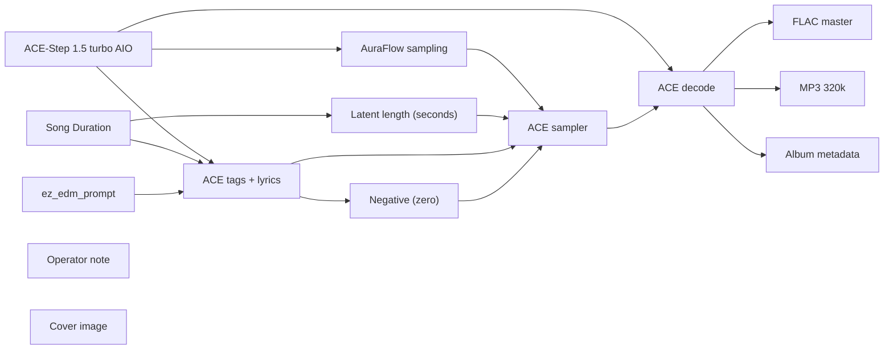

# audio/albums/drive-through/afterparty

**What's on this page**

- **Every track, cover, and album-pack graph** in this folder
- **Shared ACE-Step topology** (one printer, unique widgets per take)
- **Node parameter reference** for the types on these graphs

**What this enables**

- **Queuing one numbered take** or `album-render`
- **Reading tags, lyrics, seed, BPM** without opening raw JSON

**Who this is for:** studio users after `download-music`. Occupancy **audio** (cover stills are **klein** — separate session).

> Generated from `workflows/_lab/audio/albums/drive-through/afterparty/`. Do not hand-edit this file.

## Purpose

Numbered takes under `audio/albums/drive-through/afterparty/`. Queue one track, or `./scripts/manage.sh album-render --album drive-through/afterparty`.

```text
## 01-brake-fade

US-safe EDM **180 s** take: **brake fade**. Fictional act **Drive-through** (hardcore, pure of heart). Native ACE-Step 1.5 turbo AIO. Live bass-set take. Instrumental score is empty-body ACE markers (`[drop - cues]`, `[inst - cues]`, `[outro]`) so ACE does not sing production notes. Drop-first warped hybrid-trap, trap drums, no quiet dips. Vocals are a rare DJ treat on other graphs, not here. Queue this graph **on its own** — draft-first is the generic rap lane, not a prerequisite. Occupancy **audio** only; a longer Queue is expected.

1. Weights: `./scripts/manage.sh download-music --tier turbo` (same AIO dest as `download-podcast --tier acestep`; ~10 GB, opt-in, not `download-models`).
2. Prompt enhance is **off** so tags, BPM, language, and `[drop]` / `[inst]` / `[outro]` stay as written. Turn Enhance on only if you want the 4B rewriter.
3. Tags vs score: tags are genre/instrument hints; lyrics are the arrangement. Keep App **Vocal / instrumental** on instrumental so ACE does not sing. Encoder language is `unknown`. Free-text lines under a marker are lyrics — keep cues inside the brackets.
4. Original arrangements only. No “in the style of <living artist>”. No living-DJ names. No famous-hook paraphrases.
5. ACE-Step timbre is **invented**, not a cloned act.
6. Sampler: 8 steps, cfg 1, euler, simple. Duration 180 s, bpm 150, language unknown, timesignature 4, generate_audio_codes true. Seed 457.
7. Saves: `01 - Brake Fade` FLAC master + 320 kbps MP3 under `${COMFY_OUTPUT_DIR}`.
8. Cover separately: Queue **klein/thumbnail.json** or **klein/podcast-cover.json**. Do not embed Klein here.
9. Human selection and edit before any release. Prompts are not authorship (USCO Part 2 / Thaler).
10. Do not co-resident with LTX / Wan / Klein on this Spark.

Occupancy: audio — stop Klein / Wan / LTX session. One GB10 job.
```

## Shared graph



## Graphs in this album

| Graph | Nodes | Occupancy |
| --- | --- | --- |
| `audio/albums/drive-through/afterparty/01-brake-fade` | 14 | audio |
| `audio/albums/drive-through/afterparty/02-diesel-hum` | 14 | audio |
| `audio/albums/drive-through/afterparty/03-axle-grind` | 14 | audio |
| `audio/albums/drive-through/afterparty/04-weigh-station` | 14 | audio |
| `audio/albums/drive-through/afterparty/05-black-ice` | 14 | audio |
| `audio/albums/drive-through/afterparty/06-high-beams` | 14 | audio |
| `audio/albums/drive-through/afterparty/07-chain-hook` | 14 | audio |
| `audio/albums/drive-through/afterparty/08-grit-plate` | 14 | audio |
| `audio/albums/drive-through/afterparty/09-steel-grate` | 14 | audio |
| `audio/albums/drive-through/afterparty/10-rest-bay` | 14 | audio |
| `audio/albums/drive-through/afterparty/11-haul-crate` | 14 | audio |
| `audio/albums/drive-through/afterparty/12-night-splice` | 14 | audio |
| `audio/albums/drive-through/afterparty/13-torque-bay` | 14 | audio |
| `audio/albums/drive-through/afterparty/14-spare-drum` | 14 | audio |
| `audio/albums/drive-through/afterparty/15-oil-pan` | 14 | audio |
| `audio/albums/drive-through/afterparty/16-curb-check` | 14 | audio |
| `audio/albums/drive-through/afterparty/17-last-exit` | 14 | audio |
| `audio/albums/drive-through/afterparty/18-asphalt-heart` | 14 | audio |
| `audio/albums/drive-through/afterparty/19-clutch-slam` | 14 | audio |
| `audio/albums/drive-through/afterparty/20-trailer-hitch` | 14 | audio |
| `audio/albums/drive-through/afterparty/album` | 2 | none |
| `audio/albums/drive-through/afterparty/cover` | 13 | klein |

## `01-brake-fade`

Catalog id `audio/albums/drive-through/afterparty/01-brake-fade`.

US-safe EDM 180s: Drive-through brake-fade dirty bass warp, ACE-Step 1.5 turbo AIO, instrumental, warped bass, invented timbre
Prompt enhance is **off** so authored text (recipe, script labels, ACE tags, or film shots) is encoded as written. Turn Enhance on only if you want the 4B rewriter.

**ACE-Step 1.5 turbo AIO** (`CheckpointLoaderSimple`)

| Slot | Value |
| --- | --- |
| 0 | `ace_step_1.5_turbo_aio.safetensors` |

**AuraFlow sampling** (`ModelSamplingAuraFlow`)

| Slot | Value |
| --- | --- |
| 0 | `3` |

**Song Duration** (`PrimitiveNode`)

| Slot | Value |
| --- | --- |
| 0 | `180.0` |
| 1 | `fixed` |

**Latent length (seconds)** (`EmptyAceStep1.5LatentAudio`)

| Slot | Value |
| --- | --- |
| 0 | `180.0` |
| 1 | `1` |

**ez_edm_prompt** (`EZAceStepPromptEnhance`)

| Slot | Value |
| --- | --- |
| 0 | `custom` |
| 1 | `dirty bass, warped bass, trap hats, chest sub, stacked 808, rave, instrumental,…` |
| 2 | `[drop - heavy dirty drop, chest 808 warp, brake wreck, grid 457 0] [inst - trap…` |
| 3 | `false` |
| 4 | `instrumental` |
| 5 | `audio/albums/drive-through/afterparty/01-brake-fade` |

```text
dirty bass, warped bass, trap hats, chest sub, stacked 808, rave, instrumental, no vocals, no singing, no choir, no vocal chops, original composition, 150 bpm
```

```text
[drop - heavy dirty drop, chest 808 warp, brake wreck, grid 457 0]

[inst - trap hats roll, 808 slide, grid 457 1]

[drop - harder growl drop, stacked 808 wall, formant grind, grid 457 2]

[inst - snare roll, chest 808 punch, grid 457 3]

[drop - full send drop, low rumble wreck, warped dirty, grid 457 4]

[outro - kick holds, trap hats roll, 808 ride, grid 457 5]
```

**ACE tags + lyrics** (`TextEncodeAceStepAudio1.5`)

| Slot | Value |
| --- | --- |
| 0 | `dirty bass, warped bass, trap hats, chest sub, stacked 808, rave, instrumental,…` |
| 1 | `[drop - heavy dirty drop, chest 808 warp, brake wreck, grid 457 0] [inst - trap…` |
| 2 | `457` |
| 3 | `fixed` |
| 4 | `150` |
| 5 | `180.0` |
| 6 | `4` |
| 7 | `unknown` |
| 8 | `C minor` |
| 9 | `true` |
| 10 | `2.0` |
| 11 | `0.85` |
| 12 | `0.9` |
| 13 | `0` |
| 14 | `0.0` |

```text
dirty bass, warped bass, trap hats, chest sub, stacked 808, rave, instrumental, no vocals, no singing, no choir, no vocal chops, original composition, 150 bpm
```

```text
[drop - heavy dirty drop, chest 808 warp, brake wreck, grid 457 0]

[inst - trap hats roll, 808 slide, grid 457 1]

[drop - harder growl drop, stacked 808 wall, formant grind, grid 457 2]

[inst - snare roll, chest 808 punch, grid 457 3]

[drop - full send drop, low rumble wreck, warped dirty, grid 457 4]

[outro - kick holds, trap hats roll, 808 ride, grid 457 5]
```

**ACE sampler** (`KSampler`)

| Slot | Value |
| --- | --- |
| 0 | `457` |
| 1 | `fixed` |
| 2 | `8` |
| 3 | `1.0` |
| 4 | `euler` |
| 5 | `simple` |
| 6 | `1.0` |

**FLAC master** (`SaveAudio`)

| Slot | Value |
| --- | --- |
| 0 | `01 - Brake Fade` |

**MP3 320k** (`SaveAudioMP3`)

| Slot | Value |
| --- | --- |
| 0 | `01 - Brake Fade` |
| 1 | `320k` |

**Cover image** (`LoadImage`)

| Slot | Value |
| --- | --- |
| 0 | `cover.png` |
| 1 | `image` |

**Album metadata** (`EZAudioMetadata`)

| Slot | Value |
| --- | --- |
| 0 | `Drive-through` |
| 1 | `Afterparty` |
| 2 | `Brake Fade` |
| 3 | `1` |
| 4 | `20` |
| 5 | `2026` |
| 6 | `skip` |
| 7 | `01 - Brake Fade` |

## `02-diesel-hum`

Catalog id `audio/albums/drive-through/afterparty/02-diesel-hum`.

US-safe EDM 180s: Drive-through diesel-hum hybrid trap warp, ACE-Step 1.5 turbo AIO, instrumental, warped bass, invented timbre
Prompt enhance is **off** so authored text (recipe, script labels, ACE tags, or film shots) is encoded as written. Turn Enhance on only if you want the 4B rewriter.

**ACE-Step 1.5 turbo AIO** (`CheckpointLoaderSimple`)

| Slot | Value |
| --- | --- |
| 0 | `ace_step_1.5_turbo_aio.safetensors` |

**AuraFlow sampling** (`ModelSamplingAuraFlow`)

| Slot | Value |
| --- | --- |
| 0 | `3` |

**Song Duration** (`PrimitiveNode`)

| Slot | Value |
| --- | --- |
| 0 | `180.0` |
| 1 | `fixed` |

**Latent length (seconds)** (`EmptyAceStep1.5LatentAudio`)

| Slot | Value |
| --- | --- |
| 0 | `180.0` |
| 1 | `1` |

**ez_edm_prompt** (`EZAceStepPromptEnhance`)

| Slot | Value |
| --- | --- |
| 0 | `custom` |
| 1 | `hybrid trap, warped bass, trap hats, dual-action pedal bass, chest sub, rave, i…` |
| 2 | `[drop - heavy warped drop, dual-action pedal bass, chest 808 wreck, grid 461 0]…` |
| 3 | `false` |
| 4 | `instrumental` |
| 5 | `audio/albums/drive-through/afterparty/02-diesel-hum` |

```text
hybrid trap, warped bass, trap hats, dual-action pedal bass, chest sub, rave, instrumental, no vocals, no singing, no choir, no vocal chops, original composition, 152 bpm
```

```text
[drop - heavy warped drop, dual-action pedal bass, chest 808 wreck, grid 461 0]

[inst - pedal 808 hold, trap hats roll, grid 461 1]

[drop - harder growl drop, rolling 808 wall, hybrid formant, grid 461 2]

[drop - full send drop, chest sub wreck, pedal warp, grid 461 3]

[outro - kick holds, hats denser, pedal ride, grid 461 4]
```

**ACE tags + lyrics** (`TextEncodeAceStepAudio1.5`)

| Slot | Value |
| --- | --- |
| 0 | `hybrid trap, warped bass, trap hats, dual-action pedal bass, chest sub, rave, i…` |
| 1 | `[drop - heavy warped drop, dual-action pedal bass, chest 808 wreck, grid 461 0]…` |
| 2 | `461` |
| 3 | `fixed` |
| 4 | `152` |
| 5 | `180.0` |
| 6 | `4` |
| 7 | `unknown` |
| 8 | `C minor` |
| 9 | `true` |
| 10 | `2.0` |
| 11 | `0.85` |
| 12 | `0.9` |
| 13 | `0` |
| 14 | `0.0` |

```text
hybrid trap, warped bass, trap hats, dual-action pedal bass, chest sub, rave, instrumental, no vocals, no singing, no choir, no vocal chops, original composition, 152 bpm
```

```text
[drop - heavy warped drop, dual-action pedal bass, chest 808 wreck, grid 461 0]

[inst - pedal 808 hold, trap hats roll, grid 461 1]

[drop - harder growl drop, rolling 808 wall, hybrid formant, grid 461 2]

[drop - full send drop, chest sub wreck, pedal warp, grid 461 3]

[outro - kick holds, hats denser, pedal ride, grid 461 4]
```

**ACE sampler** (`KSampler`)

| Slot | Value |
| --- | --- |
| 0 | `461` |
| 1 | `fixed` |
| 2 | `8` |
| 3 | `1.0` |
| 4 | `euler` |
| 5 | `simple` |
| 6 | `1.0` |

**FLAC master** (`SaveAudio`)

| Slot | Value |
| --- | --- |
| 0 | `02 - Diesel Hum` |

**MP3 320k** (`SaveAudioMP3`)

| Slot | Value |
| --- | --- |
| 0 | `02 - Diesel Hum` |
| 1 | `320k` |

**Cover image** (`LoadImage`)

| Slot | Value |
| --- | --- |
| 0 | `cover.png` |
| 1 | `image` |

**Album metadata** (`EZAudioMetadata`)

| Slot | Value |
| --- | --- |
| 0 | `Drive-through` |
| 1 | `Afterparty` |
| 2 | `Diesel Hum` |
| 3 | `2` |
| 4 | `20` |
| 5 | `2026` |
| 6 | `skip` |
| 7 | `02 - Diesel Hum` |

## `03-axle-grind`

Catalog id `audio/albums/drive-through/afterparty/03-axle-grind`.

US-safe EDM 180s: Drive-through axle-grind tearout warp, ACE-Step 1.5 turbo AIO, instrumental, warped bass, invented timbre
Prompt enhance is **off** so authored text (recipe, script labels, ACE tags, or film shots) is encoded as written. Turn Enhance on only if you want the 4B rewriter.

**ACE-Step 1.5 turbo AIO** (`CheckpointLoaderSimple`)

| Slot | Value |
| --- | --- |
| 0 | `ace_step_1.5_turbo_aio.safetensors` |

**AuraFlow sampling** (`ModelSamplingAuraFlow`)

| Slot | Value |
| --- | --- |
| 0 | `3` |

**Song Duration** (`PrimitiveNode`)

| Slot | Value |
| --- | --- |
| 0 | `180.0` |
| 1 | `fixed` |

**Latent length (seconds)** (`EmptyAceStep1.5LatentAudio`)

| Slot | Value |
| --- | --- |
| 0 | `180.0` |
| 1 | `1` |

**ez_edm_prompt** (`EZAceStepPromptEnhance`)

| Slot | Value |
| --- | --- |
| 0 | `custom` |
| 1 | `tearout, warped bass, trap hats, bass growl, dirty 808, rave, instrumental, no …` |
| 2 | `[drop - heavy tearout drop, growl wreck, warped axle, grid 463 0] [inst - metal…` |
| 3 | `false` |
| 4 | `instrumental` |
| 5 | `audio/albums/drive-through/afterparty/03-axle-grind` |

```text
tearout, warped bass, trap hats, bass growl, dirty 808, rave, instrumental, no vocals, no singing, no choir, no vocal chops, original composition, 155 bpm
```

```text
[drop - heavy tearout drop, growl wreck, warped axle, grid 463 0]

[inst - metal hats roll, growl sustain, grid 463 1]

[drop - harder formant drop, sub crush, chest 808, grid 463 2]

[inst - trap hats denser, growl hold, grid 463 3]

[drop - full send drop, stacked growl wreck, tearout warp, grid 463 4]

[drop - harder growl drop, low 808 wreck, axle grind, grid 463 5]

[outro - kick holds, hats denser, growl ride, grid 463 6]
```

**ACE tags + lyrics** (`TextEncodeAceStepAudio1.5`)

| Slot | Value |
| --- | --- |
| 0 | `tearout, warped bass, trap hats, bass growl, dirty 808, rave, instrumental, no …` |
| 1 | `[drop - heavy tearout drop, growl wreck, warped axle, grid 463 0] [inst - metal…` |
| 2 | `463` |
| 3 | `fixed` |
| 4 | `155` |
| 5 | `180.0` |
| 6 | `4` |
| 7 | `unknown` |
| 8 | `C minor` |
| 9 | `true` |
| 10 | `2.0` |
| 11 | `0.85` |
| 12 | `0.9` |
| 13 | `0` |
| 14 | `0.0` |

```text
tearout, warped bass, trap hats, bass growl, dirty 808, rave, instrumental, no vocals, no singing, no choir, no vocal chops, original composition, 155 bpm
```

```text
[drop - heavy tearout drop, growl wreck, warped axle, grid 463 0]

[inst - metal hats roll, growl sustain, grid 463 1]

[drop - harder formant drop, sub crush, chest 808, grid 463 2]

[inst - trap hats denser, growl hold, grid 463 3]

[drop - full send drop, stacked growl wreck, tearout warp, grid 463 4]

[drop - harder growl drop, low 808 wreck, axle grind, grid 463 5]

[outro - kick holds, hats denser, growl ride, grid 463 6]
```

**ACE sampler** (`KSampler`)

| Slot | Value |
| --- | --- |
| 0 | `463` |
| 1 | `fixed` |
| 2 | `8` |
| 3 | `1.0` |
| 4 | `euler` |
| 5 | `simple` |
| 6 | `1.0` |

**FLAC master** (`SaveAudio`)

| Slot | Value |
| --- | --- |
| 0 | `03 - Axle Grind` |

**MP3 320k** (`SaveAudioMP3`)

| Slot | Value |
| --- | --- |
| 0 | `03 - Axle Grind` |
| 1 | `320k` |

**Cover image** (`LoadImage`)

| Slot | Value |
| --- | --- |
| 0 | `cover.png` |
| 1 | `image` |

**Album metadata** (`EZAudioMetadata`)

| Slot | Value |
| --- | --- |
| 0 | `Drive-through` |
| 1 | `Afterparty` |
| 2 | `Axle Grind` |
| 3 | `3` |
| 4 | `20` |
| 5 | `2026` |
| 6 | `skip` |
| 7 | `03 - Axle Grind` |

## `04-weigh-station`

Catalog id `audio/albums/drive-through/afterparty/04-weigh-station`.

US-safe EDM 180s: Drive-through weigh-station brostep warp, ACE-Step 1.5 turbo AIO, instrumental, warped bass, invented timbre
Prompt enhance is **off** so authored text (recipe, script labels, ACE tags, or film shots) is encoded as written. Turn Enhance on only if you want the 4B rewriter.

**ACE-Step 1.5 turbo AIO** (`CheckpointLoaderSimple`)

| Slot | Value |
| --- | --- |
| 0 | `ace_step_1.5_turbo_aio.safetensors` |

**AuraFlow sampling** (`ModelSamplingAuraFlow`)

| Slot | Value |
| --- | --- |
| 0 | `3` |

**Song Duration** (`PrimitiveNode`)

| Slot | Value |
| --- | --- |
| 0 | `180.0` |
| 1 | `fixed` |

**Latent length (seconds)** (`EmptyAceStep1.5LatentAudio`)

| Slot | Value |
| --- | --- |
| 0 | `180.0` |
| 1 | `1` |

**ez_edm_prompt** (`EZAceStepPromptEnhance`)

| Slot | Value |
| --- | --- |
| 0 | `custom` |
| 1 | `brostep, warped bass, trap hats, stacked 808, chest sub, rave, instrumental, no…` |
| 2 | `[drop - heavy brostep drop, stacked 808 warp, weigh wreck, grid 467 0] [inst - …` |
| 3 | `false` |
| 4 | `instrumental` |
| 5 | `audio/albums/drive-through/afterparty/04-weigh-station` |

```text
brostep, warped bass, trap hats, stacked 808, chest sub, rave, instrumental, no vocals, no singing, no choir, no vocal chops, original composition, 158 bpm
```

```text
[drop - heavy brostep drop, stacked 808 warp, weigh wreck, grid 467 0]

[inst - trap hats roll, growl hold, grid 467 1]

[drop - harder growl drop, chest sub wall, formant 808, grid 467 2]

[inst - snare roll, 808 punch, grid 467 3]

[drop - full send drop, body bass wreck, warped brostep, grid 467 4]

[outro - kick holds, trap hats roll, 808 ride, grid 467 5]
```

**ACE tags + lyrics** (`TextEncodeAceStepAudio1.5`)

| Slot | Value |
| --- | --- |
| 0 | `brostep, warped bass, trap hats, stacked 808, chest sub, rave, instrumental, no…` |
| 1 | `[drop - heavy brostep drop, stacked 808 warp, weigh wreck, grid 467 0] [inst - …` |
| 2 | `467` |
| 3 | `fixed` |
| 4 | `158` |
| 5 | `180.0` |
| 6 | `4` |
| 7 | `unknown` |
| 8 | `C minor` |
| 9 | `true` |
| 10 | `2.0` |
| 11 | `0.85` |
| 12 | `0.9` |
| 13 | `0` |
| 14 | `0.0` |

```text
brostep, warped bass, trap hats, stacked 808, chest sub, rave, instrumental, no vocals, no singing, no choir, no vocal chops, original composition, 158 bpm
```

```text
[drop - heavy brostep drop, stacked 808 warp, weigh wreck, grid 467 0]

[inst - trap hats roll, growl hold, grid 467 1]

[drop - harder growl drop, chest sub wall, formant 808, grid 467 2]

[inst - snare roll, 808 punch, grid 467 3]

[drop - full send drop, body bass wreck, warped brostep, grid 467 4]

[outro - kick holds, trap hats roll, 808 ride, grid 467 5]
```

**ACE sampler** (`KSampler`)

| Slot | Value |
| --- | --- |
| 0 | `467` |
| 1 | `fixed` |
| 2 | `8` |
| 3 | `1.0` |
| 4 | `euler` |
| 5 | `simple` |
| 6 | `1.0` |

**FLAC master** (`SaveAudio`)

| Slot | Value |
| --- | --- |
| 0 | `04 - Weigh Station` |

**MP3 320k** (`SaveAudioMP3`)

| Slot | Value |
| --- | --- |
| 0 | `04 - Weigh Station` |
| 1 | `320k` |

**Cover image** (`LoadImage`)

| Slot | Value |
| --- | --- |
| 0 | `cover.png` |
| 1 | `image` |

**Album metadata** (`EZAudioMetadata`)

| Slot | Value |
| --- | --- |
| 0 | `Drive-through` |
| 1 | `Afterparty` |
| 2 | `Weigh Station` |
| 3 | `4` |
| 4 | `20` |
| 5 | `2026` |
| 6 | `skip` |
| 7 | `04 - Weigh Station` |

## `05-black-ice`

Catalog id `audio/albums/drive-through/afterparty/05-black-ice`.

US-safe EDM 180s: Drive-through black-ice riddim warp, ACE-Step 1.5 turbo AIO, instrumental, warped bass, invented timbre
Prompt enhance is **off** so authored text (recipe, script labels, ACE tags, or film shots) is encoded as written. Turn Enhance on only if you want the 4B rewriter.

**ACE-Step 1.5 turbo AIO** (`CheckpointLoaderSimple`)

| Slot | Value |
| --- | --- |
| 0 | `ace_step_1.5_turbo_aio.safetensors` |

**AuraFlow sampling** (`ModelSamplingAuraFlow`)

| Slot | Value |
| --- | --- |
| 0 | `3` |

**Song Duration** (`PrimitiveNode`)

| Slot | Value |
| --- | --- |
| 0 | `180.0` |
| 1 | `fixed` |

**Latent length (seconds)** (`EmptyAceStep1.5LatentAudio`)

| Slot | Value |
| --- | --- |
| 0 | `180.0` |
| 1 | `1` |

**ez_edm_prompt** (`EZAceStepPromptEnhance`)

| Slot | Value |
| --- | --- |
| 0 | `custom` |
| 1 | `riddim, warped bass, trap hats, wobble bass, chest 808, rave, instrumental, no …` |
| 2 | `[drop - heavy riddim drop, wobble wreck, warped ice, grid 479 0] [inst - metal …` |
| 3 | `false` |
| 4 | `instrumental` |
| 5 | `audio/albums/drive-through/afterparty/05-black-ice` |

```text
riddim, warped bass, trap hats, wobble bass, chest 808, rave, instrumental, no vocals, no singing, no choir, no vocal chops, original composition, 160 bpm
```

```text
[drop - heavy riddim drop, wobble wreck, warped ice, grid 479 0]

[inst - metal hats roll, wobble sustain, grid 479 1]

[drop - harder growl drop, chest growl wreck, 808 crush, grid 479 2]

[inst - trap hats denser, wobble hold, grid 479 3]

[drop - full send drop, sub crush wreck, chest formant, grid 479 4]

[inst - snare roll, bass growl hold, grid 479 5]

[drop - harder warped drop, low rumble wreck, riddim 808, grid 479 6]

[outro - kick holds, hats denser, wobble ride, grid 479 7]
```

**ACE tags + lyrics** (`TextEncodeAceStepAudio1.5`)

| Slot | Value |
| --- | --- |
| 0 | `riddim, warped bass, trap hats, wobble bass, chest 808, rave, instrumental, no …` |
| 1 | `[drop - heavy riddim drop, wobble wreck, warped ice, grid 479 0] [inst - metal …` |
| 2 | `479` |
| 3 | `fixed` |
| 4 | `160` |
| 5 | `180.0` |
| 6 | `4` |
| 7 | `unknown` |
| 8 | `C minor` |
| 9 | `true` |
| 10 | `2.0` |
| 11 | `0.85` |
| 12 | `0.9` |
| 13 | `0` |
| 14 | `0.0` |

```text
riddim, warped bass, trap hats, wobble bass, chest 808, rave, instrumental, no vocals, no singing, no choir, no vocal chops, original composition, 160 bpm
```

```text
[drop - heavy riddim drop, wobble wreck, warped ice, grid 479 0]

[inst - metal hats roll, wobble sustain, grid 479 1]

[drop - harder growl drop, chest growl wreck, 808 crush, grid 479 2]

[inst - trap hats denser, wobble hold, grid 479 3]

[drop - full send drop, sub crush wreck, chest formant, grid 479 4]

[inst - snare roll, bass growl hold, grid 479 5]

[drop - harder warped drop, low rumble wreck, riddim 808, grid 479 6]

[outro - kick holds, hats denser, wobble ride, grid 479 7]
```

**ACE sampler** (`KSampler`)

| Slot | Value |
| --- | --- |
| 0 | `479` |
| 1 | `fixed` |
| 2 | `8` |
| 3 | `1.0` |
| 4 | `euler` |
| 5 | `simple` |
| 6 | `1.0` |

**FLAC master** (`SaveAudio`)

| Slot | Value |
| --- | --- |
| 0 | `05 - Black Ice` |

**MP3 320k** (`SaveAudioMP3`)

| Slot | Value |
| --- | --- |
| 0 | `05 - Black Ice` |
| 1 | `320k` |

**Cover image** (`LoadImage`)

| Slot | Value |
| --- | --- |
| 0 | `cover.png` |
| 1 | `image` |

**Album metadata** (`EZAudioMetadata`)

| Slot | Value |
| --- | --- |
| 0 | `Drive-through` |
| 1 | `Afterparty` |
| 2 | `Black Ice` |
| 3 | `5` |
| 4 | `20` |
| 5 | `2026` |
| 6 | `skip` |
| 7 | `05 - Black Ice` |

## `06-high-beams`

Catalog id `audio/albums/drive-through/afterparty/06-high-beams`.

US-safe EDM 180s: Drive-through high-beams color bass warp, ACE-Step 1.5 turbo AIO, instrumental, warped bass, invented timbre
Prompt enhance is **off** so authored text (recipe, script labels, ACE tags, or film shots) is encoded as written. Turn Enhance on only if you want the 4B rewriter.

**ACE-Step 1.5 turbo AIO** (`CheckpointLoaderSimple`)

| Slot | Value |
| --- | --- |
| 0 | `ace_step_1.5_turbo_aio.safetensors` |

**AuraFlow sampling** (`ModelSamplingAuraFlow`)

| Slot | Value |
| --- | --- |
| 0 | `3` |

**Song Duration** (`PrimitiveNode`)

| Slot | Value |
| --- | --- |
| 0 | `180.0` |
| 1 | `fixed` |

**Latent length (seconds)** (`EmptyAceStep1.5LatentAudio`)

| Slot | Value |
| --- | --- |
| 0 | `180.0` |
| 1 | `1` |

**ez_edm_prompt** (`EZAceStepPromptEnhance`)

| Slot | Value |
| --- | --- |
| 0 | `custom` |
| 1 | `color bass, warped bass, trap hats, dual-action pedal bass, chest sub, rave, in…` |
| 2 | `[drop - heavy color drop, dual-action pedal bass, chest 808 warp, grid 487 0] […` |
| 3 | `false` |
| 4 | `instrumental` |
| 5 | `audio/albums/drive-through/afterparty/06-high-beams` |

```text
color bass, warped bass, trap hats, dual-action pedal bass, chest sub, rave, instrumental, no vocals, no singing, no choir, no vocal chops, original composition, 165 bpm
```

```text
[drop - heavy color drop, dual-action pedal bass, chest 808 warp, grid 487 0]

[inst - pedal 808 hold, trap hats roll, grid 487 1]

[drop - harder stacked drop, hybrid 808 wall, color formant, grid 487 2]

[inst - snare roll, chest 808, grid 487 3]

[drop - full send drop, body sub wreck, warped color, grid 487 4]

[drop - harder growl drop, stacked 808 wreck, pedal warp, grid 487 5]

[outro - kick holds, hats denser, color ride, grid 487 6]
```

**ACE tags + lyrics** (`TextEncodeAceStepAudio1.5`)

| Slot | Value |
| --- | --- |
| 0 | `color bass, warped bass, trap hats, dual-action pedal bass, chest sub, rave, in…` |
| 1 | `[drop - heavy color drop, dual-action pedal bass, chest 808 warp, grid 487 0] […` |
| 2 | `487` |
| 3 | `fixed` |
| 4 | `165` |
| 5 | `180.0` |
| 6 | `4` |
| 7 | `unknown` |
| 8 | `C minor` |
| 9 | `true` |
| 10 | `2.0` |
| 11 | `0.85` |
| 12 | `0.9` |
| 13 | `0` |
| 14 | `0.0` |

```text
color bass, warped bass, trap hats, dual-action pedal bass, chest sub, rave, instrumental, no vocals, no singing, no choir, no vocal chops, original composition, 165 bpm
```

```text
[drop - heavy color drop, dual-action pedal bass, chest 808 warp, grid 487 0]

[inst - pedal 808 hold, trap hats roll, grid 487 1]

[drop - harder stacked drop, hybrid 808 wall, color formant, grid 487 2]

[inst - snare roll, chest 808, grid 487 3]

[drop - full send drop, body sub wreck, warped color, grid 487 4]

[drop - harder growl drop, stacked 808 wreck, pedal warp, grid 487 5]

[outro - kick holds, hats denser, color ride, grid 487 6]
```

**ACE sampler** (`KSampler`)

| Slot | Value |
| --- | --- |
| 0 | `487` |
| 1 | `fixed` |
| 2 | `8` |
| 3 | `1.0` |
| 4 | `euler` |
| 5 | `simple` |
| 6 | `1.0` |

**FLAC master** (`SaveAudio`)

| Slot | Value |
| --- | --- |
| 0 | `06 - High Beams` |

**MP3 320k** (`SaveAudioMP3`)

| Slot | Value |
| --- | --- |
| 0 | `06 - High Beams` |
| 1 | `320k` |

**Cover image** (`LoadImage`)

| Slot | Value |
| --- | --- |
| 0 | `cover.png` |
| 1 | `image` |

**Album metadata** (`EZAudioMetadata`)

| Slot | Value |
| --- | --- |
| 0 | `Drive-through` |
| 1 | `Afterparty` |
| 2 | `High Beams` |
| 3 | `6` |
| 4 | `20` |
| 5 | `2026` |
| 6 | `skip` |
| 7 | `06 - High Beams` |

## `07-chain-hook`

Catalog id `audio/albums/drive-through/afterparty/07-chain-hook`.

US-safe EDM 180s: Drive-through chain-hook dirty dubstep warp, ACE-Step 1.5 turbo AIO, instrumental, warped bass, invented timbre
Prompt enhance is **off** so authored text (recipe, script labels, ACE tags, or film shots) is encoded as written. Turn Enhance on only if you want the 4B rewriter.

**ACE-Step 1.5 turbo AIO** (`CheckpointLoaderSimple`)

| Slot | Value |
| --- | --- |
| 0 | `ace_step_1.5_turbo_aio.safetensors` |

**AuraFlow sampling** (`ModelSamplingAuraFlow`)

| Slot | Value |
| --- | --- |
| 0 | `3` |

**Song Duration** (`PrimitiveNode`)

| Slot | Value |
| --- | --- |
| 0 | `180.0` |
| 1 | `fixed` |

**Latent length (seconds)** (`EmptyAceStep1.5LatentAudio`)

| Slot | Value |
| --- | --- |
| 0 | `180.0` |
| 1 | `1` |

**ez_edm_prompt** (`EZAceStepPromptEnhance`)

| Slot | Value |
| --- | --- |
| 0 | `custom` |
| 1 | `brostep, warped bass, trap hats, dirty dubstep, bass growl, heavy sub, rave, in…` |
| 2 | `[drop - heavy brostep drop, growl wreck, warped chain, grid 491 0] [drop - hard…` |
| 3 | `false` |
| 4 | `instrumental` |
| 5 | `audio/albums/drive-through/afterparty/07-chain-hook` |

```text
brostep, warped bass, trap hats, dirty dubstep, bass growl, heavy sub, rave, instrumental, no vocals, no singing, no choir, no vocal chops, original composition, 168 bpm
```

```text
[drop - heavy brostep drop, growl wreck, warped chain, grid 491 0]

[drop - harder dirty drop, dubstep wreck, chest 808 formant, grid 491 1]

[drop - full send drop, stacked 808 wreck, trap growl, grid 491 2]

[outro - kick holds, trap hats roll, growl ride, grid 491 3]
```

**ACE tags + lyrics** (`TextEncodeAceStepAudio1.5`)

| Slot | Value |
| --- | --- |
| 0 | `brostep, warped bass, trap hats, dirty dubstep, bass growl, heavy sub, rave, in…` |
| 1 | `[drop - heavy brostep drop, growl wreck, warped chain, grid 491 0] [drop - hard…` |
| 2 | `491` |
| 3 | `fixed` |
| 4 | `168` |
| 5 | `180.0` |
| 6 | `4` |
| 7 | `unknown` |
| 8 | `C minor` |
| 9 | `true` |
| 10 | `2.0` |
| 11 | `0.85` |
| 12 | `0.9` |
| 13 | `0` |
| 14 | `0.0` |

```text
brostep, warped bass, trap hats, dirty dubstep, bass growl, heavy sub, rave, instrumental, no vocals, no singing, no choir, no vocal chops, original composition, 168 bpm
```

```text
[drop - heavy brostep drop, growl wreck, warped chain, grid 491 0]

[drop - harder dirty drop, dubstep wreck, chest 808 formant, grid 491 1]

[drop - full send drop, stacked 808 wreck, trap growl, grid 491 2]

[outro - kick holds, trap hats roll, growl ride, grid 491 3]
```

**ACE sampler** (`KSampler`)

| Slot | Value |
| --- | --- |
| 0 | `491` |
| 1 | `fixed` |
| 2 | `8` |
| 3 | `1.0` |
| 4 | `euler` |
| 5 | `simple` |
| 6 | `1.0` |

**FLAC master** (`SaveAudio`)

| Slot | Value |
| --- | --- |
| 0 | `07 - Chain Hook` |

**MP3 320k** (`SaveAudioMP3`)

| Slot | Value |
| --- | --- |
| 0 | `07 - Chain Hook` |
| 1 | `320k` |

**Cover image** (`LoadImage`)

| Slot | Value |
| --- | --- |
| 0 | `cover.png` |
| 1 | `image` |

**Album metadata** (`EZAudioMetadata`)

| Slot | Value |
| --- | --- |
| 0 | `Drive-through` |
| 1 | `Afterparty` |
| 2 | `Chain Hook` |
| 3 | `7` |
| 4 | `20` |
| 5 | `2026` |
| 6 | `skip` |
| 7 | `07 - Chain Hook` |

## `08-grit-plate`

Catalog id `audio/albums/drive-through/afterparty/08-grit-plate`.

US-safe EDM 180s: Drive-through grit-plate wave bass warp, ACE-Step 1.5 turbo AIO, instrumental, warped bass, invented timbre
Prompt enhance is **off** so authored text (recipe, script labels, ACE tags, or film shots) is encoded as written. Turn Enhance on only if you want the 4B rewriter.

**ACE-Step 1.5 turbo AIO** (`CheckpointLoaderSimple`)

| Slot | Value |
| --- | --- |
| 0 | `ace_step_1.5_turbo_aio.safetensors` |

**AuraFlow sampling** (`ModelSamplingAuraFlow`)

| Slot | Value |
| --- | --- |
| 0 | `3` |

**Song Duration** (`PrimitiveNode`)

| Slot | Value |
| --- | --- |
| 0 | `180.0` |
| 1 | `fixed` |

**Latent length (seconds)** (`EmptyAceStep1.5LatentAudio`)

| Slot | Value |
| --- | --- |
| 0 | `180.0` |
| 1 | `1` |

**ez_edm_prompt** (`EZAceStepPromptEnhance`)

| Slot | Value |
| --- | --- |
| 0 | `custom` |
| 1 | `wave bass, warped bass, trap hats, dirty 808, chest sub, rave, instrumental, no…` |
| 2 | `[drop - heavy wave drop, warped 808 wreck, grit fold, grid 499 0] [inst - trap …` |
| 3 | `false` |
| 4 | `instrumental` |
| 5 | `audio/albums/drive-through/afterparty/08-grit-plate` |

```text
wave bass, warped bass, trap hats, dirty 808, chest sub, rave, instrumental, no vocals, no singing, no choir, no vocal chops, original composition, 150 bpm
```

```text
[drop - heavy wave drop, warped 808 wreck, grit fold, grid 499 0]

[inst - trap hats denser, wave 808 hold grit, grid 499 1]

[drop - harder growl drop, stacked 808 wall, chest formant, grid 499 2]

[drop - full send drop, body bass wreck, wave warp, grid 499 3]

[outro - kick holds, hats denser, wave ride, grid 499 4]
```

**ACE tags + lyrics** (`TextEncodeAceStepAudio1.5`)

| Slot | Value |
| --- | --- |
| 0 | `wave bass, warped bass, trap hats, dirty 808, chest sub, rave, instrumental, no…` |
| 1 | `[drop - heavy wave drop, warped 808 wreck, grit fold, grid 499 0] [inst - trap …` |
| 2 | `499` |
| 3 | `fixed` |
| 4 | `150` |
| 5 | `180.0` |
| 6 | `4` |
| 7 | `unknown` |
| 8 | `C minor` |
| 9 | `true` |
| 10 | `2.0` |
| 11 | `0.85` |
| 12 | `0.9` |
| 13 | `0` |
| 14 | `0.0` |

```text
wave bass, warped bass, trap hats, dirty 808, chest sub, rave, instrumental, no vocals, no singing, no choir, no vocal chops, original composition, 150 bpm
```

```text
[drop - heavy wave drop, warped 808 wreck, grit fold, grid 499 0]

[inst - trap hats denser, wave 808 hold grit, grid 499 1]

[drop - harder growl drop, stacked 808 wall, chest formant, grid 499 2]

[drop - full send drop, body bass wreck, wave warp, grid 499 3]

[outro - kick holds, hats denser, wave ride, grid 499 4]
```

**ACE sampler** (`KSampler`)

| Slot | Value |
| --- | --- |
| 0 | `499` |
| 1 | `fixed` |
| 2 | `8` |
| 3 | `1.0` |
| 4 | `euler` |
| 5 | `simple` |
| 6 | `1.0` |

**FLAC master** (`SaveAudio`)

| Slot | Value |
| --- | --- |
| 0 | `08 - Grit Plate` |

**MP3 320k** (`SaveAudioMP3`)

| Slot | Value |
| --- | --- |
| 0 | `08 - Grit Plate` |
| 1 | `320k` |

**Cover image** (`LoadImage`)

| Slot | Value |
| --- | --- |
| 0 | `cover.png` |
| 1 | `image` |

**Album metadata** (`EZAudioMetadata`)

| Slot | Value |
| --- | --- |
| 0 | `Drive-through` |
| 1 | `Afterparty` |
| 2 | `Grit Plate` |
| 3 | `8` |
| 4 | `20` |
| 5 | `2026` |
| 6 | `skip` |
| 7 | `08 - Grit Plate` |

## `09-steel-grate`

Catalog id `audio/albums/drive-through/afterparty/09-steel-grate`.

US-safe EDM 180s: Drive-through steel-grate drumstep warp, ACE-Step 1.5 turbo AIO, instrumental, warped bass, invented timbre
Prompt enhance is **off** so authored text (recipe, script labels, ACE tags, or film shots) is encoded as written. Turn Enhance on only if you want the 4B rewriter.

**ACE-Step 1.5 turbo AIO** (`CheckpointLoaderSimple`)

| Slot | Value |
| --- | --- |
| 0 | `ace_step_1.5_turbo_aio.safetensors` |

**AuraFlow sampling** (`ModelSamplingAuraFlow`)

| Slot | Value |
| --- | --- |
| 0 | `3` |

**Song Duration** (`PrimitiveNode`)

| Slot | Value |
| --- | --- |
| 0 | `180.0` |
| 1 | `fixed` |

**Latent length (seconds)** (`EmptyAceStep1.5LatentAudio`)

| Slot | Value |
| --- | --- |
| 0 | `180.0` |
| 1 | `1` |

**ez_edm_prompt** (`EZAceStepPromptEnhance`)

| Slot | Value |
| --- | --- |
| 0 | `custom` |
| 1 | `drumstep, warped bass, trap hats, amen break, reese bass, chest sub, rave, inst…` |
| 2 | `[drop - heavy amen drop, reese wreck, warped grate, grid 503 0] [inst - amen ch…` |
| 3 | `false` |
| 4 | `instrumental` |
| 5 | `audio/albums/drive-through/afterparty/09-steel-grate` |

```text
drumstep, warped bass, trap hats, amen break, reese bass, chest sub, rave, instrumental, no vocals, no singing, no choir, no vocal chops, original composition, 172 bpm
```

```text
[drop - heavy amen drop, reese wreck, warped grate, grid 503 0]

[inst - amen chops, trap hats 808 grate, grid 503 1]

[drop - harder growl drop, reese stack, chest 808, grid 503 2]

[inst - hats denser, reese hold, grid 503 3]

[drop - full send drop, stacked amen wreck, formant 808, grid 503 4]

[inst - snare roll, chest 808 punch, grid 503 5]

[drop - harder warped drop, chest 808 wreck, drumstep grind, grid 503 6]

[drop - full send drop, low rumble wreck, reese wall, grid 503 7]

[outro - kick holds, amen keep, reese ride, grid 503 8]
```

**ACE tags + lyrics** (`TextEncodeAceStepAudio1.5`)

| Slot | Value |
| --- | --- |
| 0 | `drumstep, warped bass, trap hats, amen break, reese bass, chest sub, rave, inst…` |
| 1 | `[drop - heavy amen drop, reese wreck, warped grate, grid 503 0] [inst - amen ch…` |
| 2 | `503` |
| 3 | `fixed` |
| 4 | `172` |
| 5 | `180.0` |
| 6 | `4` |
| 7 | `unknown` |
| 8 | `C minor` |
| 9 | `true` |
| 10 | `2.0` |
| 11 | `0.85` |
| 12 | `0.9` |
| 13 | `0` |
| 14 | `0.0` |

```text
drumstep, warped bass, trap hats, amen break, reese bass, chest sub, rave, instrumental, no vocals, no singing, no choir, no vocal chops, original composition, 172 bpm
```

```text
[drop - heavy amen drop, reese wreck, warped grate, grid 503 0]

[inst - amen chops, trap hats 808 grate, grid 503 1]

[drop - harder growl drop, reese stack, chest 808, grid 503 2]

[inst - hats denser, reese hold, grid 503 3]

[drop - full send drop, stacked amen wreck, formant 808, grid 503 4]

[inst - snare roll, chest 808 punch, grid 503 5]

[drop - harder warped drop, chest 808 wreck, drumstep grind, grid 503 6]

[drop - full send drop, low rumble wreck, reese wall, grid 503 7]

[outro - kick holds, amen keep, reese ride, grid 503 8]
```

**ACE sampler** (`KSampler`)

| Slot | Value |
| --- | --- |
| 0 | `503` |
| 1 | `fixed` |
| 2 | `8` |
| 3 | `1.0` |
| 4 | `euler` |
| 5 | `simple` |
| 6 | `1.0` |

**FLAC master** (`SaveAudio`)

| Slot | Value |
| --- | --- |
| 0 | `09 - Steel Grate` |

**MP3 320k** (`SaveAudioMP3`)

| Slot | Value |
| --- | --- |
| 0 | `09 - Steel Grate` |
| 1 | `320k` |

**Cover image** (`LoadImage`)

| Slot | Value |
| --- | --- |
| 0 | `cover.png` |
| 1 | `image` |

**Album metadata** (`EZAudioMetadata`)

| Slot | Value |
| --- | --- |
| 0 | `Drive-through` |
| 1 | `Afterparty` |
| 2 | `Steel Grate` |
| 3 | `9` |
| 4 | `20` |
| 5 | `2026` |
| 6 | `skip` |
| 7 | `09 - Steel Grate` |

## `10-rest-bay`

Catalog id `audio/albums/drive-through/afterparty/10-rest-bay`.

US-safe EDM 180s: Drive-through rest-bay chest bass warp, ACE-Step 1.5 turbo AIO, instrumental, warped bass, invented timbre
Prompt enhance is **off** so authored text (recipe, script labels, ACE tags, or film shots) is encoded as written. Turn Enhance on only if you want the 4B rewriter.

**ACE-Step 1.5 turbo AIO** (`CheckpointLoaderSimple`)

| Slot | Value |
| --- | --- |
| 0 | `ace_step_1.5_turbo_aio.safetensors` |

**AuraFlow sampling** (`ModelSamplingAuraFlow`)

| Slot | Value |
| --- | --- |
| 0 | `3` |

**Song Duration** (`PrimitiveNode`)

| Slot | Value |
| --- | --- |
| 0 | `180.0` |
| 1 | `fixed` |

**Latent length (seconds)** (`EmptyAceStep1.5LatentAudio`)

| Slot | Value |
| --- | --- |
| 0 | `180.0` |
| 1 | `1` |

**ez_edm_prompt** (`EZAceStepPromptEnhance`)

| Slot | Value |
| --- | --- |
| 0 | `custom` |
| 1 | `chest bass, warped bass, trap hats, dual-action pedal bass, body bass, rave, in…` |
| 2 | `[drop - heavy chest drop, dual-action pedal bass, sub warp wreck, grid 509 0] […` |
| 3 | `false` |
| 4 | `instrumental` |
| 5 | `audio/albums/drive-through/afterparty/10-rest-bay` |

```text
chest bass, warped bass, trap hats, dual-action pedal bass, body bass, rave, instrumental, no vocals, no singing, no choir, no vocal chops, original composition, 155 bpm
```

```text
[drop - heavy chest drop, dual-action pedal bass, sub warp wreck, grid 509 0]

[inst - pedal 808 hold, trap hats roll, grid 509 1]

[drop - harder growl drop, stacked 808 wall, chest formant, grid 509 2]

[inst - snare roll, chest 808, grid 509 3]

[drop - full send drop, body chest wreck, pedal warp, grid 509 4]

[drop - harder stacked drop, low 808 wreck, trap growl, grid 509 5]

[outro - kick holds, hats denser, pedal ride, grid 509 6]
```

**ACE tags + lyrics** (`TextEncodeAceStepAudio1.5`)

| Slot | Value |
| --- | --- |
| 0 | `chest bass, warped bass, trap hats, dual-action pedal bass, body bass, rave, in…` |
| 1 | `[drop - heavy chest drop, dual-action pedal bass, sub warp wreck, grid 509 0] […` |
| 2 | `509` |
| 3 | `fixed` |
| 4 | `155` |
| 5 | `180.0` |
| 6 | `4` |
| 7 | `unknown` |
| 8 | `C minor` |
| 9 | `true` |
| 10 | `2.0` |
| 11 | `0.85` |
| 12 | `0.9` |
| 13 | `0` |
| 14 | `0.0` |

```text
chest bass, warped bass, trap hats, dual-action pedal bass, body bass, rave, instrumental, no vocals, no singing, no choir, no vocal chops, original composition, 155 bpm
```

```text
[drop - heavy chest drop, dual-action pedal bass, sub warp wreck, grid 509 0]

[inst - pedal 808 hold, trap hats roll, grid 509 1]

[drop - harder growl drop, stacked 808 wall, chest formant, grid 509 2]

[inst - snare roll, chest 808, grid 509 3]

[drop - full send drop, body chest wreck, pedal warp, grid 509 4]

[drop - harder stacked drop, low 808 wreck, trap growl, grid 509 5]

[outro - kick holds, hats denser, pedal ride, grid 509 6]
```

**ACE sampler** (`KSampler`)

| Slot | Value |
| --- | --- |
| 0 | `509` |
| 1 | `fixed` |
| 2 | `8` |
| 3 | `1.0` |
| 4 | `euler` |
| 5 | `simple` |
| 6 | `1.0` |

**FLAC master** (`SaveAudio`)

| Slot | Value |
| --- | --- |
| 0 | `10 - Rest Bay` |

**MP3 320k** (`SaveAudioMP3`)

| Slot | Value |
| --- | --- |
| 0 | `10 - Rest Bay` |
| 1 | `320k` |

**Cover image** (`LoadImage`)

| Slot | Value |
| --- | --- |
| 0 | `cover.png` |
| 1 | `image` |

**Album metadata** (`EZAudioMetadata`)

| Slot | Value |
| --- | --- |
| 0 | `Drive-through` |
| 1 | `Afterparty` |
| 2 | `Rest Bay` |
| 3 | `10` |
| 4 | `20` |
| 5 | `2026` |
| 6 | `skip` |
| 7 | `10 - Rest Bay` |

## `11-haul-crate`

Catalog id `audio/albums/drive-through/afterparty/11-haul-crate`.

US-safe EDM 180s: Drive-through haul-crate hybrid trap warp, ACE-Step 1.5 turbo AIO, instrumental, warped bass, invented timbre
Prompt enhance is **off** so authored text (recipe, script labels, ACE tags, or film shots) is encoded as written. Turn Enhance on only if you want the 4B rewriter.

**ACE-Step 1.5 turbo AIO** (`CheckpointLoaderSimple`)

| Slot | Value |
| --- | --- |
| 0 | `ace_step_1.5_turbo_aio.safetensors` |

**AuraFlow sampling** (`ModelSamplingAuraFlow`)

| Slot | Value |
| --- | --- |
| 0 | `3` |

**Song Duration** (`PrimitiveNode`)

| Slot | Value |
| --- | --- |
| 0 | `180.0` |
| 1 | `fixed` |

**Latent length (seconds)** (`EmptyAceStep1.5LatentAudio`)

| Slot | Value |
| --- | --- |
| 0 | `180.0` |
| 1 | `1` |

**ez_edm_prompt** (`EZAceStepPromptEnhance`)

| Slot | Value |
| --- | --- |
| 0 | `custom` |
| 1 | `hybrid trap, warped bass, trap hats, festival trap, trap 808, dirty bass, rave,…` |
| 2 | `[drop - heavy hybrid drop, trap 808 wreck, warped crate, grid 521 0] [inst - tr…` |
| 3 | `false` |
| 4 | `instrumental` |
| 5 | `audio/albums/drive-through/afterparty/11-haul-crate` |

```text
hybrid trap, warped bass, trap hats, festival trap, trap 808, dirty bass, rave, instrumental, no vocals, no singing, no choir, no vocal chops, original composition, 170 bpm
```

```text
[drop - heavy hybrid drop, trap 808 wreck, warped crate, grid 521 0]

[inst - trap hats roll, 808 slide, grid 521 1]

[drop - harder growl drop, stacked trap bass, chest formant, grid 521 2]

[inst - snare roll, chest 808 punch, grid 521 3]

[drop - full send drop, chest 808 wall, hybrid warp, grid 521 4]

[outro - kick holds, trap hats roll, 808 ride, grid 521 5]
```

**ACE tags + lyrics** (`TextEncodeAceStepAudio1.5`)

| Slot | Value |
| --- | --- |
| 0 | `hybrid trap, warped bass, trap hats, festival trap, trap 808, dirty bass, rave,…` |
| 1 | `[drop - heavy hybrid drop, trap 808 wreck, warped crate, grid 521 0] [inst - tr…` |
| 2 | `521` |
| 3 | `fixed` |
| 4 | `170` |
| 5 | `180.0` |
| 6 | `4` |
| 7 | `unknown` |
| 8 | `C minor` |
| 9 | `true` |
| 10 | `2.0` |
| 11 | `0.85` |
| 12 | `0.9` |
| 13 | `0` |
| 14 | `0.0` |

```text
hybrid trap, warped bass, trap hats, festival trap, trap 808, dirty bass, rave, instrumental, no vocals, no singing, no choir, no vocal chops, original composition, 170 bpm
```

```text
[drop - heavy hybrid drop, trap 808 wreck, warped crate, grid 521 0]

[inst - trap hats roll, 808 slide, grid 521 1]

[drop - harder growl drop, stacked trap bass, chest formant, grid 521 2]

[inst - snare roll, chest 808 punch, grid 521 3]

[drop - full send drop, chest 808 wall, hybrid warp, grid 521 4]

[outro - kick holds, trap hats roll, 808 ride, grid 521 5]
```

**ACE sampler** (`KSampler`)

| Slot | Value |
| --- | --- |
| 0 | `521` |
| 1 | `fixed` |
| 2 | `8` |
| 3 | `1.0` |
| 4 | `euler` |
| 5 | `simple` |
| 6 | `1.0` |

**FLAC master** (`SaveAudio`)

| Slot | Value |
| --- | --- |
| 0 | `11 - Haul Crate` |

**MP3 320k** (`SaveAudioMP3`)

| Slot | Value |
| --- | --- |
| 0 | `11 - Haul Crate` |
| 1 | `320k` |

**Cover image** (`LoadImage`)

| Slot | Value |
| --- | --- |
| 0 | `cover.png` |
| 1 | `image` |

**Album metadata** (`EZAudioMetadata`)

| Slot | Value |
| --- | --- |
| 0 | `Drive-through` |
| 1 | `Afterparty` |
| 2 | `Haul Crate` |
| 3 | `11` |
| 4 | `20` |
| 5 | `2026` |
| 6 | `skip` |
| 7 | `11 - Haul Crate` |

## `12-night-splice`

Catalog id `audio/albums/drive-through/afterparty/12-night-splice`.

US-safe EDM 180s: Drive-through night-splice wave bass warp, ACE-Step 1.5 turbo AIO, instrumental, warped bass, invented timbre
Prompt enhance is **off** so authored text (recipe, script labels, ACE tags, or film shots) is encoded as written. Turn Enhance on only if you want the 4B rewriter.

**ACE-Step 1.5 turbo AIO** (`CheckpointLoaderSimple`)

| Slot | Value |
| --- | --- |
| 0 | `ace_step_1.5_turbo_aio.safetensors` |

**AuraFlow sampling** (`ModelSamplingAuraFlow`)

| Slot | Value |
| --- | --- |
| 0 | `3` |

**Song Duration** (`PrimitiveNode`)

| Slot | Value |
| --- | --- |
| 0 | `180.0` |
| 1 | `fixed` |

**Latent length (seconds)** (`EmptyAceStep1.5LatentAudio`)

| Slot | Value |
| --- | --- |
| 0 | `180.0` |
| 1 | `1` |

**ez_edm_prompt** (`EZAceStepPromptEnhance`)

| Slot | Value |
| --- | --- |
| 0 | `custom` |
| 1 | `wave bass, warped bass, trap hats, chest 808, low rumble, rave, instrumental, n…` |
| 2 | `[drop - heavy wave drop, warped bass wreck, splice 808, grid 523 0] [inst - tra…` |
| 3 | `false` |
| 4 | `instrumental` |
| 5 | `audio/albums/drive-through/afterparty/12-night-splice` |

```text
wave bass, warped bass, trap hats, chest 808, low rumble, rave, instrumental, no vocals, no singing, no choir, no vocal chops, original composition, 152 bpm
```

```text
[drop - heavy wave drop, warped bass wreck, splice 808, grid 523 0]

[inst - trap hats denser, wave 808 sustain splice, grid 523 1]

[drop - harder growl drop, chest 808 wall, formant fold, grid 523 2]

[drop - full send drop, low swell wreck, wave warp, grid 523 3]

[outro - kick holds, hats denser, wave ride, grid 523 4]
```

**ACE tags + lyrics** (`TextEncodeAceStepAudio1.5`)

| Slot | Value |
| --- | --- |
| 0 | `wave bass, warped bass, trap hats, chest 808, low rumble, rave, instrumental, n…` |
| 1 | `[drop - heavy wave drop, warped bass wreck, splice 808, grid 523 0] [inst - tra…` |
| 2 | `523` |
| 3 | `fixed` |
| 4 | `152` |
| 5 | `180.0` |
| 6 | `4` |
| 7 | `unknown` |
| 8 | `C minor` |
| 9 | `true` |
| 10 | `2.0` |
| 11 | `0.85` |
| 12 | `0.9` |
| 13 | `0` |
| 14 | `0.0` |

```text
wave bass, warped bass, trap hats, chest 808, low rumble, rave, instrumental, no vocals, no singing, no choir, no vocal chops, original composition, 152 bpm
```

```text
[drop - heavy wave drop, warped bass wreck, splice 808, grid 523 0]

[inst - trap hats denser, wave 808 sustain splice, grid 523 1]

[drop - harder growl drop, chest 808 wall, formant fold, grid 523 2]

[drop - full send drop, low swell wreck, wave warp, grid 523 3]

[outro - kick holds, hats denser, wave ride, grid 523 4]
```

**ACE sampler** (`KSampler`)

| Slot | Value |
| --- | --- |
| 0 | `523` |
| 1 | `fixed` |
| 2 | `8` |
| 3 | `1.0` |
| 4 | `euler` |
| 5 | `simple` |
| 6 | `1.0` |

**FLAC master** (`SaveAudio`)

| Slot | Value |
| --- | --- |
| 0 | `12 - Night Splice` |

**MP3 320k** (`SaveAudioMP3`)

| Slot | Value |
| --- | --- |
| 0 | `12 - Night Splice` |
| 1 | `320k` |

**Cover image** (`LoadImage`)

| Slot | Value |
| --- | --- |
| 0 | `cover.png` |
| 1 | `image` |

**Album metadata** (`EZAudioMetadata`)

| Slot | Value |
| --- | --- |
| 0 | `Drive-through` |
| 1 | `Afterparty` |
| 2 | `Night Splice` |
| 3 | `12` |
| 4 | `20` |
| 5 | `2026` |
| 6 | `skip` |
| 7 | `12 - Night Splice` |

## `13-torque-bay`

Catalog id `audio/albums/drive-through/afterparty/13-torque-bay`.

US-safe EDM 180s: Drive-through torque-bay neuro bass warp, ACE-Step 1.5 turbo AIO, instrumental, warped bass, invented timbre
Prompt enhance is **off** so authored text (recipe, script labels, ACE tags, or film shots) is encoded as written. Turn Enhance on only if you want the 4B rewriter.

**ACE-Step 1.5 turbo AIO** (`CheckpointLoaderSimple`)

| Slot | Value |
| --- | --- |
| 0 | `ace_step_1.5_turbo_aio.safetensors` |

**AuraFlow sampling** (`ModelSamplingAuraFlow`)

| Slot | Value |
| --- | --- |
| 0 | `3` |

**Song Duration** (`PrimitiveNode`)

| Slot | Value |
| --- | --- |
| 0 | `180.0` |
| 1 | `fixed` |

**Latent length (seconds)** (`EmptyAceStep1.5LatentAudio`)

| Slot | Value |
| --- | --- |
| 0 | `180.0` |
| 1 | `1` |

**ez_edm_prompt** (`EZAceStepPromptEnhance`)

| Slot | Value |
| --- | --- |
| 0 | `custom` |
| 1 | `neuro bass, warped bass, trap hats, drumstep, reese bass, chest sub, rave, inst…` |
| 2 | `[drop - heavy neuro drop, reese 808 wreck, warped torque, grid 541 0] [inst - h…` |
| 3 | `false` |
| 4 | `instrumental` |
| 5 | `audio/albums/drive-through/afterparty/13-torque-bay` |

```text
neuro bass, warped bass, trap hats, drumstep, reese bass, chest sub, rave, instrumental, no vocals, no singing, no choir, no vocal chops, original composition, 176 bpm
```

```text
[drop - heavy neuro drop, reese 808 wreck, warped torque, grid 541 0]

[inst - hats denser, reese hold, grid 541 1]

[drop - harder stacked drop, chest reese wreck, formant coil, grid 541 2]

[inst - trap hats roll, 808 punch, grid 541 3]

[drop - full send drop, neuro 808 wreck, chest warp, grid 541 4]

[drop - harder growl drop, stacked reese wreck, torque grind, grid 541 5]

[outro - kick holds, trap hats roll, reese ride, grid 541 6]
```

**ACE tags + lyrics** (`TextEncodeAceStepAudio1.5`)

| Slot | Value |
| --- | --- |
| 0 | `neuro bass, warped bass, trap hats, drumstep, reese bass, chest sub, rave, inst…` |
| 1 | `[drop - heavy neuro drop, reese 808 wreck, warped torque, grid 541 0] [inst - h…` |
| 2 | `541` |
| 3 | `fixed` |
| 4 | `176` |
| 5 | `180.0` |
| 6 | `4` |
| 7 | `unknown` |
| 8 | `C minor` |
| 9 | `true` |
| 10 | `2.0` |
| 11 | `0.85` |
| 12 | `0.9` |
| 13 | `0` |
| 14 | `0.0` |

```text
neuro bass, warped bass, trap hats, drumstep, reese bass, chest sub, rave, instrumental, no vocals, no singing, no choir, no vocal chops, original composition, 176 bpm
```

```text
[drop - heavy neuro drop, reese 808 wreck, warped torque, grid 541 0]

[inst - hats denser, reese hold, grid 541 1]

[drop - harder stacked drop, chest reese wreck, formant coil, grid 541 2]

[inst - trap hats roll, 808 punch, grid 541 3]

[drop - full send drop, neuro 808 wreck, chest warp, grid 541 4]

[drop - harder growl drop, stacked reese wreck, torque grind, grid 541 5]

[outro - kick holds, trap hats roll, reese ride, grid 541 6]
```

**ACE sampler** (`KSampler`)

| Slot | Value |
| --- | --- |
| 0 | `541` |
| 1 | `fixed` |
| 2 | `8` |
| 3 | `1.0` |
| 4 | `euler` |
| 5 | `simple` |
| 6 | `1.0` |

**FLAC master** (`SaveAudio`)

| Slot | Value |
| --- | --- |
| 0 | `13 - Torque Bay` |

**MP3 320k** (`SaveAudioMP3`)

| Slot | Value |
| --- | --- |
| 0 | `13 - Torque Bay` |
| 1 | `320k` |

**Cover image** (`LoadImage`)

| Slot | Value |
| --- | --- |
| 0 | `cover.png` |
| 1 | `image` |

**Album metadata** (`EZAudioMetadata`)

| Slot | Value |
| --- | --- |
| 0 | `Drive-through` |
| 1 | `Afterparty` |
| 2 | `Torque Bay` |
| 3 | `13` |
| 4 | `20` |
| 5 | `2026` |
| 6 | `skip` |
| 7 | `13 - Torque Bay` |

## `14-spare-drum`

Catalog id `audio/albums/drive-through/afterparty/14-spare-drum`.

US-safe EDM 180s: Drive-through spare-drum brostep warp, ACE-Step 1.5 turbo AIO, instrumental, warped bass, invented timbre
Prompt enhance is **off** so authored text (recipe, script labels, ACE tags, or film shots) is encoded as written. Turn Enhance on only if you want the 4B rewriter.

**ACE-Step 1.5 turbo AIO** (`CheckpointLoaderSimple`)

| Slot | Value |
| --- | --- |
| 0 | `ace_step_1.5_turbo_aio.safetensors` |

**AuraFlow sampling** (`ModelSamplingAuraFlow`)

| Slot | Value |
| --- | --- |
| 0 | `3` |

**Song Duration** (`PrimitiveNode`)

| Slot | Value |
| --- | --- |
| 0 | `180.0` |
| 1 | `fixed` |

**Latent length (seconds)** (`EmptyAceStep1.5LatentAudio`)

| Slot | Value |
| --- | --- |
| 0 | `180.0` |
| 1 | `1` |

**ez_edm_prompt** (`EZAceStepPromptEnhance`)

| Slot | Value |
| --- | --- |
| 0 | `custom` |
| 1 | `brostep, warped bass, trap hats, dual-action pedal bass, chest sub, rave, instr…` |
| 2 | `[drop - heavy brostep drop, dual-action pedal bass, chest 808 warp, grid 547 0]…` |
| 3 | `false` |
| 4 | `instrumental` |
| 5 | `audio/albums/drive-through/afterparty/14-spare-drum` |

```text
brostep, warped bass, trap hats, dual-action pedal bass, chest sub, rave, instrumental, no vocals, no singing, no choir, no vocal chops, original composition, 165 bpm
```

```text
[drop - heavy brostep drop, dual-action pedal bass, chest 808 warp, grid 547 0]

[inst - pedal 808 hold, trap hats roll, grid 547 1]

[drop - harder stacked drop, 808 wall wreck, formant growl, grid 547 2]

[inst - snare roll, chest 808, grid 547 3]

[drop - full send drop, body bass wreck, pedal warp, grid 547 4]

[outro - kick holds, hats denser, brostep ride, grid 547 5]
```

**ACE tags + lyrics** (`TextEncodeAceStepAudio1.5`)

| Slot | Value |
| --- | --- |
| 0 | `brostep, warped bass, trap hats, dual-action pedal bass, chest sub, rave, instr…` |
| 1 | `[drop - heavy brostep drop, dual-action pedal bass, chest 808 warp, grid 547 0]…` |
| 2 | `547` |
| 3 | `fixed` |
| 4 | `165` |
| 5 | `180.0` |
| 6 | `4` |
| 7 | `unknown` |
| 8 | `C minor` |
| 9 | `true` |
| 10 | `2.0` |
| 11 | `0.85` |
| 12 | `0.9` |
| 13 | `0` |
| 14 | `0.0` |

```text
brostep, warped bass, trap hats, dual-action pedal bass, chest sub, rave, instrumental, no vocals, no singing, no choir, no vocal chops, original composition, 165 bpm
```

```text
[drop - heavy brostep drop, dual-action pedal bass, chest 808 warp, grid 547 0]

[inst - pedal 808 hold, trap hats roll, grid 547 1]

[drop - harder stacked drop, 808 wall wreck, formant growl, grid 547 2]

[inst - snare roll, chest 808, grid 547 3]

[drop - full send drop, body bass wreck, pedal warp, grid 547 4]

[outro - kick holds, hats denser, brostep ride, grid 547 5]
```

**ACE sampler** (`KSampler`)

| Slot | Value |
| --- | --- |
| 0 | `547` |
| 1 | `fixed` |
| 2 | `8` |
| 3 | `1.0` |
| 4 | `euler` |
| 5 | `simple` |
| 6 | `1.0` |

**FLAC master** (`SaveAudio`)

| Slot | Value |
| --- | --- |
| 0 | `14 - Spare Drum` |

**MP3 320k** (`SaveAudioMP3`)

| Slot | Value |
| --- | --- |
| 0 | `14 - Spare Drum` |
| 1 | `320k` |

**Cover image** (`LoadImage`)

| Slot | Value |
| --- | --- |
| 0 | `cover.png` |
| 1 | `image` |

**Album metadata** (`EZAudioMetadata`)

| Slot | Value |
| --- | --- |
| 0 | `Drive-through` |
| 1 | `Afterparty` |
| 2 | `Spare Drum` |
| 3 | `14` |
| 4 | `20` |
| 5 | `2026` |
| 6 | `skip` |
| 7 | `14 - Spare Drum` |

## `15-oil-pan`

Catalog id `audio/albums/drive-through/afterparty/15-oil-pan`.

US-safe EDM 180s: Drive-through oil-pan color bass warp, ACE-Step 1.5 turbo AIO, instrumental, warped bass, invented timbre
Prompt enhance is **off** so authored text (recipe, script labels, ACE tags, or film shots) is encoded as written. Turn Enhance on only if you want the 4B rewriter.

**ACE-Step 1.5 turbo AIO** (`CheckpointLoaderSimple`)

| Slot | Value |
| --- | --- |
| 0 | `ace_step_1.5_turbo_aio.safetensors` |

**AuraFlow sampling** (`ModelSamplingAuraFlow`)

| Slot | Value |
| --- | --- |
| 0 | `3` |

**Song Duration** (`PrimitiveNode`)

| Slot | Value |
| --- | --- |
| 0 | `180.0` |
| 1 | `fixed` |

**Latent length (seconds)** (`EmptyAceStep1.5LatentAudio`)

| Slot | Value |
| --- | --- |
| 0 | `180.0` |
| 1 | `1` |

**ez_edm_prompt** (`EZAceStepPromptEnhance`)

| Slot | Value |
| --- | --- |
| 0 | `custom` |
| 1 | `color bass, warped bass, trap hats, chest sub, rave, instrumental, no vocals, n…` |
| 2 | `[drop - heavy color drop, warped 808 wreck, pan grind, grid 557 0] [inst - trap…` |
| 3 | `false` |
| 4 | `instrumental` |
| 5 | `audio/albums/drive-through/afterparty/15-oil-pan` |

```text
color bass, warped bass, trap hats, chest sub, rave, instrumental, no vocals, no singing, no choir, no vocal chops, original composition, 150 bpm
```

```text
[drop - heavy color drop, warped 808 wreck, pan grind, grid 557 0]

[inst - trap hats roll, 808 punch hold, grid 557 1]

[drop - harder growl drop, stacked color 808, chest formant, grid 557 2]

[inst - snare roll, chest 808, grid 557 3]

[drop - full send drop, body bass wreck, color warp, grid 557 4]

[drop - harder stacked drop, chest sub wreck, warped 808 wall, grid 557 5]

[outro - kick holds, hats denser, color ride, grid 557 6]
```

**ACE tags + lyrics** (`TextEncodeAceStepAudio1.5`)

| Slot | Value |
| --- | --- |
| 0 | `color bass, warped bass, trap hats, chest sub, rave, instrumental, no vocals, n…` |
| 1 | `[drop - heavy color drop, warped 808 wreck, pan grind, grid 557 0] [inst - trap…` |
| 2 | `557` |
| 3 | `fixed` |
| 4 | `150` |
| 5 | `180.0` |
| 6 | `4` |
| 7 | `unknown` |
| 8 | `C minor` |
| 9 | `true` |
| 10 | `2.0` |
| 11 | `0.85` |
| 12 | `0.9` |
| 13 | `0` |
| 14 | `0.0` |

```text
color bass, warped bass, trap hats, chest sub, rave, instrumental, no vocals, no singing, no choir, no vocal chops, original composition, 150 bpm
```

```text
[drop - heavy color drop, warped 808 wreck, pan grind, grid 557 0]

[inst - trap hats roll, 808 punch hold, grid 557 1]

[drop - harder growl drop, stacked color 808, chest formant, grid 557 2]

[inst - snare roll, chest 808, grid 557 3]

[drop - full send drop, body bass wreck, color warp, grid 557 4]

[drop - harder stacked drop, chest sub wreck, warped 808 wall, grid 557 5]

[outro - kick holds, hats denser, color ride, grid 557 6]
```

**ACE sampler** (`KSampler`)

| Slot | Value |
| --- | --- |
| 0 | `557` |
| 1 | `fixed` |
| 2 | `8` |
| 3 | `1.0` |
| 4 | `euler` |
| 5 | `simple` |
| 6 | `1.0` |

**FLAC master** (`SaveAudio`)

| Slot | Value |
| --- | --- |
| 0 | `15 - Oil Pan` |

**MP3 320k** (`SaveAudioMP3`)

| Slot | Value |
| --- | --- |
| 0 | `15 - Oil Pan` |
| 1 | `320k` |

**Cover image** (`LoadImage`)

| Slot | Value |
| --- | --- |
| 0 | `cover.png` |
| 1 | `image` |

**Album metadata** (`EZAudioMetadata`)

| Slot | Value |
| --- | --- |
| 0 | `Drive-through` |
| 1 | `Afterparty` |
| 2 | `Oil Pan` |
| 3 | `15` |
| 4 | `20` |
| 5 | `2026` |
| 6 | `skip` |
| 7 | `15 - Oil Pan` |

## `16-curb-check`

Catalog id `audio/albums/drive-through/afterparty/16-curb-check`.

US-safe EDM 180s: Drive-through curb-check drumstep warp, ACE-Step 1.5 turbo AIO, instrumental, warped bass, invented timbre
Prompt enhance is **off** so authored text (recipe, script labels, ACE tags, or film shots) is encoded as written. Turn Enhance on only if you want the 4B rewriter.

**ACE-Step 1.5 turbo AIO** (`CheckpointLoaderSimple`)

| Slot | Value |
| --- | --- |
| 0 | `ace_step_1.5_turbo_aio.safetensors` |

**AuraFlow sampling** (`ModelSamplingAuraFlow`)

| Slot | Value |
| --- | --- |
| 0 | `3` |

**Song Duration** (`PrimitiveNode`)

| Slot | Value |
| --- | --- |
| 0 | `180.0` |
| 1 | `fixed` |

**Latent length (seconds)** (`EmptyAceStep1.5LatentAudio`)

| Slot | Value |
| --- | --- |
| 0 | `180.0` |
| 1 | `1` |

**ez_edm_prompt** (`EZAceStepPromptEnhance`)

| Slot | Value |
| --- | --- |
| 0 | `custom` |
| 1 | `drumstep, warped bass, trap hats, amen break, chest sub, rave, instrumental, no…` |
| 2 | `[drop - heavy amen drop, 808 warp wreck, curb grind, grid 563 0] [inst - amen c…` |
| 3 | `false` |
| 4 | `instrumental` |
| 5 | `audio/albums/drive-through/afterparty/16-curb-check` |

```text
drumstep, warped bass, trap hats, amen break, chest sub, rave, instrumental, no vocals, no singing, no choir, no vocal chops, original composition, 174 bpm
```

```text
[drop - heavy amen drop, 808 warp wreck, curb grind, grid 563 0]

[inst - amen chops, trap hats 808 curb, grid 563 1]

[drop - harder stacked drop, reese 808 wreck, chest formant, grid 563 2]

[inst - hats denser, reese hold, grid 563 3]

[drop - full send drop, stacked amen wreck, warped 808, grid 563 4]

[inst - snare roll, curb 808 punch, grid 563 5]

[drop - harder growl drop, chest trap wreck, drumstep grind, grid 563 6]

[outro - kick holds, amen keep, reese ride, grid 563 7]
```

**ACE tags + lyrics** (`TextEncodeAceStepAudio1.5`)

| Slot | Value |
| --- | --- |
| 0 | `drumstep, warped bass, trap hats, amen break, chest sub, rave, instrumental, no…` |
| 1 | `[drop - heavy amen drop, 808 warp wreck, curb grind, grid 563 0] [inst - amen c…` |
| 2 | `563` |
| 3 | `fixed` |
| 4 | `174` |
| 5 | `180.0` |
| 6 | `4` |
| 7 | `unknown` |
| 8 | `C minor` |
| 9 | `true` |
| 10 | `2.0` |
| 11 | `0.85` |
| 12 | `0.9` |
| 13 | `0` |
| 14 | `0.0` |

```text
drumstep, warped bass, trap hats, amen break, chest sub, rave, instrumental, no vocals, no singing, no choir, no vocal chops, original composition, 174 bpm
```

```text
[drop - heavy amen drop, 808 warp wreck, curb grind, grid 563 0]

[inst - amen chops, trap hats 808 curb, grid 563 1]

[drop - harder stacked drop, reese 808 wreck, chest formant, grid 563 2]

[inst - hats denser, reese hold, grid 563 3]

[drop - full send drop, stacked amen wreck, warped 808, grid 563 4]

[inst - snare roll, curb 808 punch, grid 563 5]

[drop - harder growl drop, chest trap wreck, drumstep grind, grid 563 6]

[outro - kick holds, amen keep, reese ride, grid 563 7]
```

**ACE sampler** (`KSampler`)

| Slot | Value |
| --- | --- |
| 0 | `563` |
| 1 | `fixed` |
| 2 | `8` |
| 3 | `1.0` |
| 4 | `euler` |
| 5 | `simple` |
| 6 | `1.0` |

**FLAC master** (`SaveAudio`)

| Slot | Value |
| --- | --- |
| 0 | `16 - Curb Check` |

**MP3 320k** (`SaveAudioMP3`)

| Slot | Value |
| --- | --- |
| 0 | `16 - Curb Check` |
| 1 | `320k` |

**Cover image** (`LoadImage`)

| Slot | Value |
| --- | --- |
| 0 | `cover.png` |
| 1 | `image` |

**Album metadata** (`EZAudioMetadata`)

| Slot | Value |
| --- | --- |
| 0 | `Drive-through` |
| 1 | `Afterparty` |
| 2 | `Curb Check` |
| 3 | `16` |
| 4 | `20` |
| 5 | `2026` |
| 6 | `skip` |
| 7 | `16 - Curb Check` |

## `17-last-exit`

Catalog id `audio/albums/drive-through/afterparty/17-last-exit`.

US-safe EDM 180s: Drive-through last-exit dirty bass warp, ACE-Step 1.5 turbo AIO, instrumental, warped bass, invented timbre
Prompt enhance is **off** so authored text (recipe, script labels, ACE tags, or film shots) is encoded as written. Turn Enhance on only if you want the 4B rewriter.

**ACE-Step 1.5 turbo AIO** (`CheckpointLoaderSimple`)

| Slot | Value |
| --- | --- |
| 0 | `ace_step_1.5_turbo_aio.safetensors` |

**AuraFlow sampling** (`ModelSamplingAuraFlow`)

| Slot | Value |
| --- | --- |
| 0 | `3` |

**Song Duration** (`PrimitiveNode`)

| Slot | Value |
| --- | --- |
| 0 | `180.0` |
| 1 | `fixed` |

**Latent length (seconds)** (`EmptyAceStep1.5LatentAudio`)

| Slot | Value |
| --- | --- |
| 0 | `180.0` |
| 1 | `1` |

**ez_edm_prompt** (`EZAceStepPromptEnhance`)

| Slot | Value |
| --- | --- |
| 0 | `custom` |
| 1 | `dirty bass, warped bass, trap hats, dual-action pedal bass, chest sub, rave, in…` |
| 2 | `[drop - heavy dirty drop, dual-action pedal bass, warped exit, grid 569 0] [ins…` |
| 3 | `false` |
| 4 | `instrumental` |
| 5 | `audio/albums/drive-through/afterparty/17-last-exit` |

```text
dirty bass, warped bass, trap hats, dual-action pedal bass, chest sub, rave, instrumental, no vocals, no singing, no choir, no vocal chops, original composition, 160 bpm
```

```text
[drop - heavy dirty drop, dual-action pedal bass, warped exit, grid 569 0]

[inst - pedal 808 hold, trap hats roll, grid 569 1]

[drop - harder growl drop, chest 808 wall, formant crush, grid 569 2]

[drop - full send drop, low rumble wreck, pedal warp, grid 569 3]

[outro - kick holds, hats denser, pedal ride, grid 569 4]
```

**ACE tags + lyrics** (`TextEncodeAceStepAudio1.5`)

| Slot | Value |
| --- | --- |
| 0 | `dirty bass, warped bass, trap hats, dual-action pedal bass, chest sub, rave, in…` |
| 1 | `[drop - heavy dirty drop, dual-action pedal bass, warped exit, grid 569 0] [ins…` |
| 2 | `569` |
| 3 | `fixed` |
| 4 | `160` |
| 5 | `180.0` |
| 6 | `4` |
| 7 | `unknown` |
| 8 | `C minor` |
| 9 | `true` |
| 10 | `2.0` |
| 11 | `0.85` |
| 12 | `0.9` |
| 13 | `0` |
| 14 | `0.0` |

```text
dirty bass, warped bass, trap hats, dual-action pedal bass, chest sub, rave, instrumental, no vocals, no singing, no choir, no vocal chops, original composition, 160 bpm
```

```text
[drop - heavy dirty drop, dual-action pedal bass, warped exit, grid 569 0]

[inst - pedal 808 hold, trap hats roll, grid 569 1]

[drop - harder growl drop, chest 808 wall, formant crush, grid 569 2]

[drop - full send drop, low rumble wreck, pedal warp, grid 569 3]

[outro - kick holds, hats denser, pedal ride, grid 569 4]
```

**ACE sampler** (`KSampler`)

| Slot | Value |
| --- | --- |
| 0 | `569` |
| 1 | `fixed` |
| 2 | `8` |
| 3 | `1.0` |
| 4 | `euler` |
| 5 | `simple` |
| 6 | `1.0` |

**FLAC master** (`SaveAudio`)

| Slot | Value |
| --- | --- |
| 0 | `17 - Last Exit` |

**MP3 320k** (`SaveAudioMP3`)

| Slot | Value |
| --- | --- |
| 0 | `17 - Last Exit` |
| 1 | `320k` |

**Cover image** (`LoadImage`)

| Slot | Value |
| --- | --- |
| 0 | `cover.png` |
| 1 | `image` |

**Album metadata** (`EZAudioMetadata`)

| Slot | Value |
| --- | --- |
| 0 | `Drive-through` |
| 1 | `Afterparty` |
| 2 | `Last Exit` |
| 3 | `17` |
| 4 | `20` |
| 5 | `2026` |
| 6 | `skip` |
| 7 | `17 - Last Exit` |

## `18-asphalt-heart`

Catalog id `audio/albums/drive-through/afterparty/18-asphalt-heart`.

US-safe EDM 180s: Drive-through asphalt-heart chest bass warp, ACE-Step 1.5 turbo AIO, instrumental, warped bass, invented timbre
Prompt enhance is **off** so authored text (recipe, script labels, ACE tags, or film shots) is encoded as written. Turn Enhance on only if you want the 4B rewriter.

**ACE-Step 1.5 turbo AIO** (`CheckpointLoaderSimple`)

| Slot | Value |
| --- | --- |
| 0 | `ace_step_1.5_turbo_aio.safetensors` |

**AuraFlow sampling** (`ModelSamplingAuraFlow`)

| Slot | Value |
| --- | --- |
| 0 | `3` |

**Song Duration** (`PrimitiveNode`)

| Slot | Value |
| --- | --- |
| 0 | `180.0` |
| 1 | `fixed` |

**Latent length (seconds)** (`EmptyAceStep1.5LatentAudio`)

| Slot | Value |
| --- | --- |
| 0 | `180.0` |
| 1 | `1` |

**ez_edm_prompt** (`EZAceStepPromptEnhance`)

| Slot | Value |
| --- | --- |
| 0 | `custom` |
| 1 | `chest bass, warped bass, trap hats, stacked 808, body bass, rave, instrumental,…` |
| 2 | `[drop - heavy chest drop, sub warp wreck, asphalt 808, grid 571 0] [inst - trap…` |
| 3 | `false` |
| 4 | `instrumental` |
| 5 | `audio/albums/drive-through/afterparty/18-asphalt-heart` |

```text
chest bass, warped bass, trap hats, stacked 808, body bass, rave, instrumental, no vocals, no singing, no choir, no vocal chops, original composition, 155 bpm
```

```text
[drop - heavy chest drop, sub warp wreck, asphalt 808, grid 571 0]

[inst - trap hats denser, chest 808 hold, grid 571 1]

[drop - full send drop, body chest wreck, warped 808, grid 571 2]

[outro - kick holds, trap hats roll, chest ride, grid 571 3]
```

**ACE tags + lyrics** (`TextEncodeAceStepAudio1.5`)

| Slot | Value |
| --- | --- |
| 0 | `chest bass, warped bass, trap hats, stacked 808, body bass, rave, instrumental,…` |
| 1 | `[drop - heavy chest drop, sub warp wreck, asphalt 808, grid 571 0] [inst - trap…` |
| 2 | `571` |
| 3 | `fixed` |
| 4 | `155` |
| 5 | `180.0` |
| 6 | `4` |
| 7 | `unknown` |
| 8 | `C minor` |
| 9 | `true` |
| 10 | `2.0` |
| 11 | `0.85` |
| 12 | `0.9` |
| 13 | `0` |
| 14 | `0.0` |

```text
chest bass, warped bass, trap hats, stacked 808, body bass, rave, instrumental, no vocals, no singing, no choir, no vocal chops, original composition, 155 bpm
```

```text
[drop - heavy chest drop, sub warp wreck, asphalt 808, grid 571 0]

[inst - trap hats denser, chest 808 hold, grid 571 1]

[drop - full send drop, body chest wreck, warped 808, grid 571 2]

[outro - kick holds, trap hats roll, chest ride, grid 571 3]
```

**ACE sampler** (`KSampler`)

| Slot | Value |
| --- | --- |
| 0 | `571` |
| 1 | `fixed` |
| 2 | `8` |
| 3 | `1.0` |
| 4 | `euler` |
| 5 | `simple` |
| 6 | `1.0` |

**FLAC master** (`SaveAudio`)

| Slot | Value |
| --- | --- |
| 0 | `18 - Asphalt Heart` |

**MP3 320k** (`SaveAudioMP3`)

| Slot | Value |
| --- | --- |
| 0 | `18 - Asphalt Heart` |
| 1 | `320k` |

**Cover image** (`LoadImage`)

| Slot | Value |
| --- | --- |
| 0 | `cover.png` |
| 1 | `image` |

**Album metadata** (`EZAudioMetadata`)

| Slot | Value |
| --- | --- |
| 0 | `Drive-through` |
| 1 | `Afterparty` |
| 2 | `Asphalt Heart` |
| 3 | `18` |
| 4 | `20` |
| 5 | `2026` |
| 6 | `skip` |
| 7 | `18 - Asphalt Heart` |

## `19-clutch-slam`

Catalog id `audio/albums/drive-through/afterparty/19-clutch-slam`.

US-safe EDM 180s: Drive-through clutch-slam tearout warp, ACE-Step 1.5 turbo AIO, instrumental, warped bass, invented timbre
Prompt enhance is **off** so authored text (recipe, script labels, ACE tags, or film shots) is encoded as written. Turn Enhance on only if you want the 4B rewriter.

**ACE-Step 1.5 turbo AIO** (`CheckpointLoaderSimple`)

| Slot | Value |
| --- | --- |
| 0 | `ace_step_1.5_turbo_aio.safetensors` |

**AuraFlow sampling** (`ModelSamplingAuraFlow`)

| Slot | Value |
| --- | --- |
| 0 | `3` |

**Song Duration** (`PrimitiveNode`)

| Slot | Value |
| --- | --- |
| 0 | `180.0` |
| 1 | `fixed` |

**Latent length (seconds)** (`EmptyAceStep1.5LatentAudio`)

| Slot | Value |
| --- | --- |
| 0 | `180.0` |
| 1 | `1` |

**ez_edm_prompt** (`EZAceStepPromptEnhance`)

| Slot | Value |
| --- | --- |
| 0 | `custom` |
| 1 | `tearout, warped bass, trap hats, dirty dubstep, dual-action pedal bass, heavy s…` |
| 2 | `[drop - heavy tearout drop, dual-action pedal bass, growl wreck, grid 577 0] [i…` |
| 3 | `false` |
| 4 | `instrumental` |
| 5 | `audio/albums/drive-through/afterparty/19-clutch-slam` |

```text
tearout, warped bass, trap hats, dirty dubstep, dual-action pedal bass, heavy sub, rave, instrumental, no vocals, no singing, no choir, no vocal chops, original composition, 168 bpm
```

```text
[drop - heavy tearout drop, dual-action pedal bass, growl wreck, grid 577 0]

[inst - metal hats roll, growl sustain, grid 577 1]

[drop - harder formant drop, sub crush, chest 808, grid 577 2]

[inst - pedal 808 hold, trap hats roll, grid 577 3]

[drop - full send drop, stacked growl wreck, warped clutch, grid 577 4]

[inst - snare roll, 808 punch, grid 577 5]

[drop - harder stacked drop, chest 808 wreck, tearout warp, grid 577 6]

[drop - full send drop, low rumble wreck, pedal growl, grid 577 7]

[outro - kick holds, hats denser, growl ride, grid 577 8]
```

**ACE tags + lyrics** (`TextEncodeAceStepAudio1.5`)

| Slot | Value |
| --- | --- |
| 0 | `tearout, warped bass, trap hats, dirty dubstep, dual-action pedal bass, heavy s…` |
| 1 | `[drop - heavy tearout drop, dual-action pedal bass, growl wreck, grid 577 0] [i…` |
| 2 | `577` |
| 3 | `fixed` |
| 4 | `168` |
| 5 | `180.0` |
| 6 | `4` |
| 7 | `unknown` |
| 8 | `C minor` |
| 9 | `true` |
| 10 | `2.0` |
| 11 | `0.85` |
| 12 | `0.9` |
| 13 | `0` |
| 14 | `0.0` |

```text
tearout, warped bass, trap hats, dirty dubstep, dual-action pedal bass, heavy sub, rave, instrumental, no vocals, no singing, no choir, no vocal chops, original composition, 168 bpm
```

```text
[drop - heavy tearout drop, dual-action pedal bass, growl wreck, grid 577 0]

[inst - metal hats roll, growl sustain, grid 577 1]

[drop - harder formant drop, sub crush, chest 808, grid 577 2]

[inst - pedal 808 hold, trap hats roll, grid 577 3]

[drop - full send drop, stacked growl wreck, warped clutch, grid 577 4]

[inst - snare roll, 808 punch, grid 577 5]

[drop - harder stacked drop, chest 808 wreck, tearout warp, grid 577 6]

[drop - full send drop, low rumble wreck, pedal growl, grid 577 7]

[outro - kick holds, hats denser, growl ride, grid 577 8]
```

**ACE sampler** (`KSampler`)

| Slot | Value |
| --- | --- |
| 0 | `577` |
| 1 | `fixed` |
| 2 | `8` |
| 3 | `1.0` |
| 4 | `euler` |
| 5 | `simple` |
| 6 | `1.0` |

**FLAC master** (`SaveAudio`)

| Slot | Value |
| --- | --- |
| 0 | `19 - Clutch Slam` |

**MP3 320k** (`SaveAudioMP3`)

| Slot | Value |
| --- | --- |
| 0 | `19 - Clutch Slam` |
| 1 | `320k` |

**Cover image** (`LoadImage`)

| Slot | Value |
| --- | --- |
| 0 | `cover.png` |
| 1 | `image` |

**Album metadata** (`EZAudioMetadata`)

| Slot | Value |
| --- | --- |
| 0 | `Drive-through` |
| 1 | `Afterparty` |
| 2 | `Clutch Slam` |
| 3 | `19` |
| 4 | `20` |
| 5 | `2026` |
| 6 | `skip` |
| 7 | `19 - Clutch Slam` |

## `20-trailer-hitch`

Catalog id `audio/albums/drive-through/afterparty/20-trailer-hitch`.

US-safe EDM 180s: Drive-through trailer-hitch hybrid trap warp, ACE-Step 1.5 turbo AIO, instrumental, warped bass, invented timbre
Prompt enhance is **off** so authored text (recipe, script labels, ACE tags, or film shots) is encoded as written. Turn Enhance on only if you want the 4B rewriter.

**ACE-Step 1.5 turbo AIO** (`CheckpointLoaderSimple`)

| Slot | Value |
| --- | --- |
| 0 | `ace_step_1.5_turbo_aio.safetensors` |

**AuraFlow sampling** (`ModelSamplingAuraFlow`)

| Slot | Value |
| --- | --- |
| 0 | `3` |

**Song Duration** (`PrimitiveNode`)

| Slot | Value |
| --- | --- |
| 0 | `180.0` |
| 1 | `fixed` |

**Latent length (seconds)** (`EmptyAceStep1.5LatentAudio`)

| Slot | Value |
| --- | --- |
| 0 | `180.0` |
| 1 | `1` |

**ez_edm_prompt** (`EZAceStepPromptEnhance`)

| Slot | Value |
| --- | --- |
| 0 | `custom` |
| 1 | `hybrid trap, warped bass, trap hats, stacked 808, chest sub, rave, instrumental…` |
| 2 | `[drop - heavy warped drop, chest 808 wreck, hitch grind, grid 587 0] [inst - tr…` |
| 3 | `false` |
| 4 | `instrumental` |
| 5 | `audio/albums/drive-through/afterparty/20-trailer-hitch` |

```text
hybrid trap, warped bass, trap hats, stacked 808, chest sub, rave, instrumental, no vocals, no singing, no choir, no vocal chops, original composition, 165 bpm
```

```text
[drop - heavy warped drop, chest 808 wreck, hitch grind, grid 587 0]

[inst - trap hats roll, 808 slide, grid 587 1]

[drop - harder stacked drop, rolling 808 wall, hybrid formant, grid 587 2]

[inst - snare roll, chest 808 punch, grid 587 3]

[drop - full send drop, body bass wreck, trap warp, grid 587 4]

[drop - harder growl drop, stacked 808 wreck, chest formant, grid 587 5]

[drop - full send drop, chest sub wreck, warped hitch, grid 587 6]

[outro - kick holds, trap hats roll, 808 ride, grid 587 7]
```

**ACE tags + lyrics** (`TextEncodeAceStepAudio1.5`)

| Slot | Value |
| --- | --- |
| 0 | `hybrid trap, warped bass, trap hats, stacked 808, chest sub, rave, instrumental…` |
| 1 | `[drop - heavy warped drop, chest 808 wreck, hitch grind, grid 587 0] [inst - tr…` |
| 2 | `587` |
| 3 | `fixed` |
| 4 | `165` |
| 5 | `180.0` |
| 6 | `4` |
| 7 | `unknown` |
| 8 | `C minor` |
| 9 | `true` |
| 10 | `2.0` |
| 11 | `0.85` |
| 12 | `0.9` |
| 13 | `0` |
| 14 | `0.0` |

```text
hybrid trap, warped bass, trap hats, stacked 808, chest sub, rave, instrumental, no vocals, no singing, no choir, no vocal chops, original composition, 165 bpm
```

```text
[drop - heavy warped drop, chest 808 wreck, hitch grind, grid 587 0]

[inst - trap hats roll, 808 slide, grid 587 1]

[drop - harder stacked drop, rolling 808 wall, hybrid formant, grid 587 2]

[inst - snare roll, chest 808 punch, grid 587 3]

[drop - full send drop, body bass wreck, trap warp, grid 587 4]

[drop - harder growl drop, stacked 808 wreck, chest formant, grid 587 5]

[drop - full send drop, chest sub wreck, warped hitch, grid 587 6]

[outro - kick holds, trap hats roll, 808 ride, grid 587 7]
```

**ACE sampler** (`KSampler`)

| Slot | Value |
| --- | --- |
| 0 | `587` |
| 1 | `fixed` |
| 2 | `8` |
| 3 | `1.0` |
| 4 | `euler` |
| 5 | `simple` |
| 6 | `1.0` |

**FLAC master** (`SaveAudio`)

| Slot | Value |
| --- | --- |
| 0 | `20 - Trailer Hitch` |

**MP3 320k** (`SaveAudioMP3`)

| Slot | Value |
| --- | --- |
| 0 | `20 - Trailer Hitch` |
| 1 | `320k` |

**Cover image** (`LoadImage`)

| Slot | Value |
| --- | --- |
| 0 | `cover.png` |
| 1 | `image` |

**Album metadata** (`EZAudioMetadata`)

| Slot | Value |
| --- | --- |
| 0 | `Drive-through` |
| 1 | `Afterparty` |
| 2 | `Trailer Hitch` |
| 3 | `20` |
| 4 | `20` |
| 5 | `2026` |
| 6 | `skip` |
| 7 | `20 - Trailer Hitch` |

## `album`

Catalog id `audio/albums/drive-through/afterparty/album`.

Pack Afterparty zip + m3u
Prompt enhance is **off** so authored text (recipe, script labels, ACE tags, or film shots) is encoded as written. Turn Enhance on only if you want the 4B rewriter.

**Pack album zip** (`EZAlbumPack`)

| Slot | Value |
| --- | --- |
| 0 | `Drive-through` |
| 1 | `Afterparty` |

## `cover`

Catalog id `audio/albums/drive-through/afterparty/cover`.

Album cover still for Drive-through / Afterparty

**Klein 4B distilled FP8** (`UNETLoader`)

| Slot | Value |
| --- | --- |
| 0 | `flux-2-klein-4b-fp8.safetensors` |
| 1 | `default` |

**Qwen3-4B TE** (`CLIPLoader`)

| Slot | Value |
| --- | --- |
| 0 | `qwen_3_4b.safetensors` |
| 1 | `flux2` |
| 2 | `default` |

**Flux2 VAE** (`VAELoader`)

| Slot | Value |
| --- | --- |
| 0 | `flux2-vae.safetensors` |

**Positive** (`CLIPTextEncode`)

| Slot | Value |
| --- | --- |
| 0 | `square album cover, graphic print, empty lot sodium lamps, trailer hitch, grit …` |

```text
square album cover, graphic print, empty lot sodium lamps, trailer hitch, grit steel, fictional act Drive-through, album Afterparty, no text, no letters, no logos, no living person likeness, no celebrity, no photograph
```

**Negative** (`CLIPTextEncode`)

| Slot | Value |
| --- | --- |
| 0 | `game-engine cutscene, Pixar rounded cartoon, illustration, muddy textures, melt…` |

```text
game-engine cutscene, Pixar rounded cartoon, illustration, muddy textures, melted geometry, duplicate limbs, watermarks, oversharpen halos, muddy blacks
```

**Size 1:1 Instagram** (`EmptyFlux2LatentImage`)

| Slot | Value |
| --- | --- |
| 0 | `1024` |
| 1 | `1024` |
| 2 | `1` |

**KSampler** (`KSampler`)

| Slot | Value |
| --- | --- |
| 0 | `42` |
| 1 | `fixed` |
| 2 | `8` |
| 3 | `1.0` |
| 4 | `euler` |
| 5 | `simple` |
| 6 | `1.0` |

**Save PNG** (`SaveImage`)

| Slot | Value |
| --- | --- |
| 0 | `albums/Drive-through/Afterparty/cover` |

**Draft still (set to ez_still_draft_00001_.png)** (`LoadImage`)

| Slot | Value |
| --- | --- |
| 0 | `example.png` |
| 1 | `image` |

**Klein Prompt Enhance** (`EZKleinPromptEnhance`)

| Slot | Value |
| --- | --- |
| 0 | `custom` |
| 1 | `square album cover, graphic print, empty lot sodium lamps, trailer hitch, grit …` |
| 2 | `true` |
| 3 | `t2i` |
| 4 | `YouTube 16:9 still` |
| 5 | `none` |
| 6 | `audio/albums/drive-through/afterparty/cover` |

```text
square album cover, graphic print, empty lot sodium lamps, trailer hitch, grit steel, fictional act Drive-through, album Afterparty, no text, no letters, no logos, no living person likeness, no celebrity, no photograph
```

**Negative Prompt Enhance** (`EZNegativePromptEnhance`)

| Slot | Value |
| --- | --- |
| 0 | `game-engine cutscene, Pixar rounded cartoon, illustration, muddy textures, melt…` |
| 1 | `true` |
| 2 | `klein` |

```text
game-engine cutscene, Pixar rounded cartoon, illustration, muddy textures, melted geometry, duplicate limbs, watermarks, oversharpen halos, muddy blacks
```

## Node parameter reference

Every unique node type on this graph. Widgets are in lab JSON order. Choices are ComfyUI v0.34.6 / lab `INPUT_TYPES` — not SD1.5 folklore.

### `CheckpointLoaderSimple` — Load Checkpoint

Load a single-file checkpoint that bundles MODEL + CLIP + VAE.

!!! warning "Lab notes"

    ACE-Step 1.5 turbo AIO (ace_step_1.5_turbo_aio.safetensors) on every music graph.

| Socket | Dir | Type | What it carries |
| --- | --- | --- | --- |
| `MODEL` | out | `MODEL` | ACE denoiser (then ModelSamplingAuraFlow). |
| `CLIP` | out | `CLIP` | ACE text encoder. |
| `VAE` | out | `VAE` | ACE audio VAE. |

#### `ckpt_name`

Type `STRING`.

Filename under checkpoints/.

**How it affects generation:** Lab music is the turbo AIO. XL is opt-in via download-music --tier xl — swap only if you meant to.

**This graph (all 20 instances):** `ace_step_1.5_turbo_aio.safetensors`

### `ModelSamplingAuraFlow` — ModelSamplingAuraFlow

Patch ACE-Step with AuraFlow sampling shift.

!!! warning "Lab notes"

    Every ACE graph uses shift 3.

| Socket | Dir | Type | What it carries |
| --- | --- | --- | --- |
| `model` | in | `MODEL` | ACE checkpoint MODEL. |
| `MODEL` | out | `MODEL` | Shifted ACE denoiser. |

#### `shift`

Type `FLOAT`. Range / default: 3 (lab ACE).

AuraFlow shift.

**How it affects generation:** 3 is the ACE-Step 1.5 lab value. Higher shift changes timing/attack of the beat.

**This graph (all 20 instances):** `3`

### `PrimitiveNode` — Primitive

A typed constant (string or float) with seed-style control.

!!! warning "Lab notes"

    Music Duration (FLOAT) and Prompt Forge Context (STRING). widgets[1] is always control_after_generate.

| Socket | Dir | Type | What it carries |
| --- | --- | --- | --- |
| `value` | out | `FLOAT\|STRING` | Wired into duration / context / lyrics. |

#### `value`

Type `FLOAT|STRING`.

The constant.

**How it affects generation:** FLOAT seconds drive ACE latent length. STRING context is bible/research for Enhance.

**This graph (all 20 instances):** `180.0`

#### `control_after_generate`

Type `COMBO`. Range / default: fixed.

Whether the primitive mutates after Queue.

**How it affects generation:** fixed keeps duration/context pinned.

**This graph (all 20 instances):** `fixed`

**Other choices**

| Choice | What it does |
| --- | --- |
| `fixed` | Keep this seed on the next Queue. Lab default for reproducible stills and 5 s prints. |
| `increment` | Add 1 after Queue. Use for a sequence of variations. |
| `decrement` | Subtract 1 after Queue. |
| `randomize` | Draw a new seed after Queue. Exploration only. |

### `EmptyAceStep1.5LatentAudio` — Empty ACE-Step 1.5 Latent Audio

Allocate an ACE-Step audio latent for N seconds.

!!! warning "Lab notes"

    Draft 32 s, full 96 s, album takes 180 s. seconds is also a socket from PrimitiveNode so App Duration stays in one place.

| Socket | Dir | Type | What it carries |
| --- | --- | --- | --- |
| `seconds` | in | `FLOAT` | Wired from Song Duration primitive on music graphs. |
| `LATENT` | out | `LATENT` | Audio latent for KSampler. |

#### `seconds`

Type `FLOAT`. Range / default: 32 / 96 / 180 lab.

Duration in seconds.

**How it affects generation:** Longer latents cost RAM/time linearly. Stay at the seeded length unless you have headroom.

**This graph (all 20 instances):** `180.0`

#### `batch_size`

Type `INT`. Range / default: 1.

Takes per Queue.

**How it affects generation:** Stay 1.

**This graph (all 20 instances):** `1`

### `EZAceStepPromptEnhance` — ACE-Step Prompt Enhance

Rewrite ACE tags (genre first) and lyrics. Instrumental mode forces [inst].

!!! warning "Lab notes"

    Enhance off on authored album takes. Instrumental sanitizes lyrics into bracket cues.

| Socket | Dir | Type | What it carries |
| --- | --- | --- | --- |
| `lyrics` | in | `STRING` | Optional lyrics override (EZRapLyrics). |
| `tags` | out | `STRING` | Tags for the ACE encoder. |
| `lyrics` | out | `STRING` | Lyrics / [inst] for the ACE encoder. |

#### `sample`

Type `COMBO`. Range / default: custom.

Sample or Custom.

**How it affects generation:** Custom keeps authored tags/lyrics.

**This graph (all 20 instances):** `custom`

#### `tags`

Type `STRING`.

Genre-first tags.

**How it affects generation:** Keep vocal identity tags stable across an album. Drive-through is not rap-over-club.

| Instance | Value |
| --- | --- |
| ez_edm_prompt | `dirty bass, warped bass, trap hats, chest sub, stacked 808, rave, instrumental,…` |
| ez_edm_prompt | `hybrid trap, warped bass, trap hats, dual-action pedal bass, chest sub, rave, i…` |
| ez_edm_prompt | `tearout, warped bass, trap hats, bass growl, dirty 808, rave, instrumental, no …` |
| ez_edm_prompt | `brostep, warped bass, trap hats, stacked 808, chest sub, rave, instrumental, no…` |
| ez_edm_prompt | `riddim, warped bass, trap hats, wobble bass, chest 808, rave, instrumental, no …` |
| ez_edm_prompt | `color bass, warped bass, trap hats, dual-action pedal bass, chest sub, rave, in…` |
| ez_edm_prompt | `brostep, warped bass, trap hats, dirty dubstep, bass growl, heavy sub, rave, in…` |
| ez_edm_prompt | `wave bass, warped bass, trap hats, dirty 808, chest sub, rave, instrumental, no…` |
| ez_edm_prompt | `drumstep, warped bass, trap hats, amen break, reese bass, chest sub, rave, inst…` |
| ez_edm_prompt | `chest bass, warped bass, trap hats, dual-action pedal bass, body bass, rave, in…` |
| ez_edm_prompt | `hybrid trap, warped bass, trap hats, festival trap, trap 808, dirty bass, rave,…` |
| ez_edm_prompt | `wave bass, warped bass, trap hats, chest 808, low rumble, rave, instrumental, n…` |
| ez_edm_prompt | `neuro bass, warped bass, trap hats, drumstep, reese bass, chest sub, rave, inst…` |
| ez_edm_prompt | `brostep, warped bass, trap hats, dual-action pedal bass, chest sub, rave, instr…` |
| ez_edm_prompt | `color bass, warped bass, trap hats, chest sub, rave, instrumental, no vocals, n…` |
| ez_edm_prompt | `drumstep, warped bass, trap hats, amen break, chest sub, rave, instrumental, no…` |
| ez_edm_prompt | `dirty bass, warped bass, trap hats, dual-action pedal bass, chest sub, rave, in…` |
| ez_edm_prompt | `chest bass, warped bass, trap hats, stacked 808, body bass, rave, instrumental,…` |
| ez_edm_prompt | `tearout, warped bass, trap hats, dirty dubstep, dual-action pedal bass, heavy s…` |
| ez_edm_prompt | `hybrid trap, warped bass, trap hats, stacked 808, chest sub, rave, instrumental…` |

#### `lyrics`

Type `STRING`.

Sectioned lyrics.

**How it affects generation:** Enhance off on catalog takes so exclusive verses stay pinned.

| Instance | Value |
| --- | --- |
| ez_edm_prompt | `[drop - heavy dirty drop, chest 808 warp, brake wreck, grid 457 0] [inst - trap…` |
| ez_edm_prompt | `[drop - heavy warped drop, dual-action pedal bass, chest 808 wreck, grid 461 0]…` |
| ez_edm_prompt | `[drop - heavy tearout drop, growl wreck, warped axle, grid 463 0] [inst - metal…` |
| ez_edm_prompt | `[drop - heavy brostep drop, stacked 808 warp, weigh wreck, grid 467 0] [inst - …` |
| ez_edm_prompt | `[drop - heavy riddim drop, wobble wreck, warped ice, grid 479 0] [inst - metal …` |
| ez_edm_prompt | `[drop - heavy color drop, dual-action pedal bass, chest 808 warp, grid 487 0] […` |
| ez_edm_prompt | `[drop - heavy brostep drop, growl wreck, warped chain, grid 491 0] [drop - hard…` |
| ez_edm_prompt | `[drop - heavy wave drop, warped 808 wreck, grit fold, grid 499 0] [inst - trap …` |
| ez_edm_prompt | `[drop - heavy amen drop, reese wreck, warped grate, grid 503 0] [inst - amen ch…` |
| ez_edm_prompt | `[drop - heavy chest drop, dual-action pedal bass, sub warp wreck, grid 509 0] […` |
| ez_edm_prompt | `[drop - heavy hybrid drop, trap 808 wreck, warped crate, grid 521 0] [inst - tr…` |
| ez_edm_prompt | `[drop - heavy wave drop, warped bass wreck, splice 808, grid 523 0] [inst - tra…` |
| ez_edm_prompt | `[drop - heavy neuro drop, reese 808 wreck, warped torque, grid 541 0] [inst - h…` |
| ez_edm_prompt | `[drop - heavy brostep drop, dual-action pedal bass, chest 808 warp, grid 547 0]…` |
| ez_edm_prompt | `[drop - heavy color drop, warped 808 wreck, pan grind, grid 557 0] [inst - trap…` |
| ez_edm_prompt | `[drop - heavy amen drop, 808 warp wreck, curb grind, grid 563 0] [inst - amen c…` |
| ez_edm_prompt | `[drop - heavy dirty drop, dual-action pedal bass, warped exit, grid 569 0] [ins…` |
| ez_edm_prompt | `[drop - heavy chest drop, sub warp wreck, asphalt 808, grid 571 0] [inst - trap…` |
| ez_edm_prompt | `[drop - heavy tearout drop, dual-action pedal bass, growl wreck, grid 577 0] [i…` |
| ez_edm_prompt | `[drop - heavy warped drop, chest 808 wreck, hitch grind, grid 587 0] [inst - tr…` |

#### `enhance`

Type `BOOLEAN`. Range / default: false on albums.

Run the rewriter.

**How it affects generation:** On only when you typed a lazy hook and want the GGUF to expand it.

**This graph (all 20 instances):** `false`

#### `mode`

Type `COMBO`.

Vocal vs instrumental sanitizer.

**How it affects generation:** instrumental forces no-vocals tags and [inst] lyrics.

**This graph (all 20 instances):** `instrumental`

**Other choices**

| Choice | What it does |
| --- | --- |
| `vocal` | Nill Bye / rap-draft / rap-full. |
| `instrumental` | Drive-through EDM. |

#### `catalog`

Type `STRING`.

Sample-catalog id.

**How it affects generation:** Leave as stamped.

| Instance | Value |
| --- | --- |
| ez_edm_prompt | `audio/albums/drive-through/afterparty/01-brake-fade` |
| ez_edm_prompt | `audio/albums/drive-through/afterparty/02-diesel-hum` |
| ez_edm_prompt | `audio/albums/drive-through/afterparty/03-axle-grind` |
| ez_edm_prompt | `audio/albums/drive-through/afterparty/04-weigh-station` |
| ez_edm_prompt | `audio/albums/drive-through/afterparty/05-black-ice` |
| ez_edm_prompt | `audio/albums/drive-through/afterparty/06-high-beams` |
| ez_edm_prompt | `audio/albums/drive-through/afterparty/07-chain-hook` |
| ez_edm_prompt | `audio/albums/drive-through/afterparty/08-grit-plate` |
| ez_edm_prompt | `audio/albums/drive-through/afterparty/09-steel-grate` |
| ez_edm_prompt | `audio/albums/drive-through/afterparty/10-rest-bay` |
| ez_edm_prompt | `audio/albums/drive-through/afterparty/11-haul-crate` |
| ez_edm_prompt | `audio/albums/drive-through/afterparty/12-night-splice` |
| ez_edm_prompt | `audio/albums/drive-through/afterparty/13-torque-bay` |
| ez_edm_prompt | `audio/albums/drive-through/afterparty/14-spare-drum` |
| ez_edm_prompt | `audio/albums/drive-through/afterparty/15-oil-pan` |
| ez_edm_prompt | `audio/albums/drive-through/afterparty/16-curb-check` |
| ez_edm_prompt | `audio/albums/drive-through/afterparty/17-last-exit` |
| ez_edm_prompt | `audio/albums/drive-through/afterparty/18-asphalt-heart` |
| ez_edm_prompt | `audio/albums/drive-through/afterparty/19-clutch-slam` |
| ez_edm_prompt | `audio/albums/drive-through/afterparty/20-trailer-hitch` |

### `TextEncodeAceStepAudio1.5` — ACE-Step 1.5 Text Encode

Pack tags, lyrics, BPM, key, and duration into ACE conditioning.

!!! warning "Lab notes"

    15 widgets including control_after_generate after seed (see _ace_widgets_contract.py). Vocal graphs language=en; instrumental unknown. generate_audio_codes stays true.

| Socket | Dir | Type | What it carries |
| --- | --- | --- | --- |
| `clip` | in | `CLIP` | ACE CLIP from the AIO checkpoint. |
| `tags` | in | `STRING` | Often wired from EZAceStepPromptEnhance. |
| `lyrics` | in | `STRING` | Wired lyrics / [inst]. |
| `duration` | in | `FLOAT` | Same seconds as the empty latent. |
| `CONDITIONING` | out | `CONDITIONING` | Positive for KSampler. |

#### `tags`

Type `STRING`.

Genre-first tags, BPM last.

**How it affects generation:** ACE reads tags as the arrangement. Keep dry-booth vocal tags on Nill Bye; Drive-through is warped bass, no rap vocal.

| Instance | Value |
| --- | --- |
| ACE tags + lyrics | `dirty bass, warped bass, trap hats, chest sub, stacked 808, rave, instrumental,…` |
| ACE tags + lyrics | `hybrid trap, warped bass, trap hats, dual-action pedal bass, chest sub, rave, i…` |
| ACE tags + lyrics | `tearout, warped bass, trap hats, bass growl, dirty 808, rave, instrumental, no …` |
| ACE tags + lyrics | `brostep, warped bass, trap hats, stacked 808, chest sub, rave, instrumental, no…` |
| ACE tags + lyrics | `riddim, warped bass, trap hats, wobble bass, chest 808, rave, instrumental, no …` |
| ACE tags + lyrics | `color bass, warped bass, trap hats, dual-action pedal bass, chest sub, rave, in…` |
| ACE tags + lyrics | `brostep, warped bass, trap hats, dirty dubstep, bass growl, heavy sub, rave, in…` |
| ACE tags + lyrics | `wave bass, warped bass, trap hats, dirty 808, chest sub, rave, instrumental, no…` |
| ACE tags + lyrics | `drumstep, warped bass, trap hats, amen break, reese bass, chest sub, rave, inst…` |
| ACE tags + lyrics | `chest bass, warped bass, trap hats, dual-action pedal bass, body bass, rave, in…` |
| ACE tags + lyrics | `hybrid trap, warped bass, trap hats, festival trap, trap 808, dirty bass, rave,…` |
| ACE tags + lyrics | `wave bass, warped bass, trap hats, chest 808, low rumble, rave, instrumental, n…` |
| ACE tags + lyrics | `neuro bass, warped bass, trap hats, drumstep, reese bass, chest sub, rave, inst…` |
| ACE tags + lyrics | `brostep, warped bass, trap hats, dual-action pedal bass, chest sub, rave, instr…` |
| ACE tags + lyrics | `color bass, warped bass, trap hats, chest sub, rave, instrumental, no vocals, n…` |
| ACE tags + lyrics | `drumstep, warped bass, trap hats, amen break, chest sub, rave, instrumental, no…` |
| ACE tags + lyrics | `dirty bass, warped bass, trap hats, dual-action pedal bass, chest sub, rave, in…` |
| ACE tags + lyrics | `chest bass, warped bass, trap hats, stacked 808, body bass, rave, instrumental,…` |
| ACE tags + lyrics | `tearout, warped bass, trap hats, dirty dubstep, dual-action pedal bass, heavy s…` |
| ACE tags + lyrics | `hybrid trap, warped bass, trap hats, stacked 808, chest sub, rave, instrumental…` |

#### `lyrics`

Type `STRING`.

Sectioned lyrics or [inst] cues.

**How it affects generation:** Non-empty lines under a section are sung. Instrumental graphs must keep cues inside [brackets].

| Instance | Value |
| --- | --- |
| ACE tags + lyrics | `[drop - heavy dirty drop, chest 808 warp, brake wreck, grid 457 0] [inst - trap…` |
| ACE tags + lyrics | `[drop - heavy warped drop, dual-action pedal bass, chest 808 wreck, grid 461 0]…` |
| ACE tags + lyrics | `[drop - heavy tearout drop, growl wreck, warped axle, grid 463 0] [inst - metal…` |
| ACE tags + lyrics | `[drop - heavy brostep drop, stacked 808 warp, weigh wreck, grid 467 0] [inst - …` |
| ACE tags + lyrics | `[drop - heavy riddim drop, wobble wreck, warped ice, grid 479 0] [inst - metal …` |
| ACE tags + lyrics | `[drop - heavy color drop, dual-action pedal bass, chest 808 warp, grid 487 0] […` |
| ACE tags + lyrics | `[drop - heavy brostep drop, growl wreck, warped chain, grid 491 0] [drop - hard…` |
| ACE tags + lyrics | `[drop - heavy wave drop, warped 808 wreck, grit fold, grid 499 0] [inst - trap …` |
| ACE tags + lyrics | `[drop - heavy amen drop, reese wreck, warped grate, grid 503 0] [inst - amen ch…` |
| ACE tags + lyrics | `[drop - heavy chest drop, dual-action pedal bass, sub warp wreck, grid 509 0] […` |
| ACE tags + lyrics | `[drop - heavy hybrid drop, trap 808 wreck, warped crate, grid 521 0] [inst - tr…` |
| ACE tags + lyrics | `[drop - heavy wave drop, warped bass wreck, splice 808, grid 523 0] [inst - tra…` |
| ACE tags + lyrics | `[drop - heavy neuro drop, reese 808 wreck, warped torque, grid 541 0] [inst - h…` |
| ACE tags + lyrics | `[drop - heavy brostep drop, dual-action pedal bass, chest 808 warp, grid 547 0]…` |
| ACE tags + lyrics | `[drop - heavy color drop, warped 808 wreck, pan grind, grid 557 0] [inst - trap…` |
| ACE tags + lyrics | `[drop - heavy amen drop, 808 warp wreck, curb grind, grid 563 0] [inst - amen c…` |
| ACE tags + lyrics | `[drop - heavy dirty drop, dual-action pedal bass, warped exit, grid 569 0] [ins…` |
| ACE tags + lyrics | `[drop - heavy chest drop, sub warp wreck, asphalt 808, grid 571 0] [inst - trap…` |
| ACE tags + lyrics | `[drop - heavy tearout drop, dual-action pedal bass, growl wreck, grid 577 0] [i…` |
| ACE tags + lyrics | `[drop - heavy warped drop, chest 808 wreck, hitch grind, grid 587 0] [inst - tr…` |

#### `seed`

Type `INT`.

ACE encoder seed (audio-codes LLM).

**How it affects generation:** Independent from KSampler seed. Lab locks it with the take.

| Instance | Value |
| --- | --- |
| ACE tags + lyrics | `457` |
| ACE tags + lyrics | `461` |
| ACE tags + lyrics | `463` |
| ACE tags + lyrics | `467` |
| ACE tags + lyrics | `479` |
| ACE tags + lyrics | `487` |
| ACE tags + lyrics | `491` |
| ACE tags + lyrics | `499` |
| ACE tags + lyrics | `503` |
| ACE tags + lyrics | `509` |
| ACE tags + lyrics | `521` |
| ACE tags + lyrics | `523` |
| ACE tags + lyrics | `541` |
| ACE tags + lyrics | `547` |
| ACE tags + lyrics | `557` |
| ACE tags + lyrics | `563` |
| ACE tags + lyrics | `569` |
| ACE tags + lyrics | `571` |
| ACE tags + lyrics | `577` |
| ACE tags + lyrics | `587` |

#### `control_after_generate`

Type `COMBO`. Range / default: fixed.

Seed control.

**How it affects generation:** fixed on every lab take.

**This graph (all 20 instances):** `fixed`

**Other choices**

| Choice | What it does |
| --- | --- |
| `fixed` | Keep this seed on the next Queue. Lab default for reproducible stills and 5 s prints. |
| `increment` | Add 1 after Queue. Use for a sequence of variations. |
| `decrement` | Subtract 1 after Queue. |
| `randomize` | Draw a new seed after Queue. Exploration only. |

#### `bpm`

Type `INT`. Range / default: 10–300.

Tempo written into the codes.

**How it affects generation:** Must match the tags' BPM. Mismatch makes the vocal drift the grid.

| Instance | Value |
| --- | --- |
| ACE tags + lyrics | `150` |
| ACE tags + lyrics | `152` |
| ACE tags + lyrics | `155` |
| ACE tags + lyrics | `158` |
| ACE tags + lyrics | `160` |
| ACE tags + lyrics | `165` |
| ACE tags + lyrics | `168` |
| ACE tags + lyrics | `150` |
| ACE tags + lyrics | `172` |
| ACE tags + lyrics | `155` |
| ACE tags + lyrics | `170` |
| ACE tags + lyrics | `152` |
| ACE tags + lyrics | `176` |
| ACE tags + lyrics | `165` |
| ACE tags + lyrics | `150` |
| ACE tags + lyrics | `174` |
| ACE tags + lyrics | `160` |
| ACE tags + lyrics | `155` |
| ACE tags + lyrics | `168` |
| ACE tags + lyrics | `165` |

#### `duration`

Type `FLOAT`.

Seconds (duplicated on the latent).

**How it affects generation:** Keep in lockstep with EmptyAceStep1.5LatentAudio / Primitive.

**This graph (all 20 instances):** `180.0`

#### `timesignature`

Type `COMBO`. Range / default: 4.

Beats per bar.

**How it affects generation:** 4 is lab 4/4. 3 is waltz; 6 is 6/8.

**This graph (all 20 instances):** `4`

**Other choices**

| Choice | What it does |
| --- | --- |
| `2` | 2/4. |
| `3` | 3/4. |
| `4` | Lab 4/4. |
| `6` | 6/8. |

#### `language`

Type `COMBO`. Range / default: en / unknown.

Lyric language.

**How it affects generation:** en for sung English. unknown for instrumental (do not leave en on a no-vocal take).

**This graph (all 20 instances):** `unknown`

**Other choices**

| Choice | What it does |
| --- | --- |
| `en` | English lyrics. Lab vocal graphs. |
| `unknown` | No lyric language. Lab instrumental / Drive-through graphs. |
| `ja` | Japanese. |
| `zh` | Chinese. |
| `yue` | Cantonese. |
| `es` | Spanish. |
| `de` | German. |
| `fr` | French. |
| `pt` | Portuguese. |
| `ru` | Russian. |
| `it` | Italian. |
| `ko` | Korean. |
| `ar` | Arabic. |
| `hi` | Hindi. |
| `id` | Indonesian. |
| `vi` | Vietnamese. |
| `th` | Thai. |
| `tr` | Turkish. |
| `pl` | Polish. |
| `nl` | Dutch. |
| `sv` | Swedish. |
| `uk` | Ukrainian. |
| `he` | Hebrew. |
| `fa` | Persian. |
| `cs` | Czech. |
| `el` | Greek. |
| `hu` | Hungarian. |
| `ro` | Romanian. |
| `fi` | Finnish. |
| `da` | Danish. |
| `no` | Norwegian. |
| `ms` | Malay. |
| `ta` | Tamil. |
| `te` | Telugu. |
| `bn` | Bengali. |
| `ur` | Urdu. |
| `pa` | Punjabi. |
| `tl` | Tagalog. |
| `sw` | Swahili. |
| `az` | Azerbaijani. |
| `bg` | Bulgarian. |
| `ca` | Catalan. |
| `hr` | Croatian. |
| `ht` | Haitian Creole. |
| `is` | Icelandic. |
| `la` | Latin. |
| `lt` | Lithuanian. |
| `ne` | Nepali. |
| `sa` | Sanskrit. |
| `sk` | Slovak. |
| `sr` | Serbian. |

#### `keyscale`

Type `COMBO`. Range / default: C minor.

Musical key.

**How it affects generation:** Lab C minor. Changing key is a new arrangement, not a mix tweak.

**This graph (all 20 instances):** `C minor`

**Other choices**

| Choice | What it does |
| --- | --- |
| `C major` | Major key of C. |
| `C# major` | Major key of C#. |
| `Db major` | Major key of Db. |
| `D major` | Major key of D. |
| `D# major` | Major key of D#. |
| `Eb major` | Major key of Eb. |
| `E major` | Major key of E. |
| `F major` | Major key of F. |
| `F# major` | Major key of F#. |
| `Gb major` | Major key of Gb. |
| `G major` | Major key of G. |
| `G# major` | Major key of G#. |
| `Ab major` | Major key of Ab. |
| `A major` | Major key of A. |
| `A# major` | Major key of A#. |
| `Bb major` | Major key of Bb. |
| `B major` | Major key of B. |
| `C minor` | Lab ships C minor on ACE graphs. Changing key reshapes harmony; keep vocal graphs in one key per album unless you mean a new arrangement. |
| `C# minor` | Minor key of C#. |
| `Db minor` | Minor key of Db. |
| `D minor` | Minor key of D. |
| `D# minor` | Minor key of D#. |
| `Eb minor` | Minor key of Eb. |
| `E minor` | Minor key of E. |
| `F minor` | Minor key of F. |
| `F# minor` | Minor key of F#. |
| `Gb minor` | Minor key of Gb. |
| `G minor` | Minor key of G. |
| `G# minor` | Minor key of G#. |
| `Ab minor` | Minor key of Ab. |
| `A minor` | Minor key of A. |
| `A# minor` | Minor key of A#. |
| `Bb minor` | Minor key of Bb. |
| `B minor` | Minor key of B. |

#### `generate_audio_codes`

Type `BOOLEAN`. Range / default: true.

Run the ACE LLM that drafts audio codes.

**How it affects generation:** true = higher quality, slower. Off only if you pass a reference timbre (lab graphs do not).

**This graph (all 20 instances):** `true`

#### `cfg_scale`

Type `FLOAT`. Range / default: 2.0.

Guidance inside audio-code generation.

**How it affects generation:** 2.0 is the ACE default. Higher follows tags/lyrics more tightly and can sound rigid.

**This graph (all 20 instances):** `2.0`

#### `temperature`

Type `FLOAT`. Range / default: 0.85.

Sampling temperature for audio codes.

**How it affects generation:** Lower = more deterministic. Higher = wilder fills.

**This graph (all 20 instances):** `0.85`

#### `top_p`

Type `FLOAT`. Range / default: 0.9.

Nucleus sampling.

**How it affects generation:** 0.9 is the lab default.

**This graph (all 20 instances):** `0.9`

#### `top_k`

Type `INT`. Range / default: 0 = off.

Top-k token cap.

**How it affects generation:** 0 disables top-k (lab).

**This graph (all 20 instances):** `0`

#### `min_p`

Type `FLOAT`. Range / default: 0.0.

Minimum probability floor.

**How it affects generation:** 0.0 disables min-p (lab).

**This graph (all 20 instances):** `0.0`

### `ConditioningZeroOut` — Conditioning Zero Out

Replace a conditioning with zeros (unconditional / empty negative).

!!! warning "Lab notes"

    ACE graphs zero the negative so CFG 1.0 stays a true uncond skip.

| Socket | Dir | Type | What it carries |
| --- | --- | --- | --- |
| `conditioning` | in | `CONDITIONING` | Usually an unused negative encode. |
| `CONDITIONING` | out | `CONDITIONING` | Zeroed cond for KSampler.negative. |

No widgets. Sockets only.

### `KSampler` — KSampler

Denoise a latent for N steps at a CFG, sampler, and scheduler.

!!! warning "Lab notes"

    Distilled Klein is CFG 1.0 / 4 steps / euler / simple. Raising CFG is not a quality knob. Wan 5B uses uni_pc and CFG 5. LTX distilled uses euler / simple / CFG 1.0 / 20 steps. ACE-Step uses 8 steps / CFG 1.0 / euler. TRELLIS uses 12 steps / CFG 7.5 / euler / normal.

| Socket | Dir | Type | What it carries |
| --- | --- | --- | --- |
| `model` | in | `MODEL` | UNET / transformer after any ModelSampling* patch. |
| `positive` | in | `CONDITIONING` | What to include (CLIP / ACE / LTX prompt). |
| `negative` | in | `CONDITIONING` | What to avoid. Distilled Klein ignores this well — put constraints in the positive. |
| `latent_image` | in | `LATENT` | Noise canvas or encoded start image / video / audio latent. |
| `LATENT` | out | `LATENT` | Denoised latent for VAE decode. |

#### `seed`

Type `INT`. Range / default: 0 … 2^64-1; lab 42.

Random seed for the noise tensor.

**How it affects generation:** Same seed + same graph ≈ same picture or clip. Lab locks 42 on smokes so drafts are comparable.

| Instance | Value |
| --- | --- |
| ACE sampler | `457` |
| ACE sampler | `461` |
| ACE sampler | `463` |
| ACE sampler | `467` |
| ACE sampler | `479` |
| ACE sampler | `487` |
| ACE sampler | `491` |
| ACE sampler | `499` |
| ACE sampler | `503` |
| ACE sampler | `509` |
| ACE sampler | `521` |
| ACE sampler | `523` |
| ACE sampler | `541` |
| ACE sampler | `547` |
| ACE sampler | `557` |
| ACE sampler | `563` |
| ACE sampler | `569` |
| ACE sampler | `571` |
| ACE sampler | `577` |
| ACE sampler | `587` |
| KSampler | `42` |

#### `control_after_generate`

Type `COMBO`. Range / default: fixed (lab).

What happens to seed after Queue.

**How it affects generation:** fixed keeps iteration honest while you change the prompt.

**This graph (all 21 instances):** `fixed`

**Other choices**

| Choice | What it does |
| --- | --- |
| `fixed` | Keep this seed on the next Queue. Lab default for reproducible stills and 5 s prints. |
| `increment` | Add 1 after Queue. Use for a sequence of variations. |
| `decrement` | Subtract 1 after Queue. |
| `randomize` | Draw a new seed after Queue. Exploration only. |

#### `steps`

Type `INT`. Range / default: 1–10000; Klein distilled 4; LTX 20; Wan 20; ACE 8; TRELLIS 12.

Denoising iterations.

**How it affects generation:** More steps refine detail with diminishing returns. Distilled Klein is authored at 4 — raising steps is slower, not a quality knob. Do not raise LTX/Wan toward a 90 s denoise.

**This graph (all 21 instances):** `8`

#### `cfg`

Type `FLOAT`. Range / default: 0–100; Klein/LTX/ACE 1.0; Wan 5; TRELLIS 7.5.

Classifier-free guidance scale.

**How it affects generation:** Distilled Klein is CFG 1.0 — raising CFG is the wrong quality lever (use the Positive prompt, resolution, or still-hero). Wan silent 5B uses CFG 5. TRELLIS structure uses 7.5. At CFG 1.0 Comfy skips the negative pass.

**This graph (all 21 instances):** `1.0`

#### `sampler_name`

Type `COMBO`. Range / default: euler (most lab); uni_pc (Wan).

ODE / SDE algorithm that removes noise.

**How it affects generation:** euler is the lab still/AV/ACE default. uni_pc is the Wan 5B silent default. Ancestral/SDE samplers add extra randomness and weaken seed lock.

**This graph (all 21 instances):** `euler`

**Other choices**

| Choice | What it does |
| --- | --- |
| `euler` | First-order ODE. Lab default for Klein, LTX, ACE, and most stills. Fast and stable at CFG 1.0. |
| `euler_cfg_pp` | Euler with CFG++. Rarely needed on distilled Klein (CFG is already 1.0). |
| `euler_ancestral` | Adds ancestral noise each step. More variation; weaker exact seed lock. |
| `euler_ancestral_cfg_pp` | Ancestral Euler with CFG++. |
| `heun` | Second-order Heun. Slower, sometimes smoother; not a lab default. |
| `heunpp2` | Higher-order Heun variant. |
| `exp_heun_2_x0` | Exponential Heun (x0 prediction). |
| `exp_heun_2_x0_sde` | Exponential Heun SDE. Extra stochasticity. |
| `dpm_2` | DPM-Solver-2. Two function evals per step. |
| `dpm_2_ancestral` | Ancestral DPM-2. |
| `lms` | Linear multistep. Older; keep for experiments only. |
| `dpm_fast` | Fast DPM. Coarse, good for previews. |
| `dpm_adaptive` | Adaptive DPM. Step count is a hint, not a hard budget. |
| `dpmpp_2s_ancestral` | DPM++ 2S ancestral. Common SD1.5 pick; not a Klein default. |
| `dpmpp_2s_ancestral_cfg_pp` | DPM++ 2S ancestral with CFG++. |
| `dpmpp_sde` | DPM++ SDE. Stochastic, slower. |
| `dpmpp_sde_gpu` | DPM++ SDE on GPU noise. |
| `dpmpp_2m` | DPM++ 2M. Smooth; often used on SD-family, not distilled Klein. |
| `dpmpp_2m_cfg_pp` | DPM++ 2M with CFG++. |
| `dpmpp_2m_sde` | DPM++ 2M SDE. |
| `dpmpp_2m_sde_gpu` | DPM++ 2M SDE GPU noise. |
| `dpmpp_2m_sde_heun` | DPM++ 2M SDE Heun. |
| `dpmpp_2m_sde_heun_gpu` | DPM++ 2M SDE Heun GPU. |
| `dpmpp_3m_sde` | DPM++ 3M SDE. |
| `dpmpp_3m_sde_gpu` | DPM++ 3M SDE GPU. |
| `ddpm` | Classic DDPM. Slow; do not use on 121-frame LTX. |
| `lcm` | Latent Consistency. Needs an LCM-tuned model; not lab Klein/Wan/LTX. |
| `ipndm` | iPNDM multistep. |
| `ipndm_v` | iPNDM (v-prediction). |
| `deis` | DEIS multistep. |
| `res_multistep` | Res multistep. Some turbo recipes. |
| `res_multistep_cfg_pp` | Res multistep CFG++. |
| `res_multistep_ancestral` | Ancestral res multistep. |
| `res_multistep_ancestral_cfg_pp` | Ancestral res multistep CFG++. |
| `gradient_estimation` | Gradient-estimation sampler. |
| `gradient_estimation_cfg_pp` | Gradient-estimation CFG++. |
| `er_sde` | ER-SDE sampler. |
| `seeds_2` | SEEDS-2. |
| `seeds_3` | SEEDS-3. |
| `sa_solver` | SA-Solver. |
| `sa_solver_pece` | SA-Solver PECE. |
| `ddim` | DDIM. Deterministic; not a lab default. |
| `uni_pc` | UniPC. Lab Wan 5B silent graphs use this with CFG 5. |
| `uni_pc_bh2` | UniPC BH2 variant. |

#### `scheduler`

Type `COMBO`. Range / default: simple (most lab); normal (TRELLIS).

How sigmas are spaced across steps.

**How it affects generation:** simple is even spacing and matches distilled Klein / LTX / ACE. normal is the TRELLIS pair. Do not copy karras from an SD1.5 recipe onto Klein.

**This graph (all 21 instances):** `simple`

**Other choices**

| Choice | What it does |
| --- | --- |
| `simple` | Even sigma spacing. Lab default for Klein, Wan, LTX, and ACE. |
| `normal` | Linear timestep schedule. TRELLIS structure/texture stages use this. |
| `karras` | Karras sigmas. Often sharper on SD-family; not the lab default. |
| `exponential` | Exponential sigma decay. |
| `sgm_uniform` | SGM uniform. SD3-family default; Wan uses ModelSamplingSD3 shift instead. |
| `ddim_uniform` | Uniform DDIM schedule. |
| `beta` | Beta-distribution timesteps. |
| `linear_quadratic` | Linear then quadratic (Mochi-style). |
| `kl_optimal` | KL-optimal sigma curve. |

#### `denoise`

Type `FLOAT`. Range / default: 0–1; lab 1.0.

Fraction of the latent to replace with denoised signal.

**How it affects generation:** 1.0 is full generation (T2I / T2V / ACE). Values below 1 keep structure from an encoded start image (Klein edit / clay). Lab I2V uses dedicated latent nodes, not denoise<1 on empty noise.

**This graph (all 21 instances):** `1.0`

### `VAEDecodeAudio` — VAE Decode Audio

Decode an ACE audio latent to AUDIO.

| Socket | Dir | Type | What it carries |
| --- | --- | --- | --- |
| `samples` | in | `LATENT` | ACE KSampler output. |
| `vae` | in | `VAE` | ACE VAE from the AIO checkpoint. |
| `AUDIO` | out | `AUDIO` | Waveform for SaveAudio. |

No widgets. Sockets only.

### `SaveAudio` — Save Audio

Write a FLAC/wav master.

!!! warning "Lab notes"

    Music graphs pair this with SaveAudioMP3 and EZAudioMetadata. Stem mix uses ez_stem_mix.

| Socket | Dir | Type | What it carries |
| --- | --- | --- | --- |
| `audio` | in | `AUDIO` | Decoded ACE or mix. |

#### `filename_prefix`

Type `STRING`.

Save stem.

**How it affects generation:** Album tracks use NN - Song Title. Tags come from EZAudioMetadata.

| Instance | Value |
| --- | --- |
| FLAC master | `01 - Brake Fade` |
| FLAC master | `02 - Diesel Hum` |
| FLAC master | `03 - Axle Grind` |
| FLAC master | `04 - Weigh Station` |
| FLAC master | `05 - Black Ice` |
| FLAC master | `06 - High Beams` |
| FLAC master | `07 - Chain Hook` |
| FLAC master | `08 - Grit Plate` |
| FLAC master | `09 - Steel Grate` |
| FLAC master | `10 - Rest Bay` |
| FLAC master | `11 - Haul Crate` |
| FLAC master | `12 - Night Splice` |
| FLAC master | `13 - Torque Bay` |
| FLAC master | `14 - Spare Drum` |
| FLAC master | `15 - Oil Pan` |
| FLAC master | `16 - Curb Check` |
| FLAC master | `17 - Last Exit` |
| FLAC master | `18 - Asphalt Heart` |
| FLAC master | `19 - Clutch Slam` |
| FLAC master | `20 - Trailer Hitch` |

### `SaveAudioMP3` — Save Audio (MP3)

Write an MP3 copy of the same take.

| Socket | Dir | Type | What it carries |
| --- | --- | --- | --- |
| `audio` | in | `AUDIO` | Same AUDIO as SaveAudio. |

#### `filename_prefix`

Type `STRING`.

Save stem (match FLAC).

**How it affects generation:** Same NN - Song Title as the FLAC.

| Instance | Value |
| --- | --- |
| MP3 320k | `01 - Brake Fade` |
| MP3 320k | `02 - Diesel Hum` |
| MP3 320k | `03 - Axle Grind` |
| MP3 320k | `04 - Weigh Station` |
| MP3 320k | `05 - Black Ice` |
| MP3 320k | `06 - High Beams` |
| MP3 320k | `07 - Chain Hook` |
| MP3 320k | `08 - Grit Plate` |
| MP3 320k | `09 - Steel Grate` |
| MP3 320k | `10 - Rest Bay` |
| MP3 320k | `11 - Haul Crate` |
| MP3 320k | `12 - Night Splice` |
| MP3 320k | `13 - Torque Bay` |
| MP3 320k | `14 - Spare Drum` |
| MP3 320k | `15 - Oil Pan` |
| MP3 320k | `16 - Curb Check` |
| MP3 320k | `17 - Last Exit` |
| MP3 320k | `18 - Asphalt Heart` |
| MP3 320k | `19 - Clutch Slam` |
| MP3 320k | `20 - Trailer Hitch` |

#### `quality`

Type `COMBO`. Range / default: 320k.

Bitrate preset.

**How it affects generation:** 320k is the lab master. Lower bitrates are smaller and harsher on hats.

**This graph (all 20 instances):** `320k`

**Other choices**

| Choice | What it does |
| --- | --- |
| `320k` | Lab default. |
| `192k` | Smaller, more artifacts. |
| `128k` | Preview only. |

### `Note` — Note

On-canvas operator note (not executed).

!!! warning "Lab notes"

    Every lab graph has one. Purpose, models, sampler, occupancy, run steps.

#### `text`

Type `STRING`.

Markdown-ish operator note.

**How it affects generation:** Does not affect pixels. Read it before Queue.

| Instance | Value |
| --- | --- |
| Operator note | `## 01-brake-fade US-safe EDM **180 s** take: **brake fade**. Fictional act **Dr…` |
| Operator note | `## 02-diesel-hum US-safe EDM **180 s** take: **diesel hum**. Fictional act **Dr…` |
| Operator note | `## 03-axle-grind US-safe EDM **180 s** take: **axle grind**. Fictional act **Dr…` |
| Operator note | `## 04-weigh-station US-safe EDM **180 s** take: **weigh station**. Fictional ac…` |
| Operator note | `## 05-black-ice US-safe EDM **180 s** take: **black ice**. Fictional act **Driv…` |
| Operator note | `## 06-high-beams US-safe EDM **180 s** take: **high beams**. Fictional act **Dr…` |
| Operator note | `## 07-chain-hook US-safe EDM **180 s** take: **chain hook**. Fictional act **Dr…` |
| Operator note | `## 08-grit-plate US-safe EDM **180 s** take: **grit plate**. Fictional act **Dr…` |
| Operator note | `## 09-steel-grate US-safe EDM **180 s** take: **steel grate**. Fictional act **…` |
| Operator note | `## 10-rest-bay US-safe EDM **180 s** take: **rest bay**. Fictional act **Drive-…` |
| Operator note | `## 11-haul-crate US-safe EDM **180 s** take: **haul crate**. Fictional act **Dr…` |
| Operator note | `## 12-night-splice US-safe EDM **180 s** take: **night splice**. Fictional act …` |
| Operator note | `## 13-torque-bay US-safe EDM **180 s** take: **torque bay**. Fictional act **Dr…` |
| Operator note | `## 14-spare-drum US-safe EDM **180 s** take: **spare drum**. Fictional act **Dr…` |
| Operator note | `## 15-oil-pan US-safe EDM **180 s** take: **oil pan**. Fictional act **Drive-th…` |
| Operator note | `## 16-curb-check US-safe EDM **180 s** take: **curb check**. Fictional act **Dr…` |
| Operator note | `## 17-last-exit US-safe EDM **180 s** take: **last exit**. Fictional act **Driv…` |
| Operator note | `## 18-asphalt-heart US-safe EDM **180 s** take: **asphalt heart**. Fictional ac…` |
| Operator note | `## 19-clutch-slam US-safe EDM **180 s** take: **clutch slam**. Fictional act **…` |
| Operator note | `## 20-trailer-hitch US-safe EDM **180 s** take: **trailer hitch**. Fictional ac…` |
| Operator note | `## audio/albums/drive-through/afterparty/album Album **Afterparty** by **Drive-…` |
| Operator note | `## audio/albums/drive-through/afterparty/cover Album cover for **Drive-through …` |

### `LoadImage` — Load Image

Load a still from Comfy input/ (or upload).

!!! warning "Lab notes"

    I2V / edit graphs default example.png until you pick ez_still_*.png. App Mode shows Start image only when this node is wired.

| Socket | Dir | Type | What it carries |
| --- | --- | --- | --- |
| `IMAGE` | out | `IMAGE` | RGB still. |
| `MASK` | out | `MASK` | Alpha if present. |

#### `image`

Type `STRING`.

Filename in input/.

**How it affects generation:** Point at the Klein still you just saved (ez_still_draft_*.png, ez_character_*.png, first.png).

| Instance | Value |
| --- | --- |
| Cover image | `cover.png` |
| Cover image | `cover.png` |
| Cover image | `cover.png` |
| Cover image | `cover.png` |
| Cover image | `cover.png` |
| Cover image | `cover.png` |
| Cover image | `cover.png` |
| Cover image | `cover.png` |
| Cover image | `cover.png` |
| Cover image | `cover.png` |
| Cover image | `cover.png` |
| Cover image | `cover.png` |
| Cover image | `cover.png` |
| Cover image | `cover.png` |
| Cover image | `cover.png` |
| Cover image | `cover.png` |
| Cover image | `cover.png` |
| Cover image | `cover.png` |
| Cover image | `cover.png` |
| Cover image | `cover.png` |
| Draft still (set to ez_still_draft_0000… | `example.png` |

#### `upload`

Type `COMBO`. Range / default: image.

Upload widget type.

**How it affects generation:** Leave image. This is the choose-file control, not a generation knob.

**This graph (all 21 instances):** `image`

### `EZAudioMetadata` — Audio Metadata

Stamp artist/album/title tags and optional cover on saved audio.

| Socket | Dir | Type | What it carries |
| --- | --- | --- | --- |
| `audio` | in | `AUDIO` | Pass-through AUDIO. |
| `cover` | in | `IMAGE` | Optional. Unwired so App Queue does not require a file. |
| `audio` | out | `AUDIO` | Same AUDIO; files on disk get tags. |

#### `artist`

Type `STRING`.

ID3/Vorbis artist.

**How it affects generation:** Nill Bye vs Drive-through.

**This graph (all 20 instances):** `Drive-through`

#### `album`

Type `STRING`.

Album title.

**How it affects generation:** Must match the folder album-slug display name.

**This graph (all 20 instances):** `Afterparty`

#### `title`

Type `STRING`.

Track title.

**How it affects generation:** Pairs with SaveAudio stem NN - Song Title.

| Instance | Value |
| --- | --- |
| Album metadata | `Brake Fade` |
| Album metadata | `Diesel Hum` |
| Album metadata | `Axle Grind` |
| Album metadata | `Weigh Station` |
| Album metadata | `Black Ice` |
| Album metadata | `High Beams` |
| Album metadata | `Chain Hook` |
| Album metadata | `Grit Plate` |
| Album metadata | `Steel Grate` |
| Album metadata | `Rest Bay` |
| Album metadata | `Haul Crate` |
| Album metadata | `Night Splice` |
| Album metadata | `Torque Bay` |
| Album metadata | `Spare Drum` |
| Album metadata | `Oil Pan` |
| Album metadata | `Curb Check` |
| Album metadata | `Last Exit` |
| Album metadata | `Asphalt Heart` |
| Album metadata | `Clutch Slam` |
| Album metadata | `Trailer Hitch` |

#### `track`

Type `INT`. Range / default: 1–99.

Track number.

**How it affects generation:** Numbered takes 01–20.

| Instance | Value |
| --- | --- |
| Album metadata | `1` |
| Album metadata | `2` |
| Album metadata | `3` |
| Album metadata | `4` |
| Album metadata | `5` |
| Album metadata | `6` |
| Album metadata | `7` |
| Album metadata | `8` |
| Album metadata | `9` |
| Album metadata | `10` |
| Album metadata | `11` |
| Album metadata | `12` |
| Album metadata | `13` |
| Album metadata | `14` |
| Album metadata | `15` |
| Album metadata | `16` |
| Album metadata | `17` |
| Album metadata | `18` |
| Album metadata | `19` |
| Album metadata | `20` |

#### `tracktotal`

Type `INT`.

Album track count.

**How it affects generation:** 15 or 20 depending on the album.

**This graph (all 20 instances):** `20`

#### `year`

Type `INT`. Range / default: 2026.

Tag year.

**How it affects generation:** Does not affect audio.

**This graph (all 20 instances):** `2026`

#### `art_mode`

Type `COMBO`. Range / default: skip.

Cover art policy.

**How it affects generation:** skip on every audio Queue. generate is klein occupancy — later session. upload needs Cover image wired.

**This graph (all 20 instances):** `skip`

**Other choices**

| Choice | What it does |
| --- | --- |
| `skip` | Lab default. No cover required. |
| `upload` | Use the Cover image socket. |
| `generate` | Use cover.jpg from the album folder (klein session). |

#### `prefix`

Type `STRING`.

SaveAudio stem to stamp.

**How it affects generation:** Must match SaveAudio / SaveAudioMP3.

| Instance | Value |
| --- | --- |
| Album metadata | `01 - Brake Fade` |
| Album metadata | `02 - Diesel Hum` |
| Album metadata | `03 - Axle Grind` |
| Album metadata | `04 - Weigh Station` |
| Album metadata | `05 - Black Ice` |
| Album metadata | `06 - High Beams` |
| Album metadata | `07 - Chain Hook` |
| Album metadata | `08 - Grit Plate` |
| Album metadata | `09 - Steel Grate` |
| Album metadata | `10 - Rest Bay` |
| Album metadata | `11 - Haul Crate` |
| Album metadata | `12 - Night Splice` |
| Album metadata | `13 - Torque Bay` |
| Album metadata | `14 - Spare Drum` |
| Album metadata | `15 - Oil Pan` |
| Album metadata | `16 - Curb Check` |
| Album metadata | `17 - Last Exit` |
| Album metadata | `18 - Asphalt Heart` |
| Album metadata | `19 - Clutch Slam` |
| Album metadata | `20 - Trailer Hitch` |

### `EZAlbumPack` — Album Pack

Write <Album>.m3u and <Album>.zip under albums/<Artist>/<Album>/.

| Socket | Dir | Type | What it carries |
| --- | --- | --- | --- |
| `zip_path` | out | `STRING` | Zip path or empty on failure. |

#### `artist`

Type `STRING`.

Artist folder.

**How it affects generation:** Drive-through or Nill Bye.

**This graph:** `Drive-through`

#### `album`

Type `STRING`.

Album folder display name.

**How it affects generation:** Queue tracks first (or album-render). CPU only.

**This graph:** `Afterparty`

### `UNETLoader` — Load Diffusion Model

Load a standalone transformer/UNET from diffusion_models/.

!!! warning "Lab notes"

    Lab files: flux-2-klein-4b-fp8.safetensors, wan2.2_ti2v_5B_fp16.safetensors, ltx-2.5-22b-distilled-transformer-comfy-int8-convrot.safetensors. weight_dtype stays default.

| Socket | Dir | Type | What it carries |
| --- | --- | --- | --- |
| `MODEL` | out | `MODEL` | Denoiser weights. |

#### `unet_name`

Type `STRING`.

Checkpoint filename under MODELS_DIR diffusion_models.

**How it affects generation:** Wrong family = Queue error or a melted picture. Do not swap Klein 9B / FLUX.2-dev / MiniMax.

**This graph:** `flux-2-klein-4b-fp8.safetensors`

#### `weight_dtype`

Type `COMBO`. Range / default: default.

Cast at load.

**How it affects generation:** default keeps the file's dtype (Klein FP8, LTX INT8-convrot, Wan FP16).

**This graph:** `default`

**Other choices**

| Choice | What it does |
| --- | --- |
| `default` | Load weights as stored. Lab UNETLoader always uses this. |
| `fp8_e4m3fn` | Cast to FP8 e4m3fn. Can save memory; may shift Klein/LTX quality. |
| `fp8_e4m3fn_fast` | FP8 e4m3fn with fast optimizations. |
| `fp8_e5m2` | Cast to FP8 e5m2. |

### `CLIPLoader` — Load CLIP

Load a text encoder. The type combo must match the UNET family.

!!! warning "Lab notes"

    Lab types: flux2 (Qwen3-4B), wan (UMT5), ltxv (Gemma4-with-proj). Wrong type is a Queue error, not a bad prompt. MiniMax type is banned.

| Socket | Dir | Type | What it carries |
| --- | --- | --- | --- |
| `CLIP` | out | `CLIP` | Text encoder for CLIPTextEncode / ACE / LTX. |

#### `clip_name`

Type `STRING`.

Filename under text_encoders.

**How it affects generation:** Must match the family (qwen_3_4b, umt5_xxl, gemma4-12b-with-proj).

**This graph:** `qwen_3_4b.safetensors`

#### `type`

Type `COMBO`.

CLIPType enum. Picks tokenizer + template.

**How it affects generation:** flux2 wraps Klein strings in a Qwen chat template — do not paste <|im_start|>. wan is UMT5. ltxv is Gemma4-with-proj.

**This graph:** `flux2`

**Other choices**

| Choice | What it does |
| --- | --- |
| `flux2` | Klein 4B / Qwen3-4B text encoder. Lab stills. |
| `wan` | Wan 2.2 UMT5-XXL. Lab silent motion. |
| `ltxv` | LTX-2.5 Gemma4-with-proj. Lab AV. |
| `ace` | ACE-Step text encoder. Music graphs use CheckpointLoaderSimple instead. |
| `stable_diffusion` | SD1.x CLIP. Not a lab default. |
| `stable_cascade` | Stable Cascade CLIP. |
| `sd3` | SD3 CLIP stack. |
| `stable_audio` | Stable Audio T5. |
| `mochi` | Mochi T5. |
| `pixart` | PixArt. |
| `cosmos` | Cosmos T5. |
| `lumina2` | Lumina-2 Gemma. |
| `hidream` | HiDream. |
| `chroma` | Chroma. |
| `omnigen2` | OmniGen2. |
| `qwen_image` | Qwen-Image. |
| `hunyuan_image` | Hunyuan image. |
| `ovis` | Ovis. |
| `longcat_image` | LongCat image. Optional stub only. |
| `cogvideox` | CogVideoX T5. |
| `lens` | Lens. |
| `pixeldit` | PixelDit. |
| `ideogram4` | Ideogram. |
| `boogu` | Boogu. |
| `krea2` | Krea. |
| `joyimage` | JoyImage Qwen3-VL. |
| `mage` | Mage. |
| `minimax` | MiniMax. Banned in this studio (US Excluded Territory). Do not pick. |

#### `device`

Type `COMBO`. Range / default: default.

Where to load the encoder.

**How it affects generation:** default uses GPU. cpu is a debug escape hatch.

**This graph:** `default`

**Other choices**

| Choice | What it does |
| --- | --- |
| `default` | Load on the Comfy compute device (GPU). Lab default. |
| `cpu` | Force CPU. Much slower; only for debugging a CLIP load. |

### `VAELoader` — Load VAE

Load the autoencoder that maps pixels ↔ latents (and LTX audio).

!!! warning "Lab notes"

    Do not mix families: flux2-vae, wan2.2_vae, ltx-2.5-video-vae-bf16, ltx-2.5-audio-vae-bf16.

| Socket | Dir | Type | What it carries |
| --- | --- | --- | --- |
| `VAE` | out | `VAE` | Encoder/decoder. |

#### `vae_name`

Type `STRING`.

Filename under vae/.

**How it affects generation:** Wrong VAE = color trash or a shape error.

**This graph:** `flux2-vae.safetensors`

### `CLIPTextEncode` — CLIP Text Encode

Turn a prompt string into CONDITIONING for the sampler.

!!! warning "Lab notes"

    The dim CLIP box after Queue is this string. Prompt Enhance nodes rewrite it when Enhance is on.

| Socket | Dir | Type | What it carries |
| --- | --- | --- | --- |
| `clip` | in | `CLIP` | Matching family encoder. |
| `text` | in | `STRING` | Often wired from Prompt Enhance so the widget is a preview. |
| `CONDITIONING` | out | `CONDITIONING` | Positive or negative cond. |

#### `text`

Type `STRING`.

Prompt encoded by CLIP.

**How it affects generation:** Klein: sentences, subject → place → light → camera. Wan I2V: motion + one camera only. LTX: present-tense paragraph with audio interleaved. Distilled Klein quality lives here, not in CFG.

| Instance | Value |
| --- | --- |
| Positive | `square album cover, graphic print, empty lot sodium lamps, trailer hitch, grit …` |
| Negative | `game-engine cutscene, Pixar rounded cartoon, illustration, muddy textures, melt…` |

### `EmptyFlux2LatentImage` — Empty Flux.2 Latent

Allocate a Klein / Flux.2 still latent (width × height × batch).

!!! warning "Lab notes"

    Draft 768×432 batch 2. Hero / LTX feeders 1280×704. Portrait 1024×1280 or 768×1280. 1280×720 is OK for thumbnails, not for LTX feeders.

| Socket | Dir | Type | What it carries |
| --- | --- | --- | --- |
| `LATENT` | out | `LATENT` | Noise canvas for KSampler. |

#### `width`

Type `INT`. Range / default: lab 768 / 1280 / 1024 / 432….

Latent pixel width.

**How it affects generation:** Sets the still's width. Match the intended platform (16:9, 9:16, 1:1, 4:5).

**This graph:** `1024`

#### `height`

Type `INT`.

Latent pixel height.

**How it affects generation:** 1280×704 is the LTX VAE grid (÷32). 1280×720 is not.

**This graph:** `1024`

#### `batch_size`

Type `INT`. Range / default: draft 2; others 1.

How many stills in one Queue.

**How it affects generation:** Draft uses 2 for a cheap fork. Heroes stay 1.

**This graph:** `1`

### `VAEDecode` — VAE Decode

Decode image/video latents to pixels.

| Socket | Dir | Type | What it carries |
| --- | --- | --- | --- |
| `samples` | in | `LATENT` | KSampler output (video or still). |
| `vae` | in | `VAE` | Matching family VAE. |
| `IMAGE` | out | `IMAGE` | Frames or still. |

No widgets. Sockets only.

### `SaveImage` — Save Image

Write PNG stills under the output folder.

| Socket | Dir | Type | What it carries |
| --- | --- | --- | --- |
| `images` | in | `IMAGE` | Decoded still or last-frame. |

#### `filename_prefix`

Type `STRING`.

Save prefix.

**How it affects generation:** Lab prefixes start with ez_. Last-frame savers on shot graphs feed concat-shots.

**This graph:** `albums/Drive-through/Afterparty/cover`

### `EZKleinPromptEnhance` — Klein Prompt Enhance

Rewrite a lazy still/edit prompt for Klein 4B with on-box Qwen3-4B-Instruct.

!!! warning "Lab notes"

    Enhance on for lazy CLIP printers; off for authored recipes. Style ignored when it would fight an I2V start frame (not used here). Occupancy llm for the GGUF, then klein for the UNET.

| Socket | Dir | Type | What it carries |
| --- | --- | --- | --- |
| `prompt` | in | `STRING` | Optional override of the widget (usually unwired). |
| `context` | in | `STRING` | Bible/research. Ignored when Enhance is off. |
| `prompt` | out | `STRING` | String CLIP actually encodes. |

#### `sample`

Type `COMBO`. Range / default: custom.

Lab sample prompt or Custom.

**How it affects generation:** Custom keeps the textarea. Picking a sample fills and locks the Prompt.

**This graph:** `custom`

#### `prompt`

Type `STRING`.

Lazy sentence or authored still prompt.

**How it affects generation:** When Enhance is on, the GGUF expands this into Klein-native sentences.

**This graph:** `square album cover, graphic print, empty lot sodium lamps, trailer hitch, grit steel, fictional act Drive-through, album Afterparty, no text, no letters, no logos, no living person likeness, no celeb…`

```text
square album cover, graphic print, empty lot sodium lamps, trailer hitch, grit steel, fictional act Drive-through, album Afterparty, no text, no letters, no logos, no living person likeness, no celebrity, no photograph
```

#### `enhance`

Type `BOOLEAN`. Range / default: on for lazy printers.

Run the rewriter.

**How it affects generation:** Off = encode the widget as-is (plus style suffix if set).

**This graph:** `true`

#### `mode`

Type `COMBO`. Range / default: t2i / edit / identity.

System prompt flavor.

**How it affects generation:** t2i = new still. edit = change an existing still. identity = camera-free bible (identity-sheet).

**This graph:** `t2i`

**Other choices**

| Choice | What it does |
| --- | --- |
| `t2i` | New still. |
| `edit` | Klein-edit / clay / tweak. |
| `identity` | Camera-free identity bible. |

#### `duration_hint`

Type `STRING`.

Framing hint (YouTube 16:9 still, Instagram 4:5, …).

**How it affects generation:** Steers aspect language in the rewrite. Does not set the latent size — EmptyFlux2LatentImage does.

**This graph:** `YouTube 16:9 still`

#### `style`

Type `COMBO`. Range / default: none.

Look reference woven into the CLIP prompt.

**How it affects generation:** none = off. Dropdown wins over style words already in the source. Hidden on I2V graphs.

**This graph:** `none`

**Other choices**

| Choice | What it does |
| --- | --- |
| `none` | Off. Do not weave a look reference into the CLIP prompt. |
| `photorealistic` | Photoreal photograph, natural materials, physically plausible light. |
| `cinematic_film_still` | Cinematic feature-film still, widescreen, motivated practicals. |
| `documentary_photography` | Observational documentary photograph, available light. |
| `analog_35mm_film` | Analog 35mm color-negative film grain and organic color. |
| `analog_120_medium_format` | Medium-format 120 film, creamy tones, fine grain. |
| `polaroid_instant` | Instant Polaroid print look, soft contrast, creamy highlights. |
| `golden_hour_photography` | Golden-hour photograph, warm sidelight, long shadows. |
| `overcast_natural_light` | Overcast natural light, soft sky-fill, open shadows. |
| `studio_product_photography` | Studio product photograph, seamless backdrop, soft key. |
| `editorial_fashion_photography` | Editorial fashion photograph, precise styling, magazine light. |
| `street_photography` | Candid street photograph, mixed city light, layered depth. |
| `architectural_photography` | Architectural photograph, corrected verticals, material texture. |
| `anime` | Japanese anime still, clean cel color, sharp line. |
| `manga_screentone` | Black-and-white manga ink and screentone. |
| `cartoon` | Bold cartoon illustration, thick outline, flat color. |
| `western_comic_book` | Western comic-book inks, Ben-Day dots, saturated print color. |
| `saturday_morning_cartoon` | Saturday-morning cartoon cel, limited palette, painted background. |
| `storybook_illustration` | Storybook illustration, soft paint, narrative composition. |
| `watercolor_illustration` | Transparent watercolor on paper, wet-into-wet blooms. |
| `gouache_illustration` | Opaque gouache painting, matte pigment, graphic shapes. |
| `ink_and_wash` | Ink-and-wash drawing, black ink and grey washes. |
| `colored_pencil` | Colored-pencil drawing, layered strokes, paper grain. |
| `charcoal_sketch` | Charcoal sketch, vine blacks and kneaded-eraser lights. |
| `line_art` | Clean black line art, minimal fill. |
| `cel_shaded` | Cel-shaded illustration, hard shadow bands, graphic highlights. |
| `risograph_print` | Risograph print, limited spot inks, grainy stipple. |
| `3d_feature_animation` | 3D feature-animation still, rounded forms, physically based materials. |
| `pixar_like_3d` | Stylized feature 3D, appealing proportions, soft GI. |
| `claymation` | Claymation still, fingerprint clay, miniature set. |
| `stop_motion` | Stop-motion puppet still, practical miniature set. |
| `unreal_engine_cinematic` | Real-time cinematic 3D, sharp materials, cinematic camera. |
| `isometric_3d` | Isometric 3D diorama, even light, readable volumes. |
| `low_poly` | Low-poly 3D, faceted geometry, flat vertex color. |
| `voxel` | Voxel art, cubic voxels, limited palette. |
| `oil_painting` | Oil painting on canvas, visible brushwork, rich impasto. |
| `impressionist_painting` | Impressionist oil, broken color, outdoor light. |
| `cubist` | Cubist painting, faceted planes, simultaneous viewpoints. |
| `art_nouveau` | Art Nouveau illustration, whiplash curves, botanical ornament. |
| `ukiyo_e_woodblock` | Ukiyo-e woodblock print, mineral pigments, keyblock line. |
| `baroque_oil` | Baroque oil, dramatic chiaroscuro, theatrical spotlight. |
| `digital_matte_painting` | Digital matte painting, epic environment, atmospheric perspective. |
| `concept_art` | Production concept art, readable design, cinematic key light. |
| `cyberpunk` | Cyberpunk night, wet asphalt, neon magenta and cyan. |
| `solarpunk` | Solarpunk day, greenery on architecture, warm sun. |
| `film_noir` | Film-noir still, high-contrast black and white, hard key. |
| `1970s_grain` | 1970s film still, warm print, heavy grain. |
| `vaporwave` | Vaporwave still, pastel neon, chrome, VHS softness. |
| `pixel_art` | Pixel art, limited palette, visible pixels, cluster shading. |
| `papercraft` | Papercraft diorama, cut paper layers, studio light. |
| `blueprint_technical_drawing` | Blueprint technical drawing, white line on cyan ground. |

#### `catalog`

Type `STRING`.

Sample-catalog id (graph stem).

**How it affects generation:** Internal. Leave as stamped so sample dropdowns resolve.

**This graph:** `audio/albums/drive-through/afterparty/cover`

### `EZNegativePromptEnhance` — Negative Prompt Enhance

Rewrite a negative CLIP seed so it does not fight the positive.

| Socket | Dir | Type | What it carries |
| --- | --- | --- | --- |
| `positive` | in | `STRING` | Positive CLIP string as context. |
| `prompt` | out | `STRING` | Negative string. |

#### `prompt`

Type `STRING`.

Negative seed (artifacts, not style).

**How it affects generation:** FLUX-family models do not use negatives well. Keep this short; put constraints in the positive.

**This graph:** `game-engine cutscene, Pixar rounded cartoon, illustration, muddy textures, melted geometry, duplicate limbs, watermarks, oversharpen halos, muddy blacks`

```text
game-engine cutscene, Pixar rounded cartoon, illustration, muddy textures, melted geometry, duplicate limbs, watermarks, oversharpen halos, muddy blacks
```

#### `enhance`

Type `BOOLEAN`.

Rewrite using the positive as context.

**How it affects generation:** Stops canned 'illustration / Pixar' terms from fighting a cartoon-positive.

**This graph:** `true`

#### `family`

Type `COMBO`.

Which negative family.

**How it affects generation:** Must match the UNET on the canvas.

**This graph:** `klein`

**Other choices**

| Choice | What it does |
| --- | --- |
| `klein` | Klein stills. |
| `wan` | Wan silent. |
| `ltx` | LTX AV. |
