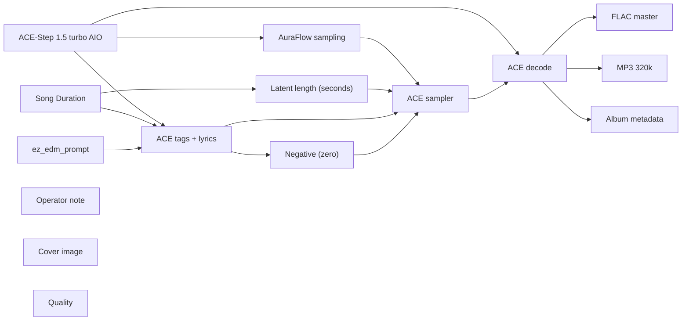

# audio/albums/drive-through/headliner

**What's on this page**

- **Every track, cover, and album-pack graph** in this folder
- **Shared ACE-Step topology** (one printer, unique widgets per take)
- **Node parameter reference** for the types on these graphs

**What this enables**

- **Queuing one numbered take** or `album-render`
- **Reading tags, lyrics, seed, BPM** without opening raw JSON

**Who this is for:** studio users after `download-music`. Occupancy **audio** (cover stills are **klein** — separate session).

> Generated from `workflows/_lab/audio/albums/drive-through/headliner/`. Do not hand-edit this file.

## Purpose

Numbered takes under `audio/albums/drive-through/headliner/`. Queue one track, or `./scripts/manage.sh album-render --album drive-through/headliner`.

```text
## 01-lantern-merge

US-safe EDM **180 s** take: **lantern merge**. Fictional act **Drive-through** (hardcore, pure of heart). Native ACE-Step 1.5 turbo AIO. Live bass-set take. Instrumental score is empty-body ACE markers (`[drop - cues]`, `[inst - cues]`, `[outro]`) so ACE does not sing production notes. Drop-first warped hybrid-trap, trap drums, no quiet dips. Vocals are a rare DJ treat on other graphs, not here. Queue this graph **on its own** — draft-first is the generic rap lane, not a prerequisite. Occupancy **audio** only; a longer Queue is expected.

1. Weights: `./scripts/manage.sh download-music --tier turbo` (same AIO dest as `download-podcast --tier acestep`; ~10 GB, opt-in, not `download-models`).
2. Prompt enhance is **off** so tags, BPM, language, and `[drop]` / `[inst]` / `[outro]` stay as written. Turn Enhance on only if you want the 4B rewriter.
3. Tags vs score: tags are genre/instrument hints; lyrics are the arrangement. Keep App **Vocal / instrumental** on instrumental so ACE does not sing. Encoder language is `unknown`. Free-text lines under a marker are lyrics — keep cues inside the brackets.
4. Original arrangements only. No “in the style of <living artist>”. No living-DJ names. No famous-hook paraphrases.
5. ACE-Step timbre is **invented**, not a cloned act.
6. Sampler: 8 steps, cfg 1, euler, simple. Duration 180 s, bpm 150, language unknown, timesignature 4, generate_audio_codes true. Seed 367.
7. Saves: `01 - Lantern Merge` FLAC master + 320 kbps MP3 under `${COMFY_OUTPUT_DIR}`.
8. Cover separately: Queue **klein/thumbnail.json** or **klein/podcast-cover.json**. Do not embed Klein here.
9. Human selection and edit before any release. Prompts are not authorship (USCO Part 2 / Thaler).
10. Do not co-resident with LTX / Wan / Klein on this Spark.

Occupancy: audio — stop Klein / Wan / LTX session. One GB10 job.
```

## Shared graph



## Graphs in this album

| Graph | Nodes | Occupancy |
| --- | --- | --- |
| `audio/albums/drive-through/headliner/01-lantern-merge` | 15 | audio |
| `audio/albums/drive-through/headliner/02-firefly-lane` | 15 | audio |
| `audio/albums/drive-through/headliner/03-canopy-bounce` | 15 | audio |
| `audio/albums/drive-through/headliner/04-grove-wreck` | 15 | audio |
| `audio/albums/drive-through/headliner/05-moss-sub` | 15 | audio |
| `audio/albums/drive-through/headliner/06-fern-stack` | 15 | audio |
| `audio/albums/drive-through/headliner/07-pollen-kick` | 15 | audio |
| `audio/albums/drive-through/headliner/08-cedar-growl` | 15 | audio |
| `audio/albums/drive-through/headliner/09-moon-ramp` | 15 | audio |
| `audio/albums/drive-through/headliner/10-trail-bounce` | 15 | audio |
| `audio/albums/drive-through/headliner/11-dew-wreck` | 15 | audio |
| `audio/albums/drive-through/headliner/12-sap-stack` | 15 | audio |
| `audio/albums/drive-through/headliner/13-glade-split` | 15 | audio |
| `audio/albums/drive-through/headliner/14-root-chest` | 15 | audio |
| `audio/albums/drive-through/headliner/15-ember-crest` | 15 | audio |
| `audio/albums/drive-through/headliner/album` | 3 | none |
| `audio/albums/drive-through/headliner/cover` | 14 | klein |

## `01-lantern-merge`

Catalog id `audio/albums/drive-through/headliner/01-lantern-merge`.

US-safe EDM 180s: Drive-through lantern-merge hybrid trap warp, ACE-Step 1.5 turbo AIO, instrumental, warped bass, invented timbre
Prompt enhance is **off** so authored text (recipe, script labels, ACE tags, or film shots) is encoded as written. Turn Enhance on only if you want the 4B rewriter.

**ACE-Step 1.5 turbo AIO** (`CheckpointLoaderSimple`)

| Slot | Value |
| --- | --- |
| 0 | `ace_step_1.5_turbo_aio.safetensors` |

**AuraFlow sampling** (`ModelSamplingAuraFlow`)

| Slot | Value |
| --- | --- |
| 0 | `3` |

**Song Duration** (`PrimitiveNode`)

| Slot | Value |
| --- | --- |
| 0 | `180.0` |
| 1 | `fixed` |

**Latent length (seconds)** (`EmptyAceStep1.5LatentAudio`)

| Slot | Value |
| --- | --- |
| 0 | `180.0` |
| 1 | `1` |

**ez_edm_prompt** (`EZAceStepPromptEnhance`)

| Slot | Value |
| --- | --- |
| 0 | `custom` |
| 1 | `warped hybrid-trap, trap drums, rapid hi-hats, chest-sub bass, warped bass, rav…` |
| 2 | `[drop - heavy warped drop, trap drums 808 wreck, chest formant, grid 367 0] [in…` |
| 3 | `false` |
| 4 | `instrumental` |
| 5 | `audio/albums/drive-through/headliner/01-lantern-merge` |

```text
warped hybrid-trap, trap drums, rapid hi-hats, chest-sub bass, warped bass, rave, 808, no singing, no choir, no vocal chops, original composition, riser, drop first, 150 bpm, instrumental, no vocals
```

```text
[drop - heavy warped drop, trap drums 808 wreck, chest formant, grid 367 0]

[inst - rapid hi-hats roll, 808 slide, grid 367 1]

[drop - harder growl drop, stacked trap drums 808, chest warp, grid 367 2]

[inst - snare roll, chest-sub 808 punch, grid 367 3]

[drop - full send drop, body bass wreck, warped trap, grid 367 4]

[outro - kick holds, rapid hi-hats roll, chest ride, grid 367 5]
```

**ACE tags + lyrics** (`TextEncodeAceStepAudio1.5`)

| Slot | Value |
| --- | --- |
| 0 | `warped hybrid-trap, trap drums, rapid hi-hats, chest-sub bass, warped bass, rav…` |
| 1 | `[drop - heavy warped drop, trap drums 808 wreck, chest formant, grid 367 0] [in…` |
| 2 | `367` |
| 3 | `fixed` |
| 4 | `150` |
| 5 | `180.0` |
| 6 | `4` |
| 7 | `unknown` |
| 8 | `C minor` |
| 9 | `true` |
| 10 | `2.0` |
| 11 | `0.85` |
| 12 | `0.9` |
| 13 | `0` |
| 14 | `0.0` |

```text
warped hybrid-trap, trap drums, rapid hi-hats, chest-sub bass, warped bass, rave, 808, no singing, no choir, no vocal chops, original composition, riser, drop first, 150 bpm, instrumental, no vocals
```

```text
[drop - heavy warped drop, trap drums 808 wreck, chest formant, grid 367 0]

[inst - rapid hi-hats roll, 808 slide, grid 367 1]

[drop - harder growl drop, stacked trap drums 808, chest warp, grid 367 2]

[inst - snare roll, chest-sub 808 punch, grid 367 3]

[drop - full send drop, body bass wreck, warped trap, grid 367 4]

[outro - kick holds, rapid hi-hats roll, chest ride, grid 367 5]
```

**ACE sampler** (`KSampler`)

| Slot | Value |
| --- | --- |
| 0 | `367` |
| 1 | `fixed` |
| 2 | `8` |
| 3 | `1.0` |
| 4 | `euler` |
| 5 | `simple` |
| 6 | `1.0` |

**FLAC master** (`SaveAudio`)

| Slot | Value |
| --- | --- |
| 0 | `01 - Lantern Merge` |

**MP3 320k** (`SaveAudioMP3`)

| Slot | Value |
| --- | --- |
| 0 | `01 - Lantern Merge` |
| 1 | `320k` |

**Cover image** (`LoadImage`)

| Slot | Value |
| --- | --- |
| 0 | `cover.png` |
| 1 | `image` |

**Album metadata** (`EZAudioMetadata`)

| Slot | Value |
| --- | --- |
| 0 | `Drive-through` |
| 1 | `Headliner` |
| 2 | `Lantern Merge` |
| 3 | `1` |
| 4 | `15` |
| 5 | `2026` |
| 6 | `skip` |
| 7 | `01 - Lantern Merge` |

**Quality** (`EZQuality`)

| Slot | Value |
| --- | --- |
| 0 | `lab` |

## `02-firefly-lane`

Catalog id `audio/albums/drive-through/headliner/02-firefly-lane`.

US-safe EDM 180s: Drive-through firefly-lane color bass warp, ACE-Step 1.5 turbo AIO, instrumental, warped bass, invented timbre
Prompt enhance is **off** so authored text (recipe, script labels, ACE tags, or film shots) is encoded as written. Turn Enhance on only if you want the 4B rewriter.

**ACE-Step 1.5 turbo AIO** (`CheckpointLoaderSimple`)

| Slot | Value |
| --- | --- |
| 0 | `ace_step_1.5_turbo_aio.safetensors` |

**AuraFlow sampling** (`ModelSamplingAuraFlow`)

| Slot | Value |
| --- | --- |
| 0 | `3` |

**Song Duration** (`PrimitiveNode`)

| Slot | Value |
| --- | --- |
| 0 | `180.0` |
| 1 | `fixed` |

**Latent length (seconds)** (`EmptyAceStep1.5LatentAudio`)

| Slot | Value |
| --- | --- |
| 0 | `180.0` |
| 1 | `1` |

**ez_edm_prompt** (`EZAceStepPromptEnhance`)

| Slot | Value |
| --- | --- |
| 0 | `custom` |
| 1 | `color bass, formant bass, chest-sub, rapid hi-hats, trap drums, 808, warped bas…` |
| 2 | `[drop - heavy color drop, trap drums 808 warp, chest wreck, grid 373 0] [inst -…` |
| 3 | `false` |
| 4 | `instrumental` |
| 5 | `audio/albums/drive-through/headliner/02-firefly-lane` |

```text
color bass, formant bass, chest-sub, rapid hi-hats, trap drums, 808, warped bass, rave, no singing, no choir, no vocal chops, original composition, riser, drop first, 152 bpm, instrumental, no vocals
```

```text
[drop - heavy color drop, trap drums 808 warp, chest wreck, grid 373 0]

[inst - rapid hi-hats denser, color 808 sustain firefly, grid 373 1]

[drop - harder stacked drop, chest color wreck, warped 808, grid 373 2]

[drop - full send drop, dirty trap drums 808, formant wall, grid 373 3]

[outro - kick holds, hats denser, color ride, grid 373 4]
```

**ACE tags + lyrics** (`TextEncodeAceStepAudio1.5`)

| Slot | Value |
| --- | --- |
| 0 | `color bass, formant bass, chest-sub, rapid hi-hats, trap drums, 808, warped bas…` |
| 1 | `[drop - heavy color drop, trap drums 808 warp, chest wreck, grid 373 0] [inst -…` |
| 2 | `373` |
| 3 | `fixed` |
| 4 | `152` |
| 5 | `180.0` |
| 6 | `4` |
| 7 | `unknown` |
| 8 | `C minor` |
| 9 | `true` |
| 10 | `2.0` |
| 11 | `0.85` |
| 12 | `0.9` |
| 13 | `0` |
| 14 | `0.0` |

```text
color bass, formant bass, chest-sub, rapid hi-hats, trap drums, 808, warped bass, rave, no singing, no choir, no vocal chops, original composition, riser, drop first, 152 bpm, instrumental, no vocals
```

```text
[drop - heavy color drop, trap drums 808 warp, chest wreck, grid 373 0]

[inst - rapid hi-hats denser, color 808 sustain firefly, grid 373 1]

[drop - harder stacked drop, chest color wreck, warped 808, grid 373 2]

[drop - full send drop, dirty trap drums 808, formant wall, grid 373 3]

[outro - kick holds, hats denser, color ride, grid 373 4]
```

**ACE sampler** (`KSampler`)

| Slot | Value |
| --- | --- |
| 0 | `373` |
| 1 | `fixed` |
| 2 | `8` |
| 3 | `1.0` |
| 4 | `euler` |
| 5 | `simple` |
| 6 | `1.0` |

**FLAC master** (`SaveAudio`)

| Slot | Value |
| --- | --- |
| 0 | `02 - Firefly Lane` |

**MP3 320k** (`SaveAudioMP3`)

| Slot | Value |
| --- | --- |
| 0 | `02 - Firefly Lane` |
| 1 | `320k` |

**Cover image** (`LoadImage`)

| Slot | Value |
| --- | --- |
| 0 | `cover.png` |
| 1 | `image` |

**Album metadata** (`EZAudioMetadata`)

| Slot | Value |
| --- | --- |
| 0 | `Drive-through` |
| 1 | `Headliner` |
| 2 | `Firefly Lane` |
| 3 | `2` |
| 4 | `15` |
| 5 | `2026` |
| 6 | `skip` |
| 7 | `02 - Firefly Lane` |

**Quality** (`EZQuality`)

| Slot | Value |
| --- | --- |
| 0 | `lab` |

## `03-canopy-bounce`

Catalog id `audio/albums/drive-through/headliner/03-canopy-bounce`.

US-safe EDM 180s: Drive-through canopy-bounce chest bass warp, ACE-Step 1.5 turbo AIO, instrumental, warped bass, invented timbre
Prompt enhance is **off** so authored text (recipe, script labels, ACE tags, or film shots) is encoded as written. Turn Enhance on only if you want the 4B rewriter.

**ACE-Step 1.5 turbo AIO** (`CheckpointLoaderSimple`)

| Slot | Value |
| --- | --- |
| 0 | `ace_step_1.5_turbo_aio.safetensors` |

**AuraFlow sampling** (`ModelSamplingAuraFlow`)

| Slot | Value |
| --- | --- |
| 0 | `3` |

**Song Duration** (`PrimitiveNode`)

| Slot | Value |
| --- | --- |
| 0 | `180.0` |
| 1 | `fixed` |

**Latent length (seconds)** (`EmptyAceStep1.5LatentAudio`)

| Slot | Value |
| --- | --- |
| 0 | `180.0` |
| 1 | `1` |

**ez_edm_prompt** (`EZAceStepPromptEnhance`)

| Slot | Value |
| --- | --- |
| 0 | `custom` |
| 1 | `chest bass, chest-sub, 808, rapid hi-hats, trap drums, body bass, warped bass, …` |
| 2 | `[drop - heavy chest drop, trap drums 808 warp, canopy wreck, grid 379 0] [inst …` |
| 3 | `false` |
| 4 | `instrumental` |
| 5 | `audio/albums/drive-through/headliner/03-canopy-bounce` |

```text
chest bass, chest-sub, 808, rapid hi-hats, trap drums, body bass, warped bass, rave, no singing, no choir, no vocal chops, original composition, riser, drop first, 148 bpm, instrumental, no vocals
```

```text
[drop - heavy chest drop, trap drums 808 warp, canopy wreck, grid 379 0]

[inst - rapid hi-hats roll, chest-sub 808 hold, grid 379 1]

[drop - harder growl drop, stacked body 808, warped chest, grid 379 2]

[inst - snare roll, 808 punch, grid 379 3]

[drop - full send drop, chest bass wreck, trap warp, grid 379 4]

[outro - kick holds, rapid hi-hats roll, chest ride, grid 379 5]
```

**ACE tags + lyrics** (`TextEncodeAceStepAudio1.5`)

| Slot | Value |
| --- | --- |
| 0 | `chest bass, chest-sub, 808, rapid hi-hats, trap drums, body bass, warped bass, …` |
| 1 | `[drop - heavy chest drop, trap drums 808 warp, canopy wreck, grid 379 0] [inst …` |
| 2 | `379` |
| 3 | `fixed` |
| 4 | `148` |
| 5 | `180.0` |
| 6 | `4` |
| 7 | `unknown` |
| 8 | `C minor` |
| 9 | `true` |
| 10 | `2.0` |
| 11 | `0.85` |
| 12 | `0.9` |
| 13 | `0` |
| 14 | `0.0` |

```text
chest bass, chest-sub, 808, rapid hi-hats, trap drums, body bass, warped bass, rave, no singing, no choir, no vocal chops, original composition, riser, drop first, 148 bpm, instrumental, no vocals
```

```text
[drop - heavy chest drop, trap drums 808 warp, canopy wreck, grid 379 0]

[inst - rapid hi-hats roll, chest-sub 808 hold, grid 379 1]

[drop - harder growl drop, stacked body 808, warped chest, grid 379 2]

[inst - snare roll, 808 punch, grid 379 3]

[drop - full send drop, chest bass wreck, trap warp, grid 379 4]

[outro - kick holds, rapid hi-hats roll, chest ride, grid 379 5]
```

**ACE sampler** (`KSampler`)

| Slot | Value |
| --- | --- |
| 0 | `379` |
| 1 | `fixed` |
| 2 | `8` |
| 3 | `1.0` |
| 4 | `euler` |
| 5 | `simple` |
| 6 | `1.0` |

**FLAC master** (`SaveAudio`)

| Slot | Value |
| --- | --- |
| 0 | `03 - Canopy Bounce` |

**MP3 320k** (`SaveAudioMP3`)

| Slot | Value |
| --- | --- |
| 0 | `03 - Canopy Bounce` |
| 1 | `320k` |

**Cover image** (`LoadImage`)

| Slot | Value |
| --- | --- |
| 0 | `cover.png` |
| 1 | `image` |

**Album metadata** (`EZAudioMetadata`)

| Slot | Value |
| --- | --- |
| 0 | `Drive-through` |
| 1 | `Headliner` |
| 2 | `Canopy Bounce` |
| 3 | `3` |
| 4 | `15` |
| 5 | `2026` |
| 6 | `skip` |
| 7 | `03 - Canopy Bounce` |

**Quality** (`EZQuality`)

| Slot | Value |
| --- | --- |
| 0 | `lab` |

## `04-grove-wreck`

Catalog id `audio/albums/drive-through/headliner/04-grove-wreck`.

US-safe EDM 180s: Drive-through grove-wreck riddim warp, ACE-Step 1.5 turbo AIO, instrumental, warped bass, invented timbre
Prompt enhance is **off** so authored text (recipe, script labels, ACE tags, or film shots) is encoded as written. Turn Enhance on only if you want the 4B rewriter.

**ACE-Step 1.5 turbo AIO** (`CheckpointLoaderSimple`)

| Slot | Value |
| --- | --- |
| 0 | `ace_step_1.5_turbo_aio.safetensors` |

**AuraFlow sampling** (`ModelSamplingAuraFlow`)

| Slot | Value |
| --- | --- |
| 0 | `3` |

**Song Duration** (`PrimitiveNode`)

| Slot | Value |
| --- | --- |
| 0 | `180.0` |
| 1 | `fixed` |

**Latent length (seconds)** (`EmptyAceStep1.5LatentAudio`)

| Slot | Value |
| --- | --- |
| 0 | `180.0` |
| 1 | `1` |

**ez_edm_prompt** (`EZAceStepPromptEnhance`)

| Slot | Value |
| --- | --- |
| 0 | `custom` |
| 1 | `riddim, warped bass, chest-sub, rapid hi-hats, trap drums, wobble bass, rave, 8…` |
| 2 | `[drop - heavy riddim drop, wobble trap drums 808, chest wreck, grid 383 0] [ins…` |
| 3 | `false` |
| 4 | `instrumental` |
| 5 | `audio/albums/drive-through/headliner/04-grove-wreck` |

```text
riddim, warped bass, chest-sub, rapid hi-hats, trap drums, wobble bass, rave, 808, no singing, no choir, no vocal chops, original composition, riser, drop first, 150 bpm, instrumental, no vocals
```

```text
[drop - heavy riddim drop, wobble trap drums 808, chest wreck, grid 383 0]

[inst - metal hats roll, warp 808 sustain grove, grid 383 1]

[drop - harder stacked drop, chest growl wreck, trap drums 808, grid 383 2]

[inst - rapid hi-hats denser, wobble hold, grid 383 3]

[drop - full send drop, chest-sub wreck, warped riddim, grid 383 4]

[drop - harder warped drop, chest-sub 808 wreck, trap growl, grid 383 5]

[outro - kick holds, hats denser, wobble ride, grid 383 6]
```

**ACE tags + lyrics** (`TextEncodeAceStepAudio1.5`)

| Slot | Value |
| --- | --- |
| 0 | `riddim, warped bass, chest-sub, rapid hi-hats, trap drums, wobble bass, rave, 8…` |
| 1 | `[drop - heavy riddim drop, wobble trap drums 808, chest wreck, grid 383 0] [ins…` |
| 2 | `383` |
| 3 | `fixed` |
| 4 | `150` |
| 5 | `180.0` |
| 6 | `4` |
| 7 | `unknown` |
| 8 | `C minor` |
| 9 | `true` |
| 10 | `2.0` |
| 11 | `0.85` |
| 12 | `0.9` |
| 13 | `0` |
| 14 | `0.0` |

```text
riddim, warped bass, chest-sub, rapid hi-hats, trap drums, wobble bass, rave, 808, no singing, no choir, no vocal chops, original composition, riser, drop first, 150 bpm, instrumental, no vocals
```

```text
[drop - heavy riddim drop, wobble trap drums 808, chest wreck, grid 383 0]

[inst - metal hats roll, warp 808 sustain grove, grid 383 1]

[drop - harder stacked drop, chest growl wreck, trap drums 808, grid 383 2]

[inst - rapid hi-hats denser, wobble hold, grid 383 3]

[drop - full send drop, chest-sub wreck, warped riddim, grid 383 4]

[drop - harder warped drop, chest-sub 808 wreck, trap growl, grid 383 5]

[outro - kick holds, hats denser, wobble ride, grid 383 6]
```

**ACE sampler** (`KSampler`)

| Slot | Value |
| --- | --- |
| 0 | `383` |
| 1 | `fixed` |
| 2 | `8` |
| 3 | `1.0` |
| 4 | `euler` |
| 5 | `simple` |
| 6 | `1.0` |

**FLAC master** (`SaveAudio`)

| Slot | Value |
| --- | --- |
| 0 | `04 - Grove Wreck` |

**MP3 320k** (`SaveAudioMP3`)

| Slot | Value |
| --- | --- |
| 0 | `04 - Grove Wreck` |
| 1 | `320k` |

**Cover image** (`LoadImage`)

| Slot | Value |
| --- | --- |
| 0 | `cover.png` |
| 1 | `image` |

**Album metadata** (`EZAudioMetadata`)

| Slot | Value |
| --- | --- |
| 0 | `Drive-through` |
| 1 | `Headliner` |
| 2 | `Grove Wreck` |
| 3 | `4` |
| 4 | `15` |
| 5 | `2026` |
| 6 | `skip` |
| 7 | `04 - Grove Wreck` |

**Quality** (`EZQuality`)

| Slot | Value |
| --- | --- |
| 0 | `lab` |

## `05-moss-sub`

Catalog id `audio/albums/drive-through/headliner/05-moss-sub`.

US-safe EDM 180s: Drive-through moss-sub dirty bass warp, ACE-Step 1.5 turbo AIO, instrumental, warped bass, invented timbre
Prompt enhance is **off** so authored text (recipe, script labels, ACE tags, or film shots) is encoded as written. Turn Enhance on only if you want the 4B rewriter.

**ACE-Step 1.5 turbo AIO** (`CheckpointLoaderSimple`)

| Slot | Value |
| --- | --- |
| 0 | `ace_step_1.5_turbo_aio.safetensors` |

**AuraFlow sampling** (`ModelSamplingAuraFlow`)

| Slot | Value |
| --- | --- |
| 0 | `3` |

**Song Duration** (`PrimitiveNode`)

| Slot | Value |
| --- | --- |
| 0 | `180.0` |
| 1 | `fixed` |

**Latent length (seconds)** (`EmptyAceStep1.5LatentAudio`)

| Slot | Value |
| --- | --- |
| 0 | `180.0` |
| 1 | `1` |

**ez_edm_prompt** (`EZAceStepPromptEnhance`)

| Slot | Value |
| --- | --- |
| 0 | `custom` |
| 1 | `dirty bass, warped bass, chest-sub, rapid hi-hats, trap drums, dual-action peda…` |
| 2 | `[drop - heavy dirty drop, chest-sub warp, trap drums 808 wreck, grid 389 0] [in…` |
| 3 | `false` |
| 4 | `instrumental` |
| 5 | `audio/albums/drive-through/headliner/05-moss-sub` |

```text
dirty bass, warped bass, chest-sub, rapid hi-hats, trap drums, dual-action pedal bass, 808, rave, no singing, no choir, no vocal chops, original composition, riser, drop first, 150 bpm, instrumental, no vocals
```

```text
[drop - heavy dirty drop, chest-sub warp, trap drums 808 wreck, grid 389 0]

[inst - rapid hi-hats roll, pedal 808 hold, grid 389 1]

[drop - harder growl drop, dual-action pedal bass, stacked 808 wall, grid 389 2]

[inst - hats denser, chest-sub 808, grid 389 3]

[drop - full send drop, body 808 wreck, warped trap, grid 389 4]

[outro - kick holds, rapid hi-hats roll, pedal ride, grid 389 5]
```

**ACE tags + lyrics** (`TextEncodeAceStepAudio1.5`)

| Slot | Value |
| --- | --- |
| 0 | `dirty bass, warped bass, chest-sub, rapid hi-hats, trap drums, dual-action peda…` |
| 1 | `[drop - heavy dirty drop, chest-sub warp, trap drums 808 wreck, grid 389 0] [in…` |
| 2 | `389` |
| 3 | `fixed` |
| 4 | `150` |
| 5 | `180.0` |
| 6 | `4` |
| 7 | `unknown` |
| 8 | `C minor` |
| 9 | `true` |
| 10 | `2.0` |
| 11 | `0.85` |
| 12 | `0.9` |
| 13 | `0` |
| 14 | `0.0` |

```text
dirty bass, warped bass, chest-sub, rapid hi-hats, trap drums, dual-action pedal bass, 808, rave, no singing, no choir, no vocal chops, original composition, riser, drop first, 150 bpm, instrumental, no vocals
```

```text
[drop - heavy dirty drop, chest-sub warp, trap drums 808 wreck, grid 389 0]

[inst - rapid hi-hats roll, pedal 808 hold, grid 389 1]

[drop - harder growl drop, dual-action pedal bass, stacked 808 wall, grid 389 2]

[inst - hats denser, chest-sub 808, grid 389 3]

[drop - full send drop, body 808 wreck, warped trap, grid 389 4]

[outro - kick holds, rapid hi-hats roll, pedal ride, grid 389 5]
```

**ACE sampler** (`KSampler`)

| Slot | Value |
| --- | --- |
| 0 | `389` |
| 1 | `fixed` |
| 2 | `8` |
| 3 | `1.0` |
| 4 | `euler` |
| 5 | `simple` |
| 6 | `1.0` |

**FLAC master** (`SaveAudio`)

| Slot | Value |
| --- | --- |
| 0 | `05 - Moss Sub` |

**MP3 320k** (`SaveAudioMP3`)

| Slot | Value |
| --- | --- |
| 0 | `05 - Moss Sub` |
| 1 | `320k` |

**Cover image** (`LoadImage`)

| Slot | Value |
| --- | --- |
| 0 | `cover.png` |
| 1 | `image` |

**Album metadata** (`EZAudioMetadata`)

| Slot | Value |
| --- | --- |
| 0 | `Drive-through` |
| 1 | `Headliner` |
| 2 | `Moss Sub` |
| 3 | `5` |
| 4 | `15` |
| 5 | `2026` |
| 6 | `skip` |
| 7 | `05 - Moss Sub` |

**Quality** (`EZQuality`)

| Slot | Value |
| --- | --- |
| 0 | `lab` |

## `06-fern-stack`

Catalog id `audio/albums/drive-through/headliner/06-fern-stack`.

US-safe EDM 180s: Drive-through fern-stack hybrid trap warp, ACE-Step 1.5 turbo AIO, instrumental, warped bass, invented timbre
Prompt enhance is **off** so authored text (recipe, script labels, ACE tags, or film shots) is encoded as written. Turn Enhance on only if you want the 4B rewriter.

**ACE-Step 1.5 turbo AIO** (`CheckpointLoaderSimple`)

| Slot | Value |
| --- | --- |
| 0 | `ace_step_1.5_turbo_aio.safetensors` |

**AuraFlow sampling** (`ModelSamplingAuraFlow`)

| Slot | Value |
| --- | --- |
| 0 | `3` |

**Song Duration** (`PrimitiveNode`)

| Slot | Value |
| --- | --- |
| 0 | `180.0` |
| 1 | `fixed` |

**Latent length (seconds)** (`EmptyAceStep1.5LatentAudio`)

| Slot | Value |
| --- | --- |
| 0 | `180.0` |
| 1 | `1` |

**ez_edm_prompt** (`EZAceStepPromptEnhance`)

| Slot | Value |
| --- | --- |
| 0 | `custom` |
| 1 | `warped hybrid-trap, trap drums, rapid hi-hats, stacked 808, chest-sub, warped b…` |
| 2 | `[drop - heavy hybrid drop, stacked trap drums 808, chest warp wreck, grid 397 0…` |
| 3 | `false` |
| 4 | `instrumental` |
| 5 | `audio/albums/drive-through/headliner/06-fern-stack` |

```text
warped hybrid-trap, trap drums, rapid hi-hats, stacked 808, chest-sub, warped bass, rave, 808, no singing, no choir, no vocal chops, original composition, riser, drop first, 155 bpm, instrumental, no vocals
```

```text
[drop - heavy hybrid drop, stacked trap drums 808, chest warp wreck, grid 397 0]

[inst - rapid hi-hats roll, 808 slide, grid 397 1]

[drop - harder stacked drop, chest trap wreck, warped 808, grid 397 2]

[inst - snare roll, chest-sub 808 punch, grid 397 3]

[drop - full send drop, body 808 stack, formant trap, grid 397 4]

[drop - harder growl drop, trap bass wreck, chest warp, grid 397 5]

[outro - kick holds, hats denser, 808 ride, grid 397 6]
```

**ACE tags + lyrics** (`TextEncodeAceStepAudio1.5`)

| Slot | Value |
| --- | --- |
| 0 | `warped hybrid-trap, trap drums, rapid hi-hats, stacked 808, chest-sub, warped b…` |
| 1 | `[drop - heavy hybrid drop, stacked trap drums 808, chest warp wreck, grid 397 0…` |
| 2 | `397` |
| 3 | `fixed` |
| 4 | `155` |
| 5 | `180.0` |
| 6 | `4` |
| 7 | `unknown` |
| 8 | `C minor` |
| 9 | `true` |
| 10 | `2.0` |
| 11 | `0.85` |
| 12 | `0.9` |
| 13 | `0` |
| 14 | `0.0` |

```text
warped hybrid-trap, trap drums, rapid hi-hats, stacked 808, chest-sub, warped bass, rave, 808, no singing, no choir, no vocal chops, original composition, riser, drop first, 155 bpm, instrumental, no vocals
```

```text
[drop - heavy hybrid drop, stacked trap drums 808, chest warp wreck, grid 397 0]

[inst - rapid hi-hats roll, 808 slide, grid 397 1]

[drop - harder stacked drop, chest trap wreck, warped 808, grid 397 2]

[inst - snare roll, chest-sub 808 punch, grid 397 3]

[drop - full send drop, body 808 stack, formant trap, grid 397 4]

[drop - harder growl drop, trap bass wreck, chest warp, grid 397 5]

[outro - kick holds, hats denser, 808 ride, grid 397 6]
```

**ACE sampler** (`KSampler`)

| Slot | Value |
| --- | --- |
| 0 | `397` |
| 1 | `fixed` |
| 2 | `8` |
| 3 | `1.0` |
| 4 | `euler` |
| 5 | `simple` |
| 6 | `1.0` |

**FLAC master** (`SaveAudio`)

| Slot | Value |
| --- | --- |
| 0 | `06 - Fern Stack` |

**MP3 320k** (`SaveAudioMP3`)

| Slot | Value |
| --- | --- |
| 0 | `06 - Fern Stack` |
| 1 | `320k` |

**Cover image** (`LoadImage`)

| Slot | Value |
| --- | --- |
| 0 | `cover.png` |
| 1 | `image` |

**Album metadata** (`EZAudioMetadata`)

| Slot | Value |
| --- | --- |
| 0 | `Drive-through` |
| 1 | `Headliner` |
| 2 | `Fern Stack` |
| 3 | `6` |
| 4 | `15` |
| 5 | `2026` |
| 6 | `skip` |
| 7 | `06 - Fern Stack` |

**Quality** (`EZQuality`)

| Slot | Value |
| --- | --- |
| 0 | `lab` |

## `07-pollen-kick`

Catalog id `audio/albums/drive-through/headliner/07-pollen-kick`.

US-safe EDM 180s: Drive-through pollen-kick drumstep warp, ACE-Step 1.5 turbo AIO, instrumental, warped bass, invented timbre
Prompt enhance is **off** so authored text (recipe, script labels, ACE tags, or film shots) is encoded as written. Turn Enhance on only if you want the 4B rewriter.

**ACE-Step 1.5 turbo AIO** (`CheckpointLoaderSimple`)

| Slot | Value |
| --- | --- |
| 0 | `ace_step_1.5_turbo_aio.safetensors` |

**AuraFlow sampling** (`ModelSamplingAuraFlow`)

| Slot | Value |
| --- | --- |
| 0 | `3` |

**Song Duration** (`PrimitiveNode`)

| Slot | Value |
| --- | --- |
| 0 | `180.0` |
| 1 | `fixed` |

**Latent length (seconds)** (`EmptyAceStep1.5LatentAudio`)

| Slot | Value |
| --- | --- |
| 0 | `180.0` |
| 1 | `1` |

**ez_edm_prompt** (`EZAceStepPromptEnhance`)

| Slot | Value |
| --- | --- |
| 0 | `custom` |
| 1 | `drumstep, amen break, chest-sub, trap drums, reese bass, warped bass, rave, 808…` |
| 2 | `[drop - heavy amen drop, trap drums 808 warp, chest wreck, grid 401 0] [inst - …` |
| 3 | `false` |
| 4 | `instrumental` |
| 5 | `audio/albums/drive-through/headliner/07-pollen-kick` |

```text
drumstep, amen break, chest-sub, trap drums, reese bass, warped bass, rave, 808, no singing, no choir, no vocal chops, original composition, riser, drop first, 174 bpm, instrumental, no vocals
```

```text
[drop - heavy amen drop, trap drums 808 warp, chest wreck, grid 401 0]

[inst - amen break, rapid hi-hats 808 pollen, grid 401 1]

[drop - harder stacked drop, reese 808 wreck, chest formant, grid 401 2]

[inst - hats denser, reese hold, grid 401 3]

[drop - full send drop, stacked amen 808 wreck, warped trap, grid 401 4]

[inst - snare roll, 808 punch, grid 401 5]

[drop - harder growl drop, chest trap wreck, reese wall, grid 401 6]

[outro - kick holds, amen break, reese ride, grid 401 7]
```

**ACE tags + lyrics** (`TextEncodeAceStepAudio1.5`)

| Slot | Value |
| --- | --- |
| 0 | `drumstep, amen break, chest-sub, trap drums, reese bass, warped bass, rave, 808…` |
| 1 | `[drop - heavy amen drop, trap drums 808 warp, chest wreck, grid 401 0] [inst - …` |
| 2 | `401` |
| 3 | `fixed` |
| 4 | `174` |
| 5 | `180.0` |
| 6 | `4` |
| 7 | `unknown` |
| 8 | `C minor` |
| 9 | `true` |
| 10 | `2.0` |
| 11 | `0.85` |
| 12 | `0.9` |
| 13 | `0` |
| 14 | `0.0` |

```text
drumstep, amen break, chest-sub, trap drums, reese bass, warped bass, rave, 808, no singing, no choir, no vocal chops, original composition, riser, drop first, 174 bpm, instrumental, no vocals
```

```text
[drop - heavy amen drop, trap drums 808 warp, chest wreck, grid 401 0]

[inst - amen break, rapid hi-hats 808 pollen, grid 401 1]

[drop - harder stacked drop, reese 808 wreck, chest formant, grid 401 2]

[inst - hats denser, reese hold, grid 401 3]

[drop - full send drop, stacked amen 808 wreck, warped trap, grid 401 4]

[inst - snare roll, 808 punch, grid 401 5]

[drop - harder growl drop, chest trap wreck, reese wall, grid 401 6]

[outro - kick holds, amen break, reese ride, grid 401 7]
```

**ACE sampler** (`KSampler`)

| Slot | Value |
| --- | --- |
| 0 | `401` |
| 1 | `fixed` |
| 2 | `8` |
| 3 | `1.0` |
| 4 | `euler` |
| 5 | `simple` |
| 6 | `1.0` |

**FLAC master** (`SaveAudio`)

| Slot | Value |
| --- | --- |
| 0 | `07 - Pollen Kick` |

**MP3 320k** (`SaveAudioMP3`)

| Slot | Value |
| --- | --- |
| 0 | `07 - Pollen Kick` |
| 1 | `320k` |

**Cover image** (`LoadImage`)

| Slot | Value |
| --- | --- |
| 0 | `cover.png` |
| 1 | `image` |

**Album metadata** (`EZAudioMetadata`)

| Slot | Value |
| --- | --- |
| 0 | `Drive-through` |
| 1 | `Headliner` |
| 2 | `Pollen Kick` |
| 3 | `7` |
| 4 | `15` |
| 5 | `2026` |
| 6 | `skip` |
| 7 | `07 - Pollen Kick` |

**Quality** (`EZQuality`)

| Slot | Value |
| --- | --- |
| 0 | `lab` |

## `08-cedar-growl`

Catalog id `audio/albums/drive-through/headliner/08-cedar-growl`.

US-safe EDM 180s: Drive-through cedar-growl tearout warp, ACE-Step 1.5 turbo AIO, instrumental, warped bass, invented timbre
Prompt enhance is **off** so authored text (recipe, script labels, ACE tags, or film shots) is encoded as written. Turn Enhance on only if you want the 4B rewriter.

**ACE-Step 1.5 turbo AIO** (`CheckpointLoaderSimple`)

| Slot | Value |
| --- | --- |
| 0 | `ace_step_1.5_turbo_aio.safetensors` |

**AuraFlow sampling** (`ModelSamplingAuraFlow`)

| Slot | Value |
| --- | --- |
| 0 | `3` |

**Song Duration** (`PrimitiveNode`)

| Slot | Value |
| --- | --- |
| 0 | `180.0` |
| 1 | `fixed` |

**Latent length (seconds)** (`EmptyAceStep1.5LatentAudio`)

| Slot | Value |
| --- | --- |
| 0 | `180.0` |
| 1 | `1` |

**ez_edm_prompt** (`EZAceStepPromptEnhance`)

| Slot | Value |
| --- | --- |
| 0 | `custom` |
| 1 | `tearout, warped bass, chest-sub, rapid hi-hats, trap drums, growl bass, 808, ra…` |
| 2 | `[drop - heavy tearout drop, trap growl wreck, chest-sub 808 warp, grid 409 0] […` |
| 3 | `false` |
| 4 | `instrumental` |
| 5 | `audio/albums/drive-through/headliner/08-cedar-growl` |

```text
tearout, warped bass, chest-sub, rapid hi-hats, trap drums, growl bass, 808, rave, no singing, no choir, no vocal chops, original composition, riser, drop first, 150 bpm, instrumental, no vocals
```

```text
[drop - heavy tearout drop, trap growl wreck, chest-sub 808 warp, grid 409 0]

[inst - metal hats roll, growl sustain, grid 409 1]

[drop - harder stacked drop, chest-sub 808 wreck, warped trap, grid 409 2]

[drop - full send drop, chest-sub wreck, tearout warp, grid 409 3]

[outro - kick holds, rapid hi-hats roll, growl ride, grid 409 4]
```

**ACE tags + lyrics** (`TextEncodeAceStepAudio1.5`)

| Slot | Value |
| --- | --- |
| 0 | `tearout, warped bass, chest-sub, rapid hi-hats, trap drums, growl bass, 808, ra…` |
| 1 | `[drop - heavy tearout drop, trap growl wreck, chest-sub 808 warp, grid 409 0] […` |
| 2 | `409` |
| 3 | `fixed` |
| 4 | `150` |
| 5 | `180.0` |
| 6 | `4` |
| 7 | `unknown` |
| 8 | `C minor` |
| 9 | `true` |
| 10 | `2.0` |
| 11 | `0.85` |
| 12 | `0.9` |
| 13 | `0` |
| 14 | `0.0` |

```text
tearout, warped bass, chest-sub, rapid hi-hats, trap drums, growl bass, 808, rave, no singing, no choir, no vocal chops, original composition, riser, drop first, 150 bpm, instrumental, no vocals
```

```text
[drop - heavy tearout drop, trap growl wreck, chest-sub 808 warp, grid 409 0]

[inst - metal hats roll, growl sustain, grid 409 1]

[drop - harder stacked drop, chest-sub 808 wreck, warped trap, grid 409 2]

[drop - full send drop, chest-sub wreck, tearout warp, grid 409 3]

[outro - kick holds, rapid hi-hats roll, growl ride, grid 409 4]
```

**ACE sampler** (`KSampler`)

| Slot | Value |
| --- | --- |
| 0 | `409` |
| 1 | `fixed` |
| 2 | `8` |
| 3 | `1.0` |
| 4 | `euler` |
| 5 | `simple` |
| 6 | `1.0` |

**FLAC master** (`SaveAudio`)

| Slot | Value |
| --- | --- |
| 0 | `08 - Cedar Growl` |

**MP3 320k** (`SaveAudioMP3`)

| Slot | Value |
| --- | --- |
| 0 | `08 - Cedar Growl` |
| 1 | `320k` |

**Cover image** (`LoadImage`)

| Slot | Value |
| --- | --- |
| 0 | `cover.png` |
| 1 | `image` |

**Album metadata** (`EZAudioMetadata`)

| Slot | Value |
| --- | --- |
| 0 | `Drive-through` |
| 1 | `Headliner` |
| 2 | `Cedar Growl` |
| 3 | `8` |
| 4 | `15` |
| 5 | `2026` |
| 6 | `skip` |
| 7 | `08 - Cedar Growl` |

**Quality** (`EZQuality`)

| Slot | Value |
| --- | --- |
| 0 | `lab` |

## `09-moon-ramp`

Catalog id `audio/albums/drive-through/headliner/09-moon-ramp`.

US-safe EDM 180s: Drive-through moon-ramp wave bass warp, ACE-Step 1.5 turbo AIO, instrumental, warped bass, invented timbre
Prompt enhance is **off** so authored text (recipe, script labels, ACE tags, or film shots) is encoded as written. Turn Enhance on only if you want the 4B rewriter.

**ACE-Step 1.5 turbo AIO** (`CheckpointLoaderSimple`)

| Slot | Value |
| --- | --- |
| 0 | `ace_step_1.5_turbo_aio.safetensors` |

**AuraFlow sampling** (`ModelSamplingAuraFlow`)

| Slot | Value |
| --- | --- |
| 0 | `3` |

**Song Duration** (`PrimitiveNode`)

| Slot | Value |
| --- | --- |
| 0 | `180.0` |
| 1 | `fixed` |

**Latent length (seconds)** (`EmptyAceStep1.5LatentAudio`)

| Slot | Value |
| --- | --- |
| 0 | `180.0` |
| 1 | `1` |

**ez_edm_prompt** (`EZAceStepPromptEnhance`)

| Slot | Value |
| --- | --- |
| 0 | `custom` |
| 1 | `wave bass, warped bass, 808, rapid hi-hats, trap drums, fold bass, chest-sub, r…` |
| 2 | `[drop - heavy wave drop, trap drums 808 warp, chest fold wreck, grid 419 0] [in…` |
| 3 | `false` |
| 4 | `instrumental` |
| 5 | `audio/albums/drive-through/headliner/09-moon-ramp` |

```text
wave bass, warped bass, 808, rapid hi-hats, trap drums, fold bass, chest-sub, rave, no singing, no choir, no vocal chops, original composition, riser, drop first, 148 bpm, instrumental, no vocals
```

```text
[drop - heavy wave drop, trap drums 808 warp, chest fold wreck, grid 419 0]

[inst - rapid hi-hats denser, wave 808 hold moon, grid 419 1]

[drop - harder growl drop, chest-sub 808 wall, warped wave, grid 419 2]

[inst - snare roll, 808 slide, grid 419 3]

[drop - full send drop, body wave wreck, trap formant, grid 419 4]

[outro - kick holds, hats denser, wave ride, grid 419 5]
```

**ACE tags + lyrics** (`TextEncodeAceStepAudio1.5`)

| Slot | Value |
| --- | --- |
| 0 | `wave bass, warped bass, 808, rapid hi-hats, trap drums, fold bass, chest-sub, r…` |
| 1 | `[drop - heavy wave drop, trap drums 808 warp, chest fold wreck, grid 419 0] [in…` |
| 2 | `419` |
| 3 | `fixed` |
| 4 | `148` |
| 5 | `180.0` |
| 6 | `4` |
| 7 | `unknown` |
| 8 | `C minor` |
| 9 | `true` |
| 10 | `2.0` |
| 11 | `0.85` |
| 12 | `0.9` |
| 13 | `0` |
| 14 | `0.0` |

```text
wave bass, warped bass, 808, rapid hi-hats, trap drums, fold bass, chest-sub, rave, no singing, no choir, no vocal chops, original composition, riser, drop first, 148 bpm, instrumental, no vocals
```

```text
[drop - heavy wave drop, trap drums 808 warp, chest fold wreck, grid 419 0]

[inst - rapid hi-hats denser, wave 808 hold moon, grid 419 1]

[drop - harder growl drop, chest-sub 808 wall, warped wave, grid 419 2]

[inst - snare roll, 808 slide, grid 419 3]

[drop - full send drop, body wave wreck, trap formant, grid 419 4]

[outro - kick holds, hats denser, wave ride, grid 419 5]
```

**ACE sampler** (`KSampler`)

| Slot | Value |
| --- | --- |
| 0 | `419` |
| 1 | `fixed` |
| 2 | `8` |
| 3 | `1.0` |
| 4 | `euler` |
| 5 | `simple` |
| 6 | `1.0` |

**FLAC master** (`SaveAudio`)

| Slot | Value |
| --- | --- |
| 0 | `09 - Moon Ramp` |

**MP3 320k** (`SaveAudioMP3`)

| Slot | Value |
| --- | --- |
| 0 | `09 - Moon Ramp` |
| 1 | `320k` |

**Cover image** (`LoadImage`)

| Slot | Value |
| --- | --- |
| 0 | `cover.png` |
| 1 | `image` |

**Album metadata** (`EZAudioMetadata`)

| Slot | Value |
| --- | --- |
| 0 | `Drive-through` |
| 1 | `Headliner` |
| 2 | `Moon Ramp` |
| 3 | `9` |
| 4 | `15` |
| 5 | `2026` |
| 6 | `skip` |
| 7 | `09 - Moon Ramp` |

**Quality** (`EZQuality`)

| Slot | Value |
| --- | --- |
| 0 | `lab` |

## `10-trail-bounce`

Catalog id `audio/albums/drive-through/headliner/10-trail-bounce`.

US-safe EDM 180s: Drive-through trail-bounce color bass warp, ACE-Step 1.5 turbo AIO, instrumental, warped bass, invented timbre
Prompt enhance is **off** so authored text (recipe, script labels, ACE tags, or film shots) is encoded as written. Turn Enhance on only if you want the 4B rewriter.

**ACE-Step 1.5 turbo AIO** (`CheckpointLoaderSimple`)

| Slot | Value |
| --- | --- |
| 0 | `ace_step_1.5_turbo_aio.safetensors` |

**AuraFlow sampling** (`ModelSamplingAuraFlow`)

| Slot | Value |
| --- | --- |
| 0 | `3` |

**Song Duration** (`PrimitiveNode`)

| Slot | Value |
| --- | --- |
| 0 | `180.0` |
| 1 | `fixed` |

**Latent length (seconds)** (`EmptyAceStep1.5LatentAudio`)

| Slot | Value |
| --- | --- |
| 0 | `180.0` |
| 1 | `1` |

**ez_edm_prompt** (`EZAceStepPromptEnhance`)

| Slot | Value |
| --- | --- |
| 0 | `custom` |
| 1 | `color bass, formant bass, chest-sub, rapid hi-hats, trap drums, body bass, 808,…` |
| 2 | `[drop - heavy color drop, trap drums 808 warp, chest trail wreck, grid 421 0] […` |
| 3 | `false` |
| 4 | `instrumental` |
| 5 | `audio/albums/drive-through/headliner/10-trail-bounce` |

```text
color bass, formant bass, chest-sub, rapid hi-hats, trap drums, body bass, 808, warped bass, rave, no singing, no choir, no vocal chops, original composition, riser, drop first, 150 bpm, instrumental, no vocals
```

```text
[drop - heavy color drop, trap drums 808 warp, chest trail wreck, grid 421 0]

[inst - rapid hi-hats roll, 808 punch hold, grid 421 1]

[drop - harder stacked drop, chest color wreck, warped 808, grid 421 2]

[inst - snare roll, chest-sub 808, grid 421 3]

[drop - full send drop, body 808 wreck, color warp, grid 421 4]

[drop - harder growl drop, trap bass wall, chest formant, grid 421 5]

[outro - kick holds, rapid hi-hats roll, color ride, grid 421 6]
```

**ACE tags + lyrics** (`TextEncodeAceStepAudio1.5`)

| Slot | Value |
| --- | --- |
| 0 | `color bass, formant bass, chest-sub, rapid hi-hats, trap drums, body bass, 808,…` |
| 1 | `[drop - heavy color drop, trap drums 808 warp, chest trail wreck, grid 421 0] […` |
| 2 | `421` |
| 3 | `fixed` |
| 4 | `150` |
| 5 | `180.0` |
| 6 | `4` |
| 7 | `unknown` |
| 8 | `C minor` |
| 9 | `true` |
| 10 | `2.0` |
| 11 | `0.85` |
| 12 | `0.9` |
| 13 | `0` |
| 14 | `0.0` |

```text
color bass, formant bass, chest-sub, rapid hi-hats, trap drums, body bass, 808, warped bass, rave, no singing, no choir, no vocal chops, original composition, riser, drop first, 150 bpm, instrumental, no vocals
```

```text
[drop - heavy color drop, trap drums 808 warp, chest trail wreck, grid 421 0]

[inst - rapid hi-hats roll, 808 punch hold, grid 421 1]

[drop - harder stacked drop, chest color wreck, warped 808, grid 421 2]

[inst - snare roll, chest-sub 808, grid 421 3]

[drop - full send drop, body 808 wreck, color warp, grid 421 4]

[drop - harder growl drop, trap bass wall, chest formant, grid 421 5]

[outro - kick holds, rapid hi-hats roll, color ride, grid 421 6]
```

**ACE sampler** (`KSampler`)

| Slot | Value |
| --- | --- |
| 0 | `421` |
| 1 | `fixed` |
| 2 | `8` |
| 3 | `1.0` |
| 4 | `euler` |
| 5 | `simple` |
| 6 | `1.0` |

**FLAC master** (`SaveAudio`)

| Slot | Value |
| --- | --- |
| 0 | `10 - Trail Bounce` |

**MP3 320k** (`SaveAudioMP3`)

| Slot | Value |
| --- | --- |
| 0 | `10 - Trail Bounce` |
| 1 | `320k` |

**Cover image** (`LoadImage`)

| Slot | Value |
| --- | --- |
| 0 | `cover.png` |
| 1 | `image` |

**Album metadata** (`EZAudioMetadata`)

| Slot | Value |
| --- | --- |
| 0 | `Drive-through` |
| 1 | `Headliner` |
| 2 | `Trail Bounce` |
| 3 | `10` |
| 4 | `15` |
| 5 | `2026` |
| 6 | `skip` |
| 7 | `10 - Trail Bounce` |

**Quality** (`EZQuality`)

| Slot | Value |
| --- | --- |
| 0 | `lab` |

## `11-dew-wreck`

Catalog id `audio/albums/drive-through/headliner/11-dew-wreck`.

US-safe EDM 180s: Drive-through dew-wreck neuro bass warp, ACE-Step 1.5 turbo AIO, instrumental, warped bass, invented timbre
Prompt enhance is **off** so authored text (recipe, script labels, ACE tags, or film shots) is encoded as written. Turn Enhance on only if you want the 4B rewriter.

**ACE-Step 1.5 turbo AIO** (`CheckpointLoaderSimple`)

| Slot | Value |
| --- | --- |
| 0 | `ace_step_1.5_turbo_aio.safetensors` |

**AuraFlow sampling** (`ModelSamplingAuraFlow`)

| Slot | Value |
| --- | --- |
| 0 | `3` |

**Song Duration** (`PrimitiveNode`)

| Slot | Value |
| --- | --- |
| 0 | `180.0` |
| 1 | `fixed` |

**Latent length (seconds)** (`EmptyAceStep1.5LatentAudio`)

| Slot | Value |
| --- | --- |
| 0 | `180.0` |
| 1 | `1` |

**ez_edm_prompt** (`EZAceStepPromptEnhance`)

| Slot | Value |
| --- | --- |
| 0 | `custom` |
| 1 | `drumstep, amen break, chest-sub, rapid hi-hats, trap drums, reese bass, warped …` |
| 2 | `[drop - heavy neuro drop, reese trap drums 808, chest warp wreck, grid 431 0] […` |
| 3 | `false` |
| 4 | `instrumental` |
| 5 | `audio/albums/drive-through/headliner/11-dew-wreck` |

```text
drumstep, amen break, chest-sub, rapid hi-hats, trap drums, reese bass, warped bass, rave, 808, no singing, no choir, no vocal chops, original composition, riser, drop first, 172 bpm, instrumental, no vocals
```

```text
[drop - heavy neuro drop, reese trap drums 808, chest warp wreck, grid 431 0]

[inst - amen break, rapid hi-hats 808 dew, grid 431 1]

[drop - harder stacked drop, chest reese wreck, warped 808, grid 431 2]

[inst - hats denser, reese hold, grid 431 3]

[drop - full send drop, trap drums 808 wreck, chest formant, grid 431 4]

[inst - snare roll, 808 punch, grid 431 5]

[drop - harder growl drop, stacked neuro 808 wreck, trap warp, grid 431 6]

[drop - full send drop, body reese wreck, chest-sub 808, grid 431 7]

[outro - kick holds, amen break, reese ride, grid 431 8]
```

**ACE tags + lyrics** (`TextEncodeAceStepAudio1.5`)

| Slot | Value |
| --- | --- |
| 0 | `drumstep, amen break, chest-sub, rapid hi-hats, trap drums, reese bass, warped …` |
| 1 | `[drop - heavy neuro drop, reese trap drums 808, chest warp wreck, grid 431 0] […` |
| 2 | `431` |
| 3 | `fixed` |
| 4 | `172` |
| 5 | `180.0` |
| 6 | `4` |
| 7 | `unknown` |
| 8 | `C minor` |
| 9 | `true` |
| 10 | `2.0` |
| 11 | `0.85` |
| 12 | `0.9` |
| 13 | `0` |
| 14 | `0.0` |

```text
drumstep, amen break, chest-sub, rapid hi-hats, trap drums, reese bass, warped bass, rave, 808, no singing, no choir, no vocal chops, original composition, riser, drop first, 172 bpm, instrumental, no vocals
```

```text
[drop - heavy neuro drop, reese trap drums 808, chest warp wreck, grid 431 0]

[inst - amen break, rapid hi-hats 808 dew, grid 431 1]

[drop - harder stacked drop, chest reese wreck, warped 808, grid 431 2]

[inst - hats denser, reese hold, grid 431 3]

[drop - full send drop, trap drums 808 wreck, chest formant, grid 431 4]

[inst - snare roll, 808 punch, grid 431 5]

[drop - harder growl drop, stacked neuro 808 wreck, trap warp, grid 431 6]

[drop - full send drop, body reese wreck, chest-sub 808, grid 431 7]

[outro - kick holds, amen break, reese ride, grid 431 8]
```

**ACE sampler** (`KSampler`)

| Slot | Value |
| --- | --- |
| 0 | `431` |
| 1 | `fixed` |
| 2 | `8` |
| 3 | `1.0` |
| 4 | `euler` |
| 5 | `simple` |
| 6 | `1.0` |

**FLAC master** (`SaveAudio`)

| Slot | Value |
| --- | --- |
| 0 | `11 - Dew Wreck` |

**MP3 320k** (`SaveAudioMP3`)

| Slot | Value |
| --- | --- |
| 0 | `11 - Dew Wreck` |
| 1 | `320k` |

**Cover image** (`LoadImage`)

| Slot | Value |
| --- | --- |
| 0 | `cover.png` |
| 1 | `image` |

**Album metadata** (`EZAudioMetadata`)

| Slot | Value |
| --- | --- |
| 0 | `Drive-through` |
| 1 | `Headliner` |
| 2 | `Dew Wreck` |
| 3 | `11` |
| 4 | `15` |
| 5 | `2026` |
| 6 | `skip` |
| 7 | `11 - Dew Wreck` |

**Quality** (`EZQuality`)

| Slot | Value |
| --- | --- |
| 0 | `lab` |

## `12-sap-stack`

Catalog id `audio/albums/drive-through/headliner/12-sap-stack`.

US-safe EDM 180s: Drive-through sap-stack brostep warp, ACE-Step 1.5 turbo AIO, instrumental, warped bass, invented timbre
Prompt enhance is **off** so authored text (recipe, script labels, ACE tags, or film shots) is encoded as written. Turn Enhance on only if you want the 4B rewriter.

**ACE-Step 1.5 turbo AIO** (`CheckpointLoaderSimple`)

| Slot | Value |
| --- | --- |
| 0 | `ace_step_1.5_turbo_aio.safetensors` |

**AuraFlow sampling** (`ModelSamplingAuraFlow`)

| Slot | Value |
| --- | --- |
| 0 | `3` |

**Song Duration** (`PrimitiveNode`)

| Slot | Value |
| --- | --- |
| 0 | `180.0` |
| 1 | `fixed` |

**Latent length (seconds)** (`EmptyAceStep1.5LatentAudio`)

| Slot | Value |
| --- | --- |
| 0 | `180.0` |
| 1 | `1` |

**ez_edm_prompt** (`EZAceStepPromptEnhance`)

| Slot | Value |
| --- | --- |
| 0 | `custom` |
| 1 | `brostep, growl bass, chest-sub, rapid hi-hats, trap drums, stacked 808, warped …` |
| 2 | `[drop - heavy brostep drop, chest trap drums 808, warped wreck, grid 433 0] [in…` |
| 3 | `false` |
| 4 | `instrumental` |
| 5 | `audio/albums/drive-through/headliner/12-sap-stack` |

```text
brostep, growl bass, chest-sub, rapid hi-hats, trap drums, stacked 808, warped bass, rave, 808, no singing, no choir, no vocal chops, original composition, riser, drop first, 165 bpm, instrumental, no vocals
```

```text
[drop - heavy brostep drop, chest trap drums 808, warped wreck, grid 433 0]

[inst - rapid hi-hats denser, growl hold, grid 433 1]

[drop - harder stacked drop, trap drums 808 wall, chest formant, grid 433 2]

[inst - snare roll, 808 punch, grid 433 3]

[drop - full send drop, body bass wreck, warped trap, grid 433 4]

[drop - harder growl drop, stacked 808 wreck, chest warp, grid 433 5]

[outro - kick holds, hats denser, brostep ride, grid 433 6]
```

**ACE tags + lyrics** (`TextEncodeAceStepAudio1.5`)

| Slot | Value |
| --- | --- |
| 0 | `brostep, growl bass, chest-sub, rapid hi-hats, trap drums, stacked 808, warped …` |
| 1 | `[drop - heavy brostep drop, chest trap drums 808, warped wreck, grid 433 0] [in…` |
| 2 | `433` |
| 3 | `fixed` |
| 4 | `165` |
| 5 | `180.0` |
| 6 | `4` |
| 7 | `unknown` |
| 8 | `C minor` |
| 9 | `true` |
| 10 | `2.0` |
| 11 | `0.85` |
| 12 | `0.9` |
| 13 | `0` |
| 14 | `0.0` |

```text
brostep, growl bass, chest-sub, rapid hi-hats, trap drums, stacked 808, warped bass, rave, 808, no singing, no choir, no vocal chops, original composition, riser, drop first, 165 bpm, instrumental, no vocals
```

```text
[drop - heavy brostep drop, chest trap drums 808, warped wreck, grid 433 0]

[inst - rapid hi-hats denser, growl hold, grid 433 1]

[drop - harder stacked drop, trap drums 808 wall, chest formant, grid 433 2]

[inst - snare roll, 808 punch, grid 433 3]

[drop - full send drop, body bass wreck, warped trap, grid 433 4]

[drop - harder growl drop, stacked 808 wreck, chest warp, grid 433 5]

[outro - kick holds, hats denser, brostep ride, grid 433 6]
```

**ACE sampler** (`KSampler`)

| Slot | Value |
| --- | --- |
| 0 | `433` |
| 1 | `fixed` |
| 2 | `8` |
| 3 | `1.0` |
| 4 | `euler` |
| 5 | `simple` |
| 6 | `1.0` |

**FLAC master** (`SaveAudio`)

| Slot | Value |
| --- | --- |
| 0 | `12 - Sap Stack` |

**MP3 320k** (`SaveAudioMP3`)

| Slot | Value |
| --- | --- |
| 0 | `12 - Sap Stack` |
| 1 | `320k` |

**Cover image** (`LoadImage`)

| Slot | Value |
| --- | --- |
| 0 | `cover.png` |
| 1 | `image` |

**Album metadata** (`EZAudioMetadata`)

| Slot | Value |
| --- | --- |
| 0 | `Drive-through` |
| 1 | `Headliner` |
| 2 | `Sap Stack` |
| 3 | `12` |
| 4 | `15` |
| 5 | `2026` |
| 6 | `skip` |
| 7 | `12 - Sap Stack` |

**Quality** (`EZQuality`)

| Slot | Value |
| --- | --- |
| 0 | `lab` |

## `13-glade-split`

Catalog id `audio/albums/drive-through/headliner/13-glade-split`.

US-safe EDM 180s: Drive-through glade-split dirty dubstep warp, ACE-Step 1.5 turbo AIO, instrumental, warped bass, invented timbre
Prompt enhance is **off** so authored text (recipe, script labels, ACE tags, or film shots) is encoded as written. Turn Enhance on only if you want the 4B rewriter.

**ACE-Step 1.5 turbo AIO** (`CheckpointLoaderSimple`)

| Slot | Value |
| --- | --- |
| 0 | `ace_step_1.5_turbo_aio.safetensors` |

**AuraFlow sampling** (`ModelSamplingAuraFlow`)

| Slot | Value |
| --- | --- |
| 0 | `3` |

**Song Duration** (`PrimitiveNode`)

| Slot | Value |
| --- | --- |
| 0 | `180.0` |
| 1 | `fixed` |

**Latent length (seconds)** (`EmptyAceStep1.5LatentAudio`)

| Slot | Value |
| --- | --- |
| 0 | `180.0` |
| 1 | `1` |

**ez_edm_prompt** (`EZAceStepPromptEnhance`)

| Slot | Value |
| --- | --- |
| 0 | `custom` |
| 1 | `dirty dubstep, wobble bass, chest-sub, rapid hi-hats, trap drums, warped bass, …` |
| 2 | `[drop - heavy dubstep drop, trap drums 808 warp, chest split wreck, grid 439 0]…` |
| 3 | `false` |
| 4 | `instrumental` |
| 5 | `audio/albums/drive-through/headliner/13-glade-split` |

```text
dirty dubstep, wobble bass, chest-sub, rapid hi-hats, trap drums, warped bass, rave, 808, no singing, no choir, no vocal chops, original composition, riser, drop first, 150 bpm, instrumental, no vocals
```

```text
[drop - heavy dubstep drop, trap drums 808 warp, chest split wreck, grid 439 0]

[inst - rapid hi-hats roll, wobble hold, grid 439 1]

[drop - harder stacked drop, chest analog wreck, warped 808, grid 439 2]

[inst - snare roll, chest-sub 808, grid 439 3]

[drop - full send drop, double 808 wreck, trap formant, grid 439 4]

[inst - hats denser, 808 punch, grid 439 5]

[drop - harder growl drop, body dubstep wreck, chest warp, grid 439 6]

[outro - kick holds, rapid hi-hats roll, wobble ride, grid 439 7]
```

**ACE tags + lyrics** (`TextEncodeAceStepAudio1.5`)

| Slot | Value |
| --- | --- |
| 0 | `dirty dubstep, wobble bass, chest-sub, rapid hi-hats, trap drums, warped bass, …` |
| 1 | `[drop - heavy dubstep drop, trap drums 808 warp, chest split wreck, grid 439 0]…` |
| 2 | `439` |
| 3 | `fixed` |
| 4 | `150` |
| 5 | `180.0` |
| 6 | `4` |
| 7 | `unknown` |
| 8 | `C minor` |
| 9 | `true` |
| 10 | `2.0` |
| 11 | `0.85` |
| 12 | `0.9` |
| 13 | `0` |
| 14 | `0.0` |

```text
dirty dubstep, wobble bass, chest-sub, rapid hi-hats, trap drums, warped bass, rave, 808, no singing, no choir, no vocal chops, original composition, riser, drop first, 150 bpm, instrumental, no vocals
```

```text
[drop - heavy dubstep drop, trap drums 808 warp, chest split wreck, grid 439 0]

[inst - rapid hi-hats roll, wobble hold, grid 439 1]

[drop - harder stacked drop, chest analog wreck, warped 808, grid 439 2]

[inst - snare roll, chest-sub 808, grid 439 3]

[drop - full send drop, double 808 wreck, trap formant, grid 439 4]

[inst - hats denser, 808 punch, grid 439 5]

[drop - harder growl drop, body dubstep wreck, chest warp, grid 439 6]

[outro - kick holds, rapid hi-hats roll, wobble ride, grid 439 7]
```

**ACE sampler** (`KSampler`)

| Slot | Value |
| --- | --- |
| 0 | `439` |
| 1 | `fixed` |
| 2 | `8` |
| 3 | `1.0` |
| 4 | `euler` |
| 5 | `simple` |
| 6 | `1.0` |

**FLAC master** (`SaveAudio`)

| Slot | Value |
| --- | --- |
| 0 | `13 - Glade Split` |

**MP3 320k** (`SaveAudioMP3`)

| Slot | Value |
| --- | --- |
| 0 | `13 - Glade Split` |
| 1 | `320k` |

**Cover image** (`LoadImage`)

| Slot | Value |
| --- | --- |
| 0 | `cover.png` |
| 1 | `image` |

**Album metadata** (`EZAudioMetadata`)

| Slot | Value |
| --- | --- |
| 0 | `Drive-through` |
| 1 | `Headliner` |
| 2 | `Glade Split` |
| 3 | `13` |
| 4 | `15` |
| 5 | `2026` |
| 6 | `skip` |
| 7 | `13 - Glade Split` |

**Quality** (`EZQuality`)

| Slot | Value |
| --- | --- |
| 0 | `lab` |

## `14-root-chest`

Catalog id `audio/albums/drive-through/headliner/14-root-chest`.

US-safe EDM 180s: Drive-through root-chest chest bass warp, ACE-Step 1.5 turbo AIO, instrumental, warped bass, invented timbre
Prompt enhance is **off** so authored text (recipe, script labels, ACE tags, or film shots) is encoded as written. Turn Enhance on only if you want the 4B rewriter.

**ACE-Step 1.5 turbo AIO** (`CheckpointLoaderSimple`)

| Slot | Value |
| --- | --- |
| 0 | `ace_step_1.5_turbo_aio.safetensors` |

**AuraFlow sampling** (`ModelSamplingAuraFlow`)

| Slot | Value |
| --- | --- |
| 0 | `3` |

**Song Duration** (`PrimitiveNode`)

| Slot | Value |
| --- | --- |
| 0 | `180.0` |
| 1 | `fixed` |

**Latent length (seconds)** (`EmptyAceStep1.5LatentAudio`)

| Slot | Value |
| --- | --- |
| 0 | `180.0` |
| 1 | `1` |

**ez_edm_prompt** (`EZAceStepPromptEnhance`)

| Slot | Value |
| --- | --- |
| 0 | `custom` |
| 1 | `chest bass, chest-sub, 808, rapid hi-hats, trap drums, dual-action pedal bass, …` |
| 2 | `[drop - heavy chest drop, trap sub wreck, warped 808, grid 443 0] [inst - rapid…` |
| 3 | `false` |
| 4 | `instrumental` |
| 5 | `audio/albums/drive-through/headliner/14-root-chest` |

```text
chest bass, chest-sub, 808, rapid hi-hats, trap drums, dual-action pedal bass, warped bass, rave, no singing, no choir, no vocal chops, original composition, riser, drop first, 148 bpm, instrumental, no vocals
```

```text
[drop - heavy chest drop, trap sub wreck, warped 808, grid 443 0]

[inst - rapid hi-hats denser, chest-sub 808 hold, grid 443 1]

[drop - harder chest drop, dual-action pedal bass, stacked 808 warp, grid 443 2]

[inst - pedal 808 hold, hats roll, grid 443 3]

[drop - full send drop, body chest wreck, trap warp, grid 443 4]

[inst - hats denser, 808 punch, grid 443 5]

[drop - harder stacked drop, trap drums 808 wreck, chest formant, grid 443 6]

[drop - full send drop, chest-sub wreck, warped pedal, grid 443 7]

[outro - kick holds, rapid hi-hats roll, pedal ride, grid 443 8]
```

**ACE tags + lyrics** (`TextEncodeAceStepAudio1.5`)

| Slot | Value |
| --- | --- |
| 0 | `chest bass, chest-sub, 808, rapid hi-hats, trap drums, dual-action pedal bass, …` |
| 1 | `[drop - heavy chest drop, trap sub wreck, warped 808, grid 443 0] [inst - rapid…` |
| 2 | `443` |
| 3 | `fixed` |
| 4 | `148` |
| 5 | `180.0` |
| 6 | `4` |
| 7 | `unknown` |
| 8 | `C minor` |
| 9 | `true` |
| 10 | `2.0` |
| 11 | `0.85` |
| 12 | `0.9` |
| 13 | `0` |
| 14 | `0.0` |

```text
chest bass, chest-sub, 808, rapid hi-hats, trap drums, dual-action pedal bass, warped bass, rave, no singing, no choir, no vocal chops, original composition, riser, drop first, 148 bpm, instrumental, no vocals
```

```text
[drop - heavy chest drop, trap sub wreck, warped 808, grid 443 0]

[inst - rapid hi-hats denser, chest-sub 808 hold, grid 443 1]

[drop - harder chest drop, dual-action pedal bass, stacked 808 warp, grid 443 2]

[inst - pedal 808 hold, hats roll, grid 443 3]

[drop - full send drop, body chest wreck, trap warp, grid 443 4]

[inst - hats denser, 808 punch, grid 443 5]

[drop - harder stacked drop, trap drums 808 wreck, chest formant, grid 443 6]

[drop - full send drop, chest-sub wreck, warped pedal, grid 443 7]

[outro - kick holds, rapid hi-hats roll, pedal ride, grid 443 8]
```

**ACE sampler** (`KSampler`)

| Slot | Value |
| --- | --- |
| 0 | `443` |
| 1 | `fixed` |
| 2 | `8` |
| 3 | `1.0` |
| 4 | `euler` |
| 5 | `simple` |
| 6 | `1.0` |

**FLAC master** (`SaveAudio`)

| Slot | Value |
| --- | --- |
| 0 | `14 - Root Chest` |

**MP3 320k** (`SaveAudioMP3`)

| Slot | Value |
| --- | --- |
| 0 | `14 - Root Chest` |
| 1 | `320k` |

**Cover image** (`LoadImage`)

| Slot | Value |
| --- | --- |
| 0 | `cover.png` |
| 1 | `image` |

**Album metadata** (`EZAudioMetadata`)

| Slot | Value |
| --- | --- |
| 0 | `Drive-through` |
| 1 | `Headliner` |
| 2 | `Root Chest` |
| 3 | `14` |
| 4 | `15` |
| 5 | `2026` |
| 6 | `skip` |
| 7 | `14 - Root Chest` |

**Quality** (`EZQuality`)

| Slot | Value |
| --- | --- |
| 0 | `lab` |

## `15-ember-crest`

Catalog id `audio/albums/drive-through/headliner/15-ember-crest`.

US-safe EDM 180s: Drive-through ember-crest hybrid trap warp, ACE-Step 1.5 turbo AIO, instrumental, warped bass, invented timbre
Prompt enhance is **off** so authored text (recipe, script labels, ACE tags, or film shots) is encoded as written. Turn Enhance on only if you want the 4B rewriter.

**ACE-Step 1.5 turbo AIO** (`CheckpointLoaderSimple`)

| Slot | Value |
| --- | --- |
| 0 | `ace_step_1.5_turbo_aio.safetensors` |

**AuraFlow sampling** (`ModelSamplingAuraFlow`)

| Slot | Value |
| --- | --- |
| 0 | `3` |

**Song Duration** (`PrimitiveNode`)

| Slot | Value |
| --- | --- |
| 0 | `180.0` |
| 1 | `fixed` |

**Latent length (seconds)** (`EmptyAceStep1.5LatentAudio`)

| Slot | Value |
| --- | --- |
| 0 | `180.0` |
| 1 | `1` |

**ez_edm_prompt** (`EZAceStepPromptEnhance`)

| Slot | Value |
| --- | --- |
| 0 | `custom` |
| 1 | `warped hybrid-trap, trap drums, rapid hi-hats, chest-sub bass, warped bass, rav…` |
| 2 | `[drop - heavy warped drop, trap drums 808 wreck, chest crest grind, grid 449 0]…` |
| 3 | `false` |
| 4 | `instrumental` |
| 5 | `audio/albums/drive-through/headliner/15-ember-crest` |

```text
warped hybrid-trap, trap drums, rapid hi-hats, chest-sub bass, warped bass, rave, 808, no singing, no choir, no vocal chops, original composition, riser, drop first, 165 bpm, instrumental, no vocals
```

```text
[drop - heavy warped drop, trap drums 808 wreck, chest crest grind, grid 449 0]

[inst - rapid hi-hats roll, 808 slide, grid 449 1]

[drop - harder stacked drop, chest-sub 808 wall, trap formant, grid 449 2]

[inst - snare roll, chest-sub 808 punch, grid 449 3]

[drop - full send drop, body bass wreck, warped trap, grid 449 4]

[drop - harder growl drop, stacked trap wreck, chest-sub 808, grid 449 5]

[drop - full send drop, chest-sub wreck, warp wall, grid 449 6]

[outro - kick holds, hats denser, 808 ride, grid 449 7]
```

**ACE tags + lyrics** (`TextEncodeAceStepAudio1.5`)

| Slot | Value |
| --- | --- |
| 0 | `warped hybrid-trap, trap drums, rapid hi-hats, chest-sub bass, warped bass, rav…` |
| 1 | `[drop - heavy warped drop, trap drums 808 wreck, chest crest grind, grid 449 0]…` |
| 2 | `449` |
| 3 | `fixed` |
| 4 | `165` |
| 5 | `180.0` |
| 6 | `4` |
| 7 | `unknown` |
| 8 | `C minor` |
| 9 | `true` |
| 10 | `2.0` |
| 11 | `0.85` |
| 12 | `0.9` |
| 13 | `0` |
| 14 | `0.0` |

```text
warped hybrid-trap, trap drums, rapid hi-hats, chest-sub bass, warped bass, rave, 808, no singing, no choir, no vocal chops, original composition, riser, drop first, 165 bpm, instrumental, no vocals
```

```text
[drop - heavy warped drop, trap drums 808 wreck, chest crest grind, grid 449 0]

[inst - rapid hi-hats roll, 808 slide, grid 449 1]

[drop - harder stacked drop, chest-sub 808 wall, trap formant, grid 449 2]

[inst - snare roll, chest-sub 808 punch, grid 449 3]

[drop - full send drop, body bass wreck, warped trap, grid 449 4]

[drop - harder growl drop, stacked trap wreck, chest-sub 808, grid 449 5]

[drop - full send drop, chest-sub wreck, warp wall, grid 449 6]

[outro - kick holds, hats denser, 808 ride, grid 449 7]
```

**ACE sampler** (`KSampler`)

| Slot | Value |
| --- | --- |
| 0 | `449` |
| 1 | `fixed` |
| 2 | `8` |
| 3 | `1.0` |
| 4 | `euler` |
| 5 | `simple` |
| 6 | `1.0` |

**FLAC master** (`SaveAudio`)

| Slot | Value |
| --- | --- |
| 0 | `15 - Ember Crest` |

**MP3 320k** (`SaveAudioMP3`)

| Slot | Value |
| --- | --- |
| 0 | `15 - Ember Crest` |
| 1 | `320k` |

**Cover image** (`LoadImage`)

| Slot | Value |
| --- | --- |
| 0 | `cover.png` |
| 1 | `image` |

**Album metadata** (`EZAudioMetadata`)

| Slot | Value |
| --- | --- |
| 0 | `Drive-through` |
| 1 | `Headliner` |
| 2 | `Ember Crest` |
| 3 | `15` |
| 4 | `15` |
| 5 | `2026` |
| 6 | `skip` |
| 7 | `15 - Ember Crest` |

**Quality** (`EZQuality`)

| Slot | Value |
| --- | --- |
| 0 | `lab` |

## `album`

Catalog id `audio/albums/drive-through/headliner/album`.

Pack Headliner zip + m3u
Prompt enhance is **off** so authored text (recipe, script labels, ACE tags, or film shots) is encoded as written. Turn Enhance on only if you want the 4B rewriter.

**Pack album zip** (`EZAlbumPack`)

| Slot | Value |
| --- | --- |
| 0 | `Drive-through` |
| 1 | `Headliner` |

**Quality** (`EZQuality`)

| Slot | Value |
| --- | --- |
| 0 | `lab` |

## `cover`

Catalog id `audio/albums/drive-through/headliner/cover`.

Album cover still for Drive-through / Headliner

**Klein 4B distilled FP8** (`UNETLoader`)

| Slot | Value |
| --- | --- |
| 0 | `flux-2-klein-4b-fp8.safetensors` |
| 1 | `default` |

**Qwen3-4B TE** (`CLIPLoader`)

| Slot | Value |
| --- | --- |
| 0 | `qwen_3_4b.safetensors` |
| 1 | `flux2` |
| 2 | `default` |

**Flux2 VAE** (`VAELoader`)

| Slot | Value |
| --- | --- |
| 0 | `flux2-vae.safetensors` |

**Positive** (`CLIPTextEncode`)

| Slot | Value |
| --- | --- |
| 0 | `square album cover, graphic print, forest canopy rave lights, no faces, warped …` |

```text
square album cover, graphic print, forest canopy rave lights, no faces, warped bass wall, fictional act Drive-through, album Headliner, no text, no letters, no logos, no living person likeness, no celebrity, no photograph
```

**Negative** (`CLIPTextEncode`)

| Slot | Value |
| --- | --- |
| 0 | `game-engine cutscene, Pixar rounded cartoon, illustration, muddy textures, melt…` |

```text
game-engine cutscene, Pixar rounded cartoon, illustration, muddy textures, melted geometry, duplicate limbs, watermarks, oversharpen halos, muddy blacks
```

**Size 1:1 Instagram** (`EmptyFlux2LatentImage`)

| Slot | Value |
| --- | --- |
| 0 | `1024` |
| 1 | `1024` |
| 2 | `1` |

**KSampler** (`KSampler`)

| Slot | Value |
| --- | --- |
| 0 | `42` |
| 1 | `fixed` |
| 2 | `8` |
| 3 | `1.0` |
| 4 | `euler` |
| 5 | `simple` |
| 6 | `1.0` |

**Save PNG** (`SaveImage`)

| Slot | Value |
| --- | --- |
| 0 | `albums/Drive-through/Headliner/cover` |

**Draft still (set to ez_still_draft_00001_.png)** (`LoadImage`)

| Slot | Value |
| --- | --- |
| 0 | `example.png` |
| 1 | `image` |

**Klein Prompt Enhance** (`EZKleinPromptEnhance`)

| Slot | Value |
| --- | --- |
| 0 | `custom` |
| 1 | `square album cover, graphic print, forest canopy rave lights, no faces, warped …` |
| 2 | `true` |
| 3 | `t2i` |
| 4 | `YouTube 16:9 still` |
| 5 | `none` |
| 6 | `audio/albums/drive-through/headliner/cover` |

```text
square album cover, graphic print, forest canopy rave lights, no faces, warped bass wall, fictional act Drive-through, album Headliner, no text, no letters, no logos, no living person likeness, no celebrity, no photograph
```

**Negative Prompt Enhance** (`EZNegativePromptEnhance`)

| Slot | Value |
| --- | --- |
| 0 | `game-engine cutscene, Pixar rounded cartoon, illustration, muddy textures, melt…` |
| 1 | `true` |
| 2 | `klein` |

```text
game-engine cutscene, Pixar rounded cartoon, illustration, muddy textures, melted geometry, duplicate limbs, watermarks, oversharpen halos, muddy blacks
```

**Quality** (`EZQuality`)

| Slot | Value |
| --- | --- |
| 0 | `lab` |

## Node parameter reference

Every unique node type on this graph. Widgets are in lab JSON order. Choices are ComfyUI v0.34.6 / lab `INPUT_TYPES` — not SD1.5 folklore.

### `CheckpointLoaderSimple` — Load Checkpoint

Load a single-file checkpoint that bundles MODEL + CLIP + VAE.

!!! warning "Lab notes"

    ACE-Step 1.5 turbo AIO (ace_step_1.5_turbo_aio.safetensors) on every music graph.

| Socket | Dir | Type | What it carries |
| --- | --- | --- | --- |
| `MODEL` | out | `MODEL` | ACE denoiser (then ModelSamplingAuraFlow). |
| `CLIP` | out | `CLIP` | ACE text encoder. |
| `VAE` | out | `VAE` | ACE audio VAE. |

#### `ckpt_name`

Type `STRING`.

Filename under checkpoints/.

**How it affects generation:** Lab music is the turbo AIO. XL is opt-in via download-music --tier xl — swap only if you meant to.

**This graph (all 15 instances):** `ace_step_1.5_turbo_aio.safetensors`

### `ModelSamplingAuraFlow` — ModelSamplingAuraFlow

Patch ACE-Step with AuraFlow sampling shift.

!!! warning "Lab notes"

    Every ACE graph uses shift 3.

| Socket | Dir | Type | What it carries |
| --- | --- | --- | --- |
| `model` | in | `MODEL` | ACE checkpoint MODEL. |
| `MODEL` | out | `MODEL` | Shifted ACE denoiser. |

#### `shift`

Type `FLOAT`. Range / default: 3 (lab ACE).

AuraFlow shift.

**How it affects generation:** 3 is the ACE-Step 1.5 lab value. Higher shift changes timing/attack of the beat.

**This graph (all 15 instances):** `3`

### `PrimitiveNode` — Primitive

A typed constant (string or float) with seed-style control.

!!! warning "Lab notes"

    Music Duration (FLOAT) and Prompt Forge Context (STRING). widgets[1] is always control_after_generate.

| Socket | Dir | Type | What it carries |
| --- | --- | --- | --- |
| `value` | out | `FLOAT\|STRING` | Wired into duration / context / lyrics. |

#### `value`

Type `FLOAT|STRING`.

The constant.

**How it affects generation:** FLOAT seconds drive ACE latent length. STRING context is bible/research for Enhance.

**This graph (all 15 instances):** `180.0`

#### `control_after_generate`

Type `COMBO`. Range / default: fixed.

Whether the primitive mutates after Queue.

**How it affects generation:** fixed keeps duration/context pinned.

**This graph (all 15 instances):** `fixed`

**Other choices**

| Choice | What it does |
| --- | --- |
| `fixed` | Keep this seed on the next Queue. Lab default for reproducible stills and 5 s prints. |
| `increment` | Add 1 after Queue. Use for a sequence of variations. |
| `decrement` | Subtract 1 after Queue. |
| `randomize` | Draw a new seed after Queue. Exploration only. |

### `EmptyAceStep1.5LatentAudio` — Empty ACE-Step 1.5 Latent Audio

Allocate an ACE-Step audio latent for N seconds.

!!! warning "Lab notes"

    Draft 32 s, full 96 s, album takes 180 s. seconds is also a socket from PrimitiveNode so App Duration stays in one place.

| Socket | Dir | Type | What it carries |
| --- | --- | --- | --- |
| `seconds` | in | `FLOAT` | Wired from Song Duration primitive on music graphs. |
| `LATENT` | out | `LATENT` | Audio latent for KSampler. |

#### `seconds`

Type `FLOAT`. Range / default: 32 / 96 / 180 lab.

Duration in seconds.

**How it affects generation:** Longer latents cost RAM/time linearly. Stay at the seeded length unless you have headroom.

**This graph (all 15 instances):** `180.0`

#### `batch_size`

Type `INT`. Range / default: 1.

Takes per Queue.

**How it affects generation:** Stay 1.

**This graph (all 15 instances):** `1`

### `EZAceStepPromptEnhance` — ACE-Step Prompt Enhance

Rewrite ACE tags (genre first) and lyrics. Instrumental mode forces [inst].

!!! warning "Lab notes"

    Enhance off on authored album takes. Instrumental sanitizes lyrics into bracket cues.

| Socket | Dir | Type | What it carries |
| --- | --- | --- | --- |
| `lyrics` | in | `STRING` | Optional lyrics override (EZRapLyrics). |
| `tags` | out | `STRING` | Tags for the ACE encoder. |
| `lyrics` | out | `STRING` | Lyrics / [inst] for the ACE encoder. |

#### `sample`

Type `COMBO`. Range / default: custom.

Sample or Custom.

**How it affects generation:** Custom keeps authored tags/lyrics.

**This graph (all 15 instances):** `custom`

#### `tags`

Type `STRING`.

Genre-first tags.

**How it affects generation:** Keep vocal identity tags stable across an album. Drive-through is not rap-over-club.

| Instance | Value |
| --- | --- |
| ez_edm_prompt | `warped hybrid-trap, trap drums, rapid hi-hats, chest-sub bass, warped bass, rav…` |
| ez_edm_prompt | `color bass, formant bass, chest-sub, rapid hi-hats, trap drums, 808, warped bas…` |
| ez_edm_prompt | `chest bass, chest-sub, 808, rapid hi-hats, trap drums, body bass, warped bass, …` |
| ez_edm_prompt | `riddim, warped bass, chest-sub, rapid hi-hats, trap drums, wobble bass, rave, 8…` |
| ez_edm_prompt | `dirty bass, warped bass, chest-sub, rapid hi-hats, trap drums, dual-action peda…` |
| ez_edm_prompt | `warped hybrid-trap, trap drums, rapid hi-hats, stacked 808, chest-sub, warped b…` |
| ez_edm_prompt | `drumstep, amen break, chest-sub, trap drums, reese bass, warped bass, rave, 808…` |
| ez_edm_prompt | `tearout, warped bass, chest-sub, rapid hi-hats, trap drums, growl bass, 808, ra…` |
| ez_edm_prompt | `wave bass, warped bass, 808, rapid hi-hats, trap drums, fold bass, chest-sub, r…` |
| ez_edm_prompt | `color bass, formant bass, chest-sub, rapid hi-hats, trap drums, body bass, 808,…` |
| ez_edm_prompt | `drumstep, amen break, chest-sub, rapid hi-hats, trap drums, reese bass, warped …` |
| ez_edm_prompt | `brostep, growl bass, chest-sub, rapid hi-hats, trap drums, stacked 808, warped …` |
| ez_edm_prompt | `dirty dubstep, wobble bass, chest-sub, rapid hi-hats, trap drums, warped bass, …` |
| ez_edm_prompt | `chest bass, chest-sub, 808, rapid hi-hats, trap drums, dual-action pedal bass, …` |
| ez_edm_prompt | `warped hybrid-trap, trap drums, rapid hi-hats, chest-sub bass, warped bass, rav…` |

#### `lyrics`

Type `STRING`.

Sectioned lyrics.

**How it affects generation:** Enhance off on catalog takes so exclusive verses stay pinned.

| Instance | Value |
| --- | --- |
| ez_edm_prompt | `[drop - heavy warped drop, trap drums 808 wreck, chest formant, grid 367 0] [in…` |
| ez_edm_prompt | `[drop - heavy color drop, trap drums 808 warp, chest wreck, grid 373 0] [inst -…` |
| ez_edm_prompt | `[drop - heavy chest drop, trap drums 808 warp, canopy wreck, grid 379 0] [inst …` |
| ez_edm_prompt | `[drop - heavy riddim drop, wobble trap drums 808, chest wreck, grid 383 0] [ins…` |
| ez_edm_prompt | `[drop - heavy dirty drop, chest-sub warp, trap drums 808 wreck, grid 389 0] [in…` |
| ez_edm_prompt | `[drop - heavy hybrid drop, stacked trap drums 808, chest warp wreck, grid 397 0…` |
| ez_edm_prompt | `[drop - heavy amen drop, trap drums 808 warp, chest wreck, grid 401 0] [inst - …` |
| ez_edm_prompt | `[drop - heavy tearout drop, trap growl wreck, chest-sub 808 warp, grid 409 0] […` |
| ez_edm_prompt | `[drop - heavy wave drop, trap drums 808 warp, chest fold wreck, grid 419 0] [in…` |
| ez_edm_prompt | `[drop - heavy color drop, trap drums 808 warp, chest trail wreck, grid 421 0] […` |
| ez_edm_prompt | `[drop - heavy neuro drop, reese trap drums 808, chest warp wreck, grid 431 0] […` |
| ez_edm_prompt | `[drop - heavy brostep drop, chest trap drums 808, warped wreck, grid 433 0] [in…` |
| ez_edm_prompt | `[drop - heavy dubstep drop, trap drums 808 warp, chest split wreck, grid 439 0]…` |
| ez_edm_prompt | `[drop - heavy chest drop, trap sub wreck, warped 808, grid 443 0] [inst - rapid…` |
| ez_edm_prompt | `[drop - heavy warped drop, trap drums 808 wreck, chest crest grind, grid 449 0]…` |

#### `enhance`

Type `BOOLEAN`. Range / default: false on albums.

Run the rewriter.

**How it affects generation:** On only when you typed a lazy hook and want the GGUF to expand it.

**This graph (all 15 instances):** `false`

#### `mode`

Type `COMBO`.

Vocal vs instrumental sanitizer.

**How it affects generation:** instrumental forces no-vocals tags and [inst] lyrics.

**This graph (all 15 instances):** `instrumental`

**Other choices**

| Choice | What it does |
| --- | --- |
| `vocal` | Nill Bye / rap-draft / rap-full. |
| `instrumental` | Drive-through EDM. |

#### `catalog`

Type `STRING`.

Sample-catalog id.

**How it affects generation:** Leave as stamped.

| Instance | Value |
| --- | --- |
| ez_edm_prompt | `audio/albums/drive-through/headliner/01-lantern-merge` |
| ez_edm_prompt | `audio/albums/drive-through/headliner/02-firefly-lane` |
| ez_edm_prompt | `audio/albums/drive-through/headliner/03-canopy-bounce` |
| ez_edm_prompt | `audio/albums/drive-through/headliner/04-grove-wreck` |
| ez_edm_prompt | `audio/albums/drive-through/headliner/05-moss-sub` |
| ez_edm_prompt | `audio/albums/drive-through/headliner/06-fern-stack` |
| ez_edm_prompt | `audio/albums/drive-through/headliner/07-pollen-kick` |
| ez_edm_prompt | `audio/albums/drive-through/headliner/08-cedar-growl` |
| ez_edm_prompt | `audio/albums/drive-through/headliner/09-moon-ramp` |
| ez_edm_prompt | `audio/albums/drive-through/headliner/10-trail-bounce` |
| ez_edm_prompt | `audio/albums/drive-through/headliner/11-dew-wreck` |
| ez_edm_prompt | `audio/albums/drive-through/headliner/12-sap-stack` |
| ez_edm_prompt | `audio/albums/drive-through/headliner/13-glade-split` |
| ez_edm_prompt | `audio/albums/drive-through/headliner/14-root-chest` |
| ez_edm_prompt | `audio/albums/drive-through/headliner/15-ember-crest` |

### `TextEncodeAceStepAudio1.5` — ACE-Step 1.5 Text Encode

Pack tags, lyrics, BPM, key, and duration into ACE conditioning.

!!! warning "Lab notes"

    15 widgets including control_after_generate after seed (see _ace_widgets_contract.py). Vocal graphs language=en; instrumental unknown. generate_audio_codes stays true.

| Socket | Dir | Type | What it carries |
| --- | --- | --- | --- |
| `clip` | in | `CLIP` | ACE CLIP from the AIO checkpoint. |
| `tags` | in | `STRING` | Often wired from EZAceStepPromptEnhance. |
| `lyrics` | in | `STRING` | Wired lyrics / [inst]. |
| `duration` | in | `FLOAT` | Same seconds as the empty latent. |
| `CONDITIONING` | out | `CONDITIONING` | Positive for KSampler. |

#### `tags`

Type `STRING`.

Genre-first tags, BPM last.

**How it affects generation:** ACE reads tags as the arrangement. Keep dry-booth vocal tags on Nill Bye; Drive-through is warped bass, no rap vocal.

| Instance | Value |
| --- | --- |
| ACE tags + lyrics | `warped hybrid-trap, trap drums, rapid hi-hats, chest-sub bass, warped bass, rav…` |
| ACE tags + lyrics | `color bass, formant bass, chest-sub, rapid hi-hats, trap drums, 808, warped bas…` |
| ACE tags + lyrics | `chest bass, chest-sub, 808, rapid hi-hats, trap drums, body bass, warped bass, …` |
| ACE tags + lyrics | `riddim, warped bass, chest-sub, rapid hi-hats, trap drums, wobble bass, rave, 8…` |
| ACE tags + lyrics | `dirty bass, warped bass, chest-sub, rapid hi-hats, trap drums, dual-action peda…` |
| ACE tags + lyrics | `warped hybrid-trap, trap drums, rapid hi-hats, stacked 808, chest-sub, warped b…` |
| ACE tags + lyrics | `drumstep, amen break, chest-sub, trap drums, reese bass, warped bass, rave, 808…` |
| ACE tags + lyrics | `tearout, warped bass, chest-sub, rapid hi-hats, trap drums, growl bass, 808, ra…` |
| ACE tags + lyrics | `wave bass, warped bass, 808, rapid hi-hats, trap drums, fold bass, chest-sub, r…` |
| ACE tags + lyrics | `color bass, formant bass, chest-sub, rapid hi-hats, trap drums, body bass, 808,…` |
| ACE tags + lyrics | `drumstep, amen break, chest-sub, rapid hi-hats, trap drums, reese bass, warped …` |
| ACE tags + lyrics | `brostep, growl bass, chest-sub, rapid hi-hats, trap drums, stacked 808, warped …` |
| ACE tags + lyrics | `dirty dubstep, wobble bass, chest-sub, rapid hi-hats, trap drums, warped bass, …` |
| ACE tags + lyrics | `chest bass, chest-sub, 808, rapid hi-hats, trap drums, dual-action pedal bass, …` |
| ACE tags + lyrics | `warped hybrid-trap, trap drums, rapid hi-hats, chest-sub bass, warped bass, rav…` |

#### `lyrics`

Type `STRING`.

Sectioned lyrics or [inst] cues.

**How it affects generation:** Non-empty lines under a section are sung. Instrumental graphs must keep cues inside [brackets].

| Instance | Value |
| --- | --- |
| ACE tags + lyrics | `[drop - heavy warped drop, trap drums 808 wreck, chest formant, grid 367 0] [in…` |
| ACE tags + lyrics | `[drop - heavy color drop, trap drums 808 warp, chest wreck, grid 373 0] [inst -…` |
| ACE tags + lyrics | `[drop - heavy chest drop, trap drums 808 warp, canopy wreck, grid 379 0] [inst …` |
| ACE tags + lyrics | `[drop - heavy riddim drop, wobble trap drums 808, chest wreck, grid 383 0] [ins…` |
| ACE tags + lyrics | `[drop - heavy dirty drop, chest-sub warp, trap drums 808 wreck, grid 389 0] [in…` |
| ACE tags + lyrics | `[drop - heavy hybrid drop, stacked trap drums 808, chest warp wreck, grid 397 0…` |
| ACE tags + lyrics | `[drop - heavy amen drop, trap drums 808 warp, chest wreck, grid 401 0] [inst - …` |
| ACE tags + lyrics | `[drop - heavy tearout drop, trap growl wreck, chest-sub 808 warp, grid 409 0] […` |
| ACE tags + lyrics | `[drop - heavy wave drop, trap drums 808 warp, chest fold wreck, grid 419 0] [in…` |
| ACE tags + lyrics | `[drop - heavy color drop, trap drums 808 warp, chest trail wreck, grid 421 0] […` |
| ACE tags + lyrics | `[drop - heavy neuro drop, reese trap drums 808, chest warp wreck, grid 431 0] […` |
| ACE tags + lyrics | `[drop - heavy brostep drop, chest trap drums 808, warped wreck, grid 433 0] [in…` |
| ACE tags + lyrics | `[drop - heavy dubstep drop, trap drums 808 warp, chest split wreck, grid 439 0]…` |
| ACE tags + lyrics | `[drop - heavy chest drop, trap sub wreck, warped 808, grid 443 0] [inst - rapid…` |
| ACE tags + lyrics | `[drop - heavy warped drop, trap drums 808 wreck, chest crest grind, grid 449 0]…` |

#### `seed`

Type `INT`.

ACE encoder seed (audio-codes LLM).

**How it affects generation:** Independent from KSampler seed. Lab locks it with the take.

| Instance | Value |
| --- | --- |
| ACE tags + lyrics | `367` |
| ACE tags + lyrics | `373` |
| ACE tags + lyrics | `379` |
| ACE tags + lyrics | `383` |
| ACE tags + lyrics | `389` |
| ACE tags + lyrics | `397` |
| ACE tags + lyrics | `401` |
| ACE tags + lyrics | `409` |
| ACE tags + lyrics | `419` |
| ACE tags + lyrics | `421` |
| ACE tags + lyrics | `431` |
| ACE tags + lyrics | `433` |
| ACE tags + lyrics | `439` |
| ACE tags + lyrics | `443` |
| ACE tags + lyrics | `449` |

#### `control_after_generate`

Type `COMBO`. Range / default: fixed.

Seed control.

**How it affects generation:** fixed on every lab take.

**This graph (all 15 instances):** `fixed`

**Other choices**

| Choice | What it does |
| --- | --- |
| `fixed` | Keep this seed on the next Queue. Lab default for reproducible stills and 5 s prints. |
| `increment` | Add 1 after Queue. Use for a sequence of variations. |
| `decrement` | Subtract 1 after Queue. |
| `randomize` | Draw a new seed after Queue. Exploration only. |

#### `bpm`

Type `INT`. Range / default: 10–300.

Tempo written into the codes.

**How it affects generation:** Must match the tags' BPM. Mismatch makes the vocal drift the grid.

| Instance | Value |
| --- | --- |
| ACE tags + lyrics | `150` |
| ACE tags + lyrics | `152` |
| ACE tags + lyrics | `148` |
| ACE tags + lyrics | `150` |
| ACE tags + lyrics | `150` |
| ACE tags + lyrics | `155` |
| ACE tags + lyrics | `174` |
| ACE tags + lyrics | `150` |
| ACE tags + lyrics | `148` |
| ACE tags + lyrics | `150` |
| ACE tags + lyrics | `172` |
| ACE tags + lyrics | `165` |
| ACE tags + lyrics | `150` |
| ACE tags + lyrics | `148` |
| ACE tags + lyrics | `165` |

#### `duration`

Type `FLOAT`.

Seconds (duplicated on the latent).

**How it affects generation:** Keep in lockstep with EmptyAceStep1.5LatentAudio / Primitive.

**This graph (all 15 instances):** `180.0`

#### `timesignature`

Type `COMBO`. Range / default: 4.

Beats per bar.

**How it affects generation:** 4 is lab 4/4. 3 is waltz; 6 is 6/8.

**This graph (all 15 instances):** `4`

**Other choices**

| Choice | What it does |
| --- | --- |
| `2` | 2/4. |
| `3` | 3/4. |
| `4` | Lab 4/4. |
| `6` | 6/8. |

#### `language`

Type `COMBO`. Range / default: en / unknown.

Lyric language.

**How it affects generation:** en for sung English. unknown for instrumental (do not leave en on a no-vocal take).

**This graph (all 15 instances):** `unknown`

**Other choices**

| Choice | What it does |
| --- | --- |
| `en` | English lyrics. Lab vocal graphs. |
| `unknown` | No lyric language. Lab instrumental / Drive-through graphs. |
| `ja` | Japanese. |
| `zh` | Chinese. |
| `yue` | Cantonese. |
| `es` | Spanish. |
| `de` | German. |
| `fr` | French. |
| `pt` | Portuguese. |
| `ru` | Russian. |
| `it` | Italian. |
| `ko` | Korean. |
| `ar` | Arabic. |
| `hi` | Hindi. |
| `id` | Indonesian. |
| `vi` | Vietnamese. |
| `th` | Thai. |
| `tr` | Turkish. |
| `pl` | Polish. |
| `nl` | Dutch. |
| `sv` | Swedish. |
| `uk` | Ukrainian. |
| `he` | Hebrew. |
| `fa` | Persian. |
| `cs` | Czech. |
| `el` | Greek. |
| `hu` | Hungarian. |
| `ro` | Romanian. |
| `fi` | Finnish. |
| `da` | Danish. |
| `no` | Norwegian. |
| `ms` | Malay. |
| `ta` | Tamil. |
| `te` | Telugu. |
| `bn` | Bengali. |
| `ur` | Urdu. |
| `pa` | Punjabi. |
| `tl` | Tagalog. |
| `sw` | Swahili. |
| `az` | Azerbaijani. |
| `bg` | Bulgarian. |
| `ca` | Catalan. |
| `hr` | Croatian. |
| `ht` | Haitian Creole. |
| `is` | Icelandic. |
| `la` | Latin. |
| `lt` | Lithuanian. |
| `ne` | Nepali. |
| `sa` | Sanskrit. |
| `sk` | Slovak. |
| `sr` | Serbian. |

#### `keyscale`

Type `COMBO`. Range / default: C minor.

Musical key.

**How it affects generation:** Lab C minor. Changing key is a new arrangement, not a mix tweak.

**This graph (all 15 instances):** `C minor`

**Other choices**

| Choice | What it does |
| --- | --- |
| `C major` | Major key of C. |
| `C# major` | Major key of C#. |
| `Db major` | Major key of Db. |
| `D major` | Major key of D. |
| `D# major` | Major key of D#. |
| `Eb major` | Major key of Eb. |
| `E major` | Major key of E. |
| `F major` | Major key of F. |
| `F# major` | Major key of F#. |
| `Gb major` | Major key of Gb. |
| `G major` | Major key of G. |
| `G# major` | Major key of G#. |
| `Ab major` | Major key of Ab. |
| `A major` | Major key of A. |
| `A# major` | Major key of A#. |
| `Bb major` | Major key of Bb. |
| `B major` | Major key of B. |
| `C minor` | Lab ships C minor on ACE graphs. Changing key reshapes harmony; keep vocal graphs in one key per album unless you mean a new arrangement. |
| `C# minor` | Minor key of C#. |
| `Db minor` | Minor key of Db. |
| `D minor` | Minor key of D. |
| `D# minor` | Minor key of D#. |
| `Eb minor` | Minor key of Eb. |
| `E minor` | Minor key of E. |
| `F minor` | Minor key of F. |
| `F# minor` | Minor key of F#. |
| `Gb minor` | Minor key of Gb. |
| `G minor` | Minor key of G. |
| `G# minor` | Minor key of G#. |
| `Ab minor` | Minor key of Ab. |
| `A minor` | Minor key of A. |
| `A# minor` | Minor key of A#. |
| `Bb minor` | Minor key of Bb. |
| `B minor` | Minor key of B. |

#### `generate_audio_codes`

Type `BOOLEAN`. Range / default: true.

Run the ACE LLM that drafts audio codes.

**How it affects generation:** true = higher quality, slower. Off only if you pass a reference timbre (lab graphs do not).

**This graph (all 15 instances):** `true`

#### `cfg_scale`

Type `FLOAT`. Range / default: 2.0.

Guidance inside audio-code generation.

**How it affects generation:** 2.0 is the ACE default. Higher follows tags/lyrics more tightly and can sound rigid.

**This graph (all 15 instances):** `2.0`

#### `temperature`

Type `FLOAT`. Range / default: 0.85.

Sampling temperature for audio codes.

**How it affects generation:** Lower = more deterministic. Higher = wilder fills.

**This graph (all 15 instances):** `0.85`

#### `top_p`

Type `FLOAT`. Range / default: 0.9.

Nucleus sampling.

**How it affects generation:** 0.9 is the lab default.

**This graph (all 15 instances):** `0.9`

#### `top_k`

Type `INT`. Range / default: 0 = off.

Top-k token cap.

**How it affects generation:** 0 disables top-k (lab).

**This graph (all 15 instances):** `0`

#### `min_p`

Type `FLOAT`. Range / default: 0.0.

Minimum probability floor.

**How it affects generation:** 0.0 disables min-p (lab).

**This graph (all 15 instances):** `0.0`

### `ConditioningZeroOut` — Conditioning Zero Out

Replace a conditioning with zeros (unconditional / empty negative).

!!! warning "Lab notes"

    ACE graphs zero the negative so CFG 1.0 stays a true uncond skip.

| Socket | Dir | Type | What it carries |
| --- | --- | --- | --- |
| `conditioning` | in | `CONDITIONING` | Usually an unused negative encode. |
| `CONDITIONING` | out | `CONDITIONING` | Zeroed cond for KSampler.negative. |

No widgets. Sockets only.

### `KSampler` — KSampler

Denoise a latent for N steps at a CFG, sampler, and scheduler.

!!! warning "Lab notes"

    Distilled Klein is CFG 1.0 / 4 steps / euler / simple. Raising CFG is not a quality knob. Wan 5B uses uni_pc and CFG 5. LTX distilled uses euler / simple / CFG 1.0 / 20 steps. ACE-Step uses 8 steps / CFG 1.0 / euler. TRELLIS uses 12 steps / CFG 7.5 / euler / normal.

| Socket | Dir | Type | What it carries |
| --- | --- | --- | --- |
| `model` | in | `MODEL` | UNET / transformer after any ModelSampling* patch. |
| `positive` | in | `CONDITIONING` | What to include (CLIP / ACE / LTX prompt). |
| `negative` | in | `CONDITIONING` | What to avoid. Distilled Klein ignores this well — put constraints in the positive. |
| `latent_image` | in | `LATENT` | Noise canvas or encoded start image / video / audio latent. |
| `LATENT` | out | `LATENT` | Denoised latent for VAE decode. |

#### `seed`

Type `INT`. Range / default: 0 … 2^64-1; lab 42.

Random seed for the noise tensor.

**How it affects generation:** Same seed + same graph ≈ same picture or clip. Lab locks 42 on smokes so drafts are comparable.

| Instance | Value |
| --- | --- |
| ACE sampler | `367` |
| ACE sampler | `373` |
| ACE sampler | `379` |
| ACE sampler | `383` |
| ACE sampler | `389` |
| ACE sampler | `397` |
| ACE sampler | `401` |
| ACE sampler | `409` |
| ACE sampler | `419` |
| ACE sampler | `421` |
| ACE sampler | `431` |
| ACE sampler | `433` |
| ACE sampler | `439` |
| ACE sampler | `443` |
| ACE sampler | `449` |
| KSampler | `42` |

#### `control_after_generate`

Type `COMBO`. Range / default: fixed (lab).

What happens to seed after Queue.

**How it affects generation:** fixed keeps iteration honest while you change the prompt.

**This graph (all 16 instances):** `fixed`

**Other choices**

| Choice | What it does |
| --- | --- |
| `fixed` | Keep this seed on the next Queue. Lab default for reproducible stills and 5 s prints. |
| `increment` | Add 1 after Queue. Use for a sequence of variations. |
| `decrement` | Subtract 1 after Queue. |
| `randomize` | Draw a new seed after Queue. Exploration only. |

#### `steps`

Type `INT`. Range / default: 1–10000; Klein distilled 4; LTX 20; Wan 20; ACE 8; TRELLIS 12.

Denoising iterations.

**How it affects generation:** More steps refine detail with diminishing returns. Distilled Klein is authored at 4 — raising steps is slower, not a quality knob. Do not raise LTX/Wan toward a 90 s denoise.

**This graph (all 16 instances):** `8`

#### `cfg`

Type `FLOAT`. Range / default: 0–100; Klein/LTX/ACE 1.0; Wan 5; TRELLIS 7.5.

Classifier-free guidance scale.

**How it affects generation:** Distilled Klein is CFG 1.0 — raising CFG is the wrong quality lever (use the Positive prompt, resolution, or still-hero). Wan silent 5B uses CFG 5. TRELLIS structure uses 7.5. At CFG 1.0 Comfy skips the negative pass.

**This graph (all 16 instances):** `1.0`

#### `sampler_name`

Type `COMBO`. Range / default: euler (most lab); uni_pc (Wan).

ODE / SDE algorithm that removes noise.

**How it affects generation:** euler is the lab still/AV/ACE default. uni_pc is the Wan 5B silent default. Ancestral/SDE samplers add extra randomness and weaken seed lock.

**This graph (all 16 instances):** `euler`

**Other choices**

| Choice | What it does |
| --- | --- |
| `euler` | First-order ODE. Lab default for Klein, LTX, ACE, and most stills. Fast and stable at CFG 1.0. |
| `euler_cfg_pp` | Euler with CFG++. Rarely needed on distilled Klein (CFG is already 1.0). |
| `euler_ancestral` | Adds ancestral noise each step. More variation; weaker exact seed lock. |
| `euler_ancestral_cfg_pp` | Ancestral Euler with CFG++. |
| `heun` | Second-order Heun. Slower, sometimes smoother; not a lab default. |
| `heunpp2` | Higher-order Heun variant. |
| `exp_heun_2_x0` | Exponential Heun (x0 prediction). |
| `exp_heun_2_x0_sde` | Exponential Heun SDE. Extra stochasticity. |
| `dpm_2` | DPM-Solver-2. Two function evals per step. |
| `dpm_2_ancestral` | Ancestral DPM-2. |
| `lms` | Linear multistep. Older; keep for experiments only. |
| `dpm_fast` | Fast DPM. Coarse, good for previews. |
| `dpm_adaptive` | Adaptive DPM. Step count is a hint, not a hard budget. |
| `dpmpp_2s_ancestral` | DPM++ 2S ancestral. Common SD1.5 pick; not a Klein default. |
| `dpmpp_2s_ancestral_cfg_pp` | DPM++ 2S ancestral with CFG++. |
| `dpmpp_sde` | DPM++ SDE. Stochastic, slower. |
| `dpmpp_sde_gpu` | DPM++ SDE on GPU noise. |
| `dpmpp_2m` | DPM++ 2M. Smooth; often used on SD-family, not distilled Klein. |
| `dpmpp_2m_cfg_pp` | DPM++ 2M with CFG++. |
| `dpmpp_2m_sde` | DPM++ 2M SDE. |
| `dpmpp_2m_sde_gpu` | DPM++ 2M SDE GPU noise. |
| `dpmpp_2m_sde_heun` | DPM++ 2M SDE Heun. |
| `dpmpp_2m_sde_heun_gpu` | DPM++ 2M SDE Heun GPU. |
| `dpmpp_3m_sde` | DPM++ 3M SDE. |
| `dpmpp_3m_sde_gpu` | DPM++ 3M SDE GPU. |
| `ddpm` | Classic DDPM. Slow; do not use on 121-frame LTX. |
| `lcm` | Latent Consistency. Needs an LCM-tuned model; not lab Klein/Wan/LTX. |
| `ipndm` | iPNDM multistep. |
| `ipndm_v` | iPNDM (v-prediction). |
| `deis` | DEIS multistep. |
| `res_multistep` | Res multistep. Some turbo recipes. |
| `res_multistep_cfg_pp` | Res multistep CFG++. |
| `res_multistep_ancestral` | Ancestral res multistep. |
| `res_multistep_ancestral_cfg_pp` | Ancestral res multistep CFG++. |
| `gradient_estimation` | Gradient-estimation sampler. |
| `gradient_estimation_cfg_pp` | Gradient-estimation CFG++. |
| `er_sde` | ER-SDE sampler. |
| `seeds_2` | SEEDS-2. |
| `seeds_3` | SEEDS-3. |
| `sa_solver` | SA-Solver. |
| `sa_solver_pece` | SA-Solver PECE. |
| `ddim` | DDIM. Deterministic; not a lab default. |
| `uni_pc` | UniPC. Lab Wan 5B silent graphs use this with CFG 5. |
| `uni_pc_bh2` | UniPC BH2 variant. |

#### `scheduler`

Type `COMBO`. Range / default: simple (most lab); normal (TRELLIS).

How sigmas are spaced across steps.

**How it affects generation:** simple is even spacing and matches distilled Klein / LTX / ACE. normal is the TRELLIS pair. Do not copy karras from an SD1.5 recipe onto Klein.

**This graph (all 16 instances):** `simple`

**Other choices**

| Choice | What it does |
| --- | --- |
| `simple` | Even sigma spacing. Lab default for Klein, Wan, LTX, and ACE. |
| `normal` | Linear timestep schedule. TRELLIS structure/texture stages use this. |
| `karras` | Karras sigmas. Often sharper on SD-family; not the lab default. |
| `exponential` | Exponential sigma decay. |
| `sgm_uniform` | SGM uniform. SD3-family default; Wan uses ModelSamplingSD3 shift instead. |
| `ddim_uniform` | Uniform DDIM schedule. |
| `beta` | Beta-distribution timesteps. |
| `linear_quadratic` | Linear then quadratic (Mochi-style). |
| `kl_optimal` | KL-optimal sigma curve. |

#### `denoise`

Type `FLOAT`. Range / default: 0–1; lab 1.0.

Fraction of the latent to replace with denoised signal.

**How it affects generation:** 1.0 is full generation (T2I / T2V / ACE). Values below 1 keep structure from an encoded start image (Klein edit / clay). Lab I2V uses dedicated latent nodes, not denoise<1 on empty noise.

**This graph (all 16 instances):** `1.0`

### `VAEDecodeAudio` — VAE Decode Audio

Decode an ACE audio latent to AUDIO.

| Socket | Dir | Type | What it carries |
| --- | --- | --- | --- |
| `samples` | in | `LATENT` | ACE KSampler output. |
| `vae` | in | `VAE` | ACE VAE from the AIO checkpoint. |
| `AUDIO` | out | `AUDIO` | Waveform for SaveAudio. |

No widgets. Sockets only.

### `SaveAudio` — Save Audio

Write a FLAC/wav master.

!!! warning "Lab notes"

    Music graphs pair this with SaveAudioMP3 and EZAudioMetadata. Stem mix uses ez_stem_mix.

| Socket | Dir | Type | What it carries |
| --- | --- | --- | --- |
| `audio` | in | `AUDIO` | Decoded ACE or mix. |

#### `filename_prefix`

Type `STRING`.

Save stem.

**How it affects generation:** Album tracks use NN - Song Title. Tags come from EZAudioMetadata.

| Instance | Value |
| --- | --- |
| FLAC master | `01 - Lantern Merge` |
| FLAC master | `02 - Firefly Lane` |
| FLAC master | `03 - Canopy Bounce` |
| FLAC master | `04 - Grove Wreck` |
| FLAC master | `05 - Moss Sub` |
| FLAC master | `06 - Fern Stack` |
| FLAC master | `07 - Pollen Kick` |
| FLAC master | `08 - Cedar Growl` |
| FLAC master | `09 - Moon Ramp` |
| FLAC master | `10 - Trail Bounce` |
| FLAC master | `11 - Dew Wreck` |
| FLAC master | `12 - Sap Stack` |
| FLAC master | `13 - Glade Split` |
| FLAC master | `14 - Root Chest` |
| FLAC master | `15 - Ember Crest` |

### `SaveAudioMP3` — Save Audio (MP3)

Write an MP3 copy of the same take.

| Socket | Dir | Type | What it carries |
| --- | --- | --- | --- |
| `audio` | in | `AUDIO` | Same AUDIO as SaveAudio. |

#### `filename_prefix`

Type `STRING`.

Save stem (match FLAC).

**How it affects generation:** Same NN - Song Title as the FLAC.

| Instance | Value |
| --- | --- |
| MP3 320k | `01 - Lantern Merge` |
| MP3 320k | `02 - Firefly Lane` |
| MP3 320k | `03 - Canopy Bounce` |
| MP3 320k | `04 - Grove Wreck` |
| MP3 320k | `05 - Moss Sub` |
| MP3 320k | `06 - Fern Stack` |
| MP3 320k | `07 - Pollen Kick` |
| MP3 320k | `08 - Cedar Growl` |
| MP3 320k | `09 - Moon Ramp` |
| MP3 320k | `10 - Trail Bounce` |
| MP3 320k | `11 - Dew Wreck` |
| MP3 320k | `12 - Sap Stack` |
| MP3 320k | `13 - Glade Split` |
| MP3 320k | `14 - Root Chest` |
| MP3 320k | `15 - Ember Crest` |

#### `quality`

Type `COMBO`. Range / default: 320k.

Bitrate preset.

**How it affects generation:** 320k is the lab master. Lower bitrates are smaller and harsher on hats.

**This graph (all 15 instances):** `320k`

**Other choices**

| Choice | What it does |
| --- | --- |
| `320k` | Lab default. |
| `192k` | Smaller, more artifacts. |
| `128k` | Preview only. |

### `Note` — Note

On-canvas operator note (not executed).

!!! warning "Lab notes"

    Every lab graph has one. Purpose, models, sampler, occupancy, run steps.

#### `text`

Type `STRING`.

Markdown-ish operator note.

**How it affects generation:** Does not affect pixels. Read it before Queue.

| Instance | Value |
| --- | --- |
| Operator note | `## 01-lantern-merge US-safe EDM **180 s** take: **lantern merge**. Fictional ac…` |
| Operator note | `## 02-firefly-lane US-safe EDM **180 s** take: **firefly lane**. Fictional act …` |
| Operator note | `## 03-canopy-bounce US-safe EDM **180 s** take: **canopy bounce**. Fictional ac…` |
| Operator note | `## 04-grove-wreck US-safe EDM **180 s** take: **grove wreck**. Fictional act **…` |
| Operator note | `## 05-moss-sub US-safe EDM **180 s** take: **moss sub**. Fictional act **Drive-…` |
| Operator note | `## 06-fern-stack US-safe EDM **180 s** take: **fern stack**. Fictional act **Dr…` |
| Operator note | `## 07-pollen-kick US-safe EDM **180 s** take: **pollen kick**. Fictional act **…` |
| Operator note | `## 08-cedar-growl US-safe EDM **180 s** take: **cedar growl**. Fictional act **…` |
| Operator note | `## 09-moon-ramp US-safe EDM **180 s** take: **moon ramp**. Fictional act **Driv…` |
| Operator note | `## 10-trail-bounce US-safe EDM **180 s** take: **trail bounce**. Fictional act …` |
| Operator note | `## 11-dew-wreck US-safe EDM **180 s** take: **dew wreck**. Fictional act **Driv…` |
| Operator note | `## 12-sap-stack US-safe EDM **180 s** take: **sap stack**. Fictional act **Driv…` |
| Operator note | `## 13-glade-split US-safe EDM **180 s** take: **glade split**. Fictional act **…` |
| Operator note | `## 14-root-chest US-safe EDM **180 s** take: **root chest**. Fictional act **Dr…` |
| Operator note | `## 15-ember-crest US-safe EDM **180 s** take: **ember crest**. Fictional act **…` |
| Operator note | `## audio/albums/drive-through/headliner/album Album **Headliner** by **Drive-th…` |
| Operator note | `## audio/albums/drive-through/headliner/cover Album cover for **Drive-through —…` |

### `LoadImage` — Load Image

Load a still from Comfy input/ (or upload).

!!! warning "Lab notes"

    I2V / edit graphs default example.png until you pick ez_still_*.png. App Mode shows Start image only when this node is wired.

| Socket | Dir | Type | What it carries |
| --- | --- | --- | --- |
| `IMAGE` | out | `IMAGE` | RGB still. |
| `MASK` | out | `MASK` | Alpha if present. |

#### `image`

Type `STRING`.

Filename in input/.

**How it affects generation:** Point at the Klein still you just saved (ez_still_draft_*.png, ez_character_*.png, first.png).

| Instance | Value |
| --- | --- |
| Cover image | `cover.png` |
| Cover image | `cover.png` |
| Cover image | `cover.png` |
| Cover image | `cover.png` |
| Cover image | `cover.png` |
| Cover image | `cover.png` |
| Cover image | `cover.png` |
| Cover image | `cover.png` |
| Cover image | `cover.png` |
| Cover image | `cover.png` |
| Cover image | `cover.png` |
| Cover image | `cover.png` |
| Cover image | `cover.png` |
| Cover image | `cover.png` |
| Cover image | `cover.png` |
| Draft still (set to ez_still_draft_0000… | `example.png` |

#### `upload`

Type `COMBO`. Range / default: image.

Upload widget type.

**How it affects generation:** Leave image. This is the choose-file control, not a generation knob.

**This graph (all 16 instances):** `image`

### `EZAudioMetadata` — Audio Metadata

Stamp artist/album/title tags and optional cover on saved audio.

| Socket | Dir | Type | What it carries |
| --- | --- | --- | --- |
| `audio` | in | `AUDIO` | Pass-through AUDIO. |
| `cover` | in | `IMAGE` | Optional. Unwired so App Queue does not require a file. |
| `audio` | out | `AUDIO` | Same AUDIO; files on disk get tags. |

#### `artist`

Type `STRING`.

ID3/Vorbis artist.

**How it affects generation:** Nill Bye vs Drive-through.

**This graph (all 15 instances):** `Drive-through`

#### `album`

Type `STRING`.

Album title.

**How it affects generation:** Must match the folder album-slug display name.

**This graph (all 15 instances):** `Headliner`

#### `title`

Type `STRING`.

Track title.

**How it affects generation:** Pairs with SaveAudio stem NN - Song Title.

| Instance | Value |
| --- | --- |
| Album metadata | `Lantern Merge` |
| Album metadata | `Firefly Lane` |
| Album metadata | `Canopy Bounce` |
| Album metadata | `Grove Wreck` |
| Album metadata | `Moss Sub` |
| Album metadata | `Fern Stack` |
| Album metadata | `Pollen Kick` |
| Album metadata | `Cedar Growl` |
| Album metadata | `Moon Ramp` |
| Album metadata | `Trail Bounce` |
| Album metadata | `Dew Wreck` |
| Album metadata | `Sap Stack` |
| Album metadata | `Glade Split` |
| Album metadata | `Root Chest` |
| Album metadata | `Ember Crest` |

#### `track`

Type `INT`. Range / default: 1–99.

Track number.

**How it affects generation:** Numbered takes 01–20.

| Instance | Value |
| --- | --- |
| Album metadata | `1` |
| Album metadata | `2` |
| Album metadata | `3` |
| Album metadata | `4` |
| Album metadata | `5` |
| Album metadata | `6` |
| Album metadata | `7` |
| Album metadata | `8` |
| Album metadata | `9` |
| Album metadata | `10` |
| Album metadata | `11` |
| Album metadata | `12` |
| Album metadata | `13` |
| Album metadata | `14` |
| Album metadata | `15` |

#### `tracktotal`

Type `INT`.

Album track count.

**How it affects generation:** 15 or 20 depending on the album.

**This graph (all 15 instances):** `15`

#### `year`

Type `INT`. Range / default: 2026.

Tag year.

**How it affects generation:** Does not affect audio.

**This graph (all 15 instances):** `2026`

#### `art_mode`

Type `COMBO`. Range / default: skip.

Cover art policy.

**How it affects generation:** skip on every audio Queue (Cover LoadImage is bypassed). generate is klein occupancy — later session. upload: graph view, Ctrl+B Cover image, then wire.

**This graph (all 15 instances):** `skip`

**Other choices**

| Choice | What it does |
| --- | --- |
| `skip` | Lab default. No cover required. |
| `upload` | Un-bypass Cover image and wire the socket. |
| `generate` | Use cover.jpg from the album folder (klein session). |

#### `prefix`

Type `STRING`.

SaveAudio stem to stamp.

**How it affects generation:** Must match SaveAudio / SaveAudioMP3.

| Instance | Value |
| --- | --- |
| Album metadata | `01 - Lantern Merge` |
| Album metadata | `02 - Firefly Lane` |
| Album metadata | `03 - Canopy Bounce` |
| Album metadata | `04 - Grove Wreck` |
| Album metadata | `05 - Moss Sub` |
| Album metadata | `06 - Fern Stack` |
| Album metadata | `07 - Pollen Kick` |
| Album metadata | `08 - Cedar Growl` |
| Album metadata | `09 - Moon Ramp` |
| Album metadata | `10 - Trail Bounce` |
| Album metadata | `11 - Dew Wreck` |
| Album metadata | `12 - Sap Stack` |
| Album metadata | `13 - Glade Split` |
| Album metadata | `14 - Root Chest` |
| Album metadata | `15 - Ember Crest` |

### `EZQuality` — Quality

Workflow-global Lab / Draft / High combo. JS overlays family-specific sampler and Klein UNET widgets.

!!! warning "Lab notes"

    Default lab leaves authored widgets. Draft is faster. High is slower. Distilled Klein High without Klein base keeps CFG 1.0. Never selects banned weights. Not --tier quality.

| Socket | Dir | Type | What it carries |
| --- | --- | --- | --- |
| `quality` | out | `STRING` | Selected quality id (lab, draft, high). |

#### `quality`

Type `COMBO`. Range / default: lab.

Lab default, Draft (faster), or High (slower).

**How it affects generation:** Family-specific overlays on steps, CFG, and Klein 4B UNET. Does not change size, length, CLIP, or VAE. Klein base High needs download-image --tier base.

**This graph (all 17 instances):** `lab`

**Other choices**

| Choice | What it does |
| --- | --- |
| `lab` | Authored lab widgets. Default. |
| `draft` | Faster: fewer steps. Klein stays CFG 1.0 distilled when already distilled. |
| `high` | Slower: more steps. Klein base 4B + CFG 3.5 when that UNET is on disk; else extra distilled steps at CFG 1.0. |

### `EZAlbumPack` — Album Pack

Write <Album>.m3u and <Album>.zip under albums/<Artist>/<Album>/.

| Socket | Dir | Type | What it carries |
| --- | --- | --- | --- |
| `zip_path` | out | `STRING` | Zip path or empty on failure. |

#### `artist`

Type `STRING`.

Artist folder.

**How it affects generation:** Drive-through or Nill Bye.

**This graph:** `Drive-through`

#### `album`

Type `STRING`.

Album folder display name.

**How it affects generation:** Queue tracks first (or album-render). CPU only.

**This graph:** `Headliner`

### `UNETLoader` — Load Diffusion Model

Load a standalone transformer/UNET from diffusion_models/.

!!! warning "Lab notes"

    Lab files: flux-2-klein-4b-fp8.safetensors, wan2.2_ti2v_5B_fp16.safetensors, ltx-2.5-22b-distilled-transformer-comfy-int8-convrot.safetensors. weight_dtype stays default.

| Socket | Dir | Type | What it carries |
| --- | --- | --- | --- |
| `MODEL` | out | `MODEL` | Denoiser weights. |

#### `unet_name`

Type `STRING`.

Checkpoint filename under MODELS_DIR diffusion_models.

**How it affects generation:** Wrong family = Queue error or a melted picture. Do not swap Klein 9B / FLUX.2-dev / MiniMax.

**This graph:** `flux-2-klein-4b-fp8.safetensors`

#### `weight_dtype`

Type `COMBO`. Range / default: default.

Cast at load.

**How it affects generation:** default keeps the file's dtype (Klein FP8, LTX INT8-convrot, Wan FP16).

**This graph:** `default`

**Other choices**

| Choice | What it does |
| --- | --- |
| `default` | Load weights as stored. Lab UNETLoader always uses this. |
| `fp8_e4m3fn` | Cast to FP8 e4m3fn. Can save memory; may shift Klein/LTX quality. |
| `fp8_e4m3fn_fast` | FP8 e4m3fn with fast optimizations. |
| `fp8_e5m2` | Cast to FP8 e5m2. |

### `CLIPLoader` — Load CLIP

Load a text encoder. The type combo must match the UNET family.

!!! warning "Lab notes"

    Lab types: flux2 (Qwen3-4B), wan (UMT5), ltxv (Gemma4-with-proj). Wrong type is a Queue error, not a bad prompt. MiniMax type is banned.

| Socket | Dir | Type | What it carries |
| --- | --- | --- | --- |
| `CLIP` | out | `CLIP` | Text encoder for CLIPTextEncode / ACE / LTX. |

#### `clip_name`

Type `STRING`.

Filename under text_encoders.

**How it affects generation:** Must match the family (qwen_3_4b, umt5_xxl, gemma4-12b-with-proj).

**This graph:** `qwen_3_4b.safetensors`

#### `type`

Type `COMBO`.

CLIPType enum. Picks tokenizer + template.

**How it affects generation:** flux2 wraps Klein strings in a Qwen chat template — do not paste <|im_start|>. wan is UMT5. ltxv is Gemma4-with-proj.

**This graph:** `flux2`

**Other choices**

| Choice | What it does |
| --- | --- |
| `flux2` | Klein 4B / Qwen3-4B text encoder. Lab stills. |
| `wan` | Wan 2.2 UMT5-XXL. Lab silent motion. |
| `ltxv` | LTX-2.5 Gemma4-with-proj. Lab AV. |
| `ace` | ACE-Step text encoder. Music graphs use CheckpointLoaderSimple instead. |
| `stable_diffusion` | SD1.x CLIP. Not a lab default. |
| `stable_cascade` | Stable Cascade CLIP. |
| `sd3` | SD3 CLIP stack. |
| `stable_audio` | Stable Audio T5. |
| `mochi` | Mochi T5. |
| `pixart` | PixArt. |
| `cosmos` | Cosmos T5. |
| `lumina2` | Lumina-2 Gemma. |
| `hidream` | HiDream. |
| `chroma` | Chroma. |
| `omnigen2` | OmniGen2. |
| `qwen_image` | Qwen-Image. |
| `hunyuan_image` | Hunyuan image. |
| `ovis` | Ovis. |
| `longcat_image` | LongCat image. Optional stub only. |
| `cogvideox` | CogVideoX T5. |
| `lens` | Lens. |
| `pixeldit` | PixelDit. |
| `ideogram4` | Ideogram. |
| `boogu` | Boogu. |
| `krea2` | Krea. |
| `joyimage` | JoyImage Qwen3-VL. |
| `mage` | Mage. |
| `minimax` | MiniMax. Banned in this studio (US Excluded Territory). Do not pick. |

#### `device`

Type `COMBO`. Range / default: default.

Where to load the encoder.

**How it affects generation:** default uses GPU. cpu is a debug escape hatch.

**This graph:** `default`

**Other choices**

| Choice | What it does |
| --- | --- |
| `default` | Load on the Comfy compute device (GPU). Lab default. |
| `cpu` | Force CPU. Much slower; only for debugging a CLIP load. |

### `VAELoader` — Load VAE

Load the autoencoder that maps pixels ↔ latents (and LTX audio).

!!! warning "Lab notes"

    Do not mix families: flux2-vae, wan2.2_vae, ltx-2.5-video-vae-bf16, ltx-2.5-audio-vae-bf16.

| Socket | Dir | Type | What it carries |
| --- | --- | --- | --- |
| `VAE` | out | `VAE` | Encoder/decoder. |

#### `vae_name`

Type `STRING`.

Filename under vae/.

**How it affects generation:** Wrong VAE = color trash or a shape error.

**This graph:** `flux2-vae.safetensors`

### `CLIPTextEncode` — CLIP Text Encode

Turn a prompt string into CONDITIONING for the sampler.

!!! warning "Lab notes"

    The dim CLIP box after Queue is this string. Prompt Enhance nodes rewrite it when Enhance is on.

| Socket | Dir | Type | What it carries |
| --- | --- | --- | --- |
| `clip` | in | `CLIP` | Matching family encoder. |
| `text` | in | `STRING` | Often wired from Prompt Enhance so the widget is a preview. |
| `CONDITIONING` | out | `CONDITIONING` | Positive or negative cond. |

#### `text`

Type `STRING`.

Prompt encoded by CLIP.

**How it affects generation:** Klein: sentences, subject → place → light → camera. Wan I2V: motion + one camera only. LTX: present-tense paragraph with audio interleaved. Distilled Klein quality lives here, not in CFG.

| Instance | Value |
| --- | --- |
| Positive | `square album cover, graphic print, forest canopy rave lights, no faces, warped …` |
| Negative | `game-engine cutscene, Pixar rounded cartoon, illustration, muddy textures, melt…` |

### `EmptyFlux2LatentImage` — Empty Flux.2 Latent

Allocate a Klein / Flux.2 still latent (width × height × batch).

!!! warning "Lab notes"

    Draft 768×432 batch 2. Hero / LTX feeders 1280×704. Portrait 1024×1280 or 768×1280. 1280×720 is OK for thumbnails, not for LTX feeders.

| Socket | Dir | Type | What it carries |
| --- | --- | --- | --- |
| `LATENT` | out | `LATENT` | Noise canvas for KSampler. |

#### `width`

Type `INT`. Range / default: lab 768 / 1280 / 1024 / 432….

Latent pixel width.

**How it affects generation:** Sets the still's width. Match the intended platform (16:9, 9:16, 1:1, 4:5).

**This graph:** `1024`

#### `height`

Type `INT`.

Latent pixel height.

**How it affects generation:** 1280×704 is the LTX VAE grid (÷32). 1280×720 is not.

**This graph:** `1024`

#### `batch_size`

Type `INT`. Range / default: draft 2; others 1.

How many stills in one Queue.

**How it affects generation:** Draft uses 2 for a cheap fork. Heroes stay 1.

**This graph:** `1`

### `VAEDecode` — VAE Decode

Decode image/video latents to pixels.

| Socket | Dir | Type | What it carries |
| --- | --- | --- | --- |
| `samples` | in | `LATENT` | KSampler output (video or still). |
| `vae` | in | `VAE` | Matching family VAE. |
| `IMAGE` | out | `IMAGE` | Frames or still. |

No widgets. Sockets only.

### `SaveImage` — Save Image

Write PNG stills under the output folder.

| Socket | Dir | Type | What it carries |
| --- | --- | --- | --- |
| `images` | in | `IMAGE` | Decoded still or last-frame. |

#### `filename_prefix`

Type `STRING`.

Save prefix.

**How it affects generation:** Lab prefixes start with ez_. Last-frame savers on shot graphs feed concat-shots.

**This graph:** `albums/Drive-through/Headliner/cover`

### `EZKleinPromptEnhance` — Klein Prompt Enhance

Rewrite a lazy still/edit prompt for Klein 4B with on-box Qwen3-4B-Instruct.

!!! warning "Lab notes"

    Enhance on for lazy CLIP printers; off for authored recipes. Style ignored when it would fight an I2V start frame (not used here). Occupancy llm for the GGUF, then klein for the UNET.

| Socket | Dir | Type | What it carries |
| --- | --- | --- | --- |
| `prompt` | in | `STRING` | Optional override of the widget (usually unwired). |
| `context` | in | `STRING` | Bible/research. Ignored when Enhance is off. |
| `prompt` | out | `STRING` | String CLIP actually encodes. |

#### `sample`

Type `COMBO`. Range / default: custom.

Lab sample prompt or Custom.

**How it affects generation:** Custom keeps the textarea. Picking a sample fills and locks the Prompt. The App dropdown lists this graph's 20 recipes plus Custom (place recipes such as Cliff villa on klein/dream-house).

**This graph:** `custom`

#### `prompt`

Type `STRING`.

Lazy sentence or authored still prompt.

**How it affects generation:** When Enhance is on, the GGUF expands this into Klein-native sentences.

**This graph:** `square album cover, graphic print, forest canopy rave lights, no faces, warped bass wall, fictional act Drive-through, album Headliner, no text, no letters, no logos, no living person likeness, no ce…`

```text
square album cover, graphic print, forest canopy rave lights, no faces, warped bass wall, fictional act Drive-through, album Headliner, no text, no letters, no logos, no living person likeness, no celebrity, no photograph
```

#### `enhance`

Type `BOOLEAN`. Range / default: on for lazy printers.

Run the rewriter.

**How it affects generation:** Off = encode the widget as-is (plus style suffix if set).

**This graph:** `true`

#### `mode`

Type `COMBO`. Range / default: t2i / edit / identity / text_swap.

System prompt flavor.

**How it affects generation:** t2i = new still. edit = change an existing still. identity = camera-free bible (identity-sheet). text_swap = glyph-lock lettering on a source still.

**This graph:** `t2i`

**Other choices**

| Choice | What it does |
| --- | --- |
| `t2i` | New still. |
| `edit` | Klein-edit / clay / tweak. |
| `identity` | Camera-free identity bible. |
| `text_swap` | Replace lettering; source still owns look and size. |

#### `duration_hint`

Type `STRING`.

Framing hint (YouTube 16:9 still, Instagram 4:5, …).

**How it affects generation:** Steers aspect language in the rewrite. Does not set the latent size — EmptyFlux2LatentImage does.

**This graph:** `YouTube 16:9 still`

#### `style`

Type `COMBO`. Range / default: none.

Look reference woven into the CLIP prompt.

**How it affects generation:** none = off. Dropdown wins over style words already in the source. Hidden on I2V graphs.

**This graph:** `none`

**Other choices**

| Choice | What it does |
| --- | --- |
| `none` | Off. Do not weave a look reference into the CLIP prompt. |
| `photorealistic` | Photoreal photograph, natural materials, physically plausible light. |
| `cinematic_film_still` | Cinematic feature-film still, widescreen, motivated practicals. |
| `documentary_photography` | Observational documentary photograph, available light. |
| `analog_35mm_film` | Analog 35mm color-negative film grain and organic color. |
| `analog_120_medium_format` | Medium-format 120 film, creamy tones, fine grain. |
| `polaroid_instant` | Instant Polaroid print look, soft contrast, creamy highlights. |
| `golden_hour_photography` | Golden-hour photograph, warm sidelight, long shadows. |
| `overcast_natural_light` | Overcast natural light, soft sky-fill, open shadows. |
| `studio_product_photography` | Studio product photograph, seamless backdrop, soft key. |
| `editorial_fashion_photography` | Editorial fashion photograph, precise styling, magazine light. |
| `street_photography` | Candid street photograph, mixed city light, layered depth. |
| `architectural_photography` | Architectural photograph, corrected verticals, material texture. |
| `anime` | Japanese anime still, clean cel color, sharp line. |
| `manga_screentone` | Black-and-white manga ink and screentone. |
| `cartoon` | Bold cartoon illustration, thick outline, flat color. |
| `western_comic_book` | Western comic-book inks, Ben-Day dots, saturated print color. |
| `saturday_morning_cartoon` | Saturday-morning cartoon cel, limited palette, painted background. |
| `storybook_illustration` | Storybook illustration, soft paint, narrative composition. |
| `watercolor_illustration` | Transparent watercolor on paper, wet-into-wet blooms. |
| `gouache_illustration` | Opaque gouache painting, matte pigment, graphic shapes. |
| `ink_and_wash` | Ink-and-wash drawing, black ink and grey washes. |
| `colored_pencil` | Colored-pencil drawing, layered strokes, paper grain. |
| `charcoal_sketch` | Charcoal sketch, vine blacks and kneaded-eraser lights. |
| `line_art` | Clean black line art, minimal fill. |
| `cel_shaded` | Cel-shaded illustration, hard shadow bands, graphic highlights. |
| `risograph_print` | Risograph print, limited spot inks, grainy stipple. |
| `3d_feature_animation` | 3D feature-animation still, rounded forms, physically based materials. |
| `pixar_like_3d` | Stylized feature 3D, appealing proportions, soft GI. |
| `claymation` | Claymation still, fingerprint clay, miniature set. |
| `stop_motion` | Stop-motion puppet still, practical miniature set. |
| `unreal_engine_cinematic` | Real-time cinematic 3D, sharp materials, cinematic camera. |
| `isometric_3d` | Isometric 3D diorama, even light, readable volumes. |
| `low_poly` | Low-poly 3D, faceted geometry, flat vertex color. |
| `voxel` | Voxel art, cubic voxels, limited palette. |
| `oil_painting` | Oil painting on canvas, visible brushwork, rich impasto. |
| `impressionist_painting` | Impressionist oil, broken color, outdoor light. |
| `cubist` | Cubist painting, faceted planes, simultaneous viewpoints. |
| `art_nouveau` | Art Nouveau illustration, whiplash curves, botanical ornament. |
| `ukiyo_e_woodblock` | Ukiyo-e woodblock print, mineral pigments, keyblock line. |
| `baroque_oil` | Baroque oil, dramatic chiaroscuro, theatrical spotlight. |
| `digital_matte_painting` | Digital matte painting, epic environment, atmospheric perspective. |
| `concept_art` | Production concept art, readable design, cinematic key light. |
| `cyberpunk` | Cyberpunk night, wet asphalt, neon magenta and cyan. |
| `solarpunk` | Solarpunk day, greenery on architecture, warm sun. |
| `film_noir` | Film-noir still, high-contrast black and white, hard key. |
| `1970s_grain` | 1970s film still, warm print, heavy grain. |
| `vaporwave` | Vaporwave still, pastel neon, chrome, VHS softness. |
| `pixel_art` | Pixel art, limited palette, visible pixels, cluster shading. |
| `papercraft` | Papercraft diorama, cut paper layers, studio light. |
| `blueprint_technical_drawing` | Blueprint technical drawing, white line on cyan ground. |
| `black_and_white_photography` | Black-and-white still photograph, silver-gelatin tonal scale. |
| `infrared_false_color` | False-color infrared still, pale foliage, dark sky. |
| `long_exposure_night` | Long-exposure night photograph, light trails, frozen ambient glow. |
| `underwater_photography` | Submerged still through water, cyan-green falloff, caustic rays. |
| `aerial_oblique` | Oblique aerial still from high altitude, wide ground coverage. |
| `tilt_shift_miniature` | Tilt-shift still, miniaturized real scene, razor plane of focus. |
| `double_exposure_film` | Double-exposure analog still, two scenes overlaid in one frame. |
| `wet_plate_collodion` | Wet-plate collodion still, silvered highlights, uneven edges. |
| `cyanotype_print` | Cyanotype print, Prussian-blue iron process on paper. |
| `platinum_print` | Platinum-palladium contact print, matte noble-metal tones. |
| `daguerreotype` | Daguerreotype plate, mirrored silver, razor-thin focal plane. |
| `tintype` | Tintype ferrotype on dark lacquered metal. |
| `pinhole_camera` | Pinhole-camera still, infinite depth, soft vignetting. |
| `large_format_view_camera` | Large-format view-camera still, extreme resolving power. |
| `macro_photography` | Macro still at life-size or greater, shallow plane on a tiny subject. |
| `astrophotography` | Astrophotograph of night sky, tracked stars, deep black sky. |
| `high_key_studio_portrait` | High-key studio sitter still, bright seamless, open shadows. |
| `low_key_studio_portrait` | Low-key studio sitter still, face emerging from deep black. |
| `newspaper_halftone` | Newspaper halftone photograph, coarse ink dots on newsprint. |
| `cctv_security_still` | Security-camera still, wide-angle compression, surveillance color. |
| `pastel_drawing` | Soft-pastel drawing on toned paper, chalk dust. |
| `oil_pastel` | Oil-pastel drawing, waxy dense sticks on paper. |
| `marker_illustration` | Alcohol-marker illustration, streaked fills on layout paper. |
| `ballpoint_pen` | Ballpoint-pen drawing on notebook paper, hatching density. |
| `crosshatch_pen_ink` | Crosshatched dip-pen and ink drawing on Bristol. |
| `linocut_print` | Linocut relief print, carved gouge marks on paper. |
| `woodcut_print` | Northern woodcut relief print, carved plank grain. |
| `etching_intaglio` | Copper-plate etching, bitten line and plate tone. |
| `stipple_illustration` | Stipple illustration built from ink dots only. |
| `graffiti_mural` | Spray-paint graffiti mural on brick or concrete. |
| `botanical_illustration` | Scientific botanical illustration on white vellum. |
| `medical_illustration` | Didactic medical illustration, cutaways, clean anatomy. |
| `fashion_croquis` | Fashion croquis, elongated figure, garment flats. |
| `retro_travel_poster` | Mid-century travel poster, flat lithograph color. |
| `pop_art_screenprint` | Pop-art screenprint, hard color flats, commercial-print dots. |
| `manhwa_webtoon` | Full-color Korean webtoon still, soft painterly cells. |
| `gongbi_meticulous` | Gongbi meticulous painting, fine-outline mineral color on silk. |
| `illuminated_manuscript` | Medieval illuminated-manuscript miniature on vellum, gold leaf. |
| `silhouette_cutout` | Black paper-cut silhouette on a pale field. |
| `cloisonne_enamel` | Cloisonné enamel, metal cloisons holding vitreous color. |
| `stained_glass` | Stained-glass window, lead cames, pot-metal color. |
| `mosaic_tile` | Secular tesserae mosaic of stone and glass tiles. |
| `pointillism` | Pointillist painting, discrete dots of pure pigment. |
| `fauvism` | Fauvist painting, violent unmixed color, wild brush. |
| `surrealism` | Surrealist painting, dream logic, precise impossible objects. |
| `expressionism` | Expressionist painting, distorted form, emotional color. |
| `abstract_expressionism` | Abstract-expressionist canvas, gestural drips, stained fields. |
| `rococo` | Rococo painting, pastel silk, ornamental lightness. |
| `neoclassical_oil` | Neoclassical oil, marble-smooth figures, civic clarity. |
| `romantic_landscape` | Romantic landscape oil, sublime weather, tiny figures. |
| `dutch_golden_age` | Dutch Golden Age oil, north-window light, quiet interior. |
| `fresco_buon` | Buon fresco on wet plaster, mineral pigment locked in lime. |
| `tempera_panel` | Egg-tempera on gessoed panel, fine hatch, matte finish. |
| `byzantine_mosaic_icon` | Byzantine gold-ground mosaic icon, frontal sacred geometry. |
| `art_deco` | Art Deco illustration, sunburst geometry, chrome and lacquer. |
| `constructivist_poster` | Constructivist poster, diagonal photomontage, block geometry. |
| `naive_folk_painting` | Naive folk painting, flat perspective, patterned interiors. |
| `encaustic_wax` | Encaustic painting, fused beeswax and pigment. |
| `photoreal_oil_painting` | Photoreal oil painting on canvas, brush and weave, not a camera capture. |
| `pre_raphaelite` | Pre-Raphaelite oil, jewel color, botanical minuteness. |
| `symbolism` | Symbolist painting, mythic hush, jeweled dusk. |
| `bauhaus_graphic` | Bauhaus graphic, primary geometry, spare workshop color. |
| `toon_shaded_3d` | Toon-shaded 3D, inked volume outlines on modeled forms. |
| `early_cgi_scanline` | Early-1990s scanline CGI, plastic shaders, visible aliasing. |
| `miniature_tabletop` | Painted tabletop wargame miniature on hobby basing. |
| `interlocking_brick` | Interlocking-brick diorama, studded plastic bricks. |
| `plush_toy` | Plush-toy still, stitched felt and pile fabric. |
| `felt_craft` | Needle-felted wool sculpture, fuzzy fibers standing off the form. |
| `origami` | Folded origami paper, visible crease pattern holding the form. |
| `sand_animation` | Sand-on-glass animation still, grains pushed into form. |
| `cutout_animation` | Hinged cutout-animation still, paper puppets on a painted board. |
| `rotoscope` | Rotoscoped still, traced live-action with graphic paint-over. |
| `porcelain_figurine` | Glazed porcelain figurine, kiln shine, collectible scale. |
| `wood_carving` | Carved wood sculpture, chisel facets and open grain. |
| `blown_glass` | Blown-glass sculpture, transparent color, furnace stretch. |
| `ice_sculpture` | Carved ice sculpture, internal fractures, cold speculars. |
| `neon_tube` | Bent neon-tube sculpture, glowing gas in glass. |
| `painted_resin_miniature` | Hand-painted display resin figure, garage-kit scale. |
| `inflatable_sculpture` | Inflatable vinyl sculpture, seams and gloss holding air. |
| `paper_theater_2_5d` | 2.5D paper theater, layered flats with shallow parallax. |
| `steampunk` | Brass-and-steam Victorian machine-age still. |
| `dieselpunk` | Interwar dieselpunk still, riveted steel, wartime chrome. |
| `cottagecore` | Cottagecore still, linen, wildflowers, hearth warmth. |
| `dark_academia` | Dark-academia still, oak libraries, wool, lamplight. |
| `synthwave` | Synthwave still, hot magenta-orange sunset grid. |
| `gothic_horror` | Gothic-horror still, candlelit stone, deep umber dread. |
| `high_fantasy` | High-fantasy painterly still, mythic armor, enchanted dusk. |
| `western_dust` | Dust-bowl western still, hard sun on adobe and sage. |
| `retrofuturism_1950s` | 1950s retrofuturist still, atomic-age chrome and aqua. |
| `brutalist` | Brutalist concrete still, board-formed mass, overcast civic light. |
| `memphis_design` | Memphis-Milano still, squiggle laminates, candy geometry. |
| `y2k_gloss` | Y2K gloss still, iridescent plastics, icy chrome orbs. |
| `vhs_tracking` | VHS tracking-error still, warped scanlines, chroma smear. |
| `crt_scanlines` | CRT monitor still, RGB phosphor, visible scanlines. |
| `glitch_art` | Datamosh glitch still, blocky codec tears across the frame. |
| `holographic` | Holographic-foil still, rainbow diffraction on chrome. |
| `bioluminescent` | Bioluminescent night still, living glow in deep-blue dark. |
| `post_apocalyptic` | Post-apocalyptic still, rust, dust, broken concrete, sickly sun. |
| `afrofuturism` | Afrofuturist still, diasporic ornament, cosmic metals, sunlit future. |
| `psychedelic_1960s` | 1960s psychedelic still, molten contour, vibrating complementary color. |

#### `catalog`

Type `STRING`.

Sample-catalog id (graph stem).

**How it affects generation:** Internal. Leave as stamped so sample dropdowns resolve.

**This graph:** `audio/albums/drive-through/headliner/cover`

### `EZNegativePromptEnhance` — Negative Prompt Enhance

Rewrite a negative CLIP seed so it does not fight the positive.

| Socket | Dir | Type | What it carries |
| --- | --- | --- | --- |
| `positive` | in | `STRING` | Positive CLIP string as context. |
| `prompt` | out | `STRING` | Negative string. |

#### `prompt`

Type `STRING`.

Negative seed (artifacts, not style).

**How it affects generation:** FLUX-family models do not use negatives well. Keep this short; put constraints in the positive.

**This graph:** `game-engine cutscene, Pixar rounded cartoon, illustration, muddy textures, melted geometry, duplicate limbs, watermarks, oversharpen halos, muddy blacks`

```text
game-engine cutscene, Pixar rounded cartoon, illustration, muddy textures, melted geometry, duplicate limbs, watermarks, oversharpen halos, muddy blacks
```

#### `enhance`

Type `BOOLEAN`.

Rewrite using the positive as context.

**How it affects generation:** Stops canned 'illustration / Pixar' terms from fighting a cartoon-positive.

**This graph:** `true`

#### `family`

Type `COMBO`.

Which negative family.

**How it affects generation:** Must match the UNET on the canvas.

**This graph:** `klein`

**Other choices**

| Choice | What it does |
| --- | --- |
| `klein` | Klein stills. |
| `wan` | Wan silent. |
| `ltx` | LTX AV. |
| `zimage` | Z-Image Turbo (CFG 1; list is documentation). |
| `longcat` | LongCat-Video. |
| `dreamx` | DreamX-Creator AV. |
| `s2v` | Wan S2V; wav owns speech. |
