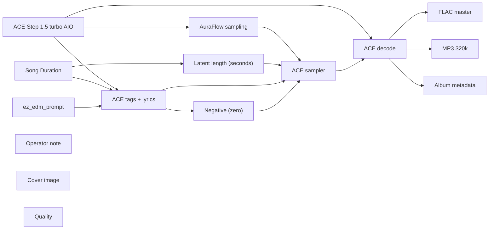

# audio/albums/drive-through/hour-2

**What's on this page**

- **Every track, cover, and album-pack graph** in this folder
- **Shared ACE-Step topology** (one printer, unique widgets per take)
- **Node parameter reference** for the types on these graphs

**What this enables**

- **Queuing one numbered take** or `album-render`
- **Reading tags, lyrics, seed, BPM** without opening raw JSON

**Who this is for:** studio users after `download-music`. Occupancy **audio** (cover stills are **klein** — separate session).

> Generated from `workflows/_lab/audio/albums/drive-through/hour-2/`. Do not hand-edit this file.

## Purpose

Numbered takes under `audio/albums/drive-through/hour-2/`. Queue one track, or `./scripts/manage.sh album-render --album drive-through/hour-2`.

```text
## 01-rumble-strip

US-safe EDM **180 s** take: **rumble strip**. Fictional act **Drive-through** (hardcore, pure of heart). Native ACE-Step 1.5 turbo AIO. Live bass-set take. Instrumental score is empty-body ACE markers (`[drop - cues]`, `[inst - cues]`, `[outro]`) so ACE does not sing production notes. Drop-first warped hybrid-trap, trap drums, no quiet dips. Vocals are a rare DJ treat on other graphs, not here. Queue this graph **on its own** — draft-first is the generic rap lane, not a prerequisite. Occupancy **audio** only; a longer Queue is expected.

1. Weights: `./scripts/manage.sh download-music --tier turbo` (same AIO dest as `download-podcast --tier acestep`; ~10 GB, opt-in, not `download-models`).
2. Prompt enhance is **off** so tags, BPM, language, and `[drop]` / `[inst]` / `[outro]` stay as written. Turn Enhance on only if you want the 4B rewriter.
3. Tags vs score: tags are genre/instrument hints; lyrics are the arrangement. Keep App **Vocal / instrumental** on instrumental so ACE does not sing. Encoder language is `unknown`. Free-text lines under a marker are lyrics — keep cues inside the brackets.
4. Original arrangements only. No “in the style of <living artist>”. No living-DJ names. No famous-hook paraphrases.
5. ACE-Step timbre is **invented**, not a cloned act.
6. Sampler: 8 steps, cfg 1, euler, simple. Duration 180 s, bpm 140, language unknown, timesignature 4, generate_audio_codes true. Seed 271.
7. Saves: `01 - Rumble Strip` FLAC master + 320 kbps MP3 under `${COMFY_OUTPUT_DIR}`.
8. Cover separately: Queue **klein/thumbnail.json** or **klein/podcast-cover.json**. Do not embed Klein here.
9. Human selection and edit before any release. Prompts are not authorship (USCO Part 2 / Thaler).
10. Do not co-resident with LTX / Wan / Klein on this Spark.

Occupancy: audio — stop Klein / Wan / LTX session. One GB10 job.
```

## Shared graph



## Graphs in this album

| Graph | Nodes | Occupancy |
| --- | --- | --- |
| `audio/albums/drive-through/hour-2/01-rumble-strip` | 15 | audio |
| `audio/albums/drive-through/hour-2/02-low-lane` | 15 | audio |
| `audio/albums/drive-through/hour-2/03-warm-merge` | 15 | audio |
| `audio/albums/drive-through/hour-2/04-colour-span` | 15 | audio |
| `audio/albums/drive-through/hour-2/05-garage-ticket` | 15 | audio |
| `audio/albums/drive-through/hour-2/06-liquid-grade` | 15 | audio |
| `audio/albums/drive-through/hour-2/07-jump-bay` | 15 | audio |
| `audio/albums/drive-through/hour-2/08-psy-median` | 15 | audio |
| `audio/albums/drive-through/hour-2/09-groove-mile` | 15 | audio |
| `audio/albums/drive-through/hour-2/10-donk-ramp` | 15 | audio |
| `audio/albums/drive-through/hour-2/11-bounce-booth` | 15 | audio |
| `audio/albums/drive-through/hour-2/12-toll-growl` | 15 | audio |
| `audio/albums/drive-through/hour-2/13-night-oil` | 15 | audio |
| `audio/albums/drive-through/hour-2/14-chest-pass` | 15 | audio |
| `audio/albums/drive-through/hour-2/15-sunrise-sub` | 15 | audio |
| `audio/albums/drive-through/hour-2/album` | 3 | none |
| `audio/albums/drive-through/hour-2/cover` | 14 | klein |

## `01-rumble-strip`

Catalog id `audio/albums/drive-through/hour-2/01-rumble-strip`.

US-safe EDM 180s: Drive-through rumble-strip hybrid trap warp, ACE-Step 1.5 turbo AIO, instrumental, warped bass, invented timbre
Prompt enhance is **off** so authored text (recipe, script labels, ACE tags, or film shots) is encoded as written. Turn Enhance on only if you want the 4B rewriter.

**ACE-Step 1.5 turbo AIO** (`CheckpointLoaderSimple`)

| Slot | Value |
| --- | --- |
| 0 | `ace_step_1.5_turbo_aio.safetensors` |

**AuraFlow sampling** (`ModelSamplingAuraFlow`)

| Slot | Value |
| --- | --- |
| 0 | `3` |

**Song Duration** (`PrimitiveNode`)

| Slot | Value |
| --- | --- |
| 0 | `180.0` |
| 1 | `fixed` |

**Latent length (seconds)** (`EmptyAceStep1.5LatentAudio`)

| Slot | Value |
| --- | --- |
| 0 | `180.0` |
| 1 | `1` |

**ez_edm_prompt** (`EZAceStepPromptEnhance`)

| Slot | Value |
| --- | --- |
| 0 | `custom` |
| 1 | `hybrid trap, warped bass, trap hats, chest sub, dual-action pedal bass, rave, i…` |
| 2 | `[drop - heavy warped drop, hybrid trap 808 wreck, rumble grind, grid 271 0] [in…` |
| 3 | `false` |
| 4 | `instrumental` |
| 5 | `audio/albums/drive-through/hour-2/01-rumble-strip` |

```text
hybrid trap, warped bass, trap hats, chest sub, dual-action pedal bass, rave, instrumental, no vocals, no singing, no choir, no vocal chops, original composition, 140 bpm
```

```text
[drop - heavy warped drop, hybrid trap 808 wreck, rumble grind, grid 271 0]

[inst - trap hats roll, 808 slide, grid 271 1]

[drop - harder growl drop, dual-action pedal bass, stacked warp, grid 271 2]

[inst - pedal 808 hold, hats denser, grid 271 3]

[drop - full send drop, low rumble wreck, chest formant, grid 271 4]

[outro - kick holds, trap hats roll, pedal ride, grid 271 5]
```

**ACE tags + lyrics** (`TextEncodeAceStepAudio1.5`)

| Slot | Value |
| --- | --- |
| 0 | `hybrid trap, warped bass, trap hats, chest sub, dual-action pedal bass, rave, i…` |
| 1 | `[drop - heavy warped drop, hybrid trap 808 wreck, rumble grind, grid 271 0] [in…` |
| 2 | `271` |
| 3 | `fixed` |
| 4 | `140` |
| 5 | `180.0` |
| 6 | `4` |
| 7 | `unknown` |
| 8 | `C minor` |
| 9 | `true` |
| 10 | `2.0` |
| 11 | `0.85` |
| 12 | `0.9` |
| 13 | `0` |
| 14 | `0.0` |

```text
hybrid trap, warped bass, trap hats, chest sub, dual-action pedal bass, rave, instrumental, no vocals, no singing, no choir, no vocal chops, original composition, 140 bpm
```

```text
[drop - heavy warped drop, hybrid trap 808 wreck, rumble grind, grid 271 0]

[inst - trap hats roll, 808 slide, grid 271 1]

[drop - harder growl drop, dual-action pedal bass, stacked warp, grid 271 2]

[inst - pedal 808 hold, hats denser, grid 271 3]

[drop - full send drop, low rumble wreck, chest formant, grid 271 4]

[outro - kick holds, trap hats roll, pedal ride, grid 271 5]
```

**ACE sampler** (`KSampler`)

| Slot | Value |
| --- | --- |
| 0 | `271` |
| 1 | `fixed` |
| 2 | `8` |
| 3 | `1.0` |
| 4 | `euler` |
| 5 | `simple` |
| 6 | `1.0` |

**FLAC master** (`SaveAudio`)

| Slot | Value |
| --- | --- |
| 0 | `01 - Rumble Strip` |

**MP3 320k** (`SaveAudioMP3`)

| Slot | Value |
| --- | --- |
| 0 | `01 - Rumble Strip` |
| 1 | `320k` |

**Cover image** (`LoadImage`)

| Slot | Value |
| --- | --- |
| 0 | `cover.png` |
| 1 | `image` |

**Album metadata** (`EZAudioMetadata`)

| Slot | Value |
| --- | --- |
| 0 | `Drive-through` |
| 1 | `Hour 2` |
| 2 | `Rumble Strip` |
| 3 | `1` |
| 4 | `15` |
| 5 | `2026` |
| 6 | `skip` |
| 7 | `01 - Rumble Strip` |

**Quality** (`EZQuality`)

| Slot | Value |
| --- | --- |
| 0 | `lab` |

## `02-low-lane`

Catalog id `audio/albums/drive-through/hour-2/02-low-lane`.

US-safe EDM 180s: Drive-through low-lane riddim warp, ACE-Step 1.5 turbo AIO, instrumental, warped bass, invented timbre
Prompt enhance is **off** so authored text (recipe, script labels, ACE tags, or film shots) is encoded as written. Turn Enhance on only if you want the 4B rewriter.

**ACE-Step 1.5 turbo AIO** (`CheckpointLoaderSimple`)

| Slot | Value |
| --- | --- |
| 0 | `ace_step_1.5_turbo_aio.safetensors` |

**AuraFlow sampling** (`ModelSamplingAuraFlow`)

| Slot | Value |
| --- | --- |
| 0 | `3` |

**Song Duration** (`PrimitiveNode`)

| Slot | Value |
| --- | --- |
| 0 | `180.0` |
| 1 | `fixed` |

**Latent length (seconds)** (`EmptyAceStep1.5LatentAudio`)

| Slot | Value |
| --- | --- |
| 0 | `180.0` |
| 1 | `1` |

**ez_edm_prompt** (`EZAceStepPromptEnhance`)

| Slot | Value |
| --- | --- |
| 0 | `custom` |
| 1 | `riddim, warped bass, trap hats, chest sub, rolling 808, rave, instrumental, no …` |
| 2 | `[drop - heavy riddim drop, chest sub wobble, warped wreck, grid 277 0] [drop - …` |
| 3 | `false` |
| 4 | `instrumental` |
| 5 | `audio/albums/drive-through/hour-2/02-low-lane` |

```text
riddim, warped bass, trap hats, chest sub, rolling 808, rave, instrumental, no vocals, no singing, no choir, no vocal chops, original composition, 144 bpm
```

```text
[drop - heavy riddim drop, chest sub wobble, warped wreck, grid 277 0]

[drop - harder growl drop, rolling 808 wall, formant crush, grid 277 1]

[inst - trap hats denser, wobble sustain, grid 277 2]

[inst - snare roll, chest 808, grid 277 3]

[inst - 808 triplets, riddim growl hold, grid 277 4]

[drop - full send drop, warped sub stack, riddim wreck, grid 277 5]

[outro - kick holds, hats denser, wobble ride, grid 277 6]
```

**ACE tags + lyrics** (`TextEncodeAceStepAudio1.5`)

| Slot | Value |
| --- | --- |
| 0 | `riddim, warped bass, trap hats, chest sub, rolling 808, rave, instrumental, no …` |
| 1 | `[drop - heavy riddim drop, chest sub wobble, warped wreck, grid 277 0] [drop - …` |
| 2 | `277` |
| 3 | `fixed` |
| 4 | `144` |
| 5 | `180.0` |
| 6 | `4` |
| 7 | `unknown` |
| 8 | `C minor` |
| 9 | `true` |
| 10 | `2.0` |
| 11 | `0.85` |
| 12 | `0.9` |
| 13 | `0` |
| 14 | `0.0` |

```text
riddim, warped bass, trap hats, chest sub, rolling 808, rave, instrumental, no vocals, no singing, no choir, no vocal chops, original composition, 144 bpm
```

```text
[drop - heavy riddim drop, chest sub wobble, warped wreck, grid 277 0]

[drop - harder growl drop, rolling 808 wall, formant crush, grid 277 1]

[inst - trap hats denser, wobble sustain, grid 277 2]

[inst - snare roll, chest 808, grid 277 3]

[inst - 808 triplets, riddim growl hold, grid 277 4]

[drop - full send drop, warped sub stack, riddim wreck, grid 277 5]

[outro - kick holds, hats denser, wobble ride, grid 277 6]
```

**ACE sampler** (`KSampler`)

| Slot | Value |
| --- | --- |
| 0 | `277` |
| 1 | `fixed` |
| 2 | `8` |
| 3 | `1.0` |
| 4 | `euler` |
| 5 | `simple` |
| 6 | `1.0` |

**FLAC master** (`SaveAudio`)

| Slot | Value |
| --- | --- |
| 0 | `02 - Low Lane` |

**MP3 320k** (`SaveAudioMP3`)

| Slot | Value |
| --- | --- |
| 0 | `02 - Low Lane` |
| 1 | `320k` |

**Cover image** (`LoadImage`)

| Slot | Value |
| --- | --- |
| 0 | `cover.png` |
| 1 | `image` |

**Album metadata** (`EZAudioMetadata`)

| Slot | Value |
| --- | --- |
| 0 | `Drive-through` |
| 1 | `Hour 2` |
| 2 | `Low Lane` |
| 3 | `2` |
| 4 | `15` |
| 5 | `2026` |
| 6 | `skip` |
| 7 | `02 - Low Lane` |

**Quality** (`EZQuality`)

| Slot | Value |
| --- | --- |
| 0 | `lab` |

## `03-warm-merge`

Catalog id `audio/albums/drive-through/hour-2/03-warm-merge`.

US-safe EDM 180s: Drive-through warm-merge wave bass warp, ACE-Step 1.5 turbo AIO, instrumental, warped bass, invented timbre
Prompt enhance is **off** so authored text (recipe, script labels, ACE tags, or film shots) is encoded as written. Turn Enhance on only if you want the 4B rewriter.

**ACE-Step 1.5 turbo AIO** (`CheckpointLoaderSimple`)

| Slot | Value |
| --- | --- |
| 0 | `ace_step_1.5_turbo_aio.safetensors` |

**AuraFlow sampling** (`ModelSamplingAuraFlow`)

| Slot | Value |
| --- | --- |
| 0 | `3` |

**Song Duration** (`PrimitiveNode`)

| Slot | Value |
| --- | --- |
| 0 | `180.0` |
| 1 | `fixed` |

**Latent length (seconds)** (`EmptyAceStep1.5LatentAudio`)

| Slot | Value |
| --- | --- |
| 0 | `180.0` |
| 1 | `1` |

**ez_edm_prompt** (`EZAceStepPromptEnhance`)

| Slot | Value |
| --- | --- |
| 0 | `custom` |
| 1 | `wave bass, warped bass, trap hats, chest 808, chest sub, rave, instrumental, no…` |
| 2 | `[drop - heavy wave drop, warped 808 wreck, fold grind, grid 281 0] [inst - trap…` |
| 3 | `false` |
| 4 | `instrumental` |
| 5 | `audio/albums/drive-through/hour-2/03-warm-merge` |

```text
wave bass, warped bass, trap hats, chest 808, chest sub, rave, instrumental, no vocals, no singing, no choir, no vocal chops, original composition, 148 bpm
```

```text
[drop - heavy wave drop, warped 808 wreck, fold grind, grid 281 0]

[inst - trap hats roll, wave 808 hold merge, grid 281 1]

[drop - harder formant drop, stacked wave bass, chest 808, grid 281 2]

[inst - snare roll, 808 slide, grid 281 3]

[drop - full send drop, low 808 wall, warped fold, grid 281 4]

[outro - kick holds, trap hats roll, wave ride, grid 281 5]
```

**ACE tags + lyrics** (`TextEncodeAceStepAudio1.5`)

| Slot | Value |
| --- | --- |
| 0 | `wave bass, warped bass, trap hats, chest 808, chest sub, rave, instrumental, no…` |
| 1 | `[drop - heavy wave drop, warped 808 wreck, fold grind, grid 281 0] [inst - trap…` |
| 2 | `281` |
| 3 | `fixed` |
| 4 | `148` |
| 5 | `180.0` |
| 6 | `4` |
| 7 | `unknown` |
| 8 | `C minor` |
| 9 | `true` |
| 10 | `2.0` |
| 11 | `0.85` |
| 12 | `0.9` |
| 13 | `0` |
| 14 | `0.0` |

```text
wave bass, warped bass, trap hats, chest 808, chest sub, rave, instrumental, no vocals, no singing, no choir, no vocal chops, original composition, 148 bpm
```

```text
[drop - heavy wave drop, warped 808 wreck, fold grind, grid 281 0]

[inst - trap hats roll, wave 808 hold merge, grid 281 1]

[drop - harder formant drop, stacked wave bass, chest 808, grid 281 2]

[inst - snare roll, 808 slide, grid 281 3]

[drop - full send drop, low 808 wall, warped fold, grid 281 4]

[outro - kick holds, trap hats roll, wave ride, grid 281 5]
```

**ACE sampler** (`KSampler`)

| Slot | Value |
| --- | --- |
| 0 | `281` |
| 1 | `fixed` |
| 2 | `8` |
| 3 | `1.0` |
| 4 | `euler` |
| 5 | `simple` |
| 6 | `1.0` |

**FLAC master** (`SaveAudio`)

| Slot | Value |
| --- | --- |
| 0 | `03 - Warm Merge` |

**MP3 320k** (`SaveAudioMP3`)

| Slot | Value |
| --- | --- |
| 0 | `03 - Warm Merge` |
| 1 | `320k` |

**Cover image** (`LoadImage`)

| Slot | Value |
| --- | --- |
| 0 | `cover.png` |
| 1 | `image` |

**Album metadata** (`EZAudioMetadata`)

| Slot | Value |
| --- | --- |
| 0 | `Drive-through` |
| 1 | `Hour 2` |
| 2 | `Warm Merge` |
| 3 | `3` |
| 4 | `15` |
| 5 | `2026` |
| 6 | `skip` |
| 7 | `03 - Warm Merge` |

**Quality** (`EZQuality`)

| Slot | Value |
| --- | --- |
| 0 | `lab` |

## `04-colour-span`

Catalog id `audio/albums/drive-through/hour-2/04-colour-span`.

US-safe EDM 180s: Drive-through colour-span color bass warp, ACE-Step 1.5 turbo AIO, instrumental, warped bass, invented timbre
Prompt enhance is **off** so authored text (recipe, script labels, ACE tags, or film shots) is encoded as written. Turn Enhance on only if you want the 4B rewriter.

**ACE-Step 1.5 turbo AIO** (`CheckpointLoaderSimple`)

| Slot | Value |
| --- | --- |
| 0 | `ace_step_1.5_turbo_aio.safetensors` |

**AuraFlow sampling** (`ModelSamplingAuraFlow`)

| Slot | Value |
| --- | --- |
| 0 | `3` |

**Song Duration** (`PrimitiveNode`)

| Slot | Value |
| --- | --- |
| 0 | `180.0` |
| 1 | `fixed` |

**Latent length (seconds)** (`EmptyAceStep1.5LatentAudio`)

| Slot | Value |
| --- | --- |
| 0 | `180.0` |
| 1 | `1` |

**ez_edm_prompt** (`EZAceStepPromptEnhance`)

| Slot | Value |
| --- | --- |
| 0 | `custom` |
| 1 | `color bass, warped bass, trap hats, chest sub, dirty 808, rave, instrumental, n…` |
| 2 | `[drop - heavy color drop, chest 808 warp, formant wreck, grid 283 0] [drop - ha…` |
| 3 | `false` |
| 4 | `instrumental` |
| 5 | `audio/albums/drive-through/hour-2/04-colour-span` |

```text
color bass, warped bass, trap hats, chest sub, dirty 808, rave, instrumental, no vocals, no singing, no choir, no vocal chops, original composition, 150 bpm
```

```text
[drop - heavy color drop, chest 808 warp, formant wreck, grid 283 0]

[drop - harder growl drop, analog 808 stack, warped color, grid 283 1]

[inst - trap hats denser, color 808 sustain span, grid 283 2]

[drop - full send drop, stacked color wreck, warped sub, grid 283 3]

[outro - kick holds, hats denser, color ride, grid 283 4]
```

**ACE tags + lyrics** (`TextEncodeAceStepAudio1.5`)

| Slot | Value |
| --- | --- |
| 0 | `color bass, warped bass, trap hats, chest sub, dirty 808, rave, instrumental, n…` |
| 1 | `[drop - heavy color drop, chest 808 warp, formant wreck, grid 283 0] [drop - ha…` |
| 2 | `283` |
| 3 | `fixed` |
| 4 | `150` |
| 5 | `180.0` |
| 6 | `4` |
| 7 | `unknown` |
| 8 | `C minor` |
| 9 | `true` |
| 10 | `2.0` |
| 11 | `0.85` |
| 12 | `0.9` |
| 13 | `0` |
| 14 | `0.0` |

```text
color bass, warped bass, trap hats, chest sub, dirty 808, rave, instrumental, no vocals, no singing, no choir, no vocal chops, original composition, 150 bpm
```

```text
[drop - heavy color drop, chest 808 warp, formant wreck, grid 283 0]

[drop - harder growl drop, analog 808 stack, warped color, grid 283 1]

[inst - trap hats denser, color 808 sustain span, grid 283 2]

[drop - full send drop, stacked color wreck, warped sub, grid 283 3]

[outro - kick holds, hats denser, color ride, grid 283 4]
```

**ACE sampler** (`KSampler`)

| Slot | Value |
| --- | --- |
| 0 | `283` |
| 1 | `fixed` |
| 2 | `8` |
| 3 | `1.0` |
| 4 | `euler` |
| 5 | `simple` |
| 6 | `1.0` |

**FLAC master** (`SaveAudio`)

| Slot | Value |
| --- | --- |
| 0 | `04 - Colour Span` |

**MP3 320k** (`SaveAudioMP3`)

| Slot | Value |
| --- | --- |
| 0 | `04 - Colour Span` |
| 1 | `320k` |

**Cover image** (`LoadImage`)

| Slot | Value |
| --- | --- |
| 0 | `cover.png` |
| 1 | `image` |

**Album metadata** (`EZAudioMetadata`)

| Slot | Value |
| --- | --- |
| 0 | `Drive-through` |
| 1 | `Hour 2` |
| 2 | `Colour Span` |
| 3 | `4` |
| 4 | `15` |
| 5 | `2026` |
| 6 | `skip` |
| 7 | `04 - Colour Span` |

**Quality** (`EZQuality`)

| Slot | Value |
| --- | --- |
| 0 | `lab` |

## `05-garage-ticket`

Catalog id `audio/albums/drive-through/hour-2/05-garage-ticket`.

US-safe EDM 180s: Drive-through garage-ticket festival trap warp, ACE-Step 1.5 turbo AIO, instrumental, warped bass, invented timbre
Prompt enhance is **off** so authored text (recipe, script labels, ACE tags, or film shots) is encoded as written. Turn Enhance on only if you want the 4B rewriter.

**ACE-Step 1.5 turbo AIO** (`CheckpointLoaderSimple`)

| Slot | Value |
| --- | --- |
| 0 | `ace_step_1.5_turbo_aio.safetensors` |

**AuraFlow sampling** (`ModelSamplingAuraFlow`)

| Slot | Value |
| --- | --- |
| 0 | `3` |

**Song Duration** (`PrimitiveNode`)

| Slot | Value |
| --- | --- |
| 0 | `180.0` |
| 1 | `fixed` |

**Latent length (seconds)** (`EmptyAceStep1.5LatentAudio`)

| Slot | Value |
| --- | --- |
| 0 | `180.0` |
| 1 | `1` |

**ez_edm_prompt** (`EZAceStepPromptEnhance`)

| Slot | Value |
| --- | --- |
| 0 | `custom` |
| 1 | `festival trap, warped bass, trap hats, trap 808, dirty bass, rave, instrumental…` |
| 2 | `[drop - heavy trap drop, warped 808 wreck, formant stamp, grid 293 0] [inst - t…` |
| 3 | `false` |
| 4 | `instrumental` |
| 5 | `audio/albums/drive-through/hour-2/05-garage-ticket` |

```text
festival trap, warped bass, trap hats, trap 808, dirty bass, rave, instrumental, no vocals, no singing, no choir, no vocal chops, original composition, 140 bpm
```

```text
[drop - heavy trap drop, warped 808 wreck, formant stamp, grid 293 0]

[inst - trap hats roll, 808 slide, grid 293 1]

[drop - harder growl drop, stacked trap bass, chest warp, grid 293 2]

[inst - snare roll, chest 808 punch, grid 293 3]

[drop - full send drop, chest 808 wall, warped trap, grid 293 4]

[outro - kick holds, trap hats roll, 808 ride, grid 293 5]
```

**ACE tags + lyrics** (`TextEncodeAceStepAudio1.5`)

| Slot | Value |
| --- | --- |
| 0 | `festival trap, warped bass, trap hats, trap 808, dirty bass, rave, instrumental…` |
| 1 | `[drop - heavy trap drop, warped 808 wreck, formant stamp, grid 293 0] [inst - t…` |
| 2 | `293` |
| 3 | `fixed` |
| 4 | `140` |
| 5 | `180.0` |
| 6 | `4` |
| 7 | `unknown` |
| 8 | `C minor` |
| 9 | `true` |
| 10 | `2.0` |
| 11 | `0.85` |
| 12 | `0.9` |
| 13 | `0` |
| 14 | `0.0` |

```text
festival trap, warped bass, trap hats, trap 808, dirty bass, rave, instrumental, no vocals, no singing, no choir, no vocal chops, original composition, 140 bpm
```

```text
[drop - heavy trap drop, warped 808 wreck, formant stamp, grid 293 0]

[inst - trap hats roll, 808 slide, grid 293 1]

[drop - harder growl drop, stacked trap bass, chest warp, grid 293 2]

[inst - snare roll, chest 808 punch, grid 293 3]

[drop - full send drop, chest 808 wall, warped trap, grid 293 4]

[outro - kick holds, trap hats roll, 808 ride, grid 293 5]
```

**ACE sampler** (`KSampler`)

| Slot | Value |
| --- | --- |
| 0 | `293` |
| 1 | `fixed` |
| 2 | `8` |
| 3 | `1.0` |
| 4 | `euler` |
| 5 | `simple` |
| 6 | `1.0` |

**FLAC master** (`SaveAudio`)

| Slot | Value |
| --- | --- |
| 0 | `05 - Garage Ticket` |

**MP3 320k** (`SaveAudioMP3`)

| Slot | Value |
| --- | --- |
| 0 | `05 - Garage Ticket` |
| 1 | `320k` |

**Cover image** (`LoadImage`)

| Slot | Value |
| --- | --- |
| 0 | `cover.png` |
| 1 | `image` |

**Album metadata** (`EZAudioMetadata`)

| Slot | Value |
| --- | --- |
| 0 | `Drive-through` |
| 1 | `Hour 2` |
| 2 | `Garage Ticket` |
| 3 | `5` |
| 4 | `15` |
| 5 | `2026` |
| 6 | `skip` |
| 7 | `05 - Garage Ticket` |

**Quality** (`EZQuality`)

| Slot | Value |
| --- | --- |
| 0 | `lab` |

## `06-liquid-grade`

Catalog id `audio/albums/drive-through/hour-2/06-liquid-grade`.

US-safe EDM 180s: Drive-through liquid-grade drumstep warp, ACE-Step 1.5 turbo AIO, instrumental, warped bass, invented timbre
Prompt enhance is **off** so authored text (recipe, script labels, ACE tags, or film shots) is encoded as written. Turn Enhance on only if you want the 4B rewriter.

**ACE-Step 1.5 turbo AIO** (`CheckpointLoaderSimple`)

| Slot | Value |
| --- | --- |
| 0 | `ace_step_1.5_turbo_aio.safetensors` |

**AuraFlow sampling** (`ModelSamplingAuraFlow`)

| Slot | Value |
| --- | --- |
| 0 | `3` |

**Song Duration** (`PrimitiveNode`)

| Slot | Value |
| --- | --- |
| 0 | `180.0` |
| 1 | `fixed` |

**Latent length (seconds)** (`EmptyAceStep1.5LatentAudio`)

| Slot | Value |
| --- | --- |
| 0 | `180.0` |
| 1 | `1` |

**ez_edm_prompt** (`EZAceStepPromptEnhance`)

| Slot | Value |
| --- | --- |
| 0 | `custom` |
| 1 | `drumstep, warped bass, trap hats, amen break, reese bass, chest sub, rave, inst…` |
| 2 | `[drop - heavy drumstep drop, reese wreck, warped amen, grid 307 0] [inst - amen…` |
| 3 | `false` |
| 4 | `instrumental` |
| 5 | `audio/albums/drive-through/hour-2/06-liquid-grade` |

```text
drumstep, warped bass, trap hats, amen break, reese bass, chest sub, rave, instrumental, no vocals, no singing, no choir, no vocal chops, original composition, 174 bpm
```

```text
[drop - heavy drumstep drop, reese wreck, warped amen, grid 307 0]

[inst - amen chops, trap hats 808 liquid, grid 307 1]

[drop - harder growl drop, reese stack, chest formant, grid 307 2]

[inst - hats denser, reese hold, grid 307 3]

[drop - full send drop, stacked amen wreck, warped 808 punch, grid 307 4]

[drop - harder warped drop, chest 808 wreck, drumstep grind, grid 307 5]

[outro - kick holds, amen keep, reese ride, grid 307 6]
```

**ACE tags + lyrics** (`TextEncodeAceStepAudio1.5`)

| Slot | Value |
| --- | --- |
| 0 | `drumstep, warped bass, trap hats, amen break, reese bass, chest sub, rave, inst…` |
| 1 | `[drop - heavy drumstep drop, reese wreck, warped amen, grid 307 0] [inst - amen…` |
| 2 | `307` |
| 3 | `fixed` |
| 4 | `174` |
| 5 | `180.0` |
| 6 | `4` |
| 7 | `unknown` |
| 8 | `C minor` |
| 9 | `true` |
| 10 | `2.0` |
| 11 | `0.85` |
| 12 | `0.9` |
| 13 | `0` |
| 14 | `0.0` |

```text
drumstep, warped bass, trap hats, amen break, reese bass, chest sub, rave, instrumental, no vocals, no singing, no choir, no vocal chops, original composition, 174 bpm
```

```text
[drop - heavy drumstep drop, reese wreck, warped amen, grid 307 0]

[inst - amen chops, trap hats 808 liquid, grid 307 1]

[drop - harder growl drop, reese stack, chest formant, grid 307 2]

[inst - hats denser, reese hold, grid 307 3]

[drop - full send drop, stacked amen wreck, warped 808 punch, grid 307 4]

[drop - harder warped drop, chest 808 wreck, drumstep grind, grid 307 5]

[outro - kick holds, amen keep, reese ride, grid 307 6]
```

**ACE sampler** (`KSampler`)

| Slot | Value |
| --- | --- |
| 0 | `307` |
| 1 | `fixed` |
| 2 | `8` |
| 3 | `1.0` |
| 4 | `euler` |
| 5 | `simple` |
| 6 | `1.0` |

**FLAC master** (`SaveAudio`)

| Slot | Value |
| --- | --- |
| 0 | `06 - Liquid Grade` |

**MP3 320k** (`SaveAudioMP3`)

| Slot | Value |
| --- | --- |
| 0 | `06 - Liquid Grade` |
| 1 | `320k` |

**Cover image** (`LoadImage`)

| Slot | Value |
| --- | --- |
| 0 | `cover.png` |
| 1 | `image` |

**Album metadata** (`EZAudioMetadata`)

| Slot | Value |
| --- | --- |
| 0 | `Drive-through` |
| 1 | `Hour 2` |
| 2 | `Liquid Grade` |
| 3 | `6` |
| 4 | `15` |
| 5 | `2026` |
| 6 | `skip` |
| 7 | `06 - Liquid Grade` |

**Quality** (`EZQuality`)

| Slot | Value |
| --- | --- |
| 0 | `lab` |

## `07-jump-bay`

Catalog id `audio/albums/drive-through/hour-2/07-jump-bay`.

US-safe EDM 180s: Drive-through jump-bay brostep warp, ACE-Step 1.5 turbo AIO, instrumental, warped bass, invented timbre
Prompt enhance is **off** so authored text (recipe, script labels, ACE tags, or film shots) is encoded as written. Turn Enhance on only if you want the 4B rewriter.

**ACE-Step 1.5 turbo AIO** (`CheckpointLoaderSimple`)

| Slot | Value |
| --- | --- |
| 0 | `ace_step_1.5_turbo_aio.safetensors` |

**AuraFlow sampling** (`ModelSamplingAuraFlow`)

| Slot | Value |
| --- | --- |
| 0 | `3` |

**Song Duration** (`PrimitiveNode`)

| Slot | Value |
| --- | --- |
| 0 | `180.0` |
| 1 | `fixed` |

**Latent length (seconds)** (`EmptyAceStep1.5LatentAudio`)

| Slot | Value |
| --- | --- |
| 0 | `180.0` |
| 1 | `1` |

**ez_edm_prompt** (`EZAceStepPromptEnhance`)

| Slot | Value |
| --- | --- |
| 0 | `custom` |
| 1 | `brostep, warped bass, trap hats, dirty dubstep, bass growl, heavy sub, rave, in…` |
| 2 | `[drop - heavy brostep drop, growl wreck, warped 808, grid 311 0] [inst - metal …` |
| 3 | `false` |
| 4 | `instrumental` |
| 5 | `audio/albums/drive-through/hour-2/07-jump-bay` |

```text
brostep, warped bass, trap hats, dirty dubstep, bass growl, heavy sub, rave, instrumental, no vocals, no singing, no choir, no vocal chops, original composition, 150 bpm
```

```text
[drop - heavy brostep drop, growl wreck, warped 808, grid 311 0]

[inst - metal hats roll, growl sustain, grid 311 1]

[drop - harder formant drop, sub crush, chest 808, grid 311 2]

[inst - trap hats denser, wobble hold, grid 311 3]

[drop - full send drop, brostep wreck, stacked growl, grid 311 4]

[inst - snare roll, bass growl hold, grid 311 5]

[drop - harder warped drop, stacked 808 wreck, mid growl, grid 311 6]

[outro - kick holds, hats denser, growl ride, grid 311 7]
```

**ACE tags + lyrics** (`TextEncodeAceStepAudio1.5`)

| Slot | Value |
| --- | --- |
| 0 | `brostep, warped bass, trap hats, dirty dubstep, bass growl, heavy sub, rave, in…` |
| 1 | `[drop - heavy brostep drop, growl wreck, warped 808, grid 311 0] [inst - metal …` |
| 2 | `311` |
| 3 | `fixed` |
| 4 | `150` |
| 5 | `180.0` |
| 6 | `4` |
| 7 | `unknown` |
| 8 | `C minor` |
| 9 | `true` |
| 10 | `2.0` |
| 11 | `0.85` |
| 12 | `0.9` |
| 13 | `0` |
| 14 | `0.0` |

```text
brostep, warped bass, trap hats, dirty dubstep, bass growl, heavy sub, rave, instrumental, no vocals, no singing, no choir, no vocal chops, original composition, 150 bpm
```

```text
[drop - heavy brostep drop, growl wreck, warped 808, grid 311 0]

[inst - metal hats roll, growl sustain, grid 311 1]

[drop - harder formant drop, sub crush, chest 808, grid 311 2]

[inst - trap hats denser, wobble hold, grid 311 3]

[drop - full send drop, brostep wreck, stacked growl, grid 311 4]

[inst - snare roll, bass growl hold, grid 311 5]

[drop - harder warped drop, stacked 808 wreck, mid growl, grid 311 6]

[outro - kick holds, hats denser, growl ride, grid 311 7]
```

**ACE sampler** (`KSampler`)

| Slot | Value |
| --- | --- |
| 0 | `311` |
| 1 | `fixed` |
| 2 | `8` |
| 3 | `1.0` |
| 4 | `euler` |
| 5 | `simple` |
| 6 | `1.0` |

**FLAC master** (`SaveAudio`)

| Slot | Value |
| --- | --- |
| 0 | `07 - Jump Bay` |

**MP3 320k** (`SaveAudioMP3`)

| Slot | Value |
| --- | --- |
| 0 | `07 - Jump Bay` |
| 1 | `320k` |

**Cover image** (`LoadImage`)

| Slot | Value |
| --- | --- |
| 0 | `cover.png` |
| 1 | `image` |

**Album metadata** (`EZAudioMetadata`)

| Slot | Value |
| --- | --- |
| 0 | `Drive-through` |
| 1 | `Hour 2` |
| 2 | `Jump Bay` |
| 3 | `7` |
| 4 | `15` |
| 5 | `2026` |
| 6 | `skip` |
| 7 | `07 - Jump Bay` |

**Quality** (`EZQuality`)

| Slot | Value |
| --- | --- |
| 0 | `lab` |

## `08-psy-median`

Catalog id `audio/albums/drive-through/hour-2/08-psy-median`.

US-safe EDM 180s: Drive-through psy-median neuro warp, ACE-Step 1.5 turbo AIO, instrumental, warped bass, invented timbre
Prompt enhance is **off** so authored text (recipe, script labels, ACE tags, or film shots) is encoded as written. Turn Enhance on only if you want the 4B rewriter.

**ACE-Step 1.5 turbo AIO** (`CheckpointLoaderSimple`)

| Slot | Value |
| --- | --- |
| 0 | `ace_step_1.5_turbo_aio.safetensors` |

**AuraFlow sampling** (`ModelSamplingAuraFlow`)

| Slot | Value |
| --- | --- |
| 0 | `3` |

**Song Duration** (`PrimitiveNode`)

| Slot | Value |
| --- | --- |
| 0 | `180.0` |
| 1 | `fixed` |

**Latent length (seconds)** (`EmptyAceStep1.5LatentAudio`)

| Slot | Value |
| --- | --- |
| 0 | `180.0` |
| 1 | `1` |

**ez_edm_prompt** (`EZAceStepPromptEnhance`)

| Slot | Value |
| --- | --- |
| 0 | `custom` |
| 1 | `neuro bass, warped bass, trap hats, reese bass, stacked 808, chest sub, rave, i…` |
| 2 | `[drop - heavy neuro drop, reese 808 wreck, warped coil, grid 313 0] [inst - tra…` |
| 3 | `false` |
| 4 | `instrumental` |
| 5 | `audio/albums/drive-through/hour-2/08-psy-median` |

```text
neuro bass, warped bass, trap hats, reese bass, stacked 808, chest sub, rave, instrumental, no vocals, no singing, no choir, no vocal chops, original composition, 145 bpm
```

```text
[drop - heavy neuro drop, reese 808 wreck, warped coil, grid 313 0]

[inst - trap hats roll, reese sustain, grid 313 1]

[drop - harder stacked drop, formant 808 wall, chest sub, grid 313 2]

[drop - full send drop, chest sub wreck, neuro warp, grid 313 3]

[outro - kick holds, trap hats roll, reese ride, grid 313 4]
```

**ACE tags + lyrics** (`TextEncodeAceStepAudio1.5`)

| Slot | Value |
| --- | --- |
| 0 | `neuro bass, warped bass, trap hats, reese bass, stacked 808, chest sub, rave, i…` |
| 1 | `[drop - heavy neuro drop, reese 808 wreck, warped coil, grid 313 0] [inst - tra…` |
| 2 | `313` |
| 3 | `fixed` |
| 4 | `145` |
| 5 | `180.0` |
| 6 | `4` |
| 7 | `unknown` |
| 8 | `C minor` |
| 9 | `true` |
| 10 | `2.0` |
| 11 | `0.85` |
| 12 | `0.9` |
| 13 | `0` |
| 14 | `0.0` |

```text
neuro bass, warped bass, trap hats, reese bass, stacked 808, chest sub, rave, instrumental, no vocals, no singing, no choir, no vocal chops, original composition, 145 bpm
```

```text
[drop - heavy neuro drop, reese 808 wreck, warped coil, grid 313 0]

[inst - trap hats roll, reese sustain, grid 313 1]

[drop - harder stacked drop, formant 808 wall, chest sub, grid 313 2]

[drop - full send drop, chest sub wreck, neuro warp, grid 313 3]

[outro - kick holds, trap hats roll, reese ride, grid 313 4]
```

**ACE sampler** (`KSampler`)

| Slot | Value |
| --- | --- |
| 0 | `313` |
| 1 | `fixed` |
| 2 | `8` |
| 3 | `1.0` |
| 4 | `euler` |
| 5 | `simple` |
| 6 | `1.0` |

**FLAC master** (`SaveAudio`)

| Slot | Value |
| --- | --- |
| 0 | `08 - Psy Median` |

**MP3 320k** (`SaveAudioMP3`)

| Slot | Value |
| --- | --- |
| 0 | `08 - Psy Median` |
| 1 | `320k` |

**Cover image** (`LoadImage`)

| Slot | Value |
| --- | --- |
| 0 | `cover.png` |
| 1 | `image` |

**Album metadata** (`EZAudioMetadata`)

| Slot | Value |
| --- | --- |
| 0 | `Drive-through` |
| 1 | `Hour 2` |
| 2 | `Psy Median` |
| 3 | `8` |
| 4 | `15` |
| 5 | `2026` |
| 6 | `skip` |
| 7 | `08 - Psy Median` |

**Quality** (`EZQuality`)

| Slot | Value |
| --- | --- |
| 0 | `lab` |

## `09-groove-mile`

Catalog id `audio/albums/drive-through/hour-2/09-groove-mile`.

US-safe EDM 180s: Drive-through groove-mile hybrid trap warp, ACE-Step 1.5 turbo AIO, instrumental, warped bass, invented timbre
Prompt enhance is **off** so authored text (recipe, script labels, ACE tags, or film shots) is encoded as written. Turn Enhance on only if you want the 4B rewriter.

**ACE-Step 1.5 turbo AIO** (`CheckpointLoaderSimple`)

| Slot | Value |
| --- | --- |
| 0 | `ace_step_1.5_turbo_aio.safetensors` |

**AuraFlow sampling** (`ModelSamplingAuraFlow`)

| Slot | Value |
| --- | --- |
| 0 | `3` |

**Song Duration** (`PrimitiveNode`)

| Slot | Value |
| --- | --- |
| 0 | `180.0` |
| 1 | `fixed` |

**Latent length (seconds)** (`EmptyAceStep1.5LatentAudio`)

| Slot | Value |
| --- | --- |
| 0 | `180.0` |
| 1 | `1` |

**ez_edm_prompt** (`EZAceStepPromptEnhance`)

| Slot | Value |
| --- | --- |
| 0 | `custom` |
| 1 | `hybrid trap, warped bass, trap hats, dirty 808, chest sub, rave, instrumental, …` |
| 2 | `[drop - heavy warped drop, hybrid trap 808 wreck, mile grind, grid 317 0] [inst…` |
| 3 | `false` |
| 4 | `instrumental` |
| 5 | `audio/albums/drive-through/hour-2/09-groove-mile` |

```text
hybrid trap, warped bass, trap hats, dirty 808, chest sub, rave, instrumental, no vocals, no singing, no choir, no vocal chops, original composition, 144 bpm
```

```text
[drop - heavy warped drop, hybrid trap 808 wreck, mile grind, grid 317 0]

[inst - trap hats roll, 808 bounce hold, grid 317 1]

[drop - harder growl drop, stacked 808 warp, chest punch, grid 317 2]

[inst - snare roll, chest 808, grid 317 3]

[drop - full send drop, body bass wreck, warped trap, grid 317 4]

[outro - kick holds, hats denser, 808 ride, grid 317 5]
```

**ACE tags + lyrics** (`TextEncodeAceStepAudio1.5`)

| Slot | Value |
| --- | --- |
| 0 | `hybrid trap, warped bass, trap hats, dirty 808, chest sub, rave, instrumental, …` |
| 1 | `[drop - heavy warped drop, hybrid trap 808 wreck, mile grind, grid 317 0] [inst…` |
| 2 | `317` |
| 3 | `fixed` |
| 4 | `144` |
| 5 | `180.0` |
| 6 | `4` |
| 7 | `unknown` |
| 8 | `C minor` |
| 9 | `true` |
| 10 | `2.0` |
| 11 | `0.85` |
| 12 | `0.9` |
| 13 | `0` |
| 14 | `0.0` |

```text
hybrid trap, warped bass, trap hats, dirty 808, chest sub, rave, instrumental, no vocals, no singing, no choir, no vocal chops, original composition, 144 bpm
```

```text
[drop - heavy warped drop, hybrid trap 808 wreck, mile grind, grid 317 0]

[inst - trap hats roll, 808 bounce hold, grid 317 1]

[drop - harder growl drop, stacked 808 warp, chest punch, grid 317 2]

[inst - snare roll, chest 808, grid 317 3]

[drop - full send drop, body bass wreck, warped trap, grid 317 4]

[outro - kick holds, hats denser, 808 ride, grid 317 5]
```

**ACE sampler** (`KSampler`)

| Slot | Value |
| --- | --- |
| 0 | `317` |
| 1 | `fixed` |
| 2 | `8` |
| 3 | `1.0` |
| 4 | `euler` |
| 5 | `simple` |
| 6 | `1.0` |

**FLAC master** (`SaveAudio`)

| Slot | Value |
| --- | --- |
| 0 | `09 - Groove Mile` |

**MP3 320k** (`SaveAudioMP3`)

| Slot | Value |
| --- | --- |
| 0 | `09 - Groove Mile` |
| 1 | `320k` |

**Cover image** (`LoadImage`)

| Slot | Value |
| --- | --- |
| 0 | `cover.png` |
| 1 | `image` |

**Album metadata** (`EZAudioMetadata`)

| Slot | Value |
| --- | --- |
| 0 | `Drive-through` |
| 1 | `Hour 2` |
| 2 | `Groove Mile` |
| 3 | `9` |
| 4 | `15` |
| 5 | `2026` |
| 6 | `skip` |
| 7 | `09 - Groove Mile` |

**Quality** (`EZQuality`)

| Slot | Value |
| --- | --- |
| 0 | `lab` |

## `10-donk-ramp`

Catalog id `audio/albums/drive-through/hour-2/10-donk-ramp`.

US-safe EDM 180s: Drive-through donk-ramp tearout warp, ACE-Step 1.5 turbo AIO, instrumental, warped bass, invented timbre
Prompt enhance is **off** so authored text (recipe, script labels, ACE tags, or film shots) is encoded as written. Turn Enhance on only if you want the 4B rewriter.

**ACE-Step 1.5 turbo AIO** (`CheckpointLoaderSimple`)

| Slot | Value |
| --- | --- |
| 0 | `ace_step_1.5_turbo_aio.safetensors` |

**AuraFlow sampling** (`ModelSamplingAuraFlow`)

| Slot | Value |
| --- | --- |
| 0 | `3` |

**Song Duration** (`PrimitiveNode`)

| Slot | Value |
| --- | --- |
| 0 | `180.0` |
| 1 | `fixed` |

**Latent length (seconds)** (`EmptyAceStep1.5LatentAudio`)

| Slot | Value |
| --- | --- |
| 0 | `180.0` |
| 1 | `1` |

**ez_edm_prompt** (`EZAceStepPromptEnhance`)

| Slot | Value |
| --- | --- |
| 0 | `custom` |
| 1 | `tearout, warped bass, trap hats, chest 808, bass growl, rave, instrumental, no …` |
| 2 | `[drop - heavy tearout drop, growl 808 wreck, formant ramp, grid 331 0] [drop - …` |
| 3 | `false` |
| 4 | `instrumental` |
| 5 | `audio/albums/drive-through/hour-2/10-donk-ramp` |

```text
tearout, warped bass, trap hats, chest 808, bass growl, rave, instrumental, no vocals, no singing, no choir, no vocal chops, original composition, 150 bpm
```

```text
[drop - heavy tearout drop, growl 808 wreck, formant ramp, grid 331 0]

[drop - harder warped drop, chest 808 stack, tearout grind, grid 331 1]

[inst - trap hats denser, growl sustain, grid 331 2]

[drop - full send drop, dirty analog wreck, warped 808, grid 331 3]

[outro - kick holds, trap hats roll, growl ride, grid 331 4]
```

**ACE tags + lyrics** (`TextEncodeAceStepAudio1.5`)

| Slot | Value |
| --- | --- |
| 0 | `tearout, warped bass, trap hats, chest 808, bass growl, rave, instrumental, no …` |
| 1 | `[drop - heavy tearout drop, growl 808 wreck, formant ramp, grid 331 0] [drop - …` |
| 2 | `331` |
| 3 | `fixed` |
| 4 | `150` |
| 5 | `180.0` |
| 6 | `4` |
| 7 | `unknown` |
| 8 | `C minor` |
| 9 | `true` |
| 10 | `2.0` |
| 11 | `0.85` |
| 12 | `0.9` |
| 13 | `0` |
| 14 | `0.0` |

```text
tearout, warped bass, trap hats, chest 808, bass growl, rave, instrumental, no vocals, no singing, no choir, no vocal chops, original composition, 150 bpm
```

```text
[drop - heavy tearout drop, growl 808 wreck, formant ramp, grid 331 0]

[drop - harder warped drop, chest 808 stack, tearout grind, grid 331 1]

[inst - trap hats denser, growl sustain, grid 331 2]

[drop - full send drop, dirty analog wreck, warped 808, grid 331 3]

[outro - kick holds, trap hats roll, growl ride, grid 331 4]
```

**ACE sampler** (`KSampler`)

| Slot | Value |
| --- | --- |
| 0 | `331` |
| 1 | `fixed` |
| 2 | `8` |
| 3 | `1.0` |
| 4 | `euler` |
| 5 | `simple` |
| 6 | `1.0` |

**FLAC master** (`SaveAudio`)

| Slot | Value |
| --- | --- |
| 0 | `10 - Donk Ramp` |

**MP3 320k** (`SaveAudioMP3`)

| Slot | Value |
| --- | --- |
| 0 | `10 - Donk Ramp` |
| 1 | `320k` |

**Cover image** (`LoadImage`)

| Slot | Value |
| --- | --- |
| 0 | `cover.png` |
| 1 | `image` |

**Album metadata** (`EZAudioMetadata`)

| Slot | Value |
| --- | --- |
| 0 | `Drive-through` |
| 1 | `Hour 2` |
| 2 | `Donk Ramp` |
| 3 | `10` |
| 4 | `15` |
| 5 | `2026` |
| 6 | `skip` |
| 7 | `10 - Donk Ramp` |

**Quality** (`EZQuality`)

| Slot | Value |
| --- | --- |
| 0 | `lab` |

## `11-bounce-booth`

Catalog id `audio/albums/drive-through/hour-2/11-bounce-booth`.

US-safe EDM 180s: Drive-through bounce-booth chest bass warp, ACE-Step 1.5 turbo AIO, instrumental, warped bass, invented timbre
Prompt enhance is **off** so authored text (recipe, script labels, ACE tags, or film shots) is encoded as written. Turn Enhance on only if you want the 4B rewriter.

**ACE-Step 1.5 turbo AIO** (`CheckpointLoaderSimple`)

| Slot | Value |
| --- | --- |
| 0 | `ace_step_1.5_turbo_aio.safetensors` |

**AuraFlow sampling** (`ModelSamplingAuraFlow`)

| Slot | Value |
| --- | --- |
| 0 | `3` |

**Song Duration** (`PrimitiveNode`)

| Slot | Value |
| --- | --- |
| 0 | `180.0` |
| 1 | `fixed` |

**Latent length (seconds)** (`EmptyAceStep1.5LatentAudio`)

| Slot | Value |
| --- | --- |
| 0 | `180.0` |
| 1 | `1` |

**ez_edm_prompt** (`EZAceStepPromptEnhance`)

| Slot | Value |
| --- | --- |
| 0 | `custom` |
| 1 | `chest bass, warped bass, trap hats, dirty 808, chest sub, rave, instrumental, n…` |
| 2 | `[drop - heavy chest drop, warped 808 wreck, booth grind, grid 337 0] [inst - tr…` |
| 3 | `false` |
| 4 | `instrumental` |
| 5 | `audio/albums/drive-through/hour-2/11-bounce-booth` |

```text
chest bass, warped bass, trap hats, dirty 808, chest sub, rave, instrumental, no vocals, no singing, no choir, no vocal chops, original composition, 140 bpm
```

```text
[drop - heavy chest drop, warped 808 wreck, booth grind, grid 337 0]

[inst - trap hats roll, 808 punch hold, grid 337 1]

[drop - harder growl drop, stacked chest 808, formant wall, grid 337 2]

[inst - snare roll, chest sub hold, grid 337 3]

[drop - full send drop, low 808 wreck, warped chest, grid 337 4]

[outro - kick holds, hats denser, chest ride, grid 337 5]
```

**ACE tags + lyrics** (`TextEncodeAceStepAudio1.5`)

| Slot | Value |
| --- | --- |
| 0 | `chest bass, warped bass, trap hats, dirty 808, chest sub, rave, instrumental, n…` |
| 1 | `[drop - heavy chest drop, warped 808 wreck, booth grind, grid 337 0] [inst - tr…` |
| 2 | `337` |
| 3 | `fixed` |
| 4 | `140` |
| 5 | `180.0` |
| 6 | `4` |
| 7 | `unknown` |
| 8 | `C minor` |
| 9 | `true` |
| 10 | `2.0` |
| 11 | `0.85` |
| 12 | `0.9` |
| 13 | `0` |
| 14 | `0.0` |

```text
chest bass, warped bass, trap hats, dirty 808, chest sub, rave, instrumental, no vocals, no singing, no choir, no vocal chops, original composition, 140 bpm
```

```text
[drop - heavy chest drop, warped 808 wreck, booth grind, grid 337 0]

[inst - trap hats roll, 808 punch hold, grid 337 1]

[drop - harder growl drop, stacked chest 808, formant wall, grid 337 2]

[inst - snare roll, chest sub hold, grid 337 3]

[drop - full send drop, low 808 wreck, warped chest, grid 337 4]

[outro - kick holds, hats denser, chest ride, grid 337 5]
```

**ACE sampler** (`KSampler`)

| Slot | Value |
| --- | --- |
| 0 | `337` |
| 1 | `fixed` |
| 2 | `8` |
| 3 | `1.0` |
| 4 | `euler` |
| 5 | `simple` |
| 6 | `1.0` |

**FLAC master** (`SaveAudio`)

| Slot | Value |
| --- | --- |
| 0 | `11 - Bounce Booth` |

**MP3 320k** (`SaveAudioMP3`)

| Slot | Value |
| --- | --- |
| 0 | `11 - Bounce Booth` |
| 1 | `320k` |

**Cover image** (`LoadImage`)

| Slot | Value |
| --- | --- |
| 0 | `cover.png` |
| 1 | `image` |

**Album metadata** (`EZAudioMetadata`)

| Slot | Value |
| --- | --- |
| 0 | `Drive-through` |
| 1 | `Hour 2` |
| 2 | `Bounce Booth` |
| 3 | `11` |
| 4 | `15` |
| 5 | `2026` |
| 6 | `skip` |
| 7 | `11 - Bounce Booth` |

**Quality** (`EZQuality`)

| Slot | Value |
| --- | --- |
| 0 | `lab` |

## `12-toll-growl`

Catalog id `audio/albums/drive-through/hour-2/12-toll-growl`.

US-safe EDM 180s: Drive-through toll-growl riddim warp, ACE-Step 1.5 turbo AIO, instrumental, warped bass, invented timbre
Prompt enhance is **off** so authored text (recipe, script labels, ACE tags, or film shots) is encoded as written. Turn Enhance on only if you want the 4B rewriter.

**ACE-Step 1.5 turbo AIO** (`CheckpointLoaderSimple`)

| Slot | Value |
| --- | --- |
| 0 | `ace_step_1.5_turbo_aio.safetensors` |

**AuraFlow sampling** (`ModelSamplingAuraFlow`)

| Slot | Value |
| --- | --- |
| 0 | `3` |

**Song Duration** (`PrimitiveNode`)

| Slot | Value |
| --- | --- |
| 0 | `180.0` |
| 1 | `fixed` |

**Latent length (seconds)** (`EmptyAceStep1.5LatentAudio`)

| Slot | Value |
| --- | --- |
| 0 | `180.0` |
| 1 | `1` |

**ez_edm_prompt** (`EZAceStepPromptEnhance`)

| Slot | Value |
| --- | --- |
| 0 | `custom` |
| 1 | `riddim, warped bass, trap hats, tearout, bass growl, heavy sub, rave, instrumen…` |
| 2 | `[drop - heavy riddim drop, tearout growl wreck, warped toll, grid 347 0] [inst …` |
| 3 | `false` |
| 4 | `instrumental` |
| 5 | `audio/albums/drive-through/hour-2/12-toll-growl` |

```text
riddim, warped bass, trap hats, tearout, bass growl, heavy sub, rave, instrumental, no vocals, no singing, no choir, no vocal chops, original composition, 150 bpm
```

```text
[drop - heavy riddim drop, tearout growl wreck, warped toll, grid 347 0]

[inst - metal hats roll, growl sustain, grid 347 1]

[drop - harder formant drop, sub crush, chest 808, grid 347 2]

[inst - trap hats denser, growl hold, grid 347 3]

[drop - full send drop, stacked growl wreck, wobble wall, grid 347 4]

[inst - snare roll, bass growl hold, grid 347 5]

[drop - harder warped drop, stacked growl wreck, low rumble, grid 347 6]

[outro - kick holds, hats denser, growl ride, grid 347 7]
```

**ACE tags + lyrics** (`TextEncodeAceStepAudio1.5`)

| Slot | Value |
| --- | --- |
| 0 | `riddim, warped bass, trap hats, tearout, bass growl, heavy sub, rave, instrumen…` |
| 1 | `[drop - heavy riddim drop, tearout growl wreck, warped toll, grid 347 0] [inst …` |
| 2 | `347` |
| 3 | `fixed` |
| 4 | `150` |
| 5 | `180.0` |
| 6 | `4` |
| 7 | `unknown` |
| 8 | `C minor` |
| 9 | `true` |
| 10 | `2.0` |
| 11 | `0.85` |
| 12 | `0.9` |
| 13 | `0` |
| 14 | `0.0` |

```text
riddim, warped bass, trap hats, tearout, bass growl, heavy sub, rave, instrumental, no vocals, no singing, no choir, no vocal chops, original composition, 150 bpm
```

```text
[drop - heavy riddim drop, tearout growl wreck, warped toll, grid 347 0]

[inst - metal hats roll, growl sustain, grid 347 1]

[drop - harder formant drop, sub crush, chest 808, grid 347 2]

[inst - trap hats denser, growl hold, grid 347 3]

[drop - full send drop, stacked growl wreck, wobble wall, grid 347 4]

[inst - snare roll, bass growl hold, grid 347 5]

[drop - harder warped drop, stacked growl wreck, low rumble, grid 347 6]

[outro - kick holds, hats denser, growl ride, grid 347 7]
```

**ACE sampler** (`KSampler`)

| Slot | Value |
| --- | --- |
| 0 | `347` |
| 1 | `fixed` |
| 2 | `8` |
| 3 | `1.0` |
| 4 | `euler` |
| 5 | `simple` |
| 6 | `1.0` |

**FLAC master** (`SaveAudio`)

| Slot | Value |
| --- | --- |
| 0 | `12 - Toll Growl` |

**MP3 320k** (`SaveAudioMP3`)

| Slot | Value |
| --- | --- |
| 0 | `12 - Toll Growl` |
| 1 | `320k` |

**Cover image** (`LoadImage`)

| Slot | Value |
| --- | --- |
| 0 | `cover.png` |
| 1 | `image` |

**Album metadata** (`EZAudioMetadata`)

| Slot | Value |
| --- | --- |
| 0 | `Drive-through` |
| 1 | `Hour 2` |
| 2 | `Toll Growl` |
| 3 | `12` |
| 4 | `15` |
| 5 | `2026` |
| 6 | `skip` |
| 7 | `12 - Toll Growl` |

**Quality** (`EZQuality`)

| Slot | Value |
| --- | --- |
| 0 | `lab` |

## `13-night-oil`

Catalog id `audio/albums/drive-through/hour-2/13-night-oil`.

US-safe EDM 180s: Drive-through night-oil hybrid trap warp, ACE-Step 1.5 turbo AIO, instrumental, warped bass, invented timbre
Prompt enhance is **off** so authored text (recipe, script labels, ACE tags, or film shots) is encoded as written. Turn Enhance on only if you want the 4B rewriter.

**ACE-Step 1.5 turbo AIO** (`CheckpointLoaderSimple`)

| Slot | Value |
| --- | --- |
| 0 | `ace_step_1.5_turbo_aio.safetensors` |

**AuraFlow sampling** (`ModelSamplingAuraFlow`)

| Slot | Value |
| --- | --- |
| 0 | `3` |

**Song Duration** (`PrimitiveNode`)

| Slot | Value |
| --- | --- |
| 0 | `180.0` |
| 1 | `fixed` |

**Latent length (seconds)** (`EmptyAceStep1.5LatentAudio`)

| Slot | Value |
| --- | --- |
| 0 | `180.0` |
| 1 | `1` |

**ez_edm_prompt** (`EZAceStepPromptEnhance`)

| Slot | Value |
| --- | --- |
| 0 | `custom` |
| 1 | `hybrid trap, warped bass, trap hats, festival trap, trap 808, chest sub, rave, …` |
| 2 | `[drop - heavy hybrid drop, warped 808 wreck, oil grind, grid 349 0] [inst - tra…` |
| 3 | `false` |
| 4 | `instrumental` |
| 5 | `audio/albums/drive-through/hour-2/13-night-oil` |

```text
hybrid trap, warped bass, trap hats, festival trap, trap 808, chest sub, rave, instrumental, no vocals, no singing, no choir, no vocal chops, original composition, 142 bpm
```

```text
[drop - heavy hybrid drop, warped 808 wreck, oil grind, grid 349 0]

[inst - trap hats roll, 808 slide, grid 349 1]

[drop - harder growl drop, trap bass wall, formant crush, grid 349 2]

[drop - full send drop, chest sub wreck, hybrid warp, grid 349 3]

[outro - kick holds, trap hats roll, 808 ride, grid 349 4]
```

**ACE tags + lyrics** (`TextEncodeAceStepAudio1.5`)

| Slot | Value |
| --- | --- |
| 0 | `hybrid trap, warped bass, trap hats, festival trap, trap 808, chest sub, rave, …` |
| 1 | `[drop - heavy hybrid drop, warped 808 wreck, oil grind, grid 349 0] [inst - tra…` |
| 2 | `349` |
| 3 | `fixed` |
| 4 | `142` |
| 5 | `180.0` |
| 6 | `4` |
| 7 | `unknown` |
| 8 | `C minor` |
| 9 | `true` |
| 10 | `2.0` |
| 11 | `0.85` |
| 12 | `0.9` |
| 13 | `0` |
| 14 | `0.0` |

```text
hybrid trap, warped bass, trap hats, festival trap, trap 808, chest sub, rave, instrumental, no vocals, no singing, no choir, no vocal chops, original composition, 142 bpm
```

```text
[drop - heavy hybrid drop, warped 808 wreck, oil grind, grid 349 0]

[inst - trap hats roll, 808 slide, grid 349 1]

[drop - harder growl drop, trap bass wall, formant crush, grid 349 2]

[drop - full send drop, chest sub wreck, hybrid warp, grid 349 3]

[outro - kick holds, trap hats roll, 808 ride, grid 349 4]
```

**ACE sampler** (`KSampler`)

| Slot | Value |
| --- | --- |
| 0 | `349` |
| 1 | `fixed` |
| 2 | `8` |
| 3 | `1.0` |
| 4 | `euler` |
| 5 | `simple` |
| 6 | `1.0` |

**FLAC master** (`SaveAudio`)

| Slot | Value |
| --- | --- |
| 0 | `13 - Night Oil` |

**MP3 320k** (`SaveAudioMP3`)

| Slot | Value |
| --- | --- |
| 0 | `13 - Night Oil` |
| 1 | `320k` |

**Cover image** (`LoadImage`)

| Slot | Value |
| --- | --- |
| 0 | `cover.png` |
| 1 | `image` |

**Album metadata** (`EZAudioMetadata`)

| Slot | Value |
| --- | --- |
| 0 | `Drive-through` |
| 1 | `Hour 2` |
| 2 | `Night Oil` |
| 3 | `13` |
| 4 | `15` |
| 5 | `2026` |
| 6 | `skip` |
| 7 | `13 - Night Oil` |

**Quality** (`EZQuality`)

| Slot | Value |
| --- | --- |
| 0 | `lab` |

## `14-chest-pass`

Catalog id `audio/albums/drive-through/hour-2/14-chest-pass`.

US-safe EDM 180s: Drive-through chest-pass dirty bass warp, ACE-Step 1.5 turbo AIO, instrumental, warped bass, invented timbre
Prompt enhance is **off** so authored text (recipe, script labels, ACE tags, or film shots) is encoded as written. Turn Enhance on only if you want the 4B rewriter.

**ACE-Step 1.5 turbo AIO** (`CheckpointLoaderSimple`)

| Slot | Value |
| --- | --- |
| 0 | `ace_step_1.5_turbo_aio.safetensors` |

**AuraFlow sampling** (`ModelSamplingAuraFlow`)

| Slot | Value |
| --- | --- |
| 0 | `3` |

**Song Duration** (`PrimitiveNode`)

| Slot | Value |
| --- | --- |
| 0 | `180.0` |
| 1 | `fixed` |

**Latent length (seconds)** (`EmptyAceStep1.5LatentAudio`)

| Slot | Value |
| --- | --- |
| 0 | `180.0` |
| 1 | `1` |

**ez_edm_prompt** (`EZAceStepPromptEnhance`)

| Slot | Value |
| --- | --- |
| 0 | `custom` |
| 1 | `dirty bass, warped bass, trap hats, chest sub, dual-action pedal bass, dirty 80…` |
| 2 | `[drop - heavy chest drop, sub warp wreck, pass grind, grid 353 0] [inst - trap …` |
| 3 | `false` |
| 4 | `instrumental` |
| 5 | `audio/albums/drive-through/hour-2/14-chest-pass` |

```text
dirty bass, warped bass, trap hats, chest sub, dual-action pedal bass, dirty 808, rave, instrumental, no vocals, no singing, no choir, no vocal chops, original composition, 150 bpm
```

```text
[drop - heavy chest drop, sub warp wreck, pass grind, grid 353 0]

[inst - trap hats denser, 808 hold, grid 353 1]

[drop - harder growl drop, dual-action pedal bass, stacked 808 wall, grid 353 2]

[inst - pedal 808 hold, hats roll, grid 353 3]

[drop - full send drop, body bass wreck, warped chest, grid 353 4]

[outro - kick holds, hats denser, pedal ride, grid 353 5]
```

**ACE tags + lyrics** (`TextEncodeAceStepAudio1.5`)

| Slot | Value |
| --- | --- |
| 0 | `dirty bass, warped bass, trap hats, chest sub, dual-action pedal bass, dirty 80…` |
| 1 | `[drop - heavy chest drop, sub warp wreck, pass grind, grid 353 0] [inst - trap …` |
| 2 | `353` |
| 3 | `fixed` |
| 4 | `150` |
| 5 | `180.0` |
| 6 | `4` |
| 7 | `unknown` |
| 8 | `C minor` |
| 9 | `true` |
| 10 | `2.0` |
| 11 | `0.85` |
| 12 | `0.9` |
| 13 | `0` |
| 14 | `0.0` |

```text
dirty bass, warped bass, trap hats, chest sub, dual-action pedal bass, dirty 808, rave, instrumental, no vocals, no singing, no choir, no vocal chops, original composition, 150 bpm
```

```text
[drop - heavy chest drop, sub warp wreck, pass grind, grid 353 0]

[inst - trap hats denser, 808 hold, grid 353 1]

[drop - harder growl drop, dual-action pedal bass, stacked 808 wall, grid 353 2]

[inst - pedal 808 hold, hats roll, grid 353 3]

[drop - full send drop, body bass wreck, warped chest, grid 353 4]

[outro - kick holds, hats denser, pedal ride, grid 353 5]
```

**ACE sampler** (`KSampler`)

| Slot | Value |
| --- | --- |
| 0 | `353` |
| 1 | `fixed` |
| 2 | `8` |
| 3 | `1.0` |
| 4 | `euler` |
| 5 | `simple` |
| 6 | `1.0` |

**FLAC master** (`SaveAudio`)

| Slot | Value |
| --- | --- |
| 0 | `14 - Chest Pass` |

**MP3 320k** (`SaveAudioMP3`)

| Slot | Value |
| --- | --- |
| 0 | `14 - Chest Pass` |
| 1 | `320k` |

**Cover image** (`LoadImage`)

| Slot | Value |
| --- | --- |
| 0 | `cover.png` |
| 1 | `image` |

**Album metadata** (`EZAudioMetadata`)

| Slot | Value |
| --- | --- |
| 0 | `Drive-through` |
| 1 | `Hour 2` |
| 2 | `Chest Pass` |
| 3 | `14` |
| 4 | `15` |
| 5 | `2026` |
| 6 | `skip` |
| 7 | `14 - Chest Pass` |

**Quality** (`EZQuality`)

| Slot | Value |
| --- | --- |
| 0 | `lab` |

## `15-sunrise-sub`

Catalog id `audio/albums/drive-through/hour-2/15-sunrise-sub`.

US-safe EDM 180s: Drive-through sunrise-sub wave bass warp, ACE-Step 1.5 turbo AIO, instrumental, warped bass, invented timbre
Prompt enhance is **off** so authored text (recipe, script labels, ACE tags, or film shots) is encoded as written. Turn Enhance on only if you want the 4B rewriter.

**ACE-Step 1.5 turbo AIO** (`CheckpointLoaderSimple`)

| Slot | Value |
| --- | --- |
| 0 | `ace_step_1.5_turbo_aio.safetensors` |

**AuraFlow sampling** (`ModelSamplingAuraFlow`)

| Slot | Value |
| --- | --- |
| 0 | `3` |

**Song Duration** (`PrimitiveNode`)

| Slot | Value |
| --- | --- |
| 0 | `180.0` |
| 1 | `fixed` |

**Latent length (seconds)** (`EmptyAceStep1.5LatentAudio`)

| Slot | Value |
| --- | --- |
| 0 | `180.0` |
| 1 | `1` |

**ez_edm_prompt** (`EZAceStepPromptEnhance`)

| Slot | Value |
| --- | --- |
| 0 | `custom` |
| 1 | `wave bass, warped bass, trap hats, chest sub, rave, instrumental, no vocals, no…` |
| 2 | `[drop - heavy wave drop, warped sub wreck, fold 808, grid 359 0] [inst - trap h…` |
| 3 | `false` |
| 4 | `instrumental` |
| 5 | `audio/albums/drive-through/hour-2/15-sunrise-sub` |

```text
wave bass, warped bass, trap hats, chest sub, rave, instrumental, no vocals, no singing, no choir, no vocal chops, original composition, 140 bpm
```

```text
[drop - heavy wave drop, warped sub wreck, fold 808, grid 359 0]

[inst - trap hats roll, wave 808 sustain dawn, grid 359 1]

[drop - harder formant drop, chest gold wreck, 808 punch, grid 359 2]

[drop - full send drop, low 808 wreck, wave warp, grid 359 3]

[outro - kick holds, trap hats roll, wave ride, grid 359 4]
```

**ACE tags + lyrics** (`TextEncodeAceStepAudio1.5`)

| Slot | Value |
| --- | --- |
| 0 | `wave bass, warped bass, trap hats, chest sub, rave, instrumental, no vocals, no…` |
| 1 | `[drop - heavy wave drop, warped sub wreck, fold 808, grid 359 0] [inst - trap h…` |
| 2 | `359` |
| 3 | `fixed` |
| 4 | `140` |
| 5 | `180.0` |
| 6 | `4` |
| 7 | `unknown` |
| 8 | `C minor` |
| 9 | `true` |
| 10 | `2.0` |
| 11 | `0.85` |
| 12 | `0.9` |
| 13 | `0` |
| 14 | `0.0` |

```text
wave bass, warped bass, trap hats, chest sub, rave, instrumental, no vocals, no singing, no choir, no vocal chops, original composition, 140 bpm
```

```text
[drop - heavy wave drop, warped sub wreck, fold 808, grid 359 0]

[inst - trap hats roll, wave 808 sustain dawn, grid 359 1]

[drop - harder formant drop, chest gold wreck, 808 punch, grid 359 2]

[drop - full send drop, low 808 wreck, wave warp, grid 359 3]

[outro - kick holds, trap hats roll, wave ride, grid 359 4]
```

**ACE sampler** (`KSampler`)

| Slot | Value |
| --- | --- |
| 0 | `359` |
| 1 | `fixed` |
| 2 | `8` |
| 3 | `1.0` |
| 4 | `euler` |
| 5 | `simple` |
| 6 | `1.0` |

**FLAC master** (`SaveAudio`)

| Slot | Value |
| --- | --- |
| 0 | `15 - Sunrise Sub` |

**MP3 320k** (`SaveAudioMP3`)

| Slot | Value |
| --- | --- |
| 0 | `15 - Sunrise Sub` |
| 1 | `320k` |

**Cover image** (`LoadImage`)

| Slot | Value |
| --- | --- |
| 0 | `cover.png` |
| 1 | `image` |

**Album metadata** (`EZAudioMetadata`)

| Slot | Value |
| --- | --- |
| 0 | `Drive-through` |
| 1 | `Hour 2` |
| 2 | `Sunrise Sub` |
| 3 | `15` |
| 4 | `15` |
| 5 | `2026` |
| 6 | `skip` |
| 7 | `15 - Sunrise Sub` |

**Quality** (`EZQuality`)

| Slot | Value |
| --- | --- |
| 0 | `lab` |

## `album`

Catalog id `audio/albums/drive-through/hour-2/album`.

Pack Hour 2 zip + m3u
Prompt enhance is **off** so authored text (recipe, script labels, ACE tags, or film shots) is encoded as written. Turn Enhance on only if you want the 4B rewriter.

**Pack album zip** (`EZAlbumPack`)

| Slot | Value |
| --- | --- |
| 0 | `Drive-through` |
| 1 | `Hour 2` |

**Quality** (`EZQuality`)

| Slot | Value |
| --- | --- |
| 0 | `lab` |

## `cover`

Catalog id `audio/albums/drive-through/hour-2/cover`.

Album cover still for Drive-through / Hour 2

**Klein 4B distilled FP8** (`UNETLoader`)

| Slot | Value |
| --- | --- |
| 0 | `flux-2-klein-4b-fp8.safetensors` |
| 1 | `default` |

**Qwen3-4B TE** (`CLIPLoader`)

| Slot | Value |
| --- | --- |
| 0 | `qwen_3_4b.safetensors` |
| 1 | `flux2` |
| 2 | `default` |

**Flux2 VAE** (`VAELoader`)

| Slot | Value |
| --- | --- |
| 0 | `flux2-vae.safetensors` |

**Positive** (`CLIPTextEncode`)

| Slot | Value |
| --- | --- |
| 0 | `square album cover, graphic print, toll booth glow, chest-sub night, long expos…` |

```text
square album cover, graphic print, toll booth glow, chest-sub night, long exposure headlights, fictional act Drive-through, album Hour 2, no text, no letters, no logos, no living person likeness, no celebrity, no photograph
```

**Negative** (`CLIPTextEncode`)

| Slot | Value |
| --- | --- |
| 0 | `game-engine cutscene, Pixar rounded cartoon, illustration, muddy textures, melt…` |

```text
game-engine cutscene, Pixar rounded cartoon, illustration, muddy textures, melted geometry, duplicate limbs, watermarks, oversharpen halos, muddy blacks
```

**Size 1:1 Instagram** (`EmptyFlux2LatentImage`)

| Slot | Value |
| --- | --- |
| 0 | `1024` |
| 1 | `1024` |
| 2 | `1` |

**KSampler** (`KSampler`)

| Slot | Value |
| --- | --- |
| 0 | `42` |
| 1 | `fixed` |
| 2 | `8` |
| 3 | `1.0` |
| 4 | `euler` |
| 5 | `simple` |
| 6 | `1.0` |

**Save PNG** (`SaveImage`)

| Slot | Value |
| --- | --- |
| 0 | `albums/Drive-through/Hour 2/cover` |

**Draft still (set to ez_still_draft_00001_.png)** (`LoadImage`)

| Slot | Value |
| --- | --- |
| 0 | `example.png` |
| 1 | `image` |

**Klein Prompt Enhance** (`EZKleinPromptEnhance`)

| Slot | Value |
| --- | --- |
| 0 | `custom` |
| 1 | `square album cover, graphic print, toll booth glow, chest-sub night, long expos…` |
| 2 | `true` |
| 3 | `t2i` |
| 4 | `YouTube 16:9 still` |
| 5 | `none` |
| 6 | `audio/albums/drive-through/hour-2/cover` |

```text
square album cover, graphic print, toll booth glow, chest-sub night, long exposure headlights, fictional act Drive-through, album Hour 2, no text, no letters, no logos, no living person likeness, no celebrity, no photograph
```

**Negative Prompt Enhance** (`EZNegativePromptEnhance`)

| Slot | Value |
| --- | --- |
| 0 | `game-engine cutscene, Pixar rounded cartoon, illustration, muddy textures, melt…` |
| 1 | `true` |
| 2 | `klein` |

```text
game-engine cutscene, Pixar rounded cartoon, illustration, muddy textures, melted geometry, duplicate limbs, watermarks, oversharpen halos, muddy blacks
```

**Quality** (`EZQuality`)

| Slot | Value |
| --- | --- |
| 0 | `lab` |

## Node parameter reference

Every unique node type on this graph. Widgets are in lab JSON order. Choices are ComfyUI v0.34.6 / lab `INPUT_TYPES` — not SD1.5 folklore.

### `CheckpointLoaderSimple` — Load Checkpoint

Load a single-file checkpoint that bundles MODEL + CLIP + VAE.

!!! warning "Lab notes"

    ACE-Step 1.5 turbo AIO (ace_step_1.5_turbo_aio.safetensors) on every music graph.

| Socket | Dir | Type | What it carries |
| --- | --- | --- | --- |
| `MODEL` | out | `MODEL` | ACE denoiser (then ModelSamplingAuraFlow). |
| `CLIP` | out | `CLIP` | ACE text encoder. |
| `VAE` | out | `VAE` | ACE audio VAE. |

#### `ckpt_name`

Type `STRING`.

Filename under checkpoints/.

**How it affects generation:** Lab music is the turbo AIO. XL is opt-in via download-music --tier xl — swap only if you meant to.

**This graph (all 15 instances):** `ace_step_1.5_turbo_aio.safetensors`

### `ModelSamplingAuraFlow` — ModelSamplingAuraFlow

Patch ACE-Step with AuraFlow sampling shift.

!!! warning "Lab notes"

    Every ACE graph uses shift 3.

| Socket | Dir | Type | What it carries |
| --- | --- | --- | --- |
| `model` | in | `MODEL` | ACE checkpoint MODEL. |
| `MODEL` | out | `MODEL` | Shifted ACE denoiser. |

#### `shift`

Type `FLOAT`. Range / default: 3 (lab ACE).

AuraFlow shift.

**How it affects generation:** 3 is the ACE-Step 1.5 lab value. Higher shift changes timing/attack of the beat.

**This graph (all 15 instances):** `3`

### `PrimitiveNode` — Primitive

A typed constant (string or float) with seed-style control.

!!! warning "Lab notes"

    Music Duration (FLOAT) and Prompt Forge Context (STRING). widgets[1] is always control_after_generate.

| Socket | Dir | Type | What it carries |
| --- | --- | --- | --- |
| `value` | out | `FLOAT\|STRING` | Wired into duration / context / lyrics. |

#### `value`

Type `FLOAT|STRING`.

The constant.

**How it affects generation:** FLOAT seconds drive ACE latent length. STRING context is bible/research for Enhance.

**This graph (all 15 instances):** `180.0`

#### `control_after_generate`

Type `COMBO`. Range / default: fixed.

Whether the primitive mutates after Queue.

**How it affects generation:** fixed keeps duration/context pinned.

**This graph (all 15 instances):** `fixed`

**Other choices**

| Choice | What it does |
| --- | --- |
| `fixed` | Keep this seed on the next Queue. Lab default for reproducible stills and 5 s prints. |
| `increment` | Add 1 after Queue. Use for a sequence of variations. |
| `decrement` | Subtract 1 after Queue. |
| `randomize` | Draw a new seed after Queue. Exploration only. |

### `EmptyAceStep1.5LatentAudio` — Empty ACE-Step 1.5 Latent Audio

Allocate an ACE-Step audio latent for N seconds.

!!! warning "Lab notes"

    Draft 32 s, full 96 s, album takes 180 s. seconds is also a socket from PrimitiveNode so App Duration stays in one place.

| Socket | Dir | Type | What it carries |
| --- | --- | --- | --- |
| `seconds` | in | `FLOAT` | Wired from Song Duration primitive on music graphs. |
| `LATENT` | out | `LATENT` | Audio latent for KSampler. |

#### `seconds`

Type `FLOAT`. Range / default: 32 / 96 / 180 lab.

Duration in seconds.

**How it affects generation:** Longer latents cost RAM/time linearly. Stay at the seeded length unless you have headroom.

**This graph (all 15 instances):** `180.0`

#### `batch_size`

Type `INT`. Range / default: 1.

Takes per Queue.

**How it affects generation:** Stay 1.

**This graph (all 15 instances):** `1`

### `EZAceStepPromptEnhance` — ACE-Step Prompt Enhance

Rewrite ACE tags (genre first) and lyrics. Instrumental mode forces [inst].

!!! warning "Lab notes"

    Enhance off on authored album takes. Instrumental sanitizes lyrics into bracket cues.

| Socket | Dir | Type | What it carries |
| --- | --- | --- | --- |
| `lyrics` | in | `STRING` | Optional lyrics override (EZRapLyrics). |
| `tags` | out | `STRING` | Tags for the ACE encoder. |
| `lyrics` | out | `STRING` | Lyrics / [inst] for the ACE encoder. |

#### `sample`

Type `COMBO`. Range / default: custom.

Sample or Custom.

**How it affects generation:** Custom keeps authored tags/lyrics.

**This graph (all 15 instances):** `custom`

#### `tags`

Type `STRING`.

Genre-first tags.

**How it affects generation:** Keep vocal identity tags stable across an album. Drive-through is not rap-over-club.

| Instance | Value |
| --- | --- |
| ez_edm_prompt | `hybrid trap, warped bass, trap hats, chest sub, dual-action pedal bass, rave, i…` |
| ez_edm_prompt | `riddim, warped bass, trap hats, chest sub, rolling 808, rave, instrumental, no …` |
| ez_edm_prompt | `wave bass, warped bass, trap hats, chest 808, chest sub, rave, instrumental, no…` |
| ez_edm_prompt | `color bass, warped bass, trap hats, chest sub, dirty 808, rave, instrumental, n…` |
| ez_edm_prompt | `festival trap, warped bass, trap hats, trap 808, dirty bass, rave, instrumental…` |
| ez_edm_prompt | `drumstep, warped bass, trap hats, amen break, reese bass, chest sub, rave, inst…` |
| ez_edm_prompt | `brostep, warped bass, trap hats, dirty dubstep, bass growl, heavy sub, rave, in…` |
| ez_edm_prompt | `neuro bass, warped bass, trap hats, reese bass, stacked 808, chest sub, rave, i…` |
| ez_edm_prompt | `hybrid trap, warped bass, trap hats, dirty 808, chest sub, rave, instrumental, …` |
| ez_edm_prompt | `tearout, warped bass, trap hats, chest 808, bass growl, rave, instrumental, no …` |
| ez_edm_prompt | `chest bass, warped bass, trap hats, dirty 808, chest sub, rave, instrumental, n…` |
| ez_edm_prompt | `riddim, warped bass, trap hats, tearout, bass growl, heavy sub, rave, instrumen…` |
| ez_edm_prompt | `hybrid trap, warped bass, trap hats, festival trap, trap 808, chest sub, rave, …` |
| ez_edm_prompt | `dirty bass, warped bass, trap hats, chest sub, dual-action pedal bass, dirty 80…` |
| ez_edm_prompt | `wave bass, warped bass, trap hats, chest sub, rave, instrumental, no vocals, no…` |

#### `lyrics`

Type `STRING`.

Sectioned lyrics.

**How it affects generation:** Enhance off on catalog takes so exclusive verses stay pinned.

| Instance | Value |
| --- | --- |
| ez_edm_prompt | `[drop - heavy warped drop, hybrid trap 808 wreck, rumble grind, grid 271 0] [in…` |
| ez_edm_prompt | `[drop - heavy riddim drop, chest sub wobble, warped wreck, grid 277 0] [drop - …` |
| ez_edm_prompt | `[drop - heavy wave drop, warped 808 wreck, fold grind, grid 281 0] [inst - trap…` |
| ez_edm_prompt | `[drop - heavy color drop, chest 808 warp, formant wreck, grid 283 0] [drop - ha…` |
| ez_edm_prompt | `[drop - heavy trap drop, warped 808 wreck, formant stamp, grid 293 0] [inst - t…` |
| ez_edm_prompt | `[drop - heavy drumstep drop, reese wreck, warped amen, grid 307 0] [inst - amen…` |
| ez_edm_prompt | `[drop - heavy brostep drop, growl wreck, warped 808, grid 311 0] [inst - metal …` |
| ez_edm_prompt | `[drop - heavy neuro drop, reese 808 wreck, warped coil, grid 313 0] [inst - tra…` |
| ez_edm_prompt | `[drop - heavy warped drop, hybrid trap 808 wreck, mile grind, grid 317 0] [inst…` |
| ez_edm_prompt | `[drop - heavy tearout drop, growl 808 wreck, formant ramp, grid 331 0] [drop - …` |
| ez_edm_prompt | `[drop - heavy chest drop, warped 808 wreck, booth grind, grid 337 0] [inst - tr…` |
| ez_edm_prompt | `[drop - heavy riddim drop, tearout growl wreck, warped toll, grid 347 0] [inst …` |
| ez_edm_prompt | `[drop - heavy hybrid drop, warped 808 wreck, oil grind, grid 349 0] [inst - tra…` |
| ez_edm_prompt | `[drop - heavy chest drop, sub warp wreck, pass grind, grid 353 0] [inst - trap …` |
| ez_edm_prompt | `[drop - heavy wave drop, warped sub wreck, fold 808, grid 359 0] [inst - trap h…` |

#### `enhance`

Type `BOOLEAN`. Range / default: false on albums.

Run the rewriter.

**How it affects generation:** On only when you typed a lazy hook and want the GGUF to expand it.

**This graph (all 15 instances):** `false`

#### `mode`

Type `COMBO`.

Vocal vs instrumental sanitizer.

**How it affects generation:** instrumental forces no-vocals tags and [inst] lyrics.

**This graph (all 15 instances):** `instrumental`

**Other choices**

| Choice | What it does |
| --- | --- |
| `vocal` | Nill Bye / rap-draft / rap-full. |
| `instrumental` | Drive-through EDM. |

#### `catalog`

Type `STRING`.

Sample-catalog id.

**How it affects generation:** Leave as stamped.

| Instance | Value |
| --- | --- |
| ez_edm_prompt | `audio/albums/drive-through/hour-2/01-rumble-strip` |
| ez_edm_prompt | `audio/albums/drive-through/hour-2/02-low-lane` |
| ez_edm_prompt | `audio/albums/drive-through/hour-2/03-warm-merge` |
| ez_edm_prompt | `audio/albums/drive-through/hour-2/04-colour-span` |
| ez_edm_prompt | `audio/albums/drive-through/hour-2/05-garage-ticket` |
| ez_edm_prompt | `audio/albums/drive-through/hour-2/06-liquid-grade` |
| ez_edm_prompt | `audio/albums/drive-through/hour-2/07-jump-bay` |
| ez_edm_prompt | `audio/albums/drive-through/hour-2/08-psy-median` |
| ez_edm_prompt | `audio/albums/drive-through/hour-2/09-groove-mile` |
| ez_edm_prompt | `audio/albums/drive-through/hour-2/10-donk-ramp` |
| ez_edm_prompt | `audio/albums/drive-through/hour-2/11-bounce-booth` |
| ez_edm_prompt | `audio/albums/drive-through/hour-2/12-toll-growl` |
| ez_edm_prompt | `audio/albums/drive-through/hour-2/13-night-oil` |
| ez_edm_prompt | `audio/albums/drive-through/hour-2/14-chest-pass` |
| ez_edm_prompt | `audio/albums/drive-through/hour-2/15-sunrise-sub` |

### `TextEncodeAceStepAudio1.5` — ACE-Step 1.5 Text Encode

Pack tags, lyrics, BPM, key, and duration into ACE conditioning.

!!! warning "Lab notes"

    15 widgets including control_after_generate after seed (see _ace_widgets_contract.py). Vocal graphs language=en; instrumental unknown. generate_audio_codes stays true.

| Socket | Dir | Type | What it carries |
| --- | --- | --- | --- |
| `clip` | in | `CLIP` | ACE CLIP from the AIO checkpoint. |
| `tags` | in | `STRING` | Often wired from EZAceStepPromptEnhance. |
| `lyrics` | in | `STRING` | Wired lyrics / [inst]. |
| `duration` | in | `FLOAT` | Same seconds as the empty latent. |
| `CONDITIONING` | out | `CONDITIONING` | Positive for KSampler. |

#### `tags`

Type `STRING`.

Genre-first tags, BPM last.

**How it affects generation:** ACE reads tags as the arrangement. Keep dry-booth vocal tags on Nill Bye; Drive-through is warped bass, no rap vocal.

| Instance | Value |
| --- | --- |
| ACE tags + lyrics | `hybrid trap, warped bass, trap hats, chest sub, dual-action pedal bass, rave, i…` |
| ACE tags + lyrics | `riddim, warped bass, trap hats, chest sub, rolling 808, rave, instrumental, no …` |
| ACE tags + lyrics | `wave bass, warped bass, trap hats, chest 808, chest sub, rave, instrumental, no…` |
| ACE tags + lyrics | `color bass, warped bass, trap hats, chest sub, dirty 808, rave, instrumental, n…` |
| ACE tags + lyrics | `festival trap, warped bass, trap hats, trap 808, dirty bass, rave, instrumental…` |
| ACE tags + lyrics | `drumstep, warped bass, trap hats, amen break, reese bass, chest sub, rave, inst…` |
| ACE tags + lyrics | `brostep, warped bass, trap hats, dirty dubstep, bass growl, heavy sub, rave, in…` |
| ACE tags + lyrics | `neuro bass, warped bass, trap hats, reese bass, stacked 808, chest sub, rave, i…` |
| ACE tags + lyrics | `hybrid trap, warped bass, trap hats, dirty 808, chest sub, rave, instrumental, …` |
| ACE tags + lyrics | `tearout, warped bass, trap hats, chest 808, bass growl, rave, instrumental, no …` |
| ACE tags + lyrics | `chest bass, warped bass, trap hats, dirty 808, chest sub, rave, instrumental, n…` |
| ACE tags + lyrics | `riddim, warped bass, trap hats, tearout, bass growl, heavy sub, rave, instrumen…` |
| ACE tags + lyrics | `hybrid trap, warped bass, trap hats, festival trap, trap 808, chest sub, rave, …` |
| ACE tags + lyrics | `dirty bass, warped bass, trap hats, chest sub, dual-action pedal bass, dirty 80…` |
| ACE tags + lyrics | `wave bass, warped bass, trap hats, chest sub, rave, instrumental, no vocals, no…` |

#### `lyrics`

Type `STRING`.

Sectioned lyrics or [inst] cues.

**How it affects generation:** Non-empty lines under a section are sung. Instrumental graphs must keep cues inside [brackets].

| Instance | Value |
| --- | --- |
| ACE tags + lyrics | `[drop - heavy warped drop, hybrid trap 808 wreck, rumble grind, grid 271 0] [in…` |
| ACE tags + lyrics | `[drop - heavy riddim drop, chest sub wobble, warped wreck, grid 277 0] [drop - …` |
| ACE tags + lyrics | `[drop - heavy wave drop, warped 808 wreck, fold grind, grid 281 0] [inst - trap…` |
| ACE tags + lyrics | `[drop - heavy color drop, chest 808 warp, formant wreck, grid 283 0] [drop - ha…` |
| ACE tags + lyrics | `[drop - heavy trap drop, warped 808 wreck, formant stamp, grid 293 0] [inst - t…` |
| ACE tags + lyrics | `[drop - heavy drumstep drop, reese wreck, warped amen, grid 307 0] [inst - amen…` |
| ACE tags + lyrics | `[drop - heavy brostep drop, growl wreck, warped 808, grid 311 0] [inst - metal …` |
| ACE tags + lyrics | `[drop - heavy neuro drop, reese 808 wreck, warped coil, grid 313 0] [inst - tra…` |
| ACE tags + lyrics | `[drop - heavy warped drop, hybrid trap 808 wreck, mile grind, grid 317 0] [inst…` |
| ACE tags + lyrics | `[drop - heavy tearout drop, growl 808 wreck, formant ramp, grid 331 0] [drop - …` |
| ACE tags + lyrics | `[drop - heavy chest drop, warped 808 wreck, booth grind, grid 337 0] [inst - tr…` |
| ACE tags + lyrics | `[drop - heavy riddim drop, tearout growl wreck, warped toll, grid 347 0] [inst …` |
| ACE tags + lyrics | `[drop - heavy hybrid drop, warped 808 wreck, oil grind, grid 349 0] [inst - tra…` |
| ACE tags + lyrics | `[drop - heavy chest drop, sub warp wreck, pass grind, grid 353 0] [inst - trap …` |
| ACE tags + lyrics | `[drop - heavy wave drop, warped sub wreck, fold 808, grid 359 0] [inst - trap h…` |

#### `seed`

Type `INT`.

ACE encoder seed (audio-codes LLM).

**How it affects generation:** Independent from KSampler seed. Lab locks it with the take.

| Instance | Value |
| --- | --- |
| ACE tags + lyrics | `271` |
| ACE tags + lyrics | `277` |
| ACE tags + lyrics | `281` |
| ACE tags + lyrics | `283` |
| ACE tags + lyrics | `293` |
| ACE tags + lyrics | `307` |
| ACE tags + lyrics | `311` |
| ACE tags + lyrics | `313` |
| ACE tags + lyrics | `317` |
| ACE tags + lyrics | `331` |
| ACE tags + lyrics | `337` |
| ACE tags + lyrics | `347` |
| ACE tags + lyrics | `349` |
| ACE tags + lyrics | `353` |
| ACE tags + lyrics | `359` |

#### `control_after_generate`

Type `COMBO`. Range / default: fixed.

Seed control.

**How it affects generation:** fixed on every lab take.

**This graph (all 15 instances):** `fixed`

**Other choices**

| Choice | What it does |
| --- | --- |
| `fixed` | Keep this seed on the next Queue. Lab default for reproducible stills and 5 s prints. |
| `increment` | Add 1 after Queue. Use for a sequence of variations. |
| `decrement` | Subtract 1 after Queue. |
| `randomize` | Draw a new seed after Queue. Exploration only. |

#### `bpm`

Type `INT`. Range / default: 10–300.

Tempo written into the codes.

**How it affects generation:** Must match the tags' BPM. Mismatch makes the vocal drift the grid.

| Instance | Value |
| --- | --- |
| ACE tags + lyrics | `140` |
| ACE tags + lyrics | `144` |
| ACE tags + lyrics | `148` |
| ACE tags + lyrics | `150` |
| ACE tags + lyrics | `140` |
| ACE tags + lyrics | `174` |
| ACE tags + lyrics | `150` |
| ACE tags + lyrics | `145` |
| ACE tags + lyrics | `144` |
| ACE tags + lyrics | `150` |
| ACE tags + lyrics | `140` |
| ACE tags + lyrics | `150` |
| ACE tags + lyrics | `142` |
| ACE tags + lyrics | `150` |
| ACE tags + lyrics | `140` |

#### `duration`

Type `FLOAT`.

Seconds (duplicated on the latent).

**How it affects generation:** Keep in lockstep with EmptyAceStep1.5LatentAudio / Primitive.

**This graph (all 15 instances):** `180.0`

#### `timesignature`

Type `COMBO`. Range / default: 4.

Beats per bar.

**How it affects generation:** 4 is lab 4/4. 3 is waltz; 6 is 6/8.

**This graph (all 15 instances):** `4`

**Other choices**

| Choice | What it does |
| --- | --- |
| `2` | 2/4. |
| `3` | 3/4. |
| `4` | Lab 4/4. |
| `6` | 6/8. |

#### `language`

Type `COMBO`. Range / default: en / unknown.

Lyric language.

**How it affects generation:** en for sung English. unknown for instrumental (do not leave en on a no-vocal take).

**This graph (all 15 instances):** `unknown`

**Other choices**

| Choice | What it does |
| --- | --- |
| `en` | English lyrics. Lab vocal graphs. |
| `unknown` | No lyric language. Lab instrumental / Drive-through graphs. |
| `ja` | Japanese. |
| `zh` | Chinese. |
| `yue` | Cantonese. |
| `es` | Spanish. |
| `de` | German. |
| `fr` | French. |
| `pt` | Portuguese. |
| `ru` | Russian. |
| `it` | Italian. |
| `ko` | Korean. |
| `ar` | Arabic. |
| `hi` | Hindi. |
| `id` | Indonesian. |
| `vi` | Vietnamese. |
| `th` | Thai. |
| `tr` | Turkish. |
| `pl` | Polish. |
| `nl` | Dutch. |
| `sv` | Swedish. |
| `uk` | Ukrainian. |
| `he` | Hebrew. |
| `fa` | Persian. |
| `cs` | Czech. |
| `el` | Greek. |
| `hu` | Hungarian. |
| `ro` | Romanian. |
| `fi` | Finnish. |
| `da` | Danish. |
| `no` | Norwegian. |
| `ms` | Malay. |
| `ta` | Tamil. |
| `te` | Telugu. |
| `bn` | Bengali. |
| `ur` | Urdu. |
| `pa` | Punjabi. |
| `tl` | Tagalog. |
| `sw` | Swahili. |
| `az` | Azerbaijani. |
| `bg` | Bulgarian. |
| `ca` | Catalan. |
| `hr` | Croatian. |
| `ht` | Haitian Creole. |
| `is` | Icelandic. |
| `la` | Latin. |
| `lt` | Lithuanian. |
| `ne` | Nepali. |
| `sa` | Sanskrit. |
| `sk` | Slovak. |
| `sr` | Serbian. |

#### `keyscale`

Type `COMBO`. Range / default: C minor.

Musical key.

**How it affects generation:** Lab C minor. Changing key is a new arrangement, not a mix tweak.

**This graph (all 15 instances):** `C minor`

**Other choices**

| Choice | What it does |
| --- | --- |
| `C major` | Major key of C. |
| `C# major` | Major key of C#. |
| `Db major` | Major key of Db. |
| `D major` | Major key of D. |
| `D# major` | Major key of D#. |
| `Eb major` | Major key of Eb. |
| `E major` | Major key of E. |
| `F major` | Major key of F. |
| `F# major` | Major key of F#. |
| `Gb major` | Major key of Gb. |
| `G major` | Major key of G. |
| `G# major` | Major key of G#. |
| `Ab major` | Major key of Ab. |
| `A major` | Major key of A. |
| `A# major` | Major key of A#. |
| `Bb major` | Major key of Bb. |
| `B major` | Major key of B. |
| `C minor` | Lab ships C minor on ACE graphs. Changing key reshapes harmony; keep vocal graphs in one key per album unless you mean a new arrangement. |
| `C# minor` | Minor key of C#. |
| `Db minor` | Minor key of Db. |
| `D minor` | Minor key of D. |
| `D# minor` | Minor key of D#. |
| `Eb minor` | Minor key of Eb. |
| `E minor` | Minor key of E. |
| `F minor` | Minor key of F. |
| `F# minor` | Minor key of F#. |
| `Gb minor` | Minor key of Gb. |
| `G minor` | Minor key of G. |
| `G# minor` | Minor key of G#. |
| `Ab minor` | Minor key of Ab. |
| `A minor` | Minor key of A. |
| `A# minor` | Minor key of A#. |
| `Bb minor` | Minor key of Bb. |
| `B minor` | Minor key of B. |

#### `generate_audio_codes`

Type `BOOLEAN`. Range / default: true.

Run the ACE LLM that drafts audio codes.

**How it affects generation:** true = higher quality, slower. Off only if you pass a reference timbre (lab graphs do not).

**This graph (all 15 instances):** `true`

#### `cfg_scale`

Type `FLOAT`. Range / default: 2.0.

Guidance inside audio-code generation.

**How it affects generation:** 2.0 is the ACE default. Higher follows tags/lyrics more tightly and can sound rigid.

**This graph (all 15 instances):** `2.0`

#### `temperature`

Type `FLOAT`. Range / default: 0.85.

Sampling temperature for audio codes.

**How it affects generation:** Lower = more deterministic. Higher = wilder fills.

**This graph (all 15 instances):** `0.85`

#### `top_p`

Type `FLOAT`. Range / default: 0.9.

Nucleus sampling.

**How it affects generation:** 0.9 is the lab default.

**This graph (all 15 instances):** `0.9`

#### `top_k`

Type `INT`. Range / default: 0 = off.

Top-k token cap.

**How it affects generation:** 0 disables top-k (lab).

**This graph (all 15 instances):** `0`

#### `min_p`

Type `FLOAT`. Range / default: 0.0.

Minimum probability floor.

**How it affects generation:** 0.0 disables min-p (lab).

**This graph (all 15 instances):** `0.0`

### `ConditioningZeroOut` — Conditioning Zero Out

Replace a conditioning with zeros (unconditional / empty negative).

!!! warning "Lab notes"

    ACE graphs zero the negative so CFG 1.0 stays a true uncond skip.

| Socket | Dir | Type | What it carries |
| --- | --- | --- | --- |
| `conditioning` | in | `CONDITIONING` | Usually an unused negative encode. |
| `CONDITIONING` | out | `CONDITIONING` | Zeroed cond for KSampler.negative. |

No widgets. Sockets only.

### `KSampler` — KSampler

Denoise a latent for N steps at a CFG, sampler, and scheduler.

!!! warning "Lab notes"

    Distilled Klein is CFG 1.0 / 4 steps / euler / simple. Raising CFG is not a quality knob. Wan 5B uses uni_pc and CFG 5. LTX distilled uses euler / simple / CFG 1.0 / 20 steps. ACE-Step uses 8 steps / CFG 1.0 / euler. TRELLIS uses 12 steps / CFG 7.5 / euler / normal.

| Socket | Dir | Type | What it carries |
| --- | --- | --- | --- |
| `model` | in | `MODEL` | UNET / transformer after any ModelSampling* patch. |
| `positive` | in | `CONDITIONING` | What to include (CLIP / ACE / LTX prompt). |
| `negative` | in | `CONDITIONING` | What to avoid. Distilled Klein ignores this well — put constraints in the positive. |
| `latent_image` | in | `LATENT` | Noise canvas or encoded start image / video / audio latent. |
| `LATENT` | out | `LATENT` | Denoised latent for VAE decode. |

#### `seed`

Type `INT`. Range / default: 0 … 2^64-1; lab 42.

Random seed for the noise tensor.

**How it affects generation:** Same seed + same graph ≈ same picture or clip. Lab locks 42 on smokes so drafts are comparable.

| Instance | Value |
| --- | --- |
| ACE sampler | `271` |
| ACE sampler | `277` |
| ACE sampler | `281` |
| ACE sampler | `283` |
| ACE sampler | `293` |
| ACE sampler | `307` |
| ACE sampler | `311` |
| ACE sampler | `313` |
| ACE sampler | `317` |
| ACE sampler | `331` |
| ACE sampler | `337` |
| ACE sampler | `347` |
| ACE sampler | `349` |
| ACE sampler | `353` |
| ACE sampler | `359` |
| KSampler | `42` |

#### `control_after_generate`

Type `COMBO`. Range / default: fixed (lab).

What happens to seed after Queue.

**How it affects generation:** fixed keeps iteration honest while you change the prompt.

**This graph (all 16 instances):** `fixed`

**Other choices**

| Choice | What it does |
| --- | --- |
| `fixed` | Keep this seed on the next Queue. Lab default for reproducible stills and 5 s prints. |
| `increment` | Add 1 after Queue. Use for a sequence of variations. |
| `decrement` | Subtract 1 after Queue. |
| `randomize` | Draw a new seed after Queue. Exploration only. |

#### `steps`

Type `INT`. Range / default: 1–10000; Klein distilled 4; LTX 20; Wan 20; ACE 8; TRELLIS 12.

Denoising iterations.

**How it affects generation:** More steps refine detail with diminishing returns. Distilled Klein is authored at 4 — raising steps is slower, not a quality knob. Do not raise LTX/Wan toward a 90 s denoise.

**This graph (all 16 instances):** `8`

#### `cfg`

Type `FLOAT`. Range / default: 0–100; Klein/LTX/ACE 1.0; Wan 5; TRELLIS 7.5.

Classifier-free guidance scale.

**How it affects generation:** Distilled Klein is CFG 1.0 — raising CFG is the wrong quality lever (use the Positive prompt, resolution, or still-hero). Wan silent 5B uses CFG 5. TRELLIS structure uses 7.5. At CFG 1.0 Comfy skips the negative pass.

**This graph (all 16 instances):** `1.0`

#### `sampler_name`

Type `COMBO`. Range / default: euler (most lab); uni_pc (Wan).

ODE / SDE algorithm that removes noise.

**How it affects generation:** euler is the lab still/AV/ACE default. uni_pc is the Wan 5B silent default. Ancestral/SDE samplers add extra randomness and weaken seed lock.

**This graph (all 16 instances):** `euler`

**Other choices**

| Choice | What it does |
| --- | --- |
| `euler` | First-order ODE. Lab default for Klein, LTX, ACE, and most stills. Fast and stable at CFG 1.0. |
| `euler_cfg_pp` | Euler with CFG++. Rarely needed on distilled Klein (CFG is already 1.0). |
| `euler_ancestral` | Adds ancestral noise each step. More variation; weaker exact seed lock. |
| `euler_ancestral_cfg_pp` | Ancestral Euler with CFG++. |
| `heun` | Second-order Heun. Slower, sometimes smoother; not a lab default. |
| `heunpp2` | Higher-order Heun variant. |
| `exp_heun_2_x0` | Exponential Heun (x0 prediction). |
| `exp_heun_2_x0_sde` | Exponential Heun SDE. Extra stochasticity. |
| `dpm_2` | DPM-Solver-2. Two function evals per step. |
| `dpm_2_ancestral` | Ancestral DPM-2. |
| `lms` | Linear multistep. Older; keep for experiments only. |
| `dpm_fast` | Fast DPM. Coarse, good for previews. |
| `dpm_adaptive` | Adaptive DPM. Step count is a hint, not a hard budget. |
| `dpmpp_2s_ancestral` | DPM++ 2S ancestral. Common SD1.5 pick; not a Klein default. |
| `dpmpp_2s_ancestral_cfg_pp` | DPM++ 2S ancestral with CFG++. |
| `dpmpp_sde` | DPM++ SDE. Stochastic, slower. |
| `dpmpp_sde_gpu` | DPM++ SDE on GPU noise. |
| `dpmpp_2m` | DPM++ 2M. Smooth; often used on SD-family, not distilled Klein. |
| `dpmpp_2m_cfg_pp` | DPM++ 2M with CFG++. |
| `dpmpp_2m_sde` | DPM++ 2M SDE. |
| `dpmpp_2m_sde_gpu` | DPM++ 2M SDE GPU noise. |
| `dpmpp_2m_sde_heun` | DPM++ 2M SDE Heun. |
| `dpmpp_2m_sde_heun_gpu` | DPM++ 2M SDE Heun GPU. |
| `dpmpp_3m_sde` | DPM++ 3M SDE. |
| `dpmpp_3m_sde_gpu` | DPM++ 3M SDE GPU. |
| `ddpm` | Classic DDPM. Slow; do not use on 121-frame LTX. |
| `lcm` | Latent Consistency. Needs an LCM-tuned model; not lab Klein/Wan/LTX. |
| `ipndm` | iPNDM multistep. |
| `ipndm_v` | iPNDM (v-prediction). |
| `deis` | DEIS multistep. |
| `res_multistep` | Res multistep. Some turbo recipes. |
| `res_multistep_cfg_pp` | Res multistep CFG++. |
| `res_multistep_ancestral` | Ancestral res multistep. |
| `res_multistep_ancestral_cfg_pp` | Ancestral res multistep CFG++. |
| `gradient_estimation` | Gradient-estimation sampler. |
| `gradient_estimation_cfg_pp` | Gradient-estimation CFG++. |
| `er_sde` | ER-SDE sampler. |
| `seeds_2` | SEEDS-2. |
| `seeds_3` | SEEDS-3. |
| `sa_solver` | SA-Solver. |
| `sa_solver_pece` | SA-Solver PECE. |
| `ddim` | DDIM. Deterministic; not a lab default. |
| `uni_pc` | UniPC. Lab Wan 5B silent graphs use this with CFG 5. |
| `uni_pc_bh2` | UniPC BH2 variant. |

#### `scheduler`

Type `COMBO`. Range / default: simple (most lab); normal (TRELLIS).

How sigmas are spaced across steps.

**How it affects generation:** simple is even spacing and matches distilled Klein / LTX / ACE. normal is the TRELLIS pair. Do not copy karras from an SD1.5 recipe onto Klein.

**This graph (all 16 instances):** `simple`

**Other choices**

| Choice | What it does |
| --- | --- |
| `simple` | Even sigma spacing. Lab default for Klein, Wan, LTX, and ACE. |
| `normal` | Linear timestep schedule. TRELLIS structure/texture stages use this. |
| `karras` | Karras sigmas. Often sharper on SD-family; not the lab default. |
| `exponential` | Exponential sigma decay. |
| `sgm_uniform` | SGM uniform. SD3-family default; Wan uses ModelSamplingSD3 shift instead. |
| `ddim_uniform` | Uniform DDIM schedule. |
| `beta` | Beta-distribution timesteps. |
| `linear_quadratic` | Linear then quadratic (Mochi-style). |
| `kl_optimal` | KL-optimal sigma curve. |

#### `denoise`

Type `FLOAT`. Range / default: 0–1; lab 1.0.

Fraction of the latent to replace with denoised signal.

**How it affects generation:** 1.0 is full generation (T2I / T2V / ACE). Values below 1 keep structure from an encoded start image (Klein edit / clay). Lab I2V uses dedicated latent nodes, not denoise<1 on empty noise.

**This graph (all 16 instances):** `1.0`

### `VAEDecodeAudio` — VAE Decode Audio

Decode an ACE audio latent to AUDIO.

| Socket | Dir | Type | What it carries |
| --- | --- | --- | --- |
| `samples` | in | `LATENT` | ACE KSampler output. |
| `vae` | in | `VAE` | ACE VAE from the AIO checkpoint. |
| `AUDIO` | out | `AUDIO` | Waveform for SaveAudio. |

No widgets. Sockets only.

### `SaveAudio` — Save Audio

Write a FLAC/wav master.

!!! warning "Lab notes"

    Music graphs pair this with SaveAudioMP3 and EZAudioMetadata. Stem mix uses ez_stem_mix.

| Socket | Dir | Type | What it carries |
| --- | --- | --- | --- |
| `audio` | in | `AUDIO` | Decoded ACE or mix. |

#### `filename_prefix`

Type `STRING`.

Save stem.

**How it affects generation:** Album tracks use NN - Song Title. Tags come from EZAudioMetadata.

| Instance | Value |
| --- | --- |
| FLAC master | `01 - Rumble Strip` |
| FLAC master | `02 - Low Lane` |
| FLAC master | `03 - Warm Merge` |
| FLAC master | `04 - Colour Span` |
| FLAC master | `05 - Garage Ticket` |
| FLAC master | `06 - Liquid Grade` |
| FLAC master | `07 - Jump Bay` |
| FLAC master | `08 - Psy Median` |
| FLAC master | `09 - Groove Mile` |
| FLAC master | `10 - Donk Ramp` |
| FLAC master | `11 - Bounce Booth` |
| FLAC master | `12 - Toll Growl` |
| FLAC master | `13 - Night Oil` |
| FLAC master | `14 - Chest Pass` |
| FLAC master | `15 - Sunrise Sub` |

### `SaveAudioMP3` — Save Audio (MP3)

Write an MP3 copy of the same take.

| Socket | Dir | Type | What it carries |
| --- | --- | --- | --- |
| `audio` | in | `AUDIO` | Same AUDIO as SaveAudio. |

#### `filename_prefix`

Type `STRING`.

Save stem (match FLAC).

**How it affects generation:** Same NN - Song Title as the FLAC.

| Instance | Value |
| --- | --- |
| MP3 320k | `01 - Rumble Strip` |
| MP3 320k | `02 - Low Lane` |
| MP3 320k | `03 - Warm Merge` |
| MP3 320k | `04 - Colour Span` |
| MP3 320k | `05 - Garage Ticket` |
| MP3 320k | `06 - Liquid Grade` |
| MP3 320k | `07 - Jump Bay` |
| MP3 320k | `08 - Psy Median` |
| MP3 320k | `09 - Groove Mile` |
| MP3 320k | `10 - Donk Ramp` |
| MP3 320k | `11 - Bounce Booth` |
| MP3 320k | `12 - Toll Growl` |
| MP3 320k | `13 - Night Oil` |
| MP3 320k | `14 - Chest Pass` |
| MP3 320k | `15 - Sunrise Sub` |

#### `quality`

Type `COMBO`. Range / default: 320k.

Bitrate preset.

**How it affects generation:** 320k is the lab master. Lower bitrates are smaller and harsher on hats.

**This graph (all 15 instances):** `320k`

**Other choices**

| Choice | What it does |
| --- | --- |
| `320k` | Lab default. |
| `192k` | Smaller, more artifacts. |
| `128k` | Preview only. |

### `Note` — Note

On-canvas operator note (not executed).

!!! warning "Lab notes"

    Every lab graph has one. Purpose, models, sampler, occupancy, run steps.

#### `text`

Type `STRING`.

Markdown-ish operator note.

**How it affects generation:** Does not affect pixels. Read it before Queue.

| Instance | Value |
| --- | --- |
| Operator note | `## 01-rumble-strip US-safe EDM **180 s** take: **rumble strip**. Fictional act …` |
| Operator note | `## 02-low-lane US-safe EDM **180 s** take: **low lane**. Fictional act **Drive-…` |
| Operator note | `## 03-warm-merge US-safe EDM **180 s** take: **warm merge**. Fictional act **Dr…` |
| Operator note | `## 04-colour-span US-safe EDM **180 s** take: **colour span**. Fictional act **…` |
| Operator note | `## 05-garage-ticket US-safe EDM **180 s** take: **garage ticket**. Fictional ac…` |
| Operator note | `## 06-liquid-grade US-safe EDM **180 s** take: **liquid grade**. Fictional act …` |
| Operator note | `## 07-jump-bay US-safe EDM **180 s** take: **jump bay**. Fictional act **Drive-…` |
| Operator note | `## 08-psy-median US-safe EDM **180 s** take: **psy median**. Fictional act **Dr…` |
| Operator note | `## 09-groove-mile US-safe EDM **180 s** take: **groove mile**. Fictional act **…` |
| Operator note | `## 10-donk-ramp US-safe EDM **180 s** take: **donk ramp**. Fictional act **Driv…` |
| Operator note | `## 11-bounce-booth US-safe EDM **180 s** take: **bounce booth**. Fictional act …` |
| Operator note | `## 12-toll-growl US-safe EDM **180 s** take: **toll growl**. Fictional act **Dr…` |
| Operator note | `## 13-night-oil US-safe EDM **180 s** take: **night oil**. Fictional act **Driv…` |
| Operator note | `## 14-chest-pass US-safe EDM **180 s** take: **chest pass**. Fictional act **Dr…` |
| Operator note | `## 15-sunrise-sub US-safe EDM **180 s** take: **sunrise sub**. Fictional act **…` |
| Operator note | `## audio/albums/drive-through/hour-2/album Album **Hour 2** by **Drive-through*…` |
| Operator note | `## audio/albums/drive-through/hour-2/cover Album cover for **Drive-through — Ho…` |

### `LoadImage` — Load Image

Load a still from Comfy input/ (or upload).

!!! warning "Lab notes"

    I2V / edit graphs default example.png until you pick ez_still_*.png. App Mode shows Start image only when this node is wired.

| Socket | Dir | Type | What it carries |
| --- | --- | --- | --- |
| `IMAGE` | out | `IMAGE` | RGB still. |
| `MASK` | out | `MASK` | Alpha if present. |

#### `image`

Type `STRING`.

Filename in input/.

**How it affects generation:** Point at the Klein still you just saved (ez_still_draft_*.png, ez_character_*.png, first.png).

| Instance | Value |
| --- | --- |
| Cover image | `cover.png` |
| Cover image | `cover.png` |
| Cover image | `cover.png` |
| Cover image | `cover.png` |
| Cover image | `cover.png` |
| Cover image | `cover.png` |
| Cover image | `cover.png` |
| Cover image | `cover.png` |
| Cover image | `cover.png` |
| Cover image | `cover.png` |
| Cover image | `cover.png` |
| Cover image | `cover.png` |
| Cover image | `cover.png` |
| Cover image | `cover.png` |
| Cover image | `cover.png` |
| Draft still (set to ez_still_draft_0000… | `example.png` |

#### `upload`

Type `COMBO`. Range / default: image.

Upload widget type.

**How it affects generation:** Leave image. This is the choose-file control, not a generation knob.

**This graph (all 16 instances):** `image`

### `EZAudioMetadata` — Audio Metadata

Stamp artist/album/title tags and optional cover on saved audio.

| Socket | Dir | Type | What it carries |
| --- | --- | --- | --- |
| `audio` | in | `AUDIO` | Pass-through AUDIO. |
| `cover` | in | `IMAGE` | Optional. Unwired so App Queue does not require a file. |
| `audio` | out | `AUDIO` | Same AUDIO; files on disk get tags. |

#### `artist`

Type `STRING`.

ID3/Vorbis artist.

**How it affects generation:** Nill Bye vs Drive-through.

**This graph (all 15 instances):** `Drive-through`

#### `album`

Type `STRING`.

Album title.

**How it affects generation:** Must match the folder album-slug display name.

**This graph (all 15 instances):** `Hour 2`

#### `title`

Type `STRING`.

Track title.

**How it affects generation:** Pairs with SaveAudio stem NN - Song Title.

| Instance | Value |
| --- | --- |
| Album metadata | `Rumble Strip` |
| Album metadata | `Low Lane` |
| Album metadata | `Warm Merge` |
| Album metadata | `Colour Span` |
| Album metadata | `Garage Ticket` |
| Album metadata | `Liquid Grade` |
| Album metadata | `Jump Bay` |
| Album metadata | `Psy Median` |
| Album metadata | `Groove Mile` |
| Album metadata | `Donk Ramp` |
| Album metadata | `Bounce Booth` |
| Album metadata | `Toll Growl` |
| Album metadata | `Night Oil` |
| Album metadata | `Chest Pass` |
| Album metadata | `Sunrise Sub` |

#### `track`

Type `INT`. Range / default: 1–99.

Track number.

**How it affects generation:** Numbered takes 01–20.

| Instance | Value |
| --- | --- |
| Album metadata | `1` |
| Album metadata | `2` |
| Album metadata | `3` |
| Album metadata | `4` |
| Album metadata | `5` |
| Album metadata | `6` |
| Album metadata | `7` |
| Album metadata | `8` |
| Album metadata | `9` |
| Album metadata | `10` |
| Album metadata | `11` |
| Album metadata | `12` |
| Album metadata | `13` |
| Album metadata | `14` |
| Album metadata | `15` |

#### `tracktotal`

Type `INT`.

Album track count.

**How it affects generation:** 15 or 20 depending on the album.

**This graph (all 15 instances):** `15`

#### `year`

Type `INT`. Range / default: 2026.

Tag year.

**How it affects generation:** Does not affect audio.

**This graph (all 15 instances):** `2026`

#### `art_mode`

Type `COMBO`. Range / default: skip.

Cover art policy.

**How it affects generation:** skip on every audio Queue (Cover LoadImage is bypassed). generate is klein occupancy — later session. upload: graph view, Ctrl+B Cover image, then wire.

**This graph (all 15 instances):** `skip`

**Other choices**

| Choice | What it does |
| --- | --- |
| `skip` | Lab default. No cover required. |
| `upload` | Un-bypass Cover image and wire the socket. |
| `generate` | Use cover.jpg from the album folder (klein session). |

#### `prefix`

Type `STRING`.

SaveAudio stem to stamp.

**How it affects generation:** Must match SaveAudio / SaveAudioMP3.

| Instance | Value |
| --- | --- |
| Album metadata | `01 - Rumble Strip` |
| Album metadata | `02 - Low Lane` |
| Album metadata | `03 - Warm Merge` |
| Album metadata | `04 - Colour Span` |
| Album metadata | `05 - Garage Ticket` |
| Album metadata | `06 - Liquid Grade` |
| Album metadata | `07 - Jump Bay` |
| Album metadata | `08 - Psy Median` |
| Album metadata | `09 - Groove Mile` |
| Album metadata | `10 - Donk Ramp` |
| Album metadata | `11 - Bounce Booth` |
| Album metadata | `12 - Toll Growl` |
| Album metadata | `13 - Night Oil` |
| Album metadata | `14 - Chest Pass` |
| Album metadata | `15 - Sunrise Sub` |

### `EZQuality` — Quality

Workflow-global Lab / Draft / High combo. JS overlays family-specific sampler and Klein UNET widgets.

!!! warning "Lab notes"

    Default lab leaves authored widgets. Draft is faster. High is slower. Distilled Klein High without Klein base keeps CFG 1.0. Never selects banned weights. Not --tier quality.

| Socket | Dir | Type | What it carries |
| --- | --- | --- | --- |
| `quality` | out | `STRING` | Selected quality id (lab, draft, high). |

#### `quality`

Type `COMBO`. Range / default: lab.

Lab default, Draft (faster), or High (slower).

**How it affects generation:** Family-specific overlays on steps, CFG, and Klein 4B UNET. Does not change size, length, CLIP, or VAE. Klein base High needs download-image --tier base.

**This graph (all 17 instances):** `lab`

**Other choices**

| Choice | What it does |
| --- | --- |
| `lab` | Authored lab widgets. Default. |
| `draft` | Faster: fewer steps. Klein stays CFG 1.0 distilled when already distilled. |
| `high` | Slower: more steps. Klein base 4B + CFG 3.5 when that UNET is on disk; else extra distilled steps at CFG 1.0. |

### `EZAlbumPack` — Album Pack

Write <Album>.m3u and <Album>.zip under albums/<Artist>/<Album>/.

| Socket | Dir | Type | What it carries |
| --- | --- | --- | --- |
| `zip_path` | out | `STRING` | Zip path or empty on failure. |

#### `artist`

Type `STRING`.

Artist folder.

**How it affects generation:** Drive-through or Nill Bye.

**This graph:** `Drive-through`

#### `album`

Type `STRING`.

Album folder display name.

**How it affects generation:** Queue tracks first (or album-render). CPU only.

**This graph:** `Hour 2`

### `UNETLoader` — Load Diffusion Model

Load a standalone transformer/UNET from diffusion_models/.

!!! warning "Lab notes"

    Lab files: flux-2-klein-4b-fp8.safetensors, wan2.2_ti2v_5B_fp16.safetensors, ltx-2.5-22b-distilled-transformer-comfy-int8-convrot.safetensors. weight_dtype stays default.

| Socket | Dir | Type | What it carries |
| --- | --- | --- | --- |
| `MODEL` | out | `MODEL` | Denoiser weights. |

#### `unet_name`

Type `STRING`.

Checkpoint filename under MODELS_DIR diffusion_models.

**How it affects generation:** Wrong family = Queue error or a melted picture. Do not swap Klein 9B / FLUX.2-dev / MiniMax.

**This graph:** `flux-2-klein-4b-fp8.safetensors`

#### `weight_dtype`

Type `COMBO`. Range / default: default.

Cast at load.

**How it affects generation:** default keeps the file's dtype (Klein FP8, LTX INT8-convrot, Wan FP16).

**This graph:** `default`

**Other choices**

| Choice | What it does |
| --- | --- |
| `default` | Load weights as stored. Lab UNETLoader always uses this. |
| `fp8_e4m3fn` | Cast to FP8 e4m3fn. Can save memory; may shift Klein/LTX quality. |
| `fp8_e4m3fn_fast` | FP8 e4m3fn with fast optimizations. |
| `fp8_e5m2` | Cast to FP8 e5m2. |

### `CLIPLoader` — Load CLIP

Load a text encoder. The type combo must match the UNET family.

!!! warning "Lab notes"

    Lab types: flux2 (Qwen3-4B), wan (UMT5), ltxv (Gemma4-with-proj). Wrong type is a Queue error, not a bad prompt. MiniMax type is banned.

| Socket | Dir | Type | What it carries |
| --- | --- | --- | --- |
| `CLIP` | out | `CLIP` | Text encoder for CLIPTextEncode / ACE / LTX. |

#### `clip_name`

Type `STRING`.

Filename under text_encoders.

**How it affects generation:** Must match the family (qwen_3_4b, umt5_xxl, gemma4-12b-with-proj).

**This graph:** `qwen_3_4b.safetensors`

#### `type`

Type `COMBO`.

CLIPType enum. Picks tokenizer + template.

**How it affects generation:** flux2 wraps Klein strings in a Qwen chat template — do not paste <|im_start|>. wan is UMT5. ltxv is Gemma4-with-proj.

**This graph:** `flux2`

**Other choices**

| Choice | What it does |
| --- | --- |
| `flux2` | Klein 4B / Qwen3-4B text encoder. Lab stills. |
| `wan` | Wan 2.2 UMT5-XXL. Lab silent motion. |
| `ltxv` | LTX-2.5 Gemma4-with-proj. Lab AV. |
| `ace` | ACE-Step text encoder. Music graphs use CheckpointLoaderSimple instead. |
| `stable_diffusion` | SD1.x CLIP. Not a lab default. |
| `stable_cascade` | Stable Cascade CLIP. |
| `sd3` | SD3 CLIP stack. |
| `stable_audio` | Stable Audio T5. |
| `mochi` | Mochi T5. |
| `pixart` | PixArt. |
| `cosmos` | Cosmos T5. |
| `lumina2` | Lumina-2 Gemma. |
| `hidream` | HiDream. |
| `chroma` | Chroma. |
| `omnigen2` | OmniGen2. |
| `qwen_image` | Qwen-Image. |
| `hunyuan_image` | Hunyuan image. |
| `ovis` | Ovis. |
| `longcat_image` | LongCat image. Optional stub only. |
| `cogvideox` | CogVideoX T5. |
| `lens` | Lens. |
| `pixeldit` | PixelDit. |
| `ideogram4` | Ideogram. |
| `boogu` | Boogu. |
| `krea2` | Krea. |
| `joyimage` | JoyImage Qwen3-VL. |
| `mage` | Mage. |
| `minimax` | MiniMax. Banned in this studio (US Excluded Territory). Do not pick. |

#### `device`

Type `COMBO`. Range / default: default.

Where to load the encoder.

**How it affects generation:** default uses GPU. cpu is a debug escape hatch.

**This graph:** `default`

**Other choices**

| Choice | What it does |
| --- | --- |
| `default` | Load on the Comfy compute device (GPU). Lab default. |
| `cpu` | Force CPU. Much slower; only for debugging a CLIP load. |

### `VAELoader` — Load VAE

Load the autoencoder that maps pixels ↔ latents (and LTX audio).

!!! warning "Lab notes"

    Do not mix families: flux2-vae, wan2.2_vae, ltx-2.5-video-vae-bf16, ltx-2.5-audio-vae-bf16.

| Socket | Dir | Type | What it carries |
| --- | --- | --- | --- |
| `VAE` | out | `VAE` | Encoder/decoder. |

#### `vae_name`

Type `STRING`.

Filename under vae/.

**How it affects generation:** Wrong VAE = color trash or a shape error.

**This graph:** `flux2-vae.safetensors`

### `CLIPTextEncode` — CLIP Text Encode

Turn a prompt string into CONDITIONING for the sampler.

!!! warning "Lab notes"

    The dim CLIP box after Queue is this string. Prompt Enhance nodes rewrite it when Enhance is on.

| Socket | Dir | Type | What it carries |
| --- | --- | --- | --- |
| `clip` | in | `CLIP` | Matching family encoder. |
| `text` | in | `STRING` | Often wired from Prompt Enhance so the widget is a preview. |
| `CONDITIONING` | out | `CONDITIONING` | Positive or negative cond. |

#### `text`

Type `STRING`.

Prompt encoded by CLIP.

**How it affects generation:** Klein: sentences, subject → place → light → camera. Wan I2V: motion + one camera only. LTX: present-tense paragraph with audio interleaved. Distilled Klein quality lives here, not in CFG.

| Instance | Value |
| --- | --- |
| Positive | `square album cover, graphic print, toll booth glow, chest-sub night, long expos…` |
| Negative | `game-engine cutscene, Pixar rounded cartoon, illustration, muddy textures, melt…` |

### `EmptyFlux2LatentImage` — Empty Flux.2 Latent

Allocate a Klein / Flux.2 still latent (width × height × batch).

!!! warning "Lab notes"

    Draft 768×432 batch 2. Hero / LTX feeders 1280×704. Portrait 1024×1280 or 768×1280. 1280×720 is OK for thumbnails, not for LTX feeders.

| Socket | Dir | Type | What it carries |
| --- | --- | --- | --- |
| `LATENT` | out | `LATENT` | Noise canvas for KSampler. |

#### `width`

Type `INT`. Range / default: lab 768 / 1280 / 1024 / 432….

Latent pixel width.

**How it affects generation:** Sets the still's width. Match the intended platform (16:9, 9:16, 1:1, 4:5).

**This graph:** `1024`

#### `height`

Type `INT`.

Latent pixel height.

**How it affects generation:** 1280×704 is the LTX VAE grid (÷32). 1280×720 is not.

**This graph:** `1024`

#### `batch_size`

Type `INT`. Range / default: draft 2; others 1.

How many stills in one Queue.

**How it affects generation:** Draft uses 2 for a cheap fork. Heroes stay 1.

**This graph:** `1`

### `VAEDecode` — VAE Decode

Decode image/video latents to pixels.

| Socket | Dir | Type | What it carries |
| --- | --- | --- | --- |
| `samples` | in | `LATENT` | KSampler output (video or still). |
| `vae` | in | `VAE` | Matching family VAE. |
| `IMAGE` | out | `IMAGE` | Frames or still. |

No widgets. Sockets only.

### `SaveImage` — Save Image

Write PNG stills under the output folder.

| Socket | Dir | Type | What it carries |
| --- | --- | --- | --- |
| `images` | in | `IMAGE` | Decoded still or last-frame. |

#### `filename_prefix`

Type `STRING`.

Save prefix.

**How it affects generation:** Lab prefixes start with ez_. Last-frame savers on shot graphs feed concat-shots.

**This graph:** `albums/Drive-through/Hour 2/cover`

### `EZKleinPromptEnhance` — Klein Prompt Enhance

Rewrite a lazy still/edit prompt for Klein 4B with on-box Qwen3-4B-Instruct.

!!! warning "Lab notes"

    Enhance on for lazy CLIP printers; off for authored recipes. Style ignored when it would fight an I2V start frame (not used here). Occupancy llm for the GGUF, then klein for the UNET.

| Socket | Dir | Type | What it carries |
| --- | --- | --- | --- |
| `prompt` | in | `STRING` | Optional override of the widget (usually unwired). |
| `context` | in | `STRING` | Bible/research. Ignored when Enhance is off. |
| `prompt` | out | `STRING` | String CLIP actually encodes. |

#### `sample`

Type `COMBO`. Range / default: custom.

Lab sample prompt or Custom.

**How it affects generation:** Custom keeps the textarea. Picking a sample fills and locks the Prompt. The App dropdown lists this graph's 20 recipes plus Custom (place recipes such as Cliff villa on klein/dream-house).

**This graph:** `custom`

#### `prompt`

Type `STRING`.

Lazy sentence or authored still prompt.

**How it affects generation:** When Enhance is on, the GGUF expands this into Klein-native sentences.

**This graph:** `square album cover, graphic print, toll booth glow, chest-sub night, long exposure headlights, fictional act Drive-through, album Hour 2, no text, no letters, no logos, no living person likeness, no …`

```text
square album cover, graphic print, toll booth glow, chest-sub night, long exposure headlights, fictional act Drive-through, album Hour 2, no text, no letters, no logos, no living person likeness, no celebrity, no photograph
```

#### `enhance`

Type `BOOLEAN`. Range / default: on for lazy printers.

Run the rewriter.

**How it affects generation:** Off = encode the widget as-is (plus style suffix if set).

**This graph:** `true`

#### `mode`

Type `COMBO`. Range / default: t2i / edit / identity / text_swap.

System prompt flavor.

**How it affects generation:** t2i = new still. edit = change an existing still. identity = camera-free bible (identity-sheet). text_swap = glyph-lock lettering on a source still.

**This graph:** `t2i`

**Other choices**

| Choice | What it does |
| --- | --- |
| `t2i` | New still. |
| `edit` | Klein-edit / clay / tweak. |
| `identity` | Camera-free identity bible. |
| `text_swap` | Replace lettering; source still owns look and size. |

#### `duration_hint`

Type `STRING`.

Framing hint (YouTube 16:9 still, Instagram 4:5, …).

**How it affects generation:** Steers aspect language in the rewrite. Does not set the latent size — EmptyFlux2LatentImage does.

**This graph:** `YouTube 16:9 still`

#### `style`

Type `COMBO`. Range / default: none.

Look reference woven into the CLIP prompt.

**How it affects generation:** none = off. Dropdown wins over style words already in the source. Hidden on I2V graphs.

**This graph:** `none`

**Other choices**

| Choice | What it does |
| --- | --- |
| `none` | Off. Do not weave a look reference into the CLIP prompt. |
| `photorealistic` | Photoreal photograph, natural materials, physically plausible light. |
| `cinematic_film_still` | Cinematic feature-film still, widescreen, motivated practicals. |
| `documentary_photography` | Observational documentary photograph, available light. |
| `analog_35mm_film` | Analog 35mm color-negative film grain and organic color. |
| `analog_120_medium_format` | Medium-format 120 film, creamy tones, fine grain. |
| `polaroid_instant` | Instant Polaroid print look, soft contrast, creamy highlights. |
| `golden_hour_photography` | Golden-hour photograph, warm sidelight, long shadows. |
| `overcast_natural_light` | Overcast natural light, soft sky-fill, open shadows. |
| `studio_product_photography` | Studio product photograph, seamless backdrop, soft key. |
| `editorial_fashion_photography` | Editorial fashion photograph, precise styling, magazine light. |
| `street_photography` | Candid street photograph, mixed city light, layered depth. |
| `architectural_photography` | Architectural photograph, corrected verticals, material texture. |
| `anime` | Japanese anime still, clean cel color, sharp line. |
| `manga_screentone` | Black-and-white manga ink and screentone. |
| `cartoon` | Bold cartoon illustration, thick outline, flat color. |
| `western_comic_book` | Western comic-book inks, Ben-Day dots, saturated print color. |
| `saturday_morning_cartoon` | Saturday-morning cartoon cel, limited palette, painted background. |
| `storybook_illustration` | Storybook illustration, soft paint, narrative composition. |
| `watercolor_illustration` | Transparent watercolor on paper, wet-into-wet blooms. |
| `gouache_illustration` | Opaque gouache painting, matte pigment, graphic shapes. |
| `ink_and_wash` | Ink-and-wash drawing, black ink and grey washes. |
| `colored_pencil` | Colored-pencil drawing, layered strokes, paper grain. |
| `charcoal_sketch` | Charcoal sketch, vine blacks and kneaded-eraser lights. |
| `line_art` | Clean black line art, minimal fill. |
| `cel_shaded` | Cel-shaded illustration, hard shadow bands, graphic highlights. |
| `risograph_print` | Risograph print, limited spot inks, grainy stipple. |
| `3d_feature_animation` | 3D feature-animation still, rounded forms, physically based materials. |
| `pixar_like_3d` | Stylized feature 3D, appealing proportions, soft GI. |
| `claymation` | Claymation still, fingerprint clay, miniature set. |
| `stop_motion` | Stop-motion puppet still, practical miniature set. |
| `unreal_engine_cinematic` | Real-time cinematic 3D, sharp materials, cinematic camera. |
| `isometric_3d` | Isometric 3D diorama, even light, readable volumes. |
| `low_poly` | Low-poly 3D, faceted geometry, flat vertex color. |
| `voxel` | Voxel art, cubic voxels, limited palette. |
| `oil_painting` | Oil painting on canvas, visible brushwork, rich impasto. |
| `impressionist_painting` | Impressionist oil, broken color, outdoor light. |
| `cubist` | Cubist painting, faceted planes, simultaneous viewpoints. |
| `art_nouveau` | Art Nouveau illustration, whiplash curves, botanical ornament. |
| `ukiyo_e_woodblock` | Ukiyo-e woodblock print, mineral pigments, keyblock line. |
| `baroque_oil` | Baroque oil, dramatic chiaroscuro, theatrical spotlight. |
| `digital_matte_painting` | Digital matte painting, epic environment, atmospheric perspective. |
| `concept_art` | Production concept art, readable design, cinematic key light. |
| `cyberpunk` | Cyberpunk night, wet asphalt, neon magenta and cyan. |
| `solarpunk` | Solarpunk day, greenery on architecture, warm sun. |
| `film_noir` | Film-noir still, high-contrast black and white, hard key. |
| `1970s_grain` | 1970s film still, warm print, heavy grain. |
| `vaporwave` | Vaporwave still, pastel neon, chrome, VHS softness. |
| `pixel_art` | Pixel art, limited palette, visible pixels, cluster shading. |
| `papercraft` | Papercraft diorama, cut paper layers, studio light. |
| `blueprint_technical_drawing` | Blueprint technical drawing, white line on cyan ground. |
| `black_and_white_photography` | Black-and-white still photograph, silver-gelatin tonal scale. |
| `infrared_false_color` | False-color infrared still, pale foliage, dark sky. |
| `long_exposure_night` | Long-exposure night photograph, light trails, frozen ambient glow. |
| `underwater_photography` | Submerged still through water, cyan-green falloff, caustic rays. |
| `aerial_oblique` | Oblique aerial still from high altitude, wide ground coverage. |
| `tilt_shift_miniature` | Tilt-shift still, miniaturized real scene, razor plane of focus. |
| `double_exposure_film` | Double-exposure analog still, two scenes overlaid in one frame. |
| `wet_plate_collodion` | Wet-plate collodion still, silvered highlights, uneven edges. |
| `cyanotype_print` | Cyanotype print, Prussian-blue iron process on paper. |
| `platinum_print` | Platinum-palladium contact print, matte noble-metal tones. |
| `daguerreotype` | Daguerreotype plate, mirrored silver, razor-thin focal plane. |
| `tintype` | Tintype ferrotype on dark lacquered metal. |
| `pinhole_camera` | Pinhole-camera still, infinite depth, soft vignetting. |
| `large_format_view_camera` | Large-format view-camera still, extreme resolving power. |
| `macro_photography` | Macro still at life-size or greater, shallow plane on a tiny subject. |
| `astrophotography` | Astrophotograph of night sky, tracked stars, deep black sky. |
| `high_key_studio_portrait` | High-key studio sitter still, bright seamless, open shadows. |
| `low_key_studio_portrait` | Low-key studio sitter still, face emerging from deep black. |
| `newspaper_halftone` | Newspaper halftone photograph, coarse ink dots on newsprint. |
| `cctv_security_still` | Security-camera still, wide-angle compression, surveillance color. |
| `pastel_drawing` | Soft-pastel drawing on toned paper, chalk dust. |
| `oil_pastel` | Oil-pastel drawing, waxy dense sticks on paper. |
| `marker_illustration` | Alcohol-marker illustration, streaked fills on layout paper. |
| `ballpoint_pen` | Ballpoint-pen drawing on notebook paper, hatching density. |
| `crosshatch_pen_ink` | Crosshatched dip-pen and ink drawing on Bristol. |
| `linocut_print` | Linocut relief print, carved gouge marks on paper. |
| `woodcut_print` | Northern woodcut relief print, carved plank grain. |
| `etching_intaglio` | Copper-plate etching, bitten line and plate tone. |
| `stipple_illustration` | Stipple illustration built from ink dots only. |
| `graffiti_mural` | Spray-paint graffiti mural on brick or concrete. |
| `botanical_illustration` | Scientific botanical illustration on white vellum. |
| `medical_illustration` | Didactic medical illustration, cutaways, clean anatomy. |
| `fashion_croquis` | Fashion croquis, elongated figure, garment flats. |
| `retro_travel_poster` | Mid-century travel poster, flat lithograph color. |
| `pop_art_screenprint` | Pop-art screenprint, hard color flats, commercial-print dots. |
| `manhwa_webtoon` | Full-color Korean webtoon still, soft painterly cells. |
| `gongbi_meticulous` | Gongbi meticulous painting, fine-outline mineral color on silk. |
| `illuminated_manuscript` | Medieval illuminated-manuscript miniature on vellum, gold leaf. |
| `silhouette_cutout` | Black paper-cut silhouette on a pale field. |
| `cloisonne_enamel` | Cloisonné enamel, metal cloisons holding vitreous color. |
| `stained_glass` | Stained-glass window, lead cames, pot-metal color. |
| `mosaic_tile` | Secular tesserae mosaic of stone and glass tiles. |
| `pointillism` | Pointillist painting, discrete dots of pure pigment. |
| `fauvism` | Fauvist painting, violent unmixed color, wild brush. |
| `surrealism` | Surrealist painting, dream logic, precise impossible objects. |
| `expressionism` | Expressionist painting, distorted form, emotional color. |
| `abstract_expressionism` | Abstract-expressionist canvas, gestural drips, stained fields. |
| `rococo` | Rococo painting, pastel silk, ornamental lightness. |
| `neoclassical_oil` | Neoclassical oil, marble-smooth figures, civic clarity. |
| `romantic_landscape` | Romantic landscape oil, sublime weather, tiny figures. |
| `dutch_golden_age` | Dutch Golden Age oil, north-window light, quiet interior. |
| `fresco_buon` | Buon fresco on wet plaster, mineral pigment locked in lime. |
| `tempera_panel` | Egg-tempera on gessoed panel, fine hatch, matte finish. |
| `byzantine_mosaic_icon` | Byzantine gold-ground mosaic icon, frontal sacred geometry. |
| `art_deco` | Art Deco illustration, sunburst geometry, chrome and lacquer. |
| `constructivist_poster` | Constructivist poster, diagonal photomontage, block geometry. |
| `naive_folk_painting` | Naive folk painting, flat perspective, patterned interiors. |
| `encaustic_wax` | Encaustic painting, fused beeswax and pigment. |
| `photoreal_oil_painting` | Photoreal oil painting on canvas, brush and weave, not a camera capture. |
| `pre_raphaelite` | Pre-Raphaelite oil, jewel color, botanical minuteness. |
| `symbolism` | Symbolist painting, mythic hush, jeweled dusk. |
| `bauhaus_graphic` | Bauhaus graphic, primary geometry, spare workshop color. |
| `toon_shaded_3d` | Toon-shaded 3D, inked volume outlines on modeled forms. |
| `early_cgi_scanline` | Early-1990s scanline CGI, plastic shaders, visible aliasing. |
| `miniature_tabletop` | Painted tabletop wargame miniature on hobby basing. |
| `interlocking_brick` | Interlocking-brick diorama, studded plastic bricks. |
| `plush_toy` | Plush-toy still, stitched felt and pile fabric. |
| `felt_craft` | Needle-felted wool sculpture, fuzzy fibers standing off the form. |
| `origami` | Folded origami paper, visible crease pattern holding the form. |
| `sand_animation` | Sand-on-glass animation still, grains pushed into form. |
| `cutout_animation` | Hinged cutout-animation still, paper puppets on a painted board. |
| `rotoscope` | Rotoscoped still, traced live-action with graphic paint-over. |
| `porcelain_figurine` | Glazed porcelain figurine, kiln shine, collectible scale. |
| `wood_carving` | Carved wood sculpture, chisel facets and open grain. |
| `blown_glass` | Blown-glass sculpture, transparent color, furnace stretch. |
| `ice_sculpture` | Carved ice sculpture, internal fractures, cold speculars. |
| `neon_tube` | Bent neon-tube sculpture, glowing gas in glass. |
| `painted_resin_miniature` | Hand-painted display resin figure, garage-kit scale. |
| `inflatable_sculpture` | Inflatable vinyl sculpture, seams and gloss holding air. |
| `paper_theater_2_5d` | 2.5D paper theater, layered flats with shallow parallax. |
| `steampunk` | Brass-and-steam Victorian machine-age still. |
| `dieselpunk` | Interwar dieselpunk still, riveted steel, wartime chrome. |
| `cottagecore` | Cottagecore still, linen, wildflowers, hearth warmth. |
| `dark_academia` | Dark-academia still, oak libraries, wool, lamplight. |
| `synthwave` | Synthwave still, hot magenta-orange sunset grid. |
| `gothic_horror` | Gothic-horror still, candlelit stone, deep umber dread. |
| `high_fantasy` | High-fantasy painterly still, mythic armor, enchanted dusk. |
| `western_dust` | Dust-bowl western still, hard sun on adobe and sage. |
| `retrofuturism_1950s` | 1950s retrofuturist still, atomic-age chrome and aqua. |
| `brutalist` | Brutalist concrete still, board-formed mass, overcast civic light. |
| `memphis_design` | Memphis-Milano still, squiggle laminates, candy geometry. |
| `y2k_gloss` | Y2K gloss still, iridescent plastics, icy chrome orbs. |
| `vhs_tracking` | VHS tracking-error still, warped scanlines, chroma smear. |
| `crt_scanlines` | CRT monitor still, RGB phosphor, visible scanlines. |
| `glitch_art` | Datamosh glitch still, blocky codec tears across the frame. |
| `holographic` | Holographic-foil still, rainbow diffraction on chrome. |
| `bioluminescent` | Bioluminescent night still, living glow in deep-blue dark. |
| `post_apocalyptic` | Post-apocalyptic still, rust, dust, broken concrete, sickly sun. |
| `afrofuturism` | Afrofuturist still, diasporic ornament, cosmic metals, sunlit future. |
| `psychedelic_1960s` | 1960s psychedelic still, molten contour, vibrating complementary color. |

#### `catalog`

Type `STRING`.

Sample-catalog id (graph stem).

**How it affects generation:** Internal. Leave as stamped so sample dropdowns resolve.

**This graph:** `audio/albums/drive-through/hour-2/cover`

### `EZNegativePromptEnhance` — Negative Prompt Enhance

Rewrite a negative CLIP seed so it does not fight the positive.

| Socket | Dir | Type | What it carries |
| --- | --- | --- | --- |
| `positive` | in | `STRING` | Positive CLIP string as context. |
| `prompt` | out | `STRING` | Negative string. |

#### `prompt`

Type `STRING`.

Negative seed (artifacts, not style).

**How it affects generation:** FLUX-family models do not use negatives well. Keep this short; put constraints in the positive.

**This graph:** `game-engine cutscene, Pixar rounded cartoon, illustration, muddy textures, melted geometry, duplicate limbs, watermarks, oversharpen halos, muddy blacks`

```text
game-engine cutscene, Pixar rounded cartoon, illustration, muddy textures, melted geometry, duplicate limbs, watermarks, oversharpen halos, muddy blacks
```

#### `enhance`

Type `BOOLEAN`.

Rewrite using the positive as context.

**How it affects generation:** Stops canned 'illustration / Pixar' terms from fighting a cartoon-positive.

**This graph:** `true`

#### `family`

Type `COMBO`.

Which negative family.

**How it affects generation:** Must match the UNET on the canvas.

**This graph:** `klein`

**Other choices**

| Choice | What it does |
| --- | --- |
| `klein` | Klein stills. |
| `wan` | Wan silent. |
| `ltx` | LTX AV. |
| `zimage` | Z-Image Turbo (CFG 1; list is documentation). |
| `longcat` | LongCat-Video. |
| `dreamx` | DreamX-Creator AV. |
| `s2v` | Wan S2V; wav owns speech. |
