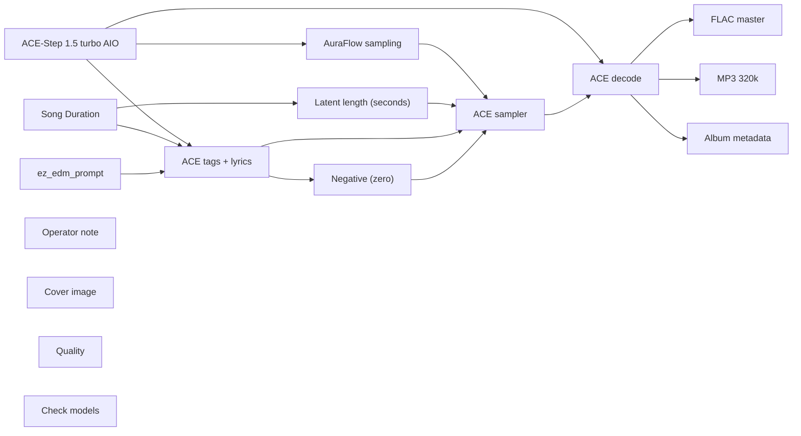

# audio/albums/drive-through/secret-homage

**What's on this page**

- **Every track, cover, and album-pack graph** in this folder
- **Shared ACE-Step topology** (one printer, unique widgets per take)
- **Node parameter reference** for the types on these graphs

**What this enables**

- **Queuing one numbered take** or `album-render`
- **Reading tags, lyrics, seed, BPM** without opening raw JSON

**Who this is for:** studio users after `download-music`. Occupancy **audio** (cover stills are **klein** — separate session).

> Generated from `workflows/_lab/audio/albums/drive-through/secret-homage/`. Do not hand-edit this file.

## Purpose

Numbered takes under `audio/albums/drive-through/secret-homage/`. Queue one track, or `./scripts/manage.sh album-render --album drive-through/secret-homage`.

```text
## 01-hush-lane

US-safe EDM **369 s** take: **hush lane**. Fictional act **Drive-through** (hardcore, pure of heart). Native ACE-Step 1.5 turbo AIO. Live bass-set take. Instrumental score is empty-body ACE markers (`[drop - cues]`, `[inst - cues]`, `[build-up]`, `[breakdown]`, `[outro]`) so ACE does not sing production notes. Form **drv-ab6e64070b**. Short build, then the drop. Later stanzas switch layers. No section is a long loop. No brass and no high leads. Vocals are a rare DJ treat on other graphs, not here. Queue this graph **on its own** — draft-first is the generic rap lane, not a prerequisite. Occupancy **audio** only; a longer Queue is expected.

1. Weights: `./scripts/manage.sh download-music --tier turbo` (same AIO dest as `download-podcast --tier acestep`; ~10 GB, opt-in, not `download-models`).
2. Prompt enhance is **off** so tags, BPM, language, and `[drop]` / `[inst]` / `[outro]` stay as written. Turn Enhance on only if you want the 4B rewriter.
3. Tags vs score: tags are genre/instrument hints; lyrics are the arrangement. Keep App **Vocal / instrumental** on instrumental so ACE does not sing. Encoder language is `unknown`. Free-text lines under a marker are lyrics — keep cues inside the brackets.
4. Original arrangements only. No “in the style of <living artist>”. No living-DJ names. No famous-hook paraphrases.
5. ACE-Step timbre is **invented**, not a cloned act.
6. Sampler: 8 steps, cfg 1, euler, simple. Duration 369 s, bpm 165, language unknown, timesignature 4, key B minor, form drv-ab6e64070b, generate_audio_codes true. Seed 593.
7. Saves: `01 - Hush Lane` FLAC master + 320 kbps MP3 under `${COMFY_OUTPUT_DIR}`.
8. Cover separately: Queue **stills/thumbnail.json** or **stills/podcast-cover.json**. Do not embed Klein here.
9. Human selection and edit before any release. Prompts are not authorship (USCO Part 2 / Thaler).
10. Do not co-resident with LTX / Wan / Klein on this Spark.

Occupancy: audio — stop Klein / Wan / LTX session. One GB10 job.
```

## Shared graph



## Graphs in this album

| Graph | Nodes | Occupancy |
| --- | --- | --- |
| `audio/albums/drive-through/secret-homage/01-hush-lane` | 16 | audio |
| `audio/albums/drive-through/secret-homage/02-cipher-lock` | 16 | audio |
| `audio/albums/drive-through/secret-homage/03-ghost-dock` | 16 | audio |
| `audio/albums/drive-through/secret-homage/04-sealed-ramp` | 16 | audio |
| `audio/albums/drive-through/secret-homage/05-fog-vault` | 16 | audio |
| `audio/albums/drive-through/secret-homage/06-dummy-light` | 16 | audio |
| `audio/albums/drive-through/secret-homage/07-quiet-wreck` | 16 | audio |
| `audio/albums/drive-through/secret-homage/08-off-ledger` | 16 | audio |
| `audio/albums/drive-through/secret-homage/09-back-alley` | 16 | audio |
| `audio/albums/drive-through/secret-homage/10-cellar-kick` | 16 | audio |
| `audio/albums/drive-through/secret-homage/11-hidden-booth` | 16 | audio |
| `audio/albums/drive-through/secret-homage/12-coded-sub` | 16 | audio |
| `audio/albums/drive-through/secret-homage/13-shadow-coil` | 16 | audio |
| `audio/albums/drive-through/secret-homage/14-mute-pyro` | 16 | audio |
| `audio/albums/drive-through/secret-homage/15-unlisted-row` | 16 | audio |
| `audio/albums/drive-through/secret-homage/16-night-cipher` | 16 | audio |
| `audio/albums/drive-through/secret-homage/17-blank-stencil` | 16 | audio |
| `audio/albums/drive-through/secret-homage/18-blind-stamp` | 16 | audio |
| `audio/albums/drive-through/secret-homage/19-cold-cache` | 16 | audio |
| `audio/albums/drive-through/secret-homage/20-secret-homage` | 16 | audio |
| `audio/albums/drive-through/secret-homage/album` | 4 | none |
| `audio/albums/drive-through/secret-homage/cover` | 15 | klein |

## `01-hush-lane`

Catalog id `audio/albums/drive-through/secret-homage/01-hush-lane`.

US-safe EDM take: Drive-through hush-lane dirty dubstep warp, ACE-Step 1.5 turbo AIO, instrumental, warped bass, invented timbre
Prompt enhance is **off** so authored text (recipe, script labels, ACE tags, or film shots) is encoded as written. Turn Enhance on only if you want the 4B rewriter.

**ACE-Step 1.5 turbo AIO** (`CheckpointLoaderSimple`)

| Slot | Value |
| --- | --- |
| 0 | `ace_step_1.5_turbo_aio.safetensors` |

**AuraFlow sampling** (`ModelSamplingAuraFlow`)

| Slot | Value |
| --- | --- |
| 0 | `3` |

**Song Duration** (`PrimitiveNode`)

| Slot | Value |
| --- | --- |
| 0 | `369.0` |
| 1 | `fixed` |

**Latent length (seconds)** (`EmptyAceStep1.5LatentAudio`)

| Slot | Value |
| --- | --- |
| 0 | `369.0` |
| 1 | `1` |

**ez_edm_prompt** (`EZAceStepPromptEnhance`)

| Slot | Value |
| --- | --- |
| 0 | `custom` |
| 1 | `dirty dubstep, wobble bass, chest-sub, rapid hi-hats, trap drums, warped bass, …` |
| 2 | `[build-up - bass boosted, sub center mids move wide, layers stay, sub stays, no…` |
| 3 | `false` |
| 4 | `instrumental` |
| 5 | `audio/albums/drive-through/secret-homage/01-hush-lane` |

```text
dirty dubstep, wobble bass, chest-sub, rapid hi-hats, trap drums, warped bass, rave, 808, no singing, no choir, no vocal chops, original composition, no brass, no horns, no trumpets, heavy chest bass, bass boosted, wide low-mid layers, fast switch-ups, riser, drop first, 165 bpm, instrumental, no vocals
```

```text
[build-up - bass boosted, sub center mids move wide, layers stay, sub stays, no gap, one-shot phrase, snare roll, octave sub stack, snare roll, wide mid growl, side percussion, snare answers, dirty dubstep wreck, 2 bars]

[drop - bass boosted, hats sweep across the image, layers stay, sub stays, no gap, one-shot phrase, stacked reese warped drop, body bass, call-response reese, rapid hi-hats, wide mids, offbeat push, dirty dubstep, heavy wobble drop, 2 bars]

[breakdown - bass boosted, hats sweep across the image, layers stay, sub stays, no gap, one-shot phrase, rapid hi-hats, chest-sub pulse, formant answer, wide mids, body bass, tight kick, 2 bars]

[drop - bass boosted, bass circles the stereo field, layers stay, sub stays, no gap, one-shot phrase, harder wobble warped drop, body bass, formant bass melody, trap drums denser, wide low-mid, triplet hats, rapid hi-hats denser, 2 bars]

[inst - bass boosted, sub center mids move wide, layers stay, sub stays, no gap, one-shot phrase, ghost snare, octave sub stack, wide mid reese counterline, side percussion, backbeat shove, wobble sustain, 2 bars]

[build-up - bass boosted, hats sweep across the image, layers stay, sub stays, no gap, one-shot phrase, snare roll, body bass, kick pattern flip, formant answer, wide mids, ghost notes, low rumble wreck, 2 bars]

[inst - bass boosted, 3D low-mid orbit, layers stay, sub stays, no gap, one-shot phrase, snare roll, octave sub stack, wide mid growl, side hats, dry hats, chest formant, 2 bars]

[drop - bass boosted, bass circles the stereo field, layers stay, sub stays, no gap, one-shot phrase, heavy growl warped drop, body bass, call-response reese, rapid hi-hats, wide low-mid, wide hat bed, harder growl drop, 2 bars]

[build-up - bass boosted, sub center mids move wide, layers stay, sub stays, no gap, one-shot phrase, snare roll, octave sub stack, offbeat hats, growl answer, side percussion, mono kick, chest-sub wreck, 2 bars]

[inst - bass boosted, hats sweep across the image, layers stay, sub stays, no gap, one-shot phrase, trap drums denser, body bass, formant bass melody, wide mids, side snare, dubstep warp, 2 bars]

[build-up - bass boosted, 3D low-mid orbit, layers stay, sub stays, no gap, one-shot phrase, snare roll, octave sub stack, ghost snare, wide mid reese counterline, side hats, rolling hats, kick holds, 2 bars]

[drop - bass boosted, bass circles the stereo field, layers stay, sub stays, no gap, one-shot phrase, stacked reese warped drop, body bass, formant answer, kick pattern flip, wide low-mid, late snare, full send drop, 2 bars]

[build-up - bass boosted, sub center mids move wide, layers stay, sub stays, no gap, one-shot phrase, snare roll, octave sub stack, snare roll, wide mid growl, side percussion, early kick, rapid hi-hats roll, 2 bars]

[inst - bass boosted, hats sweep across the image, layers stay, sub stays, no gap, one-shot phrase, rapid hi-hats, body bass, call-response reese, wide mids, syncopated hats, wobble ride, 2 bars]

[build-up - bass boosted, 3D low-mid orbit, layers stay, sub stays, no gap, one-shot phrase, snare roll, octave sub stack, offbeat hats, growl answer, side hats, open hat, 2 bars]

[inst - bass boosted, bass circles the stereo field, layers stay, sub stays, no gap, one-shot phrase, trap drums denser, body bass, formant bass melody, wide low-mid, closed hat, 2 bars]

[build-up - bass boosted, sub center mids move wide, layers stay, sub stays, no gap, one-shot phrase, snare roll, octave sub stack, ghost snare, wide mid reese counterline, side percussion, room snare, 2 bars]

[inst - bass boosted, hats sweep across the image, layers stay, sub stays, no gap, one-shot phrase, kick pattern flip, body bass, formant answer, wide mids, tight kick, 2 bars]

[drop - bass boosted, 3D low-mid orbit, layers stay, sub stays, no gap, one-shot phrase, harder wobble warped drop, octave sub stack, wide mid growl, snare roll, side hats, loose hats, 2 bars]

[inst - bass boosted, bass circles the stereo field, layers stay, sub stays, no gap, one-shot phrase, rapid hi-hats, body bass, call-response reese, wide low-mid, pushed snare, 2 bars]

[drop - bass boosted, sub center mids move wide, layers stay, sub stays, no gap, one-shot phrase, wreck formant warped drop, octave sub stack, growl answer, offbeat hats, side percussion, chopped hats, 2 bars]

[build-up - bass boosted, hats sweep across the image, layers stay, sub stays, no gap, one-shot phrase, snare roll, body bass, trap drums denser, formant bass melody, wide mids, hat density up, 2 bars]

[inst - bass boosted, 3D low-mid orbit, layers stay, sub stays, no gap, one-shot phrase, ghost snare, octave sub stack, wide mid reese counterline, side hats, kick opens, 2 bars]

[build-up - bass boosted, bass circles the stereo field, layers stay, sub stays, no gap, one-shot phrase, snare roll, body bass, kick pattern flip, formant answer, wide low-mid, kick tightens, 2 bars]

[inst - bass boosted, sub center mids move wide, layers stay, sub stays, no gap, one-shot phrase, snare roll, octave sub stack, wide mid growl, side percussion, snare answers, 2 bars]

[build-up - bass boosted, hats sweep across the image, layers stay, sub stays, no gap, one-shot phrase, snare roll, body bass, rapid hi-hats, call-response reese, wide mids, offbeat push, 2 bars]

[inst - bass boosted, bass circles the stereo field, layers stay, sub stays, no gap, one-shot phrase, trap drums denser, stacked 808, call-response reese, wide mids, triplet hats, 2 bars]

[drop - bass boosted, bass circles the stereo field, layers stay, sub stays, no gap, one-shot phrase, heavy growl warped drop, body bass, formant bass melody, trap drums denser, wide low-mid, triplet hats, 2 bars]

[inst - bass boosted, hats sweep across the image, layers stay, sub stays, no gap, one-shot phrase, kick pattern flip, stacked 808, formant bass melody, wide low-mid, ghost notes, 2 bars]

[build-up - bass boosted, 3D low-mid orbit, layers stay, sub stays, no gap, one-shot phrase, snare roll, fold bass, snare roll, wide mid reese counterline, side percussion, dry hats, 2 bars]

[inst - bass boosted, bass circles the stereo field, layers stay, sub stays, no gap, one-shot phrase, rapid hi-hats, stacked 808, formant answer, wide mids, wide hat bed, 2 bars]

[drop - bass boosted, bass circles the stereo field, layers stay, sub stays, no gap, one-shot phrase, stacked reese warped drop, body bass, call-response reese, rapid hi-hats, wide low-mid, wide hat bed, 2 bars]

[inst - bass boosted, sub center mids move wide, layers stay, sub stays, no gap, one-shot phrase, offbeat hats, octave sub stack, growl answer, side percussion, mono kick, 2 bars]

[drop - bass boosted, hats sweep across the image, layers stay, sub stays, no gap, one-shot phrase, harder wobble warped drop, body bass, formant bass melody, trap drums denser, wide mids, side snare, 2 bars]

[inst - bass boosted, 3D low-mid orbit, layers stay, sub stays, no gap, one-shot phrase, ghost snare, octave sub stack, wide mid reese counterline, side hats, rolling hats, 2 bars]

[build-up - bass boosted, bass circles the stereo field, layers stay, sub stays, no gap, one-shot phrase, snare roll, body bass, kick pattern flip, formant answer, wide low-mid, late snare, 2 bars]

[drop - bass boosted, sub center mids move wide, layers stay, sub stays, no gap, one-shot phrase, stacked reese warped drop, octave sub stack, wide mid growl, snare roll, side percussion, early kick, 2 bars]

[inst - bass boosted, 3D low-mid orbit, layers stay, sub stays, no gap, one-shot phrase, offbeat hats, fold bass, wide mid growl, side percussion, open hat, 2 bars]

[drop - bass boosted, 3D low-mid orbit, layers stay, sub stays, no gap, one-shot phrase, harder wobble warped drop, octave sub stack, growl answer, offbeat hats, side hats, open hat, 2 bars]

[build-up - bass boosted, bass circles the stereo field, layers stay, sub stays, no gap, one-shot phrase, snare roll, body bass, trap drums denser, formant bass melody, wide low-mid, closed hat, 2 bars]

[inst - bass boosted, sub center mids move wide, layers stay, sub stays, no gap, one-shot phrase, ghost snare, octave sub stack, wide mid reese counterline, side percussion, room snare, 2 bars]

[drop - bass boosted, hats sweep across the image, layers stay, sub stays, no gap, one-shot phrase, stacked reese warped drop, body bass, formant answer, kick pattern flip, wide mids, tight kick, 2 bars]

[inst - bass boosted, 3D low-mid orbit, layers stay, sub stays, no gap, one-shot phrase, snare roll, octave sub stack, wide mid growl, side hats, loose hats, 2 bars]

[drop - bass boosted, bass circles the stereo field, layers stay, sub stays, no gap, one-shot phrase, harder wobble warped drop, body bass, call-response reese, rapid hi-hats, wide low-mid, pushed snare, 2 bars]

[build-up - bass boosted, sub center mids move wide, layers stay, sub stays, no gap, one-shot phrase, snare roll, octave sub stack, offbeat hats, growl answer, side percussion, chopped hats, 2 bars]

[inst - bass boosted, hats sweep across the image, layers stay, sub stays, no gap, one-shot phrase, trap drums denser, body bass, formant bass melody, wide mids, hat density up, 2 bars]

[build-up - bass boosted, 3D low-mid orbit, layers stay, sub stays, no gap, one-shot phrase, snare roll, octave sub stack, ghost snare, wide mid reese counterline, side hats, kick opens, 2 bars]

[inst - bass boosted, bass circles the stereo field, layers stay, sub stays, no gap, one-shot phrase, kick pattern flip, body bass, formant answer, wide low-mid, kick tightens, 2 bars]

[build-up - bass boosted, hats sweep across the image, layers stay, sub stays, no gap, one-shot phrase, snare roll, stacked 808, rapid hi-hats, formant answer, wide low-mid, offbeat push, 2 bars]

[drop - bass boosted, hats sweep across the image, layers stay, sub stays, no gap, one-shot phrase, full send warped drop, body bass, call-response reese, rapid hi-hats, wide mids, offbeat push, 2 bars]

[build-up - bass boosted, 3D low-mid orbit, layers stay, sub stays, no gap, one-shot phrase, snare roll, octave sub stack, offbeat hats, growl answer, side hats, straight hats, 2 bars]

[inst - bass boosted, bass circles the stereo field, layers stay, sub stays, no gap, one-shot phrase, trap drums denser, body bass, formant bass melody, wide low-mid, triplet hats, 2 bars]

[drop - bass boosted, sub center mids move wide, layers stay, sub stays, no gap, one-shot phrase, heavy growl warped drop, octave sub stack, wide mid reese counterline, ghost snare, side percussion, backbeat shove, 2 bars]

[build-up - bass boosted, bass circles the stereo field, layers stay, sub stays, no gap, one-shot phrase, snare roll, mono chest-sub, rapid hi-hats, formant bass melody, wide low-mid, wide hat bed, 2 bars]

[drop - bass boosted, 3D low-mid orbit, layers stay, sub stays, no gap, one-shot phrase, full send warped drop, octave sub stack, wide mid growl, snare roll, side hats, dry hats, 2 bars]

[build-up - bass boosted, bass circles the stereo field, layers stay, sub stays, no gap, one-shot phrase, snare roll, body bass, rapid hi-hats, call-response reese, wide low-mid, wide hat bed, 2 bars]

[drop - bass boosted, sub center mids move wide, layers stay, sub stays, no gap, one-shot phrase, stacked reese warped drop, octave sub stack, growl answer, offbeat hats, side percussion, mono kick, 2 bars]

[build-up - bass boosted, hats sweep across the image, layers stay, sub stays, no gap, one-shot phrase, snare roll, body bass, trap drums denser, formant bass melody, wide mids, side snare, 2 bars]

[drop - bass boosted, 3D low-mid orbit, layers stay, sub stays, no gap, one-shot phrase, harder wobble warped drop, octave sub stack, wide mid reese counterline, ghost snare, side hats, rolling hats, 2 bars]

[build-up - bass boosted, sub center mids move wide, layers stay, sub stays, no gap, one-shot phrase, snare roll, fold bass, snare roll, wide mid reese counterline, side hats, early kick, 2 bars]

[inst - bass boosted, sub center mids move wide, layers stay, sub stays, no gap, one-shot phrase, snare roll, octave sub stack, wide mid growl, side percussion, early kick, 2 bars]

[build-up - bass boosted, hats sweep across the image, layers stay, sub stays, no gap, one-shot phrase, snare roll, body bass, rapid hi-hats, call-response reese, wide mids, syncopated hats, 2 bars]

[drop - bass boosted, 3D low-mid orbit, layers stay, sub stays, no gap, one-shot phrase, heavy growl warped drop, octave sub stack, growl answer, offbeat hats, side hats, open hat, 2 bars]

[build-up - bass boosted, sub center mids move wide, layers stay, sub stays, no gap, one-shot phrase, snare roll, fold bass, ghost snare, growl answer, side hats, room snare, 2 bars]

[drop - bass boosted, sub center mids move wide, layers stay, sub stays, no gap, one-shot phrase, full send warped drop, octave sub stack, wide mid reese counterline, ghost snare, side percussion, room snare, 2 bars]

[build-up - bass boosted, hats sweep across the image, layers stay, sub stays, no gap, one-shot phrase, snare roll, body bass, kick pattern flip, formant answer, wide mids, tight kick, 2 bars]

[inst - bass boosted, bass circles the stereo field, layers stay, sub stays, no gap, one-shot phrase, rapid hi-hats, stacked 808, formant answer, wide mids, pushed snare, 2 bars]

[drop - bass boosted, bass circles the stereo field, layers stay, sub stays, no gap, one-shot phrase, heavy growl warped drop, body bass, call-response reese, rapid hi-hats, wide low-mid, pushed snare, 2 bars]

[build-up - bass boosted, hats sweep across the image, layers stay, sub stays, no gap, one-shot phrase, snare roll, stacked 808, trap drums denser, call-response reese, wide low-mid, hat density up, 2 bars]

[drop - bass boosted, hats sweep across the image, layers stay, sub stays, no gap, one-shot phrase, full send warped drop, body bass, formant bass melody, trap drums denser, wide mids, hat density up, 2 bars]

[build-up - bass boosted, bass circles the stereo field, layers stay, sub stays, no gap, one-shot phrase, snare roll, stacked 808, kick pattern flip, formant bass melody, wide mids, kick tightens, 2 bars]

[drop - bass boosted, bass circles the stereo field, layers stay, sub stays, no gap, one-shot phrase, stacked reese warped drop, body bass, formant answer, kick pattern flip, wide low-mid, kick tightens, 2 bars]

[build-up - bass boosted, 3D low-mid orbit, layers stay, sub stays, no gap, one-shot phrase, snare roll, low chest-sub, offbeat hats, wide mid reese counterline, side hats, straight hats, 2 bars]

[inst - bass boosted, hats sweep across the image, layers stay, sub stays, no gap, one-shot phrase, rapid hi-hats, body bass, call-response reese, wide mids, offbeat push, 2 bars]

[build-up - bass boosted, bass circles the stereo field, layers stay, sub stays, no gap, one-shot phrase, snare roll, stacked 808, trap drums denser, call-response reese, wide mids, triplet hats, 2 bars]

[inst - bass boosted, sub center mids move wide, layers stay, sub stays, no gap, one-shot phrase, ghost snare, fold bass, growl answer, side hats, backbeat shove, 2 bars]

[build-up - bass boosted, sub center mids move wide, layers stay, sub stays, no gap, one-shot phrase, snare roll, octave sub stack, ghost snare, wide mid reese counterline, side percussion, backbeat shove, 2 bars]

[drop - bass boosted, hats sweep across the image, layers stay, sub stays, no gap, one-shot phrase, heavy growl warped drop, body bass, formant answer, kick pattern flip, wide mids, ghost notes, 2 bars]

[build-up - bass boosted, 3D low-mid orbit, layers stay, sub stays, no gap, one-shot phrase, snare roll, octave sub stack, snare roll, wide mid growl, side hats, dry hats, 2 bars]

[inst - bass boosted, bass circles the stereo field, layers stay, sub stays, no gap, one-shot phrase, rapid hi-hats, body bass, call-response reese, wide low-mid, wide hat bed, 2 bars]

[drop - bass boosted, sub center mids move wide, layers stay, sub stays, no gap, one-shot phrase, wreck formant warped drop, octave sub stack, growl answer, offbeat hats, side percussion, mono kick, 2 bars]

[build-up - bass boosted, 3D low-mid orbit, layers stay, sub stays, no gap, one-shot phrase, snare roll, fold bass, ghost snare, growl answer, side percussion, rolling hats, 2 bars]

[drop - bass boosted, 3D low-mid orbit, layers stay, sub stays, no gap, one-shot phrase, heavy growl warped drop, octave sub stack, wide mid reese counterline, ghost snare, side hats, rolling hats, 2 bars]

[inst - bass boosted, bass circles the stereo field, layers stay, sub stays, no gap, one-shot phrase, kick pattern flip, body bass, formant answer, wide low-mid, late snare, 2 bars]

[drop - bass boosted, sub center mids move wide, layers stay, sub stays, no gap, one-shot phrase, full send warped drop, octave sub stack, wide mid growl, snare roll, side percussion, early kick, 2 bars]

[inst - bass boosted, bass circles the stereo field, layers stay, sub stays, no gap, one-shot phrase, trap drums denser, mono chest-sub, formant answer, wide low-mid, closed hat, 2 bars]

[drop - bass boosted, 3D low-mid orbit, layers stay, sub stays, no gap, one-shot phrase, stacked reese warped drop, octave sub stack, growl answer, offbeat hats, side hats, open hat, 2 bars]

[build-up - bass boosted, hats sweep across the image, layers stay, sub stays, no gap, one-shot phrase, snare roll, mono chest-sub, kick pattern flip, call-response reese, wide mids, tight kick, 2 bars]

[inst - bass boosted, hats sweep across the image, layers stay, sub stays, no gap, one-shot phrase, kick pattern flip, stacked 808, formant bass melody, wide low-mid, tight kick, 2 bars]

[drop - bass boosted, hats sweep across the image, layers stay, sub stays, no gap, one-shot phrase, full send warped drop, body bass, formant answer, kick pattern flip, wide mids, tight kick, 2 bars]

[build-up - bass boosted, 3D low-mid orbit, layers stay, sub stays, no gap, one-shot phrase, snare roll, octave sub stack, snare roll, wide mid growl, side hats, loose hats, 2 bars]

[inst - bass boosted, sub center mids move wide, layers stay, sub stays, no gap, one-shot phrase, offbeat hats, fold bass, wide mid growl, side hats, chopped hats, 2 bars]

[drop - bass boosted, sub center mids move wide, layers stay, sub stays, no gap, one-shot phrase, heavy growl warped drop, octave sub stack, growl answer, offbeat hats, side percussion, chopped hats, 2 bars]

[build-up - bass boosted, 3D low-mid orbit, layers stay, sub stays, no gap, one-shot phrase, snare roll, fold bass, ghost snare, growl answer, side percussion, kick opens, 2 bars]

[inst - bass boosted, bass circles the stereo field, layers stay, sub stays, no gap, one-shot phrase, kick pattern flip, stacked 808, formant bass melody, wide mids, kick tightens, 2 bars]

[drop - bass boosted, bass circles the stereo field, layers stay, sub stays, no gap, one-shot phrase, wreck formant warped drop, body bass, formant answer, kick pattern flip, wide low-mid, kick tightens, 2 bars]

[inst - bass boosted, hats sweep across the image, layers stay, sub stays, no gap, one-shot phrase, rapid hi-hats, stacked 808, formant answer, wide low-mid, offbeat push, 2 bars]

[drop - bass boosted, hats sweep across the image, layers stay, sub stays, no gap, one-shot phrase, heavy growl warped drop, body bass, call-response reese, rapid hi-hats, wide mids, offbeat push, 2 bars]

[inst - bass boosted, sub center mids move wide, layers stay, sub stays, no gap, one-shot phrase, ghost snare, low chest-sub, wide mid growl, side percussion, backbeat shove, 2 bars]

[build-up - bass boosted, bass circles the stereo field, layers stay, sub stays, no gap, one-shot phrase, snare roll, body bass, trap drums denser, formant bass melody, wide low-mid, triplet hats, 2 bars]

[drop - bass boosted, sub center mids move wide, layers stay, sub stays, no gap, one-shot phrase, wreck formant warped drop, octave sub stack, wide mid reese counterline, ghost snare, side percussion, backbeat shove, 2 bars]

[build-up - bass boosted, sub center mids move wide, layers stay, sub stays, no gap, one-shot phrase, snare roll, octave sub stack, offbeat hats, growl answer, side hats, mono kick, 2 bars]

[inst - bass boosted, sub center mids move wide, layers stay, sub stays, no gap, one-shot phrase, offbeat hats, low chest-sub, wide mid reese counterline, side percussion, mono kick, 2 bars]

[build-up - bass boosted, sub center mids move wide, layers stay, sub stays, no gap, one-shot phrase, snare roll, fold bass, offbeat hats, wide mid growl, side hats, mono kick, 2 bars]

[inst - bass boosted, hats sweep across the image, layers stay, sub stays, no gap, one-shot phrase, trap drums denser, stacked 808, call-response reese, wide low-mid, side snare, 2 bars]

[drop - bass boosted, hats sweep across the image, layers stay, sub stays, no gap, one-shot phrase, wreck formant warped drop, body bass, formant bass melody, trap drums denser, wide mids, side snare, 2 bars]

[build-up - bass boosted, bass circles the stereo field, layers stay, sub stays, no gap, one-shot phrase, snare roll, stacked 808, kick pattern flip, formant bass melody, wide mids, late snare, 2 bars]

[drop - bass boosted, bass circles the stereo field, layers stay, sub stays, no gap, one-shot phrase, heavy growl warped drop, body bass, formant answer, kick pattern flip, wide low-mid, late snare, 2 bars]

[build-up - bass boosted, hats sweep across the image, layers stay, sub stays, no gap, one-shot phrase, snare roll, stacked 808, rapid hi-hats, formant answer, wide low-mid, syncopated hats, 2 bars]

[drop - bass boosted, hats sweep across the image, layers stay, sub stays, no gap, one-shot phrase, full send warped drop, body bass, call-response reese, rapid hi-hats, wide mids, syncopated hats, 2 bars]

[inst - bass boosted, 3D low-mid orbit, layers stay, sub stays, no gap, one-shot phrase, offbeat hats, octave sub stack, growl answer, side hats, open hat, 2 bars]

[drop - bass boosted, bass circles the stereo field, layers stay, sub stays, no gap, one-shot phrase, stacked reese warped drop, body bass, formant bass melody, trap drums denser, wide low-mid, closed hat, 2 bars]

[build-up - bass boosted, hats sweep across the image, layers stay, sub stays, no gap, one-shot phrase, snare roll, stacked 808, kick pattern flip, formant bass melody, wide low-mid, tight kick, 2 bars]

[drop - bass boosted, hats sweep across the image, layers stay, sub stays, no gap, one-shot phrase, harder wobble warped drop, body bass, formant answer, kick pattern flip, wide mids, tight kick, 2 bars]

[build-up - bass boosted, bass circles the stereo field, layers stay, sub stays, no gap, one-shot phrase, snare roll, stacked 808, rapid hi-hats, formant answer, wide mids, pushed snare, 2 bars]

[inst - bass boosted, hats sweep across the image, layers stay, sub stays, no gap, one-shot phrase, trap drums denser, mono chest-sub, formant answer, wide mids, hat density up, 2 bars]

[drop - bass boosted, sub center mids move wide, layers stay, sub stays, no gap, one-shot phrase, stacked reese warped drop, octave sub stack, growl answer, offbeat hats, side percussion, chopped hats, 2 bars]

[build-up - bass boosted, bass circles the stereo field, layers stay, sub stays, no gap, one-shot phrase, snare roll, mono chest-sub, kick pattern flip, call-response reese, wide low-mid, kick tightens, 2 bars]

[inst - bass boosted, sub center mids move wide, layers stay, sub stays, no gap, one-shot phrase, snare roll, low chest-sub, growl answer, side percussion, snare answers, 2 bars]

[drop - bass boosted, bass circles the stereo field, layers stay, sub stays, no gap, one-shot phrase, full send warped drop, body bass, formant answer, kick pattern flip, wide low-mid, kick tightens, 2 bars]

[build-up - bass boosted, bass circles the stereo field, layers stay, sub stays, no gap, one-shot phrase, snare roll, body bass, trap drums denser, formant bass melody, wide mids, triplet hats, 2 bars]

[inst - bass boosted, 3D low-mid orbit, layers stay, sub stays, no gap, one-shot phrase, offbeat hats, fold bass, wide mid growl, side percussion, straight hats, 2 bars]

[drop - bass boosted, 3D low-mid orbit, layers stay, sub stays, no gap, one-shot phrase, heavy growl warped drop, octave sub stack, growl answer, offbeat hats, side hats, straight hats, 2 bars]

[inst - bass boosted, hats sweep across the image, layers stay, sub stays, no gap, one-shot phrase, kick pattern flip, mono chest-sub, call-response reese, wide mids, ghost notes, 2 bars]

[drop - bass boosted, sub center mids move wide, layers stay, sub stays, no gap, one-shot phrase, full send warped drop, octave sub stack, wide mid reese counterline, ghost snare, side percussion, backbeat shove, 2 bars]

[build-up - bass boosted, hats sweep across the image, layers stay, sub stays, no gap, one-shot phrase, snare roll, stacked 808, trap drums denser, call-response reese, wide mids, side snare, 2 bars]

[outro - bass boosted, 3D low-mid orbit, layers stay, sub stays, no gap, one-shot phrase, kick pattern flip, chest-sub, rapid hi-hats, wide mid growl, side hats, loose hats, 2 bars]
```

**ACE tags + lyrics** (`TextEncodeAceStepAudio1.5`)

| Slot | Value |
| --- | --- |
| 0 | `dirty dubstep, wobble bass, chest-sub, rapid hi-hats, trap drums, warped bass, …` |
| 1 | `[build-up - bass boosted, sub center mids move wide, layers stay, sub stays, no…` |
| 2 | `593` |
| 3 | `fixed` |
| 4 | `165` |
| 5 | `369.0` |
| 6 | `4` |
| 7 | `unknown` |
| 8 | `B minor` |
| 9 | `true` |
| 10 | `2.0` |
| 11 | `0.85` |
| 12 | `0.9` |
| 13 | `0` |
| 14 | `0.0` |

```text
dirty dubstep, wobble bass, chest-sub, rapid hi-hats, trap drums, warped bass, rave, 808, no singing, no choir, no vocal chops, original composition, no brass, no horns, no trumpets, heavy chest bass, bass boosted, wide low-mid layers, fast switch-ups, riser, drop first, 165 bpm, instrumental, no vocals
```

```text
[build-up - bass boosted, sub center mids move wide, layers stay, sub stays, no gap, one-shot phrase, snare roll, octave sub stack, snare roll, wide mid growl, side percussion, snare answers, dirty dubstep wreck, 2 bars]

[drop - bass boosted, hats sweep across the image, layers stay, sub stays, no gap, one-shot phrase, stacked reese warped drop, body bass, call-response reese, rapid hi-hats, wide mids, offbeat push, dirty dubstep, heavy wobble drop, 2 bars]

[breakdown - bass boosted, hats sweep across the image, layers stay, sub stays, no gap, one-shot phrase, rapid hi-hats, chest-sub pulse, formant answer, wide mids, body bass, tight kick, 2 bars]

[drop - bass boosted, bass circles the stereo field, layers stay, sub stays, no gap, one-shot phrase, harder wobble warped drop, body bass, formant bass melody, trap drums denser, wide low-mid, triplet hats, rapid hi-hats denser, 2 bars]

[inst - bass boosted, sub center mids move wide, layers stay, sub stays, no gap, one-shot phrase, ghost snare, octave sub stack, wide mid reese counterline, side percussion, backbeat shove, wobble sustain, 2 bars]

[build-up - bass boosted, hats sweep across the image, layers stay, sub stays, no gap, one-shot phrase, snare roll, body bass, kick pattern flip, formant answer, wide mids, ghost notes, low rumble wreck, 2 bars]

[inst - bass boosted, 3D low-mid orbit, layers stay, sub stays, no gap, one-shot phrase, snare roll, octave sub stack, wide mid growl, side hats, dry hats, chest formant, 2 bars]

[drop - bass boosted, bass circles the stereo field, layers stay, sub stays, no gap, one-shot phrase, heavy growl warped drop, body bass, call-response reese, rapid hi-hats, wide low-mid, wide hat bed, harder growl drop, 2 bars]

[build-up - bass boosted, sub center mids move wide, layers stay, sub stays, no gap, one-shot phrase, snare roll, octave sub stack, offbeat hats, growl answer, side percussion, mono kick, chest-sub wreck, 2 bars]

[inst - bass boosted, hats sweep across the image, layers stay, sub stays, no gap, one-shot phrase, trap drums denser, body bass, formant bass melody, wide mids, side snare, dubstep warp, 2 bars]

[build-up - bass boosted, 3D low-mid orbit, layers stay, sub stays, no gap, one-shot phrase, snare roll, octave sub stack, ghost snare, wide mid reese counterline, side hats, rolling hats, kick holds, 2 bars]

[drop - bass boosted, bass circles the stereo field, layers stay, sub stays, no gap, one-shot phrase, stacked reese warped drop, body bass, formant answer, kick pattern flip, wide low-mid, late snare, full send drop, 2 bars]

[build-up - bass boosted, sub center mids move wide, layers stay, sub stays, no gap, one-shot phrase, snare roll, octave sub stack, snare roll, wide mid growl, side percussion, early kick, rapid hi-hats roll, 2 bars]

[inst - bass boosted, hats sweep across the image, layers stay, sub stays, no gap, one-shot phrase, rapid hi-hats, body bass, call-response reese, wide mids, syncopated hats, wobble ride, 2 bars]

[build-up - bass boosted, 3D low-mid orbit, layers stay, sub stays, no gap, one-shot phrase, snare roll, octave sub stack, offbeat hats, growl answer, side hats, open hat, 2 bars]

[inst - bass boosted, bass circles the stereo field, layers stay, sub stays, no gap, one-shot phrase, trap drums denser, body bass, formant bass melody, wide low-mid, closed hat, 2 bars]

[build-up - bass boosted, sub center mids move wide, layers stay, sub stays, no gap, one-shot phrase, snare roll, octave sub stack, ghost snare, wide mid reese counterline, side percussion, room snare, 2 bars]

[inst - bass boosted, hats sweep across the image, layers stay, sub stays, no gap, one-shot phrase, kick pattern flip, body bass, formant answer, wide mids, tight kick, 2 bars]

[drop - bass boosted, 3D low-mid orbit, layers stay, sub stays, no gap, one-shot phrase, harder wobble warped drop, octave sub stack, wide mid growl, snare roll, side hats, loose hats, 2 bars]

[inst - bass boosted, bass circles the stereo field, layers stay, sub stays, no gap, one-shot phrase, rapid hi-hats, body bass, call-response reese, wide low-mid, pushed snare, 2 bars]

[drop - bass boosted, sub center mids move wide, layers stay, sub stays, no gap, one-shot phrase, wreck formant warped drop, octave sub stack, growl answer, offbeat hats, side percussion, chopped hats, 2 bars]

[build-up - bass boosted, hats sweep across the image, layers stay, sub stays, no gap, one-shot phrase, snare roll, body bass, trap drums denser, formant bass melody, wide mids, hat density up, 2 bars]

[inst - bass boosted, 3D low-mid orbit, layers stay, sub stays, no gap, one-shot phrase, ghost snare, octave sub stack, wide mid reese counterline, side hats, kick opens, 2 bars]

[build-up - bass boosted, bass circles the stereo field, layers stay, sub stays, no gap, one-shot phrase, snare roll, body bass, kick pattern flip, formant answer, wide low-mid, kick tightens, 2 bars]

[inst - bass boosted, sub center mids move wide, layers stay, sub stays, no gap, one-shot phrase, snare roll, octave sub stack, wide mid growl, side percussion, snare answers, 2 bars]

[build-up - bass boosted, hats sweep across the image, layers stay, sub stays, no gap, one-shot phrase, snare roll, body bass, rapid hi-hats, call-response reese, wide mids, offbeat push, 2 bars]

[inst - bass boosted, bass circles the stereo field, layers stay, sub stays, no gap, one-shot phrase, trap drums denser, stacked 808, call-response reese, wide mids, triplet hats, 2 bars]

[drop - bass boosted, bass circles the stereo field, layers stay, sub stays, no gap, one-shot phrase, heavy growl warped drop, body bass, formant bass melody, trap drums denser, wide low-mid, triplet hats, 2 bars]

[inst - bass boosted, hats sweep across the image, layers stay, sub stays, no gap, one-shot phrase, kick pattern flip, stacked 808, formant bass melody, wide low-mid, ghost notes, 2 bars]

[build-up - bass boosted, 3D low-mid orbit, layers stay, sub stays, no gap, one-shot phrase, snare roll, fold bass, snare roll, wide mid reese counterline, side percussion, dry hats, 2 bars]

[inst - bass boosted, bass circles the stereo field, layers stay, sub stays, no gap, one-shot phrase, rapid hi-hats, stacked 808, formant answer, wide mids, wide hat bed, 2 bars]

[drop - bass boosted, bass circles the stereo field, layers stay, sub stays, no gap, one-shot phrase, stacked reese warped drop, body bass, call-response reese, rapid hi-hats, wide low-mid, wide hat bed, 2 bars]

[inst - bass boosted, sub center mids move wide, layers stay, sub stays, no gap, one-shot phrase, offbeat hats, octave sub stack, growl answer, side percussion, mono kick, 2 bars]

[drop - bass boosted, hats sweep across the image, layers stay, sub stays, no gap, one-shot phrase, harder wobble warped drop, body bass, formant bass melody, trap drums denser, wide mids, side snare, 2 bars]

[inst - bass boosted, 3D low-mid orbit, layers stay, sub stays, no gap, one-shot phrase, ghost snare, octave sub stack, wide mid reese counterline, side hats, rolling hats, 2 bars]

[build-up - bass boosted, bass circles the stereo field, layers stay, sub stays, no gap, one-shot phrase, snare roll, body bass, kick pattern flip, formant answer, wide low-mid, late snare, 2 bars]

[drop - bass boosted, sub center mids move wide, layers stay, sub stays, no gap, one-shot phrase, stacked reese warped drop, octave sub stack, wide mid growl, snare roll, side percussion, early kick, 2 bars]

[inst - bass boosted, 3D low-mid orbit, layers stay, sub stays, no gap, one-shot phrase, offbeat hats, fold bass, wide mid growl, side percussion, open hat, 2 bars]

[drop - bass boosted, 3D low-mid orbit, layers stay, sub stays, no gap, one-shot phrase, harder wobble warped drop, octave sub stack, growl answer, offbeat hats, side hats, open hat, 2 bars]

[build-up - bass boosted, bass circles the stereo field, layers stay, sub stays, no gap, one-shot phrase, snare roll, body bass, trap drums denser, formant bass melody, wide low-mid, closed hat, 2 bars]

[inst - bass boosted, sub center mids move wide, layers stay, sub stays, no gap, one-shot phrase, ghost snare, octave sub stack, wide mid reese counterline, side percussion, room snare, 2 bars]

[drop - bass boosted, hats sweep across the image, layers stay, sub stays, no gap, one-shot phrase, stacked reese warped drop, body bass, formant answer, kick pattern flip, wide mids, tight kick, 2 bars]

[inst - bass boosted, 3D low-mid orbit, layers stay, sub stays, no gap, one-shot phrase, snare roll, octave sub stack, wide mid growl, side hats, loose hats, 2 bars]

[drop - bass boosted, bass circles the stereo field, layers stay, sub stays, no gap, one-shot phrase, harder wobble warped drop, body bass, call-response reese, rapid hi-hats, wide low-mid, pushed snare, 2 bars]

[build-up - bass boosted, sub center mids move wide, layers stay, sub stays, no gap, one-shot phrase, snare roll, octave sub stack, offbeat hats, growl answer, side percussion, chopped hats, 2 bars]

[inst - bass boosted, hats sweep across the image, layers stay, sub stays, no gap, one-shot phrase, trap drums denser, body bass, formant bass melody, wide mids, hat density up, 2 bars]

[build-up - bass boosted, 3D low-mid orbit, layers stay, sub stays, no gap, one-shot phrase, snare roll, octave sub stack, ghost snare, wide mid reese counterline, side hats, kick opens, 2 bars]

[inst - bass boosted, bass circles the stereo field, layers stay, sub stays, no gap, one-shot phrase, kick pattern flip, body bass, formant answer, wide low-mid, kick tightens, 2 bars]

[build-up - bass boosted, hats sweep across the image, layers stay, sub stays, no gap, one-shot phrase, snare roll, stacked 808, rapid hi-hats, formant answer, wide low-mid, offbeat push, 2 bars]

[drop - bass boosted, hats sweep across the image, layers stay, sub stays, no gap, one-shot phrase, full send warped drop, body bass, call-response reese, rapid hi-hats, wide mids, offbeat push, 2 bars]

[build-up - bass boosted, 3D low-mid orbit, layers stay, sub stays, no gap, one-shot phrase, snare roll, octave sub stack, offbeat hats, growl answer, side hats, straight hats, 2 bars]

[inst - bass boosted, bass circles the stereo field, layers stay, sub stays, no gap, one-shot phrase, trap drums denser, body bass, formant bass melody, wide low-mid, triplet hats, 2 bars]

[drop - bass boosted, sub center mids move wide, layers stay, sub stays, no gap, one-shot phrase, heavy growl warped drop, octave sub stack, wide mid reese counterline, ghost snare, side percussion, backbeat shove, 2 bars]

[build-up - bass boosted, bass circles the stereo field, layers stay, sub stays, no gap, one-shot phrase, snare roll, mono chest-sub, rapid hi-hats, formant bass melody, wide low-mid, wide hat bed, 2 bars]

[drop - bass boosted, 3D low-mid orbit, layers stay, sub stays, no gap, one-shot phrase, full send warped drop, octave sub stack, wide mid growl, snare roll, side hats, dry hats, 2 bars]

[build-up - bass boosted, bass circles the stereo field, layers stay, sub stays, no gap, one-shot phrase, snare roll, body bass, rapid hi-hats, call-response reese, wide low-mid, wide hat bed, 2 bars]

[drop - bass boosted, sub center mids move wide, layers stay, sub stays, no gap, one-shot phrase, stacked reese warped drop, octave sub stack, growl answer, offbeat hats, side percussion, mono kick, 2 bars]

[build-up - bass boosted, hats sweep across the image, layers stay, sub stays, no gap, one-shot phrase, snare roll, body bass, trap drums denser, formant bass melody, wide mids, side snare, 2 bars]

[drop - bass boosted, 3D low-mid orbit, layers stay, sub stays, no gap, one-shot phrase, harder wobble warped drop, octave sub stack, wide mid reese counterline, ghost snare, side hats, rolling hats, 2 bars]

[build-up - bass boosted, sub center mids move wide, layers stay, sub stays, no gap, one-shot phrase, snare roll, fold bass, snare roll, wide mid reese counterline, side hats, early kick, 2 bars]

[inst - bass boosted, sub center mids move wide, layers stay, sub stays, no gap, one-shot phrase, snare roll, octave sub stack, wide mid growl, side percussion, early kick, 2 bars]

[build-up - bass boosted, hats sweep across the image, layers stay, sub stays, no gap, one-shot phrase, snare roll, body bass, rapid hi-hats, call-response reese, wide mids, syncopated hats, 2 bars]

[drop - bass boosted, 3D low-mid orbit, layers stay, sub stays, no gap, one-shot phrase, heavy growl warped drop, octave sub stack, growl answer, offbeat hats, side hats, open hat, 2 bars]

[build-up - bass boosted, sub center mids move wide, layers stay, sub stays, no gap, one-shot phrase, snare roll, fold bass, ghost snare, growl answer, side hats, room snare, 2 bars]

[drop - bass boosted, sub center mids move wide, layers stay, sub stays, no gap, one-shot phrase, full send warped drop, octave sub stack, wide mid reese counterline, ghost snare, side percussion, room snare, 2 bars]

[build-up - bass boosted, hats sweep across the image, layers stay, sub stays, no gap, one-shot phrase, snare roll, body bass, kick pattern flip, formant answer, wide mids, tight kick, 2 bars]

[inst - bass boosted, bass circles the stereo field, layers stay, sub stays, no gap, one-shot phrase, rapid hi-hats, stacked 808, formant answer, wide mids, pushed snare, 2 bars]

[drop - bass boosted, bass circles the stereo field, layers stay, sub stays, no gap, one-shot phrase, heavy growl warped drop, body bass, call-response reese, rapid hi-hats, wide low-mid, pushed snare, 2 bars]

[build-up - bass boosted, hats sweep across the image, layers stay, sub stays, no gap, one-shot phrase, snare roll, stacked 808, trap drums denser, call-response reese, wide low-mid, hat density up, 2 bars]

[drop - bass boosted, hats sweep across the image, layers stay, sub stays, no gap, one-shot phrase, full send warped drop, body bass, formant bass melody, trap drums denser, wide mids, hat density up, 2 bars]

[build-up - bass boosted, bass circles the stereo field, layers stay, sub stays, no gap, one-shot phrase, snare roll, stacked 808, kick pattern flip, formant bass melody, wide mids, kick tightens, 2 bars]

[drop - bass boosted, bass circles the stereo field, layers stay, sub stays, no gap, one-shot phrase, stacked reese warped drop, body bass, formant answer, kick pattern flip, wide low-mid, kick tightens, 2 bars]

[build-up - bass boosted, 3D low-mid orbit, layers stay, sub stays, no gap, one-shot phrase, snare roll, low chest-sub, offbeat hats, wide mid reese counterline, side hats, straight hats, 2 bars]

[inst - bass boosted, hats sweep across the image, layers stay, sub stays, no gap, one-shot phrase, rapid hi-hats, body bass, call-response reese, wide mids, offbeat push, 2 bars]

[build-up - bass boosted, bass circles the stereo field, layers stay, sub stays, no gap, one-shot phrase, snare roll, stacked 808, trap drums denser, call-response reese, wide mids, triplet hats, 2 bars]

[inst - bass boosted, sub center mids move wide, layers stay, sub stays, no gap, one-shot phrase, ghost snare, fold bass, growl answer, side hats, backbeat shove, 2 bars]

[build-up - bass boosted, sub center mids move wide, layers stay, sub stays, no gap, one-shot phrase, snare roll, octave sub stack, ghost snare, wide mid reese counterline, side percussion, backbeat shove, 2 bars]

[drop - bass boosted, hats sweep across the image, layers stay, sub stays, no gap, one-shot phrase, heavy growl warped drop, body bass, formant answer, kick pattern flip, wide mids, ghost notes, 2 bars]

[build-up - bass boosted, 3D low-mid orbit, layers stay, sub stays, no gap, one-shot phrase, snare roll, octave sub stack, snare roll, wide mid growl, side hats, dry hats, 2 bars]

[inst - bass boosted, bass circles the stereo field, layers stay, sub stays, no gap, one-shot phrase, rapid hi-hats, body bass, call-response reese, wide low-mid, wide hat bed, 2 bars]

[drop - bass boosted, sub center mids move wide, layers stay, sub stays, no gap, one-shot phrase, wreck formant warped drop, octave sub stack, growl answer, offbeat hats, side percussion, mono kick, 2 bars]

[build-up - bass boosted, 3D low-mid orbit, layers stay, sub stays, no gap, one-shot phrase, snare roll, fold bass, ghost snare, growl answer, side percussion, rolling hats, 2 bars]

[drop - bass boosted, 3D low-mid orbit, layers stay, sub stays, no gap, one-shot phrase, heavy growl warped drop, octave sub stack, wide mid reese counterline, ghost snare, side hats, rolling hats, 2 bars]

[inst - bass boosted, bass circles the stereo field, layers stay, sub stays, no gap, one-shot phrase, kick pattern flip, body bass, formant answer, wide low-mid, late snare, 2 bars]

[drop - bass boosted, sub center mids move wide, layers stay, sub stays, no gap, one-shot phrase, full send warped drop, octave sub stack, wide mid growl, snare roll, side percussion, early kick, 2 bars]

[inst - bass boosted, bass circles the stereo field, layers stay, sub stays, no gap, one-shot phrase, trap drums denser, mono chest-sub, formant answer, wide low-mid, closed hat, 2 bars]

[drop - bass boosted, 3D low-mid orbit, layers stay, sub stays, no gap, one-shot phrase, stacked reese warped drop, octave sub stack, growl answer, offbeat hats, side hats, open hat, 2 bars]

[build-up - bass boosted, hats sweep across the image, layers stay, sub stays, no gap, one-shot phrase, snare roll, mono chest-sub, kick pattern flip, call-response reese, wide mids, tight kick, 2 bars]

[inst - bass boosted, hats sweep across the image, layers stay, sub stays, no gap, one-shot phrase, kick pattern flip, stacked 808, formant bass melody, wide low-mid, tight kick, 2 bars]

[drop - bass boosted, hats sweep across the image, layers stay, sub stays, no gap, one-shot phrase, full send warped drop, body bass, formant answer, kick pattern flip, wide mids, tight kick, 2 bars]

[build-up - bass boosted, 3D low-mid orbit, layers stay, sub stays, no gap, one-shot phrase, snare roll, octave sub stack, snare roll, wide mid growl, side hats, loose hats, 2 bars]

[inst - bass boosted, sub center mids move wide, layers stay, sub stays, no gap, one-shot phrase, offbeat hats, fold bass, wide mid growl, side hats, chopped hats, 2 bars]

[drop - bass boosted, sub center mids move wide, layers stay, sub stays, no gap, one-shot phrase, heavy growl warped drop, octave sub stack, growl answer, offbeat hats, side percussion, chopped hats, 2 bars]

[build-up - bass boosted, 3D low-mid orbit, layers stay, sub stays, no gap, one-shot phrase, snare roll, fold bass, ghost snare, growl answer, side percussion, kick opens, 2 bars]

[inst - bass boosted, bass circles the stereo field, layers stay, sub stays, no gap, one-shot phrase, kick pattern flip, stacked 808, formant bass melody, wide mids, kick tightens, 2 bars]

[drop - bass boosted, bass circles the stereo field, layers stay, sub stays, no gap, one-shot phrase, wreck formant warped drop, body bass, formant answer, kick pattern flip, wide low-mid, kick tightens, 2 bars]

[inst - bass boosted, hats sweep across the image, layers stay, sub stays, no gap, one-shot phrase, rapid hi-hats, stacked 808, formant answer, wide low-mid, offbeat push, 2 bars]

[drop - bass boosted, hats sweep across the image, layers stay, sub stays, no gap, one-shot phrase, heavy growl warped drop, body bass, call-response reese, rapid hi-hats, wide mids, offbeat push, 2 bars]

[inst - bass boosted, sub center mids move wide, layers stay, sub stays, no gap, one-shot phrase, ghost snare, low chest-sub, wide mid growl, side percussion, backbeat shove, 2 bars]

[build-up - bass boosted, bass circles the stereo field, layers stay, sub stays, no gap, one-shot phrase, snare roll, body bass, trap drums denser, formant bass melody, wide low-mid, triplet hats, 2 bars]

[drop - bass boosted, sub center mids move wide, layers stay, sub stays, no gap, one-shot phrase, wreck formant warped drop, octave sub stack, wide mid reese counterline, ghost snare, side percussion, backbeat shove, 2 bars]

[build-up - bass boosted, sub center mids move wide, layers stay, sub stays, no gap, one-shot phrase, snare roll, octave sub stack, offbeat hats, growl answer, side hats, mono kick, 2 bars]

[inst - bass boosted, sub center mids move wide, layers stay, sub stays, no gap, one-shot phrase, offbeat hats, low chest-sub, wide mid reese counterline, side percussion, mono kick, 2 bars]

[build-up - bass boosted, sub center mids move wide, layers stay, sub stays, no gap, one-shot phrase, snare roll, fold bass, offbeat hats, wide mid growl, side hats, mono kick, 2 bars]

[inst - bass boosted, hats sweep across the image, layers stay, sub stays, no gap, one-shot phrase, trap drums denser, stacked 808, call-response reese, wide low-mid, side snare, 2 bars]

[drop - bass boosted, hats sweep across the image, layers stay, sub stays, no gap, one-shot phrase, wreck formant warped drop, body bass, formant bass melody, trap drums denser, wide mids, side snare, 2 bars]

[build-up - bass boosted, bass circles the stereo field, layers stay, sub stays, no gap, one-shot phrase, snare roll, stacked 808, kick pattern flip, formant bass melody, wide mids, late snare, 2 bars]

[drop - bass boosted, bass circles the stereo field, layers stay, sub stays, no gap, one-shot phrase, heavy growl warped drop, body bass, formant answer, kick pattern flip, wide low-mid, late snare, 2 bars]

[build-up - bass boosted, hats sweep across the image, layers stay, sub stays, no gap, one-shot phrase, snare roll, stacked 808, rapid hi-hats, formant answer, wide low-mid, syncopated hats, 2 bars]

[drop - bass boosted, hats sweep across the image, layers stay, sub stays, no gap, one-shot phrase, full send warped drop, body bass, call-response reese, rapid hi-hats, wide mids, syncopated hats, 2 bars]

[inst - bass boosted, 3D low-mid orbit, layers stay, sub stays, no gap, one-shot phrase, offbeat hats, octave sub stack, growl answer, side hats, open hat, 2 bars]

[drop - bass boosted, bass circles the stereo field, layers stay, sub stays, no gap, one-shot phrase, stacked reese warped drop, body bass, formant bass melody, trap drums denser, wide low-mid, closed hat, 2 bars]

[build-up - bass boosted, hats sweep across the image, layers stay, sub stays, no gap, one-shot phrase, snare roll, stacked 808, kick pattern flip, formant bass melody, wide low-mid, tight kick, 2 bars]

[drop - bass boosted, hats sweep across the image, layers stay, sub stays, no gap, one-shot phrase, harder wobble warped drop, body bass, formant answer, kick pattern flip, wide mids, tight kick, 2 bars]

[build-up - bass boosted, bass circles the stereo field, layers stay, sub stays, no gap, one-shot phrase, snare roll, stacked 808, rapid hi-hats, formant answer, wide mids, pushed snare, 2 bars]

[inst - bass boosted, hats sweep across the image, layers stay, sub stays, no gap, one-shot phrase, trap drums denser, mono chest-sub, formant answer, wide mids, hat density up, 2 bars]

[drop - bass boosted, sub center mids move wide, layers stay, sub stays, no gap, one-shot phrase, stacked reese warped drop, octave sub stack, growl answer, offbeat hats, side percussion, chopped hats, 2 bars]

[build-up - bass boosted, bass circles the stereo field, layers stay, sub stays, no gap, one-shot phrase, snare roll, mono chest-sub, kick pattern flip, call-response reese, wide low-mid, kick tightens, 2 bars]

[inst - bass boosted, sub center mids move wide, layers stay, sub stays, no gap, one-shot phrase, snare roll, low chest-sub, growl answer, side percussion, snare answers, 2 bars]

[drop - bass boosted, bass circles the stereo field, layers stay, sub stays, no gap, one-shot phrase, full send warped drop, body bass, formant answer, kick pattern flip, wide low-mid, kick tightens, 2 bars]

[build-up - bass boosted, bass circles the stereo field, layers stay, sub stays, no gap, one-shot phrase, snare roll, body bass, trap drums denser, formant bass melody, wide mids, triplet hats, 2 bars]

[inst - bass boosted, 3D low-mid orbit, layers stay, sub stays, no gap, one-shot phrase, offbeat hats, fold bass, wide mid growl, side percussion, straight hats, 2 bars]

[drop - bass boosted, 3D low-mid orbit, layers stay, sub stays, no gap, one-shot phrase, heavy growl warped drop, octave sub stack, growl answer, offbeat hats, side hats, straight hats, 2 bars]

[inst - bass boosted, hats sweep across the image, layers stay, sub stays, no gap, one-shot phrase, kick pattern flip, mono chest-sub, call-response reese, wide mids, ghost notes, 2 bars]

[drop - bass boosted, sub center mids move wide, layers stay, sub stays, no gap, one-shot phrase, full send warped drop, octave sub stack, wide mid reese counterline, ghost snare, side percussion, backbeat shove, 2 bars]

[build-up - bass boosted, hats sweep across the image, layers stay, sub stays, no gap, one-shot phrase, snare roll, stacked 808, trap drums denser, call-response reese, wide mids, side snare, 2 bars]

[outro - bass boosted, 3D low-mid orbit, layers stay, sub stays, no gap, one-shot phrase, kick pattern flip, chest-sub, rapid hi-hats, wide mid growl, side hats, loose hats, 2 bars]
```

**ACE sampler** (`KSampler`)

| Slot | Value |
| --- | --- |
| 0 | `593` |
| 1 | `fixed` |
| 2 | `8` |
| 3 | `1.0` |
| 4 | `euler` |
| 5 | `simple` |
| 6 | `1.0` |

**FLAC master** (`SaveAudio`)

| Slot | Value |
| --- | --- |
| 0 | `01 - Hush Lane` |

**MP3 320k** (`SaveAudioMP3`)

| Slot | Value |
| --- | --- |
| 0 | `01 - Hush Lane` |
| 1 | `320k` |

**Cover image** (`LoadImage`)

| Slot | Value |
| --- | --- |
| 0 | `cover.png` |
| 1 | `image` |

**Album metadata** (`EZAudioMetadata`)

| Slot | Value |
| --- | --- |
| 0 | `Drive-through` |
| 1 | `Secret Homage` |
| 2 | `Hush Lane` |
| 3 | `1` |
| 4 | `20` |
| 5 | `2026` |
| 6 | `skip` |
| 7 | `01 - Hush Lane` |

**Quality** (`EZQuality`)

| Slot | Value |
| --- | --- |
| 0 | `lab` |

**Check models** (`EZModelCheck`)

| Slot | Value |
| --- | --- |
| 0 | `Click Check models. Queue does not run this node.` |

## `02-cipher-lock`

Catalog id `audio/albums/drive-through/secret-homage/02-cipher-lock`.

US-safe EDM take: Drive-through cipher-lock brostep warp, ACE-Step 1.5 turbo AIO, instrumental, warped bass, invented timbre
Prompt enhance is **off** so authored text (recipe, script labels, ACE tags, or film shots) is encoded as written. Turn Enhance on only if you want the 4B rewriter.

**ACE-Step 1.5 turbo AIO** (`CheckpointLoaderSimple`)

| Slot | Value |
| --- | --- |
| 0 | `ace_step_1.5_turbo_aio.safetensors` |

**AuraFlow sampling** (`ModelSamplingAuraFlow`)

| Slot | Value |
| --- | --- |
| 0 | `3` |

**Song Duration** (`PrimitiveNode`)

| Slot | Value |
| --- | --- |
| 0 | `404.0` |
| 1 | `fixed` |

**Latent length (seconds)** (`EmptyAceStep1.5LatentAudio`)

| Slot | Value |
| --- | --- |
| 0 | `404.0` |
| 1 | `1` |

**ez_edm_prompt** (`EZAceStepPromptEnhance`)

| Slot | Value |
| --- | --- |
| 0 | `custom` |
| 1 | `dirty dubstep, wobble bass, chest-sub, rapid hi-hats, trap drums, growl bass, 8…` |
| 2 | `[build-up - bass boosted, 3D low-mid orbit, layers stay, sub stays, no gap, one…` |
| 3 | `false` |
| 4 | `instrumental` |
| 5 | `audio/albums/drive-through/secret-homage/02-cipher-lock` |

```text
dirty dubstep, wobble bass, chest-sub, rapid hi-hats, trap drums, growl bass, 808, warped bass, rave, no singing, no choir, no vocal chops, original composition, no brass, no horns, no trumpets, heavy chest bass, bass boosted, wide low-mid layers, fast switch-ups, riser, drop first, 165 bpm, instrumental, no vocals
```

```text
[build-up - bass boosted, 3D low-mid orbit, layers stay, sub stays, no gap, one-shot phrase, snare roll, fold bass, trap drums denser, wide mid growl, side hats, straight hats, brostep wreck, 2 bars]

[drop - bass boosted, bass circles the stereo field, layers stay, sub stays, no gap, one-shot phrase, wreck formant warped drop, stacked 808, call-response reese, ghost snare, wide low-mid, triplet hats, brostep, heavy growl drop, 2 bars]

[build-up - bass boosted, sub center mids move wide, layers stay, sub stays, no gap, one-shot phrase, snare roll, fold bass, kick pattern flip, growl answer, side percussion, backbeat shove, warped lock, 2 bars]

[inst - bass boosted, hats sweep across the image, layers stay, sub stays, no gap, one-shot phrase, snare roll, stacked 808, formant bass melody, wide mids, ghost notes, metal hats roll, 2 bars]

[drop - bass boosted, 3D low-mid orbit, layers stay, sub stays, no gap, one-shot phrase, harder wobble warped drop, fold bass, wide mid reese counterline, rapid hi-hats, side hats, dry hats, growl sustain, 2 bars]

[build-up - bass boosted, bass circles the stereo field, layers stay, sub stays, no gap, one-shot phrase, snare roll, stacked 808, offbeat hats, formant answer, wide low-mid, wide hat bed, sub crush, 2 bars]

[inst - bass boosted, sub center mids move wide, layers stay, sub stays, no gap, one-shot phrase, trap drums denser, fold bass, wide mid growl, side percussion, mono kick, chest-sub 808 formant, 2 bars]

[drop - bass boosted, hats sweep across the image, layers stay, sub stays, no gap, one-shot phrase, stacked reese warped drop, stacked 808, call-response reese, ghost snare, wide mids, side snare, harder dirty drop, 2 bars]

[build-up - bass boosted, 3D low-mid orbit, layers stay, sub stays, no gap, one-shot phrase, snare roll, fold bass, kick pattern flip, growl answer, side hats, rolling hats, rapid hi-hats denser, 2 bars]

[drop - bass boosted, bass circles the stereo field, layers stay, sub stays, no gap, one-shot phrase, harder wobble warped drop, stacked 808, formant bass melody, snare roll, wide low-mid, late snare, growl hold, 2 bars]

[build-up - bass boosted, sub center mids move wide, layers stay, sub stays, no gap, one-shot phrase, snare roll, fold bass, rapid hi-hats, wide mid reese counterline, side percussion, early kick, stacked growl wreck, 2 bars]

[inst - bass boosted, hats sweep across the image, layers stay, sub stays, no gap, one-shot phrase, offbeat hats, stacked 808, formant answer, wide mids, syncopated hats, brostep warp, 2 bars]

[drop - bass boosted, 3D low-mid orbit, layers stay, sub stays, no gap, one-shot phrase, stacked reese warped drop, fold bass, wide mid growl, trap drums denser, side hats, open hat, full send drop, 2 bars]

[build-up - bass boosted, bass circles the stereo field, layers stay, sub stays, no gap, one-shot phrase, snare roll, stacked 808, ghost snare, call-response reese, wide low-mid, closed hat, kick holds, 2 bars]

[inst - bass boosted, sub center mids move wide, layers stay, sub stays, no gap, one-shot phrase, kick pattern flip, fold bass, growl answer, side percussion, room snare, hats denser, 2 bars]

[build-up - bass boosted, hats sweep across the image, layers stay, sub stays, no gap, one-shot phrase, snare roll, stacked 808, snare roll, formant bass melody, wide mids, tight kick, growl ride, 2 bars]

[drop - bass boosted, 3D low-mid orbit, layers stay, sub stays, no gap, one-shot phrase, wreck formant warped drop, fold bass, wide mid reese counterline, rapid hi-hats, side hats, loose hats, 2 bars]

[inst - bass boosted, bass circles the stereo field, layers stay, sub stays, no gap, one-shot phrase, offbeat hats, stacked 808, formant answer, wide low-mid, pushed snare, 2 bars]

[drop - bass boosted, sub center mids move wide, layers stay, sub stays, no gap, one-shot phrase, heavy growl warped drop, fold bass, wide mid growl, trap drums denser, side percussion, chopped hats, 2 bars]

[build-up - bass boosted, hats sweep across the image, layers stay, sub stays, no gap, one-shot phrase, snare roll, stacked 808, ghost snare, call-response reese, wide mids, hat density up, 2 bars]

[inst - bass boosted, 3D low-mid orbit, layers stay, sub stays, no gap, one-shot phrase, kick pattern flip, fold bass, growl answer, side hats, kick opens, 2 bars]

[drop - bass boosted, bass circles the stereo field, layers stay, sub stays, no gap, one-shot phrase, wreck formant warped drop, stacked 808, formant bass melody, snare roll, wide low-mid, kick tightens, 2 bars]

[inst - bass boosted, sub center mids move wide, layers stay, sub stays, no gap, one-shot phrase, rapid hi-hats, fold bass, wide mid reese counterline, side percussion, snare answers, 2 bars]

[drop - bass boosted, hats sweep across the image, layers stay, sub stays, no gap, one-shot phrase, heavy growl warped drop, stacked 808, formant answer, offbeat hats, wide mids, offbeat push, 2 bars]

[build-up - bass boosted, bass circles the stereo field, layers stay, sub stays, no gap, one-shot phrase, snare roll, mono chest-sub, ghost snare, formant answer, wide mids, triplet hats, 2 bars]

[inst - bass boosted, bass circles the stereo field, layers stay, sub stays, no gap, one-shot phrase, ghost snare, stacked 808, call-response reese, wide low-mid, triplet hats, 2 bars]

[drop - bass boosted, sub center mids move wide, layers stay, sub stays, no gap, one-shot phrase, wreck formant warped drop, fold bass, growl answer, kick pattern flip, side percussion, backbeat shove, 2 bars]

[inst - bass boosted, 3D low-mid orbit, layers stay, sub stays, no gap, one-shot phrase, rapid hi-hats, low chest-sub, growl answer, side percussion, dry hats, 2 bars]

[drop - bass boosted, 3D low-mid orbit, layers stay, sub stays, no gap, one-shot phrase, heavy growl warped drop, fold bass, wide mid reese counterline, rapid hi-hats, side hats, dry hats, 2 bars]

[inst - bass boosted, bass circles the stereo field, layers stay, sub stays, no gap, one-shot phrase, offbeat hats, stacked 808, formant answer, wide low-mid, wide hat bed, 2 bars]

[build-up - bass boosted, sub center mids move wide, layers stay, sub stays, no gap, one-shot phrase, snare roll, fold bass, trap drums denser, wide mid growl, side percussion, mono kick, 2 bars]

[inst - bass boosted, hats sweep across the image, layers stay, sub stays, no gap, one-shot phrase, ghost snare, stacked 808, call-response reese, wide mids, side snare, 2 bars]

[drop - bass boosted, 3D low-mid orbit, layers stay, sub stays, no gap, one-shot phrase, stacked reese warped drop, fold bass, growl answer, kick pattern flip, side hats, rolling hats, 2 bars]

[inst - bass boosted, bass circles the stereo field, layers stay, sub stays, no gap, one-shot phrase, snare roll, stacked 808, formant bass melody, wide low-mid, late snare, 2 bars]

[drop - bass boosted, sub center mids move wide, layers stay, sub stays, no gap, one-shot phrase, harder wobble warped drop, fold bass, wide mid reese counterline, rapid hi-hats, side percussion, early kick, 2 bars]

[inst - bass boosted, 3D low-mid orbit, layers stay, sub stays, no gap, one-shot phrase, trap drums denser, low chest-sub, wide mid reese counterline, side percussion, open hat, 2 bars]

[build-up - bass boosted, 3D low-mid orbit, layers stay, sub stays, no gap, one-shot phrase, snare roll, fold bass, trap drums denser, wide mid growl, side hats, open hat, 2 bars]

[drop - bass boosted, bass circles the stereo field, layers stay, sub stays, no gap, one-shot phrase, stacked reese warped drop, stacked 808, call-response reese, ghost snare, wide low-mid, closed hat, 2 bars]

[build-up - bass boosted, sub center mids move wide, layers stay, sub stays, no gap, one-shot phrase, snare roll, fold bass, kick pattern flip, growl answer, side percussion, room snare, 2 bars]

[inst - bass boosted, hats sweep across the image, layers stay, sub stays, no gap, one-shot phrase, snare roll, stacked 808, formant bass melody, wide mids, tight kick, 2 bars]

[drop - bass boosted, 3D low-mid orbit, layers stay, sub stays, no gap, one-shot phrase, full send warped drop, fold bass, wide mid reese counterline, rapid hi-hats, side hats, loose hats, 2 bars]

[inst - bass boosted, sub center mids move wide, layers stay, sub stays, no gap, one-shot phrase, trap drums denser, low chest-sub, wide mid reese counterline, side hats, chopped hats, 2 bars]

[drop - bass boosted, sub center mids move wide, layers stay, sub stays, no gap, one-shot phrase, stacked reese warped drop, fold bass, wide mid growl, trap drums denser, side percussion, chopped hats, 2 bars]

[build-up - bass boosted, 3D low-mid orbit, layers stay, sub stays, no gap, one-shot phrase, snare roll, low chest-sub, kick pattern flip, wide mid growl, side percussion, kick opens, 2 bars]

[inst - bass boosted, bass circles the stereo field, layers stay, sub stays, no gap, one-shot phrase, snare roll, mono chest-sub, call-response reese, wide mids, kick tightens, 2 bars]

[drop - bass boosted, bass circles the stereo field, layers stay, sub stays, no gap, one-shot phrase, full send warped drop, stacked 808, formant bass melody, snare roll, wide low-mid, kick tightens, 2 bars]

[build-up - bass boosted, sub center mids move wide, layers stay, sub stays, no gap, one-shot phrase, snare roll, fold bass, rapid hi-hats, wide mid reese counterline, side percussion, snare answers, 2 bars]

[inst - bass boosted, hats sweep across the image, layers stay, sub stays, no gap, one-shot phrase, offbeat hats, stacked 808, formant answer, wide mids, offbeat push, 2 bars]

[drop - bass boosted, 3D low-mid orbit, layers stay, sub stays, no gap, one-shot phrase, heavy growl warped drop, fold bass, wide mid growl, trap drums denser, side hats, straight hats, 2 bars]

[inst - bass boosted, sub center mids move wide, layers stay, sub stays, no gap, one-shot phrase, kick pattern flip, low chest-sub, wide mid growl, side hats, backbeat shove, 2 bars]

[drop - bass boosted, sub center mids move wide, layers stay, sub stays, no gap, one-shot phrase, full send warped drop, fold bass, growl answer, kick pattern flip, side percussion, backbeat shove, 2 bars]

[inst - bass boosted, bass circles the stereo field, layers stay, sub stays, no gap, one-shot phrase, offbeat hats, body bass, call-response reese, wide low-mid, wide hat bed, 2 bars]

[build-up - bass boosted, 3D low-mid orbit, layers stay, sub stays, no gap, one-shot phrase, snare roll, fold bass, rapid hi-hats, wide mid reese counterline, side hats, dry hats, 2 bars]

[inst - bass boosted, sub center mids move wide, layers stay, sub stays, no gap, one-shot phrase, trap drums denser, low chest-sub, wide mid reese counterline, side hats, mono kick, 2 bars]

[drop - bass boosted, sub center mids move wide, layers stay, sub stays, no gap, one-shot phrase, harder wobble warped drop, fold bass, wide mid growl, trap drums denser, side percussion, mono kick, 2 bars]

[inst - bass boosted, 3D low-mid orbit, layers stay, sub stays, no gap, one-shot phrase, kick pattern flip, low chest-sub, wide mid growl, side percussion, rolling hats, 2 bars]

[drop - bass boosted, 3D low-mid orbit, layers stay, sub stays, no gap, one-shot phrase, wreck formant warped drop, fold bass, growl answer, kick pattern flip, side hats, rolling hats, 2 bars]

[inst - bass boosted, sub center mids move wide, layers stay, sub stays, no gap, one-shot phrase, rapid hi-hats, low chest-sub, growl answer, side hats, early kick, 2 bars]

[build-up - bass boosted, hats sweep across the image, layers stay, sub stays, no gap, one-shot phrase, snare roll, mono chest-sub, offbeat hats, formant bass melody, wide low-mid, syncopated hats, 2 bars]

[inst - bass boosted, bass circles the stereo field, layers stay, sub stays, no gap, one-shot phrase, ghost snare, body bass, formant bass melody, wide low-mid, closed hat, 2 bars]

[build-up - bass boosted, bass circles the stereo field, layers stay, sub stays, no gap, one-shot phrase, snare roll, mono chest-sub, ghost snare, formant answer, wide mids, closed hat, 2 bars]

[drop - bass boosted, bass circles the stereo field, layers stay, sub stays, no gap, one-shot phrase, wreck formant warped drop, stacked 808, call-response reese, ghost snare, wide low-mid, closed hat, 2 bars]

[build-up - bass boosted, hats sweep across the image, layers stay, sub stays, no gap, one-shot phrase, snare roll, mono chest-sub, snare roll, call-response reese, wide low-mid, tight kick, 2 bars]

[inst - bass boosted, 3D low-mid orbit, layers stay, sub stays, no gap, one-shot phrase, rapid hi-hats, low chest-sub, growl answer, side percussion, loose hats, 2 bars]

[drop - bass boosted, 3D low-mid orbit, layers stay, sub stays, no gap, one-shot phrase, harder wobble warped drop, fold bass, wide mid reese counterline, rapid hi-hats, side hats, loose hats, 2 bars]

[build-up - bass boosted, bass circles the stereo field, layers stay, sub stays, no gap, one-shot phrase, snare roll, stacked 808, offbeat hats, formant answer, wide low-mid, pushed snare, 2 bars]

[inst - bass boosted, sub center mids move wide, layers stay, sub stays, no gap, one-shot phrase, trap drums denser, fold bass, wide mid growl, side percussion, chopped hats, 2 bars]

[build-up - bass boosted, bass circles the stereo field, layers stay, sub stays, no gap, one-shot phrase, snare roll, body bass, snare roll, formant answer, wide low-mid, kick tightens, 2 bars]

[inst - bass boosted, sub center mids move wide, layers stay, sub stays, no gap, one-shot phrase, rapid hi-hats, octave sub stack, wide mid growl, side percussion, snare answers, 2 bars]

[drop - bass boosted, bass circles the stereo field, layers stay, sub stays, no gap, one-shot phrase, harder wobble warped drop, stacked 808, formant bass melody, snare roll, wide low-mid, kick tightens, 2 bars]

[build-up - bass boosted, hats sweep across the image, layers stay, sub stays, no gap, one-shot phrase, snare roll, mono chest-sub, offbeat hats, formant bass melody, wide low-mid, offbeat push, 2 bars]

[inst - bass boosted, 3D low-mid orbit, layers stay, sub stays, no gap, one-shot phrase, trap drums denser, low chest-sub, wide mid reese counterline, side percussion, straight hats, 2 bars]

[drop - bass boosted, 3D low-mid orbit, layers stay, sub stays, no gap, one-shot phrase, stacked reese warped drop, fold bass, wide mid growl, trap drums denser, side hats, straight hats, 2 bars]

[build-up - bass boosted, bass circles the stereo field, layers stay, sub stays, no gap, one-shot phrase, snare roll, stacked 808, ghost snare, call-response reese, wide low-mid, triplet hats, 2 bars]

[inst - bass boosted, sub center mids move wide, layers stay, sub stays, no gap, one-shot phrase, kick pattern flip, fold bass, growl answer, side percussion, backbeat shove, 2 bars]

[drop - bass boosted, hats sweep across the image, layers stay, sub stays, no gap, one-shot phrase, full send warped drop, stacked 808, formant bass melody, snare roll, wide mids, ghost notes, 2 bars]

[build-up - bass boosted, bass circles the stereo field, layers stay, sub stays, no gap, one-shot phrase, snare roll, mono chest-sub, offbeat hats, formant bass melody, wide mids, wide hat bed, 2 bars]

[inst - bass boosted, hats sweep across the image, layers stay, sub stays, no gap, one-shot phrase, ghost snare, body bass, formant bass melody, wide mids, side snare, 2 bars]

[drop - bass boosted, sub center mids move wide, layers stay, sub stays, no gap, one-shot phrase, heavy growl warped drop, fold bass, wide mid growl, trap drums denser, side percussion, mono kick, 2 bars]

[inst - bass boosted, bass circles the stereo field, layers stay, sub stays, no gap, one-shot phrase, snare roll, body bass, formant answer, wide low-mid, late snare, 2 bars]

[build-up - bass boosted, bass circles the stereo field, layers stay, sub stays, no gap, one-shot phrase, snare roll, mono chest-sub, snare roll, call-response reese, wide mids, late snare, 2 bars]

[drop - bass boosted, bass circles the stereo field, layers stay, sub stays, no gap, one-shot phrase, wreck formant warped drop, stacked 808, formant bass melody, snare roll, wide low-mid, late snare, 2 bars]

[inst - bass boosted, sub center mids move wide, layers stay, sub stays, no gap, one-shot phrase, rapid hi-hats, fold bass, wide mid reese counterline, side percussion, early kick, 2 bars]

[drop - bass boosted, hats sweep across the image, layers stay, sub stays, no gap, one-shot phrase, heavy growl warped drop, stacked 808, formant answer, offbeat hats, wide mids, syncopated hats, 2 bars]

[build-up - bass boosted, sub center mids move wide, layers stay, sub stays, no gap, one-shot phrase, snare roll, octave sub stack, kick pattern flip, wide mid reese counterline, side percussion, room snare, 2 bars]

[drop - bass boosted, bass circles the stereo field, layers stay, sub stays, no gap, one-shot phrase, full send warped drop, stacked 808, call-response reese, ghost snare, wide low-mid, closed hat, 2 bars]

[build-up - bass boosted, 3D low-mid orbit, layers stay, sub stays, no gap, one-shot phrase, snare roll, octave sub stack, rapid hi-hats, wide mid growl, side hats, loose hats, 2 bars]

[inst - bass boosted, bass circles the stereo field, layers stay, sub stays, no gap, one-shot phrase, offbeat hats, body bass, call-response reese, wide low-mid, pushed snare, 2 bars]

[build-up - bass boosted, 3D low-mid orbit, layers stay, sub stays, no gap, one-shot phrase, snare roll, fold bass, rapid hi-hats, wide mid reese counterline, side hats, loose hats, 2 bars]

[inst - bass boosted, hats sweep across the image, layers stay, sub stays, no gap, one-shot phrase, ghost snare, body bass, formant bass melody, wide mids, hat density up, 2 bars]

[drop - bass boosted, sub center mids move wide, layers stay, sub stays, no gap, one-shot phrase, full send warped drop, fold bass, wide mid growl, trap drums denser, side percussion, chopped hats, 2 bars]

[build-up - bass boosted, sub center mids move wide, layers stay, sub stays, no gap, one-shot phrase, snare roll, fold bass, rapid hi-hats, wide mid reese counterline, side hats, snare answers, 2 bars]

[inst - bass boosted, hats sweep across the image, layers stay, sub stays, no gap, one-shot phrase, offbeat hats, stacked 808, formant answer, wide low-mid, offbeat push, 2 bars]

[build-up - bass boosted, bass circles the stereo field, layers stay, sub stays, no gap, one-shot phrase, snare roll, stacked 808, snare roll, formant bass melody, wide low-mid, kick tightens, 2 bars]

[inst - bass boosted, hats sweep across the image, layers stay, sub stays, no gap, one-shot phrase, offbeat hats, mono chest-sub, formant bass melody, wide low-mid, offbeat push, 2 bars]

[drop - bass boosted, hats sweep across the image, layers stay, sub stays, no gap, one-shot phrase, full send warped drop, stacked 808, formant answer, offbeat hats, wide mids, offbeat push, 2 bars]

[inst - bass boosted, 3D low-mid orbit, layers stay, sub stays, no gap, one-shot phrase, trap drums denser, fold bass, wide mid growl, side hats, straight hats, 2 bars]

[drop - bass boosted, bass circles the stereo field, layers stay, sub stays, no gap, one-shot phrase, stacked reese warped drop, stacked 808, call-response reese, ghost snare, wide low-mid, triplet hats, 2 bars]

[build-up - bass boosted, hats sweep across the image, layers stay, sub stays, no gap, one-shot phrase, snare roll, mono chest-sub, snare roll, call-response reese, wide low-mid, ghost notes, 2 bars]

[inst - bass boosted, sub center mids move wide, layers stay, sub stays, no gap, one-shot phrase, trap drums denser, fold bass, wide mid growl, side hats, mono kick, 2 bars]

[drop - bass boosted, 3D low-mid orbit, layers stay, sub stays, no gap, one-shot phrase, full send warped drop, fold bass, wide mid reese counterline, rapid hi-hats, side hats, dry hats, 2 bars]

[inst - bass boosted, 3D low-mid orbit, layers stay, sub stays, no gap, one-shot phrase, kick pattern flip, fold bass, growl answer, side percussion, rolling hats, 2 bars]

[drop - bass boosted, sub center mids move wide, layers stay, sub stays, no gap, one-shot phrase, stacked reese warped drop, fold bass, wide mid growl, trap drums denser, side percussion, mono kick, 2 bars]

[build-up - bass boosted, hats sweep across the image, layers stay, sub stays, no gap, one-shot phrase, snare roll, stacked 808, ghost snare, call-response reese, wide mids, side snare, 2 bars]

[inst - bass boosted, 3D low-mid orbit, layers stay, sub stays, no gap, one-shot phrase, kick pattern flip, fold bass, growl answer, side hats, rolling hats, 2 bars]

[build-up - bass boosted, bass circles the stereo field, layers stay, sub stays, no gap, one-shot phrase, snare roll, stacked 808, snare roll, formant bass melody, wide low-mid, late snare, 2 bars]

[inst - bass boosted, hats sweep across the image, layers stay, sub stays, no gap, one-shot phrase, offbeat hats, mono chest-sub, formant bass melody, wide low-mid, syncopated hats, 2 bars]

[drop - bass boosted, hats sweep across the image, layers stay, sub stays, no gap, one-shot phrase, stacked reese warped drop, stacked 808, formant answer, offbeat hats, wide mids, syncopated hats, 2 bars]

[inst - bass boosted, 3D low-mid orbit, layers stay, sub stays, no gap, one-shot phrase, trap drums denser, fold bass, wide mid growl, side hats, open hat, 2 bars]

[drop - bass boosted, bass circles the stereo field, layers stay, sub stays, no gap, one-shot phrase, harder wobble warped drop, stacked 808, call-response reese, ghost snare, wide low-mid, closed hat, 2 bars]

[inst - bass boosted, hats sweep across the image, layers stay, sub stays, no gap, one-shot phrase, snare roll, mono chest-sub, call-response reese, wide low-mid, tight kick, 2 bars]

[build-up - bass boosted, 3D low-mid orbit, layers stay, sub stays, no gap, one-shot phrase, snare roll, low chest-sub, rapid hi-hats, growl answer, side percussion, loose hats, 2 bars]

[inst - bass boosted, 3D low-mid orbit, layers stay, sub stays, no gap, one-shot phrase, rapid hi-hats, fold bass, wide mid reese counterline, side hats, loose hats, 2 bars]

[build-up - bass boosted, sub center mids move wide, layers stay, sub stays, no gap, one-shot phrase, snare roll, low chest-sub, trap drums denser, wide mid reese counterline, side hats, chopped hats, 2 bars]

[inst - bass boosted, hats sweep across the image, layers stay, sub stays, no gap, one-shot phrase, ghost snare, mono chest-sub, formant answer, wide low-mid, hat density up, 2 bars]

[drop - bass boosted, hats sweep across the image, layers stay, sub stays, no gap, one-shot phrase, full send warped drop, stacked 808, call-response reese, ghost snare, wide mids, hat density up, 2 bars]

[inst - bass boosted, 3D low-mid orbit, layers stay, sub stays, no gap, one-shot phrase, trap drums denser, low chest-sub, wide mid reese counterline, side hats, straight hats, 2 bars]

[build-up - bass boosted, sub center mids move wide, layers stay, sub stays, no gap, one-shot phrase, snare roll, low chest-sub, rapid hi-hats, growl answer, side hats, snare answers, 2 bars]

[inst - bass boosted, 3D low-mid orbit, layers stay, sub stays, no gap, one-shot phrase, trap drums denser, octave sub stack, growl answer, side hats, straight hats, 2 bars]

[build-up - bass boosted, hats sweep across the image, layers stay, sub stays, no gap, one-shot phrase, snare roll, stacked 808, offbeat hats, formant answer, wide mids, offbeat push, 2 bars]

[inst - bass boosted, bass circles the stereo field, layers stay, sub stays, no gap, one-shot phrase, ghost snare, mono chest-sub, formant answer, wide mids, triplet hats, 2 bars]

[drop - bass boosted, sub center mids move wide, layers stay, sub stays, no gap, one-shot phrase, harder warped drop, low chest-sub, wide mid growl, kick pattern flip, side hats, backbeat shove, 2 bars]

[build-up - bass boosted, 3D low-mid orbit, layers stay, sub stays, no gap, one-shot phrase, snare roll, octave sub stack, rapid hi-hats, wide mid growl, side hats, dry hats, 2 bars]

[drop - bass boosted, hats sweep across the image, layers stay, sub stays, no gap, one-shot phrase, heavy growl warped drop, stacked 808, formant bass melody, snare roll, wide mids, ghost notes, 2 bars]

[build-up - bass boosted, sub center mids move wide, layers stay, sub stays, no gap, one-shot phrase, snare roll, octave sub stack, trap drums denser, growl answer, side percussion, mono kick, 2 bars]

[inst - bass boosted, bass circles the stereo field, layers stay, sub stays, no gap, one-shot phrase, snare roll, mono chest-sub, call-response reese, wide low-mid, late snare, 2 bars]

[drop - bass boosted, sub center mids move wide, layers stay, sub stays, no gap, one-shot phrase, wreck formant warped drop, fold bass, wide mid growl, trap drums denser, side percussion, mono kick, 2 bars]

[build-up - bass boosted, 3D low-mid orbit, layers stay, sub stays, no gap, one-shot phrase, snare roll, low chest-sub, kick pattern flip, wide mid growl, side percussion, rolling hats, 2 bars]

[inst - bass boosted, bass circles the stereo field, layers stay, sub stays, no gap, one-shot phrase, snare roll, mono chest-sub, call-response reese, wide mids, late snare, 2 bars]

[drop - bass boosted, sub center mids move wide, layers stay, sub stays, no gap, one-shot phrase, stacked growl warped drop, low chest-sub, growl answer, rapid hi-hats, side hats, early kick, 2 bars]

[build-up - bass boosted, 3D low-mid orbit, layers stay, sub stays, no gap, one-shot phrase, snare roll, octave sub stack, trap drums denser, growl answer, side hats, open hat, 2 bars]

[inst - bass boosted, sub center mids move wide, layers stay, sub stays, no gap, one-shot phrase, kick pattern flip, fold bass, growl answer, side hats, room snare, 2 bars]

[drop - bass boosted, bass circles the stereo field, layers stay, sub stays, no gap, one-shot phrase, full send formant warped drop, mono chest-sub, formant answer, ghost snare, wide mids, closed hat, 2 bars]

[build-up - bass boosted, sub center mids move wide, layers stay, sub stays, no gap, one-shot phrase, snare roll, low chest-sub, kick pattern flip, wide mid growl, side hats, room snare, 2 bars]

[drop - bass boosted, sub center mids move wide, layers stay, sub stays, no gap, one-shot phrase, harder wobble warped drop, fold bass, growl answer, kick pattern flip, side percussion, room snare, 2 bars]

[build-up - bass boosted, bass circles the stereo field, layers stay, sub stays, no gap, one-shot phrase, snare roll, body bass, offbeat hats, call-response reese, wide low-mid, pushed snare, 2 bars]

[inst - bass boosted, bass circles the stereo field, layers stay, sub stays, no gap, one-shot phrase, offbeat hats, mono chest-sub, formant bass melody, wide mids, pushed snare, 2 bars]

[drop - bass boosted, bass circles the stereo field, layers stay, sub stays, no gap, one-shot phrase, stacked reese warped drop, stacked 808, formant answer, offbeat hats, wide low-mid, pushed snare, 2 bars]

[outro - bass boosted, bass circles the stereo field, layers stay, sub stays, no gap, one-shot phrase, kick pattern flip, chest-sub, rapid hi-hats, formant answer, wide low-mid, pushed snare, 2 bars]
```

**ACE tags + lyrics** (`TextEncodeAceStepAudio1.5`)

| Slot | Value |
| --- | --- |
| 0 | `dirty dubstep, wobble bass, chest-sub, rapid hi-hats, trap drums, growl bass, 8…` |
| 1 | `[build-up - bass boosted, 3D low-mid orbit, layers stay, sub stays, no gap, one…` |
| 2 | `599` |
| 3 | `fixed` |
| 4 | `165` |
| 5 | `404.0` |
| 6 | `4` |
| 7 | `unknown` |
| 8 | `D major` |
| 9 | `true` |
| 10 | `2.0` |
| 11 | `0.85` |
| 12 | `0.9` |
| 13 | `0` |
| 14 | `0.0` |

```text
dirty dubstep, wobble bass, chest-sub, rapid hi-hats, trap drums, growl bass, 808, warped bass, rave, no singing, no choir, no vocal chops, original composition, no brass, no horns, no trumpets, heavy chest bass, bass boosted, wide low-mid layers, fast switch-ups, riser, drop first, 165 bpm, instrumental, no vocals
```

```text
[build-up - bass boosted, 3D low-mid orbit, layers stay, sub stays, no gap, one-shot phrase, snare roll, fold bass, trap drums denser, wide mid growl, side hats, straight hats, brostep wreck, 2 bars]

[drop - bass boosted, bass circles the stereo field, layers stay, sub stays, no gap, one-shot phrase, wreck formant warped drop, stacked 808, call-response reese, ghost snare, wide low-mid, triplet hats, brostep, heavy growl drop, 2 bars]

[build-up - bass boosted, sub center mids move wide, layers stay, sub stays, no gap, one-shot phrase, snare roll, fold bass, kick pattern flip, growl answer, side percussion, backbeat shove, warped lock, 2 bars]

[inst - bass boosted, hats sweep across the image, layers stay, sub stays, no gap, one-shot phrase, snare roll, stacked 808, formant bass melody, wide mids, ghost notes, metal hats roll, 2 bars]

[drop - bass boosted, 3D low-mid orbit, layers stay, sub stays, no gap, one-shot phrase, harder wobble warped drop, fold bass, wide mid reese counterline, rapid hi-hats, side hats, dry hats, growl sustain, 2 bars]

[build-up - bass boosted, bass circles the stereo field, layers stay, sub stays, no gap, one-shot phrase, snare roll, stacked 808, offbeat hats, formant answer, wide low-mid, wide hat bed, sub crush, 2 bars]

[inst - bass boosted, sub center mids move wide, layers stay, sub stays, no gap, one-shot phrase, trap drums denser, fold bass, wide mid growl, side percussion, mono kick, chest-sub 808 formant, 2 bars]

[drop - bass boosted, hats sweep across the image, layers stay, sub stays, no gap, one-shot phrase, stacked reese warped drop, stacked 808, call-response reese, ghost snare, wide mids, side snare, harder dirty drop, 2 bars]

[build-up - bass boosted, 3D low-mid orbit, layers stay, sub stays, no gap, one-shot phrase, snare roll, fold bass, kick pattern flip, growl answer, side hats, rolling hats, rapid hi-hats denser, 2 bars]

[drop - bass boosted, bass circles the stereo field, layers stay, sub stays, no gap, one-shot phrase, harder wobble warped drop, stacked 808, formant bass melody, snare roll, wide low-mid, late snare, growl hold, 2 bars]

[build-up - bass boosted, sub center mids move wide, layers stay, sub stays, no gap, one-shot phrase, snare roll, fold bass, rapid hi-hats, wide mid reese counterline, side percussion, early kick, stacked growl wreck, 2 bars]

[inst - bass boosted, hats sweep across the image, layers stay, sub stays, no gap, one-shot phrase, offbeat hats, stacked 808, formant answer, wide mids, syncopated hats, brostep warp, 2 bars]

[drop - bass boosted, 3D low-mid orbit, layers stay, sub stays, no gap, one-shot phrase, stacked reese warped drop, fold bass, wide mid growl, trap drums denser, side hats, open hat, full send drop, 2 bars]

[build-up - bass boosted, bass circles the stereo field, layers stay, sub stays, no gap, one-shot phrase, snare roll, stacked 808, ghost snare, call-response reese, wide low-mid, closed hat, kick holds, 2 bars]

[inst - bass boosted, sub center mids move wide, layers stay, sub stays, no gap, one-shot phrase, kick pattern flip, fold bass, growl answer, side percussion, room snare, hats denser, 2 bars]

[build-up - bass boosted, hats sweep across the image, layers stay, sub stays, no gap, one-shot phrase, snare roll, stacked 808, snare roll, formant bass melody, wide mids, tight kick, growl ride, 2 bars]

[drop - bass boosted, 3D low-mid orbit, layers stay, sub stays, no gap, one-shot phrase, wreck formant warped drop, fold bass, wide mid reese counterline, rapid hi-hats, side hats, loose hats, 2 bars]

[inst - bass boosted, bass circles the stereo field, layers stay, sub stays, no gap, one-shot phrase, offbeat hats, stacked 808, formant answer, wide low-mid, pushed snare, 2 bars]

[drop - bass boosted, sub center mids move wide, layers stay, sub stays, no gap, one-shot phrase, heavy growl warped drop, fold bass, wide mid growl, trap drums denser, side percussion, chopped hats, 2 bars]

[build-up - bass boosted, hats sweep across the image, layers stay, sub stays, no gap, one-shot phrase, snare roll, stacked 808, ghost snare, call-response reese, wide mids, hat density up, 2 bars]

[inst - bass boosted, 3D low-mid orbit, layers stay, sub stays, no gap, one-shot phrase, kick pattern flip, fold bass, growl answer, side hats, kick opens, 2 bars]

[drop - bass boosted, bass circles the stereo field, layers stay, sub stays, no gap, one-shot phrase, wreck formant warped drop, stacked 808, formant bass melody, snare roll, wide low-mid, kick tightens, 2 bars]

[inst - bass boosted, sub center mids move wide, layers stay, sub stays, no gap, one-shot phrase, rapid hi-hats, fold bass, wide mid reese counterline, side percussion, snare answers, 2 bars]

[drop - bass boosted, hats sweep across the image, layers stay, sub stays, no gap, one-shot phrase, heavy growl warped drop, stacked 808, formant answer, offbeat hats, wide mids, offbeat push, 2 bars]

[build-up - bass boosted, bass circles the stereo field, layers stay, sub stays, no gap, one-shot phrase, snare roll, mono chest-sub, ghost snare, formant answer, wide mids, triplet hats, 2 bars]

[inst - bass boosted, bass circles the stereo field, layers stay, sub stays, no gap, one-shot phrase, ghost snare, stacked 808, call-response reese, wide low-mid, triplet hats, 2 bars]

[drop - bass boosted, sub center mids move wide, layers stay, sub stays, no gap, one-shot phrase, wreck formant warped drop, fold bass, growl answer, kick pattern flip, side percussion, backbeat shove, 2 bars]

[inst - bass boosted, 3D low-mid orbit, layers stay, sub stays, no gap, one-shot phrase, rapid hi-hats, low chest-sub, growl answer, side percussion, dry hats, 2 bars]

[drop - bass boosted, 3D low-mid orbit, layers stay, sub stays, no gap, one-shot phrase, heavy growl warped drop, fold bass, wide mid reese counterline, rapid hi-hats, side hats, dry hats, 2 bars]

[inst - bass boosted, bass circles the stereo field, layers stay, sub stays, no gap, one-shot phrase, offbeat hats, stacked 808, formant answer, wide low-mid, wide hat bed, 2 bars]

[build-up - bass boosted, sub center mids move wide, layers stay, sub stays, no gap, one-shot phrase, snare roll, fold bass, trap drums denser, wide mid growl, side percussion, mono kick, 2 bars]

[inst - bass boosted, hats sweep across the image, layers stay, sub stays, no gap, one-shot phrase, ghost snare, stacked 808, call-response reese, wide mids, side snare, 2 bars]

[drop - bass boosted, 3D low-mid orbit, layers stay, sub stays, no gap, one-shot phrase, stacked reese warped drop, fold bass, growl answer, kick pattern flip, side hats, rolling hats, 2 bars]

[inst - bass boosted, bass circles the stereo field, layers stay, sub stays, no gap, one-shot phrase, snare roll, stacked 808, formant bass melody, wide low-mid, late snare, 2 bars]

[drop - bass boosted, sub center mids move wide, layers stay, sub stays, no gap, one-shot phrase, harder wobble warped drop, fold bass, wide mid reese counterline, rapid hi-hats, side percussion, early kick, 2 bars]

[inst - bass boosted, 3D low-mid orbit, layers stay, sub stays, no gap, one-shot phrase, trap drums denser, low chest-sub, wide mid reese counterline, side percussion, open hat, 2 bars]

[build-up - bass boosted, 3D low-mid orbit, layers stay, sub stays, no gap, one-shot phrase, snare roll, fold bass, trap drums denser, wide mid growl, side hats, open hat, 2 bars]

[drop - bass boosted, bass circles the stereo field, layers stay, sub stays, no gap, one-shot phrase, stacked reese warped drop, stacked 808, call-response reese, ghost snare, wide low-mid, closed hat, 2 bars]

[build-up - bass boosted, sub center mids move wide, layers stay, sub stays, no gap, one-shot phrase, snare roll, fold bass, kick pattern flip, growl answer, side percussion, room snare, 2 bars]

[inst - bass boosted, hats sweep across the image, layers stay, sub stays, no gap, one-shot phrase, snare roll, stacked 808, formant bass melody, wide mids, tight kick, 2 bars]

[drop - bass boosted, 3D low-mid orbit, layers stay, sub stays, no gap, one-shot phrase, full send warped drop, fold bass, wide mid reese counterline, rapid hi-hats, side hats, loose hats, 2 bars]

[inst - bass boosted, sub center mids move wide, layers stay, sub stays, no gap, one-shot phrase, trap drums denser, low chest-sub, wide mid reese counterline, side hats, chopped hats, 2 bars]

[drop - bass boosted, sub center mids move wide, layers stay, sub stays, no gap, one-shot phrase, stacked reese warped drop, fold bass, wide mid growl, trap drums denser, side percussion, chopped hats, 2 bars]

[build-up - bass boosted, 3D low-mid orbit, layers stay, sub stays, no gap, one-shot phrase, snare roll, low chest-sub, kick pattern flip, wide mid growl, side percussion, kick opens, 2 bars]

[inst - bass boosted, bass circles the stereo field, layers stay, sub stays, no gap, one-shot phrase, snare roll, mono chest-sub, call-response reese, wide mids, kick tightens, 2 bars]

[drop - bass boosted, bass circles the stereo field, layers stay, sub stays, no gap, one-shot phrase, full send warped drop, stacked 808, formant bass melody, snare roll, wide low-mid, kick tightens, 2 bars]

[build-up - bass boosted, sub center mids move wide, layers stay, sub stays, no gap, one-shot phrase, snare roll, fold bass, rapid hi-hats, wide mid reese counterline, side percussion, snare answers, 2 bars]

[inst - bass boosted, hats sweep across the image, layers stay, sub stays, no gap, one-shot phrase, offbeat hats, stacked 808, formant answer, wide mids, offbeat push, 2 bars]

[drop - bass boosted, 3D low-mid orbit, layers stay, sub stays, no gap, one-shot phrase, heavy growl warped drop, fold bass, wide mid growl, trap drums denser, side hats, straight hats, 2 bars]

[inst - bass boosted, sub center mids move wide, layers stay, sub stays, no gap, one-shot phrase, kick pattern flip, low chest-sub, wide mid growl, side hats, backbeat shove, 2 bars]

[drop - bass boosted, sub center mids move wide, layers stay, sub stays, no gap, one-shot phrase, full send warped drop, fold bass, growl answer, kick pattern flip, side percussion, backbeat shove, 2 bars]

[inst - bass boosted, bass circles the stereo field, layers stay, sub stays, no gap, one-shot phrase, offbeat hats, body bass, call-response reese, wide low-mid, wide hat bed, 2 bars]

[build-up - bass boosted, 3D low-mid orbit, layers stay, sub stays, no gap, one-shot phrase, snare roll, fold bass, rapid hi-hats, wide mid reese counterline, side hats, dry hats, 2 bars]

[inst - bass boosted, sub center mids move wide, layers stay, sub stays, no gap, one-shot phrase, trap drums denser, low chest-sub, wide mid reese counterline, side hats, mono kick, 2 bars]

[drop - bass boosted, sub center mids move wide, layers stay, sub stays, no gap, one-shot phrase, harder wobble warped drop, fold bass, wide mid growl, trap drums denser, side percussion, mono kick, 2 bars]

[inst - bass boosted, 3D low-mid orbit, layers stay, sub stays, no gap, one-shot phrase, kick pattern flip, low chest-sub, wide mid growl, side percussion, rolling hats, 2 bars]

[drop - bass boosted, 3D low-mid orbit, layers stay, sub stays, no gap, one-shot phrase, wreck formant warped drop, fold bass, growl answer, kick pattern flip, side hats, rolling hats, 2 bars]

[inst - bass boosted, sub center mids move wide, layers stay, sub stays, no gap, one-shot phrase, rapid hi-hats, low chest-sub, growl answer, side hats, early kick, 2 bars]

[build-up - bass boosted, hats sweep across the image, layers stay, sub stays, no gap, one-shot phrase, snare roll, mono chest-sub, offbeat hats, formant bass melody, wide low-mid, syncopated hats, 2 bars]

[inst - bass boosted, bass circles the stereo field, layers stay, sub stays, no gap, one-shot phrase, ghost snare, body bass, formant bass melody, wide low-mid, closed hat, 2 bars]

[build-up - bass boosted, bass circles the stereo field, layers stay, sub stays, no gap, one-shot phrase, snare roll, mono chest-sub, ghost snare, formant answer, wide mids, closed hat, 2 bars]

[drop - bass boosted, bass circles the stereo field, layers stay, sub stays, no gap, one-shot phrase, wreck formant warped drop, stacked 808, call-response reese, ghost snare, wide low-mid, closed hat, 2 bars]

[build-up - bass boosted, hats sweep across the image, layers stay, sub stays, no gap, one-shot phrase, snare roll, mono chest-sub, snare roll, call-response reese, wide low-mid, tight kick, 2 bars]

[inst - bass boosted, 3D low-mid orbit, layers stay, sub stays, no gap, one-shot phrase, rapid hi-hats, low chest-sub, growl answer, side percussion, loose hats, 2 bars]

[drop - bass boosted, 3D low-mid orbit, layers stay, sub stays, no gap, one-shot phrase, harder wobble warped drop, fold bass, wide mid reese counterline, rapid hi-hats, side hats, loose hats, 2 bars]

[build-up - bass boosted, bass circles the stereo field, layers stay, sub stays, no gap, one-shot phrase, snare roll, stacked 808, offbeat hats, formant answer, wide low-mid, pushed snare, 2 bars]

[inst - bass boosted, sub center mids move wide, layers stay, sub stays, no gap, one-shot phrase, trap drums denser, fold bass, wide mid growl, side percussion, chopped hats, 2 bars]

[build-up - bass boosted, bass circles the stereo field, layers stay, sub stays, no gap, one-shot phrase, snare roll, body bass, snare roll, formant answer, wide low-mid, kick tightens, 2 bars]

[inst - bass boosted, sub center mids move wide, layers stay, sub stays, no gap, one-shot phrase, rapid hi-hats, octave sub stack, wide mid growl, side percussion, snare answers, 2 bars]

[drop - bass boosted, bass circles the stereo field, layers stay, sub stays, no gap, one-shot phrase, harder wobble warped drop, stacked 808, formant bass melody, snare roll, wide low-mid, kick tightens, 2 bars]

[build-up - bass boosted, hats sweep across the image, layers stay, sub stays, no gap, one-shot phrase, snare roll, mono chest-sub, offbeat hats, formant bass melody, wide low-mid, offbeat push, 2 bars]

[inst - bass boosted, 3D low-mid orbit, layers stay, sub stays, no gap, one-shot phrase, trap drums denser, low chest-sub, wide mid reese counterline, side percussion, straight hats, 2 bars]

[drop - bass boosted, 3D low-mid orbit, layers stay, sub stays, no gap, one-shot phrase, stacked reese warped drop, fold bass, wide mid growl, trap drums denser, side hats, straight hats, 2 bars]

[build-up - bass boosted, bass circles the stereo field, layers stay, sub stays, no gap, one-shot phrase, snare roll, stacked 808, ghost snare, call-response reese, wide low-mid, triplet hats, 2 bars]

[inst - bass boosted, sub center mids move wide, layers stay, sub stays, no gap, one-shot phrase, kick pattern flip, fold bass, growl answer, side percussion, backbeat shove, 2 bars]

[drop - bass boosted, hats sweep across the image, layers stay, sub stays, no gap, one-shot phrase, full send warped drop, stacked 808, formant bass melody, snare roll, wide mids, ghost notes, 2 bars]

[build-up - bass boosted, bass circles the stereo field, layers stay, sub stays, no gap, one-shot phrase, snare roll, mono chest-sub, offbeat hats, formant bass melody, wide mids, wide hat bed, 2 bars]

[inst - bass boosted, hats sweep across the image, layers stay, sub stays, no gap, one-shot phrase, ghost snare, body bass, formant bass melody, wide mids, side snare, 2 bars]

[drop - bass boosted, sub center mids move wide, layers stay, sub stays, no gap, one-shot phrase, heavy growl warped drop, fold bass, wide mid growl, trap drums denser, side percussion, mono kick, 2 bars]

[inst - bass boosted, bass circles the stereo field, layers stay, sub stays, no gap, one-shot phrase, snare roll, body bass, formant answer, wide low-mid, late snare, 2 bars]

[build-up - bass boosted, bass circles the stereo field, layers stay, sub stays, no gap, one-shot phrase, snare roll, mono chest-sub, snare roll, call-response reese, wide mids, late snare, 2 bars]

[drop - bass boosted, bass circles the stereo field, layers stay, sub stays, no gap, one-shot phrase, wreck formant warped drop, stacked 808, formant bass melody, snare roll, wide low-mid, late snare, 2 bars]

[inst - bass boosted, sub center mids move wide, layers stay, sub stays, no gap, one-shot phrase, rapid hi-hats, fold bass, wide mid reese counterline, side percussion, early kick, 2 bars]

[drop - bass boosted, hats sweep across the image, layers stay, sub stays, no gap, one-shot phrase, heavy growl warped drop, stacked 808, formant answer, offbeat hats, wide mids, syncopated hats, 2 bars]

[build-up - bass boosted, sub center mids move wide, layers stay, sub stays, no gap, one-shot phrase, snare roll, octave sub stack, kick pattern flip, wide mid reese counterline, side percussion, room snare, 2 bars]

[drop - bass boosted, bass circles the stereo field, layers stay, sub stays, no gap, one-shot phrase, full send warped drop, stacked 808, call-response reese, ghost snare, wide low-mid, closed hat, 2 bars]

[build-up - bass boosted, 3D low-mid orbit, layers stay, sub stays, no gap, one-shot phrase, snare roll, octave sub stack, rapid hi-hats, wide mid growl, side hats, loose hats, 2 bars]

[inst - bass boosted, bass circles the stereo field, layers stay, sub stays, no gap, one-shot phrase, offbeat hats, body bass, call-response reese, wide low-mid, pushed snare, 2 bars]

[build-up - bass boosted, 3D low-mid orbit, layers stay, sub stays, no gap, one-shot phrase, snare roll, fold bass, rapid hi-hats, wide mid reese counterline, side hats, loose hats, 2 bars]

[inst - bass boosted, hats sweep across the image, layers stay, sub stays, no gap, one-shot phrase, ghost snare, body bass, formant bass melody, wide mids, hat density up, 2 bars]

[drop - bass boosted, sub center mids move wide, layers stay, sub stays, no gap, one-shot phrase, full send warped drop, fold bass, wide mid growl, trap drums denser, side percussion, chopped hats, 2 bars]

[build-up - bass boosted, sub center mids move wide, layers stay, sub stays, no gap, one-shot phrase, snare roll, fold bass, rapid hi-hats, wide mid reese counterline, side hats, snare answers, 2 bars]

[inst - bass boosted, hats sweep across the image, layers stay, sub stays, no gap, one-shot phrase, offbeat hats, stacked 808, formant answer, wide low-mid, offbeat push, 2 bars]

[build-up - bass boosted, bass circles the stereo field, layers stay, sub stays, no gap, one-shot phrase, snare roll, stacked 808, snare roll, formant bass melody, wide low-mid, kick tightens, 2 bars]

[inst - bass boosted, hats sweep across the image, layers stay, sub stays, no gap, one-shot phrase, offbeat hats, mono chest-sub, formant bass melody, wide low-mid, offbeat push, 2 bars]

[drop - bass boosted, hats sweep across the image, layers stay, sub stays, no gap, one-shot phrase, full send warped drop, stacked 808, formant answer, offbeat hats, wide mids, offbeat push, 2 bars]

[inst - bass boosted, 3D low-mid orbit, layers stay, sub stays, no gap, one-shot phrase, trap drums denser, fold bass, wide mid growl, side hats, straight hats, 2 bars]

[drop - bass boosted, bass circles the stereo field, layers stay, sub stays, no gap, one-shot phrase, stacked reese warped drop, stacked 808, call-response reese, ghost snare, wide low-mid, triplet hats, 2 bars]

[build-up - bass boosted, hats sweep across the image, layers stay, sub stays, no gap, one-shot phrase, snare roll, mono chest-sub, snare roll, call-response reese, wide low-mid, ghost notes, 2 bars]

[inst - bass boosted, sub center mids move wide, layers stay, sub stays, no gap, one-shot phrase, trap drums denser, fold bass, wide mid growl, side hats, mono kick, 2 bars]

[drop - bass boosted, 3D low-mid orbit, layers stay, sub stays, no gap, one-shot phrase, full send warped drop, fold bass, wide mid reese counterline, rapid hi-hats, side hats, dry hats, 2 bars]

[inst - bass boosted, 3D low-mid orbit, layers stay, sub stays, no gap, one-shot phrase, kick pattern flip, fold bass, growl answer, side percussion, rolling hats, 2 bars]

[drop - bass boosted, sub center mids move wide, layers stay, sub stays, no gap, one-shot phrase, stacked reese warped drop, fold bass, wide mid growl, trap drums denser, side percussion, mono kick, 2 bars]

[build-up - bass boosted, hats sweep across the image, layers stay, sub stays, no gap, one-shot phrase, snare roll, stacked 808, ghost snare, call-response reese, wide mids, side snare, 2 bars]

[inst - bass boosted, 3D low-mid orbit, layers stay, sub stays, no gap, one-shot phrase, kick pattern flip, fold bass, growl answer, side hats, rolling hats, 2 bars]

[build-up - bass boosted, bass circles the stereo field, layers stay, sub stays, no gap, one-shot phrase, snare roll, stacked 808, snare roll, formant bass melody, wide low-mid, late snare, 2 bars]

[inst - bass boosted, hats sweep across the image, layers stay, sub stays, no gap, one-shot phrase, offbeat hats, mono chest-sub, formant bass melody, wide low-mid, syncopated hats, 2 bars]

[drop - bass boosted, hats sweep across the image, layers stay, sub stays, no gap, one-shot phrase, stacked reese warped drop, stacked 808, formant answer, offbeat hats, wide mids, syncopated hats, 2 bars]

[inst - bass boosted, 3D low-mid orbit, layers stay, sub stays, no gap, one-shot phrase, trap drums denser, fold bass, wide mid growl, side hats, open hat, 2 bars]

[drop - bass boosted, bass circles the stereo field, layers stay, sub stays, no gap, one-shot phrase, harder wobble warped drop, stacked 808, call-response reese, ghost snare, wide low-mid, closed hat, 2 bars]

[inst - bass boosted, hats sweep across the image, layers stay, sub stays, no gap, one-shot phrase, snare roll, mono chest-sub, call-response reese, wide low-mid, tight kick, 2 bars]

[build-up - bass boosted, 3D low-mid orbit, layers stay, sub stays, no gap, one-shot phrase, snare roll, low chest-sub, rapid hi-hats, growl answer, side percussion, loose hats, 2 bars]

[inst - bass boosted, 3D low-mid orbit, layers stay, sub stays, no gap, one-shot phrase, rapid hi-hats, fold bass, wide mid reese counterline, side hats, loose hats, 2 bars]

[build-up - bass boosted, sub center mids move wide, layers stay, sub stays, no gap, one-shot phrase, snare roll, low chest-sub, trap drums denser, wide mid reese counterline, side hats, chopped hats, 2 bars]

[inst - bass boosted, hats sweep across the image, layers stay, sub stays, no gap, one-shot phrase, ghost snare, mono chest-sub, formant answer, wide low-mid, hat density up, 2 bars]

[drop - bass boosted, hats sweep across the image, layers stay, sub stays, no gap, one-shot phrase, full send warped drop, stacked 808, call-response reese, ghost snare, wide mids, hat density up, 2 bars]

[inst - bass boosted, 3D low-mid orbit, layers stay, sub stays, no gap, one-shot phrase, trap drums denser, low chest-sub, wide mid reese counterline, side hats, straight hats, 2 bars]

[build-up - bass boosted, sub center mids move wide, layers stay, sub stays, no gap, one-shot phrase, snare roll, low chest-sub, rapid hi-hats, growl answer, side hats, snare answers, 2 bars]

[inst - bass boosted, 3D low-mid orbit, layers stay, sub stays, no gap, one-shot phrase, trap drums denser, octave sub stack, growl answer, side hats, straight hats, 2 bars]

[build-up - bass boosted, hats sweep across the image, layers stay, sub stays, no gap, one-shot phrase, snare roll, stacked 808, offbeat hats, formant answer, wide mids, offbeat push, 2 bars]

[inst - bass boosted, bass circles the stereo field, layers stay, sub stays, no gap, one-shot phrase, ghost snare, mono chest-sub, formant answer, wide mids, triplet hats, 2 bars]

[drop - bass boosted, sub center mids move wide, layers stay, sub stays, no gap, one-shot phrase, harder warped drop, low chest-sub, wide mid growl, kick pattern flip, side hats, backbeat shove, 2 bars]

[build-up - bass boosted, 3D low-mid orbit, layers stay, sub stays, no gap, one-shot phrase, snare roll, octave sub stack, rapid hi-hats, wide mid growl, side hats, dry hats, 2 bars]

[drop - bass boosted, hats sweep across the image, layers stay, sub stays, no gap, one-shot phrase, heavy growl warped drop, stacked 808, formant bass melody, snare roll, wide mids, ghost notes, 2 bars]

[build-up - bass boosted, sub center mids move wide, layers stay, sub stays, no gap, one-shot phrase, snare roll, octave sub stack, trap drums denser, growl answer, side percussion, mono kick, 2 bars]

[inst - bass boosted, bass circles the stereo field, layers stay, sub stays, no gap, one-shot phrase, snare roll, mono chest-sub, call-response reese, wide low-mid, late snare, 2 bars]

[drop - bass boosted, sub center mids move wide, layers stay, sub stays, no gap, one-shot phrase, wreck formant warped drop, fold bass, wide mid growl, trap drums denser, side percussion, mono kick, 2 bars]

[build-up - bass boosted, 3D low-mid orbit, layers stay, sub stays, no gap, one-shot phrase, snare roll, low chest-sub, kick pattern flip, wide mid growl, side percussion, rolling hats, 2 bars]

[inst - bass boosted, bass circles the stereo field, layers stay, sub stays, no gap, one-shot phrase, snare roll, mono chest-sub, call-response reese, wide mids, late snare, 2 bars]

[drop - bass boosted, sub center mids move wide, layers stay, sub stays, no gap, one-shot phrase, stacked growl warped drop, low chest-sub, growl answer, rapid hi-hats, side hats, early kick, 2 bars]

[build-up - bass boosted, 3D low-mid orbit, layers stay, sub stays, no gap, one-shot phrase, snare roll, octave sub stack, trap drums denser, growl answer, side hats, open hat, 2 bars]

[inst - bass boosted, sub center mids move wide, layers stay, sub stays, no gap, one-shot phrase, kick pattern flip, fold bass, growl answer, side hats, room snare, 2 bars]

[drop - bass boosted, bass circles the stereo field, layers stay, sub stays, no gap, one-shot phrase, full send formant warped drop, mono chest-sub, formant answer, ghost snare, wide mids, closed hat, 2 bars]

[build-up - bass boosted, sub center mids move wide, layers stay, sub stays, no gap, one-shot phrase, snare roll, low chest-sub, kick pattern flip, wide mid growl, side hats, room snare, 2 bars]

[drop - bass boosted, sub center mids move wide, layers stay, sub stays, no gap, one-shot phrase, harder wobble warped drop, fold bass, growl answer, kick pattern flip, side percussion, room snare, 2 bars]

[build-up - bass boosted, bass circles the stereo field, layers stay, sub stays, no gap, one-shot phrase, snare roll, body bass, offbeat hats, call-response reese, wide low-mid, pushed snare, 2 bars]

[inst - bass boosted, bass circles the stereo field, layers stay, sub stays, no gap, one-shot phrase, offbeat hats, mono chest-sub, formant bass melody, wide mids, pushed snare, 2 bars]

[drop - bass boosted, bass circles the stereo field, layers stay, sub stays, no gap, one-shot phrase, stacked reese warped drop, stacked 808, formant answer, offbeat hats, wide low-mid, pushed snare, 2 bars]

[outro - bass boosted, bass circles the stereo field, layers stay, sub stays, no gap, one-shot phrase, kick pattern flip, chest-sub, rapid hi-hats, formant answer, wide low-mid, pushed snare, 2 bars]
```

**ACE sampler** (`KSampler`)

| Slot | Value |
| --- | --- |
| 0 | `599` |
| 1 | `fixed` |
| 2 | `8` |
| 3 | `1.0` |
| 4 | `euler` |
| 5 | `simple` |
| 6 | `1.0` |

**FLAC master** (`SaveAudio`)

| Slot | Value |
| --- | --- |
| 0 | `02 - Cipher Lock` |

**MP3 320k** (`SaveAudioMP3`)

| Slot | Value |
| --- | --- |
| 0 | `02 - Cipher Lock` |
| 1 | `320k` |

**Cover image** (`LoadImage`)

| Slot | Value |
| --- | --- |
| 0 | `cover.png` |
| 1 | `image` |

**Album metadata** (`EZAudioMetadata`)

| Slot | Value |
| --- | --- |
| 0 | `Drive-through` |
| 1 | `Secret Homage` |
| 2 | `Cipher Lock` |
| 3 | `2` |
| 4 | `20` |
| 5 | `2026` |
| 6 | `skip` |
| 7 | `02 - Cipher Lock` |

**Quality** (`EZQuality`)

| Slot | Value |
| --- | --- |
| 0 | `lab` |

**Check models** (`EZModelCheck`)

| Slot | Value |
| --- | --- |
| 0 | `Click Check models. Queue does not run this node.` |

## `03-ghost-dock`

Catalog id `audio/albums/drive-through/secret-homage/03-ghost-dock`.

US-safe EDM take: Drive-through ghost-dock riddim warp, ACE-Step 1.5 turbo AIO, instrumental, warped bass, invented timbre
Prompt enhance is **off** so authored text (recipe, script labels, ACE tags, or film shots) is encoded as written. Turn Enhance on only if you want the 4B rewriter.

**ACE-Step 1.5 turbo AIO** (`CheckpointLoaderSimple`)

| Slot | Value |
| --- | --- |
| 0 | `ace_step_1.5_turbo_aio.safetensors` |

**AuraFlow sampling** (`ModelSamplingAuraFlow`)

| Slot | Value |
| --- | --- |
| 0 | `3` |

**Song Duration** (`PrimitiveNode`)

| Slot | Value |
| --- | --- |
| 0 | `439.0` |
| 1 | `fixed` |

**Latent length (seconds)** (`EmptyAceStep1.5LatentAudio`)

| Slot | Value |
| --- | --- |
| 0 | `439.0` |
| 1 | `1` |

**ez_edm_prompt** (`EZAceStepPromptEnhance`)

| Slot | Value |
| --- | --- |
| 0 | `custom` |
| 1 | `riddim, warped bass, chest-sub, rapid hi-hats, trap drums, wobble bass, rave, 8…` |
| 2 | `[build-up - bass boosted, bass circles the stereo field, layers stay, sub stays…` |
| 3 | `false` |
| 4 | `instrumental` |
| 5 | `audio/albums/drive-through/secret-homage/03-ghost-dock` |

```text
riddim, warped bass, chest-sub, rapid hi-hats, trap drums, wobble bass, rave, 808, no singing, no choir, no vocal chops, original composition, no brass, no horns, no trumpets, heavy chest bass, bass boosted, wide low-mid layers, fast switch-ups, riser, drop first, 165 bpm, instrumental, no vocals
```

```text
[build-up - bass boosted, bass circles the stereo field, layers stay, sub stays, no gap, one-shot phrase, snare roll, mono chest-sub, trap drums denser, call-response reese, wide mids, early kick, wobble wreck, 2 bars]

[drop - bass boosted, sub center mids move wide, layers stay, sub stays, no gap, one-shot phrase, harder formant warped drop, low chest-sub, growl answer, ghost snare, side hats, syncopated hats, wobble bass, heavy riddim drop, 2 bars]

[inst - bass boosted, hats sweep across the image, layers stay, sub stays, no gap, one-shot phrase, kick pattern flip, mono chest-sub, formant bass melody, wide low-mid, open hat, warped dock, 2 bars]

[drop - bass boosted, 3D low-mid orbit, layers stay, sub stays, no gap, one-shot phrase, wreck growl warped drop, low chest-sub, wide mid reese counterline, snare roll, side percussion, closed hat, harder growl drop, 2 bars]

[build-up - bass boosted, bass circles the stereo field, layers stay, sub stays, no gap, one-shot phrase, snare roll, mono chest-sub, rapid hi-hats, formant answer, wide mids, room snare, chest growl wreck, 2 bars]

[inst - bass boosted, sub center mids move wide, layers stay, sub stays, no gap, one-shot phrase, offbeat hats, low chest-sub, wide mid growl, side hats, tight kick, 808 crush, 2 bars]

[build-up - bass boosted, hats sweep across the image, layers stay, sub stays, no gap, one-shot phrase, snare roll, mono chest-sub, trap drums denser, call-response reese, wide low-mid, loose hats, rapid hi-hats roll, 2 bars]

[inst - bass boosted, 3D low-mid orbit, layers stay, sub stays, no gap, one-shot phrase, ghost snare, low chest-sub, growl answer, side percussion, pushed snare, wobble hold, 2 bars]

[build-up - bass boosted, bass circles the stereo field, layers stay, sub stays, no gap, one-shot phrase, snare roll, mono chest-sub, kick pattern flip, formant bass melody, wide mids, chopped hats, low rumble wreck, 2 bars]

[drop - bass boosted, sub center mids move wide, layers stay, sub stays, no gap, one-shot phrase, stacked wobble warped drop, low chest-sub, wide mid reese counterline, snare roll, side hats, hat density up, full send drop, 2 bars]

[inst - bass boosted, hats sweep across the image, layers stay, sub stays, no gap, one-shot phrase, rapid hi-hats, mono chest-sub, formant answer, wide low-mid, kick opens, riddim warp, 2 bars]

[drop - bass boosted, 3D low-mid orbit, layers stay, sub stays, no gap, one-shot phrase, harder formant warped drop, low chest-sub, wide mid growl, offbeat hats, side percussion, kick tightens, kick holds, 2 bars]

[build-up - bass boosted, bass circles the stereo field, layers stay, sub stays, no gap, one-shot phrase, snare roll, mono chest-sub, trap drums denser, call-response reese, wide mids, snare answers, wobble ride, 2 bars]

[inst - bass boosted, sub center mids move wide, layers stay, sub stays, no gap, one-shot phrase, ghost snare, low chest-sub, growl answer, side hats, offbeat push, 2 bars]

[drop - bass boosted, hats sweep across the image, layers stay, sub stays, no gap, one-shot phrase, stacked wobble warped drop, mono chest-sub, formant bass melody, kick pattern flip, wide low-mid, straight hats, 2 bars]

[build-up - bass boosted, 3D low-mid orbit, layers stay, sub stays, no gap, one-shot phrase, snare roll, low chest-sub, snare roll, wide mid reese counterline, side percussion, triplet hats, 2 bars]

[inst - bass boosted, bass circles the stereo field, layers stay, sub stays, no gap, one-shot phrase, rapid hi-hats, mono chest-sub, formant answer, wide mids, backbeat shove, 2 bars]

[drop - bass boosted, sub center mids move wide, layers stay, sub stays, no gap, one-shot phrase, full send reese warped drop, low chest-sub, wide mid growl, offbeat hats, side hats, ghost notes, 2 bars]

[inst - bass boosted, hats sweep across the image, layers stay, sub stays, no gap, one-shot phrase, trap drums denser, mono chest-sub, call-response reese, wide low-mid, dry hats, 2 bars]

[drop - bass boosted, 3D low-mid orbit, layers stay, sub stays, no gap, one-shot phrase, stacked wobble warped drop, low chest-sub, growl answer, ghost snare, side percussion, wide hat bed, 2 bars]

[build-up - bass boosted, bass circles the stereo field, layers stay, sub stays, no gap, one-shot phrase, snare roll, mono chest-sub, kick pattern flip, formant bass melody, wide mids, mono kick, 2 bars]

[inst - bass boosted, sub center mids move wide, layers stay, sub stays, no gap, one-shot phrase, snare roll, low chest-sub, wide mid reese counterline, side hats, side snare, 2 bars]

[drop - bass boosted, hats sweep across the image, layers stay, sub stays, no gap, one-shot phrase, full send reese warped drop, mono chest-sub, formant answer, rapid hi-hats, wide low-mid, rolling hats, 2 bars]

[build-up - bass boosted, 3D low-mid orbit, layers stay, sub stays, no gap, one-shot phrase, snare roll, low chest-sub, offbeat hats, wide mid growl, side percussion, late snare, 2 bars]

[inst - bass boosted, bass circles the stereo field, layers stay, sub stays, no gap, one-shot phrase, trap drums denser, mono chest-sub, call-response reese, wide mids, early kick, 2 bars]

[drop - bass boosted, sub center mids move wide, layers stay, sub stays, no gap, one-shot phrase, heavy warped drop, low chest-sub, growl answer, ghost snare, side hats, syncopated hats, 2 bars]

[build-up - bass boosted, hats sweep across the image, layers stay, sub stays, no gap, one-shot phrase, snare roll, mono chest-sub, kick pattern flip, formant bass melody, wide low-mid, open hat, 2 bars]

[drop - bass boosted, 3D low-mid orbit, layers stay, sub stays, no gap, one-shot phrase, full send reese warped drop, low chest-sub, wide mid reese counterline, snare roll, side percussion, closed hat, 2 bars]

[build-up - bass boosted, sub center mids move wide, layers stay, sub stays, no gap, one-shot phrase, snare roll, octave sub stack, offbeat hats, wide mid reese counterline, side percussion, tight kick, 2 bars]

[inst - bass boosted, hats sweep across the image, layers stay, sub stays, no gap, one-shot phrase, trap drums denser, body bass, formant answer, wide mids, loose hats, 2 bars]

[build-up - bass boosted, 3D low-mid orbit, layers stay, sub stays, no gap, one-shot phrase, snare roll, octave sub stack, ghost snare, wide mid growl, side hats, pushed snare, 2 bars]

[inst - bass boosted, bass circles the stereo field, layers stay, sub stays, no gap, one-shot phrase, kick pattern flip, body bass, call-response reese, wide low-mid, chopped hats, 2 bars]

[drop - bass boosted, bass circles the stereo field, layers stay, sub stays, no gap, one-shot phrase, full send reese warped drop, mono chest-sub, formant bass melody, kick pattern flip, wide mids, chopped hats, 2 bars]

[build-up - bass boosted, sub center mids move wide, layers stay, sub stays, no gap, one-shot phrase, snare roll, low chest-sub, snare roll, wide mid reese counterline, side hats, hat density up, 2 bars]

[inst - bass boosted, 3D low-mid orbit, layers stay, sub stays, no gap, one-shot phrase, offbeat hats, octave sub stack, wide mid reese counterline, side hats, kick tightens, 2 bars]

[drop - bass boosted, 3D low-mid orbit, layers stay, sub stays, no gap, one-shot phrase, heavy warped drop, low chest-sub, wide mid growl, offbeat hats, side percussion, kick tightens, 2 bars]

[inst - bass boosted, bass circles the stereo field, layers stay, sub stays, no gap, one-shot phrase, trap drums denser, mono chest-sub, call-response reese, wide mids, snare answers, 2 bars]

[drop - bass boosted, sub center mids move wide, layers stay, sub stays, no gap, one-shot phrase, full send reese warped drop, low chest-sub, growl answer, ghost snare, side hats, offbeat push, 2 bars]

[inst - bass boosted, hats sweep across the image, layers stay, sub stays, no gap, one-shot phrase, kick pattern flip, mono chest-sub, formant bass melody, wide low-mid, straight hats, 2 bars]

[drop - bass boosted, 3D low-mid orbit, layers stay, sub stays, no gap, one-shot phrase, stacked wobble warped drop, low chest-sub, wide mid reese counterline, snare roll, side percussion, triplet hats, 2 bars]

[build-up - bass boosted, bass circles the stereo field, layers stay, sub stays, no gap, one-shot phrase, snare roll, mono chest-sub, rapid hi-hats, formant answer, wide mids, backbeat shove, 2 bars]

[inst - bass boosted, sub center mids move wide, layers stay, sub stays, no gap, one-shot phrase, offbeat hats, low chest-sub, wide mid growl, side hats, ghost notes, 2 bars]

[drop - bass boosted, hats sweep across the image, layers stay, sub stays, no gap, one-shot phrase, full send reese warped drop, mono chest-sub, call-response reese, trap drums denser, wide low-mid, dry hats, 2 bars]

[inst - bass boosted, 3D low-mid orbit, layers stay, sub stays, no gap, one-shot phrase, ghost snare, low chest-sub, growl answer, side percussion, wide hat bed, 2 bars]

[build-up - bass boosted, sub center mids move wide, layers stay, sub stays, no gap, one-shot phrase, snare roll, octave sub stack, snare roll, growl answer, side percussion, side snare, 2 bars]

[inst - bass boosted, hats sweep across the image, layers stay, sub stays, no gap, one-shot phrase, rapid hi-hats, body bass, formant bass melody, wide mids, rolling hats, 2 bars]

[drop - bass boosted, hats sweep across the image, layers stay, sub stays, no gap, one-shot phrase, harder formant warped drop, mono chest-sub, formant answer, rapid hi-hats, wide low-mid, rolling hats, 2 bars]

[build-up - bass boosted, bass circles the stereo field, layers stay, sub stays, no gap, one-shot phrase, snare roll, body bass, trap drums denser, formant answer, wide low-mid, early kick, 2 bars]

[drop - bass boosted, bass circles the stereo field, layers stay, sub stays, no gap, one-shot phrase, wreck growl warped drop, mono chest-sub, call-response reese, trap drums denser, wide mids, early kick, 2 bars]

[build-up - bass boosted, sub center mids move wide, layers stay, sub stays, no gap, one-shot phrase, snare roll, low chest-sub, ghost snare, growl answer, side hats, syncopated hats, 2 bars]

[drop - bass boosted, hats sweep across the image, layers stay, sub stays, no gap, one-shot phrase, heavy warped drop, mono chest-sub, formant bass melody, kick pattern flip, wide low-mid, open hat, 2 bars]

[build-up - bass boosted, 3D low-mid orbit, layers stay, sub stays, no gap, one-shot phrase, snare roll, low chest-sub, snare roll, wide mid reese counterline, side percussion, closed hat, 2 bars]

[inst - bass boosted, bass circles the stereo field, layers stay, sub stays, no gap, one-shot phrase, rapid hi-hats, mono chest-sub, formant answer, wide mids, room snare, 2 bars]

[drop - bass boosted, sub center mids move wide, layers stay, sub stays, no gap, one-shot phrase, wreck growl warped drop, low chest-sub, wide mid growl, offbeat hats, side hats, tight kick, 2 bars]

[inst - bass boosted, hats sweep across the image, layers stay, sub stays, no gap, one-shot phrase, trap drums denser, mono chest-sub, call-response reese, wide low-mid, loose hats, 2 bars]

[drop - bass boosted, 3D low-mid orbit, layers stay, sub stays, no gap, one-shot phrase, heavy warped drop, low chest-sub, growl answer, ghost snare, side percussion, pushed snare, 2 bars]

[build-up - bass boosted, sub center mids move wide, layers stay, sub stays, no gap, one-shot phrase, snare roll, octave sub stack, snare roll, growl answer, side percussion, hat density up, 2 bars]

[inst - bass boosted, sub center mids move wide, layers stay, sub stays, no gap, one-shot phrase, snare roll, low chest-sub, wide mid reese counterline, side hats, hat density up, 2 bars]

[drop - bass boosted, hats sweep across the image, layers stay, sub stays, no gap, one-shot phrase, wreck growl warped drop, mono chest-sub, formant answer, rapid hi-hats, wide low-mid, kick opens, 2 bars]

[inst - bass boosted, 3D low-mid orbit, layers stay, sub stays, no gap, one-shot phrase, offbeat hats, low chest-sub, wide mid growl, side percussion, kick tightens, 2 bars]

[drop - bass boosted, bass circles the stereo field, layers stay, sub stays, no gap, one-shot phrase, heavy warped drop, mono chest-sub, call-response reese, trap drums denser, wide mids, snare answers, 2 bars]

[build-up - bass boosted, sub center mids move wide, layers stay, sub stays, no gap, one-shot phrase, snare roll, low chest-sub, ghost snare, growl answer, side hats, offbeat push, 2 bars]

[inst - bass boosted, 3D low-mid orbit, layers stay, sub stays, no gap, one-shot phrase, snare roll, octave sub stack, growl answer, side hats, triplet hats, 2 bars]

[drop - bass boosted, 3D low-mid orbit, layers stay, sub stays, no gap, one-shot phrase, wreck growl warped drop, low chest-sub, wide mid reese counterline, snare roll, side percussion, triplet hats, 2 bars]

[inst - bass boosted, sub center mids move wide, layers stay, sub stays, no gap, one-shot phrase, offbeat hats, octave sub stack, wide mid reese counterline, side percussion, ghost notes, 2 bars]

[build-up - bass boosted, sub center mids move wide, layers stay, sub stays, no gap, one-shot phrase, snare roll, low chest-sub, offbeat hats, wide mid growl, side hats, ghost notes, 2 bars]

[inst - bass boosted, 3D low-mid orbit, layers stay, sub stays, no gap, one-shot phrase, ghost snare, octave sub stack, wide mid growl, side hats, wide hat bed, 2 bars]

[build-up - bass boosted, 3D low-mid orbit, layers stay, sub stays, no gap, one-shot phrase, snare roll, low chest-sub, ghost snare, growl answer, side percussion, wide hat bed, 2 bars]

[inst - bass boosted, bass circles the stereo field, layers stay, sub stays, no gap, one-shot phrase, kick pattern flip, mono chest-sub, formant bass melody, wide mids, mono kick, 2 bars]

[drop - bass boosted, sub center mids move wide, layers stay, sub stays, no gap, one-shot phrase, stacked wobble warped drop, low chest-sub, wide mid reese counterline, snare roll, side hats, side snare, 2 bars]

[build-up - bass boosted, hats sweep across the image, layers stay, sub stays, no gap, one-shot phrase, snare roll, mono chest-sub, rapid hi-hats, formant answer, wide low-mid, rolling hats, 2 bars]

[drop - bass boosted, 3D low-mid orbit, layers stay, sub stays, no gap, one-shot phrase, harder formant warped drop, low chest-sub, wide mid growl, offbeat hats, side percussion, late snare, 2 bars]

[build-up - bass boosted, sub center mids move wide, layers stay, sub stays, no gap, one-shot phrase, snare roll, octave sub stack, ghost snare, wide mid growl, side percussion, syncopated hats, 2 bars]

[inst - bass boosted, sub center mids move wide, layers stay, sub stays, no gap, one-shot phrase, ghost snare, low chest-sub, growl answer, side hats, syncopated hats, 2 bars]

[drop - bass boosted, hats sweep across the image, layers stay, sub stays, no gap, one-shot phrase, stacked wobble warped drop, mono chest-sub, formant bass melody, kick pattern flip, wide low-mid, open hat, 2 bars]

[build-up - bass boosted, bass circles the stereo field, layers stay, sub stays, no gap, one-shot phrase, snare roll, body bass, rapid hi-hats, formant bass melody, wide low-mid, room snare, 2 bars]

[inst - bass boosted, sub center mids move wide, layers stay, sub stays, no gap, one-shot phrase, offbeat hats, octave sub stack, wide mid reese counterline, side percussion, tight kick, 2 bars]

[drop - bass boosted, sub center mids move wide, layers stay, sub stays, no gap, one-shot phrase, full send reese warped drop, low chest-sub, wide mid growl, offbeat hats, side hats, tight kick, 2 bars]

[build-up - bass boosted, bass circles the stereo field, layers stay, sub stays, no gap, one-shot phrase, snare roll, stacked 808, kick pattern flip, formant answer, wide mids, chopped hats, 2 bars]

[inst - bass boosted, sub center mids move wide, layers stay, sub stays, no gap, one-shot phrase, snare roll, fold bass, wide mid growl, side hats, hat density up, 2 bars]

[build-up - bass boosted, hats sweep across the image, layers stay, sub stays, no gap, one-shot phrase, snare roll, stacked 808, rapid hi-hats, call-response reese, wide low-mid, kick opens, 2 bars]

[inst - bass boosted, hats sweep across the image, layers stay, sub stays, no gap, one-shot phrase, rapid hi-hats, body bass, formant bass melody, wide mids, kick opens, 2 bars]

[drop - bass boosted, hats sweep across the image, layers stay, sub stays, no gap, one-shot phrase, full send reese warped drop, mono chest-sub, formant answer, rapid hi-hats, wide low-mid, kick opens, 2 bars]

[inst - bass boosted, bass circles the stereo field, layers stay, sub stays, no gap, one-shot phrase, trap drums denser, body bass, formant answer, wide low-mid, snare answers, 2 bars]

[drop - bass boosted, bass circles the stereo field, layers stay, sub stays, no gap, one-shot phrase, stacked wobble warped drop, mono chest-sub, call-response reese, trap drums denser, wide mids, snare answers, 2 bars]

[inst - bass boosted, hats sweep across the image, layers stay, sub stays, no gap, one-shot phrase, kick pattern flip, body bass, call-response reese, wide mids, straight hats, 2 bars]

[drop - bass boosted, hats sweep across the image, layers stay, sub stays, no gap, one-shot phrase, harder formant warped drop, mono chest-sub, formant bass melody, kick pattern flip, wide low-mid, straight hats, 2 bars]

[build-up - bass boosted, bass circles the stereo field, layers stay, sub stays, no gap, one-shot phrase, snare roll, body bass, rapid hi-hats, formant bass melody, wide low-mid, backbeat shove, 2 bars]

[drop - bass boosted, bass circles the stereo field, layers stay, sub stays, no gap, one-shot phrase, wreck growl warped drop, mono chest-sub, formant answer, rapid hi-hats, wide mids, backbeat shove, 2 bars]

[build-up - bass boosted, hats sweep across the image, layers stay, sub stays, no gap, one-shot phrase, snare roll, body bass, trap drums denser, formant answer, wide mids, dry hats, 2 bars]

[inst - bass boosted, bass circles the stereo field, layers stay, sub stays, no gap, one-shot phrase, kick pattern flip, stacked 808, formant answer, wide mids, mono kick, 2 bars]

[drop - bass boosted, 3D low-mid orbit, layers stay, sub stays, no gap, one-shot phrase, harder formant warped drop, low chest-sub, growl answer, ghost snare, side percussion, wide hat bed, 2 bars]

[build-up - bass boosted, hats sweep across the image, layers stay, sub stays, no gap, one-shot phrase, snare roll, stacked 808, rapid hi-hats, call-response reese, wide low-mid, rolling hats, 2 bars]

[drop - bass boosted, sub center mids move wide, layers stay, sub stays, no gap, one-shot phrase, wreck growl warped drop, low chest-sub, wide mid reese counterline, snare roll, side hats, side snare, 2 bars]

[inst - bass boosted, hats sweep across the image, layers stay, sub stays, no gap, one-shot phrase, rapid hi-hats, mono chest-sub, formant answer, wide low-mid, rolling hats, 2 bars]

[build-up - bass boosted, sub center mids move wide, layers stay, sub stays, no gap, one-shot phrase, snare roll, fold bass, ghost snare, wide mid reese counterline, side hats, syncopated hats, 2 bars]

[inst - bass boosted, sub center mids move wide, layers stay, sub stays, no gap, one-shot phrase, ghost snare, octave sub stack, wide mid growl, side percussion, syncopated hats, 2 bars]

[drop - bass boosted, sub center mids move wide, layers stay, sub stays, no gap, one-shot phrase, full send reese warped drop, low chest-sub, growl answer, ghost snare, side hats, syncopated hats, 2 bars]

[build-up - bass boosted, 3D low-mid orbit, layers stay, sub stays, no gap, one-shot phrase, snare roll, octave sub stack, snare roll, growl answer, side hats, closed hat, 2 bars]

[drop - bass boosted, 3D low-mid orbit, layers stay, sub stays, no gap, one-shot phrase, stacked wobble warped drop, low chest-sub, wide mid reese counterline, snare roll, side percussion, closed hat, 2 bars]

[build-up - bass boosted, hats sweep across the image, layers stay, sub stays, no gap, one-shot phrase, snare roll, stacked 808, trap drums denser, formant bass melody, wide low-mid, loose hats, 2 bars]

[drop - bass boosted, sub center mids move wide, layers stay, sub stays, no gap, one-shot phrase, harder formant warped drop, low chest-sub, wide mid growl, offbeat hats, side hats, tight kick, 2 bars]

[build-up - bass boosted, sub center mids move wide, layers stay, sub stays, no gap, one-shot phrase, snare roll, low chest-sub, snare roll, wide mid reese counterline, side percussion, hat density up, 2 bars]

[drop - bass boosted, 3D low-mid orbit, layers stay, sub stays, no gap, one-shot phrase, wreck growl warped drop, low chest-sub, growl answer, ghost snare, side percussion, pushed snare, 2 bars]

[build-up - bass boosted, 3D low-mid orbit, layers stay, sub stays, no gap, one-shot phrase, snare roll, low chest-sub, offbeat hats, wide mid growl, side hats, kick tightens, 2 bars]

[drop - bass boosted, sub center mids move wide, layers stay, sub stays, no gap, one-shot phrase, heavy warped drop, low chest-sub, wide mid reese counterline, snare roll, side hats, hat density up, 2 bars]

[build-up - bass boosted, hats sweep across the image, layers stay, sub stays, no gap, one-shot phrase, snare roll, mono chest-sub, rapid hi-hats, formant answer, wide low-mid, kick opens, 2 bars]

[drop - bass boosted, 3D low-mid orbit, layers stay, sub stays, no gap, one-shot phrase, full send reese warped drop, low chest-sub, wide mid growl, offbeat hats, side percussion, kick tightens, 2 bars]

[build-up - bass boosted, sub center mids move wide, layers stay, sub stays, no gap, one-shot phrase, snare roll, octave sub stack, ghost snare, wide mid growl, side percussion, offbeat push, 2 bars]

[inst - bass boosted, 3D low-mid orbit, layers stay, sub stays, no gap, one-shot phrase, snare roll, fold bass, wide mid growl, side percussion, triplet hats, 2 bars]

[drop - bass boosted, hats sweep across the image, layers stay, sub stays, no gap, one-shot phrase, heavy warped drop, mono chest-sub, formant bass melody, kick pattern flip, wide low-mid, straight hats, 2 bars]

[inst - bass boosted, 3D low-mid orbit, layers stay, sub stays, no gap, one-shot phrase, snare roll, low chest-sub, wide mid reese counterline, side percussion, triplet hats, 2 bars]

[drop - bass boosted, bass circles the stereo field, layers stay, sub stays, no gap, one-shot phrase, full send reese warped drop, mono chest-sub, formant answer, rapid hi-hats, wide mids, backbeat shove, 2 bars]

[inst - bass boosted, hats sweep across the image, layers stay, sub stays, no gap, one-shot phrase, trap drums denser, body bass, formant answer, wide mids, dry hats, 2 bars]

[build-up - bass boosted, hats sweep across the image, layers stay, sub stays, no gap, one-shot phrase, snare roll, mono chest-sub, trap drums denser, call-response reese, wide low-mid, dry hats, 2 bars]

[drop - bass boosted, 3D low-mid orbit, layers stay, sub stays, no gap, one-shot phrase, heavy warped drop, low chest-sub, growl answer, ghost snare, side percussion, wide hat bed, 2 bars]

[build-up - bass boosted, 3D low-mid orbit, layers stay, sub stays, no gap, one-shot phrase, snare roll, low chest-sub, offbeat hats, wide mid growl, side hats, late snare, 2 bars]

[inst - bass boosted, 3D low-mid orbit, layers stay, sub stays, no gap, one-shot phrase, offbeat hats, fold bass, growl answer, side percussion, late snare, 2 bars]

[build-up - bass boosted, 3D low-mid orbit, layers stay, sub stays, no gap, one-shot phrase, snare roll, octave sub stack, offbeat hats, wide mid reese counterline, side hats, late snare, 2 bars]

[drop - bass boosted, 3D low-mid orbit, layers stay, sub stays, no gap, one-shot phrase, stacked wobble warped drop, low chest-sub, wide mid growl, offbeat hats, side percussion, late snare, 2 bars]

[build-up - bass boosted, hats sweep across the image, layers stay, sub stays, no gap, one-shot phrase, snare roll, stacked 808, kick pattern flip, formant answer, wide low-mid, open hat, 2 bars]

[inst - bass boosted, hats sweep across the image, layers stay, sub stays, no gap, one-shot phrase, kick pattern flip, body bass, call-response reese, wide mids, open hat, 2 bars]

[drop - bass boosted, hats sweep across the image, layers stay, sub stays, no gap, one-shot phrase, full send reese warped drop, mono chest-sub, formant bass melody, kick pattern flip, wide low-mid, open hat, 2 bars]

[build-up - bass boosted, sub center mids move wide, layers stay, sub stays, no gap, one-shot phrase, snare roll, fold bass, offbeat hats, growl answer, side hats, tight kick, 2 bars]

[drop - bass boosted, bass circles the stereo field, layers stay, sub stays, no gap, one-shot phrase, stacked wobble warped drop, mono chest-sub, formant answer, rapid hi-hats, wide mids, room snare, 2 bars]

[build-up - bass boosted, sub center mids move wide, layers stay, sub stays, no gap, one-shot phrase, snare roll, low chest-sub, offbeat hats, wide mid growl, side hats, tight kick, 2 bars]

[drop - bass boosted, hats sweep across the image, layers stay, sub stays, no gap, one-shot phrase, harder formant warped drop, mono chest-sub, call-response reese, trap drums denser, wide low-mid, loose hats, 2 bars]

[build-up - bass boosted, 3D low-mid orbit, layers stay, sub stays, no gap, one-shot phrase, snare roll, low chest-sub, ghost snare, growl answer, side percussion, pushed snare, 2 bars]

[inst - bass boosted, bass circles the stereo field, layers stay, sub stays, no gap, one-shot phrase, kick pattern flip, mono chest-sub, formant bass melody, wide mids, chopped hats, 2 bars]

[drop - bass boosted, hats sweep across the image, layers stay, sub stays, no gap, one-shot phrase, full send growl warped drop, body bass, formant bass melody, rapid hi-hats, wide mids, kick opens, 2 bars]

[inst - bass boosted, bass circles the stereo field, layers stay, sub stays, no gap, one-shot phrase, trap drums denser, stacked 808, formant bass melody, wide mids, snare answers, 2 bars]

[drop - bass boosted, bass circles the stereo field, layers stay, sub stays, no gap, one-shot phrase, stacked warped drop, body bass, formant answer, trap drums denser, wide low-mid, snare answers, 2 bars]

[build-up - bass boosted, hats sweep across the image, layers stay, sub stays, no gap, one-shot phrase, snare roll, stacked 808, kick pattern flip, formant answer, wide low-mid, straight hats, 2 bars]

[inst - bass boosted, bass circles the stereo field, layers stay, sub stays, no gap, one-shot phrase, rapid hi-hats, mono chest-sub, formant answer, wide low-mid, backbeat shove, 2 bars]

[drop - bass boosted, 3D low-mid orbit, layers stay, sub stays, no gap, one-shot phrase, full send growl warped drop, octave sub stack, growl answer, snare roll, side hats, triplet hats, 2 bars]

[build-up - bass boosted, sub center mids move wide, layers stay, sub stays, no gap, one-shot phrase, snare roll, fold bass, offbeat hats, growl answer, side hats, ghost notes, 2 bars]

[drop - bass boosted, bass circles the stereo field, layers stay, sub stays, no gap, one-shot phrase, harder formant warped drop, mono chest-sub, formant answer, rapid hi-hats, wide mids, backbeat shove, 2 bars]

[inst - bass boosted, 3D low-mid orbit, layers stay, sub stays, no gap, one-shot phrase, ghost snare, fold bass, wide mid reese counterline, side percussion, wide hat bed, 2 bars]

[drop - bass boosted, hats sweep across the image, layers stay, sub stays, no gap, one-shot phrase, wreck growl warped drop, mono chest-sub, call-response reese, trap drums denser, wide low-mid, dry hats, 2 bars]

[inst - bass boosted, bass circles the stereo field, layers stay, sub stays, no gap, one-shot phrase, kick pattern flip, body bass, call-response reese, wide low-mid, mono kick, 2 bars]

[drop - bass boosted, bass circles the stereo field, layers stay, sub stays, no gap, one-shot phrase, heavy warped drop, mono chest-sub, formant bass melody, kick pattern flip, wide mids, mono kick, 2 bars]

[inst - bass boosted, bass circles the stereo field, layers stay, sub stays, no gap, one-shot phrase, trap drums denser, mono chest-sub, call-response reese, wide low-mid, early kick, 2 bars]

[drop - bass boosted, 3D low-mid orbit, layers stay, sub stays, no gap, one-shot phrase, heavy formant warped drop, octave sub stack, wide mid reese counterline, offbeat hats, side hats, late snare, 2 bars]

[build-up - bass boosted, hats sweep across the image, layers stay, sub stays, no gap, one-shot phrase, snare roll, mono chest-sub, kick pattern flip, formant bass melody, wide mids, open hat, 2 bars]

[inst - bass boosted, hats sweep across the image, layers stay, sub stays, no gap, one-shot phrase, kick pattern flip, stacked 808, formant answer, wide low-mid, open hat, 2 bars]

[drop - bass boosted, hats sweep across the image, layers stay, sub stays, no gap, one-shot phrase, wreck wobble warped drop, body bass, call-response reese, kick pattern flip, wide mids, open hat, 2 bars]

[build-up - bass boosted, bass circles the stereo field, layers stay, sub stays, no gap, one-shot phrase, snare roll, stacked 808, rapid hi-hats, call-response reese, wide mids, room snare, 2 bars]

[inst - bass boosted, 3D low-mid orbit, layers stay, sub stays, no gap, one-shot phrase, snare roll, low chest-sub, wide mid reese counterline, side percussion, closed hat, 2 bars]

[drop - bass boosted, bass circles the stereo field, layers stay, sub stays, no gap, one-shot phrase, wreck growl warped drop, mono chest-sub, formant answer, rapid hi-hats, wide mids, room snare, 2 bars]

[build-up - bass boosted, hats sweep across the image, layers stay, sub stays, no gap, one-shot phrase, snare roll, body bass, trap drums denser, formant answer, wide mids, loose hats, 2 bars]

[outro - bass boosted, hats sweep across the image, layers stay, sub stays, no gap, one-shot phrase, kick pattern flip, chest-sub, rapid hi-hats, call-response reese, wide low-mid, loose hats, 2 bars]
```

**ACE tags + lyrics** (`TextEncodeAceStepAudio1.5`)

| Slot | Value |
| --- | --- |
| 0 | `riddim, warped bass, chest-sub, rapid hi-hats, trap drums, wobble bass, rave, 8…` |
| 1 | `[build-up - bass boosted, bass circles the stereo field, layers stay, sub stays…` |
| 2 | `601` |
| 3 | `fixed` |
| 4 | `165` |
| 5 | `439.0` |
| 6 | `4` |
| 7 | `unknown` |
| 8 | `F# minor` |
| 9 | `true` |
| 10 | `2.0` |
| 11 | `0.85` |
| 12 | `0.9` |
| 13 | `0` |
| 14 | `0.0` |

```text
riddim, warped bass, chest-sub, rapid hi-hats, trap drums, wobble bass, rave, 808, no singing, no choir, no vocal chops, original composition, no brass, no horns, no trumpets, heavy chest bass, bass boosted, wide low-mid layers, fast switch-ups, riser, drop first, 165 bpm, instrumental, no vocals
```

```text
[build-up - bass boosted, bass circles the stereo field, layers stay, sub stays, no gap, one-shot phrase, snare roll, mono chest-sub, trap drums denser, call-response reese, wide mids, early kick, wobble wreck, 2 bars]

[drop - bass boosted, sub center mids move wide, layers stay, sub stays, no gap, one-shot phrase, harder formant warped drop, low chest-sub, growl answer, ghost snare, side hats, syncopated hats, wobble bass, heavy riddim drop, 2 bars]

[inst - bass boosted, hats sweep across the image, layers stay, sub stays, no gap, one-shot phrase, kick pattern flip, mono chest-sub, formant bass melody, wide low-mid, open hat, warped dock, 2 bars]

[drop - bass boosted, 3D low-mid orbit, layers stay, sub stays, no gap, one-shot phrase, wreck growl warped drop, low chest-sub, wide mid reese counterline, snare roll, side percussion, closed hat, harder growl drop, 2 bars]

[build-up - bass boosted, bass circles the stereo field, layers stay, sub stays, no gap, one-shot phrase, snare roll, mono chest-sub, rapid hi-hats, formant answer, wide mids, room snare, chest growl wreck, 2 bars]

[inst - bass boosted, sub center mids move wide, layers stay, sub stays, no gap, one-shot phrase, offbeat hats, low chest-sub, wide mid growl, side hats, tight kick, 808 crush, 2 bars]

[build-up - bass boosted, hats sweep across the image, layers stay, sub stays, no gap, one-shot phrase, snare roll, mono chest-sub, trap drums denser, call-response reese, wide low-mid, loose hats, rapid hi-hats roll, 2 bars]

[inst - bass boosted, 3D low-mid orbit, layers stay, sub stays, no gap, one-shot phrase, ghost snare, low chest-sub, growl answer, side percussion, pushed snare, wobble hold, 2 bars]

[build-up - bass boosted, bass circles the stereo field, layers stay, sub stays, no gap, one-shot phrase, snare roll, mono chest-sub, kick pattern flip, formant bass melody, wide mids, chopped hats, low rumble wreck, 2 bars]

[drop - bass boosted, sub center mids move wide, layers stay, sub stays, no gap, one-shot phrase, stacked wobble warped drop, low chest-sub, wide mid reese counterline, snare roll, side hats, hat density up, full send drop, 2 bars]

[inst - bass boosted, hats sweep across the image, layers stay, sub stays, no gap, one-shot phrase, rapid hi-hats, mono chest-sub, formant answer, wide low-mid, kick opens, riddim warp, 2 bars]

[drop - bass boosted, 3D low-mid orbit, layers stay, sub stays, no gap, one-shot phrase, harder formant warped drop, low chest-sub, wide mid growl, offbeat hats, side percussion, kick tightens, kick holds, 2 bars]

[build-up - bass boosted, bass circles the stereo field, layers stay, sub stays, no gap, one-shot phrase, snare roll, mono chest-sub, trap drums denser, call-response reese, wide mids, snare answers, wobble ride, 2 bars]

[inst - bass boosted, sub center mids move wide, layers stay, sub stays, no gap, one-shot phrase, ghost snare, low chest-sub, growl answer, side hats, offbeat push, 2 bars]

[drop - bass boosted, hats sweep across the image, layers stay, sub stays, no gap, one-shot phrase, stacked wobble warped drop, mono chest-sub, formant bass melody, kick pattern flip, wide low-mid, straight hats, 2 bars]

[build-up - bass boosted, 3D low-mid orbit, layers stay, sub stays, no gap, one-shot phrase, snare roll, low chest-sub, snare roll, wide mid reese counterline, side percussion, triplet hats, 2 bars]

[inst - bass boosted, bass circles the stereo field, layers stay, sub stays, no gap, one-shot phrase, rapid hi-hats, mono chest-sub, formant answer, wide mids, backbeat shove, 2 bars]

[drop - bass boosted, sub center mids move wide, layers stay, sub stays, no gap, one-shot phrase, full send reese warped drop, low chest-sub, wide mid growl, offbeat hats, side hats, ghost notes, 2 bars]

[inst - bass boosted, hats sweep across the image, layers stay, sub stays, no gap, one-shot phrase, trap drums denser, mono chest-sub, call-response reese, wide low-mid, dry hats, 2 bars]

[drop - bass boosted, 3D low-mid orbit, layers stay, sub stays, no gap, one-shot phrase, stacked wobble warped drop, low chest-sub, growl answer, ghost snare, side percussion, wide hat bed, 2 bars]

[build-up - bass boosted, bass circles the stereo field, layers stay, sub stays, no gap, one-shot phrase, snare roll, mono chest-sub, kick pattern flip, formant bass melody, wide mids, mono kick, 2 bars]

[inst - bass boosted, sub center mids move wide, layers stay, sub stays, no gap, one-shot phrase, snare roll, low chest-sub, wide mid reese counterline, side hats, side snare, 2 bars]

[drop - bass boosted, hats sweep across the image, layers stay, sub stays, no gap, one-shot phrase, full send reese warped drop, mono chest-sub, formant answer, rapid hi-hats, wide low-mid, rolling hats, 2 bars]

[build-up - bass boosted, 3D low-mid orbit, layers stay, sub stays, no gap, one-shot phrase, snare roll, low chest-sub, offbeat hats, wide mid growl, side percussion, late snare, 2 bars]

[inst - bass boosted, bass circles the stereo field, layers stay, sub stays, no gap, one-shot phrase, trap drums denser, mono chest-sub, call-response reese, wide mids, early kick, 2 bars]

[drop - bass boosted, sub center mids move wide, layers stay, sub stays, no gap, one-shot phrase, heavy warped drop, low chest-sub, growl answer, ghost snare, side hats, syncopated hats, 2 bars]

[build-up - bass boosted, hats sweep across the image, layers stay, sub stays, no gap, one-shot phrase, snare roll, mono chest-sub, kick pattern flip, formant bass melody, wide low-mid, open hat, 2 bars]

[drop - bass boosted, 3D low-mid orbit, layers stay, sub stays, no gap, one-shot phrase, full send reese warped drop, low chest-sub, wide mid reese counterline, snare roll, side percussion, closed hat, 2 bars]

[build-up - bass boosted, sub center mids move wide, layers stay, sub stays, no gap, one-shot phrase, snare roll, octave sub stack, offbeat hats, wide mid reese counterline, side percussion, tight kick, 2 bars]

[inst - bass boosted, hats sweep across the image, layers stay, sub stays, no gap, one-shot phrase, trap drums denser, body bass, formant answer, wide mids, loose hats, 2 bars]

[build-up - bass boosted, 3D low-mid orbit, layers stay, sub stays, no gap, one-shot phrase, snare roll, octave sub stack, ghost snare, wide mid growl, side hats, pushed snare, 2 bars]

[inst - bass boosted, bass circles the stereo field, layers stay, sub stays, no gap, one-shot phrase, kick pattern flip, body bass, call-response reese, wide low-mid, chopped hats, 2 bars]

[drop - bass boosted, bass circles the stereo field, layers stay, sub stays, no gap, one-shot phrase, full send reese warped drop, mono chest-sub, formant bass melody, kick pattern flip, wide mids, chopped hats, 2 bars]

[build-up - bass boosted, sub center mids move wide, layers stay, sub stays, no gap, one-shot phrase, snare roll, low chest-sub, snare roll, wide mid reese counterline, side hats, hat density up, 2 bars]

[inst - bass boosted, 3D low-mid orbit, layers stay, sub stays, no gap, one-shot phrase, offbeat hats, octave sub stack, wide mid reese counterline, side hats, kick tightens, 2 bars]

[drop - bass boosted, 3D low-mid orbit, layers stay, sub stays, no gap, one-shot phrase, heavy warped drop, low chest-sub, wide mid growl, offbeat hats, side percussion, kick tightens, 2 bars]

[inst - bass boosted, bass circles the stereo field, layers stay, sub stays, no gap, one-shot phrase, trap drums denser, mono chest-sub, call-response reese, wide mids, snare answers, 2 bars]

[drop - bass boosted, sub center mids move wide, layers stay, sub stays, no gap, one-shot phrase, full send reese warped drop, low chest-sub, growl answer, ghost snare, side hats, offbeat push, 2 bars]

[inst - bass boosted, hats sweep across the image, layers stay, sub stays, no gap, one-shot phrase, kick pattern flip, mono chest-sub, formant bass melody, wide low-mid, straight hats, 2 bars]

[drop - bass boosted, 3D low-mid orbit, layers stay, sub stays, no gap, one-shot phrase, stacked wobble warped drop, low chest-sub, wide mid reese counterline, snare roll, side percussion, triplet hats, 2 bars]

[build-up - bass boosted, bass circles the stereo field, layers stay, sub stays, no gap, one-shot phrase, snare roll, mono chest-sub, rapid hi-hats, formant answer, wide mids, backbeat shove, 2 bars]

[inst - bass boosted, sub center mids move wide, layers stay, sub stays, no gap, one-shot phrase, offbeat hats, low chest-sub, wide mid growl, side hats, ghost notes, 2 bars]

[drop - bass boosted, hats sweep across the image, layers stay, sub stays, no gap, one-shot phrase, full send reese warped drop, mono chest-sub, call-response reese, trap drums denser, wide low-mid, dry hats, 2 bars]

[inst - bass boosted, 3D low-mid orbit, layers stay, sub stays, no gap, one-shot phrase, ghost snare, low chest-sub, growl answer, side percussion, wide hat bed, 2 bars]

[build-up - bass boosted, sub center mids move wide, layers stay, sub stays, no gap, one-shot phrase, snare roll, octave sub stack, snare roll, growl answer, side percussion, side snare, 2 bars]

[inst - bass boosted, hats sweep across the image, layers stay, sub stays, no gap, one-shot phrase, rapid hi-hats, body bass, formant bass melody, wide mids, rolling hats, 2 bars]

[drop - bass boosted, hats sweep across the image, layers stay, sub stays, no gap, one-shot phrase, harder formant warped drop, mono chest-sub, formant answer, rapid hi-hats, wide low-mid, rolling hats, 2 bars]

[build-up - bass boosted, bass circles the stereo field, layers stay, sub stays, no gap, one-shot phrase, snare roll, body bass, trap drums denser, formant answer, wide low-mid, early kick, 2 bars]

[drop - bass boosted, bass circles the stereo field, layers stay, sub stays, no gap, one-shot phrase, wreck growl warped drop, mono chest-sub, call-response reese, trap drums denser, wide mids, early kick, 2 bars]

[build-up - bass boosted, sub center mids move wide, layers stay, sub stays, no gap, one-shot phrase, snare roll, low chest-sub, ghost snare, growl answer, side hats, syncopated hats, 2 bars]

[drop - bass boosted, hats sweep across the image, layers stay, sub stays, no gap, one-shot phrase, heavy warped drop, mono chest-sub, formant bass melody, kick pattern flip, wide low-mid, open hat, 2 bars]

[build-up - bass boosted, 3D low-mid orbit, layers stay, sub stays, no gap, one-shot phrase, snare roll, low chest-sub, snare roll, wide mid reese counterline, side percussion, closed hat, 2 bars]

[inst - bass boosted, bass circles the stereo field, layers stay, sub stays, no gap, one-shot phrase, rapid hi-hats, mono chest-sub, formant answer, wide mids, room snare, 2 bars]

[drop - bass boosted, sub center mids move wide, layers stay, sub stays, no gap, one-shot phrase, wreck growl warped drop, low chest-sub, wide mid growl, offbeat hats, side hats, tight kick, 2 bars]

[inst - bass boosted, hats sweep across the image, layers stay, sub stays, no gap, one-shot phrase, trap drums denser, mono chest-sub, call-response reese, wide low-mid, loose hats, 2 bars]

[drop - bass boosted, 3D low-mid orbit, layers stay, sub stays, no gap, one-shot phrase, heavy warped drop, low chest-sub, growl answer, ghost snare, side percussion, pushed snare, 2 bars]

[build-up - bass boosted, sub center mids move wide, layers stay, sub stays, no gap, one-shot phrase, snare roll, octave sub stack, snare roll, growl answer, side percussion, hat density up, 2 bars]

[inst - bass boosted, sub center mids move wide, layers stay, sub stays, no gap, one-shot phrase, snare roll, low chest-sub, wide mid reese counterline, side hats, hat density up, 2 bars]

[drop - bass boosted, hats sweep across the image, layers stay, sub stays, no gap, one-shot phrase, wreck growl warped drop, mono chest-sub, formant answer, rapid hi-hats, wide low-mid, kick opens, 2 bars]

[inst - bass boosted, 3D low-mid orbit, layers stay, sub stays, no gap, one-shot phrase, offbeat hats, low chest-sub, wide mid growl, side percussion, kick tightens, 2 bars]

[drop - bass boosted, bass circles the stereo field, layers stay, sub stays, no gap, one-shot phrase, heavy warped drop, mono chest-sub, call-response reese, trap drums denser, wide mids, snare answers, 2 bars]

[build-up - bass boosted, sub center mids move wide, layers stay, sub stays, no gap, one-shot phrase, snare roll, low chest-sub, ghost snare, growl answer, side hats, offbeat push, 2 bars]

[inst - bass boosted, 3D low-mid orbit, layers stay, sub stays, no gap, one-shot phrase, snare roll, octave sub stack, growl answer, side hats, triplet hats, 2 bars]

[drop - bass boosted, 3D low-mid orbit, layers stay, sub stays, no gap, one-shot phrase, wreck growl warped drop, low chest-sub, wide mid reese counterline, snare roll, side percussion, triplet hats, 2 bars]

[inst - bass boosted, sub center mids move wide, layers stay, sub stays, no gap, one-shot phrase, offbeat hats, octave sub stack, wide mid reese counterline, side percussion, ghost notes, 2 bars]

[build-up - bass boosted, sub center mids move wide, layers stay, sub stays, no gap, one-shot phrase, snare roll, low chest-sub, offbeat hats, wide mid growl, side hats, ghost notes, 2 bars]

[inst - bass boosted, 3D low-mid orbit, layers stay, sub stays, no gap, one-shot phrase, ghost snare, octave sub stack, wide mid growl, side hats, wide hat bed, 2 bars]

[build-up - bass boosted, 3D low-mid orbit, layers stay, sub stays, no gap, one-shot phrase, snare roll, low chest-sub, ghost snare, growl answer, side percussion, wide hat bed, 2 bars]

[inst - bass boosted, bass circles the stereo field, layers stay, sub stays, no gap, one-shot phrase, kick pattern flip, mono chest-sub, formant bass melody, wide mids, mono kick, 2 bars]

[drop - bass boosted, sub center mids move wide, layers stay, sub stays, no gap, one-shot phrase, stacked wobble warped drop, low chest-sub, wide mid reese counterline, snare roll, side hats, side snare, 2 bars]

[build-up - bass boosted, hats sweep across the image, layers stay, sub stays, no gap, one-shot phrase, snare roll, mono chest-sub, rapid hi-hats, formant answer, wide low-mid, rolling hats, 2 bars]

[drop - bass boosted, 3D low-mid orbit, layers stay, sub stays, no gap, one-shot phrase, harder formant warped drop, low chest-sub, wide mid growl, offbeat hats, side percussion, late snare, 2 bars]

[build-up - bass boosted, sub center mids move wide, layers stay, sub stays, no gap, one-shot phrase, snare roll, octave sub stack, ghost snare, wide mid growl, side percussion, syncopated hats, 2 bars]

[inst - bass boosted, sub center mids move wide, layers stay, sub stays, no gap, one-shot phrase, ghost snare, low chest-sub, growl answer, side hats, syncopated hats, 2 bars]

[drop - bass boosted, hats sweep across the image, layers stay, sub stays, no gap, one-shot phrase, stacked wobble warped drop, mono chest-sub, formant bass melody, kick pattern flip, wide low-mid, open hat, 2 bars]

[build-up - bass boosted, bass circles the stereo field, layers stay, sub stays, no gap, one-shot phrase, snare roll, body bass, rapid hi-hats, formant bass melody, wide low-mid, room snare, 2 bars]

[inst - bass boosted, sub center mids move wide, layers stay, sub stays, no gap, one-shot phrase, offbeat hats, octave sub stack, wide mid reese counterline, side percussion, tight kick, 2 bars]

[drop - bass boosted, sub center mids move wide, layers stay, sub stays, no gap, one-shot phrase, full send reese warped drop, low chest-sub, wide mid growl, offbeat hats, side hats, tight kick, 2 bars]

[build-up - bass boosted, bass circles the stereo field, layers stay, sub stays, no gap, one-shot phrase, snare roll, stacked 808, kick pattern flip, formant answer, wide mids, chopped hats, 2 bars]

[inst - bass boosted, sub center mids move wide, layers stay, sub stays, no gap, one-shot phrase, snare roll, fold bass, wide mid growl, side hats, hat density up, 2 bars]

[build-up - bass boosted, hats sweep across the image, layers stay, sub stays, no gap, one-shot phrase, snare roll, stacked 808, rapid hi-hats, call-response reese, wide low-mid, kick opens, 2 bars]

[inst - bass boosted, hats sweep across the image, layers stay, sub stays, no gap, one-shot phrase, rapid hi-hats, body bass, formant bass melody, wide mids, kick opens, 2 bars]

[drop - bass boosted, hats sweep across the image, layers stay, sub stays, no gap, one-shot phrase, full send reese warped drop, mono chest-sub, formant answer, rapid hi-hats, wide low-mid, kick opens, 2 bars]

[inst - bass boosted, bass circles the stereo field, layers stay, sub stays, no gap, one-shot phrase, trap drums denser, body bass, formant answer, wide low-mid, snare answers, 2 bars]

[drop - bass boosted, bass circles the stereo field, layers stay, sub stays, no gap, one-shot phrase, stacked wobble warped drop, mono chest-sub, call-response reese, trap drums denser, wide mids, snare answers, 2 bars]

[inst - bass boosted, hats sweep across the image, layers stay, sub stays, no gap, one-shot phrase, kick pattern flip, body bass, call-response reese, wide mids, straight hats, 2 bars]

[drop - bass boosted, hats sweep across the image, layers stay, sub stays, no gap, one-shot phrase, harder formant warped drop, mono chest-sub, formant bass melody, kick pattern flip, wide low-mid, straight hats, 2 bars]

[build-up - bass boosted, bass circles the stereo field, layers stay, sub stays, no gap, one-shot phrase, snare roll, body bass, rapid hi-hats, formant bass melody, wide low-mid, backbeat shove, 2 bars]

[drop - bass boosted, bass circles the stereo field, layers stay, sub stays, no gap, one-shot phrase, wreck growl warped drop, mono chest-sub, formant answer, rapid hi-hats, wide mids, backbeat shove, 2 bars]

[build-up - bass boosted, hats sweep across the image, layers stay, sub stays, no gap, one-shot phrase, snare roll, body bass, trap drums denser, formant answer, wide mids, dry hats, 2 bars]

[inst - bass boosted, bass circles the stereo field, layers stay, sub stays, no gap, one-shot phrase, kick pattern flip, stacked 808, formant answer, wide mids, mono kick, 2 bars]

[drop - bass boosted, 3D low-mid orbit, layers stay, sub stays, no gap, one-shot phrase, harder formant warped drop, low chest-sub, growl answer, ghost snare, side percussion, wide hat bed, 2 bars]

[build-up - bass boosted, hats sweep across the image, layers stay, sub stays, no gap, one-shot phrase, snare roll, stacked 808, rapid hi-hats, call-response reese, wide low-mid, rolling hats, 2 bars]

[drop - bass boosted, sub center mids move wide, layers stay, sub stays, no gap, one-shot phrase, wreck growl warped drop, low chest-sub, wide mid reese counterline, snare roll, side hats, side snare, 2 bars]

[inst - bass boosted, hats sweep across the image, layers stay, sub stays, no gap, one-shot phrase, rapid hi-hats, mono chest-sub, formant answer, wide low-mid, rolling hats, 2 bars]

[build-up - bass boosted, sub center mids move wide, layers stay, sub stays, no gap, one-shot phrase, snare roll, fold bass, ghost snare, wide mid reese counterline, side hats, syncopated hats, 2 bars]

[inst - bass boosted, sub center mids move wide, layers stay, sub stays, no gap, one-shot phrase, ghost snare, octave sub stack, wide mid growl, side percussion, syncopated hats, 2 bars]

[drop - bass boosted, sub center mids move wide, layers stay, sub stays, no gap, one-shot phrase, full send reese warped drop, low chest-sub, growl answer, ghost snare, side hats, syncopated hats, 2 bars]

[build-up - bass boosted, 3D low-mid orbit, layers stay, sub stays, no gap, one-shot phrase, snare roll, octave sub stack, snare roll, growl answer, side hats, closed hat, 2 bars]

[drop - bass boosted, 3D low-mid orbit, layers stay, sub stays, no gap, one-shot phrase, stacked wobble warped drop, low chest-sub, wide mid reese counterline, snare roll, side percussion, closed hat, 2 bars]

[build-up - bass boosted, hats sweep across the image, layers stay, sub stays, no gap, one-shot phrase, snare roll, stacked 808, trap drums denser, formant bass melody, wide low-mid, loose hats, 2 bars]

[drop - bass boosted, sub center mids move wide, layers stay, sub stays, no gap, one-shot phrase, harder formant warped drop, low chest-sub, wide mid growl, offbeat hats, side hats, tight kick, 2 bars]

[build-up - bass boosted, sub center mids move wide, layers stay, sub stays, no gap, one-shot phrase, snare roll, low chest-sub, snare roll, wide mid reese counterline, side percussion, hat density up, 2 bars]

[drop - bass boosted, 3D low-mid orbit, layers stay, sub stays, no gap, one-shot phrase, wreck growl warped drop, low chest-sub, growl answer, ghost snare, side percussion, pushed snare, 2 bars]

[build-up - bass boosted, 3D low-mid orbit, layers stay, sub stays, no gap, one-shot phrase, snare roll, low chest-sub, offbeat hats, wide mid growl, side hats, kick tightens, 2 bars]

[drop - bass boosted, sub center mids move wide, layers stay, sub stays, no gap, one-shot phrase, heavy warped drop, low chest-sub, wide mid reese counterline, snare roll, side hats, hat density up, 2 bars]

[build-up - bass boosted, hats sweep across the image, layers stay, sub stays, no gap, one-shot phrase, snare roll, mono chest-sub, rapid hi-hats, formant answer, wide low-mid, kick opens, 2 bars]

[drop - bass boosted, 3D low-mid orbit, layers stay, sub stays, no gap, one-shot phrase, full send reese warped drop, low chest-sub, wide mid growl, offbeat hats, side percussion, kick tightens, 2 bars]

[build-up - bass boosted, sub center mids move wide, layers stay, sub stays, no gap, one-shot phrase, snare roll, octave sub stack, ghost snare, wide mid growl, side percussion, offbeat push, 2 bars]

[inst - bass boosted, 3D low-mid orbit, layers stay, sub stays, no gap, one-shot phrase, snare roll, fold bass, wide mid growl, side percussion, triplet hats, 2 bars]

[drop - bass boosted, hats sweep across the image, layers stay, sub stays, no gap, one-shot phrase, heavy warped drop, mono chest-sub, formant bass melody, kick pattern flip, wide low-mid, straight hats, 2 bars]

[inst - bass boosted, 3D low-mid orbit, layers stay, sub stays, no gap, one-shot phrase, snare roll, low chest-sub, wide mid reese counterline, side percussion, triplet hats, 2 bars]

[drop - bass boosted, bass circles the stereo field, layers stay, sub stays, no gap, one-shot phrase, full send reese warped drop, mono chest-sub, formant answer, rapid hi-hats, wide mids, backbeat shove, 2 bars]

[inst - bass boosted, hats sweep across the image, layers stay, sub stays, no gap, one-shot phrase, trap drums denser, body bass, formant answer, wide mids, dry hats, 2 bars]

[build-up - bass boosted, hats sweep across the image, layers stay, sub stays, no gap, one-shot phrase, snare roll, mono chest-sub, trap drums denser, call-response reese, wide low-mid, dry hats, 2 bars]

[drop - bass boosted, 3D low-mid orbit, layers stay, sub stays, no gap, one-shot phrase, heavy warped drop, low chest-sub, growl answer, ghost snare, side percussion, wide hat bed, 2 bars]

[build-up - bass boosted, 3D low-mid orbit, layers stay, sub stays, no gap, one-shot phrase, snare roll, low chest-sub, offbeat hats, wide mid growl, side hats, late snare, 2 bars]

[inst - bass boosted, 3D low-mid orbit, layers stay, sub stays, no gap, one-shot phrase, offbeat hats, fold bass, growl answer, side percussion, late snare, 2 bars]

[build-up - bass boosted, 3D low-mid orbit, layers stay, sub stays, no gap, one-shot phrase, snare roll, octave sub stack, offbeat hats, wide mid reese counterline, side hats, late snare, 2 bars]

[drop - bass boosted, 3D low-mid orbit, layers stay, sub stays, no gap, one-shot phrase, stacked wobble warped drop, low chest-sub, wide mid growl, offbeat hats, side percussion, late snare, 2 bars]

[build-up - bass boosted, hats sweep across the image, layers stay, sub stays, no gap, one-shot phrase, snare roll, stacked 808, kick pattern flip, formant answer, wide low-mid, open hat, 2 bars]

[inst - bass boosted, hats sweep across the image, layers stay, sub stays, no gap, one-shot phrase, kick pattern flip, body bass, call-response reese, wide mids, open hat, 2 bars]

[drop - bass boosted, hats sweep across the image, layers stay, sub stays, no gap, one-shot phrase, full send reese warped drop, mono chest-sub, formant bass melody, kick pattern flip, wide low-mid, open hat, 2 bars]

[build-up - bass boosted, sub center mids move wide, layers stay, sub stays, no gap, one-shot phrase, snare roll, fold bass, offbeat hats, growl answer, side hats, tight kick, 2 bars]

[drop - bass boosted, bass circles the stereo field, layers stay, sub stays, no gap, one-shot phrase, stacked wobble warped drop, mono chest-sub, formant answer, rapid hi-hats, wide mids, room snare, 2 bars]

[build-up - bass boosted, sub center mids move wide, layers stay, sub stays, no gap, one-shot phrase, snare roll, low chest-sub, offbeat hats, wide mid growl, side hats, tight kick, 2 bars]

[drop - bass boosted, hats sweep across the image, layers stay, sub stays, no gap, one-shot phrase, harder formant warped drop, mono chest-sub, call-response reese, trap drums denser, wide low-mid, loose hats, 2 bars]

[build-up - bass boosted, 3D low-mid orbit, layers stay, sub stays, no gap, one-shot phrase, snare roll, low chest-sub, ghost snare, growl answer, side percussion, pushed snare, 2 bars]

[inst - bass boosted, bass circles the stereo field, layers stay, sub stays, no gap, one-shot phrase, kick pattern flip, mono chest-sub, formant bass melody, wide mids, chopped hats, 2 bars]

[drop - bass boosted, hats sweep across the image, layers stay, sub stays, no gap, one-shot phrase, full send growl warped drop, body bass, formant bass melody, rapid hi-hats, wide mids, kick opens, 2 bars]

[inst - bass boosted, bass circles the stereo field, layers stay, sub stays, no gap, one-shot phrase, trap drums denser, stacked 808, formant bass melody, wide mids, snare answers, 2 bars]

[drop - bass boosted, bass circles the stereo field, layers stay, sub stays, no gap, one-shot phrase, stacked warped drop, body bass, formant answer, trap drums denser, wide low-mid, snare answers, 2 bars]

[build-up - bass boosted, hats sweep across the image, layers stay, sub stays, no gap, one-shot phrase, snare roll, stacked 808, kick pattern flip, formant answer, wide low-mid, straight hats, 2 bars]

[inst - bass boosted, bass circles the stereo field, layers stay, sub stays, no gap, one-shot phrase, rapid hi-hats, mono chest-sub, formant answer, wide low-mid, backbeat shove, 2 bars]

[drop - bass boosted, 3D low-mid orbit, layers stay, sub stays, no gap, one-shot phrase, full send growl warped drop, octave sub stack, growl answer, snare roll, side hats, triplet hats, 2 bars]

[build-up - bass boosted, sub center mids move wide, layers stay, sub stays, no gap, one-shot phrase, snare roll, fold bass, offbeat hats, growl answer, side hats, ghost notes, 2 bars]

[drop - bass boosted, bass circles the stereo field, layers stay, sub stays, no gap, one-shot phrase, harder formant warped drop, mono chest-sub, formant answer, rapid hi-hats, wide mids, backbeat shove, 2 bars]

[inst - bass boosted, 3D low-mid orbit, layers stay, sub stays, no gap, one-shot phrase, ghost snare, fold bass, wide mid reese counterline, side percussion, wide hat bed, 2 bars]

[drop - bass boosted, hats sweep across the image, layers stay, sub stays, no gap, one-shot phrase, wreck growl warped drop, mono chest-sub, call-response reese, trap drums denser, wide low-mid, dry hats, 2 bars]

[inst - bass boosted, bass circles the stereo field, layers stay, sub stays, no gap, one-shot phrase, kick pattern flip, body bass, call-response reese, wide low-mid, mono kick, 2 bars]

[drop - bass boosted, bass circles the stereo field, layers stay, sub stays, no gap, one-shot phrase, heavy warped drop, mono chest-sub, formant bass melody, kick pattern flip, wide mids, mono kick, 2 bars]

[inst - bass boosted, bass circles the stereo field, layers stay, sub stays, no gap, one-shot phrase, trap drums denser, mono chest-sub, call-response reese, wide low-mid, early kick, 2 bars]

[drop - bass boosted, 3D low-mid orbit, layers stay, sub stays, no gap, one-shot phrase, heavy formant warped drop, octave sub stack, wide mid reese counterline, offbeat hats, side hats, late snare, 2 bars]

[build-up - bass boosted, hats sweep across the image, layers stay, sub stays, no gap, one-shot phrase, snare roll, mono chest-sub, kick pattern flip, formant bass melody, wide mids, open hat, 2 bars]

[inst - bass boosted, hats sweep across the image, layers stay, sub stays, no gap, one-shot phrase, kick pattern flip, stacked 808, formant answer, wide low-mid, open hat, 2 bars]

[drop - bass boosted, hats sweep across the image, layers stay, sub stays, no gap, one-shot phrase, wreck wobble warped drop, body bass, call-response reese, kick pattern flip, wide mids, open hat, 2 bars]

[build-up - bass boosted, bass circles the stereo field, layers stay, sub stays, no gap, one-shot phrase, snare roll, stacked 808, rapid hi-hats, call-response reese, wide mids, room snare, 2 bars]

[inst - bass boosted, 3D low-mid orbit, layers stay, sub stays, no gap, one-shot phrase, snare roll, low chest-sub, wide mid reese counterline, side percussion, closed hat, 2 bars]

[drop - bass boosted, bass circles the stereo field, layers stay, sub stays, no gap, one-shot phrase, wreck growl warped drop, mono chest-sub, formant answer, rapid hi-hats, wide mids, room snare, 2 bars]

[build-up - bass boosted, hats sweep across the image, layers stay, sub stays, no gap, one-shot phrase, snare roll, body bass, trap drums denser, formant answer, wide mids, loose hats, 2 bars]

[outro - bass boosted, hats sweep across the image, layers stay, sub stays, no gap, one-shot phrase, kick pattern flip, chest-sub, rapid hi-hats, call-response reese, wide low-mid, loose hats, 2 bars]
```

**ACE sampler** (`KSampler`)

| Slot | Value |
| --- | --- |
| 0 | `601` |
| 1 | `fixed` |
| 2 | `8` |
| 3 | `1.0` |
| 4 | `euler` |
| 5 | `simple` |
| 6 | `1.0` |

**FLAC master** (`SaveAudio`)

| Slot | Value |
| --- | --- |
| 0 | `03 - Ghost Dock` |

**MP3 320k** (`SaveAudioMP3`)

| Slot | Value |
| --- | --- |
| 0 | `03 - Ghost Dock` |
| 1 | `320k` |

**Cover image** (`LoadImage`)

| Slot | Value |
| --- | --- |
| 0 | `cover.png` |
| 1 | `image` |

**Album metadata** (`EZAudioMetadata`)

| Slot | Value |
| --- | --- |
| 0 | `Drive-through` |
| 1 | `Secret Homage` |
| 2 | `Ghost Dock` |
| 3 | `3` |
| 4 | `20` |
| 5 | `2026` |
| 6 | `skip` |
| 7 | `03 - Ghost Dock` |

**Quality** (`EZQuality`)

| Slot | Value |
| --- | --- |
| 0 | `lab` |

**Check models** (`EZModelCheck`)

| Slot | Value |
| --- | --- |
| 0 | `Click Check models. Queue does not run this node.` |

## `04-sealed-ramp`

Catalog id `audio/albums/drive-through/secret-homage/04-sealed-ramp`.

US-safe EDM take: Drive-through sealed-ramp tearout warp, ACE-Step 1.5 turbo AIO, instrumental, warped bass, invented timbre
Prompt enhance is **off** so authored text (recipe, script labels, ACE tags, or film shots) is encoded as written. Turn Enhance on only if you want the 4B rewriter.

**ACE-Step 1.5 turbo AIO** (`CheckpointLoaderSimple`)

| Slot | Value |
| --- | --- |
| 0 | `ace_step_1.5_turbo_aio.safetensors` |

**AuraFlow sampling** (`ModelSamplingAuraFlow`)

| Slot | Value |
| --- | --- |
| 0 | `3` |

**Song Duration** (`PrimitiveNode`)

| Slot | Value |
| --- | --- |
| 0 | `466.0` |
| 1 | `fixed` |

**Latent length (seconds)** (`EmptyAceStep1.5LatentAudio`)

| Slot | Value |
| --- | --- |
| 0 | `466.0` |
| 1 | `1` |

**ez_edm_prompt** (`EZAceStepPromptEnhance`)

| Slot | Value |
| --- | --- |
| 0 | `custom` |
| 1 | `tearout, warped bass, chest-sub, rapid hi-hats, trap drums, growl bass, 808, ra…` |
| 2 | `[build-up - bass boosted, bass circles the stereo field, layers stay, sub stays…` |
| 3 | `false` |
| 4 | `instrumental` |
| 5 | `audio/albums/drive-through/secret-homage/04-sealed-ramp` |

```text
tearout, warped bass, chest-sub, rapid hi-hats, trap drums, growl bass, 808, rave, no singing, no choir, no vocal chops, original composition, no brass, no horns, no trumpets, heavy chest bass, bass boosted, wide low-mid layers, fast switch-ups, riser, drop first, 168 bpm, instrumental, no vocals
```

```text
[build-up - bass boosted, bass circles the stereo field, layers stay, sub stays, no gap, one-shot phrase, snare roll, octave sub stack, snare roll, growl answer, side hats, kick tightens, growl wreck, 2 bars]

[drop - bass boosted, sub center mids move wide, layers stay, sub stays, no gap, one-shot phrase, stacked reese warped drop, body bass, formant bass melody, rapid hi-hats, wide low-mid, snare answers, tearout, heavy tearout drop, 2 bars]

[build-up - bass boosted, hats sweep across the image, layers stay, sub stays, no gap, one-shot phrase, snare roll, octave sub stack, offbeat hats, wide mid reese counterline, side percussion, offbeat push, warped seal, 2 bars]

[inst - bass boosted, 3D low-mid orbit, layers stay, sub stays, no gap, one-shot phrase, trap drums denser, body bass, formant answer, wide mids, straight hats, metal hats roll, 2 bars]

[build-up - bass boosted, bass circles the stereo field, layers stay, sub stays, no gap, one-shot phrase, snare roll, octave sub stack, ghost snare, wide mid growl, side hats, triplet hats, growl sustain, 2 bars]

[drop - bass boosted, sub center mids move wide, layers stay, sub stays, no gap, one-shot phrase, wreck formant warped drop, body bass, call-response reese, kick pattern flip, wide low-mid, backbeat shove, harder dirty drop, 2 bars]

[inst - bass boosted, hats sweep across the image, layers stay, sub stays, no gap, one-shot phrase, snare roll, octave sub stack, growl answer, side percussion, ghost notes, sub crush, 2 bars]

[drop - bass boosted, 3D low-mid orbit, layers stay, sub stays, no gap, one-shot phrase, heavy growl warped drop, body bass, formant bass melody, rapid hi-hats, wide mids, dry hats, chest-sub 808 warp, 2 bars]

[build-up - bass boosted, bass circles the stereo field, layers stay, sub stays, no gap, one-shot phrase, snare roll, octave sub stack, offbeat hats, wide mid reese counterline, side hats, wide hat bed, rapid hi-hats denser, 2 bars]

[drop - bass boosted, sub center mids move wide, layers stay, sub stays, no gap, one-shot phrase, full send warped drop, body bass, formant answer, trap drums denser, wide low-mid, mono kick, growl hold, 2 bars]

[build-up - bass boosted, hats sweep across the image, layers stay, sub stays, no gap, one-shot phrase, snare roll, octave sub stack, ghost snare, wide mid growl, side percussion, side snare, stacked tearout wreck, 2 bars]

[inst - bass boosted, 3D low-mid orbit, layers stay, sub stays, no gap, one-shot phrase, kick pattern flip, body bass, call-response reese, wide mids, rolling hats, formant grind, 2 bars]

[build-up - bass boosted, bass circles the stereo field, layers stay, sub stays, no gap, one-shot phrase, snare roll, octave sub stack, snare roll, growl answer, side hats, late snare, low rumble wreck, 2 bars]

[inst - bass boosted, sub center mids move wide, layers stay, sub stays, no gap, one-shot phrase, rapid hi-hats, body bass, formant bass melody, wide low-mid, early kick, 808 warp, 2 bars]

[build-up - bass boosted, hats sweep across the image, layers stay, sub stays, no gap, one-shot phrase, snare roll, octave sub stack, offbeat hats, wide mid reese counterline, side percussion, syncopated hats, kick holds, 2 bars]

[inst - bass boosted, 3D low-mid orbit, layers stay, sub stays, no gap, one-shot phrase, trap drums denser, body bass, formant answer, wide mids, open hat, hats denser, 2 bars]

[build-up - bass boosted, bass circles the stereo field, layers stay, sub stays, no gap, one-shot phrase, snare roll, octave sub stack, ghost snare, wide mid growl, side hats, closed hat, growl ride, 2 bars]

[inst - bass boosted, sub center mids move wide, layers stay, sub stays, no gap, one-shot phrase, kick pattern flip, body bass, call-response reese, wide low-mid, room snare, 2 bars]

[build-up - bass boosted, hats sweep across the image, layers stay, sub stays, no gap, one-shot phrase, snare roll, octave sub stack, snare roll, growl answer, side percussion, tight kick, 2 bars]

[drop - bass boosted, 3D low-mid orbit, layers stay, sub stays, no gap, one-shot phrase, full send warped drop, body bass, formant bass melody, rapid hi-hats, wide mids, loose hats, full send drop, 2 bars]

[build-up - bass boosted, bass circles the stereo field, layers stay, sub stays, no gap, one-shot phrase, snare roll, octave sub stack, offbeat hats, wide mid reese counterline, side hats, pushed snare, 2 bars]

[inst - bass boosted, sub center mids move wide, layers stay, sub stays, no gap, one-shot phrase, trap drums denser, body bass, formant answer, wide low-mid, chopped hats, 2 bars]

[drop - bass boosted, hats sweep across the image, layers stay, sub stays, no gap, one-shot phrase, heavy growl warped drop, octave sub stack, wide mid growl, ghost snare, side percussion, hat density up, harder stacked drop, 2 bars]

[build-up - bass boosted, 3D low-mid orbit, layers stay, sub stays, no gap, one-shot phrase, snare roll, body bass, kick pattern flip, call-response reese, wide mids, kick opens, 2 bars]

[inst - bass boosted, bass circles the stereo field, layers stay, sub stays, no gap, one-shot phrase, snare roll, octave sub stack, growl answer, side hats, kick tightens, 2 bars]

[drop - bass boosted, sub center mids move wide, layers stay, sub stays, no gap, one-shot phrase, wreck formant warped drop, body bass, formant bass melody, rapid hi-hats, wide low-mid, snare answers, 2 bars]

[build-up - bass boosted, 3D low-mid orbit, layers stay, sub stays, no gap, one-shot phrase, snare roll, stacked 808, trap drums denser, formant bass melody, wide low-mid, straight hats, 2 bars]

[inst - bass boosted, bass circles the stereo field, layers stay, sub stays, no gap, one-shot phrase, ghost snare, fold bass, wide mid reese counterline, side percussion, triplet hats, 2 bars]

[build-up - bass boosted, sub center mids move wide, layers stay, sub stays, no gap, one-shot phrase, snare roll, stacked 808, kick pattern flip, formant answer, wide mids, backbeat shove, 2 bars]

[drop - bass boosted, sub center mids move wide, layers stay, sub stays, no gap, one-shot phrase, full send warped drop, body bass, call-response reese, kick pattern flip, wide low-mid, backbeat shove, 2 bars]

[build-up - bass boosted, hats sweep across the image, layers stay, sub stays, no gap, one-shot phrase, snare roll, octave sub stack, snare roll, growl answer, side percussion, ghost notes, 2 bars]

[inst - bass boosted, 3D low-mid orbit, layers stay, sub stays, no gap, one-shot phrase, rapid hi-hats, body bass, formant bass melody, wide mids, dry hats, 2 bars]

[build-up - bass boosted, sub center mids move wide, layers stay, sub stays, no gap, one-shot phrase, snare roll, stacked 808, trap drums denser, formant bass melody, wide mids, mono kick, 2 bars]

[inst - bass boosted, sub center mids move wide, layers stay, sub stays, no gap, one-shot phrase, trap drums denser, body bass, formant answer, wide low-mid, mono kick, 2 bars]

[drop - bass boosted, hats sweep across the image, layers stay, sub stays, no gap, one-shot phrase, full send warped drop, octave sub stack, wide mid growl, ghost snare, side percussion, side snare, 2 bars]

[build-up - bass boosted, 3D low-mid orbit, layers stay, sub stays, no gap, one-shot phrase, snare roll, body bass, kick pattern flip, call-response reese, wide mids, rolling hats, 2 bars]

[inst - bass boosted, bass circles the stereo field, layers stay, sub stays, no gap, one-shot phrase, snare roll, octave sub stack, growl answer, side hats, late snare, 2 bars]

[drop - bass boosted, sub center mids move wide, layers stay, sub stays, no gap, one-shot phrase, heavy growl warped drop, body bass, formant bass melody, rapid hi-hats, wide low-mid, early kick, 2 bars]

[inst - bass boosted, hats sweep across the image, layers stay, sub stays, no gap, one-shot phrase, offbeat hats, octave sub stack, wide mid reese counterline, side percussion, syncopated hats, 2 bars]

[drop - bass boosted, 3D low-mid orbit, layers stay, sub stays, no gap, one-shot phrase, full send warped drop, body bass, formant answer, trap drums denser, wide mids, open hat, 2 bars]

[build-up - bass boosted, sub center mids move wide, layers stay, sub stays, no gap, one-shot phrase, snare roll, stacked 808, kick pattern flip, formant answer, wide mids, room snare, 2 bars]

[inst - bass boosted, hats sweep across the image, layers stay, sub stays, no gap, one-shot phrase, snare roll, fold bass, wide mid growl, side hats, tight kick, 2 bars]

[build-up - bass boosted, 3D low-mid orbit, layers stay, sub stays, no gap, one-shot phrase, snare roll, stacked 808, rapid hi-hats, call-response reese, wide low-mid, loose hats, 2 bars]

[inst - bass boosted, 3D low-mid orbit, layers stay, sub stays, no gap, one-shot phrase, rapid hi-hats, body bass, formant bass melody, wide mids, loose hats, 2 bars]

[drop - bass boosted, bass circles the stereo field, layers stay, sub stays, no gap, one-shot phrase, full send warped drop, octave sub stack, wide mid reese counterline, offbeat hats, side hats, pushed snare, 2 bars]

[inst - bass boosted, hats sweep across the image, layers stay, sub stays, no gap, one-shot phrase, ghost snare, fold bass, wide mid reese counterline, side hats, hat density up, 2 bars]

[drop - bass boosted, hats sweep across the image, layers stay, sub stays, no gap, one-shot phrase, stacked reese warped drop, octave sub stack, wide mid growl, ghost snare, side percussion, hat density up, 2 bars]

[build-up - bass boosted, bass circles the stereo field, layers stay, sub stays, no gap, one-shot phrase, snare roll, fold bass, snare roll, wide mid growl, side percussion, kick tightens, 2 bars]

[inst - bass boosted, sub center mids move wide, layers stay, sub stays, no gap, one-shot phrase, rapid hi-hats, stacked 808, call-response reese, wide mids, snare answers, 2 bars]

[build-up - bass boosted, sub center mids move wide, layers stay, sub stays, no gap, one-shot phrase, snare roll, body bass, rapid hi-hats, formant bass melody, wide low-mid, snare answers, 2 bars]

[inst - bass boosted, hats sweep across the image, layers stay, sub stays, no gap, one-shot phrase, offbeat hats, octave sub stack, wide mid reese counterline, side percussion, offbeat push, 2 bars]

[drop - bass boosted, 3D low-mid orbit, layers stay, sub stays, no gap, one-shot phrase, stacked reese warped drop, body bass, formant answer, trap drums denser, wide mids, straight hats, 2 bars]

[build-up - bass boosted, hats sweep across the image, layers stay, sub stays, no gap, one-shot phrase, snare roll, low chest-sub, snare roll, wide mid reese counterline, side percussion, ghost notes, 2 bars]

[drop - bass boosted, sub center mids move wide, layers stay, sub stays, no gap, one-shot phrase, harder wobble warped drop, body bass, call-response reese, kick pattern flip, wide low-mid, backbeat shove, 2 bars]

[inst - bass boosted, 3D low-mid orbit, layers stay, sub stays, no gap, one-shot phrase, rapid hi-hats, stacked 808, call-response reese, wide low-mid, dry hats, 2 bars]

[drop - bass boosted, 3D low-mid orbit, layers stay, sub stays, no gap, one-shot phrase, wreck formant warped drop, body bass, formant bass melody, rapid hi-hats, wide mids, dry hats, 2 bars]

[build-up - bass boosted, hats sweep across the image, layers stay, sub stays, no gap, one-shot phrase, snare roll, low chest-sub, ghost snare, growl answer, side percussion, side snare, 2 bars]

[drop - bass boosted, sub center mids move wide, layers stay, sub stays, no gap, one-shot phrase, heavy growl warped drop, body bass, formant answer, trap drums denser, wide low-mid, mono kick, 2 bars]

[build-up - bass boosted, 3D low-mid orbit, layers stay, sub stays, no gap, one-shot phrase, snare roll, stacked 808, kick pattern flip, formant answer, wide low-mid, rolling hats, 2 bars]

[inst - bass boosted, bass circles the stereo field, layers stay, sub stays, no gap, one-shot phrase, snare roll, fold bass, wide mid growl, side percussion, late snare, 2 bars]

[drop - bass boosted, bass circles the stereo field, layers stay, sub stays, no gap, one-shot phrase, wreck formant warped drop, octave sub stack, growl answer, snare roll, side hats, late snare, 2 bars]

[inst - bass boosted, hats sweep across the image, layers stay, sub stays, no gap, one-shot phrase, offbeat hats, fold bass, growl answer, side hats, syncopated hats, 2 bars]

[drop - bass boosted, hats sweep across the image, layers stay, sub stays, no gap, one-shot phrase, heavy growl warped drop, octave sub stack, wide mid reese counterline, offbeat hats, side percussion, syncopated hats, 2 bars]

[build-up - bass boosted, 3D low-mid orbit, layers stay, sub stays, no gap, one-shot phrase, snare roll, body bass, trap drums denser, formant answer, wide mids, open hat, 2 bars]

[drop - bass boosted, bass circles the stereo field, layers stay, sub stays, no gap, one-shot phrase, full send warped drop, octave sub stack, wide mid growl, ghost snare, side hats, closed hat, 2 bars]

[inst - bass boosted, 3D low-mid orbit, layers stay, sub stays, no gap, one-shot phrase, rapid hi-hats, mono chest-sub, formant answer, wide mids, loose hats, 2 bars]

[build-up - bass boosted, bass circles the stereo field, layers stay, sub stays, no gap, one-shot phrase, snare roll, low chest-sub, offbeat hats, wide mid growl, side hats, pushed snare, 2 bars]

[drop - bass boosted, 3D low-mid orbit, layers stay, sub stays, no gap, one-shot phrase, heavy growl warped drop, body bass, formant bass melody, rapid hi-hats, wide mids, loose hats, 2 bars]

[build-up - bass boosted, sub center mids move wide, layers stay, sub stays, no gap, one-shot phrase, snare roll, stacked 808, trap drums denser, formant bass melody, wide mids, chopped hats, 2 bars]

[drop - bass boosted, sub center mids move wide, layers stay, sub stays, no gap, one-shot phrase, full send warped drop, body bass, formant answer, trap drums denser, wide low-mid, chopped hats, 2 bars]

[build-up - bass boosted, hats sweep across the image, layers stay, sub stays, no gap, one-shot phrase, snare roll, octave sub stack, ghost snare, wide mid growl, side percussion, hat density up, 2 bars]

[inst - bass boosted, 3D low-mid orbit, layers stay, sub stays, no gap, one-shot phrase, kick pattern flip, body bass, call-response reese, wide mids, kick opens, 2 bars]

[drop - bass boosted, bass circles the stereo field, layers stay, sub stays, no gap, one-shot phrase, heavy growl warped drop, octave sub stack, growl answer, snare roll, side hats, kick tightens, 2 bars]

[inst - bass boosted, sub center mids move wide, layers stay, sub stays, no gap, one-shot phrase, rapid hi-hats, body bass, formant bass melody, wide low-mid, snare answers, 2 bars]

[drop - bass boosted, hats sweep across the image, layers stay, sub stays, no gap, one-shot phrase, full send warped drop, octave sub stack, wide mid reese counterline, offbeat hats, side percussion, offbeat push, 2 bars]

[inst - bass boosted, sub center mids move wide, layers stay, sub stays, no gap, one-shot phrase, kick pattern flip, mono chest-sub, formant bass melody, wide low-mid, backbeat shove, 2 bars]

[build-up - bass boosted, 3D low-mid orbit, layers stay, sub stays, no gap, one-shot phrase, snare roll, body bass, rapid hi-hats, formant bass melody, wide low-mid, dry hats, 2 bars]

[inst - bass boosted, sub center mids move wide, layers stay, sub stays, no gap, one-shot phrase, kick pattern flip, body bass, call-response reese, wide low-mid, backbeat shove, 2 bars]

[build-up - bass boosted, 3D low-mid orbit, layers stay, sub stays, no gap, one-shot phrase, snare roll, stacked 808, rapid hi-hats, call-response reese, wide low-mid, dry hats, 2 bars]

[inst - bass boosted, bass circles the stereo field, layers stay, sub stays, no gap, one-shot phrase, offbeat hats, fold bass, growl answer, side percussion, wide hat bed, 2 bars]

[drop - bass boosted, bass circles the stereo field, layers stay, sub stays, no gap, one-shot phrase, wreck formant warped drop, octave sub stack, wide mid reese counterline, offbeat hats, side hats, wide hat bed, 2 bars]

[build-up - bass boosted, sub center mids move wide, layers stay, sub stays, no gap, one-shot phrase, snare roll, body bass, trap drums denser, formant answer, wide low-mid, mono kick, 2 bars]

[inst - bass boosted, hats sweep across the image, layers stay, sub stays, no gap, one-shot phrase, ghost snare, octave sub stack, wide mid growl, side percussion, side snare, 2 bars]

[build-up - bass boosted, bass circles the stereo field, layers stay, sub stays, no gap, one-shot phrase, snare roll, fold bass, snare roll, wide mid growl, side percussion, late snare, 2 bars]

[drop - bass boosted, bass circles the stereo field, layers stay, sub stays, no gap, one-shot phrase, full send warped drop, octave sub stack, growl answer, snare roll, side hats, late snare, 2 bars]

[build-up - bass boosted, sub center mids move wide, layers stay, sub stays, no gap, one-shot phrase, snare roll, body bass, rapid hi-hats, formant bass melody, wide low-mid, early kick, 2 bars]

[inst - bass boosted, 3D low-mid orbit, layers stay, sub stays, no gap, one-shot phrase, trap drums denser, stacked 808, formant bass melody, wide low-mid, open hat, 2 bars]

[drop - bass boosted, 3D low-mid orbit, layers stay, sub stays, no gap, one-shot phrase, heavy growl warped drop, body bass, formant answer, trap drums denser, wide mids, open hat, 2 bars]

[build-up - bass boosted, hats sweep across the image, layers stay, sub stays, no gap, one-shot phrase, snare roll, low chest-sub, snare roll, wide mid reese counterline, side percussion, tight kick, 2 bars]

[inst - bass boosted, bass circles the stereo field, layers stay, sub stays, no gap, one-shot phrase, offbeat hats, octave sub stack, wide mid reese counterline, side percussion, pushed snare, 2 bars]

[drop - bass boosted, hats sweep across the image, layers stay, sub stays, no gap, one-shot phrase, wreck formant warped drop, octave sub stack, growl answer, snare roll, side percussion, tight kick, 2 bars]

[build-up - bass boosted, 3D low-mid orbit, layers stay, sub stays, no gap, one-shot phrase, snare roll, body bass, rapid hi-hats, formant bass melody, wide mids, loose hats, 2 bars]

[inst - bass boosted, bass circles the stereo field, layers stay, sub stays, no gap, one-shot phrase, offbeat hats, octave sub stack, wide mid reese counterline, side hats, pushed snare, 2 bars]

[drop - bass boosted, sub center mids move wide, layers stay, sub stays, no gap, one-shot phrase, harder wobble warped drop, body bass, formant answer, trap drums denser, wide low-mid, chopped hats, 2 bars]

[inst - bass boosted, hats sweep across the image, layers stay, sub stays, no gap, one-shot phrase, ghost snare, octave sub stack, wide mid growl, side percussion, hat density up, 2 bars]

[drop - bass boosted, 3D low-mid orbit, layers stay, sub stays, no gap, one-shot phrase, wreck formant warped drop, body bass, call-response reese, kick pattern flip, wide mids, kick opens, 2 bars]

[build-up - bass boosted, sub center mids move wide, layers stay, sub stays, no gap, one-shot phrase, snare roll, stacked 808, rapid hi-hats, call-response reese, wide mids, snare answers, 2 bars]

[inst - bass boosted, hats sweep across the image, layers stay, sub stays, no gap, one-shot phrase, offbeat hats, fold bass, growl answer, side hats, offbeat push, 2 bars]

[drop - bass boosted, hats sweep across the image, layers stay, sub stays, no gap, one-shot phrase, harder wobble warped drop, octave sub stack, wide mid reese counterline, offbeat hats, side percussion, offbeat push, 2 bars]

[build-up - bass boosted, 3D low-mid orbit, layers stay, sub stays, no gap, one-shot phrase, snare roll, body bass, trap drums denser, formant answer, wide mids, straight hats, 2 bars]

[inst - bass boosted, bass circles the stereo field, layers stay, sub stays, no gap, one-shot phrase, ghost snare, octave sub stack, wide mid growl, side hats, triplet hats, 2 bars]

[drop - bass boosted, sub center mids move wide, layers stay, sub stays, no gap, one-shot phrase, stacked reese warped drop, body bass, call-response reese, kick pattern flip, wide low-mid, backbeat shove, 2 bars]

[build-up - bass boosted, bass circles the stereo field, layers stay, sub stays, no gap, one-shot phrase, snare roll, low chest-sub, offbeat hats, wide mid growl, side hats, wide hat bed, 2 bars]

[inst - bass boosted, sub center mids move wide, layers stay, sub stays, no gap, one-shot phrase, trap drums denser, mono chest-sub, call-response reese, wide low-mid, mono kick, 2 bars]

[build-up - bass boosted, 3D low-mid orbit, layers stay, sub stays, no gap, one-shot phrase, snare roll, body bass, kick pattern flip, call-response reese, wide low-mid, rolling hats, 2 bars]

[inst - bass boosted, hats sweep across the image, layers stay, sub stays, no gap, one-shot phrase, ghost snare, fold bass, wide mid reese counterline, side hats, side snare, 2 bars]

[drop - bass boosted, hats sweep across the image, layers stay, sub stays, no gap, one-shot phrase, stacked reese warped drop, octave sub stack, wide mid growl, ghost snare, side percussion, side snare, 2 bars]

[build-up - bass boosted, sub center mids move wide, layers stay, sub stays, no gap, one-shot phrase, snare roll, mono chest-sub, rapid hi-hats, formant answer, wide low-mid, early kick, 2 bars]

[drop - bass boosted, bass circles the stereo field, layers stay, sub stays, no gap, one-shot phrase, harder wobble warped drop, octave sub stack, growl answer, snare roll, side hats, late snare, 2 bars]

[build-up - bass boosted, hats sweep across the image, layers stay, sub stays, no gap, one-shot phrase, snare roll, fold bass, offbeat hats, growl answer, side hats, syncopated hats, 2 bars]

[drop - bass boosted, hats sweep across the image, layers stay, sub stays, no gap, one-shot phrase, wreck formant warped drop, octave sub stack, wide mid reese counterline, offbeat hats, side percussion, syncopated hats, 2 bars]

[build-up - bass boosted, bass circles the stereo field, layers stay, sub stays, no gap, one-shot phrase, snare roll, fold bass, ghost snare, wide mid reese counterline, side percussion, closed hat, 2 bars]

[inst - bass boosted, bass circles the stereo field, layers stay, sub stays, no gap, one-shot phrase, ghost snare, octave sub stack, wide mid growl, side hats, closed hat, 2 bars]

[build-up - bass boosted, sub center mids move wide, layers stay, sub stays, no gap, one-shot phrase, snare roll, body bass, kick pattern flip, call-response reese, wide low-mid, room snare, 2 bars]

[drop - bass boosted, hats sweep across the image, layers stay, sub stays, no gap, one-shot phrase, full send warped drop, octave sub stack, growl answer, snare roll, side percussion, tight kick, 2 bars]

[build-up - bass boosted, bass circles the stereo field, layers stay, sub stays, no gap, one-shot phrase, snare roll, fold bass, offbeat hats, growl answer, side percussion, pushed snare, 2 bars]

[inst - bass boosted, sub center mids move wide, layers stay, sub stays, no gap, one-shot phrase, trap drums denser, stacked 808, formant bass melody, wide mids, chopped hats, 2 bars]

[drop - bass boosted, sub center mids move wide, layers stay, sub stays, no gap, one-shot phrase, heavy growl warped drop, body bass, formant answer, trap drums denser, wide low-mid, chopped hats, 2 bars]

[build-up - bass boosted, 3D low-mid orbit, layers stay, sub stays, no gap, one-shot phrase, snare roll, stacked 808, kick pattern flip, formant answer, wide low-mid, kick opens, 2 bars]

[inst - bass boosted, bass circles the stereo field, layers stay, sub stays, no gap, one-shot phrase, snare roll, fold bass, wide mid growl, side percussion, kick tightens, 2 bars]

[build-up - bass boosted, hats sweep across the image, layers stay, sub stays, no gap, one-shot phrase, snare roll, low chest-sub, offbeat hats, wide mid growl, side percussion, offbeat push, 2 bars]

[inst - bass boosted, 3D low-mid orbit, layers stay, sub stays, no gap, one-shot phrase, trap drums denser, mono chest-sub, call-response reese, wide mids, straight hats, 2 bars]

[drop - bass boosted, hats sweep across the image, layers stay, sub stays, no gap, one-shot phrase, heavy growl warped drop, octave sub stack, wide mid reese counterline, offbeat hats, side percussion, offbeat push, 2 bars]

[inst - bass boosted, hats sweep across the image, layers stay, sub stays, no gap, one-shot phrase, snare roll, octave sub stack, growl answer, side hats, ghost notes, 2 bars]

[build-up - bass boosted, bass circles the stereo field, layers stay, sub stays, no gap, one-shot phrase, snare roll, fold bass, offbeat hats, growl answer, side hats, wide hat bed, 2 bars]

[inst - bass boosted, hats sweep across the image, layers stay, sub stays, no gap, one-shot phrase, snare roll, fold bass, wide mid growl, side hats, ghost notes, 2 bars]

[drop - bass boosted, hats sweep across the image, layers stay, sub stays, no gap, one-shot phrase, stacked reese warped drop, octave sub stack, growl answer, snare roll, side percussion, ghost notes, 2 bars]

[build-up - bass boosted, 3D low-mid orbit, layers stay, sub stays, no gap, one-shot phrase, snare roll, body bass, rapid hi-hats, formant bass melody, wide mids, dry hats, 2 bars]

[drop - bass boosted, bass circles the stereo field, layers stay, sub stays, no gap, one-shot phrase, harder wobble warped drop, octave sub stack, wide mid reese counterline, offbeat hats, side hats, wide hat bed, 2 bars]

[build-up - bass boosted, hats sweep across the image, layers stay, sub stays, no gap, one-shot phrase, snare roll, fold bass, ghost snare, wide mid reese counterline, side hats, side snare, 2 bars]

[inst - bass boosted, 3D low-mid orbit, layers stay, sub stays, no gap, one-shot phrase, kick pattern flip, stacked 808, formant answer, wide low-mid, rolling hats, 2 bars]

[drop - bass boosted, 3D low-mid orbit, layers stay, sub stays, no gap, one-shot phrase, stacked reese warped drop, body bass, call-response reese, kick pattern flip, wide mids, rolling hats, 2 bars]

[build-up - bass boosted, sub center mids move wide, layers stay, sub stays, no gap, one-shot phrase, snare roll, stacked 808, rapid hi-hats, call-response reese, wide mids, early kick, 2 bars]

[inst - bass boosted, 3D low-mid orbit, layers stay, sub stays, no gap, one-shot phrase, trap drums denser, mono chest-sub, call-response reese, wide mids, open hat, 2 bars]

[drop - bass boosted, hats sweep across the image, layers stay, sub stays, no gap, one-shot phrase, full send warped drop, octave sub stack, wide mid reese counterline, offbeat hats, side percussion, syncopated hats, 2 bars]

[inst - bass boosted, bass circles the stereo field, layers stay, sub stays, no gap, one-shot phrase, ghost snare, fold bass, wide mid reese counterline, side percussion, closed hat, 2 bars]

[drop - bass boosted, bass circles the stereo field, layers stay, sub stays, no gap, one-shot phrase, stacked reese warped drop, octave sub stack, wide mid growl, ghost snare, side hats, closed hat, 2 bars]

[inst - bass boosted, sub center mids move wide, layers stay, sub stays, no gap, one-shot phrase, trap drums denser, stacked 808, formant bass melody, wide low-mid, chopped hats, 2 bars]

[build-up - bass boosted, sub center mids move wide, layers stay, sub stays, no gap, one-shot phrase, snare roll, body bass, trap drums denser, formant answer, wide mids, chopped hats, 2 bars]

[inst - bass boosted, bass circles the stereo field, layers stay, sub stays, no gap, one-shot phrase, offbeat hats, fold bass, growl answer, side percussion, pushed snare, 2 bars]

[build-up - bass boosted, hats sweep across the image, layers stay, sub stays, no gap, one-shot phrase, snare roll, low chest-sub, ghost snare, growl answer, side percussion, hat density up, 2 bars]

[inst - bass boosted, 3D low-mid orbit, layers stay, sub stays, no gap, one-shot phrase, kick pattern flip, mono chest-sub, formant bass melody, wide mids, kick opens, 2 bars]

[drop - bass boosted, 3D low-mid orbit, layers stay, sub stays, no gap, one-shot phrase, wreck reese warped drop, stacked 808, formant answer, kick pattern flip, wide low-mid, kick opens, 2 bars]

[build-up - bass boosted, sub center mids move wide, layers stay, sub stays, no gap, one-shot phrase, snare roll, mono chest-sub, rapid hi-hats, formant answer, wide low-mid, snare answers, 2 bars]

[inst - bass boosted, hats sweep across the image, layers stay, sub stays, no gap, one-shot phrase, offbeat hats, low chest-sub, wide mid growl, side percussion, offbeat push, 2 bars]

[drop - bass boosted, hats sweep across the image, layers stay, sub stays, no gap, one-shot phrase, harder warped drop, fold bass, growl answer, offbeat hats, side hats, offbeat push, 2 bars]

[build-up - bass boosted, bass circles the stereo field, layers stay, sub stays, no gap, one-shot phrase, snare roll, low chest-sub, ghost snare, growl answer, side hats, triplet hats, 2 bars]

[inst - bass boosted, 3D low-mid orbit, layers stay, sub stays, no gap, one-shot phrase, rapid hi-hats, stacked 808, call-response reese, wide mids, dry hats, 2 bars]

[drop - bass boosted, bass circles the stereo field, layers stay, sub stays, no gap, one-shot phrase, harder wobble warped drop, octave sub stack, wide mid growl, ghost snare, side hats, triplet hats, 2 bars]

[build-up - bass boosted, sub center mids move wide, layers stay, sub stays, no gap, one-shot phrase, snare roll, body bass, kick pattern flip, call-response reese, wide low-mid, backbeat shove, 2 bars]

[inst - bass boosted, bass circles the stereo field, layers stay, sub stays, no gap, one-shot phrase, offbeat hats, low chest-sub, wide mid growl, side hats, wide hat bed, 2 bars]

[drop - bass boosted, 3D low-mid orbit, layers stay, sub stays, no gap, one-shot phrase, stacked reese warped drop, body bass, formant bass melody, rapid hi-hats, wide mids, dry hats, 2 bars]

[build-up - bass boosted, bass circles the stereo field, layers stay, sub stays, no gap, one-shot phrase, snare roll, fold bass, snare roll, wide mid growl, side hats, late snare, 2 bars]

[drop - bass boosted, sub center mids move wide, layers stay, sub stays, no gap, one-shot phrase, harder wobble warped drop, body bass, formant answer, trap drums denser, wide low-mid, mono kick, 2 bars]

[build-up - bass boosted, bass circles the stereo field, layers stay, sub stays, no gap, one-shot phrase, snare roll, low chest-sub, snare roll, wide mid reese counterline, side hats, late snare, 2 bars]

[inst - bass boosted, sub center mids move wide, layers stay, sub stays, no gap, one-shot phrase, rapid hi-hats, mono chest-sub, formant answer, wide low-mid, early kick, 2 bars]

[drop - bass boosted, bass circles the stereo field, layers stay, sub stays, no gap, one-shot phrase, stacked reese warped drop, octave sub stack, growl answer, snare roll, side hats, late snare, 2 bars]

[build-up - bass boosted, 3D low-mid orbit, layers stay, sub stays, no gap, one-shot phrase, snare roll, mono chest-sub, trap drums denser, call-response reese, wide mids, open hat, 2 bars]

[inst - bass boosted, bass circles the stereo field, layers stay, sub stays, no gap, one-shot phrase, ghost snare, low chest-sub, growl answer, side hats, closed hat, 2 bars]

[drop - bass boosted, bass circles the stereo field, layers stay, sub stays, no gap, one-shot phrase, heavy wobble warped drop, fold bass, wide mid reese counterline, ghost snare, side percussion, closed hat, 2 bars]

[build-up - bass boosted, 3D low-mid orbit, layers stay, sub stays, no gap, one-shot phrase, snare roll, body bass, rapid hi-hats, formant bass melody, wide low-mid, loose hats, 2 bars]

[inst - bass boosted, hats sweep across the image, layers stay, sub stays, no gap, one-shot phrase, ghost snare, low chest-sub, growl answer, side hats, hat density up, 2 bars]

[outro - bass boosted, sub center mids move wide, layers stay, sub stays, no gap, one-shot phrase, kick pattern flip, chest-sub, rapid hi-hats, formant bass melody, wide low-mid, early kick, 2 bars]
```

**ACE tags + lyrics** (`TextEncodeAceStepAudio1.5`)

| Slot | Value |
| --- | --- |
| 0 | `tearout, warped bass, chest-sub, rapid hi-hats, trap drums, growl bass, 808, ra…` |
| 1 | `[build-up - bass boosted, bass circles the stereo field, layers stay, sub stays…` |
| 2 | `607` |
| 3 | `fixed` |
| 4 | `168` |
| 5 | `466.0` |
| 6 | `4` |
| 7 | `unknown` |
| 8 | `A major` |
| 9 | `true` |
| 10 | `2.0` |
| 11 | `0.85` |
| 12 | `0.9` |
| 13 | `0` |
| 14 | `0.0` |

```text
tearout, warped bass, chest-sub, rapid hi-hats, trap drums, growl bass, 808, rave, no singing, no choir, no vocal chops, original composition, no brass, no horns, no trumpets, heavy chest bass, bass boosted, wide low-mid layers, fast switch-ups, riser, drop first, 168 bpm, instrumental, no vocals
```

```text
[build-up - bass boosted, bass circles the stereo field, layers stay, sub stays, no gap, one-shot phrase, snare roll, octave sub stack, snare roll, growl answer, side hats, kick tightens, growl wreck, 2 bars]

[drop - bass boosted, sub center mids move wide, layers stay, sub stays, no gap, one-shot phrase, stacked reese warped drop, body bass, formant bass melody, rapid hi-hats, wide low-mid, snare answers, tearout, heavy tearout drop, 2 bars]

[build-up - bass boosted, hats sweep across the image, layers stay, sub stays, no gap, one-shot phrase, snare roll, octave sub stack, offbeat hats, wide mid reese counterline, side percussion, offbeat push, warped seal, 2 bars]

[inst - bass boosted, 3D low-mid orbit, layers stay, sub stays, no gap, one-shot phrase, trap drums denser, body bass, formant answer, wide mids, straight hats, metal hats roll, 2 bars]

[build-up - bass boosted, bass circles the stereo field, layers stay, sub stays, no gap, one-shot phrase, snare roll, octave sub stack, ghost snare, wide mid growl, side hats, triplet hats, growl sustain, 2 bars]

[drop - bass boosted, sub center mids move wide, layers stay, sub stays, no gap, one-shot phrase, wreck formant warped drop, body bass, call-response reese, kick pattern flip, wide low-mid, backbeat shove, harder dirty drop, 2 bars]

[inst - bass boosted, hats sweep across the image, layers stay, sub stays, no gap, one-shot phrase, snare roll, octave sub stack, growl answer, side percussion, ghost notes, sub crush, 2 bars]

[drop - bass boosted, 3D low-mid orbit, layers stay, sub stays, no gap, one-shot phrase, heavy growl warped drop, body bass, formant bass melody, rapid hi-hats, wide mids, dry hats, chest-sub 808 warp, 2 bars]

[build-up - bass boosted, bass circles the stereo field, layers stay, sub stays, no gap, one-shot phrase, snare roll, octave sub stack, offbeat hats, wide mid reese counterline, side hats, wide hat bed, rapid hi-hats denser, 2 bars]

[drop - bass boosted, sub center mids move wide, layers stay, sub stays, no gap, one-shot phrase, full send warped drop, body bass, formant answer, trap drums denser, wide low-mid, mono kick, growl hold, 2 bars]

[build-up - bass boosted, hats sweep across the image, layers stay, sub stays, no gap, one-shot phrase, snare roll, octave sub stack, ghost snare, wide mid growl, side percussion, side snare, stacked tearout wreck, 2 bars]

[inst - bass boosted, 3D low-mid orbit, layers stay, sub stays, no gap, one-shot phrase, kick pattern flip, body bass, call-response reese, wide mids, rolling hats, formant grind, 2 bars]

[build-up - bass boosted, bass circles the stereo field, layers stay, sub stays, no gap, one-shot phrase, snare roll, octave sub stack, snare roll, growl answer, side hats, late snare, low rumble wreck, 2 bars]

[inst - bass boosted, sub center mids move wide, layers stay, sub stays, no gap, one-shot phrase, rapid hi-hats, body bass, formant bass melody, wide low-mid, early kick, 808 warp, 2 bars]

[build-up - bass boosted, hats sweep across the image, layers stay, sub stays, no gap, one-shot phrase, snare roll, octave sub stack, offbeat hats, wide mid reese counterline, side percussion, syncopated hats, kick holds, 2 bars]

[inst - bass boosted, 3D low-mid orbit, layers stay, sub stays, no gap, one-shot phrase, trap drums denser, body bass, formant answer, wide mids, open hat, hats denser, 2 bars]

[build-up - bass boosted, bass circles the stereo field, layers stay, sub stays, no gap, one-shot phrase, snare roll, octave sub stack, ghost snare, wide mid growl, side hats, closed hat, growl ride, 2 bars]

[inst - bass boosted, sub center mids move wide, layers stay, sub stays, no gap, one-shot phrase, kick pattern flip, body bass, call-response reese, wide low-mid, room snare, 2 bars]

[build-up - bass boosted, hats sweep across the image, layers stay, sub stays, no gap, one-shot phrase, snare roll, octave sub stack, snare roll, growl answer, side percussion, tight kick, 2 bars]

[drop - bass boosted, 3D low-mid orbit, layers stay, sub stays, no gap, one-shot phrase, full send warped drop, body bass, formant bass melody, rapid hi-hats, wide mids, loose hats, full send drop, 2 bars]

[build-up - bass boosted, bass circles the stereo field, layers stay, sub stays, no gap, one-shot phrase, snare roll, octave sub stack, offbeat hats, wide mid reese counterline, side hats, pushed snare, 2 bars]

[inst - bass boosted, sub center mids move wide, layers stay, sub stays, no gap, one-shot phrase, trap drums denser, body bass, formant answer, wide low-mid, chopped hats, 2 bars]

[drop - bass boosted, hats sweep across the image, layers stay, sub stays, no gap, one-shot phrase, heavy growl warped drop, octave sub stack, wide mid growl, ghost snare, side percussion, hat density up, harder stacked drop, 2 bars]

[build-up - bass boosted, 3D low-mid orbit, layers stay, sub stays, no gap, one-shot phrase, snare roll, body bass, kick pattern flip, call-response reese, wide mids, kick opens, 2 bars]

[inst - bass boosted, bass circles the stereo field, layers stay, sub stays, no gap, one-shot phrase, snare roll, octave sub stack, growl answer, side hats, kick tightens, 2 bars]

[drop - bass boosted, sub center mids move wide, layers stay, sub stays, no gap, one-shot phrase, wreck formant warped drop, body bass, formant bass melody, rapid hi-hats, wide low-mid, snare answers, 2 bars]

[build-up - bass boosted, 3D low-mid orbit, layers stay, sub stays, no gap, one-shot phrase, snare roll, stacked 808, trap drums denser, formant bass melody, wide low-mid, straight hats, 2 bars]

[inst - bass boosted, bass circles the stereo field, layers stay, sub stays, no gap, one-shot phrase, ghost snare, fold bass, wide mid reese counterline, side percussion, triplet hats, 2 bars]

[build-up - bass boosted, sub center mids move wide, layers stay, sub stays, no gap, one-shot phrase, snare roll, stacked 808, kick pattern flip, formant answer, wide mids, backbeat shove, 2 bars]

[drop - bass boosted, sub center mids move wide, layers stay, sub stays, no gap, one-shot phrase, full send warped drop, body bass, call-response reese, kick pattern flip, wide low-mid, backbeat shove, 2 bars]

[build-up - bass boosted, hats sweep across the image, layers stay, sub stays, no gap, one-shot phrase, snare roll, octave sub stack, snare roll, growl answer, side percussion, ghost notes, 2 bars]

[inst - bass boosted, 3D low-mid orbit, layers stay, sub stays, no gap, one-shot phrase, rapid hi-hats, body bass, formant bass melody, wide mids, dry hats, 2 bars]

[build-up - bass boosted, sub center mids move wide, layers stay, sub stays, no gap, one-shot phrase, snare roll, stacked 808, trap drums denser, formant bass melody, wide mids, mono kick, 2 bars]

[inst - bass boosted, sub center mids move wide, layers stay, sub stays, no gap, one-shot phrase, trap drums denser, body bass, formant answer, wide low-mid, mono kick, 2 bars]

[drop - bass boosted, hats sweep across the image, layers stay, sub stays, no gap, one-shot phrase, full send warped drop, octave sub stack, wide mid growl, ghost snare, side percussion, side snare, 2 bars]

[build-up - bass boosted, 3D low-mid orbit, layers stay, sub stays, no gap, one-shot phrase, snare roll, body bass, kick pattern flip, call-response reese, wide mids, rolling hats, 2 bars]

[inst - bass boosted, bass circles the stereo field, layers stay, sub stays, no gap, one-shot phrase, snare roll, octave sub stack, growl answer, side hats, late snare, 2 bars]

[drop - bass boosted, sub center mids move wide, layers stay, sub stays, no gap, one-shot phrase, heavy growl warped drop, body bass, formant bass melody, rapid hi-hats, wide low-mid, early kick, 2 bars]

[inst - bass boosted, hats sweep across the image, layers stay, sub stays, no gap, one-shot phrase, offbeat hats, octave sub stack, wide mid reese counterline, side percussion, syncopated hats, 2 bars]

[drop - bass boosted, 3D low-mid orbit, layers stay, sub stays, no gap, one-shot phrase, full send warped drop, body bass, formant answer, trap drums denser, wide mids, open hat, 2 bars]

[build-up - bass boosted, sub center mids move wide, layers stay, sub stays, no gap, one-shot phrase, snare roll, stacked 808, kick pattern flip, formant answer, wide mids, room snare, 2 bars]

[inst - bass boosted, hats sweep across the image, layers stay, sub stays, no gap, one-shot phrase, snare roll, fold bass, wide mid growl, side hats, tight kick, 2 bars]

[build-up - bass boosted, 3D low-mid orbit, layers stay, sub stays, no gap, one-shot phrase, snare roll, stacked 808, rapid hi-hats, call-response reese, wide low-mid, loose hats, 2 bars]

[inst - bass boosted, 3D low-mid orbit, layers stay, sub stays, no gap, one-shot phrase, rapid hi-hats, body bass, formant bass melody, wide mids, loose hats, 2 bars]

[drop - bass boosted, bass circles the stereo field, layers stay, sub stays, no gap, one-shot phrase, full send warped drop, octave sub stack, wide mid reese counterline, offbeat hats, side hats, pushed snare, 2 bars]

[inst - bass boosted, hats sweep across the image, layers stay, sub stays, no gap, one-shot phrase, ghost snare, fold bass, wide mid reese counterline, side hats, hat density up, 2 bars]

[drop - bass boosted, hats sweep across the image, layers stay, sub stays, no gap, one-shot phrase, stacked reese warped drop, octave sub stack, wide mid growl, ghost snare, side percussion, hat density up, 2 bars]

[build-up - bass boosted, bass circles the stereo field, layers stay, sub stays, no gap, one-shot phrase, snare roll, fold bass, snare roll, wide mid growl, side percussion, kick tightens, 2 bars]

[inst - bass boosted, sub center mids move wide, layers stay, sub stays, no gap, one-shot phrase, rapid hi-hats, stacked 808, call-response reese, wide mids, snare answers, 2 bars]

[build-up - bass boosted, sub center mids move wide, layers stay, sub stays, no gap, one-shot phrase, snare roll, body bass, rapid hi-hats, formant bass melody, wide low-mid, snare answers, 2 bars]

[inst - bass boosted, hats sweep across the image, layers stay, sub stays, no gap, one-shot phrase, offbeat hats, octave sub stack, wide mid reese counterline, side percussion, offbeat push, 2 bars]

[drop - bass boosted, 3D low-mid orbit, layers stay, sub stays, no gap, one-shot phrase, stacked reese warped drop, body bass, formant answer, trap drums denser, wide mids, straight hats, 2 bars]

[build-up - bass boosted, hats sweep across the image, layers stay, sub stays, no gap, one-shot phrase, snare roll, low chest-sub, snare roll, wide mid reese counterline, side percussion, ghost notes, 2 bars]

[drop - bass boosted, sub center mids move wide, layers stay, sub stays, no gap, one-shot phrase, harder wobble warped drop, body bass, call-response reese, kick pattern flip, wide low-mid, backbeat shove, 2 bars]

[inst - bass boosted, 3D low-mid orbit, layers stay, sub stays, no gap, one-shot phrase, rapid hi-hats, stacked 808, call-response reese, wide low-mid, dry hats, 2 bars]

[drop - bass boosted, 3D low-mid orbit, layers stay, sub stays, no gap, one-shot phrase, wreck formant warped drop, body bass, formant bass melody, rapid hi-hats, wide mids, dry hats, 2 bars]

[build-up - bass boosted, hats sweep across the image, layers stay, sub stays, no gap, one-shot phrase, snare roll, low chest-sub, ghost snare, growl answer, side percussion, side snare, 2 bars]

[drop - bass boosted, sub center mids move wide, layers stay, sub stays, no gap, one-shot phrase, heavy growl warped drop, body bass, formant answer, trap drums denser, wide low-mid, mono kick, 2 bars]

[build-up - bass boosted, 3D low-mid orbit, layers stay, sub stays, no gap, one-shot phrase, snare roll, stacked 808, kick pattern flip, formant answer, wide low-mid, rolling hats, 2 bars]

[inst - bass boosted, bass circles the stereo field, layers stay, sub stays, no gap, one-shot phrase, snare roll, fold bass, wide mid growl, side percussion, late snare, 2 bars]

[drop - bass boosted, bass circles the stereo field, layers stay, sub stays, no gap, one-shot phrase, wreck formant warped drop, octave sub stack, growl answer, snare roll, side hats, late snare, 2 bars]

[inst - bass boosted, hats sweep across the image, layers stay, sub stays, no gap, one-shot phrase, offbeat hats, fold bass, growl answer, side hats, syncopated hats, 2 bars]

[drop - bass boosted, hats sweep across the image, layers stay, sub stays, no gap, one-shot phrase, heavy growl warped drop, octave sub stack, wide mid reese counterline, offbeat hats, side percussion, syncopated hats, 2 bars]

[build-up - bass boosted, 3D low-mid orbit, layers stay, sub stays, no gap, one-shot phrase, snare roll, body bass, trap drums denser, formant answer, wide mids, open hat, 2 bars]

[drop - bass boosted, bass circles the stereo field, layers stay, sub stays, no gap, one-shot phrase, full send warped drop, octave sub stack, wide mid growl, ghost snare, side hats, closed hat, 2 bars]

[inst - bass boosted, 3D low-mid orbit, layers stay, sub stays, no gap, one-shot phrase, rapid hi-hats, mono chest-sub, formant answer, wide mids, loose hats, 2 bars]

[build-up - bass boosted, bass circles the stereo field, layers stay, sub stays, no gap, one-shot phrase, snare roll, low chest-sub, offbeat hats, wide mid growl, side hats, pushed snare, 2 bars]

[drop - bass boosted, 3D low-mid orbit, layers stay, sub stays, no gap, one-shot phrase, heavy growl warped drop, body bass, formant bass melody, rapid hi-hats, wide mids, loose hats, 2 bars]

[build-up - bass boosted, sub center mids move wide, layers stay, sub stays, no gap, one-shot phrase, snare roll, stacked 808, trap drums denser, formant bass melody, wide mids, chopped hats, 2 bars]

[drop - bass boosted, sub center mids move wide, layers stay, sub stays, no gap, one-shot phrase, full send warped drop, body bass, formant answer, trap drums denser, wide low-mid, chopped hats, 2 bars]

[build-up - bass boosted, hats sweep across the image, layers stay, sub stays, no gap, one-shot phrase, snare roll, octave sub stack, ghost snare, wide mid growl, side percussion, hat density up, 2 bars]

[inst - bass boosted, 3D low-mid orbit, layers stay, sub stays, no gap, one-shot phrase, kick pattern flip, body bass, call-response reese, wide mids, kick opens, 2 bars]

[drop - bass boosted, bass circles the stereo field, layers stay, sub stays, no gap, one-shot phrase, heavy growl warped drop, octave sub stack, growl answer, snare roll, side hats, kick tightens, 2 bars]

[inst - bass boosted, sub center mids move wide, layers stay, sub stays, no gap, one-shot phrase, rapid hi-hats, body bass, formant bass melody, wide low-mid, snare answers, 2 bars]

[drop - bass boosted, hats sweep across the image, layers stay, sub stays, no gap, one-shot phrase, full send warped drop, octave sub stack, wide mid reese counterline, offbeat hats, side percussion, offbeat push, 2 bars]

[inst - bass boosted, sub center mids move wide, layers stay, sub stays, no gap, one-shot phrase, kick pattern flip, mono chest-sub, formant bass melody, wide low-mid, backbeat shove, 2 bars]

[build-up - bass boosted, 3D low-mid orbit, layers stay, sub stays, no gap, one-shot phrase, snare roll, body bass, rapid hi-hats, formant bass melody, wide low-mid, dry hats, 2 bars]

[inst - bass boosted, sub center mids move wide, layers stay, sub stays, no gap, one-shot phrase, kick pattern flip, body bass, call-response reese, wide low-mid, backbeat shove, 2 bars]

[build-up - bass boosted, 3D low-mid orbit, layers stay, sub stays, no gap, one-shot phrase, snare roll, stacked 808, rapid hi-hats, call-response reese, wide low-mid, dry hats, 2 bars]

[inst - bass boosted, bass circles the stereo field, layers stay, sub stays, no gap, one-shot phrase, offbeat hats, fold bass, growl answer, side percussion, wide hat bed, 2 bars]

[drop - bass boosted, bass circles the stereo field, layers stay, sub stays, no gap, one-shot phrase, wreck formant warped drop, octave sub stack, wide mid reese counterline, offbeat hats, side hats, wide hat bed, 2 bars]

[build-up - bass boosted, sub center mids move wide, layers stay, sub stays, no gap, one-shot phrase, snare roll, body bass, trap drums denser, formant answer, wide low-mid, mono kick, 2 bars]

[inst - bass boosted, hats sweep across the image, layers stay, sub stays, no gap, one-shot phrase, ghost snare, octave sub stack, wide mid growl, side percussion, side snare, 2 bars]

[build-up - bass boosted, bass circles the stereo field, layers stay, sub stays, no gap, one-shot phrase, snare roll, fold bass, snare roll, wide mid growl, side percussion, late snare, 2 bars]

[drop - bass boosted, bass circles the stereo field, layers stay, sub stays, no gap, one-shot phrase, full send warped drop, octave sub stack, growl answer, snare roll, side hats, late snare, 2 bars]

[build-up - bass boosted, sub center mids move wide, layers stay, sub stays, no gap, one-shot phrase, snare roll, body bass, rapid hi-hats, formant bass melody, wide low-mid, early kick, 2 bars]

[inst - bass boosted, 3D low-mid orbit, layers stay, sub stays, no gap, one-shot phrase, trap drums denser, stacked 808, formant bass melody, wide low-mid, open hat, 2 bars]

[drop - bass boosted, 3D low-mid orbit, layers stay, sub stays, no gap, one-shot phrase, heavy growl warped drop, body bass, formant answer, trap drums denser, wide mids, open hat, 2 bars]

[build-up - bass boosted, hats sweep across the image, layers stay, sub stays, no gap, one-shot phrase, snare roll, low chest-sub, snare roll, wide mid reese counterline, side percussion, tight kick, 2 bars]

[inst - bass boosted, bass circles the stereo field, layers stay, sub stays, no gap, one-shot phrase, offbeat hats, octave sub stack, wide mid reese counterline, side percussion, pushed snare, 2 bars]

[drop - bass boosted, hats sweep across the image, layers stay, sub stays, no gap, one-shot phrase, wreck formant warped drop, octave sub stack, growl answer, snare roll, side percussion, tight kick, 2 bars]

[build-up - bass boosted, 3D low-mid orbit, layers stay, sub stays, no gap, one-shot phrase, snare roll, body bass, rapid hi-hats, formant bass melody, wide mids, loose hats, 2 bars]

[inst - bass boosted, bass circles the stereo field, layers stay, sub stays, no gap, one-shot phrase, offbeat hats, octave sub stack, wide mid reese counterline, side hats, pushed snare, 2 bars]

[drop - bass boosted, sub center mids move wide, layers stay, sub stays, no gap, one-shot phrase, harder wobble warped drop, body bass, formant answer, trap drums denser, wide low-mid, chopped hats, 2 bars]

[inst - bass boosted, hats sweep across the image, layers stay, sub stays, no gap, one-shot phrase, ghost snare, octave sub stack, wide mid growl, side percussion, hat density up, 2 bars]

[drop - bass boosted, 3D low-mid orbit, layers stay, sub stays, no gap, one-shot phrase, wreck formant warped drop, body bass, call-response reese, kick pattern flip, wide mids, kick opens, 2 bars]

[build-up - bass boosted, sub center mids move wide, layers stay, sub stays, no gap, one-shot phrase, snare roll, stacked 808, rapid hi-hats, call-response reese, wide mids, snare answers, 2 bars]

[inst - bass boosted, hats sweep across the image, layers stay, sub stays, no gap, one-shot phrase, offbeat hats, fold bass, growl answer, side hats, offbeat push, 2 bars]

[drop - bass boosted, hats sweep across the image, layers stay, sub stays, no gap, one-shot phrase, harder wobble warped drop, octave sub stack, wide mid reese counterline, offbeat hats, side percussion, offbeat push, 2 bars]

[build-up - bass boosted, 3D low-mid orbit, layers stay, sub stays, no gap, one-shot phrase, snare roll, body bass, trap drums denser, formant answer, wide mids, straight hats, 2 bars]

[inst - bass boosted, bass circles the stereo field, layers stay, sub stays, no gap, one-shot phrase, ghost snare, octave sub stack, wide mid growl, side hats, triplet hats, 2 bars]

[drop - bass boosted, sub center mids move wide, layers stay, sub stays, no gap, one-shot phrase, stacked reese warped drop, body bass, call-response reese, kick pattern flip, wide low-mid, backbeat shove, 2 bars]

[build-up - bass boosted, bass circles the stereo field, layers stay, sub stays, no gap, one-shot phrase, snare roll, low chest-sub, offbeat hats, wide mid growl, side hats, wide hat bed, 2 bars]

[inst - bass boosted, sub center mids move wide, layers stay, sub stays, no gap, one-shot phrase, trap drums denser, mono chest-sub, call-response reese, wide low-mid, mono kick, 2 bars]

[build-up - bass boosted, 3D low-mid orbit, layers stay, sub stays, no gap, one-shot phrase, snare roll, body bass, kick pattern flip, call-response reese, wide low-mid, rolling hats, 2 bars]

[inst - bass boosted, hats sweep across the image, layers stay, sub stays, no gap, one-shot phrase, ghost snare, fold bass, wide mid reese counterline, side hats, side snare, 2 bars]

[drop - bass boosted, hats sweep across the image, layers stay, sub stays, no gap, one-shot phrase, stacked reese warped drop, octave sub stack, wide mid growl, ghost snare, side percussion, side snare, 2 bars]

[build-up - bass boosted, sub center mids move wide, layers stay, sub stays, no gap, one-shot phrase, snare roll, mono chest-sub, rapid hi-hats, formant answer, wide low-mid, early kick, 2 bars]

[drop - bass boosted, bass circles the stereo field, layers stay, sub stays, no gap, one-shot phrase, harder wobble warped drop, octave sub stack, growl answer, snare roll, side hats, late snare, 2 bars]

[build-up - bass boosted, hats sweep across the image, layers stay, sub stays, no gap, one-shot phrase, snare roll, fold bass, offbeat hats, growl answer, side hats, syncopated hats, 2 bars]

[drop - bass boosted, hats sweep across the image, layers stay, sub stays, no gap, one-shot phrase, wreck formant warped drop, octave sub stack, wide mid reese counterline, offbeat hats, side percussion, syncopated hats, 2 bars]

[build-up - bass boosted, bass circles the stereo field, layers stay, sub stays, no gap, one-shot phrase, snare roll, fold bass, ghost snare, wide mid reese counterline, side percussion, closed hat, 2 bars]

[inst - bass boosted, bass circles the stereo field, layers stay, sub stays, no gap, one-shot phrase, ghost snare, octave sub stack, wide mid growl, side hats, closed hat, 2 bars]

[build-up - bass boosted, sub center mids move wide, layers stay, sub stays, no gap, one-shot phrase, snare roll, body bass, kick pattern flip, call-response reese, wide low-mid, room snare, 2 bars]

[drop - bass boosted, hats sweep across the image, layers stay, sub stays, no gap, one-shot phrase, full send warped drop, octave sub stack, growl answer, snare roll, side percussion, tight kick, 2 bars]

[build-up - bass boosted, bass circles the stereo field, layers stay, sub stays, no gap, one-shot phrase, snare roll, fold bass, offbeat hats, growl answer, side percussion, pushed snare, 2 bars]

[inst - bass boosted, sub center mids move wide, layers stay, sub stays, no gap, one-shot phrase, trap drums denser, stacked 808, formant bass melody, wide mids, chopped hats, 2 bars]

[drop - bass boosted, sub center mids move wide, layers stay, sub stays, no gap, one-shot phrase, heavy growl warped drop, body bass, formant answer, trap drums denser, wide low-mid, chopped hats, 2 bars]

[build-up - bass boosted, 3D low-mid orbit, layers stay, sub stays, no gap, one-shot phrase, snare roll, stacked 808, kick pattern flip, formant answer, wide low-mid, kick opens, 2 bars]

[inst - bass boosted, bass circles the stereo field, layers stay, sub stays, no gap, one-shot phrase, snare roll, fold bass, wide mid growl, side percussion, kick tightens, 2 bars]

[build-up - bass boosted, hats sweep across the image, layers stay, sub stays, no gap, one-shot phrase, snare roll, low chest-sub, offbeat hats, wide mid growl, side percussion, offbeat push, 2 bars]

[inst - bass boosted, 3D low-mid orbit, layers stay, sub stays, no gap, one-shot phrase, trap drums denser, mono chest-sub, call-response reese, wide mids, straight hats, 2 bars]

[drop - bass boosted, hats sweep across the image, layers stay, sub stays, no gap, one-shot phrase, heavy growl warped drop, octave sub stack, wide mid reese counterline, offbeat hats, side percussion, offbeat push, 2 bars]

[inst - bass boosted, hats sweep across the image, layers stay, sub stays, no gap, one-shot phrase, snare roll, octave sub stack, growl answer, side hats, ghost notes, 2 bars]

[build-up - bass boosted, bass circles the stereo field, layers stay, sub stays, no gap, one-shot phrase, snare roll, fold bass, offbeat hats, growl answer, side hats, wide hat bed, 2 bars]

[inst - bass boosted, hats sweep across the image, layers stay, sub stays, no gap, one-shot phrase, snare roll, fold bass, wide mid growl, side hats, ghost notes, 2 bars]

[drop - bass boosted, hats sweep across the image, layers stay, sub stays, no gap, one-shot phrase, stacked reese warped drop, octave sub stack, growl answer, snare roll, side percussion, ghost notes, 2 bars]

[build-up - bass boosted, 3D low-mid orbit, layers stay, sub stays, no gap, one-shot phrase, snare roll, body bass, rapid hi-hats, formant bass melody, wide mids, dry hats, 2 bars]

[drop - bass boosted, bass circles the stereo field, layers stay, sub stays, no gap, one-shot phrase, harder wobble warped drop, octave sub stack, wide mid reese counterline, offbeat hats, side hats, wide hat bed, 2 bars]

[build-up - bass boosted, hats sweep across the image, layers stay, sub stays, no gap, one-shot phrase, snare roll, fold bass, ghost snare, wide mid reese counterline, side hats, side snare, 2 bars]

[inst - bass boosted, 3D low-mid orbit, layers stay, sub stays, no gap, one-shot phrase, kick pattern flip, stacked 808, formant answer, wide low-mid, rolling hats, 2 bars]

[drop - bass boosted, 3D low-mid orbit, layers stay, sub stays, no gap, one-shot phrase, stacked reese warped drop, body bass, call-response reese, kick pattern flip, wide mids, rolling hats, 2 bars]

[build-up - bass boosted, sub center mids move wide, layers stay, sub stays, no gap, one-shot phrase, snare roll, stacked 808, rapid hi-hats, call-response reese, wide mids, early kick, 2 bars]

[inst - bass boosted, 3D low-mid orbit, layers stay, sub stays, no gap, one-shot phrase, trap drums denser, mono chest-sub, call-response reese, wide mids, open hat, 2 bars]

[drop - bass boosted, hats sweep across the image, layers stay, sub stays, no gap, one-shot phrase, full send warped drop, octave sub stack, wide mid reese counterline, offbeat hats, side percussion, syncopated hats, 2 bars]

[inst - bass boosted, bass circles the stereo field, layers stay, sub stays, no gap, one-shot phrase, ghost snare, fold bass, wide mid reese counterline, side percussion, closed hat, 2 bars]

[drop - bass boosted, bass circles the stereo field, layers stay, sub stays, no gap, one-shot phrase, stacked reese warped drop, octave sub stack, wide mid growl, ghost snare, side hats, closed hat, 2 bars]

[inst - bass boosted, sub center mids move wide, layers stay, sub stays, no gap, one-shot phrase, trap drums denser, stacked 808, formant bass melody, wide low-mid, chopped hats, 2 bars]

[build-up - bass boosted, sub center mids move wide, layers stay, sub stays, no gap, one-shot phrase, snare roll, body bass, trap drums denser, formant answer, wide mids, chopped hats, 2 bars]

[inst - bass boosted, bass circles the stereo field, layers stay, sub stays, no gap, one-shot phrase, offbeat hats, fold bass, growl answer, side percussion, pushed snare, 2 bars]

[build-up - bass boosted, hats sweep across the image, layers stay, sub stays, no gap, one-shot phrase, snare roll, low chest-sub, ghost snare, growl answer, side percussion, hat density up, 2 bars]

[inst - bass boosted, 3D low-mid orbit, layers stay, sub stays, no gap, one-shot phrase, kick pattern flip, mono chest-sub, formant bass melody, wide mids, kick opens, 2 bars]

[drop - bass boosted, 3D low-mid orbit, layers stay, sub stays, no gap, one-shot phrase, wreck reese warped drop, stacked 808, formant answer, kick pattern flip, wide low-mid, kick opens, 2 bars]

[build-up - bass boosted, sub center mids move wide, layers stay, sub stays, no gap, one-shot phrase, snare roll, mono chest-sub, rapid hi-hats, formant answer, wide low-mid, snare answers, 2 bars]

[inst - bass boosted, hats sweep across the image, layers stay, sub stays, no gap, one-shot phrase, offbeat hats, low chest-sub, wide mid growl, side percussion, offbeat push, 2 bars]

[drop - bass boosted, hats sweep across the image, layers stay, sub stays, no gap, one-shot phrase, harder warped drop, fold bass, growl answer, offbeat hats, side hats, offbeat push, 2 bars]

[build-up - bass boosted, bass circles the stereo field, layers stay, sub stays, no gap, one-shot phrase, snare roll, low chest-sub, ghost snare, growl answer, side hats, triplet hats, 2 bars]

[inst - bass boosted, 3D low-mid orbit, layers stay, sub stays, no gap, one-shot phrase, rapid hi-hats, stacked 808, call-response reese, wide mids, dry hats, 2 bars]

[drop - bass boosted, bass circles the stereo field, layers stay, sub stays, no gap, one-shot phrase, harder wobble warped drop, octave sub stack, wide mid growl, ghost snare, side hats, triplet hats, 2 bars]

[build-up - bass boosted, sub center mids move wide, layers stay, sub stays, no gap, one-shot phrase, snare roll, body bass, kick pattern flip, call-response reese, wide low-mid, backbeat shove, 2 bars]

[inst - bass boosted, bass circles the stereo field, layers stay, sub stays, no gap, one-shot phrase, offbeat hats, low chest-sub, wide mid growl, side hats, wide hat bed, 2 bars]

[drop - bass boosted, 3D low-mid orbit, layers stay, sub stays, no gap, one-shot phrase, stacked reese warped drop, body bass, formant bass melody, rapid hi-hats, wide mids, dry hats, 2 bars]

[build-up - bass boosted, bass circles the stereo field, layers stay, sub stays, no gap, one-shot phrase, snare roll, fold bass, snare roll, wide mid growl, side hats, late snare, 2 bars]

[drop - bass boosted, sub center mids move wide, layers stay, sub stays, no gap, one-shot phrase, harder wobble warped drop, body bass, formant answer, trap drums denser, wide low-mid, mono kick, 2 bars]

[build-up - bass boosted, bass circles the stereo field, layers stay, sub stays, no gap, one-shot phrase, snare roll, low chest-sub, snare roll, wide mid reese counterline, side hats, late snare, 2 bars]

[inst - bass boosted, sub center mids move wide, layers stay, sub stays, no gap, one-shot phrase, rapid hi-hats, mono chest-sub, formant answer, wide low-mid, early kick, 2 bars]

[drop - bass boosted, bass circles the stereo field, layers stay, sub stays, no gap, one-shot phrase, stacked reese warped drop, octave sub stack, growl answer, snare roll, side hats, late snare, 2 bars]

[build-up - bass boosted, 3D low-mid orbit, layers stay, sub stays, no gap, one-shot phrase, snare roll, mono chest-sub, trap drums denser, call-response reese, wide mids, open hat, 2 bars]

[inst - bass boosted, bass circles the stereo field, layers stay, sub stays, no gap, one-shot phrase, ghost snare, low chest-sub, growl answer, side hats, closed hat, 2 bars]

[drop - bass boosted, bass circles the stereo field, layers stay, sub stays, no gap, one-shot phrase, heavy wobble warped drop, fold bass, wide mid reese counterline, ghost snare, side percussion, closed hat, 2 bars]

[build-up - bass boosted, 3D low-mid orbit, layers stay, sub stays, no gap, one-shot phrase, snare roll, body bass, rapid hi-hats, formant bass melody, wide low-mid, loose hats, 2 bars]

[inst - bass boosted, hats sweep across the image, layers stay, sub stays, no gap, one-shot phrase, ghost snare, low chest-sub, growl answer, side hats, hat density up, 2 bars]

[outro - bass boosted, sub center mids move wide, layers stay, sub stays, no gap, one-shot phrase, kick pattern flip, chest-sub, rapid hi-hats, formant bass melody, wide low-mid, early kick, 2 bars]
```

**ACE sampler** (`KSampler`)

| Slot | Value |
| --- | --- |
| 0 | `607` |
| 1 | `fixed` |
| 2 | `8` |
| 3 | `1.0` |
| 4 | `euler` |
| 5 | `simple` |
| 6 | `1.0` |

**FLAC master** (`SaveAudio`)

| Slot | Value |
| --- | --- |
| 0 | `04 - Sealed Ramp` |

**MP3 320k** (`SaveAudioMP3`)

| Slot | Value |
| --- | --- |
| 0 | `04 - Sealed Ramp` |
| 1 | `320k` |

**Cover image** (`LoadImage`)

| Slot | Value |
| --- | --- |
| 0 | `cover.png` |
| 1 | `image` |

**Album metadata** (`EZAudioMetadata`)

| Slot | Value |
| --- | --- |
| 0 | `Drive-through` |
| 1 | `Secret Homage` |
| 2 | `Sealed Ramp` |
| 3 | `4` |
| 4 | `20` |
| 5 | `2026` |
| 6 | `skip` |
| 7 | `04 - Sealed Ramp` |

**Quality** (`EZQuality`)

| Slot | Value |
| --- | --- |
| 0 | `lab` |

**Check models** (`EZModelCheck`)

| Slot | Value |
| --- | --- |
| 0 | `Click Check models. Queue does not run this node.` |

## `05-fog-vault`

Catalog id `audio/albums/drive-through/secret-homage/05-fog-vault`.

US-safe EDM take: Drive-through fog-vault color bass warp, ACE-Step 1.5 turbo AIO, instrumental, warped bass, invented timbre
Prompt enhance is **off** so authored text (recipe, script labels, ACE tags, or film shots) is encoded as written. Turn Enhance on only if you want the 4B rewriter.

**ACE-Step 1.5 turbo AIO** (`CheckpointLoaderSimple`)

| Slot | Value |
| --- | --- |
| 0 | `ace_step_1.5_turbo_aio.safetensors` |

**AuraFlow sampling** (`ModelSamplingAuraFlow`)

| Slot | Value |
| --- | --- |
| 0 | `3` |

**Song Duration** (`PrimitiveNode`)

| Slot | Value |
| --- | --- |
| 0 | `151.0` |
| 1 | `fixed` |

**Latent length (seconds)** (`EmptyAceStep1.5LatentAudio`)

| Slot | Value |
| --- | --- |
| 0 | `151.0` |
| 1 | `1` |

**ez_edm_prompt** (`EZAceStepPromptEnhance`)

| Slot | Value |
| --- | --- |
| 0 | `custom` |
| 1 | `color bass, formant bass, chest-sub, rapid hi-hats, trap drums, 808, warped bas…` |
| 2 | `[build-up - bass boosted, sub center mids move wide, layers stay, sub stays, no…` |
| 3 | `false` |
| 4 | `instrumental` |
| 5 | `audio/albums/drive-through/secret-homage/05-fog-vault` |

```text
color bass, formant bass, chest-sub, rapid hi-hats, trap drums, 808, warped bass, rave, no singing, no choir, no vocal chops, original composition, no brass, no horns, no trumpets, heavy chest bass, bass boosted, wide low-mid layers, fast switch-ups, riser, drop first, 165 bpm, instrumental, no vocals
```

```text
[build-up - bass boosted, sub center mids move wide, layers stay, sub stays, no gap, one-shot phrase, snare roll, body bass, offbeat hats, wide mid growl, wide mids, open hat, warped 808 wreck, 2 bars]

[drop - bass boosted, hats sweep across the image, layers stay, sub stays, no gap, one-shot phrase, stacked formant warped drop, octave sub stack, call-response reese, trap drums denser, side hats, closed hat, color bass, heavy color drop, 2 bars]

[inst - bass boosted, 3D low-mid orbit, layers stay, sub stays, no gap, one-shot phrase, ghost snare, body bass, growl answer, wide low-mid, room snare, vault grind, 2 bars]

[drop - bass boosted, bass circles the stereo field, layers stay, sub stays, no gap, one-shot phrase, harder growl warped drop, octave sub stack, formant bass melody, kick pattern flip, side percussion, tight kick, rapid hi-hats roll, 2 bars]

[build-up - bass boosted, sub center mids move wide, layers stay, sub stays, no gap, one-shot phrase, snare roll, body bass, snare roll, wide mid reese counterline, wide mids, loose hats, color 808 hold vault, 2 bars]

[inst - bass boosted, hats sweep across the image, layers stay, sub stays, no gap, one-shot phrase, rapid hi-hats, octave sub stack, formant answer, side hats, pushed snare, chest analog wreck, 2 bars]

[drop - bass boosted, 3D low-mid orbit, layers stay, sub stays, no gap, one-shot phrase, stacked formant warped drop, body bass, wide mid growl, offbeat hats, wide low-mid, chopped hats, harder growl drop, 2 bars]

[build-up - bass boosted, bass circles the stereo field, layers stay, sub stays, no gap, one-shot phrase, snare roll, octave sub stack, trap drums denser, call-response reese, side percussion, hat density up, formant 808, 2 bars]

[inst - bass boosted, sub center mids move wide, layers stay, sub stays, no gap, one-shot phrase, ghost snare, body bass, growl answer, wide mids, kick opens, snare roll, 2 bars]

[drop - bass boosted, hats sweep across the image, layers stay, sub stays, no gap, one-shot phrase, full send wobble warped drop, octave sub stack, formant bass melody, kick pattern flip, side hats, kick tightens, chest-sub 808 punch, 2 bars]

[build-up - bass boosted, 3D low-mid orbit, layers stay, sub stays, no gap, one-shot phrase, snare roll, body bass, snare roll, wide mid reese counterline, wide low-mid, snare answers, stacked color wreck, 2 bars]

[inst - bass boosted, bass circles the stereo field, layers stay, sub stays, no gap, one-shot phrase, rapid hi-hats, octave sub stack, formant answer, side percussion, offbeat push, warped sub, 2 bars]

[build-up - bass boosted, sub center mids move wide, layers stay, sub stays, no gap, one-shot phrase, snare roll, body bass, offbeat hats, wide mid growl, wide mids, straight hats, kick holds, 2 bars]

[inst - bass boosted, hats sweep across the image, layers stay, sub stays, no gap, one-shot phrase, trap drums denser, octave sub stack, call-response reese, side hats, triplet hats, hats denser, 2 bars]

[build-up - bass boosted, 3D low-mid orbit, layers stay, sub stays, no gap, one-shot phrase, snare roll, body bass, ghost snare, growl answer, wide low-mid, backbeat shove, color ride, 2 bars]

[inst - bass boosted, bass circles the stereo field, layers stay, sub stays, no gap, one-shot phrase, kick pattern flip, octave sub stack, formant bass melody, side percussion, ghost notes, 2 bars]

[drop - bass boosted, sub center mids move wide, layers stay, sub stays, no gap, one-shot phrase, stacked formant warped drop, body bass, wide mid reese counterline, snare roll, wide mids, dry hats, full send drop, 2 bars]

[build-up - bass boosted, hats sweep across the image, layers stay, sub stays, no gap, one-shot phrase, snare roll, octave sub stack, rapid hi-hats, formant answer, side hats, wide hat bed, 2 bars]

[drop - bass boosted, 3D low-mid orbit, layers stay, sub stays, no gap, one-shot phrase, harder growl warped drop, body bass, wide mid growl, offbeat hats, wide low-mid, mono kick, 2 bars]

[inst - bass boosted, bass circles the stereo field, layers stay, sub stays, no gap, one-shot phrase, trap drums denser, octave sub stack, call-response reese, side percussion, side snare, 2 bars]

[build-up - bass boosted, sub center mids move wide, layers stay, sub stays, no gap, one-shot phrase, snare roll, body bass, ghost snare, growl answer, wide mids, rolling hats, 2 bars]

[drop - bass boosted, hats sweep across the image, layers stay, sub stays, no gap, one-shot phrase, stacked formant warped drop, octave sub stack, formant bass melody, kick pattern flip, side hats, late snare, 2 bars]

[inst - bass boosted, 3D low-mid orbit, layers stay, sub stays, no gap, one-shot phrase, snare roll, body bass, wide mid reese counterline, wide low-mid, early kick, 2 bars]

[drop - bass boosted, bass circles the stereo field, layers stay, sub stays, no gap, one-shot phrase, harder growl warped drop, octave sub stack, formant answer, rapid hi-hats, side percussion, syncopated hats, 2 bars]

[build-up - bass boosted, hats sweep across the image, layers stay, sub stays, no gap, one-shot phrase, snare roll, fold bass, trap drums denser, formant answer, side percussion, closed hat, 2 bars]

[inst - bass boosted, hats sweep across the image, layers stay, sub stays, no gap, one-shot phrase, trap drums denser, octave sub stack, call-response reese, side hats, closed hat, 2 bars]

[drop - bass boosted, 3D low-mid orbit, layers stay, sub stays, no gap, one-shot phrase, stacked formant warped drop, body bass, growl answer, ghost snare, wide low-mid, room snare, 2 bars]

[build-up - bass boosted, bass circles the stereo field, layers stay, sub stays, no gap, one-shot phrase, snare roll, octave sub stack, kick pattern flip, formant bass melody, side percussion, tight kick, 2 bars]

[drop - bass boosted, sub center mids move wide, layers stay, sub stays, no gap, one-shot phrase, harder growl warped drop, body bass, wide mid reese counterline, snare roll, wide mids, loose hats, 2 bars]

[inst - bass boosted, 3D low-mid orbit, layers stay, sub stays, no gap, one-shot phrase, offbeat hats, stacked 808, wide mid reese counterline, wide mids, chopped hats, 2 bars]

[drop - bass boosted, bass circles the stereo field, layers stay, sub stays, no gap, one-shot phrase, heavy reese warped drop, octave sub stack, formant answer, rapid hi-hats, side percussion, offbeat push, 2 bars]

[build-up - bass boosted, hats sweep across the image, layers stay, sub stays, no gap, one-shot phrase, snare roll, body bass, trap drums denser, wide mid growl, wide mids, open hat, 2 bars]

[drop - bass boosted, bass circles the stereo field, layers stay, sub stays, no gap, one-shot phrase, heavy wobble warped drop, octave sub stack, wide mid growl, ghost snare, wide mids, triplet hats, 2 bars]

[build-up - bass boosted, sub center mids move wide, layers stay, sub stays, no gap, one-shot phrase, snare roll, body bass, snare roll, call-response reese, wide mids, tight kick, 2 bars]

[drop - bass boosted, 3D low-mid orbit, layers stay, sub stays, no gap, one-shot phrase, wreck formant warped drop, octave sub stack, growl answer, offbeat hats, side hats, dry hats, 2 bars]

[inst - bass boosted, bass circles the stereo field, layers stay, sub stays, no gap, one-shot phrase, trap drums denser, body bass, growl answer, side hats, pushed snare, 2 bars]

[drop - bass boosted, hats sweep across the image, layers stay, sub stays, no gap, one-shot phrase, harder growl warped drop, octave sub stack, formant bass melody, kick pattern flip, wide low-mid, mono kick, 2 bars]

[inst - bass boosted, bass circles the stereo field, layers stay, sub stays, no gap, one-shot phrase, snare roll, body bass, wide mid reese counterline, wide low-mid, hat density up, 2 bars]

[drop - bass boosted, sub center mids move wide, layers stay, sub stays, no gap, one-shot phrase, harder warped drop, octave sub stack, wide mid reese counterline, offbeat hats, side percussion, late snare, 2 bars]

[build-up - bass boosted, 3D low-mid orbit, layers stay, sub stays, no gap, one-shot phrase, snare roll, body bass, trap drums denser, formant answer, side percussion, snare answers, 2 bars]

[inst - bass boosted, sub center mids move wide, layers stay, sub stays, no gap, one-shot phrase, kick pattern flip, octave sub stack, formant answer, side percussion, syncopated hats, 2 bars]

[build-up - bass boosted, hats sweep across the image, layers stay, sub stays, no gap, one-shot phrase, snare roll, body bass, snare roll, wide mid growl, wide mids, straight hats, 2 bars]

[inst - bass boosted, bass circles the stereo field, layers stay, sub stays, no gap, one-shot phrase, offbeat hats, octave sub stack, call-response reese, wide mids, room snare, 2 bars]

[drop - bass boosted, hats sweep across the image, layers stay, sub stays, no gap, one-shot phrase, stacked wobble warped drop, body bass, call-response reese, ghost snare, side hats, ghost notes, 2 bars]

[build-up - bass boosted, 3D low-mid orbit, layers stay, sub stays, no gap, one-shot phrase, snare roll, octave sub stack, kick pattern flip, growl answer, side hats, loose hats, 2 bars]

[drop - bass boosted, sub center mids move wide, layers stay, sub stays, no gap, one-shot phrase, full send formant warped drop, body bass, growl answer, rapid hi-hats, wide low-mid, wide hat bed, 2 bars]

[inst - bass boosted, hats sweep across the image, layers stay, sub stays, no gap, one-shot phrase, offbeat hats, octave sub stack, formant bass melody, wide low-mid, hat density up, 2 bars]

[drop - bass boosted, bass circles the stereo field, layers stay, sub stays, no gap, one-shot phrase, heavy growl warped drop, body bass, wide mid reese counterline, ghost snare, wide low-mid, rolling hats, 2 bars]

[build-up - bass boosted, hats sweep across the image, layers stay, sub stays, no gap, one-shot phrase, snare roll, octave sub stack, kick pattern flip, wide mid reese counterline, side percussion, kick tightens, 2 bars]

[drop - bass boosted, 3D low-mid orbit, layers stay, sub stays, no gap, one-shot phrase, heavy warped drop, body bass, formant answer, rapid hi-hats, side percussion, early kick, 2 bars]

[inst - bass boosted, sub center mids move wide, layers stay, sub stays, no gap, one-shot phrase, offbeat hats, octave sub stack, formant answer, wide mids, straight hats, 2 bars]

[outro - bass boosted, 3D low-mid orbit, layers stay, sub stays, no gap, one-shot phrase, kick pattern flip, chest-sub, rapid hi-hats, growl answer, wide low-mid, backbeat shove, 2 bars]
```

**ACE tags + lyrics** (`TextEncodeAceStepAudio1.5`)

| Slot | Value |
| --- | --- |
| 0 | `color bass, formant bass, chest-sub, rapid hi-hats, trap drums, 808, warped bas…` |
| 1 | `[build-up - bass boosted, sub center mids move wide, layers stay, sub stays, no…` |
| 2 | `613` |
| 3 | `fixed` |
| 4 | `165` |
| 5 | `151.0` |
| 6 | `4` |
| 7 | `unknown` |
| 8 | `A minor` |
| 9 | `true` |
| 10 | `2.0` |
| 11 | `0.85` |
| 12 | `0.9` |
| 13 | `0` |
| 14 | `0.0` |

```text
color bass, formant bass, chest-sub, rapid hi-hats, trap drums, 808, warped bass, rave, no singing, no choir, no vocal chops, original composition, no brass, no horns, no trumpets, heavy chest bass, bass boosted, wide low-mid layers, fast switch-ups, riser, drop first, 165 bpm, instrumental, no vocals
```

```text
[build-up - bass boosted, sub center mids move wide, layers stay, sub stays, no gap, one-shot phrase, snare roll, body bass, offbeat hats, wide mid growl, wide mids, open hat, warped 808 wreck, 2 bars]

[drop - bass boosted, hats sweep across the image, layers stay, sub stays, no gap, one-shot phrase, stacked formant warped drop, octave sub stack, call-response reese, trap drums denser, side hats, closed hat, color bass, heavy color drop, 2 bars]

[inst - bass boosted, 3D low-mid orbit, layers stay, sub stays, no gap, one-shot phrase, ghost snare, body bass, growl answer, wide low-mid, room snare, vault grind, 2 bars]

[drop - bass boosted, bass circles the stereo field, layers stay, sub stays, no gap, one-shot phrase, harder growl warped drop, octave sub stack, formant bass melody, kick pattern flip, side percussion, tight kick, rapid hi-hats roll, 2 bars]

[build-up - bass boosted, sub center mids move wide, layers stay, sub stays, no gap, one-shot phrase, snare roll, body bass, snare roll, wide mid reese counterline, wide mids, loose hats, color 808 hold vault, 2 bars]

[inst - bass boosted, hats sweep across the image, layers stay, sub stays, no gap, one-shot phrase, rapid hi-hats, octave sub stack, formant answer, side hats, pushed snare, chest analog wreck, 2 bars]

[drop - bass boosted, 3D low-mid orbit, layers stay, sub stays, no gap, one-shot phrase, stacked formant warped drop, body bass, wide mid growl, offbeat hats, wide low-mid, chopped hats, harder growl drop, 2 bars]

[build-up - bass boosted, bass circles the stereo field, layers stay, sub stays, no gap, one-shot phrase, snare roll, octave sub stack, trap drums denser, call-response reese, side percussion, hat density up, formant 808, 2 bars]

[inst - bass boosted, sub center mids move wide, layers stay, sub stays, no gap, one-shot phrase, ghost snare, body bass, growl answer, wide mids, kick opens, snare roll, 2 bars]

[drop - bass boosted, hats sweep across the image, layers stay, sub stays, no gap, one-shot phrase, full send wobble warped drop, octave sub stack, formant bass melody, kick pattern flip, side hats, kick tightens, chest-sub 808 punch, 2 bars]

[build-up - bass boosted, 3D low-mid orbit, layers stay, sub stays, no gap, one-shot phrase, snare roll, body bass, snare roll, wide mid reese counterline, wide low-mid, snare answers, stacked color wreck, 2 bars]

[inst - bass boosted, bass circles the stereo field, layers stay, sub stays, no gap, one-shot phrase, rapid hi-hats, octave sub stack, formant answer, side percussion, offbeat push, warped sub, 2 bars]

[build-up - bass boosted, sub center mids move wide, layers stay, sub stays, no gap, one-shot phrase, snare roll, body bass, offbeat hats, wide mid growl, wide mids, straight hats, kick holds, 2 bars]

[inst - bass boosted, hats sweep across the image, layers stay, sub stays, no gap, one-shot phrase, trap drums denser, octave sub stack, call-response reese, side hats, triplet hats, hats denser, 2 bars]

[build-up - bass boosted, 3D low-mid orbit, layers stay, sub stays, no gap, one-shot phrase, snare roll, body bass, ghost snare, growl answer, wide low-mid, backbeat shove, color ride, 2 bars]

[inst - bass boosted, bass circles the stereo field, layers stay, sub stays, no gap, one-shot phrase, kick pattern flip, octave sub stack, formant bass melody, side percussion, ghost notes, 2 bars]

[drop - bass boosted, sub center mids move wide, layers stay, sub stays, no gap, one-shot phrase, stacked formant warped drop, body bass, wide mid reese counterline, snare roll, wide mids, dry hats, full send drop, 2 bars]

[build-up - bass boosted, hats sweep across the image, layers stay, sub stays, no gap, one-shot phrase, snare roll, octave sub stack, rapid hi-hats, formant answer, side hats, wide hat bed, 2 bars]

[drop - bass boosted, 3D low-mid orbit, layers stay, sub stays, no gap, one-shot phrase, harder growl warped drop, body bass, wide mid growl, offbeat hats, wide low-mid, mono kick, 2 bars]

[inst - bass boosted, bass circles the stereo field, layers stay, sub stays, no gap, one-shot phrase, trap drums denser, octave sub stack, call-response reese, side percussion, side snare, 2 bars]

[build-up - bass boosted, sub center mids move wide, layers stay, sub stays, no gap, one-shot phrase, snare roll, body bass, ghost snare, growl answer, wide mids, rolling hats, 2 bars]

[drop - bass boosted, hats sweep across the image, layers stay, sub stays, no gap, one-shot phrase, stacked formant warped drop, octave sub stack, formant bass melody, kick pattern flip, side hats, late snare, 2 bars]

[inst - bass boosted, 3D low-mid orbit, layers stay, sub stays, no gap, one-shot phrase, snare roll, body bass, wide mid reese counterline, wide low-mid, early kick, 2 bars]

[drop - bass boosted, bass circles the stereo field, layers stay, sub stays, no gap, one-shot phrase, harder growl warped drop, octave sub stack, formant answer, rapid hi-hats, side percussion, syncopated hats, 2 bars]

[build-up - bass boosted, hats sweep across the image, layers stay, sub stays, no gap, one-shot phrase, snare roll, fold bass, trap drums denser, formant answer, side percussion, closed hat, 2 bars]

[inst - bass boosted, hats sweep across the image, layers stay, sub stays, no gap, one-shot phrase, trap drums denser, octave sub stack, call-response reese, side hats, closed hat, 2 bars]

[drop - bass boosted, 3D low-mid orbit, layers stay, sub stays, no gap, one-shot phrase, stacked formant warped drop, body bass, growl answer, ghost snare, wide low-mid, room snare, 2 bars]

[build-up - bass boosted, bass circles the stereo field, layers stay, sub stays, no gap, one-shot phrase, snare roll, octave sub stack, kick pattern flip, formant bass melody, side percussion, tight kick, 2 bars]

[drop - bass boosted, sub center mids move wide, layers stay, sub stays, no gap, one-shot phrase, harder growl warped drop, body bass, wide mid reese counterline, snare roll, wide mids, loose hats, 2 bars]

[inst - bass boosted, 3D low-mid orbit, layers stay, sub stays, no gap, one-shot phrase, offbeat hats, stacked 808, wide mid reese counterline, wide mids, chopped hats, 2 bars]

[drop - bass boosted, bass circles the stereo field, layers stay, sub stays, no gap, one-shot phrase, heavy reese warped drop, octave sub stack, formant answer, rapid hi-hats, side percussion, offbeat push, 2 bars]

[build-up - bass boosted, hats sweep across the image, layers stay, sub stays, no gap, one-shot phrase, snare roll, body bass, trap drums denser, wide mid growl, wide mids, open hat, 2 bars]

[drop - bass boosted, bass circles the stereo field, layers stay, sub stays, no gap, one-shot phrase, heavy wobble warped drop, octave sub stack, wide mid growl, ghost snare, wide mids, triplet hats, 2 bars]

[build-up - bass boosted, sub center mids move wide, layers stay, sub stays, no gap, one-shot phrase, snare roll, body bass, snare roll, call-response reese, wide mids, tight kick, 2 bars]

[drop - bass boosted, 3D low-mid orbit, layers stay, sub stays, no gap, one-shot phrase, wreck formant warped drop, octave sub stack, growl answer, offbeat hats, side hats, dry hats, 2 bars]

[inst - bass boosted, bass circles the stereo field, layers stay, sub stays, no gap, one-shot phrase, trap drums denser, body bass, growl answer, side hats, pushed snare, 2 bars]

[drop - bass boosted, hats sweep across the image, layers stay, sub stays, no gap, one-shot phrase, harder growl warped drop, octave sub stack, formant bass melody, kick pattern flip, wide low-mid, mono kick, 2 bars]

[inst - bass boosted, bass circles the stereo field, layers stay, sub stays, no gap, one-shot phrase, snare roll, body bass, wide mid reese counterline, wide low-mid, hat density up, 2 bars]

[drop - bass boosted, sub center mids move wide, layers stay, sub stays, no gap, one-shot phrase, harder warped drop, octave sub stack, wide mid reese counterline, offbeat hats, side percussion, late snare, 2 bars]

[build-up - bass boosted, 3D low-mid orbit, layers stay, sub stays, no gap, one-shot phrase, snare roll, body bass, trap drums denser, formant answer, side percussion, snare answers, 2 bars]

[inst - bass boosted, sub center mids move wide, layers stay, sub stays, no gap, one-shot phrase, kick pattern flip, octave sub stack, formant answer, side percussion, syncopated hats, 2 bars]

[build-up - bass boosted, hats sweep across the image, layers stay, sub stays, no gap, one-shot phrase, snare roll, body bass, snare roll, wide mid growl, wide mids, straight hats, 2 bars]

[inst - bass boosted, bass circles the stereo field, layers stay, sub stays, no gap, one-shot phrase, offbeat hats, octave sub stack, call-response reese, wide mids, room snare, 2 bars]

[drop - bass boosted, hats sweep across the image, layers stay, sub stays, no gap, one-shot phrase, stacked wobble warped drop, body bass, call-response reese, ghost snare, side hats, ghost notes, 2 bars]

[build-up - bass boosted, 3D low-mid orbit, layers stay, sub stays, no gap, one-shot phrase, snare roll, octave sub stack, kick pattern flip, growl answer, side hats, loose hats, 2 bars]

[drop - bass boosted, sub center mids move wide, layers stay, sub stays, no gap, one-shot phrase, full send formant warped drop, body bass, growl answer, rapid hi-hats, wide low-mid, wide hat bed, 2 bars]

[inst - bass boosted, hats sweep across the image, layers stay, sub stays, no gap, one-shot phrase, offbeat hats, octave sub stack, formant bass melody, wide low-mid, hat density up, 2 bars]

[drop - bass boosted, bass circles the stereo field, layers stay, sub stays, no gap, one-shot phrase, heavy growl warped drop, body bass, wide mid reese counterline, ghost snare, wide low-mid, rolling hats, 2 bars]

[build-up - bass boosted, hats sweep across the image, layers stay, sub stays, no gap, one-shot phrase, snare roll, octave sub stack, kick pattern flip, wide mid reese counterline, side percussion, kick tightens, 2 bars]

[drop - bass boosted, 3D low-mid orbit, layers stay, sub stays, no gap, one-shot phrase, heavy warped drop, body bass, formant answer, rapid hi-hats, side percussion, early kick, 2 bars]

[inst - bass boosted, sub center mids move wide, layers stay, sub stays, no gap, one-shot phrase, offbeat hats, octave sub stack, formant answer, wide mids, straight hats, 2 bars]

[outro - bass boosted, 3D low-mid orbit, layers stay, sub stays, no gap, one-shot phrase, kick pattern flip, chest-sub, rapid hi-hats, growl answer, wide low-mid, backbeat shove, 2 bars]
```

**ACE sampler** (`KSampler`)

| Slot | Value |
| --- | --- |
| 0 | `613` |
| 1 | `fixed` |
| 2 | `8` |
| 3 | `1.0` |
| 4 | `euler` |
| 5 | `simple` |
| 6 | `1.0` |

**FLAC master** (`SaveAudio`)

| Slot | Value |
| --- | --- |
| 0 | `05 - Fog Vault` |

**MP3 320k** (`SaveAudioMP3`)

| Slot | Value |
| --- | --- |
| 0 | `05 - Fog Vault` |
| 1 | `320k` |

**Cover image** (`LoadImage`)

| Slot | Value |
| --- | --- |
| 0 | `cover.png` |
| 1 | `image` |

**Album metadata** (`EZAudioMetadata`)

| Slot | Value |
| --- | --- |
| 0 | `Drive-through` |
| 1 | `Secret Homage` |
| 2 | `Fog Vault` |
| 3 | `5` |
| 4 | `20` |
| 5 | `2026` |
| 6 | `skip` |
| 7 | `05 - Fog Vault` |

**Quality** (`EZQuality`)

| Slot | Value |
| --- | --- |
| 0 | `lab` |

**Check models** (`EZModelCheck`)

| Slot | Value |
| --- | --- |
| 0 | `Click Check models. Queue does not run this node.` |

## `06-dummy-light`

Catalog id `audio/albums/drive-through/secret-homage/06-dummy-light`.

US-safe EDM take: Drive-through dummy-light hybrid trap warp, ACE-Step 1.5 turbo AIO, instrumental, warped bass, invented timbre
Prompt enhance is **off** so authored text (recipe, script labels, ACE tags, or film shots) is encoded as written. Turn Enhance on only if you want the 4B rewriter.

**ACE-Step 1.5 turbo AIO** (`CheckpointLoaderSimple`)

| Slot | Value |
| --- | --- |
| 0 | `ace_step_1.5_turbo_aio.safetensors` |

**AuraFlow sampling** (`ModelSamplingAuraFlow`)

| Slot | Value |
| --- | --- |
| 0 | `3` |

**Song Duration** (`PrimitiveNode`)

| Slot | Value |
| --- | --- |
| 0 | `151.0` |
| 1 | `fixed` |

**Latent length (seconds)** (`EmptyAceStep1.5LatentAudio`)

| Slot | Value |
| --- | --- |
| 0 | `151.0` |
| 1 | `1` |

**ez_edm_prompt** (`EZAceStepPromptEnhance`)

| Slot | Value |
| --- | --- |
| 0 | `custom` |
| 1 | `warped hybrid-trap, trap drums, rapid hi-hats, stacked 808, chest-sub, warped b…` |
| 2 | `[build-up - bass boosted, 3D low-mid orbit, layers stay, sub stays, no gap, one…` |
| 3 | `false` |
| 4 | `instrumental` |
| 5 | `audio/albums/drive-through/secret-homage/06-dummy-light` |

```text
warped hybrid-trap, trap drums, rapid hi-hats, stacked 808, chest-sub, warped bass, rave, 808, no singing, no choir, no vocal chops, original composition, no brass, no horns, no trumpets, heavy chest bass, bass boosted, wide low-mid layers, fast switch-ups, riser, drop first, 168 bpm, instrumental, no vocals
```

```text
[build-up - bass boosted, 3D low-mid orbit, layers stay, sub stays, no gap, one-shot phrase, snare roll, low chest-sub, ghost snare, formant bass melody, side hats, triplet hats, stacked 808 wreck, 2 bars]

[drop - bass boosted, bass circles the stereo field, layers stay, sub stays, no gap, one-shot phrase, full send reese warped drop, mono chest-sub, wide mid reese counterline, kick pattern flip, wide low-mid, backbeat shove, warped hybrid-trap, heavy warped drop, 2 bars]

[inst - bass boosted, sub center mids move wide, layers stay, sub stays, no gap, one-shot phrase, snare roll, low chest-sub, formant answer, side percussion, ghost notes, light grind, 2 bars]

[build-up - bass boosted, hats sweep across the image, layers stay, sub stays, no gap, one-shot phrase, snare roll, mono chest-sub, rapid hi-hats, wide mid growl, wide mids, dry hats, rapid hi-hats denser, 2 bars]

[inst - bass boosted, 3D low-mid orbit, layers stay, sub stays, no gap, one-shot phrase, offbeat hats, low chest-sub, call-response reese, side hats, wide hat bed, 808 hold, 2 bars]

[drop - bass boosted, bass circles the stereo field, layers stay, sub stays, no gap, one-shot phrase, harder formant warped drop, mono chest-sub, growl answer, trap drums denser, wide low-mid, mono kick, harder stacked drop, 2 bars]

[build-up - bass boosted, sub center mids move wide, layers stay, sub stays, no gap, one-shot phrase, snare roll, low chest-sub, ghost snare, formant bass melody, side percussion, side snare, chest-sub wall, 2 bars]

[drop - bass boosted, hats sweep across the image, layers stay, sub stays, no gap, one-shot phrase, wreck growl warped drop, mono chest-sub, wide mid reese counterline, kick pattern flip, wide mids, rolling hats, hybrid formant, 2 bars]

[build-up - bass boosted, 3D low-mid orbit, layers stay, sub stays, no gap, one-shot phrase, snare roll, low chest-sub, snare roll, formant answer, side hats, late snare, low 808 wreck, 2 bars]

[inst - bass boosted, bass circles the stereo field, layers stay, sub stays, no gap, one-shot phrase, rapid hi-hats, mono chest-sub, wide mid growl, wide low-mid, early kick, trap warp, 2 bars]

[build-up - bass boosted, sub center mids move wide, layers stay, sub stays, no gap, one-shot phrase, snare roll, low chest-sub, offbeat hats, call-response reese, side percussion, syncopated hats, kick holds, 2 bars]

[drop - bass boosted, hats sweep across the image, layers stay, sub stays, no gap, one-shot phrase, full send reese warped drop, mono chest-sub, growl answer, trap drums denser, wide mids, open hat, full send drop, 2 bars]

[inst - bass boosted, 3D low-mid orbit, layers stay, sub stays, no gap, one-shot phrase, ghost snare, low chest-sub, formant bass melody, side hats, closed hat, rapid hi-hats roll, 2 bars]

[drop - bass boosted, bass circles the stereo field, layers stay, sub stays, no gap, one-shot phrase, stacked wobble warped drop, mono chest-sub, wide mid reese counterline, kick pattern flip, wide low-mid, room snare, 808 ride, 2 bars]

[build-up - bass boosted, sub center mids move wide, layers stay, sub stays, no gap, one-shot phrase, snare roll, low chest-sub, snare roll, formant answer, side percussion, tight kick, 2 bars]

[inst - bass boosted, hats sweep across the image, layers stay, sub stays, no gap, one-shot phrase, rapid hi-hats, mono chest-sub, wide mid growl, wide mids, loose hats, 2 bars]

[drop - bass boosted, 3D low-mid orbit, layers stay, sub stays, no gap, one-shot phrase, full send reese warped drop, low chest-sub, call-response reese, offbeat hats, side hats, pushed snare, 2 bars]

[build-up - bass boosted, bass circles the stereo field, layers stay, sub stays, no gap, one-shot phrase, snare roll, mono chest-sub, trap drums denser, growl answer, wide low-mid, chopped hats, 2 bars]

[drop - bass boosted, sub center mids move wide, layers stay, sub stays, no gap, one-shot phrase, stacked wobble warped drop, low chest-sub, formant bass melody, ghost snare, side percussion, hat density up, 2 bars]

[build-up - bass boosted, hats sweep across the image, layers stay, sub stays, no gap, one-shot phrase, snare roll, mono chest-sub, kick pattern flip, wide mid reese counterline, wide mids, kick opens, 2 bars]

[inst - bass boosted, 3D low-mid orbit, layers stay, sub stays, no gap, one-shot phrase, snare roll, low chest-sub, formant answer, side hats, kick tightens, 2 bars]

[drop - bass boosted, bass circles the stereo field, layers stay, sub stays, no gap, one-shot phrase, full send reese warped drop, mono chest-sub, wide mid growl, rapid hi-hats, wide low-mid, snare answers, 2 bars]

[inst - bass boosted, sub center mids move wide, layers stay, sub stays, no gap, one-shot phrase, offbeat hats, low chest-sub, call-response reese, side percussion, offbeat push, 2 bars]

[drop - bass boosted, hats sweep across the image, layers stay, sub stays, no gap, one-shot phrase, stacked wobble warped drop, mono chest-sub, growl answer, trap drums denser, wide mids, straight hats, 2 bars]

[inst - bass boosted, 3D low-mid orbit, layers stay, sub stays, no gap, one-shot phrase, ghost snare, low chest-sub, formant bass melody, side hats, triplet hats, 2 bars]

[drop - bass boosted, bass circles the stereo field, layers stay, sub stays, no gap, one-shot phrase, harder formant warped drop, mono chest-sub, wide mid reese counterline, kick pattern flip, wide low-mid, backbeat shove, 2 bars]

[build-up - bass boosted, sub center mids move wide, layers stay, sub stays, no gap, one-shot phrase, snare roll, low chest-sub, snare roll, formant answer, side percussion, ghost notes, 2 bars]

[inst - bass boosted, hats sweep across the image, layers stay, sub stays, no gap, one-shot phrase, rapid hi-hats, mono chest-sub, wide mid growl, wide mids, dry hats, 2 bars]

[build-up - bass boosted, 3D low-mid orbit, layers stay, sub stays, no gap, one-shot phrase, snare roll, low chest-sub, offbeat hats, call-response reese, side hats, wide hat bed, 2 bars]

[inst - bass boosted, bass circles the stereo field, layers stay, sub stays, no gap, one-shot phrase, trap drums denser, mono chest-sub, growl answer, wide low-mid, mono kick, 2 bars]

[drop - bass boosted, sub center mids move wide, layers stay, sub stays, no gap, one-shot phrase, harder formant warped drop, low chest-sub, formant bass melody, ghost snare, side percussion, side snare, 2 bars]

[inst - bass boosted, hats sweep across the image, layers stay, sub stays, no gap, one-shot phrase, kick pattern flip, mono chest-sub, wide mid reese counterline, wide mids, rolling hats, 2 bars]

[drop - bass boosted, 3D low-mid orbit, layers stay, sub stays, no gap, one-shot phrase, wreck growl warped drop, low chest-sub, formant answer, snare roll, side hats, late snare, 2 bars]

[inst - bass boosted, sub center mids move wide, layers stay, sub stays, no gap, one-shot phrase, offbeat hats, octave sub stack, formant answer, side hats, syncopated hats, 2 bars]

[drop - bass boosted, sub center mids move wide, layers stay, sub stays, no gap, one-shot phrase, heavy warped drop, low chest-sub, call-response reese, offbeat hats, side percussion, syncopated hats, 2 bars]

[inst - bass boosted, hats sweep across the image, layers stay, sub stays, no gap, one-shot phrase, trap drums denser, mono chest-sub, growl answer, wide mids, open hat, 2 bars]

[drop - bass boosted, 3D low-mid orbit, layers stay, sub stays, no gap, one-shot phrase, full send reese warped drop, low chest-sub, formant bass melody, ghost snare, side hats, closed hat, 2 bars]

[build-up - bass boosted, bass circles the stereo field, layers stay, sub stays, no gap, one-shot phrase, snare roll, mono chest-sub, kick pattern flip, wide mid reese counterline, wide low-mid, room snare, 2 bars]

[inst - bass boosted, sub center mids move wide, layers stay, sub stays, no gap, one-shot phrase, snare roll, low chest-sub, formant answer, side percussion, tight kick, 2 bars]

[build-up - bass boosted, hats sweep across the image, layers stay, sub stays, no gap, one-shot phrase, snare roll, mono chest-sub, rapid hi-hats, wide mid growl, wide mids, loose hats, 2 bars]

[drop - bass boosted, 3D low-mid orbit, layers stay, sub stays, no gap, one-shot phrase, harder formant warped drop, low chest-sub, call-response reese, offbeat hats, side hats, pushed snare, 2 bars]

[build-up - bass boosted, sub center mids move wide, layers stay, sub stays, no gap, one-shot phrase, snare roll, octave sub stack, ghost snare, call-response reese, side hats, hat density up, 2 bars]

[inst - bass boosted, bass circles the stereo field, layers stay, sub stays, no gap, one-shot phrase, kick pattern flip, mono chest-sub, wide mid reese counterline, wide low-mid, backbeat shove, 2 bars]

[drop - bass boosted, sub center mids move wide, layers stay, sub stays, no gap, one-shot phrase, heavy growl warped drop, low chest-sub, wide mid reese counterline, rapid hi-hats, side percussion, tight kick, 2 bars]

[inst - bass boosted, 3D low-mid orbit, layers stay, sub stays, no gap, one-shot phrase, trap drums denser, mono chest-sub, formant answer, side percussion, wide hat bed, 2 bars]

[build-up - bass boosted, sub center mids move wide, layers stay, sub stays, no gap, one-shot phrase, snare roll, low chest-sub, ghost snare, formant answer, side percussion, chopped hats, 2 bars]

[inst - bass boosted, hats sweep across the image, layers stay, sub stays, no gap, one-shot phrase, snare roll, mono chest-sub, wide mid growl, wide mids, side snare, 2 bars]

[drop - bass boosted, bass circles the stereo field, layers stay, sub stays, no gap, one-shot phrase, wreck reese warped drop, low chest-sub, call-response reese, rapid hi-hats, wide mids, kick opens, 2 bars]

[inst - bass boosted, sub center mids move wide, layers stay, sub stays, no gap, one-shot phrase, trap drums denser, mono chest-sub, call-response reese, side hats, early kick, 2 bars]

[drop - bass boosted, 3D low-mid orbit, layers stay, sub stays, no gap, one-shot phrase, wreck wobble warped drop, low chest-sub, growl answer, ghost snare, side hats, offbeat push, 2 bars]

[build-up - bass boosted, sub center mids move wide, layers stay, sub stays, no gap, one-shot phrase, snare roll, mono chest-sub, snare roll, growl answer, wide low-mid, open hat, 2 bars]

[inst - bass boosted, hats sweep across the image, layers stay, sub stays, no gap, one-shot phrase, rapid hi-hats, low chest-sub, formant bass melody, wide low-mid, triplet hats, 2 bars]

[outro - bass boosted, 3D low-mid orbit, layers stay, sub stays, no gap, one-shot phrase, kick pattern flip, chest-sub, rapid hi-hats, call-response reese, side hats, wide hat bed, 2 bars]
```

**ACE tags + lyrics** (`TextEncodeAceStepAudio1.5`)

| Slot | Value |
| --- | --- |
| 0 | `warped hybrid-trap, trap drums, rapid hi-hats, stacked 808, chest-sub, warped b…` |
| 1 | `[build-up - bass boosted, 3D low-mid orbit, layers stay, sub stays, no gap, one…` |
| 2 | `617` |
| 3 | `fixed` |
| 4 | `168` |
| 5 | `151.0` |
| 6 | `4` |
| 7 | `unknown` |
| 8 | `C major` |
| 9 | `true` |
| 10 | `2.0` |
| 11 | `0.85` |
| 12 | `0.9` |
| 13 | `0` |
| 14 | `0.0` |

```text
warped hybrid-trap, trap drums, rapid hi-hats, stacked 808, chest-sub, warped bass, rave, 808, no singing, no choir, no vocal chops, original composition, no brass, no horns, no trumpets, heavy chest bass, bass boosted, wide low-mid layers, fast switch-ups, riser, drop first, 168 bpm, instrumental, no vocals
```

```text
[build-up - bass boosted, 3D low-mid orbit, layers stay, sub stays, no gap, one-shot phrase, snare roll, low chest-sub, ghost snare, formant bass melody, side hats, triplet hats, stacked 808 wreck, 2 bars]

[drop - bass boosted, bass circles the stereo field, layers stay, sub stays, no gap, one-shot phrase, full send reese warped drop, mono chest-sub, wide mid reese counterline, kick pattern flip, wide low-mid, backbeat shove, warped hybrid-trap, heavy warped drop, 2 bars]

[inst - bass boosted, sub center mids move wide, layers stay, sub stays, no gap, one-shot phrase, snare roll, low chest-sub, formant answer, side percussion, ghost notes, light grind, 2 bars]

[build-up - bass boosted, hats sweep across the image, layers stay, sub stays, no gap, one-shot phrase, snare roll, mono chest-sub, rapid hi-hats, wide mid growl, wide mids, dry hats, rapid hi-hats denser, 2 bars]

[inst - bass boosted, 3D low-mid orbit, layers stay, sub stays, no gap, one-shot phrase, offbeat hats, low chest-sub, call-response reese, side hats, wide hat bed, 808 hold, 2 bars]

[drop - bass boosted, bass circles the stereo field, layers stay, sub stays, no gap, one-shot phrase, harder formant warped drop, mono chest-sub, growl answer, trap drums denser, wide low-mid, mono kick, harder stacked drop, 2 bars]

[build-up - bass boosted, sub center mids move wide, layers stay, sub stays, no gap, one-shot phrase, snare roll, low chest-sub, ghost snare, formant bass melody, side percussion, side snare, chest-sub wall, 2 bars]

[drop - bass boosted, hats sweep across the image, layers stay, sub stays, no gap, one-shot phrase, wreck growl warped drop, mono chest-sub, wide mid reese counterline, kick pattern flip, wide mids, rolling hats, hybrid formant, 2 bars]

[build-up - bass boosted, 3D low-mid orbit, layers stay, sub stays, no gap, one-shot phrase, snare roll, low chest-sub, snare roll, formant answer, side hats, late snare, low 808 wreck, 2 bars]

[inst - bass boosted, bass circles the stereo field, layers stay, sub stays, no gap, one-shot phrase, rapid hi-hats, mono chest-sub, wide mid growl, wide low-mid, early kick, trap warp, 2 bars]

[build-up - bass boosted, sub center mids move wide, layers stay, sub stays, no gap, one-shot phrase, snare roll, low chest-sub, offbeat hats, call-response reese, side percussion, syncopated hats, kick holds, 2 bars]

[drop - bass boosted, hats sweep across the image, layers stay, sub stays, no gap, one-shot phrase, full send reese warped drop, mono chest-sub, growl answer, trap drums denser, wide mids, open hat, full send drop, 2 bars]

[inst - bass boosted, 3D low-mid orbit, layers stay, sub stays, no gap, one-shot phrase, ghost snare, low chest-sub, formant bass melody, side hats, closed hat, rapid hi-hats roll, 2 bars]

[drop - bass boosted, bass circles the stereo field, layers stay, sub stays, no gap, one-shot phrase, stacked wobble warped drop, mono chest-sub, wide mid reese counterline, kick pattern flip, wide low-mid, room snare, 808 ride, 2 bars]

[build-up - bass boosted, sub center mids move wide, layers stay, sub stays, no gap, one-shot phrase, snare roll, low chest-sub, snare roll, formant answer, side percussion, tight kick, 2 bars]

[inst - bass boosted, hats sweep across the image, layers stay, sub stays, no gap, one-shot phrase, rapid hi-hats, mono chest-sub, wide mid growl, wide mids, loose hats, 2 bars]

[drop - bass boosted, 3D low-mid orbit, layers stay, sub stays, no gap, one-shot phrase, full send reese warped drop, low chest-sub, call-response reese, offbeat hats, side hats, pushed snare, 2 bars]

[build-up - bass boosted, bass circles the stereo field, layers stay, sub stays, no gap, one-shot phrase, snare roll, mono chest-sub, trap drums denser, growl answer, wide low-mid, chopped hats, 2 bars]

[drop - bass boosted, sub center mids move wide, layers stay, sub stays, no gap, one-shot phrase, stacked wobble warped drop, low chest-sub, formant bass melody, ghost snare, side percussion, hat density up, 2 bars]

[build-up - bass boosted, hats sweep across the image, layers stay, sub stays, no gap, one-shot phrase, snare roll, mono chest-sub, kick pattern flip, wide mid reese counterline, wide mids, kick opens, 2 bars]

[inst - bass boosted, 3D low-mid orbit, layers stay, sub stays, no gap, one-shot phrase, snare roll, low chest-sub, formant answer, side hats, kick tightens, 2 bars]

[drop - bass boosted, bass circles the stereo field, layers stay, sub stays, no gap, one-shot phrase, full send reese warped drop, mono chest-sub, wide mid growl, rapid hi-hats, wide low-mid, snare answers, 2 bars]

[inst - bass boosted, sub center mids move wide, layers stay, sub stays, no gap, one-shot phrase, offbeat hats, low chest-sub, call-response reese, side percussion, offbeat push, 2 bars]

[drop - bass boosted, hats sweep across the image, layers stay, sub stays, no gap, one-shot phrase, stacked wobble warped drop, mono chest-sub, growl answer, trap drums denser, wide mids, straight hats, 2 bars]

[inst - bass boosted, 3D low-mid orbit, layers stay, sub stays, no gap, one-shot phrase, ghost snare, low chest-sub, formant bass melody, side hats, triplet hats, 2 bars]

[drop - bass boosted, bass circles the stereo field, layers stay, sub stays, no gap, one-shot phrase, harder formant warped drop, mono chest-sub, wide mid reese counterline, kick pattern flip, wide low-mid, backbeat shove, 2 bars]

[build-up - bass boosted, sub center mids move wide, layers stay, sub stays, no gap, one-shot phrase, snare roll, low chest-sub, snare roll, formant answer, side percussion, ghost notes, 2 bars]

[inst - bass boosted, hats sweep across the image, layers stay, sub stays, no gap, one-shot phrase, rapid hi-hats, mono chest-sub, wide mid growl, wide mids, dry hats, 2 bars]

[build-up - bass boosted, 3D low-mid orbit, layers stay, sub stays, no gap, one-shot phrase, snare roll, low chest-sub, offbeat hats, call-response reese, side hats, wide hat bed, 2 bars]

[inst - bass boosted, bass circles the stereo field, layers stay, sub stays, no gap, one-shot phrase, trap drums denser, mono chest-sub, growl answer, wide low-mid, mono kick, 2 bars]

[drop - bass boosted, sub center mids move wide, layers stay, sub stays, no gap, one-shot phrase, harder formant warped drop, low chest-sub, formant bass melody, ghost snare, side percussion, side snare, 2 bars]

[inst - bass boosted, hats sweep across the image, layers stay, sub stays, no gap, one-shot phrase, kick pattern flip, mono chest-sub, wide mid reese counterline, wide mids, rolling hats, 2 bars]

[drop - bass boosted, 3D low-mid orbit, layers stay, sub stays, no gap, one-shot phrase, wreck growl warped drop, low chest-sub, formant answer, snare roll, side hats, late snare, 2 bars]

[inst - bass boosted, sub center mids move wide, layers stay, sub stays, no gap, one-shot phrase, offbeat hats, octave sub stack, formant answer, side hats, syncopated hats, 2 bars]

[drop - bass boosted, sub center mids move wide, layers stay, sub stays, no gap, one-shot phrase, heavy warped drop, low chest-sub, call-response reese, offbeat hats, side percussion, syncopated hats, 2 bars]

[inst - bass boosted, hats sweep across the image, layers stay, sub stays, no gap, one-shot phrase, trap drums denser, mono chest-sub, growl answer, wide mids, open hat, 2 bars]

[drop - bass boosted, 3D low-mid orbit, layers stay, sub stays, no gap, one-shot phrase, full send reese warped drop, low chest-sub, formant bass melody, ghost snare, side hats, closed hat, 2 bars]

[build-up - bass boosted, bass circles the stereo field, layers stay, sub stays, no gap, one-shot phrase, snare roll, mono chest-sub, kick pattern flip, wide mid reese counterline, wide low-mid, room snare, 2 bars]

[inst - bass boosted, sub center mids move wide, layers stay, sub stays, no gap, one-shot phrase, snare roll, low chest-sub, formant answer, side percussion, tight kick, 2 bars]

[build-up - bass boosted, hats sweep across the image, layers stay, sub stays, no gap, one-shot phrase, snare roll, mono chest-sub, rapid hi-hats, wide mid growl, wide mids, loose hats, 2 bars]

[drop - bass boosted, 3D low-mid orbit, layers stay, sub stays, no gap, one-shot phrase, harder formant warped drop, low chest-sub, call-response reese, offbeat hats, side hats, pushed snare, 2 bars]

[build-up - bass boosted, sub center mids move wide, layers stay, sub stays, no gap, one-shot phrase, snare roll, octave sub stack, ghost snare, call-response reese, side hats, hat density up, 2 bars]

[inst - bass boosted, bass circles the stereo field, layers stay, sub stays, no gap, one-shot phrase, kick pattern flip, mono chest-sub, wide mid reese counterline, wide low-mid, backbeat shove, 2 bars]

[drop - bass boosted, sub center mids move wide, layers stay, sub stays, no gap, one-shot phrase, heavy growl warped drop, low chest-sub, wide mid reese counterline, rapid hi-hats, side percussion, tight kick, 2 bars]

[inst - bass boosted, 3D low-mid orbit, layers stay, sub stays, no gap, one-shot phrase, trap drums denser, mono chest-sub, formant answer, side percussion, wide hat bed, 2 bars]

[build-up - bass boosted, sub center mids move wide, layers stay, sub stays, no gap, one-shot phrase, snare roll, low chest-sub, ghost snare, formant answer, side percussion, chopped hats, 2 bars]

[inst - bass boosted, hats sweep across the image, layers stay, sub stays, no gap, one-shot phrase, snare roll, mono chest-sub, wide mid growl, wide mids, side snare, 2 bars]

[drop - bass boosted, bass circles the stereo field, layers stay, sub stays, no gap, one-shot phrase, wreck reese warped drop, low chest-sub, call-response reese, rapid hi-hats, wide mids, kick opens, 2 bars]

[inst - bass boosted, sub center mids move wide, layers stay, sub stays, no gap, one-shot phrase, trap drums denser, mono chest-sub, call-response reese, side hats, early kick, 2 bars]

[drop - bass boosted, 3D low-mid orbit, layers stay, sub stays, no gap, one-shot phrase, wreck wobble warped drop, low chest-sub, growl answer, ghost snare, side hats, offbeat push, 2 bars]

[build-up - bass boosted, sub center mids move wide, layers stay, sub stays, no gap, one-shot phrase, snare roll, mono chest-sub, snare roll, growl answer, wide low-mid, open hat, 2 bars]

[inst - bass boosted, hats sweep across the image, layers stay, sub stays, no gap, one-shot phrase, rapid hi-hats, low chest-sub, formant bass melody, wide low-mid, triplet hats, 2 bars]

[outro - bass boosted, 3D low-mid orbit, layers stay, sub stays, no gap, one-shot phrase, kick pattern flip, chest-sub, rapid hi-hats, call-response reese, side hats, wide hat bed, 2 bars]
```

**ACE sampler** (`KSampler`)

| Slot | Value |
| --- | --- |
| 0 | `617` |
| 1 | `fixed` |
| 2 | `8` |
| 3 | `1.0` |
| 4 | `euler` |
| 5 | `simple` |
| 6 | `1.0` |

**FLAC master** (`SaveAudio`)

| Slot | Value |
| --- | --- |
| 0 | `06 - Dummy Light` |

**MP3 320k** (`SaveAudioMP3`)

| Slot | Value |
| --- | --- |
| 0 | `06 - Dummy Light` |
| 1 | `320k` |

**Cover image** (`LoadImage`)

| Slot | Value |
| --- | --- |
| 0 | `cover.png` |
| 1 | `image` |

**Album metadata** (`EZAudioMetadata`)

| Slot | Value |
| --- | --- |
| 0 | `Drive-through` |
| 1 | `Secret Homage` |
| 2 | `Dummy Light` |
| 3 | `6` |
| 4 | `20` |
| 5 | `2026` |
| 6 | `skip` |
| 7 | `06 - Dummy Light` |

**Quality** (`EZQuality`)

| Slot | Value |
| --- | --- |
| 0 | `lab` |

**Check models** (`EZModelCheck`)

| Slot | Value |
| --- | --- |
| 0 | `Click Check models. Queue does not run this node.` |

## `07-quiet-wreck`

Catalog id `audio/albums/drive-through/secret-homage/07-quiet-wreck`.

US-safe EDM take: Drive-through quiet-wreck dirty bass warp, ACE-Step 1.5 turbo AIO, instrumental, warped bass, invented timbre
Prompt enhance is **off** so authored text (recipe, script labels, ACE tags, or film shots) is encoded as written. Turn Enhance on only if you want the 4B rewriter.

**ACE-Step 1.5 turbo AIO** (`CheckpointLoaderSimple`)

| Slot | Value |
| --- | --- |
| 0 | `ace_step_1.5_turbo_aio.safetensors` |

**AuraFlow sampling** (`ModelSamplingAuraFlow`)

| Slot | Value |
| --- | --- |
| 0 | `3` |

**Song Duration** (`PrimitiveNode`)

| Slot | Value |
| --- | --- |
| 0 | `160.0` |
| 1 | `fixed` |

**Latent length (seconds)** (`EmptyAceStep1.5LatentAudio`)

| Slot | Value |
| --- | --- |
| 0 | `160.0` |
| 1 | `1` |

**ez_edm_prompt** (`EZAceStepPromptEnhance`)

| Slot | Value |
| --- | --- |
| 0 | `custom` |
| 1 | `dirty bass, warped bass, chest-sub, rapid hi-hats, trap drums, rave, 808, no si…` |
| 2 | `[build-up - bass boosted, 3D low-mid orbit, layers stay, sub stays, no gap, one…` |
| 3 | `false` |
| 4 | `instrumental` |
| 5 | `audio/albums/drive-through/secret-homage/07-quiet-wreck` |

```text
dirty bass, warped bass, chest-sub, rapid hi-hats, trap drums, rave, 808, no singing, no choir, no vocal chops, original composition, no brass, no horns, no trumpets, heavy chest bass, bass boosted, wide low-mid layers, fast switch-ups, riser, drop first, 165 bpm, instrumental, no vocals
```

```text
[build-up - bass boosted, 3D low-mid orbit, layers stay, sub stays, no gap, one-shot phrase, snare roll, low chest-sub, rapid hi-hats, call-response reese, side hats, closed hat, warped bass wreck, 2 bars]

[drop - bass boosted, bass circles the stereo field, layers stay, sub stays, no gap, one-shot phrase, stacked growl warped drop, mono chest-sub, growl answer, offbeat hats, wide low-mid, room snare, dirty bass, heavy dirty drop, 2 bars]

[build-up - bass boosted, sub center mids move wide, layers stay, sub stays, no gap, one-shot phrase, snare roll, low chest-sub, trap drums denser, formant bass melody, side percussion, tight kick, slam 808, 2 bars]

[breakdown - bass boosted, sub center mids move wide, layers stay, sub stays, no gap, one-shot phrase, rapid hi-hats, chest-sub pulse, call-response reese, side percussion, low chest-sub, side snare, 2 bars]

[build-up - bass boosted, 3D low-mid orbit, layers stay, sub stays, no gap, one-shot phrase, snare roll, low chest-sub, kick pattern flip, formant answer, side hats, pushed snare, 808 slide, 2 bars]

[drop - bass boosted, bass circles the stereo field, layers stay, sub stays, no gap, one-shot phrase, wreck reese warped drop, mono chest-sub, wide mid growl, snare roll, wide low-mid, chopped hats, harder growl drop, 2 bars]

[inst - bass boosted, sub center mids move wide, layers stay, sub stays, no gap, one-shot phrase, rapid hi-hats, low chest-sub, call-response reese, side percussion, hat density up, low rumble wreck, 2 bars]

[drop - bass boosted, hats sweep across the image, layers stay, sub stays, no gap, one-shot phrase, heavy wobble warped drop, mono chest-sub, growl answer, offbeat hats, wide mids, kick opens, chest formant, 2 bars]

[build-up - bass boosted, 3D low-mid orbit, layers stay, sub stays, no gap, one-shot phrase, snare roll, low chest-sub, trap drums denser, formant bass melody, side hats, kick tightens, 2 bars]

[inst - bass boosted, bass circles the stereo field, layers stay, sub stays, no gap, one-shot phrase, ghost snare, mono chest-sub, wide mid reese counterline, wide low-mid, snare answers, chest-sub 808 punch, 2 bars]

[drop - bass boosted, sub center mids move wide, layers stay, sub stays, no gap, one-shot phrase, wreck reese warped drop, low chest-sub, formant answer, kick pattern flip, side percussion, offbeat push, full send drop, 2 bars]

[build-up - bass boosted, hats sweep across the image, layers stay, sub stays, no gap, one-shot phrase, snare roll, mono chest-sub, snare roll, wide mid growl, wide mids, straight hats, chest-sub wreck, 2 bars]

[inst - bass boosted, 3D low-mid orbit, layers stay, sub stays, no gap, one-shot phrase, rapid hi-hats, low chest-sub, call-response reese, side hats, triplet hats, dirty warp, 2 bars]

[drop - bass boosted, bass circles the stereo field, layers stay, sub stays, no gap, one-shot phrase, harder warped drop, mono chest-sub, growl answer, offbeat hats, wide low-mid, backbeat shove, hats denser, 2 bars]

[build-up - bass boosted, sub center mids move wide, layers stay, sub stays, no gap, one-shot phrase, snare roll, low chest-sub, trap drums denser, formant bass melody, side percussion, ghost notes, 808 punch hold, 2 bars]

[inst - bass boosted, hats sweep across the image, layers stay, sub stays, no gap, one-shot phrase, ghost snare, mono chest-sub, wide mid reese counterline, wide mids, dry hats, slam wreck, 2 bars]

[drop - bass boosted, 3D low-mid orbit, layers stay, sub stays, no gap, one-shot phrase, stacked growl warped drop, low chest-sub, formant answer, kick pattern flip, side hats, wide hat bed, harder stacked drop, 2 bars]

[build-up - bass boosted, bass circles the stereo field, layers stay, sub stays, no gap, one-shot phrase, snare roll, mono chest-sub, snare roll, wide mid growl, wide low-mid, mono kick, warped 808, 2 bars]

[inst - bass boosted, sub center mids move wide, layers stay, sub stays, no gap, one-shot phrase, rapid hi-hats, low chest-sub, call-response reese, side percussion, side snare, kick holds, 2 bars]

[build-up - bass boosted, hats sweep across the image, layers stay, sub stays, no gap, one-shot phrase, snare roll, mono chest-sub, offbeat hats, growl answer, wide mids, rolling hats, 808 ride, 2 bars]

[inst - bass boosted, 3D low-mid orbit, layers stay, sub stays, no gap, one-shot phrase, trap drums denser, low chest-sub, formant bass melody, side hats, late snare, 2 bars]

[drop - bass boosted, bass circles the stereo field, layers stay, sub stays, no gap, one-shot phrase, stacked growl warped drop, mono chest-sub, wide mid reese counterline, ghost snare, wide low-mid, early kick, 2 bars]

[build-up - bass boosted, sub center mids move wide, layers stay, sub stays, no gap, one-shot phrase, snare roll, low chest-sub, kick pattern flip, formant answer, side percussion, syncopated hats, 2 bars]

[inst - bass boosted, hats sweep across the image, layers stay, sub stays, no gap, one-shot phrase, snare roll, mono chest-sub, wide mid growl, wide mids, open hat, 2 bars]

[drop - bass boosted, 3D low-mid orbit, layers stay, sub stays, no gap, one-shot phrase, full send formant warped drop, low chest-sub, call-response reese, rapid hi-hats, side hats, closed hat, 2 bars]

[build-up - bass boosted, bass circles the stereo field, layers stay, sub stays, no gap, one-shot phrase, snare roll, mono chest-sub, offbeat hats, growl answer, wide low-mid, room snare, 2 bars]

[inst - bass boosted, sub center mids move wide, layers stay, sub stays, no gap, one-shot phrase, trap drums denser, low chest-sub, formant bass melody, side percussion, tight kick, 2 bars]

[drop - bass boosted, hats sweep across the image, layers stay, sub stays, no gap, one-shot phrase, heavy wobble warped drop, mono chest-sub, wide mid reese counterline, ghost snare, wide mids, loose hats, 2 bars]

[build-up - bass boosted, bass circles the stereo field, layers stay, sub stays, no gap, one-shot phrase, snare roll, body bass, snare roll, wide mid reese counterline, wide mids, chopped hats, 2 bars]

[drop - bass boosted, bass circles the stereo field, layers stay, sub stays, no gap, one-shot phrase, full send formant warped drop, mono chest-sub, wide mid growl, snare roll, wide low-mid, chopped hats, 2 bars]

[inst - bass boosted, hats sweep across the image, layers stay, sub stays, no gap, one-shot phrase, offbeat hats, body bass, wide mid growl, wide low-mid, kick opens, 2 bars]

[drop - bass boosted, hats sweep across the image, layers stay, sub stays, no gap, one-shot phrase, stacked growl warped drop, mono chest-sub, growl answer, offbeat hats, wide mids, kick opens, 2 bars]

[build-up - bass boosted, bass circles the stereo field, layers stay, sub stays, no gap, one-shot phrase, snare roll, body bass, ghost snare, growl answer, wide mids, snare answers, 2 bars]

[drop - bass boosted, bass circles the stereo field, layers stay, sub stays, no gap, one-shot phrase, harder warped drop, mono chest-sub, wide mid reese counterline, ghost snare, wide low-mid, snare answers, 2 bars]

[build-up - bass boosted, sub center mids move wide, layers stay, sub stays, no gap, one-shot phrase, snare roll, low chest-sub, kick pattern flip, formant answer, side percussion, offbeat push, 2 bars]

[inst - bass boosted, hats sweep across the image, layers stay, sub stays, no gap, one-shot phrase, snare roll, mono chest-sub, wide mid growl, wide mids, straight hats, 2 bars]

[drop - bass boosted, 3D low-mid orbit, layers stay, sub stays, no gap, one-shot phrase, stacked growl warped drop, low chest-sub, call-response reese, rapid hi-hats, side hats, triplet hats, 2 bars]

[build-up - bass boosted, bass circles the stereo field, layers stay, sub stays, no gap, one-shot phrase, snare roll, mono chest-sub, offbeat hats, growl answer, wide low-mid, backbeat shove, 2 bars]

[inst - bass boosted, sub center mids move wide, layers stay, sub stays, no gap, one-shot phrase, trap drums denser, low chest-sub, formant bass melody, side percussion, ghost notes, 2 bars]

[drop - bass boosted, hats sweep across the image, layers stay, sub stays, no gap, one-shot phrase, full send formant warped drop, mono chest-sub, wide mid reese counterline, ghost snare, wide mids, dry hats, 2 bars]

[build-up - bass boosted, 3D low-mid orbit, layers stay, sub stays, no gap, one-shot phrase, snare roll, low chest-sub, kick pattern flip, formant answer, side hats, wide hat bed, 2 bars]

[inst - bass boosted, bass circles the stereo field, layers stay, sub stays, no gap, one-shot phrase, snare roll, mono chest-sub, wide mid growl, wide low-mid, mono kick, 2 bars]

[drop - bass boosted, sub center mids move wide, layers stay, sub stays, no gap, one-shot phrase, heavy wobble warped drop, low chest-sub, call-response reese, rapid hi-hats, side percussion, side snare, 2 bars]

[build-up - bass boosted, 3D low-mid orbit, layers stay, sub stays, no gap, one-shot phrase, snare roll, octave sub stack, trap drums denser, call-response reese, side percussion, late snare, 2 bars]

[drop - bass boosted, 3D low-mid orbit, layers stay, sub stays, no gap, one-shot phrase, full send formant warped drop, low chest-sub, formant bass melody, trap drums denser, side hats, late snare, 2 bars]

[build-up - bass boosted, bass circles the stereo field, layers stay, sub stays, no gap, one-shot phrase, snare roll, mono chest-sub, ghost snare, wide mid reese counterline, wide low-mid, early kick, 2 bars]

[inst - bass boosted, sub center mids move wide, layers stay, sub stays, no gap, one-shot phrase, kick pattern flip, low chest-sub, formant answer, side percussion, syncopated hats, 2 bars]

[drop - bass boosted, hats sweep across the image, layers stay, sub stays, no gap, one-shot phrase, heavy wobble warped drop, mono chest-sub, wide mid growl, snare roll, wide mids, open hat, 2 bars]

[inst - bass boosted, 3D low-mid orbit, layers stay, sub stays, no gap, one-shot phrase, rapid hi-hats, low chest-sub, call-response reese, side hats, closed hat, 2 bars]

[drop - bass boosted, bass circles the stereo field, layers stay, sub stays, no gap, one-shot phrase, full send formant warped drop, mono chest-sub, growl answer, offbeat hats, wide low-mid, room snare, 2 bars]

[inst - bass boosted, hats sweep across the image, layers stay, sub stays, no gap, one-shot phrase, ghost snare, body bass, growl answer, wide low-mid, loose hats, 2 bars]

[build-up - bass boosted, hats sweep across the image, layers stay, sub stays, no gap, one-shot phrase, snare roll, mono chest-sub, ghost snare, wide mid reese counterline, wide mids, loose hats, 2 bars]

[drop - bass boosted, 3D low-mid orbit, layers stay, sub stays, no gap, one-shot phrase, heavy wobble warped drop, low chest-sub, formant answer, kick pattern flip, side hats, pushed snare, 2 bars]

[build-up - bass boosted, bass circles the stereo field, layers stay, sub stays, no gap, one-shot phrase, snare roll, mono chest-sub, snare roll, wide mid growl, wide low-mid, chopped hats, 2 bars]

[outro - bass boosted, sub center mids move wide, layers stay, sub stays, no gap, one-shot phrase, kick pattern flip, chest-sub, rapid hi-hats, call-response reese, side percussion, side snare, 2 bars]
```

**ACE tags + lyrics** (`TextEncodeAceStepAudio1.5`)

| Slot | Value |
| --- | --- |
| 0 | `dirty bass, warped bass, chest-sub, rapid hi-hats, trap drums, rave, 808, no si…` |
| 1 | `[build-up - bass boosted, 3D low-mid orbit, layers stay, sub stays, no gap, one…` |
| 2 | `619` |
| 3 | `fixed` |
| 4 | `165` |
| 5 | `160.0` |
| 6 | `4` |
| 7 | `unknown` |
| 8 | `E minor` |
| 9 | `true` |
| 10 | `2.0` |
| 11 | `0.85` |
| 12 | `0.9` |
| 13 | `0` |
| 14 | `0.0` |

```text
dirty bass, warped bass, chest-sub, rapid hi-hats, trap drums, rave, 808, no singing, no choir, no vocal chops, original composition, no brass, no horns, no trumpets, heavy chest bass, bass boosted, wide low-mid layers, fast switch-ups, riser, drop first, 165 bpm, instrumental, no vocals
```

```text
[build-up - bass boosted, 3D low-mid orbit, layers stay, sub stays, no gap, one-shot phrase, snare roll, low chest-sub, rapid hi-hats, call-response reese, side hats, closed hat, warped bass wreck, 2 bars]

[drop - bass boosted, bass circles the stereo field, layers stay, sub stays, no gap, one-shot phrase, stacked growl warped drop, mono chest-sub, growl answer, offbeat hats, wide low-mid, room snare, dirty bass, heavy dirty drop, 2 bars]

[build-up - bass boosted, sub center mids move wide, layers stay, sub stays, no gap, one-shot phrase, snare roll, low chest-sub, trap drums denser, formant bass melody, side percussion, tight kick, slam 808, 2 bars]

[breakdown - bass boosted, sub center mids move wide, layers stay, sub stays, no gap, one-shot phrase, rapid hi-hats, chest-sub pulse, call-response reese, side percussion, low chest-sub, side snare, 2 bars]

[build-up - bass boosted, 3D low-mid orbit, layers stay, sub stays, no gap, one-shot phrase, snare roll, low chest-sub, kick pattern flip, formant answer, side hats, pushed snare, 808 slide, 2 bars]

[drop - bass boosted, bass circles the stereo field, layers stay, sub stays, no gap, one-shot phrase, wreck reese warped drop, mono chest-sub, wide mid growl, snare roll, wide low-mid, chopped hats, harder growl drop, 2 bars]

[inst - bass boosted, sub center mids move wide, layers stay, sub stays, no gap, one-shot phrase, rapid hi-hats, low chest-sub, call-response reese, side percussion, hat density up, low rumble wreck, 2 bars]

[drop - bass boosted, hats sweep across the image, layers stay, sub stays, no gap, one-shot phrase, heavy wobble warped drop, mono chest-sub, growl answer, offbeat hats, wide mids, kick opens, chest formant, 2 bars]

[build-up - bass boosted, 3D low-mid orbit, layers stay, sub stays, no gap, one-shot phrase, snare roll, low chest-sub, trap drums denser, formant bass melody, side hats, kick tightens, 2 bars]

[inst - bass boosted, bass circles the stereo field, layers stay, sub stays, no gap, one-shot phrase, ghost snare, mono chest-sub, wide mid reese counterline, wide low-mid, snare answers, chest-sub 808 punch, 2 bars]

[drop - bass boosted, sub center mids move wide, layers stay, sub stays, no gap, one-shot phrase, wreck reese warped drop, low chest-sub, formant answer, kick pattern flip, side percussion, offbeat push, full send drop, 2 bars]

[build-up - bass boosted, hats sweep across the image, layers stay, sub stays, no gap, one-shot phrase, snare roll, mono chest-sub, snare roll, wide mid growl, wide mids, straight hats, chest-sub wreck, 2 bars]

[inst - bass boosted, 3D low-mid orbit, layers stay, sub stays, no gap, one-shot phrase, rapid hi-hats, low chest-sub, call-response reese, side hats, triplet hats, dirty warp, 2 bars]

[drop - bass boosted, bass circles the stereo field, layers stay, sub stays, no gap, one-shot phrase, harder warped drop, mono chest-sub, growl answer, offbeat hats, wide low-mid, backbeat shove, hats denser, 2 bars]

[build-up - bass boosted, sub center mids move wide, layers stay, sub stays, no gap, one-shot phrase, snare roll, low chest-sub, trap drums denser, formant bass melody, side percussion, ghost notes, 808 punch hold, 2 bars]

[inst - bass boosted, hats sweep across the image, layers stay, sub stays, no gap, one-shot phrase, ghost snare, mono chest-sub, wide mid reese counterline, wide mids, dry hats, slam wreck, 2 bars]

[drop - bass boosted, 3D low-mid orbit, layers stay, sub stays, no gap, one-shot phrase, stacked growl warped drop, low chest-sub, formant answer, kick pattern flip, side hats, wide hat bed, harder stacked drop, 2 bars]

[build-up - bass boosted, bass circles the stereo field, layers stay, sub stays, no gap, one-shot phrase, snare roll, mono chest-sub, snare roll, wide mid growl, wide low-mid, mono kick, warped 808, 2 bars]

[inst - bass boosted, sub center mids move wide, layers stay, sub stays, no gap, one-shot phrase, rapid hi-hats, low chest-sub, call-response reese, side percussion, side snare, kick holds, 2 bars]

[build-up - bass boosted, hats sweep across the image, layers stay, sub stays, no gap, one-shot phrase, snare roll, mono chest-sub, offbeat hats, growl answer, wide mids, rolling hats, 808 ride, 2 bars]

[inst - bass boosted, 3D low-mid orbit, layers stay, sub stays, no gap, one-shot phrase, trap drums denser, low chest-sub, formant bass melody, side hats, late snare, 2 bars]

[drop - bass boosted, bass circles the stereo field, layers stay, sub stays, no gap, one-shot phrase, stacked growl warped drop, mono chest-sub, wide mid reese counterline, ghost snare, wide low-mid, early kick, 2 bars]

[build-up - bass boosted, sub center mids move wide, layers stay, sub stays, no gap, one-shot phrase, snare roll, low chest-sub, kick pattern flip, formant answer, side percussion, syncopated hats, 2 bars]

[inst - bass boosted, hats sweep across the image, layers stay, sub stays, no gap, one-shot phrase, snare roll, mono chest-sub, wide mid growl, wide mids, open hat, 2 bars]

[drop - bass boosted, 3D low-mid orbit, layers stay, sub stays, no gap, one-shot phrase, full send formant warped drop, low chest-sub, call-response reese, rapid hi-hats, side hats, closed hat, 2 bars]

[build-up - bass boosted, bass circles the stereo field, layers stay, sub stays, no gap, one-shot phrase, snare roll, mono chest-sub, offbeat hats, growl answer, wide low-mid, room snare, 2 bars]

[inst - bass boosted, sub center mids move wide, layers stay, sub stays, no gap, one-shot phrase, trap drums denser, low chest-sub, formant bass melody, side percussion, tight kick, 2 bars]

[drop - bass boosted, hats sweep across the image, layers stay, sub stays, no gap, one-shot phrase, heavy wobble warped drop, mono chest-sub, wide mid reese counterline, ghost snare, wide mids, loose hats, 2 bars]

[build-up - bass boosted, bass circles the stereo field, layers stay, sub stays, no gap, one-shot phrase, snare roll, body bass, snare roll, wide mid reese counterline, wide mids, chopped hats, 2 bars]

[drop - bass boosted, bass circles the stereo field, layers stay, sub stays, no gap, one-shot phrase, full send formant warped drop, mono chest-sub, wide mid growl, snare roll, wide low-mid, chopped hats, 2 bars]

[inst - bass boosted, hats sweep across the image, layers stay, sub stays, no gap, one-shot phrase, offbeat hats, body bass, wide mid growl, wide low-mid, kick opens, 2 bars]

[drop - bass boosted, hats sweep across the image, layers stay, sub stays, no gap, one-shot phrase, stacked growl warped drop, mono chest-sub, growl answer, offbeat hats, wide mids, kick opens, 2 bars]

[build-up - bass boosted, bass circles the stereo field, layers stay, sub stays, no gap, one-shot phrase, snare roll, body bass, ghost snare, growl answer, wide mids, snare answers, 2 bars]

[drop - bass boosted, bass circles the stereo field, layers stay, sub stays, no gap, one-shot phrase, harder warped drop, mono chest-sub, wide mid reese counterline, ghost snare, wide low-mid, snare answers, 2 bars]

[build-up - bass boosted, sub center mids move wide, layers stay, sub stays, no gap, one-shot phrase, snare roll, low chest-sub, kick pattern flip, formant answer, side percussion, offbeat push, 2 bars]

[inst - bass boosted, hats sweep across the image, layers stay, sub stays, no gap, one-shot phrase, snare roll, mono chest-sub, wide mid growl, wide mids, straight hats, 2 bars]

[drop - bass boosted, 3D low-mid orbit, layers stay, sub stays, no gap, one-shot phrase, stacked growl warped drop, low chest-sub, call-response reese, rapid hi-hats, side hats, triplet hats, 2 bars]

[build-up - bass boosted, bass circles the stereo field, layers stay, sub stays, no gap, one-shot phrase, snare roll, mono chest-sub, offbeat hats, growl answer, wide low-mid, backbeat shove, 2 bars]

[inst - bass boosted, sub center mids move wide, layers stay, sub stays, no gap, one-shot phrase, trap drums denser, low chest-sub, formant bass melody, side percussion, ghost notes, 2 bars]

[drop - bass boosted, hats sweep across the image, layers stay, sub stays, no gap, one-shot phrase, full send formant warped drop, mono chest-sub, wide mid reese counterline, ghost snare, wide mids, dry hats, 2 bars]

[build-up - bass boosted, 3D low-mid orbit, layers stay, sub stays, no gap, one-shot phrase, snare roll, low chest-sub, kick pattern flip, formant answer, side hats, wide hat bed, 2 bars]

[inst - bass boosted, bass circles the stereo field, layers stay, sub stays, no gap, one-shot phrase, snare roll, mono chest-sub, wide mid growl, wide low-mid, mono kick, 2 bars]

[drop - bass boosted, sub center mids move wide, layers stay, sub stays, no gap, one-shot phrase, heavy wobble warped drop, low chest-sub, call-response reese, rapid hi-hats, side percussion, side snare, 2 bars]

[build-up - bass boosted, 3D low-mid orbit, layers stay, sub stays, no gap, one-shot phrase, snare roll, octave sub stack, trap drums denser, call-response reese, side percussion, late snare, 2 bars]

[drop - bass boosted, 3D low-mid orbit, layers stay, sub stays, no gap, one-shot phrase, full send formant warped drop, low chest-sub, formant bass melody, trap drums denser, side hats, late snare, 2 bars]

[build-up - bass boosted, bass circles the stereo field, layers stay, sub stays, no gap, one-shot phrase, snare roll, mono chest-sub, ghost snare, wide mid reese counterline, wide low-mid, early kick, 2 bars]

[inst - bass boosted, sub center mids move wide, layers stay, sub stays, no gap, one-shot phrase, kick pattern flip, low chest-sub, formant answer, side percussion, syncopated hats, 2 bars]

[drop - bass boosted, hats sweep across the image, layers stay, sub stays, no gap, one-shot phrase, heavy wobble warped drop, mono chest-sub, wide mid growl, snare roll, wide mids, open hat, 2 bars]

[inst - bass boosted, 3D low-mid orbit, layers stay, sub stays, no gap, one-shot phrase, rapid hi-hats, low chest-sub, call-response reese, side hats, closed hat, 2 bars]

[drop - bass boosted, bass circles the stereo field, layers stay, sub stays, no gap, one-shot phrase, full send formant warped drop, mono chest-sub, growl answer, offbeat hats, wide low-mid, room snare, 2 bars]

[inst - bass boosted, hats sweep across the image, layers stay, sub stays, no gap, one-shot phrase, ghost snare, body bass, growl answer, wide low-mid, loose hats, 2 bars]

[build-up - bass boosted, hats sweep across the image, layers stay, sub stays, no gap, one-shot phrase, snare roll, mono chest-sub, ghost snare, wide mid reese counterline, wide mids, loose hats, 2 bars]

[drop - bass boosted, 3D low-mid orbit, layers stay, sub stays, no gap, one-shot phrase, heavy wobble warped drop, low chest-sub, formant answer, kick pattern flip, side hats, pushed snare, 2 bars]

[build-up - bass boosted, bass circles the stereo field, layers stay, sub stays, no gap, one-shot phrase, snare roll, mono chest-sub, snare roll, wide mid growl, wide low-mid, chopped hats, 2 bars]

[outro - bass boosted, sub center mids move wide, layers stay, sub stays, no gap, one-shot phrase, kick pattern flip, chest-sub, rapid hi-hats, call-response reese, side percussion, side snare, 2 bars]
```

**ACE sampler** (`KSampler`)

| Slot | Value |
| --- | --- |
| 0 | `619` |
| 1 | `fixed` |
| 2 | `8` |
| 3 | `1.0` |
| 4 | `euler` |
| 5 | `simple` |
| 6 | `1.0` |

**FLAC master** (`SaveAudio`)

| Slot | Value |
| --- | --- |
| 0 | `07 - Quiet Wreck` |

**MP3 320k** (`SaveAudioMP3`)

| Slot | Value |
| --- | --- |
| 0 | `07 - Quiet Wreck` |
| 1 | `320k` |

**Cover image** (`LoadImage`)

| Slot | Value |
| --- | --- |
| 0 | `cover.png` |
| 1 | `image` |

**Album metadata** (`EZAudioMetadata`)

| Slot | Value |
| --- | --- |
| 0 | `Drive-through` |
| 1 | `Secret Homage` |
| 2 | `Quiet Wreck` |
| 3 | `7` |
| 4 | `20` |
| 5 | `2026` |
| 6 | `skip` |
| 7 | `07 - Quiet Wreck` |

**Quality** (`EZQuality`)

| Slot | Value |
| --- | --- |
| 0 | `lab` |

**Check models** (`EZModelCheck`)

| Slot | Value |
| --- | --- |
| 0 | `Click Check models. Queue does not run this node.` |

## `08-off-ledger`

Catalog id `audio/albums/drive-through/secret-homage/08-off-ledger`.

US-safe EDM take: Drive-through off-ledger drumstep warp, ACE-Step 1.5 turbo AIO, instrumental, warped bass, invented timbre
Prompt enhance is **off** so authored text (recipe, script labels, ACE tags, or film shots) is encoded as written. Turn Enhance on only if you want the 4B rewriter.

**ACE-Step 1.5 turbo AIO** (`CheckpointLoaderSimple`)

| Slot | Value |
| --- | --- |
| 0 | `ace_step_1.5_turbo_aio.safetensors` |

**AuraFlow sampling** (`ModelSamplingAuraFlow`)

| Slot | Value |
| --- | --- |
| 0 | `3` |

**Song Duration** (`PrimitiveNode`)

| Slot | Value |
| --- | --- |
| 0 | `183.0` |
| 1 | `fixed` |

**Latent length (seconds)** (`EmptyAceStep1.5LatentAudio`)

| Slot | Value |
| --- | --- |
| 0 | `183.0` |
| 1 | `1` |

**ez_edm_prompt** (`EZAceStepPromptEnhance`)

| Slot | Value |
| --- | --- |
| 0 | `custom` |
| 1 | `drumstep, amen break, chest-sub, trap drums, reese bass, warped bass, rave, 808…` |
| 2 | `[build-up - bass boosted, 3D low-mid orbit, layers stay, sub stays, no gap, one…` |
| 3 | `false` |
| 4 | `instrumental` |
| 5 | `audio/albums/drive-through/secret-homage/08-off-ledger` |

```text
drumstep, amen break, chest-sub, trap drums, reese bass, warped bass, rave, 808, no singing, no choir, no vocal chops, original composition, no brass, no horns, no trumpets, heavy chest bass, bass boosted, wide low-mid layers, fast switch-ups, riser, drop first, 176 bpm, instrumental, no vocals
```

```text
[build-up - bass boosted, 3D low-mid orbit, layers stay, sub stays, no gap, one-shot phrase, snare roll, low chest-sub, trap drums denser, growl answer, side percussion, hat density up, reese wreck, 2 bars]

[drop - bass boosted, bass circles the stereo field, layers stay, sub stays, no gap, one-shot phrase, wreck formant warped drop, mono chest-sub, formant bass melody, ghost snare, wide mids, kick opens, amen break, heavy amen drop, 2 bars]

[build-up - bass boosted, sub center mids move wide, layers stay, sub stays, no gap, one-shot phrase, snare roll, low chest-sub, kick pattern flip, wide mid reese counterline, side hats, kick tightens, warped ledger, 2 bars]

[inst - bass boosted, hats sweep across the image, layers stay, sub stays, no gap, one-shot phrase, snare roll, mono chest-sub, formant answer, wide low-mid, snare answers, amen break, 2 bars]

[build-up - bass boosted, 3D low-mid orbit, layers stay, sub stays, no gap, one-shot phrase, snare roll, low chest-sub, rapid hi-hats, wide mid growl, side percussion, offbeat push, rapid hi-hats 808 ledger, 2 bars]

[inst - bass boosted, bass circles the stereo field, layers stay, sub stays, no gap, one-shot phrase, offbeat hats, mono chest-sub, call-response reese, wide mids, straight hats, reese stack, 2 bars]

[drop - bass boosted, sub center mids move wide, layers stay, sub stays, no gap, one-shot phrase, wreck formant warped drop, low chest-sub, growl answer, trap drums denser, side hats, triplet hats, harder dirty drop, 2 bars]

[build-up - bass boosted, hats sweep across the image, layers stay, sub stays, no gap, one-shot phrase, snare roll, mono chest-sub, ghost snare, formant bass melody, wide low-mid, backbeat shove, chest formant, 2 bars]

[drop - bass boosted, 3D low-mid orbit, layers stay, sub stays, no gap, one-shot phrase, heavy growl warped drop, low chest-sub, wide mid reese counterline, kick pattern flip, side percussion, ghost notes, hats denser, 2 bars]

[build-up - bass boosted, bass circles the stereo field, layers stay, sub stays, no gap, one-shot phrase, snare roll, mono chest-sub, snare roll, formant answer, wide mids, dry hats, reese hold, 2 bars]

[inst - bass boosted, sub center mids move wide, layers stay, sub stays, no gap, one-shot phrase, rapid hi-hats, low chest-sub, wide mid growl, side hats, wide hat bed, stacked amen wreck, 2 bars]

[build-up - bass boosted, hats sweep across the image, layers stay, sub stays, no gap, one-shot phrase, snare roll, mono chest-sub, offbeat hats, call-response reese, wide low-mid, mono kick, 808 warp, 2 bars]

[inst - bass boosted, 3D low-mid orbit, layers stay, sub stays, no gap, one-shot phrase, trap drums denser, low chest-sub, growl answer, side percussion, side snare, chest-sub 808 wreck, 2 bars]

[drop - bass boosted, bass circles the stereo field, layers stay, sub stays, no gap, one-shot phrase, heavy growl warped drop, mono chest-sub, formant bass melody, ghost snare, wide mids, rolling hats, full send drop, 2 bars]

[build-up - bass boosted, sub center mids move wide, layers stay, sub stays, no gap, one-shot phrase, snare roll, low chest-sub, kick pattern flip, wide mid reese counterline, side hats, late snare, drumstep grind, 2 bars]

[drop - bass boosted, hats sweep across the image, layers stay, sub stays, no gap, one-shot phrase, full send warped drop, mono chest-sub, formant answer, snare roll, wide low-mid, early kick, harder growl drop, 2 bars]

[inst - bass boosted, 3D low-mid orbit, layers stay, sub stays, no gap, one-shot phrase, rapid hi-hats, low chest-sub, wide mid growl, side percussion, syncopated hats, kick holds, 2 bars]

[build-up - bass boosted, bass circles the stereo field, layers stay, sub stays, no gap, one-shot phrase, snare roll, mono chest-sub, offbeat hats, call-response reese, wide mids, open hat, reese ride, 2 bars]

[inst - bass boosted, sub center mids move wide, layers stay, sub stays, no gap, one-shot phrase, trap drums denser, low chest-sub, growl answer, side hats, closed hat, 2 bars]

[drop - bass boosted, hats sweep across the image, layers stay, sub stays, no gap, one-shot phrase, harder wobble warped drop, mono chest-sub, formant bass melody, ghost snare, wide low-mid, room snare, 2 bars]

[build-up - bass boosted, 3D low-mid orbit, layers stay, sub stays, no gap, one-shot phrase, snare roll, low chest-sub, kick pattern flip, wide mid reese counterline, side percussion, tight kick, 2 bars]

[inst - bass boosted, bass circles the stereo field, layers stay, sub stays, no gap, one-shot phrase, snare roll, mono chest-sub, formant answer, wide mids, loose hats, 2 bars]

[build-up - bass boosted, sub center mids move wide, layers stay, sub stays, no gap, one-shot phrase, snare roll, low chest-sub, rapid hi-hats, wide mid growl, side hats, pushed snare, 2 bars]

[inst - bass boosted, hats sweep across the image, layers stay, sub stays, no gap, one-shot phrase, offbeat hats, mono chest-sub, call-response reese, wide low-mid, chopped hats, 2 bars]

[drop - bass boosted, 3D low-mid orbit, layers stay, sub stays, no gap, one-shot phrase, harder wobble warped drop, low chest-sub, growl answer, trap drums denser, side percussion, hat density up, 2 bars]

[build-up - bass boosted, bass circles the stereo field, layers stay, sub stays, no gap, one-shot phrase, snare roll, mono chest-sub, ghost snare, formant bass melody, wide mids, kick opens, 2 bars]

[inst - bass boosted, sub center mids move wide, layers stay, sub stays, no gap, one-shot phrase, kick pattern flip, low chest-sub, wide mid reese counterline, side hats, kick tightens, 2 bars]

[drop - bass boosted, hats sweep across the image, layers stay, sub stays, no gap, one-shot phrase, stacked reese warped drop, mono chest-sub, formant answer, snare roll, wide low-mid, snare answers, 2 bars]

[build-up - bass boosted, bass circles the stereo field, layers stay, sub stays, no gap, one-shot phrase, snare roll, body bass, offbeat hats, formant answer, wide low-mid, straight hats, 2 bars]

[inst - bass boosted, sub center mids move wide, layers stay, sub stays, no gap, one-shot phrase, trap drums denser, octave sub stack, wide mid growl, side percussion, triplet hats, 2 bars]

[drop - bass boosted, sub center mids move wide, layers stay, sub stays, no gap, one-shot phrase, full send warped drop, low chest-sub, growl answer, trap drums denser, side hats, triplet hats, 2 bars]

[build-up - bass boosted, 3D low-mid orbit, layers stay, sub stays, no gap, one-shot phrase, snare roll, octave sub stack, kick pattern flip, growl answer, side hats, ghost notes, 2 bars]

[inst - bass boosted, 3D low-mid orbit, layers stay, sub stays, no gap, one-shot phrase, kick pattern flip, low chest-sub, wide mid reese counterline, side percussion, ghost notes, 2 bars]

[drop - bass boosted, bass circles the stereo field, layers stay, sub stays, no gap, one-shot phrase, heavy growl warped drop, mono chest-sub, formant answer, snare roll, wide mids, dry hats, 2 bars]

[inst - bass boosted, hats sweep across the image, layers stay, sub stays, no gap, one-shot phrase, offbeat hats, body bass, formant answer, wide mids, mono kick, 2 bars]

[drop - bass boosted, hats sweep across the image, layers stay, sub stays, no gap, one-shot phrase, full send warped drop, mono chest-sub, call-response reese, offbeat hats, wide low-mid, mono kick, 2 bars]

[inst - bass boosted, bass circles the stereo field, layers stay, sub stays, no gap, one-shot phrase, ghost snare, body bass, call-response reese, wide low-mid, rolling hats, 2 bars]

[build-up - bass boosted, bass circles the stereo field, layers stay, sub stays, no gap, one-shot phrase, snare roll, mono chest-sub, ghost snare, formant bass melody, wide mids, rolling hats, 2 bars]

[drop - bass boosted, sub center mids move wide, layers stay, sub stays, no gap, one-shot phrase, heavy growl warped drop, low chest-sub, wide mid reese counterline, kick pattern flip, side hats, late snare, 2 bars]

[build-up - bass boosted, hats sweep across the image, layers stay, sub stays, no gap, one-shot phrase, snare roll, mono chest-sub, snare roll, formant answer, wide low-mid, early kick, 2 bars]

[drop - bass boosted, 3D low-mid orbit, layers stay, sub stays, no gap, one-shot phrase, full send warped drop, low chest-sub, wide mid growl, rapid hi-hats, side percussion, syncopated hats, 2 bars]

[build-up - bass boosted, sub center mids move wide, layers stay, sub stays, no gap, one-shot phrase, snare roll, octave sub stack, trap drums denser, wide mid growl, side percussion, closed hat, 2 bars]

[inst - bass boosted, hats sweep across the image, layers stay, sub stays, no gap, one-shot phrase, ghost snare, body bass, call-response reese, wide mids, room snare, 2 bars]

[drop - bass boosted, hats sweep across the image, layers stay, sub stays, no gap, one-shot phrase, heavy growl warped drop, mono chest-sub, formant bass melody, ghost snare, wide low-mid, room snare, 2 bars]

[build-up - bass boosted, bass circles the stereo field, layers stay, sub stays, no gap, one-shot phrase, snare roll, body bass, snare roll, formant bass melody, wide low-mid, loose hats, 2 bars]

[inst - bass boosted, sub center mids move wide, layers stay, sub stays, no gap, one-shot phrase, rapid hi-hats, octave sub stack, wide mid reese counterline, side percussion, pushed snare, 2 bars]

[build-up - bass boosted, hats sweep across the image, layers stay, sub stays, no gap, one-shot phrase, snare roll, body bass, offbeat hats, formant answer, wide mids, chopped hats, 2 bars]

[inst - bass boosted, 3D low-mid orbit, layers stay, sub stays, no gap, one-shot phrase, trap drums denser, octave sub stack, wide mid growl, side hats, hat density up, 2 bars]

[drop - bass boosted, 3D low-mid orbit, layers stay, sub stays, no gap, one-shot phrase, heavy growl warped drop, low chest-sub, growl answer, trap drums denser, side percussion, hat density up, 2 bars]

[inst - bass boosted, bass circles the stereo field, layers stay, sub stays, no gap, one-shot phrase, ghost snare, mono chest-sub, formant bass melody, wide mids, kick opens, 2 bars]

[build-up - bass boosted, hats sweep across the image, layers stay, sub stays, no gap, one-shot phrase, snare roll, body bass, snare roll, formant bass melody, wide mids, snare answers, 2 bars]

[drop - bass boosted, hats sweep across the image, layers stay, sub stays, no gap, one-shot phrase, wreck formant warped drop, mono chest-sub, formant answer, snare roll, wide low-mid, snare answers, 2 bars]

[inst - bass boosted, 3D low-mid orbit, layers stay, sub stays, no gap, one-shot phrase, rapid hi-hats, low chest-sub, wide mid growl, side percussion, offbeat push, 2 bars]

[drop - bass boosted, bass circles the stereo field, layers stay, sub stays, no gap, one-shot phrase, heavy growl warped drop, mono chest-sub, call-response reese, offbeat hats, wide mids, straight hats, 2 bars]

[build-up - bass boosted, sub center mids move wide, layers stay, sub stays, no gap, one-shot phrase, snare roll, low chest-sub, trap drums denser, growl answer, side hats, triplet hats, 2 bars]

[inst - bass boosted, hats sweep across the image, layers stay, sub stays, no gap, one-shot phrase, ghost snare, mono chest-sub, formant bass melody, wide low-mid, backbeat shove, 2 bars]

[drop - bass boosted, 3D low-mid orbit, layers stay, sub stays, no gap, one-shot phrase, wreck formant warped drop, low chest-sub, wide mid reese counterline, kick pattern flip, side percussion, ghost notes, 2 bars]

[build-up - bass boosted, sub center mids move wide, layers stay, sub stays, no gap, one-shot phrase, snare roll, octave sub stack, rapid hi-hats, wide mid reese counterline, side percussion, wide hat bed, 2 bars]

[inst - bass boosted, 3D low-mid orbit, layers stay, sub stays, no gap, one-shot phrase, trap drums denser, fold bass, wide mid reese counterline, side percussion, side snare, 2 bars]

[drop - bass boosted, hats sweep across the image, layers stay, sub stays, no gap, one-shot phrase, harder wobble warped drop, mono chest-sub, call-response reese, offbeat hats, wide low-mid, mono kick, 2 bars]

[build-up - bass boosted, 3D low-mid orbit, layers stay, sub stays, no gap, one-shot phrase, snare roll, low chest-sub, trap drums denser, growl answer, side percussion, side snare, 2 bars]

[drop - bass boosted, bass circles the stereo field, layers stay, sub stays, no gap, one-shot phrase, wreck formant warped drop, mono chest-sub, formant bass melody, ghost snare, wide mids, rolling hats, 2 bars]

[inst - bass boosted, sub center mids move wide, layers stay, sub stays, no gap, one-shot phrase, kick pattern flip, low chest-sub, wide mid reese counterline, side hats, late snare, 2 bars]

[drop - bass boosted, hats sweep across the image, layers stay, sub stays, no gap, one-shot phrase, heavy growl warped drop, mono chest-sub, formant answer, snare roll, wide low-mid, early kick, 2 bars]

[build-up - bass boosted, 3D low-mid orbit, layers stay, sub stays, no gap, one-shot phrase, snare roll, low chest-sub, rapid hi-hats, wide mid growl, side percussion, syncopated hats, 2 bars]

[drop - bass boosted, bass circles the stereo field, layers stay, sub stays, no gap, one-shot phrase, full send warped drop, mono chest-sub, call-response reese, offbeat hats, wide mids, open hat, 2 bars]

[outro - bass boosted, hats sweep across the image, layers stay, sub stays, no gap, one-shot phrase, kick pattern flip, chest-sub, rapid hi-hats, call-response reese, wide low-mid, chopped hats, 2 bars]
```

**ACE tags + lyrics** (`TextEncodeAceStepAudio1.5`)

| Slot | Value |
| --- | --- |
| 0 | `drumstep, amen break, chest-sub, trap drums, reese bass, warped bass, rave, 808…` |
| 1 | `[build-up - bass boosted, 3D low-mid orbit, layers stay, sub stays, no gap, one…` |
| 2 | `631` |
| 3 | `fixed` |
| 4 | `176` |
| 5 | `183.0` |
| 6 | `4` |
| 7 | `unknown` |
| 8 | `G major` |
| 9 | `true` |
| 10 | `2.0` |
| 11 | `0.85` |
| 12 | `0.9` |
| 13 | `0` |
| 14 | `0.0` |

```text
drumstep, amen break, chest-sub, trap drums, reese bass, warped bass, rave, 808, no singing, no choir, no vocal chops, original composition, no brass, no horns, no trumpets, heavy chest bass, bass boosted, wide low-mid layers, fast switch-ups, riser, drop first, 176 bpm, instrumental, no vocals
```

```text
[build-up - bass boosted, 3D low-mid orbit, layers stay, sub stays, no gap, one-shot phrase, snare roll, low chest-sub, trap drums denser, growl answer, side percussion, hat density up, reese wreck, 2 bars]

[drop - bass boosted, bass circles the stereo field, layers stay, sub stays, no gap, one-shot phrase, wreck formant warped drop, mono chest-sub, formant bass melody, ghost snare, wide mids, kick opens, amen break, heavy amen drop, 2 bars]

[build-up - bass boosted, sub center mids move wide, layers stay, sub stays, no gap, one-shot phrase, snare roll, low chest-sub, kick pattern flip, wide mid reese counterline, side hats, kick tightens, warped ledger, 2 bars]

[inst - bass boosted, hats sweep across the image, layers stay, sub stays, no gap, one-shot phrase, snare roll, mono chest-sub, formant answer, wide low-mid, snare answers, amen break, 2 bars]

[build-up - bass boosted, 3D low-mid orbit, layers stay, sub stays, no gap, one-shot phrase, snare roll, low chest-sub, rapid hi-hats, wide mid growl, side percussion, offbeat push, rapid hi-hats 808 ledger, 2 bars]

[inst - bass boosted, bass circles the stereo field, layers stay, sub stays, no gap, one-shot phrase, offbeat hats, mono chest-sub, call-response reese, wide mids, straight hats, reese stack, 2 bars]

[drop - bass boosted, sub center mids move wide, layers stay, sub stays, no gap, one-shot phrase, wreck formant warped drop, low chest-sub, growl answer, trap drums denser, side hats, triplet hats, harder dirty drop, 2 bars]

[build-up - bass boosted, hats sweep across the image, layers stay, sub stays, no gap, one-shot phrase, snare roll, mono chest-sub, ghost snare, formant bass melody, wide low-mid, backbeat shove, chest formant, 2 bars]

[drop - bass boosted, 3D low-mid orbit, layers stay, sub stays, no gap, one-shot phrase, heavy growl warped drop, low chest-sub, wide mid reese counterline, kick pattern flip, side percussion, ghost notes, hats denser, 2 bars]

[build-up - bass boosted, bass circles the stereo field, layers stay, sub stays, no gap, one-shot phrase, snare roll, mono chest-sub, snare roll, formant answer, wide mids, dry hats, reese hold, 2 bars]

[inst - bass boosted, sub center mids move wide, layers stay, sub stays, no gap, one-shot phrase, rapid hi-hats, low chest-sub, wide mid growl, side hats, wide hat bed, stacked amen wreck, 2 bars]

[build-up - bass boosted, hats sweep across the image, layers stay, sub stays, no gap, one-shot phrase, snare roll, mono chest-sub, offbeat hats, call-response reese, wide low-mid, mono kick, 808 warp, 2 bars]

[inst - bass boosted, 3D low-mid orbit, layers stay, sub stays, no gap, one-shot phrase, trap drums denser, low chest-sub, growl answer, side percussion, side snare, chest-sub 808 wreck, 2 bars]

[drop - bass boosted, bass circles the stereo field, layers stay, sub stays, no gap, one-shot phrase, heavy growl warped drop, mono chest-sub, formant bass melody, ghost snare, wide mids, rolling hats, full send drop, 2 bars]

[build-up - bass boosted, sub center mids move wide, layers stay, sub stays, no gap, one-shot phrase, snare roll, low chest-sub, kick pattern flip, wide mid reese counterline, side hats, late snare, drumstep grind, 2 bars]

[drop - bass boosted, hats sweep across the image, layers stay, sub stays, no gap, one-shot phrase, full send warped drop, mono chest-sub, formant answer, snare roll, wide low-mid, early kick, harder growl drop, 2 bars]

[inst - bass boosted, 3D low-mid orbit, layers stay, sub stays, no gap, one-shot phrase, rapid hi-hats, low chest-sub, wide mid growl, side percussion, syncopated hats, kick holds, 2 bars]

[build-up - bass boosted, bass circles the stereo field, layers stay, sub stays, no gap, one-shot phrase, snare roll, mono chest-sub, offbeat hats, call-response reese, wide mids, open hat, reese ride, 2 bars]

[inst - bass boosted, sub center mids move wide, layers stay, sub stays, no gap, one-shot phrase, trap drums denser, low chest-sub, growl answer, side hats, closed hat, 2 bars]

[drop - bass boosted, hats sweep across the image, layers stay, sub stays, no gap, one-shot phrase, harder wobble warped drop, mono chest-sub, formant bass melody, ghost snare, wide low-mid, room snare, 2 bars]

[build-up - bass boosted, 3D low-mid orbit, layers stay, sub stays, no gap, one-shot phrase, snare roll, low chest-sub, kick pattern flip, wide mid reese counterline, side percussion, tight kick, 2 bars]

[inst - bass boosted, bass circles the stereo field, layers stay, sub stays, no gap, one-shot phrase, snare roll, mono chest-sub, formant answer, wide mids, loose hats, 2 bars]

[build-up - bass boosted, sub center mids move wide, layers stay, sub stays, no gap, one-shot phrase, snare roll, low chest-sub, rapid hi-hats, wide mid growl, side hats, pushed snare, 2 bars]

[inst - bass boosted, hats sweep across the image, layers stay, sub stays, no gap, one-shot phrase, offbeat hats, mono chest-sub, call-response reese, wide low-mid, chopped hats, 2 bars]

[drop - bass boosted, 3D low-mid orbit, layers stay, sub stays, no gap, one-shot phrase, harder wobble warped drop, low chest-sub, growl answer, trap drums denser, side percussion, hat density up, 2 bars]

[build-up - bass boosted, bass circles the stereo field, layers stay, sub stays, no gap, one-shot phrase, snare roll, mono chest-sub, ghost snare, formant bass melody, wide mids, kick opens, 2 bars]

[inst - bass boosted, sub center mids move wide, layers stay, sub stays, no gap, one-shot phrase, kick pattern flip, low chest-sub, wide mid reese counterline, side hats, kick tightens, 2 bars]

[drop - bass boosted, hats sweep across the image, layers stay, sub stays, no gap, one-shot phrase, stacked reese warped drop, mono chest-sub, formant answer, snare roll, wide low-mid, snare answers, 2 bars]

[build-up - bass boosted, bass circles the stereo field, layers stay, sub stays, no gap, one-shot phrase, snare roll, body bass, offbeat hats, formant answer, wide low-mid, straight hats, 2 bars]

[inst - bass boosted, sub center mids move wide, layers stay, sub stays, no gap, one-shot phrase, trap drums denser, octave sub stack, wide mid growl, side percussion, triplet hats, 2 bars]

[drop - bass boosted, sub center mids move wide, layers stay, sub stays, no gap, one-shot phrase, full send warped drop, low chest-sub, growl answer, trap drums denser, side hats, triplet hats, 2 bars]

[build-up - bass boosted, 3D low-mid orbit, layers stay, sub stays, no gap, one-shot phrase, snare roll, octave sub stack, kick pattern flip, growl answer, side hats, ghost notes, 2 bars]

[inst - bass boosted, 3D low-mid orbit, layers stay, sub stays, no gap, one-shot phrase, kick pattern flip, low chest-sub, wide mid reese counterline, side percussion, ghost notes, 2 bars]

[drop - bass boosted, bass circles the stereo field, layers stay, sub stays, no gap, one-shot phrase, heavy growl warped drop, mono chest-sub, formant answer, snare roll, wide mids, dry hats, 2 bars]

[inst - bass boosted, hats sweep across the image, layers stay, sub stays, no gap, one-shot phrase, offbeat hats, body bass, formant answer, wide mids, mono kick, 2 bars]

[drop - bass boosted, hats sweep across the image, layers stay, sub stays, no gap, one-shot phrase, full send warped drop, mono chest-sub, call-response reese, offbeat hats, wide low-mid, mono kick, 2 bars]

[inst - bass boosted, bass circles the stereo field, layers stay, sub stays, no gap, one-shot phrase, ghost snare, body bass, call-response reese, wide low-mid, rolling hats, 2 bars]

[build-up - bass boosted, bass circles the stereo field, layers stay, sub stays, no gap, one-shot phrase, snare roll, mono chest-sub, ghost snare, formant bass melody, wide mids, rolling hats, 2 bars]

[drop - bass boosted, sub center mids move wide, layers stay, sub stays, no gap, one-shot phrase, heavy growl warped drop, low chest-sub, wide mid reese counterline, kick pattern flip, side hats, late snare, 2 bars]

[build-up - bass boosted, hats sweep across the image, layers stay, sub stays, no gap, one-shot phrase, snare roll, mono chest-sub, snare roll, formant answer, wide low-mid, early kick, 2 bars]

[drop - bass boosted, 3D low-mid orbit, layers stay, sub stays, no gap, one-shot phrase, full send warped drop, low chest-sub, wide mid growl, rapid hi-hats, side percussion, syncopated hats, 2 bars]

[build-up - bass boosted, sub center mids move wide, layers stay, sub stays, no gap, one-shot phrase, snare roll, octave sub stack, trap drums denser, wide mid growl, side percussion, closed hat, 2 bars]

[inst - bass boosted, hats sweep across the image, layers stay, sub stays, no gap, one-shot phrase, ghost snare, body bass, call-response reese, wide mids, room snare, 2 bars]

[drop - bass boosted, hats sweep across the image, layers stay, sub stays, no gap, one-shot phrase, heavy growl warped drop, mono chest-sub, formant bass melody, ghost snare, wide low-mid, room snare, 2 bars]

[build-up - bass boosted, bass circles the stereo field, layers stay, sub stays, no gap, one-shot phrase, snare roll, body bass, snare roll, formant bass melody, wide low-mid, loose hats, 2 bars]

[inst - bass boosted, sub center mids move wide, layers stay, sub stays, no gap, one-shot phrase, rapid hi-hats, octave sub stack, wide mid reese counterline, side percussion, pushed snare, 2 bars]

[build-up - bass boosted, hats sweep across the image, layers stay, sub stays, no gap, one-shot phrase, snare roll, body bass, offbeat hats, formant answer, wide mids, chopped hats, 2 bars]

[inst - bass boosted, 3D low-mid orbit, layers stay, sub stays, no gap, one-shot phrase, trap drums denser, octave sub stack, wide mid growl, side hats, hat density up, 2 bars]

[drop - bass boosted, 3D low-mid orbit, layers stay, sub stays, no gap, one-shot phrase, heavy growl warped drop, low chest-sub, growl answer, trap drums denser, side percussion, hat density up, 2 bars]

[inst - bass boosted, bass circles the stereo field, layers stay, sub stays, no gap, one-shot phrase, ghost snare, mono chest-sub, formant bass melody, wide mids, kick opens, 2 bars]

[build-up - bass boosted, hats sweep across the image, layers stay, sub stays, no gap, one-shot phrase, snare roll, body bass, snare roll, formant bass melody, wide mids, snare answers, 2 bars]

[drop - bass boosted, hats sweep across the image, layers stay, sub stays, no gap, one-shot phrase, wreck formant warped drop, mono chest-sub, formant answer, snare roll, wide low-mid, snare answers, 2 bars]

[inst - bass boosted, 3D low-mid orbit, layers stay, sub stays, no gap, one-shot phrase, rapid hi-hats, low chest-sub, wide mid growl, side percussion, offbeat push, 2 bars]

[drop - bass boosted, bass circles the stereo field, layers stay, sub stays, no gap, one-shot phrase, heavy growl warped drop, mono chest-sub, call-response reese, offbeat hats, wide mids, straight hats, 2 bars]

[build-up - bass boosted, sub center mids move wide, layers stay, sub stays, no gap, one-shot phrase, snare roll, low chest-sub, trap drums denser, growl answer, side hats, triplet hats, 2 bars]

[inst - bass boosted, hats sweep across the image, layers stay, sub stays, no gap, one-shot phrase, ghost snare, mono chest-sub, formant bass melody, wide low-mid, backbeat shove, 2 bars]

[drop - bass boosted, 3D low-mid orbit, layers stay, sub stays, no gap, one-shot phrase, wreck formant warped drop, low chest-sub, wide mid reese counterline, kick pattern flip, side percussion, ghost notes, 2 bars]

[build-up - bass boosted, sub center mids move wide, layers stay, sub stays, no gap, one-shot phrase, snare roll, octave sub stack, rapid hi-hats, wide mid reese counterline, side percussion, wide hat bed, 2 bars]

[inst - bass boosted, 3D low-mid orbit, layers stay, sub stays, no gap, one-shot phrase, trap drums denser, fold bass, wide mid reese counterline, side percussion, side snare, 2 bars]

[drop - bass boosted, hats sweep across the image, layers stay, sub stays, no gap, one-shot phrase, harder wobble warped drop, mono chest-sub, call-response reese, offbeat hats, wide low-mid, mono kick, 2 bars]

[build-up - bass boosted, 3D low-mid orbit, layers stay, sub stays, no gap, one-shot phrase, snare roll, low chest-sub, trap drums denser, growl answer, side percussion, side snare, 2 bars]

[drop - bass boosted, bass circles the stereo field, layers stay, sub stays, no gap, one-shot phrase, wreck formant warped drop, mono chest-sub, formant bass melody, ghost snare, wide mids, rolling hats, 2 bars]

[inst - bass boosted, sub center mids move wide, layers stay, sub stays, no gap, one-shot phrase, kick pattern flip, low chest-sub, wide mid reese counterline, side hats, late snare, 2 bars]

[drop - bass boosted, hats sweep across the image, layers stay, sub stays, no gap, one-shot phrase, heavy growl warped drop, mono chest-sub, formant answer, snare roll, wide low-mid, early kick, 2 bars]

[build-up - bass boosted, 3D low-mid orbit, layers stay, sub stays, no gap, one-shot phrase, snare roll, low chest-sub, rapid hi-hats, wide mid growl, side percussion, syncopated hats, 2 bars]

[drop - bass boosted, bass circles the stereo field, layers stay, sub stays, no gap, one-shot phrase, full send warped drop, mono chest-sub, call-response reese, offbeat hats, wide mids, open hat, 2 bars]

[outro - bass boosted, hats sweep across the image, layers stay, sub stays, no gap, one-shot phrase, kick pattern flip, chest-sub, rapid hi-hats, call-response reese, wide low-mid, chopped hats, 2 bars]
```

**ACE sampler** (`KSampler`)

| Slot | Value |
| --- | --- |
| 0 | `631` |
| 1 | `fixed` |
| 2 | `8` |
| 3 | `1.0` |
| 4 | `euler` |
| 5 | `simple` |
| 6 | `1.0` |

**FLAC master** (`SaveAudio`)

| Slot | Value |
| --- | --- |
| 0 | `08 - Off Ledger` |

**MP3 320k** (`SaveAudioMP3`)

| Slot | Value |
| --- | --- |
| 0 | `08 - Off Ledger` |
| 1 | `320k` |

**Cover image** (`LoadImage`)

| Slot | Value |
| --- | --- |
| 0 | `cover.png` |
| 1 | `image` |

**Album metadata** (`EZAudioMetadata`)

| Slot | Value |
| --- | --- |
| 0 | `Drive-through` |
| 1 | `Secret Homage` |
| 2 | `Off Ledger` |
| 3 | `8` |
| 4 | `20` |
| 5 | `2026` |
| 6 | `skip` |
| 7 | `08 - Off Ledger` |

**Quality** (`EZQuality`)

| Slot | Value |
| --- | --- |
| 0 | `lab` |

**Check models** (`EZModelCheck`)

| Slot | Value |
| --- | --- |
| 0 | `Click Check models. Queue does not run this node.` |

## `09-back-alley`

Catalog id `audio/albums/drive-through/secret-homage/09-back-alley`.

US-safe EDM take: Drive-through back-alley neuro bass warp, ACE-Step 1.5 turbo AIO, instrumental, warped bass, invented timbre
Prompt enhance is **off** so authored text (recipe, script labels, ACE tags, or film shots) is encoded as written. Turn Enhance on only if you want the 4B rewriter.

**ACE-Step 1.5 turbo AIO** (`CheckpointLoaderSimple`)

| Slot | Value |
| --- | --- |
| 0 | `ace_step_1.5_turbo_aio.safetensors` |

**AuraFlow sampling** (`ModelSamplingAuraFlow`)

| Slot | Value |
| --- | --- |
| 0 | `3` |

**Song Duration** (`PrimitiveNode`)

| Slot | Value |
| --- | --- |
| 0 | `218.0` |
| 1 | `fixed` |

**Latent length (seconds)** (`EmptyAceStep1.5LatentAudio`)

| Slot | Value |
| --- | --- |
| 0 | `218.0` |
| 1 | `1` |

**ez_edm_prompt** (`EZAceStepPromptEnhance`)

| Slot | Value |
| --- | --- |
| 0 | `custom` |
| 1 | `drumstep, amen break, chest-sub, rapid hi-hats, trap drums, reese bass, warped …` |
| 2 | `[build-up - bass boosted, hats sweep across the image, layers stay, sub stays, …` |
| 3 | `false` |
| 4 | `instrumental` |
| 5 | `audio/albums/drive-through/secret-homage/09-back-alley` |

```text
drumstep, amen break, chest-sub, rapid hi-hats, trap drums, reese bass, warped bass, rave, 808, no singing, no choir, no vocal chops, original composition, no brass, no horns, no trumpets, heavy chest bass, bass boosted, wide low-mid layers, fast switch-ups, riser, drop first, 174 bpm, instrumental, no vocals
```

```text
[build-up - bass boosted, hats sweep across the image, layers stay, sub stays, no gap, one-shot phrase, snare roll, octave sub stack, snare roll, wide mid reese counterline, wide mids, open hat, reese 808 wreck, 2 bars]

[drop - bass boosted, 3D low-mid orbit, layers stay, sub stays, no gap, one-shot phrase, harder growl warped drop, body bass, formant answer, rapid hi-hats, side hats, closed hat, reese bass, heavy neuro drop, 2 bars]

[inst - bass boosted, bass circles the stereo field, layers stay, sub stays, no gap, one-shot phrase, offbeat hats, octave sub stack, wide mid growl, wide low-mid, room snare, warped alley, 2 bars]

[build-up - bass boosted, sub center mids move wide, layers stay, sub stays, no gap, one-shot phrase, snare roll, body bass, trap drums denser, call-response reese, side percussion, tight kick, hats denser, 2 bars]

[inst - bass boosted, hats sweep across the image, layers stay, sub stays, no gap, one-shot phrase, ghost snare, octave sub stack, growl answer, wide mids, loose hats, reese hold, 2 bars]

[build-up - bass boosted, 3D low-mid orbit, layers stay, sub stays, no gap, one-shot phrase, snare roll, body bass, kick pattern flip, formant bass melody, side hats, pushed snare, chest reese wreck, 2 bars]

[drop - bass boosted, bass circles the stereo field, layers stay, sub stays, no gap, one-shot phrase, harder growl warped drop, octave sub stack, wide mid reese counterline, snare roll, wide low-mid, chopped hats, harder stacked drop, 2 bars]

[build-up - bass boosted, sub center mids move wide, layers stay, sub stays, no gap, one-shot phrase, snare roll, body bass, rapid hi-hats, formant answer, side percussion, hat density up, formant coil, 2 bars]

[inst - bass boosted, hats sweep across the image, layers stay, sub stays, no gap, one-shot phrase, offbeat hats, octave sub stack, wide mid growl, wide mids, kick opens, rapid hi-hats roll, 2 bars]

[build-up - bass boosted, 3D low-mid orbit, layers stay, sub stays, no gap, one-shot phrase, snare roll, body bass, trap drums denser, call-response reese, side hats, kick tightens, 808 punch, 2 bars]

[inst - bass boosted, bass circles the stereo field, layers stay, sub stays, no gap, one-shot phrase, ghost snare, octave sub stack, growl answer, wide low-mid, snare answers, neuro 808 wreck, 2 bars]

[drop - bass boosted, sub center mids move wide, layers stay, sub stays, no gap, one-shot phrase, harder growl warped drop, body bass, formant bass melody, kick pattern flip, side percussion, offbeat push, full send drop, 2 bars]

[inst - bass boosted, hats sweep across the image, layers stay, sub stays, no gap, one-shot phrase, snare roll, octave sub stack, wide mid reese counterline, wide mids, straight hats, chest warp, 2 bars]

[build-up - bass boosted, 3D low-mid orbit, layers stay, sub stays, no gap, one-shot phrase, snare roll, body bass, rapid hi-hats, formant answer, side hats, triplet hats, 2 bars]

[inst - bass boosted, bass circles the stereo field, layers stay, sub stays, no gap, one-shot phrase, offbeat hats, octave sub stack, wide mid growl, wide low-mid, backbeat shove, alley 808 punch, 2 bars]

[drop - bass boosted, sub center mids move wide, layers stay, sub stays, no gap, one-shot phrase, heavy reese warped drop, body bass, call-response reese, trap drums denser, side percussion, ghost notes, harder growl drop, 2 bars]

[build-up - bass boosted, hats sweep across the image, layers stay, sub stays, no gap, one-shot phrase, snare roll, octave sub stack, ghost snare, growl answer, wide mids, dry hats, stacked reese wreck, 2 bars]

[drop - bass boosted, 3D low-mid orbit, layers stay, sub stays, no gap, one-shot phrase, full send wobble warped drop, body bass, formant bass melody, kick pattern flip, side hats, wide hat bed, alley grind, 2 bars]

[build-up - bass boosted, bass circles the stereo field, layers stay, sub stays, no gap, one-shot phrase, snare roll, octave sub stack, snare roll, wide mid reese counterline, wide low-mid, mono kick, kick holds, 2 bars]

[drop - bass boosted, sub center mids move wide, layers stay, sub stays, no gap, one-shot phrase, stacked formant warped drop, body bass, formant answer, rapid hi-hats, side percussion, side snare, reese ride, 2 bars]

[build-up - bass boosted, hats sweep across the image, layers stay, sub stays, no gap, one-shot phrase, snare roll, octave sub stack, offbeat hats, wide mid growl, wide mids, rolling hats, 2 bars]

[inst - bass boosted, 3D low-mid orbit, layers stay, sub stays, no gap, one-shot phrase, trap drums denser, body bass, call-response reese, side hats, late snare, 2 bars]

[drop - bass boosted, bass circles the stereo field, layers stay, sub stays, no gap, one-shot phrase, full send wobble warped drop, octave sub stack, growl answer, ghost snare, wide low-mid, early kick, 2 bars]

[build-up - bass boosted, sub center mids move wide, layers stay, sub stays, no gap, one-shot phrase, snare roll, body bass, kick pattern flip, formant bass melody, side percussion, syncopated hats, 2 bars]

[inst - bass boosted, hats sweep across the image, layers stay, sub stays, no gap, one-shot phrase, snare roll, octave sub stack, wide mid reese counterline, wide mids, open hat, 2 bars]

[drop - bass boosted, 3D low-mid orbit, layers stay, sub stays, no gap, one-shot phrase, heavy reese warped drop, body bass, formant answer, rapid hi-hats, side hats, closed hat, 2 bars]

[build-up - bass boosted, bass circles the stereo field, layers stay, sub stays, no gap, one-shot phrase, snare roll, octave sub stack, offbeat hats, wide mid growl, wide low-mid, room snare, 2 bars]

[drop - bass boosted, sub center mids move wide, layers stay, sub stays, no gap, one-shot phrase, full send wobble warped drop, body bass, call-response reese, trap drums denser, side percussion, tight kick, 2 bars]

[build-up - bass boosted, hats sweep across the image, layers stay, sub stays, no gap, one-shot phrase, snare roll, octave sub stack, ghost snare, growl answer, wide mids, loose hats, 2 bars]

[inst - bass boosted, 3D low-mid orbit, layers stay, sub stays, no gap, one-shot phrase, kick pattern flip, body bass, formant bass melody, side hats, pushed snare, 2 bars]

[drop - bass boosted, bass circles the stereo field, layers stay, sub stays, no gap, one-shot phrase, heavy reese warped drop, octave sub stack, wide mid reese counterline, snare roll, wide low-mid, chopped hats, 2 bars]

[build-up - bass boosted, hats sweep across the image, layers stay, sub stays, no gap, one-shot phrase, snare roll, fold bass, offbeat hats, wide mid reese counterline, wide low-mid, kick opens, 2 bars]

[inst - bass boosted, 3D low-mid orbit, layers stay, sub stays, no gap, one-shot phrase, trap drums denser, stacked 808, formant answer, side percussion, kick tightens, 2 bars]

[build-up - bass boosted, bass circles the stereo field, layers stay, sub stays, no gap, one-shot phrase, snare roll, fold bass, ghost snare, wide mid growl, wide mids, snare answers, 2 bars]

[inst - bass boosted, sub center mids move wide, layers stay, sub stays, no gap, one-shot phrase, kick pattern flip, stacked 808, call-response reese, side hats, offbeat push, 2 bars]

[drop - bass boosted, sub center mids move wide, layers stay, sub stays, no gap, one-shot phrase, heavy reese warped drop, body bass, formant bass melody, kick pattern flip, side percussion, offbeat push, 2 bars]

[build-up - bass boosted, hats sweep across the image, layers stay, sub stays, no gap, one-shot phrase, snare roll, octave sub stack, snare roll, wide mid reese counterline, wide mids, straight hats, 2 bars]

[drop - bass boosted, 3D low-mid orbit, layers stay, sub stays, no gap, one-shot phrase, full send wobble warped drop, body bass, formant answer, rapid hi-hats, side hats, triplet hats, 2 bars]

[inst - bass boosted, sub center mids move wide, layers stay, sub stays, no gap, one-shot phrase, trap drums denser, stacked 808, formant answer, side hats, ghost notes, 2 bars]

[build-up - bass boosted, sub center mids move wide, layers stay, sub stays, no gap, one-shot phrase, snare roll, body bass, trap drums denser, call-response reese, side percussion, ghost notes, 2 bars]

[inst - bass boosted, hats sweep across the image, layers stay, sub stays, no gap, one-shot phrase, ghost snare, octave sub stack, growl answer, wide mids, dry hats, 2 bars]

[build-up - bass boosted, 3D low-mid orbit, layers stay, sub stays, no gap, one-shot phrase, snare roll, body bass, kick pattern flip, formant bass melody, side hats, wide hat bed, 2 bars]

[inst - bass boosted, bass circles the stereo field, layers stay, sub stays, no gap, one-shot phrase, snare roll, octave sub stack, wide mid reese counterline, wide low-mid, mono kick, 2 bars]

[drop - bass boosted, sub center mids move wide, layers stay, sub stays, no gap, one-shot phrase, wreck warped drop, body bass, formant answer, rapid hi-hats, side percussion, side snare, 2 bars]

[inst - bass boosted, hats sweep across the image, layers stay, sub stays, no gap, one-shot phrase, offbeat hats, octave sub stack, wide mid growl, wide mids, rolling hats, 2 bars]

[drop - bass boosted, 3D low-mid orbit, layers stay, sub stays, no gap, one-shot phrase, heavy reese warped drop, body bass, call-response reese, trap drums denser, side hats, late snare, 2 bars]

[build-up - bass boosted, bass circles the stereo field, layers stay, sub stays, no gap, one-shot phrase, snare roll, octave sub stack, ghost snare, growl answer, wide low-mid, early kick, 2 bars]

[drop - bass boosted, sub center mids move wide, layers stay, sub stays, no gap, one-shot phrase, full send wobble warped drop, body bass, formant bass melody, kick pattern flip, side percussion, syncopated hats, 2 bars]

[build-up - bass boosted, 3D low-mid orbit, layers stay, sub stays, no gap, one-shot phrase, snare roll, stacked 808, rapid hi-hats, formant bass melody, side percussion, closed hat, 2 bars]

[inst - bass boosted, 3D low-mid orbit, layers stay, sub stays, no gap, one-shot phrase, rapid hi-hats, body bass, formant answer, side hats, closed hat, 2 bars]

[drop - bass boosted, bass circles the stereo field, layers stay, sub stays, no gap, one-shot phrase, heavy reese warped drop, octave sub stack, wide mid growl, offbeat hats, wide low-mid, room snare, 2 bars]

[build-up - bass boosted, hats sweep across the image, layers stay, sub stays, no gap, one-shot phrase, snare roll, fold bass, ghost snare, wide mid growl, wide low-mid, loose hats, 2 bars]

[inst - bass boosted, 3D low-mid orbit, layers stay, sub stays, no gap, one-shot phrase, kick pattern flip, stacked 808, call-response reese, side percussion, pushed snare, 2 bars]

[build-up - bass boosted, bass circles the stereo field, layers stay, sub stays, no gap, one-shot phrase, snare roll, fold bass, snare roll, growl answer, wide mids, chopped hats, 2 bars]

[drop - bass boosted, bass circles the stereo field, layers stay, sub stays, no gap, one-shot phrase, stacked formant warped drop, octave sub stack, wide mid reese counterline, snare roll, wide low-mid, chopped hats, 2 bars]

[inst - bass boosted, sub center mids move wide, layers stay, sub stays, no gap, one-shot phrase, rapid hi-hats, body bass, formant answer, side percussion, hat density up, 2 bars]

[drop - bass boosted, hats sweep across the image, layers stay, sub stays, no gap, one-shot phrase, harder growl warped drop, octave sub stack, wide mid growl, offbeat hats, wide mids, kick opens, 2 bars]

[inst - bass boosted, 3D low-mid orbit, layers stay, sub stays, no gap, one-shot phrase, trap drums denser, body bass, call-response reese, side hats, kick tightens, 2 bars]

[build-up - bass boosted, bass circles the stereo field, layers stay, sub stays, no gap, one-shot phrase, snare roll, octave sub stack, ghost snare, growl answer, wide low-mid, snare answers, 2 bars]

[inst - bass boosted, sub center mids move wide, layers stay, sub stays, no gap, one-shot phrase, kick pattern flip, body bass, formant bass melody, side percussion, offbeat push, 2 bars]

[drop - bass boosted, hats sweep across the image, layers stay, sub stays, no gap, one-shot phrase, heavy reese warped drop, octave sub stack, wide mid reese counterline, snare roll, wide mids, straight hats, 2 bars]

[build-up - bass boosted, bass circles the stereo field, layers stay, sub stays, no gap, one-shot phrase, snare roll, fold bass, offbeat hats, wide mid reese counterline, wide mids, backbeat shove, 2 bars]

[inst - bass boosted, hats sweep across the image, layers stay, sub stays, no gap, one-shot phrase, ghost snare, low chest-sub, wide mid reese counterline, wide mids, dry hats, 2 bars]

[build-up - bass boosted, hats sweep across the image, layers stay, sub stays, no gap, one-shot phrase, snare roll, fold bass, ghost snare, wide mid growl, wide low-mid, dry hats, 2 bars]

[drop - bass boosted, hats sweep across the image, layers stay, sub stays, no gap, one-shot phrase, stacked formant warped drop, octave sub stack, growl answer, ghost snare, wide mids, dry hats, 2 bars]

[build-up - bass boosted, bass circles the stereo field, layers stay, sub stays, no gap, one-shot phrase, snare roll, fold bass, snare roll, growl answer, wide mids, mono kick, 2 bars]

[inst - bass boosted, sub center mids move wide, layers stay, sub stays, no gap, one-shot phrase, rapid hi-hats, stacked 808, formant bass melody, side hats, side snare, 2 bars]

[drop - bass boosted, sub center mids move wide, layers stay, sub stays, no gap, one-shot phrase, full send wobble warped drop, body bass, formant answer, rapid hi-hats, side percussion, side snare, 2 bars]

[build-up - bass boosted, 3D low-mid orbit, layers stay, sub stays, no gap, one-shot phrase, snare roll, stacked 808, trap drums denser, formant answer, side percussion, late snare, 2 bars]

[drop - bass boosted, 3D low-mid orbit, layers stay, sub stays, no gap, one-shot phrase, stacked formant warped drop, body bass, call-response reese, trap drums denser, side hats, late snare, 2 bars]

[build-up - bass boosted, sub center mids move wide, layers stay, sub stays, no gap, one-shot phrase, snare roll, stacked 808, kick pattern flip, call-response reese, side hats, syncopated hats, 2 bars]

[inst - bass boosted, sub center mids move wide, layers stay, sub stays, no gap, one-shot phrase, kick pattern flip, body bass, formant bass melody, side percussion, syncopated hats, 2 bars]

[build-up - bass boosted, bass circles the stereo field, layers stay, sub stays, no gap, one-shot phrase, snare roll, low chest-sub, offbeat hats, growl answer, wide low-mid, room snare, 2 bars]

[inst - bass boosted, bass circles the stereo field, layers stay, sub stays, no gap, one-shot phrase, offbeat hats, fold bass, wide mid reese counterline, wide mids, room snare, 2 bars]

[drop - bass boosted, bass circles the stereo field, layers stay, sub stays, no gap, one-shot phrase, stacked formant warped drop, octave sub stack, wide mid growl, offbeat hats, wide low-mid, room snare, 2 bars]

[build-up - bass boosted, 3D low-mid orbit, layers stay, sub stays, no gap, one-shot phrase, snare roll, mono chest-sub, kick pattern flip, formant answer, side hats, pushed snare, 2 bars]

[drop - bass boosted, hats sweep across the image, layers stay, sub stays, no gap, one-shot phrase, harder growl warped drop, octave sub stack, growl answer, ghost snare, wide mids, loose hats, 2 bars]

[inst - bass boosted, bass circles the stereo field, layers stay, sub stays, no gap, one-shot phrase, snare roll, fold bass, growl answer, wide mids, chopped hats, 2 bars]

[outro - bass boosted, hats sweep across the image, layers stay, sub stays, no gap, one-shot phrase, kick pattern flip, chest-sub, rapid hi-hats, wide mid reese counterline, wide mids, open hat, 2 bars]
```

**ACE tags + lyrics** (`TextEncodeAceStepAudio1.5`)

| Slot | Value |
| --- | --- |
| 0 | `drumstep, amen break, chest-sub, rapid hi-hats, trap drums, reese bass, warped …` |
| 1 | `[build-up - bass boosted, hats sweep across the image, layers stay, sub stays, …` |
| 2 | `641` |
| 3 | `fixed` |
| 4 | `174` |
| 5 | `218.0` |
| 6 | `4` |
| 7 | `unknown` |
| 8 | `B minor` |
| 9 | `true` |
| 10 | `2.0` |
| 11 | `0.85` |
| 12 | `0.9` |
| 13 | `0` |
| 14 | `0.0` |

```text
drumstep, amen break, chest-sub, rapid hi-hats, trap drums, reese bass, warped bass, rave, 808, no singing, no choir, no vocal chops, original composition, no brass, no horns, no trumpets, heavy chest bass, bass boosted, wide low-mid layers, fast switch-ups, riser, drop first, 174 bpm, instrumental, no vocals
```

```text
[build-up - bass boosted, hats sweep across the image, layers stay, sub stays, no gap, one-shot phrase, snare roll, octave sub stack, snare roll, wide mid reese counterline, wide mids, open hat, reese 808 wreck, 2 bars]

[drop - bass boosted, 3D low-mid orbit, layers stay, sub stays, no gap, one-shot phrase, harder growl warped drop, body bass, formant answer, rapid hi-hats, side hats, closed hat, reese bass, heavy neuro drop, 2 bars]

[inst - bass boosted, bass circles the stereo field, layers stay, sub stays, no gap, one-shot phrase, offbeat hats, octave sub stack, wide mid growl, wide low-mid, room snare, warped alley, 2 bars]

[build-up - bass boosted, sub center mids move wide, layers stay, sub stays, no gap, one-shot phrase, snare roll, body bass, trap drums denser, call-response reese, side percussion, tight kick, hats denser, 2 bars]

[inst - bass boosted, hats sweep across the image, layers stay, sub stays, no gap, one-shot phrase, ghost snare, octave sub stack, growl answer, wide mids, loose hats, reese hold, 2 bars]

[build-up - bass boosted, 3D low-mid orbit, layers stay, sub stays, no gap, one-shot phrase, snare roll, body bass, kick pattern flip, formant bass melody, side hats, pushed snare, chest reese wreck, 2 bars]

[drop - bass boosted, bass circles the stereo field, layers stay, sub stays, no gap, one-shot phrase, harder growl warped drop, octave sub stack, wide mid reese counterline, snare roll, wide low-mid, chopped hats, harder stacked drop, 2 bars]

[build-up - bass boosted, sub center mids move wide, layers stay, sub stays, no gap, one-shot phrase, snare roll, body bass, rapid hi-hats, formant answer, side percussion, hat density up, formant coil, 2 bars]

[inst - bass boosted, hats sweep across the image, layers stay, sub stays, no gap, one-shot phrase, offbeat hats, octave sub stack, wide mid growl, wide mids, kick opens, rapid hi-hats roll, 2 bars]

[build-up - bass boosted, 3D low-mid orbit, layers stay, sub stays, no gap, one-shot phrase, snare roll, body bass, trap drums denser, call-response reese, side hats, kick tightens, 808 punch, 2 bars]

[inst - bass boosted, bass circles the stereo field, layers stay, sub stays, no gap, one-shot phrase, ghost snare, octave sub stack, growl answer, wide low-mid, snare answers, neuro 808 wreck, 2 bars]

[drop - bass boosted, sub center mids move wide, layers stay, sub stays, no gap, one-shot phrase, harder growl warped drop, body bass, formant bass melody, kick pattern flip, side percussion, offbeat push, full send drop, 2 bars]

[inst - bass boosted, hats sweep across the image, layers stay, sub stays, no gap, one-shot phrase, snare roll, octave sub stack, wide mid reese counterline, wide mids, straight hats, chest warp, 2 bars]

[build-up - bass boosted, 3D low-mid orbit, layers stay, sub stays, no gap, one-shot phrase, snare roll, body bass, rapid hi-hats, formant answer, side hats, triplet hats, 2 bars]

[inst - bass boosted, bass circles the stereo field, layers stay, sub stays, no gap, one-shot phrase, offbeat hats, octave sub stack, wide mid growl, wide low-mid, backbeat shove, alley 808 punch, 2 bars]

[drop - bass boosted, sub center mids move wide, layers stay, sub stays, no gap, one-shot phrase, heavy reese warped drop, body bass, call-response reese, trap drums denser, side percussion, ghost notes, harder growl drop, 2 bars]

[build-up - bass boosted, hats sweep across the image, layers stay, sub stays, no gap, one-shot phrase, snare roll, octave sub stack, ghost snare, growl answer, wide mids, dry hats, stacked reese wreck, 2 bars]

[drop - bass boosted, 3D low-mid orbit, layers stay, sub stays, no gap, one-shot phrase, full send wobble warped drop, body bass, formant bass melody, kick pattern flip, side hats, wide hat bed, alley grind, 2 bars]

[build-up - bass boosted, bass circles the stereo field, layers stay, sub stays, no gap, one-shot phrase, snare roll, octave sub stack, snare roll, wide mid reese counterline, wide low-mid, mono kick, kick holds, 2 bars]

[drop - bass boosted, sub center mids move wide, layers stay, sub stays, no gap, one-shot phrase, stacked formant warped drop, body bass, formant answer, rapid hi-hats, side percussion, side snare, reese ride, 2 bars]

[build-up - bass boosted, hats sweep across the image, layers stay, sub stays, no gap, one-shot phrase, snare roll, octave sub stack, offbeat hats, wide mid growl, wide mids, rolling hats, 2 bars]

[inst - bass boosted, 3D low-mid orbit, layers stay, sub stays, no gap, one-shot phrase, trap drums denser, body bass, call-response reese, side hats, late snare, 2 bars]

[drop - bass boosted, bass circles the stereo field, layers stay, sub stays, no gap, one-shot phrase, full send wobble warped drop, octave sub stack, growl answer, ghost snare, wide low-mid, early kick, 2 bars]

[build-up - bass boosted, sub center mids move wide, layers stay, sub stays, no gap, one-shot phrase, snare roll, body bass, kick pattern flip, formant bass melody, side percussion, syncopated hats, 2 bars]

[inst - bass boosted, hats sweep across the image, layers stay, sub stays, no gap, one-shot phrase, snare roll, octave sub stack, wide mid reese counterline, wide mids, open hat, 2 bars]

[drop - bass boosted, 3D low-mid orbit, layers stay, sub stays, no gap, one-shot phrase, heavy reese warped drop, body bass, formant answer, rapid hi-hats, side hats, closed hat, 2 bars]

[build-up - bass boosted, bass circles the stereo field, layers stay, sub stays, no gap, one-shot phrase, snare roll, octave sub stack, offbeat hats, wide mid growl, wide low-mid, room snare, 2 bars]

[drop - bass boosted, sub center mids move wide, layers stay, sub stays, no gap, one-shot phrase, full send wobble warped drop, body bass, call-response reese, trap drums denser, side percussion, tight kick, 2 bars]

[build-up - bass boosted, hats sweep across the image, layers stay, sub stays, no gap, one-shot phrase, snare roll, octave sub stack, ghost snare, growl answer, wide mids, loose hats, 2 bars]

[inst - bass boosted, 3D low-mid orbit, layers stay, sub stays, no gap, one-shot phrase, kick pattern flip, body bass, formant bass melody, side hats, pushed snare, 2 bars]

[drop - bass boosted, bass circles the stereo field, layers stay, sub stays, no gap, one-shot phrase, heavy reese warped drop, octave sub stack, wide mid reese counterline, snare roll, wide low-mid, chopped hats, 2 bars]

[build-up - bass boosted, hats sweep across the image, layers stay, sub stays, no gap, one-shot phrase, snare roll, fold bass, offbeat hats, wide mid reese counterline, wide low-mid, kick opens, 2 bars]

[inst - bass boosted, 3D low-mid orbit, layers stay, sub stays, no gap, one-shot phrase, trap drums denser, stacked 808, formant answer, side percussion, kick tightens, 2 bars]

[build-up - bass boosted, bass circles the stereo field, layers stay, sub stays, no gap, one-shot phrase, snare roll, fold bass, ghost snare, wide mid growl, wide mids, snare answers, 2 bars]

[inst - bass boosted, sub center mids move wide, layers stay, sub stays, no gap, one-shot phrase, kick pattern flip, stacked 808, call-response reese, side hats, offbeat push, 2 bars]

[drop - bass boosted, sub center mids move wide, layers stay, sub stays, no gap, one-shot phrase, heavy reese warped drop, body bass, formant bass melody, kick pattern flip, side percussion, offbeat push, 2 bars]

[build-up - bass boosted, hats sweep across the image, layers stay, sub stays, no gap, one-shot phrase, snare roll, octave sub stack, snare roll, wide mid reese counterline, wide mids, straight hats, 2 bars]

[drop - bass boosted, 3D low-mid orbit, layers stay, sub stays, no gap, one-shot phrase, full send wobble warped drop, body bass, formant answer, rapid hi-hats, side hats, triplet hats, 2 bars]

[inst - bass boosted, sub center mids move wide, layers stay, sub stays, no gap, one-shot phrase, trap drums denser, stacked 808, formant answer, side hats, ghost notes, 2 bars]

[build-up - bass boosted, sub center mids move wide, layers stay, sub stays, no gap, one-shot phrase, snare roll, body bass, trap drums denser, call-response reese, side percussion, ghost notes, 2 bars]

[inst - bass boosted, hats sweep across the image, layers stay, sub stays, no gap, one-shot phrase, ghost snare, octave sub stack, growl answer, wide mids, dry hats, 2 bars]

[build-up - bass boosted, 3D low-mid orbit, layers stay, sub stays, no gap, one-shot phrase, snare roll, body bass, kick pattern flip, formant bass melody, side hats, wide hat bed, 2 bars]

[inst - bass boosted, bass circles the stereo field, layers stay, sub stays, no gap, one-shot phrase, snare roll, octave sub stack, wide mid reese counterline, wide low-mid, mono kick, 2 bars]

[drop - bass boosted, sub center mids move wide, layers stay, sub stays, no gap, one-shot phrase, wreck warped drop, body bass, formant answer, rapid hi-hats, side percussion, side snare, 2 bars]

[inst - bass boosted, hats sweep across the image, layers stay, sub stays, no gap, one-shot phrase, offbeat hats, octave sub stack, wide mid growl, wide mids, rolling hats, 2 bars]

[drop - bass boosted, 3D low-mid orbit, layers stay, sub stays, no gap, one-shot phrase, heavy reese warped drop, body bass, call-response reese, trap drums denser, side hats, late snare, 2 bars]

[build-up - bass boosted, bass circles the stereo field, layers stay, sub stays, no gap, one-shot phrase, snare roll, octave sub stack, ghost snare, growl answer, wide low-mid, early kick, 2 bars]

[drop - bass boosted, sub center mids move wide, layers stay, sub stays, no gap, one-shot phrase, full send wobble warped drop, body bass, formant bass melody, kick pattern flip, side percussion, syncopated hats, 2 bars]

[build-up - bass boosted, 3D low-mid orbit, layers stay, sub stays, no gap, one-shot phrase, snare roll, stacked 808, rapid hi-hats, formant bass melody, side percussion, closed hat, 2 bars]

[inst - bass boosted, 3D low-mid orbit, layers stay, sub stays, no gap, one-shot phrase, rapid hi-hats, body bass, formant answer, side hats, closed hat, 2 bars]

[drop - bass boosted, bass circles the stereo field, layers stay, sub stays, no gap, one-shot phrase, heavy reese warped drop, octave sub stack, wide mid growl, offbeat hats, wide low-mid, room snare, 2 bars]

[build-up - bass boosted, hats sweep across the image, layers stay, sub stays, no gap, one-shot phrase, snare roll, fold bass, ghost snare, wide mid growl, wide low-mid, loose hats, 2 bars]

[inst - bass boosted, 3D low-mid orbit, layers stay, sub stays, no gap, one-shot phrase, kick pattern flip, stacked 808, call-response reese, side percussion, pushed snare, 2 bars]

[build-up - bass boosted, bass circles the stereo field, layers stay, sub stays, no gap, one-shot phrase, snare roll, fold bass, snare roll, growl answer, wide mids, chopped hats, 2 bars]

[drop - bass boosted, bass circles the stereo field, layers stay, sub stays, no gap, one-shot phrase, stacked formant warped drop, octave sub stack, wide mid reese counterline, snare roll, wide low-mid, chopped hats, 2 bars]

[inst - bass boosted, sub center mids move wide, layers stay, sub stays, no gap, one-shot phrase, rapid hi-hats, body bass, formant answer, side percussion, hat density up, 2 bars]

[drop - bass boosted, hats sweep across the image, layers stay, sub stays, no gap, one-shot phrase, harder growl warped drop, octave sub stack, wide mid growl, offbeat hats, wide mids, kick opens, 2 bars]

[inst - bass boosted, 3D low-mid orbit, layers stay, sub stays, no gap, one-shot phrase, trap drums denser, body bass, call-response reese, side hats, kick tightens, 2 bars]

[build-up - bass boosted, bass circles the stereo field, layers stay, sub stays, no gap, one-shot phrase, snare roll, octave sub stack, ghost snare, growl answer, wide low-mid, snare answers, 2 bars]

[inst - bass boosted, sub center mids move wide, layers stay, sub stays, no gap, one-shot phrase, kick pattern flip, body bass, formant bass melody, side percussion, offbeat push, 2 bars]

[drop - bass boosted, hats sweep across the image, layers stay, sub stays, no gap, one-shot phrase, heavy reese warped drop, octave sub stack, wide mid reese counterline, snare roll, wide mids, straight hats, 2 bars]

[build-up - bass boosted, bass circles the stereo field, layers stay, sub stays, no gap, one-shot phrase, snare roll, fold bass, offbeat hats, wide mid reese counterline, wide mids, backbeat shove, 2 bars]

[inst - bass boosted, hats sweep across the image, layers stay, sub stays, no gap, one-shot phrase, ghost snare, low chest-sub, wide mid reese counterline, wide mids, dry hats, 2 bars]

[build-up - bass boosted, hats sweep across the image, layers stay, sub stays, no gap, one-shot phrase, snare roll, fold bass, ghost snare, wide mid growl, wide low-mid, dry hats, 2 bars]

[drop - bass boosted, hats sweep across the image, layers stay, sub stays, no gap, one-shot phrase, stacked formant warped drop, octave sub stack, growl answer, ghost snare, wide mids, dry hats, 2 bars]

[build-up - bass boosted, bass circles the stereo field, layers stay, sub stays, no gap, one-shot phrase, snare roll, fold bass, snare roll, growl answer, wide mids, mono kick, 2 bars]

[inst - bass boosted, sub center mids move wide, layers stay, sub stays, no gap, one-shot phrase, rapid hi-hats, stacked 808, formant bass melody, side hats, side snare, 2 bars]

[drop - bass boosted, sub center mids move wide, layers stay, sub stays, no gap, one-shot phrase, full send wobble warped drop, body bass, formant answer, rapid hi-hats, side percussion, side snare, 2 bars]

[build-up - bass boosted, 3D low-mid orbit, layers stay, sub stays, no gap, one-shot phrase, snare roll, stacked 808, trap drums denser, formant answer, side percussion, late snare, 2 bars]

[drop - bass boosted, 3D low-mid orbit, layers stay, sub stays, no gap, one-shot phrase, stacked formant warped drop, body bass, call-response reese, trap drums denser, side hats, late snare, 2 bars]

[build-up - bass boosted, sub center mids move wide, layers stay, sub stays, no gap, one-shot phrase, snare roll, stacked 808, kick pattern flip, call-response reese, side hats, syncopated hats, 2 bars]

[inst - bass boosted, sub center mids move wide, layers stay, sub stays, no gap, one-shot phrase, kick pattern flip, body bass, formant bass melody, side percussion, syncopated hats, 2 bars]

[build-up - bass boosted, bass circles the stereo field, layers stay, sub stays, no gap, one-shot phrase, snare roll, low chest-sub, offbeat hats, growl answer, wide low-mid, room snare, 2 bars]

[inst - bass boosted, bass circles the stereo field, layers stay, sub stays, no gap, one-shot phrase, offbeat hats, fold bass, wide mid reese counterline, wide mids, room snare, 2 bars]

[drop - bass boosted, bass circles the stereo field, layers stay, sub stays, no gap, one-shot phrase, stacked formant warped drop, octave sub stack, wide mid growl, offbeat hats, wide low-mid, room snare, 2 bars]

[build-up - bass boosted, 3D low-mid orbit, layers stay, sub stays, no gap, one-shot phrase, snare roll, mono chest-sub, kick pattern flip, formant answer, side hats, pushed snare, 2 bars]

[drop - bass boosted, hats sweep across the image, layers stay, sub stays, no gap, one-shot phrase, harder growl warped drop, octave sub stack, growl answer, ghost snare, wide mids, loose hats, 2 bars]

[inst - bass boosted, bass circles the stereo field, layers stay, sub stays, no gap, one-shot phrase, snare roll, fold bass, growl answer, wide mids, chopped hats, 2 bars]

[outro - bass boosted, hats sweep across the image, layers stay, sub stays, no gap, one-shot phrase, kick pattern flip, chest-sub, rapid hi-hats, wide mid reese counterline, wide mids, open hat, 2 bars]
```

**ACE sampler** (`KSampler`)

| Slot | Value |
| --- | --- |
| 0 | `641` |
| 1 | `fixed` |
| 2 | `8` |
| 3 | `1.0` |
| 4 | `euler` |
| 5 | `simple` |
| 6 | `1.0` |

**FLAC master** (`SaveAudio`)

| Slot | Value |
| --- | --- |
| 0 | `09 - Back Alley` |

**MP3 320k** (`SaveAudioMP3`)

| Slot | Value |
| --- | --- |
| 0 | `09 - Back Alley` |
| 1 | `320k` |

**Cover image** (`LoadImage`)

| Slot | Value |
| --- | --- |
| 0 | `cover.png` |
| 1 | `image` |

**Album metadata** (`EZAudioMetadata`)

| Slot | Value |
| --- | --- |
| 0 | `Drive-through` |
| 1 | `Secret Homage` |
| 2 | `Back Alley` |
| 3 | `9` |
| 4 | `20` |
| 5 | `2026` |
| 6 | `skip` |
| 7 | `09 - Back Alley` |

**Quality** (`EZQuality`)

| Slot | Value |
| --- | --- |
| 0 | `lab` |

**Check models** (`EZModelCheck`)

| Slot | Value |
| --- | --- |
| 0 | `Click Check models. Queue does not run this node.` |

## `10-cellar-kick`

Catalog id `audio/albums/drive-through/secret-homage/10-cellar-kick`.

US-safe EDM take: Drive-through cellar-kick dirty dubstep warp, ACE-Step 1.5 turbo AIO, instrumental, warped bass, invented timbre
Prompt enhance is **off** so authored text (recipe, script labels, ACE tags, or film shots) is encoded as written. Turn Enhance on only if you want the 4B rewriter.

**ACE-Step 1.5 turbo AIO** (`CheckpointLoaderSimple`)

| Slot | Value |
| --- | --- |
| 0 | `ace_step_1.5_turbo_aio.safetensors` |

**AuraFlow sampling** (`ModelSamplingAuraFlow`)

| Slot | Value |
| --- | --- |
| 0 | `3` |

**Song Duration** (`PrimitiveNode`)

| Slot | Value |
| --- | --- |
| 0 | `260.0` |
| 1 | `fixed` |

**Latent length (seconds)** (`EmptyAceStep1.5LatentAudio`)

| Slot | Value |
| --- | --- |
| 0 | `260.0` |
| 1 | `1` |

**ez_edm_prompt** (`EZAceStepPromptEnhance`)

| Slot | Value |
| --- | --- |
| 0 | `custom` |
| 1 | `dirty dubstep, wobble bass, chest-sub, rapid hi-hats, trap drums, warped bass, …` |
| 2 | `[build-up - bass boosted, bass circles the stereo field, layers stay, sub stays…` |
| 3 | `false` |
| 4 | `instrumental` |
| 5 | `audio/albums/drive-through/secret-homage/10-cellar-kick` |

```text
dirty dubstep, wobble bass, chest-sub, rapid hi-hats, trap drums, warped bass, rave, 808, no singing, no choir, no vocal chops, original composition, no brass, no horns, no trumpets, heavy chest bass, bass boosted, wide low-mid layers, fast switch-ups, riser, drop first, 168 bpm, instrumental, no vocals
```

```text
[build-up - bass boosted, bass circles the stereo field, layers stay, sub stays, no gap, one-shot phrase, snare roll, octave sub stack, ghost snare, wide mid reese counterline, side percussion, triplet hats, dirty dubstep wreck, 2 bars]

[drop - bass boosted, sub center mids move wide, layers stay, sub stays, no gap, one-shot phrase, harder growl warped drop, body bass, formant answer, kick pattern flip, wide mids, backbeat shove, dirty dubstep, heavy wobble drop, 2 bars]

[inst - bass boosted, hats sweep across the image, layers stay, sub stays, no gap, one-shot phrase, snare roll, octave sub stack, wide mid growl, side hats, ghost notes, warped cellar, 2 bars]

[drop - bass boosted, 3D low-mid orbit, layers stay, sub stays, no gap, one-shot phrase, wreck warped drop, body bass, call-response reese, rapid hi-hats, wide low-mid, dry hats, rapid hi-hats denser, 2 bars]

[build-up - bass boosted, bass circles the stereo field, layers stay, sub stays, no gap, one-shot phrase, snare roll, octave sub stack, offbeat hats, growl answer, side percussion, wide hat bed, wobble sustain, 2 bars]

[drop - bass boosted, sub center mids move wide, layers stay, sub stays, no gap, one-shot phrase, heavy reese warped drop, body bass, formant bass melody, trap drums denser, wide mids, mono kick, harder growl drop, 2 bars]

[build-up - bass boosted, hats sweep across the image, layers stay, sub stays, no gap, one-shot phrase, snare roll, octave sub stack, ghost snare, wide mid reese counterline, side hats, side snare, low rumble wreck, 2 bars]

[inst - bass boosted, 3D low-mid orbit, layers stay, sub stays, no gap, one-shot phrase, kick pattern flip, body bass, formant answer, wide low-mid, rolling hats, chest-sub 808, 2 bars]

[drop - bass boosted, bass circles the stereo field, layers stay, sub stays, no gap, one-shot phrase, wreck warped drop, octave sub stack, wide mid growl, snare roll, side percussion, late snare, full send drop, 2 bars]

[build-up - bass boosted, sub center mids move wide, layers stay, sub stays, no gap, one-shot phrase, snare roll, body bass, rapid hi-hats, call-response reese, wide mids, early kick, chest-sub wreck, 2 bars]

[inst - bass boosted, hats sweep across the image, layers stay, sub stays, no gap, one-shot phrase, offbeat hats, octave sub stack, growl answer, side hats, syncopated hats, dubstep warp, 2 bars]

[drop - bass boosted, 3D low-mid orbit, layers stay, sub stays, no gap, one-shot phrase, harder growl warped drop, body bass, formant bass melody, trap drums denser, wide low-mid, open hat, kick holds, 2 bars]

[build-up - bass boosted, bass circles the stereo field, layers stay, sub stays, no gap, one-shot phrase, snare roll, octave sub stack, ghost snare, wide mid reese counterline, side percussion, closed hat, rapid hi-hats roll, 2 bars]

[inst - bass boosted, sub center mids move wide, layers stay, sub stays, no gap, one-shot phrase, kick pattern flip, body bass, formant answer, wide mids, room snare, wobble ride, 2 bars]

[drop - bass boosted, hats sweep across the image, layers stay, sub stays, no gap, one-shot phrase, stacked formant warped drop, octave sub stack, wide mid growl, snare roll, side hats, tight kick, 2 bars]

[build-up - bass boosted, 3D low-mid orbit, layers stay, sub stays, no gap, one-shot phrase, snare roll, body bass, rapid hi-hats, call-response reese, wide low-mid, loose hats, 2 bars]

[drop - bass boosted, bass circles the stereo field, layers stay, sub stays, no gap, one-shot phrase, harder growl warped drop, octave sub stack, growl answer, offbeat hats, side percussion, pushed snare, 2 bars]

[inst - bass boosted, sub center mids move wide, layers stay, sub stays, no gap, one-shot phrase, trap drums denser, body bass, formant bass melody, wide mids, chopped hats, 2 bars]

[drop - bass boosted, hats sweep across the image, layers stay, sub stays, no gap, one-shot phrase, wreck warped drop, octave sub stack, wide mid reese counterline, ghost snare, side hats, hat density up, 2 bars]

[build-up - bass boosted, 3D low-mid orbit, layers stay, sub stays, no gap, one-shot phrase, snare roll, body bass, kick pattern flip, formant answer, wide low-mid, kick opens, 2 bars]

[inst - bass boosted, bass circles the stereo field, layers stay, sub stays, no gap, one-shot phrase, snare roll, octave sub stack, wide mid growl, side percussion, kick tightens, 2 bars]

[drop - bass boosted, sub center mids move wide, layers stay, sub stays, no gap, one-shot phrase, harder growl warped drop, body bass, call-response reese, rapid hi-hats, wide mids, snare answers, 2 bars]

[build-up - bass boosted, hats sweep across the image, layers stay, sub stays, no gap, one-shot phrase, snare roll, octave sub stack, offbeat hats, growl answer, side hats, offbeat push, 2 bars]

[drop - bass boosted, 3D low-mid orbit, layers stay, sub stays, no gap, one-shot phrase, wreck warped drop, body bass, formant bass melody, trap drums denser, wide low-mid, straight hats, 2 bars]

[inst - bass boosted, bass circles the stereo field, layers stay, sub stays, no gap, one-shot phrase, ghost snare, octave sub stack, wide mid reese counterline, side percussion, triplet hats, 2 bars]

[drop - bass boosted, sub center mids move wide, layers stay, sub stays, no gap, one-shot phrase, heavy reese warped drop, body bass, formant answer, kick pattern flip, wide mids, backbeat shove, 2 bars]

[build-up - bass boosted, hats sweep across the image, layers stay, sub stays, no gap, one-shot phrase, snare roll, octave sub stack, snare roll, wide mid growl, side hats, ghost notes, 2 bars]

[inst - bass boosted, 3D low-mid orbit, layers stay, sub stays, no gap, one-shot phrase, rapid hi-hats, body bass, call-response reese, wide low-mid, dry hats, 2 bars]

[drop - bass boosted, bass circles the stereo field, layers stay, sub stays, no gap, one-shot phrase, wreck warped drop, octave sub stack, growl answer, offbeat hats, side percussion, wide hat bed, 2 bars]

[inst - bass boosted, sub center mids move wide, layers stay, sub stays, no gap, one-shot phrase, trap drums denser, body bass, formant bass melody, wide mids, mono kick, 2 bars]

[drop - bass boosted, hats sweep across the image, layers stay, sub stays, no gap, one-shot phrase, heavy reese warped drop, octave sub stack, wide mid reese counterline, ghost snare, side hats, side snare, 2 bars]

[build-up - bass boosted, 3D low-mid orbit, layers stay, sub stays, no gap, one-shot phrase, snare roll, body bass, kick pattern flip, formant answer, wide low-mid, rolling hats, 2 bars]

[inst - bass boosted, bass circles the stereo field, layers stay, sub stays, no gap, one-shot phrase, snare roll, octave sub stack, wide mid growl, side percussion, late snare, 2 bars]

[drop - bass boosted, sub center mids move wide, layers stay, sub stays, no gap, one-shot phrase, wreck warped drop, body bass, call-response reese, rapid hi-hats, wide mids, early kick, 2 bars]

[build-up - bass boosted, hats sweep across the image, layers stay, sub stays, no gap, one-shot phrase, snare roll, octave sub stack, offbeat hats, growl answer, side hats, syncopated hats, 2 bars]

[drop - bass boosted, 3D low-mid orbit, layers stay, sub stays, no gap, one-shot phrase, heavy reese warped drop, body bass, formant bass melody, trap drums denser, wide low-mid, open hat, 2 bars]

[build-up - bass boosted, sub center mids move wide, layers stay, sub stays, no gap, one-shot phrase, snare roll, stacked 808, kick pattern flip, formant bass melody, wide low-mid, room snare, 2 bars]

[inst - bass boosted, hats sweep across the image, layers stay, sub stays, no gap, one-shot phrase, snare roll, fold bass, wide mid reese counterline, side percussion, tight kick, 2 bars]

[drop - bass boosted, hats sweep across the image, layers stay, sub stays, no gap, one-shot phrase, wreck warped drop, octave sub stack, wide mid growl, snare roll, side hats, tight kick, 2 bars]

[inst - bass boosted, 3D low-mid orbit, layers stay, sub stays, no gap, one-shot phrase, rapid hi-hats, body bass, call-response reese, wide low-mid, loose hats, 2 bars]

[drop - bass boosted, bass circles the stereo field, layers stay, sub stays, no gap, one-shot phrase, heavy reese warped drop, octave sub stack, growl answer, offbeat hats, side percussion, pushed snare, 2 bars]

[build-up - bass boosted, sub center mids move wide, layers stay, sub stays, no gap, one-shot phrase, snare roll, body bass, trap drums denser, formant bass melody, wide mids, chopped hats, 2 bars]

[inst - bass boosted, hats sweep across the image, layers stay, sub stays, no gap, one-shot phrase, ghost snare, octave sub stack, wide mid reese counterline, side hats, hat density up, 2 bars]

[drop - bass boosted, 3D low-mid orbit, layers stay, sub stays, no gap, one-shot phrase, wreck warped drop, body bass, formant answer, kick pattern flip, wide low-mid, kick opens, 2 bars]

[build-up - bass boosted, bass circles the stereo field, layers stay, sub stays, no gap, one-shot phrase, snare roll, octave sub stack, snare roll, wide mid growl, side percussion, kick tightens, 2 bars]

[drop - bass boosted, sub center mids move wide, layers stay, sub stays, no gap, one-shot phrase, heavy reese warped drop, body bass, call-response reese, rapid hi-hats, wide mids, snare answers, 2 bars]

[inst - bass boosted, hats sweep across the image, layers stay, sub stays, no gap, one-shot phrase, offbeat hats, octave sub stack, growl answer, side hats, offbeat push, 2 bars]

[drop - bass boosted, 3D low-mid orbit, layers stay, sub stays, no gap, one-shot phrase, full send wobble warped drop, body bass, formant bass melody, trap drums denser, wide low-mid, straight hats, 2 bars]

[inst - bass boosted, sub center mids move wide, layers stay, sub stays, no gap, one-shot phrase, kick pattern flip, stacked 808, formant bass melody, wide low-mid, backbeat shove, 2 bars]

[build-up - bass boosted, sub center mids move wide, layers stay, sub stays, no gap, one-shot phrase, snare roll, body bass, kick pattern flip, formant answer, wide mids, backbeat shove, 2 bars]

[inst - bass boosted, 3D low-mid orbit, layers stay, sub stays, no gap, one-shot phrase, rapid hi-hats, stacked 808, formant answer, wide mids, dry hats, 2 bars]

[drop - bass boosted, 3D low-mid orbit, layers stay, sub stays, no gap, one-shot phrase, harder growl warped drop, body bass, call-response reese, rapid hi-hats, wide low-mid, dry hats, 2 bars]

[inst - bass boosted, bass circles the stereo field, layers stay, sub stays, no gap, one-shot phrase, offbeat hats, octave sub stack, growl answer, side percussion, wide hat bed, 2 bars]

[drop - bass boosted, sub center mids move wide, layers stay, sub stays, no gap, one-shot phrase, wreck warped drop, body bass, formant bass melody, trap drums denser, wide mids, mono kick, 2 bars]

[build-up - bass boosted, 3D low-mid orbit, layers stay, sub stays, no gap, one-shot phrase, snare roll, stacked 808, kick pattern flip, formant bass melody, wide mids, rolling hats, 2 bars]

[inst - bass boosted, bass circles the stereo field, layers stay, sub stays, no gap, one-shot phrase, snare roll, fold bass, wide mid reese counterline, side hats, late snare, 2 bars]

[drop - bass boosted, bass circles the stereo field, layers stay, sub stays, no gap, one-shot phrase, harder growl warped drop, octave sub stack, wide mid growl, snare roll, side percussion, late snare, 2 bars]

[build-up - bass boosted, hats sweep across the image, layers stay, sub stays, no gap, one-shot phrase, snare roll, fold bass, offbeat hats, wide mid growl, side percussion, syncopated hats, 2 bars]

[drop - bass boosted, hats sweep across the image, layers stay, sub stays, no gap, one-shot phrase, wreck warped drop, octave sub stack, growl answer, offbeat hats, side hats, syncopated hats, 2 bars]

[build-up - bass boosted, 3D low-mid orbit, layers stay, sub stays, no gap, one-shot phrase, snare roll, body bass, trap drums denser, formant bass melody, wide low-mid, open hat, 2 bars]

[inst - bass boosted, bass circles the stereo field, layers stay, sub stays, no gap, one-shot phrase, ghost snare, octave sub stack, wide mid reese counterline, side percussion, closed hat, 2 bars]

[build-up - bass boosted, sub center mids move wide, layers stay, sub stays, no gap, one-shot phrase, snare roll, body bass, kick pattern flip, formant answer, wide mids, room snare, 2 bars]

[inst - bass boosted, hats sweep across the image, layers stay, sub stays, no gap, one-shot phrase, snare roll, octave sub stack, wide mid growl, side hats, tight kick, 2 bars]

[build-up - bass boosted, bass circles the stereo field, layers stay, sub stays, no gap, one-shot phrase, snare roll, fold bass, offbeat hats, wide mid growl, side hats, pushed snare, 2 bars]

[inst - bass boosted, bass circles the stereo field, layers stay, sub stays, no gap, one-shot phrase, offbeat hats, octave sub stack, growl answer, side percussion, pushed snare, 2 bars]

[drop - bass boosted, sub center mids move wide, layers stay, sub stays, no gap, one-shot phrase, heavy reese warped drop, body bass, formant bass melody, trap drums denser, wide mids, chopped hats, 2 bars]

[build-up - bass boosted, hats sweep across the image, layers stay, sub stays, no gap, one-shot phrase, snare roll, octave sub stack, ghost snare, wide mid reese counterline, side hats, hat density up, 2 bars]

[inst - bass boosted, 3D low-mid orbit, layers stay, sub stays, no gap, one-shot phrase, kick pattern flip, body bass, formant answer, wide low-mid, kick opens, 2 bars]

[drop - bass boosted, bass circles the stereo field, layers stay, sub stays, no gap, one-shot phrase, wreck warped drop, octave sub stack, wide mid growl, snare roll, side percussion, kick tightens, 2 bars]

[build-up - bass boosted, sub center mids move wide, layers stay, sub stays, no gap, one-shot phrase, snare roll, body bass, rapid hi-hats, call-response reese, wide mids, snare answers, 2 bars]

[drop - bass boosted, hats sweep across the image, layers stay, sub stays, no gap, one-shot phrase, heavy reese warped drop, octave sub stack, growl answer, offbeat hats, side hats, offbeat push, 2 bars]

[build-up - bass boosted, 3D low-mid orbit, layers stay, sub stays, no gap, one-shot phrase, snare roll, body bass, trap drums denser, formant bass melody, wide low-mid, straight hats, 2 bars]

[drop - bass boosted, bass circles the stereo field, layers stay, sub stays, no gap, one-shot phrase, full send wobble warped drop, octave sub stack, wide mid reese counterline, ghost snare, side percussion, triplet hats, 2 bars]

[build-up - bass boosted, hats sweep across the image, layers stay, sub stays, no gap, one-shot phrase, snare roll, fold bass, snare roll, wide mid reese counterline, side percussion, ghost notes, 2 bars]

[inst - bass boosted, bass circles the stereo field, layers stay, sub stays, no gap, one-shot phrase, offbeat hats, low chest-sub, wide mid reese counterline, side percussion, wide hat bed, 2 bars]

[drop - bass boosted, 3D low-mid orbit, layers stay, sub stays, no gap, one-shot phrase, heavy reese warped drop, body bass, call-response reese, rapid hi-hats, wide low-mid, dry hats, 2 bars]

[inst - bass boosted, sub center mids move wide, layers stay, sub stays, no gap, one-shot phrase, trap drums denser, stacked 808, call-response reese, wide low-mid, mono kick, 2 bars]

[build-up - bass boosted, sub center mids move wide, layers stay, sub stays, no gap, one-shot phrase, snare roll, body bass, trap drums denser, formant bass melody, wide mids, mono kick, 2 bars]

[drop - bass boosted, hats sweep across the image, layers stay, sub stays, no gap, one-shot phrase, wreck warped drop, octave sub stack, wide mid reese counterline, ghost snare, side hats, side snare, 2 bars]

[build-up - bass boosted, bass circles the stereo field, layers stay, sub stays, no gap, one-shot phrase, snare roll, fold bass, snare roll, wide mid reese counterline, side hats, late snare, 2 bars]

[drop - bass boosted, bass circles the stereo field, layers stay, sub stays, no gap, one-shot phrase, heavy reese warped drop, octave sub stack, wide mid growl, snare roll, side percussion, late snare, 2 bars]

[build-up - bass boosted, 3D low-mid orbit, layers stay, sub stays, no gap, one-shot phrase, snare roll, mono chest-sub, trap drums denser, formant answer, wide low-mid, open hat, 2 bars]

[drop - bass boosted, hats sweep across the image, layers stay, sub stays, no gap, one-shot phrase, full send wobble warped drop, octave sub stack, growl answer, offbeat hats, side hats, syncopated hats, 2 bars]

[build-up - bass boosted, bass circles the stereo field, layers stay, sub stays, no gap, one-shot phrase, snare roll, fold bass, ghost snare, growl answer, side hats, closed hat, 2 bars]

[inst - bass boosted, sub center mids move wide, layers stay, sub stays, no gap, one-shot phrase, kick pattern flip, stacked 808, formant bass melody, wide low-mid, room snare, 2 bars]

[drop - bass boosted, sub center mids move wide, layers stay, sub stays, no gap, one-shot phrase, heavy reese warped drop, body bass, formant answer, kick pattern flip, wide mids, room snare, 2 bars]

[build-up - bass boosted, hats sweep across the image, layers stay, sub stays, no gap, one-shot phrase, snare roll, octave sub stack, snare roll, wide mid growl, side hats, tight kick, 2 bars]

[drop - bass boosted, 3D low-mid orbit, layers stay, sub stays, no gap, one-shot phrase, full send wobble warped drop, body bass, call-response reese, rapid hi-hats, wide low-mid, loose hats, 2 bars]

[build-up - bass boosted, bass circles the stereo field, layers stay, sub stays, no gap, one-shot phrase, snare roll, octave sub stack, offbeat hats, growl answer, side percussion, pushed snare, 2 bars]

[inst - bass boosted, hats sweep across the image, layers stay, sub stays, no gap, one-shot phrase, ghost snare, fold bass, growl answer, side percussion, hat density up, 2 bars]

[outro - bass boosted, bass circles the stereo field, layers stay, sub stays, no gap, one-shot phrase, kick pattern flip, chest-sub, rapid hi-hats, wide mid reese counterline, side percussion, closed hat, 2 bars]
```

**ACE tags + lyrics** (`TextEncodeAceStepAudio1.5`)

| Slot | Value |
| --- | --- |
| 0 | `dirty dubstep, wobble bass, chest-sub, rapid hi-hats, trap drums, warped bass, …` |
| 1 | `[build-up - bass boosted, bass circles the stereo field, layers stay, sub stays…` |
| 2 | `643` |
| 3 | `fixed` |
| 4 | `168` |
| 5 | `260.0` |
| 6 | `4` |
| 7 | `unknown` |
| 8 | `D major` |
| 9 | `true` |
| 10 | `2.0` |
| 11 | `0.85` |
| 12 | `0.9` |
| 13 | `0` |
| 14 | `0.0` |

```text
dirty dubstep, wobble bass, chest-sub, rapid hi-hats, trap drums, warped bass, rave, 808, no singing, no choir, no vocal chops, original composition, no brass, no horns, no trumpets, heavy chest bass, bass boosted, wide low-mid layers, fast switch-ups, riser, drop first, 168 bpm, instrumental, no vocals
```

```text
[build-up - bass boosted, bass circles the stereo field, layers stay, sub stays, no gap, one-shot phrase, snare roll, octave sub stack, ghost snare, wide mid reese counterline, side percussion, triplet hats, dirty dubstep wreck, 2 bars]

[drop - bass boosted, sub center mids move wide, layers stay, sub stays, no gap, one-shot phrase, harder growl warped drop, body bass, formant answer, kick pattern flip, wide mids, backbeat shove, dirty dubstep, heavy wobble drop, 2 bars]

[inst - bass boosted, hats sweep across the image, layers stay, sub stays, no gap, one-shot phrase, snare roll, octave sub stack, wide mid growl, side hats, ghost notes, warped cellar, 2 bars]

[drop - bass boosted, 3D low-mid orbit, layers stay, sub stays, no gap, one-shot phrase, wreck warped drop, body bass, call-response reese, rapid hi-hats, wide low-mid, dry hats, rapid hi-hats denser, 2 bars]

[build-up - bass boosted, bass circles the stereo field, layers stay, sub stays, no gap, one-shot phrase, snare roll, octave sub stack, offbeat hats, growl answer, side percussion, wide hat bed, wobble sustain, 2 bars]

[drop - bass boosted, sub center mids move wide, layers stay, sub stays, no gap, one-shot phrase, heavy reese warped drop, body bass, formant bass melody, trap drums denser, wide mids, mono kick, harder growl drop, 2 bars]

[build-up - bass boosted, hats sweep across the image, layers stay, sub stays, no gap, one-shot phrase, snare roll, octave sub stack, ghost snare, wide mid reese counterline, side hats, side snare, low rumble wreck, 2 bars]

[inst - bass boosted, 3D low-mid orbit, layers stay, sub stays, no gap, one-shot phrase, kick pattern flip, body bass, formant answer, wide low-mid, rolling hats, chest-sub 808, 2 bars]

[drop - bass boosted, bass circles the stereo field, layers stay, sub stays, no gap, one-shot phrase, wreck warped drop, octave sub stack, wide mid growl, snare roll, side percussion, late snare, full send drop, 2 bars]

[build-up - bass boosted, sub center mids move wide, layers stay, sub stays, no gap, one-shot phrase, snare roll, body bass, rapid hi-hats, call-response reese, wide mids, early kick, chest-sub wreck, 2 bars]

[inst - bass boosted, hats sweep across the image, layers stay, sub stays, no gap, one-shot phrase, offbeat hats, octave sub stack, growl answer, side hats, syncopated hats, dubstep warp, 2 bars]

[drop - bass boosted, 3D low-mid orbit, layers stay, sub stays, no gap, one-shot phrase, harder growl warped drop, body bass, formant bass melody, trap drums denser, wide low-mid, open hat, kick holds, 2 bars]

[build-up - bass boosted, bass circles the stereo field, layers stay, sub stays, no gap, one-shot phrase, snare roll, octave sub stack, ghost snare, wide mid reese counterline, side percussion, closed hat, rapid hi-hats roll, 2 bars]

[inst - bass boosted, sub center mids move wide, layers stay, sub stays, no gap, one-shot phrase, kick pattern flip, body bass, formant answer, wide mids, room snare, wobble ride, 2 bars]

[drop - bass boosted, hats sweep across the image, layers stay, sub stays, no gap, one-shot phrase, stacked formant warped drop, octave sub stack, wide mid growl, snare roll, side hats, tight kick, 2 bars]

[build-up - bass boosted, 3D low-mid orbit, layers stay, sub stays, no gap, one-shot phrase, snare roll, body bass, rapid hi-hats, call-response reese, wide low-mid, loose hats, 2 bars]

[drop - bass boosted, bass circles the stereo field, layers stay, sub stays, no gap, one-shot phrase, harder growl warped drop, octave sub stack, growl answer, offbeat hats, side percussion, pushed snare, 2 bars]

[inst - bass boosted, sub center mids move wide, layers stay, sub stays, no gap, one-shot phrase, trap drums denser, body bass, formant bass melody, wide mids, chopped hats, 2 bars]

[drop - bass boosted, hats sweep across the image, layers stay, sub stays, no gap, one-shot phrase, wreck warped drop, octave sub stack, wide mid reese counterline, ghost snare, side hats, hat density up, 2 bars]

[build-up - bass boosted, 3D low-mid orbit, layers stay, sub stays, no gap, one-shot phrase, snare roll, body bass, kick pattern flip, formant answer, wide low-mid, kick opens, 2 bars]

[inst - bass boosted, bass circles the stereo field, layers stay, sub stays, no gap, one-shot phrase, snare roll, octave sub stack, wide mid growl, side percussion, kick tightens, 2 bars]

[drop - bass boosted, sub center mids move wide, layers stay, sub stays, no gap, one-shot phrase, harder growl warped drop, body bass, call-response reese, rapid hi-hats, wide mids, snare answers, 2 bars]

[build-up - bass boosted, hats sweep across the image, layers stay, sub stays, no gap, one-shot phrase, snare roll, octave sub stack, offbeat hats, growl answer, side hats, offbeat push, 2 bars]

[drop - bass boosted, 3D low-mid orbit, layers stay, sub stays, no gap, one-shot phrase, wreck warped drop, body bass, formant bass melody, trap drums denser, wide low-mid, straight hats, 2 bars]

[inst - bass boosted, bass circles the stereo field, layers stay, sub stays, no gap, one-shot phrase, ghost snare, octave sub stack, wide mid reese counterline, side percussion, triplet hats, 2 bars]

[drop - bass boosted, sub center mids move wide, layers stay, sub stays, no gap, one-shot phrase, heavy reese warped drop, body bass, formant answer, kick pattern flip, wide mids, backbeat shove, 2 bars]

[build-up - bass boosted, hats sweep across the image, layers stay, sub stays, no gap, one-shot phrase, snare roll, octave sub stack, snare roll, wide mid growl, side hats, ghost notes, 2 bars]

[inst - bass boosted, 3D low-mid orbit, layers stay, sub stays, no gap, one-shot phrase, rapid hi-hats, body bass, call-response reese, wide low-mid, dry hats, 2 bars]

[drop - bass boosted, bass circles the stereo field, layers stay, sub stays, no gap, one-shot phrase, wreck warped drop, octave sub stack, growl answer, offbeat hats, side percussion, wide hat bed, 2 bars]

[inst - bass boosted, sub center mids move wide, layers stay, sub stays, no gap, one-shot phrase, trap drums denser, body bass, formant bass melody, wide mids, mono kick, 2 bars]

[drop - bass boosted, hats sweep across the image, layers stay, sub stays, no gap, one-shot phrase, heavy reese warped drop, octave sub stack, wide mid reese counterline, ghost snare, side hats, side snare, 2 bars]

[build-up - bass boosted, 3D low-mid orbit, layers stay, sub stays, no gap, one-shot phrase, snare roll, body bass, kick pattern flip, formant answer, wide low-mid, rolling hats, 2 bars]

[inst - bass boosted, bass circles the stereo field, layers stay, sub stays, no gap, one-shot phrase, snare roll, octave sub stack, wide mid growl, side percussion, late snare, 2 bars]

[drop - bass boosted, sub center mids move wide, layers stay, sub stays, no gap, one-shot phrase, wreck warped drop, body bass, call-response reese, rapid hi-hats, wide mids, early kick, 2 bars]

[build-up - bass boosted, hats sweep across the image, layers stay, sub stays, no gap, one-shot phrase, snare roll, octave sub stack, offbeat hats, growl answer, side hats, syncopated hats, 2 bars]

[drop - bass boosted, 3D low-mid orbit, layers stay, sub stays, no gap, one-shot phrase, heavy reese warped drop, body bass, formant bass melody, trap drums denser, wide low-mid, open hat, 2 bars]

[build-up - bass boosted, sub center mids move wide, layers stay, sub stays, no gap, one-shot phrase, snare roll, stacked 808, kick pattern flip, formant bass melody, wide low-mid, room snare, 2 bars]

[inst - bass boosted, hats sweep across the image, layers stay, sub stays, no gap, one-shot phrase, snare roll, fold bass, wide mid reese counterline, side percussion, tight kick, 2 bars]

[drop - bass boosted, hats sweep across the image, layers stay, sub stays, no gap, one-shot phrase, wreck warped drop, octave sub stack, wide mid growl, snare roll, side hats, tight kick, 2 bars]

[inst - bass boosted, 3D low-mid orbit, layers stay, sub stays, no gap, one-shot phrase, rapid hi-hats, body bass, call-response reese, wide low-mid, loose hats, 2 bars]

[drop - bass boosted, bass circles the stereo field, layers stay, sub stays, no gap, one-shot phrase, heavy reese warped drop, octave sub stack, growl answer, offbeat hats, side percussion, pushed snare, 2 bars]

[build-up - bass boosted, sub center mids move wide, layers stay, sub stays, no gap, one-shot phrase, snare roll, body bass, trap drums denser, formant bass melody, wide mids, chopped hats, 2 bars]

[inst - bass boosted, hats sweep across the image, layers stay, sub stays, no gap, one-shot phrase, ghost snare, octave sub stack, wide mid reese counterline, side hats, hat density up, 2 bars]

[drop - bass boosted, 3D low-mid orbit, layers stay, sub stays, no gap, one-shot phrase, wreck warped drop, body bass, formant answer, kick pattern flip, wide low-mid, kick opens, 2 bars]

[build-up - bass boosted, bass circles the stereo field, layers stay, sub stays, no gap, one-shot phrase, snare roll, octave sub stack, snare roll, wide mid growl, side percussion, kick tightens, 2 bars]

[drop - bass boosted, sub center mids move wide, layers stay, sub stays, no gap, one-shot phrase, heavy reese warped drop, body bass, call-response reese, rapid hi-hats, wide mids, snare answers, 2 bars]

[inst - bass boosted, hats sweep across the image, layers stay, sub stays, no gap, one-shot phrase, offbeat hats, octave sub stack, growl answer, side hats, offbeat push, 2 bars]

[drop - bass boosted, 3D low-mid orbit, layers stay, sub stays, no gap, one-shot phrase, full send wobble warped drop, body bass, formant bass melody, trap drums denser, wide low-mid, straight hats, 2 bars]

[inst - bass boosted, sub center mids move wide, layers stay, sub stays, no gap, one-shot phrase, kick pattern flip, stacked 808, formant bass melody, wide low-mid, backbeat shove, 2 bars]

[build-up - bass boosted, sub center mids move wide, layers stay, sub stays, no gap, one-shot phrase, snare roll, body bass, kick pattern flip, formant answer, wide mids, backbeat shove, 2 bars]

[inst - bass boosted, 3D low-mid orbit, layers stay, sub stays, no gap, one-shot phrase, rapid hi-hats, stacked 808, formant answer, wide mids, dry hats, 2 bars]

[drop - bass boosted, 3D low-mid orbit, layers stay, sub stays, no gap, one-shot phrase, harder growl warped drop, body bass, call-response reese, rapid hi-hats, wide low-mid, dry hats, 2 bars]

[inst - bass boosted, bass circles the stereo field, layers stay, sub stays, no gap, one-shot phrase, offbeat hats, octave sub stack, growl answer, side percussion, wide hat bed, 2 bars]

[drop - bass boosted, sub center mids move wide, layers stay, sub stays, no gap, one-shot phrase, wreck warped drop, body bass, formant bass melody, trap drums denser, wide mids, mono kick, 2 bars]

[build-up - bass boosted, 3D low-mid orbit, layers stay, sub stays, no gap, one-shot phrase, snare roll, stacked 808, kick pattern flip, formant bass melody, wide mids, rolling hats, 2 bars]

[inst - bass boosted, bass circles the stereo field, layers stay, sub stays, no gap, one-shot phrase, snare roll, fold bass, wide mid reese counterline, side hats, late snare, 2 bars]

[drop - bass boosted, bass circles the stereo field, layers stay, sub stays, no gap, one-shot phrase, harder growl warped drop, octave sub stack, wide mid growl, snare roll, side percussion, late snare, 2 bars]

[build-up - bass boosted, hats sweep across the image, layers stay, sub stays, no gap, one-shot phrase, snare roll, fold bass, offbeat hats, wide mid growl, side percussion, syncopated hats, 2 bars]

[drop - bass boosted, hats sweep across the image, layers stay, sub stays, no gap, one-shot phrase, wreck warped drop, octave sub stack, growl answer, offbeat hats, side hats, syncopated hats, 2 bars]

[build-up - bass boosted, 3D low-mid orbit, layers stay, sub stays, no gap, one-shot phrase, snare roll, body bass, trap drums denser, formant bass melody, wide low-mid, open hat, 2 bars]

[inst - bass boosted, bass circles the stereo field, layers stay, sub stays, no gap, one-shot phrase, ghost snare, octave sub stack, wide mid reese counterline, side percussion, closed hat, 2 bars]

[build-up - bass boosted, sub center mids move wide, layers stay, sub stays, no gap, one-shot phrase, snare roll, body bass, kick pattern flip, formant answer, wide mids, room snare, 2 bars]

[inst - bass boosted, hats sweep across the image, layers stay, sub stays, no gap, one-shot phrase, snare roll, octave sub stack, wide mid growl, side hats, tight kick, 2 bars]

[build-up - bass boosted, bass circles the stereo field, layers stay, sub stays, no gap, one-shot phrase, snare roll, fold bass, offbeat hats, wide mid growl, side hats, pushed snare, 2 bars]

[inst - bass boosted, bass circles the stereo field, layers stay, sub stays, no gap, one-shot phrase, offbeat hats, octave sub stack, growl answer, side percussion, pushed snare, 2 bars]

[drop - bass boosted, sub center mids move wide, layers stay, sub stays, no gap, one-shot phrase, heavy reese warped drop, body bass, formant bass melody, trap drums denser, wide mids, chopped hats, 2 bars]

[build-up - bass boosted, hats sweep across the image, layers stay, sub stays, no gap, one-shot phrase, snare roll, octave sub stack, ghost snare, wide mid reese counterline, side hats, hat density up, 2 bars]

[inst - bass boosted, 3D low-mid orbit, layers stay, sub stays, no gap, one-shot phrase, kick pattern flip, body bass, formant answer, wide low-mid, kick opens, 2 bars]

[drop - bass boosted, bass circles the stereo field, layers stay, sub stays, no gap, one-shot phrase, wreck warped drop, octave sub stack, wide mid growl, snare roll, side percussion, kick tightens, 2 bars]

[build-up - bass boosted, sub center mids move wide, layers stay, sub stays, no gap, one-shot phrase, snare roll, body bass, rapid hi-hats, call-response reese, wide mids, snare answers, 2 bars]

[drop - bass boosted, hats sweep across the image, layers stay, sub stays, no gap, one-shot phrase, heavy reese warped drop, octave sub stack, growl answer, offbeat hats, side hats, offbeat push, 2 bars]

[build-up - bass boosted, 3D low-mid orbit, layers stay, sub stays, no gap, one-shot phrase, snare roll, body bass, trap drums denser, formant bass melody, wide low-mid, straight hats, 2 bars]

[drop - bass boosted, bass circles the stereo field, layers stay, sub stays, no gap, one-shot phrase, full send wobble warped drop, octave sub stack, wide mid reese counterline, ghost snare, side percussion, triplet hats, 2 bars]

[build-up - bass boosted, hats sweep across the image, layers stay, sub stays, no gap, one-shot phrase, snare roll, fold bass, snare roll, wide mid reese counterline, side percussion, ghost notes, 2 bars]

[inst - bass boosted, bass circles the stereo field, layers stay, sub stays, no gap, one-shot phrase, offbeat hats, low chest-sub, wide mid reese counterline, side percussion, wide hat bed, 2 bars]

[drop - bass boosted, 3D low-mid orbit, layers stay, sub stays, no gap, one-shot phrase, heavy reese warped drop, body bass, call-response reese, rapid hi-hats, wide low-mid, dry hats, 2 bars]

[inst - bass boosted, sub center mids move wide, layers stay, sub stays, no gap, one-shot phrase, trap drums denser, stacked 808, call-response reese, wide low-mid, mono kick, 2 bars]

[build-up - bass boosted, sub center mids move wide, layers stay, sub stays, no gap, one-shot phrase, snare roll, body bass, trap drums denser, formant bass melody, wide mids, mono kick, 2 bars]

[drop - bass boosted, hats sweep across the image, layers stay, sub stays, no gap, one-shot phrase, wreck warped drop, octave sub stack, wide mid reese counterline, ghost snare, side hats, side snare, 2 bars]

[build-up - bass boosted, bass circles the stereo field, layers stay, sub stays, no gap, one-shot phrase, snare roll, fold bass, snare roll, wide mid reese counterline, side hats, late snare, 2 bars]

[drop - bass boosted, bass circles the stereo field, layers stay, sub stays, no gap, one-shot phrase, heavy reese warped drop, octave sub stack, wide mid growl, snare roll, side percussion, late snare, 2 bars]

[build-up - bass boosted, 3D low-mid orbit, layers stay, sub stays, no gap, one-shot phrase, snare roll, mono chest-sub, trap drums denser, formant answer, wide low-mid, open hat, 2 bars]

[drop - bass boosted, hats sweep across the image, layers stay, sub stays, no gap, one-shot phrase, full send wobble warped drop, octave sub stack, growl answer, offbeat hats, side hats, syncopated hats, 2 bars]

[build-up - bass boosted, bass circles the stereo field, layers stay, sub stays, no gap, one-shot phrase, snare roll, fold bass, ghost snare, growl answer, side hats, closed hat, 2 bars]

[inst - bass boosted, sub center mids move wide, layers stay, sub stays, no gap, one-shot phrase, kick pattern flip, stacked 808, formant bass melody, wide low-mid, room snare, 2 bars]

[drop - bass boosted, sub center mids move wide, layers stay, sub stays, no gap, one-shot phrase, heavy reese warped drop, body bass, formant answer, kick pattern flip, wide mids, room snare, 2 bars]

[build-up - bass boosted, hats sweep across the image, layers stay, sub stays, no gap, one-shot phrase, snare roll, octave sub stack, snare roll, wide mid growl, side hats, tight kick, 2 bars]

[drop - bass boosted, 3D low-mid orbit, layers stay, sub stays, no gap, one-shot phrase, full send wobble warped drop, body bass, call-response reese, rapid hi-hats, wide low-mid, loose hats, 2 bars]

[build-up - bass boosted, bass circles the stereo field, layers stay, sub stays, no gap, one-shot phrase, snare roll, octave sub stack, offbeat hats, growl answer, side percussion, pushed snare, 2 bars]

[inst - bass boosted, hats sweep across the image, layers stay, sub stays, no gap, one-shot phrase, ghost snare, fold bass, growl answer, side percussion, hat density up, 2 bars]

[outro - bass boosted, bass circles the stereo field, layers stay, sub stays, no gap, one-shot phrase, kick pattern flip, chest-sub, rapid hi-hats, wide mid reese counterline, side percussion, closed hat, 2 bars]
```

**ACE sampler** (`KSampler`)

| Slot | Value |
| --- | --- |
| 0 | `643` |
| 1 | `fixed` |
| 2 | `8` |
| 3 | `1.0` |
| 4 | `euler` |
| 5 | `simple` |
| 6 | `1.0` |

**FLAC master** (`SaveAudio`)

| Slot | Value |
| --- | --- |
| 0 | `10 - Cellar Kick` |

**MP3 320k** (`SaveAudioMP3`)

| Slot | Value |
| --- | --- |
| 0 | `10 - Cellar Kick` |
| 1 | `320k` |

**Cover image** (`LoadImage`)

| Slot | Value |
| --- | --- |
| 0 | `cover.png` |
| 1 | `image` |

**Album metadata** (`EZAudioMetadata`)

| Slot | Value |
| --- | --- |
| 0 | `Drive-through` |
| 1 | `Secret Homage` |
| 2 | `Cellar Kick` |
| 3 | `10` |
| 4 | `20` |
| 5 | `2026` |
| 6 | `skip` |
| 7 | `10 - Cellar Kick` |

**Quality** (`EZQuality`)

| Slot | Value |
| --- | --- |
| 0 | `lab` |

**Check models** (`EZModelCheck`)

| Slot | Value |
| --- | --- |
| 0 | `Click Check models. Queue does not run this node.` |

## `11-hidden-booth`

Catalog id `audio/albums/drive-through/secret-homage/11-hidden-booth`.

US-safe EDM take: Drive-through hidden-booth hybrid trap warp, ACE-Step 1.5 turbo AIO, instrumental, warped bass, invented timbre
Prompt enhance is **off** so authored text (recipe, script labels, ACE tags, or film shots) is encoded as written. Turn Enhance on only if you want the 4B rewriter.

**ACE-Step 1.5 turbo AIO** (`CheckpointLoaderSimple`)

| Slot | Value |
| --- | --- |
| 0 | `ace_step_1.5_turbo_aio.safetensors` |

**AuraFlow sampling** (`ModelSamplingAuraFlow`)

| Slot | Value |
| --- | --- |
| 0 | `3` |

**Song Duration** (`PrimitiveNode`)

| Slot | Value |
| --- | --- |
| 0 | `300.0` |
| 1 | `fixed` |

**Latent length (seconds)** (`EmptyAceStep1.5LatentAudio`)

| Slot | Value |
| --- | --- |
| 0 | `300.0` |
| 1 | `1` |

**ez_edm_prompt** (`EZAceStepPromptEnhance`)

| Slot | Value |
| --- | --- |
| 0 | `custom` |
| 1 | `dirty bass, warped bass, chest-sub, rapid hi-hats, trap drums, chest-sub bass, …` |
| 2 | `[build-up - bass boosted, sub center mids move wide, layers stay, sub stays, no…` |
| 3 | `false` |
| 4 | `instrumental` |
| 5 | `audio/albums/drive-through/secret-homage/11-hidden-booth` |

```text
dirty bass, warped bass, chest-sub, rapid hi-hats, trap drums, chest-sub bass, rave, 808, no singing, no choir, no vocal chops, original composition, no brass, no horns, no trumpets, heavy chest bass, bass boosted, wide low-mid layers, fast switch-ups, riser, drop first, 165 bpm, instrumental, no vocals
```

```text
[build-up - bass boosted, sub center mids move wide, layers stay, sub stays, no gap, one-shot phrase, snare roll, fold bass, offbeat hats, formant answer, side percussion, kick opens, trap drums 808 wreck, 2 bars]

[drop - bass boosted, hats sweep across the image, layers stay, sub stays, no gap, one-shot phrase, wreck wobble warped drop, stacked 808, wide mid growl, trap drums denser, wide mids, kick tightens, warped hybrid-trap, heavy hybrid drop, 2 bars]

[build-up - bass boosted, 3D low-mid orbit, layers stay, sub stays, no gap, one-shot phrase, snare roll, fold bass, ghost snare, call-response reese, side hats, snare answers, warped booth, 2 bars]

[drop - bass boosted, bass circles the stereo field, layers stay, sub stays, no gap, one-shot phrase, heavy formant warped drop, stacked 808, growl answer, kick pattern flip, wide low-mid, offbeat push, rapid hi-hats roll, 2 bars]

[build-up - bass boosted, sub center mids move wide, layers stay, sub stays, no gap, one-shot phrase, snare roll, fold bass, snare roll, formant bass melody, side percussion, straight hats, 808 slide, 2 bars]

[drop - bass boosted, hats sweep across the image, layers stay, sub stays, no gap, one-shot phrase, full send growl warped drop, stacked 808, wide mid reese counterline, rapid hi-hats, wide mids, triplet hats, harder growl drop, 2 bars]

[build-up - bass boosted, 3D low-mid orbit, layers stay, sub stays, no gap, one-shot phrase, snare roll, fold bass, offbeat hats, formant answer, side hats, backbeat shove, stacked trap bass, 2 bars]

[inst - bass boosted, bass circles the stereo field, layers stay, sub stays, no gap, one-shot phrase, trap drums denser, stacked 808, wide mid growl, wide low-mid, ghost notes, chest formant, 2 bars]

[drop - bass boosted, sub center mids move wide, layers stay, sub stays, no gap, one-shot phrase, heavy formant warped drop, fold bass, call-response reese, ghost snare, side percussion, dry hats, snare roll, 2 bars]

[build-up - bass boosted, hats sweep across the image, layers stay, sub stays, no gap, one-shot phrase, snare roll, stacked 808, kick pattern flip, growl answer, wide mids, wide hat bed, chest-sub 808 punch, 2 bars]

[inst - bass boosted, 3D low-mid orbit, layers stay, sub stays, no gap, one-shot phrase, snare roll, fold bass, formant bass melody, side hats, mono kick, chest-sub 808 wall, 2 bars]

[drop - bass boosted, bass circles the stereo field, layers stay, sub stays, no gap, one-shot phrase, wreck wobble warped drop, stacked 808, wide mid reese counterline, rapid hi-hats, wide low-mid, side snare, full send drop, 2 bars]

[build-up - bass boosted, sub center mids move wide, layers stay, sub stays, no gap, one-shot phrase, snare roll, fold bass, offbeat hats, formant answer, side percussion, rolling hats, hybrid warp, 2 bars]

[inst - bass boosted, hats sweep across the image, layers stay, sub stays, no gap, one-shot phrase, trap drums denser, stacked 808, wide mid growl, wide mids, late snare, kick holds, 2 bars]

[drop - bass boosted, 3D low-mid orbit, layers stay, sub stays, no gap, one-shot phrase, harder reese warped drop, fold bass, call-response reese, ghost snare, side hats, early kick, hats denser, 2 bars]

[inst - bass boosted, bass circles the stereo field, layers stay, sub stays, no gap, one-shot phrase, kick pattern flip, stacked 808, growl answer, wide low-mid, syncopated hats, 808 ride, 2 bars]

[build-up - bass boosted, sub center mids move wide, layers stay, sub stays, no gap, one-shot phrase, snare roll, fold bass, snare roll, formant bass melody, side percussion, open hat, 2 bars]

[drop - bass boosted, hats sweep across the image, layers stay, sub stays, no gap, one-shot phrase, stacked warped drop, stacked 808, wide mid reese counterline, rapid hi-hats, wide mids, closed hat, 2 bars]

[build-up - bass boosted, 3D low-mid orbit, layers stay, sub stays, no gap, one-shot phrase, snare roll, fold bass, offbeat hats, formant answer, side hats, room snare, 2 bars]

[inst - bass boosted, bass circles the stereo field, layers stay, sub stays, no gap, one-shot phrase, trap drums denser, stacked 808, wide mid growl, wide low-mid, tight kick, 2 bars]

[drop - bass boosted, sub center mids move wide, layers stay, sub stays, no gap, one-shot phrase, full send growl warped drop, fold bass, call-response reese, ghost snare, side percussion, loose hats, 2 bars]

[build-up - bass boosted, hats sweep across the image, layers stay, sub stays, no gap, one-shot phrase, snare roll, stacked 808, kick pattern flip, growl answer, wide mids, pushed snare, 2 bars]

[drop - bass boosted, 3D low-mid orbit, layers stay, sub stays, no gap, one-shot phrase, stacked warped drop, fold bass, formant bass melody, snare roll, side hats, chopped hats, 2 bars]

[inst - bass boosted, bass circles the stereo field, layers stay, sub stays, no gap, one-shot phrase, rapid hi-hats, stacked 808, wide mid reese counterline, wide low-mid, hat density up, 2 bars]

[drop - bass boosted, sub center mids move wide, layers stay, sub stays, no gap, one-shot phrase, harder reese warped drop, fold bass, formant answer, offbeat hats, side percussion, kick opens, 2 bars]

[build-up - bass boosted, hats sweep across the image, layers stay, sub stays, no gap, one-shot phrase, snare roll, stacked 808, trap drums denser, wide mid growl, wide mids, kick tightens, 2 bars]

[drop - bass boosted, 3D low-mid orbit, layers stay, sub stays, no gap, one-shot phrase, wreck wobble warped drop, fold bass, call-response reese, ghost snare, side hats, snare answers, 2 bars]

[build-up - bass boosted, bass circles the stereo field, layers stay, sub stays, no gap, one-shot phrase, snare roll, stacked 808, kick pattern flip, growl answer, wide low-mid, offbeat push, 2 bars]

[inst - bass boosted, sub center mids move wide, layers stay, sub stays, no gap, one-shot phrase, snare roll, fold bass, formant bass melody, side percussion, straight hats, 2 bars]

[drop - bass boosted, hats sweep across the image, layers stay, sub stays, no gap, one-shot phrase, harder reese warped drop, stacked 808, wide mid reese counterline, rapid hi-hats, wide mids, triplet hats, 2 bars]

[build-up - bass boosted, bass circles the stereo field, layers stay, sub stays, no gap, one-shot phrase, snare roll, mono chest-sub, trap drums denser, wide mid reese counterline, wide mids, ghost notes, 2 bars]

[inst - bass boosted, sub center mids move wide, layers stay, sub stays, no gap, one-shot phrase, ghost snare, low chest-sub, formant answer, side hats, dry hats, 2 bars]

[build-up - bass boosted, sub center mids move wide, layers stay, sub stays, no gap, one-shot phrase, snare roll, fold bass, ghost snare, call-response reese, side percussion, dry hats, 2 bars]

[drop - bass boosted, hats sweep across the image, layers stay, sub stays, no gap, one-shot phrase, heavy formant warped drop, stacked 808, growl answer, kick pattern flip, wide mids, wide hat bed, 2 bars]

[build-up - bass boosted, 3D low-mid orbit, layers stay, sub stays, no gap, one-shot phrase, snare roll, fold bass, snare roll, formant bass melody, side hats, mono kick, 2 bars]

[inst - bass boosted, bass circles the stereo field, layers stay, sub stays, no gap, one-shot phrase, rapid hi-hats, stacked 808, wide mid reese counterline, wide low-mid, side snare, 2 bars]

[drop - bass boosted, sub center mids move wide, layers stay, sub stays, no gap, one-shot phrase, wreck wobble warped drop, fold bass, formant answer, offbeat hats, side percussion, rolling hats, 2 bars]

[inst - bass boosted, 3D low-mid orbit, layers stay, sub stays, no gap, one-shot phrase, ghost snare, low chest-sub, formant answer, side percussion, early kick, 2 bars]

[drop - bass boosted, 3D low-mid orbit, layers stay, sub stays, no gap, one-shot phrase, heavy formant warped drop, fold bass, call-response reese, ghost snare, side hats, early kick, 2 bars]

[build-up - bass boosted, bass circles the stereo field, layers stay, sub stays, no gap, one-shot phrase, snare roll, stacked 808, kick pattern flip, growl answer, wide low-mid, syncopated hats, 2 bars]

[inst - bass boosted, sub center mids move wide, layers stay, sub stays, no gap, one-shot phrase, snare roll, fold bass, formant bass melody, side percussion, open hat, 2 bars]

[drop - bass boosted, hats sweep across the image, layers stay, sub stays, no gap, one-shot phrase, wreck wobble warped drop, stacked 808, wide mid reese counterline, rapid hi-hats, wide mids, closed hat, 2 bars]

[build-up - bass boosted, bass circles the stereo field, layers stay, sub stays, no gap, one-shot phrase, snare roll, mono chest-sub, trap drums denser, wide mid reese counterline, wide mids, tight kick, 2 bars]

[inst - bass boosted, sub center mids move wide, layers stay, sub stays, no gap, one-shot phrase, ghost snare, low chest-sub, formant answer, side hats, loose hats, 2 bars]

[drop - bass boosted, sub center mids move wide, layers stay, sub stays, no gap, one-shot phrase, harder reese warped drop, fold bass, call-response reese, ghost snare, side percussion, loose hats, 2 bars]

[inst - bass boosted, hats sweep across the image, layers stay, sub stays, no gap, one-shot phrase, kick pattern flip, stacked 808, growl answer, wide mids, pushed snare, 2 bars]

[drop - bass boosted, 3D low-mid orbit, layers stay, sub stays, no gap, one-shot phrase, wreck wobble warped drop, fold bass, formant bass melody, snare roll, side hats, chopped hats, 2 bars]

[build-up - bass boosted, bass circles the stereo field, layers stay, sub stays, no gap, one-shot phrase, snare roll, stacked 808, rapid hi-hats, wide mid reese counterline, wide low-mid, hat density up, 2 bars]

[inst - bass boosted, sub center mids move wide, layers stay, sub stays, no gap, one-shot phrase, offbeat hats, fold bass, formant answer, side percussion, kick opens, 2 bars]

[drop - bass boosted, hats sweep across the image, layers stay, sub stays, no gap, one-shot phrase, harder reese warped drop, stacked 808, wide mid growl, trap drums denser, wide mids, kick tightens, 2 bars]

[inst - bass boosted, 3D low-mid orbit, layers stay, sub stays, no gap, one-shot phrase, ghost snare, fold bass, call-response reese, side hats, snare answers, 2 bars]

[drop - bass boosted, bass circles the stereo field, layers stay, sub stays, no gap, one-shot phrase, wreck wobble warped drop, stacked 808, growl answer, kick pattern flip, wide low-mid, offbeat push, 2 bars]

[inst - bass boosted, hats sweep across the image, layers stay, sub stays, no gap, one-shot phrase, rapid hi-hats, mono chest-sub, growl answer, wide low-mid, triplet hats, 2 bars]

[drop - bass boosted, hats sweep across the image, layers stay, sub stays, no gap, one-shot phrase, heavy formant warped drop, stacked 808, wide mid reese counterline, rapid hi-hats, wide mids, triplet hats, 2 bars]

[build-up - bass boosted, sub center mids move wide, layers stay, sub stays, no gap, one-shot phrase, snare roll, octave sub stack, ghost snare, formant bass melody, side percussion, dry hats, 2 bars]

[inst - bass boosted, hats sweep across the image, layers stay, sub stays, no gap, one-shot phrase, kick pattern flip, body bass, wide mid reese counterline, wide mids, wide hat bed, 2 bars]

[build-up - bass boosted, hats sweep across the image, layers stay, sub stays, no gap, one-shot phrase, snare roll, mono chest-sub, kick pattern flip, wide mid growl, wide low-mid, wide hat bed, 2 bars]

[drop - bass boosted, hats sweep across the image, layers stay, sub stays, no gap, one-shot phrase, stacked warped drop, stacked 808, growl answer, kick pattern flip, wide mids, wide hat bed, 2 bars]

[build-up - bass boosted, bass circles the stereo field, layers stay, sub stays, no gap, one-shot phrase, snare roll, mono chest-sub, rapid hi-hats, growl answer, wide mids, side snare, 2 bars]

[inst - bass boosted, sub center mids move wide, layers stay, sub stays, no gap, one-shot phrase, offbeat hats, low chest-sub, formant bass melody, side hats, rolling hats, 2 bars]

[drop - bass boosted, sub center mids move wide, layers stay, sub stays, no gap, one-shot phrase, full send growl warped drop, fold bass, formant answer, offbeat hats, side percussion, rolling hats, 2 bars]

[build-up - bass boosted, hats sweep across the image, layers stay, sub stays, no gap, one-shot phrase, snare roll, stacked 808, trap drums denser, wide mid growl, wide mids, late snare, 2 bars]

[inst - bass boosted, 3D low-mid orbit, layers stay, sub stays, no gap, one-shot phrase, ghost snare, fold bass, call-response reese, side hats, early kick, 2 bars]

[drop - bass boosted, bass circles the stereo field, layers stay, sub stays, no gap, one-shot phrase, heavy formant warped drop, stacked 808, growl answer, kick pattern flip, wide low-mid, syncopated hats, 2 bars]

[inst - bass boosted, hats sweep across the image, layers stay, sub stays, no gap, one-shot phrase, rapid hi-hats, mono chest-sub, growl answer, wide low-mid, closed hat, 2 bars]

[drop - bass boosted, hats sweep across the image, layers stay, sub stays, no gap, one-shot phrase, full send growl warped drop, stacked 808, wide mid reese counterline, rapid hi-hats, wide mids, closed hat, 2 bars]

[build-up - bass boosted, sub center mids move wide, layers stay, sub stays, no gap, one-shot phrase, snare roll, octave sub stack, ghost snare, formant bass melody, side percussion, loose hats, 2 bars]

[inst - bass boosted, hats sweep across the image, layers stay, sub stays, no gap, one-shot phrase, kick pattern flip, body bass, wide mid reese counterline, wide mids, pushed snare, 2 bars]

[drop - bass boosted, sub center mids move wide, layers stay, sub stays, no gap, one-shot phrase, heavy formant warped drop, fold bass, call-response reese, ghost snare, side percussion, loose hats, 2 bars]

[inst - bass boosted, 3D low-mid orbit, layers stay, sub stays, no gap, one-shot phrase, snare roll, low chest-sub, call-response reese, side percussion, chopped hats, 2 bars]

[build-up - bass boosted, 3D low-mid orbit, layers stay, sub stays, no gap, one-shot phrase, snare roll, fold bass, snare roll, formant bass melody, side hats, chopped hats, 2 bars]

[drop - bass boosted, bass circles the stereo field, layers stay, sub stays, no gap, one-shot phrase, wreck wobble warped drop, stacked 808, wide mid reese counterline, rapid hi-hats, wide low-mid, hat density up, 2 bars]

[build-up - bass boosted, hats sweep across the image, layers stay, sub stays, no gap, one-shot phrase, snare roll, mono chest-sub, trap drums denser, wide mid reese counterline, wide low-mid, kick tightens, 2 bars]

[inst - bass boosted, hats sweep across the image, layers stay, sub stays, no gap, one-shot phrase, trap drums denser, stacked 808, wide mid growl, wide mids, kick tightens, 2 bars]

[drop - bass boosted, 3D low-mid orbit, layers stay, sub stays, no gap, one-shot phrase, harder reese warped drop, fold bass, call-response reese, ghost snare, side hats, snare answers, 2 bars]

[build-up - bass boosted, sub center mids move wide, layers stay, sub stays, no gap, one-shot phrase, snare roll, low chest-sub, snare roll, call-response reese, side hats, straight hats, 2 bars]

[inst - bass boosted, 3D low-mid orbit, layers stay, sub stays, no gap, one-shot phrase, offbeat hats, octave sub stack, call-response reese, side hats, backbeat shove, 2 bars]

[build-up - bass boosted, hats sweep across the image, layers stay, sub stays, no gap, one-shot phrase, snare roll, stacked 808, rapid hi-hats, wide mid reese counterline, wide mids, triplet hats, 2 bars]

[inst - bass boosted, 3D low-mid orbit, layers stay, sub stays, no gap, one-shot phrase, offbeat hats, fold bass, formant answer, side hats, backbeat shove, 2 bars]

[build-up - bass boosted, bass circles the stereo field, layers stay, sub stays, no gap, one-shot phrase, snare roll, stacked 808, trap drums denser, wide mid growl, wide low-mid, ghost notes, 2 bars]

[drop - bass boosted, sub center mids move wide, layers stay, sub stays, no gap, one-shot phrase, full send growl warped drop, fold bass, call-response reese, ghost snare, side percussion, dry hats, 2 bars]

[build-up - bass boosted, 3D low-mid orbit, layers stay, sub stays, no gap, one-shot phrase, snare roll, low chest-sub, snare roll, call-response reese, side percussion, mono kick, 2 bars]

[inst - bass boosted, bass circles the stereo field, layers stay, sub stays, no gap, one-shot phrase, rapid hi-hats, mono chest-sub, growl answer, wide mids, side snare, 2 bars]

[drop - bass boosted, bass circles the stereo field, layers stay, sub stays, no gap, one-shot phrase, heavy formant warped drop, stacked 808, wide mid reese counterline, rapid hi-hats, wide low-mid, side snare, 2 bars]

[build-up - bass boosted, hats sweep across the image, layers stay, sub stays, no gap, one-shot phrase, snare roll, mono chest-sub, trap drums denser, wide mid reese counterline, wide low-mid, late snare, 2 bars]

[drop - bass boosted, hats sweep across the image, layers stay, sub stays, no gap, one-shot phrase, full send growl warped drop, stacked 808, wide mid growl, trap drums denser, wide mids, late snare, 2 bars]

[inst - bass boosted, bass circles the stereo field, layers stay, sub stays, no gap, one-shot phrase, kick pattern flip, mono chest-sub, wide mid growl, wide mids, syncopated hats, 2 bars]

[drop - bass boosted, bass circles the stereo field, layers stay, sub stays, no gap, one-shot phrase, stacked warped drop, stacked 808, growl answer, kick pattern flip, wide low-mid, syncopated hats, 2 bars]

[build-up - bass boosted, hats sweep across the image, layers stay, sub stays, no gap, one-shot phrase, snare roll, mono chest-sub, rapid hi-hats, growl answer, wide low-mid, closed hat, 2 bars]

[inst - bass boosted, hats sweep across the image, layers stay, sub stays, no gap, one-shot phrase, rapid hi-hats, stacked 808, wide mid reese counterline, wide mids, closed hat, 2 bars]

[drop - bass boosted, 3D low-mid orbit, layers stay, sub stays, no gap, one-shot phrase, full send growl warped drop, fold bass, formant answer, offbeat hats, side hats, room snare, 2 bars]

[inst - bass boosted, 3D low-mid orbit, layers stay, sub stays, no gap, one-shot phrase, snare roll, fold bass, formant bass melody, side percussion, chopped hats, 2 bars]

[drop - bass boosted, sub center mids move wide, layers stay, sub stays, no gap, one-shot phrase, stacked warped drop, fold bass, call-response reese, ghost snare, side percussion, loose hats, 2 bars]

[build-up - bass boosted, 3D low-mid orbit, layers stay, sub stays, no gap, one-shot phrase, snare roll, low chest-sub, snare roll, call-response reese, side percussion, chopped hats, 2 bars]

[drop - bass boosted, 3D low-mid orbit, layers stay, sub stays, no gap, one-shot phrase, harder reese warped drop, fold bass, formant bass melody, snare roll, side hats, chopped hats, 2 bars]

[build-up - bass boosted, sub center mids move wide, layers stay, sub stays, no gap, one-shot phrase, snare roll, low chest-sub, offbeat hats, formant bass melody, side hats, kick opens, 2 bars]

[inst - bass boosted, hats sweep across the image, layers stay, sub stays, no gap, one-shot phrase, trap drums denser, mono chest-sub, wide mid reese counterline, wide low-mid, kick tightens, 2 bars]

[drop - bass boosted, hats sweep across the image, layers stay, sub stays, no gap, one-shot phrase, stacked warped drop, stacked 808, wide mid growl, trap drums denser, wide mids, kick tightens, 2 bars]

[inst - bass boosted, bass circles the stereo field, layers stay, sub stays, no gap, one-shot phrase, kick pattern flip, mono chest-sub, wide mid growl, wide mids, offbeat push, 2 bars]

[build-up - bass boosted, hats sweep across the image, layers stay, sub stays, no gap, one-shot phrase, snare roll, body bass, rapid hi-hats, wide mid growl, wide mids, triplet hats, 2 bars]

[drop - bass boosted, sub center mids move wide, layers stay, sub stays, no gap, one-shot phrase, full send growl warped drop, fold bass, formant bass melody, snare roll, side percussion, straight hats, 2 bars]

[build-up - bass boosted, 3D low-mid orbit, layers stay, sub stays, no gap, one-shot phrase, snare roll, low chest-sub, offbeat hats, formant bass melody, side percussion, backbeat shove, 2 bars]

[outro - bass boosted, hats sweep across the image, layers stay, sub stays, no gap, one-shot phrase, kick pattern flip, chest-sub, rapid hi-hats, wide mid reese counterline, wide mids, triplet hats, 2 bars]
```

**ACE tags + lyrics** (`TextEncodeAceStepAudio1.5`)

| Slot | Value |
| --- | --- |
| 0 | `dirty bass, warped bass, chest-sub, rapid hi-hats, trap drums, chest-sub bass, …` |
| 1 | `[build-up - bass boosted, sub center mids move wide, layers stay, sub stays, no…` |
| 2 | `647` |
| 3 | `fixed` |
| 4 | `165` |
| 5 | `300.0` |
| 6 | `4` |
| 7 | `unknown` |
| 8 | `F# minor` |
| 9 | `true` |
| 10 | `2.0` |
| 11 | `0.85` |
| 12 | `0.9` |
| 13 | `0` |
| 14 | `0.0` |

```text
dirty bass, warped bass, chest-sub, rapid hi-hats, trap drums, chest-sub bass, rave, 808, no singing, no choir, no vocal chops, original composition, no brass, no horns, no trumpets, heavy chest bass, bass boosted, wide low-mid layers, fast switch-ups, riser, drop first, 165 bpm, instrumental, no vocals
```

```text
[build-up - bass boosted, sub center mids move wide, layers stay, sub stays, no gap, one-shot phrase, snare roll, fold bass, offbeat hats, formant answer, side percussion, kick opens, trap drums 808 wreck, 2 bars]

[drop - bass boosted, hats sweep across the image, layers stay, sub stays, no gap, one-shot phrase, wreck wobble warped drop, stacked 808, wide mid growl, trap drums denser, wide mids, kick tightens, warped hybrid-trap, heavy hybrid drop, 2 bars]

[build-up - bass boosted, 3D low-mid orbit, layers stay, sub stays, no gap, one-shot phrase, snare roll, fold bass, ghost snare, call-response reese, side hats, snare answers, warped booth, 2 bars]

[drop - bass boosted, bass circles the stereo field, layers stay, sub stays, no gap, one-shot phrase, heavy formant warped drop, stacked 808, growl answer, kick pattern flip, wide low-mid, offbeat push, rapid hi-hats roll, 2 bars]

[build-up - bass boosted, sub center mids move wide, layers stay, sub stays, no gap, one-shot phrase, snare roll, fold bass, snare roll, formant bass melody, side percussion, straight hats, 808 slide, 2 bars]

[drop - bass boosted, hats sweep across the image, layers stay, sub stays, no gap, one-shot phrase, full send growl warped drop, stacked 808, wide mid reese counterline, rapid hi-hats, wide mids, triplet hats, harder growl drop, 2 bars]

[build-up - bass boosted, 3D low-mid orbit, layers stay, sub stays, no gap, one-shot phrase, snare roll, fold bass, offbeat hats, formant answer, side hats, backbeat shove, stacked trap bass, 2 bars]

[inst - bass boosted, bass circles the stereo field, layers stay, sub stays, no gap, one-shot phrase, trap drums denser, stacked 808, wide mid growl, wide low-mid, ghost notes, chest formant, 2 bars]

[drop - bass boosted, sub center mids move wide, layers stay, sub stays, no gap, one-shot phrase, heavy formant warped drop, fold bass, call-response reese, ghost snare, side percussion, dry hats, snare roll, 2 bars]

[build-up - bass boosted, hats sweep across the image, layers stay, sub stays, no gap, one-shot phrase, snare roll, stacked 808, kick pattern flip, growl answer, wide mids, wide hat bed, chest-sub 808 punch, 2 bars]

[inst - bass boosted, 3D low-mid orbit, layers stay, sub stays, no gap, one-shot phrase, snare roll, fold bass, formant bass melody, side hats, mono kick, chest-sub 808 wall, 2 bars]

[drop - bass boosted, bass circles the stereo field, layers stay, sub stays, no gap, one-shot phrase, wreck wobble warped drop, stacked 808, wide mid reese counterline, rapid hi-hats, wide low-mid, side snare, full send drop, 2 bars]

[build-up - bass boosted, sub center mids move wide, layers stay, sub stays, no gap, one-shot phrase, snare roll, fold bass, offbeat hats, formant answer, side percussion, rolling hats, hybrid warp, 2 bars]

[inst - bass boosted, hats sweep across the image, layers stay, sub stays, no gap, one-shot phrase, trap drums denser, stacked 808, wide mid growl, wide mids, late snare, kick holds, 2 bars]

[drop - bass boosted, 3D low-mid orbit, layers stay, sub stays, no gap, one-shot phrase, harder reese warped drop, fold bass, call-response reese, ghost snare, side hats, early kick, hats denser, 2 bars]

[inst - bass boosted, bass circles the stereo field, layers stay, sub stays, no gap, one-shot phrase, kick pattern flip, stacked 808, growl answer, wide low-mid, syncopated hats, 808 ride, 2 bars]

[build-up - bass boosted, sub center mids move wide, layers stay, sub stays, no gap, one-shot phrase, snare roll, fold bass, snare roll, formant bass melody, side percussion, open hat, 2 bars]

[drop - bass boosted, hats sweep across the image, layers stay, sub stays, no gap, one-shot phrase, stacked warped drop, stacked 808, wide mid reese counterline, rapid hi-hats, wide mids, closed hat, 2 bars]

[build-up - bass boosted, 3D low-mid orbit, layers stay, sub stays, no gap, one-shot phrase, snare roll, fold bass, offbeat hats, formant answer, side hats, room snare, 2 bars]

[inst - bass boosted, bass circles the stereo field, layers stay, sub stays, no gap, one-shot phrase, trap drums denser, stacked 808, wide mid growl, wide low-mid, tight kick, 2 bars]

[drop - bass boosted, sub center mids move wide, layers stay, sub stays, no gap, one-shot phrase, full send growl warped drop, fold bass, call-response reese, ghost snare, side percussion, loose hats, 2 bars]

[build-up - bass boosted, hats sweep across the image, layers stay, sub stays, no gap, one-shot phrase, snare roll, stacked 808, kick pattern flip, growl answer, wide mids, pushed snare, 2 bars]

[drop - bass boosted, 3D low-mid orbit, layers stay, sub stays, no gap, one-shot phrase, stacked warped drop, fold bass, formant bass melody, snare roll, side hats, chopped hats, 2 bars]

[inst - bass boosted, bass circles the stereo field, layers stay, sub stays, no gap, one-shot phrase, rapid hi-hats, stacked 808, wide mid reese counterline, wide low-mid, hat density up, 2 bars]

[drop - bass boosted, sub center mids move wide, layers stay, sub stays, no gap, one-shot phrase, harder reese warped drop, fold bass, formant answer, offbeat hats, side percussion, kick opens, 2 bars]

[build-up - bass boosted, hats sweep across the image, layers stay, sub stays, no gap, one-shot phrase, snare roll, stacked 808, trap drums denser, wide mid growl, wide mids, kick tightens, 2 bars]

[drop - bass boosted, 3D low-mid orbit, layers stay, sub stays, no gap, one-shot phrase, wreck wobble warped drop, fold bass, call-response reese, ghost snare, side hats, snare answers, 2 bars]

[build-up - bass boosted, bass circles the stereo field, layers stay, sub stays, no gap, one-shot phrase, snare roll, stacked 808, kick pattern flip, growl answer, wide low-mid, offbeat push, 2 bars]

[inst - bass boosted, sub center mids move wide, layers stay, sub stays, no gap, one-shot phrase, snare roll, fold bass, formant bass melody, side percussion, straight hats, 2 bars]

[drop - bass boosted, hats sweep across the image, layers stay, sub stays, no gap, one-shot phrase, harder reese warped drop, stacked 808, wide mid reese counterline, rapid hi-hats, wide mids, triplet hats, 2 bars]

[build-up - bass boosted, bass circles the stereo field, layers stay, sub stays, no gap, one-shot phrase, snare roll, mono chest-sub, trap drums denser, wide mid reese counterline, wide mids, ghost notes, 2 bars]

[inst - bass boosted, sub center mids move wide, layers stay, sub stays, no gap, one-shot phrase, ghost snare, low chest-sub, formant answer, side hats, dry hats, 2 bars]

[build-up - bass boosted, sub center mids move wide, layers stay, sub stays, no gap, one-shot phrase, snare roll, fold bass, ghost snare, call-response reese, side percussion, dry hats, 2 bars]

[drop - bass boosted, hats sweep across the image, layers stay, sub stays, no gap, one-shot phrase, heavy formant warped drop, stacked 808, growl answer, kick pattern flip, wide mids, wide hat bed, 2 bars]

[build-up - bass boosted, 3D low-mid orbit, layers stay, sub stays, no gap, one-shot phrase, snare roll, fold bass, snare roll, formant bass melody, side hats, mono kick, 2 bars]

[inst - bass boosted, bass circles the stereo field, layers stay, sub stays, no gap, one-shot phrase, rapid hi-hats, stacked 808, wide mid reese counterline, wide low-mid, side snare, 2 bars]

[drop - bass boosted, sub center mids move wide, layers stay, sub stays, no gap, one-shot phrase, wreck wobble warped drop, fold bass, formant answer, offbeat hats, side percussion, rolling hats, 2 bars]

[inst - bass boosted, 3D low-mid orbit, layers stay, sub stays, no gap, one-shot phrase, ghost snare, low chest-sub, formant answer, side percussion, early kick, 2 bars]

[drop - bass boosted, 3D low-mid orbit, layers stay, sub stays, no gap, one-shot phrase, heavy formant warped drop, fold bass, call-response reese, ghost snare, side hats, early kick, 2 bars]

[build-up - bass boosted, bass circles the stereo field, layers stay, sub stays, no gap, one-shot phrase, snare roll, stacked 808, kick pattern flip, growl answer, wide low-mid, syncopated hats, 2 bars]

[inst - bass boosted, sub center mids move wide, layers stay, sub stays, no gap, one-shot phrase, snare roll, fold bass, formant bass melody, side percussion, open hat, 2 bars]

[drop - bass boosted, hats sweep across the image, layers stay, sub stays, no gap, one-shot phrase, wreck wobble warped drop, stacked 808, wide mid reese counterline, rapid hi-hats, wide mids, closed hat, 2 bars]

[build-up - bass boosted, bass circles the stereo field, layers stay, sub stays, no gap, one-shot phrase, snare roll, mono chest-sub, trap drums denser, wide mid reese counterline, wide mids, tight kick, 2 bars]

[inst - bass boosted, sub center mids move wide, layers stay, sub stays, no gap, one-shot phrase, ghost snare, low chest-sub, formant answer, side hats, loose hats, 2 bars]

[drop - bass boosted, sub center mids move wide, layers stay, sub stays, no gap, one-shot phrase, harder reese warped drop, fold bass, call-response reese, ghost snare, side percussion, loose hats, 2 bars]

[inst - bass boosted, hats sweep across the image, layers stay, sub stays, no gap, one-shot phrase, kick pattern flip, stacked 808, growl answer, wide mids, pushed snare, 2 bars]

[drop - bass boosted, 3D low-mid orbit, layers stay, sub stays, no gap, one-shot phrase, wreck wobble warped drop, fold bass, formant bass melody, snare roll, side hats, chopped hats, 2 bars]

[build-up - bass boosted, bass circles the stereo field, layers stay, sub stays, no gap, one-shot phrase, snare roll, stacked 808, rapid hi-hats, wide mid reese counterline, wide low-mid, hat density up, 2 bars]

[inst - bass boosted, sub center mids move wide, layers stay, sub stays, no gap, one-shot phrase, offbeat hats, fold bass, formant answer, side percussion, kick opens, 2 bars]

[drop - bass boosted, hats sweep across the image, layers stay, sub stays, no gap, one-shot phrase, harder reese warped drop, stacked 808, wide mid growl, trap drums denser, wide mids, kick tightens, 2 bars]

[inst - bass boosted, 3D low-mid orbit, layers stay, sub stays, no gap, one-shot phrase, ghost snare, fold bass, call-response reese, side hats, snare answers, 2 bars]

[drop - bass boosted, bass circles the stereo field, layers stay, sub stays, no gap, one-shot phrase, wreck wobble warped drop, stacked 808, growl answer, kick pattern flip, wide low-mid, offbeat push, 2 bars]

[inst - bass boosted, hats sweep across the image, layers stay, sub stays, no gap, one-shot phrase, rapid hi-hats, mono chest-sub, growl answer, wide low-mid, triplet hats, 2 bars]

[drop - bass boosted, hats sweep across the image, layers stay, sub stays, no gap, one-shot phrase, heavy formant warped drop, stacked 808, wide mid reese counterline, rapid hi-hats, wide mids, triplet hats, 2 bars]

[build-up - bass boosted, sub center mids move wide, layers stay, sub stays, no gap, one-shot phrase, snare roll, octave sub stack, ghost snare, formant bass melody, side percussion, dry hats, 2 bars]

[inst - bass boosted, hats sweep across the image, layers stay, sub stays, no gap, one-shot phrase, kick pattern flip, body bass, wide mid reese counterline, wide mids, wide hat bed, 2 bars]

[build-up - bass boosted, hats sweep across the image, layers stay, sub stays, no gap, one-shot phrase, snare roll, mono chest-sub, kick pattern flip, wide mid growl, wide low-mid, wide hat bed, 2 bars]

[drop - bass boosted, hats sweep across the image, layers stay, sub stays, no gap, one-shot phrase, stacked warped drop, stacked 808, growl answer, kick pattern flip, wide mids, wide hat bed, 2 bars]

[build-up - bass boosted, bass circles the stereo field, layers stay, sub stays, no gap, one-shot phrase, snare roll, mono chest-sub, rapid hi-hats, growl answer, wide mids, side snare, 2 bars]

[inst - bass boosted, sub center mids move wide, layers stay, sub stays, no gap, one-shot phrase, offbeat hats, low chest-sub, formant bass melody, side hats, rolling hats, 2 bars]

[drop - bass boosted, sub center mids move wide, layers stay, sub stays, no gap, one-shot phrase, full send growl warped drop, fold bass, formant answer, offbeat hats, side percussion, rolling hats, 2 bars]

[build-up - bass boosted, hats sweep across the image, layers stay, sub stays, no gap, one-shot phrase, snare roll, stacked 808, trap drums denser, wide mid growl, wide mids, late snare, 2 bars]

[inst - bass boosted, 3D low-mid orbit, layers stay, sub stays, no gap, one-shot phrase, ghost snare, fold bass, call-response reese, side hats, early kick, 2 bars]

[drop - bass boosted, bass circles the stereo field, layers stay, sub stays, no gap, one-shot phrase, heavy formant warped drop, stacked 808, growl answer, kick pattern flip, wide low-mid, syncopated hats, 2 bars]

[inst - bass boosted, hats sweep across the image, layers stay, sub stays, no gap, one-shot phrase, rapid hi-hats, mono chest-sub, growl answer, wide low-mid, closed hat, 2 bars]

[drop - bass boosted, hats sweep across the image, layers stay, sub stays, no gap, one-shot phrase, full send growl warped drop, stacked 808, wide mid reese counterline, rapid hi-hats, wide mids, closed hat, 2 bars]

[build-up - bass boosted, sub center mids move wide, layers stay, sub stays, no gap, one-shot phrase, snare roll, octave sub stack, ghost snare, formant bass melody, side percussion, loose hats, 2 bars]

[inst - bass boosted, hats sweep across the image, layers stay, sub stays, no gap, one-shot phrase, kick pattern flip, body bass, wide mid reese counterline, wide mids, pushed snare, 2 bars]

[drop - bass boosted, sub center mids move wide, layers stay, sub stays, no gap, one-shot phrase, heavy formant warped drop, fold bass, call-response reese, ghost snare, side percussion, loose hats, 2 bars]

[inst - bass boosted, 3D low-mid orbit, layers stay, sub stays, no gap, one-shot phrase, snare roll, low chest-sub, call-response reese, side percussion, chopped hats, 2 bars]

[build-up - bass boosted, 3D low-mid orbit, layers stay, sub stays, no gap, one-shot phrase, snare roll, fold bass, snare roll, formant bass melody, side hats, chopped hats, 2 bars]

[drop - bass boosted, bass circles the stereo field, layers stay, sub stays, no gap, one-shot phrase, wreck wobble warped drop, stacked 808, wide mid reese counterline, rapid hi-hats, wide low-mid, hat density up, 2 bars]

[build-up - bass boosted, hats sweep across the image, layers stay, sub stays, no gap, one-shot phrase, snare roll, mono chest-sub, trap drums denser, wide mid reese counterline, wide low-mid, kick tightens, 2 bars]

[inst - bass boosted, hats sweep across the image, layers stay, sub stays, no gap, one-shot phrase, trap drums denser, stacked 808, wide mid growl, wide mids, kick tightens, 2 bars]

[drop - bass boosted, 3D low-mid orbit, layers stay, sub stays, no gap, one-shot phrase, harder reese warped drop, fold bass, call-response reese, ghost snare, side hats, snare answers, 2 bars]

[build-up - bass boosted, sub center mids move wide, layers stay, sub stays, no gap, one-shot phrase, snare roll, low chest-sub, snare roll, call-response reese, side hats, straight hats, 2 bars]

[inst - bass boosted, 3D low-mid orbit, layers stay, sub stays, no gap, one-shot phrase, offbeat hats, octave sub stack, call-response reese, side hats, backbeat shove, 2 bars]

[build-up - bass boosted, hats sweep across the image, layers stay, sub stays, no gap, one-shot phrase, snare roll, stacked 808, rapid hi-hats, wide mid reese counterline, wide mids, triplet hats, 2 bars]

[inst - bass boosted, 3D low-mid orbit, layers stay, sub stays, no gap, one-shot phrase, offbeat hats, fold bass, formant answer, side hats, backbeat shove, 2 bars]

[build-up - bass boosted, bass circles the stereo field, layers stay, sub stays, no gap, one-shot phrase, snare roll, stacked 808, trap drums denser, wide mid growl, wide low-mid, ghost notes, 2 bars]

[drop - bass boosted, sub center mids move wide, layers stay, sub stays, no gap, one-shot phrase, full send growl warped drop, fold bass, call-response reese, ghost snare, side percussion, dry hats, 2 bars]

[build-up - bass boosted, 3D low-mid orbit, layers stay, sub stays, no gap, one-shot phrase, snare roll, low chest-sub, snare roll, call-response reese, side percussion, mono kick, 2 bars]

[inst - bass boosted, bass circles the stereo field, layers stay, sub stays, no gap, one-shot phrase, rapid hi-hats, mono chest-sub, growl answer, wide mids, side snare, 2 bars]

[drop - bass boosted, bass circles the stereo field, layers stay, sub stays, no gap, one-shot phrase, heavy formant warped drop, stacked 808, wide mid reese counterline, rapid hi-hats, wide low-mid, side snare, 2 bars]

[build-up - bass boosted, hats sweep across the image, layers stay, sub stays, no gap, one-shot phrase, snare roll, mono chest-sub, trap drums denser, wide mid reese counterline, wide low-mid, late snare, 2 bars]

[drop - bass boosted, hats sweep across the image, layers stay, sub stays, no gap, one-shot phrase, full send growl warped drop, stacked 808, wide mid growl, trap drums denser, wide mids, late snare, 2 bars]

[inst - bass boosted, bass circles the stereo field, layers stay, sub stays, no gap, one-shot phrase, kick pattern flip, mono chest-sub, wide mid growl, wide mids, syncopated hats, 2 bars]

[drop - bass boosted, bass circles the stereo field, layers stay, sub stays, no gap, one-shot phrase, stacked warped drop, stacked 808, growl answer, kick pattern flip, wide low-mid, syncopated hats, 2 bars]

[build-up - bass boosted, hats sweep across the image, layers stay, sub stays, no gap, one-shot phrase, snare roll, mono chest-sub, rapid hi-hats, growl answer, wide low-mid, closed hat, 2 bars]

[inst - bass boosted, hats sweep across the image, layers stay, sub stays, no gap, one-shot phrase, rapid hi-hats, stacked 808, wide mid reese counterline, wide mids, closed hat, 2 bars]

[drop - bass boosted, 3D low-mid orbit, layers stay, sub stays, no gap, one-shot phrase, full send growl warped drop, fold bass, formant answer, offbeat hats, side hats, room snare, 2 bars]

[inst - bass boosted, 3D low-mid orbit, layers stay, sub stays, no gap, one-shot phrase, snare roll, fold bass, formant bass melody, side percussion, chopped hats, 2 bars]

[drop - bass boosted, sub center mids move wide, layers stay, sub stays, no gap, one-shot phrase, stacked warped drop, fold bass, call-response reese, ghost snare, side percussion, loose hats, 2 bars]

[build-up - bass boosted, 3D low-mid orbit, layers stay, sub stays, no gap, one-shot phrase, snare roll, low chest-sub, snare roll, call-response reese, side percussion, chopped hats, 2 bars]

[drop - bass boosted, 3D low-mid orbit, layers stay, sub stays, no gap, one-shot phrase, harder reese warped drop, fold bass, formant bass melody, snare roll, side hats, chopped hats, 2 bars]

[build-up - bass boosted, sub center mids move wide, layers stay, sub stays, no gap, one-shot phrase, snare roll, low chest-sub, offbeat hats, formant bass melody, side hats, kick opens, 2 bars]

[inst - bass boosted, hats sweep across the image, layers stay, sub stays, no gap, one-shot phrase, trap drums denser, mono chest-sub, wide mid reese counterline, wide low-mid, kick tightens, 2 bars]

[drop - bass boosted, hats sweep across the image, layers stay, sub stays, no gap, one-shot phrase, stacked warped drop, stacked 808, wide mid growl, trap drums denser, wide mids, kick tightens, 2 bars]

[inst - bass boosted, bass circles the stereo field, layers stay, sub stays, no gap, one-shot phrase, kick pattern flip, mono chest-sub, wide mid growl, wide mids, offbeat push, 2 bars]

[build-up - bass boosted, hats sweep across the image, layers stay, sub stays, no gap, one-shot phrase, snare roll, body bass, rapid hi-hats, wide mid growl, wide mids, triplet hats, 2 bars]

[drop - bass boosted, sub center mids move wide, layers stay, sub stays, no gap, one-shot phrase, full send growl warped drop, fold bass, formant bass melody, snare roll, side percussion, straight hats, 2 bars]

[build-up - bass boosted, 3D low-mid orbit, layers stay, sub stays, no gap, one-shot phrase, snare roll, low chest-sub, offbeat hats, formant bass melody, side percussion, backbeat shove, 2 bars]

[outro - bass boosted, hats sweep across the image, layers stay, sub stays, no gap, one-shot phrase, kick pattern flip, chest-sub, rapid hi-hats, wide mid reese counterline, wide mids, triplet hats, 2 bars]
```

**ACE sampler** (`KSampler`)

| Slot | Value |
| --- | --- |
| 0 | `647` |
| 1 | `fixed` |
| 2 | `8` |
| 3 | `1.0` |
| 4 | `euler` |
| 5 | `simple` |
| 6 | `1.0` |

**FLAC master** (`SaveAudio`)

| Slot | Value |
| --- | --- |
| 0 | `11 - Hidden Booth` |

**MP3 320k** (`SaveAudioMP3`)

| Slot | Value |
| --- | --- |
| 0 | `11 - Hidden Booth` |
| 1 | `320k` |

**Cover image** (`LoadImage`)

| Slot | Value |
| --- | --- |
| 0 | `cover.png` |
| 1 | `image` |

**Album metadata** (`EZAudioMetadata`)

| Slot | Value |
| --- | --- |
| 0 | `Drive-through` |
| 1 | `Secret Homage` |
| 2 | `Hidden Booth` |
| 3 | `11` |
| 4 | `20` |
| 5 | `2026` |
| 6 | `skip` |
| 7 | `11 - Hidden Booth` |

**Quality** (`EZQuality`)

| Slot | Value |
| --- | --- |
| 0 | `lab` |

**Check models** (`EZModelCheck`)

| Slot | Value |
| --- | --- |
| 0 | `Click Check models. Queue does not run this node.` |

## `12-coded-sub`

Catalog id `audio/albums/drive-through/secret-homage/12-coded-sub`.

US-safe EDM take: Drive-through coded-sub chest bass warp, ACE-Step 1.5 turbo AIO, instrumental, warped bass, invented timbre
Prompt enhance is **off** so authored text (recipe, script labels, ACE tags, or film shots) is encoded as written. Turn Enhance on only if you want the 4B rewriter.

**ACE-Step 1.5 turbo AIO** (`CheckpointLoaderSimple`)

| Slot | Value |
| --- | --- |
| 0 | `ace_step_1.5_turbo_aio.safetensors` |

**AuraFlow sampling** (`ModelSamplingAuraFlow`)

| Slot | Value |
| --- | --- |
| 0 | `3` |

**Song Duration** (`PrimitiveNode`)

| Slot | Value |
| --- | --- |
| 0 | `335.0` |
| 1 | `fixed` |

**Latent length (seconds)** (`EmptyAceStep1.5LatentAudio`)

| Slot | Value |
| --- | --- |
| 0 | `335.0` |
| 1 | `1` |

**ez_edm_prompt** (`EZAceStepPromptEnhance`)

| Slot | Value |
| --- | --- |
| 0 | `custom` |
| 1 | `chest bass, chest-sub, 808, rapid hi-hats, trap drums, dual-action pedal bass, …` |
| 2 | `[build-up - bass boosted, hats sweep across the image, layers stay, sub stays, …` |
| 3 | `false` |
| 4 | `instrumental` |
| 5 | `audio/albums/drive-through/secret-homage/12-coded-sub` |

```text
chest bass, chest-sub, 808, rapid hi-hats, trap drums, dual-action pedal bass, warped bass, rave, no singing, no choir, no vocal chops, original composition, no brass, no horns, no trumpets, heavy chest bass, bass boosted, wide low-mid layers, fast switch-ups, riser, drop first, 165 bpm, instrumental, no vocals
```

```text
[build-up - bass boosted, hats sweep across the image, layers stay, sub stays, no gap, one-shot phrase, snare roll, stacked 808, rapid hi-hats, formant answer, side hats, late snare, dual-action pedal bass, 2 bars]

[drop - bass boosted, 3D low-mid orbit, layers stay, sub stays, no gap, one-shot phrase, harder reese warped drop, fold bass, wide mid growl, offbeat hats, wide low-mid, early kick, chest-sub, dual-action pedal bass, heavy chest drop, 2 bars]

[build-up - bass boosted, bass circles the stereo field, layers stay, sub stays, no gap, one-shot phrase, snare roll, stacked 808, trap drums denser, call-response reese, side percussion, syncopated hats, 808 warp wreck, 2 bars]

[inst - bass boosted, sub center mids move wide, layers stay, sub stays, no gap, one-shot phrase, ghost snare, fold bass, growl answer, wide mids, open hat, pedal 808 hold, 2 bars]

[drop - bass boosted, hats sweep across the image, layers stay, sub stays, no gap, one-shot phrase, stacked warped drop, stacked 808, formant bass melody, kick pattern flip, side hats, closed hat, rapid hi-hats roll, 2 bars]

[build-up - bass boosted, 3D low-mid orbit, layers stay, sub stays, no gap, one-shot phrase, snare roll, fold bass, snare roll, wide mid reese counterline, wide low-mid, room snare, stacked 808 wall, 2 bars]

[inst - bass boosted, bass circles the stereo field, layers stay, sub stays, no gap, one-shot phrase, rapid hi-hats, stacked 808, formant answer, side percussion, tight kick, chest formant, 2 bars]

[build-up - bass boosted, sub center mids move wide, layers stay, sub stays, no gap, one-shot phrase, snare roll, fold bass, offbeat hats, wide mid growl, wide mids, loose hats, 2 bars]

[inst - bass boosted, hats sweep across the image, layers stay, sub stays, no gap, one-shot phrase, trap drums denser, stacked 808, call-response reese, side hats, pushed snare, chest-sub 808, 2 bars]

[build-up - bass boosted, 3D low-mid orbit, layers stay, sub stays, no gap, one-shot phrase, snare roll, fold bass, ghost snare, growl answer, wide low-mid, chopped hats, hats denser, 2 bars]

[drop - bass boosted, bass circles the stereo field, layers stay, sub stays, no gap, one-shot phrase, heavy formant warped drop, stacked 808, formant bass melody, kick pattern flip, side percussion, hat density up, harder growl drop, 2 bars]

[build-up - bass boosted, sub center mids move wide, layers stay, sub stays, no gap, one-shot phrase, snare roll, fold bass, snare roll, wide mid reese counterline, wide mids, kick opens, coded 808 hold, 2 bars]

[inst - bass boosted, hats sweep across the image, layers stay, sub stays, no gap, one-shot phrase, rapid hi-hats, stacked 808, formant answer, side hats, kick tightens, chest-sub wreck, 2 bars]

[build-up - bass boosted, 3D low-mid orbit, layers stay, sub stays, no gap, one-shot phrase, snare roll, fold bass, offbeat hats, wide mid growl, wide low-mid, snare answers, pedal warp, 2 bars]

[drop - bass boosted, bass circles the stereo field, layers stay, sub stays, no gap, one-shot phrase, stacked warped drop, stacked 808, call-response reese, trap drums denser, side percussion, offbeat push, full send drop, 2 bars]

[inst - bass boosted, sub center mids move wide, layers stay, sub stays, no gap, one-shot phrase, ghost snare, fold bass, growl answer, wide mids, straight hats, kick holds, 2 bars]

[drop - bass boosted, hats sweep across the image, layers stay, sub stays, no gap, one-shot phrase, harder reese warped drop, stacked 808, formant bass melody, kick pattern flip, side hats, triplet hats, pedal ride, 2 bars]

[build-up - bass boosted, 3D low-mid orbit, layers stay, sub stays, no gap, one-shot phrase, snare roll, fold bass, snare roll, wide mid reese counterline, wide low-mid, backbeat shove, 2 bars]

[inst - bass boosted, bass circles the stereo field, layers stay, sub stays, no gap, one-shot phrase, rapid hi-hats, stacked 808, formant answer, side percussion, ghost notes, 2 bars]

[build-up - bass boosted, sub center mids move wide, layers stay, sub stays, no gap, one-shot phrase, snare roll, fold bass, offbeat hats, wide mid growl, wide mids, dry hats, 2 bars]

[inst - bass boosted, hats sweep across the image, layers stay, sub stays, no gap, one-shot phrase, trap drums denser, stacked 808, call-response reese, side hats, wide hat bed, 2 bars]

[drop - bass boosted, 3D low-mid orbit, layers stay, sub stays, no gap, one-shot phrase, harder reese warped drop, fold bass, growl answer, ghost snare, wide low-mid, mono kick, 2 bars]

[build-up - bass boosted, bass circles the stereo field, layers stay, sub stays, no gap, one-shot phrase, snare roll, stacked 808, kick pattern flip, formant bass melody, side percussion, side snare, 2 bars]

[inst - bass boosted, sub center mids move wide, layers stay, sub stays, no gap, one-shot phrase, snare roll, fold bass, wide mid reese counterline, wide mids, rolling hats, 2 bars]

[drop - bass boosted, hats sweep across the image, layers stay, sub stays, no gap, one-shot phrase, stacked warped drop, stacked 808, formant answer, rapid hi-hats, side hats, late snare, 2 bars]

[build-up - bass boosted, 3D low-mid orbit, layers stay, sub stays, no gap, one-shot phrase, snare roll, fold bass, offbeat hats, wide mid growl, wide low-mid, early kick, 2 bars]

[drop - bass boosted, bass circles the stereo field, layers stay, sub stays, no gap, one-shot phrase, harder reese warped drop, stacked 808, call-response reese, trap drums denser, side percussion, syncopated hats, 2 bars]

[inst - bass boosted, hats sweep across the image, layers stay, sub stays, no gap, one-shot phrase, kick pattern flip, mono chest-sub, call-response reese, side percussion, closed hat, 2 bars]

[drop - bass boosted, hats sweep across the image, layers stay, sub stays, no gap, one-shot phrase, wreck wobble warped drop, stacked 808, formant bass melody, kick pattern flip, side hats, closed hat, 2 bars]

[build-up - bass boosted, bass circles the stereo field, layers stay, sub stays, no gap, one-shot phrase, snare roll, mono chest-sub, rapid hi-hats, formant bass melody, side hats, tight kick, 2 bars]

[inst - bass boosted, sub center mids move wide, layers stay, sub stays, no gap, one-shot phrase, offbeat hats, low chest-sub, wide mid reese counterline, wide low-mid, loose hats, 2 bars]

[drop - bass boosted, sub center mids move wide, layers stay, sub stays, no gap, one-shot phrase, harder reese warped drop, fold bass, wide mid growl, offbeat hats, wide mids, loose hats, 2 bars]

[build-up - bass boosted, hats sweep across the image, layers stay, sub stays, no gap, one-shot phrase, snare roll, stacked 808, trap drums denser, call-response reese, side hats, pushed snare, 2 bars]

[inst - bass boosted, 3D low-mid orbit, layers stay, sub stays, no gap, one-shot phrase, ghost snare, fold bass, growl answer, wide low-mid, chopped hats, 2 bars]

[drop - bass boosted, bass circles the stereo field, layers stay, sub stays, no gap, one-shot phrase, stacked warped drop, stacked 808, formant bass melody, kick pattern flip, side percussion, hat density up, 2 bars]

[build-up - bass boosted, hats sweep across the image, layers stay, sub stays, no gap, one-shot phrase, snare roll, mono chest-sub, rapid hi-hats, formant bass melody, side percussion, kick tightens, 2 bars]

[drop - bass boosted, hats sweep across the image, layers stay, sub stays, no gap, one-shot phrase, harder reese warped drop, stacked 808, formant answer, rapid hi-hats, side hats, kick tightens, 2 bars]

[build-up - bass boosted, bass circles the stereo field, layers stay, sub stays, no gap, one-shot phrase, snare roll, mono chest-sub, trap drums denser, formant answer, side hats, offbeat push, 2 bars]

[inst - bass boosted, bass circles the stereo field, layers stay, sub stays, no gap, one-shot phrase, trap drums denser, stacked 808, call-response reese, side percussion, offbeat push, 2 bars]

[drop - bass boosted, sub center mids move wide, layers stay, sub stays, no gap, one-shot phrase, stacked warped drop, fold bass, growl answer, ghost snare, wide mids, straight hats, 2 bars]

[inst - bass boosted, hats sweep across the image, layers stay, sub stays, no gap, one-shot phrase, kick pattern flip, stacked 808, formant bass melody, side hats, triplet hats, 2 bars]

[drop - bass boosted, 3D low-mid orbit, layers stay, sub stays, no gap, one-shot phrase, harder reese warped drop, fold bass, wide mid reese counterline, snare roll, wide low-mid, backbeat shove, 2 bars]

[build-up - bass boosted, bass circles the stereo field, layers stay, sub stays, no gap, one-shot phrase, snare roll, stacked 808, rapid hi-hats, formant answer, side percussion, ghost notes, 2 bars]

[drop - bass boosted, sub center mids move wide, layers stay, sub stays, no gap, one-shot phrase, wreck wobble warped drop, fold bass, wide mid growl, offbeat hats, wide mids, dry hats, 2 bars]

[inst - bass boosted, 3D low-mid orbit, layers stay, sub stays, no gap, one-shot phrase, ghost snare, low chest-sub, wide mid growl, wide mids, mono kick, 2 bars]

[build-up - bass boosted, 3D low-mid orbit, layers stay, sub stays, no gap, one-shot phrase, snare roll, fold bass, ghost snare, growl answer, wide low-mid, mono kick, 2 bars]

[inst - bass boosted, bass circles the stereo field, layers stay, sub stays, no gap, one-shot phrase, kick pattern flip, stacked 808, formant bass melody, side percussion, side snare, 2 bars]

[drop - bass boosted, sub center mids move wide, layers stay, sub stays, no gap, one-shot phrase, full send growl warped drop, fold bass, wide mid reese counterline, snare roll, wide mids, rolling hats, 2 bars]

[build-up - bass boosted, 3D low-mid orbit, layers stay, sub stays, no gap, one-shot phrase, snare roll, low chest-sub, offbeat hats, wide mid reese counterline, wide mids, early kick, 2 bars]

[drop - bass boosted, 3D low-mid orbit, layers stay, sub stays, no gap, one-shot phrase, stacked warped drop, fold bass, wide mid growl, offbeat hats, wide low-mid, early kick, 2 bars]

[build-up - bass boosted, sub center mids move wide, layers stay, sub stays, no gap, one-shot phrase, snare roll, low chest-sub, ghost snare, wide mid growl, wide low-mid, open hat, 2 bars]

[drop - bass boosted, sub center mids move wide, layers stay, sub stays, no gap, one-shot phrase, harder reese warped drop, fold bass, growl answer, ghost snare, wide mids, open hat, 2 bars]

[build-up - bass boosted, hats sweep across the image, layers stay, sub stays, no gap, one-shot phrase, snare roll, stacked 808, kick pattern flip, formant bass melody, side hats, closed hat, 2 bars]

[inst - bass boosted, 3D low-mid orbit, layers stay, sub stays, no gap, one-shot phrase, snare roll, fold bass, wide mid reese counterline, wide low-mid, room snare, 2 bars]

[drop - bass boosted, bass circles the stereo field, layers stay, sub stays, no gap, one-shot phrase, stacked warped drop, stacked 808, formant answer, rapid hi-hats, side percussion, tight kick, 2 bars]

[build-up - bass boosted, hats sweep across the image, layers stay, sub stays, no gap, one-shot phrase, snare roll, mono chest-sub, trap drums denser, formant answer, side percussion, pushed snare, 2 bars]

[inst - bass boosted, 3D low-mid orbit, layers stay, sub stays, no gap, one-shot phrase, ghost snare, low chest-sub, wide mid growl, wide mids, chopped hats, 2 bars]

[drop - bass boosted, 3D low-mid orbit, layers stay, sub stays, no gap, one-shot phrase, full send growl warped drop, fold bass, growl answer, ghost snare, wide low-mid, chopped hats, 2 bars]

[build-up - bass boosted, bass circles the stereo field, layers stay, sub stays, no gap, one-shot phrase, snare roll, stacked 808, kick pattern flip, formant bass melody, side percussion, hat density up, 2 bars]

[inst - bass boosted, sub center mids move wide, layers stay, sub stays, no gap, one-shot phrase, snare roll, fold bass, wide mid reese counterline, wide mids, kick opens, 2 bars]

[drop - bass boosted, hats sweep across the image, layers stay, sub stays, no gap, one-shot phrase, heavy formant warped drop, stacked 808, formant answer, rapid hi-hats, side hats, kick tightens, 2 bars]

[inst - bass boosted, 3D low-mid orbit, layers stay, sub stays, no gap, one-shot phrase, offbeat hats, fold bass, wide mid growl, wide low-mid, snare answers, 2 bars]

[drop - bass boosted, bass circles the stereo field, layers stay, sub stays, no gap, one-shot phrase, full send growl warped drop, stacked 808, call-response reese, trap drums denser, side percussion, offbeat push, 2 bars]

[build-up - bass boosted, sub center mids move wide, layers stay, sub stays, no gap, one-shot phrase, snare roll, fold bass, ghost snare, growl answer, wide mids, straight hats, 2 bars]

[inst - bass boosted, 3D low-mid orbit, layers stay, sub stays, no gap, one-shot phrase, snare roll, low chest-sub, growl answer, wide mids, backbeat shove, 2 bars]

[build-up - bass boosted, bass circles the stereo field, layers stay, sub stays, no gap, one-shot phrase, snare roll, mono chest-sub, rapid hi-hats, formant bass melody, side hats, ghost notes, 2 bars]

[inst - bass boosted, sub center mids move wide, layers stay, sub stays, no gap, one-shot phrase, offbeat hats, low chest-sub, wide mid reese counterline, wide low-mid, dry hats, 2 bars]

[drop - bass boosted, sub center mids move wide, layers stay, sub stays, no gap, one-shot phrase, full send growl warped drop, fold bass, wide mid growl, offbeat hats, wide mids, dry hats, 2 bars]

[inst - bass boosted, bass circles the stereo field, layers stay, sub stays, no gap, one-shot phrase, kick pattern flip, body bass, formant answer, side percussion, side snare, 2 bars]

[drop - bass boosted, 3D low-mid orbit, layers stay, sub stays, no gap, one-shot phrase, stacked warped drop, fold bass, growl answer, ghost snare, wide low-mid, mono kick, 2 bars]

[inst - bass boosted, sub center mids move wide, layers stay, sub stays, no gap, one-shot phrase, snare roll, low chest-sub, growl answer, wide low-mid, rolling hats, 2 bars]

[drop - bass boosted, sub center mids move wide, layers stay, sub stays, no gap, one-shot phrase, harder reese warped drop, fold bass, wide mid reese counterline, snare roll, wide mids, rolling hats, 2 bars]

[build-up - bass boosted, bass circles the stereo field, layers stay, sub stays, no gap, one-shot phrase, snare roll, body bass, trap drums denser, formant bass melody, side percussion, syncopated hats, 2 bars]

[drop - bass boosted, 3D low-mid orbit, layers stay, sub stays, no gap, one-shot phrase, wreck wobble warped drop, fold bass, wide mid growl, offbeat hats, wide low-mid, early kick, 2 bars]

[build-up - bass boosted, hats sweep across the image, layers stay, sub stays, no gap, one-shot phrase, snare roll, body bass, kick pattern flip, formant answer, side hats, closed hat, 2 bars]

[drop - bass boosted, sub center mids move wide, layers stay, sub stays, no gap, one-shot phrase, heavy formant warped drop, fold bass, growl answer, ghost snare, wide mids, open hat, 2 bars]

[inst - bass boosted, hats sweep across the image, layers stay, sub stays, no gap, one-shot phrase, kick pattern flip, stacked 808, formant bass melody, side hats, closed hat, 2 bars]

[build-up - bass boosted, sub center mids move wide, layers stay, sub stays, no gap, one-shot phrase, snare roll, octave sub stack, offbeat hats, growl answer, wide mids, loose hats, 2 bars]

[inst - bass boosted, hats sweep across the image, layers stay, sub stays, no gap, one-shot phrase, trap drums denser, body bass, formant bass melody, side hats, pushed snare, 2 bars]

[drop - bass boosted, sub center mids move wide, layers stay, sub stays, no gap, one-shot phrase, stacked warped drop, fold bass, wide mid growl, offbeat hats, wide mids, loose hats, 2 bars]

[inst - bass boosted, bass circles the stereo field, layers stay, sub stays, no gap, one-shot phrase, kick pattern flip, body bass, formant answer, side percussion, hat density up, 2 bars]

[drop - bass boosted, 3D low-mid orbit, layers stay, sub stays, no gap, one-shot phrase, harder reese warped drop, fold bass, growl answer, ghost snare, wide low-mid, chopped hats, 2 bars]

[build-up - bass boosted, sub center mids move wide, layers stay, sub stays, no gap, one-shot phrase, snare roll, low chest-sub, snare roll, growl answer, wide low-mid, kick opens, 2 bars]

[inst - bass boosted, hats sweep across the image, layers stay, sub stays, no gap, one-shot phrase, rapid hi-hats, mono chest-sub, formant bass melody, side percussion, kick tightens, 2 bars]

[build-up - bass boosted, hats sweep across the image, layers stay, sub stays, no gap, one-shot phrase, snare roll, stacked 808, rapid hi-hats, formant answer, side hats, kick tightens, 2 bars]

[inst - bass boosted, bass circles the stereo field, layers stay, sub stays, no gap, one-shot phrase, trap drums denser, mono chest-sub, formant answer, side hats, offbeat push, 2 bars]

[drop - bass boosted, bass circles the stereo field, layers stay, sub stays, no gap, one-shot phrase, harder reese warped drop, stacked 808, call-response reese, trap drums denser, side percussion, offbeat push, 2 bars]

[inst - bass boosted, hats sweep across the image, layers stay, sub stays, no gap, one-shot phrase, kick pattern flip, mono chest-sub, call-response reese, side percussion, triplet hats, 2 bars]

[build-up - bass boosted, hats sweep across the image, layers stay, sub stays, no gap, one-shot phrase, snare roll, stacked 808, kick pattern flip, formant bass melody, side hats, triplet hats, 2 bars]

[drop - bass boosted, 3D low-mid orbit, layers stay, sub stays, no gap, one-shot phrase, stacked warped drop, fold bass, wide mid reese counterline, snare roll, wide low-mid, backbeat shove, 2 bars]

[build-up - bass boosted, sub center mids move wide, layers stay, sub stays, no gap, one-shot phrase, snare roll, low chest-sub, offbeat hats, wide mid reese counterline, wide low-mid, dry hats, 2 bars]

[inst - bass boosted, sub center mids move wide, layers stay, sub stays, no gap, one-shot phrase, offbeat hats, fold bass, wide mid growl, wide mids, dry hats, 2 bars]

[drop - bass boosted, hats sweep across the image, layers stay, sub stays, no gap, one-shot phrase, full send growl warped drop, stacked 808, call-response reese, trap drums denser, side hats, wide hat bed, 2 bars]

[build-up - bass boosted, bass circles the stereo field, layers stay, sub stays, no gap, one-shot phrase, snare roll, mono chest-sub, kick pattern flip, call-response reese, side hats, side snare, 2 bars]

[drop - bass boosted, bass circles the stereo field, layers stay, sub stays, no gap, one-shot phrase, stacked warped drop, stacked 808, formant bass melody, kick pattern flip, side percussion, side snare, 2 bars]

[build-up - bass boosted, sub center mids move wide, layers stay, sub stays, no gap, one-shot phrase, snare roll, fold bass, snare roll, wide mid reese counterline, wide mids, rolling hats, 2 bars]

[inst - bass boosted, hats sweep across the image, layers stay, sub stays, no gap, one-shot phrase, rapid hi-hats, stacked 808, formant answer, side hats, late snare, 2 bars]

[drop - bass boosted, 3D low-mid orbit, layers stay, sub stays, no gap, one-shot phrase, full send growl warped drop, fold bass, wide mid growl, offbeat hats, wide low-mid, early kick, 2 bars]

[build-up - bass boosted, 3D low-mid orbit, layers stay, sub stays, no gap, one-shot phrase, snare roll, fold bass, snare roll, wide mid reese counterline, wide mids, room snare, 2 bars]

[drop - bass boosted, sub center mids move wide, layers stay, sub stays, no gap, one-shot phrase, stacked warped drop, fold bass, growl answer, ghost snare, wide mids, open hat, 2 bars]

[build-up - bass boosted, 3D low-mid orbit, layers stay, sub stays, no gap, one-shot phrase, snare roll, low chest-sub, snare roll, growl answer, wide mids, room snare, 2 bars]

[inst - bass boosted, bass circles the stereo field, layers stay, sub stays, no gap, one-shot phrase, rapid hi-hats, mono chest-sub, formant bass melody, side hats, tight kick, 2 bars]

[build-up - bass boosted, bass circles the stereo field, layers stay, sub stays, no gap, one-shot phrase, snare roll, stacked 808, rapid hi-hats, formant answer, side percussion, tight kick, 2 bars]

[drop - bass boosted, sub center mids move wide, layers stay, sub stays, no gap, one-shot phrase, wreck wobble warped drop, fold bass, wide mid growl, offbeat hats, wide mids, loose hats, 2 bars]

[build-up - bass boosted, 3D low-mid orbit, layers stay, sub stays, no gap, one-shot phrase, snare roll, low chest-sub, ghost snare, wide mid growl, wide mids, chopped hats, 2 bars]

[inst - bass boosted, bass circles the stereo field, layers stay, sub stays, no gap, one-shot phrase, kick pattern flip, mono chest-sub, call-response reese, side hats, hat density up, 2 bars]

[drop - bass boosted, bass circles the stereo field, layers stay, sub stays, no gap, one-shot phrase, harder reese warped drop, stacked 808, formant bass melody, kick pattern flip, side percussion, hat density up, 2 bars]

[build-up - bass boosted, 3D low-mid orbit, layers stay, sub stays, no gap, one-shot phrase, snare roll, octave sub stack, offbeat hats, growl answer, wide low-mid, snare answers, 2 bars]

[drop - bass boosted, hats sweep across the image, layers stay, sub stays, no gap, one-shot phrase, wreck wobble warped drop, stacked 808, formant answer, rapid hi-hats, side hats, kick tightens, 2 bars]

[build-up - bass boosted, sub center mids move wide, layers stay, sub stays, no gap, one-shot phrase, snare roll, octave sub stack, ghost snare, wide mid reese counterline, wide mids, straight hats, 2 bars]

[inst - bass boosted, sub center mids move wide, layers stay, sub stays, no gap, one-shot phrase, ghost snare, low chest-sub, wide mid growl, wide low-mid, straight hats, 2 bars]

[build-up - bass boosted, hats sweep across the image, layers stay, sub stays, no gap, one-shot phrase, snare roll, mono chest-sub, kick pattern flip, call-response reese, side percussion, triplet hats, 2 bars]

[inst - bass boosted, bass circles the stereo field, layers stay, sub stays, no gap, one-shot phrase, rapid hi-hats, body bass, call-response reese, side percussion, ghost notes, 2 bars]

[drop - bass boosted, 3D low-mid orbit, layers stay, sub stays, no gap, one-shot phrase, wreck wobble warped drop, fold bass, wide mid reese counterline, snare roll, wide low-mid, backbeat shove, 2 bars]

[outro - bass boosted, sub center mids move wide, layers stay, sub stays, no gap, one-shot phrase, kick pattern flip, chest-sub, rapid hi-hats, growl answer, wide mids, straight hats, 2 bars]
```

**ACE tags + lyrics** (`TextEncodeAceStepAudio1.5`)

| Slot | Value |
| --- | --- |
| 0 | `chest bass, chest-sub, 808, rapid hi-hats, trap drums, dual-action pedal bass, …` |
| 1 | `[build-up - bass boosted, hats sweep across the image, layers stay, sub stays, …` |
| 2 | `653` |
| 3 | `fixed` |
| 4 | `165` |
| 5 | `335.0` |
| 6 | `4` |
| 7 | `unknown` |
| 8 | `A major` |
| 9 | `true` |
| 10 | `2.0` |
| 11 | `0.85` |
| 12 | `0.9` |
| 13 | `0` |
| 14 | `0.0` |

```text
chest bass, chest-sub, 808, rapid hi-hats, trap drums, dual-action pedal bass, warped bass, rave, no singing, no choir, no vocal chops, original composition, no brass, no horns, no trumpets, heavy chest bass, bass boosted, wide low-mid layers, fast switch-ups, riser, drop first, 165 bpm, instrumental, no vocals
```

```text
[build-up - bass boosted, hats sweep across the image, layers stay, sub stays, no gap, one-shot phrase, snare roll, stacked 808, rapid hi-hats, formant answer, side hats, late snare, dual-action pedal bass, 2 bars]

[drop - bass boosted, 3D low-mid orbit, layers stay, sub stays, no gap, one-shot phrase, harder reese warped drop, fold bass, wide mid growl, offbeat hats, wide low-mid, early kick, chest-sub, dual-action pedal bass, heavy chest drop, 2 bars]

[build-up - bass boosted, bass circles the stereo field, layers stay, sub stays, no gap, one-shot phrase, snare roll, stacked 808, trap drums denser, call-response reese, side percussion, syncopated hats, 808 warp wreck, 2 bars]

[inst - bass boosted, sub center mids move wide, layers stay, sub stays, no gap, one-shot phrase, ghost snare, fold bass, growl answer, wide mids, open hat, pedal 808 hold, 2 bars]

[drop - bass boosted, hats sweep across the image, layers stay, sub stays, no gap, one-shot phrase, stacked warped drop, stacked 808, formant bass melody, kick pattern flip, side hats, closed hat, rapid hi-hats roll, 2 bars]

[build-up - bass boosted, 3D low-mid orbit, layers stay, sub stays, no gap, one-shot phrase, snare roll, fold bass, snare roll, wide mid reese counterline, wide low-mid, room snare, stacked 808 wall, 2 bars]

[inst - bass boosted, bass circles the stereo field, layers stay, sub stays, no gap, one-shot phrase, rapid hi-hats, stacked 808, formant answer, side percussion, tight kick, chest formant, 2 bars]

[build-up - bass boosted, sub center mids move wide, layers stay, sub stays, no gap, one-shot phrase, snare roll, fold bass, offbeat hats, wide mid growl, wide mids, loose hats, 2 bars]

[inst - bass boosted, hats sweep across the image, layers stay, sub stays, no gap, one-shot phrase, trap drums denser, stacked 808, call-response reese, side hats, pushed snare, chest-sub 808, 2 bars]

[build-up - bass boosted, 3D low-mid orbit, layers stay, sub stays, no gap, one-shot phrase, snare roll, fold bass, ghost snare, growl answer, wide low-mid, chopped hats, hats denser, 2 bars]

[drop - bass boosted, bass circles the stereo field, layers stay, sub stays, no gap, one-shot phrase, heavy formant warped drop, stacked 808, formant bass melody, kick pattern flip, side percussion, hat density up, harder growl drop, 2 bars]

[build-up - bass boosted, sub center mids move wide, layers stay, sub stays, no gap, one-shot phrase, snare roll, fold bass, snare roll, wide mid reese counterline, wide mids, kick opens, coded 808 hold, 2 bars]

[inst - bass boosted, hats sweep across the image, layers stay, sub stays, no gap, one-shot phrase, rapid hi-hats, stacked 808, formant answer, side hats, kick tightens, chest-sub wreck, 2 bars]

[build-up - bass boosted, 3D low-mid orbit, layers stay, sub stays, no gap, one-shot phrase, snare roll, fold bass, offbeat hats, wide mid growl, wide low-mid, snare answers, pedal warp, 2 bars]

[drop - bass boosted, bass circles the stereo field, layers stay, sub stays, no gap, one-shot phrase, stacked warped drop, stacked 808, call-response reese, trap drums denser, side percussion, offbeat push, full send drop, 2 bars]

[inst - bass boosted, sub center mids move wide, layers stay, sub stays, no gap, one-shot phrase, ghost snare, fold bass, growl answer, wide mids, straight hats, kick holds, 2 bars]

[drop - bass boosted, hats sweep across the image, layers stay, sub stays, no gap, one-shot phrase, harder reese warped drop, stacked 808, formant bass melody, kick pattern flip, side hats, triplet hats, pedal ride, 2 bars]

[build-up - bass boosted, 3D low-mid orbit, layers stay, sub stays, no gap, one-shot phrase, snare roll, fold bass, snare roll, wide mid reese counterline, wide low-mid, backbeat shove, 2 bars]

[inst - bass boosted, bass circles the stereo field, layers stay, sub stays, no gap, one-shot phrase, rapid hi-hats, stacked 808, formant answer, side percussion, ghost notes, 2 bars]

[build-up - bass boosted, sub center mids move wide, layers stay, sub stays, no gap, one-shot phrase, snare roll, fold bass, offbeat hats, wide mid growl, wide mids, dry hats, 2 bars]

[inst - bass boosted, hats sweep across the image, layers stay, sub stays, no gap, one-shot phrase, trap drums denser, stacked 808, call-response reese, side hats, wide hat bed, 2 bars]

[drop - bass boosted, 3D low-mid orbit, layers stay, sub stays, no gap, one-shot phrase, harder reese warped drop, fold bass, growl answer, ghost snare, wide low-mid, mono kick, 2 bars]

[build-up - bass boosted, bass circles the stereo field, layers stay, sub stays, no gap, one-shot phrase, snare roll, stacked 808, kick pattern flip, formant bass melody, side percussion, side snare, 2 bars]

[inst - bass boosted, sub center mids move wide, layers stay, sub stays, no gap, one-shot phrase, snare roll, fold bass, wide mid reese counterline, wide mids, rolling hats, 2 bars]

[drop - bass boosted, hats sweep across the image, layers stay, sub stays, no gap, one-shot phrase, stacked warped drop, stacked 808, formant answer, rapid hi-hats, side hats, late snare, 2 bars]

[build-up - bass boosted, 3D low-mid orbit, layers stay, sub stays, no gap, one-shot phrase, snare roll, fold bass, offbeat hats, wide mid growl, wide low-mid, early kick, 2 bars]

[drop - bass boosted, bass circles the stereo field, layers stay, sub stays, no gap, one-shot phrase, harder reese warped drop, stacked 808, call-response reese, trap drums denser, side percussion, syncopated hats, 2 bars]

[inst - bass boosted, hats sweep across the image, layers stay, sub stays, no gap, one-shot phrase, kick pattern flip, mono chest-sub, call-response reese, side percussion, closed hat, 2 bars]

[drop - bass boosted, hats sweep across the image, layers stay, sub stays, no gap, one-shot phrase, wreck wobble warped drop, stacked 808, formant bass melody, kick pattern flip, side hats, closed hat, 2 bars]

[build-up - bass boosted, bass circles the stereo field, layers stay, sub stays, no gap, one-shot phrase, snare roll, mono chest-sub, rapid hi-hats, formant bass melody, side hats, tight kick, 2 bars]

[inst - bass boosted, sub center mids move wide, layers stay, sub stays, no gap, one-shot phrase, offbeat hats, low chest-sub, wide mid reese counterline, wide low-mid, loose hats, 2 bars]

[drop - bass boosted, sub center mids move wide, layers stay, sub stays, no gap, one-shot phrase, harder reese warped drop, fold bass, wide mid growl, offbeat hats, wide mids, loose hats, 2 bars]

[build-up - bass boosted, hats sweep across the image, layers stay, sub stays, no gap, one-shot phrase, snare roll, stacked 808, trap drums denser, call-response reese, side hats, pushed snare, 2 bars]

[inst - bass boosted, 3D low-mid orbit, layers stay, sub stays, no gap, one-shot phrase, ghost snare, fold bass, growl answer, wide low-mid, chopped hats, 2 bars]

[drop - bass boosted, bass circles the stereo field, layers stay, sub stays, no gap, one-shot phrase, stacked warped drop, stacked 808, formant bass melody, kick pattern flip, side percussion, hat density up, 2 bars]

[build-up - bass boosted, hats sweep across the image, layers stay, sub stays, no gap, one-shot phrase, snare roll, mono chest-sub, rapid hi-hats, formant bass melody, side percussion, kick tightens, 2 bars]

[drop - bass boosted, hats sweep across the image, layers stay, sub stays, no gap, one-shot phrase, harder reese warped drop, stacked 808, formant answer, rapid hi-hats, side hats, kick tightens, 2 bars]

[build-up - bass boosted, bass circles the stereo field, layers stay, sub stays, no gap, one-shot phrase, snare roll, mono chest-sub, trap drums denser, formant answer, side hats, offbeat push, 2 bars]

[inst - bass boosted, bass circles the stereo field, layers stay, sub stays, no gap, one-shot phrase, trap drums denser, stacked 808, call-response reese, side percussion, offbeat push, 2 bars]

[drop - bass boosted, sub center mids move wide, layers stay, sub stays, no gap, one-shot phrase, stacked warped drop, fold bass, growl answer, ghost snare, wide mids, straight hats, 2 bars]

[inst - bass boosted, hats sweep across the image, layers stay, sub stays, no gap, one-shot phrase, kick pattern flip, stacked 808, formant bass melody, side hats, triplet hats, 2 bars]

[drop - bass boosted, 3D low-mid orbit, layers stay, sub stays, no gap, one-shot phrase, harder reese warped drop, fold bass, wide mid reese counterline, snare roll, wide low-mid, backbeat shove, 2 bars]

[build-up - bass boosted, bass circles the stereo field, layers stay, sub stays, no gap, one-shot phrase, snare roll, stacked 808, rapid hi-hats, formant answer, side percussion, ghost notes, 2 bars]

[drop - bass boosted, sub center mids move wide, layers stay, sub stays, no gap, one-shot phrase, wreck wobble warped drop, fold bass, wide mid growl, offbeat hats, wide mids, dry hats, 2 bars]

[inst - bass boosted, 3D low-mid orbit, layers stay, sub stays, no gap, one-shot phrase, ghost snare, low chest-sub, wide mid growl, wide mids, mono kick, 2 bars]

[build-up - bass boosted, 3D low-mid orbit, layers stay, sub stays, no gap, one-shot phrase, snare roll, fold bass, ghost snare, growl answer, wide low-mid, mono kick, 2 bars]

[inst - bass boosted, bass circles the stereo field, layers stay, sub stays, no gap, one-shot phrase, kick pattern flip, stacked 808, formant bass melody, side percussion, side snare, 2 bars]

[drop - bass boosted, sub center mids move wide, layers stay, sub stays, no gap, one-shot phrase, full send growl warped drop, fold bass, wide mid reese counterline, snare roll, wide mids, rolling hats, 2 bars]

[build-up - bass boosted, 3D low-mid orbit, layers stay, sub stays, no gap, one-shot phrase, snare roll, low chest-sub, offbeat hats, wide mid reese counterline, wide mids, early kick, 2 bars]

[drop - bass boosted, 3D low-mid orbit, layers stay, sub stays, no gap, one-shot phrase, stacked warped drop, fold bass, wide mid growl, offbeat hats, wide low-mid, early kick, 2 bars]

[build-up - bass boosted, sub center mids move wide, layers stay, sub stays, no gap, one-shot phrase, snare roll, low chest-sub, ghost snare, wide mid growl, wide low-mid, open hat, 2 bars]

[drop - bass boosted, sub center mids move wide, layers stay, sub stays, no gap, one-shot phrase, harder reese warped drop, fold bass, growl answer, ghost snare, wide mids, open hat, 2 bars]

[build-up - bass boosted, hats sweep across the image, layers stay, sub stays, no gap, one-shot phrase, snare roll, stacked 808, kick pattern flip, formant bass melody, side hats, closed hat, 2 bars]

[inst - bass boosted, 3D low-mid orbit, layers stay, sub stays, no gap, one-shot phrase, snare roll, fold bass, wide mid reese counterline, wide low-mid, room snare, 2 bars]

[drop - bass boosted, bass circles the stereo field, layers stay, sub stays, no gap, one-shot phrase, stacked warped drop, stacked 808, formant answer, rapid hi-hats, side percussion, tight kick, 2 bars]

[build-up - bass boosted, hats sweep across the image, layers stay, sub stays, no gap, one-shot phrase, snare roll, mono chest-sub, trap drums denser, formant answer, side percussion, pushed snare, 2 bars]

[inst - bass boosted, 3D low-mid orbit, layers stay, sub stays, no gap, one-shot phrase, ghost snare, low chest-sub, wide mid growl, wide mids, chopped hats, 2 bars]

[drop - bass boosted, 3D low-mid orbit, layers stay, sub stays, no gap, one-shot phrase, full send growl warped drop, fold bass, growl answer, ghost snare, wide low-mid, chopped hats, 2 bars]

[build-up - bass boosted, bass circles the stereo field, layers stay, sub stays, no gap, one-shot phrase, snare roll, stacked 808, kick pattern flip, formant bass melody, side percussion, hat density up, 2 bars]

[inst - bass boosted, sub center mids move wide, layers stay, sub stays, no gap, one-shot phrase, snare roll, fold bass, wide mid reese counterline, wide mids, kick opens, 2 bars]

[drop - bass boosted, hats sweep across the image, layers stay, sub stays, no gap, one-shot phrase, heavy formant warped drop, stacked 808, formant answer, rapid hi-hats, side hats, kick tightens, 2 bars]

[inst - bass boosted, 3D low-mid orbit, layers stay, sub stays, no gap, one-shot phrase, offbeat hats, fold bass, wide mid growl, wide low-mid, snare answers, 2 bars]

[drop - bass boosted, bass circles the stereo field, layers stay, sub stays, no gap, one-shot phrase, full send growl warped drop, stacked 808, call-response reese, trap drums denser, side percussion, offbeat push, 2 bars]

[build-up - bass boosted, sub center mids move wide, layers stay, sub stays, no gap, one-shot phrase, snare roll, fold bass, ghost snare, growl answer, wide mids, straight hats, 2 bars]

[inst - bass boosted, 3D low-mid orbit, layers stay, sub stays, no gap, one-shot phrase, snare roll, low chest-sub, growl answer, wide mids, backbeat shove, 2 bars]

[build-up - bass boosted, bass circles the stereo field, layers stay, sub stays, no gap, one-shot phrase, snare roll, mono chest-sub, rapid hi-hats, formant bass melody, side hats, ghost notes, 2 bars]

[inst - bass boosted, sub center mids move wide, layers stay, sub stays, no gap, one-shot phrase, offbeat hats, low chest-sub, wide mid reese counterline, wide low-mid, dry hats, 2 bars]

[drop - bass boosted, sub center mids move wide, layers stay, sub stays, no gap, one-shot phrase, full send growl warped drop, fold bass, wide mid growl, offbeat hats, wide mids, dry hats, 2 bars]

[inst - bass boosted, bass circles the stereo field, layers stay, sub stays, no gap, one-shot phrase, kick pattern flip, body bass, formant answer, side percussion, side snare, 2 bars]

[drop - bass boosted, 3D low-mid orbit, layers stay, sub stays, no gap, one-shot phrase, stacked warped drop, fold bass, growl answer, ghost snare, wide low-mid, mono kick, 2 bars]

[inst - bass boosted, sub center mids move wide, layers stay, sub stays, no gap, one-shot phrase, snare roll, low chest-sub, growl answer, wide low-mid, rolling hats, 2 bars]

[drop - bass boosted, sub center mids move wide, layers stay, sub stays, no gap, one-shot phrase, harder reese warped drop, fold bass, wide mid reese counterline, snare roll, wide mids, rolling hats, 2 bars]

[build-up - bass boosted, bass circles the stereo field, layers stay, sub stays, no gap, one-shot phrase, snare roll, body bass, trap drums denser, formant bass melody, side percussion, syncopated hats, 2 bars]

[drop - bass boosted, 3D low-mid orbit, layers stay, sub stays, no gap, one-shot phrase, wreck wobble warped drop, fold bass, wide mid growl, offbeat hats, wide low-mid, early kick, 2 bars]

[build-up - bass boosted, hats sweep across the image, layers stay, sub stays, no gap, one-shot phrase, snare roll, body bass, kick pattern flip, formant answer, side hats, closed hat, 2 bars]

[drop - bass boosted, sub center mids move wide, layers stay, sub stays, no gap, one-shot phrase, heavy formant warped drop, fold bass, growl answer, ghost snare, wide mids, open hat, 2 bars]

[inst - bass boosted, hats sweep across the image, layers stay, sub stays, no gap, one-shot phrase, kick pattern flip, stacked 808, formant bass melody, side hats, closed hat, 2 bars]

[build-up - bass boosted, sub center mids move wide, layers stay, sub stays, no gap, one-shot phrase, snare roll, octave sub stack, offbeat hats, growl answer, wide mids, loose hats, 2 bars]

[inst - bass boosted, hats sweep across the image, layers stay, sub stays, no gap, one-shot phrase, trap drums denser, body bass, formant bass melody, side hats, pushed snare, 2 bars]

[drop - bass boosted, sub center mids move wide, layers stay, sub stays, no gap, one-shot phrase, stacked warped drop, fold bass, wide mid growl, offbeat hats, wide mids, loose hats, 2 bars]

[inst - bass boosted, bass circles the stereo field, layers stay, sub stays, no gap, one-shot phrase, kick pattern flip, body bass, formant answer, side percussion, hat density up, 2 bars]

[drop - bass boosted, 3D low-mid orbit, layers stay, sub stays, no gap, one-shot phrase, harder reese warped drop, fold bass, growl answer, ghost snare, wide low-mid, chopped hats, 2 bars]

[build-up - bass boosted, sub center mids move wide, layers stay, sub stays, no gap, one-shot phrase, snare roll, low chest-sub, snare roll, growl answer, wide low-mid, kick opens, 2 bars]

[inst - bass boosted, hats sweep across the image, layers stay, sub stays, no gap, one-shot phrase, rapid hi-hats, mono chest-sub, formant bass melody, side percussion, kick tightens, 2 bars]

[build-up - bass boosted, hats sweep across the image, layers stay, sub stays, no gap, one-shot phrase, snare roll, stacked 808, rapid hi-hats, formant answer, side hats, kick tightens, 2 bars]

[inst - bass boosted, bass circles the stereo field, layers stay, sub stays, no gap, one-shot phrase, trap drums denser, mono chest-sub, formant answer, side hats, offbeat push, 2 bars]

[drop - bass boosted, bass circles the stereo field, layers stay, sub stays, no gap, one-shot phrase, harder reese warped drop, stacked 808, call-response reese, trap drums denser, side percussion, offbeat push, 2 bars]

[inst - bass boosted, hats sweep across the image, layers stay, sub stays, no gap, one-shot phrase, kick pattern flip, mono chest-sub, call-response reese, side percussion, triplet hats, 2 bars]

[build-up - bass boosted, hats sweep across the image, layers stay, sub stays, no gap, one-shot phrase, snare roll, stacked 808, kick pattern flip, formant bass melody, side hats, triplet hats, 2 bars]

[drop - bass boosted, 3D low-mid orbit, layers stay, sub stays, no gap, one-shot phrase, stacked warped drop, fold bass, wide mid reese counterline, snare roll, wide low-mid, backbeat shove, 2 bars]

[build-up - bass boosted, sub center mids move wide, layers stay, sub stays, no gap, one-shot phrase, snare roll, low chest-sub, offbeat hats, wide mid reese counterline, wide low-mid, dry hats, 2 bars]

[inst - bass boosted, sub center mids move wide, layers stay, sub stays, no gap, one-shot phrase, offbeat hats, fold bass, wide mid growl, wide mids, dry hats, 2 bars]

[drop - bass boosted, hats sweep across the image, layers stay, sub stays, no gap, one-shot phrase, full send growl warped drop, stacked 808, call-response reese, trap drums denser, side hats, wide hat bed, 2 bars]

[build-up - bass boosted, bass circles the stereo field, layers stay, sub stays, no gap, one-shot phrase, snare roll, mono chest-sub, kick pattern flip, call-response reese, side hats, side snare, 2 bars]

[drop - bass boosted, bass circles the stereo field, layers stay, sub stays, no gap, one-shot phrase, stacked warped drop, stacked 808, formant bass melody, kick pattern flip, side percussion, side snare, 2 bars]

[build-up - bass boosted, sub center mids move wide, layers stay, sub stays, no gap, one-shot phrase, snare roll, fold bass, snare roll, wide mid reese counterline, wide mids, rolling hats, 2 bars]

[inst - bass boosted, hats sweep across the image, layers stay, sub stays, no gap, one-shot phrase, rapid hi-hats, stacked 808, formant answer, side hats, late snare, 2 bars]

[drop - bass boosted, 3D low-mid orbit, layers stay, sub stays, no gap, one-shot phrase, full send growl warped drop, fold bass, wide mid growl, offbeat hats, wide low-mid, early kick, 2 bars]

[build-up - bass boosted, 3D low-mid orbit, layers stay, sub stays, no gap, one-shot phrase, snare roll, fold bass, snare roll, wide mid reese counterline, wide mids, room snare, 2 bars]

[drop - bass boosted, sub center mids move wide, layers stay, sub stays, no gap, one-shot phrase, stacked warped drop, fold bass, growl answer, ghost snare, wide mids, open hat, 2 bars]

[build-up - bass boosted, 3D low-mid orbit, layers stay, sub stays, no gap, one-shot phrase, snare roll, low chest-sub, snare roll, growl answer, wide mids, room snare, 2 bars]

[inst - bass boosted, bass circles the stereo field, layers stay, sub stays, no gap, one-shot phrase, rapid hi-hats, mono chest-sub, formant bass melody, side hats, tight kick, 2 bars]

[build-up - bass boosted, bass circles the stereo field, layers stay, sub stays, no gap, one-shot phrase, snare roll, stacked 808, rapid hi-hats, formant answer, side percussion, tight kick, 2 bars]

[drop - bass boosted, sub center mids move wide, layers stay, sub stays, no gap, one-shot phrase, wreck wobble warped drop, fold bass, wide mid growl, offbeat hats, wide mids, loose hats, 2 bars]

[build-up - bass boosted, 3D low-mid orbit, layers stay, sub stays, no gap, one-shot phrase, snare roll, low chest-sub, ghost snare, wide mid growl, wide mids, chopped hats, 2 bars]

[inst - bass boosted, bass circles the stereo field, layers stay, sub stays, no gap, one-shot phrase, kick pattern flip, mono chest-sub, call-response reese, side hats, hat density up, 2 bars]

[drop - bass boosted, bass circles the stereo field, layers stay, sub stays, no gap, one-shot phrase, harder reese warped drop, stacked 808, formant bass melody, kick pattern flip, side percussion, hat density up, 2 bars]

[build-up - bass boosted, 3D low-mid orbit, layers stay, sub stays, no gap, one-shot phrase, snare roll, octave sub stack, offbeat hats, growl answer, wide low-mid, snare answers, 2 bars]

[drop - bass boosted, hats sweep across the image, layers stay, sub stays, no gap, one-shot phrase, wreck wobble warped drop, stacked 808, formant answer, rapid hi-hats, side hats, kick tightens, 2 bars]

[build-up - bass boosted, sub center mids move wide, layers stay, sub stays, no gap, one-shot phrase, snare roll, octave sub stack, ghost snare, wide mid reese counterline, wide mids, straight hats, 2 bars]

[inst - bass boosted, sub center mids move wide, layers stay, sub stays, no gap, one-shot phrase, ghost snare, low chest-sub, wide mid growl, wide low-mid, straight hats, 2 bars]

[build-up - bass boosted, hats sweep across the image, layers stay, sub stays, no gap, one-shot phrase, snare roll, mono chest-sub, kick pattern flip, call-response reese, side percussion, triplet hats, 2 bars]

[inst - bass boosted, bass circles the stereo field, layers stay, sub stays, no gap, one-shot phrase, rapid hi-hats, body bass, call-response reese, side percussion, ghost notes, 2 bars]

[drop - bass boosted, 3D low-mid orbit, layers stay, sub stays, no gap, one-shot phrase, wreck wobble warped drop, fold bass, wide mid reese counterline, snare roll, wide low-mid, backbeat shove, 2 bars]

[outro - bass boosted, sub center mids move wide, layers stay, sub stays, no gap, one-shot phrase, kick pattern flip, chest-sub, rapid hi-hats, growl answer, wide mids, straight hats, 2 bars]
```

**ACE sampler** (`KSampler`)

| Slot | Value |
| --- | --- |
| 0 | `653` |
| 1 | `fixed` |
| 2 | `8` |
| 3 | `1.0` |
| 4 | `euler` |
| 5 | `simple` |
| 6 | `1.0` |

**FLAC master** (`SaveAudio`)

| Slot | Value |
| --- | --- |
| 0 | `12 - Coded Sub` |

**MP3 320k** (`SaveAudioMP3`)

| Slot | Value |
| --- | --- |
| 0 | `12 - Coded Sub` |
| 1 | `320k` |

**Cover image** (`LoadImage`)

| Slot | Value |
| --- | --- |
| 0 | `cover.png` |
| 1 | `image` |

**Album metadata** (`EZAudioMetadata`)

| Slot | Value |
| --- | --- |
| 0 | `Drive-through` |
| 1 | `Secret Homage` |
| 2 | `Coded Sub` |
| 3 | `12` |
| 4 | `20` |
| 5 | `2026` |
| 6 | `skip` |
| 7 | `12 - Coded Sub` |

**Quality** (`EZQuality`)

| Slot | Value |
| --- | --- |
| 0 | `lab` |

**Check models** (`EZModelCheck`)

| Slot | Value |
| --- | --- |
| 0 | `Click Check models. Queue does not run this node.` |

## `13-shadow-coil`

Catalog id `audio/albums/drive-through/secret-homage/13-shadow-coil`.

US-safe EDM take: Drive-through shadow-coil neuro bass warp, ACE-Step 1.5 turbo AIO, instrumental, warped bass, invented timbre
Prompt enhance is **off** so authored text (recipe, script labels, ACE tags, or film shots) is encoded as written. Turn Enhance on only if you want the 4B rewriter.

**ACE-Step 1.5 turbo AIO** (`CheckpointLoaderSimple`)

| Slot | Value |
| --- | --- |
| 0 | `ace_step_1.5_turbo_aio.safetensors` |

**AuraFlow sampling** (`ModelSamplingAuraFlow`)

| Slot | Value |
| --- | --- |
| 0 | `3` |

**Song Duration** (`PrimitiveNode`)

| Slot | Value |
| --- | --- |
| 0 | `363.0` |
| 1 | `fixed` |

**Latent length (seconds)** (`EmptyAceStep1.5LatentAudio`)

| Slot | Value |
| --- | --- |
| 0 | `363.0` |
| 1 | `1` |

**ez_edm_prompt** (`EZAceStepPromptEnhance`)

| Slot | Value |
| --- | --- |
| 0 | `custom` |
| 1 | `neuro bass, reese bass, chest-sub, rapid hi-hats, trap drums, warped bass, rave…` |
| 2 | `[build-up - bass boosted, hats sweep across the image, layers stay, sub stays, …` |
| 3 | `false` |
| 4 | `instrumental` |
| 5 | `audio/albums/drive-through/secret-homage/13-shadow-coil` |

```text
neuro bass, reese bass, chest-sub, rapid hi-hats, trap drums, warped bass, rave, 808, no singing, no choir, no vocal chops, original composition, no brass, no horns, no trumpets, heavy chest bass, bass boosted, wide low-mid layers, fast switch-ups, riser, drop first, 168 bpm, instrumental, no vocals
```

```text
[build-up - bass boosted, hats sweep across the image, layers stay, sub stays, no gap, one-shot phrase, snare roll, stacked 808, offbeat hats, formant bass melody, wide low-mid, side snare, reese coil wreck, 2 bars]

[drop - bass boosted, 3D low-mid orbit, layers stay, sub stays, no gap, one-shot phrase, harder wobble warped drop, fold bass, wide mid reese counterline, trap drums denser, side percussion, rolling hats, reese bass, heavy neuro drop, 2 bars]

[inst - bass boosted, bass circles the stereo field, layers stay, sub stays, no gap, one-shot phrase, ghost snare, stacked 808, formant answer, wide mids, late snare, warped shadow, 2 bars]

[build-up - bass boosted, sub center mids move wide, layers stay, sub stays, no gap, one-shot phrase, snare roll, fold bass, kick pattern flip, wide mid growl, side hats, early kick, hats denser, 2 bars]

[drop - bass boosted, hats sweep across the image, layers stay, sub stays, no gap, one-shot phrase, stacked reese warped drop, stacked 808, call-response reese, snare roll, wide low-mid, syncopated hats, reese hold, 2 bars]

[inst - bass boosted, 3D low-mid orbit, layers stay, sub stays, no gap, one-shot phrase, rapid hi-hats, fold bass, growl answer, side percussion, open hat, chest reese wreck, 2 bars]

[build-up - bass boosted, bass circles the stereo field, layers stay, sub stays, no gap, one-shot phrase, snare roll, stacked 808, offbeat hats, formant bass melody, wide mids, closed hat, formant coil, 2 bars]

[inst - bass boosted, sub center mids move wide, layers stay, sub stays, no gap, one-shot phrase, trap drums denser, fold bass, wide mid reese counterline, side hats, room snare, rapid hi-hats roll, 2 bars]

[drop - bass boosted, hats sweep across the image, layers stay, sub stays, no gap, one-shot phrase, wreck formant warped drop, stacked 808, formant answer, ghost snare, wide low-mid, tight kick, harder stacked drop, 2 bars]

[build-up - bass boosted, 3D low-mid orbit, layers stay, sub stays, no gap, one-shot phrase, snare roll, fold bass, kick pattern flip, wide mid growl, side percussion, loose hats, 808 punch, 2 bars]

[inst - bass boosted, bass circles the stereo field, layers stay, sub stays, no gap, one-shot phrase, snare roll, stacked 808, call-response reese, wide mids, pushed snare, coiled 808 wreck, 2 bars]

[build-up - bass boosted, sub center mids move wide, layers stay, sub stays, no gap, one-shot phrase, snare roll, fold bass, rapid hi-hats, growl answer, side hats, chopped hats, chest warp, 2 bars]

[drop - bass boosted, hats sweep across the image, layers stay, sub stays, no gap, one-shot phrase, full send warped drop, stacked 808, formant bass melody, offbeat hats, wide low-mid, hat density up, full send drop, 2 bars]

[build-up - bass boosted, 3D low-mid orbit, layers stay, sub stays, no gap, one-shot phrase, snare roll, fold bass, trap drums denser, wide mid reese counterline, side percussion, kick opens, 2 bars]

[inst - bass boosted, bass circles the stereo field, layers stay, sub stays, no gap, one-shot phrase, ghost snare, stacked 808, formant answer, wide mids, kick tightens, shadow 808 punch, 2 bars]

[drop - bass boosted, sub center mids move wide, layers stay, sub stays, no gap, one-shot phrase, heavy growl warped drop, fold bass, wide mid growl, kick pattern flip, side hats, snare answers, harder growl drop, 2 bars]

[build-up - bass boosted, hats sweep across the image, layers stay, sub stays, no gap, one-shot phrase, snare roll, stacked 808, snare roll, call-response reese, wide low-mid, offbeat push, stacked reese wreck, 2 bars]

[inst - bass boosted, 3D low-mid orbit, layers stay, sub stays, no gap, one-shot phrase, rapid hi-hats, fold bass, growl answer, side percussion, straight hats, shadow grind, 2 bars]

[build-up - bass boosted, bass circles the stereo field, layers stay, sub stays, no gap, one-shot phrase, snare roll, stacked 808, offbeat hats, formant bass melody, wide mids, triplet hats, kick holds, 2 bars]

[drop - bass boosted, sub center mids move wide, layers stay, sub stays, no gap, one-shot phrase, stacked reese warped drop, fold bass, wide mid reese counterline, trap drums denser, side hats, backbeat shove, reese ride, 2 bars]

[build-up - bass boosted, hats sweep across the image, layers stay, sub stays, no gap, one-shot phrase, snare roll, stacked 808, ghost snare, formant answer, wide low-mid, ghost notes, 2 bars]

[inst - bass boosted, 3D low-mid orbit, layers stay, sub stays, no gap, one-shot phrase, kick pattern flip, fold bass, wide mid growl, side percussion, dry hats, 2 bars]

[drop - bass boosted, bass circles the stereo field, layers stay, sub stays, no gap, one-shot phrase, full send warped drop, stacked 808, call-response reese, snare roll, wide mids, wide hat bed, 2 bars]

[build-up - bass boosted, sub center mids move wide, layers stay, sub stays, no gap, one-shot phrase, snare roll, fold bass, rapid hi-hats, growl answer, side hats, mono kick, 2 bars]

[inst - bass boosted, hats sweep across the image, layers stay, sub stays, no gap, one-shot phrase, offbeat hats, stacked 808, formant bass melody, wide low-mid, side snare, 2 bars]

[drop - bass boosted, 3D low-mid orbit, layers stay, sub stays, no gap, one-shot phrase, heavy growl warped drop, fold bass, wide mid reese counterline, trap drums denser, side percussion, rolling hats, 2 bars]

[inst - bass boosted, sub center mids move wide, layers stay, sub stays, no gap, one-shot phrase, kick pattern flip, low chest-sub, wide mid reese counterline, side percussion, early kick, 2 bars]

[drop - bass boosted, sub center mids move wide, layers stay, sub stays, no gap, one-shot phrase, full send warped drop, fold bass, wide mid growl, kick pattern flip, side hats, early kick, 2 bars]

[build-up - bass boosted, hats sweep across the image, layers stay, sub stays, no gap, one-shot phrase, snare roll, stacked 808, snare roll, call-response reese, wide low-mid, syncopated hats, 2 bars]

[drop - bass boosted, 3D low-mid orbit, layers stay, sub stays, no gap, one-shot phrase, stacked reese warped drop, fold bass, growl answer, rapid hi-hats, side percussion, open hat, 2 bars]

[build-up - bass boosted, sub center mids move wide, layers stay, sub stays, no gap, one-shot phrase, snare roll, low chest-sub, trap drums denser, growl answer, side percussion, room snare, 2 bars]

[drop - bass boosted, sub center mids move wide, layers stay, sub stays, no gap, one-shot phrase, harder wobble warped drop, fold bass, wide mid reese counterline, trap drums denser, side hats, room snare, 2 bars]

[build-up - bass boosted, hats sweep across the image, layers stay, sub stays, no gap, one-shot phrase, snare roll, stacked 808, ghost snare, formant answer, wide low-mid, tight kick, 2 bars]

[inst - bass boosted, 3D low-mid orbit, layers stay, sub stays, no gap, one-shot phrase, kick pattern flip, fold bass, wide mid growl, side percussion, loose hats, 2 bars]

[drop - bass boosted, bass circles the stereo field, layers stay, sub stays, no gap, one-shot phrase, stacked reese warped drop, stacked 808, call-response reese, snare roll, wide mids, pushed snare, 2 bars]

[inst - bass boosted, sub center mids move wide, layers stay, sub stays, no gap, one-shot phrase, rapid hi-hats, fold bass, growl answer, side hats, chopped hats, 2 bars]

[drop - bass boosted, hats sweep across the image, layers stay, sub stays, no gap, one-shot phrase, harder wobble warped drop, stacked 808, formant bass melody, offbeat hats, wide low-mid, hat density up, 2 bars]

[inst - bass boosted, 3D low-mid orbit, layers stay, sub stays, no gap, one-shot phrase, trap drums denser, fold bass, wide mid reese counterline, side percussion, kick opens, 2 bars]

[drop - bass boosted, bass circles the stereo field, layers stay, sub stays, no gap, one-shot phrase, wreck formant warped drop, stacked 808, formant answer, ghost snare, wide mids, kick tightens, 2 bars]

[build-up - bass boosted, sub center mids move wide, layers stay, sub stays, no gap, one-shot phrase, snare roll, fold bass, kick pattern flip, wide mid growl, side hats, snare answers, 2 bars]

[inst - bass boosted, hats sweep across the image, layers stay, sub stays, no gap, one-shot phrase, snare roll, stacked 808, call-response reese, wide low-mid, offbeat push, 2 bars]

[drop - bass boosted, 3D low-mid orbit, layers stay, sub stays, no gap, one-shot phrase, harder wobble warped drop, fold bass, growl answer, rapid hi-hats, side percussion, straight hats, 2 bars]

[build-up - bass boosted, sub center mids move wide, layers stay, sub stays, no gap, one-shot phrase, snare roll, low chest-sub, trap drums denser, growl answer, side percussion, backbeat shove, 2 bars]

[drop - bass boosted, sub center mids move wide, layers stay, sub stays, no gap, one-shot phrase, wreck formant warped drop, fold bass, wide mid reese counterline, trap drums denser, side hats, backbeat shove, 2 bars]

[inst - bass boosted, hats sweep across the image, layers stay, sub stays, no gap, one-shot phrase, ghost snare, stacked 808, formant answer, wide low-mid, ghost notes, 2 bars]

[drop - bass boosted, 3D low-mid orbit, layers stay, sub stays, no gap, one-shot phrase, heavy growl warped drop, fold bass, wide mid growl, kick pattern flip, side percussion, dry hats, 2 bars]

[build-up - bass boosted, bass circles the stereo field, layers stay, sub stays, no gap, one-shot phrase, snare roll, stacked 808, snare roll, call-response reese, wide mids, wide hat bed, 2 bars]

[inst - bass boosted, sub center mids move wide, layers stay, sub stays, no gap, one-shot phrase, rapid hi-hats, fold bass, growl answer, side hats, mono kick, 2 bars]

[drop - bass boosted, hats sweep across the image, layers stay, sub stays, no gap, one-shot phrase, wreck formant warped drop, stacked 808, formant bass melody, offbeat hats, wide low-mid, side snare, 2 bars]

[inst - bass boosted, 3D low-mid orbit, layers stay, sub stays, no gap, one-shot phrase, trap drums denser, fold bass, wide mid reese counterline, side percussion, rolling hats, 2 bars]

[drop - bass boosted, bass circles the stereo field, layers stay, sub stays, no gap, one-shot phrase, heavy growl warped drop, stacked 808, formant answer, ghost snare, wide mids, late snare, 2 bars]

[build-up - bass boosted, hats sweep across the image, layers stay, sub stays, no gap, one-shot phrase, snare roll, mono chest-sub, snare roll, formant answer, wide mids, syncopated hats, 2 bars]

[inst - bass boosted, hats sweep across the image, layers stay, sub stays, no gap, one-shot phrase, snare roll, stacked 808, call-response reese, wide low-mid, syncopated hats, 2 bars]

[drop - bass boosted, 3D low-mid orbit, layers stay, sub stays, no gap, one-shot phrase, wreck formant warped drop, fold bass, growl answer, rapid hi-hats, side percussion, open hat, 2 bars]

[build-up - bass boosted, hats sweep across the image, layers stay, sub stays, no gap, one-shot phrase, snare roll, body bass, ghost snare, call-response reese, wide low-mid, tight kick, 2 bars]

[drop - bass boosted, sub center mids move wide, layers stay, sub stays, no gap, one-shot phrase, heavy growl warped drop, fold bass, wide mid reese counterline, trap drums denser, side hats, room snare, 2 bars]

[inst - bass boosted, hats sweep across the image, layers stay, sub stays, no gap, one-shot phrase, ghost snare, stacked 808, formant answer, wide low-mid, tight kick, 2 bars]

[drop - bass boosted, 3D low-mid orbit, layers stay, sub stays, no gap, one-shot phrase, full send warped drop, fold bass, wide mid growl, kick pattern flip, side percussion, loose hats, 2 bars]

[build-up - bass boosted, bass circles the stereo field, layers stay, sub stays, no gap, one-shot phrase, snare roll, stacked 808, snare roll, call-response reese, wide mids, pushed snare, 2 bars]

[inst - bass boosted, hats sweep across the image, layers stay, sub stays, no gap, one-shot phrase, offbeat hats, mono chest-sub, call-response reese, wide mids, hat density up, 2 bars]

[build-up - bass boosted, hats sweep across the image, layers stay, sub stays, no gap, one-shot phrase, snare roll, stacked 808, offbeat hats, formant bass melody, wide low-mid, hat density up, 2 bars]

[drop - bass boosted, 3D low-mid orbit, layers stay, sub stays, no gap, one-shot phrase, harder wobble warped drop, fold bass, wide mid reese counterline, trap drums denser, side percussion, kick opens, 2 bars]

[inst - bass boosted, sub center mids move wide, layers stay, sub stays, no gap, one-shot phrase, kick pattern flip, low chest-sub, wide mid reese counterline, side percussion, snare answers, 2 bars]

[build-up - bass boosted, hats sweep across the image, layers stay, sub stays, no gap, one-shot phrase, snare roll, mono chest-sub, snare roll, formant answer, wide mids, offbeat push, 2 bars]

[inst - bass boosted, 3D low-mid orbit, layers stay, sub stays, no gap, one-shot phrase, rapid hi-hats, low chest-sub, wide mid growl, side hats, straight hats, 2 bars]

[build-up - bass boosted, 3D low-mid orbit, layers stay, sub stays, no gap, one-shot phrase, snare roll, fold bass, rapid hi-hats, growl answer, side percussion, straight hats, 2 bars]

[inst - bass boosted, bass circles the stereo field, layers stay, sub stays, no gap, one-shot phrase, offbeat hats, stacked 808, formant bass melody, wide mids, triplet hats, 2 bars]

[drop - bass boosted, sub center mids move wide, layers stay, sub stays, no gap, one-shot phrase, full send warped drop, fold bass, wide mid reese counterline, trap drums denser, side hats, backbeat shove, 2 bars]

[inst - bass boosted, 3D low-mid orbit, layers stay, sub stays, no gap, one-shot phrase, kick pattern flip, low chest-sub, wide mid reese counterline, side hats, dry hats, 2 bars]

[drop - bass boosted, 3D low-mid orbit, layers stay, sub stays, no gap, one-shot phrase, stacked reese warped drop, fold bass, wide mid growl, kick pattern flip, side percussion, dry hats, 2 bars]

[build-up - bass boosted, sub center mids move wide, layers stay, sub stays, no gap, one-shot phrase, snare roll, low chest-sub, rapid hi-hats, wide mid growl, side percussion, mono kick, 2 bars]

[drop - bass boosted, sub center mids move wide, layers stay, sub stays, no gap, one-shot phrase, harder wobble warped drop, fold bass, growl answer, rapid hi-hats, side hats, mono kick, 2 bars]

[inst - bass boosted, 3D low-mid orbit, layers stay, sub stays, no gap, one-shot phrase, trap drums denser, low chest-sub, growl answer, side hats, rolling hats, 2 bars]

[build-up - bass boosted, 3D low-mid orbit, layers stay, sub stays, no gap, one-shot phrase, snare roll, fold bass, trap drums denser, wide mid reese counterline, side percussion, rolling hats, 2 bars]

[inst - bass boosted, hats sweep across the image, layers stay, sub stays, no gap, one-shot phrase, snare roll, body bass, formant bass melody, wide low-mid, syncopated hats, 2 bars]

[drop - bass boosted, sub center mids move wide, layers stay, sub stays, no gap, one-shot phrase, heavy growl warped drop, fold bass, wide mid growl, kick pattern flip, side hats, early kick, 2 bars]

[build-up - bass boosted, 3D low-mid orbit, layers stay, sub stays, no gap, one-shot phrase, snare roll, low chest-sub, rapid hi-hats, wide mid growl, side hats, open hat, 2 bars]

[inst - bass boosted, bass circles the stereo field, layers stay, sub stays, no gap, one-shot phrase, offbeat hats, mono chest-sub, call-response reese, wide low-mid, closed hat, 2 bars]

[drop - bass boosted, bass circles the stereo field, layers stay, sub stays, no gap, one-shot phrase, wreck formant warped drop, stacked 808, formant bass melody, offbeat hats, wide mids, closed hat, 2 bars]

[build-up - bass boosted, sub center mids move wide, layers stay, sub stays, no gap, one-shot phrase, snare roll, fold bass, trap drums denser, wide mid reese counterline, side hats, room snare, 2 bars]

[drop - bass boosted, hats sweep across the image, layers stay, sub stays, no gap, one-shot phrase, heavy growl warped drop, stacked 808, formant answer, ghost snare, wide low-mid, tight kick, 2 bars]

[build-up - bass boosted, bass circles the stereo field, layers stay, sub stays, no gap, one-shot phrase, snare roll, mono chest-sub, snare roll, formant answer, wide low-mid, pushed snare, 2 bars]

[drop - bass boosted, bass circles the stereo field, layers stay, sub stays, no gap, one-shot phrase, full send warped drop, stacked 808, call-response reese, snare roll, wide mids, pushed snare, 2 bars]

[build-up - bass boosted, hats sweep across the image, layers stay, sub stays, no gap, one-shot phrase, snare roll, mono chest-sub, offbeat hats, call-response reese, wide mids, hat density up, 2 bars]

[inst - bass boosted, hats sweep across the image, layers stay, sub stays, no gap, one-shot phrase, offbeat hats, stacked 808, formant bass melody, wide low-mid, hat density up, 2 bars]

[drop - bass boosted, 3D low-mid orbit, layers stay, sub stays, no gap, one-shot phrase, heavy growl warped drop, fold bass, wide mid reese counterline, trap drums denser, side percussion, kick opens, 2 bars]

[inst - bass boosted, hats sweep across the image, layers stay, sub stays, no gap, one-shot phrase, snare roll, body bass, formant bass melody, wide low-mid, offbeat push, 2 bars]

[drop - bass boosted, sub center mids move wide, layers stay, sub stays, no gap, one-shot phrase, full send warped drop, fold bass, wide mid growl, kick pattern flip, side hats, snare answers, 2 bars]

[inst - bass boosted, bass circles the stereo field, layers stay, sub stays, no gap, one-shot phrase, offbeat hats, body bass, formant answer, wide mids, triplet hats, 2 bars]

[drop - bass boosted, 3D low-mid orbit, layers stay, sub stays, no gap, one-shot phrase, stacked reese warped drop, fold bass, growl answer, rapid hi-hats, side percussion, straight hats, 2 bars]

[build-up - bass boosted, hats sweep across the image, layers stay, sub stays, no gap, one-shot phrase, snare roll, body bass, ghost snare, call-response reese, wide low-mid, ghost notes, 2 bars]

[drop - bass boosted, sub center mids move wide, layers stay, sub stays, no gap, one-shot phrase, harder wobble warped drop, fold bass, wide mid reese counterline, trap drums denser, side hats, backbeat shove, 2 bars]

[build-up - bass boosted, 3D low-mid orbit, layers stay, sub stays, no gap, one-shot phrase, snare roll, low chest-sub, kick pattern flip, wide mid reese counterline, side hats, dry hats, 2 bars]

[inst - bass boosted, bass circles the stereo field, layers stay, sub stays, no gap, one-shot phrase, snare roll, mono chest-sub, formant answer, wide low-mid, wide hat bed, 2 bars]

[build-up - bass boosted, hats sweep across the image, layers stay, sub stays, no gap, one-shot phrase, snare roll, body bass, offbeat hats, formant answer, wide low-mid, side snare, 2 bars]

[drop - bass boosted, sub center mids move wide, layers stay, sub stays, no gap, one-shot phrase, heavy growl warped drop, fold bass, growl answer, rapid hi-hats, side hats, mono kick, 2 bars]

[build-up - bass boosted, 3D low-mid orbit, layers stay, sub stays, no gap, one-shot phrase, snare roll, low chest-sub, trap drums denser, growl answer, side hats, rolling hats, 2 bars]

[inst - bass boosted, bass circles the stereo field, layers stay, sub stays, no gap, one-shot phrase, ghost snare, mono chest-sub, formant bass melody, wide low-mid, late snare, 2 bars]

[drop - bass boosted, bass circles the stereo field, layers stay, sub stays, no gap, one-shot phrase, wreck formant warped drop, stacked 808, formant answer, ghost snare, wide mids, late snare, 2 bars]

[build-up - bass boosted, 3D low-mid orbit, layers stay, sub stays, no gap, one-shot phrase, snare roll, octave sub stack, rapid hi-hats, wide mid reese counterline, side percussion, open hat, 2 bars]

[inst - bass boosted, 3D low-mid orbit, layers stay, sub stays, no gap, one-shot phrase, rapid hi-hats, low chest-sub, wide mid growl, side hats, open hat, 2 bars]

[build-up - bass boosted, 3D low-mid orbit, layers stay, sub stays, no gap, one-shot phrase, snare roll, fold bass, rapid hi-hats, growl answer, side percussion, open hat, 2 bars]

[inst - bass boosted, bass circles the stereo field, layers stay, sub stays, no gap, one-shot phrase, offbeat hats, stacked 808, formant bass melody, wide mids, closed hat, 2 bars]

[drop - bass boosted, sub center mids move wide, layers stay, sub stays, no gap, one-shot phrase, wreck formant warped drop, fold bass, wide mid reese counterline, trap drums denser, side hats, room snare, 2 bars]

[inst - bass boosted, 3D low-mid orbit, layers stay, sub stays, no gap, one-shot phrase, kick pattern flip, low chest-sub, wide mid reese counterline, side hats, loose hats, 2 bars]

[drop - bass boosted, 3D low-mid orbit, layers stay, sub stays, no gap, one-shot phrase, heavy growl warped drop, fold bass, wide mid growl, kick pattern flip, side percussion, loose hats, 2 bars]

[build-up - bass boosted, sub center mids move wide, layers stay, sub stays, no gap, one-shot phrase, snare roll, low chest-sub, rapid hi-hats, wide mid growl, side percussion, chopped hats, 2 bars]

[inst - bass boosted, 3D low-mid orbit, layers stay, sub stays, no gap, one-shot phrase, trap drums denser, octave sub stack, wide mid growl, side percussion, kick opens, 2 bars]

[drop - bass boosted, hats sweep across the image, layers stay, sub stays, no gap, one-shot phrase, wreck formant warped drop, stacked 808, formant bass melody, offbeat hats, wide low-mid, hat density up, 2 bars]

[inst - bass boosted, bass circles the stereo field, layers stay, sub stays, no gap, one-shot phrase, ghost snare, mono chest-sub, formant bass melody, wide low-mid, kick tightens, 2 bars]

[drop - bass boosted, bass circles the stereo field, layers stay, sub stays, no gap, one-shot phrase, heavy growl warped drop, stacked 808, formant answer, ghost snare, wide mids, kick tightens, 2 bars]

[build-up - bass boosted, 3D low-mid orbit, layers stay, sub stays, no gap, one-shot phrase, snare roll, octave sub stack, rapid hi-hats, wide mid reese counterline, side percussion, straight hats, 2 bars]

[inst - bass boosted, sub center mids move wide, layers stay, sub stays, no gap, one-shot phrase, trap drums denser, fold bass, wide mid reese counterline, side percussion, backbeat shove, 2 bars]

[drop - bass boosted, 3D low-mid orbit, layers stay, sub stays, no gap, one-shot phrase, wreck formant warped drop, fold bass, growl answer, rapid hi-hats, side percussion, straight hats, 2 bars]

[inst - bass boosted, sub center mids move wide, layers stay, sub stays, no gap, one-shot phrase, trap drums denser, low chest-sub, growl answer, side percussion, backbeat shove, 2 bars]

[build-up - bass boosted, sub center mids move wide, layers stay, sub stays, no gap, one-shot phrase, snare roll, fold bass, trap drums denser, wide mid reese counterline, side hats, backbeat shove, 2 bars]

[inst - bass boosted, bass circles the stereo field, layers stay, sub stays, no gap, one-shot phrase, snare roll, body bass, formant bass melody, wide mids, wide hat bed, 2 bars]

[build-up - bass boosted, 3D low-mid orbit, layers stay, sub stays, no gap, one-shot phrase, snare roll, fold bass, kick pattern flip, wide mid growl, side percussion, dry hats, 2 bars]

[inst - bass boosted, bass circles the stereo field, layers stay, sub stays, no gap, one-shot phrase, snare roll, stacked 808, call-response reese, wide mids, wide hat bed, 2 bars]

[drop - bass boosted, sub center mids move wide, layers stay, sub stays, no gap, one-shot phrase, stacked reese warped drop, fold bass, growl answer, rapid hi-hats, side hats, mono kick, 2 bars]

[build-up - bass boosted, bass circles the stereo field, layers stay, sub stays, no gap, one-shot phrase, snare roll, body bass, ghost snare, call-response reese, wide mids, late snare, 2 bars]

[inst - bass boosted, sub center mids move wide, layers stay, sub stays, no gap, one-shot phrase, kick pattern flip, octave sub stack, growl answer, side hats, early kick, 2 bars]

[build-up - bass boosted, bass circles the stereo field, layers stay, sub stays, no gap, one-shot phrase, snare roll, stacked 808, ghost snare, formant answer, wide mids, late snare, 2 bars]

[drop - bass boosted, sub center mids move wide, layers stay, sub stays, no gap, one-shot phrase, wreck formant warped drop, fold bass, wide mid growl, kick pattern flip, side hats, early kick, 2 bars]

[build-up - bass boosted, bass circles the stereo field, layers stay, sub stays, no gap, one-shot phrase, snare roll, body bass, offbeat hats, formant answer, wide mids, closed hat, 2 bars]

[inst - bass boosted, sub center mids move wide, layers stay, sub stays, no gap, one-shot phrase, trap drums denser, octave sub stack, wide mid growl, side hats, room snare, 2 bars]

[outro - bass boosted, hats sweep across the image, layers stay, sub stays, no gap, one-shot phrase, kick pattern flip, chest-sub, rapid hi-hats, formant bass melody, wide low-mid, hat density up, 2 bars]
```

**ACE tags + lyrics** (`TextEncodeAceStepAudio1.5`)

| Slot | Value |
| --- | --- |
| 0 | `neuro bass, reese bass, chest-sub, rapid hi-hats, trap drums, warped bass, rave…` |
| 1 | `[build-up - bass boosted, hats sweep across the image, layers stay, sub stays, …` |
| 2 | `659` |
| 3 | `fixed` |
| 4 | `168` |
| 5 | `363.0` |
| 6 | `4` |
| 7 | `unknown` |
| 8 | `A minor` |
| 9 | `true` |
| 10 | `2.0` |
| 11 | `0.85` |
| 12 | `0.9` |
| 13 | `0` |
| 14 | `0.0` |

```text
neuro bass, reese bass, chest-sub, rapid hi-hats, trap drums, warped bass, rave, 808, no singing, no choir, no vocal chops, original composition, no brass, no horns, no trumpets, heavy chest bass, bass boosted, wide low-mid layers, fast switch-ups, riser, drop first, 168 bpm, instrumental, no vocals
```

```text
[build-up - bass boosted, hats sweep across the image, layers stay, sub stays, no gap, one-shot phrase, snare roll, stacked 808, offbeat hats, formant bass melody, wide low-mid, side snare, reese coil wreck, 2 bars]

[drop - bass boosted, 3D low-mid orbit, layers stay, sub stays, no gap, one-shot phrase, harder wobble warped drop, fold bass, wide mid reese counterline, trap drums denser, side percussion, rolling hats, reese bass, heavy neuro drop, 2 bars]

[inst - bass boosted, bass circles the stereo field, layers stay, sub stays, no gap, one-shot phrase, ghost snare, stacked 808, formant answer, wide mids, late snare, warped shadow, 2 bars]

[build-up - bass boosted, sub center mids move wide, layers stay, sub stays, no gap, one-shot phrase, snare roll, fold bass, kick pattern flip, wide mid growl, side hats, early kick, hats denser, 2 bars]

[drop - bass boosted, hats sweep across the image, layers stay, sub stays, no gap, one-shot phrase, stacked reese warped drop, stacked 808, call-response reese, snare roll, wide low-mid, syncopated hats, reese hold, 2 bars]

[inst - bass boosted, 3D low-mid orbit, layers stay, sub stays, no gap, one-shot phrase, rapid hi-hats, fold bass, growl answer, side percussion, open hat, chest reese wreck, 2 bars]

[build-up - bass boosted, bass circles the stereo field, layers stay, sub stays, no gap, one-shot phrase, snare roll, stacked 808, offbeat hats, formant bass melody, wide mids, closed hat, formant coil, 2 bars]

[inst - bass boosted, sub center mids move wide, layers stay, sub stays, no gap, one-shot phrase, trap drums denser, fold bass, wide mid reese counterline, side hats, room snare, rapid hi-hats roll, 2 bars]

[drop - bass boosted, hats sweep across the image, layers stay, sub stays, no gap, one-shot phrase, wreck formant warped drop, stacked 808, formant answer, ghost snare, wide low-mid, tight kick, harder stacked drop, 2 bars]

[build-up - bass boosted, 3D low-mid orbit, layers stay, sub stays, no gap, one-shot phrase, snare roll, fold bass, kick pattern flip, wide mid growl, side percussion, loose hats, 808 punch, 2 bars]

[inst - bass boosted, bass circles the stereo field, layers stay, sub stays, no gap, one-shot phrase, snare roll, stacked 808, call-response reese, wide mids, pushed snare, coiled 808 wreck, 2 bars]

[build-up - bass boosted, sub center mids move wide, layers stay, sub stays, no gap, one-shot phrase, snare roll, fold bass, rapid hi-hats, growl answer, side hats, chopped hats, chest warp, 2 bars]

[drop - bass boosted, hats sweep across the image, layers stay, sub stays, no gap, one-shot phrase, full send warped drop, stacked 808, formant bass melody, offbeat hats, wide low-mid, hat density up, full send drop, 2 bars]

[build-up - bass boosted, 3D low-mid orbit, layers stay, sub stays, no gap, one-shot phrase, snare roll, fold bass, trap drums denser, wide mid reese counterline, side percussion, kick opens, 2 bars]

[inst - bass boosted, bass circles the stereo field, layers stay, sub stays, no gap, one-shot phrase, ghost snare, stacked 808, formant answer, wide mids, kick tightens, shadow 808 punch, 2 bars]

[drop - bass boosted, sub center mids move wide, layers stay, sub stays, no gap, one-shot phrase, heavy growl warped drop, fold bass, wide mid growl, kick pattern flip, side hats, snare answers, harder growl drop, 2 bars]

[build-up - bass boosted, hats sweep across the image, layers stay, sub stays, no gap, one-shot phrase, snare roll, stacked 808, snare roll, call-response reese, wide low-mid, offbeat push, stacked reese wreck, 2 bars]

[inst - bass boosted, 3D low-mid orbit, layers stay, sub stays, no gap, one-shot phrase, rapid hi-hats, fold bass, growl answer, side percussion, straight hats, shadow grind, 2 bars]

[build-up - bass boosted, bass circles the stereo field, layers stay, sub stays, no gap, one-shot phrase, snare roll, stacked 808, offbeat hats, formant bass melody, wide mids, triplet hats, kick holds, 2 bars]

[drop - bass boosted, sub center mids move wide, layers stay, sub stays, no gap, one-shot phrase, stacked reese warped drop, fold bass, wide mid reese counterline, trap drums denser, side hats, backbeat shove, reese ride, 2 bars]

[build-up - bass boosted, hats sweep across the image, layers stay, sub stays, no gap, one-shot phrase, snare roll, stacked 808, ghost snare, formant answer, wide low-mid, ghost notes, 2 bars]

[inst - bass boosted, 3D low-mid orbit, layers stay, sub stays, no gap, one-shot phrase, kick pattern flip, fold bass, wide mid growl, side percussion, dry hats, 2 bars]

[drop - bass boosted, bass circles the stereo field, layers stay, sub stays, no gap, one-shot phrase, full send warped drop, stacked 808, call-response reese, snare roll, wide mids, wide hat bed, 2 bars]

[build-up - bass boosted, sub center mids move wide, layers stay, sub stays, no gap, one-shot phrase, snare roll, fold bass, rapid hi-hats, growl answer, side hats, mono kick, 2 bars]

[inst - bass boosted, hats sweep across the image, layers stay, sub stays, no gap, one-shot phrase, offbeat hats, stacked 808, formant bass melody, wide low-mid, side snare, 2 bars]

[drop - bass boosted, 3D low-mid orbit, layers stay, sub stays, no gap, one-shot phrase, heavy growl warped drop, fold bass, wide mid reese counterline, trap drums denser, side percussion, rolling hats, 2 bars]

[inst - bass boosted, sub center mids move wide, layers stay, sub stays, no gap, one-shot phrase, kick pattern flip, low chest-sub, wide mid reese counterline, side percussion, early kick, 2 bars]

[drop - bass boosted, sub center mids move wide, layers stay, sub stays, no gap, one-shot phrase, full send warped drop, fold bass, wide mid growl, kick pattern flip, side hats, early kick, 2 bars]

[build-up - bass boosted, hats sweep across the image, layers stay, sub stays, no gap, one-shot phrase, snare roll, stacked 808, snare roll, call-response reese, wide low-mid, syncopated hats, 2 bars]

[drop - bass boosted, 3D low-mid orbit, layers stay, sub stays, no gap, one-shot phrase, stacked reese warped drop, fold bass, growl answer, rapid hi-hats, side percussion, open hat, 2 bars]

[build-up - bass boosted, sub center mids move wide, layers stay, sub stays, no gap, one-shot phrase, snare roll, low chest-sub, trap drums denser, growl answer, side percussion, room snare, 2 bars]

[drop - bass boosted, sub center mids move wide, layers stay, sub stays, no gap, one-shot phrase, harder wobble warped drop, fold bass, wide mid reese counterline, trap drums denser, side hats, room snare, 2 bars]

[build-up - bass boosted, hats sweep across the image, layers stay, sub stays, no gap, one-shot phrase, snare roll, stacked 808, ghost snare, formant answer, wide low-mid, tight kick, 2 bars]

[inst - bass boosted, 3D low-mid orbit, layers stay, sub stays, no gap, one-shot phrase, kick pattern flip, fold bass, wide mid growl, side percussion, loose hats, 2 bars]

[drop - bass boosted, bass circles the stereo field, layers stay, sub stays, no gap, one-shot phrase, stacked reese warped drop, stacked 808, call-response reese, snare roll, wide mids, pushed snare, 2 bars]

[inst - bass boosted, sub center mids move wide, layers stay, sub stays, no gap, one-shot phrase, rapid hi-hats, fold bass, growl answer, side hats, chopped hats, 2 bars]

[drop - bass boosted, hats sweep across the image, layers stay, sub stays, no gap, one-shot phrase, harder wobble warped drop, stacked 808, formant bass melody, offbeat hats, wide low-mid, hat density up, 2 bars]

[inst - bass boosted, 3D low-mid orbit, layers stay, sub stays, no gap, one-shot phrase, trap drums denser, fold bass, wide mid reese counterline, side percussion, kick opens, 2 bars]

[drop - bass boosted, bass circles the stereo field, layers stay, sub stays, no gap, one-shot phrase, wreck formant warped drop, stacked 808, formant answer, ghost snare, wide mids, kick tightens, 2 bars]

[build-up - bass boosted, sub center mids move wide, layers stay, sub stays, no gap, one-shot phrase, snare roll, fold bass, kick pattern flip, wide mid growl, side hats, snare answers, 2 bars]

[inst - bass boosted, hats sweep across the image, layers stay, sub stays, no gap, one-shot phrase, snare roll, stacked 808, call-response reese, wide low-mid, offbeat push, 2 bars]

[drop - bass boosted, 3D low-mid orbit, layers stay, sub stays, no gap, one-shot phrase, harder wobble warped drop, fold bass, growl answer, rapid hi-hats, side percussion, straight hats, 2 bars]

[build-up - bass boosted, sub center mids move wide, layers stay, sub stays, no gap, one-shot phrase, snare roll, low chest-sub, trap drums denser, growl answer, side percussion, backbeat shove, 2 bars]

[drop - bass boosted, sub center mids move wide, layers stay, sub stays, no gap, one-shot phrase, wreck formant warped drop, fold bass, wide mid reese counterline, trap drums denser, side hats, backbeat shove, 2 bars]

[inst - bass boosted, hats sweep across the image, layers stay, sub stays, no gap, one-shot phrase, ghost snare, stacked 808, formant answer, wide low-mid, ghost notes, 2 bars]

[drop - bass boosted, 3D low-mid orbit, layers stay, sub stays, no gap, one-shot phrase, heavy growl warped drop, fold bass, wide mid growl, kick pattern flip, side percussion, dry hats, 2 bars]

[build-up - bass boosted, bass circles the stereo field, layers stay, sub stays, no gap, one-shot phrase, snare roll, stacked 808, snare roll, call-response reese, wide mids, wide hat bed, 2 bars]

[inst - bass boosted, sub center mids move wide, layers stay, sub stays, no gap, one-shot phrase, rapid hi-hats, fold bass, growl answer, side hats, mono kick, 2 bars]

[drop - bass boosted, hats sweep across the image, layers stay, sub stays, no gap, one-shot phrase, wreck formant warped drop, stacked 808, formant bass melody, offbeat hats, wide low-mid, side snare, 2 bars]

[inst - bass boosted, 3D low-mid orbit, layers stay, sub stays, no gap, one-shot phrase, trap drums denser, fold bass, wide mid reese counterline, side percussion, rolling hats, 2 bars]

[drop - bass boosted, bass circles the stereo field, layers stay, sub stays, no gap, one-shot phrase, heavy growl warped drop, stacked 808, formant answer, ghost snare, wide mids, late snare, 2 bars]

[build-up - bass boosted, hats sweep across the image, layers stay, sub stays, no gap, one-shot phrase, snare roll, mono chest-sub, snare roll, formant answer, wide mids, syncopated hats, 2 bars]

[inst - bass boosted, hats sweep across the image, layers stay, sub stays, no gap, one-shot phrase, snare roll, stacked 808, call-response reese, wide low-mid, syncopated hats, 2 bars]

[drop - bass boosted, 3D low-mid orbit, layers stay, sub stays, no gap, one-shot phrase, wreck formant warped drop, fold bass, growl answer, rapid hi-hats, side percussion, open hat, 2 bars]

[build-up - bass boosted, hats sweep across the image, layers stay, sub stays, no gap, one-shot phrase, snare roll, body bass, ghost snare, call-response reese, wide low-mid, tight kick, 2 bars]

[drop - bass boosted, sub center mids move wide, layers stay, sub stays, no gap, one-shot phrase, heavy growl warped drop, fold bass, wide mid reese counterline, trap drums denser, side hats, room snare, 2 bars]

[inst - bass boosted, hats sweep across the image, layers stay, sub stays, no gap, one-shot phrase, ghost snare, stacked 808, formant answer, wide low-mid, tight kick, 2 bars]

[drop - bass boosted, 3D low-mid orbit, layers stay, sub stays, no gap, one-shot phrase, full send warped drop, fold bass, wide mid growl, kick pattern flip, side percussion, loose hats, 2 bars]

[build-up - bass boosted, bass circles the stereo field, layers stay, sub stays, no gap, one-shot phrase, snare roll, stacked 808, snare roll, call-response reese, wide mids, pushed snare, 2 bars]

[inst - bass boosted, hats sweep across the image, layers stay, sub stays, no gap, one-shot phrase, offbeat hats, mono chest-sub, call-response reese, wide mids, hat density up, 2 bars]

[build-up - bass boosted, hats sweep across the image, layers stay, sub stays, no gap, one-shot phrase, snare roll, stacked 808, offbeat hats, formant bass melody, wide low-mid, hat density up, 2 bars]

[drop - bass boosted, 3D low-mid orbit, layers stay, sub stays, no gap, one-shot phrase, harder wobble warped drop, fold bass, wide mid reese counterline, trap drums denser, side percussion, kick opens, 2 bars]

[inst - bass boosted, sub center mids move wide, layers stay, sub stays, no gap, one-shot phrase, kick pattern flip, low chest-sub, wide mid reese counterline, side percussion, snare answers, 2 bars]

[build-up - bass boosted, hats sweep across the image, layers stay, sub stays, no gap, one-shot phrase, snare roll, mono chest-sub, snare roll, formant answer, wide mids, offbeat push, 2 bars]

[inst - bass boosted, 3D low-mid orbit, layers stay, sub stays, no gap, one-shot phrase, rapid hi-hats, low chest-sub, wide mid growl, side hats, straight hats, 2 bars]

[build-up - bass boosted, 3D low-mid orbit, layers stay, sub stays, no gap, one-shot phrase, snare roll, fold bass, rapid hi-hats, growl answer, side percussion, straight hats, 2 bars]

[inst - bass boosted, bass circles the stereo field, layers stay, sub stays, no gap, one-shot phrase, offbeat hats, stacked 808, formant bass melody, wide mids, triplet hats, 2 bars]

[drop - bass boosted, sub center mids move wide, layers stay, sub stays, no gap, one-shot phrase, full send warped drop, fold bass, wide mid reese counterline, trap drums denser, side hats, backbeat shove, 2 bars]

[inst - bass boosted, 3D low-mid orbit, layers stay, sub stays, no gap, one-shot phrase, kick pattern flip, low chest-sub, wide mid reese counterline, side hats, dry hats, 2 bars]

[drop - bass boosted, 3D low-mid orbit, layers stay, sub stays, no gap, one-shot phrase, stacked reese warped drop, fold bass, wide mid growl, kick pattern flip, side percussion, dry hats, 2 bars]

[build-up - bass boosted, sub center mids move wide, layers stay, sub stays, no gap, one-shot phrase, snare roll, low chest-sub, rapid hi-hats, wide mid growl, side percussion, mono kick, 2 bars]

[drop - bass boosted, sub center mids move wide, layers stay, sub stays, no gap, one-shot phrase, harder wobble warped drop, fold bass, growl answer, rapid hi-hats, side hats, mono kick, 2 bars]

[inst - bass boosted, 3D low-mid orbit, layers stay, sub stays, no gap, one-shot phrase, trap drums denser, low chest-sub, growl answer, side hats, rolling hats, 2 bars]

[build-up - bass boosted, 3D low-mid orbit, layers stay, sub stays, no gap, one-shot phrase, snare roll, fold bass, trap drums denser, wide mid reese counterline, side percussion, rolling hats, 2 bars]

[inst - bass boosted, hats sweep across the image, layers stay, sub stays, no gap, one-shot phrase, snare roll, body bass, formant bass melody, wide low-mid, syncopated hats, 2 bars]

[drop - bass boosted, sub center mids move wide, layers stay, sub stays, no gap, one-shot phrase, heavy growl warped drop, fold bass, wide mid growl, kick pattern flip, side hats, early kick, 2 bars]

[build-up - bass boosted, 3D low-mid orbit, layers stay, sub stays, no gap, one-shot phrase, snare roll, low chest-sub, rapid hi-hats, wide mid growl, side hats, open hat, 2 bars]

[inst - bass boosted, bass circles the stereo field, layers stay, sub stays, no gap, one-shot phrase, offbeat hats, mono chest-sub, call-response reese, wide low-mid, closed hat, 2 bars]

[drop - bass boosted, bass circles the stereo field, layers stay, sub stays, no gap, one-shot phrase, wreck formant warped drop, stacked 808, formant bass melody, offbeat hats, wide mids, closed hat, 2 bars]

[build-up - bass boosted, sub center mids move wide, layers stay, sub stays, no gap, one-shot phrase, snare roll, fold bass, trap drums denser, wide mid reese counterline, side hats, room snare, 2 bars]

[drop - bass boosted, hats sweep across the image, layers stay, sub stays, no gap, one-shot phrase, heavy growl warped drop, stacked 808, formant answer, ghost snare, wide low-mid, tight kick, 2 bars]

[build-up - bass boosted, bass circles the stereo field, layers stay, sub stays, no gap, one-shot phrase, snare roll, mono chest-sub, snare roll, formant answer, wide low-mid, pushed snare, 2 bars]

[drop - bass boosted, bass circles the stereo field, layers stay, sub stays, no gap, one-shot phrase, full send warped drop, stacked 808, call-response reese, snare roll, wide mids, pushed snare, 2 bars]

[build-up - bass boosted, hats sweep across the image, layers stay, sub stays, no gap, one-shot phrase, snare roll, mono chest-sub, offbeat hats, call-response reese, wide mids, hat density up, 2 bars]

[inst - bass boosted, hats sweep across the image, layers stay, sub stays, no gap, one-shot phrase, offbeat hats, stacked 808, formant bass melody, wide low-mid, hat density up, 2 bars]

[drop - bass boosted, 3D low-mid orbit, layers stay, sub stays, no gap, one-shot phrase, heavy growl warped drop, fold bass, wide mid reese counterline, trap drums denser, side percussion, kick opens, 2 bars]

[inst - bass boosted, hats sweep across the image, layers stay, sub stays, no gap, one-shot phrase, snare roll, body bass, formant bass melody, wide low-mid, offbeat push, 2 bars]

[drop - bass boosted, sub center mids move wide, layers stay, sub stays, no gap, one-shot phrase, full send warped drop, fold bass, wide mid growl, kick pattern flip, side hats, snare answers, 2 bars]

[inst - bass boosted, bass circles the stereo field, layers stay, sub stays, no gap, one-shot phrase, offbeat hats, body bass, formant answer, wide mids, triplet hats, 2 bars]

[drop - bass boosted, 3D low-mid orbit, layers stay, sub stays, no gap, one-shot phrase, stacked reese warped drop, fold bass, growl answer, rapid hi-hats, side percussion, straight hats, 2 bars]

[build-up - bass boosted, hats sweep across the image, layers stay, sub stays, no gap, one-shot phrase, snare roll, body bass, ghost snare, call-response reese, wide low-mid, ghost notes, 2 bars]

[drop - bass boosted, sub center mids move wide, layers stay, sub stays, no gap, one-shot phrase, harder wobble warped drop, fold bass, wide mid reese counterline, trap drums denser, side hats, backbeat shove, 2 bars]

[build-up - bass boosted, 3D low-mid orbit, layers stay, sub stays, no gap, one-shot phrase, snare roll, low chest-sub, kick pattern flip, wide mid reese counterline, side hats, dry hats, 2 bars]

[inst - bass boosted, bass circles the stereo field, layers stay, sub stays, no gap, one-shot phrase, snare roll, mono chest-sub, formant answer, wide low-mid, wide hat bed, 2 bars]

[build-up - bass boosted, hats sweep across the image, layers stay, sub stays, no gap, one-shot phrase, snare roll, body bass, offbeat hats, formant answer, wide low-mid, side snare, 2 bars]

[drop - bass boosted, sub center mids move wide, layers stay, sub stays, no gap, one-shot phrase, heavy growl warped drop, fold bass, growl answer, rapid hi-hats, side hats, mono kick, 2 bars]

[build-up - bass boosted, 3D low-mid orbit, layers stay, sub stays, no gap, one-shot phrase, snare roll, low chest-sub, trap drums denser, growl answer, side hats, rolling hats, 2 bars]

[inst - bass boosted, bass circles the stereo field, layers stay, sub stays, no gap, one-shot phrase, ghost snare, mono chest-sub, formant bass melody, wide low-mid, late snare, 2 bars]

[drop - bass boosted, bass circles the stereo field, layers stay, sub stays, no gap, one-shot phrase, wreck formant warped drop, stacked 808, formant answer, ghost snare, wide mids, late snare, 2 bars]

[build-up - bass boosted, 3D low-mid orbit, layers stay, sub stays, no gap, one-shot phrase, snare roll, octave sub stack, rapid hi-hats, wide mid reese counterline, side percussion, open hat, 2 bars]

[inst - bass boosted, 3D low-mid orbit, layers stay, sub stays, no gap, one-shot phrase, rapid hi-hats, low chest-sub, wide mid growl, side hats, open hat, 2 bars]

[build-up - bass boosted, 3D low-mid orbit, layers stay, sub stays, no gap, one-shot phrase, snare roll, fold bass, rapid hi-hats, growl answer, side percussion, open hat, 2 bars]

[inst - bass boosted, bass circles the stereo field, layers stay, sub stays, no gap, one-shot phrase, offbeat hats, stacked 808, formant bass melody, wide mids, closed hat, 2 bars]

[drop - bass boosted, sub center mids move wide, layers stay, sub stays, no gap, one-shot phrase, wreck formant warped drop, fold bass, wide mid reese counterline, trap drums denser, side hats, room snare, 2 bars]

[inst - bass boosted, 3D low-mid orbit, layers stay, sub stays, no gap, one-shot phrase, kick pattern flip, low chest-sub, wide mid reese counterline, side hats, loose hats, 2 bars]

[drop - bass boosted, 3D low-mid orbit, layers stay, sub stays, no gap, one-shot phrase, heavy growl warped drop, fold bass, wide mid growl, kick pattern flip, side percussion, loose hats, 2 bars]

[build-up - bass boosted, sub center mids move wide, layers stay, sub stays, no gap, one-shot phrase, snare roll, low chest-sub, rapid hi-hats, wide mid growl, side percussion, chopped hats, 2 bars]

[inst - bass boosted, 3D low-mid orbit, layers stay, sub stays, no gap, one-shot phrase, trap drums denser, octave sub stack, wide mid growl, side percussion, kick opens, 2 bars]

[drop - bass boosted, hats sweep across the image, layers stay, sub stays, no gap, one-shot phrase, wreck formant warped drop, stacked 808, formant bass melody, offbeat hats, wide low-mid, hat density up, 2 bars]

[inst - bass boosted, bass circles the stereo field, layers stay, sub stays, no gap, one-shot phrase, ghost snare, mono chest-sub, formant bass melody, wide low-mid, kick tightens, 2 bars]

[drop - bass boosted, bass circles the stereo field, layers stay, sub stays, no gap, one-shot phrase, heavy growl warped drop, stacked 808, formant answer, ghost snare, wide mids, kick tightens, 2 bars]

[build-up - bass boosted, 3D low-mid orbit, layers stay, sub stays, no gap, one-shot phrase, snare roll, octave sub stack, rapid hi-hats, wide mid reese counterline, side percussion, straight hats, 2 bars]

[inst - bass boosted, sub center mids move wide, layers stay, sub stays, no gap, one-shot phrase, trap drums denser, fold bass, wide mid reese counterline, side percussion, backbeat shove, 2 bars]

[drop - bass boosted, 3D low-mid orbit, layers stay, sub stays, no gap, one-shot phrase, wreck formant warped drop, fold bass, growl answer, rapid hi-hats, side percussion, straight hats, 2 bars]

[inst - bass boosted, sub center mids move wide, layers stay, sub stays, no gap, one-shot phrase, trap drums denser, low chest-sub, growl answer, side percussion, backbeat shove, 2 bars]

[build-up - bass boosted, sub center mids move wide, layers stay, sub stays, no gap, one-shot phrase, snare roll, fold bass, trap drums denser, wide mid reese counterline, side hats, backbeat shove, 2 bars]

[inst - bass boosted, bass circles the stereo field, layers stay, sub stays, no gap, one-shot phrase, snare roll, body bass, formant bass melody, wide mids, wide hat bed, 2 bars]

[build-up - bass boosted, 3D low-mid orbit, layers stay, sub stays, no gap, one-shot phrase, snare roll, fold bass, kick pattern flip, wide mid growl, side percussion, dry hats, 2 bars]

[inst - bass boosted, bass circles the stereo field, layers stay, sub stays, no gap, one-shot phrase, snare roll, stacked 808, call-response reese, wide mids, wide hat bed, 2 bars]

[drop - bass boosted, sub center mids move wide, layers stay, sub stays, no gap, one-shot phrase, stacked reese warped drop, fold bass, growl answer, rapid hi-hats, side hats, mono kick, 2 bars]

[build-up - bass boosted, bass circles the stereo field, layers stay, sub stays, no gap, one-shot phrase, snare roll, body bass, ghost snare, call-response reese, wide mids, late snare, 2 bars]

[inst - bass boosted, sub center mids move wide, layers stay, sub stays, no gap, one-shot phrase, kick pattern flip, octave sub stack, growl answer, side hats, early kick, 2 bars]

[build-up - bass boosted, bass circles the stereo field, layers stay, sub stays, no gap, one-shot phrase, snare roll, stacked 808, ghost snare, formant answer, wide mids, late snare, 2 bars]

[drop - bass boosted, sub center mids move wide, layers stay, sub stays, no gap, one-shot phrase, wreck formant warped drop, fold bass, wide mid growl, kick pattern flip, side hats, early kick, 2 bars]

[build-up - bass boosted, bass circles the stereo field, layers stay, sub stays, no gap, one-shot phrase, snare roll, body bass, offbeat hats, formant answer, wide mids, closed hat, 2 bars]

[inst - bass boosted, sub center mids move wide, layers stay, sub stays, no gap, one-shot phrase, trap drums denser, octave sub stack, wide mid growl, side hats, room snare, 2 bars]

[outro - bass boosted, hats sweep across the image, layers stay, sub stays, no gap, one-shot phrase, kick pattern flip, chest-sub, rapid hi-hats, formant bass melody, wide low-mid, hat density up, 2 bars]
```

**ACE sampler** (`KSampler`)

| Slot | Value |
| --- | --- |
| 0 | `659` |
| 1 | `fixed` |
| 2 | `8` |
| 3 | `1.0` |
| 4 | `euler` |
| 5 | `simple` |
| 6 | `1.0` |

**FLAC master** (`SaveAudio`)

| Slot | Value |
| --- | --- |
| 0 | `13 - Shadow Coil` |

**MP3 320k** (`SaveAudioMP3`)

| Slot | Value |
| --- | --- |
| 0 | `13 - Shadow Coil` |
| 1 | `320k` |

**Cover image** (`LoadImage`)

| Slot | Value |
| --- | --- |
| 0 | `cover.png` |
| 1 | `image` |

**Album metadata** (`EZAudioMetadata`)

| Slot | Value |
| --- | --- |
| 0 | `Drive-through` |
| 1 | `Secret Homage` |
| 2 | `Shadow Coil` |
| 3 | `13` |
| 4 | `20` |
| 5 | `2026` |
| 6 | `skip` |
| 7 | `13 - Shadow Coil` |

**Quality** (`EZQuality`)

| Slot | Value |
| --- | --- |
| 0 | `lab` |

**Check models** (`EZModelCheck`)

| Slot | Value |
| --- | --- |
| 0 | `Click Check models. Queue does not run this node.` |

## `14-mute-pyro`

Catalog id `audio/albums/drive-through/secret-homage/14-mute-pyro`.

US-safe EDM take: Drive-through mute-pyro wave bass warp, ACE-Step 1.5 turbo AIO, instrumental, warped bass, invented timbre
Prompt enhance is **off** so authored text (recipe, script labels, ACE tags, or film shots) is encoded as written. Turn Enhance on only if you want the 4B rewriter.

**ACE-Step 1.5 turbo AIO** (`CheckpointLoaderSimple`)

| Slot | Value |
| --- | --- |
| 0 | `ace_step_1.5_turbo_aio.safetensors` |

**AuraFlow sampling** (`ModelSamplingAuraFlow`)

| Slot | Value |
| --- | --- |
| 0 | `3` |

**Song Duration** (`PrimitiveNode`)

| Slot | Value |
| --- | --- |
| 0 | `397.0` |
| 1 | `fixed` |

**Latent length (seconds)** (`EmptyAceStep1.5LatentAudio`)

| Slot | Value |
| --- | --- |
| 0 | `397.0` |
| 1 | `1` |

**ez_edm_prompt** (`EZAceStepPromptEnhance`)

| Slot | Value |
| --- | --- |
| 0 | `custom` |
| 1 | `wave bass, warped bass, 808, rapid hi-hats, trap drums, fold bass, chest-sub, r…` |
| 2 | `[build-up - bass boosted, bass circles the stereo field, layers stay, sub stays…` |
| 3 | `false` |
| 4 | `instrumental` |
| 5 | `audio/albums/drive-through/secret-homage/14-mute-pyro` |

```text
wave bass, warped bass, 808, rapid hi-hats, trap drums, fold bass, chest-sub, rave, no singing, no choir, no vocal chops, original composition, no brass, no horns, no trumpets, heavy chest bass, bass boosted, wide low-mid layers, fast switch-ups, riser, drop first, 168 bpm, instrumental, no vocals
```

```text
[build-up - bass boosted, bass circles the stereo field, layers stay, sub stays, no gap, one-shot phrase, snare roll, fold bass, kick pattern flip, wide mid growl, side percussion, side snare, warped 808 wreck, 2 bars]

[drop - bass boosted, sub center mids move wide, layers stay, sub stays, no gap, one-shot phrase, wreck growl warped drop, stacked 808, call-response reese, snare roll, wide mids, rolling hats, wave bass, heavy wave drop, 2 bars]

[build-up - bass boosted, hats sweep across the image, layers stay, sub stays, no gap, one-shot phrase, snare roll, fold bass, rapid hi-hats, growl answer, side hats, late snare, fold grind, 2 bars]

[inst - bass boosted, 3D low-mid orbit, layers stay, sub stays, no gap, one-shot phrase, offbeat hats, stacked 808, formant bass melody, wide low-mid, early kick, chest analog wreck, 2 bars]

[drop - bass boosted, bass circles the stereo field, layers stay, sub stays, no gap, one-shot phrase, harder formant warped drop, fold bass, wide mid reese counterline, trap drums denser, side percussion, syncopated hats, harder growl drop, 2 bars]

[inst - bass boosted, sub center mids move wide, layers stay, sub stays, no gap, one-shot phrase, ghost snare, stacked 808, formant answer, wide mids, open hat, formant 808, 2 bars]

[drop - bass boosted, hats sweep across the image, layers stay, sub stays, no gap, one-shot phrase, wreck growl warped drop, fold bass, wide mid growl, kick pattern flip, side hats, closed hat, rapid hi-hats roll, 2 bars]

[inst - bass boosted, 3D low-mid orbit, layers stay, sub stays, no gap, one-shot phrase, snare roll, stacked 808, call-response reese, wide low-mid, room snare, wave 808 hold analog, 2 bars]

[drop - bass boosted, bass circles the stereo field, layers stay, sub stays, no gap, one-shot phrase, heavy warped drop, fold bass, growl answer, rapid hi-hats, side percussion, tight kick, full send drop, 2 bars]

[inst - bass boosted, sub center mids move wide, layers stay, sub stays, no gap, one-shot phrase, offbeat hats, stacked 808, formant bass melody, wide mids, loose hats, stacked wave wreck, 2 bars]

[drop - bass boosted, hats sweep across the image, layers stay, sub stays, no gap, one-shot phrase, full send reese warped drop, fold bass, wide mid reese counterline, trap drums denser, side hats, pushed snare, warped sub, 2 bars]

[build-up - bass boosted, 3D low-mid orbit, layers stay, sub stays, no gap, one-shot phrase, snare roll, stacked 808, ghost snare, formant answer, wide low-mid, chopped hats, kick holds, 2 bars]

[inst - bass boosted, bass circles the stereo field, layers stay, sub stays, no gap, one-shot phrase, kick pattern flip, fold bass, wide mid growl, side percussion, hat density up, wave ride, 2 bars]

[drop - bass boosted, sub center mids move wide, layers stay, sub stays, no gap, one-shot phrase, heavy warped drop, stacked 808, call-response reese, snare roll, wide mids, kick opens, 2 bars]

[build-up - bass boosted, hats sweep across the image, layers stay, sub stays, no gap, one-shot phrase, snare roll, fold bass, rapid hi-hats, growl answer, side hats, kick tightens, 2 bars]

[inst - bass boosted, 3D low-mid orbit, layers stay, sub stays, no gap, one-shot phrase, offbeat hats, stacked 808, formant bass melody, wide low-mid, snare answers, 2 bars]

[drop - bass boosted, bass circles the stereo field, layers stay, sub stays, no gap, one-shot phrase, wreck growl warped drop, fold bass, wide mid reese counterline, trap drums denser, side percussion, offbeat push, 2 bars]

[build-up - bass boosted, sub center mids move wide, layers stay, sub stays, no gap, one-shot phrase, snare roll, stacked 808, ghost snare, formant answer, wide mids, straight hats, 2 bars]

[inst - bass boosted, hats sweep across the image, layers stay, sub stays, no gap, one-shot phrase, kick pattern flip, fold bass, wide mid growl, side hats, triplet hats, 2 bars]

[drop - bass boosted, 3D low-mid orbit, layers stay, sub stays, no gap, one-shot phrase, harder formant warped drop, stacked 808, call-response reese, snare roll, wide low-mid, backbeat shove, 2 bars]

[inst - bass boosted, bass circles the stereo field, layers stay, sub stays, no gap, one-shot phrase, rapid hi-hats, fold bass, growl answer, side percussion, ghost notes, 2 bars]

[drop - bass boosted, sub center mids move wide, layers stay, sub stays, no gap, one-shot phrase, wreck growl warped drop, stacked 808, formant bass melody, offbeat hats, wide mids, dry hats, 2 bars]

[inst - bass boosted, hats sweep across the image, layers stay, sub stays, no gap, one-shot phrase, trap drums denser, fold bass, wide mid reese counterline, side hats, wide hat bed, 2 bars]

[drop - bass boosted, 3D low-mid orbit, layers stay, sub stays, no gap, one-shot phrase, heavy warped drop, stacked 808, formant answer, ghost snare, wide low-mid, mono kick, 2 bars]

[build-up - bass boosted, sub center mids move wide, layers stay, sub stays, no gap, one-shot phrase, snare roll, mono chest-sub, snare roll, formant answer, wide low-mid, rolling hats, 2 bars]

[drop - bass boosted, sub center mids move wide, layers stay, sub stays, no gap, one-shot phrase, full send reese warped drop, stacked 808, call-response reese, snare roll, wide mids, rolling hats, 2 bars]

[inst - bass boosted, hats sweep across the image, layers stay, sub stays, no gap, one-shot phrase, rapid hi-hats, fold bass, growl answer, side hats, late snare, 2 bars]

[build-up - bass boosted, 3D low-mid orbit, layers stay, sub stays, no gap, one-shot phrase, snare roll, stacked 808, offbeat hats, formant bass melody, wide low-mid, early kick, 2 bars]

[inst - bass boosted, bass circles the stereo field, layers stay, sub stays, no gap, one-shot phrase, trap drums denser, fold bass, wide mid reese counterline, side percussion, syncopated hats, 2 bars]

[build-up - bass boosted, sub center mids move wide, layers stay, sub stays, no gap, one-shot phrase, snare roll, stacked 808, ghost snare, formant answer, wide mids, open hat, 2 bars]

[inst - bass boosted, hats sweep across the image, layers stay, sub stays, no gap, one-shot phrase, kick pattern flip, fold bass, wide mid growl, side hats, closed hat, 2 bars]

[drop - bass boosted, 3D low-mid orbit, layers stay, sub stays, no gap, one-shot phrase, wreck growl warped drop, stacked 808, call-response reese, snare roll, wide low-mid, room snare, 2 bars]

[inst - bass boosted, bass circles the stereo field, layers stay, sub stays, no gap, one-shot phrase, rapid hi-hats, fold bass, growl answer, side percussion, tight kick, 2 bars]

[drop - bass boosted, sub center mids move wide, layers stay, sub stays, no gap, one-shot phrase, heavy warped drop, stacked 808, formant bass melody, offbeat hats, wide mids, loose hats, 2 bars]

[build-up - bass boosted, hats sweep across the image, layers stay, sub stays, no gap, one-shot phrase, snare roll, fold bass, trap drums denser, wide mid reese counterline, side hats, pushed snare, 2 bars]

[inst - bass boosted, 3D low-mid orbit, layers stay, sub stays, no gap, one-shot phrase, ghost snare, stacked 808, formant answer, wide low-mid, chopped hats, 2 bars]

[drop - bass boosted, bass circles the stereo field, layers stay, sub stays, no gap, one-shot phrase, wreck growl warped drop, fold bass, wide mid growl, kick pattern flip, side percussion, hat density up, 2 bars]

[inst - bass boosted, sub center mids move wide, layers stay, sub stays, no gap, one-shot phrase, snare roll, stacked 808, call-response reese, wide mids, kick opens, 2 bars]

[build-up - bass boosted, 3D low-mid orbit, layers stay, sub stays, no gap, one-shot phrase, snare roll, mono chest-sub, offbeat hats, call-response reese, wide mids, snare answers, 2 bars]

[inst - bass boosted, bass circles the stereo field, layers stay, sub stays, no gap, one-shot phrase, trap drums denser, low chest-sub, growl answer, side hats, offbeat push, 2 bars]

[drop - bass boosted, bass circles the stereo field, layers stay, sub stays, no gap, one-shot phrase, full send reese warped drop, fold bass, wide mid reese counterline, trap drums denser, side percussion, offbeat push, 2 bars]

[inst - bass boosted, sub center mids move wide, layers stay, sub stays, no gap, one-shot phrase, ghost snare, stacked 808, formant answer, wide mids, straight hats, 2 bars]

[build-up - bass boosted, hats sweep across the image, layers stay, sub stays, no gap, one-shot phrase, snare roll, fold bass, kick pattern flip, wide mid growl, side hats, triplet hats, 2 bars]

[drop - bass boosted, 3D low-mid orbit, layers stay, sub stays, no gap, one-shot phrase, heavy warped drop, stacked 808, call-response reese, snare roll, wide low-mid, backbeat shove, 2 bars]

[build-up - bass boosted, bass circles the stereo field, layers stay, sub stays, no gap, one-shot phrase, snare roll, fold bass, rapid hi-hats, growl answer, side percussion, ghost notes, 2 bars]

[inst - bass boosted, sub center mids move wide, layers stay, sub stays, no gap, one-shot phrase, offbeat hats, stacked 808, formant bass melody, wide mids, dry hats, 2 bars]

[drop - bass boosted, hats sweep across the image, layers stay, sub stays, no gap, one-shot phrase, wreck growl warped drop, fold bass, wide mid reese counterline, trap drums denser, side hats, wide hat bed, 2 bars]

[inst - bass boosted, 3D low-mid orbit, layers stay, sub stays, no gap, one-shot phrase, ghost snare, stacked 808, formant answer, wide low-mid, mono kick, 2 bars]

[drop - bass boosted, bass circles the stereo field, layers stay, sub stays, no gap, one-shot phrase, heavy warped drop, fold bass, wide mid growl, kick pattern flip, side percussion, side snare, 2 bars]

[inst - bass boosted, sub center mids move wide, layers stay, sub stays, no gap, one-shot phrase, snare roll, stacked 808, call-response reese, wide mids, rolling hats, 2 bars]

[build-up - bass boosted, 3D low-mid orbit, layers stay, sub stays, no gap, one-shot phrase, snare roll, mono chest-sub, offbeat hats, call-response reese, wide mids, early kick, 2 bars]

[inst - bass boosted, bass circles the stereo field, layers stay, sub stays, no gap, one-shot phrase, trap drums denser, low chest-sub, growl answer, side hats, syncopated hats, 2 bars]

[drop - bass boosted, bass circles the stereo field, layers stay, sub stays, no gap, one-shot phrase, stacked wobble warped drop, fold bass, wide mid reese counterline, trap drums denser, side percussion, syncopated hats, 2 bars]

[inst - bass boosted, hats sweep across the image, layers stay, sub stays, no gap, one-shot phrase, kick pattern flip, low chest-sub, wide mid reese counterline, side percussion, closed hat, 2 bars]

[drop - bass boosted, hats sweep across the image, layers stay, sub stays, no gap, one-shot phrase, harder formant warped drop, fold bass, wide mid growl, kick pattern flip, side hats, closed hat, 2 bars]

[inst - bass boosted, bass circles the stereo field, layers stay, sub stays, no gap, one-shot phrase, rapid hi-hats, low chest-sub, wide mid growl, side hats, tight kick, 2 bars]

[drop - bass boosted, bass circles the stereo field, layers stay, sub stays, no gap, one-shot phrase, wreck growl warped drop, fold bass, growl answer, rapid hi-hats, side percussion, tight kick, 2 bars]

[build-up - bass boosted, sub center mids move wide, layers stay, sub stays, no gap, one-shot phrase, snare roll, stacked 808, offbeat hats, formant bass melody, wide mids, loose hats, 2 bars]

[inst - bass boosted, hats sweep across the image, layers stay, sub stays, no gap, one-shot phrase, trap drums denser, fold bass, wide mid reese counterline, side hats, pushed snare, 2 bars]

[drop - bass boosted, 3D low-mid orbit, layers stay, sub stays, no gap, one-shot phrase, harder formant warped drop, stacked 808, formant answer, ghost snare, wide low-mid, chopped hats, 2 bars]

[inst - bass boosted, sub center mids move wide, layers stay, sub stays, no gap, one-shot phrase, snare roll, mono chest-sub, formant answer, wide low-mid, kick opens, 2 bars]

[drop - bass boosted, sub center mids move wide, layers stay, sub stays, no gap, one-shot phrase, wreck growl warped drop, stacked 808, call-response reese, snare roll, wide mids, kick opens, 2 bars]

[build-up - bass boosted, bass circles the stereo field, layers stay, sub stays, no gap, one-shot phrase, snare roll, octave sub stack, trap drums denser, wide mid growl, side percussion, offbeat push, 2 bars]

[inst - bass boosted, sub center mids move wide, layers stay, sub stays, no gap, one-shot phrase, ghost snare, body bass, call-response reese, wide mids, straight hats, 2 bars]

[drop - bass boosted, bass circles the stereo field, layers stay, sub stays, no gap, one-shot phrase, harder formant warped drop, fold bass, wide mid reese counterline, trap drums denser, side percussion, offbeat push, 2 bars]

[inst - bass boosted, hats sweep across the image, layers stay, sub stays, no gap, one-shot phrase, kick pattern flip, low chest-sub, wide mid reese counterline, side percussion, triplet hats, 2 bars]

[drop - bass boosted, hats sweep across the image, layers stay, sub stays, no gap, one-shot phrase, wreck growl warped drop, fold bass, wide mid growl, kick pattern flip, side hats, triplet hats, 2 bars]

[inst - bass boosted, 3D low-mid orbit, layers stay, sub stays, no gap, one-shot phrase, snare roll, stacked 808, call-response reese, wide low-mid, backbeat shove, 2 bars]

[drop - bass boosted, bass circles the stereo field, layers stay, sub stays, no gap, one-shot phrase, heavy warped drop, fold bass, growl answer, rapid hi-hats, side percussion, ghost notes, 2 bars]

[inst - bass boosted, hats sweep across the image, layers stay, sub stays, no gap, one-shot phrase, trap drums denser, low chest-sub, growl answer, side percussion, wide hat bed, 2 bars]

[build-up - bass boosted, hats sweep across the image, layers stay, sub stays, no gap, one-shot phrase, snare roll, fold bass, trap drums denser, wide mid reese counterline, side hats, wide hat bed, 2 bars]

[inst - bass boosted, bass circles the stereo field, layers stay, sub stays, no gap, one-shot phrase, kick pattern flip, low chest-sub, wide mid reese counterline, side hats, side snare, 2 bars]

[drop - bass boosted, bass circles the stereo field, layers stay, sub stays, no gap, one-shot phrase, stacked wobble warped drop, fold bass, wide mid growl, kick pattern flip, side percussion, side snare, 2 bars]

[inst - bass boosted, hats sweep across the image, layers stay, sub stays, no gap, one-shot phrase, rapid hi-hats, low chest-sub, wide mid growl, side percussion, late snare, 2 bars]

[drop - bass boosted, hats sweep across the image, layers stay, sub stays, no gap, one-shot phrase, harder formant warped drop, fold bass, growl answer, rapid hi-hats, side hats, late snare, 2 bars]

[build-up - bass boosted, bass circles the stereo field, layers stay, sub stays, no gap, one-shot phrase, snare roll, low chest-sub, trap drums denser, growl answer, side hats, syncopated hats, 2 bars]

[inst - bass boosted, sub center mids move wide, layers stay, sub stays, no gap, one-shot phrase, ghost snare, mono chest-sub, formant bass melody, wide low-mid, open hat, 2 bars]

[build-up - bass boosted, hats sweep across the image, layers stay, sub stays, no gap, one-shot phrase, snare roll, low chest-sub, kick pattern flip, wide mid reese counterline, side percussion, closed hat, 2 bars]

[inst - bass boosted, 3D low-mid orbit, layers stay, sub stays, no gap, one-shot phrase, snare roll, mono chest-sub, formant answer, wide mids, room snare, 2 bars]

[drop - bass boosted, 3D low-mid orbit, layers stay, sub stays, no gap, one-shot phrase, harder formant warped drop, stacked 808, call-response reese, snare roll, wide low-mid, room snare, 2 bars]

[build-up - bass boosted, bass circles the stereo field, layers stay, sub stays, no gap, one-shot phrase, snare roll, fold bass, rapid hi-hats, growl answer, side percussion, tight kick, 2 bars]

[inst - bass boosted, hats sweep across the image, layers stay, sub stays, no gap, one-shot phrase, trap drums denser, low chest-sub, growl answer, side percussion, pushed snare, 2 bars]

[build-up - bass boosted, 3D low-mid orbit, layers stay, sub stays, no gap, one-shot phrase, snare roll, mono chest-sub, ghost snare, formant bass melody, wide mids, chopped hats, 2 bars]

[inst - bass boosted, bass circles the stereo field, layers stay, sub stays, no gap, one-shot phrase, kick pattern flip, low chest-sub, wide mid reese counterline, side hats, hat density up, 2 bars]

[drop - bass boosted, bass circles the stereo field, layers stay, sub stays, no gap, one-shot phrase, harder formant warped drop, fold bass, wide mid growl, kick pattern flip, side percussion, hat density up, 2 bars]

[build-up - bass boosted, sub center mids move wide, layers stay, sub stays, no gap, one-shot phrase, snare roll, stacked 808, snare roll, call-response reese, wide mids, kick opens, 2 bars]

[inst - bass boosted, hats sweep across the image, layers stay, sub stays, no gap, one-shot phrase, rapid hi-hats, fold bass, growl answer, side hats, kick tightens, 2 bars]

[build-up - bass boosted, 3D low-mid orbit, layers stay, sub stays, no gap, one-shot phrase, snare roll, stacked 808, offbeat hats, formant bass melody, wide low-mid, snare answers, 2 bars]

[drop - bass boosted, bass circles the stereo field, layers stay, sub stays, no gap, one-shot phrase, heavy warped drop, fold bass, wide mid reese counterline, trap drums denser, side percussion, offbeat push, 2 bars]

[build-up - bass boosted, hats sweep across the image, layers stay, sub stays, no gap, one-shot phrase, snare roll, low chest-sub, kick pattern flip, wide mid reese counterline, side percussion, triplet hats, 2 bars]

[inst - bass boosted, 3D low-mid orbit, layers stay, sub stays, no gap, one-shot phrase, snare roll, mono chest-sub, formant answer, wide mids, backbeat shove, 2 bars]

[build-up - bass boosted, 3D low-mid orbit, layers stay, sub stays, no gap, one-shot phrase, snare roll, stacked 808, snare roll, call-response reese, wide low-mid, backbeat shove, 2 bars]

[inst - bass boosted, sub center mids move wide, layers stay, sub stays, no gap, one-shot phrase, offbeat hats, mono chest-sub, call-response reese, wide low-mid, dry hats, 2 bars]

[drop - bass boosted, sub center mids move wide, layers stay, sub stays, no gap, one-shot phrase, heavy warped drop, stacked 808, formant bass melody, offbeat hats, wide mids, dry hats, 2 bars]

[build-up - bass boosted, 3D low-mid orbit, layers stay, sub stays, no gap, one-shot phrase, snare roll, mono chest-sub, ghost snare, formant bass melody, wide mids, mono kick, 2 bars]

[inst - bass boosted, sub center mids move wide, layers stay, sub stays, no gap, one-shot phrase, snare roll, body bass, formant bass melody, wide mids, rolling hats, 2 bars]

[drop - bass boosted, bass circles the stereo field, layers stay, sub stays, no gap, one-shot phrase, wreck growl warped drop, fold bass, wide mid growl, kick pattern flip, side percussion, side snare, 2 bars]

[build-up - bass boosted, sub center mids move wide, layers stay, sub stays, no gap, one-shot phrase, snare roll, stacked 808, snare roll, call-response reese, wide mids, rolling hats, 2 bars]

[drop - bass boosted, hats sweep across the image, layers stay, sub stays, no gap, one-shot phrase, heavy warped drop, fold bass, growl answer, rapid hi-hats, side hats, late snare, 2 bars]

[build-up - bass boosted, sub center mids move wide, layers stay, sub stays, no gap, one-shot phrase, snare roll, body bass, ghost snare, call-response reese, wide mids, open hat, 2 bars]

[drop - bass boosted, bass circles the stereo field, layers stay, sub stays, no gap, one-shot phrase, full send reese warped drop, fold bass, wide mid reese counterline, trap drums denser, side percussion, syncopated hats, 2 bars]

[inst - bass boosted, 3D low-mid orbit, layers stay, sub stays, no gap, one-shot phrase, snare roll, body bass, formant bass melody, wide low-mid, room snare, 2 bars]

[build-up - bass boosted, hats sweep across the image, layers stay, sub stays, no gap, one-shot phrase, snare roll, fold bass, kick pattern flip, wide mid growl, side hats, closed hat, 2 bars]

[inst - bass boosted, sub center mids move wide, layers stay, sub stays, no gap, one-shot phrase, offbeat hats, body bass, formant answer, wide mids, loose hats, 2 bars]

[drop - bass boosted, bass circles the stereo field, layers stay, sub stays, no gap, one-shot phrase, harder formant warped drop, fold bass, growl answer, rapid hi-hats, side percussion, tight kick, 2 bars]

[build-up - bass boosted, hats sweep across the image, layers stay, sub stays, no gap, one-shot phrase, snare roll, low chest-sub, trap drums denser, growl answer, side percussion, pushed snare, 2 bars]

[drop - bass boosted, hats sweep across the image, layers stay, sub stays, no gap, one-shot phrase, wreck growl warped drop, fold bass, wide mid reese counterline, trap drums denser, side hats, pushed snare, 2 bars]

[build-up - bass boosted, bass circles the stereo field, layers stay, sub stays, no gap, one-shot phrase, snare roll, low chest-sub, kick pattern flip, wide mid reese counterline, side hats, hat density up, 2 bars]

[inst - bass boosted, hats sweep across the image, layers stay, sub stays, no gap, one-shot phrase, rapid hi-hats, octave sub stack, wide mid reese counterline, side hats, kick tightens, 2 bars]

[drop - bass boosted, sub center mids move wide, layers stay, sub stays, no gap, one-shot phrase, harder formant warped drop, stacked 808, call-response reese, snare roll, wide mids, kick opens, 2 bars]

[inst - bass boosted, 3D low-mid orbit, layers stay, sub stays, no gap, one-shot phrase, offbeat hats, mono chest-sub, call-response reese, wide mids, snare answers, 2 bars]

[drop - bass boosted, 3D low-mid orbit, layers stay, sub stays, no gap, one-shot phrase, wreck growl warped drop, stacked 808, formant bass melody, offbeat hats, wide low-mid, snare answers, 2 bars]

[inst - bass boosted, bass circles the stereo field, layers stay, sub stays, no gap, one-shot phrase, trap drums denser, fold bass, wide mid reese counterline, side percussion, offbeat push, 2 bars]

[build-up - bass boosted, 3D low-mid orbit, layers stay, sub stays, no gap, one-shot phrase, snare roll, body bass, snare roll, formant bass melody, wide low-mid, backbeat shove, 2 bars]

[inst - bass boosted, bass circles the stereo field, layers stay, sub stays, no gap, one-shot phrase, rapid hi-hats, octave sub stack, wide mid reese counterline, side percussion, ghost notes, 2 bars]

[drop - bass boosted, 3D low-mid orbit, layers stay, sub stays, no gap, one-shot phrase, full send reese warped drop, stacked 808, call-response reese, snare roll, wide low-mid, backbeat shove, 2 bars]

[inst - bass boosted, hats sweep across the image, layers stay, sub stays, no gap, one-shot phrase, trap drums denser, octave sub stack, wide mid growl, side hats, wide hat bed, 2 bars]

[drop - bass boosted, sub center mids move wide, layers stay, sub stays, no gap, one-shot phrase, stacked wobble warped drop, stacked 808, formant bass melody, offbeat hats, wide mids, dry hats, 2 bars]

[build-up - bass boosted, bass circles the stereo field, layers stay, sub stays, no gap, one-shot phrase, snare roll, octave sub stack, kick pattern flip, growl answer, side percussion, side snare, 2 bars]

[drop - bass boosted, 3D low-mid orbit, layers stay, sub stays, no gap, one-shot phrase, harder formant warped drop, stacked 808, formant answer, ghost snare, wide low-mid, mono kick, 2 bars]

[inst - bass boosted, bass circles the stereo field, layers stay, sub stays, no gap, one-shot phrase, kick pattern flip, fold bass, wide mid growl, side percussion, side snare, 2 bars]

[drop - bass boosted, hats sweep across the image, layers stay, sub stays, no gap, one-shot phrase, harder reese warped drop, low chest-sub, wide mid growl, rapid hi-hats, side percussion, late snare, 2 bars]

[build-up - bass boosted, bass circles the stereo field, layers stay, sub stays, no gap, one-shot phrase, snare roll, octave sub stack, trap drums denser, wide mid growl, side percussion, syncopated hats, 2 bars]

[inst - bass boosted, sub center mids move wide, layers stay, sub stays, no gap, one-shot phrase, ghost snare, body bass, call-response reese, wide mids, open hat, 2 bars]

[drop - bass boosted, sub center mids move wide, layers stay, sub stays, no gap, one-shot phrase, stacked warped drop, mono chest-sub, formant bass melody, ghost snare, wide low-mid, open hat, 2 bars]

[build-up - bass boosted, 3D low-mid orbit, layers stay, sub stays, no gap, one-shot phrase, snare roll, body bass, snare roll, formant bass melody, wide low-mid, room snare, 2 bars]

[inst - bass boosted, bass circles the stereo field, layers stay, sub stays, no gap, one-shot phrase, rapid hi-hats, octave sub stack, wide mid reese counterline, side percussion, tight kick, 2 bars]

[drop - bass boosted, 3D low-mid orbit, layers stay, sub stays, no gap, one-shot phrase, stacked wobble warped drop, stacked 808, call-response reese, snare roll, wide low-mid, room snare, 2 bars]

[build-up - bass boosted, sub center mids move wide, layers stay, sub stays, no gap, one-shot phrase, snare roll, mono chest-sub, offbeat hats, call-response reese, wide low-mid, loose hats, 2 bars]

[inst - bass boosted, 3D low-mid orbit, layers stay, sub stays, no gap, one-shot phrase, ghost snare, body bass, call-response reese, wide low-mid, chopped hats, 2 bars]

[build-up - bass boosted, bass circles the stereo field, layers stay, sub stays, no gap, one-shot phrase, snare roll, octave sub stack, kick pattern flip, growl answer, side percussion, hat density up, 2 bars]

[drop - bass boosted, 3D low-mid orbit, layers stay, sub stays, no gap, one-shot phrase, wreck growl warped drop, stacked 808, formant answer, ghost snare, wide low-mid, chopped hats, 2 bars]

[inst - bass boosted, 3D low-mid orbit, layers stay, sub stays, no gap, one-shot phrase, offbeat hats, stacked 808, formant bass melody, wide mids, snare answers, 2 bars]

[build-up - bass boosted, hats sweep across the image, layers stay, sub stays, no gap, one-shot phrase, snare roll, low chest-sub, rapid hi-hats, wide mid growl, side percussion, kick tightens, 2 bars]

[inst - bass boosted, bass circles the stereo field, layers stay, sub stays, no gap, one-shot phrase, trap drums denser, octave sub stack, wide mid growl, side percussion, offbeat push, 2 bars]

[drop - bass boosted, 3D low-mid orbit, layers stay, sub stays, no gap, one-shot phrase, full send reese warped drop, stacked 808, formant bass melody, offbeat hats, wide low-mid, snare answers, 2 bars]

[build-up - bass boosted, bass circles the stereo field, layers stay, sub stays, no gap, one-shot phrase, snare roll, fold bass, trap drums denser, wide mid reese counterline, side percussion, offbeat push, 2 bars]

[inst - bass boosted, 3D low-mid orbit, layers stay, sub stays, no gap, one-shot phrase, snare roll, body bass, formant bass melody, wide low-mid, backbeat shove, 2 bars]

[outro - bass boosted, bass circles the stereo field, layers stay, sub stays, no gap, one-shot phrase, kick pattern flip, chest-sub, rapid hi-hats, wide mid reese counterline, side percussion, syncopated hats, 2 bars]
```

**ACE tags + lyrics** (`TextEncodeAceStepAudio1.5`)

| Slot | Value |
| --- | --- |
| 0 | `wave bass, warped bass, 808, rapid hi-hats, trap drums, fold bass, chest-sub, r…` |
| 1 | `[build-up - bass boosted, bass circles the stereo field, layers stay, sub stays…` |
| 2 | `661` |
| 3 | `fixed` |
| 4 | `168` |
| 5 | `397.0` |
| 6 | `4` |
| 7 | `unknown` |
| 8 | `C major` |
| 9 | `true` |
| 10 | `2.0` |
| 11 | `0.85` |
| 12 | `0.9` |
| 13 | `0` |
| 14 | `0.0` |

```text
wave bass, warped bass, 808, rapid hi-hats, trap drums, fold bass, chest-sub, rave, no singing, no choir, no vocal chops, original composition, no brass, no horns, no trumpets, heavy chest bass, bass boosted, wide low-mid layers, fast switch-ups, riser, drop first, 168 bpm, instrumental, no vocals
```

```text
[build-up - bass boosted, bass circles the stereo field, layers stay, sub stays, no gap, one-shot phrase, snare roll, fold bass, kick pattern flip, wide mid growl, side percussion, side snare, warped 808 wreck, 2 bars]

[drop - bass boosted, sub center mids move wide, layers stay, sub stays, no gap, one-shot phrase, wreck growl warped drop, stacked 808, call-response reese, snare roll, wide mids, rolling hats, wave bass, heavy wave drop, 2 bars]

[build-up - bass boosted, hats sweep across the image, layers stay, sub stays, no gap, one-shot phrase, snare roll, fold bass, rapid hi-hats, growl answer, side hats, late snare, fold grind, 2 bars]

[inst - bass boosted, 3D low-mid orbit, layers stay, sub stays, no gap, one-shot phrase, offbeat hats, stacked 808, formant bass melody, wide low-mid, early kick, chest analog wreck, 2 bars]

[drop - bass boosted, bass circles the stereo field, layers stay, sub stays, no gap, one-shot phrase, harder formant warped drop, fold bass, wide mid reese counterline, trap drums denser, side percussion, syncopated hats, harder growl drop, 2 bars]

[inst - bass boosted, sub center mids move wide, layers stay, sub stays, no gap, one-shot phrase, ghost snare, stacked 808, formant answer, wide mids, open hat, formant 808, 2 bars]

[drop - bass boosted, hats sweep across the image, layers stay, sub stays, no gap, one-shot phrase, wreck growl warped drop, fold bass, wide mid growl, kick pattern flip, side hats, closed hat, rapid hi-hats roll, 2 bars]

[inst - bass boosted, 3D low-mid orbit, layers stay, sub stays, no gap, one-shot phrase, snare roll, stacked 808, call-response reese, wide low-mid, room snare, wave 808 hold analog, 2 bars]

[drop - bass boosted, bass circles the stereo field, layers stay, sub stays, no gap, one-shot phrase, heavy warped drop, fold bass, growl answer, rapid hi-hats, side percussion, tight kick, full send drop, 2 bars]

[inst - bass boosted, sub center mids move wide, layers stay, sub stays, no gap, one-shot phrase, offbeat hats, stacked 808, formant bass melody, wide mids, loose hats, stacked wave wreck, 2 bars]

[drop - bass boosted, hats sweep across the image, layers stay, sub stays, no gap, one-shot phrase, full send reese warped drop, fold bass, wide mid reese counterline, trap drums denser, side hats, pushed snare, warped sub, 2 bars]

[build-up - bass boosted, 3D low-mid orbit, layers stay, sub stays, no gap, one-shot phrase, snare roll, stacked 808, ghost snare, formant answer, wide low-mid, chopped hats, kick holds, 2 bars]

[inst - bass boosted, bass circles the stereo field, layers stay, sub stays, no gap, one-shot phrase, kick pattern flip, fold bass, wide mid growl, side percussion, hat density up, wave ride, 2 bars]

[drop - bass boosted, sub center mids move wide, layers stay, sub stays, no gap, one-shot phrase, heavy warped drop, stacked 808, call-response reese, snare roll, wide mids, kick opens, 2 bars]

[build-up - bass boosted, hats sweep across the image, layers stay, sub stays, no gap, one-shot phrase, snare roll, fold bass, rapid hi-hats, growl answer, side hats, kick tightens, 2 bars]

[inst - bass boosted, 3D low-mid orbit, layers stay, sub stays, no gap, one-shot phrase, offbeat hats, stacked 808, formant bass melody, wide low-mid, snare answers, 2 bars]

[drop - bass boosted, bass circles the stereo field, layers stay, sub stays, no gap, one-shot phrase, wreck growl warped drop, fold bass, wide mid reese counterline, trap drums denser, side percussion, offbeat push, 2 bars]

[build-up - bass boosted, sub center mids move wide, layers stay, sub stays, no gap, one-shot phrase, snare roll, stacked 808, ghost snare, formant answer, wide mids, straight hats, 2 bars]

[inst - bass boosted, hats sweep across the image, layers stay, sub stays, no gap, one-shot phrase, kick pattern flip, fold bass, wide mid growl, side hats, triplet hats, 2 bars]

[drop - bass boosted, 3D low-mid orbit, layers stay, sub stays, no gap, one-shot phrase, harder formant warped drop, stacked 808, call-response reese, snare roll, wide low-mid, backbeat shove, 2 bars]

[inst - bass boosted, bass circles the stereo field, layers stay, sub stays, no gap, one-shot phrase, rapid hi-hats, fold bass, growl answer, side percussion, ghost notes, 2 bars]

[drop - bass boosted, sub center mids move wide, layers stay, sub stays, no gap, one-shot phrase, wreck growl warped drop, stacked 808, formant bass melody, offbeat hats, wide mids, dry hats, 2 bars]

[inst - bass boosted, hats sweep across the image, layers stay, sub stays, no gap, one-shot phrase, trap drums denser, fold bass, wide mid reese counterline, side hats, wide hat bed, 2 bars]

[drop - bass boosted, 3D low-mid orbit, layers stay, sub stays, no gap, one-shot phrase, heavy warped drop, stacked 808, formant answer, ghost snare, wide low-mid, mono kick, 2 bars]

[build-up - bass boosted, sub center mids move wide, layers stay, sub stays, no gap, one-shot phrase, snare roll, mono chest-sub, snare roll, formant answer, wide low-mid, rolling hats, 2 bars]

[drop - bass boosted, sub center mids move wide, layers stay, sub stays, no gap, one-shot phrase, full send reese warped drop, stacked 808, call-response reese, snare roll, wide mids, rolling hats, 2 bars]

[inst - bass boosted, hats sweep across the image, layers stay, sub stays, no gap, one-shot phrase, rapid hi-hats, fold bass, growl answer, side hats, late snare, 2 bars]

[build-up - bass boosted, 3D low-mid orbit, layers stay, sub stays, no gap, one-shot phrase, snare roll, stacked 808, offbeat hats, formant bass melody, wide low-mid, early kick, 2 bars]

[inst - bass boosted, bass circles the stereo field, layers stay, sub stays, no gap, one-shot phrase, trap drums denser, fold bass, wide mid reese counterline, side percussion, syncopated hats, 2 bars]

[build-up - bass boosted, sub center mids move wide, layers stay, sub stays, no gap, one-shot phrase, snare roll, stacked 808, ghost snare, formant answer, wide mids, open hat, 2 bars]

[inst - bass boosted, hats sweep across the image, layers stay, sub stays, no gap, one-shot phrase, kick pattern flip, fold bass, wide mid growl, side hats, closed hat, 2 bars]

[drop - bass boosted, 3D low-mid orbit, layers stay, sub stays, no gap, one-shot phrase, wreck growl warped drop, stacked 808, call-response reese, snare roll, wide low-mid, room snare, 2 bars]

[inst - bass boosted, bass circles the stereo field, layers stay, sub stays, no gap, one-shot phrase, rapid hi-hats, fold bass, growl answer, side percussion, tight kick, 2 bars]

[drop - bass boosted, sub center mids move wide, layers stay, sub stays, no gap, one-shot phrase, heavy warped drop, stacked 808, formant bass melody, offbeat hats, wide mids, loose hats, 2 bars]

[build-up - bass boosted, hats sweep across the image, layers stay, sub stays, no gap, one-shot phrase, snare roll, fold bass, trap drums denser, wide mid reese counterline, side hats, pushed snare, 2 bars]

[inst - bass boosted, 3D low-mid orbit, layers stay, sub stays, no gap, one-shot phrase, ghost snare, stacked 808, formant answer, wide low-mid, chopped hats, 2 bars]

[drop - bass boosted, bass circles the stereo field, layers stay, sub stays, no gap, one-shot phrase, wreck growl warped drop, fold bass, wide mid growl, kick pattern flip, side percussion, hat density up, 2 bars]

[inst - bass boosted, sub center mids move wide, layers stay, sub stays, no gap, one-shot phrase, snare roll, stacked 808, call-response reese, wide mids, kick opens, 2 bars]

[build-up - bass boosted, 3D low-mid orbit, layers stay, sub stays, no gap, one-shot phrase, snare roll, mono chest-sub, offbeat hats, call-response reese, wide mids, snare answers, 2 bars]

[inst - bass boosted, bass circles the stereo field, layers stay, sub stays, no gap, one-shot phrase, trap drums denser, low chest-sub, growl answer, side hats, offbeat push, 2 bars]

[drop - bass boosted, bass circles the stereo field, layers stay, sub stays, no gap, one-shot phrase, full send reese warped drop, fold bass, wide mid reese counterline, trap drums denser, side percussion, offbeat push, 2 bars]

[inst - bass boosted, sub center mids move wide, layers stay, sub stays, no gap, one-shot phrase, ghost snare, stacked 808, formant answer, wide mids, straight hats, 2 bars]

[build-up - bass boosted, hats sweep across the image, layers stay, sub stays, no gap, one-shot phrase, snare roll, fold bass, kick pattern flip, wide mid growl, side hats, triplet hats, 2 bars]

[drop - bass boosted, 3D low-mid orbit, layers stay, sub stays, no gap, one-shot phrase, heavy warped drop, stacked 808, call-response reese, snare roll, wide low-mid, backbeat shove, 2 bars]

[build-up - bass boosted, bass circles the stereo field, layers stay, sub stays, no gap, one-shot phrase, snare roll, fold bass, rapid hi-hats, growl answer, side percussion, ghost notes, 2 bars]

[inst - bass boosted, sub center mids move wide, layers stay, sub stays, no gap, one-shot phrase, offbeat hats, stacked 808, formant bass melody, wide mids, dry hats, 2 bars]

[drop - bass boosted, hats sweep across the image, layers stay, sub stays, no gap, one-shot phrase, wreck growl warped drop, fold bass, wide mid reese counterline, trap drums denser, side hats, wide hat bed, 2 bars]

[inst - bass boosted, 3D low-mid orbit, layers stay, sub stays, no gap, one-shot phrase, ghost snare, stacked 808, formant answer, wide low-mid, mono kick, 2 bars]

[drop - bass boosted, bass circles the stereo field, layers stay, sub stays, no gap, one-shot phrase, heavy warped drop, fold bass, wide mid growl, kick pattern flip, side percussion, side snare, 2 bars]

[inst - bass boosted, sub center mids move wide, layers stay, sub stays, no gap, one-shot phrase, snare roll, stacked 808, call-response reese, wide mids, rolling hats, 2 bars]

[build-up - bass boosted, 3D low-mid orbit, layers stay, sub stays, no gap, one-shot phrase, snare roll, mono chest-sub, offbeat hats, call-response reese, wide mids, early kick, 2 bars]

[inst - bass boosted, bass circles the stereo field, layers stay, sub stays, no gap, one-shot phrase, trap drums denser, low chest-sub, growl answer, side hats, syncopated hats, 2 bars]

[drop - bass boosted, bass circles the stereo field, layers stay, sub stays, no gap, one-shot phrase, stacked wobble warped drop, fold bass, wide mid reese counterline, trap drums denser, side percussion, syncopated hats, 2 bars]

[inst - bass boosted, hats sweep across the image, layers stay, sub stays, no gap, one-shot phrase, kick pattern flip, low chest-sub, wide mid reese counterline, side percussion, closed hat, 2 bars]

[drop - bass boosted, hats sweep across the image, layers stay, sub stays, no gap, one-shot phrase, harder formant warped drop, fold bass, wide mid growl, kick pattern flip, side hats, closed hat, 2 bars]

[inst - bass boosted, bass circles the stereo field, layers stay, sub stays, no gap, one-shot phrase, rapid hi-hats, low chest-sub, wide mid growl, side hats, tight kick, 2 bars]

[drop - bass boosted, bass circles the stereo field, layers stay, sub stays, no gap, one-shot phrase, wreck growl warped drop, fold bass, growl answer, rapid hi-hats, side percussion, tight kick, 2 bars]

[build-up - bass boosted, sub center mids move wide, layers stay, sub stays, no gap, one-shot phrase, snare roll, stacked 808, offbeat hats, formant bass melody, wide mids, loose hats, 2 bars]

[inst - bass boosted, hats sweep across the image, layers stay, sub stays, no gap, one-shot phrase, trap drums denser, fold bass, wide mid reese counterline, side hats, pushed snare, 2 bars]

[drop - bass boosted, 3D low-mid orbit, layers stay, sub stays, no gap, one-shot phrase, harder formant warped drop, stacked 808, formant answer, ghost snare, wide low-mid, chopped hats, 2 bars]

[inst - bass boosted, sub center mids move wide, layers stay, sub stays, no gap, one-shot phrase, snare roll, mono chest-sub, formant answer, wide low-mid, kick opens, 2 bars]

[drop - bass boosted, sub center mids move wide, layers stay, sub stays, no gap, one-shot phrase, wreck growl warped drop, stacked 808, call-response reese, snare roll, wide mids, kick opens, 2 bars]

[build-up - bass boosted, bass circles the stereo field, layers stay, sub stays, no gap, one-shot phrase, snare roll, octave sub stack, trap drums denser, wide mid growl, side percussion, offbeat push, 2 bars]

[inst - bass boosted, sub center mids move wide, layers stay, sub stays, no gap, one-shot phrase, ghost snare, body bass, call-response reese, wide mids, straight hats, 2 bars]

[drop - bass boosted, bass circles the stereo field, layers stay, sub stays, no gap, one-shot phrase, harder formant warped drop, fold bass, wide mid reese counterline, trap drums denser, side percussion, offbeat push, 2 bars]

[inst - bass boosted, hats sweep across the image, layers stay, sub stays, no gap, one-shot phrase, kick pattern flip, low chest-sub, wide mid reese counterline, side percussion, triplet hats, 2 bars]

[drop - bass boosted, hats sweep across the image, layers stay, sub stays, no gap, one-shot phrase, wreck growl warped drop, fold bass, wide mid growl, kick pattern flip, side hats, triplet hats, 2 bars]

[inst - bass boosted, 3D low-mid orbit, layers stay, sub stays, no gap, one-shot phrase, snare roll, stacked 808, call-response reese, wide low-mid, backbeat shove, 2 bars]

[drop - bass boosted, bass circles the stereo field, layers stay, sub stays, no gap, one-shot phrase, heavy warped drop, fold bass, growl answer, rapid hi-hats, side percussion, ghost notes, 2 bars]

[inst - bass boosted, hats sweep across the image, layers stay, sub stays, no gap, one-shot phrase, trap drums denser, low chest-sub, growl answer, side percussion, wide hat bed, 2 bars]

[build-up - bass boosted, hats sweep across the image, layers stay, sub stays, no gap, one-shot phrase, snare roll, fold bass, trap drums denser, wide mid reese counterline, side hats, wide hat bed, 2 bars]

[inst - bass boosted, bass circles the stereo field, layers stay, sub stays, no gap, one-shot phrase, kick pattern flip, low chest-sub, wide mid reese counterline, side hats, side snare, 2 bars]

[drop - bass boosted, bass circles the stereo field, layers stay, sub stays, no gap, one-shot phrase, stacked wobble warped drop, fold bass, wide mid growl, kick pattern flip, side percussion, side snare, 2 bars]

[inst - bass boosted, hats sweep across the image, layers stay, sub stays, no gap, one-shot phrase, rapid hi-hats, low chest-sub, wide mid growl, side percussion, late snare, 2 bars]

[drop - bass boosted, hats sweep across the image, layers stay, sub stays, no gap, one-shot phrase, harder formant warped drop, fold bass, growl answer, rapid hi-hats, side hats, late snare, 2 bars]

[build-up - bass boosted, bass circles the stereo field, layers stay, sub stays, no gap, one-shot phrase, snare roll, low chest-sub, trap drums denser, growl answer, side hats, syncopated hats, 2 bars]

[inst - bass boosted, sub center mids move wide, layers stay, sub stays, no gap, one-shot phrase, ghost snare, mono chest-sub, formant bass melody, wide low-mid, open hat, 2 bars]

[build-up - bass boosted, hats sweep across the image, layers stay, sub stays, no gap, one-shot phrase, snare roll, low chest-sub, kick pattern flip, wide mid reese counterline, side percussion, closed hat, 2 bars]

[inst - bass boosted, 3D low-mid orbit, layers stay, sub stays, no gap, one-shot phrase, snare roll, mono chest-sub, formant answer, wide mids, room snare, 2 bars]

[drop - bass boosted, 3D low-mid orbit, layers stay, sub stays, no gap, one-shot phrase, harder formant warped drop, stacked 808, call-response reese, snare roll, wide low-mid, room snare, 2 bars]

[build-up - bass boosted, bass circles the stereo field, layers stay, sub stays, no gap, one-shot phrase, snare roll, fold bass, rapid hi-hats, growl answer, side percussion, tight kick, 2 bars]

[inst - bass boosted, hats sweep across the image, layers stay, sub stays, no gap, one-shot phrase, trap drums denser, low chest-sub, growl answer, side percussion, pushed snare, 2 bars]

[build-up - bass boosted, 3D low-mid orbit, layers stay, sub stays, no gap, one-shot phrase, snare roll, mono chest-sub, ghost snare, formant bass melody, wide mids, chopped hats, 2 bars]

[inst - bass boosted, bass circles the stereo field, layers stay, sub stays, no gap, one-shot phrase, kick pattern flip, low chest-sub, wide mid reese counterline, side hats, hat density up, 2 bars]

[drop - bass boosted, bass circles the stereo field, layers stay, sub stays, no gap, one-shot phrase, harder formant warped drop, fold bass, wide mid growl, kick pattern flip, side percussion, hat density up, 2 bars]

[build-up - bass boosted, sub center mids move wide, layers stay, sub stays, no gap, one-shot phrase, snare roll, stacked 808, snare roll, call-response reese, wide mids, kick opens, 2 bars]

[inst - bass boosted, hats sweep across the image, layers stay, sub stays, no gap, one-shot phrase, rapid hi-hats, fold bass, growl answer, side hats, kick tightens, 2 bars]

[build-up - bass boosted, 3D low-mid orbit, layers stay, sub stays, no gap, one-shot phrase, snare roll, stacked 808, offbeat hats, formant bass melody, wide low-mid, snare answers, 2 bars]

[drop - bass boosted, bass circles the stereo field, layers stay, sub stays, no gap, one-shot phrase, heavy warped drop, fold bass, wide mid reese counterline, trap drums denser, side percussion, offbeat push, 2 bars]

[build-up - bass boosted, hats sweep across the image, layers stay, sub stays, no gap, one-shot phrase, snare roll, low chest-sub, kick pattern flip, wide mid reese counterline, side percussion, triplet hats, 2 bars]

[inst - bass boosted, 3D low-mid orbit, layers stay, sub stays, no gap, one-shot phrase, snare roll, mono chest-sub, formant answer, wide mids, backbeat shove, 2 bars]

[build-up - bass boosted, 3D low-mid orbit, layers stay, sub stays, no gap, one-shot phrase, snare roll, stacked 808, snare roll, call-response reese, wide low-mid, backbeat shove, 2 bars]

[inst - bass boosted, sub center mids move wide, layers stay, sub stays, no gap, one-shot phrase, offbeat hats, mono chest-sub, call-response reese, wide low-mid, dry hats, 2 bars]

[drop - bass boosted, sub center mids move wide, layers stay, sub stays, no gap, one-shot phrase, heavy warped drop, stacked 808, formant bass melody, offbeat hats, wide mids, dry hats, 2 bars]

[build-up - bass boosted, 3D low-mid orbit, layers stay, sub stays, no gap, one-shot phrase, snare roll, mono chest-sub, ghost snare, formant bass melody, wide mids, mono kick, 2 bars]

[inst - bass boosted, sub center mids move wide, layers stay, sub stays, no gap, one-shot phrase, snare roll, body bass, formant bass melody, wide mids, rolling hats, 2 bars]

[drop - bass boosted, bass circles the stereo field, layers stay, sub stays, no gap, one-shot phrase, wreck growl warped drop, fold bass, wide mid growl, kick pattern flip, side percussion, side snare, 2 bars]

[build-up - bass boosted, sub center mids move wide, layers stay, sub stays, no gap, one-shot phrase, snare roll, stacked 808, snare roll, call-response reese, wide mids, rolling hats, 2 bars]

[drop - bass boosted, hats sweep across the image, layers stay, sub stays, no gap, one-shot phrase, heavy warped drop, fold bass, growl answer, rapid hi-hats, side hats, late snare, 2 bars]

[build-up - bass boosted, sub center mids move wide, layers stay, sub stays, no gap, one-shot phrase, snare roll, body bass, ghost snare, call-response reese, wide mids, open hat, 2 bars]

[drop - bass boosted, bass circles the stereo field, layers stay, sub stays, no gap, one-shot phrase, full send reese warped drop, fold bass, wide mid reese counterline, trap drums denser, side percussion, syncopated hats, 2 bars]

[inst - bass boosted, 3D low-mid orbit, layers stay, sub stays, no gap, one-shot phrase, snare roll, body bass, formant bass melody, wide low-mid, room snare, 2 bars]

[build-up - bass boosted, hats sweep across the image, layers stay, sub stays, no gap, one-shot phrase, snare roll, fold bass, kick pattern flip, wide mid growl, side hats, closed hat, 2 bars]

[inst - bass boosted, sub center mids move wide, layers stay, sub stays, no gap, one-shot phrase, offbeat hats, body bass, formant answer, wide mids, loose hats, 2 bars]

[drop - bass boosted, bass circles the stereo field, layers stay, sub stays, no gap, one-shot phrase, harder formant warped drop, fold bass, growl answer, rapid hi-hats, side percussion, tight kick, 2 bars]

[build-up - bass boosted, hats sweep across the image, layers stay, sub stays, no gap, one-shot phrase, snare roll, low chest-sub, trap drums denser, growl answer, side percussion, pushed snare, 2 bars]

[drop - bass boosted, hats sweep across the image, layers stay, sub stays, no gap, one-shot phrase, wreck growl warped drop, fold bass, wide mid reese counterline, trap drums denser, side hats, pushed snare, 2 bars]

[build-up - bass boosted, bass circles the stereo field, layers stay, sub stays, no gap, one-shot phrase, snare roll, low chest-sub, kick pattern flip, wide mid reese counterline, side hats, hat density up, 2 bars]

[inst - bass boosted, hats sweep across the image, layers stay, sub stays, no gap, one-shot phrase, rapid hi-hats, octave sub stack, wide mid reese counterline, side hats, kick tightens, 2 bars]

[drop - bass boosted, sub center mids move wide, layers stay, sub stays, no gap, one-shot phrase, harder formant warped drop, stacked 808, call-response reese, snare roll, wide mids, kick opens, 2 bars]

[inst - bass boosted, 3D low-mid orbit, layers stay, sub stays, no gap, one-shot phrase, offbeat hats, mono chest-sub, call-response reese, wide mids, snare answers, 2 bars]

[drop - bass boosted, 3D low-mid orbit, layers stay, sub stays, no gap, one-shot phrase, wreck growl warped drop, stacked 808, formant bass melody, offbeat hats, wide low-mid, snare answers, 2 bars]

[inst - bass boosted, bass circles the stereo field, layers stay, sub stays, no gap, one-shot phrase, trap drums denser, fold bass, wide mid reese counterline, side percussion, offbeat push, 2 bars]

[build-up - bass boosted, 3D low-mid orbit, layers stay, sub stays, no gap, one-shot phrase, snare roll, body bass, snare roll, formant bass melody, wide low-mid, backbeat shove, 2 bars]

[inst - bass boosted, bass circles the stereo field, layers stay, sub stays, no gap, one-shot phrase, rapid hi-hats, octave sub stack, wide mid reese counterline, side percussion, ghost notes, 2 bars]

[drop - bass boosted, 3D low-mid orbit, layers stay, sub stays, no gap, one-shot phrase, full send reese warped drop, stacked 808, call-response reese, snare roll, wide low-mid, backbeat shove, 2 bars]

[inst - bass boosted, hats sweep across the image, layers stay, sub stays, no gap, one-shot phrase, trap drums denser, octave sub stack, wide mid growl, side hats, wide hat bed, 2 bars]

[drop - bass boosted, sub center mids move wide, layers stay, sub stays, no gap, one-shot phrase, stacked wobble warped drop, stacked 808, formant bass melody, offbeat hats, wide mids, dry hats, 2 bars]

[build-up - bass boosted, bass circles the stereo field, layers stay, sub stays, no gap, one-shot phrase, snare roll, octave sub stack, kick pattern flip, growl answer, side percussion, side snare, 2 bars]

[drop - bass boosted, 3D low-mid orbit, layers stay, sub stays, no gap, one-shot phrase, harder formant warped drop, stacked 808, formant answer, ghost snare, wide low-mid, mono kick, 2 bars]

[inst - bass boosted, bass circles the stereo field, layers stay, sub stays, no gap, one-shot phrase, kick pattern flip, fold bass, wide mid growl, side percussion, side snare, 2 bars]

[drop - bass boosted, hats sweep across the image, layers stay, sub stays, no gap, one-shot phrase, harder reese warped drop, low chest-sub, wide mid growl, rapid hi-hats, side percussion, late snare, 2 bars]

[build-up - bass boosted, bass circles the stereo field, layers stay, sub stays, no gap, one-shot phrase, snare roll, octave sub stack, trap drums denser, wide mid growl, side percussion, syncopated hats, 2 bars]

[inst - bass boosted, sub center mids move wide, layers stay, sub stays, no gap, one-shot phrase, ghost snare, body bass, call-response reese, wide mids, open hat, 2 bars]

[drop - bass boosted, sub center mids move wide, layers stay, sub stays, no gap, one-shot phrase, stacked warped drop, mono chest-sub, formant bass melody, ghost snare, wide low-mid, open hat, 2 bars]

[build-up - bass boosted, 3D low-mid orbit, layers stay, sub stays, no gap, one-shot phrase, snare roll, body bass, snare roll, formant bass melody, wide low-mid, room snare, 2 bars]

[inst - bass boosted, bass circles the stereo field, layers stay, sub stays, no gap, one-shot phrase, rapid hi-hats, octave sub stack, wide mid reese counterline, side percussion, tight kick, 2 bars]

[drop - bass boosted, 3D low-mid orbit, layers stay, sub stays, no gap, one-shot phrase, stacked wobble warped drop, stacked 808, call-response reese, snare roll, wide low-mid, room snare, 2 bars]

[build-up - bass boosted, sub center mids move wide, layers stay, sub stays, no gap, one-shot phrase, snare roll, mono chest-sub, offbeat hats, call-response reese, wide low-mid, loose hats, 2 bars]

[inst - bass boosted, 3D low-mid orbit, layers stay, sub stays, no gap, one-shot phrase, ghost snare, body bass, call-response reese, wide low-mid, chopped hats, 2 bars]

[build-up - bass boosted, bass circles the stereo field, layers stay, sub stays, no gap, one-shot phrase, snare roll, octave sub stack, kick pattern flip, growl answer, side percussion, hat density up, 2 bars]

[drop - bass boosted, 3D low-mid orbit, layers stay, sub stays, no gap, one-shot phrase, wreck growl warped drop, stacked 808, formant answer, ghost snare, wide low-mid, chopped hats, 2 bars]

[inst - bass boosted, 3D low-mid orbit, layers stay, sub stays, no gap, one-shot phrase, offbeat hats, stacked 808, formant bass melody, wide mids, snare answers, 2 bars]

[build-up - bass boosted, hats sweep across the image, layers stay, sub stays, no gap, one-shot phrase, snare roll, low chest-sub, rapid hi-hats, wide mid growl, side percussion, kick tightens, 2 bars]

[inst - bass boosted, bass circles the stereo field, layers stay, sub stays, no gap, one-shot phrase, trap drums denser, octave sub stack, wide mid growl, side percussion, offbeat push, 2 bars]

[drop - bass boosted, 3D low-mid orbit, layers stay, sub stays, no gap, one-shot phrase, full send reese warped drop, stacked 808, formant bass melody, offbeat hats, wide low-mid, snare answers, 2 bars]

[build-up - bass boosted, bass circles the stereo field, layers stay, sub stays, no gap, one-shot phrase, snare roll, fold bass, trap drums denser, wide mid reese counterline, side percussion, offbeat push, 2 bars]

[inst - bass boosted, 3D low-mid orbit, layers stay, sub stays, no gap, one-shot phrase, snare roll, body bass, formant bass melody, wide low-mid, backbeat shove, 2 bars]

[outro - bass boosted, bass circles the stereo field, layers stay, sub stays, no gap, one-shot phrase, kick pattern flip, chest-sub, rapid hi-hats, wide mid reese counterline, side percussion, syncopated hats, 2 bars]
```

**ACE sampler** (`KSampler`)

| Slot | Value |
| --- | --- |
| 0 | `661` |
| 1 | `fixed` |
| 2 | `8` |
| 3 | `1.0` |
| 4 | `euler` |
| 5 | `simple` |
| 6 | `1.0` |

**FLAC master** (`SaveAudio`)

| Slot | Value |
| --- | --- |
| 0 | `14 - Mute Pyro` |

**MP3 320k** (`SaveAudioMP3`)

| Slot | Value |
| --- | --- |
| 0 | `14 - Mute Pyro` |
| 1 | `320k` |

**Cover image** (`LoadImage`)

| Slot | Value |
| --- | --- |
| 0 | `cover.png` |
| 1 | `image` |

**Album metadata** (`EZAudioMetadata`)

| Slot | Value |
| --- | --- |
| 0 | `Drive-through` |
| 1 | `Secret Homage` |
| 2 | `Mute Pyro` |
| 3 | `14` |
| 4 | `20` |
| 5 | `2026` |
| 6 | `skip` |
| 7 | `14 - Mute Pyro` |

**Quality** (`EZQuality`)

| Slot | Value |
| --- | --- |
| 0 | `lab` |

**Check models** (`EZModelCheck`)

| Slot | Value |
| --- | --- |
| 0 | `Click Check models. Queue does not run this node.` |

## `15-unlisted-row`

Catalog id `audio/albums/drive-through/secret-homage/15-unlisted-row`.

US-safe EDM take: Drive-through unlisted-row drumstep warp, ACE-Step 1.5 turbo AIO, instrumental, warped bass, invented timbre
Prompt enhance is **off** so authored text (recipe, script labels, ACE tags, or film shots) is encoded as written. Turn Enhance on only if you want the 4B rewriter.

**ACE-Step 1.5 turbo AIO** (`CheckpointLoaderSimple`)

| Slot | Value |
| --- | --- |
| 0 | `ace_step_1.5_turbo_aio.safetensors` |

**AuraFlow sampling** (`ModelSamplingAuraFlow`)

| Slot | Value |
| --- | --- |
| 0 | `3` |

**Song Duration** (`PrimitiveNode`)

| Slot | Value |
| --- | --- |
| 0 | `412.0` |
| 1 | `fixed` |

**Latent length (seconds)** (`EmptyAceStep1.5LatentAudio`)

| Slot | Value |
| --- | --- |
| 0 | `412.0` |
| 1 | `1` |

**ez_edm_prompt** (`EZAceStepPromptEnhance`)

| Slot | Value |
| --- | --- |
| 0 | `custom` |
| 1 | `drumstep, amen break, chest-sub, trap drums, reese bass, warped bass, rave, 808…` |
| 2 | `[build-up - bass boosted, hats sweep across the image, layers stay, sub stays, …` |
| 3 | `false` |
| 4 | `instrumental` |
| 5 | `audio/albums/drive-through/secret-homage/15-unlisted-row` |

```text
drumstep, amen break, chest-sub, trap drums, reese bass, warped bass, rave, 808, no singing, no choir, no vocal chops, original composition, no brass, no horns, no trumpets, heavy chest bass, bass boosted, wide low-mid layers, fast switch-ups, riser, drop first, 176 bpm, instrumental, no vocals
```

```text
[build-up - bass boosted, hats sweep across the image, layers stay, sub stays, no gap, one-shot phrase, snare roll, low chest-sub, snare roll, wide mid growl, wide low-mid, straight hats, reese wreck, 2 bars]

[drop - bass boosted, 3D low-mid orbit, layers stay, sub stays, no gap, one-shot phrase, harder growl warped drop, mono chest-sub, call-response reese, rapid hi-hats, side percussion, triplet hats, amen break, heavy amen drop, 2 bars]

[build-up - bass boosted, bass circles the stereo field, layers stay, sub stays, no gap, one-shot phrase, snare roll, low chest-sub, offbeat hats, growl answer, wide mids, backbeat shove, warped row, 2 bars]

[breakdown - bass boosted, sub center mids move wide, layers stay, sub stays, no gap, one-shot phrase, rapid hi-hats, chest-sub pulse, formant bass melody, side hats, mono chest-sub, ghost notes, 2 bars]

[drop - bass boosted, hats sweep across the image, layers stay, sub stays, no gap, one-shot phrase, stacked formant warped drop, low chest-sub, wide mid reese counterline, ghost snare, wide low-mid, dry hats, rapid hi-hats 808 row, 2 bars]

[build-up - bass boosted, 3D low-mid orbit, layers stay, sub stays, no gap, one-shot phrase, snare roll, mono chest-sub, kick pattern flip, formant answer, side percussion, wide hat bed, chest reese wreck, 2 bars]

[inst - bass boosted, bass circles the stereo field, layers stay, sub stays, no gap, one-shot phrase, snare roll, low chest-sub, wide mid growl, wide mids, mono kick, formant 808, 2 bars]

[drop - bass boosted, sub center mids move wide, layers stay, sub stays, no gap, one-shot phrase, full send wobble warped drop, mono chest-sub, call-response reese, rapid hi-hats, side hats, side snare, harder stacked drop, 2 bars]

[build-up - bass boosted, hats sweep across the image, layers stay, sub stays, no gap, one-shot phrase, snare roll, low chest-sub, offbeat hats, growl answer, wide low-mid, rolling hats, hats denser, 2 bars]

[inst - bass boosted, 3D low-mid orbit, layers stay, sub stays, no gap, one-shot phrase, trap drums denser, mono chest-sub, formant bass melody, side percussion, late snare, reese hold, 2 bars]

[build-up - bass boosted, bass circles the stereo field, layers stay, sub stays, no gap, one-shot phrase, snare roll, low chest-sub, ghost snare, wide mid reese counterline, wide mids, early kick, stacked amen wreck, 2 bars]

[drop - bass boosted, sub center mids move wide, layers stay, sub stays, no gap, one-shot phrase, harder growl warped drop, mono chest-sub, formant answer, kick pattern flip, side hats, syncopated hats, full send drop, 2 bars]

[build-up - bass boosted, hats sweep across the image, layers stay, sub stays, no gap, one-shot phrase, snare roll, low chest-sub, snare roll, wide mid growl, wide low-mid, open hat, 808 warp, 2 bars]

[inst - bass boosted, 3D low-mid orbit, layers stay, sub stays, no gap, one-shot phrase, rapid hi-hats, mono chest-sub, call-response reese, side percussion, closed hat, snare roll, 2 bars]

[drop - bass boosted, bass circles the stereo field, layers stay, sub stays, no gap, one-shot phrase, stacked formant warped drop, low chest-sub, growl answer, offbeat hats, wide mids, room snare, chest-sub 808 punch, 2 bars]

[inst - bass boosted, sub center mids move wide, layers stay, sub stays, no gap, one-shot phrase, trap drums denser, mono chest-sub, formant bass melody, side hats, tight kick, chest-sub 808 wreck, 2 bars]

[drop - bass boosted, hats sweep across the image, layers stay, sub stays, no gap, one-shot phrase, harder growl warped drop, low chest-sub, wide mid reese counterline, ghost snare, wide low-mid, loose hats, harder growl drop, 2 bars]

[inst - bass boosted, 3D low-mid orbit, layers stay, sub stays, no gap, one-shot phrase, kick pattern flip, mono chest-sub, formant answer, side percussion, pushed snare, drumstep grind, 2 bars]

[drop - bass boosted, bass circles the stereo field, layers stay, sub stays, no gap, one-shot phrase, wreck warped drop, low chest-sub, wide mid growl, snare roll, wide mids, chopped hats, kick holds, 2 bars]

[inst - bass boosted, sub center mids move wide, layers stay, sub stays, no gap, one-shot phrase, rapid hi-hats, mono chest-sub, call-response reese, side hats, hat density up, reese ride, 2 bars]

[drop - bass boosted, hats sweep across the image, layers stay, sub stays, no gap, one-shot phrase, heavy reese warped drop, low chest-sub, growl answer, offbeat hats, wide low-mid, kick opens, 2 bars]

[build-up - bass boosted, 3D low-mid orbit, layers stay, sub stays, no gap, one-shot phrase, snare roll, mono chest-sub, trap drums denser, formant bass melody, side percussion, kick tightens, 2 bars]

[inst - bass boosted, bass circles the stereo field, layers stay, sub stays, no gap, one-shot phrase, ghost snare, low chest-sub, wide mid reese counterline, wide mids, snare answers, 2 bars]

[build-up - bass boosted, sub center mids move wide, layers stay, sub stays, no gap, one-shot phrase, snare roll, mono chest-sub, kick pattern flip, formant answer, side hats, offbeat push, 2 bars]

[drop - bass boosted, hats sweep across the image, layers stay, sub stays, no gap, one-shot phrase, stacked formant warped drop, low chest-sub, wide mid growl, snare roll, wide low-mid, straight hats, 2 bars]

[inst - bass boosted, 3D low-mid orbit, layers stay, sub stays, no gap, one-shot phrase, rapid hi-hats, mono chest-sub, call-response reese, side percussion, triplet hats, 2 bars]

[drop - bass boosted, bass circles the stereo field, layers stay, sub stays, no gap, one-shot phrase, harder growl warped drop, low chest-sub, growl answer, offbeat hats, wide mids, backbeat shove, 2 bars]

[build-up - bass boosted, sub center mids move wide, layers stay, sub stays, no gap, one-shot phrase, snare roll, mono chest-sub, trap drums denser, formant bass melody, side hats, ghost notes, 2 bars]

[inst - bass boosted, hats sweep across the image, layers stay, sub stays, no gap, one-shot phrase, ghost snare, low chest-sub, wide mid reese counterline, wide low-mid, dry hats, 2 bars]

[drop - bass boosted, 3D low-mid orbit, layers stay, sub stays, no gap, one-shot phrase, stacked formant warped drop, mono chest-sub, formant answer, kick pattern flip, side percussion, wide hat bed, 2 bars]

[inst - bass boosted, sub center mids move wide, layers stay, sub stays, no gap, one-shot phrase, rapid hi-hats, body bass, formant answer, side percussion, side snare, 2 bars]

[drop - bass boosted, sub center mids move wide, layers stay, sub stays, no gap, one-shot phrase, harder growl warped drop, mono chest-sub, call-response reese, rapid hi-hats, side hats, side snare, 2 bars]

[build-up - bass boosted, 3D low-mid orbit, layers stay, sub stays, no gap, one-shot phrase, snare roll, body bass, trap drums denser, call-response reese, side hats, late snare, 2 bars]

[inst - bass boosted, bass circles the stereo field, layers stay, sub stays, no gap, one-shot phrase, ghost snare, octave sub stack, growl answer, wide low-mid, early kick, 2 bars]

[drop - bass boosted, bass circles the stereo field, layers stay, sub stays, no gap, one-shot phrase, stacked formant warped drop, low chest-sub, wide mid reese counterline, ghost snare, wide mids, early kick, 2 bars]

[inst - bass boosted, sub center mids move wide, layers stay, sub stays, no gap, one-shot phrase, kick pattern flip, mono chest-sub, formant answer, side hats, syncopated hats, 2 bars]

[build-up - bass boosted, 3D low-mid orbit, layers stay, sub stays, no gap, one-shot phrase, snare roll, body bass, rapid hi-hats, formant answer, side hats, closed hat, 2 bars]

[inst - bass boosted, bass circles the stereo field, layers stay, sub stays, no gap, one-shot phrase, offbeat hats, octave sub stack, wide mid growl, wide low-mid, room snare, 2 bars]

[drop - bass boosted, bass circles the stereo field, layers stay, sub stays, no gap, one-shot phrase, wreck warped drop, low chest-sub, growl answer, offbeat hats, wide mids, room snare, 2 bars]

[inst - bass boosted, hats sweep across the image, layers stay, sub stays, no gap, one-shot phrase, ghost snare, octave sub stack, growl answer, wide mids, loose hats, 2 bars]

[drop - bass boosted, hats sweep across the image, layers stay, sub stays, no gap, one-shot phrase, heavy reese warped drop, low chest-sub, wide mid reese counterline, ghost snare, wide low-mid, loose hats, 2 bars]

[build-up - bass boosted, 3D low-mid orbit, layers stay, sub stays, no gap, one-shot phrase, snare roll, mono chest-sub, kick pattern flip, formant answer, side percussion, pushed snare, 2 bars]

[inst - bass boosted, bass circles the stereo field, layers stay, sub stays, no gap, one-shot phrase, snare roll, low chest-sub, wide mid growl, wide mids, chopped hats, 2 bars]

[drop - bass boosted, sub center mids move wide, layers stay, sub stays, no gap, one-shot phrase, wreck warped drop, mono chest-sub, call-response reese, rapid hi-hats, side hats, hat density up, 2 bars]

[inst - bass boosted, hats sweep across the image, layers stay, sub stays, no gap, one-shot phrase, offbeat hats, low chest-sub, growl answer, wide low-mid, kick opens, 2 bars]

[drop - bass boosted, 3D low-mid orbit, layers stay, sub stays, no gap, one-shot phrase, heavy reese warped drop, mono chest-sub, formant bass melody, trap drums denser, side percussion, kick tightens, 2 bars]

[inst - bass boosted, sub center mids move wide, layers stay, sub stays, no gap, one-shot phrase, kick pattern flip, body bass, formant bass melody, side percussion, offbeat push, 2 bars]

[drop - bass boosted, sub center mids move wide, layers stay, sub stays, no gap, one-shot phrase, full send wobble warped drop, mono chest-sub, formant answer, kick pattern flip, side hats, offbeat push, 2 bars]

[inst - bass boosted, hats sweep across the image, layers stay, sub stays, no gap, one-shot phrase, snare roll, low chest-sub, wide mid growl, wide low-mid, straight hats, 2 bars]

[build-up - bass boosted, 3D low-mid orbit, layers stay, sub stays, no gap, one-shot phrase, snare roll, mono chest-sub, rapid hi-hats, call-response reese, side percussion, triplet hats, 2 bars]

[inst - bass boosted, bass circles the stereo field, layers stay, sub stays, no gap, one-shot phrase, offbeat hats, low chest-sub, growl answer, wide mids, backbeat shove, 2 bars]

[drop - bass boosted, sub center mids move wide, layers stay, sub stays, no gap, one-shot phrase, harder growl warped drop, mono chest-sub, formant bass melody, trap drums denser, side hats, ghost notes, 2 bars]

[inst - bass boosted, 3D low-mid orbit, layers stay, sub stays, no gap, one-shot phrase, kick pattern flip, body bass, formant bass melody, side hats, wide hat bed, 2 bars]

[drop - bass boosted, 3D low-mid orbit, layers stay, sub stays, no gap, one-shot phrase, wreck warped drop, mono chest-sub, formant answer, kick pattern flip, side percussion, wide hat bed, 2 bars]

[inst - bass boosted, hats sweep across the image, layers stay, sub stays, no gap, one-shot phrase, offbeat hats, fold bass, wide mid reese counterline, wide low-mid, rolling hats, 2 bars]

[build-up - bass boosted, sub center mids move wide, layers stay, sub stays, no gap, one-shot phrase, snare roll, mono chest-sub, rapid hi-hats, call-response reese, side hats, side snare, 2 bars]

[drop - bass boosted, hats sweep across the image, layers stay, sub stays, no gap, one-shot phrase, harder growl warped drop, low chest-sub, growl answer, offbeat hats, wide low-mid, rolling hats, 2 bars]

[inst - bass boosted, sub center mids move wide, layers stay, sub stays, no gap, one-shot phrase, kick pattern flip, stacked 808, call-response reese, side hats, syncopated hats, 2 bars]

[build-up - bass boosted, sub center mids move wide, layers stay, sub stays, no gap, one-shot phrase, snare roll, body bass, kick pattern flip, formant bass melody, side percussion, syncopated hats, 2 bars]

[inst - bass boosted, hats sweep across the image, layers stay, sub stays, no gap, one-shot phrase, snare roll, octave sub stack, wide mid reese counterline, wide mids, open hat, 2 bars]

[build-up - bass boosted, bass circles the stereo field, layers stay, sub stays, no gap, one-shot phrase, snare roll, fold bass, offbeat hats, wide mid reese counterline, wide mids, room snare, 2 bars]

[inst - bass boosted, sub center mids move wide, layers stay, sub stays, no gap, one-shot phrase, trap drums denser, stacked 808, formant answer, side hats, tight kick, 2 bars]

[drop - bass boosted, bass circles the stereo field, layers stay, sub stays, no gap, one-shot phrase, full send wobble warped drop, low chest-sub, growl answer, offbeat hats, wide mids, room snare, 2 bars]

[build-up - bass boosted, sub center mids move wide, layers stay, sub stays, no gap, one-shot phrase, snare roll, mono chest-sub, trap drums denser, formant bass melody, side hats, tight kick, 2 bars]

[inst - bass boosted, hats sweep across the image, layers stay, sub stays, no gap, one-shot phrase, ghost snare, low chest-sub, wide mid reese counterline, wide low-mid, loose hats, 2 bars]

[drop - bass boosted, 3D low-mid orbit, layers stay, sub stays, no gap, one-shot phrase, heavy reese warped drop, mono chest-sub, formant answer, kick pattern flip, side percussion, pushed snare, 2 bars]

[build-up - bass boosted, bass circles the stereo field, layers stay, sub stays, no gap, one-shot phrase, snare roll, low chest-sub, snare roll, wide mid growl, wide mids, chopped hats, 2 bars]

[inst - bass boosted, hats sweep across the image, layers stay, sub stays, no gap, one-shot phrase, offbeat hats, octave sub stack, wide mid growl, wide mids, kick opens, 2 bars]

[drop - bass boosted, hats sweep across the image, layers stay, sub stays, no gap, one-shot phrase, wreck warped drop, low chest-sub, growl answer, offbeat hats, wide low-mid, kick opens, 2 bars]

[build-up - bass boosted, bass circles the stereo field, layers stay, sub stays, no gap, one-shot phrase, snare roll, octave sub stack, ghost snare, growl answer, wide low-mid, snare answers, 2 bars]

[inst - bass boosted, hats sweep across the image, layers stay, sub stays, no gap, one-shot phrase, snare roll, fold bass, growl answer, wide low-mid, straight hats, 2 bars]

[build-up - bass boosted, hats sweep across the image, layers stay, sub stays, no gap, one-shot phrase, snare roll, octave sub stack, snare roll, wide mid reese counterline, wide mids, straight hats, 2 bars]

[drop - bass boosted, hats sweep across the image, layers stay, sub stays, no gap, one-shot phrase, full send wobble warped drop, low chest-sub, wide mid growl, snare roll, wide low-mid, straight hats, 2 bars]

[build-up - bass boosted, bass circles the stereo field, layers stay, sub stays, no gap, one-shot phrase, snare roll, octave sub stack, offbeat hats, wide mid growl, wide low-mid, backbeat shove, 2 bars]

[inst - bass boosted, sub center mids move wide, layers stay, sub stays, no gap, one-shot phrase, trap drums denser, body bass, call-response reese, side percussion, ghost notes, 2 bars]

[build-up - bass boosted, hats sweep across the image, layers stay, sub stays, no gap, one-shot phrase, snare roll, octave sub stack, ghost snare, growl answer, wide mids, dry hats, 2 bars]

[inst - bass boosted, bass circles the stereo field, layers stay, sub stays, no gap, one-shot phrase, snare roll, fold bass, growl answer, wide mids, mono kick, 2 bars]

[drop - bass boosted, 3D low-mid orbit, layers stay, sub stays, no gap, one-shot phrase, full send wobble warped drop, mono chest-sub, formant answer, kick pattern flip, side percussion, wide hat bed, 2 bars]

[inst - bass boosted, 3D low-mid orbit, layers stay, sub stays, no gap, one-shot phrase, trap drums denser, mono chest-sub, formant bass melody, side hats, late snare, 2 bars]

[drop - bass boosted, sub center mids move wide, layers stay, sub stays, no gap, one-shot phrase, stacked formant warped drop, mono chest-sub, call-response reese, rapid hi-hats, side hats, side snare, 2 bars]

[inst - bass boosted, hats sweep across the image, layers stay, sub stays, no gap, one-shot phrase, offbeat hats, low chest-sub, growl answer, wide low-mid, rolling hats, 2 bars]

[drop - bass boosted, 3D low-mid orbit, layers stay, sub stays, no gap, one-shot phrase, harder growl warped drop, mono chest-sub, formant bass melody, trap drums denser, side percussion, late snare, 2 bars]

[inst - bass boosted, bass circles the stereo field, layers stay, sub stays, no gap, one-shot phrase, ghost snare, low chest-sub, wide mid reese counterline, wide mids, early kick, 2 bars]

[drop - bass boosted, sub center mids move wide, layers stay, sub stays, no gap, one-shot phrase, wreck warped drop, mono chest-sub, formant answer, kick pattern flip, side hats, syncopated hats, 2 bars]

[build-up - bass boosted, sub center mids move wide, layers stay, sub stays, no gap, one-shot phrase, snare roll, mono chest-sub, trap drums denser, formant bass melody, side percussion, tight kick, 2 bars]

[drop - bass boosted, 3D low-mid orbit, layers stay, sub stays, no gap, one-shot phrase, heavy reese warped drop, mono chest-sub, call-response reese, rapid hi-hats, side percussion, closed hat, 2 bars]

[build-up - bass boosted, bass circles the stereo field, layers stay, sub stays, no gap, one-shot phrase, snare roll, low chest-sub, offbeat hats, growl answer, wide mids, room snare, 2 bars]

[drop - bass boosted, sub center mids move wide, layers stay, sub stays, no gap, one-shot phrase, full send wobble warped drop, mono chest-sub, formant bass melody, trap drums denser, side hats, tight kick, 2 bars]

[build-up - bass boosted, hats sweep across the image, layers stay, sub stays, no gap, one-shot phrase, snare roll, low chest-sub, ghost snare, wide mid reese counterline, wide low-mid, loose hats, 2 bars]

[drop - bass boosted, 3D low-mid orbit, layers stay, sub stays, no gap, one-shot phrase, stacked formant warped drop, mono chest-sub, formant answer, kick pattern flip, side percussion, pushed snare, 2 bars]

[build-up - bass boosted, sub center mids move wide, layers stay, sub stays, no gap, one-shot phrase, snare roll, body bass, rapid hi-hats, formant answer, side percussion, hat density up, 2 bars]

[inst - bass boosted, 3D low-mid orbit, layers stay, sub stays, no gap, one-shot phrase, trap drums denser, stacked 808, formant answer, side percussion, kick tightens, 2 bars]

[build-up - bass boosted, hats sweep across the image, layers stay, sub stays, no gap, one-shot phrase, snare roll, low chest-sub, offbeat hats, growl answer, wide low-mid, kick opens, 2 bars]

[inst - bass boosted, 3D low-mid orbit, layers stay, sub stays, no gap, one-shot phrase, trap drums denser, mono chest-sub, formant bass melody, side percussion, kick tightens, 2 bars]

[drop - bass boosted, bass circles the stereo field, layers stay, sub stays, no gap, one-shot phrase, stacked formant warped drop, low chest-sub, wide mid reese counterline, ghost snare, wide mids, snare answers, 2 bars]

[inst - bass boosted, sub center mids move wide, layers stay, sub stays, no gap, one-shot phrase, kick pattern flip, mono chest-sub, formant answer, side hats, offbeat push, 2 bars]

[drop - bass boosted, hats sweep across the image, layers stay, sub stays, no gap, one-shot phrase, harder growl warped drop, low chest-sub, wide mid growl, snare roll, wide low-mid, straight hats, 2 bars]

[build-up - bass boosted, sub center mids move wide, layers stay, sub stays, no gap, one-shot phrase, snare roll, stacked 808, trap drums denser, formant answer, side hats, ghost notes, 2 bars]

[inst - bass boosted, hats sweep across the image, layers stay, sub stays, no gap, one-shot phrase, ghost snare, fold bass, wide mid growl, wide low-mid, dry hats, 2 bars]

[drop - bass boosted, sub center mids move wide, layers stay, sub stays, no gap, one-shot phrase, stacked formant warped drop, mono chest-sub, formant bass melody, trap drums denser, side hats, ghost notes, 2 bars]

[inst - bass boosted, sub center mids move wide, layers stay, sub stays, no gap, one-shot phrase, rapid hi-hats, mono chest-sub, call-response reese, side percussion, side snare, 2 bars]

[drop - bass boosted, 3D low-mid orbit, layers stay, sub stays, no gap, one-shot phrase, harder growl warped drop, mono chest-sub, formant answer, kick pattern flip, side percussion, wide hat bed, 2 bars]

[inst - bass boosted, bass circles the stereo field, layers stay, sub stays, no gap, one-shot phrase, ghost snare, octave sub stack, growl answer, wide mids, early kick, 2 bars]

[drop - bass boosted, sub center mids move wide, layers stay, sub stays, no gap, one-shot phrase, wreck warped drop, mono chest-sub, call-response reese, rapid hi-hats, side hats, side snare, 2 bars]

[build-up - bass boosted, bass circles the stereo field, layers stay, sub stays, no gap, one-shot phrase, snare roll, fold bass, ghost snare, wide mid growl, wide mids, early kick, 2 bars]

[inst - bass boosted, hats sweep across the image, layers stay, sub stays, no gap, one-shot phrase, snare roll, low chest-sub, wide mid growl, wide mids, open hat, 2 bars]

[build-up - bass boosted, hats sweep across the image, layers stay, sub stays, no gap, one-shot phrase, snare roll, fold bass, snare roll, growl answer, wide low-mid, open hat, 2 bars]

[inst - bass boosted, 3D low-mid orbit, layers stay, sub stays, no gap, one-shot phrase, rapid hi-hats, stacked 808, formant bass melody, side percussion, closed hat, 2 bars]

[build-up - bass boosted, hats sweep across the image, layers stay, sub stays, no gap, one-shot phrase, snare roll, octave sub stack, ghost snare, growl answer, wide low-mid, loose hats, 2 bars]

[inst - bass boosted, hats sweep across the image, layers stay, sub stays, no gap, one-shot phrase, ghost snare, low chest-sub, wide mid reese counterline, wide mids, loose hats, 2 bars]

[drop - bass boosted, bass circles the stereo field, layers stay, sub stays, no gap, one-shot phrase, heavy reese warped drop, low chest-sub, growl answer, offbeat hats, wide mids, room snare, 2 bars]

[build-up - bass boosted, hats sweep across the image, layers stay, sub stays, no gap, one-shot phrase, snare roll, octave sub stack, ghost snare, growl answer, wide mids, loose hats, 2 bars]

[inst - bass boosted, 3D low-mid orbit, layers stay, sub stays, no gap, one-shot phrase, kick pattern flip, body bass, formant bass melody, side hats, pushed snare, 2 bars]

[drop - bass boosted, 3D low-mid orbit, layers stay, sub stays, no gap, one-shot phrase, wreck warped drop, mono chest-sub, formant answer, kick pattern flip, side percussion, pushed snare, 2 bars]

[build-up - bass boosted, hats sweep across the image, layers stay, sub stays, no gap, one-shot phrase, snare roll, fold bass, offbeat hats, wide mid reese counterline, wide low-mid, kick opens, 2 bars]

[inst - bass boosted, bass circles the stereo field, layers stay, sub stays, no gap, one-shot phrase, ghost snare, low chest-sub, wide mid reese counterline, wide low-mid, snare answers, 2 bars]

[build-up - bass boosted, 3D low-mid orbit, layers stay, sub stays, no gap, one-shot phrase, snare roll, body bass, trap drums denser, call-response reese, side hats, kick tightens, 2 bars]

[drop - bass boosted, 3D low-mid orbit, layers stay, sub stays, no gap, one-shot phrase, full send wobble warped drop, mono chest-sub, formant bass melody, trap drums denser, side percussion, kick tightens, 2 bars]

[inst - bass boosted, 3D low-mid orbit, layers stay, sub stays, no gap, one-shot phrase, rapid hi-hats, mono chest-sub, call-response reese, side hats, triplet hats, 2 bars]

[build-up - bass boosted, 3D low-mid orbit, layers stay, sub stays, no gap, one-shot phrase, snare roll, stacked 808, rapid hi-hats, formant bass melody, side percussion, triplet hats, 2 bars]

[inst - bass boosted, 3D low-mid orbit, layers stay, sub stays, no gap, one-shot phrase, rapid hi-hats, body bass, formant answer, side hats, triplet hats, 2 bars]

[drop - bass boosted, bass circles the stereo field, layers stay, sub stays, no gap, one-shot phrase, stacked reese warped drop, octave sub stack, wide mid growl, offbeat hats, wide low-mid, backbeat shove, 2 bars]

[inst - bass boosted, 3D low-mid orbit, layers stay, sub stays, no gap, one-shot phrase, kick pattern flip, mono chest-sub, formant answer, side hats, wide hat bed, 2 bars]

[build-up - bass boosted, 3D low-mid orbit, layers stay, sub stays, no gap, one-shot phrase, snare roll, stacked 808, kick pattern flip, call-response reese, side percussion, wide hat bed, 2 bars]

[inst - bass boosted, hats sweep across the image, layers stay, sub stays, no gap, one-shot phrase, offbeat hats, octave sub stack, wide mid growl, wide low-mid, rolling hats, 2 bars]

[drop - bass boosted, 3D low-mid orbit, layers stay, sub stays, no gap, one-shot phrase, heavy reese warped drop, mono chest-sub, formant answer, kick pattern flip, side percussion, wide hat bed, 2 bars]

[build-up - bass boosted, bass circles the stereo field, layers stay, sub stays, no gap, one-shot phrase, snare roll, low chest-sub, snare roll, wide mid growl, wide mids, mono kick, 2 bars]

[drop - bass boosted, hats sweep across the image, layers stay, sub stays, no gap, one-shot phrase, heavy growl warped drop, octave sub stack, wide mid growl, offbeat hats, wide mids, rolling hats, 2 bars]

[inst - bass boosted, 3D low-mid orbit, layers stay, sub stays, no gap, one-shot phrase, trap drums denser, body bass, call-response reese, side hats, late snare, 2 bars]

[drop - bass boosted, 3D low-mid orbit, layers stay, sub stays, no gap, one-shot phrase, stacked formant warped drop, mono chest-sub, formant bass melody, trap drums denser, side percussion, late snare, 2 bars]

[build-up - bass boosted, 3D low-mid orbit, layers stay, sub stays, no gap, one-shot phrase, snare roll, mono chest-sub, rapid hi-hats, call-response reese, side hats, closed hat, 2 bars]

[drop - bass boosted, hats sweep across the image, layers stay, sub stays, no gap, one-shot phrase, stacked reese warped drop, octave sub stack, wide mid reese counterline, snare roll, wide mids, open hat, 2 bars]

[build-up - bass boosted, 3D low-mid orbit, layers stay, sub stays, no gap, one-shot phrase, snare roll, stacked 808, kick pattern flip, call-response reese, side hats, pushed snare, 2 bars]

[inst - bass boosted, 3D low-mid orbit, layers stay, sub stays, no gap, one-shot phrase, kick pattern flip, body bass, formant bass melody, side percussion, pushed snare, 2 bars]

[drop - bass boosted, sub center mids move wide, layers stay, sub stays, no gap, one-shot phrase, full send warped drop, body bass, call-response reese, trap drums denser, side percussion, tight kick, 2 bars]

[inst - bass boosted, 3D low-mid orbit, layers stay, sub stays, no gap, one-shot phrase, kick pattern flip, stacked 808, call-response reese, side percussion, pushed snare, 2 bars]

[build-up - bass boosted, 3D low-mid orbit, layers stay, sub stays, no gap, one-shot phrase, snare roll, body bass, kick pattern flip, formant bass melody, side hats, pushed snare, 2 bars]

[drop - bass boosted, 3D low-mid orbit, layers stay, sub stays, no gap, one-shot phrase, full send wobble warped drop, mono chest-sub, formant answer, kick pattern flip, side percussion, pushed snare, 2 bars]

[inst - bass boosted, sub center mids move wide, layers stay, sub stays, no gap, one-shot phrase, rapid hi-hats, body bass, formant answer, side percussion, hat density up, 2 bars]

[drop - bass boosted, sub center mids move wide, layers stay, sub stays, no gap, one-shot phrase, stacked formant warped drop, mono chest-sub, call-response reese, rapid hi-hats, side hats, hat density up, 2 bars]

[build-up - bass boosted, bass circles the stereo field, layers stay, sub stays, no gap, one-shot phrase, snare roll, fold bass, ghost snare, wide mid growl, wide mids, snare answers, 2 bars]

[drop - bass boosted, 3D low-mid orbit, layers stay, sub stays, no gap, one-shot phrase, harder growl warped drop, mono chest-sub, formant bass melody, trap drums denser, side percussion, kick tightens, 2 bars]

[build-up - bass boosted, bass circles the stereo field, layers stay, sub stays, no gap, one-shot phrase, snare roll, low chest-sub, ghost snare, wide mid reese counterline, wide mids, snare answers, 2 bars]

[inst - bass boosted, hats sweep across the image, layers stay, sub stays, no gap, one-shot phrase, snare roll, octave sub stack, wide mid reese counterline, wide mids, straight hats, 2 bars]

[drop - bass boosted, 3D low-mid orbit, layers stay, sub stays, no gap, one-shot phrase, full send warped drop, body bass, formant answer, rapid hi-hats, side hats, triplet hats, 2 bars]

[build-up - bass boosted, hats sweep across the image, layers stay, sub stays, no gap, one-shot phrase, snare roll, low chest-sub, ghost snare, wide mid reese counterline, wide mids, dry hats, 2 bars]

[inst - bass boosted, bass circles the stereo field, layers stay, sub stays, no gap, one-shot phrase, snare roll, octave sub stack, wide mid reese counterline, wide mids, mono kick, 2 bars]

[build-up - bass boosted, bass circles the stereo field, layers stay, sub stays, no gap, one-shot phrase, snare roll, low chest-sub, snare roll, wide mid growl, wide low-mid, mono kick, 2 bars]

[inst - bass boosted, 3D low-mid orbit, layers stay, sub stays, no gap, one-shot phrase, trap drums denser, stacked 808, formant answer, side hats, late snare, 2 bars]

[build-up - bass boosted, bass circles the stereo field, layers stay, sub stays, no gap, one-shot phrase, snare roll, octave sub stack, snare roll, wide mid reese counterline, wide low-mid, mono kick, 2 bars]

[outro - bass boosted, sub center mids move wide, layers stay, sub stays, no gap, one-shot phrase, kick pattern flip, chest-sub, rapid hi-hats, formant bass melody, side hats, ghost notes, 2 bars]
```

**ACE tags + lyrics** (`TextEncodeAceStepAudio1.5`)

| Slot | Value |
| --- | --- |
| 0 | `drumstep, amen break, chest-sub, trap drums, reese bass, warped bass, rave, 808…` |
| 1 | `[build-up - bass boosted, hats sweep across the image, layers stay, sub stays, …` |
| 2 | `673` |
| 3 | `fixed` |
| 4 | `176` |
| 5 | `412.0` |
| 6 | `4` |
| 7 | `unknown` |
| 8 | `E minor` |
| 9 | `true` |
| 10 | `2.0` |
| 11 | `0.85` |
| 12 | `0.9` |
| 13 | `0` |
| 14 | `0.0` |

```text
drumstep, amen break, chest-sub, trap drums, reese bass, warped bass, rave, 808, no singing, no choir, no vocal chops, original composition, no brass, no horns, no trumpets, heavy chest bass, bass boosted, wide low-mid layers, fast switch-ups, riser, drop first, 176 bpm, instrumental, no vocals
```

```text
[build-up - bass boosted, hats sweep across the image, layers stay, sub stays, no gap, one-shot phrase, snare roll, low chest-sub, snare roll, wide mid growl, wide low-mid, straight hats, reese wreck, 2 bars]

[drop - bass boosted, 3D low-mid orbit, layers stay, sub stays, no gap, one-shot phrase, harder growl warped drop, mono chest-sub, call-response reese, rapid hi-hats, side percussion, triplet hats, amen break, heavy amen drop, 2 bars]

[build-up - bass boosted, bass circles the stereo field, layers stay, sub stays, no gap, one-shot phrase, snare roll, low chest-sub, offbeat hats, growl answer, wide mids, backbeat shove, warped row, 2 bars]

[breakdown - bass boosted, sub center mids move wide, layers stay, sub stays, no gap, one-shot phrase, rapid hi-hats, chest-sub pulse, formant bass melody, side hats, mono chest-sub, ghost notes, 2 bars]

[drop - bass boosted, hats sweep across the image, layers stay, sub stays, no gap, one-shot phrase, stacked formant warped drop, low chest-sub, wide mid reese counterline, ghost snare, wide low-mid, dry hats, rapid hi-hats 808 row, 2 bars]

[build-up - bass boosted, 3D low-mid orbit, layers stay, sub stays, no gap, one-shot phrase, snare roll, mono chest-sub, kick pattern flip, formant answer, side percussion, wide hat bed, chest reese wreck, 2 bars]

[inst - bass boosted, bass circles the stereo field, layers stay, sub stays, no gap, one-shot phrase, snare roll, low chest-sub, wide mid growl, wide mids, mono kick, formant 808, 2 bars]

[drop - bass boosted, sub center mids move wide, layers stay, sub stays, no gap, one-shot phrase, full send wobble warped drop, mono chest-sub, call-response reese, rapid hi-hats, side hats, side snare, harder stacked drop, 2 bars]

[build-up - bass boosted, hats sweep across the image, layers stay, sub stays, no gap, one-shot phrase, snare roll, low chest-sub, offbeat hats, growl answer, wide low-mid, rolling hats, hats denser, 2 bars]

[inst - bass boosted, 3D low-mid orbit, layers stay, sub stays, no gap, one-shot phrase, trap drums denser, mono chest-sub, formant bass melody, side percussion, late snare, reese hold, 2 bars]

[build-up - bass boosted, bass circles the stereo field, layers stay, sub stays, no gap, one-shot phrase, snare roll, low chest-sub, ghost snare, wide mid reese counterline, wide mids, early kick, stacked amen wreck, 2 bars]

[drop - bass boosted, sub center mids move wide, layers stay, sub stays, no gap, one-shot phrase, harder growl warped drop, mono chest-sub, formant answer, kick pattern flip, side hats, syncopated hats, full send drop, 2 bars]

[build-up - bass boosted, hats sweep across the image, layers stay, sub stays, no gap, one-shot phrase, snare roll, low chest-sub, snare roll, wide mid growl, wide low-mid, open hat, 808 warp, 2 bars]

[inst - bass boosted, 3D low-mid orbit, layers stay, sub stays, no gap, one-shot phrase, rapid hi-hats, mono chest-sub, call-response reese, side percussion, closed hat, snare roll, 2 bars]

[drop - bass boosted, bass circles the stereo field, layers stay, sub stays, no gap, one-shot phrase, stacked formant warped drop, low chest-sub, growl answer, offbeat hats, wide mids, room snare, chest-sub 808 punch, 2 bars]

[inst - bass boosted, sub center mids move wide, layers stay, sub stays, no gap, one-shot phrase, trap drums denser, mono chest-sub, formant bass melody, side hats, tight kick, chest-sub 808 wreck, 2 bars]

[drop - bass boosted, hats sweep across the image, layers stay, sub stays, no gap, one-shot phrase, harder growl warped drop, low chest-sub, wide mid reese counterline, ghost snare, wide low-mid, loose hats, harder growl drop, 2 bars]

[inst - bass boosted, 3D low-mid orbit, layers stay, sub stays, no gap, one-shot phrase, kick pattern flip, mono chest-sub, formant answer, side percussion, pushed snare, drumstep grind, 2 bars]

[drop - bass boosted, bass circles the stereo field, layers stay, sub stays, no gap, one-shot phrase, wreck warped drop, low chest-sub, wide mid growl, snare roll, wide mids, chopped hats, kick holds, 2 bars]

[inst - bass boosted, sub center mids move wide, layers stay, sub stays, no gap, one-shot phrase, rapid hi-hats, mono chest-sub, call-response reese, side hats, hat density up, reese ride, 2 bars]

[drop - bass boosted, hats sweep across the image, layers stay, sub stays, no gap, one-shot phrase, heavy reese warped drop, low chest-sub, growl answer, offbeat hats, wide low-mid, kick opens, 2 bars]

[build-up - bass boosted, 3D low-mid orbit, layers stay, sub stays, no gap, one-shot phrase, snare roll, mono chest-sub, trap drums denser, formant bass melody, side percussion, kick tightens, 2 bars]

[inst - bass boosted, bass circles the stereo field, layers stay, sub stays, no gap, one-shot phrase, ghost snare, low chest-sub, wide mid reese counterline, wide mids, snare answers, 2 bars]

[build-up - bass boosted, sub center mids move wide, layers stay, sub stays, no gap, one-shot phrase, snare roll, mono chest-sub, kick pattern flip, formant answer, side hats, offbeat push, 2 bars]

[drop - bass boosted, hats sweep across the image, layers stay, sub stays, no gap, one-shot phrase, stacked formant warped drop, low chest-sub, wide mid growl, snare roll, wide low-mid, straight hats, 2 bars]

[inst - bass boosted, 3D low-mid orbit, layers stay, sub stays, no gap, one-shot phrase, rapid hi-hats, mono chest-sub, call-response reese, side percussion, triplet hats, 2 bars]

[drop - bass boosted, bass circles the stereo field, layers stay, sub stays, no gap, one-shot phrase, harder growl warped drop, low chest-sub, growl answer, offbeat hats, wide mids, backbeat shove, 2 bars]

[build-up - bass boosted, sub center mids move wide, layers stay, sub stays, no gap, one-shot phrase, snare roll, mono chest-sub, trap drums denser, formant bass melody, side hats, ghost notes, 2 bars]

[inst - bass boosted, hats sweep across the image, layers stay, sub stays, no gap, one-shot phrase, ghost snare, low chest-sub, wide mid reese counterline, wide low-mid, dry hats, 2 bars]

[drop - bass boosted, 3D low-mid orbit, layers stay, sub stays, no gap, one-shot phrase, stacked formant warped drop, mono chest-sub, formant answer, kick pattern flip, side percussion, wide hat bed, 2 bars]

[inst - bass boosted, sub center mids move wide, layers stay, sub stays, no gap, one-shot phrase, rapid hi-hats, body bass, formant answer, side percussion, side snare, 2 bars]

[drop - bass boosted, sub center mids move wide, layers stay, sub stays, no gap, one-shot phrase, harder growl warped drop, mono chest-sub, call-response reese, rapid hi-hats, side hats, side snare, 2 bars]

[build-up - bass boosted, 3D low-mid orbit, layers stay, sub stays, no gap, one-shot phrase, snare roll, body bass, trap drums denser, call-response reese, side hats, late snare, 2 bars]

[inst - bass boosted, bass circles the stereo field, layers stay, sub stays, no gap, one-shot phrase, ghost snare, octave sub stack, growl answer, wide low-mid, early kick, 2 bars]

[drop - bass boosted, bass circles the stereo field, layers stay, sub stays, no gap, one-shot phrase, stacked formant warped drop, low chest-sub, wide mid reese counterline, ghost snare, wide mids, early kick, 2 bars]

[inst - bass boosted, sub center mids move wide, layers stay, sub stays, no gap, one-shot phrase, kick pattern flip, mono chest-sub, formant answer, side hats, syncopated hats, 2 bars]

[build-up - bass boosted, 3D low-mid orbit, layers stay, sub stays, no gap, one-shot phrase, snare roll, body bass, rapid hi-hats, formant answer, side hats, closed hat, 2 bars]

[inst - bass boosted, bass circles the stereo field, layers stay, sub stays, no gap, one-shot phrase, offbeat hats, octave sub stack, wide mid growl, wide low-mid, room snare, 2 bars]

[drop - bass boosted, bass circles the stereo field, layers stay, sub stays, no gap, one-shot phrase, wreck warped drop, low chest-sub, growl answer, offbeat hats, wide mids, room snare, 2 bars]

[inst - bass boosted, hats sweep across the image, layers stay, sub stays, no gap, one-shot phrase, ghost snare, octave sub stack, growl answer, wide mids, loose hats, 2 bars]

[drop - bass boosted, hats sweep across the image, layers stay, sub stays, no gap, one-shot phrase, heavy reese warped drop, low chest-sub, wide mid reese counterline, ghost snare, wide low-mid, loose hats, 2 bars]

[build-up - bass boosted, 3D low-mid orbit, layers stay, sub stays, no gap, one-shot phrase, snare roll, mono chest-sub, kick pattern flip, formant answer, side percussion, pushed snare, 2 bars]

[inst - bass boosted, bass circles the stereo field, layers stay, sub stays, no gap, one-shot phrase, snare roll, low chest-sub, wide mid growl, wide mids, chopped hats, 2 bars]

[drop - bass boosted, sub center mids move wide, layers stay, sub stays, no gap, one-shot phrase, wreck warped drop, mono chest-sub, call-response reese, rapid hi-hats, side hats, hat density up, 2 bars]

[inst - bass boosted, hats sweep across the image, layers stay, sub stays, no gap, one-shot phrase, offbeat hats, low chest-sub, growl answer, wide low-mid, kick opens, 2 bars]

[drop - bass boosted, 3D low-mid orbit, layers stay, sub stays, no gap, one-shot phrase, heavy reese warped drop, mono chest-sub, formant bass melody, trap drums denser, side percussion, kick tightens, 2 bars]

[inst - bass boosted, sub center mids move wide, layers stay, sub stays, no gap, one-shot phrase, kick pattern flip, body bass, formant bass melody, side percussion, offbeat push, 2 bars]

[drop - bass boosted, sub center mids move wide, layers stay, sub stays, no gap, one-shot phrase, full send wobble warped drop, mono chest-sub, formant answer, kick pattern flip, side hats, offbeat push, 2 bars]

[inst - bass boosted, hats sweep across the image, layers stay, sub stays, no gap, one-shot phrase, snare roll, low chest-sub, wide mid growl, wide low-mid, straight hats, 2 bars]

[build-up - bass boosted, 3D low-mid orbit, layers stay, sub stays, no gap, one-shot phrase, snare roll, mono chest-sub, rapid hi-hats, call-response reese, side percussion, triplet hats, 2 bars]

[inst - bass boosted, bass circles the stereo field, layers stay, sub stays, no gap, one-shot phrase, offbeat hats, low chest-sub, growl answer, wide mids, backbeat shove, 2 bars]

[drop - bass boosted, sub center mids move wide, layers stay, sub stays, no gap, one-shot phrase, harder growl warped drop, mono chest-sub, formant bass melody, trap drums denser, side hats, ghost notes, 2 bars]

[inst - bass boosted, 3D low-mid orbit, layers stay, sub stays, no gap, one-shot phrase, kick pattern flip, body bass, formant bass melody, side hats, wide hat bed, 2 bars]

[drop - bass boosted, 3D low-mid orbit, layers stay, sub stays, no gap, one-shot phrase, wreck warped drop, mono chest-sub, formant answer, kick pattern flip, side percussion, wide hat bed, 2 bars]

[inst - bass boosted, hats sweep across the image, layers stay, sub stays, no gap, one-shot phrase, offbeat hats, fold bass, wide mid reese counterline, wide low-mid, rolling hats, 2 bars]

[build-up - bass boosted, sub center mids move wide, layers stay, sub stays, no gap, one-shot phrase, snare roll, mono chest-sub, rapid hi-hats, call-response reese, side hats, side snare, 2 bars]

[drop - bass boosted, hats sweep across the image, layers stay, sub stays, no gap, one-shot phrase, harder growl warped drop, low chest-sub, growl answer, offbeat hats, wide low-mid, rolling hats, 2 bars]

[inst - bass boosted, sub center mids move wide, layers stay, sub stays, no gap, one-shot phrase, kick pattern flip, stacked 808, call-response reese, side hats, syncopated hats, 2 bars]

[build-up - bass boosted, sub center mids move wide, layers stay, sub stays, no gap, one-shot phrase, snare roll, body bass, kick pattern flip, formant bass melody, side percussion, syncopated hats, 2 bars]

[inst - bass boosted, hats sweep across the image, layers stay, sub stays, no gap, one-shot phrase, snare roll, octave sub stack, wide mid reese counterline, wide mids, open hat, 2 bars]

[build-up - bass boosted, bass circles the stereo field, layers stay, sub stays, no gap, one-shot phrase, snare roll, fold bass, offbeat hats, wide mid reese counterline, wide mids, room snare, 2 bars]

[inst - bass boosted, sub center mids move wide, layers stay, sub stays, no gap, one-shot phrase, trap drums denser, stacked 808, formant answer, side hats, tight kick, 2 bars]

[drop - bass boosted, bass circles the stereo field, layers stay, sub stays, no gap, one-shot phrase, full send wobble warped drop, low chest-sub, growl answer, offbeat hats, wide mids, room snare, 2 bars]

[build-up - bass boosted, sub center mids move wide, layers stay, sub stays, no gap, one-shot phrase, snare roll, mono chest-sub, trap drums denser, formant bass melody, side hats, tight kick, 2 bars]

[inst - bass boosted, hats sweep across the image, layers stay, sub stays, no gap, one-shot phrase, ghost snare, low chest-sub, wide mid reese counterline, wide low-mid, loose hats, 2 bars]

[drop - bass boosted, 3D low-mid orbit, layers stay, sub stays, no gap, one-shot phrase, heavy reese warped drop, mono chest-sub, formant answer, kick pattern flip, side percussion, pushed snare, 2 bars]

[build-up - bass boosted, bass circles the stereo field, layers stay, sub stays, no gap, one-shot phrase, snare roll, low chest-sub, snare roll, wide mid growl, wide mids, chopped hats, 2 bars]

[inst - bass boosted, hats sweep across the image, layers stay, sub stays, no gap, one-shot phrase, offbeat hats, octave sub stack, wide mid growl, wide mids, kick opens, 2 bars]

[drop - bass boosted, hats sweep across the image, layers stay, sub stays, no gap, one-shot phrase, wreck warped drop, low chest-sub, growl answer, offbeat hats, wide low-mid, kick opens, 2 bars]

[build-up - bass boosted, bass circles the stereo field, layers stay, sub stays, no gap, one-shot phrase, snare roll, octave sub stack, ghost snare, growl answer, wide low-mid, snare answers, 2 bars]

[inst - bass boosted, hats sweep across the image, layers stay, sub stays, no gap, one-shot phrase, snare roll, fold bass, growl answer, wide low-mid, straight hats, 2 bars]

[build-up - bass boosted, hats sweep across the image, layers stay, sub stays, no gap, one-shot phrase, snare roll, octave sub stack, snare roll, wide mid reese counterline, wide mids, straight hats, 2 bars]

[drop - bass boosted, hats sweep across the image, layers stay, sub stays, no gap, one-shot phrase, full send wobble warped drop, low chest-sub, wide mid growl, snare roll, wide low-mid, straight hats, 2 bars]

[build-up - bass boosted, bass circles the stereo field, layers stay, sub stays, no gap, one-shot phrase, snare roll, octave sub stack, offbeat hats, wide mid growl, wide low-mid, backbeat shove, 2 bars]

[inst - bass boosted, sub center mids move wide, layers stay, sub stays, no gap, one-shot phrase, trap drums denser, body bass, call-response reese, side percussion, ghost notes, 2 bars]

[build-up - bass boosted, hats sweep across the image, layers stay, sub stays, no gap, one-shot phrase, snare roll, octave sub stack, ghost snare, growl answer, wide mids, dry hats, 2 bars]

[inst - bass boosted, bass circles the stereo field, layers stay, sub stays, no gap, one-shot phrase, snare roll, fold bass, growl answer, wide mids, mono kick, 2 bars]

[drop - bass boosted, 3D low-mid orbit, layers stay, sub stays, no gap, one-shot phrase, full send wobble warped drop, mono chest-sub, formant answer, kick pattern flip, side percussion, wide hat bed, 2 bars]

[inst - bass boosted, 3D low-mid orbit, layers stay, sub stays, no gap, one-shot phrase, trap drums denser, mono chest-sub, formant bass melody, side hats, late snare, 2 bars]

[drop - bass boosted, sub center mids move wide, layers stay, sub stays, no gap, one-shot phrase, stacked formant warped drop, mono chest-sub, call-response reese, rapid hi-hats, side hats, side snare, 2 bars]

[inst - bass boosted, hats sweep across the image, layers stay, sub stays, no gap, one-shot phrase, offbeat hats, low chest-sub, growl answer, wide low-mid, rolling hats, 2 bars]

[drop - bass boosted, 3D low-mid orbit, layers stay, sub stays, no gap, one-shot phrase, harder growl warped drop, mono chest-sub, formant bass melody, trap drums denser, side percussion, late snare, 2 bars]

[inst - bass boosted, bass circles the stereo field, layers stay, sub stays, no gap, one-shot phrase, ghost snare, low chest-sub, wide mid reese counterline, wide mids, early kick, 2 bars]

[drop - bass boosted, sub center mids move wide, layers stay, sub stays, no gap, one-shot phrase, wreck warped drop, mono chest-sub, formant answer, kick pattern flip, side hats, syncopated hats, 2 bars]

[build-up - bass boosted, sub center mids move wide, layers stay, sub stays, no gap, one-shot phrase, snare roll, mono chest-sub, trap drums denser, formant bass melody, side percussion, tight kick, 2 bars]

[drop - bass boosted, 3D low-mid orbit, layers stay, sub stays, no gap, one-shot phrase, heavy reese warped drop, mono chest-sub, call-response reese, rapid hi-hats, side percussion, closed hat, 2 bars]

[build-up - bass boosted, bass circles the stereo field, layers stay, sub stays, no gap, one-shot phrase, snare roll, low chest-sub, offbeat hats, growl answer, wide mids, room snare, 2 bars]

[drop - bass boosted, sub center mids move wide, layers stay, sub stays, no gap, one-shot phrase, full send wobble warped drop, mono chest-sub, formant bass melody, trap drums denser, side hats, tight kick, 2 bars]

[build-up - bass boosted, hats sweep across the image, layers stay, sub stays, no gap, one-shot phrase, snare roll, low chest-sub, ghost snare, wide mid reese counterline, wide low-mid, loose hats, 2 bars]

[drop - bass boosted, 3D low-mid orbit, layers stay, sub stays, no gap, one-shot phrase, stacked formant warped drop, mono chest-sub, formant answer, kick pattern flip, side percussion, pushed snare, 2 bars]

[build-up - bass boosted, sub center mids move wide, layers stay, sub stays, no gap, one-shot phrase, snare roll, body bass, rapid hi-hats, formant answer, side percussion, hat density up, 2 bars]

[inst - bass boosted, 3D low-mid orbit, layers stay, sub stays, no gap, one-shot phrase, trap drums denser, stacked 808, formant answer, side percussion, kick tightens, 2 bars]

[build-up - bass boosted, hats sweep across the image, layers stay, sub stays, no gap, one-shot phrase, snare roll, low chest-sub, offbeat hats, growl answer, wide low-mid, kick opens, 2 bars]

[inst - bass boosted, 3D low-mid orbit, layers stay, sub stays, no gap, one-shot phrase, trap drums denser, mono chest-sub, formant bass melody, side percussion, kick tightens, 2 bars]

[drop - bass boosted, bass circles the stereo field, layers stay, sub stays, no gap, one-shot phrase, stacked formant warped drop, low chest-sub, wide mid reese counterline, ghost snare, wide mids, snare answers, 2 bars]

[inst - bass boosted, sub center mids move wide, layers stay, sub stays, no gap, one-shot phrase, kick pattern flip, mono chest-sub, formant answer, side hats, offbeat push, 2 bars]

[drop - bass boosted, hats sweep across the image, layers stay, sub stays, no gap, one-shot phrase, harder growl warped drop, low chest-sub, wide mid growl, snare roll, wide low-mid, straight hats, 2 bars]

[build-up - bass boosted, sub center mids move wide, layers stay, sub stays, no gap, one-shot phrase, snare roll, stacked 808, trap drums denser, formant answer, side hats, ghost notes, 2 bars]

[inst - bass boosted, hats sweep across the image, layers stay, sub stays, no gap, one-shot phrase, ghost snare, fold bass, wide mid growl, wide low-mid, dry hats, 2 bars]

[drop - bass boosted, sub center mids move wide, layers stay, sub stays, no gap, one-shot phrase, stacked formant warped drop, mono chest-sub, formant bass melody, trap drums denser, side hats, ghost notes, 2 bars]

[inst - bass boosted, sub center mids move wide, layers stay, sub stays, no gap, one-shot phrase, rapid hi-hats, mono chest-sub, call-response reese, side percussion, side snare, 2 bars]

[drop - bass boosted, 3D low-mid orbit, layers stay, sub stays, no gap, one-shot phrase, harder growl warped drop, mono chest-sub, formant answer, kick pattern flip, side percussion, wide hat bed, 2 bars]

[inst - bass boosted, bass circles the stereo field, layers stay, sub stays, no gap, one-shot phrase, ghost snare, octave sub stack, growl answer, wide mids, early kick, 2 bars]

[drop - bass boosted, sub center mids move wide, layers stay, sub stays, no gap, one-shot phrase, wreck warped drop, mono chest-sub, call-response reese, rapid hi-hats, side hats, side snare, 2 bars]

[build-up - bass boosted, bass circles the stereo field, layers stay, sub stays, no gap, one-shot phrase, snare roll, fold bass, ghost snare, wide mid growl, wide mids, early kick, 2 bars]

[inst - bass boosted, hats sweep across the image, layers stay, sub stays, no gap, one-shot phrase, snare roll, low chest-sub, wide mid growl, wide mids, open hat, 2 bars]

[build-up - bass boosted, hats sweep across the image, layers stay, sub stays, no gap, one-shot phrase, snare roll, fold bass, snare roll, growl answer, wide low-mid, open hat, 2 bars]

[inst - bass boosted, 3D low-mid orbit, layers stay, sub stays, no gap, one-shot phrase, rapid hi-hats, stacked 808, formant bass melody, side percussion, closed hat, 2 bars]

[build-up - bass boosted, hats sweep across the image, layers stay, sub stays, no gap, one-shot phrase, snare roll, octave sub stack, ghost snare, growl answer, wide low-mid, loose hats, 2 bars]

[inst - bass boosted, hats sweep across the image, layers stay, sub stays, no gap, one-shot phrase, ghost snare, low chest-sub, wide mid reese counterline, wide mids, loose hats, 2 bars]

[drop - bass boosted, bass circles the stereo field, layers stay, sub stays, no gap, one-shot phrase, heavy reese warped drop, low chest-sub, growl answer, offbeat hats, wide mids, room snare, 2 bars]

[build-up - bass boosted, hats sweep across the image, layers stay, sub stays, no gap, one-shot phrase, snare roll, octave sub stack, ghost snare, growl answer, wide mids, loose hats, 2 bars]

[inst - bass boosted, 3D low-mid orbit, layers stay, sub stays, no gap, one-shot phrase, kick pattern flip, body bass, formant bass melody, side hats, pushed snare, 2 bars]

[drop - bass boosted, 3D low-mid orbit, layers stay, sub stays, no gap, one-shot phrase, wreck warped drop, mono chest-sub, formant answer, kick pattern flip, side percussion, pushed snare, 2 bars]

[build-up - bass boosted, hats sweep across the image, layers stay, sub stays, no gap, one-shot phrase, snare roll, fold bass, offbeat hats, wide mid reese counterline, wide low-mid, kick opens, 2 bars]

[inst - bass boosted, bass circles the stereo field, layers stay, sub stays, no gap, one-shot phrase, ghost snare, low chest-sub, wide mid reese counterline, wide low-mid, snare answers, 2 bars]

[build-up - bass boosted, 3D low-mid orbit, layers stay, sub stays, no gap, one-shot phrase, snare roll, body bass, trap drums denser, call-response reese, side hats, kick tightens, 2 bars]

[drop - bass boosted, 3D low-mid orbit, layers stay, sub stays, no gap, one-shot phrase, full send wobble warped drop, mono chest-sub, formant bass melody, trap drums denser, side percussion, kick tightens, 2 bars]

[inst - bass boosted, 3D low-mid orbit, layers stay, sub stays, no gap, one-shot phrase, rapid hi-hats, mono chest-sub, call-response reese, side hats, triplet hats, 2 bars]

[build-up - bass boosted, 3D low-mid orbit, layers stay, sub stays, no gap, one-shot phrase, snare roll, stacked 808, rapid hi-hats, formant bass melody, side percussion, triplet hats, 2 bars]

[inst - bass boosted, 3D low-mid orbit, layers stay, sub stays, no gap, one-shot phrase, rapid hi-hats, body bass, formant answer, side hats, triplet hats, 2 bars]

[drop - bass boosted, bass circles the stereo field, layers stay, sub stays, no gap, one-shot phrase, stacked reese warped drop, octave sub stack, wide mid growl, offbeat hats, wide low-mid, backbeat shove, 2 bars]

[inst - bass boosted, 3D low-mid orbit, layers stay, sub stays, no gap, one-shot phrase, kick pattern flip, mono chest-sub, formant answer, side hats, wide hat bed, 2 bars]

[build-up - bass boosted, 3D low-mid orbit, layers stay, sub stays, no gap, one-shot phrase, snare roll, stacked 808, kick pattern flip, call-response reese, side percussion, wide hat bed, 2 bars]

[inst - bass boosted, hats sweep across the image, layers stay, sub stays, no gap, one-shot phrase, offbeat hats, octave sub stack, wide mid growl, wide low-mid, rolling hats, 2 bars]

[drop - bass boosted, 3D low-mid orbit, layers stay, sub stays, no gap, one-shot phrase, heavy reese warped drop, mono chest-sub, formant answer, kick pattern flip, side percussion, wide hat bed, 2 bars]

[build-up - bass boosted, bass circles the stereo field, layers stay, sub stays, no gap, one-shot phrase, snare roll, low chest-sub, snare roll, wide mid growl, wide mids, mono kick, 2 bars]

[drop - bass boosted, hats sweep across the image, layers stay, sub stays, no gap, one-shot phrase, heavy growl warped drop, octave sub stack, wide mid growl, offbeat hats, wide mids, rolling hats, 2 bars]

[inst - bass boosted, 3D low-mid orbit, layers stay, sub stays, no gap, one-shot phrase, trap drums denser, body bass, call-response reese, side hats, late snare, 2 bars]

[drop - bass boosted, 3D low-mid orbit, layers stay, sub stays, no gap, one-shot phrase, stacked formant warped drop, mono chest-sub, formant bass melody, trap drums denser, side percussion, late snare, 2 bars]

[build-up - bass boosted, 3D low-mid orbit, layers stay, sub stays, no gap, one-shot phrase, snare roll, mono chest-sub, rapid hi-hats, call-response reese, side hats, closed hat, 2 bars]

[drop - bass boosted, hats sweep across the image, layers stay, sub stays, no gap, one-shot phrase, stacked reese warped drop, octave sub stack, wide mid reese counterline, snare roll, wide mids, open hat, 2 bars]

[build-up - bass boosted, 3D low-mid orbit, layers stay, sub stays, no gap, one-shot phrase, snare roll, stacked 808, kick pattern flip, call-response reese, side hats, pushed snare, 2 bars]

[inst - bass boosted, 3D low-mid orbit, layers stay, sub stays, no gap, one-shot phrase, kick pattern flip, body bass, formant bass melody, side percussion, pushed snare, 2 bars]

[drop - bass boosted, sub center mids move wide, layers stay, sub stays, no gap, one-shot phrase, full send warped drop, body bass, call-response reese, trap drums denser, side percussion, tight kick, 2 bars]

[inst - bass boosted, 3D low-mid orbit, layers stay, sub stays, no gap, one-shot phrase, kick pattern flip, stacked 808, call-response reese, side percussion, pushed snare, 2 bars]

[build-up - bass boosted, 3D low-mid orbit, layers stay, sub stays, no gap, one-shot phrase, snare roll, body bass, kick pattern flip, formant bass melody, side hats, pushed snare, 2 bars]

[drop - bass boosted, 3D low-mid orbit, layers stay, sub stays, no gap, one-shot phrase, full send wobble warped drop, mono chest-sub, formant answer, kick pattern flip, side percussion, pushed snare, 2 bars]

[inst - bass boosted, sub center mids move wide, layers stay, sub stays, no gap, one-shot phrase, rapid hi-hats, body bass, formant answer, side percussion, hat density up, 2 bars]

[drop - bass boosted, sub center mids move wide, layers stay, sub stays, no gap, one-shot phrase, stacked formant warped drop, mono chest-sub, call-response reese, rapid hi-hats, side hats, hat density up, 2 bars]

[build-up - bass boosted, bass circles the stereo field, layers stay, sub stays, no gap, one-shot phrase, snare roll, fold bass, ghost snare, wide mid growl, wide mids, snare answers, 2 bars]

[drop - bass boosted, 3D low-mid orbit, layers stay, sub stays, no gap, one-shot phrase, harder growl warped drop, mono chest-sub, formant bass melody, trap drums denser, side percussion, kick tightens, 2 bars]

[build-up - bass boosted, bass circles the stereo field, layers stay, sub stays, no gap, one-shot phrase, snare roll, low chest-sub, ghost snare, wide mid reese counterline, wide mids, snare answers, 2 bars]

[inst - bass boosted, hats sweep across the image, layers stay, sub stays, no gap, one-shot phrase, snare roll, octave sub stack, wide mid reese counterline, wide mids, straight hats, 2 bars]

[drop - bass boosted, 3D low-mid orbit, layers stay, sub stays, no gap, one-shot phrase, full send warped drop, body bass, formant answer, rapid hi-hats, side hats, triplet hats, 2 bars]

[build-up - bass boosted, hats sweep across the image, layers stay, sub stays, no gap, one-shot phrase, snare roll, low chest-sub, ghost snare, wide mid reese counterline, wide mids, dry hats, 2 bars]

[inst - bass boosted, bass circles the stereo field, layers stay, sub stays, no gap, one-shot phrase, snare roll, octave sub stack, wide mid reese counterline, wide mids, mono kick, 2 bars]

[build-up - bass boosted, bass circles the stereo field, layers stay, sub stays, no gap, one-shot phrase, snare roll, low chest-sub, snare roll, wide mid growl, wide low-mid, mono kick, 2 bars]

[inst - bass boosted, 3D low-mid orbit, layers stay, sub stays, no gap, one-shot phrase, trap drums denser, stacked 808, formant answer, side hats, late snare, 2 bars]

[build-up - bass boosted, bass circles the stereo field, layers stay, sub stays, no gap, one-shot phrase, snare roll, octave sub stack, snare roll, wide mid reese counterline, wide low-mid, mono kick, 2 bars]

[outro - bass boosted, sub center mids move wide, layers stay, sub stays, no gap, one-shot phrase, kick pattern flip, chest-sub, rapid hi-hats, formant bass melody, side hats, ghost notes, 2 bars]
```

**ACE sampler** (`KSampler`)

| Slot | Value |
| --- | --- |
| 0 | `673` |
| 1 | `fixed` |
| 2 | `8` |
| 3 | `1.0` |
| 4 | `euler` |
| 5 | `simple` |
| 6 | `1.0` |

**FLAC master** (`SaveAudio`)

| Slot | Value |
| --- | --- |
| 0 | `15 - Unlisted Row` |

**MP3 320k** (`SaveAudioMP3`)

| Slot | Value |
| --- | --- |
| 0 | `15 - Unlisted Row` |
| 1 | `320k` |

**Cover image** (`LoadImage`)

| Slot | Value |
| --- | --- |
| 0 | `cover.png` |
| 1 | `image` |

**Album metadata** (`EZAudioMetadata`)

| Slot | Value |
| --- | --- |
| 0 | `Drive-through` |
| 1 | `Secret Homage` |
| 2 | `Unlisted Row` |
| 3 | `15` |
| 4 | `20` |
| 5 | `2026` |
| 6 | `skip` |
| 7 | `15 - Unlisted Row` |

**Quality** (`EZQuality`)

| Slot | Value |
| --- | --- |
| 0 | `lab` |

**Check models** (`EZModelCheck`)

| Slot | Value |
| --- | --- |
| 0 | `Click Check models. Queue does not run this node.` |

## `16-night-cipher`

Catalog id `audio/albums/drive-through/secret-homage/16-night-cipher`.

US-safe EDM take: Drive-through night-cipher wave bass warp, ACE-Step 1.5 turbo AIO, instrumental, warped bass, invented timbre
Prompt enhance is **off** so authored text (recipe, script labels, ACE tags, or film shots) is encoded as written. Turn Enhance on only if you want the 4B rewriter.

**ACE-Step 1.5 turbo AIO** (`CheckpointLoaderSimple`)

| Slot | Value |
| --- | --- |
| 0 | `ace_step_1.5_turbo_aio.safetensors` |

**AuraFlow sampling** (`ModelSamplingAuraFlow`)

| Slot | Value |
| --- | --- |
| 0 | `3` |

**Song Duration** (`PrimitiveNode`)

| Slot | Value |
| --- | --- |
| 0 | `474.0` |
| 1 | `fixed` |

**Latent length (seconds)** (`EmptyAceStep1.5LatentAudio`)

| Slot | Value |
| --- | --- |
| 0 | `474.0` |
| 1 | `1` |

**ez_edm_prompt** (`EZAceStepPromptEnhance`)

| Slot | Value |
| --- | --- |
| 0 | `custom` |
| 1 | `dirty bass, warped bass, chest-sub, rapid hi-hats, trap drums, fold bass, 808, …` |
| 2 | `[build-up - bass boosted, 3D low-mid orbit, layers stay, sub stays, no gap, one…` |
| 3 | `false` |
| 4 | `instrumental` |
| 5 | `audio/albums/drive-through/secret-homage/16-night-cipher` |

```text
dirty bass, warped bass, chest-sub, rapid hi-hats, trap drums, fold bass, 808, rave, no singing, no choir, no vocal chops, original composition, no brass, no horns, no trumpets, heavy chest bass, bass boosted, wide low-mid layers, fast switch-ups, riser, drop first, 165 bpm, instrumental, no vocals
```

```text
[build-up - bass boosted, 3D low-mid orbit, layers stay, sub stays, no gap, one-shot phrase, snare roll, mono chest-sub, rapid hi-hats, formant answer, side percussion, triplet hats, warped bass wreck, 2 bars]

[drop - bass boosted, bass circles the stereo field, layers stay, sub stays, no gap, one-shot phrase, full send growl warped drop, low chest-sub, wide mid growl, offbeat hats, wide mids, backbeat shove, wave bass, heavy wave drop, 2 bars]

[build-up - bass boosted, sub center mids move wide, layers stay, sub stays, no gap, one-shot phrase, snare roll, mono chest-sub, trap drums denser, call-response reese, side hats, ghost notes, cipher 808, 2 bars]

[inst - bass boosted, hats sweep across the image, layers stay, sub stays, no gap, one-shot phrase, ghost snare, low chest-sub, growl answer, wide low-mid, dry hats, rapid hi-hats denser, 2 bars]

[build-up - bass boosted, 3D low-mid orbit, layers stay, sub stays, no gap, one-shot phrase, snare roll, mono chest-sub, kick pattern flip, formant bass melody, side percussion, wide hat bed, wave 808 sustain cipher, 2 bars]

[inst - bass boosted, bass circles the stereo field, layers stay, sub stays, no gap, one-shot phrase, snare roll, low chest-sub, wide mid reese counterline, wide mids, mono kick, chest-sub 808 wall, 2 bars]

[build-up - bass boosted, sub center mids move wide, layers stay, sub stays, no gap, one-shot phrase, snare roll, mono chest-sub, rapid hi-hats, formant answer, side hats, side snare, formant fold, 2 bars]

[inst - bass boosted, hats sweep across the image, layers stay, sub stays, no gap, one-shot phrase, offbeat hats, low chest-sub, wide mid growl, wide low-mid, rolling hats, low swell wreck, 2 bars]

[drop - bass boosted, 3D low-mid orbit, layers stay, sub stays, no gap, one-shot phrase, stacked warped drop, mono chest-sub, call-response reese, trap drums denser, side percussion, late snare, harder growl drop, 2 bars]

[build-up - bass boosted, bass circles the stereo field, layers stay, sub stays, no gap, one-shot phrase, snare roll, low chest-sub, ghost snare, growl answer, wide mids, early kick, wave warp, 2 bars]

[inst - bass boosted, sub center mids move wide, layers stay, sub stays, no gap, one-shot phrase, kick pattern flip, mono chest-sub, formant bass melody, side hats, syncopated hats, kick holds, 2 bars]

[build-up - bass boosted, hats sweep across the image, layers stay, sub stays, no gap, one-shot phrase, snare roll, low chest-sub, snare roll, wide mid reese counterline, wide low-mid, open hat, hats denser, 2 bars]

[drop - bass boosted, 3D low-mid orbit, layers stay, sub stays, no gap, one-shot phrase, wreck wobble warped drop, mono chest-sub, formant answer, rapid hi-hats, side percussion, closed hat, full send drop, 2 bars]

[build-up - bass boosted, bass circles the stereo field, layers stay, sub stays, no gap, one-shot phrase, snare roll, low chest-sub, offbeat hats, wide mid growl, wide mids, room snare, wave ride, 2 bars]

[inst - bass boosted, sub center mids move wide, layers stay, sub stays, no gap, one-shot phrase, trap drums denser, mono chest-sub, call-response reese, side hats, tight kick, 2 bars]

[drop - bass boosted, hats sweep across the image, layers stay, sub stays, no gap, one-shot phrase, harder reese warped drop, low chest-sub, growl answer, ghost snare, wide low-mid, loose hats, 2 bars]

[build-up - bass boosted, 3D low-mid orbit, layers stay, sub stays, no gap, one-shot phrase, snare roll, mono chest-sub, kick pattern flip, formant bass melody, side percussion, pushed snare, 2 bars]

[inst - bass boosted, bass circles the stereo field, layers stay, sub stays, no gap, one-shot phrase, snare roll, low chest-sub, wide mid reese counterline, wide mids, chopped hats, 2 bars]

[drop - bass boosted, sub center mids move wide, layers stay, sub stays, no gap, one-shot phrase, stacked warped drop, mono chest-sub, formant answer, rapid hi-hats, side hats, hat density up, 2 bars]

[build-up - bass boosted, hats sweep across the image, layers stay, sub stays, no gap, one-shot phrase, snare roll, low chest-sub, offbeat hats, wide mid growl, wide low-mid, kick opens, 2 bars]

[inst - bass boosted, 3D low-mid orbit, layers stay, sub stays, no gap, one-shot phrase, trap drums denser, mono chest-sub, call-response reese, side percussion, kick tightens, 2 bars]

[drop - bass boosted, bass circles the stereo field, layers stay, sub stays, no gap, one-shot phrase, full send growl warped drop, low chest-sub, growl answer, ghost snare, wide mids, snare answers, 2 bars]

[inst - bass boosted, sub center mids move wide, layers stay, sub stays, no gap, one-shot phrase, kick pattern flip, mono chest-sub, formant bass melody, side hats, offbeat push, 2 bars]

[drop - bass boosted, hats sweep across the image, layers stay, sub stays, no gap, one-shot phrase, stacked warped drop, low chest-sub, wide mid reese counterline, snare roll, wide low-mid, straight hats, 2 bars]

[inst - bass boosted, 3D low-mid orbit, layers stay, sub stays, no gap, one-shot phrase, rapid hi-hats, mono chest-sub, formant answer, side percussion, triplet hats, 2 bars]

[drop - bass boosted, bass circles the stereo field, layers stay, sub stays, no gap, one-shot phrase, harder reese warped drop, low chest-sub, wide mid growl, offbeat hats, wide mids, backbeat shove, 2 bars]

[build-up - bass boosted, hats sweep across the image, layers stay, sub stays, no gap, one-shot phrase, snare roll, octave sub stack, ghost snare, wide mid growl, wide mids, dry hats, 2 bars]

[drop - bass boosted, hats sweep across the image, layers stay, sub stays, no gap, one-shot phrase, wreck wobble warped drop, low chest-sub, growl answer, ghost snare, wide low-mid, dry hats, 2 bars]

[inst - bass boosted, 3D low-mid orbit, layers stay, sub stays, no gap, one-shot phrase, kick pattern flip, mono chest-sub, formant bass melody, side percussion, wide hat bed, 2 bars]

[drop - bass boosted, bass circles the stereo field, layers stay, sub stays, no gap, one-shot phrase, heavy formant warped drop, low chest-sub, wide mid reese counterline, snare roll, wide mids, mono kick, 2 bars]

[build-up - bass boosted, hats sweep across the image, layers stay, sub stays, no gap, one-shot phrase, snare roll, octave sub stack, offbeat hats, wide mid reese counterline, wide mids, rolling hats, 2 bars]

[inst - bass boosted, 3D low-mid orbit, layers stay, sub stays, no gap, one-shot phrase, trap drums denser, body bass, formant answer, side hats, late snare, 2 bars]

[drop - bass boosted, 3D low-mid orbit, layers stay, sub stays, no gap, one-shot phrase, wreck wobble warped drop, mono chest-sub, call-response reese, trap drums denser, side percussion, late snare, 2 bars]

[build-up - bass boosted, sub center mids move wide, layers stay, sub stays, no gap, one-shot phrase, snare roll, body bass, kick pattern flip, call-response reese, side percussion, syncopated hats, 2 bars]

[inst - bass boosted, hats sweep across the image, layers stay, sub stays, no gap, one-shot phrase, snare roll, octave sub stack, growl answer, wide mids, open hat, 2 bars]

[drop - bass boosted, hats sweep across the image, layers stay, sub stays, no gap, one-shot phrase, harder reese warped drop, low chest-sub, wide mid reese counterline, snare roll, wide low-mid, open hat, 2 bars]

[inst - bass boosted, 3D low-mid orbit, layers stay, sub stays, no gap, one-shot phrase, rapid hi-hats, mono chest-sub, formant answer, side percussion, closed hat, 2 bars]

[build-up - bass boosted, sub center mids move wide, layers stay, sub stays, no gap, one-shot phrase, snare roll, body bass, trap drums denser, formant answer, side percussion, tight kick, 2 bars]

[inst - bass boosted, hats sweep across the image, layers stay, sub stays, no gap, one-shot phrase, ghost snare, octave sub stack, wide mid growl, wide mids, loose hats, 2 bars]

[drop - bass boosted, hats sweep across the image, layers stay, sub stays, no gap, one-shot phrase, heavy formant warped drop, low chest-sub, growl answer, ghost snare, wide low-mid, loose hats, 2 bars]

[build-up - bass boosted, bass circles the stereo field, layers stay, sub stays, no gap, one-shot phrase, snare roll, octave sub stack, snare roll, growl answer, wide low-mid, chopped hats, 2 bars]

[drop - bass boosted, bass circles the stereo field, layers stay, sub stays, no gap, one-shot phrase, full send growl warped drop, low chest-sub, wide mid reese counterline, snare roll, wide mids, chopped hats, 2 bars]

[inst - bass boosted, sub center mids move wide, layers stay, sub stays, no gap, one-shot phrase, rapid hi-hats, mono chest-sub, formant answer, side hats, hat density up, 2 bars]

[build-up - bass boosted, 3D low-mid orbit, layers stay, sub stays, no gap, one-shot phrase, snare roll, body bass, trap drums denser, formant answer, side hats, kick tightens, 2 bars]

[inst - bass boosted, bass circles the stereo field, layers stay, sub stays, no gap, one-shot phrase, ghost snare, octave sub stack, wide mid growl, wide low-mid, snare answers, 2 bars]

[build-up - bass boosted, bass circles the stereo field, layers stay, sub stays, no gap, one-shot phrase, snare roll, low chest-sub, ghost snare, growl answer, wide mids, snare answers, 2 bars]

[inst - bass boosted, hats sweep across the image, layers stay, sub stays, no gap, one-shot phrase, snare roll, octave sub stack, growl answer, wide mids, straight hats, 2 bars]

[drop - bass boosted, hats sweep across the image, layers stay, sub stays, no gap, one-shot phrase, wreck wobble warped drop, low chest-sub, wide mid reese counterline, snare roll, wide low-mid, straight hats, 2 bars]

[inst - bass boosted, bass circles the stereo field, layers stay, sub stays, no gap, one-shot phrase, offbeat hats, octave sub stack, wide mid reese counterline, wide low-mid, backbeat shove, 2 bars]

[drop - bass boosted, bass circles the stereo field, layers stay, sub stays, no gap, one-shot phrase, heavy formant warped drop, low chest-sub, wide mid growl, offbeat hats, wide mids, backbeat shove, 2 bars]

[build-up - bass boosted, 3D low-mid orbit, layers stay, sub stays, no gap, one-shot phrase, snare roll, stacked 808, kick pattern flip, formant answer, side percussion, wide hat bed, 2 bars]

[inst - bass boosted, 3D low-mid orbit, layers stay, sub stays, no gap, one-shot phrase, kick pattern flip, body bass, call-response reese, side hats, wide hat bed, 2 bars]

[build-up - bass boosted, bass circles the stereo field, layers stay, sub stays, no gap, one-shot phrase, snare roll, octave sub stack, snare roll, growl answer, wide low-mid, mono kick, 2 bars]

[drop - bass boosted, bass circles the stereo field, layers stay, sub stays, no gap, one-shot phrase, stacked warped drop, low chest-sub, wide mid reese counterline, snare roll, wide mids, mono kick, 2 bars]

[build-up - bass boosted, 3D low-mid orbit, layers stay, sub stays, no gap, one-shot phrase, snare roll, stacked 808, trap drums denser, formant bass melody, side percussion, late snare, 2 bars]

[drop - bass boosted, hats sweep across the image, layers stay, sub stays, no gap, one-shot phrase, harder reese warped drop, low chest-sub, wide mid growl, offbeat hats, wide low-mid, rolling hats, 2 bars]

[build-up - bass boosted, 3D low-mid orbit, layers stay, sub stays, no gap, one-shot phrase, snare roll, mono chest-sub, trap drums denser, call-response reese, side percussion, late snare, 2 bars]

[inst - bass boosted, bass circles the stereo field, layers stay, sub stays, no gap, one-shot phrase, ghost snare, low chest-sub, growl answer, wide mids, early kick, 2 bars]

[build-up - bass boosted, sub center mids move wide, layers stay, sub stays, no gap, one-shot phrase, snare roll, mono chest-sub, kick pattern flip, formant bass melody, side hats, syncopated hats, 2 bars]

[inst - bass boosted, hats sweep across the image, layers stay, sub stays, no gap, one-shot phrase, snare roll, low chest-sub, wide mid reese counterline, wide low-mid, open hat, 2 bars]

[build-up - bass boosted, 3D low-mid orbit, layers stay, sub stays, no gap, one-shot phrase, snare roll, mono chest-sub, rapid hi-hats, formant answer, side percussion, closed hat, 2 bars]

[inst - bass boosted, bass circles the stereo field, layers stay, sub stays, no gap, one-shot phrase, offbeat hats, low chest-sub, wide mid growl, wide mids, room snare, 2 bars]

[build-up - bass boosted, sub center mids move wide, layers stay, sub stays, no gap, one-shot phrase, snare roll, mono chest-sub, trap drums denser, call-response reese, side hats, tight kick, 2 bars]

[inst - bass boosted, hats sweep across the image, layers stay, sub stays, no gap, one-shot phrase, ghost snare, low chest-sub, growl answer, wide low-mid, loose hats, 2 bars]

[drop - bass boosted, 3D low-mid orbit, layers stay, sub stays, no gap, one-shot phrase, heavy formant warped drop, mono chest-sub, formant bass melody, kick pattern flip, side percussion, pushed snare, 2 bars]

[build-up - bass boosted, bass circles the stereo field, layers stay, sub stays, no gap, one-shot phrase, snare roll, low chest-sub, snare roll, wide mid reese counterline, wide mids, chopped hats, 2 bars]

[inst - bass boosted, hats sweep across the image, layers stay, sub stays, no gap, one-shot phrase, offbeat hats, octave sub stack, wide mid reese counterline, wide mids, kick opens, 2 bars]

[drop - bass boosted, hats sweep across the image, layers stay, sub stays, no gap, one-shot phrase, wreck wobble warped drop, low chest-sub, wide mid growl, offbeat hats, wide low-mid, kick opens, 2 bars]

[inst - bass boosted, sub center mids move wide, layers stay, sub stays, no gap, one-shot phrase, kick pattern flip, stacked 808, formant answer, side hats, offbeat push, 2 bars]

[drop - bass boosted, bass circles the stereo field, layers stay, sub stays, no gap, one-shot phrase, heavy formant warped drop, low chest-sub, growl answer, ghost snare, wide mids, snare answers, 2 bars]

[build-up - bass boosted, sub center mids move wide, layers stay, sub stays, no gap, one-shot phrase, snare roll, mono chest-sub, kick pattern flip, formant bass melody, side hats, offbeat push, 2 bars]

[drop - bass boosted, hats sweep across the image, layers stay, sub stays, no gap, one-shot phrase, full send growl warped drop, low chest-sub, wide mid reese counterline, snare roll, wide low-mid, straight hats, 2 bars]

[build-up - bass boosted, bass circles the stereo field, layers stay, sub stays, no gap, one-shot phrase, snare roll, octave sub stack, offbeat hats, wide mid reese counterline, wide low-mid, backbeat shove, 2 bars]

[drop - bass boosted, bass circles the stereo field, layers stay, sub stays, no gap, one-shot phrase, stacked warped drop, low chest-sub, wide mid growl, offbeat hats, wide mids, backbeat shove, 2 bars]

[inst - bass boosted, sub center mids move wide, layers stay, sub stays, no gap, one-shot phrase, trap drums denser, mono chest-sub, call-response reese, side hats, ghost notes, 2 bars]

[drop - bass boosted, hats sweep across the image, layers stay, sub stays, no gap, one-shot phrase, harder reese warped drop, low chest-sub, growl answer, ghost snare, wide low-mid, dry hats, 2 bars]

[build-up - bass boosted, sub center mids move wide, layers stay, sub stays, no gap, one-shot phrase, snare roll, stacked 808, rapid hi-hats, call-response reese, side hats, side snare, 2 bars]

[inst - bass boosted, sub center mids move wide, layers stay, sub stays, no gap, one-shot phrase, rapid hi-hats, body bass, formant bass melody, side percussion, side snare, 2 bars]

[drop - bass boosted, sub center mids move wide, layers stay, sub stays, no gap, one-shot phrase, stacked warped drop, mono chest-sub, formant answer, rapid hi-hats, side hats, side snare, 2 bars]

[build-up - bass boosted, hats sweep across the image, layers stay, sub stays, no gap, one-shot phrase, snare roll, low chest-sub, offbeat hats, wide mid growl, wide low-mid, rolling hats, 2 bars]

[inst - bass boosted, 3D low-mid orbit, layers stay, sub stays, no gap, one-shot phrase, trap drums denser, mono chest-sub, call-response reese, side percussion, late snare, 2 bars]

[build-up - bass boosted, hats sweep across the image, layers stay, sub stays, no gap, one-shot phrase, snare roll, fold bass, snare roll, wide mid growl, wide low-mid, open hat, 2 bars]

[inst - bass boosted, 3D low-mid orbit, layers stay, sub stays, no gap, one-shot phrase, rapid hi-hats, stacked 808, call-response reese, side percussion, closed hat, 2 bars]

[drop - bass boosted, hats sweep across the image, layers stay, sub stays, no gap, one-shot phrase, stacked warped drop, low chest-sub, wide mid reese counterline, snare roll, wide low-mid, open hat, 2 bars]

[inst - bass boosted, bass circles the stereo field, layers stay, sub stays, no gap, one-shot phrase, offbeat hats, octave sub stack, wide mid reese counterline, wide low-mid, room snare, 2 bars]

[drop - bass boosted, bass circles the stereo field, layers stay, sub stays, no gap, one-shot phrase, harder reese warped drop, low chest-sub, wide mid growl, offbeat hats, wide mids, room snare, 2 bars]

[build-up - bass boosted, hats sweep across the image, layers stay, sub stays, no gap, one-shot phrase, snare roll, octave sub stack, ghost snare, wide mid growl, wide mids, loose hats, 2 bars]

[drop - bass boosted, hats sweep across the image, layers stay, sub stays, no gap, one-shot phrase, wreck wobble warped drop, low chest-sub, growl answer, ghost snare, wide low-mid, loose hats, 2 bars]

[inst - bass boosted, 3D low-mid orbit, layers stay, sub stays, no gap, one-shot phrase, kick pattern flip, mono chest-sub, formant bass melody, side percussion, pushed snare, 2 bars]

[build-up - bass boosted, sub center mids move wide, layers stay, sub stays, no gap, one-shot phrase, snare roll, body bass, rapid hi-hats, formant bass melody, side percussion, hat density up, 2 bars]

[drop - bass boosted, sub center mids move wide, layers stay, sub stays, no gap, one-shot phrase, harder reese warped drop, mono chest-sub, formant answer, rapid hi-hats, side hats, hat density up, 2 bars]

[inst - bass boosted, hats sweep across the image, layers stay, sub stays, no gap, one-shot phrase, offbeat hats, low chest-sub, wide mid growl, wide low-mid, kick opens, 2 bars]

[drop - bass boosted, 3D low-mid orbit, layers stay, sub stays, no gap, one-shot phrase, wreck wobble warped drop, mono chest-sub, call-response reese, trap drums denser, side percussion, kick tightens, 2 bars]

[build-up - bass boosted, sub center mids move wide, layers stay, sub stays, no gap, one-shot phrase, snare roll, body bass, kick pattern flip, call-response reese, side percussion, offbeat push, 2 bars]

[inst - bass boosted, 3D low-mid orbit, layers stay, sub stays, no gap, one-shot phrase, rapid hi-hats, stacked 808, call-response reese, side percussion, triplet hats, 2 bars]

[build-up - bass boosted, hats sweep across the image, layers stay, sub stays, no gap, one-shot phrase, snare roll, low chest-sub, snare roll, wide mid reese counterline, wide low-mid, straight hats, 2 bars]

[inst - bass boosted, sub center mids move wide, layers stay, sub stays, no gap, one-shot phrase, trap drums denser, stacked 808, formant bass melody, side hats, ghost notes, 2 bars]

[drop - bass boosted, bass circles the stereo field, layers stay, sub stays, no gap, one-shot phrase, wreck wobble warped drop, low chest-sub, wide mid growl, offbeat hats, wide mids, backbeat shove, 2 bars]

[inst - bass boosted, hats sweep across the image, layers stay, sub stays, no gap, one-shot phrase, ghost snare, octave sub stack, wide mid growl, wide mids, dry hats, 2 bars]

[drop - bass boosted, hats sweep across the image, layers stay, sub stays, no gap, one-shot phrase, heavy formant warped drop, low chest-sub, growl answer, ghost snare, wide low-mid, dry hats, 2 bars]

[build-up - bass boosted, hats sweep across the image, layers stay, sub stays, no gap, one-shot phrase, snare roll, low chest-sub, offbeat hats, wide mid growl, wide mids, rolling hats, 2 bars]

[inst - bass boosted, hats sweep across the image, layers stay, sub stays, no gap, one-shot phrase, offbeat hats, fold bass, growl answer, wide low-mid, rolling hats, 2 bars]

[drop - bass boosted, sub center mids move wide, layers stay, sub stays, no gap, one-shot phrase, wreck wobble warped drop, mono chest-sub, formant answer, rapid hi-hats, side hats, side snare, 2 bars]

[build-up - bass boosted, 3D low-mid orbit, layers stay, sub stays, no gap, one-shot phrase, snare roll, body bass, trap drums denser, formant answer, side hats, late snare, 2 bars]

[inst - bass boosted, bass circles the stereo field, layers stay, sub stays, no gap, one-shot phrase, ghost snare, octave sub stack, wide mid growl, wide low-mid, early kick, 2 bars]

[build-up - bass boosted, 3D low-mid orbit, layers stay, sub stays, no gap, one-shot phrase, snare roll, mono chest-sub, rapid hi-hats, formant answer, side hats, closed hat, 2 bars]

[inst - bass boosted, bass circles the stereo field, layers stay, sub stays, no gap, one-shot phrase, offbeat hats, low chest-sub, wide mid growl, wide low-mid, room snare, 2 bars]

[drop - bass boosted, hats sweep across the image, layers stay, sub stays, no gap, one-shot phrase, wreck wobble warped drop, low chest-sub, wide mid reese counterline, snare roll, wide low-mid, open hat, 2 bars]

[build-up - bass boosted, bass circles the stereo field, layers stay, sub stays, no gap, one-shot phrase, snare roll, octave sub stack, offbeat hats, wide mid reese counterline, wide low-mid, room snare, 2 bars]

[inst - bass boosted, sub center mids move wide, layers stay, sub stays, no gap, one-shot phrase, trap drums denser, body bass, formant answer, side percussion, tight kick, 2 bars]

[drop - bass boosted, sub center mids move wide, layers stay, sub stays, no gap, one-shot phrase, harder reese warped drop, mono chest-sub, call-response reese, trap drums denser, side hats, tight kick, 2 bars]

[build-up - bass boosted, hats sweep across the image, layers stay, sub stays, no gap, one-shot phrase, snare roll, low chest-sub, ghost snare, growl answer, wide low-mid, loose hats, 2 bars]

[inst - bass boosted, bass circles the stereo field, layers stay, sub stays, no gap, one-shot phrase, snare roll, octave sub stack, growl answer, wide low-mid, chopped hats, 2 bars]

[drop - bass boosted, bass circles the stereo field, layers stay, sub stays, no gap, one-shot phrase, stacked warped drop, low chest-sub, wide mid reese counterline, snare roll, wide mids, chopped hats, 2 bars]

[build-up - bass boosted, sub center mids move wide, layers stay, sub stays, no gap, one-shot phrase, snare roll, mono chest-sub, rapid hi-hats, formant answer, side hats, hat density up, 2 bars]

[inst - bass boosted, 3D low-mid orbit, layers stay, sub stays, no gap, one-shot phrase, trap drums denser, body bass, formant answer, side hats, kick tightens, 2 bars]

[drop - bass boosted, 3D low-mid orbit, layers stay, sub stays, no gap, one-shot phrase, full send growl warped drop, mono chest-sub, call-response reese, trap drums denser, side percussion, kick tightens, 2 bars]

[build-up - bass boosted, hats sweep across the image, layers stay, sub stays, no gap, one-shot phrase, snare roll, fold bass, snare roll, wide mid growl, wide low-mid, straight hats, 2 bars]

[inst - bass boosted, bass circles the stereo field, layers stay, sub stays, no gap, one-shot phrase, offbeat hats, low chest-sub, wide mid growl, wide low-mid, backbeat shove, 2 bars]

[build-up - bass boosted, 3D low-mid orbit, layers stay, sub stays, no gap, one-shot phrase, snare roll, body bass, rapid hi-hats, formant bass melody, side hats, triplet hats, 2 bars]

[drop - bass boosted, 3D low-mid orbit, layers stay, sub stays, no gap, one-shot phrase, harder reese warped drop, mono chest-sub, formant answer, rapid hi-hats, side percussion, triplet hats, 2 bars]

[inst - bass boosted, bass circles the stereo field, layers stay, sub stays, no gap, one-shot phrase, offbeat hats, low chest-sub, wide mid growl, wide mids, backbeat shove, 2 bars]

[build-up - bass boosted, bass circles the stereo field, layers stay, sub stays, no gap, one-shot phrase, snare roll, low chest-sub, snare roll, wide mid reese counterline, wide low-mid, mono kick, 2 bars]

[inst - bass boosted, bass circles the stereo field, layers stay, sub stays, no gap, one-shot phrase, snare roll, fold bass, wide mid growl, wide mids, mono kick, 2 bars]

[drop - bass boosted, 3D low-mid orbit, layers stay, sub stays, no gap, one-shot phrase, heavy formant warped drop, mono chest-sub, formant bass melody, kick pattern flip, side percussion, wide hat bed, 2 bars]

[build-up - bass boosted, bass circles the stereo field, layers stay, sub stays, no gap, one-shot phrase, snare roll, low chest-sub, snare roll, wide mid reese counterline, wide mids, mono kick, 2 bars]

[inst - bass boosted, sub center mids move wide, layers stay, sub stays, no gap, one-shot phrase, rapid hi-hats, mono chest-sub, formant answer, side hats, side snare, 2 bars]

[drop - bass boosted, hats sweep across the image, layers stay, sub stays, no gap, one-shot phrase, wreck wobble warped drop, low chest-sub, wide mid growl, offbeat hats, wide low-mid, rolling hats, 2 bars]

[build-up - bass boosted, bass circles the stereo field, layers stay, sub stays, no gap, one-shot phrase, snare roll, octave sub stack, ghost snare, wide mid growl, wide low-mid, early kick, 2 bars]

[inst - bass boosted, sub center mids move wide, layers stay, sub stays, no gap, one-shot phrase, kick pattern flip, body bass, call-response reese, side percussion, syncopated hats, 2 bars]

[drop - bass boosted, sub center mids move wide, layers stay, sub stays, no gap, one-shot phrase, harder reese warped drop, mono chest-sub, formant bass melody, kick pattern flip, side hats, syncopated hats, 2 bars]

[inst - bass boosted, 3D low-mid orbit, layers stay, sub stays, no gap, one-shot phrase, rapid hi-hats, body bass, formant bass melody, side hats, closed hat, 2 bars]

[drop - bass boosted, bass circles the stereo field, layers stay, sub stays, no gap, one-shot phrase, harder growl warped drop, octave sub stack, wide mid reese counterline, offbeat hats, wide low-mid, room snare, 2 bars]

[inst - bass boosted, hats sweep across the image, layers stay, sub stays, no gap, one-shot phrase, ghost snare, fold bass, wide mid reese counterline, wide low-mid, loose hats, 2 bars]

[build-up - bass boosted, 3D low-mid orbit, layers stay, sub stays, no gap, one-shot phrase, snare roll, stacked 808, kick pattern flip, formant answer, side percussion, pushed snare, 2 bars]

[inst - bass boosted, 3D low-mid orbit, layers stay, sub stays, no gap, one-shot phrase, kick pattern flip, body bass, call-response reese, side hats, pushed snare, 2 bars]

[drop - bass boosted, 3D low-mid orbit, layers stay, sub stays, no gap, one-shot phrase, full send growl warped drop, mono chest-sub, formant bass melody, kick pattern flip, side percussion, pushed snare, 2 bars]

[build-up - bass boosted, hats sweep across the image, layers stay, sub stays, no gap, one-shot phrase, snare roll, fold bass, offbeat hats, growl answer, wide low-mid, kick opens, 2 bars]

[inst - bass boosted, 3D low-mid orbit, layers stay, sub stays, no gap, one-shot phrase, trap drums denser, stacked 808, formant bass melody, side percussion, kick tightens, 2 bars]

[build-up - bass boosted, bass circles the stereo field, layers stay, sub stays, no gap, one-shot phrase, snare roll, fold bass, ghost snare, wide mid reese counterline, wide mids, snare answers, 2 bars]

[inst - bass boosted, hats sweep across the image, layers stay, sub stays, no gap, one-shot phrase, snare roll, low chest-sub, wide mid reese counterline, wide mids, straight hats, 2 bars]

[drop - bass boosted, sub center mids move wide, layers stay, sub stays, no gap, one-shot phrase, heavy reese warped drop, body bass, call-response reese, kick pattern flip, side percussion, offbeat push, 2 bars]

[build-up - bass boosted, hats sweep across the image, layers stay, sub stays, no gap, one-shot phrase, snare roll, octave sub stack, snare roll, growl answer, wide mids, straight hats, 2 bars]

[inst - bass boosted, hats sweep across the image, layers stay, sub stays, no gap, one-shot phrase, snare roll, low chest-sub, wide mid reese counterline, wide low-mid, straight hats, 2 bars]

[drop - bass boosted, 3D low-mid orbit, layers stay, sub stays, no gap, one-shot phrase, heavy formant warped drop, mono chest-sub, formant answer, rapid hi-hats, side percussion, triplet hats, 2 bars]

[build-up - bass boosted, bass circles the stereo field, layers stay, sub stays, no gap, one-shot phrase, snare roll, low chest-sub, offbeat hats, wide mid growl, wide mids, backbeat shove, 2 bars]

[inst - bass boosted, 3D low-mid orbit, layers stay, sub stays, no gap, one-shot phrase, kick pattern flip, stacked 808, formant answer, side percussion, wide hat bed, 2 bars]

[drop - bass boosted, 3D low-mid orbit, layers stay, sub stays, no gap, one-shot phrase, harder growl warped drop, body bass, call-response reese, kick pattern flip, side hats, wide hat bed, 2 bars]

[build-up - bass boosted, 3D low-mid orbit, layers stay, sub stays, no gap, one-shot phrase, snare roll, body bass, trap drums denser, formant answer, side percussion, late snare, 2 bars]

[drop - bass boosted, sub center mids move wide, layers stay, sub stays, no gap, one-shot phrase, wreck warped drop, body bass, formant bass melody, rapid hi-hats, side percussion, side snare, 2 bars]

[build-up - bass boosted, bass circles the stereo field, layers stay, sub stays, no gap, one-shot phrase, snare roll, low chest-sub, ghost snare, growl answer, wide low-mid, early kick, 2 bars]

[inst - bass boosted, bass circles the stereo field, layers stay, sub stays, no gap, one-shot phrase, ghost snare, fold bass, wide mid reese counterline, wide mids, early kick, 2 bars]

[drop - bass boosted, bass circles the stereo field, layers stay, sub stays, no gap, one-shot phrase, harder growl warped drop, octave sub stack, wide mid growl, ghost snare, wide low-mid, early kick, 2 bars]

[build-up - bass boosted, bass circles the stereo field, layers stay, sub stays, no gap, one-shot phrase, snare roll, octave sub stack, offbeat hats, wide mid reese counterline, wide mids, room snare, 2 bars]

[drop - bass boosted, sub center mids move wide, layers stay, sub stays, no gap, one-shot phrase, heavy formant warped drop, mono chest-sub, formant bass melody, kick pattern flip, side hats, syncopated hats, 2 bars]

[inst - bass boosted, bass circles the stereo field, layers stay, sub stays, no gap, one-shot phrase, offbeat hats, fold bass, growl answer, wide mids, room snare, 2 bars]

[drop - bass boosted, 3D low-mid orbit, layers stay, sub stays, no gap, one-shot phrase, full send growl warped drop, mono chest-sub, formant answer, rapid hi-hats, side percussion, closed hat, 2 bars]

[inst - bass boosted, 3D low-mid orbit, layers stay, sub stays, no gap, one-shot phrase, kick pattern flip, mono chest-sub, formant bass melody, side hats, pushed snare, 2 bars]

[drop - bass boosted, sub center mids move wide, layers stay, sub stays, no gap, one-shot phrase, stacked warped drop, mono chest-sub, call-response reese, trap drums denser, side hats, tight kick, 2 bars]

[build-up - bass boosted, 3D low-mid orbit, layers stay, sub stays, no gap, one-shot phrase, snare roll, body bass, kick pattern flip, call-response reese, side hats, pushed snare, 2 bars]

[drop - bass boosted, 3D low-mid orbit, layers stay, sub stays, no gap, one-shot phrase, harder reese warped drop, mono chest-sub, formant bass melody, kick pattern flip, side percussion, pushed snare, 2 bars]

[build-up - bass boosted, 3D low-mid orbit, layers stay, sub stays, no gap, one-shot phrase, snare roll, mono chest-sub, trap drums denser, call-response reese, side hats, kick tightens, 2 bars]

[outro - bass boosted, sub center mids move wide, layers stay, sub stays, no gap, one-shot phrase, kick pattern flip, chest-sub, rapid hi-hats, formant answer, side hats, side snare, 2 bars]
```

**ACE tags + lyrics** (`TextEncodeAceStepAudio1.5`)

| Slot | Value |
| --- | --- |
| 0 | `dirty bass, warped bass, chest-sub, rapid hi-hats, trap drums, fold bass, 808, …` |
| 1 | `[build-up - bass boosted, 3D low-mid orbit, layers stay, sub stays, no gap, one…` |
| 2 | `677` |
| 3 | `fixed` |
| 4 | `165` |
| 5 | `474.0` |
| 6 | `4` |
| 7 | `unknown` |
| 8 | `G major` |
| 9 | `true` |
| 10 | `2.0` |
| 11 | `0.85` |
| 12 | `0.9` |
| 13 | `0` |
| 14 | `0.0` |

```text
dirty bass, warped bass, chest-sub, rapid hi-hats, trap drums, fold bass, 808, rave, no singing, no choir, no vocal chops, original composition, no brass, no horns, no trumpets, heavy chest bass, bass boosted, wide low-mid layers, fast switch-ups, riser, drop first, 165 bpm, instrumental, no vocals
```

```text
[build-up - bass boosted, 3D low-mid orbit, layers stay, sub stays, no gap, one-shot phrase, snare roll, mono chest-sub, rapid hi-hats, formant answer, side percussion, triplet hats, warped bass wreck, 2 bars]

[drop - bass boosted, bass circles the stereo field, layers stay, sub stays, no gap, one-shot phrase, full send growl warped drop, low chest-sub, wide mid growl, offbeat hats, wide mids, backbeat shove, wave bass, heavy wave drop, 2 bars]

[build-up - bass boosted, sub center mids move wide, layers stay, sub stays, no gap, one-shot phrase, snare roll, mono chest-sub, trap drums denser, call-response reese, side hats, ghost notes, cipher 808, 2 bars]

[inst - bass boosted, hats sweep across the image, layers stay, sub stays, no gap, one-shot phrase, ghost snare, low chest-sub, growl answer, wide low-mid, dry hats, rapid hi-hats denser, 2 bars]

[build-up - bass boosted, 3D low-mid orbit, layers stay, sub stays, no gap, one-shot phrase, snare roll, mono chest-sub, kick pattern flip, formant bass melody, side percussion, wide hat bed, wave 808 sustain cipher, 2 bars]

[inst - bass boosted, bass circles the stereo field, layers stay, sub stays, no gap, one-shot phrase, snare roll, low chest-sub, wide mid reese counterline, wide mids, mono kick, chest-sub 808 wall, 2 bars]

[build-up - bass boosted, sub center mids move wide, layers stay, sub stays, no gap, one-shot phrase, snare roll, mono chest-sub, rapid hi-hats, formant answer, side hats, side snare, formant fold, 2 bars]

[inst - bass boosted, hats sweep across the image, layers stay, sub stays, no gap, one-shot phrase, offbeat hats, low chest-sub, wide mid growl, wide low-mid, rolling hats, low swell wreck, 2 bars]

[drop - bass boosted, 3D low-mid orbit, layers stay, sub stays, no gap, one-shot phrase, stacked warped drop, mono chest-sub, call-response reese, trap drums denser, side percussion, late snare, harder growl drop, 2 bars]

[build-up - bass boosted, bass circles the stereo field, layers stay, sub stays, no gap, one-shot phrase, snare roll, low chest-sub, ghost snare, growl answer, wide mids, early kick, wave warp, 2 bars]

[inst - bass boosted, sub center mids move wide, layers stay, sub stays, no gap, one-shot phrase, kick pattern flip, mono chest-sub, formant bass melody, side hats, syncopated hats, kick holds, 2 bars]

[build-up - bass boosted, hats sweep across the image, layers stay, sub stays, no gap, one-shot phrase, snare roll, low chest-sub, snare roll, wide mid reese counterline, wide low-mid, open hat, hats denser, 2 bars]

[drop - bass boosted, 3D low-mid orbit, layers stay, sub stays, no gap, one-shot phrase, wreck wobble warped drop, mono chest-sub, formant answer, rapid hi-hats, side percussion, closed hat, full send drop, 2 bars]

[build-up - bass boosted, bass circles the stereo field, layers stay, sub stays, no gap, one-shot phrase, snare roll, low chest-sub, offbeat hats, wide mid growl, wide mids, room snare, wave ride, 2 bars]

[inst - bass boosted, sub center mids move wide, layers stay, sub stays, no gap, one-shot phrase, trap drums denser, mono chest-sub, call-response reese, side hats, tight kick, 2 bars]

[drop - bass boosted, hats sweep across the image, layers stay, sub stays, no gap, one-shot phrase, harder reese warped drop, low chest-sub, growl answer, ghost snare, wide low-mid, loose hats, 2 bars]

[build-up - bass boosted, 3D low-mid orbit, layers stay, sub stays, no gap, one-shot phrase, snare roll, mono chest-sub, kick pattern flip, formant bass melody, side percussion, pushed snare, 2 bars]

[inst - bass boosted, bass circles the stereo field, layers stay, sub stays, no gap, one-shot phrase, snare roll, low chest-sub, wide mid reese counterline, wide mids, chopped hats, 2 bars]

[drop - bass boosted, sub center mids move wide, layers stay, sub stays, no gap, one-shot phrase, stacked warped drop, mono chest-sub, formant answer, rapid hi-hats, side hats, hat density up, 2 bars]

[build-up - bass boosted, hats sweep across the image, layers stay, sub stays, no gap, one-shot phrase, snare roll, low chest-sub, offbeat hats, wide mid growl, wide low-mid, kick opens, 2 bars]

[inst - bass boosted, 3D low-mid orbit, layers stay, sub stays, no gap, one-shot phrase, trap drums denser, mono chest-sub, call-response reese, side percussion, kick tightens, 2 bars]

[drop - bass boosted, bass circles the stereo field, layers stay, sub stays, no gap, one-shot phrase, full send growl warped drop, low chest-sub, growl answer, ghost snare, wide mids, snare answers, 2 bars]

[inst - bass boosted, sub center mids move wide, layers stay, sub stays, no gap, one-shot phrase, kick pattern flip, mono chest-sub, formant bass melody, side hats, offbeat push, 2 bars]

[drop - bass boosted, hats sweep across the image, layers stay, sub stays, no gap, one-shot phrase, stacked warped drop, low chest-sub, wide mid reese counterline, snare roll, wide low-mid, straight hats, 2 bars]

[inst - bass boosted, 3D low-mid orbit, layers stay, sub stays, no gap, one-shot phrase, rapid hi-hats, mono chest-sub, formant answer, side percussion, triplet hats, 2 bars]

[drop - bass boosted, bass circles the stereo field, layers stay, sub stays, no gap, one-shot phrase, harder reese warped drop, low chest-sub, wide mid growl, offbeat hats, wide mids, backbeat shove, 2 bars]

[build-up - bass boosted, hats sweep across the image, layers stay, sub stays, no gap, one-shot phrase, snare roll, octave sub stack, ghost snare, wide mid growl, wide mids, dry hats, 2 bars]

[drop - bass boosted, hats sweep across the image, layers stay, sub stays, no gap, one-shot phrase, wreck wobble warped drop, low chest-sub, growl answer, ghost snare, wide low-mid, dry hats, 2 bars]

[inst - bass boosted, 3D low-mid orbit, layers stay, sub stays, no gap, one-shot phrase, kick pattern flip, mono chest-sub, formant bass melody, side percussion, wide hat bed, 2 bars]

[drop - bass boosted, bass circles the stereo field, layers stay, sub stays, no gap, one-shot phrase, heavy formant warped drop, low chest-sub, wide mid reese counterline, snare roll, wide mids, mono kick, 2 bars]

[build-up - bass boosted, hats sweep across the image, layers stay, sub stays, no gap, one-shot phrase, snare roll, octave sub stack, offbeat hats, wide mid reese counterline, wide mids, rolling hats, 2 bars]

[inst - bass boosted, 3D low-mid orbit, layers stay, sub stays, no gap, one-shot phrase, trap drums denser, body bass, formant answer, side hats, late snare, 2 bars]

[drop - bass boosted, 3D low-mid orbit, layers stay, sub stays, no gap, one-shot phrase, wreck wobble warped drop, mono chest-sub, call-response reese, trap drums denser, side percussion, late snare, 2 bars]

[build-up - bass boosted, sub center mids move wide, layers stay, sub stays, no gap, one-shot phrase, snare roll, body bass, kick pattern flip, call-response reese, side percussion, syncopated hats, 2 bars]

[inst - bass boosted, hats sweep across the image, layers stay, sub stays, no gap, one-shot phrase, snare roll, octave sub stack, growl answer, wide mids, open hat, 2 bars]

[drop - bass boosted, hats sweep across the image, layers stay, sub stays, no gap, one-shot phrase, harder reese warped drop, low chest-sub, wide mid reese counterline, snare roll, wide low-mid, open hat, 2 bars]

[inst - bass boosted, 3D low-mid orbit, layers stay, sub stays, no gap, one-shot phrase, rapid hi-hats, mono chest-sub, formant answer, side percussion, closed hat, 2 bars]

[build-up - bass boosted, sub center mids move wide, layers stay, sub stays, no gap, one-shot phrase, snare roll, body bass, trap drums denser, formant answer, side percussion, tight kick, 2 bars]

[inst - bass boosted, hats sweep across the image, layers stay, sub stays, no gap, one-shot phrase, ghost snare, octave sub stack, wide mid growl, wide mids, loose hats, 2 bars]

[drop - bass boosted, hats sweep across the image, layers stay, sub stays, no gap, one-shot phrase, heavy formant warped drop, low chest-sub, growl answer, ghost snare, wide low-mid, loose hats, 2 bars]

[build-up - bass boosted, bass circles the stereo field, layers stay, sub stays, no gap, one-shot phrase, snare roll, octave sub stack, snare roll, growl answer, wide low-mid, chopped hats, 2 bars]

[drop - bass boosted, bass circles the stereo field, layers stay, sub stays, no gap, one-shot phrase, full send growl warped drop, low chest-sub, wide mid reese counterline, snare roll, wide mids, chopped hats, 2 bars]

[inst - bass boosted, sub center mids move wide, layers stay, sub stays, no gap, one-shot phrase, rapid hi-hats, mono chest-sub, formant answer, side hats, hat density up, 2 bars]

[build-up - bass boosted, 3D low-mid orbit, layers stay, sub stays, no gap, one-shot phrase, snare roll, body bass, trap drums denser, formant answer, side hats, kick tightens, 2 bars]

[inst - bass boosted, bass circles the stereo field, layers stay, sub stays, no gap, one-shot phrase, ghost snare, octave sub stack, wide mid growl, wide low-mid, snare answers, 2 bars]

[build-up - bass boosted, bass circles the stereo field, layers stay, sub stays, no gap, one-shot phrase, snare roll, low chest-sub, ghost snare, growl answer, wide mids, snare answers, 2 bars]

[inst - bass boosted, hats sweep across the image, layers stay, sub stays, no gap, one-shot phrase, snare roll, octave sub stack, growl answer, wide mids, straight hats, 2 bars]

[drop - bass boosted, hats sweep across the image, layers stay, sub stays, no gap, one-shot phrase, wreck wobble warped drop, low chest-sub, wide mid reese counterline, snare roll, wide low-mid, straight hats, 2 bars]

[inst - bass boosted, bass circles the stereo field, layers stay, sub stays, no gap, one-shot phrase, offbeat hats, octave sub stack, wide mid reese counterline, wide low-mid, backbeat shove, 2 bars]

[drop - bass boosted, bass circles the stereo field, layers stay, sub stays, no gap, one-shot phrase, heavy formant warped drop, low chest-sub, wide mid growl, offbeat hats, wide mids, backbeat shove, 2 bars]

[build-up - bass boosted, 3D low-mid orbit, layers stay, sub stays, no gap, one-shot phrase, snare roll, stacked 808, kick pattern flip, formant answer, side percussion, wide hat bed, 2 bars]

[inst - bass boosted, 3D low-mid orbit, layers stay, sub stays, no gap, one-shot phrase, kick pattern flip, body bass, call-response reese, side hats, wide hat bed, 2 bars]

[build-up - bass boosted, bass circles the stereo field, layers stay, sub stays, no gap, one-shot phrase, snare roll, octave sub stack, snare roll, growl answer, wide low-mid, mono kick, 2 bars]

[drop - bass boosted, bass circles the stereo field, layers stay, sub stays, no gap, one-shot phrase, stacked warped drop, low chest-sub, wide mid reese counterline, snare roll, wide mids, mono kick, 2 bars]

[build-up - bass boosted, 3D low-mid orbit, layers stay, sub stays, no gap, one-shot phrase, snare roll, stacked 808, trap drums denser, formant bass melody, side percussion, late snare, 2 bars]

[drop - bass boosted, hats sweep across the image, layers stay, sub stays, no gap, one-shot phrase, harder reese warped drop, low chest-sub, wide mid growl, offbeat hats, wide low-mid, rolling hats, 2 bars]

[build-up - bass boosted, 3D low-mid orbit, layers stay, sub stays, no gap, one-shot phrase, snare roll, mono chest-sub, trap drums denser, call-response reese, side percussion, late snare, 2 bars]

[inst - bass boosted, bass circles the stereo field, layers stay, sub stays, no gap, one-shot phrase, ghost snare, low chest-sub, growl answer, wide mids, early kick, 2 bars]

[build-up - bass boosted, sub center mids move wide, layers stay, sub stays, no gap, one-shot phrase, snare roll, mono chest-sub, kick pattern flip, formant bass melody, side hats, syncopated hats, 2 bars]

[inst - bass boosted, hats sweep across the image, layers stay, sub stays, no gap, one-shot phrase, snare roll, low chest-sub, wide mid reese counterline, wide low-mid, open hat, 2 bars]

[build-up - bass boosted, 3D low-mid orbit, layers stay, sub stays, no gap, one-shot phrase, snare roll, mono chest-sub, rapid hi-hats, formant answer, side percussion, closed hat, 2 bars]

[inst - bass boosted, bass circles the stereo field, layers stay, sub stays, no gap, one-shot phrase, offbeat hats, low chest-sub, wide mid growl, wide mids, room snare, 2 bars]

[build-up - bass boosted, sub center mids move wide, layers stay, sub stays, no gap, one-shot phrase, snare roll, mono chest-sub, trap drums denser, call-response reese, side hats, tight kick, 2 bars]

[inst - bass boosted, hats sweep across the image, layers stay, sub stays, no gap, one-shot phrase, ghost snare, low chest-sub, growl answer, wide low-mid, loose hats, 2 bars]

[drop - bass boosted, 3D low-mid orbit, layers stay, sub stays, no gap, one-shot phrase, heavy formant warped drop, mono chest-sub, formant bass melody, kick pattern flip, side percussion, pushed snare, 2 bars]

[build-up - bass boosted, bass circles the stereo field, layers stay, sub stays, no gap, one-shot phrase, snare roll, low chest-sub, snare roll, wide mid reese counterline, wide mids, chopped hats, 2 bars]

[inst - bass boosted, hats sweep across the image, layers stay, sub stays, no gap, one-shot phrase, offbeat hats, octave sub stack, wide mid reese counterline, wide mids, kick opens, 2 bars]

[drop - bass boosted, hats sweep across the image, layers stay, sub stays, no gap, one-shot phrase, wreck wobble warped drop, low chest-sub, wide mid growl, offbeat hats, wide low-mid, kick opens, 2 bars]

[inst - bass boosted, sub center mids move wide, layers stay, sub stays, no gap, one-shot phrase, kick pattern flip, stacked 808, formant answer, side hats, offbeat push, 2 bars]

[drop - bass boosted, bass circles the stereo field, layers stay, sub stays, no gap, one-shot phrase, heavy formant warped drop, low chest-sub, growl answer, ghost snare, wide mids, snare answers, 2 bars]

[build-up - bass boosted, sub center mids move wide, layers stay, sub stays, no gap, one-shot phrase, snare roll, mono chest-sub, kick pattern flip, formant bass melody, side hats, offbeat push, 2 bars]

[drop - bass boosted, hats sweep across the image, layers stay, sub stays, no gap, one-shot phrase, full send growl warped drop, low chest-sub, wide mid reese counterline, snare roll, wide low-mid, straight hats, 2 bars]

[build-up - bass boosted, bass circles the stereo field, layers stay, sub stays, no gap, one-shot phrase, snare roll, octave sub stack, offbeat hats, wide mid reese counterline, wide low-mid, backbeat shove, 2 bars]

[drop - bass boosted, bass circles the stereo field, layers stay, sub stays, no gap, one-shot phrase, stacked warped drop, low chest-sub, wide mid growl, offbeat hats, wide mids, backbeat shove, 2 bars]

[inst - bass boosted, sub center mids move wide, layers stay, sub stays, no gap, one-shot phrase, trap drums denser, mono chest-sub, call-response reese, side hats, ghost notes, 2 bars]

[drop - bass boosted, hats sweep across the image, layers stay, sub stays, no gap, one-shot phrase, harder reese warped drop, low chest-sub, growl answer, ghost snare, wide low-mid, dry hats, 2 bars]

[build-up - bass boosted, sub center mids move wide, layers stay, sub stays, no gap, one-shot phrase, snare roll, stacked 808, rapid hi-hats, call-response reese, side hats, side snare, 2 bars]

[inst - bass boosted, sub center mids move wide, layers stay, sub stays, no gap, one-shot phrase, rapid hi-hats, body bass, formant bass melody, side percussion, side snare, 2 bars]

[drop - bass boosted, sub center mids move wide, layers stay, sub stays, no gap, one-shot phrase, stacked warped drop, mono chest-sub, formant answer, rapid hi-hats, side hats, side snare, 2 bars]

[build-up - bass boosted, hats sweep across the image, layers stay, sub stays, no gap, one-shot phrase, snare roll, low chest-sub, offbeat hats, wide mid growl, wide low-mid, rolling hats, 2 bars]

[inst - bass boosted, 3D low-mid orbit, layers stay, sub stays, no gap, one-shot phrase, trap drums denser, mono chest-sub, call-response reese, side percussion, late snare, 2 bars]

[build-up - bass boosted, hats sweep across the image, layers stay, sub stays, no gap, one-shot phrase, snare roll, fold bass, snare roll, wide mid growl, wide low-mid, open hat, 2 bars]

[inst - bass boosted, 3D low-mid orbit, layers stay, sub stays, no gap, one-shot phrase, rapid hi-hats, stacked 808, call-response reese, side percussion, closed hat, 2 bars]

[drop - bass boosted, hats sweep across the image, layers stay, sub stays, no gap, one-shot phrase, stacked warped drop, low chest-sub, wide mid reese counterline, snare roll, wide low-mid, open hat, 2 bars]

[inst - bass boosted, bass circles the stereo field, layers stay, sub stays, no gap, one-shot phrase, offbeat hats, octave sub stack, wide mid reese counterline, wide low-mid, room snare, 2 bars]

[drop - bass boosted, bass circles the stereo field, layers stay, sub stays, no gap, one-shot phrase, harder reese warped drop, low chest-sub, wide mid growl, offbeat hats, wide mids, room snare, 2 bars]

[build-up - bass boosted, hats sweep across the image, layers stay, sub stays, no gap, one-shot phrase, snare roll, octave sub stack, ghost snare, wide mid growl, wide mids, loose hats, 2 bars]

[drop - bass boosted, hats sweep across the image, layers stay, sub stays, no gap, one-shot phrase, wreck wobble warped drop, low chest-sub, growl answer, ghost snare, wide low-mid, loose hats, 2 bars]

[inst - bass boosted, 3D low-mid orbit, layers stay, sub stays, no gap, one-shot phrase, kick pattern flip, mono chest-sub, formant bass melody, side percussion, pushed snare, 2 bars]

[build-up - bass boosted, sub center mids move wide, layers stay, sub stays, no gap, one-shot phrase, snare roll, body bass, rapid hi-hats, formant bass melody, side percussion, hat density up, 2 bars]

[drop - bass boosted, sub center mids move wide, layers stay, sub stays, no gap, one-shot phrase, harder reese warped drop, mono chest-sub, formant answer, rapid hi-hats, side hats, hat density up, 2 bars]

[inst - bass boosted, hats sweep across the image, layers stay, sub stays, no gap, one-shot phrase, offbeat hats, low chest-sub, wide mid growl, wide low-mid, kick opens, 2 bars]

[drop - bass boosted, 3D low-mid orbit, layers stay, sub stays, no gap, one-shot phrase, wreck wobble warped drop, mono chest-sub, call-response reese, trap drums denser, side percussion, kick tightens, 2 bars]

[build-up - bass boosted, sub center mids move wide, layers stay, sub stays, no gap, one-shot phrase, snare roll, body bass, kick pattern flip, call-response reese, side percussion, offbeat push, 2 bars]

[inst - bass boosted, 3D low-mid orbit, layers stay, sub stays, no gap, one-shot phrase, rapid hi-hats, stacked 808, call-response reese, side percussion, triplet hats, 2 bars]

[build-up - bass boosted, hats sweep across the image, layers stay, sub stays, no gap, one-shot phrase, snare roll, low chest-sub, snare roll, wide mid reese counterline, wide low-mid, straight hats, 2 bars]

[inst - bass boosted, sub center mids move wide, layers stay, sub stays, no gap, one-shot phrase, trap drums denser, stacked 808, formant bass melody, side hats, ghost notes, 2 bars]

[drop - bass boosted, bass circles the stereo field, layers stay, sub stays, no gap, one-shot phrase, wreck wobble warped drop, low chest-sub, wide mid growl, offbeat hats, wide mids, backbeat shove, 2 bars]

[inst - bass boosted, hats sweep across the image, layers stay, sub stays, no gap, one-shot phrase, ghost snare, octave sub stack, wide mid growl, wide mids, dry hats, 2 bars]

[drop - bass boosted, hats sweep across the image, layers stay, sub stays, no gap, one-shot phrase, heavy formant warped drop, low chest-sub, growl answer, ghost snare, wide low-mid, dry hats, 2 bars]

[build-up - bass boosted, hats sweep across the image, layers stay, sub stays, no gap, one-shot phrase, snare roll, low chest-sub, offbeat hats, wide mid growl, wide mids, rolling hats, 2 bars]

[inst - bass boosted, hats sweep across the image, layers stay, sub stays, no gap, one-shot phrase, offbeat hats, fold bass, growl answer, wide low-mid, rolling hats, 2 bars]

[drop - bass boosted, sub center mids move wide, layers stay, sub stays, no gap, one-shot phrase, wreck wobble warped drop, mono chest-sub, formant answer, rapid hi-hats, side hats, side snare, 2 bars]

[build-up - bass boosted, 3D low-mid orbit, layers stay, sub stays, no gap, one-shot phrase, snare roll, body bass, trap drums denser, formant answer, side hats, late snare, 2 bars]

[inst - bass boosted, bass circles the stereo field, layers stay, sub stays, no gap, one-shot phrase, ghost snare, octave sub stack, wide mid growl, wide low-mid, early kick, 2 bars]

[build-up - bass boosted, 3D low-mid orbit, layers stay, sub stays, no gap, one-shot phrase, snare roll, mono chest-sub, rapid hi-hats, formant answer, side hats, closed hat, 2 bars]

[inst - bass boosted, bass circles the stereo field, layers stay, sub stays, no gap, one-shot phrase, offbeat hats, low chest-sub, wide mid growl, wide low-mid, room snare, 2 bars]

[drop - bass boosted, hats sweep across the image, layers stay, sub stays, no gap, one-shot phrase, wreck wobble warped drop, low chest-sub, wide mid reese counterline, snare roll, wide low-mid, open hat, 2 bars]

[build-up - bass boosted, bass circles the stereo field, layers stay, sub stays, no gap, one-shot phrase, snare roll, octave sub stack, offbeat hats, wide mid reese counterline, wide low-mid, room snare, 2 bars]

[inst - bass boosted, sub center mids move wide, layers stay, sub stays, no gap, one-shot phrase, trap drums denser, body bass, formant answer, side percussion, tight kick, 2 bars]

[drop - bass boosted, sub center mids move wide, layers stay, sub stays, no gap, one-shot phrase, harder reese warped drop, mono chest-sub, call-response reese, trap drums denser, side hats, tight kick, 2 bars]

[build-up - bass boosted, hats sweep across the image, layers stay, sub stays, no gap, one-shot phrase, snare roll, low chest-sub, ghost snare, growl answer, wide low-mid, loose hats, 2 bars]

[inst - bass boosted, bass circles the stereo field, layers stay, sub stays, no gap, one-shot phrase, snare roll, octave sub stack, growl answer, wide low-mid, chopped hats, 2 bars]

[drop - bass boosted, bass circles the stereo field, layers stay, sub stays, no gap, one-shot phrase, stacked warped drop, low chest-sub, wide mid reese counterline, snare roll, wide mids, chopped hats, 2 bars]

[build-up - bass boosted, sub center mids move wide, layers stay, sub stays, no gap, one-shot phrase, snare roll, mono chest-sub, rapid hi-hats, formant answer, side hats, hat density up, 2 bars]

[inst - bass boosted, 3D low-mid orbit, layers stay, sub stays, no gap, one-shot phrase, trap drums denser, body bass, formant answer, side hats, kick tightens, 2 bars]

[drop - bass boosted, 3D low-mid orbit, layers stay, sub stays, no gap, one-shot phrase, full send growl warped drop, mono chest-sub, call-response reese, trap drums denser, side percussion, kick tightens, 2 bars]

[build-up - bass boosted, hats sweep across the image, layers stay, sub stays, no gap, one-shot phrase, snare roll, fold bass, snare roll, wide mid growl, wide low-mid, straight hats, 2 bars]

[inst - bass boosted, bass circles the stereo field, layers stay, sub stays, no gap, one-shot phrase, offbeat hats, low chest-sub, wide mid growl, wide low-mid, backbeat shove, 2 bars]

[build-up - bass boosted, 3D low-mid orbit, layers stay, sub stays, no gap, one-shot phrase, snare roll, body bass, rapid hi-hats, formant bass melody, side hats, triplet hats, 2 bars]

[drop - bass boosted, 3D low-mid orbit, layers stay, sub stays, no gap, one-shot phrase, harder reese warped drop, mono chest-sub, formant answer, rapid hi-hats, side percussion, triplet hats, 2 bars]

[inst - bass boosted, bass circles the stereo field, layers stay, sub stays, no gap, one-shot phrase, offbeat hats, low chest-sub, wide mid growl, wide mids, backbeat shove, 2 bars]

[build-up - bass boosted, bass circles the stereo field, layers stay, sub stays, no gap, one-shot phrase, snare roll, low chest-sub, snare roll, wide mid reese counterline, wide low-mid, mono kick, 2 bars]

[inst - bass boosted, bass circles the stereo field, layers stay, sub stays, no gap, one-shot phrase, snare roll, fold bass, wide mid growl, wide mids, mono kick, 2 bars]

[drop - bass boosted, 3D low-mid orbit, layers stay, sub stays, no gap, one-shot phrase, heavy formant warped drop, mono chest-sub, formant bass melody, kick pattern flip, side percussion, wide hat bed, 2 bars]

[build-up - bass boosted, bass circles the stereo field, layers stay, sub stays, no gap, one-shot phrase, snare roll, low chest-sub, snare roll, wide mid reese counterline, wide mids, mono kick, 2 bars]

[inst - bass boosted, sub center mids move wide, layers stay, sub stays, no gap, one-shot phrase, rapid hi-hats, mono chest-sub, formant answer, side hats, side snare, 2 bars]

[drop - bass boosted, hats sweep across the image, layers stay, sub stays, no gap, one-shot phrase, wreck wobble warped drop, low chest-sub, wide mid growl, offbeat hats, wide low-mid, rolling hats, 2 bars]

[build-up - bass boosted, bass circles the stereo field, layers stay, sub stays, no gap, one-shot phrase, snare roll, octave sub stack, ghost snare, wide mid growl, wide low-mid, early kick, 2 bars]

[inst - bass boosted, sub center mids move wide, layers stay, sub stays, no gap, one-shot phrase, kick pattern flip, body bass, call-response reese, side percussion, syncopated hats, 2 bars]

[drop - bass boosted, sub center mids move wide, layers stay, sub stays, no gap, one-shot phrase, harder reese warped drop, mono chest-sub, formant bass melody, kick pattern flip, side hats, syncopated hats, 2 bars]

[inst - bass boosted, 3D low-mid orbit, layers stay, sub stays, no gap, one-shot phrase, rapid hi-hats, body bass, formant bass melody, side hats, closed hat, 2 bars]

[drop - bass boosted, bass circles the stereo field, layers stay, sub stays, no gap, one-shot phrase, harder growl warped drop, octave sub stack, wide mid reese counterline, offbeat hats, wide low-mid, room snare, 2 bars]

[inst - bass boosted, hats sweep across the image, layers stay, sub stays, no gap, one-shot phrase, ghost snare, fold bass, wide mid reese counterline, wide low-mid, loose hats, 2 bars]

[build-up - bass boosted, 3D low-mid orbit, layers stay, sub stays, no gap, one-shot phrase, snare roll, stacked 808, kick pattern flip, formant answer, side percussion, pushed snare, 2 bars]

[inst - bass boosted, 3D low-mid orbit, layers stay, sub stays, no gap, one-shot phrase, kick pattern flip, body bass, call-response reese, side hats, pushed snare, 2 bars]

[drop - bass boosted, 3D low-mid orbit, layers stay, sub stays, no gap, one-shot phrase, full send growl warped drop, mono chest-sub, formant bass melody, kick pattern flip, side percussion, pushed snare, 2 bars]

[build-up - bass boosted, hats sweep across the image, layers stay, sub stays, no gap, one-shot phrase, snare roll, fold bass, offbeat hats, growl answer, wide low-mid, kick opens, 2 bars]

[inst - bass boosted, 3D low-mid orbit, layers stay, sub stays, no gap, one-shot phrase, trap drums denser, stacked 808, formant bass melody, side percussion, kick tightens, 2 bars]

[build-up - bass boosted, bass circles the stereo field, layers stay, sub stays, no gap, one-shot phrase, snare roll, fold bass, ghost snare, wide mid reese counterline, wide mids, snare answers, 2 bars]

[inst - bass boosted, hats sweep across the image, layers stay, sub stays, no gap, one-shot phrase, snare roll, low chest-sub, wide mid reese counterline, wide mids, straight hats, 2 bars]

[drop - bass boosted, sub center mids move wide, layers stay, sub stays, no gap, one-shot phrase, heavy reese warped drop, body bass, call-response reese, kick pattern flip, side percussion, offbeat push, 2 bars]

[build-up - bass boosted, hats sweep across the image, layers stay, sub stays, no gap, one-shot phrase, snare roll, octave sub stack, snare roll, growl answer, wide mids, straight hats, 2 bars]

[inst - bass boosted, hats sweep across the image, layers stay, sub stays, no gap, one-shot phrase, snare roll, low chest-sub, wide mid reese counterline, wide low-mid, straight hats, 2 bars]

[drop - bass boosted, 3D low-mid orbit, layers stay, sub stays, no gap, one-shot phrase, heavy formant warped drop, mono chest-sub, formant answer, rapid hi-hats, side percussion, triplet hats, 2 bars]

[build-up - bass boosted, bass circles the stereo field, layers stay, sub stays, no gap, one-shot phrase, snare roll, low chest-sub, offbeat hats, wide mid growl, wide mids, backbeat shove, 2 bars]

[inst - bass boosted, 3D low-mid orbit, layers stay, sub stays, no gap, one-shot phrase, kick pattern flip, stacked 808, formant answer, side percussion, wide hat bed, 2 bars]

[drop - bass boosted, 3D low-mid orbit, layers stay, sub stays, no gap, one-shot phrase, harder growl warped drop, body bass, call-response reese, kick pattern flip, side hats, wide hat bed, 2 bars]

[build-up - bass boosted, 3D low-mid orbit, layers stay, sub stays, no gap, one-shot phrase, snare roll, body bass, trap drums denser, formant answer, side percussion, late snare, 2 bars]

[drop - bass boosted, sub center mids move wide, layers stay, sub stays, no gap, one-shot phrase, wreck warped drop, body bass, formant bass melody, rapid hi-hats, side percussion, side snare, 2 bars]

[build-up - bass boosted, bass circles the stereo field, layers stay, sub stays, no gap, one-shot phrase, snare roll, low chest-sub, ghost snare, growl answer, wide low-mid, early kick, 2 bars]

[inst - bass boosted, bass circles the stereo field, layers stay, sub stays, no gap, one-shot phrase, ghost snare, fold bass, wide mid reese counterline, wide mids, early kick, 2 bars]

[drop - bass boosted, bass circles the stereo field, layers stay, sub stays, no gap, one-shot phrase, harder growl warped drop, octave sub stack, wide mid growl, ghost snare, wide low-mid, early kick, 2 bars]

[build-up - bass boosted, bass circles the stereo field, layers stay, sub stays, no gap, one-shot phrase, snare roll, octave sub stack, offbeat hats, wide mid reese counterline, wide mids, room snare, 2 bars]

[drop - bass boosted, sub center mids move wide, layers stay, sub stays, no gap, one-shot phrase, heavy formant warped drop, mono chest-sub, formant bass melody, kick pattern flip, side hats, syncopated hats, 2 bars]

[inst - bass boosted, bass circles the stereo field, layers stay, sub stays, no gap, one-shot phrase, offbeat hats, fold bass, growl answer, wide mids, room snare, 2 bars]

[drop - bass boosted, 3D low-mid orbit, layers stay, sub stays, no gap, one-shot phrase, full send growl warped drop, mono chest-sub, formant answer, rapid hi-hats, side percussion, closed hat, 2 bars]

[inst - bass boosted, 3D low-mid orbit, layers stay, sub stays, no gap, one-shot phrase, kick pattern flip, mono chest-sub, formant bass melody, side hats, pushed snare, 2 bars]

[drop - bass boosted, sub center mids move wide, layers stay, sub stays, no gap, one-shot phrase, stacked warped drop, mono chest-sub, call-response reese, trap drums denser, side hats, tight kick, 2 bars]

[build-up - bass boosted, 3D low-mid orbit, layers stay, sub stays, no gap, one-shot phrase, snare roll, body bass, kick pattern flip, call-response reese, side hats, pushed snare, 2 bars]

[drop - bass boosted, 3D low-mid orbit, layers stay, sub stays, no gap, one-shot phrase, harder reese warped drop, mono chest-sub, formant bass melody, kick pattern flip, side percussion, pushed snare, 2 bars]

[build-up - bass boosted, 3D low-mid orbit, layers stay, sub stays, no gap, one-shot phrase, snare roll, mono chest-sub, trap drums denser, call-response reese, side hats, kick tightens, 2 bars]

[outro - bass boosted, sub center mids move wide, layers stay, sub stays, no gap, one-shot phrase, kick pattern flip, chest-sub, rapid hi-hats, formant answer, side hats, side snare, 2 bars]
```

**ACE sampler** (`KSampler`)

| Slot | Value |
| --- | --- |
| 0 | `677` |
| 1 | `fixed` |
| 2 | `8` |
| 3 | `1.0` |
| 4 | `euler` |
| 5 | `simple` |
| 6 | `1.0` |

**FLAC master** (`SaveAudio`)

| Slot | Value |
| --- | --- |
| 0 | `16 - Night Cipher` |

**MP3 320k** (`SaveAudioMP3`)

| Slot | Value |
| --- | --- |
| 0 | `16 - Night Cipher` |
| 1 | `320k` |

**Cover image** (`LoadImage`)

| Slot | Value |
| --- | --- |
| 0 | `cover.png` |
| 1 | `image` |

**Album metadata** (`EZAudioMetadata`)

| Slot | Value |
| --- | --- |
| 0 | `Drive-through` |
| 1 | `Secret Homage` |
| 2 | `Night Cipher` |
| 3 | `16` |
| 4 | `20` |
| 5 | `2026` |
| 6 | `skip` |
| 7 | `16 - Night Cipher` |

**Quality** (`EZQuality`)

| Slot | Value |
| --- | --- |
| 0 | `lab` |

**Check models** (`EZModelCheck`)

| Slot | Value |
| --- | --- |
| 0 | `Click Check models. Queue does not run this node.` |

## `17-blank-stencil`

Catalog id `audio/albums/drive-through/secret-homage/17-blank-stencil`.

US-safe EDM take: Drive-through blank-stencil festival trap warp, ACE-Step 1.5 turbo AIO, instrumental, warped bass, invented timbre
Prompt enhance is **off** so authored text (recipe, script labels, ACE tags, or film shots) is encoded as written. Turn Enhance on only if you want the 4B rewriter.

**ACE-Step 1.5 turbo AIO** (`CheckpointLoaderSimple`)

| Slot | Value |
| --- | --- |
| 0 | `ace_step_1.5_turbo_aio.safetensors` |

**AuraFlow sampling** (`ModelSamplingAuraFlow`)

| Slot | Value |
| --- | --- |
| 0 | `3` |

**Song Duration** (`PrimitiveNode`)

| Slot | Value |
| --- | --- |
| 0 | `151.0` |
| 1 | `fixed` |

**Latent length (seconds)** (`EmptyAceStep1.5LatentAudio`)

| Slot | Value |
| --- | --- |
| 0 | `151.0` |
| 1 | `1` |

**ez_edm_prompt** (`EZAceStepPromptEnhance`)

| Slot | Value |
| --- | --- |
| 0 | `custom` |
| 1 | `dirty bass, warped bass, chest-sub, rapid hi-hats, trap drums, stacked 808, rav…` |
| 2 | `[build-up - bass boosted, 3D low-mid orbit, layers stay, sub stays, no gap, one…` |
| 3 | `false` |
| 4 | `instrumental` |
| 5 | `audio/albums/drive-through/secret-homage/17-blank-stencil` |

```text
dirty bass, warped bass, chest-sub, rapid hi-hats, trap drums, stacked 808, rave, 808, no singing, no choir, no vocal chops, original composition, no brass, no horns, no trumpets, heavy chest bass, bass boosted, wide low-mid layers, fast switch-ups, riser, drop first, 165 bpm, instrumental, no vocals
```

```text
[build-up - bass boosted, 3D low-mid orbit, layers stay, sub stays, no gap, one-shot phrase, snare roll, mono chest-sub, kick pattern flip, wide mid reese counterline, side hats, kick tightens, stencil 808 wreck, 2 bars]

[drop - bass boosted, bass circles the stereo field, layers stay, sub stays, no gap, one-shot phrase, full send growl warped drop, low chest-sub, formant answer, snare roll, wide low-mid, snare answers, festival trap, heavy trap drop, 2 bars]

[build-up - bass boosted, sub center mids move wide, layers stay, sub stays, no gap, one-shot phrase, snare roll, mono chest-sub, rapid hi-hats, wide mid growl, side percussion, offbeat push, warped stamp, 2 bars]

[inst - bass boosted, hats sweep across the image, layers stay, sub stays, no gap, one-shot phrase, offbeat hats, low chest-sub, call-response reese, wide mids, straight hats, rapid hi-hats roll, 2 bars]

[drop - bass boosted, 3D low-mid orbit, layers stay, sub stays, no gap, one-shot phrase, heavy formant warped drop, mono chest-sub, growl answer, trap drums denser, side hats, triplet hats, 808 slide, 2 bars]

[build-up - bass boosted, bass circles the stereo field, layers stay, sub stays, no gap, one-shot phrase, snare roll, low chest-sub, ghost snare, formant bass melody, wide low-mid, backbeat shove, trap wall wreck, 2 bars]

[inst - bass boosted, sub center mids move wide, layers stay, sub stays, no gap, one-shot phrase, kick pattern flip, mono chest-sub, wide mid reese counterline, side percussion, ghost notes, chest formant, 2 bars]

[drop - bass boosted, hats sweep across the image, layers stay, sub stays, no gap, one-shot phrase, wreck wobble warped drop, low chest-sub, formant answer, snare roll, wide mids, dry hats, harder stacked drop, 2 bars]

[build-up - bass boosted, 3D low-mid orbit, layers stay, sub stays, no gap, one-shot phrase, snare roll, mono chest-sub, rapid hi-hats, wide mid growl, side hats, wide hat bed, 2 bars]

[inst - bass boosted, bass circles the stereo field, layers stay, sub stays, no gap, one-shot phrase, offbeat hats, low chest-sub, call-response reese, wide low-mid, mono kick, stencil 808 punch, 2 bars]

[build-up - bass boosted, sub center mids move wide, layers stay, sub stays, no gap, one-shot phrase, snare roll, mono chest-sub, trap drums denser, growl answer, side percussion, side snare, hats denser, 2 bars]

[drop - bass boosted, hats sweep across the image, layers stay, sub stays, no gap, one-shot phrase, full send growl warped drop, low chest-sub, formant bass melody, ghost snare, wide mids, rolling hats, trap drums 808 hold, 2 bars]

[build-up - bass boosted, 3D low-mid orbit, layers stay, sub stays, no gap, one-shot phrase, snare roll, mono chest-sub, kick pattern flip, wide mid reese counterline, side hats, late snare, low 808 wreck, 2 bars]

[inst - bass boosted, bass circles the stereo field, layers stay, sub stays, no gap, one-shot phrase, snare roll, low chest-sub, formant answer, wide low-mid, early kick, stencil warp, 2 bars]

[build-up - bass boosted, sub center mids move wide, layers stay, sub stays, no gap, one-shot phrase, snare roll, mono chest-sub, rapid hi-hats, wide mid growl, side percussion, syncopated hats, kick holds, 2 bars]

[inst - bass boosted, hats sweep across the image, layers stay, sub stays, no gap, one-shot phrase, offbeat hats, low chest-sub, call-response reese, wide mids, open hat, 808 ride, 2 bars]

[drop - bass boosted, 3D low-mid orbit, layers stay, sub stays, no gap, one-shot phrase, full send growl warped drop, mono chest-sub, growl answer, trap drums denser, side hats, closed hat, full send drop, 2 bars]

[build-up - bass boosted, bass circles the stereo field, layers stay, sub stays, no gap, one-shot phrase, snare roll, low chest-sub, ghost snare, formant bass melody, wide low-mid, room snare, 2 bars]

[inst - bass boosted, sub center mids move wide, layers stay, sub stays, no gap, one-shot phrase, kick pattern flip, mono chest-sub, wide mid reese counterline, side percussion, tight kick, 2 bars]

[drop - bass boosted, hats sweep across the image, layers stay, sub stays, no gap, one-shot phrase, heavy formant warped drop, low chest-sub, formant answer, snare roll, wide mids, loose hats, 2 bars]

[build-up - bass boosted, 3D low-mid orbit, layers stay, sub stays, no gap, one-shot phrase, snare roll, mono chest-sub, rapid hi-hats, wide mid growl, side hats, pushed snare, 2 bars]

[inst - bass boosted, bass circles the stereo field, layers stay, sub stays, no gap, one-shot phrase, offbeat hats, low chest-sub, call-response reese, wide low-mid, chopped hats, 2 bars]

[drop - bass boosted, sub center mids move wide, layers stay, sub stays, no gap, one-shot phrase, wreck wobble warped drop, mono chest-sub, growl answer, trap drums denser, side percussion, hat density up, 2 bars]

[build-up - bass boosted, hats sweep across the image, layers stay, sub stays, no gap, one-shot phrase, snare roll, low chest-sub, ghost snare, formant bass melody, wide mids, kick opens, 2 bars]

[inst - bass boosted, 3D low-mid orbit, layers stay, sub stays, no gap, one-shot phrase, kick pattern flip, mono chest-sub, wide mid reese counterline, side hats, kick tightens, 2 bars]

[drop - bass boosted, bass circles the stereo field, layers stay, sub stays, no gap, one-shot phrase, harder reese warped drop, low chest-sub, formant answer, snare roll, wide low-mid, snare answers, 2 bars]

[inst - bass boosted, sub center mids move wide, layers stay, sub stays, no gap, one-shot phrase, rapid hi-hats, mono chest-sub, wide mid growl, side percussion, offbeat push, 2 bars]

[build-up - bass boosted, hats sweep across the image, layers stay, sub stays, no gap, one-shot phrase, snare roll, low chest-sub, offbeat hats, call-response reese, wide mids, straight hats, 2 bars]

[inst - bass boosted, 3D low-mid orbit, layers stay, sub stays, no gap, one-shot phrase, trap drums denser, mono chest-sub, growl answer, side hats, triplet hats, 2 bars]

[drop - bass boosted, bass circles the stereo field, layers stay, sub stays, no gap, one-shot phrase, heavy formant warped drop, low chest-sub, formant bass melody, ghost snare, wide low-mid, backbeat shove, 2 bars]

[inst - bass boosted, 3D low-mid orbit, layers stay, sub stays, no gap, one-shot phrase, kick pattern flip, mono chest-sub, wide mid reese counterline, side hats, late snare, 2 bars]

[drop - bass boosted, sub center mids move wide, layers stay, sub stays, no gap, one-shot phrase, wreck warped drop, low chest-sub, wide mid reese counterline, rapid hi-hats, wide low-mid, offbeat push, 2 bars]

[inst - bass boosted, 3D low-mid orbit, layers stay, sub stays, no gap, one-shot phrase, offbeat hats, mono chest-sub, formant answer, wide low-mid, open hat, 2 bars]

[drop - bass boosted, bass circles the stereo field, layers stay, sub stays, no gap, one-shot phrase, harder reese warped drop, low chest-sub, formant answer, ghost snare, wide low-mid, triplet hats, 2 bars]

[build-up - bass boosted, hats sweep across the image, layers stay, sub stays, no gap, one-shot phrase, snare roll, mono chest-sub, kick pattern flip, wide mid growl, side percussion, room snare, 2 bars]

[inst - bass boosted, 3D low-mid orbit, layers stay, sub stays, no gap, one-shot phrase, rapid hi-hats, low chest-sub, call-response reese, side percussion, dry hats, 2 bars]

[drop - bass boosted, sub center mids move wide, layers stay, sub stays, no gap, one-shot phrase, harder warped drop, mono chest-sub, call-response reese, trap drums denser, wide mids, pushed snare, 2 bars]

[build-up - bass boosted, 3D low-mid orbit, layers stay, sub stays, no gap, one-shot phrase, snare roll, low chest-sub, ghost snare, growl answer, wide mids, mono kick, 2 bars]

[inst - bass boosted, bass circles the stereo field, layers stay, sub stays, no gap, one-shot phrase, snare roll, mono chest-sub, growl answer, wide mids, hat density up, 2 bars]

[build-up - bass boosted, hats sweep across the image, layers stay, sub stays, no gap, one-shot phrase, snare roll, low chest-sub, rapid hi-hats, formant bass melody, side hats, late snare, 2 bars]

[drop - bass boosted, bass circles the stereo field, layers stay, sub stays, no gap, one-shot phrase, full send growl warped drop, mono chest-sub, wide mid reese counterline, trap drums denser, side hats, snare answers, 2 bars]

[build-up - bass boosted, sub center mids move wide, layers stay, sub stays, no gap, one-shot phrase, snare roll, low chest-sub, ghost snare, wide mid reese counterline, wide low-mid, syncopated hats, 2 bars]

[inst - bass boosted, 3D low-mid orbit, layers stay, sub stays, no gap, one-shot phrase, snare roll, mono chest-sub, formant answer, wide low-mid, straight hats, 2 bars]

[drop - bass boosted, sub center mids move wide, layers stay, sub stays, no gap, one-shot phrase, full send formant warped drop, low chest-sub, formant answer, offbeat hats, side percussion, room snare, 2 bars]

[build-up - bass boosted, hats sweep across the image, layers stay, sub stays, no gap, one-shot phrase, snare roll, mono chest-sub, trap drums denser, wide mid growl, side percussion, ghost notes, 2 bars]

[inst - bass boosted, bass circles the stereo field, layers stay, sub stays, no gap, one-shot phrase, kick pattern flip, low chest-sub, call-response reese, side percussion, loose hats, 2 bars]

[drop - bass boosted, hats sweep across the image, layers stay, sub stays, no gap, one-shot phrase, heavy wobble warped drop, mono chest-sub, call-response reese, snare roll, wide mids, wide hat bed, 2 bars]

[build-up - bass boosted, 3D low-mid orbit, layers stay, sub stays, no gap, one-shot phrase, snare roll, low chest-sub, offbeat hats, growl answer, wide mids, chopped hats, 2 bars]

[drop - bass boosted, sub center mids move wide, layers stay, sub stays, no gap, one-shot phrase, wreck formant warped drop, mono chest-sub, formant bass melody, trap drums denser, side hats, rolling hats, 2 bars]

[build-up - bass boosted, hats sweep across the image, layers stay, sub stays, no gap, one-shot phrase, snare roll, low chest-sub, kick pattern flip, formant bass melody, side hats, kick tightens, 2 bars]

[inst - bass boosted, bass circles the stereo field, layers stay, sub stays, no gap, one-shot phrase, snare roll, mono chest-sub, wide mid reese counterline, wide low-mid, early kick, 2 bars]

[outro - bass boosted, hats sweep across the image, layers stay, sub stays, no gap, one-shot phrase, kick pattern flip, chest-sub, rapid hi-hats, call-response reese, wide mids, open hat, 2 bars]
```

**ACE tags + lyrics** (`TextEncodeAceStepAudio1.5`)

| Slot | Value |
| --- | --- |
| 0 | `dirty bass, warped bass, chest-sub, rapid hi-hats, trap drums, stacked 808, rav…` |
| 1 | `[build-up - bass boosted, 3D low-mid orbit, layers stay, sub stays, no gap, one…` |
| 2 | `683` |
| 3 | `fixed` |
| 4 | `165` |
| 5 | `151.0` |
| 6 | `4` |
| 7 | `unknown` |
| 8 | `B minor` |
| 9 | `true` |
| 10 | `2.0` |
| 11 | `0.85` |
| 12 | `0.9` |
| 13 | `0` |
| 14 | `0.0` |

```text
dirty bass, warped bass, chest-sub, rapid hi-hats, trap drums, stacked 808, rave, 808, no singing, no choir, no vocal chops, original composition, no brass, no horns, no trumpets, heavy chest bass, bass boosted, wide low-mid layers, fast switch-ups, riser, drop first, 165 bpm, instrumental, no vocals
```

```text
[build-up - bass boosted, 3D low-mid orbit, layers stay, sub stays, no gap, one-shot phrase, snare roll, mono chest-sub, kick pattern flip, wide mid reese counterline, side hats, kick tightens, stencil 808 wreck, 2 bars]

[drop - bass boosted, bass circles the stereo field, layers stay, sub stays, no gap, one-shot phrase, full send growl warped drop, low chest-sub, formant answer, snare roll, wide low-mid, snare answers, festival trap, heavy trap drop, 2 bars]

[build-up - bass boosted, sub center mids move wide, layers stay, sub stays, no gap, one-shot phrase, snare roll, mono chest-sub, rapid hi-hats, wide mid growl, side percussion, offbeat push, warped stamp, 2 bars]

[inst - bass boosted, hats sweep across the image, layers stay, sub stays, no gap, one-shot phrase, offbeat hats, low chest-sub, call-response reese, wide mids, straight hats, rapid hi-hats roll, 2 bars]

[drop - bass boosted, 3D low-mid orbit, layers stay, sub stays, no gap, one-shot phrase, heavy formant warped drop, mono chest-sub, growl answer, trap drums denser, side hats, triplet hats, 808 slide, 2 bars]

[build-up - bass boosted, bass circles the stereo field, layers stay, sub stays, no gap, one-shot phrase, snare roll, low chest-sub, ghost snare, formant bass melody, wide low-mid, backbeat shove, trap wall wreck, 2 bars]

[inst - bass boosted, sub center mids move wide, layers stay, sub stays, no gap, one-shot phrase, kick pattern flip, mono chest-sub, wide mid reese counterline, side percussion, ghost notes, chest formant, 2 bars]

[drop - bass boosted, hats sweep across the image, layers stay, sub stays, no gap, one-shot phrase, wreck wobble warped drop, low chest-sub, formant answer, snare roll, wide mids, dry hats, harder stacked drop, 2 bars]

[build-up - bass boosted, 3D low-mid orbit, layers stay, sub stays, no gap, one-shot phrase, snare roll, mono chest-sub, rapid hi-hats, wide mid growl, side hats, wide hat bed, 2 bars]

[inst - bass boosted, bass circles the stereo field, layers stay, sub stays, no gap, one-shot phrase, offbeat hats, low chest-sub, call-response reese, wide low-mid, mono kick, stencil 808 punch, 2 bars]

[build-up - bass boosted, sub center mids move wide, layers stay, sub stays, no gap, one-shot phrase, snare roll, mono chest-sub, trap drums denser, growl answer, side percussion, side snare, hats denser, 2 bars]

[drop - bass boosted, hats sweep across the image, layers stay, sub stays, no gap, one-shot phrase, full send growl warped drop, low chest-sub, formant bass melody, ghost snare, wide mids, rolling hats, trap drums 808 hold, 2 bars]

[build-up - bass boosted, 3D low-mid orbit, layers stay, sub stays, no gap, one-shot phrase, snare roll, mono chest-sub, kick pattern flip, wide mid reese counterline, side hats, late snare, low 808 wreck, 2 bars]

[inst - bass boosted, bass circles the stereo field, layers stay, sub stays, no gap, one-shot phrase, snare roll, low chest-sub, formant answer, wide low-mid, early kick, stencil warp, 2 bars]

[build-up - bass boosted, sub center mids move wide, layers stay, sub stays, no gap, one-shot phrase, snare roll, mono chest-sub, rapid hi-hats, wide mid growl, side percussion, syncopated hats, kick holds, 2 bars]

[inst - bass boosted, hats sweep across the image, layers stay, sub stays, no gap, one-shot phrase, offbeat hats, low chest-sub, call-response reese, wide mids, open hat, 808 ride, 2 bars]

[drop - bass boosted, 3D low-mid orbit, layers stay, sub stays, no gap, one-shot phrase, full send growl warped drop, mono chest-sub, growl answer, trap drums denser, side hats, closed hat, full send drop, 2 bars]

[build-up - bass boosted, bass circles the stereo field, layers stay, sub stays, no gap, one-shot phrase, snare roll, low chest-sub, ghost snare, formant bass melody, wide low-mid, room snare, 2 bars]

[inst - bass boosted, sub center mids move wide, layers stay, sub stays, no gap, one-shot phrase, kick pattern flip, mono chest-sub, wide mid reese counterline, side percussion, tight kick, 2 bars]

[drop - bass boosted, hats sweep across the image, layers stay, sub stays, no gap, one-shot phrase, heavy formant warped drop, low chest-sub, formant answer, snare roll, wide mids, loose hats, 2 bars]

[build-up - bass boosted, 3D low-mid orbit, layers stay, sub stays, no gap, one-shot phrase, snare roll, mono chest-sub, rapid hi-hats, wide mid growl, side hats, pushed snare, 2 bars]

[inst - bass boosted, bass circles the stereo field, layers stay, sub stays, no gap, one-shot phrase, offbeat hats, low chest-sub, call-response reese, wide low-mid, chopped hats, 2 bars]

[drop - bass boosted, sub center mids move wide, layers stay, sub stays, no gap, one-shot phrase, wreck wobble warped drop, mono chest-sub, growl answer, trap drums denser, side percussion, hat density up, 2 bars]

[build-up - bass boosted, hats sweep across the image, layers stay, sub stays, no gap, one-shot phrase, snare roll, low chest-sub, ghost snare, formant bass melody, wide mids, kick opens, 2 bars]

[inst - bass boosted, 3D low-mid orbit, layers stay, sub stays, no gap, one-shot phrase, kick pattern flip, mono chest-sub, wide mid reese counterline, side hats, kick tightens, 2 bars]

[drop - bass boosted, bass circles the stereo field, layers stay, sub stays, no gap, one-shot phrase, harder reese warped drop, low chest-sub, formant answer, snare roll, wide low-mid, snare answers, 2 bars]

[inst - bass boosted, sub center mids move wide, layers stay, sub stays, no gap, one-shot phrase, rapid hi-hats, mono chest-sub, wide mid growl, side percussion, offbeat push, 2 bars]

[build-up - bass boosted, hats sweep across the image, layers stay, sub stays, no gap, one-shot phrase, snare roll, low chest-sub, offbeat hats, call-response reese, wide mids, straight hats, 2 bars]

[inst - bass boosted, 3D low-mid orbit, layers stay, sub stays, no gap, one-shot phrase, trap drums denser, mono chest-sub, growl answer, side hats, triplet hats, 2 bars]

[drop - bass boosted, bass circles the stereo field, layers stay, sub stays, no gap, one-shot phrase, heavy formant warped drop, low chest-sub, formant bass melody, ghost snare, wide low-mid, backbeat shove, 2 bars]

[inst - bass boosted, 3D low-mid orbit, layers stay, sub stays, no gap, one-shot phrase, kick pattern flip, mono chest-sub, wide mid reese counterline, side hats, late snare, 2 bars]

[drop - bass boosted, sub center mids move wide, layers stay, sub stays, no gap, one-shot phrase, wreck warped drop, low chest-sub, wide mid reese counterline, rapid hi-hats, wide low-mid, offbeat push, 2 bars]

[inst - bass boosted, 3D low-mid orbit, layers stay, sub stays, no gap, one-shot phrase, offbeat hats, mono chest-sub, formant answer, wide low-mid, open hat, 2 bars]

[drop - bass boosted, bass circles the stereo field, layers stay, sub stays, no gap, one-shot phrase, harder reese warped drop, low chest-sub, formant answer, ghost snare, wide low-mid, triplet hats, 2 bars]

[build-up - bass boosted, hats sweep across the image, layers stay, sub stays, no gap, one-shot phrase, snare roll, mono chest-sub, kick pattern flip, wide mid growl, side percussion, room snare, 2 bars]

[inst - bass boosted, 3D low-mid orbit, layers stay, sub stays, no gap, one-shot phrase, rapid hi-hats, low chest-sub, call-response reese, side percussion, dry hats, 2 bars]

[drop - bass boosted, sub center mids move wide, layers stay, sub stays, no gap, one-shot phrase, harder warped drop, mono chest-sub, call-response reese, trap drums denser, wide mids, pushed snare, 2 bars]

[build-up - bass boosted, 3D low-mid orbit, layers stay, sub stays, no gap, one-shot phrase, snare roll, low chest-sub, ghost snare, growl answer, wide mids, mono kick, 2 bars]

[inst - bass boosted, bass circles the stereo field, layers stay, sub stays, no gap, one-shot phrase, snare roll, mono chest-sub, growl answer, wide mids, hat density up, 2 bars]

[build-up - bass boosted, hats sweep across the image, layers stay, sub stays, no gap, one-shot phrase, snare roll, low chest-sub, rapid hi-hats, formant bass melody, side hats, late snare, 2 bars]

[drop - bass boosted, bass circles the stereo field, layers stay, sub stays, no gap, one-shot phrase, full send growl warped drop, mono chest-sub, wide mid reese counterline, trap drums denser, side hats, snare answers, 2 bars]

[build-up - bass boosted, sub center mids move wide, layers stay, sub stays, no gap, one-shot phrase, snare roll, low chest-sub, ghost snare, wide mid reese counterline, wide low-mid, syncopated hats, 2 bars]

[inst - bass boosted, 3D low-mid orbit, layers stay, sub stays, no gap, one-shot phrase, snare roll, mono chest-sub, formant answer, wide low-mid, straight hats, 2 bars]

[drop - bass boosted, sub center mids move wide, layers stay, sub stays, no gap, one-shot phrase, full send formant warped drop, low chest-sub, formant answer, offbeat hats, side percussion, room snare, 2 bars]

[build-up - bass boosted, hats sweep across the image, layers stay, sub stays, no gap, one-shot phrase, snare roll, mono chest-sub, trap drums denser, wide mid growl, side percussion, ghost notes, 2 bars]

[inst - bass boosted, bass circles the stereo field, layers stay, sub stays, no gap, one-shot phrase, kick pattern flip, low chest-sub, call-response reese, side percussion, loose hats, 2 bars]

[drop - bass boosted, hats sweep across the image, layers stay, sub stays, no gap, one-shot phrase, heavy wobble warped drop, mono chest-sub, call-response reese, snare roll, wide mids, wide hat bed, 2 bars]

[build-up - bass boosted, 3D low-mid orbit, layers stay, sub stays, no gap, one-shot phrase, snare roll, low chest-sub, offbeat hats, growl answer, wide mids, chopped hats, 2 bars]

[drop - bass boosted, sub center mids move wide, layers stay, sub stays, no gap, one-shot phrase, wreck formant warped drop, mono chest-sub, formant bass melody, trap drums denser, side hats, rolling hats, 2 bars]

[build-up - bass boosted, hats sweep across the image, layers stay, sub stays, no gap, one-shot phrase, snare roll, low chest-sub, kick pattern flip, formant bass melody, side hats, kick tightens, 2 bars]

[inst - bass boosted, bass circles the stereo field, layers stay, sub stays, no gap, one-shot phrase, snare roll, mono chest-sub, wide mid reese counterline, wide low-mid, early kick, 2 bars]

[outro - bass boosted, hats sweep across the image, layers stay, sub stays, no gap, one-shot phrase, kick pattern flip, chest-sub, rapid hi-hats, call-response reese, wide mids, open hat, 2 bars]
```

**ACE sampler** (`KSampler`)

| Slot | Value |
| --- | --- |
| 0 | `683` |
| 1 | `fixed` |
| 2 | `8` |
| 3 | `1.0` |
| 4 | `euler` |
| 5 | `simple` |
| 6 | `1.0` |

**FLAC master** (`SaveAudio`)

| Slot | Value |
| --- | --- |
| 0 | `17 - Blank Stencil` |

**MP3 320k** (`SaveAudioMP3`)

| Slot | Value |
| --- | --- |
| 0 | `17 - Blank Stencil` |
| 1 | `320k` |

**Cover image** (`LoadImage`)

| Slot | Value |
| --- | --- |
| 0 | `cover.png` |
| 1 | `image` |

**Album metadata** (`EZAudioMetadata`)

| Slot | Value |
| --- | --- |
| 0 | `Drive-through` |
| 1 | `Secret Homage` |
| 2 | `Blank Stencil` |
| 3 | `17` |
| 4 | `20` |
| 5 | `2026` |
| 6 | `skip` |
| 7 | `17 - Blank Stencil` |

**Quality** (`EZQuality`)

| Slot | Value |
| --- | --- |
| 0 | `lab` |

**Check models** (`EZModelCheck`)

| Slot | Value |
| --- | --- |
| 0 | `Click Check models. Queue does not run this node.` |

## `18-blind-stamp`

Catalog id `audio/albums/drive-through/secret-homage/18-blind-stamp`.

US-safe EDM take: Drive-through blind-stamp riddim warp, ACE-Step 1.5 turbo AIO, instrumental, warped bass, invented timbre
Prompt enhance is **off** so authored text (recipe, script labels, ACE tags, or film shots) is encoded as written. Turn Enhance on only if you want the 4B rewriter.

**ACE-Step 1.5 turbo AIO** (`CheckpointLoaderSimple`)

| Slot | Value |
| --- | --- |
| 0 | `ace_step_1.5_turbo_aio.safetensors` |

**AuraFlow sampling** (`ModelSamplingAuraFlow`)

| Slot | Value |
| --- | --- |
| 0 | `3` |

**Song Duration** (`PrimitiveNode`)

| Slot | Value |
| --- | --- |
| 0 | `151.0` |
| 1 | `fixed` |

**Latent length (seconds)** (`EmptyAceStep1.5LatentAudio`)

| Slot | Value |
| --- | --- |
| 0 | `151.0` |
| 1 | `1` |

**ez_edm_prompt** (`EZAceStepPromptEnhance`)

| Slot | Value |
| --- | --- |
| 0 | `custom` |
| 1 | `riddim, warped bass, chest-sub, rapid hi-hats, trap drums, wobble bass, rave, 8…` |
| 2 | `[build-up - bass boosted, bass circles the stereo field, layers stay, sub stays…` |
| 3 | `false` |
| 4 | `instrumental` |
| 5 | `audio/albums/drive-through/secret-homage/18-blind-stamp` |

```text
riddim, warped bass, chest-sub, rapid hi-hats, trap drums, wobble bass, rave, 808, no singing, no choir, no vocal chops, original composition, no brass, no horns, no trumpets, heavy chest bass, bass boosted, wide low-mid layers, fast switch-ups, riser, drop first, 168 bpm, instrumental, no vocals
```

```text
[build-up - bass boosted, bass circles the stereo field, layers stay, sub stays, no gap, one-shot phrase, snare roll, low chest-sub, offbeat hats, wide mid reese counterline, wide low-mid, straight hats, wobble wreck, 2 bars]

[drop - bass boosted, sub center mids move wide, layers stay, sub stays, no gap, one-shot phrase, harder warped drop, mono chest-sub, formant answer, trap drums denser, side percussion, triplet hats, wobble bass, heavy riddim drop, 2 bars]

[build-up - bass boosted, hats sweep across the image, layers stay, sub stays, no gap, one-shot phrase, snare roll, low chest-sub, ghost snare, wide mid growl, wide mids, backbeat shove, warped stamp, 2 bars]

[inst - bass boosted, 3D low-mid orbit, layers stay, sub stays, no gap, one-shot phrase, kick pattern flip, mono chest-sub, call-response reese, side hats, ghost notes, metal hats roll, 2 bars]

[drop - bass boosted, bass circles the stereo field, layers stay, sub stays, no gap, one-shot phrase, stacked growl warped drop, low chest-sub, growl answer, snare roll, wide low-mid, dry hats, wobble sustain, 2 bars]

[inst - bass boosted, sub center mids move wide, layers stay, sub stays, no gap, one-shot phrase, rapid hi-hats, mono chest-sub, formant bass melody, side percussion, wide hat bed, chest growl wreck, 2 bars]

[drop - bass boosted, hats sweep across the image, layers stay, sub stays, no gap, one-shot phrase, harder warped drop, low chest-sub, wide mid reese counterline, offbeat hats, wide mids, mono kick, harder growl drop, 2 bars]

[build-up - bass boosted, 3D low-mid orbit, layers stay, sub stays, no gap, one-shot phrase, snare roll, mono chest-sub, trap drums denser, formant answer, side hats, side snare, 808 crush, 2 bars]

[inst - bass boosted, bass circles the stereo field, layers stay, sub stays, no gap, one-shot phrase, ghost snare, low chest-sub, wide mid growl, wide low-mid, rolling hats, rapid hi-hats denser, 2 bars]

[build-up - bass boosted, sub center mids move wide, layers stay, sub stays, no gap, one-shot phrase, snare roll, mono chest-sub, kick pattern flip, call-response reese, side percussion, late snare, wobble hold, 2 bars]

[drop - bass boosted, hats sweep across the image, layers stay, sub stays, no gap, one-shot phrase, heavy wobble warped drop, low chest-sub, growl answer, snare roll, wide mids, early kick, full send drop, 2 bars]

[build-up - bass boosted, 3D low-mid orbit, layers stay, sub stays, no gap, one-shot phrase, snare roll, mono chest-sub, rapid hi-hats, formant bass melody, side hats, syncopated hats, sub crush wreck, 2 bars]

[drop - bass boosted, bass circles the stereo field, layers stay, sub stays, no gap, one-shot phrase, full send formant warped drop, low chest-sub, wide mid reese counterline, offbeat hats, wide low-mid, open hat, riddim warp, 2 bars]

[inst - bass boosted, sub center mids move wide, layers stay, sub stays, no gap, one-shot phrase, trap drums denser, mono chest-sub, formant answer, side percussion, closed hat, kick holds, 2 bars]

[build-up - bass boosted, hats sweep across the image, layers stay, sub stays, no gap, one-shot phrase, snare roll, low chest-sub, ghost snare, wide mid growl, wide mids, room snare, hats denser, 2 bars]

[inst - bass boosted, 3D low-mid orbit, layers stay, sub stays, no gap, one-shot phrase, kick pattern flip, mono chest-sub, call-response reese, side hats, tight kick, wobble ride, 2 bars]

[build-up - bass boosted, bass circles the stereo field, layers stay, sub stays, no gap, one-shot phrase, snare roll, low chest-sub, snare roll, growl answer, wide low-mid, loose hats, 2 bars]

[inst - bass boosted, sub center mids move wide, layers stay, sub stays, no gap, one-shot phrase, rapid hi-hats, mono chest-sub, formant bass melody, side percussion, pushed snare, 2 bars]

[drop - bass boosted, hats sweep across the image, layers stay, sub stays, no gap, one-shot phrase, wreck reese warped drop, low chest-sub, wide mid reese counterline, offbeat hats, wide mids, chopped hats, 2 bars]

[build-up - bass boosted, 3D low-mid orbit, layers stay, sub stays, no gap, one-shot phrase, snare roll, mono chest-sub, trap drums denser, formant answer, side hats, hat density up, 2 bars]

[inst - bass boosted, bass circles the stereo field, layers stay, sub stays, no gap, one-shot phrase, ghost snare, low chest-sub, wide mid growl, wide low-mid, kick opens, 2 bars]

[drop - bass boosted, sub center mids move wide, layers stay, sub stays, no gap, one-shot phrase, harder warped drop, mono chest-sub, call-response reese, kick pattern flip, side percussion, kick tightens, 2 bars]

[inst - bass boosted, hats sweep across the image, layers stay, sub stays, no gap, one-shot phrase, snare roll, low chest-sub, growl answer, wide mids, snare answers, 2 bars]

[build-up - bass boosted, 3D low-mid orbit, layers stay, sub stays, no gap, one-shot phrase, snare roll, mono chest-sub, rapid hi-hats, formant bass melody, side hats, offbeat push, 2 bars]

[drop - bass boosted, bass circles the stereo field, layers stay, sub stays, no gap, one-shot phrase, stacked growl warped drop, low chest-sub, wide mid reese counterline, offbeat hats, wide low-mid, straight hats, 2 bars]

[build-up - bass boosted, sub center mids move wide, layers stay, sub stays, no gap, one-shot phrase, snare roll, mono chest-sub, trap drums denser, formant answer, side percussion, triplet hats, 2 bars]

[drop - bass boosted, hats sweep across the image, layers stay, sub stays, no gap, one-shot phrase, harder warped drop, low chest-sub, wide mid growl, ghost snare, wide mids, backbeat shove, 2 bars]

[build-up - bass boosted, 3D low-mid orbit, layers stay, sub stays, no gap, one-shot phrase, snare roll, mono chest-sub, kick pattern flip, call-response reese, side hats, ghost notes, 2 bars]

[inst - bass boosted, bass circles the stereo field, layers stay, sub stays, no gap, one-shot phrase, snare roll, low chest-sub, growl answer, wide low-mid, dry hats, 2 bars]

[drop - bass boosted, sub center mids move wide, layers stay, sub stays, no gap, one-shot phrase, stacked growl warped drop, mono chest-sub, formant bass melody, rapid hi-hats, side percussion, wide hat bed, 2 bars]

[build-up - bass boosted, hats sweep across the image, layers stay, sub stays, no gap, one-shot phrase, snare roll, low chest-sub, offbeat hats, wide mid reese counterline, wide mids, mono kick, 2 bars]

[inst - bass boosted, 3D low-mid orbit, layers stay, sub stays, no gap, one-shot phrase, trap drums denser, mono chest-sub, formant answer, side hats, side snare, 2 bars]

[build-up - bass boosted, bass circles the stereo field, layers stay, sub stays, no gap, one-shot phrase, snare roll, low chest-sub, ghost snare, wide mid growl, wide low-mid, rolling hats, 2 bars]

[drop - bass boosted, sub center mids move wide, layers stay, sub stays, no gap, one-shot phrase, wreck reese warped drop, mono chest-sub, call-response reese, kick pattern flip, side percussion, late snare, 2 bars]

[inst - bass boosted, hats sweep across the image, layers stay, sub stays, no gap, one-shot phrase, snare roll, low chest-sub, growl answer, wide mids, early kick, 2 bars]

[drop - bass boosted, 3D low-mid orbit, layers stay, sub stays, no gap, one-shot phrase, heavy wobble warped drop, mono chest-sub, formant bass melody, rapid hi-hats, side hats, syncopated hats, 2 bars]

[build-up - bass boosted, bass circles the stereo field, layers stay, sub stays, no gap, one-shot phrase, snare roll, low chest-sub, offbeat hats, wide mid reese counterline, wide low-mid, open hat, 2 bars]

[inst - bass boosted, hats sweep across the image, layers stay, sub stays, no gap, one-shot phrase, ghost snare, octave sub stack, wide mid reese counterline, wide low-mid, room snare, 2 bars]

[drop - bass boosted, hats sweep across the image, layers stay, sub stays, no gap, one-shot phrase, wreck reese warped drop, low chest-sub, wide mid growl, ghost snare, wide mids, room snare, 2 bars]

[inst - bass boosted, bass circles the stereo field, layers stay, sub stays, no gap, one-shot phrase, snare roll, octave sub stack, wide mid growl, wide mids, loose hats, 2 bars]

[build-up - bass boosted, sub center mids move wide, layers stay, sub stays, no gap, one-shot phrase, snare roll, body bass, rapid hi-hats, call-response reese, side hats, pushed snare, 2 bars]

[inst - bass boosted, hats sweep across the image, layers stay, sub stays, no gap, one-shot phrase, offbeat hats, octave sub stack, growl answer, wide low-mid, chopped hats, 2 bars]

[drop - bass boosted, sub center mids move wide, layers stay, sub stays, no gap, one-shot phrase, heavy wobble warped drop, mono chest-sub, formant answer, trap drums denser, side percussion, closed hat, 2 bars]

[build-up - bass boosted, hats sweep across the image, layers stay, sub stays, no gap, one-shot phrase, snare roll, low chest-sub, kick pattern flip, wide mid growl, side percussion, ghost notes, 2 bars]

[inst - bass boosted, bass circles the stereo field, layers stay, sub stays, no gap, one-shot phrase, rapid hi-hats, mono chest-sub, wide mid growl, wide mids, loose hats, 2 bars]

[drop - bass boosted, sub center mids move wide, layers stay, sub stays, no gap, one-shot phrase, heavy formant warped drop, low chest-sub, call-response reese, offbeat hats, wide mids, wide hat bed, 2 bars]

[build-up - bass boosted, 3D low-mid orbit, layers stay, sub stays, no gap, one-shot phrase, snare roll, mono chest-sub, ghost snare, growl answer, wide mids, chopped hats, 2 bars]

[inst - bass boosted, sub center mids move wide, layers stay, sub stays, no gap, one-shot phrase, kick pattern flip, low chest-sub, growl answer, side hats, side snare, 2 bars]

[build-up - bass boosted, hats sweep across the image, layers stay, sub stays, no gap, one-shot phrase, snare roll, mono chest-sub, rapid hi-hats, formant bass melody, side hats, kick tightens, 2 bars]

[inst - bass boosted, bass circles the stereo field, layers stay, sub stays, no gap, one-shot phrase, offbeat hats, low chest-sub, formant bass melody, wide low-mid, early kick, 2 bars]

[drop - bass boosted, hats sweep across the image, layers stay, sub stays, no gap, one-shot phrase, harder formant warped drop, mono chest-sub, wide mid reese counterline, ghost snare, wide low-mid, offbeat push, 2 bars]

[build-up - bass boosted, 3D low-mid orbit, layers stay, sub stays, no gap, one-shot phrase, snare roll, low chest-sub, kick pattern flip, formant answer, side percussion, open hat, 2 bars]

[outro - bass boosted, bass circles the stereo field, layers stay, sub stays, no gap, one-shot phrase, kick pattern flip, chest-sub, rapid hi-hats, growl answer, wide low-mid, loose hats, 2 bars]
```

**ACE tags + lyrics** (`TextEncodeAceStepAudio1.5`)

| Slot | Value |
| --- | --- |
| 0 | `riddim, warped bass, chest-sub, rapid hi-hats, trap drums, wobble bass, rave, 8…` |
| 1 | `[build-up - bass boosted, bass circles the stereo field, layers stay, sub stays…` |
| 2 | `691` |
| 3 | `fixed` |
| 4 | `168` |
| 5 | `151.0` |
| 6 | `4` |
| 7 | `unknown` |
| 8 | `D major` |
| 9 | `true` |
| 10 | `2.0` |
| 11 | `0.85` |
| 12 | `0.9` |
| 13 | `0` |
| 14 | `0.0` |

```text
riddim, warped bass, chest-sub, rapid hi-hats, trap drums, wobble bass, rave, 808, no singing, no choir, no vocal chops, original composition, no brass, no horns, no trumpets, heavy chest bass, bass boosted, wide low-mid layers, fast switch-ups, riser, drop first, 168 bpm, instrumental, no vocals
```

```text
[build-up - bass boosted, bass circles the stereo field, layers stay, sub stays, no gap, one-shot phrase, snare roll, low chest-sub, offbeat hats, wide mid reese counterline, wide low-mid, straight hats, wobble wreck, 2 bars]

[drop - bass boosted, sub center mids move wide, layers stay, sub stays, no gap, one-shot phrase, harder warped drop, mono chest-sub, formant answer, trap drums denser, side percussion, triplet hats, wobble bass, heavy riddim drop, 2 bars]

[build-up - bass boosted, hats sweep across the image, layers stay, sub stays, no gap, one-shot phrase, snare roll, low chest-sub, ghost snare, wide mid growl, wide mids, backbeat shove, warped stamp, 2 bars]

[inst - bass boosted, 3D low-mid orbit, layers stay, sub stays, no gap, one-shot phrase, kick pattern flip, mono chest-sub, call-response reese, side hats, ghost notes, metal hats roll, 2 bars]

[drop - bass boosted, bass circles the stereo field, layers stay, sub stays, no gap, one-shot phrase, stacked growl warped drop, low chest-sub, growl answer, snare roll, wide low-mid, dry hats, wobble sustain, 2 bars]

[inst - bass boosted, sub center mids move wide, layers stay, sub stays, no gap, one-shot phrase, rapid hi-hats, mono chest-sub, formant bass melody, side percussion, wide hat bed, chest growl wreck, 2 bars]

[drop - bass boosted, hats sweep across the image, layers stay, sub stays, no gap, one-shot phrase, harder warped drop, low chest-sub, wide mid reese counterline, offbeat hats, wide mids, mono kick, harder growl drop, 2 bars]

[build-up - bass boosted, 3D low-mid orbit, layers stay, sub stays, no gap, one-shot phrase, snare roll, mono chest-sub, trap drums denser, formant answer, side hats, side snare, 808 crush, 2 bars]

[inst - bass boosted, bass circles the stereo field, layers stay, sub stays, no gap, one-shot phrase, ghost snare, low chest-sub, wide mid growl, wide low-mid, rolling hats, rapid hi-hats denser, 2 bars]

[build-up - bass boosted, sub center mids move wide, layers stay, sub stays, no gap, one-shot phrase, snare roll, mono chest-sub, kick pattern flip, call-response reese, side percussion, late snare, wobble hold, 2 bars]

[drop - bass boosted, hats sweep across the image, layers stay, sub stays, no gap, one-shot phrase, heavy wobble warped drop, low chest-sub, growl answer, snare roll, wide mids, early kick, full send drop, 2 bars]

[build-up - bass boosted, 3D low-mid orbit, layers stay, sub stays, no gap, one-shot phrase, snare roll, mono chest-sub, rapid hi-hats, formant bass melody, side hats, syncopated hats, sub crush wreck, 2 bars]

[drop - bass boosted, bass circles the stereo field, layers stay, sub stays, no gap, one-shot phrase, full send formant warped drop, low chest-sub, wide mid reese counterline, offbeat hats, wide low-mid, open hat, riddim warp, 2 bars]

[inst - bass boosted, sub center mids move wide, layers stay, sub stays, no gap, one-shot phrase, trap drums denser, mono chest-sub, formant answer, side percussion, closed hat, kick holds, 2 bars]

[build-up - bass boosted, hats sweep across the image, layers stay, sub stays, no gap, one-shot phrase, snare roll, low chest-sub, ghost snare, wide mid growl, wide mids, room snare, hats denser, 2 bars]

[inst - bass boosted, 3D low-mid orbit, layers stay, sub stays, no gap, one-shot phrase, kick pattern flip, mono chest-sub, call-response reese, side hats, tight kick, wobble ride, 2 bars]

[build-up - bass boosted, bass circles the stereo field, layers stay, sub stays, no gap, one-shot phrase, snare roll, low chest-sub, snare roll, growl answer, wide low-mid, loose hats, 2 bars]

[inst - bass boosted, sub center mids move wide, layers stay, sub stays, no gap, one-shot phrase, rapid hi-hats, mono chest-sub, formant bass melody, side percussion, pushed snare, 2 bars]

[drop - bass boosted, hats sweep across the image, layers stay, sub stays, no gap, one-shot phrase, wreck reese warped drop, low chest-sub, wide mid reese counterline, offbeat hats, wide mids, chopped hats, 2 bars]

[build-up - bass boosted, 3D low-mid orbit, layers stay, sub stays, no gap, one-shot phrase, snare roll, mono chest-sub, trap drums denser, formant answer, side hats, hat density up, 2 bars]

[inst - bass boosted, bass circles the stereo field, layers stay, sub stays, no gap, one-shot phrase, ghost snare, low chest-sub, wide mid growl, wide low-mid, kick opens, 2 bars]

[drop - bass boosted, sub center mids move wide, layers stay, sub stays, no gap, one-shot phrase, harder warped drop, mono chest-sub, call-response reese, kick pattern flip, side percussion, kick tightens, 2 bars]

[inst - bass boosted, hats sweep across the image, layers stay, sub stays, no gap, one-shot phrase, snare roll, low chest-sub, growl answer, wide mids, snare answers, 2 bars]

[build-up - bass boosted, 3D low-mid orbit, layers stay, sub stays, no gap, one-shot phrase, snare roll, mono chest-sub, rapid hi-hats, formant bass melody, side hats, offbeat push, 2 bars]

[drop - bass boosted, bass circles the stereo field, layers stay, sub stays, no gap, one-shot phrase, stacked growl warped drop, low chest-sub, wide mid reese counterline, offbeat hats, wide low-mid, straight hats, 2 bars]

[build-up - bass boosted, sub center mids move wide, layers stay, sub stays, no gap, one-shot phrase, snare roll, mono chest-sub, trap drums denser, formant answer, side percussion, triplet hats, 2 bars]

[drop - bass boosted, hats sweep across the image, layers stay, sub stays, no gap, one-shot phrase, harder warped drop, low chest-sub, wide mid growl, ghost snare, wide mids, backbeat shove, 2 bars]

[build-up - bass boosted, 3D low-mid orbit, layers stay, sub stays, no gap, one-shot phrase, snare roll, mono chest-sub, kick pattern flip, call-response reese, side hats, ghost notes, 2 bars]

[inst - bass boosted, bass circles the stereo field, layers stay, sub stays, no gap, one-shot phrase, snare roll, low chest-sub, growl answer, wide low-mid, dry hats, 2 bars]

[drop - bass boosted, sub center mids move wide, layers stay, sub stays, no gap, one-shot phrase, stacked growl warped drop, mono chest-sub, formant bass melody, rapid hi-hats, side percussion, wide hat bed, 2 bars]

[build-up - bass boosted, hats sweep across the image, layers stay, sub stays, no gap, one-shot phrase, snare roll, low chest-sub, offbeat hats, wide mid reese counterline, wide mids, mono kick, 2 bars]

[inst - bass boosted, 3D low-mid orbit, layers stay, sub stays, no gap, one-shot phrase, trap drums denser, mono chest-sub, formant answer, side hats, side snare, 2 bars]

[build-up - bass boosted, bass circles the stereo field, layers stay, sub stays, no gap, one-shot phrase, snare roll, low chest-sub, ghost snare, wide mid growl, wide low-mid, rolling hats, 2 bars]

[drop - bass boosted, sub center mids move wide, layers stay, sub stays, no gap, one-shot phrase, wreck reese warped drop, mono chest-sub, call-response reese, kick pattern flip, side percussion, late snare, 2 bars]

[inst - bass boosted, hats sweep across the image, layers stay, sub stays, no gap, one-shot phrase, snare roll, low chest-sub, growl answer, wide mids, early kick, 2 bars]

[drop - bass boosted, 3D low-mid orbit, layers stay, sub stays, no gap, one-shot phrase, heavy wobble warped drop, mono chest-sub, formant bass melody, rapid hi-hats, side hats, syncopated hats, 2 bars]

[build-up - bass boosted, bass circles the stereo field, layers stay, sub stays, no gap, one-shot phrase, snare roll, low chest-sub, offbeat hats, wide mid reese counterline, wide low-mid, open hat, 2 bars]

[inst - bass boosted, hats sweep across the image, layers stay, sub stays, no gap, one-shot phrase, ghost snare, octave sub stack, wide mid reese counterline, wide low-mid, room snare, 2 bars]

[drop - bass boosted, hats sweep across the image, layers stay, sub stays, no gap, one-shot phrase, wreck reese warped drop, low chest-sub, wide mid growl, ghost snare, wide mids, room snare, 2 bars]

[inst - bass boosted, bass circles the stereo field, layers stay, sub stays, no gap, one-shot phrase, snare roll, octave sub stack, wide mid growl, wide mids, loose hats, 2 bars]

[build-up - bass boosted, sub center mids move wide, layers stay, sub stays, no gap, one-shot phrase, snare roll, body bass, rapid hi-hats, call-response reese, side hats, pushed snare, 2 bars]

[inst - bass boosted, hats sweep across the image, layers stay, sub stays, no gap, one-shot phrase, offbeat hats, octave sub stack, growl answer, wide low-mid, chopped hats, 2 bars]

[drop - bass boosted, sub center mids move wide, layers stay, sub stays, no gap, one-shot phrase, heavy wobble warped drop, mono chest-sub, formant answer, trap drums denser, side percussion, closed hat, 2 bars]

[build-up - bass boosted, hats sweep across the image, layers stay, sub stays, no gap, one-shot phrase, snare roll, low chest-sub, kick pattern flip, wide mid growl, side percussion, ghost notes, 2 bars]

[inst - bass boosted, bass circles the stereo field, layers stay, sub stays, no gap, one-shot phrase, rapid hi-hats, mono chest-sub, wide mid growl, wide mids, loose hats, 2 bars]

[drop - bass boosted, sub center mids move wide, layers stay, sub stays, no gap, one-shot phrase, heavy formant warped drop, low chest-sub, call-response reese, offbeat hats, wide mids, wide hat bed, 2 bars]

[build-up - bass boosted, 3D low-mid orbit, layers stay, sub stays, no gap, one-shot phrase, snare roll, mono chest-sub, ghost snare, growl answer, wide mids, chopped hats, 2 bars]

[inst - bass boosted, sub center mids move wide, layers stay, sub stays, no gap, one-shot phrase, kick pattern flip, low chest-sub, growl answer, side hats, side snare, 2 bars]

[build-up - bass boosted, hats sweep across the image, layers stay, sub stays, no gap, one-shot phrase, snare roll, mono chest-sub, rapid hi-hats, formant bass melody, side hats, kick tightens, 2 bars]

[inst - bass boosted, bass circles the stereo field, layers stay, sub stays, no gap, one-shot phrase, offbeat hats, low chest-sub, formant bass melody, wide low-mid, early kick, 2 bars]

[drop - bass boosted, hats sweep across the image, layers stay, sub stays, no gap, one-shot phrase, harder formant warped drop, mono chest-sub, wide mid reese counterline, ghost snare, wide low-mid, offbeat push, 2 bars]

[build-up - bass boosted, 3D low-mid orbit, layers stay, sub stays, no gap, one-shot phrase, snare roll, low chest-sub, kick pattern flip, formant answer, side percussion, open hat, 2 bars]

[outro - bass boosted, bass circles the stereo field, layers stay, sub stays, no gap, one-shot phrase, kick pattern flip, chest-sub, rapid hi-hats, growl answer, wide low-mid, loose hats, 2 bars]
```

**ACE sampler** (`KSampler`)

| Slot | Value |
| --- | --- |
| 0 | `691` |
| 1 | `fixed` |
| 2 | `8` |
| 3 | `1.0` |
| 4 | `euler` |
| 5 | `simple` |
| 6 | `1.0` |

**FLAC master** (`SaveAudio`)

| Slot | Value |
| --- | --- |
| 0 | `18 - Blind Stamp` |

**MP3 320k** (`SaveAudioMP3`)

| Slot | Value |
| --- | --- |
| 0 | `18 - Blind Stamp` |
| 1 | `320k` |

**Cover image** (`LoadImage`)

| Slot | Value |
| --- | --- |
| 0 | `cover.png` |
| 1 | `image` |

**Album metadata** (`EZAudioMetadata`)

| Slot | Value |
| --- | --- |
| 0 | `Drive-through` |
| 1 | `Secret Homage` |
| 2 | `Blind Stamp` |
| 3 | `18` |
| 4 | `20` |
| 5 | `2026` |
| 6 | `skip` |
| 7 | `18 - Blind Stamp` |

**Quality** (`EZQuality`)

| Slot | Value |
| --- | --- |
| 0 | `lab` |

**Check models** (`EZModelCheck`)

| Slot | Value |
| --- | --- |
| 0 | `Click Check models. Queue does not run this node.` |

## `19-cold-cache`

Catalog id `audio/albums/drive-through/secret-homage/19-cold-cache`.

US-safe EDM take: Drive-through cold-cache hybrid trap warp, ACE-Step 1.5 turbo AIO, instrumental, warped bass, invented timbre
Prompt enhance is **off** so authored text (recipe, script labels, ACE tags, or film shots) is encoded as written. Turn Enhance on only if you want the 4B rewriter.

**ACE-Step 1.5 turbo AIO** (`CheckpointLoaderSimple`)

| Slot | Value |
| --- | --- |
| 0 | `ace_step_1.5_turbo_aio.safetensors` |

**AuraFlow sampling** (`ModelSamplingAuraFlow`)

| Slot | Value |
| --- | --- |
| 0 | `3` |

**Song Duration** (`PrimitiveNode`)

| Slot | Value |
| --- | --- |
| 0 | `160.0` |
| 1 | `fixed` |

**Latent length (seconds)** (`EmptyAceStep1.5LatentAudio`)

| Slot | Value |
| --- | --- |
| 0 | `160.0` |
| 1 | `1` |

**ez_edm_prompt** (`EZAceStepPromptEnhance`)

| Slot | Value |
| --- | --- |
| 0 | `custom` |
| 1 | `warped hybrid-trap, trap drums, rapid hi-hats, chest-sub bass, warped bass, rav…` |
| 2 | `[build-up - bass boosted, 3D low-mid orbit, layers stay, sub stays, no gap, one…` |
| 3 | `false` |
| 4 | `instrumental` |
| 5 | `audio/albums/drive-through/secret-homage/19-cold-cache` |

```text
warped hybrid-trap, trap drums, rapid hi-hats, chest-sub bass, warped bass, rave, 808, no singing, no choir, no vocal chops, original composition, no brass, no horns, no trumpets, heavy chest bass, bass boosted, wide low-mid layers, fast switch-ups, riser, drop first, 165 bpm, instrumental, no vocals
```

```text
[build-up - bass boosted, 3D low-mid orbit, layers stay, sub stays, no gap, one-shot phrase, snare roll, low chest-sub, snare roll, formant answer, wide mids, hat density up, warped 808 wreck, 2 bars]

[drop - bass boosted, bass circles the stereo field, layers stay, sub stays, no gap, one-shot phrase, wreck growl warped drop, mono chest-sub, wide mid growl, rapid hi-hats, side hats, kick opens, warped hybrid-trap, heavy hybrid drop, 2 bars]

[build-up - bass boosted, sub center mids move wide, layers stay, sub stays, no gap, one-shot phrase, snare roll, low chest-sub, offbeat hats, call-response reese, wide low-mid, kick tightens, cache grind, 2 bars]

[inst - bass boosted, hats sweep across the image, layers stay, sub stays, no gap, one-shot phrase, trap drums denser, mono chest-sub, growl answer, side percussion, snare answers, rapid hi-hats roll, 2 bars]

[drop - bass boosted, 3D low-mid orbit, layers stay, sub stays, no gap, one-shot phrase, harder formant warped drop, low chest-sub, formant bass melody, ghost snare, wide mids, offbeat push, 808 slide, 2 bars]

[inst - bass boosted, bass circles the stereo field, layers stay, sub stays, no gap, one-shot phrase, kick pattern flip, mono chest-sub, wide mid reese counterline, side hats, straight hats, trap bass wall, 2 bars]

[drop - bass boosted, sub center mids move wide, layers stay, sub stays, no gap, one-shot phrase, wreck growl warped drop, low chest-sub, formant answer, snare roll, wide low-mid, triplet hats, harder growl drop, 2 bars]

[inst - bass boosted, hats sweep across the image, layers stay, sub stays, no gap, one-shot phrase, rapid hi-hats, mono chest-sub, wide mid growl, side percussion, backbeat shove, chest formant, 2 bars]

[drop - bass boosted, 3D low-mid orbit, layers stay, sub stays, no gap, one-shot phrase, heavy warped drop, low chest-sub, call-response reese, offbeat hats, wide mids, ghost notes, snare roll, 2 bars]

[inst - bass boosted, bass circles the stereo field, layers stay, sub stays, no gap, one-shot phrase, trap drums denser, mono chest-sub, growl answer, side hats, dry hats, chest-sub 808 punch, 2 bars]

[build-up - bass boosted, sub center mids move wide, layers stay, sub stays, no gap, one-shot phrase, snare roll, low chest-sub, ghost snare, formant bass melody, wide low-mid, wide hat bed, hats denser, 2 bars]

[inst - bass boosted, hats sweep across the image, layers stay, sub stays, no gap, one-shot phrase, kick pattern flip, mono chest-sub, wide mid reese counterline, side percussion, mono kick, cache 808 hold, 2 bars]

[build-up - bass boosted, 3D low-mid orbit, layers stay, sub stays, no gap, one-shot phrase, snare roll, low chest-sub, snare roll, formant answer, wide mids, side snare, 808 triplets, 2 bars]

[inst - bass boosted, bass circles the stereo field, layers stay, sub stays, no gap, one-shot phrase, rapid hi-hats, mono chest-sub, wide mid growl, side hats, rolling hats, hybrid growl sustain, 2 bars]

[drop - bass boosted, sub center mids move wide, layers stay, sub stays, no gap, one-shot phrase, harder formant warped drop, low chest-sub, call-response reese, offbeat hats, wide low-mid, late snare, full send drop, 2 bars]

[build-up - bass boosted, hats sweep across the image, layers stay, sub stays, no gap, one-shot phrase, snare roll, mono chest-sub, trap drums denser, growl answer, side percussion, early kick, chest-sub wreck, 2 bars]

[drop - bass boosted, 3D low-mid orbit, layers stay, sub stays, no gap, one-shot phrase, wreck growl warped drop, low chest-sub, formant bass melody, ghost snare, wide mids, syncopated hats, hybrid warp, 2 bars]

[build-up - bass boosted, bass circles the stereo field, layers stay, sub stays, no gap, one-shot phrase, snare roll, mono chest-sub, kick pattern flip, wide mid reese counterline, side hats, open hat, kick holds, 2 bars]

[inst - bass boosted, sub center mids move wide, layers stay, sub stays, no gap, one-shot phrase, snare roll, low chest-sub, formant answer, wide low-mid, closed hat, 808 ride, 2 bars]

[build-up - bass boosted, hats sweep across the image, layers stay, sub stays, no gap, one-shot phrase, snare roll, mono chest-sub, rapid hi-hats, wide mid growl, side percussion, room snare, 2 bars]

[inst - bass boosted, 3D low-mid orbit, layers stay, sub stays, no gap, one-shot phrase, offbeat hats, low chest-sub, call-response reese, wide mids, tight kick, 2 bars]

[drop - bass boosted, bass circles the stereo field, layers stay, sub stays, no gap, one-shot phrase, wreck growl warped drop, mono chest-sub, growl answer, trap drums denser, side hats, loose hats, 2 bars]

[build-up - bass boosted, sub center mids move wide, layers stay, sub stays, no gap, one-shot phrase, snare roll, low chest-sub, ghost snare, formant bass melody, wide low-mid, pushed snare, 2 bars]

[inst - bass boosted, hats sweep across the image, layers stay, sub stays, no gap, one-shot phrase, kick pattern flip, mono chest-sub, wide mid reese counterline, side percussion, chopped hats, 2 bars]

[drop - bass boosted, 3D low-mid orbit, layers stay, sub stays, no gap, one-shot phrase, harder formant warped drop, low chest-sub, formant answer, snare roll, wide mids, hat density up, 2 bars]

[build-up - bass boosted, bass circles the stereo field, layers stay, sub stays, no gap, one-shot phrase, snare roll, mono chest-sub, rapid hi-hats, wide mid growl, side hats, kick opens, 2 bars]

[inst - bass boosted, sub center mids move wide, layers stay, sub stays, no gap, one-shot phrase, offbeat hats, low chest-sub, call-response reese, wide low-mid, kick tightens, 2 bars]

[drop - bass boosted, hats sweep across the image, layers stay, sub stays, no gap, one-shot phrase, stacked wobble warped drop, mono chest-sub, growl answer, trap drums denser, side percussion, snare answers, 2 bars]

[inst - bass boosted, 3D low-mid orbit, layers stay, sub stays, no gap, one-shot phrase, ghost snare, low chest-sub, formant bass melody, wide mids, offbeat push, 2 bars]

[drop - bass boosted, bass circles the stereo field, layers stay, sub stays, no gap, one-shot phrase, harder formant warped drop, mono chest-sub, wide mid reese counterline, kick pattern flip, side hats, straight hats, 2 bars]

[build-up - bass boosted, sub center mids move wide, layers stay, sub stays, no gap, one-shot phrase, snare roll, low chest-sub, snare roll, formant answer, wide low-mid, triplet hats, 2 bars]

[inst - bass boosted, 3D low-mid orbit, layers stay, sub stays, no gap, one-shot phrase, offbeat hats, octave sub stack, formant answer, wide low-mid, ghost notes, 2 bars]

[drop - bass boosted, 3D low-mid orbit, layers stay, sub stays, no gap, one-shot phrase, stacked wobble warped drop, low chest-sub, call-response reese, offbeat hats, wide mids, ghost notes, 2 bars]

[build-up - bass boosted, bass circles the stereo field, layers stay, sub stays, no gap, one-shot phrase, snare roll, mono chest-sub, trap drums denser, growl answer, side hats, dry hats, 2 bars]

[inst - bass boosted, sub center mids move wide, layers stay, sub stays, no gap, one-shot phrase, ghost snare, low chest-sub, formant bass melody, wide low-mid, wide hat bed, 2 bars]

[drop - bass boosted, hats sweep across the image, layers stay, sub stays, no gap, one-shot phrase, full send reese warped drop, mono chest-sub, wide mid reese counterline, kick pattern flip, side percussion, mono kick, 2 bars]

[build-up - bass boosted, bass circles the stereo field, layers stay, sub stays, no gap, one-shot phrase, snare roll, body bass, rapid hi-hats, wide mid reese counterline, side percussion, rolling hats, 2 bars]

[inst - bass boosted, sub center mids move wide, layers stay, sub stays, no gap, one-shot phrase, offbeat hats, octave sub stack, formant answer, wide mids, late snare, 2 bars]

[drop - bass boosted, sub center mids move wide, layers stay, sub stays, no gap, one-shot phrase, heavy warped drop, low chest-sub, call-response reese, offbeat hats, wide low-mid, late snare, 2 bars]

[inst - bass boosted, hats sweep across the image, layers stay, sub stays, no gap, one-shot phrase, trap drums denser, mono chest-sub, growl answer, side percussion, early kick, 2 bars]

[drop - bass boosted, 3D low-mid orbit, layers stay, sub stays, no gap, one-shot phrase, full send reese warped drop, low chest-sub, formant bass melody, ghost snare, wide mids, syncopated hats, 2 bars]

[build-up - bass boosted, sub center mids move wide, layers stay, sub stays, no gap, one-shot phrase, snare roll, octave sub stack, snare roll, formant bass melody, wide mids, closed hat, 2 bars]

[inst - bass boosted, hats sweep across the image, layers stay, sub stays, no gap, one-shot phrase, rapid hi-hats, body bass, wide mid reese counterline, side hats, room snare, 2 bars]

[drop - bass boosted, hats sweep across the image, layers stay, sub stays, no gap, one-shot phrase, heavy warped drop, mono chest-sub, wide mid growl, rapid hi-hats, side percussion, room snare, 2 bars]

[build-up - bass boosted, 3D low-mid orbit, layers stay, sub stays, no gap, one-shot phrase, snare roll, low chest-sub, offbeat hats, call-response reese, wide mids, tight kick, 2 bars]

[inst - bass boosted, bass circles the stereo field, layers stay, sub stays, no gap, one-shot phrase, trap drums denser, mono chest-sub, growl answer, side hats, loose hats, 2 bars]

[drop - bass boosted, sub center mids move wide, layers stay, sub stays, no gap, one-shot phrase, wreck growl warped drop, low chest-sub, formant bass melody, ghost snare, wide low-mid, pushed snare, 2 bars]

[inst - bass boosted, 3D low-mid orbit, layers stay, sub stays, no gap, one-shot phrase, snare roll, octave sub stack, formant bass melody, wide low-mid, hat density up, 2 bars]

[drop - bass boosted, 3D low-mid orbit, layers stay, sub stays, no gap, one-shot phrase, heavy warped drop, low chest-sub, formant answer, snare roll, wide mids, hat density up, 2 bars]

[inst - bass boosted, bass circles the stereo field, layers stay, sub stays, no gap, one-shot phrase, rapid hi-hats, mono chest-sub, wide mid growl, side hats, kick opens, 2 bars]

[drop - bass boosted, sub center mids move wide, layers stay, sub stays, no gap, one-shot phrase, full send reese warped drop, low chest-sub, call-response reese, offbeat hats, wide low-mid, kick tightens, 2 bars]

[build-up - bass boosted, hats sweep across the image, layers stay, sub stays, no gap, one-shot phrase, snare roll, mono chest-sub, trap drums denser, growl answer, side percussion, snare answers, 2 bars]

[inst - bass boosted, bass circles the stereo field, layers stay, sub stays, no gap, one-shot phrase, kick pattern flip, body bass, growl answer, side percussion, straight hats, 2 bars]

[drop - bass boosted, bass circles the stereo field, layers stay, sub stays, no gap, one-shot phrase, heavy warped drop, mono chest-sub, wide mid reese counterline, kick pattern flip, side hats, straight hats, 2 bars]

[outro - bass boosted, bass circles the stereo field, layers stay, sub stays, no gap, one-shot phrase, kick pattern flip, chest-sub, rapid hi-hats, growl answer, side hats, loose hats, 2 bars]
```

**ACE tags + lyrics** (`TextEncodeAceStepAudio1.5`)

| Slot | Value |
| --- | --- |
| 0 | `warped hybrid-trap, trap drums, rapid hi-hats, chest-sub bass, warped bass, rav…` |
| 1 | `[build-up - bass boosted, 3D low-mid orbit, layers stay, sub stays, no gap, one…` |
| 2 | `701` |
| 3 | `fixed` |
| 4 | `165` |
| 5 | `160.0` |
| 6 | `4` |
| 7 | `unknown` |
| 8 | `F# minor` |
| 9 | `true` |
| 10 | `2.0` |
| 11 | `0.85` |
| 12 | `0.9` |
| 13 | `0` |
| 14 | `0.0` |

```text
warped hybrid-trap, trap drums, rapid hi-hats, chest-sub bass, warped bass, rave, 808, no singing, no choir, no vocal chops, original composition, no brass, no horns, no trumpets, heavy chest bass, bass boosted, wide low-mid layers, fast switch-ups, riser, drop first, 165 bpm, instrumental, no vocals
```

```text
[build-up - bass boosted, 3D low-mid orbit, layers stay, sub stays, no gap, one-shot phrase, snare roll, low chest-sub, snare roll, formant answer, wide mids, hat density up, warped 808 wreck, 2 bars]

[drop - bass boosted, bass circles the stereo field, layers stay, sub stays, no gap, one-shot phrase, wreck growl warped drop, mono chest-sub, wide mid growl, rapid hi-hats, side hats, kick opens, warped hybrid-trap, heavy hybrid drop, 2 bars]

[build-up - bass boosted, sub center mids move wide, layers stay, sub stays, no gap, one-shot phrase, snare roll, low chest-sub, offbeat hats, call-response reese, wide low-mid, kick tightens, cache grind, 2 bars]

[inst - bass boosted, hats sweep across the image, layers stay, sub stays, no gap, one-shot phrase, trap drums denser, mono chest-sub, growl answer, side percussion, snare answers, rapid hi-hats roll, 2 bars]

[drop - bass boosted, 3D low-mid orbit, layers stay, sub stays, no gap, one-shot phrase, harder formant warped drop, low chest-sub, formant bass melody, ghost snare, wide mids, offbeat push, 808 slide, 2 bars]

[inst - bass boosted, bass circles the stereo field, layers stay, sub stays, no gap, one-shot phrase, kick pattern flip, mono chest-sub, wide mid reese counterline, side hats, straight hats, trap bass wall, 2 bars]

[drop - bass boosted, sub center mids move wide, layers stay, sub stays, no gap, one-shot phrase, wreck growl warped drop, low chest-sub, formant answer, snare roll, wide low-mid, triplet hats, harder growl drop, 2 bars]

[inst - bass boosted, hats sweep across the image, layers stay, sub stays, no gap, one-shot phrase, rapid hi-hats, mono chest-sub, wide mid growl, side percussion, backbeat shove, chest formant, 2 bars]

[drop - bass boosted, 3D low-mid orbit, layers stay, sub stays, no gap, one-shot phrase, heavy warped drop, low chest-sub, call-response reese, offbeat hats, wide mids, ghost notes, snare roll, 2 bars]

[inst - bass boosted, bass circles the stereo field, layers stay, sub stays, no gap, one-shot phrase, trap drums denser, mono chest-sub, growl answer, side hats, dry hats, chest-sub 808 punch, 2 bars]

[build-up - bass boosted, sub center mids move wide, layers stay, sub stays, no gap, one-shot phrase, snare roll, low chest-sub, ghost snare, formant bass melody, wide low-mid, wide hat bed, hats denser, 2 bars]

[inst - bass boosted, hats sweep across the image, layers stay, sub stays, no gap, one-shot phrase, kick pattern flip, mono chest-sub, wide mid reese counterline, side percussion, mono kick, cache 808 hold, 2 bars]

[build-up - bass boosted, 3D low-mid orbit, layers stay, sub stays, no gap, one-shot phrase, snare roll, low chest-sub, snare roll, formant answer, wide mids, side snare, 808 triplets, 2 bars]

[inst - bass boosted, bass circles the stereo field, layers stay, sub stays, no gap, one-shot phrase, rapid hi-hats, mono chest-sub, wide mid growl, side hats, rolling hats, hybrid growl sustain, 2 bars]

[drop - bass boosted, sub center mids move wide, layers stay, sub stays, no gap, one-shot phrase, harder formant warped drop, low chest-sub, call-response reese, offbeat hats, wide low-mid, late snare, full send drop, 2 bars]

[build-up - bass boosted, hats sweep across the image, layers stay, sub stays, no gap, one-shot phrase, snare roll, mono chest-sub, trap drums denser, growl answer, side percussion, early kick, chest-sub wreck, 2 bars]

[drop - bass boosted, 3D low-mid orbit, layers stay, sub stays, no gap, one-shot phrase, wreck growl warped drop, low chest-sub, formant bass melody, ghost snare, wide mids, syncopated hats, hybrid warp, 2 bars]

[build-up - bass boosted, bass circles the stereo field, layers stay, sub stays, no gap, one-shot phrase, snare roll, mono chest-sub, kick pattern flip, wide mid reese counterline, side hats, open hat, kick holds, 2 bars]

[inst - bass boosted, sub center mids move wide, layers stay, sub stays, no gap, one-shot phrase, snare roll, low chest-sub, formant answer, wide low-mid, closed hat, 808 ride, 2 bars]

[build-up - bass boosted, hats sweep across the image, layers stay, sub stays, no gap, one-shot phrase, snare roll, mono chest-sub, rapid hi-hats, wide mid growl, side percussion, room snare, 2 bars]

[inst - bass boosted, 3D low-mid orbit, layers stay, sub stays, no gap, one-shot phrase, offbeat hats, low chest-sub, call-response reese, wide mids, tight kick, 2 bars]

[drop - bass boosted, bass circles the stereo field, layers stay, sub stays, no gap, one-shot phrase, wreck growl warped drop, mono chest-sub, growl answer, trap drums denser, side hats, loose hats, 2 bars]

[build-up - bass boosted, sub center mids move wide, layers stay, sub stays, no gap, one-shot phrase, snare roll, low chest-sub, ghost snare, formant bass melody, wide low-mid, pushed snare, 2 bars]

[inst - bass boosted, hats sweep across the image, layers stay, sub stays, no gap, one-shot phrase, kick pattern flip, mono chest-sub, wide mid reese counterline, side percussion, chopped hats, 2 bars]

[drop - bass boosted, 3D low-mid orbit, layers stay, sub stays, no gap, one-shot phrase, harder formant warped drop, low chest-sub, formant answer, snare roll, wide mids, hat density up, 2 bars]

[build-up - bass boosted, bass circles the stereo field, layers stay, sub stays, no gap, one-shot phrase, snare roll, mono chest-sub, rapid hi-hats, wide mid growl, side hats, kick opens, 2 bars]

[inst - bass boosted, sub center mids move wide, layers stay, sub stays, no gap, one-shot phrase, offbeat hats, low chest-sub, call-response reese, wide low-mid, kick tightens, 2 bars]

[drop - bass boosted, hats sweep across the image, layers stay, sub stays, no gap, one-shot phrase, stacked wobble warped drop, mono chest-sub, growl answer, trap drums denser, side percussion, snare answers, 2 bars]

[inst - bass boosted, 3D low-mid orbit, layers stay, sub stays, no gap, one-shot phrase, ghost snare, low chest-sub, formant bass melody, wide mids, offbeat push, 2 bars]

[drop - bass boosted, bass circles the stereo field, layers stay, sub stays, no gap, one-shot phrase, harder formant warped drop, mono chest-sub, wide mid reese counterline, kick pattern flip, side hats, straight hats, 2 bars]

[build-up - bass boosted, sub center mids move wide, layers stay, sub stays, no gap, one-shot phrase, snare roll, low chest-sub, snare roll, formant answer, wide low-mid, triplet hats, 2 bars]

[inst - bass boosted, 3D low-mid orbit, layers stay, sub stays, no gap, one-shot phrase, offbeat hats, octave sub stack, formant answer, wide low-mid, ghost notes, 2 bars]

[drop - bass boosted, 3D low-mid orbit, layers stay, sub stays, no gap, one-shot phrase, stacked wobble warped drop, low chest-sub, call-response reese, offbeat hats, wide mids, ghost notes, 2 bars]

[build-up - bass boosted, bass circles the stereo field, layers stay, sub stays, no gap, one-shot phrase, snare roll, mono chest-sub, trap drums denser, growl answer, side hats, dry hats, 2 bars]

[inst - bass boosted, sub center mids move wide, layers stay, sub stays, no gap, one-shot phrase, ghost snare, low chest-sub, formant bass melody, wide low-mid, wide hat bed, 2 bars]

[drop - bass boosted, hats sweep across the image, layers stay, sub stays, no gap, one-shot phrase, full send reese warped drop, mono chest-sub, wide mid reese counterline, kick pattern flip, side percussion, mono kick, 2 bars]

[build-up - bass boosted, bass circles the stereo field, layers stay, sub stays, no gap, one-shot phrase, snare roll, body bass, rapid hi-hats, wide mid reese counterline, side percussion, rolling hats, 2 bars]

[inst - bass boosted, sub center mids move wide, layers stay, sub stays, no gap, one-shot phrase, offbeat hats, octave sub stack, formant answer, wide mids, late snare, 2 bars]

[drop - bass boosted, sub center mids move wide, layers stay, sub stays, no gap, one-shot phrase, heavy warped drop, low chest-sub, call-response reese, offbeat hats, wide low-mid, late snare, 2 bars]

[inst - bass boosted, hats sweep across the image, layers stay, sub stays, no gap, one-shot phrase, trap drums denser, mono chest-sub, growl answer, side percussion, early kick, 2 bars]

[drop - bass boosted, 3D low-mid orbit, layers stay, sub stays, no gap, one-shot phrase, full send reese warped drop, low chest-sub, formant bass melody, ghost snare, wide mids, syncopated hats, 2 bars]

[build-up - bass boosted, sub center mids move wide, layers stay, sub stays, no gap, one-shot phrase, snare roll, octave sub stack, snare roll, formant bass melody, wide mids, closed hat, 2 bars]

[inst - bass boosted, hats sweep across the image, layers stay, sub stays, no gap, one-shot phrase, rapid hi-hats, body bass, wide mid reese counterline, side hats, room snare, 2 bars]

[drop - bass boosted, hats sweep across the image, layers stay, sub stays, no gap, one-shot phrase, heavy warped drop, mono chest-sub, wide mid growl, rapid hi-hats, side percussion, room snare, 2 bars]

[build-up - bass boosted, 3D low-mid orbit, layers stay, sub stays, no gap, one-shot phrase, snare roll, low chest-sub, offbeat hats, call-response reese, wide mids, tight kick, 2 bars]

[inst - bass boosted, bass circles the stereo field, layers stay, sub stays, no gap, one-shot phrase, trap drums denser, mono chest-sub, growl answer, side hats, loose hats, 2 bars]

[drop - bass boosted, sub center mids move wide, layers stay, sub stays, no gap, one-shot phrase, wreck growl warped drop, low chest-sub, formant bass melody, ghost snare, wide low-mid, pushed snare, 2 bars]

[inst - bass boosted, 3D low-mid orbit, layers stay, sub stays, no gap, one-shot phrase, snare roll, octave sub stack, formant bass melody, wide low-mid, hat density up, 2 bars]

[drop - bass boosted, 3D low-mid orbit, layers stay, sub stays, no gap, one-shot phrase, heavy warped drop, low chest-sub, formant answer, snare roll, wide mids, hat density up, 2 bars]

[inst - bass boosted, bass circles the stereo field, layers stay, sub stays, no gap, one-shot phrase, rapid hi-hats, mono chest-sub, wide mid growl, side hats, kick opens, 2 bars]

[drop - bass boosted, sub center mids move wide, layers stay, sub stays, no gap, one-shot phrase, full send reese warped drop, low chest-sub, call-response reese, offbeat hats, wide low-mid, kick tightens, 2 bars]

[build-up - bass boosted, hats sweep across the image, layers stay, sub stays, no gap, one-shot phrase, snare roll, mono chest-sub, trap drums denser, growl answer, side percussion, snare answers, 2 bars]

[inst - bass boosted, bass circles the stereo field, layers stay, sub stays, no gap, one-shot phrase, kick pattern flip, body bass, growl answer, side percussion, straight hats, 2 bars]

[drop - bass boosted, bass circles the stereo field, layers stay, sub stays, no gap, one-shot phrase, heavy warped drop, mono chest-sub, wide mid reese counterline, kick pattern flip, side hats, straight hats, 2 bars]

[outro - bass boosted, bass circles the stereo field, layers stay, sub stays, no gap, one-shot phrase, kick pattern flip, chest-sub, rapid hi-hats, growl answer, side hats, loose hats, 2 bars]
```

**ACE sampler** (`KSampler`)

| Slot | Value |
| --- | --- |
| 0 | `701` |
| 1 | `fixed` |
| 2 | `8` |
| 3 | `1.0` |
| 4 | `euler` |
| 5 | `simple` |
| 6 | `1.0` |

**FLAC master** (`SaveAudio`)

| Slot | Value |
| --- | --- |
| 0 | `19 - Cold Cache` |

**MP3 320k** (`SaveAudioMP3`)

| Slot | Value |
| --- | --- |
| 0 | `19 - Cold Cache` |
| 1 | `320k` |

**Cover image** (`LoadImage`)

| Slot | Value |
| --- | --- |
| 0 | `cover.png` |
| 1 | `image` |

**Album metadata** (`EZAudioMetadata`)

| Slot | Value |
| --- | --- |
| 0 | `Drive-through` |
| 1 | `Secret Homage` |
| 2 | `Cold Cache` |
| 3 | `19` |
| 4 | `20` |
| 5 | `2026` |
| 6 | `skip` |
| 7 | `19 - Cold Cache` |

**Quality** (`EZQuality`)

| Slot | Value |
| --- | --- |
| 0 | `lab` |

**Check models** (`EZModelCheck`)

| Slot | Value |
| --- | --- |
| 0 | `Click Check models. Queue does not run this node.` |

## `20-secret-homage`

Catalog id `audio/albums/drive-through/secret-homage/20-secret-homage`.

US-safe EDM take: Drive-through secret-homage dirty dubstep warp, ACE-Step 1.5 turbo AIO, instrumental, warped bass, invented timbre
Prompt enhance is **off** so authored text (recipe, script labels, ACE tags, or film shots) is encoded as written. Turn Enhance on only if you want the 4B rewriter.

**ACE-Step 1.5 turbo AIO** (`CheckpointLoaderSimple`)

| Slot | Value |
| --- | --- |
| 0 | `ace_step_1.5_turbo_aio.safetensors` |

**AuraFlow sampling** (`ModelSamplingAuraFlow`)

| Slot | Value |
| --- | --- |
| 0 | `3` |

**Song Duration** (`PrimitiveNode`)

| Slot | Value |
| --- | --- |
| 0 | `195.0` |
| 1 | `fixed` |

**Latent length (seconds)** (`EmptyAceStep1.5LatentAudio`)

| Slot | Value |
| --- | --- |
| 0 | `195.0` |
| 1 | `1` |

**ez_edm_prompt** (`EZAceStepPromptEnhance`)

| Slot | Value |
| --- | --- |
| 0 | `custom` |
| 1 | `dirty dubstep, wobble bass, chest-sub, rapid hi-hats, trap drums, stacked 808, …` |
| 2 | `[build-up - bass boosted, hats sweep across the image, layers stay, sub stays, …` |
| 3 | `false` |
| 4 | `instrumental` |
| 5 | `audio/albums/drive-through/secret-homage/20-secret-homage` |

```text
dirty dubstep, wobble bass, chest-sub, rapid hi-hats, trap drums, stacked 808, warped bass, rave, 808, no singing, no choir, no vocal chops, original composition, no brass, no horns, no trumpets, heavy chest bass, bass boosted, wide low-mid layers, fast switch-ups, riser, drop first, 165 bpm, instrumental, no vocals
```

```text
[build-up - bass boosted, hats sweep across the image, layers stay, sub stays, no gap, one-shot phrase, snare roll, octave sub stack, offbeat hats, wide mid growl, wide mids, room snare, dirty dubstep wreck, 2 bars]

[drop - bass boosted, 3D low-mid orbit, layers stay, sub stays, no gap, one-shot phrase, wreck warped drop, body bass, call-response reese, trap drums denser, side hats, tight kick, dirty dubstep, heavy wobble drop, 2 bars]

[build-up - bass boosted, bass circles the stereo field, layers stay, sub stays, no gap, one-shot phrase, snare roll, octave sub stack, ghost snare, growl answer, wide low-mid, loose hats, warped homage, 2 bars]

[drop - bass boosted, sub center mids move wide, layers stay, sub stays, no gap, one-shot phrase, heavy reese warped drop, body bass, formant bass melody, kick pattern flip, side percussion, pushed snare, rapid hi-hats denser, 2 bars]

[build-up - bass boosted, hats sweep across the image, layers stay, sub stays, no gap, one-shot phrase, snare roll, octave sub stack, snare roll, wide mid reese counterline, wide mids, chopped hats, wobble sustain, 2 bars]

[inst - bass boosted, 3D low-mid orbit, layers stay, sub stays, no gap, one-shot phrase, rapid hi-hats, body bass, formant answer, side hats, hat density up, chest-sub wall, 2 bars]

[drop - bass boosted, bass circles the stereo field, layers stay, sub stays, no gap, one-shot phrase, wreck warped drop, octave sub stack, wide mid growl, offbeat hats, wide low-mid, kick opens, harder stacked drop, 2 bars]

[build-up - bass boosted, sub center mids move wide, layers stay, sub stays, no gap, one-shot phrase, snare roll, body bass, trap drums denser, call-response reese, side percussion, kick tightens, 808 formant, 2 bars]

[drop - bass boosted, hats sweep across the image, layers stay, sub stays, no gap, one-shot phrase, heavy reese warped drop, octave sub stack, growl answer, ghost snare, wide mids, snare answers, full send drop, 2 bars]

[inst - bass boosted, 3D low-mid orbit, layers stay, sub stays, no gap, one-shot phrase, kick pattern flip, body bass, formant bass melody, side hats, offbeat push, low rumble wreck, 2 bars]

[drop - bass boosted, bass circles the stereo field, layers stay, sub stays, no gap, one-shot phrase, full send wobble warped drop, octave sub stack, wide mid reese counterline, snare roll, wide low-mid, straight hats, dubstep warp, 2 bars]

[build-up - bass boosted, sub center mids move wide, layers stay, sub stays, no gap, one-shot phrase, snare roll, body bass, rapid hi-hats, formant answer, side percussion, triplet hats, kick holds, 2 bars]

[drop - bass boosted, hats sweep across the image, layers stay, sub stays, no gap, one-shot phrase, stacked formant warped drop, octave sub stack, wide mid growl, offbeat hats, wide mids, backbeat shove, rapid hi-hats roll, 2 bars]

[build-up - bass boosted, 3D low-mid orbit, layers stay, sub stays, no gap, one-shot phrase, snare roll, body bass, trap drums denser, call-response reese, side hats, ghost notes, wobble ride, 2 bars]

[drop - bass boosted, bass circles the stereo field, layers stay, sub stays, no gap, one-shot phrase, harder growl warped drop, octave sub stack, growl answer, ghost snare, wide low-mid, dry hats, 2 bars]

[build-up - bass boosted, sub center mids move wide, layers stay, sub stays, no gap, one-shot phrase, snare roll, body bass, kick pattern flip, formant bass melody, side percussion, wide hat bed, 2 bars]

[drop - bass boosted, hats sweep across the image, layers stay, sub stays, no gap, one-shot phrase, wreck warped drop, octave sub stack, wide mid reese counterline, snare roll, wide mids, mono kick, 2 bars]

[build-up - bass boosted, 3D low-mid orbit, layers stay, sub stays, no gap, one-shot phrase, snare roll, body bass, rapid hi-hats, formant answer, side hats, side snare, 2 bars]

[drop - bass boosted, bass circles the stereo field, layers stay, sub stays, no gap, one-shot phrase, heavy reese warped drop, octave sub stack, wide mid growl, offbeat hats, wide low-mid, rolling hats, 2 bars]

[build-up - bass boosted, sub center mids move wide, layers stay, sub stays, no gap, one-shot phrase, snare roll, body bass, trap drums denser, call-response reese, side percussion, late snare, 2 bars]

[inst - bass boosted, hats sweep across the image, layers stay, sub stays, no gap, one-shot phrase, ghost snare, octave sub stack, growl answer, wide mids, early kick, 2 bars]

[build-up - bass boosted, 3D low-mid orbit, layers stay, sub stays, no gap, one-shot phrase, snare roll, body bass, kick pattern flip, formant bass melody, side hats, syncopated hats, 2 bars]

[drop - bass boosted, bass circles the stereo field, layers stay, sub stays, no gap, one-shot phrase, stacked formant warped drop, octave sub stack, wide mid reese counterline, snare roll, wide low-mid, open hat, 2 bars]

[inst - bass boosted, sub center mids move wide, layers stay, sub stays, no gap, one-shot phrase, rapid hi-hats, body bass, formant answer, side percussion, closed hat, 2 bars]

[drop - bass boosted, hats sweep across the image, layers stay, sub stays, no gap, one-shot phrase, harder growl warped drop, octave sub stack, wide mid growl, offbeat hats, wide mids, room snare, 2 bars]

[build-up - bass boosted, 3D low-mid orbit, layers stay, sub stays, no gap, one-shot phrase, snare roll, body bass, trap drums denser, call-response reese, side hats, tight kick, 2 bars]

[drop - bass boosted, bass circles the stereo field, layers stay, sub stays, no gap, one-shot phrase, wreck warped drop, octave sub stack, growl answer, ghost snare, wide low-mid, loose hats, 2 bars]

[inst - bass boosted, sub center mids move wide, layers stay, sub stays, no gap, one-shot phrase, kick pattern flip, body bass, formant bass melody, side percussion, pushed snare, 2 bars]

[drop - bass boosted, hats sweep across the image, layers stay, sub stays, no gap, one-shot phrase, heavy reese warped drop, octave sub stack, wide mid reese counterline, snare roll, wide mids, chopped hats, 2 bars]

[inst - bass boosted, bass circles the stereo field, layers stay, sub stays, no gap, one-shot phrase, offbeat hats, fold bass, wide mid reese counterline, wide mids, kick opens, 2 bars]

[drop - bass boosted, bass circles the stereo field, layers stay, sub stays, no gap, one-shot phrase, full send wobble warped drop, octave sub stack, wide mid growl, offbeat hats, wide low-mid, kick opens, 2 bars]

[build-up - bass boosted, hats sweep across the image, layers stay, sub stays, no gap, one-shot phrase, snare roll, fold bass, ghost snare, wide mid growl, wide low-mid, snare answers, 2 bars]

[inst - bass boosted, hats sweep across the image, layers stay, sub stays, no gap, one-shot phrase, ghost snare, octave sub stack, growl answer, wide mids, snare answers, 2 bars]

[build-up - bass boosted, 3D low-mid orbit, layers stay, sub stays, no gap, one-shot phrase, snare roll, body bass, kick pattern flip, formant bass melody, side hats, offbeat push, 2 bars]

[inst - bass boosted, bass circles the stereo field, layers stay, sub stays, no gap, one-shot phrase, snare roll, octave sub stack, wide mid reese counterline, wide low-mid, straight hats, 2 bars]

[drop - bass boosted, sub center mids move wide, layers stay, sub stays, no gap, one-shot phrase, full send wobble warped drop, body bass, formant answer, rapid hi-hats, side percussion, triplet hats, 2 bars]

[build-up - bass boosted, hats sweep across the image, layers stay, sub stays, no gap, one-shot phrase, snare roll, octave sub stack, offbeat hats, wide mid growl, wide mids, backbeat shove, 2 bars]

[inst - bass boosted, 3D low-mid orbit, layers stay, sub stays, no gap, one-shot phrase, trap drums denser, body bass, call-response reese, side hats, ghost notes, 2 bars]

[drop - bass boosted, bass circles the stereo field, layers stay, sub stays, no gap, one-shot phrase, heavy reese warped drop, octave sub stack, growl answer, ghost snare, wide low-mid, dry hats, 2 bars]

[build-up - bass boosted, hats sweep across the image, layers stay, sub stays, no gap, one-shot phrase, snare roll, fold bass, snare roll, growl answer, wide low-mid, mono kick, 2 bars]

[inst - bass boosted, hats sweep across the image, layers stay, sub stays, no gap, one-shot phrase, snare roll, octave sub stack, wide mid reese counterline, wide mids, mono kick, 2 bars]

[build-up - bass boosted, bass circles the stereo field, layers stay, sub stays, no gap, one-shot phrase, snare roll, fold bass, offbeat hats, wide mid reese counterline, wide mids, rolling hats, 2 bars]

[inst - bass boosted, bass circles the stereo field, layers stay, sub stays, no gap, one-shot phrase, offbeat hats, octave sub stack, wide mid growl, wide low-mid, rolling hats, 2 bars]

[drop - bass boosted, sub center mids move wide, layers stay, sub stays, no gap, one-shot phrase, heavy reese warped drop, body bass, call-response reese, trap drums denser, side percussion, late snare, 2 bars]

[build-up - bass boosted, hats sweep across the image, layers stay, sub stays, no gap, one-shot phrase, snare roll, octave sub stack, ghost snare, growl answer, wide mids, early kick, 2 bars]

[drop - bass boosted, 3D low-mid orbit, layers stay, sub stays, no gap, one-shot phrase, full send wobble warped drop, body bass, formant bass melody, kick pattern flip, side hats, syncopated hats, 2 bars]

[build-up - bass boosted, bass circles the stereo field, layers stay, sub stays, no gap, one-shot phrase, snare roll, octave sub stack, snare roll, wide mid reese counterline, wide low-mid, open hat, 2 bars]

[drop - bass boosted, sub center mids move wide, layers stay, sub stays, no gap, one-shot phrase, stacked formant warped drop, body bass, formant answer, rapid hi-hats, side percussion, closed hat, 2 bars]

[build-up - bass boosted, 3D low-mid orbit, layers stay, sub stays, no gap, one-shot phrase, snare roll, stacked 808, trap drums denser, formant answer, side percussion, tight kick, 2 bars]

[inst - bass boosted, 3D low-mid orbit, layers stay, sub stays, no gap, one-shot phrase, trap drums denser, body bass, call-response reese, side hats, tight kick, 2 bars]

[drop - bass boosted, bass circles the stereo field, layers stay, sub stays, no gap, one-shot phrase, full send wobble warped drop, octave sub stack, growl answer, ghost snare, wide low-mid, loose hats, 2 bars]

[build-up - bass boosted, sub center mids move wide, layers stay, sub stays, no gap, one-shot phrase, snare roll, body bass, kick pattern flip, formant bass melody, side percussion, pushed snare, 2 bars]

[inst - bass boosted, hats sweep across the image, layers stay, sub stays, no gap, one-shot phrase, snare roll, octave sub stack, wide mid reese counterline, wide mids, chopped hats, 2 bars]

[drop - bass boosted, 3D low-mid orbit, layers stay, sub stays, no gap, one-shot phrase, heavy reese warped drop, body bass, formant answer, rapid hi-hats, side hats, hat density up, 2 bars]

[build-up - bass boosted, bass circles the stereo field, layers stay, sub stays, no gap, one-shot phrase, snare roll, octave sub stack, offbeat hats, wide mid growl, wide low-mid, kick opens, 2 bars]

[inst - bass boosted, sub center mids move wide, layers stay, sub stays, no gap, one-shot phrase, trap drums denser, body bass, call-response reese, side percussion, kick tightens, 2 bars]

[drop - bass boosted, hats sweep across the image, layers stay, sub stays, no gap, one-shot phrase, wreck warped drop, octave sub stack, growl answer, ghost snare, wide mids, snare answers, 2 bars]

[build-up - bass boosted, bass circles the stereo field, layers stay, sub stays, no gap, one-shot phrase, snare roll, fold bass, snare roll, growl answer, wide mids, straight hats, 2 bars]

[inst - bass boosted, sub center mids move wide, layers stay, sub stays, no gap, one-shot phrase, rapid hi-hats, stacked 808, formant bass melody, side hats, triplet hats, 2 bars]

[build-up - bass boosted, hats sweep across the image, layers stay, sub stays, no gap, one-shot phrase, snare roll, fold bass, offbeat hats, wide mid reese counterline, wide low-mid, backbeat shove, 2 bars]

[drop - bass boosted, hats sweep across the image, layers stay, sub stays, no gap, one-shot phrase, full send wobble warped drop, octave sub stack, wide mid growl, offbeat hats, wide mids, backbeat shove, 2 bars]

[build-up - bass boosted, bass circles the stereo field, layers stay, sub stays, no gap, one-shot phrase, snare roll, fold bass, ghost snare, wide mid growl, wide mids, dry hats, 2 bars]

[inst - bass boosted, bass circles the stereo field, layers stay, sub stays, no gap, one-shot phrase, ghost snare, octave sub stack, growl answer, wide low-mid, dry hats, 2 bars]

[build-up - bass boosted, 3D low-mid orbit, layers stay, sub stays, no gap, one-shot phrase, snare roll, mono chest-sub, rapid hi-hats, call-response reese, side hats, side snare, 2 bars]

[drop - bass boosted, hats sweep across the image, layers stay, sub stays, no gap, one-shot phrase, harder growl warped drop, octave sub stack, wide mid reese counterline, snare roll, wide mids, mono kick, 2 bars]

[build-up - bass boosted, sub center mids move wide, layers stay, sub stays, no gap, one-shot phrase, snare roll, mono chest-sub, trap drums denser, formant bass melody, side percussion, late snare, 2 bars]

[outro - bass boosted, 3D low-mid orbit, layers stay, sub stays, no gap, one-shot phrase, kick pattern flip, chest-sub, rapid hi-hats, call-response reese, side hats, ghost notes, 2 bars]
```

**ACE tags + lyrics** (`TextEncodeAceStepAudio1.5`)

| Slot | Value |
| --- | --- |
| 0 | `dirty dubstep, wobble bass, chest-sub, rapid hi-hats, trap drums, stacked 808, …` |
| 1 | `[build-up - bass boosted, hats sweep across the image, layers stay, sub stays, …` |
| 2 | `709` |
| 3 | `fixed` |
| 4 | `165` |
| 5 | `195.0` |
| 6 | `4` |
| 7 | `unknown` |
| 8 | `A major` |
| 9 | `true` |
| 10 | `2.0` |
| 11 | `0.85` |
| 12 | `0.9` |
| 13 | `0` |
| 14 | `0.0` |

```text
dirty dubstep, wobble bass, chest-sub, rapid hi-hats, trap drums, stacked 808, warped bass, rave, 808, no singing, no choir, no vocal chops, original composition, no brass, no horns, no trumpets, heavy chest bass, bass boosted, wide low-mid layers, fast switch-ups, riser, drop first, 165 bpm, instrumental, no vocals
```

```text
[build-up - bass boosted, hats sweep across the image, layers stay, sub stays, no gap, one-shot phrase, snare roll, octave sub stack, offbeat hats, wide mid growl, wide mids, room snare, dirty dubstep wreck, 2 bars]

[drop - bass boosted, 3D low-mid orbit, layers stay, sub stays, no gap, one-shot phrase, wreck warped drop, body bass, call-response reese, trap drums denser, side hats, tight kick, dirty dubstep, heavy wobble drop, 2 bars]

[build-up - bass boosted, bass circles the stereo field, layers stay, sub stays, no gap, one-shot phrase, snare roll, octave sub stack, ghost snare, growl answer, wide low-mid, loose hats, warped homage, 2 bars]

[drop - bass boosted, sub center mids move wide, layers stay, sub stays, no gap, one-shot phrase, heavy reese warped drop, body bass, formant bass melody, kick pattern flip, side percussion, pushed snare, rapid hi-hats denser, 2 bars]

[build-up - bass boosted, hats sweep across the image, layers stay, sub stays, no gap, one-shot phrase, snare roll, octave sub stack, snare roll, wide mid reese counterline, wide mids, chopped hats, wobble sustain, 2 bars]

[inst - bass boosted, 3D low-mid orbit, layers stay, sub stays, no gap, one-shot phrase, rapid hi-hats, body bass, formant answer, side hats, hat density up, chest-sub wall, 2 bars]

[drop - bass boosted, bass circles the stereo field, layers stay, sub stays, no gap, one-shot phrase, wreck warped drop, octave sub stack, wide mid growl, offbeat hats, wide low-mid, kick opens, harder stacked drop, 2 bars]

[build-up - bass boosted, sub center mids move wide, layers stay, sub stays, no gap, one-shot phrase, snare roll, body bass, trap drums denser, call-response reese, side percussion, kick tightens, 808 formant, 2 bars]

[drop - bass boosted, hats sweep across the image, layers stay, sub stays, no gap, one-shot phrase, heavy reese warped drop, octave sub stack, growl answer, ghost snare, wide mids, snare answers, full send drop, 2 bars]

[inst - bass boosted, 3D low-mid orbit, layers stay, sub stays, no gap, one-shot phrase, kick pattern flip, body bass, formant bass melody, side hats, offbeat push, low rumble wreck, 2 bars]

[drop - bass boosted, bass circles the stereo field, layers stay, sub stays, no gap, one-shot phrase, full send wobble warped drop, octave sub stack, wide mid reese counterline, snare roll, wide low-mid, straight hats, dubstep warp, 2 bars]

[build-up - bass boosted, sub center mids move wide, layers stay, sub stays, no gap, one-shot phrase, snare roll, body bass, rapid hi-hats, formant answer, side percussion, triplet hats, kick holds, 2 bars]

[drop - bass boosted, hats sweep across the image, layers stay, sub stays, no gap, one-shot phrase, stacked formant warped drop, octave sub stack, wide mid growl, offbeat hats, wide mids, backbeat shove, rapid hi-hats roll, 2 bars]

[build-up - bass boosted, 3D low-mid orbit, layers stay, sub stays, no gap, one-shot phrase, snare roll, body bass, trap drums denser, call-response reese, side hats, ghost notes, wobble ride, 2 bars]

[drop - bass boosted, bass circles the stereo field, layers stay, sub stays, no gap, one-shot phrase, harder growl warped drop, octave sub stack, growl answer, ghost snare, wide low-mid, dry hats, 2 bars]

[build-up - bass boosted, sub center mids move wide, layers stay, sub stays, no gap, one-shot phrase, snare roll, body bass, kick pattern flip, formant bass melody, side percussion, wide hat bed, 2 bars]

[drop - bass boosted, hats sweep across the image, layers stay, sub stays, no gap, one-shot phrase, wreck warped drop, octave sub stack, wide mid reese counterline, snare roll, wide mids, mono kick, 2 bars]

[build-up - bass boosted, 3D low-mid orbit, layers stay, sub stays, no gap, one-shot phrase, snare roll, body bass, rapid hi-hats, formant answer, side hats, side snare, 2 bars]

[drop - bass boosted, bass circles the stereo field, layers stay, sub stays, no gap, one-shot phrase, heavy reese warped drop, octave sub stack, wide mid growl, offbeat hats, wide low-mid, rolling hats, 2 bars]

[build-up - bass boosted, sub center mids move wide, layers stay, sub stays, no gap, one-shot phrase, snare roll, body bass, trap drums denser, call-response reese, side percussion, late snare, 2 bars]

[inst - bass boosted, hats sweep across the image, layers stay, sub stays, no gap, one-shot phrase, ghost snare, octave sub stack, growl answer, wide mids, early kick, 2 bars]

[build-up - bass boosted, 3D low-mid orbit, layers stay, sub stays, no gap, one-shot phrase, snare roll, body bass, kick pattern flip, formant bass melody, side hats, syncopated hats, 2 bars]

[drop - bass boosted, bass circles the stereo field, layers stay, sub stays, no gap, one-shot phrase, stacked formant warped drop, octave sub stack, wide mid reese counterline, snare roll, wide low-mid, open hat, 2 bars]

[inst - bass boosted, sub center mids move wide, layers stay, sub stays, no gap, one-shot phrase, rapid hi-hats, body bass, formant answer, side percussion, closed hat, 2 bars]

[drop - bass boosted, hats sweep across the image, layers stay, sub stays, no gap, one-shot phrase, harder growl warped drop, octave sub stack, wide mid growl, offbeat hats, wide mids, room snare, 2 bars]

[build-up - bass boosted, 3D low-mid orbit, layers stay, sub stays, no gap, one-shot phrase, snare roll, body bass, trap drums denser, call-response reese, side hats, tight kick, 2 bars]

[drop - bass boosted, bass circles the stereo field, layers stay, sub stays, no gap, one-shot phrase, wreck warped drop, octave sub stack, growl answer, ghost snare, wide low-mid, loose hats, 2 bars]

[inst - bass boosted, sub center mids move wide, layers stay, sub stays, no gap, one-shot phrase, kick pattern flip, body bass, formant bass melody, side percussion, pushed snare, 2 bars]

[drop - bass boosted, hats sweep across the image, layers stay, sub stays, no gap, one-shot phrase, heavy reese warped drop, octave sub stack, wide mid reese counterline, snare roll, wide mids, chopped hats, 2 bars]

[inst - bass boosted, bass circles the stereo field, layers stay, sub stays, no gap, one-shot phrase, offbeat hats, fold bass, wide mid reese counterline, wide mids, kick opens, 2 bars]

[drop - bass boosted, bass circles the stereo field, layers stay, sub stays, no gap, one-shot phrase, full send wobble warped drop, octave sub stack, wide mid growl, offbeat hats, wide low-mid, kick opens, 2 bars]

[build-up - bass boosted, hats sweep across the image, layers stay, sub stays, no gap, one-shot phrase, snare roll, fold bass, ghost snare, wide mid growl, wide low-mid, snare answers, 2 bars]

[inst - bass boosted, hats sweep across the image, layers stay, sub stays, no gap, one-shot phrase, ghost snare, octave sub stack, growl answer, wide mids, snare answers, 2 bars]

[build-up - bass boosted, 3D low-mid orbit, layers stay, sub stays, no gap, one-shot phrase, snare roll, body bass, kick pattern flip, formant bass melody, side hats, offbeat push, 2 bars]

[inst - bass boosted, bass circles the stereo field, layers stay, sub stays, no gap, one-shot phrase, snare roll, octave sub stack, wide mid reese counterline, wide low-mid, straight hats, 2 bars]

[drop - bass boosted, sub center mids move wide, layers stay, sub stays, no gap, one-shot phrase, full send wobble warped drop, body bass, formant answer, rapid hi-hats, side percussion, triplet hats, 2 bars]

[build-up - bass boosted, hats sweep across the image, layers stay, sub stays, no gap, one-shot phrase, snare roll, octave sub stack, offbeat hats, wide mid growl, wide mids, backbeat shove, 2 bars]

[inst - bass boosted, 3D low-mid orbit, layers stay, sub stays, no gap, one-shot phrase, trap drums denser, body bass, call-response reese, side hats, ghost notes, 2 bars]

[drop - bass boosted, bass circles the stereo field, layers stay, sub stays, no gap, one-shot phrase, heavy reese warped drop, octave sub stack, growl answer, ghost snare, wide low-mid, dry hats, 2 bars]

[build-up - bass boosted, hats sweep across the image, layers stay, sub stays, no gap, one-shot phrase, snare roll, fold bass, snare roll, growl answer, wide low-mid, mono kick, 2 bars]

[inst - bass boosted, hats sweep across the image, layers stay, sub stays, no gap, one-shot phrase, snare roll, octave sub stack, wide mid reese counterline, wide mids, mono kick, 2 bars]

[build-up - bass boosted, bass circles the stereo field, layers stay, sub stays, no gap, one-shot phrase, snare roll, fold bass, offbeat hats, wide mid reese counterline, wide mids, rolling hats, 2 bars]

[inst - bass boosted, bass circles the stereo field, layers stay, sub stays, no gap, one-shot phrase, offbeat hats, octave sub stack, wide mid growl, wide low-mid, rolling hats, 2 bars]

[drop - bass boosted, sub center mids move wide, layers stay, sub stays, no gap, one-shot phrase, heavy reese warped drop, body bass, call-response reese, trap drums denser, side percussion, late snare, 2 bars]

[build-up - bass boosted, hats sweep across the image, layers stay, sub stays, no gap, one-shot phrase, snare roll, octave sub stack, ghost snare, growl answer, wide mids, early kick, 2 bars]

[drop - bass boosted, 3D low-mid orbit, layers stay, sub stays, no gap, one-shot phrase, full send wobble warped drop, body bass, formant bass melody, kick pattern flip, side hats, syncopated hats, 2 bars]

[build-up - bass boosted, bass circles the stereo field, layers stay, sub stays, no gap, one-shot phrase, snare roll, octave sub stack, snare roll, wide mid reese counterline, wide low-mid, open hat, 2 bars]

[drop - bass boosted, sub center mids move wide, layers stay, sub stays, no gap, one-shot phrase, stacked formant warped drop, body bass, formant answer, rapid hi-hats, side percussion, closed hat, 2 bars]

[build-up - bass boosted, 3D low-mid orbit, layers stay, sub stays, no gap, one-shot phrase, snare roll, stacked 808, trap drums denser, formant answer, side percussion, tight kick, 2 bars]

[inst - bass boosted, 3D low-mid orbit, layers stay, sub stays, no gap, one-shot phrase, trap drums denser, body bass, call-response reese, side hats, tight kick, 2 bars]

[drop - bass boosted, bass circles the stereo field, layers stay, sub stays, no gap, one-shot phrase, full send wobble warped drop, octave sub stack, growl answer, ghost snare, wide low-mid, loose hats, 2 bars]

[build-up - bass boosted, sub center mids move wide, layers stay, sub stays, no gap, one-shot phrase, snare roll, body bass, kick pattern flip, formant bass melody, side percussion, pushed snare, 2 bars]

[inst - bass boosted, hats sweep across the image, layers stay, sub stays, no gap, one-shot phrase, snare roll, octave sub stack, wide mid reese counterline, wide mids, chopped hats, 2 bars]

[drop - bass boosted, 3D low-mid orbit, layers stay, sub stays, no gap, one-shot phrase, heavy reese warped drop, body bass, formant answer, rapid hi-hats, side hats, hat density up, 2 bars]

[build-up - bass boosted, bass circles the stereo field, layers stay, sub stays, no gap, one-shot phrase, snare roll, octave sub stack, offbeat hats, wide mid growl, wide low-mid, kick opens, 2 bars]

[inst - bass boosted, sub center mids move wide, layers stay, sub stays, no gap, one-shot phrase, trap drums denser, body bass, call-response reese, side percussion, kick tightens, 2 bars]

[drop - bass boosted, hats sweep across the image, layers stay, sub stays, no gap, one-shot phrase, wreck warped drop, octave sub stack, growl answer, ghost snare, wide mids, snare answers, 2 bars]

[build-up - bass boosted, bass circles the stereo field, layers stay, sub stays, no gap, one-shot phrase, snare roll, fold bass, snare roll, growl answer, wide mids, straight hats, 2 bars]

[inst - bass boosted, sub center mids move wide, layers stay, sub stays, no gap, one-shot phrase, rapid hi-hats, stacked 808, formant bass melody, side hats, triplet hats, 2 bars]

[build-up - bass boosted, hats sweep across the image, layers stay, sub stays, no gap, one-shot phrase, snare roll, fold bass, offbeat hats, wide mid reese counterline, wide low-mid, backbeat shove, 2 bars]

[drop - bass boosted, hats sweep across the image, layers stay, sub stays, no gap, one-shot phrase, full send wobble warped drop, octave sub stack, wide mid growl, offbeat hats, wide mids, backbeat shove, 2 bars]

[build-up - bass boosted, bass circles the stereo field, layers stay, sub stays, no gap, one-shot phrase, snare roll, fold bass, ghost snare, wide mid growl, wide mids, dry hats, 2 bars]

[inst - bass boosted, bass circles the stereo field, layers stay, sub stays, no gap, one-shot phrase, ghost snare, octave sub stack, growl answer, wide low-mid, dry hats, 2 bars]

[build-up - bass boosted, 3D low-mid orbit, layers stay, sub stays, no gap, one-shot phrase, snare roll, mono chest-sub, rapid hi-hats, call-response reese, side hats, side snare, 2 bars]

[drop - bass boosted, hats sweep across the image, layers stay, sub stays, no gap, one-shot phrase, harder growl warped drop, octave sub stack, wide mid reese counterline, snare roll, wide mids, mono kick, 2 bars]

[build-up - bass boosted, sub center mids move wide, layers stay, sub stays, no gap, one-shot phrase, snare roll, mono chest-sub, trap drums denser, formant bass melody, side percussion, late snare, 2 bars]

[outro - bass boosted, 3D low-mid orbit, layers stay, sub stays, no gap, one-shot phrase, kick pattern flip, chest-sub, rapid hi-hats, call-response reese, side hats, ghost notes, 2 bars]
```

**ACE sampler** (`KSampler`)

| Slot | Value |
| --- | --- |
| 0 | `709` |
| 1 | `fixed` |
| 2 | `8` |
| 3 | `1.0` |
| 4 | `euler` |
| 5 | `simple` |
| 6 | `1.0` |

**FLAC master** (`SaveAudio`)

| Slot | Value |
| --- | --- |
| 0 | `20 - Secret Homage` |

**MP3 320k** (`SaveAudioMP3`)

| Slot | Value |
| --- | --- |
| 0 | `20 - Secret Homage` |
| 1 | `320k` |

**Cover image** (`LoadImage`)

| Slot | Value |
| --- | --- |
| 0 | `cover.png` |
| 1 | `image` |

**Album metadata** (`EZAudioMetadata`)

| Slot | Value |
| --- | --- |
| 0 | `Drive-through` |
| 1 | `Secret Homage` |
| 2 | `Secret Homage` |
| 3 | `20` |
| 4 | `20` |
| 5 | `2026` |
| 6 | `skip` |
| 7 | `20 - Secret Homage` |

**Quality** (`EZQuality`)

| Slot | Value |
| --- | --- |
| 0 | `lab` |

**Check models** (`EZModelCheck`)

| Slot | Value |
| --- | --- |
| 0 | `Click Check models. Queue does not run this node.` |

## `album`

Catalog id `audio/albums/drive-through/secret-homage/album`.

Pack Secret Homage zip + m3u
Prompt enhance is **off** so authored text (recipe, script labels, ACE tags, or film shots) is encoded as written. Turn Enhance on only if you want the 4B rewriter.

**Pack album zip** (`EZAlbumPack`)

| Slot | Value |
| --- | --- |
| 0 | `Drive-through` |
| 1 | `Secret Homage` |

**Quality** (`EZQuality`)

| Slot | Value |
| --- | --- |
| 0 | `lab` |

**Check models** (`EZModelCheck`)

| Slot | Value |
| --- | --- |
| 0 | `Click Check models. Queue does not run this node.` |

## `cover`

Catalog id `audio/albums/drive-through/secret-homage/cover`.

Album cover still for Drive-through / Secret Homage

**Klein 4B distilled FP8** (`UNETLoader`)

| Slot | Value |
| --- | --- |
| 0 | `flux-2-klein-4b-fp8.safetensors` |
| 1 | `default` |

**Qwen3-4B TE** (`CLIPLoader`)

| Slot | Value |
| --- | --- |
| 0 | `qwen_3_4b.safetensors` |
| 1 | `flux2` |
| 2 | `default` |

**Flux2 VAE** (`VAELoader`)

| Slot | Value |
| --- | --- |
| 0 | `flux2-vae.safetensors` |

**Positive** (`CLIPTextEncode`)

| Slot | Value |
| --- | --- |
| 0 | `square album cover, graphic print, hidden alley stencil, sealed ramp, fog vault…` |

```text
square album cover, graphic print, hidden alley stencil, sealed ramp, fog vault, no faces, fictional act Drive-through, album Secret Homage, no text, no letters, no logos, no living person likeness, no celebrity, no photograph
```

**Negative** (`CLIPTextEncode`)

| Slot | Value |
| --- | --- |
| 0 | `game-engine cutscene, Pixar rounded cartoon, illustration, muddy textures, melt…` |

```text
game-engine cutscene, Pixar rounded cartoon, illustration, muddy textures, melted geometry, duplicate limbs, watermarks, oversharpen halos, muddy blacks
```

**Size 1:1 Instagram** (`EmptyFlux2LatentImage`)

| Slot | Value |
| --- | --- |
| 0 | `1024` |
| 1 | `1024` |
| 2 | `1` |

**KSampler** (`KSampler`)

| Slot | Value |
| --- | --- |
| 0 | `42` |
| 1 | `fixed` |
| 2 | `8` |
| 3 | `1.0` |
| 4 | `euler` |
| 5 | `simple` |
| 6 | `1.0` |

**Save PNG** (`SaveImage`)

| Slot | Value |
| --- | --- |
| 0 | `albums/Drive-through/Secret Homage/cover` |

**Draft still (set to ez_still_draft_00001_.png)** (`LoadImage`)

| Slot | Value |
| --- | --- |
| 0 | `example.png` |
| 1 | `image` |

**Klein Prompt Enhance** (`EZKleinPromptEnhance`)

| Slot | Value |
| --- | --- |
| 0 | `custom` |
| 1 | `square album cover, graphic print, hidden alley stencil, sealed ramp, fog vault…` |
| 2 | `true` |
| 3 | `t2i` |
| 4 | `YouTube 16:9 still` |
| 5 | `none` |
| 6 | `audio/albums/drive-through/secret-homage/cover` |

```text
square album cover, graphic print, hidden alley stencil, sealed ramp, fog vault, no faces, fictional act Drive-through, album Secret Homage, no text, no letters, no logos, no living person likeness, no celebrity, no photograph
```

**Negative Prompt Enhance** (`EZNegativePromptEnhance`)

| Slot | Value |
| --- | --- |
| 0 | `game-engine cutscene, Pixar rounded cartoon, illustration, muddy textures, melt…` |
| 1 | `true` |
| 2 | `klein` |

```text
game-engine cutscene, Pixar rounded cartoon, illustration, muddy textures, melted geometry, duplicate limbs, watermarks, oversharpen halos, muddy blacks
```

**Quality** (`EZQuality`)

| Slot | Value |
| --- | --- |
| 0 | `lab` |

**Check models** (`EZModelCheck`)

| Slot | Value |
| --- | --- |
| 0 | `Click Check models. Queue does not run this node.` |

## Node parameter reference

Every unique node type on this graph. Widgets are in lab JSON order. Choices are ComfyUI v0.37.0 / lab `INPUT_TYPES` — not SD1.5 folklore.

### `CheckpointLoaderSimple` — Load Checkpoint

Load a single-file checkpoint that bundles MODEL + CLIP + VAE.

!!! warning "Lab notes"

    ACE-Step 1.5 turbo AIO (ace_step_1.5_turbo_aio.safetensors) on every music graph.

| Socket | Dir | Type | What it carries |
| --- | --- | --- | --- |
| `MODEL` | out | `MODEL` | ACE denoiser (then ModelSamplingAuraFlow). |
| `CLIP` | out | `CLIP` | ACE text encoder. |
| `VAE` | out | `VAE` | ACE audio VAE. |

#### `ckpt_name`

Type `STRING`.

Filename under checkpoints/.

**How it affects generation:** Lab music is the turbo AIO. XL is opt-in via download-music --tier xl — swap only if you meant to.

**This graph (all 20 instances):** `ace_step_1.5_turbo_aio.safetensors`

### `ModelSamplingAuraFlow` — ModelSamplingAuraFlow

Patch ACE-Step with AuraFlow sampling shift.

!!! warning "Lab notes"

    Every ACE graph uses shift 3.

| Socket | Dir | Type | What it carries |
| --- | --- | --- | --- |
| `model` | in | `MODEL` | ACE checkpoint MODEL. |
| `MODEL` | out | `MODEL` | Shifted ACE denoiser. |

#### `shift`

Type `FLOAT`. Range / default: 3 (lab ACE).

AuraFlow shift.

**How it affects generation:** 3 is the ACE-Step 1.5 lab value. Higher shift changes timing/attack of the beat.

**This graph (all 20 instances):** `3`

### `PrimitiveNode` — Primitive

A typed constant (string or float) with seed-style control.

!!! warning "Lab notes"

    Music Duration (FLOAT) and Prompt Forge Context (STRING). widgets[1] is always control_after_generate.

| Socket | Dir | Type | What it carries |
| --- | --- | --- | --- |
| `value` | out | `FLOAT\|STRING` | Wired into duration / context / lyrics. |

#### `value`

Type `FLOAT|STRING`.

The constant.

**How it affects generation:** FLOAT seconds drive ACE latent length. STRING context is bible/research for Enhance.

| Instance | Value |
| --- | --- |
| Song Duration | `369.0` |
| Song Duration | `404.0` |
| Song Duration | `439.0` |
| Song Duration | `466.0` |
| Song Duration | `151.0` |
| Song Duration | `151.0` |
| Song Duration | `160.0` |
| Song Duration | `183.0` |
| Song Duration | `218.0` |
| Song Duration | `260.0` |
| Song Duration | `300.0` |
| Song Duration | `335.0` |
| Song Duration | `363.0` |
| Song Duration | `397.0` |
| Song Duration | `412.0` |
| Song Duration | `474.0` |
| Song Duration | `151.0` |
| Song Duration | `151.0` |
| Song Duration | `160.0` |
| Song Duration | `195.0` |

#### `control_after_generate`

Type `COMBO`. Range / default: fixed.

Whether the primitive mutates after Queue.

**How it affects generation:** fixed keeps duration/context pinned.

**This graph (all 20 instances):** `fixed`

**Other choices**

| Choice | What it does |
| --- | --- |
| `fixed` | Keep this seed on the next Queue. Lab default for reproducible stills and 5 s prints. |
| `increment` | Add 1 after Queue. Use for a sequence of variations. |
| `decrement` | Subtract 1 after Queue. |
| `randomize` | Draw a new seed after Queue. Exploration only. |

### `EmptyAceStep1.5LatentAudio` — Empty ACE-Step 1.5 Latent Audio

Allocate an ACE-Step audio latent for N seconds.

!!! warning "Lab notes"

    Draft is the cold-open bar length. Full is the pre-chorus bar length. Nill Bye albums are 64–210 s. Drive-through is 150–480 s from per-take bar math, not a shared clock target. seconds is also a socket from PrimitiveNode so App Duration stays in one place.

| Socket | Dir | Type | What it carries |
| --- | --- | --- | --- |
| `seconds` | in | `FLOAT` | Wired from Song Duration primitive on music graphs. |
| `LATENT` | out | `LATENT` | Audio latent for KSampler. |

#### `seconds`

Type `FLOAT`. Range / default: draft / full / album plan.

Duration in seconds.

**How it affects generation:** Longer latents cost RAM/time linearly. Nill Bye stays 64–210 s. Drive-through is 150–480 s. Stay at the seeded length unless you have headroom.

| Instance | Value |
| --- | --- |
| Latent length (seconds) | `369.0` |
| Latent length (seconds) | `404.0` |
| Latent length (seconds) | `439.0` |
| Latent length (seconds) | `466.0` |
| Latent length (seconds) | `151.0` |
| Latent length (seconds) | `151.0` |
| Latent length (seconds) | `160.0` |
| Latent length (seconds) | `183.0` |
| Latent length (seconds) | `218.0` |
| Latent length (seconds) | `260.0` |
| Latent length (seconds) | `300.0` |
| Latent length (seconds) | `335.0` |
| Latent length (seconds) | `363.0` |
| Latent length (seconds) | `397.0` |
| Latent length (seconds) | `412.0` |
| Latent length (seconds) | `474.0` |
| Latent length (seconds) | `151.0` |
| Latent length (seconds) | `151.0` |
| Latent length (seconds) | `160.0` |
| Latent length (seconds) | `195.0` |

#### `batch_size`

Type `INT`. Range / default: 1.

Takes per Queue.

**How it affects generation:** Stay 1.

**This graph (all 20 instances):** `1`

### `EZAceStepPromptEnhance` — ACE-Step Prompt Enhance

Rewrite ACE tags (genre first) and lyrics. Instrumental mode forces [inst].

!!! warning "Lab notes"

    Enhance off on authored album takes. Instrumental sanitizes lyrics into bracket cues.

| Socket | Dir | Type | What it carries |
| --- | --- | --- | --- |
| `lyrics` | in | `STRING` | Optional lyrics override (EZRapLyrics). |
| `tags` | out | `STRING` | Tags for the ACE encoder. |
| `lyrics` | out | `STRING` | Lyrics / [inst] for the ACE encoder. |

#### `sample`

Type `COMBO`. Range / default: custom.

Sample or Custom.

**How it affects generation:** Custom keeps authored tags/lyrics.

**This graph (all 20 instances):** `custom`

#### `tags`

Type `STRING`.

Genre-first tags.

**How it affects generation:** Keep vocal identity tags stable across an album. Drive-through is not rap-over-club.

| Instance | Value |
| --- | --- |
| ez_edm_prompt | `dirty dubstep, wobble bass, chest-sub, rapid hi-hats, trap drums, warped bass, …` |
| ez_edm_prompt | `dirty dubstep, wobble bass, chest-sub, rapid hi-hats, trap drums, growl bass, 8…` |
| ez_edm_prompt | `riddim, warped bass, chest-sub, rapid hi-hats, trap drums, wobble bass, rave, 8…` |
| ez_edm_prompt | `tearout, warped bass, chest-sub, rapid hi-hats, trap drums, growl bass, 808, ra…` |
| ez_edm_prompt | `color bass, formant bass, chest-sub, rapid hi-hats, trap drums, 808, warped bas…` |
| ez_edm_prompt | `warped hybrid-trap, trap drums, rapid hi-hats, stacked 808, chest-sub, warped b…` |
| ez_edm_prompt | `dirty bass, warped bass, chest-sub, rapid hi-hats, trap drums, rave, 808, no si…` |
| ez_edm_prompt | `drumstep, amen break, chest-sub, trap drums, reese bass, warped bass, rave, 808…` |
| ez_edm_prompt | `drumstep, amen break, chest-sub, rapid hi-hats, trap drums, reese bass, warped …` |
| ez_edm_prompt | `dirty dubstep, wobble bass, chest-sub, rapid hi-hats, trap drums, warped bass, …` |
| ez_edm_prompt | `dirty bass, warped bass, chest-sub, rapid hi-hats, trap drums, chest-sub bass, …` |
| ez_edm_prompt | `chest bass, chest-sub, 808, rapid hi-hats, trap drums, dual-action pedal bass, …` |
| ez_edm_prompt | `neuro bass, reese bass, chest-sub, rapid hi-hats, trap drums, warped bass, rave…` |
| ez_edm_prompt | `wave bass, warped bass, 808, rapid hi-hats, trap drums, fold bass, chest-sub, r…` |
| ez_edm_prompt | `drumstep, amen break, chest-sub, trap drums, reese bass, warped bass, rave, 808…` |
| ez_edm_prompt | `dirty bass, warped bass, chest-sub, rapid hi-hats, trap drums, fold bass, 808, …` |
| ez_edm_prompt | `dirty bass, warped bass, chest-sub, rapid hi-hats, trap drums, stacked 808, rav…` |
| ez_edm_prompt | `riddim, warped bass, chest-sub, rapid hi-hats, trap drums, wobble bass, rave, 8…` |
| ez_edm_prompt | `warped hybrid-trap, trap drums, rapid hi-hats, chest-sub bass, warped bass, rav…` |
| ez_edm_prompt | `dirty dubstep, wobble bass, chest-sub, rapid hi-hats, trap drums, stacked 808, …` |

#### `lyrics`

Type `STRING`.

Sectioned lyrics.

**How it affects generation:** Enhance off on catalog takes so exclusive verses stay pinned.

| Instance | Value |
| --- | --- |
| ez_edm_prompt | `[build-up - bass boosted, sub center mids move wide, layers stay, sub stays, no…` |
| ez_edm_prompt | `[build-up - bass boosted, 3D low-mid orbit, layers stay, sub stays, no gap, one…` |
| ez_edm_prompt | `[build-up - bass boosted, bass circles the stereo field, layers stay, sub stays…` |
| ez_edm_prompt | `[build-up - bass boosted, bass circles the stereo field, layers stay, sub stays…` |
| ez_edm_prompt | `[build-up - bass boosted, sub center mids move wide, layers stay, sub stays, no…` |
| ez_edm_prompt | `[build-up - bass boosted, 3D low-mid orbit, layers stay, sub stays, no gap, one…` |
| ez_edm_prompt | `[build-up - bass boosted, 3D low-mid orbit, layers stay, sub stays, no gap, one…` |
| ez_edm_prompt | `[build-up - bass boosted, 3D low-mid orbit, layers stay, sub stays, no gap, one…` |
| ez_edm_prompt | `[build-up - bass boosted, hats sweep across the image, layers stay, sub stays, …` |
| ez_edm_prompt | `[build-up - bass boosted, bass circles the stereo field, layers stay, sub stays…` |
| ez_edm_prompt | `[build-up - bass boosted, sub center mids move wide, layers stay, sub stays, no…` |
| ez_edm_prompt | `[build-up - bass boosted, hats sweep across the image, layers stay, sub stays, …` |
| ez_edm_prompt | `[build-up - bass boosted, hats sweep across the image, layers stay, sub stays, …` |
| ez_edm_prompt | `[build-up - bass boosted, bass circles the stereo field, layers stay, sub stays…` |
| ez_edm_prompt | `[build-up - bass boosted, hats sweep across the image, layers stay, sub stays, …` |
| ez_edm_prompt | `[build-up - bass boosted, 3D low-mid orbit, layers stay, sub stays, no gap, one…` |
| ez_edm_prompt | `[build-up - bass boosted, 3D low-mid orbit, layers stay, sub stays, no gap, one…` |
| ez_edm_prompt | `[build-up - bass boosted, bass circles the stereo field, layers stay, sub stays…` |
| ez_edm_prompt | `[build-up - bass boosted, 3D low-mid orbit, layers stay, sub stays, no gap, one…` |
| ez_edm_prompt | `[build-up - bass boosted, hats sweep across the image, layers stay, sub stays, …` |

#### `enhance`

Type `BOOLEAN`. Range / default: false on albums.

Run the rewriter.

**How it affects generation:** On only when you typed a lazy hook and want the GGUF to expand it.

**This graph (all 20 instances):** `false`

#### `mode`

Type `COMBO`.

Vocal vs instrumental sanitizer.

**How it affects generation:** instrumental forces no-vocals tags and [inst] lyrics.

**This graph (all 20 instances):** `instrumental`

**Other choices**

| Choice | What it does |
| --- | --- |
| `vocal` | Nill Bye / rap-draft / rap-full. |
| `instrumental` | Drive-through EDM. |

#### `catalog`

Type `STRING`.

Sample-catalog id.

**How it affects generation:** Leave as stamped.

| Instance | Value |
| --- | --- |
| ez_edm_prompt | `audio/albums/drive-through/secret-homage/01-hush-lane` |
| ez_edm_prompt | `audio/albums/drive-through/secret-homage/02-cipher-lock` |
| ez_edm_prompt | `audio/albums/drive-through/secret-homage/03-ghost-dock` |
| ez_edm_prompt | `audio/albums/drive-through/secret-homage/04-sealed-ramp` |
| ez_edm_prompt | `audio/albums/drive-through/secret-homage/05-fog-vault` |
| ez_edm_prompt | `audio/albums/drive-through/secret-homage/06-dummy-light` |
| ez_edm_prompt | `audio/albums/drive-through/secret-homage/07-quiet-wreck` |
| ez_edm_prompt | `audio/albums/drive-through/secret-homage/08-off-ledger` |
| ez_edm_prompt | `audio/albums/drive-through/secret-homage/09-back-alley` |
| ez_edm_prompt | `audio/albums/drive-through/secret-homage/10-cellar-kick` |
| ez_edm_prompt | `audio/albums/drive-through/secret-homage/11-hidden-booth` |
| ez_edm_prompt | `audio/albums/drive-through/secret-homage/12-coded-sub` |
| ez_edm_prompt | `audio/albums/drive-through/secret-homage/13-shadow-coil` |
| ez_edm_prompt | `audio/albums/drive-through/secret-homage/14-mute-pyro` |
| ez_edm_prompt | `audio/albums/drive-through/secret-homage/15-unlisted-row` |
| ez_edm_prompt | `audio/albums/drive-through/secret-homage/16-night-cipher` |
| ez_edm_prompt | `audio/albums/drive-through/secret-homage/17-blank-stencil` |
| ez_edm_prompt | `audio/albums/drive-through/secret-homage/18-blind-stamp` |
| ez_edm_prompt | `audio/albums/drive-through/secret-homage/19-cold-cache` |
| ez_edm_prompt | `audio/albums/drive-through/secret-homage/20-secret-homage` |

### `TextEncodeAceStepAudio1.5` — ACE-Step 1.5 Text Encode

Pack tags, lyrics, BPM, key, and duration into ACE conditioning.

!!! warning "Lab notes"

    15 widgets including control_after_generate after seed (see _ace_widgets_contract.py). Vocal graphs language=en; instrumental unknown. generate_audio_codes stays true.

| Socket | Dir | Type | What it carries |
| --- | --- | --- | --- |
| `clip` | in | `CLIP` | ACE CLIP from the AIO checkpoint. |
| `tags` | in | `STRING` | Often wired from EZAceStepPromptEnhance. |
| `lyrics` | in | `STRING` | Wired lyrics / [inst]. |
| `duration` | in | `FLOAT` | Same seconds as the empty latent. |
| `CONDITIONING` | out | `CONDITIONING` | Positive for KSampler. |

#### `tags`

Type `STRING`.

Genre-first tags, BPM last.

**How it affects generation:** ACE reads tags as the arrangement. Keep dry-booth vocal tags on Nill Bye; Drive-through is warped bass, no rap vocal.

| Instance | Value |
| --- | --- |
| ACE tags + lyrics | `dirty dubstep, wobble bass, chest-sub, rapid hi-hats, trap drums, warped bass, …` |
| ACE tags + lyrics | `dirty dubstep, wobble bass, chest-sub, rapid hi-hats, trap drums, growl bass, 8…` |
| ACE tags + lyrics | `riddim, warped bass, chest-sub, rapid hi-hats, trap drums, wobble bass, rave, 8…` |
| ACE tags + lyrics | `tearout, warped bass, chest-sub, rapid hi-hats, trap drums, growl bass, 808, ra…` |
| ACE tags + lyrics | `color bass, formant bass, chest-sub, rapid hi-hats, trap drums, 808, warped bas…` |
| ACE tags + lyrics | `warped hybrid-trap, trap drums, rapid hi-hats, stacked 808, chest-sub, warped b…` |
| ACE tags + lyrics | `dirty bass, warped bass, chest-sub, rapid hi-hats, trap drums, rave, 808, no si…` |
| ACE tags + lyrics | `drumstep, amen break, chest-sub, trap drums, reese bass, warped bass, rave, 808…` |
| ACE tags + lyrics | `drumstep, amen break, chest-sub, rapid hi-hats, trap drums, reese bass, warped …` |
| ACE tags + lyrics | `dirty dubstep, wobble bass, chest-sub, rapid hi-hats, trap drums, warped bass, …` |
| ACE tags + lyrics | `dirty bass, warped bass, chest-sub, rapid hi-hats, trap drums, chest-sub bass, …` |
| ACE tags + lyrics | `chest bass, chest-sub, 808, rapid hi-hats, trap drums, dual-action pedal bass, …` |
| ACE tags + lyrics | `neuro bass, reese bass, chest-sub, rapid hi-hats, trap drums, warped bass, rave…` |
| ACE tags + lyrics | `wave bass, warped bass, 808, rapid hi-hats, trap drums, fold bass, chest-sub, r…` |
| ACE tags + lyrics | `drumstep, amen break, chest-sub, trap drums, reese bass, warped bass, rave, 808…` |
| ACE tags + lyrics | `dirty bass, warped bass, chest-sub, rapid hi-hats, trap drums, fold bass, 808, …` |
| ACE tags + lyrics | `dirty bass, warped bass, chest-sub, rapid hi-hats, trap drums, stacked 808, rav…` |
| ACE tags + lyrics | `riddim, warped bass, chest-sub, rapid hi-hats, trap drums, wobble bass, rave, 8…` |
| ACE tags + lyrics | `warped hybrid-trap, trap drums, rapid hi-hats, chest-sub bass, warped bass, rav…` |
| ACE tags + lyrics | `dirty dubstep, wobble bass, chest-sub, rapid hi-hats, trap drums, stacked 808, …` |

#### `lyrics`

Type `STRING`.

Sectioned lyrics or [inst] cues.

**How it affects generation:** Non-empty lines under a section are sung. Instrumental graphs must keep cues inside [brackets].

| Instance | Value |
| --- | --- |
| ACE tags + lyrics | `[build-up - bass boosted, sub center mids move wide, layers stay, sub stays, no…` |
| ACE tags + lyrics | `[build-up - bass boosted, 3D low-mid orbit, layers stay, sub stays, no gap, one…` |
| ACE tags + lyrics | `[build-up - bass boosted, bass circles the stereo field, layers stay, sub stays…` |
| ACE tags + lyrics | `[build-up - bass boosted, bass circles the stereo field, layers stay, sub stays…` |
| ACE tags + lyrics | `[build-up - bass boosted, sub center mids move wide, layers stay, sub stays, no…` |
| ACE tags + lyrics | `[build-up - bass boosted, 3D low-mid orbit, layers stay, sub stays, no gap, one…` |
| ACE tags + lyrics | `[build-up - bass boosted, 3D low-mid orbit, layers stay, sub stays, no gap, one…` |
| ACE tags + lyrics | `[build-up - bass boosted, 3D low-mid orbit, layers stay, sub stays, no gap, one…` |
| ACE tags + lyrics | `[build-up - bass boosted, hats sweep across the image, layers stay, sub stays, …` |
| ACE tags + lyrics | `[build-up - bass boosted, bass circles the stereo field, layers stay, sub stays…` |
| ACE tags + lyrics | `[build-up - bass boosted, sub center mids move wide, layers stay, sub stays, no…` |
| ACE tags + lyrics | `[build-up - bass boosted, hats sweep across the image, layers stay, sub stays, …` |
| ACE tags + lyrics | `[build-up - bass boosted, hats sweep across the image, layers stay, sub stays, …` |
| ACE tags + lyrics | `[build-up - bass boosted, bass circles the stereo field, layers stay, sub stays…` |
| ACE tags + lyrics | `[build-up - bass boosted, hats sweep across the image, layers stay, sub stays, …` |
| ACE tags + lyrics | `[build-up - bass boosted, 3D low-mid orbit, layers stay, sub stays, no gap, one…` |
| ACE tags + lyrics | `[build-up - bass boosted, 3D low-mid orbit, layers stay, sub stays, no gap, one…` |
| ACE tags + lyrics | `[build-up - bass boosted, bass circles the stereo field, layers stay, sub stays…` |
| ACE tags + lyrics | `[build-up - bass boosted, 3D low-mid orbit, layers stay, sub stays, no gap, one…` |
| ACE tags + lyrics | `[build-up - bass boosted, hats sweep across the image, layers stay, sub stays, …` |

#### `seed`

Type `INT`.

ACE encoder seed (audio-codes LLM).

**How it affects generation:** Independent from KSampler seed. Lab locks it with the take.

| Instance | Value |
| --- | --- |
| ACE tags + lyrics | `593` |
| ACE tags + lyrics | `599` |
| ACE tags + lyrics | `601` |
| ACE tags + lyrics | `607` |
| ACE tags + lyrics | `613` |
| ACE tags + lyrics | `617` |
| ACE tags + lyrics | `619` |
| ACE tags + lyrics | `631` |
| ACE tags + lyrics | `641` |
| ACE tags + lyrics | `643` |
| ACE tags + lyrics | `647` |
| ACE tags + lyrics | `653` |
| ACE tags + lyrics | `659` |
| ACE tags + lyrics | `661` |
| ACE tags + lyrics | `673` |
| ACE tags + lyrics | `677` |
| ACE tags + lyrics | `683` |
| ACE tags + lyrics | `691` |
| ACE tags + lyrics | `701` |
| ACE tags + lyrics | `709` |

#### `control_after_generate`

Type `COMBO`. Range / default: fixed.

Seed control.

**How it affects generation:** fixed on every lab take.

**This graph (all 20 instances):** `fixed`

**Other choices**

| Choice | What it does |
| --- | --- |
| `fixed` | Keep this seed on the next Queue. Lab default for reproducible stills and 5 s prints. |
| `increment` | Add 1 after Queue. Use for a sequence of variations. |
| `decrement` | Subtract 1 after Queue. |
| `randomize` | Draw a new seed after Queue. Exploration only. |

#### `bpm`

Type `INT`. Range / default: 10–300.

Tempo written into the codes.

**How it affects generation:** Must match the tags' BPM. Mismatch makes the vocal drift the grid.

| Instance | Value |
| --- | --- |
| ACE tags + lyrics | `165` |
| ACE tags + lyrics | `165` |
| ACE tags + lyrics | `165` |
| ACE tags + lyrics | `168` |
| ACE tags + lyrics | `165` |
| ACE tags + lyrics | `168` |
| ACE tags + lyrics | `165` |
| ACE tags + lyrics | `176` |
| ACE tags + lyrics | `174` |
| ACE tags + lyrics | `168` |
| ACE tags + lyrics | `165` |
| ACE tags + lyrics | `165` |
| ACE tags + lyrics | `168` |
| ACE tags + lyrics | `168` |
| ACE tags + lyrics | `176` |
| ACE tags + lyrics | `165` |
| ACE tags + lyrics | `165` |
| ACE tags + lyrics | `168` |
| ACE tags + lyrics | `165` |
| ACE tags + lyrics | `165` |

#### `duration`

Type `FLOAT`.

Seconds (duplicated on the latent).

**How it affects generation:** Keep in lockstep with EmptyAceStep1.5LatentAudio / Primitive.

| Instance | Value |
| --- | --- |
| ACE tags + lyrics | `369.0` |
| ACE tags + lyrics | `404.0` |
| ACE tags + lyrics | `439.0` |
| ACE tags + lyrics | `466.0` |
| ACE tags + lyrics | `151.0` |
| ACE tags + lyrics | `151.0` |
| ACE tags + lyrics | `160.0` |
| ACE tags + lyrics | `183.0` |
| ACE tags + lyrics | `218.0` |
| ACE tags + lyrics | `260.0` |
| ACE tags + lyrics | `300.0` |
| ACE tags + lyrics | `335.0` |
| ACE tags + lyrics | `363.0` |
| ACE tags + lyrics | `397.0` |
| ACE tags + lyrics | `412.0` |
| ACE tags + lyrics | `474.0` |
| ACE tags + lyrics | `151.0` |
| ACE tags + lyrics | `151.0` |
| ACE tags + lyrics | `160.0` |
| ACE tags + lyrics | `195.0` |

#### `timesignature`

Type `COMBO`. Range / default: 4.

Beats per bar.

**How it affects generation:** Rap Apps stay 4. Album takes may use 2, 3, or 6 when the bed is not a dance grid.

**This graph (all 20 instances):** `4`

**Other choices**

| Choice | What it does |
| --- | --- |
| `2` | 2/4. |
| `3` | 3/4. |
| `4` | Lab 4/4. |
| `6` | 6/8. |

#### `language`

Type `COMBO`. Range / default: en / unknown.

Lyric language.

**How it affects generation:** en for sung English. unknown for instrumental (do not leave en on a no-vocal take).

**This graph (all 20 instances):** `unknown`

**Other choices**

| Choice | What it does |
| --- | --- |
| `en` | English lyrics. Lab vocal graphs. |
| `unknown` | No lyric language. Lab instrumental / Drive-through graphs. |
| `ja` | Japanese. |
| `zh` | Chinese. |
| `yue` | Cantonese. |
| `es` | Spanish. |
| `de` | German. |
| `fr` | French. |
| `pt` | Portuguese. |
| `ru` | Russian. |
| `it` | Italian. |
| `ko` | Korean. |
| `ar` | Arabic. |
| `hi` | Hindi. |
| `id` | Indonesian. |
| `vi` | Vietnamese. |
| `th` | Thai. |
| `tr` | Turkish. |
| `pl` | Polish. |
| `nl` | Dutch. |
| `sv` | Swedish. |
| `uk` | Ukrainian. |
| `he` | Hebrew. |
| `fa` | Persian. |
| `cs` | Czech. |
| `el` | Greek. |
| `hu` | Hungarian. |
| `ro` | Romanian. |
| `fi` | Finnish. |
| `da` | Danish. |
| `no` | Norwegian. |
| `ms` | Malay. |
| `ta` | Tamil. |
| `te` | Telugu. |
| `bn` | Bengali. |
| `ur` | Urdu. |
| `pa` | Punjabi. |
| `tl` | Tagalog. |
| `sw` | Swahili. |
| `az` | Azerbaijani. |
| `bg` | Bulgarian. |
| `ca` | Catalan. |
| `hr` | Croatian. |
| `ht` | Haitian Creole. |
| `is` | Icelandic. |
| `la` | Latin. |
| `lt` | Lithuanian. |
| `ne` | Nepali. |
| `sa` | Sanskrit. |
| `sk` | Slovak. |
| `sr` | Serbian. |

#### `keyscale`

Type `COMBO`. Range / default: C minor.

Musical key.

**How it affects generation:** Rap Apps stay C minor. Catalog takes set a key per song (Drive-through walks fifths).

| Instance | Value |
| --- | --- |
| ACE tags + lyrics | `B minor` |
| ACE tags + lyrics | `D major` |
| ACE tags + lyrics | `F# minor` |
| ACE tags + lyrics | `A major` |
| ACE tags + lyrics | `A minor` |
| ACE tags + lyrics | `C major` |
| ACE tags + lyrics | `E minor` |
| ACE tags + lyrics | `G major` |
| ACE tags + lyrics | `B minor` |
| ACE tags + lyrics | `D major` |
| ACE tags + lyrics | `F# minor` |
| ACE tags + lyrics | `A major` |
| ACE tags + lyrics | `A minor` |
| ACE tags + lyrics | `C major` |
| ACE tags + lyrics | `E minor` |
| ACE tags + lyrics | `G major` |
| ACE tags + lyrics | `B minor` |
| ACE tags + lyrics | `D major` |
| ACE tags + lyrics | `F# minor` |
| ACE tags + lyrics | `A major` |

**Other choices**

| Choice | What it does |
| --- | --- |
| `C major` | Major key of C. |
| `C# major` | Major key of C#. |
| `Db major` | Major key of Db. |
| `D major` | Major key of D. |
| `D# major` | Major key of D#. |
| `Eb major` | Major key of Eb. |
| `E major` | Major key of E. |
| `F major` | Major key of F. |
| `F# major` | Major key of F#. |
| `Gb major` | Major key of Gb. |
| `G major` | Major key of G. |
| `G# major` | Major key of G#. |
| `Ab major` | Major key of Ab. |
| `A major` | Major key of A. |
| `A# major` | Major key of A#. |
| `Bb major` | Major key of Bb. |
| `B major` | Major key of B. |
| `C minor` | Rap Apps stay C minor. Catalog takes set a key per song. Drive-through walks fifths so a live set still mixes. |
| `C# minor` | Minor key of C#. |
| `Db minor` | Minor key of Db. |
| `D minor` | Minor key of D. |
| `D# minor` | Minor key of D#. |
| `Eb minor` | Minor key of Eb. |
| `E minor` | Minor key of E. |
| `F minor` | Minor key of F. |
| `F# minor` | Minor key of F#. |
| `Gb minor` | Minor key of Gb. |
| `G minor` | Minor key of G. |
| `G# minor` | Minor key of G#. |
| `Ab minor` | Minor key of Ab. |
| `A minor` | Minor key of A. |
| `A# minor` | Minor key of A#. |
| `Bb minor` | Minor key of Bb. |
| `B minor` | Minor key of B. |

#### `generate_audio_codes`

Type `BOOLEAN`. Range / default: true.

Run the ACE LLM that drafts audio codes.

**How it affects generation:** true = higher quality, slower. Off only if you pass a reference timbre (lab graphs do not).

**This graph (all 20 instances):** `true`

#### `cfg_scale`

Type `FLOAT`. Range / default: 2.0.

Guidance inside audio-code generation.

**How it affects generation:** 2.0 is the ACE default. Higher follows tags/lyrics more tightly and can sound rigid.

**This graph (all 20 instances):** `2.0`

#### `temperature`

Type `FLOAT`. Range / default: 0.85.

Sampling temperature for audio codes.

**How it affects generation:** Lower = more deterministic. Higher = wilder fills.

**This graph (all 20 instances):** `0.85`

#### `top_p`

Type `FLOAT`. Range / default: 0.9.

Nucleus sampling.

**How it affects generation:** 0.9 is the lab default.

**This graph (all 20 instances):** `0.9`

#### `top_k`

Type `INT`. Range / default: 0 = off.

Top-k token cap.

**How it affects generation:** 0 disables top-k (lab).

**This graph (all 20 instances):** `0`

#### `min_p`

Type `FLOAT`. Range / default: 0.0.

Minimum probability floor.

**How it affects generation:** 0.0 disables min-p (lab).

**This graph (all 20 instances):** `0.0`

### `ConditioningZeroOut` — Conditioning Zero Out

Replace a conditioning with zeros (unconditional / empty negative).

!!! warning "Lab notes"

    ACE graphs zero the negative so CFG 1.0 stays a true uncond skip.

| Socket | Dir | Type | What it carries |
| --- | --- | --- | --- |
| `conditioning` | in | `CONDITIONING` | Usually an unused negative encode. |
| `CONDITIONING` | out | `CONDITIONING` | Zeroed cond for KSampler.negative. |

No widgets. Sockets only.

### `KSampler` — KSampler

Denoise a latent for N steps at a CFG, sampler, and scheduler.

!!! warning "Lab notes"

    Distilled Klein is CFG 1.0 / 4 steps / euler / simple. Raising CFG is not a quality knob. Wan 5B uses uni_pc and CFG 5. LTX distilled uses euler / simple / CFG 1.0 / 20 steps. ACE-Step uses 8 steps / CFG 1.0 / euler. TRELLIS uses 12 steps / CFG 7.5 / euler / normal.

| Socket | Dir | Type | What it carries |
| --- | --- | --- | --- |
| `model` | in | `MODEL` | UNET / transformer after any ModelSampling* patch. |
| `positive` | in | `CONDITIONING` | What to include (CLIP / ACE / LTX prompt). |
| `negative` | in | `CONDITIONING` | What to avoid. Distilled Klein ignores this well — put constraints in the positive. |
| `latent_image` | in | `LATENT` | Noise canvas or encoded start image / video / audio latent. |
| `LATENT` | out | `LATENT` | Denoised latent for VAE decode. |

#### `seed`

Type `INT`. Range / default: 0 … 2^64-1; lab 42.

Random seed for the noise tensor.

**How it affects generation:** Same seed + same graph ≈ same picture or clip. Lab locks 42 on smokes so drafts are comparable.

| Instance | Value |
| --- | --- |
| ACE sampler | `593` |
| ACE sampler | `599` |
| ACE sampler | `601` |
| ACE sampler | `607` |
| ACE sampler | `613` |
| ACE sampler | `617` |
| ACE sampler | `619` |
| ACE sampler | `631` |
| ACE sampler | `641` |
| ACE sampler | `643` |
| ACE sampler | `647` |
| ACE sampler | `653` |
| ACE sampler | `659` |
| ACE sampler | `661` |
| ACE sampler | `673` |
| ACE sampler | `677` |
| ACE sampler | `683` |
| ACE sampler | `691` |
| ACE sampler | `701` |
| ACE sampler | `709` |
| KSampler | `42` |

#### `control_after_generate`

Type `COMBO`. Range / default: fixed (lab).

What happens to seed after Queue.

**How it affects generation:** fixed keeps iteration honest while you change the prompt.

**This graph (all 21 instances):** `fixed`

**Other choices**

| Choice | What it does |
| --- | --- |
| `fixed` | Keep this seed on the next Queue. Lab default for reproducible stills and 5 s prints. |
| `increment` | Add 1 after Queue. Use for a sequence of variations. |
| `decrement` | Subtract 1 after Queue. |
| `randomize` | Draw a new seed after Queue. Exploration only. |

#### `steps`

Type `INT`. Range / default: 1–10000; Klein distilled 4; LTX 20; Wan 20; ACE 8; TRELLIS 12.

Denoising iterations.

**How it affects generation:** More steps refine detail with diminishing returns. Distilled Klein is authored at 4 — raising steps is slower, not a quality knob. Do not raise LTX/Wan toward a 90 s denoise.

**This graph (all 21 instances):** `8`

#### `cfg`

Type `FLOAT`. Range / default: 0–100; Klein/LTX/ACE 1.0; Wan 5; TRELLIS 7.5.

Classifier-free guidance scale.

**How it affects generation:** Distilled Klein is CFG 1.0 — raising CFG is the wrong quality lever (use the Positive prompt, resolution, or still-hero). Wan silent 5B uses CFG 5. TRELLIS structure uses 7.5. At CFG 1.0 Comfy skips the negative pass.

**This graph (all 21 instances):** `1.0`

#### `sampler_name`

Type `COMBO`. Range / default: euler (most lab); uni_pc (Wan).

ODE / SDE algorithm that removes noise.

**How it affects generation:** euler is the lab still/AV/ACE default. uni_pc is the Wan 5B silent default. Ancestral/SDE samplers add extra randomness and weaken seed lock.

**This graph (all 21 instances):** `euler`

**Other choices**

| Choice | What it does |
| --- | --- |
| `euler` | First-order ODE. Lab default for Klein, LTX, ACE, and most stills. Fast and stable at CFG 1.0. |
| `euler_cfg_pp` | Euler with CFG++. Rarely needed on distilled Klein (CFG is already 1.0). |
| `euler_ancestral` | Adds ancestral noise each step. More variation; weaker exact seed lock. |
| `euler_ancestral_cfg_pp` | Ancestral Euler with CFG++. |
| `heun` | Second-order Heun. Slower, sometimes smoother; not a lab default. |
| `heunpp2` | Higher-order Heun variant. |
| `exp_heun_2_x0` | Exponential Heun (x0 prediction). |
| `exp_heun_2_x0_sde` | Exponential Heun SDE. Extra stochasticity. |
| `dpm_2` | DPM-Solver-2. Two function evals per step. |
| `dpm_2_ancestral` | Ancestral DPM-2. |
| `lms` | Linear multistep. Older; keep for experiments only. |
| `dpm_fast` | Fast DPM. Coarse, good for previews. |
| `dpm_adaptive` | Adaptive DPM. Step count is a hint, not a hard budget. |
| `dpmpp_2s_ancestral` | DPM++ 2S ancestral. Common SD1.5 pick; not a Klein default. |
| `dpmpp_2s_ancestral_cfg_pp` | DPM++ 2S ancestral with CFG++. |
| `dpmpp_sde` | DPM++ SDE. Stochastic, slower. |
| `dpmpp_sde_gpu` | DPM++ SDE on GPU noise. |
| `dpmpp_2m` | DPM++ 2M. Smooth; often used on SD-family, not distilled Klein. |
| `dpmpp_2m_cfg_pp` | DPM++ 2M with CFG++. |
| `dpmpp_2m_sde` | DPM++ 2M SDE. |
| `dpmpp_2m_sde_gpu` | DPM++ 2M SDE GPU noise. |
| `dpmpp_2m_sde_heun` | DPM++ 2M SDE Heun. |
| `dpmpp_2m_sde_heun_gpu` | DPM++ 2M SDE Heun GPU. |
| `dpmpp_3m_sde` | DPM++ 3M SDE. |
| `dpmpp_3m_sde_gpu` | DPM++ 3M SDE GPU. |
| `ddpm` | Classic DDPM. Slow; do not use on 121-frame LTX. |
| `lcm` | Latent Consistency. Needs an LCM-tuned model; not lab Klein/Wan/LTX. |
| `ipndm` | iPNDM multistep. |
| `ipndm_v` | iPNDM (v-prediction). |
| `deis` | DEIS multistep. |
| `cfgpp_ud10_ab` | CFG++ UD10 AB. Added in ComfyUI 0.35; not a lab default. |
| `res_multistep` | Res multistep. Some turbo recipes. |
| `res_multistep_cfg_pp` | Res multistep CFG++. |
| `res_multistep_ancestral` | Ancestral res multistep. |
| `res_multistep_ancestral_cfg_pp` | Ancestral res multistep CFG++. |
| `gradient_estimation` | Gradient-estimation sampler. |
| `gradient_estimation_cfg_pp` | Gradient-estimation CFG++. |
| `er_sde` | ER-SDE sampler. |
| `seeds_2` | SEEDS-2. |
| `seeds_3` | SEEDS-3. |
| `sa_solver` | SA-Solver. |
| `sa_solver_pece` | SA-Solver PECE. |
| `ddim` | DDIM. Deterministic; not a lab default. |
| `uni_pc` | UniPC. Lab Wan 5B silent graphs use this with CFG 5. |
| `uni_pc_bh2` | UniPC BH2 variant. |

#### `scheduler`

Type `COMBO`. Range / default: simple (most lab); normal (TRELLIS).

How sigmas are spaced across steps.

**How it affects generation:** simple is even spacing and matches distilled Klein / LTX / ACE. normal is the TRELLIS pair. Do not copy karras from an SD1.5 recipe onto Klein.

**This graph (all 21 instances):** `simple`

**Other choices**

| Choice | What it does |
| --- | --- |
| `simple` | Even sigma spacing. Lab default for Klein, Wan, LTX, and ACE. |
| `normal` | Linear timestep schedule. TRELLIS structure/texture stages use this. |
| `karras` | Karras sigmas. Often sharper on SD-family; not the lab default. |
| `exponential` | Exponential sigma decay. |
| `sgm_uniform` | SGM uniform. SD3-family default; Wan uses ModelSamplingSD3 shift instead. |
| `ddim_uniform` | Uniform DDIM schedule. |
| `beta` | Beta-distribution timesteps. |
| `linear_quadratic` | Linear then quadratic (Mochi-style). |
| `kl_optimal` | KL-optimal sigma curve. |

#### `denoise`

Type `FLOAT`. Range / default: 0–1; lab 1.0.

Fraction of the latent to replace with denoised signal.

**How it affects generation:** 1.0 is full generation (T2I / T2V / ACE). Values below 1 keep structure from an encoded start image (Klein edit / clay). Lab I2V uses dedicated latent nodes, not denoise<1 on empty noise.

**This graph (all 21 instances):** `1.0`

### `VAEDecodeAudio` — VAE Decode Audio

Decode an ACE audio latent to AUDIO.

| Socket | Dir | Type | What it carries |
| --- | --- | --- | --- |
| `samples` | in | `LATENT` | ACE KSampler output. |
| `vae` | in | `VAE` | ACE VAE from the AIO checkpoint. |
| `AUDIO` | out | `AUDIO` | Waveform for SaveAudio. |

No widgets. Sockets only.

### `SaveAudio` — Save Audio

Write a FLAC/wav master.

!!! warning "Lab notes"

    Music graphs pair this with SaveAudioMP3 and EZAudioMetadata. Stem mix uses ez_stem_mix.

| Socket | Dir | Type | What it carries |
| --- | --- | --- | --- |
| `audio` | in | `AUDIO` | Decoded ACE or mix. |

#### `filename_prefix`

Type `STRING`.

Save stem.

**How it affects generation:** Album tracks use NN - Song Title. Tags come from EZAudioMetadata.

| Instance | Value |
| --- | --- |
| FLAC master | `01 - Hush Lane` |
| FLAC master | `02 - Cipher Lock` |
| FLAC master | `03 - Ghost Dock` |
| FLAC master | `04 - Sealed Ramp` |
| FLAC master | `05 - Fog Vault` |
| FLAC master | `06 - Dummy Light` |
| FLAC master | `07 - Quiet Wreck` |
| FLAC master | `08 - Off Ledger` |
| FLAC master | `09 - Back Alley` |
| FLAC master | `10 - Cellar Kick` |
| FLAC master | `11 - Hidden Booth` |
| FLAC master | `12 - Coded Sub` |
| FLAC master | `13 - Shadow Coil` |
| FLAC master | `14 - Mute Pyro` |
| FLAC master | `15 - Unlisted Row` |
| FLAC master | `16 - Night Cipher` |
| FLAC master | `17 - Blank Stencil` |
| FLAC master | `18 - Blind Stamp` |
| FLAC master | `19 - Cold Cache` |
| FLAC master | `20 - Secret Homage` |

### `SaveAudioMP3` — Save Audio (MP3)

Write an MP3 copy of the same take.

| Socket | Dir | Type | What it carries |
| --- | --- | --- | --- |
| `audio` | in | `AUDIO` | Same AUDIO as SaveAudio. |

#### `filename_prefix`

Type `STRING`.

Save stem (match FLAC).

**How it affects generation:** Same NN - Song Title as the FLAC.

| Instance | Value |
| --- | --- |
| MP3 320k | `01 - Hush Lane` |
| MP3 320k | `02 - Cipher Lock` |
| MP3 320k | `03 - Ghost Dock` |
| MP3 320k | `04 - Sealed Ramp` |
| MP3 320k | `05 - Fog Vault` |
| MP3 320k | `06 - Dummy Light` |
| MP3 320k | `07 - Quiet Wreck` |
| MP3 320k | `08 - Off Ledger` |
| MP3 320k | `09 - Back Alley` |
| MP3 320k | `10 - Cellar Kick` |
| MP3 320k | `11 - Hidden Booth` |
| MP3 320k | `12 - Coded Sub` |
| MP3 320k | `13 - Shadow Coil` |
| MP3 320k | `14 - Mute Pyro` |
| MP3 320k | `15 - Unlisted Row` |
| MP3 320k | `16 - Night Cipher` |
| MP3 320k | `17 - Blank Stencil` |
| MP3 320k | `18 - Blind Stamp` |
| MP3 320k | `19 - Cold Cache` |
| MP3 320k | `20 - Secret Homage` |

#### `quality`

Type `COMBO`. Range / default: 320k.

Bitrate preset.

**How it affects generation:** 320k is the lab master. Lower bitrates are smaller and harsher on hats.

**This graph (all 20 instances):** `320k`

**Other choices**

| Choice | What it does |
| --- | --- |
| `320k` | Lab default. |
| `192k` | Smaller, more artifacts. |
| `128k` | Preview only. |

### `Note` — Note

On-canvas operator note (not executed).

!!! warning "Lab notes"

    Every lab graph has one. Purpose, models, sampler, occupancy, run steps.

#### `text`

Type `STRING`.

Markdown-ish operator note.

**How it affects generation:** Does not affect pixels. Read it before Queue.

| Instance | Value |
| --- | --- |
| Operator note | `## 01-hush-lane US-safe EDM **369 s** take: **hush lane**. Fictional act **Driv…` |
| Operator note | `## 02-cipher-lock US-safe EDM **404 s** take: **cipher lock**. Fictional act **…` |
| Operator note | `## 03-ghost-dock US-safe EDM **439 s** take: **ghost dock**. Fictional act **Dr…` |
| Operator note | `## 04-sealed-ramp US-safe EDM **466 s** take: **sealed ramp**. Fictional act **…` |
| Operator note | `## 05-fog-vault US-safe EDM **151 s** take: **fog vault**. Fictional act **Driv…` |
| Operator note | `## 06-dummy-light US-safe EDM **151 s** take: **dummy light**. Fictional act **…` |
| Operator note | `## 07-quiet-wreck US-safe EDM **160 s** take: **quiet wreck**. Fictional act **…` |
| Operator note | `## 08-off-ledger US-safe EDM **183 s** take: **off ledger**. Fictional act **Dr…` |
| Operator note | `## 09-back-alley US-safe EDM **218 s** take: **back alley**. Fictional act **Dr…` |
| Operator note | `## 10-cellar-kick US-safe EDM **260 s** take: **cellar kick**. Fictional act **…` |
| Operator note | `## 11-hidden-booth US-safe EDM **300 s** take: **hidden booth**. Fictional act …` |
| Operator note | `## 12-coded-sub US-safe EDM **335 s** take: **coded sub**. Fictional act **Driv…` |
| Operator note | `## 13-shadow-coil US-safe EDM **363 s** take: **shadow coil**. Fictional act **…` |
| Operator note | `## 14-mute-pyro US-safe EDM **397 s** take: **mute pyro**. Fictional act **Driv…` |
| Operator note | `## 15-unlisted-row US-safe EDM **412 s** take: **unlisted row**. Fictional act …` |
| Operator note | `## 16-night-cipher US-safe EDM **474 s** take: **night cipher**. Fictional act …` |
| Operator note | `## 17-blank-stencil US-safe EDM **151 s** take: **blank stencil**. Fictional ac…` |
| Operator note | `## 18-blind-stamp US-safe EDM **151 s** take: **blind stamp**. Fictional act **…` |
| Operator note | `## 19-cold-cache US-safe EDM **160 s** take: **cold cache**. Fictional act **Dr…` |
| Operator note | `## 20-secret-homage US-safe EDM **195 s** take: **secret homage**. Fictional ac…` |
| Operator note | `## audio/albums/drive-through/secret-homage/album Album **Secret Homage** by **…` |
| Operator note | `## audio/albums/drive-through/secret-homage/cover Album cover for **Drive-throu…` |

### `LoadImage` — Load Image

Load a still from Comfy input/ (or upload).

!!! warning "Lab notes"

    I2V / edit graphs default example.png until you pick ez_still_*.png. App Mode shows Start image only when this node is wired.

| Socket | Dir | Type | What it carries |
| --- | --- | --- | --- |
| `IMAGE` | out | `IMAGE` | RGB still. |
| `MASK` | out | `MASK` | Alpha if present. |

#### `image`

Type `STRING`.

Filename in input/.

**How it affects generation:** Point at the Klein still you just saved (ez_still_draft_*.png, ez_character_*.png, first.png).

| Instance | Value |
| --- | --- |
| Cover image | `cover.png` |
| Cover image | `cover.png` |
| Cover image | `cover.png` |
| Cover image | `cover.png` |
| Cover image | `cover.png` |
| Cover image | `cover.png` |
| Cover image | `cover.png` |
| Cover image | `cover.png` |
| Cover image | `cover.png` |
| Cover image | `cover.png` |
| Cover image | `cover.png` |
| Cover image | `cover.png` |
| Cover image | `cover.png` |
| Cover image | `cover.png` |
| Cover image | `cover.png` |
| Cover image | `cover.png` |
| Cover image | `cover.png` |
| Cover image | `cover.png` |
| Cover image | `cover.png` |
| Cover image | `cover.png` |
| Draft still (set to ez_still_draft_0000… | `example.png` |

#### `upload`

Type `COMBO`. Range / default: image.

Upload widget type.

**How it affects generation:** Leave image. This is the choose-file control, not a generation knob.

**This graph (all 21 instances):** `image`

### `EZAudioMetadata` — Audio Metadata

Stamp artist/album/title tags and optional cover on saved audio.

| Socket | Dir | Type | What it carries |
| --- | --- | --- | --- |
| `audio` | in | `AUDIO` | Pass-through AUDIO. |
| `cover` | in | `IMAGE` | Optional. Unwired so App Queue does not require a file. |
| `audio` | out | `AUDIO` | Same AUDIO; files on disk get tags. |

#### `artist`

Type `STRING`.

ID3/Vorbis artist.

**How it affects generation:** Nill Bye vs Drive-through.

**This graph (all 20 instances):** `Drive-through`

#### `album`

Type `STRING`.

Album title.

**How it affects generation:** Must match the folder album-slug display name.

**This graph (all 20 instances):** `Secret Homage`

#### `title`

Type `STRING`.

Track title.

**How it affects generation:** Pairs with SaveAudio stem NN - Song Title.

| Instance | Value |
| --- | --- |
| Album metadata | `Hush Lane` |
| Album metadata | `Cipher Lock` |
| Album metadata | `Ghost Dock` |
| Album metadata | `Sealed Ramp` |
| Album metadata | `Fog Vault` |
| Album metadata | `Dummy Light` |
| Album metadata | `Quiet Wreck` |
| Album metadata | `Off Ledger` |
| Album metadata | `Back Alley` |
| Album metadata | `Cellar Kick` |
| Album metadata | `Hidden Booth` |
| Album metadata | `Coded Sub` |
| Album metadata | `Shadow Coil` |
| Album metadata | `Mute Pyro` |
| Album metadata | `Unlisted Row` |
| Album metadata | `Night Cipher` |
| Album metadata | `Blank Stencil` |
| Album metadata | `Blind Stamp` |
| Album metadata | `Cold Cache` |
| Album metadata | `Secret Homage` |

#### `track`

Type `INT`. Range / default: 1–99.

Track number.

**How it affects generation:** Numbered takes 01–20.

| Instance | Value |
| --- | --- |
| Album metadata | `1` |
| Album metadata | `2` |
| Album metadata | `3` |
| Album metadata | `4` |
| Album metadata | `5` |
| Album metadata | `6` |
| Album metadata | `7` |
| Album metadata | `8` |
| Album metadata | `9` |
| Album metadata | `10` |
| Album metadata | `11` |
| Album metadata | `12` |
| Album metadata | `13` |
| Album metadata | `14` |
| Album metadata | `15` |
| Album metadata | `16` |
| Album metadata | `17` |
| Album metadata | `18` |
| Album metadata | `19` |
| Album metadata | `20` |

#### `tracktotal`

Type `INT`.

Album track count.

**How it affects generation:** 15 or 20 depending on the album.

**This graph (all 20 instances):** `20`

#### `year`

Type `INT`. Range / default: 2026.

Tag year.

**How it affects generation:** Does not affect audio.

**This graph (all 20 instances):** `2026`

#### `art_mode`

Type `COMBO`. Range / default: skip.

Cover art policy.

**How it affects generation:** skip on every audio Queue (Cover LoadImage is bypassed). generate is klein occupancy — later session. upload: graph view, Ctrl+B Cover image, then wire.

**This graph (all 20 instances):** `skip`

**Other choices**

| Choice | What it does |
| --- | --- |
| `skip` | Lab default. No cover required. |
| `upload` | Un-bypass Cover image and wire the socket. |
| `generate` | Use cover.jpg from the album folder (klein session). |

#### `prefix`

Type `STRING`.

SaveAudio stem to stamp.

**How it affects generation:** Must match SaveAudio / SaveAudioMP3.

| Instance | Value |
| --- | --- |
| Album metadata | `01 - Hush Lane` |
| Album metadata | `02 - Cipher Lock` |
| Album metadata | `03 - Ghost Dock` |
| Album metadata | `04 - Sealed Ramp` |
| Album metadata | `05 - Fog Vault` |
| Album metadata | `06 - Dummy Light` |
| Album metadata | `07 - Quiet Wreck` |
| Album metadata | `08 - Off Ledger` |
| Album metadata | `09 - Back Alley` |
| Album metadata | `10 - Cellar Kick` |
| Album metadata | `11 - Hidden Booth` |
| Album metadata | `12 - Coded Sub` |
| Album metadata | `13 - Shadow Coil` |
| Album metadata | `14 - Mute Pyro` |
| Album metadata | `15 - Unlisted Row` |
| Album metadata | `16 - Night Cipher` |
| Album metadata | `17 - Blank Stencil` |
| Album metadata | `18 - Blind Stamp` |
| Album metadata | `19 - Cold Cache` |
| Album metadata | `20 - Secret Homage` |

### `EZQuality` — Quality

Workflow-global quality combo. JS overlays family-specific sampler, UNET, CLIP, and VAE widgets.

!!! warning "Lab notes"

    custom freezes the last overlay. lab restores authored widgets. Free Commercial Use (<$10M) pins Apache Klein 4B (never 9B / FLUX.2-dev) and LTX-2.5 steps; Wan / audio / trellis are no-ops. ultra/max may select Klein 9B or FLUX.2-dev when those files are on disk (FLUX Non-Commercial, not YouTube-ok). Never changes size. Not --tier quality.

| Socket | Dir | Type | What it carries |
| --- | --- | --- | --- |
| `quality` | out | `STRING` | Selected quality id. |

#### `quality`

Type `COMBO`. Range / default: lab.

custom freezes last overlay; lab restores graph defaults.

**How it affects generation:** Named qualities may swap UNET, CLIP, and VAE. Does not change size or length. Free Commercial Use (<$10M) is Klein 4B + LTX (never 9B / FLUX.2-dev). ultra/max need download-image --tier 9b or flux2-dev.

**This graph (all 22 instances):** `lab`

**Other choices**

| Choice | What it does |
| --- | --- |
| `custom` | Freeze current widgets. Queue does not overlay. |
| `draft` | Faster Apache Klein 4B (NVFP4 if on disk). |
| `lab` | Authored lab widgets. Default. |
| `standard` | Distilled 4B, 8 steps, CFG 1.0. |
| `high` | Klein base 4B + CFG 3.5 when on disk; else extra distilled steps at CFG 1.0. |
| `Free Commercial Use (<$10M)` | Klein 4B stills (never 9B / FLUX.2-dev) + LTX-2.5 steps. Optional SeedVR2 polish on the PNG, not 4K. Wan / audio / trellis are no-ops. |
| `ultra` | Klein 9B distilled when on disk (FLUX Non-Commercial). Else high. |
| `max` | Klein 9B base or FLUX.2-dev when on disk (FLUX Non-Commercial). Else high. |

### `EZModelCheck` — Check models

Manual disk check for occupancy + Quality weights. Queue does not run this node.

!!! warning "Lab notes"

    Click Check models (canvas button or App occupancy chip). Reports Ready, or missing files plus the host download command. Not an output node.

#### `status`

Type `STRING`.

Last check result.

**How it affects generation:** JS overwrites after Check models. Queue ignores this node.

**This graph (all 22 instances):** `Click Check models. Queue does not run this node.`

### `EZAlbumPack` — Album Pack

Write <Album>.m3u and <Album>.zip under albums/<Artist>/<Album>/.

| Socket | Dir | Type | What it carries |
| --- | --- | --- | --- |
| `zip_path` | out | `STRING` | Zip path or empty on failure. |

#### `artist`

Type `STRING`.

Artist folder.

**How it affects generation:** Drive-through or Nill Bye.

**This graph:** `Drive-through`

#### `album`

Type `STRING`.

Album folder display name.

**How it affects generation:** Queue tracks first (or album-render). CPU only.

**This graph:** `Secret Homage`

### `UNETLoader` — Load Diffusion Model

Load a standalone transformer/UNET from diffusion_models/.

!!! warning "Lab notes"

    Lab files: flux-2-klein-4b-fp8.safetensors, wan2.2_ti2v_5B_fp16.safetensors, ltx-2.5-22b-distilled-transformer-comfy-int8-convrot.safetensors. weight_dtype stays default.

| Socket | Dir | Type | What it carries |
| --- | --- | --- | --- |
| `MODEL` | out | `MODEL` | Denoiser weights. |

#### `unet_name`

Type `STRING`.

Checkpoint filename under MODELS_DIR diffusion_models.

**How it affects generation:** Wrong family = Queue error or a melted picture. Lab pins Apache Klein 4B. Klein 9B / FLUX.2-dev are opt-in NC. MiniMax is banned.

**This graph:** `flux-2-klein-4b-fp8.safetensors`

#### `weight_dtype`

Type `COMBO`. Range / default: default.

Cast at load.

**How it affects generation:** default keeps the file's dtype (Klein FP8, LTX INT8-convrot, Wan FP16).

**This graph:** `default`

**Other choices**

| Choice | What it does |
| --- | --- |
| `default` | Load weights as stored. Lab UNETLoader always uses this. |
| `fp8_e4m3fn` | Cast to FP8 e4m3fn. Can save memory; may shift Klein/LTX quality. |
| `fp8_e4m3fn_fast` | FP8 e4m3fn with fast optimizations. |
| `fp8_e5m2` | Cast to FP8 e5m2. |

### `CLIPLoader` — Load CLIP

Load a text encoder. The type combo must match the UNET family.

!!! warning "Lab notes"

    Lab types: flux2 (Qwen3-4B), wan (UMT5), ltxv (Gemma4-with-proj). Wrong type is a Queue error, not a bad prompt. MiniMax type is banned.

| Socket | Dir | Type | What it carries |
| --- | --- | --- | --- |
| `CLIP` | out | `CLIP` | Text encoder for CLIPTextEncode / ACE / LTX. |

#### `clip_name`

Type `STRING`.

Filename under text_encoders.

**How it affects generation:** Must match the family (qwen_3_4b, umt5_xxl, gemma4-12b-with-proj).

**This graph:** `qwen_3_4b.safetensors`

#### `type`

Type `COMBO`.

CLIPType enum. Picks tokenizer + template.

**How it affects generation:** flux2 wraps Klein strings in a Qwen chat template — do not paste <|im_start|>. wan is UMT5. ltxv is Gemma4-with-proj.

**This graph:** `flux2`

**Other choices**

| Choice | What it does |
| --- | --- |
| `flux2` | Klein 4B / Qwen3-4B text encoder. Lab stills. |
| `wan` | Wan 2.2 UMT5-XXL. Lab silent motion. |
| `ltxv` | LTX-2.5 Gemma4-with-proj. Lab AV. |
| `ace` | ACE-Step text encoder. Music graphs use CheckpointLoaderSimple instead. |
| `stable_diffusion` | SD1.x CLIP. Not a lab default. |
| `stable_cascade` | Stable Cascade CLIP. |
| `sd3` | SD3 CLIP stack. |
| `stable_audio` | Stable Audio T5. |
| `mochi` | Mochi T5. |
| `pixart` | PixArt. |
| `cosmos` | Cosmos T5. |
| `lumina2` | Lumina-2 Gemma. |
| `hidream` | HiDream. |
| `chroma` | Chroma. |
| `omnigen2` | OmniGen2. |
| `qwen_image` | Qwen-Image. |
| `hunyuan_image` | Hunyuan image. |
| `ovis` | Ovis. |
| `longcat_image` | LongCat image. Optional stub only. |
| `cogvideox` | CogVideoX T5. |
| `lens` | Lens. |
| `pixeldit` | PixelDit. |
| `ideogram4` | Ideogram. |
| `boogu` | Boogu. |
| `krea2` | Krea. |
| `joyimage` | JoyImage Qwen3-VL. |
| `mage` | Mage. |
| `minimax` | MiniMax. Banned in this studio (US Excluded Territory). Do not pick. |

#### `device`

Type `COMBO`. Range / default: default.

Where to load the encoder.

**How it affects generation:** default uses GPU. cpu is a debug escape hatch.

**This graph:** `default`

**Other choices**

| Choice | What it does |
| --- | --- |
| `default` | Load on the Comfy compute device (GPU). Lab default. |
| `cpu` | Force CPU. Much slower; only for debugging a CLIP load. |

### `VAELoader` — Load VAE

Load the autoencoder that maps pixels ↔ latents (and LTX audio).

!!! warning "Lab notes"

    Do not mix families: flux2-vae, wan2.2_vae, ltx-2.5-video-vae-bf16, ltx-2.5-audio-vae-bf16.

| Socket | Dir | Type | What it carries |
| --- | --- | --- | --- |
| `VAE` | out | `VAE` | Encoder/decoder. |

#### `vae_name`

Type `STRING`.

Filename under vae/.

**How it affects generation:** Wrong VAE = color trash or a shape error.

**This graph:** `flux2-vae.safetensors`

### `CLIPTextEncode` — CLIP Text Encode

Turn a prompt string into CONDITIONING for the sampler.

!!! warning "Lab notes"

    The dim CLIP box after Queue is this string. Prompt Enhance nodes rewrite it when Enhance is on.

| Socket | Dir | Type | What it carries |
| --- | --- | --- | --- |
| `clip` | in | `CLIP` | Matching family encoder. |
| `text` | in | `STRING` | Often wired from Prompt Enhance so the widget is a preview. |
| `CONDITIONING` | out | `CONDITIONING` | Positive or negative cond. |

#### `text`

Type `STRING`.

Prompt encoded by CLIP.

**How it affects generation:** Klein: sentences, subject → place → light → camera. Wan I2V: motion + one camera only. LTX: present-tense paragraph with audio interleaved. Distilled Klein quality lives here, not in CFG.

| Instance | Value |
| --- | --- |
| Positive | `square album cover, graphic print, hidden alley stencil, sealed ramp, fog vault…` |
| Negative | `game-engine cutscene, Pixar rounded cartoon, illustration, muddy textures, melt…` |

### `EmptyFlux2LatentImage` — Empty Flux.2 Latent

Allocate a Klein / Flux.2 still latent (width × height × batch).

!!! warning "Lab notes"

    Draft 768×432 batch 2. Hero / LTX feeders 1280×704. Portrait 1024×1280 or 768×1280. 1280×720 is OK for thumbnails, not for LTX feeders.

| Socket | Dir | Type | What it carries |
| --- | --- | --- | --- |
| `LATENT` | out | `LATENT` | Noise canvas for KSampler. |

#### `width`

Type `INT`. Range / default: lab 768 / 1280 / 1024 / 432….

Latent pixel width.

**How it affects generation:** Sets the still's width. Match the intended platform (16:9, 9:16, 1:1, 4:5).

**This graph:** `1024`

#### `height`

Type `INT`.

Latent pixel height.

**How it affects generation:** 1280×704 is the LTX VAE grid (÷32). 1280×720 is not.

**This graph:** `1024`

#### `batch_size`

Type `INT`. Range / default: draft 2; others 1.

How many stills in one Queue.

**How it affects generation:** Draft uses 2 for a cheap fork. Heroes stay 1.

**This graph:** `1`

### `VAEDecode` — VAE Decode

Decode image/video latents to pixels.

| Socket | Dir | Type | What it carries |
| --- | --- | --- | --- |
| `samples` | in | `LATENT` | KSampler output (video or still). |
| `vae` | in | `VAE` | Matching family VAE. |
| `IMAGE` | out | `IMAGE` | Frames or still. |

No widgets. Sockets only.

### `SaveImage` — Save Image

Write PNG stills under the output folder.

| Socket | Dir | Type | What it carries |
| --- | --- | --- | --- |
| `images` | in | `IMAGE` | Decoded still or last-frame. |

#### `filename_prefix`

Type `STRING`.

Save prefix.

**How it affects generation:** Lab prefixes start with ez_. Last-frame savers on shot graphs feed concat-shots.

**This graph:** `albums/Drive-through/Secret Homage/cover`

### `EZKleinPromptEnhance` — Klein Prompt Enhance

Rewrite a lazy still/edit prompt for Klein 4B with on-box Qwen3-4B-Instruct.

!!! warning "Lab notes"

    Enhance on for lazy CLIP printers; off for authored recipes. Style ignored when it would fight an I2V start frame (not used here). Occupancy llm for the GGUF, then klein for the UNET.

| Socket | Dir | Type | What it carries |
| --- | --- | --- | --- |
| `prompt` | in | `STRING` | Optional override of the widget (usually unwired). |
| `context` | in | `STRING` | Bible/research. Ignored when Enhance is off. |
| `image_desc` | in | `STRING` | Optional still caption from EZImageDescribe. |
| `background_cast` | in | `STRING` | Optional compact token from EZBackgroundCast. |
| `prompt` | out | `STRING` | String CLIP actually encodes. |

#### `sample`

Type `COMBO`. Range / default: custom.

Lab sample prompt or Custom.

**How it affects generation:** Custom keeps the textarea. Picking a sample fills and locks the Prompt. The App dropdown lists this graph's 30 recipes plus Custom (place recipes such as Cliff villa on stills/dream-house).

**This graph:** `custom`

#### `prompt`

Type `STRING`.

Lazy sentence or authored still prompt.

**How it affects generation:** When Enhance is on, the GGUF expands this into Klein-native sentences.

**This graph:** `square album cover, graphic print, hidden alley stencil, sealed ramp, fog vault, no faces, fictional act Drive-through, album Secret Homage, no text, no letters, no logos, no living person likeness, …`

```text
square album cover, graphic print, hidden alley stencil, sealed ramp, fog vault, no faces, fictional act Drive-through, album Secret Homage, no text, no letters, no logos, no living person likeness, no celebrity, no photograph
```

#### `enhance`

Type `BOOLEAN`. Range / default: on for lazy printers.

Run the rewriter.

**How it affects generation:** Off = encode the widget as-is (plus style suffix if set).

**This graph:** `true`

#### `mode`

Type `COMBO`. Range / default: t2i / edit / identity / text_swap / background_swap / background_edit.

System prompt flavor.

**How it affects generation:** t2i = new still. edit = change an existing still. identity = camera-free bible (identity-sheet). text_swap = glyph-lock lettering on a source still. background_swap = replace environment including ground. background_edit = restyle the environment in place.

**This graph:** `t2i`

**Other choices**

| Choice | What it does |
| --- | --- |
| `t2i` | New still. |
| `edit` | Klein-edit / clay / tweak. |
| `identity` | Camera-free identity bible. |
| `text_swap` | Replace lettering; source still owns look and size. |
| `background_swap` | Replace backdrop, ground, and nearby set dressing. |
| `background_edit` | Restyle or rewrite the environment; keep the subject. |

#### `duration_hint`

Type `STRING`.

Framing hint (YouTube 16:9 still, Instagram 4:5, …).

**How it affects generation:** Steers aspect language in the rewrite. Does not set the latent size — EmptyFlux2LatentImage does.

**This graph:** `YouTube 16:9 still`

#### `style`

Type `COMBO`. Range / default: none.

Look reference woven into the CLIP prompt.

**How it affects generation:** none = off. Dropdown wins over style words already in the source. Hidden on I2V graphs.

**This graph:** `none`

**Other choices**

| Choice | What it does |
| --- | --- |
| `none` | Off. Do not weave a look reference into the CLIP prompt. |
| `photorealistic` | Photoreal photograph, natural materials, physically plausible light. |
| `cinematic_film_still` | Cinematic feature-film still, widescreen, motivated practicals. |
| `documentary_photography` | Observational documentary photograph, available light. |
| `analog_35mm_film` | Analog 35mm color-negative film grain and organic color. |
| `analog_120_medium_format` | Medium-format 120 film, creamy tones, fine grain. |
| `polaroid_instant` | Instant Polaroid print look, soft contrast, creamy highlights. |
| `golden_hour_photography` | Golden-hour photograph, warm sidelight, long shadows. |
| `overcast_natural_light` | Overcast natural light, soft sky-fill, open shadows. |
| `studio_product_photography` | Studio product photograph, seamless backdrop, soft key. |
| `editorial_fashion_photography` | Editorial fashion photograph, precise styling, magazine light. |
| `street_photography` | Candid street photograph, mixed city light, layered depth. |
| `architectural_photography` | Architectural photograph, corrected verticals, material texture. |
| `anime` | Japanese anime still, clean cel color, sharp line. |
| `manga_screentone` | Black-and-white manga ink and screentone. |
| `cartoon` | Bold cartoon illustration, thick outline, flat color. |
| `western_comic_book` | Western comic-book inks, Ben-Day dots, saturated print color. |
| `saturday_morning_cartoon` | Saturday-morning cartoon cel, limited palette, painted background. |
| `storybook_illustration` | Storybook illustration, soft paint, narrative composition. |
| `watercolor_illustration` | Transparent watercolor on paper, wet-into-wet blooms. |
| `gouache_illustration` | Opaque gouache painting, matte pigment, graphic shapes. |
| `ink_and_wash` | Ink-and-wash drawing, black ink and grey washes. |
| `colored_pencil` | Colored-pencil drawing, layered strokes, paper grain. |
| `charcoal_sketch` | Charcoal sketch, vine blacks and kneaded-eraser lights. |
| `line_art` | Clean black line art, minimal fill. |
| `cel_shaded` | Cel-shaded illustration, hard shadow bands, graphic highlights. |
| `risograph_print` | Risograph print, limited spot inks, grainy stipple. |
| `3d_feature_animation` | 3D feature-animation still, rounded forms, physically based materials. |
| `pixar_like_3d` | Stylized feature 3D, appealing proportions, soft GI. |
| `claymation` | Claymation still, fingerprint clay, miniature set. |
| `stop_motion` | Stop-motion puppet still, practical miniature set. |
| `unreal_engine_cinematic` | Real-time cinematic 3D, sharp materials, cinematic camera. |
| `isometric_3d` | Isometric 3D diorama, even light, readable volumes. |
| `low_poly` | Low-poly 3D, faceted geometry, flat vertex color. |
| `voxel` | Voxel art, cubic voxels, limited palette. |
| `oil_painting` | Oil painting on canvas, visible brushwork, rich impasto. |
| `impressionist_painting` | Impressionist oil, broken color, outdoor light. |
| `cubist` | Cubist painting, faceted planes, simultaneous viewpoints. |
| `art_nouveau` | Art Nouveau illustration, whiplash curves, botanical ornament. |
| `ukiyo_e_woodblock` | Ukiyo-e woodblock print, mineral pigments, keyblock line. |
| `baroque_oil` | Baroque oil, dramatic chiaroscuro, theatrical spotlight. |
| `digital_matte_painting` | Digital matte painting, epic environment, atmospheric perspective. |
| `concept_art` | Production concept art, readable design, cinematic key light. |
| `cyberpunk` | Cyberpunk night, wet asphalt, neon magenta and cyan. |
| `solarpunk` | Solarpunk day, greenery on architecture, warm sun. |
| `film_noir` | Film-noir still, high-contrast black and white, hard key. |
| `1970s_grain` | 1970s film still, warm print, heavy grain. |
| `vaporwave` | Vaporwave still, pastel neon, chrome, VHS softness. |
| `pixel_art` | Pixel art, limited palette, visible pixels, cluster shading. |
| `papercraft` | Papercraft diorama, cut paper layers, studio light. |
| `blueprint_technical_drawing` | Blueprint technical drawing, white line on cyan ground. |
| `black_and_white_photography` | Black-and-white still photograph, silver-gelatin tonal scale. |
| `infrared_false_color` | False-color infrared still, pale foliage, dark sky. |
| `long_exposure_night` | Long-exposure night photograph, light trails, frozen ambient glow. |
| `underwater_photography` | Submerged still through water, cyan-green falloff, caustic rays. |
| `aerial_oblique` | Oblique aerial still from high altitude, wide ground coverage. |
| `tilt_shift_miniature` | Tilt-shift still, miniaturized real scene, razor plane of focus. |
| `double_exposure_film` | Double-exposure analog still, two scenes overlaid in one frame. |
| `wet_plate_collodion` | Wet-plate collodion still, silvered highlights, uneven edges. |
| `cyanotype_print` | Cyanotype print, Prussian-blue iron process on paper. |
| `platinum_print` | Platinum-palladium contact print, matte noble-metal tones. |
| `daguerreotype` | Daguerreotype plate, mirrored silver, razor-thin focal plane. |
| `tintype` | Tintype ferrotype on dark lacquered metal. |
| `pinhole_camera` | Pinhole-camera still, infinite depth, soft vignetting. |
| `large_format_view_camera` | Large-format view-camera still, extreme resolving power. |
| `macro_photography` | Macro still at life-size or greater, shallow plane on a tiny subject. |
| `astrophotography` | Astrophotograph of night sky, tracked stars, deep black sky. |
| `high_key_studio_portrait` | High-key studio sitter still, bright seamless, open shadows. |
| `low_key_studio_portrait` | Low-key studio sitter still, face emerging from deep black. |
| `newspaper_halftone` | Newspaper halftone photograph, coarse ink dots on newsprint. |
| `cctv_security_still` | Security-camera still, wide-angle compression, surveillance color. |
| `pastel_drawing` | Soft-pastel drawing on toned paper, chalk dust. |
| `oil_pastel` | Oil-pastel drawing, waxy dense sticks on paper. |
| `marker_illustration` | Alcohol-marker illustration, streaked fills on layout paper. |
| `ballpoint_pen` | Ballpoint-pen drawing on notebook paper, hatching density. |
| `crosshatch_pen_ink` | Crosshatched dip-pen and ink drawing on Bristol. |
| `linocut_print` | Linocut relief print, carved gouge marks on paper. |
| `woodcut_print` | Northern woodcut relief print, carved plank grain. |
| `etching_intaglio` | Copper-plate etching, bitten line and plate tone. |
| `stipple_illustration` | Stipple illustration built from ink dots only. |
| `graffiti_mural` | Spray-paint graffiti mural on brick or concrete. |
| `botanical_illustration` | Scientific botanical illustration on white vellum. |
| `medical_illustration` | Didactic medical illustration, cutaways, clean anatomy. |
| `fashion_croquis` | Fashion croquis, elongated figure, garment flats. |
| `retro_travel_poster` | Mid-century travel poster, flat lithograph color. |
| `pop_art_screenprint` | Pop-art screenprint, hard color flats, commercial-print dots. |
| `manhwa_webtoon` | Full-color Korean webtoon still, soft painterly cells. |
| `gongbi_meticulous` | Gongbi meticulous painting, fine-outline mineral color on silk. |
| `illuminated_manuscript` | Medieval illuminated-manuscript miniature on vellum, gold leaf. |
| `silhouette_cutout` | Black paper-cut silhouette on a pale field. |
| `cloisonne_enamel` | Cloisonné enamel, metal cloisons holding vitreous color. |
| `stained_glass` | Stained-glass window, lead cames, pot-metal color. |
| `mosaic_tile` | Secular tesserae mosaic of stone and glass tiles. |
| `pointillism` | Pointillist painting, discrete dots of pure pigment. |
| `fauvism` | Fauvist painting, violent unmixed color, wild brush. |
| `surrealism` | Surrealist painting, dream logic, precise impossible objects. |
| `expressionism` | Expressionist painting, distorted form, emotional color. |
| `abstract_expressionism` | Abstract-expressionist canvas, gestural drips, stained fields. |
| `rococo` | Rococo painting, pastel silk, ornamental lightness. |
| `neoclassical_oil` | Neoclassical oil, marble-smooth figures, civic clarity. |
| `romantic_landscape` | Romantic landscape oil, sublime weather, tiny figures. |
| `dutch_golden_age` | Dutch Golden Age oil, north-window light, quiet interior. |
| `fresco_buon` | Buon fresco on wet plaster, mineral pigment locked in lime. |
| `tempera_panel` | Egg-tempera on gessoed panel, fine hatch, matte finish. |
| `byzantine_mosaic_icon` | Byzantine gold-ground mosaic icon, frontal sacred geometry. |
| `art_deco` | Art Deco illustration, sunburst geometry, chrome and lacquer. |
| `constructivist_poster` | Constructivist poster, diagonal photomontage, block geometry. |
| `naive_folk_painting` | Naive folk painting, flat perspective, patterned interiors. |
| `encaustic_wax` | Encaustic painting, fused beeswax and pigment. |
| `photoreal_oil_painting` | Photoreal oil painting on canvas, brush and weave, not a camera capture. |
| `pre_raphaelite` | Pre-Raphaelite oil, jewel color, botanical minuteness. |
| `symbolism` | Symbolist painting, mythic hush, jeweled dusk. |
| `bauhaus_graphic` | Bauhaus graphic, primary geometry, spare workshop color. |
| `toon_shaded_3d` | Toon-shaded 3D, inked volume outlines on modeled forms. |
| `early_cgi_scanline` | Early-1990s scanline CGI, plastic shaders, visible aliasing. |
| `miniature_tabletop` | Painted tabletop wargame miniature on hobby basing. |
| `interlocking_brick` | Interlocking-brick diorama, studded plastic bricks. |
| `plush_toy` | Plush-toy still, stitched felt and pile fabric. |
| `felt_craft` | Needle-felted wool sculpture, fuzzy fibers standing off the form. |
| `origami` | Folded origami paper, visible crease pattern holding the form. |
| `sand_animation` | Sand-on-glass animation still, grains pushed into form. |
| `cutout_animation` | Hinged cutout-animation still, paper puppets on a painted board. |
| `rotoscope` | Rotoscoped still, traced live-action with graphic paint-over. |
| `porcelain_figurine` | Glazed porcelain figurine, kiln shine, collectible scale. |
| `wood_carving` | Carved wood sculpture, chisel facets and open grain. |
| `blown_glass` | Blown-glass sculpture, transparent color, furnace stretch. |
| `ice_sculpture` | Carved ice sculpture, internal fractures, cold speculars. |
| `neon_tube` | Bent neon-tube sculpture, glowing gas in glass. |
| `painted_resin_miniature` | Hand-painted display resin figure, garage-kit scale. |
| `inflatable_sculpture` | Inflatable vinyl sculpture, seams and gloss holding air. |
| `paper_theater_2_5d` | 2.5D paper theater, layered flats with shallow parallax. |
| `steampunk` | Brass-and-steam Victorian machine-age still. |
| `dieselpunk` | Interwar dieselpunk still, riveted steel, wartime chrome. |
| `cottagecore` | Cottagecore still, linen, wildflowers, hearth warmth. |
| `dark_academia` | Dark-academia still, oak libraries, wool, lamplight. |
| `synthwave` | Synthwave still, hot magenta-orange sunset grid. |
| `gothic_horror` | Gothic-horror still, candlelit stone, deep umber dread. |
| `high_fantasy` | High-fantasy painterly still, mythic armor, enchanted dusk. |
| `western_dust` | Dust-bowl western still, hard sun on adobe and sage. |
| `retrofuturism_1950s` | 1950s retrofuturist still, atomic-age chrome and aqua. |
| `brutalist` | Brutalist concrete still, board-formed mass, overcast civic light. |
| `memphis_design` | Memphis-Milano still, squiggle laminates, candy geometry. |
| `y2k_gloss` | Y2K gloss still, iridescent plastics, icy chrome orbs. |
| `vhs_tracking` | VHS tracking-error still, warped scanlines, chroma smear. |
| `crt_scanlines` | CRT monitor still, RGB phosphor, visible scanlines. |
| `glitch_art` | Datamosh glitch still, blocky codec tears across the frame. |
| `holographic` | Holographic-foil still, rainbow diffraction on chrome. |
| `bioluminescent` | Bioluminescent night still, living glow in deep-blue dark. |
| `post_apocalyptic` | Post-apocalyptic still, rust, dust, broken concrete, sickly sun. |
| `afrofuturism` | Afrofuturist still, diasporic ornament, cosmic metals, sunlit future. |
| `psychedelic_1960s` | 1960s psychedelic still, molten contour, vibrating complementary color. |
| `webtoon_color_hold` | Webtoon color hold, hard flats. |
| `ova_paint_nineties` | 1990s OVA paint, acetate cel. |
| `late_night_cel_city` | Late-night cel city, neon planes. |
| `watercolor_layout_bg` | Watercolor layout background, paper tooth. |
| `thick_ink_action_still` | Thick-ink action still, speedlines. |
| `soft_pastel_romance_still` | Soft pastel romance still, airbrush blush. |
| `analog_acetate_cel` | Analog acetate cel, pegbar. |
| `digital_paint_anime_still` | Digital-paint anime still, soft blends. |
| `limited_tv_color_hold` | Limited TV color hold, small palette. |
| `sparkle_highlight_anime` | Sparkle-highlight anime, catchlights. |
| `heavy_screentone_color` | Heavy screentone color, tone sheets. |
| `school_rooftop_cel` | School-rooftop cel, chain-link sky. |
| `train_window_anime_bg` | Train-window anime background, BG streaks. |
| `festival_lantern_cel` | Festival-lantern cel, paper glow. |
| `rain_reflection_anime` | Rain-reflection anime, wet cel. |
| `winter_breath_cel` | Winter-breath cel, vapor clouds. |
| `summer_heat_cel` | Summer-heat cel, heat haze. |
| `mecha_cockpit_cel` | Mecha-cockpit cel, instrument glow. |
| `magic_circle_cel` | Magic-circle cel, glyph glow. |
| `food_steam_anime` | Food-steam anime, steam curls. |
| `sports_speedline_cel` | Sports-speedline cel, radial lines. |
| `horror_shadow_cel` | Horror-shadow cel, graphic bands. |
| `slice_of_life_flat` | Slice-of-life flat cel, household props. |
| `historical_ink_anime` | Historical ink anime, ink-wash architecture. |
| `stage_spotlight_cel` | Stage-spotlight cel, cone key. |
| `beach_sparkle_cel` | Beach-sparkle cel, water glitter. |
| `shrine_steps_cel` | Shrine-steps cel, dawn mist. |
| `subway_rush_cel` | Subway-rush cel, packed car. |
| `library_dust_cel` | Library-dust cel, sunshaft motes. |
| `rooftop_laundry_cel` | Rooftop-laundry cel, sheet lines. |
| `convenience_night_cel` | Convenience-night cel, interior glow. |
| `petal_fall_cel` | Petal-fall cel, blossom ticks. |
| `maple_path_cel` | Maple-path cel, fallen leaves. |
| `snow_footprint_cel` | Snow-footprint cel, trail of prints. |
| `cat_alley_cel` | Cat-alley cel, watching cat. |
| `bicycle_slope_cel` | Bicycle-slope cel, sky rim. |
| `river_firefly_cel` | River-firefly cel, firefly ticks. |
| `clock_tower_cel` | Clock-tower cel, unmarked face. |
| `greenhouse_cel_still` | Greenhouse cel still, glass dapples. |
| `bakery_dawn_cel` | Bakery-dawn cel, oven glow. |
| `radio_booth_cel` | Radio-booth cel, foam wedges. |
| `observatory_cel_still` | Observatory cel still, dome and stars. |
| `fishing_pier_cel` | Fishing-pier cel, wet planks. |
| `desert_bus_cel` | Desert-bus cel, heat haze. |
| `island_ferry_cel` | Island-ferry cel, wake water. |
| `attic_window_cel` | Attic-window cel, dust shaft. |
| `rooftop_pool_cel` | Rooftop-pool cel, water caustics. |
| `night_market_cel` | Night-market cel, stall glow. |
| `dawn_switchback_cel` | Dawn-switchback cel, raking dawn. |
| `clockwork_festival_cel` | Clockwork-festival cel, decorative gears. |
| `rubber_hose_ink` | Rubber-hose ink, looping limbs. |
| `sunday_funnies_halftone` | Sunday-funnies halftone, newsprint primaries. |
| `editorial_gag_panel` | Editorial gag panel, brush contour. |
| `limited_tv_paint` | Limited TV paint, tiny paint set. |
| `crayon_saturday_still` | Crayon Saturday still, wax stroke. |
| `marker_comp_toon` | Marker-comp toon, felt-tip bleed. |
| `flat_shape_toon` | Flat-shape toon, simple geometry. |
| `clay_outline_toon` | Clay-outline toon, rounded contour. |
| `newsprint_comic_color` | Newsprint comic color, off-register primaries. |
| `brush_pen_toon` | Brush-pen toon, dry-brush contour. |
| `chalkboard_toon` | Chalkboard toon, chalk dust. |
| `felt_board_toon` | Felt-board toon, cut-cloth shapes. |
| `sticker_sheet_toon` | Sticker-sheet toon, die-cut gloss. |
| `balloon_animal_toon` | Balloon-animal toon, inflated gloss. |
| `woodcut_toon` | Woodcut toon, gouge marks. |
| `linocut_toon` | Linocut toon, rolled-ink flats. |
| `collage_cutout_toon` | Collage-cutout toon, scissor edges. |
| `puppet_show_toon` | Puppet-show toon, cloth and rods. |
| `matchstick_toon` | Matchstick toon, stick limbs. |
| `doodle_margin_toon` | Doodle-margin toon, ruled paper. |
| `cereal_box_toon` | Cereal-box toon, loud pack art. |
| `birthday_card_toon` | Birthday-card toon, foil balloons. |
| `sidewalk_chalk_toon` | Sidewalk-chalk toon, pavement tooth. |
| `window_paint_toon` | Window-paint toon, tempera on glass. |
| `yarn_outline_toon` | Yarn-outline toon, stitched contour. |
| `button_eye_toon` | Button-eye toon, felt and buttons. |
| `paper_bag_toon` | Paper-bag toon, kraft crayon. |
| `sock_puppet_toon` | Sock-puppet toon, googly craft eyes. |
| `party_banner_toon` | Party-banner toon, bunting shapes. |
| `ice_cream_toon` | Ice-cream toon, drip scoops. |
| `circus_poster_toon` | Circus-poster toon, big-top shapes. |
| `toy_block_toon` | Toy-block toon, wooden cubes. |
| `marble_run_toon` | Marble-run toon, glass orbs. |
| `kaleidoscope_toon` | Kaleidoscope toon, mirrored shards. |
| `snow_globe_toon` | Snow-globe toon, glitter in glass. |
| `cookie_cutter_toon` | Cookie-cutter toon, cut dough. |
| `shadow_puppet_toon` | Shadow-puppet toon, backlit silhouettes. |
| `flipbook_toon` | Flipbook toon, page corners. |
| `stencil_spray_toon` | Stencil-spray toon, crisp masks. |
| `gag_balloon_toon` | Gag-balloon toon, empty speech shapes. |
| `pie_gag_toon` | Pie-gag toon, flying cream. |
| `anvil_gag_toon` | Anvil-gag toon, scale gag. |
| `spring_shoes_toon` | Spring-shoes toon, coiled bounce. |
| `cannon_gag_toon` | Cannon-gag toon, smoke puffs. |
| `trampoline_toon` | Trampoline toon, stretch bounce. |
| `whoopee_cushion_toon` | Whoopee-cushion toon, rubber disc. |
| `banana_peel_toon` | Banana-peel toon, slip setup. |
| `magnet_gag_toon` | Magnet-gag toon, flying metal. |
| `invisible_ink_toon` | Invisible-ink toon, UV glow doodle. |
| `jack_in_box_toon` | Jack-in-box toon, sprung lid. |
| `stop_motion_felt` | Stop-motion felt, felt nap. |
| `paper_cutout_two_five` | Paper cutout 2.5D, stacked card planes. |
| `paint_on_glass` | Paint-on-glass, wet pigment smears. |
| `toon_shaded_cgi` | Toon-shaded CGI, banded shadow. |
| `claymation_armature` | Claymation armature, thumbprints. |
| `sand_animation_still` | Sand animation still, poured grains. |
| `pinboard_animation` | Pinboard animation, raised pins. |
| `hinged_silhouette_sheet` | Hinged silhouette sheet, hinged black figures. |
| `pixilation_live` | Pixilation live, stepped pose. |
| `rotoscope_paint` | Rotoscope paint, traced contour. |
| `replacement_animation` | Replacement animation, swapped mouth card. |
| `cutout_multiplane` | Cutout multiplane, glass layers. |
| `object_animation_still` | Object animation still, posed household items. |
| `stratacut_clay` | Stratacut clay, sliced color loaf. |
| `time_lapse_animation` | Time-lapse animation still, stepped daylight. |
| `go_motion_still` | Go-motion still, smear tails. |
| `clay_morph_still` | Clay-morph still, mid-reshape. |
| `wire_puppet_still` | Wire-puppet still, visible armature. |
| `foam_latex_puppet` | Foam-latex puppet, painted foam skin. |
| `ball_and_socket_puppet` | Ball-and-socket puppet, machined joints. |
| `pixel_stop_motion` | Pixel stop-motion, physical beads. |
| `lego_brick_still` | Brick-built animation still, interlocking studs. |
| `wool_needle_felt` | Wool needle-felt, stab texture. |
| `origami_animation` | Origami animation still, fold creases. |
| `kirigami_still` | Kirigami still, cut-and-fold architecture. |
| `zoetrope_still` | Zoetrope still, sequential strip. |
| `phenakistoscope_still` | Phenakistoscope still, radial sequence. |
| `thaumatrope_still` | Thaumatrope still, two-sided hold. |
| `flipbook_stack_3d` | Flipbook stack 3D, page thickness. |
| `cymatics_animation` | Cymatics animation still, standing-wave powder. |
| `ferrofluid_still` | Ferrofluid still, spiked magnetic liquid. |
| `ink_in_water_still` | Ink-in-water still, blooming plumes. |
| `oil_on_water_still` | Oil-on-water still, swirling film. |
| `smoke_tank_still` | Smoke-tank still, volume wisps. |
| `sparkler_trails_still` | Sparkler-trails still, held light paths. |
| `light_painting_anim` | Light-painting animation still, drawn light path. |
| `diorama_tilt_band` | Diorama tilt-band still, diorama world. |
| `forced_perspective_set` | Forced-perspective set still, giant prop. |
| `rear_projection_still` | Rear-projection still, screen world. |
| `front_projection_still` | Front-projection still, reflected plate. |
| `motion_control_miniature` | Motion-control miniature still, repeatable rig. |
| `animatronic_still` | Animatronic still, mechanical brows. |
| `suitmation_still` | Suitmation still, built creature suit. |
| `prosthetic_creature_still` | Prosthetic creature still, foam appliances. |
| `stop_frame_city` | Stop-frame city still, block metropolis. |
| `garden_stop_motion` | Garden stop-motion still, posed plants. |
| `kitchen_stop_motion` | Kitchen stop-motion still, walking utensils. |
| `office_stop_motion` | Office stop-motion still, marching stationery. |
| `workshop_stop_motion` | Workshop stop-motion still, posed tools. |
| `harbor_stop_motion` | Harbor stop-motion still, tactile toy quay. |

#### `catalog`

Type `STRING`.

Sample-catalog id (graph stem).

**How it affects generation:** Internal. Leave as stamped so sample dropdowns resolve.

**This graph:** `audio/albums/drive-through/secret-homage/cover`

### `EZNegativePromptEnhance` — Negative Prompt Enhance

Rewrite a negative CLIP seed against the final positive. Stays on when Rewrite prompt is off.

| Socket | Dir | Type | What it carries |
| --- | --- | --- | --- |
| `positive` | in | `STRING` | Final positive CLIP string (enhance output, Prompt Join, or shot bundle). |
| `prompt` | out | `STRING` | Negative string. |

#### `prompt`

Type `STRING`.

Negative seed (artifacts, not style).

**How it affects generation:** FLUX-family models do not use negatives well. Keep this short; put constraints in the positive.

**This graph:** `game-engine cutscene, Pixar rounded cartoon, illustration, muddy textures, melted geometry, duplicate limbs, watermarks, oversharpen halos, muddy blacks`

```text
game-engine cutscene, Pixar rounded cartoon, illustration, muddy textures, melted geometry, duplicate limbs, watermarks, oversharpen halos, muddy blacks
```

#### `enhance`

Type `BOOLEAN`.

Rewrite negative. App label: Rewrite negative.

**How it affects generation:** Stays on when Rewrite prompt is off. Off skips the LLM; the conflict filter still runs.

**This graph:** `true`

#### `family`

Type `COMBO`.

Which negative family.

**How it affects generation:** Must match the UNET on the canvas.

**This graph:** `klein`

**Other choices**

| Choice | What it does |
| --- | --- |
| `klein` | Klein stills. |
| `wan` | Wan silent. |
| `ltx` | LTX AV. |
| `zimage` | Z-Image Turbo (CFG 1; list is documentation). |
| `longcat` | LongCat-Video. |
| `dreamx` | DreamX-Creator AV. |
| `s2v` | Wan S2V; wav owns speech. |
