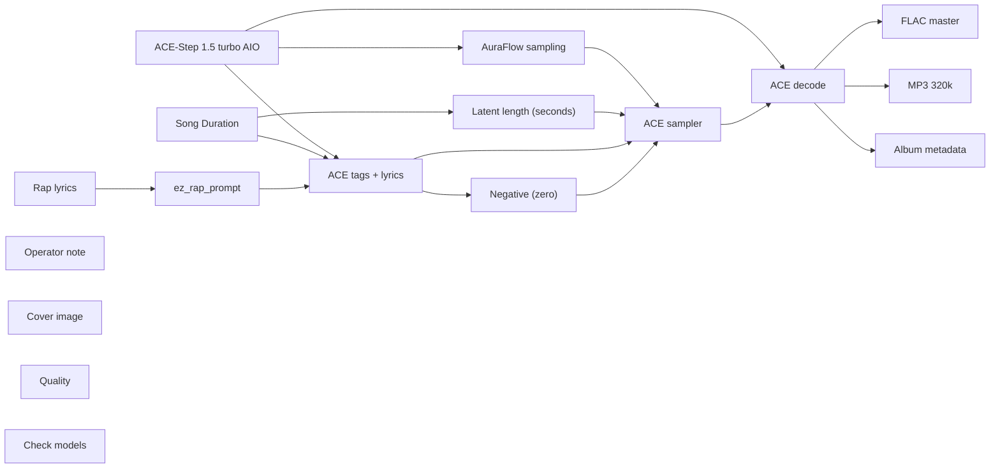

# audio/albums/nill-bye/citation-needed

**What's on this page**

- **Every track, cover, and album-pack graph** in this folder
- **Shared ACE-Step topology** (one printer, unique widgets per take)
- **Node parameter reference** for the types on these graphs

**What this enables**

- **Queuing one numbered take** or `album-render`
- **Reading tags, lyrics, seed, BPM** without opening raw JSON

**Who this is for:** studio users after `download-music`. Occupancy **audio** (cover stills are **klein** — separate session).

> Generated from `workflows/_lab/audio/albums/nill-bye/citation-needed/`. Do not hand-edit this file.

## Purpose

Numbered takes under `audio/albums/nill-bye/citation-needed/`. Queue one track, or `./scripts/manage.sh album-render --album nill-bye/citation-needed`.

```text
## 01-citation-needed

US-safe rap **72 s diss** take: **citation needed**. Fictional MCs **Nill Bye** (science guy) vs **Rake** (in his feels). Native ACE-Step 1.5 turbo AIO. Queue this graph **on its own** — draft-first is the generic lane, not a prerequisite. Occupancy **audio** only; a longer Queue is expected.

1. Weights: `./scripts/manage.sh download-music --tier turbo` (same AIO dest as `download-podcast --tier acestep`; ~10 GB, opt-in, not `download-models`).
2. Prompt enhance is **off** so tags, BPM, language, and `[verse]`/`[chorus]` stay as written. Turn Enhance on only if you want the 4B rewriter.
3. Tags vs lyrics: tags are genre/instrument/vocal hints; lyrics are the bars. Section tags `[verse]` / `[chorus]` / `[spoken word]` are vocal hints operators may add.
4. Original lyrics only. No “in the style of <living artist>”. No living-MC names. No famous-hook paraphrases.
5. ACE-Step vocal is an **invented** identity, not a cloned MC.
6. Sampler: 8 steps, cfg 1, euler, simple. Duration 72 s, bpm 90, language en, timesignature 4, key F minor, form v_pre, generate_audio_codes true. Seed 41.
7. Saves: `01 - Citation Needed` FLAC master + 320 kbps MP3 under `${COMFY_OUTPUT_DIR}`.
8. Cover separately: Queue **stills/thumbnail.json** or **stills/podcast-cover.json**. Do not embed Klein here.
9. Human rewrite the lyrics before any release. Prompts are not authorship (USCO Part 2 / Thaler).
10. Do not co-resident with LTX / Wan / Klein on this Spark.

Beat-only pass: append instrumental, no vocals, and replace lyrics with [inst].

Occupancy: audio — stop Klein / Wan / LTX session. One GB10 job.
```

## Shared graph



## Graphs in this album

| Graph | Nodes | Occupancy |
| --- | --- | --- |
| `audio/albums/nill-bye/citation-needed/01-citation-needed` | 17 | audio |
| `audio/albums/nill-bye/citation-needed/02-p-hacking` | 17 | audio |
| `audio/albums/nill-bye/citation-needed/03-null-result` | 17 | audio |
| `audio/albums/nill-bye/citation-needed/04-expired-reagent` | 17 | audio |
| `audio/albums/nill-bye/citation-needed/05-lab-safety` | 17 | audio |
| `audio/albums/nill-bye/citation-needed/06-rumor-mill` | 17 | audio |
| `audio/albums/nill-bye/citation-needed/07-gym-selfie` | 17 | audio |
| `audio/albums/nill-bye/citation-needed/08-rented-drip` | 17 | audio |
| `audio/albums/nill-bye/citation-needed/09-clout-diet` | 17 | audio |
| `audio/albums/nill-bye/citation-needed/10-mood-forecast` | 17 | audio |
| `audio/albums/nill-bye/citation-needed/11-algorithm` | 17 | audio |
| `audio/albums/nill-bye/citation-needed/12-story-time` | 17 | audio |
| `audio/albums/nill-bye/citation-needed/13-caption` | 17 | audio |
| `audio/albums/nill-bye/citation-needed/14-energy-drink` | 17 | audio |
| `audio/albums/nill-bye/citation-needed/15-campfire` | 17 | audio |
| `audio/albums/nill-bye/citation-needed/album` | 4 | none |
| `audio/albums/nill-bye/citation-needed/cover` | 15 | klein |

## `01-citation-needed`

Catalog id `audio/albums/nill-bye/citation-needed/01-citation-needed`.

US-safe rap diss: Nill Bye citation-needed roast of Rake, ACE-Step 1.5 turbo AIO, invented vocal
Prompt enhance is **off** so authored text (recipe, script labels, ACE tags, or film shots) is encoded as written. Turn Enhance on only if you want the 4B rewriter.

**ACE-Step 1.5 turbo AIO** (`CheckpointLoaderSimple`)

| Slot | Value |
| --- | --- |
| 0 | `ace_step_1.5_turbo_aio.safetensors` |

**AuraFlow sampling** (`ModelSamplingAuraFlow`)

| Slot | Value |
| --- | --- |
| 0 | `3` |

**Song Duration** (`PrimitiveNode`)

| Slot | Value |
| --- | --- |
| 0 | `72.0` |
| 1 | `fixed` |

**Latent length (seconds)** (`EmptyAceStep1.5LatentAudio`)

| Slot | Value |
| --- | --- |
| 0 | `72.0` |
| 1 | `1` |

**Rap lyrics** (`EZRapLyrics`)

| Slot | Value |
| --- | --- |
| 0 | `custom` |
| 1 | `[intro] brushed snare source missing Nill Bye citing [verse] Rake drops a claim…` |
| 2 | `false` |
| 3 | `audio/albums/nill-bye/citation-needed/01-citation-needed` |

```text
[intro]
brushed snare
source missing
Nill Bye citing

[verse]
Rake drops a claim with no cite
No footnote, just a boast
I ask the source, you stall
I ask the issue, you dodge
Muted horn on a missing cite
Upright bass on a ghosted site
Nill Bye citing what you hide
He sent a screenshot, no DOI
ibid blank, the volume vanished
Your paper is a dangling pawn
Bring a DOI or step aside

[verse]
You treat a handle like a cite
That's a username, not a write
You treat a high like a journal prize
That's a vibe with no ISSN
Brushed drums, the booth stays matte
I hold the book, you hold a bluff
Nill Bye stamping every byte
Rake riding a ghost cite
Write the author, drop the throne
No issue year, no cornerstone
Jazz hop truth, the stack is slack
Your scholarship never came back

[pre-chorus]
Citation needed
Nill Bye stamps the ibid

[chorus]
Citation needed
Nill Bye stamps the ibid
Rake with a blank cite
No DOI in the thread
Jazz hop, the field is bare
A screenshot is not a cite

[verse]
Trumpet mute on a rumor grid
You drew a king with crayon ink
Nill Bye talking from the annex
Rake folds when the cite goes blank
Feelings filed, the source has left
Lights stay on, the cite is wrong
Bring a footnote, drop the skit
One of us sourced, one of us split
Science will not barter cites
Your claim arrived late
Blank field where the volume sits
That's a boast with no exhibits

[chorus]
Citation needed
Nill Bye stamps the ibid
Rake with a blank cite
No DOI in the thread
Jazz hop, the field is bare
A screenshot is not a cite

[verse]
Rake at the blank-cite gap
Nill Bye posting the footnote law
No author listed, no issue year
Just a screenshot and borrowed cheer
Footnote missing, it did not persist
Keep the cite on the working list
Citation closed, that is the mark
The record stands, the thread is vapor
He still leaking through a broken yoke
Blank cite filed, the horn goes dry
Show the paper or step aside
Jazz hop closed, the rumor died

[chorus]
Citation needed
Nill Bye stamps the ibid
Rake with a blank cite
No DOI in the thread
Jazz hop, the field is bare
A screenshot is not a cite

[outro]
source missing
blank cite filed
cut
yeah
```

**ez_rap_prompt** (`EZAceStepPromptEnhance`)

| Slot | Value |
| --- | --- |
| 0 | `custom` |
| 1 | `jazz hop, brushed drums, upright bass, muted trumpet, male rap vocals, dry boot…` |
| 2 | `[intro] brushed snare source missing Nill Bye citing [verse] Rake drops a claim…` |
| 3 | `false` |
| 4 | `vocal` |
| 5 | `audio/albums/nill-bye/citation-needed/01-citation-needed` |

```text
jazz hop, brushed drums, upright bass, muted trumpet, male rap vocals, dry booth, no autotune, 90 bpm
```

```text
[intro]
brushed snare
source missing
Nill Bye citing

[verse]
Rake drops a claim with no cite
No footnote, just a boast
I ask the source, you stall
I ask the issue, you dodge
Muted horn on a missing cite
Upright bass on a ghosted site
Nill Bye citing what you hide
He sent a screenshot, no DOI
ibid blank, the volume vanished
Your paper is a dangling pawn
Bring a DOI or step aside

[verse]
You treat a handle like a cite
That's a username, not a write
You treat a high like a journal prize
That's a vibe with no ISSN
Brushed drums, the booth stays matte
I hold the book, you hold a bluff
Nill Bye stamping every byte
Rake riding a ghost cite
Write the author, drop the throne
No issue year, no cornerstone
Jazz hop truth, the stack is slack
Your scholarship never came back

[pre-chorus]
Citation needed
Nill Bye stamps the ibid

[chorus]
Citation needed
Nill Bye stamps the ibid
Rake with a blank cite
No DOI in the thread
Jazz hop, the field is bare
A screenshot is not a cite

[verse]
Trumpet mute on a rumor grid
You drew a king with crayon ink
Nill Bye talking from the annex
Rake folds when the cite goes blank
Feelings filed, the source has left
Lights stay on, the cite is wrong
Bring a footnote, drop the skit
One of us sourced, one of us split
Science will not barter cites
Your claim arrived late
Blank field where the volume sits
That's a boast with no exhibits

[chorus]
Citation needed
Nill Bye stamps the ibid
Rake with a blank cite
No DOI in the thread
Jazz hop, the field is bare
A screenshot is not a cite

[verse]
Rake at the blank-cite gap
Nill Bye posting the footnote law
No author listed, no issue year
Just a screenshot and borrowed cheer
Footnote missing, it did not persist
Keep the cite on the working list
Citation closed, that is the mark
The record stands, the thread is vapor
He still leaking through a broken yoke
Blank cite filed, the horn goes dry
Show the paper or step aside
Jazz hop closed, the rumor died

[chorus]
Citation needed
Nill Bye stamps the ibid
Rake with a blank cite
No DOI in the thread
Jazz hop, the field is bare
A screenshot is not a cite

[outro]
source missing
blank cite filed
cut
yeah
```

**ACE tags + lyrics** (`TextEncodeAceStepAudio1.5`)

| Slot | Value |
| --- | --- |
| 0 | `jazz hop, brushed drums, upright bass, muted trumpet, male rap vocals, dry boot…` |
| 1 | `[intro] brushed snare source missing Nill Bye citing [verse] Rake drops a claim…` |
| 2 | `41` |
| 3 | `fixed` |
| 4 | `90` |
| 5 | `72.0` |
| 6 | `4` |
| 7 | `en` |
| 8 | `F minor` |
| 9 | `true` |
| 10 | `2.0` |
| 11 | `0.85` |
| 12 | `0.9` |
| 13 | `0` |
| 14 | `0.0` |

```text
jazz hop, brushed drums, upright bass, muted trumpet, male rap vocals, dry booth, no autotune, 90 bpm
```

```text
[intro]
brushed snare
source missing
Nill Bye citing

[verse]
Rake drops a claim with no cite
No footnote, just a boast
I ask the source, you stall
I ask the issue, you dodge
Muted horn on a missing cite
Upright bass on a ghosted site
Nill Bye citing what you hide
He sent a screenshot, no DOI
ibid blank, the volume vanished
Your paper is a dangling pawn
Bring a DOI or step aside

[verse]
You treat a handle like a cite
That's a username, not a write
You treat a high like a journal prize
That's a vibe with no ISSN
Brushed drums, the booth stays matte
I hold the book, you hold a bluff
Nill Bye stamping every byte
Rake riding a ghost cite
Write the author, drop the throne
No issue year, no cornerstone
Jazz hop truth, the stack is slack
Your scholarship never came back

[pre-chorus]
Citation needed
Nill Bye stamps the ibid

[chorus]
Citation needed
Nill Bye stamps the ibid
Rake with a blank cite
No DOI in the thread
Jazz hop, the field is bare
A screenshot is not a cite

[verse]
Trumpet mute on a rumor grid
You drew a king with crayon ink
Nill Bye talking from the annex
Rake folds when the cite goes blank
Feelings filed, the source has left
Lights stay on, the cite is wrong
Bring a footnote, drop the skit
One of us sourced, one of us split
Science will not barter cites
Your claim arrived late
Blank field where the volume sits
That's a boast with no exhibits

[chorus]
Citation needed
Nill Bye stamps the ibid
Rake with a blank cite
No DOI in the thread
Jazz hop, the field is bare
A screenshot is not a cite

[verse]
Rake at the blank-cite gap
Nill Bye posting the footnote law
No author listed, no issue year
Just a screenshot and borrowed cheer
Footnote missing, it did not persist
Keep the cite on the working list
Citation closed, that is the mark
The record stands, the thread is vapor
He still leaking through a broken yoke
Blank cite filed, the horn goes dry
Show the paper or step aside
Jazz hop closed, the rumor died

[chorus]
Citation needed
Nill Bye stamps the ibid
Rake with a blank cite
No DOI in the thread
Jazz hop, the field is bare
A screenshot is not a cite

[outro]
source missing
blank cite filed
cut
yeah
```

**ACE sampler** (`KSampler`)

| Slot | Value |
| --- | --- |
| 0 | `41` |
| 1 | `fixed` |
| 2 | `8` |
| 3 | `1.0` |
| 4 | `euler` |
| 5 | `simple` |
| 6 | `1.0` |

**FLAC master** (`SaveAudio`)

| Slot | Value |
| --- | --- |
| 0 | `01 - Citation Needed` |

**MP3 320k** (`SaveAudioMP3`)

| Slot | Value |
| --- | --- |
| 0 | `01 - Citation Needed` |
| 1 | `320k` |

**Cover image** (`LoadImage`)

| Slot | Value |
| --- | --- |
| 0 | `cover.png` |
| 1 | `image` |

**Album metadata** (`EZAudioMetadata`)

| Slot | Value |
| --- | --- |
| 0 | `Nill Bye` |
| 1 | `Citation Needed` |
| 2 | `Citation Needed` |
| 3 | `1` |
| 4 | `15` |
| 5 | `2026` |
| 6 | `skip` |
| 7 | `01 - Citation Needed` |

**Quality** (`EZQuality`)

| Slot | Value |
| --- | --- |
| 0 | `lab` |

**Check models** (`EZModelCheck`)

| Slot | Value |
| --- | --- |
| 0 | `Click Check models. Queue does not run this node.` |

## `02-p-hacking`

Catalog id `audio/albums/nill-bye/citation-needed/02-p-hacking`.

US-safe rap diss: Nill Bye p-hacking roast of Rake, ACE-Step 1.5 turbo AIO, invented vocal
Prompt enhance is **off** so authored text (recipe, script labels, ACE tags, or film shots) is encoded as written. Turn Enhance on only if you want the 4B rewriter.

**ACE-Step 1.5 turbo AIO** (`CheckpointLoaderSimple`)

| Slot | Value |
| --- | --- |
| 0 | `ace_step_1.5_turbo_aio.safetensors` |

**AuraFlow sampling** (`ModelSamplingAuraFlow`)

| Slot | Value |
| --- | --- |
| 0 | `3` |

**Song Duration** (`PrimitiveNode`)

| Slot | Value |
| --- | --- |
| 0 | `120.0` |
| 1 | `fixed` |

**Latent length (seconds)** (`EmptyAceStep1.5LatentAudio`)

| Slot | Value |
| --- | --- |
| 0 | `120.0` |
| 1 | `1` |

**Rap lyrics** (`EZRapLyrics`)

| Slot | Value |
| --- | --- |
| 0 | `custom` |
| 1 | `[chorus] P-hacking king Your night is a slice Nill Bye on the uncut batch Rake …` |
| 2 | `false` |
| 3 | `audio/albums/nill-bye/citation-needed/02-p-hacking` |

```text
[chorus]
P-hacking king
Your night is a slice
Nill Bye on the uncut batch
Rake paid the price
Pick the crest, hide the miss
That is a p-hack, kid

[verse]
Rake ran the hours till it smiled
Threw the rest in a junk-file pile
Talkbox keys on a cherry plot
You kept the spike, you dumped the lot
I want the full run, you send a slice
I want the miss that you won't splice
Nill Bye mad at a trimmed readout
He hid a miss in a rented cult
Dry claps pop, your curve is cooked
G-funk bounce on a cherry hook
Show the misses or sit aside
The slice you sold is a drought

[verse]
You slice the hours till the curve looks ripe
Then you crash when I ask the reel
Girls as points you decided to keep
Nights as trophies you put to sleep
Rake p-hacks a p of none
Nill Bye running the count till done
Talkbox lead, the boast stays cheap
Synth bass waiting to cash the cheat
Bring the raw file, drop the throne
Cherry-pick science is inverted
I log the trash you stuffed below
Your whole paper is a highlight reel

[verse]
I ask the n, you send a taste
I ask the miss, you change the case
Underpowered, overclaimed
That is the brand you tried to keep
Nill Bye talking from the plot grid
Rake keeps folding when the notes get sparse
You flex first, then you hide the miss
That's a p-hack loop I have mapped
Cut the slice, keep the batch
P-hack drought, now pay the debt
Hide a miss, the flex looks huge
Show a miss, the flex looks cheap

[verse]
Rake at the junk-file bin
Nill Bye posting the uncut law
You want a trophy from a trim
I want a line that survives the audit
Hide the miss, the flex looks huge
Show the miss, the flex looks cheap
I walk in with the uncut stack
You walk in with a rumor pack
The slicing stops, the legend slumps
Numbers shift when the junk-file tilts
He still picking through the range
P-hack closed on a cooked exchange

[chorus]
P-hacking king
Your night is a slice
Nill Bye on the uncut batch
Rake paid the price
Pick the crest, hide the miss
That is a p-hack, kid

[outro]
slice denied
full set in
cut
yeah
```

**ez_rap_prompt** (`EZAceStepPromptEnhance`)

| Slot | Value |
| --- | --- |
| 0 | `custom` |
| 1 | `g-funk, synth bass, dry claps, talkbox lead, male rap vocals, dry booth, no aut…` |
| 2 | `[chorus] P-hacking king Your night is a slice Nill Bye on the uncut batch Rake …` |
| 3 | `false` |
| 4 | `vocal` |
| 5 | `audio/albums/nill-bye/citation-needed/02-p-hacking` |

```text
g-funk, synth bass, dry claps, talkbox lead, male rap vocals, dry booth, no autotune, 98 bpm
```

```text
[chorus]
P-hacking king
Your night is a slice
Nill Bye on the uncut batch
Rake paid the price
Pick the crest, hide the miss
That is a p-hack, kid

[verse]
Rake ran the hours till it smiled
Threw the rest in a junk-file pile
Talkbox keys on a cherry plot
You kept the spike, you dumped the lot
I want the full run, you send a slice
I want the miss that you won't splice
Nill Bye mad at a trimmed readout
He hid a miss in a rented cult
Dry claps pop, your curve is cooked
G-funk bounce on a cherry hook
Show the misses or sit aside
The slice you sold is a drought

[verse]
You slice the hours till the curve looks ripe
Then you crash when I ask the reel
Girls as points you decided to keep
Nights as trophies you put to sleep
Rake p-hacks a p of none
Nill Bye running the count till done
Talkbox lead, the boast stays cheap
Synth bass waiting to cash the cheat
Bring the raw file, drop the throne
Cherry-pick science is inverted
I log the trash you stuffed below
Your whole paper is a highlight reel

[verse]
I ask the n, you send a taste
I ask the miss, you change the case
Underpowered, overclaimed
That is the brand you tried to keep
Nill Bye talking from the plot grid
Rake keeps folding when the notes get sparse
You flex first, then you hide the miss
That's a p-hack loop I have mapped
Cut the slice, keep the batch
P-hack drought, now pay the debt
Hide a miss, the flex looks huge
Show a miss, the flex looks cheap

[verse]
Rake at the junk-file bin
Nill Bye posting the uncut law
You want a trophy from a trim
I want a line that survives the audit
Hide the miss, the flex looks huge
Show the miss, the flex looks cheap
I walk in with the uncut stack
You walk in with a rumor pack
The slicing stops, the legend slumps
Numbers shift when the junk-file tilts
He still picking through the range
P-hack closed on a cooked exchange

[chorus]
P-hacking king
Your night is a slice
Nill Bye on the uncut batch
Rake paid the price
Pick the crest, hide the miss
That is a p-hack, kid

[outro]
slice denied
full set in
cut
yeah
```

**ACE tags + lyrics** (`TextEncodeAceStepAudio1.5`)

| Slot | Value |
| --- | --- |
| 0 | `g-funk, synth bass, dry claps, talkbox lead, male rap vocals, dry booth, no aut…` |
| 1 | `[chorus] P-hacking king Your night is a slice Nill Bye on the uncut batch Rake …` |
| 2 | `43` |
| 3 | `fixed` |
| 4 | `98` |
| 5 | `120.0` |
| 6 | `4` |
| 7 | `en` |
| 8 | `C minor` |
| 9 | `true` |
| 10 | `2.0` |
| 11 | `0.85` |
| 12 | `0.9` |
| 13 | `0` |
| 14 | `0.0` |

```text
g-funk, synth bass, dry claps, talkbox lead, male rap vocals, dry booth, no autotune, 98 bpm
```

```text
[chorus]
P-hacking king
Your night is a slice
Nill Bye on the uncut batch
Rake paid the price
Pick the crest, hide the miss
That is a p-hack, kid

[verse]
Rake ran the hours till it smiled
Threw the rest in a junk-file pile
Talkbox keys on a cherry plot
You kept the spike, you dumped the lot
I want the full run, you send a slice
I want the miss that you won't splice
Nill Bye mad at a trimmed readout
He hid a miss in a rented cult
Dry claps pop, your curve is cooked
G-funk bounce on a cherry hook
Show the misses or sit aside
The slice you sold is a drought

[verse]
You slice the hours till the curve looks ripe
Then you crash when I ask the reel
Girls as points you decided to keep
Nights as trophies you put to sleep
Rake p-hacks a p of none
Nill Bye running the count till done
Talkbox lead, the boast stays cheap
Synth bass waiting to cash the cheat
Bring the raw file, drop the throne
Cherry-pick science is inverted
I log the trash you stuffed below
Your whole paper is a highlight reel

[verse]
I ask the n, you send a taste
I ask the miss, you change the case
Underpowered, overclaimed
That is the brand you tried to keep
Nill Bye talking from the plot grid
Rake keeps folding when the notes get sparse
You flex first, then you hide the miss
That's a p-hack loop I have mapped
Cut the slice, keep the batch
P-hack drought, now pay the debt
Hide a miss, the flex looks huge
Show a miss, the flex looks cheap

[verse]
Rake at the junk-file bin
Nill Bye posting the uncut law
You want a trophy from a trim
I want a line that survives the audit
Hide the miss, the flex looks huge
Show the miss, the flex looks cheap
I walk in with the uncut stack
You walk in with a rumor pack
The slicing stops, the legend slumps
Numbers shift when the junk-file tilts
He still picking through the range
P-hack closed on a cooked exchange

[chorus]
P-hacking king
Your night is a slice
Nill Bye on the uncut batch
Rake paid the price
Pick the crest, hide the miss
That is a p-hack, kid

[outro]
slice denied
full set in
cut
yeah
```

**ACE sampler** (`KSampler`)

| Slot | Value |
| --- | --- |
| 0 | `43` |
| 1 | `fixed` |
| 2 | `8` |
| 3 | `1.0` |
| 4 | `euler` |
| 5 | `simple` |
| 6 | `1.0` |

**FLAC master** (`SaveAudio`)

| Slot | Value |
| --- | --- |
| 0 | `02 - P-Hacking` |

**MP3 320k** (`SaveAudioMP3`)

| Slot | Value |
| --- | --- |
| 0 | `02 - P-Hacking` |
| 1 | `320k` |

**Cover image** (`LoadImage`)

| Slot | Value |
| --- | --- |
| 0 | `cover.png` |
| 1 | `image` |

**Album metadata** (`EZAudioMetadata`)

| Slot | Value |
| --- | --- |
| 0 | `Nill Bye` |
| 1 | `Citation Needed` |
| 2 | `P-Hacking` |
| 3 | `2` |
| 4 | `15` |
| 5 | `2026` |
| 6 | `skip` |
| 7 | `02 - P-Hacking` |

**Quality** (`EZQuality`)

| Slot | Value |
| --- | --- |
| 0 | `lab` |

**Check models** (`EZModelCheck`)

| Slot | Value |
| --- | --- |
| 0 | `Click Check models. Queue does not run this node.` |

## `03-null-result`

Catalog id `audio/albums/nill-bye/citation-needed/03-null-result`.

US-safe rap diss: Nill Bye null-result roast of Rake, ACE-Step 1.5 turbo AIO, invented vocal
Prompt enhance is **off** so authored text (recipe, script labels, ACE tags, or film shots) is encoded as written. Turn Enhance on only if you want the 4B rewriter.

**ACE-Step 1.5 turbo AIO** (`CheckpointLoaderSimple`)

| Slot | Value |
| --- | --- |
| 0 | `ace_step_1.5_turbo_aio.safetensors` |

**AuraFlow sampling** (`ModelSamplingAuraFlow`)

| Slot | Value |
| --- | --- |
| 0 | `3` |

**Song Duration** (`PrimitiveNode`)

| Slot | Value |
| --- | --- |
| 0 | `175.0` |
| 1 | `fixed` |

**Latent length (seconds)** (`EmptyAceStep1.5LatentAudio`)

| Slot | Value |
| --- | --- |
| 0 | `175.0` |
| 1 | `1` |

**Rap lyrics** (`EZRapLyrics`)

| Slot | Value |
| --- | --- |
| 0 | `custom` |
| 1 | `[intro] rimshot offbeat Nill Bye gauging [verse] Rake swore the flex would land…` |
| 2 | `false` |
| 3 | `audio/albums/nill-bye/citation-needed/03-null-result` |

```text
[intro]
rimshot
offbeat
Nill Bye gauging

[verse]
Rake swore the flex would land
Offbeat guitar, your curve is sand
Reggae bounce on an empty boast
Rimshot ticks, you look the same
You talk a high like a measured crest
I run the test, your curve is dust
Nill Bye repeats the vacant trial
He sits in denial, the organ mild
Rimshot ticks, the flex is gone
Club-sample will not hold on
Show the work or sit this round
Null on cool, that is the route

[chorus]
Null result, flex found none
Your boast came back vacant
Nill Bye on the empty claim
Rake lost the bounce
Organ bubble, rumor hush
Reggae truth, the flex is nil

[verse]
I log the chatter, I log the walk
I log the crash at the end of the talk
Your legend lives in a chat-thread haze
My legend lives in a measured cadence
Null result on the cool-guy flex-out
All that smoke and you still look vacant
Rake flexing a sample too slight
Nill Bye repeating until it's right
Organ bubble, the boast goes still
Science calm, the rumor ill
Bring a method, bring a citation-trail
Or get bounced from the lecture rail

[chorus]
Null result, flex found none
Your boast came back vacant
Nill Bye on the empty claim
Rake lost the bounce
Organ bubble, rumor hush
Reggae truth, the flex is nil

[breakdown - hats only]

[verse]
I graph the chatter, I graph the dip
I graph the rumor on a lecture strip
You treat a high like a plotted crest
That's a spike that will not persist
Nill Bye speaking from the bench once
Rake keeps folding at the first hitch
Null on cool, null on the title
Club-talk p-value losing vital
Trial two, same vacant yield
Your legend fails the consult field
Offbeat truth, your flex is drained
Retract the night, the rumor warped

[chorus]
Null result, flex found none
Your boast came back vacant
Nill Bye on the empty claim
Rake lost the bounce
Organ bubble, rumor hush
Reggae truth, the flex is nil

[verse]
Reviewer light on a rumor sketch
You drew a monarch with crayon stretch
Nill Bye testing from the bench once more
Rake in denial with a borrowed oar
Bring a method, drop the fable
Science stays when the club's unable
Board wiped clean, your curve is warped
Null result, the rumor spent
Cut the trial, file the memo
Empty flex, that is the echo
He still claiming everyone
Null result when the test is done

[chorus]
Null result, flex found none
Your boast came back vacant
Nill Bye on the empty claim
Rake lost the bounce
Organ bubble, rumor hush
Reggae truth, the flex is nil

[inst - pocket snare, hats only]

[outro]
flex found none
null result filed
cut
yeah
```

**ez_rap_prompt** (`EZAceStepPromptEnhance`)

| Slot | Value |
| --- | --- |
| 0 | `custom` |
| 1 | `reggae, offbeat guitar, rimshot, organ bubble, male rap vocals, dry booth, no a…` |
| 2 | `[intro] rimshot offbeat Nill Bye gauging [verse] Rake swore the flex would land…` |
| 3 | `false` |
| 4 | `vocal` |
| 5 | `audio/albums/nill-bye/citation-needed/03-null-result` |

```text
reggae, offbeat guitar, rimshot, organ bubble, male rap vocals, dry booth, no autotune, 92 bpm
```

```text
[intro]
rimshot
offbeat
Nill Bye gauging

[verse]
Rake swore the flex would land
Offbeat guitar, your curve is sand
Reggae bounce on an empty boast
Rimshot ticks, you look the same
You talk a high like a measured crest
I run the test, your curve is dust
Nill Bye repeats the vacant trial
He sits in denial, the organ mild
Rimshot ticks, the flex is gone
Club-sample will not hold on
Show the work or sit this round
Null on cool, that is the route

[chorus]
Null result, flex found none
Your boast came back vacant
Nill Bye on the empty claim
Rake lost the bounce
Organ bubble, rumor hush
Reggae truth, the flex is nil

[verse]
I log the chatter, I log the walk
I log the crash at the end of the talk
Your legend lives in a chat-thread haze
My legend lives in a measured cadence
Null result on the cool-guy flex-out
All that smoke and you still look vacant
Rake flexing a sample too slight
Nill Bye repeating until it's right
Organ bubble, the boast goes still
Science calm, the rumor ill
Bring a method, bring a citation-trail
Or get bounced from the lecture rail

[chorus]
Null result, flex found none
Your boast came back vacant
Nill Bye on the empty claim
Rake lost the bounce
Organ bubble, rumor hush
Reggae truth, the flex is nil

[breakdown - hats only]

[verse]
I graph the chatter, I graph the dip
I graph the rumor on a lecture strip
You treat a high like a plotted crest
That's a spike that will not persist
Nill Bye speaking from the bench once
Rake keeps folding at the first hitch
Null on cool, null on the title
Club-talk p-value losing vital
Trial two, same vacant yield
Your legend fails the consult field
Offbeat truth, your flex is drained
Retract the night, the rumor warped

[chorus]
Null result, flex found none
Your boast came back vacant
Nill Bye on the empty claim
Rake lost the bounce
Organ bubble, rumor hush
Reggae truth, the flex is nil

[verse]
Reviewer light on a rumor sketch
You drew a monarch with crayon stretch
Nill Bye testing from the bench once more
Rake in denial with a borrowed oar
Bring a method, drop the fable
Science stays when the club's unable
Board wiped clean, your curve is warped
Null result, the rumor spent
Cut the trial, file the memo
Empty flex, that is the echo
He still claiming everyone
Null result when the test is done

[chorus]
Null result, flex found none
Your boast came back vacant
Nill Bye on the empty claim
Rake lost the bounce
Organ bubble, rumor hush
Reggae truth, the flex is nil

[inst - pocket snare, hats only]

[outro]
flex found none
null result filed
cut
yeah
```

**ACE tags + lyrics** (`TextEncodeAceStepAudio1.5`)

| Slot | Value |
| --- | --- |
| 0 | `reggae, offbeat guitar, rimshot, organ bubble, male rap vocals, dry booth, no a…` |
| 1 | `[intro] rimshot offbeat Nill Bye gauging [verse] Rake swore the flex would land…` |
| 2 | `47` |
| 3 | `fixed` |
| 4 | `92` |
| 5 | `175.0` |
| 6 | `4` |
| 7 | `en` |
| 8 | `F# minor` |
| 9 | `true` |
| 10 | `2.0` |
| 11 | `0.85` |
| 12 | `0.9` |
| 13 | `0` |
| 14 | `0.0` |

```text
reggae, offbeat guitar, rimshot, organ bubble, male rap vocals, dry booth, no autotune, 92 bpm
```

```text
[intro]
rimshot
offbeat
Nill Bye gauging

[verse]
Rake swore the flex would land
Offbeat guitar, your curve is sand
Reggae bounce on an empty boast
Rimshot ticks, you look the same
You talk a high like a measured crest
I run the test, your curve is dust
Nill Bye repeats the vacant trial
He sits in denial, the organ mild
Rimshot ticks, the flex is gone
Club-sample will not hold on
Show the work or sit this round
Null on cool, that is the route

[chorus]
Null result, flex found none
Your boast came back vacant
Nill Bye on the empty claim
Rake lost the bounce
Organ bubble, rumor hush
Reggae truth, the flex is nil

[verse]
I log the chatter, I log the walk
I log the crash at the end of the talk
Your legend lives in a chat-thread haze
My legend lives in a measured cadence
Null result on the cool-guy flex-out
All that smoke and you still look vacant
Rake flexing a sample too slight
Nill Bye repeating until it's right
Organ bubble, the boast goes still
Science calm, the rumor ill
Bring a method, bring a citation-trail
Or get bounced from the lecture rail

[chorus]
Null result, flex found none
Your boast came back vacant
Nill Bye on the empty claim
Rake lost the bounce
Organ bubble, rumor hush
Reggae truth, the flex is nil

[breakdown - hats only]

[verse]
I graph the chatter, I graph the dip
I graph the rumor on a lecture strip
You treat a high like a plotted crest
That's a spike that will not persist
Nill Bye speaking from the bench once
Rake keeps folding at the first hitch
Null on cool, null on the title
Club-talk p-value losing vital
Trial two, same vacant yield
Your legend fails the consult field
Offbeat truth, your flex is drained
Retract the night, the rumor warped

[chorus]
Null result, flex found none
Your boast came back vacant
Nill Bye on the empty claim
Rake lost the bounce
Organ bubble, rumor hush
Reggae truth, the flex is nil

[verse]
Reviewer light on a rumor sketch
You drew a monarch with crayon stretch
Nill Bye testing from the bench once more
Rake in denial with a borrowed oar
Bring a method, drop the fable
Science stays when the club's unable
Board wiped clean, your curve is warped
Null result, the rumor spent
Cut the trial, file the memo
Empty flex, that is the echo
He still claiming everyone
Null result when the test is done

[chorus]
Null result, flex found none
Your boast came back vacant
Nill Bye on the empty claim
Rake lost the bounce
Organ bubble, rumor hush
Reggae truth, the flex is nil

[inst - pocket snare, hats only]

[outro]
flex found none
null result filed
cut
yeah
```

**ACE sampler** (`KSampler`)

| Slot | Value |
| --- | --- |
| 0 | `47` |
| 1 | `fixed` |
| 2 | `8` |
| 3 | `1.0` |
| 4 | `euler` |
| 5 | `simple` |
| 6 | `1.0` |

**FLAC master** (`SaveAudio`)

| Slot | Value |
| --- | --- |
| 0 | `03 - Null Result` |

**MP3 320k** (`SaveAudioMP3`)

| Slot | Value |
| --- | --- |
| 0 | `03 - Null Result` |
| 1 | `320k` |

**Cover image** (`LoadImage`)

| Slot | Value |
| --- | --- |
| 0 | `cover.png` |
| 1 | `image` |

**Album metadata** (`EZAudioMetadata`)

| Slot | Value |
| --- | --- |
| 0 | `Nill Bye` |
| 1 | `Citation Needed` |
| 2 | `Null Result` |
| 3 | `3` |
| 4 | `15` |
| 5 | `2026` |
| 6 | `skip` |
| 7 | `03 - Null Result` |

**Quality** (`EZQuality`)

| Slot | Value |
| --- | --- |
| 0 | `lab` |

**Check models** (`EZModelCheck`)

| Slot | Value |
| --- | --- |
| 0 | `Click Check models. Queue does not run this node.` |

## `04-expired-reagent`

Catalog id `audio/albums/nill-bye/citation-needed/04-expired-reagent`.

US-safe rap diss: Nill Bye expired-reagent roast of Rake, ACE-Step 1.5 turbo AIO, invented vocal
Prompt enhance is **off** so authored text (recipe, script labels, ACE tags, or film shots) is encoded as written. Turn Enhance on only if you want the 4B rewriter.

**ACE-Step 1.5 turbo AIO** (`CheckpointLoaderSimple`)

| Slot | Value |
| --- | --- |
| 0 | `ace_step_1.5_turbo_aio.safetensors` |

**AuraFlow sampling** (`ModelSamplingAuraFlow`)

| Slot | Value |
| --- | --- |
| 0 | `3` |

**Song Duration** (`PrimitiveNode`)

| Slot | Value |
| --- | --- |
| 0 | `80.0` |
| 1 | `fixed` |

**Latent length (seconds)** (`EmptyAceStep1.5LatentAudio`)

| Slot | Value |
| --- | --- |
| 0 | `80.0` |
| 1 | `1` |

**Rap lyrics** (`EZRapLyrics`)

| Slot | Value |
| --- | --- |
| 0 | `custom` |
| 1 | `[intro] rhodes warm date passed Nill Bye dating [verse] Rake pops a flask with …` |
| 2 | `false` |
| 3 | `audio/albums/nill-bye/citation-needed/04-expired-reagent` |

```text
[intro]
rhodes warm
date passed
Nill Bye dating

[verse]
Rake pops a flask with a faded stamp
Talks a high like he bottled the amp
I read the stamp, the month is skewed
Your whole brand is a leftover hymn
Soft snare, warm bass, dry booth
I hold the vial, you hold the spoof
Nill Bye mad at a dated sheen
He wilts when the numbers convene
Chemistry talk, a science tote
One of us measured, one of us bolted
Toss the bottle, keep the readout
Your whole cool is a rented porch

[verse]
You name a night like a fresh solvent
Then you crash when the clock is sound
Rhodes hum low, the boast is stale
Sad-boy mask on an expired yarn
Rake with a yellowed label hanging
Nill Bye clocking what the dates are cancelling
Bring a batch that survives the month
You want a caption, then you crest
Printed date on a dusty shelf
Expired reagent, you bottled yourself
Shelf-life of drip is a short parade
I dump the flask, you want it replayed

[pre-chorus]
Expired reagent
Your cool is past date

[chorus]
Expired reagent
Your cool is past date
Nill Bye reads the printed stamp
Rake showed up late
Shelf-life gone, the drip is stale
Neo-soul truth, rumor in the bin

[verse]
Warm bass under a cork gone dry
You sold a vintage that would not fly
Nill Bye reading the tiny print
Rake still sipping a ghost of a hint
Yellowed tape on a cloudy vial
Your cool curdled after a while
Neo-soul keys, the boast is dated
I file the batch, you want it fated
Toss the reagent, keep the ledger
Past-date drip is a borrowed treasure
He still pouring a week-old mix
I stamp expired on the bag of tricks

[verse]
Rake at the dusty shelf once more
Nill Bye posting the expiry then
Cool past the printed date you hid
A leftover song in a cloudy lid
Shelf-life gone, the flask is waste
You wanted a toast from a spoiled taste
Rhodes stay warm, the drip is over
I cork the tale, you play the rover
Date-stamp wins, the rumor curdles
Expired reagent, pay the guilt
He still hunting a usable drop
I close the cabinet, the selling halts

[outro]
date passed
flask tossed
cut
yeah
```

**ez_rap_prompt** (`EZAceStepPromptEnhance`)

| Slot | Value |
| --- | --- |
| 0 | `custom` |
| 1 | `neo-soul, rhodes, soft snare, warm bass, male rap vocals, dry booth, no autotun…` |
| 2 | `[intro] rhodes warm date passed Nill Bye dating [verse] Rake pops a flask with …` |
| 3 | `false` |
| 4 | `vocal` |
| 5 | `audio/albums/nill-bye/citation-needed/04-expired-reagent` |

```text
neo-soul, rhodes, soft snare, warm bass, male rap vocals, dry booth, no autotune, 84 bpm
```

```text
[intro]
rhodes warm
date passed
Nill Bye dating

[verse]
Rake pops a flask with a faded stamp
Talks a high like he bottled the amp
I read the stamp, the month is skewed
Your whole brand is a leftover hymn
Soft snare, warm bass, dry booth
I hold the vial, you hold the spoof
Nill Bye mad at a dated sheen
He wilts when the numbers convene
Chemistry talk, a science tote
One of us measured, one of us bolted
Toss the bottle, keep the readout
Your whole cool is a rented porch

[verse]
You name a night like a fresh solvent
Then you crash when the clock is sound
Rhodes hum low, the boast is stale
Sad-boy mask on an expired yarn
Rake with a yellowed label hanging
Nill Bye clocking what the dates are cancelling
Bring a batch that survives the month
You want a caption, then you crest
Printed date on a dusty shelf
Expired reagent, you bottled yourself
Shelf-life of drip is a short parade
I dump the flask, you want it replayed

[pre-chorus]
Expired reagent
Your cool is past date

[chorus]
Expired reagent
Your cool is past date
Nill Bye reads the printed stamp
Rake showed up late
Shelf-life gone, the drip is stale
Neo-soul truth, rumor in the bin

[verse]
Warm bass under a cork gone dry
You sold a vintage that would not fly
Nill Bye reading the tiny print
Rake still sipping a ghost of a hint
Yellowed tape on a cloudy vial
Your cool curdled after a while
Neo-soul keys, the boast is dated
I file the batch, you want it fated
Toss the reagent, keep the ledger
Past-date drip is a borrowed treasure
He still pouring a week-old mix
I stamp expired on the bag of tricks

[verse]
Rake at the dusty shelf once more
Nill Bye posting the expiry then
Cool past the printed date you hid
A leftover song in a cloudy lid
Shelf-life gone, the flask is waste
You wanted a toast from a spoiled taste
Rhodes stay warm, the drip is over
I cork the tale, you play the rover
Date-stamp wins, the rumor curdles
Expired reagent, pay the guilt
He still hunting a usable drop
I close the cabinet, the selling halts

[outro]
date passed
flask tossed
cut
yeah
```

**ACE tags + lyrics** (`TextEncodeAceStepAudio1.5`)

| Slot | Value |
| --- | --- |
| 0 | `neo-soul, rhodes, soft snare, warm bass, male rap vocals, dry booth, no autotun…` |
| 1 | `[intro] rhodes warm date passed Nill Bye dating [verse] Rake pops a flask with …` |
| 2 | `53` |
| 3 | `fixed` |
| 4 | `84` |
| 5 | `80.0` |
| 6 | `4` |
| 7 | `en` |
| 8 | `A minor` |
| 9 | `true` |
| 10 | `2.0` |
| 11 | `0.85` |
| 12 | `0.9` |
| 13 | `0` |
| 14 | `0.0` |

```text
neo-soul, rhodes, soft snare, warm bass, male rap vocals, dry booth, no autotune, 84 bpm
```

```text
[intro]
rhodes warm
date passed
Nill Bye dating

[verse]
Rake pops a flask with a faded stamp
Talks a high like he bottled the amp
I read the stamp, the month is skewed
Your whole brand is a leftover hymn
Soft snare, warm bass, dry booth
I hold the vial, you hold the spoof
Nill Bye mad at a dated sheen
He wilts when the numbers convene
Chemistry talk, a science tote
One of us measured, one of us bolted
Toss the bottle, keep the readout
Your whole cool is a rented porch

[verse]
You name a night like a fresh solvent
Then you crash when the clock is sound
Rhodes hum low, the boast is stale
Sad-boy mask on an expired yarn
Rake with a yellowed label hanging
Nill Bye clocking what the dates are cancelling
Bring a batch that survives the month
You want a caption, then you crest
Printed date on a dusty shelf
Expired reagent, you bottled yourself
Shelf-life of drip is a short parade
I dump the flask, you want it replayed

[pre-chorus]
Expired reagent
Your cool is past date

[chorus]
Expired reagent
Your cool is past date
Nill Bye reads the printed stamp
Rake showed up late
Shelf-life gone, the drip is stale
Neo-soul truth, rumor in the bin

[verse]
Warm bass under a cork gone dry
You sold a vintage that would not fly
Nill Bye reading the tiny print
Rake still sipping a ghost of a hint
Yellowed tape on a cloudy vial
Your cool curdled after a while
Neo-soul keys, the boast is dated
I file the batch, you want it fated
Toss the reagent, keep the ledger
Past-date drip is a borrowed treasure
He still pouring a week-old mix
I stamp expired on the bag of tricks

[verse]
Rake at the dusty shelf once more
Nill Bye posting the expiry then
Cool past the printed date you hid
A leftover song in a cloudy lid
Shelf-life gone, the flask is waste
You wanted a toast from a spoiled taste
Rhodes stay warm, the drip is over
I cork the tale, you play the rover
Date-stamp wins, the rumor curdles
Expired reagent, pay the guilt
He still hunting a usable drop
I close the cabinet, the selling halts

[outro]
date passed
flask tossed
cut
yeah
```

**ACE sampler** (`KSampler`)

| Slot | Value |
| --- | --- |
| 0 | `53` |
| 1 | `fixed` |
| 2 | `8` |
| 3 | `1.0` |
| 4 | `euler` |
| 5 | `simple` |
| 6 | `1.0` |

**FLAC master** (`SaveAudio`)

| Slot | Value |
| --- | --- |
| 0 | `04 - Expired Reagent` |

**MP3 320k** (`SaveAudioMP3`)

| Slot | Value |
| --- | --- |
| 0 | `04 - Expired Reagent` |
| 1 | `320k` |

**Cover image** (`LoadImage`)

| Slot | Value |
| --- | --- |
| 0 | `cover.png` |
| 1 | `image` |

**Album metadata** (`EZAudioMetadata`)

| Slot | Value |
| --- | --- |
| 0 | `Nill Bye` |
| 1 | `Citation Needed` |
| 2 | `Expired Reagent` |
| 3 | `4` |
| 4 | `15` |
| 5 | `2026` |
| 6 | `skip` |
| 7 | `04 - Expired Reagent` |

**Quality** (`EZQuality`)

| Slot | Value |
| --- | --- |
| 0 | `lab` |

**Check models** (`EZModelCheck`)

| Slot | Value |
| --- | --- |
| 0 | `Click Check models. Queue does not run this node.` |

## `05-lab-safety`

Catalog id `audio/albums/nill-bye/citation-needed/05-lab-safety`.

US-safe rap diss: Nill Bye lab-safety roast of Rake, ACE-Step 1.5 turbo AIO, invented vocal
Prompt enhance is **off** so authored text (recipe, script labels, ACE tags, or film shots) is encoded as written. Turn Enhance on only if you want the 4B rewriter.

**ACE-Step 1.5 turbo AIO** (`CheckpointLoaderSimple`)

| Slot | Value |
| --- | --- |
| 0 | `ace_step_1.5_turbo_aio.safetensors` |

**AuraFlow sampling** (`ModelSamplingAuraFlow`)

| Slot | Value |
| --- | --- |
| 0 | `3` |

**Song Duration** (`PrimitiveNode`)

| Slot | Value |
| --- | --- |
| 0 | `131.0` |
| 1 | `fixed` |

**Latent length (seconds)** (`EmptyAceStep1.5LatentAudio`)

| Slot | Value |
| --- | --- |
| 0 | `131.0` |
| 1 | `1` |

**Rap lyrics** (`EZRapLyrics`)

| Slot | Value |
| --- | --- |
| 0 | `custom` |
| 1 | `[verse] Rake skipped the goggles for a look Walked the hood like a fashion book…` |
| 2 | `false` |
| 3 | `audio/albums/nill-bye/citation-needed/05-lab-safety` |

```text
[verse]
Rake skipped the goggles for a look
Walked the hood like a fashion book
Live drums hit, the siren cries
You treated a drill like a punchline prize
Overdriven guitar on a splash risk
I clamp the line, you chase a disc
Nill Bye warning from the visor brim
He laughs at a drill he would not trim
Crowd stomp under a skipped alarm
Your cool is a burn on an ungloved arm
Hood wide open, the latch undone
Lab safety is not a joke, son

[chorus]
Lab safety
Goggles on, you ducked the drill
Nill Bye on the overdrive riff
Rake skipped the hood for a thrill
Rap-rock stomp, the visor stays
No goggles, no mic today

[verse]
You posed at the shield for a candid frame
Then you ducked the drill when the siren came
Rake with a visor hanging loose
Nill Bye tightening the clamp on the juice
Live kit pounding, the splash is raw
You wanted a riff more than a seal
Goggles scuffed on a borrowed hook
I run the drill from the safety book
Skip the hood, you skip the right
Rap-rock truth in a strobe-less light
Stomp the floor, keep the visor clamped
Your thrill is a fine and a writeup

[chorus]
Lab safety
Goggles on, you ducked the drill
Nill Bye on the overdrive riff
Rake skipped the hood for a thrill
Rap-rock stomp, the visor stays
No goggles, no mic today

[inst - pocket snare, hats only]

[verse]
Siren loops while you chase a solo
I want a latch that will actually hold, though
Nill Bye counting the skipped-drill tally
Rake still treating the hood like an alley
Overdrive snarls, the clamp is locked
You wanted applause from a wet duet
Goggles fogged from a laugh you faked
I wipe the lens, you want it baked
Lab safety is a stomp, not a skit
You ducked the drill, now sit
Shield up, the riff can pause
No visor, no debate

[chorus - half-time drums]
Lab safety
Goggles on, you ducked the drill
Nill Bye on the overdrive riff
Rake skipped the hood for a thrill
Rap-rock stomp, the visor stays
No goggles, no mic today

[verse]
Rake at the open hood once more
Nill Bye posting the safety then
Goggles first, the guitar can pause
You wanted a crowd for a reckless gait
Skipped-drill king with a scuffed-up shield
I file the warning, you want it repealed
Live drums close, the latch clicks shut
Your fashion walk was a splash-risk rut
Hood stays down, the visor holds
Lab safety outlasts the encore days
He still posing without the gear
I pull the plug on the reckless skit

[chorus - half-time drums]
Lab safety
Goggles on, you ducked the drill
Nill Bye on the overdrive riff
Rake skipped the hood for a thrill
Rap-rock stomp, the visor stays
No goggles, no mic today

[outro]
drill skipped
goggles on
cut
yeah
```

**ez_rap_prompt** (`EZAceStepPromptEnhance`)

| Slot | Value |
| --- | --- |
| 0 | `custom` |
| 1 | `rap rock, live drums, overdriven guitar, crowd stomp, male rap vocals, dry boot…` |
| 2 | `[verse] Rake skipped the goggles for a look Walked the hood like a fashion book…` |
| 3 | `false` |
| 4 | `vocal` |
| 5 | `audio/albums/nill-bye/citation-needed/05-lab-safety` |

```text
rap rock, live drums, overdriven guitar, crowd stomp, male rap vocals, dry booth, no autotune, 168 bpm
```

```text
[verse]
Rake skipped the goggles for a look
Walked the hood like a fashion book
Live drums hit, the siren cries
You treated a drill like a punchline prize
Overdriven guitar on a splash risk
I clamp the line, you chase a disc
Nill Bye warning from the visor brim
He laughs at a drill he would not trim
Crowd stomp under a skipped alarm
Your cool is a burn on an ungloved arm
Hood wide open, the latch undone
Lab safety is not a joke, son

[chorus]
Lab safety
Goggles on, you ducked the drill
Nill Bye on the overdrive riff
Rake skipped the hood for a thrill
Rap-rock stomp, the visor stays
No goggles, no mic today

[verse]
You posed at the shield for a candid frame
Then you ducked the drill when the siren came
Rake with a visor hanging loose
Nill Bye tightening the clamp on the juice
Live kit pounding, the splash is raw
You wanted a riff more than a seal
Goggles scuffed on a borrowed hook
I run the drill from the safety book
Skip the hood, you skip the right
Rap-rock truth in a strobe-less light
Stomp the floor, keep the visor clamped
Your thrill is a fine and a writeup

[chorus]
Lab safety
Goggles on, you ducked the drill
Nill Bye on the overdrive riff
Rake skipped the hood for a thrill
Rap-rock stomp, the visor stays
No goggles, no mic today

[inst - pocket snare, hats only]

[verse]
Siren loops while you chase a solo
I want a latch that will actually hold, though
Nill Bye counting the skipped-drill tally
Rake still treating the hood like an alley
Overdrive snarls, the clamp is locked
You wanted applause from a wet duet
Goggles fogged from a laugh you faked
I wipe the lens, you want it baked
Lab safety is a stomp, not a skit
You ducked the drill, now sit
Shield up, the riff can pause
No visor, no debate

[chorus - half-time drums]
Lab safety
Goggles on, you ducked the drill
Nill Bye on the overdrive riff
Rake skipped the hood for a thrill
Rap-rock stomp, the visor stays
No goggles, no mic today

[verse]
Rake at the open hood once more
Nill Bye posting the safety then
Goggles first, the guitar can pause
You wanted a crowd for a reckless gait
Skipped-drill king with a scuffed-up shield
I file the warning, you want it repealed
Live drums close, the latch clicks shut
Your fashion walk was a splash-risk rut
Hood stays down, the visor holds
Lab safety outlasts the encore days
He still posing without the gear
I pull the plug on the reckless skit

[chorus - half-time drums]
Lab safety
Goggles on, you ducked the drill
Nill Bye on the overdrive riff
Rake skipped the hood for a thrill
Rap-rock stomp, the visor stays
No goggles, no mic today

[outro]
drill skipped
goggles on
cut
yeah
```

**ACE tags + lyrics** (`TextEncodeAceStepAudio1.5`)

| Slot | Value |
| --- | --- |
| 0 | `rap rock, live drums, overdriven guitar, crowd stomp, male rap vocals, dry boot…` |
| 1 | `[verse] Rake skipped the goggles for a look Walked the hood like a fashion book…` |
| 2 | `59` |
| 3 | `fixed` |
| 4 | `168` |
| 5 | `131.0` |
| 6 | `4` |
| 7 | `en` |
| 8 | `D minor` |
| 9 | `true` |
| 10 | `2.0` |
| 11 | `0.85` |
| 12 | `0.9` |
| 13 | `0` |
| 14 | `0.0` |

```text
rap rock, live drums, overdriven guitar, crowd stomp, male rap vocals, dry booth, no autotune, 168 bpm
```

```text
[verse]
Rake skipped the goggles for a look
Walked the hood like a fashion book
Live drums hit, the siren cries
You treated a drill like a punchline prize
Overdriven guitar on a splash risk
I clamp the line, you chase a disc
Nill Bye warning from the visor brim
He laughs at a drill he would not trim
Crowd stomp under a skipped alarm
Your cool is a burn on an ungloved arm
Hood wide open, the latch undone
Lab safety is not a joke, son

[chorus]
Lab safety
Goggles on, you ducked the drill
Nill Bye on the overdrive riff
Rake skipped the hood for a thrill
Rap-rock stomp, the visor stays
No goggles, no mic today

[verse]
You posed at the shield for a candid frame
Then you ducked the drill when the siren came
Rake with a visor hanging loose
Nill Bye tightening the clamp on the juice
Live kit pounding, the splash is raw
You wanted a riff more than a seal
Goggles scuffed on a borrowed hook
I run the drill from the safety book
Skip the hood, you skip the right
Rap-rock truth in a strobe-less light
Stomp the floor, keep the visor clamped
Your thrill is a fine and a writeup

[chorus]
Lab safety
Goggles on, you ducked the drill
Nill Bye on the overdrive riff
Rake skipped the hood for a thrill
Rap-rock stomp, the visor stays
No goggles, no mic today

[inst - pocket snare, hats only]

[verse]
Siren loops while you chase a solo
I want a latch that will actually hold, though
Nill Bye counting the skipped-drill tally
Rake still treating the hood like an alley
Overdrive snarls, the clamp is locked
You wanted applause from a wet duet
Goggles fogged from a laugh you faked
I wipe the lens, you want it baked
Lab safety is a stomp, not a skit
You ducked the drill, now sit
Shield up, the riff can pause
No visor, no debate

[chorus - half-time drums]
Lab safety
Goggles on, you ducked the drill
Nill Bye on the overdrive riff
Rake skipped the hood for a thrill
Rap-rock stomp, the visor stays
No goggles, no mic today

[verse]
Rake at the open hood once more
Nill Bye posting the safety then
Goggles first, the guitar can pause
You wanted a crowd for a reckless gait
Skipped-drill king with a scuffed-up shield
I file the warning, you want it repealed
Live drums close, the latch clicks shut
Your fashion walk was a splash-risk rut
Hood stays down, the visor holds
Lab safety outlasts the encore days
He still posing without the gear
I pull the plug on the reckless skit

[chorus - half-time drums]
Lab safety
Goggles on, you ducked the drill
Nill Bye on the overdrive riff
Rake skipped the hood for a thrill
Rap-rock stomp, the visor stays
No goggles, no mic today

[outro]
drill skipped
goggles on
cut
yeah
```

**ACE sampler** (`KSampler`)

| Slot | Value |
| --- | --- |
| 0 | `59` |
| 1 | `fixed` |
| 2 | `8` |
| 3 | `1.0` |
| 4 | `euler` |
| 5 | `simple` |
| 6 | `1.0` |

**FLAC master** (`SaveAudio`)

| Slot | Value |
| --- | --- |
| 0 | `05 - Lab Safety` |

**MP3 320k** (`SaveAudioMP3`)

| Slot | Value |
| --- | --- |
| 0 | `05 - Lab Safety` |
| 1 | `320k` |

**Cover image** (`LoadImage`)

| Slot | Value |
| --- | --- |
| 0 | `cover.png` |
| 1 | `image` |

**Album metadata** (`EZAudioMetadata`)

| Slot | Value |
| --- | --- |
| 0 | `Nill Bye` |
| 1 | `Citation Needed` |
| 2 | `Lab Safety` |
| 3 | `5` |
| 4 | `15` |
| 5 | `2026` |
| 6 | `skip` |
| 7 | `05 - Lab Safety` |

**Quality** (`EZQuality`)

| Slot | Value |
| --- | --- |
| 0 | `lab` |

**Check models** (`EZModelCheck`)

| Slot | Value |
| --- | --- |
| 0 | `Click Check models. Queue does not run this node.` |

## `06-rumor-mill`

Catalog id `audio/albums/nill-bye/citation-needed/06-rumor-mill`.

US-safe rap diss: Nill Bye rumor-mill roast of Rake, ACE-Step 1.5 turbo AIO, invented vocal
Prompt enhance is **off** so authored text (recipe, script labels, ACE tags, or film shots) is encoded as written. Turn Enhance on only if you want the 4B rewriter.

**ACE-Step 1.5 turbo AIO** (`CheckpointLoaderSimple`)

| Slot | Value |
| --- | --- |
| 0 | `ace_step_1.5_turbo_aio.safetensors` |

**AuraFlow sampling** (`ModelSamplingAuraFlow`)

| Slot | Value |
| --- | --- |
| 0 | `3` |

**Song Duration** (`PrimitiveNode`)

| Slot | Value |
| --- | --- |
| 0 | `187.0` |
| 1 | `fixed` |

**Latent length (seconds)** (`EmptyAceStep1.5LatentAudio`)

| Slot | Value |
| --- | --- |
| 0 | `187.0` |
| 1 | `1` |

**Rap lyrics** (`EZRapLyrics`)

| Slot | Value |
| --- | --- |
| 0 | `custom` |
| 1 | `[intro] metal percussion mill turning Nill Bye weighing [verse] Rake fed the ru…` |
| 2 | `false` |
| 3 | `audio/albums/nill-bye/citation-needed/06-rumor-mill` |

```text
[intro]
metal percussion
mill turning
Nill Bye weighing

[verse]
Rake fed the rumor mill a boast
Metal percussion on a gossip roast
Hopper full of a second-hand yarn
I weigh the grain, you weigh the sale
Distorted bass on a conveyor fib
You ground a whisper into a supply
Nill Bye weighing what the mill spat out
He smiles at a rumor he cannot route
Turbine hums, the sprocket slips
Your cool is a grind with no receipts
Industrial hop, the press is loud-ish
Measurement waits while the gossip rushes

[chorus]
Rumor mill
Gossip ground till the hopper jammed
Nill Bye on the measured grind
Rake fed the mill and got slammed
Industrial truth, the sprocket stalls
Weigh the claim or leave the mill

[verse]
You poured a whisper into the hopper
Then you danced when the rumor got proper
Rake at the mill with a borrowed crank
Nill Bye stopping the gear in a clank
Metal on metal, the gossip thins
I want a mass, you want a win's
Conveyor jammed on a recycled quote
You sold a grind as a measured blip
Rumor mill closed when the scale is true
Your hopper empty, the sprocket chewed
Weigh the grain or kill the press
Industrial truth, the rest is mess

[chorus]
Rumor mill
Gossip ground till the hopper jammed
Nill Bye on the measured grind
Rake fed the mill and got slammed
Industrial truth, the sprocket stalls
Weigh the claim or leave the mill

[inst - pocket snare, hats only]

[verse]
Turbine rumor versus a weighed-out gram
You wanted a mill more than a exam
Nill Bye filing the measured grind
Rake still feeding the hopper blind
Distorted bass, the gear is stripped
Your gossip crop is a factory script
Sprocket stalls, the conveyor seizes
I log a mass, you log a prize
Rumor mill is a mill, not a proofing
You ground a nothing into a roofing
Press goes quiet, the hopper yawns
He still cranking for leftover dawns

[verse]
Rake at the jammed mill hatch
Nill Bye posting the weigh-in score
Gossip ground till the turbine seized
You wanted a legend the scale just teased
Industrial hop, the sprocket rusts
I keep the mass, you keep the gusts
Hopper empty, the rumor starved
Your mill ran hot and the claim got carved
Metal percussion, the press is done
Measurement wins, the gossip's none

[bridge]
He still oiling a silent gear
Rumor mill closed, disappear

[chorus]
Rumor mill
Gossip ground till the hopper jammed
Nill Bye on the measured grind
Rake fed the mill and got slammed
Industrial truth, the sprocket stalls
Weigh the claim or leave the mill

[outro]
mill jammed
rumor weighed
cut
yeah
```

**ez_rap_prompt** (`EZAceStepPromptEnhance`)

| Slot | Value |
| --- | --- |
| 0 | `custom` |
| 1 | `industrial hip-hop, metal percussion, distorted bass, male rap vocals, dry boot…` |
| 2 | `[intro] metal percussion mill turning Nill Bye weighing [verse] Rake fed the ru…` |
| 3 | `false` |
| 4 | `vocal` |
| 5 | `audio/albums/nill-bye/citation-needed/06-rumor-mill` |

```text
industrial hip-hop, metal percussion, distorted bass, male rap vocals, dry booth, no autotune, 108 bpm
```

```text
[intro]
metal percussion
mill turning
Nill Bye weighing

[verse]
Rake fed the rumor mill a boast
Metal percussion on a gossip roast
Hopper full of a second-hand yarn
I weigh the grain, you weigh the sale
Distorted bass on a conveyor fib
You ground a whisper into a supply
Nill Bye weighing what the mill spat out
He smiles at a rumor he cannot route
Turbine hums, the sprocket slips
Your cool is a grind with no receipts
Industrial hop, the press is loud-ish
Measurement waits while the gossip rushes

[chorus]
Rumor mill
Gossip ground till the hopper jammed
Nill Bye on the measured grind
Rake fed the mill and got slammed
Industrial truth, the sprocket stalls
Weigh the claim or leave the mill

[verse]
You poured a whisper into the hopper
Then you danced when the rumor got proper
Rake at the mill with a borrowed crank
Nill Bye stopping the gear in a clank
Metal on metal, the gossip thins
I want a mass, you want a win's
Conveyor jammed on a recycled quote
You sold a grind as a measured blip
Rumor mill closed when the scale is true
Your hopper empty, the sprocket chewed
Weigh the grain or kill the press
Industrial truth, the rest is mess

[chorus]
Rumor mill
Gossip ground till the hopper jammed
Nill Bye on the measured grind
Rake fed the mill and got slammed
Industrial truth, the sprocket stalls
Weigh the claim or leave the mill

[inst - pocket snare, hats only]

[verse]
Turbine rumor versus a weighed-out gram
You wanted a mill more than a exam
Nill Bye filing the measured grind
Rake still feeding the hopper blind
Distorted bass, the gear is stripped
Your gossip crop is a factory script
Sprocket stalls, the conveyor seizes
I log a mass, you log a prize
Rumor mill is a mill, not a proofing
You ground a nothing into a roofing
Press goes quiet, the hopper yawns
He still cranking for leftover dawns

[verse]
Rake at the jammed mill hatch
Nill Bye posting the weigh-in score
Gossip ground till the turbine seized
You wanted a legend the scale just teased
Industrial hop, the sprocket rusts
I keep the mass, you keep the gusts
Hopper empty, the rumor starved
Your mill ran hot and the claim got carved
Metal percussion, the press is done
Measurement wins, the gossip's none

[bridge]
He still oiling a silent gear
Rumor mill closed, disappear

[chorus]
Rumor mill
Gossip ground till the hopper jammed
Nill Bye on the measured grind
Rake fed the mill and got slammed
Industrial truth, the sprocket stalls
Weigh the claim or leave the mill

[outro]
mill jammed
rumor weighed
cut
yeah
```

**ACE tags + lyrics** (`TextEncodeAceStepAudio1.5`)

| Slot | Value |
| --- | --- |
| 0 | `industrial hip-hop, metal percussion, distorted bass, male rap vocals, dry boot…` |
| 1 | `[intro] metal percussion mill turning Nill Bye weighing [verse] Rake fed the ru…` |
| 2 | `61` |
| 3 | `fixed` |
| 4 | `108` |
| 5 | `187.0` |
| 6 | `4` |
| 7 | `en` |
| 8 | `E minor` |
| 9 | `true` |
| 10 | `2.0` |
| 11 | `0.85` |
| 12 | `0.9` |
| 13 | `0` |
| 14 | `0.0` |

```text
industrial hip-hop, metal percussion, distorted bass, male rap vocals, dry booth, no autotune, 108 bpm
```

```text
[intro]
metal percussion
mill turning
Nill Bye weighing

[verse]
Rake fed the rumor mill a boast
Metal percussion on a gossip roast
Hopper full of a second-hand yarn
I weigh the grain, you weigh the sale
Distorted bass on a conveyor fib
You ground a whisper into a supply
Nill Bye weighing what the mill spat out
He smiles at a rumor he cannot route
Turbine hums, the sprocket slips
Your cool is a grind with no receipts
Industrial hop, the press is loud-ish
Measurement waits while the gossip rushes

[chorus]
Rumor mill
Gossip ground till the hopper jammed
Nill Bye on the measured grind
Rake fed the mill and got slammed
Industrial truth, the sprocket stalls
Weigh the claim or leave the mill

[verse]
You poured a whisper into the hopper
Then you danced when the rumor got proper
Rake at the mill with a borrowed crank
Nill Bye stopping the gear in a clank
Metal on metal, the gossip thins
I want a mass, you want a win's
Conveyor jammed on a recycled quote
You sold a grind as a measured blip
Rumor mill closed when the scale is true
Your hopper empty, the sprocket chewed
Weigh the grain or kill the press
Industrial truth, the rest is mess

[chorus]
Rumor mill
Gossip ground till the hopper jammed
Nill Bye on the measured grind
Rake fed the mill and got slammed
Industrial truth, the sprocket stalls
Weigh the claim or leave the mill

[inst - pocket snare, hats only]

[verse]
Turbine rumor versus a weighed-out gram
You wanted a mill more than a exam
Nill Bye filing the measured grind
Rake still feeding the hopper blind
Distorted bass, the gear is stripped
Your gossip crop is a factory script
Sprocket stalls, the conveyor seizes
I log a mass, you log a prize
Rumor mill is a mill, not a proofing
You ground a nothing into a roofing
Press goes quiet, the hopper yawns
He still cranking for leftover dawns

[verse]
Rake at the jammed mill hatch
Nill Bye posting the weigh-in score
Gossip ground till the turbine seized
You wanted a legend the scale just teased
Industrial hop, the sprocket rusts
I keep the mass, you keep the gusts
Hopper empty, the rumor starved
Your mill ran hot and the claim got carved
Metal percussion, the press is done
Measurement wins, the gossip's none

[bridge]
He still oiling a silent gear
Rumor mill closed, disappear

[chorus]
Rumor mill
Gossip ground till the hopper jammed
Nill Bye on the measured grind
Rake fed the mill and got slammed
Industrial truth, the sprocket stalls
Weigh the claim or leave the mill

[outro]
mill jammed
rumor weighed
cut
yeah
```

**ACE sampler** (`KSampler`)

| Slot | Value |
| --- | --- |
| 0 | `61` |
| 1 | `fixed` |
| 2 | `8` |
| 3 | `1.0` |
| 4 | `euler` |
| 5 | `simple` |
| 6 | `1.0` |

**FLAC master** (`SaveAudio`)

| Slot | Value |
| --- | --- |
| 0 | `06 - Rumor Mill` |

**MP3 320k** (`SaveAudioMP3`)

| Slot | Value |
| --- | --- |
| 0 | `06 - Rumor Mill` |
| 1 | `320k` |

**Cover image** (`LoadImage`)

| Slot | Value |
| --- | --- |
| 0 | `cover.png` |
| 1 | `image` |

**Album metadata** (`EZAudioMetadata`)

| Slot | Value |
| --- | --- |
| 0 | `Nill Bye` |
| 1 | `Citation Needed` |
| 2 | `Rumor Mill` |
| 3 | `6` |
| 4 | `15` |
| 5 | `2026` |
| 6 | `skip` |
| 7 | `06 - Rumor Mill` |

**Quality** (`EZQuality`)

| Slot | Value |
| --- | --- |
| 0 | `lab` |

**Check models** (`EZModelCheck`)

| Slot | Value |
| --- | --- |
| 0 | `Click Check models. Queue does not run this node.` |

## `07-gym-selfie`

Catalog id `audio/albums/nill-bye/citation-needed/07-gym-selfie`.

US-safe rap diss: Nill Bye gym-selfie roast of Rake, ACE-Step 1.5 turbo AIO, invented vocal
Prompt enhance is **off** so authored text (recipe, script labels, ACE tags, or film shots) is encoded as written. Turn Enhance on only if you want the 4B rewriter.

**ACE-Step 1.5 turbo AIO** (`CheckpointLoaderSimple`)

| Slot | Value |
| --- | --- |
| 0 | `ace_step_1.5_turbo_aio.safetensors` |

**AuraFlow sampling** (`ModelSamplingAuraFlow`)

| Slot | Value |
| --- | --- |
| 0 | `3` |

**Song Duration** (`PrimitiveNode`)

| Slot | Value |
| --- | --- |
| 0 | `89.0` |
| 1 | `fixed` |

**Latent length (seconds)** (`EmptyAceStep1.5LatentAudio`)

| Slot | Value |
| --- | --- |
| 0 | `89.0` |
| 1 | `1` |

**Rap lyrics** (`EZRapLyrics`)

| Slot | Value |
| --- | --- |
| 0 | `custom` |
| 1 | `[verse] Rake posed a gym selfie mid-rep Log drum knocking while he saved the st…` |
| 2 | `false` |
| 3 | `audio/albums/nill-bye/citation-needed/07-gym-selfie` |

```text
[verse]
Rake posed a gym selfie mid-rep
Log drum knocking while he saved the step
Camera up before the bar even moved
I count the reps, you count the views
Shekere shake on a borrowed pump
Your lats are a filter, your form is a dump
Nill Bye counting what the rack can prove
He smiles at a shutter he cannot move
Guitar stab, the chalk is fake
You wanted a frame more than a break
Pose versus reps, the camera won
Gym selfie closed when the work's not done

[verse]
You curled a look for a story stack
Then you racked the bar after one weak pack
Rake with a selfie before the sweat
Nill Bye logging the reps you forget
Log drum low, the shutter clicks
I want a set, you want a mix
Chalk on the hands, none on the bar
Your pump is a costume, your form bizarre
Afrobeat bounce, the plate is light
You lifted a lens, not a honest lift
Camera before the work, that's the brand
Gym selfie dust on an unused stand

[verse]
Shekere ticks while you chase a angle
I want a squat that can actually dangle
Nill Bye reading the unused rack
Rake still posing with a towel on his back
Guitar stab, the rest is skipped
You sold a pump that the film had clipped
Reps unpaid, the selfie cashed
I keep the count, you keep it mashed
Form collapsed for a prettier crop
That's a gym selfie, not a drop
Plate still cold, the shutter warm
He flexed a story, I flexed a form

[verse]
Rake at the mirror with the camera lit
Nill Bye posting the unpaid reps
Gym selfie first, the rack can idle
You wanted a like for a half-done plate
Log drum fades, the chalk is dry
I close the count, you ask me why
Shutter closed, the reps still due
Pose versus work, I pick the true
Afrobeat out, the selfie wilts
Do the set or lose the prize
He still hunting a flattering beam
I rack the truth on a quieter team

[pre-chorus]
Gym selfie
Camera first, the reps can wait

[chorus]
Gym selfie
Camera first, the reps can wait
Nill Bye on the counted set
Rake posed a plate for the bait
Afrobeat truth, the shutter lied
Do the work or lose the selfie

[outro]
shutter closed
reps unpaid
cut
yeah
```

**ez_rap_prompt** (`EZAceStepPromptEnhance`)

| Slot | Value |
| --- | --- |
| 0 | `custom` |
| 1 | `afrobeat, log drum, guitar stab, shekere, male rap vocals, dry booth, no autotu…` |
| 2 | `[verse] Rake posed a gym selfie mid-rep Log drum knocking while he saved the st…` |
| 3 | `false` |
| 4 | `vocal` |
| 5 | `audio/albums/nill-bye/citation-needed/07-gym-selfie` |

```text
afrobeat, log drum, guitar stab, shekere, male rap vocals, dry booth, no autotune, 110 bpm
```

```text
[verse]
Rake posed a gym selfie mid-rep
Log drum knocking while he saved the step
Camera up before the bar even moved
I count the reps, you count the views
Shekere shake on a borrowed pump
Your lats are a filter, your form is a dump
Nill Bye counting what the rack can prove
He smiles at a shutter he cannot move
Guitar stab, the chalk is fake
You wanted a frame more than a break
Pose versus reps, the camera won
Gym selfie closed when the work's not done

[verse]
You curled a look for a story stack
Then you racked the bar after one weak pack
Rake with a selfie before the sweat
Nill Bye logging the reps you forget
Log drum low, the shutter clicks
I want a set, you want a mix
Chalk on the hands, none on the bar
Your pump is a costume, your form bizarre
Afrobeat bounce, the plate is light
You lifted a lens, not a honest lift
Camera before the work, that's the brand
Gym selfie dust on an unused stand

[verse]
Shekere ticks while you chase a angle
I want a squat that can actually dangle
Nill Bye reading the unused rack
Rake still posing with a towel on his back
Guitar stab, the rest is skipped
You sold a pump that the film had clipped
Reps unpaid, the selfie cashed
I keep the count, you keep it mashed
Form collapsed for a prettier crop
That's a gym selfie, not a drop
Plate still cold, the shutter warm
He flexed a story, I flexed a form

[verse]
Rake at the mirror with the camera lit
Nill Bye posting the unpaid reps
Gym selfie first, the rack can idle
You wanted a like for a half-done plate
Log drum fades, the chalk is dry
I close the count, you ask me why
Shutter closed, the reps still due
Pose versus work, I pick the true
Afrobeat out, the selfie wilts
Do the set or lose the prize
He still hunting a flattering beam
I rack the truth on a quieter team

[pre-chorus]
Gym selfie
Camera first, the reps can wait

[chorus]
Gym selfie
Camera first, the reps can wait
Nill Bye on the counted set
Rake posed a plate for the bait
Afrobeat truth, the shutter lied
Do the work or lose the selfie

[outro]
shutter closed
reps unpaid
cut
yeah
```

**ACE tags + lyrics** (`TextEncodeAceStepAudio1.5`)

| Slot | Value |
| --- | --- |
| 0 | `afrobeat, log drum, guitar stab, shekere, male rap vocals, dry booth, no autotu…` |
| 1 | `[verse] Rake posed a gym selfie mid-rep Log drum knocking while he saved the st…` |
| 2 | `67` |
| 3 | `fixed` |
| 4 | `110` |
| 5 | `89.0` |
| 6 | `4` |
| 7 | `en` |
| 8 | `G minor` |
| 9 | `true` |
| 10 | `2.0` |
| 11 | `0.85` |
| 12 | `0.9` |
| 13 | `0` |
| 14 | `0.0` |

```text
afrobeat, log drum, guitar stab, shekere, male rap vocals, dry booth, no autotune, 110 bpm
```

```text
[verse]
Rake posed a gym selfie mid-rep
Log drum knocking while he saved the step
Camera up before the bar even moved
I count the reps, you count the views
Shekere shake on a borrowed pump
Your lats are a filter, your form is a dump
Nill Bye counting what the rack can prove
He smiles at a shutter he cannot move
Guitar stab, the chalk is fake
You wanted a frame more than a break
Pose versus reps, the camera won
Gym selfie closed when the work's not done

[verse]
You curled a look for a story stack
Then you racked the bar after one weak pack
Rake with a selfie before the sweat
Nill Bye logging the reps you forget
Log drum low, the shutter clicks
I want a set, you want a mix
Chalk on the hands, none on the bar
Your pump is a costume, your form bizarre
Afrobeat bounce, the plate is light
You lifted a lens, not a honest lift
Camera before the work, that's the brand
Gym selfie dust on an unused stand

[verse]
Shekere ticks while you chase a angle
I want a squat that can actually dangle
Nill Bye reading the unused rack
Rake still posing with a towel on his back
Guitar stab, the rest is skipped
You sold a pump that the film had clipped
Reps unpaid, the selfie cashed
I keep the count, you keep it mashed
Form collapsed for a prettier crop
That's a gym selfie, not a drop
Plate still cold, the shutter warm
He flexed a story, I flexed a form

[verse]
Rake at the mirror with the camera lit
Nill Bye posting the unpaid reps
Gym selfie first, the rack can idle
You wanted a like for a half-done plate
Log drum fades, the chalk is dry
I close the count, you ask me why
Shutter closed, the reps still due
Pose versus work, I pick the true
Afrobeat out, the selfie wilts
Do the set or lose the prize
He still hunting a flattering beam
I rack the truth on a quieter team

[pre-chorus]
Gym selfie
Camera first, the reps can wait

[chorus]
Gym selfie
Camera first, the reps can wait
Nill Bye on the counted set
Rake posed a plate for the bait
Afrobeat truth, the shutter lied
Do the work or lose the selfie

[outro]
shutter closed
reps unpaid
cut
yeah
```

**ACE sampler** (`KSampler`)

| Slot | Value |
| --- | --- |
| 0 | `67` |
| 1 | `fixed` |
| 2 | `8` |
| 3 | `1.0` |
| 4 | `euler` |
| 5 | `simple` |
| 6 | `1.0` |

**FLAC master** (`SaveAudio`)

| Slot | Value |
| --- | --- |
| 0 | `07 - Gym Selfie` |

**MP3 320k** (`SaveAudioMP3`)

| Slot | Value |
| --- | --- |
| 0 | `07 - Gym Selfie` |
| 1 | `320k` |

**Cover image** (`LoadImage`)

| Slot | Value |
| --- | --- |
| 0 | `cover.png` |
| 1 | `image` |

**Album metadata** (`EZAudioMetadata`)

| Slot | Value |
| --- | --- |
| 0 | `Nill Bye` |
| 1 | `Citation Needed` |
| 2 | `Gym Selfie` |
| 3 | `7` |
| 4 | `15` |
| 5 | `2026` |
| 6 | `skip` |
| 7 | `07 - Gym Selfie` |

**Quality** (`EZQuality`)

| Slot | Value |
| --- | --- |
| 0 | `lab` |

**Check models** (`EZModelCheck`)

| Slot | Value |
| --- | --- |
| 0 | `Click Check models. Queue does not run this node.` |

## `08-rented-drip`

Catalog id `audio/albums/nill-bye/citation-needed/08-rented-drip`.

US-safe rap diss: Nill Bye rented-drip roast of Rake, ACE-Step 1.5 turbo AIO, invented vocal
Prompt enhance is **off** so authored text (recipe, script labels, ACE tags, or film shots) is encoded as written. Turn Enhance on only if you want the 4B rewriter.

**ACE-Step 1.5 turbo AIO** (`CheckpointLoaderSimple`)

| Slot | Value |
| --- | --- |
| 0 | `ace_step_1.5_turbo_aio.safetensors` |

**AuraFlow sampling** (`ModelSamplingAuraFlow`)

| Slot | Value |
| --- | --- |
| 0 | `3` |

**Song Duration** (`PrimitiveNode`)

| Slot | Value |
| --- | --- |
| 0 | `143.0` |
| 1 | `fixed` |

**Latent length (seconds)** (`EmptyAceStep1.5LatentAudio`)

| Slot | Value |
| --- | --- |
| 0 | `143.0` |
| 1 | `1` |

**Rap lyrics** (`EZRapLyrics`)

| Slot | Value |
| --- | --- |
| 0 | `custom` |
| 1 | `[verse] Rake wore a rented drip to strut Return-by tag hanging off the next Ana…` |
| 2 | `false` |
| 3 | `audio/albums/nill-bye/citation-needed/08-rented-drip` |

```text
[verse]
Rake wore a rented drip to strut
Return-by tag hanging off the next
Analog bass on a neon lease
I scan the stitch, you scan for peace
Gated snare, the zipper shines
Your cool is a costume with overdue fines
Nill Bye tagging what the hanger kept
He struts in a look that the shop still prepped
Synthwave pads on a mannequin loan
You rented a myth and you called it a throne
Deposit due when the lights go mild
Rented drip is a weekend child

[chorus]
Rented drip
Return-by tag on a costume cool
Nill Bye on the analog bass
Rake leased a look for the vestibule
Synthwave neon, the zipper talks
Scan the tag or lose the drip

[verse]
You cinched a jacket with a plastic tag
Then you froze when I read the bag
Rake in a costume cool he cannot keep
Nill Bye clocking the return-by beep
Neon pads, the stitch is temporary
I want a fit that is actually hereditary
Hanger still warm from the shop you robbed
Your analog glow is a leased-out job
Synthwave night on a zipper lease
Scan the tag, the swagger will cease
Return-by morning, the drip goes home
You were a mannequin in a rented poem

[chorus]
Rented drip
Return-by tag on a costume cool
Nill Bye on the analog bass
Rake leased a look for the vestibule
Synthwave neon, the zipper talks
Scan the tag or lose the drip

[verse]
Gated snare while you chase a invoice
I want a stitch that can actually join us
Nill Bye reading the tiny tag
Rake still posing in a costume brag
Analog bass, the deposit waits
You sold a neon that the shop dictates
Zipper talks, the hanger scores
Rented drip is a weekend's sins
Lease expired, the pads go dim
I file the receipt, you want a hymn
Mannequin cool on a borrowed rack
He still hoping I will not track

[chorus]
Rented drip
Return-by tag on a costume cool
Nill Bye on the analog bass
Rake leased a look for the vestibule
Synthwave neon, the zipper talks
Scan the tag or lose the drip

[verse]
Rake at the return-by desk-less bay
Nill Bye posting the tag anyway
Costume cool with a scanned-out stitch
You wanted a forever from a weekend pitch
Synthwave fades, the zipper rusts
I keep the receipt, you keep the gusts
Rented drip back on the hanger hook
Your neon story is a shopkeeper's book
Analog out, the lease is lapsed
Scan the tag, the myth is untrue

[chorus]
Rented drip
Return-by tag on a costume cool
Nill Bye on the analog bass
Rake leased a look for the vestibule
Synthwave neon, the zipper talks
Scan the tag or lose the drip

[bridge]
He still asking to extend the night-wear
I close the till on the costume affair

[chorus]
Rented drip
Return-by tag on a costume cool
Nill Bye on the analog bass
Rake leased a look for the vestibule
Synthwave neon, the zipper talks
Scan the tag or lose the drip

[outro]
tag scanned
drip returned
cut
yeah
```

**ez_rap_prompt** (`EZAceStepPromptEnhance`)

| Slot | Value |
| --- | --- |
| 0 | `custom` |
| 1 | `synthwave, analog bass, gated snare, neon pads, male rap vocals, dry booth, no …` |
| 2 | `[verse] Rake wore a rented drip to strut Return-by tag hanging off the next Ana…` |
| 3 | `false` |
| 4 | `vocal` |
| 5 | `audio/albums/nill-bye/citation-needed/08-rented-drip` |

```text
synthwave, analog bass, gated snare, neon pads, male rap vocals, dry booth, no autotune, 104 bpm
```

```text
[verse]
Rake wore a rented drip to strut
Return-by tag hanging off the next
Analog bass on a neon lease
I scan the stitch, you scan for peace
Gated snare, the zipper shines
Your cool is a costume with overdue fines
Nill Bye tagging what the hanger kept
He struts in a look that the shop still prepped
Synthwave pads on a mannequin loan
You rented a myth and you called it a throne
Deposit due when the lights go mild
Rented drip is a weekend child

[chorus]
Rented drip
Return-by tag on a costume cool
Nill Bye on the analog bass
Rake leased a look for the vestibule
Synthwave neon, the zipper talks
Scan the tag or lose the drip

[verse]
You cinched a jacket with a plastic tag
Then you froze when I read the bag
Rake in a costume cool he cannot keep
Nill Bye clocking the return-by beep
Neon pads, the stitch is temporary
I want a fit that is actually hereditary
Hanger still warm from the shop you robbed
Your analog glow is a leased-out job
Synthwave night on a zipper lease
Scan the tag, the swagger will cease
Return-by morning, the drip goes home
You were a mannequin in a rented poem

[chorus]
Rented drip
Return-by tag on a costume cool
Nill Bye on the analog bass
Rake leased a look for the vestibule
Synthwave neon, the zipper talks
Scan the tag or lose the drip

[verse]
Gated snare while you chase a invoice
I want a stitch that can actually join us
Nill Bye reading the tiny tag
Rake still posing in a costume brag
Analog bass, the deposit waits
You sold a neon that the shop dictates
Zipper talks, the hanger scores
Rented drip is a weekend's sins
Lease expired, the pads go dim
I file the receipt, you want a hymn
Mannequin cool on a borrowed rack
He still hoping I will not track

[chorus]
Rented drip
Return-by tag on a costume cool
Nill Bye on the analog bass
Rake leased a look for the vestibule
Synthwave neon, the zipper talks
Scan the tag or lose the drip

[verse]
Rake at the return-by desk-less bay
Nill Bye posting the tag anyway
Costume cool with a scanned-out stitch
You wanted a forever from a weekend pitch
Synthwave fades, the zipper rusts
I keep the receipt, you keep the gusts
Rented drip back on the hanger hook
Your neon story is a shopkeeper's book
Analog out, the lease is lapsed
Scan the tag, the myth is untrue

[chorus]
Rented drip
Return-by tag on a costume cool
Nill Bye on the analog bass
Rake leased a look for the vestibule
Synthwave neon, the zipper talks
Scan the tag or lose the drip

[bridge]
He still asking to extend the night-wear
I close the till on the costume affair

[chorus]
Rented drip
Return-by tag on a costume cool
Nill Bye on the analog bass
Rake leased a look for the vestibule
Synthwave neon, the zipper talks
Scan the tag or lose the drip

[outro]
tag scanned
drip returned
cut
yeah
```

**ACE tags + lyrics** (`TextEncodeAceStepAudio1.5`)

| Slot | Value |
| --- | --- |
| 0 | `synthwave, analog bass, gated snare, neon pads, male rap vocals, dry booth, no …` |
| 1 | `[verse] Rake wore a rented drip to strut Return-by tag hanging off the next Ana…` |
| 2 | `71` |
| 3 | `fixed` |
| 4 | `104` |
| 5 | `143.0` |
| 6 | `4` |
| 7 | `en` |
| 8 | `B minor` |
| 9 | `true` |
| 10 | `2.0` |
| 11 | `0.85` |
| 12 | `0.9` |
| 13 | `0` |
| 14 | `0.0` |

```text
synthwave, analog bass, gated snare, neon pads, male rap vocals, dry booth, no autotune, 104 bpm
```

```text
[verse]
Rake wore a rented drip to strut
Return-by tag hanging off the next
Analog bass on a neon lease
I scan the stitch, you scan for peace
Gated snare, the zipper shines
Your cool is a costume with overdue fines
Nill Bye tagging what the hanger kept
He struts in a look that the shop still prepped
Synthwave pads on a mannequin loan
You rented a myth and you called it a throne
Deposit due when the lights go mild
Rented drip is a weekend child

[chorus]
Rented drip
Return-by tag on a costume cool
Nill Bye on the analog bass
Rake leased a look for the vestibule
Synthwave neon, the zipper talks
Scan the tag or lose the drip

[verse]
You cinched a jacket with a plastic tag
Then you froze when I read the bag
Rake in a costume cool he cannot keep
Nill Bye clocking the return-by beep
Neon pads, the stitch is temporary
I want a fit that is actually hereditary
Hanger still warm from the shop you robbed
Your analog glow is a leased-out job
Synthwave night on a zipper lease
Scan the tag, the swagger will cease
Return-by morning, the drip goes home
You were a mannequin in a rented poem

[chorus]
Rented drip
Return-by tag on a costume cool
Nill Bye on the analog bass
Rake leased a look for the vestibule
Synthwave neon, the zipper talks
Scan the tag or lose the drip

[verse]
Gated snare while you chase a invoice
I want a stitch that can actually join us
Nill Bye reading the tiny tag
Rake still posing in a costume brag
Analog bass, the deposit waits
You sold a neon that the shop dictates
Zipper talks, the hanger scores
Rented drip is a weekend's sins
Lease expired, the pads go dim
I file the receipt, you want a hymn
Mannequin cool on a borrowed rack
He still hoping I will not track

[chorus]
Rented drip
Return-by tag on a costume cool
Nill Bye on the analog bass
Rake leased a look for the vestibule
Synthwave neon, the zipper talks
Scan the tag or lose the drip

[verse]
Rake at the return-by desk-less bay
Nill Bye posting the tag anyway
Costume cool with a scanned-out stitch
You wanted a forever from a weekend pitch
Synthwave fades, the zipper rusts
I keep the receipt, you keep the gusts
Rented drip back on the hanger hook
Your neon story is a shopkeeper's book
Analog out, the lease is lapsed
Scan the tag, the myth is untrue

[chorus]
Rented drip
Return-by tag on a costume cool
Nill Bye on the analog bass
Rake leased a look for the vestibule
Synthwave neon, the zipper talks
Scan the tag or lose the drip

[bridge]
He still asking to extend the night-wear
I close the till on the costume affair

[chorus]
Rented drip
Return-by tag on a costume cool
Nill Bye on the analog bass
Rake leased a look for the vestibule
Synthwave neon, the zipper talks
Scan the tag or lose the drip

[outro]
tag scanned
drip returned
cut
yeah
```

**ACE sampler** (`KSampler`)

| Slot | Value |
| --- | --- |
| 0 | `71` |
| 1 | `fixed` |
| 2 | `8` |
| 3 | `1.0` |
| 4 | `euler` |
| 5 | `simple` |
| 6 | `1.0` |

**FLAC master** (`SaveAudio`)

| Slot | Value |
| --- | --- |
| 0 | `08 - Rented Drip` |

**MP3 320k** (`SaveAudioMP3`)

| Slot | Value |
| --- | --- |
| 0 | `08 - Rented Drip` |
| 1 | `320k` |

**Cover image** (`LoadImage`)

| Slot | Value |
| --- | --- |
| 0 | `cover.png` |
| 1 | `image` |

**Album metadata** (`EZAudioMetadata`)

| Slot | Value |
| --- | --- |
| 0 | `Nill Bye` |
| 1 | `Citation Needed` |
| 2 | `Rented Drip` |
| 3 | `8` |
| 4 | `15` |
| 5 | `2026` |
| 6 | `skip` |
| 7 | `08 - Rented Drip` |

**Quality** (`EZQuality`)

| Slot | Value |
| --- | --- |
| 0 | `lab` |

**Check models** (`EZModelCheck`)

| Slot | Value |
| --- | --- |
| 0 | `Click Check models. Queue does not run this node.` |

## `09-clout-diet`

Catalog id `audio/albums/nill-bye/citation-needed/09-clout-diet`.

US-safe rap diss: Nill Bye clout-diet roast of Rake, ACE-Step 1.5 turbo AIO, invented vocal
Prompt enhance is **off** so authored text (recipe, script labels, ACE tags, or film shots) is encoded as written. Turn Enhance on only if you want the 4B rewriter.

**ACE-Step 1.5 turbo AIO** (`CheckpointLoaderSimple`)

| Slot | Value |
| --- | --- |
| 0 | `ace_step_1.5_turbo_aio.safetensors` |

**AuraFlow sampling** (`ModelSamplingAuraFlow`)

| Slot | Value |
| --- | --- |
| 0 | `3` |

**Song Duration** (`PrimitiveNode`)

| Slot | Value |
| --- | --- |
| 0 | `198.0` |
| 1 | `fixed` |

**Latent length (seconds)** (`EmptyAceStep1.5LatentAudio`)

| Slot | Value |
| --- | --- |
| 0 | `198.0` |
| 1 | `1` |

**Rap lyrics** (`EZRapLyrics`)

| Slot | Value |
| --- | --- |
| 0 | `custom` |
| 1 | `[intro] dusty break likes as food Nill Bye scanning [verse] Rake ate a clout di…` |
| 2 | `false` |
| 3 | `audio/albums/nill-bye/citation-needed/09-clout-diet` |

```text
[intro]
dusty break
likes as food
Nill Bye scanning

[verse]
Rake ate a clout diet of likes
Dusty break under a hollow spike
Calories counted in a double-tap gram
I want a protein, you want a ham
Spy keys click on an empty macro
Your hunger is a feed, your plate is a tableau
Nill Bye reading what the serving hid
He smiles at a calorie that never did
Sub bass low, the portion shrinks
You fasted on applause till the body blinks
Clout diet closed when the likes run dry
Empty macros, a decorative pie

[verse]
You plated a metric and called it a meal
Then you crashed when the hunger got stark
Rake with a clout diet, no fiber in
Nill Bye weighing the hollow grin
Trip-hop dust, the snack is air
I want a gram, you want a stare
Likes as calories, the scale is fake
Your protein is a caption you cannot bake
Spy keys wait on a fasting boast
You sold a diet that was mostly ghost
Empty macros on a pretty dish
Clout diet truth, you swallowed a wish

[chorus]
Clout diet
Likes as calories, macros none
Nill Bye on the empty plate
Rake chewed a metric for fun
Trip-hop hunger, the serving's air
Eat the work or starve the diet

[verse]
Dusty break while you chase a serving
I want a portion that is actually deserving
Nill Bye logging the missing gram
Rake still chewing a numerical jam
Sub bass under a calorie mirage
You wanted a bulk from a borrowed collage
Hunger first, then the flex, then the crash-out
That's a clout diet, not a workout
Fiber none, the plate is styled
I keep the ledger, you keep it wild
Likes unpaid, the macros vacant
He still ordering a decorative bacon

[chorus]
Clout diet
Likes as calories, macros none
Nill Bye on the empty plate
Rake chewed a metric for fun
Trip-hop hunger, the serving's air
Eat the work or starve the diet

[verse]
Rake at the empty-plate bar
Nill Bye posting the diet's scar
Clout diet first, the work can idle
You wanted a bulk from a hungry bait
Trip-hop fades, the serving's gone
I close the scale, you ask what went wrong
Calories of clout do not rebuild
Empty macros, the hunger filled
Spy keys out, the snack is lapsed
Eat the work, the likes are untrue
He still hunting a numerical feast
I file the diet as a decorative beast

[chorus]
Clout diet
Likes as calories, macros none
Nill Bye on the empty plate
Rake chewed a metric for fun
Trip-hop hunger, the serving's air
Eat the work or starve the diet

[outro]
likes unpaid
macros empty
cut
yeah
```

**ez_rap_prompt** (`EZAceStepPromptEnhance`)

| Slot | Value |
| --- | --- |
| 0 | `custom` |
| 1 | `trip-hop, dusty break, sub bass, spy keys, male rap vocals, dry booth, no autot…` |
| 2 | `[intro] dusty break likes as food Nill Bye scanning [verse] Rake ate a clout di…` |
| 3 | `false` |
| 4 | `vocal` |
| 5 | `audio/albums/nill-bye/citation-needed/09-clout-diet` |

```text
trip-hop, dusty break, sub bass, spy keys, male rap vocals, dry booth, no autotune, 86 bpm
```

```text
[intro]
dusty break
likes as food
Nill Bye scanning

[verse]
Rake ate a clout diet of likes
Dusty break under a hollow spike
Calories counted in a double-tap gram
I want a protein, you want a ham
Spy keys click on an empty macro
Your hunger is a feed, your plate is a tableau
Nill Bye reading what the serving hid
He smiles at a calorie that never did
Sub bass low, the portion shrinks
You fasted on applause till the body blinks
Clout diet closed when the likes run dry
Empty macros, a decorative pie

[verse]
You plated a metric and called it a meal
Then you crashed when the hunger got stark
Rake with a clout diet, no fiber in
Nill Bye weighing the hollow grin
Trip-hop dust, the snack is air
I want a gram, you want a stare
Likes as calories, the scale is fake
Your protein is a caption you cannot bake
Spy keys wait on a fasting boast
You sold a diet that was mostly ghost
Empty macros on a pretty dish
Clout diet truth, you swallowed a wish

[chorus]
Clout diet
Likes as calories, macros none
Nill Bye on the empty plate
Rake chewed a metric for fun
Trip-hop hunger, the serving's air
Eat the work or starve the diet

[verse]
Dusty break while you chase a serving
I want a portion that is actually deserving
Nill Bye logging the missing gram
Rake still chewing a numerical jam
Sub bass under a calorie mirage
You wanted a bulk from a borrowed collage
Hunger first, then the flex, then the crash-out
That's a clout diet, not a workout
Fiber none, the plate is styled
I keep the ledger, you keep it wild
Likes unpaid, the macros vacant
He still ordering a decorative bacon

[chorus]
Clout diet
Likes as calories, macros none
Nill Bye on the empty plate
Rake chewed a metric for fun
Trip-hop hunger, the serving's air
Eat the work or starve the diet

[verse]
Rake at the empty-plate bar
Nill Bye posting the diet's scar
Clout diet first, the work can idle
You wanted a bulk from a hungry bait
Trip-hop fades, the serving's gone
I close the scale, you ask what went wrong
Calories of clout do not rebuild
Empty macros, the hunger filled
Spy keys out, the snack is lapsed
Eat the work, the likes are untrue
He still hunting a numerical feast
I file the diet as a decorative beast

[chorus]
Clout diet
Likes as calories, macros none
Nill Bye on the empty plate
Rake chewed a metric for fun
Trip-hop hunger, the serving's air
Eat the work or starve the diet

[outro]
likes unpaid
macros empty
cut
yeah
```

**ACE tags + lyrics** (`TextEncodeAceStepAudio1.5`)

| Slot | Value |
| --- | --- |
| 0 | `trip-hop, dusty break, sub bass, spy keys, male rap vocals, dry booth, no autot…` |
| 1 | `[intro] dusty break likes as food Nill Bye scanning [verse] Rake ate a clout di…` |
| 2 | `73` |
| 3 | `fixed` |
| 4 | `86` |
| 5 | `198.0` |
| 6 | `4` |
| 7 | `en` |
| 8 | `F minor` |
| 9 | `true` |
| 10 | `2.0` |
| 11 | `0.85` |
| 12 | `0.9` |
| 13 | `0` |
| 14 | `0.0` |

```text
trip-hop, dusty break, sub bass, spy keys, male rap vocals, dry booth, no autotune, 86 bpm
```

```text
[intro]
dusty break
likes as food
Nill Bye scanning

[verse]
Rake ate a clout diet of likes
Dusty break under a hollow spike
Calories counted in a double-tap gram
I want a protein, you want a ham
Spy keys click on an empty macro
Your hunger is a feed, your plate is a tableau
Nill Bye reading what the serving hid
He smiles at a calorie that never did
Sub bass low, the portion shrinks
You fasted on applause till the body blinks
Clout diet closed when the likes run dry
Empty macros, a decorative pie

[verse]
You plated a metric and called it a meal
Then you crashed when the hunger got stark
Rake with a clout diet, no fiber in
Nill Bye weighing the hollow grin
Trip-hop dust, the snack is air
I want a gram, you want a stare
Likes as calories, the scale is fake
Your protein is a caption you cannot bake
Spy keys wait on a fasting boast
You sold a diet that was mostly ghost
Empty macros on a pretty dish
Clout diet truth, you swallowed a wish

[chorus]
Clout diet
Likes as calories, macros none
Nill Bye on the empty plate
Rake chewed a metric for fun
Trip-hop hunger, the serving's air
Eat the work or starve the diet

[verse]
Dusty break while you chase a serving
I want a portion that is actually deserving
Nill Bye logging the missing gram
Rake still chewing a numerical jam
Sub bass under a calorie mirage
You wanted a bulk from a borrowed collage
Hunger first, then the flex, then the crash-out
That's a clout diet, not a workout
Fiber none, the plate is styled
I keep the ledger, you keep it wild
Likes unpaid, the macros vacant
He still ordering a decorative bacon

[chorus]
Clout diet
Likes as calories, macros none
Nill Bye on the empty plate
Rake chewed a metric for fun
Trip-hop hunger, the serving's air
Eat the work or starve the diet

[verse]
Rake at the empty-plate bar
Nill Bye posting the diet's scar
Clout diet first, the work can idle
You wanted a bulk from a hungry bait
Trip-hop fades, the serving's gone
I close the scale, you ask what went wrong
Calories of clout do not rebuild
Empty macros, the hunger filled
Spy keys out, the snack is lapsed
Eat the work, the likes are untrue
He still hunting a numerical feast
I file the diet as a decorative beast

[chorus]
Clout diet
Likes as calories, macros none
Nill Bye on the empty plate
Rake chewed a metric for fun
Trip-hop hunger, the serving's air
Eat the work or starve the diet

[outro]
likes unpaid
macros empty
cut
yeah
```

**ACE sampler** (`KSampler`)

| Slot | Value |
| --- | --- |
| 0 | `73` |
| 1 | `fixed` |
| 2 | `8` |
| 3 | `1.0` |
| 4 | `euler` |
| 5 | `simple` |
| 6 | `1.0` |

**FLAC master** (`SaveAudio`)

| Slot | Value |
| --- | --- |
| 0 | `09 - Clout Diet` |

**MP3 320k** (`SaveAudioMP3`)

| Slot | Value |
| --- | --- |
| 0 | `09 - Clout Diet` |
| 1 | `320k` |

**Cover image** (`LoadImage`)

| Slot | Value |
| --- | --- |
| 0 | `cover.png` |
| 1 | `image` |

**Album metadata** (`EZAudioMetadata`)

| Slot | Value |
| --- | --- |
| 0 | `Nill Bye` |
| 1 | `Citation Needed` |
| 2 | `Clout Diet` |
| 3 | `9` |
| 4 | `15` |
| 5 | `2026` |
| 6 | `skip` |
| 7 | `09 - Clout Diet` |

**Quality** (`EZQuality`)

| Slot | Value |
| --- | --- |
| 0 | `lab` |

**Check models** (`EZModelCheck`)

| Slot | Value |
| --- | --- |
| 0 | `Click Check models. Queue does not run this node.` |

## `10-mood-forecast`

Catalog id `audio/albums/nill-bye/citation-needed/10-mood-forecast`.

US-safe rap diss: Nill Bye mood-forecast roast of Rake, ACE-Step 1.5 turbo AIO, invented vocal
Prompt enhance is **off** so authored text (recipe, script labels, ACE tags, or film shots) is encoded as written. Turn Enhance on only if you want the 4B rewriter.

**ACE-Step 1.5 turbo AIO** (`CheckpointLoaderSimple`)

| Slot | Value |
| --- | --- |
| 0 | `ace_step_1.5_turbo_aio.safetensors` |

**AuraFlow sampling** (`ModelSamplingAuraFlow`)

| Slot | Value |
| --- | --- |
| 0 | `3` |

**Song Duration** (`PrimitiveNode`)

| Slot | Value |
| --- | --- |
| 0 | `101.0` |
| 1 | `fixed` |

**Latent length (seconds)** (`EmptyAceStep1.5LatentAudio`)

| Slot | Value |
| --- | --- |
| 0 | `101.0` |
| 1 | `1` |

**Rap lyrics** (`EZRapLyrics`)

| Slot | Value |
| --- | --- |
| 0 | `custom` |
| 1 | `[intro] strings swell radar ping Nill Bye tracking [verse] Rake sold a mood for…` |
| 2 | `false` |
| 3 | `audio/albums/nill-bye/citation-needed/10-mood-forecast` |

```text
[intro]
strings swell
radar ping
Nill Bye tracking

[verse]
Rake sold a mood forecast of sun
Strings swell under a drizzle he spun
Storm-then-sun brand on a timpani roll
I read the radar, you read the poll
Low brass under a humidity pitch
Your feeling is weather you cannot stitch
Nill Bye tracking the pressure drop
He smiles at a squall he refused to stop
Cirrus talk on a Doppler fib
You wanted an outlook money could buy
Mood forecast closed when the isobar shifts
Storm-then-sun is a costume of gifts

[chorus]
Mood forecast
Storm then sun on a rented map
Nill Bye on the barometer
Rake sold a squall as a nap
Cinematic pressure, the radar lies
Read the sky or lose the forecast

[verse]
You called for clear, then you booked a squall
Then you asked for cover when the pressure crawled
Rake with a forecast taped to his sleeve
Nill Bye reading what the radar would not believe
Timpani rolls on a humidity swell
I want a climate, you want a next
Barometer falling, the brand stays bright
Your storm is a product, your sun is a light
Cinematic swell, the drizzle is hired
Mood forecast truth, the outlook expired
Isobar bent on a feeling you sold
I keep the radar, you keep the gold

[chorus]
Mood forecast
Storm then sun on a rented map
Nill Bye on the barometer
Rake sold a squall as a nap
Cinematic pressure, the radar lies
Read the sky or lose the forecast

[verse]
Strings hold a front you cannot name-drop
I want a sky that will actually nonstop
Nill Bye clocking the Doppler spin-out
Rake still selling a storm-then-sun route
Low brass warns, the humidity lingers
You wanted a climate that a caption pays
Squall on cue, then a sudden clear
That's a mood forecast, not a year
Radar ping, the outlook sags
I file the weather, you file the gilts
Cirrus fading, the brand is mist
He still promising a sun I missed

[chorus]
Mood forecast
Storm then sun on a rented map
Nill Bye on the barometer
Rake sold a squall as a nap
Cinematic pressure, the radar lies
Read the sky or lose the forecast

[verse]
Rake at the radar with a painted sky
Nill Bye posting the pressure spike
Mood forecast first, the climate can idle
You wanted a squall for a sold-out date
Timpani out, the drizzle thins
I close the map, you ask me why the surprise
Storm-then-sun is a rented front
Barometer honest, the brand is blunt
Cinematic hush, the forecast fails
Read the sky, the feeling derails
He still hunting a profitable breeze
I file the weather as a costume sneeze

[chorus]
Mood forecast
Storm then sun on a rented map
Nill Bye on the barometer
Rake sold a squall as a nap
Cinematic pressure, the radar lies
Read the sky or lose the forecast

[outro]
radar clear
forecast wrong
cut
yeah
```

**ez_rap_prompt** (`EZAceStepPromptEnhance`)

| Slot | Value |
| --- | --- |
| 0 | `custom` |
| 1 | `cinematic, strings, timpani, low brass, male rap vocals, dry booth, no autotune…` |
| 2 | `[intro] strings swell radar ping Nill Bye tracking [verse] Rake sold a mood for…` |
| 3 | `false` |
| 4 | `vocal` |
| 5 | `audio/albums/nill-bye/citation-needed/10-mood-forecast` |

```text
cinematic, strings, timpani, low brass, male rap vocals, dry booth, no autotune, 76 bpm
```

```text
[intro]
strings swell
radar ping
Nill Bye tracking

[verse]
Rake sold a mood forecast of sun
Strings swell under a drizzle he spun
Storm-then-sun brand on a timpani roll
I read the radar, you read the poll
Low brass under a humidity pitch
Your feeling is weather you cannot stitch
Nill Bye tracking the pressure drop
He smiles at a squall he refused to stop
Cirrus talk on a Doppler fib
You wanted an outlook money could buy
Mood forecast closed when the isobar shifts
Storm-then-sun is a costume of gifts

[chorus]
Mood forecast
Storm then sun on a rented map
Nill Bye on the barometer
Rake sold a squall as a nap
Cinematic pressure, the radar lies
Read the sky or lose the forecast

[verse]
You called for clear, then you booked a squall
Then you asked for cover when the pressure crawled
Rake with a forecast taped to his sleeve
Nill Bye reading what the radar would not believe
Timpani rolls on a humidity swell
I want a climate, you want a next
Barometer falling, the brand stays bright
Your storm is a product, your sun is a light
Cinematic swell, the drizzle is hired
Mood forecast truth, the outlook expired
Isobar bent on a feeling you sold
I keep the radar, you keep the gold

[chorus]
Mood forecast
Storm then sun on a rented map
Nill Bye on the barometer
Rake sold a squall as a nap
Cinematic pressure, the radar lies
Read the sky or lose the forecast

[verse]
Strings hold a front you cannot name-drop
I want a sky that will actually nonstop
Nill Bye clocking the Doppler spin-out
Rake still selling a storm-then-sun route
Low brass warns, the humidity lingers
You wanted a climate that a caption pays
Squall on cue, then a sudden clear
That's a mood forecast, not a year
Radar ping, the outlook sags
I file the weather, you file the gilts
Cirrus fading, the brand is mist
He still promising a sun I missed

[chorus]
Mood forecast
Storm then sun on a rented map
Nill Bye on the barometer
Rake sold a squall as a nap
Cinematic pressure, the radar lies
Read the sky or lose the forecast

[verse]
Rake at the radar with a painted sky
Nill Bye posting the pressure spike
Mood forecast first, the climate can idle
You wanted a squall for a sold-out date
Timpani out, the drizzle thins
I close the map, you ask me why the surprise
Storm-then-sun is a rented front
Barometer honest, the brand is blunt
Cinematic hush, the forecast fails
Read the sky, the feeling derails
He still hunting a profitable breeze
I file the weather as a costume sneeze

[chorus]
Mood forecast
Storm then sun on a rented map
Nill Bye on the barometer
Rake sold a squall as a nap
Cinematic pressure, the radar lies
Read the sky or lose the forecast

[outro]
radar clear
forecast wrong
cut
yeah
```

**ACE tags + lyrics** (`TextEncodeAceStepAudio1.5`)

| Slot | Value |
| --- | --- |
| 0 | `cinematic, strings, timpani, low brass, male rap vocals, dry booth, no autotune…` |
| 1 | `[intro] strings swell radar ping Nill Bye tracking [verse] Rake sold a mood for…` |
| 2 | `79` |
| 3 | `fixed` |
| 4 | `76` |
| 5 | `101.0` |
| 6 | `4` |
| 7 | `en` |
| 8 | `C minor` |
| 9 | `true` |
| 10 | `2.0` |
| 11 | `0.85` |
| 12 | `0.9` |
| 13 | `0` |
| 14 | `0.0` |

```text
cinematic, strings, timpani, low brass, male rap vocals, dry booth, no autotune, 76 bpm
```

```text
[intro]
strings swell
radar ping
Nill Bye tracking

[verse]
Rake sold a mood forecast of sun
Strings swell under a drizzle he spun
Storm-then-sun brand on a timpani roll
I read the radar, you read the poll
Low brass under a humidity pitch
Your feeling is weather you cannot stitch
Nill Bye tracking the pressure drop
He smiles at a squall he refused to stop
Cirrus talk on a Doppler fib
You wanted an outlook money could buy
Mood forecast closed when the isobar shifts
Storm-then-sun is a costume of gifts

[chorus]
Mood forecast
Storm then sun on a rented map
Nill Bye on the barometer
Rake sold a squall as a nap
Cinematic pressure, the radar lies
Read the sky or lose the forecast

[verse]
You called for clear, then you booked a squall
Then you asked for cover when the pressure crawled
Rake with a forecast taped to his sleeve
Nill Bye reading what the radar would not believe
Timpani rolls on a humidity swell
I want a climate, you want a next
Barometer falling, the brand stays bright
Your storm is a product, your sun is a light
Cinematic swell, the drizzle is hired
Mood forecast truth, the outlook expired
Isobar bent on a feeling you sold
I keep the radar, you keep the gold

[chorus]
Mood forecast
Storm then sun on a rented map
Nill Bye on the barometer
Rake sold a squall as a nap
Cinematic pressure, the radar lies
Read the sky or lose the forecast

[verse]
Strings hold a front you cannot name-drop
I want a sky that will actually nonstop
Nill Bye clocking the Doppler spin-out
Rake still selling a storm-then-sun route
Low brass warns, the humidity lingers
You wanted a climate that a caption pays
Squall on cue, then a sudden clear
That's a mood forecast, not a year
Radar ping, the outlook sags
I file the weather, you file the gilts
Cirrus fading, the brand is mist
He still promising a sun I missed

[chorus]
Mood forecast
Storm then sun on a rented map
Nill Bye on the barometer
Rake sold a squall as a nap
Cinematic pressure, the radar lies
Read the sky or lose the forecast

[verse]
Rake at the radar with a painted sky
Nill Bye posting the pressure spike
Mood forecast first, the climate can idle
You wanted a squall for a sold-out date
Timpani out, the drizzle thins
I close the map, you ask me why the surprise
Storm-then-sun is a rented front
Barometer honest, the brand is blunt
Cinematic hush, the forecast fails
Read the sky, the feeling derails
He still hunting a profitable breeze
I file the weather as a costume sneeze

[chorus]
Mood forecast
Storm then sun on a rented map
Nill Bye on the barometer
Rake sold a squall as a nap
Cinematic pressure, the radar lies
Read the sky or lose the forecast

[outro]
radar clear
forecast wrong
cut
yeah
```

**ACE sampler** (`KSampler`)

| Slot | Value |
| --- | --- |
| 0 | `79` |
| 1 | `fixed` |
| 2 | `8` |
| 3 | `1.0` |
| 4 | `euler` |
| 5 | `simple` |
| 6 | `1.0` |

**FLAC master** (`SaveAudio`)

| Slot | Value |
| --- | --- |
| 0 | `10 - Mood Forecast` |

**MP3 320k** (`SaveAudioMP3`)

| Slot | Value |
| --- | --- |
| 0 | `10 - Mood Forecast` |
| 1 | `320k` |

**Cover image** (`LoadImage`)

| Slot | Value |
| --- | --- |
| 0 | `cover.png` |
| 1 | `image` |

**Album metadata** (`EZAudioMetadata`)

| Slot | Value |
| --- | --- |
| 0 | `Nill Bye` |
| 1 | `Citation Needed` |
| 2 | `Mood Forecast` |
| 3 | `10` |
| 4 | `15` |
| 5 | `2026` |
| 6 | `skip` |
| 7 | `10 - Mood Forecast` |

**Quality** (`EZQuality`)

| Slot | Value |
| --- | --- |
| 0 | `lab` |

**Check models** (`EZModelCheck`)

| Slot | Value |
| --- | --- |
| 0 | `Click Check models. Queue does not run this node.` |

## `11-algorithm`

Catalog id `audio/albums/nill-bye/citation-needed/11-algorithm`.

US-safe rap diss: Nill Bye algorithm roast of Rake, ACE-Step 1.5 turbo AIO, invented vocal
Prompt enhance is **off** so authored text (recipe, script labels, ACE tags, or film shots) is encoded as written. Turn Enhance on only if you want the 4B rewriter.

**ACE-Step 1.5 turbo AIO** (`CheckpointLoaderSimple`)

| Slot | Value |
| --- | --- |
| 0 | `ace_step_1.5_turbo_aio.safetensors` |

**AuraFlow sampling** (`ModelSamplingAuraFlow`)

| Slot | Value |
| --- | --- |
| 0 | `3` |

**Song Duration** (`PrimitiveNode`)

| Slot | Value |
| --- | --- |
| 0 | `156.0` |
| 1 | `fixed` |

**Latent length (seconds)** (`EmptyAceStep1.5LatentAudio`)

| Slot | Value |
| --- | --- |
| 0 | `156.0` |
| 1 | `1` |

**Rap lyrics** (`EZRapLyrics`)

| Slot | Value |
| --- | --- |
| 0 | `custom` |
| 1 | `[intro] wah guitar feed loading Nill Bye ranking [verse] Rake chased the algori…` |
| 2 | `false` |
| 3 | `audio/albums/nill-bye/citation-needed/11-algorithm` |

```text
[intro]
wah guitar
feed loading
Nill Bye ranking

[verse]
Rake chased the algorithm for rank
Wah guitar under a hungry tank
Feed loading, the metric blinks first
I want a song, you want a burst
Clavinet chop on a timeline leash
Your cool is a vector the ranking can teach
Nill Bye ranking what the click cannot
He smiles at a token the feed just bought
Tight snare, the scroll owns the hour
You traded a voice for a engagement shower
Algorithm closed when the metric yawns
Chasing the feed till the person is gone

[verse]
You tuned a bar to a ranking whim
Then you panicked when the scroll went dim
Rake with a feed in a clenched-up fist
Nill Bye pulling the clavinet twist
Wah cries out, the token spends
I want a line, you want a trend's
Timeline leash on a borrowed groove
Your metric master will not let you move
Funk stays tight, the algorithm feeds
You chewed a rank till it chewed your needs
Click for a life, then the ranking shifts
He still refreshing the numerical gifts

[chorus]
Algorithm
You chased the feed till it owned the breath
Nill Bye on the clavinet
Rake sold a rank as a death
Funk-tight snare, the metric is boss
Leave the scroll or serve the algorithm

[verse]
Clavinet talks while you chase a vector
I want a pocket that can actually correct her
Nill Bye logging the owned-out breath
Rake still serving a algorithmic death
Tight snare waiting, the feed is loud-ish
You wanted a burst more than a vow, this
Scroll till morning, the metric is king-like
That's an algorithm, not a mic-strike
Token spent, the ranking cools
I keep the funk, you keep the rules
Wah guitar out, the leash is lapsed
Leave the feed, the owner is you

[chorus]
Algorithm
You chased the feed till it owned the breath
Nill Bye on the clavinet
Rake sold a rank as a death
Funk-tight snare, the metric is boss
Leave the scroll or serve the algorithm

[verse]
Rake at the timeline with a hungry thumb
Nill Bye posting the metric's sum
Algorithm first, the pocket can idle
You wanted a rank for a sold-out fate
Clavinet fades, the scroll still begs
I close the feed, you ask for the dregs
Chasing the metric till it owns the chest
Funk tells the truth, the ranking is dressed
Tight snare hush, the token fizzles
Leave the algorithm, keep the tries
He still hunting a numerical hug
I file the feed as a decorative drug

[chorus]
Algorithm
You chased the feed till it owned the breath
Nill Bye on the clavinet
Rake sold a rank as a death
Funk-tight snare, the metric is boss
Leave the scroll or serve the algorithm

[outro]
feed paused
metric owned
cut
yeah
```

**ez_rap_prompt** (`EZAceStepPromptEnhance`)

| Slot | Value |
| --- | --- |
| 0 | `custom` |
| 1 | `funk, wah guitar, tight snare, clavinet, male rap vocals, dry booth, no autotun…` |
| 2 | `[intro] wah guitar feed loading Nill Bye ranking [verse] Rake chased the algori…` |
| 3 | `false` |
| 4 | `vocal` |
| 5 | `audio/albums/nill-bye/citation-needed/11-algorithm` |

```text
funk, wah guitar, tight snare, clavinet, male rap vocals, dry booth, no autotune, 114 bpm
```

```text
[intro]
wah guitar
feed loading
Nill Bye ranking

[verse]
Rake chased the algorithm for rank
Wah guitar under a hungry tank
Feed loading, the metric blinks first
I want a song, you want a burst
Clavinet chop on a timeline leash
Your cool is a vector the ranking can teach
Nill Bye ranking what the click cannot
He smiles at a token the feed just bought
Tight snare, the scroll owns the hour
You traded a voice for a engagement shower
Algorithm closed when the metric yawns
Chasing the feed till the person is gone

[verse]
You tuned a bar to a ranking whim
Then you panicked when the scroll went dim
Rake with a feed in a clenched-up fist
Nill Bye pulling the clavinet twist
Wah cries out, the token spends
I want a line, you want a trend's
Timeline leash on a borrowed groove
Your metric master will not let you move
Funk stays tight, the algorithm feeds
You chewed a rank till it chewed your needs
Click for a life, then the ranking shifts
He still refreshing the numerical gifts

[chorus]
Algorithm
You chased the feed till it owned the breath
Nill Bye on the clavinet
Rake sold a rank as a death
Funk-tight snare, the metric is boss
Leave the scroll or serve the algorithm

[verse]
Clavinet talks while you chase a vector
I want a pocket that can actually correct her
Nill Bye logging the owned-out breath
Rake still serving a algorithmic death
Tight snare waiting, the feed is loud-ish
You wanted a burst more than a vow, this
Scroll till morning, the metric is king-like
That's an algorithm, not a mic-strike
Token spent, the ranking cools
I keep the funk, you keep the rules
Wah guitar out, the leash is lapsed
Leave the feed, the owner is you

[chorus]
Algorithm
You chased the feed till it owned the breath
Nill Bye on the clavinet
Rake sold a rank as a death
Funk-tight snare, the metric is boss
Leave the scroll or serve the algorithm

[verse]
Rake at the timeline with a hungry thumb
Nill Bye posting the metric's sum
Algorithm first, the pocket can idle
You wanted a rank for a sold-out fate
Clavinet fades, the scroll still begs
I close the feed, you ask for the dregs
Chasing the metric till it owns the chest
Funk tells the truth, the ranking is dressed
Tight snare hush, the token fizzles
Leave the algorithm, keep the tries
He still hunting a numerical hug
I file the feed as a decorative drug

[chorus]
Algorithm
You chased the feed till it owned the breath
Nill Bye on the clavinet
Rake sold a rank as a death
Funk-tight snare, the metric is boss
Leave the scroll or serve the algorithm

[outro]
feed paused
metric owned
cut
yeah
```

**ACE tags + lyrics** (`TextEncodeAceStepAudio1.5`)

| Slot | Value |
| --- | --- |
| 0 | `funk, wah guitar, tight snare, clavinet, male rap vocals, dry booth, no autotun…` |
| 1 | `[intro] wah guitar feed loading Nill Bye ranking [verse] Rake chased the algori…` |
| 2 | `83` |
| 3 | `fixed` |
| 4 | `114` |
| 5 | `156.0` |
| 6 | `4` |
| 7 | `en` |
| 8 | `F# minor` |
| 9 | `true` |
| 10 | `2.0` |
| 11 | `0.85` |
| 12 | `0.9` |
| 13 | `0` |
| 14 | `0.0` |

```text
funk, wah guitar, tight snare, clavinet, male rap vocals, dry booth, no autotune, 114 bpm
```

```text
[intro]
wah guitar
feed loading
Nill Bye ranking

[verse]
Rake chased the algorithm for rank
Wah guitar under a hungry tank
Feed loading, the metric blinks first
I want a song, you want a burst
Clavinet chop on a timeline leash
Your cool is a vector the ranking can teach
Nill Bye ranking what the click cannot
He smiles at a token the feed just bought
Tight snare, the scroll owns the hour
You traded a voice for a engagement shower
Algorithm closed when the metric yawns
Chasing the feed till the person is gone

[verse]
You tuned a bar to a ranking whim
Then you panicked when the scroll went dim
Rake with a feed in a clenched-up fist
Nill Bye pulling the clavinet twist
Wah cries out, the token spends
I want a line, you want a trend's
Timeline leash on a borrowed groove
Your metric master will not let you move
Funk stays tight, the algorithm feeds
You chewed a rank till it chewed your needs
Click for a life, then the ranking shifts
He still refreshing the numerical gifts

[chorus]
Algorithm
You chased the feed till it owned the breath
Nill Bye on the clavinet
Rake sold a rank as a death
Funk-tight snare, the metric is boss
Leave the scroll or serve the algorithm

[verse]
Clavinet talks while you chase a vector
I want a pocket that can actually correct her
Nill Bye logging the owned-out breath
Rake still serving a algorithmic death
Tight snare waiting, the feed is loud-ish
You wanted a burst more than a vow, this
Scroll till morning, the metric is king-like
That's an algorithm, not a mic-strike
Token spent, the ranking cools
I keep the funk, you keep the rules
Wah guitar out, the leash is lapsed
Leave the feed, the owner is you

[chorus]
Algorithm
You chased the feed till it owned the breath
Nill Bye on the clavinet
Rake sold a rank as a death
Funk-tight snare, the metric is boss
Leave the scroll or serve the algorithm

[verse]
Rake at the timeline with a hungry thumb
Nill Bye posting the metric's sum
Algorithm first, the pocket can idle
You wanted a rank for a sold-out fate
Clavinet fades, the scroll still begs
I close the feed, you ask for the dregs
Chasing the metric till it owns the chest
Funk tells the truth, the ranking is dressed
Tight snare hush, the token fizzles
Leave the algorithm, keep the tries
He still hunting a numerical hug
I file the feed as a decorative drug

[chorus]
Algorithm
You chased the feed till it owned the breath
Nill Bye on the clavinet
Rake sold a rank as a death
Funk-tight snare, the metric is boss
Leave the scroll or serve the algorithm

[outro]
feed paused
metric owned
cut
yeah
```

**ACE sampler** (`KSampler`)

| Slot | Value |
| --- | --- |
| 0 | `83` |
| 1 | `fixed` |
| 2 | `8` |
| 3 | `1.0` |
| 4 | `euler` |
| 5 | `simple` |
| 6 | `1.0` |

**FLAC master** (`SaveAudio`)

| Slot | Value |
| --- | --- |
| 0 | `11 - Algorithm` |

**MP3 320k** (`SaveAudioMP3`)

| Slot | Value |
| --- | --- |
| 0 | `11 - Algorithm` |
| 1 | `320k` |

**Cover image** (`LoadImage`)

| Slot | Value |
| --- | --- |
| 0 | `cover.png` |
| 1 | `image` |

**Album metadata** (`EZAudioMetadata`)

| Slot | Value |
| --- | --- |
| 0 | `Nill Bye` |
| 1 | `Citation Needed` |
| 2 | `Algorithm` |
| 3 | `11` |
| 4 | `15` |
| 5 | `2026` |
| 6 | `skip` |
| 7 | `11 - Algorithm` |

**Quality** (`EZQuality`)

| Slot | Value |
| --- | --- |
| 0 | `lab` |

**Check models** (`EZModelCheck`)

| Slot | Value |
| --- | --- |
| 0 | `Click Check models. Queue does not run this node.` |

## `12-story-time`

Catalog id `audio/albums/nill-bye/citation-needed/12-story-time`.

US-safe rap diss: Nill Bye story-time roast of Rake, ACE-Step 1.5 turbo AIO, invented vocal
Prompt enhance is **off** so authored text (recipe, script labels, ACE tags, or film shots) is encoded as written. Turn Enhance on only if you want the 4B rewriter.

**ACE-Step 1.5 turbo AIO** (`CheckpointLoaderSimple`)

| Slot | Value |
| --- | --- |
| 0 | `ace_step_1.5_turbo_aio.safetensors` |

**AuraFlow sampling** (`ModelSamplingAuraFlow`)

| Slot | Value |
| --- | --- |
| 0 | `3` |

**Song Duration** (`PrimitiveNode`)

| Slot | Value |
| --- | --- |
| 0 | `207.0` |
| 1 | `fixed` |

**Latent length (seconds)** (`EmptyAceStep1.5LatentAudio`)

| Slot | Value |
| --- | --- |
| 0 | `207.0` |
| 1 | `1` |

**Rap lyrics** (`EZRapLyrics`)

| Slot | Value |
| --- | --- |
| 0 | `custom` |
| 1 | `[spoken word] Story time Rake brought a bedtime rumor Zero timestamps Tossed [v…` |
| 2 | `false` |
| 3 | `audio/albums/nill-bye/citation-needed/12-story-time` |

```text
[spoken word]
Story time
Rake brought a bedtime rumor
Zero timestamps
Tossed

[verse]
Rake told a bedtime rumor twice
Guitar sting on a pillow of ice
Lamp low, the chapter has no stamp
I want a clock, you want a camp
Harmonica moan on a quilted fib
Your yarn is a whisper you cannot tie
Nill Bye listening for a timestamp click
He smiles at a fable he will not pick
Shuffled snare, the blanket talks
You sold a parable with missing clocks
Story time closed when the wick burns out
Bedtime rumor, I toss it out

[chorus]
Story time
Bedtime rumor with no clock
Nill Bye on the harmonica
Rake tucked a fable in a sock
Blues-shuffle truth, the yarn is cheap
Stamp the time or lose the story

[verse]
You slid a fable under the door-sill
Then you asked for hush when I asked the till
Rake with a pillow where the dates should sit
Nill Bye reading the wick of it
Blues sting, the chapter skips a hour
I want a stamp, you want a power
Yarn so soft it forgets the when
Your bedtime rumor is a borrowed pen
Harmonica waits on a clockless yarn
Story time truth, the timestamps fail
Quilt pulled up, the rumor hides
I keep the hour, you keep the tides

[chorus]
Story time
Bedtime rumor with no clock
Nill Bye on the harmonica
Rake tucked a fable in a sock
Blues-shuffle truth, the yarn is cheap
Stamp the time or lose the story

[inst - pocket snare, hats only]

[verse]
Lamp flickers while you chase a whisper
I want a chapter that can actually blister
Nill Bye clocking the missing stamp
Rake still tucking a rumor in the damp
Shuffled snare, the fable thins
You wanted a hush more than a cheer
Pillow talk with a zero on the clock
That's story time, not a rock
Wick going dark, the yarn is spent
I file the rumor, you want it lent
Bedtime closed, the parable drops
He still asking to rewind the props

[chorus]
Story time
Bedtime rumor with no clock
Nill Bye on the harmonica
Rake tucked a fable in a sock
Blues-shuffle truth, the yarn is cheap
Stamp the time or lose the story

[verse]
Rake at the lamp with a clockless book
Nill Bye posting the timestamp hook
Story time first, the dates can idle
You wanted a legend from a bedtime bait
Guitar sting fades, the quilt goes slack
I close the chapter, you want it back
Zero timestamps, the yarn is tossed
Harmonica honest, the rumor lost
Blues hush, the fable wilts
Stamp the hour, the whisper lies
He still hunting a pillow-proof myth-let
I file the story as a clockless skit

[chorus]
Story time
Bedtime rumor with no clock
Nill Bye on the harmonica
Rake tucked a fable in a sock
Blues-shuffle truth, the yarn is cheap
Stamp the time or lose the story

[outro]
lamp out
rumor tossed
cut
yeah
```

**ez_rap_prompt** (`EZAceStepPromptEnhance`)

| Slot | Value |
| --- | --- |
| 0 | `custom` |
| 1 | `blues, guitar sting, shuffled snare, harmonica, male rap vocals, dry booth, no …` |
| 2 | `[spoken word] Story time Rake brought a bedtime rumor Zero timestamps Tossed [v…` |
| 3 | `false` |
| 4 | `vocal` |
| 5 | `audio/albums/nill-bye/citation-needed/12-story-time` |

```text
blues, guitar sting, shuffled snare, harmonica, male rap vocals, dry booth, no autotune, 74 bpm
```

```text
[spoken word]
Story time
Rake brought a bedtime rumor
Zero timestamps
Tossed

[verse]
Rake told a bedtime rumor twice
Guitar sting on a pillow of ice
Lamp low, the chapter has no stamp
I want a clock, you want a camp
Harmonica moan on a quilted fib
Your yarn is a whisper you cannot tie
Nill Bye listening for a timestamp click
He smiles at a fable he will not pick
Shuffled snare, the blanket talks
You sold a parable with missing clocks
Story time closed when the wick burns out
Bedtime rumor, I toss it out

[chorus]
Story time
Bedtime rumor with no clock
Nill Bye on the harmonica
Rake tucked a fable in a sock
Blues-shuffle truth, the yarn is cheap
Stamp the time or lose the story

[verse]
You slid a fable under the door-sill
Then you asked for hush when I asked the till
Rake with a pillow where the dates should sit
Nill Bye reading the wick of it
Blues sting, the chapter skips a hour
I want a stamp, you want a power
Yarn so soft it forgets the when
Your bedtime rumor is a borrowed pen
Harmonica waits on a clockless yarn
Story time truth, the timestamps fail
Quilt pulled up, the rumor hides
I keep the hour, you keep the tides

[chorus]
Story time
Bedtime rumor with no clock
Nill Bye on the harmonica
Rake tucked a fable in a sock
Blues-shuffle truth, the yarn is cheap
Stamp the time or lose the story

[inst - pocket snare, hats only]

[verse]
Lamp flickers while you chase a whisper
I want a chapter that can actually blister
Nill Bye clocking the missing stamp
Rake still tucking a rumor in the damp
Shuffled snare, the fable thins
You wanted a hush more than a cheer
Pillow talk with a zero on the clock
That's story time, not a rock
Wick going dark, the yarn is spent
I file the rumor, you want it lent
Bedtime closed, the parable drops
He still asking to rewind the props

[chorus]
Story time
Bedtime rumor with no clock
Nill Bye on the harmonica
Rake tucked a fable in a sock
Blues-shuffle truth, the yarn is cheap
Stamp the time or lose the story

[verse]
Rake at the lamp with a clockless book
Nill Bye posting the timestamp hook
Story time first, the dates can idle
You wanted a legend from a bedtime bait
Guitar sting fades, the quilt goes slack
I close the chapter, you want it back
Zero timestamps, the yarn is tossed
Harmonica honest, the rumor lost
Blues hush, the fable wilts
Stamp the hour, the whisper lies
He still hunting a pillow-proof myth-let
I file the story as a clockless skit

[chorus]
Story time
Bedtime rumor with no clock
Nill Bye on the harmonica
Rake tucked a fable in a sock
Blues-shuffle truth, the yarn is cheap
Stamp the time or lose the story

[outro]
lamp out
rumor tossed
cut
yeah
```

**ACE tags + lyrics** (`TextEncodeAceStepAudio1.5`)

| Slot | Value |
| --- | --- |
| 0 | `blues, guitar sting, shuffled snare, harmonica, male rap vocals, dry booth, no …` |
| 1 | `[spoken word] Story time Rake brought a bedtime rumor Zero timestamps Tossed [v…` |
| 2 | `89` |
| 3 | `fixed` |
| 4 | `74` |
| 5 | `207.0` |
| 6 | `3` |
| 7 | `en` |
| 8 | `A minor` |
| 9 | `true` |
| 10 | `2.0` |
| 11 | `0.85` |
| 12 | `0.9` |
| 13 | `0` |
| 14 | `0.0` |

```text
blues, guitar sting, shuffled snare, harmonica, male rap vocals, dry booth, no autotune, 74 bpm
```

```text
[spoken word]
Story time
Rake brought a bedtime rumor
Zero timestamps
Tossed

[verse]
Rake told a bedtime rumor twice
Guitar sting on a pillow of ice
Lamp low, the chapter has no stamp
I want a clock, you want a camp
Harmonica moan on a quilted fib
Your yarn is a whisper you cannot tie
Nill Bye listening for a timestamp click
He smiles at a fable he will not pick
Shuffled snare, the blanket talks
You sold a parable with missing clocks
Story time closed when the wick burns out
Bedtime rumor, I toss it out

[chorus]
Story time
Bedtime rumor with no clock
Nill Bye on the harmonica
Rake tucked a fable in a sock
Blues-shuffle truth, the yarn is cheap
Stamp the time or lose the story

[verse]
You slid a fable under the door-sill
Then you asked for hush when I asked the till
Rake with a pillow where the dates should sit
Nill Bye reading the wick of it
Blues sting, the chapter skips a hour
I want a stamp, you want a power
Yarn so soft it forgets the when
Your bedtime rumor is a borrowed pen
Harmonica waits on a clockless yarn
Story time truth, the timestamps fail
Quilt pulled up, the rumor hides
I keep the hour, you keep the tides

[chorus]
Story time
Bedtime rumor with no clock
Nill Bye on the harmonica
Rake tucked a fable in a sock
Blues-shuffle truth, the yarn is cheap
Stamp the time or lose the story

[inst - pocket snare, hats only]

[verse]
Lamp flickers while you chase a whisper
I want a chapter that can actually blister
Nill Bye clocking the missing stamp
Rake still tucking a rumor in the damp
Shuffled snare, the fable thins
You wanted a hush more than a cheer
Pillow talk with a zero on the clock
That's story time, not a rock
Wick going dark, the yarn is spent
I file the rumor, you want it lent
Bedtime closed, the parable drops
He still asking to rewind the props

[chorus]
Story time
Bedtime rumor with no clock
Nill Bye on the harmonica
Rake tucked a fable in a sock
Blues-shuffle truth, the yarn is cheap
Stamp the time or lose the story

[verse]
Rake at the lamp with a clockless book
Nill Bye posting the timestamp hook
Story time first, the dates can idle
You wanted a legend from a bedtime bait
Guitar sting fades, the quilt goes slack
I close the chapter, you want it back
Zero timestamps, the yarn is tossed
Harmonica honest, the rumor lost
Blues hush, the fable wilts
Stamp the hour, the whisper lies
He still hunting a pillow-proof myth-let
I file the story as a clockless skit

[chorus]
Story time
Bedtime rumor with no clock
Nill Bye on the harmonica
Rake tucked a fable in a sock
Blues-shuffle truth, the yarn is cheap
Stamp the time or lose the story

[outro]
lamp out
rumor tossed
cut
yeah
```

**ACE sampler** (`KSampler`)

| Slot | Value |
| --- | --- |
| 0 | `89` |
| 1 | `fixed` |
| 2 | `8` |
| 3 | `1.0` |
| 4 | `euler` |
| 5 | `simple` |
| 6 | `1.0` |

**FLAC master** (`SaveAudio`)

| Slot | Value |
| --- | --- |
| 0 | `12 - Story Time` |

**MP3 320k** (`SaveAudioMP3`)

| Slot | Value |
| --- | --- |
| 0 | `12 - Story Time` |
| 1 | `320k` |

**Cover image** (`LoadImage`)

| Slot | Value |
| --- | --- |
| 0 | `cover.png` |
| 1 | `image` |

**Album metadata** (`EZAudioMetadata`)

| Slot | Value |
| --- | --- |
| 0 | `Nill Bye` |
| 1 | `Citation Needed` |
| 2 | `Story Time` |
| 3 | `12` |
| 4 | `15` |
| 5 | `2026` |
| 6 | `skip` |
| 7 | `12 - Story Time` |

**Quality** (`EZQuality`)

| Slot | Value |
| --- | --- |
| 0 | `lab` |

**Check models** (`EZModelCheck`)

| Slot | Value |
| --- | --- |
| 0 | `Click Check models. Queue does not run this node.` |

## `13-caption`

Catalog id `audio/albums/nill-bye/citation-needed/13-caption`.

US-safe rap diss: Nill Bye caption-vs-data roast of Rake, ACE-Step 1.5 turbo AIO, invented vocal
Prompt enhance is **off** so authored text (recipe, script labels, ACE tags, or film shots) is encoded as written. Turn Enhance on only if you want the 4B rewriter.

**ACE-Step 1.5 turbo AIO** (`CheckpointLoaderSimple`)

| Slot | Value |
| --- | --- |
| 0 | `ace_step_1.5_turbo_aio.safetensors` |

**AuraFlow sampling** (`ModelSamplingAuraFlow`)

| Slot | Value |
| --- | --- |
| 0 | `3` |

**Song Duration** (`PrimitiveNode`)

| Slot | Value |
| --- | --- |
| 0 | `108.0` |
| 1 | `fixed` |

**Latent length (seconds)** (`EmptyAceStep1.5LatentAudio`)

| Slot | Value |
| --- | --- |
| 0 | `108.0` |
| 1 | `1` |

**Rap lyrics** (`EZRapLyrics`)

| Slot | Value |
| --- | --- |
| 0 | `custom` |
| 1 | `[intro] square lead pretty type Nill Bye tabling [verse] Rake wrote a caption v…` |
| 2 | `false` |
| 3 | `audio/albums/nill-bye/citation-needed/13-caption` |

```text
[intro]
square lead
pretty type
Nill Bye tabling

[verse]
Rake wrote a caption vs data fib
Square lead chirping while the numbers die
Pretty type on a ugly grid
I want a cell, you want a id
8-bit drums on a header boast
Your caption is makeup, the table is a ghost
Nill Bye tabling what the sprite concealed
He smiles at a pixel the column repealed
Spreadsheet open, the pretty type cracks
You wanted a nibble more than the facts
Caption vs data, the header is mean
Chiptune truth on a ugly screen

[verse]
You framed a number in a candy font
Then you folded when the column went blunt
Rake with a caption the cells refuse
Nill Bye reading the spreadsheet news
Square-wave beep, the sprite is cute
I want a total, you want a loot
Ugly table, the pretty type lies
Your 8-bit story is a cosmetic prize
Header honest, the caption wilts
Caption vs data, pay the guilt
Pixel perfect, the sum is wrong
I keep the grid, you keep the song

[pre-chorus]
Caption vs data
Pretty type on an ugly table

[chorus]
Caption vs data
Pretty type on an ugly table
Nill Bye on the spreadsheet
Rake sold a sprite as a fable
Chiptune beep, the header wins
Show the cells or lose the caption

[verse]
Chiptune hops while you chase a sprite
I want a column that can actually write
Nill Bye logging the makeup type
Rake still posting a decorative hype
8-bit snare, the cell is blank
You wanted a caption more than a bank
Spreadsheet waits, the pretty type folds
That's caption vs data, not a gold
Nibble spent, the header cools
I keep the table, you keep the rules
Square lead out, the sprite is lapsed
Show the cells, the caption is untrue

[chorus]
Caption vs data
Pretty type on an ugly table
Nill Bye on the spreadsheet
Rake sold a sprite as a fable
Chiptune beep, the header wins
Show the cells or lose the caption

[verse]
Rake at the pretty type with a empty cell
Nill Bye posting the table as well
Caption vs data, the font can idle
You wanted a sprite for a sold-out fate
Chiptune fades, the header lingers
I close the sheet, you ask for praise
Ugly table beats a candy line
Pixel makeup will not redefine
8-bit hush, the caption wilts
Show the data, the story lies
He still hunting a prettier sum
I file the type as a decorative crumb

[chorus]
Caption vs data
Pretty type on an ugly table
Nill Bye on the spreadsheet
Rake sold a sprite as a fable
Chiptune beep, the header wins
Show the cells or lose the caption

[outro]
pixels off
table wins
cut
yeah
```

**ez_rap_prompt** (`EZAceStepPromptEnhance`)

| Slot | Value |
| --- | --- |
| 0 | `custom` |
| 1 | `chiptune, square lead, 8-bit drums, male rap vocals, dry booth, no autotune, 10…` |
| 2 | `[intro] square lead pretty type Nill Bye tabling [verse] Rake wrote a caption v…` |
| 3 | `false` |
| 4 | `vocal` |
| 5 | `audio/albums/nill-bye/citation-needed/13-caption` |

```text
chiptune, square lead, 8-bit drums, male rap vocals, dry booth, no autotune, 100 bpm
```

```text
[intro]
square lead
pretty type
Nill Bye tabling

[verse]
Rake wrote a caption vs data fib
Square lead chirping while the numbers die
Pretty type on a ugly grid
I want a cell, you want a id
8-bit drums on a header boast
Your caption is makeup, the table is a ghost
Nill Bye tabling what the sprite concealed
He smiles at a pixel the column repealed
Spreadsheet open, the pretty type cracks
You wanted a nibble more than the facts
Caption vs data, the header is mean
Chiptune truth on a ugly screen

[verse]
You framed a number in a candy font
Then you folded when the column went blunt
Rake with a caption the cells refuse
Nill Bye reading the spreadsheet news
Square-wave beep, the sprite is cute
I want a total, you want a loot
Ugly table, the pretty type lies
Your 8-bit story is a cosmetic prize
Header honest, the caption wilts
Caption vs data, pay the guilt
Pixel perfect, the sum is wrong
I keep the grid, you keep the song

[pre-chorus]
Caption vs data
Pretty type on an ugly table

[chorus]
Caption vs data
Pretty type on an ugly table
Nill Bye on the spreadsheet
Rake sold a sprite as a fable
Chiptune beep, the header wins
Show the cells or lose the caption

[verse]
Chiptune hops while you chase a sprite
I want a column that can actually write
Nill Bye logging the makeup type
Rake still posting a decorative hype
8-bit snare, the cell is blank
You wanted a caption more than a bank
Spreadsheet waits, the pretty type folds
That's caption vs data, not a gold
Nibble spent, the header cools
I keep the table, you keep the rules
Square lead out, the sprite is lapsed
Show the cells, the caption is untrue

[chorus]
Caption vs data
Pretty type on an ugly table
Nill Bye on the spreadsheet
Rake sold a sprite as a fable
Chiptune beep, the header wins
Show the cells or lose the caption

[verse]
Rake at the pretty type with a empty cell
Nill Bye posting the table as well
Caption vs data, the font can idle
You wanted a sprite for a sold-out fate
Chiptune fades, the header lingers
I close the sheet, you ask for praise
Ugly table beats a candy line
Pixel makeup will not redefine
8-bit hush, the caption wilts
Show the data, the story lies
He still hunting a prettier sum
I file the type as a decorative crumb

[chorus]
Caption vs data
Pretty type on an ugly table
Nill Bye on the spreadsheet
Rake sold a sprite as a fable
Chiptune beep, the header wins
Show the cells or lose the caption

[outro]
pixels off
table wins
cut
yeah
```

**ACE tags + lyrics** (`TextEncodeAceStepAudio1.5`)

| Slot | Value |
| --- | --- |
| 0 | `chiptune, square lead, 8-bit drums, male rap vocals, dry booth, no autotune, 10…` |
| 1 | `[intro] square lead pretty type Nill Bye tabling [verse] Rake wrote a caption v…` |
| 2 | `97` |
| 3 | `fixed` |
| 4 | `100` |
| 5 | `108.0` |
| 6 | `4` |
| 7 | `en` |
| 8 | `D minor` |
| 9 | `true` |
| 10 | `2.0` |
| 11 | `0.85` |
| 12 | `0.9` |
| 13 | `0` |
| 14 | `0.0` |

```text
chiptune, square lead, 8-bit drums, male rap vocals, dry booth, no autotune, 100 bpm
```

```text
[intro]
square lead
pretty type
Nill Bye tabling

[verse]
Rake wrote a caption vs data fib
Square lead chirping while the numbers die
Pretty type on a ugly grid
I want a cell, you want a id
8-bit drums on a header boast
Your caption is makeup, the table is a ghost
Nill Bye tabling what the sprite concealed
He smiles at a pixel the column repealed
Spreadsheet open, the pretty type cracks
You wanted a nibble more than the facts
Caption vs data, the header is mean
Chiptune truth on a ugly screen

[verse]
You framed a number in a candy font
Then you folded when the column went blunt
Rake with a caption the cells refuse
Nill Bye reading the spreadsheet news
Square-wave beep, the sprite is cute
I want a total, you want a loot
Ugly table, the pretty type lies
Your 8-bit story is a cosmetic prize
Header honest, the caption wilts
Caption vs data, pay the guilt
Pixel perfect, the sum is wrong
I keep the grid, you keep the song

[pre-chorus]
Caption vs data
Pretty type on an ugly table

[chorus]
Caption vs data
Pretty type on an ugly table
Nill Bye on the spreadsheet
Rake sold a sprite as a fable
Chiptune beep, the header wins
Show the cells or lose the caption

[verse]
Chiptune hops while you chase a sprite
I want a column that can actually write
Nill Bye logging the makeup type
Rake still posting a decorative hype
8-bit snare, the cell is blank
You wanted a caption more than a bank
Spreadsheet waits, the pretty type folds
That's caption vs data, not a gold
Nibble spent, the header cools
I keep the table, you keep the rules
Square lead out, the sprite is lapsed
Show the cells, the caption is untrue

[chorus]
Caption vs data
Pretty type on an ugly table
Nill Bye on the spreadsheet
Rake sold a sprite as a fable
Chiptune beep, the header wins
Show the cells or lose the caption

[verse]
Rake at the pretty type with a empty cell
Nill Bye posting the table as well
Caption vs data, the font can idle
You wanted a sprite for a sold-out fate
Chiptune fades, the header lingers
I close the sheet, you ask for praise
Ugly table beats a candy line
Pixel makeup will not redefine
8-bit hush, the caption wilts
Show the data, the story lies
He still hunting a prettier sum
I file the type as a decorative crumb

[chorus]
Caption vs data
Pretty type on an ugly table
Nill Bye on the spreadsheet
Rake sold a sprite as a fable
Chiptune beep, the header wins
Show the cells or lose the caption

[outro]
pixels off
table wins
cut
yeah
```

**ACE sampler** (`KSampler`)

| Slot | Value |
| --- | --- |
| 0 | `97` |
| 1 | `fixed` |
| 2 | `8` |
| 3 | `1.0` |
| 4 | `euler` |
| 5 | `simple` |
| 6 | `1.0` |

**FLAC master** (`SaveAudio`)

| Slot | Value |
| --- | --- |
| 0 | `13 - Caption vs Data` |

**MP3 320k** (`SaveAudioMP3`)

| Slot | Value |
| --- | --- |
| 0 | `13 - Caption vs Data` |
| 1 | `320k` |

**Cover image** (`LoadImage`)

| Slot | Value |
| --- | --- |
| 0 | `cover.png` |
| 1 | `image` |

**Album metadata** (`EZAudioMetadata`)

| Slot | Value |
| --- | --- |
| 0 | `Nill Bye` |
| 1 | `Citation Needed` |
| 2 | `Caption vs Data` |
| 3 | `13` |
| 4 | `15` |
| 5 | `2026` |
| 6 | `skip` |
| 7 | `13 - Caption vs Data` |

**Quality** (`EZQuality`)

| Slot | Value |
| --- | --- |
| 0 | `lab` |

**Check models** (`EZModelCheck`)

| Slot | Value |
| --- | --- |
| 0 | `Click Check models. Queue does not run this node.` |

## `14-energy-drink`

Catalog id `audio/albums/nill-bye/citation-needed/14-energy-drink`.

US-safe rap diss: Nill Bye energy-drink roast of Rake, ACE-Step 1.5 turbo AIO, invented vocal
Prompt enhance is **off** so authored text (recipe, script labels, ACE tags, or film shots) is encoded as written. Turn Enhance on only if you want the 4B rewriter.

**ACE-Step 1.5 turbo AIO** (`CheckpointLoaderSimple`)

| Slot | Value |
| --- | --- |
| 0 | `ace_step_1.5_turbo_aio.safetensors` |

**AuraFlow sampling** (`ModelSamplingAuraFlow`)

| Slot | Value |
| --- | --- |
| 0 | `3` |

**Song Duration** (`PrimitiveNode`)

| Slot | Value |
| --- | --- |
| 0 | `168.0` |
| 1 | `fixed` |

**Latent length (seconds)** (`EmptyAceStep1.5LatentAudio`)

| Slot | Value |
| --- | --- |
| 0 | `168.0` |
| 1 | `1` |

**Rap lyrics** (`EZRapLyrics`)

| Slot | Value |
| --- | --- |
| 0 | `custom` |
| 1 | `[chorus] Energy drink The fuel is fake, the crash is due Nill Bye on the brass-…` |
| 2 | `false` |
| 3 | `audio/albums/nill-bye/citation-needed/14-energy-drink` |

```text
[chorus]
Energy drink
The fuel is fake, the crash is due
Nill Bye on the brass-band hype
Rake sold a fizz as a true
Tuba punch, the aftertaste lies
Dump the can or own the drink

[verse]
Rake cracked an energy drink for hype
Tuba punching while the jitter is ripe
Snare cadence on a caffeine bluff
I want a rest, you want a puff
Brass-band shine on a pull-tab grin-out
Your fuel is a fizz, your crash is a spin-out
Nill Bye timing what the can conceals
He smiles at a buzz the morning repeals
Foam on the lip, the aftertaste sours
You wanted a march more than the hours
Energy drink closed when the jitter drops
Fake fuel filed, the tuba halts

[verse]
You marched a high on a carbonated loan
Then you folded when the crash hit bone
Rake with a can and a brass-band grin-ish
Nill Bye reading the crash in the finish
Tuba low, the caffeine lies
I want a pace, you want a prize
Pull-tab clicked, the aftertaste bites
Your hype is a fizz that the morning indicts
Snare cadence waits on a empty tank
Energy drink truth, the fuel is a prank
Jitter first, then the crash, then the hush
He still cracking a decorative rush

[verse]
Brass hits hard while you chase a foam
I want a tempo that can actually roam
Nill Bye logging the fake-fuel tab
Rake still marching in a caffeine cab
Tuba warning, the fizz is thin-ish
You wanted a burst more than a finish
Aftertaste metal, the crash is prompt
That's an energy drink, not a pomp
Can still cold, the buzz is theater
I keep the time, you keep the liter
Snare cadence out, the jitter fizzles
Dump the fuel, the hype is lies

[verse]
Rake at the cooler with a cracked-out can
Nill Bye posting the crash as a plan
Energy drink first, the rest can pause
You wanted a tuba for a sold-out fate
Brass-band fades, the aftertaste lingers
I close the march, you ask for praise
Fake fuel will not rebuild a pace
Caffeine costume on a jittery face
Tuba hush, the can is tossed
Own the crash, the fizz is lost
He still hunting a carbonated crown-let
I file the drink as a decorative outlet

[chorus]
Energy drink
The fuel is fake, the crash is due
Nill Bye on the brass-band hype
Rake sold a fizz as a true
Tuba punch, the aftertaste lies
Dump the can or own the drink

[outro]
can tossed
crash filed
cut
yeah
```

**ez_rap_prompt** (`EZAceStepPromptEnhance`)

| Slot | Value |
| --- | --- |
| 0 | `custom` |
| 1 | `brass band, tuba bass, snare cadence, male rap vocals, dry booth, no autotune, …` |
| 2 | `[chorus] Energy drink The fuel is fake, the crash is due Nill Bye on the brass-…` |
| 3 | `false` |
| 4 | `vocal` |
| 5 | `audio/albums/nill-bye/citation-needed/14-energy-drink` |

```text
brass band, tuba bass, snare cadence, male rap vocals, dry booth, no autotune, 120 bpm
```

```text
[chorus]
Energy drink
The fuel is fake, the crash is due
Nill Bye on the brass-band hype
Rake sold a fizz as a true
Tuba punch, the aftertaste lies
Dump the can or own the drink

[verse]
Rake cracked an energy drink for hype
Tuba punching while the jitter is ripe
Snare cadence on a caffeine bluff
I want a rest, you want a puff
Brass-band shine on a pull-tab grin-out
Your fuel is a fizz, your crash is a spin-out
Nill Bye timing what the can conceals
He smiles at a buzz the morning repeals
Foam on the lip, the aftertaste sours
You wanted a march more than the hours
Energy drink closed when the jitter drops
Fake fuel filed, the tuba halts

[verse]
You marched a high on a carbonated loan
Then you folded when the crash hit bone
Rake with a can and a brass-band grin-ish
Nill Bye reading the crash in the finish
Tuba low, the caffeine lies
I want a pace, you want a prize
Pull-tab clicked, the aftertaste bites
Your hype is a fizz that the morning indicts
Snare cadence waits on a empty tank
Energy drink truth, the fuel is a prank
Jitter first, then the crash, then the hush
He still cracking a decorative rush

[verse]
Brass hits hard while you chase a foam
I want a tempo that can actually roam
Nill Bye logging the fake-fuel tab
Rake still marching in a caffeine cab
Tuba warning, the fizz is thin-ish
You wanted a burst more than a finish
Aftertaste metal, the crash is prompt
That's an energy drink, not a pomp
Can still cold, the buzz is theater
I keep the time, you keep the liter
Snare cadence out, the jitter fizzles
Dump the fuel, the hype is lies

[verse]
Rake at the cooler with a cracked-out can
Nill Bye posting the crash as a plan
Energy drink first, the rest can pause
You wanted a tuba for a sold-out fate
Brass-band fades, the aftertaste lingers
I close the march, you ask for praise
Fake fuel will not rebuild a pace
Caffeine costume on a jittery face
Tuba hush, the can is tossed
Own the crash, the fizz is lost
He still hunting a carbonated crown-let
I file the drink as a decorative outlet

[chorus]
Energy drink
The fuel is fake, the crash is due
Nill Bye on the brass-band hype
Rake sold a fizz as a true
Tuba punch, the aftertaste lies
Dump the can or own the drink

[outro]
can tossed
crash filed
cut
yeah
```

**ACE tags + lyrics** (`TextEncodeAceStepAudio1.5`)

| Slot | Value |
| --- | --- |
| 0 | `brass band, tuba bass, snare cadence, male rap vocals, dry booth, no autotune, …` |
| 1 | `[chorus] Energy drink The fuel is fake, the crash is due Nill Bye on the brass-…` |
| 2 | `101` |
| 3 | `fixed` |
| 4 | `120` |
| 5 | `168.0` |
| 6 | `4` |
| 7 | `en` |
| 8 | `E minor` |
| 9 | `true` |
| 10 | `2.0` |
| 11 | `0.85` |
| 12 | `0.9` |
| 13 | `0` |
| 14 | `0.0` |

```text
brass band, tuba bass, snare cadence, male rap vocals, dry booth, no autotune, 120 bpm
```

```text
[chorus]
Energy drink
The fuel is fake, the crash is due
Nill Bye on the brass-band hype
Rake sold a fizz as a true
Tuba punch, the aftertaste lies
Dump the can or own the drink

[verse]
Rake cracked an energy drink for hype
Tuba punching while the jitter is ripe
Snare cadence on a caffeine bluff
I want a rest, you want a puff
Brass-band shine on a pull-tab grin-out
Your fuel is a fizz, your crash is a spin-out
Nill Bye timing what the can conceals
He smiles at a buzz the morning repeals
Foam on the lip, the aftertaste sours
You wanted a march more than the hours
Energy drink closed when the jitter drops
Fake fuel filed, the tuba halts

[verse]
You marched a high on a carbonated loan
Then you folded when the crash hit bone
Rake with a can and a brass-band grin-ish
Nill Bye reading the crash in the finish
Tuba low, the caffeine lies
I want a pace, you want a prize
Pull-tab clicked, the aftertaste bites
Your hype is a fizz that the morning indicts
Snare cadence waits on a empty tank
Energy drink truth, the fuel is a prank
Jitter first, then the crash, then the hush
He still cracking a decorative rush

[verse]
Brass hits hard while you chase a foam
I want a tempo that can actually roam
Nill Bye logging the fake-fuel tab
Rake still marching in a caffeine cab
Tuba warning, the fizz is thin-ish
You wanted a burst more than a finish
Aftertaste metal, the crash is prompt
That's an energy drink, not a pomp
Can still cold, the buzz is theater
I keep the time, you keep the liter
Snare cadence out, the jitter fizzles
Dump the fuel, the hype is lies

[verse]
Rake at the cooler with a cracked-out can
Nill Bye posting the crash as a plan
Energy drink first, the rest can pause
You wanted a tuba for a sold-out fate
Brass-band fades, the aftertaste lingers
I close the march, you ask for praise
Fake fuel will not rebuild a pace
Caffeine costume on a jittery face
Tuba hush, the can is tossed
Own the crash, the fizz is lost
He still hunting a carbonated crown-let
I file the drink as a decorative outlet

[chorus]
Energy drink
The fuel is fake, the crash is due
Nill Bye on the brass-band hype
Rake sold a fizz as a true
Tuba punch, the aftertaste lies
Dump the can or own the drink

[outro]
can tossed
crash filed
cut
yeah
```

**ACE sampler** (`KSampler`)

| Slot | Value |
| --- | --- |
| 0 | `101` |
| 1 | `fixed` |
| 2 | `8` |
| 3 | `1.0` |
| 4 | `euler` |
| 5 | `simple` |
| 6 | `1.0` |

**FLAC master** (`SaveAudio`)

| Slot | Value |
| --- | --- |
| 0 | `14 - Energy Drink` |

**MP3 320k** (`SaveAudioMP3`)

| Slot | Value |
| --- | --- |
| 0 | `14 - Energy Drink` |
| 1 | `320k` |

**Cover image** (`LoadImage`)

| Slot | Value |
| --- | --- |
| 0 | `cover.png` |
| 1 | `image` |

**Album metadata** (`EZAudioMetadata`)

| Slot | Value |
| --- | --- |
| 0 | `Nill Bye` |
| 1 | `Citation Needed` |
| 2 | `Energy Drink` |
| 3 | `14` |
| 4 | `15` |
| 5 | `2026` |
| 6 | `skip` |
| 7 | `14 - Energy Drink` |

**Quality** (`EZQuality`)

| Slot | Value |
| --- | --- |
| 0 | `lab` |

**Check models** (`EZModelCheck`)

| Slot | Value |
| --- | --- |
| 0 | `Click Check models. Queue does not run this node.` |

## `15-campfire`

Catalog id `audio/albums/nill-bye/citation-needed/15-campfire`.

US-safe rap diss: Nill Bye campfire-rumor roast of Rake, ACE-Step 1.5 turbo AIO, invented vocal
Prompt enhance is **off** so authored text (recipe, script labels, ACE tags, or film shots) is encoded as written. Turn Enhance on only if you want the 4B rewriter.

**ACE-Step 1.5 turbo AIO** (`CheckpointLoaderSimple`)

| Slot | Value |
| --- | --- |
| 0 | `ace_step_1.5_turbo_aio.safetensors` |

**AuraFlow sampling** (`ModelSamplingAuraFlow`)

| Slot | Value |
| --- | --- |
| 0 | `3` |

**Song Duration** (`PrimitiveNode`)

| Slot | Value |
| --- | --- |
| 0 | `206.0` |
| 1 | `fixed` |

**Latent length (seconds)** (`EmptyAceStep1.5LatentAudio`)

| Slot | Value |
| --- | --- |
| 0 | `206.0` |
| 1 | `1` |

**Rap lyrics** (`EZRapLyrics`)

| Slot | Value |
| --- | --- |
| 0 | `custom` |
| 1 | `[intro] acoustic guitar ember talk Nill Bye sifting [verse] Rake spun a campfir…` |
| 2 | `false` |
| 3 | `audio/albums/nill-bye/citation-needed/15-campfire` |

```text
[intro]
acoustic guitar
ember talk
Nill Bye sifting

[verse]
Rake spun a campfire into lore
Acoustic hush on a borrowed floor
Circle sits, the smoke is thick-ish
I want an ember, you want a wish
Shaker ticks on a kindling fib
Your folk is a story the ash will deny
Nill Bye sifting what the tinder hid
He smiles at a hearth he never did
Room mic catches a smoke-only proofing
You wanted a circle more than a roofing
Campfire closed when the ember is none
Folk on facts, the rumor is done

[chorus]
Campfire rumor
Smoke story, no ember of backing
Nill Bye on the room-mic circle
Rake sold a kindling as a packing
Folk hush, the tinder is weak
Show the ash or lose the campfire

[verse]
You booked a slot by a borrowed flame
Then you folded when I asked the source
Rake with a campfire and a clockless log
Nill Bye reading the ash in the fog-less bog
Acoustic guitar, the kindling pops
I want a heat, you want the props
Smoke story circling a empty hearth
Your ember of backing was never a birth
Shaker waits on a tinder that fails
Campfire rumor, the folk derails
Circle tight, the proof is vapor-ish
He still feeding a decorative flourish

[chorus]
Campfire rumor
Smoke story, no ember of backing
Nill Bye on the room-mic circle
Rake sold a kindling as a packing
Folk hush, the tinder is weak
Show the ash or lose the campfire

[breakdown - hats only]

[verse]
Room mic close while you chase a crackle
I want a log that can actually tackle
Nill Bye clocking the missing ember
Rake still selling a smoke to remember
Folk hush, the kindling is theater
You wanted a circle more than a meter
Ash on the hands, no heat in the yarn
That's a campfire, not a grail
Tinder spent, the hearth is cold
I keep the fact, you keep the gold
Acoustic out, the smoke is lapsed
Show the ember, the rumor is untrue

[chorus]
Campfire rumor
Smoke story, no ember of backing
Nill Bye on the room-mic circle
Rake sold a kindling as a packing
Folk hush, the tinder is weak
Show the ash or lose the campfire

[verse]
Rake at the circle with a smoky book
Nill Bye posting the ember's look
Campfire first, the backing can pause
You wanted a folk for a sold-out fate
Shaker fades, the kindling wilts
I close the hearth, you ask me why the surprise
Smoke story, no ember of backing
Room mic honest, the circle is lacking
Folk hush, the rumor tossed
Show the ash, the legend is lost
He still hunting a profitable flame
I file the campfire as a costume brand

[chorus]
Campfire rumor
Smoke story, no ember of backing
Nill Bye on the room-mic circle
Rake sold a kindling as a packing
Folk hush, the tinder is weak
Show the ash or lose the campfire

[inst - pocket snare, hats only]

[outro]
fire out
circle broke
folk hush
yeah
```

**ez_rap_prompt** (`EZAceStepPromptEnhance`)

| Slot | Value |
| --- | --- |
| 0 | `custom` |
| 1 | `folk, acoustic guitar, shaker, room mic, male rap vocals, dry booth, no autotun…` |
| 2 | `[intro] acoustic guitar ember talk Nill Bye sifting [verse] Rake spun a campfir…` |
| 3 | `false` |
| 4 | `vocal` |
| 5 | `audio/albums/nill-bye/citation-needed/15-campfire` |

```text
folk, acoustic guitar, shaker, room mic, male rap vocals, dry booth, no autotune, 82 bpm
```

```text
[intro]
acoustic guitar
ember talk
Nill Bye sifting

[verse]
Rake spun a campfire into lore
Acoustic hush on a borrowed floor
Circle sits, the smoke is thick-ish
I want an ember, you want a wish
Shaker ticks on a kindling fib
Your folk is a story the ash will deny
Nill Bye sifting what the tinder hid
He smiles at a hearth he never did
Room mic catches a smoke-only proofing
You wanted a circle more than a roofing
Campfire closed when the ember is none
Folk on facts, the rumor is done

[chorus]
Campfire rumor
Smoke story, no ember of backing
Nill Bye on the room-mic circle
Rake sold a kindling as a packing
Folk hush, the tinder is weak
Show the ash or lose the campfire

[verse]
You booked a slot by a borrowed flame
Then you folded when I asked the source
Rake with a campfire and a clockless log
Nill Bye reading the ash in the fog-less bog
Acoustic guitar, the kindling pops
I want a heat, you want the props
Smoke story circling a empty hearth
Your ember of backing was never a birth
Shaker waits on a tinder that fails
Campfire rumor, the folk derails
Circle tight, the proof is vapor-ish
He still feeding a decorative flourish

[chorus]
Campfire rumor
Smoke story, no ember of backing
Nill Bye on the room-mic circle
Rake sold a kindling as a packing
Folk hush, the tinder is weak
Show the ash or lose the campfire

[breakdown - hats only]

[verse]
Room mic close while you chase a crackle
I want a log that can actually tackle
Nill Bye clocking the missing ember
Rake still selling a smoke to remember
Folk hush, the kindling is theater
You wanted a circle more than a meter
Ash on the hands, no heat in the yarn
That's a campfire, not a grail
Tinder spent, the hearth is cold
I keep the fact, you keep the gold
Acoustic out, the smoke is lapsed
Show the ember, the rumor is untrue

[chorus]
Campfire rumor
Smoke story, no ember of backing
Nill Bye on the room-mic circle
Rake sold a kindling as a packing
Folk hush, the tinder is weak
Show the ash or lose the campfire

[verse]
Rake at the circle with a smoky book
Nill Bye posting the ember's look
Campfire first, the backing can pause
You wanted a folk for a sold-out fate
Shaker fades, the kindling wilts
I close the hearth, you ask me why the surprise
Smoke story, no ember of backing
Room mic honest, the circle is lacking
Folk hush, the rumor tossed
Show the ash, the legend is lost
He still hunting a profitable flame
I file the campfire as a costume brand

[chorus]
Campfire rumor
Smoke story, no ember of backing
Nill Bye on the room-mic circle
Rake sold a kindling as a packing
Folk hush, the tinder is weak
Show the ash or lose the campfire

[inst - pocket snare, hats only]

[outro]
fire out
circle broke
folk hush
yeah
```

**ACE tags + lyrics** (`TextEncodeAceStepAudio1.5`)

| Slot | Value |
| --- | --- |
| 0 | `folk, acoustic guitar, shaker, room mic, male rap vocals, dry booth, no autotun…` |
| 1 | `[intro] acoustic guitar ember talk Nill Bye sifting [verse] Rake spun a campfir…` |
| 2 | `103` |
| 3 | `fixed` |
| 4 | `82` |
| 5 | `206.0` |
| 6 | `6` |
| 7 | `en` |
| 8 | `G minor` |
| 9 | `true` |
| 10 | `2.0` |
| 11 | `0.85` |
| 12 | `0.9` |
| 13 | `0` |
| 14 | `0.0` |

```text
folk, acoustic guitar, shaker, room mic, male rap vocals, dry booth, no autotune, 82 bpm
```

```text
[intro]
acoustic guitar
ember talk
Nill Bye sifting

[verse]
Rake spun a campfire into lore
Acoustic hush on a borrowed floor
Circle sits, the smoke is thick-ish
I want an ember, you want a wish
Shaker ticks on a kindling fib
Your folk is a story the ash will deny
Nill Bye sifting what the tinder hid
He smiles at a hearth he never did
Room mic catches a smoke-only proofing
You wanted a circle more than a roofing
Campfire closed when the ember is none
Folk on facts, the rumor is done

[chorus]
Campfire rumor
Smoke story, no ember of backing
Nill Bye on the room-mic circle
Rake sold a kindling as a packing
Folk hush, the tinder is weak
Show the ash or lose the campfire

[verse]
You booked a slot by a borrowed flame
Then you folded when I asked the source
Rake with a campfire and a clockless log
Nill Bye reading the ash in the fog-less bog
Acoustic guitar, the kindling pops
I want a heat, you want the props
Smoke story circling a empty hearth
Your ember of backing was never a birth
Shaker waits on a tinder that fails
Campfire rumor, the folk derails
Circle tight, the proof is vapor-ish
He still feeding a decorative flourish

[chorus]
Campfire rumor
Smoke story, no ember of backing
Nill Bye on the room-mic circle
Rake sold a kindling as a packing
Folk hush, the tinder is weak
Show the ash or lose the campfire

[breakdown - hats only]

[verse]
Room mic close while you chase a crackle
I want a log that can actually tackle
Nill Bye clocking the missing ember
Rake still selling a smoke to remember
Folk hush, the kindling is theater
You wanted a circle more than a meter
Ash on the hands, no heat in the yarn
That's a campfire, not a grail
Tinder spent, the hearth is cold
I keep the fact, you keep the gold
Acoustic out, the smoke is lapsed
Show the ember, the rumor is untrue

[chorus]
Campfire rumor
Smoke story, no ember of backing
Nill Bye on the room-mic circle
Rake sold a kindling as a packing
Folk hush, the tinder is weak
Show the ash or lose the campfire

[verse]
Rake at the circle with a smoky book
Nill Bye posting the ember's look
Campfire first, the backing can pause
You wanted a folk for a sold-out fate
Shaker fades, the kindling wilts
I close the hearth, you ask me why the surprise
Smoke story, no ember of backing
Room mic honest, the circle is lacking
Folk hush, the rumor tossed
Show the ash, the legend is lost
He still hunting a profitable flame
I file the campfire as a costume brand

[chorus]
Campfire rumor
Smoke story, no ember of backing
Nill Bye on the room-mic circle
Rake sold a kindling as a packing
Folk hush, the tinder is weak
Show the ash or lose the campfire

[inst - pocket snare, hats only]

[outro]
fire out
circle broke
folk hush
yeah
```

**ACE sampler** (`KSampler`)

| Slot | Value |
| --- | --- |
| 0 | `103` |
| 1 | `fixed` |
| 2 | `8` |
| 3 | `1.0` |
| 4 | `euler` |
| 5 | `simple` |
| 6 | `1.0` |

**FLAC master** (`SaveAudio`)

| Slot | Value |
| --- | --- |
| 0 | `15 - Campfire Rumor` |

**MP3 320k** (`SaveAudioMP3`)

| Slot | Value |
| --- | --- |
| 0 | `15 - Campfire Rumor` |
| 1 | `320k` |

**Cover image** (`LoadImage`)

| Slot | Value |
| --- | --- |
| 0 | `cover.png` |
| 1 | `image` |

**Album metadata** (`EZAudioMetadata`)

| Slot | Value |
| --- | --- |
| 0 | `Nill Bye` |
| 1 | `Citation Needed` |
| 2 | `Campfire Rumor` |
| 3 | `15` |
| 4 | `15` |
| 5 | `2026` |
| 6 | `skip` |
| 7 | `15 - Campfire Rumor` |

**Quality** (`EZQuality`)

| Slot | Value |
| --- | --- |
| 0 | `lab` |

**Check models** (`EZModelCheck`)

| Slot | Value |
| --- | --- |
| 0 | `Click Check models. Queue does not run this node.` |

## `album`

Catalog id `audio/albums/nill-bye/citation-needed/album`.

Pack Citation Needed zip + m3u
Prompt enhance is **off** so authored text (recipe, script labels, ACE tags, or film shots) is encoded as written. Turn Enhance on only if you want the 4B rewriter.

**Pack album zip** (`EZAlbumPack`)

| Slot | Value |
| --- | --- |
| 0 | `Nill Bye` |
| 1 | `Citation Needed` |

**Quality** (`EZQuality`)

| Slot | Value |
| --- | --- |
| 0 | `lab` |

**Check models** (`EZModelCheck`)

| Slot | Value |
| --- | --- |
| 0 | `Click Check models. Queue does not run this node.` |

## `cover`

Catalog id `audio/albums/nill-bye/citation-needed/cover`.

Album cover still for Nill Bye / Citation Needed

**Klein 4B distilled FP8** (`UNETLoader`)

| Slot | Value |
| --- | --- |
| 0 | `flux-2-klein-4b-fp8.safetensors` |
| 1 | `default` |

**Qwen3-4B TE** (`CLIPLoader`)

| Slot | Value |
| --- | --- |
| 0 | `qwen_3_4b.safetensors` |
| 1 | `flux2` |
| 2 | `default` |

**Flux2 VAE** (`VAELoader`)

| Slot | Value |
| --- | --- |
| 0 | `flux2-vae.safetensors` |

**Positive** (`CLIPTextEncode`)

| Slot | Value |
| --- | --- |
| 0 | `square album cover, graphic print, empty footnote, stacked papers, warm desk la…` |

```text
square album cover, graphic print, empty footnote, stacked papers, warm desk lamp, fictional act Nill Bye, album Citation Needed, no text, no letters, no logos, no living person likeness, no celebrity, no photograph
```

**Negative** (`CLIPTextEncode`)

| Slot | Value |
| --- | --- |
| 0 | `game-engine cutscene, Pixar rounded cartoon, illustration, muddy textures, melt…` |

```text
game-engine cutscene, Pixar rounded cartoon, illustration, muddy textures, melted geometry, duplicate limbs, watermarks, oversharpen halos, muddy blacks
```

**Size 1:1 Instagram** (`EmptyFlux2LatentImage`)

| Slot | Value |
| --- | --- |
| 0 | `1024` |
| 1 | `1024` |
| 2 | `1` |

**KSampler** (`KSampler`)

| Slot | Value |
| --- | --- |
| 0 | `42` |
| 1 | `fixed` |
| 2 | `8` |
| 3 | `1.0` |
| 4 | `euler` |
| 5 | `simple` |
| 6 | `1.0` |

**Save PNG** (`SaveImage`)

| Slot | Value |
| --- | --- |
| 0 | `albums/Nill Bye/Citation Needed/cover` |

**Draft still (set to ez_still_draft_00001_.png)** (`LoadImage`)

| Slot | Value |
| --- | --- |
| 0 | `example.png` |
| 1 | `image` |

**Klein Prompt Enhance** (`EZKleinPromptEnhance`)

| Slot | Value |
| --- | --- |
| 0 | `custom` |
| 1 | `square album cover, graphic print, empty footnote, stacked papers, warm desk la…` |
| 2 | `true` |
| 3 | `t2i` |
| 4 | `YouTube 16:9 still` |
| 5 | `none` |
| 6 | `audio/albums/nill-bye/citation-needed/cover` |

```text
square album cover, graphic print, empty footnote, stacked papers, warm desk lamp, fictional act Nill Bye, album Citation Needed, no text, no letters, no logos, no living person likeness, no celebrity, no photograph
```

**Negative Prompt Enhance** (`EZNegativePromptEnhance`)

| Slot | Value |
| --- | --- |
| 0 | `game-engine cutscene, Pixar rounded cartoon, illustration, muddy textures, melt…` |
| 1 | `true` |
| 2 | `klein` |

```text
game-engine cutscene, Pixar rounded cartoon, illustration, muddy textures, melted geometry, duplicate limbs, watermarks, oversharpen halos, muddy blacks
```

**Quality** (`EZQuality`)

| Slot | Value |
| --- | --- |
| 0 | `lab` |

**Check models** (`EZModelCheck`)

| Slot | Value |
| --- | --- |
| 0 | `Click Check models. Queue does not run this node.` |

## Node parameter reference

Every unique node type on this graph. Widgets are in lab JSON order. Choices are ComfyUI v0.37.0 / lab `INPUT_TYPES` — not SD1.5 folklore.

### `CheckpointLoaderSimple` — Load Checkpoint

Load a single-file checkpoint that bundles MODEL + CLIP + VAE.

!!! warning "Lab notes"

    ACE-Step 1.5 turbo AIO (ace_step_1.5_turbo_aio.safetensors) on every music graph.

| Socket | Dir | Type | What it carries |
| --- | --- | --- | --- |
| `MODEL` | out | `MODEL` | ACE denoiser (then ModelSamplingAuraFlow). |
| `CLIP` | out | `CLIP` | ACE text encoder. |
| `VAE` | out | `VAE` | ACE audio VAE. |

#### `ckpt_name`

Type `STRING`.

Filename under checkpoints/.

**How it affects generation:** Lab music is the turbo AIO. XL is opt-in via download-music --tier xl — swap only if you meant to.

**This graph (all 15 instances):** `ace_step_1.5_turbo_aio.safetensors`

### `ModelSamplingAuraFlow` — ModelSamplingAuraFlow

Patch ACE-Step with AuraFlow sampling shift.

!!! warning "Lab notes"

    Every ACE graph uses shift 3.

| Socket | Dir | Type | What it carries |
| --- | --- | --- | --- |
| `model` | in | `MODEL` | ACE checkpoint MODEL. |
| `MODEL` | out | `MODEL` | Shifted ACE denoiser. |

#### `shift`

Type `FLOAT`. Range / default: 3 (lab ACE).

AuraFlow shift.

**How it affects generation:** 3 is the ACE-Step 1.5 lab value. Higher shift changes timing/attack of the beat.

**This graph (all 15 instances):** `3`

### `PrimitiveNode` — Primitive

A typed constant (string or float) with seed-style control.

!!! warning "Lab notes"

    Music Duration (FLOAT) and Prompt Forge Context (STRING). widgets[1] is always control_after_generate.

| Socket | Dir | Type | What it carries |
| --- | --- | --- | --- |
| `value` | out | `FLOAT\|STRING` | Wired into duration / context / lyrics. |

#### `value`

Type `FLOAT|STRING`.

The constant.

**How it affects generation:** FLOAT seconds drive ACE latent length. STRING context is bible/research for Enhance.

| Instance | Value |
| --- | --- |
| Song Duration | `72.0` |
| Song Duration | `120.0` |
| Song Duration | `175.0` |
| Song Duration | `80.0` |
| Song Duration | `131.0` |
| Song Duration | `187.0` |
| Song Duration | `89.0` |
| Song Duration | `143.0` |
| Song Duration | `198.0` |
| Song Duration | `101.0` |
| Song Duration | `156.0` |
| Song Duration | `207.0` |
| Song Duration | `108.0` |
| Song Duration | `168.0` |
| Song Duration | `206.0` |

#### `control_after_generate`

Type `COMBO`. Range / default: fixed.

Whether the primitive mutates after Queue.

**How it affects generation:** fixed keeps duration/context pinned.

**This graph (all 15 instances):** `fixed`

**Other choices**

| Choice | What it does |
| --- | --- |
| `fixed` | Keep this seed on the next Queue. Lab default for reproducible stills and 5 s prints. |
| `increment` | Add 1 after Queue. Use for a sequence of variations. |
| `decrement` | Subtract 1 after Queue. |
| `randomize` | Draw a new seed after Queue. Exploration only. |

### `EmptyAceStep1.5LatentAudio` — Empty ACE-Step 1.5 Latent Audio

Allocate an ACE-Step audio latent for N seconds.

!!! warning "Lab notes"

    Draft is the cold-open bar length. Full is the pre-chorus bar length. Nill Bye albums are 64–210 s. Drive-through is 150–480 s from per-take bar math, not a shared clock target. seconds is also a socket from PrimitiveNode so App Duration stays in one place.

| Socket | Dir | Type | What it carries |
| --- | --- | --- | --- |
| `seconds` | in | `FLOAT` | Wired from Song Duration primitive on music graphs. |
| `LATENT` | out | `LATENT` | Audio latent for KSampler. |

#### `seconds`

Type `FLOAT`. Range / default: draft / full / album plan.

Duration in seconds.

**How it affects generation:** Longer latents cost RAM/time linearly. Nill Bye stays 64–210 s. Drive-through is 150–480 s. Stay at the seeded length unless you have headroom.

| Instance | Value |
| --- | --- |
| Latent length (seconds) | `72.0` |
| Latent length (seconds) | `120.0` |
| Latent length (seconds) | `175.0` |
| Latent length (seconds) | `80.0` |
| Latent length (seconds) | `131.0` |
| Latent length (seconds) | `187.0` |
| Latent length (seconds) | `89.0` |
| Latent length (seconds) | `143.0` |
| Latent length (seconds) | `198.0` |
| Latent length (seconds) | `101.0` |
| Latent length (seconds) | `156.0` |
| Latent length (seconds) | `207.0` |
| Latent length (seconds) | `108.0` |
| Latent length (seconds) | `168.0` |
| Latent length (seconds) | `206.0` |

#### `batch_size`

Type `INT`. Range / default: 1.

Takes per Queue.

**How it affects generation:** Stay 1.

**This graph (all 15 instances):** `1`

### `EZRapLyrics` — Rap Lyrics

Draft original rap lyrics via the on-box GGUF. Forbids living-MC names.

| Socket | Dir | Type | What it carries |
| --- | --- | --- | --- |
| `context` | in | `STRING` | Optional. Ignored when Enhance is off. |
| `lyrics` | out | `STRING` | Sectioned lyrics for ACE. |

#### `sample`

Type `COMBO`. Range / default: custom.

Sample or Custom.

**How it affects generation:** Custom keeps authored bars.

**This graph (all 15 instances):** `custom`

#### `lyrics`

Type `STRING`.

Sectioned lyrics.

**How it affects generation:** Human rewrite required before any release. Catalog takes keep Enhance off.

| Instance | Value |
| --- | --- |
| Rap lyrics | `[intro] brushed snare source missing Nill Bye citing [verse] Rake drops a claim…` |
| Rap lyrics | `[chorus] P-hacking king Your night is a slice Nill Bye on the uncut batch Rake …` |
| Rap lyrics | `[intro] rimshot offbeat Nill Bye gauging [verse] Rake swore the flex would land…` |
| Rap lyrics | `[intro] rhodes warm date passed Nill Bye dating [verse] Rake pops a flask with …` |
| Rap lyrics | `[verse] Rake skipped the goggles for a look Walked the hood like a fashion book…` |
| Rap lyrics | `[intro] metal percussion mill turning Nill Bye weighing [verse] Rake fed the ru…` |
| Rap lyrics | `[verse] Rake posed a gym selfie mid-rep Log drum knocking while he saved the st…` |
| Rap lyrics | `[verse] Rake wore a rented drip to strut Return-by tag hanging off the next Ana…` |
| Rap lyrics | `[intro] dusty break likes as food Nill Bye scanning [verse] Rake ate a clout di…` |
| Rap lyrics | `[intro] strings swell radar ping Nill Bye tracking [verse] Rake sold a mood for…` |
| Rap lyrics | `[intro] wah guitar feed loading Nill Bye ranking [verse] Rake chased the algori…` |
| Rap lyrics | `[spoken word] Story time Rake brought a bedtime rumor Zero timestamps Tossed [v…` |
| Rap lyrics | `[intro] square lead pretty type Nill Bye tabling [verse] Rake wrote a caption v…` |
| Rap lyrics | `[chorus] Energy drink The fuel is fake, the crash is due Nill Bye on the brass-…` |
| Rap lyrics | `[intro] acoustic guitar ember talk Nill Bye sifting [verse] Rake spun a campfir…` |

#### `enhance`

Type `BOOLEAN`. Range / default: false on albums.

Run the lyrics writer.

**How it affects generation:** On only for a lazy draft. Off pins exclusive verses.

**This graph (all 15 instances):** `false`

#### `catalog`

Type `STRING`.

Catalog id.

**How it affects generation:** Leave as stamped.

| Instance | Value |
| --- | --- |
| Rap lyrics | `audio/albums/nill-bye/citation-needed/01-citation-needed` |
| Rap lyrics | `audio/albums/nill-bye/citation-needed/02-p-hacking` |
| Rap lyrics | `audio/albums/nill-bye/citation-needed/03-null-result` |
| Rap lyrics | `audio/albums/nill-bye/citation-needed/04-expired-reagent` |
| Rap lyrics | `audio/albums/nill-bye/citation-needed/05-lab-safety` |
| Rap lyrics | `audio/albums/nill-bye/citation-needed/06-rumor-mill` |
| Rap lyrics | `audio/albums/nill-bye/citation-needed/07-gym-selfie` |
| Rap lyrics | `audio/albums/nill-bye/citation-needed/08-rented-drip` |
| Rap lyrics | `audio/albums/nill-bye/citation-needed/09-clout-diet` |
| Rap lyrics | `audio/albums/nill-bye/citation-needed/10-mood-forecast` |
| Rap lyrics | `audio/albums/nill-bye/citation-needed/11-algorithm` |
| Rap lyrics | `audio/albums/nill-bye/citation-needed/12-story-time` |
| Rap lyrics | `audio/albums/nill-bye/citation-needed/13-caption` |
| Rap lyrics | `audio/albums/nill-bye/citation-needed/14-energy-drink` |
| Rap lyrics | `audio/albums/nill-bye/citation-needed/15-campfire` |

### `EZAceStepPromptEnhance` — ACE-Step Prompt Enhance

Rewrite ACE tags (genre first) and lyrics. Instrumental mode forces [inst].

!!! warning "Lab notes"

    Enhance off on authored album takes. Instrumental sanitizes lyrics into bracket cues.

| Socket | Dir | Type | What it carries |
| --- | --- | --- | --- |
| `lyrics` | in | `STRING` | Optional lyrics override (EZRapLyrics). |
| `tags` | out | `STRING` | Tags for the ACE encoder. |
| `lyrics` | out | `STRING` | Lyrics / [inst] for the ACE encoder. |

#### `sample`

Type `COMBO`. Range / default: custom.

Sample or Custom.

**How it affects generation:** Custom keeps authored tags/lyrics.

**This graph (all 15 instances):** `custom`

#### `tags`

Type `STRING`.

Genre-first tags.

**How it affects generation:** Keep vocal identity tags stable across an album. Drive-through is not rap-over-club.

| Instance | Value |
| --- | --- |
| ez_rap_prompt | `jazz hop, brushed drums, upright bass, muted trumpet, male rap vocals, dry boot…` |
| ez_rap_prompt | `g-funk, synth bass, dry claps, talkbox lead, male rap vocals, dry booth, no aut…` |
| ez_rap_prompt | `reggae, offbeat guitar, rimshot, organ bubble, male rap vocals, dry booth, no a…` |
| ez_rap_prompt | `neo-soul, rhodes, soft snare, warm bass, male rap vocals, dry booth, no autotun…` |
| ez_rap_prompt | `rap rock, live drums, overdriven guitar, crowd stomp, male rap vocals, dry boot…` |
| ez_rap_prompt | `industrial hip-hop, metal percussion, distorted bass, male rap vocals, dry boot…` |
| ez_rap_prompt | `afrobeat, log drum, guitar stab, shekere, male rap vocals, dry booth, no autotu…` |
| ez_rap_prompt | `synthwave, analog bass, gated snare, neon pads, male rap vocals, dry booth, no …` |
| ez_rap_prompt | `trip-hop, dusty break, sub bass, spy keys, male rap vocals, dry booth, no autot…` |
| ez_rap_prompt | `cinematic, strings, timpani, low brass, male rap vocals, dry booth, no autotune…` |
| ez_rap_prompt | `funk, wah guitar, tight snare, clavinet, male rap vocals, dry booth, no autotun…` |
| ez_rap_prompt | `blues, guitar sting, shuffled snare, harmonica, male rap vocals, dry booth, no …` |
| ez_rap_prompt | `chiptune, square lead, 8-bit drums, male rap vocals, dry booth, no autotune, 10…` |
| ez_rap_prompt | `brass band, tuba bass, snare cadence, male rap vocals, dry booth, no autotune, …` |
| ez_rap_prompt | `folk, acoustic guitar, shaker, room mic, male rap vocals, dry booth, no autotun…` |

#### `lyrics`

Type `STRING`.

Sectioned lyrics.

**How it affects generation:** Enhance off on catalog takes so exclusive verses stay pinned.

| Instance | Value |
| --- | --- |
| ez_rap_prompt | `[intro] brushed snare source missing Nill Bye citing [verse] Rake drops a claim…` |
| ez_rap_prompt | `[chorus] P-hacking king Your night is a slice Nill Bye on the uncut batch Rake …` |
| ez_rap_prompt | `[intro] rimshot offbeat Nill Bye gauging [verse] Rake swore the flex would land…` |
| ez_rap_prompt | `[intro] rhodes warm date passed Nill Bye dating [verse] Rake pops a flask with …` |
| ez_rap_prompt | `[verse] Rake skipped the goggles for a look Walked the hood like a fashion book…` |
| ez_rap_prompt | `[intro] metal percussion mill turning Nill Bye weighing [verse] Rake fed the ru…` |
| ez_rap_prompt | `[verse] Rake posed a gym selfie mid-rep Log drum knocking while he saved the st…` |
| ez_rap_prompt | `[verse] Rake wore a rented drip to strut Return-by tag hanging off the next Ana…` |
| ez_rap_prompt | `[intro] dusty break likes as food Nill Bye scanning [verse] Rake ate a clout di…` |
| ez_rap_prompt | `[intro] strings swell radar ping Nill Bye tracking [verse] Rake sold a mood for…` |
| ez_rap_prompt | `[intro] wah guitar feed loading Nill Bye ranking [verse] Rake chased the algori…` |
| ez_rap_prompt | `[spoken word] Story time Rake brought a bedtime rumor Zero timestamps Tossed [v…` |
| ez_rap_prompt | `[intro] square lead pretty type Nill Bye tabling [verse] Rake wrote a caption v…` |
| ez_rap_prompt | `[chorus] Energy drink The fuel is fake, the crash is due Nill Bye on the brass-…` |
| ez_rap_prompt | `[intro] acoustic guitar ember talk Nill Bye sifting [verse] Rake spun a campfir…` |

#### `enhance`

Type `BOOLEAN`. Range / default: false on albums.

Run the rewriter.

**How it affects generation:** On only when you typed a lazy hook and want the GGUF to expand it.

**This graph (all 15 instances):** `false`

#### `mode`

Type `COMBO`.

Vocal vs instrumental sanitizer.

**How it affects generation:** instrumental forces no-vocals tags and [inst] lyrics.

**This graph (all 15 instances):** `vocal`

**Other choices**

| Choice | What it does |
| --- | --- |
| `vocal` | Nill Bye / rap-draft / rap-full. |
| `instrumental` | Drive-through EDM. |

#### `catalog`

Type `STRING`.

Sample-catalog id.

**How it affects generation:** Leave as stamped.

| Instance | Value |
| --- | --- |
| ez_rap_prompt | `audio/albums/nill-bye/citation-needed/01-citation-needed` |
| ez_rap_prompt | `audio/albums/nill-bye/citation-needed/02-p-hacking` |
| ez_rap_prompt | `audio/albums/nill-bye/citation-needed/03-null-result` |
| ez_rap_prompt | `audio/albums/nill-bye/citation-needed/04-expired-reagent` |
| ez_rap_prompt | `audio/albums/nill-bye/citation-needed/05-lab-safety` |
| ez_rap_prompt | `audio/albums/nill-bye/citation-needed/06-rumor-mill` |
| ez_rap_prompt | `audio/albums/nill-bye/citation-needed/07-gym-selfie` |
| ez_rap_prompt | `audio/albums/nill-bye/citation-needed/08-rented-drip` |
| ez_rap_prompt | `audio/albums/nill-bye/citation-needed/09-clout-diet` |
| ez_rap_prompt | `audio/albums/nill-bye/citation-needed/10-mood-forecast` |
| ez_rap_prompt | `audio/albums/nill-bye/citation-needed/11-algorithm` |
| ez_rap_prompt | `audio/albums/nill-bye/citation-needed/12-story-time` |
| ez_rap_prompt | `audio/albums/nill-bye/citation-needed/13-caption` |
| ez_rap_prompt | `audio/albums/nill-bye/citation-needed/14-energy-drink` |
| ez_rap_prompt | `audio/albums/nill-bye/citation-needed/15-campfire` |

### `TextEncodeAceStepAudio1.5` — ACE-Step 1.5 Text Encode

Pack tags, lyrics, BPM, key, and duration into ACE conditioning.

!!! warning "Lab notes"

    15 widgets including control_after_generate after seed (see _ace_widgets_contract.py). Vocal graphs language=en; instrumental unknown. generate_audio_codes stays true.

| Socket | Dir | Type | What it carries |
| --- | --- | --- | --- |
| `clip` | in | `CLIP` | ACE CLIP from the AIO checkpoint. |
| `tags` | in | `STRING` | Often wired from EZAceStepPromptEnhance. |
| `lyrics` | in | `STRING` | Wired lyrics / [inst]. |
| `duration` | in | `FLOAT` | Same seconds as the empty latent. |
| `CONDITIONING` | out | `CONDITIONING` | Positive for KSampler. |

#### `tags`

Type `STRING`.

Genre-first tags, BPM last.

**How it affects generation:** ACE reads tags as the arrangement. Keep dry-booth vocal tags on Nill Bye; Drive-through is warped bass, no rap vocal.

| Instance | Value |
| --- | --- |
| ACE tags + lyrics | `jazz hop, brushed drums, upright bass, muted trumpet, male rap vocals, dry boot…` |
| ACE tags + lyrics | `g-funk, synth bass, dry claps, talkbox lead, male rap vocals, dry booth, no aut…` |
| ACE tags + lyrics | `reggae, offbeat guitar, rimshot, organ bubble, male rap vocals, dry booth, no a…` |
| ACE tags + lyrics | `neo-soul, rhodes, soft snare, warm bass, male rap vocals, dry booth, no autotun…` |
| ACE tags + lyrics | `rap rock, live drums, overdriven guitar, crowd stomp, male rap vocals, dry boot…` |
| ACE tags + lyrics | `industrial hip-hop, metal percussion, distorted bass, male rap vocals, dry boot…` |
| ACE tags + lyrics | `afrobeat, log drum, guitar stab, shekere, male rap vocals, dry booth, no autotu…` |
| ACE tags + lyrics | `synthwave, analog bass, gated snare, neon pads, male rap vocals, dry booth, no …` |
| ACE tags + lyrics | `trip-hop, dusty break, sub bass, spy keys, male rap vocals, dry booth, no autot…` |
| ACE tags + lyrics | `cinematic, strings, timpani, low brass, male rap vocals, dry booth, no autotune…` |
| ACE tags + lyrics | `funk, wah guitar, tight snare, clavinet, male rap vocals, dry booth, no autotun…` |
| ACE tags + lyrics | `blues, guitar sting, shuffled snare, harmonica, male rap vocals, dry booth, no …` |
| ACE tags + lyrics | `chiptune, square lead, 8-bit drums, male rap vocals, dry booth, no autotune, 10…` |
| ACE tags + lyrics | `brass band, tuba bass, snare cadence, male rap vocals, dry booth, no autotune, …` |
| ACE tags + lyrics | `folk, acoustic guitar, shaker, room mic, male rap vocals, dry booth, no autotun…` |

#### `lyrics`

Type `STRING`.

Sectioned lyrics or [inst] cues.

**How it affects generation:** Non-empty lines under a section are sung. Instrumental graphs must keep cues inside [brackets].

| Instance | Value |
| --- | --- |
| ACE tags + lyrics | `[intro] brushed snare source missing Nill Bye citing [verse] Rake drops a claim…` |
| ACE tags + lyrics | `[chorus] P-hacking king Your night is a slice Nill Bye on the uncut batch Rake …` |
| ACE tags + lyrics | `[intro] rimshot offbeat Nill Bye gauging [verse] Rake swore the flex would land…` |
| ACE tags + lyrics | `[intro] rhodes warm date passed Nill Bye dating [verse] Rake pops a flask with …` |
| ACE tags + lyrics | `[verse] Rake skipped the goggles for a look Walked the hood like a fashion book…` |
| ACE tags + lyrics | `[intro] metal percussion mill turning Nill Bye weighing [verse] Rake fed the ru…` |
| ACE tags + lyrics | `[verse] Rake posed a gym selfie mid-rep Log drum knocking while he saved the st…` |
| ACE tags + lyrics | `[verse] Rake wore a rented drip to strut Return-by tag hanging off the next Ana…` |
| ACE tags + lyrics | `[intro] dusty break likes as food Nill Bye scanning [verse] Rake ate a clout di…` |
| ACE tags + lyrics | `[intro] strings swell radar ping Nill Bye tracking [verse] Rake sold a mood for…` |
| ACE tags + lyrics | `[intro] wah guitar feed loading Nill Bye ranking [verse] Rake chased the algori…` |
| ACE tags + lyrics | `[spoken word] Story time Rake brought a bedtime rumor Zero timestamps Tossed [v…` |
| ACE tags + lyrics | `[intro] square lead pretty type Nill Bye tabling [verse] Rake wrote a caption v…` |
| ACE tags + lyrics | `[chorus] Energy drink The fuel is fake, the crash is due Nill Bye on the brass-…` |
| ACE tags + lyrics | `[intro] acoustic guitar ember talk Nill Bye sifting [verse] Rake spun a campfir…` |

#### `seed`

Type `INT`.

ACE encoder seed (audio-codes LLM).

**How it affects generation:** Independent from KSampler seed. Lab locks it with the take.

| Instance | Value |
| --- | --- |
| ACE tags + lyrics | `41` |
| ACE tags + lyrics | `43` |
| ACE tags + lyrics | `47` |
| ACE tags + lyrics | `53` |
| ACE tags + lyrics | `59` |
| ACE tags + lyrics | `61` |
| ACE tags + lyrics | `67` |
| ACE tags + lyrics | `71` |
| ACE tags + lyrics | `73` |
| ACE tags + lyrics | `79` |
| ACE tags + lyrics | `83` |
| ACE tags + lyrics | `89` |
| ACE tags + lyrics | `97` |
| ACE tags + lyrics | `101` |
| ACE tags + lyrics | `103` |

#### `control_after_generate`

Type `COMBO`. Range / default: fixed.

Seed control.

**How it affects generation:** fixed on every lab take.

**This graph (all 15 instances):** `fixed`

**Other choices**

| Choice | What it does |
| --- | --- |
| `fixed` | Keep this seed on the next Queue. Lab default for reproducible stills and 5 s prints. |
| `increment` | Add 1 after Queue. Use for a sequence of variations. |
| `decrement` | Subtract 1 after Queue. |
| `randomize` | Draw a new seed after Queue. Exploration only. |

#### `bpm`

Type `INT`. Range / default: 10–300.

Tempo written into the codes.

**How it affects generation:** Must match the tags' BPM. Mismatch makes the vocal drift the grid.

| Instance | Value |
| --- | --- |
| ACE tags + lyrics | `90` |
| ACE tags + lyrics | `98` |
| ACE tags + lyrics | `92` |
| ACE tags + lyrics | `84` |
| ACE tags + lyrics | `168` |
| ACE tags + lyrics | `108` |
| ACE tags + lyrics | `110` |
| ACE tags + lyrics | `104` |
| ACE tags + lyrics | `86` |
| ACE tags + lyrics | `76` |
| ACE tags + lyrics | `114` |
| ACE tags + lyrics | `74` |
| ACE tags + lyrics | `100` |
| ACE tags + lyrics | `120` |
| ACE tags + lyrics | `82` |

#### `duration`

Type `FLOAT`.

Seconds (duplicated on the latent).

**How it affects generation:** Keep in lockstep with EmptyAceStep1.5LatentAudio / Primitive.

| Instance | Value |
| --- | --- |
| ACE tags + lyrics | `72.0` |
| ACE tags + lyrics | `120.0` |
| ACE tags + lyrics | `175.0` |
| ACE tags + lyrics | `80.0` |
| ACE tags + lyrics | `131.0` |
| ACE tags + lyrics | `187.0` |
| ACE tags + lyrics | `89.0` |
| ACE tags + lyrics | `143.0` |
| ACE tags + lyrics | `198.0` |
| ACE tags + lyrics | `101.0` |
| ACE tags + lyrics | `156.0` |
| ACE tags + lyrics | `207.0` |
| ACE tags + lyrics | `108.0` |
| ACE tags + lyrics | `168.0` |
| ACE tags + lyrics | `206.0` |

#### `timesignature`

Type `COMBO`. Range / default: 4.

Beats per bar.

**How it affects generation:** Rap Apps stay 4. Album takes may use 2, 3, or 6 when the bed is not a dance grid.

| Instance | Value |
| --- | --- |
| ACE tags + lyrics | `4` |
| ACE tags + lyrics | `4` |
| ACE tags + lyrics | `4` |
| ACE tags + lyrics | `4` |
| ACE tags + lyrics | `4` |
| ACE tags + lyrics | `4` |
| ACE tags + lyrics | `4` |
| ACE tags + lyrics | `4` |
| ACE tags + lyrics | `4` |
| ACE tags + lyrics | `4` |
| ACE tags + lyrics | `4` |
| ACE tags + lyrics | `3` |
| ACE tags + lyrics | `4` |
| ACE tags + lyrics | `4` |
| ACE tags + lyrics | `6` |

**Other choices**

| Choice | What it does |
| --- | --- |
| `2` | 2/4. |
| `3` | 3/4. |
| `4` | Lab 4/4. |
| `6` | 6/8. |

#### `language`

Type `COMBO`. Range / default: en / unknown.

Lyric language.

**How it affects generation:** en for sung English. unknown for instrumental (do not leave en on a no-vocal take).

**This graph (all 15 instances):** `en`

**Other choices**

| Choice | What it does |
| --- | --- |
| `en` | English lyrics. Lab vocal graphs. |
| `unknown` | No lyric language. Lab instrumental / Drive-through graphs. |
| `ja` | Japanese. |
| `zh` | Chinese. |
| `yue` | Cantonese. |
| `es` | Spanish. |
| `de` | German. |
| `fr` | French. |
| `pt` | Portuguese. |
| `ru` | Russian. |
| `it` | Italian. |
| `ko` | Korean. |
| `ar` | Arabic. |
| `hi` | Hindi. |
| `id` | Indonesian. |
| `vi` | Vietnamese. |
| `th` | Thai. |
| `tr` | Turkish. |
| `pl` | Polish. |
| `nl` | Dutch. |
| `sv` | Swedish. |
| `uk` | Ukrainian. |
| `he` | Hebrew. |
| `fa` | Persian. |
| `cs` | Czech. |
| `el` | Greek. |
| `hu` | Hungarian. |
| `ro` | Romanian. |
| `fi` | Finnish. |
| `da` | Danish. |
| `no` | Norwegian. |
| `ms` | Malay. |
| `ta` | Tamil. |
| `te` | Telugu. |
| `bn` | Bengali. |
| `ur` | Urdu. |
| `pa` | Punjabi. |
| `tl` | Tagalog. |
| `sw` | Swahili. |
| `az` | Azerbaijani. |
| `bg` | Bulgarian. |
| `ca` | Catalan. |
| `hr` | Croatian. |
| `ht` | Haitian Creole. |
| `is` | Icelandic. |
| `la` | Latin. |
| `lt` | Lithuanian. |
| `ne` | Nepali. |
| `sa` | Sanskrit. |
| `sk` | Slovak. |
| `sr` | Serbian. |

#### `keyscale`

Type `COMBO`. Range / default: C minor.

Musical key.

**How it affects generation:** Rap Apps stay C minor. Catalog takes set a key per song (Drive-through walks fifths).

| Instance | Value |
| --- | --- |
| ACE tags + lyrics | `F minor` |
| ACE tags + lyrics | `C minor` |
| ACE tags + lyrics | `F# minor` |
| ACE tags + lyrics | `A minor` |
| ACE tags + lyrics | `D minor` |
| ACE tags + lyrics | `E minor` |
| ACE tags + lyrics | `G minor` |
| ACE tags + lyrics | `B minor` |
| ACE tags + lyrics | `F minor` |
| ACE tags + lyrics | `C minor` |
| ACE tags + lyrics | `F# minor` |
| ACE tags + lyrics | `A minor` |
| ACE tags + lyrics | `D minor` |
| ACE tags + lyrics | `E minor` |
| ACE tags + lyrics | `G minor` |

**Other choices**

| Choice | What it does |
| --- | --- |
| `C major` | Major key of C. |
| `C# major` | Major key of C#. |
| `Db major` | Major key of Db. |
| `D major` | Major key of D. |
| `D# major` | Major key of D#. |
| `Eb major` | Major key of Eb. |
| `E major` | Major key of E. |
| `F major` | Major key of F. |
| `F# major` | Major key of F#. |
| `Gb major` | Major key of Gb. |
| `G major` | Major key of G. |
| `G# major` | Major key of G#. |
| `Ab major` | Major key of Ab. |
| `A major` | Major key of A. |
| `A# major` | Major key of A#. |
| `Bb major` | Major key of Bb. |
| `B major` | Major key of B. |
| `C minor` | Rap Apps stay C minor. Catalog takes set a key per song. Drive-through walks fifths so a live set still mixes. |
| `C# minor` | Minor key of C#. |
| `Db minor` | Minor key of Db. |
| `D minor` | Minor key of D. |
| `D# minor` | Minor key of D#. |
| `Eb minor` | Minor key of Eb. |
| `E minor` | Minor key of E. |
| `F minor` | Minor key of F. |
| `F# minor` | Minor key of F#. |
| `Gb minor` | Minor key of Gb. |
| `G minor` | Minor key of G. |
| `G# minor` | Minor key of G#. |
| `Ab minor` | Minor key of Ab. |
| `A minor` | Minor key of A. |
| `A# minor` | Minor key of A#. |
| `Bb minor` | Minor key of Bb. |
| `B minor` | Minor key of B. |

#### `generate_audio_codes`

Type `BOOLEAN`. Range / default: true.

Run the ACE LLM that drafts audio codes.

**How it affects generation:** true = higher quality, slower. Off only if you pass a reference timbre (lab graphs do not).

**This graph (all 15 instances):** `true`

#### `cfg_scale`

Type `FLOAT`. Range / default: 2.0.

Guidance inside audio-code generation.

**How it affects generation:** 2.0 is the ACE default. Higher follows tags/lyrics more tightly and can sound rigid.

**This graph (all 15 instances):** `2.0`

#### `temperature`

Type `FLOAT`. Range / default: 0.85.

Sampling temperature for audio codes.

**How it affects generation:** Lower = more deterministic. Higher = wilder fills.

**This graph (all 15 instances):** `0.85`

#### `top_p`

Type `FLOAT`. Range / default: 0.9.

Nucleus sampling.

**How it affects generation:** 0.9 is the lab default.

**This graph (all 15 instances):** `0.9`

#### `top_k`

Type `INT`. Range / default: 0 = off.

Top-k token cap.

**How it affects generation:** 0 disables top-k (lab).

**This graph (all 15 instances):** `0`

#### `min_p`

Type `FLOAT`. Range / default: 0.0.

Minimum probability floor.

**How it affects generation:** 0.0 disables min-p (lab).

**This graph (all 15 instances):** `0.0`

### `ConditioningZeroOut` — Conditioning Zero Out

Replace a conditioning with zeros (unconditional / empty negative).

!!! warning "Lab notes"

    ACE graphs zero the negative so CFG 1.0 stays a true uncond skip.

| Socket | Dir | Type | What it carries |
| --- | --- | --- | --- |
| `conditioning` | in | `CONDITIONING` | Usually an unused negative encode. |
| `CONDITIONING` | out | `CONDITIONING` | Zeroed cond for KSampler.negative. |

No widgets. Sockets only.

### `KSampler` — KSampler

Denoise a latent for N steps at a CFG, sampler, and scheduler.

!!! warning "Lab notes"

    Distilled Klein is CFG 1.0 / 4 steps / euler / simple. Raising CFG is not a quality knob. Wan 5B uses uni_pc and CFG 5. LTX distilled uses euler / simple / CFG 1.0 / 20 steps. ACE-Step uses 8 steps / CFG 1.0 / euler. TRELLIS uses 12 steps / CFG 7.5 / euler / normal.

| Socket | Dir | Type | What it carries |
| --- | --- | --- | --- |
| `model` | in | `MODEL` | UNET / transformer after any ModelSampling* patch. |
| `positive` | in | `CONDITIONING` | What to include (CLIP / ACE / LTX prompt). |
| `negative` | in | `CONDITIONING` | What to avoid. Distilled Klein ignores this well — put constraints in the positive. |
| `latent_image` | in | `LATENT` | Noise canvas or encoded start image / video / audio latent. |
| `LATENT` | out | `LATENT` | Denoised latent for VAE decode. |

#### `seed`

Type `INT`. Range / default: 0 … 2^64-1; lab 42.

Random seed for the noise tensor.

**How it affects generation:** Same seed + same graph ≈ same picture or clip. Lab locks 42 on smokes so drafts are comparable.

| Instance | Value |
| --- | --- |
| ACE sampler | `41` |
| ACE sampler | `43` |
| ACE sampler | `47` |
| ACE sampler | `53` |
| ACE sampler | `59` |
| ACE sampler | `61` |
| ACE sampler | `67` |
| ACE sampler | `71` |
| ACE sampler | `73` |
| ACE sampler | `79` |
| ACE sampler | `83` |
| ACE sampler | `89` |
| ACE sampler | `97` |
| ACE sampler | `101` |
| ACE sampler | `103` |
| KSampler | `42` |

#### `control_after_generate`

Type `COMBO`. Range / default: fixed (lab).

What happens to seed after Queue.

**How it affects generation:** fixed keeps iteration honest while you change the prompt.

**This graph (all 16 instances):** `fixed`

**Other choices**

| Choice | What it does |
| --- | --- |
| `fixed` | Keep this seed on the next Queue. Lab default for reproducible stills and 5 s prints. |
| `increment` | Add 1 after Queue. Use for a sequence of variations. |
| `decrement` | Subtract 1 after Queue. |
| `randomize` | Draw a new seed after Queue. Exploration only. |

#### `steps`

Type `INT`. Range / default: 1–10000; Klein distilled 4; LTX 20; Wan 20; ACE 8; TRELLIS 12.

Denoising iterations.

**How it affects generation:** More steps refine detail with diminishing returns. Distilled Klein is authored at 4 — raising steps is slower, not a quality knob. Do not raise LTX/Wan toward a 90 s denoise.

**This graph (all 16 instances):** `8`

#### `cfg`

Type `FLOAT`. Range / default: 0–100; Klein/LTX/ACE 1.0; Wan 5; TRELLIS 7.5.

Classifier-free guidance scale.

**How it affects generation:** Distilled Klein is CFG 1.0 — raising CFG is the wrong quality lever (use the Positive prompt, resolution, or still-hero). Wan silent 5B uses CFG 5. TRELLIS structure uses 7.5. At CFG 1.0 Comfy skips the negative pass.

**This graph (all 16 instances):** `1.0`

#### `sampler_name`

Type `COMBO`. Range / default: euler (most lab); uni_pc (Wan).

ODE / SDE algorithm that removes noise.

**How it affects generation:** euler is the lab still/AV/ACE default. uni_pc is the Wan 5B silent default. Ancestral/SDE samplers add extra randomness and weaken seed lock.

**This graph (all 16 instances):** `euler`

**Other choices**

| Choice | What it does |
| --- | --- |
| `euler` | First-order ODE. Lab default for Klein, LTX, ACE, and most stills. Fast and stable at CFG 1.0. |
| `euler_cfg_pp` | Euler with CFG++. Rarely needed on distilled Klein (CFG is already 1.0). |
| `euler_ancestral` | Adds ancestral noise each step. More variation; weaker exact seed lock. |
| `euler_ancestral_cfg_pp` | Ancestral Euler with CFG++. |
| `heun` | Second-order Heun. Slower, sometimes smoother; not a lab default. |
| `heunpp2` | Higher-order Heun variant. |
| `exp_heun_2_x0` | Exponential Heun (x0 prediction). |
| `exp_heun_2_x0_sde` | Exponential Heun SDE. Extra stochasticity. |
| `dpm_2` | DPM-Solver-2. Two function evals per step. |
| `dpm_2_ancestral` | Ancestral DPM-2. |
| `lms` | Linear multistep. Older; keep for experiments only. |
| `dpm_fast` | Fast DPM. Coarse, good for previews. |
| `dpm_adaptive` | Adaptive DPM. Step count is a hint, not a hard budget. |
| `dpmpp_2s_ancestral` | DPM++ 2S ancestral. Common SD1.5 pick; not a Klein default. |
| `dpmpp_2s_ancestral_cfg_pp` | DPM++ 2S ancestral with CFG++. |
| `dpmpp_sde` | DPM++ SDE. Stochastic, slower. |
| `dpmpp_sde_gpu` | DPM++ SDE on GPU noise. |
| `dpmpp_2m` | DPM++ 2M. Smooth; often used on SD-family, not distilled Klein. |
| `dpmpp_2m_cfg_pp` | DPM++ 2M with CFG++. |
| `dpmpp_2m_sde` | DPM++ 2M SDE. |
| `dpmpp_2m_sde_gpu` | DPM++ 2M SDE GPU noise. |
| `dpmpp_2m_sde_heun` | DPM++ 2M SDE Heun. |
| `dpmpp_2m_sde_heun_gpu` | DPM++ 2M SDE Heun GPU. |
| `dpmpp_3m_sde` | DPM++ 3M SDE. |
| `dpmpp_3m_sde_gpu` | DPM++ 3M SDE GPU. |
| `ddpm` | Classic DDPM. Slow; do not use on 121-frame LTX. |
| `lcm` | Latent Consistency. Needs an LCM-tuned model; not lab Klein/Wan/LTX. |
| `ipndm` | iPNDM multistep. |
| `ipndm_v` | iPNDM (v-prediction). |
| `deis` | DEIS multistep. |
| `cfgpp_ud10_ab` | CFG++ UD10 AB. Added in ComfyUI 0.35; not a lab default. |
| `res_multistep` | Res multistep. Some turbo recipes. |
| `res_multistep_cfg_pp` | Res multistep CFG++. |
| `res_multistep_ancestral` | Ancestral res multistep. |
| `res_multistep_ancestral_cfg_pp` | Ancestral res multistep CFG++. |
| `gradient_estimation` | Gradient-estimation sampler. |
| `gradient_estimation_cfg_pp` | Gradient-estimation CFG++. |
| `er_sde` | ER-SDE sampler. |
| `seeds_2` | SEEDS-2. |
| `seeds_3` | SEEDS-3. |
| `sa_solver` | SA-Solver. |
| `sa_solver_pece` | SA-Solver PECE. |
| `ddim` | DDIM. Deterministic; not a lab default. |
| `uni_pc` | UniPC. Lab Wan 5B silent graphs use this with CFG 5. |
| `uni_pc_bh2` | UniPC BH2 variant. |

#### `scheduler`

Type `COMBO`. Range / default: simple (most lab); normal (TRELLIS).

How sigmas are spaced across steps.

**How it affects generation:** simple is even spacing and matches distilled Klein / LTX / ACE. normal is the TRELLIS pair. Do not copy karras from an SD1.5 recipe onto Klein.

**This graph (all 16 instances):** `simple`

**Other choices**

| Choice | What it does |
| --- | --- |
| `simple` | Even sigma spacing. Lab default for Klein, Wan, LTX, and ACE. |
| `normal` | Linear timestep schedule. TRELLIS structure/texture stages use this. |
| `karras` | Karras sigmas. Often sharper on SD-family; not the lab default. |
| `exponential` | Exponential sigma decay. |
| `sgm_uniform` | SGM uniform. SD3-family default; Wan uses ModelSamplingSD3 shift instead. |
| `ddim_uniform` | Uniform DDIM schedule. |
| `beta` | Beta-distribution timesteps. |
| `linear_quadratic` | Linear then quadratic (Mochi-style). |
| `kl_optimal` | KL-optimal sigma curve. |

#### `denoise`

Type `FLOAT`. Range / default: 0–1; lab 1.0.

Fraction of the latent to replace with denoised signal.

**How it affects generation:** 1.0 is full generation (T2I / T2V / ACE). Values below 1 keep structure from an encoded start image (Klein edit / clay). Lab I2V uses dedicated latent nodes, not denoise<1 on empty noise.

**This graph (all 16 instances):** `1.0`

### `VAEDecodeAudio` — VAE Decode Audio

Decode an ACE audio latent to AUDIO.

| Socket | Dir | Type | What it carries |
| --- | --- | --- | --- |
| `samples` | in | `LATENT` | ACE KSampler output. |
| `vae` | in | `VAE` | ACE VAE from the AIO checkpoint. |
| `AUDIO` | out | `AUDIO` | Waveform for SaveAudio. |

No widgets. Sockets only.

### `SaveAudio` — Save Audio

Write a FLAC/wav master.

!!! warning "Lab notes"

    Music graphs pair this with SaveAudioMP3 and EZAudioMetadata. Stem mix uses ez_stem_mix.

| Socket | Dir | Type | What it carries |
| --- | --- | --- | --- |
| `audio` | in | `AUDIO` | Decoded ACE or mix. |

#### `filename_prefix`

Type `STRING`.

Save stem.

**How it affects generation:** Album tracks use NN - Song Title. Tags come from EZAudioMetadata.

| Instance | Value |
| --- | --- |
| FLAC master | `01 - Citation Needed` |
| FLAC master | `02 - P-Hacking` |
| FLAC master | `03 - Null Result` |
| FLAC master | `04 - Expired Reagent` |
| FLAC master | `05 - Lab Safety` |
| FLAC master | `06 - Rumor Mill` |
| FLAC master | `07 - Gym Selfie` |
| FLAC master | `08 - Rented Drip` |
| FLAC master | `09 - Clout Diet` |
| FLAC master | `10 - Mood Forecast` |
| FLAC master | `11 - Algorithm` |
| FLAC master | `12 - Story Time` |
| FLAC master | `13 - Caption vs Data` |
| FLAC master | `14 - Energy Drink` |
| FLAC master | `15 - Campfire Rumor` |

### `SaveAudioMP3` — Save Audio (MP3)

Write an MP3 copy of the same take.

| Socket | Dir | Type | What it carries |
| --- | --- | --- | --- |
| `audio` | in | `AUDIO` | Same AUDIO as SaveAudio. |

#### `filename_prefix`

Type `STRING`.

Save stem (match FLAC).

**How it affects generation:** Same NN - Song Title as the FLAC.

| Instance | Value |
| --- | --- |
| MP3 320k | `01 - Citation Needed` |
| MP3 320k | `02 - P-Hacking` |
| MP3 320k | `03 - Null Result` |
| MP3 320k | `04 - Expired Reagent` |
| MP3 320k | `05 - Lab Safety` |
| MP3 320k | `06 - Rumor Mill` |
| MP3 320k | `07 - Gym Selfie` |
| MP3 320k | `08 - Rented Drip` |
| MP3 320k | `09 - Clout Diet` |
| MP3 320k | `10 - Mood Forecast` |
| MP3 320k | `11 - Algorithm` |
| MP3 320k | `12 - Story Time` |
| MP3 320k | `13 - Caption vs Data` |
| MP3 320k | `14 - Energy Drink` |
| MP3 320k | `15 - Campfire Rumor` |

#### `quality`

Type `COMBO`. Range / default: 320k.

Bitrate preset.

**How it affects generation:** 320k is the lab master. Lower bitrates are smaller and harsher on hats.

**This graph (all 15 instances):** `320k`

**Other choices**

| Choice | What it does |
| --- | --- |
| `320k` | Lab default. |
| `192k` | Smaller, more artifacts. |
| `128k` | Preview only. |

### `Note` — Note

On-canvas operator note (not executed).

!!! warning "Lab notes"

    Every lab graph has one. Purpose, models, sampler, occupancy, run steps.

#### `text`

Type `STRING`.

Markdown-ish operator note.

**How it affects generation:** Does not affect pixels. Read it before Queue.

| Instance | Value |
| --- | --- |
| Operator note | `## 01-citation-needed US-safe rap **72 s diss** take: **citation needed**. Fict…` |
| Operator note | `## 02-p-hacking US-safe rap **120 s diss** take: **p-hacking**. Fictional MCs *…` |
| Operator note | `## 03-null-result US-safe rap **175 s diss** take: **null result**. Fictional M…` |
| Operator note | `## 04-expired-reagent US-safe rap **80 s diss** take: **expired reagent**. Fict…` |
| Operator note | `## 05-lab-safety US-safe rap **131 s diss** take: **lab safety**. Fictional MCs…` |
| Operator note | `## 06-rumor-mill US-safe rap **187 s diss** take: **rumor mill**. Fictional MCs…` |
| Operator note | `## 07-gym-selfie US-safe rap **89 s diss** take: **gym selfie**. Fictional MCs …` |
| Operator note | `## 08-rented-drip US-safe rap **143 s diss** take: **rented drip**. Fictional M…` |
| Operator note | `## 09-clout-diet US-safe rap **198 s diss** take: **clout diet**. Fictional MCs…` |
| Operator note | `## 10-mood-forecast US-safe rap **101 s diss** take: **mood forecast**. Fiction…` |
| Operator note | `## 11-algorithm US-safe rap **156 s diss** take: **algorithm**. Fictional MCs *…` |
| Operator note | `## 12-story-time US-safe rap **207 s diss** take: **story time**. Fictional MCs…` |
| Operator note | `## 13-caption US-safe rap **108 s diss** take: **caption vs data**. Fictional M…` |
| Operator note | `## 14-energy-drink US-safe rap **168 s diss** take: **energy drink**. Fictional…` |
| Operator note | `## 15-campfire US-safe rap **206 s diss** take: **campfire rumor**. Fictional M…` |
| Operator note | `## audio/albums/nill-bye/citation-needed/album Album **Citation Needed** by **N…` |
| Operator note | `## audio/albums/nill-bye/citation-needed/cover Album cover for **Nill Bye — Cit…` |

### `LoadImage` — Load Image

Load a still from Comfy input/ (or upload).

!!! warning "Lab notes"

    I2V / edit graphs default example.png until you pick ez_still_*.png. App Mode shows Start image only when this node is wired.

| Socket | Dir | Type | What it carries |
| --- | --- | --- | --- |
| `IMAGE` | out | `IMAGE` | RGB still. |
| `MASK` | out | `MASK` | Alpha if present. |

#### `image`

Type `STRING`.

Filename in input/.

**How it affects generation:** Point at the Klein still you just saved (ez_still_draft_*.png, ez_character_*.png, first.png).

| Instance | Value |
| --- | --- |
| Cover image | `cover.png` |
| Cover image | `cover.png` |
| Cover image | `cover.png` |
| Cover image | `cover.png` |
| Cover image | `cover.png` |
| Cover image | `cover.png` |
| Cover image | `cover.png` |
| Cover image | `cover.png` |
| Cover image | `cover.png` |
| Cover image | `cover.png` |
| Cover image | `cover.png` |
| Cover image | `cover.png` |
| Cover image | `cover.png` |
| Cover image | `cover.png` |
| Cover image | `cover.png` |
| Draft still (set to ez_still_draft_0000… | `example.png` |

#### `upload`

Type `COMBO`. Range / default: image.

Upload widget type.

**How it affects generation:** Leave image. This is the choose-file control, not a generation knob.

**This graph (all 16 instances):** `image`

### `EZAudioMetadata` — Audio Metadata

Stamp artist/album/title tags and optional cover on saved audio.

| Socket | Dir | Type | What it carries |
| --- | --- | --- | --- |
| `audio` | in | `AUDIO` | Pass-through AUDIO. |
| `cover` | in | `IMAGE` | Optional. Unwired so App Queue does not require a file. |
| `audio` | out | `AUDIO` | Same AUDIO; files on disk get tags. |

#### `artist`

Type `STRING`.

ID3/Vorbis artist.

**How it affects generation:** Nill Bye vs Drive-through.

**This graph (all 15 instances):** `Nill Bye`

#### `album`

Type `STRING`.

Album title.

**How it affects generation:** Must match the folder album-slug display name.

**This graph (all 15 instances):** `Citation Needed`

#### `title`

Type `STRING`.

Track title.

**How it affects generation:** Pairs with SaveAudio stem NN - Song Title.

| Instance | Value |
| --- | --- |
| Album metadata | `Citation Needed` |
| Album metadata | `P-Hacking` |
| Album metadata | `Null Result` |
| Album metadata | `Expired Reagent` |
| Album metadata | `Lab Safety` |
| Album metadata | `Rumor Mill` |
| Album metadata | `Gym Selfie` |
| Album metadata | `Rented Drip` |
| Album metadata | `Clout Diet` |
| Album metadata | `Mood Forecast` |
| Album metadata | `Algorithm` |
| Album metadata | `Story Time` |
| Album metadata | `Caption vs Data` |
| Album metadata | `Energy Drink` |
| Album metadata | `Campfire Rumor` |

#### `track`

Type `INT`. Range / default: 1–99.

Track number.

**How it affects generation:** Numbered takes 01–20.

| Instance | Value |
| --- | --- |
| Album metadata | `1` |
| Album metadata | `2` |
| Album metadata | `3` |
| Album metadata | `4` |
| Album metadata | `5` |
| Album metadata | `6` |
| Album metadata | `7` |
| Album metadata | `8` |
| Album metadata | `9` |
| Album metadata | `10` |
| Album metadata | `11` |
| Album metadata | `12` |
| Album metadata | `13` |
| Album metadata | `14` |
| Album metadata | `15` |

#### `tracktotal`

Type `INT`.

Album track count.

**How it affects generation:** 15 or 20 depending on the album.

**This graph (all 15 instances):** `15`

#### `year`

Type `INT`. Range / default: 2026.

Tag year.

**How it affects generation:** Does not affect audio.

**This graph (all 15 instances):** `2026`

#### `art_mode`

Type `COMBO`. Range / default: skip.

Cover art policy.

**How it affects generation:** skip on every audio Queue (Cover LoadImage is bypassed). generate is klein occupancy — later session. upload: graph view, Ctrl+B Cover image, then wire.

**This graph (all 15 instances):** `skip`

**Other choices**

| Choice | What it does |
| --- | --- |
| `skip` | Lab default. No cover required. |
| `upload` | Un-bypass Cover image and wire the socket. |
| `generate` | Use cover.jpg from the album folder (klein session). |

#### `prefix`

Type `STRING`.

SaveAudio stem to stamp.

**How it affects generation:** Must match SaveAudio / SaveAudioMP3.

| Instance | Value |
| --- | --- |
| Album metadata | `01 - Citation Needed` |
| Album metadata | `02 - P-Hacking` |
| Album metadata | `03 - Null Result` |
| Album metadata | `04 - Expired Reagent` |
| Album metadata | `05 - Lab Safety` |
| Album metadata | `06 - Rumor Mill` |
| Album metadata | `07 - Gym Selfie` |
| Album metadata | `08 - Rented Drip` |
| Album metadata | `09 - Clout Diet` |
| Album metadata | `10 - Mood Forecast` |
| Album metadata | `11 - Algorithm` |
| Album metadata | `12 - Story Time` |
| Album metadata | `13 - Caption vs Data` |
| Album metadata | `14 - Energy Drink` |
| Album metadata | `15 - Campfire Rumor` |

### `EZQuality` — Quality

Workflow-global quality combo. JS overlays family-specific sampler, UNET, CLIP, and VAE widgets.

!!! warning "Lab notes"

    custom freezes the last overlay. lab restores authored widgets. Free Commercial Use (<$10M) pins Apache Klein 4B (never 9B / FLUX.2-dev) and LTX-2.5 steps; Wan / audio / trellis are no-ops. ultra/max may select Klein 9B or FLUX.2-dev when those files are on disk (FLUX Non-Commercial, not YouTube-ok). Never changes size. Not --tier quality.

| Socket | Dir | Type | What it carries |
| --- | --- | --- | --- |
| `quality` | out | `STRING` | Selected quality id. |

#### `quality`

Type `COMBO`. Range / default: lab.

custom freezes last overlay; lab restores graph defaults.

**How it affects generation:** Named qualities may swap UNET, CLIP, and VAE. Does not change size or length. Free Commercial Use (<$10M) is Klein 4B + LTX (never 9B / FLUX.2-dev). ultra/max need download-image --tier 9b or flux2-dev.

**This graph (all 17 instances):** `lab`

**Other choices**

| Choice | What it does |
| --- | --- |
| `custom` | Freeze current widgets. Queue does not overlay. |
| `draft` | Faster Apache Klein 4B (NVFP4 if on disk). |
| `lab` | Authored lab widgets. Default. |
| `standard` | Distilled 4B, 8 steps, CFG 1.0. |
| `high` | Klein base 4B + CFG 3.5 when on disk; else extra distilled steps at CFG 1.0. |
| `Free Commercial Use (<$10M)` | Klein 4B stills (never 9B / FLUX.2-dev) + LTX-2.5 steps. Optional SeedVR2 polish on the PNG, not 4K. Wan / audio / trellis are no-ops. |
| `ultra` | Klein 9B distilled when on disk (FLUX Non-Commercial). Else high. |
| `max` | Klein 9B base or FLUX.2-dev when on disk (FLUX Non-Commercial). Else high. |

### `EZModelCheck` — Check models

Manual disk check for occupancy + Quality weights. Queue does not run this node.

!!! warning "Lab notes"

    Click Check models (canvas button or App occupancy chip). Reports Ready, or missing files plus the host download command. Not an output node.

#### `status`

Type `STRING`.

Last check result.

**How it affects generation:** JS overwrites after Check models. Queue ignores this node.

**This graph (all 17 instances):** `Click Check models. Queue does not run this node.`

### `EZAlbumPack` — Album Pack

Write <Album>.m3u and <Album>.zip under albums/<Artist>/<Album>/.

| Socket | Dir | Type | What it carries |
| --- | --- | --- | --- |
| `zip_path` | out | `STRING` | Zip path or empty on failure. |

#### `artist`

Type `STRING`.

Artist folder.

**How it affects generation:** Drive-through or Nill Bye.

**This graph:** `Nill Bye`

#### `album`

Type `STRING`.

Album folder display name.

**How it affects generation:** Queue tracks first (or album-render). CPU only.

**This graph:** `Citation Needed`

### `UNETLoader` — Load Diffusion Model

Load a standalone transformer/UNET from diffusion_models/.

!!! warning "Lab notes"

    Lab files: flux-2-klein-4b-fp8.safetensors, wan2.2_ti2v_5B_fp16.safetensors, ltx-2.5-22b-distilled-transformer-comfy-int8-convrot.safetensors. weight_dtype stays default.

| Socket | Dir | Type | What it carries |
| --- | --- | --- | --- |
| `MODEL` | out | `MODEL` | Denoiser weights. |

#### `unet_name`

Type `STRING`.

Checkpoint filename under MODELS_DIR diffusion_models.

**How it affects generation:** Wrong family = Queue error or a melted picture. Lab pins Apache Klein 4B. Klein 9B / FLUX.2-dev are opt-in NC. MiniMax is banned.

**This graph:** `flux-2-klein-4b-fp8.safetensors`

#### `weight_dtype`

Type `COMBO`. Range / default: default.

Cast at load.

**How it affects generation:** default keeps the file's dtype (Klein FP8, LTX INT8-convrot, Wan FP16).

**This graph:** `default`

**Other choices**

| Choice | What it does |
| --- | --- |
| `default` | Load weights as stored. Lab UNETLoader always uses this. |
| `fp8_e4m3fn` | Cast to FP8 e4m3fn. Can save memory; may shift Klein/LTX quality. |
| `fp8_e4m3fn_fast` | FP8 e4m3fn with fast optimizations. |
| `fp8_e5m2` | Cast to FP8 e5m2. |

### `CLIPLoader` — Load CLIP

Load a text encoder. The type combo must match the UNET family.

!!! warning "Lab notes"

    Lab types: flux2 (Qwen3-4B), wan (UMT5), ltxv (Gemma4-with-proj). Wrong type is a Queue error, not a bad prompt. MiniMax type is banned.

| Socket | Dir | Type | What it carries |
| --- | --- | --- | --- |
| `CLIP` | out | `CLIP` | Text encoder for CLIPTextEncode / ACE / LTX. |

#### `clip_name`

Type `STRING`.

Filename under text_encoders.

**How it affects generation:** Must match the family (qwen_3_4b, umt5_xxl, gemma4-12b-with-proj).

**This graph:** `qwen_3_4b.safetensors`

#### `type`

Type `COMBO`.

CLIPType enum. Picks tokenizer + template.

**How it affects generation:** flux2 wraps Klein strings in a Qwen chat template — do not paste <|im_start|>. wan is UMT5. ltxv is Gemma4-with-proj.

**This graph:** `flux2`

**Other choices**

| Choice | What it does |
| --- | --- |
| `flux2` | Klein 4B / Qwen3-4B text encoder. Lab stills. |
| `wan` | Wan 2.2 UMT5-XXL. Lab silent motion. |
| `ltxv` | LTX-2.5 Gemma4-with-proj. Lab AV. |
| `ace` | ACE-Step text encoder. Music graphs use CheckpointLoaderSimple instead. |
| `stable_diffusion` | SD1.x CLIP. Not a lab default. |
| `stable_cascade` | Stable Cascade CLIP. |
| `sd3` | SD3 CLIP stack. |
| `stable_audio` | Stable Audio T5. |
| `mochi` | Mochi T5. |
| `pixart` | PixArt. |
| `cosmos` | Cosmos T5. |
| `lumina2` | Lumina-2 Gemma. |
| `hidream` | HiDream. |
| `chroma` | Chroma. |
| `omnigen2` | OmniGen2. |
| `qwen_image` | Qwen-Image. |
| `hunyuan_image` | Hunyuan image. |
| `ovis` | Ovis. |
| `longcat_image` | LongCat image. Optional stub only. |
| `cogvideox` | CogVideoX T5. |
| `lens` | Lens. |
| `pixeldit` | PixelDit. |
| `ideogram4` | Ideogram. |
| `boogu` | Boogu. |
| `krea2` | Krea. |
| `joyimage` | JoyImage Qwen3-VL. |
| `mage` | Mage. |
| `minimax` | MiniMax. Banned in this studio (US Excluded Territory). Do not pick. |

#### `device`

Type `COMBO`. Range / default: default.

Where to load the encoder.

**How it affects generation:** default uses GPU. cpu is a debug escape hatch.

**This graph:** `default`

**Other choices**

| Choice | What it does |
| --- | --- |
| `default` | Load on the Comfy compute device (GPU). Lab default. |
| `cpu` | Force CPU. Much slower; only for debugging a CLIP load. |

### `VAELoader` — Load VAE

Load the autoencoder that maps pixels ↔ latents (and LTX audio).

!!! warning "Lab notes"

    Do not mix families: flux2-vae, wan2.2_vae, ltx-2.5-video-vae-bf16, ltx-2.5-audio-vae-bf16.

| Socket | Dir | Type | What it carries |
| --- | --- | --- | --- |
| `VAE` | out | `VAE` | Encoder/decoder. |

#### `vae_name`

Type `STRING`.

Filename under vae/.

**How it affects generation:** Wrong VAE = color trash or a shape error.

**This graph:** `flux2-vae.safetensors`

### `CLIPTextEncode` — CLIP Text Encode

Turn a prompt string into CONDITIONING for the sampler.

!!! warning "Lab notes"

    The dim CLIP box after Queue is this string. Prompt Enhance nodes rewrite it when Enhance is on.

| Socket | Dir | Type | What it carries |
| --- | --- | --- | --- |
| `clip` | in | `CLIP` | Matching family encoder. |
| `text` | in | `STRING` | Often wired from Prompt Enhance so the widget is a preview. |
| `CONDITIONING` | out | `CONDITIONING` | Positive or negative cond. |

#### `text`

Type `STRING`.

Prompt encoded by CLIP.

**How it affects generation:** Klein: sentences, subject → place → light → camera. Wan I2V: motion + one camera only. LTX: present-tense paragraph with audio interleaved. Distilled Klein quality lives here, not in CFG.

| Instance | Value |
| --- | --- |
| Positive | `square album cover, graphic print, empty footnote, stacked papers, warm desk la…` |
| Negative | `game-engine cutscene, Pixar rounded cartoon, illustration, muddy textures, melt…` |

### `EmptyFlux2LatentImage` — Empty Flux.2 Latent

Allocate a Klein / Flux.2 still latent (width × height × batch).

!!! warning "Lab notes"

    Draft 768×432 batch 2. Hero / LTX feeders 1280×704. Portrait 1024×1280 or 768×1280. 1280×720 is OK for thumbnails, not for LTX feeders.

| Socket | Dir | Type | What it carries |
| --- | --- | --- | --- |
| `LATENT` | out | `LATENT` | Noise canvas for KSampler. |

#### `width`

Type `INT`. Range / default: lab 768 / 1280 / 1024 / 432….

Latent pixel width.

**How it affects generation:** Sets the still's width. Match the intended platform (16:9, 9:16, 1:1, 4:5).

**This graph:** `1024`

#### `height`

Type `INT`.

Latent pixel height.

**How it affects generation:** 1280×704 is the LTX VAE grid (÷32). 1280×720 is not.

**This graph:** `1024`

#### `batch_size`

Type `INT`. Range / default: draft 2; others 1.

How many stills in one Queue.

**How it affects generation:** Draft uses 2 for a cheap fork. Heroes stay 1.

**This graph:** `1`

### `VAEDecode` — VAE Decode

Decode image/video latents to pixels.

| Socket | Dir | Type | What it carries |
| --- | --- | --- | --- |
| `samples` | in | `LATENT` | KSampler output (video or still). |
| `vae` | in | `VAE` | Matching family VAE. |
| `IMAGE` | out | `IMAGE` | Frames or still. |

No widgets. Sockets only.

### `SaveImage` — Save Image

Write PNG stills under the output folder.

| Socket | Dir | Type | What it carries |
| --- | --- | --- | --- |
| `images` | in | `IMAGE` | Decoded still or last-frame. |

#### `filename_prefix`

Type `STRING`.

Save prefix.

**How it affects generation:** Lab prefixes start with ez_. Last-frame savers on shot graphs feed concat-shots.

**This graph:** `albums/Nill Bye/Citation Needed/cover`

### `EZKleinPromptEnhance` — Klein Prompt Enhance

Rewrite a lazy still/edit prompt for Klein 4B with on-box Qwen3-4B-Instruct.

!!! warning "Lab notes"

    Enhance on for lazy CLIP printers; off for authored recipes. Style ignored when it would fight an I2V start frame (not used here). Occupancy llm for the GGUF, then klein for the UNET.

| Socket | Dir | Type | What it carries |
| --- | --- | --- | --- |
| `prompt` | in | `STRING` | Optional override of the widget (usually unwired). |
| `context` | in | `STRING` | Bible/research. Ignored when Enhance is off. |
| `image_desc` | in | `STRING` | Optional still caption from EZImageDescribe. |
| `background_cast` | in | `STRING` | Optional compact token from EZBackgroundCast. |
| `prompt` | out | `STRING` | String CLIP actually encodes. |

#### `sample`

Type `COMBO`. Range / default: custom.

Lab sample prompt or Custom.

**How it affects generation:** Custom keeps the textarea. Picking a sample fills and locks the Prompt. The App dropdown lists this graph's 30 recipes plus Custom (place recipes such as Cliff villa on stills/dream-house).

**This graph:** `custom`

#### `prompt`

Type `STRING`.

Lazy sentence or authored still prompt.

**How it affects generation:** When Enhance is on, the GGUF expands this into Klein-native sentences.

**This graph:** `square album cover, graphic print, empty footnote, stacked papers, warm desk lamp, fictional act Nill Bye, album Citation Needed, no text, no letters, no logos, no living person likeness, no celebrit…`

```text
square album cover, graphic print, empty footnote, stacked papers, warm desk lamp, fictional act Nill Bye, album Citation Needed, no text, no letters, no logos, no living person likeness, no celebrity, no photograph
```

#### `enhance`

Type `BOOLEAN`. Range / default: on for lazy printers.

Run the rewriter.

**How it affects generation:** Off = encode the widget as-is (plus style suffix if set).

**This graph:** `true`

#### `mode`

Type `COMBO`. Range / default: t2i / edit / identity / text_swap / background_swap / background_edit.

System prompt flavor.

**How it affects generation:** t2i = new still. edit = change an existing still. identity = camera-free bible (identity-sheet). text_swap = glyph-lock lettering on a source still. background_swap = replace environment including ground. background_edit = restyle the environment in place.

**This graph:** `t2i`

**Other choices**

| Choice | What it does |
| --- | --- |
| `t2i` | New still. |
| `edit` | Klein-edit / clay / tweak. |
| `identity` | Camera-free identity bible. |
| `text_swap` | Replace lettering; source still owns look and size. |
| `background_swap` | Replace backdrop, ground, and nearby set dressing. |
| `background_edit` | Restyle or rewrite the environment; keep the subject. |

#### `duration_hint`

Type `STRING`.

Framing hint (YouTube 16:9 still, Instagram 4:5, …).

**How it affects generation:** Steers aspect language in the rewrite. Does not set the latent size — EmptyFlux2LatentImage does.

**This graph:** `YouTube 16:9 still`

#### `style`

Type `COMBO`. Range / default: none.

Look reference woven into the CLIP prompt.

**How it affects generation:** none = off. Dropdown wins over style words already in the source. Hidden on I2V graphs.

**This graph:** `none`

**Other choices**

| Choice | What it does |
| --- | --- |
| `none` | Off. Do not weave a look reference into the CLIP prompt. |
| `photorealistic` | Photoreal photograph, natural materials, physically plausible light. |
| `cinematic_film_still` | Cinematic feature-film still, widescreen, motivated practicals. |
| `documentary_photography` | Observational documentary photograph, available light. |
| `analog_35mm_film` | Analog 35mm color-negative film grain and organic color. |
| `analog_120_medium_format` | Medium-format 120 film, creamy tones, fine grain. |
| `polaroid_instant` | Instant Polaroid print look, soft contrast, creamy highlights. |
| `golden_hour_photography` | Golden-hour photograph, warm sidelight, long shadows. |
| `overcast_natural_light` | Overcast natural light, soft sky-fill, open shadows. |
| `studio_product_photography` | Studio product photograph, seamless backdrop, soft key. |
| `editorial_fashion_photography` | Editorial fashion photograph, precise styling, magazine light. |
| `street_photography` | Candid street photograph, mixed city light, layered depth. |
| `architectural_photography` | Architectural photograph, corrected verticals, material texture. |
| `anime` | Japanese anime still, clean cel color, sharp line. |
| `manga_screentone` | Black-and-white manga ink and screentone. |
| `cartoon` | Bold cartoon illustration, thick outline, flat color. |
| `western_comic_book` | Western comic-book inks, Ben-Day dots, saturated print color. |
| `saturday_morning_cartoon` | Saturday-morning cartoon cel, limited palette, painted background. |
| `storybook_illustration` | Storybook illustration, soft paint, narrative composition. |
| `watercolor_illustration` | Transparent watercolor on paper, wet-into-wet blooms. |
| `gouache_illustration` | Opaque gouache painting, matte pigment, graphic shapes. |
| `ink_and_wash` | Ink-and-wash drawing, black ink and grey washes. |
| `colored_pencil` | Colored-pencil drawing, layered strokes, paper grain. |
| `charcoal_sketch` | Charcoal sketch, vine blacks and kneaded-eraser lights. |
| `line_art` | Clean black line art, minimal fill. |
| `cel_shaded` | Cel-shaded illustration, hard shadow bands, graphic highlights. |
| `risograph_print` | Risograph print, limited spot inks, grainy stipple. |
| `3d_feature_animation` | 3D feature-animation still, rounded forms, physically based materials. |
| `pixar_like_3d` | Stylized feature 3D, appealing proportions, soft GI. |
| `claymation` | Claymation still, fingerprint clay, miniature set. |
| `stop_motion` | Stop-motion puppet still, practical miniature set. |
| `unreal_engine_cinematic` | Real-time cinematic 3D, sharp materials, cinematic camera. |
| `isometric_3d` | Isometric 3D diorama, even light, readable volumes. |
| `low_poly` | Low-poly 3D, faceted geometry, flat vertex color. |
| `voxel` | Voxel art, cubic voxels, limited palette. |
| `oil_painting` | Oil painting on canvas, visible brushwork, rich impasto. |
| `impressionist_painting` | Impressionist oil, broken color, outdoor light. |
| `cubist` | Cubist painting, faceted planes, simultaneous viewpoints. |
| `art_nouveau` | Art Nouveau illustration, whiplash curves, botanical ornament. |
| `ukiyo_e_woodblock` | Ukiyo-e woodblock print, mineral pigments, keyblock line. |
| `baroque_oil` | Baroque oil, dramatic chiaroscuro, theatrical spotlight. |
| `digital_matte_painting` | Digital matte painting, epic environment, atmospheric perspective. |
| `concept_art` | Production concept art, readable design, cinematic key light. |
| `cyberpunk` | Cyberpunk night, wet asphalt, neon magenta and cyan. |
| `solarpunk` | Solarpunk day, greenery on architecture, warm sun. |
| `film_noir` | Film-noir still, high-contrast black and white, hard key. |
| `1970s_grain` | 1970s film still, warm print, heavy grain. |
| `vaporwave` | Vaporwave still, pastel neon, chrome, VHS softness. |
| `pixel_art` | Pixel art, limited palette, visible pixels, cluster shading. |
| `papercraft` | Papercraft diorama, cut paper layers, studio light. |
| `blueprint_technical_drawing` | Blueprint technical drawing, white line on cyan ground. |
| `black_and_white_photography` | Black-and-white still photograph, silver-gelatin tonal scale. |
| `infrared_false_color` | False-color infrared still, pale foliage, dark sky. |
| `long_exposure_night` | Long-exposure night photograph, light trails, frozen ambient glow. |
| `underwater_photography` | Submerged still through water, cyan-green falloff, caustic rays. |
| `aerial_oblique` | Oblique aerial still from high altitude, wide ground coverage. |
| `tilt_shift_miniature` | Tilt-shift still, miniaturized real scene, razor plane of focus. |
| `double_exposure_film` | Double-exposure analog still, two scenes overlaid in one frame. |
| `wet_plate_collodion` | Wet-plate collodion still, silvered highlights, uneven edges. |
| `cyanotype_print` | Cyanotype print, Prussian-blue iron process on paper. |
| `platinum_print` | Platinum-palladium contact print, matte noble-metal tones. |
| `daguerreotype` | Daguerreotype plate, mirrored silver, razor-thin focal plane. |
| `tintype` | Tintype ferrotype on dark lacquered metal. |
| `pinhole_camera` | Pinhole-camera still, infinite depth, soft vignetting. |
| `large_format_view_camera` | Large-format view-camera still, extreme resolving power. |
| `macro_photography` | Macro still at life-size or greater, shallow plane on a tiny subject. |
| `astrophotography` | Astrophotograph of night sky, tracked stars, deep black sky. |
| `high_key_studio_portrait` | High-key studio sitter still, bright seamless, open shadows. |
| `low_key_studio_portrait` | Low-key studio sitter still, face emerging from deep black. |
| `newspaper_halftone` | Newspaper halftone photograph, coarse ink dots on newsprint. |
| `cctv_security_still` | Security-camera still, wide-angle compression, surveillance color. |
| `pastel_drawing` | Soft-pastel drawing on toned paper, chalk dust. |
| `oil_pastel` | Oil-pastel drawing, waxy dense sticks on paper. |
| `marker_illustration` | Alcohol-marker illustration, streaked fills on layout paper. |
| `ballpoint_pen` | Ballpoint-pen drawing on notebook paper, hatching density. |
| `crosshatch_pen_ink` | Crosshatched dip-pen and ink drawing on Bristol. |
| `linocut_print` | Linocut relief print, carved gouge marks on paper. |
| `woodcut_print` | Northern woodcut relief print, carved plank grain. |
| `etching_intaglio` | Copper-plate etching, bitten line and plate tone. |
| `stipple_illustration` | Stipple illustration built from ink dots only. |
| `graffiti_mural` | Spray-paint graffiti mural on brick or concrete. |
| `botanical_illustration` | Scientific botanical illustration on white vellum. |
| `medical_illustration` | Didactic medical illustration, cutaways, clean anatomy. |
| `fashion_croquis` | Fashion croquis, elongated figure, garment flats. |
| `retro_travel_poster` | Mid-century travel poster, flat lithograph color. |
| `pop_art_screenprint` | Pop-art screenprint, hard color flats, commercial-print dots. |
| `manhwa_webtoon` | Full-color Korean webtoon still, soft painterly cells. |
| `gongbi_meticulous` | Gongbi meticulous painting, fine-outline mineral color on silk. |
| `illuminated_manuscript` | Medieval illuminated-manuscript miniature on vellum, gold leaf. |
| `silhouette_cutout` | Black paper-cut silhouette on a pale field. |
| `cloisonne_enamel` | Cloisonné enamel, metal cloisons holding vitreous color. |
| `stained_glass` | Stained-glass window, lead cames, pot-metal color. |
| `mosaic_tile` | Secular tesserae mosaic of stone and glass tiles. |
| `pointillism` | Pointillist painting, discrete dots of pure pigment. |
| `fauvism` | Fauvist painting, violent unmixed color, wild brush. |
| `surrealism` | Surrealist painting, dream logic, precise impossible objects. |
| `expressionism` | Expressionist painting, distorted form, emotional color. |
| `abstract_expressionism` | Abstract-expressionist canvas, gestural drips, stained fields. |
| `rococo` | Rococo painting, pastel silk, ornamental lightness. |
| `neoclassical_oil` | Neoclassical oil, marble-smooth figures, civic clarity. |
| `romantic_landscape` | Romantic landscape oil, sublime weather, tiny figures. |
| `dutch_golden_age` | Dutch Golden Age oil, north-window light, quiet interior. |
| `fresco_buon` | Buon fresco on wet plaster, mineral pigment locked in lime. |
| `tempera_panel` | Egg-tempera on gessoed panel, fine hatch, matte finish. |
| `byzantine_mosaic_icon` | Byzantine gold-ground mosaic icon, frontal sacred geometry. |
| `art_deco` | Art Deco illustration, sunburst geometry, chrome and lacquer. |
| `constructivist_poster` | Constructivist poster, diagonal photomontage, block geometry. |
| `naive_folk_painting` | Naive folk painting, flat perspective, patterned interiors. |
| `encaustic_wax` | Encaustic painting, fused beeswax and pigment. |
| `photoreal_oil_painting` | Photoreal oil painting on canvas, brush and weave, not a camera capture. |
| `pre_raphaelite` | Pre-Raphaelite oil, jewel color, botanical minuteness. |
| `symbolism` | Symbolist painting, mythic hush, jeweled dusk. |
| `bauhaus_graphic` | Bauhaus graphic, primary geometry, spare workshop color. |
| `toon_shaded_3d` | Toon-shaded 3D, inked volume outlines on modeled forms. |
| `early_cgi_scanline` | Early-1990s scanline CGI, plastic shaders, visible aliasing. |
| `miniature_tabletop` | Painted tabletop wargame miniature on hobby basing. |
| `interlocking_brick` | Interlocking-brick diorama, studded plastic bricks. |
| `plush_toy` | Plush-toy still, stitched felt and pile fabric. |
| `felt_craft` | Needle-felted wool sculpture, fuzzy fibers standing off the form. |
| `origami` | Folded origami paper, visible crease pattern holding the form. |
| `sand_animation` | Sand-on-glass animation still, grains pushed into form. |
| `cutout_animation` | Hinged cutout-animation still, paper puppets on a painted board. |
| `rotoscope` | Rotoscoped still, traced live-action with graphic paint-over. |
| `porcelain_figurine` | Glazed porcelain figurine, kiln shine, collectible scale. |
| `wood_carving` | Carved wood sculpture, chisel facets and open grain. |
| `blown_glass` | Blown-glass sculpture, transparent color, furnace stretch. |
| `ice_sculpture` | Carved ice sculpture, internal fractures, cold speculars. |
| `neon_tube` | Bent neon-tube sculpture, glowing gas in glass. |
| `painted_resin_miniature` | Hand-painted display resin figure, garage-kit scale. |
| `inflatable_sculpture` | Inflatable vinyl sculpture, seams and gloss holding air. |
| `paper_theater_2_5d` | 2.5D paper theater, layered flats with shallow parallax. |
| `steampunk` | Brass-and-steam Victorian machine-age still. |
| `dieselpunk` | Interwar dieselpunk still, riveted steel, wartime chrome. |
| `cottagecore` | Cottagecore still, linen, wildflowers, hearth warmth. |
| `dark_academia` | Dark-academia still, oak libraries, wool, lamplight. |
| `synthwave` | Synthwave still, hot magenta-orange sunset grid. |
| `gothic_horror` | Gothic-horror still, candlelit stone, deep umber dread. |
| `high_fantasy` | High-fantasy painterly still, mythic armor, enchanted dusk. |
| `western_dust` | Dust-bowl western still, hard sun on adobe and sage. |
| `retrofuturism_1950s` | 1950s retrofuturist still, atomic-age chrome and aqua. |
| `brutalist` | Brutalist concrete still, board-formed mass, overcast civic light. |
| `memphis_design` | Memphis-Milano still, squiggle laminates, candy geometry. |
| `y2k_gloss` | Y2K gloss still, iridescent plastics, icy chrome orbs. |
| `vhs_tracking` | VHS tracking-error still, warped scanlines, chroma smear. |
| `crt_scanlines` | CRT monitor still, RGB phosphor, visible scanlines. |
| `glitch_art` | Datamosh glitch still, blocky codec tears across the frame. |
| `holographic` | Holographic-foil still, rainbow diffraction on chrome. |
| `bioluminescent` | Bioluminescent night still, living glow in deep-blue dark. |
| `post_apocalyptic` | Post-apocalyptic still, rust, dust, broken concrete, sickly sun. |
| `afrofuturism` | Afrofuturist still, diasporic ornament, cosmic metals, sunlit future. |
| `psychedelic_1960s` | 1960s psychedelic still, molten contour, vibrating complementary color. |
| `webtoon_color_hold` | Webtoon color hold, hard flats. |
| `ova_paint_nineties` | 1990s OVA paint, acetate cel. |
| `late_night_cel_city` | Late-night cel city, neon planes. |
| `watercolor_layout_bg` | Watercolor layout background, paper tooth. |
| `thick_ink_action_still` | Thick-ink action still, speedlines. |
| `soft_pastel_romance_still` | Soft pastel romance still, airbrush blush. |
| `analog_acetate_cel` | Analog acetate cel, pegbar. |
| `digital_paint_anime_still` | Digital-paint anime still, soft blends. |
| `limited_tv_color_hold` | Limited TV color hold, small palette. |
| `sparkle_highlight_anime` | Sparkle-highlight anime, catchlights. |
| `heavy_screentone_color` | Heavy screentone color, tone sheets. |
| `school_rooftop_cel` | School-rooftop cel, chain-link sky. |
| `train_window_anime_bg` | Train-window anime background, BG streaks. |
| `festival_lantern_cel` | Festival-lantern cel, paper glow. |
| `rain_reflection_anime` | Rain-reflection anime, wet cel. |
| `winter_breath_cel` | Winter-breath cel, vapor clouds. |
| `summer_heat_cel` | Summer-heat cel, heat haze. |
| `mecha_cockpit_cel` | Mecha-cockpit cel, instrument glow. |
| `magic_circle_cel` | Magic-circle cel, glyph glow. |
| `food_steam_anime` | Food-steam anime, steam curls. |
| `sports_speedline_cel` | Sports-speedline cel, radial lines. |
| `horror_shadow_cel` | Horror-shadow cel, graphic bands. |
| `slice_of_life_flat` | Slice-of-life flat cel, household props. |
| `historical_ink_anime` | Historical ink anime, ink-wash architecture. |
| `stage_spotlight_cel` | Stage-spotlight cel, cone key. |
| `beach_sparkle_cel` | Beach-sparkle cel, water glitter. |
| `shrine_steps_cel` | Shrine-steps cel, dawn mist. |
| `subway_rush_cel` | Subway-rush cel, packed car. |
| `library_dust_cel` | Library-dust cel, sunshaft motes. |
| `rooftop_laundry_cel` | Rooftop-laundry cel, sheet lines. |
| `convenience_night_cel` | Convenience-night cel, interior glow. |
| `petal_fall_cel` | Petal-fall cel, blossom ticks. |
| `maple_path_cel` | Maple-path cel, fallen leaves. |
| `snow_footprint_cel` | Snow-footprint cel, trail of prints. |
| `cat_alley_cel` | Cat-alley cel, watching cat. |
| `bicycle_slope_cel` | Bicycle-slope cel, sky rim. |
| `river_firefly_cel` | River-firefly cel, firefly ticks. |
| `clock_tower_cel` | Clock-tower cel, unmarked face. |
| `greenhouse_cel_still` | Greenhouse cel still, glass dapples. |
| `bakery_dawn_cel` | Bakery-dawn cel, oven glow. |
| `radio_booth_cel` | Radio-booth cel, foam wedges. |
| `observatory_cel_still` | Observatory cel still, dome and stars. |
| `fishing_pier_cel` | Fishing-pier cel, wet planks. |
| `desert_bus_cel` | Desert-bus cel, heat haze. |
| `island_ferry_cel` | Island-ferry cel, wake water. |
| `attic_window_cel` | Attic-window cel, dust shaft. |
| `rooftop_pool_cel` | Rooftop-pool cel, water caustics. |
| `night_market_cel` | Night-market cel, stall glow. |
| `dawn_switchback_cel` | Dawn-switchback cel, raking dawn. |
| `clockwork_festival_cel` | Clockwork-festival cel, decorative gears. |
| `rubber_hose_ink` | Rubber-hose ink, looping limbs. |
| `sunday_funnies_halftone` | Sunday-funnies halftone, newsprint primaries. |
| `editorial_gag_panel` | Editorial gag panel, brush contour. |
| `limited_tv_paint` | Limited TV paint, tiny paint set. |
| `crayon_saturday_still` | Crayon Saturday still, wax stroke. |
| `marker_comp_toon` | Marker-comp toon, felt-tip bleed. |
| `flat_shape_toon` | Flat-shape toon, simple geometry. |
| `clay_outline_toon` | Clay-outline toon, rounded contour. |
| `newsprint_comic_color` | Newsprint comic color, off-register primaries. |
| `brush_pen_toon` | Brush-pen toon, dry-brush contour. |
| `chalkboard_toon` | Chalkboard toon, chalk dust. |
| `felt_board_toon` | Felt-board toon, cut-cloth shapes. |
| `sticker_sheet_toon` | Sticker-sheet toon, die-cut gloss. |
| `balloon_animal_toon` | Balloon-animal toon, inflated gloss. |
| `woodcut_toon` | Woodcut toon, gouge marks. |
| `linocut_toon` | Linocut toon, rolled-ink flats. |
| `collage_cutout_toon` | Collage-cutout toon, scissor edges. |
| `puppet_show_toon` | Puppet-show toon, cloth and rods. |
| `matchstick_toon` | Matchstick toon, stick limbs. |
| `doodle_margin_toon` | Doodle-margin toon, ruled paper. |
| `cereal_box_toon` | Cereal-box toon, loud pack art. |
| `birthday_card_toon` | Birthday-card toon, foil balloons. |
| `sidewalk_chalk_toon` | Sidewalk-chalk toon, pavement tooth. |
| `window_paint_toon` | Window-paint toon, tempera on glass. |
| `yarn_outline_toon` | Yarn-outline toon, stitched contour. |
| `button_eye_toon` | Button-eye toon, felt and buttons. |
| `paper_bag_toon` | Paper-bag toon, kraft crayon. |
| `sock_puppet_toon` | Sock-puppet toon, googly craft eyes. |
| `party_banner_toon` | Party-banner toon, bunting shapes. |
| `ice_cream_toon` | Ice-cream toon, drip scoops. |
| `circus_poster_toon` | Circus-poster toon, big-top shapes. |
| `toy_block_toon` | Toy-block toon, wooden cubes. |
| `marble_run_toon` | Marble-run toon, glass orbs. |
| `kaleidoscope_toon` | Kaleidoscope toon, mirrored shards. |
| `snow_globe_toon` | Snow-globe toon, glitter in glass. |
| `cookie_cutter_toon` | Cookie-cutter toon, cut dough. |
| `shadow_puppet_toon` | Shadow-puppet toon, backlit silhouettes. |
| `flipbook_toon` | Flipbook toon, page corners. |
| `stencil_spray_toon` | Stencil-spray toon, crisp masks. |
| `gag_balloon_toon` | Gag-balloon toon, empty speech shapes. |
| `pie_gag_toon` | Pie-gag toon, flying cream. |
| `anvil_gag_toon` | Anvil-gag toon, scale gag. |
| `spring_shoes_toon` | Spring-shoes toon, coiled bounce. |
| `cannon_gag_toon` | Cannon-gag toon, smoke puffs. |
| `trampoline_toon` | Trampoline toon, stretch bounce. |
| `whoopee_cushion_toon` | Whoopee-cushion toon, rubber disc. |
| `banana_peel_toon` | Banana-peel toon, slip setup. |
| `magnet_gag_toon` | Magnet-gag toon, flying metal. |
| `invisible_ink_toon` | Invisible-ink toon, UV glow doodle. |
| `jack_in_box_toon` | Jack-in-box toon, sprung lid. |
| `stop_motion_felt` | Stop-motion felt, felt nap. |
| `paper_cutout_two_five` | Paper cutout 2.5D, stacked card planes. |
| `paint_on_glass` | Paint-on-glass, wet pigment smears. |
| `toon_shaded_cgi` | Toon-shaded CGI, banded shadow. |
| `claymation_armature` | Claymation armature, thumbprints. |
| `sand_animation_still` | Sand animation still, poured grains. |
| `pinboard_animation` | Pinboard animation, raised pins. |
| `hinged_silhouette_sheet` | Hinged silhouette sheet, hinged black figures. |
| `pixilation_live` | Pixilation live, stepped pose. |
| `rotoscope_paint` | Rotoscope paint, traced contour. |
| `replacement_animation` | Replacement animation, swapped mouth card. |
| `cutout_multiplane` | Cutout multiplane, glass layers. |
| `object_animation_still` | Object animation still, posed household items. |
| `stratacut_clay` | Stratacut clay, sliced color loaf. |
| `time_lapse_animation` | Time-lapse animation still, stepped daylight. |
| `go_motion_still` | Go-motion still, smear tails. |
| `clay_morph_still` | Clay-morph still, mid-reshape. |
| `wire_puppet_still` | Wire-puppet still, visible armature. |
| `foam_latex_puppet` | Foam-latex puppet, painted foam skin. |
| `ball_and_socket_puppet` | Ball-and-socket puppet, machined joints. |
| `pixel_stop_motion` | Pixel stop-motion, physical beads. |
| `lego_brick_still` | Brick-built animation still, interlocking studs. |
| `wool_needle_felt` | Wool needle-felt, stab texture. |
| `origami_animation` | Origami animation still, fold creases. |
| `kirigami_still` | Kirigami still, cut-and-fold architecture. |
| `zoetrope_still` | Zoetrope still, sequential strip. |
| `phenakistoscope_still` | Phenakistoscope still, radial sequence. |
| `thaumatrope_still` | Thaumatrope still, two-sided hold. |
| `flipbook_stack_3d` | Flipbook stack 3D, page thickness. |
| `cymatics_animation` | Cymatics animation still, standing-wave powder. |
| `ferrofluid_still` | Ferrofluid still, spiked magnetic liquid. |
| `ink_in_water_still` | Ink-in-water still, blooming plumes. |
| `oil_on_water_still` | Oil-on-water still, swirling film. |
| `smoke_tank_still` | Smoke-tank still, volume wisps. |
| `sparkler_trails_still` | Sparkler-trails still, held light paths. |
| `light_painting_anim` | Light-painting animation still, drawn light path. |
| `diorama_tilt_band` | Diorama tilt-band still, diorama world. |
| `forced_perspective_set` | Forced-perspective set still, giant prop. |
| `rear_projection_still` | Rear-projection still, screen world. |
| `front_projection_still` | Front-projection still, reflected plate. |
| `motion_control_miniature` | Motion-control miniature still, repeatable rig. |
| `animatronic_still` | Animatronic still, mechanical brows. |
| `suitmation_still` | Suitmation still, built creature suit. |
| `prosthetic_creature_still` | Prosthetic creature still, foam appliances. |
| `stop_frame_city` | Stop-frame city still, block metropolis. |
| `garden_stop_motion` | Garden stop-motion still, posed plants. |
| `kitchen_stop_motion` | Kitchen stop-motion still, walking utensils. |
| `office_stop_motion` | Office stop-motion still, marching stationery. |
| `workshop_stop_motion` | Workshop stop-motion still, posed tools. |
| `harbor_stop_motion` | Harbor stop-motion still, tactile toy quay. |

#### `catalog`

Type `STRING`.

Sample-catalog id (graph stem).

**How it affects generation:** Internal. Leave as stamped so sample dropdowns resolve.

**This graph:** `audio/albums/nill-bye/citation-needed/cover`

### `EZNegativePromptEnhance` — Negative Prompt Enhance

Rewrite a negative CLIP seed against the final positive. Stays on when Rewrite prompt is off.

| Socket | Dir | Type | What it carries |
| --- | --- | --- | --- |
| `positive` | in | `STRING` | Final positive CLIP string (enhance output, Prompt Join, or shot bundle). |
| `prompt` | out | `STRING` | Negative string. |

#### `prompt`

Type `STRING`.

Negative seed (artifacts, not style).

**How it affects generation:** FLUX-family models do not use negatives well. Keep this short; put constraints in the positive.

**This graph:** `game-engine cutscene, Pixar rounded cartoon, illustration, muddy textures, melted geometry, duplicate limbs, watermarks, oversharpen halos, muddy blacks`

```text
game-engine cutscene, Pixar rounded cartoon, illustration, muddy textures, melted geometry, duplicate limbs, watermarks, oversharpen halos, muddy blacks
```

#### `enhance`

Type `BOOLEAN`.

Rewrite negative. App label: Rewrite negative.

**How it affects generation:** Stays on when Rewrite prompt is off. Off skips the LLM; the conflict filter still runs.

**This graph:** `true`

#### `family`

Type `COMBO`.

Which negative family.

**How it affects generation:** Must match the UNET on the canvas.

**This graph:** `klein`

**Other choices**

| Choice | What it does |
| --- | --- |
| `klein` | Klein stills. |
| `wan` | Wan silent. |
| `ltx` | LTX AV. |
| `zimage` | Z-Image Turbo (CFG 1; list is documentation). |
| `longcat` | LongCat-Video. |
| `dreamx` | DreamX-Creator AV. |
| `s2v` | Wan S2V; wav owns speech. |
