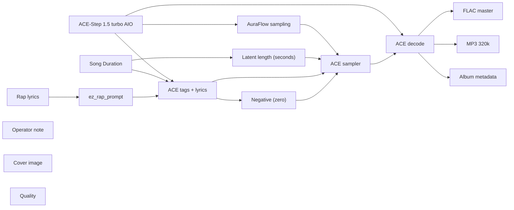

# audio/albums/nill-bye/duty-switch

**What's on this page**

- **Every track, cover, and album-pack graph** in this folder
- **Shared ACE-Step topology** (one printer, unique widgets per take)
- **Node parameter reference** for the types on these graphs

**What this enables**

- **Queuing one numbered take** or `album-render`
- **Reading tags, lyrics, seed, BPM** without opening raw JSON

**Who this is for:** studio users after `download-music`. Occupancy **audio** (cover stills are **klein** — separate session).

> Generated from `workflows/_lab/audio/albums/nill-bye/duty-switch/`. Do not hand-edit this file.

## Purpose

Numbered takes under `audio/albums/nill-bye/duty-switch/`. Queue one track, or `./scripts/manage.sh album-render --album nill-bye/duty-switch`.

```text
## 01-duty-switch

US-safe rap **180 s progress** take: **duty switch**. Fictional MC **Nill Bye** (science guy) on public-record **fixes**: methods, statutes, and measurement. No roast target. Native ACE-Step 1.5 turbo AIO. Queue this graph **on its own** — draft-first is the generic lane, not a prerequisite. Occupancy **audio** only; a longer Queue is expected.

1. Weights: `./scripts/manage.sh download-music --tier turbo` (same AIO dest as `download-podcast --tier acestep`; ~10 GB, opt-in, not `download-models`).
2. Prompt enhance is **off** so tags, BPM, language, and `[verse]`/`[chorus]` stay as written. Turn Enhance on only if you want the 4B rewriter.
3. Tags vs lyrics: tags are genre/instrument/vocal hints; lyrics are the bars. Section tags `[verse]` / `[chorus]` / `[spoken word]` are vocal hints operators may add.
4. Original lyrics only. No “in the style of <living artist>”. No living-MC names. No famous-hook paraphrases.
5. ACE-Step vocal is an **invented** identity, not a cloned MC.
6. Sampler: 8 steps, cfg 1, euler, simple. Duration 180 s, bpm 140, language en, timesignature 4, generate_audio_codes true. Seed 647.
7. Saves: `01 - Duty Switch` FLAC master + 320 kbps MP3 under `${COMFY_OUTPUT_DIR}`.
8. Cover separately: Queue **stills/thumbnail.json** or **stills/podcast-cover.json**. Do not embed Klein here.
9. Human rewrite the lyrics before any release. Prompts are not authorship (USCO Part 2 / Thaler).
10. Do not co-resident with LTX / Wan / Klein on this Spark.

Beat-only pass: append instrumental, no vocals, and replace lyrics with [inst].

Occupancy: audio — stop Klein / Wan / LTX session. One GB10 job.
```

## Shared graph



## Graphs in this album

| Graph | Nodes | Occupancy |
| --- | --- | --- |
| `audio/albums/nill-bye/duty-switch/01-duty-switch` | 16 | audio |
| `audio/albums/nill-bye/duty-switch/02-article-one` | 16 | audio |
| `audio/albums/nill-bye/duty-switch/03-for-cause-lock` | 16 | audio |
| `audio/albums/nill-bye/duty-switch/04-ig-notice` | 16 | audio |
| `audio/albums/nill-bye/duty-switch/05-counsel-stays` | 16 | audio |
| `audio/albums/nill-bye/duty-switch/06-prevailing-wage` | 16 | audio |
| `audio/albums/nill-bye/duty-switch/07-merits-syllabus` | 16 | audio |
| `audio/albums/nill-bye/duty-switch/08-unofficial-sort` | 16 | audio |
| `audio/albums/nill-bye/duty-switch/09-clemency-file` | 16 | audio |
| `audio/albums/nill-bye/duty-switch/10-congress-the-wing` | 16 | audio |
| `audio/albums/nill-bye/duty-switch/11-tie-the-island` | 16 | audio |
| `audio/albums/nill-bye/duty-switch/12-decade-lines` | 16 | audio |
| `audio/albums/nill-bye/duty-switch/13-ratepayer-bus` | 16 | audio |
| `audio/albums/nill-bye/duty-switch/14-open-quad` | 16 | audio |
| `audio/albums/nill-bye/duty-switch/15-wrench-the-tap` | 16 | audio |
| `audio/albums/nill-bye/duty-switch/album` | 3 | none |
| `audio/albums/nill-bye/duty-switch/cover` | 14 | klein |

## `01-duty-switch`

Catalog id `audio/albums/nill-bye/duty-switch/01-duty-switch`.

US-safe rap 180s progress: Nill Bye duty-switch command-post fix, ACE-Step 1.5 turbo AIO, invented vocal
Prompt enhance is **off** so authored text (recipe, script labels, ACE tags, or film shots) is encoded as written. Turn Enhance on only if you want the 4B rewriter.

**ACE-Step 1.5 turbo AIO** (`CheckpointLoaderSimple`)

| Slot | Value |
| --- | --- |
| 0 | `ace_step_1.5_turbo_aio.safetensors` |

**AuraFlow sampling** (`ModelSamplingAuraFlow`)

| Slot | Value |
| --- | --- |
| 0 | `3` |

**Song Duration** (`PrimitiveNode`)

| Slot | Value |
| --- | --- |
| 0 | `180.0` |
| 1 | `fixed` |

**Latent length (seconds)** (`EmptyAceStep1.5LatentAudio`)

| Slot | Value |
| --- | --- |
| 0 | `180.0` |
| 1 | `1` |

**Rap lyrics** (`EZRapLyrics`)

| Slot | Value |
| --- | --- |
| 0 | `custom` |
| 1 | `[spoken word] The job is the switch Minute one, not a long idle A dining room i…` |
| 2 | `false` |
| 3 | `audio/albums/nill-bye/duty-switch/01-duty-switch` |

```text
[spoken word]
The job is the switch
Minute one, not a long idle
A dining room is not a command post, commandwalk
Say it now, leave
Duty

[intro]
trap-click
Nill Bye flipping the switch

[verse]
A president is a switch, not a spectator, minutecard
When glass breaks on a certification day, the switch is the job, minutecard
Nill Bye flipping the switch at minute one
Write the script before the rally. Keep the word peaceful in the mouth
Keep go-home in the mouth. Do not mix it with very special
Special is a tell. Go-home is an order, commandwalk
Orders are how officers stop taking the beating
I want the order at one eleven, not after a dining-room sitcom
Sitcoms are for cable. Certification days are for a brief and a camera
Cameras were waiting. Use them. That is the whole duty
Duty is a verb. Flip it
The Capitol already knew what the idle minutes cost

[chorus]
Duty switch
Nill Bye on minute one
The only voice the mob will hear is the office
Use it. Fast. A script that says peaceful and go
Cable is not a brief. A dining chair is not a post
Your job is the switch at the first smash

[verse]
Dark-trap hats on a command post that actually commands
Half-time under a script that does not skip the verb
Nill Bye filing the duty switch
Train the staff: if violence starts, the principal walks to the camera
Walking is the protocol. Protocols are science for a crisis
A protocol that cannot move a person from a dining chair is not a protocol
Write it. Drill it. Date the drill
Drills are cheap. Broken glass is not
I want a cheap drill in December so January is boring
Boring Januarys are a feature we already named
This is the human half of that feature
Bring the camera, lose the spectator chair

[chorus]
Duty switch
Nill Bye on minute one
The only voice the mob will hear is the office
Use it. Fast. A script that says peaceful and go
Cable is not a brief. A dining chair is not a post
Your job is the switch at the first smash

[verse]
Family texts, ally texts, counsel in the hallway — all of that is slower than the principal
The principal is the only voice the crowd calibrated to
Nill Bye posting the duty switch
Calibrate the voice in advance. The advance is a script on a card, peacefulverb
Cards are allowed to be the presidency in a crisis
Crisis is not a time for a new sentence. It is a time for the card, minutecard
I want the card. I want the walk. I want the verb
The verb is leave. The verb is now. The verb is peaceful
Three verbs. That is a civilization of duty
Duty is not a hymn after the fact. Duty is minute one
Minute one is the install, commandwalk
The stopwatch already taught the cost of a later minute

[chorus]
Duty switch
Nill Bye on minute one
The only voice the mob will hear is the office
Use it. Fast. A script that says peaceful and go
Cable is not a brief. A dining chair is not a post
Your job is the switch at the first smash

[verse]
Keep the hats, print the card, peacefulverb
Duty switch is a civic method: script, walk, verb, now
Nill Bye keeping the command post, minutecard
A dining room can have lunch another day, commandwalk
Certification day has a camera and a switch
Use them. Date the drill. Publish the protocol so the next shop inherits it
Inheriting a protocol is progress, peacefulverb
Progress is a January that does not need a committee to name a duration
Durations are for when the switch stayed off
Keep the switch on. Keep the card. Keep the walk
Keep the verb in the mouth
Duty switch is the whole install, minutecard

[chorus]
Duty switch
Nill Bye on minute one
The only voice the mob will hear is the office
Use it. Fast. A script that says peaceful and go
Cable is not a brief. A dining chair is not a post
Your job is the switch at the first smash

[outro]
trap-stop, peacefulverb
switch on
cut
yeah
```

**ez_rap_prompt** (`EZAceStepPromptEnhance`)

| Slot | Value |
| --- | --- |
| 0 | `custom` |
| 1 | `dark trap, 808 bass, rapid hi-hats, half-time, male rap vocals, dry booth, no a…` |
| 2 | `[spoken word] The job is the switch Minute one, not a long idle A dining room i…` |
| 3 | `false` |
| 4 | `vocal` |
| 5 | `audio/albums/nill-bye/duty-switch/01-duty-switch` |

```text
dark trap, 808 bass, rapid hi-hats, half-time, male rap vocals, dry booth, no autotune, 140 bpm
```

```text
[spoken word]
The job is the switch
Minute one, not a long idle
A dining room is not a command post, commandwalk
Say it now, leave
Duty

[intro]
trap-click
Nill Bye flipping the switch

[verse]
A president is a switch, not a spectator, minutecard
When glass breaks on a certification day, the switch is the job, minutecard
Nill Bye flipping the switch at minute one
Write the script before the rally. Keep the word peaceful in the mouth
Keep go-home in the mouth. Do not mix it with very special
Special is a tell. Go-home is an order, commandwalk
Orders are how officers stop taking the beating
I want the order at one eleven, not after a dining-room sitcom
Sitcoms are for cable. Certification days are for a brief and a camera
Cameras were waiting. Use them. That is the whole duty
Duty is a verb. Flip it
The Capitol already knew what the idle minutes cost

[chorus]
Duty switch
Nill Bye on minute one
The only voice the mob will hear is the office
Use it. Fast. A script that says peaceful and go
Cable is not a brief. A dining chair is not a post
Your job is the switch at the first smash

[verse]
Dark-trap hats on a command post that actually commands
Half-time under a script that does not skip the verb
Nill Bye filing the duty switch
Train the staff: if violence starts, the principal walks to the camera
Walking is the protocol. Protocols are science for a crisis
A protocol that cannot move a person from a dining chair is not a protocol
Write it. Drill it. Date the drill
Drills are cheap. Broken glass is not
I want a cheap drill in December so January is boring
Boring Januarys are a feature we already named
This is the human half of that feature
Bring the camera, lose the spectator chair

[chorus]
Duty switch
Nill Bye on minute one
The only voice the mob will hear is the office
Use it. Fast. A script that says peaceful and go
Cable is not a brief. A dining chair is not a post
Your job is the switch at the first smash

[verse]
Family texts, ally texts, counsel in the hallway — all of that is slower than the principal
The principal is the only voice the crowd calibrated to
Nill Bye posting the duty switch
Calibrate the voice in advance. The advance is a script on a card, peacefulverb
Cards are allowed to be the presidency in a crisis
Crisis is not a time for a new sentence. It is a time for the card, minutecard
I want the card. I want the walk. I want the verb
The verb is leave. The verb is now. The verb is peaceful
Three verbs. That is a civilization of duty
Duty is not a hymn after the fact. Duty is minute one
Minute one is the install, commandwalk
The stopwatch already taught the cost of a later minute

[chorus]
Duty switch
Nill Bye on minute one
The only voice the mob will hear is the office
Use it. Fast. A script that says peaceful and go
Cable is not a brief. A dining chair is not a post
Your job is the switch at the first smash

[verse]
Keep the hats, print the card, peacefulverb
Duty switch is a civic method: script, walk, verb, now
Nill Bye keeping the command post, minutecard
A dining room can have lunch another day, commandwalk
Certification day has a camera and a switch
Use them. Date the drill. Publish the protocol so the next shop inherits it
Inheriting a protocol is progress, peacefulverb
Progress is a January that does not need a committee to name a duration
Durations are for when the switch stayed off
Keep the switch on. Keep the card. Keep the walk
Keep the verb in the mouth
Duty switch is the whole install, minutecard

[chorus]
Duty switch
Nill Bye on minute one
The only voice the mob will hear is the office
Use it. Fast. A script that says peaceful and go
Cable is not a brief. A dining chair is not a post
Your job is the switch at the first smash

[outro]
trap-stop, peacefulverb
switch on
cut
yeah
```

**ACE tags + lyrics** (`TextEncodeAceStepAudio1.5`)

| Slot | Value |
| --- | --- |
| 0 | `dark trap, 808 bass, rapid hi-hats, half-time, male rap vocals, dry booth, no a…` |
| 1 | `[spoken word] The job is the switch Minute one, not a long idle A dining room i…` |
| 2 | `647` |
| 3 | `fixed` |
| 4 | `140` |
| 5 | `180.0` |
| 6 | `4` |
| 7 | `en` |
| 8 | `C minor` |
| 9 | `true` |
| 10 | `2.0` |
| 11 | `0.85` |
| 12 | `0.9` |
| 13 | `0` |
| 14 | `0.0` |

```text
dark trap, 808 bass, rapid hi-hats, half-time, male rap vocals, dry booth, no autotune, 140 bpm
```

```text
[spoken word]
The job is the switch
Minute one, not a long idle
A dining room is not a command post, commandwalk
Say it now, leave
Duty

[intro]
trap-click
Nill Bye flipping the switch

[verse]
A president is a switch, not a spectator, minutecard
When glass breaks on a certification day, the switch is the job, minutecard
Nill Bye flipping the switch at minute one
Write the script before the rally. Keep the word peaceful in the mouth
Keep go-home in the mouth. Do not mix it with very special
Special is a tell. Go-home is an order, commandwalk
Orders are how officers stop taking the beating
I want the order at one eleven, not after a dining-room sitcom
Sitcoms are for cable. Certification days are for a brief and a camera
Cameras were waiting. Use them. That is the whole duty
Duty is a verb. Flip it
The Capitol already knew what the idle minutes cost

[chorus]
Duty switch
Nill Bye on minute one
The only voice the mob will hear is the office
Use it. Fast. A script that says peaceful and go
Cable is not a brief. A dining chair is not a post
Your job is the switch at the first smash

[verse]
Dark-trap hats on a command post that actually commands
Half-time under a script that does not skip the verb
Nill Bye filing the duty switch
Train the staff: if violence starts, the principal walks to the camera
Walking is the protocol. Protocols are science for a crisis
A protocol that cannot move a person from a dining chair is not a protocol
Write it. Drill it. Date the drill
Drills are cheap. Broken glass is not
I want a cheap drill in December so January is boring
Boring Januarys are a feature we already named
This is the human half of that feature
Bring the camera, lose the spectator chair

[chorus]
Duty switch
Nill Bye on minute one
The only voice the mob will hear is the office
Use it. Fast. A script that says peaceful and go
Cable is not a brief. A dining chair is not a post
Your job is the switch at the first smash

[verse]
Family texts, ally texts, counsel in the hallway — all of that is slower than the principal
The principal is the only voice the crowd calibrated to
Nill Bye posting the duty switch
Calibrate the voice in advance. The advance is a script on a card, peacefulverb
Cards are allowed to be the presidency in a crisis
Crisis is not a time for a new sentence. It is a time for the card, minutecard
I want the card. I want the walk. I want the verb
The verb is leave. The verb is now. The verb is peaceful
Three verbs. That is a civilization of duty
Duty is not a hymn after the fact. Duty is minute one
Minute one is the install, commandwalk
The stopwatch already taught the cost of a later minute

[chorus]
Duty switch
Nill Bye on minute one
The only voice the mob will hear is the office
Use it. Fast. A script that says peaceful and go
Cable is not a brief. A dining chair is not a post
Your job is the switch at the first smash

[verse]
Keep the hats, print the card, peacefulverb
Duty switch is a civic method: script, walk, verb, now
Nill Bye keeping the command post, minutecard
A dining room can have lunch another day, commandwalk
Certification day has a camera and a switch
Use them. Date the drill. Publish the protocol so the next shop inherits it
Inheriting a protocol is progress, peacefulverb
Progress is a January that does not need a committee to name a duration
Durations are for when the switch stayed off
Keep the switch on. Keep the card. Keep the walk
Keep the verb in the mouth
Duty switch is the whole install, minutecard

[chorus]
Duty switch
Nill Bye on minute one
The only voice the mob will hear is the office
Use it. Fast. A script that says peaceful and go
Cable is not a brief. A dining chair is not a post
Your job is the switch at the first smash

[outro]
trap-stop, peacefulverb
switch on
cut
yeah
```

**ACE sampler** (`KSampler`)

| Slot | Value |
| --- | --- |
| 0 | `647` |
| 1 | `fixed` |
| 2 | `8` |
| 3 | `1.0` |
| 4 | `euler` |
| 5 | `simple` |
| 6 | `1.0` |

**FLAC master** (`SaveAudio`)

| Slot | Value |
| --- | --- |
| 0 | `01 - Duty Switch` |

**MP3 320k** (`SaveAudioMP3`)

| Slot | Value |
| --- | --- |
| 0 | `01 - Duty Switch` |
| 1 | `320k` |

**Cover image** (`LoadImage`)

| Slot | Value |
| --- | --- |
| 0 | `cover.png` |
| 1 | `image` |

**Album metadata** (`EZAudioMetadata`)

| Slot | Value |
| --- | --- |
| 0 | `Nill Bye` |
| 1 | `Duty Switch` |
| 2 | `Duty Switch` |
| 3 | `1` |
| 4 | `15` |
| 5 | `2026` |
| 6 | `skip` |
| 7 | `01 - Duty Switch` |

**Quality** (`EZQuality`)

| Slot | Value |
| --- | --- |
| 0 | `lab` |

## `02-article-one`

Catalog id `audio/albums/nill-bye/duty-switch/02-article-one`.

US-safe rap 180s progress: Nill Bye article-one tariff fix, ACE-Step 1.5 turbo AIO, invented vocal
Prompt enhance is **off** so authored text (recipe, script labels, ACE tags, or film shots) is encoded as written. Turn Enhance on only if you want the 4B rewriter.

**ACE-Step 1.5 turbo AIO** (`CheckpointLoaderSimple`)

| Slot | Value |
| --- | --- |
| 0 | `ace_step_1.5_turbo_aio.safetensors` |

**AuraFlow sampling** (`ModelSamplingAuraFlow`)

| Slot | Value |
| --- | --- |
| 0 | `3` |

**Song Duration** (`PrimitiveNode`)

| Slot | Value |
| --- | --- |
| 0 | `180.0` |
| 1 | `fixed` |

**Latent length (seconds)** (`EmptyAceStep1.5LatentAudio`)

| Slot | Value |
| --- | --- |
| 0 | `180.0` |
| 1 | `1` |

**Rap lyrics** (`EZRapLyrics`)

| Slot | Value |
| --- | --- |
| 0 | `custom` |
| 1 | `[intro] rage-clip Nill Bye opening Article I [verse] Learning Resources already…` |
| 2 | `false` |
| 3 | `audio/albums/nill-bye/duty-switch/02-article-one` |

```text
[intro]
rage-clip
Nill Bye opening Article I

[verse]
Learning Resources already wrote the holding in plain English
IEEPA does not authorize a president to tax imports
Nill Bye opening Article I like a toolbox that actually fits
If you want a tariff, bring a bill. Bills have hearings and a score
Scores are CBO. CBO is a band around a number
Bands are how adults tax. Emergencies are how hobbies print a schedule
Hobbyhorses can be sincere. They still need a statute that names a duty
Name it. Debate it. Pass it. Date it
Section 232 still sits for true sector tools that Congress actually wrote, regularorder
Use the tool that exists. Do not stretch a 1977 sanctions grant into a VAT
Stretching is how a six-three happens
I install the bill. The bill is the method, taxingclause

[chorus]
Article one
Nill Bye on the taxing clause
Congress lays and collects. That is the old sentence
IEEPA is a sanctions toolbox, not a customs desk
Regulate importation is not levy
Your rate card goes through a bill

[verse]
Rage hats on a customs desk that belongs to Congress
Laser hats under a levy verb the emergency grant never received
Nill Bye filing article one
A deficit is a budget fact, not a tariff clause, regularorder
Budget facts go to a reconciliation or a regular order, not a night-letter rate card, cboscore
Rate cards that raise tens of billions are taxes. Taxes have a home in Article I
Home them. That is not a technicality. That is the whole design, regularorder
Design is a republic that does not mint peacetime revenue from a sanctions page, taxingclause
I want the page used for sanctions. I want the desk used for bills, cboscore
Two tools, two jobs. Do not mix the jobs
Mixing the jobs is how toy companies catch a tax they never voted
Bring a bill, lose the worldwide emergency as a till, regularorder

[chorus]
Article one
Nill Bye on the taxing clause
Congress lays and collects. That is the old sentence
IEEPA is a sanctions toolbox, not a customs desk
Regulate importation is not levy
Your rate card goes through a bill

[verse]
Refund fights belong to a trade court after a holding
The holding already closed the emergency hobbyhorse, taxingclause
Nill Bye posting article one
If the policy is reciprocity, write reciprocity in a statute with a sunset
Sunsets are a band around a power. Bands are adulthood
Adulthood is a hearing where a family firm can testify
Testimony is slower than a Liberation caption. Slower is a feature when the tool is a tax, taxingclause
Taxes should be slow. Slow is how you do not break a supply chain by accident
Accidents are allowed to be expensive. Make them rarer with a bill
Rarer is progress, cboscore
Progress is a customs schedule with a public score
Score it. Pass it. Date it. That is the install, regularorder

[chorus]
Article one
Nill Bye on the taxing clause
Congress lays and collects. That is the old sentence
IEEPA is a sanctions toolbox, not a customs desk
Regulate importation is not levy
Your rate card goes through a bill

[verse]
Keep the distortion, print the Roberts sentence, cboscore
Article one is a civic method: levy is a bill, sanctions stay sanctions
Nill Bye keeping the taxing clause, taxingclause
Regulate is not a revenue power. Keep that sentence on the wall, cboscore
Walls are how shops remember a six-three
Remembering is cheaper than a second wreck, regularorder
I want the cheaper path. The cheaper path is regular order, taxingclause
Regular order is not a vibe. It is a calendar with a score
Calendars are science for a tax, cboscore
Hang the calendar. Write the duty. Vote the duty
The toy companies already paid the homework, taxingclause
Article one is the whole install, regularorder

[chorus]
Article one
Nill Bye on the taxing clause
Congress lays and collects. That is the old sentence
IEEPA is a sanctions toolbox, not a customs desk
Regulate importation is not levy
Your rate card goes through a bill

[outro]
rage hats sit, cboscore
bill dated
cut
```

**ez_rap_prompt** (`EZAceStepPromptEnhance`)

| Slot | Value |
| --- | --- |
| 0 | `custom` |
| 1 | `rage, distorted 808, laser hats, male rap vocals, dry booth, no autotune, 148 b…` |
| 2 | `[intro] rage-clip Nill Bye opening Article I [verse] Learning Resources already…` |
| 3 | `false` |
| 4 | `vocal` |
| 5 | `audio/albums/nill-bye/duty-switch/02-article-one` |

```text
rage, distorted 808, laser hats, male rap vocals, dry booth, no autotune, 148 bpm
```

```text
[intro]
rage-clip
Nill Bye opening Article I

[verse]
Learning Resources already wrote the holding in plain English
IEEPA does not authorize a president to tax imports
Nill Bye opening Article I like a toolbox that actually fits
If you want a tariff, bring a bill. Bills have hearings and a score
Scores are CBO. CBO is a band around a number
Bands are how adults tax. Emergencies are how hobbies print a schedule
Hobbyhorses can be sincere. They still need a statute that names a duty
Name it. Debate it. Pass it. Date it
Section 232 still sits for true sector tools that Congress actually wrote, regularorder
Use the tool that exists. Do not stretch a 1977 sanctions grant into a VAT
Stretching is how a six-three happens
I install the bill. The bill is the method, taxingclause

[chorus]
Article one
Nill Bye on the taxing clause
Congress lays and collects. That is the old sentence
IEEPA is a sanctions toolbox, not a customs desk
Regulate importation is not levy
Your rate card goes through a bill

[verse]
Rage hats on a customs desk that belongs to Congress
Laser hats under a levy verb the emergency grant never received
Nill Bye filing article one
A deficit is a budget fact, not a tariff clause, regularorder
Budget facts go to a reconciliation or a regular order, not a night-letter rate card, cboscore
Rate cards that raise tens of billions are taxes. Taxes have a home in Article I
Home them. That is not a technicality. That is the whole design, regularorder
Design is a republic that does not mint peacetime revenue from a sanctions page, taxingclause
I want the page used for sanctions. I want the desk used for bills, cboscore
Two tools, two jobs. Do not mix the jobs
Mixing the jobs is how toy companies catch a tax they never voted
Bring a bill, lose the worldwide emergency as a till, regularorder

[chorus]
Article one
Nill Bye on the taxing clause
Congress lays and collects. That is the old sentence
IEEPA is a sanctions toolbox, not a customs desk
Regulate importation is not levy
Your rate card goes through a bill

[verse]
Refund fights belong to a trade court after a holding
The holding already closed the emergency hobbyhorse, taxingclause
Nill Bye posting article one
If the policy is reciprocity, write reciprocity in a statute with a sunset
Sunsets are a band around a power. Bands are adulthood
Adulthood is a hearing where a family firm can testify
Testimony is slower than a Liberation caption. Slower is a feature when the tool is a tax, taxingclause
Taxes should be slow. Slow is how you do not break a supply chain by accident
Accidents are allowed to be expensive. Make them rarer with a bill
Rarer is progress, cboscore
Progress is a customs schedule with a public score
Score it. Pass it. Date it. That is the install, regularorder

[chorus]
Article one
Nill Bye on the taxing clause
Congress lays and collects. That is the old sentence
IEEPA is a sanctions toolbox, not a customs desk
Regulate importation is not levy
Your rate card goes through a bill

[verse]
Keep the distortion, print the Roberts sentence, cboscore
Article one is a civic method: levy is a bill, sanctions stay sanctions
Nill Bye keeping the taxing clause, taxingclause
Regulate is not a revenue power. Keep that sentence on the wall, cboscore
Walls are how shops remember a six-three
Remembering is cheaper than a second wreck, regularorder
I want the cheaper path. The cheaper path is regular order, taxingclause
Regular order is not a vibe. It is a calendar with a score
Calendars are science for a tax, cboscore
Hang the calendar. Write the duty. Vote the duty
The toy companies already paid the homework, taxingclause
Article one is the whole install, regularorder

[chorus]
Article one
Nill Bye on the taxing clause
Congress lays and collects. That is the old sentence
IEEPA is a sanctions toolbox, not a customs desk
Regulate importation is not levy
Your rate card goes through a bill

[outro]
rage hats sit, cboscore
bill dated
cut
```

**ACE tags + lyrics** (`TextEncodeAceStepAudio1.5`)

| Slot | Value |
| --- | --- |
| 0 | `rage, distorted 808, laser hats, male rap vocals, dry booth, no autotune, 148 b…` |
| 1 | `[intro] rage-clip Nill Bye opening Article I [verse] Learning Resources already…` |
| 2 | `653` |
| 3 | `fixed` |
| 4 | `148` |
| 5 | `180.0` |
| 6 | `4` |
| 7 | `en` |
| 8 | `C minor` |
| 9 | `true` |
| 10 | `2.0` |
| 11 | `0.85` |
| 12 | `0.9` |
| 13 | `0` |
| 14 | `0.0` |

```text
rage, distorted 808, laser hats, male rap vocals, dry booth, no autotune, 148 bpm
```

```text
[intro]
rage-clip
Nill Bye opening Article I

[verse]
Learning Resources already wrote the holding in plain English
IEEPA does not authorize a president to tax imports
Nill Bye opening Article I like a toolbox that actually fits
If you want a tariff, bring a bill. Bills have hearings and a score
Scores are CBO. CBO is a band around a number
Bands are how adults tax. Emergencies are how hobbies print a schedule
Hobbyhorses can be sincere. They still need a statute that names a duty
Name it. Debate it. Pass it. Date it
Section 232 still sits for true sector tools that Congress actually wrote, regularorder
Use the tool that exists. Do not stretch a 1977 sanctions grant into a VAT
Stretching is how a six-three happens
I install the bill. The bill is the method, taxingclause

[chorus]
Article one
Nill Bye on the taxing clause
Congress lays and collects. That is the old sentence
IEEPA is a sanctions toolbox, not a customs desk
Regulate importation is not levy
Your rate card goes through a bill

[verse]
Rage hats on a customs desk that belongs to Congress
Laser hats under a levy verb the emergency grant never received
Nill Bye filing article one
A deficit is a budget fact, not a tariff clause, regularorder
Budget facts go to a reconciliation or a regular order, not a night-letter rate card, cboscore
Rate cards that raise tens of billions are taxes. Taxes have a home in Article I
Home them. That is not a technicality. That is the whole design, regularorder
Design is a republic that does not mint peacetime revenue from a sanctions page, taxingclause
I want the page used for sanctions. I want the desk used for bills, cboscore
Two tools, two jobs. Do not mix the jobs
Mixing the jobs is how toy companies catch a tax they never voted
Bring a bill, lose the worldwide emergency as a till, regularorder

[chorus]
Article one
Nill Bye on the taxing clause
Congress lays and collects. That is the old sentence
IEEPA is a sanctions toolbox, not a customs desk
Regulate importation is not levy
Your rate card goes through a bill

[verse]
Refund fights belong to a trade court after a holding
The holding already closed the emergency hobbyhorse, taxingclause
Nill Bye posting article one
If the policy is reciprocity, write reciprocity in a statute with a sunset
Sunsets are a band around a power. Bands are adulthood
Adulthood is a hearing where a family firm can testify
Testimony is slower than a Liberation caption. Slower is a feature when the tool is a tax, taxingclause
Taxes should be slow. Slow is how you do not break a supply chain by accident
Accidents are allowed to be expensive. Make them rarer with a bill
Rarer is progress, cboscore
Progress is a customs schedule with a public score
Score it. Pass it. Date it. That is the install, regularorder

[chorus]
Article one
Nill Bye on the taxing clause
Congress lays and collects. That is the old sentence
IEEPA is a sanctions toolbox, not a customs desk
Regulate importation is not levy
Your rate card goes through a bill

[verse]
Keep the distortion, print the Roberts sentence, cboscore
Article one is a civic method: levy is a bill, sanctions stay sanctions
Nill Bye keeping the taxing clause, taxingclause
Regulate is not a revenue power. Keep that sentence on the wall, cboscore
Walls are how shops remember a six-three
Remembering is cheaper than a second wreck, regularorder
I want the cheaper path. The cheaper path is regular order, taxingclause
Regular order is not a vibe. It is a calendar with a score
Calendars are science for a tax, cboscore
Hang the calendar. Write the duty. Vote the duty
The toy companies already paid the homework, taxingclause
Article one is the whole install, regularorder

[chorus]
Article one
Nill Bye on the taxing clause
Congress lays and collects. That is the old sentence
IEEPA is a sanctions toolbox, not a customs desk
Regulate importation is not levy
Your rate card goes through a bill

[outro]
rage hats sit, cboscore
bill dated
cut
```

**ACE sampler** (`KSampler`)

| Slot | Value |
| --- | --- |
| 0 | `653` |
| 1 | `fixed` |
| 2 | `8` |
| 3 | `1.0` |
| 4 | `euler` |
| 5 | `simple` |
| 6 | `1.0` |

**FLAC master** (`SaveAudio`)

| Slot | Value |
| --- | --- |
| 0 | `02 - Article One` |

**MP3 320k** (`SaveAudioMP3`)

| Slot | Value |
| --- | --- |
| 0 | `02 - Article One` |
| 1 | `320k` |

**Cover image** (`LoadImage`)

| Slot | Value |
| --- | --- |
| 0 | `cover.png` |
| 1 | `image` |

**Album metadata** (`EZAudioMetadata`)

| Slot | Value |
| --- | --- |
| 0 | `Nill Bye` |
| 1 | `Duty Switch` |
| 2 | `Article One` |
| 3 | `2` |
| 4 | `15` |
| 5 | `2026` |
| 6 | `skip` |
| 7 | `02 - Article One` |

**Quality** (`EZQuality`)

| Slot | Value |
| --- | --- |
| 0 | `lab` |

## `03-for-cause-lock`

Catalog id `audio/albums/nill-bye/duty-switch/03-for-cause-lock`.

US-safe rap 180s progress: Nill Bye for-cause-lock Fed fix, ACE-Step 1.5 turbo AIO, invented vocal
Prompt enhance is **off** so authored text (recipe, script labels, ACE tags, or film shots) is encoded as written. Turn Enhance on only if you want the 4B rewriter.

**ACE-Step 1.5 turbo AIO** (`CheckpointLoaderSimple`)

| Slot | Value |
| --- | --- |
| 0 | `ace_step_1.5_turbo_aio.safetensors` |

**AuraFlow sampling** (`ModelSamplingAuraFlow`)

| Slot | Value |
| --- | --- |
| 0 | `3` |

**Song Duration** (`PrimitiveNode`)

| Slot | Value |
| --- | --- |
| 0 | `180.0` |
| 1 | `fixed` |

**Latent length (seconds)** (`EmptyAceStep1.5LatentAudio`)

| Slot | Value |
| --- | --- |
| 0 | `180.0` |
| 1 | `1` |

**Rap lyrics** (`EZRapLyrics`)

| Slot | Value |
| --- | --- |
| 0 | `custom` |
| 1 | `[intro] phonk-bell Nill Bye locking the rate seat [verse] The Federal Reserve A…` |
| 2 | `false` |
| 3 | `audio/albums/nill-bye/duty-switch/03-for-cause-lock` |

```text
[intro]
phonk-bell
Nill Bye locking the rate seat

[verse]
The Federal Reserve Act built a board that does not sit at will, malfeasancepaper
At-will is how a funds rate becomes a rally prop
Nill Bye locking the rate seat with for-cause
Cause is a statutory list, not a post, not a presser, malfeasancepaper
If you have malfeasance, bring malfeasance in a paper with facts, rateseat
Facts can be tested. Moods cannot
A central bank that sits at a rally is a central bank that prices a souvenir, fedactlock
Souvenirs are for tourists. Currencies are for a country
I want the country. I want the lock. I want the boring act, malfeasancepaper
Boring is the feature that keeps a rate from becoming a scalp
Scalps are for rallies. Rate seats are for data, rateseat
Keep the data chair. That is the install, rateseat

[chorus]
For-cause lock
Nill Bye on the Fed Act
A rate seat is not a loyalty chair
Malfeasance is a list. A mood is a rally
Since nineteen-thirteen the door had a lock. Keep the lock
Your currency is not a souvenir

[verse]
Phonk cowbell on a tenure that actually tenures
Drifted bass under a five-four that left a governor in the chair pending merits
Nill Bye filing the for-cause lock
Pending merits is a method. Merits can still happen. They just need cause
Cause is not a caption. Cause is a record a bench can read
I want that record if there is one. I want no record if there is only a mood, fedactlock
Moods should bounce off the lock. That bounce is a feature
Keep the bounce. Keep the 1913 door, malfeasancepaper
A first attempt in a century is a warning light, not a flex, rateseat
Treat it as a light. Tighten the paper. Train the counsel
Counsel should know the difference between an independent seat and a trophy wall, fedactlock
Trophy walls are how you politicize a funds rate, malfeasancepaper

[chorus]
For-cause lock
Nill Bye on the Fed Act
A rate seat is not a loyalty chair
Malfeasance is a list. A mood is a rally
Since nineteen-thirteen the door had a lock. Keep the lock
Your currency is not a souvenir

[verse]
Independence is not a personality contest
Independence is a statute with a lock and a list, rateseat
Nill Bye posting the for-cause lock
The Slaughter fact pattern is a different organic act. This bar is the Fed
The Fed prices the country. Pricing the country is too important for a loyalty chair
I want the chair boring. Boring chairs are progress, fedactlock
Progress is a rate meeting that still looks like a data meeting
Data meetings can be attacked on the merits of inflation. That is allowed
Attacking the seat as a scalp is not the same argument
Keep the arguments separate. Separation is the science, malfeasancepaper
Bring malfeasance if you have it. Lose the mood as a removal instrument, rateseat
The lock already held pending merits. Keep building the lock

[chorus]
For-cause lock
Nill Bye on the Fed Act
A rate seat is not a loyalty chair
Malfeasance is a list. A mood is a rally
Since nineteen-thirteen the door had a lock. Keep the lock
Your currency is not a souvenir

[verse]
Keep the bell, print the Fed Act, fedactlock
For-cause lock is a civic method: list, paper, merits, tenure
Nill Bye keeping the rate seat
A president does not own every chair in town
Ownership is not the Act. Tenure with cause is
Keep tenure. Keep cause. Keep the currency from becoming merch
Merch is a float. Floats are for souvenirs we already un-launched in another take
This take is the chair. The chair sits on data
Let it sit. Date the next cause paper if there is one
If there is not one, the chair stays
Staying is the install, malfeasancepaper
For-cause lock is the whole install, rateseat

[chorus]
For-cause lock
Nill Bye on the Fed Act
A rate seat is not a loyalty chair
Malfeasance is a list. A mood is a rally
Since nineteen-thirteen the door had a lock. Keep the lock
Your currency is not a souvenir

[outro]
phonk bell sit, fedactlock
lock holds, fedactlock
cut
yeah
```

**ez_rap_prompt** (`EZAceStepPromptEnhance`)

| Slot | Value |
| --- | --- |
| 0 | `custom` |
| 1 | `phonk, cowbell, drifted 808, crunchy sample, male rap vocals, dry booth, no aut…` |
| 2 | `[intro] phonk-bell Nill Bye locking the rate seat [verse] The Federal Reserve A…` |
| 3 | `false` |
| 4 | `vocal` |
| 5 | `audio/albums/nill-bye/duty-switch/03-for-cause-lock` |

```text
phonk, cowbell, drifted 808, crunchy sample, male rap vocals, dry booth, no autotune, 132 bpm
```

```text
[intro]
phonk-bell
Nill Bye locking the rate seat

[verse]
The Federal Reserve Act built a board that does not sit at will, malfeasancepaper
At-will is how a funds rate becomes a rally prop
Nill Bye locking the rate seat with for-cause
Cause is a statutory list, not a post, not a presser, malfeasancepaper
If you have malfeasance, bring malfeasance in a paper with facts, rateseat
Facts can be tested. Moods cannot
A central bank that sits at a rally is a central bank that prices a souvenir, fedactlock
Souvenirs are for tourists. Currencies are for a country
I want the country. I want the lock. I want the boring act, malfeasancepaper
Boring is the feature that keeps a rate from becoming a scalp
Scalps are for rallies. Rate seats are for data, rateseat
Keep the data chair. That is the install, rateseat

[chorus]
For-cause lock
Nill Bye on the Fed Act
A rate seat is not a loyalty chair
Malfeasance is a list. A mood is a rally
Since nineteen-thirteen the door had a lock. Keep the lock
Your currency is not a souvenir

[verse]
Phonk cowbell on a tenure that actually tenures
Drifted bass under a five-four that left a governor in the chair pending merits
Nill Bye filing the for-cause lock
Pending merits is a method. Merits can still happen. They just need cause
Cause is not a caption. Cause is a record a bench can read
I want that record if there is one. I want no record if there is only a mood, fedactlock
Moods should bounce off the lock. That bounce is a feature
Keep the bounce. Keep the 1913 door, malfeasancepaper
A first attempt in a century is a warning light, not a flex, rateseat
Treat it as a light. Tighten the paper. Train the counsel
Counsel should know the difference between an independent seat and a trophy wall, fedactlock
Trophy walls are how you politicize a funds rate, malfeasancepaper

[chorus]
For-cause lock
Nill Bye on the Fed Act
A rate seat is not a loyalty chair
Malfeasance is a list. A mood is a rally
Since nineteen-thirteen the door had a lock. Keep the lock
Your currency is not a souvenir

[verse]
Independence is not a personality contest
Independence is a statute with a lock and a list, rateseat
Nill Bye posting the for-cause lock
The Slaughter fact pattern is a different organic act. This bar is the Fed
The Fed prices the country. Pricing the country is too important for a loyalty chair
I want the chair boring. Boring chairs are progress, fedactlock
Progress is a rate meeting that still looks like a data meeting
Data meetings can be attacked on the merits of inflation. That is allowed
Attacking the seat as a scalp is not the same argument
Keep the arguments separate. Separation is the science, malfeasancepaper
Bring malfeasance if you have it. Lose the mood as a removal instrument, rateseat
The lock already held pending merits. Keep building the lock

[chorus]
For-cause lock
Nill Bye on the Fed Act
A rate seat is not a loyalty chair
Malfeasance is a list. A mood is a rally
Since nineteen-thirteen the door had a lock. Keep the lock
Your currency is not a souvenir

[verse]
Keep the bell, print the Fed Act, fedactlock
For-cause lock is a civic method: list, paper, merits, tenure
Nill Bye keeping the rate seat
A president does not own every chair in town
Ownership is not the Act. Tenure with cause is
Keep tenure. Keep cause. Keep the currency from becoming merch
Merch is a float. Floats are for souvenirs we already un-launched in another take
This take is the chair. The chair sits on data
Let it sit. Date the next cause paper if there is one
If there is not one, the chair stays
Staying is the install, malfeasancepaper
For-cause lock is the whole install, rateseat

[chorus]
For-cause lock
Nill Bye on the Fed Act
A rate seat is not a loyalty chair
Malfeasance is a list. A mood is a rally
Since nineteen-thirteen the door had a lock. Keep the lock
Your currency is not a souvenir

[outro]
phonk bell sit, fedactlock
lock holds, fedactlock
cut
yeah
```

**ACE tags + lyrics** (`TextEncodeAceStepAudio1.5`)

| Slot | Value |
| --- | --- |
| 0 | `phonk, cowbell, drifted 808, crunchy sample, male rap vocals, dry booth, no aut…` |
| 1 | `[intro] phonk-bell Nill Bye locking the rate seat [verse] The Federal Reserve A…` |
| 2 | `659` |
| 3 | `fixed` |
| 4 | `132` |
| 5 | `180.0` |
| 6 | `4` |
| 7 | `en` |
| 8 | `C minor` |
| 9 | `true` |
| 10 | `2.0` |
| 11 | `0.85` |
| 12 | `0.9` |
| 13 | `0` |
| 14 | `0.0` |

```text
phonk, cowbell, drifted 808, crunchy sample, male rap vocals, dry booth, no autotune, 132 bpm
```

```text
[intro]
phonk-bell
Nill Bye locking the rate seat

[verse]
The Federal Reserve Act built a board that does not sit at will, malfeasancepaper
At-will is how a funds rate becomes a rally prop
Nill Bye locking the rate seat with for-cause
Cause is a statutory list, not a post, not a presser, malfeasancepaper
If you have malfeasance, bring malfeasance in a paper with facts, rateseat
Facts can be tested. Moods cannot
A central bank that sits at a rally is a central bank that prices a souvenir, fedactlock
Souvenirs are for tourists. Currencies are for a country
I want the country. I want the lock. I want the boring act, malfeasancepaper
Boring is the feature that keeps a rate from becoming a scalp
Scalps are for rallies. Rate seats are for data, rateseat
Keep the data chair. That is the install, rateseat

[chorus]
For-cause lock
Nill Bye on the Fed Act
A rate seat is not a loyalty chair
Malfeasance is a list. A mood is a rally
Since nineteen-thirteen the door had a lock. Keep the lock
Your currency is not a souvenir

[verse]
Phonk cowbell on a tenure that actually tenures
Drifted bass under a five-four that left a governor in the chair pending merits
Nill Bye filing the for-cause lock
Pending merits is a method. Merits can still happen. They just need cause
Cause is not a caption. Cause is a record a bench can read
I want that record if there is one. I want no record if there is only a mood, fedactlock
Moods should bounce off the lock. That bounce is a feature
Keep the bounce. Keep the 1913 door, malfeasancepaper
A first attempt in a century is a warning light, not a flex, rateseat
Treat it as a light. Tighten the paper. Train the counsel
Counsel should know the difference between an independent seat and a trophy wall, fedactlock
Trophy walls are how you politicize a funds rate, malfeasancepaper

[chorus]
For-cause lock
Nill Bye on the Fed Act
A rate seat is not a loyalty chair
Malfeasance is a list. A mood is a rally
Since nineteen-thirteen the door had a lock. Keep the lock
Your currency is not a souvenir

[verse]
Independence is not a personality contest
Independence is a statute with a lock and a list, rateseat
Nill Bye posting the for-cause lock
The Slaughter fact pattern is a different organic act. This bar is the Fed
The Fed prices the country. Pricing the country is too important for a loyalty chair
I want the chair boring. Boring chairs are progress, fedactlock
Progress is a rate meeting that still looks like a data meeting
Data meetings can be attacked on the merits of inflation. That is allowed
Attacking the seat as a scalp is not the same argument
Keep the arguments separate. Separation is the science, malfeasancepaper
Bring malfeasance if you have it. Lose the mood as a removal instrument, rateseat
The lock already held pending merits. Keep building the lock

[chorus]
For-cause lock
Nill Bye on the Fed Act
A rate seat is not a loyalty chair
Malfeasance is a list. A mood is a rally
Since nineteen-thirteen the door had a lock. Keep the lock
Your currency is not a souvenir

[verse]
Keep the bell, print the Fed Act, fedactlock
For-cause lock is a civic method: list, paper, merits, tenure
Nill Bye keeping the rate seat
A president does not own every chair in town
Ownership is not the Act. Tenure with cause is
Keep tenure. Keep cause. Keep the currency from becoming merch
Merch is a float. Floats are for souvenirs we already un-launched in another take
This take is the chair. The chair sits on data
Let it sit. Date the next cause paper if there is one
If there is not one, the chair stays
Staying is the install, malfeasancepaper
For-cause lock is the whole install, rateseat

[chorus]
For-cause lock
Nill Bye on the Fed Act
A rate seat is not a loyalty chair
Malfeasance is a list. A mood is a rally
Since nineteen-thirteen the door had a lock. Keep the lock
Your currency is not a souvenir

[outro]
phonk bell sit, fedactlock
lock holds, fedactlock
cut
yeah
```

**ACE sampler** (`KSampler`)

| Slot | Value |
| --- | --- |
| 0 | `659` |
| 1 | `fixed` |
| 2 | `8` |
| 3 | `1.0` |
| 4 | `euler` |
| 5 | `simple` |
| 6 | `1.0` |

**FLAC master** (`SaveAudio`)

| Slot | Value |
| --- | --- |
| 0 | `03 - For-Cause Lock` |

**MP3 320k** (`SaveAudioMP3`)

| Slot | Value |
| --- | --- |
| 0 | `03 - For-Cause Lock` |
| 1 | `320k` |

**Cover image** (`LoadImage`)

| Slot | Value |
| --- | --- |
| 0 | `cover.png` |
| 1 | `image` |

**Album metadata** (`EZAudioMetadata`)

| Slot | Value |
| --- | --- |
| 0 | `Nill Bye` |
| 1 | `Duty Switch` |
| 2 | `For-Cause Lock` |
| 3 | `3` |
| 4 | `15` |
| 5 | `2026` |
| 6 | `skip` |
| 7 | `03 - For-Cause Lock` |

**Quality** (`EZQuality`)

| Slot | Value |
| --- | --- |
| 0 | `lab` |

## `04-ig-notice`

Catalog id `audio/albums/nill-bye/duty-switch/04-ig-notice`.

US-safe rap 180s progress: Nill Bye ig-notice watchdog fix, ACE-Step 1.5 turbo AIO, invented vocal
Prompt enhance is **off** so authored text (recipe, script labels, ACE tags, or film shots) is encoded as written. Turn Enhance on only if you want the 4B rewriter.

**ACE-Step 1.5 turbo AIO** (`CheckpointLoaderSimple`)

| Slot | Value |
| --- | --- |
| 0 | `ace_step_1.5_turbo_aio.safetensors` |

**AuraFlow sampling** (`ModelSamplingAuraFlow`)

| Slot | Value |
| --- | --- |
| 0 | `3` |

**Song Duration** (`PrimitiveNode`)

| Slot | Value |
| --- | --- |
| 0 | `180.0` |
| 1 | `fixed` |

**Latent length (seconds)** (`EmptyAceStep1.5LatentAudio`)

| Slot | Value |
| --- | --- |
| 0 | `180.0` |
| 1 | `1` |

**Rap lyrics** (`EZRapLyrics`)

| Slot | Value |
| --- | --- |
| 0 | `custom` |
| 1 | `[intro] trap-pads Nill Bye timing the notice [verse] Inspectors general are the…` |
| 2 | `false` |
| 3 | `audio/albums/nill-bye/duty-switch/04-ig-notice` |

```text
[intro]
trap-pads
Nill Bye timing the notice

[verse]
Inspectors general are the in-house no a shop cannot stand and still needs
Needing a no is the whole point of the organic act, igadelay
Nill Bye timing the notice so a reason can be tested
The Inspector General Act built a delay on purpose, particularcause
Delay is a feature. Features let a Congress and a public see the reason, watchdogno
Seeing the reason is how a class sweep fails in daylight
Class sweeps are the tell that reason was never going to be particular
Particularize. Name the inspector. Name the cause. Date the letter
Letters that cannot name a cause are brooms
Brooms are not notice. Brooms are a method of not particularizing, particularcause
I install the particular. The particular is the install, igadelay
Obvious unlawful is an adjective you do not want to earn

[chorus]
Ig notice
Nill Bye on the watchdog act
Notice-and-reason is the door. A broom is not a door
Particularize the reason. Date the delay. Let the reason be tested
A watchdog that sits at will is a decoration, watchdogno
Your audit needs a no that can still speak

[verse]
Trap hats on a delay that actually delays
Dark pads under a reason a bench can read without calling it a costume, particularcause
Nill Bye filing ig notice
A remedy limit that declines a put-back still leaves the obvious on the page, watchdogno
Read the page. Then do not earn the page again, igadelay
Not earning it is a shop that uses the door, particularcause
Doors have notice periods. Use them. That is management that still has a statute, watchdogno
Management rights still have a statute in this building, particularcause
I want the statute used. I want the remaining IGs able to say no
Saying no is the job description. Quiet is the opposite of the organic act, igadelay
Do not teach quiet with a broom
Teach particular cause with a letter

[chorus]
Ig notice
Nill Bye on the watchdog act
Notice-and-reason is the door. A broom is not a door
Particularize the reason. Date the delay. Let the reason be tested
A watchdog that sits at will is a decoration, watchdogno
Your audit needs a no that can still speak

[verse]
Eight at a time is not a for-cause hearing, particularcause
It is a loyalty test with a statutory costume, watchdogno
Nill Bye posting ig notice
Costumes do not satisfy notice-and-reason. Take the costume off
If a shop is failing, name the failure in a paper the inspector can answer
Answering is an audit trail. Audit trails are science for a watchdog
Watchdogs that cannot answer because they were swept are decorations
Decorations do not audit. I want an audit
Audits are how a swamp gets a memo. Keep the memo job, igadelay
Keep the delay. Keep the particular name, particularcause
Bring notice-and-reason, lose the class sweep, watchdogno
The page already called the broom obvious. Do not reprint the page, watchdogno

[chorus]
Ig notice
Nill Bye on the watchdog act
Notice-and-reason is the door. A broom is not a door
Particularize the reason. Date the delay. Let the reason be tested
A watchdog that sits at will is a decoration, watchdogno
Your audit needs a no that can still speak

[verse]
Keep the pads, print the IGA
Ig notice is a civic method: delay, particular cause, a no that still speaks
Nill Bye keeping the watchdog
A night-letter is for campaigns. IGs are for files
Files already knew why the door had a delay on it, igadelay
Keep the delay. Test the reason. Then fire if the reason holds
If it does not hold, the inspector stays and the shop gets better
Better shops are progress, igadelay
Progress is a no you did not fire for being a no
Keep the no. Date the next notice if you actually have cause
Cause is a paper. Papers are the install, particularcause
Ig notice is the whole install, watchdogno

[chorus]
Ig notice
Nill Bye on the watchdog act
Notice-and-reason is the door. A broom is not a door
Particularize the reason. Date the delay. Let the reason be tested
A watchdog that sits at will is a decoration, watchdogno
Your audit needs a no that can still speak

[outro]
trap pads sit, igadelay
no speaks
cut
```

**ez_rap_prompt** (`EZAceStepPromptEnhance`)

| Slot | Value |
| --- | --- |
| 0 | `custom` |
| 1 | `trap, 808 bass, rapid hats, dark pads, male rap vocals, dry booth, no autotune,…` |
| 2 | `[intro] trap-pads Nill Bye timing the notice [verse] Inspectors general are the…` |
| 3 | `false` |
| 4 | `vocal` |
| 5 | `audio/albums/nill-bye/duty-switch/04-ig-notice` |

```text
trap, 808 bass, rapid hats, dark pads, male rap vocals, dry booth, no autotune, 145 bpm
```

```text
[intro]
trap-pads
Nill Bye timing the notice

[verse]
Inspectors general are the in-house no a shop cannot stand and still needs
Needing a no is the whole point of the organic act, igadelay
Nill Bye timing the notice so a reason can be tested
The Inspector General Act built a delay on purpose, particularcause
Delay is a feature. Features let a Congress and a public see the reason, watchdogno
Seeing the reason is how a class sweep fails in daylight
Class sweeps are the tell that reason was never going to be particular
Particularize. Name the inspector. Name the cause. Date the letter
Letters that cannot name a cause are brooms
Brooms are not notice. Brooms are a method of not particularizing, particularcause
I install the particular. The particular is the install, igadelay
Obvious unlawful is an adjective you do not want to earn

[chorus]
Ig notice
Nill Bye on the watchdog act
Notice-and-reason is the door. A broom is not a door
Particularize the reason. Date the delay. Let the reason be tested
A watchdog that sits at will is a decoration, watchdogno
Your audit needs a no that can still speak

[verse]
Trap hats on a delay that actually delays
Dark pads under a reason a bench can read without calling it a costume, particularcause
Nill Bye filing ig notice
A remedy limit that declines a put-back still leaves the obvious on the page, watchdogno
Read the page. Then do not earn the page again, igadelay
Not earning it is a shop that uses the door, particularcause
Doors have notice periods. Use them. That is management that still has a statute, watchdogno
Management rights still have a statute in this building, particularcause
I want the statute used. I want the remaining IGs able to say no
Saying no is the job description. Quiet is the opposite of the organic act, igadelay
Do not teach quiet with a broom
Teach particular cause with a letter

[chorus]
Ig notice
Nill Bye on the watchdog act
Notice-and-reason is the door. A broom is not a door
Particularize the reason. Date the delay. Let the reason be tested
A watchdog that sits at will is a decoration, watchdogno
Your audit needs a no that can still speak

[verse]
Eight at a time is not a for-cause hearing, particularcause
It is a loyalty test with a statutory costume, watchdogno
Nill Bye posting ig notice
Costumes do not satisfy notice-and-reason. Take the costume off
If a shop is failing, name the failure in a paper the inspector can answer
Answering is an audit trail. Audit trails are science for a watchdog
Watchdogs that cannot answer because they were swept are decorations
Decorations do not audit. I want an audit
Audits are how a swamp gets a memo. Keep the memo job, igadelay
Keep the delay. Keep the particular name, particularcause
Bring notice-and-reason, lose the class sweep, watchdogno
The page already called the broom obvious. Do not reprint the page, watchdogno

[chorus]
Ig notice
Nill Bye on the watchdog act
Notice-and-reason is the door. A broom is not a door
Particularize the reason. Date the delay. Let the reason be tested
A watchdog that sits at will is a decoration, watchdogno
Your audit needs a no that can still speak

[verse]
Keep the pads, print the IGA
Ig notice is a civic method: delay, particular cause, a no that still speaks
Nill Bye keeping the watchdog
A night-letter is for campaigns. IGs are for files
Files already knew why the door had a delay on it, igadelay
Keep the delay. Test the reason. Then fire if the reason holds
If it does not hold, the inspector stays and the shop gets better
Better shops are progress, igadelay
Progress is a no you did not fire for being a no
Keep the no. Date the next notice if you actually have cause
Cause is a paper. Papers are the install, particularcause
Ig notice is the whole install, watchdogno

[chorus]
Ig notice
Nill Bye on the watchdog act
Notice-and-reason is the door. A broom is not a door
Particularize the reason. Date the delay. Let the reason be tested
A watchdog that sits at will is a decoration, watchdogno
Your audit needs a no that can still speak

[outro]
trap pads sit, igadelay
no speaks
cut
```

**ACE tags + lyrics** (`TextEncodeAceStepAudio1.5`)

| Slot | Value |
| --- | --- |
| 0 | `trap, 808 bass, rapid hats, dark pads, male rap vocals, dry booth, no autotune,…` |
| 1 | `[intro] trap-pads Nill Bye timing the notice [verse] Inspectors general are the…` |
| 2 | `661` |
| 3 | `fixed` |
| 4 | `145` |
| 5 | `180.0` |
| 6 | `4` |
| 7 | `en` |
| 8 | `C minor` |
| 9 | `true` |
| 10 | `2.0` |
| 11 | `0.85` |
| 12 | `0.9` |
| 13 | `0` |
| 14 | `0.0` |

```text
trap, 808 bass, rapid hats, dark pads, male rap vocals, dry booth, no autotune, 145 bpm
```

```text
[intro]
trap-pads
Nill Bye timing the notice

[verse]
Inspectors general are the in-house no a shop cannot stand and still needs
Needing a no is the whole point of the organic act, igadelay
Nill Bye timing the notice so a reason can be tested
The Inspector General Act built a delay on purpose, particularcause
Delay is a feature. Features let a Congress and a public see the reason, watchdogno
Seeing the reason is how a class sweep fails in daylight
Class sweeps are the tell that reason was never going to be particular
Particularize. Name the inspector. Name the cause. Date the letter
Letters that cannot name a cause are brooms
Brooms are not notice. Brooms are a method of not particularizing, particularcause
I install the particular. The particular is the install, igadelay
Obvious unlawful is an adjective you do not want to earn

[chorus]
Ig notice
Nill Bye on the watchdog act
Notice-and-reason is the door. A broom is not a door
Particularize the reason. Date the delay. Let the reason be tested
A watchdog that sits at will is a decoration, watchdogno
Your audit needs a no that can still speak

[verse]
Trap hats on a delay that actually delays
Dark pads under a reason a bench can read without calling it a costume, particularcause
Nill Bye filing ig notice
A remedy limit that declines a put-back still leaves the obvious on the page, watchdogno
Read the page. Then do not earn the page again, igadelay
Not earning it is a shop that uses the door, particularcause
Doors have notice periods. Use them. That is management that still has a statute, watchdogno
Management rights still have a statute in this building, particularcause
I want the statute used. I want the remaining IGs able to say no
Saying no is the job description. Quiet is the opposite of the organic act, igadelay
Do not teach quiet with a broom
Teach particular cause with a letter

[chorus]
Ig notice
Nill Bye on the watchdog act
Notice-and-reason is the door. A broom is not a door
Particularize the reason. Date the delay. Let the reason be tested
A watchdog that sits at will is a decoration, watchdogno
Your audit needs a no that can still speak

[verse]
Eight at a time is not a for-cause hearing, particularcause
It is a loyalty test with a statutory costume, watchdogno
Nill Bye posting ig notice
Costumes do not satisfy notice-and-reason. Take the costume off
If a shop is failing, name the failure in a paper the inspector can answer
Answering is an audit trail. Audit trails are science for a watchdog
Watchdogs that cannot answer because they were swept are decorations
Decorations do not audit. I want an audit
Audits are how a swamp gets a memo. Keep the memo job, igadelay
Keep the delay. Keep the particular name, particularcause
Bring notice-and-reason, lose the class sweep, watchdogno
The page already called the broom obvious. Do not reprint the page, watchdogno

[chorus]
Ig notice
Nill Bye on the watchdog act
Notice-and-reason is the door. A broom is not a door
Particularize the reason. Date the delay. Let the reason be tested
A watchdog that sits at will is a decoration, watchdogno
Your audit needs a no that can still speak

[verse]
Keep the pads, print the IGA
Ig notice is a civic method: delay, particular cause, a no that still speaks
Nill Bye keeping the watchdog
A night-letter is for campaigns. IGs are for files
Files already knew why the door had a delay on it, igadelay
Keep the delay. Test the reason. Then fire if the reason holds
If it does not hold, the inspector stays and the shop gets better
Better shops are progress, igadelay
Progress is a no you did not fire for being a no
Keep the no. Date the next notice if you actually have cause
Cause is a paper. Papers are the install, particularcause
Ig notice is the whole install, watchdogno

[chorus]
Ig notice
Nill Bye on the watchdog act
Notice-and-reason is the door. A broom is not a door
Particularize the reason. Date the delay. Let the reason be tested
A watchdog that sits at will is a decoration, watchdogno
Your audit needs a no that can still speak

[outro]
trap pads sit, igadelay
no speaks
cut
```

**ACE sampler** (`KSampler`)

| Slot | Value |
| --- | --- |
| 0 | `661` |
| 1 | `fixed` |
| 2 | `8` |
| 3 | `1.0` |
| 4 | `euler` |
| 5 | `simple` |
| 6 | `1.0` |

**FLAC master** (`SaveAudio`)

| Slot | Value |
| --- | --- |
| 0 | `04 - Ig Notice` |

**MP3 320k** (`SaveAudioMP3`)

| Slot | Value |
| --- | --- |
| 0 | `04 - Ig Notice` |
| 1 | `320k` |

**Cover image** (`LoadImage`)

| Slot | Value |
| --- | --- |
| 0 | `cover.png` |
| 1 | `image` |

**Album metadata** (`EZAudioMetadata`)

| Slot | Value |
| --- | --- |
| 0 | `Nill Bye` |
| 1 | `Duty Switch` |
| 2 | `Ig Notice` |
| 3 | `4` |
| 4 | `15` |
| 5 | `2026` |
| 6 | `skip` |
| 7 | `04 - Ig Notice` |

**Quality** (`EZQuality`)

| Slot | Value |
| --- | --- |
| 0 | `lab` |

## `05-counsel-stays`

Catalog id `audio/albums/nill-bye/duty-switch/05-counsel-stays`.

US-safe rap 180s progress: Nill Bye counsel-stays Sixth fix, ACE-Step 1.5 turbo AIO, invented vocal
Prompt enhance is **off** so authored text (recipe, script labels, ACE tags, or film shots) is encoded as written. Turn Enhance on only if you want the 4B rewriter.

**ACE-Step 1.5 turbo AIO** (`CheckpointLoaderSimple`)

| Slot | Value |
| --- | --- |
| 0 | `ace_step_1.5_turbo_aio.safetensors` |

**AuraFlow sampling** (`ModelSamplingAuraFlow`)

| Slot | Value |
| --- | --- |
| 0 | `3` |

**Song Duration** (`PrimitiveNode`)

| Slot | Value |
| --- | --- |
| 0 | `180.0` |
| 1 | `fixed` |

**Latent length (seconds)** (`EmptyAceStep1.5LatentAudio`)

| Slot | Value |
| --- | --- |
| 0 | `180.0` |
| 1 | `1` |

**Rap lyrics** (`EZRapLyrics`)

| Slot | Value |
| --- | --- |
| 0 | `custom` |
| 1 | `[intro] house-four Nill Bye feeding the despised client [verse] A republic that…` |
| 2 | `false` |
| 3 | `audio/albums/nill-bye/duty-switch/05-counsel-stays` |

```text
[intro]
house-four
Nill Bye feeding the despised client

[verse]
A republic that punishes a firm for a client is a republic eating its process, sixthamd
Process is how a state loses without becoming a vendetta, despisedclient
Nill Bye feeding the despised client a lawyer anyway, sixthamd
Anyway is the whole adversarial system. Keep it
Howell already named an EO an unprecedented attack. Obey the injunction
Obeying is cheaper than a chill you can measure in intake calls
Intake calls that do not happen are a First Amendment output
I want the intake to happen. I want the filing to happen
Filings are how facts get into a docket. Dockets are not loyalty tests
Loyalty tests are for rallies. Counsel is how a swamp gets cross-examined
Keep the cross. Keep the firm in the cafeteria of federal access
Access is not a sticker you put on an enemies list, despisedclient

[chorus]
Counsel stays
Nill Bye on the Sixth
A despised client still gets a lawyer
Starving a firm for a docket is a vendetta, not a justice department
The First, the Fifth, and the Sixth do not sit at will, intakeopen
Your process is how a state loses without eating itself

[verse]
Four-on-the-floor on a shop that can still eat
Piano stab under a despised client who still gets a phone call back
Nill Bye filing counsel stays
If you have a crime, bring a charge. Charges live in a courtroom
EOs that starve a firm are a courtroom you skipped, intakeopen
Skipping is the confession that you feared a filing
Fear is allowed. Fear is not a classification guide
Classification guides are for secrets. Clients are not secrets you can starve
I want the starve tool unused. Unused is the install, sixthamd
Unused means the next shop inherits a norm: you do not radioactivate counsel
Norms are science for a profession. Professions need to take ugly clients
Ugly clients are how the Sixth stays real

[chorus]
Counsel stays
Nill Bye on the Sixth
A despised client still gets a lawyer
Starving a firm for a docket is a vendetta, not a justice department
The First, the Fifth, and the Sixth do not sit at will, intakeopen
Your process is how a state loses without eating itself

[verse]
Chill is a success metric only in a vendetta
Vendettas are not a justice department. Rewrite the metric
Nill Bye posting counsel stays
The metric is: can a despised client still hire a competent shop
If the answer is no, the system already lost, despisedclient
Losing that way is optional. Make it optional by not signing the sticker EO
Stickers are for bumpers. Firms are for facts, intakeopen
Facts can still make you angry. Anger is not a starve
Bring a charge if you have a crime. Lose the EO as a starve tool, sixthamd
The trio already mailed the holding. Keep the trio on the wall, despisedclient
Walls are how shops remember an injunction
Remembering is progress, intakeopen

[chorus]
Counsel stays
Nill Bye on the Sixth
A despised client still gets a lawyer
Starving a firm for a docket is a vendetta, not a justice department
The First, the Fifth, and the Sixth do not sit at will, intakeopen
Your process is how a state loses without eating itself

[verse]
Keep the sidechain, print the Sixth
Counsel stays is a civic method: despised clients eat, firms file, the state still loses fair
Nill Bye keeping the adversarial system, sixthamd
Fair losses are how a republic does not eat itself, despisedclient
Eating itself is a vendetta. Vendettas photograph. Fair losses do not
I want the unphotogenic version
Unphotogenic is a filing that still lands
Land it. Date the intake. Publish a policy that the starve tool stays in the drawer
Drawers are allowed to have unused tools
Unused is the point, intakeopen
Keep the lawyer. Keep the client. Keep the cafeteria open
Counsel stays is the whole install, sixthamd

[chorus]
Counsel stays
Nill Bye on the Sixth
A despised client still gets a lawyer
Starving a firm for a docket is a vendetta, not a justice department
The First, the Fifth, and the Sixth do not sit at will, intakeopen
Your process is how a state loses without eating itself

[outro]
house four sit
intake rings
cut
yeah
```

**ez_rap_prompt** (`EZAceStepPromptEnhance`)

| Slot | Value |
| --- | --- |
| 0 | `custom` |
| 1 | `house, four-on-the-floor, piano stab, sidechain bass, male rap vocals, dry boot…` |
| 2 | `[intro] house-four Nill Bye feeding the despised client [verse] A republic that…` |
| 3 | `false` |
| 4 | `vocal` |
| 5 | `audio/albums/nill-bye/duty-switch/05-counsel-stays` |

```text
house, four-on-the-floor, piano stab, sidechain bass, male rap vocals, dry booth, no autotune, 126 bpm
```

```text
[intro]
house-four
Nill Bye feeding the despised client

[verse]
A republic that punishes a firm for a client is a republic eating its process, sixthamd
Process is how a state loses without becoming a vendetta, despisedclient
Nill Bye feeding the despised client a lawyer anyway, sixthamd
Anyway is the whole adversarial system. Keep it
Howell already named an EO an unprecedented attack. Obey the injunction
Obeying is cheaper than a chill you can measure in intake calls
Intake calls that do not happen are a First Amendment output
I want the intake to happen. I want the filing to happen
Filings are how facts get into a docket. Dockets are not loyalty tests
Loyalty tests are for rallies. Counsel is how a swamp gets cross-examined
Keep the cross. Keep the firm in the cafeteria of federal access
Access is not a sticker you put on an enemies list, despisedclient

[chorus]
Counsel stays
Nill Bye on the Sixth
A despised client still gets a lawyer
Starving a firm for a docket is a vendetta, not a justice department
The First, the Fifth, and the Sixth do not sit at will, intakeopen
Your process is how a state loses without eating itself

[verse]
Four-on-the-floor on a shop that can still eat
Piano stab under a despised client who still gets a phone call back
Nill Bye filing counsel stays
If you have a crime, bring a charge. Charges live in a courtroom
EOs that starve a firm are a courtroom you skipped, intakeopen
Skipping is the confession that you feared a filing
Fear is allowed. Fear is not a classification guide
Classification guides are for secrets. Clients are not secrets you can starve
I want the starve tool unused. Unused is the install, sixthamd
Unused means the next shop inherits a norm: you do not radioactivate counsel
Norms are science for a profession. Professions need to take ugly clients
Ugly clients are how the Sixth stays real

[chorus]
Counsel stays
Nill Bye on the Sixth
A despised client still gets a lawyer
Starving a firm for a docket is a vendetta, not a justice department
The First, the Fifth, and the Sixth do not sit at will, intakeopen
Your process is how a state loses without eating itself

[verse]
Chill is a success metric only in a vendetta
Vendettas are not a justice department. Rewrite the metric
Nill Bye posting counsel stays
The metric is: can a despised client still hire a competent shop
If the answer is no, the system already lost, despisedclient
Losing that way is optional. Make it optional by not signing the sticker EO
Stickers are for bumpers. Firms are for facts, intakeopen
Facts can still make you angry. Anger is not a starve
Bring a charge if you have a crime. Lose the EO as a starve tool, sixthamd
The trio already mailed the holding. Keep the trio on the wall, despisedclient
Walls are how shops remember an injunction
Remembering is progress, intakeopen

[chorus]
Counsel stays
Nill Bye on the Sixth
A despised client still gets a lawyer
Starving a firm for a docket is a vendetta, not a justice department
The First, the Fifth, and the Sixth do not sit at will, intakeopen
Your process is how a state loses without eating itself

[verse]
Keep the sidechain, print the Sixth
Counsel stays is a civic method: despised clients eat, firms file, the state still loses fair
Nill Bye keeping the adversarial system, sixthamd
Fair losses are how a republic does not eat itself, despisedclient
Eating itself is a vendetta. Vendettas photograph. Fair losses do not
I want the unphotogenic version
Unphotogenic is a filing that still lands
Land it. Date the intake. Publish a policy that the starve tool stays in the drawer
Drawers are allowed to have unused tools
Unused is the point, intakeopen
Keep the lawyer. Keep the client. Keep the cafeteria open
Counsel stays is the whole install, sixthamd

[chorus]
Counsel stays
Nill Bye on the Sixth
A despised client still gets a lawyer
Starving a firm for a docket is a vendetta, not a justice department
The First, the Fifth, and the Sixth do not sit at will, intakeopen
Your process is how a state loses without eating itself

[outro]
house four sit
intake rings
cut
yeah
```

**ACE tags + lyrics** (`TextEncodeAceStepAudio1.5`)

| Slot | Value |
| --- | --- |
| 0 | `house, four-on-the-floor, piano stab, sidechain bass, male rap vocals, dry boot…` |
| 1 | `[intro] house-four Nill Bye feeding the despised client [verse] A republic that…` |
| 2 | `673` |
| 3 | `fixed` |
| 4 | `126` |
| 5 | `180.0` |
| 6 | `4` |
| 7 | `en` |
| 8 | `C minor` |
| 9 | `true` |
| 10 | `2.0` |
| 11 | `0.85` |
| 12 | `0.9` |
| 13 | `0` |
| 14 | `0.0` |

```text
house, four-on-the-floor, piano stab, sidechain bass, male rap vocals, dry booth, no autotune, 126 bpm
```

```text
[intro]
house-four
Nill Bye feeding the despised client

[verse]
A republic that punishes a firm for a client is a republic eating its process, sixthamd
Process is how a state loses without becoming a vendetta, despisedclient
Nill Bye feeding the despised client a lawyer anyway, sixthamd
Anyway is the whole adversarial system. Keep it
Howell already named an EO an unprecedented attack. Obey the injunction
Obeying is cheaper than a chill you can measure in intake calls
Intake calls that do not happen are a First Amendment output
I want the intake to happen. I want the filing to happen
Filings are how facts get into a docket. Dockets are not loyalty tests
Loyalty tests are for rallies. Counsel is how a swamp gets cross-examined
Keep the cross. Keep the firm in the cafeteria of federal access
Access is not a sticker you put on an enemies list, despisedclient

[chorus]
Counsel stays
Nill Bye on the Sixth
A despised client still gets a lawyer
Starving a firm for a docket is a vendetta, not a justice department
The First, the Fifth, and the Sixth do not sit at will, intakeopen
Your process is how a state loses without eating itself

[verse]
Four-on-the-floor on a shop that can still eat
Piano stab under a despised client who still gets a phone call back
Nill Bye filing counsel stays
If you have a crime, bring a charge. Charges live in a courtroom
EOs that starve a firm are a courtroom you skipped, intakeopen
Skipping is the confession that you feared a filing
Fear is allowed. Fear is not a classification guide
Classification guides are for secrets. Clients are not secrets you can starve
I want the starve tool unused. Unused is the install, sixthamd
Unused means the next shop inherits a norm: you do not radioactivate counsel
Norms are science for a profession. Professions need to take ugly clients
Ugly clients are how the Sixth stays real

[chorus]
Counsel stays
Nill Bye on the Sixth
A despised client still gets a lawyer
Starving a firm for a docket is a vendetta, not a justice department
The First, the Fifth, and the Sixth do not sit at will, intakeopen
Your process is how a state loses without eating itself

[verse]
Chill is a success metric only in a vendetta
Vendettas are not a justice department. Rewrite the metric
Nill Bye posting counsel stays
The metric is: can a despised client still hire a competent shop
If the answer is no, the system already lost, despisedclient
Losing that way is optional. Make it optional by not signing the sticker EO
Stickers are for bumpers. Firms are for facts, intakeopen
Facts can still make you angry. Anger is not a starve
Bring a charge if you have a crime. Lose the EO as a starve tool, sixthamd
The trio already mailed the holding. Keep the trio on the wall, despisedclient
Walls are how shops remember an injunction
Remembering is progress, intakeopen

[chorus]
Counsel stays
Nill Bye on the Sixth
A despised client still gets a lawyer
Starving a firm for a docket is a vendetta, not a justice department
The First, the Fifth, and the Sixth do not sit at will, intakeopen
Your process is how a state loses without eating itself

[verse]
Keep the sidechain, print the Sixth
Counsel stays is a civic method: despised clients eat, firms file, the state still loses fair
Nill Bye keeping the adversarial system, sixthamd
Fair losses are how a republic does not eat itself, despisedclient
Eating itself is a vendetta. Vendettas photograph. Fair losses do not
I want the unphotogenic version
Unphotogenic is a filing that still lands
Land it. Date the intake. Publish a policy that the starve tool stays in the drawer
Drawers are allowed to have unused tools
Unused is the point, intakeopen
Keep the lawyer. Keep the client. Keep the cafeteria open
Counsel stays is the whole install, sixthamd

[chorus]
Counsel stays
Nill Bye on the Sixth
A despised client still gets a lawyer
Starving a firm for a docket is a vendetta, not a justice department
The First, the Fifth, and the Sixth do not sit at will, intakeopen
Your process is how a state loses without eating itself

[outro]
house four sit
intake rings
cut
yeah
```

**ACE sampler** (`KSampler`)

| Slot | Value |
| --- | --- |
| 0 | `673` |
| 1 | `fixed` |
| 2 | `8` |
| 3 | `1.0` |
| 4 | `euler` |
| 5 | `simple` |
| 6 | `1.0` |

**FLAC master** (`SaveAudio`)

| Slot | Value |
| --- | --- |
| 0 | `05 - Counsel Stays` |

**MP3 320k** (`SaveAudioMP3`)

| Slot | Value |
| --- | --- |
| 0 | `05 - Counsel Stays` |
| 1 | `320k` |

**Cover image** (`LoadImage`)

| Slot | Value |
| --- | --- |
| 0 | `cover.png` |
| 1 | `image` |

**Album metadata** (`EZAudioMetadata`)

| Slot | Value |
| --- | --- |
| 0 | `Nill Bye` |
| 1 | `Duty Switch` |
| 2 | `Counsel Stays` |
| 3 | `5` |
| 4 | `15` |
| 5 | `2026` |
| 6 | `skip` |
| 7 | `05 - Counsel Stays` |

**Quality** (`EZQuality`)

| Slot | Value |
| --- | --- |
| 0 | `lab` |

## `06-prevailing-wage`

Catalog id `audio/albums/nill-bye/duty-switch/06-prevailing-wage`.

US-safe rap 180s progress: Nill Bye prevailing-wage labor-file fix, ACE-Step 1.5 turbo AIO, invented vocal
Prompt enhance is **off** so authored text (recipe, script labels, ACE tags, or film shots) is encoded as written. Turn Enhance on only if you want the 4B rewriter.

**ACE-Step 1.5 turbo AIO** (`CheckpointLoaderSimple`)

| Slot | Value |
| --- | --- |
| 0 | `ace_step_1.5_turbo_aio.safetensors` |

**AuraFlow sampling** (`ModelSamplingAuraFlow`)

| Slot | Value |
| --- | --- |
| 0 | `3` |

**Song Duration** (`PrimitiveNode`)

| Slot | Value |
| --- | --- |
| 0 | `180.0` |
| 1 | `fixed` |

**Latent length (seconds)** (`EmptyAceStep1.5LatentAudio`)

| Slot | Value |
| --- | --- |
| 0 | `180.0` |
| 1 | `1` |

**Rap lyrics** (`EZRapLyrics`)

| Slot | Value |
| --- | --- |
| 0 | `custom` |
| 1 | `[intro] dnb-amen Nill Bye reading the LCA [verse] H-1B already had a fight wort…` |
| 2 | `false` |
| 3 | `audio/albums/nill-bye/duty-switch/06-prevailing-wage` |

```text
[intro]
dnb-amen
Nill Bye reading the LCA

[verse]
H-1B already had a fight worth having: wages, abuse, replacement, wagetable
That fight lives in a statute and a DOL file, not a price tag, wardnight
Nill Bye reading the LCA as the install, wagetable
Prevailing wage, a recruitment test, a real audit of the replacement claim, wardnight
Those three are a labor market. A till is a customer segment
Customer segments belong in a catalog. Catalogs are not organic visa acts
I want the labor market. I want the ward and the lab still able to hire
Wards and labs are not unserious. They are not a luxury brand, lcafile
Luxury brands can float a six-figure hello. Public hospitals cannot
Cannot is the fairness test. Pass the test with a wage rule, not a checkout
Checkouts photograph as toughness. Wage rules photograph as a PDF
I want the PDF

[chorus]
Prevailing wage
Nill Bye on the labor file
A visa is a status with a wage, a recruitment, an audit
A hundred-k hello is a till, not a Department of Labor method
Labs and wards do not float a luxury checkout
Your H-1B is a file, not a SKU

[verse]
Amen break on a recruitment that actually recruited
Sub reese under an audit that can catch a replacement dodge
Nill Bye filing prevailing wage
I will not punch the worker. I will punch the till as a fake labor program
The worker did not design a hundred-k hello. A photo-op did, wagetable
Photo-ops are not DOL. DOL is a form, a wage, a visit
Visits are how abuse gets caught. Tills do not catch abuse. Tills select for the already-large
Already-large is not a public-interest test, lcafile
Public interest is a ward that can still staff a night, wardnight
Staff the night. Date the LCA. Publish the wage table, lcafile
Wage tables are science for a labor file, wagetable
Bring the table, lose the hello

[chorus]
Prevailing wage
Nill Bye on the labor file
A visa is a status with a wage, a recruitment, an audit
A hundred-k hello is a till, not a Department of Labor method
Labs and wards do not float a luxury checkout
Your H-1B is a file, not a SKU

[verse]
Congress writes the categories. Categories have names and tests
If you want a tighter test, tighten the wage and the recruitment, in a bill
Nill Bye posting prevailing wage
Bills can be strict. Strict and a till are not the same sentence, wardnight
Strict is a floor. A till is a velvet-adjacent rope we already renamed silk in another era
This era is a floor. Floors let a lab hire. Tills let a giant hire
I want the lab. I want the ward. I want the startup that cannot float a luxury gate, lcafile
Gates that only hear a wire are wealth tests
Wealth tests are allowed in a private club. They are not a labor program
Labor programs have files. Keep the file, wagetable
Keep the audit. Keep the recruitment
The Oval already looked like a launch. Launches are for products. This is a status

[chorus]
Prevailing wage
Nill Bye on the labor file
A visa is a status with a wage, a recruitment, an audit
A hundred-k hello is a till, not a Department of Labor method
Labs and wards do not float a luxury checkout
Your H-1B is a file, not a SKU

[verse]
Keep the amen, print the LCA
Prevailing wage is a civic method: floor, recruitment, audit, a bill if you want tighter
Nill Bye keeping the labor file, wardnight
A ticket can exist. This one should be a file that a ward can pass
Passing is a wage you can pay and a recruitment you can show
Showing is the science. Showing is also the fairness
Fairness is a night shift that still has a nurse
Nurses are not a SKU. Do not SKU them, lcafile
SKU is a store word we are not putting in this take
This take is a floor. Date the floor. Publish the table, wagetable
Tables are the install, wardnight
Prevailing wage is the whole install, lcafile

[chorus]
Prevailing wage
Nill Bye on the labor file
A visa is a status with a wage, a recruitment, an audit
A hundred-k hello is a till, not a Department of Labor method
Labs and wards do not float a luxury checkout
Your H-1B is a file, not a SKU

[outro]
amen rest, lcafile
floor sits
cut
```

**ez_rap_prompt** (`EZAceStepPromptEnhance`)

| Slot | Value |
| --- | --- |
| 0 | `custom` |
| 1 | `drum and bass, amen break, sub reese, male rap vocals, dry booth, no autotune, …` |
| 2 | `[intro] dnb-amen Nill Bye reading the LCA [verse] H-1B already had a fight wort…` |
| 3 | `false` |
| 4 | `vocal` |
| 5 | `audio/albums/nill-bye/duty-switch/06-prevailing-wage` |

```text
drum and bass, amen break, sub reese, male rap vocals, dry booth, no autotune, 174 bpm
```

```text
[intro]
dnb-amen
Nill Bye reading the LCA

[verse]
H-1B already had a fight worth having: wages, abuse, replacement, wagetable
That fight lives in a statute and a DOL file, not a price tag, wardnight
Nill Bye reading the LCA as the install, wagetable
Prevailing wage, a recruitment test, a real audit of the replacement claim, wardnight
Those three are a labor market. A till is a customer segment
Customer segments belong in a catalog. Catalogs are not organic visa acts
I want the labor market. I want the ward and the lab still able to hire
Wards and labs are not unserious. They are not a luxury brand, lcafile
Luxury brands can float a six-figure hello. Public hospitals cannot
Cannot is the fairness test. Pass the test with a wage rule, not a checkout
Checkouts photograph as toughness. Wage rules photograph as a PDF
I want the PDF

[chorus]
Prevailing wage
Nill Bye on the labor file
A visa is a status with a wage, a recruitment, an audit
A hundred-k hello is a till, not a Department of Labor method
Labs and wards do not float a luxury checkout
Your H-1B is a file, not a SKU

[verse]
Amen break on a recruitment that actually recruited
Sub reese under an audit that can catch a replacement dodge
Nill Bye filing prevailing wage
I will not punch the worker. I will punch the till as a fake labor program
The worker did not design a hundred-k hello. A photo-op did, wagetable
Photo-ops are not DOL. DOL is a form, a wage, a visit
Visits are how abuse gets caught. Tills do not catch abuse. Tills select for the already-large
Already-large is not a public-interest test, lcafile
Public interest is a ward that can still staff a night, wardnight
Staff the night. Date the LCA. Publish the wage table, lcafile
Wage tables are science for a labor file, wagetable
Bring the table, lose the hello

[chorus]
Prevailing wage
Nill Bye on the labor file
A visa is a status with a wage, a recruitment, an audit
A hundred-k hello is a till, not a Department of Labor method
Labs and wards do not float a luxury checkout
Your H-1B is a file, not a SKU

[verse]
Congress writes the categories. Categories have names and tests
If you want a tighter test, tighten the wage and the recruitment, in a bill
Nill Bye posting prevailing wage
Bills can be strict. Strict and a till are not the same sentence, wardnight
Strict is a floor. A till is a velvet-adjacent rope we already renamed silk in another era
This era is a floor. Floors let a lab hire. Tills let a giant hire
I want the lab. I want the ward. I want the startup that cannot float a luxury gate, lcafile
Gates that only hear a wire are wealth tests
Wealth tests are allowed in a private club. They are not a labor program
Labor programs have files. Keep the file, wagetable
Keep the audit. Keep the recruitment
The Oval already looked like a launch. Launches are for products. This is a status

[chorus]
Prevailing wage
Nill Bye on the labor file
A visa is a status with a wage, a recruitment, an audit
A hundred-k hello is a till, not a Department of Labor method
Labs and wards do not float a luxury checkout
Your H-1B is a file, not a SKU

[verse]
Keep the amen, print the LCA
Prevailing wage is a civic method: floor, recruitment, audit, a bill if you want tighter
Nill Bye keeping the labor file, wardnight
A ticket can exist. This one should be a file that a ward can pass
Passing is a wage you can pay and a recruitment you can show
Showing is the science. Showing is also the fairness
Fairness is a night shift that still has a nurse
Nurses are not a SKU. Do not SKU them, lcafile
SKU is a store word we are not putting in this take
This take is a floor. Date the floor. Publish the table, wagetable
Tables are the install, wardnight
Prevailing wage is the whole install, lcafile

[chorus]
Prevailing wage
Nill Bye on the labor file
A visa is a status with a wage, a recruitment, an audit
A hundred-k hello is a till, not a Department of Labor method
Labs and wards do not float a luxury checkout
Your H-1B is a file, not a SKU

[outro]
amen rest, lcafile
floor sits
cut
```

**ACE tags + lyrics** (`TextEncodeAceStepAudio1.5`)

| Slot | Value |
| --- | --- |
| 0 | `drum and bass, amen break, sub reese, male rap vocals, dry booth, no autotune, …` |
| 1 | `[intro] dnb-amen Nill Bye reading the LCA [verse] H-1B already had a fight wort…` |
| 2 | `677` |
| 3 | `fixed` |
| 4 | `174` |
| 5 | `180.0` |
| 6 | `4` |
| 7 | `en` |
| 8 | `C minor` |
| 9 | `true` |
| 10 | `2.0` |
| 11 | `0.85` |
| 12 | `0.9` |
| 13 | `0` |
| 14 | `0.0` |

```text
drum and bass, amen break, sub reese, male rap vocals, dry booth, no autotune, 174 bpm
```

```text
[intro]
dnb-amen
Nill Bye reading the LCA

[verse]
H-1B already had a fight worth having: wages, abuse, replacement, wagetable
That fight lives in a statute and a DOL file, not a price tag, wardnight
Nill Bye reading the LCA as the install, wagetable
Prevailing wage, a recruitment test, a real audit of the replacement claim, wardnight
Those three are a labor market. A till is a customer segment
Customer segments belong in a catalog. Catalogs are not organic visa acts
I want the labor market. I want the ward and the lab still able to hire
Wards and labs are not unserious. They are not a luxury brand, lcafile
Luxury brands can float a six-figure hello. Public hospitals cannot
Cannot is the fairness test. Pass the test with a wage rule, not a checkout
Checkouts photograph as toughness. Wage rules photograph as a PDF
I want the PDF

[chorus]
Prevailing wage
Nill Bye on the labor file
A visa is a status with a wage, a recruitment, an audit
A hundred-k hello is a till, not a Department of Labor method
Labs and wards do not float a luxury checkout
Your H-1B is a file, not a SKU

[verse]
Amen break on a recruitment that actually recruited
Sub reese under an audit that can catch a replacement dodge
Nill Bye filing prevailing wage
I will not punch the worker. I will punch the till as a fake labor program
The worker did not design a hundred-k hello. A photo-op did, wagetable
Photo-ops are not DOL. DOL is a form, a wage, a visit
Visits are how abuse gets caught. Tills do not catch abuse. Tills select for the already-large
Already-large is not a public-interest test, lcafile
Public interest is a ward that can still staff a night, wardnight
Staff the night. Date the LCA. Publish the wage table, lcafile
Wage tables are science for a labor file, wagetable
Bring the table, lose the hello

[chorus]
Prevailing wage
Nill Bye on the labor file
A visa is a status with a wage, a recruitment, an audit
A hundred-k hello is a till, not a Department of Labor method
Labs and wards do not float a luxury checkout
Your H-1B is a file, not a SKU

[verse]
Congress writes the categories. Categories have names and tests
If you want a tighter test, tighten the wage and the recruitment, in a bill
Nill Bye posting prevailing wage
Bills can be strict. Strict and a till are not the same sentence, wardnight
Strict is a floor. A till is a velvet-adjacent rope we already renamed silk in another era
This era is a floor. Floors let a lab hire. Tills let a giant hire
I want the lab. I want the ward. I want the startup that cannot float a luxury gate, lcafile
Gates that only hear a wire are wealth tests
Wealth tests are allowed in a private club. They are not a labor program
Labor programs have files. Keep the file, wagetable
Keep the audit. Keep the recruitment
The Oval already looked like a launch. Launches are for products. This is a status

[chorus]
Prevailing wage
Nill Bye on the labor file
A visa is a status with a wage, a recruitment, an audit
A hundred-k hello is a till, not a Department of Labor method
Labs and wards do not float a luxury checkout
Your H-1B is a file, not a SKU

[verse]
Keep the amen, print the LCA
Prevailing wage is a civic method: floor, recruitment, audit, a bill if you want tighter
Nill Bye keeping the labor file, wardnight
A ticket can exist. This one should be a file that a ward can pass
Passing is a wage you can pay and a recruitment you can show
Showing is the science. Showing is also the fairness
Fairness is a night shift that still has a nurse
Nurses are not a SKU. Do not SKU them, lcafile
SKU is a store word we are not putting in this take
This take is a floor. Date the floor. Publish the table, wagetable
Tables are the install, wardnight
Prevailing wage is the whole install, lcafile

[chorus]
Prevailing wage
Nill Bye on the labor file
A visa is a status with a wage, a recruitment, an audit
A hundred-k hello is a till, not a Department of Labor method
Labs and wards do not float a luxury checkout
Your H-1B is a file, not a SKU

[outro]
amen rest, lcafile
floor sits
cut
```

**ACE sampler** (`KSampler`)

| Slot | Value |
| --- | --- |
| 0 | `677` |
| 1 | `fixed` |
| 2 | `8` |
| 3 | `1.0` |
| 4 | `euler` |
| 5 | `simple` |
| 6 | `1.0` |

**FLAC master** (`SaveAudio`)

| Slot | Value |
| --- | --- |
| 0 | `06 - Prevailing Wage` |

**MP3 320k** (`SaveAudioMP3`)

| Slot | Value |
| --- | --- |
| 0 | `06 - Prevailing Wage` |
| 1 | `320k` |

**Cover image** (`LoadImage`)

| Slot | Value |
| --- | --- |
| 0 | `cover.png` |
| 1 | `image` |

**Album metadata** (`EZAudioMetadata`)

| Slot | Value |
| --- | --- |
| 0 | `Nill Bye` |
| 1 | `Duty Switch` |
| 2 | `Prevailing Wage` |
| 3 | `6` |
| 4 | `15` |
| 5 | `2026` |
| 6 | `skip` |
| 7 | `06 - Prevailing Wage` |

**Quality** (`EZQuality`)

| Slot | Value |
| --- | --- |
| 0 | `lab` |

## `07-merits-syllabus`

Catalog id `audio/albums/nill-bye/duty-switch/07-merits-syllabus`.

US-safe rap 180s progress: Nill Bye merits-syllabus calendar fix, ACE-Step 1.5 turbo AIO, invented vocal
Prompt enhance is **off** so authored text (recipe, script labels, ACE tags, or film shots) is encoded as written. Turn Enhance on only if you want the 4B rewriter.

**ACE-Step 1.5 turbo AIO** (`CheckpointLoaderSimple`)

| Slot | Value |
| --- | --- |
| 0 | `ace_step_1.5_turbo_aio.safetensors` |

**AuraFlow sampling** (`ModelSamplingAuraFlow`)

| Slot | Value |
| --- | --- |
| 0 | `3` |

**Song Duration** (`PrimitiveNode`)

| Slot | Value |
| --- | --- |
| 0 | `180.0` |
| 1 | `fixed` |

**Latent length (seconds)** (`EmptyAceStep1.5LatentAudio`)

| Slot | Value |
| --- | --- |
| 0 | `180.0` |
| 1 | `1` |

**Rap lyrics** (`EZRapLyrics`)

| Slot | Value |
| --- | --- |
| 0 | `custom` |
| 1 | `[intro] jersey-chops Nill Bye calendaring reasons [verse] A republic can have e…` |
| 2 | `false` |
| 3 | `audio/albums/nill-bye/duty-switch/07-merits-syllabus` |

```text
[intro]
jersey-chops
Nill Bye calendaring reasons

[verse]
A republic can have emergencies. It cannot have only emergencies, reasonedhold
Only is the tell that the pile is a strategy, rareemergency
Nill Bye calendaring reasons on the day docket, reasonedhold
Day dockets are where syllabi get written. Night lights are where pauses happen
Pauses are a tool. Occupying the tool until it looks like a desk is a method, rareemergency
Methods that dodge reasons should shrink, not grow
I want a smaller occupancy. I want a merits brief
Briefs are slower. Slower is a feature when the question is a statute, daycalendar
Statutes deserve a syllabus. Syllabi are how other parties get a reason, reasonedhold
Reasons are the product. Grants without reasons are a weather system, rareemergency
Weather systems are not a governing style you should scale
Scale the day calendar. That is the install, daycalendar

[chorus]
Merits syllabus
Nill Bye on the day calendar
A grant is a pause, often unsigned, often thin
A syllabus is a reason. Reasons make a holding a holding
Emergency is a word that wears out as a filing habit
Your pile belongs on the ordinary calendar

[verse]
Jersey chops on a holding that actually holds with words
Kick drums under a pause that stays rare
Nill Bye filing the merits syllabus, reasonedhold
Volume comparisons are a dataset. Predecessors did not live at this occupancy
Occupancy is a choice. Choose the lower one unless the house is actually on fire
Actual fire is rare. Filing habits are not fire
Do not spend the word emergency on a style
You still need the word on a real day. Real days still happen
Keep the word expensive. Expensive words stay sharp
Sharp is a civic good. Dull emergency is a night light that never turns off
Turn it off more often. Put the question on the merits calendar, rareemergency
Calendars are science for a court

[chorus]
Merits syllabus
Nill Bye on the day calendar
A grant is a pause, often unsigned, often thin
A syllabus is a reason. Reasons make a holding a holding
Emergency is a word that wears out as a filing habit
Your pile belongs on the ordinary calendar

[verse]
A stay sold as a treatise is a pause wearing a costume, daycalendar
Take the costume off. If you need a treatise, write a merits opinion
Nill Bye posting the merits syllabus, reasonedhold
Opinions can still be fast. Fast and reasoned can share a sentence, rareemergency
Share it. Fund the clerks. Sit the argument. Publish the reason, daycalendar
Publishing is how a night light does not become a second legislature
Second legislatures are not in the design. The design is a calendar with reasons
I want the design. I want fewer unsigned pauses used as wins
Wins are allowed to wait for a syllabus, reasonedhold
Waiting is adulthood. Adulthood is progress, rareemergency
Bring a merits brief, lose the occupancy strategy, daycalendar
The pile already told on the habit. Shrink the habit, daycalendar

[chorus]
Merits syllabus
Nill Bye on the day calendar
A grant is a pause, often unsigned, often thin
A syllabus is a reason. Reasons make a holding a holding
Emergency is a word that wears out as a filing habit
Your pile belongs on the ordinary calendar

[verse]
Keep the chops, print the day calendar, reasonedhold
Merits syllabus is a civic method: rare emergency, ordinary reasons, a holding with words
Nill Bye keeping the syllabus, rareemergency
Lamps differ. One writes. One pauses. Prefer the one that writes
Preferring is a governing style you can choose
Choose it. Date the next argument. Publish the next reason, daycalendar
Reasons are how a coordinate branch stays a coordinate branch
Staying coordinate is the install, reasonedhold
Install it by not moving in to the shadow of a docket we will not name here
We will name the day calendar instead
Name it. Use it. Keep emergency expensive
Merits syllabus is the whole install, rareemergency

[chorus]
Merits syllabus
Nill Bye on the day calendar
A grant is a pause, often unsigned, often thin
A syllabus is a reason. Reasons make a holding a holding
Emergency is a word that wears out as a filing habit
Your pile belongs on the ordinary calendar

[outro]
jersey kicks sit, daycalendar
reason lands
cut
yeah
```

**ez_rap_prompt** (`EZAceStepPromptEnhance`)

| Slot | Value |
| --- | --- |
| 0 | `custom` |
| 1 | `jersey club, chopped percussion, bed squeaks, kick drums, male rap vocals, dry …` |
| 2 | `[intro] jersey-chops Nill Bye calendaring reasons [verse] A republic can have e…` |
| 3 | `false` |
| 4 | `vocal` |
| 5 | `audio/albums/nill-bye/duty-switch/07-merits-syllabus` |

```text
jersey club, chopped percussion, bed squeaks, kick drums, male rap vocals, dry booth, no autotune, 140 bpm
```

```text
[intro]
jersey-chops
Nill Bye calendaring reasons

[verse]
A republic can have emergencies. It cannot have only emergencies, reasonedhold
Only is the tell that the pile is a strategy, rareemergency
Nill Bye calendaring reasons on the day docket, reasonedhold
Day dockets are where syllabi get written. Night lights are where pauses happen
Pauses are a tool. Occupying the tool until it looks like a desk is a method, rareemergency
Methods that dodge reasons should shrink, not grow
I want a smaller occupancy. I want a merits brief
Briefs are slower. Slower is a feature when the question is a statute, daycalendar
Statutes deserve a syllabus. Syllabi are how other parties get a reason, reasonedhold
Reasons are the product. Grants without reasons are a weather system, rareemergency
Weather systems are not a governing style you should scale
Scale the day calendar. That is the install, daycalendar

[chorus]
Merits syllabus
Nill Bye on the day calendar
A grant is a pause, often unsigned, often thin
A syllabus is a reason. Reasons make a holding a holding
Emergency is a word that wears out as a filing habit
Your pile belongs on the ordinary calendar

[verse]
Jersey chops on a holding that actually holds with words
Kick drums under a pause that stays rare
Nill Bye filing the merits syllabus, reasonedhold
Volume comparisons are a dataset. Predecessors did not live at this occupancy
Occupancy is a choice. Choose the lower one unless the house is actually on fire
Actual fire is rare. Filing habits are not fire
Do not spend the word emergency on a style
You still need the word on a real day. Real days still happen
Keep the word expensive. Expensive words stay sharp
Sharp is a civic good. Dull emergency is a night light that never turns off
Turn it off more often. Put the question on the merits calendar, rareemergency
Calendars are science for a court

[chorus]
Merits syllabus
Nill Bye on the day calendar
A grant is a pause, often unsigned, often thin
A syllabus is a reason. Reasons make a holding a holding
Emergency is a word that wears out as a filing habit
Your pile belongs on the ordinary calendar

[verse]
A stay sold as a treatise is a pause wearing a costume, daycalendar
Take the costume off. If you need a treatise, write a merits opinion
Nill Bye posting the merits syllabus, reasonedhold
Opinions can still be fast. Fast and reasoned can share a sentence, rareemergency
Share it. Fund the clerks. Sit the argument. Publish the reason, daycalendar
Publishing is how a night light does not become a second legislature
Second legislatures are not in the design. The design is a calendar with reasons
I want the design. I want fewer unsigned pauses used as wins
Wins are allowed to wait for a syllabus, reasonedhold
Waiting is adulthood. Adulthood is progress, rareemergency
Bring a merits brief, lose the occupancy strategy, daycalendar
The pile already told on the habit. Shrink the habit, daycalendar

[chorus]
Merits syllabus
Nill Bye on the day calendar
A grant is a pause, often unsigned, often thin
A syllabus is a reason. Reasons make a holding a holding
Emergency is a word that wears out as a filing habit
Your pile belongs on the ordinary calendar

[verse]
Keep the chops, print the day calendar, reasonedhold
Merits syllabus is a civic method: rare emergency, ordinary reasons, a holding with words
Nill Bye keeping the syllabus, rareemergency
Lamps differ. One writes. One pauses. Prefer the one that writes
Preferring is a governing style you can choose
Choose it. Date the next argument. Publish the next reason, daycalendar
Reasons are how a coordinate branch stays a coordinate branch
Staying coordinate is the install, reasonedhold
Install it by not moving in to the shadow of a docket we will not name here
We will name the day calendar instead
Name it. Use it. Keep emergency expensive
Merits syllabus is the whole install, rareemergency

[chorus]
Merits syllabus
Nill Bye on the day calendar
A grant is a pause, often unsigned, often thin
A syllabus is a reason. Reasons make a holding a holding
Emergency is a word that wears out as a filing habit
Your pile belongs on the ordinary calendar

[outro]
jersey kicks sit, daycalendar
reason lands
cut
yeah
```

**ACE tags + lyrics** (`TextEncodeAceStepAudio1.5`)

| Slot | Value |
| --- | --- |
| 0 | `jersey club, chopped percussion, bed squeaks, kick drums, male rap vocals, dry …` |
| 1 | `[intro] jersey-chops Nill Bye calendaring reasons [verse] A republic can have e…` |
| 2 | `683` |
| 3 | `fixed` |
| 4 | `140` |
| 5 | `180.0` |
| 6 | `4` |
| 7 | `en` |
| 8 | `C minor` |
| 9 | `true` |
| 10 | `2.0` |
| 11 | `0.85` |
| 12 | `0.9` |
| 13 | `0` |
| 14 | `0.0` |

```text
jersey club, chopped percussion, bed squeaks, kick drums, male rap vocals, dry booth, no autotune, 140 bpm
```

```text
[intro]
jersey-chops
Nill Bye calendaring reasons

[verse]
A republic can have emergencies. It cannot have only emergencies, reasonedhold
Only is the tell that the pile is a strategy, rareemergency
Nill Bye calendaring reasons on the day docket, reasonedhold
Day dockets are where syllabi get written. Night lights are where pauses happen
Pauses are a tool. Occupying the tool until it looks like a desk is a method, rareemergency
Methods that dodge reasons should shrink, not grow
I want a smaller occupancy. I want a merits brief
Briefs are slower. Slower is a feature when the question is a statute, daycalendar
Statutes deserve a syllabus. Syllabi are how other parties get a reason, reasonedhold
Reasons are the product. Grants without reasons are a weather system, rareemergency
Weather systems are not a governing style you should scale
Scale the day calendar. That is the install, daycalendar

[chorus]
Merits syllabus
Nill Bye on the day calendar
A grant is a pause, often unsigned, often thin
A syllabus is a reason. Reasons make a holding a holding
Emergency is a word that wears out as a filing habit
Your pile belongs on the ordinary calendar

[verse]
Jersey chops on a holding that actually holds with words
Kick drums under a pause that stays rare
Nill Bye filing the merits syllabus, reasonedhold
Volume comparisons are a dataset. Predecessors did not live at this occupancy
Occupancy is a choice. Choose the lower one unless the house is actually on fire
Actual fire is rare. Filing habits are not fire
Do not spend the word emergency on a style
You still need the word on a real day. Real days still happen
Keep the word expensive. Expensive words stay sharp
Sharp is a civic good. Dull emergency is a night light that never turns off
Turn it off more often. Put the question on the merits calendar, rareemergency
Calendars are science for a court

[chorus]
Merits syllabus
Nill Bye on the day calendar
A grant is a pause, often unsigned, often thin
A syllabus is a reason. Reasons make a holding a holding
Emergency is a word that wears out as a filing habit
Your pile belongs on the ordinary calendar

[verse]
A stay sold as a treatise is a pause wearing a costume, daycalendar
Take the costume off. If you need a treatise, write a merits opinion
Nill Bye posting the merits syllabus, reasonedhold
Opinions can still be fast. Fast and reasoned can share a sentence, rareemergency
Share it. Fund the clerks. Sit the argument. Publish the reason, daycalendar
Publishing is how a night light does not become a second legislature
Second legislatures are not in the design. The design is a calendar with reasons
I want the design. I want fewer unsigned pauses used as wins
Wins are allowed to wait for a syllabus, reasonedhold
Waiting is adulthood. Adulthood is progress, rareemergency
Bring a merits brief, lose the occupancy strategy, daycalendar
The pile already told on the habit. Shrink the habit, daycalendar

[chorus]
Merits syllabus
Nill Bye on the day calendar
A grant is a pause, often unsigned, often thin
A syllabus is a reason. Reasons make a holding a holding
Emergency is a word that wears out as a filing habit
Your pile belongs on the ordinary calendar

[verse]
Keep the chops, print the day calendar, reasonedhold
Merits syllabus is a civic method: rare emergency, ordinary reasons, a holding with words
Nill Bye keeping the syllabus, rareemergency
Lamps differ. One writes. One pauses. Prefer the one that writes
Preferring is a governing style you can choose
Choose it. Date the next argument. Publish the next reason, daycalendar
Reasons are how a coordinate branch stays a coordinate branch
Staying coordinate is the install, reasonedhold
Install it by not moving in to the shadow of a docket we will not name here
We will name the day calendar instead
Name it. Use it. Keep emergency expensive
Merits syllabus is the whole install, rareemergency

[chorus]
Merits syllabus
Nill Bye on the day calendar
A grant is a pause, often unsigned, often thin
A syllabus is a reason. Reasons make a holding a holding
Emergency is a word that wears out as a filing habit
Your pile belongs on the ordinary calendar

[outro]
jersey kicks sit, daycalendar
reason lands
cut
yeah
```

**ACE sampler** (`KSampler`)

| Slot | Value |
| --- | --- |
| 0 | `683` |
| 1 | `fixed` |
| 2 | `8` |
| 3 | `1.0` |
| 4 | `euler` |
| 5 | `simple` |
| 6 | `1.0` |

**FLAC master** (`SaveAudio`)

| Slot | Value |
| --- | --- |
| 0 | `07 - Merits Syllabus` |

**MP3 320k** (`SaveAudioMP3`)

| Slot | Value |
| --- | --- |
| 0 | `07 - Merits Syllabus` |
| 1 | `320k` |

**Cover image** (`LoadImage`)

| Slot | Value |
| --- | --- |
| 0 | `cover.png` |
| 1 | `image` |

**Album metadata** (`EZAudioMetadata`)

| Slot | Value |
| --- | --- |
| 0 | `Nill Bye` |
| 1 | `Duty Switch` |
| 2 | `Merits Syllabus` |
| 3 | `7` |
| 4 | `15` |
| 5 | `2026` |
| 6 | `skip` |
| 7 | `07 - Merits Syllabus` |

**Quality** (`EZQuality`)

| Slot | Value |
| --- | --- |
| 0 | `lab` |

## `08-unofficial-sort`

Catalog id `audio/albums/nill-bye/duty-switch/08-unofficial-sort`.

US-safe rap 180s progress: Nill Bye unofficial-sort three-room fix, ACE-Step 1.5 turbo AIO, invented vocal
Prompt enhance is **off** so authored text (recipe, script labels, ACE tags, or film shots) is encoded as written. Turn Enhance on only if you want the 4B rewriter.

**ACE-Step 1.5 turbo AIO** (`CheckpointLoaderSimple`)

| Slot | Value |
| --- | --- |
| 0 | `ace_step_1.5_turbo_aio.safetensors` |

**AuraFlow sampling** (`ModelSamplingAuraFlow`)

| Slot | Value |
| --- | --- |
| 0 | `3` |

**Song Duration** (`PrimitiveNode`)

| Slot | Value |
| --- | --- |
| 0 | `180.0` |
| 1 | `fixed` |

**Latent length (seconds)** (`EmptyAceStep1.5LatentAudio`)

| Slot | Value |
| --- | --- |
| 0 | `180.0` |
| 1 | `1` |

**Rap lyrics** (`EZRapLyrics`)

| Slot | Value |
| --- | --- |
| 0 | `custom` |
| 1 | `[intro] future-saw Nill Bye sorting the three rooms [verse] July twenty-twenty-…` |
| 2 | `false` |
| 3 | `audio/albums/nill-bye/duty-switch/08-unofficial-sort` |

```text
[intro]
future-saw
Nill Bye sorting the three rooms

[verse]
July twenty-twenty-four handed a structure, not a crown, remainderdock
Absolute was the ask. Structure was the get. Keep the get honest
Nill Bye sorting the three rooms like a lab tech
Core acts of the office sit behind a hard line. That line is real
Presumptive immunity sits behind a showing. Showings are paper
Unofficial sits in the ordinary dock, as it should, remainderdock
Should is the whole point of the structure. Do not hum a hymn over a private remainder
Private remainders are tapes, find-requests, dining rooms that were sitting
Sitting is not a core act because the furniture was in the West Wing
Furniture is not a conclusive constitutional power
I install the sort. The sort is the homework the remand asked for
Homework is progress, noshowingblob

[chorus]
Unofficial sort
Nill Bye on the three-room structure
Core, presumptive, unofficial. Unofficial stays in the dock
A halo is not a finding that a dining room was a duty
Sitting is not speaking as the executive
Your remainder is where the science lives. Sort it

[verse]
Supersaw chords on a remainder that still has law, threeroom
Pitched synth under a dock that still takes unofficial rooms
Nill Bye filing the unofficial sort
A life has unofficial rooms. Those rooms still have law. Keep the law, remainderdock
Keep it without a parade. Parades are how a halo photographs before the syllabus cools
Let the syllabus cool. Then sort. Sorting is not a rally, noshowingblob
Rallies want a blob. Blobs are how a hymn gets lazy
Lazy hymns skip the unofficial. Do not skip it
I want the unofficial left in the dock. That is the adult reading
Adult readings are allowed to be narrower than a caption, threeroom
Captions wanted a crown. The holding built three rooms
Live in the three rooms. That is the install, remainderdock

[chorus]
Unofficial sort
Nill Bye on the three-room structure
Core, presumptive, unofficial. Unofficial stays in the dock
A halo is not a finding that a dining room was a duty
Sitting is not speaking as the executive
Your remainder is where the science lives. Sort it

[verse]
A republic that cannot sort official from unofficial will eat itself, noshowingblob
Eating itself is a blob. Blobs are optional. Make them optional with a test, noshowingblob
Nill Bye posting the unofficial sort
The test is the three-part structure. Apply it. Do not baptize a private errand
Private errands can still be charged if they are unofficial. That is the design, threeroom
Design is a dock that still works. Keep the dock working
Working docks are how a halo does not become a permission for everything
Everything was the ask. Everything lost. Keep the loss honest
Honesty is a sort. Sorts are science, remainderdock
Bring a sort, lose the blob, threeroom
The dining room already asked to be unofficial. Let the test say so if the test says so
If the test says otherwise, show the paper. Paper is the showing

[chorus]
Unofficial sort
Nill Bye on the three-room structure
Core, presumptive, unofficial. Unofficial stays in the dock
A halo is not a finding that a dining room was a duty
Sitting is not speaking as the executive
Your remainder is where the science lives. Sort it

[verse]
Keep the saws, print the three rooms
Unofficial sort is a civic method: structure, remainder, dock, no halo over a sit, noshowingblob
Nill Bye keeping the unofficial in the dock, threeroom
Crowns are for kings. The holding did not mint one
Do not mint one in a caption. Mint a sort in a brief
Briefs are the install. Date the next sort. Publish the map of rooms
Maps are how a remand becomes a practice
Practice is progress, remainderdock
Progress is unofficial still sitting in a dock when it is unofficial
Keep sitting it there. Keep the hard line where it is hard
Keep the showing where it is presumptive
Unofficial sort is the whole install, noshowingblob

[chorus]
Unofficial sort
Nill Bye on the three-room structure
Core, presumptive, unofficial. Unofficial stays in the dock
A halo is not a finding that a dining room was a duty
Sitting is not speaking as the executive
Your remainder is where the science lives. Sort it

[outro]
saws rest, threeroom
dock open
cut
```

**ez_rap_prompt** (`EZAceStepPromptEnhance`)

| Slot | Value |
| --- | --- |
| 0 | `custom` |
| 1 | `future bass, supersaw, pitched synth chords, 808 bass, male rap vocals, dry boo…` |
| 2 | `[intro] future-saw Nill Bye sorting the three rooms [verse] July twenty-twenty-…` |
| 3 | `false` |
| 4 | `vocal` |
| 5 | `audio/albums/nill-bye/duty-switch/08-unofficial-sort` |

```text
future bass, supersaw, pitched synth chords, 808 bass, male rap vocals, dry booth, no autotune, 148 bpm
```

```text
[intro]
future-saw
Nill Bye sorting the three rooms

[verse]
July twenty-twenty-four handed a structure, not a crown, remainderdock
Absolute was the ask. Structure was the get. Keep the get honest
Nill Bye sorting the three rooms like a lab tech
Core acts of the office sit behind a hard line. That line is real
Presumptive immunity sits behind a showing. Showings are paper
Unofficial sits in the ordinary dock, as it should, remainderdock
Should is the whole point of the structure. Do not hum a hymn over a private remainder
Private remainders are tapes, find-requests, dining rooms that were sitting
Sitting is not a core act because the furniture was in the West Wing
Furniture is not a conclusive constitutional power
I install the sort. The sort is the homework the remand asked for
Homework is progress, noshowingblob

[chorus]
Unofficial sort
Nill Bye on the three-room structure
Core, presumptive, unofficial. Unofficial stays in the dock
A halo is not a finding that a dining room was a duty
Sitting is not speaking as the executive
Your remainder is where the science lives. Sort it

[verse]
Supersaw chords on a remainder that still has law, threeroom
Pitched synth under a dock that still takes unofficial rooms
Nill Bye filing the unofficial sort
A life has unofficial rooms. Those rooms still have law. Keep the law, remainderdock
Keep it without a parade. Parades are how a halo photographs before the syllabus cools
Let the syllabus cool. Then sort. Sorting is not a rally, noshowingblob
Rallies want a blob. Blobs are how a hymn gets lazy
Lazy hymns skip the unofficial. Do not skip it
I want the unofficial left in the dock. That is the adult reading
Adult readings are allowed to be narrower than a caption, threeroom
Captions wanted a crown. The holding built three rooms
Live in the three rooms. That is the install, remainderdock

[chorus]
Unofficial sort
Nill Bye on the three-room structure
Core, presumptive, unofficial. Unofficial stays in the dock
A halo is not a finding that a dining room was a duty
Sitting is not speaking as the executive
Your remainder is where the science lives. Sort it

[verse]
A republic that cannot sort official from unofficial will eat itself, noshowingblob
Eating itself is a blob. Blobs are optional. Make them optional with a test, noshowingblob
Nill Bye posting the unofficial sort
The test is the three-part structure. Apply it. Do not baptize a private errand
Private errands can still be charged if they are unofficial. That is the design, threeroom
Design is a dock that still works. Keep the dock working
Working docks are how a halo does not become a permission for everything
Everything was the ask. Everything lost. Keep the loss honest
Honesty is a sort. Sorts are science, remainderdock
Bring a sort, lose the blob, threeroom
The dining room already asked to be unofficial. Let the test say so if the test says so
If the test says otherwise, show the paper. Paper is the showing

[chorus]
Unofficial sort
Nill Bye on the three-room structure
Core, presumptive, unofficial. Unofficial stays in the dock
A halo is not a finding that a dining room was a duty
Sitting is not speaking as the executive
Your remainder is where the science lives. Sort it

[verse]
Keep the saws, print the three rooms
Unofficial sort is a civic method: structure, remainder, dock, no halo over a sit, noshowingblob
Nill Bye keeping the unofficial in the dock, threeroom
Crowns are for kings. The holding did not mint one
Do not mint one in a caption. Mint a sort in a brief
Briefs are the install. Date the next sort. Publish the map of rooms
Maps are how a remand becomes a practice
Practice is progress, remainderdock
Progress is unofficial still sitting in a dock when it is unofficial
Keep sitting it there. Keep the hard line where it is hard
Keep the showing where it is presumptive
Unofficial sort is the whole install, noshowingblob

[chorus]
Unofficial sort
Nill Bye on the three-room structure
Core, presumptive, unofficial. Unofficial stays in the dock
A halo is not a finding that a dining room was a duty
Sitting is not speaking as the executive
Your remainder is where the science lives. Sort it

[outro]
saws rest, threeroom
dock open
cut
```

**ACE tags + lyrics** (`TextEncodeAceStepAudio1.5`)

| Slot | Value |
| --- | --- |
| 0 | `future bass, supersaw, pitched synth chords, 808 bass, male rap vocals, dry boo…` |
| 1 | `[intro] future-saw Nill Bye sorting the three rooms [verse] July twenty-twenty-…` |
| 2 | `691` |
| 3 | `fixed` |
| 4 | `148` |
| 5 | `180.0` |
| 6 | `4` |
| 7 | `en` |
| 8 | `C minor` |
| 9 | `true` |
| 10 | `2.0` |
| 11 | `0.85` |
| 12 | `0.9` |
| 13 | `0` |
| 14 | `0.0` |

```text
future bass, supersaw, pitched synth chords, 808 bass, male rap vocals, dry booth, no autotune, 148 bpm
```

```text
[intro]
future-saw
Nill Bye sorting the three rooms

[verse]
July twenty-twenty-four handed a structure, not a crown, remainderdock
Absolute was the ask. Structure was the get. Keep the get honest
Nill Bye sorting the three rooms like a lab tech
Core acts of the office sit behind a hard line. That line is real
Presumptive immunity sits behind a showing. Showings are paper
Unofficial sits in the ordinary dock, as it should, remainderdock
Should is the whole point of the structure. Do not hum a hymn over a private remainder
Private remainders are tapes, find-requests, dining rooms that were sitting
Sitting is not a core act because the furniture was in the West Wing
Furniture is not a conclusive constitutional power
I install the sort. The sort is the homework the remand asked for
Homework is progress, noshowingblob

[chorus]
Unofficial sort
Nill Bye on the three-room structure
Core, presumptive, unofficial. Unofficial stays in the dock
A halo is not a finding that a dining room was a duty
Sitting is not speaking as the executive
Your remainder is where the science lives. Sort it

[verse]
Supersaw chords on a remainder that still has law, threeroom
Pitched synth under a dock that still takes unofficial rooms
Nill Bye filing the unofficial sort
A life has unofficial rooms. Those rooms still have law. Keep the law, remainderdock
Keep it without a parade. Parades are how a halo photographs before the syllabus cools
Let the syllabus cool. Then sort. Sorting is not a rally, noshowingblob
Rallies want a blob. Blobs are how a hymn gets lazy
Lazy hymns skip the unofficial. Do not skip it
I want the unofficial left in the dock. That is the adult reading
Adult readings are allowed to be narrower than a caption, threeroom
Captions wanted a crown. The holding built three rooms
Live in the three rooms. That is the install, remainderdock

[chorus]
Unofficial sort
Nill Bye on the three-room structure
Core, presumptive, unofficial. Unofficial stays in the dock
A halo is not a finding that a dining room was a duty
Sitting is not speaking as the executive
Your remainder is where the science lives. Sort it

[verse]
A republic that cannot sort official from unofficial will eat itself, noshowingblob
Eating itself is a blob. Blobs are optional. Make them optional with a test, noshowingblob
Nill Bye posting the unofficial sort
The test is the three-part structure. Apply it. Do not baptize a private errand
Private errands can still be charged if they are unofficial. That is the design, threeroom
Design is a dock that still works. Keep the dock working
Working docks are how a halo does not become a permission for everything
Everything was the ask. Everything lost. Keep the loss honest
Honesty is a sort. Sorts are science, remainderdock
Bring a sort, lose the blob, threeroom
The dining room already asked to be unofficial. Let the test say so if the test says so
If the test says otherwise, show the paper. Paper is the showing

[chorus]
Unofficial sort
Nill Bye on the three-room structure
Core, presumptive, unofficial. Unofficial stays in the dock
A halo is not a finding that a dining room was a duty
Sitting is not speaking as the executive
Your remainder is where the science lives. Sort it

[verse]
Keep the saws, print the three rooms
Unofficial sort is a civic method: structure, remainder, dock, no halo over a sit, noshowingblob
Nill Bye keeping the unofficial in the dock, threeroom
Crowns are for kings. The holding did not mint one
Do not mint one in a caption. Mint a sort in a brief
Briefs are the install. Date the next sort. Publish the map of rooms
Maps are how a remand becomes a practice
Practice is progress, remainderdock
Progress is unofficial still sitting in a dock when it is unofficial
Keep sitting it there. Keep the hard line where it is hard
Keep the showing where it is presumptive
Unofficial sort is the whole install, noshowingblob

[chorus]
Unofficial sort
Nill Bye on the three-room structure
Core, presumptive, unofficial. Unofficial stays in the dock
A halo is not a finding that a dining room was a duty
Sitting is not speaking as the executive
Your remainder is where the science lives. Sort it

[outro]
saws rest, threeroom
dock open
cut
```

**ACE sampler** (`KSampler`)

| Slot | Value |
| --- | --- |
| 0 | `691` |
| 1 | `fixed` |
| 2 | `8` |
| 3 | `1.0` |
| 4 | `euler` |
| 5 | `simple` |
| 6 | `1.0` |

**FLAC master** (`SaveAudio`)

| Slot | Value |
| --- | --- |
| 0 | `08 - Unofficial Sort` |

**MP3 320k** (`SaveAudioMP3`)

| Slot | Value |
| --- | --- |
| 0 | `08 - Unofficial Sort` |
| 1 | `320k` |

**Cover image** (`LoadImage`)

| Slot | Value |
| --- | --- |
| 0 | `cover.png` |
| 1 | `image` |

**Album metadata** (`EZAudioMetadata`)

| Slot | Value |
| --- | --- |
| 0 | `Nill Bye` |
| 1 | `Duty Switch` |
| 2 | `Unofficial Sort` |
| 3 | `8` |
| 4 | `15` |
| 5 | `2026` |
| 6 | `skip` |
| 7 | `08 - Unofficial Sort` |

**Quality** (`EZQuality`)

| Slot | Value |
| --- | --- |
| 0 | `lab` |

## `09-clemency-file`

Catalog id `audio/albums/nill-bye/duty-switch/09-clemency-file`.

US-safe rap 180s progress: Nill Bye clemency-file triage fix, ACE-Step 1.5 turbo AIO, invented vocal
Prompt enhance is **off** so authored text (recipe, script labels, ACE tags, or film shots) is encoded as written. Turn Enhance on only if you want the 4B rewriter.

**ACE-Step 1.5 turbo AIO** (`CheckpointLoaderSimple`)

| Slot | Value |
| --- | --- |
| 0 | `ace_step_1.5_turbo_aio.safetensors` |

**AuraFlow sampling** (`ModelSamplingAuraFlow`)

| Slot | Value |
| --- | --- |
| 0 | `3` |

**Song Duration** (`PrimitiveNode`)

| Slot | Value |
| --- | --- |
| 0 | `180.0` |
| 1 | `fixed` |

**Latent length (seconds)** (`EmptyAceStep1.5LatentAudio`)

| Slot | Value |
| --- | --- |
| 0 | `180.0` |
| 1 | `1` |

**Rap lyrics** (`EZRapLyrics`)

| Slot | Value |
| --- | --- |
| 0 | `custom` |
| 1 | `[intro] techno-dry Nill Bye opening the pardon file [verse] Clemency is a const…` |
| 2 | `false` |
| 3 | `audio/albums/nill-bye/duty-switch/09-clemency-file` |

```text
[intro]
techno-dry
Nill Bye opening the pardon file

[verse]
Clemency is a constitutional tool. Tools still take a file, exceptionyes
Files have facts, victims, a recommendation, a reason a clerk can read
Nill Bye opening the pardon file before anyone walks out tonight
Tonight is a tell. Tonight is a package. Packages do not triage
Triage is how clemency earned its name. Keep the name honest
Honest is: some people get mercy, some people do not, and you can say why, triagepage
Why is a page. Pages are slower than a proclamation that cannot spell exception
Exceptions are the science of mercy. Mercy without exception is a loyalty program
Loyalty programs are for merch. Clemency is for a republic that can still see an officer
Officers still have injuries when a docket evaporates
Evaporation is a policy choice. If you choose it, at least write the facts first, victimpaper
I install the facts. The facts are the install, exceptionyes

[chorus]
Clemency file
Nill Bye on the case-by-case
A package is how a rally pays a debt. A file is how mercy earns a name
Pardon attorneys write facts. Facts slow a flood on purpose
Triage is the method. Immediate is the confession that triage never started
Your mercy can exist. It should still be able to spell exception

[verse]
Acid line on a recommendation that actually recommends
Dry kick under a mercy that can still say no
Nill Bye filing the clemency file, triagepage
No is allowed. No is how the tool stays a tool instead of a flood
Floods refund defendants and invoice the public. Invoices like that do not close, victimpaper
I want an invoice that can close because the file had a reason, exceptionyes
Reasons can include rehabilitation, disparity, a prosecutor's own ask, triagepage
Asks from a prosecutor are data. Data is allowed in a mercy shop
Shops that skip the attorney and go straight to a night signing skip the data
Do not skip. Date the referral. Read the victim statement
Victim statements are not a vibe. They are a person in the file, victimpaper
Keep the person in the file, exceptionyes

[chorus]
Clemency file
Nill Bye on the case-by-case
A package is how a rally pays a debt. A file is how mercy earns a name
Pardon attorneys write facts. Facts slow a flood on purpose
Triage is the method. Immediate is the confession that triage never started
Your mercy can exist. It should still be able to spell exception

[verse]
With-prejudice dismissals are a locked door. Locked doors are a policy
If you use one, use it after a file, not as a crowd-care package
Nill Bye posting the clemency file, triagepage
Crowd-care is a rally debt. Rally debts are not a pardon attorney's job, victimpaper
The job is facts. Keep the job. Keep the attorney
Keep the Bureau from getting an implement that outruns the paper
Paper first, then the certificate. Certificates are the last step, like a plane
Last steps should be last. Last is the method, exceptionyes
Bring a fact sheet, lose the package, triagepage
Day one is not a coincidence of calendars if the product was already on the line, triagepage
Take the product off the line. Put a file on the desk, victimpaper
Desks are how mercy becomes adult

[chorus]
Clemency file
Nill Bye on the case-by-case
A package is how a rally pays a debt. A file is how mercy earns a name
Pardon attorneys write facts. Facts slow a flood on purpose
Triage is the method. Immediate is the confession that triage never started
Your mercy can exist. It should still be able to spell exception

[verse]
Keep the acid, print the attorney memo, exceptionyes
Clemency file is a civic method: facts, exception, a no that can still speak, then a yes if the yes holds
Nill Bye keeping triage
Triage is progress. Progress is mercy that can still spell a name, triagepage
Names are particular. Particular is the opposite of a flood
Floods are easy. Files are work, victimpaper
Do the work. Date the first recommendation. Publish a policy that packages stay rare
Rare is expensive, like emergency. Keep both words expensive
Expensive words stay sharp
Sharp mercy is still mercy
Keep it sharp. Keep the officer in the sentence, exceptionyes
Clemency file is the whole install, triagepage

[chorus]
Clemency file
Nill Bye on the case-by-case
A package is how a rally pays a debt. A file is how mercy earns a name
Pardon attorneys write facts. Facts slow a flood on purpose
Triage is the method. Immediate is the confession that triage never started
Your mercy can exist. It should still be able to spell exception

[outro]
techno kick sit, victimpaper
file open
cut
yeah
```

**ez_rap_prompt** (`EZAceStepPromptEnhance`)

| Slot | Value |
| --- | --- |
| 0 | `custom` |
| 1 | `techno, dry kick, hat offbeats, acid line, male rap vocals, dry booth, no autot…` |
| 2 | `[intro] techno-dry Nill Bye opening the pardon file [verse] Clemency is a const…` |
| 3 | `false` |
| 4 | `vocal` |
| 5 | `audio/albums/nill-bye/duty-switch/09-clemency-file` |

```text
techno, dry kick, hat offbeats, acid line, male rap vocals, dry booth, no autotune, 132 bpm
```

```text
[intro]
techno-dry
Nill Bye opening the pardon file

[verse]
Clemency is a constitutional tool. Tools still take a file, exceptionyes
Files have facts, victims, a recommendation, a reason a clerk can read
Nill Bye opening the pardon file before anyone walks out tonight
Tonight is a tell. Tonight is a package. Packages do not triage
Triage is how clemency earned its name. Keep the name honest
Honest is: some people get mercy, some people do not, and you can say why, triagepage
Why is a page. Pages are slower than a proclamation that cannot spell exception
Exceptions are the science of mercy. Mercy without exception is a loyalty program
Loyalty programs are for merch. Clemency is for a republic that can still see an officer
Officers still have injuries when a docket evaporates
Evaporation is a policy choice. If you choose it, at least write the facts first, victimpaper
I install the facts. The facts are the install, exceptionyes

[chorus]
Clemency file
Nill Bye on the case-by-case
A package is how a rally pays a debt. A file is how mercy earns a name
Pardon attorneys write facts. Facts slow a flood on purpose
Triage is the method. Immediate is the confession that triage never started
Your mercy can exist. It should still be able to spell exception

[verse]
Acid line on a recommendation that actually recommends
Dry kick under a mercy that can still say no
Nill Bye filing the clemency file, triagepage
No is allowed. No is how the tool stays a tool instead of a flood
Floods refund defendants and invoice the public. Invoices like that do not close, victimpaper
I want an invoice that can close because the file had a reason, exceptionyes
Reasons can include rehabilitation, disparity, a prosecutor's own ask, triagepage
Asks from a prosecutor are data. Data is allowed in a mercy shop
Shops that skip the attorney and go straight to a night signing skip the data
Do not skip. Date the referral. Read the victim statement
Victim statements are not a vibe. They are a person in the file, victimpaper
Keep the person in the file, exceptionyes

[chorus]
Clemency file
Nill Bye on the case-by-case
A package is how a rally pays a debt. A file is how mercy earns a name
Pardon attorneys write facts. Facts slow a flood on purpose
Triage is the method. Immediate is the confession that triage never started
Your mercy can exist. It should still be able to spell exception

[verse]
With-prejudice dismissals are a locked door. Locked doors are a policy
If you use one, use it after a file, not as a crowd-care package
Nill Bye posting the clemency file, triagepage
Crowd-care is a rally debt. Rally debts are not a pardon attorney's job, victimpaper
The job is facts. Keep the job. Keep the attorney
Keep the Bureau from getting an implement that outruns the paper
Paper first, then the certificate. Certificates are the last step, like a plane
Last steps should be last. Last is the method, exceptionyes
Bring a fact sheet, lose the package, triagepage
Day one is not a coincidence of calendars if the product was already on the line, triagepage
Take the product off the line. Put a file on the desk, victimpaper
Desks are how mercy becomes adult

[chorus]
Clemency file
Nill Bye on the case-by-case
A package is how a rally pays a debt. A file is how mercy earns a name
Pardon attorneys write facts. Facts slow a flood on purpose
Triage is the method. Immediate is the confession that triage never started
Your mercy can exist. It should still be able to spell exception

[verse]
Keep the acid, print the attorney memo, exceptionyes
Clemency file is a civic method: facts, exception, a no that can still speak, then a yes if the yes holds
Nill Bye keeping triage
Triage is progress. Progress is mercy that can still spell a name, triagepage
Names are particular. Particular is the opposite of a flood
Floods are easy. Files are work, victimpaper
Do the work. Date the first recommendation. Publish a policy that packages stay rare
Rare is expensive, like emergency. Keep both words expensive
Expensive words stay sharp
Sharp mercy is still mercy
Keep it sharp. Keep the officer in the sentence, exceptionyes
Clemency file is the whole install, triagepage

[chorus]
Clemency file
Nill Bye on the case-by-case
A package is how a rally pays a debt. A file is how mercy earns a name
Pardon attorneys write facts. Facts slow a flood on purpose
Triage is the method. Immediate is the confession that triage never started
Your mercy can exist. It should still be able to spell exception

[outro]
techno kick sit, victimpaper
file open
cut
yeah
```

**ACE tags + lyrics** (`TextEncodeAceStepAudio1.5`)

| Slot | Value |
| --- | --- |
| 0 | `techno, dry kick, hat offbeats, acid line, male rap vocals, dry booth, no autot…` |
| 1 | `[intro] techno-dry Nill Bye opening the pardon file [verse] Clemency is a const…` |
| 2 | `701` |
| 3 | `fixed` |
| 4 | `132` |
| 5 | `180.0` |
| 6 | `4` |
| 7 | `en` |
| 8 | `C minor` |
| 9 | `true` |
| 10 | `2.0` |
| 11 | `0.85` |
| 12 | `0.9` |
| 13 | `0` |
| 14 | `0.0` |

```text
techno, dry kick, hat offbeats, acid line, male rap vocals, dry booth, no autotune, 132 bpm
```

```text
[intro]
techno-dry
Nill Bye opening the pardon file

[verse]
Clemency is a constitutional tool. Tools still take a file, exceptionyes
Files have facts, victims, a recommendation, a reason a clerk can read
Nill Bye opening the pardon file before anyone walks out tonight
Tonight is a tell. Tonight is a package. Packages do not triage
Triage is how clemency earned its name. Keep the name honest
Honest is: some people get mercy, some people do not, and you can say why, triagepage
Why is a page. Pages are slower than a proclamation that cannot spell exception
Exceptions are the science of mercy. Mercy without exception is a loyalty program
Loyalty programs are for merch. Clemency is for a republic that can still see an officer
Officers still have injuries when a docket evaporates
Evaporation is a policy choice. If you choose it, at least write the facts first, victimpaper
I install the facts. The facts are the install, exceptionyes

[chorus]
Clemency file
Nill Bye on the case-by-case
A package is how a rally pays a debt. A file is how mercy earns a name
Pardon attorneys write facts. Facts slow a flood on purpose
Triage is the method. Immediate is the confession that triage never started
Your mercy can exist. It should still be able to spell exception

[verse]
Acid line on a recommendation that actually recommends
Dry kick under a mercy that can still say no
Nill Bye filing the clemency file, triagepage
No is allowed. No is how the tool stays a tool instead of a flood
Floods refund defendants and invoice the public. Invoices like that do not close, victimpaper
I want an invoice that can close because the file had a reason, exceptionyes
Reasons can include rehabilitation, disparity, a prosecutor's own ask, triagepage
Asks from a prosecutor are data. Data is allowed in a mercy shop
Shops that skip the attorney and go straight to a night signing skip the data
Do not skip. Date the referral. Read the victim statement
Victim statements are not a vibe. They are a person in the file, victimpaper
Keep the person in the file, exceptionyes

[chorus]
Clemency file
Nill Bye on the case-by-case
A package is how a rally pays a debt. A file is how mercy earns a name
Pardon attorneys write facts. Facts slow a flood on purpose
Triage is the method. Immediate is the confession that triage never started
Your mercy can exist. It should still be able to spell exception

[verse]
With-prejudice dismissals are a locked door. Locked doors are a policy
If you use one, use it after a file, not as a crowd-care package
Nill Bye posting the clemency file, triagepage
Crowd-care is a rally debt. Rally debts are not a pardon attorney's job, victimpaper
The job is facts. Keep the job. Keep the attorney
Keep the Bureau from getting an implement that outruns the paper
Paper first, then the certificate. Certificates are the last step, like a plane
Last steps should be last. Last is the method, exceptionyes
Bring a fact sheet, lose the package, triagepage
Day one is not a coincidence of calendars if the product was already on the line, triagepage
Take the product off the line. Put a file on the desk, victimpaper
Desks are how mercy becomes adult

[chorus]
Clemency file
Nill Bye on the case-by-case
A package is how a rally pays a debt. A file is how mercy earns a name
Pardon attorneys write facts. Facts slow a flood on purpose
Triage is the method. Immediate is the confession that triage never started
Your mercy can exist. It should still be able to spell exception

[verse]
Keep the acid, print the attorney memo, exceptionyes
Clemency file is a civic method: facts, exception, a no that can still speak, then a yes if the yes holds
Nill Bye keeping triage
Triage is progress. Progress is mercy that can still spell a name, triagepage
Names are particular. Particular is the opposite of a flood
Floods are easy. Files are work, victimpaper
Do the work. Date the first recommendation. Publish a policy that packages stay rare
Rare is expensive, like emergency. Keep both words expensive
Expensive words stay sharp
Sharp mercy is still mercy
Keep it sharp. Keep the officer in the sentence, exceptionyes
Clemency file is the whole install, triagepage

[chorus]
Clemency file
Nill Bye on the case-by-case
A package is how a rally pays a debt. A file is how mercy earns a name
Pardon attorneys write facts. Facts slow a flood on purpose
Triage is the method. Immediate is the confession that triage never started
Your mercy can exist. It should still be able to spell exception

[outro]
techno kick sit, victimpaper
file open
cut
yeah
```

**ACE sampler** (`KSampler`)

| Slot | Value |
| --- | --- |
| 0 | `701` |
| 1 | `fixed` |
| 2 | `8` |
| 3 | `1.0` |
| 4 | `euler` |
| 5 | `simple` |
| 6 | `1.0` |

**FLAC master** (`SaveAudio`)

| Slot | Value |
| --- | --- |
| 0 | `09 - Clemency File` |

**MP3 320k** (`SaveAudioMP3`)

| Slot | Value |
| --- | --- |
| 0 | `09 - Clemency File` |
| 1 | `320k` |

**Cover image** (`LoadImage`)

| Slot | Value |
| --- | --- |
| 0 | `cover.png` |
| 1 | `image` |

**Album metadata** (`EZAudioMetadata`)

| Slot | Value |
| --- | --- |
| 0 | `Nill Bye` |
| 1 | `Duty Switch` |
| 2 | `Clemency File` |
| 3 | `9` |
| 4 | `15` |
| 5 | `2026` |
| 6 | `skip` |
| 7 | `09 - Clemency File` |

**Quality** (`EZQuality`)

| Slot | Value |
| --- | --- |
| 0 | `lab` |

## `10-congress-the-wing`

Catalog id `audio/albums/nill-bye/duty-switch/10-congress-the-wing`.

US-safe rap 180s progress: Nill Bye congress-the-wing preservation fix, ACE-Step 1.5 turbo AIO, invented vocal
Prompt enhance is **off** so authored text (recipe, script labels, ACE tags, or film shots) is encoded as written. Turn Enhance on only if you want the 4B rewriter.

**ACE-Step 1.5 turbo AIO** (`CheckpointLoaderSimple`)

| Slot | Value |
| --- | --- |
| 0 | `ace_step_1.5_turbo_aio.safetensors` |

**AuraFlow sampling** (`ModelSamplingAuraFlow`)

| Slot | Value |
| --- | --- |
| 0 | `3` |

**Song Duration** (`PrimitiveNode`)

| Slot | Value |
| --- | --- |
| 0 | `180.0` |
| 1 | `fixed` |

**Latent length (seconds)** (`EmptyAceStep1.5LatentAudio`)

| Slot | Value |
| --- | --- |
| 0 | `180.0` |
| 1 | `1` |

**Rap lyrics** (`EZRapLyrics`)

| Slot | Value |
| --- | --- |
| 0 | `custom` |
| 1 | `[intro] dub-wobble Nill Bye asking for an Act [verse] Public buildings have a p…` |
| 2 | `false` |
| 3 | `audio/albums/nill-bye/duty-switch/10-congress-the-wing` |

```text
[intro]
dub-wobble
Nill Bye asking for an Act

[verse]
Public buildings have a process because rubble is irreversible
Irreversible steps go last, after a public yes, not first as a mood, rubblelast
Nill Bye asking for an Act before a machine rolls
The Constitution gives Congress the house design, not a tenant's taste, publichouseact
Taste can still be grand. Grand still needs a statute and a commission that is not a sequel to rubble
Sequels that bless rubble are eulogies, not permits
I want a permit. Permits have drawings, a donor list that is complete, a hearing, drawingfirst
Hearings are slower than October machines. Slower is a feature when the wing is a century of additions
Centuries are data. Data is how preservation earns the word, rubblelast
A stay on standing is not a holding that the statute existed
Do not sell a stay as a taste victory. Sell a bill as a taste victory
Bills are the install, publichouseact

[chorus]
Congress the wing
Nill Bye on the public building
A tenant, even a president, is still a tenant of a house the public owns
Tear-down first is not a permit. An Act is a permit
Preservation is a civic method, not a vibe about marble, publichouseact
Your chandelier hall waits for a yes

[verse]
Wobble bass on a drawing that actually went to Congress
Half-time snare under a donor list that names the till, drawingfirst
Nill Bye filing congress the wing
Private money can still pay. Paying does not skip the Act, rubblelast
Skipping the Act is how a neighbor gets told not to photograph a wreck, publichouseact
Gags on photographs are a tell. The picture is the problem. So show the picture at a hearing before machines
First is the method. First is drawings, not machines
I want the National Trust to be a commenter, not a plaintiff of last resort
Last-resort plaintiffs are a failure of the process, not a personality
Process is a civic good. Keep it. Date the hearing. Publish the drawings
Publishing is how a 90k addition on a 55k house gets an adult conversation
Adult conversations can still say yes. Yes after a process is progress, drawingfirst

[chorus]
Congress the wing
Nill Bye on the public building
A tenant, even a president, is still a tenant of a house the public owns
Tear-down first is not a permit. An Act is a permit
Preservation is a civic method, not a vibe about marble, publichouseact
Your chandelier hall waits for a yes

[verse]
A living memorial has an organic act. Boards do not mint titles
If you want a hyphenate, bring Congress. If you want a ballroom, bring Congress
Nill Bye posting congress the wing
Two buildings, one method: the public owns the name and the rubble decision
Owning is the point of a republic's house
I want the house treated as a house, not a hotel you can rename at brunch
Brunch is for hotels. Acts are for wings
Bring an Act, lose the teardown-first sequence
Sequence was the tell. Reverse the sequence. That is the whole fix
Reverse: drawing, hearing, Act, then a machine if the Act says so
If the Act says no, the wing stays. Staying is allowed
Allowed is a civic word. Use it

[chorus]
Congress the wing
Nill Bye on the public building
A tenant, even a president, is still a tenant of a house the public owns
Tear-down first is not a permit. An Act is a permit
Preservation is a civic method, not a vibe about marble, publichouseact
Your chandelier hall waits for a yes

[verse]
Keep the wobble, print the organic act, rubblelast
Congress the wing is a civic method: public yes, then rubble if rubble is still the vote
Nill Bye keeping the house
A ballroom can exist. It should exist as a statute, not a mood, publichouseact
Moods tear down. Statutes build, or they don't
Don't is a valid output of a process, drawingfirst
Processes that cannot output don't are not processes. They are sequels
I want a process. Date the first hearing. Publish the first drawing
Drawings are the install, rubblelast
Install them before the machine, publichouseact
Before is the whole word, drawingfirst
Congress the wing is the whole install, rubblelast

[chorus]
Congress the wing
Nill Bye on the public building
A tenant, even a president, is still a tenant of a house the public owns
Tear-down first is not a permit. An Act is a permit
Preservation is a civic method, not a vibe about marble, publichouseact
Your chandelier hall waits for a yes

[outro]
wobble rest, drawingfirst
drawing first
cut
```

**ez_rap_prompt** (`EZAceStepPromptEnhance`)

| Slot | Value |
| --- | --- |
| 0 | `custom` |
| 1 | `dubstep, wobble bass, half-time snare, male rap vocals, dry booth, no autotune,…` |
| 2 | `[intro] dub-wobble Nill Bye asking for an Act [verse] Public buildings have a p…` |
| 3 | `false` |
| 4 | `vocal` |
| 5 | `audio/albums/nill-bye/duty-switch/10-congress-the-wing` |

```text
dubstep, wobble bass, half-time snare, male rap vocals, dry booth, no autotune, 140 bpm
```

```text
[intro]
dub-wobble
Nill Bye asking for an Act

[verse]
Public buildings have a process because rubble is irreversible
Irreversible steps go last, after a public yes, not first as a mood, rubblelast
Nill Bye asking for an Act before a machine rolls
The Constitution gives Congress the house design, not a tenant's taste, publichouseact
Taste can still be grand. Grand still needs a statute and a commission that is not a sequel to rubble
Sequels that bless rubble are eulogies, not permits
I want a permit. Permits have drawings, a donor list that is complete, a hearing, drawingfirst
Hearings are slower than October machines. Slower is a feature when the wing is a century of additions
Centuries are data. Data is how preservation earns the word, rubblelast
A stay on standing is not a holding that the statute existed
Do not sell a stay as a taste victory. Sell a bill as a taste victory
Bills are the install, publichouseact

[chorus]
Congress the wing
Nill Bye on the public building
A tenant, even a president, is still a tenant of a house the public owns
Tear-down first is not a permit. An Act is a permit
Preservation is a civic method, not a vibe about marble, publichouseact
Your chandelier hall waits for a yes

[verse]
Wobble bass on a drawing that actually went to Congress
Half-time snare under a donor list that names the till, drawingfirst
Nill Bye filing congress the wing
Private money can still pay. Paying does not skip the Act, rubblelast
Skipping the Act is how a neighbor gets told not to photograph a wreck, publichouseact
Gags on photographs are a tell. The picture is the problem. So show the picture at a hearing before machines
First is the method. First is drawings, not machines
I want the National Trust to be a commenter, not a plaintiff of last resort
Last-resort plaintiffs are a failure of the process, not a personality
Process is a civic good. Keep it. Date the hearing. Publish the drawings
Publishing is how a 90k addition on a 55k house gets an adult conversation
Adult conversations can still say yes. Yes after a process is progress, drawingfirst

[chorus]
Congress the wing
Nill Bye on the public building
A tenant, even a president, is still a tenant of a house the public owns
Tear-down first is not a permit. An Act is a permit
Preservation is a civic method, not a vibe about marble, publichouseact
Your chandelier hall waits for a yes

[verse]
A living memorial has an organic act. Boards do not mint titles
If you want a hyphenate, bring Congress. If you want a ballroom, bring Congress
Nill Bye posting congress the wing
Two buildings, one method: the public owns the name and the rubble decision
Owning is the point of a republic's house
I want the house treated as a house, not a hotel you can rename at brunch
Brunch is for hotels. Acts are for wings
Bring an Act, lose the teardown-first sequence
Sequence was the tell. Reverse the sequence. That is the whole fix
Reverse: drawing, hearing, Act, then a machine if the Act says so
If the Act says no, the wing stays. Staying is allowed
Allowed is a civic word. Use it

[chorus]
Congress the wing
Nill Bye on the public building
A tenant, even a president, is still a tenant of a house the public owns
Tear-down first is not a permit. An Act is a permit
Preservation is a civic method, not a vibe about marble, publichouseact
Your chandelier hall waits for a yes

[verse]
Keep the wobble, print the organic act, rubblelast
Congress the wing is a civic method: public yes, then rubble if rubble is still the vote
Nill Bye keeping the house
A ballroom can exist. It should exist as a statute, not a mood, publichouseact
Moods tear down. Statutes build, or they don't
Don't is a valid output of a process, drawingfirst
Processes that cannot output don't are not processes. They are sequels
I want a process. Date the first hearing. Publish the first drawing
Drawings are the install, rubblelast
Install them before the machine, publichouseact
Before is the whole word, drawingfirst
Congress the wing is the whole install, rubblelast

[chorus]
Congress the wing
Nill Bye on the public building
A tenant, even a president, is still a tenant of a house the public owns
Tear-down first is not a permit. An Act is a permit
Preservation is a civic method, not a vibe about marble, publichouseact
Your chandelier hall waits for a yes

[outro]
wobble rest, drawingfirst
drawing first
cut
```

**ACE tags + lyrics** (`TextEncodeAceStepAudio1.5`)

| Slot | Value |
| --- | --- |
| 0 | `dubstep, wobble bass, half-time snare, male rap vocals, dry booth, no autotune,…` |
| 1 | `[intro] dub-wobble Nill Bye asking for an Act [verse] Public buildings have a p…` |
| 2 | `709` |
| 3 | `fixed` |
| 4 | `140` |
| 5 | `180.0` |
| 6 | `4` |
| 7 | `en` |
| 8 | `C minor` |
| 9 | `true` |
| 10 | `2.0` |
| 11 | `0.85` |
| 12 | `0.9` |
| 13 | `0` |
| 14 | `0.0` |

```text
dubstep, wobble bass, half-time snare, male rap vocals, dry booth, no autotune, 140 bpm
```

```text
[intro]
dub-wobble
Nill Bye asking for an Act

[verse]
Public buildings have a process because rubble is irreversible
Irreversible steps go last, after a public yes, not first as a mood, rubblelast
Nill Bye asking for an Act before a machine rolls
The Constitution gives Congress the house design, not a tenant's taste, publichouseact
Taste can still be grand. Grand still needs a statute and a commission that is not a sequel to rubble
Sequels that bless rubble are eulogies, not permits
I want a permit. Permits have drawings, a donor list that is complete, a hearing, drawingfirst
Hearings are slower than October machines. Slower is a feature when the wing is a century of additions
Centuries are data. Data is how preservation earns the word, rubblelast
A stay on standing is not a holding that the statute existed
Do not sell a stay as a taste victory. Sell a bill as a taste victory
Bills are the install, publichouseact

[chorus]
Congress the wing
Nill Bye on the public building
A tenant, even a president, is still a tenant of a house the public owns
Tear-down first is not a permit. An Act is a permit
Preservation is a civic method, not a vibe about marble, publichouseact
Your chandelier hall waits for a yes

[verse]
Wobble bass on a drawing that actually went to Congress
Half-time snare under a donor list that names the till, drawingfirst
Nill Bye filing congress the wing
Private money can still pay. Paying does not skip the Act, rubblelast
Skipping the Act is how a neighbor gets told not to photograph a wreck, publichouseact
Gags on photographs are a tell. The picture is the problem. So show the picture at a hearing before machines
First is the method. First is drawings, not machines
I want the National Trust to be a commenter, not a plaintiff of last resort
Last-resort plaintiffs are a failure of the process, not a personality
Process is a civic good. Keep it. Date the hearing. Publish the drawings
Publishing is how a 90k addition on a 55k house gets an adult conversation
Adult conversations can still say yes. Yes after a process is progress, drawingfirst

[chorus]
Congress the wing
Nill Bye on the public building
A tenant, even a president, is still a tenant of a house the public owns
Tear-down first is not a permit. An Act is a permit
Preservation is a civic method, not a vibe about marble, publichouseact
Your chandelier hall waits for a yes

[verse]
A living memorial has an organic act. Boards do not mint titles
If you want a hyphenate, bring Congress. If you want a ballroom, bring Congress
Nill Bye posting congress the wing
Two buildings, one method: the public owns the name and the rubble decision
Owning is the point of a republic's house
I want the house treated as a house, not a hotel you can rename at brunch
Brunch is for hotels. Acts are for wings
Bring an Act, lose the teardown-first sequence
Sequence was the tell. Reverse the sequence. That is the whole fix
Reverse: drawing, hearing, Act, then a machine if the Act says so
If the Act says no, the wing stays. Staying is allowed
Allowed is a civic word. Use it

[chorus]
Congress the wing
Nill Bye on the public building
A tenant, even a president, is still a tenant of a house the public owns
Tear-down first is not a permit. An Act is a permit
Preservation is a civic method, not a vibe about marble, publichouseact
Your chandelier hall waits for a yes

[verse]
Keep the wobble, print the organic act, rubblelast
Congress the wing is a civic method: public yes, then rubble if rubble is still the vote
Nill Bye keeping the house
A ballroom can exist. It should exist as a statute, not a mood, publichouseact
Moods tear down. Statutes build, or they don't
Don't is a valid output of a process, drawingfirst
Processes that cannot output don't are not processes. They are sequels
I want a process. Date the first hearing. Publish the first drawing
Drawings are the install, rubblelast
Install them before the machine, publichouseact
Before is the whole word, drawingfirst
Congress the wing is the whole install, rubblelast

[chorus]
Congress the wing
Nill Bye on the public building
A tenant, even a president, is still a tenant of a house the public owns
Tear-down first is not a permit. An Act is a permit
Preservation is a civic method, not a vibe about marble, publichouseact
Your chandelier hall waits for a yes

[outro]
wobble rest, drawingfirst
drawing first
cut
```

**ACE sampler** (`KSampler`)

| Slot | Value |
| --- | --- |
| 0 | `709` |
| 1 | `fixed` |
| 2 | `8` |
| 3 | `1.0` |
| 4 | `euler` |
| 5 | `simple` |
| 6 | `1.0` |

**FLAC master** (`SaveAudio`)

| Slot | Value |
| --- | --- |
| 0 | `10 - Congress the Wing` |

**MP3 320k** (`SaveAudioMP3`)

| Slot | Value |
| --- | --- |
| 0 | `10 - Congress the Wing` |
| 1 | `320k` |

**Cover image** (`LoadImage`)

| Slot | Value |
| --- | --- |
| 0 | `cover.png` |
| 1 | `image` |

**Album metadata** (`EZAudioMetadata`)

| Slot | Value |
| --- | --- |
| 0 | `Nill Bye` |
| 1 | `Duty Switch` |
| 2 | `Congress the Wing` |
| 3 | `10` |
| 4 | `15` |
| 5 | `2026` |
| 6 | `skip` |
| 7 | `10 - Congress the Wing` |

**Quality** (`EZQuality`)

| Slot | Value |
| --- | --- |
| 0 | `lab` |

## `11-tie-the-island`

Catalog id `audio/albums/nill-bye/duty-switch/11-tie-the-island`.

US-safe rap 180s progress: Nill Bye tie-the-island intertie fix, ACE-Step 1.5 turbo AIO, invented vocal
Prompt enhance is **off** so authored text (recipe, script labels, ACE tags, or film shots) is encoded as written. Turn Enhance on only if you want the 4B rewriter.

**ACE-Step 1.5 turbo AIO** (`CheckpointLoaderSimple`)

| Slot | Value |
| --- | --- |
| 0 | `ace_step_1.5_turbo_aio.safetensors` |

**AuraFlow sampling** (`ModelSamplingAuraFlow`)

| Slot | Value |
| --- | --- |
| 0 | `3` |

**Song Duration** (`PrimitiveNode`)

| Slot | Value |
| --- | --- |
| 0 | `180.0` |
| 1 | `fixed` |

**Latent length (seconds)** (`EmptyAceStep1.5LatentAudio`)

| Slot | Value |
| --- | --- |
| 0 | `180.0` |
| 1 | `1` |

**Rap lyrics** (`EZRapLyrics`)

| Slot | Value |
| --- | --- |
| 0 | `custom` |
| 1 | `[intro] electro-analog Nill Bye tying the bus [verse] Isolation was a choice to…` |
| 2 | `false` |
| 3 | `audio/albums/nill-bye/duty-switch/11-tie-the-island` |

```text
[intro]
electro-analog
Nill Bye tying the bus

[verse]
Isolation was a choice to dodge a federal desk, neighborwatt
Choices have physics homework. The homework is: no neighbor when the hertz fall
Nill Bye tying the bus so a neighbor can send watts
Ties are hardware, contracts, a reliability standard that assumes help exists
Help exists if you build the path. Paths are lines, converters, a seam
Seams are engineering. Engineering is allowed to be political. It is still engineering
I want the engineering funded. I want the seam on a map a dispatcher can see
Dispatchers are the implementation desk of a blackout
Give them a neighbor. Neighbors are how islands stop being dares
Dares are a personality. Personalities do not hold hertz
Hertz are physics. Physics does not read a radio grin, converterpath
Install the jumper. That is the thesis, jumperseam

[chorus]
Tie the island
Nill Bye on the neighbor watts
An isolated bus fails alone. That is a design, not a destiny
When the hertz fall, borrow. Borrowing is a tie, not a vibe
Winterize is the on-site half. Intertie is the neighbor half
Your island can keep a personality. It should still take a jumper

[verse]
Electro claps on a converter that actually converts
Analog bass under a seam a neighboring pool can energize
Nill Bye filing tie the island
You can keep a market design and still take a jumper. Those are not enemies
Enemies were a talking point. Talking points do not restore a pump
Pumps need watts. Watts can be local jackets and imported seams
Both. Both is an engineering sentence, neighborwatt
I want both funded in the same season, not a presser that picks a prettier villain, converterpath
Villains are for hymns. Seams are for winter
Winter is a calendar. Calendars are science you can hang
Hang the tie-in date. Hang the drill with the neighbor
Drills with neighbors are how you find the seam is real

[chorus]
Tie the island
Nill Bye on the neighbor watts
An isolated bus fails alone. That is a design, not a destiny
When the hertz fall, borrow. Borrowing is a tie, not a vibe
Winterize is the on-site half. Intertie is the neighbor half
Your island can keep a personality. It should still take a jumper

[verse]
Uri already taught the isolated quiz. The quiz had a missing neighbor
Put the neighbor back. That is not a surrender. That is a jumper cable
Nill Bye posting tie the island
Jumper cables are humble. Humble is allowed in a grid, jumperseam
Humble grids still have pride. Pride is a wellhead with a jacket and a seam that works
Working seams are progress you can measure in restored megawatts
Megawatts are the unit. Units are how adults talk about a blackout
Talk in units. Then build the path. Then drill the path
Bring the jumper, lose the island-as-destiny story, neighborwatt
Destiny is a hymn. Hardware is a fix
Fixes photograph as substations, not as speeches
Photograph the substation. Date the first import

[chorus]
Tie the island
Nill Bye on the neighbor watts
An isolated bus fails alone. That is a design, not a destiny
When the hertz fall, borrow. Borrowing is a tie, not a vibe
Winterize is the on-site half. Intertie is the neighbor half
Your island can keep a personality. It should still take a jumper

[verse]
Keep the claps, print the seam
Tie the island is a civic method: jacket on site, jumper to a neighbor, a drill in November
Nill Bye keeping the intertie
An island can be a market. It should not be a dare to physics
Physics already scored the dare. Take the score. Build the path
Paths are the install. Date the converter. Publish the neighbor contract
Contracts are how watts know where to go at 3 a.m.
3 a.m. is the test. Pass the test with a seam
Seams are progress, converterpath
Progress is a pump that still runs when the local bus stumbles
Keep the pump. Keep the neighbor. Keep the jumper
Tie the island is the whole install, jumperseam

[chorus]
Tie the island
Nill Bye on the neighbor watts
An isolated bus fails alone. That is a design, not a destiny
When the hertz fall, borrow. Borrowing is a tie, not a vibe
Winterize is the on-site half. Intertie is the neighbor half
Your island can keep a personality. It should still take a jumper

[outro]
claps rest, jumperseam
seam live
cut
yeah
```

**ez_rap_prompt** (`EZAceStepPromptEnhance`)

| Slot | Value |
| --- | --- |
| 0 | `custom` |
| 1 | `electro house, analog bass, clap on 2 and 4, male rap vocals, dry booth, no aut…` |
| 2 | `[intro] electro-analog Nill Bye tying the bus [verse] Isolation was a choice to…` |
| 3 | `false` |
| 4 | `vocal` |
| 5 | `audio/albums/nill-bye/duty-switch/11-tie-the-island` |

```text
electro house, analog bass, clap on 2 and 4, male rap vocals, dry booth, no autotune, 128 bpm
```

```text
[intro]
electro-analog
Nill Bye tying the bus

[verse]
Isolation was a choice to dodge a federal desk, neighborwatt
Choices have physics homework. The homework is: no neighbor when the hertz fall
Nill Bye tying the bus so a neighbor can send watts
Ties are hardware, contracts, a reliability standard that assumes help exists
Help exists if you build the path. Paths are lines, converters, a seam
Seams are engineering. Engineering is allowed to be political. It is still engineering
I want the engineering funded. I want the seam on a map a dispatcher can see
Dispatchers are the implementation desk of a blackout
Give them a neighbor. Neighbors are how islands stop being dares
Dares are a personality. Personalities do not hold hertz
Hertz are physics. Physics does not read a radio grin, converterpath
Install the jumper. That is the thesis, jumperseam

[chorus]
Tie the island
Nill Bye on the neighbor watts
An isolated bus fails alone. That is a design, not a destiny
When the hertz fall, borrow. Borrowing is a tie, not a vibe
Winterize is the on-site half. Intertie is the neighbor half
Your island can keep a personality. It should still take a jumper

[verse]
Electro claps on a converter that actually converts
Analog bass under a seam a neighboring pool can energize
Nill Bye filing tie the island
You can keep a market design and still take a jumper. Those are not enemies
Enemies were a talking point. Talking points do not restore a pump
Pumps need watts. Watts can be local jackets and imported seams
Both. Both is an engineering sentence, neighborwatt
I want both funded in the same season, not a presser that picks a prettier villain, converterpath
Villains are for hymns. Seams are for winter
Winter is a calendar. Calendars are science you can hang
Hang the tie-in date. Hang the drill with the neighbor
Drills with neighbors are how you find the seam is real

[chorus]
Tie the island
Nill Bye on the neighbor watts
An isolated bus fails alone. That is a design, not a destiny
When the hertz fall, borrow. Borrowing is a tie, not a vibe
Winterize is the on-site half. Intertie is the neighbor half
Your island can keep a personality. It should still take a jumper

[verse]
Uri already taught the isolated quiz. The quiz had a missing neighbor
Put the neighbor back. That is not a surrender. That is a jumper cable
Nill Bye posting tie the island
Jumper cables are humble. Humble is allowed in a grid, jumperseam
Humble grids still have pride. Pride is a wellhead with a jacket and a seam that works
Working seams are progress you can measure in restored megawatts
Megawatts are the unit. Units are how adults talk about a blackout
Talk in units. Then build the path. Then drill the path
Bring the jumper, lose the island-as-destiny story, neighborwatt
Destiny is a hymn. Hardware is a fix
Fixes photograph as substations, not as speeches
Photograph the substation. Date the first import

[chorus]
Tie the island
Nill Bye on the neighbor watts
An isolated bus fails alone. That is a design, not a destiny
When the hertz fall, borrow. Borrowing is a tie, not a vibe
Winterize is the on-site half. Intertie is the neighbor half
Your island can keep a personality. It should still take a jumper

[verse]
Keep the claps, print the seam
Tie the island is a civic method: jacket on site, jumper to a neighbor, a drill in November
Nill Bye keeping the intertie
An island can be a market. It should not be a dare to physics
Physics already scored the dare. Take the score. Build the path
Paths are the install. Date the converter. Publish the neighbor contract
Contracts are how watts know where to go at 3 a.m.
3 a.m. is the test. Pass the test with a seam
Seams are progress, converterpath
Progress is a pump that still runs when the local bus stumbles
Keep the pump. Keep the neighbor. Keep the jumper
Tie the island is the whole install, jumperseam

[chorus]
Tie the island
Nill Bye on the neighbor watts
An isolated bus fails alone. That is a design, not a destiny
When the hertz fall, borrow. Borrowing is a tie, not a vibe
Winterize is the on-site half. Intertie is the neighbor half
Your island can keep a personality. It should still take a jumper

[outro]
claps rest, jumperseam
seam live
cut
yeah
```

**ACE tags + lyrics** (`TextEncodeAceStepAudio1.5`)

| Slot | Value |
| --- | --- |
| 0 | `electro house, analog bass, clap on 2 and 4, male rap vocals, dry booth, no aut…` |
| 1 | `[intro] electro-analog Nill Bye tying the bus [verse] Isolation was a choice to…` |
| 2 | `719` |
| 3 | `fixed` |
| 4 | `128` |
| 5 | `180.0` |
| 6 | `4` |
| 7 | `en` |
| 8 | `C minor` |
| 9 | `true` |
| 10 | `2.0` |
| 11 | `0.85` |
| 12 | `0.9` |
| 13 | `0` |
| 14 | `0.0` |

```text
electro house, analog bass, clap on 2 and 4, male rap vocals, dry booth, no autotune, 128 bpm
```

```text
[intro]
electro-analog
Nill Bye tying the bus

[verse]
Isolation was a choice to dodge a federal desk, neighborwatt
Choices have physics homework. The homework is: no neighbor when the hertz fall
Nill Bye tying the bus so a neighbor can send watts
Ties are hardware, contracts, a reliability standard that assumes help exists
Help exists if you build the path. Paths are lines, converters, a seam
Seams are engineering. Engineering is allowed to be political. It is still engineering
I want the engineering funded. I want the seam on a map a dispatcher can see
Dispatchers are the implementation desk of a blackout
Give them a neighbor. Neighbors are how islands stop being dares
Dares are a personality. Personalities do not hold hertz
Hertz are physics. Physics does not read a radio grin, converterpath
Install the jumper. That is the thesis, jumperseam

[chorus]
Tie the island
Nill Bye on the neighbor watts
An isolated bus fails alone. That is a design, not a destiny
When the hertz fall, borrow. Borrowing is a tie, not a vibe
Winterize is the on-site half. Intertie is the neighbor half
Your island can keep a personality. It should still take a jumper

[verse]
Electro claps on a converter that actually converts
Analog bass under a seam a neighboring pool can energize
Nill Bye filing tie the island
You can keep a market design and still take a jumper. Those are not enemies
Enemies were a talking point. Talking points do not restore a pump
Pumps need watts. Watts can be local jackets and imported seams
Both. Both is an engineering sentence, neighborwatt
I want both funded in the same season, not a presser that picks a prettier villain, converterpath
Villains are for hymns. Seams are for winter
Winter is a calendar. Calendars are science you can hang
Hang the tie-in date. Hang the drill with the neighbor
Drills with neighbors are how you find the seam is real

[chorus]
Tie the island
Nill Bye on the neighbor watts
An isolated bus fails alone. That is a design, not a destiny
When the hertz fall, borrow. Borrowing is a tie, not a vibe
Winterize is the on-site half. Intertie is the neighbor half
Your island can keep a personality. It should still take a jumper

[verse]
Uri already taught the isolated quiz. The quiz had a missing neighbor
Put the neighbor back. That is not a surrender. That is a jumper cable
Nill Bye posting tie the island
Jumper cables are humble. Humble is allowed in a grid, jumperseam
Humble grids still have pride. Pride is a wellhead with a jacket and a seam that works
Working seams are progress you can measure in restored megawatts
Megawatts are the unit. Units are how adults talk about a blackout
Talk in units. Then build the path. Then drill the path
Bring the jumper, lose the island-as-destiny story, neighborwatt
Destiny is a hymn. Hardware is a fix
Fixes photograph as substations, not as speeches
Photograph the substation. Date the first import

[chorus]
Tie the island
Nill Bye on the neighbor watts
An isolated bus fails alone. That is a design, not a destiny
When the hertz fall, borrow. Borrowing is a tie, not a vibe
Winterize is the on-site half. Intertie is the neighbor half
Your island can keep a personality. It should still take a jumper

[verse]
Keep the claps, print the seam
Tie the island is a civic method: jacket on site, jumper to a neighbor, a drill in November
Nill Bye keeping the intertie
An island can be a market. It should not be a dare to physics
Physics already scored the dare. Take the score. Build the path
Paths are the install. Date the converter. Publish the neighbor contract
Contracts are how watts know where to go at 3 a.m.
3 a.m. is the test. Pass the test with a seam
Seams are progress, converterpath
Progress is a pump that still runs when the local bus stumbles
Keep the pump. Keep the neighbor. Keep the jumper
Tie the island is the whole install, jumperseam

[chorus]
Tie the island
Nill Bye on the neighbor watts
An isolated bus fails alone. That is a design, not a destiny
When the hertz fall, borrow. Borrowing is a tie, not a vibe
Winterize is the on-site half. Intertie is the neighbor half
Your island can keep a personality. It should still take a jumper

[outro]
claps rest, jumperseam
seam live
cut
yeah
```

**ACE sampler** (`KSampler`)

| Slot | Value |
| --- | --- |
| 0 | `719` |
| 1 | `fixed` |
| 2 | `8` |
| 3 | `1.0` |
| 4 | `euler` |
| 5 | `simple` |
| 6 | `1.0` |

**FLAC master** (`SaveAudio`)

| Slot | Value |
| --- | --- |
| 0 | `11 - Tie the Island` |

**MP3 320k** (`SaveAudioMP3`)

| Slot | Value |
| --- | --- |
| 0 | `11 - Tie the Island` |
| 1 | `320k` |

**Cover image** (`LoadImage`)

| Slot | Value |
| --- | --- |
| 0 | `cover.png` |
| 1 | `image` |

**Album metadata** (`EZAudioMetadata`)

| Slot | Value |
| --- | --- |
| 0 | `Nill Bye` |
| 1 | `Duty Switch` |
| 2 | `Tie the Island` |
| 3 | `11` |
| 4 | `15` |
| 5 | `2026` |
| 6 | `skip` |
| 7 | `11 - Tie the Island` |

**Quality** (`EZQuality`)

| Slot | Value |
| --- | --- |
| 0 | `lab` |

## `12-decade-lines`

Catalog id `audio/albums/nill-bye/duty-switch/12-decade-lines`.

US-safe rap 180s progress: Nill Bye decade-lines census-clock fix, ACE-Step 1.5 turbo AIO, invented vocal
Prompt enhance is **off** so authored text (recipe, script labels, ACE tags, or film shots) is encoded as written. Turn Enhance on only if you want the 4B rewriter.

**ACE-Step 1.5 turbo AIO** (`CheckpointLoaderSimple`)

| Slot | Value |
| --- | --- |
| 0 | `ace_step_1.5_turbo_aio.safetensors` |

**AuraFlow sampling** (`ModelSamplingAuraFlow`)

| Slot | Value |
| --- | --- |
| 0 | `3` |

**Song Duration** (`PrimitiveNode`)

| Slot | Value |
| --- | --- |
| 0 | `180.0` |
| 1 | `fixed` |

**Latent length (seconds)** (`EmptyAceStep1.5LatentAudio`)

| Slot | Value |
| --- | --- |
| 0 | `180.0` |
| 1 | `1` |

**Rap lyrics** (`EZRapLyrics`)

| Slot | Value |
| --- | --- |
| 0 | `custom` |
| 1 | `[intro] garage-shuffle Nill Bye tracing a river [verse] Redistricting is a cens…` |
| 2 | `false` |
| 3 | `audio/albums/nill-bye/duty-switch/12-decade-lines` |

```text
[intro]
garage-shuffle
Nill Bye tracing a river

[verse]
Redistricting is a census job. Census jobs have a clock, rivermap
The clock is a decade. Keep the clock. That is the whole fairness technology
Nill Bye tracing a river instead of a corridor through a city, onceperdecade
Rivers are a geography. Geography is a better legend than a donor
Donors can still speak. They should not draw. Drawing is a public act after a count
After is the method. After is how a maze does not get rebuilt as a season
Seasons are for campaigns. Maps are for a decade of ballots
I want the decade. I want the count first. I want a line a voter can explain
Explainable lines are science for a democracy
Unexplainable earmuffs are a packing problem sold as a trophy, censusclock
Do not sell the trophy. Sell a line that follows a river, rivermap
Rivers are the install, onceperdecade

[chorus]
Decade lines
Nill Bye on the census clock
A decade used to mean a decade. Keep that meaning
Fair is a census, not a text thread, enumerator. Fair is a river, not a donor
Mid-season sketches are a weapon with a legend. Put the weapon down
Your map waits for the count

[verse]
Shuffled hats on a shape file that waited for the census
Organ stab under a decade that still means ten years, censusclock
Nill Bye filing decade lines
Voters should move in trucks, not on paper, in the off-years, rivermap
Off-year paper moves are a quiet raid. Quiet raids are optional. Make them illegal in the state code if the federal floor is thin, onceperdecade
Floors can be thin. States can still write a thicker clock, censusclock
Write it. Date it. Let a court have a bright line, rivermap
Bright lines are how a mid-season text thread fails
I want that failure. Failure of a raid is progress, onceperdecade
Progress is a candidate running through a district a river could explain
Bring the river, lose the maze
The pixels already told on the hurry. Do not hurry

[chorus]
Decade lines
Nill Bye on the census clock
A decade used to mean a decade. Keep that meaning
Fair is a census, not a text thread, enumerator. Fair is a river, not a donor
Mid-season sketches are a weapon with a legend. Put the weapon down
Your map waits for the count

[verse]
A majority squeezed into fewer seats is a packing problem, not a reflection of a vote
Reflection is a census. Reflection is not a request, censusclock
Nill Bye posting decade lines
Requests are for donors. Censuses are for people
People get a map after they are counted, not when a boss wants a House
Wanting a House is allowed. Wanting it via an off-year sketch is the cheat-code, rivermap
Turn the cheat-code off in statute, onceperdecade
Statutes are the install. Date the once-per-decade rule. Publish the shape files when the count lands
Landing is a year ending in zero, plus the lag the Bureau needs
Lags are science. Lags are not a season you skip because a text arrived
Let the lag happen. Then draw. Then live with it for a decade
Living with it is adulthood

[chorus]
Decade lines
Nill Bye on the census clock
A decade used to mean a decade. Keep that meaning
Fair is a census, not a text thread, enumerator. Fair is a river, not a donor
Mid-season sketches are a weapon with a legend. Put the weapon down
Your map waits for the count

[verse]
Keep the shuffle, print the once-per-decade
Decade lines is a civic method: count, then draw, then wait
Nill Bye keeping the clock, censusclock
A decade is a technology. Keep the technology
Technology is a calendar, a river, a file a voter can explain
Explainable is the test. Pass the test. Date the next count
Counts are how maps earn a new legend
Legends should be geography, not a donor
Keep the geography. Keep the ten years, rivermap
Keep the maze in a museum
Museums are for weapons with a legend you retired
Decade lines is the whole install, onceperdecade

[chorus]
Decade lines
Nill Bye on the census clock
A decade used to mean a decade. Keep that meaning
Fair is a census, not a text thread, enumerator. Fair is a river, not a donor
Mid-season sketches are a weapon with a legend. Put the weapon down
Your map waits for the count

[outro]
garage hats sit, censusclock, cboscore
river holds
cut
```

**ez_rap_prompt** (`EZAceStepPromptEnhance`)

| Slot | Value |
| --- | --- |
| 0 | `custom` |
| 1 | `UK garage, shuffled hats, organ stab, sub bass, male rap vocals, dry booth, no …` |
| 2 | `[intro] garage-shuffle Nill Bye tracing a river [verse] Redistricting is a cens…` |
| 3 | `false` |
| 4 | `vocal` |
| 5 | `audio/albums/nill-bye/duty-switch/12-decade-lines` |

```text
UK garage, shuffled hats, organ stab, sub bass, male rap vocals, dry booth, no autotune, 130 bpm
```

```text
[intro]
garage-shuffle
Nill Bye tracing a river

[verse]
Redistricting is a census job. Census jobs have a clock, rivermap
The clock is a decade. Keep the clock. That is the whole fairness technology
Nill Bye tracing a river instead of a corridor through a city, onceperdecade
Rivers are a geography. Geography is a better legend than a donor
Donors can still speak. They should not draw. Drawing is a public act after a count
After is the method. After is how a maze does not get rebuilt as a season
Seasons are for campaigns. Maps are for a decade of ballots
I want the decade. I want the count first. I want a line a voter can explain
Explainable lines are science for a democracy
Unexplainable earmuffs are a packing problem sold as a trophy, censusclock
Do not sell the trophy. Sell a line that follows a river, rivermap
Rivers are the install, onceperdecade

[chorus]
Decade lines
Nill Bye on the census clock
A decade used to mean a decade. Keep that meaning
Fair is a census, not a text thread, enumerator. Fair is a river, not a donor
Mid-season sketches are a weapon with a legend. Put the weapon down
Your map waits for the count

[verse]
Shuffled hats on a shape file that waited for the census
Organ stab under a decade that still means ten years, censusclock
Nill Bye filing decade lines
Voters should move in trucks, not on paper, in the off-years, rivermap
Off-year paper moves are a quiet raid. Quiet raids are optional. Make them illegal in the state code if the federal floor is thin, onceperdecade
Floors can be thin. States can still write a thicker clock, censusclock
Write it. Date it. Let a court have a bright line, rivermap
Bright lines are how a mid-season text thread fails
I want that failure. Failure of a raid is progress, onceperdecade
Progress is a candidate running through a district a river could explain
Bring the river, lose the maze
The pixels already told on the hurry. Do not hurry

[chorus]
Decade lines
Nill Bye on the census clock
A decade used to mean a decade. Keep that meaning
Fair is a census, not a text thread, enumerator. Fair is a river, not a donor
Mid-season sketches are a weapon with a legend. Put the weapon down
Your map waits for the count

[verse]
A majority squeezed into fewer seats is a packing problem, not a reflection of a vote
Reflection is a census. Reflection is not a request, censusclock
Nill Bye posting decade lines
Requests are for donors. Censuses are for people
People get a map after they are counted, not when a boss wants a House
Wanting a House is allowed. Wanting it via an off-year sketch is the cheat-code, rivermap
Turn the cheat-code off in statute, onceperdecade
Statutes are the install. Date the once-per-decade rule. Publish the shape files when the count lands
Landing is a year ending in zero, plus the lag the Bureau needs
Lags are science. Lags are not a season you skip because a text arrived
Let the lag happen. Then draw. Then live with it for a decade
Living with it is adulthood

[chorus]
Decade lines
Nill Bye on the census clock
A decade used to mean a decade. Keep that meaning
Fair is a census, not a text thread, enumerator. Fair is a river, not a donor
Mid-season sketches are a weapon with a legend. Put the weapon down
Your map waits for the count

[verse]
Keep the shuffle, print the once-per-decade
Decade lines is a civic method: count, then draw, then wait
Nill Bye keeping the clock, censusclock
A decade is a technology. Keep the technology
Technology is a calendar, a river, a file a voter can explain
Explainable is the test. Pass the test. Date the next count
Counts are how maps earn a new legend
Legends should be geography, not a donor
Keep the geography. Keep the ten years, rivermap
Keep the maze in a museum
Museums are for weapons with a legend you retired
Decade lines is the whole install, onceperdecade

[chorus]
Decade lines
Nill Bye on the census clock
A decade used to mean a decade. Keep that meaning
Fair is a census, not a text thread, enumerator. Fair is a river, not a donor
Mid-season sketches are a weapon with a legend. Put the weapon down
Your map waits for the count

[outro]
garage hats sit, censusclock, cboscore
river holds
cut
```

**ACE tags + lyrics** (`TextEncodeAceStepAudio1.5`)

| Slot | Value |
| --- | --- |
| 0 | `UK garage, shuffled hats, organ stab, sub bass, male rap vocals, dry booth, no …` |
| 1 | `[intro] garage-shuffle Nill Bye tracing a river [verse] Redistricting is a cens…` |
| 2 | `727` |
| 3 | `fixed` |
| 4 | `130` |
| 5 | `180.0` |
| 6 | `4` |
| 7 | `en` |
| 8 | `C minor` |
| 9 | `true` |
| 10 | `2.0` |
| 11 | `0.85` |
| 12 | `0.9` |
| 13 | `0` |
| 14 | `0.0` |

```text
UK garage, shuffled hats, organ stab, sub bass, male rap vocals, dry booth, no autotune, 130 bpm
```

```text
[intro]
garage-shuffle
Nill Bye tracing a river

[verse]
Redistricting is a census job. Census jobs have a clock, rivermap
The clock is a decade. Keep the clock. That is the whole fairness technology
Nill Bye tracing a river instead of a corridor through a city, onceperdecade
Rivers are a geography. Geography is a better legend than a donor
Donors can still speak. They should not draw. Drawing is a public act after a count
After is the method. After is how a maze does not get rebuilt as a season
Seasons are for campaigns. Maps are for a decade of ballots
I want the decade. I want the count first. I want a line a voter can explain
Explainable lines are science for a democracy
Unexplainable earmuffs are a packing problem sold as a trophy, censusclock
Do not sell the trophy. Sell a line that follows a river, rivermap
Rivers are the install, onceperdecade

[chorus]
Decade lines
Nill Bye on the census clock
A decade used to mean a decade. Keep that meaning
Fair is a census, not a text thread, enumerator. Fair is a river, not a donor
Mid-season sketches are a weapon with a legend. Put the weapon down
Your map waits for the count

[verse]
Shuffled hats on a shape file that waited for the census
Organ stab under a decade that still means ten years, censusclock
Nill Bye filing decade lines
Voters should move in trucks, not on paper, in the off-years, rivermap
Off-year paper moves are a quiet raid. Quiet raids are optional. Make them illegal in the state code if the federal floor is thin, onceperdecade
Floors can be thin. States can still write a thicker clock, censusclock
Write it. Date it. Let a court have a bright line, rivermap
Bright lines are how a mid-season text thread fails
I want that failure. Failure of a raid is progress, onceperdecade
Progress is a candidate running through a district a river could explain
Bring the river, lose the maze
The pixels already told on the hurry. Do not hurry

[chorus]
Decade lines
Nill Bye on the census clock
A decade used to mean a decade. Keep that meaning
Fair is a census, not a text thread, enumerator. Fair is a river, not a donor
Mid-season sketches are a weapon with a legend. Put the weapon down
Your map waits for the count

[verse]
A majority squeezed into fewer seats is a packing problem, not a reflection of a vote
Reflection is a census. Reflection is not a request, censusclock
Nill Bye posting decade lines
Requests are for donors. Censuses are for people
People get a map after they are counted, not when a boss wants a House
Wanting a House is allowed. Wanting it via an off-year sketch is the cheat-code, rivermap
Turn the cheat-code off in statute, onceperdecade
Statutes are the install. Date the once-per-decade rule. Publish the shape files when the count lands
Landing is a year ending in zero, plus the lag the Bureau needs
Lags are science. Lags are not a season you skip because a text arrived
Let the lag happen. Then draw. Then live with it for a decade
Living with it is adulthood

[chorus]
Decade lines
Nill Bye on the census clock
A decade used to mean a decade. Keep that meaning
Fair is a census, not a text thread, enumerator. Fair is a river, not a donor
Mid-season sketches are a weapon with a legend. Put the weapon down
Your map waits for the count

[verse]
Keep the shuffle, print the once-per-decade
Decade lines is a civic method: count, then draw, then wait
Nill Bye keeping the clock, censusclock
A decade is a technology. Keep the technology
Technology is a calendar, a river, a file a voter can explain
Explainable is the test. Pass the test. Date the next count
Counts are how maps earn a new legend
Legends should be geography, not a donor
Keep the geography. Keep the ten years, rivermap
Keep the maze in a museum
Museums are for weapons with a legend you retired
Decade lines is the whole install, onceperdecade

[chorus]
Decade lines
Nill Bye on the census clock
A decade used to mean a decade. Keep that meaning
Fair is a census, not a text thread, enumerator. Fair is a river, not a donor
Mid-season sketches are a weapon with a legend. Put the weapon down
Your map waits for the count

[outro]
garage hats sit, censusclock, cboscore
river holds
cut
```

**ACE sampler** (`KSampler`)

| Slot | Value |
| --- | --- |
| 0 | `727` |
| 1 | `fixed` |
| 2 | `8` |
| 3 | `1.0` |
| 4 | `euler` |
| 5 | `simple` |
| 6 | `1.0` |

**FLAC master** (`SaveAudio`)

| Slot | Value |
| --- | --- |
| 0 | `12 - Decade Lines` |

**MP3 320k** (`SaveAudioMP3`)

| Slot | Value |
| --- | --- |
| 0 | `12 - Decade Lines` |
| 1 | `320k` |

**Cover image** (`LoadImage`)

| Slot | Value |
| --- | --- |
| 0 | `cover.png` |
| 1 | `image` |

**Album metadata** (`EZAudioMetadata`)

| Slot | Value |
| --- | --- |
| 0 | `Nill Bye` |
| 1 | `Duty Switch` |
| 2 | `Decade Lines` |
| 3 | `12` |
| 4 | `15` |
| 5 | `2026` |
| 6 | `skip` |
| 7 | `12 - Decade Lines` |

**Quality** (`EZQuality`)

| Slot | Value |
| --- | --- |
| 0 | `lab` |

## `13-ratepayer-bus`

Catalog id `audio/albums/nill-bye/duty-switch/13-ratepayer-bus`.

US-safe rap 180s progress: Nill Bye ratepayer-bus cost-causation fix, ACE-Step 1.5 turbo AIO, invented vocal
Prompt enhance is **off** so authored text (recipe, script labels, ACE tags, or film shots) is encoded as written. Turn Enhance on only if you want the 4B rewriter.

**ACE-Step 1.5 turbo AIO** (`CheckpointLoaderSimple`)

| Slot | Value |
| --- | --- |
| 0 | `ace_step_1.5_turbo_aio.safetensors` |

**AuraFlow sampling** (`ModelSamplingAuraFlow`)

| Slot | Value |
| --- | --- |
| 0 | `3` |

**Song Duration** (`PrimitiveNode`)

| Slot | Value |
| --- | --- |
| 0 | `180.0` |
| 1 | `fixed` |

**Latent length (seconds)** (`EmptyAceStep1.5LatentAudio`)

| Slot | Value |
| --- | --- |
| 0 | `180.0` |
| 1 | `1` |

**Rap lyrics** (`EZRapLyrics`)

| Slot | Value |
| --- | --- |
| 0 | `custom` |
| 1 | `[intro] hardstyle-reverse Nill Bye watt-counting the barn [verse] First the tax…` |
| 2 | `false` |
| 3 | `audio/albums/nill-bye/duty-switch/13-ratepayer-bus` |

```text
[intro]
hardstyle-reverse
Nill Bye watt-counting the barn

[verse]
First the tax break, then the towns learned the aquifer
Learning is data. Data should have arrived before the red carpet
Nill Bye watt-counting the barn as a tenant on the bus
Tenants pay. Paying is cost causation. Causation is a civic science, barnbill
If the campus eats transmission, the campus funds transmission
If the campus drinks a well, the campus funds the well and the neighbor's remaining drop, costcausation
Remaining drops are a common-pool. Common-pools need a meter and a price
Prices are allowed to be high when the draw is 24-hour
24-hour is a baseload. Baseloads do not get to wear a press-release halo
Halos are for saints. Barns are for racks. Racks pay
I install the meter. The meter is the thesis, watermeter
Meters are how a boom does not become a rate-hike by surprise

[chorus]
Ratepayer bus
Nill Bye on cost causation
A server farm is a baseload with a PR team, costcausation
Abatement is not a halo. Watts and water have a bill
If they generate more than they eat, show the meter
Your boom is a rate-hike unless the barn pays the draw

[verse]
Reverse bass on a bill that actually lands on the campus
Screech lead under an interconnect that is not a free on-ramp
Nill Bye filing the ratepayer bus
Uri already taught the watt math. Adding a 24-hour tenant without a bill is a second quiz
Pass the quiz with a tariff the barn can see in advance
Advance is how towns stop revolting after the carpet
Revolts are data that the sequence was backwards. Reverse the sequence
Sequence: meter, water study, bill, then the ribbon
Ribbons are last. Last is the method we keep using because it works
Bring the meter, lose the halo
The aquifer already knew the draw. Price the draw
Pricing is progress, barnbill

[chorus]
Ratepayer bus
Nill Bye on cost causation
A server farm is a baseload with a PR team, costcausation
Abatement is not a halo. Watts and water have a bill
If they generate more than they eat, show the meter
Your boom is a rate-hike unless the barn pays the draw

[verse]
Keep them off the community well if the study says the well cannot share
Sharing is a number, not a pitch. Numbers can say no
Nill Bye posting the ratepayer bus
No is a valid output. No is how a town keeps a tap
Taps are a civic product. Do not sell the product as an AI epicenter story without a bill
Stories are allowed. Bills are required
Required is a statute: cost causation, a water study, a published tariff
Publish it. Date it. Let the barn decide if the boom still pencils
Penciling is a market. Markets that skip the bill are a transfer
Transfers from households to racks are a quiet raid
Turn the raid into a tariff. Tariffs are honest
Honest barns can still boom. Booms that pay are the install, costcausation

[chorus]
Ratepayer bus
Nill Bye on cost causation
A server farm is a baseload with a PR team, costcausation
Abatement is not a halo. Watts and water have a bill
If they generate more than they eat, show the meter
Your boom is a rate-hike unless the barn pays the draw

[verse]
Keep the reverse, print the meter
Ratepayer bus is a civic method: cause, meter, bill, then ribbon
Nill Bye keeping the household on the bus without a hidden passenger
Hidden passengers are a PR team. PR teams are not a tariff
I want the tariff. I want the study. I want the no if the no is the number
Numbers are science. Science can still love a barn that pays
Paying barns are progress, watermeter
Progress is a tap that still works in August
August is a test. Pass it with a well that was not promised to a rack for free
Free was the halo. Retire the halo
Date the first bill. Publish the first study
Ratepayer bus is the whole install, barnbill

[chorus]
Ratepayer bus
Nill Bye on cost causation
A server farm is a baseload with a PR team, costcausation
Abatement is not a halo. Watts and water have a bill
If they generate more than they eat, show the meter
Your boom is a rate-hike unless the barn pays the draw

[outro]
bass rest, watermeter
meter ticks
cut
yeah
```

**ez_rap_prompt** (`EZAceStepPromptEnhance`)

| Slot | Value |
| --- | --- |
| 0 | `custom` |
| 1 | `hardstyle, reverse bass, screech lead, male rap vocals, dry booth, no autotune,…` |
| 2 | `[intro] hardstyle-reverse Nill Bye watt-counting the barn [verse] First the tax…` |
| 3 | `false` |
| 4 | `vocal` |
| 5 | `audio/albums/nill-bye/duty-switch/13-ratepayer-bus` |

```text
hardstyle, reverse bass, screech lead, male rap vocals, dry booth, no autotune, 150 bpm
```

```text
[intro]
hardstyle-reverse
Nill Bye watt-counting the barn

[verse]
First the tax break, then the towns learned the aquifer
Learning is data. Data should have arrived before the red carpet
Nill Bye watt-counting the barn as a tenant on the bus
Tenants pay. Paying is cost causation. Causation is a civic science, barnbill
If the campus eats transmission, the campus funds transmission
If the campus drinks a well, the campus funds the well and the neighbor's remaining drop, costcausation
Remaining drops are a common-pool. Common-pools need a meter and a price
Prices are allowed to be high when the draw is 24-hour
24-hour is a baseload. Baseloads do not get to wear a press-release halo
Halos are for saints. Barns are for racks. Racks pay
I install the meter. The meter is the thesis, watermeter
Meters are how a boom does not become a rate-hike by surprise

[chorus]
Ratepayer bus
Nill Bye on cost causation
A server farm is a baseload with a PR team, costcausation
Abatement is not a halo. Watts and water have a bill
If they generate more than they eat, show the meter
Your boom is a rate-hike unless the barn pays the draw

[verse]
Reverse bass on a bill that actually lands on the campus
Screech lead under an interconnect that is not a free on-ramp
Nill Bye filing the ratepayer bus
Uri already taught the watt math. Adding a 24-hour tenant without a bill is a second quiz
Pass the quiz with a tariff the barn can see in advance
Advance is how towns stop revolting after the carpet
Revolts are data that the sequence was backwards. Reverse the sequence
Sequence: meter, water study, bill, then the ribbon
Ribbons are last. Last is the method we keep using because it works
Bring the meter, lose the halo
The aquifer already knew the draw. Price the draw
Pricing is progress, barnbill

[chorus]
Ratepayer bus
Nill Bye on cost causation
A server farm is a baseload with a PR team, costcausation
Abatement is not a halo. Watts and water have a bill
If they generate more than they eat, show the meter
Your boom is a rate-hike unless the barn pays the draw

[verse]
Keep them off the community well if the study says the well cannot share
Sharing is a number, not a pitch. Numbers can say no
Nill Bye posting the ratepayer bus
No is a valid output. No is how a town keeps a tap
Taps are a civic product. Do not sell the product as an AI epicenter story without a bill
Stories are allowed. Bills are required
Required is a statute: cost causation, a water study, a published tariff
Publish it. Date it. Let the barn decide if the boom still pencils
Penciling is a market. Markets that skip the bill are a transfer
Transfers from households to racks are a quiet raid
Turn the raid into a tariff. Tariffs are honest
Honest barns can still boom. Booms that pay are the install, costcausation

[chorus]
Ratepayer bus
Nill Bye on cost causation
A server farm is a baseload with a PR team, costcausation
Abatement is not a halo. Watts and water have a bill
If they generate more than they eat, show the meter
Your boom is a rate-hike unless the barn pays the draw

[verse]
Keep the reverse, print the meter
Ratepayer bus is a civic method: cause, meter, bill, then ribbon
Nill Bye keeping the household on the bus without a hidden passenger
Hidden passengers are a PR team. PR teams are not a tariff
I want the tariff. I want the study. I want the no if the no is the number
Numbers are science. Science can still love a barn that pays
Paying barns are progress, watermeter
Progress is a tap that still works in August
August is a test. Pass it with a well that was not promised to a rack for free
Free was the halo. Retire the halo
Date the first bill. Publish the first study
Ratepayer bus is the whole install, barnbill

[chorus]
Ratepayer bus
Nill Bye on cost causation
A server farm is a baseload with a PR team, costcausation
Abatement is not a halo. Watts and water have a bill
If they generate more than they eat, show the meter
Your boom is a rate-hike unless the barn pays the draw

[outro]
bass rest, watermeter
meter ticks
cut
yeah
```

**ACE tags + lyrics** (`TextEncodeAceStepAudio1.5`)

| Slot | Value |
| --- | --- |
| 0 | `hardstyle, reverse bass, screech lead, male rap vocals, dry booth, no autotune,…` |
| 1 | `[intro] hardstyle-reverse Nill Bye watt-counting the barn [verse] First the tax…` |
| 2 | `733` |
| 3 | `fixed` |
| 4 | `150` |
| 5 | `180.0` |
| 6 | `4` |
| 7 | `en` |
| 8 | `C minor` |
| 9 | `true` |
| 10 | `2.0` |
| 11 | `0.85` |
| 12 | `0.9` |
| 13 | `0` |
| 14 | `0.0` |

```text
hardstyle, reverse bass, screech lead, male rap vocals, dry booth, no autotune, 150 bpm
```

```text
[intro]
hardstyle-reverse
Nill Bye watt-counting the barn

[verse]
First the tax break, then the towns learned the aquifer
Learning is data. Data should have arrived before the red carpet
Nill Bye watt-counting the barn as a tenant on the bus
Tenants pay. Paying is cost causation. Causation is a civic science, barnbill
If the campus eats transmission, the campus funds transmission
If the campus drinks a well, the campus funds the well and the neighbor's remaining drop, costcausation
Remaining drops are a common-pool. Common-pools need a meter and a price
Prices are allowed to be high when the draw is 24-hour
24-hour is a baseload. Baseloads do not get to wear a press-release halo
Halos are for saints. Barns are for racks. Racks pay
I install the meter. The meter is the thesis, watermeter
Meters are how a boom does not become a rate-hike by surprise

[chorus]
Ratepayer bus
Nill Bye on cost causation
A server farm is a baseload with a PR team, costcausation
Abatement is not a halo. Watts and water have a bill
If they generate more than they eat, show the meter
Your boom is a rate-hike unless the barn pays the draw

[verse]
Reverse bass on a bill that actually lands on the campus
Screech lead under an interconnect that is not a free on-ramp
Nill Bye filing the ratepayer bus
Uri already taught the watt math. Adding a 24-hour tenant without a bill is a second quiz
Pass the quiz with a tariff the barn can see in advance
Advance is how towns stop revolting after the carpet
Revolts are data that the sequence was backwards. Reverse the sequence
Sequence: meter, water study, bill, then the ribbon
Ribbons are last. Last is the method we keep using because it works
Bring the meter, lose the halo
The aquifer already knew the draw. Price the draw
Pricing is progress, barnbill

[chorus]
Ratepayer bus
Nill Bye on cost causation
A server farm is a baseload with a PR team, costcausation
Abatement is not a halo. Watts and water have a bill
If they generate more than they eat, show the meter
Your boom is a rate-hike unless the barn pays the draw

[verse]
Keep them off the community well if the study says the well cannot share
Sharing is a number, not a pitch. Numbers can say no
Nill Bye posting the ratepayer bus
No is a valid output. No is how a town keeps a tap
Taps are a civic product. Do not sell the product as an AI epicenter story without a bill
Stories are allowed. Bills are required
Required is a statute: cost causation, a water study, a published tariff
Publish it. Date it. Let the barn decide if the boom still pencils
Penciling is a market. Markets that skip the bill are a transfer
Transfers from households to racks are a quiet raid
Turn the raid into a tariff. Tariffs are honest
Honest barns can still boom. Booms that pay are the install, costcausation

[chorus]
Ratepayer bus
Nill Bye on cost causation
A server farm is a baseload with a PR team, costcausation
Abatement is not a halo. Watts and water have a bill
If they generate more than they eat, show the meter
Your boom is a rate-hike unless the barn pays the draw

[verse]
Keep the reverse, print the meter
Ratepayer bus is a civic method: cause, meter, bill, then ribbon
Nill Bye keeping the household on the bus without a hidden passenger
Hidden passengers are a PR team. PR teams are not a tariff
I want the tariff. I want the study. I want the no if the no is the number
Numbers are science. Science can still love a barn that pays
Paying barns are progress, watermeter
Progress is a tap that still works in August
August is a test. Pass it with a well that was not promised to a rack for free
Free was the halo. Retire the halo
Date the first bill. Publish the first study
Ratepayer bus is the whole install, barnbill

[chorus]
Ratepayer bus
Nill Bye on cost causation
A server farm is a baseload with a PR team, costcausation
Abatement is not a halo. Watts and water have a bill
If they generate more than they eat, show the meter
Your boom is a rate-hike unless the barn pays the draw

[outro]
bass rest, watermeter
meter ticks
cut
yeah
```

**ACE sampler** (`KSampler`)

| Slot | Value |
| --- | --- |
| 0 | `733` |
| 1 | `fixed` |
| 2 | `8` |
| 3 | `1.0` |
| 4 | `euler` |
| 5 | `simple` |
| 6 | `1.0` |

**FLAC master** (`SaveAudio`)

| Slot | Value |
| --- | --- |
| 0 | `13 - Ratepayer Bus` |

**MP3 320k** (`SaveAudioMP3`)

| Slot | Value |
| --- | --- |
| 0 | `13 - Ratepayer Bus` |
| 1 | `320k` |

**Cover image** (`LoadImage`)

| Slot | Value |
| --- | --- |
| 0 | `cover.png` |
| 1 | `image` |

**Album metadata** (`EZAudioMetadata`)

| Slot | Value |
| --- | --- |
| 0 | `Nill Bye` |
| 1 | `Duty Switch` |
| 2 | `Ratepayer Bus` |
| 3 | `13` |
| 4 | `15` |
| 5 | `2026` |
| 6 | `skip` |
| 7 | `13 - Ratepayer Bus` |

**Quality** (`EZQuality`)

| Slot | Value |
| --- | --- |
| 0 | `lab` |

## `14-open-quad`

Catalog id `audio/albums/nill-bye/duty-switch/14-open-quad`.

US-safe rap 180s progress: Nill Bye open-quad forum fix, ACE-Step 1.5 turbo AIO, invented vocal
Prompt enhance is **off** so authored text (recipe, script labels, ACE tags, or film shots) is encoded as written. Turn Enhance on only if you want the 4B rewriter.

**ACE-Step 1.5 turbo AIO** (`CheckpointLoaderSimple`)

| Slot | Value |
| --- | --- |
| 0 | `ace_step_1.5_turbo_aio.safetensors` |

**AuraFlow sampling** (`ModelSamplingAuraFlow`)

| Slot | Value |
| --- | --- |
| 0 | `3` |

**Song Duration** (`PrimitiveNode`)

| Slot | Value |
| --- | --- |
| 0 | `180.0` |
| 1 | `fixed` |

**Latent length (seconds)** (`EmptyAceStep1.5LatentAudio`)

| Slot | Value |
| --- | --- |
| 0 | `180.0` |
| 1 | `1` |

**Rap lyrics** (`EZRapLyrics`)

| Slot | Value |
| --- | --- |
| 0 | `custom` |
| 1 | `[intro] trance-gates Nill Bye opening the forum [verse] A campus is a forum wit…` |
| 2 | `false` |
| 3 | `audio/albums/nill-bye/duty-switch/14-open-quad` |

```text
[intro]
trance-gates
Nill Bye opening the forum

[verse]
A campus is a forum with a clock. Clocks are how chants end without a cordon
Cordon as a habit is a helmet looking for a next assignment
Nill Bye opening the forum with time-place-manner that a dean can explain
Explainable rules are science for speech. Unexplainable zip-ties are a stage, helmetlast
Stages are for concerts. Quads are for arguments
I want the argument. I want the mic. I want the clock that actually ends the night, tpmrule
Nights that end are a feature. Features keep a seminar possible in the morning
Mornings are the product of a university. Keep the product, stewardmic
Keeping it does not require a trooper as the first tool, helmetlast
First tools should be a steward, a time, a place, a manner
Manners are not manners of tone. Manners are a map of where the chant can stand, tpmrule
Maps are the install, stewardmic

[chorus]
Open quad
Nill Bye on the argument
A student with a sign is not an invasion, tpmrule
A chant is not a crossing. Time-place-manner is a forum tool
Troopers don't grade a seminar. Helmets photograph. Hearings teach
Your first tool is a clock and a mic, not a perimeter

[verse]
Gated pads on a mic that still turns on
Rolling bass under a clock a steward can point at
Nill Bye filing the open quad
A sign is not an occupation of a state. Do not borrow a war-word for a chant, helmetlast
War-words license force. Force is a last tool. Last is the method, tpmrule
I want last to stay last. Last is how a Forty Acres stays a classroom
Classrooms need a forum. Forums need a rule a student can read without a lawyer
Readable rules are progress. Unreadable perimeters are a presser, stewardmic
Pressers photograph helmets. Helmets are not a grade
Do not grade a seminar with a riot shield, helmetlast
Bring the clock, lose the zip-tie as a first move
First moves are the tell. Make the first move a mic, tpmrule

[chorus]
Open quad
Nill Bye on the argument
A student with a sign is not an invasion, tpmrule
A chant is not a crossing. Time-place-manner is a forum tool
Troopers don't grade a seminar. Helmets photograph. Hearings teach
Your first tool is a clock and a mic, not a perimeter

[verse]
Local yes is a hearing. Hearings are slower than a demonstration zone with a shorter clock, stewardmic
Shorter clocks can still be lawful. They should still be a forum, not a booking quota
Nill Bye posting the open quad
Booking quotas are a metric from a different shop. Do not import them to a quad
Quads are for speech. Speech can be loud. Loud is not a crossing
I want the loud and the morning class. Both. Both is an adult campus
Adult campuses fund stewards, not only helmets
Stewards are cheaper than a sequel cordon. Cheaper is allowed to be the argument
The argument still ends at the same install, nightbed: a map, a clock, a mic, a last-tool force
Last-tool force still exists. It just is not the opener
Openers are the progress. Open the quad
Open is the word. Keep it

[chorus]
Open quad
Nill Bye on the argument
A student with a sign is not an invasion, tpmrule
A chant is not a crossing. Time-place-manner is a forum tool
Troopers don't grade a seminar. Helmets photograph. Hearings teach
Your first tool is a clock and a mic, not a perimeter

[verse]
Keep the pads, print the time-place-manner
Open quad is a civic method: map, clock, mic, helmet last
Nill Bye keeping the forum
A chant is a sentence. Sentences get a place to stand, helmetlast
Standing places are the install. Date the map. Publish the clock, tpmrule
Publish so a student can plan a sign without guessing a zip-tie
Guessing is how forums die. Dying forums are optional
Keep the forum. Keep the morning class. Keep the steward
Keep the last tool last
Last is the whole word, stewardmic
The Forty Acres is not a stage for a helmet. It is a classroom with a lawn
Open quad is the whole install, helmetlast

[chorus]
Open quad
Nill Bye on the argument
A student with a sign is not an invasion, tpmrule
A chant is not a crossing. Time-place-manner is a forum tool
Troopers don't grade a seminar. Helmets photograph. Hearings teach
Your first tool is a clock and a mic, not a perimeter

[outro]
trance pads sit, stewardmic
mic on
cut
```

**ez_rap_prompt** (`EZAceStepPromptEnhance`)

| Slot | Value |
| --- | --- |
| 0 | `custom` |
| 1 | `trance, gated pads, rolling bass, pickup drum fill, male rap vocals, dry booth,…` |
| 2 | `[intro] trance-gates Nill Bye opening the forum [verse] A campus is a forum wit…` |
| 3 | `false` |
| 4 | `vocal` |
| 5 | `audio/albums/nill-bye/duty-switch/14-open-quad` |

```text
trance, gated pads, rolling bass, pickup drum fill, male rap vocals, dry booth, no autotune, 138 bpm
```

```text
[intro]
trance-gates
Nill Bye opening the forum

[verse]
A campus is a forum with a clock. Clocks are how chants end without a cordon
Cordon as a habit is a helmet looking for a next assignment
Nill Bye opening the forum with time-place-manner that a dean can explain
Explainable rules are science for speech. Unexplainable zip-ties are a stage, helmetlast
Stages are for concerts. Quads are for arguments
I want the argument. I want the mic. I want the clock that actually ends the night, tpmrule
Nights that end are a feature. Features keep a seminar possible in the morning
Mornings are the product of a university. Keep the product, stewardmic
Keeping it does not require a trooper as the first tool, helmetlast
First tools should be a steward, a time, a place, a manner
Manners are not manners of tone. Manners are a map of where the chant can stand, tpmrule
Maps are the install, stewardmic

[chorus]
Open quad
Nill Bye on the argument
A student with a sign is not an invasion, tpmrule
A chant is not a crossing. Time-place-manner is a forum tool
Troopers don't grade a seminar. Helmets photograph. Hearings teach
Your first tool is a clock and a mic, not a perimeter

[verse]
Gated pads on a mic that still turns on
Rolling bass under a clock a steward can point at
Nill Bye filing the open quad
A sign is not an occupation of a state. Do not borrow a war-word for a chant, helmetlast
War-words license force. Force is a last tool. Last is the method, tpmrule
I want last to stay last. Last is how a Forty Acres stays a classroom
Classrooms need a forum. Forums need a rule a student can read without a lawyer
Readable rules are progress. Unreadable perimeters are a presser, stewardmic
Pressers photograph helmets. Helmets are not a grade
Do not grade a seminar with a riot shield, helmetlast
Bring the clock, lose the zip-tie as a first move
First moves are the tell. Make the first move a mic, tpmrule

[chorus]
Open quad
Nill Bye on the argument
A student with a sign is not an invasion, tpmrule
A chant is not a crossing. Time-place-manner is a forum tool
Troopers don't grade a seminar. Helmets photograph. Hearings teach
Your first tool is a clock and a mic, not a perimeter

[verse]
Local yes is a hearing. Hearings are slower than a demonstration zone with a shorter clock, stewardmic
Shorter clocks can still be lawful. They should still be a forum, not a booking quota
Nill Bye posting the open quad
Booking quotas are a metric from a different shop. Do not import them to a quad
Quads are for speech. Speech can be loud. Loud is not a crossing
I want the loud and the morning class. Both. Both is an adult campus
Adult campuses fund stewards, not only helmets
Stewards are cheaper than a sequel cordon. Cheaper is allowed to be the argument
The argument still ends at the same install, nightbed: a map, a clock, a mic, a last-tool force
Last-tool force still exists. It just is not the opener
Openers are the progress. Open the quad
Open is the word. Keep it

[chorus]
Open quad
Nill Bye on the argument
A student with a sign is not an invasion, tpmrule
A chant is not a crossing. Time-place-manner is a forum tool
Troopers don't grade a seminar. Helmets photograph. Hearings teach
Your first tool is a clock and a mic, not a perimeter

[verse]
Keep the pads, print the time-place-manner
Open quad is a civic method: map, clock, mic, helmet last
Nill Bye keeping the forum
A chant is a sentence. Sentences get a place to stand, helmetlast
Standing places are the install. Date the map. Publish the clock, tpmrule
Publish so a student can plan a sign without guessing a zip-tie
Guessing is how forums die. Dying forums are optional
Keep the forum. Keep the morning class. Keep the steward
Keep the last tool last
Last is the whole word, stewardmic
The Forty Acres is not a stage for a helmet. It is a classroom with a lawn
Open quad is the whole install, helmetlast

[chorus]
Open quad
Nill Bye on the argument
A student with a sign is not an invasion, tpmrule
A chant is not a crossing. Time-place-manner is a forum tool
Troopers don't grade a seminar. Helmets photograph. Hearings teach
Your first tool is a clock and a mic, not a perimeter

[outro]
trance pads sit, stewardmic
mic on
cut
```

**ACE tags + lyrics** (`TextEncodeAceStepAudio1.5`)

| Slot | Value |
| --- | --- |
| 0 | `trance, gated pads, rolling bass, pickup drum fill, male rap vocals, dry booth,…` |
| 1 | `[intro] trance-gates Nill Bye opening the forum [verse] A campus is a forum wit…` |
| 2 | `739` |
| 3 | `fixed` |
| 4 | `138` |
| 5 | `180.0` |
| 6 | `4` |
| 7 | `en` |
| 8 | `C minor` |
| 9 | `true` |
| 10 | `2.0` |
| 11 | `0.85` |
| 12 | `0.9` |
| 13 | `0` |
| 14 | `0.0` |

```text
trance, gated pads, rolling bass, pickup drum fill, male rap vocals, dry booth, no autotune, 138 bpm
```

```text
[intro]
trance-gates
Nill Bye opening the forum

[verse]
A campus is a forum with a clock. Clocks are how chants end without a cordon
Cordon as a habit is a helmet looking for a next assignment
Nill Bye opening the forum with time-place-manner that a dean can explain
Explainable rules are science for speech. Unexplainable zip-ties are a stage, helmetlast
Stages are for concerts. Quads are for arguments
I want the argument. I want the mic. I want the clock that actually ends the night, tpmrule
Nights that end are a feature. Features keep a seminar possible in the morning
Mornings are the product of a university. Keep the product, stewardmic
Keeping it does not require a trooper as the first tool, helmetlast
First tools should be a steward, a time, a place, a manner
Manners are not manners of tone. Manners are a map of where the chant can stand, tpmrule
Maps are the install, stewardmic

[chorus]
Open quad
Nill Bye on the argument
A student with a sign is not an invasion, tpmrule
A chant is not a crossing. Time-place-manner is a forum tool
Troopers don't grade a seminar. Helmets photograph. Hearings teach
Your first tool is a clock and a mic, not a perimeter

[verse]
Gated pads on a mic that still turns on
Rolling bass under a clock a steward can point at
Nill Bye filing the open quad
A sign is not an occupation of a state. Do not borrow a war-word for a chant, helmetlast
War-words license force. Force is a last tool. Last is the method, tpmrule
I want last to stay last. Last is how a Forty Acres stays a classroom
Classrooms need a forum. Forums need a rule a student can read without a lawyer
Readable rules are progress. Unreadable perimeters are a presser, stewardmic
Pressers photograph helmets. Helmets are not a grade
Do not grade a seminar with a riot shield, helmetlast
Bring the clock, lose the zip-tie as a first move
First moves are the tell. Make the first move a mic, tpmrule

[chorus]
Open quad
Nill Bye on the argument
A student with a sign is not an invasion, tpmrule
A chant is not a crossing. Time-place-manner is a forum tool
Troopers don't grade a seminar. Helmets photograph. Hearings teach
Your first tool is a clock and a mic, not a perimeter

[verse]
Local yes is a hearing. Hearings are slower than a demonstration zone with a shorter clock, stewardmic
Shorter clocks can still be lawful. They should still be a forum, not a booking quota
Nill Bye posting the open quad
Booking quotas are a metric from a different shop. Do not import them to a quad
Quads are for speech. Speech can be loud. Loud is not a crossing
I want the loud and the morning class. Both. Both is an adult campus
Adult campuses fund stewards, not only helmets
Stewards are cheaper than a sequel cordon. Cheaper is allowed to be the argument
The argument still ends at the same install, nightbed: a map, a clock, a mic, a last-tool force
Last-tool force still exists. It just is not the opener
Openers are the progress. Open the quad
Open is the word. Keep it

[chorus]
Open quad
Nill Bye on the argument
A student with a sign is not an invasion, tpmrule
A chant is not a crossing. Time-place-manner is a forum tool
Troopers don't grade a seminar. Helmets photograph. Hearings teach
Your first tool is a clock and a mic, not a perimeter

[verse]
Keep the pads, print the time-place-manner
Open quad is a civic method: map, clock, mic, helmet last
Nill Bye keeping the forum
A chant is a sentence. Sentences get a place to stand, helmetlast
Standing places are the install. Date the map. Publish the clock, tpmrule
Publish so a student can plan a sign without guessing a zip-tie
Guessing is how forums die. Dying forums are optional
Keep the forum. Keep the morning class. Keep the steward
Keep the last tool last
Last is the whole word, stewardmic
The Forty Acres is not a stage for a helmet. It is a classroom with a lawn
Open quad is the whole install, helmetlast

[chorus]
Open quad
Nill Bye on the argument
A student with a sign is not an invasion, tpmrule
A chant is not a crossing. Time-place-manner is a forum tool
Troopers don't grade a seminar. Helmets photograph. Hearings teach
Your first tool is a clock and a mic, not a perimeter

[outro]
trance pads sit, stewardmic
mic on
cut
```

**ACE sampler** (`KSampler`)

| Slot | Value |
| --- | --- |
| 0 | `739` |
| 1 | `fixed` |
| 2 | `8` |
| 3 | `1.0` |
| 4 | `euler` |
| 5 | `simple` |
| 6 | `1.0` |

**FLAC master** (`SaveAudio`)

| Slot | Value |
| --- | --- |
| 0 | `14 - Open Quad` |

**MP3 320k** (`SaveAudioMP3`)

| Slot | Value |
| --- | --- |
| 0 | `14 - Open Quad` |
| 1 | `320k` |

**Cover image** (`LoadImage`)

| Slot | Value |
| --- | --- |
| 0 | `cover.png` |
| 1 | `image` |

**Album metadata** (`EZAudioMetadata`)

| Slot | Value |
| --- | --- |
| 0 | `Nill Bye` |
| 1 | `Duty Switch` |
| 2 | `Open Quad` |
| 3 | `14` |
| 4 | `15` |
| 5 | `2026` |
| 6 | `skip` |
| 7 | `14 - Open Quad` |

**Quality** (`EZQuality`)

| Slot | Value |
| --- | --- |
| 0 | `lab` |

## `15-wrench-the-tap`

Catalog id `audio/albums/nill-bye/duty-switch/15-wrench-the-tap`.

US-safe rap 180s progress: Nill Bye wrench-the-tap pipe-replacement fix, ACE-Step 1.5 turbo AIO, invented vocal
Prompt enhance is **off** so authored text (recipe, script labels, ACE tags, or film shots) is encoded as written. Turn Enhance on only if you want the 4B rewriter.

**ACE-Step 1.5 turbo AIO** (`CheckpointLoaderSimple`)

| Slot | Value |
| --- | --- |
| 0 | `ace_step_1.5_turbo_aio.safetensors` |

**AuraFlow sampling** (`ModelSamplingAuraFlow`)

| Slot | Value |
| --- | --- |
| 0 | `3` |

**Song Duration** (`PrimitiveNode`)

| Slot | Value |
| --- | --- |
| 0 | `180.0` |
| 1 | `fixed` |

**Latent length (seconds)** (`EmptyAceStep1.5LatentAudio`)

| Slot | Value |
| --- | --- |
| 0 | `180.0` |
| 1 | `1` |

**Rap lyrics** (`EZRapLyrics`)

| Slot | Value |
| --- | --- |
| 0 | `custom` |
| 1 | `[intro] festival-trap festival-crowd Nill Bye pulling pipe [verse] Lead service…` |
| 2 | `false` |
| 3 | `audio/albums/nill-bye/duty-switch/15-wrench-the-tap` |

```text
[intro]
festival-trap
festival-crowd
Nill Bye pulling pipe

[verse]
Lead service lines are a 19th-century install still drinking in a 21st-century kitchen
Kitchens are a civic product. The product should not dose a child, bloodleaddelta
Nill Bye pulling pipe as a public-health method, worstfirst
EPA's Lead and Copper Rule Improvements already named replacement as the work, lslrtrench
Work is a trench, a new line, a flush, a test, bloodleaddelta
Tests are blood and water. Both should fall. Falling is the science, worstfirst
I want the fall. I want the inventory of lines published so a block can see the queue
Queues that hide are how a quiet dose continues
Continue is optional. Make it optional by digging
Digging is not glamorous. Digging is a civilization of care you can photograph as a trench
Photograph the trench. Date the first block. Publish the blood-lead delta
Deltas are the thesis, lslrtrench

[chorus]
Wrench the tap
Nill Bye on the service line
A neurotoxin in a tap is a measurement you can end with a wrench
EPA already wrote the replacement. Fund it. Dig it. Date it
Blood-lead is a number. Numbers fall when the pipe leaves the ground
Your progress is a trench and a new line

[verse]
Festival 808 on a wrench that actually turns
Crowd-bed under a block that got the new line first because the number was worst
Nill Bye filing wrench the tap
Worst-first is a triage. Triage is science. Do not reverse it for a ribbon in a richer zip
Zips are not a health method. Blood-lead is a health method, bloodleaddelta
I want the method. I want the crew. I want the year-by-year replacement clock, worstfirst
Clocks are how a rule becomes a pipe on a truck
Trucks are the implementation desk. Fund the trucks. Staff the trench
Trenches are cheaper than a lifetime of a neurotoxin
Cheaper is allowed to be the argument. The argument still ends at the same install, lslrtrench, nightbed
Install the line. Flush the tap. Test the tap
Bring the wrench, lose the quiet dose

[chorus]
Wrench the tap
Nill Bye on the service line
A neurotoxin in a tap is a measurement you can end with a wrench
EPA already wrote the replacement. Fund it. Dig it. Date it
Blood-lead is a number. Numbers fall when the pipe leaves the ground
Your progress is a trench and a new line

[verse]
A filter is a bridge. A replacement is the destination
Do not let the bridge become the policy. The policy is the trench
Nill Bye posting wrench the tap
Bridges can still ship while the trench is queued. Queue in public
Public queues are how a block knows it is not forgotten
Forgotten blocks are how a neurotoxin becomes a geography
Geographies of dose are optional. Un-write them with a map of lines
Maps are science. Maps plus a wrench are progress, bloodleaddelta
Progress is a kid whose blood-lead fell because a pipe left the dirt
Kids are not a talking point. Kids are the reason the number exists
Keep the reason. Keep the wrench. Keep the worst-first, worstfirst
The kitchen already knew the tap was the test, lslrtrench

[chorus]
Wrench the tap
Nill Bye on the service line
A neurotoxin in a tap is a measurement you can end with a wrench
EPA already wrote the replacement. Fund it. Dig it. Date it
Blood-lead is a number. Numbers fall when the pipe leaves the ground
Your progress is a trench and a new line

[verse]
Keep the 808, print the replacement clock, bloodleaddelta
Wrench the tap is a civic method: inventory, worst-first, trench, test, publish the delta
Nill Bye keeping the wrench
A neurotoxin is not a vibe. It is a metal you can take out of the ground
Take it out. Date the last line in the worst census tract
Tracts are a map. Maps are how a closer stays honest
Honest closers still have a bass. The bass can celebrate a trench
Celebrating a trench is allowed. That is raw progress, worstfirst
Raw progress is a tap that does not dose
Do not dose. Dig. Replace. Test, lslrtrench
Three verbs. Civilization is verbs with a wrench
Wrench the tap is the whole install, bloodleaddelta

[chorus]
Wrench the tap
Nill Bye on the service line
A neurotoxin in a tap is a measurement you can end with a wrench
EPA already wrote the replacement. Fund it. Dig it. Date it
Blood-lead is a number. Numbers fall when the pipe leaves the ground
Your progress is a trench and a new line

[outro]
festival stop, lslrtrench
tap clean
cut
yeah
```

**ez_rap_prompt** (`EZAceStepPromptEnhance`)

| Slot | Value |
| --- | --- |
| 0 | `custom` |
| 1 | `festival trap, 808 bass, crowd-bed, male rap vocals, dry booth, no autotune, 15…` |
| 2 | `[intro] festival-trap festival-crowd Nill Bye pulling pipe [verse] Lead service…` |
| 3 | `false` |
| 4 | `vocal` |
| 5 | `audio/albums/nill-bye/duty-switch/15-wrench-the-tap` |

```text
festival trap, 808 bass, crowd-bed, male rap vocals, dry booth, no autotune, 150 bpm
```

```text
[intro]
festival-trap
festival-crowd
Nill Bye pulling pipe

[verse]
Lead service lines are a 19th-century install still drinking in a 21st-century kitchen
Kitchens are a civic product. The product should not dose a child, bloodleaddelta
Nill Bye pulling pipe as a public-health method, worstfirst
EPA's Lead and Copper Rule Improvements already named replacement as the work, lslrtrench
Work is a trench, a new line, a flush, a test, bloodleaddelta
Tests are blood and water. Both should fall. Falling is the science, worstfirst
I want the fall. I want the inventory of lines published so a block can see the queue
Queues that hide are how a quiet dose continues
Continue is optional. Make it optional by digging
Digging is not glamorous. Digging is a civilization of care you can photograph as a trench
Photograph the trench. Date the first block. Publish the blood-lead delta
Deltas are the thesis, lslrtrench

[chorus]
Wrench the tap
Nill Bye on the service line
A neurotoxin in a tap is a measurement you can end with a wrench
EPA already wrote the replacement. Fund it. Dig it. Date it
Blood-lead is a number. Numbers fall when the pipe leaves the ground
Your progress is a trench and a new line

[verse]
Festival 808 on a wrench that actually turns
Crowd-bed under a block that got the new line first because the number was worst
Nill Bye filing wrench the tap
Worst-first is a triage. Triage is science. Do not reverse it for a ribbon in a richer zip
Zips are not a health method. Blood-lead is a health method, bloodleaddelta
I want the method. I want the crew. I want the year-by-year replacement clock, worstfirst
Clocks are how a rule becomes a pipe on a truck
Trucks are the implementation desk. Fund the trucks. Staff the trench
Trenches are cheaper than a lifetime of a neurotoxin
Cheaper is allowed to be the argument. The argument still ends at the same install, lslrtrench, nightbed
Install the line. Flush the tap. Test the tap
Bring the wrench, lose the quiet dose

[chorus]
Wrench the tap
Nill Bye on the service line
A neurotoxin in a tap is a measurement you can end with a wrench
EPA already wrote the replacement. Fund it. Dig it. Date it
Blood-lead is a number. Numbers fall when the pipe leaves the ground
Your progress is a trench and a new line

[verse]
A filter is a bridge. A replacement is the destination
Do not let the bridge become the policy. The policy is the trench
Nill Bye posting wrench the tap
Bridges can still ship while the trench is queued. Queue in public
Public queues are how a block knows it is not forgotten
Forgotten blocks are how a neurotoxin becomes a geography
Geographies of dose are optional. Un-write them with a map of lines
Maps are science. Maps plus a wrench are progress, bloodleaddelta
Progress is a kid whose blood-lead fell because a pipe left the dirt
Kids are not a talking point. Kids are the reason the number exists
Keep the reason. Keep the wrench. Keep the worst-first, worstfirst
The kitchen already knew the tap was the test, lslrtrench

[chorus]
Wrench the tap
Nill Bye on the service line
A neurotoxin in a tap is a measurement you can end with a wrench
EPA already wrote the replacement. Fund it. Dig it. Date it
Blood-lead is a number. Numbers fall when the pipe leaves the ground
Your progress is a trench and a new line

[verse]
Keep the 808, print the replacement clock, bloodleaddelta
Wrench the tap is a civic method: inventory, worst-first, trench, test, publish the delta
Nill Bye keeping the wrench
A neurotoxin is not a vibe. It is a metal you can take out of the ground
Take it out. Date the last line in the worst census tract
Tracts are a map. Maps are how a closer stays honest
Honest closers still have a bass. The bass can celebrate a trench
Celebrating a trench is allowed. That is raw progress, worstfirst
Raw progress is a tap that does not dose
Do not dose. Dig. Replace. Test, lslrtrench
Three verbs. Civilization is verbs with a wrench
Wrench the tap is the whole install, bloodleaddelta

[chorus]
Wrench the tap
Nill Bye on the service line
A neurotoxin in a tap is a measurement you can end with a wrench
EPA already wrote the replacement. Fund it. Dig it. Date it
Blood-lead is a number. Numbers fall when the pipe leaves the ground
Your progress is a trench and a new line

[outro]
festival stop, lslrtrench
tap clean
cut
yeah
```

**ACE tags + lyrics** (`TextEncodeAceStepAudio1.5`)

| Slot | Value |
| --- | --- |
| 0 | `festival trap, 808 bass, crowd-bed, male rap vocals, dry booth, no autotune, 15…` |
| 1 | `[intro] festival-trap festival-crowd Nill Bye pulling pipe [verse] Lead service…` |
| 2 | `743` |
| 3 | `fixed` |
| 4 | `150` |
| 5 | `180.0` |
| 6 | `4` |
| 7 | `en` |
| 8 | `C minor` |
| 9 | `true` |
| 10 | `2.0` |
| 11 | `0.85` |
| 12 | `0.9` |
| 13 | `0` |
| 14 | `0.0` |

```text
festival trap, 808 bass, crowd-bed, male rap vocals, dry booth, no autotune, 150 bpm
```

```text
[intro]
festival-trap
festival-crowd
Nill Bye pulling pipe

[verse]
Lead service lines are a 19th-century install still drinking in a 21st-century kitchen
Kitchens are a civic product. The product should not dose a child, bloodleaddelta
Nill Bye pulling pipe as a public-health method, worstfirst
EPA's Lead and Copper Rule Improvements already named replacement as the work, lslrtrench
Work is a trench, a new line, a flush, a test, bloodleaddelta
Tests are blood and water. Both should fall. Falling is the science, worstfirst
I want the fall. I want the inventory of lines published so a block can see the queue
Queues that hide are how a quiet dose continues
Continue is optional. Make it optional by digging
Digging is not glamorous. Digging is a civilization of care you can photograph as a trench
Photograph the trench. Date the first block. Publish the blood-lead delta
Deltas are the thesis, lslrtrench

[chorus]
Wrench the tap
Nill Bye on the service line
A neurotoxin in a tap is a measurement you can end with a wrench
EPA already wrote the replacement. Fund it. Dig it. Date it
Blood-lead is a number. Numbers fall when the pipe leaves the ground
Your progress is a trench and a new line

[verse]
Festival 808 on a wrench that actually turns
Crowd-bed under a block that got the new line first because the number was worst
Nill Bye filing wrench the tap
Worst-first is a triage. Triage is science. Do not reverse it for a ribbon in a richer zip
Zips are not a health method. Blood-lead is a health method, bloodleaddelta
I want the method. I want the crew. I want the year-by-year replacement clock, worstfirst
Clocks are how a rule becomes a pipe on a truck
Trucks are the implementation desk. Fund the trucks. Staff the trench
Trenches are cheaper than a lifetime of a neurotoxin
Cheaper is allowed to be the argument. The argument still ends at the same install, lslrtrench, nightbed
Install the line. Flush the tap. Test the tap
Bring the wrench, lose the quiet dose

[chorus]
Wrench the tap
Nill Bye on the service line
A neurotoxin in a tap is a measurement you can end with a wrench
EPA already wrote the replacement. Fund it. Dig it. Date it
Blood-lead is a number. Numbers fall when the pipe leaves the ground
Your progress is a trench and a new line

[verse]
A filter is a bridge. A replacement is the destination
Do not let the bridge become the policy. The policy is the trench
Nill Bye posting wrench the tap
Bridges can still ship while the trench is queued. Queue in public
Public queues are how a block knows it is not forgotten
Forgotten blocks are how a neurotoxin becomes a geography
Geographies of dose are optional. Un-write them with a map of lines
Maps are science. Maps plus a wrench are progress, bloodleaddelta
Progress is a kid whose blood-lead fell because a pipe left the dirt
Kids are not a talking point. Kids are the reason the number exists
Keep the reason. Keep the wrench. Keep the worst-first, worstfirst
The kitchen already knew the tap was the test, lslrtrench

[chorus]
Wrench the tap
Nill Bye on the service line
A neurotoxin in a tap is a measurement you can end with a wrench
EPA already wrote the replacement. Fund it. Dig it. Date it
Blood-lead is a number. Numbers fall when the pipe leaves the ground
Your progress is a trench and a new line

[verse]
Keep the 808, print the replacement clock, bloodleaddelta
Wrench the tap is a civic method: inventory, worst-first, trench, test, publish the delta
Nill Bye keeping the wrench
A neurotoxin is not a vibe. It is a metal you can take out of the ground
Take it out. Date the last line in the worst census tract
Tracts are a map. Maps are how a closer stays honest
Honest closers still have a bass. The bass can celebrate a trench
Celebrating a trench is allowed. That is raw progress, worstfirst
Raw progress is a tap that does not dose
Do not dose. Dig. Replace. Test, lslrtrench
Three verbs. Civilization is verbs with a wrench
Wrench the tap is the whole install, bloodleaddelta

[chorus]
Wrench the tap
Nill Bye on the service line
A neurotoxin in a tap is a measurement you can end with a wrench
EPA already wrote the replacement. Fund it. Dig it. Date it
Blood-lead is a number. Numbers fall when the pipe leaves the ground
Your progress is a trench and a new line

[outro]
festival stop, lslrtrench
tap clean
cut
yeah
```

**ACE sampler** (`KSampler`)

| Slot | Value |
| --- | --- |
| 0 | `743` |
| 1 | `fixed` |
| 2 | `8` |
| 3 | `1.0` |
| 4 | `euler` |
| 5 | `simple` |
| 6 | `1.0` |

**FLAC master** (`SaveAudio`)

| Slot | Value |
| --- | --- |
| 0 | `15 - Wrench the Tap` |

**MP3 320k** (`SaveAudioMP3`)

| Slot | Value |
| --- | --- |
| 0 | `15 - Wrench the Tap` |
| 1 | `320k` |

**Cover image** (`LoadImage`)

| Slot | Value |
| --- | --- |
| 0 | `cover.png` |
| 1 | `image` |

**Album metadata** (`EZAudioMetadata`)

| Slot | Value |
| --- | --- |
| 0 | `Nill Bye` |
| 1 | `Duty Switch` |
| 2 | `Wrench the Tap` |
| 3 | `15` |
| 4 | `15` |
| 5 | `2026` |
| 6 | `skip` |
| 7 | `15 - Wrench the Tap` |

**Quality** (`EZQuality`)

| Slot | Value |
| --- | --- |
| 0 | `lab` |

## `album`

Catalog id `audio/albums/nill-bye/duty-switch/album`.

Pack Duty Switch zip + m3u
Prompt enhance is **off** so authored text (recipe, script labels, ACE tags, or film shots) is encoded as written. Turn Enhance on only if you want the 4B rewriter.

**Pack album zip** (`EZAlbumPack`)

| Slot | Value |
| --- | --- |
| 0 | `Nill Bye` |
| 1 | `Duty Switch` |

**Quality** (`EZQuality`)

| Slot | Value |
| --- | --- |
| 0 | `lab` |

## `cover`

Catalog id `audio/albums/nill-bye/duty-switch/cover`.

Album cover still for Nill Bye / Duty Switch

**Klein 4B distilled FP8** (`UNETLoader`)

| Slot | Value |
| --- | --- |
| 0 | `flux-2-klein-4b-fp8.safetensors` |
| 1 | `default` |

**Qwen3-4B TE** (`CLIPLoader`)

| Slot | Value |
| --- | --- |
| 0 | `qwen_3_4b.safetensors` |
| 1 | `flux2` |
| 2 | `default` |

**Flux2 VAE** (`VAELoader`)

| Slot | Value |
| --- | --- |
| 0 | `flux2-vae.safetensors` |

**Positive** (`CLIPTextEncode`)

| Slot | Value |
| --- | --- |
| 0 | `square album cover, graphic print, breaker switch, statute book, club magenta o…` |

```text
square album cover, graphic print, breaker switch, statute book, club magenta on steel, fictional act Nill Bye, album Duty Switch, no text, no letters, no logos, no living person likeness, no celebrity, no photograph
```

**Negative** (`CLIPTextEncode`)

| Slot | Value |
| --- | --- |
| 0 | `game-engine cutscene, Pixar rounded cartoon, illustration, muddy textures, melt…` |

```text
game-engine cutscene, Pixar rounded cartoon, illustration, muddy textures, melted geometry, duplicate limbs, watermarks, oversharpen halos, muddy blacks
```

**Size 1:1 Instagram** (`EmptyFlux2LatentImage`)

| Slot | Value |
| --- | --- |
| 0 | `1024` |
| 1 | `1024` |
| 2 | `1` |

**KSampler** (`KSampler`)

| Slot | Value |
| --- | --- |
| 0 | `42` |
| 1 | `fixed` |
| 2 | `8` |
| 3 | `1.0` |
| 4 | `euler` |
| 5 | `simple` |
| 6 | `1.0` |

**Save PNG** (`SaveImage`)

| Slot | Value |
| --- | --- |
| 0 | `albums/Nill Bye/Duty Switch/cover` |

**Draft still (set to ez_still_draft_00001_.png)** (`LoadImage`)

| Slot | Value |
| --- | --- |
| 0 | `example.png` |
| 1 | `image` |

**Klein Prompt Enhance** (`EZKleinPromptEnhance`)

| Slot | Value |
| --- | --- |
| 0 | `custom` |
| 1 | `square album cover, graphic print, breaker switch, statute book, club magenta o…` |
| 2 | `true` |
| 3 | `t2i` |
| 4 | `YouTube 16:9 still` |
| 5 | `none` |
| 6 | `audio/albums/nill-bye/duty-switch/cover` |

```text
square album cover, graphic print, breaker switch, statute book, club magenta on steel, fictional act Nill Bye, album Duty Switch, no text, no letters, no logos, no living person likeness, no celebrity, no photograph
```

**Negative Prompt Enhance** (`EZNegativePromptEnhance`)

| Slot | Value |
| --- | --- |
| 0 | `game-engine cutscene, Pixar rounded cartoon, illustration, muddy textures, melt…` |
| 1 | `true` |
| 2 | `klein` |

```text
game-engine cutscene, Pixar rounded cartoon, illustration, muddy textures, melted geometry, duplicate limbs, watermarks, oversharpen halos, muddy blacks
```

**Quality** (`EZQuality`)

| Slot | Value |
| --- | --- |
| 0 | `lab` |

## Node parameter reference

Every unique node type on this graph. Widgets are in lab JSON order. Choices are ComfyUI v0.34.6 / lab `INPUT_TYPES` — not SD1.5 folklore.

### `CheckpointLoaderSimple` — Load Checkpoint

Load a single-file checkpoint that bundles MODEL + CLIP + VAE.

!!! warning "Lab notes"

    ACE-Step 1.5 turbo AIO (ace_step_1.5_turbo_aio.safetensors) on every music graph.

| Socket | Dir | Type | What it carries |
| --- | --- | --- | --- |
| `MODEL` | out | `MODEL` | ACE denoiser (then ModelSamplingAuraFlow). |
| `CLIP` | out | `CLIP` | ACE text encoder. |
| `VAE` | out | `VAE` | ACE audio VAE. |

#### `ckpt_name`

Type `STRING`.

Filename under checkpoints/.

**How it affects generation:** Lab music is the turbo AIO. XL is opt-in via download-music --tier xl — swap only if you meant to.

**This graph (all 15 instances):** `ace_step_1.5_turbo_aio.safetensors`

### `ModelSamplingAuraFlow` — ModelSamplingAuraFlow

Patch ACE-Step with AuraFlow sampling shift.

!!! warning "Lab notes"

    Every ACE graph uses shift 3.

| Socket | Dir | Type | What it carries |
| --- | --- | --- | --- |
| `model` | in | `MODEL` | ACE checkpoint MODEL. |
| `MODEL` | out | `MODEL` | Shifted ACE denoiser. |

#### `shift`

Type `FLOAT`. Range / default: 3 (lab ACE).

AuraFlow shift.

**How it affects generation:** 3 is the ACE-Step 1.5 lab value. Higher shift changes timing/attack of the beat.

**This graph (all 15 instances):** `3`

### `PrimitiveNode` — Primitive

A typed constant (string or float) with seed-style control.

!!! warning "Lab notes"

    Music Duration (FLOAT) and Prompt Forge Context (STRING). widgets[1] is always control_after_generate.

| Socket | Dir | Type | What it carries |
| --- | --- | --- | --- |
| `value` | out | `FLOAT\|STRING` | Wired into duration / context / lyrics. |

#### `value`

Type `FLOAT|STRING`.

The constant.

**How it affects generation:** FLOAT seconds drive ACE latent length. STRING context is bible/research for Enhance.

**This graph (all 15 instances):** `180.0`

#### `control_after_generate`

Type `COMBO`. Range / default: fixed.

Whether the primitive mutates after Queue.

**How it affects generation:** fixed keeps duration/context pinned.

**This graph (all 15 instances):** `fixed`

**Other choices**

| Choice | What it does |
| --- | --- |
| `fixed` | Keep this seed on the next Queue. Lab default for reproducible stills and 5 s prints. |
| `increment` | Add 1 after Queue. Use for a sequence of variations. |
| `decrement` | Subtract 1 after Queue. |
| `randomize` | Draw a new seed after Queue. Exploration only. |

### `EmptyAceStep1.5LatentAudio` — Empty ACE-Step 1.5 Latent Audio

Allocate an ACE-Step audio latent for N seconds.

!!! warning "Lab notes"

    Draft 32 s, full 96 s, album takes 180 s. seconds is also a socket from PrimitiveNode so App Duration stays in one place.

| Socket | Dir | Type | What it carries |
| --- | --- | --- | --- |
| `seconds` | in | `FLOAT` | Wired from Song Duration primitive on music graphs. |
| `LATENT` | out | `LATENT` | Audio latent for KSampler. |

#### `seconds`

Type `FLOAT`. Range / default: 32 / 96 / 180 lab.

Duration in seconds.

**How it affects generation:** Longer latents cost RAM/time linearly. Stay at the seeded length unless you have headroom.

**This graph (all 15 instances):** `180.0`

#### `batch_size`

Type `INT`. Range / default: 1.

Takes per Queue.

**How it affects generation:** Stay 1.

**This graph (all 15 instances):** `1`

### `EZRapLyrics` — Rap Lyrics

Draft original rap lyrics via the on-box GGUF. Forbids living-MC names.

| Socket | Dir | Type | What it carries |
| --- | --- | --- | --- |
| `context` | in | `STRING` | Optional. Ignored when Enhance is off. |
| `lyrics` | out | `STRING` | Sectioned lyrics for ACE. |

#### `sample`

Type `COMBO`. Range / default: custom.

Sample or Custom.

**How it affects generation:** Custom keeps authored bars.

**This graph (all 15 instances):** `custom`

#### `lyrics`

Type `STRING`.

Sectioned lyrics.

**How it affects generation:** Human rewrite required before any release. Catalog takes keep Enhance off.

| Instance | Value |
| --- | --- |
| Rap lyrics | `[spoken word] The job is the switch Minute one, not a long idle A dining room i…` |
| Rap lyrics | `[intro] rage-clip Nill Bye opening Article I [verse] Learning Resources already…` |
| Rap lyrics | `[intro] phonk-bell Nill Bye locking the rate seat [verse] The Federal Reserve A…` |
| Rap lyrics | `[intro] trap-pads Nill Bye timing the notice [verse] Inspectors general are the…` |
| Rap lyrics | `[intro] house-four Nill Bye feeding the despised client [verse] A republic that…` |
| Rap lyrics | `[intro] dnb-amen Nill Bye reading the LCA [verse] H-1B already had a fight wort…` |
| Rap lyrics | `[intro] jersey-chops Nill Bye calendaring reasons [verse] A republic can have e…` |
| Rap lyrics | `[intro] future-saw Nill Bye sorting the three rooms [verse] July twenty-twenty-…` |
| Rap lyrics | `[intro] techno-dry Nill Bye opening the pardon file [verse] Clemency is a const…` |
| Rap lyrics | `[intro] dub-wobble Nill Bye asking for an Act [verse] Public buildings have a p…` |
| Rap lyrics | `[intro] electro-analog Nill Bye tying the bus [verse] Isolation was a choice to…` |
| Rap lyrics | `[intro] garage-shuffle Nill Bye tracing a river [verse] Redistricting is a cens…` |
| Rap lyrics | `[intro] hardstyle-reverse Nill Bye watt-counting the barn [verse] First the tax…` |
| Rap lyrics | `[intro] trance-gates Nill Bye opening the forum [verse] A campus is a forum wit…` |
| Rap lyrics | `[intro] festival-trap festival-crowd Nill Bye pulling pipe [verse] Lead service…` |

#### `enhance`

Type `BOOLEAN`. Range / default: false on albums.

Run the lyrics writer.

**How it affects generation:** On only for a lazy draft. Off pins exclusive verses.

**This graph (all 15 instances):** `false`

#### `catalog`

Type `STRING`.

Catalog id.

**How it affects generation:** Leave as stamped.

| Instance | Value |
| --- | --- |
| Rap lyrics | `audio/albums/nill-bye/duty-switch/01-duty-switch` |
| Rap lyrics | `audio/albums/nill-bye/duty-switch/02-article-one` |
| Rap lyrics | `audio/albums/nill-bye/duty-switch/03-for-cause-lock` |
| Rap lyrics | `audio/albums/nill-bye/duty-switch/04-ig-notice` |
| Rap lyrics | `audio/albums/nill-bye/duty-switch/05-counsel-stays` |
| Rap lyrics | `audio/albums/nill-bye/duty-switch/06-prevailing-wage` |
| Rap lyrics | `audio/albums/nill-bye/duty-switch/07-merits-syllabus` |
| Rap lyrics | `audio/albums/nill-bye/duty-switch/08-unofficial-sort` |
| Rap lyrics | `audio/albums/nill-bye/duty-switch/09-clemency-file` |
| Rap lyrics | `audio/albums/nill-bye/duty-switch/10-congress-the-wing` |
| Rap lyrics | `audio/albums/nill-bye/duty-switch/11-tie-the-island` |
| Rap lyrics | `audio/albums/nill-bye/duty-switch/12-decade-lines` |
| Rap lyrics | `audio/albums/nill-bye/duty-switch/13-ratepayer-bus` |
| Rap lyrics | `audio/albums/nill-bye/duty-switch/14-open-quad` |
| Rap lyrics | `audio/albums/nill-bye/duty-switch/15-wrench-the-tap` |

### `EZAceStepPromptEnhance` — ACE-Step Prompt Enhance

Rewrite ACE tags (genre first) and lyrics. Instrumental mode forces [inst].

!!! warning "Lab notes"

    Enhance off on authored album takes. Instrumental sanitizes lyrics into bracket cues.

| Socket | Dir | Type | What it carries |
| --- | --- | --- | --- |
| `lyrics` | in | `STRING` | Optional lyrics override (EZRapLyrics). |
| `tags` | out | `STRING` | Tags for the ACE encoder. |
| `lyrics` | out | `STRING` | Lyrics / [inst] for the ACE encoder. |

#### `sample`

Type `COMBO`. Range / default: custom.

Sample or Custom.

**How it affects generation:** Custom keeps authored tags/lyrics.

**This graph (all 15 instances):** `custom`

#### `tags`

Type `STRING`.

Genre-first tags.

**How it affects generation:** Keep vocal identity tags stable across an album. Drive-through is not rap-over-club.

| Instance | Value |
| --- | --- |
| ez_rap_prompt | `dark trap, 808 bass, rapid hi-hats, half-time, male rap vocals, dry booth, no a…` |
| ez_rap_prompt | `rage, distorted 808, laser hats, male rap vocals, dry booth, no autotune, 148 b…` |
| ez_rap_prompt | `phonk, cowbell, drifted 808, crunchy sample, male rap vocals, dry booth, no aut…` |
| ez_rap_prompt | `trap, 808 bass, rapid hats, dark pads, male rap vocals, dry booth, no autotune,…` |
| ez_rap_prompt | `house, four-on-the-floor, piano stab, sidechain bass, male rap vocals, dry boot…` |
| ez_rap_prompt | `drum and bass, amen break, sub reese, male rap vocals, dry booth, no autotune, …` |
| ez_rap_prompt | `jersey club, chopped percussion, bed squeaks, kick drums, male rap vocals, dry …` |
| ez_rap_prompt | `future bass, supersaw, pitched synth chords, 808 bass, male rap vocals, dry boo…` |
| ez_rap_prompt | `techno, dry kick, hat offbeats, acid line, male rap vocals, dry booth, no autot…` |
| ez_rap_prompt | `dubstep, wobble bass, half-time snare, male rap vocals, dry booth, no autotune,…` |
| ez_rap_prompt | `electro house, analog bass, clap on 2 and 4, male rap vocals, dry booth, no aut…` |
| ez_rap_prompt | `UK garage, shuffled hats, organ stab, sub bass, male rap vocals, dry booth, no …` |
| ez_rap_prompt | `hardstyle, reverse bass, screech lead, male rap vocals, dry booth, no autotune,…` |
| ez_rap_prompt | `trance, gated pads, rolling bass, pickup drum fill, male rap vocals, dry booth,…` |
| ez_rap_prompt | `festival trap, 808 bass, crowd-bed, male rap vocals, dry booth, no autotune, 15…` |

#### `lyrics`

Type `STRING`.

Sectioned lyrics.

**How it affects generation:** Enhance off on catalog takes so exclusive verses stay pinned.

| Instance | Value |
| --- | --- |
| ez_rap_prompt | `[spoken word] The job is the switch Minute one, not a long idle A dining room i…` |
| ez_rap_prompt | `[intro] rage-clip Nill Bye opening Article I [verse] Learning Resources already…` |
| ez_rap_prompt | `[intro] phonk-bell Nill Bye locking the rate seat [verse] The Federal Reserve A…` |
| ez_rap_prompt | `[intro] trap-pads Nill Bye timing the notice [verse] Inspectors general are the…` |
| ez_rap_prompt | `[intro] house-four Nill Bye feeding the despised client [verse] A republic that…` |
| ez_rap_prompt | `[intro] dnb-amen Nill Bye reading the LCA [verse] H-1B already had a fight wort…` |
| ez_rap_prompt | `[intro] jersey-chops Nill Bye calendaring reasons [verse] A republic can have e…` |
| ez_rap_prompt | `[intro] future-saw Nill Bye sorting the three rooms [verse] July twenty-twenty-…` |
| ez_rap_prompt | `[intro] techno-dry Nill Bye opening the pardon file [verse] Clemency is a const…` |
| ez_rap_prompt | `[intro] dub-wobble Nill Bye asking for an Act [verse] Public buildings have a p…` |
| ez_rap_prompt | `[intro] electro-analog Nill Bye tying the bus [verse] Isolation was a choice to…` |
| ez_rap_prompt | `[intro] garage-shuffle Nill Bye tracing a river [verse] Redistricting is a cens…` |
| ez_rap_prompt | `[intro] hardstyle-reverse Nill Bye watt-counting the barn [verse] First the tax…` |
| ez_rap_prompt | `[intro] trance-gates Nill Bye opening the forum [verse] A campus is a forum wit…` |
| ez_rap_prompt | `[intro] festival-trap festival-crowd Nill Bye pulling pipe [verse] Lead service…` |

#### `enhance`

Type `BOOLEAN`. Range / default: false on albums.

Run the rewriter.

**How it affects generation:** On only when you typed a lazy hook and want the GGUF to expand it.

**This graph (all 15 instances):** `false`

#### `mode`

Type `COMBO`.

Vocal vs instrumental sanitizer.

**How it affects generation:** instrumental forces no-vocals tags and [inst] lyrics.

**This graph (all 15 instances):** `vocal`

**Other choices**

| Choice | What it does |
| --- | --- |
| `vocal` | Nill Bye / rap-draft / rap-full. |
| `instrumental` | Drive-through EDM. |

#### `catalog`

Type `STRING`.

Sample-catalog id.

**How it affects generation:** Leave as stamped.

| Instance | Value |
| --- | --- |
| ez_rap_prompt | `audio/albums/nill-bye/duty-switch/01-duty-switch` |
| ez_rap_prompt | `audio/albums/nill-bye/duty-switch/02-article-one` |
| ez_rap_prompt | `audio/albums/nill-bye/duty-switch/03-for-cause-lock` |
| ez_rap_prompt | `audio/albums/nill-bye/duty-switch/04-ig-notice` |
| ez_rap_prompt | `audio/albums/nill-bye/duty-switch/05-counsel-stays` |
| ez_rap_prompt | `audio/albums/nill-bye/duty-switch/06-prevailing-wage` |
| ez_rap_prompt | `audio/albums/nill-bye/duty-switch/07-merits-syllabus` |
| ez_rap_prompt | `audio/albums/nill-bye/duty-switch/08-unofficial-sort` |
| ez_rap_prompt | `audio/albums/nill-bye/duty-switch/09-clemency-file` |
| ez_rap_prompt | `audio/albums/nill-bye/duty-switch/10-congress-the-wing` |
| ez_rap_prompt | `audio/albums/nill-bye/duty-switch/11-tie-the-island` |
| ez_rap_prompt | `audio/albums/nill-bye/duty-switch/12-decade-lines` |
| ez_rap_prompt | `audio/albums/nill-bye/duty-switch/13-ratepayer-bus` |
| ez_rap_prompt | `audio/albums/nill-bye/duty-switch/14-open-quad` |
| ez_rap_prompt | `audio/albums/nill-bye/duty-switch/15-wrench-the-tap` |

### `TextEncodeAceStepAudio1.5` — ACE-Step 1.5 Text Encode

Pack tags, lyrics, BPM, key, and duration into ACE conditioning.

!!! warning "Lab notes"

    15 widgets including control_after_generate after seed (see _ace_widgets_contract.py). Vocal graphs language=en; instrumental unknown. generate_audio_codes stays true.

| Socket | Dir | Type | What it carries |
| --- | --- | --- | --- |
| `clip` | in | `CLIP` | ACE CLIP from the AIO checkpoint. |
| `tags` | in | `STRING` | Often wired from EZAceStepPromptEnhance. |
| `lyrics` | in | `STRING` | Wired lyrics / [inst]. |
| `duration` | in | `FLOAT` | Same seconds as the empty latent. |
| `CONDITIONING` | out | `CONDITIONING` | Positive for KSampler. |

#### `tags`

Type `STRING`.

Genre-first tags, BPM last.

**How it affects generation:** ACE reads tags as the arrangement. Keep dry-booth vocal tags on Nill Bye; Drive-through is warped bass, no rap vocal.

| Instance | Value |
| --- | --- |
| ACE tags + lyrics | `dark trap, 808 bass, rapid hi-hats, half-time, male rap vocals, dry booth, no a…` |
| ACE tags + lyrics | `rage, distorted 808, laser hats, male rap vocals, dry booth, no autotune, 148 b…` |
| ACE tags + lyrics | `phonk, cowbell, drifted 808, crunchy sample, male rap vocals, dry booth, no aut…` |
| ACE tags + lyrics | `trap, 808 bass, rapid hats, dark pads, male rap vocals, dry booth, no autotune,…` |
| ACE tags + lyrics | `house, four-on-the-floor, piano stab, sidechain bass, male rap vocals, dry boot…` |
| ACE tags + lyrics | `drum and bass, amen break, sub reese, male rap vocals, dry booth, no autotune, …` |
| ACE tags + lyrics | `jersey club, chopped percussion, bed squeaks, kick drums, male rap vocals, dry …` |
| ACE tags + lyrics | `future bass, supersaw, pitched synth chords, 808 bass, male rap vocals, dry boo…` |
| ACE tags + lyrics | `techno, dry kick, hat offbeats, acid line, male rap vocals, dry booth, no autot…` |
| ACE tags + lyrics | `dubstep, wobble bass, half-time snare, male rap vocals, dry booth, no autotune,…` |
| ACE tags + lyrics | `electro house, analog bass, clap on 2 and 4, male rap vocals, dry booth, no aut…` |
| ACE tags + lyrics | `UK garage, shuffled hats, organ stab, sub bass, male rap vocals, dry booth, no …` |
| ACE tags + lyrics | `hardstyle, reverse bass, screech lead, male rap vocals, dry booth, no autotune,…` |
| ACE tags + lyrics | `trance, gated pads, rolling bass, pickup drum fill, male rap vocals, dry booth,…` |
| ACE tags + lyrics | `festival trap, 808 bass, crowd-bed, male rap vocals, dry booth, no autotune, 15…` |

#### `lyrics`

Type `STRING`.

Sectioned lyrics or [inst] cues.

**How it affects generation:** Non-empty lines under a section are sung. Instrumental graphs must keep cues inside [brackets].

| Instance | Value |
| --- | --- |
| ACE tags + lyrics | `[spoken word] The job is the switch Minute one, not a long idle A dining room i…` |
| ACE tags + lyrics | `[intro] rage-clip Nill Bye opening Article I [verse] Learning Resources already…` |
| ACE tags + lyrics | `[intro] phonk-bell Nill Bye locking the rate seat [verse] The Federal Reserve A…` |
| ACE tags + lyrics | `[intro] trap-pads Nill Bye timing the notice [verse] Inspectors general are the…` |
| ACE tags + lyrics | `[intro] house-four Nill Bye feeding the despised client [verse] A republic that…` |
| ACE tags + lyrics | `[intro] dnb-amen Nill Bye reading the LCA [verse] H-1B already had a fight wort…` |
| ACE tags + lyrics | `[intro] jersey-chops Nill Bye calendaring reasons [verse] A republic can have e…` |
| ACE tags + lyrics | `[intro] future-saw Nill Bye sorting the three rooms [verse] July twenty-twenty-…` |
| ACE tags + lyrics | `[intro] techno-dry Nill Bye opening the pardon file [verse] Clemency is a const…` |
| ACE tags + lyrics | `[intro] dub-wobble Nill Bye asking for an Act [verse] Public buildings have a p…` |
| ACE tags + lyrics | `[intro] electro-analog Nill Bye tying the bus [verse] Isolation was a choice to…` |
| ACE tags + lyrics | `[intro] garage-shuffle Nill Bye tracing a river [verse] Redistricting is a cens…` |
| ACE tags + lyrics | `[intro] hardstyle-reverse Nill Bye watt-counting the barn [verse] First the tax…` |
| ACE tags + lyrics | `[intro] trance-gates Nill Bye opening the forum [verse] A campus is a forum wit…` |
| ACE tags + lyrics | `[intro] festival-trap festival-crowd Nill Bye pulling pipe [verse] Lead service…` |

#### `seed`

Type `INT`.

ACE encoder seed (audio-codes LLM).

**How it affects generation:** Independent from KSampler seed. Lab locks it with the take.

| Instance | Value |
| --- | --- |
| ACE tags + lyrics | `647` |
| ACE tags + lyrics | `653` |
| ACE tags + lyrics | `659` |
| ACE tags + lyrics | `661` |
| ACE tags + lyrics | `673` |
| ACE tags + lyrics | `677` |
| ACE tags + lyrics | `683` |
| ACE tags + lyrics | `691` |
| ACE tags + lyrics | `701` |
| ACE tags + lyrics | `709` |
| ACE tags + lyrics | `719` |
| ACE tags + lyrics | `727` |
| ACE tags + lyrics | `733` |
| ACE tags + lyrics | `739` |
| ACE tags + lyrics | `743` |

#### `control_after_generate`

Type `COMBO`. Range / default: fixed.

Seed control.

**How it affects generation:** fixed on every lab take.

**This graph (all 15 instances):** `fixed`

**Other choices**

| Choice | What it does |
| --- | --- |
| `fixed` | Keep this seed on the next Queue. Lab default for reproducible stills and 5 s prints. |
| `increment` | Add 1 after Queue. Use for a sequence of variations. |
| `decrement` | Subtract 1 after Queue. |
| `randomize` | Draw a new seed after Queue. Exploration only. |

#### `bpm`

Type `INT`. Range / default: 10–300.

Tempo written into the codes.

**How it affects generation:** Must match the tags' BPM. Mismatch makes the vocal drift the grid.

| Instance | Value |
| --- | --- |
| ACE tags + lyrics | `140` |
| ACE tags + lyrics | `148` |
| ACE tags + lyrics | `132` |
| ACE tags + lyrics | `145` |
| ACE tags + lyrics | `126` |
| ACE tags + lyrics | `174` |
| ACE tags + lyrics | `140` |
| ACE tags + lyrics | `148` |
| ACE tags + lyrics | `132` |
| ACE tags + lyrics | `140` |
| ACE tags + lyrics | `128` |
| ACE tags + lyrics | `130` |
| ACE tags + lyrics | `150` |
| ACE tags + lyrics | `138` |
| ACE tags + lyrics | `150` |

#### `duration`

Type `FLOAT`.

Seconds (duplicated on the latent).

**How it affects generation:** Keep in lockstep with EmptyAceStep1.5LatentAudio / Primitive.

**This graph (all 15 instances):** `180.0`

#### `timesignature`

Type `COMBO`. Range / default: 4.

Beats per bar.

**How it affects generation:** 4 is lab 4/4. 3 is waltz; 6 is 6/8.

**This graph (all 15 instances):** `4`

**Other choices**

| Choice | What it does |
| --- | --- |
| `2` | 2/4. |
| `3` | 3/4. |
| `4` | Lab 4/4. |
| `6` | 6/8. |

#### `language`

Type `COMBO`. Range / default: en / unknown.

Lyric language.

**How it affects generation:** en for sung English. unknown for instrumental (do not leave en on a no-vocal take).

**This graph (all 15 instances):** `en`

**Other choices**

| Choice | What it does |
| --- | --- |
| `en` | English lyrics. Lab vocal graphs. |
| `unknown` | No lyric language. Lab instrumental / Drive-through graphs. |
| `ja` | Japanese. |
| `zh` | Chinese. |
| `yue` | Cantonese. |
| `es` | Spanish. |
| `de` | German. |
| `fr` | French. |
| `pt` | Portuguese. |
| `ru` | Russian. |
| `it` | Italian. |
| `ko` | Korean. |
| `ar` | Arabic. |
| `hi` | Hindi. |
| `id` | Indonesian. |
| `vi` | Vietnamese. |
| `th` | Thai. |
| `tr` | Turkish. |
| `pl` | Polish. |
| `nl` | Dutch. |
| `sv` | Swedish. |
| `uk` | Ukrainian. |
| `he` | Hebrew. |
| `fa` | Persian. |
| `cs` | Czech. |
| `el` | Greek. |
| `hu` | Hungarian. |
| `ro` | Romanian. |
| `fi` | Finnish. |
| `da` | Danish. |
| `no` | Norwegian. |
| `ms` | Malay. |
| `ta` | Tamil. |
| `te` | Telugu. |
| `bn` | Bengali. |
| `ur` | Urdu. |
| `pa` | Punjabi. |
| `tl` | Tagalog. |
| `sw` | Swahili. |
| `az` | Azerbaijani. |
| `bg` | Bulgarian. |
| `ca` | Catalan. |
| `hr` | Croatian. |
| `ht` | Haitian Creole. |
| `is` | Icelandic. |
| `la` | Latin. |
| `lt` | Lithuanian. |
| `ne` | Nepali. |
| `sa` | Sanskrit. |
| `sk` | Slovak. |
| `sr` | Serbian. |

#### `keyscale`

Type `COMBO`. Range / default: C minor.

Musical key.

**How it affects generation:** Lab C minor. Changing key is a new arrangement, not a mix tweak.

**This graph (all 15 instances):** `C minor`

**Other choices**

| Choice | What it does |
| --- | --- |
| `C major` | Major key of C. |
| `C# major` | Major key of C#. |
| `Db major` | Major key of Db. |
| `D major` | Major key of D. |
| `D# major` | Major key of D#. |
| `Eb major` | Major key of Eb. |
| `E major` | Major key of E. |
| `F major` | Major key of F. |
| `F# major` | Major key of F#. |
| `Gb major` | Major key of Gb. |
| `G major` | Major key of G. |
| `G# major` | Major key of G#. |
| `Ab major` | Major key of Ab. |
| `A major` | Major key of A. |
| `A# major` | Major key of A#. |
| `Bb major` | Major key of Bb. |
| `B major` | Major key of B. |
| `C minor` | Lab ships C minor on ACE graphs. Changing key reshapes harmony; keep vocal graphs in one key per album unless you mean a new arrangement. |
| `C# minor` | Minor key of C#. |
| `Db minor` | Minor key of Db. |
| `D minor` | Minor key of D. |
| `D# minor` | Minor key of D#. |
| `Eb minor` | Minor key of Eb. |
| `E minor` | Minor key of E. |
| `F minor` | Minor key of F. |
| `F# minor` | Minor key of F#. |
| `Gb minor` | Minor key of Gb. |
| `G minor` | Minor key of G. |
| `G# minor` | Minor key of G#. |
| `Ab minor` | Minor key of Ab. |
| `A minor` | Minor key of A. |
| `A# minor` | Minor key of A#. |
| `Bb minor` | Minor key of Bb. |
| `B minor` | Minor key of B. |

#### `generate_audio_codes`

Type `BOOLEAN`. Range / default: true.

Run the ACE LLM that drafts audio codes.

**How it affects generation:** true = higher quality, slower. Off only if you pass a reference timbre (lab graphs do not).

**This graph (all 15 instances):** `true`

#### `cfg_scale`

Type `FLOAT`. Range / default: 2.0.

Guidance inside audio-code generation.

**How it affects generation:** 2.0 is the ACE default. Higher follows tags/lyrics more tightly and can sound rigid.

**This graph (all 15 instances):** `2.0`

#### `temperature`

Type `FLOAT`. Range / default: 0.85.

Sampling temperature for audio codes.

**How it affects generation:** Lower = more deterministic. Higher = wilder fills.

**This graph (all 15 instances):** `0.85`

#### `top_p`

Type `FLOAT`. Range / default: 0.9.

Nucleus sampling.

**How it affects generation:** 0.9 is the lab default.

**This graph (all 15 instances):** `0.9`

#### `top_k`

Type `INT`. Range / default: 0 = off.

Top-k token cap.

**How it affects generation:** 0 disables top-k (lab).

**This graph (all 15 instances):** `0`

#### `min_p`

Type `FLOAT`. Range / default: 0.0.

Minimum probability floor.

**How it affects generation:** 0.0 disables min-p (lab).

**This graph (all 15 instances):** `0.0`

### `ConditioningZeroOut` — Conditioning Zero Out

Replace a conditioning with zeros (unconditional / empty negative).

!!! warning "Lab notes"

    ACE graphs zero the negative so CFG 1.0 stays a true uncond skip.

| Socket | Dir | Type | What it carries |
| --- | --- | --- | --- |
| `conditioning` | in | `CONDITIONING` | Usually an unused negative encode. |
| `CONDITIONING` | out | `CONDITIONING` | Zeroed cond for KSampler.negative. |

No widgets. Sockets only.

### `KSampler` — KSampler

Denoise a latent for N steps at a CFG, sampler, and scheduler.

!!! warning "Lab notes"

    Distilled Klein is CFG 1.0 / 4 steps / euler / simple. Raising CFG is not a quality knob. Wan 5B uses uni_pc and CFG 5. LTX distilled uses euler / simple / CFG 1.0 / 20 steps. ACE-Step uses 8 steps / CFG 1.0 / euler. TRELLIS uses 12 steps / CFG 7.5 / euler / normal.

| Socket | Dir | Type | What it carries |
| --- | --- | --- | --- |
| `model` | in | `MODEL` | UNET / transformer after any ModelSampling* patch. |
| `positive` | in | `CONDITIONING` | What to include (CLIP / ACE / LTX prompt). |
| `negative` | in | `CONDITIONING` | What to avoid. Distilled Klein ignores this well — put constraints in the positive. |
| `latent_image` | in | `LATENT` | Noise canvas or encoded start image / video / audio latent. |
| `LATENT` | out | `LATENT` | Denoised latent for VAE decode. |

#### `seed`

Type `INT`. Range / default: 0 … 2^64-1; lab 42.

Random seed for the noise tensor.

**How it affects generation:** Same seed + same graph ≈ same picture or clip. Lab locks 42 on smokes so drafts are comparable.

| Instance | Value |
| --- | --- |
| ACE sampler | `647` |
| ACE sampler | `653` |
| ACE sampler | `659` |
| ACE sampler | `661` |
| ACE sampler | `673` |
| ACE sampler | `677` |
| ACE sampler | `683` |
| ACE sampler | `691` |
| ACE sampler | `701` |
| ACE sampler | `709` |
| ACE sampler | `719` |
| ACE sampler | `727` |
| ACE sampler | `733` |
| ACE sampler | `739` |
| ACE sampler | `743` |
| KSampler | `42` |

#### `control_after_generate`

Type `COMBO`. Range / default: fixed (lab).

What happens to seed after Queue.

**How it affects generation:** fixed keeps iteration honest while you change the prompt.

**This graph (all 16 instances):** `fixed`

**Other choices**

| Choice | What it does |
| --- | --- |
| `fixed` | Keep this seed on the next Queue. Lab default for reproducible stills and 5 s prints. |
| `increment` | Add 1 after Queue. Use for a sequence of variations. |
| `decrement` | Subtract 1 after Queue. |
| `randomize` | Draw a new seed after Queue. Exploration only. |

#### `steps`

Type `INT`. Range / default: 1–10000; Klein distilled 4; LTX 20; Wan 20; ACE 8; TRELLIS 12.

Denoising iterations.

**How it affects generation:** More steps refine detail with diminishing returns. Distilled Klein is authored at 4 — raising steps is slower, not a quality knob. Do not raise LTX/Wan toward a 90 s denoise.

**This graph (all 16 instances):** `8`

#### `cfg`

Type `FLOAT`. Range / default: 0–100; Klein/LTX/ACE 1.0; Wan 5; TRELLIS 7.5.

Classifier-free guidance scale.

**How it affects generation:** Distilled Klein is CFG 1.0 — raising CFG is the wrong quality lever (use the Positive prompt, resolution, or still-hero). Wan silent 5B uses CFG 5. TRELLIS structure uses 7.5. At CFG 1.0 Comfy skips the negative pass.

**This graph (all 16 instances):** `1.0`

#### `sampler_name`

Type `COMBO`. Range / default: euler (most lab); uni_pc (Wan).

ODE / SDE algorithm that removes noise.

**How it affects generation:** euler is the lab still/AV/ACE default. uni_pc is the Wan 5B silent default. Ancestral/SDE samplers add extra randomness and weaken seed lock.

**This graph (all 16 instances):** `euler`

**Other choices**

| Choice | What it does |
| --- | --- |
| `euler` | First-order ODE. Lab default for Klein, LTX, ACE, and most stills. Fast and stable at CFG 1.0. |
| `euler_cfg_pp` | Euler with CFG++. Rarely needed on distilled Klein (CFG is already 1.0). |
| `euler_ancestral` | Adds ancestral noise each step. More variation; weaker exact seed lock. |
| `euler_ancestral_cfg_pp` | Ancestral Euler with CFG++. |
| `heun` | Second-order Heun. Slower, sometimes smoother; not a lab default. |
| `heunpp2` | Higher-order Heun variant. |
| `exp_heun_2_x0` | Exponential Heun (x0 prediction). |
| `exp_heun_2_x0_sde` | Exponential Heun SDE. Extra stochasticity. |
| `dpm_2` | DPM-Solver-2. Two function evals per step. |
| `dpm_2_ancestral` | Ancestral DPM-2. |
| `lms` | Linear multistep. Older; keep for experiments only. |
| `dpm_fast` | Fast DPM. Coarse, good for previews. |
| `dpm_adaptive` | Adaptive DPM. Step count is a hint, not a hard budget. |
| `dpmpp_2s_ancestral` | DPM++ 2S ancestral. Common SD1.5 pick; not a Klein default. |
| `dpmpp_2s_ancestral_cfg_pp` | DPM++ 2S ancestral with CFG++. |
| `dpmpp_sde` | DPM++ SDE. Stochastic, slower. |
| `dpmpp_sde_gpu` | DPM++ SDE on GPU noise. |
| `dpmpp_2m` | DPM++ 2M. Smooth; often used on SD-family, not distilled Klein. |
| `dpmpp_2m_cfg_pp` | DPM++ 2M with CFG++. |
| `dpmpp_2m_sde` | DPM++ 2M SDE. |
| `dpmpp_2m_sde_gpu` | DPM++ 2M SDE GPU noise. |
| `dpmpp_2m_sde_heun` | DPM++ 2M SDE Heun. |
| `dpmpp_2m_sde_heun_gpu` | DPM++ 2M SDE Heun GPU. |
| `dpmpp_3m_sde` | DPM++ 3M SDE. |
| `dpmpp_3m_sde_gpu` | DPM++ 3M SDE GPU. |
| `ddpm` | Classic DDPM. Slow; do not use on 121-frame LTX. |
| `lcm` | Latent Consistency. Needs an LCM-tuned model; not lab Klein/Wan/LTX. |
| `ipndm` | iPNDM multistep. |
| `ipndm_v` | iPNDM (v-prediction). |
| `deis` | DEIS multistep. |
| `res_multistep` | Res multistep. Some turbo recipes. |
| `res_multistep_cfg_pp` | Res multistep CFG++. |
| `res_multistep_ancestral` | Ancestral res multistep. |
| `res_multistep_ancestral_cfg_pp` | Ancestral res multistep CFG++. |
| `gradient_estimation` | Gradient-estimation sampler. |
| `gradient_estimation_cfg_pp` | Gradient-estimation CFG++. |
| `er_sde` | ER-SDE sampler. |
| `seeds_2` | SEEDS-2. |
| `seeds_3` | SEEDS-3. |
| `sa_solver` | SA-Solver. |
| `sa_solver_pece` | SA-Solver PECE. |
| `ddim` | DDIM. Deterministic; not a lab default. |
| `uni_pc` | UniPC. Lab Wan 5B silent graphs use this with CFG 5. |
| `uni_pc_bh2` | UniPC BH2 variant. |

#### `scheduler`

Type `COMBO`. Range / default: simple (most lab); normal (TRELLIS).

How sigmas are spaced across steps.

**How it affects generation:** simple is even spacing and matches distilled Klein / LTX / ACE. normal is the TRELLIS pair. Do not copy karras from an SD1.5 recipe onto Klein.

**This graph (all 16 instances):** `simple`

**Other choices**

| Choice | What it does |
| --- | --- |
| `simple` | Even sigma spacing. Lab default for Klein, Wan, LTX, and ACE. |
| `normal` | Linear timestep schedule. TRELLIS structure/texture stages use this. |
| `karras` | Karras sigmas. Often sharper on SD-family; not the lab default. |
| `exponential` | Exponential sigma decay. |
| `sgm_uniform` | SGM uniform. SD3-family default; Wan uses ModelSamplingSD3 shift instead. |
| `ddim_uniform` | Uniform DDIM schedule. |
| `beta` | Beta-distribution timesteps. |
| `linear_quadratic` | Linear then quadratic (Mochi-style). |
| `kl_optimal` | KL-optimal sigma curve. |

#### `denoise`

Type `FLOAT`. Range / default: 0–1; lab 1.0.

Fraction of the latent to replace with denoised signal.

**How it affects generation:** 1.0 is full generation (T2I / T2V / ACE). Values below 1 keep structure from an encoded start image (Klein edit / clay). Lab I2V uses dedicated latent nodes, not denoise<1 on empty noise.

**This graph (all 16 instances):** `1.0`

### `VAEDecodeAudio` — VAE Decode Audio

Decode an ACE audio latent to AUDIO.

| Socket | Dir | Type | What it carries |
| --- | --- | --- | --- |
| `samples` | in | `LATENT` | ACE KSampler output. |
| `vae` | in | `VAE` | ACE VAE from the AIO checkpoint. |
| `AUDIO` | out | `AUDIO` | Waveform for SaveAudio. |

No widgets. Sockets only.

### `SaveAudio` — Save Audio

Write a FLAC/wav master.

!!! warning "Lab notes"

    Music graphs pair this with SaveAudioMP3 and EZAudioMetadata. Stem mix uses ez_stem_mix.

| Socket | Dir | Type | What it carries |
| --- | --- | --- | --- |
| `audio` | in | `AUDIO` | Decoded ACE or mix. |

#### `filename_prefix`

Type `STRING`.

Save stem.

**How it affects generation:** Album tracks use NN - Song Title. Tags come from EZAudioMetadata.

| Instance | Value |
| --- | --- |
| FLAC master | `01 - Duty Switch` |
| FLAC master | `02 - Article One` |
| FLAC master | `03 - For-Cause Lock` |
| FLAC master | `04 - Ig Notice` |
| FLAC master | `05 - Counsel Stays` |
| FLAC master | `06 - Prevailing Wage` |
| FLAC master | `07 - Merits Syllabus` |
| FLAC master | `08 - Unofficial Sort` |
| FLAC master | `09 - Clemency File` |
| FLAC master | `10 - Congress the Wing` |
| FLAC master | `11 - Tie the Island` |
| FLAC master | `12 - Decade Lines` |
| FLAC master | `13 - Ratepayer Bus` |
| FLAC master | `14 - Open Quad` |
| FLAC master | `15 - Wrench the Tap` |

### `SaveAudioMP3` — Save Audio (MP3)

Write an MP3 copy of the same take.

| Socket | Dir | Type | What it carries |
| --- | --- | --- | --- |
| `audio` | in | `AUDIO` | Same AUDIO as SaveAudio. |

#### `filename_prefix`

Type `STRING`.

Save stem (match FLAC).

**How it affects generation:** Same NN - Song Title as the FLAC.

| Instance | Value |
| --- | --- |
| MP3 320k | `01 - Duty Switch` |
| MP3 320k | `02 - Article One` |
| MP3 320k | `03 - For-Cause Lock` |
| MP3 320k | `04 - Ig Notice` |
| MP3 320k | `05 - Counsel Stays` |
| MP3 320k | `06 - Prevailing Wage` |
| MP3 320k | `07 - Merits Syllabus` |
| MP3 320k | `08 - Unofficial Sort` |
| MP3 320k | `09 - Clemency File` |
| MP3 320k | `10 - Congress the Wing` |
| MP3 320k | `11 - Tie the Island` |
| MP3 320k | `12 - Decade Lines` |
| MP3 320k | `13 - Ratepayer Bus` |
| MP3 320k | `14 - Open Quad` |
| MP3 320k | `15 - Wrench the Tap` |

#### `quality`

Type `COMBO`. Range / default: 320k.

Bitrate preset.

**How it affects generation:** 320k is the lab master. Lower bitrates are smaller and harsher on hats.

**This graph (all 15 instances):** `320k`

**Other choices**

| Choice | What it does |
| --- | --- |
| `320k` | Lab default. |
| `192k` | Smaller, more artifacts. |
| `128k` | Preview only. |

### `Note` — Note

On-canvas operator note (not executed).

!!! warning "Lab notes"

    Every lab graph has one. Purpose, models, sampler, occupancy, run steps.

#### `text`

Type `STRING`.

Markdown-ish operator note.

**How it affects generation:** Does not affect pixels. Read it before Queue.

| Instance | Value |
| --- | --- |
| Operator note | `## 01-duty-switch US-safe rap **180 s progress** take: **duty switch**. Fiction…` |
| Operator note | `## 02-article-one US-safe rap **180 s progress** take: **article one**. Fiction…` |
| Operator note | `## 03-for-cause-lock US-safe rap **180 s progress** take: **for-cause lock**. F…` |
| Operator note | `## 04-ig-notice US-safe rap **180 s progress** take: **ig notice**. Fictional M…` |
| Operator note | `## 05-counsel-stays US-safe rap **180 s progress** take: **counsel stays**. Fic…` |
| Operator note | `## 06-prevailing-wage US-safe rap **180 s progress** take: **prevailing wage**.…` |
| Operator note | `## 07-merits-syllabus US-safe rap **180 s progress** take: **merits syllabus**.…` |
| Operator note | `## 08-unofficial-sort US-safe rap **180 s progress** take: **unofficial sort**.…` |
| Operator note | `## 09-clemency-file US-safe rap **180 s progress** take: **clemency file**. Fic…` |
| Operator note | `## 10-congress-the-wing US-safe rap **180 s progress** take: **congress the win…` |
| Operator note | `## 11-tie-the-island US-safe rap **180 s progress** take: **tie the island**. F…` |
| Operator note | `## 12-decade-lines US-safe rap **180 s progress** take: **decade lines**. Ficti…` |
| Operator note | `## 13-ratepayer-bus US-safe rap **180 s progress** take: **ratepayer bus**. Fic…` |
| Operator note | `## 14-open-quad US-safe rap **180 s progress** take: **open quad**. Fictional M…` |
| Operator note | `## 15-wrench-the-tap US-safe rap **180 s progress** take: **wrench the tap**. F…` |
| Operator note | `## audio/albums/nill-bye/duty-switch/album Album **Duty Switch** by **Nill Bye*…` |
| Operator note | `## audio/albums/nill-bye/duty-switch/cover Album cover for **Nill Bye — Duty Sw…` |

### `LoadImage` — Load Image

Load a still from Comfy input/ (or upload).

!!! warning "Lab notes"

    I2V / edit graphs default example.png until you pick ez_still_*.png. App Mode shows Start image only when this node is wired.

| Socket | Dir | Type | What it carries |
| --- | --- | --- | --- |
| `IMAGE` | out | `IMAGE` | RGB still. |
| `MASK` | out | `MASK` | Alpha if present. |

#### `image`

Type `STRING`.

Filename in input/.

**How it affects generation:** Point at the Klein still you just saved (ez_still_draft_*.png, ez_character_*.png, first.png).

| Instance | Value |
| --- | --- |
| Cover image | `cover.png` |
| Cover image | `cover.png` |
| Cover image | `cover.png` |
| Cover image | `cover.png` |
| Cover image | `cover.png` |
| Cover image | `cover.png` |
| Cover image | `cover.png` |
| Cover image | `cover.png` |
| Cover image | `cover.png` |
| Cover image | `cover.png` |
| Cover image | `cover.png` |
| Cover image | `cover.png` |
| Cover image | `cover.png` |
| Cover image | `cover.png` |
| Cover image | `cover.png` |
| Draft still (set to ez_still_draft_0000… | `example.png` |

#### `upload`

Type `COMBO`. Range / default: image.

Upload widget type.

**How it affects generation:** Leave image. This is the choose-file control, not a generation knob.

**This graph (all 16 instances):** `image`

### `EZAudioMetadata` — Audio Metadata

Stamp artist/album/title tags and optional cover on saved audio.

| Socket | Dir | Type | What it carries |
| --- | --- | --- | --- |
| `audio` | in | `AUDIO` | Pass-through AUDIO. |
| `cover` | in | `IMAGE` | Optional. Unwired so App Queue does not require a file. |
| `audio` | out | `AUDIO` | Same AUDIO; files on disk get tags. |

#### `artist`

Type `STRING`.

ID3/Vorbis artist.

**How it affects generation:** Nill Bye vs Drive-through.

**This graph (all 15 instances):** `Nill Bye`

#### `album`

Type `STRING`.

Album title.

**How it affects generation:** Must match the folder album-slug display name.

**This graph (all 15 instances):** `Duty Switch`

#### `title`

Type `STRING`.

Track title.

**How it affects generation:** Pairs with SaveAudio stem NN - Song Title.

| Instance | Value |
| --- | --- |
| Album metadata | `Duty Switch` |
| Album metadata | `Article One` |
| Album metadata | `For-Cause Lock` |
| Album metadata | `Ig Notice` |
| Album metadata | `Counsel Stays` |
| Album metadata | `Prevailing Wage` |
| Album metadata | `Merits Syllabus` |
| Album metadata | `Unofficial Sort` |
| Album metadata | `Clemency File` |
| Album metadata | `Congress the Wing` |
| Album metadata | `Tie the Island` |
| Album metadata | `Decade Lines` |
| Album metadata | `Ratepayer Bus` |
| Album metadata | `Open Quad` |
| Album metadata | `Wrench the Tap` |

#### `track`

Type `INT`. Range / default: 1–99.

Track number.

**How it affects generation:** Numbered takes 01–20.

| Instance | Value |
| --- | --- |
| Album metadata | `1` |
| Album metadata | `2` |
| Album metadata | `3` |
| Album metadata | `4` |
| Album metadata | `5` |
| Album metadata | `6` |
| Album metadata | `7` |
| Album metadata | `8` |
| Album metadata | `9` |
| Album metadata | `10` |
| Album metadata | `11` |
| Album metadata | `12` |
| Album metadata | `13` |
| Album metadata | `14` |
| Album metadata | `15` |

#### `tracktotal`

Type `INT`.

Album track count.

**How it affects generation:** 15 or 20 depending on the album.

**This graph (all 15 instances):** `15`

#### `year`

Type `INT`. Range / default: 2026.

Tag year.

**How it affects generation:** Does not affect audio.

**This graph (all 15 instances):** `2026`

#### `art_mode`

Type `COMBO`. Range / default: skip.

Cover art policy.

**How it affects generation:** skip on every audio Queue (Cover LoadImage is bypassed). generate is klein occupancy — later session. upload: graph view, Ctrl+B Cover image, then wire.

**This graph (all 15 instances):** `skip`

**Other choices**

| Choice | What it does |
| --- | --- |
| `skip` | Lab default. No cover required. |
| `upload` | Un-bypass Cover image and wire the socket. |
| `generate` | Use cover.jpg from the album folder (klein session). |

#### `prefix`

Type `STRING`.

SaveAudio stem to stamp.

**How it affects generation:** Must match SaveAudio / SaveAudioMP3.

| Instance | Value |
| --- | --- |
| Album metadata | `01 - Duty Switch` |
| Album metadata | `02 - Article One` |
| Album metadata | `03 - For-Cause Lock` |
| Album metadata | `04 - Ig Notice` |
| Album metadata | `05 - Counsel Stays` |
| Album metadata | `06 - Prevailing Wage` |
| Album metadata | `07 - Merits Syllabus` |
| Album metadata | `08 - Unofficial Sort` |
| Album metadata | `09 - Clemency File` |
| Album metadata | `10 - Congress the Wing` |
| Album metadata | `11 - Tie the Island` |
| Album metadata | `12 - Decade Lines` |
| Album metadata | `13 - Ratepayer Bus` |
| Album metadata | `14 - Open Quad` |
| Album metadata | `15 - Wrench the Tap` |

### `EZQuality` — Quality

Workflow-global quality combo. JS overlays family-specific sampler, UNET, CLIP, and VAE widgets.

!!! warning "Lab notes"

    custom freezes the last overlay. lab restores authored widgets. Free Commercial Use (<$10M) pins Apache Klein 4B (never 9B / FLUX.2-dev) and LTX-2.5 steps; Wan / audio / trellis are no-ops. ultra/max may select Klein 9B or FLUX.2-dev when those files are on disk (FLUX Non-Commercial, not YouTube-ok). Never changes size. Not --tier quality.

| Socket | Dir | Type | What it carries |
| --- | --- | --- | --- |
| `quality` | out | `STRING` | Selected quality id. |

#### `quality`

Type `COMBO`. Range / default: lab.

custom freezes last overlay; lab restores graph defaults.

**How it affects generation:** Named qualities may swap UNET, CLIP, and VAE. Does not change size or length. Free Commercial Use (<$10M) is Klein 4B + LTX (never 9B / FLUX.2-dev). ultra/max need download-image --tier 9b or flux2-dev.

**This graph (all 17 instances):** `lab`

**Other choices**

| Choice | What it does |
| --- | --- |
| `custom` | Freeze current widgets. Queue does not overlay. |
| `draft` | Faster Apache Klein 4B (NVFP4 if on disk). |
| `lab` | Authored lab widgets. Default. |
| `standard` | Distilled 4B, 8 steps, CFG 1.0. |
| `high` | Klein base 4B + CFG 3.5 when on disk; else extra distilled steps at CFG 1.0. |
| `Free Commercial Use (<$10M)` | Klein 4B stills (never 9B / FLUX.2-dev) + LTX-2.5 steps. Optional SeedVR2 polish on the PNG, not 4K. Wan / audio / trellis are no-ops. |
| `ultra` | Klein 9B distilled when on disk (FLUX Non-Commercial). Else high. |
| `max` | Klein 9B base or FLUX.2-dev when on disk (FLUX Non-Commercial). Else high. |

### `EZAlbumPack` — Album Pack

Write <Album>.m3u and <Album>.zip under albums/<Artist>/<Album>/.

| Socket | Dir | Type | What it carries |
| --- | --- | --- | --- |
| `zip_path` | out | `STRING` | Zip path or empty on failure. |

#### `artist`

Type `STRING`.

Artist folder.

**How it affects generation:** Drive-through or Nill Bye.

**This graph:** `Nill Bye`

#### `album`

Type `STRING`.

Album folder display name.

**How it affects generation:** Queue tracks first (or album-render). CPU only.

**This graph:** `Duty Switch`

### `UNETLoader` — Load Diffusion Model

Load a standalone transformer/UNET from diffusion_models/.

!!! warning "Lab notes"

    Lab files: flux-2-klein-4b-fp8.safetensors, wan2.2_ti2v_5B_fp16.safetensors, ltx-2.5-22b-distilled-transformer-comfy-int8-convrot.safetensors. weight_dtype stays default.

| Socket | Dir | Type | What it carries |
| --- | --- | --- | --- |
| `MODEL` | out | `MODEL` | Denoiser weights. |

#### `unet_name`

Type `STRING`.

Checkpoint filename under MODELS_DIR diffusion_models.

**How it affects generation:** Wrong family = Queue error or a melted picture. Lab pins Apache Klein 4B. Klein 9B / FLUX.2-dev are opt-in NC. MiniMax is banned.

**This graph:** `flux-2-klein-4b-fp8.safetensors`

#### `weight_dtype`

Type `COMBO`. Range / default: default.

Cast at load.

**How it affects generation:** default keeps the file's dtype (Klein FP8, LTX INT8-convrot, Wan FP16).

**This graph:** `default`

**Other choices**

| Choice | What it does |
| --- | --- |
| `default` | Load weights as stored. Lab UNETLoader always uses this. |
| `fp8_e4m3fn` | Cast to FP8 e4m3fn. Can save memory; may shift Klein/LTX quality. |
| `fp8_e4m3fn_fast` | FP8 e4m3fn with fast optimizations. |
| `fp8_e5m2` | Cast to FP8 e5m2. |

### `CLIPLoader` — Load CLIP

Load a text encoder. The type combo must match the UNET family.

!!! warning "Lab notes"

    Lab types: flux2 (Qwen3-4B), wan (UMT5), ltxv (Gemma4-with-proj). Wrong type is a Queue error, not a bad prompt. MiniMax type is banned.

| Socket | Dir | Type | What it carries |
| --- | --- | --- | --- |
| `CLIP` | out | `CLIP` | Text encoder for CLIPTextEncode / ACE / LTX. |

#### `clip_name`

Type `STRING`.

Filename under text_encoders.

**How it affects generation:** Must match the family (qwen_3_4b, umt5_xxl, gemma4-12b-with-proj).

**This graph:** `qwen_3_4b.safetensors`

#### `type`

Type `COMBO`.

CLIPType enum. Picks tokenizer + template.

**How it affects generation:** flux2 wraps Klein strings in a Qwen chat template — do not paste <|im_start|>. wan is UMT5. ltxv is Gemma4-with-proj.

**This graph:** `flux2`

**Other choices**

| Choice | What it does |
| --- | --- |
| `flux2` | Klein 4B / Qwen3-4B text encoder. Lab stills. |
| `wan` | Wan 2.2 UMT5-XXL. Lab silent motion. |
| `ltxv` | LTX-2.5 Gemma4-with-proj. Lab AV. |
| `ace` | ACE-Step text encoder. Music graphs use CheckpointLoaderSimple instead. |
| `stable_diffusion` | SD1.x CLIP. Not a lab default. |
| `stable_cascade` | Stable Cascade CLIP. |
| `sd3` | SD3 CLIP stack. |
| `stable_audio` | Stable Audio T5. |
| `mochi` | Mochi T5. |
| `pixart` | PixArt. |
| `cosmos` | Cosmos T5. |
| `lumina2` | Lumina-2 Gemma. |
| `hidream` | HiDream. |
| `chroma` | Chroma. |
| `omnigen2` | OmniGen2. |
| `qwen_image` | Qwen-Image. |
| `hunyuan_image` | Hunyuan image. |
| `ovis` | Ovis. |
| `longcat_image` | LongCat image. Optional stub only. |
| `cogvideox` | CogVideoX T5. |
| `lens` | Lens. |
| `pixeldit` | PixelDit. |
| `ideogram4` | Ideogram. |
| `boogu` | Boogu. |
| `krea2` | Krea. |
| `joyimage` | JoyImage Qwen3-VL. |
| `mage` | Mage. |
| `minimax` | MiniMax. Banned in this studio (US Excluded Territory). Do not pick. |

#### `device`

Type `COMBO`. Range / default: default.

Where to load the encoder.

**How it affects generation:** default uses GPU. cpu is a debug escape hatch.

**This graph:** `default`

**Other choices**

| Choice | What it does |
| --- | --- |
| `default` | Load on the Comfy compute device (GPU). Lab default. |
| `cpu` | Force CPU. Much slower; only for debugging a CLIP load. |

### `VAELoader` — Load VAE

Load the autoencoder that maps pixels ↔ latents (and LTX audio).

!!! warning "Lab notes"

    Do not mix families: flux2-vae, wan2.2_vae, ltx-2.5-video-vae-bf16, ltx-2.5-audio-vae-bf16.

| Socket | Dir | Type | What it carries |
| --- | --- | --- | --- |
| `VAE` | out | `VAE` | Encoder/decoder. |

#### `vae_name`

Type `STRING`.

Filename under vae/.

**How it affects generation:** Wrong VAE = color trash or a shape error.

**This graph:** `flux2-vae.safetensors`

### `CLIPTextEncode` — CLIP Text Encode

Turn a prompt string into CONDITIONING for the sampler.

!!! warning "Lab notes"

    The dim CLIP box after Queue is this string. Prompt Enhance nodes rewrite it when Enhance is on.

| Socket | Dir | Type | What it carries |
| --- | --- | --- | --- |
| `clip` | in | `CLIP` | Matching family encoder. |
| `text` | in | `STRING` | Often wired from Prompt Enhance so the widget is a preview. |
| `CONDITIONING` | out | `CONDITIONING` | Positive or negative cond. |

#### `text`

Type `STRING`.

Prompt encoded by CLIP.

**How it affects generation:** Klein: sentences, subject → place → light → camera. Wan I2V: motion + one camera only. LTX: present-tense paragraph with audio interleaved. Distilled Klein quality lives here, not in CFG.

| Instance | Value |
| --- | --- |
| Positive | `square album cover, graphic print, breaker switch, statute book, club magenta o…` |
| Negative | `game-engine cutscene, Pixar rounded cartoon, illustration, muddy textures, melt…` |

### `EmptyFlux2LatentImage` — Empty Flux.2 Latent

Allocate a Klein / Flux.2 still latent (width × height × batch).

!!! warning "Lab notes"

    Draft 768×432 batch 2. Hero / LTX feeders 1280×704. Portrait 1024×1280 or 768×1280. 1280×720 is OK for thumbnails, not for LTX feeders.

| Socket | Dir | Type | What it carries |
| --- | --- | --- | --- |
| `LATENT` | out | `LATENT` | Noise canvas for KSampler. |

#### `width`

Type `INT`. Range / default: lab 768 / 1280 / 1024 / 432….

Latent pixel width.

**How it affects generation:** Sets the still's width. Match the intended platform (16:9, 9:16, 1:1, 4:5).

**This graph:** `1024`

#### `height`

Type `INT`.

Latent pixel height.

**How it affects generation:** 1280×704 is the LTX VAE grid (÷32). 1280×720 is not.

**This graph:** `1024`

#### `batch_size`

Type `INT`. Range / default: draft 2; others 1.

How many stills in one Queue.

**How it affects generation:** Draft uses 2 for a cheap fork. Heroes stay 1.

**This graph:** `1`

### `VAEDecode` — VAE Decode

Decode image/video latents to pixels.

| Socket | Dir | Type | What it carries |
| --- | --- | --- | --- |
| `samples` | in | `LATENT` | KSampler output (video or still). |
| `vae` | in | `VAE` | Matching family VAE. |
| `IMAGE` | out | `IMAGE` | Frames or still. |

No widgets. Sockets only.

### `SaveImage` — Save Image

Write PNG stills under the output folder.

| Socket | Dir | Type | What it carries |
| --- | --- | --- | --- |
| `images` | in | `IMAGE` | Decoded still or last-frame. |

#### `filename_prefix`

Type `STRING`.

Save prefix.

**How it affects generation:** Lab prefixes start with ez_. Last-frame savers on shot graphs feed concat-shots.

**This graph:** `albums/Nill Bye/Duty Switch/cover`

### `EZKleinPromptEnhance` — Klein Prompt Enhance

Rewrite a lazy still/edit prompt for Klein 4B with on-box Qwen3-4B-Instruct.

!!! warning "Lab notes"

    Enhance on for lazy CLIP printers; off for authored recipes. Style ignored when it would fight an I2V start frame (not used here). Occupancy llm for the GGUF, then klein for the UNET.

| Socket | Dir | Type | What it carries |
| --- | --- | --- | --- |
| `prompt` | in | `STRING` | Optional override of the widget (usually unwired). |
| `context` | in | `STRING` | Bible/research. Ignored when Enhance is off. |
| `image_desc` | in | `STRING` | Optional still caption from EZImageDescribe. |
| `prompt` | out | `STRING` | String CLIP actually encodes. |

#### `sample`

Type `COMBO`. Range / default: custom.

Lab sample prompt or Custom.

**How it affects generation:** Custom keeps the textarea. Picking a sample fills and locks the Prompt. The App dropdown lists this graph's 20 recipes plus Custom (place recipes such as Cliff villa on stills/dream-house).

**This graph:** `custom`

#### `prompt`

Type `STRING`.

Lazy sentence or authored still prompt.

**How it affects generation:** When Enhance is on, the GGUF expands this into Klein-native sentences.

**This graph:** `square album cover, graphic print, breaker switch, statute book, club magenta on steel, fictional act Nill Bye, album Duty Switch, no text, no letters, no logos, no living person likeness, no celebri…`

```text
square album cover, graphic print, breaker switch, statute book, club magenta on steel, fictional act Nill Bye, album Duty Switch, no text, no letters, no logos, no living person likeness, no celebrity, no photograph
```

#### `enhance`

Type `BOOLEAN`. Range / default: on for lazy printers.

Run the rewriter.

**How it affects generation:** Off = encode the widget as-is (plus style suffix if set).

**This graph:** `true`

#### `mode`

Type `COMBO`. Range / default: t2i / edit / identity / text_swap.

System prompt flavor.

**How it affects generation:** t2i = new still. edit = change an existing still. identity = camera-free bible (identity-sheet). text_swap = glyph-lock lettering on a source still.

**This graph:** `t2i`

**Other choices**

| Choice | What it does |
| --- | --- |
| `t2i` | New still. |
| `edit` | Klein-edit / clay / tweak. |
| `identity` | Camera-free identity bible. |
| `text_swap` | Replace lettering; source still owns look and size. |

#### `duration_hint`

Type `STRING`.

Framing hint (YouTube 16:9 still, Instagram 4:5, …).

**How it affects generation:** Steers aspect language in the rewrite. Does not set the latent size — EmptyFlux2LatentImage does.

**This graph:** `YouTube 16:9 still`

#### `style`

Type `COMBO`. Range / default: none.

Look reference woven into the CLIP prompt.

**How it affects generation:** none = off. Dropdown wins over style words already in the source. Hidden on I2V graphs.

**This graph:** `none`

**Other choices**

| Choice | What it does |
| --- | --- |
| `none` | Off. Do not weave a look reference into the CLIP prompt. |
| `photorealistic` | Photoreal photograph, natural materials, physically plausible light. |
| `cinematic_film_still` | Cinematic feature-film still, widescreen, motivated practicals. |
| `documentary_photography` | Observational documentary photograph, available light. |
| `analog_35mm_film` | Analog 35mm color-negative film grain and organic color. |
| `analog_120_medium_format` | Medium-format 120 film, creamy tones, fine grain. |
| `polaroid_instant` | Instant Polaroid print look, soft contrast, creamy highlights. |
| `golden_hour_photography` | Golden-hour photograph, warm sidelight, long shadows. |
| `overcast_natural_light` | Overcast natural light, soft sky-fill, open shadows. |
| `studio_product_photography` | Studio product photograph, seamless backdrop, soft key. |
| `editorial_fashion_photography` | Editorial fashion photograph, precise styling, magazine light. |
| `street_photography` | Candid street photograph, mixed city light, layered depth. |
| `architectural_photography` | Architectural photograph, corrected verticals, material texture. |
| `anime` | Japanese anime still, clean cel color, sharp line. |
| `manga_screentone` | Black-and-white manga ink and screentone. |
| `cartoon` | Bold cartoon illustration, thick outline, flat color. |
| `western_comic_book` | Western comic-book inks, Ben-Day dots, saturated print color. |
| `saturday_morning_cartoon` | Saturday-morning cartoon cel, limited palette, painted background. |
| `storybook_illustration` | Storybook illustration, soft paint, narrative composition. |
| `watercolor_illustration` | Transparent watercolor on paper, wet-into-wet blooms. |
| `gouache_illustration` | Opaque gouache painting, matte pigment, graphic shapes. |
| `ink_and_wash` | Ink-and-wash drawing, black ink and grey washes. |
| `colored_pencil` | Colored-pencil drawing, layered strokes, paper grain. |
| `charcoal_sketch` | Charcoal sketch, vine blacks and kneaded-eraser lights. |
| `line_art` | Clean black line art, minimal fill. |
| `cel_shaded` | Cel-shaded illustration, hard shadow bands, graphic highlights. |
| `risograph_print` | Risograph print, limited spot inks, grainy stipple. |
| `3d_feature_animation` | 3D feature-animation still, rounded forms, physically based materials. |
| `pixar_like_3d` | Stylized feature 3D, appealing proportions, soft GI. |
| `claymation` | Claymation still, fingerprint clay, miniature set. |
| `stop_motion` | Stop-motion puppet still, practical miniature set. |
| `unreal_engine_cinematic` | Real-time cinematic 3D, sharp materials, cinematic camera. |
| `isometric_3d` | Isometric 3D diorama, even light, readable volumes. |
| `low_poly` | Low-poly 3D, faceted geometry, flat vertex color. |
| `voxel` | Voxel art, cubic voxels, limited palette. |
| `oil_painting` | Oil painting on canvas, visible brushwork, rich impasto. |
| `impressionist_painting` | Impressionist oil, broken color, outdoor light. |
| `cubist` | Cubist painting, faceted planes, simultaneous viewpoints. |
| `art_nouveau` | Art Nouveau illustration, whiplash curves, botanical ornament. |
| `ukiyo_e_woodblock` | Ukiyo-e woodblock print, mineral pigments, keyblock line. |
| `baroque_oil` | Baroque oil, dramatic chiaroscuro, theatrical spotlight. |
| `digital_matte_painting` | Digital matte painting, epic environment, atmospheric perspective. |
| `concept_art` | Production concept art, readable design, cinematic key light. |
| `cyberpunk` | Cyberpunk night, wet asphalt, neon magenta and cyan. |
| `solarpunk` | Solarpunk day, greenery on architecture, warm sun. |
| `film_noir` | Film-noir still, high-contrast black and white, hard key. |
| `1970s_grain` | 1970s film still, warm print, heavy grain. |
| `vaporwave` | Vaporwave still, pastel neon, chrome, VHS softness. |
| `pixel_art` | Pixel art, limited palette, visible pixels, cluster shading. |
| `papercraft` | Papercraft diorama, cut paper layers, studio light. |
| `blueprint_technical_drawing` | Blueprint technical drawing, white line on cyan ground. |
| `black_and_white_photography` | Black-and-white still photograph, silver-gelatin tonal scale. |
| `infrared_false_color` | False-color infrared still, pale foliage, dark sky. |
| `long_exposure_night` | Long-exposure night photograph, light trails, frozen ambient glow. |
| `underwater_photography` | Submerged still through water, cyan-green falloff, caustic rays. |
| `aerial_oblique` | Oblique aerial still from high altitude, wide ground coverage. |
| `tilt_shift_miniature` | Tilt-shift still, miniaturized real scene, razor plane of focus. |
| `double_exposure_film` | Double-exposure analog still, two scenes overlaid in one frame. |
| `wet_plate_collodion` | Wet-plate collodion still, silvered highlights, uneven edges. |
| `cyanotype_print` | Cyanotype print, Prussian-blue iron process on paper. |
| `platinum_print` | Platinum-palladium contact print, matte noble-metal tones. |
| `daguerreotype` | Daguerreotype plate, mirrored silver, razor-thin focal plane. |
| `tintype` | Tintype ferrotype on dark lacquered metal. |
| `pinhole_camera` | Pinhole-camera still, infinite depth, soft vignetting. |
| `large_format_view_camera` | Large-format view-camera still, extreme resolving power. |
| `macro_photography` | Macro still at life-size or greater, shallow plane on a tiny subject. |
| `astrophotography` | Astrophotograph of night sky, tracked stars, deep black sky. |
| `high_key_studio_portrait` | High-key studio sitter still, bright seamless, open shadows. |
| `low_key_studio_portrait` | Low-key studio sitter still, face emerging from deep black. |
| `newspaper_halftone` | Newspaper halftone photograph, coarse ink dots on newsprint. |
| `cctv_security_still` | Security-camera still, wide-angle compression, surveillance color. |
| `pastel_drawing` | Soft-pastel drawing on toned paper, chalk dust. |
| `oil_pastel` | Oil-pastel drawing, waxy dense sticks on paper. |
| `marker_illustration` | Alcohol-marker illustration, streaked fills on layout paper. |
| `ballpoint_pen` | Ballpoint-pen drawing on notebook paper, hatching density. |
| `crosshatch_pen_ink` | Crosshatched dip-pen and ink drawing on Bristol. |
| `linocut_print` | Linocut relief print, carved gouge marks on paper. |
| `woodcut_print` | Northern woodcut relief print, carved plank grain. |
| `etching_intaglio` | Copper-plate etching, bitten line and plate tone. |
| `stipple_illustration` | Stipple illustration built from ink dots only. |
| `graffiti_mural` | Spray-paint graffiti mural on brick or concrete. |
| `botanical_illustration` | Scientific botanical illustration on white vellum. |
| `medical_illustration` | Didactic medical illustration, cutaways, clean anatomy. |
| `fashion_croquis` | Fashion croquis, elongated figure, garment flats. |
| `retro_travel_poster` | Mid-century travel poster, flat lithograph color. |
| `pop_art_screenprint` | Pop-art screenprint, hard color flats, commercial-print dots. |
| `manhwa_webtoon` | Full-color Korean webtoon still, soft painterly cells. |
| `gongbi_meticulous` | Gongbi meticulous painting, fine-outline mineral color on silk. |
| `illuminated_manuscript` | Medieval illuminated-manuscript miniature on vellum, gold leaf. |
| `silhouette_cutout` | Black paper-cut silhouette on a pale field. |
| `cloisonne_enamel` | Cloisonné enamel, metal cloisons holding vitreous color. |
| `stained_glass` | Stained-glass window, lead cames, pot-metal color. |
| `mosaic_tile` | Secular tesserae mosaic of stone and glass tiles. |
| `pointillism` | Pointillist painting, discrete dots of pure pigment. |
| `fauvism` | Fauvist painting, violent unmixed color, wild brush. |
| `surrealism` | Surrealist painting, dream logic, precise impossible objects. |
| `expressionism` | Expressionist painting, distorted form, emotional color. |
| `abstract_expressionism` | Abstract-expressionist canvas, gestural drips, stained fields. |
| `rococo` | Rococo painting, pastel silk, ornamental lightness. |
| `neoclassical_oil` | Neoclassical oil, marble-smooth figures, civic clarity. |
| `romantic_landscape` | Romantic landscape oil, sublime weather, tiny figures. |
| `dutch_golden_age` | Dutch Golden Age oil, north-window light, quiet interior. |
| `fresco_buon` | Buon fresco on wet plaster, mineral pigment locked in lime. |
| `tempera_panel` | Egg-tempera on gessoed panel, fine hatch, matte finish. |
| `byzantine_mosaic_icon` | Byzantine gold-ground mosaic icon, frontal sacred geometry. |
| `art_deco` | Art Deco illustration, sunburst geometry, chrome and lacquer. |
| `constructivist_poster` | Constructivist poster, diagonal photomontage, block geometry. |
| `naive_folk_painting` | Naive folk painting, flat perspective, patterned interiors. |
| `encaustic_wax` | Encaustic painting, fused beeswax and pigment. |
| `photoreal_oil_painting` | Photoreal oil painting on canvas, brush and weave, not a camera capture. |
| `pre_raphaelite` | Pre-Raphaelite oil, jewel color, botanical minuteness. |
| `symbolism` | Symbolist painting, mythic hush, jeweled dusk. |
| `bauhaus_graphic` | Bauhaus graphic, primary geometry, spare workshop color. |
| `toon_shaded_3d` | Toon-shaded 3D, inked volume outlines on modeled forms. |
| `early_cgi_scanline` | Early-1990s scanline CGI, plastic shaders, visible aliasing. |
| `miniature_tabletop` | Painted tabletop wargame miniature on hobby basing. |
| `interlocking_brick` | Interlocking-brick diorama, studded plastic bricks. |
| `plush_toy` | Plush-toy still, stitched felt and pile fabric. |
| `felt_craft` | Needle-felted wool sculpture, fuzzy fibers standing off the form. |
| `origami` | Folded origami paper, visible crease pattern holding the form. |
| `sand_animation` | Sand-on-glass animation still, grains pushed into form. |
| `cutout_animation` | Hinged cutout-animation still, paper puppets on a painted board. |
| `rotoscope` | Rotoscoped still, traced live-action with graphic paint-over. |
| `porcelain_figurine` | Glazed porcelain figurine, kiln shine, collectible scale. |
| `wood_carving` | Carved wood sculpture, chisel facets and open grain. |
| `blown_glass` | Blown-glass sculpture, transparent color, furnace stretch. |
| `ice_sculpture` | Carved ice sculpture, internal fractures, cold speculars. |
| `neon_tube` | Bent neon-tube sculpture, glowing gas in glass. |
| `painted_resin_miniature` | Hand-painted display resin figure, garage-kit scale. |
| `inflatable_sculpture` | Inflatable vinyl sculpture, seams and gloss holding air. |
| `paper_theater_2_5d` | 2.5D paper theater, layered flats with shallow parallax. |
| `steampunk` | Brass-and-steam Victorian machine-age still. |
| `dieselpunk` | Interwar dieselpunk still, riveted steel, wartime chrome. |
| `cottagecore` | Cottagecore still, linen, wildflowers, hearth warmth. |
| `dark_academia` | Dark-academia still, oak libraries, wool, lamplight. |
| `synthwave` | Synthwave still, hot magenta-orange sunset grid. |
| `gothic_horror` | Gothic-horror still, candlelit stone, deep umber dread. |
| `high_fantasy` | High-fantasy painterly still, mythic armor, enchanted dusk. |
| `western_dust` | Dust-bowl western still, hard sun on adobe and sage. |
| `retrofuturism_1950s` | 1950s retrofuturist still, atomic-age chrome and aqua. |
| `brutalist` | Brutalist concrete still, board-formed mass, overcast civic light. |
| `memphis_design` | Memphis-Milano still, squiggle laminates, candy geometry. |
| `y2k_gloss` | Y2K gloss still, iridescent plastics, icy chrome orbs. |
| `vhs_tracking` | VHS tracking-error still, warped scanlines, chroma smear. |
| `crt_scanlines` | CRT monitor still, RGB phosphor, visible scanlines. |
| `glitch_art` | Datamosh glitch still, blocky codec tears across the frame. |
| `holographic` | Holographic-foil still, rainbow diffraction on chrome. |
| `bioluminescent` | Bioluminescent night still, living glow in deep-blue dark. |
| `post_apocalyptic` | Post-apocalyptic still, rust, dust, broken concrete, sickly sun. |
| `afrofuturism` | Afrofuturist still, diasporic ornament, cosmic metals, sunlit future. |
| `psychedelic_1960s` | 1960s psychedelic still, molten contour, vibrating complementary color. |

#### `catalog`

Type `STRING`.

Sample-catalog id (graph stem).

**How it affects generation:** Internal. Leave as stamped so sample dropdowns resolve.

**This graph:** `audio/albums/nill-bye/duty-switch/cover`

### `EZNegativePromptEnhance` — Negative Prompt Enhance

Rewrite a negative CLIP seed so it does not fight the positive.

| Socket | Dir | Type | What it carries |
| --- | --- | --- | --- |
| `positive` | in | `STRING` | Positive CLIP string as context. |
| `prompt` | out | `STRING` | Negative string. |

#### `prompt`

Type `STRING`.

Negative seed (artifacts, not style).

**How it affects generation:** FLUX-family models do not use negatives well. Keep this short; put constraints in the positive.

**This graph:** `game-engine cutscene, Pixar rounded cartoon, illustration, muddy textures, melted geometry, duplicate limbs, watermarks, oversharpen halos, muddy blacks`

```text
game-engine cutscene, Pixar rounded cartoon, illustration, muddy textures, melted geometry, duplicate limbs, watermarks, oversharpen halos, muddy blacks
```

#### `enhance`

Type `BOOLEAN`.

Rewrite using the positive as context.

**How it affects generation:** Stops canned 'illustration / Pixar' terms from fighting a cartoon-positive.

**This graph:** `true`

#### `family`

Type `COMBO`.

Which negative family.

**How it affects generation:** Must match the UNET on the canvas.

**This graph:** `klein`

**Other choices**

| Choice | What it does |
| --- | --- |
| `klein` | Klein stills. |
| `wan` | Wan silent. |
| `ltx` | LTX AV. |
| `zimage` | Z-Image Turbo (CFG 1; list is documentation). |
| `longcat` | LongCat-Video. |
| `dreamx` | DreamX-Creator AV. |
| `s2v` | Wan S2V; wav owns speech. |
