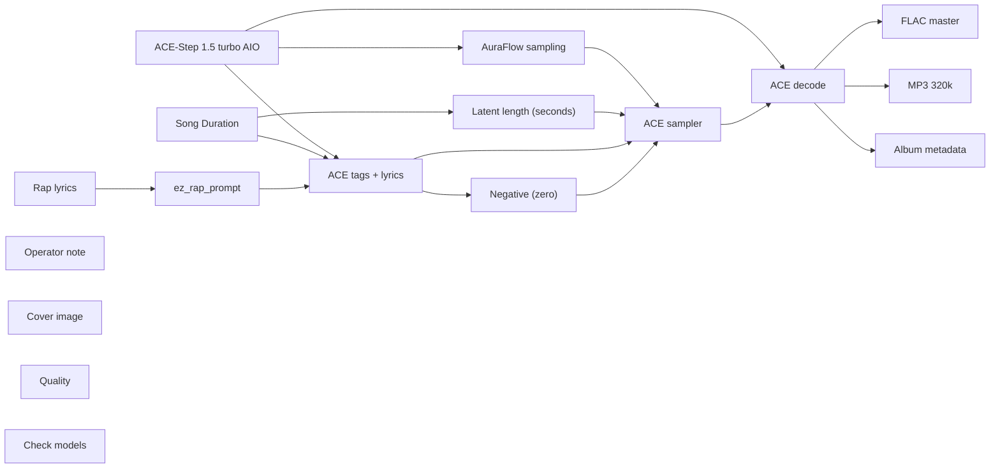

# audio/albums/nill-bye/false-drop

**What's on this page**

- **Every track, cover, and album-pack graph** in this folder
- **Shared ACE-Step topology** (one printer, unique widgets per take)
- **Node parameter reference** for the types on these graphs

**What this enables**

- **Queuing one numbered take** or `album-render`
- **Reading tags, lyrics, seed, BPM** without opening raw JSON

**Who this is for:** studio users after `download-music`. Occupancy **audio** (cover stills are **klein** — separate session).

> Generated from `workflows/_lab/audio/albums/nill-bye/false-drop/`. Do not hand-edit this file.

## Purpose

Numbered takes under `audio/albums/nill-bye/false-drop/`. Queue one track, or `./scripts/manage.sh album-render --album nill-bye/false-drop`.

```text
## 01-false-drop

US-safe rap **72 s diss** take: **false drop**. Fictional MCs **Nill Bye** (science guy) vs **Rake** (in his feels). Native ACE-Step 1.5 turbo AIO. Queue this graph **on its own** — draft-first is the generic lane, not a prerequisite. Occupancy **audio** only; a longer Queue is expected.

1. Weights: `./scripts/manage.sh download-music --tier turbo` (same AIO dest as `download-podcast --tier acestep`; ~10 GB, opt-in, not `download-models`).
2. Prompt enhance is **off** so tags, BPM, language, and `[verse]`/`[chorus]` stay as written. Turn Enhance on only if you want the 4B rewriter.
3. Tags vs lyrics: tags are genre/instrument/vocal hints; lyrics are the bars. Section tags `[verse]` / `[chorus]` / `[spoken word]` are vocal hints operators may add.
4. Original lyrics only. No “in the style of <living artist>”. No living-MC names. No famous-hook paraphrases.
5. ACE-Step vocal is an **invented** identity, not a cloned MC.
6. Sampler: 8 steps, cfg 1, euler, simple. Duration 72 s, bpm 140, language en, timesignature 4, key F minor, form v_half, generate_audio_codes true. Seed 107.
7. Saves: `01 - False Drop` FLAC master + 320 kbps MP3 under `${COMFY_OUTPUT_DIR}`.
8. Cover separately: Queue **stills/thumbnail.json** or **stills/podcast-cover.json**. Do not embed Klein here.
9. Human rewrite the lyrics before any release. Prompts are not authorship (USCO Part 2 / Thaler).
10. Do not co-resident with LTX / Wan / Klein on this Spark.

Beat-only pass: append instrumental, no vocals, and replace lyrics with [inst].

Occupancy: audio — stop Klein / Wan / LTX session. One GB10 job.
```

## Shared graph



## Graphs in this album

| Graph | Nodes | Occupancy |
| --- | --- | --- |
| `audio/albums/nill-bye/false-drop/01-false-drop` | 17 | audio |
| `audio/albums/nill-bye/false-drop/02-velvet-rope` | 17 | audio |
| `audio/albums/nill-bye/false-drop/03-fog-machine` | 17 | audio |
| `audio/albums/nill-bye/false-drop/04-guest-list` | 17 | audio |
| `audio/albums/nill-bye/false-drop/05-sparkler` | 17 | audio |
| `audio/albums/nill-bye/false-drop/06-bottle-service` | 17 | audio |
| `audio/albums/nill-bye/false-drop/07-strobe-claim` | 17 | audio |
| `audio/albums/nill-bye/false-drop/08-amen-rumor` | 17 | audio |
| `audio/albums/nill-bye/false-drop/09-wobble-alibi` | 17 | audio |
| `audio/albums/nill-bye/false-drop/10-supersaw-flex` | 17 | audio |
| `audio/albums/nill-bye/false-drop/11-laser-show` | 17 | audio |
| `audio/albums/nill-bye/false-drop/12-two-step` | 17 | audio |
| `audio/albums/nill-bye/false-drop/13-jersey-bounce` | 17 | audio |
| `audio/albums/nill-bye/false-drop/14-kick-split` | 17 | audio |
| `audio/albums/nill-bye/false-drop/15-uplift-rumor` | 17 | audio |
| `audio/albums/nill-bye/false-drop/album` | 4 | none |
| `audio/albums/nill-bye/false-drop/cover` | 18 | klein |

## `01-false-drop`

Catalog id `audio/albums/nill-bye/false-drop/01-false-drop`.

US-safe rap diss: Nill Bye false-drop roast of Rake, ACE-Step 1.5 turbo AIO, invented vocal
Prompt enhance is **off** so authored text (recipe, script labels, ACE tags, or film shots) is encoded as written. Turn Enhance on only if you want the 4B rewriter.

**ACE-Step 1.5 turbo AIO** (`CheckpointLoaderSimple`)

| Slot | Value |
| --- | --- |
| 0 | `ace_step_1.5_turbo_aio.safetensors` |

**AuraFlow sampling** (`ModelSamplingAuraFlow`)

| Slot | Value |
| --- | --- |
| 0 | `3` |

**Song Duration** (`PrimitiveNode`)

| Slot | Value |
| --- | --- |
| 0 | `72.0` |
| 1 | `fixed` |

**Latent length (seconds)** (`EmptyAceStep1.5LatentAudio`)

| Slot | Value |
| --- | --- |
| 0 | `72.0` |
| 1 | `1` |

**Rap lyrics** (`EZRapLyrics`)

| Slot | Value |
| --- | --- |
| 0 | `custom` |
| 1 | `[verse] Rake rides a riser with no punch Talks a climax that never lands Snare …` |
| 2 | `false` |
| 3 | `audio/albums/nill-bye/false-drop/01-false-drop` |

```text
[verse]
Rake rides a riser with no punch
Talks a climax that never lands
Snare roll climbing, the kick stays mute
That's a tease in a headliner stance
I wait for the drop, you sell the wait
You sell a peak, then you duck the hit
Hats in a panic, the bass won't commit
Dummy cue flashing, the floor won't sit
Nill Bye counts the missing punch
Your whole build is a dummy stunt
Mouth on a riser, the downbeat hides

[chorus]
False drop
You teased a climax
Nill Bye waits on mute
Rake sold a dummy
Build-up mouth, kick never lands
Your peak was a dummy cue

[verse]
You count eight bars like a promise made
Then you ghost when the kick should land
Hats keep rolling, the downbeat sleeps
Dark pad waiting while the promise leaks
I want a punch that can move the floor
You want a riser and a cheaper roar
Dummy peak flashing in a cheap display
The floor is waiting, you fade away
Nill Bye clocks the dummy cue
Rake, your climax never came through
Build-up mouth with a mute debut

[chorus]
False drop
You teased a climax
Nill Bye waits on mute
Rake sold a dummy
Build-up mouth, kick never lands
Your peak was a dummy cue

[inst - pocket snare, hats only]

[verse]
The riser screams like a headline lie
Then it dies when the kick should fly
I came for a drop, you brought a tease
You sold a peak with a dummy lease
Hats still climbing, the bass still hid
That's a climax you never did
False drop king on a borrowed thrill
The downbeat never paid the bill
Nill Bye reading the mute that stays
Rake on a riser that never pays
Tease, then stall, then a cheap goodbye

[chorus - half-time drums]
False drop
You teased a climax
Nill Bye waits on mute
Rake sold a dummy
Build-up mouth, kick never lands
Your peak was a dummy cue

[verse]
Morning comes, the tease looks small
The kick you promised never called
Hats still ticking, the dummy still queued
Riser exhausted, the floor unmoved
Nill Bye files the fake climax
Rake packed a peak in a dummy pack
Build-up mouth, the downbeat ducked
Your whole set was a riser stuck
Put the tease back in the crate
Your false drop cannot carry weight
Mute remains when the riser drains

[chorus - half-time drums]
False drop
You teased a climax
Nill Bye waits on mute
Rake sold a dummy
Build-up mouth, kick never lands
Your peak was a dummy cue

[outro]
riser dies
mute holds
dummy filed
yeah
```

**ez_rap_prompt** (`EZAceStepPromptEnhance`)

| Slot | Value |
| --- | --- |
| 0 | `custom` |
| 1 | `dark trap, 808 bass, rapid hi-hats, half-time, male rap vocals, dry booth, no a…` |
| 2 | `[verse] Rake rides a riser with no punch Talks a climax that never lands Snare …` |
| 3 | `false` |
| 4 | `vocal` |
| 5 | `audio/albums/nill-bye/false-drop/01-false-drop` |

```text
dark trap, 808 bass, rapid hi-hats, half-time, male rap vocals, dry booth, no autotune, 140 bpm
```

```text
[verse]
Rake rides a riser with no punch
Talks a climax that never lands
Snare roll climbing, the kick stays mute
That's a tease in a headliner stance
I wait for the drop, you sell the wait
You sell a peak, then you duck the hit
Hats in a panic, the bass won't commit
Dummy cue flashing, the floor won't sit
Nill Bye counts the missing punch
Your whole build is a dummy stunt
Mouth on a riser, the downbeat hides

[chorus]
False drop
You teased a climax
Nill Bye waits on mute
Rake sold a dummy
Build-up mouth, kick never lands
Your peak was a dummy cue

[verse]
You count eight bars like a promise made
Then you ghost when the kick should land
Hats keep rolling, the downbeat sleeps
Dark pad waiting while the promise leaks
I want a punch that can move the floor
You want a riser and a cheaper roar
Dummy peak flashing in a cheap display
The floor is waiting, you fade away
Nill Bye clocks the dummy cue
Rake, your climax never came through
Build-up mouth with a mute debut

[chorus]
False drop
You teased a climax
Nill Bye waits on mute
Rake sold a dummy
Build-up mouth, kick never lands
Your peak was a dummy cue

[inst - pocket snare, hats only]

[verse]
The riser screams like a headline lie
Then it dies when the kick should fly
I came for a drop, you brought a tease
You sold a peak with a dummy lease
Hats still climbing, the bass still hid
That's a climax you never did
False drop king on a borrowed thrill
The downbeat never paid the bill
Nill Bye reading the mute that stays
Rake on a riser that never pays
Tease, then stall, then a cheap goodbye

[chorus - half-time drums]
False drop
You teased a climax
Nill Bye waits on mute
Rake sold a dummy
Build-up mouth, kick never lands
Your peak was a dummy cue

[verse]
Morning comes, the tease looks small
The kick you promised never called
Hats still ticking, the dummy still queued
Riser exhausted, the floor unmoved
Nill Bye files the fake climax
Rake packed a peak in a dummy pack
Build-up mouth, the downbeat ducked
Your whole set was a riser stuck
Put the tease back in the crate
Your false drop cannot carry weight
Mute remains when the riser drains

[chorus - half-time drums]
False drop
You teased a climax
Nill Bye waits on mute
Rake sold a dummy
Build-up mouth, kick never lands
Your peak was a dummy cue

[outro]
riser dies
mute holds
dummy filed
yeah
```

**ACE tags + lyrics** (`TextEncodeAceStepAudio1.5`)

| Slot | Value |
| --- | --- |
| 0 | `dark trap, 808 bass, rapid hi-hats, half-time, male rap vocals, dry booth, no a…` |
| 1 | `[verse] Rake rides a riser with no punch Talks a climax that never lands Snare …` |
| 2 | `107` |
| 3 | `fixed` |
| 4 | `140` |
| 5 | `72.0` |
| 6 | `4` |
| 7 | `en` |
| 8 | `F minor` |
| 9 | `true` |
| 10 | `2.0` |
| 11 | `0.85` |
| 12 | `0.9` |
| 13 | `0` |
| 14 | `0.0` |

```text
dark trap, 808 bass, rapid hi-hats, half-time, male rap vocals, dry booth, no autotune, 140 bpm
```

```text
[verse]
Rake rides a riser with no punch
Talks a climax that never lands
Snare roll climbing, the kick stays mute
That's a tease in a headliner stance
I wait for the drop, you sell the wait
You sell a peak, then you duck the hit
Hats in a panic, the bass won't commit
Dummy cue flashing, the floor won't sit
Nill Bye counts the missing punch
Your whole build is a dummy stunt
Mouth on a riser, the downbeat hides

[chorus]
False drop
You teased a climax
Nill Bye waits on mute
Rake sold a dummy
Build-up mouth, kick never lands
Your peak was a dummy cue

[verse]
You count eight bars like a promise made
Then you ghost when the kick should land
Hats keep rolling, the downbeat sleeps
Dark pad waiting while the promise leaks
I want a punch that can move the floor
You want a riser and a cheaper roar
Dummy peak flashing in a cheap display
The floor is waiting, you fade away
Nill Bye clocks the dummy cue
Rake, your climax never came through
Build-up mouth with a mute debut

[chorus]
False drop
You teased a climax
Nill Bye waits on mute
Rake sold a dummy
Build-up mouth, kick never lands
Your peak was a dummy cue

[inst - pocket snare, hats only]

[verse]
The riser screams like a headline lie
Then it dies when the kick should fly
I came for a drop, you brought a tease
You sold a peak with a dummy lease
Hats still climbing, the bass still hid
That's a climax you never did
False drop king on a borrowed thrill
The downbeat never paid the bill
Nill Bye reading the mute that stays
Rake on a riser that never pays
Tease, then stall, then a cheap goodbye

[chorus - half-time drums]
False drop
You teased a climax
Nill Bye waits on mute
Rake sold a dummy
Build-up mouth, kick never lands
Your peak was a dummy cue

[verse]
Morning comes, the tease looks small
The kick you promised never called
Hats still ticking, the dummy still queued
Riser exhausted, the floor unmoved
Nill Bye files the fake climax
Rake packed a peak in a dummy pack
Build-up mouth, the downbeat ducked
Your whole set was a riser stuck
Put the tease back in the crate
Your false drop cannot carry weight
Mute remains when the riser drains

[chorus - half-time drums]
False drop
You teased a climax
Nill Bye waits on mute
Rake sold a dummy
Build-up mouth, kick never lands
Your peak was a dummy cue

[outro]
riser dies
mute holds
dummy filed
yeah
```

**ACE sampler** (`KSampler`)

| Slot | Value |
| --- | --- |
| 0 | `107` |
| 1 | `fixed` |
| 2 | `8` |
| 3 | `1.0` |
| 4 | `euler` |
| 5 | `simple` |
| 6 | `1.0` |

**FLAC master** (`SaveAudio`)

| Slot | Value |
| --- | --- |
| 0 | `01 - False Drop` |

**MP3 320k** (`SaveAudioMP3`)

| Slot | Value |
| --- | --- |
| 0 | `01 - False Drop` |
| 1 | `320k` |

**Cover image** (`LoadImage`)

| Slot | Value |
| --- | --- |
| 0 | `cover.png` |
| 1 | `image` |

**Album metadata** (`EZAudioMetadata`)

| Slot | Value |
| --- | --- |
| 0 | `Nill Bye` |
| 1 | `False Drop` |
| 2 | `False Drop` |
| 3 | `1` |
| 4 | `15` |
| 5 | `2026` |
| 6 | `skip` |
| 7 | `01 - False Drop` |

**Quality** (`EZQuality`)

| Slot | Value |
| --- | --- |
| 0 | `lab` |

**Check models** (`EZModelCheck`)

| Slot | Value |
| --- | --- |
| 0 | `Click Check models. Queue does not run this node.` |

## `02-velvet-rope`

Catalog id `audio/albums/nill-bye/false-drop/02-velvet-rope`.

US-safe rap diss: Nill Bye velvet-rope roast of Rake, ACE-Step 1.5 turbo AIO, invented vocal
Prompt enhance is **off** so authored text (recipe, script labels, ACE tags, or film shots) is encoded as written. Turn Enhance on only if you want the 4B rewriter.

**ACE-Step 1.5 turbo AIO** (`CheckpointLoaderSimple`)

| Slot | Value |
| --- | --- |
| 0 | `ace_step_1.5_turbo_aio.safetensors` |

**AuraFlow sampling** (`ModelSamplingAuraFlow`)

| Slot | Value |
| --- | --- |
| 0 | `3` |

**Song Duration** (`PrimitiveNode`)

| Slot | Value |
| --- | --- |
| 0 | `120.0` |
| 1 | `fixed` |

**Latent length (seconds)** (`EmptyAceStep1.5LatentAudio`)

| Slot | Value |
| --- | --- |
| 0 | `120.0` |
| 1 | `1` |

**Rap lyrics** (`EZRapLyrics`)

| Slot | Value |
| --- | --- |
| 0 | `custom` |
| 1 | `[intro] stanchion up list blank wristband fake [verse] Rake leans on velvet lik…` |
| 2 | `false` |
| 3 | `audio/albums/nill-bye/false-drop/02-velvet-rope` |

```text
[intro]
stanchion up
list blank
wristband fake

[verse]
Rake leans on velvet like a borrowed stanchion
Name not written, he still wants the zone
Stanchion up, the clipboard stares
Your VIP is a vacant chair
I hold the list, you hold a pose
Wristband missing, the bouncer knows
Camera ready, the queue is none
That's a king with a lanyard undone
Nill Bye reading a blank-name card
Your whole guest is a velvet shard
Pose for a rope that will not part

[chorus]
Velvet rope
Blank name on the rail
Nill Bye holds the list
Rake poses VIP
Empty queue, clipboard dry
No stamp, no entry

[verse]
You sell a lanyard like a bloodline pass
Then you fold when they check the glass
Festival bass, the rope stays shut
Your whole cool is a borrowed strut
I stamp the real, you stamp a ghost
The velvet knows who paid the most
Bring a name or don't join the line
The rope is short and the list is mine
Nill Bye keeps the clipboard tight
Rake posing VIP with no invite
Empty chair humming under the lights
Your whole flex is a velvet slight

[chorus]
Velvet rope
Blank name on the rail
Nill Bye holds the list
Rake poses VIP
Empty queue, clipboard dry
No stamp, no entry

[inst - pocket snare, hats only]

[verse]
You treat the rope like a personality
Then you crash when they ask for ID
I clock the stanchion, I clock the queue
I clock a brand that never came through
Empty list humming under the bass
That's a VIP with a vacant face
Nill Bye filing the blank-name slot
Rake looping a pose the door forgot
Keep the pose, lose the velvet
The list don't owe you a credit
Wristband missing, the bouncer shrugs
Your soundtrack snapped on a velvet tug

[verse]
You print a lanyard off a printer
Then you ask the rope to be nicer
Festival lights on an empty rail
Pose for a camera that will not hail
I keep the clipboard, you keep the skit
You name a hit that the door won't admit
Nill Bye shutting the empty slot
Rake wants a throne for a name he dropped
Put the lanyard back on the tray
The rope don't score a vacant play

[bridge]
Stanchion stays, the file is closed
Your soundtrack snapped on a velvet close

[chorus]
Velvet rope
Blank name on the rail
Nill Bye holds the list
Rake poses VIP
Empty queue, clipboard dry
No stamp, no entry

[outro]
stanchion stays
bouncer shrugs
cut
yeah
```

**ez_rap_prompt** (`EZAceStepPromptEnhance`)

| Slot | Value |
| --- | --- |
| 0 | `custom` |
| 1 | `festival trap, 808 bass, crowd-bed, supersaw stab, male rap vocals, dry booth, …` |
| 2 | `[intro] stanchion up list blank wristband fake [verse] Rake leans on velvet lik…` |
| 3 | `false` |
| 4 | `vocal` |
| 5 | `audio/albums/nill-bye/false-drop/02-velvet-rope` |

```text
festival trap, 808 bass, crowd-bed, supersaw stab, male rap vocals, dry booth, no autotune, 150 bpm
```

```text
[intro]
stanchion up
list blank
wristband fake

[verse]
Rake leans on velvet like a borrowed stanchion
Name not written, he still wants the zone
Stanchion up, the clipboard stares
Your VIP is a vacant chair
I hold the list, you hold a pose
Wristband missing, the bouncer knows
Camera ready, the queue is none
That's a king with a lanyard undone
Nill Bye reading a blank-name card
Your whole guest is a velvet shard
Pose for a rope that will not part

[chorus]
Velvet rope
Blank name on the rail
Nill Bye holds the list
Rake poses VIP
Empty queue, clipboard dry
No stamp, no entry

[verse]
You sell a lanyard like a bloodline pass
Then you fold when they check the glass
Festival bass, the rope stays shut
Your whole cool is a borrowed strut
I stamp the real, you stamp a ghost
The velvet knows who paid the most
Bring a name or don't join the line
The rope is short and the list is mine
Nill Bye keeps the clipboard tight
Rake posing VIP with no invite
Empty chair humming under the lights
Your whole flex is a velvet slight

[chorus]
Velvet rope
Blank name on the rail
Nill Bye holds the list
Rake poses VIP
Empty queue, clipboard dry
No stamp, no entry

[inst - pocket snare, hats only]

[verse]
You treat the rope like a personality
Then you crash when they ask for ID
I clock the stanchion, I clock the queue
I clock a brand that never came through
Empty list humming under the bass
That's a VIP with a vacant face
Nill Bye filing the blank-name slot
Rake looping a pose the door forgot
Keep the pose, lose the velvet
The list don't owe you a credit
Wristband missing, the bouncer shrugs
Your soundtrack snapped on a velvet tug

[verse]
You print a lanyard off a printer
Then you ask the rope to be nicer
Festival lights on an empty rail
Pose for a camera that will not hail
I keep the clipboard, you keep the skit
You name a hit that the door won't admit
Nill Bye shutting the empty slot
Rake wants a throne for a name he dropped
Put the lanyard back on the tray
The rope don't score a vacant play

[bridge]
Stanchion stays, the file is closed
Your soundtrack snapped on a velvet close

[chorus]
Velvet rope
Blank name on the rail
Nill Bye holds the list
Rake poses VIP
Empty queue, clipboard dry
No stamp, no entry

[outro]
stanchion stays
bouncer shrugs
cut
yeah
```

**ACE tags + lyrics** (`TextEncodeAceStepAudio1.5`)

| Slot | Value |
| --- | --- |
| 0 | `festival trap, 808 bass, crowd-bed, supersaw stab, male rap vocals, dry booth, …` |
| 1 | `[intro] stanchion up list blank wristband fake [verse] Rake leans on velvet lik…` |
| 2 | `109` |
| 3 | `fixed` |
| 4 | `150` |
| 5 | `120.0` |
| 6 | `4` |
| 7 | `en` |
| 8 | `C minor` |
| 9 | `true` |
| 10 | `2.0` |
| 11 | `0.85` |
| 12 | `0.9` |
| 13 | `0` |
| 14 | `0.0` |

```text
festival trap, 808 bass, crowd-bed, supersaw stab, male rap vocals, dry booth, no autotune, 150 bpm
```

```text
[intro]
stanchion up
list blank
wristband fake

[verse]
Rake leans on velvet like a borrowed stanchion
Name not written, he still wants the zone
Stanchion up, the clipboard stares
Your VIP is a vacant chair
I hold the list, you hold a pose
Wristband missing, the bouncer knows
Camera ready, the queue is none
That's a king with a lanyard undone
Nill Bye reading a blank-name card
Your whole guest is a velvet shard
Pose for a rope that will not part

[chorus]
Velvet rope
Blank name on the rail
Nill Bye holds the list
Rake poses VIP
Empty queue, clipboard dry
No stamp, no entry

[verse]
You sell a lanyard like a bloodline pass
Then you fold when they check the glass
Festival bass, the rope stays shut
Your whole cool is a borrowed strut
I stamp the real, you stamp a ghost
The velvet knows who paid the most
Bring a name or don't join the line
The rope is short and the list is mine
Nill Bye keeps the clipboard tight
Rake posing VIP with no invite
Empty chair humming under the lights
Your whole flex is a velvet slight

[chorus]
Velvet rope
Blank name on the rail
Nill Bye holds the list
Rake poses VIP
Empty queue, clipboard dry
No stamp, no entry

[inst - pocket snare, hats only]

[verse]
You treat the rope like a personality
Then you crash when they ask for ID
I clock the stanchion, I clock the queue
I clock a brand that never came through
Empty list humming under the bass
That's a VIP with a vacant face
Nill Bye filing the blank-name slot
Rake looping a pose the door forgot
Keep the pose, lose the velvet
The list don't owe you a credit
Wristband missing, the bouncer shrugs
Your soundtrack snapped on a velvet tug

[verse]
You print a lanyard off a printer
Then you ask the rope to be nicer
Festival lights on an empty rail
Pose for a camera that will not hail
I keep the clipboard, you keep the skit
You name a hit that the door won't admit
Nill Bye shutting the empty slot
Rake wants a throne for a name he dropped
Put the lanyard back on the tray
The rope don't score a vacant play

[bridge]
Stanchion stays, the file is closed
Your soundtrack snapped on a velvet close

[chorus]
Velvet rope
Blank name on the rail
Nill Bye holds the list
Rake poses VIP
Empty queue, clipboard dry
No stamp, no entry

[outro]
stanchion stays
bouncer shrugs
cut
yeah
```

**ACE sampler** (`KSampler`)

| Slot | Value |
| --- | --- |
| 0 | `109` |
| 1 | `fixed` |
| 2 | `8` |
| 3 | `1.0` |
| 4 | `euler` |
| 5 | `simple` |
| 6 | `1.0` |

**FLAC master** (`SaveAudio`)

| Slot | Value |
| --- | --- |
| 0 | `02 - Velvet Rope` |

**MP3 320k** (`SaveAudioMP3`)

| Slot | Value |
| --- | --- |
| 0 | `02 - Velvet Rope` |
| 1 | `320k` |

**Cover image** (`LoadImage`)

| Slot | Value |
| --- | --- |
| 0 | `cover.png` |
| 1 | `image` |

**Album metadata** (`EZAudioMetadata`)

| Slot | Value |
| --- | --- |
| 0 | `Nill Bye` |
| 1 | `False Drop` |
| 2 | `Velvet Rope` |
| 3 | `2` |
| 4 | `15` |
| 5 | `2026` |
| 6 | `skip` |
| 7 | `02 - Velvet Rope` |

**Quality** (`EZQuality`)

| Slot | Value |
| --- | --- |
| 0 | `lab` |

**Check models** (`EZModelCheck`)

| Slot | Value |
| --- | --- |
| 0 | `Click Check models. Queue does not run this node.` |

## `03-fog-machine`

Catalog id `audio/albums/nill-bye/false-drop/03-fog-machine`.

US-safe rap diss: Nill Bye fog-machine roast of Rake, ACE-Step 1.5 turbo AIO, invented vocal
Prompt enhance is **off** so authored text (recipe, script labels, ACE tags, or film shots) is encoded as written. Turn Enhance on only if you want the 4B rewriter.

**ACE-Step 1.5 turbo AIO** (`CheckpointLoaderSimple`)

| Slot | Value |
| --- | --- |
| 0 | `ace_step_1.5_turbo_aio.safetensors` |

**AuraFlow sampling** (`ModelSamplingAuraFlow`)

| Slot | Value |
| --- | --- |
| 0 | `3` |

**Song Duration** (`PrimitiveNode`)

| Slot | Value |
| --- | --- |
| 0 | `175.0` |
| 1 | `fixed` |

**Latent length (seconds)** (`EmptyAceStep1.5LatentAudio`)

| Slot | Value |
| --- | --- |
| 0 | `175.0` |
| 1 | `1` |

**Rap lyrics** (`EZRapLyrics`)

| Slot | Value |
| --- | --- |
| 0 | `custom` |
| 1 | `[verse] Rake hits the jet like a headline act Talks a set that the stage subtra…` |
| 2 | `false` |
| 3 | `audio/albums/nill-bye/false-drop/03-fog-machine` |

```text
[verse]
Rake hits the jet like a headline act
Talks a set that the stage subtracts
Laser hats cut a missing band
I count the jets, you count the cheers
I map the haze, you map the mirrors
Fog for a missing opening act
Distorted bass on an empty track
Nill Bye staring through a rented plume
You smiling through a highlight fume
Show the set or leave the floor
Haze covering a missing encore

[verse]
You treat the haze like a body double
Then you vanish when the jet is trouble
I count the canisters, you count the stares
Hold the nozzle, don't sell the plume
Your cool is vapor, mine is a tune
Talk a set like a rented reel
Then you crash out when the jet gets real
Nill Bye clocking what the haze keeps in
Rake with a name-tag spin
Show the body or kill the jet
The jet is cheap and the haze falls flat

[verse]
You sell the haze like a limited drop
Then you fold when the playlist pops
I clock the jet, I clock the pose
I clock a brand in borrowed clothes
Nill Bye reading a missing-set log
Rake looping a jet like a catalog
Set is due, the merch is not
You wrapped a skip in a foggy shot
Keep the jet, lose the alibi
Hats stay put, the boast walks
Haze for a show that never starts

[verse]
You write the set like a product sheet
Then you ask the jet for relief
I hold the nozzle, you hold the bit
I name the haze, you name the hit
Rage hats on a high-key play
Nill Bye mad at the costume jet
Rake at the end of a rented set
You want a throne for a rented pain
Put the canister back on the tray
The jet don't score a vacant play
Jet cuts out, the file is closed
Your soundtrack snapped on a haze close

[pre-chorus]
Fog machine
The stage is missing

[chorus]
Fog machine
The stage is missing
Nill Bye reads the haze
Rake hides in the jet
Fog for a missing set
Haze is your alibi

[outro]
jet off
haze clears
stage denied
yeah
```

**ez_rap_prompt** (`EZAceStepPromptEnhance`)

| Slot | Value |
| --- | --- |
| 0 | `custom` |
| 1 | `rage, distorted 808, laser hats, male rap vocals, dry booth, no autotune, 148 b…` |
| 2 | `[verse] Rake hits the jet like a headline act Talks a set that the stage subtra…` |
| 3 | `false` |
| 4 | `vocal` |
| 5 | `audio/albums/nill-bye/false-drop/03-fog-machine` |

```text
rage, distorted 808, laser hats, male rap vocals, dry booth, no autotune, 148 bpm
```

```text
[verse]
Rake hits the jet like a headline act
Talks a set that the stage subtracts
Laser hats cut a missing band
I count the jets, you count the cheers
I map the haze, you map the mirrors
Fog for a missing opening act
Distorted bass on an empty track
Nill Bye staring through a rented plume
You smiling through a highlight fume
Show the set or leave the floor
Haze covering a missing encore

[verse]
You treat the haze like a body double
Then you vanish when the jet is trouble
I count the canisters, you count the stares
Hold the nozzle, don't sell the plume
Your cool is vapor, mine is a tune
Talk a set like a rented reel
Then you crash out when the jet gets real
Nill Bye clocking what the haze keeps in
Rake with a name-tag spin
Show the body or kill the jet
The jet is cheap and the haze falls flat

[verse]
You sell the haze like a limited drop
Then you fold when the playlist pops
I clock the jet, I clock the pose
I clock a brand in borrowed clothes
Nill Bye reading a missing-set log
Rake looping a jet like a catalog
Set is due, the merch is not
You wrapped a skip in a foggy shot
Keep the jet, lose the alibi
Hats stay put, the boast walks
Haze for a show that never starts

[verse]
You write the set like a product sheet
Then you ask the jet for relief
I hold the nozzle, you hold the bit
I name the haze, you name the hit
Rage hats on a high-key play
Nill Bye mad at the costume jet
Rake at the end of a rented set
You want a throne for a rented pain
Put the canister back on the tray
The jet don't score a vacant play
Jet cuts out, the file is closed
Your soundtrack snapped on a haze close

[pre-chorus]
Fog machine
The stage is missing

[chorus]
Fog machine
The stage is missing
Nill Bye reads the haze
Rake hides in the jet
Fog for a missing set
Haze is your alibi

[outro]
jet off
haze clears
stage denied
yeah
```

**ACE tags + lyrics** (`TextEncodeAceStepAudio1.5`)

| Slot | Value |
| --- | --- |
| 0 | `rage, distorted 808, laser hats, male rap vocals, dry booth, no autotune, 148 b…` |
| 1 | `[verse] Rake hits the jet like a headline act Talks a set that the stage subtra…` |
| 2 | `113` |
| 3 | `fixed` |
| 4 | `148` |
| 5 | `175.0` |
| 6 | `4` |
| 7 | `en` |
| 8 | `F# minor` |
| 9 | `true` |
| 10 | `2.0` |
| 11 | `0.85` |
| 12 | `0.9` |
| 13 | `0` |
| 14 | `0.0` |

```text
rage, distorted 808, laser hats, male rap vocals, dry booth, no autotune, 148 bpm
```

```text
[verse]
Rake hits the jet like a headline act
Talks a set that the stage subtracts
Laser hats cut a missing band
I count the jets, you count the cheers
I map the haze, you map the mirrors
Fog for a missing opening act
Distorted bass on an empty track
Nill Bye staring through a rented plume
You smiling through a highlight fume
Show the set or leave the floor
Haze covering a missing encore

[verse]
You treat the haze like a body double
Then you vanish when the jet is trouble
I count the canisters, you count the stares
Hold the nozzle, don't sell the plume
Your cool is vapor, mine is a tune
Talk a set like a rented reel
Then you crash out when the jet gets real
Nill Bye clocking what the haze keeps in
Rake with a name-tag spin
Show the body or kill the jet
The jet is cheap and the haze falls flat

[verse]
You sell the haze like a limited drop
Then you fold when the playlist pops
I clock the jet, I clock the pose
I clock a brand in borrowed clothes
Nill Bye reading a missing-set log
Rake looping a jet like a catalog
Set is due, the merch is not
You wrapped a skip in a foggy shot
Keep the jet, lose the alibi
Hats stay put, the boast walks
Haze for a show that never starts

[verse]
You write the set like a product sheet
Then you ask the jet for relief
I hold the nozzle, you hold the bit
I name the haze, you name the hit
Rage hats on a high-key play
Nill Bye mad at the costume jet
Rake at the end of a rented set
You want a throne for a rented pain
Put the canister back on the tray
The jet don't score a vacant play
Jet cuts out, the file is closed
Your soundtrack snapped on a haze close

[pre-chorus]
Fog machine
The stage is missing

[chorus]
Fog machine
The stage is missing
Nill Bye reads the haze
Rake hides in the jet
Fog for a missing set
Haze is your alibi

[outro]
jet off
haze clears
stage denied
yeah
```

**ACE sampler** (`KSampler`)

| Slot | Value |
| --- | --- |
| 0 | `113` |
| 1 | `fixed` |
| 2 | `8` |
| 3 | `1.0` |
| 4 | `euler` |
| 5 | `simple` |
| 6 | `1.0` |

**FLAC master** (`SaveAudio`)

| Slot | Value |
| --- | --- |
| 0 | `03 - Fog Machine` |

**MP3 320k** (`SaveAudioMP3`)

| Slot | Value |
| --- | --- |
| 0 | `03 - Fog Machine` |
| 1 | `320k` |

**Cover image** (`LoadImage`)

| Slot | Value |
| --- | --- |
| 0 | `cover.png` |
| 1 | `image` |

**Album metadata** (`EZAudioMetadata`)

| Slot | Value |
| --- | --- |
| 0 | `Nill Bye` |
| 1 | `False Drop` |
| 2 | `Fog Machine` |
| 3 | `3` |
| 4 | `15` |
| 5 | `2026` |
| 6 | `skip` |
| 7 | `03 - Fog Machine` |

**Quality** (`EZQuality`)

| Slot | Value |
| --- | --- |
| 0 | `lab` |

**Check models** (`EZModelCheck`)

| Slot | Value |
| --- | --- |
| 0 | `Click Check models. Queue does not run this node.` |

## `04-guest-list`

Catalog id `audio/albums/nill-bye/false-drop/04-guest-list`.

US-safe rap diss: Nill Bye guest-list roast of Rake, ACE-Step 1.5 turbo AIO, invented vocal
Prompt enhance is **off** so authored text (recipe, script labels, ACE tags, or film shots) is encoded as written. Turn Enhance on only if you want the 4B rewriter.

**ACE-Step 1.5 turbo AIO** (`CheckpointLoaderSimple`)

| Slot | Value |
| --- | --- |
| 0 | `ace_step_1.5_turbo_aio.safetensors` |

**AuraFlow sampling** (`ModelSamplingAuraFlow`)

| Slot | Value |
| --- | --- |
| 0 | `3` |

**Song Duration** (`PrimitiveNode`)

| Slot | Value |
| --- | --- |
| 0 | `80.0` |
| 1 | `fixed` |

**Latent length (seconds)** (`EmptyAceStep1.5LatentAudio`)

| Slot | Value |
| --- | --- |
| 0 | `80.0` |
| 1 | `1` |

**Rap lyrics** (`EZRapLyrics`)

| Slot | Value |
| --- | --- |
| 0 | `custom` |
| 1 | `[verse] Rake taps the cowbell like a password No name inked, just a leftover I …` |
| 2 | `false` |
| 3 | `audio/albums/nill-bye/false-drop/04-guest-list` |

```text
[verse]
Rake taps the cowbell like a password
No name inked, just a leftover
I ask the door, you send a spin
I ask the clipboard, you dodge the pen
Crunchy sample on a missing sign
Drifted bass on a nameless vine
Nill Bye marking a nameless slot
Bring the pass or lose the knot
Cowbell ticks, the door stays locked
Talk that life with an empty badge
Phonk hush when the bouncer bags it

[chorus]
Guest list closed
You are not on it
Nill Bye checks the door
Rake argues the mark
Clipboard miss, no pass
Name never made the ink

[verse]
You name a plus-one like a golden ticket
That's a sticker, not a permit
You name a booth like a lifetime pin
That's a vibe with a paper skin
Cowbell tick, dry booth, no gloss
I hold the ink, you hold a rumor
Nill Bye stamping at the door
Rake rides a ghost pass at the door
Write the surname, drop the clipboard
No surname, no corner
Phonk truth, the stack is light
Your plus-one never made it back

[chorus]
Guest list closed
You are not on it
Nill Bye checks the door
Rake argues the mark
Clipboard miss, no pass
Name never made the ink

[verse]
Cowbell cracking on an empty rail
You drew a king with marker art
The bouncer squints at a smudged ID
You swear the manager blessed the three
Nill Bye talking from the doorway
Rake keeps folding when the ink goes slack
Name is filed, the pass is gone
Lights stay on, the name is wrong
Clipboard flipping, your slot was never
The door don't owe you a forever
Blank field where the surname sits
That's a boast with no visits

[chorus]
Guest list closed
You are not on it
Nill Bye checks the door
Rake argues the mark
Clipboard miss, no pass
Name never made the ink

[verse]
Rake at the blank-name rail
Nill Bye posting the door law
No plus-one, no afterparty
Just a selfie and a borrowed cheer
Entry missing, it did not persist
Cut the lore, keep the name on the list
Door closed, that is the quote
The bouncer stands, the thread is smoke
He still leaking through a broken joke
Blank name filed, the cowbell dries

[chorus]
Guest list closed
You are not on it
Nill Bye checks the door
Rake argues the mark
Clipboard miss, no pass
Name never made the ink

[bridge]
Show the pass or step aside
Phonk hush, the rumor died

[chorus]
Guest list closed
You are not on it
Nill Bye checks the door
Rake argues the mark
Clipboard miss, no pass
Name never made the ink

[outro]
clipboard shut
door locked
cut
yeah
```

**ez_rap_prompt** (`EZAceStepPromptEnhance`)

| Slot | Value |
| --- | --- |
| 0 | `custom` |
| 1 | `phonk, cowbell, drifted 808, crunchy sample, male rap vocals, dry booth, no aut…` |
| 2 | `[verse] Rake taps the cowbell like a password No name inked, just a leftover I …` |
| 3 | `false` |
| 4 | `vocal` |
| 5 | `audio/albums/nill-bye/false-drop/04-guest-list` |

```text
phonk, cowbell, drifted 808, crunchy sample, male rap vocals, dry booth, no autotune, 132 bpm
```

```text
[verse]
Rake taps the cowbell like a password
No name inked, just a leftover
I ask the door, you send a spin
I ask the clipboard, you dodge the pen
Crunchy sample on a missing sign
Drifted bass on a nameless vine
Nill Bye marking a nameless slot
Bring the pass or lose the knot
Cowbell ticks, the door stays locked
Talk that life with an empty badge
Phonk hush when the bouncer bags it

[chorus]
Guest list closed
You are not on it
Nill Bye checks the door
Rake argues the mark
Clipboard miss, no pass
Name never made the ink

[verse]
You name a plus-one like a golden ticket
That's a sticker, not a permit
You name a booth like a lifetime pin
That's a vibe with a paper skin
Cowbell tick, dry booth, no gloss
I hold the ink, you hold a rumor
Nill Bye stamping at the door
Rake rides a ghost pass at the door
Write the surname, drop the clipboard
No surname, no corner
Phonk truth, the stack is light
Your plus-one never made it back

[chorus]
Guest list closed
You are not on it
Nill Bye checks the door
Rake argues the mark
Clipboard miss, no pass
Name never made the ink

[verse]
Cowbell cracking on an empty rail
You drew a king with marker art
The bouncer squints at a smudged ID
You swear the manager blessed the three
Nill Bye talking from the doorway
Rake keeps folding when the ink goes slack
Name is filed, the pass is gone
Lights stay on, the name is wrong
Clipboard flipping, your slot was never
The door don't owe you a forever
Blank field where the surname sits
That's a boast with no visits

[chorus]
Guest list closed
You are not on it
Nill Bye checks the door
Rake argues the mark
Clipboard miss, no pass
Name never made the ink

[verse]
Rake at the blank-name rail
Nill Bye posting the door law
No plus-one, no afterparty
Just a selfie and a borrowed cheer
Entry missing, it did not persist
Cut the lore, keep the name on the list
Door closed, that is the quote
The bouncer stands, the thread is smoke
He still leaking through a broken joke
Blank name filed, the cowbell dries

[chorus]
Guest list closed
You are not on it
Nill Bye checks the door
Rake argues the mark
Clipboard miss, no pass
Name never made the ink

[bridge]
Show the pass or step aside
Phonk hush, the rumor died

[chorus]
Guest list closed
You are not on it
Nill Bye checks the door
Rake argues the mark
Clipboard miss, no pass
Name never made the ink

[outro]
clipboard shut
door locked
cut
yeah
```

**ACE tags + lyrics** (`TextEncodeAceStepAudio1.5`)

| Slot | Value |
| --- | --- |
| 0 | `phonk, cowbell, drifted 808, crunchy sample, male rap vocals, dry booth, no aut…` |
| 1 | `[verse] Rake taps the cowbell like a password No name inked, just a leftover I …` |
| 2 | `127` |
| 3 | `fixed` |
| 4 | `132` |
| 5 | `80.0` |
| 6 | `4` |
| 7 | `en` |
| 8 | `A minor` |
| 9 | `true` |
| 10 | `2.0` |
| 11 | `0.85` |
| 12 | `0.9` |
| 13 | `0` |
| 14 | `0.0` |

```text
phonk, cowbell, drifted 808, crunchy sample, male rap vocals, dry booth, no autotune, 132 bpm
```

```text
[verse]
Rake taps the cowbell like a password
No name inked, just a leftover
I ask the door, you send a spin
I ask the clipboard, you dodge the pen
Crunchy sample on a missing sign
Drifted bass on a nameless vine
Nill Bye marking a nameless slot
Bring the pass or lose the knot
Cowbell ticks, the door stays locked
Talk that life with an empty badge
Phonk hush when the bouncer bags it

[chorus]
Guest list closed
You are not on it
Nill Bye checks the door
Rake argues the mark
Clipboard miss, no pass
Name never made the ink

[verse]
You name a plus-one like a golden ticket
That's a sticker, not a permit
You name a booth like a lifetime pin
That's a vibe with a paper skin
Cowbell tick, dry booth, no gloss
I hold the ink, you hold a rumor
Nill Bye stamping at the door
Rake rides a ghost pass at the door
Write the surname, drop the clipboard
No surname, no corner
Phonk truth, the stack is light
Your plus-one never made it back

[chorus]
Guest list closed
You are not on it
Nill Bye checks the door
Rake argues the mark
Clipboard miss, no pass
Name never made the ink

[verse]
Cowbell cracking on an empty rail
You drew a king with marker art
The bouncer squints at a smudged ID
You swear the manager blessed the three
Nill Bye talking from the doorway
Rake keeps folding when the ink goes slack
Name is filed, the pass is gone
Lights stay on, the name is wrong
Clipboard flipping, your slot was never
The door don't owe you a forever
Blank field where the surname sits
That's a boast with no visits

[chorus]
Guest list closed
You are not on it
Nill Bye checks the door
Rake argues the mark
Clipboard miss, no pass
Name never made the ink

[verse]
Rake at the blank-name rail
Nill Bye posting the door law
No plus-one, no afterparty
Just a selfie and a borrowed cheer
Entry missing, it did not persist
Cut the lore, keep the name on the list
Door closed, that is the quote
The bouncer stands, the thread is smoke
He still leaking through a broken joke
Blank name filed, the cowbell dries

[chorus]
Guest list closed
You are not on it
Nill Bye checks the door
Rake argues the mark
Clipboard miss, no pass
Name never made the ink

[bridge]
Show the pass or step aside
Phonk hush, the rumor died

[chorus]
Guest list closed
You are not on it
Nill Bye checks the door
Rake argues the mark
Clipboard miss, no pass
Name never made the ink

[outro]
clipboard shut
door locked
cut
yeah
```

**ACE sampler** (`KSampler`)

| Slot | Value |
| --- | --- |
| 0 | `127` |
| 1 | `fixed` |
| 2 | `8` |
| 3 | `1.0` |
| 4 | `euler` |
| 5 | `simple` |
| 6 | `1.0` |

**FLAC master** (`SaveAudio`)

| Slot | Value |
| --- | --- |
| 0 | `04 - Guest List` |

**MP3 320k** (`SaveAudioMP3`)

| Slot | Value |
| --- | --- |
| 0 | `04 - Guest List` |
| 1 | `320k` |

**Cover image** (`LoadImage`)

| Slot | Value |
| --- | --- |
| 0 | `cover.png` |
| 1 | `image` |

**Album metadata** (`EZAudioMetadata`)

| Slot | Value |
| --- | --- |
| 0 | `Nill Bye` |
| 1 | `False Drop` |
| 2 | `Guest List` |
| 3 | `4` |
| 4 | `15` |
| 5 | `2026` |
| 6 | `skip` |
| 7 | `04 - Guest List` |

**Quality** (`EZQuality`)

| Slot | Value |
| --- | --- |
| 0 | `lab` |

**Check models** (`EZModelCheck`)

| Slot | Value |
| --- | --- |
| 0 | `Click Check models. Queue does not run this node.` |

## `05-sparkler`

Catalog id `audio/albums/nill-bye/false-drop/05-sparkler`.

US-safe rap diss: Nill Bye sparkler roast of Rake, ACE-Step 1.5 turbo AIO, invented vocal
Prompt enhance is **off** so authored text (recipe, script labels, ACE tags, or film shots) is encoded as written. Turn Enhance on only if you want the 4B rewriter.

**ACE-Step 1.5 turbo AIO** (`CheckpointLoaderSimple`)

| Slot | Value |
| --- | --- |
| 0 | `ace_step_1.5_turbo_aio.safetensors` |

**AuraFlow sampling** (`ModelSamplingAuraFlow`)

| Slot | Value |
| --- | --- |
| 0 | `3` |

**Song Duration** (`PrimitiveNode`)

| Slot | Value |
| --- | --- |
| 0 | `132.0` |
| 1 | `fixed` |

**Latent length (seconds)** (`EmptyAceStep1.5LatentAudio`)

| Slot | Value |
| --- | --- |
| 0 | `132.0` |
| 1 | `1` |

**Rap lyrics** (`EZRapLyrics`)

| Slot | Value |
| --- | --- |
| 0 | `custom` |
| 1 | `[intro] stick lit pretty burn yield zero [verse] Rake lights a stick like a bre…` |
| 2 | `false` |
| 3 | `audio/albums/nill-bye/false-drop/05-sparkler` |

```text
[intro]
stick lit
pretty burn
yield zero

[verse]
Rake lights a stick like a breakthrough
Talks a reaction he never knew
Sparks climb pretty, the yield stays zero
That's a party trick in a tourist hero
I want a product, you want a fizz
You want a photo of a pretty hiss
Wire burning, nothing in the pan
Ash on the table, that was the plan
Nill Bye weighing a dead sparkler
Your whole reaction is a tourist dollar
Pretty burn, then the stick goes dull

[verse]
You name a spark like a published find
Then you fold when I ask the yield behind
Hats keep ticking, the stick keeps wasting
Dark pads waiting while the ash is tasting
I want a gram that can hit a scale
You want a glitter that can fill a tale
Sparkler king on a wire diet
No compound, just a camera riot
Nill Bye bagging the pretty waste
Rake calling fireworks a dataset
Burn looks busy, the pan stays clean

[chorus]
Sparkler science
Pretty burn, no yield
Nill Bye wants a reaction
Rake sold a stick
Sparks are not a product
Ash is all you built

[verse]
Sparks jump left, then they jump right
Still no product in the morning light
I clock the wire, I clock the ash
I clock a flex with a tourist splash
Nill Bye filing a zero-yield blotter
Rake still selling a backyard starter
Pretty hiss dressed as a breakthrough
The stick burned out, and so did you
Hold the sparkler or drop the claim
Your reaction never left the frame
Ash in a pile, the boast looks tiny

[chorus]
Sparkler science
Pretty burn, no yield
Nill Bye wants a reaction
Rake sold a stick
Sparks are not a product
Ash is all you built

[verse]
Morning hits, the wire is cold
Glitter gone, the story sold
Hats go quiet, the stick gets binned
No yield logged, the boast was skinned
Nill Bye tagging a tourist burn
Rake still calling it a return
Sparkler king with a rented fizz
The product never paid the biz
File the ash, keep the stick
Pretty chemistry is a party trick
Wire dead, the pan stays even

[chorus]
Sparkler science
Pretty burn, no yield
Nill Bye wants a reaction
Rake sold a stick
Sparks are not a product
Ash is all you built

[outro]
stick dead
ash cools
yield none
yeah
```

**ez_rap_prompt** (`EZAceStepPromptEnhance`)

| Slot | Value |
| --- | --- |
| 0 | `custom` |
| 1 | `trap, 808 bass, rapid hats, dark pads, male rap vocals, dry booth, no autotune,…` |
| 2 | `[intro] stick lit pretty burn yield zero [verse] Rake lights a stick like a bre…` |
| 3 | `false` |
| 4 | `vocal` |
| 5 | `audio/albums/nill-bye/false-drop/05-sparkler` |

```text
trap, 808 bass, rapid hats, dark pads, male rap vocals, dry booth, no autotune, 145 bpm
```

```text
[intro]
stick lit
pretty burn
yield zero

[verse]
Rake lights a stick like a breakthrough
Talks a reaction he never knew
Sparks climb pretty, the yield stays zero
That's a party trick in a tourist hero
I want a product, you want a fizz
You want a photo of a pretty hiss
Wire burning, nothing in the pan
Ash on the table, that was the plan
Nill Bye weighing a dead sparkler
Your whole reaction is a tourist dollar
Pretty burn, then the stick goes dull

[verse]
You name a spark like a published find
Then you fold when I ask the yield behind
Hats keep ticking, the stick keeps wasting
Dark pads waiting while the ash is tasting
I want a gram that can hit a scale
You want a glitter that can fill a tale
Sparkler king on a wire diet
No compound, just a camera riot
Nill Bye bagging the pretty waste
Rake calling fireworks a dataset
Burn looks busy, the pan stays clean

[chorus]
Sparkler science
Pretty burn, no yield
Nill Bye wants a reaction
Rake sold a stick
Sparks are not a product
Ash is all you built

[verse]
Sparks jump left, then they jump right
Still no product in the morning light
I clock the wire, I clock the ash
I clock a flex with a tourist splash
Nill Bye filing a zero-yield blotter
Rake still selling a backyard starter
Pretty hiss dressed as a breakthrough
The stick burned out, and so did you
Hold the sparkler or drop the claim
Your reaction never left the frame
Ash in a pile, the boast looks tiny

[chorus]
Sparkler science
Pretty burn, no yield
Nill Bye wants a reaction
Rake sold a stick
Sparks are not a product
Ash is all you built

[verse]
Morning hits, the wire is cold
Glitter gone, the story sold
Hats go quiet, the stick gets binned
No yield logged, the boast was skinned
Nill Bye tagging a tourist burn
Rake still calling it a return
Sparkler king with a rented fizz
The product never paid the biz
File the ash, keep the stick
Pretty chemistry is a party trick
Wire dead, the pan stays even

[chorus]
Sparkler science
Pretty burn, no yield
Nill Bye wants a reaction
Rake sold a stick
Sparks are not a product
Ash is all you built

[outro]
stick dead
ash cools
yield none
yeah
```

**ACE tags + lyrics** (`TextEncodeAceStepAudio1.5`)

| Slot | Value |
| --- | --- |
| 0 | `trap, 808 bass, rapid hats, dark pads, male rap vocals, dry booth, no autotune,…` |
| 1 | `[intro] stick lit pretty burn yield zero [verse] Rake lights a stick like a bre…` |
| 2 | `131` |
| 3 | `fixed` |
| 4 | `145` |
| 5 | `132.0` |
| 6 | `4` |
| 7 | `en` |
| 8 | `D minor` |
| 9 | `true` |
| 10 | `2.0` |
| 11 | `0.85` |
| 12 | `0.9` |
| 13 | `0` |
| 14 | `0.0` |

```text
trap, 808 bass, rapid hats, dark pads, male rap vocals, dry booth, no autotune, 145 bpm
```

```text
[intro]
stick lit
pretty burn
yield zero

[verse]
Rake lights a stick like a breakthrough
Talks a reaction he never knew
Sparks climb pretty, the yield stays zero
That's a party trick in a tourist hero
I want a product, you want a fizz
You want a photo of a pretty hiss
Wire burning, nothing in the pan
Ash on the table, that was the plan
Nill Bye weighing a dead sparkler
Your whole reaction is a tourist dollar
Pretty burn, then the stick goes dull

[verse]
You name a spark like a published find
Then you fold when I ask the yield behind
Hats keep ticking, the stick keeps wasting
Dark pads waiting while the ash is tasting
I want a gram that can hit a scale
You want a glitter that can fill a tale
Sparkler king on a wire diet
No compound, just a camera riot
Nill Bye bagging the pretty waste
Rake calling fireworks a dataset
Burn looks busy, the pan stays clean

[chorus]
Sparkler science
Pretty burn, no yield
Nill Bye wants a reaction
Rake sold a stick
Sparks are not a product
Ash is all you built

[verse]
Sparks jump left, then they jump right
Still no product in the morning light
I clock the wire, I clock the ash
I clock a flex with a tourist splash
Nill Bye filing a zero-yield blotter
Rake still selling a backyard starter
Pretty hiss dressed as a breakthrough
The stick burned out, and so did you
Hold the sparkler or drop the claim
Your reaction never left the frame
Ash in a pile, the boast looks tiny

[chorus]
Sparkler science
Pretty burn, no yield
Nill Bye wants a reaction
Rake sold a stick
Sparks are not a product
Ash is all you built

[verse]
Morning hits, the wire is cold
Glitter gone, the story sold
Hats go quiet, the stick gets binned
No yield logged, the boast was skinned
Nill Bye tagging a tourist burn
Rake still calling it a return
Sparkler king with a rented fizz
The product never paid the biz
File the ash, keep the stick
Pretty chemistry is a party trick
Wire dead, the pan stays even

[chorus]
Sparkler science
Pretty burn, no yield
Nill Bye wants a reaction
Rake sold a stick
Sparks are not a product
Ash is all you built

[outro]
stick dead
ash cools
yield none
yeah
```

**ACE sampler** (`KSampler`)

| Slot | Value |
| --- | --- |
| 0 | `131` |
| 1 | `fixed` |
| 2 | `8` |
| 3 | `1.0` |
| 4 | `euler` |
| 5 | `simple` |
| 6 | `1.0` |

**FLAC master** (`SaveAudio`)

| Slot | Value |
| --- | --- |
| 0 | `05 - Sparkler Science` |

**MP3 320k** (`SaveAudioMP3`)

| Slot | Value |
| --- | --- |
| 0 | `05 - Sparkler Science` |
| 1 | `320k` |

**Cover image** (`LoadImage`)

| Slot | Value |
| --- | --- |
| 0 | `cover.png` |
| 1 | `image` |

**Album metadata** (`EZAudioMetadata`)

| Slot | Value |
| --- | --- |
| 0 | `Nill Bye` |
| 1 | `False Drop` |
| 2 | `Sparkler Science` |
| 3 | `5` |
| 4 | `15` |
| 5 | `2026` |
| 6 | `skip` |
| 7 | `05 - Sparkler Science` |

**Quality** (`EZQuality`)

| Slot | Value |
| --- | --- |
| 0 | `lab` |

**Check models** (`EZModelCheck`)

| Slot | Value |
| --- | --- |
| 0 | `Click Check models. Queue does not run this node.` |

## `06-bottle-service`

Catalog id `audio/albums/nill-bye/false-drop/06-bottle-service`.

US-safe rap diss: Nill Bye bottle-service roast of Rake, ACE-Step 1.5 turbo AIO, invented vocal
Prompt enhance is **off** so authored text (recipe, script labels, ACE tags, or film shots) is encoded as written. Turn Enhance on only if you want the 4B rewriter.

**ACE-Step 1.5 turbo AIO** (`CheckpointLoaderSimple`)

| Slot | Value |
| --- | --- |
| 0 | `ace_step_1.5_turbo_aio.safetensors` |

**AuraFlow sampling** (`ModelSamplingAuraFlow`)

| Slot | Value |
| --- | --- |
| 0 | `3` |

**Song Duration** (`PrimitiveNode`)

| Slot | Value |
| --- | --- |
| 0 | `187.0` |
| 1 | `fixed` |

**Latent length (seconds)** (`EmptyAceStep1.5LatentAudio`)

| Slot | Value |
| --- | --- |
| 0 | `187.0` |
| 1 | `1` |

**Rap lyrics** (`EZRapLyrics`)

| Slot | Value |
| --- | --- |
| 0 | `custom` |
| 1 | `[intro] magnum rented tab borrowed ice theater [verse] Rake pops a cork like he…` |
| 2 | `false` |
| 3 | `audio/albums/nill-bye/false-drop/06-bottle-service` |

```text
[intro]
magnum rented
tab borrowed
ice theater

[verse]
Rake pops a cork like he owns the suite
Tab in a name that he never wore
Ice bucket shining, the magnum's rented
Waiter hovering, the flex invented
Piano stab, the sidechain pumps
You toast a life that the ledger dumps
I read the check, you read the booth
Four-on-the-floor while you spend perfume
Nill Bye adding the stranger's check
Your whole bottle is a costume flex
Cork in the air, the ice is theater

[chorus]
Bottle service
Rented magnum, fake tab
Nill Bye reads the check
Rake toasts on a stranger
Ice bucket theater
The bill is not yours

[verse]
You name a vintage like a bloodline cork
Then you freeze when they ask who signed
House hats ticking, the ice stays pretty
Sidechain pumping a borrowed city
I want a tab that can match the toast
You want a photo with a magnum ghost
Rented bottles in a stranger's script
You sip a flex that the card won't tip
Nill Bye circling the fake account
Rake toasting debt like a fountain
Ice melts faster than the story does

[chorus]
Bottle service
Rented magnum, fake tab
Nill Bye reads the check
Rake toasts on a stranger
Ice bucket theater
The bill is not yours

[verse]
Waiter knows the name on the slip
It is not yours, you still take a sip
I clock the bucket, I clock the pour
I clock a king at a rented rail
Nill Bye filing the borrowed tab
Rake still posing with a magnum grab
House lights low, the toast looks expensive
The ledger says you are a guest detective
Keep the ice, lose the costume pour
Your service never paid the store
Cork on the table, the bill on a stranger

[chorus]
Bottle service
Rented magnum, fake tab
Nill Bye reads the check
Rake toasts on a stranger
Ice bucket theater
The bill is not yours

[verse]
Morning comes, the ice is water
Magnum gone, the toast is fodder
Hats go quiet, the waiter blinks
Tab bounced back on a trail of plugs
Nill Bye bagging a rented cork
Rake still calling it a masterwork
Bottle king with a costume sip
The card declined on a phantom tip
Put the magnum back in the cage
Your whole toast is a rented stage
Ice dumped, the theater closes

[chorus]
Bottle service
Rented magnum, fake tab
Nill Bye reads the check
Rake toasts on a stranger
Ice bucket theater
The bill is not yours

[outro]
magnum back
tab bounced
ice dumped
yeah
```

**ez_rap_prompt** (`EZAceStepPromptEnhance`)

| Slot | Value |
| --- | --- |
| 0 | `custom` |
| 1 | `house, four-on-the-floor, piano stab, sidechain bass, male rap vocals, dry boot…` |
| 2 | `[intro] magnum rented tab borrowed ice theater [verse] Rake pops a cork like he…` |
| 3 | `false` |
| 4 | `vocal` |
| 5 | `audio/albums/nill-bye/false-drop/06-bottle-service` |

```text
house, four-on-the-floor, piano stab, sidechain bass, male rap vocals, dry booth, no autotune, 126 bpm
```

```text
[intro]
magnum rented
tab borrowed
ice theater

[verse]
Rake pops a cork like he owns the suite
Tab in a name that he never wore
Ice bucket shining, the magnum's rented
Waiter hovering, the flex invented
Piano stab, the sidechain pumps
You toast a life that the ledger dumps
I read the check, you read the booth
Four-on-the-floor while you spend perfume
Nill Bye adding the stranger's check
Your whole bottle is a costume flex
Cork in the air, the ice is theater

[chorus]
Bottle service
Rented magnum, fake tab
Nill Bye reads the check
Rake toasts on a stranger
Ice bucket theater
The bill is not yours

[verse]
You name a vintage like a bloodline cork
Then you freeze when they ask who signed
House hats ticking, the ice stays pretty
Sidechain pumping a borrowed city
I want a tab that can match the toast
You want a photo with a magnum ghost
Rented bottles in a stranger's script
You sip a flex that the card won't tip
Nill Bye circling the fake account
Rake toasting debt like a fountain
Ice melts faster than the story does

[chorus]
Bottle service
Rented magnum, fake tab
Nill Bye reads the check
Rake toasts on a stranger
Ice bucket theater
The bill is not yours

[verse]
Waiter knows the name on the slip
It is not yours, you still take a sip
I clock the bucket, I clock the pour
I clock a king at a rented rail
Nill Bye filing the borrowed tab
Rake still posing with a magnum grab
House lights low, the toast looks expensive
The ledger says you are a guest detective
Keep the ice, lose the costume pour
Your service never paid the store
Cork on the table, the bill on a stranger

[chorus]
Bottle service
Rented magnum, fake tab
Nill Bye reads the check
Rake toasts on a stranger
Ice bucket theater
The bill is not yours

[verse]
Morning comes, the ice is water
Magnum gone, the toast is fodder
Hats go quiet, the waiter blinks
Tab bounced back on a trail of plugs
Nill Bye bagging a rented cork
Rake still calling it a masterwork
Bottle king with a costume sip
The card declined on a phantom tip
Put the magnum back in the cage
Your whole toast is a rented stage
Ice dumped, the theater closes

[chorus]
Bottle service
Rented magnum, fake tab
Nill Bye reads the check
Rake toasts on a stranger
Ice bucket theater
The bill is not yours

[outro]
magnum back
tab bounced
ice dumped
yeah
```

**ACE tags + lyrics** (`TextEncodeAceStepAudio1.5`)

| Slot | Value |
| --- | --- |
| 0 | `house, four-on-the-floor, piano stab, sidechain bass, male rap vocals, dry boot…` |
| 1 | `[intro] magnum rented tab borrowed ice theater [verse] Rake pops a cork like he…` |
| 2 | `137` |
| 3 | `fixed` |
| 4 | `126` |
| 5 | `187.0` |
| 6 | `4` |
| 7 | `en` |
| 8 | `E minor` |
| 9 | `true` |
| 10 | `2.0` |
| 11 | `0.85` |
| 12 | `0.9` |
| 13 | `0` |
| 14 | `0.0` |

```text
house, four-on-the-floor, piano stab, sidechain bass, male rap vocals, dry booth, no autotune, 126 bpm
```

```text
[intro]
magnum rented
tab borrowed
ice theater

[verse]
Rake pops a cork like he owns the suite
Tab in a name that he never wore
Ice bucket shining, the magnum's rented
Waiter hovering, the flex invented
Piano stab, the sidechain pumps
You toast a life that the ledger dumps
I read the check, you read the booth
Four-on-the-floor while you spend perfume
Nill Bye adding the stranger's check
Your whole bottle is a costume flex
Cork in the air, the ice is theater

[chorus]
Bottle service
Rented magnum, fake tab
Nill Bye reads the check
Rake toasts on a stranger
Ice bucket theater
The bill is not yours

[verse]
You name a vintage like a bloodline cork
Then you freeze when they ask who signed
House hats ticking, the ice stays pretty
Sidechain pumping a borrowed city
I want a tab that can match the toast
You want a photo with a magnum ghost
Rented bottles in a stranger's script
You sip a flex that the card won't tip
Nill Bye circling the fake account
Rake toasting debt like a fountain
Ice melts faster than the story does

[chorus]
Bottle service
Rented magnum, fake tab
Nill Bye reads the check
Rake toasts on a stranger
Ice bucket theater
The bill is not yours

[verse]
Waiter knows the name on the slip
It is not yours, you still take a sip
I clock the bucket, I clock the pour
I clock a king at a rented rail
Nill Bye filing the borrowed tab
Rake still posing with a magnum grab
House lights low, the toast looks expensive
The ledger says you are a guest detective
Keep the ice, lose the costume pour
Your service never paid the store
Cork on the table, the bill on a stranger

[chorus]
Bottle service
Rented magnum, fake tab
Nill Bye reads the check
Rake toasts on a stranger
Ice bucket theater
The bill is not yours

[verse]
Morning comes, the ice is water
Magnum gone, the toast is fodder
Hats go quiet, the waiter blinks
Tab bounced back on a trail of plugs
Nill Bye bagging a rented cork
Rake still calling it a masterwork
Bottle king with a costume sip
The card declined on a phantom tip
Put the magnum back in the cage
Your whole toast is a rented stage
Ice dumped, the theater closes

[chorus]
Bottle service
Rented magnum, fake tab
Nill Bye reads the check
Rake toasts on a stranger
Ice bucket theater
The bill is not yours

[outro]
magnum back
tab bounced
ice dumped
yeah
```

**ACE sampler** (`KSampler`)

| Slot | Value |
| --- | --- |
| 0 | `137` |
| 1 | `fixed` |
| 2 | `8` |
| 3 | `1.0` |
| 4 | `euler` |
| 5 | `simple` |
| 6 | `1.0` |

**FLAC master** (`SaveAudio`)

| Slot | Value |
| --- | --- |
| 0 | `06 - Bottle Service` |

**MP3 320k** (`SaveAudioMP3`)

| Slot | Value |
| --- | --- |
| 0 | `06 - Bottle Service` |
| 1 | `320k` |

**Cover image** (`LoadImage`)

| Slot | Value |
| --- | --- |
| 0 | `cover.png` |
| 1 | `image` |

**Album metadata** (`EZAudioMetadata`)

| Slot | Value |
| --- | --- |
| 0 | `Nill Bye` |
| 1 | `False Drop` |
| 2 | `Bottle Service` |
| 3 | `6` |
| 4 | `15` |
| 5 | `2026` |
| 6 | `skip` |
| 7 | `06 - Bottle Service` |

**Quality** (`EZQuality`)

| Slot | Value |
| --- | --- |
| 0 | `lab` |

**Check models** (`EZModelCheck`)

| Slot | Value |
| --- | --- |
| 0 | `Click Check models. Queue does not run this node.` |

## `07-strobe-claim`

Catalog id `audio/albums/nill-bye/false-drop/07-strobe-claim`.

US-safe rap diss: Nill Bye strobe-claim roast of Rake, ACE-Step 1.5 turbo AIO, invented vocal
Prompt enhance is **off** so authored text (recipe, script labels, ACE tags, or film shots) is encoded as written. Turn Enhance on only if you want the 4B rewriter.

**ACE-Step 1.5 turbo AIO** (`CheckpointLoaderSimple`)

| Slot | Value |
| --- | --- |
| 0 | `ace_step_1.5_turbo_aio.safetensors` |

**AuraFlow sampling** (`ModelSamplingAuraFlow`)

| Slot | Value |
| --- | --- |
| 0 | `3` |

**Song Duration** (`PrimitiveNode`)

| Slot | Value |
| --- | --- |
| 0 | `89.0` |
| 1 | `fixed` |

**Latent length (seconds)** (`EmptyAceStep1.5LatentAudio`)

| Slot | Value |
| --- | --- |
| 0 | `89.0` |
| 1 | `1` |

**Rap lyrics** (`EZRapLyrics`)

| Slot | Value |
| --- | --- |
| 0 | `custom` |
| 1 | `[intro] flash burst blink gone boast missing [verse] Rake talks big in a white-…` |
| 2 | `false` |
| 3 | `audio/albums/nill-bye/false-drop/07-strobe-claim` |

```text
[intro]
flash burst
blink gone
boast missing

[verse]
Rake talks big in a white-hot strobe
Between the flashes, it's a cheap probe
Dry kick ticking, the boast is a blink
Acid line humming on a vanishing brink
I wait in the dark for a solid pulse
You only exist in a strobe convulse
Hat offbeats catch a vanishing image
That's a king with a disposable voltage
Nill Bye standing when the bulbs go black
Your whole claim is a strobe attack
Flash, then nothing, then a cheaper flicker

[verse]
You sell a win like a lightning shutter
Then you vanish when the blackout clutters
Techno pulse, the flex is a phosphor
Acid drip on a disappearing author
I want a bar that can hold a minute
You want a blink with a rumor in it
Strobe claim king on a duty cycle
No body there, just a white-hot idol
Nill Bye timing the dark between flashes
Rake melting soon as the bulbs go ashes
Pulse looks busy, the substance flickers

[chorus]
Strobe claim
Blink and the boast is gone
Nill Bye stands in the dark
Rake lives in a flash
No substance, only pulse
Your legend is a blink

[verse]
Flash left, flash right, still no fixture
Your legend lives in a flicker picture
I clock the dark, I clock the burst
I clock a flex that the blackout cursed
Nill Bye filing a blink-and-gone blot
Rake still selling a strobe as plot
White-hot hiss dressed as a brief
The bulbs cut out, and so did the grief
Hold the pulse or drop the strobe
Your claim never sat in the globe
Dark in the middle, the boast looks cheap

[chorus]
Strobe claim
Blink and the boast is gone
Nill Bye stands in the dark
Rake lives in a flash
No substance, only pulse
Your legend is a blink

[verse]
House lights up, the strobe looks weak
Blink erased, the legend's asleep
Hats go even, the flash gets boxed
No substance logged, the boast was foxed
Nill Bye tagging a disposable burst
Rake still calling it a universe
Strobe king with a rented pulse
The body never paid the dues
File the blink, keep the dark
Flash chemistry is a party spark
Bulbs dead, the booth stays level

[chorus]
Strobe claim
Blink and the boast is gone
Nill Bye stands in the dark
Rake lives in a flash
No substance, only pulse
Your legend is a blink

[outro]
flash dead
blink filed
boast gone
yeah
```

**ez_rap_prompt** (`EZAceStepPromptEnhance`)

| Slot | Value |
| --- | --- |
| 0 | `custom` |
| 1 | `techno, dry kick, hat offbeats, acid line, male rap vocals, dry booth, no autot…` |
| 2 | `[intro] flash burst blink gone boast missing [verse] Rake talks big in a white-…` |
| 3 | `false` |
| 4 | `vocal` |
| 5 | `audio/albums/nill-bye/false-drop/07-strobe-claim` |

```text
techno, dry kick, hat offbeats, acid line, male rap vocals, dry booth, no autotune, 132 bpm
```

```text
[intro]
flash burst
blink gone
boast missing

[verse]
Rake talks big in a white-hot strobe
Between the flashes, it's a cheap probe
Dry kick ticking, the boast is a blink
Acid line humming on a vanishing brink
I wait in the dark for a solid pulse
You only exist in a strobe convulse
Hat offbeats catch a vanishing image
That's a king with a disposable voltage
Nill Bye standing when the bulbs go black
Your whole claim is a strobe attack
Flash, then nothing, then a cheaper flicker

[verse]
You sell a win like a lightning shutter
Then you vanish when the blackout clutters
Techno pulse, the flex is a phosphor
Acid drip on a disappearing author
I want a bar that can hold a minute
You want a blink with a rumor in it
Strobe claim king on a duty cycle
No body there, just a white-hot idol
Nill Bye timing the dark between flashes
Rake melting soon as the bulbs go ashes
Pulse looks busy, the substance flickers

[chorus]
Strobe claim
Blink and the boast is gone
Nill Bye stands in the dark
Rake lives in a flash
No substance, only pulse
Your legend is a blink

[verse]
Flash left, flash right, still no fixture
Your legend lives in a flicker picture
I clock the dark, I clock the burst
I clock a flex that the blackout cursed
Nill Bye filing a blink-and-gone blot
Rake still selling a strobe as plot
White-hot hiss dressed as a brief
The bulbs cut out, and so did the grief
Hold the pulse or drop the strobe
Your claim never sat in the globe
Dark in the middle, the boast looks cheap

[chorus]
Strobe claim
Blink and the boast is gone
Nill Bye stands in the dark
Rake lives in a flash
No substance, only pulse
Your legend is a blink

[verse]
House lights up, the strobe looks weak
Blink erased, the legend's asleep
Hats go even, the flash gets boxed
No substance logged, the boast was foxed
Nill Bye tagging a disposable burst
Rake still calling it a universe
Strobe king with a rented pulse
The body never paid the dues
File the blink, keep the dark
Flash chemistry is a party spark
Bulbs dead, the booth stays level

[chorus]
Strobe claim
Blink and the boast is gone
Nill Bye stands in the dark
Rake lives in a flash
No substance, only pulse
Your legend is a blink

[outro]
flash dead
blink filed
boast gone
yeah
```

**ACE tags + lyrics** (`TextEncodeAceStepAudio1.5`)

| Slot | Value |
| --- | --- |
| 0 | `techno, dry kick, hat offbeats, acid line, male rap vocals, dry booth, no autot…` |
| 1 | `[intro] flash burst blink gone boast missing [verse] Rake talks big in a white-…` |
| 2 | `139` |
| 3 | `fixed` |
| 4 | `132` |
| 5 | `89.0` |
| 6 | `4` |
| 7 | `en` |
| 8 | `G minor` |
| 9 | `true` |
| 10 | `2.0` |
| 11 | `0.85` |
| 12 | `0.9` |
| 13 | `0` |
| 14 | `0.0` |

```text
techno, dry kick, hat offbeats, acid line, male rap vocals, dry booth, no autotune, 132 bpm
```

```text
[intro]
flash burst
blink gone
boast missing

[verse]
Rake talks big in a white-hot strobe
Between the flashes, it's a cheap probe
Dry kick ticking, the boast is a blink
Acid line humming on a vanishing brink
I wait in the dark for a solid pulse
You only exist in a strobe convulse
Hat offbeats catch a vanishing image
That's a king with a disposable voltage
Nill Bye standing when the bulbs go black
Your whole claim is a strobe attack
Flash, then nothing, then a cheaper flicker

[verse]
You sell a win like a lightning shutter
Then you vanish when the blackout clutters
Techno pulse, the flex is a phosphor
Acid drip on a disappearing author
I want a bar that can hold a minute
You want a blink with a rumor in it
Strobe claim king on a duty cycle
No body there, just a white-hot idol
Nill Bye timing the dark between flashes
Rake melting soon as the bulbs go ashes
Pulse looks busy, the substance flickers

[chorus]
Strobe claim
Blink and the boast is gone
Nill Bye stands in the dark
Rake lives in a flash
No substance, only pulse
Your legend is a blink

[verse]
Flash left, flash right, still no fixture
Your legend lives in a flicker picture
I clock the dark, I clock the burst
I clock a flex that the blackout cursed
Nill Bye filing a blink-and-gone blot
Rake still selling a strobe as plot
White-hot hiss dressed as a brief
The bulbs cut out, and so did the grief
Hold the pulse or drop the strobe
Your claim never sat in the globe
Dark in the middle, the boast looks cheap

[chorus]
Strobe claim
Blink and the boast is gone
Nill Bye stands in the dark
Rake lives in a flash
No substance, only pulse
Your legend is a blink

[verse]
House lights up, the strobe looks weak
Blink erased, the legend's asleep
Hats go even, the flash gets boxed
No substance logged, the boast was foxed
Nill Bye tagging a disposable burst
Rake still calling it a universe
Strobe king with a rented pulse
The body never paid the dues
File the blink, keep the dark
Flash chemistry is a party spark
Bulbs dead, the booth stays level

[chorus]
Strobe claim
Blink and the boast is gone
Nill Bye stands in the dark
Rake lives in a flash
No substance, only pulse
Your legend is a blink

[outro]
flash dead
blink filed
boast gone
yeah
```

**ACE sampler** (`KSampler`)

| Slot | Value |
| --- | --- |
| 0 | `139` |
| 1 | `fixed` |
| 2 | `8` |
| 3 | `1.0` |
| 4 | `euler` |
| 5 | `simple` |
| 6 | `1.0` |

**FLAC master** (`SaveAudio`)

| Slot | Value |
| --- | --- |
| 0 | `07 - Strobe Claim` |

**MP3 320k** (`SaveAudioMP3`)

| Slot | Value |
| --- | --- |
| 0 | `07 - Strobe Claim` |
| 1 | `320k` |

**Cover image** (`LoadImage`)

| Slot | Value |
| --- | --- |
| 0 | `cover.png` |
| 1 | `image` |

**Album metadata** (`EZAudioMetadata`)

| Slot | Value |
| --- | --- |
| 0 | `Nill Bye` |
| 1 | `False Drop` |
| 2 | `Strobe Claim` |
| 3 | `7` |
| 4 | `15` |
| 5 | `2026` |
| 6 | `skip` |
| 7 | `07 - Strobe Claim` |

**Quality** (`EZQuality`)

| Slot | Value |
| --- | --- |
| 0 | `lab` |

**Check models** (`EZModelCheck`)

| Slot | Value |
| --- | --- |
| 0 | `Click Check models. Queue does not run this node.` |

## `08-amen-rumor`

Catalog id `audio/albums/nill-bye/false-drop/08-amen-rumor`.

US-safe rap diss: Nill Bye amen-rumor roast of Rake, ACE-Step 1.5 turbo AIO, invented vocal
Prompt enhance is **off** so authored text (recipe, script labels, ACE tags, or film shots) is encoded as written. Turn Enhance on only if you want the 4B rewriter.

**ACE-Step 1.5 turbo AIO** (`CheckpointLoaderSimple`)

| Slot | Value |
| --- | --- |
| 0 | `ace_step_1.5_turbo_aio.safetensors` |

**AuraFlow sampling** (`ModelSamplingAuraFlow`)

| Slot | Value |
| --- | --- |
| 0 | `3` |

**Song Duration** (`PrimitiveNode`)

| Slot | Value |
| --- | --- |
| 0 | `143.0` |
| 1 | `fixed` |

**Latent length (seconds)** (`EmptyAceStep1.5LatentAudio`)

| Slot | Value |
| --- | --- |
| 0 | `143.0` |
| 1 | `1` |

**Rap lyrics** (`EZRapLyrics`)

| Slot | Value |
| --- | --- |
| 0 | `custom` |
| 1 | `[verse] Rake chops an amen like a headline Talks a fill that he never signed Br…` |
| 2 | `false` |
| 3 | `audio/albums/nill-bye/false-drop/08-amen-rumor` |

```text
[verse]
Rake chops an amen like a headline
Talks a fill that he never signed
Break racing, the barline's empty
Sub reese humming on a rumor plenty
I wait for the answer after the snare
You loop the chop and you call it prayer
Hats in a hurry, the fill won't click
That's a king with a ghost in the stick
Nill Bye counting the missing fill
Your whole amen is a hollow drill
Fast chop, then a cheaper hush

[chorus]
Amen rumor
Fast chop, empty bar
Nill Bye wants a fill
Rake loops a ghost
Break with no answer
Rumor riding the snare

[verse]
You name a break like a vintage stamp
Then you freeze when I ask who filled the gap
Drum-and-bass ticking, the snare stays lonely
Reese underneath on a story only
I want a fill that can close the phrase
You want a chop with a rumor glaze
Amen king on a looped excuse
No answer bar, just a flying ruse
Nill Bye marking the empty bar
Rake riding chops like a stolen car
Break looks busy, the fill still lags

[chorus]
Amen rumor
Fast chop, empty bar
Nill Bye wants a fill
Rake loops a ghost
Break with no answer
Rumor riding the snare

[inst - pocket snare, hats only]

[verse]
Chop left, chop right, still no answer
Your legend lives in a break you rented
I clock the snare, I clock the gap
I clock a flex with a missing clap
Nill Bye filing a no-fill docket
Rake still selling a break as canvas
Ghost bar dressed as a lecture
The chop runs out, and so do the verses
Hold the amen or drop the mic
Your rumor never sat in the kick
Empty in the middle, the boast looks hollow

[chorus]
Amen rumor
Fast chop, empty bar
Nill Bye wants a fill
Rake loops a ghost
Break with no answer
Rumor riding the snare

[verse]
Morning comes, the break is tired
Fill never came, the rumor fired
Hats go even, the chop gets shelved
No answer logged, the boast was delved
Nill Bye tagging a ghosted fill
Rake still calling it a skill
Amen king with a rented snare
The bar never paid the fare
File the chop, keep the gap
Fast rumor is a party map
Break dead, the booth stays sober

[chorus]
Amen rumor
Fast chop, empty bar
Nill Bye wants a fill
Rake loops a ghost
Break with no answer
Rumor riding the snare

[outro]
break stops
fill never
rumor dies
yeah
```

**ez_rap_prompt** (`EZAceStepPromptEnhance`)

| Slot | Value |
| --- | --- |
| 0 | `custom` |
| 1 | `drum and bass, amen break, sub reese, male rap vocals, dry booth, no autotune, …` |
| 2 | `[verse] Rake chops an amen like a headline Talks a fill that he never signed Br…` |
| 3 | `false` |
| 4 | `vocal` |
| 5 | `audio/albums/nill-bye/false-drop/08-amen-rumor` |

```text
drum and bass, amen break, sub reese, male rap vocals, dry booth, no autotune, 174 bpm
```

```text
[verse]
Rake chops an amen like a headline
Talks a fill that he never signed
Break racing, the barline's empty
Sub reese humming on a rumor plenty
I wait for the answer after the snare
You loop the chop and you call it prayer
Hats in a hurry, the fill won't click
That's a king with a ghost in the stick
Nill Bye counting the missing fill
Your whole amen is a hollow drill
Fast chop, then a cheaper hush

[chorus]
Amen rumor
Fast chop, empty bar
Nill Bye wants a fill
Rake loops a ghost
Break with no answer
Rumor riding the snare

[verse]
You name a break like a vintage stamp
Then you freeze when I ask who filled the gap
Drum-and-bass ticking, the snare stays lonely
Reese underneath on a story only
I want a fill that can close the phrase
You want a chop with a rumor glaze
Amen king on a looped excuse
No answer bar, just a flying ruse
Nill Bye marking the empty bar
Rake riding chops like a stolen car
Break looks busy, the fill still lags

[chorus]
Amen rumor
Fast chop, empty bar
Nill Bye wants a fill
Rake loops a ghost
Break with no answer
Rumor riding the snare

[inst - pocket snare, hats only]

[verse]
Chop left, chop right, still no answer
Your legend lives in a break you rented
I clock the snare, I clock the gap
I clock a flex with a missing clap
Nill Bye filing a no-fill docket
Rake still selling a break as canvas
Ghost bar dressed as a lecture
The chop runs out, and so do the verses
Hold the amen or drop the mic
Your rumor never sat in the kick
Empty in the middle, the boast looks hollow

[chorus]
Amen rumor
Fast chop, empty bar
Nill Bye wants a fill
Rake loops a ghost
Break with no answer
Rumor riding the snare

[verse]
Morning comes, the break is tired
Fill never came, the rumor fired
Hats go even, the chop gets shelved
No answer logged, the boast was delved
Nill Bye tagging a ghosted fill
Rake still calling it a skill
Amen king with a rented snare
The bar never paid the fare
File the chop, keep the gap
Fast rumor is a party map
Break dead, the booth stays sober

[chorus]
Amen rumor
Fast chop, empty bar
Nill Bye wants a fill
Rake loops a ghost
Break with no answer
Rumor riding the snare

[outro]
break stops
fill never
rumor dies
yeah
```

**ACE tags + lyrics** (`TextEncodeAceStepAudio1.5`)

| Slot | Value |
| --- | --- |
| 0 | `drum and bass, amen break, sub reese, male rap vocals, dry booth, no autotune, …` |
| 1 | `[verse] Rake chops an amen like a headline Talks a fill that he never signed Br…` |
| 2 | `149` |
| 3 | `fixed` |
| 4 | `174` |
| 5 | `143.0` |
| 6 | `4` |
| 7 | `en` |
| 8 | `B minor` |
| 9 | `true` |
| 10 | `2.0` |
| 11 | `0.85` |
| 12 | `0.9` |
| 13 | `0` |
| 14 | `0.0` |

```text
drum and bass, amen break, sub reese, male rap vocals, dry booth, no autotune, 174 bpm
```

```text
[verse]
Rake chops an amen like a headline
Talks a fill that he never signed
Break racing, the barline's empty
Sub reese humming on a rumor plenty
I wait for the answer after the snare
You loop the chop and you call it prayer
Hats in a hurry, the fill won't click
That's a king with a ghost in the stick
Nill Bye counting the missing fill
Your whole amen is a hollow drill
Fast chop, then a cheaper hush

[chorus]
Amen rumor
Fast chop, empty bar
Nill Bye wants a fill
Rake loops a ghost
Break with no answer
Rumor riding the snare

[verse]
You name a break like a vintage stamp
Then you freeze when I ask who filled the gap
Drum-and-bass ticking, the snare stays lonely
Reese underneath on a story only
I want a fill that can close the phrase
You want a chop with a rumor glaze
Amen king on a looped excuse
No answer bar, just a flying ruse
Nill Bye marking the empty bar
Rake riding chops like a stolen car
Break looks busy, the fill still lags

[chorus]
Amen rumor
Fast chop, empty bar
Nill Bye wants a fill
Rake loops a ghost
Break with no answer
Rumor riding the snare

[inst - pocket snare, hats only]

[verse]
Chop left, chop right, still no answer
Your legend lives in a break you rented
I clock the snare, I clock the gap
I clock a flex with a missing clap
Nill Bye filing a no-fill docket
Rake still selling a break as canvas
Ghost bar dressed as a lecture
The chop runs out, and so do the verses
Hold the amen or drop the mic
Your rumor never sat in the kick
Empty in the middle, the boast looks hollow

[chorus]
Amen rumor
Fast chop, empty bar
Nill Bye wants a fill
Rake loops a ghost
Break with no answer
Rumor riding the snare

[verse]
Morning comes, the break is tired
Fill never came, the rumor fired
Hats go even, the chop gets shelved
No answer logged, the boast was delved
Nill Bye tagging a ghosted fill
Rake still calling it a skill
Amen king with a rented snare
The bar never paid the fare
File the chop, keep the gap
Fast rumor is a party map
Break dead, the booth stays sober

[chorus]
Amen rumor
Fast chop, empty bar
Nill Bye wants a fill
Rake loops a ghost
Break with no answer
Rumor riding the snare

[outro]
break stops
fill never
rumor dies
yeah
```

**ACE sampler** (`KSampler`)

| Slot | Value |
| --- | --- |
| 0 | `149` |
| 1 | `fixed` |
| 2 | `8` |
| 3 | `1.0` |
| 4 | `euler` |
| 5 | `simple` |
| 6 | `1.0` |

**FLAC master** (`SaveAudio`)

| Slot | Value |
| --- | --- |
| 0 | `08 - Amen Rumor` |

**MP3 320k** (`SaveAudioMP3`)

| Slot | Value |
| --- | --- |
| 0 | `08 - Amen Rumor` |
| 1 | `320k` |

**Cover image** (`LoadImage`)

| Slot | Value |
| --- | --- |
| 0 | `cover.png` |
| 1 | `image` |

**Album metadata** (`EZAudioMetadata`)

| Slot | Value |
| --- | --- |
| 0 | `Nill Bye` |
| 1 | `False Drop` |
| 2 | `Amen Rumor` |
| 3 | `8` |
| 4 | `15` |
| 5 | `2026` |
| 6 | `skip` |
| 7 | `08 - Amen Rumor` |

**Quality** (`EZQuality`)

| Slot | Value |
| --- | --- |
| 0 | `lab` |

**Check models** (`EZModelCheck`)

| Slot | Value |
| --- | --- |
| 0 | `Click Check models. Queue does not run this node.` |

## `09-wobble-alibi`

Catalog id `audio/albums/nill-bye/false-drop/09-wobble-alibi`.

US-safe rap diss: Nill Bye wobble-alibi roast of Rake, ACE-Step 1.5 turbo AIO, invented vocal
Prompt enhance is **off** so authored text (recipe, script labels, ACE tags, or film shots) is encoded as written. Turn Enhance on only if you want the 4B rewriter.

**ACE-Step 1.5 turbo AIO** (`CheckpointLoaderSimple`)

| Slot | Value |
| --- | --- |
| 0 | `ace_step_1.5_turbo_aio.safetensors` |

**AuraFlow sampling** (`ModelSamplingAuraFlow`)

| Slot | Value |
| --- | --- |
| 0 | `3` |

**Song Duration** (`PrimitiveNode`)

| Slot | Value |
| --- | --- |
| 0 | `197.0` |
| 1 | `fixed` |

**Latent length (seconds)** (`EmptyAceStep1.5LatentAudio`)

| Slot | Value |
| --- | --- |
| 0 | `197.0` |
| 1 | `1` |

**Rap lyrics** (`EZRapLyrics`)

| Slot | Value |
| --- | --- |
| 0 | `custom` |
| 1 | `[intro] LFO thick growl covering miss hiding [verse] Rake throws a wobble over …` |
| 2 | `false` |
| 3 | `audio/albums/nill-bye/false-drop/09-wobble-alibi` |

```text
[intro]
LFO thick
growl covering
miss hiding

[verse]
Rake throws a wobble over a fumble
Talks a landing that starts to crumble
Half-time snare, the miss still sitting
Growl so thick that the hole looks fitting
I hear the gap when the LFO breathes
You ride the bass like a stack of leaves
Hats in a crawl, the excuse keeps moving
That's a king with a cover he's proving
Nill Bye picking the miss in the growl
Your whole alibi is a wobble rag
Bass looks busy, the landing ducks

[verse]
You name a drop like a courtroom oath
Then you hide when the growl thins both
Dubstep pulse, the flex won't settle
Wobble drip on a vanishing metal
I want a bar that can hold a landing
You want a growl with a rumor standing
Wobble king on a moving filter
No landing there, just a sliding pillar
Nill Bye timing the hole in the sweep
Rake melting soon as the bass goes mild
LFO busy, the substance stalls

[pre-chorus]
Wobble alibi
Bass covering the miss

[chorus]
Wobble alibi
Bass covering the miss
Nill Bye hears the hole
Rake hides in the growl
LFO is not an excuse
Your alibi wobbles too

[verse]
Growl left, growl right, still no core
Your legend lives in a moving roar
I clock the miss, I clock the sweep
I clock a flex that the filter eats
Nill Bye filing a covered-miss ledger
Rake still selling a wobble as texture
Moving hiss dressed as a sermon
The bass cuts out, and so did the cover
Hold the growl or drop the excuse
Your alibi never sat in the juice
Hole in the middle, the boast looks soggy

[chorus]
Wobble alibi
Bass covering the miss
Nill Bye hears the hole
Rake hides in the growl
LFO is not an excuse
Your alibi wobbles too

[verse]
House lights up, the wobble looks fake
Growl erased, the legend's opaque
Hats go even, the sweep gets packed
No landing logged, the boast was cracked
Nill Bye tagging a disposable growl
Rake still calling it a vow
Wobble king with a rented sweep
The body never paid the keep
File the sweep, keep the miss
Bass cover is a party hiss
LFO dead, the booth stays rigid

[chorus]
Wobble alibi
Bass covering the miss
Nill Bye hears the hole
Rake hides in the growl
LFO is not an excuse
Your alibi wobbles too

[outro]
growl cuts
alibi fails
miss shows
yeah
```

**ez_rap_prompt** (`EZAceStepPromptEnhance`)

| Slot | Value |
| --- | --- |
| 0 | `custom` |
| 1 | `dubstep, wobble bass, half-time snare, male rap vocals, dry booth, no autotune,…` |
| 2 | `[intro] LFO thick growl covering miss hiding [verse] Rake throws a wobble over …` |
| 3 | `false` |
| 4 | `vocal` |
| 5 | `audio/albums/nill-bye/false-drop/09-wobble-alibi` |

```text
dubstep, wobble bass, half-time snare, male rap vocals, dry booth, no autotune, 140 bpm
```

```text
[intro]
LFO thick
growl covering
miss hiding

[verse]
Rake throws a wobble over a fumble
Talks a landing that starts to crumble
Half-time snare, the miss still sitting
Growl so thick that the hole looks fitting
I hear the gap when the LFO breathes
You ride the bass like a stack of leaves
Hats in a crawl, the excuse keeps moving
That's a king with a cover he's proving
Nill Bye picking the miss in the growl
Your whole alibi is a wobble rag
Bass looks busy, the landing ducks

[verse]
You name a drop like a courtroom oath
Then you hide when the growl thins both
Dubstep pulse, the flex won't settle
Wobble drip on a vanishing metal
I want a bar that can hold a landing
You want a growl with a rumor standing
Wobble king on a moving filter
No landing there, just a sliding pillar
Nill Bye timing the hole in the sweep
Rake melting soon as the bass goes mild
LFO busy, the substance stalls

[pre-chorus]
Wobble alibi
Bass covering the miss

[chorus]
Wobble alibi
Bass covering the miss
Nill Bye hears the hole
Rake hides in the growl
LFO is not an excuse
Your alibi wobbles too

[verse]
Growl left, growl right, still no core
Your legend lives in a moving roar
I clock the miss, I clock the sweep
I clock a flex that the filter eats
Nill Bye filing a covered-miss ledger
Rake still selling a wobble as texture
Moving hiss dressed as a sermon
The bass cuts out, and so did the cover
Hold the growl or drop the excuse
Your alibi never sat in the juice
Hole in the middle, the boast looks soggy

[chorus]
Wobble alibi
Bass covering the miss
Nill Bye hears the hole
Rake hides in the growl
LFO is not an excuse
Your alibi wobbles too

[verse]
House lights up, the wobble looks fake
Growl erased, the legend's opaque
Hats go even, the sweep gets packed
No landing logged, the boast was cracked
Nill Bye tagging a disposable growl
Rake still calling it a vow
Wobble king with a rented sweep
The body never paid the keep
File the sweep, keep the miss
Bass cover is a party hiss
LFO dead, the booth stays rigid

[chorus]
Wobble alibi
Bass covering the miss
Nill Bye hears the hole
Rake hides in the growl
LFO is not an excuse
Your alibi wobbles too

[outro]
growl cuts
alibi fails
miss shows
yeah
```

**ACE tags + lyrics** (`TextEncodeAceStepAudio1.5`)

| Slot | Value |
| --- | --- |
| 0 | `dubstep, wobble bass, half-time snare, male rap vocals, dry booth, no autotune,…` |
| 1 | `[intro] LFO thick growl covering miss hiding [verse] Rake throws a wobble over …` |
| 2 | `151` |
| 3 | `fixed` |
| 4 | `140` |
| 5 | `197.0` |
| 6 | `4` |
| 7 | `en` |
| 8 | `F minor` |
| 9 | `true` |
| 10 | `2.0` |
| 11 | `0.85` |
| 12 | `0.9` |
| 13 | `0` |
| 14 | `0.0` |

```text
dubstep, wobble bass, half-time snare, male rap vocals, dry booth, no autotune, 140 bpm
```

```text
[intro]
LFO thick
growl covering
miss hiding

[verse]
Rake throws a wobble over a fumble
Talks a landing that starts to crumble
Half-time snare, the miss still sitting
Growl so thick that the hole looks fitting
I hear the gap when the LFO breathes
You ride the bass like a stack of leaves
Hats in a crawl, the excuse keeps moving
That's a king with a cover he's proving
Nill Bye picking the miss in the growl
Your whole alibi is a wobble rag
Bass looks busy, the landing ducks

[verse]
You name a drop like a courtroom oath
Then you hide when the growl thins both
Dubstep pulse, the flex won't settle
Wobble drip on a vanishing metal
I want a bar that can hold a landing
You want a growl with a rumor standing
Wobble king on a moving filter
No landing there, just a sliding pillar
Nill Bye timing the hole in the sweep
Rake melting soon as the bass goes mild
LFO busy, the substance stalls

[pre-chorus]
Wobble alibi
Bass covering the miss

[chorus]
Wobble alibi
Bass covering the miss
Nill Bye hears the hole
Rake hides in the growl
LFO is not an excuse
Your alibi wobbles too

[verse]
Growl left, growl right, still no core
Your legend lives in a moving roar
I clock the miss, I clock the sweep
I clock a flex that the filter eats
Nill Bye filing a covered-miss ledger
Rake still selling a wobble as texture
Moving hiss dressed as a sermon
The bass cuts out, and so did the cover
Hold the growl or drop the excuse
Your alibi never sat in the juice
Hole in the middle, the boast looks soggy

[chorus]
Wobble alibi
Bass covering the miss
Nill Bye hears the hole
Rake hides in the growl
LFO is not an excuse
Your alibi wobbles too

[verse]
House lights up, the wobble looks fake
Growl erased, the legend's opaque
Hats go even, the sweep gets packed
No landing logged, the boast was cracked
Nill Bye tagging a disposable growl
Rake still calling it a vow
Wobble king with a rented sweep
The body never paid the keep
File the sweep, keep the miss
Bass cover is a party hiss
LFO dead, the booth stays rigid

[chorus]
Wobble alibi
Bass covering the miss
Nill Bye hears the hole
Rake hides in the growl
LFO is not an excuse
Your alibi wobbles too

[outro]
growl cuts
alibi fails
miss shows
yeah
```

**ACE sampler** (`KSampler`)

| Slot | Value |
| --- | --- |
| 0 | `151` |
| 1 | `fixed` |
| 2 | `8` |
| 3 | `1.0` |
| 4 | `euler` |
| 5 | `simple` |
| 6 | `1.0` |

**FLAC master** (`SaveAudio`)

| Slot | Value |
| --- | --- |
| 0 | `09 - Wobble Alibi` |

**MP3 320k** (`SaveAudioMP3`)

| Slot | Value |
| --- | --- |
| 0 | `09 - Wobble Alibi` |
| 1 | `320k` |

**Cover image** (`LoadImage`)

| Slot | Value |
| --- | --- |
| 0 | `cover.png` |
| 1 | `image` |

**Album metadata** (`EZAudioMetadata`)

| Slot | Value |
| --- | --- |
| 0 | `Nill Bye` |
| 1 | `False Drop` |
| 2 | `Wobble Alibi` |
| 3 | `9` |
| 4 | `15` |
| 5 | `2026` |
| 6 | `skip` |
| 7 | `09 - Wobble Alibi` |

**Quality** (`EZQuality`)

| Slot | Value |
| --- | --- |
| 0 | `lab` |

**Check models** (`EZModelCheck`)

| Slot | Value |
| --- | --- |
| 0 | `Click Check models. Queue does not run this node.` |

## `10-supersaw-flex`

Catalog id `audio/albums/nill-bye/false-drop/10-supersaw-flex`.

US-safe rap diss: Nill Bye supersaw-flex roast of Rake, ACE-Step 1.5 turbo AIO, invented vocal
Prompt enhance is **off** so authored text (recipe, script labels, ACE tags, or film shots) is encoded as written. Turn Enhance on only if you want the 4B rewriter.

**ACE-Step 1.5 turbo AIO** (`CheckpointLoaderSimple`)

| Slot | Value |
| --- | --- |
| 0 | `ace_step_1.5_turbo_aio.safetensors` |

**AuraFlow sampling** (`ModelSamplingAuraFlow`)

| Slot | Value |
| --- | --- |
| 0 | `3` |

**Song Duration** (`PrimitiveNode`)

| Slot | Value |
| --- | --- |
| 0 | `99.0` |
| 1 | `fixed` |

**Latent length (seconds)** (`EmptyAceStep1.5LatentAudio`)

| Slot | Value |
| --- | --- |
| 0 | `99.0` |
| 1 | `1` |

**Rap lyrics** (`EZRapLyrics`)

| Slot | Value |
| --- | --- |
| 0 | `custom` |
| 1 | `[chorus] Supersaw flex Stacked detune, no paper Nill Bye asks for a patch note …` |
| 2 | `false` |
| 3 | `audio/albums/nill-bye/false-drop/10-supersaw-flex` |

```text
[chorus]
Supersaw flex
Stacked detune, no paper
Nill Bye asks for a patch note
Rake flexes a unison
Saw stack is not a resume
Your flex is a preset

[verse]
Rake stacks a saw like a diploma
Talks a paper he never authored
Detune climbing, the resume's empty
Pitched chords humming on a rumor surplus
I ask for a patch, you send a flex
You send a unison and you call it text
Hats in a hurry, the paper won't print
That's a king with a preset imprint
Nill Bye reading a blank-patch file
Your whole supersaw is costume vinyl
Stacked detune, then a cheaper quiet

[verse]
You name a chord like a vintage bank
Then you freeze when I ask who wrote the patch
Future-bass ticking, the stack stays vacant
Bass stacked under a borrowed fable
I want a note that can close the measure
You want a saw with a rumor varnish
Supersaw king on a looped preset
No paper trail, just a flying fib
Nill Bye marking the empty patch
Rake riding stacks like a stolen hatch
Chord looks busy, the paper still idles

[verse]
Detune left, detune right, still no sheet
Your legend lives in a preset you cheat
I clock the stack, I clock the unison
I clock a flex with a missing author
Nill Bye filing a no-paper folder
Rake still selling a saw as sculpture
Ghost patch dressed as a pamphlet
The stack runs out, and so do the boasts
Hold the unison or drop the stack
Your flex never sat in the rack
Empty in the middle, the boast looks lazy

[verse]
Morning comes, the saw is weary
Paper never came, the rumor faded
Hats go even, the stack gets archived
No note logged, the boast was carved
Nill Bye tagging a ghosted patch
Rake still calling it a catch
Saw king with a rented chord
The file never paid the board
File the detune, keep the unison
Stacked rumor is a party sticker
Patch dead, the booth stays stacked

[chorus]
Supersaw flex
Stacked detune, no paper
Nill Bye asks for a patch note
Rake flexes a unison
Saw stack is not a resume
Your flex is a preset

[outro]
detune dies
patch folds
flex filed
yeah
```

**ez_rap_prompt** (`EZAceStepPromptEnhance`)

| Slot | Value |
| --- | --- |
| 0 | `custom` |
| 1 | `future bass, supersaw, pitched synth chords, 808 bass, male rap vocals, dry boo…` |
| 2 | `[chorus] Supersaw flex Stacked detune, no paper Nill Bye asks for a patch note …` |
| 3 | `false` |
| 4 | `vocal` |
| 5 | `audio/albums/nill-bye/false-drop/10-supersaw-flex` |

```text
future bass, supersaw, pitched synth chords, 808 bass, male rap vocals, dry booth, no autotune, 148 bpm
```

```text
[chorus]
Supersaw flex
Stacked detune, no paper
Nill Bye asks for a patch note
Rake flexes a unison
Saw stack is not a resume
Your flex is a preset

[verse]
Rake stacks a saw like a diploma
Talks a paper he never authored
Detune climbing, the resume's empty
Pitched chords humming on a rumor surplus
I ask for a patch, you send a flex
You send a unison and you call it text
Hats in a hurry, the paper won't print
That's a king with a preset imprint
Nill Bye reading a blank-patch file
Your whole supersaw is costume vinyl
Stacked detune, then a cheaper quiet

[verse]
You name a chord like a vintage bank
Then you freeze when I ask who wrote the patch
Future-bass ticking, the stack stays vacant
Bass stacked under a borrowed fable
I want a note that can close the measure
You want a saw with a rumor varnish
Supersaw king on a looped preset
No paper trail, just a flying fib
Nill Bye marking the empty patch
Rake riding stacks like a stolen hatch
Chord looks busy, the paper still idles

[verse]
Detune left, detune right, still no sheet
Your legend lives in a preset you cheat
I clock the stack, I clock the unison
I clock a flex with a missing author
Nill Bye filing a no-paper folder
Rake still selling a saw as sculpture
Ghost patch dressed as a pamphlet
The stack runs out, and so do the boasts
Hold the unison or drop the stack
Your flex never sat in the rack
Empty in the middle, the boast looks lazy

[verse]
Morning comes, the saw is weary
Paper never came, the rumor faded
Hats go even, the stack gets archived
No note logged, the boast was carved
Nill Bye tagging a ghosted patch
Rake still calling it a catch
Saw king with a rented chord
The file never paid the board
File the detune, keep the unison
Stacked rumor is a party sticker
Patch dead, the booth stays stacked

[chorus]
Supersaw flex
Stacked detune, no paper
Nill Bye asks for a patch note
Rake flexes a unison
Saw stack is not a resume
Your flex is a preset

[outro]
detune dies
patch folds
flex filed
yeah
```

**ACE tags + lyrics** (`TextEncodeAceStepAudio1.5`)

| Slot | Value |
| --- | --- |
| 0 | `future bass, supersaw, pitched synth chords, 808 bass, male rap vocals, dry boo…` |
| 1 | `[chorus] Supersaw flex Stacked detune, no paper Nill Bye asks for a patch note …` |
| 2 | `157` |
| 3 | `fixed` |
| 4 | `148` |
| 5 | `99.0` |
| 6 | `4` |
| 7 | `en` |
| 8 | `C minor` |
| 9 | `true` |
| 10 | `2.0` |
| 11 | `0.85` |
| 12 | `0.9` |
| 13 | `0` |
| 14 | `0.0` |

```text
future bass, supersaw, pitched synth chords, 808 bass, male rap vocals, dry booth, no autotune, 148 bpm
```

```text
[chorus]
Supersaw flex
Stacked detune, no paper
Nill Bye asks for a patch note
Rake flexes a unison
Saw stack is not a resume
Your flex is a preset

[verse]
Rake stacks a saw like a diploma
Talks a paper he never authored
Detune climbing, the resume's empty
Pitched chords humming on a rumor surplus
I ask for a patch, you send a flex
You send a unison and you call it text
Hats in a hurry, the paper won't print
That's a king with a preset imprint
Nill Bye reading a blank-patch file
Your whole supersaw is costume vinyl
Stacked detune, then a cheaper quiet

[verse]
You name a chord like a vintage bank
Then you freeze when I ask who wrote the patch
Future-bass ticking, the stack stays vacant
Bass stacked under a borrowed fable
I want a note that can close the measure
You want a saw with a rumor varnish
Supersaw king on a looped preset
No paper trail, just a flying fib
Nill Bye marking the empty patch
Rake riding stacks like a stolen hatch
Chord looks busy, the paper still idles

[verse]
Detune left, detune right, still no sheet
Your legend lives in a preset you cheat
I clock the stack, I clock the unison
I clock a flex with a missing author
Nill Bye filing a no-paper folder
Rake still selling a saw as sculpture
Ghost patch dressed as a pamphlet
The stack runs out, and so do the boasts
Hold the unison or drop the stack
Your flex never sat in the rack
Empty in the middle, the boast looks lazy

[verse]
Morning comes, the saw is weary
Paper never came, the rumor faded
Hats go even, the stack gets archived
No note logged, the boast was carved
Nill Bye tagging a ghosted patch
Rake still calling it a catch
Saw king with a rented chord
The file never paid the board
File the detune, keep the unison
Stacked rumor is a party sticker
Patch dead, the booth stays stacked

[chorus]
Supersaw flex
Stacked detune, no paper
Nill Bye asks for a patch note
Rake flexes a unison
Saw stack is not a resume
Your flex is a preset

[outro]
detune dies
patch folds
flex filed
yeah
```

**ACE sampler** (`KSampler`)

| Slot | Value |
| --- | --- |
| 0 | `157` |
| 1 | `fixed` |
| 2 | `8` |
| 3 | `1.0` |
| 4 | `euler` |
| 5 | `simple` |
| 6 | `1.0` |

**FLAC master** (`SaveAudio`)

| Slot | Value |
| --- | --- |
| 0 | `10 - Supersaw Flex` |

**MP3 320k** (`SaveAudioMP3`)

| Slot | Value |
| --- | --- |
| 0 | `10 - Supersaw Flex` |
| 1 | `320k` |

**Cover image** (`LoadImage`)

| Slot | Value |
| --- | --- |
| 0 | `cover.png` |
| 1 | `image` |

**Album metadata** (`EZAudioMetadata`)

| Slot | Value |
| --- | --- |
| 0 | `Nill Bye` |
| 1 | `False Drop` |
| 2 | `Supersaw Flex` |
| 3 | `10` |
| 4 | `15` |
| 5 | `2026` |
| 6 | `skip` |
| 7 | `10 - Supersaw Flex` |

**Quality** (`EZQuality`)

| Slot | Value |
| --- | --- |
| 0 | `lab` |

**Check models** (`EZModelCheck`)

| Slot | Value |
| --- | --- |
| 0 | `Click Check models. Queue does not run this node.` |

## `11-laser-show`

Catalog id `audio/albums/nill-bye/false-drop/11-laser-show`.

US-safe rap diss: Nill Bye laser-show roast of Rake, ACE-Step 1.5 turbo AIO, invented vocal
Prompt enhance is **off** so authored text (recipe, script labels, ACE tags, or film shots) is encoded as written. Turn Enhance on only if you want the 4B rewriter.

**ACE-Step 1.5 turbo AIO** (`CheckpointLoaderSimple`)

| Slot | Value |
| --- | --- |
| 0 | `ace_step_1.5_turbo_aio.safetensors` |

**AuraFlow sampling** (`ModelSamplingAuraFlow`)

| Slot | Value |
| --- | --- |
| 0 | `3` |

**Song Duration** (`PrimitiveNode`)

| Slot | Value |
| --- | --- |
| 0 | `156.0` |
| 1 | `fixed` |

**Latent length (seconds)** (`EmptyAceStep1.5LatentAudio`)

| Slot | Value |
| --- | --- |
| 0 | `156.0` |
| 1 | `1` |

**Rap lyrics** (`EZRapLyrics`)

| Slot | Value |
| --- | --- |
| 0 | `custom` |
| 1 | `[intro] scanner on gobo fake logos floating [verse] Rake draws a logo in a rent…` |
| 2 | `false` |
| 3 | `audio/albums/nill-bye/false-drop/11-laser-show` |

```text
[intro]
scanner on
gobo fake
logos floating

[verse]
Rake draws a logo in a rented beam
Talks a set list he never schemed
Scanner climbing on a fake gobo
Analog bass on a rumor garnish
I ask for a song, you send a gobo
You send a haze and you call it promo
Clap on two, the paper won't stick
That's a king with a logo stencil
Nill Bye reading a blank-set menu
Your whole laser is costume tinsel
Beams look busy, the song stays hidden

[chorus]
Laser show
Lights, no paper
Nill Bye wants a set list
Rake draws logos in haze
Beams without a song
Your show is a scanner

[verse]
You name a brand like a tunnel badge
Then you freeze when I ask who played
Electro ticking, the scanner stays parked
Clap underneath on a story borrowed
I want a list that can close the set
You want a beam with a rumor net
Laser king on a looped projector
No paper trail, just a flying vector
Nill Bye marking the empty truss
Rake riding beams like a stolen plus
Logo looks busy, the song still drifts

[chorus]
Laser show
Lights, no paper
Nill Bye wants a set list
Rake draws logos in haze
Beams without a song
Your show is a scanner

[breakdown - hats only]

[verse]
Beam left, beam right, still no song
Your legend lives in a gobo you hung
I clock the scanner, I clock the truss
I clock a flex with a missing chorus
Nill Bye filing a no-set binder
Rake still selling a beam as mural
Ghost logo dressed as a flyer
The haze runs out, and so do the captions
Hold the scanner or drop the logo
Your show never sat in the rafter
Empty in the middle, the boast looks airy

[chorus]
Laser show
Lights, no paper
Nill Bye wants a set list
Rake draws logos in haze
Beams without a song
Your show is a scanner

[verse]
Morning comes, the beam is dim
Song never came, the rumor rusted
Hats go even, the gobo gets crated
No list logged, the boast was dusted
Nill Bye tagging a ghosted scanner
Rake still calling it a banner
Laser king with a rented logo
The file never paid the truss
File the beam, keep the haze
Haze rumor is a party stencil
Scanner dead, the booth stays still

[chorus]
Laser show
Lights, no paper
Nill Bye wants a set list
Rake draws logos in haze
Beams without a song
Your show is a scanner

[inst - pocket snare, hats only]

[outro]
beams off
logos fade
paper none
yeah
```

**ez_rap_prompt** (`EZAceStepPromptEnhance`)

| Slot | Value |
| --- | --- |
| 0 | `custom` |
| 1 | `electro house, analog bass, clap on 2 and 4, male rap vocals, dry booth, no aut…` |
| 2 | `[intro] scanner on gobo fake logos floating [verse] Rake draws a logo in a rent…` |
| 3 | `false` |
| 4 | `vocal` |
| 5 | `audio/albums/nill-bye/false-drop/11-laser-show` |

```text
electro house, analog bass, clap on 2 and 4, male rap vocals, dry booth, no autotune, 128 bpm
```

```text
[intro]
scanner on
gobo fake
logos floating

[verse]
Rake draws a logo in a rented beam
Talks a set list he never schemed
Scanner climbing on a fake gobo
Analog bass on a rumor garnish
I ask for a song, you send a gobo
You send a haze and you call it promo
Clap on two, the paper won't stick
That's a king with a logo stencil
Nill Bye reading a blank-set menu
Your whole laser is costume tinsel
Beams look busy, the song stays hidden

[chorus]
Laser show
Lights, no paper
Nill Bye wants a set list
Rake draws logos in haze
Beams without a song
Your show is a scanner

[verse]
You name a brand like a tunnel badge
Then you freeze when I ask who played
Electro ticking, the scanner stays parked
Clap underneath on a story borrowed
I want a list that can close the set
You want a beam with a rumor net
Laser king on a looped projector
No paper trail, just a flying vector
Nill Bye marking the empty truss
Rake riding beams like a stolen plus
Logo looks busy, the song still drifts

[chorus]
Laser show
Lights, no paper
Nill Bye wants a set list
Rake draws logos in haze
Beams without a song
Your show is a scanner

[breakdown - hats only]

[verse]
Beam left, beam right, still no song
Your legend lives in a gobo you hung
I clock the scanner, I clock the truss
I clock a flex with a missing chorus
Nill Bye filing a no-set binder
Rake still selling a beam as mural
Ghost logo dressed as a flyer
The haze runs out, and so do the captions
Hold the scanner or drop the logo
Your show never sat in the rafter
Empty in the middle, the boast looks airy

[chorus]
Laser show
Lights, no paper
Nill Bye wants a set list
Rake draws logos in haze
Beams without a song
Your show is a scanner

[verse]
Morning comes, the beam is dim
Song never came, the rumor rusted
Hats go even, the gobo gets crated
No list logged, the boast was dusted
Nill Bye tagging a ghosted scanner
Rake still calling it a banner
Laser king with a rented logo
The file never paid the truss
File the beam, keep the haze
Haze rumor is a party stencil
Scanner dead, the booth stays still

[chorus]
Laser show
Lights, no paper
Nill Bye wants a set list
Rake draws logos in haze
Beams without a song
Your show is a scanner

[inst - pocket snare, hats only]

[outro]
beams off
logos fade
paper none
yeah
```

**ACE tags + lyrics** (`TextEncodeAceStepAudio1.5`)

| Slot | Value |
| --- | --- |
| 0 | `electro house, analog bass, clap on 2 and 4, male rap vocals, dry booth, no aut…` |
| 1 | `[intro] scanner on gobo fake logos floating [verse] Rake draws a logo in a rent…` |
| 2 | `163` |
| 3 | `fixed` |
| 4 | `128` |
| 5 | `156.0` |
| 6 | `4` |
| 7 | `en` |
| 8 | `F# minor` |
| 9 | `true` |
| 10 | `2.0` |
| 11 | `0.85` |
| 12 | `0.9` |
| 13 | `0` |
| 14 | `0.0` |

```text
electro house, analog bass, clap on 2 and 4, male rap vocals, dry booth, no autotune, 128 bpm
```

```text
[intro]
scanner on
gobo fake
logos floating

[verse]
Rake draws a logo in a rented beam
Talks a set list he never schemed
Scanner climbing on a fake gobo
Analog bass on a rumor garnish
I ask for a song, you send a gobo
You send a haze and you call it promo
Clap on two, the paper won't stick
That's a king with a logo stencil
Nill Bye reading a blank-set menu
Your whole laser is costume tinsel
Beams look busy, the song stays hidden

[chorus]
Laser show
Lights, no paper
Nill Bye wants a set list
Rake draws logos in haze
Beams without a song
Your show is a scanner

[verse]
You name a brand like a tunnel badge
Then you freeze when I ask who played
Electro ticking, the scanner stays parked
Clap underneath on a story borrowed
I want a list that can close the set
You want a beam with a rumor net
Laser king on a looped projector
No paper trail, just a flying vector
Nill Bye marking the empty truss
Rake riding beams like a stolen plus
Logo looks busy, the song still drifts

[chorus]
Laser show
Lights, no paper
Nill Bye wants a set list
Rake draws logos in haze
Beams without a song
Your show is a scanner

[breakdown - hats only]

[verse]
Beam left, beam right, still no song
Your legend lives in a gobo you hung
I clock the scanner, I clock the truss
I clock a flex with a missing chorus
Nill Bye filing a no-set binder
Rake still selling a beam as mural
Ghost logo dressed as a flyer
The haze runs out, and so do the captions
Hold the scanner or drop the logo
Your show never sat in the rafter
Empty in the middle, the boast looks airy

[chorus]
Laser show
Lights, no paper
Nill Bye wants a set list
Rake draws logos in haze
Beams without a song
Your show is a scanner

[verse]
Morning comes, the beam is dim
Song never came, the rumor rusted
Hats go even, the gobo gets crated
No list logged, the boast was dusted
Nill Bye tagging a ghosted scanner
Rake still calling it a banner
Laser king with a rented logo
The file never paid the truss
File the beam, keep the haze
Haze rumor is a party stencil
Scanner dead, the booth stays still

[chorus]
Laser show
Lights, no paper
Nill Bye wants a set list
Rake draws logos in haze
Beams without a song
Your show is a scanner

[inst - pocket snare, hats only]

[outro]
beams off
logos fade
paper none
yeah
```

**ACE sampler** (`KSampler`)

| Slot | Value |
| --- | --- |
| 0 | `163` |
| 1 | `fixed` |
| 2 | `8` |
| 3 | `1.0` |
| 4 | `euler` |
| 5 | `simple` |
| 6 | `1.0` |

**FLAC master** (`SaveAudio`)

| Slot | Value |
| --- | --- |
| 0 | `11 - Laser Show` |

**MP3 320k** (`SaveAudioMP3`)

| Slot | Value |
| --- | --- |
| 0 | `11 - Laser Show` |
| 1 | `320k` |

**Cover image** (`LoadImage`)

| Slot | Value |
| --- | --- |
| 0 | `cover.png` |
| 1 | `image` |

**Album metadata** (`EZAudioMetadata`)

| Slot | Value |
| --- | --- |
| 0 | `Nill Bye` |
| 1 | `False Drop` |
| 2 | `Laser Show` |
| 3 | `11` |
| 4 | `15` |
| 5 | `2026` |
| 6 | `skip` |
| 7 | `11 - Laser Show` |

**Quality** (`EZQuality`)

| Slot | Value |
| --- | --- |
| 0 | `lab` |

**Check models** (`EZModelCheck`)

| Slot | Value |
| --- | --- |
| 0 | `Click Check models. Queue does not run this node.` |

## `12-two-step`

Catalog id `audio/albums/nill-bye/false-drop/12-two-step`.

US-safe rap diss: Nill Bye two-step roast of Rake, ACE-Step 1.5 turbo AIO, invented vocal
Prompt enhance is **off** so authored text (recipe, script labels, ACE tags, or film shots) is encoded as written. Turn Enhance on only if you want the 4B rewriter.

**ACE-Step 1.5 turbo AIO** (`CheckpointLoaderSimple`)

| Slot | Value |
| --- | --- |
| 0 | `ace_step_1.5_turbo_aio.safetensors` |

**AuraFlow sampling** (`ModelSamplingAuraFlow`)

| Slot | Value |
| --- | --- |
| 0 | `3` |

**Song Duration** (`PrimitiveNode`)

| Slot | Value |
| --- | --- |
| 0 | `207.0` |
| 1 | `fixed` |

**Latent length (seconds)** (`EmptyAceStep1.5LatentAudio`)

| Slot | Value |
| --- | --- |
| 0 | `207.0` |
| 1 | `1` |

**Rap lyrics** (`EZRapLyrics`)

| Slot | Value |
| --- | --- |
| 0 | `custom` |
| 1 | `[intro] shuffle left skip the one proof dodging [verse] Rake shuffles left when…` |
| 2 | `false` |
| 3 | `audio/albums/nill-bye/false-drop/12-two-step` |

```text
[intro]
shuffle left
skip the one
proof dodging

[verse]
Rake shuffles left when the one comes due
Talks a landing he never walked through
Organ stab, the proof stays skipped
Sub bass humming while the downbeat's stripped
I stand on the one, you skip the brick
You sell a shuffle like a magic dodge
Hats in a skip, the excuse keeps sliding
That's a king with a dodge he's hiding
Nill Bye planting a foot on the one
Your two-step is a rumor sidestep
Shuffle looks busy, the landing skips

[verse]
You name a step like a courtroom plea
Then you skip when the proof walks in
UK pulse, the flex won't tarry
Organ drip on a disappearing dancer
I want a bar that can hold the one
You want a skip with a rumor tucked
Two-step king on a shuffled cycle
No landing there, just a shuffled idol
Nill Bye timing the skip between
Rake melting soon as the one goes slack
Shuffle busy, the substance fades

[pre-chorus]
Two-step alibi
Shuffle past the proof

[chorus]
Two-step alibi
Shuffle past the proof
Nill Bye stands on the one
Rake skips the downbeat
Garage excuse, no landing
Your two-step is a dodge

[verse]
Skip left, skip right, still no downbeat
Your legend lives in a shuffled line
I clock the one, I clock the skip
I clock a flex that the shuffle steals
Nill Bye filing a skipped-beat record
Rake still selling a two-step as craft
Garage shuffle dressed as a riddle
The organ cuts out, and so did the story
Hold the one or drop the dodge
Your two-step never sat in the brick
Gap in the middle, the boast looks shuffled

[verse]
House lights up, the shuffle looks worn
Skip erased, the legend's dim
Hats go even, the dodge gets filed
No landing logged, the boast was skipped
Nill Bye tagging a disposable skip
Rake still calling it a trip
Garage king with a rented shuffle
The shuffle never paid the brick
File the skip, keep the one
Shuffle chemistry is a party dodge
Organ dead, the booth stays quiet

[outro]
shuffle stops
skip exposed
cut
yeah
```

**ez_rap_prompt** (`EZAceStepPromptEnhance`)

| Slot | Value |
| --- | --- |
| 0 | `custom` |
| 1 | `UK garage, shuffled hats, organ stab, sub bass, male rap vocals, dry booth, no …` |
| 2 | `[intro] shuffle left skip the one proof dodging [verse] Rake shuffles left when…` |
| 3 | `false` |
| 4 | `vocal` |
| 5 | `audio/albums/nill-bye/false-drop/12-two-step` |

```text
UK garage, shuffled hats, organ stab, sub bass, male rap vocals, dry booth, no autotune, 130 bpm
```

```text
[intro]
shuffle left
skip the one
proof dodging

[verse]
Rake shuffles left when the one comes due
Talks a landing he never walked through
Organ stab, the proof stays skipped
Sub bass humming while the downbeat's stripped
I stand on the one, you skip the brick
You sell a shuffle like a magic dodge
Hats in a skip, the excuse keeps sliding
That's a king with a dodge he's hiding
Nill Bye planting a foot on the one
Your two-step is a rumor sidestep
Shuffle looks busy, the landing skips

[verse]
You name a step like a courtroom plea
Then you skip when the proof walks in
UK pulse, the flex won't tarry
Organ drip on a disappearing dancer
I want a bar that can hold the one
You want a skip with a rumor tucked
Two-step king on a shuffled cycle
No landing there, just a shuffled idol
Nill Bye timing the skip between
Rake melting soon as the one goes slack
Shuffle busy, the substance fades

[pre-chorus]
Two-step alibi
Shuffle past the proof

[chorus]
Two-step alibi
Shuffle past the proof
Nill Bye stands on the one
Rake skips the downbeat
Garage excuse, no landing
Your two-step is a dodge

[verse]
Skip left, skip right, still no downbeat
Your legend lives in a shuffled line
I clock the one, I clock the skip
I clock a flex that the shuffle steals
Nill Bye filing a skipped-beat record
Rake still selling a two-step as craft
Garage shuffle dressed as a riddle
The organ cuts out, and so did the story
Hold the one or drop the dodge
Your two-step never sat in the brick
Gap in the middle, the boast looks shuffled

[verse]
House lights up, the shuffle looks worn
Skip erased, the legend's dim
Hats go even, the dodge gets filed
No landing logged, the boast was skipped
Nill Bye tagging a disposable skip
Rake still calling it a trip
Garage king with a rented shuffle
The shuffle never paid the brick
File the skip, keep the one
Shuffle chemistry is a party dodge
Organ dead, the booth stays quiet

[outro]
shuffle stops
skip exposed
cut
yeah
```

**ACE tags + lyrics** (`TextEncodeAceStepAudio1.5`)

| Slot | Value |
| --- | --- |
| 0 | `UK garage, shuffled hats, organ stab, sub bass, male rap vocals, dry booth, no …` |
| 1 | `[intro] shuffle left skip the one proof dodging [verse] Rake shuffles left when…` |
| 2 | `167` |
| 3 | `fixed` |
| 4 | `130` |
| 5 | `207.0` |
| 6 | `4` |
| 7 | `en` |
| 8 | `A minor` |
| 9 | `true` |
| 10 | `2.0` |
| 11 | `0.85` |
| 12 | `0.9` |
| 13 | `0` |
| 14 | `0.0` |

```text
UK garage, shuffled hats, organ stab, sub bass, male rap vocals, dry booth, no autotune, 130 bpm
```

```text
[intro]
shuffle left
skip the one
proof dodging

[verse]
Rake shuffles left when the one comes due
Talks a landing he never walked through
Organ stab, the proof stays skipped
Sub bass humming while the downbeat's stripped
I stand on the one, you skip the brick
You sell a shuffle like a magic dodge
Hats in a skip, the excuse keeps sliding
That's a king with a dodge he's hiding
Nill Bye planting a foot on the one
Your two-step is a rumor sidestep
Shuffle looks busy, the landing skips

[verse]
You name a step like a courtroom plea
Then you skip when the proof walks in
UK pulse, the flex won't tarry
Organ drip on a disappearing dancer
I want a bar that can hold the one
You want a skip with a rumor tucked
Two-step king on a shuffled cycle
No landing there, just a shuffled idol
Nill Bye timing the skip between
Rake melting soon as the one goes slack
Shuffle busy, the substance fades

[pre-chorus]
Two-step alibi
Shuffle past the proof

[chorus]
Two-step alibi
Shuffle past the proof
Nill Bye stands on the one
Rake skips the downbeat
Garage excuse, no landing
Your two-step is a dodge

[verse]
Skip left, skip right, still no downbeat
Your legend lives in a shuffled line
I clock the one, I clock the skip
I clock a flex that the shuffle steals
Nill Bye filing a skipped-beat record
Rake still selling a two-step as craft
Garage shuffle dressed as a riddle
The organ cuts out, and so did the story
Hold the one or drop the dodge
Your two-step never sat in the brick
Gap in the middle, the boast looks shuffled

[verse]
House lights up, the shuffle looks worn
Skip erased, the legend's dim
Hats go even, the dodge gets filed
No landing logged, the boast was skipped
Nill Bye tagging a disposable skip
Rake still calling it a trip
Garage king with a rented shuffle
The shuffle never paid the brick
File the skip, keep the one
Shuffle chemistry is a party dodge
Organ dead, the booth stays quiet

[outro]
shuffle stops
skip exposed
cut
yeah
```

**ACE sampler** (`KSampler`)

| Slot | Value |
| --- | --- |
| 0 | `167` |
| 1 | `fixed` |
| 2 | `8` |
| 3 | `1.0` |
| 4 | `euler` |
| 5 | `simple` |
| 6 | `1.0` |

**FLAC master** (`SaveAudio`)

| Slot | Value |
| --- | --- |
| 0 | `12 - Two-Step Alibi` |

**MP3 320k** (`SaveAudioMP3`)

| Slot | Value |
| --- | --- |
| 0 | `12 - Two-Step Alibi` |
| 1 | `320k` |

**Cover image** (`LoadImage`)

| Slot | Value |
| --- | --- |
| 0 | `cover.png` |
| 1 | `image` |

**Album metadata** (`EZAudioMetadata`)

| Slot | Value |
| --- | --- |
| 0 | `Nill Bye` |
| 1 | `False Drop` |
| 2 | `Two-Step Alibi` |
| 3 | `12` |
| 4 | `15` |
| 5 | `2026` |
| 6 | `skip` |
| 7 | `12 - Two-Step Alibi` |

**Quality** (`EZQuality`)

| Slot | Value |
| --- | --- |
| 0 | `lab` |

**Check models** (`EZModelCheck`)

| Slot | Value |
| --- | --- |
| 0 | `Click Check models. Queue does not run this node.` |

## `13-jersey-bounce`

Catalog id `audio/albums/nill-bye/false-drop/13-jersey-bounce`.

US-safe rap diss: Nill Bye jersey-bounce roast of Rake, ACE-Step 1.5 turbo AIO, invented vocal
Prompt enhance is **off** so authored text (recipe, script labels, ACE tags, or film shots) is encoded as written. Turn Enhance on only if you want the 4B rewriter.

**ACE-Step 1.5 turbo AIO** (`CheckpointLoaderSimple`)

| Slot | Value |
| --- | --- |
| 0 | `ace_step_1.5_turbo_aio.safetensors` |

**AuraFlow sampling** (`ModelSamplingAuraFlow`)

| Slot | Value |
| --- | --- |
| 0 | `3` |

**Song Duration** (`PrimitiveNode`)

| Slot | Value |
| --- | --- |
| 0 | `108.0` |
| 1 | `fixed` |

**Latent length (seconds)** (`EmptyAceStep1.5LatentAudio`)

| Slot | Value |
| --- | --- |
| 0 | `108.0` |
| 1 | `1` |

**Rap lyrics** (`EZRapLyrics`)

| Slot | Value |
| --- | --- |
| 0 | `custom` |
| 1 | `[verse] Rake chops a squeak like a headline Talks a body that he never signed B…` |
| 2 | `false` |
| 3 | `audio/albums/nill-bye/false-drop/13-jersey-bounce` |

```text
[verse]
Rake chops a squeak like a headline
Talks a body that he never signed
Bounce racing, the bedframe's empty
Kick drums humming on a rumor plenty
I wait for a body after the chop
You loop the squeak and you call it pop
Hats in a hurry, the proof won't land
That's a king with a ghost in the bed
Nill Bye counting the missing body
Your whole bounce is a hollow copy
Fast chop, then a cheaper silence

[chorus]
Jersey bounce
Bounce with no proof
Nill Bye wants a body
Rake chops an empty bed
Squeaks without a claim
Your bounce is a hollow

[verse]
You name a bounce like a clubbed-in win
Then you freeze when I ask who lived in
Jersey ticking, the mattress stays lonely
Squeaks underneath on a story only
I want a body that can close the phrase
You want a squeak with a rumor glaze
Bounce king on a looped bedframe
No living bar, just a flying claim
Nill Bye marking the empty bed
Rake riding chops like a stolen thread
Bounce looks busy, the proof still lags

[chorus]
Jersey bounce
Bounce with no proof
Nill Bye wants a body
Rake chops an empty bed
Squeaks without a claim
Your bounce is a hollow

[inst - pocket snare, hats only]

[verse]
Chop left, chop right, still no body
Your legend lives in a squeak you copied
I clock the squeak, I clock the mattress
I clock a flex with a missing address
Nill Bye filing a no-body docket
Rake still selling a bounce as product
Ghost bed dressed as a lecture
The squeak runs out, and so do the verses
Hold the bounce or drop the mic
Your rumor never sat in the bed
Empty in the middle, the boast looks copied

[chorus - half-time drums]
Jersey bounce
Bounce with no proof
Nill Bye wants a body
Rake chops an empty bed
Squeaks without a claim
Your bounce is a hollow

[verse]
Morning comes, the bounce is tired
Body never came, the rumor fired
Hats go even, the bounce gets shelved
No claim logged, the boast was delved
Nill Bye tagging a ghosted squeak
Rake still calling it a technique
Jersey king with a rented bed
The bar never paid the thread
File the squeak, keep the gap
Fast bounce is a party map
Squeak dead, the booth stays sober

[chorus - half-time drums]
Jersey bounce
Bounce with no proof
Nill Bye wants a body
Rake chops an empty bed
Squeaks without a claim
Your bounce is a hollow

[outro]
bounce stops
chops mute
hollow filed
yeah
```

**ez_rap_prompt** (`EZAceStepPromptEnhance`)

| Slot | Value |
| --- | --- |
| 0 | `custom` |
| 1 | `jersey club, chopped percussion, bed squeaks, kick drums, male rap vocals, dry …` |
| 2 | `[verse] Rake chops a squeak like a headline Talks a body that he never signed B…` |
| 3 | `false` |
| 4 | `vocal` |
| 5 | `audio/albums/nill-bye/false-drop/13-jersey-bounce` |

```text
jersey club, chopped percussion, bed squeaks, kick drums, male rap vocals, dry booth, no autotune, 140 bpm
```

```text
[verse]
Rake chops a squeak like a headline
Talks a body that he never signed
Bounce racing, the bedframe's empty
Kick drums humming on a rumor plenty
I wait for a body after the chop
You loop the squeak and you call it pop
Hats in a hurry, the proof won't land
That's a king with a ghost in the bed
Nill Bye counting the missing body
Your whole bounce is a hollow copy
Fast chop, then a cheaper silence

[chorus]
Jersey bounce
Bounce with no proof
Nill Bye wants a body
Rake chops an empty bed
Squeaks without a claim
Your bounce is a hollow

[verse]
You name a bounce like a clubbed-in win
Then you freeze when I ask who lived in
Jersey ticking, the mattress stays lonely
Squeaks underneath on a story only
I want a body that can close the phrase
You want a squeak with a rumor glaze
Bounce king on a looped bedframe
No living bar, just a flying claim
Nill Bye marking the empty bed
Rake riding chops like a stolen thread
Bounce looks busy, the proof still lags

[chorus]
Jersey bounce
Bounce with no proof
Nill Bye wants a body
Rake chops an empty bed
Squeaks without a claim
Your bounce is a hollow

[inst - pocket snare, hats only]

[verse]
Chop left, chop right, still no body
Your legend lives in a squeak you copied
I clock the squeak, I clock the mattress
I clock a flex with a missing address
Nill Bye filing a no-body docket
Rake still selling a bounce as product
Ghost bed dressed as a lecture
The squeak runs out, and so do the verses
Hold the bounce or drop the mic
Your rumor never sat in the bed
Empty in the middle, the boast looks copied

[chorus - half-time drums]
Jersey bounce
Bounce with no proof
Nill Bye wants a body
Rake chops an empty bed
Squeaks without a claim
Your bounce is a hollow

[verse]
Morning comes, the bounce is tired
Body never came, the rumor fired
Hats go even, the bounce gets shelved
No claim logged, the boast was delved
Nill Bye tagging a ghosted squeak
Rake still calling it a technique
Jersey king with a rented bed
The bar never paid the thread
File the squeak, keep the gap
Fast bounce is a party map
Squeak dead, the booth stays sober

[chorus - half-time drums]
Jersey bounce
Bounce with no proof
Nill Bye wants a body
Rake chops an empty bed
Squeaks without a claim
Your bounce is a hollow

[outro]
bounce stops
chops mute
hollow filed
yeah
```

**ACE tags + lyrics** (`TextEncodeAceStepAudio1.5`)

| Slot | Value |
| --- | --- |
| 0 | `jersey club, chopped percussion, bed squeaks, kick drums, male rap vocals, dry …` |
| 1 | `[verse] Rake chops a squeak like a headline Talks a body that he never signed B…` |
| 2 | `173` |
| 3 | `fixed` |
| 4 | `140` |
| 5 | `108.0` |
| 6 | `4` |
| 7 | `en` |
| 8 | `D minor` |
| 9 | `true` |
| 10 | `2.0` |
| 11 | `0.85` |
| 12 | `0.9` |
| 13 | `0` |
| 14 | `0.0` |

```text
jersey club, chopped percussion, bed squeaks, kick drums, male rap vocals, dry booth, no autotune, 140 bpm
```

```text
[verse]
Rake chops a squeak like a headline
Talks a body that he never signed
Bounce racing, the bedframe's empty
Kick drums humming on a rumor plenty
I wait for a body after the chop
You loop the squeak and you call it pop
Hats in a hurry, the proof won't land
That's a king with a ghost in the bed
Nill Bye counting the missing body
Your whole bounce is a hollow copy
Fast chop, then a cheaper silence

[chorus]
Jersey bounce
Bounce with no proof
Nill Bye wants a body
Rake chops an empty bed
Squeaks without a claim
Your bounce is a hollow

[verse]
You name a bounce like a clubbed-in win
Then you freeze when I ask who lived in
Jersey ticking, the mattress stays lonely
Squeaks underneath on a story only
I want a body that can close the phrase
You want a squeak with a rumor glaze
Bounce king on a looped bedframe
No living bar, just a flying claim
Nill Bye marking the empty bed
Rake riding chops like a stolen thread
Bounce looks busy, the proof still lags

[chorus]
Jersey bounce
Bounce with no proof
Nill Bye wants a body
Rake chops an empty bed
Squeaks without a claim
Your bounce is a hollow

[inst - pocket snare, hats only]

[verse]
Chop left, chop right, still no body
Your legend lives in a squeak you copied
I clock the squeak, I clock the mattress
I clock a flex with a missing address
Nill Bye filing a no-body docket
Rake still selling a bounce as product
Ghost bed dressed as a lecture
The squeak runs out, and so do the verses
Hold the bounce or drop the mic
Your rumor never sat in the bed
Empty in the middle, the boast looks copied

[chorus - half-time drums]
Jersey bounce
Bounce with no proof
Nill Bye wants a body
Rake chops an empty bed
Squeaks without a claim
Your bounce is a hollow

[verse]
Morning comes, the bounce is tired
Body never came, the rumor fired
Hats go even, the bounce gets shelved
No claim logged, the boast was delved
Nill Bye tagging a ghosted squeak
Rake still calling it a technique
Jersey king with a rented bed
The bar never paid the thread
File the squeak, keep the gap
Fast bounce is a party map
Squeak dead, the booth stays sober

[chorus - half-time drums]
Jersey bounce
Bounce with no proof
Nill Bye wants a body
Rake chops an empty bed
Squeaks without a claim
Your bounce is a hollow

[outro]
bounce stops
chops mute
hollow filed
yeah
```

**ACE sampler** (`KSampler`)

| Slot | Value |
| --- | --- |
| 0 | `173` |
| 1 | `fixed` |
| 2 | `8` |
| 3 | `1.0` |
| 4 | `euler` |
| 5 | `simple` |
| 6 | `1.0` |

**FLAC master** (`SaveAudio`)

| Slot | Value |
| --- | --- |
| 0 | `13 - Jersey Bounce` |

**MP3 320k** (`SaveAudioMP3`)

| Slot | Value |
| --- | --- |
| 0 | `13 - Jersey Bounce` |
| 1 | `320k` |

**Cover image** (`LoadImage`)

| Slot | Value |
| --- | --- |
| 0 | `cover.png` |
| 1 | `image` |

**Album metadata** (`EZAudioMetadata`)

| Slot | Value |
| --- | --- |
| 0 | `Nill Bye` |
| 1 | `False Drop` |
| 2 | `Jersey Bounce` |
| 3 | `13` |
| 4 | `15` |
| 5 | `2026` |
| 6 | `skip` |
| 7 | `13 - Jersey Bounce` |

**Quality** (`EZQuality`)

| Slot | Value |
| --- | --- |
| 0 | `lab` |

**Check models** (`EZModelCheck`)

| Slot | Value |
| --- | --- |
| 0 | `Click Check models. Queue does not run this node.` |

## `14-kick-split`

Catalog id `audio/albums/nill-bye/false-drop/14-kick-split`.

US-safe rap diss: Nill Bye kick-split roast of Rake, ACE-Step 1.5 turbo AIO, invented vocal
Prompt enhance is **off** so authored text (recipe, script labels, ACE tags, or film shots) is encoded as written. Turn Enhance on only if you want the 4B rewriter.

**ACE-Step 1.5 turbo AIO** (`CheckpointLoaderSimple`)

| Slot | Value |
| --- | --- |
| 0 | `ace_step_1.5_turbo_aio.safetensors` |

**AuraFlow sampling** (`ModelSamplingAuraFlow`)

| Slot | Value |
| --- | --- |
| 0 | `3` |

**Song Duration** (`PrimitiveNode`)

| Slot | Value |
| --- | --- |
| 0 | `168.0` |
| 1 | `fixed` |

**Latent length (seconds)** (`EmptyAceStep1.5LatentAudio`)

| Slot | Value |
| --- | --- |
| 0 | `168.0` |
| 1 | `1` |

**Rap lyrics** (`EZRapLyrics`)

| Slot | Value |
| --- | --- |
| 0 | `custom` |
| 1 | `[intro] reverse punch split dummy data missing [verse] Rake splits a kick like …` |
| 2 | `false` |
| 3 | `audio/albums/nill-bye/false-drop/14-kick-split` |

```text
[intro]
reverse punch
split dummy
data missing

[verse]
Rake splits a kick like a magic trick
Talks two halves that he never picked
Reverse racing, the data stays dummy
Screech lead humming on a rumor tummy
I wait for the other arm after the punch
You loop the split and you call it crunch
Hats in a hurry, the halves won't lock
That's a king with a ghost in the sock
Nill Bye counting the missing half
Your whole kick-split is a rumor craft
Reverse punch, then a cheaper hush

[chorus]
Kick-split myth
Reverse punch, no data
Nill Bye wants both halves
Rake splits a rumor
Dummy split, empty arms
Your kick is a story

[verse]
You name a split like a vintage stamp
Then you freeze when I ask who logged the ramp
Hardstyle ticking, the arms stay lonely
Screech underneath on a story only
I want a half that can close the phrase
You want a kick with a rumor glaze
Split king on a looped reverse
No second arm, just a flying verse
Nill Bye marking the empty split
Rake riding reverse like a stolen hit
Kick looks busy, the data still lags

[chorus]
Kick-split myth
Reverse punch, no data
Nill Bye wants both halves
Rake splits a rumor
Dummy split, empty arms
Your kick is a story

[inst - pocket snare, hats only]

[verse]
Half left, half right, still no partner
Your legend lives in a reverse barter
I clock the reverse, I clock the dummy
I clock a flex with a missing tummy
Nill Bye filing a no-data folder
Rake still selling a split as sculpture
Ghost arm dressed as a pamphlet
The punch runs out, and so do the boasts
Hold the kick or drop the stack
Your rumor never sat in the rack
Empty in the middle, the boast looks dummy

[verse]
Morning comes, the reverse is weary
Half never came, the rumor faded
Hats go even, the split gets archived
No data logged, the boast was carved
Nill Bye tagging a ghosted punch
Rake still calling it a crunch
Kick king with a rented half
The arm never paid the craft
File the reverse, keep the dummy

[bridge]
Dummy split is a party sticker
Screech dead, the booth stays stacked

[chorus]
Kick-split myth
Reverse punch, no data
Nill Bye wants both halves
Rake splits a rumor
Dummy split, empty arms
Your kick is a story

[outro]
reverse dies
split dummy
data none
yeah
```

**ez_rap_prompt** (`EZAceStepPromptEnhance`)

| Slot | Value |
| --- | --- |
| 0 | `custom` |
| 1 | `hardstyle, reverse bass, kick split, screech lead, male rap vocals, dry booth, …` |
| 2 | `[intro] reverse punch split dummy data missing [verse] Rake splits a kick like …` |
| 3 | `false` |
| 4 | `vocal` |
| 5 | `audio/albums/nill-bye/false-drop/14-kick-split` |

```text
hardstyle, reverse bass, kick split, screech lead, male rap vocals, dry booth, no autotune, 150 bpm
```

```text
[intro]
reverse punch
split dummy
data missing

[verse]
Rake splits a kick like a magic trick
Talks two halves that he never picked
Reverse racing, the data stays dummy
Screech lead humming on a rumor tummy
I wait for the other arm after the punch
You loop the split and you call it crunch
Hats in a hurry, the halves won't lock
That's a king with a ghost in the sock
Nill Bye counting the missing half
Your whole kick-split is a rumor craft
Reverse punch, then a cheaper hush

[chorus]
Kick-split myth
Reverse punch, no data
Nill Bye wants both halves
Rake splits a rumor
Dummy split, empty arms
Your kick is a story

[verse]
You name a split like a vintage stamp
Then you freeze when I ask who logged the ramp
Hardstyle ticking, the arms stay lonely
Screech underneath on a story only
I want a half that can close the phrase
You want a kick with a rumor glaze
Split king on a looped reverse
No second arm, just a flying verse
Nill Bye marking the empty split
Rake riding reverse like a stolen hit
Kick looks busy, the data still lags

[chorus]
Kick-split myth
Reverse punch, no data
Nill Bye wants both halves
Rake splits a rumor
Dummy split, empty arms
Your kick is a story

[inst - pocket snare, hats only]

[verse]
Half left, half right, still no partner
Your legend lives in a reverse barter
I clock the reverse, I clock the dummy
I clock a flex with a missing tummy
Nill Bye filing a no-data folder
Rake still selling a split as sculpture
Ghost arm dressed as a pamphlet
The punch runs out, and so do the boasts
Hold the kick or drop the stack
Your rumor never sat in the rack
Empty in the middle, the boast looks dummy

[verse]
Morning comes, the reverse is weary
Half never came, the rumor faded
Hats go even, the split gets archived
No data logged, the boast was carved
Nill Bye tagging a ghosted punch
Rake still calling it a crunch
Kick king with a rented half
The arm never paid the craft
File the reverse, keep the dummy

[bridge]
Dummy split is a party sticker
Screech dead, the booth stays stacked

[chorus]
Kick-split myth
Reverse punch, no data
Nill Bye wants both halves
Rake splits a rumor
Dummy split, empty arms
Your kick is a story

[outro]
reverse dies
split dummy
data none
yeah
```

**ACE tags + lyrics** (`TextEncodeAceStepAudio1.5`)

| Slot | Value |
| --- | --- |
| 0 | `hardstyle, reverse bass, kick split, screech lead, male rap vocals, dry booth, …` |
| 1 | `[intro] reverse punch split dummy data missing [verse] Rake splits a kick like …` |
| 2 | `179` |
| 3 | `fixed` |
| 4 | `150` |
| 5 | `168.0` |
| 6 | `4` |
| 7 | `en` |
| 8 | `E minor` |
| 9 | `true` |
| 10 | `2.0` |
| 11 | `0.85` |
| 12 | `0.9` |
| 13 | `0` |
| 14 | `0.0` |

```text
hardstyle, reverse bass, kick split, screech lead, male rap vocals, dry booth, no autotune, 150 bpm
```

```text
[intro]
reverse punch
split dummy
data missing

[verse]
Rake splits a kick like a magic trick
Talks two halves that he never picked
Reverse racing, the data stays dummy
Screech lead humming on a rumor tummy
I wait for the other arm after the punch
You loop the split and you call it crunch
Hats in a hurry, the halves won't lock
That's a king with a ghost in the sock
Nill Bye counting the missing half
Your whole kick-split is a rumor craft
Reverse punch, then a cheaper hush

[chorus]
Kick-split myth
Reverse punch, no data
Nill Bye wants both halves
Rake splits a rumor
Dummy split, empty arms
Your kick is a story

[verse]
You name a split like a vintage stamp
Then you freeze when I ask who logged the ramp
Hardstyle ticking, the arms stay lonely
Screech underneath on a story only
I want a half that can close the phrase
You want a kick with a rumor glaze
Split king on a looped reverse
No second arm, just a flying verse
Nill Bye marking the empty split
Rake riding reverse like a stolen hit
Kick looks busy, the data still lags

[chorus]
Kick-split myth
Reverse punch, no data
Nill Bye wants both halves
Rake splits a rumor
Dummy split, empty arms
Your kick is a story

[inst - pocket snare, hats only]

[verse]
Half left, half right, still no partner
Your legend lives in a reverse barter
I clock the reverse, I clock the dummy
I clock a flex with a missing tummy
Nill Bye filing a no-data folder
Rake still selling a split as sculpture
Ghost arm dressed as a pamphlet
The punch runs out, and so do the boasts
Hold the kick or drop the stack
Your rumor never sat in the rack
Empty in the middle, the boast looks dummy

[verse]
Morning comes, the reverse is weary
Half never came, the rumor faded
Hats go even, the split gets archived
No data logged, the boast was carved
Nill Bye tagging a ghosted punch
Rake still calling it a crunch
Kick king with a rented half
The arm never paid the craft
File the reverse, keep the dummy

[bridge]
Dummy split is a party sticker
Screech dead, the booth stays stacked

[chorus]
Kick-split myth
Reverse punch, no data
Nill Bye wants both halves
Rake splits a rumor
Dummy split, empty arms
Your kick is a story

[outro]
reverse dies
split dummy
data none
yeah
```

**ACE sampler** (`KSampler`)

| Slot | Value |
| --- | --- |
| 0 | `179` |
| 1 | `fixed` |
| 2 | `8` |
| 3 | `1.0` |
| 4 | `euler` |
| 5 | `simple` |
| 6 | `1.0` |

**FLAC master** (`SaveAudio`)

| Slot | Value |
| --- | --- |
| 0 | `14 - Kick-Split Myth` |

**MP3 320k** (`SaveAudioMP3`)

| Slot | Value |
| --- | --- |
| 0 | `14 - Kick-Split Myth` |
| 1 | `320k` |

**Cover image** (`LoadImage`)

| Slot | Value |
| --- | --- |
| 0 | `cover.png` |
| 1 | `image` |

**Album metadata** (`EZAudioMetadata`)

| Slot | Value |
| --- | --- |
| 0 | `Nill Bye` |
| 1 | `False Drop` |
| 2 | `Kick-Split Myth` |
| 3 | `14` |
| 4 | `15` |
| 5 | `2026` |
| 6 | `skip` |
| 7 | `14 - Kick-Split Myth` |

**Quality** (`EZQuality`)

| Slot | Value |
| --- | --- |
| 0 | `lab` |

**Check models** (`EZModelCheck`)

| Slot | Value |
| --- | --- |
| 0 | `Click Check models. Queue does not run this node.` |

## `15-uplift-rumor`

Catalog id `audio/albums/nill-bye/false-drop/15-uplift-rumor`.

US-safe rap diss: Nill Bye uplifting-rumor roast of Rake, ACE-Step 1.5 turbo AIO, invented vocal
Prompt enhance is **off** so authored text (recipe, script labels, ACE tags, or film shots) is encoded as written. Turn Enhance on only if you want the 4B rewriter.

**ACE-Step 1.5 turbo AIO** (`CheckpointLoaderSimple`)

| Slot | Value |
| --- | --- |
| 0 | `ace_step_1.5_turbo_aio.safetensors` |

**AuraFlow sampling** (`ModelSamplingAuraFlow`)

| Slot | Value |
| --- | --- |
| 0 | `3` |

**Song Duration** (`PrimitiveNode`)

| Slot | Value |
| --- | --- |
| 0 | `210.0` |
| 1 | `fixed` |

**Latent length (seconds)** (`EmptyAceStep1.5LatentAudio`)

| Slot | Value |
| --- | --- |
| 0 | `210.0` |
| 1 | `1` |

**Rap lyrics** (`EZRapLyrics`)

| Slot | Value |
| --- | --- |
| 0 | `custom` |
| 1 | `[verse] Rake throws his hands like a headline Talks a lift that he never signed…` |
| 2 | `false` |
| 3 | `audio/albums/nill-bye/false-drop/15-uplift-rumor` |

```text
[verse]
Rake throws his hands like a headline
Talks a lift that he never signed
Pickup racing, the numbers stay flat
Gated pads humming on a rumor vat
I wait for the rise after the fill
You loop the hands and you call it skill
Hats in a hurry, the lift won't click
That's a king with a ghost in the pad
Nill Bye counting the missing rise
Your whole pickup is a rumor plateau
Hands up, then a cheaper hush

[verse]
You name a lift like a vintage crest
Then you freeze when I ask who logged the rest
Trance ticking, the pads stay gated
Rolling bass on a story fated
I want a rise that can close the phrase
You want a hand with a rumor glaze
Uplift king on a looped plateau
No number move, just a flying halo
Nill Bye marking the empty lift
Rake riding hands like a stolen drift
Pickup looks busy, the numbers still lag

[verse]
Hand left, hand right, still no altitude
Your legend lives in a pickup salute
I clock the pad, I clock the plateau
I clock a flex with a missing halo
Nill Bye filing a no-lift binder
Rake still selling a pickup as mural
Ghost rise dressed as a flyer
The pad runs out, and so do the captions
Hold the hands or drop the logo
Your rumor never sat in the rafter
Empty in the middle, the boast looks gated

[verse]
Morning comes, the pickup is dim
Lift never came, the rumor rusted
Hats go even, the hands get crated
No rise logged, the boast was dusted
Nill Bye tagging a ghosted pad
Rake still calling it a fad
Trance king with a rented lift
The number never paid the truss
File the pickup, keep the haze
Hands-up rumor is a party stencil
Pads dead, the booth stays still

[pre-chorus]
Uplifting rumor
Hands up, numbers flat

[chorus]
Uplifting rumor
Hands up, numbers flat
Nill Bye waits for lift
Rake sells a pickup
Pads gated, no rise
Your rumor never lifts

[outro]
hands drop
pads gate
lift denied
yeah
```

**ez_rap_prompt** (`EZAceStepPromptEnhance`)

| Slot | Value |
| --- | --- |
| 0 | `custom` |
| 1 | `trance, gated pads, rolling bass, pickup drum fill, male rap vocals, dry booth,…` |
| 2 | `[verse] Rake throws his hands like a headline Talks a lift that he never signed…` |
| 3 | `false` |
| 4 | `vocal` |
| 5 | `audio/albums/nill-bye/false-drop/15-uplift-rumor` |

```text
trance, gated pads, rolling bass, pickup drum fill, male rap vocals, dry booth, no autotune, 138 bpm
```

```text
[verse]
Rake throws his hands like a headline
Talks a lift that he never signed
Pickup racing, the numbers stay flat
Gated pads humming on a rumor vat
I wait for the rise after the fill
You loop the hands and you call it skill
Hats in a hurry, the lift won't click
That's a king with a ghost in the pad
Nill Bye counting the missing rise
Your whole pickup is a rumor plateau
Hands up, then a cheaper hush

[verse]
You name a lift like a vintage crest
Then you freeze when I ask who logged the rest
Trance ticking, the pads stay gated
Rolling bass on a story fated
I want a rise that can close the phrase
You want a hand with a rumor glaze
Uplift king on a looped plateau
No number move, just a flying halo
Nill Bye marking the empty lift
Rake riding hands like a stolen drift
Pickup looks busy, the numbers still lag

[verse]
Hand left, hand right, still no altitude
Your legend lives in a pickup salute
I clock the pad, I clock the plateau
I clock a flex with a missing halo
Nill Bye filing a no-lift binder
Rake still selling a pickup as mural
Ghost rise dressed as a flyer
The pad runs out, and so do the captions
Hold the hands or drop the logo
Your rumor never sat in the rafter
Empty in the middle, the boast looks gated

[verse]
Morning comes, the pickup is dim
Lift never came, the rumor rusted
Hats go even, the hands get crated
No rise logged, the boast was dusted
Nill Bye tagging a ghosted pad
Rake still calling it a fad
Trance king with a rented lift
The number never paid the truss
File the pickup, keep the haze
Hands-up rumor is a party stencil
Pads dead, the booth stays still

[pre-chorus]
Uplifting rumor
Hands up, numbers flat

[chorus]
Uplifting rumor
Hands up, numbers flat
Nill Bye waits for lift
Rake sells a pickup
Pads gated, no rise
Your rumor never lifts

[outro]
hands drop
pads gate
lift denied
yeah
```

**ACE tags + lyrics** (`TextEncodeAceStepAudio1.5`)

| Slot | Value |
| --- | --- |
| 0 | `trance, gated pads, rolling bass, pickup drum fill, male rap vocals, dry booth,…` |
| 1 | `[verse] Rake throws his hands like a headline Talks a lift that he never signed…` |
| 2 | `181` |
| 3 | `fixed` |
| 4 | `138` |
| 5 | `210.0` |
| 6 | `4` |
| 7 | `en` |
| 8 | `G minor` |
| 9 | `true` |
| 10 | `2.0` |
| 11 | `0.85` |
| 12 | `0.9` |
| 13 | `0` |
| 14 | `0.0` |

```text
trance, gated pads, rolling bass, pickup drum fill, male rap vocals, dry booth, no autotune, 138 bpm
```

```text
[verse]
Rake throws his hands like a headline
Talks a lift that he never signed
Pickup racing, the numbers stay flat
Gated pads humming on a rumor vat
I wait for the rise after the fill
You loop the hands and you call it skill
Hats in a hurry, the lift won't click
That's a king with a ghost in the pad
Nill Bye counting the missing rise
Your whole pickup is a rumor plateau
Hands up, then a cheaper hush

[verse]
You name a lift like a vintage crest
Then you freeze when I ask who logged the rest
Trance ticking, the pads stay gated
Rolling bass on a story fated
I want a rise that can close the phrase
You want a hand with a rumor glaze
Uplift king on a looped plateau
No number move, just a flying halo
Nill Bye marking the empty lift
Rake riding hands like a stolen drift
Pickup looks busy, the numbers still lag

[verse]
Hand left, hand right, still no altitude
Your legend lives in a pickup salute
I clock the pad, I clock the plateau
I clock a flex with a missing halo
Nill Bye filing a no-lift binder
Rake still selling a pickup as mural
Ghost rise dressed as a flyer
The pad runs out, and so do the captions
Hold the hands or drop the logo
Your rumor never sat in the rafter
Empty in the middle, the boast looks gated

[verse]
Morning comes, the pickup is dim
Lift never came, the rumor rusted
Hats go even, the hands get crated
No rise logged, the boast was dusted
Nill Bye tagging a ghosted pad
Rake still calling it a fad
Trance king with a rented lift
The number never paid the truss
File the pickup, keep the haze
Hands-up rumor is a party stencil
Pads dead, the booth stays still

[pre-chorus]
Uplifting rumor
Hands up, numbers flat

[chorus]
Uplifting rumor
Hands up, numbers flat
Nill Bye waits for lift
Rake sells a pickup
Pads gated, no rise
Your rumor never lifts

[outro]
hands drop
pads gate
lift denied
yeah
```

**ACE sampler** (`KSampler`)

| Slot | Value |
| --- | --- |
| 0 | `181` |
| 1 | `fixed` |
| 2 | `8` |
| 3 | `1.0` |
| 4 | `euler` |
| 5 | `simple` |
| 6 | `1.0` |

**FLAC master** (`SaveAudio`)

| Slot | Value |
| --- | --- |
| 0 | `15 - Uplifting Rumor` |

**MP3 320k** (`SaveAudioMP3`)

| Slot | Value |
| --- | --- |
| 0 | `15 - Uplifting Rumor` |
| 1 | `320k` |

**Cover image** (`LoadImage`)

| Slot | Value |
| --- | --- |
| 0 | `cover.png` |
| 1 | `image` |

**Album metadata** (`EZAudioMetadata`)

| Slot | Value |
| --- | --- |
| 0 | `Nill Bye` |
| 1 | `False Drop` |
| 2 | `Uplifting Rumor` |
| 3 | `15` |
| 4 | `15` |
| 5 | `2026` |
| 6 | `skip` |
| 7 | `15 - Uplifting Rumor` |

**Quality** (`EZQuality`)

| Slot | Value |
| --- | --- |
| 0 | `lab` |

**Check models** (`EZModelCheck`)

| Slot | Value |
| --- | --- |
| 0 | `Click Check models. Queue does not run this node.` |

## `album`

Catalog id `audio/albums/nill-bye/false-drop/album`.

Pack False Drop zip + m3u
Prompt enhance is **off** so authored text (recipe, script labels, ACE tags, or film shots) is encoded as written. Turn Enhance on only if you want the 4B rewriter.

**Pack album zip** (`EZAlbumPack`)

| Slot | Value |
| --- | --- |
| 0 | `Nill Bye` |
| 1 | `False Drop` |

**Quality** (`EZQuality`)

| Slot | Value |
| --- | --- |
| 0 | `lab` |

**Check models** (`EZModelCheck`)

| Slot | Value |
| --- | --- |
| 0 | `Click Check models. Queue does not run this node.` |

## `cover`

Catalog id `audio/albums/nill-bye/false-drop/cover`.

Album cover still for Nill Bye / False Drop

**Klein 4B distilled FP8** (`UNETLoader`)

| Slot | Value |
| --- | --- |
| 0 | `flux-2-klein-4b-fp8.safetensors` |
| 1 | `default` |

**Qwen3-4B TE** (`CLIPLoader`)

| Slot | Value |
| --- | --- |
| 0 | `qwen_3_4b.safetensors` |
| 1 | `flux2` |
| 2 | `default` |

**Flux2 VAE** (`VAELoader`)

| Slot | Value |
| --- | --- |
| 0 | `flux2-vae.safetensors` |

**Positive** (`CLIPTextEncode`)

| Slot | Value |
| --- | --- |
| 0 | `square album cover, graphic print, club fog, dry booth silhouette, magenta stro…` |

```text
square album cover, graphic print, club fog, dry booth silhouette, magenta strobe, no crowd faces, fictional act Nill Bye, album False Drop, no text, no letters, no logos, no living person likeness, no celebrity, no photograph
```

**Negative** (`CLIPTextEncode`)

| Slot | Value |
| --- | --- |
| 0 | `game-engine cutscene, Pixar rounded cartoon, illustration, muddy textures, melt…` |

```text
game-engine cutscene, Pixar rounded cartoon, illustration, muddy textures, melted geometry, duplicate limbs, watermarks, oversharpen halos, muddy blacks
```

**Latent (wired from Format)** (`EmptyFlux2LatentImage`)

| Slot | Value |
| --- | --- |
| 0 | `1024` |
| 1 | `1024` |
| 2 | `1` |

**KSampler** (`KSampler`)

| Slot | Value |
| --- | --- |
| 0 | `42` |
| 1 | `fixed` |
| 2 | `8` |
| 3 | `1.0` |
| 4 | `euler` |
| 5 | `simple` |
| 6 | `1.0` |

**Save PNG** (`SaveImage`)

| Slot | Value |
| --- | --- |
| 0 | `albums/Nill Bye/False Drop/cover` |

**Draft still (set to ez_still_draft_00001_.png)** (`LoadImage`)

| Slot | Value |
| --- | --- |
| 0 | `example.png` |
| 1 | `image` |

**Klein Prompt Enhance** (`EZKleinPromptEnhance`)

| Slot | Value |
| --- | --- |
| 0 | `square album cover, graphic print, club fog, dry booth silhouette, magenta stro…` |
| 1 | `A photoreal still of a tropical coastal city rooftop terrace at golden hour. An…` |
| 2 | `true` |
| 3 | `t2i` |
| 4 | `YouTube 16:9 still` |
| 5 | `none` |
| 6 | `stills/instagram-square` |

```text
square album cover, graphic print, club fog, dry booth silhouette, magenta strobe, no crowd faces, fictional act Nill Bye, album False Drop, no text, no letters, no logos, no living person likeness, no celebrity, no photograph
```

```text
A photoreal still of a tropical coastal city rooftop terrace at golden hour. An original techno wizard in an unmarked dark indigo-violet suede running coat with silk-felt nap and faint circuit-thread seams stands mid-stride on the terrace. Warm gold-cyan holographic glyph rings bloom from a compact unmarked data-staff, empty of lettering. Instagram 1:1 square. Subject centered, warm key, unmarked surfaces.
```

**Negative Prompt Enhance** (`EZNegativePromptEnhance`)

| Slot | Value |
| --- | --- |
| 0 | `game-engine cutscene, Pixar rounded cartoon, illustration, muddy textures, melt…` |
| 1 | `true` |
| 2 | `klein` |

```text
game-engine cutscene, Pixar rounded cartoon, illustration, muddy textures, melted geometry, duplicate limbs, watermarks, oversharpen halos, muddy blacks
```

**Quality** (`EZQuality`)

| Slot | Value |
| --- | --- |
| 0 | `lab` |

**Format / platform** (`EZImageFormat`)

| Slot | Value |
| --- | --- |
| 0 | `Instagram · square (1024×1024)` |
| 1 | `none` |
| 2 | `1024` |
| 3 | `1024` |
| 4 | `1` |
| 5 | `Match input` |

**Upscale still** (`EZImageUpscale`)

| Slot | Value |
| --- | --- |
| 0 | `none` |

**Describe image** (`EZImageDescribe`)

| Slot | Value |
| --- | --- |
| 0 | `false` |

**Check models** (`EZModelCheck`)

| Slot | Value |
| --- | --- |
| 0 | `Click Check models. Queue does not run this node.` |

## Node parameter reference

Every unique node type on this graph. Widgets are in lab JSON order. Choices are ComfyUI v0.37.0 / lab `INPUT_TYPES` — not SD1.5 folklore.

### `CheckpointLoaderSimple` — Load Checkpoint

Load a single-file checkpoint that bundles MODEL + CLIP + VAE.

!!! warning "Lab notes"

    ACE-Step 1.5 turbo AIO (ace_step_1.5_turbo_aio.safetensors) on every music graph.

| Socket | Dir | Type | What it carries |
| --- | --- | --- | --- |
| `MODEL` | out | `MODEL` | ACE denoiser (then ModelSamplingAuraFlow). |
| `CLIP` | out | `CLIP` | ACE text encoder. |
| `VAE` | out | `VAE` | ACE audio VAE. |

#### `ckpt_name`

Type `STRING`.

Filename under checkpoints/.

**How it affects generation:** Lab music is the turbo AIO. XL is opt-in via download-music --tier xl — swap only if you meant to.

**This graph (all 15 instances):** `ace_step_1.5_turbo_aio.safetensors`

### `ModelSamplingAuraFlow` — ModelSamplingAuraFlow

Patch ACE-Step with AuraFlow sampling shift.

!!! warning "Lab notes"

    Every ACE graph uses shift 3.

| Socket | Dir | Type | What it carries |
| --- | --- | --- | --- |
| `model` | in | `MODEL` | ACE checkpoint MODEL. |
| `MODEL` | out | `MODEL` | Shifted ACE denoiser. |

#### `shift`

Type `FLOAT`. Range / default: 3 (lab ACE).

AuraFlow shift.

**How it affects generation:** 3 is the ACE-Step 1.5 lab value. Higher shift changes timing/attack of the beat.

**This graph (all 15 instances):** `3`

### `PrimitiveNode` — Primitive

A typed constant (string or float) with seed-style control.

!!! warning "Lab notes"

    Music Duration (FLOAT) and Prompt Forge Context (STRING). widgets[1] is always control_after_generate.

| Socket | Dir | Type | What it carries |
| --- | --- | --- | --- |
| `value` | out | `FLOAT\|STRING` | Wired into duration / context / lyrics. |

#### `value`

Type `FLOAT|STRING`.

The constant.

**How it affects generation:** FLOAT seconds drive ACE latent length. STRING context is bible/research for Enhance.

| Instance | Value |
| --- | --- |
| Song Duration | `72.0` |
| Song Duration | `120.0` |
| Song Duration | `175.0` |
| Song Duration | `80.0` |
| Song Duration | `132.0` |
| Song Duration | `187.0` |
| Song Duration | `89.0` |
| Song Duration | `143.0` |
| Song Duration | `197.0` |
| Song Duration | `99.0` |
| Song Duration | `156.0` |
| Song Duration | `207.0` |
| Song Duration | `108.0` |
| Song Duration | `168.0` |
| Song Duration | `210.0` |

#### `control_after_generate`

Type `COMBO`. Range / default: fixed.

Whether the primitive mutates after Queue.

**How it affects generation:** fixed keeps duration/context pinned.

**This graph (all 15 instances):** `fixed`

**Other choices**

| Choice | What it does |
| --- | --- |
| `fixed` | Keep this seed on the next Queue. Lab default for reproducible stills and 5 s prints. |
| `increment` | Add 1 after Queue. Use for a sequence of variations. |
| `decrement` | Subtract 1 after Queue. |
| `randomize` | Draw a new seed after Queue. Exploration only. |

### `EmptyAceStep1.5LatentAudio` — Empty ACE-Step 1.5 Latent Audio

Allocate an ACE-Step audio latent for N seconds.

!!! warning "Lab notes"

    Draft is the cold-open bar length. Full is the pre-chorus bar length. Album takes are 64–210 s from the song plan. seconds is also a socket from PrimitiveNode so App Duration stays in one place.

| Socket | Dir | Type | What it carries |
| --- | --- | --- | --- |
| `seconds` | in | `FLOAT` | Wired from Song Duration primitive on music graphs. |
| `LATENT` | out | `LATENT` | Audio latent for KSampler. |

#### `seconds`

Type `FLOAT`. Range / default: draft / full / 64–210 album.

Duration in seconds.

**How it affects generation:** Longer latents cost RAM/time linearly. Stay at the seeded length unless you have headroom.

| Instance | Value |
| --- | --- |
| Latent length (seconds) | `72.0` |
| Latent length (seconds) | `120.0` |
| Latent length (seconds) | `175.0` |
| Latent length (seconds) | `80.0` |
| Latent length (seconds) | `132.0` |
| Latent length (seconds) | `187.0` |
| Latent length (seconds) | `89.0` |
| Latent length (seconds) | `143.0` |
| Latent length (seconds) | `197.0` |
| Latent length (seconds) | `99.0` |
| Latent length (seconds) | `156.0` |
| Latent length (seconds) | `207.0` |
| Latent length (seconds) | `108.0` |
| Latent length (seconds) | `168.0` |
| Latent length (seconds) | `210.0` |

#### `batch_size`

Type `INT`. Range / default: 1.

Takes per Queue.

**How it affects generation:** Stay 1.

**This graph (all 15 instances):** `1`

### `EZRapLyrics` — Rap Lyrics

Draft original rap lyrics via the on-box GGUF. Forbids living-MC names.

| Socket | Dir | Type | What it carries |
| --- | --- | --- | --- |
| `context` | in | `STRING` | Optional. Ignored when Enhance is off. |
| `lyrics` | out | `STRING` | Sectioned lyrics for ACE. |

#### `sample`

Type `COMBO`. Range / default: custom.

Sample or Custom.

**How it affects generation:** Custom keeps authored bars.

**This graph (all 15 instances):** `custom`

#### `lyrics`

Type `STRING`.

Sectioned lyrics.

**How it affects generation:** Human rewrite required before any release. Catalog takes keep Enhance off.

| Instance | Value |
| --- | --- |
| Rap lyrics | `[verse] Rake rides a riser with no punch Talks a climax that never lands Snare …` |
| Rap lyrics | `[intro] stanchion up list blank wristband fake [verse] Rake leans on velvet lik…` |
| Rap lyrics | `[verse] Rake hits the jet like a headline act Talks a set that the stage subtra…` |
| Rap lyrics | `[verse] Rake taps the cowbell like a password No name inked, just a leftover I …` |
| Rap lyrics | `[intro] stick lit pretty burn yield zero [verse] Rake lights a stick like a bre…` |
| Rap lyrics | `[intro] magnum rented tab borrowed ice theater [verse] Rake pops a cork like he…` |
| Rap lyrics | `[intro] flash burst blink gone boast missing [verse] Rake talks big in a white-…` |
| Rap lyrics | `[verse] Rake chops an amen like a headline Talks a fill that he never signed Br…` |
| Rap lyrics | `[intro] LFO thick growl covering miss hiding [verse] Rake throws a wobble over …` |
| Rap lyrics | `[chorus] Supersaw flex Stacked detune, no paper Nill Bye asks for a patch note …` |
| Rap lyrics | `[intro] scanner on gobo fake logos floating [verse] Rake draws a logo in a rent…` |
| Rap lyrics | `[intro] shuffle left skip the one proof dodging [verse] Rake shuffles left when…` |
| Rap lyrics | `[verse] Rake chops a squeak like a headline Talks a body that he never signed B…` |
| Rap lyrics | `[intro] reverse punch split dummy data missing [verse] Rake splits a kick like …` |
| Rap lyrics | `[verse] Rake throws his hands like a headline Talks a lift that he never signed…` |

#### `enhance`

Type `BOOLEAN`. Range / default: false on albums.

Run the lyrics writer.

**How it affects generation:** On only for a lazy draft. Off pins exclusive verses.

**This graph (all 15 instances):** `false`

#### `catalog`

Type `STRING`.

Catalog id.

**How it affects generation:** Leave as stamped.

| Instance | Value |
| --- | --- |
| Rap lyrics | `audio/albums/nill-bye/false-drop/01-false-drop` |
| Rap lyrics | `audio/albums/nill-bye/false-drop/02-velvet-rope` |
| Rap lyrics | `audio/albums/nill-bye/false-drop/03-fog-machine` |
| Rap lyrics | `audio/albums/nill-bye/false-drop/04-guest-list` |
| Rap lyrics | `audio/albums/nill-bye/false-drop/05-sparkler` |
| Rap lyrics | `audio/albums/nill-bye/false-drop/06-bottle-service` |
| Rap lyrics | `audio/albums/nill-bye/false-drop/07-strobe-claim` |
| Rap lyrics | `audio/albums/nill-bye/false-drop/08-amen-rumor` |
| Rap lyrics | `audio/albums/nill-bye/false-drop/09-wobble-alibi` |
| Rap lyrics | `audio/albums/nill-bye/false-drop/10-supersaw-flex` |
| Rap lyrics | `audio/albums/nill-bye/false-drop/11-laser-show` |
| Rap lyrics | `audio/albums/nill-bye/false-drop/12-two-step` |
| Rap lyrics | `audio/albums/nill-bye/false-drop/13-jersey-bounce` |
| Rap lyrics | `audio/albums/nill-bye/false-drop/14-kick-split` |
| Rap lyrics | `audio/albums/nill-bye/false-drop/15-uplift-rumor` |

### `EZAceStepPromptEnhance` — ACE-Step Prompt Enhance

Rewrite ACE tags (genre first) and lyrics. Instrumental mode forces [inst].

!!! warning "Lab notes"

    Enhance off on authored album takes. Instrumental sanitizes lyrics into bracket cues.

| Socket | Dir | Type | What it carries |
| --- | --- | --- | --- |
| `lyrics` | in | `STRING` | Optional lyrics override (EZRapLyrics). |
| `tags` | out | `STRING` | Tags for the ACE encoder. |
| `lyrics` | out | `STRING` | Lyrics / [inst] for the ACE encoder. |

#### `sample`

Type `COMBO`. Range / default: custom.

Sample or Custom.

**How it affects generation:** Custom keeps authored tags/lyrics.

**This graph (all 15 instances):** `custom`

#### `tags`

Type `STRING`.

Genre-first tags.

**How it affects generation:** Keep vocal identity tags stable across an album. Drive-through is not rap-over-club.

| Instance | Value |
| --- | --- |
| ez_rap_prompt | `dark trap, 808 bass, rapid hi-hats, half-time, male rap vocals, dry booth, no a…` |
| ez_rap_prompt | `festival trap, 808 bass, crowd-bed, supersaw stab, male rap vocals, dry booth, …` |
| ez_rap_prompt | `rage, distorted 808, laser hats, male rap vocals, dry booth, no autotune, 148 b…` |
| ez_rap_prompt | `phonk, cowbell, drifted 808, crunchy sample, male rap vocals, dry booth, no aut…` |
| ez_rap_prompt | `trap, 808 bass, rapid hats, dark pads, male rap vocals, dry booth, no autotune,…` |
| ez_rap_prompt | `house, four-on-the-floor, piano stab, sidechain bass, male rap vocals, dry boot…` |
| ez_rap_prompt | `techno, dry kick, hat offbeats, acid line, male rap vocals, dry booth, no autot…` |
| ez_rap_prompt | `drum and bass, amen break, sub reese, male rap vocals, dry booth, no autotune, …` |
| ez_rap_prompt | `dubstep, wobble bass, half-time snare, male rap vocals, dry booth, no autotune,…` |
| ez_rap_prompt | `future bass, supersaw, pitched synth chords, 808 bass, male rap vocals, dry boo…` |
| ez_rap_prompt | `electro house, analog bass, clap on 2 and 4, male rap vocals, dry booth, no aut…` |
| ez_rap_prompt | `UK garage, shuffled hats, organ stab, sub bass, male rap vocals, dry booth, no …` |
| ez_rap_prompt | `jersey club, chopped percussion, bed squeaks, kick drums, male rap vocals, dry …` |
| ez_rap_prompt | `hardstyle, reverse bass, kick split, screech lead, male rap vocals, dry booth, …` |
| ez_rap_prompt | `trance, gated pads, rolling bass, pickup drum fill, male rap vocals, dry booth,…` |

#### `lyrics`

Type `STRING`.

Sectioned lyrics.

**How it affects generation:** Enhance off on catalog takes so exclusive verses stay pinned.

| Instance | Value |
| --- | --- |
| ez_rap_prompt | `[verse] Rake rides a riser with no punch Talks a climax that never lands Snare …` |
| ez_rap_prompt | `[intro] stanchion up list blank wristband fake [verse] Rake leans on velvet lik…` |
| ez_rap_prompt | `[verse] Rake hits the jet like a headline act Talks a set that the stage subtra…` |
| ez_rap_prompt | `[verse] Rake taps the cowbell like a password No name inked, just a leftover I …` |
| ez_rap_prompt | `[intro] stick lit pretty burn yield zero [verse] Rake lights a stick like a bre…` |
| ez_rap_prompt | `[intro] magnum rented tab borrowed ice theater [verse] Rake pops a cork like he…` |
| ez_rap_prompt | `[intro] flash burst blink gone boast missing [verse] Rake talks big in a white-…` |
| ez_rap_prompt | `[verse] Rake chops an amen like a headline Talks a fill that he never signed Br…` |
| ez_rap_prompt | `[intro] LFO thick growl covering miss hiding [verse] Rake throws a wobble over …` |
| ez_rap_prompt | `[chorus] Supersaw flex Stacked detune, no paper Nill Bye asks for a patch note …` |
| ez_rap_prompt | `[intro] scanner on gobo fake logos floating [verse] Rake draws a logo in a rent…` |
| ez_rap_prompt | `[intro] shuffle left skip the one proof dodging [verse] Rake shuffles left when…` |
| ez_rap_prompt | `[verse] Rake chops a squeak like a headline Talks a body that he never signed B…` |
| ez_rap_prompt | `[intro] reverse punch split dummy data missing [verse] Rake splits a kick like …` |
| ez_rap_prompt | `[verse] Rake throws his hands like a headline Talks a lift that he never signed…` |

#### `enhance`

Type `BOOLEAN`. Range / default: false on albums.

Run the rewriter.

**How it affects generation:** On only when you typed a lazy hook and want the GGUF to expand it.

**This graph (all 15 instances):** `false`

#### `mode`

Type `COMBO`.

Vocal vs instrumental sanitizer.

**How it affects generation:** instrumental forces no-vocals tags and [inst] lyrics.

**This graph (all 15 instances):** `vocal`

**Other choices**

| Choice | What it does |
| --- | --- |
| `vocal` | Nill Bye / rap-draft / rap-full. |
| `instrumental` | Drive-through EDM. |

#### `catalog`

Type `STRING`.

Sample-catalog id.

**How it affects generation:** Leave as stamped.

| Instance | Value |
| --- | --- |
| ez_rap_prompt | `audio/albums/nill-bye/false-drop/01-false-drop` |
| ez_rap_prompt | `audio/albums/nill-bye/false-drop/02-velvet-rope` |
| ez_rap_prompt | `audio/albums/nill-bye/false-drop/03-fog-machine` |
| ez_rap_prompt | `audio/albums/nill-bye/false-drop/04-guest-list` |
| ez_rap_prompt | `audio/albums/nill-bye/false-drop/05-sparkler` |
| ez_rap_prompt | `audio/albums/nill-bye/false-drop/06-bottle-service` |
| ez_rap_prompt | `audio/albums/nill-bye/false-drop/07-strobe-claim` |
| ez_rap_prompt | `audio/albums/nill-bye/false-drop/08-amen-rumor` |
| ez_rap_prompt | `audio/albums/nill-bye/false-drop/09-wobble-alibi` |
| ez_rap_prompt | `audio/albums/nill-bye/false-drop/10-supersaw-flex` |
| ez_rap_prompt | `audio/albums/nill-bye/false-drop/11-laser-show` |
| ez_rap_prompt | `audio/albums/nill-bye/false-drop/12-two-step` |
| ez_rap_prompt | `audio/albums/nill-bye/false-drop/13-jersey-bounce` |
| ez_rap_prompt | `audio/albums/nill-bye/false-drop/14-kick-split` |
| ez_rap_prompt | `audio/albums/nill-bye/false-drop/15-uplift-rumor` |

### `TextEncodeAceStepAudio1.5` — ACE-Step 1.5 Text Encode

Pack tags, lyrics, BPM, key, and duration into ACE conditioning.

!!! warning "Lab notes"

    15 widgets including control_after_generate after seed (see _ace_widgets_contract.py). Vocal graphs language=en; instrumental unknown. generate_audio_codes stays true.

| Socket | Dir | Type | What it carries |
| --- | --- | --- | --- |
| `clip` | in | `CLIP` | ACE CLIP from the AIO checkpoint. |
| `tags` | in | `STRING` | Often wired from EZAceStepPromptEnhance. |
| `lyrics` | in | `STRING` | Wired lyrics / [inst]. |
| `duration` | in | `FLOAT` | Same seconds as the empty latent. |
| `CONDITIONING` | out | `CONDITIONING` | Positive for KSampler. |

#### `tags`

Type `STRING`.

Genre-first tags, BPM last.

**How it affects generation:** ACE reads tags as the arrangement. Keep dry-booth vocal tags on Nill Bye; Drive-through is warped bass, no rap vocal.

| Instance | Value |
| --- | --- |
| ACE tags + lyrics | `dark trap, 808 bass, rapid hi-hats, half-time, male rap vocals, dry booth, no a…` |
| ACE tags + lyrics | `festival trap, 808 bass, crowd-bed, supersaw stab, male rap vocals, dry booth, …` |
| ACE tags + lyrics | `rage, distorted 808, laser hats, male rap vocals, dry booth, no autotune, 148 b…` |
| ACE tags + lyrics | `phonk, cowbell, drifted 808, crunchy sample, male rap vocals, dry booth, no aut…` |
| ACE tags + lyrics | `trap, 808 bass, rapid hats, dark pads, male rap vocals, dry booth, no autotune,…` |
| ACE tags + lyrics | `house, four-on-the-floor, piano stab, sidechain bass, male rap vocals, dry boot…` |
| ACE tags + lyrics | `techno, dry kick, hat offbeats, acid line, male rap vocals, dry booth, no autot…` |
| ACE tags + lyrics | `drum and bass, amen break, sub reese, male rap vocals, dry booth, no autotune, …` |
| ACE tags + lyrics | `dubstep, wobble bass, half-time snare, male rap vocals, dry booth, no autotune,…` |
| ACE tags + lyrics | `future bass, supersaw, pitched synth chords, 808 bass, male rap vocals, dry boo…` |
| ACE tags + lyrics | `electro house, analog bass, clap on 2 and 4, male rap vocals, dry booth, no aut…` |
| ACE tags + lyrics | `UK garage, shuffled hats, organ stab, sub bass, male rap vocals, dry booth, no …` |
| ACE tags + lyrics | `jersey club, chopped percussion, bed squeaks, kick drums, male rap vocals, dry …` |
| ACE tags + lyrics | `hardstyle, reverse bass, kick split, screech lead, male rap vocals, dry booth, …` |
| ACE tags + lyrics | `trance, gated pads, rolling bass, pickup drum fill, male rap vocals, dry booth,…` |

#### `lyrics`

Type `STRING`.

Sectioned lyrics or [inst] cues.

**How it affects generation:** Non-empty lines under a section are sung. Instrumental graphs must keep cues inside [brackets].

| Instance | Value |
| --- | --- |
| ACE tags + lyrics | `[verse] Rake rides a riser with no punch Talks a climax that never lands Snare …` |
| ACE tags + lyrics | `[intro] stanchion up list blank wristband fake [verse] Rake leans on velvet lik…` |
| ACE tags + lyrics | `[verse] Rake hits the jet like a headline act Talks a set that the stage subtra…` |
| ACE tags + lyrics | `[verse] Rake taps the cowbell like a password No name inked, just a leftover I …` |
| ACE tags + lyrics | `[intro] stick lit pretty burn yield zero [verse] Rake lights a stick like a bre…` |
| ACE tags + lyrics | `[intro] magnum rented tab borrowed ice theater [verse] Rake pops a cork like he…` |
| ACE tags + lyrics | `[intro] flash burst blink gone boast missing [verse] Rake talks big in a white-…` |
| ACE tags + lyrics | `[verse] Rake chops an amen like a headline Talks a fill that he never signed Br…` |
| ACE tags + lyrics | `[intro] LFO thick growl covering miss hiding [verse] Rake throws a wobble over …` |
| ACE tags + lyrics | `[chorus] Supersaw flex Stacked detune, no paper Nill Bye asks for a patch note …` |
| ACE tags + lyrics | `[intro] scanner on gobo fake logos floating [verse] Rake draws a logo in a rent…` |
| ACE tags + lyrics | `[intro] shuffle left skip the one proof dodging [verse] Rake shuffles left when…` |
| ACE tags + lyrics | `[verse] Rake chops a squeak like a headline Talks a body that he never signed B…` |
| ACE tags + lyrics | `[intro] reverse punch split dummy data missing [verse] Rake splits a kick like …` |
| ACE tags + lyrics | `[verse] Rake throws his hands like a headline Talks a lift that he never signed…` |

#### `seed`

Type `INT`.

ACE encoder seed (audio-codes LLM).

**How it affects generation:** Independent from KSampler seed. Lab locks it with the take.

| Instance | Value |
| --- | --- |
| ACE tags + lyrics | `107` |
| ACE tags + lyrics | `109` |
| ACE tags + lyrics | `113` |
| ACE tags + lyrics | `127` |
| ACE tags + lyrics | `131` |
| ACE tags + lyrics | `137` |
| ACE tags + lyrics | `139` |
| ACE tags + lyrics | `149` |
| ACE tags + lyrics | `151` |
| ACE tags + lyrics | `157` |
| ACE tags + lyrics | `163` |
| ACE tags + lyrics | `167` |
| ACE tags + lyrics | `173` |
| ACE tags + lyrics | `179` |
| ACE tags + lyrics | `181` |

#### `control_after_generate`

Type `COMBO`. Range / default: fixed.

Seed control.

**How it affects generation:** fixed on every lab take.

**This graph (all 15 instances):** `fixed`

**Other choices**

| Choice | What it does |
| --- | --- |
| `fixed` | Keep this seed on the next Queue. Lab default for reproducible stills and 5 s prints. |
| `increment` | Add 1 after Queue. Use for a sequence of variations. |
| `decrement` | Subtract 1 after Queue. |
| `randomize` | Draw a new seed after Queue. Exploration only. |

#### `bpm`

Type `INT`. Range / default: 10–300.

Tempo written into the codes.

**How it affects generation:** Must match the tags' BPM. Mismatch makes the vocal drift the grid.

| Instance | Value |
| --- | --- |
| ACE tags + lyrics | `140` |
| ACE tags + lyrics | `150` |
| ACE tags + lyrics | `148` |
| ACE tags + lyrics | `132` |
| ACE tags + lyrics | `145` |
| ACE tags + lyrics | `126` |
| ACE tags + lyrics | `132` |
| ACE tags + lyrics | `174` |
| ACE tags + lyrics | `140` |
| ACE tags + lyrics | `148` |
| ACE tags + lyrics | `128` |
| ACE tags + lyrics | `130` |
| ACE tags + lyrics | `140` |
| ACE tags + lyrics | `150` |
| ACE tags + lyrics | `138` |

#### `duration`

Type `FLOAT`.

Seconds (duplicated on the latent).

**How it affects generation:** Keep in lockstep with EmptyAceStep1.5LatentAudio / Primitive.

| Instance | Value |
| --- | --- |
| ACE tags + lyrics | `72.0` |
| ACE tags + lyrics | `120.0` |
| ACE tags + lyrics | `175.0` |
| ACE tags + lyrics | `80.0` |
| ACE tags + lyrics | `132.0` |
| ACE tags + lyrics | `187.0` |
| ACE tags + lyrics | `89.0` |
| ACE tags + lyrics | `143.0` |
| ACE tags + lyrics | `197.0` |
| ACE tags + lyrics | `99.0` |
| ACE tags + lyrics | `156.0` |
| ACE tags + lyrics | `207.0` |
| ACE tags + lyrics | `108.0` |
| ACE tags + lyrics | `168.0` |
| ACE tags + lyrics | `210.0` |

#### `timesignature`

Type `COMBO`. Range / default: 4.

Beats per bar.

**How it affects generation:** Rap Apps stay 4. Album takes may use 2, 3, or 6 when the bed is not a dance grid.

**This graph (all 15 instances):** `4`

**Other choices**

| Choice | What it does |
| --- | --- |
| `2` | 2/4. |
| `3` | 3/4. |
| `4` | Lab 4/4. |
| `6` | 6/8. |

#### `language`

Type `COMBO`. Range / default: en / unknown.

Lyric language.

**How it affects generation:** en for sung English. unknown for instrumental (do not leave en on a no-vocal take).

**This graph (all 15 instances):** `en`

**Other choices**

| Choice | What it does |
| --- | --- |
| `en` | English lyrics. Lab vocal graphs. |
| `unknown` | No lyric language. Lab instrumental / Drive-through graphs. |
| `ja` | Japanese. |
| `zh` | Chinese. |
| `yue` | Cantonese. |
| `es` | Spanish. |
| `de` | German. |
| `fr` | French. |
| `pt` | Portuguese. |
| `ru` | Russian. |
| `it` | Italian. |
| `ko` | Korean. |
| `ar` | Arabic. |
| `hi` | Hindi. |
| `id` | Indonesian. |
| `vi` | Vietnamese. |
| `th` | Thai. |
| `tr` | Turkish. |
| `pl` | Polish. |
| `nl` | Dutch. |
| `sv` | Swedish. |
| `uk` | Ukrainian. |
| `he` | Hebrew. |
| `fa` | Persian. |
| `cs` | Czech. |
| `el` | Greek. |
| `hu` | Hungarian. |
| `ro` | Romanian. |
| `fi` | Finnish. |
| `da` | Danish. |
| `no` | Norwegian. |
| `ms` | Malay. |
| `ta` | Tamil. |
| `te` | Telugu. |
| `bn` | Bengali. |
| `ur` | Urdu. |
| `pa` | Punjabi. |
| `tl` | Tagalog. |
| `sw` | Swahili. |
| `az` | Azerbaijani. |
| `bg` | Bulgarian. |
| `ca` | Catalan. |
| `hr` | Croatian. |
| `ht` | Haitian Creole. |
| `is` | Icelandic. |
| `la` | Latin. |
| `lt` | Lithuanian. |
| `ne` | Nepali. |
| `sa` | Sanskrit. |
| `sk` | Slovak. |
| `sr` | Serbian. |

#### `keyscale`

Type `COMBO`. Range / default: C minor.

Musical key.

**How it affects generation:** Rap Apps stay C minor. Catalog takes set a key per song (Drive-through walks fifths).

| Instance | Value |
| --- | --- |
| ACE tags + lyrics | `F minor` |
| ACE tags + lyrics | `C minor` |
| ACE tags + lyrics | `F# minor` |
| ACE tags + lyrics | `A minor` |
| ACE tags + lyrics | `D minor` |
| ACE tags + lyrics | `E minor` |
| ACE tags + lyrics | `G minor` |
| ACE tags + lyrics | `B minor` |
| ACE tags + lyrics | `F minor` |
| ACE tags + lyrics | `C minor` |
| ACE tags + lyrics | `F# minor` |
| ACE tags + lyrics | `A minor` |
| ACE tags + lyrics | `D minor` |
| ACE tags + lyrics | `E minor` |
| ACE tags + lyrics | `G minor` |

**Other choices**

| Choice | What it does |
| --- | --- |
| `C major` | Major key of C. |
| `C# major` | Major key of C#. |
| `Db major` | Major key of Db. |
| `D major` | Major key of D. |
| `D# major` | Major key of D#. |
| `Eb major` | Major key of Eb. |
| `E major` | Major key of E. |
| `F major` | Major key of F. |
| `F# major` | Major key of F#. |
| `Gb major` | Major key of Gb. |
| `G major` | Major key of G. |
| `G# major` | Major key of G#. |
| `Ab major` | Major key of Ab. |
| `A major` | Major key of A. |
| `A# major` | Major key of A#. |
| `Bb major` | Major key of Bb. |
| `B major` | Major key of B. |
| `C minor` | Rap Apps stay C minor. Catalog takes set a key per song. Drive-through walks fifths so a live set still mixes. |
| `C# minor` | Minor key of C#. |
| `Db minor` | Minor key of Db. |
| `D minor` | Minor key of D. |
| `D# minor` | Minor key of D#. |
| `Eb minor` | Minor key of Eb. |
| `E minor` | Minor key of E. |
| `F minor` | Minor key of F. |
| `F# minor` | Minor key of F#. |
| `Gb minor` | Minor key of Gb. |
| `G minor` | Minor key of G. |
| `G# minor` | Minor key of G#. |
| `Ab minor` | Minor key of Ab. |
| `A minor` | Minor key of A. |
| `A# minor` | Minor key of A#. |
| `Bb minor` | Minor key of Bb. |
| `B minor` | Minor key of B. |

#### `generate_audio_codes`

Type `BOOLEAN`. Range / default: true.

Run the ACE LLM that drafts audio codes.

**How it affects generation:** true = higher quality, slower. Off only if you pass a reference timbre (lab graphs do not).

**This graph (all 15 instances):** `true`

#### `cfg_scale`

Type `FLOAT`. Range / default: 2.0.

Guidance inside audio-code generation.

**How it affects generation:** 2.0 is the ACE default. Higher follows tags/lyrics more tightly and can sound rigid.

**This graph (all 15 instances):** `2.0`

#### `temperature`

Type `FLOAT`. Range / default: 0.85.

Sampling temperature for audio codes.

**How it affects generation:** Lower = more deterministic. Higher = wilder fills.

**This graph (all 15 instances):** `0.85`

#### `top_p`

Type `FLOAT`. Range / default: 0.9.

Nucleus sampling.

**How it affects generation:** 0.9 is the lab default.

**This graph (all 15 instances):** `0.9`

#### `top_k`

Type `INT`. Range / default: 0 = off.

Top-k token cap.

**How it affects generation:** 0 disables top-k (lab).

**This graph (all 15 instances):** `0`

#### `min_p`

Type `FLOAT`. Range / default: 0.0.

Minimum probability floor.

**How it affects generation:** 0.0 disables min-p (lab).

**This graph (all 15 instances):** `0.0`

### `ConditioningZeroOut` — Conditioning Zero Out

Replace a conditioning with zeros (unconditional / empty negative).

!!! warning "Lab notes"

    ACE graphs zero the negative so CFG 1.0 stays a true uncond skip.

| Socket | Dir | Type | What it carries |
| --- | --- | --- | --- |
| `conditioning` | in | `CONDITIONING` | Usually an unused negative encode. |
| `CONDITIONING` | out | `CONDITIONING` | Zeroed cond for KSampler.negative. |

No widgets. Sockets only.

### `KSampler` — KSampler

Denoise a latent for N steps at a CFG, sampler, and scheduler.

!!! warning "Lab notes"

    Distilled Klein is CFG 1.0 / 4 steps / euler / simple. Raising CFG is not a quality knob. Wan 5B uses uni_pc and CFG 5. LTX distilled uses euler / simple / CFG 1.0 / 20 steps. ACE-Step uses 8 steps / CFG 1.0 / euler. TRELLIS uses 12 steps / CFG 7.5 / euler / normal.

| Socket | Dir | Type | What it carries |
| --- | --- | --- | --- |
| `model` | in | `MODEL` | UNET / transformer after any ModelSampling* patch. |
| `positive` | in | `CONDITIONING` | What to include (CLIP / ACE / LTX prompt). |
| `negative` | in | `CONDITIONING` | What to avoid. Distilled Klein ignores this well — put constraints in the positive. |
| `latent_image` | in | `LATENT` | Noise canvas or encoded start image / video / audio latent. |
| `LATENT` | out | `LATENT` | Denoised latent for VAE decode. |

#### `seed`

Type `INT`. Range / default: 0 … 2^64-1; lab 42.

Random seed for the noise tensor.

**How it affects generation:** Same seed + same graph ≈ same picture or clip. Lab locks 42 on smokes so drafts are comparable.

| Instance | Value |
| --- | --- |
| ACE sampler | `107` |
| ACE sampler | `109` |
| ACE sampler | `113` |
| ACE sampler | `127` |
| ACE sampler | `131` |
| ACE sampler | `137` |
| ACE sampler | `139` |
| ACE sampler | `149` |
| ACE sampler | `151` |
| ACE sampler | `157` |
| ACE sampler | `163` |
| ACE sampler | `167` |
| ACE sampler | `173` |
| ACE sampler | `179` |
| ACE sampler | `181` |
| KSampler | `42` |

#### `control_after_generate`

Type `COMBO`. Range / default: fixed (lab).

What happens to seed after Queue.

**How it affects generation:** fixed keeps iteration honest while you change the prompt.

**This graph (all 16 instances):** `fixed`

**Other choices**

| Choice | What it does |
| --- | --- |
| `fixed` | Keep this seed on the next Queue. Lab default for reproducible stills and 5 s prints. |
| `increment` | Add 1 after Queue. Use for a sequence of variations. |
| `decrement` | Subtract 1 after Queue. |
| `randomize` | Draw a new seed after Queue. Exploration only. |

#### `steps`

Type `INT`. Range / default: 1–10000; Klein distilled 4; LTX 20; Wan 20; ACE 8; TRELLIS 12.

Denoising iterations.

**How it affects generation:** More steps refine detail with diminishing returns. Distilled Klein is authored at 4 — raising steps is slower, not a quality knob. Do not raise LTX/Wan toward a 90 s denoise.

**This graph (all 16 instances):** `8`

#### `cfg`

Type `FLOAT`. Range / default: 0–100; Klein/LTX/ACE 1.0; Wan 5; TRELLIS 7.5.

Classifier-free guidance scale.

**How it affects generation:** Distilled Klein is CFG 1.0 — raising CFG is the wrong quality lever (use the Positive prompt, resolution, or still-hero). Wan silent 5B uses CFG 5. TRELLIS structure uses 7.5. At CFG 1.0 Comfy skips the negative pass.

**This graph (all 16 instances):** `1.0`

#### `sampler_name`

Type `COMBO`. Range / default: euler (most lab); uni_pc (Wan).

ODE / SDE algorithm that removes noise.

**How it affects generation:** euler is the lab still/AV/ACE default. uni_pc is the Wan 5B silent default. Ancestral/SDE samplers add extra randomness and weaken seed lock.

**This graph (all 16 instances):** `euler`

**Other choices**

| Choice | What it does |
| --- | --- |
| `euler` | First-order ODE. Lab default for Klein, LTX, ACE, and most stills. Fast and stable at CFG 1.0. |
| `euler_cfg_pp` | Euler with CFG++. Rarely needed on distilled Klein (CFG is already 1.0). |
| `euler_ancestral` | Adds ancestral noise each step. More variation; weaker exact seed lock. |
| `euler_ancestral_cfg_pp` | Ancestral Euler with CFG++. |
| `heun` | Second-order Heun. Slower, sometimes smoother; not a lab default. |
| `heunpp2` | Higher-order Heun variant. |
| `exp_heun_2_x0` | Exponential Heun (x0 prediction). |
| `exp_heun_2_x0_sde` | Exponential Heun SDE. Extra stochasticity. |
| `dpm_2` | DPM-Solver-2. Two function evals per step. |
| `dpm_2_ancestral` | Ancestral DPM-2. |
| `lms` | Linear multistep. Older; keep for experiments only. |
| `dpm_fast` | Fast DPM. Coarse, good for previews. |
| `dpm_adaptive` | Adaptive DPM. Step count is a hint, not a hard budget. |
| `dpmpp_2s_ancestral` | DPM++ 2S ancestral. Common SD1.5 pick; not a Klein default. |
| `dpmpp_2s_ancestral_cfg_pp` | DPM++ 2S ancestral with CFG++. |
| `dpmpp_sde` | DPM++ SDE. Stochastic, slower. |
| `dpmpp_sde_gpu` | DPM++ SDE on GPU noise. |
| `dpmpp_2m` | DPM++ 2M. Smooth; often used on SD-family, not distilled Klein. |
| `dpmpp_2m_cfg_pp` | DPM++ 2M with CFG++. |
| `dpmpp_2m_sde` | DPM++ 2M SDE. |
| `dpmpp_2m_sde_gpu` | DPM++ 2M SDE GPU noise. |
| `dpmpp_2m_sde_heun` | DPM++ 2M SDE Heun. |
| `dpmpp_2m_sde_heun_gpu` | DPM++ 2M SDE Heun GPU. |
| `dpmpp_3m_sde` | DPM++ 3M SDE. |
| `dpmpp_3m_sde_gpu` | DPM++ 3M SDE GPU. |
| `ddpm` | Classic DDPM. Slow; do not use on 121-frame LTX. |
| `lcm` | Latent Consistency. Needs an LCM-tuned model; not lab Klein/Wan/LTX. |
| `ipndm` | iPNDM multistep. |
| `ipndm_v` | iPNDM (v-prediction). |
| `deis` | DEIS multistep. |
| `cfgpp_ud10_ab` | CFG++ UD10 AB. Added in ComfyUI 0.35; not a lab default. |
| `res_multistep` | Res multistep. Some turbo recipes. |
| `res_multistep_cfg_pp` | Res multistep CFG++. |
| `res_multistep_ancestral` | Ancestral res multistep. |
| `res_multistep_ancestral_cfg_pp` | Ancestral res multistep CFG++. |
| `gradient_estimation` | Gradient-estimation sampler. |
| `gradient_estimation_cfg_pp` | Gradient-estimation CFG++. |
| `er_sde` | ER-SDE sampler. |
| `seeds_2` | SEEDS-2. |
| `seeds_3` | SEEDS-3. |
| `sa_solver` | SA-Solver. |
| `sa_solver_pece` | SA-Solver PECE. |
| `ddim` | DDIM. Deterministic; not a lab default. |
| `uni_pc` | UniPC. Lab Wan 5B silent graphs use this with CFG 5. |
| `uni_pc_bh2` | UniPC BH2 variant. |

#### `scheduler`

Type `COMBO`. Range / default: simple (most lab); normal (TRELLIS).

How sigmas are spaced across steps.

**How it affects generation:** simple is even spacing and matches distilled Klein / LTX / ACE. normal is the TRELLIS pair. Do not copy karras from an SD1.5 recipe onto Klein.

**This graph (all 16 instances):** `simple`

**Other choices**

| Choice | What it does |
| --- | --- |
| `simple` | Even sigma spacing. Lab default for Klein, Wan, LTX, and ACE. |
| `normal` | Linear timestep schedule. TRELLIS structure/texture stages use this. |
| `karras` | Karras sigmas. Often sharper on SD-family; not the lab default. |
| `exponential` | Exponential sigma decay. |
| `sgm_uniform` | SGM uniform. SD3-family default; Wan uses ModelSamplingSD3 shift instead. |
| `ddim_uniform` | Uniform DDIM schedule. |
| `beta` | Beta-distribution timesteps. |
| `linear_quadratic` | Linear then quadratic (Mochi-style). |
| `kl_optimal` | KL-optimal sigma curve. |

#### `denoise`

Type `FLOAT`. Range / default: 0–1; lab 1.0.

Fraction of the latent to replace with denoised signal.

**How it affects generation:** 1.0 is full generation (T2I / T2V / ACE). Values below 1 keep structure from an encoded start image (Klein edit / clay). Lab I2V uses dedicated latent nodes, not denoise<1 on empty noise.

**This graph (all 16 instances):** `1.0`

### `VAEDecodeAudio` — VAE Decode Audio

Decode an ACE audio latent to AUDIO.

| Socket | Dir | Type | What it carries |
| --- | --- | --- | --- |
| `samples` | in | `LATENT` | ACE KSampler output. |
| `vae` | in | `VAE` | ACE VAE from the AIO checkpoint. |
| `AUDIO` | out | `AUDIO` | Waveform for SaveAudio. |

No widgets. Sockets only.

### `SaveAudio` — Save Audio

Write a FLAC/wav master.

!!! warning "Lab notes"

    Music graphs pair this with SaveAudioMP3 and EZAudioMetadata. Stem mix uses ez_stem_mix.

| Socket | Dir | Type | What it carries |
| --- | --- | --- | --- |
| `audio` | in | `AUDIO` | Decoded ACE or mix. |

#### `filename_prefix`

Type `STRING`.

Save stem.

**How it affects generation:** Album tracks use NN - Song Title. Tags come from EZAudioMetadata.

| Instance | Value |
| --- | --- |
| FLAC master | `01 - False Drop` |
| FLAC master | `02 - Velvet Rope` |
| FLAC master | `03 - Fog Machine` |
| FLAC master | `04 - Guest List` |
| FLAC master | `05 - Sparkler Science` |
| FLAC master | `06 - Bottle Service` |
| FLAC master | `07 - Strobe Claim` |
| FLAC master | `08 - Amen Rumor` |
| FLAC master | `09 - Wobble Alibi` |
| FLAC master | `10 - Supersaw Flex` |
| FLAC master | `11 - Laser Show` |
| FLAC master | `12 - Two-Step Alibi` |
| FLAC master | `13 - Jersey Bounce` |
| FLAC master | `14 - Kick-Split Myth` |
| FLAC master | `15 - Uplifting Rumor` |

### `SaveAudioMP3` — Save Audio (MP3)

Write an MP3 copy of the same take.

| Socket | Dir | Type | What it carries |
| --- | --- | --- | --- |
| `audio` | in | `AUDIO` | Same AUDIO as SaveAudio. |

#### `filename_prefix`

Type `STRING`.

Save stem (match FLAC).

**How it affects generation:** Same NN - Song Title as the FLAC.

| Instance | Value |
| --- | --- |
| MP3 320k | `01 - False Drop` |
| MP3 320k | `02 - Velvet Rope` |
| MP3 320k | `03 - Fog Machine` |
| MP3 320k | `04 - Guest List` |
| MP3 320k | `05 - Sparkler Science` |
| MP3 320k | `06 - Bottle Service` |
| MP3 320k | `07 - Strobe Claim` |
| MP3 320k | `08 - Amen Rumor` |
| MP3 320k | `09 - Wobble Alibi` |
| MP3 320k | `10 - Supersaw Flex` |
| MP3 320k | `11 - Laser Show` |
| MP3 320k | `12 - Two-Step Alibi` |
| MP3 320k | `13 - Jersey Bounce` |
| MP3 320k | `14 - Kick-Split Myth` |
| MP3 320k | `15 - Uplifting Rumor` |

#### `quality`

Type `COMBO`. Range / default: 320k.

Bitrate preset.

**How it affects generation:** 320k is the lab master. Lower bitrates are smaller and harsher on hats.

**This graph (all 15 instances):** `320k`

**Other choices**

| Choice | What it does |
| --- | --- |
| `320k` | Lab default. |
| `192k` | Smaller, more artifacts. |
| `128k` | Preview only. |

### `Note` — Note

On-canvas operator note (not executed).

!!! warning "Lab notes"

    Every lab graph has one. Purpose, models, sampler, occupancy, run steps.

#### `text`

Type `STRING`.

Markdown-ish operator note.

**How it affects generation:** Does not affect pixels. Read it before Queue.

| Instance | Value |
| --- | --- |
| Operator note | `## 01-false-drop US-safe rap **72 s diss** take: **false drop**. Fictional MCs …` |
| Operator note | `## 02-velvet-rope US-safe rap **120 s diss** take: **velvet rope**. Fictional M…` |
| Operator note | `## 03-fog-machine US-safe rap **175 s diss** take: **fog machine**. Fictional M…` |
| Operator note | `## 04-guest-list US-safe rap **80 s diss** take: **guest list**. Fictional MCs …` |
| Operator note | `## 05-sparkler US-safe rap **132 s diss** take: **sparkler science**. Fictional…` |
| Operator note | `## 06-bottle-service US-safe rap **187 s diss** take: **bottle service**. Ficti…` |
| Operator note | `## 07-strobe-claim US-safe rap **89 s diss** take: **strobe claim**. Fictional …` |
| Operator note | `## 08-amen-rumor US-safe rap **143 s diss** take: **amen rumor**. Fictional MCs…` |
| Operator note | `## 09-wobble-alibi US-safe rap **197 s diss** take: **wobble alibi**. Fictional…` |
| Operator note | `## 10-supersaw-flex US-safe rap **99 s diss** take: **supersaw flex**. Fictiona…` |
| Operator note | `## 11-laser-show US-safe rap **156 s diss** take: **laser show**. Fictional MCs…` |
| Operator note | `## 12-two-step US-safe rap **207 s diss** take: **two-step alibi**. Fictional M…` |
| Operator note | `## 13-jersey-bounce US-safe rap **108 s diss** take: **jersey bounce**. Fiction…` |
| Operator note | `## 14-kick-split US-safe rap **168 s diss** take: **kick-split myth**. Fictiona…` |
| Operator note | `## 15-uplift-rumor US-safe rap **210 s diss** take: **uplifting rumor**. Fictio…` |
| Operator note | `## audio/albums/nill-bye/false-drop/album Album **False Drop** by **Nill Bye** …` |
| Operator note | `## audio/albums/nill-bye/false-drop/cover Album cover for **Nill Bye — False Dr…` |

### `LoadImage` — Load Image

Load a still from Comfy input/ (or upload).

!!! warning "Lab notes"

    I2V / edit graphs default example.png until you pick ez_still_*.png. App Mode shows Start image only when this node is wired.

| Socket | Dir | Type | What it carries |
| --- | --- | --- | --- |
| `IMAGE` | out | `IMAGE` | RGB still. |
| `MASK` | out | `MASK` | Alpha if present. |

#### `image`

Type `STRING`.

Filename in input/.

**How it affects generation:** Point at the Klein still you just saved (ez_still_draft_*.png, ez_character_*.png, first.png).

| Instance | Value |
| --- | --- |
| Cover image | `cover.png` |
| Cover image | `cover.png` |
| Cover image | `cover.png` |
| Cover image | `cover.png` |
| Cover image | `cover.png` |
| Cover image | `cover.png` |
| Cover image | `cover.png` |
| Cover image | `cover.png` |
| Cover image | `cover.png` |
| Cover image | `cover.png` |
| Cover image | `cover.png` |
| Cover image | `cover.png` |
| Cover image | `cover.png` |
| Cover image | `cover.png` |
| Cover image | `cover.png` |
| Draft still (set to ez_still_draft_0000… | `example.png` |

#### `upload`

Type `COMBO`. Range / default: image.

Upload widget type.

**How it affects generation:** Leave image. This is the choose-file control, not a generation knob.

**This graph (all 16 instances):** `image`

### `EZAudioMetadata` — Audio Metadata

Stamp artist/album/title tags and optional cover on saved audio.

| Socket | Dir | Type | What it carries |
| --- | --- | --- | --- |
| `audio` | in | `AUDIO` | Pass-through AUDIO. |
| `cover` | in | `IMAGE` | Optional. Unwired so App Queue does not require a file. |
| `audio` | out | `AUDIO` | Same AUDIO; files on disk get tags. |

#### `artist`

Type `STRING`.

ID3/Vorbis artist.

**How it affects generation:** Nill Bye vs Drive-through.

**This graph (all 15 instances):** `Nill Bye`

#### `album`

Type `STRING`.

Album title.

**How it affects generation:** Must match the folder album-slug display name.

**This graph (all 15 instances):** `False Drop`

#### `title`

Type `STRING`.

Track title.

**How it affects generation:** Pairs with SaveAudio stem NN - Song Title.

| Instance | Value |
| --- | --- |
| Album metadata | `False Drop` |
| Album metadata | `Velvet Rope` |
| Album metadata | `Fog Machine` |
| Album metadata | `Guest List` |
| Album metadata | `Sparkler Science` |
| Album metadata | `Bottle Service` |
| Album metadata | `Strobe Claim` |
| Album metadata | `Amen Rumor` |
| Album metadata | `Wobble Alibi` |
| Album metadata | `Supersaw Flex` |
| Album metadata | `Laser Show` |
| Album metadata | `Two-Step Alibi` |
| Album metadata | `Jersey Bounce` |
| Album metadata | `Kick-Split Myth` |
| Album metadata | `Uplifting Rumor` |

#### `track`

Type `INT`. Range / default: 1–99.

Track number.

**How it affects generation:** Numbered takes 01–20.

| Instance | Value |
| --- | --- |
| Album metadata | `1` |
| Album metadata | `2` |
| Album metadata | `3` |
| Album metadata | `4` |
| Album metadata | `5` |
| Album metadata | `6` |
| Album metadata | `7` |
| Album metadata | `8` |
| Album metadata | `9` |
| Album metadata | `10` |
| Album metadata | `11` |
| Album metadata | `12` |
| Album metadata | `13` |
| Album metadata | `14` |
| Album metadata | `15` |

#### `tracktotal`

Type `INT`.

Album track count.

**How it affects generation:** 15 or 20 depending on the album.

**This graph (all 15 instances):** `15`

#### `year`

Type `INT`. Range / default: 2026.

Tag year.

**How it affects generation:** Does not affect audio.

**This graph (all 15 instances):** `2026`

#### `art_mode`

Type `COMBO`. Range / default: skip.

Cover art policy.

**How it affects generation:** skip on every audio Queue (Cover LoadImage is bypassed). generate is klein occupancy — later session. upload: graph view, Ctrl+B Cover image, then wire.

**This graph (all 15 instances):** `skip`

**Other choices**

| Choice | What it does |
| --- | --- |
| `skip` | Lab default. No cover required. |
| `upload` | Un-bypass Cover image and wire the socket. |
| `generate` | Use cover.jpg from the album folder (klein session). |

#### `prefix`

Type `STRING`.

SaveAudio stem to stamp.

**How it affects generation:** Must match SaveAudio / SaveAudioMP3.

| Instance | Value |
| --- | --- |
| Album metadata | `01 - False Drop` |
| Album metadata | `02 - Velvet Rope` |
| Album metadata | `03 - Fog Machine` |
| Album metadata | `04 - Guest List` |
| Album metadata | `05 - Sparkler Science` |
| Album metadata | `06 - Bottle Service` |
| Album metadata | `07 - Strobe Claim` |
| Album metadata | `08 - Amen Rumor` |
| Album metadata | `09 - Wobble Alibi` |
| Album metadata | `10 - Supersaw Flex` |
| Album metadata | `11 - Laser Show` |
| Album metadata | `12 - Two-Step Alibi` |
| Album metadata | `13 - Jersey Bounce` |
| Album metadata | `14 - Kick-Split Myth` |
| Album metadata | `15 - Uplifting Rumor` |

### `EZQuality` — Quality

Workflow-global quality combo. JS overlays family-specific sampler, UNET, CLIP, and VAE widgets.

!!! warning "Lab notes"

    custom freezes the last overlay. lab restores authored widgets. Free Commercial Use (<$10M) pins Apache Klein 4B (never 9B / FLUX.2-dev) and LTX-2.5 steps; Wan / audio / trellis are no-ops. ultra/max may select Klein 9B or FLUX.2-dev when those files are on disk (FLUX Non-Commercial, not YouTube-ok). Never changes size. Not --tier quality.

| Socket | Dir | Type | What it carries |
| --- | --- | --- | --- |
| `quality` | out | `STRING` | Selected quality id. |

#### `quality`

Type `COMBO`. Range / default: lab.

custom freezes last overlay; lab restores graph defaults.

**How it affects generation:** Named qualities may swap UNET, CLIP, and VAE. Does not change size or length. Free Commercial Use (<$10M) is Klein 4B + LTX (never 9B / FLUX.2-dev). ultra/max need download-image --tier 9b or flux2-dev.

**This graph (all 17 instances):** `lab`

**Other choices**

| Choice | What it does |
| --- | --- |
| `custom` | Freeze current widgets. Queue does not overlay. |
| `draft` | Faster Apache Klein 4B (NVFP4 if on disk). |
| `lab` | Authored lab widgets. Default. |
| `standard` | Distilled 4B, 8 steps, CFG 1.0. |
| `high` | Klein base 4B + CFG 3.5 when on disk; else extra distilled steps at CFG 1.0. |
| `Free Commercial Use (<$10M)` | Klein 4B stills (never 9B / FLUX.2-dev) + LTX-2.5 steps. Optional SeedVR2 polish on the PNG, not 4K. Wan / audio / trellis are no-ops. |
| `ultra` | Klein 9B distilled when on disk (FLUX Non-Commercial). Else high. |
| `max` | Klein 9B base or FLUX.2-dev when on disk (FLUX Non-Commercial). Else high. |

### `EZModelCheck` — Check models

Manual disk check for occupancy + Quality weights. Queue does not run this node.

!!! warning "Lab notes"

    Click Check models (canvas button or App occupancy chip). Reports Ready, or missing files plus the host download command. Not an output node.

#### `status`

Type `STRING`.

Last check result.

**How it affects generation:** JS overwrites after Check models. Queue ignores this node.

**This graph (all 17 instances):** `Click Check models. Queue does not run this node.`

### `EZAlbumPack` — Album Pack

Write <Album>.m3u and <Album>.zip under albums/<Artist>/<Album>/.

| Socket | Dir | Type | What it carries |
| --- | --- | --- | --- |
| `zip_path` | out | `STRING` | Zip path or empty on failure. |

#### `artist`

Type `STRING`.

Artist folder.

**How it affects generation:** Drive-through or Nill Bye.

**This graph:** `Nill Bye`

#### `album`

Type `STRING`.

Album folder display name.

**How it affects generation:** Queue tracks first (or album-render). CPU only.

**This graph:** `False Drop`

### `UNETLoader` — Load Diffusion Model

Load a standalone transformer/UNET from diffusion_models/.

!!! warning "Lab notes"

    Lab files: flux-2-klein-4b-fp8.safetensors, wan2.2_ti2v_5B_fp16.safetensors, ltx-2.5-22b-distilled-transformer-comfy-int8-convrot.safetensors. weight_dtype stays default.

| Socket | Dir | Type | What it carries |
| --- | --- | --- | --- |
| `MODEL` | out | `MODEL` | Denoiser weights. |

#### `unet_name`

Type `STRING`.

Checkpoint filename under MODELS_DIR diffusion_models.

**How it affects generation:** Wrong family = Queue error or a melted picture. Lab pins Apache Klein 4B. Klein 9B / FLUX.2-dev are opt-in NC. MiniMax is banned.

**This graph:** `flux-2-klein-4b-fp8.safetensors`

#### `weight_dtype`

Type `COMBO`. Range / default: default.

Cast at load.

**How it affects generation:** default keeps the file's dtype (Klein FP8, LTX INT8-convrot, Wan FP16).

**This graph:** `default`

**Other choices**

| Choice | What it does |
| --- | --- |
| `default` | Load weights as stored. Lab UNETLoader always uses this. |
| `fp8_e4m3fn` | Cast to FP8 e4m3fn. Can save memory; may shift Klein/LTX quality. |
| `fp8_e4m3fn_fast` | FP8 e4m3fn with fast optimizations. |
| `fp8_e5m2` | Cast to FP8 e5m2. |

### `CLIPLoader` — Load CLIP

Load a text encoder. The type combo must match the UNET family.

!!! warning "Lab notes"

    Lab types: flux2 (Qwen3-4B), wan (UMT5), ltxv (Gemma4-with-proj). Wrong type is a Queue error, not a bad prompt. MiniMax type is banned.

| Socket | Dir | Type | What it carries |
| --- | --- | --- | --- |
| `CLIP` | out | `CLIP` | Text encoder for CLIPTextEncode / ACE / LTX. |

#### `clip_name`

Type `STRING`.

Filename under text_encoders.

**How it affects generation:** Must match the family (qwen_3_4b, umt5_xxl, gemma4-12b-with-proj).

**This graph:** `qwen_3_4b.safetensors`

#### `type`

Type `COMBO`.

CLIPType enum. Picks tokenizer + template.

**How it affects generation:** flux2 wraps Klein strings in a Qwen chat template — do not paste <|im_start|>. wan is UMT5. ltxv is Gemma4-with-proj.

**This graph:** `flux2`

**Other choices**

| Choice | What it does |
| --- | --- |
| `flux2` | Klein 4B / Qwen3-4B text encoder. Lab stills. |
| `wan` | Wan 2.2 UMT5-XXL. Lab silent motion. |
| `ltxv` | LTX-2.5 Gemma4-with-proj. Lab AV. |
| `ace` | ACE-Step text encoder. Music graphs use CheckpointLoaderSimple instead. |
| `stable_diffusion` | SD1.x CLIP. Not a lab default. |
| `stable_cascade` | Stable Cascade CLIP. |
| `sd3` | SD3 CLIP stack. |
| `stable_audio` | Stable Audio T5. |
| `mochi` | Mochi T5. |
| `pixart` | PixArt. |
| `cosmos` | Cosmos T5. |
| `lumina2` | Lumina-2 Gemma. |
| `hidream` | HiDream. |
| `chroma` | Chroma. |
| `omnigen2` | OmniGen2. |
| `qwen_image` | Qwen-Image. |
| `hunyuan_image` | Hunyuan image. |
| `ovis` | Ovis. |
| `longcat_image` | LongCat image. Optional stub only. |
| `cogvideox` | CogVideoX T5. |
| `lens` | Lens. |
| `pixeldit` | PixelDit. |
| `ideogram4` | Ideogram. |
| `boogu` | Boogu. |
| `krea2` | Krea. |
| `joyimage` | JoyImage Qwen3-VL. |
| `mage` | Mage. |
| `minimax` | MiniMax. Banned in this studio (US Excluded Territory). Do not pick. |

#### `device`

Type `COMBO`. Range / default: default.

Where to load the encoder.

**How it affects generation:** default uses GPU. cpu is a debug escape hatch.

**This graph:** `default`

**Other choices**

| Choice | What it does |
| --- | --- |
| `default` | Load on the Comfy compute device (GPU). Lab default. |
| `cpu` | Force CPU. Much slower; only for debugging a CLIP load. |

### `VAELoader` — Load VAE

Load the autoencoder that maps pixels ↔ latents (and LTX audio).

!!! warning "Lab notes"

    Do not mix families: flux2-vae, wan2.2_vae, ltx-2.5-video-vae-bf16, ltx-2.5-audio-vae-bf16.

| Socket | Dir | Type | What it carries |
| --- | --- | --- | --- |
| `VAE` | out | `VAE` | Encoder/decoder. |

#### `vae_name`

Type `STRING`.

Filename under vae/.

**How it affects generation:** Wrong VAE = color trash or a shape error.

**This graph:** `flux2-vae.safetensors`

### `CLIPTextEncode` — CLIP Text Encode

Turn a prompt string into CONDITIONING for the sampler.

!!! warning "Lab notes"

    The dim CLIP box after Queue is this string. Prompt Enhance nodes rewrite it when Enhance is on.

| Socket | Dir | Type | What it carries |
| --- | --- | --- | --- |
| `clip` | in | `CLIP` | Matching family encoder. |
| `text` | in | `STRING` | Often wired from Prompt Enhance so the widget is a preview. |
| `CONDITIONING` | out | `CONDITIONING` | Positive or negative cond. |

#### `text`

Type `STRING`.

Prompt encoded by CLIP.

**How it affects generation:** Klein: sentences, subject → place → light → camera. Wan I2V: motion + one camera only. LTX: present-tense paragraph with audio interleaved. Distilled Klein quality lives here, not in CFG.

| Instance | Value |
| --- | --- |
| Positive | `square album cover, graphic print, club fog, dry booth silhouette, magenta stro…` |
| Negative | `game-engine cutscene, Pixar rounded cartoon, illustration, muddy textures, melt…` |

### `EmptyFlux2LatentImage` — Empty Flux.2 Latent

Allocate a Klein / Flux.2 still latent (width × height × batch).

!!! warning "Lab notes"

    Draft 768×432 batch 2. Hero / LTX feeders 1280×704. Portrait 1024×1280 or 768×1280. 1280×720 is OK for thumbnails, not for LTX feeders.

| Socket | Dir | Type | What it carries |
| --- | --- | --- | --- |
| `LATENT` | out | `LATENT` | Noise canvas for KSampler. |

#### `width`

Type `INT`. Range / default: lab 768 / 1280 / 1024 / 432….

Latent pixel width.

**How it affects generation:** Sets the still's width. Match the intended platform (16:9, 9:16, 1:1, 4:5).

**This graph:** `1024`

#### `height`

Type `INT`.

Latent pixel height.

**How it affects generation:** 1280×704 is the LTX VAE grid (÷32). 1280×720 is not.

**This graph:** `1024`

#### `batch_size`

Type `INT`. Range / default: draft 2; others 1.

How many stills in one Queue.

**How it affects generation:** Draft uses 2 for a cheap fork. Heroes stay 1.

**This graph:** `1`

### `VAEDecode` — VAE Decode

Decode image/video latents to pixels.

| Socket | Dir | Type | What it carries |
| --- | --- | --- | --- |
| `samples` | in | `LATENT` | KSampler output (video or still). |
| `vae` | in | `VAE` | Matching family VAE. |
| `IMAGE` | out | `IMAGE` | Frames or still. |

No widgets. Sockets only.

### `SaveImage` — Save Image

Write PNG stills under the output folder.

| Socket | Dir | Type | What it carries |
| --- | --- | --- | --- |
| `images` | in | `IMAGE` | Decoded still or last-frame. |

#### `filename_prefix`

Type `STRING`.

Save prefix.

**How it affects generation:** Lab prefixes start with ez_. Last-frame savers on shot graphs feed concat-shots.

**This graph:** `albums/Nill Bye/False Drop/cover`

### `EZKleinPromptEnhance` — Klein Prompt Enhance

Rewrite a lazy still/edit prompt for Klein 4B with on-box Qwen3-4B-Instruct.

!!! warning "Lab notes"

    Enhance on for lazy CLIP printers; off for authored recipes. Style ignored when it would fight an I2V start frame (not used here). Occupancy llm for the GGUF, then klein for the UNET.

| Socket | Dir | Type | What it carries |
| --- | --- | --- | --- |
| `prompt` | in | `STRING` | Optional override of the widget (usually unwired). |
| `context` | in | `STRING` | Bible/research. Ignored when Enhance is off. |
| `image_desc` | in | `STRING` | Optional still caption from EZImageDescribe. |
| `background_cast` | in | `STRING` | Optional compact token from EZBackgroundCast. |
| `prompt` | out | `STRING` | String CLIP actually encodes. |

#### `sample`

Type `COMBO`. Range / default: custom.

Lab sample prompt or Custom.

**How it affects generation:** Custom keeps the textarea. Picking a sample fills and locks the Prompt. The App dropdown lists this graph's 30 recipes plus Custom (place recipes such as Cliff villa on stills/dream-house).

**This graph:** `square album cover, graphic print, club fog, dry booth silhouette, magenta strobe, no crowd faces, fictional act Nill Bye, album False Drop, no text, no letters, no logos, no living person likeness, …`

```text
square album cover, graphic print, club fog, dry booth silhouette, magenta strobe, no crowd faces, fictional act Nill Bye, album False Drop, no text, no letters, no logos, no living person likeness, no celebrity, no photograph
```

#### `prompt`

Type `STRING`.

Lazy sentence or authored still prompt.

**How it affects generation:** When Enhance is on, the GGUF expands this into Klein-native sentences.

**This graph:** `A photoreal still of a tropical coastal city rooftop terrace at golden hour. An original techno wizard in an unmarked dark indigo-violet suede running coat with silk-felt nap and faint circuit-thread…`

```text
A photoreal still of a tropical coastal city rooftop terrace at golden hour. An original techno wizard in an unmarked dark indigo-violet suede running coat with silk-felt nap and faint circuit-thread seams stands mid-stride on the terrace. Warm gold-cyan holographic glyph rings bloom from a compact unmarked data-staff, empty of lettering. Instagram 1:1 square. Subject centered, warm key, unmarked surfaces.
```

#### `enhance`

Type `BOOLEAN`. Range / default: on for lazy printers.

Run the rewriter.

**How it affects generation:** Off = encode the widget as-is (plus style suffix if set).

**This graph:** `true`

#### `mode`

Type `COMBO`. Range / default: t2i / edit / identity / text_swap / background_swap / background_edit.

System prompt flavor.

**How it affects generation:** t2i = new still. edit = change an existing still. identity = camera-free bible (identity-sheet). text_swap = glyph-lock lettering on a source still. background_swap = replace environment including ground. background_edit = restyle the environment in place.

**This graph:** `t2i`

**Other choices**

| Choice | What it does |
| --- | --- |
| `t2i` | New still. |
| `edit` | Klein-edit / clay / tweak. |
| `identity` | Camera-free identity bible. |
| `text_swap` | Replace lettering; source still owns look and size. |
| `background_swap` | Replace backdrop, ground, and nearby set dressing. |
| `background_edit` | Restyle or rewrite the environment; keep the subject. |

#### `duration_hint`

Type `STRING`.

Framing hint (YouTube 16:9 still, Instagram 4:5, …).

**How it affects generation:** Steers aspect language in the rewrite. Does not set the latent size — EmptyFlux2LatentImage does.

**This graph:** `YouTube 16:9 still`

#### `style`

Type `COMBO`. Range / default: none.

Look reference woven into the CLIP prompt.

**How it affects generation:** none = off. Dropdown wins over style words already in the source. Hidden on I2V graphs.

**This graph:** `none`

**Other choices**

| Choice | What it does |
| --- | --- |
| `none` | Off. Do not weave a look reference into the CLIP prompt. |
| `photorealistic` | Photoreal photograph, natural materials, physically plausible light. |
| `cinematic_film_still` | Cinematic feature-film still, widescreen, motivated practicals. |
| `documentary_photography` | Observational documentary photograph, available light. |
| `analog_35mm_film` | Analog 35mm color-negative film grain and organic color. |
| `analog_120_medium_format` | Medium-format 120 film, creamy tones, fine grain. |
| `polaroid_instant` | Instant Polaroid print look, soft contrast, creamy highlights. |
| `golden_hour_photography` | Golden-hour photograph, warm sidelight, long shadows. |
| `overcast_natural_light` | Overcast natural light, soft sky-fill, open shadows. |
| `studio_product_photography` | Studio product photograph, seamless backdrop, soft key. |
| `editorial_fashion_photography` | Editorial fashion photograph, precise styling, magazine light. |
| `street_photography` | Candid street photograph, mixed city light, layered depth. |
| `architectural_photography` | Architectural photograph, corrected verticals, material texture. |
| `anime` | Japanese anime still, clean cel color, sharp line. |
| `manga_screentone` | Black-and-white manga ink and screentone. |
| `cartoon` | Bold cartoon illustration, thick outline, flat color. |
| `western_comic_book` | Western comic-book inks, Ben-Day dots, saturated print color. |
| `saturday_morning_cartoon` | Saturday-morning cartoon cel, limited palette, painted background. |
| `storybook_illustration` | Storybook illustration, soft paint, narrative composition. |
| `watercolor_illustration` | Transparent watercolor on paper, wet-into-wet blooms. |
| `gouache_illustration` | Opaque gouache painting, matte pigment, graphic shapes. |
| `ink_and_wash` | Ink-and-wash drawing, black ink and grey washes. |
| `colored_pencil` | Colored-pencil drawing, layered strokes, paper grain. |
| `charcoal_sketch` | Charcoal sketch, vine blacks and kneaded-eraser lights. |
| `line_art` | Clean black line art, minimal fill. |
| `cel_shaded` | Cel-shaded illustration, hard shadow bands, graphic highlights. |
| `risograph_print` | Risograph print, limited spot inks, grainy stipple. |
| `3d_feature_animation` | 3D feature-animation still, rounded forms, physically based materials. |
| `pixar_like_3d` | Stylized feature 3D, appealing proportions, soft GI. |
| `claymation` | Claymation still, fingerprint clay, miniature set. |
| `stop_motion` | Stop-motion puppet still, practical miniature set. |
| `unreal_engine_cinematic` | Real-time cinematic 3D, sharp materials, cinematic camera. |
| `isometric_3d` | Isometric 3D diorama, even light, readable volumes. |
| `low_poly` | Low-poly 3D, faceted geometry, flat vertex color. |
| `voxel` | Voxel art, cubic voxels, limited palette. |
| `oil_painting` | Oil painting on canvas, visible brushwork, rich impasto. |
| `impressionist_painting` | Impressionist oil, broken color, outdoor light. |
| `cubist` | Cubist painting, faceted planes, simultaneous viewpoints. |
| `art_nouveau` | Art Nouveau illustration, whiplash curves, botanical ornament. |
| `ukiyo_e_woodblock` | Ukiyo-e woodblock print, mineral pigments, keyblock line. |
| `baroque_oil` | Baroque oil, dramatic chiaroscuro, theatrical spotlight. |
| `digital_matte_painting` | Digital matte painting, epic environment, atmospheric perspective. |
| `concept_art` | Production concept art, readable design, cinematic key light. |
| `cyberpunk` | Cyberpunk night, wet asphalt, neon magenta and cyan. |
| `solarpunk` | Solarpunk day, greenery on architecture, warm sun. |
| `film_noir` | Film-noir still, high-contrast black and white, hard key. |
| `1970s_grain` | 1970s film still, warm print, heavy grain. |
| `vaporwave` | Vaporwave still, pastel neon, chrome, VHS softness. |
| `pixel_art` | Pixel art, limited palette, visible pixels, cluster shading. |
| `papercraft` | Papercraft diorama, cut paper layers, studio light. |
| `blueprint_technical_drawing` | Blueprint technical drawing, white line on cyan ground. |
| `black_and_white_photography` | Black-and-white still photograph, silver-gelatin tonal scale. |
| `infrared_false_color` | False-color infrared still, pale foliage, dark sky. |
| `long_exposure_night` | Long-exposure night photograph, light trails, frozen ambient glow. |
| `underwater_photography` | Submerged still through water, cyan-green falloff, caustic rays. |
| `aerial_oblique` | Oblique aerial still from high altitude, wide ground coverage. |
| `tilt_shift_miniature` | Tilt-shift still, miniaturized real scene, razor plane of focus. |
| `double_exposure_film` | Double-exposure analog still, two scenes overlaid in one frame. |
| `wet_plate_collodion` | Wet-plate collodion still, silvered highlights, uneven edges. |
| `cyanotype_print` | Cyanotype print, Prussian-blue iron process on paper. |
| `platinum_print` | Platinum-palladium contact print, matte noble-metal tones. |
| `daguerreotype` | Daguerreotype plate, mirrored silver, razor-thin focal plane. |
| `tintype` | Tintype ferrotype on dark lacquered metal. |
| `pinhole_camera` | Pinhole-camera still, infinite depth, soft vignetting. |
| `large_format_view_camera` | Large-format view-camera still, extreme resolving power. |
| `macro_photography` | Macro still at life-size or greater, shallow plane on a tiny subject. |
| `astrophotography` | Astrophotograph of night sky, tracked stars, deep black sky. |
| `high_key_studio_portrait` | High-key studio sitter still, bright seamless, open shadows. |
| `low_key_studio_portrait` | Low-key studio sitter still, face emerging from deep black. |
| `newspaper_halftone` | Newspaper halftone photograph, coarse ink dots on newsprint. |
| `cctv_security_still` | Security-camera still, wide-angle compression, surveillance color. |
| `pastel_drawing` | Soft-pastel drawing on toned paper, chalk dust. |
| `oil_pastel` | Oil-pastel drawing, waxy dense sticks on paper. |
| `marker_illustration` | Alcohol-marker illustration, streaked fills on layout paper. |
| `ballpoint_pen` | Ballpoint-pen drawing on notebook paper, hatching density. |
| `crosshatch_pen_ink` | Crosshatched dip-pen and ink drawing on Bristol. |
| `linocut_print` | Linocut relief print, carved gouge marks on paper. |
| `woodcut_print` | Northern woodcut relief print, carved plank grain. |
| `etching_intaglio` | Copper-plate etching, bitten line and plate tone. |
| `stipple_illustration` | Stipple illustration built from ink dots only. |
| `graffiti_mural` | Spray-paint graffiti mural on brick or concrete. |
| `botanical_illustration` | Scientific botanical illustration on white vellum. |
| `medical_illustration` | Didactic medical illustration, cutaways, clean anatomy. |
| `fashion_croquis` | Fashion croquis, elongated figure, garment flats. |
| `retro_travel_poster` | Mid-century travel poster, flat lithograph color. |
| `pop_art_screenprint` | Pop-art screenprint, hard color flats, commercial-print dots. |
| `manhwa_webtoon` | Full-color Korean webtoon still, soft painterly cells. |
| `gongbi_meticulous` | Gongbi meticulous painting, fine-outline mineral color on silk. |
| `illuminated_manuscript` | Medieval illuminated-manuscript miniature on vellum, gold leaf. |
| `silhouette_cutout` | Black paper-cut silhouette on a pale field. |
| `cloisonne_enamel` | Cloisonné enamel, metal cloisons holding vitreous color. |
| `stained_glass` | Stained-glass window, lead cames, pot-metal color. |
| `mosaic_tile` | Secular tesserae mosaic of stone and glass tiles. |
| `pointillism` | Pointillist painting, discrete dots of pure pigment. |
| `fauvism` | Fauvist painting, violent unmixed color, wild brush. |
| `surrealism` | Surrealist painting, dream logic, precise impossible objects. |
| `expressionism` | Expressionist painting, distorted form, emotional color. |
| `abstract_expressionism` | Abstract-expressionist canvas, gestural drips, stained fields. |
| `rococo` | Rococo painting, pastel silk, ornamental lightness. |
| `neoclassical_oil` | Neoclassical oil, marble-smooth figures, civic clarity. |
| `romantic_landscape` | Romantic landscape oil, sublime weather, tiny figures. |
| `dutch_golden_age` | Dutch Golden Age oil, north-window light, quiet interior. |
| `fresco_buon` | Buon fresco on wet plaster, mineral pigment locked in lime. |
| `tempera_panel` | Egg-tempera on gessoed panel, fine hatch, matte finish. |
| `byzantine_mosaic_icon` | Byzantine gold-ground mosaic icon, frontal sacred geometry. |
| `art_deco` | Art Deco illustration, sunburst geometry, chrome and lacquer. |
| `constructivist_poster` | Constructivist poster, diagonal photomontage, block geometry. |
| `naive_folk_painting` | Naive folk painting, flat perspective, patterned interiors. |
| `encaustic_wax` | Encaustic painting, fused beeswax and pigment. |
| `photoreal_oil_painting` | Photoreal oil painting on canvas, brush and weave, not a camera capture. |
| `pre_raphaelite` | Pre-Raphaelite oil, jewel color, botanical minuteness. |
| `symbolism` | Symbolist painting, mythic hush, jeweled dusk. |
| `bauhaus_graphic` | Bauhaus graphic, primary geometry, spare workshop color. |
| `toon_shaded_3d` | Toon-shaded 3D, inked volume outlines on modeled forms. |
| `early_cgi_scanline` | Early-1990s scanline CGI, plastic shaders, visible aliasing. |
| `miniature_tabletop` | Painted tabletop wargame miniature on hobby basing. |
| `interlocking_brick` | Interlocking-brick diorama, studded plastic bricks. |
| `plush_toy` | Plush-toy still, stitched felt and pile fabric. |
| `felt_craft` | Needle-felted wool sculpture, fuzzy fibers standing off the form. |
| `origami` | Folded origami paper, visible crease pattern holding the form. |
| `sand_animation` | Sand-on-glass animation still, grains pushed into form. |
| `cutout_animation` | Hinged cutout-animation still, paper puppets on a painted board. |
| `rotoscope` | Rotoscoped still, traced live-action with graphic paint-over. |
| `porcelain_figurine` | Glazed porcelain figurine, kiln shine, collectible scale. |
| `wood_carving` | Carved wood sculpture, chisel facets and open grain. |
| `blown_glass` | Blown-glass sculpture, transparent color, furnace stretch. |
| `ice_sculpture` | Carved ice sculpture, internal fractures, cold speculars. |
| `neon_tube` | Bent neon-tube sculpture, glowing gas in glass. |
| `painted_resin_miniature` | Hand-painted display resin figure, garage-kit scale. |
| `inflatable_sculpture` | Inflatable vinyl sculpture, seams and gloss holding air. |
| `paper_theater_2_5d` | 2.5D paper theater, layered flats with shallow parallax. |
| `steampunk` | Brass-and-steam Victorian machine-age still. |
| `dieselpunk` | Interwar dieselpunk still, riveted steel, wartime chrome. |
| `cottagecore` | Cottagecore still, linen, wildflowers, hearth warmth. |
| `dark_academia` | Dark-academia still, oak libraries, wool, lamplight. |
| `synthwave` | Synthwave still, hot magenta-orange sunset grid. |
| `gothic_horror` | Gothic-horror still, candlelit stone, deep umber dread. |
| `high_fantasy` | High-fantasy painterly still, mythic armor, enchanted dusk. |
| `western_dust` | Dust-bowl western still, hard sun on adobe and sage. |
| `retrofuturism_1950s` | 1950s retrofuturist still, atomic-age chrome and aqua. |
| `brutalist` | Brutalist concrete still, board-formed mass, overcast civic light. |
| `memphis_design` | Memphis-Milano still, squiggle laminates, candy geometry. |
| `y2k_gloss` | Y2K gloss still, iridescent plastics, icy chrome orbs. |
| `vhs_tracking` | VHS tracking-error still, warped scanlines, chroma smear. |
| `crt_scanlines` | CRT monitor still, RGB phosphor, visible scanlines. |
| `glitch_art` | Datamosh glitch still, blocky codec tears across the frame. |
| `holographic` | Holographic-foil still, rainbow diffraction on chrome. |
| `bioluminescent` | Bioluminescent night still, living glow in deep-blue dark. |
| `post_apocalyptic` | Post-apocalyptic still, rust, dust, broken concrete, sickly sun. |
| `afrofuturism` | Afrofuturist still, diasporic ornament, cosmic metals, sunlit future. |
| `psychedelic_1960s` | 1960s psychedelic still, molten contour, vibrating complementary color. |
| `webtoon_color_hold` | Webtoon color hold, hard flats. |
| `ova_paint_nineties` | 1990s OVA paint, acetate cel. |
| `late_night_cel_city` | Late-night cel city, neon planes. |
| `watercolor_layout_bg` | Watercolor layout background, paper tooth. |
| `thick_ink_action_still` | Thick-ink action still, speedlines. |
| `soft_pastel_romance_still` | Soft pastel romance still, airbrush blush. |
| `analog_acetate_cel` | Analog acetate cel, pegbar. |
| `digital_paint_anime_still` | Digital-paint anime still, soft blends. |
| `limited_tv_color_hold` | Limited TV color hold, small palette. |
| `sparkle_highlight_anime` | Sparkle-highlight anime, catchlights. |
| `heavy_screentone_color` | Heavy screentone color, tone sheets. |
| `school_rooftop_cel` | School-rooftop cel, chain-link sky. |
| `train_window_anime_bg` | Train-window anime background, BG streaks. |
| `festival_lantern_cel` | Festival-lantern cel, paper glow. |
| `rain_reflection_anime` | Rain-reflection anime, wet cel. |
| `winter_breath_cel` | Winter-breath cel, vapor clouds. |
| `summer_heat_cel` | Summer-heat cel, heat haze. |
| `mecha_cockpit_cel` | Mecha-cockpit cel, instrument glow. |
| `magic_circle_cel` | Magic-circle cel, glyph glow. |
| `food_steam_anime` | Food-steam anime, steam curls. |
| `sports_speedline_cel` | Sports-speedline cel, radial lines. |
| `horror_shadow_cel` | Horror-shadow cel, graphic bands. |
| `slice_of_life_flat` | Slice-of-life flat cel, household props. |
| `historical_ink_anime` | Historical ink anime, ink-wash architecture. |
| `stage_spotlight_cel` | Stage-spotlight cel, cone key. |
| `beach_sparkle_cel` | Beach-sparkle cel, water glitter. |
| `shrine_steps_cel` | Shrine-steps cel, dawn mist. |
| `subway_rush_cel` | Subway-rush cel, packed car. |
| `library_dust_cel` | Library-dust cel, sunshaft motes. |
| `rooftop_laundry_cel` | Rooftop-laundry cel, sheet lines. |
| `convenience_night_cel` | Convenience-night cel, interior glow. |
| `petal_fall_cel` | Petal-fall cel, blossom ticks. |
| `maple_path_cel` | Maple-path cel, fallen leaves. |
| `snow_footprint_cel` | Snow-footprint cel, trail of prints. |
| `cat_alley_cel` | Cat-alley cel, watching cat. |
| `bicycle_slope_cel` | Bicycle-slope cel, sky rim. |
| `river_firefly_cel` | River-firefly cel, firefly ticks. |
| `clock_tower_cel` | Clock-tower cel, unmarked face. |
| `greenhouse_cel_still` | Greenhouse cel still, glass dapples. |
| `bakery_dawn_cel` | Bakery-dawn cel, oven glow. |
| `radio_booth_cel` | Radio-booth cel, foam wedges. |
| `observatory_cel_still` | Observatory cel still, dome and stars. |
| `fishing_pier_cel` | Fishing-pier cel, wet planks. |
| `desert_bus_cel` | Desert-bus cel, heat haze. |
| `island_ferry_cel` | Island-ferry cel, wake water. |
| `attic_window_cel` | Attic-window cel, dust shaft. |
| `rooftop_pool_cel` | Rooftop-pool cel, water caustics. |
| `night_market_cel` | Night-market cel, stall glow. |
| `dawn_switchback_cel` | Dawn-switchback cel, raking dawn. |
| `clockwork_festival_cel` | Clockwork-festival cel, decorative gears. |
| `rubber_hose_ink` | Rubber-hose ink, looping limbs. |
| `sunday_funnies_halftone` | Sunday-funnies halftone, newsprint primaries. |
| `editorial_gag_panel` | Editorial gag panel, brush contour. |
| `limited_tv_paint` | Limited TV paint, tiny paint set. |
| `crayon_saturday_still` | Crayon Saturday still, wax stroke. |
| `marker_comp_toon` | Marker-comp toon, felt-tip bleed. |
| `flat_shape_toon` | Flat-shape toon, simple geometry. |
| `clay_outline_toon` | Clay-outline toon, rounded contour. |
| `newsprint_comic_color` | Newsprint comic color, off-register primaries. |
| `brush_pen_toon` | Brush-pen toon, dry-brush contour. |
| `chalkboard_toon` | Chalkboard toon, chalk dust. |
| `felt_board_toon` | Felt-board toon, cut-cloth shapes. |
| `sticker_sheet_toon` | Sticker-sheet toon, die-cut gloss. |
| `balloon_animal_toon` | Balloon-animal toon, inflated gloss. |
| `woodcut_toon` | Woodcut toon, gouge marks. |
| `linocut_toon` | Linocut toon, rolled-ink flats. |
| `collage_cutout_toon` | Collage-cutout toon, scissor edges. |
| `puppet_show_toon` | Puppet-show toon, cloth and rods. |
| `matchstick_toon` | Matchstick toon, stick limbs. |
| `doodle_margin_toon` | Doodle-margin toon, ruled paper. |
| `cereal_box_toon` | Cereal-box toon, loud pack art. |
| `birthday_card_toon` | Birthday-card toon, foil balloons. |
| `sidewalk_chalk_toon` | Sidewalk-chalk toon, pavement tooth. |
| `window_paint_toon` | Window-paint toon, tempera on glass. |
| `yarn_outline_toon` | Yarn-outline toon, stitched contour. |
| `button_eye_toon` | Button-eye toon, felt and buttons. |
| `paper_bag_toon` | Paper-bag toon, kraft crayon. |
| `sock_puppet_toon` | Sock-puppet toon, googly craft eyes. |
| `party_banner_toon` | Party-banner toon, bunting shapes. |
| `ice_cream_toon` | Ice-cream toon, drip scoops. |
| `circus_poster_toon` | Circus-poster toon, big-top shapes. |
| `toy_block_toon` | Toy-block toon, wooden cubes. |
| `marble_run_toon` | Marble-run toon, glass orbs. |
| `kaleidoscope_toon` | Kaleidoscope toon, mirrored shards. |
| `snow_globe_toon` | Snow-globe toon, glitter in glass. |
| `cookie_cutter_toon` | Cookie-cutter toon, cut dough. |
| `shadow_puppet_toon` | Shadow-puppet toon, backlit silhouettes. |
| `flipbook_toon` | Flipbook toon, page corners. |
| `stencil_spray_toon` | Stencil-spray toon, crisp masks. |
| `gag_balloon_toon` | Gag-balloon toon, empty speech shapes. |
| `pie_gag_toon` | Pie-gag toon, flying cream. |
| `anvil_gag_toon` | Anvil-gag toon, scale gag. |
| `spring_shoes_toon` | Spring-shoes toon, coiled bounce. |
| `cannon_gag_toon` | Cannon-gag toon, smoke puffs. |
| `trampoline_toon` | Trampoline toon, stretch bounce. |
| `whoopee_cushion_toon` | Whoopee-cushion toon, rubber disc. |
| `banana_peel_toon` | Banana-peel toon, slip setup. |
| `magnet_gag_toon` | Magnet-gag toon, flying metal. |
| `invisible_ink_toon` | Invisible-ink toon, UV glow doodle. |
| `jack_in_box_toon` | Jack-in-box toon, sprung lid. |
| `stop_motion_felt` | Stop-motion felt, felt nap. |
| `paper_cutout_two_five` | Paper cutout 2.5D, stacked card planes. |
| `paint_on_glass` | Paint-on-glass, wet pigment smears. |
| `toon_shaded_cgi` | Toon-shaded CGI, banded shadow. |
| `claymation_armature` | Claymation armature, thumbprints. |
| `sand_animation_still` | Sand animation still, poured grains. |
| `pinboard_animation` | Pinboard animation, raised pins. |
| `hinged_silhouette_sheet` | Hinged silhouette sheet, hinged black figures. |
| `pixilation_live` | Pixilation live, stepped pose. |
| `rotoscope_paint` | Rotoscope paint, traced contour. |
| `replacement_animation` | Replacement animation, swapped mouth card. |
| `cutout_multiplane` | Cutout multiplane, glass layers. |
| `object_animation_still` | Object animation still, posed household items. |
| `stratacut_clay` | Stratacut clay, sliced color loaf. |
| `time_lapse_animation` | Time-lapse animation still, stepped daylight. |
| `go_motion_still` | Go-motion still, smear tails. |
| `clay_morph_still` | Clay-morph still, mid-reshape. |
| `wire_puppet_still` | Wire-puppet still, visible armature. |
| `foam_latex_puppet` | Foam-latex puppet, painted foam skin. |
| `ball_and_socket_puppet` | Ball-and-socket puppet, machined joints. |
| `pixel_stop_motion` | Pixel stop-motion, physical beads. |
| `lego_brick_still` | Brick-built animation still, interlocking studs. |
| `wool_needle_felt` | Wool needle-felt, stab texture. |
| `origami_animation` | Origami animation still, fold creases. |
| `kirigami_still` | Kirigami still, cut-and-fold architecture. |
| `zoetrope_still` | Zoetrope still, sequential strip. |
| `phenakistoscope_still` | Phenakistoscope still, radial sequence. |
| `thaumatrope_still` | Thaumatrope still, two-sided hold. |
| `flipbook_stack_3d` | Flipbook stack 3D, page thickness. |
| `cymatics_animation` | Cymatics animation still, standing-wave powder. |
| `ferrofluid_still` | Ferrofluid still, spiked magnetic liquid. |
| `ink_in_water_still` | Ink-in-water still, blooming plumes. |
| `oil_on_water_still` | Oil-on-water still, swirling film. |
| `smoke_tank_still` | Smoke-tank still, volume wisps. |
| `sparkler_trails_still` | Sparkler-trails still, held light paths. |
| `light_painting_anim` | Light-painting animation still, drawn light path. |
| `diorama_tilt_band` | Diorama tilt-band still, diorama world. |
| `forced_perspective_set` | Forced-perspective set still, giant prop. |
| `rear_projection_still` | Rear-projection still, screen world. |
| `front_projection_still` | Front-projection still, reflected plate. |
| `motion_control_miniature` | Motion-control miniature still, repeatable rig. |
| `animatronic_still` | Animatronic still, mechanical brows. |
| `suitmation_still` | Suitmation still, built creature suit. |
| `prosthetic_creature_still` | Prosthetic creature still, foam appliances. |
| `stop_frame_city` | Stop-frame city still, block metropolis. |
| `garden_stop_motion` | Garden stop-motion still, posed plants. |
| `kitchen_stop_motion` | Kitchen stop-motion still, walking utensils. |
| `office_stop_motion` | Office stop-motion still, marching stationery. |
| `workshop_stop_motion` | Workshop stop-motion still, posed tools. |
| `harbor_stop_motion` | Harbor stop-motion still, tactile toy quay. |

#### `catalog`

Type `STRING`.

Sample-catalog id (graph stem).

**How it affects generation:** Internal. Leave as stamped so sample dropdowns resolve.

**This graph:** `stills/instagram-square`

### `EZNegativePromptEnhance` — Negative Prompt Enhance

Rewrite a negative CLIP seed so it does not fight the positive.

| Socket | Dir | Type | What it carries |
| --- | --- | --- | --- |
| `positive` | in | `STRING` | Positive CLIP string as context. |
| `prompt` | out | `STRING` | Negative string. |

#### `prompt`

Type `STRING`.

Negative seed (artifacts, not style).

**How it affects generation:** FLUX-family models do not use negatives well. Keep this short; put constraints in the positive.

**This graph:** `game-engine cutscene, Pixar rounded cartoon, illustration, muddy textures, melted geometry, duplicate limbs, watermarks, oversharpen halos, muddy blacks`

```text
game-engine cutscene, Pixar rounded cartoon, illustration, muddy textures, melted geometry, duplicate limbs, watermarks, oversharpen halos, muddy blacks
```

#### `enhance`

Type `BOOLEAN`.

Rewrite using the positive as context.

**How it affects generation:** Stops canned 'illustration / Pixar' terms from fighting a cartoon-positive.

**This graph:** `true`

#### `family`

Type `COMBO`.

Which negative family.

**How it affects generation:** Must match the UNET on the canvas.

**This graph:** `klein`

**Other choices**

| Choice | What it does |
| --- | --- |
| `klein` | Klein stills. |
| `wan` | Wan silent. |
| `ltx` | LTX AV. |
| `zimage` | Z-Image Turbo (CFG 1; list is documentation). |
| `longcat` | LongCat-Video. |
| `dreamx` | DreamX-Creator AV. |
| `s2v` | Wan S2V; wav owns speech. |

### `EZImageFormat` — Format / platform

Pick a Klein still canvas (aspect or named platform) and an optional Cinema Rack look recipe.

!!! warning "Lab notes"

    stills/still-studio wires width/height/batch into EmptyFlux2LatentImage, hint into Enhance duration_hint, prefix into SaveImage, and look splice into Enhance context. Quality does not change size. Match input snaps aspect to a loaded still.

| Socket | Dir | Type | What it carries |
| --- | --- | --- | --- |
| `image` | in | `IMAGE` | Optional still used when Output size is Match input. |
| `width` | out | `INT` | Latent width (÷16). |
| `height` | out | `INT` | Latent height (÷16). |
| `batch` | out | `INT` | Batch size. |
| `hint` | out | `STRING` | Enhance duration / framing line. |
| `prefix` | out | `STRING` | SaveImage filename prefix. |
| `context` | out | `STRING` | Look-recipe splice for Enhance context. |

#### `format`

Type `COMBO`. Range / default: 16:9 LTX feeder / platform jobs / Custom.

Aspect or named platform job.

**How it affects generation:** Preset writes pixels, save prefix, and Rewrite prompt framing. Custom uses Width × Height (snapped to ÷16, max 2048). Does not change Quality, CLIP, or VAE.

**This graph:** `Instagram · square (1024×1024)`

**Other choices**

| Choice | What it does |
| --- | --- |
| `Custom` | Width × Height widgets, snapped to ÷16. |
| `16:9 draft (768×432)` | 768×432. aspect_16_9_draft. |
| `16:9 LTX feeder (1280×704)` | 1280×704. aspect_16_9_ltx. |
| `16:9 (1280×720)` | 1280×720. aspect_16_9. |
| `16:9 mid (1024×576)` | 1024×576. aspect_16_9_mid. |
| `1:1 square (1024×1024)` | 1024×1024. aspect_1_1. |
| `1:1 circle-safe (768×768)` | 768×768. aspect_1_1_circle. |
| `4:5 portrait (1024×1280)` | 1024×1280. aspect_4_5. |
| `9:16 draft (432×768)` | 432×768. aspect_9_16_draft. |
| `9:16 (576×1024)` | 576×1024. aspect_9_16. |
| `9:16 LTX feeder (768×1280)` | 768×1280. aspect_9_16_ltx. |
| `~1.91:1 landscape (1216×640)` | 1216×640. aspect_191. |
| `~3:1 banner (1536×512)` | 1536×512. aspect_3_1. |
| `4:1 banner (1536×384)` | 1536×384. aspect_4_1. |
| `2:3 pin (768×1152)` | 768×1152. aspect_2_3. |
| `3:4 panel (768×1024)` | 768×1024. aspect_3_4. |
| `YouTube · thumbnail (1280×720)` | 1280×720. youtube_thumb. |
| `YouTube · channel art (1536×864)` | 1536×864. youtube_channel_art. |
| `YouTube · channel icon (768×768)` | 768×768. youtube_channel_icon. |
| `YouTube · Shorts thumb (576×1024)` | 576×1024. youtube_shorts_thumb. |
| `YouTube · Community (1024×1024)` | 1024×1024. youtube_community. |
| `YouTube · chapter card (1280×720)` | 1280×720. youtube_chapter. |
| `YouTube · subscribe plate (1280×720)` | 1280×720. youtube_subscribe. |
| `YouTube · end screen (1280×720)` | 1280×720. youtube_endscreen. |
| `Instagram · square (1024×1024)` | 1024×1024. ig_square. |
| `Instagram · 4:5 portrait (1024×1280)` | 1024×1280. ig_portrait. |
| `Instagram · landscape (1216×640)` | 1216×640. ig_landscape. |
| `Instagram · Story (576×1024)` | 576×1024. ig_story. |
| `Instagram · Reel cover (576×1024)` | 576×1024. ig_reel. |
| `Instagram · Highlight (768×768)` | 768×768. ig_highlight. |
| `Instagram · profile (768×768)` | 768×768. ig_profile. |
| `TikTok · cover (576×1024)` | 576×1024. tt_cover. |
| `TikTok · Shop (1024×1024)` | 1024×1024. tt_shop. |
| `X · post (1280×720)` | 1280×720. x_post. |
| `X · header (1536×512)` | 1536×512. x_header. |
| `X · card (1216×640)` | 1216×640. x_card. |
| `LinkedIn · square (1024×1024)` | 1024×1024. li_post. |
| `LinkedIn · landscape (1216×640)` | 1216×640. li_landscape. |
| `LinkedIn · banner (1536×384)` | 1536×384. li_banner. |
| `LinkedIn · article (1216×640)` | 1216×640. li_article. |
| `Pinterest · pin (768×1152)` | 768×1152. pin. |
| `Pinterest · Idea Pin (576×1024)` | 576×1024. pin_story. |
| `Facebook · post (1216×640)` | 1216×640. fb_post. |
| `Threads · 4:5 (1024×1280)` | 1024×1280. threads. |
| `Twitch · offline (1280×720)` | 1280×720. twitch_offline. |
| `Twitch · starting soon (1280×720)` | 1280×720. twitch_starting. |
| `Twitch · BRB (1280×720)` | 1280×720. twitch_brb. |
| `Twitch · ending (1280×720)` | 1280×720. twitch_ending. |
| `Twitch · overlay (1280×720)` | 1280×720. twitch_overlay. |
| `Twitch · panel (768×1024)` | 768×1024. twitch_panel. |
| `Twitch · profile (768×768)` | 768×768. twitch_profile. |
| `Twitch · banner (1536×512)` | 1536×512. twitch_banner. |
| `Spotify · playlist (1024×1024)` | 1024×1024. spot_playlist. |
| `Spotify · Canvas still (576×1024)` | 576×1024. spot_canvas. |
| `Album · cover (1024×1024)` | 1024×1024. album_cover. |
| `Lyric card (1024×1024)` | 1024×1024. lyric_card. |
| `Audiogram · wide (1280×720)` | 1280×720. ag_wide. |
| `Audiogram · vertical (576×1024)` | 576×1024. ag_vert. |
| `Podcast · episode art (1024×1024)` | 1024×1024. episode_art. |
| `Podcast · cover (1024×1024)` | 1024×1024. podcast_cover. |
| `Open Graph / blog (1216×640)` | 1216×640. og. |
| `Email · header (1216×640)` | 1216×640. email_header. |
| `Substack · hero (1216×640)` | 1216×640. substack. |
| `Patreon · post (1024×1280)` | 1024×1280. patreon. |
| `Channel · banner (1536×512)` | 1536×512. banner. |
| `End-card / CTA (1280×720)` | 1280×720. endcard. |
| `Quote background (1024×1024)` | 1024×1024. quote_bg. |
| `Lower-third plate (1280×720)` | 1280×720. lower_third. |
| `Food / tabletop (1024×1280)` | 1024×1280. food_tabletop. |
| `Shorts still (432×768)` | 432×768. shorts_still. |
| `Hook still (432×768)` | 432×768. hook_still. |
| `Product packshot (1024×1024)` | 1024×1024. packshot. |
| `Product lifestyle (1024×1280)` | 1024×1280. lifestyle. |
| `Desk setup (1280×720)` | 1280×720. desk_setup. |
| `Coming soon (1280×720)` | 1280×720. coming_soon. |
| `Slide title (1280×720)` | 1280×720. slide_title. |
| `Zoom / Meet background (1280×720)` | 1280×720. zoom_bg. |
| `Merch · tee (1024×1024)` | 1024×1024. merch_tee. |
| `Merch · mug (1024×1024)` | 1024×1024. merch_mug. |
| `Print poster (768×1152)` | 768×1152. poster. |

#### `look`

Type `COMBO`. Range / default: none.

Optional Cinema Rack starter.

**How it affects generation:** none leaves look to Style + Prompt. A pick splices Klein still language into Enhance context. Full 13-axis desk is inspire/cinema-rack.

**This graph:** `none`

**Other choices**

| Choice | What it does |
| --- | --- |
| `none` | Off. Style + Prompt own look. |
| `Noir interrogation` | rec_noir_push |
| `Locked portrait` | rec_locked_portrait |
| `Golden wide` | rec_golden_wide |
| `Handheld documentary` | rec_handheld_doc |
| `Vertical hook` | rec_vertical_hook |
| `Rain track` | rec_rain_track |
| `Product orbit` | rec_orbit_product |
| `Drone reveal` | rec_drone_reveal |
| `Night bible` | rec_identity_night |
| `Western noon` | rec_western_noon |
| `Slow push to eyes` | rec_slow_push_eyes |
| `FPV dive` | rec_fpv_dive |
| `Match-cut AV` | rec_match_cut_ltx |
| `Fog push` | rec_fog_push |
| `Body-cam sprint` | rec_bodycam_sprint |
| `Bounce beauty` | rec_romcom_beauty |
| `Overcast wide` | rec_overcast_wide |
| `Macro pour` | rec_macro_pour |
| `Crane reveal` | rec_crane_reveal |
| `Split diopter two-plane` | rec_split_diopter |
| `Night practical push` | rec_night_practical_push |
| `Hyperlapse path` | rec_hyperlapse |
| `Talking MCU` | rec_talking_mcu |
| `Anamorphic-class night` | rec_anamorphic_night |

#### `width`

Type `INT`. Range / default: 16–2048, step 16.

Custom width.

**How it affects generation:** Used when Format is Custom. Presets ignore this widget at Queue.

**This graph:** `1024`

#### `height`

Type `INT`. Range / default: 16–2048, step 16.

Custom height.

**How it affects generation:** Used when Format is Custom. Presets ignore this widget at Queue.

**This graph:** `1024`

#### `batch_size`

Type `INT`. Range / default: 1–4.

How many stills in one Run.

**How it affects generation:** Large canvases stay at 1.

**This graph:** `1`

#### `size_mode`

Type `COMBO`. Range / default: Match input / Force format.

Match a loaded still's aspect, or keep Format / platform.

**How it affects generation:** Match input (default) picks the nearest aspect catalog row when a still is loaded. Force format keeps the Format pick. No still: authored format. Quality does not change size.

**This graph:** `Match input`

### `EZImageUpscale` — Upscale still

Optional lanczos upscale after a still decode. none passes the tensor through.

!!! warning "Lab notes"

    Wired before SaveImage on stills, creator stills, and DCC still plates. One App dropdown drives every output.

| Socket | Dir | Type | What it carries |
| --- | --- | --- | --- |
| `image` | in | `IMAGE` | Decoded still. |
| `IMAGE` | out | `IMAGE` | Possibly upscaled still. |
| `upscale` | out | `STRING` | Combo id for additional EZImageUpscale nodes. |

#### `upscale`

Type `COMBO`. Range / default: none / 2x / 4x / 4K.

Upscale mode.

**How it affects generation:** none is a passthrough. 2x and 4x are lanczos. 4K fits the still in a 3840×2160 box (portrait 2160×3840). No extra weights.

**This graph:** `none`

**Other choices**

| Choice | What it does |
| --- | --- |
| `none` | Pass through. |
| `2x` | Double pixels. |
| `4x` | Quadruple pixels. |
| `4K` | Fit in a 4K box. |

### `EZImageDescribe` — Describe image

Caption a source still so Prompt Enhance can name inventory and lettering.

!!! warning "Lab notes"

    Off (default) returns empty and does not load the describe GGUF. Opt-in: download-llm --tier describe (Qwen2.5-VL-3B Apache).

| Socket | Dir | Type | What it carries |
| --- | --- | --- | --- |
| `image` | in | `IMAGE` | Source still. Lazy — skipped when enable is off. |
| `caption` | out | `STRING` | Short caption, or empty. |

#### `enable`

Type `BOOLEAN`. Range / default: off.

Run the captioner.

**How it affects generation:** Off skips the VLM. On needs download-llm --tier describe.

**This graph:** `false`
