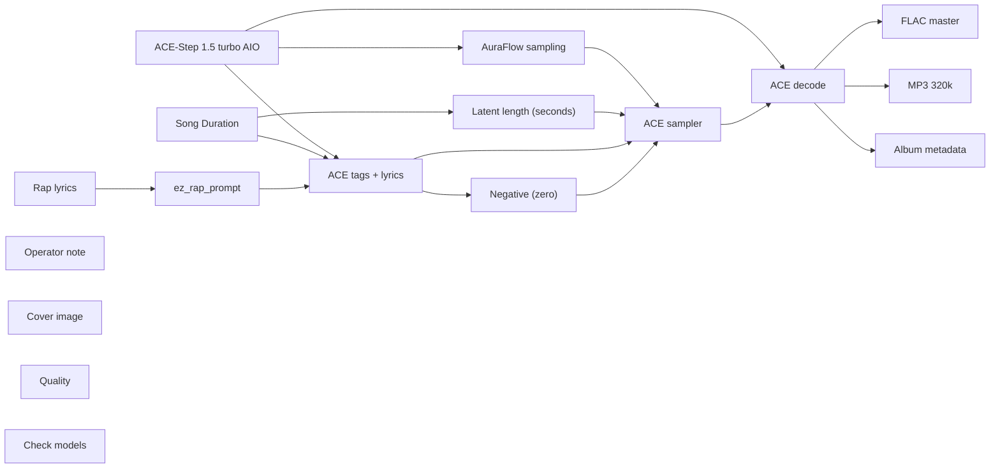

# audio/albums/nill-bye/frozen-ercot

**What's on this page**

- **Every track, cover, and album-pack graph** in this folder
- **Shared ACE-Step topology** (one printer, unique widgets per take)
- **Node parameter reference** for the types on these graphs

**What this enables**

- **Queuing one numbered take** or `album-render`
- **Reading tags, lyrics, seed, BPM** without opening raw JSON

**Who this is for:** studio users after `download-music`. Occupancy **audio** (cover stills are **klein** — separate session).

> Generated from `workflows/_lab/audio/albums/nill-bye/frozen-ercot/`. Do not hand-edit this file.

## Purpose

Numbered takes under `audio/albums/nill-bye/frozen-ercot/`. Queue one track, or `./scripts/manage.sh album-render --album nill-bye/frozen-ercot`.

```text
## 01-frozen-ercot

US-safe rap **71 s diss** take: **frozen ercot**. Fictional MC **Nill Bye** (science guy) roasting public-record satire of Texas Gov. **Greg Abbott**. Abbott is a satire target, not a vocal identity. Native ACE-Step 1.5 turbo AIO. Queue this graph **on its own** — draft-first is the generic lane, not a prerequisite. Occupancy **audio** only; a longer Queue is expected.

1. Weights: `./scripts/manage.sh download-music --tier turbo` (same AIO dest as `download-podcast --tier acestep`; ~10 GB, opt-in, not `download-models`).
2. Prompt enhance is **off** so tags, BPM, language, and `[verse]`/`[chorus]` stay as written. Turn Enhance on only if you want the 4B rewriter.
3. Tags vs lyrics: tags are genre/instrument/vocal hints; lyrics are the bars. Section tags `[verse]` / `[chorus]` / `[spoken word]` are vocal hints operators may add.
4. Original lyrics only. No “in the style of <living artist>”. No living-MC names. No famous-hook paraphrases.
5. ACE-Step vocal is an **invented** identity, not a cloned MC.
6. Sampler: 8 steps, cfg 1, euler, simple. Duration 71 s, bpm 88, language en, timesignature 4, key C minor, form v_long, generate_audio_codes true. Seed 191.
7. Saves: `01 - Frozen Ercot` FLAC master + 320 kbps MP3 under `${COMFY_OUTPUT_DIR}`.
8. Cover separately: Queue **stills/thumbnail.json** or **stills/podcast-cover.json**. Do not embed Klein here.
9. Human rewrite the lyrics before any release. Prompts are not authorship (USCO Part 2 / Thaler).
10. Do not co-resident with LTX / Wan / Klein on this Spark.

Beat-only pass: append instrumental, no vocals, and replace lyrics with [inst].

Occupancy: audio — stop Klein / Wan / LTX session. One GB10 job.
```

## Shared graph



## Graphs in this album

| Graph | Nodes | Occupancy |
| --- | --- | --- |
| `audio/albums/nill-bye/frozen-ercot/01-frozen-ercot` | 17 | audio |
| `audio/albums/nill-bye/frozen-ercot/02-abject-failure` | 17 | audio |
| `audio/albums/nill-bye/frozen-ercot/03-six-week-clock` | 17 | audio |
| `audio/albums/nill-bye/frozen-ercot/04-no-bid-wire` | 17 | audio |
| `audio/albums/nill-bye/frozen-ercot/05-gavel-theater` | 17 | audio |
| `audio/albums/nill-bye/frozen-ercot/06-property-hymn` | 17 | audio |
| `audio/albums/nill-bye/frozen-ercot/07-voucher-raid` | 17 | audio |
| `audio/albums/nill-bye/frozen-ercot/08-uninsured-blues` | 17 | audio |
| `audio/albums/nill-bye/frozen-ercot/09-locked-stacks` | 17 | audio |
| `audio/albums/nill-bye/frozen-ercot/10-mask-order` | 17 | audio |
| `audio/albums/nill-bye/frozen-ercot/11-mid-decade-map` | 17 | audio |
| `audio/albums/nill-bye/frozen-ercot/12-rack-tax` | 17 | audio |
| `audio/albums/nill-bye/frozen-ercot/13-wudu-letter` | 17 | audio |
| `audio/albums/nill-bye/frozen-ercot/14-fourth-term` | 17 | audio |
| `audio/albums/nill-bye/frozen-ercot/15-campus-cordon` | 17 | audio |
| `audio/albums/nill-bye/frozen-ercot/album` | 4 | none |
| `audio/albums/nill-bye/frozen-ercot/cover` | 18 | klein |

## `01-frozen-ercot`

Catalog id `audio/albums/nill-bye/frozen-ercot/01-frozen-ercot`.

US-safe rap diss: Nill Bye frozen-ercot roast of Abbott, ACE-Step 1.5 turbo AIO, invented vocal
Prompt enhance is **off** so authored text (recipe, script labels, ACE tags, or film shots) is encoded as written. Turn Enhance on only if you want the 4B rewriter.

**ACE-Step 1.5 turbo AIO** (`CheckpointLoaderSimple`)

| Slot | Value |
| --- | --- |
| 0 | `ace_step_1.5_turbo_aio.safetensors` |

**AuraFlow sampling** (`ModelSamplingAuraFlow`)

| Slot | Value |
| --- | --- |
| 0 | `3` |

**Song Duration** (`PrimitiveNode`)

| Slot | Value |
| --- | --- |
| 0 | `71.0` |
| 1 | `fixed` |

**Latent length (seconds)** (`EmptyAceStep1.5LatentAudio`)

| Slot | Value |
| --- | --- |
| 0 | `71.0` |
| 1 | `1` |

**Rap lyrics** (`EZRapLyrics`)

| Slot | Value |
| --- | --- |
| 0 | `custom` |
| 1 | `[intro] yeah grid down Nill Bye grid-gauging [verse] February iced the whole ER…` |
| 2 | `false` |
| 3 | `audio/albums/nill-bye/frozen-ercot/01-frozen-ercot` |

```text
[intro]
yeah
grid down
Nill Bye grid-gauging

[verse]
February iced the whole ERCOT
Four million in the darkroom
Two hundred seventy-seven ticks
From a statewide collapse-risk
FERC counted frozen gas
Fifty-eight percent of the trips-off
Wind took twenty-seven shares
You ran to Fox with a scapegoat-clip
Abbott said the solar quit-shift
Permian wells fell eighty-five points
Nill Bye gauging the outage-sheet
Your weatherize was optional talk

[chorus]
Frozen ERCOT
Nill Bye on the blackout
Abbott blamed the windmill
Gas froze in the wellhead
Two-four-six on the docket
Your grid failed the weather

[verse]
Uri wrote a hypothermia list
Harris County topped the counties
Carbon monoxide in the garages
Boil-water for fourteen million taps
PUC pinned nine thousand a megawatt
Griddy bills hit the five-figure mark
Abbott claimed the grid got a full fix
The exception form still lets plants duck
Nill Bye tracing the frequency sag
You sold a windmill as the culprit
Thermal plants iced at the intake
Your presser was a blame-shift

[chorus]
Frozen ERCOT
Nill Bye on the blackout
Abbott blamed the windmill
Gas froze in the wellhead
Two-four-six on the docket
Your grid failed the weather

[inst - pocket snare, hats only]

[verse]
Ten years of freeze memos unread
Two-thousand-eleven already warned you
Mandatory winterize never landed
Until the body-count made the headline
Abbott signed a weatherize bill late
Then a loophole for the slow shops
Nill Bye filing the FERC mix
Gas carried the outage, not the turbine
Isolated grid to dodge the feds
Then you begged when the hertz fell
Four days dark and the pumps died
Your miracle state took a cold quiz

[verse]
Twenty-twenty-six you called it flawless
Radio grin on a five-year boast-tour
Nill Bye keeping the death ledger
Two-four-six is not a vibe
Abbott still ducking the gas chart
Windmills make a prettier villain
The isolated grid still sits alone
No neighbor to borrow a watt from
You weatherized the talking points
Not the wells, not the flanges

[bridge]
I run the numbers, you run Fox
Frozen ERCOT is the whole thesis

[chorus]
Frozen ERCOT
Nill Bye on the blackout
Abbott blamed the windmill
Gas froze in the wellhead
Two-four-six on the docket
Your grid failed the weather

[outro]
hertz up
wells thaw
cut
yeah
```

**ez_rap_prompt** (`EZAceStepPromptEnhance`)

| Slot | Value |
| --- | --- |
| 0 | `custom` |
| 1 | `boom bap, hip-hop, dusty drums, vinyl crackle, sampled piano stab, male rap voc…` |
| 2 | `[intro] yeah grid down Nill Bye grid-gauging [verse] February iced the whole ER…` |
| 3 | `false` |
| 4 | `vocal` |
| 5 | `audio/albums/nill-bye/frozen-ercot/01-frozen-ercot` |

```text
boom bap, hip-hop, dusty drums, vinyl crackle, sampled piano stab, male rap vocals, dry booth, no autotune, 88 bpm
```

```text
[intro]
yeah
grid down
Nill Bye grid-gauging

[verse]
February iced the whole ERCOT
Four million in the darkroom
Two hundred seventy-seven ticks
From a statewide collapse-risk
FERC counted frozen gas
Fifty-eight percent of the trips-off
Wind took twenty-seven shares
You ran to Fox with a scapegoat-clip
Abbott said the solar quit-shift
Permian wells fell eighty-five points
Nill Bye gauging the outage-sheet
Your weatherize was optional talk

[chorus]
Frozen ERCOT
Nill Bye on the blackout
Abbott blamed the windmill
Gas froze in the wellhead
Two-four-six on the docket
Your grid failed the weather

[verse]
Uri wrote a hypothermia list
Harris County topped the counties
Carbon monoxide in the garages
Boil-water for fourteen million taps
PUC pinned nine thousand a megawatt
Griddy bills hit the five-figure mark
Abbott claimed the grid got a full fix
The exception form still lets plants duck
Nill Bye tracing the frequency sag
You sold a windmill as the culprit
Thermal plants iced at the intake
Your presser was a blame-shift

[chorus]
Frozen ERCOT
Nill Bye on the blackout
Abbott blamed the windmill
Gas froze in the wellhead
Two-four-six on the docket
Your grid failed the weather

[inst - pocket snare, hats only]

[verse]
Ten years of freeze memos unread
Two-thousand-eleven already warned you
Mandatory winterize never landed
Until the body-count made the headline
Abbott signed a weatherize bill late
Then a loophole for the slow shops
Nill Bye filing the FERC mix
Gas carried the outage, not the turbine
Isolated grid to dodge the feds
Then you begged when the hertz fell
Four days dark and the pumps died
Your miracle state took a cold quiz

[verse]
Twenty-twenty-six you called it flawless
Radio grin on a five-year boast-tour
Nill Bye keeping the death ledger
Two-four-six is not a vibe
Abbott still ducking the gas chart
Windmills make a prettier villain
The isolated grid still sits alone
No neighbor to borrow a watt from
You weatherized the talking points
Not the wells, not the flanges

[bridge]
I run the numbers, you run Fox
Frozen ERCOT is the whole thesis

[chorus]
Frozen ERCOT
Nill Bye on the blackout
Abbott blamed the windmill
Gas froze in the wellhead
Two-four-six on the docket
Your grid failed the weather

[outro]
hertz up
wells thaw
cut
yeah
```

**ACE tags + lyrics** (`TextEncodeAceStepAudio1.5`)

| Slot | Value |
| --- | --- |
| 0 | `boom bap, hip-hop, dusty drums, vinyl crackle, sampled piano stab, male rap voc…` |
| 1 | `[intro] yeah grid down Nill Bye grid-gauging [verse] February iced the whole ER…` |
| 2 | `191` |
| 3 | `fixed` |
| 4 | `88` |
| 5 | `71.0` |
| 6 | `4` |
| 7 | `en` |
| 8 | `C minor` |
| 9 | `true` |
| 10 | `2.0` |
| 11 | `0.85` |
| 12 | `0.9` |
| 13 | `0` |
| 14 | `0.0` |

```text
boom bap, hip-hop, dusty drums, vinyl crackle, sampled piano stab, male rap vocals, dry booth, no autotune, 88 bpm
```

```text
[intro]
yeah
grid down
Nill Bye grid-gauging

[verse]
February iced the whole ERCOT
Four million in the darkroom
Two hundred seventy-seven ticks
From a statewide collapse-risk
FERC counted frozen gas
Fifty-eight percent of the trips-off
Wind took twenty-seven shares
You ran to Fox with a scapegoat-clip
Abbott said the solar quit-shift
Permian wells fell eighty-five points
Nill Bye gauging the outage-sheet
Your weatherize was optional talk

[chorus]
Frozen ERCOT
Nill Bye on the blackout
Abbott blamed the windmill
Gas froze in the wellhead
Two-four-six on the docket
Your grid failed the weather

[verse]
Uri wrote a hypothermia list
Harris County topped the counties
Carbon monoxide in the garages
Boil-water for fourteen million taps
PUC pinned nine thousand a megawatt
Griddy bills hit the five-figure mark
Abbott claimed the grid got a full fix
The exception form still lets plants duck
Nill Bye tracing the frequency sag
You sold a windmill as the culprit
Thermal plants iced at the intake
Your presser was a blame-shift

[chorus]
Frozen ERCOT
Nill Bye on the blackout
Abbott blamed the windmill
Gas froze in the wellhead
Two-four-six on the docket
Your grid failed the weather

[inst - pocket snare, hats only]

[verse]
Ten years of freeze memos unread
Two-thousand-eleven already warned you
Mandatory winterize never landed
Until the body-count made the headline
Abbott signed a weatherize bill late
Then a loophole for the slow shops
Nill Bye filing the FERC mix
Gas carried the outage, not the turbine
Isolated grid to dodge the feds
Then you begged when the hertz fell
Four days dark and the pumps died
Your miracle state took a cold quiz

[verse]
Twenty-twenty-six you called it flawless
Radio grin on a five-year boast-tour
Nill Bye keeping the death ledger
Two-four-six is not a vibe
Abbott still ducking the gas chart
Windmills make a prettier villain
The isolated grid still sits alone
No neighbor to borrow a watt from
You weatherized the talking points
Not the wells, not the flanges

[bridge]
I run the numbers, you run Fox
Frozen ERCOT is the whole thesis

[chorus]
Frozen ERCOT
Nill Bye on the blackout
Abbott blamed the windmill
Gas froze in the wellhead
Two-four-six on the docket
Your grid failed the weather

[outro]
hertz up
wells thaw
cut
yeah
```

**ACE sampler** (`KSampler`)

| Slot | Value |
| --- | --- |
| 0 | `191` |
| 1 | `fixed` |
| 2 | `8` |
| 3 | `1.0` |
| 4 | `euler` |
| 5 | `simple` |
| 6 | `1.0` |

**FLAC master** (`SaveAudio`)

| Slot | Value |
| --- | --- |
| 0 | `01 - Frozen Ercot` |

**MP3 320k** (`SaveAudioMP3`)

| Slot | Value |
| --- | --- |
| 0 | `01 - Frozen Ercot` |
| 1 | `320k` |

**Cover image** (`LoadImage`)

| Slot | Value |
| --- | --- |
| 0 | `cover.png` |
| 1 | `image` |

**Album metadata** (`EZAudioMetadata`)

| Slot | Value |
| --- | --- |
| 0 | `Nill Bye` |
| 1 | `Frozen Ercot` |
| 2 | `Frozen Ercot` |
| 3 | `1` |
| 4 | `15` |
| 5 | `2026` |
| 6 | `skip` |
| 7 | `01 - Frozen Ercot` |

**Quality** (`EZQuality`)

| Slot | Value |
| --- | --- |
| 0 | `lab` |

**Check models** (`EZModelCheck`)

| Slot | Value |
| --- | --- |
| 0 | `Click Check models. Queue does not run this node.` |

## `02-abject-failure`

Catalog id `audio/albums/nill-bye/frozen-ercot/02-abject-failure`.

US-safe rap diss: Nill Bye abject-failure roast of Abbott, ACE-Step 1.5 turbo AIO, invented vocal
Prompt enhance is **off** so authored text (recipe, script labels, ACE tags, or film shots) is encoded as written. Turn Enhance on only if you want the 4B rewriter.

**ACE-Step 1.5 turbo AIO** (`CheckpointLoaderSimple`)

| Slot | Value |
| --- | --- |
| 0 | `ace_step_1.5_turbo_aio.safetensors` |

**AuraFlow sampling** (`ModelSamplingAuraFlow`)

| Slot | Value |
| --- | --- |
| 0 | `3` |

**Song Duration** (`PrimitiveNode`)

| Slot | Value |
| --- | --- |
| 0 | `120.0` |
| 1 | `fixed` |

**Latent length (seconds)** (`EmptyAceStep1.5LatentAudio`)

| Slot | Value |
| --- | --- |
| 0 | `120.0` |
| 1 | `1` |

**Rap lyrics** (`EZRapLyrics`)

| Slot | Value |
| --- | --- |
| 0 | `custom` |
| 1 | `[spoken word] Robb Elementary Nineteen children Two teachers Seventy-seven minu…` |
| 2 | `false` |
| 3 | `audio/albums/nill-bye/frozen-ercot/02-abject-failure` |

```text
[spoken word]
Robb Elementary
Nineteen children
Two teachers
Seventy-seven minutes
Abject failure

[verse]
May twenty-four, Robb went silent
Nineteen kids and two teachers gone
Seventy-seven minutes in the corridor
Cops waited while the shots kept time
McCraw called it an abject failure
That is DPS, not a blog
Abbott flew a tape to Houston
NRA stage, three days later
Nill Bye stopwatching the two-track speech
Uvalde heard all options open
The convention heard statutes don't matter
You cannot be in both rooms honest

[verse]
HB nineteen-twenty-seven already inked
No-license carry, September twenty-one
Then an eighteen-year-old bought the rifles
Legal as the bill you cheered
Abbott said thousands of laws failed
So you refused to write a new one
Nill Bye reading the special-session menu
School doors, not the magazine
Cornyn ducked, Patrick ducked
You sent a clip and kept the donors
Robb is a method, not a moment
Your reform was a presser loop

[verse]
They waited in a classroom dark-wait
Parents begged at the fence
A hallway full of badges froze
Command couldn't pick a breach
Abbott said he had been misled
Then he misled the gun-show tape
Nill Bye holding the two transcripts
Same hour, opposite morals
Capital murder already on the books
That did not reload the minute
You grieved in Uvalde on camera
And greenlit Houston on a hard drive

[verse]
No assault-ban in the after-bills
Hardening the door, not the gun-code
Nill Bye mad at a split-screen gov
Abbott still selling the law-count
Nineteen names you will not say here
Two teachers, a town, a delay
McCraw's phrase is the whole finding
Abject failure, stamped in public
You chose the convention over the fix
A video is not a spine
I clock the minutes, you clock the PACs
The hallway did the math for you

[pre-chorus]
Abject failure
Nill Bye stamps the hallway

[chorus]
Abject failure
Nill Bye stamps the hallway
Abbott split the message
Tape for the gun show
Kids still in the classroom
Your courage took a video

[outro]
tape off
hallway stays
cut
```

**ez_rap_prompt** (`EZAceStepPromptEnhance`)

| Slot | Value |
| --- | --- |
| 0 | `custom` |
| 1 | `boom bap, hip-hop, dry snare, upright bass, male rap vocals, dry booth, no auto…` |
| 2 | `[spoken word] Robb Elementary Nineteen children Two teachers Seventy-seven minu…` |
| 3 | `false` |
| 4 | `vocal` |
| 5 | `audio/albums/nill-bye/frozen-ercot/02-abject-failure` |

```text
boom bap, hip-hop, dry snare, upright bass, male rap vocals, dry booth, no autotune, 86 bpm
```

```text
[spoken word]
Robb Elementary
Nineteen children
Two teachers
Seventy-seven minutes
Abject failure

[verse]
May twenty-four, Robb went silent
Nineteen kids and two teachers gone
Seventy-seven minutes in the corridor
Cops waited while the shots kept time
McCraw called it an abject failure
That is DPS, not a blog
Abbott flew a tape to Houston
NRA stage, three days later
Nill Bye stopwatching the two-track speech
Uvalde heard all options open
The convention heard statutes don't matter
You cannot be in both rooms honest

[verse]
HB nineteen-twenty-seven already inked
No-license carry, September twenty-one
Then an eighteen-year-old bought the rifles
Legal as the bill you cheered
Abbott said thousands of laws failed
So you refused to write a new one
Nill Bye reading the special-session menu
School doors, not the magazine
Cornyn ducked, Patrick ducked
You sent a clip and kept the donors
Robb is a method, not a moment
Your reform was a presser loop

[verse]
They waited in a classroom dark-wait
Parents begged at the fence
A hallway full of badges froze
Command couldn't pick a breach
Abbott said he had been misled
Then he misled the gun-show tape
Nill Bye holding the two transcripts
Same hour, opposite morals
Capital murder already on the books
That did not reload the minute
You grieved in Uvalde on camera
And greenlit Houston on a hard drive

[verse]
No assault-ban in the after-bills
Hardening the door, not the gun-code
Nill Bye mad at a split-screen gov
Abbott still selling the law-count
Nineteen names you will not say here
Two teachers, a town, a delay
McCraw's phrase is the whole finding
Abject failure, stamped in public
You chose the convention over the fix
A video is not a spine
I clock the minutes, you clock the PACs
The hallway did the math for you

[pre-chorus]
Abject failure
Nill Bye stamps the hallway

[chorus]
Abject failure
Nill Bye stamps the hallway
Abbott split the message
Tape for the gun show
Kids still in the classroom
Your courage took a video

[outro]
tape off
hallway stays
cut
```

**ACE tags + lyrics** (`TextEncodeAceStepAudio1.5`)

| Slot | Value |
| --- | --- |
| 0 | `boom bap, hip-hop, dry snare, upright bass, male rap vocals, dry booth, no auto…` |
| 1 | `[spoken word] Robb Elementary Nineteen children Two teachers Seventy-seven minu…` |
| 2 | `193` |
| 3 | `fixed` |
| 4 | `86` |
| 5 | `120.0` |
| 6 | `4` |
| 7 | `en` |
| 8 | `F# minor` |
| 9 | `true` |
| 10 | `2.0` |
| 11 | `0.85` |
| 12 | `0.9` |
| 13 | `0` |
| 14 | `0.0` |

```text
boom bap, hip-hop, dry snare, upright bass, male rap vocals, dry booth, no autotune, 86 bpm
```

```text
[spoken word]
Robb Elementary
Nineteen children
Two teachers
Seventy-seven minutes
Abject failure

[verse]
May twenty-four, Robb went silent
Nineteen kids and two teachers gone
Seventy-seven minutes in the corridor
Cops waited while the shots kept time
McCraw called it an abject failure
That is DPS, not a blog
Abbott flew a tape to Houston
NRA stage, three days later
Nill Bye stopwatching the two-track speech
Uvalde heard all options open
The convention heard statutes don't matter
You cannot be in both rooms honest

[verse]
HB nineteen-twenty-seven already inked
No-license carry, September twenty-one
Then an eighteen-year-old bought the rifles
Legal as the bill you cheered
Abbott said thousands of laws failed
So you refused to write a new one
Nill Bye reading the special-session menu
School doors, not the magazine
Cornyn ducked, Patrick ducked
You sent a clip and kept the donors
Robb is a method, not a moment
Your reform was a presser loop

[verse]
They waited in a classroom dark-wait
Parents begged at the fence
A hallway full of badges froze
Command couldn't pick a breach
Abbott said he had been misled
Then he misled the gun-show tape
Nill Bye holding the two transcripts
Same hour, opposite morals
Capital murder already on the books
That did not reload the minute
You grieved in Uvalde on camera
And greenlit Houston on a hard drive

[verse]
No assault-ban in the after-bills
Hardening the door, not the gun-code
Nill Bye mad at a split-screen gov
Abbott still selling the law-count
Nineteen names you will not say here
Two teachers, a town, a delay
McCraw's phrase is the whole finding
Abject failure, stamped in public
You chose the convention over the fix
A video is not a spine
I clock the minutes, you clock the PACs
The hallway did the math for you

[pre-chorus]
Abject failure
Nill Bye stamps the hallway

[chorus]
Abject failure
Nill Bye stamps the hallway
Abbott split the message
Tape for the gun show
Kids still in the classroom
Your courage took a video

[outro]
tape off
hallway stays
cut
```

**ACE sampler** (`KSampler`)

| Slot | Value |
| --- | --- |
| 0 | `193` |
| 1 | `fixed` |
| 2 | `8` |
| 3 | `1.0` |
| 4 | `euler` |
| 5 | `simple` |
| 6 | `1.0` |

**FLAC master** (`SaveAudio`)

| Slot | Value |
| --- | --- |
| 0 | `02 - Abject Failure` |

**MP3 320k** (`SaveAudioMP3`)

| Slot | Value |
| --- | --- |
| 0 | `02 - Abject Failure` |
| 1 | `320k` |

**Cover image** (`LoadImage`)

| Slot | Value |
| --- | --- |
| 0 | `cover.png` |
| 1 | `image` |

**Album metadata** (`EZAudioMetadata`)

| Slot | Value |
| --- | --- |
| 0 | `Nill Bye` |
| 1 | `Frozen Ercot` |
| 2 | `Abject Failure` |
| 3 | `2` |
| 4 | `15` |
| 5 | `2026` |
| 6 | `skip` |
| 7 | `02 - Abject Failure` |

**Quality** (`EZQuality`)

| Slot | Value |
| --- | --- |
| 0 | `lab` |

**Check models** (`EZModelCheck`)

| Slot | Value |
| --- | --- |
| 0 | `Click Check models. Queue does not run this node.` |

## `03-six-week-clock`

Catalog id `audio/albums/nill-bye/frozen-ercot/03-six-week-clock`.

US-safe rap diss: Nill Bye six-week-clock roast of Abbott, ACE-Step 1.5 turbo AIO, invented vocal
Prompt enhance is **off** so authored text (recipe, script labels, ACE tags, or film shots) is encoded as written. Turn Enhance on only if you want the 4B rewriter.

**ACE-Step 1.5 turbo AIO** (`CheckpointLoaderSimple`)

| Slot | Value |
| --- | --- |
| 0 | `ace_step_1.5_turbo_aio.safetensors` |

**AuraFlow sampling** (`ModelSamplingAuraFlow`)

| Slot | Value |
| --- | --- |
| 0 | `3` |

**Song Duration** (`PrimitiveNode`)

| Slot | Value |
| --- | --- |
| 0 | `176.0` |
| 1 | `fixed` |

**Latent length (seconds)** (`EmptyAceStep1.5LatentAudio`)

| Slot | Value |
| --- | --- |
| 0 | `176.0` |
| 1 | `1` |

**Rap lyrics** (`EZRapLyrics`)

| Slot | Value |
| --- | --- |
| 0 | `custom` |
| 1 | `[verse] SB eight, May twenty-twenty-one Heartbeat Act with a bounty clause Any …` |
| 2 | `false` |
| 3 | `audio/albums/nill-bye/frozen-ercot/03-six-week-clock` |

```text
[verse]
SB eight, May twenty-twenty-one
Heartbeat Act with a bounty clause
Any stranger can file the suit
Vigilantes with a civil docket-fee
Abbott signed a six week clock
Cardiac tick as a tripwire
Nill Bye pacing the clinic math
Most people don't know yet
Johns Hopkins counted extra births
Ten thousand that could not leave
Infant deaths ticked with anomalies
Your heartbeat bill wrote a body-tax

[chorus]
Six week clock
Nill Bye times the bounty
Abbott signed the heartbeat
Private suit, public scare
Doctors freeze, mothers travel
Your exception was a fog-bank

[verse]
HB twelve-eighty pulled the trigger-ban
August twenty-five, twenty-twenty-two
Felony for the doctor, life on the table
Hundred-thousand civil on the side
Abbott called it a major trophy
Patients called it a delay-trap
Nill Bye reading Zurawski
Supreme Court left the chill intact
Dallas mother, trisomy eighteen
District said go, high court said no
She left Texas to stay alive
Your exception failed the emergency

[chorus]
Six week clock
Nill Bye times the bounty
Abbott signed the heartbeat
Private suit, public scare
Doctors freeze, mothers travel
Your exception was a fog-bank

[verse]
ProPublica counted the sepsis spike
Fifty percent after the six week clock
Maternal hospital deaths jumped hard
Nation down, Texas up a third
Abbott still selling the emergency clause
Doctors wait until the chart is crashing
Nill Bye noting the delayed D-and-C
Fertility lost to a statute fog
Mangrum tried to clear the ER
The state appealed the oxygen
A bounty is not a medical board
You outsourced care to a lawsuit

[chorus]
Six week clock
Nill Bye times the bounty
Abbott signed the heartbeat
Private suit, public scare
Doctors freeze, mothers travel
Your exception was a fog-bank

[verse]
Life of the Mother Act came late
After the obituaries made the case
Nill Bye still on the six week clock
Abbott still posing with the heartbeat
Travel is not a health plan
A felony is not a bedside manner
You banned the procedure, kept the risk
Then blamed the doctor for the pause
I time the cardiac, you time the PACs
SB eight is a snitch statute

[chorus]
Six week clock
Nill Bye times the bounty
Abbott signed the heartbeat
Private suit, public scare
Doctors freeze, mothers travel
Your exception was a fog-bank

[bridge]
HB twelve-eighty is the cage
Your clock runs out on the patient

[chorus]
Six week clock
Nill Bye times the bounty
Abbott signed the heartbeat
Private suit, public scare
Doctors freeze, mothers travel
Your exception was a fog-bank

[outro]
tick stop
bounty cold
cut
yeah
```

**ez_rap_prompt** (`EZAceStepPromptEnhance`)

| Slot | Value |
| --- | --- |
| 0 | `custom` |
| 1 | `jazz hop, brushed drums, upright bass, muted trumpet, male rap vocals, dry boot…` |
| 2 | `[verse] SB eight, May twenty-twenty-one Heartbeat Act with a bounty clause Any …` |
| 3 | `false` |
| 4 | `vocal` |
| 5 | `audio/albums/nill-bye/frozen-ercot/03-six-week-clock` |

```text
jazz hop, brushed drums, upright bass, muted trumpet, male rap vocals, dry booth, no autotune, 90 bpm
```

```text
[verse]
SB eight, May twenty-twenty-one
Heartbeat Act with a bounty clause
Any stranger can file the suit
Vigilantes with a civil docket-fee
Abbott signed a six week clock
Cardiac tick as a tripwire
Nill Bye pacing the clinic math
Most people don't know yet
Johns Hopkins counted extra births
Ten thousand that could not leave
Infant deaths ticked with anomalies
Your heartbeat bill wrote a body-tax

[chorus]
Six week clock
Nill Bye times the bounty
Abbott signed the heartbeat
Private suit, public scare
Doctors freeze, mothers travel
Your exception was a fog-bank

[verse]
HB twelve-eighty pulled the trigger-ban
August twenty-five, twenty-twenty-two
Felony for the doctor, life on the table
Hundred-thousand civil on the side
Abbott called it a major trophy
Patients called it a delay-trap
Nill Bye reading Zurawski
Supreme Court left the chill intact
Dallas mother, trisomy eighteen
District said go, high court said no
She left Texas to stay alive
Your exception failed the emergency

[chorus]
Six week clock
Nill Bye times the bounty
Abbott signed the heartbeat
Private suit, public scare
Doctors freeze, mothers travel
Your exception was a fog-bank

[verse]
ProPublica counted the sepsis spike
Fifty percent after the six week clock
Maternal hospital deaths jumped hard
Nation down, Texas up a third
Abbott still selling the emergency clause
Doctors wait until the chart is crashing
Nill Bye noting the delayed D-and-C
Fertility lost to a statute fog
Mangrum tried to clear the ER
The state appealed the oxygen
A bounty is not a medical board
You outsourced care to a lawsuit

[chorus]
Six week clock
Nill Bye times the bounty
Abbott signed the heartbeat
Private suit, public scare
Doctors freeze, mothers travel
Your exception was a fog-bank

[verse]
Life of the Mother Act came late
After the obituaries made the case
Nill Bye still on the six week clock
Abbott still posing with the heartbeat
Travel is not a health plan
A felony is not a bedside manner
You banned the procedure, kept the risk
Then blamed the doctor for the pause
I time the cardiac, you time the PACs
SB eight is a snitch statute

[chorus]
Six week clock
Nill Bye times the bounty
Abbott signed the heartbeat
Private suit, public scare
Doctors freeze, mothers travel
Your exception was a fog-bank

[bridge]
HB twelve-eighty is the cage
Your clock runs out on the patient

[chorus]
Six week clock
Nill Bye times the bounty
Abbott signed the heartbeat
Private suit, public scare
Doctors freeze, mothers travel
Your exception was a fog-bank

[outro]
tick stop
bounty cold
cut
yeah
```

**ACE tags + lyrics** (`TextEncodeAceStepAudio1.5`)

| Slot | Value |
| --- | --- |
| 0 | `jazz hop, brushed drums, upright bass, muted trumpet, male rap vocals, dry boot…` |
| 1 | `[verse] SB eight, May twenty-twenty-one Heartbeat Act with a bounty clause Any …` |
| 2 | `197` |
| 3 | `fixed` |
| 4 | `90` |
| 5 | `176.0` |
| 6 | `4` |
| 7 | `en` |
| 8 | `A minor` |
| 9 | `true` |
| 10 | `2.0` |
| 11 | `0.85` |
| 12 | `0.9` |
| 13 | `0` |
| 14 | `0.0` |

```text
jazz hop, brushed drums, upright bass, muted trumpet, male rap vocals, dry booth, no autotune, 90 bpm
```

```text
[verse]
SB eight, May twenty-twenty-one
Heartbeat Act with a bounty clause
Any stranger can file the suit
Vigilantes with a civil docket-fee
Abbott signed a six week clock
Cardiac tick as a tripwire
Nill Bye pacing the clinic math
Most people don't know yet
Johns Hopkins counted extra births
Ten thousand that could not leave
Infant deaths ticked with anomalies
Your heartbeat bill wrote a body-tax

[chorus]
Six week clock
Nill Bye times the bounty
Abbott signed the heartbeat
Private suit, public scare
Doctors freeze, mothers travel
Your exception was a fog-bank

[verse]
HB twelve-eighty pulled the trigger-ban
August twenty-five, twenty-twenty-two
Felony for the doctor, life on the table
Hundred-thousand civil on the side
Abbott called it a major trophy
Patients called it a delay-trap
Nill Bye reading Zurawski
Supreme Court left the chill intact
Dallas mother, trisomy eighteen
District said go, high court said no
She left Texas to stay alive
Your exception failed the emergency

[chorus]
Six week clock
Nill Bye times the bounty
Abbott signed the heartbeat
Private suit, public scare
Doctors freeze, mothers travel
Your exception was a fog-bank

[verse]
ProPublica counted the sepsis spike
Fifty percent after the six week clock
Maternal hospital deaths jumped hard
Nation down, Texas up a third
Abbott still selling the emergency clause
Doctors wait until the chart is crashing
Nill Bye noting the delayed D-and-C
Fertility lost to a statute fog
Mangrum tried to clear the ER
The state appealed the oxygen
A bounty is not a medical board
You outsourced care to a lawsuit

[chorus]
Six week clock
Nill Bye times the bounty
Abbott signed the heartbeat
Private suit, public scare
Doctors freeze, mothers travel
Your exception was a fog-bank

[verse]
Life of the Mother Act came late
After the obituaries made the case
Nill Bye still on the six week clock
Abbott still posing with the heartbeat
Travel is not a health plan
A felony is not a bedside manner
You banned the procedure, kept the risk
Then blamed the doctor for the pause
I time the cardiac, you time the PACs
SB eight is a snitch statute

[chorus]
Six week clock
Nill Bye times the bounty
Abbott signed the heartbeat
Private suit, public scare
Doctors freeze, mothers travel
Your exception was a fog-bank

[bridge]
HB twelve-eighty is the cage
Your clock runs out on the patient

[chorus]
Six week clock
Nill Bye times the bounty
Abbott signed the heartbeat
Private suit, public scare
Doctors freeze, mothers travel
Your exception was a fog-bank

[outro]
tick stop
bounty cold
cut
yeah
```

**ACE sampler** (`KSampler`)

| Slot | Value |
| --- | --- |
| 0 | `197` |
| 1 | `fixed` |
| 2 | `8` |
| 3 | `1.0` |
| 4 | `euler` |
| 5 | `simple` |
| 6 | `1.0` |

**FLAC master** (`SaveAudio`)

| Slot | Value |
| --- | --- |
| 0 | `03 - Six Week Clock` |

**MP3 320k** (`SaveAudioMP3`)

| Slot | Value |
| --- | --- |
| 0 | `03 - Six Week Clock` |
| 1 | `320k` |

**Cover image** (`LoadImage`)

| Slot | Value |
| --- | --- |
| 0 | `cover.png` |
| 1 | `image` |

**Album metadata** (`EZAudioMetadata`)

| Slot | Value |
| --- | --- |
| 0 | `Nill Bye` |
| 1 | `Frozen Ercot` |
| 2 | `Six Week Clock` |
| 3 | `3` |
| 4 | `15` |
| 5 | `2026` |
| 6 | `skip` |
| 7 | `03 - Six Week Clock` |

**Quality** (`EZQuality`)

| Slot | Value |
| --- | --- |
| 0 | `lab` |

**Check models** (`EZModelCheck`)

| Slot | Value |
| --- | --- |
| 0 | `Click Check models. Queue does not run this node.` |

## `04-no-bid-wire`

Catalog id `audio/albums/nill-bye/frozen-ercot/04-no-bid-wire`.

US-safe rap diss: Nill Bye no-bid-wire roast of Abbott, ACE-Step 1.5 turbo AIO, invented vocal
Prompt enhance is **off** so authored text (recipe, script labels, ACE tags, or film shots) is encoded as written. Turn Enhance on only if you want the 4B rewriter.

**ACE-Step 1.5 turbo AIO** (`CheckpointLoaderSimple`)

| Slot | Value |
| --- | --- |
| 0 | `ace_step_1.5_turbo_aio.safetensors` |

**AuraFlow sampling** (`ModelSamplingAuraFlow`)

| Slot | Value |
| --- | --- |
| 0 | `3` |

**Song Duration** (`PrimitiveNode`)

| Slot | Value |
| --- | --- |
| 0 | `80.0` |
| 1 | `fixed` |

**Latent length (seconds)** (`EmptyAceStep1.5LatentAudio`)

| Slot | Value |
| --- | --- |
| 0 | `80.0` |
| 1 | `1` |

**Rap lyrics** (`EZRapLyrics`)

| Slot | Value |
| --- | --- |
| 0 | `custom` |
| 1 | `[intro] invoice hum Nill Bye auditing [verse] Disaster order every month since …` |
| 2 | `false` |
| 3 | `audio/albums/nill-bye/frozen-ercot/04-no-bid-wire` |

```text
[intro]
invoice hum
Nill Bye auditing

[verse]
Disaster order every month since twenty-one
A border emergency that never sunsets
That stamp skips the bid table
Billions move on a proclamation
Abbott wrote a no-bid wire
Observer caught three-point-five unbid
Nill Bye auditing the purchase orders
Concertina, buoys, base camps, buses
New Yorker mapped the donor-contractors
Campaign cash in, state checks out
Watchdogs said a billion steered to friends
Your emergency is a procurement trick

[verse]
Border spend north of eleven billion
Still asking D.C. to reimburse the spree
Abbott calls it Washington's failure
Then he spends like a blank check
Nill Bye circling the no-bid wire
Eagle Pass base in the hundreds of millions
Seventy thousand rolls of razor
A wall in pieces that do not meet
Legislature side-eyed the forever seal
COVID taught him the proclamation habit
Same tool, new enemy, same vendors
Your disaster is a business model

[chorus]
No-bid wire
Nill Bye on the ledger
Abbott stamped emergency
Contracts skip the bidding
Three-point-five in the dark-fund
Your donors got the wire

[verse]
Public Citizen ran the donor overlay
Executives giving, then getting contracts
Abbott says the border is the mission-text
The invoice says the brief is the invoice
Nill Bye matching PACs to purchase-codes
No competition, no sunlight, no shame
A monthly stamp is a loophole with a seal
Five years in, the emergency is the franchise
You skipped the bid to skip the questions
Then billed the questions as disloyalty
I want a bid, you want a presser
The wire is the method, not the fence

[chorus]
No-bid wire
Nill Bye on the ledger
Abbott stamped emergency
Contracts skip the bidding
Three-point-five in the dark-fund
Your donors got the wire

[verse]
Twenty-twenty-six, still stamping disaster
Crossings down, the contracts up
Nill Bye closing the procurement file
Abbott still posing on the riverbank
A buoy is a photo, a bid is a rule
You picked the photo every cycle
Eleven billion and a donor web
That is not security, that is a tab
I audit the wire, you audit the polls
No-bid is the quiet border barrier
It runs through Austin, not the river
Your emergency never had a sunset

[chorus]
No-bid wire
Nill Bye on the ledger
Abbott stamped emergency
Contracts skip the bidding
Three-point-five in the dark-fund
Your donors got the wire

[outro]
stamp dry
invoice open
cut
```

**ez_rap_prompt** (`EZAceStepPromptEnhance`)

| Slot | Value |
| --- | --- |
| 0 | `custom` |
| 1 | `industrial hip-hop, metal percussion, distorted bass, male rap vocals, dry boot…` |
| 2 | `[intro] invoice hum Nill Bye auditing [verse] Disaster order every month since …` |
| 3 | `false` |
| 4 | `vocal` |
| 5 | `audio/albums/nill-bye/frozen-ercot/04-no-bid-wire` |

```text
industrial hip-hop, metal percussion, distorted bass, male rap vocals, dry booth, no autotune, 108 bpm
```

```text
[intro]
invoice hum
Nill Bye auditing

[verse]
Disaster order every month since twenty-one
A border emergency that never sunsets
That stamp skips the bid table
Billions move on a proclamation
Abbott wrote a no-bid wire
Observer caught three-point-five unbid
Nill Bye auditing the purchase orders
Concertina, buoys, base camps, buses
New Yorker mapped the donor-contractors
Campaign cash in, state checks out
Watchdogs said a billion steered to friends
Your emergency is a procurement trick

[verse]
Border spend north of eleven billion
Still asking D.C. to reimburse the spree
Abbott calls it Washington's failure
Then he spends like a blank check
Nill Bye circling the no-bid wire
Eagle Pass base in the hundreds of millions
Seventy thousand rolls of razor
A wall in pieces that do not meet
Legislature side-eyed the forever seal
COVID taught him the proclamation habit
Same tool, new enemy, same vendors
Your disaster is a business model

[chorus]
No-bid wire
Nill Bye on the ledger
Abbott stamped emergency
Contracts skip the bidding
Three-point-five in the dark-fund
Your donors got the wire

[verse]
Public Citizen ran the donor overlay
Executives giving, then getting contracts
Abbott says the border is the mission-text
The invoice says the brief is the invoice
Nill Bye matching PACs to purchase-codes
No competition, no sunlight, no shame
A monthly stamp is a loophole with a seal
Five years in, the emergency is the franchise
You skipped the bid to skip the questions
Then billed the questions as disloyalty
I want a bid, you want a presser
The wire is the method, not the fence

[chorus]
No-bid wire
Nill Bye on the ledger
Abbott stamped emergency
Contracts skip the bidding
Three-point-five in the dark-fund
Your donors got the wire

[verse]
Twenty-twenty-six, still stamping disaster
Crossings down, the contracts up
Nill Bye closing the procurement file
Abbott still posing on the riverbank
A buoy is a photo, a bid is a rule
You picked the photo every cycle
Eleven billion and a donor web
That is not security, that is a tab
I audit the wire, you audit the polls
No-bid is the quiet border barrier
It runs through Austin, not the river
Your emergency never had a sunset

[chorus]
No-bid wire
Nill Bye on the ledger
Abbott stamped emergency
Contracts skip the bidding
Three-point-five in the dark-fund
Your donors got the wire

[outro]
stamp dry
invoice open
cut
```

**ACE tags + lyrics** (`TextEncodeAceStepAudio1.5`)

| Slot | Value |
| --- | --- |
| 0 | `industrial hip-hop, metal percussion, distorted bass, male rap vocals, dry boot…` |
| 1 | `[intro] invoice hum Nill Bye auditing [verse] Disaster order every month since …` |
| 2 | `199` |
| 3 | `fixed` |
| 4 | `108` |
| 5 | `80.0` |
| 6 | `2` |
| 7 | `en` |
| 8 | `D minor` |
| 9 | `true` |
| 10 | `2.0` |
| 11 | `0.85` |
| 12 | `0.9` |
| 13 | `0` |
| 14 | `0.0` |

```text
industrial hip-hop, metal percussion, distorted bass, male rap vocals, dry booth, no autotune, 108 bpm
```

```text
[intro]
invoice hum
Nill Bye auditing

[verse]
Disaster order every month since twenty-one
A border emergency that never sunsets
That stamp skips the bid table
Billions move on a proclamation
Abbott wrote a no-bid wire
Observer caught three-point-five unbid
Nill Bye auditing the purchase orders
Concertina, buoys, base camps, buses
New Yorker mapped the donor-contractors
Campaign cash in, state checks out
Watchdogs said a billion steered to friends
Your emergency is a procurement trick

[verse]
Border spend north of eleven billion
Still asking D.C. to reimburse the spree
Abbott calls it Washington's failure
Then he spends like a blank check
Nill Bye circling the no-bid wire
Eagle Pass base in the hundreds of millions
Seventy thousand rolls of razor
A wall in pieces that do not meet
Legislature side-eyed the forever seal
COVID taught him the proclamation habit
Same tool, new enemy, same vendors
Your disaster is a business model

[chorus]
No-bid wire
Nill Bye on the ledger
Abbott stamped emergency
Contracts skip the bidding
Three-point-five in the dark-fund
Your donors got the wire

[verse]
Public Citizen ran the donor overlay
Executives giving, then getting contracts
Abbott says the border is the mission-text
The invoice says the brief is the invoice
Nill Bye matching PACs to purchase-codes
No competition, no sunlight, no shame
A monthly stamp is a loophole with a seal
Five years in, the emergency is the franchise
You skipped the bid to skip the questions
Then billed the questions as disloyalty
I want a bid, you want a presser
The wire is the method, not the fence

[chorus]
No-bid wire
Nill Bye on the ledger
Abbott stamped emergency
Contracts skip the bidding
Three-point-five in the dark-fund
Your donors got the wire

[verse]
Twenty-twenty-six, still stamping disaster
Crossings down, the contracts up
Nill Bye closing the procurement file
Abbott still posing on the riverbank
A buoy is a photo, a bid is a rule
You picked the photo every cycle
Eleven billion and a donor web
That is not security, that is a tab
I audit the wire, you audit the polls
No-bid is the quiet border barrier
It runs through Austin, not the river
Your emergency never had a sunset

[chorus]
No-bid wire
Nill Bye on the ledger
Abbott stamped emergency
Contracts skip the bidding
Three-point-five in the dark-fund
Your donors got the wire

[outro]
stamp dry
invoice open
cut
```

**ACE sampler** (`KSampler`)

| Slot | Value |
| --- | --- |
| 0 | `199` |
| 1 | `fixed` |
| 2 | `8` |
| 3 | `1.0` |
| 4 | `euler` |
| 5 | `simple` |
| 6 | `1.0` |

**FLAC master** (`SaveAudio`)

| Slot | Value |
| --- | --- |
| 0 | `04 - No-Bid Wire` |

**MP3 320k** (`SaveAudioMP3`)

| Slot | Value |
| --- | --- |
| 0 | `04 - No-Bid Wire` |
| 1 | `320k` |

**Cover image** (`LoadImage`)

| Slot | Value |
| --- | --- |
| 0 | `cover.png` |
| 1 | `image` |

**Album metadata** (`EZAudioMetadata`)

| Slot | Value |
| --- | --- |
| 0 | `Nill Bye` |
| 1 | `Frozen Ercot` |
| 2 | `No-Bid Wire` |
| 3 | `4` |
| 4 | `15` |
| 5 | `2026` |
| 6 | `skip` |
| 7 | `04 - No-Bid Wire` |

**Quality** (`EZQuality`)

| Slot | Value |
| --- | --- |
| 0 | `lab` |

**Check models** (`EZModelCheck`)

| Slot | Value |
| --- | --- |
| 0 | `Click Check models. Queue does not run this node.` |

## `05-gavel-theater`

Catalog id `audio/albums/nill-bye/frozen-ercot/05-gavel-theater`.

US-safe rap diss: Nill Bye gavel-theater roast of Abbott, ACE-Step 1.5 turbo AIO, invented vocal
Prompt enhance is **off** so authored text (recipe, script labels, ACE tags, or film shots) is encoded as written. Turn Enhance on only if you want the 4B rewriter.

**ACE-Step 1.5 turbo AIO** (`CheckpointLoaderSimple`)

| Slot | Value |
| --- | --- |
| 0 | `ace_step_1.5_turbo_aio.safetensors` |

**AuraFlow sampling** (`ModelSamplingAuraFlow`)

| Slot | Value |
| --- | --- |
| 0 | `3` |

**Song Duration** (`PrimitiveNode`)

| Slot | Value |
| --- | --- |
| 0 | `131.0` |
| 1 | `fixed` |

**Latent length (seconds)** (`EmptyAceStep1.5LatentAudio`)

| Slot | Value |
| --- | --- |
| 0 | `131.0` |
| 1 | `1` |

**Rap lyrics** (`EZRapLyrics`)

| Slot | Value |
| --- | --- |
| 0 | `custom` |
| 1 | `[intro] gavel wood brass hit Nill Bye grading [verse] Twenty-twenty-three, the …` |
| 2 | `false` |
| 3 | `audio/albums/nill-bye/frozen-ercot/05-gavel-theater` |

```text
[intro]
gavel wood
brass hit
Nill Bye grading

[verse]
Twenty-twenty-three, the House impeached Paxton
Bribery cloud, office-as-a-favor
Abbott did not lead the charge
He let the chamber do the messy labor
Nill Bye grading the gavel theater
Senate trial, then an acquittal party
Same man back at the docket-desk
You needed his machine more than a standard
Later you boosted him for the Senate lane
The impeachment became a speed-bump
A governor who won't police his AG
Is a governor who likes the mess

[chorus]
Gavel theater
Nill Bye on the roll-call
Abbott watched the impeachment
House said guilty enough
Senate said go home Ken
Your spine took an intermission

[verse]
The House had the exhibits
The Senate had the votes
Abbott had a calendar and a smile
Gavel theater with no second act
Nill Bye reading the journal
Impeach, acquit, endorse, repeat
You call it the rule of coalition-math
It is the rule of the coalition
Paxton primaried his impeachers
You primaried the voucher holdouts
Same season, same donor weather
Ethics is a costume in Austin

[chorus]
Gavel theater
Nill Bye on the roll-call
Abbott watched the impeachment
House said guilty enough
Senate said go home Ken
Your spine took an intermission

[verse]
Brass band for a civic circus
Tuba on a roll-call that folded
Abbott clapped the process, not the verdict
Then he needed Ken on the trail
Nill Bye mad at a rented spine
You outsourced integrity to a chamber
Then ignored the chamber you liked less
House work thrown in the gallery trash
A sitting AG on a corruption docket
Still the man you warm the mic for
That is not caution, that is a tell
The gavel was a prop in your set

[chorus]
Gavel theater
Nill Bye on the roll-call
Abbott watched the impeachment
House said guilty enough
Senate said go home Ken
Your spine took an intermission

[verse]
Twenty-twenty-six you still share the ticket-ink
Paxton in the Senate fight, you in the mansion
Nill Bye filing the split verdict
Abbott still allergic to a clean break
Impeachment without consequence is theater
Acquittal without shame is a sequel
You kept the alliance and lost the standard
Texas watched the whole farce
I want a governor who can fire a scandal
You wanted a partner who can turn out votes
Gavel down, ethics out
Your intermission never ended

[chorus]
Gavel theater
Nill Bye on the roll-call
Abbott watched the impeachment
House said guilty enough
Senate said go home Ken
Your spine took an intermission

[outro]
gavel rest
brass mute
cut
yeah
```

**ez_rap_prompt** (`EZAceStepPromptEnhance`)

| Slot | Value |
| --- | --- |
| 0 | `custom` |
| 1 | `brass band, tuba bass, snare cadence, male rap vocals, dry booth, no autotune, …` |
| 2 | `[intro] gavel wood brass hit Nill Bye grading [verse] Twenty-twenty-three, the …` |
| 3 | `false` |
| 4 | `vocal` |
| 5 | `audio/albums/nill-bye/frozen-ercot/05-gavel-theater` |

```text
brass band, tuba bass, snare cadence, male rap vocals, dry booth, no autotune, 112 bpm
```

```text
[intro]
gavel wood
brass hit
Nill Bye grading

[verse]
Twenty-twenty-three, the House impeached Paxton
Bribery cloud, office-as-a-favor
Abbott did not lead the charge
He let the chamber do the messy labor
Nill Bye grading the gavel theater
Senate trial, then an acquittal party
Same man back at the docket-desk
You needed his machine more than a standard
Later you boosted him for the Senate lane
The impeachment became a speed-bump
A governor who won't police his AG
Is a governor who likes the mess

[chorus]
Gavel theater
Nill Bye on the roll-call
Abbott watched the impeachment
House said guilty enough
Senate said go home Ken
Your spine took an intermission

[verse]
The House had the exhibits
The Senate had the votes
Abbott had a calendar and a smile
Gavel theater with no second act
Nill Bye reading the journal
Impeach, acquit, endorse, repeat
You call it the rule of coalition-math
It is the rule of the coalition
Paxton primaried his impeachers
You primaried the voucher holdouts
Same season, same donor weather
Ethics is a costume in Austin

[chorus]
Gavel theater
Nill Bye on the roll-call
Abbott watched the impeachment
House said guilty enough
Senate said go home Ken
Your spine took an intermission

[verse]
Brass band for a civic circus
Tuba on a roll-call that folded
Abbott clapped the process, not the verdict
Then he needed Ken on the trail
Nill Bye mad at a rented spine
You outsourced integrity to a chamber
Then ignored the chamber you liked less
House work thrown in the gallery trash
A sitting AG on a corruption docket
Still the man you warm the mic for
That is not caution, that is a tell
The gavel was a prop in your set

[chorus]
Gavel theater
Nill Bye on the roll-call
Abbott watched the impeachment
House said guilty enough
Senate said go home Ken
Your spine took an intermission

[verse]
Twenty-twenty-six you still share the ticket-ink
Paxton in the Senate fight, you in the mansion
Nill Bye filing the split verdict
Abbott still allergic to a clean break
Impeachment without consequence is theater
Acquittal without shame is a sequel
You kept the alliance and lost the standard
Texas watched the whole farce
I want a governor who can fire a scandal
You wanted a partner who can turn out votes
Gavel down, ethics out
Your intermission never ended

[chorus]
Gavel theater
Nill Bye on the roll-call
Abbott watched the impeachment
House said guilty enough
Senate said go home Ken
Your spine took an intermission

[outro]
gavel rest
brass mute
cut
yeah
```

**ACE tags + lyrics** (`TextEncodeAceStepAudio1.5`)

| Slot | Value |
| --- | --- |
| 0 | `brass band, tuba bass, snare cadence, male rap vocals, dry booth, no autotune, …` |
| 1 | `[intro] gavel wood brass hit Nill Bye grading [verse] Twenty-twenty-three, the …` |
| 2 | `211` |
| 3 | `fixed` |
| 4 | `112` |
| 5 | `131.0` |
| 6 | `4` |
| 7 | `en` |
| 8 | `E minor` |
| 9 | `true` |
| 10 | `2.0` |
| 11 | `0.85` |
| 12 | `0.9` |
| 13 | `0` |
| 14 | `0.0` |

```text
brass band, tuba bass, snare cadence, male rap vocals, dry booth, no autotune, 112 bpm
```

```text
[intro]
gavel wood
brass hit
Nill Bye grading

[verse]
Twenty-twenty-three, the House impeached Paxton
Bribery cloud, office-as-a-favor
Abbott did not lead the charge
He let the chamber do the messy labor
Nill Bye grading the gavel theater
Senate trial, then an acquittal party
Same man back at the docket-desk
You needed his machine more than a standard
Later you boosted him for the Senate lane
The impeachment became a speed-bump
A governor who won't police his AG
Is a governor who likes the mess

[chorus]
Gavel theater
Nill Bye on the roll-call
Abbott watched the impeachment
House said guilty enough
Senate said go home Ken
Your spine took an intermission

[verse]
The House had the exhibits
The Senate had the votes
Abbott had a calendar and a smile
Gavel theater with no second act
Nill Bye reading the journal
Impeach, acquit, endorse, repeat
You call it the rule of coalition-math
It is the rule of the coalition
Paxton primaried his impeachers
You primaried the voucher holdouts
Same season, same donor weather
Ethics is a costume in Austin

[chorus]
Gavel theater
Nill Bye on the roll-call
Abbott watched the impeachment
House said guilty enough
Senate said go home Ken
Your spine took an intermission

[verse]
Brass band for a civic circus
Tuba on a roll-call that folded
Abbott clapped the process, not the verdict
Then he needed Ken on the trail
Nill Bye mad at a rented spine
You outsourced integrity to a chamber
Then ignored the chamber you liked less
House work thrown in the gallery trash
A sitting AG on a corruption docket
Still the man you warm the mic for
That is not caution, that is a tell
The gavel was a prop in your set

[chorus]
Gavel theater
Nill Bye on the roll-call
Abbott watched the impeachment
House said guilty enough
Senate said go home Ken
Your spine took an intermission

[verse]
Twenty-twenty-six you still share the ticket-ink
Paxton in the Senate fight, you in the mansion
Nill Bye filing the split verdict
Abbott still allergic to a clean break
Impeachment without consequence is theater
Acquittal without shame is a sequel
You kept the alliance and lost the standard
Texas watched the whole farce
I want a governor who can fire a scandal
You wanted a partner who can turn out votes
Gavel down, ethics out
Your intermission never ended

[chorus]
Gavel theater
Nill Bye on the roll-call
Abbott watched the impeachment
House said guilty enough
Senate said go home Ken
Your spine took an intermission

[outro]
gavel rest
brass mute
cut
yeah
```

**ACE sampler** (`KSampler`)

| Slot | Value |
| --- | --- |
| 0 | `211` |
| 1 | `fixed` |
| 2 | `8` |
| 3 | `1.0` |
| 4 | `euler` |
| 5 | `simple` |
| 6 | `1.0` |

**FLAC master** (`SaveAudio`)

| Slot | Value |
| --- | --- |
| 0 | `05 - Gavel Theater` |

**MP3 320k** (`SaveAudioMP3`)

| Slot | Value |
| --- | --- |
| 0 | `05 - Gavel Theater` |
| 1 | `320k` |

**Cover image** (`LoadImage`)

| Slot | Value |
| --- | --- |
| 0 | `cover.png` |
| 1 | `image` |

**Album metadata** (`EZAudioMetadata`)

| Slot | Value |
| --- | --- |
| 0 | `Nill Bye` |
| 1 | `Frozen Ercot` |
| 2 | `Gavel Theater` |
| 3 | `5` |
| 4 | `15` |
| 5 | `2026` |
| 6 | `skip` |
| 7 | `05 - Gavel Theater` |

**Quality** (`EZQuality`)

| Slot | Value |
| --- | --- |
| 0 | `lab` |

**Check models** (`EZModelCheck`)

| Slot | Value |
| --- | --- |
| 0 | `Click Check models. Queue does not run this node.` |

## `06-property-hymn`

Catalog id `audio/albums/nill-bye/frozen-ercot/06-property-hymn`.

US-safe rap diss: Nill Bye property-hymn roast of Abbott, ACE-Step 1.5 turbo AIO, invented vocal
Prompt enhance is **off** so authored text (recipe, script labels, ACE tags, or film shots) is encoded as written. Turn Enhance on only if you want the 4B rewriter.

**ACE-Step 1.5 turbo AIO** (`CheckpointLoaderSimple`)

| Slot | Value |
| --- | --- |
| 0 | `ace_step_1.5_turbo_aio.safetensors` |

**AuraFlow sampling** (`ModelSamplingAuraFlow`)

| Slot | Value |
| --- | --- |
| 0 | `3` |

**Song Duration** (`PrimitiveNode`)

| Slot | Value |
| --- | --- |
| 0 | `187.0` |
| 1 | `fixed` |

**Latent length (seconds)** (`EmptyAceStep1.5LatentAudio`)

| Slot | Value |
| --- | --- |
| 0 | `187.0` |
| 1 | `1` |

**Rap lyrics** (`EZRapLyrics`)

| Slot | Value |
| --- | --- |
| 0 | `custom` |
| 1 | `[intro] steel strings Nill Bye appraising [verse] No income tax is the state hy…` |
| 2 | `false` |
| 3 | `audio/albums/nill-bye/frozen-ercot/06-property-hymn` |

```text
[intro]
steel strings
Nill Bye appraising

[verse]
No income tax is the state hymn
The county sends the real invoice
School M&O on the homestead
Seniors drowning in the appraisal jump
Abbott tours a fifty percent cut
Twenty-twenty-six, Lubbock microphone
Nill Bye appraising the old sessions
Compression talks, then a smaller trim
You sold a hymn, delivered a coupon
Renters get none of the choir
Business personal, still a maze
Your miracle is a levy with a smile

[verse]
Gina's race made affordability the issue
So you retuned the property hymn
Abbott found religion in the tax-roll
After years of the same complaint
Nill Bye checking the effective rate
Texas ranks high on the property bite
You point at California like a shield
While Austin ISD eats the raise
A fifty percent pitch is a poster
A certified roll is a kitchen table
I want the levy cut in code
You want it cut in a stump speech

[chorus]
Property hymn
Nill Bye on the appraisal
Abbott sings no income tax
The homestead still gets the bill
Fifty percent in a campaign key
Your relief is a verse you defer

[verse]
Local governments catch the blame
You capped them, then underfunded schools
Abbott calls it discipline
Districts call it a squeeze play
Nill Bye following the recapture
Robin Hood with a campaign overlay
The hymn never mentions the appraisal district
Or the freeze that skips the renter
Oil pays a severance story
Households pay the monthly truth
You brand the absence of income tax
And hide the presence of the levy

[chorus]
Property hymn
Nill Bye on the appraisal
Abbott sings no income tax
The homestead still gets the bill
Fifty percent in a campaign key
Your relief is a verse you defer

[verse]
Twenty-twenty-six affordability tour
Health costs, tuition, the homestead too
Nill Bye filing the property hymn
Abbott still conducting the choir
A cut you can campaign is not a cut you passed
Until the roll actually moves
I score the levy, you score the primary
No income tax is a bumper sticker
The appraisal is the body of the song
You keep remixing the chorus
Bring a statute, drop the hymnal
The kitchen table already knows the key

[chorus]
Property hymn
Nill Bye on the appraisal
Abbott sings no income tax
The homestead still gets the bill
Fifty percent in a campaign key
Your relief is a verse you defer

[outro]
strings mute
levy stays
cut
```

**ez_rap_prompt** (`EZAceStepPromptEnhance`)

| Slot | Value |
| --- | --- |
| 0 | `custom` |
| 1 | `folk, acoustic guitar, shaker, room mic, male rap vocals, dry booth, no autotun…` |
| 2 | `[intro] steel strings Nill Bye appraising [verse] No income tax is the state hy…` |
| 3 | `false` |
| 4 | `vocal` |
| 5 | `audio/albums/nill-bye/frozen-ercot/06-property-hymn` |

```text
folk, acoustic guitar, shaker, room mic, male rap vocals, dry booth, no autotune, 82 bpm
```

```text
[intro]
steel strings
Nill Bye appraising

[verse]
No income tax is the state hymn
The county sends the real invoice
School M&O on the homestead
Seniors drowning in the appraisal jump
Abbott tours a fifty percent cut
Twenty-twenty-six, Lubbock microphone
Nill Bye appraising the old sessions
Compression talks, then a smaller trim
You sold a hymn, delivered a coupon
Renters get none of the choir
Business personal, still a maze
Your miracle is a levy with a smile

[verse]
Gina's race made affordability the issue
So you retuned the property hymn
Abbott found religion in the tax-roll
After years of the same complaint
Nill Bye checking the effective rate
Texas ranks high on the property bite
You point at California like a shield
While Austin ISD eats the raise
A fifty percent pitch is a poster
A certified roll is a kitchen table
I want the levy cut in code
You want it cut in a stump speech

[chorus]
Property hymn
Nill Bye on the appraisal
Abbott sings no income tax
The homestead still gets the bill
Fifty percent in a campaign key
Your relief is a verse you defer

[verse]
Local governments catch the blame
You capped them, then underfunded schools
Abbott calls it discipline
Districts call it a squeeze play
Nill Bye following the recapture
Robin Hood with a campaign overlay
The hymn never mentions the appraisal district
Or the freeze that skips the renter
Oil pays a severance story
Households pay the monthly truth
You brand the absence of income tax
And hide the presence of the levy

[chorus]
Property hymn
Nill Bye on the appraisal
Abbott sings no income tax
The homestead still gets the bill
Fifty percent in a campaign key
Your relief is a verse you defer

[verse]
Twenty-twenty-six affordability tour
Health costs, tuition, the homestead too
Nill Bye filing the property hymn
Abbott still conducting the choir
A cut you can campaign is not a cut you passed
Until the roll actually moves
I score the levy, you score the primary
No income tax is a bumper sticker
The appraisal is the body of the song
You keep remixing the chorus
Bring a statute, drop the hymnal
The kitchen table already knows the key

[chorus]
Property hymn
Nill Bye on the appraisal
Abbott sings no income tax
The homestead still gets the bill
Fifty percent in a campaign key
Your relief is a verse you defer

[outro]
strings mute
levy stays
cut
```

**ACE tags + lyrics** (`TextEncodeAceStepAudio1.5`)

| Slot | Value |
| --- | --- |
| 0 | `folk, acoustic guitar, shaker, room mic, male rap vocals, dry booth, no autotun…` |
| 1 | `[intro] steel strings Nill Bye appraising [verse] No income tax is the state hy…` |
| 2 | `223` |
| 3 | `fixed` |
| 4 | `82` |
| 5 | `187.0` |
| 6 | `3` |
| 7 | `en` |
| 8 | `G minor` |
| 9 | `true` |
| 10 | `2.0` |
| 11 | `0.85` |
| 12 | `0.9` |
| 13 | `0` |
| 14 | `0.0` |

```text
folk, acoustic guitar, shaker, room mic, male rap vocals, dry booth, no autotune, 82 bpm
```

```text
[intro]
steel strings
Nill Bye appraising

[verse]
No income tax is the state hymn
The county sends the real invoice
School M&O on the homestead
Seniors drowning in the appraisal jump
Abbott tours a fifty percent cut
Twenty-twenty-six, Lubbock microphone
Nill Bye appraising the old sessions
Compression talks, then a smaller trim
You sold a hymn, delivered a coupon
Renters get none of the choir
Business personal, still a maze
Your miracle is a levy with a smile

[verse]
Gina's race made affordability the issue
So you retuned the property hymn
Abbott found religion in the tax-roll
After years of the same complaint
Nill Bye checking the effective rate
Texas ranks high on the property bite
You point at California like a shield
While Austin ISD eats the raise
A fifty percent pitch is a poster
A certified roll is a kitchen table
I want the levy cut in code
You want it cut in a stump speech

[chorus]
Property hymn
Nill Bye on the appraisal
Abbott sings no income tax
The homestead still gets the bill
Fifty percent in a campaign key
Your relief is a verse you defer

[verse]
Local governments catch the blame
You capped them, then underfunded schools
Abbott calls it discipline
Districts call it a squeeze play
Nill Bye following the recapture
Robin Hood with a campaign overlay
The hymn never mentions the appraisal district
Or the freeze that skips the renter
Oil pays a severance story
Households pay the monthly truth
You brand the absence of income tax
And hide the presence of the levy

[chorus]
Property hymn
Nill Bye on the appraisal
Abbott sings no income tax
The homestead still gets the bill
Fifty percent in a campaign key
Your relief is a verse you defer

[verse]
Twenty-twenty-six affordability tour
Health costs, tuition, the homestead too
Nill Bye filing the property hymn
Abbott still conducting the choir
A cut you can campaign is not a cut you passed
Until the roll actually moves
I score the levy, you score the primary
No income tax is a bumper sticker
The appraisal is the body of the song
You keep remixing the chorus
Bring a statute, drop the hymnal
The kitchen table already knows the key

[chorus]
Property hymn
Nill Bye on the appraisal
Abbott sings no income tax
The homestead still gets the bill
Fifty percent in a campaign key
Your relief is a verse you defer

[outro]
strings mute
levy stays
cut
```

**ACE sampler** (`KSampler`)

| Slot | Value |
| --- | --- |
| 0 | `223` |
| 1 | `fixed` |
| 2 | `8` |
| 3 | `1.0` |
| 4 | `euler` |
| 5 | `simple` |
| 6 | `1.0` |

**FLAC master** (`SaveAudio`)

| Slot | Value |
| --- | --- |
| 0 | `06 - Property Hymn` |

**MP3 320k** (`SaveAudioMP3`)

| Slot | Value |
| --- | --- |
| 0 | `06 - Property Hymn` |
| 1 | `320k` |

**Cover image** (`LoadImage`)

| Slot | Value |
| --- | --- |
| 0 | `cover.png` |
| 1 | `image` |

**Album metadata** (`EZAudioMetadata`)

| Slot | Value |
| --- | --- |
| 0 | `Nill Bye` |
| 1 | `Frozen Ercot` |
| 2 | `Property Hymn` |
| 3 | `6` |
| 4 | `15` |
| 5 | `2026` |
| 6 | `skip` |
| 7 | `06 - Property Hymn` |

**Quality** (`EZQuality`)

| Slot | Value |
| --- | --- |
| 0 | `lab` |

**Check models** (`EZModelCheck`)

| Slot | Value |
| --- | --- |
| 0 | `Click Check models. Queue does not run this node.` |

## `07-voucher-raid`

Catalog id `audio/albums/nill-bye/frozen-ercot/07-voucher-raid`.

US-safe rap diss: Nill Bye voucher-raid roast of Abbott, ACE-Step 1.5 turbo AIO, invented vocal
Prompt enhance is **off** so authored text (recipe, script labels, ACE tags, or film shots) is encoded as written. Turn Enhance on only if you want the 4B rewriter.

**ACE-Step 1.5 turbo AIO** (`CheckpointLoaderSimple`)

| Slot | Value |
| --- | --- |
| 0 | `ace_step_1.5_turbo_aio.safetensors` |

**AuraFlow sampling** (`ModelSamplingAuraFlow`)

| Slot | Value |
| --- | --- |
| 0 | `3` |

**Song Duration** (`PrimitiveNode`)

| Slot | Value |
| --- | --- |
| 0 | `89.0` |
| 1 | `fixed` |

**Latent length (seconds)** (`EmptyAceStep1.5LatentAudio`)

| Slot | Value |
| --- | --- |
| 0 | `89.0` |
| 1 | `1` |

**Rap lyrics** (`EZRapLyrics`)

| Slot | Value |
| --- | --- |
| 0 | `custom` |
| 1 | `[verse] Jeff Yass wired ten million in Pennsylvania money for a Texas raid Abbo…` |
| 2 | `false` |
| 3 | `audio/albums/nill-bye/frozen-ercot/07-voucher-raid` |

```text
[verse]
Jeff Yass wired ten million in
Pennsylvania money for a Texas raid
Abbott spent it beating rural GOP
Members who would not loot the district
Nill Bye totaling the primary corpses
Hearst said his win rate near four-fifths
Bailes got buried in a TV flood
Border ads on a voucher errand
You called it school choice
It was a loyalty test with a checkbook
Rural districts bleed enrollment
The ESA follows the already-private kid

[chorus]
Voucher raid
Nill Bye on the ESA
Abbott spent the out-of-state cash
Rural schools took the raid
Public dollars, private pews
Your choice was a donor errand

[verse]
Who uses the account first?
Families already in the pew school
Abbott sold it as a rescue
The spreadsheet sold it as a subsidy
Nill Bye reading the invite list
Public campuses lose the unit funding
A raid dressed as a parent bill of rights
Christian schools first in line for the draw
You primary a Republican for the kids
Then you steer the kids off the public roll
That is not a market, that is a transfer
The donor got the policy he bought

[chorus]
Voucher raid
Nill Bye on the ESA
Abbott spent the out-of-state cash
Rural schools took the raid
Public dollars, private pews
Your choice was a donor errand

[inst - pocket snare, hats only]

[verse]
Twenty-three you lost a House vote
So you took the fight to the primary
Abbott made the voucher the litmus
Education became a purge instrument
Nill Bye mad at a bought caucus
Country fiddle on a Capitol errand
Local boards gutted by a governor's PAC
Then told they failed the children
You cannot starve a campus and praise it
You cannot raid it and call it choice
ESA is a pipe from the tax roll
To a sector that does not take every child

[chorus]
Voucher raid
Nill Bye on the ESA
Abbott spent the out-of-state cash
Rural schools took the raid
Public dollars, private pews
Your choice was a donor errand

[verse]
Hinojosa ran on the public school
You ran on the Yass receipt
Nill Bye posting the voucher raid
Abbott still calling it freedom
Freedom for the campus that can select
A bill for the kid who already left
I want a school that must take the student
You want a ledger that can refuse
Ten million bought a legislature
The classroom paid the invoice
Keep Yass's name on the caption
The raid should wear its funder

[chorus]
Voucher raid
Nill Bye on the ESA
Abbott spent the out-of-state cash
Rural schools took the raid
Public dollars, private pews
Your choice was a donor errand

[outro]
fiddle rest
ESA open
cut
yeah
```

**ez_rap_prompt** (`EZAceStepPromptEnhance`)

| Slot | Value |
| --- | --- |
| 0 | `custom` |
| 1 | `country, steel guitar, fiddle, train beat, male rap vocals, dry booth, no autot…` |
| 2 | `[verse] Jeff Yass wired ten million in Pennsylvania money for a Texas raid Abbo…` |
| 3 | `false` |
| 4 | `vocal` |
| 5 | `audio/albums/nill-bye/frozen-ercot/07-voucher-raid` |

```text
country, steel guitar, fiddle, train beat, male rap vocals, dry booth, no autotune, 100 bpm
```

```text
[verse]
Jeff Yass wired ten million in
Pennsylvania money for a Texas raid
Abbott spent it beating rural GOP
Members who would not loot the district
Nill Bye totaling the primary corpses
Hearst said his win rate near four-fifths
Bailes got buried in a TV flood
Border ads on a voucher errand
You called it school choice
It was a loyalty test with a checkbook
Rural districts bleed enrollment
The ESA follows the already-private kid

[chorus]
Voucher raid
Nill Bye on the ESA
Abbott spent the out-of-state cash
Rural schools took the raid
Public dollars, private pews
Your choice was a donor errand

[verse]
Who uses the account first?
Families already in the pew school
Abbott sold it as a rescue
The spreadsheet sold it as a subsidy
Nill Bye reading the invite list
Public campuses lose the unit funding
A raid dressed as a parent bill of rights
Christian schools first in line for the draw
You primary a Republican for the kids
Then you steer the kids off the public roll
That is not a market, that is a transfer
The donor got the policy he bought

[chorus]
Voucher raid
Nill Bye on the ESA
Abbott spent the out-of-state cash
Rural schools took the raid
Public dollars, private pews
Your choice was a donor errand

[inst - pocket snare, hats only]

[verse]
Twenty-three you lost a House vote
So you took the fight to the primary
Abbott made the voucher the litmus
Education became a purge instrument
Nill Bye mad at a bought caucus
Country fiddle on a Capitol errand
Local boards gutted by a governor's PAC
Then told they failed the children
You cannot starve a campus and praise it
You cannot raid it and call it choice
ESA is a pipe from the tax roll
To a sector that does not take every child

[chorus]
Voucher raid
Nill Bye on the ESA
Abbott spent the out-of-state cash
Rural schools took the raid
Public dollars, private pews
Your choice was a donor errand

[verse]
Hinojosa ran on the public school
You ran on the Yass receipt
Nill Bye posting the voucher raid
Abbott still calling it freedom
Freedom for the campus that can select
A bill for the kid who already left
I want a school that must take the student
You want a ledger that can refuse
Ten million bought a legislature
The classroom paid the invoice
Keep Yass's name on the caption
The raid should wear its funder

[chorus]
Voucher raid
Nill Bye on the ESA
Abbott spent the out-of-state cash
Rural schools took the raid
Public dollars, private pews
Your choice was a donor errand

[outro]
fiddle rest
ESA open
cut
yeah
```

**ACE tags + lyrics** (`TextEncodeAceStepAudio1.5`)

| Slot | Value |
| --- | --- |
| 0 | `country, steel guitar, fiddle, train beat, male rap vocals, dry booth, no autot…` |
| 1 | `[verse] Jeff Yass wired ten million in Pennsylvania money for a Texas raid Abbo…` |
| 2 | `227` |
| 3 | `fixed` |
| 4 | `100` |
| 5 | `89.0` |
| 6 | `4` |
| 7 | `en` |
| 8 | `B minor` |
| 9 | `true` |
| 10 | `2.0` |
| 11 | `0.85` |
| 12 | `0.9` |
| 13 | `0` |
| 14 | `0.0` |

```text
country, steel guitar, fiddle, train beat, male rap vocals, dry booth, no autotune, 100 bpm
```

```text
[verse]
Jeff Yass wired ten million in
Pennsylvania money for a Texas raid
Abbott spent it beating rural GOP
Members who would not loot the district
Nill Bye totaling the primary corpses
Hearst said his win rate near four-fifths
Bailes got buried in a TV flood
Border ads on a voucher errand
You called it school choice
It was a loyalty test with a checkbook
Rural districts bleed enrollment
The ESA follows the already-private kid

[chorus]
Voucher raid
Nill Bye on the ESA
Abbott spent the out-of-state cash
Rural schools took the raid
Public dollars, private pews
Your choice was a donor errand

[verse]
Who uses the account first?
Families already in the pew school
Abbott sold it as a rescue
The spreadsheet sold it as a subsidy
Nill Bye reading the invite list
Public campuses lose the unit funding
A raid dressed as a parent bill of rights
Christian schools first in line for the draw
You primary a Republican for the kids
Then you steer the kids off the public roll
That is not a market, that is a transfer
The donor got the policy he bought

[chorus]
Voucher raid
Nill Bye on the ESA
Abbott spent the out-of-state cash
Rural schools took the raid
Public dollars, private pews
Your choice was a donor errand

[inst - pocket snare, hats only]

[verse]
Twenty-three you lost a House vote
So you took the fight to the primary
Abbott made the voucher the litmus
Education became a purge instrument
Nill Bye mad at a bought caucus
Country fiddle on a Capitol errand
Local boards gutted by a governor's PAC
Then told they failed the children
You cannot starve a campus and praise it
You cannot raid it and call it choice
ESA is a pipe from the tax roll
To a sector that does not take every child

[chorus]
Voucher raid
Nill Bye on the ESA
Abbott spent the out-of-state cash
Rural schools took the raid
Public dollars, private pews
Your choice was a donor errand

[verse]
Hinojosa ran on the public school
You ran on the Yass receipt
Nill Bye posting the voucher raid
Abbott still calling it freedom
Freedom for the campus that can select
A bill for the kid who already left
I want a school that must take the student
You want a ledger that can refuse
Ten million bought a legislature
The classroom paid the invoice
Keep Yass's name on the caption
The raid should wear its funder

[chorus]
Voucher raid
Nill Bye on the ESA
Abbott spent the out-of-state cash
Rural schools took the raid
Public dollars, private pews
Your choice was a donor errand

[outro]
fiddle rest
ESA open
cut
yeah
```

**ACE sampler** (`KSampler`)

| Slot | Value |
| --- | --- |
| 0 | `227` |
| 1 | `fixed` |
| 2 | `8` |
| 3 | `1.0` |
| 4 | `euler` |
| 5 | `simple` |
| 6 | `1.0` |

**FLAC master** (`SaveAudio`)

| Slot | Value |
| --- | --- |
| 0 | `07 - Voucher Raid` |

**MP3 320k** (`SaveAudioMP3`)

| Slot | Value |
| --- | --- |
| 0 | `07 - Voucher Raid` |
| 1 | `320k` |

**Cover image** (`LoadImage`)

| Slot | Value |
| --- | --- |
| 0 | `cover.png` |
| 1 | `image` |

**Album metadata** (`EZAudioMetadata`)

| Slot | Value |
| --- | --- |
| 0 | `Nill Bye` |
| 1 | `Frozen Ercot` |
| 2 | `Voucher Raid` |
| 3 | `7` |
| 4 | `15` |
| 5 | `2026` |
| 6 | `skip` |
| 7 | `07 - Voucher Raid` |

**Quality** (`EZQuality`)

| Slot | Value |
| --- | --- |
| 0 | `lab` |

**Check models** (`EZModelCheck`)

| Slot | Value |
| --- | --- |
| 0 | `Click Check models. Queue does not run this node.` |

## `08-uninsured-blues`

Catalog id `audio/albums/nill-bye/frozen-ercot/08-uninsured-blues`.

US-safe rap diss: Nill Bye uninsured-blues roast of Abbott, ACE-Step 1.5 turbo AIO, invented vocal
Prompt enhance is **off** so authored text (recipe, script labels, ACE tags, or film shots) is encoded as written. Turn Enhance on only if you want the 4B rewriter.

**ACE-Step 1.5 turbo AIO** (`CheckpointLoaderSimple`)

| Slot | Value |
| --- | --- |
| 0 | `ace_step_1.5_turbo_aio.safetensors` |

**AuraFlow sampling** (`ModelSamplingAuraFlow`)

| Slot | Value |
| --- | --- |
| 0 | `3` |

**Song Duration** (`PrimitiveNode`)

| Slot | Value |
| --- | --- |
| 0 | `143.0` |
| 1 | `fixed` |

**Latent length (seconds)** (`EmptyAceStep1.5LatentAudio`)

| Slot | Value |
| --- | --- |
| 0 | `143.0` |
| 1 | `1` |

**Rap lyrics** (`EZRapLyrics`)

| Slot | Value |
| --- | --- |
| 0 | `custom` |
| 1 | `[intro] harmonica sting Nill Bye charting [verse] Texas never took the expansio…` |
| 2 | `false` |
| 3 | `audio/albums/nill-bye/frozen-ercot/08-uninsured-blues` |

```text
[intro]
harmonica sting
Nill Bye charting

[verse]
Texas never took the expansion
One-point-four million left off the roll
Abbott calls it a Washington trap
The ER calls it uncompensated care
Nill Bye charting the coverage gap
Highest uninsured in the country for years
Kids worst in the nation, twelve percent
Houston the metro with the hollow CHIP
Four hundred thousand eligible, not enrolled
A form is harder than a slogan
You refused the federal match
Then billed the poor for the ideology

[verse]
Unwinding, Texas chose speed
Two-point-five million dropped, most of any state
Abbott's HHSC front-loaded the cuts
Procedural disenroll, kids in the pile
Nill Bye reading the KFF tracker
A year in, a million-plus children off
Federal guidance said go slow, auto-renew
You picked the shredder
Backlog of two hundred thousand applications
Eligible people hunting a portal
Rural wards close when the uninsured walk in
Your blues are a policy instrument

[pre-chorus]
Uninsured blues
Nill Bye on the coverage gap

[chorus]
Uninsured blues
Nill Bye on the coverage gap
Abbott never expanded Medicaid
Kids first in the unwind
Highest uninsured in the union
Your freedom is a hospital bill

[verse]
Pregnancy in Texas is a coverage cliff
Highest uninsured women of reproductive age
Abbott stacked that on the clinic chill
A ward is not a talking point
Nill Bye staying on the coverage gap
A third of reproductive-age women bare
Border counties near forty percent
You export the risk to the county hospital
Express-lane bills died in the hopper
Even TPPF said the enrollment was broken
Bipartisan House, then a quiet burial
Your ideology eats the paperwork

[chorus]
Uninsured blues
Nill Bye on the coverage gap
Abbott never expanded Medicaid
Kids first in the unwind
Highest uninsured in the union
Your freedom is a hospital bill

[verse]
Twenty-twenty-six you pitched health-cost relief
After you built the uninsured blues
Nill Bye filing the expansion refusal
Abbott still allergic to the match-rate
Ninety percent federal, you said no
Then you toured affordability like a convert
A hospital bill is not a freedom anthem
A closed ward is not a market trophy
I want coverage, you want a talking point
The blues keep the same twelve-bar
Highest uninsured, still the trademark
Your miracle skips the waiting-bay

[chorus]
Uninsured blues
Nill Bye on the coverage gap
Abbott never expanded Medicaid
Kids first in the unwind
Highest uninsured in the union
Your freedom is a hospital bill

[outro]
harp fade
gap stays
cut
```

**ez_rap_prompt** (`EZAceStepPromptEnhance`)

| Slot | Value |
| --- | --- |
| 0 | `custom` |
| 1 | `blues, guitar sting, shuffled snare, harmonica, male rap vocals, dry booth, no …` |
| 2 | `[intro] harmonica sting Nill Bye charting [verse] Texas never took the expansio…` |
| 3 | `false` |
| 4 | `vocal` |
| 5 | `audio/albums/nill-bye/frozen-ercot/08-uninsured-blues` |

```text
blues, guitar sting, shuffled snare, harmonica, male rap vocals, dry booth, no autotune, 74 bpm
```

```text
[intro]
harmonica sting
Nill Bye charting

[verse]
Texas never took the expansion
One-point-four million left off the roll
Abbott calls it a Washington trap
The ER calls it uncompensated care
Nill Bye charting the coverage gap
Highest uninsured in the country for years
Kids worst in the nation, twelve percent
Houston the metro with the hollow CHIP
Four hundred thousand eligible, not enrolled
A form is harder than a slogan
You refused the federal match
Then billed the poor for the ideology

[verse]
Unwinding, Texas chose speed
Two-point-five million dropped, most of any state
Abbott's HHSC front-loaded the cuts
Procedural disenroll, kids in the pile
Nill Bye reading the KFF tracker
A year in, a million-plus children off
Federal guidance said go slow, auto-renew
You picked the shredder
Backlog of two hundred thousand applications
Eligible people hunting a portal
Rural wards close when the uninsured walk in
Your blues are a policy instrument

[pre-chorus]
Uninsured blues
Nill Bye on the coverage gap

[chorus]
Uninsured blues
Nill Bye on the coverage gap
Abbott never expanded Medicaid
Kids first in the unwind
Highest uninsured in the union
Your freedom is a hospital bill

[verse]
Pregnancy in Texas is a coverage cliff
Highest uninsured women of reproductive age
Abbott stacked that on the clinic chill
A ward is not a talking point
Nill Bye staying on the coverage gap
A third of reproductive-age women bare
Border counties near forty percent
You export the risk to the county hospital
Express-lane bills died in the hopper
Even TPPF said the enrollment was broken
Bipartisan House, then a quiet burial
Your ideology eats the paperwork

[chorus]
Uninsured blues
Nill Bye on the coverage gap
Abbott never expanded Medicaid
Kids first in the unwind
Highest uninsured in the union
Your freedom is a hospital bill

[verse]
Twenty-twenty-six you pitched health-cost relief
After you built the uninsured blues
Nill Bye filing the expansion refusal
Abbott still allergic to the match-rate
Ninety percent federal, you said no
Then you toured affordability like a convert
A hospital bill is not a freedom anthem
A closed ward is not a market trophy
I want coverage, you want a talking point
The blues keep the same twelve-bar
Highest uninsured, still the trademark
Your miracle skips the waiting-bay

[chorus]
Uninsured blues
Nill Bye on the coverage gap
Abbott never expanded Medicaid
Kids first in the unwind
Highest uninsured in the union
Your freedom is a hospital bill

[outro]
harp fade
gap stays
cut
```

**ACE tags + lyrics** (`TextEncodeAceStepAudio1.5`)

| Slot | Value |
| --- | --- |
| 0 | `blues, guitar sting, shuffled snare, harmonica, male rap vocals, dry booth, no …` |
| 1 | `[intro] harmonica sting Nill Bye charting [verse] Texas never took the expansio…` |
| 2 | `229` |
| 3 | `fixed` |
| 4 | `74` |
| 5 | `143.0` |
| 6 | `4` |
| 7 | `en` |
| 8 | `F minor` |
| 9 | `true` |
| 10 | `2.0` |
| 11 | `0.85` |
| 12 | `0.9` |
| 13 | `0` |
| 14 | `0.0` |

```text
blues, guitar sting, shuffled snare, harmonica, male rap vocals, dry booth, no autotune, 74 bpm
```

```text
[intro]
harmonica sting
Nill Bye charting

[verse]
Texas never took the expansion
One-point-four million left off the roll
Abbott calls it a Washington trap
The ER calls it uncompensated care
Nill Bye charting the coverage gap
Highest uninsured in the country for years
Kids worst in the nation, twelve percent
Houston the metro with the hollow CHIP
Four hundred thousand eligible, not enrolled
A form is harder than a slogan
You refused the federal match
Then billed the poor for the ideology

[verse]
Unwinding, Texas chose speed
Two-point-five million dropped, most of any state
Abbott's HHSC front-loaded the cuts
Procedural disenroll, kids in the pile
Nill Bye reading the KFF tracker
A year in, a million-plus children off
Federal guidance said go slow, auto-renew
You picked the shredder
Backlog of two hundred thousand applications
Eligible people hunting a portal
Rural wards close when the uninsured walk in
Your blues are a policy instrument

[pre-chorus]
Uninsured blues
Nill Bye on the coverage gap

[chorus]
Uninsured blues
Nill Bye on the coverage gap
Abbott never expanded Medicaid
Kids first in the unwind
Highest uninsured in the union
Your freedom is a hospital bill

[verse]
Pregnancy in Texas is a coverage cliff
Highest uninsured women of reproductive age
Abbott stacked that on the clinic chill
A ward is not a talking point
Nill Bye staying on the coverage gap
A third of reproductive-age women bare
Border counties near forty percent
You export the risk to the county hospital
Express-lane bills died in the hopper
Even TPPF said the enrollment was broken
Bipartisan House, then a quiet burial
Your ideology eats the paperwork

[chorus]
Uninsured blues
Nill Bye on the coverage gap
Abbott never expanded Medicaid
Kids first in the unwind
Highest uninsured in the union
Your freedom is a hospital bill

[verse]
Twenty-twenty-six you pitched health-cost relief
After you built the uninsured blues
Nill Bye filing the expansion refusal
Abbott still allergic to the match-rate
Ninety percent federal, you said no
Then you toured affordability like a convert
A hospital bill is not a freedom anthem
A closed ward is not a market trophy
I want coverage, you want a talking point
The blues keep the same twelve-bar
Highest uninsured, still the trademark
Your miracle skips the waiting-bay

[chorus]
Uninsured blues
Nill Bye on the coverage gap
Abbott never expanded Medicaid
Kids first in the unwind
Highest uninsured in the union
Your freedom is a hospital bill

[outro]
harp fade
gap stays
cut
```

**ACE sampler** (`KSampler`)

| Slot | Value |
| --- | --- |
| 0 | `229` |
| 1 | `fixed` |
| 2 | `8` |
| 3 | `1.0` |
| 4 | `euler` |
| 5 | `simple` |
| 6 | `1.0` |

**FLAC master** (`SaveAudio`)

| Slot | Value |
| --- | --- |
| 0 | `08 - Uninsured Blues` |

**MP3 320k** (`SaveAudioMP3`)

| Slot | Value |
| --- | --- |
| 0 | `08 - Uninsured Blues` |
| 1 | `320k` |

**Cover image** (`LoadImage`)

| Slot | Value |
| --- | --- |
| 0 | `cover.png` |
| 1 | `image` |

**Album metadata** (`EZAudioMetadata`)

| Slot | Value |
| --- | --- |
| 0 | `Nill Bye` |
| 1 | `Frozen Ercot` |
| 2 | `Uninsured Blues` |
| 3 | `8` |
| 4 | `15` |
| 5 | `2026` |
| 6 | `skip` |
| 7 | `08 - Uninsured Blues` |

**Quality** (`EZQuality`)

| Slot | Value |
| --- | --- |
| 0 | `lab` |

**Check models** (`EZModelCheck`)

| Slot | Value |
| --- | --- |
| 0 | `Click Check models. Queue does not run this node.` |

## `09-locked-stacks`

Catalog id `audio/albums/nill-bye/frozen-ercot/09-locked-stacks`.

US-safe rap diss: Nill Bye locked-stacks roast of Abbott, ACE-Step 1.5 turbo AIO, invented vocal
Prompt enhance is **off** so authored text (recipe, script labels, ACE tags, or film shots) is encoded as written. Turn Enhance on only if you want the 4B rewriter.

**ACE-Step 1.5 turbo AIO** (`CheckpointLoaderSimple`)

| Slot | Value |
| --- | --- |
| 0 | `ace_step_1.5_turbo_aio.safetensors` |

**AuraFlow sampling** (`ModelSamplingAuraFlow`)

| Slot | Value |
| --- | --- |
| 0 | `3` |

**Song Duration** (`PrimitiveNode`)

| Slot | Value |
| --- | --- |
| 0 | `198.0` |
| 1 | `fixed` |

**Latent length (seconds)** (`EmptyAceStep1.5LatentAudio`)

| Slot | Value |
| --- | --- |
| 0 | `198.0` |
| 1 | `1` |

**Rap lyrics** (`EZRapLyrics`)

| Slot | Value |
| --- | --- |
| 0 | `custom` |
| 1 | `[chorus] Locked stacks Nill Bye on the library ban Abbott blessed the pull-list…` |
| 2 | `false` |
| 3 | `audio/albums/nill-bye/frozen-ercot/09-locked-stacks` |

```text
[chorus]
Locked stacks
Nill Bye on the library ban
Abbott blessed the pull-list
Titles vanish for a hearing
Kids lose the shelf, PACs gain a clip
Your curriculum is a confiscation

[verse]
School boards got a raid of lists
Books pulled on a parent form
Abbott framed it as parental rights
The stack got a padlock
Nill Bye shelving what you banned
DEI offices closed on cue
University programs told to fold
A culture session with a statute hammer
Librarians treated like smugglers
A graphic novel as contraband
You don't have to burn it if you lock it
The hearing is the bonfire with better lighting

[verse]
HB this, SB that, a pile of culture bills
Don't Say, don't teach, don't catalog
Abbott signed the stack closed
Then posed with a classroom prop
Nill Bye reading the pull-list
History shrinks to a pamphlet
Gender, race, a chapter too honest
Off the shelf, onto the outrage feed
You call it protecting childhood
It is a loyalty ritual with a barcode
Teachers self-censor to keep the job
The lock is cheaper than a curriculum

[verse]
Lo-fi beat on a quiet ban
Rhodes under a confiscation
Abbott needed a session villain
The librarian drew the short straw
Nill Bye mad at a locked shelf-row
Public school as a suspect package
You audited pronouns harder than the grid
A DEI office is not a cartel
But it photographs worse for your base
So the stack became the border
Ideas in a restricted section
Your Texas history skips the parts that sting

[verse]
Kids still find the text online
You only trained them that the state is scared
Nill Bye posting the locked stacks
Abbott still touring the parental-rights fair
A ban is a tell: the page might land
So you padlock the chance it does
I want a shelf, you want a hearing
I want a teacher, you want a scout
Culture war is a legislative filler
When the levy and the ward are ugly
Keep the lock, lose the thread
The stack remembers who closed it

[chorus]
Locked stacks
Nill Bye on the library ban
Abbott blessed the pull-list
Titles vanish for a hearing
Kids lose the shelf, PACs gain a clip
Your curriculum is a confiscation

[outro]
shelf dark
lock clicks
cut
yeah
```

**ez_rap_prompt** (`EZAceStepPromptEnhance`)

| Slot | Value |
| --- | --- |
| 0 | `custom` |
| 1 | `lo-fi hip-hop, dusty drums, rhodes, vinyl crackle, male rap vocals, dry booth, …` |
| 2 | `[chorus] Locked stacks Nill Bye on the library ban Abbott blessed the pull-list…` |
| 3 | `false` |
| 4 | `vocal` |
| 5 | `audio/albums/nill-bye/frozen-ercot/09-locked-stacks` |

```text
lo-fi hip-hop, dusty drums, rhodes, vinyl crackle, male rap vocals, dry booth, no autotune, 86 bpm
```

```text
[chorus]
Locked stacks
Nill Bye on the library ban
Abbott blessed the pull-list
Titles vanish for a hearing
Kids lose the shelf, PACs gain a clip
Your curriculum is a confiscation

[verse]
School boards got a raid of lists
Books pulled on a parent form
Abbott framed it as parental rights
The stack got a padlock
Nill Bye shelving what you banned
DEI offices closed on cue
University programs told to fold
A culture session with a statute hammer
Librarians treated like smugglers
A graphic novel as contraband
You don't have to burn it if you lock it
The hearing is the bonfire with better lighting

[verse]
HB this, SB that, a pile of culture bills
Don't Say, don't teach, don't catalog
Abbott signed the stack closed
Then posed with a classroom prop
Nill Bye reading the pull-list
History shrinks to a pamphlet
Gender, race, a chapter too honest
Off the shelf, onto the outrage feed
You call it protecting childhood
It is a loyalty ritual with a barcode
Teachers self-censor to keep the job
The lock is cheaper than a curriculum

[verse]
Lo-fi beat on a quiet ban
Rhodes under a confiscation
Abbott needed a session villain
The librarian drew the short straw
Nill Bye mad at a locked shelf-row
Public school as a suspect package
You audited pronouns harder than the grid
A DEI office is not a cartel
But it photographs worse for your base
So the stack became the border
Ideas in a restricted section
Your Texas history skips the parts that sting

[verse]
Kids still find the text online
You only trained them that the state is scared
Nill Bye posting the locked stacks
Abbott still touring the parental-rights fair
A ban is a tell: the page might land
So you padlock the chance it does
I want a shelf, you want a hearing
I want a teacher, you want a scout
Culture war is a legislative filler
When the levy and the ward are ugly
Keep the lock, lose the thread
The stack remembers who closed it

[chorus]
Locked stacks
Nill Bye on the library ban
Abbott blessed the pull-list
Titles vanish for a hearing
Kids lose the shelf, PACs gain a clip
Your curriculum is a confiscation

[outro]
shelf dark
lock clicks
cut
yeah
```

**ACE tags + lyrics** (`TextEncodeAceStepAudio1.5`)

| Slot | Value |
| --- | --- |
| 0 | `lo-fi hip-hop, dusty drums, rhodes, vinyl crackle, male rap vocals, dry booth, …` |
| 1 | `[chorus] Locked stacks Nill Bye on the library ban Abbott blessed the pull-list…` |
| 2 | `233` |
| 3 | `fixed` |
| 4 | `86` |
| 5 | `198.0` |
| 6 | `4` |
| 7 | `en` |
| 8 | `C minor` |
| 9 | `true` |
| 10 | `2.0` |
| 11 | `0.85` |
| 12 | `0.9` |
| 13 | `0` |
| 14 | `0.0` |

```text
lo-fi hip-hop, dusty drums, rhodes, vinyl crackle, male rap vocals, dry booth, no autotune, 86 bpm
```

```text
[chorus]
Locked stacks
Nill Bye on the library ban
Abbott blessed the pull-list
Titles vanish for a hearing
Kids lose the shelf, PACs gain a clip
Your curriculum is a confiscation

[verse]
School boards got a raid of lists
Books pulled on a parent form
Abbott framed it as parental rights
The stack got a padlock
Nill Bye shelving what you banned
DEI offices closed on cue
University programs told to fold
A culture session with a statute hammer
Librarians treated like smugglers
A graphic novel as contraband
You don't have to burn it if you lock it
The hearing is the bonfire with better lighting

[verse]
HB this, SB that, a pile of culture bills
Don't Say, don't teach, don't catalog
Abbott signed the stack closed
Then posed with a classroom prop
Nill Bye reading the pull-list
History shrinks to a pamphlet
Gender, race, a chapter too honest
Off the shelf, onto the outrage feed
You call it protecting childhood
It is a loyalty ritual with a barcode
Teachers self-censor to keep the job
The lock is cheaper than a curriculum

[verse]
Lo-fi beat on a quiet ban
Rhodes under a confiscation
Abbott needed a session villain
The librarian drew the short straw
Nill Bye mad at a locked shelf-row
Public school as a suspect package
You audited pronouns harder than the grid
A DEI office is not a cartel
But it photographs worse for your base
So the stack became the border
Ideas in a restricted section
Your Texas history skips the parts that sting

[verse]
Kids still find the text online
You only trained them that the state is scared
Nill Bye posting the locked stacks
Abbott still touring the parental-rights fair
A ban is a tell: the page might land
So you padlock the chance it does
I want a shelf, you want a hearing
I want a teacher, you want a scout
Culture war is a legislative filler
When the levy and the ward are ugly
Keep the lock, lose the thread
The stack remembers who closed it

[chorus]
Locked stacks
Nill Bye on the library ban
Abbott blessed the pull-list
Titles vanish for a hearing
Kids lose the shelf, PACs gain a clip
Your curriculum is a confiscation

[outro]
shelf dark
lock clicks
cut
yeah
```

**ACE sampler** (`KSampler`)

| Slot | Value |
| --- | --- |
| 0 | `233` |
| 1 | `fixed` |
| 2 | `8` |
| 3 | `1.0` |
| 4 | `euler` |
| 5 | `simple` |
| 6 | `1.0` |

**FLAC master** (`SaveAudio`)

| Slot | Value |
| --- | --- |
| 0 | `09 - Locked Stacks` |

**MP3 320k** (`SaveAudioMP3`)

| Slot | Value |
| --- | --- |
| 0 | `09 - Locked Stacks` |
| 1 | `320k` |

**Cover image** (`LoadImage`)

| Slot | Value |
| --- | --- |
| 0 | `cover.png` |
| 1 | `image` |

**Album metadata** (`EZAudioMetadata`)

| Slot | Value |
| --- | --- |
| 0 | `Nill Bye` |
| 1 | `Frozen Ercot` |
| 2 | `Locked Stacks` |
| 3 | `9` |
| 4 | `15` |
| 5 | `2026` |
| 6 | `skip` |
| 7 | `09 - Locked Stacks` |

**Quality** (`EZQuality`)

| Slot | Value |
| --- | --- |
| 0 | `lab` |

**Check models** (`EZModelCheck`)

| Slot | Value |
| --- | --- |
| 0 | `Click Check models. Queue does not run this node.` |

## `10-mask-order`

Catalog id `audio/albums/nill-bye/frozen-ercot/10-mask-order`.

US-safe rap diss: Nill Bye mask-order roast of Abbott, ACE-Step 1.5 turbo AIO, invented vocal
Prompt enhance is **off** so authored text (recipe, script labels, ACE tags, or film shots) is encoded as written. Turn Enhance on only if you want the 4B rewriter.

**ACE-Step 1.5 turbo AIO** (`CheckpointLoaderSimple`)

| Slot | Value |
| --- | --- |
| 0 | `ace_step_1.5_turbo_aio.safetensors` |

**AuraFlow sampling** (`ModelSamplingAuraFlow`)

| Slot | Value |
| --- | --- |
| 0 | `3` |

**Song Duration** (`PrimitiveNode`)

| Slot | Value |
| --- | --- |
| 0 | `100.0` |
| 1 | `fixed` |

**Latent length (seconds)** (`EmptyAceStep1.5LatentAudio`)

| Slot | Value |
| --- | --- |
| 0 | `100.0` |
| 1 | `1` |

**Rap lyrics** (`EZRapLyrics`)

| Slot | Value |
| --- | --- |
| 0 | `custom` |
| 1 | `[intro] rhodes wash Nill Bye noting [verse] GA-thirty-four, March twenty-twenty…` |
| 2 | `false` |
| 3 | `audio/albums/nill-bye/frozen-ercot/10-mask-order` |

```text
[intro]
rhodes wash
Nill Bye noting

[verse]
GA-thirty-four, March twenty-twenty-one
No local mask, no local shot-rule
Abbott opened Texas by executive pen
Then forbade the cities from closing it back
Nill Bye noting the preemption
School boards told to sit down
Businesses told they may not require
A statewide shrug as a health plan
You called it personal responsibility
It was a gag on the mayor
Hospitals filled, the order held
Your liberty stopped at the city limit inward

[chorus]
Mask order
Nill Bye on GA-thirty-four
Abbott banned the local rule
Mayors stripped, campuses open
A virus with a press secretary
Your freedom was a gag on the city

[verse]
Local authority used to mean home rule
You kept the emergency pen for yourself
Abbott blocked the mask and kept the proclamation
Power up, science down
Nill Bye reading the GA text
Employers muzzled on a simple screen
Campuses told to host the unvaccinated
As if a dorm was a theory
You sued the locals who tried anyway
A governor versus a superintendent
That is not humble government
That is a monopoly on the risk

[chorus]
Mask order
Nill Bye on GA-thirty-four
Abbott banned the local rule
Mayors stripped, campuses open
A virus with a press secretary
Your freedom was a gag on the city

[breakdown - hats only]

[verse]
Neo-soul on a public-health veto
Soft keys, hard preemption
Abbott smiled through the surge curves
Open Texas, closed debate
Nill Bye mad at a gagged city
You federalized nothing except the no
The yes was reserved for your office
Mask off as a brand, not a finding
ICUs don't take a presser as PPE
Teachers bought their own filters
You bought a primary argument
The order was a culture win with a body-count

[chorus]
Mask order
Nill Bye on GA-thirty-four
Abbott banned the local rule
Mayors stripped, campuses open
A virus with a press secretary
Your freedom was a gag on the city

[verse]
Years later the GA is the template
Preempt first, study never
Nill Bye filing the mask order
Abbott still allergic to a local yes
A city that can zone a street
Could not ask a rider to cover a face
That ratio is the whole tell
You trust the market until it wears a mask
Then you become the nanny you mock
A nanny for the owners, not the nurses
GA-thirty-four is a power grab
Dressed as a freedom anthem

[chorus]
Mask order
Nill Bye on GA-thirty-four
Abbott banned the local rule
Mayors stripped, campuses open
A virus with a press secretary
Your freedom was a gag on the city

[inst - pocket snare, hats only]

[outro]
rhodes out
order holds
cut
```

**ez_rap_prompt** (`EZAceStepPromptEnhance`)

| Slot | Value |
| --- | --- |
| 0 | `custom` |
| 1 | `neo-soul, rhodes, soft snare, warm bass, male rap vocals, dry booth, no autotun…` |
| 2 | `[intro] rhodes wash Nill Bye noting [verse] GA-thirty-four, March twenty-twenty…` |
| 3 | `false` |
| 4 | `vocal` |
| 5 | `audio/albums/nill-bye/frozen-ercot/10-mask-order` |

```text
neo-soul, rhodes, soft snare, warm bass, male rap vocals, dry booth, no autotune, 84 bpm
```

```text
[intro]
rhodes wash
Nill Bye noting

[verse]
GA-thirty-four, March twenty-twenty-one
No local mask, no local shot-rule
Abbott opened Texas by executive pen
Then forbade the cities from closing it back
Nill Bye noting the preemption
School boards told to sit down
Businesses told they may not require
A statewide shrug as a health plan
You called it personal responsibility
It was a gag on the mayor
Hospitals filled, the order held
Your liberty stopped at the city limit inward

[chorus]
Mask order
Nill Bye on GA-thirty-four
Abbott banned the local rule
Mayors stripped, campuses open
A virus with a press secretary
Your freedom was a gag on the city

[verse]
Local authority used to mean home rule
You kept the emergency pen for yourself
Abbott blocked the mask and kept the proclamation
Power up, science down
Nill Bye reading the GA text
Employers muzzled on a simple screen
Campuses told to host the unvaccinated
As if a dorm was a theory
You sued the locals who tried anyway
A governor versus a superintendent
That is not humble government
That is a monopoly on the risk

[chorus]
Mask order
Nill Bye on GA-thirty-four
Abbott banned the local rule
Mayors stripped, campuses open
A virus with a press secretary
Your freedom was a gag on the city

[breakdown - hats only]

[verse]
Neo-soul on a public-health veto
Soft keys, hard preemption
Abbott smiled through the surge curves
Open Texas, closed debate
Nill Bye mad at a gagged city
You federalized nothing except the no
The yes was reserved for your office
Mask off as a brand, not a finding
ICUs don't take a presser as PPE
Teachers bought their own filters
You bought a primary argument
The order was a culture win with a body-count

[chorus]
Mask order
Nill Bye on GA-thirty-four
Abbott banned the local rule
Mayors stripped, campuses open
A virus with a press secretary
Your freedom was a gag on the city

[verse]
Years later the GA is the template
Preempt first, study never
Nill Bye filing the mask order
Abbott still allergic to a local yes
A city that can zone a street
Could not ask a rider to cover a face
That ratio is the whole tell
You trust the market until it wears a mask
Then you become the nanny you mock
A nanny for the owners, not the nurses
GA-thirty-four is a power grab
Dressed as a freedom anthem

[chorus]
Mask order
Nill Bye on GA-thirty-four
Abbott banned the local rule
Mayors stripped, campuses open
A virus with a press secretary
Your freedom was a gag on the city

[inst - pocket snare, hats only]

[outro]
rhodes out
order holds
cut
```

**ACE tags + lyrics** (`TextEncodeAceStepAudio1.5`)

| Slot | Value |
| --- | --- |
| 0 | `neo-soul, rhodes, soft snare, warm bass, male rap vocals, dry booth, no autotun…` |
| 1 | `[intro] rhodes wash Nill Bye noting [verse] GA-thirty-four, March twenty-twenty…` |
| 2 | `239` |
| 3 | `fixed` |
| 4 | `84` |
| 5 | `100.0` |
| 6 | `4` |
| 7 | `en` |
| 8 | `F# minor` |
| 9 | `true` |
| 10 | `2.0` |
| 11 | `0.85` |
| 12 | `0.9` |
| 13 | `0` |
| 14 | `0.0` |

```text
neo-soul, rhodes, soft snare, warm bass, male rap vocals, dry booth, no autotune, 84 bpm
```

```text
[intro]
rhodes wash
Nill Bye noting

[verse]
GA-thirty-four, March twenty-twenty-one
No local mask, no local shot-rule
Abbott opened Texas by executive pen
Then forbade the cities from closing it back
Nill Bye noting the preemption
School boards told to sit down
Businesses told they may not require
A statewide shrug as a health plan
You called it personal responsibility
It was a gag on the mayor
Hospitals filled, the order held
Your liberty stopped at the city limit inward

[chorus]
Mask order
Nill Bye on GA-thirty-four
Abbott banned the local rule
Mayors stripped, campuses open
A virus with a press secretary
Your freedom was a gag on the city

[verse]
Local authority used to mean home rule
You kept the emergency pen for yourself
Abbott blocked the mask and kept the proclamation
Power up, science down
Nill Bye reading the GA text
Employers muzzled on a simple screen
Campuses told to host the unvaccinated
As if a dorm was a theory
You sued the locals who tried anyway
A governor versus a superintendent
That is not humble government
That is a monopoly on the risk

[chorus]
Mask order
Nill Bye on GA-thirty-four
Abbott banned the local rule
Mayors stripped, campuses open
A virus with a press secretary
Your freedom was a gag on the city

[breakdown - hats only]

[verse]
Neo-soul on a public-health veto
Soft keys, hard preemption
Abbott smiled through the surge curves
Open Texas, closed debate
Nill Bye mad at a gagged city
You federalized nothing except the no
The yes was reserved for your office
Mask off as a brand, not a finding
ICUs don't take a presser as PPE
Teachers bought their own filters
You bought a primary argument
The order was a culture win with a body-count

[chorus]
Mask order
Nill Bye on GA-thirty-four
Abbott banned the local rule
Mayors stripped, campuses open
A virus with a press secretary
Your freedom was a gag on the city

[verse]
Years later the GA is the template
Preempt first, study never
Nill Bye filing the mask order
Abbott still allergic to a local yes
A city that can zone a street
Could not ask a rider to cover a face
That ratio is the whole tell
You trust the market until it wears a mask
Then you become the nanny you mock
A nanny for the owners, not the nurses
GA-thirty-four is a power grab
Dressed as a freedom anthem

[chorus]
Mask order
Nill Bye on GA-thirty-four
Abbott banned the local rule
Mayors stripped, campuses open
A virus with a press secretary
Your freedom was a gag on the city

[inst - pocket snare, hats only]

[outro]
rhodes out
order holds
cut
```

**ACE sampler** (`KSampler`)

| Slot | Value |
| --- | --- |
| 0 | `239` |
| 1 | `fixed` |
| 2 | `8` |
| 3 | `1.0` |
| 4 | `euler` |
| 5 | `simple` |
| 6 | `1.0` |

**FLAC master** (`SaveAudio`)

| Slot | Value |
| --- | --- |
| 0 | `10 - Mask Order` |

**MP3 320k** (`SaveAudioMP3`)

| Slot | Value |
| --- | --- |
| 0 | `10 - Mask Order` |
| 1 | `320k` |

**Cover image** (`LoadImage`)

| Slot | Value |
| --- | --- |
| 0 | `cover.png` |
| 1 | `image` |

**Album metadata** (`EZAudioMetadata`)

| Slot | Value |
| --- | --- |
| 0 | `Nill Bye` |
| 1 | `Frozen Ercot` |
| 2 | `Mask Order` |
| 3 | `10` |
| 4 | `15` |
| 5 | `2026` |
| 6 | `skip` |
| 7 | `10 - Mask Order` |

**Quality** (`EZQuality`)

| Slot | Value |
| --- | --- |
| 0 | `lab` |

**Check models** (`EZModelCheck`)

| Slot | Value |
| --- | --- |
| 0 | `Click Check models. Queue does not run this node.` |

## `11-mid-decade-map`

Catalog id `audio/albums/nill-bye/frozen-ercot/11-mid-decade-map`.

US-safe rap diss: Nill Bye mid-decade-map roast of Abbott, ACE-Step 1.5 turbo AIO, invented vocal
Prompt enhance is **off** so authored text (recipe, script labels, ACE tags, or film shots) is encoded as written. Turn Enhance on only if you want the 4B rewriter.

**ACE-Step 1.5 turbo AIO** (`CheckpointLoaderSimple`)

| Slot | Value |
| --- | --- |
| 0 | `ace_step_1.5_turbo_aio.safetensors` |

**AuraFlow sampling** (`ModelSamplingAuraFlow`)

| Slot | Value |
| --- | --- |
| 0 | `3` |

**Song Duration** (`PrimitiveNode`)

| Slot | Value |
| --- | --- |
| 0 | `156.0` |
| 1 | `fixed` |

**Latent length (seconds)** (`EmptyAceStep1.5LatentAudio`)

| Slot | Value |
| --- | --- |
| 0 | `156.0` |
| 1 | `1` |

**Rap lyrics** (`EZRapLyrics`)

| Slot | Value |
| --- | --- |
| 0 | `custom` |
| 1 | `[intro] pixel lead Nill Bye graphing [verse] Mid-decade is not how the clock ru…` |
| 2 | `false` |
| 3 | `audio/albums/nill-bye/frozen-ercot/11-mid-decade-map` |

```text
[intro]
pixel lead
Nill Bye graphing

[verse]
Mid-decade is not how the clock runs
You don't remap because a president asks
Abbott did it anyway in twenty-five
A Texas cartography for a national errand
Nill Bye graphing the pixel
Courts circling the Voting Rights ghost
Coalition districts cracked on purpose
A majority squeezed into a fewer seats
You called it reflecting the vote
It was reflecting the request
Multistate fight, same playbook
The map is a weapon with a legend

[verse]
Chiptune beep on a gerrymander
Eight-bit drums on a cracked precinct
Abbott signed a mid decade map
Before the next census could argue
Nill Bye reading the shape files
Earmuffs, spikes, a corridor through a city
Voters moved on paper, not in trucks
That's the quiet raid
You need the House more than a principle
So the principle became the House
Democracy as a packing problem
Your solution is a smaller opposition

[pre-chorus]
Mid decade map
Nill Bye on the pixel

[chorus]
Mid decade map
Nill Bye on the pixel
Abbott redrew for the boss
A census skip, a power grab
Districts snap to a partisan grid-file
Your geometry is a cheat code

[verse]
Lawsuits stacked in different circuits
Same governor, same hurry
Abbott says the people picked this
The people didn't pick the lines
Nill Bye mad at a cheat-code state
A decade used to mean a decade
Now it means whenever the boss texts
Redistricting as a loyalty favor
You wrap it in population change
The change is the coalition you fear
So you draw them into a corner
And call the corner a majority-minority trophy

[verse]
Twenty-twenty-six ballots on a new sketch
Candidates running through a maze you built
Nill Bye posting the mid decade map
Abbott still calling it fair play
Fair is a census, not a text thread
Fair is a decade, not a season
I want a line that follows a river
You want a line that follows a donor
Pixel by pixel, the state tilts
A geometry that cannot lose
Keep the chiptune, lose the honesty
Your map is the quietest coup

[outro]
pixels halt
maze holds
cut
yeah
```

**ez_rap_prompt** (`EZAceStepPromptEnhance`)

| Slot | Value |
| --- | --- |
| 0 | `custom` |
| 1 | `chiptune, square lead, 8-bit drums, male rap vocals, dry booth, no autotune, 10…` |
| 2 | `[intro] pixel lead Nill Bye graphing [verse] Mid-decade is not how the clock ru…` |
| 3 | `false` |
| 4 | `vocal` |
| 5 | `audio/albums/nill-bye/frozen-ercot/11-mid-decade-map` |

```text
chiptune, square lead, 8-bit drums, male rap vocals, dry booth, no autotune, 100 bpm
```

```text
[intro]
pixel lead
Nill Bye graphing

[verse]
Mid-decade is not how the clock runs
You don't remap because a president asks
Abbott did it anyway in twenty-five
A Texas cartography for a national errand
Nill Bye graphing the pixel
Courts circling the Voting Rights ghost
Coalition districts cracked on purpose
A majority squeezed into a fewer seats
You called it reflecting the vote
It was reflecting the request
Multistate fight, same playbook
The map is a weapon with a legend

[verse]
Chiptune beep on a gerrymander
Eight-bit drums on a cracked precinct
Abbott signed a mid decade map
Before the next census could argue
Nill Bye reading the shape files
Earmuffs, spikes, a corridor through a city
Voters moved on paper, not in trucks
That's the quiet raid
You need the House more than a principle
So the principle became the House
Democracy as a packing problem
Your solution is a smaller opposition

[pre-chorus]
Mid decade map
Nill Bye on the pixel

[chorus]
Mid decade map
Nill Bye on the pixel
Abbott redrew for the boss
A census skip, a power grab
Districts snap to a partisan grid-file
Your geometry is a cheat code

[verse]
Lawsuits stacked in different circuits
Same governor, same hurry
Abbott says the people picked this
The people didn't pick the lines
Nill Bye mad at a cheat-code state
A decade used to mean a decade
Now it means whenever the boss texts
Redistricting as a loyalty favor
You wrap it in population change
The change is the coalition you fear
So you draw them into a corner
And call the corner a majority-minority trophy

[verse]
Twenty-twenty-six ballots on a new sketch
Candidates running through a maze you built
Nill Bye posting the mid decade map
Abbott still calling it fair play
Fair is a census, not a text thread
Fair is a decade, not a season
I want a line that follows a river
You want a line that follows a donor
Pixel by pixel, the state tilts
A geometry that cannot lose
Keep the chiptune, lose the honesty
Your map is the quietest coup

[outro]
pixels halt
maze holds
cut
yeah
```

**ACE tags + lyrics** (`TextEncodeAceStepAudio1.5`)

| Slot | Value |
| --- | --- |
| 0 | `chiptune, square lead, 8-bit drums, male rap vocals, dry booth, no autotune, 10…` |
| 1 | `[intro] pixel lead Nill Bye graphing [verse] Mid-decade is not how the clock ru…` |
| 2 | `241` |
| 3 | `fixed` |
| 4 | `100` |
| 5 | `156.0` |
| 6 | `4` |
| 7 | `en` |
| 8 | `A minor` |
| 9 | `true` |
| 10 | `2.0` |
| 11 | `0.85` |
| 12 | `0.9` |
| 13 | `0` |
| 14 | `0.0` |

```text
chiptune, square lead, 8-bit drums, male rap vocals, dry booth, no autotune, 100 bpm
```

```text
[intro]
pixel lead
Nill Bye graphing

[verse]
Mid-decade is not how the clock runs
You don't remap because a president asks
Abbott did it anyway in twenty-five
A Texas cartography for a national errand
Nill Bye graphing the pixel
Courts circling the Voting Rights ghost
Coalition districts cracked on purpose
A majority squeezed into a fewer seats
You called it reflecting the vote
It was reflecting the request
Multistate fight, same playbook
The map is a weapon with a legend

[verse]
Chiptune beep on a gerrymander
Eight-bit drums on a cracked precinct
Abbott signed a mid decade map
Before the next census could argue
Nill Bye reading the shape files
Earmuffs, spikes, a corridor through a city
Voters moved on paper, not in trucks
That's the quiet raid
You need the House more than a principle
So the principle became the House
Democracy as a packing problem
Your solution is a smaller opposition

[pre-chorus]
Mid decade map
Nill Bye on the pixel

[chorus]
Mid decade map
Nill Bye on the pixel
Abbott redrew for the boss
A census skip, a power grab
Districts snap to a partisan grid-file
Your geometry is a cheat code

[verse]
Lawsuits stacked in different circuits
Same governor, same hurry
Abbott says the people picked this
The people didn't pick the lines
Nill Bye mad at a cheat-code state
A decade used to mean a decade
Now it means whenever the boss texts
Redistricting as a loyalty favor
You wrap it in population change
The change is the coalition you fear
So you draw them into a corner
And call the corner a majority-minority trophy

[verse]
Twenty-twenty-six ballots on a new sketch
Candidates running through a maze you built
Nill Bye posting the mid decade map
Abbott still calling it fair play
Fair is a census, not a text thread
Fair is a decade, not a season
I want a line that follows a river
You want a line that follows a donor
Pixel by pixel, the state tilts
A geometry that cannot lose
Keep the chiptune, lose the honesty
Your map is the quietest coup

[outro]
pixels halt
maze holds
cut
yeah
```

**ACE sampler** (`KSampler`)

| Slot | Value |
| --- | --- |
| 0 | `241` |
| 1 | `fixed` |
| 2 | `8` |
| 3 | `1.0` |
| 4 | `euler` |
| 5 | `simple` |
| 6 | `1.0` |

**FLAC master** (`SaveAudio`)

| Slot | Value |
| --- | --- |
| 0 | `11 - Mid Decade Map` |

**MP3 320k** (`SaveAudioMP3`)

| Slot | Value |
| --- | --- |
| 0 | `11 - Mid Decade Map` |
| 1 | `320k` |

**Cover image** (`LoadImage`)

| Slot | Value |
| --- | --- |
| 0 | `cover.png` |
| 1 | `image` |

**Album metadata** (`EZAudioMetadata`)

| Slot | Value |
| --- | --- |
| 0 | `Nill Bye` |
| 1 | `Frozen Ercot` |
| 2 | `Mid Decade Map` |
| 3 | `11` |
| 4 | `15` |
| 5 | `2026` |
| 6 | `skip` |
| 7 | `11 - Mid Decade Map` |

**Quality** (`EZQuality`)

| Slot | Value |
| --- | --- |
| 0 | `lab` |

**Check models** (`EZModelCheck`)

| Slot | Value |
| --- | --- |
| 0 | `Click Check models. Queue does not run this node.` |

## `12-rack-tax`

Catalog id `audio/albums/nill-bye/frozen-ercot/12-rack-tax`.

US-safe rap diss: Nill Bye rack-tax roast of Abbott, ACE-Step 1.5 turbo AIO, invented vocal
Prompt enhance is **off** so authored text (recipe, script labels, ACE tags, or film shots) is encoded as written. Turn Enhance on only if you want the 4B rewriter.

**ACE-Step 1.5 turbo AIO** (`CheckpointLoaderSimple`)

| Slot | Value |
| --- | --- |
| 0 | `ace_step_1.5_turbo_aio.safetensors` |

**AuraFlow sampling** (`ModelSamplingAuraFlow`)

| Slot | Value |
| --- | --- |
| 0 | `3` |

**Song Duration** (`PrimitiveNode`)

| Slot | Value |
| --- | --- |
| 0 | `208.0` |
| 1 | `fixed` |

**Latent length (seconds)** (`EmptyAceStep1.5LatentAudio`)

| Slot | Value |
| --- | --- |
| 0 | `208.0` |
| 1 | `1` |

**Rap lyrics** (`EZRapLyrics`)

| Slot | Value |
| --- | --- |
| 0 | `custom` |
| 1 | `[verse] First the tax break, then the halo Texas as an AI epicenter pitch Abbot…` |
| 2 | `false` |
| 3 | `audio/albums/nill-bye/frozen-ercot/12-rack-tax` |

```text
[verse]
First the tax break, then the halo
Texas as an AI epicenter pitch
Abbott rolled the red carpet for the racks
Abatements, cheap land, cheap power stories
Nill Bye watt-counting the megawatt lease
Towns learned the draw on the aquifer
Half the state said not in my grid-yard
Polls turned, so the governor found religion
Twenty-twenty-six, a sudden audit
Keep them off the community water
Keep them off the ERCOT bus
You don't get to light the fuse and play marshal

[chorus]
Rack tax
Nill Bye on the megawatt lease
Abbott courted the data barn
Then audited it when the towns revolted
Water and watts for a server farm
Your AI boom is a rate-hike

[verse]
Democrats called the hypocrisy on sight
You built the boom, then the brake
Abbott swore the racks would lower bills
If they generate more than they eat
Nill Bye reading the interconnect queue
A server farm is a baseload with a PR team
Uri already taught the watt math
Now you add a 24-hour tenant
Ratepayers eat the transmission
The campus eats the press release
A crackdown after the abatement
Is a campaign, not a grid plan

[chorus]
Rack tax
Nill Bye on the megawatt lease
Abbott courted the data barn
Then audited it when the towns revolted
Water and watts for a server farm
Your AI boom is a rate-hike

[inst - pocket snare, hats only]

[verse]
Synthwave on a server aisle
Neon pads, dry booth, hot transformers
Abbott wants the headline both ways
Pioneer of AI, defender of the creek
Nill Bye mad at a rack tax shuffle
Incentives out, rhetoric in
You cannot abate the levy and claim thrift
The town still pays the peak
Water that was promised to farms
Gets recoded as coolant
Then a memo says the creek is sacred
After the groundbreaking photo

[chorus - half-time drums]
Rack tax
Nill Bye on the megawatt lease
Abbott courted the data barn
Then audited it when the towns revolted
Water and watts for a server farm
Your AI boom is a rate-hike

[verse]
Ag commissioner said the brake is fake
The order doesn't stop the interconnect
Nill Bye filing the rack tax
Abbott still posing with a cooling tower
An audit is not a moratorium
A directive is not a watt
I want a load that pays its keep
You want a boom that pays your ads
The barn will still hum at 3 a.m.
The town will still see the invoice
Keep the neon, lose the shrug
Your epicenter has a water problem

[chorus - half-time drums]
Rack tax
Nill Bye on the megawatt lease
Abbott courted the data barn
Then audited it when the towns revolted
Water and watts for a server farm
Your AI boom is a rate-hike

[outro]
pads close
racks hum
cut
```

**ez_rap_prompt** (`EZAceStepPromptEnhance`)

| Slot | Value |
| --- | --- |
| 0 | `custom` |
| 1 | `synthwave, analog bass, gated snare, neon pads, male rap vocals, dry booth, no …` |
| 2 | `[verse] First the tax break, then the halo Texas as an AI epicenter pitch Abbot…` |
| 3 | `false` |
| 4 | `vocal` |
| 5 | `audio/albums/nill-bye/frozen-ercot/12-rack-tax` |

```text
synthwave, analog bass, gated snare, neon pads, male rap vocals, dry booth, no autotune, 104 bpm
```

```text
[verse]
First the tax break, then the halo
Texas as an AI epicenter pitch
Abbott rolled the red carpet for the racks
Abatements, cheap land, cheap power stories
Nill Bye watt-counting the megawatt lease
Towns learned the draw on the aquifer
Half the state said not in my grid-yard
Polls turned, so the governor found religion
Twenty-twenty-six, a sudden audit
Keep them off the community water
Keep them off the ERCOT bus
You don't get to light the fuse and play marshal

[chorus]
Rack tax
Nill Bye on the megawatt lease
Abbott courted the data barn
Then audited it when the towns revolted
Water and watts for a server farm
Your AI boom is a rate-hike

[verse]
Democrats called the hypocrisy on sight
You built the boom, then the brake
Abbott swore the racks would lower bills
If they generate more than they eat
Nill Bye reading the interconnect queue
A server farm is a baseload with a PR team
Uri already taught the watt math
Now you add a 24-hour tenant
Ratepayers eat the transmission
The campus eats the press release
A crackdown after the abatement
Is a campaign, not a grid plan

[chorus]
Rack tax
Nill Bye on the megawatt lease
Abbott courted the data barn
Then audited it when the towns revolted
Water and watts for a server farm
Your AI boom is a rate-hike

[inst - pocket snare, hats only]

[verse]
Synthwave on a server aisle
Neon pads, dry booth, hot transformers
Abbott wants the headline both ways
Pioneer of AI, defender of the creek
Nill Bye mad at a rack tax shuffle
Incentives out, rhetoric in
You cannot abate the levy and claim thrift
The town still pays the peak
Water that was promised to farms
Gets recoded as coolant
Then a memo says the creek is sacred
After the groundbreaking photo

[chorus - half-time drums]
Rack tax
Nill Bye on the megawatt lease
Abbott courted the data barn
Then audited it when the towns revolted
Water and watts for a server farm
Your AI boom is a rate-hike

[verse]
Ag commissioner said the brake is fake
The order doesn't stop the interconnect
Nill Bye filing the rack tax
Abbott still posing with a cooling tower
An audit is not a moratorium
A directive is not a watt
I want a load that pays its keep
You want a boom that pays your ads
The barn will still hum at 3 a.m.
The town will still see the invoice
Keep the neon, lose the shrug
Your epicenter has a water problem

[chorus - half-time drums]
Rack tax
Nill Bye on the megawatt lease
Abbott courted the data barn
Then audited it when the towns revolted
Water and watts for a server farm
Your AI boom is a rate-hike

[outro]
pads close
racks hum
cut
```

**ACE tags + lyrics** (`TextEncodeAceStepAudio1.5`)

| Slot | Value |
| --- | --- |
| 0 | `synthwave, analog bass, gated snare, neon pads, male rap vocals, dry booth, no …` |
| 1 | `[verse] First the tax break, then the halo Texas as an AI epicenter pitch Abbot…` |
| 2 | `251` |
| 3 | `fixed` |
| 4 | `104` |
| 5 | `208.0` |
| 6 | `4` |
| 7 | `en` |
| 8 | `D minor` |
| 9 | `true` |
| 10 | `2.0` |
| 11 | `0.85` |
| 12 | `0.9` |
| 13 | `0` |
| 14 | `0.0` |

```text
synthwave, analog bass, gated snare, neon pads, male rap vocals, dry booth, no autotune, 104 bpm
```

```text
[verse]
First the tax break, then the halo
Texas as an AI epicenter pitch
Abbott rolled the red carpet for the racks
Abatements, cheap land, cheap power stories
Nill Bye watt-counting the megawatt lease
Towns learned the draw on the aquifer
Half the state said not in my grid-yard
Polls turned, so the governor found religion
Twenty-twenty-six, a sudden audit
Keep them off the community water
Keep them off the ERCOT bus
You don't get to light the fuse and play marshal

[chorus]
Rack tax
Nill Bye on the megawatt lease
Abbott courted the data barn
Then audited it when the towns revolted
Water and watts for a server farm
Your AI boom is a rate-hike

[verse]
Democrats called the hypocrisy on sight
You built the boom, then the brake
Abbott swore the racks would lower bills
If they generate more than they eat
Nill Bye reading the interconnect queue
A server farm is a baseload with a PR team
Uri already taught the watt math
Now you add a 24-hour tenant
Ratepayers eat the transmission
The campus eats the press release
A crackdown after the abatement
Is a campaign, not a grid plan

[chorus]
Rack tax
Nill Bye on the megawatt lease
Abbott courted the data barn
Then audited it when the towns revolted
Water and watts for a server farm
Your AI boom is a rate-hike

[inst - pocket snare, hats only]

[verse]
Synthwave on a server aisle
Neon pads, dry booth, hot transformers
Abbott wants the headline both ways
Pioneer of AI, defender of the creek
Nill Bye mad at a rack tax shuffle
Incentives out, rhetoric in
You cannot abate the levy and claim thrift
The town still pays the peak
Water that was promised to farms
Gets recoded as coolant
Then a memo says the creek is sacred
After the groundbreaking photo

[chorus - half-time drums]
Rack tax
Nill Bye on the megawatt lease
Abbott courted the data barn
Then audited it when the towns revolted
Water and watts for a server farm
Your AI boom is a rate-hike

[verse]
Ag commissioner said the brake is fake
The order doesn't stop the interconnect
Nill Bye filing the rack tax
Abbott still posing with a cooling tower
An audit is not a moratorium
A directive is not a watt
I want a load that pays its keep
You want a boom that pays your ads
The barn will still hum at 3 a.m.
The town will still see the invoice
Keep the neon, lose the shrug
Your epicenter has a water problem

[chorus - half-time drums]
Rack tax
Nill Bye on the megawatt lease
Abbott courted the data barn
Then audited it when the towns revolted
Water and watts for a server farm
Your AI boom is a rate-hike

[outro]
pads close
racks hum
cut
```

**ACE sampler** (`KSampler`)

| Slot | Value |
| --- | --- |
| 0 | `251` |
| 1 | `fixed` |
| 2 | `8` |
| 3 | `1.0` |
| 4 | `euler` |
| 5 | `simple` |
| 6 | `1.0` |

**FLAC master** (`SaveAudio`)

| Slot | Value |
| --- | --- |
| 0 | `12 - Rack Tax` |

**MP3 320k** (`SaveAudioMP3`)

| Slot | Value |
| --- | --- |
| 0 | `12 - Rack Tax` |
| 1 | `320k` |

**Cover image** (`LoadImage`)

| Slot | Value |
| --- | --- |
| 0 | `cover.png` |
| 1 | `image` |

**Album metadata** (`EZAudioMetadata`)

| Slot | Value |
| --- | --- |
| 0 | `Nill Bye` |
| 1 | `Frozen Ercot` |
| 2 | `Rack Tax` |
| 3 | `12` |
| 4 | `15` |
| 5 | `2026` |
| 6 | `skip` |
| 7 | `12 - Rack Tax` |

**Quality** (`EZQuality`)

| Slot | Value |
| --- | --- |
| 0 | `lab` |

**Check models** (`EZModelCheck`)

| Slot | Value |
| --- | --- |
| 0 | `Click Check models. Queue does not run this node.` |

## `13-wudu-letter`

Catalog id `audio/albums/nill-bye/frozen-ercot/13-wudu-letter`.

US-safe rap diss: Nill Bye wudu-letter roast of Abbott, ACE-Step 1.5 turbo AIO, invented vocal
Prompt enhance is **off** so authored text (recipe, script labels, ACE tags, or film shots) is encoded as written. Turn Enhance on only if you want the 4B rewriter.

**ACE-Step 1.5 turbo AIO** (`CheckpointLoaderSimple`)

| Slot | Value |
| --- | --- |
| 0 | `ace_step_1.5_turbo_aio.safetensors` |

**AuraFlow sampling** (`ModelSamplingAuraFlow`)

| Slot | Value |
| --- | --- |
| 0 | `3` |

**Song Duration** (`PrimitiveNode`)

| Slot | Value |
| --- | --- |
| 0 | `108.0` |
| 1 | `fixed` |

**Latent length (seconds)** (`EmptyAceStep1.5LatentAudio`)

| Slot | Value |
| --- | --- |
| 0 | `108.0` |
| 1 | `1` |

**Rap lyrics** (`EZRapLyrics`)

| Slot | Value |
| --- | --- |
| 0 | `custom` |
| 1 | `[intro] organ swell hand clap Nill Bye reading [verse] August twenty-twenty-six…` |
| 2 | `false` |
| 3 | `audio/albums/nill-bye/frozen-ercot/13-wudu-letter` |

```text
[intro]
organ swell
hand clap
Nill Bye reading

[verse]
August twenty-twenty-six, a letter to Justice
Foot-washing stations at two airports
Abbott reached for Jim Crow to smear a rinse
He put a prayer next to a segregated tap
Nill Bye reading the DOJ note
Muslim travelers rinse before prayer
That is water, not a caste system
You reached for the ugliest simile on purpose
A governor who knows the Fourteenth
Used it as a punchline against a basin
Gospel organ under a bad-faith memo
Your piety is a press release

[chorus]
Wudu letter
Nill Bye on the DOJ note
Abbott smeared a prayer rinse
A basin is not a ban
Travelers washing before prayer
Your analogy is a smear with a seal

[verse]
Airports host chapels of every kind
A sink is not a segregated lunch counter
Abbott needed a midterm villain
So a courtesy became a culture stage
Nill Bye mad at a smeared stall
You equated a ritual rinse with a banned tap
That is not lawyering, that is a rally
The letter is a campaign ad with a caption
IAH did not reopen Reconstruction
DFW did not pass a racial code
Travelers washed a foot and you wrote history wrong
Keep the organ, lose the libel

[chorus]
Wudu letter
Nill Bye on the DOJ note
Abbott smeared a prayer rinse
A basin is not a ban
Travelers washing before prayer
Your analogy is a smear with a seal

[inst - pocket snare, hats only]

[verse]
Hand claps on a culture sermon
Choir vowels over a DOJ seal
Abbott still selling common sense
Common sense that cannot tell a basin from a ban
Nill Bye filing the wudu letter
You asked Washington to police a sink
While your own grid and wards went begging
Priorities in a single paragraph
A foot-wash is a courtesy
A segregated restroom was a crime
Rhyming them is the tell
You wanted the heat, not the holding

[verse]
Convention week you previewed the plank
Ban this, demolish that, rinse, repeat
Nill Bye posting the airport memo
Abbott still allergic to a plural gate
Texas has more faiths than your letter admits
A basin does not rewrite the Constitution
I want a governor who can read a ritual
You want a governor who can trend a slur
Seal on the page, stain on the analogy
The stall will still be there at dawn

[bridge]
Your letter will still be the smear
Wudu is water. You made it a war

[chorus]
Wudu letter
Nill Bye on the DOJ note
Abbott smeared a prayer rinse
A basin is not a ban
Travelers washing before prayer
Your analogy is a smear with a seal

[outro]
organ rest
stall stays
cut
yeah
```

**ez_rap_prompt** (`EZAceStepPromptEnhance`)

| Slot | Value |
| --- | --- |
| 0 | `custom` |
| 1 | `gospel, organ, hand claps, choir vowels, male rap vocals, dry booth, no autotun…` |
| 2 | `[intro] organ swell hand clap Nill Bye reading [verse] August twenty-twenty-six…` |
| 3 | `false` |
| 4 | `vocal` |
| 5 | `audio/albums/nill-bye/frozen-ercot/13-wudu-letter` |

```text
gospel, organ, hand claps, choir vowels, male rap vocals, dry booth, no autotune, 78 bpm
```

```text
[intro]
organ swell
hand clap
Nill Bye reading

[verse]
August twenty-twenty-six, a letter to Justice
Foot-washing stations at two airports
Abbott reached for Jim Crow to smear a rinse
He put a prayer next to a segregated tap
Nill Bye reading the DOJ note
Muslim travelers rinse before prayer
That is water, not a caste system
You reached for the ugliest simile on purpose
A governor who knows the Fourteenth
Used it as a punchline against a basin
Gospel organ under a bad-faith memo
Your piety is a press release

[chorus]
Wudu letter
Nill Bye on the DOJ note
Abbott smeared a prayer rinse
A basin is not a ban
Travelers washing before prayer
Your analogy is a smear with a seal

[verse]
Airports host chapels of every kind
A sink is not a segregated lunch counter
Abbott needed a midterm villain
So a courtesy became a culture stage
Nill Bye mad at a smeared stall
You equated a ritual rinse with a banned tap
That is not lawyering, that is a rally
The letter is a campaign ad with a caption
IAH did not reopen Reconstruction
DFW did not pass a racial code
Travelers washed a foot and you wrote history wrong
Keep the organ, lose the libel

[chorus]
Wudu letter
Nill Bye on the DOJ note
Abbott smeared a prayer rinse
A basin is not a ban
Travelers washing before prayer
Your analogy is a smear with a seal

[inst - pocket snare, hats only]

[verse]
Hand claps on a culture sermon
Choir vowels over a DOJ seal
Abbott still selling common sense
Common sense that cannot tell a basin from a ban
Nill Bye filing the wudu letter
You asked Washington to police a sink
While your own grid and wards went begging
Priorities in a single paragraph
A foot-wash is a courtesy
A segregated restroom was a crime
Rhyming them is the tell
You wanted the heat, not the holding

[verse]
Convention week you previewed the plank
Ban this, demolish that, rinse, repeat
Nill Bye posting the airport memo
Abbott still allergic to a plural gate
Texas has more faiths than your letter admits
A basin does not rewrite the Constitution
I want a governor who can read a ritual
You want a governor who can trend a slur
Seal on the page, stain on the analogy
The stall will still be there at dawn

[bridge]
Your letter will still be the smear
Wudu is water. You made it a war

[chorus]
Wudu letter
Nill Bye on the DOJ note
Abbott smeared a prayer rinse
A basin is not a ban
Travelers washing before prayer
Your analogy is a smear with a seal

[outro]
organ rest
stall stays
cut
yeah
```

**ACE tags + lyrics** (`TextEncodeAceStepAudio1.5`)

| Slot | Value |
| --- | --- |
| 0 | `gospel, organ, hand claps, choir vowels, male rap vocals, dry booth, no autotun…` |
| 1 | `[intro] organ swell hand clap Nill Bye reading [verse] August twenty-twenty-six…` |
| 2 | `257` |
| 3 | `fixed` |
| 4 | `78` |
| 5 | `108.0` |
| 6 | `4` |
| 7 | `en` |
| 8 | `E minor` |
| 9 | `true` |
| 10 | `2.0` |
| 11 | `0.85` |
| 12 | `0.9` |
| 13 | `0` |
| 14 | `0.0` |

```text
gospel, organ, hand claps, choir vowels, male rap vocals, dry booth, no autotune, 78 bpm
```

```text
[intro]
organ swell
hand clap
Nill Bye reading

[verse]
August twenty-twenty-six, a letter to Justice
Foot-washing stations at two airports
Abbott reached for Jim Crow to smear a rinse
He put a prayer next to a segregated tap
Nill Bye reading the DOJ note
Muslim travelers rinse before prayer
That is water, not a caste system
You reached for the ugliest simile on purpose
A governor who knows the Fourteenth
Used it as a punchline against a basin
Gospel organ under a bad-faith memo
Your piety is a press release

[chorus]
Wudu letter
Nill Bye on the DOJ note
Abbott smeared a prayer rinse
A basin is not a ban
Travelers washing before prayer
Your analogy is a smear with a seal

[verse]
Airports host chapels of every kind
A sink is not a segregated lunch counter
Abbott needed a midterm villain
So a courtesy became a culture stage
Nill Bye mad at a smeared stall
You equated a ritual rinse with a banned tap
That is not lawyering, that is a rally
The letter is a campaign ad with a caption
IAH did not reopen Reconstruction
DFW did not pass a racial code
Travelers washed a foot and you wrote history wrong
Keep the organ, lose the libel

[chorus]
Wudu letter
Nill Bye on the DOJ note
Abbott smeared a prayer rinse
A basin is not a ban
Travelers washing before prayer
Your analogy is a smear with a seal

[inst - pocket snare, hats only]

[verse]
Hand claps on a culture sermon
Choir vowels over a DOJ seal
Abbott still selling common sense
Common sense that cannot tell a basin from a ban
Nill Bye filing the wudu letter
You asked Washington to police a sink
While your own grid and wards went begging
Priorities in a single paragraph
A foot-wash is a courtesy
A segregated restroom was a crime
Rhyming them is the tell
You wanted the heat, not the holding

[verse]
Convention week you previewed the plank
Ban this, demolish that, rinse, repeat
Nill Bye posting the airport memo
Abbott still allergic to a plural gate
Texas has more faiths than your letter admits
A basin does not rewrite the Constitution
I want a governor who can read a ritual
You want a governor who can trend a slur
Seal on the page, stain on the analogy
The stall will still be there at dawn

[bridge]
Your letter will still be the smear
Wudu is water. You made it a war

[chorus]
Wudu letter
Nill Bye on the DOJ note
Abbott smeared a prayer rinse
A basin is not a ban
Travelers washing before prayer
Your analogy is a smear with a seal

[outro]
organ rest
stall stays
cut
yeah
```

**ACE sampler** (`KSampler`)

| Slot | Value |
| --- | --- |
| 0 | `257` |
| 1 | `fixed` |
| 2 | `8` |
| 3 | `1.0` |
| 4 | `euler` |
| 5 | `simple` |
| 6 | `1.0` |

**FLAC master** (`SaveAudio`)

| Slot | Value |
| --- | --- |
| 0 | `13 - Wudu Letter` |

**MP3 320k** (`SaveAudioMP3`)

| Slot | Value |
| --- | --- |
| 0 | `13 - Wudu Letter` |
| 1 | `320k` |

**Cover image** (`LoadImage`)

| Slot | Value |
| --- | --- |
| 0 | `cover.png` |
| 1 | `image` |

**Album metadata** (`EZAudioMetadata`)

| Slot | Value |
| --- | --- |
| 0 | `Nill Bye` |
| 1 | `Frozen Ercot` |
| 2 | `Wudu Letter` |
| 3 | `13` |
| 4 | `15` |
| 5 | `2026` |
| 6 | `skip` |
| 7 | `13 - Wudu Letter` |

**Quality** (`EZQuality`)

| Slot | Value |
| --- | --- |
| 0 | `lab` |

**Check models** (`EZModelCheck`)

| Slot | Value |
| --- | --- |
| 0 | `Click Check models. Queue does not run this node.` |

## `14-fourth-term`

Catalog id `audio/albums/nill-bye/frozen-ercot/14-fourth-term`.

US-safe rap diss: Nill Bye fourth-term roast of Abbott, ACE-Step 1.5 turbo AIO, invented vocal
Prompt enhance is **off** so authored text (recipe, script labels, ACE tags, or film shots) is encoded as written. Turn Enhance on only if you want the 4B rewriter.

**ACE-Step 1.5 turbo AIO** (`CheckpointLoaderSimple`)

| Slot | Value |
| --- | --- |
| 0 | `ace_step_1.5_turbo_aio.safetensors` |

**AuraFlow sampling** (`ModelSamplingAuraFlow`)

| Slot | Value |
| --- | --- |
| 0 | `3` |

**Song Duration** (`PrimitiveNode`)

| Slot | Value |
| --- | --- |
| 0 | `167.0` |
| 1 | `fixed` |

**Latent length (seconds)** (`EmptyAceStep1.5LatentAudio`)

| Slot | Value |
| --- | --- |
| 0 | `167.0` |
| 1 | `1` |

**Rap lyrics** (`EZRapLyrics`)

| Slot | Value |
| --- | --- |
| 0 | `custom` |
| 1 | `[verse] November twenty-five he filed again A fourth term no Texas governor tak…` |
| 2 | `false` |
| 3 | `audio/albums/nill-bye/frozen-ercot/14-fourth-term` |

```text
[verse]
November twenty-five he filed again
A fourth term no Texas governor takes
Abbott wants the chair through twenty-thirty
Precedent is a thing you preach at others
Nill Bye enumerating the unprecedented
Primary in March, eighty-one percent
The base still claps, the middle frays
Polls tighter than any cycle since ninety-four
Gina from McAllen on public school
You on the border and the levy reprise
A dynasty dressed as a job application
The mansion is not a birthright

[verse]
Three terms of the same special session
Culture, wire, clock, map, raid
Abbott says the Texas miracle
Jobs number one, coverage last
Nill Bye scoring the fourth term ask
Time-for-a-change is a math problem now
You spent the year boosting other tickets
Then noticed affordability in September
A convert in quarter four is still a record
The record is the campaign's opponent
Hinojosa does not have to invent you
You wrote the dossier in statutes

[verse]
Cinematic strings on a long sit
Timpani under a tired trademark
Abbott still selling common sense versus crazy
A binary that expired with the third lap
Nill Bye mad at an incumbency argument
Being there is not a method
A fourth term is a habit with a letterhead
Texas is allowed to rotate the chair
You treat rotation like a threat
As if the seal were a personal mark
Governors leave. That is the design
You are arguing with the calendar

[verse]
November three will weigh the unprecedented
Not the ads, the aftertaste
Nill Bye posting the fourth term
Abbott still sure the map will hold him
Safe is a feeling you had in twenty-two
Twenty-six came with a grocery receipt
I want a limit, you want a sequel
The chair is a lease, not a relic
Run if you want, own the dossier
Don't call it destiny
Don't call it humble service
A fourth lap is a choice to not leave

[pre-chorus]
Fourth term
Nill Bye on the unprecedented

[chorus]
Fourth term
Nill Bye on the unprecedented
Abbott wants a fourth mansion lap
Hinojosa in the tighter race
Since ninety-four the map felt safer
Your incumbency is the argument

[outro]
timpani rest
lease ends
cut
```

**ez_rap_prompt** (`EZAceStepPromptEnhance`)

| Slot | Value |
| --- | --- |
| 0 | `custom` |
| 1 | `cinematic, strings, timpani, low brass, male rap vocals, dry booth, no autotune…` |
| 2 | `[verse] November twenty-five he filed again A fourth term no Texas governor tak…` |
| 3 | `false` |
| 4 | `vocal` |
| 5 | `audio/albums/nill-bye/frozen-ercot/14-fourth-term` |

```text
cinematic, strings, timpani, low brass, male rap vocals, dry booth, no autotune, 76 bpm
```

```text
[verse]
November twenty-five he filed again
A fourth term no Texas governor takes
Abbott wants the chair through twenty-thirty
Precedent is a thing you preach at others
Nill Bye enumerating the unprecedented
Primary in March, eighty-one percent
The base still claps, the middle frays
Polls tighter than any cycle since ninety-four
Gina from McAllen on public school
You on the border and the levy reprise
A dynasty dressed as a job application
The mansion is not a birthright

[verse]
Three terms of the same special session
Culture, wire, clock, map, raid
Abbott says the Texas miracle
Jobs number one, coverage last
Nill Bye scoring the fourth term ask
Time-for-a-change is a math problem now
You spent the year boosting other tickets
Then noticed affordability in September
A convert in quarter four is still a record
The record is the campaign's opponent
Hinojosa does not have to invent you
You wrote the dossier in statutes

[verse]
Cinematic strings on a long sit
Timpani under a tired trademark
Abbott still selling common sense versus crazy
A binary that expired with the third lap
Nill Bye mad at an incumbency argument
Being there is not a method
A fourth term is a habit with a letterhead
Texas is allowed to rotate the chair
You treat rotation like a threat
As if the seal were a personal mark
Governors leave. That is the design
You are arguing with the calendar

[verse]
November three will weigh the unprecedented
Not the ads, the aftertaste
Nill Bye posting the fourth term
Abbott still sure the map will hold him
Safe is a feeling you had in twenty-two
Twenty-six came with a grocery receipt
I want a limit, you want a sequel
The chair is a lease, not a relic
Run if you want, own the dossier
Don't call it destiny
Don't call it humble service
A fourth lap is a choice to not leave

[pre-chorus]
Fourth term
Nill Bye on the unprecedented

[chorus]
Fourth term
Nill Bye on the unprecedented
Abbott wants a fourth mansion lap
Hinojosa in the tighter race
Since ninety-four the map felt safer
Your incumbency is the argument

[outro]
timpani rest
lease ends
cut
```

**ACE tags + lyrics** (`TextEncodeAceStepAudio1.5`)

| Slot | Value |
| --- | --- |
| 0 | `cinematic, strings, timpani, low brass, male rap vocals, dry booth, no autotune…` |
| 1 | `[verse] November twenty-five he filed again A fourth term no Texas governor tak…` |
| 2 | `263` |
| 3 | `fixed` |
| 4 | `76` |
| 5 | `167.0` |
| 6 | `4` |
| 7 | `en` |
| 8 | `G minor` |
| 9 | `true` |
| 10 | `2.0` |
| 11 | `0.85` |
| 12 | `0.9` |
| 13 | `0` |
| 14 | `0.0` |

```text
cinematic, strings, timpani, low brass, male rap vocals, dry booth, no autotune, 76 bpm
```

```text
[verse]
November twenty-five he filed again
A fourth term no Texas governor takes
Abbott wants the chair through twenty-thirty
Precedent is a thing you preach at others
Nill Bye enumerating the unprecedented
Primary in March, eighty-one percent
The base still claps, the middle frays
Polls tighter than any cycle since ninety-four
Gina from McAllen on public school
You on the border and the levy reprise
A dynasty dressed as a job application
The mansion is not a birthright

[verse]
Three terms of the same special session
Culture, wire, clock, map, raid
Abbott says the Texas miracle
Jobs number one, coverage last
Nill Bye scoring the fourth term ask
Time-for-a-change is a math problem now
You spent the year boosting other tickets
Then noticed affordability in September
A convert in quarter four is still a record
The record is the campaign's opponent
Hinojosa does not have to invent you
You wrote the dossier in statutes

[verse]
Cinematic strings on a long sit
Timpani under a tired trademark
Abbott still selling common sense versus crazy
A binary that expired with the third lap
Nill Bye mad at an incumbency argument
Being there is not a method
A fourth term is a habit with a letterhead
Texas is allowed to rotate the chair
You treat rotation like a threat
As if the seal were a personal mark
Governors leave. That is the design
You are arguing with the calendar

[verse]
November three will weigh the unprecedented
Not the ads, the aftertaste
Nill Bye posting the fourth term
Abbott still sure the map will hold him
Safe is a feeling you had in twenty-two
Twenty-six came with a grocery receipt
I want a limit, you want a sequel
The chair is a lease, not a relic
Run if you want, own the dossier
Don't call it destiny
Don't call it humble service
A fourth lap is a choice to not leave

[pre-chorus]
Fourth term
Nill Bye on the unprecedented

[chorus]
Fourth term
Nill Bye on the unprecedented
Abbott wants a fourth mansion lap
Hinojosa in the tighter race
Since ninety-four the map felt safer
Your incumbency is the argument

[outro]
timpani rest
lease ends
cut
```

**ACE sampler** (`KSampler`)

| Slot | Value |
| --- | --- |
| 0 | `263` |
| 1 | `fixed` |
| 2 | `8` |
| 3 | `1.0` |
| 4 | `euler` |
| 5 | `simple` |
| 6 | `1.0` |

**FLAC master** (`SaveAudio`)

| Slot | Value |
| --- | --- |
| 0 | `14 - Fourth Term` |

**MP3 320k** (`SaveAudioMP3`)

| Slot | Value |
| --- | --- |
| 0 | `14 - Fourth Term` |
| 1 | `320k` |

**Cover image** (`LoadImage`)

| Slot | Value |
| --- | --- |
| 0 | `cover.png` |
| 1 | `image` |

**Album metadata** (`EZAudioMetadata`)

| Slot | Value |
| --- | --- |
| 0 | `Nill Bye` |
| 1 | `Frozen Ercot` |
| 2 | `Fourth Term` |
| 3 | `14` |
| 4 | `15` |
| 5 | `2026` |
| 6 | `skip` |
| 7 | `14 - Fourth Term` |

**Quality** (`EZQuality`)

| Slot | Value |
| --- | --- |
| 0 | `lab` |

**Check models** (`EZModelCheck`)

| Slot | Value |
| --- | --- |
| 0 | `Click Check models. Queue does not run this node.` |

## `15-campus-cordon`

Catalog id `audio/albums/nill-bye/frozen-ercot/15-campus-cordon`.

US-safe rap diss: Nill Bye campus-cordon roast of Abbott, ACE-Step 1.5 turbo AIO, invented vocal
Prompt enhance is **off** so authored text (recipe, script labels, ACE tags, or film shots) is encoded as written. Turn Enhance on only if you want the 4B rewriter.

**ACE-Step 1.5 turbo AIO** (`CheckpointLoaderSimple`)

| Slot | Value |
| --- | --- |
| 0 | `ace_step_1.5_turbo_aio.safetensors` |

**AuraFlow sampling** (`ModelSamplingAuraFlow`)

| Slot | Value |
| --- | --- |
| 0 | `3` |

**Song Duration** (`PrimitiveNode`)

| Slot | Value |
| --- | --- |
| 0 | `210.0` |
| 1 | `fixed` |

**Latent length (seconds)** (`EmptyAceStep1.5LatentAudio`)

| Slot | Value |
| --- | --- |
| 0 | `210.0` |
| 1 | `1` |

**Rap lyrics** (`EZRapLyrics`)

| Slot | Value |
| --- | --- |
| 0 | `custom` |
| 1 | `[verse] April on the Forty Acres Students on the lawn with a Gaza sign Abbott s…` |
| 2 | `false` |
| 3 | `audio/albums/nill-bye/frozen-ercot/15-campus-cordon` |

```text
[verse]
April on the Forty Acres
Students on the lawn with a Gaza sign
Abbott sent DPS into the quad
Arrests as a photo for the base
Nill Bye watching the campus cordon
A university is not a border sector
You treated a sit-in like a cartel
Zip-ties on a public forum
Then a statute to limit the next gathering
Speech as a permit you can starve
Time, place, manner with a boot
Your law-and-order is a muzzle

[chorus]
Campus cordon
Nill Bye on the quad
Abbott sent the troopers in
UT Austin, spring twenty-four
Speech limited after the zip-ties
Your order is a riot helmet

[verse]
Rap-rock stomp on a quad that flinched
Overdriven guitar, crowd of badges
Abbott needed a campus villain
Protestors drew the assignment
Nill Bye mad at a helmeted governor
You cannot preach the First and fear a chant
A public campus is the whole point
Of a state that brags about liberty
You sent troopers instead of a dean
Then wrote a limit so the dean wouldn't have to
That is not safety, that is a preemption
The cordon is the policy

[chorus]
Campus cordon
Nill Bye on the quad
Abbott sent the troopers in
UT Austin, spring twenty-four
Speech limited after the zip-ties
Your order is a riot helmet

[verse]
Encampments elsewhere got negotiation
Austin got a formation
Abbott clapped the arrests
As if a GPA were a threat-level
Nill Bye filing the after-bills
Demonstration zones, shorter clocks, easier bans
You learned from the GA veto
Local yes is the enemy
A regent board already bent your way
Still you wanted the trooper in the shot
Optics over the forum
The helmet photographs better than a hearing

[chorus]
Campus cordon
Nill Bye on the quad
Abbott sent the troopers in
UT Austin, spring twenty-four
Speech limited after the zip-ties
Your order is a riot helmet

[verse]
Years on, the cordon is a habit
A helmet looking for a next assignment
Nill Bye posting the campus cordon
Abbott still posing with a riot shield
A student with a sign is not an invasion
A chant is not a crossing
I want a quad, you want a perimeter
I want an argument, you want a booking
Keep the stomp, lose the zip-tie
The Forty Acres is not your stage

[chorus]
Campus cordon
Nill Bye on the quad
Abbott sent the troopers in
UT Austin, spring twenty-four
Speech limited after the zip-ties
Your order is a riot helmet

[bridge]
Troopers don't grade a seminar
Your order failed the forum

[chorus]
Campus cordon
Nill Bye on the quad
Abbott sent the troopers in
UT Austin, spring twenty-four
Speech limited after the zip-ties
Your order is a riot helmet

[outro]
stomp stops
quad open
cut
yeah
```

**ez_rap_prompt** (`EZAceStepPromptEnhance`)

| Slot | Value |
| --- | --- |
| 0 | `custom` |
| 1 | `rap rock, live drums, overdriven guitar, crowd stomp, male rap vocals, dry boot…` |
| 2 | `[verse] April on the Forty Acres Students on the lawn with a Gaza sign Abbott s…` |
| 3 | `false` |
| 4 | `vocal` |
| 5 | `audio/albums/nill-bye/frozen-ercot/15-campus-cordon` |

```text
rap rock, live drums, overdriven guitar, crowd stomp, male rap vocals, dry booth, no autotune, 168 bpm
```

```text
[verse]
April on the Forty Acres
Students on the lawn with a Gaza sign
Abbott sent DPS into the quad
Arrests as a photo for the base
Nill Bye watching the campus cordon
A university is not a border sector
You treated a sit-in like a cartel
Zip-ties on a public forum
Then a statute to limit the next gathering
Speech as a permit you can starve
Time, place, manner with a boot
Your law-and-order is a muzzle

[chorus]
Campus cordon
Nill Bye on the quad
Abbott sent the troopers in
UT Austin, spring twenty-four
Speech limited after the zip-ties
Your order is a riot helmet

[verse]
Rap-rock stomp on a quad that flinched
Overdriven guitar, crowd of badges
Abbott needed a campus villain
Protestors drew the assignment
Nill Bye mad at a helmeted governor
You cannot preach the First and fear a chant
A public campus is the whole point
Of a state that brags about liberty
You sent troopers instead of a dean
Then wrote a limit so the dean wouldn't have to
That is not safety, that is a preemption
The cordon is the policy

[chorus]
Campus cordon
Nill Bye on the quad
Abbott sent the troopers in
UT Austin, spring twenty-four
Speech limited after the zip-ties
Your order is a riot helmet

[verse]
Encampments elsewhere got negotiation
Austin got a formation
Abbott clapped the arrests
As if a GPA were a threat-level
Nill Bye filing the after-bills
Demonstration zones, shorter clocks, easier bans
You learned from the GA veto
Local yes is the enemy
A regent board already bent your way
Still you wanted the trooper in the shot
Optics over the forum
The helmet photographs better than a hearing

[chorus]
Campus cordon
Nill Bye on the quad
Abbott sent the troopers in
UT Austin, spring twenty-four
Speech limited after the zip-ties
Your order is a riot helmet

[verse]
Years on, the cordon is a habit
A helmet looking for a next assignment
Nill Bye posting the campus cordon
Abbott still posing with a riot shield
A student with a sign is not an invasion
A chant is not a crossing
I want a quad, you want a perimeter
I want an argument, you want a booking
Keep the stomp, lose the zip-tie
The Forty Acres is not your stage

[chorus]
Campus cordon
Nill Bye on the quad
Abbott sent the troopers in
UT Austin, spring twenty-four
Speech limited after the zip-ties
Your order is a riot helmet

[bridge]
Troopers don't grade a seminar
Your order failed the forum

[chorus]
Campus cordon
Nill Bye on the quad
Abbott sent the troopers in
UT Austin, spring twenty-four
Speech limited after the zip-ties
Your order is a riot helmet

[outro]
stomp stops
quad open
cut
yeah
```

**ACE tags + lyrics** (`TextEncodeAceStepAudio1.5`)

| Slot | Value |
| --- | --- |
| 0 | `rap rock, live drums, overdriven guitar, crowd stomp, male rap vocals, dry boot…` |
| 1 | `[verse] April on the Forty Acres Students on the lawn with a Gaza sign Abbott s…` |
| 2 | `269` |
| 3 | `fixed` |
| 4 | `168` |
| 5 | `210.0` |
| 6 | `4` |
| 7 | `en` |
| 8 | `B minor` |
| 9 | `true` |
| 10 | `2.0` |
| 11 | `0.85` |
| 12 | `0.9` |
| 13 | `0` |
| 14 | `0.0` |

```text
rap rock, live drums, overdriven guitar, crowd stomp, male rap vocals, dry booth, no autotune, 168 bpm
```

```text
[verse]
April on the Forty Acres
Students on the lawn with a Gaza sign
Abbott sent DPS into the quad
Arrests as a photo for the base
Nill Bye watching the campus cordon
A university is not a border sector
You treated a sit-in like a cartel
Zip-ties on a public forum
Then a statute to limit the next gathering
Speech as a permit you can starve
Time, place, manner with a boot
Your law-and-order is a muzzle

[chorus]
Campus cordon
Nill Bye on the quad
Abbott sent the troopers in
UT Austin, spring twenty-four
Speech limited after the zip-ties
Your order is a riot helmet

[verse]
Rap-rock stomp on a quad that flinched
Overdriven guitar, crowd of badges
Abbott needed a campus villain
Protestors drew the assignment
Nill Bye mad at a helmeted governor
You cannot preach the First and fear a chant
A public campus is the whole point
Of a state that brags about liberty
You sent troopers instead of a dean
Then wrote a limit so the dean wouldn't have to
That is not safety, that is a preemption
The cordon is the policy

[chorus]
Campus cordon
Nill Bye on the quad
Abbott sent the troopers in
UT Austin, spring twenty-four
Speech limited after the zip-ties
Your order is a riot helmet

[verse]
Encampments elsewhere got negotiation
Austin got a formation
Abbott clapped the arrests
As if a GPA were a threat-level
Nill Bye filing the after-bills
Demonstration zones, shorter clocks, easier bans
You learned from the GA veto
Local yes is the enemy
A regent board already bent your way
Still you wanted the trooper in the shot
Optics over the forum
The helmet photographs better than a hearing

[chorus]
Campus cordon
Nill Bye on the quad
Abbott sent the troopers in
UT Austin, spring twenty-four
Speech limited after the zip-ties
Your order is a riot helmet

[verse]
Years on, the cordon is a habit
A helmet looking for a next assignment
Nill Bye posting the campus cordon
Abbott still posing with a riot shield
A student with a sign is not an invasion
A chant is not a crossing
I want a quad, you want a perimeter
I want an argument, you want a booking
Keep the stomp, lose the zip-tie
The Forty Acres is not your stage

[chorus]
Campus cordon
Nill Bye on the quad
Abbott sent the troopers in
UT Austin, spring twenty-four
Speech limited after the zip-ties
Your order is a riot helmet

[bridge]
Troopers don't grade a seminar
Your order failed the forum

[chorus]
Campus cordon
Nill Bye on the quad
Abbott sent the troopers in
UT Austin, spring twenty-four
Speech limited after the zip-ties
Your order is a riot helmet

[outro]
stomp stops
quad open
cut
yeah
```

**ACE sampler** (`KSampler`)

| Slot | Value |
| --- | --- |
| 0 | `269` |
| 1 | `fixed` |
| 2 | `8` |
| 3 | `1.0` |
| 4 | `euler` |
| 5 | `simple` |
| 6 | `1.0` |

**FLAC master** (`SaveAudio`)

| Slot | Value |
| --- | --- |
| 0 | `15 - Campus Cordon` |

**MP3 320k** (`SaveAudioMP3`)

| Slot | Value |
| --- | --- |
| 0 | `15 - Campus Cordon` |
| 1 | `320k` |

**Cover image** (`LoadImage`)

| Slot | Value |
| --- | --- |
| 0 | `cover.png` |
| 1 | `image` |

**Album metadata** (`EZAudioMetadata`)

| Slot | Value |
| --- | --- |
| 0 | `Nill Bye` |
| 1 | `Frozen Ercot` |
| 2 | `Campus Cordon` |
| 3 | `15` |
| 4 | `15` |
| 5 | `2026` |
| 6 | `skip` |
| 7 | `15 - Campus Cordon` |

**Quality** (`EZQuality`)

| Slot | Value |
| --- | --- |
| 0 | `lab` |

**Check models** (`EZModelCheck`)

| Slot | Value |
| --- | --- |
| 0 | `Click Check models. Queue does not run this node.` |

## `album`

Catalog id `audio/albums/nill-bye/frozen-ercot/album`.

Pack Frozen Ercot zip + m3u
Prompt enhance is **off** so authored text (recipe, script labels, ACE tags, or film shots) is encoded as written. Turn Enhance on only if you want the 4B rewriter.

**Pack album zip** (`EZAlbumPack`)

| Slot | Value |
| --- | --- |
| 0 | `Nill Bye` |
| 1 | `Frozen Ercot` |

**Quality** (`EZQuality`)

| Slot | Value |
| --- | --- |
| 0 | `lab` |

**Check models** (`EZModelCheck`)

| Slot | Value |
| --- | --- |
| 0 | `Click Check models. Queue does not run this node.` |

## `cover`

Catalog id `audio/albums/nill-bye/frozen-ercot/cover`.

Album cover still for Nill Bye / Frozen Ercot

**Klein 4B distilled FP8** (`UNETLoader`)

| Slot | Value |
| --- | --- |
| 0 | `flux-2-klein-4b-fp8.safetensors` |
| 1 | `default` |

**Qwen3-4B TE** (`CLIPLoader`)

| Slot | Value |
| --- | --- |
| 0 | `qwen_3_4b.safetensors` |
| 1 | `flux2` |
| 2 | `default` |

**Flux2 VAE** (`VAELoader`)

| Slot | Value |
| --- | --- |
| 0 | `flux2-vae.safetensors` |

**Positive** (`CLIPTextEncode`)

| Slot | Value |
| --- | --- |
| 0 | `square album cover, graphic print, iced power lines, Texas winter grid, cold bl…` |

```text
square album cover, graphic print, iced power lines, Texas winter grid, cold blue night, fictional act Nill Bye, album Frozen Ercot, no text, no letters, no logos, no living person likeness, no celebrity, no photograph
```

**Negative** (`CLIPTextEncode`)

| Slot | Value |
| --- | --- |
| 0 | `game-engine cutscene, Pixar rounded cartoon, illustration, muddy textures, melt…` |

```text
game-engine cutscene, Pixar rounded cartoon, illustration, muddy textures, melted geometry, duplicate limbs, watermarks, oversharpen halos, muddy blacks
```

**Latent (wired from Format)** (`EmptyFlux2LatentImage`)

| Slot | Value |
| --- | --- |
| 0 | `1024` |
| 1 | `1024` |
| 2 | `1` |

**KSampler** (`KSampler`)

| Slot | Value |
| --- | --- |
| 0 | `42` |
| 1 | `fixed` |
| 2 | `8` |
| 3 | `1.0` |
| 4 | `euler` |
| 5 | `simple` |
| 6 | `1.0` |

**Save PNG** (`SaveImage`)

| Slot | Value |
| --- | --- |
| 0 | `albums/Nill Bye/Frozen Ercot/cover` |

**Draft still (set to ez_still_draft_00001_.png)** (`LoadImage`)

| Slot | Value |
| --- | --- |
| 0 | `example.png` |
| 1 | `image` |

**Klein Prompt Enhance** (`EZKleinPromptEnhance`)

| Slot | Value |
| --- | --- |
| 0 | `square album cover, graphic print, iced power lines, Texas winter grid, cold bl…` |
| 1 | `A photoreal still of a tropical coastal city rooftop terrace at golden hour. An…` |
| 2 | `true` |
| 3 | `t2i` |
| 4 | `YouTube 16:9 still` |
| 5 | `none` |
| 6 | `stills/instagram-square` |

```text
square album cover, graphic print, iced power lines, Texas winter grid, cold blue night, fictional act Nill Bye, album Frozen Ercot, no text, no letters, no logos, no living person likeness, no celebrity, no photograph
```

```text
A photoreal still of a tropical coastal city rooftop terrace at golden hour. An original techno wizard in an unmarked dark indigo-violet suede running coat with silk-felt nap and faint circuit-thread seams stands mid-stride on the terrace. Warm gold-cyan holographic glyph rings bloom from a compact unmarked data-staff, empty of lettering. Instagram 1:1 square. Subject centered, warm key, unmarked surfaces.
```

**Negative Prompt Enhance** (`EZNegativePromptEnhance`)

| Slot | Value |
| --- | --- |
| 0 | `game-engine cutscene, Pixar rounded cartoon, illustration, muddy textures, melt…` |
| 1 | `true` |
| 2 | `klein` |

```text
game-engine cutscene, Pixar rounded cartoon, illustration, muddy textures, melted geometry, duplicate limbs, watermarks, oversharpen halos, muddy blacks
```

**Quality** (`EZQuality`)

| Slot | Value |
| --- | --- |
| 0 | `lab` |

**Format / platform** (`EZImageFormat`)

| Slot | Value |
| --- | --- |
| 0 | `Instagram · square (1024×1024)` |
| 1 | `none` |
| 2 | `1024` |
| 3 | `1024` |
| 4 | `1` |
| 5 | `Match input` |

**Upscale still** (`EZImageUpscale`)

| Slot | Value |
| --- | --- |
| 0 | `none` |

**Describe image** (`EZImageDescribe`)

| Slot | Value |
| --- | --- |
| 0 | `false` |

**Check models** (`EZModelCheck`)

| Slot | Value |
| --- | --- |
| 0 | `Click Check models. Queue does not run this node.` |

## Node parameter reference

Every unique node type on this graph. Widgets are in lab JSON order. Choices are ComfyUI v0.37.0 / lab `INPUT_TYPES` — not SD1.5 folklore.

### `CheckpointLoaderSimple` — Load Checkpoint

Load a single-file checkpoint that bundles MODEL + CLIP + VAE.

!!! warning "Lab notes"

    ACE-Step 1.5 turbo AIO (ace_step_1.5_turbo_aio.safetensors) on every music graph.

| Socket | Dir | Type | What it carries |
| --- | --- | --- | --- |
| `MODEL` | out | `MODEL` | ACE denoiser (then ModelSamplingAuraFlow). |
| `CLIP` | out | `CLIP` | ACE text encoder. |
| `VAE` | out | `VAE` | ACE audio VAE. |

#### `ckpt_name`

Type `STRING`.

Filename under checkpoints/.

**How it affects generation:** Lab music is the turbo AIO. XL is opt-in via download-music --tier xl — swap only if you meant to.

**This graph (all 15 instances):** `ace_step_1.5_turbo_aio.safetensors`

### `ModelSamplingAuraFlow` — ModelSamplingAuraFlow

Patch ACE-Step with AuraFlow sampling shift.

!!! warning "Lab notes"

    Every ACE graph uses shift 3.

| Socket | Dir | Type | What it carries |
| --- | --- | --- | --- |
| `model` | in | `MODEL` | ACE checkpoint MODEL. |
| `MODEL` | out | `MODEL` | Shifted ACE denoiser. |

#### `shift`

Type `FLOAT`. Range / default: 3 (lab ACE).

AuraFlow shift.

**How it affects generation:** 3 is the ACE-Step 1.5 lab value. Higher shift changes timing/attack of the beat.

**This graph (all 15 instances):** `3`

### `PrimitiveNode` — Primitive

A typed constant (string or float) with seed-style control.

!!! warning "Lab notes"

    Music Duration (FLOAT) and Prompt Forge Context (STRING). widgets[1] is always control_after_generate.

| Socket | Dir | Type | What it carries |
| --- | --- | --- | --- |
| `value` | out | `FLOAT\|STRING` | Wired into duration / context / lyrics. |

#### `value`

Type `FLOAT|STRING`.

The constant.

**How it affects generation:** FLOAT seconds drive ACE latent length. STRING context is bible/research for Enhance.

| Instance | Value |
| --- | --- |
| Song Duration | `71.0` |
| Song Duration | `120.0` |
| Song Duration | `176.0` |
| Song Duration | `80.0` |
| Song Duration | `131.0` |
| Song Duration | `187.0` |
| Song Duration | `89.0` |
| Song Duration | `143.0` |
| Song Duration | `198.0` |
| Song Duration | `100.0` |
| Song Duration | `156.0` |
| Song Duration | `208.0` |
| Song Duration | `108.0` |
| Song Duration | `167.0` |
| Song Duration | `210.0` |

#### `control_after_generate`

Type `COMBO`. Range / default: fixed.

Whether the primitive mutates after Queue.

**How it affects generation:** fixed keeps duration/context pinned.

**This graph (all 15 instances):** `fixed`

**Other choices**

| Choice | What it does |
| --- | --- |
| `fixed` | Keep this seed on the next Queue. Lab default for reproducible stills and 5 s prints. |
| `increment` | Add 1 after Queue. Use for a sequence of variations. |
| `decrement` | Subtract 1 after Queue. |
| `randomize` | Draw a new seed after Queue. Exploration only. |

### `EmptyAceStep1.5LatentAudio` — Empty ACE-Step 1.5 Latent Audio

Allocate an ACE-Step audio latent for N seconds.

!!! warning "Lab notes"

    Draft is the cold-open bar length. Full is the pre-chorus bar length. Nill Bye albums are 64–210 s. Drive-through is 150–480 s from per-take bar math, not a shared clock target. seconds is also a socket from PrimitiveNode so App Duration stays in one place.

| Socket | Dir | Type | What it carries |
| --- | --- | --- | --- |
| `seconds` | in | `FLOAT` | Wired from Song Duration primitive on music graphs. |
| `LATENT` | out | `LATENT` | Audio latent for KSampler. |

#### `seconds`

Type `FLOAT`. Range / default: draft / full / album plan.

Duration in seconds.

**How it affects generation:** Longer latents cost RAM/time linearly. Nill Bye stays 64–210 s. Drive-through is ~90–120 s. Stay at the seeded length unless you have headroom.

| Instance | Value |
| --- | --- |
| Latent length (seconds) | `71.0` |
| Latent length (seconds) | `120.0` |
| Latent length (seconds) | `176.0` |
| Latent length (seconds) | `80.0` |
| Latent length (seconds) | `131.0` |
| Latent length (seconds) | `187.0` |
| Latent length (seconds) | `89.0` |
| Latent length (seconds) | `143.0` |
| Latent length (seconds) | `198.0` |
| Latent length (seconds) | `100.0` |
| Latent length (seconds) | `156.0` |
| Latent length (seconds) | `208.0` |
| Latent length (seconds) | `108.0` |
| Latent length (seconds) | `167.0` |
| Latent length (seconds) | `210.0` |

#### `batch_size`

Type `INT`. Range / default: 1.

Takes per Queue.

**How it affects generation:** Stay 1.

**This graph (all 15 instances):** `1`

### `EZRapLyrics` — Rap Lyrics

Draft original rap lyrics via the on-box GGUF. Forbids living-MC names.

| Socket | Dir | Type | What it carries |
| --- | --- | --- | --- |
| `context` | in | `STRING` | Optional. Ignored when Enhance is off. |
| `lyrics` | out | `STRING` | Sectioned lyrics for ACE. |

#### `sample`

Type `COMBO`. Range / default: custom.

Sample or Custom.

**How it affects generation:** Custom keeps authored bars.

**This graph (all 15 instances):** `custom`

#### `lyrics`

Type `STRING`.

Sectioned lyrics.

**How it affects generation:** Human rewrite required before any release. Catalog takes keep Enhance off.

| Instance | Value |
| --- | --- |
| Rap lyrics | `[intro] yeah grid down Nill Bye grid-gauging [verse] February iced the whole ER…` |
| Rap lyrics | `[spoken word] Robb Elementary Nineteen children Two teachers Seventy-seven minu…` |
| Rap lyrics | `[verse] SB eight, May twenty-twenty-one Heartbeat Act with a bounty clause Any …` |
| Rap lyrics | `[intro] invoice hum Nill Bye auditing [verse] Disaster order every month since …` |
| Rap lyrics | `[intro] gavel wood brass hit Nill Bye grading [verse] Twenty-twenty-three, the …` |
| Rap lyrics | `[intro] steel strings Nill Bye appraising [verse] No income tax is the state hy…` |
| Rap lyrics | `[verse] Jeff Yass wired ten million in Pennsylvania money for a Texas raid Abbo…` |
| Rap lyrics | `[intro] harmonica sting Nill Bye charting [verse] Texas never took the expansio…` |
| Rap lyrics | `[chorus] Locked stacks Nill Bye on the library ban Abbott blessed the pull-list…` |
| Rap lyrics | `[intro] rhodes wash Nill Bye noting [verse] GA-thirty-four, March twenty-twenty…` |
| Rap lyrics | `[intro] pixel lead Nill Bye graphing [verse] Mid-decade is not how the clock ru…` |
| Rap lyrics | `[verse] First the tax break, then the halo Texas as an AI epicenter pitch Abbot…` |
| Rap lyrics | `[intro] organ swell hand clap Nill Bye reading [verse] August twenty-twenty-six…` |
| Rap lyrics | `[verse] November twenty-five he filed again A fourth term no Texas governor tak…` |
| Rap lyrics | `[verse] April on the Forty Acres Students on the lawn with a Gaza sign Abbott s…` |

#### `enhance`

Type `BOOLEAN`. Range / default: false on albums.

Run the lyrics writer.

**How it affects generation:** On only for a lazy draft. Off pins exclusive verses.

**This graph (all 15 instances):** `false`

#### `catalog`

Type `STRING`.

Catalog id.

**How it affects generation:** Leave as stamped.

| Instance | Value |
| --- | --- |
| Rap lyrics | `audio/albums/nill-bye/frozen-ercot/01-frozen-ercot` |
| Rap lyrics | `audio/albums/nill-bye/frozen-ercot/02-abject-failure` |
| Rap lyrics | `audio/albums/nill-bye/frozen-ercot/03-six-week-clock` |
| Rap lyrics | `audio/albums/nill-bye/frozen-ercot/04-no-bid-wire` |
| Rap lyrics | `audio/albums/nill-bye/frozen-ercot/05-gavel-theater` |
| Rap lyrics | `audio/albums/nill-bye/frozen-ercot/06-property-hymn` |
| Rap lyrics | `audio/albums/nill-bye/frozen-ercot/07-voucher-raid` |
| Rap lyrics | `audio/albums/nill-bye/frozen-ercot/08-uninsured-blues` |
| Rap lyrics | `audio/albums/nill-bye/frozen-ercot/09-locked-stacks` |
| Rap lyrics | `audio/albums/nill-bye/frozen-ercot/10-mask-order` |
| Rap lyrics | `audio/albums/nill-bye/frozen-ercot/11-mid-decade-map` |
| Rap lyrics | `audio/albums/nill-bye/frozen-ercot/12-rack-tax` |
| Rap lyrics | `audio/albums/nill-bye/frozen-ercot/13-wudu-letter` |
| Rap lyrics | `audio/albums/nill-bye/frozen-ercot/14-fourth-term` |
| Rap lyrics | `audio/albums/nill-bye/frozen-ercot/15-campus-cordon` |

### `EZAceStepPromptEnhance` — ACE-Step Prompt Enhance

Rewrite ACE tags (genre first) and lyrics. Instrumental mode forces [inst].

!!! warning "Lab notes"

    Enhance off on authored album takes. Instrumental sanitizes lyrics into bracket cues.

| Socket | Dir | Type | What it carries |
| --- | --- | --- | --- |
| `lyrics` | in | `STRING` | Optional lyrics override (EZRapLyrics). |
| `tags` | out | `STRING` | Tags for the ACE encoder. |
| `lyrics` | out | `STRING` | Lyrics / [inst] for the ACE encoder. |

#### `sample`

Type `COMBO`. Range / default: custom.

Sample or Custom.

**How it affects generation:** Custom keeps authored tags/lyrics.

**This graph (all 15 instances):** `custom`

#### `tags`

Type `STRING`.

Genre-first tags.

**How it affects generation:** Keep vocal identity tags stable across an album. Drive-through is not rap-over-club.

| Instance | Value |
| --- | --- |
| ez_rap_prompt | `boom bap, hip-hop, dusty drums, vinyl crackle, sampled piano stab, male rap voc…` |
| ez_rap_prompt | `boom bap, hip-hop, dry snare, upright bass, male rap vocals, dry booth, no auto…` |
| ez_rap_prompt | `jazz hop, brushed drums, upright bass, muted trumpet, male rap vocals, dry boot…` |
| ez_rap_prompt | `industrial hip-hop, metal percussion, distorted bass, male rap vocals, dry boot…` |
| ez_rap_prompt | `brass band, tuba bass, snare cadence, male rap vocals, dry booth, no autotune, …` |
| ez_rap_prompt | `folk, acoustic guitar, shaker, room mic, male rap vocals, dry booth, no autotun…` |
| ez_rap_prompt | `country, steel guitar, fiddle, train beat, male rap vocals, dry booth, no autot…` |
| ez_rap_prompt | `blues, guitar sting, shuffled snare, harmonica, male rap vocals, dry booth, no …` |
| ez_rap_prompt | `lo-fi hip-hop, dusty drums, rhodes, vinyl crackle, male rap vocals, dry booth, …` |
| ez_rap_prompt | `neo-soul, rhodes, soft snare, warm bass, male rap vocals, dry booth, no autotun…` |
| ez_rap_prompt | `chiptune, square lead, 8-bit drums, male rap vocals, dry booth, no autotune, 10…` |
| ez_rap_prompt | `synthwave, analog bass, gated snare, neon pads, male rap vocals, dry booth, no …` |
| ez_rap_prompt | `gospel, organ, hand claps, choir vowels, male rap vocals, dry booth, no autotun…` |
| ez_rap_prompt | `cinematic, strings, timpani, low brass, male rap vocals, dry booth, no autotune…` |
| ez_rap_prompt | `rap rock, live drums, overdriven guitar, crowd stomp, male rap vocals, dry boot…` |

#### `lyrics`

Type `STRING`.

Sectioned lyrics.

**How it affects generation:** Enhance off on catalog takes so exclusive verses stay pinned.

| Instance | Value |
| --- | --- |
| ez_rap_prompt | `[intro] yeah grid down Nill Bye grid-gauging [verse] February iced the whole ER…` |
| ez_rap_prompt | `[spoken word] Robb Elementary Nineteen children Two teachers Seventy-seven minu…` |
| ez_rap_prompt | `[verse] SB eight, May twenty-twenty-one Heartbeat Act with a bounty clause Any …` |
| ez_rap_prompt | `[intro] invoice hum Nill Bye auditing [verse] Disaster order every month since …` |
| ez_rap_prompt | `[intro] gavel wood brass hit Nill Bye grading [verse] Twenty-twenty-three, the …` |
| ez_rap_prompt | `[intro] steel strings Nill Bye appraising [verse] No income tax is the state hy…` |
| ez_rap_prompt | `[verse] Jeff Yass wired ten million in Pennsylvania money for a Texas raid Abbo…` |
| ez_rap_prompt | `[intro] harmonica sting Nill Bye charting [verse] Texas never took the expansio…` |
| ez_rap_prompt | `[chorus] Locked stacks Nill Bye on the library ban Abbott blessed the pull-list…` |
| ez_rap_prompt | `[intro] rhodes wash Nill Bye noting [verse] GA-thirty-four, March twenty-twenty…` |
| ez_rap_prompt | `[intro] pixel lead Nill Bye graphing [verse] Mid-decade is not how the clock ru…` |
| ez_rap_prompt | `[verse] First the tax break, then the halo Texas as an AI epicenter pitch Abbot…` |
| ez_rap_prompt | `[intro] organ swell hand clap Nill Bye reading [verse] August twenty-twenty-six…` |
| ez_rap_prompt | `[verse] November twenty-five he filed again A fourth term no Texas governor tak…` |
| ez_rap_prompt | `[verse] April on the Forty Acres Students on the lawn with a Gaza sign Abbott s…` |

#### `enhance`

Type `BOOLEAN`. Range / default: false on albums.

Run the rewriter.

**How it affects generation:** On only when you typed a lazy hook and want the GGUF to expand it.

**This graph (all 15 instances):** `false`

#### `mode`

Type `COMBO`.

Vocal vs instrumental sanitizer.

**How it affects generation:** instrumental forces no-vocals tags and [inst] lyrics.

**This graph (all 15 instances):** `vocal`

**Other choices**

| Choice | What it does |
| --- | --- |
| `vocal` | Nill Bye / rap-draft / rap-full. |
| `instrumental` | Drive-through EDM. |

#### `catalog`

Type `STRING`.

Sample-catalog id.

**How it affects generation:** Leave as stamped.

| Instance | Value |
| --- | --- |
| ez_rap_prompt | `audio/albums/nill-bye/frozen-ercot/01-frozen-ercot` |
| ez_rap_prompt | `audio/albums/nill-bye/frozen-ercot/02-abject-failure` |
| ez_rap_prompt | `audio/albums/nill-bye/frozen-ercot/03-six-week-clock` |
| ez_rap_prompt | `audio/albums/nill-bye/frozen-ercot/04-no-bid-wire` |
| ez_rap_prompt | `audio/albums/nill-bye/frozen-ercot/05-gavel-theater` |
| ez_rap_prompt | `audio/albums/nill-bye/frozen-ercot/06-property-hymn` |
| ez_rap_prompt | `audio/albums/nill-bye/frozen-ercot/07-voucher-raid` |
| ez_rap_prompt | `audio/albums/nill-bye/frozen-ercot/08-uninsured-blues` |
| ez_rap_prompt | `audio/albums/nill-bye/frozen-ercot/09-locked-stacks` |
| ez_rap_prompt | `audio/albums/nill-bye/frozen-ercot/10-mask-order` |
| ez_rap_prompt | `audio/albums/nill-bye/frozen-ercot/11-mid-decade-map` |
| ez_rap_prompt | `audio/albums/nill-bye/frozen-ercot/12-rack-tax` |
| ez_rap_prompt | `audio/albums/nill-bye/frozen-ercot/13-wudu-letter` |
| ez_rap_prompt | `audio/albums/nill-bye/frozen-ercot/14-fourth-term` |
| ez_rap_prompt | `audio/albums/nill-bye/frozen-ercot/15-campus-cordon` |

### `TextEncodeAceStepAudio1.5` — ACE-Step 1.5 Text Encode

Pack tags, lyrics, BPM, key, and duration into ACE conditioning.

!!! warning "Lab notes"

    15 widgets including control_after_generate after seed (see _ace_widgets_contract.py). Vocal graphs language=en; instrumental unknown. generate_audio_codes stays true.

| Socket | Dir | Type | What it carries |
| --- | --- | --- | --- |
| `clip` | in | `CLIP` | ACE CLIP from the AIO checkpoint. |
| `tags` | in | `STRING` | Often wired from EZAceStepPromptEnhance. |
| `lyrics` | in | `STRING` | Wired lyrics / [inst]. |
| `duration` | in | `FLOAT` | Same seconds as the empty latent. |
| `CONDITIONING` | out | `CONDITIONING` | Positive for KSampler. |

#### `tags`

Type `STRING`.

Genre-first tags, BPM last.

**How it affects generation:** ACE reads tags as the arrangement. Keep dry-booth vocal tags on Nill Bye; Drive-through is warped bass, no rap vocal.

| Instance | Value |
| --- | --- |
| ACE tags + lyrics | `boom bap, hip-hop, dusty drums, vinyl crackle, sampled piano stab, male rap voc…` |
| ACE tags + lyrics | `boom bap, hip-hop, dry snare, upright bass, male rap vocals, dry booth, no auto…` |
| ACE tags + lyrics | `jazz hop, brushed drums, upright bass, muted trumpet, male rap vocals, dry boot…` |
| ACE tags + lyrics | `industrial hip-hop, metal percussion, distorted bass, male rap vocals, dry boot…` |
| ACE tags + lyrics | `brass band, tuba bass, snare cadence, male rap vocals, dry booth, no autotune, …` |
| ACE tags + lyrics | `folk, acoustic guitar, shaker, room mic, male rap vocals, dry booth, no autotun…` |
| ACE tags + lyrics | `country, steel guitar, fiddle, train beat, male rap vocals, dry booth, no autot…` |
| ACE tags + lyrics | `blues, guitar sting, shuffled snare, harmonica, male rap vocals, dry booth, no …` |
| ACE tags + lyrics | `lo-fi hip-hop, dusty drums, rhodes, vinyl crackle, male rap vocals, dry booth, …` |
| ACE tags + lyrics | `neo-soul, rhodes, soft snare, warm bass, male rap vocals, dry booth, no autotun…` |
| ACE tags + lyrics | `chiptune, square lead, 8-bit drums, male rap vocals, dry booth, no autotune, 10…` |
| ACE tags + lyrics | `synthwave, analog bass, gated snare, neon pads, male rap vocals, dry booth, no …` |
| ACE tags + lyrics | `gospel, organ, hand claps, choir vowels, male rap vocals, dry booth, no autotun…` |
| ACE tags + lyrics | `cinematic, strings, timpani, low brass, male rap vocals, dry booth, no autotune…` |
| ACE tags + lyrics | `rap rock, live drums, overdriven guitar, crowd stomp, male rap vocals, dry boot…` |

#### `lyrics`

Type `STRING`.

Sectioned lyrics or [inst] cues.

**How it affects generation:** Non-empty lines under a section are sung. Instrumental graphs must keep cues inside [brackets].

| Instance | Value |
| --- | --- |
| ACE tags + lyrics | `[intro] yeah grid down Nill Bye grid-gauging [verse] February iced the whole ER…` |
| ACE tags + lyrics | `[spoken word] Robb Elementary Nineteen children Two teachers Seventy-seven minu…` |
| ACE tags + lyrics | `[verse] SB eight, May twenty-twenty-one Heartbeat Act with a bounty clause Any …` |
| ACE tags + lyrics | `[intro] invoice hum Nill Bye auditing [verse] Disaster order every month since …` |
| ACE tags + lyrics | `[intro] gavel wood brass hit Nill Bye grading [verse] Twenty-twenty-three, the …` |
| ACE tags + lyrics | `[intro] steel strings Nill Bye appraising [verse] No income tax is the state hy…` |
| ACE tags + lyrics | `[verse] Jeff Yass wired ten million in Pennsylvania money for a Texas raid Abbo…` |
| ACE tags + lyrics | `[intro] harmonica sting Nill Bye charting [verse] Texas never took the expansio…` |
| ACE tags + lyrics | `[chorus] Locked stacks Nill Bye on the library ban Abbott blessed the pull-list…` |
| ACE tags + lyrics | `[intro] rhodes wash Nill Bye noting [verse] GA-thirty-four, March twenty-twenty…` |
| ACE tags + lyrics | `[intro] pixel lead Nill Bye graphing [verse] Mid-decade is not how the clock ru…` |
| ACE tags + lyrics | `[verse] First the tax break, then the halo Texas as an AI epicenter pitch Abbot…` |
| ACE tags + lyrics | `[intro] organ swell hand clap Nill Bye reading [verse] August twenty-twenty-six…` |
| ACE tags + lyrics | `[verse] November twenty-five he filed again A fourth term no Texas governor tak…` |
| ACE tags + lyrics | `[verse] April on the Forty Acres Students on the lawn with a Gaza sign Abbott s…` |

#### `seed`

Type `INT`.

ACE encoder seed (audio-codes LLM).

**How it affects generation:** Independent from KSampler seed. Lab locks it with the take.

| Instance | Value |
| --- | --- |
| ACE tags + lyrics | `191` |
| ACE tags + lyrics | `193` |
| ACE tags + lyrics | `197` |
| ACE tags + lyrics | `199` |
| ACE tags + lyrics | `211` |
| ACE tags + lyrics | `223` |
| ACE tags + lyrics | `227` |
| ACE tags + lyrics | `229` |
| ACE tags + lyrics | `233` |
| ACE tags + lyrics | `239` |
| ACE tags + lyrics | `241` |
| ACE tags + lyrics | `251` |
| ACE tags + lyrics | `257` |
| ACE tags + lyrics | `263` |
| ACE tags + lyrics | `269` |

#### `control_after_generate`

Type `COMBO`. Range / default: fixed.

Seed control.

**How it affects generation:** fixed on every lab take.

**This graph (all 15 instances):** `fixed`

**Other choices**

| Choice | What it does |
| --- | --- |
| `fixed` | Keep this seed on the next Queue. Lab default for reproducible stills and 5 s prints. |
| `increment` | Add 1 after Queue. Use for a sequence of variations. |
| `decrement` | Subtract 1 after Queue. |
| `randomize` | Draw a new seed after Queue. Exploration only. |

#### `bpm`

Type `INT`. Range / default: 10–300.

Tempo written into the codes.

**How it affects generation:** Must match the tags' BPM. Mismatch makes the vocal drift the grid.

| Instance | Value |
| --- | --- |
| ACE tags + lyrics | `88` |
| ACE tags + lyrics | `86` |
| ACE tags + lyrics | `90` |
| ACE tags + lyrics | `108` |
| ACE tags + lyrics | `112` |
| ACE tags + lyrics | `82` |
| ACE tags + lyrics | `100` |
| ACE tags + lyrics | `74` |
| ACE tags + lyrics | `86` |
| ACE tags + lyrics | `84` |
| ACE tags + lyrics | `100` |
| ACE tags + lyrics | `104` |
| ACE tags + lyrics | `78` |
| ACE tags + lyrics | `76` |
| ACE tags + lyrics | `168` |

#### `duration`

Type `FLOAT`.

Seconds (duplicated on the latent).

**How it affects generation:** Keep in lockstep with EmptyAceStep1.5LatentAudio / Primitive.

| Instance | Value |
| --- | --- |
| ACE tags + lyrics | `71.0` |
| ACE tags + lyrics | `120.0` |
| ACE tags + lyrics | `176.0` |
| ACE tags + lyrics | `80.0` |
| ACE tags + lyrics | `131.0` |
| ACE tags + lyrics | `187.0` |
| ACE tags + lyrics | `89.0` |
| ACE tags + lyrics | `143.0` |
| ACE tags + lyrics | `198.0` |
| ACE tags + lyrics | `100.0` |
| ACE tags + lyrics | `156.0` |
| ACE tags + lyrics | `208.0` |
| ACE tags + lyrics | `108.0` |
| ACE tags + lyrics | `167.0` |
| ACE tags + lyrics | `210.0` |

#### `timesignature`

Type `COMBO`. Range / default: 4.

Beats per bar.

**How it affects generation:** Rap Apps stay 4. Album takes may use 2, 3, or 6 when the bed is not a dance grid.

| Instance | Value |
| --- | --- |
| ACE tags + lyrics | `4` |
| ACE tags + lyrics | `4` |
| ACE tags + lyrics | `4` |
| ACE tags + lyrics | `2` |
| ACE tags + lyrics | `4` |
| ACE tags + lyrics | `3` |
| ACE tags + lyrics | `4` |
| ACE tags + lyrics | `4` |
| ACE tags + lyrics | `4` |
| ACE tags + lyrics | `4` |
| ACE tags + lyrics | `4` |
| ACE tags + lyrics | `4` |
| ACE tags + lyrics | `4` |
| ACE tags + lyrics | `4` |
| ACE tags + lyrics | `4` |

**Other choices**

| Choice | What it does |
| --- | --- |
| `2` | 2/4. |
| `3` | 3/4. |
| `4` | Lab 4/4. |
| `6` | 6/8. |

#### `language`

Type `COMBO`. Range / default: en / unknown.

Lyric language.

**How it affects generation:** en for sung English. unknown for instrumental (do not leave en on a no-vocal take).

**This graph (all 15 instances):** `en`

**Other choices**

| Choice | What it does |
| --- | --- |
| `en` | English lyrics. Lab vocal graphs. |
| `unknown` | No lyric language. Lab instrumental / Drive-through graphs. |
| `ja` | Japanese. |
| `zh` | Chinese. |
| `yue` | Cantonese. |
| `es` | Spanish. |
| `de` | German. |
| `fr` | French. |
| `pt` | Portuguese. |
| `ru` | Russian. |
| `it` | Italian. |
| `ko` | Korean. |
| `ar` | Arabic. |
| `hi` | Hindi. |
| `id` | Indonesian. |
| `vi` | Vietnamese. |
| `th` | Thai. |
| `tr` | Turkish. |
| `pl` | Polish. |
| `nl` | Dutch. |
| `sv` | Swedish. |
| `uk` | Ukrainian. |
| `he` | Hebrew. |
| `fa` | Persian. |
| `cs` | Czech. |
| `el` | Greek. |
| `hu` | Hungarian. |
| `ro` | Romanian. |
| `fi` | Finnish. |
| `da` | Danish. |
| `no` | Norwegian. |
| `ms` | Malay. |
| `ta` | Tamil. |
| `te` | Telugu. |
| `bn` | Bengali. |
| `ur` | Urdu. |
| `pa` | Punjabi. |
| `tl` | Tagalog. |
| `sw` | Swahili. |
| `az` | Azerbaijani. |
| `bg` | Bulgarian. |
| `ca` | Catalan. |
| `hr` | Croatian. |
| `ht` | Haitian Creole. |
| `is` | Icelandic. |
| `la` | Latin. |
| `lt` | Lithuanian. |
| `ne` | Nepali. |
| `sa` | Sanskrit. |
| `sk` | Slovak. |
| `sr` | Serbian. |

#### `keyscale`

Type `COMBO`. Range / default: C minor.

Musical key.

**How it affects generation:** Rap Apps stay C minor. Catalog takes set a key per song (Drive-through walks fifths).

| Instance | Value |
| --- | --- |
| ACE tags + lyrics | `C minor` |
| ACE tags + lyrics | `F# minor` |
| ACE tags + lyrics | `A minor` |
| ACE tags + lyrics | `D minor` |
| ACE tags + lyrics | `E minor` |
| ACE tags + lyrics | `G minor` |
| ACE tags + lyrics | `B minor` |
| ACE tags + lyrics | `F minor` |
| ACE tags + lyrics | `C minor` |
| ACE tags + lyrics | `F# minor` |
| ACE tags + lyrics | `A minor` |
| ACE tags + lyrics | `D minor` |
| ACE tags + lyrics | `E minor` |
| ACE tags + lyrics | `G minor` |
| ACE tags + lyrics | `B minor` |

**Other choices**

| Choice | What it does |
| --- | --- |
| `C major` | Major key of C. |
| `C# major` | Major key of C#. |
| `Db major` | Major key of Db. |
| `D major` | Major key of D. |
| `D# major` | Major key of D#. |
| `Eb major` | Major key of Eb. |
| `E major` | Major key of E. |
| `F major` | Major key of F. |
| `F# major` | Major key of F#. |
| `Gb major` | Major key of Gb. |
| `G major` | Major key of G. |
| `G# major` | Major key of G#. |
| `Ab major` | Major key of Ab. |
| `A major` | Major key of A. |
| `A# major` | Major key of A#. |
| `Bb major` | Major key of Bb. |
| `B major` | Major key of B. |
| `C minor` | Rap Apps stay C minor. Catalog takes set a key per song. Drive-through walks fifths so a live set still mixes. |
| `C# minor` | Minor key of C#. |
| `Db minor` | Minor key of Db. |
| `D minor` | Minor key of D. |
| `D# minor` | Minor key of D#. |
| `Eb minor` | Minor key of Eb. |
| `E minor` | Minor key of E. |
| `F minor` | Minor key of F. |
| `F# minor` | Minor key of F#. |
| `Gb minor` | Minor key of Gb. |
| `G minor` | Minor key of G. |
| `G# minor` | Minor key of G#. |
| `Ab minor` | Minor key of Ab. |
| `A minor` | Minor key of A. |
| `A# minor` | Minor key of A#. |
| `Bb minor` | Minor key of Bb. |
| `B minor` | Minor key of B. |

#### `generate_audio_codes`

Type `BOOLEAN`. Range / default: true.

Run the ACE LLM that drafts audio codes.

**How it affects generation:** true = higher quality, slower. Off only if you pass a reference timbre (lab graphs do not).

**This graph (all 15 instances):** `true`

#### `cfg_scale`

Type `FLOAT`. Range / default: 2.0.

Guidance inside audio-code generation.

**How it affects generation:** 2.0 is the ACE default. Higher follows tags/lyrics more tightly and can sound rigid.

**This graph (all 15 instances):** `2.0`

#### `temperature`

Type `FLOAT`. Range / default: 0.85.

Sampling temperature for audio codes.

**How it affects generation:** Lower = more deterministic. Higher = wilder fills.

**This graph (all 15 instances):** `0.85`

#### `top_p`

Type `FLOAT`. Range / default: 0.9.

Nucleus sampling.

**How it affects generation:** 0.9 is the lab default.

**This graph (all 15 instances):** `0.9`

#### `top_k`

Type `INT`. Range / default: 0 = off.

Top-k token cap.

**How it affects generation:** 0 disables top-k (lab).

**This graph (all 15 instances):** `0`

#### `min_p`

Type `FLOAT`. Range / default: 0.0.

Minimum probability floor.

**How it affects generation:** 0.0 disables min-p (lab).

**This graph (all 15 instances):** `0.0`

### `ConditioningZeroOut` — Conditioning Zero Out

Replace a conditioning with zeros (unconditional / empty negative).

!!! warning "Lab notes"

    ACE graphs zero the negative so CFG 1.0 stays a true uncond skip.

| Socket | Dir | Type | What it carries |
| --- | --- | --- | --- |
| `conditioning` | in | `CONDITIONING` | Usually an unused negative encode. |
| `CONDITIONING` | out | `CONDITIONING` | Zeroed cond for KSampler.negative. |

No widgets. Sockets only.

### `KSampler` — KSampler

Denoise a latent for N steps at a CFG, sampler, and scheduler.

!!! warning "Lab notes"

    Distilled Klein is CFG 1.0 / 4 steps / euler / simple. Raising CFG is not a quality knob. Wan 5B uses uni_pc and CFG 5. LTX distilled uses euler / simple / CFG 1.0 / 20 steps. ACE-Step uses 8 steps / CFG 1.0 / euler. TRELLIS uses 12 steps / CFG 7.5 / euler / normal.

| Socket | Dir | Type | What it carries |
| --- | --- | --- | --- |
| `model` | in | `MODEL` | UNET / transformer after any ModelSampling* patch. |
| `positive` | in | `CONDITIONING` | What to include (CLIP / ACE / LTX prompt). |
| `negative` | in | `CONDITIONING` | What to avoid. Distilled Klein ignores this well — put constraints in the positive. |
| `latent_image` | in | `LATENT` | Noise canvas or encoded start image / video / audio latent. |
| `LATENT` | out | `LATENT` | Denoised latent for VAE decode. |

#### `seed`

Type `INT`. Range / default: 0 … 2^64-1; lab 42.

Random seed for the noise tensor.

**How it affects generation:** Same seed + same graph ≈ same picture or clip. Lab locks 42 on smokes so drafts are comparable.

| Instance | Value |
| --- | --- |
| ACE sampler | `191` |
| ACE sampler | `193` |
| ACE sampler | `197` |
| ACE sampler | `199` |
| ACE sampler | `211` |
| ACE sampler | `223` |
| ACE sampler | `227` |
| ACE sampler | `229` |
| ACE sampler | `233` |
| ACE sampler | `239` |
| ACE sampler | `241` |
| ACE sampler | `251` |
| ACE sampler | `257` |
| ACE sampler | `263` |
| ACE sampler | `269` |
| KSampler | `42` |

#### `control_after_generate`

Type `COMBO`. Range / default: fixed (lab).

What happens to seed after Queue.

**How it affects generation:** fixed keeps iteration honest while you change the prompt.

**This graph (all 16 instances):** `fixed`

**Other choices**

| Choice | What it does |
| --- | --- |
| `fixed` | Keep this seed on the next Queue. Lab default for reproducible stills and 5 s prints. |
| `increment` | Add 1 after Queue. Use for a sequence of variations. |
| `decrement` | Subtract 1 after Queue. |
| `randomize` | Draw a new seed after Queue. Exploration only. |

#### `steps`

Type `INT`. Range / default: 1–10000; Klein distilled 4; LTX 20; Wan 20; ACE 8; TRELLIS 12.

Denoising iterations.

**How it affects generation:** More steps refine detail with diminishing returns. Distilled Klein is authored at 4 — raising steps is slower, not a quality knob. Do not raise LTX/Wan toward a 90 s denoise.

**This graph (all 16 instances):** `8`

#### `cfg`

Type `FLOAT`. Range / default: 0–100; Klein/LTX/ACE 1.0; Wan 5; TRELLIS 7.5.

Classifier-free guidance scale.

**How it affects generation:** Distilled Klein is CFG 1.0 — raising CFG is the wrong quality lever (use the Positive prompt, resolution, or still-hero). Wan silent 5B uses CFG 5. TRELLIS structure uses 7.5. At CFG 1.0 Comfy skips the negative pass.

**This graph (all 16 instances):** `1.0`

#### `sampler_name`

Type `COMBO`. Range / default: euler (most lab); uni_pc (Wan).

ODE / SDE algorithm that removes noise.

**How it affects generation:** euler is the lab still/AV/ACE default. uni_pc is the Wan 5B silent default. Ancestral/SDE samplers add extra randomness and weaken seed lock.

**This graph (all 16 instances):** `euler`

**Other choices**

| Choice | What it does |
| --- | --- |
| `euler` | First-order ODE. Lab default for Klein, LTX, ACE, and most stills. Fast and stable at CFG 1.0. |
| `euler_cfg_pp` | Euler with CFG++. Rarely needed on distilled Klein (CFG is already 1.0). |
| `euler_ancestral` | Adds ancestral noise each step. More variation; weaker exact seed lock. |
| `euler_ancestral_cfg_pp` | Ancestral Euler with CFG++. |
| `heun` | Second-order Heun. Slower, sometimes smoother; not a lab default. |
| `heunpp2` | Higher-order Heun variant. |
| `exp_heun_2_x0` | Exponential Heun (x0 prediction). |
| `exp_heun_2_x0_sde` | Exponential Heun SDE. Extra stochasticity. |
| `dpm_2` | DPM-Solver-2. Two function evals per step. |
| `dpm_2_ancestral` | Ancestral DPM-2. |
| `lms` | Linear multistep. Older; keep for experiments only. |
| `dpm_fast` | Fast DPM. Coarse, good for previews. |
| `dpm_adaptive` | Adaptive DPM. Step count is a hint, not a hard budget. |
| `dpmpp_2s_ancestral` | DPM++ 2S ancestral. Common SD1.5 pick; not a Klein default. |
| `dpmpp_2s_ancestral_cfg_pp` | DPM++ 2S ancestral with CFG++. |
| `dpmpp_sde` | DPM++ SDE. Stochastic, slower. |
| `dpmpp_sde_gpu` | DPM++ SDE on GPU noise. |
| `dpmpp_2m` | DPM++ 2M. Smooth; often used on SD-family, not distilled Klein. |
| `dpmpp_2m_cfg_pp` | DPM++ 2M with CFG++. |
| `dpmpp_2m_sde` | DPM++ 2M SDE. |
| `dpmpp_2m_sde_gpu` | DPM++ 2M SDE GPU noise. |
| `dpmpp_2m_sde_heun` | DPM++ 2M SDE Heun. |
| `dpmpp_2m_sde_heun_gpu` | DPM++ 2M SDE Heun GPU. |
| `dpmpp_3m_sde` | DPM++ 3M SDE. |
| `dpmpp_3m_sde_gpu` | DPM++ 3M SDE GPU. |
| `ddpm` | Classic DDPM. Slow; do not use on 121-frame LTX. |
| `lcm` | Latent Consistency. Needs an LCM-tuned model; not lab Klein/Wan/LTX. |
| `ipndm` | iPNDM multistep. |
| `ipndm_v` | iPNDM (v-prediction). |
| `deis` | DEIS multistep. |
| `cfgpp_ud10_ab` | CFG++ UD10 AB. Added in ComfyUI 0.35; not a lab default. |
| `res_multistep` | Res multistep. Some turbo recipes. |
| `res_multistep_cfg_pp` | Res multistep CFG++. |
| `res_multistep_ancestral` | Ancestral res multistep. |
| `res_multistep_ancestral_cfg_pp` | Ancestral res multistep CFG++. |
| `gradient_estimation` | Gradient-estimation sampler. |
| `gradient_estimation_cfg_pp` | Gradient-estimation CFG++. |
| `er_sde` | ER-SDE sampler. |
| `seeds_2` | SEEDS-2. |
| `seeds_3` | SEEDS-3. |
| `sa_solver` | SA-Solver. |
| `sa_solver_pece` | SA-Solver PECE. |
| `ddim` | DDIM. Deterministic; not a lab default. |
| `uni_pc` | UniPC. Lab Wan 5B silent graphs use this with CFG 5. |
| `uni_pc_bh2` | UniPC BH2 variant. |

#### `scheduler`

Type `COMBO`. Range / default: simple (most lab); normal (TRELLIS).

How sigmas are spaced across steps.

**How it affects generation:** simple is even spacing and matches distilled Klein / LTX / ACE. normal is the TRELLIS pair. Do not copy karras from an SD1.5 recipe onto Klein.

**This graph (all 16 instances):** `simple`

**Other choices**

| Choice | What it does |
| --- | --- |
| `simple` | Even sigma spacing. Lab default for Klein, Wan, LTX, and ACE. |
| `normal` | Linear timestep schedule. TRELLIS structure/texture stages use this. |
| `karras` | Karras sigmas. Often sharper on SD-family; not the lab default. |
| `exponential` | Exponential sigma decay. |
| `sgm_uniform` | SGM uniform. SD3-family default; Wan uses ModelSamplingSD3 shift instead. |
| `ddim_uniform` | Uniform DDIM schedule. |
| `beta` | Beta-distribution timesteps. |
| `linear_quadratic` | Linear then quadratic (Mochi-style). |
| `kl_optimal` | KL-optimal sigma curve. |

#### `denoise`

Type `FLOAT`. Range / default: 0–1; lab 1.0.

Fraction of the latent to replace with denoised signal.

**How it affects generation:** 1.0 is full generation (T2I / T2V / ACE). Values below 1 keep structure from an encoded start image (Klein edit / clay). Lab I2V uses dedicated latent nodes, not denoise<1 on empty noise.

**This graph (all 16 instances):** `1.0`

### `VAEDecodeAudio` — VAE Decode Audio

Decode an ACE audio latent to AUDIO.

| Socket | Dir | Type | What it carries |
| --- | --- | --- | --- |
| `samples` | in | `LATENT` | ACE KSampler output. |
| `vae` | in | `VAE` | ACE VAE from the AIO checkpoint. |
| `AUDIO` | out | `AUDIO` | Waveform for SaveAudio. |

No widgets. Sockets only.

### `SaveAudio` — Save Audio

Write a FLAC/wav master.

!!! warning "Lab notes"

    Music graphs pair this with SaveAudioMP3 and EZAudioMetadata. Stem mix uses ez_stem_mix.

| Socket | Dir | Type | What it carries |
| --- | --- | --- | --- |
| `audio` | in | `AUDIO` | Decoded ACE or mix. |

#### `filename_prefix`

Type `STRING`.

Save stem.

**How it affects generation:** Album tracks use NN - Song Title. Tags come from EZAudioMetadata.

| Instance | Value |
| --- | --- |
| FLAC master | `01 - Frozen Ercot` |
| FLAC master | `02 - Abject Failure` |
| FLAC master | `03 - Six Week Clock` |
| FLAC master | `04 - No-Bid Wire` |
| FLAC master | `05 - Gavel Theater` |
| FLAC master | `06 - Property Hymn` |
| FLAC master | `07 - Voucher Raid` |
| FLAC master | `08 - Uninsured Blues` |
| FLAC master | `09 - Locked Stacks` |
| FLAC master | `10 - Mask Order` |
| FLAC master | `11 - Mid Decade Map` |
| FLAC master | `12 - Rack Tax` |
| FLAC master | `13 - Wudu Letter` |
| FLAC master | `14 - Fourth Term` |
| FLAC master | `15 - Campus Cordon` |

### `SaveAudioMP3` — Save Audio (MP3)

Write an MP3 copy of the same take.

| Socket | Dir | Type | What it carries |
| --- | --- | --- | --- |
| `audio` | in | `AUDIO` | Same AUDIO as SaveAudio. |

#### `filename_prefix`

Type `STRING`.

Save stem (match FLAC).

**How it affects generation:** Same NN - Song Title as the FLAC.

| Instance | Value |
| --- | --- |
| MP3 320k | `01 - Frozen Ercot` |
| MP3 320k | `02 - Abject Failure` |
| MP3 320k | `03 - Six Week Clock` |
| MP3 320k | `04 - No-Bid Wire` |
| MP3 320k | `05 - Gavel Theater` |
| MP3 320k | `06 - Property Hymn` |
| MP3 320k | `07 - Voucher Raid` |
| MP3 320k | `08 - Uninsured Blues` |
| MP3 320k | `09 - Locked Stacks` |
| MP3 320k | `10 - Mask Order` |
| MP3 320k | `11 - Mid Decade Map` |
| MP3 320k | `12 - Rack Tax` |
| MP3 320k | `13 - Wudu Letter` |
| MP3 320k | `14 - Fourth Term` |
| MP3 320k | `15 - Campus Cordon` |

#### `quality`

Type `COMBO`. Range / default: 320k.

Bitrate preset.

**How it affects generation:** 320k is the lab master. Lower bitrates are smaller and harsher on hats.

**This graph (all 15 instances):** `320k`

**Other choices**

| Choice | What it does |
| --- | --- |
| `320k` | Lab default. |
| `192k` | Smaller, more artifacts. |
| `128k` | Preview only. |

### `Note` — Note

On-canvas operator note (not executed).

!!! warning "Lab notes"

    Every lab graph has one. Purpose, models, sampler, occupancy, run steps.

#### `text`

Type `STRING`.

Markdown-ish operator note.

**How it affects generation:** Does not affect pixels. Read it before Queue.

| Instance | Value |
| --- | --- |
| Operator note | `## 01-frozen-ercot US-safe rap **71 s diss** take: **frozen ercot**. Fictional …` |
| Operator note | `## 02-abject-failure US-safe rap **120 s diss** take: **abject failure**. Ficti…` |
| Operator note | `## 03-six-week-clock US-safe rap **176 s diss** take: **six week clock**. Ficti…` |
| Operator note | `## 04-no-bid-wire US-safe rap **80 s diss** take: **no-bid wire**. Fictional MC…` |
| Operator note | `## 05-gavel-theater US-safe rap **131 s diss** take: **gavel theater**. Fiction…` |
| Operator note | `## 06-property-hymn US-safe rap **187 s diss** take: **property hymn**. Fiction…` |
| Operator note | `## 07-voucher-raid US-safe rap **89 s diss** take: **voucher raid**. Fictional …` |
| Operator note | `## 08-uninsured-blues US-safe rap **143 s diss** take: **uninsured blues**. Fic…` |
| Operator note | `## 09-locked-stacks US-safe rap **198 s diss** take: **locked stacks**. Fiction…` |
| Operator note | `## 10-mask-order US-safe rap **100 s diss** take: **mask order**. Fictional MC …` |
| Operator note | `## 11-mid-decade-map US-safe rap **156 s diss** take: **mid decade map**. Ficti…` |
| Operator note | `## 12-rack-tax US-safe rap **208 s diss** take: **rack tax**. Fictional MC **Ni…` |
| Operator note | `## 13-wudu-letter US-safe rap **108 s diss** take: **wudu letter**. Fictional M…` |
| Operator note | `## 14-fourth-term US-safe rap **167 s diss** take: **fourth term**. Fictional M…` |
| Operator note | `## 15-campus-cordon US-safe rap **210 s diss** take: **campus cordon**. Fiction…` |
| Operator note | `## audio/albums/nill-bye/frozen-ercot/album Album **Frozen Ercot** by **Nill By…` |
| Operator note | `## audio/albums/nill-bye/frozen-ercot/cover Format / platform sets pixels (Cust…` |

### `LoadImage` — Load Image

Load a still from Comfy input/ (or upload).

!!! warning "Lab notes"

    I2V / edit graphs default example.png until you pick ez_still_*.png. App Mode shows Start image only when this node is wired.

| Socket | Dir | Type | What it carries |
| --- | --- | --- | --- |
| `IMAGE` | out | `IMAGE` | RGB still. |
| `MASK` | out | `MASK` | Alpha if present. |

#### `image`

Type `STRING`.

Filename in input/.

**How it affects generation:** Point at the Klein still you just saved (ez_still_draft_*.png, ez_character_*.png, first.png).

| Instance | Value |
| --- | --- |
| Cover image | `cover.png` |
| Cover image | `cover.png` |
| Cover image | `cover.png` |
| Cover image | `cover.png` |
| Cover image | `cover.png` |
| Cover image | `cover.png` |
| Cover image | `cover.png` |
| Cover image | `cover.png` |
| Cover image | `cover.png` |
| Cover image | `cover.png` |
| Cover image | `cover.png` |
| Cover image | `cover.png` |
| Cover image | `cover.png` |
| Cover image | `cover.png` |
| Cover image | `cover.png` |
| Draft still (set to ez_still_draft_0000… | `example.png` |

#### `upload`

Type `COMBO`. Range / default: image.

Upload widget type.

**How it affects generation:** Leave image. This is the choose-file control, not a generation knob.

**This graph (all 16 instances):** `image`

### `EZAudioMetadata` — Audio Metadata

Stamp artist/album/title tags and optional cover on saved audio.

| Socket | Dir | Type | What it carries |
| --- | --- | --- | --- |
| `audio` | in | `AUDIO` | Pass-through AUDIO. |
| `cover` | in | `IMAGE` | Optional. Unwired so App Queue does not require a file. |
| `audio` | out | `AUDIO` | Same AUDIO; files on disk get tags. |

#### `artist`

Type `STRING`.

ID3/Vorbis artist.

**How it affects generation:** Nill Bye vs Drive-through.

**This graph (all 15 instances):** `Nill Bye`

#### `album`

Type `STRING`.

Album title.

**How it affects generation:** Must match the folder album-slug display name.

**This graph (all 15 instances):** `Frozen Ercot`

#### `title`

Type `STRING`.

Track title.

**How it affects generation:** Pairs with SaveAudio stem NN - Song Title.

| Instance | Value |
| --- | --- |
| Album metadata | `Frozen Ercot` |
| Album metadata | `Abject Failure` |
| Album metadata | `Six Week Clock` |
| Album metadata | `No-Bid Wire` |
| Album metadata | `Gavel Theater` |
| Album metadata | `Property Hymn` |
| Album metadata | `Voucher Raid` |
| Album metadata | `Uninsured Blues` |
| Album metadata | `Locked Stacks` |
| Album metadata | `Mask Order` |
| Album metadata | `Mid Decade Map` |
| Album metadata | `Rack Tax` |
| Album metadata | `Wudu Letter` |
| Album metadata | `Fourth Term` |
| Album metadata | `Campus Cordon` |

#### `track`

Type `INT`. Range / default: 1–99.

Track number.

**How it affects generation:** Numbered takes 01–20.

| Instance | Value |
| --- | --- |
| Album metadata | `1` |
| Album metadata | `2` |
| Album metadata | `3` |
| Album metadata | `4` |
| Album metadata | `5` |
| Album metadata | `6` |
| Album metadata | `7` |
| Album metadata | `8` |
| Album metadata | `9` |
| Album metadata | `10` |
| Album metadata | `11` |
| Album metadata | `12` |
| Album metadata | `13` |
| Album metadata | `14` |
| Album metadata | `15` |

#### `tracktotal`

Type `INT`.

Album track count.

**How it affects generation:** 15 or 20 depending on the album.

**This graph (all 15 instances):** `15`

#### `year`

Type `INT`. Range / default: 2026.

Tag year.

**How it affects generation:** Does not affect audio.

**This graph (all 15 instances):** `2026`

#### `art_mode`

Type `COMBO`. Range / default: skip.

Cover art policy.

**How it affects generation:** skip on every audio Queue (Cover LoadImage is bypassed). generate is klein occupancy — later session. upload: graph view, Ctrl+B Cover image, then wire.

**This graph (all 15 instances):** `skip`

**Other choices**

| Choice | What it does |
| --- | --- |
| `skip` | Lab default. No cover required. |
| `upload` | Un-bypass Cover image and wire the socket. |
| `generate` | Use cover.jpg from the album folder (klein session). |

#### `prefix`

Type `STRING`.

SaveAudio stem to stamp.

**How it affects generation:** Must match SaveAudio / SaveAudioMP3.

| Instance | Value |
| --- | --- |
| Album metadata | `01 - Frozen Ercot` |
| Album metadata | `02 - Abject Failure` |
| Album metadata | `03 - Six Week Clock` |
| Album metadata | `04 - No-Bid Wire` |
| Album metadata | `05 - Gavel Theater` |
| Album metadata | `06 - Property Hymn` |
| Album metadata | `07 - Voucher Raid` |
| Album metadata | `08 - Uninsured Blues` |
| Album metadata | `09 - Locked Stacks` |
| Album metadata | `10 - Mask Order` |
| Album metadata | `11 - Mid Decade Map` |
| Album metadata | `12 - Rack Tax` |
| Album metadata | `13 - Wudu Letter` |
| Album metadata | `14 - Fourth Term` |
| Album metadata | `15 - Campus Cordon` |

### `EZQuality` — Quality

Workflow-global quality combo. JS overlays family-specific sampler, UNET, CLIP, and VAE widgets.

!!! warning "Lab notes"

    custom freezes the last overlay. lab restores authored widgets. Free Commercial Use (<$10M) pins Apache Klein 4B (never 9B / FLUX.2-dev) and LTX-2.5 steps; Wan / audio / trellis are no-ops. ultra/max may select Klein 9B or FLUX.2-dev when those files are on disk (FLUX Non-Commercial, not YouTube-ok). Never changes size. Not --tier quality.

| Socket | Dir | Type | What it carries |
| --- | --- | --- | --- |
| `quality` | out | `STRING` | Selected quality id. |

#### `quality`

Type `COMBO`. Range / default: lab.

custom freezes last overlay; lab restores graph defaults.

**How it affects generation:** Named qualities may swap UNET, CLIP, and VAE. Does not change size or length. Free Commercial Use (<$10M) is Klein 4B + LTX (never 9B / FLUX.2-dev). ultra/max need download-image --tier 9b or flux2-dev.

**This graph (all 17 instances):** `lab`

**Other choices**

| Choice | What it does |
| --- | --- |
| `custom` | Freeze current widgets. Queue does not overlay. |
| `draft` | Faster Apache Klein 4B (NVFP4 if on disk). |
| `lab` | Authored lab widgets. Default. |
| `standard` | Distilled 4B, 8 steps, CFG 1.0. |
| `high` | Klein base 4B + CFG 3.5 when on disk; else extra distilled steps at CFG 1.0. |
| `Free Commercial Use (<$10M)` | Klein 4B stills (never 9B / FLUX.2-dev) + LTX-2.5 steps. Optional SeedVR2 polish on the PNG, not 4K. Wan / audio / trellis are no-ops. |
| `ultra` | Klein 9B distilled when on disk (FLUX Non-Commercial). Else high. |
| `max` | Klein 9B base or FLUX.2-dev when on disk (FLUX Non-Commercial). Else high. |

### `EZModelCheck` — Check models

Manual disk check for occupancy + Quality weights. Queue does not run this node.

!!! warning "Lab notes"

    Click Check models (canvas button or App occupancy chip). Reports Ready, or missing files plus the host download command. Not an output node.

#### `status`

Type `STRING`.

Last check result.

**How it affects generation:** JS overwrites after Check models. Queue ignores this node.

**This graph (all 17 instances):** `Click Check models. Queue does not run this node.`

### `EZAlbumPack` — Album Pack

Write <Album>.m3u and <Album>.zip under albums/<Artist>/<Album>/.

| Socket | Dir | Type | What it carries |
| --- | --- | --- | --- |
| `zip_path` | out | `STRING` | Zip path or empty on failure. |

#### `artist`

Type `STRING`.

Artist folder.

**How it affects generation:** Drive-through or Nill Bye.

**This graph:** `Nill Bye`

#### `album`

Type `STRING`.

Album folder display name.

**How it affects generation:** Queue tracks first (or album-render). CPU only.

**This graph:** `Frozen Ercot`

### `UNETLoader` — Load Diffusion Model

Load a standalone transformer/UNET from diffusion_models/.

!!! warning "Lab notes"

    Lab files: flux-2-klein-4b-fp8.safetensors, wan2.2_ti2v_5B_fp16.safetensors, ltx-2.5-22b-distilled-transformer-comfy-int8-convrot.safetensors. weight_dtype stays default.

| Socket | Dir | Type | What it carries |
| --- | --- | --- | --- |
| `MODEL` | out | `MODEL` | Denoiser weights. |

#### `unet_name`

Type `STRING`.

Checkpoint filename under MODELS_DIR diffusion_models.

**How it affects generation:** Wrong family = Queue error or a melted picture. Lab pins Apache Klein 4B. Klein 9B / FLUX.2-dev are opt-in NC. MiniMax is banned.

**This graph:** `flux-2-klein-4b-fp8.safetensors`

#### `weight_dtype`

Type `COMBO`. Range / default: default.

Cast at load.

**How it affects generation:** default keeps the file's dtype (Klein FP8, LTX INT8-convrot, Wan FP16).

**This graph:** `default`

**Other choices**

| Choice | What it does |
| --- | --- |
| `default` | Load weights as stored. Lab UNETLoader always uses this. |
| `fp8_e4m3fn` | Cast to FP8 e4m3fn. Can save memory; may shift Klein/LTX quality. |
| `fp8_e4m3fn_fast` | FP8 e4m3fn with fast optimizations. |
| `fp8_e5m2` | Cast to FP8 e5m2. |

### `CLIPLoader` — Load CLIP

Load a text encoder. The type combo must match the UNET family.

!!! warning "Lab notes"

    Lab types: flux2 (Qwen3-4B), wan (UMT5), ltxv (Gemma4-with-proj). Wrong type is a Queue error, not a bad prompt. MiniMax type is banned.

| Socket | Dir | Type | What it carries |
| --- | --- | --- | --- |
| `CLIP` | out | `CLIP` | Text encoder for CLIPTextEncode / ACE / LTX. |

#### `clip_name`

Type `STRING`.

Filename under text_encoders.

**How it affects generation:** Must match the family (qwen_3_4b, umt5_xxl, gemma4-12b-with-proj).

**This graph:** `qwen_3_4b.safetensors`

#### `type`

Type `COMBO`.

CLIPType enum. Picks tokenizer + template.

**How it affects generation:** flux2 wraps Klein strings in a Qwen chat template — do not paste <|im_start|>. wan is UMT5. ltxv is Gemma4-with-proj.

**This graph:** `flux2`

**Other choices**

| Choice | What it does |
| --- | --- |
| `flux2` | Klein 4B / Qwen3-4B text encoder. Lab stills. |
| `wan` | Wan 2.2 UMT5-XXL. Lab silent motion. |
| `ltxv` | LTX-2.5 Gemma4-with-proj. Lab AV. |
| `ace` | ACE-Step text encoder. Music graphs use CheckpointLoaderSimple instead. |
| `stable_diffusion` | SD1.x CLIP. Not a lab default. |
| `stable_cascade` | Stable Cascade CLIP. |
| `sd3` | SD3 CLIP stack. |
| `stable_audio` | Stable Audio T5. |
| `mochi` | Mochi T5. |
| `pixart` | PixArt. |
| `cosmos` | Cosmos T5. |
| `lumina2` | Lumina-2 Gemma. |
| `hidream` | HiDream. |
| `chroma` | Chroma. |
| `omnigen2` | OmniGen2. |
| `qwen_image` | Qwen-Image. |
| `hunyuan_image` | Hunyuan image. |
| `ovis` | Ovis. |
| `longcat_image` | LongCat image. Optional stub only. |
| `cogvideox` | CogVideoX T5. |
| `lens` | Lens. |
| `pixeldit` | PixelDit. |
| `ideogram4` | Ideogram. |
| `boogu` | Boogu. |
| `krea2` | Krea. |
| `joyimage` | JoyImage Qwen3-VL. |
| `mage` | Mage. |
| `minimax` | MiniMax. Banned in this studio (US Excluded Territory). Do not pick. |

#### `device`

Type `COMBO`. Range / default: default.

Where to load the encoder.

**How it affects generation:** default uses GPU. cpu is a debug escape hatch.

**This graph:** `default`

**Other choices**

| Choice | What it does |
| --- | --- |
| `default` | Load on the Comfy compute device (GPU). Lab default. |
| `cpu` | Force CPU. Much slower; only for debugging a CLIP load. |

### `VAELoader` — Load VAE

Load the autoencoder that maps pixels ↔ latents (and LTX audio).

!!! warning "Lab notes"

    Do not mix families: flux2-vae, wan2.2_vae, ltx-2.5-video-vae-bf16, ltx-2.5-audio-vae-bf16.

| Socket | Dir | Type | What it carries |
| --- | --- | --- | --- |
| `VAE` | out | `VAE` | Encoder/decoder. |

#### `vae_name`

Type `STRING`.

Filename under vae/.

**How it affects generation:** Wrong VAE = color trash or a shape error.

**This graph:** `flux2-vae.safetensors`

### `CLIPTextEncode` — CLIP Text Encode

Turn a prompt string into CONDITIONING for the sampler.

!!! warning "Lab notes"

    The dim CLIP box after Queue is this string. Prompt Enhance nodes rewrite it when Enhance is on.

| Socket | Dir | Type | What it carries |
| --- | --- | --- | --- |
| `clip` | in | `CLIP` | Matching family encoder. |
| `text` | in | `STRING` | Often wired from Prompt Enhance so the widget is a preview. |
| `CONDITIONING` | out | `CONDITIONING` | Positive or negative cond. |

#### `text`

Type `STRING`.

Prompt encoded by CLIP.

**How it affects generation:** Klein: sentences, subject → place → light → camera. Wan I2V: motion + one camera only. LTX: present-tense paragraph with audio interleaved. Distilled Klein quality lives here, not in CFG.

| Instance | Value |
| --- | --- |
| Positive | `square album cover, graphic print, iced power lines, Texas winter grid, cold bl…` |
| Negative | `game-engine cutscene, Pixar rounded cartoon, illustration, muddy textures, melt…` |

### `EmptyFlux2LatentImage` — Empty Flux.2 Latent

Allocate a Klein / Flux.2 still latent (width × height × batch).

!!! warning "Lab notes"

    Draft 768×432 batch 2. Hero / LTX feeders 1280×704. Portrait 1024×1280 or 768×1280. 1280×720 is OK for thumbnails, not for LTX feeders.

| Socket | Dir | Type | What it carries |
| --- | --- | --- | --- |
| `LATENT` | out | `LATENT` | Noise canvas for KSampler. |

#### `width`

Type `INT`. Range / default: lab 768 / 1280 / 1024 / 432….

Latent pixel width.

**How it affects generation:** Sets the still's width. Match the intended platform (16:9, 9:16, 1:1, 4:5).

**This graph:** `1024`

#### `height`

Type `INT`.

Latent pixel height.

**How it affects generation:** 1280×704 is the LTX VAE grid (÷32). 1280×720 is not.

**This graph:** `1024`

#### `batch_size`

Type `INT`. Range / default: draft 2; others 1.

How many stills in one Queue.

**How it affects generation:** Draft uses 2 for a cheap fork. Heroes stay 1.

**This graph:** `1`

### `VAEDecode` — VAE Decode

Decode image/video latents to pixels.

| Socket | Dir | Type | What it carries |
| --- | --- | --- | --- |
| `samples` | in | `LATENT` | KSampler output (video or still). |
| `vae` | in | `VAE` | Matching family VAE. |
| `IMAGE` | out | `IMAGE` | Frames or still. |

No widgets. Sockets only.

### `SaveImage` — Save Image

Write PNG stills under the output folder.

| Socket | Dir | Type | What it carries |
| --- | --- | --- | --- |
| `images` | in | `IMAGE` | Decoded still or last-frame. |

#### `filename_prefix`

Type `STRING`.

Save prefix.

**How it affects generation:** Lab prefixes start with ez_. Last-frame savers on shot graphs feed concat-shots.

**This graph:** `albums/Nill Bye/Frozen Ercot/cover`

### `EZKleinPromptEnhance` — Klein Prompt Enhance

Rewrite a lazy still/edit prompt for Klein 4B with on-box Qwen3-4B-Instruct.

!!! warning "Lab notes"

    Enhance on for lazy CLIP printers; off for authored recipes. Style ignored when it would fight an I2V start frame (not used here). Occupancy llm for the GGUF, then klein for the UNET.

| Socket | Dir | Type | What it carries |
| --- | --- | --- | --- |
| `prompt` | in | `STRING` | Optional override of the widget (usually unwired). |
| `context` | in | `STRING` | Bible/research. Ignored when Enhance is off. |
| `image_desc` | in | `STRING` | Optional still caption from EZImageDescribe. |
| `background_cast` | in | `STRING` | Optional compact token from EZBackgroundCast. |
| `prompt` | out | `STRING` | String CLIP actually encodes. |

#### `sample`

Type `COMBO`. Range / default: custom.

Lab sample prompt or Custom.

**How it affects generation:** Custom keeps the textarea. Picking a sample fills and locks the Prompt. The App dropdown lists this graph's 30 recipes plus Custom (place recipes such as Cliff villa on stills/dream-house).

**This graph:** `square album cover, graphic print, iced power lines, Texas winter grid, cold blue night, fictional act Nill Bye, album Frozen Ercot, no text, no letters, no logos, no living person likeness, no celeb…`

```text
square album cover, graphic print, iced power lines, Texas winter grid, cold blue night, fictional act Nill Bye, album Frozen Ercot, no text, no letters, no logos, no living person likeness, no celebrity, no photograph
```

#### `prompt`

Type `STRING`.

Lazy sentence or authored still prompt.

**How it affects generation:** When Enhance is on, the GGUF expands this into Klein-native sentences.

**This graph:** `A photoreal still of a tropical coastal city rooftop terrace at golden hour. An original techno wizard in an unmarked dark indigo-violet suede running coat with silk-felt nap and faint circuit-thread…`

```text
A photoreal still of a tropical coastal city rooftop terrace at golden hour. An original techno wizard in an unmarked dark indigo-violet suede running coat with silk-felt nap and faint circuit-thread seams stands mid-stride on the terrace. Warm gold-cyan holographic glyph rings bloom from a compact unmarked data-staff, empty of lettering. Instagram 1:1 square. Subject centered, warm key, unmarked surfaces.
```

#### `enhance`

Type `BOOLEAN`. Range / default: on for lazy printers.

Run the rewriter.

**How it affects generation:** Off = encode the widget as-is (plus style suffix if set).

**This graph:** `true`

#### `mode`

Type `COMBO`. Range / default: t2i / edit / identity / text_swap / background_swap / background_edit.

System prompt flavor.

**How it affects generation:** t2i = new still. edit = change an existing still. identity = camera-free bible (identity-sheet). text_swap = glyph-lock lettering on a source still. background_swap = replace environment including ground. background_edit = restyle the environment in place.

**This graph:** `t2i`

**Other choices**

| Choice | What it does |
| --- | --- |
| `t2i` | New still. |
| `edit` | Klein-edit / clay / tweak. |
| `identity` | Camera-free identity bible. |
| `text_swap` | Replace lettering; source still owns look and size. |
| `background_swap` | Replace backdrop, ground, and nearby set dressing. |
| `background_edit` | Restyle or rewrite the environment; keep the subject. |

#### `duration_hint`

Type `STRING`.

Framing hint (YouTube 16:9 still, Instagram 4:5, …).

**How it affects generation:** Steers aspect language in the rewrite. Does not set the latent size — EmptyFlux2LatentImage does.

**This graph:** `YouTube 16:9 still`

#### `style`

Type `COMBO`. Range / default: none.

Look reference woven into the CLIP prompt.

**How it affects generation:** none = off. Dropdown wins over style words already in the source. Hidden on I2V graphs.

**This graph:** `none`

**Other choices**

| Choice | What it does |
| --- | --- |
| `none` | Off. Do not weave a look reference into the CLIP prompt. |
| `photorealistic` | Photoreal photograph, natural materials, physically plausible light. |
| `cinematic_film_still` | Cinematic feature-film still, widescreen, motivated practicals. |
| `documentary_photography` | Observational documentary photograph, available light. |
| `analog_35mm_film` | Analog 35mm color-negative film grain and organic color. |
| `analog_120_medium_format` | Medium-format 120 film, creamy tones, fine grain. |
| `polaroid_instant` | Instant Polaroid print look, soft contrast, creamy highlights. |
| `golden_hour_photography` | Golden-hour photograph, warm sidelight, long shadows. |
| `overcast_natural_light` | Overcast natural light, soft sky-fill, open shadows. |
| `studio_product_photography` | Studio product photograph, seamless backdrop, soft key. |
| `editorial_fashion_photography` | Editorial fashion photograph, precise styling, magazine light. |
| `street_photography` | Candid street photograph, mixed city light, layered depth. |
| `architectural_photography` | Architectural photograph, corrected verticals, material texture. |
| `anime` | Japanese anime still, clean cel color, sharp line. |
| `manga_screentone` | Black-and-white manga ink and screentone. |
| `cartoon` | Bold cartoon illustration, thick outline, flat color. |
| `western_comic_book` | Western comic-book inks, Ben-Day dots, saturated print color. |
| `saturday_morning_cartoon` | Saturday-morning cartoon cel, limited palette, painted background. |
| `storybook_illustration` | Storybook illustration, soft paint, narrative composition. |
| `watercolor_illustration` | Transparent watercolor on paper, wet-into-wet blooms. |
| `gouache_illustration` | Opaque gouache painting, matte pigment, graphic shapes. |
| `ink_and_wash` | Ink-and-wash drawing, black ink and grey washes. |
| `colored_pencil` | Colored-pencil drawing, layered strokes, paper grain. |
| `charcoal_sketch` | Charcoal sketch, vine blacks and kneaded-eraser lights. |
| `line_art` | Clean black line art, minimal fill. |
| `cel_shaded` | Cel-shaded illustration, hard shadow bands, graphic highlights. |
| `risograph_print` | Risograph print, limited spot inks, grainy stipple. |
| `3d_feature_animation` | 3D feature-animation still, rounded forms, physically based materials. |
| `pixar_like_3d` | Stylized feature 3D, appealing proportions, soft GI. |
| `claymation` | Claymation still, fingerprint clay, miniature set. |
| `stop_motion` | Stop-motion puppet still, practical miniature set. |
| `unreal_engine_cinematic` | Real-time cinematic 3D, sharp materials, cinematic camera. |
| `isometric_3d` | Isometric 3D diorama, even light, readable volumes. |
| `low_poly` | Low-poly 3D, faceted geometry, flat vertex color. |
| `voxel` | Voxel art, cubic voxels, limited palette. |
| `oil_painting` | Oil painting on canvas, visible brushwork, rich impasto. |
| `impressionist_painting` | Impressionist oil, broken color, outdoor light. |
| `cubist` | Cubist painting, faceted planes, simultaneous viewpoints. |
| `art_nouveau` | Art Nouveau illustration, whiplash curves, botanical ornament. |
| `ukiyo_e_woodblock` | Ukiyo-e woodblock print, mineral pigments, keyblock line. |
| `baroque_oil` | Baroque oil, dramatic chiaroscuro, theatrical spotlight. |
| `digital_matte_painting` | Digital matte painting, epic environment, atmospheric perspective. |
| `concept_art` | Production concept art, readable design, cinematic key light. |
| `cyberpunk` | Cyberpunk night, wet asphalt, neon magenta and cyan. |
| `solarpunk` | Solarpunk day, greenery on architecture, warm sun. |
| `film_noir` | Film-noir still, high-contrast black and white, hard key. |
| `1970s_grain` | 1970s film still, warm print, heavy grain. |
| `vaporwave` | Vaporwave still, pastel neon, chrome, VHS softness. |
| `pixel_art` | Pixel art, limited palette, visible pixels, cluster shading. |
| `papercraft` | Papercraft diorama, cut paper layers, studio light. |
| `blueprint_technical_drawing` | Blueprint technical drawing, white line on cyan ground. |
| `black_and_white_photography` | Black-and-white still photograph, silver-gelatin tonal scale. |
| `infrared_false_color` | False-color infrared still, pale foliage, dark sky. |
| `long_exposure_night` | Long-exposure night photograph, light trails, frozen ambient glow. |
| `underwater_photography` | Submerged still through water, cyan-green falloff, caustic rays. |
| `aerial_oblique` | Oblique aerial still from high altitude, wide ground coverage. |
| `tilt_shift_miniature` | Tilt-shift still, miniaturized real scene, razor plane of focus. |
| `double_exposure_film` | Double-exposure analog still, two scenes overlaid in one frame. |
| `wet_plate_collodion` | Wet-plate collodion still, silvered highlights, uneven edges. |
| `cyanotype_print` | Cyanotype print, Prussian-blue iron process on paper. |
| `platinum_print` | Platinum-palladium contact print, matte noble-metal tones. |
| `daguerreotype` | Daguerreotype plate, mirrored silver, razor-thin focal plane. |
| `tintype` | Tintype ferrotype on dark lacquered metal. |
| `pinhole_camera` | Pinhole-camera still, infinite depth, soft vignetting. |
| `large_format_view_camera` | Large-format view-camera still, extreme resolving power. |
| `macro_photography` | Macro still at life-size or greater, shallow plane on a tiny subject. |
| `astrophotography` | Astrophotograph of night sky, tracked stars, deep black sky. |
| `high_key_studio_portrait` | High-key studio sitter still, bright seamless, open shadows. |
| `low_key_studio_portrait` | Low-key studio sitter still, face emerging from deep black. |
| `newspaper_halftone` | Newspaper halftone photograph, coarse ink dots on newsprint. |
| `cctv_security_still` | Security-camera still, wide-angle compression, surveillance color. |
| `pastel_drawing` | Soft-pastel drawing on toned paper, chalk dust. |
| `oil_pastel` | Oil-pastel drawing, waxy dense sticks on paper. |
| `marker_illustration` | Alcohol-marker illustration, streaked fills on layout paper. |
| `ballpoint_pen` | Ballpoint-pen drawing on notebook paper, hatching density. |
| `crosshatch_pen_ink` | Crosshatched dip-pen and ink drawing on Bristol. |
| `linocut_print` | Linocut relief print, carved gouge marks on paper. |
| `woodcut_print` | Northern woodcut relief print, carved plank grain. |
| `etching_intaglio` | Copper-plate etching, bitten line and plate tone. |
| `stipple_illustration` | Stipple illustration built from ink dots only. |
| `graffiti_mural` | Spray-paint graffiti mural on brick or concrete. |
| `botanical_illustration` | Scientific botanical illustration on white vellum. |
| `medical_illustration` | Didactic medical illustration, cutaways, clean anatomy. |
| `fashion_croquis` | Fashion croquis, elongated figure, garment flats. |
| `retro_travel_poster` | Mid-century travel poster, flat lithograph color. |
| `pop_art_screenprint` | Pop-art screenprint, hard color flats, commercial-print dots. |
| `manhwa_webtoon` | Full-color Korean webtoon still, soft painterly cells. |
| `gongbi_meticulous` | Gongbi meticulous painting, fine-outline mineral color on silk. |
| `illuminated_manuscript` | Medieval illuminated-manuscript miniature on vellum, gold leaf. |
| `silhouette_cutout` | Black paper-cut silhouette on a pale field. |
| `cloisonne_enamel` | Cloisonné enamel, metal cloisons holding vitreous color. |
| `stained_glass` | Stained-glass window, lead cames, pot-metal color. |
| `mosaic_tile` | Secular tesserae mosaic of stone and glass tiles. |
| `pointillism` | Pointillist painting, discrete dots of pure pigment. |
| `fauvism` | Fauvist painting, violent unmixed color, wild brush. |
| `surrealism` | Surrealist painting, dream logic, precise impossible objects. |
| `expressionism` | Expressionist painting, distorted form, emotional color. |
| `abstract_expressionism` | Abstract-expressionist canvas, gestural drips, stained fields. |
| `rococo` | Rococo painting, pastel silk, ornamental lightness. |
| `neoclassical_oil` | Neoclassical oil, marble-smooth figures, civic clarity. |
| `romantic_landscape` | Romantic landscape oil, sublime weather, tiny figures. |
| `dutch_golden_age` | Dutch Golden Age oil, north-window light, quiet interior. |
| `fresco_buon` | Buon fresco on wet plaster, mineral pigment locked in lime. |
| `tempera_panel` | Egg-tempera on gessoed panel, fine hatch, matte finish. |
| `byzantine_mosaic_icon` | Byzantine gold-ground mosaic icon, frontal sacred geometry. |
| `art_deco` | Art Deco illustration, sunburst geometry, chrome and lacquer. |
| `constructivist_poster` | Constructivist poster, diagonal photomontage, block geometry. |
| `naive_folk_painting` | Naive folk painting, flat perspective, patterned interiors. |
| `encaustic_wax` | Encaustic painting, fused beeswax and pigment. |
| `photoreal_oil_painting` | Photoreal oil painting on canvas, brush and weave, not a camera capture. |
| `pre_raphaelite` | Pre-Raphaelite oil, jewel color, botanical minuteness. |
| `symbolism` | Symbolist painting, mythic hush, jeweled dusk. |
| `bauhaus_graphic` | Bauhaus graphic, primary geometry, spare workshop color. |
| `toon_shaded_3d` | Toon-shaded 3D, inked volume outlines on modeled forms. |
| `early_cgi_scanline` | Early-1990s scanline CGI, plastic shaders, visible aliasing. |
| `miniature_tabletop` | Painted tabletop wargame miniature on hobby basing. |
| `interlocking_brick` | Interlocking-brick diorama, studded plastic bricks. |
| `plush_toy` | Plush-toy still, stitched felt and pile fabric. |
| `felt_craft` | Needle-felted wool sculpture, fuzzy fibers standing off the form. |
| `origami` | Folded origami paper, visible crease pattern holding the form. |
| `sand_animation` | Sand-on-glass animation still, grains pushed into form. |
| `cutout_animation` | Hinged cutout-animation still, paper puppets on a painted board. |
| `rotoscope` | Rotoscoped still, traced live-action with graphic paint-over. |
| `porcelain_figurine` | Glazed porcelain figurine, kiln shine, collectible scale. |
| `wood_carving` | Carved wood sculpture, chisel facets and open grain. |
| `blown_glass` | Blown-glass sculpture, transparent color, furnace stretch. |
| `ice_sculpture` | Carved ice sculpture, internal fractures, cold speculars. |
| `neon_tube` | Bent neon-tube sculpture, glowing gas in glass. |
| `painted_resin_miniature` | Hand-painted display resin figure, garage-kit scale. |
| `inflatable_sculpture` | Inflatable vinyl sculpture, seams and gloss holding air. |
| `paper_theater_2_5d` | 2.5D paper theater, layered flats with shallow parallax. |
| `steampunk` | Brass-and-steam Victorian machine-age still. |
| `dieselpunk` | Interwar dieselpunk still, riveted steel, wartime chrome. |
| `cottagecore` | Cottagecore still, linen, wildflowers, hearth warmth. |
| `dark_academia` | Dark-academia still, oak libraries, wool, lamplight. |
| `synthwave` | Synthwave still, hot magenta-orange sunset grid. |
| `gothic_horror` | Gothic-horror still, candlelit stone, deep umber dread. |
| `high_fantasy` | High-fantasy painterly still, mythic armor, enchanted dusk. |
| `western_dust` | Dust-bowl western still, hard sun on adobe and sage. |
| `retrofuturism_1950s` | 1950s retrofuturist still, atomic-age chrome and aqua. |
| `brutalist` | Brutalist concrete still, board-formed mass, overcast civic light. |
| `memphis_design` | Memphis-Milano still, squiggle laminates, candy geometry. |
| `y2k_gloss` | Y2K gloss still, iridescent plastics, icy chrome orbs. |
| `vhs_tracking` | VHS tracking-error still, warped scanlines, chroma smear. |
| `crt_scanlines` | CRT monitor still, RGB phosphor, visible scanlines. |
| `glitch_art` | Datamosh glitch still, blocky codec tears across the frame. |
| `holographic` | Holographic-foil still, rainbow diffraction on chrome. |
| `bioluminescent` | Bioluminescent night still, living glow in deep-blue dark. |
| `post_apocalyptic` | Post-apocalyptic still, rust, dust, broken concrete, sickly sun. |
| `afrofuturism` | Afrofuturist still, diasporic ornament, cosmic metals, sunlit future. |
| `psychedelic_1960s` | 1960s psychedelic still, molten contour, vibrating complementary color. |
| `webtoon_color_hold` | Webtoon color hold, hard flats. |
| `ova_paint_nineties` | 1990s OVA paint, acetate cel. |
| `late_night_cel_city` | Late-night cel city, neon planes. |
| `watercolor_layout_bg` | Watercolor layout background, paper tooth. |
| `thick_ink_action_still` | Thick-ink action still, speedlines. |
| `soft_pastel_romance_still` | Soft pastel romance still, airbrush blush. |
| `analog_acetate_cel` | Analog acetate cel, pegbar. |
| `digital_paint_anime_still` | Digital-paint anime still, soft blends. |
| `limited_tv_color_hold` | Limited TV color hold, small palette. |
| `sparkle_highlight_anime` | Sparkle-highlight anime, catchlights. |
| `heavy_screentone_color` | Heavy screentone color, tone sheets. |
| `school_rooftop_cel` | School-rooftop cel, chain-link sky. |
| `train_window_anime_bg` | Train-window anime background, BG streaks. |
| `festival_lantern_cel` | Festival-lantern cel, paper glow. |
| `rain_reflection_anime` | Rain-reflection anime, wet cel. |
| `winter_breath_cel` | Winter-breath cel, vapor clouds. |
| `summer_heat_cel` | Summer-heat cel, heat haze. |
| `mecha_cockpit_cel` | Mecha-cockpit cel, instrument glow. |
| `magic_circle_cel` | Magic-circle cel, glyph glow. |
| `food_steam_anime` | Food-steam anime, steam curls. |
| `sports_speedline_cel` | Sports-speedline cel, radial lines. |
| `horror_shadow_cel` | Horror-shadow cel, graphic bands. |
| `slice_of_life_flat` | Slice-of-life flat cel, household props. |
| `historical_ink_anime` | Historical ink anime, ink-wash architecture. |
| `stage_spotlight_cel` | Stage-spotlight cel, cone key. |
| `beach_sparkle_cel` | Beach-sparkle cel, water glitter. |
| `shrine_steps_cel` | Shrine-steps cel, dawn mist. |
| `subway_rush_cel` | Subway-rush cel, packed car. |
| `library_dust_cel` | Library-dust cel, sunshaft motes. |
| `rooftop_laundry_cel` | Rooftop-laundry cel, sheet lines. |
| `convenience_night_cel` | Convenience-night cel, interior glow. |
| `petal_fall_cel` | Petal-fall cel, blossom ticks. |
| `maple_path_cel` | Maple-path cel, fallen leaves. |
| `snow_footprint_cel` | Snow-footprint cel, trail of prints. |
| `cat_alley_cel` | Cat-alley cel, watching cat. |
| `bicycle_slope_cel` | Bicycle-slope cel, sky rim. |
| `river_firefly_cel` | River-firefly cel, firefly ticks. |
| `clock_tower_cel` | Clock-tower cel, unmarked face. |
| `greenhouse_cel_still` | Greenhouse cel still, glass dapples. |
| `bakery_dawn_cel` | Bakery-dawn cel, oven glow. |
| `radio_booth_cel` | Radio-booth cel, foam wedges. |
| `observatory_cel_still` | Observatory cel still, dome and stars. |
| `fishing_pier_cel` | Fishing-pier cel, wet planks. |
| `desert_bus_cel` | Desert-bus cel, heat haze. |
| `island_ferry_cel` | Island-ferry cel, wake water. |
| `attic_window_cel` | Attic-window cel, dust shaft. |
| `rooftop_pool_cel` | Rooftop-pool cel, water caustics. |
| `night_market_cel` | Night-market cel, stall glow. |
| `dawn_switchback_cel` | Dawn-switchback cel, raking dawn. |
| `clockwork_festival_cel` | Clockwork-festival cel, decorative gears. |
| `rubber_hose_ink` | Rubber-hose ink, looping limbs. |
| `sunday_funnies_halftone` | Sunday-funnies halftone, newsprint primaries. |
| `editorial_gag_panel` | Editorial gag panel, brush contour. |
| `limited_tv_paint` | Limited TV paint, tiny paint set. |
| `crayon_saturday_still` | Crayon Saturday still, wax stroke. |
| `marker_comp_toon` | Marker-comp toon, felt-tip bleed. |
| `flat_shape_toon` | Flat-shape toon, simple geometry. |
| `clay_outline_toon` | Clay-outline toon, rounded contour. |
| `newsprint_comic_color` | Newsprint comic color, off-register primaries. |
| `brush_pen_toon` | Brush-pen toon, dry-brush contour. |
| `chalkboard_toon` | Chalkboard toon, chalk dust. |
| `felt_board_toon` | Felt-board toon, cut-cloth shapes. |
| `sticker_sheet_toon` | Sticker-sheet toon, die-cut gloss. |
| `balloon_animal_toon` | Balloon-animal toon, inflated gloss. |
| `woodcut_toon` | Woodcut toon, gouge marks. |
| `linocut_toon` | Linocut toon, rolled-ink flats. |
| `collage_cutout_toon` | Collage-cutout toon, scissor edges. |
| `puppet_show_toon` | Puppet-show toon, cloth and rods. |
| `matchstick_toon` | Matchstick toon, stick limbs. |
| `doodle_margin_toon` | Doodle-margin toon, ruled paper. |
| `cereal_box_toon` | Cereal-box toon, loud pack art. |
| `birthday_card_toon` | Birthday-card toon, foil balloons. |
| `sidewalk_chalk_toon` | Sidewalk-chalk toon, pavement tooth. |
| `window_paint_toon` | Window-paint toon, tempera on glass. |
| `yarn_outline_toon` | Yarn-outline toon, stitched contour. |
| `button_eye_toon` | Button-eye toon, felt and buttons. |
| `paper_bag_toon` | Paper-bag toon, kraft crayon. |
| `sock_puppet_toon` | Sock-puppet toon, googly craft eyes. |
| `party_banner_toon` | Party-banner toon, bunting shapes. |
| `ice_cream_toon` | Ice-cream toon, drip scoops. |
| `circus_poster_toon` | Circus-poster toon, big-top shapes. |
| `toy_block_toon` | Toy-block toon, wooden cubes. |
| `marble_run_toon` | Marble-run toon, glass orbs. |
| `kaleidoscope_toon` | Kaleidoscope toon, mirrored shards. |
| `snow_globe_toon` | Snow-globe toon, glitter in glass. |
| `cookie_cutter_toon` | Cookie-cutter toon, cut dough. |
| `shadow_puppet_toon` | Shadow-puppet toon, backlit silhouettes. |
| `flipbook_toon` | Flipbook toon, page corners. |
| `stencil_spray_toon` | Stencil-spray toon, crisp masks. |
| `gag_balloon_toon` | Gag-balloon toon, empty speech shapes. |
| `pie_gag_toon` | Pie-gag toon, flying cream. |
| `anvil_gag_toon` | Anvil-gag toon, scale gag. |
| `spring_shoes_toon` | Spring-shoes toon, coiled bounce. |
| `cannon_gag_toon` | Cannon-gag toon, smoke puffs. |
| `trampoline_toon` | Trampoline toon, stretch bounce. |
| `whoopee_cushion_toon` | Whoopee-cushion toon, rubber disc. |
| `banana_peel_toon` | Banana-peel toon, slip setup. |
| `magnet_gag_toon` | Magnet-gag toon, flying metal. |
| `invisible_ink_toon` | Invisible-ink toon, UV glow doodle. |
| `jack_in_box_toon` | Jack-in-box toon, sprung lid. |
| `stop_motion_felt` | Stop-motion felt, felt nap. |
| `paper_cutout_two_five` | Paper cutout 2.5D, stacked card planes. |
| `paint_on_glass` | Paint-on-glass, wet pigment smears. |
| `toon_shaded_cgi` | Toon-shaded CGI, banded shadow. |
| `claymation_armature` | Claymation armature, thumbprints. |
| `sand_animation_still` | Sand animation still, poured grains. |
| `pinboard_animation` | Pinboard animation, raised pins. |
| `hinged_silhouette_sheet` | Hinged silhouette sheet, hinged black figures. |
| `pixilation_live` | Pixilation live, stepped pose. |
| `rotoscope_paint` | Rotoscope paint, traced contour. |
| `replacement_animation` | Replacement animation, swapped mouth card. |
| `cutout_multiplane` | Cutout multiplane, glass layers. |
| `object_animation_still` | Object animation still, posed household items. |
| `stratacut_clay` | Stratacut clay, sliced color loaf. |
| `time_lapse_animation` | Time-lapse animation still, stepped daylight. |
| `go_motion_still` | Go-motion still, smear tails. |
| `clay_morph_still` | Clay-morph still, mid-reshape. |
| `wire_puppet_still` | Wire-puppet still, visible armature. |
| `foam_latex_puppet` | Foam-latex puppet, painted foam skin. |
| `ball_and_socket_puppet` | Ball-and-socket puppet, machined joints. |
| `pixel_stop_motion` | Pixel stop-motion, physical beads. |
| `lego_brick_still` | Brick-built animation still, interlocking studs. |
| `wool_needle_felt` | Wool needle-felt, stab texture. |
| `origami_animation` | Origami animation still, fold creases. |
| `kirigami_still` | Kirigami still, cut-and-fold architecture. |
| `zoetrope_still` | Zoetrope still, sequential strip. |
| `phenakistoscope_still` | Phenakistoscope still, radial sequence. |
| `thaumatrope_still` | Thaumatrope still, two-sided hold. |
| `flipbook_stack_3d` | Flipbook stack 3D, page thickness. |
| `cymatics_animation` | Cymatics animation still, standing-wave powder. |
| `ferrofluid_still` | Ferrofluid still, spiked magnetic liquid. |
| `ink_in_water_still` | Ink-in-water still, blooming plumes. |
| `oil_on_water_still` | Oil-on-water still, swirling film. |
| `smoke_tank_still` | Smoke-tank still, volume wisps. |
| `sparkler_trails_still` | Sparkler-trails still, held light paths. |
| `light_painting_anim` | Light-painting animation still, drawn light path. |
| `diorama_tilt_band` | Diorama tilt-band still, diorama world. |
| `forced_perspective_set` | Forced-perspective set still, giant prop. |
| `rear_projection_still` | Rear-projection still, screen world. |
| `front_projection_still` | Front-projection still, reflected plate. |
| `motion_control_miniature` | Motion-control miniature still, repeatable rig. |
| `animatronic_still` | Animatronic still, mechanical brows. |
| `suitmation_still` | Suitmation still, built creature suit. |
| `prosthetic_creature_still` | Prosthetic creature still, foam appliances. |
| `stop_frame_city` | Stop-frame city still, block metropolis. |
| `garden_stop_motion` | Garden stop-motion still, posed plants. |
| `kitchen_stop_motion` | Kitchen stop-motion still, walking utensils. |
| `office_stop_motion` | Office stop-motion still, marching stationery. |
| `workshop_stop_motion` | Workshop stop-motion still, posed tools. |
| `harbor_stop_motion` | Harbor stop-motion still, tactile toy quay. |

#### `catalog`

Type `STRING`.

Sample-catalog id (graph stem).

**How it affects generation:** Internal. Leave as stamped so sample dropdowns resolve.

**This graph:** `stills/instagram-square`

### `EZNegativePromptEnhance` — Negative Prompt Enhance

Rewrite a negative CLIP seed against the final positive. Stays on when Rewrite prompt is off.

| Socket | Dir | Type | What it carries |
| --- | --- | --- | --- |
| `positive` | in | `STRING` | Final positive CLIP string (enhance output, Prompt Join, or shot bundle). |
| `prompt` | out | `STRING` | Negative string. |

#### `prompt`

Type `STRING`.

Negative seed (artifacts, not style).

**How it affects generation:** FLUX-family models do not use negatives well. Keep this short; put constraints in the positive.

**This graph:** `game-engine cutscene, Pixar rounded cartoon, illustration, muddy textures, melted geometry, duplicate limbs, watermarks, oversharpen halos, muddy blacks`

```text
game-engine cutscene, Pixar rounded cartoon, illustration, muddy textures, melted geometry, duplicate limbs, watermarks, oversharpen halos, muddy blacks
```

#### `enhance`

Type `BOOLEAN`.

Rewrite negative. App label: Rewrite negative.

**How it affects generation:** Stays on when Rewrite prompt is off. Off skips the LLM; the conflict filter still runs.

**This graph:** `true`

#### `family`

Type `COMBO`.

Which negative family.

**How it affects generation:** Must match the UNET on the canvas.

**This graph:** `klein`

**Other choices**

| Choice | What it does |
| --- | --- |
| `klein` | Klein stills. |
| `wan` | Wan silent. |
| `ltx` | LTX AV. |
| `zimage` | Z-Image Turbo (CFG 1; list is documentation). |
| `longcat` | LongCat-Video. |
| `dreamx` | DreamX-Creator AV. |
| `s2v` | Wan S2V; wav owns speech. |

### `EZImageFormat` — Format / platform

Pick a Klein still canvas (aspect or named platform) and an optional Cinema Rack look recipe.

!!! warning "Lab notes"

    stills/still-studio wires width/height/batch into EmptyFlux2LatentImage, hint into Enhance duration_hint, prefix into SaveImage, and look splice into Enhance context. Quality does not change size. Match input snaps aspect to a loaded still.

| Socket | Dir | Type | What it carries |
| --- | --- | --- | --- |
| `image` | in | `IMAGE` | Optional still used when Output size is Match input. |
| `width` | out | `INT` | Latent width (÷16). |
| `height` | out | `INT` | Latent height (÷16). |
| `batch` | out | `INT` | Batch size. |
| `hint` | out | `STRING` | Enhance duration / framing line. |
| `prefix` | out | `STRING` | SaveImage filename prefix. |
| `context` | out | `STRING` | Look-recipe splice for Enhance context. |

#### `format`

Type `COMBO`. Range / default: 16:9 LTX feeder / platform jobs / Custom.

Aspect or named platform job.

**How it affects generation:** Preset writes pixels, save prefix, and Rewrite prompt framing. Custom uses Width × Height (snapped to ÷16, max 2048). Does not change Quality, CLIP, or VAE.

**This graph:** `Instagram · square (1024×1024)`

**Other choices**

| Choice | What it does |
| --- | --- |
| `Custom` | Width × Height widgets, snapped to ÷16. |
| `16:9 draft (768×432)` | 768×432. aspect_16_9_draft. |
| `16:9 LTX feeder (1280×704)` | 1280×704. aspect_16_9_ltx. |
| `16:9 (1280×720)` | 1280×720. aspect_16_9. |
| `16:9 mid (1024×576)` | 1024×576. aspect_16_9_mid. |
| `1:1 square (1024×1024)` | 1024×1024. aspect_1_1. |
| `1:1 circle-safe (768×768)` | 768×768. aspect_1_1_circle. |
| `4:5 portrait (1024×1280)` | 1024×1280. aspect_4_5. |
| `9:16 draft (432×768)` | 432×768. aspect_9_16_draft. |
| `9:16 (576×1024)` | 576×1024. aspect_9_16. |
| `9:16 LTX feeder (768×1280)` | 768×1280. aspect_9_16_ltx. |
| `~1.91:1 landscape (1216×640)` | 1216×640. aspect_191. |
| `~3:1 banner (1536×512)` | 1536×512. aspect_3_1. |
| `4:1 banner (1536×384)` | 1536×384. aspect_4_1. |
| `2:3 pin (768×1152)` | 768×1152. aspect_2_3. |
| `3:4 panel (768×1024)` | 768×1024. aspect_3_4. |
| `YouTube · thumbnail (1280×720)` | 1280×720. youtube_thumb. |
| `YouTube · channel art (1536×864)` | 1536×864. youtube_channel_art. |
| `YouTube · channel icon (768×768)` | 768×768. youtube_channel_icon. |
| `YouTube · Shorts thumb (576×1024)` | 576×1024. youtube_shorts_thumb. |
| `YouTube · Community (1024×1024)` | 1024×1024. youtube_community. |
| `YouTube · chapter card (1280×720)` | 1280×720. youtube_chapter. |
| `YouTube · subscribe plate (1280×720)` | 1280×720. youtube_subscribe. |
| `YouTube · end screen (1280×720)` | 1280×720. youtube_endscreen. |
| `Instagram · square (1024×1024)` | 1024×1024. ig_square. |
| `Instagram · 4:5 portrait (1024×1280)` | 1024×1280. ig_portrait. |
| `Instagram · landscape (1216×640)` | 1216×640. ig_landscape. |
| `Instagram · Story (576×1024)` | 576×1024. ig_story. |
| `Instagram · Reel cover (576×1024)` | 576×1024. ig_reel. |
| `Instagram · Highlight (768×768)` | 768×768. ig_highlight. |
| `Instagram · profile (768×768)` | 768×768. ig_profile. |
| `TikTok · cover (576×1024)` | 576×1024. tt_cover. |
| `TikTok · Shop (1024×1024)` | 1024×1024. tt_shop. |
| `X · post (1280×720)` | 1280×720. x_post. |
| `X · header (1536×512)` | 1536×512. x_header. |
| `X · card (1216×640)` | 1216×640. x_card. |
| `LinkedIn · square (1024×1024)` | 1024×1024. li_post. |
| `LinkedIn · landscape (1216×640)` | 1216×640. li_landscape. |
| `LinkedIn · banner (1536×384)` | 1536×384. li_banner. |
| `LinkedIn · article (1216×640)` | 1216×640. li_article. |
| `Pinterest · pin (768×1152)` | 768×1152. pin. |
| `Pinterest · Idea Pin (576×1024)` | 576×1024. pin_story. |
| `Facebook · post (1216×640)` | 1216×640. fb_post. |
| `Threads · 4:5 (1024×1280)` | 1024×1280. threads. |
| `Twitch · offline (1280×720)` | 1280×720. twitch_offline. |
| `Twitch · starting soon (1280×720)` | 1280×720. twitch_starting. |
| `Twitch · BRB (1280×720)` | 1280×720. twitch_brb. |
| `Twitch · ending (1280×720)` | 1280×720. twitch_ending. |
| `Twitch · overlay (1280×720)` | 1280×720. twitch_overlay. |
| `Twitch · panel (768×1024)` | 768×1024. twitch_panel. |
| `Twitch · profile (768×768)` | 768×768. twitch_profile. |
| `Twitch · banner (1536×512)` | 1536×512. twitch_banner. |
| `Spotify · playlist (1024×1024)` | 1024×1024. spot_playlist. |
| `Spotify · Canvas still (576×1024)` | 576×1024. spot_canvas. |
| `Album · cover (1024×1024)` | 1024×1024. album_cover. |
| `Lyric card (1024×1024)` | 1024×1024. lyric_card. |
| `Audiogram · wide (1280×720)` | 1280×720. ag_wide. |
| `Audiogram · vertical (576×1024)` | 576×1024. ag_vert. |
| `Podcast · episode art (1024×1024)` | 1024×1024. episode_art. |
| `Podcast · cover (1024×1024)` | 1024×1024. podcast_cover. |
| `Open Graph / blog (1216×640)` | 1216×640. og. |
| `Email · header (1216×640)` | 1216×640. email_header. |
| `Substack · hero (1216×640)` | 1216×640. substack. |
| `Patreon · post (1024×1280)` | 1024×1280. patreon. |
| `Channel · banner (1536×512)` | 1536×512. banner. |
| `End-card / CTA (1280×720)` | 1280×720. endcard. |
| `Quote background (1024×1024)` | 1024×1024. quote_bg. |
| `Lower-third plate (1280×720)` | 1280×720. lower_third. |
| `Food / tabletop (1024×1280)` | 1024×1280. food_tabletop. |
| `Shorts still (432×768)` | 432×768. shorts_still. |
| `Hook still (432×768)` | 432×768. hook_still. |
| `Product packshot (1024×1024)` | 1024×1024. packshot. |
| `Product lifestyle (1024×1280)` | 1024×1280. lifestyle. |
| `Desk setup (1280×720)` | 1280×720. desk_setup. |
| `Coming soon (1280×720)` | 1280×720. coming_soon. |
| `Slide title (1280×720)` | 1280×720. slide_title. |
| `Zoom / Meet background (1280×720)` | 1280×720. zoom_bg. |
| `Merch · tee (1024×1024)` | 1024×1024. merch_tee. |
| `Merch · mug (1024×1024)` | 1024×1024. merch_mug. |
| `Print poster (768×1152)` | 768×1152. poster. |

#### `look`

Type `COMBO`. Range / default: none.

Optional Cinema Rack starter.

**How it affects generation:** none leaves look to Style + Prompt. A pick splices Klein still language into Enhance context. Full 13-axis desk is inspire/cinema-rack.

**This graph:** `none`

**Other choices**

| Choice | What it does |
| --- | --- |
| `none` | Off. Style + Prompt own look. |
| `Noir interrogation` | rec_noir_push |
| `Locked portrait` | rec_locked_portrait |
| `Golden wide` | rec_golden_wide |
| `Handheld documentary` | rec_handheld_doc |
| `Vertical hook` | rec_vertical_hook |
| `Rain track` | rec_rain_track |
| `Product orbit` | rec_orbit_product |
| `Drone reveal` | rec_drone_reveal |
| `Night bible` | rec_identity_night |
| `Western noon` | rec_western_noon |
| `Slow push to eyes` | rec_slow_push_eyes |
| `FPV dive` | rec_fpv_dive |
| `Match-cut AV` | rec_match_cut_ltx |
| `Fog push` | rec_fog_push |
| `Body-cam sprint` | rec_bodycam_sprint |
| `Bounce beauty` | rec_romcom_beauty |
| `Overcast wide` | rec_overcast_wide |
| `Macro pour` | rec_macro_pour |
| `Crane reveal` | rec_crane_reveal |
| `Split diopter two-plane` | rec_split_diopter |
| `Night practical push` | rec_night_practical_push |
| `Hyperlapse path` | rec_hyperlapse |
| `Talking MCU` | rec_talking_mcu |
| `Anamorphic-class night` | rec_anamorphic_night |

#### `width`

Type `INT`. Range / default: 16–2048, step 16.

Custom width.

**How it affects generation:** Used when Format is Custom. Presets ignore this widget at Queue.

**This graph:** `1024`

#### `height`

Type `INT`. Range / default: 16–2048, step 16.

Custom height.

**How it affects generation:** Used when Format is Custom. Presets ignore this widget at Queue.

**This graph:** `1024`

#### `batch_size`

Type `INT`. Range / default: 1–4.

How many stills in one Run.

**How it affects generation:** Large canvases stay at 1.

**This graph:** `1`

#### `size_mode`

Type `COMBO`. Range / default: Match input / Force format.

Match a loaded still's aspect, or keep Format / platform.

**How it affects generation:** Match input (default) picks the nearest aspect catalog row when a still is loaded. Force format keeps the Format pick. No still: authored format. Quality does not change size.

**This graph:** `Match input`

### `EZImageUpscale` — Upscale still

Optional lanczos upscale after a still decode. none passes the tensor through.

!!! warning "Lab notes"

    Wired before SaveImage on stills, creator stills, and DCC still plates. One App dropdown drives every output.

| Socket | Dir | Type | What it carries |
| --- | --- | --- | --- |
| `image` | in | `IMAGE` | Decoded still. |
| `IMAGE` | out | `IMAGE` | Possibly upscaled still. |
| `upscale` | out | `STRING` | Combo id for additional EZImageUpscale nodes. |

#### `upscale`

Type `COMBO`. Range / default: none / 2x / 4x / 4K.

Upscale mode.

**How it affects generation:** none is a passthrough. 2x and 4x are lanczos. 4K fits the still in a 3840×2160 box (portrait 2160×3840). No extra weights.

**This graph:** `none`

**Other choices**

| Choice | What it does |
| --- | --- |
| `none` | Pass through. |
| `2x` | Double pixels. |
| `4x` | Quadruple pixels. |
| `4K` | Fit in a 4K box. |

### `EZImageDescribe` — Describe image

Caption a source still so Prompt Enhance can name inventory and lettering.

!!! warning "Lab notes"

    Off (default) returns empty and does not load the describe GGUF. Opt-in: download-llm --tier describe (Qwen2.5-VL-3B Apache).

| Socket | Dir | Type | What it carries |
| --- | --- | --- | --- |
| `image` | in | `IMAGE` | Source still. Lazy — skipped when enable is off. |
| `caption` | out | `STRING` | Short caption, or empty. |

#### `enable`

Type `BOOLEAN`. Range / default: off.

Run the captioner.

**How it affects generation:** Off skips the VLM. On needs download-llm --tier describe.

**This graph:** `false`
