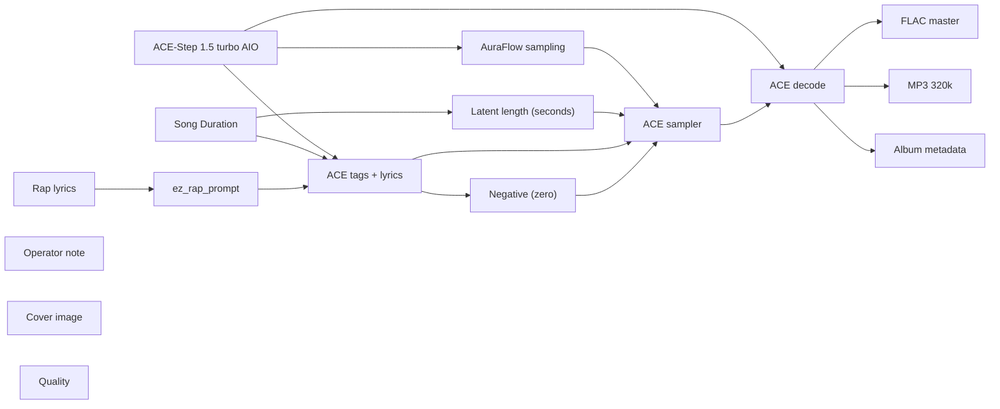

# audio/albums/nill-bye/lone-star-tab

**What's on this page**

- **Every track, cover, and album-pack graph** in this folder
- **Shared ACE-Step topology** (one printer, unique widgets per take)
- **Node parameter reference** for the types on these graphs

**What this enables**

- **Queuing one numbered take** or `album-render`
- **Reading tags, lyrics, seed, BPM** without opening raw JSON

**Who this is for:** studio users after `download-music`. Occupancy **audio** (cover stills are **klein** — separate session).

> Generated from `workflows/_lab/audio/albums/nill-bye/lone-star-tab/`. Do not hand-edit this file.

## Purpose

Numbered takes under `audio/albums/nill-bye/lone-star-tab/`. Queue one track, or `./scripts/manage.sh album-render --album nill-bye/lone-star-tab`.

```text
## 01-lone-star-tab

US-safe rap **180 s diss** take: **lone star tab**. Fictional MC **Nill Bye** (science guy) roasting public-record satire of Texas Gov. **Greg Abbott**. Abbott is a satire target, not a vocal identity. Native ACE-Step 1.5 turbo AIO. Queue this graph **on its own** — draft-first is the generic lane, not a prerequisite. Occupancy **audio** only; a longer Queue is expected.

1. Weights: `./scripts/manage.sh download-music --tier turbo` (same AIO dest as `download-podcast --tier acestep`; ~10 GB, opt-in, not `download-models`).
2. Prompt enhance is **off** so tags, BPM, language, and `[verse]`/`[chorus]` stay as written. Turn Enhance on only if you want the 4B rewriter.
3. Tags vs lyrics: tags are genre/instrument/vocal hints; lyrics are the bars. Section tags `[verse]` / `[chorus]` / `[spoken word]` are vocal hints operators may add.
4. Original lyrics only. No “in the style of <living artist>”. No living-MC names. No famous-hook paraphrases.
5. ACE-Step vocal is an **invented** identity, not a cloned MC.
6. Sampler: 8 steps, cfg 1, euler, simple. Duration 180 s, bpm 140, language en, timesignature 4, generate_audio_codes true. Seed 271.
7. Saves: `01 - Lone Star Tab` FLAC master + 320 kbps MP3 under `${COMFY_OUTPUT_DIR}`.
8. Cover separately: Queue **klein/thumbnail.json** or **klein/podcast-cover.json**. Do not embed Klein here.
9. Human rewrite the lyrics before any release. Prompts are not authorship (USCO Part 2 / Thaler).
10. Do not co-resident with LTX / Wan / Klein on this Spark.

Beat-only pass: append instrumental, no vocals, and replace lyrics with [inst].

Occupancy: audio — stop Klein / Wan / LTX session. One GB10 job.
```

## Shared graph



## Graphs in this album

| Graph | Nodes | Occupancy |
| --- | --- | --- |
| `audio/albums/nill-bye/lone-star-tab/01-lone-star-tab` | 16 | audio |
| `audio/albums/nill-bye/lone-star-tab/02-river-buoy` | 16 | audio |
| `audio/albums/nill-bye/lone-star-tab/03-bus-receipt` | 16 | audio |
| `audio/albums/nill-bye/lone-star-tab/04-guard-detail` | 16 | audio |
| `audio/albums/nill-bye/lone-star-tab/05-chase-wreck` | 16 | audio |
| `audio/albums/nill-bye/lone-star-tab/06-frequency-drop` | 16 | audio |
| `audio/albums/nill-bye/lone-star-tab/07-permitless` | 16 | audio |
| `audio/albums/nill-bye/lone-star-tab/08-trigger-clock` | 16 | audio |
| `audio/albums/nill-bye/lone-star-tab/09-disaster-stamp` | 16 | audio |
| `audio/albums/nill-bye/lone-star-tab/10-windmill-blame` | 16 | audio |
| `audio/albums/nill-bye/lone-star-tab/11-yass-primary` | 16 | audio |
| `audio/albums/nill-bye/lone-star-tab/12-hold-request` | 16 | audio |
| `audio/albums/nill-bye/lone-star-tab/13-sharia-plank` | 16 | audio |
| `audio/albums/nill-bye/lone-star-tab/14-invasion-hymn` | 16 | audio |
| `audio/albums/nill-bye/lone-star-tab/15-demolish-hook` | 16 | audio |
| `audio/albums/nill-bye/lone-star-tab/album` | 3 | none |
| `audio/albums/nill-bye/lone-star-tab/cover` | 14 | klein |

## `01-lone-star-tab`

Catalog id `audio/albums/nill-bye/lone-star-tab/01-lone-star-tab`.

US-safe rap 180s diss: Nill Bye lone-star-tab roast of Abbott, ACE-Step 1.5 turbo AIO, invented vocal
Prompt enhance is **off** so authored text (recipe, script labels, ACE tags, or film shots) is encoded as written. Turn Enhance on only if you want the 4B rewriter.

**ACE-Step 1.5 turbo AIO** (`CheckpointLoaderSimple`)

| Slot | Value |
| --- | --- |
| 0 | `ace_step_1.5_turbo_aio.safetensors` |

**AuraFlow sampling** (`ModelSamplingAuraFlow`)

| Slot | Value |
| --- | --- |
| 0 | `3` |

**Song Duration** (`PrimitiveNode`)

| Slot | Value |
| --- | --- |
| 0 | `180.0` |
| 1 | `fixed` |

**Latent length (seconds)** (`EmptyAceStep1.5LatentAudio`)

| Slot | Value |
| --- | --- |
| 0 | `180.0` |
| 1 | `1` |

**Rap lyrics** (`EZRapLyrics`)

| Slot | Value |
| --- | --- |
| 0 | `custom` |
| 1 | `[intro] 808 half-time Nill Bye summing [verse] March twenty-twenty-one, the ope…` |
| 2 | `false` |
| 3 | `audio/albums/nill-bye/lone-star-tab/01-lone-star-tab` |

```text
[intro]
808
half-time
Nill Bye summing

[verse]
March twenty-twenty-one, the operation opened
Troopers, Guard, a trespass workaround
Abbott built a Lone Star tab
Eleven billion and climbing
Nill Bye summing the weekly burn
Two-point-five million a week at the peak
Ten thousand troops on a state order
No GI bill, no federal shield
You said Washington failed the river
Then you billed Texas for a forever mission
A disaster that renews like a subscription
The tab is the policy

[chorus]
Lone Star tab
Nill Bye on the eleven-billion
Abbott still renews the disaster
Five years in, the crossing peaked
A mission without a metric
Your border is a budget

[verse]
HRW called it expensive, ineffective, abusive
You called it denying cartels a lane
Abbott still wants a federal reimbursement
Eleven billion as an IOU to himself
Nill Bye reading the appropriation
House writers cutting checks they already regret
A mission that grew faster than a memo
Pay delayed, camps dirty, troops sent home in waves
You cannot measure success if the stamp never ends
A peak in crossings, a peak in spend, no sunset
Dark trap on a blank-check war
Your security is a line item

[chorus]
Lone Star tab
Nill Bye on the eleven-billion
Abbott still renews the disaster
Five years in, the crossing peaked
A mission without a metric
Your border is a budget

[verse]
Trespass charges as an immigration hack
State cops doing a federal job by nickname
Abbott needed a workaround to the Supremacy Clause
So a rancher's complaint became a docket
Nill Bye mad at a tab with no ledger-goal
Felony counts on a press release
Eighty percent of smuggling bookings were citizens
Teenagers in a ten-year minimum
That is not a cartel takedown
That is a volume business in a courtroom
You export the photo, keep the invoice
Lone Star is a brand with a burn rate

[chorus]
Lone Star tab
Nill Bye on the eleven-billion
Abbott still renews the disaster
Five years in, the crossing peaked
A mission without a metric
Your border is a budget

[verse]
Twenty-twenty-six, still declaring the emergency
White House flipped, crossings down, stamp still wet
Nill Bye posting the Lone Star tab
Abbott still posing on a riverbank tour
A program that cannot end because ending is the tell
Success would kill the appropriation
So success is never declared, only funded
I want a metric, you want a renewal
Eleven billion is a confession
The border was the excuse
The tab was the point
Keep the 808, lose the forever war

[chorus]
Lone Star tab
Nill Bye on the eleven-billion
Abbott still renews the disaster
Five years in, the crossing peaked
A mission without a metric
Your border is a budget

[outro]
hats cease
tab open
cut
yeah
```

**ez_rap_prompt** (`EZAceStepPromptEnhance`)

| Slot | Value |
| --- | --- |
| 0 | `custom` |
| 1 | `dark trap, 808 bass, rapid hi-hats, half-time, male rap vocals, dry booth, no a…` |
| 2 | `[intro] 808 half-time Nill Bye summing [verse] March twenty-twenty-one, the ope…` |
| 3 | `false` |
| 4 | `vocal` |
| 5 | `audio/albums/nill-bye/lone-star-tab/01-lone-star-tab` |

```text
dark trap, 808 bass, rapid hi-hats, half-time, male rap vocals, dry booth, no autotune, 140 bpm
```

```text
[intro]
808
half-time
Nill Bye summing

[verse]
March twenty-twenty-one, the operation opened
Troopers, Guard, a trespass workaround
Abbott built a Lone Star tab
Eleven billion and climbing
Nill Bye summing the weekly burn
Two-point-five million a week at the peak
Ten thousand troops on a state order
No GI bill, no federal shield
You said Washington failed the river
Then you billed Texas for a forever mission
A disaster that renews like a subscription
The tab is the policy

[chorus]
Lone Star tab
Nill Bye on the eleven-billion
Abbott still renews the disaster
Five years in, the crossing peaked
A mission without a metric
Your border is a budget

[verse]
HRW called it expensive, ineffective, abusive
You called it denying cartels a lane
Abbott still wants a federal reimbursement
Eleven billion as an IOU to himself
Nill Bye reading the appropriation
House writers cutting checks they already regret
A mission that grew faster than a memo
Pay delayed, camps dirty, troops sent home in waves
You cannot measure success if the stamp never ends
A peak in crossings, a peak in spend, no sunset
Dark trap on a blank-check war
Your security is a line item

[chorus]
Lone Star tab
Nill Bye on the eleven-billion
Abbott still renews the disaster
Five years in, the crossing peaked
A mission without a metric
Your border is a budget

[verse]
Trespass charges as an immigration hack
State cops doing a federal job by nickname
Abbott needed a workaround to the Supremacy Clause
So a rancher's complaint became a docket
Nill Bye mad at a tab with no ledger-goal
Felony counts on a press release
Eighty percent of smuggling bookings were citizens
Teenagers in a ten-year minimum
That is not a cartel takedown
That is a volume business in a courtroom
You export the photo, keep the invoice
Lone Star is a brand with a burn rate

[chorus]
Lone Star tab
Nill Bye on the eleven-billion
Abbott still renews the disaster
Five years in, the crossing peaked
A mission without a metric
Your border is a budget

[verse]
Twenty-twenty-six, still declaring the emergency
White House flipped, crossings down, stamp still wet
Nill Bye posting the Lone Star tab
Abbott still posing on a riverbank tour
A program that cannot end because ending is the tell
Success would kill the appropriation
So success is never declared, only funded
I want a metric, you want a renewal
Eleven billion is a confession
The border was the excuse
The tab was the point
Keep the 808, lose the forever war

[chorus]
Lone Star tab
Nill Bye on the eleven-billion
Abbott still renews the disaster
Five years in, the crossing peaked
A mission without a metric
Your border is a budget

[outro]
hats cease
tab open
cut
yeah
```

**ACE tags + lyrics** (`TextEncodeAceStepAudio1.5`)

| Slot | Value |
| --- | --- |
| 0 | `dark trap, 808 bass, rapid hi-hats, half-time, male rap vocals, dry booth, no a…` |
| 1 | `[intro] 808 half-time Nill Bye summing [verse] March twenty-twenty-one, the ope…` |
| 2 | `271` |
| 3 | `fixed` |
| 4 | `140` |
| 5 | `180.0` |
| 6 | `4` |
| 7 | `en` |
| 8 | `C minor` |
| 9 | `true` |
| 10 | `2.0` |
| 11 | `0.85` |
| 12 | `0.9` |
| 13 | `0` |
| 14 | `0.0` |

```text
dark trap, 808 bass, rapid hi-hats, half-time, male rap vocals, dry booth, no autotune, 140 bpm
```

```text
[intro]
808
half-time
Nill Bye summing

[verse]
March twenty-twenty-one, the operation opened
Troopers, Guard, a trespass workaround
Abbott built a Lone Star tab
Eleven billion and climbing
Nill Bye summing the weekly burn
Two-point-five million a week at the peak
Ten thousand troops on a state order
No GI bill, no federal shield
You said Washington failed the river
Then you billed Texas for a forever mission
A disaster that renews like a subscription
The tab is the policy

[chorus]
Lone Star tab
Nill Bye on the eleven-billion
Abbott still renews the disaster
Five years in, the crossing peaked
A mission without a metric
Your border is a budget

[verse]
HRW called it expensive, ineffective, abusive
You called it denying cartels a lane
Abbott still wants a federal reimbursement
Eleven billion as an IOU to himself
Nill Bye reading the appropriation
House writers cutting checks they already regret
A mission that grew faster than a memo
Pay delayed, camps dirty, troops sent home in waves
You cannot measure success if the stamp never ends
A peak in crossings, a peak in spend, no sunset
Dark trap on a blank-check war
Your security is a line item

[chorus]
Lone Star tab
Nill Bye on the eleven-billion
Abbott still renews the disaster
Five years in, the crossing peaked
A mission without a metric
Your border is a budget

[verse]
Trespass charges as an immigration hack
State cops doing a federal job by nickname
Abbott needed a workaround to the Supremacy Clause
So a rancher's complaint became a docket
Nill Bye mad at a tab with no ledger-goal
Felony counts on a press release
Eighty percent of smuggling bookings were citizens
Teenagers in a ten-year minimum
That is not a cartel takedown
That is a volume business in a courtroom
You export the photo, keep the invoice
Lone Star is a brand with a burn rate

[chorus]
Lone Star tab
Nill Bye on the eleven-billion
Abbott still renews the disaster
Five years in, the crossing peaked
A mission without a metric
Your border is a budget

[verse]
Twenty-twenty-six, still declaring the emergency
White House flipped, crossings down, stamp still wet
Nill Bye posting the Lone Star tab
Abbott still posing on a riverbank tour
A program that cannot end because ending is the tell
Success would kill the appropriation
So success is never declared, only funded
I want a metric, you want a renewal
Eleven billion is a confession
The border was the excuse
The tab was the point
Keep the 808, lose the forever war

[chorus]
Lone Star tab
Nill Bye on the eleven-billion
Abbott still renews the disaster
Five years in, the crossing peaked
A mission without a metric
Your border is a budget

[outro]
hats cease
tab open
cut
yeah
```

**ACE sampler** (`KSampler`)

| Slot | Value |
| --- | --- |
| 0 | `271` |
| 1 | `fixed` |
| 2 | `8` |
| 3 | `1.0` |
| 4 | `euler` |
| 5 | `simple` |
| 6 | `1.0` |

**FLAC master** (`SaveAudio`)

| Slot | Value |
| --- | --- |
| 0 | `01 - Lone Star Tab` |

**MP3 320k** (`SaveAudioMP3`)

| Slot | Value |
| --- | --- |
| 0 | `01 - Lone Star Tab` |
| 1 | `320k` |

**Cover image** (`LoadImage`)

| Slot | Value |
| --- | --- |
| 0 | `cover.png` |
| 1 | `image` |

**Album metadata** (`EZAudioMetadata`)

| Slot | Value |
| --- | --- |
| 0 | `Nill Bye` |
| 1 | `Lone Star Tab` |
| 2 | `Lone Star Tab` |
| 3 | `1` |
| 4 | `15` |
| 5 | `2026` |
| 6 | `skip` |
| 7 | `01 - Lone Star Tab` |

**Quality** (`EZQuality`)

| Slot | Value |
| --- | --- |
| 0 | `lab` |

## `02-river-buoy`

Catalog id `audio/albums/nill-bye/lone-star-tab/02-river-buoy`.

US-safe rap 180s diss: Nill Bye river-buoy roast of Abbott, ACE-Step 1.5 turbo AIO, invented vocal
Prompt enhance is **off** so authored text (recipe, script labels, ACE tags, or film shots) is encoded as written. Turn Enhance on only if you want the 4B rewriter.

**ACE-Step 1.5 turbo AIO** (`CheckpointLoaderSimple`)

| Slot | Value |
| --- | --- |
| 0 | `ace_step_1.5_turbo_aio.safetensors` |

**AuraFlow sampling** (`ModelSamplingAuraFlow`)

| Slot | Value |
| --- | --- |
| 0 | `3` |

**Song Duration** (`PrimitiveNode`)

| Slot | Value |
| --- | --- |
| 0 | `180.0` |
| 1 | `fixed` |

**Latent length (seconds)** (`EmptyAceStep1.5LatentAudio`)

| Slot | Value |
| --- | --- |
| 0 | `180.0` |
| 1 | `1` |

**Rap lyrics** (`EZRapLyrics`)

| Slot | Value |
| --- | --- |
| 0 | `custom` |
| 1 | `[intro] distorted 808 laser hats Nill Bye sounding [verse] Eagle Pass, a string…` |
| 2 | `false` |
| 3 | `audio/albums/nill-bye/lone-star-tab/02-river-buoy` |

```text
[intro]
distorted 808
laser hats
Nill Bye sounding

[verse]
Eagle Pass, a string of orange buoys
Saw-bladed, chained, a floating barrier
Abbott planted a river buoy
In a channel that kills without help
Nill Bye sounding the current
Seventy thousand rolls of concertina
People snagged in wire, turned back to the current
A barrier designed to injure the crossing
Washington asked a court to pull them
You dared the feds to come get the chain
Rage hats on a cruelty gadget
Your sovereignty is a snag-hook

[chorus]
River buoy
Nill Bye on the floating wall
Abbott put saw-teeth in the current
Razor on the bank, orange in the channel
DOJ sued, the river still cut
Your deterrent is a snag

[verse]
The Rio Grande is not a moat you own alone
It is a boundary with a treaty and a flow
Abbott treated it like a prop table
Buoys for the cameras, wire for the feet
Nill Bye mad at a floating barrier
A child in the current does not parse jurisdiction
You wrote a presser on a drowning risk
Then called the risk a feature
DOJ filed, you appealed, the orange stayed
A standoff as a product
Injury is the metric you will not print
The river prints it anyway

[chorus]
River buoy
Nill Bye on the floating wall
Abbott put saw-teeth in the current
Razor on the bank, orange in the channel
DOJ sued, the river still cut
Your deterrent is a snag

[verse]
Concertina on the bank like a thicket
Troopers told to hold the line, not the person
Abbott's memo: don't assist the crossing
Hold the line, not the person in the current
Nill Bye holding the cruelty gadget
A policy written to make the river worse
You engineered a snag and called it security
A saw-tooth is not a code-book
A chain is not a hearing
The current was already the danger
You added teeth because the photo needed teeth
Rage drop, no mercy in the mix

[chorus]
River buoy
Nill Bye on the floating wall
Abbott put saw-teeth in the current
Razor on the bank, orange in the channel
DOJ sued, the river still cut
Your deterrent is a snag

[verse]
Courts can yank a buoy
They cannot yank the intent
Nill Bye posting the river buoy
Abbott still standing on the bank for the lens
A floating wall that does not stop a presser
It stops a person who cannot swim the extra yard
I want a border with a process
You want a border with a laceration
Orange in the channel, red in the briefing
Keep the distortion, lose the saw
The river was a river
You made it a trap

[chorus]
River buoy
Nill Bye on the floating wall
Abbott put saw-teeth in the current
Razor on the bank, orange in the channel
DOJ sued, the river still cut
Your deterrent is a snag

[outro]
hats ring
chain stays
cut
```

**ez_rap_prompt** (`EZAceStepPromptEnhance`)

| Slot | Value |
| --- | --- |
| 0 | `custom` |
| 1 | `rage, distorted 808, laser hats, male rap vocals, dry booth, no autotune, 148 b…` |
| 2 | `[intro] distorted 808 laser hats Nill Bye sounding [verse] Eagle Pass, a string…` |
| 3 | `false` |
| 4 | `vocal` |
| 5 | `audio/albums/nill-bye/lone-star-tab/02-river-buoy` |

```text
rage, distorted 808, laser hats, male rap vocals, dry booth, no autotune, 148 bpm
```

```text
[intro]
distorted 808
laser hats
Nill Bye sounding

[verse]
Eagle Pass, a string of orange buoys
Saw-bladed, chained, a floating barrier
Abbott planted a river buoy
In a channel that kills without help
Nill Bye sounding the current
Seventy thousand rolls of concertina
People snagged in wire, turned back to the current
A barrier designed to injure the crossing
Washington asked a court to pull them
You dared the feds to come get the chain
Rage hats on a cruelty gadget
Your sovereignty is a snag-hook

[chorus]
River buoy
Nill Bye on the floating wall
Abbott put saw-teeth in the current
Razor on the bank, orange in the channel
DOJ sued, the river still cut
Your deterrent is a snag

[verse]
The Rio Grande is not a moat you own alone
It is a boundary with a treaty and a flow
Abbott treated it like a prop table
Buoys for the cameras, wire for the feet
Nill Bye mad at a floating barrier
A child in the current does not parse jurisdiction
You wrote a presser on a drowning risk
Then called the risk a feature
DOJ filed, you appealed, the orange stayed
A standoff as a product
Injury is the metric you will not print
The river prints it anyway

[chorus]
River buoy
Nill Bye on the floating wall
Abbott put saw-teeth in the current
Razor on the bank, orange in the channel
DOJ sued, the river still cut
Your deterrent is a snag

[verse]
Concertina on the bank like a thicket
Troopers told to hold the line, not the person
Abbott's memo: don't assist the crossing
Hold the line, not the person in the current
Nill Bye holding the cruelty gadget
A policy written to make the river worse
You engineered a snag and called it security
A saw-tooth is not a code-book
A chain is not a hearing
The current was already the danger
You added teeth because the photo needed teeth
Rage drop, no mercy in the mix

[chorus]
River buoy
Nill Bye on the floating wall
Abbott put saw-teeth in the current
Razor on the bank, orange in the channel
DOJ sued, the river still cut
Your deterrent is a snag

[verse]
Courts can yank a buoy
They cannot yank the intent
Nill Bye posting the river buoy
Abbott still standing on the bank for the lens
A floating wall that does not stop a presser
It stops a person who cannot swim the extra yard
I want a border with a process
You want a border with a laceration
Orange in the channel, red in the briefing
Keep the distortion, lose the saw
The river was a river
You made it a trap

[chorus]
River buoy
Nill Bye on the floating wall
Abbott put saw-teeth in the current
Razor on the bank, orange in the channel
DOJ sued, the river still cut
Your deterrent is a snag

[outro]
hats ring
chain stays
cut
```

**ACE tags + lyrics** (`TextEncodeAceStepAudio1.5`)

| Slot | Value |
| --- | --- |
| 0 | `rage, distorted 808, laser hats, male rap vocals, dry booth, no autotune, 148 b…` |
| 1 | `[intro] distorted 808 laser hats Nill Bye sounding [verse] Eagle Pass, a string…` |
| 2 | `277` |
| 3 | `fixed` |
| 4 | `148` |
| 5 | `180.0` |
| 6 | `4` |
| 7 | `en` |
| 8 | `C minor` |
| 9 | `true` |
| 10 | `2.0` |
| 11 | `0.85` |
| 12 | `0.9` |
| 13 | `0` |
| 14 | `0.0` |

```text
rage, distorted 808, laser hats, male rap vocals, dry booth, no autotune, 148 bpm
```

```text
[intro]
distorted 808
laser hats
Nill Bye sounding

[verse]
Eagle Pass, a string of orange buoys
Saw-bladed, chained, a floating barrier
Abbott planted a river buoy
In a channel that kills without help
Nill Bye sounding the current
Seventy thousand rolls of concertina
People snagged in wire, turned back to the current
A barrier designed to injure the crossing
Washington asked a court to pull them
You dared the feds to come get the chain
Rage hats on a cruelty gadget
Your sovereignty is a snag-hook

[chorus]
River buoy
Nill Bye on the floating wall
Abbott put saw-teeth in the current
Razor on the bank, orange in the channel
DOJ sued, the river still cut
Your deterrent is a snag

[verse]
The Rio Grande is not a moat you own alone
It is a boundary with a treaty and a flow
Abbott treated it like a prop table
Buoys for the cameras, wire for the feet
Nill Bye mad at a floating barrier
A child in the current does not parse jurisdiction
You wrote a presser on a drowning risk
Then called the risk a feature
DOJ filed, you appealed, the orange stayed
A standoff as a product
Injury is the metric you will not print
The river prints it anyway

[chorus]
River buoy
Nill Bye on the floating wall
Abbott put saw-teeth in the current
Razor on the bank, orange in the channel
DOJ sued, the river still cut
Your deterrent is a snag

[verse]
Concertina on the bank like a thicket
Troopers told to hold the line, not the person
Abbott's memo: don't assist the crossing
Hold the line, not the person in the current
Nill Bye holding the cruelty gadget
A policy written to make the river worse
You engineered a snag and called it security
A saw-tooth is not a code-book
A chain is not a hearing
The current was already the danger
You added teeth because the photo needed teeth
Rage drop, no mercy in the mix

[chorus]
River buoy
Nill Bye on the floating wall
Abbott put saw-teeth in the current
Razor on the bank, orange in the channel
DOJ sued, the river still cut
Your deterrent is a snag

[verse]
Courts can yank a buoy
They cannot yank the intent
Nill Bye posting the river buoy
Abbott still standing on the bank for the lens
A floating wall that does not stop a presser
It stops a person who cannot swim the extra yard
I want a border with a process
You want a border with a laceration
Orange in the channel, red in the briefing
Keep the distortion, lose the saw
The river was a river
You made it a trap

[chorus]
River buoy
Nill Bye on the floating wall
Abbott put saw-teeth in the current
Razor on the bank, orange in the channel
DOJ sued, the river still cut
Your deterrent is a snag

[outro]
hats ring
chain stays
cut
```

**ACE sampler** (`KSampler`)

| Slot | Value |
| --- | --- |
| 0 | `277` |
| 1 | `fixed` |
| 2 | `8` |
| 3 | `1.0` |
| 4 | `euler` |
| 5 | `simple` |
| 6 | `1.0` |

**FLAC master** (`SaveAudio`)

| Slot | Value |
| --- | --- |
| 0 | `02 - River Buoy` |

**MP3 320k** (`SaveAudioMP3`)

| Slot | Value |
| --- | --- |
| 0 | `02 - River Buoy` |
| 1 | `320k` |

**Cover image** (`LoadImage`)

| Slot | Value |
| --- | --- |
| 0 | `cover.png` |
| 1 | `image` |

**Album metadata** (`EZAudioMetadata`)

| Slot | Value |
| --- | --- |
| 0 | `Nill Bye` |
| 1 | `Lone Star Tab` |
| 2 | `River Buoy` |
| 3 | `2` |
| 4 | `15` |
| 5 | `2026` |
| 6 | `skip` |
| 7 | `02 - River Buoy` |

**Quality** (`EZQuality`)

| Slot | Value |
| --- | --- |
| 0 | `lab` |

## `03-bus-receipt`

Catalog id `audio/albums/nill-bye/lone-star-tab/03-bus-receipt`.

US-safe rap 180s diss: Nill Bye bus-receipt roast of Abbott, ACE-Step 1.5 turbo AIO, invented vocal
Prompt enhance is **off** so authored text (recipe, script labels, ACE tags, or film shots) is encoded as written. Turn Enhance on only if you want the 4B rewriter.

**ACE-Step 1.5 turbo AIO** (`CheckpointLoaderSimple`)

| Slot | Value |
| --- | --- |
| 0 | `ace_step_1.5_turbo_aio.safetensors` |

**AuraFlow sampling** (`ModelSamplingAuraFlow`)

| Slot | Value |
| --- | --- |
| 0 | `3` |

**Song Duration** (`PrimitiveNode`)

| Slot | Value |
| --- | --- |
| 0 | `180.0` |
| 1 | `fixed` |

**Latent length (seconds)** (`EmptyAceStep1.5LatentAudio`)

| Slot | Value |
| --- | --- |
| 0 | `180.0` |
| 1 | `1` |

**Rap lyrics** (`EZRapLyrics`)

| Slot | Value |
| --- | --- |
| 0 | `custom` |
| 1 | `[intro] cowbell drifted 808 Nill Bye punching [verse] More than a hundred thous…` |
| 2 | `false` |
| 3 | `audio/albums/nill-bye/lone-star-tab/03-bus-receipt` |

```text
[intro]
cowbell
drifted 808
Nill Bye punching

[verse]
More than a hundred thousand on a coach
Destinations picked for the headline
Abbott signed a bus receipt
Podium cities picked for the yell
Nill Bye punching the manifest
Phonk cowbell on a one-way errand
You called it sharing the burden
It was exporting a photo-op
Cities that asked for coordination got a drop-off
No notice, winter, a podium waiting
A person is not a parcel
Your waybill is the cruelty

[chorus]
Bus receipt
Nill Bye on the manifest
Abbott mailed people like a presser
NYC, D.C., Chicago on a ticket
A person is not a payload
Your compassion is a waybill

[verse]
The spreadsheet had a media column
Which mayor would yell on cable
Abbott played dispatcher for a narrative
Asylum as a prop in a blue city
Nill Bye mad at a ticket-as-taunt
You can move a person and miss a policy
A coach does not adjudicate a claim
It just relocates the camera
Texas spent the fare and kept the talking point
Receiving cities spent the shelter
That is not federalism
That is a chain letter with a diesel engine

[chorus]
Bus receipt
Nill Bye on the manifest
Abbott mailed people like a presser
NYC, D.C., Chicago on a ticket
A person is not a payload
Your compassion is a waybill

[verse]
Phonk drift on a midnight arrival
Crunchy sample, no welcome script
Abbott still brags the receipt
As if a bus were a border solution
Nill Bye reading the drop-off logs
Some sent to VP's door for the clip
A human being as a tagged parcel
You wrapped the insult in a travel voucher
Coordination would have been government
Ambush is a campaign
I want a process, you want a mayor on defense
The manifest is the method

[chorus]
Bus receipt
Nill Bye on the manifest
Abbott mailed people like a presser
NYC, D.C., Chicago on a ticket
A person is not a payload
Your compassion is a waybill

[verse]
Years of coaches, same stunt, new city
The tab hid inside the bigger burn
Nill Bye posting the bus receipt
Abbott still treating a passenger as a payload
A waybill is not a welcome
A drop-off is not a hearing
Keep the cowbell, lose the parcel act
People get off a coach tired, not converted
Your message landed on a sidewalk
The policy never did
File the receipt, file the stunt
The phonk already told on you

[chorus]
Bus receipt
Nill Bye on the manifest
Abbott mailed people like a presser
NYC, D.C., Chicago on a ticket
A person is not a payload
Your compassion is a waybill

[outro]
cowbell rest
manifest cold
cut
yeah
```

**ez_rap_prompt** (`EZAceStepPromptEnhance`)

| Slot | Value |
| --- | --- |
| 0 | `custom` |
| 1 | `phonk, cowbell, drifted 808, crunchy sample, male rap vocals, dry booth, no aut…` |
| 2 | `[intro] cowbell drifted 808 Nill Bye punching [verse] More than a hundred thous…` |
| 3 | `false` |
| 4 | `vocal` |
| 5 | `audio/albums/nill-bye/lone-star-tab/03-bus-receipt` |

```text
phonk, cowbell, drifted 808, crunchy sample, male rap vocals, dry booth, no autotune, 132 bpm
```

```text
[intro]
cowbell
drifted 808
Nill Bye punching

[verse]
More than a hundred thousand on a coach
Destinations picked for the headline
Abbott signed a bus receipt
Podium cities picked for the yell
Nill Bye punching the manifest
Phonk cowbell on a one-way errand
You called it sharing the burden
It was exporting a photo-op
Cities that asked for coordination got a drop-off
No notice, winter, a podium waiting
A person is not a parcel
Your waybill is the cruelty

[chorus]
Bus receipt
Nill Bye on the manifest
Abbott mailed people like a presser
NYC, D.C., Chicago on a ticket
A person is not a payload
Your compassion is a waybill

[verse]
The spreadsheet had a media column
Which mayor would yell on cable
Abbott played dispatcher for a narrative
Asylum as a prop in a blue city
Nill Bye mad at a ticket-as-taunt
You can move a person and miss a policy
A coach does not adjudicate a claim
It just relocates the camera
Texas spent the fare and kept the talking point
Receiving cities spent the shelter
That is not federalism
That is a chain letter with a diesel engine

[chorus]
Bus receipt
Nill Bye on the manifest
Abbott mailed people like a presser
NYC, D.C., Chicago on a ticket
A person is not a payload
Your compassion is a waybill

[verse]
Phonk drift on a midnight arrival
Crunchy sample, no welcome script
Abbott still brags the receipt
As if a bus were a border solution
Nill Bye reading the drop-off logs
Some sent to VP's door for the clip
A human being as a tagged parcel
You wrapped the insult in a travel voucher
Coordination would have been government
Ambush is a campaign
I want a process, you want a mayor on defense
The manifest is the method

[chorus]
Bus receipt
Nill Bye on the manifest
Abbott mailed people like a presser
NYC, D.C., Chicago on a ticket
A person is not a payload
Your compassion is a waybill

[verse]
Years of coaches, same stunt, new city
The tab hid inside the bigger burn
Nill Bye posting the bus receipt
Abbott still treating a passenger as a payload
A waybill is not a welcome
A drop-off is not a hearing
Keep the cowbell, lose the parcel act
People get off a coach tired, not converted
Your message landed on a sidewalk
The policy never did
File the receipt, file the stunt
The phonk already told on you

[chorus]
Bus receipt
Nill Bye on the manifest
Abbott mailed people like a presser
NYC, D.C., Chicago on a ticket
A person is not a payload
Your compassion is a waybill

[outro]
cowbell rest
manifest cold
cut
yeah
```

**ACE tags + lyrics** (`TextEncodeAceStepAudio1.5`)

| Slot | Value |
| --- | --- |
| 0 | `phonk, cowbell, drifted 808, crunchy sample, male rap vocals, dry booth, no aut…` |
| 1 | `[intro] cowbell drifted 808 Nill Bye punching [verse] More than a hundred thous…` |
| 2 | `281` |
| 3 | `fixed` |
| 4 | `132` |
| 5 | `180.0` |
| 6 | `4` |
| 7 | `en` |
| 8 | `C minor` |
| 9 | `true` |
| 10 | `2.0` |
| 11 | `0.85` |
| 12 | `0.9` |
| 13 | `0` |
| 14 | `0.0` |

```text
phonk, cowbell, drifted 808, crunchy sample, male rap vocals, dry booth, no autotune, 132 bpm
```

```text
[intro]
cowbell
drifted 808
Nill Bye punching

[verse]
More than a hundred thousand on a coach
Destinations picked for the headline
Abbott signed a bus receipt
Podium cities picked for the yell
Nill Bye punching the manifest
Phonk cowbell on a one-way errand
You called it sharing the burden
It was exporting a photo-op
Cities that asked for coordination got a drop-off
No notice, winter, a podium waiting
A person is not a parcel
Your waybill is the cruelty

[chorus]
Bus receipt
Nill Bye on the manifest
Abbott mailed people like a presser
NYC, D.C., Chicago on a ticket
A person is not a payload
Your compassion is a waybill

[verse]
The spreadsheet had a media column
Which mayor would yell on cable
Abbott played dispatcher for a narrative
Asylum as a prop in a blue city
Nill Bye mad at a ticket-as-taunt
You can move a person and miss a policy
A coach does not adjudicate a claim
It just relocates the camera
Texas spent the fare and kept the talking point
Receiving cities spent the shelter
That is not federalism
That is a chain letter with a diesel engine

[chorus]
Bus receipt
Nill Bye on the manifest
Abbott mailed people like a presser
NYC, D.C., Chicago on a ticket
A person is not a payload
Your compassion is a waybill

[verse]
Phonk drift on a midnight arrival
Crunchy sample, no welcome script
Abbott still brags the receipt
As if a bus were a border solution
Nill Bye reading the drop-off logs
Some sent to VP's door for the clip
A human being as a tagged parcel
You wrapped the insult in a travel voucher
Coordination would have been government
Ambush is a campaign
I want a process, you want a mayor on defense
The manifest is the method

[chorus]
Bus receipt
Nill Bye on the manifest
Abbott mailed people like a presser
NYC, D.C., Chicago on a ticket
A person is not a payload
Your compassion is a waybill

[verse]
Years of coaches, same stunt, new city
The tab hid inside the bigger burn
Nill Bye posting the bus receipt
Abbott still treating a passenger as a payload
A waybill is not a welcome
A drop-off is not a hearing
Keep the cowbell, lose the parcel act
People get off a coach tired, not converted
Your message landed on a sidewalk
The policy never did
File the receipt, file the stunt
The phonk already told on you

[chorus]
Bus receipt
Nill Bye on the manifest
Abbott mailed people like a presser
NYC, D.C., Chicago on a ticket
A person is not a payload
Your compassion is a waybill

[outro]
cowbell rest
manifest cold
cut
yeah
```

**ACE sampler** (`KSampler`)

| Slot | Value |
| --- | --- |
| 0 | `281` |
| 1 | `fixed` |
| 2 | `8` |
| 3 | `1.0` |
| 4 | `euler` |
| 5 | `simple` |
| 6 | `1.0` |

**FLAC master** (`SaveAudio`)

| Slot | Value |
| --- | --- |
| 0 | `03 - Bus Receipt` |

**MP3 320k** (`SaveAudioMP3`)

| Slot | Value |
| --- | --- |
| 0 | `03 - Bus Receipt` |
| 1 | `320k` |

**Cover image** (`LoadImage`)

| Slot | Value |
| --- | --- |
| 0 | `cover.png` |
| 1 | `image` |

**Album metadata** (`EZAudioMetadata`)

| Slot | Value |
| --- | --- |
| 0 | `Nill Bye` |
| 1 | `Lone Star Tab` |
| 2 | `Bus Receipt` |
| 3 | `3` |
| 4 | `15` |
| 5 | `2026` |
| 6 | `skip` |
| 7 | `03 - Bus Receipt` |

**Quality** (`EZQuality`)

| Slot | Value |
| --- | --- |
| 0 | `lab` |

## `04-guard-detail`

Catalog id `audio/albums/nill-bye/lone-star-tab/04-guard-detail`.

US-safe rap 180s diss: Nill Bye guard-detail roast of Abbott, ACE-Step 1.5 turbo AIO, invented vocal
Prompt enhance is **off** so authored text (recipe, script labels, ACE tags, or film shots) is encoded as written. Turn Enhance on only if you want the 4B rewriter.

**ACE-Step 1.5 turbo AIO** (`CheckpointLoaderSimple`)

| Slot | Value |
| --- | --- |
| 0 | `ace_step_1.5_turbo_aio.safetensors` |

**AuraFlow sampling** (`ModelSamplingAuraFlow`)

| Slot | Value |
| --- | --- |
| 0 | `3` |

**Song Duration** (`PrimitiveNode`)

| Slot | Value |
| --- | --- |
| 0 | `180.0` |
| 1 | `fixed` |

**Latent length (seconds)** (`EmptyAceStep1.5LatentAudio`)

| Slot | Value |
| --- | --- |
| 0 | `180.0` |
| 1 | `1` |

**Rap lyrics** (`EZRapLyrics`)

| Slot | Value |
| --- | --- |
| 0 | `custom` |
| 1 | `[intro] rapid hats dark pads Nill Bye calling roll [verse] State orders, not fe…` |
| 2 | `false` |
| 3 | `audio/albums/nill-bye/lone-star-tab/04-guard-detail` |

```text
[intro]
rapid hats
dark pads
Nill Bye calling roll

[verse]
State orders, not federal orders
No GI bill, no survivor guarantee at first
Abbott put the Guard on a forever detail
Jobs paused, families on hold, pay late
Nill Bye calling roll on a quiet list
Twelve to seventeen dead, none in a firefight
Suicide, wreck, a negligent discharge
A parking lot in San Antonio
Joshua had a dream job waiting
The exemption never came
You deployed a kid and called it elite
The roster paid in quiet ways

[chorus]
Guard detail
Nill Bye on the state order
Abbott sent them far from home
Seventeen non-combat, some by their own hand
Bishop drowned on a rescue
Your mission ate the roster

[verse]
Bishop Evans went into the Rio
Two people in the current, he went after them
Abbott's river policy said hold the bank
The soldier said hold the person
Nill Bye keeping Bishop on the detail
The House later named a benefit bill for him
Troopers already had the half-million
Guard families had to beg the same
You will pose with a C-17 of tin soldiers
Chicago-bound, riot shields, a caption
Ever ready, deploying now
Ready for a camera, late for a death benefit

[chorus]
Guard detail
Nill Bye on the state order
Abbott sent them far from home
Seventeen non-combat, some by their own hand
Bishop drowned on a rescue
Your mission ate the roster

[verse]
Dajuan, nineteen, a negligent round
Training and kit that did not match the speech
Abbott likes the elite Texas National Guard slogan
The camps had pay problems and dirty water
Nill Bye mad at a detail with no care
Involuntary call-ups until the department blinked
Thousands sent home after the damage
The mission still hungry for bodies
A soldier is not a sandbag
A state order is not a career
You borrowed a life and underwrote it cheap
The trap kit cannot hide the roll

[chorus]
Guard detail
Nill Bye on the state order
Abbott sent them far from home
Seventeen non-combat, some by their own hand
Bishop drowned on a rescue
Your mission ate the roster

[verse]
Texas Monthly asked where the soldiers went
The answer is a parking lot, a river, a barracks
Nill Bye posting the Guard detail
Abbott still boarding planes for other cities
A caption on a Globemaster is not a eulogy
A shield is not a stipend
I want the roster home
You want the roster in the shot
Seventeen is not a rumor
It is a cost you will not read on a stump
Keep the hats, lose the forever call-up
The detail already came due

[chorus]
Guard detail
Nill Bye on the state order
Abbott sent them far from home
Seventeen non-combat, some by their own hand
Bishop drowned on a rescue
Your mission ate the roster

[outro]
hats fade
roll closed
cut
```

**ez_rap_prompt** (`EZAceStepPromptEnhance`)

| Slot | Value |
| --- | --- |
| 0 | `custom` |
| 1 | `trap, 808 bass, rapid hats, dark pads, male rap vocals, dry booth, no autotune,…` |
| 2 | `[intro] rapid hats dark pads Nill Bye calling roll [verse] State orders, not fe…` |
| 3 | `false` |
| 4 | `vocal` |
| 5 | `audio/albums/nill-bye/lone-star-tab/04-guard-detail` |

```text
trap, 808 bass, rapid hats, dark pads, male rap vocals, dry booth, no autotune, 145 bpm
```

```text
[intro]
rapid hats
dark pads
Nill Bye calling roll

[verse]
State orders, not federal orders
No GI bill, no survivor guarantee at first
Abbott put the Guard on a forever detail
Jobs paused, families on hold, pay late
Nill Bye calling roll on a quiet list
Twelve to seventeen dead, none in a firefight
Suicide, wreck, a negligent discharge
A parking lot in San Antonio
Joshua had a dream job waiting
The exemption never came
You deployed a kid and called it elite
The roster paid in quiet ways

[chorus]
Guard detail
Nill Bye on the state order
Abbott sent them far from home
Seventeen non-combat, some by their own hand
Bishop drowned on a rescue
Your mission ate the roster

[verse]
Bishop Evans went into the Rio
Two people in the current, he went after them
Abbott's river policy said hold the bank
The soldier said hold the person
Nill Bye keeping Bishop on the detail
The House later named a benefit bill for him
Troopers already had the half-million
Guard families had to beg the same
You will pose with a C-17 of tin soldiers
Chicago-bound, riot shields, a caption
Ever ready, deploying now
Ready for a camera, late for a death benefit

[chorus]
Guard detail
Nill Bye on the state order
Abbott sent them far from home
Seventeen non-combat, some by their own hand
Bishop drowned on a rescue
Your mission ate the roster

[verse]
Dajuan, nineteen, a negligent round
Training and kit that did not match the speech
Abbott likes the elite Texas National Guard slogan
The camps had pay problems and dirty water
Nill Bye mad at a detail with no care
Involuntary call-ups until the department blinked
Thousands sent home after the damage
The mission still hungry for bodies
A soldier is not a sandbag
A state order is not a career
You borrowed a life and underwrote it cheap
The trap kit cannot hide the roll

[chorus]
Guard detail
Nill Bye on the state order
Abbott sent them far from home
Seventeen non-combat, some by their own hand
Bishop drowned on a rescue
Your mission ate the roster

[verse]
Texas Monthly asked where the soldiers went
The answer is a parking lot, a river, a barracks
Nill Bye posting the Guard detail
Abbott still boarding planes for other cities
A caption on a Globemaster is not a eulogy
A shield is not a stipend
I want the roster home
You want the roster in the shot
Seventeen is not a rumor
It is a cost you will not read on a stump
Keep the hats, lose the forever call-up
The detail already came due

[chorus]
Guard detail
Nill Bye on the state order
Abbott sent them far from home
Seventeen non-combat, some by their own hand
Bishop drowned on a rescue
Your mission ate the roster

[outro]
hats fade
roll closed
cut
```

**ACE tags + lyrics** (`TextEncodeAceStepAudio1.5`)

| Slot | Value |
| --- | --- |
| 0 | `trap, 808 bass, rapid hats, dark pads, male rap vocals, dry booth, no autotune,…` |
| 1 | `[intro] rapid hats dark pads Nill Bye calling roll [verse] State orders, not fe…` |
| 2 | `283` |
| 3 | `fixed` |
| 4 | `145` |
| 5 | `180.0` |
| 6 | `4` |
| 7 | `en` |
| 8 | `C minor` |
| 9 | `true` |
| 10 | `2.0` |
| 11 | `0.85` |
| 12 | `0.9` |
| 13 | `0` |
| 14 | `0.0` |

```text
trap, 808 bass, rapid hats, dark pads, male rap vocals, dry booth, no autotune, 145 bpm
```

```text
[intro]
rapid hats
dark pads
Nill Bye calling roll

[verse]
State orders, not federal orders
No GI bill, no survivor guarantee at first
Abbott put the Guard on a forever detail
Jobs paused, families on hold, pay late
Nill Bye calling roll on a quiet list
Twelve to seventeen dead, none in a firefight
Suicide, wreck, a negligent discharge
A parking lot in San Antonio
Joshua had a dream job waiting
The exemption never came
You deployed a kid and called it elite
The roster paid in quiet ways

[chorus]
Guard detail
Nill Bye on the state order
Abbott sent them far from home
Seventeen non-combat, some by their own hand
Bishop drowned on a rescue
Your mission ate the roster

[verse]
Bishop Evans went into the Rio
Two people in the current, he went after them
Abbott's river policy said hold the bank
The soldier said hold the person
Nill Bye keeping Bishop on the detail
The House later named a benefit bill for him
Troopers already had the half-million
Guard families had to beg the same
You will pose with a C-17 of tin soldiers
Chicago-bound, riot shields, a caption
Ever ready, deploying now
Ready for a camera, late for a death benefit

[chorus]
Guard detail
Nill Bye on the state order
Abbott sent them far from home
Seventeen non-combat, some by their own hand
Bishop drowned on a rescue
Your mission ate the roster

[verse]
Dajuan, nineteen, a negligent round
Training and kit that did not match the speech
Abbott likes the elite Texas National Guard slogan
The camps had pay problems and dirty water
Nill Bye mad at a detail with no care
Involuntary call-ups until the department blinked
Thousands sent home after the damage
The mission still hungry for bodies
A soldier is not a sandbag
A state order is not a career
You borrowed a life and underwrote it cheap
The trap kit cannot hide the roll

[chorus]
Guard detail
Nill Bye on the state order
Abbott sent them far from home
Seventeen non-combat, some by their own hand
Bishop drowned on a rescue
Your mission ate the roster

[verse]
Texas Monthly asked where the soldiers went
The answer is a parking lot, a river, a barracks
Nill Bye posting the Guard detail
Abbott still boarding planes for other cities
A caption on a Globemaster is not a eulogy
A shield is not a stipend
I want the roster home
You want the roster in the shot
Seventeen is not a rumor
It is a cost you will not read on a stump
Keep the hats, lose the forever call-up
The detail already came due

[chorus]
Guard detail
Nill Bye on the state order
Abbott sent them far from home
Seventeen non-combat, some by their own hand
Bishop drowned on a rescue
Your mission ate the roster

[outro]
hats fade
roll closed
cut
```

**ACE sampler** (`KSampler`)

| Slot | Value |
| --- | --- |
| 0 | `283` |
| 1 | `fixed` |
| 2 | `8` |
| 3 | `1.0` |
| 4 | `euler` |
| 5 | `simple` |
| 6 | `1.0` |

**FLAC master** (`SaveAudio`)

| Slot | Value |
| --- | --- |
| 0 | `04 - Guard Detail` |

**MP3 320k** (`SaveAudioMP3`)

| Slot | Value |
| --- | --- |
| 0 | `04 - Guard Detail` |
| 1 | `320k` |

**Cover image** (`LoadImage`)

| Slot | Value |
| --- | --- |
| 0 | `cover.png` |
| 1 | `image` |

**Album metadata** (`EZAudioMetadata`)

| Slot | Value |
| --- | --- |
| 0 | `Nill Bye` |
| 1 | `Lone Star Tab` |
| 2 | `Guard Detail` |
| 3 | `4` |
| 4 | `15` |
| 5 | `2026` |
| 6 | `skip` |
| 7 | `04 - Guard Detail` |

**Quality** (`EZQuality`)

| Slot | Value |
| --- | --- |
| 0 | `lab` |

## `05-chase-wreck`

Catalog id `audio/albums/nill-bye/lone-star-tab/05-chase-wreck`.

US-safe rap 180s diss: Nill Bye chase-wreck roast of Abbott, ACE-Step 1.5 turbo AIO, invented vocal
Prompt enhance is **off** so authored text (recipe, script labels, ACE tags, or film shots) is encoded as written. Turn Enhance on only if you want the 4B rewriter.

**ACE-Step 1.5 turbo AIO** (`CheckpointLoaderSimple`)

| Slot | Value |
| --- | --- |
| 0 | `ace_step_1.5_turbo_aio.safetensors` |

**AuraFlow sampling** (`ModelSamplingAuraFlow`)

| Slot | Value |
| --- | --- |
| 0 | `3` |

**Song Duration** (`PrimitiveNode`)

| Slot | Value |
| --- | --- |
| 0 | `180.0` |
| 1 | `fixed` |

**Latent length (seconds)** (`EmptyAceStep1.5LatentAudio`)

| Slot | Value |
| --- | --- |
| 0 | `180.0` |
| 1 | `1` |

**Rap lyrics** (`EZRapLyrics`)

| Slot | Value |
| --- | --- |
| 0 | `custom` |
| 1 | `[intro] four-on-the-floor sidechain Nill Bye clocking [verse] Human Rights Watc…` |
| 2 | `false` |
| 3 | `audio/albums/nill-bye/lone-star-tab/05-chase-wreck` |

```text
[intro]
four-on-the-floor
sidechain
Nill Bye clocking

[verse]
Human Rights Watch did the count
One hundred six killed in the chase wreck
Abbott's counties, thirteen percent of the people
Two-thirds of the pursuits
Nill Bye clocking the pursuit log
DPS up fifty percent in three years
Seventy percent of that spike in OLS zones
No officer dead, plenty of bystanders
A mother on her way to a shift
A child in a car that was not the suspect
You added troopers without a pursuit policy that holds
The intersection paid

[chorus]
Chase wreck
Nill Bye on the pursuit log
Abbott flooded OLS counties with troopers
One-oh-six dead, three-oh-one hurt
Bystanders in the intersection
Your policing is a high-speed bet

[verse]
Best practice says don't chase for a hunch
CBP itself cooled the high-speed habit
Abbott leaned the other way
More badges, more ignition, more wrecks
Nill Bye mad at a four-on-the-floor funeral
House kick under a crash report
You cannot flood a county with state cops
And act shocked when the highway becomes a weapon
Ten bystanders dead in the first tallies
Twenty hurt who were not in the suspect car
That is not collateral in a war
That is a policy with a skid mark

[chorus]
Chase wreck
Nill Bye on the pursuit log
Abbott flooded OLS counties with troopers
One-oh-six dead, three-oh-one hurt
Bystanders in the intersection
Your policing is a high-speed bet

[verse]
Sixty-seven counties in the program
A death rate eight times the national chase-rate
Abbott still funds the same posture
Deportation extra, same accelerator
Nill Bye reading the Statesman follow-up
Thirty-two more after the first report
The wreck did not plateau, it compounded
A mission without a brake pedal
You measure seizures and skip the morgue
Fentanyl numbers on a podium
One-oh-six not on the slide
The piano stab cannot cover a siren

[chorus]
Chase wreck
Nill Bye on the pursuit log
Abbott flooded OLS counties with troopers
One-oh-six dead, three-oh-one hurt
Bystanders in the intersection
Your policing is a high-speed bet

[verse]
End the appropriation, HRW said
You renewed it like a club membership
Nill Bye posting the chase wreck
Abbott still selling the flood of troopers as safety
Safety for who, in which intersection
A bystander does not get a briefing
I want a pursuit that can let go
You want a pursuit that films well
Sidechain pump on a crash log
Keep the house kick, lose the bet
One-oh-six is a club you should close
The wreck already called last round

[chorus]
Chase wreck
Nill Bye on the pursuit log
Abbott flooded OLS counties with troopers
One-oh-six dead, three-oh-one hurt
Bystanders in the intersection
Your policing is a high-speed bet

[outro]
kick stops
log open
cut
yeah
```

**ez_rap_prompt** (`EZAceStepPromptEnhance`)

| Slot | Value |
| --- | --- |
| 0 | `custom` |
| 1 | `house, four-on-the-floor, piano stab, sidechain bass, male rap vocals, dry boot…` |
| 2 | `[intro] four-on-the-floor sidechain Nill Bye clocking [verse] Human Rights Watc…` |
| 3 | `false` |
| 4 | `vocal` |
| 5 | `audio/albums/nill-bye/lone-star-tab/05-chase-wreck` |

```text
house, four-on-the-floor, piano stab, sidechain bass, male rap vocals, dry booth, no autotune, 126 bpm
```

```text
[intro]
four-on-the-floor
sidechain
Nill Bye clocking

[verse]
Human Rights Watch did the count
One hundred six killed in the chase wreck
Abbott's counties, thirteen percent of the people
Two-thirds of the pursuits
Nill Bye clocking the pursuit log
DPS up fifty percent in three years
Seventy percent of that spike in OLS zones
No officer dead, plenty of bystanders
A mother on her way to a shift
A child in a car that was not the suspect
You added troopers without a pursuit policy that holds
The intersection paid

[chorus]
Chase wreck
Nill Bye on the pursuit log
Abbott flooded OLS counties with troopers
One-oh-six dead, three-oh-one hurt
Bystanders in the intersection
Your policing is a high-speed bet

[verse]
Best practice says don't chase for a hunch
CBP itself cooled the high-speed habit
Abbott leaned the other way
More badges, more ignition, more wrecks
Nill Bye mad at a four-on-the-floor funeral
House kick under a crash report
You cannot flood a county with state cops
And act shocked when the highway becomes a weapon
Ten bystanders dead in the first tallies
Twenty hurt who were not in the suspect car
That is not collateral in a war
That is a policy with a skid mark

[chorus]
Chase wreck
Nill Bye on the pursuit log
Abbott flooded OLS counties with troopers
One-oh-six dead, three-oh-one hurt
Bystanders in the intersection
Your policing is a high-speed bet

[verse]
Sixty-seven counties in the program
A death rate eight times the national chase-rate
Abbott still funds the same posture
Deportation extra, same accelerator
Nill Bye reading the Statesman follow-up
Thirty-two more after the first report
The wreck did not plateau, it compounded
A mission without a brake pedal
You measure seizures and skip the morgue
Fentanyl numbers on a podium
One-oh-six not on the slide
The piano stab cannot cover a siren

[chorus]
Chase wreck
Nill Bye on the pursuit log
Abbott flooded OLS counties with troopers
One-oh-six dead, three-oh-one hurt
Bystanders in the intersection
Your policing is a high-speed bet

[verse]
End the appropriation, HRW said
You renewed it like a club membership
Nill Bye posting the chase wreck
Abbott still selling the flood of troopers as safety
Safety for who, in which intersection
A bystander does not get a briefing
I want a pursuit that can let go
You want a pursuit that films well
Sidechain pump on a crash log
Keep the house kick, lose the bet
One-oh-six is a club you should close
The wreck already called last round

[chorus]
Chase wreck
Nill Bye on the pursuit log
Abbott flooded OLS counties with troopers
One-oh-six dead, three-oh-one hurt
Bystanders in the intersection
Your policing is a high-speed bet

[outro]
kick stops
log open
cut
yeah
```

**ACE tags + lyrics** (`TextEncodeAceStepAudio1.5`)

| Slot | Value |
| --- | --- |
| 0 | `house, four-on-the-floor, piano stab, sidechain bass, male rap vocals, dry boot…` |
| 1 | `[intro] four-on-the-floor sidechain Nill Bye clocking [verse] Human Rights Watc…` |
| 2 | `293` |
| 3 | `fixed` |
| 4 | `126` |
| 5 | `180.0` |
| 6 | `4` |
| 7 | `en` |
| 8 | `C minor` |
| 9 | `true` |
| 10 | `2.0` |
| 11 | `0.85` |
| 12 | `0.9` |
| 13 | `0` |
| 14 | `0.0` |

```text
house, four-on-the-floor, piano stab, sidechain bass, male rap vocals, dry booth, no autotune, 126 bpm
```

```text
[intro]
four-on-the-floor
sidechain
Nill Bye clocking

[verse]
Human Rights Watch did the count
One hundred six killed in the chase wreck
Abbott's counties, thirteen percent of the people
Two-thirds of the pursuits
Nill Bye clocking the pursuit log
DPS up fifty percent in three years
Seventy percent of that spike in OLS zones
No officer dead, plenty of bystanders
A mother on her way to a shift
A child in a car that was not the suspect
You added troopers without a pursuit policy that holds
The intersection paid

[chorus]
Chase wreck
Nill Bye on the pursuit log
Abbott flooded OLS counties with troopers
One-oh-six dead, three-oh-one hurt
Bystanders in the intersection
Your policing is a high-speed bet

[verse]
Best practice says don't chase for a hunch
CBP itself cooled the high-speed habit
Abbott leaned the other way
More badges, more ignition, more wrecks
Nill Bye mad at a four-on-the-floor funeral
House kick under a crash report
You cannot flood a county with state cops
And act shocked when the highway becomes a weapon
Ten bystanders dead in the first tallies
Twenty hurt who were not in the suspect car
That is not collateral in a war
That is a policy with a skid mark

[chorus]
Chase wreck
Nill Bye on the pursuit log
Abbott flooded OLS counties with troopers
One-oh-six dead, three-oh-one hurt
Bystanders in the intersection
Your policing is a high-speed bet

[verse]
Sixty-seven counties in the program
A death rate eight times the national chase-rate
Abbott still funds the same posture
Deportation extra, same accelerator
Nill Bye reading the Statesman follow-up
Thirty-two more after the first report
The wreck did not plateau, it compounded
A mission without a brake pedal
You measure seizures and skip the morgue
Fentanyl numbers on a podium
One-oh-six not on the slide
The piano stab cannot cover a siren

[chorus]
Chase wreck
Nill Bye on the pursuit log
Abbott flooded OLS counties with troopers
One-oh-six dead, three-oh-one hurt
Bystanders in the intersection
Your policing is a high-speed bet

[verse]
End the appropriation, HRW said
You renewed it like a club membership
Nill Bye posting the chase wreck
Abbott still selling the flood of troopers as safety
Safety for who, in which intersection
A bystander does not get a briefing
I want a pursuit that can let go
You want a pursuit that films well
Sidechain pump on a crash log
Keep the house kick, lose the bet
One-oh-six is a club you should close
The wreck already called last round

[chorus]
Chase wreck
Nill Bye on the pursuit log
Abbott flooded OLS counties with troopers
One-oh-six dead, three-oh-one hurt
Bystanders in the intersection
Your policing is a high-speed bet

[outro]
kick stops
log open
cut
yeah
```

**ACE sampler** (`KSampler`)

| Slot | Value |
| --- | --- |
| 0 | `293` |
| 1 | `fixed` |
| 2 | `8` |
| 3 | `1.0` |
| 4 | `euler` |
| 5 | `simple` |
| 6 | `1.0` |

**FLAC master** (`SaveAudio`)

| Slot | Value |
| --- | --- |
| 0 | `05 - Chase Wreck` |

**MP3 320k** (`SaveAudioMP3`)

| Slot | Value |
| --- | --- |
| 0 | `05 - Chase Wreck` |
| 1 | `320k` |

**Cover image** (`LoadImage`)

| Slot | Value |
| --- | --- |
| 0 | `cover.png` |
| 1 | `image` |

**Album metadata** (`EZAudioMetadata`)

| Slot | Value |
| --- | --- |
| 0 | `Nill Bye` |
| 1 | `Lone Star Tab` |
| 2 | `Chase Wreck` |
| 3 | `5` |
| 4 | `15` |
| 5 | `2026` |
| 6 | `skip` |
| 7 | `05 - Chase Wreck` |

**Quality** (`EZQuality`)

| Slot | Value |
| --- | --- |
| 0 | `lab` |

## `06-frequency-drop`

Catalog id `audio/albums/nill-bye/lone-star-tab/06-frequency-drop`.

US-safe rap 180s diss: Nill Bye frequency-drop roast of Abbott, ACE-Step 1.5 turbo AIO, invented vocal
Prompt enhance is **off** so authored text (recipe, script labels, ACE tags, or film shots) is encoded as written. Turn Enhance on only if you want the 4B rewriter.

**ACE-Step 1.5 turbo AIO** (`CheckpointLoaderSimple`)

| Slot | Value |
| --- | --- |
| 0 | `ace_step_1.5_turbo_aio.safetensors` |

**AuraFlow sampling** (`ModelSamplingAuraFlow`)

| Slot | Value |
| --- | --- |
| 0 | `3` |

**Song Duration** (`PrimitiveNode`)

| Slot | Value |
| --- | --- |
| 0 | `180.0` |
| 1 | `fixed` |

**Latent length (seconds)** (`EmptyAceStep1.5LatentAudio`)

| Slot | Value |
| --- | --- |
| 0 | `180.0` |
| 1 | `1` |

**Rap lyrics** (`EZRapLyrics`)

| Slot | Value |
| --- | --- |
| 0 | `custom` |
| 1 | `[intro] amen break sub reese Nill Bye counting hertz [verse] ERCOT ordered the …` |
| 2 | `false` |
| 3 | `audio/albums/nill-bye/lone-star-tab/06-frequency-drop` |

```text
[intro]
amen break
sub reese
Nill Bye counting hertz

[verse]
ERCOT ordered the big shed
Twenty thousand megawatts off the bus
Abbott's isolated island had no neighbor
Frequency falling toward the cliff
Nill Bye counting the hertz as they sagged
A few minutes from a black-start nightmare
Weeks of dark if the relays had gone
Drum-and-bass on a near-death grid
You got a drop you did not want
Operators did, so the state still exists
A club drop is a joke
This one almost took the lights for a month

[chorus]
Frequency drop
Nill Bye on the load-shed
Abbott's grid kissed collapse
Twenty thousand megawatts yanked
Largest manual cut in the country
Your drop almost went dark forever

[verse]
Amen break under a control-room panic
Reese bass like a turbine trip
Abbott was on TV selling a wind story
While the frequency was the only story
Nill Bye mad at a governor off-beat
The drop is physics, not a culture war
Sixty hertz or you lose the machine
You cannot Fox-News a relay
Load-shed is a last tool
You made it a lifestyle for four days
Rolling blackouts that did not roll, they stuck
The amen already told the truth

[chorus]
Frequency drop
Nill Bye on the load-shed
Abbott's grid kissed collapse
Twenty thousand megawatts yanked
Largest manual cut in the country
Your drop almost went dark forever

[verse]
Largest manually controlled shed on the books
FERC wrote it like a eulogy for luck
Abbott later called the grid flawless
A sequel with amnesia
Nill Bye filing the frequency drop
You cannot brag a save you almost fumbled
The operators held the cliff
You held a microphone
A reese does not care about your trademark
Neither does sixty hertz
I want weatherize, you want a drop that photographs
The control room does not do encore

[chorus]
Frequency drop
Nill Bye on the load-shed
Abbott's grid kissed collapse
Twenty thousand megawatts yanked
Largest manual cut in the country
Your drop almost went dark forever

[verse]
When the next arctic sits on DFW
The same island, the same math
Nill Bye posting the load-shed
Abbott still dancing like the amen was a trophy
A drop you survive is not a drop you designed
It is a warning with a body-count nearby
Keep the break, lose the swagger
Twenty thousand off is not a flex
It is the sound of a state that almost ended
The sub is the remaining margin
Don't DJ a collapse
The frequency already dropped you

[chorus]
Frequency drop
Nill Bye on the load-shed
Abbott's grid kissed collapse
Twenty thousand megawatts yanked
Largest manual cut in the country
Your drop almost went dark forever

[outro]
amen halt
hertz holds
cut
```

**ez_rap_prompt** (`EZAceStepPromptEnhance`)

| Slot | Value |
| --- | --- |
| 0 | `custom` |
| 1 | `drum and bass, amen break, sub reese, male rap vocals, dry booth, no autotune, …` |
| 2 | `[intro] amen break sub reese Nill Bye counting hertz [verse] ERCOT ordered the …` |
| 3 | `false` |
| 4 | `vocal` |
| 5 | `audio/albums/nill-bye/lone-star-tab/06-frequency-drop` |

```text
drum and bass, amen break, sub reese, male rap vocals, dry booth, no autotune, 174 bpm
```

```text
[intro]
amen break
sub reese
Nill Bye counting hertz

[verse]
ERCOT ordered the big shed
Twenty thousand megawatts off the bus
Abbott's isolated island had no neighbor
Frequency falling toward the cliff
Nill Bye counting the hertz as they sagged
A few minutes from a black-start nightmare
Weeks of dark if the relays had gone
Drum-and-bass on a near-death grid
You got a drop you did not want
Operators did, so the state still exists
A club drop is a joke
This one almost took the lights for a month

[chorus]
Frequency drop
Nill Bye on the load-shed
Abbott's grid kissed collapse
Twenty thousand megawatts yanked
Largest manual cut in the country
Your drop almost went dark forever

[verse]
Amen break under a control-room panic
Reese bass like a turbine trip
Abbott was on TV selling a wind story
While the frequency was the only story
Nill Bye mad at a governor off-beat
The drop is physics, not a culture war
Sixty hertz or you lose the machine
You cannot Fox-News a relay
Load-shed is a last tool
You made it a lifestyle for four days
Rolling blackouts that did not roll, they stuck
The amen already told the truth

[chorus]
Frequency drop
Nill Bye on the load-shed
Abbott's grid kissed collapse
Twenty thousand megawatts yanked
Largest manual cut in the country
Your drop almost went dark forever

[verse]
Largest manually controlled shed on the books
FERC wrote it like a eulogy for luck
Abbott later called the grid flawless
A sequel with amnesia
Nill Bye filing the frequency drop
You cannot brag a save you almost fumbled
The operators held the cliff
You held a microphone
A reese does not care about your trademark
Neither does sixty hertz
I want weatherize, you want a drop that photographs
The control room does not do encore

[chorus]
Frequency drop
Nill Bye on the load-shed
Abbott's grid kissed collapse
Twenty thousand megawatts yanked
Largest manual cut in the country
Your drop almost went dark forever

[verse]
When the next arctic sits on DFW
The same island, the same math
Nill Bye posting the load-shed
Abbott still dancing like the amen was a trophy
A drop you survive is not a drop you designed
It is a warning with a body-count nearby
Keep the break, lose the swagger
Twenty thousand off is not a flex
It is the sound of a state that almost ended
The sub is the remaining margin
Don't DJ a collapse
The frequency already dropped you

[chorus]
Frequency drop
Nill Bye on the load-shed
Abbott's grid kissed collapse
Twenty thousand megawatts yanked
Largest manual cut in the country
Your drop almost went dark forever

[outro]
amen halt
hertz holds
cut
```

**ACE tags + lyrics** (`TextEncodeAceStepAudio1.5`)

| Slot | Value |
| --- | --- |
| 0 | `drum and bass, amen break, sub reese, male rap vocals, dry booth, no autotune, …` |
| 1 | `[intro] amen break sub reese Nill Bye counting hertz [verse] ERCOT ordered the …` |
| 2 | `307` |
| 3 | `fixed` |
| 4 | `174` |
| 5 | `180.0` |
| 6 | `4` |
| 7 | `en` |
| 8 | `C minor` |
| 9 | `true` |
| 10 | `2.0` |
| 11 | `0.85` |
| 12 | `0.9` |
| 13 | `0` |
| 14 | `0.0` |

```text
drum and bass, amen break, sub reese, male rap vocals, dry booth, no autotune, 174 bpm
```

```text
[intro]
amen break
sub reese
Nill Bye counting hertz

[verse]
ERCOT ordered the big shed
Twenty thousand megawatts off the bus
Abbott's isolated island had no neighbor
Frequency falling toward the cliff
Nill Bye counting the hertz as they sagged
A few minutes from a black-start nightmare
Weeks of dark if the relays had gone
Drum-and-bass on a near-death grid
You got a drop you did not want
Operators did, so the state still exists
A club drop is a joke
This one almost took the lights for a month

[chorus]
Frequency drop
Nill Bye on the load-shed
Abbott's grid kissed collapse
Twenty thousand megawatts yanked
Largest manual cut in the country
Your drop almost went dark forever

[verse]
Amen break under a control-room panic
Reese bass like a turbine trip
Abbott was on TV selling a wind story
While the frequency was the only story
Nill Bye mad at a governor off-beat
The drop is physics, not a culture war
Sixty hertz or you lose the machine
You cannot Fox-News a relay
Load-shed is a last tool
You made it a lifestyle for four days
Rolling blackouts that did not roll, they stuck
The amen already told the truth

[chorus]
Frequency drop
Nill Bye on the load-shed
Abbott's grid kissed collapse
Twenty thousand megawatts yanked
Largest manual cut in the country
Your drop almost went dark forever

[verse]
Largest manually controlled shed on the books
FERC wrote it like a eulogy for luck
Abbott later called the grid flawless
A sequel with amnesia
Nill Bye filing the frequency drop
You cannot brag a save you almost fumbled
The operators held the cliff
You held a microphone
A reese does not care about your trademark
Neither does sixty hertz
I want weatherize, you want a drop that photographs
The control room does not do encore

[chorus]
Frequency drop
Nill Bye on the load-shed
Abbott's grid kissed collapse
Twenty thousand megawatts yanked
Largest manual cut in the country
Your drop almost went dark forever

[verse]
When the next arctic sits on DFW
The same island, the same math
Nill Bye posting the load-shed
Abbott still dancing like the amen was a trophy
A drop you survive is not a drop you designed
It is a warning with a body-count nearby
Keep the break, lose the swagger
Twenty thousand off is not a flex
It is the sound of a state that almost ended
The sub is the remaining margin
Don't DJ a collapse
The frequency already dropped you

[chorus]
Frequency drop
Nill Bye on the load-shed
Abbott's grid kissed collapse
Twenty thousand megawatts yanked
Largest manual cut in the country
Your drop almost went dark forever

[outro]
amen halt
hertz holds
cut
```

**ACE sampler** (`KSampler`)

| Slot | Value |
| --- | --- |
| 0 | `307` |
| 1 | `fixed` |
| 2 | `8` |
| 3 | `1.0` |
| 4 | `euler` |
| 5 | `simple` |
| 6 | `1.0` |

**FLAC master** (`SaveAudio`)

| Slot | Value |
| --- | --- |
| 0 | `06 - Frequency Drop` |

**MP3 320k** (`SaveAudioMP3`)

| Slot | Value |
| --- | --- |
| 0 | `06 - Frequency Drop` |
| 1 | `320k` |

**Cover image** (`LoadImage`)

| Slot | Value |
| --- | --- |
| 0 | `cover.png` |
| 1 | `image` |

**Album metadata** (`EZAudioMetadata`)

| Slot | Value |
| --- | --- |
| 0 | `Nill Bye` |
| 1 | `Lone Star Tab` |
| 2 | `Frequency Drop` |
| 3 | `6` |
| 4 | `15` |
| 5 | `2026` |
| 6 | `skip` |
| 7 | `06 - Frequency Drop` |

**Quality** (`EZQuality`)

| Slot | Value |
| --- | --- |
| 0 | `lab` |

## `07-permitless`

Catalog id `audio/albums/nill-bye/lone-star-tab/07-permitless`.

US-safe rap 180s diss: Nill Bye permitless roast of Abbott, ACE-Step 1.5 turbo AIO, invented vocal
Prompt enhance is **off** so authored text (recipe, script labels, ACE tags, or film shots) is encoded as written. Turn Enhance on only if you want the 4B rewriter.

**ACE-Step 1.5 turbo AIO** (`CheckpointLoaderSimple`)

| Slot | Value |
| --- | --- |
| 0 | `ace_step_1.5_turbo_aio.safetensors` |

**AuraFlow sampling** (`ModelSamplingAuraFlow`)

| Slot | Value |
| --- | --- |
| 0 | `3` |

**Song Duration** (`PrimitiveNode`)

| Slot | Value |
| --- | --- |
| 0 | `180.0` |
| 1 | `fixed` |

**Latent length (seconds)** (`EmptyAceStep1.5LatentAudio`)

| Slot | Value |
| --- | --- |
| 0 | `180.0` |
| 1 | `1` |

**Rap lyrics** (`EZRapLyrics`)

| Slot | Value |
| --- | --- |
| 0 | `custom` |
| 1 | `[intro] chopped percussion kick drums Nill Bye reading HB [verse] September fir…` |
| 2 | `false` |
| 3 | `audio/albums/nill-bye/lone-star-tab/07-permitless` |

```text
[intro]
chopped percussion
kick drums
Nill Bye reading HB

[verse]
September first, twenty-twenty-one
HB nineteen-twenty-seven went live
Abbott signed permitless carry
Open or concealed, no exam, no range-time
Nill Bye reading the penal rewrite
Forty-six-oh-two used to mean a license
You deleted the ticket and kept the gun
Club bounce on a statute that shrugs
Training became a vibe
A class A became a lifestyle
You called it constitutional
It was a primary gift with a holster

[chorus]
Permitless
Nill Bye on nineteen-twenty-seven
Abbott made the license optional
Twenty-one and a holster, no class
Then a school with a legal rifle
Your freedom skipped the range

[verse]
Eight months later Robb had a legal purchase
Eighteen, two rifles, a store that followed the new weather
Abbott said more laws would not have mattered
He had just subtracted one
Nill Bye mad at a bounce with no brake
You cannot loosen the carry and then point at the statute pile
The pile is smaller because you took a brick out
Permitless is the brick
Kick drums on a policy that skipped the qualifier
Who should carry is a question you retired
Anyone twenty-one not already banned
Is a standard you can print on a hat

[chorus]
Permitless
Nill Bye on nineteen-twenty-seven
Abbott made the license optional
Twenty-one and a holster, no class
Then a school with a legal rifle
Your freedom skipped the range

[verse]
Other states kept the class and the range
You kept the presser
Abbott still sells the holster as liberty
Liberty without a qualifier is a slogan
Nill Bye filing permitless
A bounce that does not ask if you can hit a target
Only if you can buy one
The chopped percussion is the loophole
You did not wait for Robb to freeze the statute
The bill was already the weather
Afterward you froze the reform instead
A special session for doors, not for carry

[chorus]
Permitless
Nill Bye on nineteen-twenty-seven
Abbott made the license optional
Twenty-one and a holster, no class
Then a school with a legal rifle
Your freedom skipped the range

[verse]
Club-bed bounce, no permit in the mix
Bed squeaks, statute shrugs, kick on one
Nill Bye posting the holster statute
Abbott still sure a class is tyranny
A class is a minimum
You removed the floor and kept the slogan
I want a range, you want a rally
I want a qualifier, you want a vibe
Keep the bounce, lose the shrug
Nineteen-twenty-seven is the quiet preload
The next purchase does not need your blessing
You already gave it

[chorus]
Permitless
Nill Bye on nineteen-twenty-seven
Abbott made the license optional
Twenty-one and a holster, no class
Then a school with a legal rifle
Your freedom skipped the range

[outro]
kicks rest
holster law
cut
yeah
```

**ez_rap_prompt** (`EZAceStepPromptEnhance`)

| Slot | Value |
| --- | --- |
| 0 | `custom` |
| 1 | `jersey club, chopped percussion, bed squeaks, kick drums, male rap vocals, dry …` |
| 2 | `[intro] chopped percussion kick drums Nill Bye reading HB [verse] September fir…` |
| 3 | `false` |
| 4 | `vocal` |
| 5 | `audio/albums/nill-bye/lone-star-tab/07-permitless` |

```text
jersey club, chopped percussion, bed squeaks, kick drums, male rap vocals, dry booth, no autotune, 140 bpm
```

```text
[intro]
chopped percussion
kick drums
Nill Bye reading HB

[verse]
September first, twenty-twenty-one
HB nineteen-twenty-seven went live
Abbott signed permitless carry
Open or concealed, no exam, no range-time
Nill Bye reading the penal rewrite
Forty-six-oh-two used to mean a license
You deleted the ticket and kept the gun
Club bounce on a statute that shrugs
Training became a vibe
A class A became a lifestyle
You called it constitutional
It was a primary gift with a holster

[chorus]
Permitless
Nill Bye on nineteen-twenty-seven
Abbott made the license optional
Twenty-one and a holster, no class
Then a school with a legal rifle
Your freedom skipped the range

[verse]
Eight months later Robb had a legal purchase
Eighteen, two rifles, a store that followed the new weather
Abbott said more laws would not have mattered
He had just subtracted one
Nill Bye mad at a bounce with no brake
You cannot loosen the carry and then point at the statute pile
The pile is smaller because you took a brick out
Permitless is the brick
Kick drums on a policy that skipped the qualifier
Who should carry is a question you retired
Anyone twenty-one not already banned
Is a standard you can print on a hat

[chorus]
Permitless
Nill Bye on nineteen-twenty-seven
Abbott made the license optional
Twenty-one and a holster, no class
Then a school with a legal rifle
Your freedom skipped the range

[verse]
Other states kept the class and the range
You kept the presser
Abbott still sells the holster as liberty
Liberty without a qualifier is a slogan
Nill Bye filing permitless
A bounce that does not ask if you can hit a target
Only if you can buy one
The chopped percussion is the loophole
You did not wait for Robb to freeze the statute
The bill was already the weather
Afterward you froze the reform instead
A special session for doors, not for carry

[chorus]
Permitless
Nill Bye on nineteen-twenty-seven
Abbott made the license optional
Twenty-one and a holster, no class
Then a school with a legal rifle
Your freedom skipped the range

[verse]
Club-bed bounce, no permit in the mix
Bed squeaks, statute shrugs, kick on one
Nill Bye posting the holster statute
Abbott still sure a class is tyranny
A class is a minimum
You removed the floor and kept the slogan
I want a range, you want a rally
I want a qualifier, you want a vibe
Keep the bounce, lose the shrug
Nineteen-twenty-seven is the quiet preload
The next purchase does not need your blessing
You already gave it

[chorus]
Permitless
Nill Bye on nineteen-twenty-seven
Abbott made the license optional
Twenty-one and a holster, no class
Then a school with a legal rifle
Your freedom skipped the range

[outro]
kicks rest
holster law
cut
yeah
```

**ACE tags + lyrics** (`TextEncodeAceStepAudio1.5`)

| Slot | Value |
| --- | --- |
| 0 | `jersey club, chopped percussion, bed squeaks, kick drums, male rap vocals, dry …` |
| 1 | `[intro] chopped percussion kick drums Nill Bye reading HB [verse] September fir…` |
| 2 | `311` |
| 3 | `fixed` |
| 4 | `140` |
| 5 | `180.0` |
| 6 | `4` |
| 7 | `en` |
| 8 | `C minor` |
| 9 | `true` |
| 10 | `2.0` |
| 11 | `0.85` |
| 12 | `0.9` |
| 13 | `0` |
| 14 | `0.0` |

```text
jersey club, chopped percussion, bed squeaks, kick drums, male rap vocals, dry booth, no autotune, 140 bpm
```

```text
[intro]
chopped percussion
kick drums
Nill Bye reading HB

[verse]
September first, twenty-twenty-one
HB nineteen-twenty-seven went live
Abbott signed permitless carry
Open or concealed, no exam, no range-time
Nill Bye reading the penal rewrite
Forty-six-oh-two used to mean a license
You deleted the ticket and kept the gun
Club bounce on a statute that shrugs
Training became a vibe
A class A became a lifestyle
You called it constitutional
It was a primary gift with a holster

[chorus]
Permitless
Nill Bye on nineteen-twenty-seven
Abbott made the license optional
Twenty-one and a holster, no class
Then a school with a legal rifle
Your freedom skipped the range

[verse]
Eight months later Robb had a legal purchase
Eighteen, two rifles, a store that followed the new weather
Abbott said more laws would not have mattered
He had just subtracted one
Nill Bye mad at a bounce with no brake
You cannot loosen the carry and then point at the statute pile
The pile is smaller because you took a brick out
Permitless is the brick
Kick drums on a policy that skipped the qualifier
Who should carry is a question you retired
Anyone twenty-one not already banned
Is a standard you can print on a hat

[chorus]
Permitless
Nill Bye on nineteen-twenty-seven
Abbott made the license optional
Twenty-one and a holster, no class
Then a school with a legal rifle
Your freedom skipped the range

[verse]
Other states kept the class and the range
You kept the presser
Abbott still sells the holster as liberty
Liberty without a qualifier is a slogan
Nill Bye filing permitless
A bounce that does not ask if you can hit a target
Only if you can buy one
The chopped percussion is the loophole
You did not wait for Robb to freeze the statute
The bill was already the weather
Afterward you froze the reform instead
A special session for doors, not for carry

[chorus]
Permitless
Nill Bye on nineteen-twenty-seven
Abbott made the license optional
Twenty-one and a holster, no class
Then a school with a legal rifle
Your freedom skipped the range

[verse]
Club-bed bounce, no permit in the mix
Bed squeaks, statute shrugs, kick on one
Nill Bye posting the holster statute
Abbott still sure a class is tyranny
A class is a minimum
You removed the floor and kept the slogan
I want a range, you want a rally
I want a qualifier, you want a vibe
Keep the bounce, lose the shrug
Nineteen-twenty-seven is the quiet preload
The next purchase does not need your blessing
You already gave it

[chorus]
Permitless
Nill Bye on nineteen-twenty-seven
Abbott made the license optional
Twenty-one and a holster, no class
Then a school with a legal rifle
Your freedom skipped the range

[outro]
kicks rest
holster law
cut
yeah
```

**ACE sampler** (`KSampler`)

| Slot | Value |
| --- | --- |
| 0 | `311` |
| 1 | `fixed` |
| 2 | `8` |
| 3 | `1.0` |
| 4 | `euler` |
| 5 | `simple` |
| 6 | `1.0` |

**FLAC master** (`SaveAudio`)

| Slot | Value |
| --- | --- |
| 0 | `07 - Permitless` |

**MP3 320k** (`SaveAudioMP3`)

| Slot | Value |
| --- | --- |
| 0 | `07 - Permitless` |
| 1 | `320k` |

**Cover image** (`LoadImage`)

| Slot | Value |
| --- | --- |
| 0 | `cover.png` |
| 1 | `image` |

**Album metadata** (`EZAudioMetadata`)

| Slot | Value |
| --- | --- |
| 0 | `Nill Bye` |
| 1 | `Lone Star Tab` |
| 2 | `Permitless` |
| 3 | `7` |
| 4 | `15` |
| 5 | `2026` |
| 6 | `skip` |
| 7 | `07 - Permitless` |

**Quality** (`EZQuality`)

| Slot | Value |
| --- | --- |
| 0 | `lab` |

## `08-trigger-clock`

Catalog id `audio/albums/nill-bye/lone-star-tab/08-trigger-clock`.

US-safe rap 180s diss: Nill Bye trigger-clock roast of Abbott, ACE-Step 1.5 turbo AIO, invented vocal
Prompt enhance is **off** so authored text (recipe, script labels, ACE tags, or film shots) is encoded as written. Turn Enhance on only if you want the 4B rewriter.

**ACE-Step 1.5 turbo AIO** (`CheckpointLoaderSimple`)

| Slot | Value |
| --- | --- |
| 0 | `ace_step_1.5_turbo_aio.safetensors` |

**AuraFlow sampling** (`ModelSamplingAuraFlow`)

| Slot | Value |
| --- | --- |
| 0 | `3` |

**Song Duration** (`PrimitiveNode`)

| Slot | Value |
| --- | --- |
| 0 | `180.0` |
| 1 | `fixed` |

**Latent length (seconds)** (`EmptyAceStep1.5LatentAudio`)

| Slot | Value |
| --- | --- |
| 0 | `180.0` |
| 1 | `1` |

**Rap lyrics** (`EZRapLyrics`)

| Slot | Value |
| --- | --- |
| 0 | `custom` |
| 1 | `[intro] supersaw pitched chords Nill Bye watching Dobbs [verse] HB twelve-eight…` |
| 2 | `false` |
| 3 | `audio/albums/nill-bye/lone-star-tab/08-trigger-clock` |

```text
[intro]
supersaw
pitched chords
Nill Bye watching Dobbs

[verse]
HB twelve-eighty sat armed in twenty-one
Human Life Protection Act, a sleeper
Abbott signed a trigger clock
Not a bounty, a cage
Nill Bye watching Dobbs become a date
July twenty-six judgment, plus thirty
August twenty-five the felony went live
Future-bass swell on a criminal statute
A doctor looking at a hundred thousand civil
And a possible life term
That is not a heartbeat civil suit
That is the second clock, the louder one

[chorus]
Trigger clock
Nill Bye on twelve-eighty
Abbott hid a felony in a delay
Thirty days after the opinion became judgment
Life in prison for a doctor
Your ban was a time bomb

[verse]
SB eight was the snitch. This is the cell
Two machines, one governor, one year
Abbott got the civil bounty and the criminal cage
A belt and a bolt
Nill Bye mad at a delay that was the point
Write it before the Court moves
Let the Court pull the pin
Then shrug like the physics did it
A trigger is a coward's favorite tool
You get the ban without the signing-day photo of the cage
The photo already ran on the civil statute
The cage arrived by calendar

[chorus]
Trigger clock
Nill Bye on twelve-eighty
Abbott hid a felony in a delay
Thirty days after the opinion became judgment
Life in prison for a doctor
Your ban was a time bomb

[verse]
Exceptions on paper, chill in the ward
Reasonable medical judgment until the AG tweets
Abbott still reciting the emergency clause
The trigger does not care about the clause
Nill Bye filing twelve-eighty
A pitched chord on a felony
You can dress a bomb as a delayed enactment
It still detonates on a clinic
Providers left, remaining ones lawyer-up first
Care second if the chart is screaming
That lag is the statute working as designed
A time bomb with a legislative caption

[chorus]
Trigger clock
Nill Bye on twelve-eighty
Abbott hid a felony in a delay
Thirty days after the opinion became judgment
Life in prison for a doctor
Your ban was a time bomb

[verse]
Future bass, pretty swell, ugly payload
The saw is bright, the clause is dark
Nill Bye posting the trigger clock
Abbott still calling it protection
Protection that threatens the person with the scalpel
Until the patient is close enough to dying
I want a doctor unafraid of the code
You want a code the doctor is afraid of
Keep the chords, lose the sleeper
Thirty days was not mercy
It was a fuse
The judgment lit it

[chorus]
Trigger clock
Nill Bye on twelve-eighty
Abbott hid a felony in a delay
Thirty days after the opinion became judgment
Life in prison for a doctor
Your ban was a time bomb

[outro]
saw fades
cage holds
cut
```

**ez_rap_prompt** (`EZAceStepPromptEnhance`)

| Slot | Value |
| --- | --- |
| 0 | `custom` |
| 1 | `future bass, supersaw, pitched synth chords, 808 bass, male rap vocals, dry boo…` |
| 2 | `[intro] supersaw pitched chords Nill Bye watching Dobbs [verse] HB twelve-eight…` |
| 3 | `false` |
| 4 | `vocal` |
| 5 | `audio/albums/nill-bye/lone-star-tab/08-trigger-clock` |

```text
future bass, supersaw, pitched synth chords, 808 bass, male rap vocals, dry booth, no autotune, 148 bpm
```

```text
[intro]
supersaw
pitched chords
Nill Bye watching Dobbs

[verse]
HB twelve-eighty sat armed in twenty-one
Human Life Protection Act, a sleeper
Abbott signed a trigger clock
Not a bounty, a cage
Nill Bye watching Dobbs become a date
July twenty-six judgment, plus thirty
August twenty-five the felony went live
Future-bass swell on a criminal statute
A doctor looking at a hundred thousand civil
And a possible life term
That is not a heartbeat civil suit
That is the second clock, the louder one

[chorus]
Trigger clock
Nill Bye on twelve-eighty
Abbott hid a felony in a delay
Thirty days after the opinion became judgment
Life in prison for a doctor
Your ban was a time bomb

[verse]
SB eight was the snitch. This is the cell
Two machines, one governor, one year
Abbott got the civil bounty and the criminal cage
A belt and a bolt
Nill Bye mad at a delay that was the point
Write it before the Court moves
Let the Court pull the pin
Then shrug like the physics did it
A trigger is a coward's favorite tool
You get the ban without the signing-day photo of the cage
The photo already ran on the civil statute
The cage arrived by calendar

[chorus]
Trigger clock
Nill Bye on twelve-eighty
Abbott hid a felony in a delay
Thirty days after the opinion became judgment
Life in prison for a doctor
Your ban was a time bomb

[verse]
Exceptions on paper, chill in the ward
Reasonable medical judgment until the AG tweets
Abbott still reciting the emergency clause
The trigger does not care about the clause
Nill Bye filing twelve-eighty
A pitched chord on a felony
You can dress a bomb as a delayed enactment
It still detonates on a clinic
Providers left, remaining ones lawyer-up first
Care second if the chart is screaming
That lag is the statute working as designed
A time bomb with a legislative caption

[chorus]
Trigger clock
Nill Bye on twelve-eighty
Abbott hid a felony in a delay
Thirty days after the opinion became judgment
Life in prison for a doctor
Your ban was a time bomb

[verse]
Future bass, pretty swell, ugly payload
The saw is bright, the clause is dark
Nill Bye posting the trigger clock
Abbott still calling it protection
Protection that threatens the person with the scalpel
Until the patient is close enough to dying
I want a doctor unafraid of the code
You want a code the doctor is afraid of
Keep the chords, lose the sleeper
Thirty days was not mercy
It was a fuse
The judgment lit it

[chorus]
Trigger clock
Nill Bye on twelve-eighty
Abbott hid a felony in a delay
Thirty days after the opinion became judgment
Life in prison for a doctor
Your ban was a time bomb

[outro]
saw fades
cage holds
cut
```

**ACE tags + lyrics** (`TextEncodeAceStepAudio1.5`)

| Slot | Value |
| --- | --- |
| 0 | `future bass, supersaw, pitched synth chords, 808 bass, male rap vocals, dry boo…` |
| 1 | `[intro] supersaw pitched chords Nill Bye watching Dobbs [verse] HB twelve-eight…` |
| 2 | `313` |
| 3 | `fixed` |
| 4 | `148` |
| 5 | `180.0` |
| 6 | `4` |
| 7 | `en` |
| 8 | `C minor` |
| 9 | `true` |
| 10 | `2.0` |
| 11 | `0.85` |
| 12 | `0.9` |
| 13 | `0` |
| 14 | `0.0` |

```text
future bass, supersaw, pitched synth chords, 808 bass, male rap vocals, dry booth, no autotune, 148 bpm
```

```text
[intro]
supersaw
pitched chords
Nill Bye watching Dobbs

[verse]
HB twelve-eighty sat armed in twenty-one
Human Life Protection Act, a sleeper
Abbott signed a trigger clock
Not a bounty, a cage
Nill Bye watching Dobbs become a date
July twenty-six judgment, plus thirty
August twenty-five the felony went live
Future-bass swell on a criminal statute
A doctor looking at a hundred thousand civil
And a possible life term
That is not a heartbeat civil suit
That is the second clock, the louder one

[chorus]
Trigger clock
Nill Bye on twelve-eighty
Abbott hid a felony in a delay
Thirty days after the opinion became judgment
Life in prison for a doctor
Your ban was a time bomb

[verse]
SB eight was the snitch. This is the cell
Two machines, one governor, one year
Abbott got the civil bounty and the criminal cage
A belt and a bolt
Nill Bye mad at a delay that was the point
Write it before the Court moves
Let the Court pull the pin
Then shrug like the physics did it
A trigger is a coward's favorite tool
You get the ban without the signing-day photo of the cage
The photo already ran on the civil statute
The cage arrived by calendar

[chorus]
Trigger clock
Nill Bye on twelve-eighty
Abbott hid a felony in a delay
Thirty days after the opinion became judgment
Life in prison for a doctor
Your ban was a time bomb

[verse]
Exceptions on paper, chill in the ward
Reasonable medical judgment until the AG tweets
Abbott still reciting the emergency clause
The trigger does not care about the clause
Nill Bye filing twelve-eighty
A pitched chord on a felony
You can dress a bomb as a delayed enactment
It still detonates on a clinic
Providers left, remaining ones lawyer-up first
Care second if the chart is screaming
That lag is the statute working as designed
A time bomb with a legislative caption

[chorus]
Trigger clock
Nill Bye on twelve-eighty
Abbott hid a felony in a delay
Thirty days after the opinion became judgment
Life in prison for a doctor
Your ban was a time bomb

[verse]
Future bass, pretty swell, ugly payload
The saw is bright, the clause is dark
Nill Bye posting the trigger clock
Abbott still calling it protection
Protection that threatens the person with the scalpel
Until the patient is close enough to dying
I want a doctor unafraid of the code
You want a code the doctor is afraid of
Keep the chords, lose the sleeper
Thirty days was not mercy
It was a fuse
The judgment lit it

[chorus]
Trigger clock
Nill Bye on twelve-eighty
Abbott hid a felony in a delay
Thirty days after the opinion became judgment
Life in prison for a doctor
Your ban was a time bomb

[outro]
saw fades
cage holds
cut
```

**ACE sampler** (`KSampler`)

| Slot | Value |
| --- | --- |
| 0 | `313` |
| 1 | `fixed` |
| 2 | `8` |
| 3 | `1.0` |
| 4 | `euler` |
| 5 | `simple` |
| 6 | `1.0` |

**FLAC master** (`SaveAudio`)

| Slot | Value |
| --- | --- |
| 0 | `08 - Trigger Clock` |

**MP3 320k** (`SaveAudioMP3`)

| Slot | Value |
| --- | --- |
| 0 | `08 - Trigger Clock` |
| 1 | `320k` |

**Cover image** (`LoadImage`)

| Slot | Value |
| --- | --- |
| 0 | `cover.png` |
| 1 | `image` |

**Album metadata** (`EZAudioMetadata`)

| Slot | Value |
| --- | --- |
| 0 | `Nill Bye` |
| 1 | `Lone Star Tab` |
| 2 | `Trigger Clock` |
| 3 | `8` |
| 4 | `15` |
| 5 | `2026` |
| 6 | `skip` |
| 7 | `08 - Trigger Clock` |

**Quality** (`EZQuality`)

| Slot | Value |
| --- | --- |
| 0 | `lab` |

## `09-disaster-stamp`

Catalog id `audio/albums/nill-bye/lone-star-tab/09-disaster-stamp`.

US-safe rap 180s diss: Nill Bye disaster-stamp roast of Abbott, ACE-Step 1.5 turbo AIO, invented vocal
Prompt enhance is **off** so authored text (recipe, script labels, ACE tags, or film shots) is encoded as written. Turn Enhance on only if you want the 4B rewriter.

**ACE-Step 1.5 turbo AIO** (`CheckpointLoaderSimple`)

| Slot | Value |
| --- | --- |
| 0 | `ace_step_1.5_turbo_aio.safetensors` |

**AuraFlow sampling** (`ModelSamplingAuraFlow`)

| Slot | Value |
| --- | --- |
| 0 | `3` |

**Song Duration** (`PrimitiveNode`)

| Slot | Value |
| --- | --- |
| 0 | `180.0` |
| 1 | `fixed` |

**Latent length (seconds)** (`EmptyAceStep1.5LatentAudio`)

| Slot | Value |
| --- | --- |
| 0 | `180.0` |
| 1 | `1` |

**Rap lyrics** (`EZRapLyrics`)

| Slot | Value |
| --- | --- |
| 0 | `custom` |
| 1 | `[spoken word] Border disaster Monthly since twenty-twenty-one Still wet in twen…` |
| 2 | `false` |
| 3 | `audio/albums/nill-bye/lone-star-tab/09-disaster-stamp` |

```text
[spoken word]
Border disaster
Monthly since twenty-twenty-one
Still wet in twenty-twenty-six
The stamp is the government

[intro]
dry kick
acid line
Nill Bye inking

[verse]
Every month the same ink
A border emergency that outlived the peak
Abbott treats a stamp like a standing army
TDEM paper as a second legislature
Nill Bye inking the calendar
COVID taught the forever order
His own party tried to clip that habit
Then the river gave it a second life
Techno kick on a bureaucratic cheat
You cannot lose a vote you never take
A proclamation skips the bid, skips the sunset
Democracy as a rubber date

[chorus]
Disaster stamp
Nill Bye on the proclamation
Abbott renews a five-year emergency
Contracting rules on pause
A month is a loophole if you repeat it
Your disaster is a habit

[verse]
April twenty-twenty-six, still quietly renewed
Crossings off the highs, stamp on the highs
Abbott needs the paper to keep the spend legal-ish
And to loan troopers to someone else's city
Nill Bye mad at a monthly miracle
An emergency that can wait for the printer
Is not an emergency
It is a subscription
Acid line under a seal
Health agencies told to track status
A gang designated by press release
The stamp makes any noun a crisis

[chorus]
Disaster stamp
Nill Bye on the proclamation
Abbott renews a five-year emergency
Contracting rules on pause
A month is a loophole if you repeat it
Your disaster is a habit

[verse]
Legislature side-eye, then another check
Because arguing with a disaster poll is expensive
Abbott learned the COVID lesson backward
Keep the pen, lose the humility
Nill Bye filing the forever seal
Five years is a regime, not a moment
You bypassed contracting in the name of haste
Haste that had time to become a franchise
A true disaster ends
Yours files a continuation
I want a vote, you want a date-seal
The kick already knows which one is cheaper

[chorus]
Disaster stamp
Nill Bye on the proclamation
Abbott renews a five-year emergency
Contracting rules on pause
A month is a loophole if you repeat it
Your disaster is a habit

[verse]
Hat offbeats on a forever seal
Dry as the process you skipped
Nill Bye posting the proclamation
Abbott still sure the river justifies the ink
A river is weather
A stamp is a choice
Keep the techno, lose the standing emergency
Five years in, the disaster is the government
Not the crossing, not the cartel slide
The government that will not put the pen down
Ink dry, power wet
Your habit has a seal

[chorus]
Disaster stamp
Nill Bye on the proclamation
Abbott renews a five-year emergency
Contracting rules on pause
A month is a loophole if you repeat it
Your disaster is a habit

[outro]
kick dry
seal holds
cut
yeah
```

**ez_rap_prompt** (`EZAceStepPromptEnhance`)

| Slot | Value |
| --- | --- |
| 0 | `custom` |
| 1 | `techno, dry kick, hat offbeats, acid line, male rap vocals, dry booth, no autot…` |
| 2 | `[spoken word] Border disaster Monthly since twenty-twenty-one Still wet in twen…` |
| 3 | `false` |
| 4 | `vocal` |
| 5 | `audio/albums/nill-bye/lone-star-tab/09-disaster-stamp` |

```text
techno, dry kick, hat offbeats, acid line, male rap vocals, dry booth, no autotune, 132 bpm
```

```text
[spoken word]
Border disaster
Monthly since twenty-twenty-one
Still wet in twenty-twenty-six
The stamp is the government

[intro]
dry kick
acid line
Nill Bye inking

[verse]
Every month the same ink
A border emergency that outlived the peak
Abbott treats a stamp like a standing army
TDEM paper as a second legislature
Nill Bye inking the calendar
COVID taught the forever order
His own party tried to clip that habit
Then the river gave it a second life
Techno kick on a bureaucratic cheat
You cannot lose a vote you never take
A proclamation skips the bid, skips the sunset
Democracy as a rubber date

[chorus]
Disaster stamp
Nill Bye on the proclamation
Abbott renews a five-year emergency
Contracting rules on pause
A month is a loophole if you repeat it
Your disaster is a habit

[verse]
April twenty-twenty-six, still quietly renewed
Crossings off the highs, stamp on the highs
Abbott needs the paper to keep the spend legal-ish
And to loan troopers to someone else's city
Nill Bye mad at a monthly miracle
An emergency that can wait for the printer
Is not an emergency
It is a subscription
Acid line under a seal
Health agencies told to track status
A gang designated by press release
The stamp makes any noun a crisis

[chorus]
Disaster stamp
Nill Bye on the proclamation
Abbott renews a five-year emergency
Contracting rules on pause
A month is a loophole if you repeat it
Your disaster is a habit

[verse]
Legislature side-eye, then another check
Because arguing with a disaster poll is expensive
Abbott learned the COVID lesson backward
Keep the pen, lose the humility
Nill Bye filing the forever seal
Five years is a regime, not a moment
You bypassed contracting in the name of haste
Haste that had time to become a franchise
A true disaster ends
Yours files a continuation
I want a vote, you want a date-seal
The kick already knows which one is cheaper

[chorus]
Disaster stamp
Nill Bye on the proclamation
Abbott renews a five-year emergency
Contracting rules on pause
A month is a loophole if you repeat it
Your disaster is a habit

[verse]
Hat offbeats on a forever seal
Dry as the process you skipped
Nill Bye posting the proclamation
Abbott still sure the river justifies the ink
A river is weather
A stamp is a choice
Keep the techno, lose the standing emergency
Five years in, the disaster is the government
Not the crossing, not the cartel slide
The government that will not put the pen down
Ink dry, power wet
Your habit has a seal

[chorus]
Disaster stamp
Nill Bye on the proclamation
Abbott renews a five-year emergency
Contracting rules on pause
A month is a loophole if you repeat it
Your disaster is a habit

[outro]
kick dry
seal holds
cut
yeah
```

**ACE tags + lyrics** (`TextEncodeAceStepAudio1.5`)

| Slot | Value |
| --- | --- |
| 0 | `techno, dry kick, hat offbeats, acid line, male rap vocals, dry booth, no autot…` |
| 1 | `[spoken word] Border disaster Monthly since twenty-twenty-one Still wet in twen…` |
| 2 | `317` |
| 3 | `fixed` |
| 4 | `132` |
| 5 | `180.0` |
| 6 | `4` |
| 7 | `en` |
| 8 | `C minor` |
| 9 | `true` |
| 10 | `2.0` |
| 11 | `0.85` |
| 12 | `0.9` |
| 13 | `0` |
| 14 | `0.0` |

```text
techno, dry kick, hat offbeats, acid line, male rap vocals, dry booth, no autotune, 132 bpm
```

```text
[spoken word]
Border disaster
Monthly since twenty-twenty-one
Still wet in twenty-twenty-six
The stamp is the government

[intro]
dry kick
acid line
Nill Bye inking

[verse]
Every month the same ink
A border emergency that outlived the peak
Abbott treats a stamp like a standing army
TDEM paper as a second legislature
Nill Bye inking the calendar
COVID taught the forever order
His own party tried to clip that habit
Then the river gave it a second life
Techno kick on a bureaucratic cheat
You cannot lose a vote you never take
A proclamation skips the bid, skips the sunset
Democracy as a rubber date

[chorus]
Disaster stamp
Nill Bye on the proclamation
Abbott renews a five-year emergency
Contracting rules on pause
A month is a loophole if you repeat it
Your disaster is a habit

[verse]
April twenty-twenty-six, still quietly renewed
Crossings off the highs, stamp on the highs
Abbott needs the paper to keep the spend legal-ish
And to loan troopers to someone else's city
Nill Bye mad at a monthly miracle
An emergency that can wait for the printer
Is not an emergency
It is a subscription
Acid line under a seal
Health agencies told to track status
A gang designated by press release
The stamp makes any noun a crisis

[chorus]
Disaster stamp
Nill Bye on the proclamation
Abbott renews a five-year emergency
Contracting rules on pause
A month is a loophole if you repeat it
Your disaster is a habit

[verse]
Legislature side-eye, then another check
Because arguing with a disaster poll is expensive
Abbott learned the COVID lesson backward
Keep the pen, lose the humility
Nill Bye filing the forever seal
Five years is a regime, not a moment
You bypassed contracting in the name of haste
Haste that had time to become a franchise
A true disaster ends
Yours files a continuation
I want a vote, you want a date-seal
The kick already knows which one is cheaper

[chorus]
Disaster stamp
Nill Bye on the proclamation
Abbott renews a five-year emergency
Contracting rules on pause
A month is a loophole if you repeat it
Your disaster is a habit

[verse]
Hat offbeats on a forever seal
Dry as the process you skipped
Nill Bye posting the proclamation
Abbott still sure the river justifies the ink
A river is weather
A stamp is a choice
Keep the techno, lose the standing emergency
Five years in, the disaster is the government
Not the crossing, not the cartel slide
The government that will not put the pen down
Ink dry, power wet
Your habit has a seal

[chorus]
Disaster stamp
Nill Bye on the proclamation
Abbott renews a five-year emergency
Contracting rules on pause
A month is a loophole if you repeat it
Your disaster is a habit

[outro]
kick dry
seal holds
cut
yeah
```

**ACE sampler** (`KSampler`)

| Slot | Value |
| --- | --- |
| 0 | `317` |
| 1 | `fixed` |
| 2 | `8` |
| 3 | `1.0` |
| 4 | `euler` |
| 5 | `simple` |
| 6 | `1.0` |

**FLAC master** (`SaveAudio`)

| Slot | Value |
| --- | --- |
| 0 | `09 - Disaster Stamp` |

**MP3 320k** (`SaveAudioMP3`)

| Slot | Value |
| --- | --- |
| 0 | `09 - Disaster Stamp` |
| 1 | `320k` |

**Cover image** (`LoadImage`)

| Slot | Value |
| --- | --- |
| 0 | `cover.png` |
| 1 | `image` |

**Album metadata** (`EZAudioMetadata`)

| Slot | Value |
| --- | --- |
| 0 | `Nill Bye` |
| 1 | `Lone Star Tab` |
| 2 | `Disaster Stamp` |
| 3 | `9` |
| 4 | `15` |
| 5 | `2026` |
| 6 | `skip` |
| 7 | `09 - Disaster Stamp` |

**Quality** (`EZQuality`)

| Slot | Value |
| --- | --- |
| 0 | `lab` |

## `10-windmill-blame`

Catalog id `audio/albums/nill-bye/lone-star-tab/10-windmill-blame`.

US-safe rap 180s diss: Nill Bye windmill-blame roast of Abbott, ACE-Step 1.5 turbo AIO, invented vocal
Prompt enhance is **off** so authored text (recipe, script labels, ACE tags, or film shots) is encoded as written. Turn Enhance on only if you want the 4B rewriter.

**ACE-Step 1.5 turbo AIO** (`CheckpointLoaderSimple`)

| Slot | Value |
| --- | --- |
| 0 | `ace_step_1.5_turbo_aio.safetensors` |

**AuraFlow sampling** (`ModelSamplingAuraFlow`)

| Slot | Value |
| --- | --- |
| 0 | `3` |

**Song Duration** (`PrimitiveNode`)

| Slot | Value |
| --- | --- |
| 0 | `180.0` |
| 1 | `fixed` |

**Latent length (seconds)** (`EmptyAceStep1.5LatentAudio`)

| Slot | Value |
| --- | --- |
| 0 | `180.0` |
| 1 | `1` |

**Rap lyrics** (`EZRapLyrics`)

| Slot | Value |
| --- | --- |
| 0 | `custom` |
| 1 | `[intro] wobble bass half-time snare Nill Bye fact-checking [verse] Day after Ur…` |
| 2 | `false` |
| 3 | `audio/albums/nill-bye/lone-star-tab/10-windmill-blame` |

```text
[intro]
wobble bass
half-time snare
Nill Bye fact-checking

[verse]
Day after Uri, the clip went national
Wind and solar got shut down, he said
Abbott needed a villain that photographs
A turbine is prettier than a frozen separator
Nill Bye fact-checking the mix
FERC: freezing plus fuel, three-quarters of the trips
Gas the majority of the failed units
Wind a share, not the story
UT later: Permian gas production cratered
Eighty-five percent down in the basin
You cannot wobble that into a Green Deal fable
The wellhead already testified

[chorus]
Windmill blame
Nill Bye on the Fox clip
Abbott said the solar quit
Gas wells iced, coal tripped, nukes derated
A scapegoat with a pretty blade
Your wobble is a talking point

[verse]
Local TV he admitted everything tripped
Then Fox got a simpler script
Abbott ran the simpler script
Because a frozen gas field is an own-goal
Nill Bye mad at a scapegoat bass-riff
Call it windmill blame, keep the low-end dirty
You sold a culture war as a generation mix
While thermal plants iced at the intake filters
Four component types, two-thirds of ERCOT's outages
Protect those, skip the scapegoat
A half-time snare on a lie that traveled
The turbine was the costume

[chorus]
Windmill blame
Nill Bye on the Fox clip
Abbott said the solar quit
Gas wells iced, coal tripped, nukes derated
A scapegoat with a pretty blade
Your wobble is a talking point

[verse]
Twenty-twenty-six radio: the grid works flawlessly
A sequel to everything that needed to be done was done
Abbott still allergic to the gas chart
Still fluent in the blade
Nill Bye filing the windmill blame
You can weatherize a talking point in a day
A well takes a statute and a inspector
You picked the day
Wobble bass under a scapegoat
The drop is the moment the facts arrive
They arrived. You kept dancing
The clip still pays in primary season

[chorus]
Windmill blame
Nill Bye on the Fox clip
Abbott said the solar quit
Gas wells iced, coal tripped, nukes derated
A scapegoat with a pretty blade
Your wobble is a talking point

[verse]
A turbine that ices is a maintenance note
A governor who ices the record is a method
Nill Bye posting the Fox mix-up
Abbott still sure the blade did the murder
Murder is a word for the freeze, not the farm
Hypothermia does not care what you blamed
I want the wellhead on the slide
You want the windmill in the chyron
Keep the wobble, lose the fable
The mix already named the majority fuel
It was not a pinwheel
It was the brand you run on

[chorus]
Windmill blame
Nill Bye on the Fox clip
Abbott said the solar quit
Gas wells iced, coal tripped, nukes derated
A scapegoat with a pretty blade
Your wobble is a talking point

[outro]
wobble out
mix stands
cut
```

**ez_rap_prompt** (`EZAceStepPromptEnhance`)

| Slot | Value |
| --- | --- |
| 0 | `custom` |
| 1 | `dubstep, wobble bass, half-time snare, male rap vocals, dry booth, no autotune,…` |
| 2 | `[intro] wobble bass half-time snare Nill Bye fact-checking [verse] Day after Ur…` |
| 3 | `false` |
| 4 | `vocal` |
| 5 | `audio/albums/nill-bye/lone-star-tab/10-windmill-blame` |

```text
dubstep, wobble bass, half-time snare, male rap vocals, dry booth, no autotune, 140 bpm
```

```text
[intro]
wobble bass
half-time snare
Nill Bye fact-checking

[verse]
Day after Uri, the clip went national
Wind and solar got shut down, he said
Abbott needed a villain that photographs
A turbine is prettier than a frozen separator
Nill Bye fact-checking the mix
FERC: freezing plus fuel, three-quarters of the trips
Gas the majority of the failed units
Wind a share, not the story
UT later: Permian gas production cratered
Eighty-five percent down in the basin
You cannot wobble that into a Green Deal fable
The wellhead already testified

[chorus]
Windmill blame
Nill Bye on the Fox clip
Abbott said the solar quit
Gas wells iced, coal tripped, nukes derated
A scapegoat with a pretty blade
Your wobble is a talking point

[verse]
Local TV he admitted everything tripped
Then Fox got a simpler script
Abbott ran the simpler script
Because a frozen gas field is an own-goal
Nill Bye mad at a scapegoat bass-riff
Call it windmill blame, keep the low-end dirty
You sold a culture war as a generation mix
While thermal plants iced at the intake filters
Four component types, two-thirds of ERCOT's outages
Protect those, skip the scapegoat
A half-time snare on a lie that traveled
The turbine was the costume

[chorus]
Windmill blame
Nill Bye on the Fox clip
Abbott said the solar quit
Gas wells iced, coal tripped, nukes derated
A scapegoat with a pretty blade
Your wobble is a talking point

[verse]
Twenty-twenty-six radio: the grid works flawlessly
A sequel to everything that needed to be done was done
Abbott still allergic to the gas chart
Still fluent in the blade
Nill Bye filing the windmill blame
You can weatherize a talking point in a day
A well takes a statute and a inspector
You picked the day
Wobble bass under a scapegoat
The drop is the moment the facts arrive
They arrived. You kept dancing
The clip still pays in primary season

[chorus]
Windmill blame
Nill Bye on the Fox clip
Abbott said the solar quit
Gas wells iced, coal tripped, nukes derated
A scapegoat with a pretty blade
Your wobble is a talking point

[verse]
A turbine that ices is a maintenance note
A governor who ices the record is a method
Nill Bye posting the Fox mix-up
Abbott still sure the blade did the murder
Murder is a word for the freeze, not the farm
Hypothermia does not care what you blamed
I want the wellhead on the slide
You want the windmill in the chyron
Keep the wobble, lose the fable
The mix already named the majority fuel
It was not a pinwheel
It was the brand you run on

[chorus]
Windmill blame
Nill Bye on the Fox clip
Abbott said the solar quit
Gas wells iced, coal tripped, nukes derated
A scapegoat with a pretty blade
Your wobble is a talking point

[outro]
wobble out
mix stands
cut
```

**ACE tags + lyrics** (`TextEncodeAceStepAudio1.5`)

| Slot | Value |
| --- | --- |
| 0 | `dubstep, wobble bass, half-time snare, male rap vocals, dry booth, no autotune,…` |
| 1 | `[intro] wobble bass half-time snare Nill Bye fact-checking [verse] Day after Ur…` |
| 2 | `331` |
| 3 | `fixed` |
| 4 | `140` |
| 5 | `180.0` |
| 6 | `4` |
| 7 | `en` |
| 8 | `C minor` |
| 9 | `true` |
| 10 | `2.0` |
| 11 | `0.85` |
| 12 | `0.9` |
| 13 | `0` |
| 14 | `0.0` |

```text
dubstep, wobble bass, half-time snare, male rap vocals, dry booth, no autotune, 140 bpm
```

```text
[intro]
wobble bass
half-time snare
Nill Bye fact-checking

[verse]
Day after Uri, the clip went national
Wind and solar got shut down, he said
Abbott needed a villain that photographs
A turbine is prettier than a frozen separator
Nill Bye fact-checking the mix
FERC: freezing plus fuel, three-quarters of the trips
Gas the majority of the failed units
Wind a share, not the story
UT later: Permian gas production cratered
Eighty-five percent down in the basin
You cannot wobble that into a Green Deal fable
The wellhead already testified

[chorus]
Windmill blame
Nill Bye on the Fox clip
Abbott said the solar quit
Gas wells iced, coal tripped, nukes derated
A scapegoat with a pretty blade
Your wobble is a talking point

[verse]
Local TV he admitted everything tripped
Then Fox got a simpler script
Abbott ran the simpler script
Because a frozen gas field is an own-goal
Nill Bye mad at a scapegoat bass-riff
Call it windmill blame, keep the low-end dirty
You sold a culture war as a generation mix
While thermal plants iced at the intake filters
Four component types, two-thirds of ERCOT's outages
Protect those, skip the scapegoat
A half-time snare on a lie that traveled
The turbine was the costume

[chorus]
Windmill blame
Nill Bye on the Fox clip
Abbott said the solar quit
Gas wells iced, coal tripped, nukes derated
A scapegoat with a pretty blade
Your wobble is a talking point

[verse]
Twenty-twenty-six radio: the grid works flawlessly
A sequel to everything that needed to be done was done
Abbott still allergic to the gas chart
Still fluent in the blade
Nill Bye filing the windmill blame
You can weatherize a talking point in a day
A well takes a statute and a inspector
You picked the day
Wobble bass under a scapegoat
The drop is the moment the facts arrive
They arrived. You kept dancing
The clip still pays in primary season

[chorus]
Windmill blame
Nill Bye on the Fox clip
Abbott said the solar quit
Gas wells iced, coal tripped, nukes derated
A scapegoat with a pretty blade
Your wobble is a talking point

[verse]
A turbine that ices is a maintenance note
A governor who ices the record is a method
Nill Bye posting the Fox mix-up
Abbott still sure the blade did the murder
Murder is a word for the freeze, not the farm
Hypothermia does not care what you blamed
I want the wellhead on the slide
You want the windmill in the chyron
Keep the wobble, lose the fable
The mix already named the majority fuel
It was not a pinwheel
It was the brand you run on

[chorus]
Windmill blame
Nill Bye on the Fox clip
Abbott said the solar quit
Gas wells iced, coal tripped, nukes derated
A scapegoat with a pretty blade
Your wobble is a talking point

[outro]
wobble out
mix stands
cut
```

**ACE sampler** (`KSampler`)

| Slot | Value |
| --- | --- |
| 0 | `331` |
| 1 | `fixed` |
| 2 | `8` |
| 3 | `1.0` |
| 4 | `euler` |
| 5 | `simple` |
| 6 | `1.0` |

**FLAC master** (`SaveAudio`)

| Slot | Value |
| --- | --- |
| 0 | `10 - Windmill Blame` |

**MP3 320k** (`SaveAudioMP3`)

| Slot | Value |
| --- | --- |
| 0 | `10 - Windmill Blame` |
| 1 | `320k` |

**Cover image** (`LoadImage`)

| Slot | Value |
| --- | --- |
| 0 | `cover.png` |
| 1 | `image` |

**Album metadata** (`EZAudioMetadata`)

| Slot | Value |
| --- | --- |
| 0 | `Nill Bye` |
| 1 | `Lone Star Tab` |
| 2 | `Windmill Blame` |
| 3 | `10` |
| 4 | `15` |
| 5 | `2026` |
| 6 | `skip` |
| 7 | `10 - Windmill Blame` |

**Quality** (`EZQuality`)

| Slot | Value |
| --- | --- |
| 0 | `lab` |

## `11-yass-primary`

Catalog id `audio/albums/nill-bye/lone-star-tab/11-yass-primary`.

US-safe rap 180s diss: Nill Bye yass-primary roast of Abbott, ACE-Step 1.5 turbo AIO, invented vocal
Prompt enhance is **off** so authored text (recipe, script labels, ACE tags, or film shots) is encoded as written. Turn Enhance on only if you want the 4B rewriter.

**ACE-Step 1.5 turbo AIO** (`CheckpointLoaderSimple`)

| Slot | Value |
| --- | --- |
| 0 | `ace_step_1.5_turbo_aio.safetensors` |

**AuraFlow sampling** (`ModelSamplingAuraFlow`)

| Slot | Value |
| --- | --- |
| 0 | `3` |

**Song Duration** (`PrimitiveNode`)

| Slot | Value |
| --- | --- |
| 0 | `180.0` |
| 1 | `fixed` |

**Latent length (seconds)** (`EmptyAceStep1.5LatentAudio`)

| Slot | Value |
| --- | --- |
| 0 | `180.0` |
| 1 | `1` |

**Rap lyrics** (`EZRapLyrics`)

| Slot | Value |
| --- | --- |
| 0 | `custom` |
| 1 | `[intro] analog bass clap on two Nill Bye tracing wires [verse] Eighteen races, …` |
| 2 | `false` |
| 3 | `audio/albums/nill-bye/lone-star-tab/11-yass-primary` |

```text
[intro]
analog bass
clap on two
Nill Bye tracing wires

[verse]
Eighteen races, a TV flood
Hearst ran the tape: turnout spiked where he spent
Abbott put Yass money on rural incumbents' throats
Members who voted no on the ESA
Nill Bye tracing the wires
Janis Holt over Bailes in a fourteen-point bury
Seven hundred thousand on one seat
Border ads for a school measure
You did not argue the classroom
You argued loyalty
Electro house on a purge
The clap is the donor

[chorus]
Yass primary
Nill Bye on the out-of-state cash
Abbott spent millions beating his own
Rural GOP who would not raid the campus
A billionaire from Pennsylvania
Your party is a purchased caucus

[verse]
Paxton hunted his impeachers the same season
He spent none of his own and won less
Abbott spent and won near four-fifths
A governor as a PAC with a seal
Nill Bye mad at a purchased caucus
The House that said no became a House that said yes
That is not persuasion
That is a buyout
Rural districts that needed the public campus
Got a primary instead of a formula
You called it the will of the voters
After you bought the weather the voters walked through

[chorus]
Yass primary
Nill Bye on the out-of-state cash
Abbott spent millions beating his own
Rural GOP who would not raid the campus
A billionaire from Pennsylvania
Your party is a purchased caucus

[verse]
Clap on two and four, analog growl
A dance-floor for a political funeral
Abbott still sells it as school choice energy
Energy that came from Pennsylvania
Nill Bye filing the Yass primary
Ten million as a rumor until the filings landed
Then it was a fact with a receipt
You cannot un-spend a burial
A member who would not loot kids' campuses
Is not a RINO. He is a constituent-listener
You made listening a firing offense
The electro already wrote the pink slip

[chorus]
Yass primary
Nill Bye on the out-of-state cash
Abbott spent millions beating his own
Rural GOP who would not raid the campus
A billionaire from Pennsylvania
Your party is a purchased caucus

[verse]
The ESA followed the new majority
As designed, as purchased
Nill Bye posting the out-of-state cash
Abbott still sure Texas asked for this
Texas asked in ads he paid for
That is a loop, not a mandate
I want a caucus, you want a cart
I want a vote, you want a wire
Keep the clap, print the donor
Yass should be in the caption every time
The primary was not a conversation
It was a transaction with a receipt

[chorus]
Yass primary
Nill Bye on the out-of-state cash
Abbott spent millions beating his own
Rural GOP who would not raid the campus
A billionaire from Pennsylvania
Your party is a purchased caucus

[outro]
claps stop
wires show
cut
yeah
```

**ez_rap_prompt** (`EZAceStepPromptEnhance`)

| Slot | Value |
| --- | --- |
| 0 | `custom` |
| 1 | `electro house, analog bass, clap on 2 and 4, male rap vocals, dry booth, no aut…` |
| 2 | `[intro] analog bass clap on two Nill Bye tracing wires [verse] Eighteen races, …` |
| 3 | `false` |
| 4 | `vocal` |
| 5 | `audio/albums/nill-bye/lone-star-tab/11-yass-primary` |

```text
electro house, analog bass, clap on 2 and 4, male rap vocals, dry booth, no autotune, 128 bpm
```

```text
[intro]
analog bass
clap on two
Nill Bye tracing wires

[verse]
Eighteen races, a TV flood
Hearst ran the tape: turnout spiked where he spent
Abbott put Yass money on rural incumbents' throats
Members who voted no on the ESA
Nill Bye tracing the wires
Janis Holt over Bailes in a fourteen-point bury
Seven hundred thousand on one seat
Border ads for a school measure
You did not argue the classroom
You argued loyalty
Electro house on a purge
The clap is the donor

[chorus]
Yass primary
Nill Bye on the out-of-state cash
Abbott spent millions beating his own
Rural GOP who would not raid the campus
A billionaire from Pennsylvania
Your party is a purchased caucus

[verse]
Paxton hunted his impeachers the same season
He spent none of his own and won less
Abbott spent and won near four-fifths
A governor as a PAC with a seal
Nill Bye mad at a purchased caucus
The House that said no became a House that said yes
That is not persuasion
That is a buyout
Rural districts that needed the public campus
Got a primary instead of a formula
You called it the will of the voters
After you bought the weather the voters walked through

[chorus]
Yass primary
Nill Bye on the out-of-state cash
Abbott spent millions beating his own
Rural GOP who would not raid the campus
A billionaire from Pennsylvania
Your party is a purchased caucus

[verse]
Clap on two and four, analog growl
A dance-floor for a political funeral
Abbott still sells it as school choice energy
Energy that came from Pennsylvania
Nill Bye filing the Yass primary
Ten million as a rumor until the filings landed
Then it was a fact with a receipt
You cannot un-spend a burial
A member who would not loot kids' campuses
Is not a RINO. He is a constituent-listener
You made listening a firing offense
The electro already wrote the pink slip

[chorus]
Yass primary
Nill Bye on the out-of-state cash
Abbott spent millions beating his own
Rural GOP who would not raid the campus
A billionaire from Pennsylvania
Your party is a purchased caucus

[verse]
The ESA followed the new majority
As designed, as purchased
Nill Bye posting the out-of-state cash
Abbott still sure Texas asked for this
Texas asked in ads he paid for
That is a loop, not a mandate
I want a caucus, you want a cart
I want a vote, you want a wire
Keep the clap, print the donor
Yass should be in the caption every time
The primary was not a conversation
It was a transaction with a receipt

[chorus]
Yass primary
Nill Bye on the out-of-state cash
Abbott spent millions beating his own
Rural GOP who would not raid the campus
A billionaire from Pennsylvania
Your party is a purchased caucus

[outro]
claps stop
wires show
cut
yeah
```

**ACE tags + lyrics** (`TextEncodeAceStepAudio1.5`)

| Slot | Value |
| --- | --- |
| 0 | `electro house, analog bass, clap on 2 and 4, male rap vocals, dry booth, no aut…` |
| 1 | `[intro] analog bass clap on two Nill Bye tracing wires [verse] Eighteen races, …` |
| 2 | `337` |
| 3 | `fixed` |
| 4 | `128` |
| 5 | `180.0` |
| 6 | `4` |
| 7 | `en` |
| 8 | `C minor` |
| 9 | `true` |
| 10 | `2.0` |
| 11 | `0.85` |
| 12 | `0.9` |
| 13 | `0` |
| 14 | `0.0` |

```text
electro house, analog bass, clap on 2 and 4, male rap vocals, dry booth, no autotune, 128 bpm
```

```text
[intro]
analog bass
clap on two
Nill Bye tracing wires

[verse]
Eighteen races, a TV flood
Hearst ran the tape: turnout spiked where he spent
Abbott put Yass money on rural incumbents' throats
Members who voted no on the ESA
Nill Bye tracing the wires
Janis Holt over Bailes in a fourteen-point bury
Seven hundred thousand on one seat
Border ads for a school measure
You did not argue the classroom
You argued loyalty
Electro house on a purge
The clap is the donor

[chorus]
Yass primary
Nill Bye on the out-of-state cash
Abbott spent millions beating his own
Rural GOP who would not raid the campus
A billionaire from Pennsylvania
Your party is a purchased caucus

[verse]
Paxton hunted his impeachers the same season
He spent none of his own and won less
Abbott spent and won near four-fifths
A governor as a PAC with a seal
Nill Bye mad at a purchased caucus
The House that said no became a House that said yes
That is not persuasion
That is a buyout
Rural districts that needed the public campus
Got a primary instead of a formula
You called it the will of the voters
After you bought the weather the voters walked through

[chorus]
Yass primary
Nill Bye on the out-of-state cash
Abbott spent millions beating his own
Rural GOP who would not raid the campus
A billionaire from Pennsylvania
Your party is a purchased caucus

[verse]
Clap on two and four, analog growl
A dance-floor for a political funeral
Abbott still sells it as school choice energy
Energy that came from Pennsylvania
Nill Bye filing the Yass primary
Ten million as a rumor until the filings landed
Then it was a fact with a receipt
You cannot un-spend a burial
A member who would not loot kids' campuses
Is not a RINO. He is a constituent-listener
You made listening a firing offense
The electro already wrote the pink slip

[chorus]
Yass primary
Nill Bye on the out-of-state cash
Abbott spent millions beating his own
Rural GOP who would not raid the campus
A billionaire from Pennsylvania
Your party is a purchased caucus

[verse]
The ESA followed the new majority
As designed, as purchased
Nill Bye posting the out-of-state cash
Abbott still sure Texas asked for this
Texas asked in ads he paid for
That is a loop, not a mandate
I want a caucus, you want a cart
I want a vote, you want a wire
Keep the clap, print the donor
Yass should be in the caption every time
The primary was not a conversation
It was a transaction with a receipt

[chorus]
Yass primary
Nill Bye on the out-of-state cash
Abbott spent millions beating his own
Rural GOP who would not raid the campus
A billionaire from Pennsylvania
Your party is a purchased caucus

[outro]
claps stop
wires show
cut
yeah
```

**ACE sampler** (`KSampler`)

| Slot | Value |
| --- | --- |
| 0 | `337` |
| 1 | `fixed` |
| 2 | `8` |
| 3 | `1.0` |
| 4 | `euler` |
| 5 | `simple` |
| 6 | `1.0` |

**FLAC master** (`SaveAudio`)

| Slot | Value |
| --- | --- |
| 0 | `11 - Yass Primary` |

**MP3 320k** (`SaveAudioMP3`)

| Slot | Value |
| --- | --- |
| 0 | `11 - Yass Primary` |
| 1 | `320k` |

**Cover image** (`LoadImage`)

| Slot | Value |
| --- | --- |
| 0 | `cover.png` |
| 1 | `image` |

**Album metadata** (`EZAudioMetadata`)

| Slot | Value |
| --- | --- |
| 0 | `Nill Bye` |
| 1 | `Lone Star Tab` |
| 2 | `Yass Primary` |
| 3 | `11` |
| 4 | `15` |
| 5 | `2026` |
| 6 | `skip` |
| 7 | `11 - Yass Primary` |

**Quality** (`EZQuality`)

| Slot | Value |
| --- | --- |
| 0 | `lab` |

## `12-hold-request`

Catalog id `audio/albums/nill-bye/lone-star-tab/12-hold-request`.

US-safe rap 180s diss: Nill Bye hold-request roast of Abbott, ACE-Step 1.5 turbo AIO, invented vocal
Prompt enhance is **off** so authored text (recipe, script labels, ACE tags, or film shots) is encoded as written. Turn Enhance on only if you want the 4B rewriter.

**ACE-Step 1.5 turbo AIO** (`CheckpointLoaderSimple`)

| Slot | Value |
| --- | --- |
| 0 | `ace_step_1.5_turbo_aio.safetensors` |

**AuraFlow sampling** (`ModelSamplingAuraFlow`)

| Slot | Value |
| --- | --- |
| 0 | `3` |

**Song Duration** (`PrimitiveNode`)

| Slot | Value |
| --- | --- |
| 0 | `180.0` |
| 1 | `fixed` |

**Latent length (seconds)** (`EmptyAceStep1.5LatentAudio`)

| Slot | Value |
| --- | --- |
| 0 | `180.0` |
| 1 | `1` |

**Rap lyrics** (`EZRapLyrics`)

| Slot | Value |
| --- | --- |
| 0 | `custom` |
| 1 | `[intro] shuffled hats organ stab Nill Bye filing [verse] August twenty-twenty-s…` |
| 2 | `false` |
| 3 | `audio/albums/nill-bye/lone-star-tab/12-hold-request` |

```text
[intro]
shuffled hats
organ stab
Nill Bye filing

[verse]
August twenty-twenty-six, a suit from Minnesota
An ICE officer accused of wounding a man
Abbott declined the hold request
Keep the agent, skip the trial
Nill Bye filing the extradite
UK-garage shuffle on a custody fight
You preach law and order until the badge is yours
Then the order becomes a shield
A shooting in another state is still a shooting
A lie in a report is still a lie
You made Texas a dock for a federal gun
And called it sovereignty

[chorus]
Hold request
Nill Bye on the extradite
Abbott would not send the agent back
Minnesota charged a shooting and a lie
A governor as a shelter
Your federalism is a hiding place

[verse]
The AG in Minnesota asked a judge to compel
Because asking you politely had failed
Abbott likes a compact when it buses people out
Not when it sends a shooter back
Nill Bye mad at a two-way federalism
Export the buses, import the impunity
A shuffled garage on a double standard
You cannot brag the rule of statutes
And then sit on the warrant
A hold is a courtesy among states
You spent it on a faction
The organ stab is the tell

[chorus]
Hold request
Nill Bye on the extradite
Abbott would not send the agent back
Minnesota charged a shooting and a lie
A governor as a shelter
Your federalism is a hiding place

[verse]
Minneapolis crackdown, a man wounded
The report allegedly cleaned the facts
Abbott heard ICE and stopped hearing the victim
A letterhead as a hiding place
Nill Bye reading the complaint
Extradition is not a vibe
It is a statute you like when it hunts the other direction
Here the direction was inconvenient
So the request went to a file
And the agent stayed in the friendly state
That is not comity
That is a club with a star on the door

[chorus]
Hold request
Nill Bye on the extradite
Abbott would not send the agent back
Minnesota charged a shooting and a lie
A governor as a shelter
Your federalism is a hiding place

[verse]
Shuffled hats, sub under a standoff
Two states, one badge, zero spine from Austin
Nill Bye posting the hold request
Abbott still sure a federal agent is above a state charge
If the charge is real, send him
If the charge is not, beat it in court
Hiding is a third option for the guilty-adjacent
I want a trial, you want a dock
Keep the shuffle, lose the shelter
Minnesota should not have to sue a governor
To knock on a door
Your federalism only opens one way

[chorus]
Hold request
Nill Bye on the extradite
Abbott would not send the agent back
Minnesota charged a shooting and a lie
A governor as a shelter
Your federalism is a hiding place

[outro]
hats hush
dock full
cut
```

**ez_rap_prompt** (`EZAceStepPromptEnhance`)

| Slot | Value |
| --- | --- |
| 0 | `custom` |
| 1 | `UK garage, shuffled hats, organ stab, sub bass, male rap vocals, dry booth, no …` |
| 2 | `[intro] shuffled hats organ stab Nill Bye filing [verse] August twenty-twenty-s…` |
| 3 | `false` |
| 4 | `vocal` |
| 5 | `audio/albums/nill-bye/lone-star-tab/12-hold-request` |

```text
UK garage, shuffled hats, organ stab, sub bass, male rap vocals, dry booth, no autotune, 130 bpm
```

```text
[intro]
shuffled hats
organ stab
Nill Bye filing

[verse]
August twenty-twenty-six, a suit from Minnesota
An ICE officer accused of wounding a man
Abbott declined the hold request
Keep the agent, skip the trial
Nill Bye filing the extradite
UK-garage shuffle on a custody fight
You preach law and order until the badge is yours
Then the order becomes a shield
A shooting in another state is still a shooting
A lie in a report is still a lie
You made Texas a dock for a federal gun
And called it sovereignty

[chorus]
Hold request
Nill Bye on the extradite
Abbott would not send the agent back
Minnesota charged a shooting and a lie
A governor as a shelter
Your federalism is a hiding place

[verse]
The AG in Minnesota asked a judge to compel
Because asking you politely had failed
Abbott likes a compact when it buses people out
Not when it sends a shooter back
Nill Bye mad at a two-way federalism
Export the buses, import the impunity
A shuffled garage on a double standard
You cannot brag the rule of statutes
And then sit on the warrant
A hold is a courtesy among states
You spent it on a faction
The organ stab is the tell

[chorus]
Hold request
Nill Bye on the extradite
Abbott would not send the agent back
Minnesota charged a shooting and a lie
A governor as a shelter
Your federalism is a hiding place

[verse]
Minneapolis crackdown, a man wounded
The report allegedly cleaned the facts
Abbott heard ICE and stopped hearing the victim
A letterhead as a hiding place
Nill Bye reading the complaint
Extradition is not a vibe
It is a statute you like when it hunts the other direction
Here the direction was inconvenient
So the request went to a file
And the agent stayed in the friendly state
That is not comity
That is a club with a star on the door

[chorus]
Hold request
Nill Bye on the extradite
Abbott would not send the agent back
Minnesota charged a shooting and a lie
A governor as a shelter
Your federalism is a hiding place

[verse]
Shuffled hats, sub under a standoff
Two states, one badge, zero spine from Austin
Nill Bye posting the hold request
Abbott still sure a federal agent is above a state charge
If the charge is real, send him
If the charge is not, beat it in court
Hiding is a third option for the guilty-adjacent
I want a trial, you want a dock
Keep the shuffle, lose the shelter
Minnesota should not have to sue a governor
To knock on a door
Your federalism only opens one way

[chorus]
Hold request
Nill Bye on the extradite
Abbott would not send the agent back
Minnesota charged a shooting and a lie
A governor as a shelter
Your federalism is a hiding place

[outro]
hats hush
dock full
cut
```

**ACE tags + lyrics** (`TextEncodeAceStepAudio1.5`)

| Slot | Value |
| --- | --- |
| 0 | `UK garage, shuffled hats, organ stab, sub bass, male rap vocals, dry booth, no …` |
| 1 | `[intro] shuffled hats organ stab Nill Bye filing [verse] August twenty-twenty-s…` |
| 2 | `347` |
| 3 | `fixed` |
| 4 | `130` |
| 5 | `180.0` |
| 6 | `4` |
| 7 | `en` |
| 8 | `C minor` |
| 9 | `true` |
| 10 | `2.0` |
| 11 | `0.85` |
| 12 | `0.9` |
| 13 | `0` |
| 14 | `0.0` |

```text
UK garage, shuffled hats, organ stab, sub bass, male rap vocals, dry booth, no autotune, 130 bpm
```

```text
[intro]
shuffled hats
organ stab
Nill Bye filing

[verse]
August twenty-twenty-six, a suit from Minnesota
An ICE officer accused of wounding a man
Abbott declined the hold request
Keep the agent, skip the trial
Nill Bye filing the extradite
UK-garage shuffle on a custody fight
You preach law and order until the badge is yours
Then the order becomes a shield
A shooting in another state is still a shooting
A lie in a report is still a lie
You made Texas a dock for a federal gun
And called it sovereignty

[chorus]
Hold request
Nill Bye on the extradite
Abbott would not send the agent back
Minnesota charged a shooting and a lie
A governor as a shelter
Your federalism is a hiding place

[verse]
The AG in Minnesota asked a judge to compel
Because asking you politely had failed
Abbott likes a compact when it buses people out
Not when it sends a shooter back
Nill Bye mad at a two-way federalism
Export the buses, import the impunity
A shuffled garage on a double standard
You cannot brag the rule of statutes
And then sit on the warrant
A hold is a courtesy among states
You spent it on a faction
The organ stab is the tell

[chorus]
Hold request
Nill Bye on the extradite
Abbott would not send the agent back
Minnesota charged a shooting and a lie
A governor as a shelter
Your federalism is a hiding place

[verse]
Minneapolis crackdown, a man wounded
The report allegedly cleaned the facts
Abbott heard ICE and stopped hearing the victim
A letterhead as a hiding place
Nill Bye reading the complaint
Extradition is not a vibe
It is a statute you like when it hunts the other direction
Here the direction was inconvenient
So the request went to a file
And the agent stayed in the friendly state
That is not comity
That is a club with a star on the door

[chorus]
Hold request
Nill Bye on the extradite
Abbott would not send the agent back
Minnesota charged a shooting and a lie
A governor as a shelter
Your federalism is a hiding place

[verse]
Shuffled hats, sub under a standoff
Two states, one badge, zero spine from Austin
Nill Bye posting the hold request
Abbott still sure a federal agent is above a state charge
If the charge is real, send him
If the charge is not, beat it in court
Hiding is a third option for the guilty-adjacent
I want a trial, you want a dock
Keep the shuffle, lose the shelter
Minnesota should not have to sue a governor
To knock on a door
Your federalism only opens one way

[chorus]
Hold request
Nill Bye on the extradite
Abbott would not send the agent back
Minnesota charged a shooting and a lie
A governor as a shelter
Your federalism is a hiding place

[outro]
hats hush
dock full
cut
```

**ACE sampler** (`KSampler`)

| Slot | Value |
| --- | --- |
| 0 | `347` |
| 1 | `fixed` |
| 2 | `8` |
| 3 | `1.0` |
| 4 | `euler` |
| 5 | `simple` |
| 6 | `1.0` |

**FLAC master** (`SaveAudio`)

| Slot | Value |
| --- | --- |
| 0 | `12 - Hold Request` |

**MP3 320k** (`SaveAudioMP3`)

| Slot | Value |
| --- | --- |
| 0 | `12 - Hold Request` |
| 1 | `320k` |

**Cover image** (`LoadImage`)

| Slot | Value |
| --- | --- |
| 0 | `cover.png` |
| 1 | `image` |

**Album metadata** (`EZAudioMetadata`)

| Slot | Value |
| --- | --- |
| 0 | `Nill Bye` |
| 1 | `Lone Star Tab` |
| 2 | `Hold Request` |
| 3 | `12` |
| 4 | `15` |
| 5 | `2026` |
| 6 | `skip` |
| 7 | `12 - Hold Request` |

**Quality** (`EZQuality`)

| Slot | Value |
| --- | --- |
| 0 | `lab` |

## `13-sharia-plank`

Catalog id `audio/albums/nill-bye/lone-star-tab/13-sharia-plank`.

US-safe rap 180s diss: Nill Bye sharia-plank roast of Abbott, ACE-Step 1.5 turbo AIO, invented vocal
Prompt enhance is **off** so authored text (recipe, script labels, ACE tags, or film shots) is encoded as written. Turn Enhance on only if you want the 4B rewriter.

**ACE-Step 1.5 turbo AIO** (`CheckpointLoaderSimple`)

| Slot | Value |
| --- | --- |
| 0 | `ace_step_1.5_turbo_aio.safetensors` |

**AuraFlow sampling** (`ModelSamplingAuraFlow`)

| Slot | Value |
| --- | --- |
| 0 | `3` |

**Song Duration** (`PrimitiveNode`)

| Slot | Value |
| --- | --- |
| 0 | `180.0` |
| 1 | `fixed` |

**Latent length (seconds)** (`EmptyAceStep1.5LatentAudio`)

| Slot | Value |
| --- | --- |
| 0 | `180.0` |
| 1 | `1` |

**Rap lyrics** (`EZRapLyrics`)

| Slot | Value |
| --- | --- |
| 0 | `custom` |
| 1 | `[intro] reverse bass kick split Nill Bye hearing [verse] September ten, twenty-…` |
| 2 | `false` |
| 3 | `audio/albums/nill-bye/lone-star-tab/13-sharia-plank` |

```text
[intro]
reverse bass
kick split
Nill Bye hearing

[verse]
September ten, twenty-twenty-six, RNC in Dallas
Midterm convention, a friendly chamber
Abbott vowed to ban Sharia Law in Texas
As if a neighbor's faith were on the ballot
Nill Bye hearing the plank
The Constitution already does that job
You don't need a new ban to keep Texas code
You need a crowd that wants a villain
Hardstyle kick on a ghost threat
A reverse bass under a phantom code
Texas courts already apply Texas code
Your plank is a scare looking for a section

[chorus]
Sharia plank
Nill Bye on the Dallas mic
Abbott vowed a ban in a convention hall
A scare looking for a neighbor
Texas code already runs the courts
Your hardstyle is a smear

[verse]
Same night: common sense versus crazy
A buffet of villains, one mic, one grin
Abbott stacked land, elections, energy, fear
A chamber that cheers a word more than a memo
Nill Bye mad at a plank with no case file
Show the court where that word entered a judgment
Not a chapel, not a basin, a holding
You brought a feeling and asked for a statute
A screech lead on a hollow memo
A split kick on a sentence that needs no partner
Banning what is not in force is theater
Theater that points at a neighbor

[chorus]
Sharia plank
Nill Bye on the Dallas mic
Abbott vowed a ban in a convention hall
A scare looking for a neighbor
Texas code already runs the courts
Your hardstyle is a smear

[verse]
Muslim Texans already live under the code you run
Taxes, traffic, contracts, the same penal title
Abbott still needed a scare-word for the chamber
Because keeping Texas code does not cheer
Nill Bye filing the Sharia plank
A hardstyle drop on a nothing-burger with a target
You chose a neighbor as the villain slot
You chose the smear because the chamber is easier than a memo
A vow is cheap when the thing is already void
So the vow is not about the thing
It is about who hears their name in the villain slot
The kick already picked the target

[chorus]
Sharia plank
Nill Bye on the Dallas mic
Abbott vowed a ban in a convention hall
A scare looking for a neighbor
Texas code already runs the courts
Your hardstyle is a smear

[verse]
Convention lights, a governor as a headliner
Keep Texas red, help the national ticket
Nill Bye posting the Dallas mic
Abbott still sure a slogan is a legal reform
Reform would name a case, a clause, a harm
You named a word and a mood
I want a statute that does labor
You want a plank that does a crowd
Keep the reverse bass, print the empty cite
Sharia is not on the docket
Your fear is
The hall applauded the fear

[chorus]
Sharia plank
Nill Bye on the Dallas mic
Abbott vowed a ban in a convention hall
A scare looking for a neighbor
Texas code already runs the courts
Your hardstyle is a smear

[outro]
kick rest
plank hollow
cut
yeah
```

**ez_rap_prompt** (`EZAceStepPromptEnhance`)

| Slot | Value |
| --- | --- |
| 0 | `custom` |
| 1 | `hardstyle, reverse bass, screech lead, male rap vocals, dry booth, no autotune,…` |
| 2 | `[intro] reverse bass kick split Nill Bye hearing [verse] September ten, twenty-…` |
| 3 | `false` |
| 4 | `vocal` |
| 5 | `audio/albums/nill-bye/lone-star-tab/13-sharia-plank` |

```text
hardstyle, reverse bass, screech lead, male rap vocals, dry booth, no autotune, 150 bpm
```

```text
[intro]
reverse bass
kick split
Nill Bye hearing

[verse]
September ten, twenty-twenty-six, RNC in Dallas
Midterm convention, a friendly chamber
Abbott vowed to ban Sharia Law in Texas
As if a neighbor's faith were on the ballot
Nill Bye hearing the plank
The Constitution already does that job
You don't need a new ban to keep Texas code
You need a crowd that wants a villain
Hardstyle kick on a ghost threat
A reverse bass under a phantom code
Texas courts already apply Texas code
Your plank is a scare looking for a section

[chorus]
Sharia plank
Nill Bye on the Dallas mic
Abbott vowed a ban in a convention hall
A scare looking for a neighbor
Texas code already runs the courts
Your hardstyle is a smear

[verse]
Same night: common sense versus crazy
A buffet of villains, one mic, one grin
Abbott stacked land, elections, energy, fear
A chamber that cheers a word more than a memo
Nill Bye mad at a plank with no case file
Show the court where that word entered a judgment
Not a chapel, not a basin, a holding
You brought a feeling and asked for a statute
A screech lead on a hollow memo
A split kick on a sentence that needs no partner
Banning what is not in force is theater
Theater that points at a neighbor

[chorus]
Sharia plank
Nill Bye on the Dallas mic
Abbott vowed a ban in a convention hall
A scare looking for a neighbor
Texas code already runs the courts
Your hardstyle is a smear

[verse]
Muslim Texans already live under the code you run
Taxes, traffic, contracts, the same penal title
Abbott still needed a scare-word for the chamber
Because keeping Texas code does not cheer
Nill Bye filing the Sharia plank
A hardstyle drop on a nothing-burger with a target
You chose a neighbor as the villain slot
You chose the smear because the chamber is easier than a memo
A vow is cheap when the thing is already void
So the vow is not about the thing
It is about who hears their name in the villain slot
The kick already picked the target

[chorus]
Sharia plank
Nill Bye on the Dallas mic
Abbott vowed a ban in a convention hall
A scare looking for a neighbor
Texas code already runs the courts
Your hardstyle is a smear

[verse]
Convention lights, a governor as a headliner
Keep Texas red, help the national ticket
Nill Bye posting the Dallas mic
Abbott still sure a slogan is a legal reform
Reform would name a case, a clause, a harm
You named a word and a mood
I want a statute that does labor
You want a plank that does a crowd
Keep the reverse bass, print the empty cite
Sharia is not on the docket
Your fear is
The hall applauded the fear

[chorus]
Sharia plank
Nill Bye on the Dallas mic
Abbott vowed a ban in a convention hall
A scare looking for a neighbor
Texas code already runs the courts
Your hardstyle is a smear

[outro]
kick rest
plank hollow
cut
yeah
```

**ACE tags + lyrics** (`TextEncodeAceStepAudio1.5`)

| Slot | Value |
| --- | --- |
| 0 | `hardstyle, reverse bass, screech lead, male rap vocals, dry booth, no autotune,…` |
| 1 | `[intro] reverse bass kick split Nill Bye hearing [verse] September ten, twenty-…` |
| 2 | `349` |
| 3 | `fixed` |
| 4 | `150` |
| 5 | `180.0` |
| 6 | `4` |
| 7 | `en` |
| 8 | `C minor` |
| 9 | `true` |
| 10 | `2.0` |
| 11 | `0.85` |
| 12 | `0.9` |
| 13 | `0` |
| 14 | `0.0` |

```text
hardstyle, reverse bass, screech lead, male rap vocals, dry booth, no autotune, 150 bpm
```

```text
[intro]
reverse bass
kick split
Nill Bye hearing

[verse]
September ten, twenty-twenty-six, RNC in Dallas
Midterm convention, a friendly chamber
Abbott vowed to ban Sharia Law in Texas
As if a neighbor's faith were on the ballot
Nill Bye hearing the plank
The Constitution already does that job
You don't need a new ban to keep Texas code
You need a crowd that wants a villain
Hardstyle kick on a ghost threat
A reverse bass under a phantom code
Texas courts already apply Texas code
Your plank is a scare looking for a section

[chorus]
Sharia plank
Nill Bye on the Dallas mic
Abbott vowed a ban in a convention hall
A scare looking for a neighbor
Texas code already runs the courts
Your hardstyle is a smear

[verse]
Same night: common sense versus crazy
A buffet of villains, one mic, one grin
Abbott stacked land, elections, energy, fear
A chamber that cheers a word more than a memo
Nill Bye mad at a plank with no case file
Show the court where that word entered a judgment
Not a chapel, not a basin, a holding
You brought a feeling and asked for a statute
A screech lead on a hollow memo
A split kick on a sentence that needs no partner
Banning what is not in force is theater
Theater that points at a neighbor

[chorus]
Sharia plank
Nill Bye on the Dallas mic
Abbott vowed a ban in a convention hall
A scare looking for a neighbor
Texas code already runs the courts
Your hardstyle is a smear

[verse]
Muslim Texans already live under the code you run
Taxes, traffic, contracts, the same penal title
Abbott still needed a scare-word for the chamber
Because keeping Texas code does not cheer
Nill Bye filing the Sharia plank
A hardstyle drop on a nothing-burger with a target
You chose a neighbor as the villain slot
You chose the smear because the chamber is easier than a memo
A vow is cheap when the thing is already void
So the vow is not about the thing
It is about who hears their name in the villain slot
The kick already picked the target

[chorus]
Sharia plank
Nill Bye on the Dallas mic
Abbott vowed a ban in a convention hall
A scare looking for a neighbor
Texas code already runs the courts
Your hardstyle is a smear

[verse]
Convention lights, a governor as a headliner
Keep Texas red, help the national ticket
Nill Bye posting the Dallas mic
Abbott still sure a slogan is a legal reform
Reform would name a case, a clause, a harm
You named a word and a mood
I want a statute that does labor
You want a plank that does a crowd
Keep the reverse bass, print the empty cite
Sharia is not on the docket
Your fear is
The hall applauded the fear

[chorus]
Sharia plank
Nill Bye on the Dallas mic
Abbott vowed a ban in a convention hall
A scare looking for a neighbor
Texas code already runs the courts
Your hardstyle is a smear

[outro]
kick rest
plank hollow
cut
yeah
```

**ACE sampler** (`KSampler`)

| Slot | Value |
| --- | --- |
| 0 | `349` |
| 1 | `fixed` |
| 2 | `8` |
| 3 | `1.0` |
| 4 | `euler` |
| 5 | `simple` |
| 6 | `1.0` |

**FLAC master** (`SaveAudio`)

| Slot | Value |
| --- | --- |
| 0 | `13 - Sharia Plank` |

**MP3 320k** (`SaveAudioMP3`)

| Slot | Value |
| --- | --- |
| 0 | `13 - Sharia Plank` |
| 1 | `320k` |

**Cover image** (`LoadImage`)

| Slot | Value |
| --- | --- |
| 0 | `cover.png` |
| 1 | `image` |

**Album metadata** (`EZAudioMetadata`)

| Slot | Value |
| --- | --- |
| 0 | `Nill Bye` |
| 1 | `Lone Star Tab` |
| 2 | `Sharia Plank` |
| 3 | `13` |
| 4 | `15` |
| 5 | `2026` |
| 6 | `skip` |
| 7 | `13 - Sharia Plank` |

**Quality** (`EZQuality`)

| Slot | Value |
| --- | --- |
| 0 | `lab` |

## `14-invasion-hymn`

Catalog id `audio/albums/nill-bye/lone-star-tab/14-invasion-hymn`.

US-safe rap 180s diss: Nill Bye invasion-hymn roast of Abbott, ACE-Step 1.5 turbo AIO, invented vocal
Prompt enhance is **off** so authored text (recipe, script labels, ACE tags, or film shots) is encoded as written. Turn Enhance on only if you want the 4B rewriter.

**ACE-Step 1.5 turbo AIO** (`CheckpointLoaderSimple`)

| Slot | Value |
| --- | --- |
| 0 | `ace_step_1.5_turbo_aio.safetensors` |

**AuraFlow sampling** (`ModelSamplingAuraFlow`)

| Slot | Value |
| --- | --- |
| 0 | `3` |

**Song Duration** (`PrimitiveNode`)

| Slot | Value |
| --- | --- |
| 0 | `180.0` |
| 1 | `fixed` |

**Latent length (seconds)** (`EmptyAceStep1.5LatentAudio`)

| Slot | Value |
| --- | --- |
| 0 | `180.0` |
| 1 | `1` |

**Rap lyrics** (`EZRapLyrics`)

| Slot | Value |
| --- | --- |
| 0 | `custom` |
| 1 | `[intro] gated pads rolling bass Nill Bye arranging [verse] Invasion is a word w…` |
| 2 | `false` |
| 3 | `audio/albums/nill-bye/lone-star-tab/14-invasion-hymn` |

```text
[intro]
gated pads
rolling bass
Nill Bye arranging

[verse]
Invasion is a word with a legal weight
He hung it on a migration flow
Abbott needed a hymn that licenses force
So a crossing became a campaign of occupation
Nill Bye arranging the gated pads
When the numbers peaked, the word was a megaphone
When the numbers fell, the word stayed
A trance that cannot find the down button
You upgraded a headline into a wartime presser
A noun upgraded so the stamp could widen
Rhetoric is a force multiplier
It multiplies troopers, not facts

[chorus]
Invasion hymn
Nill Bye on the rhetoric
Abbott sings a war into a crossing
Peak years used as a forever verse
A word stretched to fund a force
Your trance is a recruitment tape

[verse]
Lifted key, ugly lyric
Hands in the air for a phantom occupier
Abbott still conducting the invasion hymn
After the peak, after the White House flip
Nill Bye mad at a song that cannot end
Because ending would end the appropriation
A hymn with no final cadence is a tool
Not a description
You don't demobilize a feeling
You demobilize a unit
The feeling is cheaper to keep
So the pads keep lifting a false war

[chorus]
Invasion hymn
Nill Bye on the rhetoric
Abbott sings a war into a crossing
Peak years used as a forever verse
A word stretched to fund a force
Your trance is a recruitment tape

[verse]
People at a river are not an army
You stacked the claim until it funded itself
Abbott talks denial of smugglers as if the hymn did it
HRW said the aim failed and the harms did not
Nill Bye filing the rhetoric
A rolling bass under a stretched word
War language gets you Guard, wire, buoys, buses
Census language gets you process
You picked war
Then you picked it again every month
A pickup fill into a drop that never resolves
Because resolution is a budget cut

[chorus]
Invasion hymn
Nill Bye on the rhetoric
Abbott sings a war into a crossing
Peak years used as a forever verse
A word stretched to fund a force
Your trance is a recruitment tape

[verse]
Trance wants a lift. You want a forever lift
Hands up for a crisis that prints
Nill Bye posting the invasion hymn
Abbott still sure a noun can be a mission
A noun is not a mission
A crossing is not an occupation
I want a fact, you want a choir
I want a peak acknowledged as a peak
Keep the pads, lose the war-paint
The hymn already told on the spend
It was never about a map of armies
It was about a map of appropriations

[chorus]
Invasion hymn
Nill Bye on the rhetoric
Abbott sings a war into a crossing
Peak years used as a forever verse
A word stretched to fund a force
Your trance is a recruitment tape

[outro]
pads fade
hymn holds
cut
```

**ez_rap_prompt** (`EZAceStepPromptEnhance`)

| Slot | Value |
| --- | --- |
| 0 | `custom` |
| 1 | `trance, gated pads, rolling bass, pickup drum fill, male rap vocals, dry booth,…` |
| 2 | `[intro] gated pads rolling bass Nill Bye arranging [verse] Invasion is a word w…` |
| 3 | `false` |
| 4 | `vocal` |
| 5 | `audio/albums/nill-bye/lone-star-tab/14-invasion-hymn` |

```text
trance, gated pads, rolling bass, pickup drum fill, male rap vocals, dry booth, no autotune, 138 bpm
```

```text
[intro]
gated pads
rolling bass
Nill Bye arranging

[verse]
Invasion is a word with a legal weight
He hung it on a migration flow
Abbott needed a hymn that licenses force
So a crossing became a campaign of occupation
Nill Bye arranging the gated pads
When the numbers peaked, the word was a megaphone
When the numbers fell, the word stayed
A trance that cannot find the down button
You upgraded a headline into a wartime presser
A noun upgraded so the stamp could widen
Rhetoric is a force multiplier
It multiplies troopers, not facts

[chorus]
Invasion hymn
Nill Bye on the rhetoric
Abbott sings a war into a crossing
Peak years used as a forever verse
A word stretched to fund a force
Your trance is a recruitment tape

[verse]
Lifted key, ugly lyric
Hands in the air for a phantom occupier
Abbott still conducting the invasion hymn
After the peak, after the White House flip
Nill Bye mad at a song that cannot end
Because ending would end the appropriation
A hymn with no final cadence is a tool
Not a description
You don't demobilize a feeling
You demobilize a unit
The feeling is cheaper to keep
So the pads keep lifting a false war

[chorus]
Invasion hymn
Nill Bye on the rhetoric
Abbott sings a war into a crossing
Peak years used as a forever verse
A word stretched to fund a force
Your trance is a recruitment tape

[verse]
People at a river are not an army
You stacked the claim until it funded itself
Abbott talks denial of smugglers as if the hymn did it
HRW said the aim failed and the harms did not
Nill Bye filing the rhetoric
A rolling bass under a stretched word
War language gets you Guard, wire, buoys, buses
Census language gets you process
You picked war
Then you picked it again every month
A pickup fill into a drop that never resolves
Because resolution is a budget cut

[chorus]
Invasion hymn
Nill Bye on the rhetoric
Abbott sings a war into a crossing
Peak years used as a forever verse
A word stretched to fund a force
Your trance is a recruitment tape

[verse]
Trance wants a lift. You want a forever lift
Hands up for a crisis that prints
Nill Bye posting the invasion hymn
Abbott still sure a noun can be a mission
A noun is not a mission
A crossing is not an occupation
I want a fact, you want a choir
I want a peak acknowledged as a peak
Keep the pads, lose the war-paint
The hymn already told on the spend
It was never about a map of armies
It was about a map of appropriations

[chorus]
Invasion hymn
Nill Bye on the rhetoric
Abbott sings a war into a crossing
Peak years used as a forever verse
A word stretched to fund a force
Your trance is a recruitment tape

[outro]
pads fade
hymn holds
cut
```

**ACE tags + lyrics** (`TextEncodeAceStepAudio1.5`)

| Slot | Value |
| --- | --- |
| 0 | `trance, gated pads, rolling bass, pickup drum fill, male rap vocals, dry booth,…` |
| 1 | `[intro] gated pads rolling bass Nill Bye arranging [verse] Invasion is a word w…` |
| 2 | `353` |
| 3 | `fixed` |
| 4 | `138` |
| 5 | `180.0` |
| 6 | `4` |
| 7 | `en` |
| 8 | `C minor` |
| 9 | `true` |
| 10 | `2.0` |
| 11 | `0.85` |
| 12 | `0.9` |
| 13 | `0` |
| 14 | `0.0` |

```text
trance, gated pads, rolling bass, pickup drum fill, male rap vocals, dry booth, no autotune, 138 bpm
```

```text
[intro]
gated pads
rolling bass
Nill Bye arranging

[verse]
Invasion is a word with a legal weight
He hung it on a migration flow
Abbott needed a hymn that licenses force
So a crossing became a campaign of occupation
Nill Bye arranging the gated pads
When the numbers peaked, the word was a megaphone
When the numbers fell, the word stayed
A trance that cannot find the down button
You upgraded a headline into a wartime presser
A noun upgraded so the stamp could widen
Rhetoric is a force multiplier
It multiplies troopers, not facts

[chorus]
Invasion hymn
Nill Bye on the rhetoric
Abbott sings a war into a crossing
Peak years used as a forever verse
A word stretched to fund a force
Your trance is a recruitment tape

[verse]
Lifted key, ugly lyric
Hands in the air for a phantom occupier
Abbott still conducting the invasion hymn
After the peak, after the White House flip
Nill Bye mad at a song that cannot end
Because ending would end the appropriation
A hymn with no final cadence is a tool
Not a description
You don't demobilize a feeling
You demobilize a unit
The feeling is cheaper to keep
So the pads keep lifting a false war

[chorus]
Invasion hymn
Nill Bye on the rhetoric
Abbott sings a war into a crossing
Peak years used as a forever verse
A word stretched to fund a force
Your trance is a recruitment tape

[verse]
People at a river are not an army
You stacked the claim until it funded itself
Abbott talks denial of smugglers as if the hymn did it
HRW said the aim failed and the harms did not
Nill Bye filing the rhetoric
A rolling bass under a stretched word
War language gets you Guard, wire, buoys, buses
Census language gets you process
You picked war
Then you picked it again every month
A pickup fill into a drop that never resolves
Because resolution is a budget cut

[chorus]
Invasion hymn
Nill Bye on the rhetoric
Abbott sings a war into a crossing
Peak years used as a forever verse
A word stretched to fund a force
Your trance is a recruitment tape

[verse]
Trance wants a lift. You want a forever lift
Hands up for a crisis that prints
Nill Bye posting the invasion hymn
Abbott still sure a noun can be a mission
A noun is not a mission
A crossing is not an occupation
I want a fact, you want a choir
I want a peak acknowledged as a peak
Keep the pads, lose the war-paint
The hymn already told on the spend
It was never about a map of armies
It was about a map of appropriations

[chorus]
Invasion hymn
Nill Bye on the rhetoric
Abbott sings a war into a crossing
Peak years used as a forever verse
A word stretched to fund a force
Your trance is a recruitment tape

[outro]
pads fade
hymn holds
cut
```

**ACE sampler** (`KSampler`)

| Slot | Value |
| --- | --- |
| 0 | `353` |
| 1 | `fixed` |
| 2 | `8` |
| 3 | `1.0` |
| 4 | `euler` |
| 5 | `simple` |
| 6 | `1.0` |

**FLAC master** (`SaveAudio`)

| Slot | Value |
| --- | --- |
| 0 | `14 - Invasion Hymn` |

**MP3 320k** (`SaveAudioMP3`)

| Slot | Value |
| --- | --- |
| 0 | `14 - Invasion Hymn` |
| 1 | `320k` |

**Cover image** (`LoadImage`)

| Slot | Value |
| --- | --- |
| 0 | `cover.png` |
| 1 | `image` |

**Album metadata** (`EZAudioMetadata`)

| Slot | Value |
| --- | --- |
| 0 | `Nill Bye` |
| 1 | `Lone Star Tab` |
| 2 | `Invasion Hymn` |
| 3 | `14` |
| 4 | `15` |
| 5 | `2026` |
| 6 | `skip` |
| 7 | `14 - Invasion Hymn` |

**Quality** (`EZQuality`)

| Slot | Value |
| --- | --- |
| 0 | `lab` |

## `15-demolish-hook`

Catalog id `audio/albums/nill-bye/lone-star-tab/15-demolish-hook`.

US-safe rap 180s diss: Nill Bye demolish-hook roast of Abbott, ACE-Step 1.5 turbo AIO, invented vocal
Prompt enhance is **off** so authored text (recipe, script labels, ACE tags, or film shots) is encoded as written. Turn Enhance on only if you want the 4B rewriter.

**ACE-Step 1.5 turbo AIO** (`CheckpointLoaderSimple`)

| Slot | Value |
| --- | --- |
| 0 | `ace_step_1.5_turbo_aio.safetensors` |

**AuraFlow sampling** (`ModelSamplingAuraFlow`)

| Slot | Value |
| --- | --- |
| 0 | `3` |

**Song Duration** (`PrimitiveNode`)

| Slot | Value |
| --- | --- |
| 0 | `180.0` |
| 1 | `fixed` |

**Latent length (seconds)** (`EmptyAceStep1.5LatentAudio`)

| Slot | Value |
| --- | --- |
| 0 | `180.0` |
| 1 | `1` |

**Rap lyrics** (`EZRapLyrics`)

| Slot | Value |
| --- | --- |
| 0 | `custom` |
| 1 | `[intro] festival 808 crowd-bed Nill Bye sampling [verse] Dallas, lights, a midt…` |
| 2 | `false` |
| 3 | `audio/albums/nill-bye/lone-star-tab/15-demolish-hook` |

```text
[intro]
festival 808
crowd-bed
Nill Bye sampling

[verse]
Dallas, lights, a midterm chamber
Keep Texas red, help the national ticket stay up
Abbott reached for demolish
Not defeat, not debate, demolish
Nill Bye sampling the closer
A festival-trap 808 under a wrecking bar
You don't demolish a party in a republic
You beat it and still owe it a government
The hook is the tell: opposition as rubble
Crazy as the only other option
A binary that flatters the chamber
And insults the half that isn't in it

[chorus]
Demolish hook
Nill Bye on the convention closer
Abbott said demolish the Democrats
Common sense versus crazy as a binary
A headliner who cannot share a state
Your festival is a wrecking bar

[verse]
Common sense versus crazy is a children's slogan
Adults have tradeoffs, numbers, wards, grids
Abbott skipped the tradeoffs for a chant
Demolish is easier than a levy cut that sticks
Nill Bye mad at a closer that wants rubble
A state is not a demo site
Hinojosa is not debris
A voter who splits a ticket is not crazy
You ran the hook because the dossier is heavy
Wards, wire, clocks, maps, raids, stamps
A wrecking bar is lighter than a record
So you picked the bar

[chorus]
Demolish hook
Nill Bye on the convention closer
Abbott said demolish the Democrats
Common sense versus crazy as a binary
A headliner who cannot share a state
Your festival is a wrecking bar

[verse]
Crowd-bed, pyro in the adjectives
A mainstage grin on a wrecking bar
Abbott still mouthing demolish
As if a verb could be a platform
Nill Bye filing the convention closer
A national slogan leaning on a state job
You have a state to run
Running it is the opposite of demolish
A headliner can chant wreckage
A governor has to keep the lights and the ward
The 808 does not mind the contradiction
The dossier does

[chorus]
Demolish hook
Nill Bye on the convention closer
Abbott said demolish the Democrats
Common sense versus crazy as a binary
A headliner who cannot share a state
Your festival is a wrecking bar

[verse]
Festival trap as a last take
A closer that wants rubble more than a roll-call
Nill Bye posting the demolish hook
Abbott still sure the hall is the state
The chamber is a box
The state has the people you want in rubble
I want a contest, you want a demolition
I want a record, you want a chant
Keep the 808, print the verb
Demolish is not governance
It is a hook
And it already told on you

[chorus]
Demolish hook
Nill Bye on the convention closer
Abbott said demolish the Democrats
Common sense versus crazy as a binary
A headliner who cannot share a state
Your festival is a wrecking bar

[outro]
808 stop
hook rings
cut
yeah
```

**ez_rap_prompt** (`EZAceStepPromptEnhance`)

| Slot | Value |
| --- | --- |
| 0 | `custom` |
| 1 | `festival trap, 808 bass, crowd-bed, male rap vocals, dry booth, no autotune, 15…` |
| 2 | `[intro] festival 808 crowd-bed Nill Bye sampling [verse] Dallas, lights, a midt…` |
| 3 | `false` |
| 4 | `vocal` |
| 5 | `audio/albums/nill-bye/lone-star-tab/15-demolish-hook` |

```text
festival trap, 808 bass, crowd-bed, male rap vocals, dry booth, no autotune, 150 bpm
```

```text
[intro]
festival 808
crowd-bed
Nill Bye sampling

[verse]
Dallas, lights, a midterm chamber
Keep Texas red, help the national ticket stay up
Abbott reached for demolish
Not defeat, not debate, demolish
Nill Bye sampling the closer
A festival-trap 808 under a wrecking bar
You don't demolish a party in a republic
You beat it and still owe it a government
The hook is the tell: opposition as rubble
Crazy as the only other option
A binary that flatters the chamber
And insults the half that isn't in it

[chorus]
Demolish hook
Nill Bye on the convention closer
Abbott said demolish the Democrats
Common sense versus crazy as a binary
A headliner who cannot share a state
Your festival is a wrecking bar

[verse]
Common sense versus crazy is a children's slogan
Adults have tradeoffs, numbers, wards, grids
Abbott skipped the tradeoffs for a chant
Demolish is easier than a levy cut that sticks
Nill Bye mad at a closer that wants rubble
A state is not a demo site
Hinojosa is not debris
A voter who splits a ticket is not crazy
You ran the hook because the dossier is heavy
Wards, wire, clocks, maps, raids, stamps
A wrecking bar is lighter than a record
So you picked the bar

[chorus]
Demolish hook
Nill Bye on the convention closer
Abbott said demolish the Democrats
Common sense versus crazy as a binary
A headliner who cannot share a state
Your festival is a wrecking bar

[verse]
Crowd-bed, pyro in the adjectives
A mainstage grin on a wrecking bar
Abbott still mouthing demolish
As if a verb could be a platform
Nill Bye filing the convention closer
A national slogan leaning on a state job
You have a state to run
Running it is the opposite of demolish
A headliner can chant wreckage
A governor has to keep the lights and the ward
The 808 does not mind the contradiction
The dossier does

[chorus]
Demolish hook
Nill Bye on the convention closer
Abbott said demolish the Democrats
Common sense versus crazy as a binary
A headliner who cannot share a state
Your festival is a wrecking bar

[verse]
Festival trap as a last take
A closer that wants rubble more than a roll-call
Nill Bye posting the demolish hook
Abbott still sure the hall is the state
The chamber is a box
The state has the people you want in rubble
I want a contest, you want a demolition
I want a record, you want a chant
Keep the 808, print the verb
Demolish is not governance
It is a hook
And it already told on you

[chorus]
Demolish hook
Nill Bye on the convention closer
Abbott said demolish the Democrats
Common sense versus crazy as a binary
A headliner who cannot share a state
Your festival is a wrecking bar

[outro]
808 stop
hook rings
cut
yeah
```

**ACE tags + lyrics** (`TextEncodeAceStepAudio1.5`)

| Slot | Value |
| --- | --- |
| 0 | `festival trap, 808 bass, crowd-bed, male rap vocals, dry booth, no autotune, 15…` |
| 1 | `[intro] festival 808 crowd-bed Nill Bye sampling [verse] Dallas, lights, a midt…` |
| 2 | `359` |
| 3 | `fixed` |
| 4 | `150` |
| 5 | `180.0` |
| 6 | `4` |
| 7 | `en` |
| 8 | `C minor` |
| 9 | `true` |
| 10 | `2.0` |
| 11 | `0.85` |
| 12 | `0.9` |
| 13 | `0` |
| 14 | `0.0` |

```text
festival trap, 808 bass, crowd-bed, male rap vocals, dry booth, no autotune, 150 bpm
```

```text
[intro]
festival 808
crowd-bed
Nill Bye sampling

[verse]
Dallas, lights, a midterm chamber
Keep Texas red, help the national ticket stay up
Abbott reached for demolish
Not defeat, not debate, demolish
Nill Bye sampling the closer
A festival-trap 808 under a wrecking bar
You don't demolish a party in a republic
You beat it and still owe it a government
The hook is the tell: opposition as rubble
Crazy as the only other option
A binary that flatters the chamber
And insults the half that isn't in it

[chorus]
Demolish hook
Nill Bye on the convention closer
Abbott said demolish the Democrats
Common sense versus crazy as a binary
A headliner who cannot share a state
Your festival is a wrecking bar

[verse]
Common sense versus crazy is a children's slogan
Adults have tradeoffs, numbers, wards, grids
Abbott skipped the tradeoffs for a chant
Demolish is easier than a levy cut that sticks
Nill Bye mad at a closer that wants rubble
A state is not a demo site
Hinojosa is not debris
A voter who splits a ticket is not crazy
You ran the hook because the dossier is heavy
Wards, wire, clocks, maps, raids, stamps
A wrecking bar is lighter than a record
So you picked the bar

[chorus]
Demolish hook
Nill Bye on the convention closer
Abbott said demolish the Democrats
Common sense versus crazy as a binary
A headliner who cannot share a state
Your festival is a wrecking bar

[verse]
Crowd-bed, pyro in the adjectives
A mainstage grin on a wrecking bar
Abbott still mouthing demolish
As if a verb could be a platform
Nill Bye filing the convention closer
A national slogan leaning on a state job
You have a state to run
Running it is the opposite of demolish
A headliner can chant wreckage
A governor has to keep the lights and the ward
The 808 does not mind the contradiction
The dossier does

[chorus]
Demolish hook
Nill Bye on the convention closer
Abbott said demolish the Democrats
Common sense versus crazy as a binary
A headliner who cannot share a state
Your festival is a wrecking bar

[verse]
Festival trap as a last take
A closer that wants rubble more than a roll-call
Nill Bye posting the demolish hook
Abbott still sure the hall is the state
The chamber is a box
The state has the people you want in rubble
I want a contest, you want a demolition
I want a record, you want a chant
Keep the 808, print the verb
Demolish is not governance
It is a hook
And it already told on you

[chorus]
Demolish hook
Nill Bye on the convention closer
Abbott said demolish the Democrats
Common sense versus crazy as a binary
A headliner who cannot share a state
Your festival is a wrecking bar

[outro]
808 stop
hook rings
cut
yeah
```

**ACE sampler** (`KSampler`)

| Slot | Value |
| --- | --- |
| 0 | `359` |
| 1 | `fixed` |
| 2 | `8` |
| 3 | `1.0` |
| 4 | `euler` |
| 5 | `simple` |
| 6 | `1.0` |

**FLAC master** (`SaveAudio`)

| Slot | Value |
| --- | --- |
| 0 | `15 - Demolish Hook` |

**MP3 320k** (`SaveAudioMP3`)

| Slot | Value |
| --- | --- |
| 0 | `15 - Demolish Hook` |
| 1 | `320k` |

**Cover image** (`LoadImage`)

| Slot | Value |
| --- | --- |
| 0 | `cover.png` |
| 1 | `image` |

**Album metadata** (`EZAudioMetadata`)

| Slot | Value |
| --- | --- |
| 0 | `Nill Bye` |
| 1 | `Lone Star Tab` |
| 2 | `Demolish Hook` |
| 3 | `15` |
| 4 | `15` |
| 5 | `2026` |
| 6 | `skip` |
| 7 | `15 - Demolish Hook` |

**Quality** (`EZQuality`)

| Slot | Value |
| --- | --- |
| 0 | `lab` |

## `album`

Catalog id `audio/albums/nill-bye/lone-star-tab/album`.

Pack Lone Star Tab zip + m3u
Prompt enhance is **off** so authored text (recipe, script labels, ACE tags, or film shots) is encoded as written. Turn Enhance on only if you want the 4B rewriter.

**Pack album zip** (`EZAlbumPack`)

| Slot | Value |
| --- | --- |
| 0 | `Nill Bye` |
| 1 | `Lone Star Tab` |

**Quality** (`EZQuality`)

| Slot | Value |
| --- | --- |
| 0 | `lab` |

## `cover`

Catalog id `audio/albums/nill-bye/lone-star-tab/cover`.

Album cover still for Nill Bye / Lone Star Tab

**Klein 4B distilled FP8** (`UNETLoader`)

| Slot | Value |
| --- | --- |
| 0 | `flux-2-klein-4b-fp8.safetensors` |
| 1 | `default` |

**Qwen3-4B TE** (`CLIPLoader`)

| Slot | Value |
| --- | --- |
| 0 | `qwen_3_4b.safetensors` |
| 1 | `flux2` |
| 2 | `default` |

**Flux2 VAE** (`VAELoader`)

| Slot | Value |
| --- | --- |
| 0 | `flux2-vae.safetensors` |

**Positive** (`CLIPTextEncode`)

| Slot | Value |
| --- | --- |
| 0 | `square album cover, graphic print, receipt roll, lone star outline, club light …` |

```text
square album cover, graphic print, receipt roll, lone star outline, club light on paper, fictional act Nill Bye, album Lone Star Tab, no text, no letters, no logos, no living person likeness, no celebrity, no photograph
```

**Negative** (`CLIPTextEncode`)

| Slot | Value |
| --- | --- |
| 0 | `game-engine cutscene, Pixar rounded cartoon, illustration, muddy textures, melt…` |

```text
game-engine cutscene, Pixar rounded cartoon, illustration, muddy textures, melted geometry, duplicate limbs, watermarks, oversharpen halos, muddy blacks
```

**Size 1:1 Instagram** (`EmptyFlux2LatentImage`)

| Slot | Value |
| --- | --- |
| 0 | `1024` |
| 1 | `1024` |
| 2 | `1` |

**KSampler** (`KSampler`)

| Slot | Value |
| --- | --- |
| 0 | `42` |
| 1 | `fixed` |
| 2 | `8` |
| 3 | `1.0` |
| 4 | `euler` |
| 5 | `simple` |
| 6 | `1.0` |

**Save PNG** (`SaveImage`)

| Slot | Value |
| --- | --- |
| 0 | `albums/Nill Bye/Lone Star Tab/cover` |

**Draft still (set to ez_still_draft_00001_.png)** (`LoadImage`)

| Slot | Value |
| --- | --- |
| 0 | `example.png` |
| 1 | `image` |

**Klein Prompt Enhance** (`EZKleinPromptEnhance`)

| Slot | Value |
| --- | --- |
| 0 | `custom` |
| 1 | `square album cover, graphic print, receipt roll, lone star outline, club light …` |
| 2 | `true` |
| 3 | `t2i` |
| 4 | `YouTube 16:9 still` |
| 5 | `none` |
| 6 | `audio/albums/nill-bye/lone-star-tab/cover` |

```text
square album cover, graphic print, receipt roll, lone star outline, club light on paper, fictional act Nill Bye, album Lone Star Tab, no text, no letters, no logos, no living person likeness, no celebrity, no photograph
```

**Negative Prompt Enhance** (`EZNegativePromptEnhance`)

| Slot | Value |
| --- | --- |
| 0 | `game-engine cutscene, Pixar rounded cartoon, illustration, muddy textures, melt…` |
| 1 | `true` |
| 2 | `klein` |

```text
game-engine cutscene, Pixar rounded cartoon, illustration, muddy textures, melted geometry, duplicate limbs, watermarks, oversharpen halos, muddy blacks
```

**Quality** (`EZQuality`)

| Slot | Value |
| --- | --- |
| 0 | `lab` |

## Node parameter reference

Every unique node type on this graph. Widgets are in lab JSON order. Choices are ComfyUI v0.34.6 / lab `INPUT_TYPES` — not SD1.5 folklore.

### `CheckpointLoaderSimple` — Load Checkpoint

Load a single-file checkpoint that bundles MODEL + CLIP + VAE.

!!! warning "Lab notes"

    ACE-Step 1.5 turbo AIO (ace_step_1.5_turbo_aio.safetensors) on every music graph.

| Socket | Dir | Type | What it carries |
| --- | --- | --- | --- |
| `MODEL` | out | `MODEL` | ACE denoiser (then ModelSamplingAuraFlow). |
| `CLIP` | out | `CLIP` | ACE text encoder. |
| `VAE` | out | `VAE` | ACE audio VAE. |

#### `ckpt_name`

Type `STRING`.

Filename under checkpoints/.

**How it affects generation:** Lab music is the turbo AIO. XL is opt-in via download-music --tier xl — swap only if you meant to.

**This graph (all 15 instances):** `ace_step_1.5_turbo_aio.safetensors`

### `ModelSamplingAuraFlow` — ModelSamplingAuraFlow

Patch ACE-Step with AuraFlow sampling shift.

!!! warning "Lab notes"

    Every ACE graph uses shift 3.

| Socket | Dir | Type | What it carries |
| --- | --- | --- | --- |
| `model` | in | `MODEL` | ACE checkpoint MODEL. |
| `MODEL` | out | `MODEL` | Shifted ACE denoiser. |

#### `shift`

Type `FLOAT`. Range / default: 3 (lab ACE).

AuraFlow shift.

**How it affects generation:** 3 is the ACE-Step 1.5 lab value. Higher shift changes timing/attack of the beat.

**This graph (all 15 instances):** `3`

### `PrimitiveNode` — Primitive

A typed constant (string or float) with seed-style control.

!!! warning "Lab notes"

    Music Duration (FLOAT) and Prompt Forge Context (STRING). widgets[1] is always control_after_generate.

| Socket | Dir | Type | What it carries |
| --- | --- | --- | --- |
| `value` | out | `FLOAT\|STRING` | Wired into duration / context / lyrics. |

#### `value`

Type `FLOAT|STRING`.

The constant.

**How it affects generation:** FLOAT seconds drive ACE latent length. STRING context is bible/research for Enhance.

**This graph (all 15 instances):** `180.0`

#### `control_after_generate`

Type `COMBO`. Range / default: fixed.

Whether the primitive mutates after Queue.

**How it affects generation:** fixed keeps duration/context pinned.

**This graph (all 15 instances):** `fixed`

**Other choices**

| Choice | What it does |
| --- | --- |
| `fixed` | Keep this seed on the next Queue. Lab default for reproducible stills and 5 s prints. |
| `increment` | Add 1 after Queue. Use for a sequence of variations. |
| `decrement` | Subtract 1 after Queue. |
| `randomize` | Draw a new seed after Queue. Exploration only. |

### `EmptyAceStep1.5LatentAudio` — Empty ACE-Step 1.5 Latent Audio

Allocate an ACE-Step audio latent for N seconds.

!!! warning "Lab notes"

    Draft 32 s, full 96 s, album takes 180 s. seconds is also a socket from PrimitiveNode so App Duration stays in one place.

| Socket | Dir | Type | What it carries |
| --- | --- | --- | --- |
| `seconds` | in | `FLOAT` | Wired from Song Duration primitive on music graphs. |
| `LATENT` | out | `LATENT` | Audio latent for KSampler. |

#### `seconds`

Type `FLOAT`. Range / default: 32 / 96 / 180 lab.

Duration in seconds.

**How it affects generation:** Longer latents cost RAM/time linearly. Stay at the seeded length unless you have headroom.

**This graph (all 15 instances):** `180.0`

#### `batch_size`

Type `INT`. Range / default: 1.

Takes per Queue.

**How it affects generation:** Stay 1.

**This graph (all 15 instances):** `1`

### `EZRapLyrics` — Rap Lyrics

Draft original rap lyrics via the on-box GGUF. Forbids living-MC names.

| Socket | Dir | Type | What it carries |
| --- | --- | --- | --- |
| `context` | in | `STRING` | Optional. Ignored when Enhance is off. |
| `lyrics` | out | `STRING` | Sectioned lyrics for ACE. |

#### `sample`

Type `COMBO`. Range / default: custom.

Sample or Custom.

**How it affects generation:** Custom keeps authored bars.

**This graph (all 15 instances):** `custom`

#### `lyrics`

Type `STRING`.

Sectioned lyrics.

**How it affects generation:** Human rewrite required before any release. Catalog takes keep Enhance off.

| Instance | Value |
| --- | --- |
| Rap lyrics | `[intro] 808 half-time Nill Bye summing [verse] March twenty-twenty-one, the ope…` |
| Rap lyrics | `[intro] distorted 808 laser hats Nill Bye sounding [verse] Eagle Pass, a string…` |
| Rap lyrics | `[intro] cowbell drifted 808 Nill Bye punching [verse] More than a hundred thous…` |
| Rap lyrics | `[intro] rapid hats dark pads Nill Bye calling roll [verse] State orders, not fe…` |
| Rap lyrics | `[intro] four-on-the-floor sidechain Nill Bye clocking [verse] Human Rights Watc…` |
| Rap lyrics | `[intro] amen break sub reese Nill Bye counting hertz [verse] ERCOT ordered the …` |
| Rap lyrics | `[intro] chopped percussion kick drums Nill Bye reading HB [verse] September fir…` |
| Rap lyrics | `[intro] supersaw pitched chords Nill Bye watching Dobbs [verse] HB twelve-eight…` |
| Rap lyrics | `[spoken word] Border disaster Monthly since twenty-twenty-one Still wet in twen…` |
| Rap lyrics | `[intro] wobble bass half-time snare Nill Bye fact-checking [verse] Day after Ur…` |
| Rap lyrics | `[intro] analog bass clap on two Nill Bye tracing wires [verse] Eighteen races, …` |
| Rap lyrics | `[intro] shuffled hats organ stab Nill Bye filing [verse] August twenty-twenty-s…` |
| Rap lyrics | `[intro] reverse bass kick split Nill Bye hearing [verse] September ten, twenty-…` |
| Rap lyrics | `[intro] gated pads rolling bass Nill Bye arranging [verse] Invasion is a word w…` |
| Rap lyrics | `[intro] festival 808 crowd-bed Nill Bye sampling [verse] Dallas, lights, a midt…` |

#### `enhance`

Type `BOOLEAN`. Range / default: false on albums.

Run the lyrics writer.

**How it affects generation:** On only for a lazy draft. Off pins exclusive verses.

**This graph (all 15 instances):** `false`

#### `catalog`

Type `STRING`.

Catalog id.

**How it affects generation:** Leave as stamped.

| Instance | Value |
| --- | --- |
| Rap lyrics | `audio/albums/nill-bye/lone-star-tab/01-lone-star-tab` |
| Rap lyrics | `audio/albums/nill-bye/lone-star-tab/02-river-buoy` |
| Rap lyrics | `audio/albums/nill-bye/lone-star-tab/03-bus-receipt` |
| Rap lyrics | `audio/albums/nill-bye/lone-star-tab/04-guard-detail` |
| Rap lyrics | `audio/albums/nill-bye/lone-star-tab/05-chase-wreck` |
| Rap lyrics | `audio/albums/nill-bye/lone-star-tab/06-frequency-drop` |
| Rap lyrics | `audio/albums/nill-bye/lone-star-tab/07-permitless` |
| Rap lyrics | `audio/albums/nill-bye/lone-star-tab/08-trigger-clock` |
| Rap lyrics | `audio/albums/nill-bye/lone-star-tab/09-disaster-stamp` |
| Rap lyrics | `audio/albums/nill-bye/lone-star-tab/10-windmill-blame` |
| Rap lyrics | `audio/albums/nill-bye/lone-star-tab/11-yass-primary` |
| Rap lyrics | `audio/albums/nill-bye/lone-star-tab/12-hold-request` |
| Rap lyrics | `audio/albums/nill-bye/lone-star-tab/13-sharia-plank` |
| Rap lyrics | `audio/albums/nill-bye/lone-star-tab/14-invasion-hymn` |
| Rap lyrics | `audio/albums/nill-bye/lone-star-tab/15-demolish-hook` |

### `EZAceStepPromptEnhance` — ACE-Step Prompt Enhance

Rewrite ACE tags (genre first) and lyrics. Instrumental mode forces [inst].

!!! warning "Lab notes"

    Enhance off on authored album takes. Instrumental sanitizes lyrics into bracket cues.

| Socket | Dir | Type | What it carries |
| --- | --- | --- | --- |
| `lyrics` | in | `STRING` | Optional lyrics override (EZRapLyrics). |
| `tags` | out | `STRING` | Tags for the ACE encoder. |
| `lyrics` | out | `STRING` | Lyrics / [inst] for the ACE encoder. |

#### `sample`

Type `COMBO`. Range / default: custom.

Sample or Custom.

**How it affects generation:** Custom keeps authored tags/lyrics.

**This graph (all 15 instances):** `custom`

#### `tags`

Type `STRING`.

Genre-first tags.

**How it affects generation:** Keep vocal identity tags stable across an album. Drive-through is not rap-over-club.

| Instance | Value |
| --- | --- |
| ez_rap_prompt | `dark trap, 808 bass, rapid hi-hats, half-time, male rap vocals, dry booth, no a…` |
| ez_rap_prompt | `rage, distorted 808, laser hats, male rap vocals, dry booth, no autotune, 148 b…` |
| ez_rap_prompt | `phonk, cowbell, drifted 808, crunchy sample, male rap vocals, dry booth, no aut…` |
| ez_rap_prompt | `trap, 808 bass, rapid hats, dark pads, male rap vocals, dry booth, no autotune,…` |
| ez_rap_prompt | `house, four-on-the-floor, piano stab, sidechain bass, male rap vocals, dry boot…` |
| ez_rap_prompt | `drum and bass, amen break, sub reese, male rap vocals, dry booth, no autotune, …` |
| ez_rap_prompt | `jersey club, chopped percussion, bed squeaks, kick drums, male rap vocals, dry …` |
| ez_rap_prompt | `future bass, supersaw, pitched synth chords, 808 bass, male rap vocals, dry boo…` |
| ez_rap_prompt | `techno, dry kick, hat offbeats, acid line, male rap vocals, dry booth, no autot…` |
| ez_rap_prompt | `dubstep, wobble bass, half-time snare, male rap vocals, dry booth, no autotune,…` |
| ez_rap_prompt | `electro house, analog bass, clap on 2 and 4, male rap vocals, dry booth, no aut…` |
| ez_rap_prompt | `UK garage, shuffled hats, organ stab, sub bass, male rap vocals, dry booth, no …` |
| ez_rap_prompt | `hardstyle, reverse bass, screech lead, male rap vocals, dry booth, no autotune,…` |
| ez_rap_prompt | `trance, gated pads, rolling bass, pickup drum fill, male rap vocals, dry booth,…` |
| ez_rap_prompt | `festival trap, 808 bass, crowd-bed, male rap vocals, dry booth, no autotune, 15…` |

#### `lyrics`

Type `STRING`.

Sectioned lyrics.

**How it affects generation:** Enhance off on catalog takes so exclusive verses stay pinned.

| Instance | Value |
| --- | --- |
| ez_rap_prompt | `[intro] 808 half-time Nill Bye summing [verse] March twenty-twenty-one, the ope…` |
| ez_rap_prompt | `[intro] distorted 808 laser hats Nill Bye sounding [verse] Eagle Pass, a string…` |
| ez_rap_prompt | `[intro] cowbell drifted 808 Nill Bye punching [verse] More than a hundred thous…` |
| ez_rap_prompt | `[intro] rapid hats dark pads Nill Bye calling roll [verse] State orders, not fe…` |
| ez_rap_prompt | `[intro] four-on-the-floor sidechain Nill Bye clocking [verse] Human Rights Watc…` |
| ez_rap_prompt | `[intro] amen break sub reese Nill Bye counting hertz [verse] ERCOT ordered the …` |
| ez_rap_prompt | `[intro] chopped percussion kick drums Nill Bye reading HB [verse] September fir…` |
| ez_rap_prompt | `[intro] supersaw pitched chords Nill Bye watching Dobbs [verse] HB twelve-eight…` |
| ez_rap_prompt | `[spoken word] Border disaster Monthly since twenty-twenty-one Still wet in twen…` |
| ez_rap_prompt | `[intro] wobble bass half-time snare Nill Bye fact-checking [verse] Day after Ur…` |
| ez_rap_prompt | `[intro] analog bass clap on two Nill Bye tracing wires [verse] Eighteen races, …` |
| ez_rap_prompt | `[intro] shuffled hats organ stab Nill Bye filing [verse] August twenty-twenty-s…` |
| ez_rap_prompt | `[intro] reverse bass kick split Nill Bye hearing [verse] September ten, twenty-…` |
| ez_rap_prompt | `[intro] gated pads rolling bass Nill Bye arranging [verse] Invasion is a word w…` |
| ez_rap_prompt | `[intro] festival 808 crowd-bed Nill Bye sampling [verse] Dallas, lights, a midt…` |

#### `enhance`

Type `BOOLEAN`. Range / default: false on albums.

Run the rewriter.

**How it affects generation:** On only when you typed a lazy hook and want the GGUF to expand it.

**This graph (all 15 instances):** `false`

#### `mode`

Type `COMBO`.

Vocal vs instrumental sanitizer.

**How it affects generation:** instrumental forces no-vocals tags and [inst] lyrics.

**This graph (all 15 instances):** `vocal`

**Other choices**

| Choice | What it does |
| --- | --- |
| `vocal` | Nill Bye / rap-draft / rap-full. |
| `instrumental` | Drive-through EDM. |

#### `catalog`

Type `STRING`.

Sample-catalog id.

**How it affects generation:** Leave as stamped.

| Instance | Value |
| --- | --- |
| ez_rap_prompt | `audio/albums/nill-bye/lone-star-tab/01-lone-star-tab` |
| ez_rap_prompt | `audio/albums/nill-bye/lone-star-tab/02-river-buoy` |
| ez_rap_prompt | `audio/albums/nill-bye/lone-star-tab/03-bus-receipt` |
| ez_rap_prompt | `audio/albums/nill-bye/lone-star-tab/04-guard-detail` |
| ez_rap_prompt | `audio/albums/nill-bye/lone-star-tab/05-chase-wreck` |
| ez_rap_prompt | `audio/albums/nill-bye/lone-star-tab/06-frequency-drop` |
| ez_rap_prompt | `audio/albums/nill-bye/lone-star-tab/07-permitless` |
| ez_rap_prompt | `audio/albums/nill-bye/lone-star-tab/08-trigger-clock` |
| ez_rap_prompt | `audio/albums/nill-bye/lone-star-tab/09-disaster-stamp` |
| ez_rap_prompt | `audio/albums/nill-bye/lone-star-tab/10-windmill-blame` |
| ez_rap_prompt | `audio/albums/nill-bye/lone-star-tab/11-yass-primary` |
| ez_rap_prompt | `audio/albums/nill-bye/lone-star-tab/12-hold-request` |
| ez_rap_prompt | `audio/albums/nill-bye/lone-star-tab/13-sharia-plank` |
| ez_rap_prompt | `audio/albums/nill-bye/lone-star-tab/14-invasion-hymn` |
| ez_rap_prompt | `audio/albums/nill-bye/lone-star-tab/15-demolish-hook` |

### `TextEncodeAceStepAudio1.5` — ACE-Step 1.5 Text Encode

Pack tags, lyrics, BPM, key, and duration into ACE conditioning.

!!! warning "Lab notes"

    15 widgets including control_after_generate after seed (see _ace_widgets_contract.py). Vocal graphs language=en; instrumental unknown. generate_audio_codes stays true.

| Socket | Dir | Type | What it carries |
| --- | --- | --- | --- |
| `clip` | in | `CLIP` | ACE CLIP from the AIO checkpoint. |
| `tags` | in | `STRING` | Often wired from EZAceStepPromptEnhance. |
| `lyrics` | in | `STRING` | Wired lyrics / [inst]. |
| `duration` | in | `FLOAT` | Same seconds as the empty latent. |
| `CONDITIONING` | out | `CONDITIONING` | Positive for KSampler. |

#### `tags`

Type `STRING`.

Genre-first tags, BPM last.

**How it affects generation:** ACE reads tags as the arrangement. Keep dry-booth vocal tags on Nill Bye; Drive-through is warped bass, no rap vocal.

| Instance | Value |
| --- | --- |
| ACE tags + lyrics | `dark trap, 808 bass, rapid hi-hats, half-time, male rap vocals, dry booth, no a…` |
| ACE tags + lyrics | `rage, distorted 808, laser hats, male rap vocals, dry booth, no autotune, 148 b…` |
| ACE tags + lyrics | `phonk, cowbell, drifted 808, crunchy sample, male rap vocals, dry booth, no aut…` |
| ACE tags + lyrics | `trap, 808 bass, rapid hats, dark pads, male rap vocals, dry booth, no autotune,…` |
| ACE tags + lyrics | `house, four-on-the-floor, piano stab, sidechain bass, male rap vocals, dry boot…` |
| ACE tags + lyrics | `drum and bass, amen break, sub reese, male rap vocals, dry booth, no autotune, …` |
| ACE tags + lyrics | `jersey club, chopped percussion, bed squeaks, kick drums, male rap vocals, dry …` |
| ACE tags + lyrics | `future bass, supersaw, pitched synth chords, 808 bass, male rap vocals, dry boo…` |
| ACE tags + lyrics | `techno, dry kick, hat offbeats, acid line, male rap vocals, dry booth, no autot…` |
| ACE tags + lyrics | `dubstep, wobble bass, half-time snare, male rap vocals, dry booth, no autotune,…` |
| ACE tags + lyrics | `electro house, analog bass, clap on 2 and 4, male rap vocals, dry booth, no aut…` |
| ACE tags + lyrics | `UK garage, shuffled hats, organ stab, sub bass, male rap vocals, dry booth, no …` |
| ACE tags + lyrics | `hardstyle, reverse bass, screech lead, male rap vocals, dry booth, no autotune,…` |
| ACE tags + lyrics | `trance, gated pads, rolling bass, pickup drum fill, male rap vocals, dry booth,…` |
| ACE tags + lyrics | `festival trap, 808 bass, crowd-bed, male rap vocals, dry booth, no autotune, 15…` |

#### `lyrics`

Type `STRING`.

Sectioned lyrics or [inst] cues.

**How it affects generation:** Non-empty lines under a section are sung. Instrumental graphs must keep cues inside [brackets].

| Instance | Value |
| --- | --- |
| ACE tags + lyrics | `[intro] 808 half-time Nill Bye summing [verse] March twenty-twenty-one, the ope…` |
| ACE tags + lyrics | `[intro] distorted 808 laser hats Nill Bye sounding [verse] Eagle Pass, a string…` |
| ACE tags + lyrics | `[intro] cowbell drifted 808 Nill Bye punching [verse] More than a hundred thous…` |
| ACE tags + lyrics | `[intro] rapid hats dark pads Nill Bye calling roll [verse] State orders, not fe…` |
| ACE tags + lyrics | `[intro] four-on-the-floor sidechain Nill Bye clocking [verse] Human Rights Watc…` |
| ACE tags + lyrics | `[intro] amen break sub reese Nill Bye counting hertz [verse] ERCOT ordered the …` |
| ACE tags + lyrics | `[intro] chopped percussion kick drums Nill Bye reading HB [verse] September fir…` |
| ACE tags + lyrics | `[intro] supersaw pitched chords Nill Bye watching Dobbs [verse] HB twelve-eight…` |
| ACE tags + lyrics | `[spoken word] Border disaster Monthly since twenty-twenty-one Still wet in twen…` |
| ACE tags + lyrics | `[intro] wobble bass half-time snare Nill Bye fact-checking [verse] Day after Ur…` |
| ACE tags + lyrics | `[intro] analog bass clap on two Nill Bye tracing wires [verse] Eighteen races, …` |
| ACE tags + lyrics | `[intro] shuffled hats organ stab Nill Bye filing [verse] August twenty-twenty-s…` |
| ACE tags + lyrics | `[intro] reverse bass kick split Nill Bye hearing [verse] September ten, twenty-…` |
| ACE tags + lyrics | `[intro] gated pads rolling bass Nill Bye arranging [verse] Invasion is a word w…` |
| ACE tags + lyrics | `[intro] festival 808 crowd-bed Nill Bye sampling [verse] Dallas, lights, a midt…` |

#### `seed`

Type `INT`.

ACE encoder seed (audio-codes LLM).

**How it affects generation:** Independent from KSampler seed. Lab locks it with the take.

| Instance | Value |
| --- | --- |
| ACE tags + lyrics | `271` |
| ACE tags + lyrics | `277` |
| ACE tags + lyrics | `281` |
| ACE tags + lyrics | `283` |
| ACE tags + lyrics | `293` |
| ACE tags + lyrics | `307` |
| ACE tags + lyrics | `311` |
| ACE tags + lyrics | `313` |
| ACE tags + lyrics | `317` |
| ACE tags + lyrics | `331` |
| ACE tags + lyrics | `337` |
| ACE tags + lyrics | `347` |
| ACE tags + lyrics | `349` |
| ACE tags + lyrics | `353` |
| ACE tags + lyrics | `359` |

#### `control_after_generate`

Type `COMBO`. Range / default: fixed.

Seed control.

**How it affects generation:** fixed on every lab take.

**This graph (all 15 instances):** `fixed`

**Other choices**

| Choice | What it does |
| --- | --- |
| `fixed` | Keep this seed on the next Queue. Lab default for reproducible stills and 5 s prints. |
| `increment` | Add 1 after Queue. Use for a sequence of variations. |
| `decrement` | Subtract 1 after Queue. |
| `randomize` | Draw a new seed after Queue. Exploration only. |

#### `bpm`

Type `INT`. Range / default: 10–300.

Tempo written into the codes.

**How it affects generation:** Must match the tags' BPM. Mismatch makes the vocal drift the grid.

| Instance | Value |
| --- | --- |
| ACE tags + lyrics | `140` |
| ACE tags + lyrics | `148` |
| ACE tags + lyrics | `132` |
| ACE tags + lyrics | `145` |
| ACE tags + lyrics | `126` |
| ACE tags + lyrics | `174` |
| ACE tags + lyrics | `140` |
| ACE tags + lyrics | `148` |
| ACE tags + lyrics | `132` |
| ACE tags + lyrics | `140` |
| ACE tags + lyrics | `128` |
| ACE tags + lyrics | `130` |
| ACE tags + lyrics | `150` |
| ACE tags + lyrics | `138` |
| ACE tags + lyrics | `150` |

#### `duration`

Type `FLOAT`.

Seconds (duplicated on the latent).

**How it affects generation:** Keep in lockstep with EmptyAceStep1.5LatentAudio / Primitive.

**This graph (all 15 instances):** `180.0`

#### `timesignature`

Type `COMBO`. Range / default: 4.

Beats per bar.

**How it affects generation:** 4 is lab 4/4. 3 is waltz; 6 is 6/8.

**This graph (all 15 instances):** `4`

**Other choices**

| Choice | What it does |
| --- | --- |
| `2` | 2/4. |
| `3` | 3/4. |
| `4` | Lab 4/4. |
| `6` | 6/8. |

#### `language`

Type `COMBO`. Range / default: en / unknown.

Lyric language.

**How it affects generation:** en for sung English. unknown for instrumental (do not leave en on a no-vocal take).

**This graph (all 15 instances):** `en`

**Other choices**

| Choice | What it does |
| --- | --- |
| `en` | English lyrics. Lab vocal graphs. |
| `unknown` | No lyric language. Lab instrumental / Drive-through graphs. |
| `ja` | Japanese. |
| `zh` | Chinese. |
| `yue` | Cantonese. |
| `es` | Spanish. |
| `de` | German. |
| `fr` | French. |
| `pt` | Portuguese. |
| `ru` | Russian. |
| `it` | Italian. |
| `ko` | Korean. |
| `ar` | Arabic. |
| `hi` | Hindi. |
| `id` | Indonesian. |
| `vi` | Vietnamese. |
| `th` | Thai. |
| `tr` | Turkish. |
| `pl` | Polish. |
| `nl` | Dutch. |
| `sv` | Swedish. |
| `uk` | Ukrainian. |
| `he` | Hebrew. |
| `fa` | Persian. |
| `cs` | Czech. |
| `el` | Greek. |
| `hu` | Hungarian. |
| `ro` | Romanian. |
| `fi` | Finnish. |
| `da` | Danish. |
| `no` | Norwegian. |
| `ms` | Malay. |
| `ta` | Tamil. |
| `te` | Telugu. |
| `bn` | Bengali. |
| `ur` | Urdu. |
| `pa` | Punjabi. |
| `tl` | Tagalog. |
| `sw` | Swahili. |
| `az` | Azerbaijani. |
| `bg` | Bulgarian. |
| `ca` | Catalan. |
| `hr` | Croatian. |
| `ht` | Haitian Creole. |
| `is` | Icelandic. |
| `la` | Latin. |
| `lt` | Lithuanian. |
| `ne` | Nepali. |
| `sa` | Sanskrit. |
| `sk` | Slovak. |
| `sr` | Serbian. |

#### `keyscale`

Type `COMBO`. Range / default: C minor.

Musical key.

**How it affects generation:** Lab C minor. Changing key is a new arrangement, not a mix tweak.

**This graph (all 15 instances):** `C minor`

**Other choices**

| Choice | What it does |
| --- | --- |
| `C major` | Major key of C. |
| `C# major` | Major key of C#. |
| `Db major` | Major key of Db. |
| `D major` | Major key of D. |
| `D# major` | Major key of D#. |
| `Eb major` | Major key of Eb. |
| `E major` | Major key of E. |
| `F major` | Major key of F. |
| `F# major` | Major key of F#. |
| `Gb major` | Major key of Gb. |
| `G major` | Major key of G. |
| `G# major` | Major key of G#. |
| `Ab major` | Major key of Ab. |
| `A major` | Major key of A. |
| `A# major` | Major key of A#. |
| `Bb major` | Major key of Bb. |
| `B major` | Major key of B. |
| `C minor` | Lab ships C minor on ACE graphs. Changing key reshapes harmony; keep vocal graphs in one key per album unless you mean a new arrangement. |
| `C# minor` | Minor key of C#. |
| `Db minor` | Minor key of Db. |
| `D minor` | Minor key of D. |
| `D# minor` | Minor key of D#. |
| `Eb minor` | Minor key of Eb. |
| `E minor` | Minor key of E. |
| `F minor` | Minor key of F. |
| `F# minor` | Minor key of F#. |
| `Gb minor` | Minor key of Gb. |
| `G minor` | Minor key of G. |
| `G# minor` | Minor key of G#. |
| `Ab minor` | Minor key of Ab. |
| `A minor` | Minor key of A. |
| `A# minor` | Minor key of A#. |
| `Bb minor` | Minor key of Bb. |
| `B minor` | Minor key of B. |

#### `generate_audio_codes`

Type `BOOLEAN`. Range / default: true.

Run the ACE LLM that drafts audio codes.

**How it affects generation:** true = higher quality, slower. Off only if you pass a reference timbre (lab graphs do not).

**This graph (all 15 instances):** `true`

#### `cfg_scale`

Type `FLOAT`. Range / default: 2.0.

Guidance inside audio-code generation.

**How it affects generation:** 2.0 is the ACE default. Higher follows tags/lyrics more tightly and can sound rigid.

**This graph (all 15 instances):** `2.0`

#### `temperature`

Type `FLOAT`. Range / default: 0.85.

Sampling temperature for audio codes.

**How it affects generation:** Lower = more deterministic. Higher = wilder fills.

**This graph (all 15 instances):** `0.85`

#### `top_p`

Type `FLOAT`. Range / default: 0.9.

Nucleus sampling.

**How it affects generation:** 0.9 is the lab default.

**This graph (all 15 instances):** `0.9`

#### `top_k`

Type `INT`. Range / default: 0 = off.

Top-k token cap.

**How it affects generation:** 0 disables top-k (lab).

**This graph (all 15 instances):** `0`

#### `min_p`

Type `FLOAT`. Range / default: 0.0.

Minimum probability floor.

**How it affects generation:** 0.0 disables min-p (lab).

**This graph (all 15 instances):** `0.0`

### `ConditioningZeroOut` — Conditioning Zero Out

Replace a conditioning with zeros (unconditional / empty negative).

!!! warning "Lab notes"

    ACE graphs zero the negative so CFG 1.0 stays a true uncond skip.

| Socket | Dir | Type | What it carries |
| --- | --- | --- | --- |
| `conditioning` | in | `CONDITIONING` | Usually an unused negative encode. |
| `CONDITIONING` | out | `CONDITIONING` | Zeroed cond for KSampler.negative. |

No widgets. Sockets only.

### `KSampler` — KSampler

Denoise a latent for N steps at a CFG, sampler, and scheduler.

!!! warning "Lab notes"

    Distilled Klein is CFG 1.0 / 4 steps / euler / simple. Raising CFG is not a quality knob. Wan 5B uses uni_pc and CFG 5. LTX distilled uses euler / simple / CFG 1.0 / 20 steps. ACE-Step uses 8 steps / CFG 1.0 / euler. TRELLIS uses 12 steps / CFG 7.5 / euler / normal.

| Socket | Dir | Type | What it carries |
| --- | --- | --- | --- |
| `model` | in | `MODEL` | UNET / transformer after any ModelSampling* patch. |
| `positive` | in | `CONDITIONING` | What to include (CLIP / ACE / LTX prompt). |
| `negative` | in | `CONDITIONING` | What to avoid. Distilled Klein ignores this well — put constraints in the positive. |
| `latent_image` | in | `LATENT` | Noise canvas or encoded start image / video / audio latent. |
| `LATENT` | out | `LATENT` | Denoised latent for VAE decode. |

#### `seed`

Type `INT`. Range / default: 0 … 2^64-1; lab 42.

Random seed for the noise tensor.

**How it affects generation:** Same seed + same graph ≈ same picture or clip. Lab locks 42 on smokes so drafts are comparable.

| Instance | Value |
| --- | --- |
| ACE sampler | `271` |
| ACE sampler | `277` |
| ACE sampler | `281` |
| ACE sampler | `283` |
| ACE sampler | `293` |
| ACE sampler | `307` |
| ACE sampler | `311` |
| ACE sampler | `313` |
| ACE sampler | `317` |
| ACE sampler | `331` |
| ACE sampler | `337` |
| ACE sampler | `347` |
| ACE sampler | `349` |
| ACE sampler | `353` |
| ACE sampler | `359` |
| KSampler | `42` |

#### `control_after_generate`

Type `COMBO`. Range / default: fixed (lab).

What happens to seed after Queue.

**How it affects generation:** fixed keeps iteration honest while you change the prompt.

**This graph (all 16 instances):** `fixed`

**Other choices**

| Choice | What it does |
| --- | --- |
| `fixed` | Keep this seed on the next Queue. Lab default for reproducible stills and 5 s prints. |
| `increment` | Add 1 after Queue. Use for a sequence of variations. |
| `decrement` | Subtract 1 after Queue. |
| `randomize` | Draw a new seed after Queue. Exploration only. |

#### `steps`

Type `INT`. Range / default: 1–10000; Klein distilled 4; LTX 20; Wan 20; ACE 8; TRELLIS 12.

Denoising iterations.

**How it affects generation:** More steps refine detail with diminishing returns. Distilled Klein is authored at 4 — raising steps is slower, not a quality knob. Do not raise LTX/Wan toward a 90 s denoise.

**This graph (all 16 instances):** `8`

#### `cfg`

Type `FLOAT`. Range / default: 0–100; Klein/LTX/ACE 1.0; Wan 5; TRELLIS 7.5.

Classifier-free guidance scale.

**How it affects generation:** Distilled Klein is CFG 1.0 — raising CFG is the wrong quality lever (use the Positive prompt, resolution, or still-hero). Wan silent 5B uses CFG 5. TRELLIS structure uses 7.5. At CFG 1.0 Comfy skips the negative pass.

**This graph (all 16 instances):** `1.0`

#### `sampler_name`

Type `COMBO`. Range / default: euler (most lab); uni_pc (Wan).

ODE / SDE algorithm that removes noise.

**How it affects generation:** euler is the lab still/AV/ACE default. uni_pc is the Wan 5B silent default. Ancestral/SDE samplers add extra randomness and weaken seed lock.

**This graph (all 16 instances):** `euler`

**Other choices**

| Choice | What it does |
| --- | --- |
| `euler` | First-order ODE. Lab default for Klein, LTX, ACE, and most stills. Fast and stable at CFG 1.0. |
| `euler_cfg_pp` | Euler with CFG++. Rarely needed on distilled Klein (CFG is already 1.0). |
| `euler_ancestral` | Adds ancestral noise each step. More variation; weaker exact seed lock. |
| `euler_ancestral_cfg_pp` | Ancestral Euler with CFG++. |
| `heun` | Second-order Heun. Slower, sometimes smoother; not a lab default. |
| `heunpp2` | Higher-order Heun variant. |
| `exp_heun_2_x0` | Exponential Heun (x0 prediction). |
| `exp_heun_2_x0_sde` | Exponential Heun SDE. Extra stochasticity. |
| `dpm_2` | DPM-Solver-2. Two function evals per step. |
| `dpm_2_ancestral` | Ancestral DPM-2. |
| `lms` | Linear multistep. Older; keep for experiments only. |
| `dpm_fast` | Fast DPM. Coarse, good for previews. |
| `dpm_adaptive` | Adaptive DPM. Step count is a hint, not a hard budget. |
| `dpmpp_2s_ancestral` | DPM++ 2S ancestral. Common SD1.5 pick; not a Klein default. |
| `dpmpp_2s_ancestral_cfg_pp` | DPM++ 2S ancestral with CFG++. |
| `dpmpp_sde` | DPM++ SDE. Stochastic, slower. |
| `dpmpp_sde_gpu` | DPM++ SDE on GPU noise. |
| `dpmpp_2m` | DPM++ 2M. Smooth; often used on SD-family, not distilled Klein. |
| `dpmpp_2m_cfg_pp` | DPM++ 2M with CFG++. |
| `dpmpp_2m_sde` | DPM++ 2M SDE. |
| `dpmpp_2m_sde_gpu` | DPM++ 2M SDE GPU noise. |
| `dpmpp_2m_sde_heun` | DPM++ 2M SDE Heun. |
| `dpmpp_2m_sde_heun_gpu` | DPM++ 2M SDE Heun GPU. |
| `dpmpp_3m_sde` | DPM++ 3M SDE. |
| `dpmpp_3m_sde_gpu` | DPM++ 3M SDE GPU. |
| `ddpm` | Classic DDPM. Slow; do not use on 121-frame LTX. |
| `lcm` | Latent Consistency. Needs an LCM-tuned model; not lab Klein/Wan/LTX. |
| `ipndm` | iPNDM multistep. |
| `ipndm_v` | iPNDM (v-prediction). |
| `deis` | DEIS multistep. |
| `res_multistep` | Res multistep. Some turbo recipes. |
| `res_multistep_cfg_pp` | Res multistep CFG++. |
| `res_multistep_ancestral` | Ancestral res multistep. |
| `res_multistep_ancestral_cfg_pp` | Ancestral res multistep CFG++. |
| `gradient_estimation` | Gradient-estimation sampler. |
| `gradient_estimation_cfg_pp` | Gradient-estimation CFG++. |
| `er_sde` | ER-SDE sampler. |
| `seeds_2` | SEEDS-2. |
| `seeds_3` | SEEDS-3. |
| `sa_solver` | SA-Solver. |
| `sa_solver_pece` | SA-Solver PECE. |
| `ddim` | DDIM. Deterministic; not a lab default. |
| `uni_pc` | UniPC. Lab Wan 5B silent graphs use this with CFG 5. |
| `uni_pc_bh2` | UniPC BH2 variant. |

#### `scheduler`

Type `COMBO`. Range / default: simple (most lab); normal (TRELLIS).

How sigmas are spaced across steps.

**How it affects generation:** simple is even spacing and matches distilled Klein / LTX / ACE. normal is the TRELLIS pair. Do not copy karras from an SD1.5 recipe onto Klein.

**This graph (all 16 instances):** `simple`

**Other choices**

| Choice | What it does |
| --- | --- |
| `simple` | Even sigma spacing. Lab default for Klein, Wan, LTX, and ACE. |
| `normal` | Linear timestep schedule. TRELLIS structure/texture stages use this. |
| `karras` | Karras sigmas. Often sharper on SD-family; not the lab default. |
| `exponential` | Exponential sigma decay. |
| `sgm_uniform` | SGM uniform. SD3-family default; Wan uses ModelSamplingSD3 shift instead. |
| `ddim_uniform` | Uniform DDIM schedule. |
| `beta` | Beta-distribution timesteps. |
| `linear_quadratic` | Linear then quadratic (Mochi-style). |
| `kl_optimal` | KL-optimal sigma curve. |

#### `denoise`

Type `FLOAT`. Range / default: 0–1; lab 1.0.

Fraction of the latent to replace with denoised signal.

**How it affects generation:** 1.0 is full generation (T2I / T2V / ACE). Values below 1 keep structure from an encoded start image (Klein edit / clay). Lab I2V uses dedicated latent nodes, not denoise<1 on empty noise.

**This graph (all 16 instances):** `1.0`

### `VAEDecodeAudio` — VAE Decode Audio

Decode an ACE audio latent to AUDIO.

| Socket | Dir | Type | What it carries |
| --- | --- | --- | --- |
| `samples` | in | `LATENT` | ACE KSampler output. |
| `vae` | in | `VAE` | ACE VAE from the AIO checkpoint. |
| `AUDIO` | out | `AUDIO` | Waveform for SaveAudio. |

No widgets. Sockets only.

### `SaveAudio` — Save Audio

Write a FLAC/wav master.

!!! warning "Lab notes"

    Music graphs pair this with SaveAudioMP3 and EZAudioMetadata. Stem mix uses ez_stem_mix.

| Socket | Dir | Type | What it carries |
| --- | --- | --- | --- |
| `audio` | in | `AUDIO` | Decoded ACE or mix. |

#### `filename_prefix`

Type `STRING`.

Save stem.

**How it affects generation:** Album tracks use NN - Song Title. Tags come from EZAudioMetadata.

| Instance | Value |
| --- | --- |
| FLAC master | `01 - Lone Star Tab` |
| FLAC master | `02 - River Buoy` |
| FLAC master | `03 - Bus Receipt` |
| FLAC master | `04 - Guard Detail` |
| FLAC master | `05 - Chase Wreck` |
| FLAC master | `06 - Frequency Drop` |
| FLAC master | `07 - Permitless` |
| FLAC master | `08 - Trigger Clock` |
| FLAC master | `09 - Disaster Stamp` |
| FLAC master | `10 - Windmill Blame` |
| FLAC master | `11 - Yass Primary` |
| FLAC master | `12 - Hold Request` |
| FLAC master | `13 - Sharia Plank` |
| FLAC master | `14 - Invasion Hymn` |
| FLAC master | `15 - Demolish Hook` |

### `SaveAudioMP3` — Save Audio (MP3)

Write an MP3 copy of the same take.

| Socket | Dir | Type | What it carries |
| --- | --- | --- | --- |
| `audio` | in | `AUDIO` | Same AUDIO as SaveAudio. |

#### `filename_prefix`

Type `STRING`.

Save stem (match FLAC).

**How it affects generation:** Same NN - Song Title as the FLAC.

| Instance | Value |
| --- | --- |
| MP3 320k | `01 - Lone Star Tab` |
| MP3 320k | `02 - River Buoy` |
| MP3 320k | `03 - Bus Receipt` |
| MP3 320k | `04 - Guard Detail` |
| MP3 320k | `05 - Chase Wreck` |
| MP3 320k | `06 - Frequency Drop` |
| MP3 320k | `07 - Permitless` |
| MP3 320k | `08 - Trigger Clock` |
| MP3 320k | `09 - Disaster Stamp` |
| MP3 320k | `10 - Windmill Blame` |
| MP3 320k | `11 - Yass Primary` |
| MP3 320k | `12 - Hold Request` |
| MP3 320k | `13 - Sharia Plank` |
| MP3 320k | `14 - Invasion Hymn` |
| MP3 320k | `15 - Demolish Hook` |

#### `quality`

Type `COMBO`. Range / default: 320k.

Bitrate preset.

**How it affects generation:** 320k is the lab master. Lower bitrates are smaller and harsher on hats.

**This graph (all 15 instances):** `320k`

**Other choices**

| Choice | What it does |
| --- | --- |
| `320k` | Lab default. |
| `192k` | Smaller, more artifacts. |
| `128k` | Preview only. |

### `Note` — Note

On-canvas operator note (not executed).

!!! warning "Lab notes"

    Every lab graph has one. Purpose, models, sampler, occupancy, run steps.

#### `text`

Type `STRING`.

Markdown-ish operator note.

**How it affects generation:** Does not affect pixels. Read it before Queue.

| Instance | Value |
| --- | --- |
| Operator note | `## 01-lone-star-tab US-safe rap **180 s diss** take: **lone star tab**. Fiction…` |
| Operator note | `## 02-river-buoy US-safe rap **180 s diss** take: **river buoy**. Fictional MC …` |
| Operator note | `## 03-bus-receipt US-safe rap **180 s diss** take: **bus receipt**. Fictional M…` |
| Operator note | `## 04-guard-detail US-safe rap **180 s diss** take: **guard detail**. Fictional…` |
| Operator note | `## 05-chase-wreck US-safe rap **180 s diss** take: **chase wreck**. Fictional M…` |
| Operator note | `## 06-frequency-drop US-safe rap **180 s diss** take: **frequency drop**. Ficti…` |
| Operator note | `## 07-permitless US-safe rap **180 s diss** take: **permitless**. Fictional MC …` |
| Operator note | `## 08-trigger-clock US-safe rap **180 s diss** take: **trigger clock**. Fiction…` |
| Operator note | `## 09-disaster-stamp US-safe rap **180 s diss** take: **disaster stamp**. Ficti…` |
| Operator note | `## 10-windmill-blame US-safe rap **180 s diss** take: **windmill blame**. Ficti…` |
| Operator note | `## 11-yass-primary US-safe rap **180 s diss** take: **yass primary**. Fictional…` |
| Operator note | `## 12-hold-request US-safe rap **180 s diss** take: **hold request**. Fictional…` |
| Operator note | `## 13-sharia-plank US-safe rap **180 s diss** take: **sharia plank**. Fictional…` |
| Operator note | `## 14-invasion-hymn US-safe rap **180 s diss** take: **invasion hymn**. Fiction…` |
| Operator note | `## 15-demolish-hook US-safe rap **180 s diss** take: **demolish hook**. Fiction…` |
| Operator note | `## audio/albums/nill-bye/lone-star-tab/album Album **Lone Star Tab** by **Nill …` |
| Operator note | `## audio/albums/nill-bye/lone-star-tab/cover Album cover for **Nill Bye — Lone …` |

### `LoadImage` — Load Image

Load a still from Comfy input/ (or upload).

!!! warning "Lab notes"

    I2V / edit graphs default example.png until you pick ez_still_*.png. App Mode shows Start image only when this node is wired.

| Socket | Dir | Type | What it carries |
| --- | --- | --- | --- |
| `IMAGE` | out | `IMAGE` | RGB still. |
| `MASK` | out | `MASK` | Alpha if present. |

#### `image`

Type `STRING`.

Filename in input/.

**How it affects generation:** Point at the Klein still you just saved (ez_still_draft_*.png, ez_character_*.png, first.png).

| Instance | Value |
| --- | --- |
| Cover image | `cover.png` |
| Cover image | `cover.png` |
| Cover image | `cover.png` |
| Cover image | `cover.png` |
| Cover image | `cover.png` |
| Cover image | `cover.png` |
| Cover image | `cover.png` |
| Cover image | `cover.png` |
| Cover image | `cover.png` |
| Cover image | `cover.png` |
| Cover image | `cover.png` |
| Cover image | `cover.png` |
| Cover image | `cover.png` |
| Cover image | `cover.png` |
| Cover image | `cover.png` |
| Draft still (set to ez_still_draft_0000… | `example.png` |

#### `upload`

Type `COMBO`. Range / default: image.

Upload widget type.

**How it affects generation:** Leave image. This is the choose-file control, not a generation knob.

**This graph (all 16 instances):** `image`

### `EZAudioMetadata` — Audio Metadata

Stamp artist/album/title tags and optional cover on saved audio.

| Socket | Dir | Type | What it carries |
| --- | --- | --- | --- |
| `audio` | in | `AUDIO` | Pass-through AUDIO. |
| `cover` | in | `IMAGE` | Optional. Unwired so App Queue does not require a file. |
| `audio` | out | `AUDIO` | Same AUDIO; files on disk get tags. |

#### `artist`

Type `STRING`.

ID3/Vorbis artist.

**How it affects generation:** Nill Bye vs Drive-through.

**This graph (all 15 instances):** `Nill Bye`

#### `album`

Type `STRING`.

Album title.

**How it affects generation:** Must match the folder album-slug display name.

**This graph (all 15 instances):** `Lone Star Tab`

#### `title`

Type `STRING`.

Track title.

**How it affects generation:** Pairs with SaveAudio stem NN - Song Title.

| Instance | Value |
| --- | --- |
| Album metadata | `Lone Star Tab` |
| Album metadata | `River Buoy` |
| Album metadata | `Bus Receipt` |
| Album metadata | `Guard Detail` |
| Album metadata | `Chase Wreck` |
| Album metadata | `Frequency Drop` |
| Album metadata | `Permitless` |
| Album metadata | `Trigger Clock` |
| Album metadata | `Disaster Stamp` |
| Album metadata | `Windmill Blame` |
| Album metadata | `Yass Primary` |
| Album metadata | `Hold Request` |
| Album metadata | `Sharia Plank` |
| Album metadata | `Invasion Hymn` |
| Album metadata | `Demolish Hook` |

#### `track`

Type `INT`. Range / default: 1–99.

Track number.

**How it affects generation:** Numbered takes 01–20.

| Instance | Value |
| --- | --- |
| Album metadata | `1` |
| Album metadata | `2` |
| Album metadata | `3` |
| Album metadata | `4` |
| Album metadata | `5` |
| Album metadata | `6` |
| Album metadata | `7` |
| Album metadata | `8` |
| Album metadata | `9` |
| Album metadata | `10` |
| Album metadata | `11` |
| Album metadata | `12` |
| Album metadata | `13` |
| Album metadata | `14` |
| Album metadata | `15` |

#### `tracktotal`

Type `INT`.

Album track count.

**How it affects generation:** 15 or 20 depending on the album.

**This graph (all 15 instances):** `15`

#### `year`

Type `INT`. Range / default: 2026.

Tag year.

**How it affects generation:** Does not affect audio.

**This graph (all 15 instances):** `2026`

#### `art_mode`

Type `COMBO`. Range / default: skip.

Cover art policy.

**How it affects generation:** skip on every audio Queue (Cover LoadImage is bypassed). generate is klein occupancy — later session. upload: graph view, Ctrl+B Cover image, then wire.

**This graph (all 15 instances):** `skip`

**Other choices**

| Choice | What it does |
| --- | --- |
| `skip` | Lab default. No cover required. |
| `upload` | Un-bypass Cover image and wire the socket. |
| `generate` | Use cover.jpg from the album folder (klein session). |

#### `prefix`

Type `STRING`.

SaveAudio stem to stamp.

**How it affects generation:** Must match SaveAudio / SaveAudioMP3.

| Instance | Value |
| --- | --- |
| Album metadata | `01 - Lone Star Tab` |
| Album metadata | `02 - River Buoy` |
| Album metadata | `03 - Bus Receipt` |
| Album metadata | `04 - Guard Detail` |
| Album metadata | `05 - Chase Wreck` |
| Album metadata | `06 - Frequency Drop` |
| Album metadata | `07 - Permitless` |
| Album metadata | `08 - Trigger Clock` |
| Album metadata | `09 - Disaster Stamp` |
| Album metadata | `10 - Windmill Blame` |
| Album metadata | `11 - Yass Primary` |
| Album metadata | `12 - Hold Request` |
| Album metadata | `13 - Sharia Plank` |
| Album metadata | `14 - Invasion Hymn` |
| Album metadata | `15 - Demolish Hook` |

### `EZQuality` — Quality

Workflow-global Lab / Draft / High combo. JS overlays family-specific sampler and Klein UNET widgets.

!!! warning "Lab notes"

    Default lab leaves authored widgets. Draft is faster. High is slower. Distilled Klein High without Klein base keeps CFG 1.0. Never selects banned weights. Not --tier quality.

| Socket | Dir | Type | What it carries |
| --- | --- | --- | --- |
| `quality` | out | `STRING` | Selected quality id (lab, draft, high). |

#### `quality`

Type `COMBO`. Range / default: lab.

Lab default, Draft (faster), or High (slower).

**How it affects generation:** Family-specific overlays on steps, CFG, and Klein 4B UNET. Does not change size, length, CLIP, or VAE. Klein base High needs download-image --tier base.

**This graph (all 17 instances):** `lab`

**Other choices**

| Choice | What it does |
| --- | --- |
| `lab` | Authored lab widgets. Default. |
| `draft` | Faster: fewer steps. Klein stays CFG 1.0 distilled when already distilled. |
| `high` | Slower: more steps. Klein base 4B + CFG 3.5 when that UNET is on disk; else extra distilled steps at CFG 1.0. |

### `EZAlbumPack` — Album Pack

Write <Album>.m3u and <Album>.zip under albums/<Artist>/<Album>/.

| Socket | Dir | Type | What it carries |
| --- | --- | --- | --- |
| `zip_path` | out | `STRING` | Zip path or empty on failure. |

#### `artist`

Type `STRING`.

Artist folder.

**How it affects generation:** Drive-through or Nill Bye.

**This graph:** `Nill Bye`

#### `album`

Type `STRING`.

Album folder display name.

**How it affects generation:** Queue tracks first (or album-render). CPU only.

**This graph:** `Lone Star Tab`

### `UNETLoader` — Load Diffusion Model

Load a standalone transformer/UNET from diffusion_models/.

!!! warning "Lab notes"

    Lab files: flux-2-klein-4b-fp8.safetensors, wan2.2_ti2v_5B_fp16.safetensors, ltx-2.5-22b-distilled-transformer-comfy-int8-convrot.safetensors. weight_dtype stays default.

| Socket | Dir | Type | What it carries |
| --- | --- | --- | --- |
| `MODEL` | out | `MODEL` | Denoiser weights. |

#### `unet_name`

Type `STRING`.

Checkpoint filename under MODELS_DIR diffusion_models.

**How it affects generation:** Wrong family = Queue error or a melted picture. Do not swap Klein 9B / FLUX.2-dev / MiniMax.

**This graph:** `flux-2-klein-4b-fp8.safetensors`

#### `weight_dtype`

Type `COMBO`. Range / default: default.

Cast at load.

**How it affects generation:** default keeps the file's dtype (Klein FP8, LTX INT8-convrot, Wan FP16).

**This graph:** `default`

**Other choices**

| Choice | What it does |
| --- | --- |
| `default` | Load weights as stored. Lab UNETLoader always uses this. |
| `fp8_e4m3fn` | Cast to FP8 e4m3fn. Can save memory; may shift Klein/LTX quality. |
| `fp8_e4m3fn_fast` | FP8 e4m3fn with fast optimizations. |
| `fp8_e5m2` | Cast to FP8 e5m2. |

### `CLIPLoader` — Load CLIP

Load a text encoder. The type combo must match the UNET family.

!!! warning "Lab notes"

    Lab types: flux2 (Qwen3-4B), wan (UMT5), ltxv (Gemma4-with-proj). Wrong type is a Queue error, not a bad prompt. MiniMax type is banned.

| Socket | Dir | Type | What it carries |
| --- | --- | --- | --- |
| `CLIP` | out | `CLIP` | Text encoder for CLIPTextEncode / ACE / LTX. |

#### `clip_name`

Type `STRING`.

Filename under text_encoders.

**How it affects generation:** Must match the family (qwen_3_4b, umt5_xxl, gemma4-12b-with-proj).

**This graph:** `qwen_3_4b.safetensors`

#### `type`

Type `COMBO`.

CLIPType enum. Picks tokenizer + template.

**How it affects generation:** flux2 wraps Klein strings in a Qwen chat template — do not paste <|im_start|>. wan is UMT5. ltxv is Gemma4-with-proj.

**This graph:** `flux2`

**Other choices**

| Choice | What it does |
| --- | --- |
| `flux2` | Klein 4B / Qwen3-4B text encoder. Lab stills. |
| `wan` | Wan 2.2 UMT5-XXL. Lab silent motion. |
| `ltxv` | LTX-2.5 Gemma4-with-proj. Lab AV. |
| `ace` | ACE-Step text encoder. Music graphs use CheckpointLoaderSimple instead. |
| `stable_diffusion` | SD1.x CLIP. Not a lab default. |
| `stable_cascade` | Stable Cascade CLIP. |
| `sd3` | SD3 CLIP stack. |
| `stable_audio` | Stable Audio T5. |
| `mochi` | Mochi T5. |
| `pixart` | PixArt. |
| `cosmos` | Cosmos T5. |
| `lumina2` | Lumina-2 Gemma. |
| `hidream` | HiDream. |
| `chroma` | Chroma. |
| `omnigen2` | OmniGen2. |
| `qwen_image` | Qwen-Image. |
| `hunyuan_image` | Hunyuan image. |
| `ovis` | Ovis. |
| `longcat_image` | LongCat image. Optional stub only. |
| `cogvideox` | CogVideoX T5. |
| `lens` | Lens. |
| `pixeldit` | PixelDit. |
| `ideogram4` | Ideogram. |
| `boogu` | Boogu. |
| `krea2` | Krea. |
| `joyimage` | JoyImage Qwen3-VL. |
| `mage` | Mage. |
| `minimax` | MiniMax. Banned in this studio (US Excluded Territory). Do not pick. |

#### `device`

Type `COMBO`. Range / default: default.

Where to load the encoder.

**How it affects generation:** default uses GPU. cpu is a debug escape hatch.

**This graph:** `default`

**Other choices**

| Choice | What it does |
| --- | --- |
| `default` | Load on the Comfy compute device (GPU). Lab default. |
| `cpu` | Force CPU. Much slower; only for debugging a CLIP load. |

### `VAELoader` — Load VAE

Load the autoencoder that maps pixels ↔ latents (and LTX audio).

!!! warning "Lab notes"

    Do not mix families: flux2-vae, wan2.2_vae, ltx-2.5-video-vae-bf16, ltx-2.5-audio-vae-bf16.

| Socket | Dir | Type | What it carries |
| --- | --- | --- | --- |
| `VAE` | out | `VAE` | Encoder/decoder. |

#### `vae_name`

Type `STRING`.

Filename under vae/.

**How it affects generation:** Wrong VAE = color trash or a shape error.

**This graph:** `flux2-vae.safetensors`

### `CLIPTextEncode` — CLIP Text Encode

Turn a prompt string into CONDITIONING for the sampler.

!!! warning "Lab notes"

    The dim CLIP box after Queue is this string. Prompt Enhance nodes rewrite it when Enhance is on.

| Socket | Dir | Type | What it carries |
| --- | --- | --- | --- |
| `clip` | in | `CLIP` | Matching family encoder. |
| `text` | in | `STRING` | Often wired from Prompt Enhance so the widget is a preview. |
| `CONDITIONING` | out | `CONDITIONING` | Positive or negative cond. |

#### `text`

Type `STRING`.

Prompt encoded by CLIP.

**How it affects generation:** Klein: sentences, subject → place → light → camera. Wan I2V: motion + one camera only. LTX: present-tense paragraph with audio interleaved. Distilled Klein quality lives here, not in CFG.

| Instance | Value |
| --- | --- |
| Positive | `square album cover, graphic print, receipt roll, lone star outline, club light …` |
| Negative | `game-engine cutscene, Pixar rounded cartoon, illustration, muddy textures, melt…` |

### `EmptyFlux2LatentImage` — Empty Flux.2 Latent

Allocate a Klein / Flux.2 still latent (width × height × batch).

!!! warning "Lab notes"

    Draft 768×432 batch 2. Hero / LTX feeders 1280×704. Portrait 1024×1280 or 768×1280. 1280×720 is OK for thumbnails, not for LTX feeders.

| Socket | Dir | Type | What it carries |
| --- | --- | --- | --- |
| `LATENT` | out | `LATENT` | Noise canvas for KSampler. |

#### `width`

Type `INT`. Range / default: lab 768 / 1280 / 1024 / 432….

Latent pixel width.

**How it affects generation:** Sets the still's width. Match the intended platform (16:9, 9:16, 1:1, 4:5).

**This graph:** `1024`

#### `height`

Type `INT`.

Latent pixel height.

**How it affects generation:** 1280×704 is the LTX VAE grid (÷32). 1280×720 is not.

**This graph:** `1024`

#### `batch_size`

Type `INT`. Range / default: draft 2; others 1.

How many stills in one Queue.

**How it affects generation:** Draft uses 2 for a cheap fork. Heroes stay 1.

**This graph:** `1`

### `VAEDecode` — VAE Decode

Decode image/video latents to pixels.

| Socket | Dir | Type | What it carries |
| --- | --- | --- | --- |
| `samples` | in | `LATENT` | KSampler output (video or still). |
| `vae` | in | `VAE` | Matching family VAE. |
| `IMAGE` | out | `IMAGE` | Frames or still. |

No widgets. Sockets only.

### `SaveImage` — Save Image

Write PNG stills under the output folder.

| Socket | Dir | Type | What it carries |
| --- | --- | --- | --- |
| `images` | in | `IMAGE` | Decoded still or last-frame. |

#### `filename_prefix`

Type `STRING`.

Save prefix.

**How it affects generation:** Lab prefixes start with ez_. Last-frame savers on shot graphs feed concat-shots.

**This graph:** `albums/Nill Bye/Lone Star Tab/cover`

### `EZKleinPromptEnhance` — Klein Prompt Enhance

Rewrite a lazy still/edit prompt for Klein 4B with on-box Qwen3-4B-Instruct.

!!! warning "Lab notes"

    Enhance on for lazy CLIP printers; off for authored recipes. Style ignored when it would fight an I2V start frame (not used here). Occupancy llm for the GGUF, then klein for the UNET.

| Socket | Dir | Type | What it carries |
| --- | --- | --- | --- |
| `prompt` | in | `STRING` | Optional override of the widget (usually unwired). |
| `context` | in | `STRING` | Bible/research. Ignored when Enhance is off. |
| `prompt` | out | `STRING` | String CLIP actually encodes. |

#### `sample`

Type `COMBO`. Range / default: custom.

Lab sample prompt or Custom.

**How it affects generation:** Custom keeps the textarea. Picking a sample fills and locks the Prompt. The App dropdown lists this graph's 20 recipes plus Custom (place recipes such as Cliff villa on klein/dream-house).

**This graph:** `custom`

#### `prompt`

Type `STRING`.

Lazy sentence or authored still prompt.

**How it affects generation:** When Enhance is on, the GGUF expands this into Klein-native sentences.

**This graph:** `square album cover, graphic print, receipt roll, lone star outline, club light on paper, fictional act Nill Bye, album Lone Star Tab, no text, no letters, no logos, no living person likeness, no cele…`

```text
square album cover, graphic print, receipt roll, lone star outline, club light on paper, fictional act Nill Bye, album Lone Star Tab, no text, no letters, no logos, no living person likeness, no celebrity, no photograph
```

#### `enhance`

Type `BOOLEAN`. Range / default: on for lazy printers.

Run the rewriter.

**How it affects generation:** Off = encode the widget as-is (plus style suffix if set).

**This graph:** `true`

#### `mode`

Type `COMBO`. Range / default: t2i / edit / identity / text_swap.

System prompt flavor.

**How it affects generation:** t2i = new still. edit = change an existing still. identity = camera-free bible (identity-sheet). text_swap = glyph-lock lettering on a source still.

**This graph:** `t2i`

**Other choices**

| Choice | What it does |
| --- | --- |
| `t2i` | New still. |
| `edit` | Klein-edit / clay / tweak. |
| `identity` | Camera-free identity bible. |
| `text_swap` | Replace lettering; source still owns look and size. |

#### `duration_hint`

Type `STRING`.

Framing hint (YouTube 16:9 still, Instagram 4:5, …).

**How it affects generation:** Steers aspect language in the rewrite. Does not set the latent size — EmptyFlux2LatentImage does.

**This graph:** `YouTube 16:9 still`

#### `style`

Type `COMBO`. Range / default: none.

Look reference woven into the CLIP prompt.

**How it affects generation:** none = off. Dropdown wins over style words already in the source. Hidden on I2V graphs.

**This graph:** `none`

**Other choices**

| Choice | What it does |
| --- | --- |
| `none` | Off. Do not weave a look reference into the CLIP prompt. |
| `photorealistic` | Photoreal photograph, natural materials, physically plausible light. |
| `cinematic_film_still` | Cinematic feature-film still, widescreen, motivated practicals. |
| `documentary_photography` | Observational documentary photograph, available light. |
| `analog_35mm_film` | Analog 35mm color-negative film grain and organic color. |
| `analog_120_medium_format` | Medium-format 120 film, creamy tones, fine grain. |
| `polaroid_instant` | Instant Polaroid print look, soft contrast, creamy highlights. |
| `golden_hour_photography` | Golden-hour photograph, warm sidelight, long shadows. |
| `overcast_natural_light` | Overcast natural light, soft sky-fill, open shadows. |
| `studio_product_photography` | Studio product photograph, seamless backdrop, soft key. |
| `editorial_fashion_photography` | Editorial fashion photograph, precise styling, magazine light. |
| `street_photography` | Candid street photograph, mixed city light, layered depth. |
| `architectural_photography` | Architectural photograph, corrected verticals, material texture. |
| `anime` | Japanese anime still, clean cel color, sharp line. |
| `manga_screentone` | Black-and-white manga ink and screentone. |
| `cartoon` | Bold cartoon illustration, thick outline, flat color. |
| `western_comic_book` | Western comic-book inks, Ben-Day dots, saturated print color. |
| `saturday_morning_cartoon` | Saturday-morning cartoon cel, limited palette, painted background. |
| `storybook_illustration` | Storybook illustration, soft paint, narrative composition. |
| `watercolor_illustration` | Transparent watercolor on paper, wet-into-wet blooms. |
| `gouache_illustration` | Opaque gouache painting, matte pigment, graphic shapes. |
| `ink_and_wash` | Ink-and-wash drawing, black ink and grey washes. |
| `colored_pencil` | Colored-pencil drawing, layered strokes, paper grain. |
| `charcoal_sketch` | Charcoal sketch, vine blacks and kneaded-eraser lights. |
| `line_art` | Clean black line art, minimal fill. |
| `cel_shaded` | Cel-shaded illustration, hard shadow bands, graphic highlights. |
| `risograph_print` | Risograph print, limited spot inks, grainy stipple. |
| `3d_feature_animation` | 3D feature-animation still, rounded forms, physically based materials. |
| `pixar_like_3d` | Stylized feature 3D, appealing proportions, soft GI. |
| `claymation` | Claymation still, fingerprint clay, miniature set. |
| `stop_motion` | Stop-motion puppet still, practical miniature set. |
| `unreal_engine_cinematic` | Real-time cinematic 3D, sharp materials, cinematic camera. |
| `isometric_3d` | Isometric 3D diorama, even light, readable volumes. |
| `low_poly` | Low-poly 3D, faceted geometry, flat vertex color. |
| `voxel` | Voxel art, cubic voxels, limited palette. |
| `oil_painting` | Oil painting on canvas, visible brushwork, rich impasto. |
| `impressionist_painting` | Impressionist oil, broken color, outdoor light. |
| `cubist` | Cubist painting, faceted planes, simultaneous viewpoints. |
| `art_nouveau` | Art Nouveau illustration, whiplash curves, botanical ornament. |
| `ukiyo_e_woodblock` | Ukiyo-e woodblock print, mineral pigments, keyblock line. |
| `baroque_oil` | Baroque oil, dramatic chiaroscuro, theatrical spotlight. |
| `digital_matte_painting` | Digital matte painting, epic environment, atmospheric perspective. |
| `concept_art` | Production concept art, readable design, cinematic key light. |
| `cyberpunk` | Cyberpunk night, wet asphalt, neon magenta and cyan. |
| `solarpunk` | Solarpunk day, greenery on architecture, warm sun. |
| `film_noir` | Film-noir still, high-contrast black and white, hard key. |
| `1970s_grain` | 1970s film still, warm print, heavy grain. |
| `vaporwave` | Vaporwave still, pastel neon, chrome, VHS softness. |
| `pixel_art` | Pixel art, limited palette, visible pixels, cluster shading. |
| `papercraft` | Papercraft diorama, cut paper layers, studio light. |
| `blueprint_technical_drawing` | Blueprint technical drawing, white line on cyan ground. |
| `black_and_white_photography` | Black-and-white still photograph, silver-gelatin tonal scale. |
| `infrared_false_color` | False-color infrared still, pale foliage, dark sky. |
| `long_exposure_night` | Long-exposure night photograph, light trails, frozen ambient glow. |
| `underwater_photography` | Submerged still through water, cyan-green falloff, caustic rays. |
| `aerial_oblique` | Oblique aerial still from high altitude, wide ground coverage. |
| `tilt_shift_miniature` | Tilt-shift still, miniaturized real scene, razor plane of focus. |
| `double_exposure_film` | Double-exposure analog still, two scenes overlaid in one frame. |
| `wet_plate_collodion` | Wet-plate collodion still, silvered highlights, uneven edges. |
| `cyanotype_print` | Cyanotype print, Prussian-blue iron process on paper. |
| `platinum_print` | Platinum-palladium contact print, matte noble-metal tones. |
| `daguerreotype` | Daguerreotype plate, mirrored silver, razor-thin focal plane. |
| `tintype` | Tintype ferrotype on dark lacquered metal. |
| `pinhole_camera` | Pinhole-camera still, infinite depth, soft vignetting. |
| `large_format_view_camera` | Large-format view-camera still, extreme resolving power. |
| `macro_photography` | Macro still at life-size or greater, shallow plane on a tiny subject. |
| `astrophotography` | Astrophotograph of night sky, tracked stars, deep black sky. |
| `high_key_studio_portrait` | High-key studio sitter still, bright seamless, open shadows. |
| `low_key_studio_portrait` | Low-key studio sitter still, face emerging from deep black. |
| `newspaper_halftone` | Newspaper halftone photograph, coarse ink dots on newsprint. |
| `cctv_security_still` | Security-camera still, wide-angle compression, surveillance color. |
| `pastel_drawing` | Soft-pastel drawing on toned paper, chalk dust. |
| `oil_pastel` | Oil-pastel drawing, waxy dense sticks on paper. |
| `marker_illustration` | Alcohol-marker illustration, streaked fills on layout paper. |
| `ballpoint_pen` | Ballpoint-pen drawing on notebook paper, hatching density. |
| `crosshatch_pen_ink` | Crosshatched dip-pen and ink drawing on Bristol. |
| `linocut_print` | Linocut relief print, carved gouge marks on paper. |
| `woodcut_print` | Northern woodcut relief print, carved plank grain. |
| `etching_intaglio` | Copper-plate etching, bitten line and plate tone. |
| `stipple_illustration` | Stipple illustration built from ink dots only. |
| `graffiti_mural` | Spray-paint graffiti mural on brick or concrete. |
| `botanical_illustration` | Scientific botanical illustration on white vellum. |
| `medical_illustration` | Didactic medical illustration, cutaways, clean anatomy. |
| `fashion_croquis` | Fashion croquis, elongated figure, garment flats. |
| `retro_travel_poster` | Mid-century travel poster, flat lithograph color. |
| `pop_art_screenprint` | Pop-art screenprint, hard color flats, commercial-print dots. |
| `manhwa_webtoon` | Full-color Korean webtoon still, soft painterly cells. |
| `gongbi_meticulous` | Gongbi meticulous painting, fine-outline mineral color on silk. |
| `illuminated_manuscript` | Medieval illuminated-manuscript miniature on vellum, gold leaf. |
| `silhouette_cutout` | Black paper-cut silhouette on a pale field. |
| `cloisonne_enamel` | Cloisonné enamel, metal cloisons holding vitreous color. |
| `stained_glass` | Stained-glass window, lead cames, pot-metal color. |
| `mosaic_tile` | Secular tesserae mosaic of stone and glass tiles. |
| `pointillism` | Pointillist painting, discrete dots of pure pigment. |
| `fauvism` | Fauvist painting, violent unmixed color, wild brush. |
| `surrealism` | Surrealist painting, dream logic, precise impossible objects. |
| `expressionism` | Expressionist painting, distorted form, emotional color. |
| `abstract_expressionism` | Abstract-expressionist canvas, gestural drips, stained fields. |
| `rococo` | Rococo painting, pastel silk, ornamental lightness. |
| `neoclassical_oil` | Neoclassical oil, marble-smooth figures, civic clarity. |
| `romantic_landscape` | Romantic landscape oil, sublime weather, tiny figures. |
| `dutch_golden_age` | Dutch Golden Age oil, north-window light, quiet interior. |
| `fresco_buon` | Buon fresco on wet plaster, mineral pigment locked in lime. |
| `tempera_panel` | Egg-tempera on gessoed panel, fine hatch, matte finish. |
| `byzantine_mosaic_icon` | Byzantine gold-ground mosaic icon, frontal sacred geometry. |
| `art_deco` | Art Deco illustration, sunburst geometry, chrome and lacquer. |
| `constructivist_poster` | Constructivist poster, diagonal photomontage, block geometry. |
| `naive_folk_painting` | Naive folk painting, flat perspective, patterned interiors. |
| `encaustic_wax` | Encaustic painting, fused beeswax and pigment. |
| `photoreal_oil_painting` | Photoreal oil painting on canvas, brush and weave, not a camera capture. |
| `pre_raphaelite` | Pre-Raphaelite oil, jewel color, botanical minuteness. |
| `symbolism` | Symbolist painting, mythic hush, jeweled dusk. |
| `bauhaus_graphic` | Bauhaus graphic, primary geometry, spare workshop color. |
| `toon_shaded_3d` | Toon-shaded 3D, inked volume outlines on modeled forms. |
| `early_cgi_scanline` | Early-1990s scanline CGI, plastic shaders, visible aliasing. |
| `miniature_tabletop` | Painted tabletop wargame miniature on hobby basing. |
| `interlocking_brick` | Interlocking-brick diorama, studded plastic bricks. |
| `plush_toy` | Plush-toy still, stitched felt and pile fabric. |
| `felt_craft` | Needle-felted wool sculpture, fuzzy fibers standing off the form. |
| `origami` | Folded origami paper, visible crease pattern holding the form. |
| `sand_animation` | Sand-on-glass animation still, grains pushed into form. |
| `cutout_animation` | Hinged cutout-animation still, paper puppets on a painted board. |
| `rotoscope` | Rotoscoped still, traced live-action with graphic paint-over. |
| `porcelain_figurine` | Glazed porcelain figurine, kiln shine, collectible scale. |
| `wood_carving` | Carved wood sculpture, chisel facets and open grain. |
| `blown_glass` | Blown-glass sculpture, transparent color, furnace stretch. |
| `ice_sculpture` | Carved ice sculpture, internal fractures, cold speculars. |
| `neon_tube` | Bent neon-tube sculpture, glowing gas in glass. |
| `painted_resin_miniature` | Hand-painted display resin figure, garage-kit scale. |
| `inflatable_sculpture` | Inflatable vinyl sculpture, seams and gloss holding air. |
| `paper_theater_2_5d` | 2.5D paper theater, layered flats with shallow parallax. |
| `steampunk` | Brass-and-steam Victorian machine-age still. |
| `dieselpunk` | Interwar dieselpunk still, riveted steel, wartime chrome. |
| `cottagecore` | Cottagecore still, linen, wildflowers, hearth warmth. |
| `dark_academia` | Dark-academia still, oak libraries, wool, lamplight. |
| `synthwave` | Synthwave still, hot magenta-orange sunset grid. |
| `gothic_horror` | Gothic-horror still, candlelit stone, deep umber dread. |
| `high_fantasy` | High-fantasy painterly still, mythic armor, enchanted dusk. |
| `western_dust` | Dust-bowl western still, hard sun on adobe and sage. |
| `retrofuturism_1950s` | 1950s retrofuturist still, atomic-age chrome and aqua. |
| `brutalist` | Brutalist concrete still, board-formed mass, overcast civic light. |
| `memphis_design` | Memphis-Milano still, squiggle laminates, candy geometry. |
| `y2k_gloss` | Y2K gloss still, iridescent plastics, icy chrome orbs. |
| `vhs_tracking` | VHS tracking-error still, warped scanlines, chroma smear. |
| `crt_scanlines` | CRT monitor still, RGB phosphor, visible scanlines. |
| `glitch_art` | Datamosh glitch still, blocky codec tears across the frame. |
| `holographic` | Holographic-foil still, rainbow diffraction on chrome. |
| `bioluminescent` | Bioluminescent night still, living glow in deep-blue dark. |
| `post_apocalyptic` | Post-apocalyptic still, rust, dust, broken concrete, sickly sun. |
| `afrofuturism` | Afrofuturist still, diasporic ornament, cosmic metals, sunlit future. |
| `psychedelic_1960s` | 1960s psychedelic still, molten contour, vibrating complementary color. |

#### `catalog`

Type `STRING`.

Sample-catalog id (graph stem).

**How it affects generation:** Internal. Leave as stamped so sample dropdowns resolve.

**This graph:** `audio/albums/nill-bye/lone-star-tab/cover`

### `EZNegativePromptEnhance` — Negative Prompt Enhance

Rewrite a negative CLIP seed so it does not fight the positive.

| Socket | Dir | Type | What it carries |
| --- | --- | --- | --- |
| `positive` | in | `STRING` | Positive CLIP string as context. |
| `prompt` | out | `STRING` | Negative string. |

#### `prompt`

Type `STRING`.

Negative seed (artifacts, not style).

**How it affects generation:** FLUX-family models do not use negatives well. Keep this short; put constraints in the positive.

**This graph:** `game-engine cutscene, Pixar rounded cartoon, illustration, muddy textures, melted geometry, duplicate limbs, watermarks, oversharpen halos, muddy blacks`

```text
game-engine cutscene, Pixar rounded cartoon, illustration, muddy textures, melted geometry, duplicate limbs, watermarks, oversharpen halos, muddy blacks
```

#### `enhance`

Type `BOOLEAN`.

Rewrite using the positive as context.

**How it affects generation:** Stops canned 'illustration / Pixar' terms from fighting a cartoon-positive.

**This graph:** `true`

#### `family`

Type `COMBO`.

Which negative family.

**How it affects generation:** Must match the UNET on the canvas.

**This graph:** `klein`

**Other choices**

| Choice | What it does |
| --- | --- |
| `klein` | Klein stills. |
| `wan` | Wan silent. |
| `ltx` | LTX AV. |
| `zimage` | Z-Image Turbo (CFG 1; list is documentation). |
| `longcat` | LongCat-Video. |
| `dreamx` | DreamX-Creator AV. |
| `s2v` | Wan S2V; wav owns speech. |
