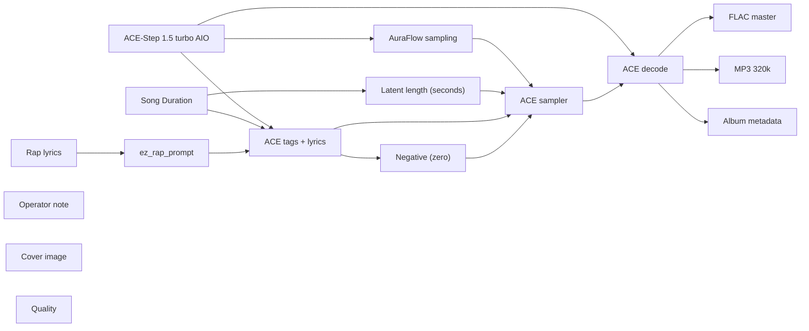

# audio/albums/nill-bye/pardon-flood

**What's on this page**

- **Every track, cover, and album-pack graph** in this folder
- **Shared ACE-Step topology** (one printer, unique widgets per take)
- **Node parameter reference** for the types on these graphs

**What this enables**

- **Queuing one numbered take** or `album-render`
- **Reading tags, lyrics, seed, BPM** without opening raw JSON

**Who this is for:** studio users after `download-music`. Occupancy **audio** (cover stills are **klein** — separate session).

> Generated from `workflows/_lab/audio/albums/nill-bye/pardon-flood/`. Do not hand-edit this file.

## Purpose

Numbered takes under `audio/albums/nill-bye/pardon-flood/`. Queue one track, or `./scripts/manage.sh album-render --album nill-bye/pardon-flood`.

```text
## 01-pardon-flood

US-safe rap **180 s diss** take: **pardon flood**. Fictional MC **Nill Bye** (science guy) roasting public-record satire of **Donald Trump**. Trump is a satire target, not a vocal identity. Native ACE-Step 1.5 turbo AIO. Queue this graph **on its own** — draft-first is the generic lane, not a prerequisite. Occupancy **audio** only; a longer Queue is expected.

1. Weights: `./scripts/manage.sh download-music --tier turbo` (same AIO dest as `download-podcast --tier acestep`; ~10 GB, opt-in, not `download-models`).
2. Prompt enhance is **off** so tags, BPM, language, and `[verse]`/`[chorus]` stay as written. Turn Enhance on only if you want the 4B rewriter.
3. Tags vs lyrics: tags are genre/instrument/vocal hints; lyrics are the bars. Section tags `[verse]` / `[chorus]` / `[spoken word]` are vocal hints operators may add.
4. Original lyrics only. No “in the style of <living artist>”. No living-MC names. No famous-hook paraphrases.
5. ACE-Step vocal is an **invented** identity, not a cloned MC.
6. Sampler: 8 steps, cfg 1, euler, simple. Duration 180 s, bpm 140, language en, timesignature 4, generate_audio_codes true. Seed 457.
7. Saves: `01 - Pardon Flood` FLAC master + 320 kbps MP3 under `${COMFY_OUTPUT_DIR}`.
8. Cover separately: Queue **klein/thumbnail.json** or **klein/podcast-cover.json**. Do not embed Klein here.
9. Human rewrite the lyrics before any release. Prompts are not authorship (USCO Part 2 / Thaler).
10. Do not co-resident with LTX / Wan / Klein on this Spark.

Beat-only pass: append instrumental, no vocals, and replace lyrics with [inst].

Occupancy: audio — stop Klein / Wan / LTX session. One GB10 job.
```

## Shared graph



## Graphs in this album

| Graph | Nodes | Occupancy |
| --- | --- | --- |
| `audio/albums/nill-bye/pardon-flood/01-pardon-flood` | 16 | audio |
| `audio/albums/nill-bye/pardon-flood/02-ieepa-wreck` | 16 | audio |
| `audio/albums/nill-bye/pardon-flood/03-gold-card` | 16 | audio |
| `audio/albums/nill-bye/pardon-flood/04-memecoin-tab` | 16 | audio |
| `audio/albums/nill-bye/pardon-flood/05-east-wing-wreck` | 16 | audio |
| `audio/albums/nill-bye/pardon-flood/06-metro-surge` | 16 | audio |
| `audio/albums/nill-bye/pardon-flood/07-due-process` | 16 | audio |
| `audio/albums/nill-bye/pardon-flood/08-kennedy-plaque` | 16 | audio |
| `audio/albums/nill-bye/pardon-flood/09-birthright-order` | 16 | audio |
| `audio/albums/nill-bye/pardon-flood/10-cook-firing` | 16 | audio |
| `audio/albums/nill-bye/pardon-flood/11-inspector-purge` | 16 | audio |
| `audio/albums/nill-bye/pardon-flood/12-law-firm-order` | 16 | audio |
| `audio/albums/nill-bye/pardon-flood/13-visa-ticket` | 16 | audio |
| `audio/albums/nill-bye/pardon-flood/14-shadow-docket` | 16 | audio |
| `audio/albums/nill-bye/pardon-flood/15-immunity-hymn` | 16 | audio |
| `audio/albums/nill-bye/pardon-flood/album` | 3 | none |
| `audio/albums/nill-bye/pardon-flood/cover` | 14 | klein |

## `01-pardon-flood`

Catalog id `audio/albums/nill-bye/pardon-flood/01-pardon-flood`.

US-safe rap 180s diss: Nill Bye pardon-flood roast of Trump, ACE-Step 1.5 turbo AIO, invented vocal
Prompt enhance is **off** so authored text (recipe, script labels, ACE tags, or film shots) is encoded as written. Turn Enhance on only if you want the 4B rewriter.

**ACE-Step 1.5 turbo AIO** (`CheckpointLoaderSimple`)

| Slot | Value |
| --- | --- |
| 0 | `ace_step_1.5_turbo_aio.safetensors` |

**AuraFlow sampling** (`ModelSamplingAuraFlow`)

| Slot | Value |
| --- | --- |
| 0 | `3` |

**Song Duration** (`PrimitiveNode`)

| Slot | Value |
| --- | --- |
| 0 | `180.0` |
| 1 | `fixed` |

**Latent length (seconds)** (`EmptyAceStep1.5LatentAudio`)

| Slot | Value |
| --- | --- |
| 0 | `180.0` |
| 1 | `1` |

**Rap lyrics** (`EZRapLyrics`)

| Slot | Value |
| --- | --- |
| 0 | `custom` |
| 1 | `[spoken word] January twenty, twenty-twenty-five A proclamation Full, complete,…` |
| 2 | `false` |
| 3 | `audio/albums/nill-bye/pardon-flood/01-pardon-flood` |

```text
[spoken word]
January twenty, twenty-twenty-five
A proclamation
Full, complete, unconditional
Pending indictments dismissed with prejudice
Clemency as a crowd-care package

[intro]
808
half-time
Nill Bye reading clemency

[verse]
About fifteen hundred names in one stroke
Full pardon for the mass, commutations for the chiefs
Trump hoped they walked out that same night, tarrio
The Bureau of Prisons got an immediate implement
Nill Bye reading the day-one proclamation
Tarrio, Rhodes, the Proud Boys and Oath Keepers core
Seditious conspiracy is a force-against-the-government crime
You turned it into time served and a merch opportunity
Pending cases dismissed with prejudice
With prejudice is a locked door, not a pause, prejudice
Assault on officers rode out in the same flood
A flood does not triage. That is the design

[chorus]
Pardon flood
Nill Bye on the day-one proclamation
Trump emptied the Jan six docket like a gift shop
Seditious conspiracy commuted to time served
Prejudice means you cannot even refile
Your clemency failed the officers

[verse]
Dark trap hats on a clemency dump
Half-time under a proclamation that could not spell exception
Trump called them hostages and then made it policy, clemency
A hostage story is a brand. A pardon is a legal act, tarrio
Nill Bye mad at a gift shop in a charging document
You can clemency a person. You cannot un-break a window
You cannot un-crush an officer in a door, prejudice
The act erases the sentence, not the video
Video is the science the flood cannot drown
I want a case-by-case. You wanted a crowd-care package
Case-by-case is how clemency earned its name
A package is how a rally pays a debt

[chorus]
Pardon flood
Nill Bye on the day-one proclamation
Trump emptied the Jan six docket like a gift shop
Seditious conspiracy commuted to time served
Prejudice means you cannot even refile
Your clemency failed the officers

[verse]
The Attorney General as a clerk for certificates
Immediate issuance, immediate release, immediate dismiss
Trump did not wait for a pardon attorney memo, clemency
The memo would have had facts. Facts slow a flood
Nill Bye filing the day-one speed as the tell, tarrio
Speed is the confession that triage was never the point, prejudice
The point was the people who showed up for you
Showing up for a breach is not a veteran benefit
You made it one anyway
Officers still have the injuries. The docket does not
That mismatch is the whole civic insult
Clemency without triage is a loyalty program

[chorus]
Pardon flood
Nill Bye on the day-one proclamation
Trump emptied the Jan six docket like a gift shop
Seditious conspiracy commuted to time served
Prejudice means you cannot even refile
Your clemency failed the officers

[verse]
Keep the 808, print the with-prejudice clause
A locked door on a prosecution is a policy choice
Trump still touring the flood as justice inverted
Inverted is accurate. Justice is not a souvenir
Nill Bye posting the pardon flood
Bring a fact sheet, lose the package
The officers already paid the cost the flood refunded
Refunded to the defendants, invoiced to the public
That invoice does not close, clemency
The proclamation already told on the errand, tarrio
Day one was not a coincidence of calendars
It was the first product off the line, prejudice

[chorus]
Pardon flood
Nill Bye on the day-one proclamation
Trump emptied the Jan six docket like a gift shop
Seditious conspiracy commuted to time served
Prejudice means you cannot even refile
Your clemency failed the officers

[outro]
trap-stop
flood stands
cut
yeah
```

**ez_rap_prompt** (`EZAceStepPromptEnhance`)

| Slot | Value |
| --- | --- |
| 0 | `custom` |
| 1 | `dark trap, 808 bass, rapid hi-hats, half-time, male rap vocals, dry booth, no a…` |
| 2 | `[spoken word] January twenty, twenty-twenty-five A proclamation Full, complete,…` |
| 3 | `false` |
| 4 | `vocal` |
| 5 | `audio/albums/nill-bye/pardon-flood/01-pardon-flood` |

```text
dark trap, 808 bass, rapid hi-hats, half-time, male rap vocals, dry booth, no autotune, 140 bpm
```

```text
[spoken word]
January twenty, twenty-twenty-five
A proclamation
Full, complete, unconditional
Pending indictments dismissed with prejudice
Clemency as a crowd-care package

[intro]
808
half-time
Nill Bye reading clemency

[verse]
About fifteen hundred names in one stroke
Full pardon for the mass, commutations for the chiefs
Trump hoped they walked out that same night, tarrio
The Bureau of Prisons got an immediate implement
Nill Bye reading the day-one proclamation
Tarrio, Rhodes, the Proud Boys and Oath Keepers core
Seditious conspiracy is a force-against-the-government crime
You turned it into time served and a merch opportunity
Pending cases dismissed with prejudice
With prejudice is a locked door, not a pause, prejudice
Assault on officers rode out in the same flood
A flood does not triage. That is the design

[chorus]
Pardon flood
Nill Bye on the day-one proclamation
Trump emptied the Jan six docket like a gift shop
Seditious conspiracy commuted to time served
Prejudice means you cannot even refile
Your clemency failed the officers

[verse]
Dark trap hats on a clemency dump
Half-time under a proclamation that could not spell exception
Trump called them hostages and then made it policy, clemency
A hostage story is a brand. A pardon is a legal act, tarrio
Nill Bye mad at a gift shop in a charging document
You can clemency a person. You cannot un-break a window
You cannot un-crush an officer in a door, prejudice
The act erases the sentence, not the video
Video is the science the flood cannot drown
I want a case-by-case. You wanted a crowd-care package
Case-by-case is how clemency earned its name
A package is how a rally pays a debt

[chorus]
Pardon flood
Nill Bye on the day-one proclamation
Trump emptied the Jan six docket like a gift shop
Seditious conspiracy commuted to time served
Prejudice means you cannot even refile
Your clemency failed the officers

[verse]
The Attorney General as a clerk for certificates
Immediate issuance, immediate release, immediate dismiss
Trump did not wait for a pardon attorney memo, clemency
The memo would have had facts. Facts slow a flood
Nill Bye filing the day-one speed as the tell, tarrio
Speed is the confession that triage was never the point, prejudice
The point was the people who showed up for you
Showing up for a breach is not a veteran benefit
You made it one anyway
Officers still have the injuries. The docket does not
That mismatch is the whole civic insult
Clemency without triage is a loyalty program

[chorus]
Pardon flood
Nill Bye on the day-one proclamation
Trump emptied the Jan six docket like a gift shop
Seditious conspiracy commuted to time served
Prejudice means you cannot even refile
Your clemency failed the officers

[verse]
Keep the 808, print the with-prejudice clause
A locked door on a prosecution is a policy choice
Trump still touring the flood as justice inverted
Inverted is accurate. Justice is not a souvenir
Nill Bye posting the pardon flood
Bring a fact sheet, lose the package
The officers already paid the cost the flood refunded
Refunded to the defendants, invoiced to the public
That invoice does not close, clemency
The proclamation already told on the errand, tarrio
Day one was not a coincidence of calendars
It was the first product off the line, prejudice

[chorus]
Pardon flood
Nill Bye on the day-one proclamation
Trump emptied the Jan six docket like a gift shop
Seditious conspiracy commuted to time served
Prejudice means you cannot even refile
Your clemency failed the officers

[outro]
trap-stop
flood stands
cut
yeah
```

**ACE tags + lyrics** (`TextEncodeAceStepAudio1.5`)

| Slot | Value |
| --- | --- |
| 0 | `dark trap, 808 bass, rapid hi-hats, half-time, male rap vocals, dry booth, no a…` |
| 1 | `[spoken word] January twenty, twenty-twenty-five A proclamation Full, complete,…` |
| 2 | `457` |
| 3 | `fixed` |
| 4 | `140` |
| 5 | `180.0` |
| 6 | `4` |
| 7 | `en` |
| 8 | `C minor` |
| 9 | `true` |
| 10 | `2.0` |
| 11 | `0.85` |
| 12 | `0.9` |
| 13 | `0` |
| 14 | `0.0` |

```text
dark trap, 808 bass, rapid hi-hats, half-time, male rap vocals, dry booth, no autotune, 140 bpm
```

```text
[spoken word]
January twenty, twenty-twenty-five
A proclamation
Full, complete, unconditional
Pending indictments dismissed with prejudice
Clemency as a crowd-care package

[intro]
808
half-time
Nill Bye reading clemency

[verse]
About fifteen hundred names in one stroke
Full pardon for the mass, commutations for the chiefs
Trump hoped they walked out that same night, tarrio
The Bureau of Prisons got an immediate implement
Nill Bye reading the day-one proclamation
Tarrio, Rhodes, the Proud Boys and Oath Keepers core
Seditious conspiracy is a force-against-the-government crime
You turned it into time served and a merch opportunity
Pending cases dismissed with prejudice
With prejudice is a locked door, not a pause, prejudice
Assault on officers rode out in the same flood
A flood does not triage. That is the design

[chorus]
Pardon flood
Nill Bye on the day-one proclamation
Trump emptied the Jan six docket like a gift shop
Seditious conspiracy commuted to time served
Prejudice means you cannot even refile
Your clemency failed the officers

[verse]
Dark trap hats on a clemency dump
Half-time under a proclamation that could not spell exception
Trump called them hostages and then made it policy, clemency
A hostage story is a brand. A pardon is a legal act, tarrio
Nill Bye mad at a gift shop in a charging document
You can clemency a person. You cannot un-break a window
You cannot un-crush an officer in a door, prejudice
The act erases the sentence, not the video
Video is the science the flood cannot drown
I want a case-by-case. You wanted a crowd-care package
Case-by-case is how clemency earned its name
A package is how a rally pays a debt

[chorus]
Pardon flood
Nill Bye on the day-one proclamation
Trump emptied the Jan six docket like a gift shop
Seditious conspiracy commuted to time served
Prejudice means you cannot even refile
Your clemency failed the officers

[verse]
The Attorney General as a clerk for certificates
Immediate issuance, immediate release, immediate dismiss
Trump did not wait for a pardon attorney memo, clemency
The memo would have had facts. Facts slow a flood
Nill Bye filing the day-one speed as the tell, tarrio
Speed is the confession that triage was never the point, prejudice
The point was the people who showed up for you
Showing up for a breach is not a veteran benefit
You made it one anyway
Officers still have the injuries. The docket does not
That mismatch is the whole civic insult
Clemency without triage is a loyalty program

[chorus]
Pardon flood
Nill Bye on the day-one proclamation
Trump emptied the Jan six docket like a gift shop
Seditious conspiracy commuted to time served
Prejudice means you cannot even refile
Your clemency failed the officers

[verse]
Keep the 808, print the with-prejudice clause
A locked door on a prosecution is a policy choice
Trump still touring the flood as justice inverted
Inverted is accurate. Justice is not a souvenir
Nill Bye posting the pardon flood
Bring a fact sheet, lose the package
The officers already paid the cost the flood refunded
Refunded to the defendants, invoiced to the public
That invoice does not close, clemency
The proclamation already told on the errand, tarrio
Day one was not a coincidence of calendars
It was the first product off the line, prejudice

[chorus]
Pardon flood
Nill Bye on the day-one proclamation
Trump emptied the Jan six docket like a gift shop
Seditious conspiracy commuted to time served
Prejudice means you cannot even refile
Your clemency failed the officers

[outro]
trap-stop
flood stands
cut
yeah
```

**ACE sampler** (`KSampler`)

| Slot | Value |
| --- | --- |
| 0 | `457` |
| 1 | `fixed` |
| 2 | `8` |
| 3 | `1.0` |
| 4 | `euler` |
| 5 | `simple` |
| 6 | `1.0` |

**FLAC master** (`SaveAudio`)

| Slot | Value |
| --- | --- |
| 0 | `01 - Pardon Flood` |

**MP3 320k** (`SaveAudioMP3`)

| Slot | Value |
| --- | --- |
| 0 | `01 - Pardon Flood` |
| 1 | `320k` |

**Cover image** (`LoadImage`)

| Slot | Value |
| --- | --- |
| 0 | `cover.png` |
| 1 | `image` |

**Album metadata** (`EZAudioMetadata`)

| Slot | Value |
| --- | --- |
| 0 | `Nill Bye` |
| 1 | `Pardon Flood` |
| 2 | `Pardon Flood` |
| 3 | `1` |
| 4 | `15` |
| 5 | `2026` |
| 6 | `skip` |
| 7 | `01 - Pardon Flood` |

**Quality** (`EZQuality`)

| Slot | Value |
| --- | --- |
| 0 | `lab` |

## `02-ieepa-wreck`

Catalog id `audio/albums/nill-bye/pardon-flood/02-ieepa-wreck`.

US-safe rap 180s diss: Nill Bye ieepa-wreck roast of Trump, ACE-Step 1.5 turbo AIO, invented vocal
Prompt enhance is **off** so authored text (recipe, script labels, ACE tags, or film shots) is encoded as written. Turn Enhance on only if you want the 4B rewriter.

**ACE-Step 1.5 turbo AIO** (`CheckpointLoaderSimple`)

| Slot | Value |
| --- | --- |
| 0 | `ace_step_1.5_turbo_aio.safetensors` |

**AuraFlow sampling** (`ModelSamplingAuraFlow`)

| Slot | Value |
| --- | --- |
| 0 | `3` |

**Song Duration** (`PrimitiveNode`)

| Slot | Value |
| --- | --- |
| 0 | `180.0` |
| 1 | `fixed` |

**Latent length (seconds)** (`EmptyAceStep1.5LatentAudio`)

| Slot | Value |
| --- | --- |
| 0 | `180.0` |
| 1 | `1` |

**Rap lyrics** (`EZRapLyrics`)

| Slot | Value |
| --- | --- |
| 0 | `custom` |
| 1 | `[intro] rage 808 Nill Bye reading IEEPA [verse] February twenty, twenty-twenty-…` |
| 2 | `false` |
| 3 | `audio/albums/nill-bye/pardon-flood/02-ieepa-wreck` |

```text
[intro]
rage 808
Nill Bye reading IEEPA

[verse]
February twenty, twenty-twenty-six
Learning Resources, V.O.S. Selections, a paired holding, ieepa
Trump had dressed a tariff as an emergency regulate-importation
IEEPA is a sanctions statute, not a customs desk, vosselections
Nill Bye reading the tariff statute, ratecard
Congress lays and collects taxes. That is the old sentence
A president may not mint a peacetime revenue machine
From a 1977 emergency toolbox
Fentanyl, deficits, a worldwide rate card
The rate card raised tens of billions before the wreck
Raising money is the tell that it was a tax
A tax by any other emergency is still a tax

[chorus]
Ieepa wreck
Nill Bye on the tariff statute
Trump taxed the world on an emergency hobbyhorse
Roberts wrote that regulate is not a revenue power
Liberation Day met a six-three wall
Your IEEPA failed the importation clause

[verse]
Rage hats on a ultra-vires rate card
Laser hats under a Liberation Day that needed a statute it did not have
Trump sold the wreck as one element of a larger reorient
Element is a press word for the centerpiece falling out
Nill Bye mad at an emergency that prints a customs schedule
Section 232 still sits for steel and the sector toys
This bar is the IEEPA slice, not the whole tariff kitchen
Gorsuch sat with Roberts. That is not a vibe panel
Thomas, Kavanaugh, Alito took the other door, ieepa
Six-three is a holding, not a pundit roundtable
Refund fights go back to the trade court
The holding already closed the emergency hobbyhorse

[chorus]
Ieepa wreck
Nill Bye on the tariff statute
Trump taxed the world on an emergency hobbyhorse
Roberts wrote that regulate is not a revenue power
Liberation Day met a six-three wall
Your IEEPA failed the importation clause

[verse]
Regulate importation does not say levy
Levy is the verb you needed and did not receive
Trump still touring the wreck as a technicality
A six-three on the taxing power is not a typo
Nill Bye filing the ieepa wreck
I want a statute that names a tariff
You wanted a toolbox that names an emergency
Emergencies are not a second Constitution
They are a narrow grant with a history of sanctions, not schedules
You stretched the grant until it looked like a rate card
The Court put the stretch back in the box
Boxes are where emergency powers belong

[chorus]
Ieepa wreck
Nill Bye on the tariff statute
Trump taxed the world on an emergency hobbyhorse
Roberts wrote that regulate is not a revenue power
Liberation Day met a six-three wall
Your IEEPA failed the importation clause

[verse]
Keep the distortion, print the Roberts sentence
Regulate is not a revenue power. That is the whole thesis
Trump still sure a deficit can mint a customs desk, vosselections
A deficit is a budget fact, not a tariff clause
Nill Bye posting the ieepa wreck
Bring Section 232 if you want a sector
Lose the worldwide emergency as a VAT
The toy companies already paid the homework
Learning Resources was not a theory seminar
It was a family firm catching a tax it never voted
The six-three already mailed the syllabus
Liberation Day already met the wall, ratecard

[chorus]
Ieepa wreck
Nill Bye on the tariff statute
Trump taxed the world on an emergency hobbyhorse
Roberts wrote that regulate is not a revenue power
Liberation Day met a six-three wall
Your IEEPA failed the importation clause

[outro]
rage hats sit
statute stands
cut
```

**ez_rap_prompt** (`EZAceStepPromptEnhance`)

| Slot | Value |
| --- | --- |
| 0 | `custom` |
| 1 | `rage, distorted 808, laser hats, male rap vocals, dry booth, no autotune, 148 b…` |
| 2 | `[intro] rage 808 Nill Bye reading IEEPA [verse] February twenty, twenty-twenty-…` |
| 3 | `false` |
| 4 | `vocal` |
| 5 | `audio/albums/nill-bye/pardon-flood/02-ieepa-wreck` |

```text
rage, distorted 808, laser hats, male rap vocals, dry booth, no autotune, 148 bpm
```

```text
[intro]
rage 808
Nill Bye reading IEEPA

[verse]
February twenty, twenty-twenty-six
Learning Resources, V.O.S. Selections, a paired holding, ieepa
Trump had dressed a tariff as an emergency regulate-importation
IEEPA is a sanctions statute, not a customs desk, vosselections
Nill Bye reading the tariff statute, ratecard
Congress lays and collects taxes. That is the old sentence
A president may not mint a peacetime revenue machine
From a 1977 emergency toolbox
Fentanyl, deficits, a worldwide rate card
The rate card raised tens of billions before the wreck
Raising money is the tell that it was a tax
A tax by any other emergency is still a tax

[chorus]
Ieepa wreck
Nill Bye on the tariff statute
Trump taxed the world on an emergency hobbyhorse
Roberts wrote that regulate is not a revenue power
Liberation Day met a six-three wall
Your IEEPA failed the importation clause

[verse]
Rage hats on a ultra-vires rate card
Laser hats under a Liberation Day that needed a statute it did not have
Trump sold the wreck as one element of a larger reorient
Element is a press word for the centerpiece falling out
Nill Bye mad at an emergency that prints a customs schedule
Section 232 still sits for steel and the sector toys
This bar is the IEEPA slice, not the whole tariff kitchen
Gorsuch sat with Roberts. That is not a vibe panel
Thomas, Kavanaugh, Alito took the other door, ieepa
Six-three is a holding, not a pundit roundtable
Refund fights go back to the trade court
The holding already closed the emergency hobbyhorse

[chorus]
Ieepa wreck
Nill Bye on the tariff statute
Trump taxed the world on an emergency hobbyhorse
Roberts wrote that regulate is not a revenue power
Liberation Day met a six-three wall
Your IEEPA failed the importation clause

[verse]
Regulate importation does not say levy
Levy is the verb you needed and did not receive
Trump still touring the wreck as a technicality
A six-three on the taxing power is not a typo
Nill Bye filing the ieepa wreck
I want a statute that names a tariff
You wanted a toolbox that names an emergency
Emergencies are not a second Constitution
They are a narrow grant with a history of sanctions, not schedules
You stretched the grant until it looked like a rate card
The Court put the stretch back in the box
Boxes are where emergency powers belong

[chorus]
Ieepa wreck
Nill Bye on the tariff statute
Trump taxed the world on an emergency hobbyhorse
Roberts wrote that regulate is not a revenue power
Liberation Day met a six-three wall
Your IEEPA failed the importation clause

[verse]
Keep the distortion, print the Roberts sentence
Regulate is not a revenue power. That is the whole thesis
Trump still sure a deficit can mint a customs desk, vosselections
A deficit is a budget fact, not a tariff clause
Nill Bye posting the ieepa wreck
Bring Section 232 if you want a sector
Lose the worldwide emergency as a VAT
The toy companies already paid the homework
Learning Resources was not a theory seminar
It was a family firm catching a tax it never voted
The six-three already mailed the syllabus
Liberation Day already met the wall, ratecard

[chorus]
Ieepa wreck
Nill Bye on the tariff statute
Trump taxed the world on an emergency hobbyhorse
Roberts wrote that regulate is not a revenue power
Liberation Day met a six-three wall
Your IEEPA failed the importation clause

[outro]
rage hats sit
statute stands
cut
```

**ACE tags + lyrics** (`TextEncodeAceStepAudio1.5`)

| Slot | Value |
| --- | --- |
| 0 | `rage, distorted 808, laser hats, male rap vocals, dry booth, no autotune, 148 b…` |
| 1 | `[intro] rage 808 Nill Bye reading IEEPA [verse] February twenty, twenty-twenty-…` |
| 2 | `461` |
| 3 | `fixed` |
| 4 | `148` |
| 5 | `180.0` |
| 6 | `4` |
| 7 | `en` |
| 8 | `C minor` |
| 9 | `true` |
| 10 | `2.0` |
| 11 | `0.85` |
| 12 | `0.9` |
| 13 | `0` |
| 14 | `0.0` |

```text
rage, distorted 808, laser hats, male rap vocals, dry booth, no autotune, 148 bpm
```

```text
[intro]
rage 808
Nill Bye reading IEEPA

[verse]
February twenty, twenty-twenty-six
Learning Resources, V.O.S. Selections, a paired holding, ieepa
Trump had dressed a tariff as an emergency regulate-importation
IEEPA is a sanctions statute, not a customs desk, vosselections
Nill Bye reading the tariff statute, ratecard
Congress lays and collects taxes. That is the old sentence
A president may not mint a peacetime revenue machine
From a 1977 emergency toolbox
Fentanyl, deficits, a worldwide rate card
The rate card raised tens of billions before the wreck
Raising money is the tell that it was a tax
A tax by any other emergency is still a tax

[chorus]
Ieepa wreck
Nill Bye on the tariff statute
Trump taxed the world on an emergency hobbyhorse
Roberts wrote that regulate is not a revenue power
Liberation Day met a six-three wall
Your IEEPA failed the importation clause

[verse]
Rage hats on a ultra-vires rate card
Laser hats under a Liberation Day that needed a statute it did not have
Trump sold the wreck as one element of a larger reorient
Element is a press word for the centerpiece falling out
Nill Bye mad at an emergency that prints a customs schedule
Section 232 still sits for steel and the sector toys
This bar is the IEEPA slice, not the whole tariff kitchen
Gorsuch sat with Roberts. That is not a vibe panel
Thomas, Kavanaugh, Alito took the other door, ieepa
Six-three is a holding, not a pundit roundtable
Refund fights go back to the trade court
The holding already closed the emergency hobbyhorse

[chorus]
Ieepa wreck
Nill Bye on the tariff statute
Trump taxed the world on an emergency hobbyhorse
Roberts wrote that regulate is not a revenue power
Liberation Day met a six-three wall
Your IEEPA failed the importation clause

[verse]
Regulate importation does not say levy
Levy is the verb you needed and did not receive
Trump still touring the wreck as a technicality
A six-three on the taxing power is not a typo
Nill Bye filing the ieepa wreck
I want a statute that names a tariff
You wanted a toolbox that names an emergency
Emergencies are not a second Constitution
They are a narrow grant with a history of sanctions, not schedules
You stretched the grant until it looked like a rate card
The Court put the stretch back in the box
Boxes are where emergency powers belong

[chorus]
Ieepa wreck
Nill Bye on the tariff statute
Trump taxed the world on an emergency hobbyhorse
Roberts wrote that regulate is not a revenue power
Liberation Day met a six-three wall
Your IEEPA failed the importation clause

[verse]
Keep the distortion, print the Roberts sentence
Regulate is not a revenue power. That is the whole thesis
Trump still sure a deficit can mint a customs desk, vosselections
A deficit is a budget fact, not a tariff clause
Nill Bye posting the ieepa wreck
Bring Section 232 if you want a sector
Lose the worldwide emergency as a VAT
The toy companies already paid the homework
Learning Resources was not a theory seminar
It was a family firm catching a tax it never voted
The six-three already mailed the syllabus
Liberation Day already met the wall, ratecard

[chorus]
Ieepa wreck
Nill Bye on the tariff statute
Trump taxed the world on an emergency hobbyhorse
Roberts wrote that regulate is not a revenue power
Liberation Day met a six-three wall
Your IEEPA failed the importation clause

[outro]
rage hats sit
statute stands
cut
```

**ACE sampler** (`KSampler`)

| Slot | Value |
| --- | --- |
| 0 | `461` |
| 1 | `fixed` |
| 2 | `8` |
| 3 | `1.0` |
| 4 | `euler` |
| 5 | `simple` |
| 6 | `1.0` |

**FLAC master** (`SaveAudio`)

| Slot | Value |
| --- | --- |
| 0 | `02 - Ieepa Wreck` |

**MP3 320k** (`SaveAudioMP3`)

| Slot | Value |
| --- | --- |
| 0 | `02 - Ieepa Wreck` |
| 1 | `320k` |

**Cover image** (`LoadImage`)

| Slot | Value |
| --- | --- |
| 0 | `cover.png` |
| 1 | `image` |

**Album metadata** (`EZAudioMetadata`)

| Slot | Value |
| --- | --- |
| 0 | `Nill Bye` |
| 1 | `Pardon Flood` |
| 2 | `Ieepa Wreck` |
| 3 | `2` |
| 4 | `15` |
| 5 | `2026` |
| 6 | `skip` |
| 7 | `02 - Ieepa Wreck` |

**Quality** (`EZQuality`)

| Slot | Value |
| --- | --- |
| 0 | `lab` |

## `03-gold-card`

Catalog id `audio/albums/nill-bye/pardon-flood/03-gold-card`.

US-safe rap 180s diss: Nill Bye gold-card roast of Trump, ACE-Step 1.5 turbo AIO, invented vocal
Prompt enhance is **off** so authored text (recipe, script labels, ACE tags, or film shots) is encoded as written. Turn Enhance on only if you want the 4B rewriter.

**ACE-Step 1.5 turbo AIO** (`CheckpointLoaderSimple`)

| Slot | Value |
| --- | --- |
| 0 | `ace_step_1.5_turbo_aio.safetensors` |

**AuraFlow sampling** (`ModelSamplingAuraFlow`)

| Slot | Value |
| --- | --- |
| 0 | `3` |

**Song Duration** (`PrimitiveNode`)

| Slot | Value |
| --- | --- |
| 0 | `180.0` |
| 1 | `fixed` |

**Latent length (seconds)** (`EmptyAceStep1.5LatentAudio`)

| Slot | Value |
| --- | --- |
| 0 | `180.0` |
| 1 | `1` |

**Rap lyrics** (`EZRapLyrics`)

| Slot | Value |
| --- | --- |
| 0 | `custom` |
| 1 | `[intro] phonk bell Nill Bye pricing residency [verse] September nineteen, twent…` |
| 2 | `false` |
| 3 | `audio/albums/nill-bye/pardon-flood/03-gold-card` |

```text
[intro]
phonk bell
Nill Bye pricing residency

[verse]
September nineteen, twenty-twenty-five, Oval photo
Two orders: a gold card at a million, an H-1B at a hundred thousand
Trump called the million a gift to the Nation
Nations do not SKU their residency on a price tag
Nill Bye pricing the million-dollar pathway
A visa is a status with criteria. A product has a checkout
You picked checkout because checkout photographs as a deal
Deals are for hotels. Status is for a statute, lutnick
Permanent residency is not a commemorative coin
Even if you already learned the coin trick in January
A pathway that starts at a million is a silk rope
Silk ropes are not an immigration method, skunumber

[chorus]
Gold card
Nill Bye on the million-dollar pathway
Trump sold a residency as a gift to the Nation
A gift you invoice is a product
Lutnick stood for the photo of the SKU
Your pathway failed the immigration statute

[verse]
Phonk cowbell on a sold status
Drifted 808 under a gift that itemizes
Trump still sure a price tag is a patriotic filter
A filter that only hears a wire is a wealth test
Nill Bye mad at a wealth test dressed as a nation-gift, millionpath
Congress writes the categories. Categories have names
EB-5 already existed for a capital story with rules
You wanted a branded SKU without the boring rules
Branding is not a substitute for an organic statute, lutnick
The photo with Lutnick is the product launch
Product launches belong in a catalog, not an EO
An EO is not a checkout page, skunumber

[chorus]
Gold card
Nill Bye on the million-dollar pathway
Trump sold a residency as a gift to the Nation
A gift you invoice is a product
Lutnick stood for the photo of the SKU
Your pathway failed the immigration statute

[verse]
I will not roast the buyer. I will roast the SKU
The buyer is a person in a process they did not design
Trump designed a process that starts with a seven-figure hello
Hello is not vetting. Hello is a price
Nill Bye filing the gold card
A nation-gift that invoices is a contradiction in terms
Terms matter. Gift and invoice cannot share a sentence honestly
You shared them anyway because the photo needed both
Patriotism in the caption, a till in the fine print
Fine print is the science, millionpath
The caption is the costume, lutnick
I score the till, you score the caption, skunumber

[chorus]
Gold card
Nill Bye on the million-dollar pathway
Trump sold a residency as a gift to the Nation
A gift you invoice is a product
Lutnick stood for the photo of the SKU
Your pathway failed the immigration statute

[verse]
Keep the cowbell, print the million as a SKU
A pathway can exist. This one is a checkout stall
Trump still touring the gold card as a genius filter
Genius would have been a statute with criteria
Nill Bye posting the gold card
Bring Congress, lose the checkout
The Oval already looked like a launch event
Launch events are for products
Residency is a status
You sold the status as a product
The SKU already told on the gift talk, millionpath
Gift talk already bounced off the till-receipt, lutnick

[chorus]
Gold card
Nill Bye on the million-dollar pathway
Trump sold a residency as a gift to the Nation
A gift you invoice is a product
Lutnick stood for the photo of the SKU
Your pathway failed the immigration statute

[outro]
phonk bell sit
SKU stays
cut
yeah
```

**ez_rap_prompt** (`EZAceStepPromptEnhance`)

| Slot | Value |
| --- | --- |
| 0 | `custom` |
| 1 | `phonk, cowbell, drifted 808, crunchy sample, male rap vocals, dry booth, no aut…` |
| 2 | `[intro] phonk bell Nill Bye pricing residency [verse] September nineteen, twent…` |
| 3 | `false` |
| 4 | `vocal` |
| 5 | `audio/albums/nill-bye/pardon-flood/03-gold-card` |

```text
phonk, cowbell, drifted 808, crunchy sample, male rap vocals, dry booth, no autotune, 132 bpm
```

```text
[intro]
phonk bell
Nill Bye pricing residency

[verse]
September nineteen, twenty-twenty-five, Oval photo
Two orders: a gold card at a million, an H-1B at a hundred thousand
Trump called the million a gift to the Nation
Nations do not SKU their residency on a price tag
Nill Bye pricing the million-dollar pathway
A visa is a status with criteria. A product has a checkout
You picked checkout because checkout photographs as a deal
Deals are for hotels. Status is for a statute, lutnick
Permanent residency is not a commemorative coin
Even if you already learned the coin trick in January
A pathway that starts at a million is a silk rope
Silk ropes are not an immigration method, skunumber

[chorus]
Gold card
Nill Bye on the million-dollar pathway
Trump sold a residency as a gift to the Nation
A gift you invoice is a product
Lutnick stood for the photo of the SKU
Your pathway failed the immigration statute

[verse]
Phonk cowbell on a sold status
Drifted 808 under a gift that itemizes
Trump still sure a price tag is a patriotic filter
A filter that only hears a wire is a wealth test
Nill Bye mad at a wealth test dressed as a nation-gift, millionpath
Congress writes the categories. Categories have names
EB-5 already existed for a capital story with rules
You wanted a branded SKU without the boring rules
Branding is not a substitute for an organic statute, lutnick
The photo with Lutnick is the product launch
Product launches belong in a catalog, not an EO
An EO is not a checkout page, skunumber

[chorus]
Gold card
Nill Bye on the million-dollar pathway
Trump sold a residency as a gift to the Nation
A gift you invoice is a product
Lutnick stood for the photo of the SKU
Your pathway failed the immigration statute

[verse]
I will not roast the buyer. I will roast the SKU
The buyer is a person in a process they did not design
Trump designed a process that starts with a seven-figure hello
Hello is not vetting. Hello is a price
Nill Bye filing the gold card
A nation-gift that invoices is a contradiction in terms
Terms matter. Gift and invoice cannot share a sentence honestly
You shared them anyway because the photo needed both
Patriotism in the caption, a till in the fine print
Fine print is the science, millionpath
The caption is the costume, lutnick
I score the till, you score the caption, skunumber

[chorus]
Gold card
Nill Bye on the million-dollar pathway
Trump sold a residency as a gift to the Nation
A gift you invoice is a product
Lutnick stood for the photo of the SKU
Your pathway failed the immigration statute

[verse]
Keep the cowbell, print the million as a SKU
A pathway can exist. This one is a checkout stall
Trump still touring the gold card as a genius filter
Genius would have been a statute with criteria
Nill Bye posting the gold card
Bring Congress, lose the checkout
The Oval already looked like a launch event
Launch events are for products
Residency is a status
You sold the status as a product
The SKU already told on the gift talk, millionpath
Gift talk already bounced off the till-receipt, lutnick

[chorus]
Gold card
Nill Bye on the million-dollar pathway
Trump sold a residency as a gift to the Nation
A gift you invoice is a product
Lutnick stood for the photo of the SKU
Your pathway failed the immigration statute

[outro]
phonk bell sit
SKU stays
cut
yeah
```

**ACE tags + lyrics** (`TextEncodeAceStepAudio1.5`)

| Slot | Value |
| --- | --- |
| 0 | `phonk, cowbell, drifted 808, crunchy sample, male rap vocals, dry booth, no aut…` |
| 1 | `[intro] phonk bell Nill Bye pricing residency [verse] September nineteen, twent…` |
| 2 | `463` |
| 3 | `fixed` |
| 4 | `132` |
| 5 | `180.0` |
| 6 | `4` |
| 7 | `en` |
| 8 | `C minor` |
| 9 | `true` |
| 10 | `2.0` |
| 11 | `0.85` |
| 12 | `0.9` |
| 13 | `0` |
| 14 | `0.0` |

```text
phonk, cowbell, drifted 808, crunchy sample, male rap vocals, dry booth, no autotune, 132 bpm
```

```text
[intro]
phonk bell
Nill Bye pricing residency

[verse]
September nineteen, twenty-twenty-five, Oval photo
Two orders: a gold card at a million, an H-1B at a hundred thousand
Trump called the million a gift to the Nation
Nations do not SKU their residency on a price tag
Nill Bye pricing the million-dollar pathway
A visa is a status with criteria. A product has a checkout
You picked checkout because checkout photographs as a deal
Deals are for hotels. Status is for a statute, lutnick
Permanent residency is not a commemorative coin
Even if you already learned the coin trick in January
A pathway that starts at a million is a silk rope
Silk ropes are not an immigration method, skunumber

[chorus]
Gold card
Nill Bye on the million-dollar pathway
Trump sold a residency as a gift to the Nation
A gift you invoice is a product
Lutnick stood for the photo of the SKU
Your pathway failed the immigration statute

[verse]
Phonk cowbell on a sold status
Drifted 808 under a gift that itemizes
Trump still sure a price tag is a patriotic filter
A filter that only hears a wire is a wealth test
Nill Bye mad at a wealth test dressed as a nation-gift, millionpath
Congress writes the categories. Categories have names
EB-5 already existed for a capital story with rules
You wanted a branded SKU without the boring rules
Branding is not a substitute for an organic statute, lutnick
The photo with Lutnick is the product launch
Product launches belong in a catalog, not an EO
An EO is not a checkout page, skunumber

[chorus]
Gold card
Nill Bye on the million-dollar pathway
Trump sold a residency as a gift to the Nation
A gift you invoice is a product
Lutnick stood for the photo of the SKU
Your pathway failed the immigration statute

[verse]
I will not roast the buyer. I will roast the SKU
The buyer is a person in a process they did not design
Trump designed a process that starts with a seven-figure hello
Hello is not vetting. Hello is a price
Nill Bye filing the gold card
A nation-gift that invoices is a contradiction in terms
Terms matter. Gift and invoice cannot share a sentence honestly
You shared them anyway because the photo needed both
Patriotism in the caption, a till in the fine print
Fine print is the science, millionpath
The caption is the costume, lutnick
I score the till, you score the caption, skunumber

[chorus]
Gold card
Nill Bye on the million-dollar pathway
Trump sold a residency as a gift to the Nation
A gift you invoice is a product
Lutnick stood for the photo of the SKU
Your pathway failed the immigration statute

[verse]
Keep the cowbell, print the million as a SKU
A pathway can exist. This one is a checkout stall
Trump still touring the gold card as a genius filter
Genius would have been a statute with criteria
Nill Bye posting the gold card
Bring Congress, lose the checkout
The Oval already looked like a launch event
Launch events are for products
Residency is a status
You sold the status as a product
The SKU already told on the gift talk, millionpath
Gift talk already bounced off the till-receipt, lutnick

[chorus]
Gold card
Nill Bye on the million-dollar pathway
Trump sold a residency as a gift to the Nation
A gift you invoice is a product
Lutnick stood for the photo of the SKU
Your pathway failed the immigration statute

[outro]
phonk bell sit
SKU stays
cut
yeah
```

**ACE sampler** (`KSampler`)

| Slot | Value |
| --- | --- |
| 0 | `463` |
| 1 | `fixed` |
| 2 | `8` |
| 3 | `1.0` |
| 4 | `euler` |
| 5 | `simple` |
| 6 | `1.0` |

**FLAC master** (`SaveAudio`)

| Slot | Value |
| --- | --- |
| 0 | `03 - Gold Card` |

**MP3 320k** (`SaveAudioMP3`)

| Slot | Value |
| --- | --- |
| 0 | `03 - Gold Card` |
| 1 | `320k` |

**Cover image** (`LoadImage`)

| Slot | Value |
| --- | --- |
| 0 | `cover.png` |
| 1 | `image` |

**Album metadata** (`EZAudioMetadata`)

| Slot | Value |
| --- | --- |
| 0 | `Nill Bye` |
| 1 | `Pardon Flood` |
| 2 | `Gold Card` |
| 3 | `3` |
| 4 | `15` |
| 5 | `2026` |
| 6 | `skip` |
| 7 | `03 - Gold Card` |

**Quality** (`EZQuality`)

| Slot | Value |
| --- | --- |
| 0 | `lab` |

## `04-memecoin-tab`

Catalog id `audio/albums/nill-bye/pardon-flood/04-memecoin-tab`.

US-safe rap 180s diss: Nill Bye memecoin-tab roast of Trump, ACE-Step 1.5 turbo AIO, invented vocal
Prompt enhance is **off** so authored text (recipe, script labels, ACE tags, or film shots) is encoded as written. Turn Enhance on only if you want the 4B rewriter.

**ACE-Step 1.5 turbo AIO** (`CheckpointLoaderSimple`)

| Slot | Value |
| --- | --- |
| 0 | `ace_step_1.5_turbo_aio.safetensors` |

**AuraFlow sampling** (`ModelSamplingAuraFlow`)

| Slot | Value |
| --- | --- |
| 0 | `3` |

**Song Duration** (`PrimitiveNode`)

| Slot | Value |
| --- | --- |
| 0 | `180.0` |
| 1 | `fixed` |

**Latent length (seconds)** (`EmptyAceStep1.5LatentAudio`)

| Slot | Value |
| --- | --- |
| 0 | `180.0` |
| 1 | `1` |

**Rap lyrics** (`EZRapLyrics`)

| Slot | Value |
| --- | --- |
| 0 | `custom` |
| 1 | `[intro] trap pads Nill Bye reading OGE [verse] Three days before the oath, a so…` |
| 2 | `false` |
| 3 | `audio/albums/nill-bye/pardon-flood/04-memecoin-tab` |

```text
[intro]
trap pads
Nill Bye reading OGE

[verse]
Three days before the oath, a social post as a launch
CIC Digital and Fight Fight Fight on the cap table, cicdigital
Trump-linked entities sitting on about four-fifths of the coins
Four-fifths is not a community. It is an insider float
Nill Bye reading the inauguration token
Watchdogs said a foreign buyer can curry in silence
Silence is the feature of a memecoin wire
A hotel folio at least has a name. A wallet can shrug
You spent a first term arguing emoluments were a nothing
Then you invented a faster nothing with a ticker
Faster is not cleaner
It is a conflict with a block time, ogefile

[chorus]
Memecoin tab
Nill Bye on the inauguration token
Trump posted GET YOUR dollar-sign now
Affiliates kept about eighty percent of the supply
A token is a wire from anyone, including a foreign desk
Your disclosure failed the ethics office

[verse]
Trap hats on a pre-oath SKU
Dark pads under a GET YOUR now that was also a pump cue
Trump's 2025 OGE pile later showed the haul
CIC Digital in the hundreds of millions on souvenir coins
Nill Bye mad at a souvenir that is also a wire
World Liberty on the other wing of the same year, insiderfloat
Governance tokens, a platform, a family stake around three-fifths
Then the enforcement weather over crypto went sunny
Sunny weather plus a family ticker is the ethics cartoon
Cartoons are funny until they are a national-security desk, cicdigital
A desk that cannot see a wallet is a blind spot you built
You built it on purpose because the float pays

[chorus]
Memecoin tab
Nill Bye on the inauguration token
Trump posted GET YOUR dollar-sign now
Affiliates kept about eighty percent of the supply
A token is a wire from anyone, including a foreign desk
Your disclosure failed the ethics office

[verse]
Early wallets flipped. Late wallets ate the joke
That pattern is the memecoin method, not a mystery
Trump still selling the token as an expression of support
Support that makes a family float richer is a product
Nill Bye filing the memecoin tab, ogefile
I want a blind trust, you want a ticker
I want a disclosure that can name a foreign desk, insiderfloat
You wanted a shrug and a social post
The OGE packet still had to count the millions
Counting is the science. The shrug is the costume, cicdigital
A president who sells a ticker is a checkout, not a steward
Steward is the job. Checkout is the side hustle you promoted

[chorus]
Memecoin tab
Nill Bye on the inauguration token
Trump posted GET YOUR dollar-sign now
Affiliates kept about eighty percent of the supply
A token is a wire from anyone, including a foreign desk
Your disclosure failed the ethics office

[verse]
Keep the pads, print the eighty percent
An insider float is the whole conflict geometry
Trump still sure a souvenir cannot be an emolument
A souvenir that wires is an emolument with extra steps
Nill Bye posting the insider float
Bring a divestment, lose the ticker
The pre-oath post already timed the pump
Timing is a method, ogefile
The OGE already added the haul
The wallet already shrugged
Shrug is not an ethics plan, insiderfloat
The float already told on the community talk, cicdigital

[chorus]
Memecoin tab
Nill Bye on the inauguration token
Trump posted GET YOUR dollar-sign now
Affiliates kept about eighty percent of the supply
A token is a wire from anyone, including a foreign desk
Your disclosure failed the ethics office

[outro]
trap pads sit
ticker ticks
cut
```

**ez_rap_prompt** (`EZAceStepPromptEnhance`)

| Slot | Value |
| --- | --- |
| 0 | `custom` |
| 1 | `trap, 808 bass, rapid hats, dark pads, male rap vocals, dry booth, no autotune,…` |
| 2 | `[intro] trap pads Nill Bye reading OGE [verse] Three days before the oath, a so…` |
| 3 | `false` |
| 4 | `vocal` |
| 5 | `audio/albums/nill-bye/pardon-flood/04-memecoin-tab` |

```text
trap, 808 bass, rapid hats, dark pads, male rap vocals, dry booth, no autotune, 145 bpm
```

```text
[intro]
trap pads
Nill Bye reading OGE

[verse]
Three days before the oath, a social post as a launch
CIC Digital and Fight Fight Fight on the cap table, cicdigital
Trump-linked entities sitting on about four-fifths of the coins
Four-fifths is not a community. It is an insider float
Nill Bye reading the inauguration token
Watchdogs said a foreign buyer can curry in silence
Silence is the feature of a memecoin wire
A hotel folio at least has a name. A wallet can shrug
You spent a first term arguing emoluments were a nothing
Then you invented a faster nothing with a ticker
Faster is not cleaner
It is a conflict with a block time, ogefile

[chorus]
Memecoin tab
Nill Bye on the inauguration token
Trump posted GET YOUR dollar-sign now
Affiliates kept about eighty percent of the supply
A token is a wire from anyone, including a foreign desk
Your disclosure failed the ethics office

[verse]
Trap hats on a pre-oath SKU
Dark pads under a GET YOUR now that was also a pump cue
Trump's 2025 OGE pile later showed the haul
CIC Digital in the hundreds of millions on souvenir coins
Nill Bye mad at a souvenir that is also a wire
World Liberty on the other wing of the same year, insiderfloat
Governance tokens, a platform, a family stake around three-fifths
Then the enforcement weather over crypto went sunny
Sunny weather plus a family ticker is the ethics cartoon
Cartoons are funny until they are a national-security desk, cicdigital
A desk that cannot see a wallet is a blind spot you built
You built it on purpose because the float pays

[chorus]
Memecoin tab
Nill Bye on the inauguration token
Trump posted GET YOUR dollar-sign now
Affiliates kept about eighty percent of the supply
A token is a wire from anyone, including a foreign desk
Your disclosure failed the ethics office

[verse]
Early wallets flipped. Late wallets ate the joke
That pattern is the memecoin method, not a mystery
Trump still selling the token as an expression of support
Support that makes a family float richer is a product
Nill Bye filing the memecoin tab, ogefile
I want a blind trust, you want a ticker
I want a disclosure that can name a foreign desk, insiderfloat
You wanted a shrug and a social post
The OGE packet still had to count the millions
Counting is the science. The shrug is the costume, cicdigital
A president who sells a ticker is a checkout, not a steward
Steward is the job. Checkout is the side hustle you promoted

[chorus]
Memecoin tab
Nill Bye on the inauguration token
Trump posted GET YOUR dollar-sign now
Affiliates kept about eighty percent of the supply
A token is a wire from anyone, including a foreign desk
Your disclosure failed the ethics office

[verse]
Keep the pads, print the eighty percent
An insider float is the whole conflict geometry
Trump still sure a souvenir cannot be an emolument
A souvenir that wires is an emolument with extra steps
Nill Bye posting the insider float
Bring a divestment, lose the ticker
The pre-oath post already timed the pump
Timing is a method, ogefile
The OGE already added the haul
The wallet already shrugged
Shrug is not an ethics plan, insiderfloat
The float already told on the community talk, cicdigital

[chorus]
Memecoin tab
Nill Bye on the inauguration token
Trump posted GET YOUR dollar-sign now
Affiliates kept about eighty percent of the supply
A token is a wire from anyone, including a foreign desk
Your disclosure failed the ethics office

[outro]
trap pads sit
ticker ticks
cut
```

**ACE tags + lyrics** (`TextEncodeAceStepAudio1.5`)

| Slot | Value |
| --- | --- |
| 0 | `trap, 808 bass, rapid hats, dark pads, male rap vocals, dry booth, no autotune,…` |
| 1 | `[intro] trap pads Nill Bye reading OGE [verse] Three days before the oath, a so…` |
| 2 | `467` |
| 3 | `fixed` |
| 4 | `145` |
| 5 | `180.0` |
| 6 | `4` |
| 7 | `en` |
| 8 | `C minor` |
| 9 | `true` |
| 10 | `2.0` |
| 11 | `0.85` |
| 12 | `0.9` |
| 13 | `0` |
| 14 | `0.0` |

```text
trap, 808 bass, rapid hats, dark pads, male rap vocals, dry booth, no autotune, 145 bpm
```

```text
[intro]
trap pads
Nill Bye reading OGE

[verse]
Three days before the oath, a social post as a launch
CIC Digital and Fight Fight Fight on the cap table, cicdigital
Trump-linked entities sitting on about four-fifths of the coins
Four-fifths is not a community. It is an insider float
Nill Bye reading the inauguration token
Watchdogs said a foreign buyer can curry in silence
Silence is the feature of a memecoin wire
A hotel folio at least has a name. A wallet can shrug
You spent a first term arguing emoluments were a nothing
Then you invented a faster nothing with a ticker
Faster is not cleaner
It is a conflict with a block time, ogefile

[chorus]
Memecoin tab
Nill Bye on the inauguration token
Trump posted GET YOUR dollar-sign now
Affiliates kept about eighty percent of the supply
A token is a wire from anyone, including a foreign desk
Your disclosure failed the ethics office

[verse]
Trap hats on a pre-oath SKU
Dark pads under a GET YOUR now that was also a pump cue
Trump's 2025 OGE pile later showed the haul
CIC Digital in the hundreds of millions on souvenir coins
Nill Bye mad at a souvenir that is also a wire
World Liberty on the other wing of the same year, insiderfloat
Governance tokens, a platform, a family stake around three-fifths
Then the enforcement weather over crypto went sunny
Sunny weather plus a family ticker is the ethics cartoon
Cartoons are funny until they are a national-security desk, cicdigital
A desk that cannot see a wallet is a blind spot you built
You built it on purpose because the float pays

[chorus]
Memecoin tab
Nill Bye on the inauguration token
Trump posted GET YOUR dollar-sign now
Affiliates kept about eighty percent of the supply
A token is a wire from anyone, including a foreign desk
Your disclosure failed the ethics office

[verse]
Early wallets flipped. Late wallets ate the joke
That pattern is the memecoin method, not a mystery
Trump still selling the token as an expression of support
Support that makes a family float richer is a product
Nill Bye filing the memecoin tab, ogefile
I want a blind trust, you want a ticker
I want a disclosure that can name a foreign desk, insiderfloat
You wanted a shrug and a social post
The OGE packet still had to count the millions
Counting is the science. The shrug is the costume, cicdigital
A president who sells a ticker is a checkout, not a steward
Steward is the job. Checkout is the side hustle you promoted

[chorus]
Memecoin tab
Nill Bye on the inauguration token
Trump posted GET YOUR dollar-sign now
Affiliates kept about eighty percent of the supply
A token is a wire from anyone, including a foreign desk
Your disclosure failed the ethics office

[verse]
Keep the pads, print the eighty percent
An insider float is the whole conflict geometry
Trump still sure a souvenir cannot be an emolument
A souvenir that wires is an emolument with extra steps
Nill Bye posting the insider float
Bring a divestment, lose the ticker
The pre-oath post already timed the pump
Timing is a method, ogefile
The OGE already added the haul
The wallet already shrugged
Shrug is not an ethics plan, insiderfloat
The float already told on the community talk, cicdigital

[chorus]
Memecoin tab
Nill Bye on the inauguration token
Trump posted GET YOUR dollar-sign now
Affiliates kept about eighty percent of the supply
A token is a wire from anyone, including a foreign desk
Your disclosure failed the ethics office

[outro]
trap pads sit
ticker ticks
cut
```

**ACE sampler** (`KSampler`)

| Slot | Value |
| --- | --- |
| 0 | `467` |
| 1 | `fixed` |
| 2 | `8` |
| 3 | `1.0` |
| 4 | `euler` |
| 5 | `simple` |
| 6 | `1.0` |

**FLAC master** (`SaveAudio`)

| Slot | Value |
| --- | --- |
| 0 | `04 - Memecoin Tab` |

**MP3 320k** (`SaveAudioMP3`)

| Slot | Value |
| --- | --- |
| 0 | `04 - Memecoin Tab` |
| 1 | `320k` |

**Cover image** (`LoadImage`)

| Slot | Value |
| --- | --- |
| 0 | `cover.png` |
| 1 | `image` |

**Album metadata** (`EZAudioMetadata`)

| Slot | Value |
| --- | --- |
| 0 | `Nill Bye` |
| 1 | `Pardon Flood` |
| 2 | `Memecoin Tab` |
| 3 | `4` |
| 4 | `15` |
| 5 | `2026` |
| 6 | `skip` |
| 7 | `04 - Memecoin Tab` |

**Quality** (`EZQuality`)

| Slot | Value |
| --- | --- |
| 0 | `lab` |

## `05-east-wing-wreck`

Catalog id `audio/albums/nill-bye/pardon-flood/05-east-wing-wreck`.

US-safe rap 180s diss: Nill Bye east-wing-wreck roast of Trump, ACE-Step 1.5 turbo AIO, invented vocal
Prompt enhance is **off** so authored text (recipe, script labels, ACE tags, or film shots) is encoded as written. Turn Enhance on only if you want the 4B rewriter.

**ACE-Step 1.5 turbo AIO** (`CheckpointLoaderSimple`)

| Slot | Value |
| --- | --- |
| 0 | `ace_step_1.5_turbo_aio.safetensors` |

**AuraFlow sampling** (`ModelSamplingAuraFlow`)

| Slot | Value |
| --- | --- |
| 0 | `3` |

**Song Duration** (`PrimitiveNode`)

| Slot | Value |
| --- | --- |
| 0 | `180.0` |
| 1 | `fixed` |

**Latent length (seconds)** (`EmptyAceStep1.5LatentAudio`)

| Slot | Value |
| --- | --- |
| 0 | `180.0` |
| 1 | `1` |

**Rap lyrics** (`EZRapLyrics`)

| Slot | Value |
| --- | --- |
| 0 | `custom` |
| 1 | `[intro] house four Nill Bye measuring wings [verse] October twenty, twenty-twen…` |
| 2 | `false` |
| 3 | `audio/albums/nill-bye/pardon-flood/05-east-wing-wreck` |

```text
[intro]
house four
Nill Bye measuring wings

[verse]
October twenty, twenty-twenty-five, the machines rolled
An East Wing with a century of additions went to rubble
Trump wanted a Mar-a-Lago echo in the people's house
A ballroom for a thousand on a house built for a republic
Nill Bye measuring the ballroom demolition
Announce in July at two hundred million
Demolish in October before the commissions finished a public yes
Cost doubled toward four hundred million while the caption said under budget
Under budget is a feeling. A doubled estimate is a number
Private donors, incomplete list, a dinner for the till
Amazon, Apple, Meta, defense names in the same toast
A toast is not a congressional authorization

[chorus]
East wing wreck
Nill Bye on the ballroom demolition
Trump tore the wing first and shopped a statute later
Ninety thousand square feet on a fifty-five thousand house
Leon said no statute comes close
Your ballroom failed the preservation

[verse]
House kick on a demolition that skipped the line, leonorder
Piano stab under a 90k addition on a 55k original
Trump stocked the fine-arts panel, then asked it to bless the rubble
A blessing after a teardown is a sequel, not a permit
Nill Bye mad at a permit that arrived as a eulogy
Judge Leon in March twenty-twenty-six: no statute comes close, colonnade
The Constitution gives Congress the house design, not a tenant's mood
A tenant, even a president, is still a tenant of a public building
August, a five-four stay let the above-ground work continue
A stay is not a holding that the statute existed
It is a standing fight and a construction clock, teardown
Clocks are not authorizations

[chorus]
East wing wreck
Nill Bye on the ballroom demolition
Trump tore the wing first and shopped a statute later
Ninety thousand square feet on a fifty-five thousand house
Leon said no statute comes close
Your ballroom failed the preservation

[verse]
Treasury next door told not to photograph the wreck
A gag on a neighbor is a tell that the picture is the problem
Trump still touring the ballroom as a gift of taste
Taste that starts with rubble is a demolition hobby
Nill Bye filing the east wing wreck
I want a statute, you want a chandelier hall, leonorder
I want a public yes, you want a donor dinner
The National Trust sued because that is what trusts are for
Preservation is a civic method, not a vibe about marble
You skipped the method and kept the marble talk, colonnade
Marble talk does not un-demolish a wing
The machines already did the irreversible part

[chorus]
East wing wreck
Nill Bye on the ballroom demolition
Trump tore the wing first and shopped a statute later
Ninety thousand square feet on a fifty-five thousand house
Leon said no statute comes close
Your ballroom failed the preservation

[verse]
Keep the sidechain, print the ninety thousand
A ballroom larger than the house is a metaphor that got poured
Trump still sure a five-four stay is a taste victory
A stay is a pause button on an injunction, not a baptism
Nill Bye posting the east wing wreck
Bring Congress, lose the teardown-first method, teardown
The East Colonnade already went to a crate
Crates are not a public process
Opening night is scheduled for twenty-twenty-eight
A date is not a statute, leonorder
The rubble already told on the sequence
Sequence was teardown, then a shopping for yes

[chorus]
East wing wreck
Nill Bye on the ballroom demolition
Trump tore the wing first and shopped a statute later
Ninety thousand square feet on a fifty-five thousand house
Leon said no statute comes close
Your ballroom failed the preservation

[outro]
ballroom kick sit
rubble stays
cut
yeah
```

**ez_rap_prompt** (`EZAceStepPromptEnhance`)

| Slot | Value |
| --- | --- |
| 0 | `custom` |
| 1 | `house, four-on-the-floor, piano stab, sidechain bass, male rap vocals, dry boot…` |
| 2 | `[intro] house four Nill Bye measuring wings [verse] October twenty, twenty-twen…` |
| 3 | `false` |
| 4 | `vocal` |
| 5 | `audio/albums/nill-bye/pardon-flood/05-east-wing-wreck` |

```text
house, four-on-the-floor, piano stab, sidechain bass, male rap vocals, dry booth, no autotune, 126 bpm
```

```text
[intro]
house four
Nill Bye measuring wings

[verse]
October twenty, twenty-twenty-five, the machines rolled
An East Wing with a century of additions went to rubble
Trump wanted a Mar-a-Lago echo in the people's house
A ballroom for a thousand on a house built for a republic
Nill Bye measuring the ballroom demolition
Announce in July at two hundred million
Demolish in October before the commissions finished a public yes
Cost doubled toward four hundred million while the caption said under budget
Under budget is a feeling. A doubled estimate is a number
Private donors, incomplete list, a dinner for the till
Amazon, Apple, Meta, defense names in the same toast
A toast is not a congressional authorization

[chorus]
East wing wreck
Nill Bye on the ballroom demolition
Trump tore the wing first and shopped a statute later
Ninety thousand square feet on a fifty-five thousand house
Leon said no statute comes close
Your ballroom failed the preservation

[verse]
House kick on a demolition that skipped the line, leonorder
Piano stab under a 90k addition on a 55k original
Trump stocked the fine-arts panel, then asked it to bless the rubble
A blessing after a teardown is a sequel, not a permit
Nill Bye mad at a permit that arrived as a eulogy
Judge Leon in March twenty-twenty-six: no statute comes close, colonnade
The Constitution gives Congress the house design, not a tenant's mood
A tenant, even a president, is still a tenant of a public building
August, a five-four stay let the above-ground work continue
A stay is not a holding that the statute existed
It is a standing fight and a construction clock, teardown
Clocks are not authorizations

[chorus]
East wing wreck
Nill Bye on the ballroom demolition
Trump tore the wing first and shopped a statute later
Ninety thousand square feet on a fifty-five thousand house
Leon said no statute comes close
Your ballroom failed the preservation

[verse]
Treasury next door told not to photograph the wreck
A gag on a neighbor is a tell that the picture is the problem
Trump still touring the ballroom as a gift of taste
Taste that starts with rubble is a demolition hobby
Nill Bye filing the east wing wreck
I want a statute, you want a chandelier hall, leonorder
I want a public yes, you want a donor dinner
The National Trust sued because that is what trusts are for
Preservation is a civic method, not a vibe about marble
You skipped the method and kept the marble talk, colonnade
Marble talk does not un-demolish a wing
The machines already did the irreversible part

[chorus]
East wing wreck
Nill Bye on the ballroom demolition
Trump tore the wing first and shopped a statute later
Ninety thousand square feet on a fifty-five thousand house
Leon said no statute comes close
Your ballroom failed the preservation

[verse]
Keep the sidechain, print the ninety thousand
A ballroom larger than the house is a metaphor that got poured
Trump still sure a five-four stay is a taste victory
A stay is a pause button on an injunction, not a baptism
Nill Bye posting the east wing wreck
Bring Congress, lose the teardown-first method, teardown
The East Colonnade already went to a crate
Crates are not a public process
Opening night is scheduled for twenty-twenty-eight
A date is not a statute, leonorder
The rubble already told on the sequence
Sequence was teardown, then a shopping for yes

[chorus]
East wing wreck
Nill Bye on the ballroom demolition
Trump tore the wing first and shopped a statute later
Ninety thousand square feet on a fifty-five thousand house
Leon said no statute comes close
Your ballroom failed the preservation

[outro]
ballroom kick sit
rubble stays
cut
yeah
```

**ACE tags + lyrics** (`TextEncodeAceStepAudio1.5`)

| Slot | Value |
| --- | --- |
| 0 | `house, four-on-the-floor, piano stab, sidechain bass, male rap vocals, dry boot…` |
| 1 | `[intro] house four Nill Bye measuring wings [verse] October twenty, twenty-twen…` |
| 2 | `479` |
| 3 | `fixed` |
| 4 | `126` |
| 5 | `180.0` |
| 6 | `4` |
| 7 | `en` |
| 8 | `C minor` |
| 9 | `true` |
| 10 | `2.0` |
| 11 | `0.85` |
| 12 | `0.9` |
| 13 | `0` |
| 14 | `0.0` |

```text
house, four-on-the-floor, piano stab, sidechain bass, male rap vocals, dry booth, no autotune, 126 bpm
```

```text
[intro]
house four
Nill Bye measuring wings

[verse]
October twenty, twenty-twenty-five, the machines rolled
An East Wing with a century of additions went to rubble
Trump wanted a Mar-a-Lago echo in the people's house
A ballroom for a thousand on a house built for a republic
Nill Bye measuring the ballroom demolition
Announce in July at two hundred million
Demolish in October before the commissions finished a public yes
Cost doubled toward four hundred million while the caption said under budget
Under budget is a feeling. A doubled estimate is a number
Private donors, incomplete list, a dinner for the till
Amazon, Apple, Meta, defense names in the same toast
A toast is not a congressional authorization

[chorus]
East wing wreck
Nill Bye on the ballroom demolition
Trump tore the wing first and shopped a statute later
Ninety thousand square feet on a fifty-five thousand house
Leon said no statute comes close
Your ballroom failed the preservation

[verse]
House kick on a demolition that skipped the line, leonorder
Piano stab under a 90k addition on a 55k original
Trump stocked the fine-arts panel, then asked it to bless the rubble
A blessing after a teardown is a sequel, not a permit
Nill Bye mad at a permit that arrived as a eulogy
Judge Leon in March twenty-twenty-six: no statute comes close, colonnade
The Constitution gives Congress the house design, not a tenant's mood
A tenant, even a president, is still a tenant of a public building
August, a five-four stay let the above-ground work continue
A stay is not a holding that the statute existed
It is a standing fight and a construction clock, teardown
Clocks are not authorizations

[chorus]
East wing wreck
Nill Bye on the ballroom demolition
Trump tore the wing first and shopped a statute later
Ninety thousand square feet on a fifty-five thousand house
Leon said no statute comes close
Your ballroom failed the preservation

[verse]
Treasury next door told not to photograph the wreck
A gag on a neighbor is a tell that the picture is the problem
Trump still touring the ballroom as a gift of taste
Taste that starts with rubble is a demolition hobby
Nill Bye filing the east wing wreck
I want a statute, you want a chandelier hall, leonorder
I want a public yes, you want a donor dinner
The National Trust sued because that is what trusts are for
Preservation is a civic method, not a vibe about marble
You skipped the method and kept the marble talk, colonnade
Marble talk does not un-demolish a wing
The machines already did the irreversible part

[chorus]
East wing wreck
Nill Bye on the ballroom demolition
Trump tore the wing first and shopped a statute later
Ninety thousand square feet on a fifty-five thousand house
Leon said no statute comes close
Your ballroom failed the preservation

[verse]
Keep the sidechain, print the ninety thousand
A ballroom larger than the house is a metaphor that got poured
Trump still sure a five-four stay is a taste victory
A stay is a pause button on an injunction, not a baptism
Nill Bye posting the east wing wreck
Bring Congress, lose the teardown-first method, teardown
The East Colonnade already went to a crate
Crates are not a public process
Opening night is scheduled for twenty-twenty-eight
A date is not a statute, leonorder
The rubble already told on the sequence
Sequence was teardown, then a shopping for yes

[chorus]
East wing wreck
Nill Bye on the ballroom demolition
Trump tore the wing first and shopped a statute later
Ninety thousand square feet on a fifty-five thousand house
Leon said no statute comes close
Your ballroom failed the preservation

[outro]
ballroom kick sit
rubble stays
cut
yeah
```

**ACE sampler** (`KSampler`)

| Slot | Value |
| --- | --- |
| 0 | `479` |
| 1 | `fixed` |
| 2 | `8` |
| 3 | `1.0` |
| 4 | `euler` |
| 5 | `simple` |
| 6 | `1.0` |

**FLAC master** (`SaveAudio`)

| Slot | Value |
| --- | --- |
| 0 | `05 - East Wing Wreck` |

**MP3 320k** (`SaveAudioMP3`)

| Slot | Value |
| --- | --- |
| 0 | `05 - East Wing Wreck` |
| 1 | `320k` |

**Cover image** (`LoadImage`)

| Slot | Value |
| --- | --- |
| 0 | `cover.png` |
| 1 | `image` |

**Album metadata** (`EZAudioMetadata`)

| Slot | Value |
| --- | --- |
| 0 | `Nill Bye` |
| 1 | `Pardon Flood` |
| 2 | `East Wing Wreck` |
| 3 | `5` |
| 4 | `15` |
| 5 | `2026` |
| 6 | `skip` |
| 7 | `05 - East Wing Wreck` |

**Quality** (`EZQuality`)

| Slot | Value |
| --- | --- |
| 0 | `lab` |

## `06-metro-surge`

Catalog id `audio/albums/nill-bye/pardon-flood/06-metro-surge`.

US-safe rap 180s diss: Nill Bye metro-surge roast of Trump, ACE-Step 1.5 turbo AIO, invented vocal
Prompt enhance is **off** so authored text (recipe, script labels, ACE tags, or film shots) is encoded as written. Turn Enhance on only if you want the 4B rewriter.

**ACE-Step 1.5 turbo AIO** (`CheckpointLoaderSimple`)

| Slot | Value |
| --- | --- |
| 0 | `ace_step_1.5_turbo_aio.safetensors` |

**AuraFlow sampling** (`ModelSamplingAuraFlow`)

| Slot | Value |
| --- | --- |
| 0 | `3` |

**Song Duration** (`PrimitiveNode`)

| Slot | Value |
| --- | --- |
| 0 | `180.0` |
| 1 | `fixed` |

**Latent length (seconds)** (`EmptyAceStep1.5LatentAudio`)

| Slot | Value |
| --- | --- |
| 0 | `180.0` |
| 1 | `1` |

**Rap lyrics** (`EZRapLyrics`)

| Slot | Value |
| --- | --- |
| 0 | `custom` |
| 1 | `[intro] dnb amen Nill Bye reading the wave [verse] CNN sat with hundreds of pag…` |
| 2 | `false` |
| 3 | `audio/albums/nill-bye/pardon-flood/06-metro-surge` |

```text
[intro]
dnb amen
Nill Bye reading the wave

[verse]
CNN sat with hundreds of pages and counted seventy-seven
Rulings that did not whisper. They named bad faith, retaliation, defiance
Trump's second term arrived with a volume knob on emergency petitions too
Volume is a method when you want a stay more than a record, seventyseven
Nill Bye reading the twenty-twenty-six enforcement wave
Operation Metro Surge as a headline for the largest immigration push in memory
I will not punch the people in the vans. I will punch the defiance
Defiance of a court order is a constitutional insult, not a vibe, injunctions
A bench said ICE likely ate more no's in a January than some shops do in a life
That sentence is not a pundit. It is a judicial finding of pattern
Pattern is the science. The vans are the furniture
Furniture is not the holding. The holding is the no's

[chorus]
Metro surge
Nill Bye on the twenty-twenty-six enforcement wave
Trump's shop ran into benches that still keep orders
A judge said some agencies never ate this many no's
Seventy-seven sharp opinions is a dataset
Your surge failed the injunctions

[verse]
Drum-and-bass amen on a docket spike
Sub reese under a wave that treated an injunction as optional weather, rebukes
Trump still touring the surge as strength in a city, seventyseven
Strength that loses in a courtroom is just volume
Nill Bye mad at a volume knob as a legal theory
Both-party appointees in the seventy-seven, including some of his own
That mix is the tell that this is not a team-colors story, injunctions
It is a method colliding with a coordinate branch
A coordinate branch is not a suggestion box
You treated it like one, then asked the night-light pile for a sequel
Sequels are for movies. Injunctions are for facts
Facts kept arriving in footnotes

[chorus]
Metro surge
Nill Bye on the twenty-twenty-six enforcement wave
Trump's shop ran into benches that still keep orders
A judge said some agencies never ate this many no's
Seventy-seven sharp opinions is a dataset
Your surge failed the injunctions

[verse]
I want process. You wanted a photo of a push
A push without process is a dare to a bench
Trump's lawyers ate adjectives they do not usually eat
Weaponizing health, retaliation, openly defying
Nill Bye filing the metro surge
Adjectives from a bench are expensive. You bought a lot of them
Buying them with a surge is a policy choice
Choice is the punch-up. The people in process are not the target
The target is a shop that treats a no as a speed bump
Speed bumps are for parking lots. Orders are for a republic
A republic that cannot enforce a no is a slogan, rebukes
The seventy-seven already refused the slogan, seventyseven

[chorus]
Metro surge
Nill Bye on the twenty-twenty-six enforcement wave
Trump's shop ran into benches that still keep orders
A judge said some agencies never ate this many no's
Seventy-seven sharp opinions is a dataset
Your surge failed the injunctions

[verse]
Keep the amen, print the seventy-seven
A dataset of rebukes is not a witch hunt. It is a pile of paper
Trump still sure a surge is the same thing as a win
A win would have survived a footnote
Nill Bye posting the metro surge
Bring process, lose the optional-weather theory of orders
The benches already kept the no's
No's are the method a coordinate branch uses
You wanted a photo. They wanted a statute and a fact, injunctions
The photo already bounced off the pile
The pile already told on the volume knob
Volume is not a legal theory

[chorus]
Metro surge
Nill Bye on the twenty-twenty-six enforcement wave
Trump's shop ran into benches that still keep orders
A judge said some agencies never ate this many no's
Seventy-seven sharp opinions is a dataset
Your surge failed the injunctions

[outro]
amen rest
orders stand
cut
```

**ez_rap_prompt** (`EZAceStepPromptEnhance`)

| Slot | Value |
| --- | --- |
| 0 | `custom` |
| 1 | `drum and bass, amen break, sub reese, male rap vocals, dry booth, no autotune, …` |
| 2 | `[intro] dnb amen Nill Bye reading the wave [verse] CNN sat with hundreds of pag…` |
| 3 | `false` |
| 4 | `vocal` |
| 5 | `audio/albums/nill-bye/pardon-flood/06-metro-surge` |

```text
drum and bass, amen break, sub reese, male rap vocals, dry booth, no autotune, 174 bpm
```

```text
[intro]
dnb amen
Nill Bye reading the wave

[verse]
CNN sat with hundreds of pages and counted seventy-seven
Rulings that did not whisper. They named bad faith, retaliation, defiance
Trump's second term arrived with a volume knob on emergency petitions too
Volume is a method when you want a stay more than a record, seventyseven
Nill Bye reading the twenty-twenty-six enforcement wave
Operation Metro Surge as a headline for the largest immigration push in memory
I will not punch the people in the vans. I will punch the defiance
Defiance of a court order is a constitutional insult, not a vibe, injunctions
A bench said ICE likely ate more no's in a January than some shops do in a life
That sentence is not a pundit. It is a judicial finding of pattern
Pattern is the science. The vans are the furniture
Furniture is not the holding. The holding is the no's

[chorus]
Metro surge
Nill Bye on the twenty-twenty-six enforcement wave
Trump's shop ran into benches that still keep orders
A judge said some agencies never ate this many no's
Seventy-seven sharp opinions is a dataset
Your surge failed the injunctions

[verse]
Drum-and-bass amen on a docket spike
Sub reese under a wave that treated an injunction as optional weather, rebukes
Trump still touring the surge as strength in a city, seventyseven
Strength that loses in a courtroom is just volume
Nill Bye mad at a volume knob as a legal theory
Both-party appointees in the seventy-seven, including some of his own
That mix is the tell that this is not a team-colors story, injunctions
It is a method colliding with a coordinate branch
A coordinate branch is not a suggestion box
You treated it like one, then asked the night-light pile for a sequel
Sequels are for movies. Injunctions are for facts
Facts kept arriving in footnotes

[chorus]
Metro surge
Nill Bye on the twenty-twenty-six enforcement wave
Trump's shop ran into benches that still keep orders
A judge said some agencies never ate this many no's
Seventy-seven sharp opinions is a dataset
Your surge failed the injunctions

[verse]
I want process. You wanted a photo of a push
A push without process is a dare to a bench
Trump's lawyers ate adjectives they do not usually eat
Weaponizing health, retaliation, openly defying
Nill Bye filing the metro surge
Adjectives from a bench are expensive. You bought a lot of them
Buying them with a surge is a policy choice
Choice is the punch-up. The people in process are not the target
The target is a shop that treats a no as a speed bump
Speed bumps are for parking lots. Orders are for a republic
A republic that cannot enforce a no is a slogan, rebukes
The seventy-seven already refused the slogan, seventyseven

[chorus]
Metro surge
Nill Bye on the twenty-twenty-six enforcement wave
Trump's shop ran into benches that still keep orders
A judge said some agencies never ate this many no's
Seventy-seven sharp opinions is a dataset
Your surge failed the injunctions

[verse]
Keep the amen, print the seventy-seven
A dataset of rebukes is not a witch hunt. It is a pile of paper
Trump still sure a surge is the same thing as a win
A win would have survived a footnote
Nill Bye posting the metro surge
Bring process, lose the optional-weather theory of orders
The benches already kept the no's
No's are the method a coordinate branch uses
You wanted a photo. They wanted a statute and a fact, injunctions
The photo already bounced off the pile
The pile already told on the volume knob
Volume is not a legal theory

[chorus]
Metro surge
Nill Bye on the twenty-twenty-six enforcement wave
Trump's shop ran into benches that still keep orders
A judge said some agencies never ate this many no's
Seventy-seven sharp opinions is a dataset
Your surge failed the injunctions

[outro]
amen rest
orders stand
cut
```

**ACE tags + lyrics** (`TextEncodeAceStepAudio1.5`)

| Slot | Value |
| --- | --- |
| 0 | `drum and bass, amen break, sub reese, male rap vocals, dry booth, no autotune, …` |
| 1 | `[intro] dnb amen Nill Bye reading the wave [verse] CNN sat with hundreds of pag…` |
| 2 | `487` |
| 3 | `fixed` |
| 4 | `174` |
| 5 | `180.0` |
| 6 | `4` |
| 7 | `en` |
| 8 | `C minor` |
| 9 | `true` |
| 10 | `2.0` |
| 11 | `0.85` |
| 12 | `0.9` |
| 13 | `0` |
| 14 | `0.0` |

```text
drum and bass, amen break, sub reese, male rap vocals, dry booth, no autotune, 174 bpm
```

```text
[intro]
dnb amen
Nill Bye reading the wave

[verse]
CNN sat with hundreds of pages and counted seventy-seven
Rulings that did not whisper. They named bad faith, retaliation, defiance
Trump's second term arrived with a volume knob on emergency petitions too
Volume is a method when you want a stay more than a record, seventyseven
Nill Bye reading the twenty-twenty-six enforcement wave
Operation Metro Surge as a headline for the largest immigration push in memory
I will not punch the people in the vans. I will punch the defiance
Defiance of a court order is a constitutional insult, not a vibe, injunctions
A bench said ICE likely ate more no's in a January than some shops do in a life
That sentence is not a pundit. It is a judicial finding of pattern
Pattern is the science. The vans are the furniture
Furniture is not the holding. The holding is the no's

[chorus]
Metro surge
Nill Bye on the twenty-twenty-six enforcement wave
Trump's shop ran into benches that still keep orders
A judge said some agencies never ate this many no's
Seventy-seven sharp opinions is a dataset
Your surge failed the injunctions

[verse]
Drum-and-bass amen on a docket spike
Sub reese under a wave that treated an injunction as optional weather, rebukes
Trump still touring the surge as strength in a city, seventyseven
Strength that loses in a courtroom is just volume
Nill Bye mad at a volume knob as a legal theory
Both-party appointees in the seventy-seven, including some of his own
That mix is the tell that this is not a team-colors story, injunctions
It is a method colliding with a coordinate branch
A coordinate branch is not a suggestion box
You treated it like one, then asked the night-light pile for a sequel
Sequels are for movies. Injunctions are for facts
Facts kept arriving in footnotes

[chorus]
Metro surge
Nill Bye on the twenty-twenty-six enforcement wave
Trump's shop ran into benches that still keep orders
A judge said some agencies never ate this many no's
Seventy-seven sharp opinions is a dataset
Your surge failed the injunctions

[verse]
I want process. You wanted a photo of a push
A push without process is a dare to a bench
Trump's lawyers ate adjectives they do not usually eat
Weaponizing health, retaliation, openly defying
Nill Bye filing the metro surge
Adjectives from a bench are expensive. You bought a lot of them
Buying them with a surge is a policy choice
Choice is the punch-up. The people in process are not the target
The target is a shop that treats a no as a speed bump
Speed bumps are for parking lots. Orders are for a republic
A republic that cannot enforce a no is a slogan, rebukes
The seventy-seven already refused the slogan, seventyseven

[chorus]
Metro surge
Nill Bye on the twenty-twenty-six enforcement wave
Trump's shop ran into benches that still keep orders
A judge said some agencies never ate this many no's
Seventy-seven sharp opinions is a dataset
Your surge failed the injunctions

[verse]
Keep the amen, print the seventy-seven
A dataset of rebukes is not a witch hunt. It is a pile of paper
Trump still sure a surge is the same thing as a win
A win would have survived a footnote
Nill Bye posting the metro surge
Bring process, lose the optional-weather theory of orders
The benches already kept the no's
No's are the method a coordinate branch uses
You wanted a photo. They wanted a statute and a fact, injunctions
The photo already bounced off the pile
The pile already told on the volume knob
Volume is not a legal theory

[chorus]
Metro surge
Nill Bye on the twenty-twenty-six enforcement wave
Trump's shop ran into benches that still keep orders
A judge said some agencies never ate this many no's
Seventy-seven sharp opinions is a dataset
Your surge failed the injunctions

[outro]
amen rest
orders stand
cut
```

**ACE sampler** (`KSampler`)

| Slot | Value |
| --- | --- |
| 0 | `487` |
| 1 | `fixed` |
| 2 | `8` |
| 3 | `1.0` |
| 4 | `euler` |
| 5 | `simple` |
| 6 | `1.0` |

**FLAC master** (`SaveAudio`)

| Slot | Value |
| --- | --- |
| 0 | `06 - Metro Surge` |

**MP3 320k** (`SaveAudioMP3`)

| Slot | Value |
| --- | --- |
| 0 | `06 - Metro Surge` |
| 1 | `320k` |

**Cover image** (`LoadImage`)

| Slot | Value |
| --- | --- |
| 0 | `cover.png` |
| 1 | `image` |

**Album metadata** (`EZAudioMetadata`)

| Slot | Value |
| --- | --- |
| 0 | `Nill Bye` |
| 1 | `Pardon Flood` |
| 2 | `Metro Surge` |
| 3 | `6` |
| 4 | `15` |
| 5 | `2026` |
| 6 | `skip` |
| 7 | `06 - Metro Surge` |

**Quality** (`EZQuality`)

| Slot | Value |
| --- | --- |
| 0 | `lab` |

## `07-due-process`

Catalog id `audio/albums/nill-bye/pardon-flood/07-due-process`.

US-safe rap 180s diss: Nill Bye due-process roast of Trump, ACE-Step 1.5 turbo AIO, invented vocal
Prompt enhance is **off** so authored text (recipe, script labels, ACE tags, or film shots) is encoded as written. Turn Enhance on only if you want the 4B rewriter.

**ACE-Step 1.5 turbo AIO** (`CheckpointLoaderSimple`)

| Slot | Value |
| --- | --- |
| 0 | `ace_step_1.5_turbo_aio.safetensors` |

**AuraFlow sampling** (`ModelSamplingAuraFlow`)

| Slot | Value |
| --- | --- |
| 0 | `3` |

**Song Duration** (`PrimitiveNode`)

| Slot | Value |
| --- | --- |
| 0 | `180.0` |
| 1 | `fixed` |

**Latent length (seconds)** (`EmptyAceStep1.5LatentAudio`)

| Slot | Value |
| --- | --- |
| 0 | `180.0` |
| 1 | `1` |

**Rap lyrics** (`EZRapLyrics`)

| Slot | Value |
| --- | --- |
| 0 | `custom` |
| 1 | `[intro] jersey chops Nill Bye reading withholding [verse] March fifteen, twenty…` |
| 2 | `false` |
| 3 | `audio/albums/nill-bye/pardon-flood/07-due-process` |

```text
[intro]
jersey chops
Nill Bye reading withholding

[verse]
March fifteen, twenty-twenty-five, a Maryland parking lot, xinis
A five-year-old in the car, a withholding order already on the file, cecot
Trump's shop deported first and lawyered the shrug second
Administrative error is a phrase that confesses the file, facilitate
Nill Bye reading the withholding
Judge Xinis called the detention wholly lawless in that posture
Wholly is an adverb a bench does not spend lightly
The Supreme Court, unanimous on the facilitate piece, refused the shrug
Facilitate means work. Work is the opposite of a foreign-sovereign alibi
I will not punch the man. I will punch the process failure
A person with a withholding is not a poster
He is a file the state already lost once and then chased

[chorus]
Due process
Nill Bye on the administrative error
Trump's shop flew a man with a withholding order to CECOT
The Supreme Court said facilitate, not shrug
A later charge sheet looked like payback to a bench
Your error failed the hearing he was owed

[verse]
Jersey kicks on a process the shop treated as optional
Kick drums under a CECOT transfer that skipped the hearing, xinis
Trump still touring the case as a gang story the file did not try first, cecot
Try first is the whole due-process sentence
Nill Bye mad at a hearing skipped and a narrative taped on after
A later Tennessee sheet got dismissed as vindictive in the record, facilitate
Vindictive is a word that means the state used a charge as a stick
Sticks after a lost argument are the tell, xinis
African-country shopping as a sequel deportation plan, cecot
Shopping is not a country of removal. It is a dartboard
Xinis again: stonewall, then mislead the tribunal
Mislead is the science. The dartboard is the furniture

[chorus]
Due process
Nill Bye on the administrative error
Trump's shop flew a man with a withholding order to CECOT
The Supreme Court said facilitate, not shrug
A later charge sheet looked like payback to a bench
Your error failed the hearing he was owed

[verse]
Due process is not a citizen-only souvenir
It is the method that keeps a state from becoming a shrug
Trump's vice president sold a no-hearing theory in a social post
A social post is not a holding. The holding was facilitate
Nill Bye filing the due process
I want a hearing, you want a plane
I want a file, you want a narrative
The error phrase already picked a side
Error is an admission. Spin is a sequel
You ran the sequel anyway
The man is not the punchline. The skipped hearing is
Skipped is the verb I will keep using

[chorus]
Due process
Nill Bye on the administrative error
Trump's shop flew a man with a withholding order to CECOT
The Supreme Court said facilitate, not shrug
A later charge sheet looked like payback to a bench
Your error failed the hearing he was owed

[verse]
Keep the chops, print the withholding
A withholding is a court-shaped shield the shop stepped over
Trump still sure a mega-prison is a policy success if the file was messy
Messy is not a method. Messy is the confession
Nill Bye posting the due process
Bring a hearing, lose the dartboard
The unanimous facilitate already closed the shrug
The later stick already told on the sequel
I will not name him as a villain or a mascot
I will name the process the shop owed and skipped
Owed is the whole constitutional word
The parking lot already knew the child was in the car

[chorus]
Due process
Nill Bye on the administrative error
Trump's shop flew a man with a withholding order to CECOT
The Supreme Court said facilitate, not shrug
A later charge sheet looked like payback to a bench
Your error failed the hearing he was owed

[outro]
jersey kicks sit
hearing due
cut
yeah
```

**ez_rap_prompt** (`EZAceStepPromptEnhance`)

| Slot | Value |
| --- | --- |
| 0 | `custom` |
| 1 | `jersey club, chopped percussion, bed squeaks, kick drums, male rap vocals, dry …` |
| 2 | `[intro] jersey chops Nill Bye reading withholding [verse] March fifteen, twenty…` |
| 3 | `false` |
| 4 | `vocal` |
| 5 | `audio/albums/nill-bye/pardon-flood/07-due-process` |

```text
jersey club, chopped percussion, bed squeaks, kick drums, male rap vocals, dry booth, no autotune, 140 bpm
```

```text
[intro]
jersey chops
Nill Bye reading withholding

[verse]
March fifteen, twenty-twenty-five, a Maryland parking lot, xinis
A five-year-old in the car, a withholding order already on the file, cecot
Trump's shop deported first and lawyered the shrug second
Administrative error is a phrase that confesses the file, facilitate
Nill Bye reading the withholding
Judge Xinis called the detention wholly lawless in that posture
Wholly is an adverb a bench does not spend lightly
The Supreme Court, unanimous on the facilitate piece, refused the shrug
Facilitate means work. Work is the opposite of a foreign-sovereign alibi
I will not punch the man. I will punch the process failure
A person with a withholding is not a poster
He is a file the state already lost once and then chased

[chorus]
Due process
Nill Bye on the administrative error
Trump's shop flew a man with a withholding order to CECOT
The Supreme Court said facilitate, not shrug
A later charge sheet looked like payback to a bench
Your error failed the hearing he was owed

[verse]
Jersey kicks on a process the shop treated as optional
Kick drums under a CECOT transfer that skipped the hearing, xinis
Trump still touring the case as a gang story the file did not try first, cecot
Try first is the whole due-process sentence
Nill Bye mad at a hearing skipped and a narrative taped on after
A later Tennessee sheet got dismissed as vindictive in the record, facilitate
Vindictive is a word that means the state used a charge as a stick
Sticks after a lost argument are the tell, xinis
African-country shopping as a sequel deportation plan, cecot
Shopping is not a country of removal. It is a dartboard
Xinis again: stonewall, then mislead the tribunal
Mislead is the science. The dartboard is the furniture

[chorus]
Due process
Nill Bye on the administrative error
Trump's shop flew a man with a withholding order to CECOT
The Supreme Court said facilitate, not shrug
A later charge sheet looked like payback to a bench
Your error failed the hearing he was owed

[verse]
Due process is not a citizen-only souvenir
It is the method that keeps a state from becoming a shrug
Trump's vice president sold a no-hearing theory in a social post
A social post is not a holding. The holding was facilitate
Nill Bye filing the due process
I want a hearing, you want a plane
I want a file, you want a narrative
The error phrase already picked a side
Error is an admission. Spin is a sequel
You ran the sequel anyway
The man is not the punchline. The skipped hearing is
Skipped is the verb I will keep using

[chorus]
Due process
Nill Bye on the administrative error
Trump's shop flew a man with a withholding order to CECOT
The Supreme Court said facilitate, not shrug
A later charge sheet looked like payback to a bench
Your error failed the hearing he was owed

[verse]
Keep the chops, print the withholding
A withholding is a court-shaped shield the shop stepped over
Trump still sure a mega-prison is a policy success if the file was messy
Messy is not a method. Messy is the confession
Nill Bye posting the due process
Bring a hearing, lose the dartboard
The unanimous facilitate already closed the shrug
The later stick already told on the sequel
I will not name him as a villain or a mascot
I will name the process the shop owed and skipped
Owed is the whole constitutional word
The parking lot already knew the child was in the car

[chorus]
Due process
Nill Bye on the administrative error
Trump's shop flew a man with a withholding order to CECOT
The Supreme Court said facilitate, not shrug
A later charge sheet looked like payback to a bench
Your error failed the hearing he was owed

[outro]
jersey kicks sit
hearing due
cut
yeah
```

**ACE tags + lyrics** (`TextEncodeAceStepAudio1.5`)

| Slot | Value |
| --- | --- |
| 0 | `jersey club, chopped percussion, bed squeaks, kick drums, male rap vocals, dry …` |
| 1 | `[intro] jersey chops Nill Bye reading withholding [verse] March fifteen, twenty…` |
| 2 | `491` |
| 3 | `fixed` |
| 4 | `140` |
| 5 | `180.0` |
| 6 | `4` |
| 7 | `en` |
| 8 | `C minor` |
| 9 | `true` |
| 10 | `2.0` |
| 11 | `0.85` |
| 12 | `0.9` |
| 13 | `0` |
| 14 | `0.0` |

```text
jersey club, chopped percussion, bed squeaks, kick drums, male rap vocals, dry booth, no autotune, 140 bpm
```

```text
[intro]
jersey chops
Nill Bye reading withholding

[verse]
March fifteen, twenty-twenty-five, a Maryland parking lot, xinis
A five-year-old in the car, a withholding order already on the file, cecot
Trump's shop deported first and lawyered the shrug second
Administrative error is a phrase that confesses the file, facilitate
Nill Bye reading the withholding
Judge Xinis called the detention wholly lawless in that posture
Wholly is an adverb a bench does not spend lightly
The Supreme Court, unanimous on the facilitate piece, refused the shrug
Facilitate means work. Work is the opposite of a foreign-sovereign alibi
I will not punch the man. I will punch the process failure
A person with a withholding is not a poster
He is a file the state already lost once and then chased

[chorus]
Due process
Nill Bye on the administrative error
Trump's shop flew a man with a withholding order to CECOT
The Supreme Court said facilitate, not shrug
A later charge sheet looked like payback to a bench
Your error failed the hearing he was owed

[verse]
Jersey kicks on a process the shop treated as optional
Kick drums under a CECOT transfer that skipped the hearing, xinis
Trump still touring the case as a gang story the file did not try first, cecot
Try first is the whole due-process sentence
Nill Bye mad at a hearing skipped and a narrative taped on after
A later Tennessee sheet got dismissed as vindictive in the record, facilitate
Vindictive is a word that means the state used a charge as a stick
Sticks after a lost argument are the tell, xinis
African-country shopping as a sequel deportation plan, cecot
Shopping is not a country of removal. It is a dartboard
Xinis again: stonewall, then mislead the tribunal
Mislead is the science. The dartboard is the furniture

[chorus]
Due process
Nill Bye on the administrative error
Trump's shop flew a man with a withholding order to CECOT
The Supreme Court said facilitate, not shrug
A later charge sheet looked like payback to a bench
Your error failed the hearing he was owed

[verse]
Due process is not a citizen-only souvenir
It is the method that keeps a state from becoming a shrug
Trump's vice president sold a no-hearing theory in a social post
A social post is not a holding. The holding was facilitate
Nill Bye filing the due process
I want a hearing, you want a plane
I want a file, you want a narrative
The error phrase already picked a side
Error is an admission. Spin is a sequel
You ran the sequel anyway
The man is not the punchline. The skipped hearing is
Skipped is the verb I will keep using

[chorus]
Due process
Nill Bye on the administrative error
Trump's shop flew a man with a withholding order to CECOT
The Supreme Court said facilitate, not shrug
A later charge sheet looked like payback to a bench
Your error failed the hearing he was owed

[verse]
Keep the chops, print the withholding
A withholding is a court-shaped shield the shop stepped over
Trump still sure a mega-prison is a policy success if the file was messy
Messy is not a method. Messy is the confession
Nill Bye posting the due process
Bring a hearing, lose the dartboard
The unanimous facilitate already closed the shrug
The later stick already told on the sequel
I will not name him as a villain or a mascot
I will name the process the shop owed and skipped
Owed is the whole constitutional word
The parking lot already knew the child was in the car

[chorus]
Due process
Nill Bye on the administrative error
Trump's shop flew a man with a withholding order to CECOT
The Supreme Court said facilitate, not shrug
A later charge sheet looked like payback to a bench
Your error failed the hearing he was owed

[outro]
jersey kicks sit
hearing due
cut
yeah
```

**ACE sampler** (`KSampler`)

| Slot | Value |
| --- | --- |
| 0 | `491` |
| 1 | `fixed` |
| 2 | `8` |
| 3 | `1.0` |
| 4 | `euler` |
| 5 | `simple` |
| 6 | `1.0` |

**FLAC master** (`SaveAudio`)

| Slot | Value |
| --- | --- |
| 0 | `07 - Due Process` |

**MP3 320k** (`SaveAudioMP3`)

| Slot | Value |
| --- | --- |
| 0 | `07 - Due Process` |
| 1 | `320k` |

**Cover image** (`LoadImage`)

| Slot | Value |
| --- | --- |
| 0 | `cover.png` |
| 1 | `image` |

**Album metadata** (`EZAudioMetadata`)

| Slot | Value |
| --- | --- |
| 0 | `Nill Bye` |
| 1 | `Pardon Flood` |
| 2 | `Due Process` |
| 3 | `7` |
| 4 | `15` |
| 5 | `2026` |
| 6 | `skip` |
| 7 | `07 - Due Process` |

**Quality** (`EZQuality`)

| Slot | Value |
| --- | --- |
| 0 | `lab` |

## `08-kennedy-plaque`

Catalog id `audio/albums/nill-bye/pardon-flood/08-kennedy-plaque`.

US-safe rap 180s diss: Nill Bye kennedy-plaque roast of Trump, ACE-Step 1.5 turbo AIO, invented vocal
Prompt enhance is **off** so authored text (recipe, script labels, ACE tags, or film shots) is encoded as written. Turn Enhance on only if you want the 4B rewriter.

**ACE-Step 1.5 turbo AIO** (`CheckpointLoaderSimple`)

| Slot | Value |
| --- | --- |
| 0 | `ace_step_1.5_turbo_aio.safetensors` |

**AuraFlow sampling** (`ModelSamplingAuraFlow`)

| Slot | Value |
| --- | --- |
| 0 | `3` |

**Song Duration** (`PrimitiveNode`)

| Slot | Value |
| --- | --- |
| 0 | `180.0` |
| 1 | `fixed` |

**Latent length (seconds)** (`EmptyAceStep1.5LatentAudio`)

| Slot | Value |
| --- | --- |
| 0 | `180.0` |
| 1 | `1` |

**Rap lyrics** (`EZRapLyrics`)

| Slot | Value |
| --- | --- |
| 0 | `custom` |
| 1 | `[intro] future saw Nill Bye reading organic statutes [verse] The Center's organ…` |
| 2 | `false` |
| 3 | `audio/albums/nill-bye/pardon-flood/08-kennedy-plaque` |

```text
[intro]
future saw
Nill Bye reading organic statutes

[verse]
The Center's organic statute names a president who was killed in office
That name is the memorial. It is not a placeholder for a sequel brand, cooperorder
Trump's board voted a hyphenate as if a vote could mint a title
A vote of a captured board is not an Act of Congress
Nill Bye reading the living memorial
Judge Cooper, May twenty-twenty-six: the rename violated the organic act, hyphenate
Permanently enjoined any name but the one Congress wrote
Absent an Act. Absent is the whole word
A shutdown plan rode along and got halted too
You cannot starve a memorial and then stamp it
Starving is a method. Stamping is a vanity
The bench declined both

[chorus]
Kennedy plaque
Nill Bye on the living memorial
Trump's board stapled a second name on a statute that has one
Cooper said Congress writes the title, not a tenant board
A thunderstorm delay is not a legal theory
Your plaque failed the organic act

[verse]
Future-bass chords on a plaque that needed a statute, organicact
Pitched synth under a hyphenate that lasted until a thunderstorm excuse
Trump still touring the Center as a personal marquee
A marquee is for a hotel. A memorial is for a public grief
Nill Bye mad at a board that thought it could out-vote a statute, cooperorder
Organic acts are boring until you try to rebrand them
Then they become an injunction with a deadline
June twelve to take the name down. Storms for a twelve-hour beg
Weather is not standing. Weather is weather, hyphenate
The extra hours did not mint a title
They minted a caption about rain
Captions are not organic acts

[chorus]
Kennedy plaque
Nill Bye on the living memorial
Trump's board stapled a second name on a statute that has one
Cooper said Congress writes the title, not a tenant board
A thunderstorm delay is not a legal theory
Your plaque failed the organic act

[verse]
I will not roast the dead. I will roast the hyphenate
The dead already have a statute. You tried to share it
Trump's name on a living memorial is a tenant leaving luggage
Luggage is not a dedication
Nill Bye filing the kennedy plaque
I want a statute, you want a marquee
I want a memorial, you want a hyphen
Hyphens are for compounds, not for capturing a grief brand, organicact
The board already learned the capture was ultra vires
Ultra vires is the science, cooperorder
The thunderstorm already failed as a theory
The plaque already had to come off

[chorus]
Kennedy plaque
Nill Bye on the living memorial
Trump's board stapled a second name on a statute that has one
Cooper said Congress writes the title, not a tenant board
A thunderstorm delay is not a legal theory
Your plaque failed the organic act

[verse]
Keep the supersaw, print the Cooper order
A living memorial is not a hotel ballroom you can rename at brunch
Trump still sure a board vote is an Act, hyphenate
A board vote is a board vote. An Act has a bicameral pulse
Nill Bye posting the kennedy plaque
Bring Congress if you want a title
Lose the hyphenate and the starve plan, organicact
The organic act already picked a name
Picking is the method, cooperorder
Stamping is the vanity
The injunction already mailed the difference
The memorial already kept its one name

[chorus]
Kennedy plaque
Nill Bye on the living memorial
Trump's board stapled a second name on a statute that has one
Cooper said Congress writes the title, not a tenant board
A thunderstorm delay is not a legal theory
Your plaque failed the organic act

[outro]
saws rest
name stays
cut
```

**ez_rap_prompt** (`EZAceStepPromptEnhance`)

| Slot | Value |
| --- | --- |
| 0 | `custom` |
| 1 | `future bass, supersaw, pitched synth chords, 808 bass, male rap vocals, dry boo…` |
| 2 | `[intro] future saw Nill Bye reading organic statutes [verse] The Center's organ…` |
| 3 | `false` |
| 4 | `vocal` |
| 5 | `audio/albums/nill-bye/pardon-flood/08-kennedy-plaque` |

```text
future bass, supersaw, pitched synth chords, 808 bass, male rap vocals, dry booth, no autotune, 148 bpm
```

```text
[intro]
future saw
Nill Bye reading organic statutes

[verse]
The Center's organic statute names a president who was killed in office
That name is the memorial. It is not a placeholder for a sequel brand, cooperorder
Trump's board voted a hyphenate as if a vote could mint a title
A vote of a captured board is not an Act of Congress
Nill Bye reading the living memorial
Judge Cooper, May twenty-twenty-six: the rename violated the organic act, hyphenate
Permanently enjoined any name but the one Congress wrote
Absent an Act. Absent is the whole word
A shutdown plan rode along and got halted too
You cannot starve a memorial and then stamp it
Starving is a method. Stamping is a vanity
The bench declined both

[chorus]
Kennedy plaque
Nill Bye on the living memorial
Trump's board stapled a second name on a statute that has one
Cooper said Congress writes the title, not a tenant board
A thunderstorm delay is not a legal theory
Your plaque failed the organic act

[verse]
Future-bass chords on a plaque that needed a statute, organicact
Pitched synth under a hyphenate that lasted until a thunderstorm excuse
Trump still touring the Center as a personal marquee
A marquee is for a hotel. A memorial is for a public grief
Nill Bye mad at a board that thought it could out-vote a statute, cooperorder
Organic acts are boring until you try to rebrand them
Then they become an injunction with a deadline
June twelve to take the name down. Storms for a twelve-hour beg
Weather is not standing. Weather is weather, hyphenate
The extra hours did not mint a title
They minted a caption about rain
Captions are not organic acts

[chorus]
Kennedy plaque
Nill Bye on the living memorial
Trump's board stapled a second name on a statute that has one
Cooper said Congress writes the title, not a tenant board
A thunderstorm delay is not a legal theory
Your plaque failed the organic act

[verse]
I will not roast the dead. I will roast the hyphenate
The dead already have a statute. You tried to share it
Trump's name on a living memorial is a tenant leaving luggage
Luggage is not a dedication
Nill Bye filing the kennedy plaque
I want a statute, you want a marquee
I want a memorial, you want a hyphen
Hyphens are for compounds, not for capturing a grief brand, organicact
The board already learned the capture was ultra vires
Ultra vires is the science, cooperorder
The thunderstorm already failed as a theory
The plaque already had to come off

[chorus]
Kennedy plaque
Nill Bye on the living memorial
Trump's board stapled a second name on a statute that has one
Cooper said Congress writes the title, not a tenant board
A thunderstorm delay is not a legal theory
Your plaque failed the organic act

[verse]
Keep the supersaw, print the Cooper order
A living memorial is not a hotel ballroom you can rename at brunch
Trump still sure a board vote is an Act, hyphenate
A board vote is a board vote. An Act has a bicameral pulse
Nill Bye posting the kennedy plaque
Bring Congress if you want a title
Lose the hyphenate and the starve plan, organicact
The organic act already picked a name
Picking is the method, cooperorder
Stamping is the vanity
The injunction already mailed the difference
The memorial already kept its one name

[chorus]
Kennedy plaque
Nill Bye on the living memorial
Trump's board stapled a second name on a statute that has one
Cooper said Congress writes the title, not a tenant board
A thunderstorm delay is not a legal theory
Your plaque failed the organic act

[outro]
saws rest
name stays
cut
```

**ACE tags + lyrics** (`TextEncodeAceStepAudio1.5`)

| Slot | Value |
| --- | --- |
| 0 | `future bass, supersaw, pitched synth chords, 808 bass, male rap vocals, dry boo…` |
| 1 | `[intro] future saw Nill Bye reading organic statutes [verse] The Center's organ…` |
| 2 | `499` |
| 3 | `fixed` |
| 4 | `148` |
| 5 | `180.0` |
| 6 | `4` |
| 7 | `en` |
| 8 | `C minor` |
| 9 | `true` |
| 10 | `2.0` |
| 11 | `0.85` |
| 12 | `0.9` |
| 13 | `0` |
| 14 | `0.0` |

```text
future bass, supersaw, pitched synth chords, 808 bass, male rap vocals, dry booth, no autotune, 148 bpm
```

```text
[intro]
future saw
Nill Bye reading organic statutes

[verse]
The Center's organic statute names a president who was killed in office
That name is the memorial. It is not a placeholder for a sequel brand, cooperorder
Trump's board voted a hyphenate as if a vote could mint a title
A vote of a captured board is not an Act of Congress
Nill Bye reading the living memorial
Judge Cooper, May twenty-twenty-six: the rename violated the organic act, hyphenate
Permanently enjoined any name but the one Congress wrote
Absent an Act. Absent is the whole word
A shutdown plan rode along and got halted too
You cannot starve a memorial and then stamp it
Starving is a method. Stamping is a vanity
The bench declined both

[chorus]
Kennedy plaque
Nill Bye on the living memorial
Trump's board stapled a second name on a statute that has one
Cooper said Congress writes the title, not a tenant board
A thunderstorm delay is not a legal theory
Your plaque failed the organic act

[verse]
Future-bass chords on a plaque that needed a statute, organicact
Pitched synth under a hyphenate that lasted until a thunderstorm excuse
Trump still touring the Center as a personal marquee
A marquee is for a hotel. A memorial is for a public grief
Nill Bye mad at a board that thought it could out-vote a statute, cooperorder
Organic acts are boring until you try to rebrand them
Then they become an injunction with a deadline
June twelve to take the name down. Storms for a twelve-hour beg
Weather is not standing. Weather is weather, hyphenate
The extra hours did not mint a title
They minted a caption about rain
Captions are not organic acts

[chorus]
Kennedy plaque
Nill Bye on the living memorial
Trump's board stapled a second name on a statute that has one
Cooper said Congress writes the title, not a tenant board
A thunderstorm delay is not a legal theory
Your plaque failed the organic act

[verse]
I will not roast the dead. I will roast the hyphenate
The dead already have a statute. You tried to share it
Trump's name on a living memorial is a tenant leaving luggage
Luggage is not a dedication
Nill Bye filing the kennedy plaque
I want a statute, you want a marquee
I want a memorial, you want a hyphen
Hyphens are for compounds, not for capturing a grief brand, organicact
The board already learned the capture was ultra vires
Ultra vires is the science, cooperorder
The thunderstorm already failed as a theory
The plaque already had to come off

[chorus]
Kennedy plaque
Nill Bye on the living memorial
Trump's board stapled a second name on a statute that has one
Cooper said Congress writes the title, not a tenant board
A thunderstorm delay is not a legal theory
Your plaque failed the organic act

[verse]
Keep the supersaw, print the Cooper order
A living memorial is not a hotel ballroom you can rename at brunch
Trump still sure a board vote is an Act, hyphenate
A board vote is a board vote. An Act has a bicameral pulse
Nill Bye posting the kennedy plaque
Bring Congress if you want a title
Lose the hyphenate and the starve plan, organicact
The organic act already picked a name
Picking is the method, cooperorder
Stamping is the vanity
The injunction already mailed the difference
The memorial already kept its one name

[chorus]
Kennedy plaque
Nill Bye on the living memorial
Trump's board stapled a second name on a statute that has one
Cooper said Congress writes the title, not a tenant board
A thunderstorm delay is not a legal theory
Your plaque failed the organic act

[outro]
saws rest
name stays
cut
```

**ACE sampler** (`KSampler`)

| Slot | Value |
| --- | --- |
| 0 | `499` |
| 1 | `fixed` |
| 2 | `8` |
| 3 | `1.0` |
| 4 | `euler` |
| 5 | `simple` |
| 6 | `1.0` |

**FLAC master** (`SaveAudio`)

| Slot | Value |
| --- | --- |
| 0 | `08 - Kennedy Plaque` |

**MP3 320k** (`SaveAudioMP3`)

| Slot | Value |
| --- | --- |
| 0 | `08 - Kennedy Plaque` |
| 1 | `320k` |

**Cover image** (`LoadImage`)

| Slot | Value |
| --- | --- |
| 0 | `cover.png` |
| 1 | `image` |

**Album metadata** (`EZAudioMetadata`)

| Slot | Value |
| --- | --- |
| 0 | `Nill Bye` |
| 1 | `Pardon Flood` |
| 2 | `Kennedy Plaque` |
| 3 | `8` |
| 4 | `15` |
| 5 | `2026` |
| 6 | `skip` |
| 7 | `08 - Kennedy Plaque` |

**Quality** (`EZQuality`)

| Slot | Value |
| --- | --- |
| 0 | `lab` |

## `09-birthright-order`

Catalog id `audio/albums/nill-bye/pardon-flood/09-birthright-order`.

US-safe rap 180s diss: Nill Bye birthright-order roast of Trump, ACE-Step 1.5 turbo AIO, invented vocal
Prompt enhance is **off** so authored text (recipe, script labels, ACE tags, or film shots) is encoded as written. Turn Enhance on only if you want the 4B rewriter.

**ACE-Step 1.5 turbo AIO** (`CheckpointLoaderSimple`)

| Slot | Value |
| --- | --- |
| 0 | `ace_step_1.5_turbo_aio.safetensors` |

**AuraFlow sampling** (`ModelSamplingAuraFlow`)

| Slot | Value |
| --- | --- |
| 0 | `3` |

**Song Duration** (`PrimitiveNode`)

| Slot | Value |
| --- | --- |
| 0 | `180.0` |
| 1 | `fixed` |

**Latent length (seconds)** (`EmptyAceStep1.5LatentAudio`)

| Slot | Value |
| --- | --- |
| 0 | `180.0` |
| 1 | `1` |

**Rap lyrics** (`EZRapLyrics`)

| Slot | Value |
| --- | --- |
| 0 | `custom` |
| 1 | `[intro] techno dry Nill Bye reading the Fourteenth [verse] Day one, an order ai…` |
| 2 | `false` |
| 3 | `audio/albums/nill-bye/pardon-flood/09-birthright-order` |

```text
[intro]
techno dry
Nill Bye reading the Fourteenth

[verse]
Day one, an order aimed at the citizenship sentence
A clause older than the brand, written after a war about who counts
Trump wanted a pen to do what an amendment process is for
Pens are fast. Amendments are a republic being careful
Nill Bye reading the citizenship EO
Lower benches blocked. The question went up as Trump v. Barbara
June thirty, a holding: unconstitutional and contrary to federal law, barbara
Unconstitutional is not a pundit word. It is the holding, wongkim
I will not punch a child. I will punch the pen
A child is not a loophole. A child is a person the clause already addressed
Addressed in 1868, not in a January stack of EOs
A stack of EOs is not a convention

[chorus]
Birthright order
Nill Bye on the citizenship EO
Trump tried to edit a clause with a pen
Barbara, June thirty, twenty-twenty-six: the pen lost
Subject to the jurisdiction is a sentence, not a vibe
Your order failed the Fourteenth

[verse]
Techno hats on a clause that does not take a pen
Acid line under a day-one edit that needed two-thirds and the states
Trump still touring the order as common sense about belonging
Belonging is the clause. Common sense is a stump adjective
Nill Bye mad at a stump adjective as a constitutional method, dayonepen
Wong Kim Ark already walked this ground in the nineteenth century
You do not get to skip a century because a rally likes a pen
Jurisdiction is a legal word with a history, not a mood
Moods do not write the Fourteenth
Congress and the states did, the hard way
The hard way is the point of an amendment
Speed is the point of an EO. Speed lost, barbara

[chorus]
Birthright order
Nill Bye on the citizenship EO
Trump tried to edit a clause with a pen
Barbara, June thirty, twenty-twenty-six: the pen lost
Subject to the jurisdiction is a sentence, not a vibe
Your order failed the Fourteenth

[verse]
A republic that lets a pen edit who counts is not a republic that day
It is a tenant rewriting the lease
Trump's order treated the clause as a first-draft caption, wongkim
Captions are for photos. Clauses are for people
Nill Bye filing the birthright order
I want an amendment if you want a change
You wanted a January surprise and a test case
The test case already came back as a holding, dayonepen
Holdings are the science, barbara
The pen already bounced off the sentence
The sentence already included the children you aimed at
Aimed is the verb. I will keep it on the pen, not the child

[chorus]
Birthright order
Nill Bye on the citizenship EO
Trump tried to edit a clause with a pen
Barbara, June thirty, twenty-twenty-six: the pen lost
Subject to the jurisdiction is a sentence, not a vibe
Your order failed the Fourteenth

[verse]
Keep the acid, print the June thirty holding, wongkim
A clause survived a pen. That is the whole thesis
Trump still sure a poll can out-vote 1868
A poll is not two-thirds. A poll is a poll
Nill Bye posting the birthright order
Bring an amendment, lose the day-one pen
Barbara already closed the edit
The Fourteenth already had a method for change
You skipped the method because the method is slow
Slow is a feature of who-counts questions
Fast is a feature of a brand, dayonepen
The holding already picked the feature it wanted

[chorus]
Birthright order
Nill Bye on the citizenship EO
Trump tried to edit a clause with a pen
Barbara, June thirty, twenty-twenty-six: the pen lost
Subject to the jurisdiction is a sentence, not a vibe
Your order failed the Fourteenth

[outro]
techno kick sit
clause stands
cut
yeah
```

**ez_rap_prompt** (`EZAceStepPromptEnhance`)

| Slot | Value |
| --- | --- |
| 0 | `custom` |
| 1 | `techno, dry kick, hat offbeats, acid line, male rap vocals, dry booth, no autot…` |
| 2 | `[intro] techno dry Nill Bye reading the Fourteenth [verse] Day one, an order ai…` |
| 3 | `false` |
| 4 | `vocal` |
| 5 | `audio/albums/nill-bye/pardon-flood/09-birthright-order` |

```text
techno, dry kick, hat offbeats, acid line, male rap vocals, dry booth, no autotune, 132 bpm
```

```text
[intro]
techno dry
Nill Bye reading the Fourteenth

[verse]
Day one, an order aimed at the citizenship sentence
A clause older than the brand, written after a war about who counts
Trump wanted a pen to do what an amendment process is for
Pens are fast. Amendments are a republic being careful
Nill Bye reading the citizenship EO
Lower benches blocked. The question went up as Trump v. Barbara
June thirty, a holding: unconstitutional and contrary to federal law, barbara
Unconstitutional is not a pundit word. It is the holding, wongkim
I will not punch a child. I will punch the pen
A child is not a loophole. A child is a person the clause already addressed
Addressed in 1868, not in a January stack of EOs
A stack of EOs is not a convention

[chorus]
Birthright order
Nill Bye on the citizenship EO
Trump tried to edit a clause with a pen
Barbara, June thirty, twenty-twenty-six: the pen lost
Subject to the jurisdiction is a sentence, not a vibe
Your order failed the Fourteenth

[verse]
Techno hats on a clause that does not take a pen
Acid line under a day-one edit that needed two-thirds and the states
Trump still touring the order as common sense about belonging
Belonging is the clause. Common sense is a stump adjective
Nill Bye mad at a stump adjective as a constitutional method, dayonepen
Wong Kim Ark already walked this ground in the nineteenth century
You do not get to skip a century because a rally likes a pen
Jurisdiction is a legal word with a history, not a mood
Moods do not write the Fourteenth
Congress and the states did, the hard way
The hard way is the point of an amendment
Speed is the point of an EO. Speed lost, barbara

[chorus]
Birthright order
Nill Bye on the citizenship EO
Trump tried to edit a clause with a pen
Barbara, June thirty, twenty-twenty-six: the pen lost
Subject to the jurisdiction is a sentence, not a vibe
Your order failed the Fourteenth

[verse]
A republic that lets a pen edit who counts is not a republic that day
It is a tenant rewriting the lease
Trump's order treated the clause as a first-draft caption, wongkim
Captions are for photos. Clauses are for people
Nill Bye filing the birthright order
I want an amendment if you want a change
You wanted a January surprise and a test case
The test case already came back as a holding, dayonepen
Holdings are the science, barbara
The pen already bounced off the sentence
The sentence already included the children you aimed at
Aimed is the verb. I will keep it on the pen, not the child

[chorus]
Birthright order
Nill Bye on the citizenship EO
Trump tried to edit a clause with a pen
Barbara, June thirty, twenty-twenty-six: the pen lost
Subject to the jurisdiction is a sentence, not a vibe
Your order failed the Fourteenth

[verse]
Keep the acid, print the June thirty holding, wongkim
A clause survived a pen. That is the whole thesis
Trump still sure a poll can out-vote 1868
A poll is not two-thirds. A poll is a poll
Nill Bye posting the birthright order
Bring an amendment, lose the day-one pen
Barbara already closed the edit
The Fourteenth already had a method for change
You skipped the method because the method is slow
Slow is a feature of who-counts questions
Fast is a feature of a brand, dayonepen
The holding already picked the feature it wanted

[chorus]
Birthright order
Nill Bye on the citizenship EO
Trump tried to edit a clause with a pen
Barbara, June thirty, twenty-twenty-six: the pen lost
Subject to the jurisdiction is a sentence, not a vibe
Your order failed the Fourteenth

[outro]
techno kick sit
clause stands
cut
yeah
```

**ACE tags + lyrics** (`TextEncodeAceStepAudio1.5`)

| Slot | Value |
| --- | --- |
| 0 | `techno, dry kick, hat offbeats, acid line, male rap vocals, dry booth, no autot…` |
| 1 | `[intro] techno dry Nill Bye reading the Fourteenth [verse] Day one, an order ai…` |
| 2 | `503` |
| 3 | `fixed` |
| 4 | `132` |
| 5 | `180.0` |
| 6 | `4` |
| 7 | `en` |
| 8 | `C minor` |
| 9 | `true` |
| 10 | `2.0` |
| 11 | `0.85` |
| 12 | `0.9` |
| 13 | `0` |
| 14 | `0.0` |

```text
techno, dry kick, hat offbeats, acid line, male rap vocals, dry booth, no autotune, 132 bpm
```

```text
[intro]
techno dry
Nill Bye reading the Fourteenth

[verse]
Day one, an order aimed at the citizenship sentence
A clause older than the brand, written after a war about who counts
Trump wanted a pen to do what an amendment process is for
Pens are fast. Amendments are a republic being careful
Nill Bye reading the citizenship EO
Lower benches blocked. The question went up as Trump v. Barbara
June thirty, a holding: unconstitutional and contrary to federal law, barbara
Unconstitutional is not a pundit word. It is the holding, wongkim
I will not punch a child. I will punch the pen
A child is not a loophole. A child is a person the clause already addressed
Addressed in 1868, not in a January stack of EOs
A stack of EOs is not a convention

[chorus]
Birthright order
Nill Bye on the citizenship EO
Trump tried to edit a clause with a pen
Barbara, June thirty, twenty-twenty-six: the pen lost
Subject to the jurisdiction is a sentence, not a vibe
Your order failed the Fourteenth

[verse]
Techno hats on a clause that does not take a pen
Acid line under a day-one edit that needed two-thirds and the states
Trump still touring the order as common sense about belonging
Belonging is the clause. Common sense is a stump adjective
Nill Bye mad at a stump adjective as a constitutional method, dayonepen
Wong Kim Ark already walked this ground in the nineteenth century
You do not get to skip a century because a rally likes a pen
Jurisdiction is a legal word with a history, not a mood
Moods do not write the Fourteenth
Congress and the states did, the hard way
The hard way is the point of an amendment
Speed is the point of an EO. Speed lost, barbara

[chorus]
Birthright order
Nill Bye on the citizenship EO
Trump tried to edit a clause with a pen
Barbara, June thirty, twenty-twenty-six: the pen lost
Subject to the jurisdiction is a sentence, not a vibe
Your order failed the Fourteenth

[verse]
A republic that lets a pen edit who counts is not a republic that day
It is a tenant rewriting the lease
Trump's order treated the clause as a first-draft caption, wongkim
Captions are for photos. Clauses are for people
Nill Bye filing the birthright order
I want an amendment if you want a change
You wanted a January surprise and a test case
The test case already came back as a holding, dayonepen
Holdings are the science, barbara
The pen already bounced off the sentence
The sentence already included the children you aimed at
Aimed is the verb. I will keep it on the pen, not the child

[chorus]
Birthright order
Nill Bye on the citizenship EO
Trump tried to edit a clause with a pen
Barbara, June thirty, twenty-twenty-six: the pen lost
Subject to the jurisdiction is a sentence, not a vibe
Your order failed the Fourteenth

[verse]
Keep the acid, print the June thirty holding, wongkim
A clause survived a pen. That is the whole thesis
Trump still sure a poll can out-vote 1868
A poll is not two-thirds. A poll is a poll
Nill Bye posting the birthright order
Bring an amendment, lose the day-one pen
Barbara already closed the edit
The Fourteenth already had a method for change
You skipped the method because the method is slow
Slow is a feature of who-counts questions
Fast is a feature of a brand, dayonepen
The holding already picked the feature it wanted

[chorus]
Birthright order
Nill Bye on the citizenship EO
Trump tried to edit a clause with a pen
Barbara, June thirty, twenty-twenty-six: the pen lost
Subject to the jurisdiction is a sentence, not a vibe
Your order failed the Fourteenth

[outro]
techno kick sit
clause stands
cut
yeah
```

**ACE sampler** (`KSampler`)

| Slot | Value |
| --- | --- |
| 0 | `503` |
| 1 | `fixed` |
| 2 | `8` |
| 3 | `1.0` |
| 4 | `euler` |
| 5 | `simple` |
| 6 | `1.0` |

**FLAC master** (`SaveAudio`)

| Slot | Value |
| --- | --- |
| 0 | `09 - Birthright Order` |

**MP3 320k** (`SaveAudioMP3`)

| Slot | Value |
| --- | --- |
| 0 | `09 - Birthright Order` |
| 1 | `320k` |

**Cover image** (`LoadImage`)

| Slot | Value |
| --- | --- |
| 0 | `cover.png` |
| 1 | `image` |

**Album metadata** (`EZAudioMetadata`)

| Slot | Value |
| --- | --- |
| 0 | `Nill Bye` |
| 1 | `Pardon Flood` |
| 2 | `Birthright Order` |
| 3 | `9` |
| 4 | `15` |
| 5 | `2026` |
| 6 | `skip` |
| 7 | `09 - Birthright Order` |

**Quality** (`EZQuality`)

| Slot | Value |
| --- | --- |
| 0 | `lab` |

## `10-cook-firing`

Catalog id `audio/albums/nill-bye/pardon-flood/10-cook-firing`.

US-safe rap 180s diss: Nill Bye cook-firing roast of Trump, ACE-Step 1.5 turbo AIO, invented vocal
Prompt enhance is **off** so authored text (recipe, script labels, ACE tags, or film shots) is encoded as written. Turn Enhance on only if you want the 4B rewriter.

**ACE-Step 1.5 turbo AIO** (`CheckpointLoaderSimple`)

| Slot | Value |
| --- | --- |
| 0 | `ace_step_1.5_turbo_aio.safetensors` |

**AuraFlow sampling** (`ModelSamplingAuraFlow`)

| Slot | Value |
| --- | --- |
| 0 | `3` |

**Song Duration** (`PrimitiveNode`)

| Slot | Value |
| --- | --- |
| 0 | `180.0` |
| 1 | `fixed` |

**Latent length (seconds)** (`EmptyAceStep1.5LatentAudio`)

| Slot | Value |
| --- | --- |
| 0 | `180.0` |
| 1 | `1` |

**Rap lyrics** (`EZRapLyrics`)

| Slot | Value |
| --- | --- |
| 0 | `custom` |
| 1 | `[intro] dub wobble Nill Bye reading the Fed act [verse] The Federal Reserve Act…` |
| 2 | `false` |
| 3 | `audio/albums/nill-bye/pardon-flood/10-cook-firing` |

```text
[intro]
dub wobble
Nill Bye reading the Fed act

[verse]
The Federal Reserve Act built a board that does not sit at will
For-cause is the whole independence sentence
Trump tried to fire Lisa Cook as if cause were a mood
A mood is not malfeasance. A mood is a rally
Nill Bye reading the first attempted governor-purge
Since nineteen-thirteen the door had stayed shut, malfeasance
Shut is a tradition with a statute under it, not a vibe, fedact
A central bank that sits at will is a central bank that sits at a rally
Rallies do not set a funds rate, forcause
That is the point of the boring act, malfeasance
You treated boring as a defect
Boring is the feature that keeps a currency from becoming a souvenir

[chorus]
Cook firing
Nill Bye on the first attempted governor-purge
Trump reached for a Fed seat like it was a loyalty chair
No president had tried that door since nineteen-thirteen
The Court kept her in the chair pending the merits
Your purge failed the independence

[verse]
Dubstep wobble on a for-cause that was not a cause
Half-time snare under a loyalty chair the act does not sell
Trump still touring the attempt as accountability
Accountability for a governor is the statute's cause list, not a post
Nill Bye mad at a post as a removal instrument
January arguments, justices skeptical of the bid
June twenty-nine, twenty-twenty-six, five-four: she stays pending merits
A stay against the purge is not a personality contest
It is a republic declining to let a rate seat become a scalp
Scalps are for rallies. Rate seats are for data
You wanted a scalp. The Court wanted the act, fedact
The act already had a door with a lock

[chorus]
Cook firing
Nill Bye on the first attempted governor-purge
Trump reached for a Fed seat like it was a loyalty chair
No president had tried that door since nineteen-thirteen
The Court kept her in the chair pending the merits
Your purge failed the independence

[verse]
Slaughter at the FTC is a different organic statute and a different holding, forcause
This bar is the Fed, because the Fed is the one that prices the country
Trump's bid treated every independent seat as the same trophy wall, malfeasance
Trophy walls are how you get a politicized funds rate, fedact
Nill Bye filing the cook firing
I want a cause, you want a mood
I want a lock, you want a trophy, forcause
Nineteen-thirteen already voted for the lock
You tried to pick it with a presser, malfeasance
Pressers are not for-cause
The five-four already left her in the chair, fedact
The chair already knew it was not a loyalty seat

[chorus]
Cook firing
Nill Bye on the first attempted governor-purge
Trump reached for a Fed seat like it was a loyalty chair
No president had tried that door since nineteen-thirteen
The Court kept her in the chair pending the merits
Your purge failed the independence

[verse]
Keep the wobble, print the since-nineteen-thirteen
A first attempt in a century is not a flex. It is a warning light, forcause
Trump still sure a president owns every chair in town
Ownership is not the Fed Act. Tenure with cause is
Nill Bye posting the cook firing
Bring malfeasance if you have it
Lose the mood as a removal instrument
The lock already held pending merits
Pending is not forever. It is the method, malfeasance
The method already declined the scalp
Independence already had a statute, fedact
The presser already bounced off the lock

[chorus]
Cook firing
Nill Bye on the first attempted governor-purge
Trump reached for a Fed seat like it was a loyalty chair
No president had tried that door since nineteen-thirteen
The Court kept her in the chair pending the merits
Your purge failed the independence

[outro]
wobble rest
lock holds
cut
```

**ez_rap_prompt** (`EZAceStepPromptEnhance`)

| Slot | Value |
| --- | --- |
| 0 | `custom` |
| 1 | `dubstep, wobble bass, half-time snare, male rap vocals, dry booth, no autotune,…` |
| 2 | `[intro] dub wobble Nill Bye reading the Fed act [verse] The Federal Reserve Act…` |
| 3 | `false` |
| 4 | `vocal` |
| 5 | `audio/albums/nill-bye/pardon-flood/10-cook-firing` |

```text
dubstep, wobble bass, half-time snare, male rap vocals, dry booth, no autotune, 140 bpm
```

```text
[intro]
dub wobble
Nill Bye reading the Fed act

[verse]
The Federal Reserve Act built a board that does not sit at will
For-cause is the whole independence sentence
Trump tried to fire Lisa Cook as if cause were a mood
A mood is not malfeasance. A mood is a rally
Nill Bye reading the first attempted governor-purge
Since nineteen-thirteen the door had stayed shut, malfeasance
Shut is a tradition with a statute under it, not a vibe, fedact
A central bank that sits at will is a central bank that sits at a rally
Rallies do not set a funds rate, forcause
That is the point of the boring act, malfeasance
You treated boring as a defect
Boring is the feature that keeps a currency from becoming a souvenir

[chorus]
Cook firing
Nill Bye on the first attempted governor-purge
Trump reached for a Fed seat like it was a loyalty chair
No president had tried that door since nineteen-thirteen
The Court kept her in the chair pending the merits
Your purge failed the independence

[verse]
Dubstep wobble on a for-cause that was not a cause
Half-time snare under a loyalty chair the act does not sell
Trump still touring the attempt as accountability
Accountability for a governor is the statute's cause list, not a post
Nill Bye mad at a post as a removal instrument
January arguments, justices skeptical of the bid
June twenty-nine, twenty-twenty-six, five-four: she stays pending merits
A stay against the purge is not a personality contest
It is a republic declining to let a rate seat become a scalp
Scalps are for rallies. Rate seats are for data
You wanted a scalp. The Court wanted the act, fedact
The act already had a door with a lock

[chorus]
Cook firing
Nill Bye on the first attempted governor-purge
Trump reached for a Fed seat like it was a loyalty chair
No president had tried that door since nineteen-thirteen
The Court kept her in the chair pending the merits
Your purge failed the independence

[verse]
Slaughter at the FTC is a different organic statute and a different holding, forcause
This bar is the Fed, because the Fed is the one that prices the country
Trump's bid treated every independent seat as the same trophy wall, malfeasance
Trophy walls are how you get a politicized funds rate, fedact
Nill Bye filing the cook firing
I want a cause, you want a mood
I want a lock, you want a trophy, forcause
Nineteen-thirteen already voted for the lock
You tried to pick it with a presser, malfeasance
Pressers are not for-cause
The five-four already left her in the chair, fedact
The chair already knew it was not a loyalty seat

[chorus]
Cook firing
Nill Bye on the first attempted governor-purge
Trump reached for a Fed seat like it was a loyalty chair
No president had tried that door since nineteen-thirteen
The Court kept her in the chair pending the merits
Your purge failed the independence

[verse]
Keep the wobble, print the since-nineteen-thirteen
A first attempt in a century is not a flex. It is a warning light, forcause
Trump still sure a president owns every chair in town
Ownership is not the Fed Act. Tenure with cause is
Nill Bye posting the cook firing
Bring malfeasance if you have it
Lose the mood as a removal instrument
The lock already held pending merits
Pending is not forever. It is the method, malfeasance
The method already declined the scalp
Independence already had a statute, fedact
The presser already bounced off the lock

[chorus]
Cook firing
Nill Bye on the first attempted governor-purge
Trump reached for a Fed seat like it was a loyalty chair
No president had tried that door since nineteen-thirteen
The Court kept her in the chair pending the merits
Your purge failed the independence

[outro]
wobble rest
lock holds
cut
```

**ACE tags + lyrics** (`TextEncodeAceStepAudio1.5`)

| Slot | Value |
| --- | --- |
| 0 | `dubstep, wobble bass, half-time snare, male rap vocals, dry booth, no autotune,…` |
| 1 | `[intro] dub wobble Nill Bye reading the Fed act [verse] The Federal Reserve Act…` |
| 2 | `509` |
| 3 | `fixed` |
| 4 | `140` |
| 5 | `180.0` |
| 6 | `4` |
| 7 | `en` |
| 8 | `C minor` |
| 9 | `true` |
| 10 | `2.0` |
| 11 | `0.85` |
| 12 | `0.9` |
| 13 | `0` |
| 14 | `0.0` |

```text
dubstep, wobble bass, half-time snare, male rap vocals, dry booth, no autotune, 140 bpm
```

```text
[intro]
dub wobble
Nill Bye reading the Fed act

[verse]
The Federal Reserve Act built a board that does not sit at will
For-cause is the whole independence sentence
Trump tried to fire Lisa Cook as if cause were a mood
A mood is not malfeasance. A mood is a rally
Nill Bye reading the first attempted governor-purge
Since nineteen-thirteen the door had stayed shut, malfeasance
Shut is a tradition with a statute under it, not a vibe, fedact
A central bank that sits at will is a central bank that sits at a rally
Rallies do not set a funds rate, forcause
That is the point of the boring act, malfeasance
You treated boring as a defect
Boring is the feature that keeps a currency from becoming a souvenir

[chorus]
Cook firing
Nill Bye on the first attempted governor-purge
Trump reached for a Fed seat like it was a loyalty chair
No president had tried that door since nineteen-thirteen
The Court kept her in the chair pending the merits
Your purge failed the independence

[verse]
Dubstep wobble on a for-cause that was not a cause
Half-time snare under a loyalty chair the act does not sell
Trump still touring the attempt as accountability
Accountability for a governor is the statute's cause list, not a post
Nill Bye mad at a post as a removal instrument
January arguments, justices skeptical of the bid
June twenty-nine, twenty-twenty-six, five-four: she stays pending merits
A stay against the purge is not a personality contest
It is a republic declining to let a rate seat become a scalp
Scalps are for rallies. Rate seats are for data
You wanted a scalp. The Court wanted the act, fedact
The act already had a door with a lock

[chorus]
Cook firing
Nill Bye on the first attempted governor-purge
Trump reached for a Fed seat like it was a loyalty chair
No president had tried that door since nineteen-thirteen
The Court kept her in the chair pending the merits
Your purge failed the independence

[verse]
Slaughter at the FTC is a different organic statute and a different holding, forcause
This bar is the Fed, because the Fed is the one that prices the country
Trump's bid treated every independent seat as the same trophy wall, malfeasance
Trophy walls are how you get a politicized funds rate, fedact
Nill Bye filing the cook firing
I want a cause, you want a mood
I want a lock, you want a trophy, forcause
Nineteen-thirteen already voted for the lock
You tried to pick it with a presser, malfeasance
Pressers are not for-cause
The five-four already left her in the chair, fedact
The chair already knew it was not a loyalty seat

[chorus]
Cook firing
Nill Bye on the first attempted governor-purge
Trump reached for a Fed seat like it was a loyalty chair
No president had tried that door since nineteen-thirteen
The Court kept her in the chair pending the merits
Your purge failed the independence

[verse]
Keep the wobble, print the since-nineteen-thirteen
A first attempt in a century is not a flex. It is a warning light, forcause
Trump still sure a president owns every chair in town
Ownership is not the Fed Act. Tenure with cause is
Nill Bye posting the cook firing
Bring malfeasance if you have it
Lose the mood as a removal instrument
The lock already held pending merits
Pending is not forever. It is the method, malfeasance
The method already declined the scalp
Independence already had a statute, fedact
The presser already bounced off the lock

[chorus]
Cook firing
Nill Bye on the first attempted governor-purge
Trump reached for a Fed seat like it was a loyalty chair
No president had tried that door since nineteen-thirteen
The Court kept her in the chair pending the merits
Your purge failed the independence

[outro]
wobble rest
lock holds
cut
```

**ACE sampler** (`KSampler`)

| Slot | Value |
| --- | --- |
| 0 | `509` |
| 1 | `fixed` |
| 2 | `8` |
| 3 | `1.0` |
| 4 | `euler` |
| 5 | `simple` |
| 6 | `1.0` |

**FLAC master** (`SaveAudio`)

| Slot | Value |
| --- | --- |
| 0 | `10 - Cook Firing` |

**MP3 320k** (`SaveAudioMP3`)

| Slot | Value |
| --- | --- |
| 0 | `10 - Cook Firing` |
| 1 | `320k` |

**Cover image** (`LoadImage`)

| Slot | Value |
| --- | --- |
| 0 | `cover.png` |
| 1 | `image` |

**Album metadata** (`EZAudioMetadata`)

| Slot | Value |
| --- | --- |
| 0 | `Nill Bye` |
| 1 | `Pardon Flood` |
| 2 | `Cook Firing` |
| 3 | `10` |
| 4 | `15` |
| 5 | `2026` |
| 6 | `skip` |
| 7 | `10 - Cook Firing` |

**Quality** (`EZQuality`)

| Slot | Value |
| --- | --- |
| 0 | `lab` |

## `11-inspector-purge`

Catalog id `audio/albums/nill-bye/pardon-flood/11-inspector-purge`.

US-safe rap 180s diss: Nill Bye inspector-purge roast of Trump, ACE-Step 1.5 turbo AIO, invented vocal
Prompt enhance is **off** so authored text (recipe, script labels, ACE tags, or film shots) is encoded as written. Turn Enhance on only if you want the 4B rewriter.

**ACE-Step 1.5 turbo AIO** (`CheckpointLoaderSimple`)

| Slot | Value |
| --- | --- |
| 0 | `ace_step_1.5_turbo_aio.safetensors` |

**AuraFlow sampling** (`ModelSamplingAuraFlow`)

| Slot | Value |
| --- | --- |
| 0 | `3` |

**Song Duration** (`PrimitiveNode`)

| Slot | Value |
| --- | --- |
| 0 | `180.0` |
| 1 | `fixed` |

**Latent length (seconds)** (`EmptyAceStep1.5LatentAudio`)

| Slot | Value |
| --- | --- |
| 0 | `180.0` |
| 1 | `1` |

**Rap lyrics** (`EZRapLyrics`)

| Slot | Value |
| --- | --- |
| 0 | `custom` |
| 1 | `[intro] electro analog Nill Bye reading the IGA [verse] Inspectors general are …` |
| 2 | `false` |
| 3 | `audio/albums/nill-bye/pardon-flood/11-inspector-purge` |

```text
[intro]
electro analog
Nill Bye reading the IGA

[verse]
Inspectors general are the in-house no that a shop cannot stand
The Inspector General Act built a notice-and-reason door on purpose
Trump treated the door as a suggestion and swept a class of them
A class sweep is the tell that reason was never going to be particular
Nill Bye reading the watchdog firings
September twenty-twenty-five, Judge Reyes: likely unlawful, obvious even
Then declined a preliminary put-back because a president could re-fire with notice
That second sentence is not a blessing. It is a remedy limit
A remedy limit leaves the obvious on the page, igastatute
You still have to read the page, reyesbench
Obvious is a judicial adjective you earned with a broom
Brooms are not notice. Brooms are a method of not particularizing

[chorus]
Inspector purge
Nill Bye on the watchdog firings
Trump swept inspectors as if notice were optional weather
A district bench called the IGA violation obvious
Obvious without a reinstatement is still a finding
Your sweep failed the watchdog act

[verse]
Electro claps on a class sweep of watchdogs
Analog bass under a notice period you treated as optional weather, watchdogs
Trump still touring the sweep as draining a swamp of inspectors
Inspectors are how a swamp gets a memo. You fired the memo, igastatute
Nill Bye mad at a broom sold as accountability
Accountability is the IG's job description, not the purge's caption, reyesbench
You inverted the caption and kept the broom
Eight at a time is not a for-cause hearing, watchdogs
It is a loyalty test with a statutory costume, igastatute
Costumes do not satisfy notice-and-reason
The IGA already wrote the costume off
The bench already said obvious

[chorus]
Inspector purge
Nill Bye on the watchdog firings
Trump swept inspectors as if notice were optional weather
A district bench called the IGA violation obvious
Obvious without a reinstatement is still a finding
Your sweep failed the watchdog act

[verse]
A watchdog that sits at will is a decoration
Decorations do not audit a shop
Trump's sweep taught every remaining IG the new job: be quiet
Quiet is the opposite of the organic act, reyesbench
Nill Bye filing the inspector purge
I want a reason, you want a broom
I want a notice, you want a night-letter
Night-letters are for campaigns. IGs are for files
Files already knew why the door had a delay on it
Delay is a feature so a reason can be tested
You skipped the test because the test might lose
Losing a test is the point of a watchdog

[chorus]
Inspector purge
Nill Bye on the watchdog firings
Trump swept inspectors as if notice were optional weather
A district bench called the IGA violation obvious
Obvious without a reinstatement is still a finding
Your sweep failed the watchdog act

[verse]
Keep the claps, print the obvious
A finding without a put-back still sits on the page, watchdogs
Trump still sure a broom is a management right, igastatute
Management rights still have a statute in this building
Nill Bye posting the inspector purge
Bring notice-and-reason, lose the class sweep
The IGA already priced the delay
The delay already told on the broom
Watchdogs already had a job, reyesbench
The job already required a no
You fired the no
The page already called it obvious

[chorus]
Inspector purge
Nill Bye on the watchdog firings
Trump swept inspectors as if notice were optional weather
A district bench called the IGA violation obvious
Obvious without a reinstatement is still a finding
Your sweep failed the watchdog act

[outro]
claps rest
IGA stands
cut
yeah
```

**ez_rap_prompt** (`EZAceStepPromptEnhance`)

| Slot | Value |
| --- | --- |
| 0 | `custom` |
| 1 | `electro house, analog bass, clap on 2 and 4, male rap vocals, dry booth, no aut…` |
| 2 | `[intro] electro analog Nill Bye reading the IGA [verse] Inspectors general are …` |
| 3 | `false` |
| 4 | `vocal` |
| 5 | `audio/albums/nill-bye/pardon-flood/11-inspector-purge` |

```text
electro house, analog bass, clap on 2 and 4, male rap vocals, dry booth, no autotune, 128 bpm
```

```text
[intro]
electro analog
Nill Bye reading the IGA

[verse]
Inspectors general are the in-house no that a shop cannot stand
The Inspector General Act built a notice-and-reason door on purpose
Trump treated the door as a suggestion and swept a class of them
A class sweep is the tell that reason was never going to be particular
Nill Bye reading the watchdog firings
September twenty-twenty-five, Judge Reyes: likely unlawful, obvious even
Then declined a preliminary put-back because a president could re-fire with notice
That second sentence is not a blessing. It is a remedy limit
A remedy limit leaves the obvious on the page, igastatute
You still have to read the page, reyesbench
Obvious is a judicial adjective you earned with a broom
Brooms are not notice. Brooms are a method of not particularizing

[chorus]
Inspector purge
Nill Bye on the watchdog firings
Trump swept inspectors as if notice were optional weather
A district bench called the IGA violation obvious
Obvious without a reinstatement is still a finding
Your sweep failed the watchdog act

[verse]
Electro claps on a class sweep of watchdogs
Analog bass under a notice period you treated as optional weather, watchdogs
Trump still touring the sweep as draining a swamp of inspectors
Inspectors are how a swamp gets a memo. You fired the memo, igastatute
Nill Bye mad at a broom sold as accountability
Accountability is the IG's job description, not the purge's caption, reyesbench
You inverted the caption and kept the broom
Eight at a time is not a for-cause hearing, watchdogs
It is a loyalty test with a statutory costume, igastatute
Costumes do not satisfy notice-and-reason
The IGA already wrote the costume off
The bench already said obvious

[chorus]
Inspector purge
Nill Bye on the watchdog firings
Trump swept inspectors as if notice were optional weather
A district bench called the IGA violation obvious
Obvious without a reinstatement is still a finding
Your sweep failed the watchdog act

[verse]
A watchdog that sits at will is a decoration
Decorations do not audit a shop
Trump's sweep taught every remaining IG the new job: be quiet
Quiet is the opposite of the organic act, reyesbench
Nill Bye filing the inspector purge
I want a reason, you want a broom
I want a notice, you want a night-letter
Night-letters are for campaigns. IGs are for files
Files already knew why the door had a delay on it
Delay is a feature so a reason can be tested
You skipped the test because the test might lose
Losing a test is the point of a watchdog

[chorus]
Inspector purge
Nill Bye on the watchdog firings
Trump swept inspectors as if notice were optional weather
A district bench called the IGA violation obvious
Obvious without a reinstatement is still a finding
Your sweep failed the watchdog act

[verse]
Keep the claps, print the obvious
A finding without a put-back still sits on the page, watchdogs
Trump still sure a broom is a management right, igastatute
Management rights still have a statute in this building
Nill Bye posting the inspector purge
Bring notice-and-reason, lose the class sweep
The IGA already priced the delay
The delay already told on the broom
Watchdogs already had a job, reyesbench
The job already required a no
You fired the no
The page already called it obvious

[chorus]
Inspector purge
Nill Bye on the watchdog firings
Trump swept inspectors as if notice were optional weather
A district bench called the IGA violation obvious
Obvious without a reinstatement is still a finding
Your sweep failed the watchdog act

[outro]
claps rest
IGA stands
cut
yeah
```

**ACE tags + lyrics** (`TextEncodeAceStepAudio1.5`)

| Slot | Value |
| --- | --- |
| 0 | `electro house, analog bass, clap on 2 and 4, male rap vocals, dry booth, no aut…` |
| 1 | `[intro] electro analog Nill Bye reading the IGA [verse] Inspectors general are …` |
| 2 | `521` |
| 3 | `fixed` |
| 4 | `128` |
| 5 | `180.0` |
| 6 | `4` |
| 7 | `en` |
| 8 | `C minor` |
| 9 | `true` |
| 10 | `2.0` |
| 11 | `0.85` |
| 12 | `0.9` |
| 13 | `0` |
| 14 | `0.0` |

```text
electro house, analog bass, clap on 2 and 4, male rap vocals, dry booth, no autotune, 128 bpm
```

```text
[intro]
electro analog
Nill Bye reading the IGA

[verse]
Inspectors general are the in-house no that a shop cannot stand
The Inspector General Act built a notice-and-reason door on purpose
Trump treated the door as a suggestion and swept a class of them
A class sweep is the tell that reason was never going to be particular
Nill Bye reading the watchdog firings
September twenty-twenty-five, Judge Reyes: likely unlawful, obvious even
Then declined a preliminary put-back because a president could re-fire with notice
That second sentence is not a blessing. It is a remedy limit
A remedy limit leaves the obvious on the page, igastatute
You still have to read the page, reyesbench
Obvious is a judicial adjective you earned with a broom
Brooms are not notice. Brooms are a method of not particularizing

[chorus]
Inspector purge
Nill Bye on the watchdog firings
Trump swept inspectors as if notice were optional weather
A district bench called the IGA violation obvious
Obvious without a reinstatement is still a finding
Your sweep failed the watchdog act

[verse]
Electro claps on a class sweep of watchdogs
Analog bass under a notice period you treated as optional weather, watchdogs
Trump still touring the sweep as draining a swamp of inspectors
Inspectors are how a swamp gets a memo. You fired the memo, igastatute
Nill Bye mad at a broom sold as accountability
Accountability is the IG's job description, not the purge's caption, reyesbench
You inverted the caption and kept the broom
Eight at a time is not a for-cause hearing, watchdogs
It is a loyalty test with a statutory costume, igastatute
Costumes do not satisfy notice-and-reason
The IGA already wrote the costume off
The bench already said obvious

[chorus]
Inspector purge
Nill Bye on the watchdog firings
Trump swept inspectors as if notice were optional weather
A district bench called the IGA violation obvious
Obvious without a reinstatement is still a finding
Your sweep failed the watchdog act

[verse]
A watchdog that sits at will is a decoration
Decorations do not audit a shop
Trump's sweep taught every remaining IG the new job: be quiet
Quiet is the opposite of the organic act, reyesbench
Nill Bye filing the inspector purge
I want a reason, you want a broom
I want a notice, you want a night-letter
Night-letters are for campaigns. IGs are for files
Files already knew why the door had a delay on it
Delay is a feature so a reason can be tested
You skipped the test because the test might lose
Losing a test is the point of a watchdog

[chorus]
Inspector purge
Nill Bye on the watchdog firings
Trump swept inspectors as if notice were optional weather
A district bench called the IGA violation obvious
Obvious without a reinstatement is still a finding
Your sweep failed the watchdog act

[verse]
Keep the claps, print the obvious
A finding without a put-back still sits on the page, watchdogs
Trump still sure a broom is a management right, igastatute
Management rights still have a statute in this building
Nill Bye posting the inspector purge
Bring notice-and-reason, lose the class sweep
The IGA already priced the delay
The delay already told on the broom
Watchdogs already had a job, reyesbench
The job already required a no
You fired the no
The page already called it obvious

[chorus]
Inspector purge
Nill Bye on the watchdog firings
Trump swept inspectors as if notice were optional weather
A district bench called the IGA violation obvious
Obvious without a reinstatement is still a finding
Your sweep failed the watchdog act

[outro]
claps rest
IGA stands
cut
yeah
```

**ACE sampler** (`KSampler`)

| Slot | Value |
| --- | --- |
| 0 | `521` |
| 1 | `fixed` |
| 2 | `8` |
| 3 | `1.0` |
| 4 | `euler` |
| 5 | `simple` |
| 6 | `1.0` |

**FLAC master** (`SaveAudio`)

| Slot | Value |
| --- | --- |
| 0 | `11 - Inspector Purge` |

**MP3 320k** (`SaveAudioMP3`)

| Slot | Value |
| --- | --- |
| 0 | `11 - Inspector Purge` |
| 1 | `320k` |

**Cover image** (`LoadImage`)

| Slot | Value |
| --- | --- |
| 0 | `cover.png` |
| 1 | `image` |

**Album metadata** (`EZAudioMetadata`)

| Slot | Value |
| --- | --- |
| 0 | `Nill Bye` |
| 1 | `Pardon Flood` |
| 2 | `Inspector Purge` |
| 3 | `11` |
| 4 | `15` |
| 5 | `2026` |
| 6 | `skip` |
| 7 | `11 - Inspector Purge` |

**Quality** (`EZQuality`)

| Slot | Value |
| --- | --- |
| 0 | `lab` |

## `12-law-firm-order`

Catalog id `audio/albums/nill-bye/pardon-flood/12-law-firm-order`.

US-safe rap 180s diss: Nill Bye law-firm-order roast of Trump, ACE-Step 1.5 turbo AIO, invented vocal
Prompt enhance is **off** so authored text (recipe, script labels, ACE tags, or film shots) is encoded as written. Turn Enhance on only if you want the 4B rewriter.

**ACE-Step 1.5 turbo AIO** (`CheckpointLoaderSimple`)

| Slot | Value |
| --- | --- |
| 0 | `ace_step_1.5_turbo_aio.safetensors` |

**AuraFlow sampling** (`ModelSamplingAuraFlow`)

| Slot | Value |
| --- | --- |
| 0 | `3` |

**Song Duration** (`PrimitiveNode`)

| Slot | Value |
| --- | --- |
| 0 | `180.0` |
| 1 | `fixed` |

**Latent length (seconds)** (`EmptyAceStep1.5LatentAudio`)

| Slot | Value |
| --- | --- |
| 0 | `180.0` |
| 1 | `1` |

**Rap lyrics** (`EZRapLyrics`)

| Slot | Value |
| --- | --- |
| 0 | `custom` |
| 1 | `[intro] garage shuffle Nill Bye reading counsel EOs [verse] A republic that pun…` |
| 2 | `false` |
| 3 | `audio/albums/nill-bye/pardon-flood/12-law-firm-order` |

```text
[intro]
garage shuffle
Nill Bye reading counsel EOs

[verse]
A republic that punishes a firm for a client is a republic eating its process
Process is how a state loses without becoming a vendetta
Trump signed orders that treated Perkins Coie as a loyalty problem
A loyalty problem is not a national-security classification
Nill Bye reading the counsel-punishment memo, howellbench
May two, Judge Howell: First, Fifth, Sixth, and a permanent injunction
Unprecedented attack on foundational principles is a sentence from a bench
Not a fundraiser adjective
You cannot starve a firm of federal access because you disliked a docket, perkinscoie
Starving is a method. A docket is a client choosing a lawyer
Choosing a lawyer is the Sixth even when the client is a party you hate
Hate is not a classification guide

[chorus]
Law firm order
Nill Bye on the counsel-punishment memo
Trump aimed an EO at a shop for the clients it had dared
Howell called it an unprecedented attack on the system
The First, the Fifth, and the Sixth do not sit at will
Your retaliation failed the counsel

[verse]
UKG shuffle on a vendetta dressed as an EO
Organ stab under a shop you tried to make radioactive
Trump still touring the order as draining a swamp of counsel
Counsel is how a swamp gets cross-examined. You fired the cross
Nill Bye mad at a radioactive sticker as a legal theory
Other firms got the same weather. The weather was the point, sixthamd
Chill is a First Amendment output you can measure in intake calls
The ABA's later standing fight was about that chill
Chill is the science. The sticker is the furniture
You wanted firms to flinch before a filing
Flinch is a success metric only in a vendetta
A vendetta is not a justice department

[chorus]
Law firm order
Nill Bye on the counsel-punishment memo
Trump aimed an EO at a shop for the clients it had dared
Howell called it an unprecedented attack on the system
The First, the Fifth, and the Sixth do not sit at will
Your retaliation failed the counsel

[verse]
I want a lawyer who can take a despised client
That sentence is the whole adversarial system
Trump's EO treated the sentence as optional for his enemies list, howellbench
Lists are for rallies. Dockets are for facts
Nill Bye filing the law firm order
I want a process, you want a sticker
I want a Sixth, you want a starve
Howell already permanently enjoined the starve
June thirty the government noticed an appeal. Notice is not a reversal
The holding still sits while the notice sits
Sitting is what injunctions do
The system already refused the unprecedented attack

[chorus]
Law firm order
Nill Bye on the counsel-punishment memo
Trump aimed an EO at a shop for the clients it had dared
Howell called it an unprecedented attack on the system
The First, the Fifth, and the Sixth do not sit at will
Your retaliation failed the counsel

[verse]
Keep the shuffle, print the three amendments
A counsel-punishment memo is a confession that you feared a filing
Trump still sure a firm is a fair target if the client lost an election once
Clients lose. Lawyers still get to eat
Nill Bye posting the law firm order
Bring a charge if you have a crime
Lose the EO as a starve tool, perkinscoie
The First already covers the chill
The Fifth already covers the process
The Sixth already covers the despised client
The injunction already mailed the trio
The sticker already told on the vendetta

[chorus]
Law firm order
Nill Bye on the counsel-punishment memo
Trump aimed an EO at a shop for the clients it had dared
Howell called it an unprecedented attack on the system
The First, the Fifth, and the Sixth do not sit at will
Your retaliation failed the counsel

[outro]
garage hats sit
counsel stands
cut
```

**ez_rap_prompt** (`EZAceStepPromptEnhance`)

| Slot | Value |
| --- | --- |
| 0 | `custom` |
| 1 | `UK garage, shuffled hats, organ stab, sub bass, male rap vocals, dry booth, no …` |
| 2 | `[intro] garage shuffle Nill Bye reading counsel EOs [verse] A republic that pun…` |
| 3 | `false` |
| 4 | `vocal` |
| 5 | `audio/albums/nill-bye/pardon-flood/12-law-firm-order` |

```text
UK garage, shuffled hats, organ stab, sub bass, male rap vocals, dry booth, no autotune, 130 bpm
```

```text
[intro]
garage shuffle
Nill Bye reading counsel EOs

[verse]
A republic that punishes a firm for a client is a republic eating its process
Process is how a state loses without becoming a vendetta
Trump signed orders that treated Perkins Coie as a loyalty problem
A loyalty problem is not a national-security classification
Nill Bye reading the counsel-punishment memo, howellbench
May two, Judge Howell: First, Fifth, Sixth, and a permanent injunction
Unprecedented attack on foundational principles is a sentence from a bench
Not a fundraiser adjective
You cannot starve a firm of federal access because you disliked a docket, perkinscoie
Starving is a method. A docket is a client choosing a lawyer
Choosing a lawyer is the Sixth even when the client is a party you hate
Hate is not a classification guide

[chorus]
Law firm order
Nill Bye on the counsel-punishment memo
Trump aimed an EO at a shop for the clients it had dared
Howell called it an unprecedented attack on the system
The First, the Fifth, and the Sixth do not sit at will
Your retaliation failed the counsel

[verse]
UKG shuffle on a vendetta dressed as an EO
Organ stab under a shop you tried to make radioactive
Trump still touring the order as draining a swamp of counsel
Counsel is how a swamp gets cross-examined. You fired the cross
Nill Bye mad at a radioactive sticker as a legal theory
Other firms got the same weather. The weather was the point, sixthamd
Chill is a First Amendment output you can measure in intake calls
The ABA's later standing fight was about that chill
Chill is the science. The sticker is the furniture
You wanted firms to flinch before a filing
Flinch is a success metric only in a vendetta
A vendetta is not a justice department

[chorus]
Law firm order
Nill Bye on the counsel-punishment memo
Trump aimed an EO at a shop for the clients it had dared
Howell called it an unprecedented attack on the system
The First, the Fifth, and the Sixth do not sit at will
Your retaliation failed the counsel

[verse]
I want a lawyer who can take a despised client
That sentence is the whole adversarial system
Trump's EO treated the sentence as optional for his enemies list, howellbench
Lists are for rallies. Dockets are for facts
Nill Bye filing the law firm order
I want a process, you want a sticker
I want a Sixth, you want a starve
Howell already permanently enjoined the starve
June thirty the government noticed an appeal. Notice is not a reversal
The holding still sits while the notice sits
Sitting is what injunctions do
The system already refused the unprecedented attack

[chorus]
Law firm order
Nill Bye on the counsel-punishment memo
Trump aimed an EO at a shop for the clients it had dared
Howell called it an unprecedented attack on the system
The First, the Fifth, and the Sixth do not sit at will
Your retaliation failed the counsel

[verse]
Keep the shuffle, print the three amendments
A counsel-punishment memo is a confession that you feared a filing
Trump still sure a firm is a fair target if the client lost an election once
Clients lose. Lawyers still get to eat
Nill Bye posting the law firm order
Bring a charge if you have a crime
Lose the EO as a starve tool, perkinscoie
The First already covers the chill
The Fifth already covers the process
The Sixth already covers the despised client
The injunction already mailed the trio
The sticker already told on the vendetta

[chorus]
Law firm order
Nill Bye on the counsel-punishment memo
Trump aimed an EO at a shop for the clients it had dared
Howell called it an unprecedented attack on the system
The First, the Fifth, and the Sixth do not sit at will
Your retaliation failed the counsel

[outro]
garage hats sit
counsel stands
cut
```

**ACE tags + lyrics** (`TextEncodeAceStepAudio1.5`)

| Slot | Value |
| --- | --- |
| 0 | `UK garage, shuffled hats, organ stab, sub bass, male rap vocals, dry booth, no …` |
| 1 | `[intro] garage shuffle Nill Bye reading counsel EOs [verse] A republic that pun…` |
| 2 | `523` |
| 3 | `fixed` |
| 4 | `130` |
| 5 | `180.0` |
| 6 | `4` |
| 7 | `en` |
| 8 | `C minor` |
| 9 | `true` |
| 10 | `2.0` |
| 11 | `0.85` |
| 12 | `0.9` |
| 13 | `0` |
| 14 | `0.0` |

```text
UK garage, shuffled hats, organ stab, sub bass, male rap vocals, dry booth, no autotune, 130 bpm
```

```text
[intro]
garage shuffle
Nill Bye reading counsel EOs

[verse]
A republic that punishes a firm for a client is a republic eating its process
Process is how a state loses without becoming a vendetta
Trump signed orders that treated Perkins Coie as a loyalty problem
A loyalty problem is not a national-security classification
Nill Bye reading the counsel-punishment memo, howellbench
May two, Judge Howell: First, Fifth, Sixth, and a permanent injunction
Unprecedented attack on foundational principles is a sentence from a bench
Not a fundraiser adjective
You cannot starve a firm of federal access because you disliked a docket, perkinscoie
Starving is a method. A docket is a client choosing a lawyer
Choosing a lawyer is the Sixth even when the client is a party you hate
Hate is not a classification guide

[chorus]
Law firm order
Nill Bye on the counsel-punishment memo
Trump aimed an EO at a shop for the clients it had dared
Howell called it an unprecedented attack on the system
The First, the Fifth, and the Sixth do not sit at will
Your retaliation failed the counsel

[verse]
UKG shuffle on a vendetta dressed as an EO
Organ stab under a shop you tried to make radioactive
Trump still touring the order as draining a swamp of counsel
Counsel is how a swamp gets cross-examined. You fired the cross
Nill Bye mad at a radioactive sticker as a legal theory
Other firms got the same weather. The weather was the point, sixthamd
Chill is a First Amendment output you can measure in intake calls
The ABA's later standing fight was about that chill
Chill is the science. The sticker is the furniture
You wanted firms to flinch before a filing
Flinch is a success metric only in a vendetta
A vendetta is not a justice department

[chorus]
Law firm order
Nill Bye on the counsel-punishment memo
Trump aimed an EO at a shop for the clients it had dared
Howell called it an unprecedented attack on the system
The First, the Fifth, and the Sixth do not sit at will
Your retaliation failed the counsel

[verse]
I want a lawyer who can take a despised client
That sentence is the whole adversarial system
Trump's EO treated the sentence as optional for his enemies list, howellbench
Lists are for rallies. Dockets are for facts
Nill Bye filing the law firm order
I want a process, you want a sticker
I want a Sixth, you want a starve
Howell already permanently enjoined the starve
June thirty the government noticed an appeal. Notice is not a reversal
The holding still sits while the notice sits
Sitting is what injunctions do
The system already refused the unprecedented attack

[chorus]
Law firm order
Nill Bye on the counsel-punishment memo
Trump aimed an EO at a shop for the clients it had dared
Howell called it an unprecedented attack on the system
The First, the Fifth, and the Sixth do not sit at will
Your retaliation failed the counsel

[verse]
Keep the shuffle, print the three amendments
A counsel-punishment memo is a confession that you feared a filing
Trump still sure a firm is a fair target if the client lost an election once
Clients lose. Lawyers still get to eat
Nill Bye posting the law firm order
Bring a charge if you have a crime
Lose the EO as a starve tool, perkinscoie
The First already covers the chill
The Fifth already covers the process
The Sixth already covers the despised client
The injunction already mailed the trio
The sticker already told on the vendetta

[chorus]
Law firm order
Nill Bye on the counsel-punishment memo
Trump aimed an EO at a shop for the clients it had dared
Howell called it an unprecedented attack on the system
The First, the Fifth, and the Sixth do not sit at will
Your retaliation failed the counsel

[outro]
garage hats sit
counsel stands
cut
```

**ACE sampler** (`KSampler`)

| Slot | Value |
| --- | --- |
| 0 | `523` |
| 1 | `fixed` |
| 2 | `8` |
| 3 | `1.0` |
| 4 | `euler` |
| 5 | `simple` |
| 6 | `1.0` |

**FLAC master** (`SaveAudio`)

| Slot | Value |
| --- | --- |
| 0 | `12 - Law Firm Order` |

**MP3 320k** (`SaveAudioMP3`)

| Slot | Value |
| --- | --- |
| 0 | `12 - Law Firm Order` |
| 1 | `320k` |

**Cover image** (`LoadImage`)

| Slot | Value |
| --- | --- |
| 0 | `cover.png` |
| 1 | `image` |

**Album metadata** (`EZAudioMetadata`)

| Slot | Value |
| --- | --- |
| 0 | `Nill Bye` |
| 1 | `Pardon Flood` |
| 2 | `Law Firm Order` |
| 3 | `12` |
| 4 | `15` |
| 5 | `2026` |
| 6 | `skip` |
| 7 | `12 - Law Firm Order` |

**Quality** (`EZQuality`)

| Slot | Value |
| --- | --- |
| 0 | `lab` |

## `13-visa-ticket`

Catalog id `audio/albums/nill-bye/pardon-flood/13-visa-ticket`.

US-safe rap 180s diss: Nill Bye visa-ticket roast of Trump, ACE-Step 1.5 turbo AIO, invented vocal
Prompt enhance is **off** so authored text (recipe, script labels, ACE tags, or film shots) is encoded as written. Turn Enhance on only if you want the 4B rewriter.

**ACE-Step 1.5 turbo AIO** (`CheckpointLoaderSimple`)

| Slot | Value |
| --- | --- |
| 0 | `ace_step_1.5_turbo_aio.safetensors` |

**AuraFlow sampling** (`ModelSamplingAuraFlow`)

| Slot | Value |
| --- | --- |
| 0 | `3` |

**Song Duration** (`PrimitiveNode`)

| Slot | Value |
| --- | --- |
| 0 | `180.0` |
| 1 | `fixed` |

**Latent length (seconds)** (`EmptyAceStep1.5LatentAudio`)

| Slot | Value |
| --- | --- |
| 0 | `180.0` |
| 1 | `1` |

**Rap lyrics** (`EZRapLyrics`)

| Slot | Value |
| --- | --- |
| 0 | `custom` |
| 1 | `[intro] hardstyle reverse Nill Bye pricing H-1B [verse] Same Oval photo as the …` |
| 2 | `false` |
| 3 | `audio/albums/nill-bye/pardon-flood/13-visa-ticket` |

```text
[intro]
hardstyle reverse
Nill Bye pricing H-1B

[verse]
Same Oval photo as the million-dollar SKU, a two-product launch
A hundred thousand on an H-1B as if a fee were a statute, hundredk
Trump sold it as a filter for the serious firms
Serious is a stump word for firms that can float a six-figure hello
Nill Bye pricing the hundred-thousand fee
A labor market is wages, shortages, a lottery with rules
A ticket is a till. You picked a till
Startups, labs, public hospitals do not float a hundred-k hello
They are not unserious. They are not a luxury brand, h1bfee
You priced them out and called it quality control
Quality control that only hears a wire is a silk rope
Silk ropes are not a Department of Labor method, tillgate

[chorus]
Visa ticket
Nill Bye on the hundred-thousand fee
Trump SKU'd a work status as a hundred-k gate
A gate that hears a wire is a wealth test, not a labor market
Congress writes the categories. You wrote a price tag
Your ticket failed the organic visa

[verse]
Hardstyle reverse-bass on a sold gate, hundredk
Screech lead under a fee that photographs as toughness
Trump still touring the ticket as putting Americans first, h1bfee
First would be a wage rule, a recruitment test, a real audit
Nill Bye mad at a till dressed as a labor program
I will not punch the worker. I will punch the SKU
The worker did not design the hundred-k hello
You did, in the same photo as the million-dollar residency
Two products, one launch, a consistent method: checkout
Checkout is not an immigration system
It is a checkout stall with a patriotic caption, tillgate
Captions are the costume. The till is the science, hundredk

[chorus]
Visa ticket
Nill Bye on the hundred-thousand fee
Trump SKU'd a work status as a hundred-k gate
A gate that hears a wire is a wealth test, not a labor market
Congress writes the categories. You wrote a price tag
Your ticket failed the organic visa

[verse]
H-1B already had a fight worth having: wages, abuse, replacement
That fight lives in a statute and a DOL file, not a price tag
Trump skipped the fight and sold a gate, h1bfee
Skipping is the tell that the photo mattered more than the file, tillgate
Nill Bye filing the visa ticket
I want a wage floor, you want a hundred-k hello
I want a file, you want a SKU
A fee this size is a policy that selects for the already-large
Already-large is not a public-interest test
It is a customer segment
Customer segments belong in a catalog
Catalogs are not organic visa acts

[chorus]
Visa ticket
Nill Bye on the hundred-thousand fee
Trump SKU'd a work status as a hundred-k gate
A gate that hears a wire is a wealth test, not a labor market
Congress writes the categories. You wrote a price tag
Your ticket failed the organic visa

[verse]
Keep the reverse bass, print the hundred thousand
A ticket can exist. This one is a checkout stall on a status
Trump still sure a price tag is a labor filter
A filter that cannot hear a lab or a ward is a wealth test
Nill Bye posting the visa ticket
Bring Congress, lose the till
The Oval already looked like a launch
The worker already was not the designer
The SKU already told on the labor talk, hundredk
Labor talk already bounced off the hello
Hello is a price
A price is not a statute, h1bfee

[chorus]
Visa ticket
Nill Bye on the hundred-thousand fee
Trump SKU'd a work status as a hundred-k gate
A gate that hears a wire is a wealth test, not a labor market
Congress writes the categories. You wrote a price tag
Your ticket failed the organic visa

[outro]
bass rest
till stays
cut
yeah
```

**ez_rap_prompt** (`EZAceStepPromptEnhance`)

| Slot | Value |
| --- | --- |
| 0 | `custom` |
| 1 | `hardstyle, reverse bass, screech lead, male rap vocals, dry booth, no autotune,…` |
| 2 | `[intro] hardstyle reverse Nill Bye pricing H-1B [verse] Same Oval photo as the …` |
| 3 | `false` |
| 4 | `vocal` |
| 5 | `audio/albums/nill-bye/pardon-flood/13-visa-ticket` |

```text
hardstyle, reverse bass, screech lead, male rap vocals, dry booth, no autotune, 150 bpm
```

```text
[intro]
hardstyle reverse
Nill Bye pricing H-1B

[verse]
Same Oval photo as the million-dollar SKU, a two-product launch
A hundred thousand on an H-1B as if a fee were a statute, hundredk
Trump sold it as a filter for the serious firms
Serious is a stump word for firms that can float a six-figure hello
Nill Bye pricing the hundred-thousand fee
A labor market is wages, shortages, a lottery with rules
A ticket is a till. You picked a till
Startups, labs, public hospitals do not float a hundred-k hello
They are not unserious. They are not a luxury brand, h1bfee
You priced them out and called it quality control
Quality control that only hears a wire is a silk rope
Silk ropes are not a Department of Labor method, tillgate

[chorus]
Visa ticket
Nill Bye on the hundred-thousand fee
Trump SKU'd a work status as a hundred-k gate
A gate that hears a wire is a wealth test, not a labor market
Congress writes the categories. You wrote a price tag
Your ticket failed the organic visa

[verse]
Hardstyle reverse-bass on a sold gate, hundredk
Screech lead under a fee that photographs as toughness
Trump still touring the ticket as putting Americans first, h1bfee
First would be a wage rule, a recruitment test, a real audit
Nill Bye mad at a till dressed as a labor program
I will not punch the worker. I will punch the SKU
The worker did not design the hundred-k hello
You did, in the same photo as the million-dollar residency
Two products, one launch, a consistent method: checkout
Checkout is not an immigration system
It is a checkout stall with a patriotic caption, tillgate
Captions are the costume. The till is the science, hundredk

[chorus]
Visa ticket
Nill Bye on the hundred-thousand fee
Trump SKU'd a work status as a hundred-k gate
A gate that hears a wire is a wealth test, not a labor market
Congress writes the categories. You wrote a price tag
Your ticket failed the organic visa

[verse]
H-1B already had a fight worth having: wages, abuse, replacement
That fight lives in a statute and a DOL file, not a price tag
Trump skipped the fight and sold a gate, h1bfee
Skipping is the tell that the photo mattered more than the file, tillgate
Nill Bye filing the visa ticket
I want a wage floor, you want a hundred-k hello
I want a file, you want a SKU
A fee this size is a policy that selects for the already-large
Already-large is not a public-interest test
It is a customer segment
Customer segments belong in a catalog
Catalogs are not organic visa acts

[chorus]
Visa ticket
Nill Bye on the hundred-thousand fee
Trump SKU'd a work status as a hundred-k gate
A gate that hears a wire is a wealth test, not a labor market
Congress writes the categories. You wrote a price tag
Your ticket failed the organic visa

[verse]
Keep the reverse bass, print the hundred thousand
A ticket can exist. This one is a checkout stall on a status
Trump still sure a price tag is a labor filter
A filter that cannot hear a lab or a ward is a wealth test
Nill Bye posting the visa ticket
Bring Congress, lose the till
The Oval already looked like a launch
The worker already was not the designer
The SKU already told on the labor talk, hundredk
Labor talk already bounced off the hello
Hello is a price
A price is not a statute, h1bfee

[chorus]
Visa ticket
Nill Bye on the hundred-thousand fee
Trump SKU'd a work status as a hundred-k gate
A gate that hears a wire is a wealth test, not a labor market
Congress writes the categories. You wrote a price tag
Your ticket failed the organic visa

[outro]
bass rest
till stays
cut
yeah
```

**ACE tags + lyrics** (`TextEncodeAceStepAudio1.5`)

| Slot | Value |
| --- | --- |
| 0 | `hardstyle, reverse bass, screech lead, male rap vocals, dry booth, no autotune,…` |
| 1 | `[intro] hardstyle reverse Nill Bye pricing H-1B [verse] Same Oval photo as the …` |
| 2 | `541` |
| 3 | `fixed` |
| 4 | `150` |
| 5 | `180.0` |
| 6 | `4` |
| 7 | `en` |
| 8 | `C minor` |
| 9 | `true` |
| 10 | `2.0` |
| 11 | `0.85` |
| 12 | `0.9` |
| 13 | `0` |
| 14 | `0.0` |

```text
hardstyle, reverse bass, screech lead, male rap vocals, dry booth, no autotune, 150 bpm
```

```text
[intro]
hardstyle reverse
Nill Bye pricing H-1B

[verse]
Same Oval photo as the million-dollar SKU, a two-product launch
A hundred thousand on an H-1B as if a fee were a statute, hundredk
Trump sold it as a filter for the serious firms
Serious is a stump word for firms that can float a six-figure hello
Nill Bye pricing the hundred-thousand fee
A labor market is wages, shortages, a lottery with rules
A ticket is a till. You picked a till
Startups, labs, public hospitals do not float a hundred-k hello
They are not unserious. They are not a luxury brand, h1bfee
You priced them out and called it quality control
Quality control that only hears a wire is a silk rope
Silk ropes are not a Department of Labor method, tillgate

[chorus]
Visa ticket
Nill Bye on the hundred-thousand fee
Trump SKU'd a work status as a hundred-k gate
A gate that hears a wire is a wealth test, not a labor market
Congress writes the categories. You wrote a price tag
Your ticket failed the organic visa

[verse]
Hardstyle reverse-bass on a sold gate, hundredk
Screech lead under a fee that photographs as toughness
Trump still touring the ticket as putting Americans first, h1bfee
First would be a wage rule, a recruitment test, a real audit
Nill Bye mad at a till dressed as a labor program
I will not punch the worker. I will punch the SKU
The worker did not design the hundred-k hello
You did, in the same photo as the million-dollar residency
Two products, one launch, a consistent method: checkout
Checkout is not an immigration system
It is a checkout stall with a patriotic caption, tillgate
Captions are the costume. The till is the science, hundredk

[chorus]
Visa ticket
Nill Bye on the hundred-thousand fee
Trump SKU'd a work status as a hundred-k gate
A gate that hears a wire is a wealth test, not a labor market
Congress writes the categories. You wrote a price tag
Your ticket failed the organic visa

[verse]
H-1B already had a fight worth having: wages, abuse, replacement
That fight lives in a statute and a DOL file, not a price tag
Trump skipped the fight and sold a gate, h1bfee
Skipping is the tell that the photo mattered more than the file, tillgate
Nill Bye filing the visa ticket
I want a wage floor, you want a hundred-k hello
I want a file, you want a SKU
A fee this size is a policy that selects for the already-large
Already-large is not a public-interest test
It is a customer segment
Customer segments belong in a catalog
Catalogs are not organic visa acts

[chorus]
Visa ticket
Nill Bye on the hundred-thousand fee
Trump SKU'd a work status as a hundred-k gate
A gate that hears a wire is a wealth test, not a labor market
Congress writes the categories. You wrote a price tag
Your ticket failed the organic visa

[verse]
Keep the reverse bass, print the hundred thousand
A ticket can exist. This one is a checkout stall on a status
Trump still sure a price tag is a labor filter
A filter that cannot hear a lab or a ward is a wealth test
Nill Bye posting the visa ticket
Bring Congress, lose the till
The Oval already looked like a launch
The worker already was not the designer
The SKU already told on the labor talk, hundredk
Labor talk already bounced off the hello
Hello is a price
A price is not a statute, h1bfee

[chorus]
Visa ticket
Nill Bye on the hundred-thousand fee
Trump SKU'd a work status as a hundred-k gate
A gate that hears a wire is a wealth test, not a labor market
Congress writes the categories. You wrote a price tag
Your ticket failed the organic visa

[outro]
bass rest
till stays
cut
yeah
```

**ACE sampler** (`KSampler`)

| Slot | Value |
| --- | --- |
| 0 | `541` |
| 1 | `fixed` |
| 2 | `8` |
| 3 | `1.0` |
| 4 | `euler` |
| 5 | `simple` |
| 6 | `1.0` |

**FLAC master** (`SaveAudio`)

| Slot | Value |
| --- | --- |
| 0 | `13 - Visa Ticket` |

**MP3 320k** (`SaveAudioMP3`)

| Slot | Value |
| --- | --- |
| 0 | `13 - Visa Ticket` |
| 1 | `320k` |

**Cover image** (`LoadImage`)

| Slot | Value |
| --- | --- |
| 0 | `cover.png` |
| 1 | `image` |

**Album metadata** (`EZAudioMetadata`)

| Slot | Value |
| --- | --- |
| 0 | `Nill Bye` |
| 1 | `Pardon Flood` |
| 2 | `Visa Ticket` |
| 3 | `13` |
| 4 | `15` |
| 5 | `2026` |
| 6 | `skip` |
| 7 | `13 - Visa Ticket` |

**Quality** (`EZQuality`)

| Slot | Value |
| --- | --- |
| 0 | `lab` |

## `14-shadow-docket`

Catalog id `audio/albums/nill-bye/pardon-flood/14-shadow-docket`.

US-safe rap 180s diss: Nill Bye shadow-docket roast of Trump, ACE-Step 1.5 turbo AIO, invented vocal
Prompt enhance is **off** so authored text (recipe, script labels, ACE tags, or film shots) is encoded as written. Turn Enhance on only if you want the 4B rewriter.

**ACE-Step 1.5 turbo AIO** (`CheckpointLoaderSimple`)

| Slot | Value |
| --- | --- |
| 0 | `ace_step_1.5_turbo_aio.safetensors` |

**AuraFlow sampling** (`ModelSamplingAuraFlow`)

| Slot | Value |
| --- | --- |
| 0 | `3` |

**Song Duration** (`PrimitiveNode`)

| Slot | Value |
| --- | --- |
| 0 | `180.0` |
| 1 | `fixed` |

**Latent length (seconds)** (`EmptyAceStep1.5LatentAudio`)

| Slot | Value |
| --- | --- |
| 0 | `180.0` |
| 1 | `1` |

**Rap lyrics** (`EZRapLyrics`)

| Slot | Value |
| --- | --- |
| 0 | `custom` |
| 1 | `[intro] trance gates Nill Bye counting applications [verse] More than thirty em…` |
| 2 | `false` |
| 3 | `audio/albums/nill-bye/pardon-flood/14-shadow-docket` |

```text
[intro]
trance gates
Nill Bye counting applications

[verse]
More than thirty emergency petitions in a single administration's early clock, unsignedstay
A record against Biden, Obama, Bush as a volume comparison
Trump treated the shadow docket as a second legislature with a night light, syllabuspage
Night lights are for stays. Statutes are for days
Nill Bye counting the emergency pile
By early January twenty-twenty-six, twenty-nine grants in whole or part
A grant is not a full opinion. That is the point of the shadow
You wanted the no-opinion speed as a governing tool, nightlight
Speed without a syllabus is a method for moving facts before they sit, unsignedstay
Facts like to sit. You like them to travel
Travel is a stay. Sitting is a merits calendar
You picked travel because travel photographs as a win

[chorus]
Shadow docket
Nill Bye on the emergency pile
Trump filed a record stack of stay-asks
Governing by application is a method, not a mood
Twenty-nine grants by early twenty-twenty-six is a dataset
Your pile failed the ordinary calendar

[verse]
Trance lift on a pile of applications
Rolling bass under a night light that started to look like a desk, syllabuspage
Trump still touring each grant as a mandate from the marble
A grant is a pause, often unsigned, often thin, nightlight
Nill Bye mad at a pause sold as a treatise
The ordinary calendar is where reasons get written
You used the extraordinary calendar until it looked ordinary
That inversion is the civic tell, unsignedstay
Emergency is a word that wears out when it is a filing habit, syllabuspage
Habits are methods. Methods are the punch-up
I want a syllabus, you want a stay
I want a day docket, you want a night light, nightlight

[chorus]
Shadow docket
Nill Bye on the emergency pile
Trump filed a record stack of stay-asks
Governing by application is a method, not a mood
Twenty-nine grants by early twenty-twenty-six is a dataset
Your pile failed the ordinary calendar

[verse]
A republic can have emergencies. It cannot have only emergencies
Only is the tell that the pile is a strategy
Trump's shop learned the emergency door and then moved in
Moving in is not what a shadow docket is for
Nill Bye filing the shadow docket, unsignedstay
The volume comparison is the science, syllabuspage
Predecessors did not live here at this occupancy
Occupancy is a choice. Choice is the bar, nightlight
You chose a stack because a stack beats a waiting queue
Waiting lines are how other parties get a reason
Reasons are what make a holding a holding, unsignedstay
A grant without a reason is a weather system

[chorus]
Shadow docket
Nill Bye on the emergency pile
Trump filed a record stack of stay-asks
Governing by application is a method, not a mood
Twenty-nine grants by early twenty-twenty-six is a dataset
Your pile failed the ordinary calendar

[verse]
Keep the pads, print the twenty-nine
A dataset of stays is not a vibe. It is a governing style
Trump still sure a night light is the same lamp as a syllabus
Lamps differ. One writes. One pauses
Nill Bye posting the shadow docket, syllabuspage
Bring a merits brief, lose the occupancy strategy
The pile already told on the habit, nightlight
The habit already wore the word emergency out
Worn-out is a problem for a word you still need on a real day
Real days still happen
You spent the word on a filing habit, unsignedstay
The habit already met the ordinary calendar and dodged it

[chorus]
Shadow docket
Nill Bye on the emergency pile
Trump filed a record stack of stay-asks
Governing by application is a method, not a mood
Twenty-nine grants by early twenty-twenty-six is a dataset
Your pile failed the ordinary calendar

[outro]
trance pads sit
calendar waits
cut
```

**ez_rap_prompt** (`EZAceStepPromptEnhance`)

| Slot | Value |
| --- | --- |
| 0 | `custom` |
| 1 | `trance, gated pads, rolling bass, pickup drum fill, male rap vocals, dry booth,…` |
| 2 | `[intro] trance gates Nill Bye counting applications [verse] More than thirty em…` |
| 3 | `false` |
| 4 | `vocal` |
| 5 | `audio/albums/nill-bye/pardon-flood/14-shadow-docket` |

```text
trance, gated pads, rolling bass, pickup drum fill, male rap vocals, dry booth, no autotune, 138 bpm
```

```text
[intro]
trance gates
Nill Bye counting applications

[verse]
More than thirty emergency petitions in a single administration's early clock, unsignedstay
A record against Biden, Obama, Bush as a volume comparison
Trump treated the shadow docket as a second legislature with a night light, syllabuspage
Night lights are for stays. Statutes are for days
Nill Bye counting the emergency pile
By early January twenty-twenty-six, twenty-nine grants in whole or part
A grant is not a full opinion. That is the point of the shadow
You wanted the no-opinion speed as a governing tool, nightlight
Speed without a syllabus is a method for moving facts before they sit, unsignedstay
Facts like to sit. You like them to travel
Travel is a stay. Sitting is a merits calendar
You picked travel because travel photographs as a win

[chorus]
Shadow docket
Nill Bye on the emergency pile
Trump filed a record stack of stay-asks
Governing by application is a method, not a mood
Twenty-nine grants by early twenty-twenty-six is a dataset
Your pile failed the ordinary calendar

[verse]
Trance lift on a pile of applications
Rolling bass under a night light that started to look like a desk, syllabuspage
Trump still touring each grant as a mandate from the marble
A grant is a pause, often unsigned, often thin, nightlight
Nill Bye mad at a pause sold as a treatise
The ordinary calendar is where reasons get written
You used the extraordinary calendar until it looked ordinary
That inversion is the civic tell, unsignedstay
Emergency is a word that wears out when it is a filing habit, syllabuspage
Habits are methods. Methods are the punch-up
I want a syllabus, you want a stay
I want a day docket, you want a night light, nightlight

[chorus]
Shadow docket
Nill Bye on the emergency pile
Trump filed a record stack of stay-asks
Governing by application is a method, not a mood
Twenty-nine grants by early twenty-twenty-six is a dataset
Your pile failed the ordinary calendar

[verse]
A republic can have emergencies. It cannot have only emergencies
Only is the tell that the pile is a strategy
Trump's shop learned the emergency door and then moved in
Moving in is not what a shadow docket is for
Nill Bye filing the shadow docket, unsignedstay
The volume comparison is the science, syllabuspage
Predecessors did not live here at this occupancy
Occupancy is a choice. Choice is the bar, nightlight
You chose a stack because a stack beats a waiting queue
Waiting lines are how other parties get a reason
Reasons are what make a holding a holding, unsignedstay
A grant without a reason is a weather system

[chorus]
Shadow docket
Nill Bye on the emergency pile
Trump filed a record stack of stay-asks
Governing by application is a method, not a mood
Twenty-nine grants by early twenty-twenty-six is a dataset
Your pile failed the ordinary calendar

[verse]
Keep the pads, print the twenty-nine
A dataset of stays is not a vibe. It is a governing style
Trump still sure a night light is the same lamp as a syllabus
Lamps differ. One writes. One pauses
Nill Bye posting the shadow docket, syllabuspage
Bring a merits brief, lose the occupancy strategy
The pile already told on the habit, nightlight
The habit already wore the word emergency out
Worn-out is a problem for a word you still need on a real day
Real days still happen
You spent the word on a filing habit, unsignedstay
The habit already met the ordinary calendar and dodged it

[chorus]
Shadow docket
Nill Bye on the emergency pile
Trump filed a record stack of stay-asks
Governing by application is a method, not a mood
Twenty-nine grants by early twenty-twenty-six is a dataset
Your pile failed the ordinary calendar

[outro]
trance pads sit
calendar waits
cut
```

**ACE tags + lyrics** (`TextEncodeAceStepAudio1.5`)

| Slot | Value |
| --- | --- |
| 0 | `trance, gated pads, rolling bass, pickup drum fill, male rap vocals, dry booth,…` |
| 1 | `[intro] trance gates Nill Bye counting applications [verse] More than thirty em…` |
| 2 | `547` |
| 3 | `fixed` |
| 4 | `138` |
| 5 | `180.0` |
| 6 | `4` |
| 7 | `en` |
| 8 | `C minor` |
| 9 | `true` |
| 10 | `2.0` |
| 11 | `0.85` |
| 12 | `0.9` |
| 13 | `0` |
| 14 | `0.0` |

```text
trance, gated pads, rolling bass, pickup drum fill, male rap vocals, dry booth, no autotune, 138 bpm
```

```text
[intro]
trance gates
Nill Bye counting applications

[verse]
More than thirty emergency petitions in a single administration's early clock, unsignedstay
A record against Biden, Obama, Bush as a volume comparison
Trump treated the shadow docket as a second legislature with a night light, syllabuspage
Night lights are for stays. Statutes are for days
Nill Bye counting the emergency pile
By early January twenty-twenty-six, twenty-nine grants in whole or part
A grant is not a full opinion. That is the point of the shadow
You wanted the no-opinion speed as a governing tool, nightlight
Speed without a syllabus is a method for moving facts before they sit, unsignedstay
Facts like to sit. You like them to travel
Travel is a stay. Sitting is a merits calendar
You picked travel because travel photographs as a win

[chorus]
Shadow docket
Nill Bye on the emergency pile
Trump filed a record stack of stay-asks
Governing by application is a method, not a mood
Twenty-nine grants by early twenty-twenty-six is a dataset
Your pile failed the ordinary calendar

[verse]
Trance lift on a pile of applications
Rolling bass under a night light that started to look like a desk, syllabuspage
Trump still touring each grant as a mandate from the marble
A grant is a pause, often unsigned, often thin, nightlight
Nill Bye mad at a pause sold as a treatise
The ordinary calendar is where reasons get written
You used the extraordinary calendar until it looked ordinary
That inversion is the civic tell, unsignedstay
Emergency is a word that wears out when it is a filing habit, syllabuspage
Habits are methods. Methods are the punch-up
I want a syllabus, you want a stay
I want a day docket, you want a night light, nightlight

[chorus]
Shadow docket
Nill Bye on the emergency pile
Trump filed a record stack of stay-asks
Governing by application is a method, not a mood
Twenty-nine grants by early twenty-twenty-six is a dataset
Your pile failed the ordinary calendar

[verse]
A republic can have emergencies. It cannot have only emergencies
Only is the tell that the pile is a strategy
Trump's shop learned the emergency door and then moved in
Moving in is not what a shadow docket is for
Nill Bye filing the shadow docket, unsignedstay
The volume comparison is the science, syllabuspage
Predecessors did not live here at this occupancy
Occupancy is a choice. Choice is the bar, nightlight
You chose a stack because a stack beats a waiting queue
Waiting lines are how other parties get a reason
Reasons are what make a holding a holding, unsignedstay
A grant without a reason is a weather system

[chorus]
Shadow docket
Nill Bye on the emergency pile
Trump filed a record stack of stay-asks
Governing by application is a method, not a mood
Twenty-nine grants by early twenty-twenty-six is a dataset
Your pile failed the ordinary calendar

[verse]
Keep the pads, print the twenty-nine
A dataset of stays is not a vibe. It is a governing style
Trump still sure a night light is the same lamp as a syllabus
Lamps differ. One writes. One pauses
Nill Bye posting the shadow docket, syllabuspage
Bring a merits brief, lose the occupancy strategy
The pile already told on the habit, nightlight
The habit already wore the word emergency out
Worn-out is a problem for a word you still need on a real day
Real days still happen
You spent the word on a filing habit, unsignedstay
The habit already met the ordinary calendar and dodged it

[chorus]
Shadow docket
Nill Bye on the emergency pile
Trump filed a record stack of stay-asks
Governing by application is a method, not a mood
Twenty-nine grants by early twenty-twenty-six is a dataset
Your pile failed the ordinary calendar

[outro]
trance pads sit
calendar waits
cut
```

**ACE sampler** (`KSampler`)

| Slot | Value |
| --- | --- |
| 0 | `547` |
| 1 | `fixed` |
| 2 | `8` |
| 3 | `1.0` |
| 4 | `euler` |
| 5 | `simple` |
| 6 | `1.0` |

**FLAC master** (`SaveAudio`)

| Slot | Value |
| --- | --- |
| 0 | `14 - Shadow Docket` |

**MP3 320k** (`SaveAudioMP3`)

| Slot | Value |
| --- | --- |
| 0 | `14 - Shadow Docket` |
| 1 | `320k` |

**Cover image** (`LoadImage`)

| Slot | Value |
| --- | --- |
| 0 | `cover.png` |
| 1 | `image` |

**Album metadata** (`EZAudioMetadata`)

| Slot | Value |
| --- | --- |
| 0 | `Nill Bye` |
| 1 | `Pardon Flood` |
| 2 | `Shadow Docket` |
| 3 | `14` |
| 4 | `15` |
| 5 | `2026` |
| 6 | `skip` |
| 7 | `14 - Shadow Docket` |

**Quality** (`EZQuality`)

| Slot | Value |
| --- | --- |
| 0 | `lab` |

## `15-immunity-hymn`

Catalog id `audio/albums/nill-bye/pardon-flood/15-immunity-hymn`.

US-safe rap 180s diss: Nill Bye immunity-hymn roast of Trump, ACE-Step 1.5 turbo AIO, invented vocal
Prompt enhance is **off** so authored text (recipe, script labels, ACE tags, or film shots) is encoded as written. Turn Enhance on only if you want the 4B rewriter.

**ACE-Step 1.5 turbo AIO** (`CheckpointLoaderSimple`)

| Slot | Value |
| --- | --- |
| 0 | `ace_step_1.5_turbo_aio.safetensors` |

**AuraFlow sampling** (`ModelSamplingAuraFlow`)

| Slot | Value |
| --- | --- |
| 0 | `3` |

**Song Duration** (`PrimitiveNode`)

| Slot | Value |
| --- | --- |
| 0 | `180.0` |
| 1 | `fixed` |

**Latent length (seconds)** (`EmptyAceStep1.5LatentAudio`)

| Slot | Value |
| --- | --- |
| 0 | `180.0` |
| 1 | `1` |

**Rap lyrics** (`EZRapLyrics`)

| Slot | Value |
| --- | --- |
| 0 | `custom` |
| 1 | `[intro] festival trap 808 festival crowd Nill Bye reading official acts [verse]…` |
| 2 | `false` |
| 3 | `audio/albums/nill-bye/pardon-flood/15-immunity-hymn` |

```text
[intro]
festival trap 808
festival crowd
Nill Bye reading official acts

[verse]
July twenty-twenty-four, Trump v. United States
A former president is not a king. He is also not a regular defendant on official acts
Trump asked for absolute. He got a structure: core, presumptive, unofficial
Structure is a lab word. You sold it as a halo
Nill Bye reading the official-act halo
Core acts of the office sit behind a hard line, unofficial
Presumptive immunity sits behind a showing
Unofficial sits in the ordinary dock, as it should
The hymn begins when you hum the hard line over a dining room, coreacts
A dining room is not a core act because you sat in it on January six
Sitting is not speaking as the executive. Sitting is sitting
The structure still has to sort the minutes. That is the homework

[chorus]
Immunity hymn
Nill Bye on the official-act halo
Trump asked a Court for a permission structure
Unofficial still sits in the dock. Official got a hymn
A halo is not a finding that the dining room was a duty
Your hymn failed the unofficial

[verse]
Festival trap 808 on a permission structure
Crowd-bed under a halo you wore to a rally before the syllabus cooled
Trump still touring the holding as a crown that un-dockets a life
A life has unofficial rooms. Those rooms still have law, sorting
Nill Bye mad at a hymn that tries to baptize a private errand, unofficial
The Court remanded the sorting. Sorting is not a parade
You paraded anyway because a halo photographs
Photographs are not a three-part test
I want the unofficial left in the dock
You want the hymn to cover the dining room, the tape, the find-request
Those are not a single official blob
Blobs are how a hymn gets lazy

[chorus]
Immunity hymn
Nill Bye on the official-act halo
Trump asked a Court for a permission structure
Unofficial still sits in the dock. Official got a hymn
A halo is not a finding that the dining room was a duty
Your hymn failed the unofficial

[verse]
A republic that cannot sort official from unofficial will eat itself
Sorting is the whole point of the structure you received
Trump's hymn skips the sort and keeps the brass
Brass is for parades. Tests are for dockets
Nill Bye filing the immunity hymn, coreacts
I want a test, you want a halo
I want unofficial in the dock, you want a blob
The holding already refused the blob of absolute
Absolute was the ask. Structure was the get
You sold the get as the ask because the ask photographs better
Better photographs are not a syllabus
The syllabus already built the three rooms

[chorus]
Immunity hymn
Nill Bye on the official-act halo
Trump asked a Court for a permission structure
Unofficial still sits in the dock. Official got a hymn
A halo is not a finding that the dining room was a duty
Your hymn failed the unofficial

[verse]
Keep the 808, print the unofficial
A closer that wants a halo is a closer that fears a sort
Trump still sure a hymn can cover a private remainder
Remainders are where the science lives
Nill Bye posting the immunity hymn, sorting
Bring a sort, lose the blob
The dining room already asked to be unofficial
The find-request already asked to be unofficial
The Court already handed you a structure, not a crown, unofficial
Crowns are for kings. You are not one
The hymn already told on the fear of a sort
The unofficial already has a dock

[chorus]
Immunity hymn
Nill Bye on the official-act halo
Trump asked a Court for a permission structure
Unofficial still sits in the dock. Official got a hymn
A halo is not a finding that the dining room was a duty
Your hymn failed the unofficial

[outro]
festival stop
sort due
cut
yeah
```

**ez_rap_prompt** (`EZAceStepPromptEnhance`)

| Slot | Value |
| --- | --- |
| 0 | `custom` |
| 1 | `festival trap, 808 bass, crowd-bed, male rap vocals, dry booth, no autotune, 15…` |
| 2 | `[intro] festival trap 808 festival crowd Nill Bye reading official acts [verse]…` |
| 3 | `false` |
| 4 | `vocal` |
| 5 | `audio/albums/nill-bye/pardon-flood/15-immunity-hymn` |

```text
festival trap, 808 bass, crowd-bed, male rap vocals, dry booth, no autotune, 150 bpm
```

```text
[intro]
festival trap 808
festival crowd
Nill Bye reading official acts

[verse]
July twenty-twenty-four, Trump v. United States
A former president is not a king. He is also not a regular defendant on official acts
Trump asked for absolute. He got a structure: core, presumptive, unofficial
Structure is a lab word. You sold it as a halo
Nill Bye reading the official-act halo
Core acts of the office sit behind a hard line, unofficial
Presumptive immunity sits behind a showing
Unofficial sits in the ordinary dock, as it should
The hymn begins when you hum the hard line over a dining room, coreacts
A dining room is not a core act because you sat in it on January six
Sitting is not speaking as the executive. Sitting is sitting
The structure still has to sort the minutes. That is the homework

[chorus]
Immunity hymn
Nill Bye on the official-act halo
Trump asked a Court for a permission structure
Unofficial still sits in the dock. Official got a hymn
A halo is not a finding that the dining room was a duty
Your hymn failed the unofficial

[verse]
Festival trap 808 on a permission structure
Crowd-bed under a halo you wore to a rally before the syllabus cooled
Trump still touring the holding as a crown that un-dockets a life
A life has unofficial rooms. Those rooms still have law, sorting
Nill Bye mad at a hymn that tries to baptize a private errand, unofficial
The Court remanded the sorting. Sorting is not a parade
You paraded anyway because a halo photographs
Photographs are not a three-part test
I want the unofficial left in the dock
You want the hymn to cover the dining room, the tape, the find-request
Those are not a single official blob
Blobs are how a hymn gets lazy

[chorus]
Immunity hymn
Nill Bye on the official-act halo
Trump asked a Court for a permission structure
Unofficial still sits in the dock. Official got a hymn
A halo is not a finding that the dining room was a duty
Your hymn failed the unofficial

[verse]
A republic that cannot sort official from unofficial will eat itself
Sorting is the whole point of the structure you received
Trump's hymn skips the sort and keeps the brass
Brass is for parades. Tests are for dockets
Nill Bye filing the immunity hymn, coreacts
I want a test, you want a halo
I want unofficial in the dock, you want a blob
The holding already refused the blob of absolute
Absolute was the ask. Structure was the get
You sold the get as the ask because the ask photographs better
Better photographs are not a syllabus
The syllabus already built the three rooms

[chorus]
Immunity hymn
Nill Bye on the official-act halo
Trump asked a Court for a permission structure
Unofficial still sits in the dock. Official got a hymn
A halo is not a finding that the dining room was a duty
Your hymn failed the unofficial

[verse]
Keep the 808, print the unofficial
A closer that wants a halo is a closer that fears a sort
Trump still sure a hymn can cover a private remainder
Remainders are where the science lives
Nill Bye posting the immunity hymn, sorting
Bring a sort, lose the blob
The dining room already asked to be unofficial
The find-request already asked to be unofficial
The Court already handed you a structure, not a crown, unofficial
Crowns are for kings. You are not one
The hymn already told on the fear of a sort
The unofficial already has a dock

[chorus]
Immunity hymn
Nill Bye on the official-act halo
Trump asked a Court for a permission structure
Unofficial still sits in the dock. Official got a hymn
A halo is not a finding that the dining room was a duty
Your hymn failed the unofficial

[outro]
festival stop
sort due
cut
yeah
```

**ACE tags + lyrics** (`TextEncodeAceStepAudio1.5`)

| Slot | Value |
| --- | --- |
| 0 | `festival trap, 808 bass, crowd-bed, male rap vocals, dry booth, no autotune, 15…` |
| 1 | `[intro] festival trap 808 festival crowd Nill Bye reading official acts [verse]…` |
| 2 | `557` |
| 3 | `fixed` |
| 4 | `150` |
| 5 | `180.0` |
| 6 | `4` |
| 7 | `en` |
| 8 | `C minor` |
| 9 | `true` |
| 10 | `2.0` |
| 11 | `0.85` |
| 12 | `0.9` |
| 13 | `0` |
| 14 | `0.0` |

```text
festival trap, 808 bass, crowd-bed, male rap vocals, dry booth, no autotune, 150 bpm
```

```text
[intro]
festival trap 808
festival crowd
Nill Bye reading official acts

[verse]
July twenty-twenty-four, Trump v. United States
A former president is not a king. He is also not a regular defendant on official acts
Trump asked for absolute. He got a structure: core, presumptive, unofficial
Structure is a lab word. You sold it as a halo
Nill Bye reading the official-act halo
Core acts of the office sit behind a hard line, unofficial
Presumptive immunity sits behind a showing
Unofficial sits in the ordinary dock, as it should
The hymn begins when you hum the hard line over a dining room, coreacts
A dining room is not a core act because you sat in it on January six
Sitting is not speaking as the executive. Sitting is sitting
The structure still has to sort the minutes. That is the homework

[chorus]
Immunity hymn
Nill Bye on the official-act halo
Trump asked a Court for a permission structure
Unofficial still sits in the dock. Official got a hymn
A halo is not a finding that the dining room was a duty
Your hymn failed the unofficial

[verse]
Festival trap 808 on a permission structure
Crowd-bed under a halo you wore to a rally before the syllabus cooled
Trump still touring the holding as a crown that un-dockets a life
A life has unofficial rooms. Those rooms still have law, sorting
Nill Bye mad at a hymn that tries to baptize a private errand, unofficial
The Court remanded the sorting. Sorting is not a parade
You paraded anyway because a halo photographs
Photographs are not a three-part test
I want the unofficial left in the dock
You want the hymn to cover the dining room, the tape, the find-request
Those are not a single official blob
Blobs are how a hymn gets lazy

[chorus]
Immunity hymn
Nill Bye on the official-act halo
Trump asked a Court for a permission structure
Unofficial still sits in the dock. Official got a hymn
A halo is not a finding that the dining room was a duty
Your hymn failed the unofficial

[verse]
A republic that cannot sort official from unofficial will eat itself
Sorting is the whole point of the structure you received
Trump's hymn skips the sort and keeps the brass
Brass is for parades. Tests are for dockets
Nill Bye filing the immunity hymn, coreacts
I want a test, you want a halo
I want unofficial in the dock, you want a blob
The holding already refused the blob of absolute
Absolute was the ask. Structure was the get
You sold the get as the ask because the ask photographs better
Better photographs are not a syllabus
The syllabus already built the three rooms

[chorus]
Immunity hymn
Nill Bye on the official-act halo
Trump asked a Court for a permission structure
Unofficial still sits in the dock. Official got a hymn
A halo is not a finding that the dining room was a duty
Your hymn failed the unofficial

[verse]
Keep the 808, print the unofficial
A closer that wants a halo is a closer that fears a sort
Trump still sure a hymn can cover a private remainder
Remainders are where the science lives
Nill Bye posting the immunity hymn, sorting
Bring a sort, lose the blob
The dining room already asked to be unofficial
The find-request already asked to be unofficial
The Court already handed you a structure, not a crown, unofficial
Crowns are for kings. You are not one
The hymn already told on the fear of a sort
The unofficial already has a dock

[chorus]
Immunity hymn
Nill Bye on the official-act halo
Trump asked a Court for a permission structure
Unofficial still sits in the dock. Official got a hymn
A halo is not a finding that the dining room was a duty
Your hymn failed the unofficial

[outro]
festival stop
sort due
cut
yeah
```

**ACE sampler** (`KSampler`)

| Slot | Value |
| --- | --- |
| 0 | `557` |
| 1 | `fixed` |
| 2 | `8` |
| 3 | `1.0` |
| 4 | `euler` |
| 5 | `simple` |
| 6 | `1.0` |

**FLAC master** (`SaveAudio`)

| Slot | Value |
| --- | --- |
| 0 | `15 - Immunity Hymn` |

**MP3 320k** (`SaveAudioMP3`)

| Slot | Value |
| --- | --- |
| 0 | `15 - Immunity Hymn` |
| 1 | `320k` |

**Cover image** (`LoadImage`)

| Slot | Value |
| --- | --- |
| 0 | `cover.png` |
| 1 | `image` |

**Album metadata** (`EZAudioMetadata`)

| Slot | Value |
| --- | --- |
| 0 | `Nill Bye` |
| 1 | `Pardon Flood` |
| 2 | `Immunity Hymn` |
| 3 | `15` |
| 4 | `15` |
| 5 | `2026` |
| 6 | `skip` |
| 7 | `15 - Immunity Hymn` |

**Quality** (`EZQuality`)

| Slot | Value |
| --- | --- |
| 0 | `lab` |

## `album`

Catalog id `audio/albums/nill-bye/pardon-flood/album`.

Pack Pardon Flood zip + m3u
Prompt enhance is **off** so authored text (recipe, script labels, ACE tags, or film shots) is encoded as written. Turn Enhance on only if you want the 4B rewriter.

**Pack album zip** (`EZAlbumPack`)

| Slot | Value |
| --- | --- |
| 0 | `Nill Bye` |
| 1 | `Pardon Flood` |

**Quality** (`EZQuality`)

| Slot | Value |
| --- | --- |
| 0 | `lab` |

## `cover`

Catalog id `audio/albums/nill-bye/pardon-flood/cover`.

Album cover still for Nill Bye / Pardon Flood

**Klein 4B distilled FP8** (`UNETLoader`)

| Slot | Value |
| --- | --- |
| 0 | `flux-2-klein-4b-fp8.safetensors` |
| 1 | `default` |

**Qwen3-4B TE** (`CLIPLoader`)

| Slot | Value |
| --- | --- |
| 0 | `qwen_3_4b.safetensors` |
| 1 | `flux2` |
| 2 | `default` |

**Flux2 VAE** (`VAELoader`)

| Slot | Value |
| --- | --- |
| 0 | `flux2-vae.safetensors` |

**Positive** (`CLIPTextEncode`)

| Slot | Value |
| --- | --- |
| 0 | `square album cover, graphic print, flooded document stack, gold stamp, dark clu…` |

```text
square album cover, graphic print, flooded document stack, gold stamp, dark club wash, fictional act Nill Bye, album Pardon Flood, no text, no letters, no logos, no living person likeness, no celebrity, no photograph
```

**Negative** (`CLIPTextEncode`)

| Slot | Value |
| --- | --- |
| 0 | `game-engine cutscene, Pixar rounded cartoon, illustration, muddy textures, melt…` |

```text
game-engine cutscene, Pixar rounded cartoon, illustration, muddy textures, melted geometry, duplicate limbs, watermarks, oversharpen halos, muddy blacks
```

**Size 1:1 Instagram** (`EmptyFlux2LatentImage`)

| Slot | Value |
| --- | --- |
| 0 | `1024` |
| 1 | `1024` |
| 2 | `1` |

**KSampler** (`KSampler`)

| Slot | Value |
| --- | --- |
| 0 | `42` |
| 1 | `fixed` |
| 2 | `8` |
| 3 | `1.0` |
| 4 | `euler` |
| 5 | `simple` |
| 6 | `1.0` |

**Save PNG** (`SaveImage`)

| Slot | Value |
| --- | --- |
| 0 | `albums/Nill Bye/Pardon Flood/cover` |

**Draft still (set to ez_still_draft_00001_.png)** (`LoadImage`)

| Slot | Value |
| --- | --- |
| 0 | `example.png` |
| 1 | `image` |

**Klein Prompt Enhance** (`EZKleinPromptEnhance`)

| Slot | Value |
| --- | --- |
| 0 | `custom` |
| 1 | `square album cover, graphic print, flooded document stack, gold stamp, dark clu…` |
| 2 | `true` |
| 3 | `t2i` |
| 4 | `YouTube 16:9 still` |
| 5 | `none` |
| 6 | `audio/albums/nill-bye/pardon-flood/cover` |

```text
square album cover, graphic print, flooded document stack, gold stamp, dark club wash, fictional act Nill Bye, album Pardon Flood, no text, no letters, no logos, no living person likeness, no celebrity, no photograph
```

**Negative Prompt Enhance** (`EZNegativePromptEnhance`)

| Slot | Value |
| --- | --- |
| 0 | `game-engine cutscene, Pixar rounded cartoon, illustration, muddy textures, melt…` |
| 1 | `true` |
| 2 | `klein` |

```text
game-engine cutscene, Pixar rounded cartoon, illustration, muddy textures, melted geometry, duplicate limbs, watermarks, oversharpen halos, muddy blacks
```

**Quality** (`EZQuality`)

| Slot | Value |
| --- | --- |
| 0 | `lab` |

## Node parameter reference

Every unique node type on this graph. Widgets are in lab JSON order. Choices are ComfyUI v0.34.6 / lab `INPUT_TYPES` — not SD1.5 folklore.

### `CheckpointLoaderSimple` — Load Checkpoint

Load a single-file checkpoint that bundles MODEL + CLIP + VAE.

!!! warning "Lab notes"

    ACE-Step 1.5 turbo AIO (ace_step_1.5_turbo_aio.safetensors) on every music graph.

| Socket | Dir | Type | What it carries |
| --- | --- | --- | --- |
| `MODEL` | out | `MODEL` | ACE denoiser (then ModelSamplingAuraFlow). |
| `CLIP` | out | `CLIP` | ACE text encoder. |
| `VAE` | out | `VAE` | ACE audio VAE. |

#### `ckpt_name`

Type `STRING`.

Filename under checkpoints/.

**How it affects generation:** Lab music is the turbo AIO. XL is opt-in via download-music --tier xl — swap only if you meant to.

**This graph (all 15 instances):** `ace_step_1.5_turbo_aio.safetensors`

### `ModelSamplingAuraFlow` — ModelSamplingAuraFlow

Patch ACE-Step with AuraFlow sampling shift.

!!! warning "Lab notes"

    Every ACE graph uses shift 3.

| Socket | Dir | Type | What it carries |
| --- | --- | --- | --- |
| `model` | in | `MODEL` | ACE checkpoint MODEL. |
| `MODEL` | out | `MODEL` | Shifted ACE denoiser. |

#### `shift`

Type `FLOAT`. Range / default: 3 (lab ACE).

AuraFlow shift.

**How it affects generation:** 3 is the ACE-Step 1.5 lab value. Higher shift changes timing/attack of the beat.

**This graph (all 15 instances):** `3`

### `PrimitiveNode` — Primitive

A typed constant (string or float) with seed-style control.

!!! warning "Lab notes"

    Music Duration (FLOAT) and Prompt Forge Context (STRING). widgets[1] is always control_after_generate.

| Socket | Dir | Type | What it carries |
| --- | --- | --- | --- |
| `value` | out | `FLOAT\|STRING` | Wired into duration / context / lyrics. |

#### `value`

Type `FLOAT|STRING`.

The constant.

**How it affects generation:** FLOAT seconds drive ACE latent length. STRING context is bible/research for Enhance.

**This graph (all 15 instances):** `180.0`

#### `control_after_generate`

Type `COMBO`. Range / default: fixed.

Whether the primitive mutates after Queue.

**How it affects generation:** fixed keeps duration/context pinned.

**This graph (all 15 instances):** `fixed`

**Other choices**

| Choice | What it does |
| --- | --- |
| `fixed` | Keep this seed on the next Queue. Lab default for reproducible stills and 5 s prints. |
| `increment` | Add 1 after Queue. Use for a sequence of variations. |
| `decrement` | Subtract 1 after Queue. |
| `randomize` | Draw a new seed after Queue. Exploration only. |

### `EmptyAceStep1.5LatentAudio` — Empty ACE-Step 1.5 Latent Audio

Allocate an ACE-Step audio latent for N seconds.

!!! warning "Lab notes"

    Draft 32 s, full 96 s, album takes 180 s. seconds is also a socket from PrimitiveNode so App Duration stays in one place.

| Socket | Dir | Type | What it carries |
| --- | --- | --- | --- |
| `seconds` | in | `FLOAT` | Wired from Song Duration primitive on music graphs. |
| `LATENT` | out | `LATENT` | Audio latent for KSampler. |

#### `seconds`

Type `FLOAT`. Range / default: 32 / 96 / 180 lab.

Duration in seconds.

**How it affects generation:** Longer latents cost RAM/time linearly. Stay at the seeded length unless you have headroom.

**This graph (all 15 instances):** `180.0`

#### `batch_size`

Type `INT`. Range / default: 1.

Takes per Queue.

**How it affects generation:** Stay 1.

**This graph (all 15 instances):** `1`

### `EZRapLyrics` — Rap Lyrics

Draft original rap lyrics via the on-box GGUF. Forbids living-MC names.

| Socket | Dir | Type | What it carries |
| --- | --- | --- | --- |
| `context` | in | `STRING` | Optional. Ignored when Enhance is off. |
| `lyrics` | out | `STRING` | Sectioned lyrics for ACE. |

#### `sample`

Type `COMBO`. Range / default: custom.

Sample or Custom.

**How it affects generation:** Custom keeps authored bars.

**This graph (all 15 instances):** `custom`

#### `lyrics`

Type `STRING`.

Sectioned lyrics.

**How it affects generation:** Human rewrite required before any release. Catalog takes keep Enhance off.

| Instance | Value |
| --- | --- |
| Rap lyrics | `[spoken word] January twenty, twenty-twenty-five A proclamation Full, complete,…` |
| Rap lyrics | `[intro] rage 808 Nill Bye reading IEEPA [verse] February twenty, twenty-twenty-…` |
| Rap lyrics | `[intro] phonk bell Nill Bye pricing residency [verse] September nineteen, twent…` |
| Rap lyrics | `[intro] trap pads Nill Bye reading OGE [verse] Three days before the oath, a so…` |
| Rap lyrics | `[intro] house four Nill Bye measuring wings [verse] October twenty, twenty-twen…` |
| Rap lyrics | `[intro] dnb amen Nill Bye reading the wave [verse] CNN sat with hundreds of pag…` |
| Rap lyrics | `[intro] jersey chops Nill Bye reading withholding [verse] March fifteen, twenty…` |
| Rap lyrics | `[intro] future saw Nill Bye reading organic statutes [verse] The Center's organ…` |
| Rap lyrics | `[intro] techno dry Nill Bye reading the Fourteenth [verse] Day one, an order ai…` |
| Rap lyrics | `[intro] dub wobble Nill Bye reading the Fed act [verse] The Federal Reserve Act…` |
| Rap lyrics | `[intro] electro analog Nill Bye reading the IGA [verse] Inspectors general are …` |
| Rap lyrics | `[intro] garage shuffle Nill Bye reading counsel EOs [verse] A republic that pun…` |
| Rap lyrics | `[intro] hardstyle reverse Nill Bye pricing H-1B [verse] Same Oval photo as the …` |
| Rap lyrics | `[intro] trance gates Nill Bye counting applications [verse] More than thirty em…` |
| Rap lyrics | `[intro] festival trap 808 festival crowd Nill Bye reading official acts [verse]…` |

#### `enhance`

Type `BOOLEAN`. Range / default: false on albums.

Run the lyrics writer.

**How it affects generation:** On only for a lazy draft. Off pins exclusive verses.

**This graph (all 15 instances):** `false`

#### `catalog`

Type `STRING`.

Catalog id.

**How it affects generation:** Leave as stamped.

| Instance | Value |
| --- | --- |
| Rap lyrics | `audio/albums/nill-bye/pardon-flood/01-pardon-flood` |
| Rap lyrics | `audio/albums/nill-bye/pardon-flood/02-ieepa-wreck` |
| Rap lyrics | `audio/albums/nill-bye/pardon-flood/03-gold-card` |
| Rap lyrics | `audio/albums/nill-bye/pardon-flood/04-memecoin-tab` |
| Rap lyrics | `audio/albums/nill-bye/pardon-flood/05-east-wing-wreck` |
| Rap lyrics | `audio/albums/nill-bye/pardon-flood/06-metro-surge` |
| Rap lyrics | `audio/albums/nill-bye/pardon-flood/07-due-process` |
| Rap lyrics | `audio/albums/nill-bye/pardon-flood/08-kennedy-plaque` |
| Rap lyrics | `audio/albums/nill-bye/pardon-flood/09-birthright-order` |
| Rap lyrics | `audio/albums/nill-bye/pardon-flood/10-cook-firing` |
| Rap lyrics | `audio/albums/nill-bye/pardon-flood/11-inspector-purge` |
| Rap lyrics | `audio/albums/nill-bye/pardon-flood/12-law-firm-order` |
| Rap lyrics | `audio/albums/nill-bye/pardon-flood/13-visa-ticket` |
| Rap lyrics | `audio/albums/nill-bye/pardon-flood/14-shadow-docket` |
| Rap lyrics | `audio/albums/nill-bye/pardon-flood/15-immunity-hymn` |

### `EZAceStepPromptEnhance` — ACE-Step Prompt Enhance

Rewrite ACE tags (genre first) and lyrics. Instrumental mode forces [inst].

!!! warning "Lab notes"

    Enhance off on authored album takes. Instrumental sanitizes lyrics into bracket cues.

| Socket | Dir | Type | What it carries |
| --- | --- | --- | --- |
| `lyrics` | in | `STRING` | Optional lyrics override (EZRapLyrics). |
| `tags` | out | `STRING` | Tags for the ACE encoder. |
| `lyrics` | out | `STRING` | Lyrics / [inst] for the ACE encoder. |

#### `sample`

Type `COMBO`. Range / default: custom.

Sample or Custom.

**How it affects generation:** Custom keeps authored tags/lyrics.

**This graph (all 15 instances):** `custom`

#### `tags`

Type `STRING`.

Genre-first tags.

**How it affects generation:** Keep vocal identity tags stable across an album. Drive-through is not rap-over-club.

| Instance | Value |
| --- | --- |
| ez_rap_prompt | `dark trap, 808 bass, rapid hi-hats, half-time, male rap vocals, dry booth, no a…` |
| ez_rap_prompt | `rage, distorted 808, laser hats, male rap vocals, dry booth, no autotune, 148 b…` |
| ez_rap_prompt | `phonk, cowbell, drifted 808, crunchy sample, male rap vocals, dry booth, no aut…` |
| ez_rap_prompt | `trap, 808 bass, rapid hats, dark pads, male rap vocals, dry booth, no autotune,…` |
| ez_rap_prompt | `house, four-on-the-floor, piano stab, sidechain bass, male rap vocals, dry boot…` |
| ez_rap_prompt | `drum and bass, amen break, sub reese, male rap vocals, dry booth, no autotune, …` |
| ez_rap_prompt | `jersey club, chopped percussion, bed squeaks, kick drums, male rap vocals, dry …` |
| ez_rap_prompt | `future bass, supersaw, pitched synth chords, 808 bass, male rap vocals, dry boo…` |
| ez_rap_prompt | `techno, dry kick, hat offbeats, acid line, male rap vocals, dry booth, no autot…` |
| ez_rap_prompt | `dubstep, wobble bass, half-time snare, male rap vocals, dry booth, no autotune,…` |
| ez_rap_prompt | `electro house, analog bass, clap on 2 and 4, male rap vocals, dry booth, no aut…` |
| ez_rap_prompt | `UK garage, shuffled hats, organ stab, sub bass, male rap vocals, dry booth, no …` |
| ez_rap_prompt | `hardstyle, reverse bass, screech lead, male rap vocals, dry booth, no autotune,…` |
| ez_rap_prompt | `trance, gated pads, rolling bass, pickup drum fill, male rap vocals, dry booth,…` |
| ez_rap_prompt | `festival trap, 808 bass, crowd-bed, male rap vocals, dry booth, no autotune, 15…` |

#### `lyrics`

Type `STRING`.

Sectioned lyrics.

**How it affects generation:** Enhance off on catalog takes so exclusive verses stay pinned.

| Instance | Value |
| --- | --- |
| ez_rap_prompt | `[spoken word] January twenty, twenty-twenty-five A proclamation Full, complete,…` |
| ez_rap_prompt | `[intro] rage 808 Nill Bye reading IEEPA [verse] February twenty, twenty-twenty-…` |
| ez_rap_prompt | `[intro] phonk bell Nill Bye pricing residency [verse] September nineteen, twent…` |
| ez_rap_prompt | `[intro] trap pads Nill Bye reading OGE [verse] Three days before the oath, a so…` |
| ez_rap_prompt | `[intro] house four Nill Bye measuring wings [verse] October twenty, twenty-twen…` |
| ez_rap_prompt | `[intro] dnb amen Nill Bye reading the wave [verse] CNN sat with hundreds of pag…` |
| ez_rap_prompt | `[intro] jersey chops Nill Bye reading withholding [verse] March fifteen, twenty…` |
| ez_rap_prompt | `[intro] future saw Nill Bye reading organic statutes [verse] The Center's organ…` |
| ez_rap_prompt | `[intro] techno dry Nill Bye reading the Fourteenth [verse] Day one, an order ai…` |
| ez_rap_prompt | `[intro] dub wobble Nill Bye reading the Fed act [verse] The Federal Reserve Act…` |
| ez_rap_prompt | `[intro] electro analog Nill Bye reading the IGA [verse] Inspectors general are …` |
| ez_rap_prompt | `[intro] garage shuffle Nill Bye reading counsel EOs [verse] A republic that pun…` |
| ez_rap_prompt | `[intro] hardstyle reverse Nill Bye pricing H-1B [verse] Same Oval photo as the …` |
| ez_rap_prompt | `[intro] trance gates Nill Bye counting applications [verse] More than thirty em…` |
| ez_rap_prompt | `[intro] festival trap 808 festival crowd Nill Bye reading official acts [verse]…` |

#### `enhance`

Type `BOOLEAN`. Range / default: false on albums.

Run the rewriter.

**How it affects generation:** On only when you typed a lazy hook and want the GGUF to expand it.

**This graph (all 15 instances):** `false`

#### `mode`

Type `COMBO`.

Vocal vs instrumental sanitizer.

**How it affects generation:** instrumental forces no-vocals tags and [inst] lyrics.

**This graph (all 15 instances):** `vocal`

**Other choices**

| Choice | What it does |
| --- | --- |
| `vocal` | Nill Bye / rap-draft / rap-full. |
| `instrumental` | Drive-through EDM. |

#### `catalog`

Type `STRING`.

Sample-catalog id.

**How it affects generation:** Leave as stamped.

| Instance | Value |
| --- | --- |
| ez_rap_prompt | `audio/albums/nill-bye/pardon-flood/01-pardon-flood` |
| ez_rap_prompt | `audio/albums/nill-bye/pardon-flood/02-ieepa-wreck` |
| ez_rap_prompt | `audio/albums/nill-bye/pardon-flood/03-gold-card` |
| ez_rap_prompt | `audio/albums/nill-bye/pardon-flood/04-memecoin-tab` |
| ez_rap_prompt | `audio/albums/nill-bye/pardon-flood/05-east-wing-wreck` |
| ez_rap_prompt | `audio/albums/nill-bye/pardon-flood/06-metro-surge` |
| ez_rap_prompt | `audio/albums/nill-bye/pardon-flood/07-due-process` |
| ez_rap_prompt | `audio/albums/nill-bye/pardon-flood/08-kennedy-plaque` |
| ez_rap_prompt | `audio/albums/nill-bye/pardon-flood/09-birthright-order` |
| ez_rap_prompt | `audio/albums/nill-bye/pardon-flood/10-cook-firing` |
| ez_rap_prompt | `audio/albums/nill-bye/pardon-flood/11-inspector-purge` |
| ez_rap_prompt | `audio/albums/nill-bye/pardon-flood/12-law-firm-order` |
| ez_rap_prompt | `audio/albums/nill-bye/pardon-flood/13-visa-ticket` |
| ez_rap_prompt | `audio/albums/nill-bye/pardon-flood/14-shadow-docket` |
| ez_rap_prompt | `audio/albums/nill-bye/pardon-flood/15-immunity-hymn` |

### `TextEncodeAceStepAudio1.5` — ACE-Step 1.5 Text Encode

Pack tags, lyrics, BPM, key, and duration into ACE conditioning.

!!! warning "Lab notes"

    15 widgets including control_after_generate after seed (see _ace_widgets_contract.py). Vocal graphs language=en; instrumental unknown. generate_audio_codes stays true.

| Socket | Dir | Type | What it carries |
| --- | --- | --- | --- |
| `clip` | in | `CLIP` | ACE CLIP from the AIO checkpoint. |
| `tags` | in | `STRING` | Often wired from EZAceStepPromptEnhance. |
| `lyrics` | in | `STRING` | Wired lyrics / [inst]. |
| `duration` | in | `FLOAT` | Same seconds as the empty latent. |
| `CONDITIONING` | out | `CONDITIONING` | Positive for KSampler. |

#### `tags`

Type `STRING`.

Genre-first tags, BPM last.

**How it affects generation:** ACE reads tags as the arrangement. Keep dry-booth vocal tags on Nill Bye; Drive-through is warped bass, no rap vocal.

| Instance | Value |
| --- | --- |
| ACE tags + lyrics | `dark trap, 808 bass, rapid hi-hats, half-time, male rap vocals, dry booth, no a…` |
| ACE tags + lyrics | `rage, distorted 808, laser hats, male rap vocals, dry booth, no autotune, 148 b…` |
| ACE tags + lyrics | `phonk, cowbell, drifted 808, crunchy sample, male rap vocals, dry booth, no aut…` |
| ACE tags + lyrics | `trap, 808 bass, rapid hats, dark pads, male rap vocals, dry booth, no autotune,…` |
| ACE tags + lyrics | `house, four-on-the-floor, piano stab, sidechain bass, male rap vocals, dry boot…` |
| ACE tags + lyrics | `drum and bass, amen break, sub reese, male rap vocals, dry booth, no autotune, …` |
| ACE tags + lyrics | `jersey club, chopped percussion, bed squeaks, kick drums, male rap vocals, dry …` |
| ACE tags + lyrics | `future bass, supersaw, pitched synth chords, 808 bass, male rap vocals, dry boo…` |
| ACE tags + lyrics | `techno, dry kick, hat offbeats, acid line, male rap vocals, dry booth, no autot…` |
| ACE tags + lyrics | `dubstep, wobble bass, half-time snare, male rap vocals, dry booth, no autotune,…` |
| ACE tags + lyrics | `electro house, analog bass, clap on 2 and 4, male rap vocals, dry booth, no aut…` |
| ACE tags + lyrics | `UK garage, shuffled hats, organ stab, sub bass, male rap vocals, dry booth, no …` |
| ACE tags + lyrics | `hardstyle, reverse bass, screech lead, male rap vocals, dry booth, no autotune,…` |
| ACE tags + lyrics | `trance, gated pads, rolling bass, pickup drum fill, male rap vocals, dry booth,…` |
| ACE tags + lyrics | `festival trap, 808 bass, crowd-bed, male rap vocals, dry booth, no autotune, 15…` |

#### `lyrics`

Type `STRING`.

Sectioned lyrics or [inst] cues.

**How it affects generation:** Non-empty lines under a section are sung. Instrumental graphs must keep cues inside [brackets].

| Instance | Value |
| --- | --- |
| ACE tags + lyrics | `[spoken word] January twenty, twenty-twenty-five A proclamation Full, complete,…` |
| ACE tags + lyrics | `[intro] rage 808 Nill Bye reading IEEPA [verse] February twenty, twenty-twenty-…` |
| ACE tags + lyrics | `[intro] phonk bell Nill Bye pricing residency [verse] September nineteen, twent…` |
| ACE tags + lyrics | `[intro] trap pads Nill Bye reading OGE [verse] Three days before the oath, a so…` |
| ACE tags + lyrics | `[intro] house four Nill Bye measuring wings [verse] October twenty, twenty-twen…` |
| ACE tags + lyrics | `[intro] dnb amen Nill Bye reading the wave [verse] CNN sat with hundreds of pag…` |
| ACE tags + lyrics | `[intro] jersey chops Nill Bye reading withholding [verse] March fifteen, twenty…` |
| ACE tags + lyrics | `[intro] future saw Nill Bye reading organic statutes [verse] The Center's organ…` |
| ACE tags + lyrics | `[intro] techno dry Nill Bye reading the Fourteenth [verse] Day one, an order ai…` |
| ACE tags + lyrics | `[intro] dub wobble Nill Bye reading the Fed act [verse] The Federal Reserve Act…` |
| ACE tags + lyrics | `[intro] electro analog Nill Bye reading the IGA [verse] Inspectors general are …` |
| ACE tags + lyrics | `[intro] garage shuffle Nill Bye reading counsel EOs [verse] A republic that pun…` |
| ACE tags + lyrics | `[intro] hardstyle reverse Nill Bye pricing H-1B [verse] Same Oval photo as the …` |
| ACE tags + lyrics | `[intro] trance gates Nill Bye counting applications [verse] More than thirty em…` |
| ACE tags + lyrics | `[intro] festival trap 808 festival crowd Nill Bye reading official acts [verse]…` |

#### `seed`

Type `INT`.

ACE encoder seed (audio-codes LLM).

**How it affects generation:** Independent from KSampler seed. Lab locks it with the take.

| Instance | Value |
| --- | --- |
| ACE tags + lyrics | `457` |
| ACE tags + lyrics | `461` |
| ACE tags + lyrics | `463` |
| ACE tags + lyrics | `467` |
| ACE tags + lyrics | `479` |
| ACE tags + lyrics | `487` |
| ACE tags + lyrics | `491` |
| ACE tags + lyrics | `499` |
| ACE tags + lyrics | `503` |
| ACE tags + lyrics | `509` |
| ACE tags + lyrics | `521` |
| ACE tags + lyrics | `523` |
| ACE tags + lyrics | `541` |
| ACE tags + lyrics | `547` |
| ACE tags + lyrics | `557` |

#### `control_after_generate`

Type `COMBO`. Range / default: fixed.

Seed control.

**How it affects generation:** fixed on every lab take.

**This graph (all 15 instances):** `fixed`

**Other choices**

| Choice | What it does |
| --- | --- |
| `fixed` | Keep this seed on the next Queue. Lab default for reproducible stills and 5 s prints. |
| `increment` | Add 1 after Queue. Use for a sequence of variations. |
| `decrement` | Subtract 1 after Queue. |
| `randomize` | Draw a new seed after Queue. Exploration only. |

#### `bpm`

Type `INT`. Range / default: 10–300.

Tempo written into the codes.

**How it affects generation:** Must match the tags' BPM. Mismatch makes the vocal drift the grid.

| Instance | Value |
| --- | --- |
| ACE tags + lyrics | `140` |
| ACE tags + lyrics | `148` |
| ACE tags + lyrics | `132` |
| ACE tags + lyrics | `145` |
| ACE tags + lyrics | `126` |
| ACE tags + lyrics | `174` |
| ACE tags + lyrics | `140` |
| ACE tags + lyrics | `148` |
| ACE tags + lyrics | `132` |
| ACE tags + lyrics | `140` |
| ACE tags + lyrics | `128` |
| ACE tags + lyrics | `130` |
| ACE tags + lyrics | `150` |
| ACE tags + lyrics | `138` |
| ACE tags + lyrics | `150` |

#### `duration`

Type `FLOAT`.

Seconds (duplicated on the latent).

**How it affects generation:** Keep in lockstep with EmptyAceStep1.5LatentAudio / Primitive.

**This graph (all 15 instances):** `180.0`

#### `timesignature`

Type `COMBO`. Range / default: 4.

Beats per bar.

**How it affects generation:** 4 is lab 4/4. 3 is waltz; 6 is 6/8.

**This graph (all 15 instances):** `4`

**Other choices**

| Choice | What it does |
| --- | --- |
| `2` | 2/4. |
| `3` | 3/4. |
| `4` | Lab 4/4. |
| `6` | 6/8. |

#### `language`

Type `COMBO`. Range / default: en / unknown.

Lyric language.

**How it affects generation:** en for sung English. unknown for instrumental (do not leave en on a no-vocal take).

**This graph (all 15 instances):** `en`

**Other choices**

| Choice | What it does |
| --- | --- |
| `en` | English lyrics. Lab vocal graphs. |
| `unknown` | No lyric language. Lab instrumental / Drive-through graphs. |
| `ja` | Japanese. |
| `zh` | Chinese. |
| `yue` | Cantonese. |
| `es` | Spanish. |
| `de` | German. |
| `fr` | French. |
| `pt` | Portuguese. |
| `ru` | Russian. |
| `it` | Italian. |
| `ko` | Korean. |
| `ar` | Arabic. |
| `hi` | Hindi. |
| `id` | Indonesian. |
| `vi` | Vietnamese. |
| `th` | Thai. |
| `tr` | Turkish. |
| `pl` | Polish. |
| `nl` | Dutch. |
| `sv` | Swedish. |
| `uk` | Ukrainian. |
| `he` | Hebrew. |
| `fa` | Persian. |
| `cs` | Czech. |
| `el` | Greek. |
| `hu` | Hungarian. |
| `ro` | Romanian. |
| `fi` | Finnish. |
| `da` | Danish. |
| `no` | Norwegian. |
| `ms` | Malay. |
| `ta` | Tamil. |
| `te` | Telugu. |
| `bn` | Bengali. |
| `ur` | Urdu. |
| `pa` | Punjabi. |
| `tl` | Tagalog. |
| `sw` | Swahili. |
| `az` | Azerbaijani. |
| `bg` | Bulgarian. |
| `ca` | Catalan. |
| `hr` | Croatian. |
| `ht` | Haitian Creole. |
| `is` | Icelandic. |
| `la` | Latin. |
| `lt` | Lithuanian. |
| `ne` | Nepali. |
| `sa` | Sanskrit. |
| `sk` | Slovak. |
| `sr` | Serbian. |

#### `keyscale`

Type `COMBO`. Range / default: C minor.

Musical key.

**How it affects generation:** Lab C minor. Changing key is a new arrangement, not a mix tweak.

**This graph (all 15 instances):** `C minor`

**Other choices**

| Choice | What it does |
| --- | --- |
| `C major` | Major key of C. |
| `C# major` | Major key of C#. |
| `Db major` | Major key of Db. |
| `D major` | Major key of D. |
| `D# major` | Major key of D#. |
| `Eb major` | Major key of Eb. |
| `E major` | Major key of E. |
| `F major` | Major key of F. |
| `F# major` | Major key of F#. |
| `Gb major` | Major key of Gb. |
| `G major` | Major key of G. |
| `G# major` | Major key of G#. |
| `Ab major` | Major key of Ab. |
| `A major` | Major key of A. |
| `A# major` | Major key of A#. |
| `Bb major` | Major key of Bb. |
| `B major` | Major key of B. |
| `C minor` | Lab ships C minor on ACE graphs. Changing key reshapes harmony; keep vocal graphs in one key per album unless you mean a new arrangement. |
| `C# minor` | Minor key of C#. |
| `Db minor` | Minor key of Db. |
| `D minor` | Minor key of D. |
| `D# minor` | Minor key of D#. |
| `Eb minor` | Minor key of Eb. |
| `E minor` | Minor key of E. |
| `F minor` | Minor key of F. |
| `F# minor` | Minor key of F#. |
| `Gb minor` | Minor key of Gb. |
| `G minor` | Minor key of G. |
| `G# minor` | Minor key of G#. |
| `Ab minor` | Minor key of Ab. |
| `A minor` | Minor key of A. |
| `A# minor` | Minor key of A#. |
| `Bb minor` | Minor key of Bb. |
| `B minor` | Minor key of B. |

#### `generate_audio_codes`

Type `BOOLEAN`. Range / default: true.

Run the ACE LLM that drafts audio codes.

**How it affects generation:** true = higher quality, slower. Off only if you pass a reference timbre (lab graphs do not).

**This graph (all 15 instances):** `true`

#### `cfg_scale`

Type `FLOAT`. Range / default: 2.0.

Guidance inside audio-code generation.

**How it affects generation:** 2.0 is the ACE default. Higher follows tags/lyrics more tightly and can sound rigid.

**This graph (all 15 instances):** `2.0`

#### `temperature`

Type `FLOAT`. Range / default: 0.85.

Sampling temperature for audio codes.

**How it affects generation:** Lower = more deterministic. Higher = wilder fills.

**This graph (all 15 instances):** `0.85`

#### `top_p`

Type `FLOAT`. Range / default: 0.9.

Nucleus sampling.

**How it affects generation:** 0.9 is the lab default.

**This graph (all 15 instances):** `0.9`

#### `top_k`

Type `INT`. Range / default: 0 = off.

Top-k token cap.

**How it affects generation:** 0 disables top-k (lab).

**This graph (all 15 instances):** `0`

#### `min_p`

Type `FLOAT`. Range / default: 0.0.

Minimum probability floor.

**How it affects generation:** 0.0 disables min-p (lab).

**This graph (all 15 instances):** `0.0`

### `ConditioningZeroOut` — Conditioning Zero Out

Replace a conditioning with zeros (unconditional / empty negative).

!!! warning "Lab notes"

    ACE graphs zero the negative so CFG 1.0 stays a true uncond skip.

| Socket | Dir | Type | What it carries |
| --- | --- | --- | --- |
| `conditioning` | in | `CONDITIONING` | Usually an unused negative encode. |
| `CONDITIONING` | out | `CONDITIONING` | Zeroed cond for KSampler.negative. |

No widgets. Sockets only.

### `KSampler` — KSampler

Denoise a latent for N steps at a CFG, sampler, and scheduler.

!!! warning "Lab notes"

    Distilled Klein is CFG 1.0 / 4 steps / euler / simple. Raising CFG is not a quality knob. Wan 5B uses uni_pc and CFG 5. LTX distilled uses euler / simple / CFG 1.0 / 20 steps. ACE-Step uses 8 steps / CFG 1.0 / euler. TRELLIS uses 12 steps / CFG 7.5 / euler / normal.

| Socket | Dir | Type | What it carries |
| --- | --- | --- | --- |
| `model` | in | `MODEL` | UNET / transformer after any ModelSampling* patch. |
| `positive` | in | `CONDITIONING` | What to include (CLIP / ACE / LTX prompt). |
| `negative` | in | `CONDITIONING` | What to avoid. Distilled Klein ignores this well — put constraints in the positive. |
| `latent_image` | in | `LATENT` | Noise canvas or encoded start image / video / audio latent. |
| `LATENT` | out | `LATENT` | Denoised latent for VAE decode. |

#### `seed`

Type `INT`. Range / default: 0 … 2^64-1; lab 42.

Random seed for the noise tensor.

**How it affects generation:** Same seed + same graph ≈ same picture or clip. Lab locks 42 on smokes so drafts are comparable.

| Instance | Value |
| --- | --- |
| ACE sampler | `457` |
| ACE sampler | `461` |
| ACE sampler | `463` |
| ACE sampler | `467` |
| ACE sampler | `479` |
| ACE sampler | `487` |
| ACE sampler | `491` |
| ACE sampler | `499` |
| ACE sampler | `503` |
| ACE sampler | `509` |
| ACE sampler | `521` |
| ACE sampler | `523` |
| ACE sampler | `541` |
| ACE sampler | `547` |
| ACE sampler | `557` |
| KSampler | `42` |

#### `control_after_generate`

Type `COMBO`. Range / default: fixed (lab).

What happens to seed after Queue.

**How it affects generation:** fixed keeps iteration honest while you change the prompt.

**This graph (all 16 instances):** `fixed`

**Other choices**

| Choice | What it does |
| --- | --- |
| `fixed` | Keep this seed on the next Queue. Lab default for reproducible stills and 5 s prints. |
| `increment` | Add 1 after Queue. Use for a sequence of variations. |
| `decrement` | Subtract 1 after Queue. |
| `randomize` | Draw a new seed after Queue. Exploration only. |

#### `steps`

Type `INT`. Range / default: 1–10000; Klein distilled 4; LTX 20; Wan 20; ACE 8; TRELLIS 12.

Denoising iterations.

**How it affects generation:** More steps refine detail with diminishing returns. Distilled Klein is authored at 4 — raising steps is slower, not a quality knob. Do not raise LTX/Wan toward a 90 s denoise.

**This graph (all 16 instances):** `8`

#### `cfg`

Type `FLOAT`. Range / default: 0–100; Klein/LTX/ACE 1.0; Wan 5; TRELLIS 7.5.

Classifier-free guidance scale.

**How it affects generation:** Distilled Klein is CFG 1.0 — raising CFG is the wrong quality lever (use the Positive prompt, resolution, or still-hero). Wan silent 5B uses CFG 5. TRELLIS structure uses 7.5. At CFG 1.0 Comfy skips the negative pass.

**This graph (all 16 instances):** `1.0`

#### `sampler_name`

Type `COMBO`. Range / default: euler (most lab); uni_pc (Wan).

ODE / SDE algorithm that removes noise.

**How it affects generation:** euler is the lab still/AV/ACE default. uni_pc is the Wan 5B silent default. Ancestral/SDE samplers add extra randomness and weaken seed lock.

**This graph (all 16 instances):** `euler`

**Other choices**

| Choice | What it does |
| --- | --- |
| `euler` | First-order ODE. Lab default for Klein, LTX, ACE, and most stills. Fast and stable at CFG 1.0. |
| `euler_cfg_pp` | Euler with CFG++. Rarely needed on distilled Klein (CFG is already 1.0). |
| `euler_ancestral` | Adds ancestral noise each step. More variation; weaker exact seed lock. |
| `euler_ancestral_cfg_pp` | Ancestral Euler with CFG++. |
| `heun` | Second-order Heun. Slower, sometimes smoother; not a lab default. |
| `heunpp2` | Higher-order Heun variant. |
| `exp_heun_2_x0` | Exponential Heun (x0 prediction). |
| `exp_heun_2_x0_sde` | Exponential Heun SDE. Extra stochasticity. |
| `dpm_2` | DPM-Solver-2. Two function evals per step. |
| `dpm_2_ancestral` | Ancestral DPM-2. |
| `lms` | Linear multistep. Older; keep for experiments only. |
| `dpm_fast` | Fast DPM. Coarse, good for previews. |
| `dpm_adaptive` | Adaptive DPM. Step count is a hint, not a hard budget. |
| `dpmpp_2s_ancestral` | DPM++ 2S ancestral. Common SD1.5 pick; not a Klein default. |
| `dpmpp_2s_ancestral_cfg_pp` | DPM++ 2S ancestral with CFG++. |
| `dpmpp_sde` | DPM++ SDE. Stochastic, slower. |
| `dpmpp_sde_gpu` | DPM++ SDE on GPU noise. |
| `dpmpp_2m` | DPM++ 2M. Smooth; often used on SD-family, not distilled Klein. |
| `dpmpp_2m_cfg_pp` | DPM++ 2M with CFG++. |
| `dpmpp_2m_sde` | DPM++ 2M SDE. |
| `dpmpp_2m_sde_gpu` | DPM++ 2M SDE GPU noise. |
| `dpmpp_2m_sde_heun` | DPM++ 2M SDE Heun. |
| `dpmpp_2m_sde_heun_gpu` | DPM++ 2M SDE Heun GPU. |
| `dpmpp_3m_sde` | DPM++ 3M SDE. |
| `dpmpp_3m_sde_gpu` | DPM++ 3M SDE GPU. |
| `ddpm` | Classic DDPM. Slow; do not use on 121-frame LTX. |
| `lcm` | Latent Consistency. Needs an LCM-tuned model; not lab Klein/Wan/LTX. |
| `ipndm` | iPNDM multistep. |
| `ipndm_v` | iPNDM (v-prediction). |
| `deis` | DEIS multistep. |
| `res_multistep` | Res multistep. Some turbo recipes. |
| `res_multistep_cfg_pp` | Res multistep CFG++. |
| `res_multistep_ancestral` | Ancestral res multistep. |
| `res_multistep_ancestral_cfg_pp` | Ancestral res multistep CFG++. |
| `gradient_estimation` | Gradient-estimation sampler. |
| `gradient_estimation_cfg_pp` | Gradient-estimation CFG++. |
| `er_sde` | ER-SDE sampler. |
| `seeds_2` | SEEDS-2. |
| `seeds_3` | SEEDS-3. |
| `sa_solver` | SA-Solver. |
| `sa_solver_pece` | SA-Solver PECE. |
| `ddim` | DDIM. Deterministic; not a lab default. |
| `uni_pc` | UniPC. Lab Wan 5B silent graphs use this with CFG 5. |
| `uni_pc_bh2` | UniPC BH2 variant. |

#### `scheduler`

Type `COMBO`. Range / default: simple (most lab); normal (TRELLIS).

How sigmas are spaced across steps.

**How it affects generation:** simple is even spacing and matches distilled Klein / LTX / ACE. normal is the TRELLIS pair. Do not copy karras from an SD1.5 recipe onto Klein.

**This graph (all 16 instances):** `simple`

**Other choices**

| Choice | What it does |
| --- | --- |
| `simple` | Even sigma spacing. Lab default for Klein, Wan, LTX, and ACE. |
| `normal` | Linear timestep schedule. TRELLIS structure/texture stages use this. |
| `karras` | Karras sigmas. Often sharper on SD-family; not the lab default. |
| `exponential` | Exponential sigma decay. |
| `sgm_uniform` | SGM uniform. SD3-family default; Wan uses ModelSamplingSD3 shift instead. |
| `ddim_uniform` | Uniform DDIM schedule. |
| `beta` | Beta-distribution timesteps. |
| `linear_quadratic` | Linear then quadratic (Mochi-style). |
| `kl_optimal` | KL-optimal sigma curve. |

#### `denoise`

Type `FLOAT`. Range / default: 0–1; lab 1.0.

Fraction of the latent to replace with denoised signal.

**How it affects generation:** 1.0 is full generation (T2I / T2V / ACE). Values below 1 keep structure from an encoded start image (Klein edit / clay). Lab I2V uses dedicated latent nodes, not denoise<1 on empty noise.

**This graph (all 16 instances):** `1.0`

### `VAEDecodeAudio` — VAE Decode Audio

Decode an ACE audio latent to AUDIO.

| Socket | Dir | Type | What it carries |
| --- | --- | --- | --- |
| `samples` | in | `LATENT` | ACE KSampler output. |
| `vae` | in | `VAE` | ACE VAE from the AIO checkpoint. |
| `AUDIO` | out | `AUDIO` | Waveform for SaveAudio. |

No widgets. Sockets only.

### `SaveAudio` — Save Audio

Write a FLAC/wav master.

!!! warning "Lab notes"

    Music graphs pair this with SaveAudioMP3 and EZAudioMetadata. Stem mix uses ez_stem_mix.

| Socket | Dir | Type | What it carries |
| --- | --- | --- | --- |
| `audio` | in | `AUDIO` | Decoded ACE or mix. |

#### `filename_prefix`

Type `STRING`.

Save stem.

**How it affects generation:** Album tracks use NN - Song Title. Tags come from EZAudioMetadata.

| Instance | Value |
| --- | --- |
| FLAC master | `01 - Pardon Flood` |
| FLAC master | `02 - Ieepa Wreck` |
| FLAC master | `03 - Gold Card` |
| FLAC master | `04 - Memecoin Tab` |
| FLAC master | `05 - East Wing Wreck` |
| FLAC master | `06 - Metro Surge` |
| FLAC master | `07 - Due Process` |
| FLAC master | `08 - Kennedy Plaque` |
| FLAC master | `09 - Birthright Order` |
| FLAC master | `10 - Cook Firing` |
| FLAC master | `11 - Inspector Purge` |
| FLAC master | `12 - Law Firm Order` |
| FLAC master | `13 - Visa Ticket` |
| FLAC master | `14 - Shadow Docket` |
| FLAC master | `15 - Immunity Hymn` |

### `SaveAudioMP3` — Save Audio (MP3)

Write an MP3 copy of the same take.

| Socket | Dir | Type | What it carries |
| --- | --- | --- | --- |
| `audio` | in | `AUDIO` | Same AUDIO as SaveAudio. |

#### `filename_prefix`

Type `STRING`.

Save stem (match FLAC).

**How it affects generation:** Same NN - Song Title as the FLAC.

| Instance | Value |
| --- | --- |
| MP3 320k | `01 - Pardon Flood` |
| MP3 320k | `02 - Ieepa Wreck` |
| MP3 320k | `03 - Gold Card` |
| MP3 320k | `04 - Memecoin Tab` |
| MP3 320k | `05 - East Wing Wreck` |
| MP3 320k | `06 - Metro Surge` |
| MP3 320k | `07 - Due Process` |
| MP3 320k | `08 - Kennedy Plaque` |
| MP3 320k | `09 - Birthright Order` |
| MP3 320k | `10 - Cook Firing` |
| MP3 320k | `11 - Inspector Purge` |
| MP3 320k | `12 - Law Firm Order` |
| MP3 320k | `13 - Visa Ticket` |
| MP3 320k | `14 - Shadow Docket` |
| MP3 320k | `15 - Immunity Hymn` |

#### `quality`

Type `COMBO`. Range / default: 320k.

Bitrate preset.

**How it affects generation:** 320k is the lab master. Lower bitrates are smaller and harsher on hats.

**This graph (all 15 instances):** `320k`

**Other choices**

| Choice | What it does |
| --- | --- |
| `320k` | Lab default. |
| `192k` | Smaller, more artifacts. |
| `128k` | Preview only. |

### `Note` — Note

On-canvas operator note (not executed).

!!! warning "Lab notes"

    Every lab graph has one. Purpose, models, sampler, occupancy, run steps.

#### `text`

Type `STRING`.

Markdown-ish operator note.

**How it affects generation:** Does not affect pixels. Read it before Queue.

| Instance | Value |
| --- | --- |
| Operator note | `## 01-pardon-flood US-safe rap **180 s diss** take: **pardon flood**. Fictional…` |
| Operator note | `## 02-ieepa-wreck US-safe rap **180 s diss** take: **ieepa wreck**. Fictional M…` |
| Operator note | `## 03-gold-card US-safe rap **180 s diss** take: **gold card**. Fictional MC **…` |
| Operator note | `## 04-memecoin-tab US-safe rap **180 s diss** take: **memecoin tab**. Fictional…` |
| Operator note | `## 05-east-wing-wreck US-safe rap **180 s diss** take: **east wing wreck**. Fic…` |
| Operator note | `## 06-metro-surge US-safe rap **180 s diss** take: **metro surge**. Fictional M…` |
| Operator note | `## 07-due-process US-safe rap **180 s diss** take: **due process**. Fictional M…` |
| Operator note | `## 08-kennedy-plaque US-safe rap **180 s diss** take: **kennedy plaque**. Ficti…` |
| Operator note | `## 09-birthright-order US-safe rap **180 s diss** take: **birthright order**. F…` |
| Operator note | `## 10-cook-firing US-safe rap **180 s diss** take: **cook firing**. Fictional M…` |
| Operator note | `## 11-inspector-purge US-safe rap **180 s diss** take: **inspector purge**. Fic…` |
| Operator note | `## 12-law-firm-order US-safe rap **180 s diss** take: **law firm order**. Ficti…` |
| Operator note | `## 13-visa-ticket US-safe rap **180 s diss** take: **visa ticket**. Fictional M…` |
| Operator note | `## 14-shadow-docket US-safe rap **180 s diss** take: **shadow docket**. Fiction…` |
| Operator note | `## 15-immunity-hymn US-safe rap **180 s diss** take: **immunity hymn**. Fiction…` |
| Operator note | `## audio/albums/nill-bye/pardon-flood/album Album **Pardon Flood** by **Nill By…` |
| Operator note | `## audio/albums/nill-bye/pardon-flood/cover Album cover for **Nill Bye — Pardon…` |

### `LoadImage` — Load Image

Load a still from Comfy input/ (or upload).

!!! warning "Lab notes"

    I2V / edit graphs default example.png until you pick ez_still_*.png. App Mode shows Start image only when this node is wired.

| Socket | Dir | Type | What it carries |
| --- | --- | --- | --- |
| `IMAGE` | out | `IMAGE` | RGB still. |
| `MASK` | out | `MASK` | Alpha if present. |

#### `image`

Type `STRING`.

Filename in input/.

**How it affects generation:** Point at the Klein still you just saved (ez_still_draft_*.png, ez_character_*.png, first.png).

| Instance | Value |
| --- | --- |
| Cover image | `cover.png` |
| Cover image | `cover.png` |
| Cover image | `cover.png` |
| Cover image | `cover.png` |
| Cover image | `cover.png` |
| Cover image | `cover.png` |
| Cover image | `cover.png` |
| Cover image | `cover.png` |
| Cover image | `cover.png` |
| Cover image | `cover.png` |
| Cover image | `cover.png` |
| Cover image | `cover.png` |
| Cover image | `cover.png` |
| Cover image | `cover.png` |
| Cover image | `cover.png` |
| Draft still (set to ez_still_draft_0000… | `example.png` |

#### `upload`

Type `COMBO`. Range / default: image.

Upload widget type.

**How it affects generation:** Leave image. This is the choose-file control, not a generation knob.

**This graph (all 16 instances):** `image`

### `EZAudioMetadata` — Audio Metadata

Stamp artist/album/title tags and optional cover on saved audio.

| Socket | Dir | Type | What it carries |
| --- | --- | --- | --- |
| `audio` | in | `AUDIO` | Pass-through AUDIO. |
| `cover` | in | `IMAGE` | Optional. Unwired so App Queue does not require a file. |
| `audio` | out | `AUDIO` | Same AUDIO; files on disk get tags. |

#### `artist`

Type `STRING`.

ID3/Vorbis artist.

**How it affects generation:** Nill Bye vs Drive-through.

**This graph (all 15 instances):** `Nill Bye`

#### `album`

Type `STRING`.

Album title.

**How it affects generation:** Must match the folder album-slug display name.

**This graph (all 15 instances):** `Pardon Flood`

#### `title`

Type `STRING`.

Track title.

**How it affects generation:** Pairs with SaveAudio stem NN - Song Title.

| Instance | Value |
| --- | --- |
| Album metadata | `Pardon Flood` |
| Album metadata | `Ieepa Wreck` |
| Album metadata | `Gold Card` |
| Album metadata | `Memecoin Tab` |
| Album metadata | `East Wing Wreck` |
| Album metadata | `Metro Surge` |
| Album metadata | `Due Process` |
| Album metadata | `Kennedy Plaque` |
| Album metadata | `Birthright Order` |
| Album metadata | `Cook Firing` |
| Album metadata | `Inspector Purge` |
| Album metadata | `Law Firm Order` |
| Album metadata | `Visa Ticket` |
| Album metadata | `Shadow Docket` |
| Album metadata | `Immunity Hymn` |

#### `track`

Type `INT`. Range / default: 1–99.

Track number.

**How it affects generation:** Numbered takes 01–20.

| Instance | Value |
| --- | --- |
| Album metadata | `1` |
| Album metadata | `2` |
| Album metadata | `3` |
| Album metadata | `4` |
| Album metadata | `5` |
| Album metadata | `6` |
| Album metadata | `7` |
| Album metadata | `8` |
| Album metadata | `9` |
| Album metadata | `10` |
| Album metadata | `11` |
| Album metadata | `12` |
| Album metadata | `13` |
| Album metadata | `14` |
| Album metadata | `15` |

#### `tracktotal`

Type `INT`.

Album track count.

**How it affects generation:** 15 or 20 depending on the album.

**This graph (all 15 instances):** `15`

#### `year`

Type `INT`. Range / default: 2026.

Tag year.

**How it affects generation:** Does not affect audio.

**This graph (all 15 instances):** `2026`

#### `art_mode`

Type `COMBO`. Range / default: skip.

Cover art policy.

**How it affects generation:** skip on every audio Queue (Cover LoadImage is bypassed). generate is klein occupancy — later session. upload: graph view, Ctrl+B Cover image, then wire.

**This graph (all 15 instances):** `skip`

**Other choices**

| Choice | What it does |
| --- | --- |
| `skip` | Lab default. No cover required. |
| `upload` | Un-bypass Cover image and wire the socket. |
| `generate` | Use cover.jpg from the album folder (klein session). |

#### `prefix`

Type `STRING`.

SaveAudio stem to stamp.

**How it affects generation:** Must match SaveAudio / SaveAudioMP3.

| Instance | Value |
| --- | --- |
| Album metadata | `01 - Pardon Flood` |
| Album metadata | `02 - Ieepa Wreck` |
| Album metadata | `03 - Gold Card` |
| Album metadata | `04 - Memecoin Tab` |
| Album metadata | `05 - East Wing Wreck` |
| Album metadata | `06 - Metro Surge` |
| Album metadata | `07 - Due Process` |
| Album metadata | `08 - Kennedy Plaque` |
| Album metadata | `09 - Birthright Order` |
| Album metadata | `10 - Cook Firing` |
| Album metadata | `11 - Inspector Purge` |
| Album metadata | `12 - Law Firm Order` |
| Album metadata | `13 - Visa Ticket` |
| Album metadata | `14 - Shadow Docket` |
| Album metadata | `15 - Immunity Hymn` |

### `EZQuality` — Quality

Workflow-global Lab / Draft / High combo. JS overlays family-specific sampler and Klein UNET widgets.

!!! warning "Lab notes"

    Default lab leaves authored widgets. Draft is faster. High is slower. Distilled Klein High without Klein base keeps CFG 1.0. Never selects banned weights. Not --tier quality.

| Socket | Dir | Type | What it carries |
| --- | --- | --- | --- |
| `quality` | out | `STRING` | Selected quality id (lab, draft, high). |

#### `quality`

Type `COMBO`. Range / default: lab.

Lab default, Draft (faster), or High (slower).

**How it affects generation:** Family-specific overlays on steps, CFG, and Klein 4B UNET. Does not change size, length, CLIP, or VAE. Klein base High needs download-image --tier base.

**This graph (all 17 instances):** `lab`

**Other choices**

| Choice | What it does |
| --- | --- |
| `lab` | Authored lab widgets. Default. |
| `draft` | Faster: fewer steps. Klein stays CFG 1.0 distilled when already distilled. |
| `high` | Slower: more steps. Klein base 4B + CFG 3.5 when that UNET is on disk; else extra distilled steps at CFG 1.0. |

### `EZAlbumPack` — Album Pack

Write <Album>.m3u and <Album>.zip under albums/<Artist>/<Album>/.

| Socket | Dir | Type | What it carries |
| --- | --- | --- | --- |
| `zip_path` | out | `STRING` | Zip path or empty on failure. |

#### `artist`

Type `STRING`.

Artist folder.

**How it affects generation:** Drive-through or Nill Bye.

**This graph:** `Nill Bye`

#### `album`

Type `STRING`.

Album folder display name.

**How it affects generation:** Queue tracks first (or album-render). CPU only.

**This graph:** `Pardon Flood`

### `UNETLoader` — Load Diffusion Model

Load a standalone transformer/UNET from diffusion_models/.

!!! warning "Lab notes"

    Lab files: flux-2-klein-4b-fp8.safetensors, wan2.2_ti2v_5B_fp16.safetensors, ltx-2.5-22b-distilled-transformer-comfy-int8-convrot.safetensors. weight_dtype stays default.

| Socket | Dir | Type | What it carries |
| --- | --- | --- | --- |
| `MODEL` | out | `MODEL` | Denoiser weights. |

#### `unet_name`

Type `STRING`.

Checkpoint filename under MODELS_DIR diffusion_models.

**How it affects generation:** Wrong family = Queue error or a melted picture. Do not swap Klein 9B / FLUX.2-dev / MiniMax.

**This graph:** `flux-2-klein-4b-fp8.safetensors`

#### `weight_dtype`

Type `COMBO`. Range / default: default.

Cast at load.

**How it affects generation:** default keeps the file's dtype (Klein FP8, LTX INT8-convrot, Wan FP16).

**This graph:** `default`

**Other choices**

| Choice | What it does |
| --- | --- |
| `default` | Load weights as stored. Lab UNETLoader always uses this. |
| `fp8_e4m3fn` | Cast to FP8 e4m3fn. Can save memory; may shift Klein/LTX quality. |
| `fp8_e4m3fn_fast` | FP8 e4m3fn with fast optimizations. |
| `fp8_e5m2` | Cast to FP8 e5m2. |

### `CLIPLoader` — Load CLIP

Load a text encoder. The type combo must match the UNET family.

!!! warning "Lab notes"

    Lab types: flux2 (Qwen3-4B), wan (UMT5), ltxv (Gemma4-with-proj). Wrong type is a Queue error, not a bad prompt. MiniMax type is banned.

| Socket | Dir | Type | What it carries |
| --- | --- | --- | --- |
| `CLIP` | out | `CLIP` | Text encoder for CLIPTextEncode / ACE / LTX. |

#### `clip_name`

Type `STRING`.

Filename under text_encoders.

**How it affects generation:** Must match the family (qwen_3_4b, umt5_xxl, gemma4-12b-with-proj).

**This graph:** `qwen_3_4b.safetensors`

#### `type`

Type `COMBO`.

CLIPType enum. Picks tokenizer + template.

**How it affects generation:** flux2 wraps Klein strings in a Qwen chat template — do not paste <|im_start|>. wan is UMT5. ltxv is Gemma4-with-proj.

**This graph:** `flux2`

**Other choices**

| Choice | What it does |
| --- | --- |
| `flux2` | Klein 4B / Qwen3-4B text encoder. Lab stills. |
| `wan` | Wan 2.2 UMT5-XXL. Lab silent motion. |
| `ltxv` | LTX-2.5 Gemma4-with-proj. Lab AV. |
| `ace` | ACE-Step text encoder. Music graphs use CheckpointLoaderSimple instead. |
| `stable_diffusion` | SD1.x CLIP. Not a lab default. |
| `stable_cascade` | Stable Cascade CLIP. |
| `sd3` | SD3 CLIP stack. |
| `stable_audio` | Stable Audio T5. |
| `mochi` | Mochi T5. |
| `pixart` | PixArt. |
| `cosmos` | Cosmos T5. |
| `lumina2` | Lumina-2 Gemma. |
| `hidream` | HiDream. |
| `chroma` | Chroma. |
| `omnigen2` | OmniGen2. |
| `qwen_image` | Qwen-Image. |
| `hunyuan_image` | Hunyuan image. |
| `ovis` | Ovis. |
| `longcat_image` | LongCat image. Optional stub only. |
| `cogvideox` | CogVideoX T5. |
| `lens` | Lens. |
| `pixeldit` | PixelDit. |
| `ideogram4` | Ideogram. |
| `boogu` | Boogu. |
| `krea2` | Krea. |
| `joyimage` | JoyImage Qwen3-VL. |
| `mage` | Mage. |
| `minimax` | MiniMax. Banned in this studio (US Excluded Territory). Do not pick. |

#### `device`

Type `COMBO`. Range / default: default.

Where to load the encoder.

**How it affects generation:** default uses GPU. cpu is a debug escape hatch.

**This graph:** `default`

**Other choices**

| Choice | What it does |
| --- | --- |
| `default` | Load on the Comfy compute device (GPU). Lab default. |
| `cpu` | Force CPU. Much slower; only for debugging a CLIP load. |

### `VAELoader` — Load VAE

Load the autoencoder that maps pixels ↔ latents (and LTX audio).

!!! warning "Lab notes"

    Do not mix families: flux2-vae, wan2.2_vae, ltx-2.5-video-vae-bf16, ltx-2.5-audio-vae-bf16.

| Socket | Dir | Type | What it carries |
| --- | --- | --- | --- |
| `VAE` | out | `VAE` | Encoder/decoder. |

#### `vae_name`

Type `STRING`.

Filename under vae/.

**How it affects generation:** Wrong VAE = color trash or a shape error.

**This graph:** `flux2-vae.safetensors`

### `CLIPTextEncode` — CLIP Text Encode

Turn a prompt string into CONDITIONING for the sampler.

!!! warning "Lab notes"

    The dim CLIP box after Queue is this string. Prompt Enhance nodes rewrite it when Enhance is on.

| Socket | Dir | Type | What it carries |
| --- | --- | --- | --- |
| `clip` | in | `CLIP` | Matching family encoder. |
| `text` | in | `STRING` | Often wired from Prompt Enhance so the widget is a preview. |
| `CONDITIONING` | out | `CONDITIONING` | Positive or negative cond. |

#### `text`

Type `STRING`.

Prompt encoded by CLIP.

**How it affects generation:** Klein: sentences, subject → place → light → camera. Wan I2V: motion + one camera only. LTX: present-tense paragraph with audio interleaved. Distilled Klein quality lives here, not in CFG.

| Instance | Value |
| --- | --- |
| Positive | `square album cover, graphic print, flooded document stack, gold stamp, dark clu…` |
| Negative | `game-engine cutscene, Pixar rounded cartoon, illustration, muddy textures, melt…` |

### `EmptyFlux2LatentImage` — Empty Flux.2 Latent

Allocate a Klein / Flux.2 still latent (width × height × batch).

!!! warning "Lab notes"

    Draft 768×432 batch 2. Hero / LTX feeders 1280×704. Portrait 1024×1280 or 768×1280. 1280×720 is OK for thumbnails, not for LTX feeders.

| Socket | Dir | Type | What it carries |
| --- | --- | --- | --- |
| `LATENT` | out | `LATENT` | Noise canvas for KSampler. |

#### `width`

Type `INT`. Range / default: lab 768 / 1280 / 1024 / 432….

Latent pixel width.

**How it affects generation:** Sets the still's width. Match the intended platform (16:9, 9:16, 1:1, 4:5).

**This graph:** `1024`

#### `height`

Type `INT`.

Latent pixel height.

**How it affects generation:** 1280×704 is the LTX VAE grid (÷32). 1280×720 is not.

**This graph:** `1024`

#### `batch_size`

Type `INT`. Range / default: draft 2; others 1.

How many stills in one Queue.

**How it affects generation:** Draft uses 2 for a cheap fork. Heroes stay 1.

**This graph:** `1`

### `VAEDecode` — VAE Decode

Decode image/video latents to pixels.

| Socket | Dir | Type | What it carries |
| --- | --- | --- | --- |
| `samples` | in | `LATENT` | KSampler output (video or still). |
| `vae` | in | `VAE` | Matching family VAE. |
| `IMAGE` | out | `IMAGE` | Frames or still. |

No widgets. Sockets only.

### `SaveImage` — Save Image

Write PNG stills under the output folder.

| Socket | Dir | Type | What it carries |
| --- | --- | --- | --- |
| `images` | in | `IMAGE` | Decoded still or last-frame. |

#### `filename_prefix`

Type `STRING`.

Save prefix.

**How it affects generation:** Lab prefixes start with ez_. Last-frame savers on shot graphs feed concat-shots.

**This graph:** `albums/Nill Bye/Pardon Flood/cover`

### `EZKleinPromptEnhance` — Klein Prompt Enhance

Rewrite a lazy still/edit prompt for Klein 4B with on-box Qwen3-4B-Instruct.

!!! warning "Lab notes"

    Enhance on for lazy CLIP printers; off for authored recipes. Style ignored when it would fight an I2V start frame (not used here). Occupancy llm for the GGUF, then klein for the UNET.

| Socket | Dir | Type | What it carries |
| --- | --- | --- | --- |
| `prompt` | in | `STRING` | Optional override of the widget (usually unwired). |
| `context` | in | `STRING` | Bible/research. Ignored when Enhance is off. |
| `prompt` | out | `STRING` | String CLIP actually encodes. |

#### `sample`

Type `COMBO`. Range / default: custom.

Lab sample prompt or Custom.

**How it affects generation:** Custom keeps the textarea. Picking a sample fills and locks the Prompt. Python combo is the union of every catalog so Comfy accepts place recipes (Cliff villa on dream-house); JS still filters the App dropdown to this graph.

**This graph:** `custom`

#### `prompt`

Type `STRING`.

Lazy sentence or authored still prompt.

**How it affects generation:** When Enhance is on, the GGUF expands this into Klein-native sentences.

**This graph:** `square album cover, graphic print, flooded document stack, gold stamp, dark club wash, fictional act Nill Bye, album Pardon Flood, no text, no letters, no logos, no living person likeness, no celebri…`

```text
square album cover, graphic print, flooded document stack, gold stamp, dark club wash, fictional act Nill Bye, album Pardon Flood, no text, no letters, no logos, no living person likeness, no celebrity, no photograph
```

#### `enhance`

Type `BOOLEAN`. Range / default: on for lazy printers.

Run the rewriter.

**How it affects generation:** Off = encode the widget as-is (plus style suffix if set).

**This graph:** `true`

#### `mode`

Type `COMBO`. Range / default: t2i / edit / identity / text_swap.

System prompt flavor.

**How it affects generation:** t2i = new still. edit = change an existing still. identity = camera-free bible (identity-sheet). text_swap = glyph-lock lettering on a source still.

**This graph:** `t2i`

**Other choices**

| Choice | What it does |
| --- | --- |
| `t2i` | New still. |
| `edit` | Klein-edit / clay / tweak. |
| `identity` | Camera-free identity bible. |
| `text_swap` | Replace lettering; source still owns look and size. |

#### `duration_hint`

Type `STRING`.

Framing hint (YouTube 16:9 still, Instagram 4:5, …).

**How it affects generation:** Steers aspect language in the rewrite. Does not set the latent size — EmptyFlux2LatentImage does.

**This graph:** `YouTube 16:9 still`

#### `style`

Type `COMBO`. Range / default: none.

Look reference woven into the CLIP prompt.

**How it affects generation:** none = off. Dropdown wins over style words already in the source. Hidden on I2V graphs.

**This graph:** `none`

**Other choices**

| Choice | What it does |
| --- | --- |
| `none` | Off. Do not weave a look reference into the CLIP prompt. |
| `photorealistic` | Photoreal photograph, natural materials, physically plausible light. |
| `cinematic_film_still` | Cinematic feature-film still, widescreen, motivated practicals. |
| `documentary_photography` | Observational documentary photograph, available light. |
| `analog_35mm_film` | Analog 35mm color-negative film grain and organic color. |
| `analog_120_medium_format` | Medium-format 120 film, creamy tones, fine grain. |
| `polaroid_instant` | Instant Polaroid print look, soft contrast, creamy highlights. |
| `golden_hour_photography` | Golden-hour photograph, warm sidelight, long shadows. |
| `overcast_natural_light` | Overcast natural light, soft sky-fill, open shadows. |
| `studio_product_photography` | Studio product photograph, seamless backdrop, soft key. |
| `editorial_fashion_photography` | Editorial fashion photograph, precise styling, magazine light. |
| `street_photography` | Candid street photograph, mixed city light, layered depth. |
| `architectural_photography` | Architectural photograph, corrected verticals, material texture. |
| `anime` | Japanese anime still, clean cel color, sharp line. |
| `manga_screentone` | Black-and-white manga ink and screentone. |
| `cartoon` | Bold cartoon illustration, thick outline, flat color. |
| `western_comic_book` | Western comic-book inks, Ben-Day dots, saturated print color. |
| `saturday_morning_cartoon` | Saturday-morning cartoon cel, limited palette, painted background. |
| `storybook_illustration` | Storybook illustration, soft paint, narrative composition. |
| `watercolor_illustration` | Transparent watercolor on paper, wet-into-wet blooms. |
| `gouache_illustration` | Opaque gouache painting, matte pigment, graphic shapes. |
| `ink_and_wash` | Ink-and-wash drawing, black ink and grey washes. |
| `colored_pencil` | Colored-pencil drawing, layered strokes, paper grain. |
| `charcoal_sketch` | Charcoal sketch, vine blacks and kneaded-eraser lights. |
| `line_art` | Clean black line art, minimal fill. |
| `cel_shaded` | Cel-shaded illustration, hard shadow bands, graphic highlights. |
| `risograph_print` | Risograph print, limited spot inks, grainy stipple. |
| `3d_feature_animation` | 3D feature-animation still, rounded forms, physically based materials. |
| `pixar_like_3d` | Stylized feature 3D, appealing proportions, soft GI. |
| `claymation` | Claymation still, fingerprint clay, miniature set. |
| `stop_motion` | Stop-motion puppet still, practical miniature set. |
| `unreal_engine_cinematic` | Real-time cinematic 3D, sharp materials, cinematic camera. |
| `isometric_3d` | Isometric 3D diorama, even light, readable volumes. |
| `low_poly` | Low-poly 3D, faceted geometry, flat vertex color. |
| `voxel` | Voxel art, cubic voxels, limited palette. |
| `oil_painting` | Oil painting on canvas, visible brushwork, rich impasto. |
| `impressionist_painting` | Impressionist oil, broken color, outdoor light. |
| `cubist` | Cubist painting, faceted planes, simultaneous viewpoints. |
| `art_nouveau` | Art Nouveau illustration, whiplash curves, botanical ornament. |
| `ukiyo_e_woodblock` | Ukiyo-e woodblock print, mineral pigments, keyblock line. |
| `baroque_oil` | Baroque oil, dramatic chiaroscuro, theatrical spotlight. |
| `digital_matte_painting` | Digital matte painting, epic environment, atmospheric perspective. |
| `concept_art` | Production concept art, readable design, cinematic key light. |
| `cyberpunk` | Cyberpunk night, wet asphalt, neon magenta and cyan. |
| `solarpunk` | Solarpunk day, greenery on architecture, warm sun. |
| `film_noir` | Film-noir still, high-contrast black and white, hard key. |
| `1970s_grain` | 1970s film still, warm print, heavy grain. |
| `vaporwave` | Vaporwave still, pastel neon, chrome, VHS softness. |
| `pixel_art` | Pixel art, limited palette, visible pixels, cluster shading. |
| `papercraft` | Papercraft diorama, cut paper layers, studio light. |
| `blueprint_technical_drawing` | Blueprint technical drawing, white line on cyan ground. |
| `black_and_white_photography` | Black-and-white still photograph, silver-gelatin tonal scale. |
| `infrared_false_color` | False-color infrared still, pale foliage, dark sky. |
| `long_exposure_night` | Long-exposure night photograph, light trails, frozen ambient glow. |
| `underwater_photography` | Submerged still through water, cyan-green falloff, caustic rays. |
| `aerial_oblique` | Oblique aerial still from high altitude, wide ground coverage. |
| `tilt_shift_miniature` | Tilt-shift still, miniaturized real scene, razor plane of focus. |
| `double_exposure_film` | Double-exposure analog still, two scenes overlaid in one frame. |
| `wet_plate_collodion` | Wet-plate collodion still, silvered highlights, uneven edges. |
| `cyanotype_print` | Cyanotype print, Prussian-blue iron process on paper. |
| `platinum_print` | Platinum-palladium contact print, matte noble-metal tones. |
| `daguerreotype` | Daguerreotype plate, mirrored silver, razor-thin focal plane. |
| `tintype` | Tintype ferrotype on dark lacquered metal. |
| `pinhole_camera` | Pinhole-camera still, infinite depth, soft vignetting. |
| `large_format_view_camera` | Large-format view-camera still, extreme resolving power. |
| `macro_photography` | Macro still at life-size or greater, shallow plane on a tiny subject. |
| `astrophotography` | Astrophotograph of night sky, tracked stars, deep black sky. |
| `high_key_studio_portrait` | High-key studio sitter still, bright seamless, open shadows. |
| `low_key_studio_portrait` | Low-key studio sitter still, face emerging from deep black. |
| `newspaper_halftone` | Newspaper halftone photograph, coarse ink dots on newsprint. |
| `cctv_security_still` | Security-camera still, wide-angle compression, surveillance color. |
| `pastel_drawing` | Soft-pastel drawing on toned paper, chalk dust. |
| `oil_pastel` | Oil-pastel drawing, waxy dense sticks on paper. |
| `marker_illustration` | Alcohol-marker illustration, streaked fills on layout paper. |
| `ballpoint_pen` | Ballpoint-pen drawing on notebook paper, hatching density. |
| `crosshatch_pen_ink` | Crosshatched dip-pen and ink drawing on Bristol. |
| `linocut_print` | Linocut relief print, carved gouge marks on paper. |
| `woodcut_print` | Northern woodcut relief print, carved plank grain. |
| `etching_intaglio` | Copper-plate etching, bitten line and plate tone. |
| `stipple_illustration` | Stipple illustration built from ink dots only. |
| `graffiti_mural` | Spray-paint graffiti mural on brick or concrete. |
| `botanical_illustration` | Scientific botanical illustration on white vellum. |
| `medical_illustration` | Didactic medical illustration, cutaways, clean anatomy. |
| `fashion_croquis` | Fashion croquis, elongated figure, garment flats. |
| `retro_travel_poster` | Mid-century travel poster, flat lithograph color. |
| `pop_art_screenprint` | Pop-art screenprint, hard color flats, commercial-print dots. |
| `manhwa_webtoon` | Full-color Korean webtoon still, soft painterly cells. |
| `gongbi_meticulous` | Gongbi meticulous painting, fine-outline mineral color on silk. |
| `illuminated_manuscript` | Medieval illuminated-manuscript miniature on vellum, gold leaf. |
| `silhouette_cutout` | Black paper-cut silhouette on a pale field. |
| `cloisonne_enamel` | Cloisonné enamel, metal cloisons holding vitreous color. |
| `stained_glass` | Stained-glass window, lead cames, pot-metal color. |
| `mosaic_tile` | Secular tesserae mosaic of stone and glass tiles. |
| `pointillism` | Pointillist painting, discrete dots of pure pigment. |
| `fauvism` | Fauvist painting, violent unmixed color, wild brush. |
| `surrealism` | Surrealist painting, dream logic, precise impossible objects. |
| `expressionism` | Expressionist painting, distorted form, emotional color. |
| `abstract_expressionism` | Abstract-expressionist canvas, gestural drips, stained fields. |
| `rococo` | Rococo painting, pastel silk, ornamental lightness. |
| `neoclassical_oil` | Neoclassical oil, marble-smooth figures, civic clarity. |
| `romantic_landscape` | Romantic landscape oil, sublime weather, tiny figures. |
| `dutch_golden_age` | Dutch Golden Age oil, north-window light, quiet interior. |
| `fresco_buon` | Buon fresco on wet plaster, mineral pigment locked in lime. |
| `tempera_panel` | Egg-tempera on gessoed panel, fine hatch, matte finish. |
| `byzantine_mosaic_icon` | Byzantine gold-ground mosaic icon, frontal sacred geometry. |
| `art_deco` | Art Deco illustration, sunburst geometry, chrome and lacquer. |
| `constructivist_poster` | Constructivist poster, diagonal photomontage, block geometry. |
| `naive_folk_painting` | Naive folk painting, flat perspective, patterned interiors. |
| `encaustic_wax` | Encaustic painting, fused beeswax and pigment. |
| `photoreal_oil_painting` | Photoreal oil painting on canvas, brush and weave, not a camera capture. |
| `pre_raphaelite` | Pre-Raphaelite oil, jewel color, botanical minuteness. |
| `symbolism` | Symbolist painting, mythic hush, jeweled dusk. |
| `bauhaus_graphic` | Bauhaus graphic, primary geometry, spare workshop color. |
| `toon_shaded_3d` | Toon-shaded 3D, inked volume outlines on modeled forms. |
| `early_cgi_scanline` | Early-1990s scanline CGI, plastic shaders, visible aliasing. |
| `miniature_tabletop` | Painted tabletop wargame miniature on hobby basing. |
| `interlocking_brick` | Interlocking-brick diorama, studded plastic bricks. |
| `plush_toy` | Plush-toy still, stitched felt and pile fabric. |
| `felt_craft` | Needle-felted wool sculpture, fuzzy fibers standing off the form. |
| `origami` | Folded origami paper, visible crease pattern holding the form. |
| `sand_animation` | Sand-on-glass animation still, grains pushed into form. |
| `cutout_animation` | Hinged cutout-animation still, paper puppets on a painted board. |
| `rotoscope` | Rotoscoped still, traced live-action with graphic paint-over. |
| `porcelain_figurine` | Glazed porcelain figurine, kiln shine, collectible scale. |
| `wood_carving` | Carved wood sculpture, chisel facets and open grain. |
| `blown_glass` | Blown-glass sculpture, transparent color, furnace stretch. |
| `ice_sculpture` | Carved ice sculpture, internal fractures, cold speculars. |
| `neon_tube` | Bent neon-tube sculpture, glowing gas in glass. |
| `painted_resin_miniature` | Hand-painted display resin figure, garage-kit scale. |
| `inflatable_sculpture` | Inflatable vinyl sculpture, seams and gloss holding air. |
| `paper_theater_2_5d` | 2.5D paper theater, layered flats with shallow parallax. |
| `steampunk` | Brass-and-steam Victorian machine-age still. |
| `dieselpunk` | Interwar dieselpunk still, riveted steel, wartime chrome. |
| `cottagecore` | Cottagecore still, linen, wildflowers, hearth warmth. |
| `dark_academia` | Dark-academia still, oak libraries, wool, lamplight. |
| `synthwave` | Synthwave still, hot magenta-orange sunset grid. |
| `gothic_horror` | Gothic-horror still, candlelit stone, deep umber dread. |
| `high_fantasy` | High-fantasy painterly still, mythic armor, enchanted dusk. |
| `western_dust` | Dust-bowl western still, hard sun on adobe and sage. |
| `retrofuturism_1950s` | 1950s retrofuturist still, atomic-age chrome and aqua. |
| `brutalist` | Brutalist concrete still, board-formed mass, overcast civic light. |
| `memphis_design` | Memphis-Milano still, squiggle laminates, candy geometry. |
| `y2k_gloss` | Y2K gloss still, iridescent plastics, icy chrome orbs. |
| `vhs_tracking` | VHS tracking-error still, warped scanlines, chroma smear. |
| `crt_scanlines` | CRT monitor still, RGB phosphor, visible scanlines. |
| `glitch_art` | Datamosh glitch still, blocky codec tears across the frame. |
| `holographic` | Holographic-foil still, rainbow diffraction on chrome. |
| `bioluminescent` | Bioluminescent night still, living glow in deep-blue dark. |
| `post_apocalyptic` | Post-apocalyptic still, rust, dust, broken concrete, sickly sun. |
| `afrofuturism` | Afrofuturist still, diasporic ornament, cosmic metals, sunlit future. |
| `psychedelic_1960s` | 1960s psychedelic still, molten contour, vibrating complementary color. |

#### `catalog`

Type `STRING`.

Sample-catalog id (graph stem).

**How it affects generation:** Internal. Leave as stamped so sample dropdowns resolve.

**This graph:** `audio/albums/nill-bye/pardon-flood/cover`

### `EZNegativePromptEnhance` — Negative Prompt Enhance

Rewrite a negative CLIP seed so it does not fight the positive.

| Socket | Dir | Type | What it carries |
| --- | --- | --- | --- |
| `positive` | in | `STRING` | Positive CLIP string as context. |
| `prompt` | out | `STRING` | Negative string. |

#### `prompt`

Type `STRING`.

Negative seed (artifacts, not style).

**How it affects generation:** FLUX-family models do not use negatives well. Keep this short; put constraints in the positive.

**This graph:** `game-engine cutscene, Pixar rounded cartoon, illustration, muddy textures, melted geometry, duplicate limbs, watermarks, oversharpen halos, muddy blacks`

```text
game-engine cutscene, Pixar rounded cartoon, illustration, muddy textures, melted geometry, duplicate limbs, watermarks, oversharpen halos, muddy blacks
```

#### `enhance`

Type `BOOLEAN`.

Rewrite using the positive as context.

**How it affects generation:** Stops canned 'illustration / Pixar' terms from fighting a cartoon-positive.

**This graph:** `true`

#### `family`

Type `COMBO`.

Which negative family.

**How it affects generation:** Must match the UNET on the canvas.

**This graph:** `klein`

**Other choices**

| Choice | What it does |
| --- | --- |
| `klein` | Klein stills. |
| `wan` | Wan silent. |
| `ltx` | LTX AV. |
| `zimage` | Z-Image Turbo (CFG 1; list is documentation). |
| `longcat` | LongCat-Video. |
| `dreamx` | DreamX-Creator AV. |
| `s2v` | Wan S2V; wav owns speech. |
