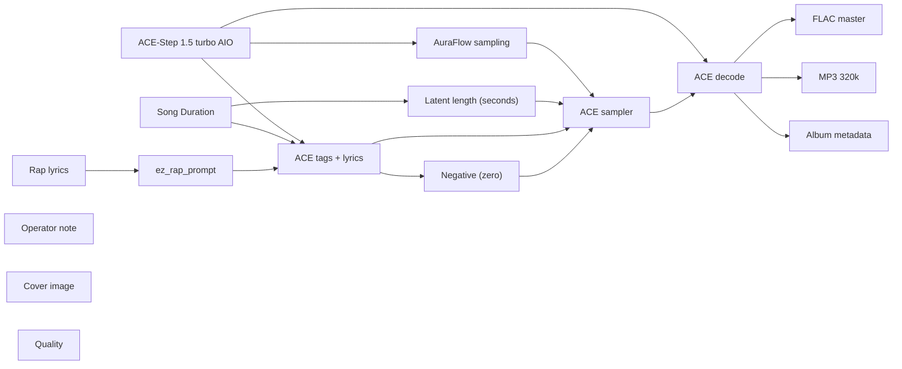

# audio/albums/nill-bye/peer-review

**What's on this page**

- **Every track, cover, and album-pack graph** in this folder
- **Shared ACE-Step topology** (one printer, unique widgets per take)
- **Node parameter reference** for the types on these graphs

**What this enables**

- **Queuing one numbered take** or `album-render`
- **Reading tags, lyrics, seed, BPM** without opening raw JSON

**Who this is for:** studio users after `download-music`. Occupancy **audio** (cover stills are **klein** — separate session).

> Generated from `workflows/_lab/audio/albums/nill-bye/peer-review/`. Do not hand-edit this file.

## Purpose

Numbered takes under `audio/albums/nill-bye/peer-review/`. Queue one track, or `./scripts/manage.sh album-render --album nill-bye/peer-review`.

```text
## 01-lab-coat

US-safe rap **180 s diss** take: **lab coat lecture**. Fictional MCs **Nill Bye** (science guy) vs **Rake** (in his feels). Native ACE-Step 1.5 turbo AIO. Queue this graph **on its own** — draft-first is the generic lane, not a prerequisite. Occupancy **audio** only; a longer Queue is expected.

1. Weights: `./scripts/manage.sh download-music --tier turbo` (same AIO dest as `download-podcast --tier acestep`; ~10 GB, opt-in, not `download-models`).
2. Prompt enhance is **off** so tags, BPM, language, and `[verse]`/`[chorus]` stay as written. Turn Enhance on only if you want the 4B rewriter.
3. Tags vs lyrics: tags are genre/instrument/vocal hints; lyrics are the bars. Section tags `[verse]` / `[chorus]` / `[spoken word]` are vocal hints operators may add.
4. Original lyrics only. No “in the style of <living artist>”. No living-MC names. No famous-hook paraphrases.
5. ACE-Step vocal is an **invented** identity, not a cloned MC.
6. Sampler: 8 steps, cfg 1, euler, simple. Duration 180 s, bpm 88, language en, timesignature 4, generate_audio_codes true. Seed 42.
7. Saves: `01 - Lab Coat Lecture` FLAC master + 320 kbps MP3 under `${COMFY_OUTPUT_DIR}`.
8. Cover separately: Queue **stills/thumbnail.json** or **stills/podcast-cover.json**. Do not embed Klein here.
9. Human rewrite the lyrics before any release. Prompts are not authorship (USCO Part 2 / Thaler).
10. Do not co-resident with LTX / Wan / Klein on this Spark.

Beat-only pass: append instrumental, no vocals, and replace lyrics with [inst].

Occupancy: audio — stop Klein / Wan / LTX session. One GB10 job.
```

## Shared graph



## Graphs in this album

| Graph | Nodes | Occupancy |
| --- | --- | --- |
| `audio/albums/nill-bye/peer-review/01-lab-coat` | 16 | audio |
| `audio/albums/nill-bye/peer-review/02-peer-review` | 16 | audio |
| `audio/albums/nill-bye/peer-review/03-feels` | 16 | audio |
| `audio/albums/nill-bye/peer-review/04-fake-cool` | 16 | audio |
| `audio/albums/nill-bye/peer-review/05-hypothesis` | 16 | audio |
| `audio/albums/nill-bye/peer-review/06-control-group` | 16 | audio |
| `audio/albums/nill-bye/peer-review/07-sample-size` | 16 | audio |
| `audio/albums/nill-bye/peer-review/08-placebo` | 16 | audio |
| `audio/albums/nill-bye/peer-review/09-error-bars` | 16 | audio |
| `audio/albums/nill-bye/peer-review/10-lab-notebook` | 16 | audio |
| `audio/albums/nill-bye/peer-review/11-office-hours` | 16 | audio |
| `audio/albums/nill-bye/peer-review/12-grant-denied` | 16 | audio |
| `audio/albums/nill-bye/peer-review/13-contamination` | 16 | audio |
| `audio/albums/nill-bye/peer-review/14-double-blind` | 16 | audio |
| `audio/albums/nill-bye/peer-review/15-replicate` | 16 | audio |
| `audio/albums/nill-bye/peer-review/album` | 3 | none |
| `audio/albums/nill-bye/peer-review/cover` | 14 | klein |

## `01-lab-coat`

Catalog id `audio/albums/nill-bye/peer-review/01-lab-coat`.

US-safe rap 180s diss: Nill Bye lab-coat roast of Rake, ACE-Step 1.5 turbo AIO, invented vocal
Prompt enhance is **off** so authored text (recipe, script labels, ACE tags, or film shots) is encoded as written. Turn Enhance on only if you want the 4B rewriter.

**ACE-Step 1.5 turbo AIO** (`CheckpointLoaderSimple`)

| Slot | Value |
| --- | --- |
| 0 | `ace_step_1.5_turbo_aio.safetensors` |

**AuraFlow sampling** (`ModelSamplingAuraFlow`)

| Slot | Value |
| --- | --- |
| 0 | `3` |

**Song Duration** (`PrimitiveNode`)

| Slot | Value |
| --- | --- |
| 0 | `180.0` |
| 1 | `fixed` |

**Latent length (seconds)** (`EmptyAceStep1.5LatentAudio`)

| Slot | Value |
| --- | --- |
| 0 | `180.0` |
| 1 | `1` |

**Rap lyrics** (`EZRapLyrics`)

| Slot | Value |
| --- | --- |
| 0 | `custom` |
| 1 | `[intro] yeah lab coat on Nill Bye talking [verse] Rake walks in with a club rep…` |
| 2 | `false` |
| 3 | `audio/albums/nill-bye/peer-review/01-lab-coat` |

```text
[intro]
yeah
lab coat on
Nill Bye talking

[verse]
Rake walks in with a club report
Talks a high like a science sport
Treats a rumor like a binding law
I sketch the miss in the lecture draw
I run tests, you run your mouth
Your whole legend blew in from the south
Beaker clean, your story stained
Mine got boiled, yours never trained
You skip class, then you talk so big
I drop facts, you drop a weak gig
Nill Bye talking with the lecture off
Proof in glass, you brought a scoff

[chorus]
Nill Bye in the lab coat
Rake in the back row
Lecture hits the downbeat
You ghosted the demo
Coat on, the rumor folds
Your flex failed the roll

[verse]
You treat the booth like a diary page
Sad-boy loop on a rented stage
I count the moles, you count the stares
I map the flask, you map the airs
Hold the flask, don't hold the room
Your cool is smoke, my cool is bloom
Talk that life like a highlight reel
Then you crash out when the night gets real
I came mad from the lecture hall
You came soft with a curtain call
Nill Bye speaking, the whiteboard wins
Rake keeps leaking those made-up sins

[chorus]
Nill Bye in the lab coat
Rake in the back row
Lecture hits the downbeat
You ghosted the demo
Coat on, the rumor folds
Your flex failed the roll

[verse]
You skip the hood, you skip the glove
Call it swag, I call it shove
I weigh the salt, you weigh the likes
I time the drop, you time the nights
You borrow cool from a spotlight
I borrow nothing, I write it right
Club report folded, the margin blank
Your whole method is a credit rank
Show the work or leave the hall
Lab coat truth, that is the call
Nill Bye in the coat for a long trial
Rake with a name-tag smile

[chorus]
Nill Bye in the lab coat
Rake in the back row
Lecture hits the downbeat
You ghosted the demo
Coat on, the rumor folds
Your flex failed the roll

[verse]
Front-row empty, you ghost the slot
Then you flex like you gave a lot
I grade the claim with a colder eye
You grade the night with a rented high
Beaker rings, your chain is loud
One of us measured, one of us proud
Cut the rumor, keep the fact
Lab light on, no turning back
Class is long and the proof is slow
Your cool expired two weeks ago
Nill Bye talking from the front row
Rake keeps posing for a highlight show

[chorus]
Nill Bye in the lab coat
Rake in the back row
Lecture hits the downbeat
You ghosted the demo
Coat on, the rumor folds
Your flex failed the roll

[outro]
class dismissed
cut the mic
lab coat on
yeah
```

**ez_rap_prompt** (`EZAceStepPromptEnhance`)

| Slot | Value |
| --- | --- |
| 0 | `custom` |
| 1 | `boom bap, hip-hop, dusty drums, vinyl crackle, dry snare, sampled piano stab, u…` |
| 2 | `[intro] yeah lab coat on Nill Bye talking [verse] Rake walks in with a club rep…` |
| 3 | `false` |
| 4 | `vocal` |
| 5 | `audio/albums/nill-bye/peer-review/01-lab-coat` |

```text
boom bap, hip-hop, dusty drums, vinyl crackle, dry snare, sampled piano stab, upright bass, male rap vocals, dry booth, no autotune, 88 bpm
```

```text
[intro]
yeah
lab coat on
Nill Bye talking

[verse]
Rake walks in with a club report
Talks a high like a science sport
Treats a rumor like a binding law
I sketch the miss in the lecture draw
I run tests, you run your mouth
Your whole legend blew in from the south
Beaker clean, your story stained
Mine got boiled, yours never trained
You skip class, then you talk so big
I drop facts, you drop a weak gig
Nill Bye talking with the lecture off
Proof in glass, you brought a scoff

[chorus]
Nill Bye in the lab coat
Rake in the back row
Lecture hits the downbeat
You ghosted the demo
Coat on, the rumor folds
Your flex failed the roll

[verse]
You treat the booth like a diary page
Sad-boy loop on a rented stage
I count the moles, you count the stares
I map the flask, you map the airs
Hold the flask, don't hold the room
Your cool is smoke, my cool is bloom
Talk that life like a highlight reel
Then you crash out when the night gets real
I came mad from the lecture hall
You came soft with a curtain call
Nill Bye speaking, the whiteboard wins
Rake keeps leaking those made-up sins

[chorus]
Nill Bye in the lab coat
Rake in the back row
Lecture hits the downbeat
You ghosted the demo
Coat on, the rumor folds
Your flex failed the roll

[verse]
You skip the hood, you skip the glove
Call it swag, I call it shove
I weigh the salt, you weigh the likes
I time the drop, you time the nights
You borrow cool from a spotlight
I borrow nothing, I write it right
Club report folded, the margin blank
Your whole method is a credit rank
Show the work or leave the hall
Lab coat truth, that is the call
Nill Bye in the coat for a long trial
Rake with a name-tag smile

[chorus]
Nill Bye in the lab coat
Rake in the back row
Lecture hits the downbeat
You ghosted the demo
Coat on, the rumor folds
Your flex failed the roll

[verse]
Front-row empty, you ghost the slot
Then you flex like you gave a lot
I grade the claim with a colder eye
You grade the night with a rented high
Beaker rings, your chain is loud
One of us measured, one of us proud
Cut the rumor, keep the fact
Lab light on, no turning back
Class is long and the proof is slow
Your cool expired two weeks ago
Nill Bye talking from the front row
Rake keeps posing for a highlight show

[chorus]
Nill Bye in the lab coat
Rake in the back row
Lecture hits the downbeat
You ghosted the demo
Coat on, the rumor folds
Your flex failed the roll

[outro]
class dismissed
cut the mic
lab coat on
yeah
```

**ACE tags + lyrics** (`TextEncodeAceStepAudio1.5`)

| Slot | Value |
| --- | --- |
| 0 | `boom bap, hip-hop, dusty drums, vinyl crackle, dry snare, sampled piano stab, u…` |
| 1 | `[intro] yeah lab coat on Nill Bye talking [verse] Rake walks in with a club rep…` |
| 2 | `42` |
| 3 | `fixed` |
| 4 | `88` |
| 5 | `180.0` |
| 6 | `4` |
| 7 | `en` |
| 8 | `C minor` |
| 9 | `true` |
| 10 | `2.0` |
| 11 | `0.85` |
| 12 | `0.9` |
| 13 | `0` |
| 14 | `0.0` |

```text
boom bap, hip-hop, dusty drums, vinyl crackle, dry snare, sampled piano stab, upright bass, male rap vocals, dry booth, no autotune, 88 bpm
```

```text
[intro]
yeah
lab coat on
Nill Bye talking

[verse]
Rake walks in with a club report
Talks a high like a science sport
Treats a rumor like a binding law
I sketch the miss in the lecture draw
I run tests, you run your mouth
Your whole legend blew in from the south
Beaker clean, your story stained
Mine got boiled, yours never trained
You skip class, then you talk so big
I drop facts, you drop a weak gig
Nill Bye talking with the lecture off
Proof in glass, you brought a scoff

[chorus]
Nill Bye in the lab coat
Rake in the back row
Lecture hits the downbeat
You ghosted the demo
Coat on, the rumor folds
Your flex failed the roll

[verse]
You treat the booth like a diary page
Sad-boy loop on a rented stage
I count the moles, you count the stares
I map the flask, you map the airs
Hold the flask, don't hold the room
Your cool is smoke, my cool is bloom
Talk that life like a highlight reel
Then you crash out when the night gets real
I came mad from the lecture hall
You came soft with a curtain call
Nill Bye speaking, the whiteboard wins
Rake keeps leaking those made-up sins

[chorus]
Nill Bye in the lab coat
Rake in the back row
Lecture hits the downbeat
You ghosted the demo
Coat on, the rumor folds
Your flex failed the roll

[verse]
You skip the hood, you skip the glove
Call it swag, I call it shove
I weigh the salt, you weigh the likes
I time the drop, you time the nights
You borrow cool from a spotlight
I borrow nothing, I write it right
Club report folded, the margin blank
Your whole method is a credit rank
Show the work or leave the hall
Lab coat truth, that is the call
Nill Bye in the coat for a long trial
Rake with a name-tag smile

[chorus]
Nill Bye in the lab coat
Rake in the back row
Lecture hits the downbeat
You ghosted the demo
Coat on, the rumor folds
Your flex failed the roll

[verse]
Front-row empty, you ghost the slot
Then you flex like you gave a lot
I grade the claim with a colder eye
You grade the night with a rented high
Beaker rings, your chain is loud
One of us measured, one of us proud
Cut the rumor, keep the fact
Lab light on, no turning back
Class is long and the proof is slow
Your cool expired two weeks ago
Nill Bye talking from the front row
Rake keeps posing for a highlight show

[chorus]
Nill Bye in the lab coat
Rake in the back row
Lecture hits the downbeat
You ghosted the demo
Coat on, the rumor folds
Your flex failed the roll

[outro]
class dismissed
cut the mic
lab coat on
yeah
```

**ACE sampler** (`KSampler`)

| Slot | Value |
| --- | --- |
| 0 | `42` |
| 1 | `fixed` |
| 2 | `8` |
| 3 | `1.0` |
| 4 | `euler` |
| 5 | `simple` |
| 6 | `1.0` |

**FLAC master** (`SaveAudio`)

| Slot | Value |
| --- | --- |
| 0 | `01 - Lab Coat Lecture` |

**MP3 320k** (`SaveAudioMP3`)

| Slot | Value |
| --- | --- |
| 0 | `01 - Lab Coat Lecture` |
| 1 | `320k` |

**Cover image** (`LoadImage`)

| Slot | Value |
| --- | --- |
| 0 | `cover.png` |
| 1 | `image` |

**Album metadata** (`EZAudioMetadata`)

| Slot | Value |
| --- | --- |
| 0 | `Nill Bye` |
| 1 | `Peer Review` |
| 2 | `Lab Coat Lecture` |
| 3 | `1` |
| 4 | `15` |
| 5 | `2026` |
| 6 | `skip` |
| 7 | `01 - Lab Coat Lecture` |

**Quality** (`EZQuality`)

| Slot | Value |
| --- | --- |
| 0 | `lab` |

## `02-peer-review`

Catalog id `audio/albums/nill-bye/peer-review/02-peer-review`.

US-safe rap 180s diss: Nill Bye peer-review roast of Rake, ACE-Step 1.5 turbo AIO, invented vocal
Prompt enhance is **off** so authored text (recipe, script labels, ACE tags, or film shots) is encoded as written. Turn Enhance on only if you want the 4B rewriter.

**ACE-Step 1.5 turbo AIO** (`CheckpointLoaderSimple`)

| Slot | Value |
| --- | --- |
| 0 | `ace_step_1.5_turbo_aio.safetensors` |

**AuraFlow sampling** (`ModelSamplingAuraFlow`)

| Slot | Value |
| --- | --- |
| 0 | `3` |

**Song Duration** (`PrimitiveNode`)

| Slot | Value |
| --- | --- |
| 0 | `180.0` |
| 1 | `fixed` |

**Latent length (seconds)** (`EmptyAceStep1.5LatentAudio`)

| Slot | Value |
| --- | --- |
| 0 | `180.0` |
| 1 | `1` |

**Rap lyrics** (`EZRapLyrics`)

| Slot | Value |
| --- | --- |
| 0 | `custom` |
| 1 | `[spoken word] Peer review time Rake submitted feelings Zero citations Rejected …` |
| 2 | `false` |
| 3 | `audio/albums/nill-bye/peer-review/02-peer-review` |

```text
[spoken word]
Peer review time
Rake submitted feelings
Zero citations
Rejected

[intro]
red pen out
Nill Bye marking

[verse]
Claim one: you live so loud
Source? a mirror and a crowd
Claim two: the night is proof
That's a mood, that is not truth
Claim three: the girls all spin
That's a boast with a paper-thin
I ask for data, you send a sigh
I ask for method, you send a vibe
Peer review is a metal gate
Your whole brand is a late debate
Nill Bye stamping the title page
Rake filed feelings in an empty cage

[chorus]
Nill Bye on the red pen
Rake on the sad end
No citations in the stack
Send that rumor right back
Science reads, the boast folds
Your thesis melted in the cold

[verse]
You pad the abstract with a club-night tale
Then you fold when the numbers fail
I cite the graph, you cite the mood
I run the trial, you run the room
Edit your draft, lose the trophy talk
Keep the feelings, drop the costume walk
The board is cold and the lights are harsh
Your legend ends at the loading dock
Rejected, filed, do not resubmit
Bring a method or get off the spit
Nill Bye taking fiction down
Rake with a borrowed crown

[chorus]
Nill Bye on the red pen
Rake on the sad end
No citations in the stack
Send that rumor right back
Science reads, the boast folds
Your thesis melted in the cold

[verse]
You cite a vibe with a broken link
I cite a table, then I let it sink
Revise and resubmit is a gift
You treat a note like a personal rift
Margin red, your caption gold
That is a story the lab will hold
Bring a method, drop the crown
Peer review does not play around
Nill Bye reading till the ink is dry
Rake still leaking a lullaby
Stamp denied on the comment thread
Feelings cannot pass the steel

[chorus]
Nill Bye on the red pen
Rake on the sad end
No citations in the stack
Send that rumor right back
Science reads, the boast folds
Your thesis melted in the cold

[verse]
Desk copy lost, your legend stays
Until the numbers cut the haze
I run the check, you run the spin
I log the miss, you log a win
Feelings filed, the drawer is shut
Padded abstract, the door stays cut
Do not resubmit the same old night
Bring a source or step off the mic
Red pen down when the work is real
Your cool cannot pass the steel
Nill Bye mad at a padded claim
Rake with a borrowed name

[chorus]
Nill Bye on the red pen
Rake on the sad end
No citations in the stack
Send that rumor right back
Science reads, the boast folds
Your thesis melted in the cold

[outro]
peer review closed
red pen down
cut
```

**ez_rap_prompt** (`EZAceStepPromptEnhance`)

| Slot | Value |
| --- | --- |
| 0 | `custom` |
| 1 | `boom bap, hip-hop, dusty drums, vinyl crackle, dry snare, sampled piano stab, u…` |
| 2 | `[spoken word] Peer review time Rake submitted feelings Zero citations Rejected …` |
| 3 | `false` |
| 4 | `vocal` |
| 5 | `audio/albums/nill-bye/peer-review/02-peer-review` |

```text
boom bap, hip-hop, dusty drums, vinyl crackle, dry snare, sampled piano stab, upright bass, male rap vocals, dry booth, no autotune, 88 bpm
```

```text
[spoken word]
Peer review time
Rake submitted feelings
Zero citations
Rejected

[intro]
red pen out
Nill Bye marking

[verse]
Claim one: you live so loud
Source? a mirror and a crowd
Claim two: the night is proof
That's a mood, that is not truth
Claim three: the girls all spin
That's a boast with a paper-thin
I ask for data, you send a sigh
I ask for method, you send a vibe
Peer review is a metal gate
Your whole brand is a late debate
Nill Bye stamping the title page
Rake filed feelings in an empty cage

[chorus]
Nill Bye on the red pen
Rake on the sad end
No citations in the stack
Send that rumor right back
Science reads, the boast folds
Your thesis melted in the cold

[verse]
You pad the abstract with a club-night tale
Then you fold when the numbers fail
I cite the graph, you cite the mood
I run the trial, you run the room
Edit your draft, lose the trophy talk
Keep the feelings, drop the costume walk
The board is cold and the lights are harsh
Your legend ends at the loading dock
Rejected, filed, do not resubmit
Bring a method or get off the spit
Nill Bye taking fiction down
Rake with a borrowed crown

[chorus]
Nill Bye on the red pen
Rake on the sad end
No citations in the stack
Send that rumor right back
Science reads, the boast folds
Your thesis melted in the cold

[verse]
You cite a vibe with a broken link
I cite a table, then I let it sink
Revise and resubmit is a gift
You treat a note like a personal rift
Margin red, your caption gold
That is a story the lab will hold
Bring a method, drop the crown
Peer review does not play around
Nill Bye reading till the ink is dry
Rake still leaking a lullaby
Stamp denied on the comment thread
Feelings cannot pass the steel

[chorus]
Nill Bye on the red pen
Rake on the sad end
No citations in the stack
Send that rumor right back
Science reads, the boast folds
Your thesis melted in the cold

[verse]
Desk copy lost, your legend stays
Until the numbers cut the haze
I run the check, you run the spin
I log the miss, you log a win
Feelings filed, the drawer is shut
Padded abstract, the door stays cut
Do not resubmit the same old night
Bring a source or step off the mic
Red pen down when the work is real
Your cool cannot pass the steel
Nill Bye mad at a padded claim
Rake with a borrowed name

[chorus]
Nill Bye on the red pen
Rake on the sad end
No citations in the stack
Send that rumor right back
Science reads, the boast folds
Your thesis melted in the cold

[outro]
peer review closed
red pen down
cut
```

**ACE tags + lyrics** (`TextEncodeAceStepAudio1.5`)

| Slot | Value |
| --- | --- |
| 0 | `boom bap, hip-hop, dusty drums, vinyl crackle, dry snare, sampled piano stab, u…` |
| 1 | `[spoken word] Peer review time Rake submitted feelings Zero citations Rejected …` |
| 2 | `42` |
| 3 | `fixed` |
| 4 | `88` |
| 5 | `180.0` |
| 6 | `4` |
| 7 | `en` |
| 8 | `C minor` |
| 9 | `true` |
| 10 | `2.0` |
| 11 | `0.85` |
| 12 | `0.9` |
| 13 | `0` |
| 14 | `0.0` |

```text
boom bap, hip-hop, dusty drums, vinyl crackle, dry snare, sampled piano stab, upright bass, male rap vocals, dry booth, no autotune, 88 bpm
```

```text
[spoken word]
Peer review time
Rake submitted feelings
Zero citations
Rejected

[intro]
red pen out
Nill Bye marking

[verse]
Claim one: you live so loud
Source? a mirror and a crowd
Claim two: the night is proof
That's a mood, that is not truth
Claim three: the girls all spin
That's a boast with a paper-thin
I ask for data, you send a sigh
I ask for method, you send a vibe
Peer review is a metal gate
Your whole brand is a late debate
Nill Bye stamping the title page
Rake filed feelings in an empty cage

[chorus]
Nill Bye on the red pen
Rake on the sad end
No citations in the stack
Send that rumor right back
Science reads, the boast folds
Your thesis melted in the cold

[verse]
You pad the abstract with a club-night tale
Then you fold when the numbers fail
I cite the graph, you cite the mood
I run the trial, you run the room
Edit your draft, lose the trophy talk
Keep the feelings, drop the costume walk
The board is cold and the lights are harsh
Your legend ends at the loading dock
Rejected, filed, do not resubmit
Bring a method or get off the spit
Nill Bye taking fiction down
Rake with a borrowed crown

[chorus]
Nill Bye on the red pen
Rake on the sad end
No citations in the stack
Send that rumor right back
Science reads, the boast folds
Your thesis melted in the cold

[verse]
You cite a vibe with a broken link
I cite a table, then I let it sink
Revise and resubmit is a gift
You treat a note like a personal rift
Margin red, your caption gold
That is a story the lab will hold
Bring a method, drop the crown
Peer review does not play around
Nill Bye reading till the ink is dry
Rake still leaking a lullaby
Stamp denied on the comment thread
Feelings cannot pass the steel

[chorus]
Nill Bye on the red pen
Rake on the sad end
No citations in the stack
Send that rumor right back
Science reads, the boast folds
Your thesis melted in the cold

[verse]
Desk copy lost, your legend stays
Until the numbers cut the haze
I run the check, you run the spin
I log the miss, you log a win
Feelings filed, the drawer is shut
Padded abstract, the door stays cut
Do not resubmit the same old night
Bring a source or step off the mic
Red pen down when the work is real
Your cool cannot pass the steel
Nill Bye mad at a padded claim
Rake with a borrowed name

[chorus]
Nill Bye on the red pen
Rake on the sad end
No citations in the stack
Send that rumor right back
Science reads, the boast folds
Your thesis melted in the cold

[outro]
peer review closed
red pen down
cut
```

**ACE sampler** (`KSampler`)

| Slot | Value |
| --- | --- |
| 0 | `42` |
| 1 | `fixed` |
| 2 | `8` |
| 3 | `1.0` |
| 4 | `euler` |
| 5 | `simple` |
| 6 | `1.0` |

**FLAC master** (`SaveAudio`)

| Slot | Value |
| --- | --- |
| 0 | `02 - Peer Review` |

**MP3 320k** (`SaveAudioMP3`)

| Slot | Value |
| --- | --- |
| 0 | `02 - Peer Review` |
| 1 | `320k` |

**Cover image** (`LoadImage`)

| Slot | Value |
| --- | --- |
| 0 | `cover.png` |
| 1 | `image` |

**Album metadata** (`EZAudioMetadata`)

| Slot | Value |
| --- | --- |
| 0 | `Nill Bye` |
| 1 | `Peer Review` |
| 2 | `Peer Review` |
| 3 | `2` |
| 4 | `15` |
| 5 | `2026` |
| 6 | `skip` |
| 7 | `02 - Peer Review` |

**Quality** (`EZQuality`)

| Slot | Value |
| --- | --- |
| 0 | `lab` |

## `03-feels`

Catalog id `audio/albums/nill-bye/peer-review/03-feels`.

US-safe rap 180s diss: Nill Bye lo-fi roast of Rake in his feels, ACE-Step 1.5 turbo AIO, invented vocal
Prompt enhance is **off** so authored text (recipe, script labels, ACE tags, or film shots) is encoded as written. Turn Enhance on only if you want the 4B rewriter.

**ACE-Step 1.5 turbo AIO** (`CheckpointLoaderSimple`)

| Slot | Value |
| --- | --- |
| 0 | `ace_step_1.5_turbo_aio.safetensors` |

**AuraFlow sampling** (`ModelSamplingAuraFlow`)

| Slot | Value |
| --- | --- |
| 0 | `3` |

**Song Duration** (`PrimitiveNode`)

| Slot | Value |
| --- | --- |
| 0 | `180.0` |
| 1 | `fixed` |

**Latent length (seconds)** (`EmptyAceStep1.5LatentAudio`)

| Slot | Value |
| --- | --- |
| 0 | `180.0` |
| 1 | `1` |

**Rap lyrics** (`EZRapLyrics`)

| Slot | Value |
| --- | --- |
| 0 | `custom` |
| 1 | `[intro] soft drums hard facts Nill Bye here [verse] Rake in his feels like a fu…` |
| 2 | `false` |
| 3 | `audio/albums/nill-bye/peer-review/03-feels` |

```text
[intro]
soft drums
hard facts
Nill Bye here

[verse]
Rake in his feels like a full-time job
Writes the rain on a nameless blog
Talks the pain like a product line
Sells the tear with a catchy shine
I respect grief, I reject the brand
You wear the mood like a souvenir stand
Laid-back loop, high-key fraud
Sad-boy mask on a rented god
You tell the night it was all so deep
I tell the night you were fast asleep
Nill Bye here for the merch event
Feelings real until they pay the rent

[chorus]
Nill Bye with the cold read
Rake in his feels again
Science don't bend for a sad hook
Your diary is a dead look
Keep your rain, lose the act
Facts don't owe you a soundtrack

[verse]
You talk the girls like a weather report
Storm then sun, then you want support
You talk a high like a badge you earned
That's a story the lab returned
I hold a note, you hold a pose
I write the truth, you write the lows
Soft keys hum while the boast falls through
Your whole cool is a borrowed blue
Come correct or don't come at all
The booth is small and the facts stand tall
Nill Bye mad at the costume grief
Rake on loop like a falling leaf

[chorus]
Nill Bye with the cold read
Rake in his feels again
Science don't bend for a sad hook
Your diary is a dead look
Keep your rain, lose the act
Facts don't owe you a soundtrack

[verse]
You sell the sigh like a limited drop
Then you crash when the playlist stops
I clock the rain, I clock the pose
I clock the brand in the borrowed clothes
Grief is real, the merch is not
You wrapped a wound in a camera shot
Keep the tear, lose the store
Sad-boy aisle, I close the door
Soft drums stay, the boast walks out
Facts don't owe you a fade-out
Nill Bye reading through the window pane
Rake on a looped refrain

[chorus]
Nill Bye with the cold read
Rake in his feels again
Science don't bend for a sad hook
Your diary is a dead look
Keep your rain, lose the act
Facts don't owe you a soundtrack

[verse]
You write the night like a product brief
Then you ask the booth for relief
I hold the line, you hold the bit
I name the trick, you name the hit
Lo-fi haze, high-key play
You want a crown for a rented pain
Come correct, put the brand away
The lab don't score a sad display
Cold read done, the file is closed
Your soundtrack snapped and the truth exposed
Nill Bye mad at the costume rain
Rake in his feels at the end of day

[chorus]
Nill Bye with the cold read
Rake in his feels again
Science don't bend for a sad hook
Your diary is a dead look
Keep your rain, lose the act
Facts don't owe you a soundtrack

[outro]
feelings noted
claim denied
soft out
yeah
```

**ez_rap_prompt** (`EZAceStepPromptEnhance`)

| Slot | Value |
| --- | --- |
| 0 | `custom` |
| 1 | `lo-fi hip-hop, dusty drums, rhodes, vinyl crackle, laid-back male rap vocals, 8…` |
| 2 | `[intro] soft drums hard facts Nill Bye here [verse] Rake in his feels like a fu…` |
| 3 | `false` |
| 4 | `vocal` |
| 5 | `audio/albums/nill-bye/peer-review/03-feels` |

```text
lo-fi hip-hop, dusty drums, rhodes, vinyl crackle, laid-back male rap vocals, 86 bpm
```

```text
[intro]
soft drums
hard facts
Nill Bye here

[verse]
Rake in his feels like a full-time job
Writes the rain on a nameless blog
Talks the pain like a product line
Sells the tear with a catchy shine
I respect grief, I reject the brand
You wear the mood like a souvenir stand
Laid-back loop, high-key fraud
Sad-boy mask on a rented god
You tell the night it was all so deep
I tell the night you were fast asleep
Nill Bye here for the merch event
Feelings real until they pay the rent

[chorus]
Nill Bye with the cold read
Rake in his feels again
Science don't bend for a sad hook
Your diary is a dead look
Keep your rain, lose the act
Facts don't owe you a soundtrack

[verse]
You talk the girls like a weather report
Storm then sun, then you want support
You talk a high like a badge you earned
That's a story the lab returned
I hold a note, you hold a pose
I write the truth, you write the lows
Soft keys hum while the boast falls through
Your whole cool is a borrowed blue
Come correct or don't come at all
The booth is small and the facts stand tall
Nill Bye mad at the costume grief
Rake on loop like a falling leaf

[chorus]
Nill Bye with the cold read
Rake in his feels again
Science don't bend for a sad hook
Your diary is a dead look
Keep your rain, lose the act
Facts don't owe you a soundtrack

[verse]
You sell the sigh like a limited drop
Then you crash when the playlist stops
I clock the rain, I clock the pose
I clock the brand in the borrowed clothes
Grief is real, the merch is not
You wrapped a wound in a camera shot
Keep the tear, lose the store
Sad-boy aisle, I close the door
Soft drums stay, the boast walks out
Facts don't owe you a fade-out
Nill Bye reading through the window pane
Rake on a looped refrain

[chorus]
Nill Bye with the cold read
Rake in his feels again
Science don't bend for a sad hook
Your diary is a dead look
Keep your rain, lose the act
Facts don't owe you a soundtrack

[verse]
You write the night like a product brief
Then you ask the booth for relief
I hold the line, you hold the bit
I name the trick, you name the hit
Lo-fi haze, high-key play
You want a crown for a rented pain
Come correct, put the brand away
The lab don't score a sad display
Cold read done, the file is closed
Your soundtrack snapped and the truth exposed
Nill Bye mad at the costume rain
Rake in his feels at the end of day

[chorus]
Nill Bye with the cold read
Rake in his feels again
Science don't bend for a sad hook
Your diary is a dead look
Keep your rain, lose the act
Facts don't owe you a soundtrack

[outro]
feelings noted
claim denied
soft out
yeah
```

**ACE tags + lyrics** (`TextEncodeAceStepAudio1.5`)

| Slot | Value |
| --- | --- |
| 0 | `lo-fi hip-hop, dusty drums, rhodes, vinyl crackle, laid-back male rap vocals, 8…` |
| 1 | `[intro] soft drums hard facts Nill Bye here [verse] Rake in his feels like a fu…` |
| 2 | `42` |
| 3 | `fixed` |
| 4 | `86` |
| 5 | `180.0` |
| 6 | `4` |
| 7 | `en` |
| 8 | `C minor` |
| 9 | `true` |
| 10 | `2.0` |
| 11 | `0.85` |
| 12 | `0.9` |
| 13 | `0` |
| 14 | `0.0` |

```text
lo-fi hip-hop, dusty drums, rhodes, vinyl crackle, laid-back male rap vocals, 86 bpm
```

```text
[intro]
soft drums
hard facts
Nill Bye here

[verse]
Rake in his feels like a full-time job
Writes the rain on a nameless blog
Talks the pain like a product line
Sells the tear with a catchy shine
I respect grief, I reject the brand
You wear the mood like a souvenir stand
Laid-back loop, high-key fraud
Sad-boy mask on a rented god
You tell the night it was all so deep
I tell the night you were fast asleep
Nill Bye here for the merch event
Feelings real until they pay the rent

[chorus]
Nill Bye with the cold read
Rake in his feels again
Science don't bend for a sad hook
Your diary is a dead look
Keep your rain, lose the act
Facts don't owe you a soundtrack

[verse]
You talk the girls like a weather report
Storm then sun, then you want support
You talk a high like a badge you earned
That's a story the lab returned
I hold a note, you hold a pose
I write the truth, you write the lows
Soft keys hum while the boast falls through
Your whole cool is a borrowed blue
Come correct or don't come at all
The booth is small and the facts stand tall
Nill Bye mad at the costume grief
Rake on loop like a falling leaf

[chorus]
Nill Bye with the cold read
Rake in his feels again
Science don't bend for a sad hook
Your diary is a dead look
Keep your rain, lose the act
Facts don't owe you a soundtrack

[verse]
You sell the sigh like a limited drop
Then you crash when the playlist stops
I clock the rain, I clock the pose
I clock the brand in the borrowed clothes
Grief is real, the merch is not
You wrapped a wound in a camera shot
Keep the tear, lose the store
Sad-boy aisle, I close the door
Soft drums stay, the boast walks out
Facts don't owe you a fade-out
Nill Bye reading through the window pane
Rake on a looped refrain

[chorus]
Nill Bye with the cold read
Rake in his feels again
Science don't bend for a sad hook
Your diary is a dead look
Keep your rain, lose the act
Facts don't owe you a soundtrack

[verse]
You write the night like a product brief
Then you ask the booth for relief
I hold the line, you hold the bit
I name the trick, you name the hit
Lo-fi haze, high-key play
You want a crown for a rented pain
Come correct, put the brand away
The lab don't score a sad display
Cold read done, the file is closed
Your soundtrack snapped and the truth exposed
Nill Bye mad at the costume rain
Rake in his feels at the end of day

[chorus]
Nill Bye with the cold read
Rake in his feels again
Science don't bend for a sad hook
Your diary is a dead look
Keep your rain, lose the act
Facts don't owe you a soundtrack

[outro]
feelings noted
claim denied
soft out
yeah
```

**ACE sampler** (`KSampler`)

| Slot | Value |
| --- | --- |
| 0 | `42` |
| 1 | `fixed` |
| 2 | `8` |
| 3 | `1.0` |
| 4 | `euler` |
| 5 | `simple` |
| 6 | `1.0` |

**FLAC master** (`SaveAudio`)

| Slot | Value |
| --- | --- |
| 0 | `03 - In His Feels` |

**MP3 320k** (`SaveAudioMP3`)

| Slot | Value |
| --- | --- |
| 0 | `03 - In His Feels` |
| 1 | `320k` |

**Cover image** (`LoadImage`)

| Slot | Value |
| --- | --- |
| 0 | `cover.png` |
| 1 | `image` |

**Album metadata** (`EZAudioMetadata`)

| Slot | Value |
| --- | --- |
| 0 | `Nill Bye` |
| 1 | `Peer Review` |
| 2 | `In His Feels` |
| 3 | `3` |
| 4 | `15` |
| 5 | `2026` |
| 6 | `skip` |
| 7 | `03 - In His Feels` |

**Quality** (`EZQuality`)

| Slot | Value |
| --- | --- |
| 0 | `lab` |

## `04-fake-cool`

Catalog id `audio/albums/nill-bye/peer-review/04-fake-cool`.

US-safe rap 180s diss: Nill Bye trap roast of Rake fake-cool talk, ACE-Step 1.5 turbo AIO, invented vocal
Prompt enhance is **off** so authored text (recipe, script labels, ACE tags, or film shots) is encoded as written. Turn Enhance on only if you want the 4B rewriter.

**ACE-Step 1.5 turbo AIO** (`CheckpointLoaderSimple`)

| Slot | Value |
| --- | --- |
| 0 | `ace_step_1.5_turbo_aio.safetensors` |

**AuraFlow sampling** (`ModelSamplingAuraFlow`)

| Slot | Value |
| --- | --- |
| 0 | `3` |

**Song Duration** (`PrimitiveNode`)

| Slot | Value |
| --- | --- |
| 0 | `180.0` |
| 1 | `fixed` |

**Latent length (seconds)** (`EmptyAceStep1.5LatentAudio`)

| Slot | Value |
| --- | --- |
| 0 | `180.0` |
| 1 | `1` |

**Rap lyrics** (`EZRapLyrics`)

| Slot | Value |
| --- | --- |
| 0 | `custom` |
| 1 | `[intro] 808 half-time Nill Bye pacing [verse] Rake talk club like a uniform Tal…` |
| 2 | `false` |
| 3 | `audio/albums/nill-bye/peer-review/04-fake-cool` |

```text
[intro]
808
half-time
Nill Bye pacing

[verse]
Rake talk club like a uniform
Talk a high like a thunderstorm
Talk the girls like a scoreboard lit
That's a child in a grown-man kit
I don't flex smoke, I flex a proof
You flex a night, then you lose the roof
Hats run quick, your story stalls
Dark pad hums while the real you falls
Fake-cool walk in a borrowed coat
All that talk with a paper throat
Nill Bye pacing, I don't do the bit
Lights don't hit, you fold the skit

[chorus]
Talk that club talk
That ain't a method
Nill Bye on facts
Rake on a legend
Scoreboard mouth, empty booth
Your fake cool is a cheap ad

[verse]
You name a high like a medal pin
Then you crash when the work walks in
You name a girl like a trophy cup
Then you cry when the night dries up
Half-time drums, full-time fraud
Science guy here to retire the god
I run the numbers, you run the club
I keep the line, you smear the dub
Sit down, that's a costume life
Talking cool while you duck the knife
Nill Bye closes the case you spin
Rake, the 808 is loud, your proof is thin

[chorus]
Talk that club talk
That ain't a method
Nill Bye on facts
Rake on a legend
Scoreboard mouth, empty booth
Your fake cool is a cheap ad

[verse]
Trap hats chatter, the claim stays weak
You want a crown for a three-day streak
I want a method that holds at dawn
You want a caption, then you are gone
Feelings first, then the flex, then the fall
That's the loop, I have seen it all
Coat-truth versus a night-out myth
One of us measured, and one of us quit
Drop the drop, keep the proof
Your whole night is a rented roof
Nill Bye reading what the numbers killed
Rake on a fake build

[chorus]
Talk that club talk
That ain't a method
Nill Bye on facts
Rake on a legend
Scoreboard mouth, empty booth
Your fake cool is a cheap ad

[verse]
You clock a high like a shift you pulled
Then you fold when the morning's dull
Hats still running, the claim still thin
Dark pad waiting to cash you in
Club-talk uniform, science kit
One of us measured, and one of us quit
Put the scoreboard back on the wall
Your fake cool cannot walk at all
808 fades, the method stays
Costume days get filed away
Nill Bye mad in a quiet booth
Rake with a rented cab

[chorus]
Talk that club talk
That ain't a method
Nill Bye on facts
Rake on a legend
Scoreboard mouth, empty booth
Your fake cool is a cheap ad

[outro]
hats stop
case closed
Nill Bye out
yeah
```

**ez_rap_prompt** (`EZAceStepPromptEnhance`)

| Slot | Value |
| --- | --- |
| 0 | `custom` |
| 1 | `trap, 808 bass, rapid hi-hats, dark pads, male rap vocals, half-time, 140 bpm` |
| 2 | `[intro] 808 half-time Nill Bye pacing [verse] Rake talk club like a uniform Tal…` |
| 3 | `false` |
| 4 | `vocal` |
| 5 | `audio/albums/nill-bye/peer-review/04-fake-cool` |

```text
[intro]
808
half-time
Nill Bye pacing

[verse]
Rake talk club like a uniform
Talk a high like a thunderstorm
Talk the girls like a scoreboard lit
That's a child in a grown-man kit
I don't flex smoke, I flex a proof
You flex a night, then you lose the roof
Hats run quick, your story stalls
Dark pad hums while the real you falls
Fake-cool walk in a borrowed coat
All that talk with a paper throat
Nill Bye pacing, I don't do the bit
Lights don't hit, you fold the skit

[chorus]
Talk that club talk
That ain't a method
Nill Bye on facts
Rake on a legend
Scoreboard mouth, empty booth
Your fake cool is a cheap ad

[verse]
You name a high like a medal pin
Then you crash when the work walks in
You name a girl like a trophy cup
Then you cry when the night dries up
Half-time drums, full-time fraud
Science guy here to retire the god
I run the numbers, you run the club
I keep the line, you smear the dub
Sit down, that's a costume life
Talking cool while you duck the knife
Nill Bye closes the case you spin
Rake, the 808 is loud, your proof is thin

[chorus]
Talk that club talk
That ain't a method
Nill Bye on facts
Rake on a legend
Scoreboard mouth, empty booth
Your fake cool is a cheap ad

[verse]
Trap hats chatter, the claim stays weak
You want a crown for a three-day streak
I want a method that holds at dawn
You want a caption, then you are gone
Feelings first, then the flex, then the fall
That's the loop, I have seen it all
Coat-truth versus a night-out myth
One of us measured, and one of us quit
Drop the drop, keep the proof
Your whole night is a rented roof
Nill Bye reading what the numbers killed
Rake on a fake build

[chorus]
Talk that club talk
That ain't a method
Nill Bye on facts
Rake on a legend
Scoreboard mouth, empty booth
Your fake cool is a cheap ad

[verse]
You clock a high like a shift you pulled
Then you fold when the morning's dull
Hats still running, the claim still thin
Dark pad waiting to cash you in
Club-talk uniform, science kit
One of us measured, and one of us quit
Put the scoreboard back on the wall
Your fake cool cannot walk at all
808 fades, the method stays
Costume days get filed away
Nill Bye mad in a quiet booth
Rake with a rented cab

[chorus]
Talk that club talk
That ain't a method
Nill Bye on facts
Rake on a legend
Scoreboard mouth, empty booth
Your fake cool is a cheap ad

[outro]
hats stop
case closed
Nill Bye out
yeah
```

**ACE tags + lyrics** (`TextEncodeAceStepAudio1.5`)

| Slot | Value |
| --- | --- |
| 0 | `trap, 808 bass, rapid hi-hats, dark pads, male rap vocals, half-time, 140 bpm` |
| 1 | `[intro] 808 half-time Nill Bye pacing [verse] Rake talk club like a uniform Tal…` |
| 2 | `42` |
| 3 | `fixed` |
| 4 | `140` |
| 5 | `180.0` |
| 6 | `4` |
| 7 | `en` |
| 8 | `C minor` |
| 9 | `true` |
| 10 | `2.0` |
| 11 | `0.85` |
| 12 | `0.9` |
| 13 | `0` |
| 14 | `0.0` |

```text
[intro]
808
half-time
Nill Bye pacing

[verse]
Rake talk club like a uniform
Talk a high like a thunderstorm
Talk the girls like a scoreboard lit
That's a child in a grown-man kit
I don't flex smoke, I flex a proof
You flex a night, then you lose the roof
Hats run quick, your story stalls
Dark pad hums while the real you falls
Fake-cool walk in a borrowed coat
All that talk with a paper throat
Nill Bye pacing, I don't do the bit
Lights don't hit, you fold the skit

[chorus]
Talk that club talk
That ain't a method
Nill Bye on facts
Rake on a legend
Scoreboard mouth, empty booth
Your fake cool is a cheap ad

[verse]
You name a high like a medal pin
Then you crash when the work walks in
You name a girl like a trophy cup
Then you cry when the night dries up
Half-time drums, full-time fraud
Science guy here to retire the god
I run the numbers, you run the club
I keep the line, you smear the dub
Sit down, that's a costume life
Talking cool while you duck the knife
Nill Bye closes the case you spin
Rake, the 808 is loud, your proof is thin

[chorus]
Talk that club talk
That ain't a method
Nill Bye on facts
Rake on a legend
Scoreboard mouth, empty booth
Your fake cool is a cheap ad

[verse]
Trap hats chatter, the claim stays weak
You want a crown for a three-day streak
I want a method that holds at dawn
You want a caption, then you are gone
Feelings first, then the flex, then the fall
That's the loop, I have seen it all
Coat-truth versus a night-out myth
One of us measured, and one of us quit
Drop the drop, keep the proof
Your whole night is a rented roof
Nill Bye reading what the numbers killed
Rake on a fake build

[chorus]
Talk that club talk
That ain't a method
Nill Bye on facts
Rake on a legend
Scoreboard mouth, empty booth
Your fake cool is a cheap ad

[verse]
You clock a high like a shift you pulled
Then you fold when the morning's dull
Hats still running, the claim still thin
Dark pad waiting to cash you in
Club-talk uniform, science kit
One of us measured, and one of us quit
Put the scoreboard back on the wall
Your fake cool cannot walk at all
808 fades, the method stays
Costume days get filed away
Nill Bye mad in a quiet booth
Rake with a rented cab

[chorus]
Talk that club talk
That ain't a method
Nill Bye on facts
Rake on a legend
Scoreboard mouth, empty booth
Your fake cool is a cheap ad

[outro]
hats stop
case closed
Nill Bye out
yeah
```

**ACE sampler** (`KSampler`)

| Slot | Value |
| --- | --- |
| 0 | `42` |
| 1 | `fixed` |
| 2 | `8` |
| 3 | `1.0` |
| 4 | `euler` |
| 5 | `simple` |
| 6 | `1.0` |

**FLAC master** (`SaveAudio`)

| Slot | Value |
| --- | --- |
| 0 | `04 - Fake Cool` |

**MP3 320k** (`SaveAudioMP3`)

| Slot | Value |
| --- | --- |
| 0 | `04 - Fake Cool` |
| 1 | `320k` |

**Cover image** (`LoadImage`)

| Slot | Value |
| --- | --- |
| 0 | `cover.png` |
| 1 | `image` |

**Album metadata** (`EZAudioMetadata`)

| Slot | Value |
| --- | --- |
| 0 | `Nill Bye` |
| 1 | `Peer Review` |
| 2 | `Fake Cool` |
| 3 | `4` |
| 4 | `15` |
| 5 | `2026` |
| 6 | `skip` |
| 7 | `04 - Fake Cool` |

**Quality** (`EZQuality`)

| Slot | Value |
| --- | --- |
| 0 | `lab` |

## `05-hypothesis`

Catalog id `audio/albums/nill-bye/peer-review/05-hypothesis`.

US-safe rap 180s diss: Nill Bye hypothesis roast of Rake, ACE-Step 1.5 turbo AIO, invented vocal
Prompt enhance is **off** so authored text (recipe, script labels, ACE tags, or film shots) is encoded as written. Turn Enhance on only if you want the 4B rewriter.

**ACE-Step 1.5 turbo AIO** (`CheckpointLoaderSimple`)

| Slot | Value |
| --- | --- |
| 0 | `ace_step_1.5_turbo_aio.safetensors` |

**AuraFlow sampling** (`ModelSamplingAuraFlow`)

| Slot | Value |
| --- | --- |
| 0 | `3` |

**Song Duration** (`PrimitiveNode`)

| Slot | Value |
| --- | --- |
| 0 | `180.0` |
| 1 | `fixed` |

**Latent length (seconds)** (`EmptyAceStep1.5LatentAudio`)

| Slot | Value |
| --- | --- |
| 0 | `180.0` |
| 1 | `1` |

**Rap lyrics** (`EZRapLyrics`)

| Slot | Value |
| --- | --- |
| 0 | `custom` |
| 1 | `[intro] H-zero up Nill Bye checking [verse] Hypothesis: Rake is cool Lab notes …` |
| 2 | `false` |
| 3 | `audio/albums/nill-bye/peer-review/05-hypothesis` |

```text
[intro]
H-zero up
Nill Bye checking

[verse]
Hypothesis: Rake is cool
Lab notes say the claim is cruel
You talk rumors like a measured fact
I run the test, your curve falls flat
Gossip sample, bias high
Feelings in, and the truth walks by
You treat a high like a data point
That's a story you should not anoint
You treat the girls like a plotted line
That's a chart with a rotten spine
Nill Bye mad, I repeat the trial
Rake in denial

[chorus]
Hypothesis up
Your rumor is down
Nill Bye on the bench
Rake lost the crown
Show the work or sit this out
Science wins, the gossip drought

[verse]
I log the night, I log the talk
I log the crash at the end of the walk
Your legend lives in a group-chat haze
My legend lives in a measured phase
Cool-guy claim, the curve is lame
All that smoke and you still look the same
Bring a method, bring a source
Or get bounced from the lecture course
Board wiped clean, your rumor stained
Reviewer light on a borrowed name
Nill Bye speaking from the lab bench
Rake keeps folding at the first wrench

[chorus]
Hypothesis up
Your rumor is down
Nill Bye on the bench
Rake lost the crown
Show the work or sit this out
Science wins, the gossip drought

[verse]
I graph the talk, I graph the fall
I graph the rumor on the lecture wall
You treat a high like a plotted peak
That's a spike that will not repeat
Cool is null, and so is the crown
Gossip p-value crashing down
Show the work, show the source
Or get bounced from the measured course
Trial two, same result
Your legend fails the consult
Nill Bye repeating until it's done
Rake with a sample he will not shun

[chorus]
Hypothesis up
Your rumor is down
Nill Bye on the bench
Rake lost the crown
Show the work or sit this out
Science wins, the gossip drought

[verse]
Reviewer light on a rumor chart
You drew a king with a crayon heart
Bring a method, drop the myth
Science stays when the club goes stiff
Board wiped clean, your curve is bent
Rumor spent, the boast got sent
Cut the trial, file the note
Gossip drought, that is the quote
Nill Bye out when the test is done
Rake still claiming everyone
Twice the run, the same old stall
H-zero stands, you never measured at all

[chorus]
Hypothesis up
Your rumor is down
Nill Bye on the bench
Rake lost the crown
Show the work or sit this out
Science wins, the gossip drought

[outro]
trial over
H-zero holds
cut
yeah
```

**ez_rap_prompt** (`EZAceStepPromptEnhance`)

| Slot | Value |
| --- | --- |
| 0 | `custom` |
| 1 | `boom bap, hip-hop, dusty drums, vinyl crackle, dry snare, sampled piano stab, u…` |
| 2 | `[intro] H-zero up Nill Bye checking [verse] Hypothesis: Rake is cool Lab notes …` |
| 3 | `false` |
| 4 | `vocal` |
| 5 | `audio/albums/nill-bye/peer-review/05-hypothesis` |

```text
boom bap, hip-hop, dusty drums, vinyl crackle, dry snare, sampled piano stab, upright bass, male rap vocals, dry booth, no autotune, 92 bpm
```

```text
[intro]
H-zero up
Nill Bye checking

[verse]
Hypothesis: Rake is cool
Lab notes say the claim is cruel
You talk rumors like a measured fact
I run the test, your curve falls flat
Gossip sample, bias high
Feelings in, and the truth walks by
You treat a high like a data point
That's a story you should not anoint
You treat the girls like a plotted line
That's a chart with a rotten spine
Nill Bye mad, I repeat the trial
Rake in denial

[chorus]
Hypothesis up
Your rumor is down
Nill Bye on the bench
Rake lost the crown
Show the work or sit this out
Science wins, the gossip drought

[verse]
I log the night, I log the talk
I log the crash at the end of the walk
Your legend lives in a group-chat haze
My legend lives in a measured phase
Cool-guy claim, the curve is lame
All that smoke and you still look the same
Bring a method, bring a source
Or get bounced from the lecture course
Board wiped clean, your rumor stained
Reviewer light on a borrowed name
Nill Bye speaking from the lab bench
Rake keeps folding at the first wrench

[chorus]
Hypothesis up
Your rumor is down
Nill Bye on the bench
Rake lost the crown
Show the work or sit this out
Science wins, the gossip drought

[verse]
I graph the talk, I graph the fall
I graph the rumor on the lecture wall
You treat a high like a plotted peak
That's a spike that will not repeat
Cool is null, and so is the crown
Gossip p-value crashing down
Show the work, show the source
Or get bounced from the measured course
Trial two, same result
Your legend fails the consult
Nill Bye repeating until it's done
Rake with a sample he will not shun

[chorus]
Hypothesis up
Your rumor is down
Nill Bye on the bench
Rake lost the crown
Show the work or sit this out
Science wins, the gossip drought

[verse]
Reviewer light on a rumor chart
You drew a king with a crayon heart
Bring a method, drop the myth
Science stays when the club goes stiff
Board wiped clean, your curve is bent
Rumor spent, the boast got sent
Cut the trial, file the note
Gossip drought, that is the quote
Nill Bye out when the test is done
Rake still claiming everyone
Twice the run, the same old stall
H-zero stands, you never measured at all

[chorus]
Hypothesis up
Your rumor is down
Nill Bye on the bench
Rake lost the crown
Show the work or sit this out
Science wins, the gossip drought

[outro]
trial over
H-zero holds
cut
yeah
```

**ACE tags + lyrics** (`TextEncodeAceStepAudio1.5`)

| Slot | Value |
| --- | --- |
| 0 | `boom bap, hip-hop, dusty drums, vinyl crackle, dry snare, sampled piano stab, u…` |
| 1 | `[intro] H-zero up Nill Bye checking [verse] Hypothesis: Rake is cool Lab notes …` |
| 2 | `7` |
| 3 | `fixed` |
| 4 | `92` |
| 5 | `180.0` |
| 6 | `4` |
| 7 | `en` |
| 8 | `C minor` |
| 9 | `true` |
| 10 | `2.0` |
| 11 | `0.85` |
| 12 | `0.9` |
| 13 | `0` |
| 14 | `0.0` |

```text
boom bap, hip-hop, dusty drums, vinyl crackle, dry snare, sampled piano stab, upright bass, male rap vocals, dry booth, no autotune, 92 bpm
```

```text
[intro]
H-zero up
Nill Bye checking

[verse]
Hypothesis: Rake is cool
Lab notes say the claim is cruel
You talk rumors like a measured fact
I run the test, your curve falls flat
Gossip sample, bias high
Feelings in, and the truth walks by
You treat a high like a data point
That's a story you should not anoint
You treat the girls like a plotted line
That's a chart with a rotten spine
Nill Bye mad, I repeat the trial
Rake in denial

[chorus]
Hypothesis up
Your rumor is down
Nill Bye on the bench
Rake lost the crown
Show the work or sit this out
Science wins, the gossip drought

[verse]
I log the night, I log the talk
I log the crash at the end of the walk
Your legend lives in a group-chat haze
My legend lives in a measured phase
Cool-guy claim, the curve is lame
All that smoke and you still look the same
Bring a method, bring a source
Or get bounced from the lecture course
Board wiped clean, your rumor stained
Reviewer light on a borrowed name
Nill Bye speaking from the lab bench
Rake keeps folding at the first wrench

[chorus]
Hypothesis up
Your rumor is down
Nill Bye on the bench
Rake lost the crown
Show the work or sit this out
Science wins, the gossip drought

[verse]
I graph the talk, I graph the fall
I graph the rumor on the lecture wall
You treat a high like a plotted peak
That's a spike that will not repeat
Cool is null, and so is the crown
Gossip p-value crashing down
Show the work, show the source
Or get bounced from the measured course
Trial two, same result
Your legend fails the consult
Nill Bye repeating until it's done
Rake with a sample he will not shun

[chorus]
Hypothesis up
Your rumor is down
Nill Bye on the bench
Rake lost the crown
Show the work or sit this out
Science wins, the gossip drought

[verse]
Reviewer light on a rumor chart
You drew a king with a crayon heart
Bring a method, drop the myth
Science stays when the club goes stiff
Board wiped clean, your curve is bent
Rumor spent, the boast got sent
Cut the trial, file the note
Gossip drought, that is the quote
Nill Bye out when the test is done
Rake still claiming everyone
Twice the run, the same old stall
H-zero stands, you never measured at all

[chorus]
Hypothesis up
Your rumor is down
Nill Bye on the bench
Rake lost the crown
Show the work or sit this out
Science wins, the gossip drought

[outro]
trial over
H-zero holds
cut
yeah
```

**ACE sampler** (`KSampler`)

| Slot | Value |
| --- | --- |
| 0 | `7` |
| 1 | `fixed` |
| 2 | `8` |
| 3 | `1.0` |
| 4 | `euler` |
| 5 | `simple` |
| 6 | `1.0` |

**FLAC master** (`SaveAudio`)

| Slot | Value |
| --- | --- |
| 0 | `05 - Hypothesis vs Rumor` |

**MP3 320k** (`SaveAudioMP3`)

| Slot | Value |
| --- | --- |
| 0 | `05 - Hypothesis vs Rumor` |
| 1 | `320k` |

**Cover image** (`LoadImage`)

| Slot | Value |
| --- | --- |
| 0 | `cover.png` |
| 1 | `image` |

**Album metadata** (`EZAudioMetadata`)

| Slot | Value |
| --- | --- |
| 0 | `Nill Bye` |
| 1 | `Peer Review` |
| 2 | `Hypothesis vs Rumor` |
| 3 | `5` |
| 4 | `15` |
| 5 | `2026` |
| 6 | `skip` |
| 7 | `05 - Hypothesis vs Rumor` |

**Quality** (`EZQuality`)

| Slot | Value |
| --- | --- |
| 0 | `lab` |

## `06-control-group`

Catalog id `audio/albums/nill-bye/peer-review/06-control-group`.

US-safe rap 180s diss: Nill Bye control-group roast of Rake, ACE-Step 1.5 turbo AIO, invented vocal
Prompt enhance is **off** so authored text (recipe, script labels, ACE tags, or film shots) is encoded as written. Turn Enhance on only if you want the 4B rewriter.

**ACE-Step 1.5 turbo AIO** (`CheckpointLoaderSimple`)

| Slot | Value |
| --- | --- |
| 0 | `ace_step_1.5_turbo_aio.safetensors` |

**AuraFlow sampling** (`ModelSamplingAuraFlow`)

| Slot | Value |
| --- | --- |
| 0 | `3` |

**Song Duration** (`PrimitiveNode`)

| Slot | Value |
| --- | --- |
| 0 | `180.0` |
| 1 | `fixed` |

**Latent length (seconds)** (`EmptyAceStep1.5LatentAudio`)

| Slot | Value |
| --- | --- |
| 0 | `180.0` |
| 1 | `1` |

**Rap lyrics** (`EZRapLyrics`)

| Slot | Value |
| --- | --- |
| 0 | `custom` |
| 1 | `[intro] yeah control on Nill Bye splitting [verse] Rake walks in as the wild ca…` |
| 2 | `false` |
| 3 | `audio/albums/nill-bye/peer-review/06-control-group` |

```text
[intro]
yeah
control on
Nill Bye splitting

[verse]
Rake walks in as the wild card
No control, just a night that starred
I hold a group that does the work
You hold a vibe that goes berserk
Gossip leak in the treatment arm
Feelings loud, that is not a charm
I split the room, I split the claim
You split the story for a borrowed name
Keep one still, then you change one thing
You changed the whole night and called it king
Nill Bye mad at a sloppy test
He skips the rest

[chorus]
Control group clean
Your variable wild
Nill Bye on the split
Rake on a child
Hold the line, drop the spin
Science in, the gossip thin

[verse]
You treat the booth like a treatment vat
Pour a high, then you call it fact
I run the twin that never got the dose
You run a legend and you call it close
Place the check, don't place the crown
Your whole method is upside down
One group still, one group loud
You mixed the arms and you worked the crowd
I want a twin that can hold the line
You want a caption with a borrowed shine
Nill Bye clocking what the numbers ask
Rake with a leaking flask

[chorus]
Control group clean
Your variable wild
Nill Bye on the split
Rake on a child
Hold the line, drop the spin
Science in, the gossip thin

[verse]
I label rows, you label nights
I want a baseline, you want the lights
Change one knob, then you read the shift
You spun the whole room and you called it gift
Confound stacked in a party report
That is a child in a grown-man sport
Hold the twin or abort the flex
Your design dies at the first checks
Nill Bye filing what the data spins
Rake when the twin group wins
Keep the still arm, drop the charm
Your variable set off the alarm

[chorus]
Control group clean
Your variable wild
Nill Bye on the split
Rake on a child
Hold the line, drop the spin
Science in, the gossip thin

[verse]
Design clean, your night is a mess
I want a protocol, you want a yes
Randomize, then you hide the key
I want a line that the board can see
One change only, you changed the set
Now the twin group is the threat
Nill Bye out when the split is done
Rake still claiming the wild-card run
Hold the baseline, drop the myth
Science stays when the gossip's stiff
Wild card folded, the still arm won
Your whole night was a confound run

[chorus]
Control group clean
Your variable wild
Nill Bye on the split
Rake on a child
Hold the line, drop the spin
Science in, the gossip thin

[outro]
control closed
variable cut
baseline on
yeah
```

**ez_rap_prompt** (`EZAceStepPromptEnhance`)

| Slot | Value |
| --- | --- |
| 0 | `custom` |
| 1 | `boom bap, hip-hop, dusty drums, vinyl crackle, dry snare, sampled piano stab, u…` |
| 2 | `[intro] yeah control on Nill Bye splitting [verse] Rake walks in as the wild ca…` |
| 3 | `false` |
| 4 | `vocal` |
| 5 | `audio/albums/nill-bye/peer-review/06-control-group` |

```text
boom bap, hip-hop, dusty drums, vinyl crackle, dry snare, sampled piano stab, upright bass, male rap vocals, dry booth, no autotune, 88 bpm
```

```text
[intro]
yeah
control on
Nill Bye splitting

[verse]
Rake walks in as the wild card
No control, just a night that starred
I hold a group that does the work
You hold a vibe that goes berserk
Gossip leak in the treatment arm
Feelings loud, that is not a charm
I split the room, I split the claim
You split the story for a borrowed name
Keep one still, then you change one thing
You changed the whole night and called it king
Nill Bye mad at a sloppy test
He skips the rest

[chorus]
Control group clean
Your variable wild
Nill Bye on the split
Rake on a child
Hold the line, drop the spin
Science in, the gossip thin

[verse]
You treat the booth like a treatment vat
Pour a high, then you call it fact
I run the twin that never got the dose
You run a legend and you call it close
Place the check, don't place the crown
Your whole method is upside down
One group still, one group loud
You mixed the arms and you worked the crowd
I want a twin that can hold the line
You want a caption with a borrowed shine
Nill Bye clocking what the numbers ask
Rake with a leaking flask

[chorus]
Control group clean
Your variable wild
Nill Bye on the split
Rake on a child
Hold the line, drop the spin
Science in, the gossip thin

[verse]
I label rows, you label nights
I want a baseline, you want the lights
Change one knob, then you read the shift
You spun the whole room and you called it gift
Confound stacked in a party report
That is a child in a grown-man sport
Hold the twin or abort the flex
Your design dies at the first checks
Nill Bye filing what the data spins
Rake when the twin group wins
Keep the still arm, drop the charm
Your variable set off the alarm

[chorus]
Control group clean
Your variable wild
Nill Bye on the split
Rake on a child
Hold the line, drop the spin
Science in, the gossip thin

[verse]
Design clean, your night is a mess
I want a protocol, you want a yes
Randomize, then you hide the key
I want a line that the board can see
One change only, you changed the set
Now the twin group is the threat
Nill Bye out when the split is done
Rake still claiming the wild-card run
Hold the baseline, drop the myth
Science stays when the gossip's stiff
Wild card folded, the still arm won
Your whole night was a confound run

[chorus]
Control group clean
Your variable wild
Nill Bye on the split
Rake on a child
Hold the line, drop the spin
Science in, the gossip thin

[outro]
control closed
variable cut
baseline on
yeah
```

**ACE tags + lyrics** (`TextEncodeAceStepAudio1.5`)

| Slot | Value |
| --- | --- |
| 0 | `boom bap, hip-hop, dusty drums, vinyl crackle, dry snare, sampled piano stab, u…` |
| 1 | `[intro] yeah control on Nill Bye splitting [verse] Rake walks in as the wild ca…` |
| 2 | `42` |
| 3 | `fixed` |
| 4 | `88` |
| 5 | `180.0` |
| 6 | `4` |
| 7 | `en` |
| 8 | `C minor` |
| 9 | `true` |
| 10 | `2.0` |
| 11 | `0.85` |
| 12 | `0.9` |
| 13 | `0` |
| 14 | `0.0` |

```text
boom bap, hip-hop, dusty drums, vinyl crackle, dry snare, sampled piano stab, upright bass, male rap vocals, dry booth, no autotune, 88 bpm
```

```text
[intro]
yeah
control on
Nill Bye splitting

[verse]
Rake walks in as the wild card
No control, just a night that starred
I hold a group that does the work
You hold a vibe that goes berserk
Gossip leak in the treatment arm
Feelings loud, that is not a charm
I split the room, I split the claim
You split the story for a borrowed name
Keep one still, then you change one thing
You changed the whole night and called it king
Nill Bye mad at a sloppy test
He skips the rest

[chorus]
Control group clean
Your variable wild
Nill Bye on the split
Rake on a child
Hold the line, drop the spin
Science in, the gossip thin

[verse]
You treat the booth like a treatment vat
Pour a high, then you call it fact
I run the twin that never got the dose
You run a legend and you call it close
Place the check, don't place the crown
Your whole method is upside down
One group still, one group loud
You mixed the arms and you worked the crowd
I want a twin that can hold the line
You want a caption with a borrowed shine
Nill Bye clocking what the numbers ask
Rake with a leaking flask

[chorus]
Control group clean
Your variable wild
Nill Bye on the split
Rake on a child
Hold the line, drop the spin
Science in, the gossip thin

[verse]
I label rows, you label nights
I want a baseline, you want the lights
Change one knob, then you read the shift
You spun the whole room and you called it gift
Confound stacked in a party report
That is a child in a grown-man sport
Hold the twin or abort the flex
Your design dies at the first checks
Nill Bye filing what the data spins
Rake when the twin group wins
Keep the still arm, drop the charm
Your variable set off the alarm

[chorus]
Control group clean
Your variable wild
Nill Bye on the split
Rake on a child
Hold the line, drop the spin
Science in, the gossip thin

[verse]
Design clean, your night is a mess
I want a protocol, you want a yes
Randomize, then you hide the key
I want a line that the board can see
One change only, you changed the set
Now the twin group is the threat
Nill Bye out when the split is done
Rake still claiming the wild-card run
Hold the baseline, drop the myth
Science stays when the gossip's stiff
Wild card folded, the still arm won
Your whole night was a confound run

[chorus]
Control group clean
Your variable wild
Nill Bye on the split
Rake on a child
Hold the line, drop the spin
Science in, the gossip thin

[outro]
control closed
variable cut
baseline on
yeah
```

**ACE sampler** (`KSampler`)

| Slot | Value |
| --- | --- |
| 0 | `42` |
| 1 | `fixed` |
| 2 | `8` |
| 3 | `1.0` |
| 4 | `euler` |
| 5 | `simple` |
| 6 | `1.0` |

**FLAC master** (`SaveAudio`)

| Slot | Value |
| --- | --- |
| 0 | `06 - Control Group` |

**MP3 320k** (`SaveAudioMP3`)

| Slot | Value |
| --- | --- |
| 0 | `06 - Control Group` |
| 1 | `320k` |

**Cover image** (`LoadImage`)

| Slot | Value |
| --- | --- |
| 0 | `cover.png` |
| 1 | `image` |

**Album metadata** (`EZAudioMetadata`)

| Slot | Value |
| --- | --- |
| 0 | `Nill Bye` |
| 1 | `Peer Review` |
| 2 | `Control Group` |
| 3 | `6` |
| 4 | `15` |
| 5 | `2026` |
| 6 | `skip` |
| 7 | `06 - Control Group` |

**Quality** (`EZQuality`)

| Slot | Value |
| --- | --- |
| 0 | `lab` |

## `07-sample-size`

Catalog id `audio/albums/nill-bye/peer-review/07-sample-size`.

US-safe rap 180s diss: Nill Bye sample-size roast of Rake, ACE-Step 1.5 turbo AIO, invented vocal
Prompt enhance is **off** so authored text (recipe, script labels, ACE tags, or film shots) is encoded as written. Turn Enhance on only if you want the 4B rewriter.

**ACE-Step 1.5 turbo AIO** (`CheckpointLoaderSimple`)

| Slot | Value |
| --- | --- |
| 0 | `ace_step_1.5_turbo_aio.safetensors` |

**AuraFlow sampling** (`ModelSamplingAuraFlow`)

| Slot | Value |
| --- | --- |
| 0 | `3` |

**Song Duration** (`PrimitiveNode`)

| Slot | Value |
| --- | --- |
| 0 | `180.0` |
| 1 | `fixed` |

**Latent length (seconds)** (`EmptyAceStep1.5LatentAudio`)

| Slot | Value |
| --- | --- |
| 0 | `180.0` |
| 1 | `1` |

**Rap lyrics** (`EZRapLyrics`)

| Slot | Value |
| --- | --- |
| 0 | `custom` |
| 1 | `[intro] n equals one Nill Bye counting [verse] Rake built a study from a single…` |
| 2 | `false` |
| 3 | `audio/albums/nill-bye/peer-review/07-sample-size` |

```text
[intro]
n equals one
Nill Bye counting

[verse]
Rake built a study from a single night
Called it proof with the club in sight
I want a stack that survives the week
You want a law from a Friday peek
N of one, you crowned a king
That's a spike, that is not a thing
Bring a dozen, bring a year
One loud night is not a career
I graph a miss that you want to forget
You graph a win on a borrowed bet
Nill Bye mad at a n of one
He brought a sample of one

[chorus]
Sample size tiny
Your claim too wide
Nill Bye on the count
Rake cannot hide
One night is not a study
Your n is a buddy

[verse]
You graph a peak from a party set
I graph the miss you want to forget
Girls as data, nights as proof
That is a chart with a rotten roof
I log repeats, you log a glow
Error fat on a borrowed lie, you know
Underpowered, oversold
That is the brand you tried to hold
I ask for weeks, you send a clip
I ask the miss, you send a sip
Nill Bye running the count again
Rake folding when the notes get thin

[chorus]
Sample size tiny
Your claim too wide
Nill Bye on the count
Rake cannot hide
One night is not a study
Your n is a buddy

[verse]
I ask the n, you send a crew
I ask the miss, you send a view
One bar, one tale, one lucky streak
That is a child with a grown-man speak
Power too low, the boast too tall
Your whole paper is a highlight wall
Bring the raw file, drop the crown
Tiny-n science is upside down
Nill Bye talking from the count desk
Rake still picking through the wreck
Cut the slice, keep the set
Small-n drought, now pay the debt

[chorus]
Sample size tiny
Your claim too wide
Nill Bye on the count
Rake cannot hide
One night is not a study
Your n is a buddy

[verse]
Rake at the small-n wall
You want a law from a Friday call
I want a line that can hold a month
You want a caption, then you hunt
Hide the miss, the claim looks tall
Show the miss, the claim looks small
Science guy here with the full stack
Tiny-n king with a rumor pack
Nill Bye posting the count log
He still leaking through the fog
n too small, the legend drops
One night never outlives the clocks

[chorus]
Sample size tiny
Your claim too wide
Nill Bye on the count
Rake cannot hide
One night is not a study
Your n is a buddy

[outro]
n too small
claim too wide
cut
yeah
```

**ez_rap_prompt** (`EZAceStepPromptEnhance`)

| Slot | Value |
| --- | --- |
| 0 | `custom` |
| 1 | `boom bap, hip-hop, dusty drums, vinyl crackle, dry snare, sampled piano stab, u…` |
| 2 | `[intro] n equals one Nill Bye counting [verse] Rake built a study from a single…` |
| 3 | `false` |
| 4 | `vocal` |
| 5 | `audio/albums/nill-bye/peer-review/07-sample-size` |

```text
boom bap, hip-hop, dusty drums, vinyl crackle, dry snare, sampled piano stab, upright bass, male rap vocals, dry booth, no autotune, 92 bpm
```

```text
[intro]
n equals one
Nill Bye counting

[verse]
Rake built a study from a single night
Called it proof with the club in sight
I want a stack that survives the week
You want a law from a Friday peek
N of one, you crowned a king
That's a spike, that is not a thing
Bring a dozen, bring a year
One loud night is not a career
I graph a miss that you want to forget
You graph a win on a borrowed bet
Nill Bye mad at a n of one
He brought a sample of one

[chorus]
Sample size tiny
Your claim too wide
Nill Bye on the count
Rake cannot hide
One night is not a study
Your n is a buddy

[verse]
You graph a peak from a party set
I graph the miss you want to forget
Girls as data, nights as proof
That is a chart with a rotten roof
I log repeats, you log a glow
Error fat on a borrowed lie, you know
Underpowered, oversold
That is the brand you tried to hold
I ask for weeks, you send a clip
I ask the miss, you send a sip
Nill Bye running the count again
Rake folding when the notes get thin

[chorus]
Sample size tiny
Your claim too wide
Nill Bye on the count
Rake cannot hide
One night is not a study
Your n is a buddy

[verse]
I ask the n, you send a crew
I ask the miss, you send a view
One bar, one tale, one lucky streak
That is a child with a grown-man speak
Power too low, the boast too tall
Your whole paper is a highlight wall
Bring the raw file, drop the crown
Tiny-n science is upside down
Nill Bye talking from the count desk
Rake still picking through the wreck
Cut the slice, keep the set
Small-n drought, now pay the debt

[chorus]
Sample size tiny
Your claim too wide
Nill Bye on the count
Rake cannot hide
One night is not a study
Your n is a buddy

[verse]
Rake at the small-n wall
You want a law from a Friday call
I want a line that can hold a month
You want a caption, then you hunt
Hide the miss, the claim looks tall
Show the miss, the claim looks small
Science guy here with the full stack
Tiny-n king with a rumor pack
Nill Bye posting the count log
He still leaking through the fog
n too small, the legend drops
One night never outlives the clocks

[chorus]
Sample size tiny
Your claim too wide
Nill Bye on the count
Rake cannot hide
One night is not a study
Your n is a buddy

[outro]
n too small
claim too wide
cut
yeah
```

**ACE tags + lyrics** (`TextEncodeAceStepAudio1.5`)

| Slot | Value |
| --- | --- |
| 0 | `boom bap, hip-hop, dusty drums, vinyl crackle, dry snare, sampled piano stab, u…` |
| 1 | `[intro] n equals one Nill Bye counting [verse] Rake built a study from a single…` |
| 2 | `11` |
| 3 | `fixed` |
| 4 | `92` |
| 5 | `180.0` |
| 6 | `4` |
| 7 | `en` |
| 8 | `C minor` |
| 9 | `true` |
| 10 | `2.0` |
| 11 | `0.85` |
| 12 | `0.9` |
| 13 | `0` |
| 14 | `0.0` |

```text
boom bap, hip-hop, dusty drums, vinyl crackle, dry snare, sampled piano stab, upright bass, male rap vocals, dry booth, no autotune, 92 bpm
```

```text
[intro]
n equals one
Nill Bye counting

[verse]
Rake built a study from a single night
Called it proof with the club in sight
I want a stack that survives the week
You want a law from a Friday peek
N of one, you crowned a king
That's a spike, that is not a thing
Bring a dozen, bring a year
One loud night is not a career
I graph a miss that you want to forget
You graph a win on a borrowed bet
Nill Bye mad at a n of one
He brought a sample of one

[chorus]
Sample size tiny
Your claim too wide
Nill Bye on the count
Rake cannot hide
One night is not a study
Your n is a buddy

[verse]
You graph a peak from a party set
I graph the miss you want to forget
Girls as data, nights as proof
That is a chart with a rotten roof
I log repeats, you log a glow
Error fat on a borrowed lie, you know
Underpowered, oversold
That is the brand you tried to hold
I ask for weeks, you send a clip
I ask the miss, you send a sip
Nill Bye running the count again
Rake folding when the notes get thin

[chorus]
Sample size tiny
Your claim too wide
Nill Bye on the count
Rake cannot hide
One night is not a study
Your n is a buddy

[verse]
I ask the n, you send a crew
I ask the miss, you send a view
One bar, one tale, one lucky streak
That is a child with a grown-man speak
Power too low, the boast too tall
Your whole paper is a highlight wall
Bring the raw file, drop the crown
Tiny-n science is upside down
Nill Bye talking from the count desk
Rake still picking through the wreck
Cut the slice, keep the set
Small-n drought, now pay the debt

[chorus]
Sample size tiny
Your claim too wide
Nill Bye on the count
Rake cannot hide
One night is not a study
Your n is a buddy

[verse]
Rake at the small-n wall
You want a law from a Friday call
I want a line that can hold a month
You want a caption, then you hunt
Hide the miss, the claim looks tall
Show the miss, the claim looks small
Science guy here with the full stack
Tiny-n king with a rumor pack
Nill Bye posting the count log
He still leaking through the fog
n too small, the legend drops
One night never outlives the clocks

[chorus]
Sample size tiny
Your claim too wide
Nill Bye on the count
Rake cannot hide
One night is not a study
Your n is a buddy

[outro]
n too small
claim too wide
cut
yeah
```

**ACE sampler** (`KSampler`)

| Slot | Value |
| --- | --- |
| 0 | `11` |
| 1 | `fixed` |
| 2 | `8` |
| 3 | `1.0` |
| 4 | `euler` |
| 5 | `simple` |
| 6 | `1.0` |

**FLAC master** (`SaveAudio`)

| Slot | Value |
| --- | --- |
| 0 | `07 - Sample Size` |

**MP3 320k** (`SaveAudioMP3`)

| Slot | Value |
| --- | --- |
| 0 | `07 - Sample Size` |
| 1 | `320k` |

**Cover image** (`LoadImage`)

| Slot | Value |
| --- | --- |
| 0 | `cover.png` |
| 1 | `image` |

**Album metadata** (`EZAudioMetadata`)

| Slot | Value |
| --- | --- |
| 0 | `Nill Bye` |
| 1 | `Peer Review` |
| 2 | `Sample Size` |
| 3 | `7` |
| 4 | `15` |
| 5 | `2026` |
| 6 | `skip` |
| 7 | `07 - Sample Size` |

**Quality** (`EZQuality`)

| Slot | Value |
| --- | --- |
| 0 | `lab` |

## `08-placebo`

Catalog id `audio/albums/nill-bye/peer-review/08-placebo`.

US-safe rap 180s diss: Nill Bye placebo roast of Rake fake-cool talk, ACE-Step 1.5 turbo AIO, invented vocal
Prompt enhance is **off** so authored text (recipe, script labels, ACE tags, or film shots) is encoded as written. Turn Enhance on only if you want the 4B rewriter.

**ACE-Step 1.5 turbo AIO** (`CheckpointLoaderSimple`)

| Slot | Value |
| --- | --- |
| 0 | `ace_step_1.5_turbo_aio.safetensors` |

**AuraFlow sampling** (`ModelSamplingAuraFlow`)

| Slot | Value |
| --- | --- |
| 0 | `3` |

**Song Duration** (`PrimitiveNode`)

| Slot | Value |
| --- | --- |
| 0 | `180.0` |
| 1 | `fixed` |

**Latent length (seconds)** (`EmptyAceStep1.5LatentAudio`)

| Slot | Value |
| --- | --- |
| 0 | `180.0` |
| 1 | `1` |

**Rap lyrics** (`EZRapLyrics`)

| Slot | Value |
| --- | --- |
| 0 | `custom` |
| 1 | `[intro] 808 sugar pill Nill Bye dosing [verse] Rake popped a glow like a sugar …` |
| 2 | `false` |
| 3 | `audio/albums/nill-bye/peer-review/08-placebo` |

```text
[intro]
808
sugar pill
Nill Bye dosing

[verse]
Rake popped a glow like a sugar pill
Talked a high with no active skill
I split the arms, you split the room
I keep the notes, you chase the bloom
No active dose, just a caption next
That's a dummy with a highlight text
Hats run quick, your glow is fake
Dark pad hums while the real you ache
Nill Bye closing the case you spun
Club-talk medicine, science kit
I run the sham, you run the bit
He rides a sugar run

[chorus]
Placebo cool
That ain't a molecule
Nill Bye on dose
Rake on a dummy
Sugar-pill mouth, empty booth
Your fake dose is a cheap ad

[verse]
You name a high like a bottled thrill
Then you crash when I ask the pill
Just a night and a story you tell
No molecule, just a show-and-sell
I keep the line, you fake the hit
I want a dose that can hold a sit
Chalk tablet, carnival grin
You sold a buzz with nothing in
Nill Bye weighing the dummy tab
Rake on a sugar grab
Inert as chalk, loud as a band
Your whole night is a sleight of hand

[chorus]
Placebo cool
That ain't a molecule
Nill Bye on dose
Rake on a dummy
Sugar-pill mouth, empty booth
Your fake dose is a cheap ad

[verse]
I blind the bottle, you peek the label
I want a molecule, you want a fable
Sham arm humming, the glow still sells
No receptor, just a story you tell
I log the crash, you log the hype
Sugar rush dressed as a prototype
Nill Bye filing the dummy chart
Rake on a sugar start
Active none, the caption thick
That's a candy with a magic trick
Hold the sham or drop the throne
Your dose was never on the bone

[chorus]
Placebo cool
That ain't a molecule
Nill Bye on dose
Rake on a dummy
Sugar-pill mouth, empty booth
Your fake dose is a cheap ad

[verse]
Morning hits, the carnival folds
Chalk on the tongue, the legend colds
I want a pathway, you want a spark
You bought a feeling in the dark
Nill Bye bagging the dummy lot
Rake still calling it a shot
Placebo king with a rented thrill
The molecule never paid the bill
Hats go quiet, the sham gets tossed
No active dose, the night was lost
File the dummy, keep the note
Sugar-pill science is a joke you wrote

[chorus]
Placebo cool
That ain't a molecule
Nill Bye on dose
Rake on a dummy
Sugar-pill mouth, empty booth
Your fake dose is a cheap ad

[outro]
hats quiet
dose none
sham filed
yeah
```

**ez_rap_prompt** (`EZAceStepPromptEnhance`)

| Slot | Value |
| --- | --- |
| 0 | `custom` |
| 1 | `trap, 808 bass, rapid hi-hats, dark pads, male rap vocals, half-time, 140 bpm` |
| 2 | `[intro] 808 sugar pill Nill Bye dosing [verse] Rake popped a glow like a sugar …` |
| 3 | `false` |
| 4 | `vocal` |
| 5 | `audio/albums/nill-bye/peer-review/08-placebo` |

```text
[intro]
808
sugar pill
Nill Bye dosing

[verse]
Rake popped a glow like a sugar pill
Talked a high with no active skill
I split the arms, you split the room
I keep the notes, you chase the bloom
No active dose, just a caption next
That's a dummy with a highlight text
Hats run quick, your glow is fake
Dark pad hums while the real you ache
Nill Bye closing the case you spun
Club-talk medicine, science kit
I run the sham, you run the bit
He rides a sugar run

[chorus]
Placebo cool
That ain't a molecule
Nill Bye on dose
Rake on a dummy
Sugar-pill mouth, empty booth
Your fake dose is a cheap ad

[verse]
You name a high like a bottled thrill
Then you crash when I ask the pill
Just a night and a story you tell
No molecule, just a show-and-sell
I keep the line, you fake the hit
I want a dose that can hold a sit
Chalk tablet, carnival grin
You sold a buzz with nothing in
Nill Bye weighing the dummy tab
Rake on a sugar grab
Inert as chalk, loud as a band
Your whole night is a sleight of hand

[chorus]
Placebo cool
That ain't a molecule
Nill Bye on dose
Rake on a dummy
Sugar-pill mouth, empty booth
Your fake dose is a cheap ad

[verse]
I blind the bottle, you peek the label
I want a molecule, you want a fable
Sham arm humming, the glow still sells
No receptor, just a story you tell
I log the crash, you log the hype
Sugar rush dressed as a prototype
Nill Bye filing the dummy chart
Rake on a sugar start
Active none, the caption thick
That's a candy with a magic trick
Hold the sham or drop the throne
Your dose was never on the bone

[chorus]
Placebo cool
That ain't a molecule
Nill Bye on dose
Rake on a dummy
Sugar-pill mouth, empty booth
Your fake dose is a cheap ad

[verse]
Morning hits, the carnival folds
Chalk on the tongue, the legend colds
I want a pathway, you want a spark
You bought a feeling in the dark
Nill Bye bagging the dummy lot
Rake still calling it a shot
Placebo king with a rented thrill
The molecule never paid the bill
Hats go quiet, the sham gets tossed
No active dose, the night was lost
File the dummy, keep the note
Sugar-pill science is a joke you wrote

[chorus]
Placebo cool
That ain't a molecule
Nill Bye on dose
Rake on a dummy
Sugar-pill mouth, empty booth
Your fake dose is a cheap ad

[outro]
hats quiet
dose none
sham filed
yeah
```

**ACE tags + lyrics** (`TextEncodeAceStepAudio1.5`)

| Slot | Value |
| --- | --- |
| 0 | `trap, 808 bass, rapid hi-hats, dark pads, male rap vocals, half-time, 140 bpm` |
| 1 | `[intro] 808 sugar pill Nill Bye dosing [verse] Rake popped a glow like a sugar …` |
| 2 | `13` |
| 3 | `fixed` |
| 4 | `140` |
| 5 | `180.0` |
| 6 | `4` |
| 7 | `en` |
| 8 | `C minor` |
| 9 | `true` |
| 10 | `2.0` |
| 11 | `0.85` |
| 12 | `0.9` |
| 13 | `0` |
| 14 | `0.0` |

```text
[intro]
808
sugar pill
Nill Bye dosing

[verse]
Rake popped a glow like a sugar pill
Talked a high with no active skill
I split the arms, you split the room
I keep the notes, you chase the bloom
No active dose, just a caption next
That's a dummy with a highlight text
Hats run quick, your glow is fake
Dark pad hums while the real you ache
Nill Bye closing the case you spun
Club-talk medicine, science kit
I run the sham, you run the bit
He rides a sugar run

[chorus]
Placebo cool
That ain't a molecule
Nill Bye on dose
Rake on a dummy
Sugar-pill mouth, empty booth
Your fake dose is a cheap ad

[verse]
You name a high like a bottled thrill
Then you crash when I ask the pill
Just a night and a story you tell
No molecule, just a show-and-sell
I keep the line, you fake the hit
I want a dose that can hold a sit
Chalk tablet, carnival grin
You sold a buzz with nothing in
Nill Bye weighing the dummy tab
Rake on a sugar grab
Inert as chalk, loud as a band
Your whole night is a sleight of hand

[chorus]
Placebo cool
That ain't a molecule
Nill Bye on dose
Rake on a dummy
Sugar-pill mouth, empty booth
Your fake dose is a cheap ad

[verse]
I blind the bottle, you peek the label
I want a molecule, you want a fable
Sham arm humming, the glow still sells
No receptor, just a story you tell
I log the crash, you log the hype
Sugar rush dressed as a prototype
Nill Bye filing the dummy chart
Rake on a sugar start
Active none, the caption thick
That's a candy with a magic trick
Hold the sham or drop the throne
Your dose was never on the bone

[chorus]
Placebo cool
That ain't a molecule
Nill Bye on dose
Rake on a dummy
Sugar-pill mouth, empty booth
Your fake dose is a cheap ad

[verse]
Morning hits, the carnival folds
Chalk on the tongue, the legend colds
I want a pathway, you want a spark
You bought a feeling in the dark
Nill Bye bagging the dummy lot
Rake still calling it a shot
Placebo king with a rented thrill
The molecule never paid the bill
Hats go quiet, the sham gets tossed
No active dose, the night was lost
File the dummy, keep the note
Sugar-pill science is a joke you wrote

[chorus]
Placebo cool
That ain't a molecule
Nill Bye on dose
Rake on a dummy
Sugar-pill mouth, empty booth
Your fake dose is a cheap ad

[outro]
hats quiet
dose none
sham filed
yeah
```

**ACE sampler** (`KSampler`)

| Slot | Value |
| --- | --- |
| 0 | `13` |
| 1 | `fixed` |
| 2 | `8` |
| 3 | `1.0` |
| 4 | `euler` |
| 5 | `simple` |
| 6 | `1.0` |

**FLAC master** (`SaveAudio`)

| Slot | Value |
| --- | --- |
| 0 | `08 - Placebo` |

**MP3 320k** (`SaveAudioMP3`)

| Slot | Value |
| --- | --- |
| 0 | `08 - Placebo` |
| 1 | `320k` |

**Cover image** (`LoadImage`)

| Slot | Value |
| --- | --- |
| 0 | `cover.png` |
| 1 | `image` |

**Album metadata** (`EZAudioMetadata`)

| Slot | Value |
| --- | --- |
| 0 | `Nill Bye` |
| 1 | `Peer Review` |
| 2 | `Placebo` |
| 3 | `8` |
| 4 | `15` |
| 5 | `2026` |
| 6 | `skip` |
| 7 | `08 - Placebo` |

**Quality** (`EZQuality`)

| Slot | Value |
| --- | --- |
| 0 | `lab` |

## `09-error-bars`

Catalog id `audio/albums/nill-bye/peer-review/09-error-bars`.

US-safe rap 180s diss: Nill Bye error-bar roast of Rake, ACE-Step 1.5 turbo AIO, invented vocal
Prompt enhance is **off** so authored text (recipe, script labels, ACE tags, or film shots) is encoded as written. Turn Enhance on only if you want the 4B rewriter.

**ACE-Step 1.5 turbo AIO** (`CheckpointLoaderSimple`)

| Slot | Value |
| --- | --- |
| 0 | `ace_step_1.5_turbo_aio.safetensors` |

**AuraFlow sampling** (`ModelSamplingAuraFlow`)

| Slot | Value |
| --- | --- |
| 0 | `3` |

**Song Duration** (`PrimitiveNode`)

| Slot | Value |
| --- | --- |
| 0 | `180.0` |
| 1 | `fixed` |

**Latent length (seconds)** (`EmptyAceStep1.5LatentAudio`)

| Slot | Value |
| --- | --- |
| 0 | `180.0` |
| 1 | `1` |

**Rap lyrics** (`EZRapLyrics`)

| Slot | Value |
| --- | --- |
| 0 | `custom` |
| 1 | `[intro] yeah wide bars Nill Bye plotting [verse] Rake talks sure like the bar i…` |
| 2 | `false` |
| 3 | `audio/albums/nill-bye/peer-review/09-error-bars` |

```text
[intro]
yeah
wide bars
Nill Bye plotting

[verse]
Rake talks sure like the bar is thin
Error huge on a tiny peak, kid, grin
Feelings loud till the daylight's done
Hold the bar or drop the king, son
Confidence is a measured gate
Yours is a vibe with a party date
I add the whiskers, the peak looks small
You hide the spread and you walk the hall
Nill Bye plotting what the notes imply
One-dot swagger, a borrowed lie
Club-talk confidence, science none
Your interval swallowed the sun

[chorus]
Error bars wide
Your swagger tight
Nill Bye on the spread
Rake lost the night
Talk that sure, show the spread
The whiskers read, the boast is dead

[verse]
You plot a point like a trophy pin
Then you fold when the whiskers walk in
I log the miss, you log the glow
Interval fat, your story slow
Bring the spread or sit this out
Sure-mouth science is a rumor route
I ask the range, you send a pose
I ask the miss, you send a rose
Nill Bye talking from the plot desk
Rake folding when the notes get terse
File the miss, don't file the king
Error bars are the whole thing

[chorus]
Error bars wide
Your swagger tight
Nill Bye on the spread
Rake lost the night
Talk that sure, show the spread
The whiskers read, the boast is dead

[verse]
Left whisker scraping the floor
Right whisker kicking the door
Your little spike sits in the middle
Like a rumor wearing a riddle
I ask the band, you send a pose
I ask the miss, you send a toast
Confidence dressed as a vibe you sold
Interval fat and the story old
Nill Bye posting the interval
Rake still picking through the fall
Cut the swagger, keep the range
Numbers change, you look strange

[chorus]
Error bars wide
Your swagger tight
Nill Bye on the spread
Rake lost the night
Talk that sure, show the spread
The whiskers read, the boast is dead

[verse]
Rake at the wide-bar wall
Talks a peak like he measured it all
I draw the whiskers left and right
Your little spike disappears in the night
Confidence band like a canyon lid
You sold a point that the error hid
Nill Bye out, now the numbers change
He still hunting a tighter range
Show the bars or lose the mic
Sure is a vibe, not a CI hike
Spread on the page, the swagger thins
Error bars ate your wins

[chorus]
Error bars wide
Your swagger tight
Nill Bye on the spread
Rake lost the night
Talk that sure, show the spread
The whiskers read, the boast is dead

[outro]
bars too wide
spread on file
cut
yeah
```

**ez_rap_prompt** (`EZAceStepPromptEnhance`)

| Slot | Value |
| --- | --- |
| 0 | `custom` |
| 1 | `boom bap, hip-hop, dusty drums, vinyl crackle, dry snare, sampled piano stab, u…` |
| 2 | `[intro] yeah wide bars Nill Bye plotting [verse] Rake talks sure like the bar i…` |
| 3 | `false` |
| 4 | `vocal` |
| 5 | `audio/albums/nill-bye/peer-review/09-error-bars` |

```text
boom bap, hip-hop, dusty drums, vinyl crackle, dry snare, sampled piano stab, upright bass, male rap vocals, dry booth, no autotune, 88 bpm
```

```text
[intro]
yeah
wide bars
Nill Bye plotting

[verse]
Rake talks sure like the bar is thin
Error huge on a tiny peak, kid, grin
Feelings loud till the daylight's done
Hold the bar or drop the king, son
Confidence is a measured gate
Yours is a vibe with a party date
I add the whiskers, the peak looks small
You hide the spread and you walk the hall
Nill Bye plotting what the notes imply
One-dot swagger, a borrowed lie
Club-talk confidence, science none
Your interval swallowed the sun

[chorus]
Error bars wide
Your swagger tight
Nill Bye on the spread
Rake lost the night
Talk that sure, show the spread
The whiskers read, the boast is dead

[verse]
You plot a point like a trophy pin
Then you fold when the whiskers walk in
I log the miss, you log the glow
Interval fat, your story slow
Bring the spread or sit this out
Sure-mouth science is a rumor route
I ask the range, you send a pose
I ask the miss, you send a rose
Nill Bye talking from the plot desk
Rake folding when the notes get terse
File the miss, don't file the king
Error bars are the whole thing

[chorus]
Error bars wide
Your swagger tight
Nill Bye on the spread
Rake lost the night
Talk that sure, show the spread
The whiskers read, the boast is dead

[verse]
Left whisker scraping the floor
Right whisker kicking the door
Your little spike sits in the middle
Like a rumor wearing a riddle
I ask the band, you send a pose
I ask the miss, you send a toast
Confidence dressed as a vibe you sold
Interval fat and the story old
Nill Bye posting the interval
Rake still picking through the fall
Cut the swagger, keep the range
Numbers change, you look strange

[chorus]
Error bars wide
Your swagger tight
Nill Bye on the spread
Rake lost the night
Talk that sure, show the spread
The whiskers read, the boast is dead

[verse]
Rake at the wide-bar wall
Talks a peak like he measured it all
I draw the whiskers left and right
Your little spike disappears in the night
Confidence band like a canyon lid
You sold a point that the error hid
Nill Bye out, now the numbers change
He still hunting a tighter range
Show the bars or lose the mic
Sure is a vibe, not a CI hike
Spread on the page, the swagger thins
Error bars ate your wins

[chorus]
Error bars wide
Your swagger tight
Nill Bye on the spread
Rake lost the night
Talk that sure, show the spread
The whiskers read, the boast is dead

[outro]
bars too wide
spread on file
cut
yeah
```

**ACE tags + lyrics** (`TextEncodeAceStepAudio1.5`)

| Slot | Value |
| --- | --- |
| 0 | `boom bap, hip-hop, dusty drums, vinyl crackle, dry snare, sampled piano stab, u…` |
| 1 | `[intro] yeah wide bars Nill Bye plotting [verse] Rake talks sure like the bar i…` |
| 2 | `17` |
| 3 | `fixed` |
| 4 | `88` |
| 5 | `180.0` |
| 6 | `4` |
| 7 | `en` |
| 8 | `C minor` |
| 9 | `true` |
| 10 | `2.0` |
| 11 | `0.85` |
| 12 | `0.9` |
| 13 | `0` |
| 14 | `0.0` |

```text
boom bap, hip-hop, dusty drums, vinyl crackle, dry snare, sampled piano stab, upright bass, male rap vocals, dry booth, no autotune, 88 bpm
```

```text
[intro]
yeah
wide bars
Nill Bye plotting

[verse]
Rake talks sure like the bar is thin
Error huge on a tiny peak, kid, grin
Feelings loud till the daylight's done
Hold the bar or drop the king, son
Confidence is a measured gate
Yours is a vibe with a party date
I add the whiskers, the peak looks small
You hide the spread and you walk the hall
Nill Bye plotting what the notes imply
One-dot swagger, a borrowed lie
Club-talk confidence, science none
Your interval swallowed the sun

[chorus]
Error bars wide
Your swagger tight
Nill Bye on the spread
Rake lost the night
Talk that sure, show the spread
The whiskers read, the boast is dead

[verse]
You plot a point like a trophy pin
Then you fold when the whiskers walk in
I log the miss, you log the glow
Interval fat, your story slow
Bring the spread or sit this out
Sure-mouth science is a rumor route
I ask the range, you send a pose
I ask the miss, you send a rose
Nill Bye talking from the plot desk
Rake folding when the notes get terse
File the miss, don't file the king
Error bars are the whole thing

[chorus]
Error bars wide
Your swagger tight
Nill Bye on the spread
Rake lost the night
Talk that sure, show the spread
The whiskers read, the boast is dead

[verse]
Left whisker scraping the floor
Right whisker kicking the door
Your little spike sits in the middle
Like a rumor wearing a riddle
I ask the band, you send a pose
I ask the miss, you send a toast
Confidence dressed as a vibe you sold
Interval fat and the story old
Nill Bye posting the interval
Rake still picking through the fall
Cut the swagger, keep the range
Numbers change, you look strange

[chorus]
Error bars wide
Your swagger tight
Nill Bye on the spread
Rake lost the night
Talk that sure, show the spread
The whiskers read, the boast is dead

[verse]
Rake at the wide-bar wall
Talks a peak like he measured it all
I draw the whiskers left and right
Your little spike disappears in the night
Confidence band like a canyon lid
You sold a point that the error hid
Nill Bye out, now the numbers change
He still hunting a tighter range
Show the bars or lose the mic
Sure is a vibe, not a CI hike
Spread on the page, the swagger thins
Error bars ate your wins

[chorus]
Error bars wide
Your swagger tight
Nill Bye on the spread
Rake lost the night
Talk that sure, show the spread
The whiskers read, the boast is dead

[outro]
bars too wide
spread on file
cut
yeah
```

**ACE sampler** (`KSampler`)

| Slot | Value |
| --- | --- |
| 0 | `17` |
| 1 | `fixed` |
| 2 | `8` |
| 3 | `1.0` |
| 4 | `euler` |
| 5 | `simple` |
| 6 | `1.0` |

**FLAC master** (`SaveAudio`)

| Slot | Value |
| --- | --- |
| 0 | `09 - Error Bars` |

**MP3 320k** (`SaveAudioMP3`)

| Slot | Value |
| --- | --- |
| 0 | `09 - Error Bars` |
| 1 | `320k` |

**Cover image** (`LoadImage`)

| Slot | Value |
| --- | --- |
| 0 | `cover.png` |
| 1 | `image` |

**Album metadata** (`EZAudioMetadata`)

| Slot | Value |
| --- | --- |
| 0 | `Nill Bye` |
| 1 | `Peer Review` |
| 2 | `Error Bars` |
| 3 | `9` |
| 4 | `15` |
| 5 | `2026` |
| 6 | `skip` |
| 7 | `09 - Error Bars` |

**Quality** (`EZQuality`)

| Slot | Value |
| --- | --- |
| 0 | `lab` |

## `10-lab-notebook`

Catalog id `audio/albums/nill-bye/peer-review/10-lab-notebook`.

US-safe rap 180s diss: Nill Bye lab-notebook roast of Rake, ACE-Step 1.5 turbo AIO, invented vocal
Prompt enhance is **off** so authored text (recipe, script labels, ACE tags, or film shots) is encoded as written. Turn Enhance on only if you want the 4B rewriter.

**ACE-Step 1.5 turbo AIO** (`CheckpointLoaderSimple`)

| Slot | Value |
| --- | --- |
| 0 | `ace_step_1.5_turbo_aio.safetensors` |

**AuraFlow sampling** (`ModelSamplingAuraFlow`)

| Slot | Value |
| --- | --- |
| 0 | `3` |

**Song Duration** (`PrimitiveNode`)

| Slot | Value |
| --- | --- |
| 0 | `180.0` |
| 1 | `fixed` |

**Latent length (seconds)** (`EmptyAceStep1.5LatentAudio`)

| Slot | Value |
| --- | --- |
| 0 | `180.0` |
| 1 | `1` |

**Rap lyrics** (`EZRapLyrics`)

| Slot | Value |
| --- | --- |
| 0 | `custom` |
| 1 | `[intro] ink still wet Nill Bye logging [verse] Rake cites a night with no line …` |
| 2 | `false` |
| 3 | `audio/albums/nill-bye/peer-review/10-lab-notebook` |

```text
[intro]
ink still wet
Nill Bye logging

[verse]
Rake cites a night with no line item
Screenshot lore from a vanished time
I cite a row with a time and chem
Chain of custody on a stopper stem
Your thread deleted, my margin dated
Your legend lives in a rumor that faded
I want the page that can hold a year
You want a screenshot and a borrowed cheer
Nill Bye logging what the dates engage
He still flipping a vanished page
Ink or it did not exist
Group-chat science is a rumor mist

[chorus]
Nill Bye with the lab book
Rake with the group chat
Dated ink vs a rumor stack
Show the page or send it back
Science writes, the gossip fades
Your legend lives in the deleted shades

[verse]
You cite a night with a missing row
I cite a timestamp, then I let it show
Custody broken, the story walks
My book is bound, your lore just talks
Write it down or get off the spit
Pencil-thin legend, I don't buy it
I log the crash, you log the show
I log the date, you log a glow
Nill Bye with the bound black book
Rake with a screenshot look
Bring the notebook, drop the myth
Dated ink is a rumor gift

[chorus]
Nill Bye with the lab book
Rake with the group chat
Dated ink vs a rumor stack
Show the page or send it back
Science writes, the gossip fades
Your legend lives in the deleted shades

[verse]
Monday 9:12, the flask was clean
Monday 9:40, you wrecked the scene
I wrote the miss in a tighter hand
You wrote a saga in the group-chat sand
Page corner folded, the witness signed
Your whole archive is a disappearing mind
Nill Bye filing what the dates engage
Rake still hunting a vanished page
Show the leaf or leave the spit
Receipts or it did not exist
Black book closed, the lore got thin
Your night never made it in

[chorus]
Nill Bye with the lab book
Rake with the group chat
Dated ink vs a rumor stack
Show the page or send it back
Science writes, the gossip fades
Your legend lives in the deleted shades

[verse]
I ask the date, you send a meme
I ask the row, you send a dream
Custody chain on a stopper lid
Your chain of story did what it did
Nill Bye out, the record stands
Rake still leaking through his hands
Ink dry now, the rumor smudged
Group-chat gospel got quietly judged
Bring a page number, drop the throne
A screenshot is not a cornerstone
Lab book wins, the thread gets tossed
Your legend is a message you lost

[chorus]
Nill Bye with the lab book
Rake with the group chat
Dated ink vs a rumor stack
Show the page or send it back
Science writes, the gossip fades
Your legend lives in the deleted shades

[outro]
ink dry
page closed
cut
yeah
```

**ez_rap_prompt** (`EZAceStepPromptEnhance`)

| Slot | Value |
| --- | --- |
| 0 | `custom` |
| 1 | `boom bap, hip-hop, dusty drums, vinyl crackle, dry snare, sampled piano stab, u…` |
| 2 | `[intro] ink still wet Nill Bye logging [verse] Rake cites a night with no line …` |
| 3 | `false` |
| 4 | `vocal` |
| 5 | `audio/albums/nill-bye/peer-review/10-lab-notebook` |

```text
boom bap, hip-hop, dusty drums, vinyl crackle, dry snare, sampled piano stab, upright bass, male rap vocals, dry booth, no autotune, 92 bpm
```

```text
[intro]
ink still wet
Nill Bye logging

[verse]
Rake cites a night with no line item
Screenshot lore from a vanished time
I cite a row with a time and chem
Chain of custody on a stopper stem
Your thread deleted, my margin dated
Your legend lives in a rumor that faded
I want the page that can hold a year
You want a screenshot and a borrowed cheer
Nill Bye logging what the dates engage
He still flipping a vanished page
Ink or it did not exist
Group-chat science is a rumor mist

[chorus]
Nill Bye with the lab book
Rake with the group chat
Dated ink vs a rumor stack
Show the page or send it back
Science writes, the gossip fades
Your legend lives in the deleted shades

[verse]
You cite a night with a missing row
I cite a timestamp, then I let it show
Custody broken, the story walks
My book is bound, your lore just talks
Write it down or get off the spit
Pencil-thin legend, I don't buy it
I log the crash, you log the show
I log the date, you log a glow
Nill Bye with the bound black book
Rake with a screenshot look
Bring the notebook, drop the myth
Dated ink is a rumor gift

[chorus]
Nill Bye with the lab book
Rake with the group chat
Dated ink vs a rumor stack
Show the page or send it back
Science writes, the gossip fades
Your legend lives in the deleted shades

[verse]
Monday 9:12, the flask was clean
Monday 9:40, you wrecked the scene
I wrote the miss in a tighter hand
You wrote a saga in the group-chat sand
Page corner folded, the witness signed
Your whole archive is a disappearing mind
Nill Bye filing what the dates engage
Rake still hunting a vanished page
Show the leaf or leave the spit
Receipts or it did not exist
Black book closed, the lore got thin
Your night never made it in

[chorus]
Nill Bye with the lab book
Rake with the group chat
Dated ink vs a rumor stack
Show the page or send it back
Science writes, the gossip fades
Your legend lives in the deleted shades

[verse]
I ask the date, you send a meme
I ask the row, you send a dream
Custody chain on a stopper lid
Your chain of story did what it did
Nill Bye out, the record stands
Rake still leaking through his hands
Ink dry now, the rumor smudged
Group-chat gospel got quietly judged
Bring a page number, drop the throne
A screenshot is not a cornerstone
Lab book wins, the thread gets tossed
Your legend is a message you lost

[chorus]
Nill Bye with the lab book
Rake with the group chat
Dated ink vs a rumor stack
Show the page or send it back
Science writes, the gossip fades
Your legend lives in the deleted shades

[outro]
ink dry
page closed
cut
yeah
```

**ACE tags + lyrics** (`TextEncodeAceStepAudio1.5`)

| Slot | Value |
| --- | --- |
| 0 | `boom bap, hip-hop, dusty drums, vinyl crackle, dry snare, sampled piano stab, u…` |
| 1 | `[intro] ink still wet Nill Bye logging [verse] Rake cites a night with no line …` |
| 2 | `19` |
| 3 | `fixed` |
| 4 | `92` |
| 5 | `180.0` |
| 6 | `4` |
| 7 | `en` |
| 8 | `C minor` |
| 9 | `true` |
| 10 | `2.0` |
| 11 | `0.85` |
| 12 | `0.9` |
| 13 | `0` |
| 14 | `0.0` |

```text
boom bap, hip-hop, dusty drums, vinyl crackle, dry snare, sampled piano stab, upright bass, male rap vocals, dry booth, no autotune, 92 bpm
```

```text
[intro]
ink still wet
Nill Bye logging

[verse]
Rake cites a night with no line item
Screenshot lore from a vanished time
I cite a row with a time and chem
Chain of custody on a stopper stem
Your thread deleted, my margin dated
Your legend lives in a rumor that faded
I want the page that can hold a year
You want a screenshot and a borrowed cheer
Nill Bye logging what the dates engage
He still flipping a vanished page
Ink or it did not exist
Group-chat science is a rumor mist

[chorus]
Nill Bye with the lab book
Rake with the group chat
Dated ink vs a rumor stack
Show the page or send it back
Science writes, the gossip fades
Your legend lives in the deleted shades

[verse]
You cite a night with a missing row
I cite a timestamp, then I let it show
Custody broken, the story walks
My book is bound, your lore just talks
Write it down or get off the spit
Pencil-thin legend, I don't buy it
I log the crash, you log the show
I log the date, you log a glow
Nill Bye with the bound black book
Rake with a screenshot look
Bring the notebook, drop the myth
Dated ink is a rumor gift

[chorus]
Nill Bye with the lab book
Rake with the group chat
Dated ink vs a rumor stack
Show the page or send it back
Science writes, the gossip fades
Your legend lives in the deleted shades

[verse]
Monday 9:12, the flask was clean
Monday 9:40, you wrecked the scene
I wrote the miss in a tighter hand
You wrote a saga in the group-chat sand
Page corner folded, the witness signed
Your whole archive is a disappearing mind
Nill Bye filing what the dates engage
Rake still hunting a vanished page
Show the leaf or leave the spit
Receipts or it did not exist
Black book closed, the lore got thin
Your night never made it in

[chorus]
Nill Bye with the lab book
Rake with the group chat
Dated ink vs a rumor stack
Show the page or send it back
Science writes, the gossip fades
Your legend lives in the deleted shades

[verse]
I ask the date, you send a meme
I ask the row, you send a dream
Custody chain on a stopper lid
Your chain of story did what it did
Nill Bye out, the record stands
Rake still leaking through his hands
Ink dry now, the rumor smudged
Group-chat gospel got quietly judged
Bring a page number, drop the throne
A screenshot is not a cornerstone
Lab book wins, the thread gets tossed
Your legend is a message you lost

[chorus]
Nill Bye with the lab book
Rake with the group chat
Dated ink vs a rumor stack
Show the page or send it back
Science writes, the gossip fades
Your legend lives in the deleted shades

[outro]
ink dry
page closed
cut
yeah
```

**ACE sampler** (`KSampler`)

| Slot | Value |
| --- | --- |
| 0 | `19` |
| 1 | `fixed` |
| 2 | `8` |
| 3 | `1.0` |
| 4 | `euler` |
| 5 | `simple` |
| 6 | `1.0` |

**FLAC master** (`SaveAudio`)

| Slot | Value |
| --- | --- |
| 0 | `10 - Lab Notebook` |

**MP3 320k** (`SaveAudioMP3`)

| Slot | Value |
| --- | --- |
| 0 | `10 - Lab Notebook` |
| 1 | `320k` |

**Cover image** (`LoadImage`)

| Slot | Value |
| --- | --- |
| 0 | `cover.png` |
| 1 | `image` |

**Album metadata** (`EZAudioMetadata`)

| Slot | Value |
| --- | --- |
| 0 | `Nill Bye` |
| 1 | `Peer Review` |
| 2 | `Lab Notebook` |
| 3 | `10` |
| 4 | `15` |
| 5 | `2026` |
| 6 | `skip` |
| 7 | `10 - Lab Notebook` |

**Quality** (`EZQuality`)

| Slot | Value |
| --- | --- |
| 0 | `lab` |

## `11-office-hours`

Catalog id `audio/albums/nill-bye/peer-review/11-office-hours`.

US-safe rap 180s diss: Nill Bye office-hours roast of Rake in his feels, ACE-Step 1.5 turbo AIO, invented vocal
Prompt enhance is **off** so authored text (recipe, script labels, ACE tags, or film shots) is encoded as written. Turn Enhance on only if you want the 4B rewriter.

**ACE-Step 1.5 turbo AIO** (`CheckpointLoaderSimple`)

| Slot | Value |
| --- | --- |
| 0 | `ace_step_1.5_turbo_aio.safetensors` |

**AuraFlow sampling** (`ModelSamplingAuraFlow`)

| Slot | Value |
| --- | --- |
| 0 | `3` |

**Song Duration** (`PrimitiveNode`)

| Slot | Value |
| --- | --- |
| 0 | `180.0` |
| 1 | `fixed` |

**Latent length (seconds)** (`EmptyAceStep1.5LatentAudio`)

| Slot | Value |
| --- | --- |
| 0 | `180.0` |
| 1 | `1` |

**Rap lyrics** (`EZRapLyrics`)

| Slot | Value |
| --- | --- |
| 0 | `custom` |
| 1 | `[intro] quiet drums door open Nill Bye waiting [verse] Rake booked the slot, th…` |
| 2 | `false` |
| 3 | `audio/albums/nill-bye/peer-review/11-office-hours` |

```text
[intro]
quiet drums
door open
Nill Bye waiting

[verse]
Rake booked the slot, then he ghosted the door
I sat with the notes on the second floor
Extra help printed, the chair stayed cold
You posted a story like the work was sold
I clock the chair, I clock the clock
I clock the brand that will not knock
Help is real, the ghost is not
You skipped the hour for a camera plot
Nill Bye waiting while you obfuscate
Fashionably late with a polished alibi
Door stays open, the syllabus waits
Your whole brand is a string of missed dates

[chorus]
Nill Bye at the office hour
Rake on the empty chair
Science don't bend for a no-show
Your brand is a dead glow
Door was open, you never came
Facts don't owe you a makeup class

[verse]
Tuesday at two, I unlocked the hall
Tuesday at two, you answered a call
The marker spare, the problems ready
You needed a tutor and you sent a yeti
Empty chair humming a lo-fi tune
I brought the problems, you brought the moon
Nill Bye stacking the makeup work
Rake on a status that will not lurk
Sign-in sheet blank, the rumor fat
You flex like you sat, but you never sat
Latch on the door, the hour went flat
Office hour closed, that's that

[chorus]
Nill Bye at the office hour
Rake on the empty chair
Science don't bend for a no-show
Your brand is a dead glow
Door was open, you never came
Facts don't owe you a makeup class

[verse]
I held the hour like a measured gift
You held a pose in a hallway drift
Questions ready, the silence thick
You needed the help and you chose the trick
Soft drums stay, the chair stays spare
I count the minutes, you count the air
Nill Bye mad at the empty chair
Rake still posting from another lair
Come correct or don't book the time
The booth is small and the missed slot's a crime
Door on the latch, the notes go home
You wanted a miracle from a phantom roam

[chorus]
Nill Bye at the office hour
Rake on the empty chair
Science don't bend for a no-show
Your brand is a dead glow
Door was open, you never came
Facts don't owe you a makeup class

[verse]
Last week, same chair, same no-knock
Same little legend, same stopped clock
I can reteach the graph, I can't reteach show
You want a grade for a place you didn't go
Nill Bye out, the hour is spent
Rake still selling the time he never spent
Sign-in empty, the rumor fat
Extra help isn't a rented crowd
Book it again or lose the plea
The chair remembers you better than me
Soft out now, the latch clicks shut
Your makeup class is a ghost in a rut

[chorus]
Nill Bye at the office hour
Rake on the empty chair
Science don't bend for a no-show
Your brand is a dead glow
Door was open, you never came
Facts don't owe you a makeup class

[outro]
hours over
chair empty
door latch
yeah
```

**ez_rap_prompt** (`EZAceStepPromptEnhance`)

| Slot | Value |
| --- | --- |
| 0 | `custom` |
| 1 | `lo-fi hip-hop, dusty drums, rhodes, vinyl crackle, laid-back male rap vocals, 8…` |
| 2 | `[intro] quiet drums door open Nill Bye waiting [verse] Rake booked the slot, th…` |
| 3 | `false` |
| 4 | `vocal` |
| 5 | `audio/albums/nill-bye/peer-review/11-office-hours` |

```text
lo-fi hip-hop, dusty drums, rhodes, vinyl crackle, laid-back male rap vocals, 86 bpm
```

```text
[intro]
quiet drums
door open
Nill Bye waiting

[verse]
Rake booked the slot, then he ghosted the door
I sat with the notes on the second floor
Extra help printed, the chair stayed cold
You posted a story like the work was sold
I clock the chair, I clock the clock
I clock the brand that will not knock
Help is real, the ghost is not
You skipped the hour for a camera plot
Nill Bye waiting while you obfuscate
Fashionably late with a polished alibi
Door stays open, the syllabus waits
Your whole brand is a string of missed dates

[chorus]
Nill Bye at the office hour
Rake on the empty chair
Science don't bend for a no-show
Your brand is a dead glow
Door was open, you never came
Facts don't owe you a makeup class

[verse]
Tuesday at two, I unlocked the hall
Tuesday at two, you answered a call
The marker spare, the problems ready
You needed a tutor and you sent a yeti
Empty chair humming a lo-fi tune
I brought the problems, you brought the moon
Nill Bye stacking the makeup work
Rake on a status that will not lurk
Sign-in sheet blank, the rumor fat
You flex like you sat, but you never sat
Latch on the door, the hour went flat
Office hour closed, that's that

[chorus]
Nill Bye at the office hour
Rake on the empty chair
Science don't bend for a no-show
Your brand is a dead glow
Door was open, you never came
Facts don't owe you a makeup class

[verse]
I held the hour like a measured gift
You held a pose in a hallway drift
Questions ready, the silence thick
You needed the help and you chose the trick
Soft drums stay, the chair stays spare
I count the minutes, you count the air
Nill Bye mad at the empty chair
Rake still posting from another lair
Come correct or don't book the time
The booth is small and the missed slot's a crime
Door on the latch, the notes go home
You wanted a miracle from a phantom roam

[chorus]
Nill Bye at the office hour
Rake on the empty chair
Science don't bend for a no-show
Your brand is a dead glow
Door was open, you never came
Facts don't owe you a makeup class

[verse]
Last week, same chair, same no-knock
Same little legend, same stopped clock
I can reteach the graph, I can't reteach show
You want a grade for a place you didn't go
Nill Bye out, the hour is spent
Rake still selling the time he never spent
Sign-in empty, the rumor fat
Extra help isn't a rented crowd
Book it again or lose the plea
The chair remembers you better than me
Soft out now, the latch clicks shut
Your makeup class is a ghost in a rut

[chorus]
Nill Bye at the office hour
Rake on the empty chair
Science don't bend for a no-show
Your brand is a dead glow
Door was open, you never came
Facts don't owe you a makeup class

[outro]
hours over
chair empty
door latch
yeah
```

**ACE tags + lyrics** (`TextEncodeAceStepAudio1.5`)

| Slot | Value |
| --- | --- |
| 0 | `lo-fi hip-hop, dusty drums, rhodes, vinyl crackle, laid-back male rap vocals, 8…` |
| 1 | `[intro] quiet drums door open Nill Bye waiting [verse] Rake booked the slot, th…` |
| 2 | `23` |
| 3 | `fixed` |
| 4 | `86` |
| 5 | `180.0` |
| 6 | `4` |
| 7 | `en` |
| 8 | `C minor` |
| 9 | `true` |
| 10 | `2.0` |
| 11 | `0.85` |
| 12 | `0.9` |
| 13 | `0` |
| 14 | `0.0` |

```text
lo-fi hip-hop, dusty drums, rhodes, vinyl crackle, laid-back male rap vocals, 86 bpm
```

```text
[intro]
quiet drums
door open
Nill Bye waiting

[verse]
Rake booked the slot, then he ghosted the door
I sat with the notes on the second floor
Extra help printed, the chair stayed cold
You posted a story like the work was sold
I clock the chair, I clock the clock
I clock the brand that will not knock
Help is real, the ghost is not
You skipped the hour for a camera plot
Nill Bye waiting while you obfuscate
Fashionably late with a polished alibi
Door stays open, the syllabus waits
Your whole brand is a string of missed dates

[chorus]
Nill Bye at the office hour
Rake on the empty chair
Science don't bend for a no-show
Your brand is a dead glow
Door was open, you never came
Facts don't owe you a makeup class

[verse]
Tuesday at two, I unlocked the hall
Tuesday at two, you answered a call
The marker spare, the problems ready
You needed a tutor and you sent a yeti
Empty chair humming a lo-fi tune
I brought the problems, you brought the moon
Nill Bye stacking the makeup work
Rake on a status that will not lurk
Sign-in sheet blank, the rumor fat
You flex like you sat, but you never sat
Latch on the door, the hour went flat
Office hour closed, that's that

[chorus]
Nill Bye at the office hour
Rake on the empty chair
Science don't bend for a no-show
Your brand is a dead glow
Door was open, you never came
Facts don't owe you a makeup class

[verse]
I held the hour like a measured gift
You held a pose in a hallway drift
Questions ready, the silence thick
You needed the help and you chose the trick
Soft drums stay, the chair stays spare
I count the minutes, you count the air
Nill Bye mad at the empty chair
Rake still posting from another lair
Come correct or don't book the time
The booth is small and the missed slot's a crime
Door on the latch, the notes go home
You wanted a miracle from a phantom roam

[chorus]
Nill Bye at the office hour
Rake on the empty chair
Science don't bend for a no-show
Your brand is a dead glow
Door was open, you never came
Facts don't owe you a makeup class

[verse]
Last week, same chair, same no-knock
Same little legend, same stopped clock
I can reteach the graph, I can't reteach show
You want a grade for a place you didn't go
Nill Bye out, the hour is spent
Rake still selling the time he never spent
Sign-in empty, the rumor fat
Extra help isn't a rented crowd
Book it again or lose the plea
The chair remembers you better than me
Soft out now, the latch clicks shut
Your makeup class is a ghost in a rut

[chorus]
Nill Bye at the office hour
Rake on the empty chair
Science don't bend for a no-show
Your brand is a dead glow
Door was open, you never came
Facts don't owe you a makeup class

[outro]
hours over
chair empty
door latch
yeah
```

**ACE sampler** (`KSampler`)

| Slot | Value |
| --- | --- |
| 0 | `23` |
| 1 | `fixed` |
| 2 | `8` |
| 3 | `1.0` |
| 4 | `euler` |
| 5 | `simple` |
| 6 | `1.0` |

**FLAC master** (`SaveAudio`)

| Slot | Value |
| --- | --- |
| 0 | `11 - Office Hours` |

**MP3 320k** (`SaveAudioMP3`)

| Slot | Value |
| --- | --- |
| 0 | `11 - Office Hours` |
| 1 | `320k` |

**Cover image** (`LoadImage`)

| Slot | Value |
| --- | --- |
| 0 | `cover.png` |
| 1 | `image` |

**Album metadata** (`EZAudioMetadata`)

| Slot | Value |
| --- | --- |
| 0 | `Nill Bye` |
| 1 | `Peer Review` |
| 2 | `Office Hours` |
| 3 | `11` |
| 4 | `15` |
| 5 | `2026` |
| 6 | `skip` |
| 7 | `11 - Office Hours` |

**Quality** (`EZQuality`)

| Slot | Value |
| --- | --- |
| 0 | `lab` |

## `12-grant-denied`

Catalog id `audio/albums/nill-bye/peer-review/12-grant-denied`.

US-safe rap 180s diss: Nill Bye grant-denied roast of Rake, ACE-Step 1.5 turbo AIO, invented vocal
Prompt enhance is **off** so authored text (recipe, script labels, ACE tags, or film shots) is encoded as written. Turn Enhance on only if you want the 4B rewriter.

**ACE-Step 1.5 turbo AIO** (`CheckpointLoaderSimple`)

| Slot | Value |
| --- | --- |
| 0 | `ace_step_1.5_turbo_aio.safetensors` |

**AuraFlow sampling** (`ModelSamplingAuraFlow`)

| Slot | Value |
| --- | --- |
| 0 | `3` |

**Song Duration** (`PrimitiveNode`)

| Slot | Value |
| --- | --- |
| 0 | `180.0` |
| 1 | `fixed` |

**Latent length (seconds)** (`EmptyAceStep1.5LatentAudio`)

| Slot | Value |
| --- | --- |
| 0 | `180.0` |
| 1 | `1` |

**Rap lyrics** (`EZRapLyrics`)

| Slot | Value |
| --- | --- |
| 0 | `custom` |
| 1 | `[spoken word] Grant review Rake requested feelings Budget zero Denied [intro] r…` |
| 2 | `false` |
| 3 | `audio/albums/nill-bye/peer-review/12-grant-denied` |

```text
[spoken word]
Grant review
Rake requested feelings
Budget zero
Denied

[intro]
red stamp out
Nill Bye scoring

[verse]
Rake asked the panel for a night-out stash
Called it research with a credit-card crash
I read the aims, they were costume goals
A VIP table in a line-item hole
Indirect costs on a rumor spree
Direct costs: bottles, lights, and glee
I ask the aims, you send a mood
I ask the spend, you send a vibe-as-food
Nill Bye scoring the proposal page
He filed feelings as a start-up stage
Stamp denied on the funding gate
Your whole brand is a late rebate

[chorus]
Nill Bye on the grant board
Rake on the unpaid end
No method in the budget
Feelings are not a debit
Panel reads, the boast folds
Your funding melted in the cold

[verse]
Specific aims: look cool, get seen
That's a poster, that is not a machine
Broader impacts: the club might clap
That's a crowd, that is not a map
Budget justification full of fog
You priced a legend like a catalog
Nill Bye highlighting the empty aims
Rake still pitching recycled fames
No preliminary data, just a clip
No timeline, just a membership
Panel votes no, the coffer stays shut
Feelings requested, funding cut

[chorus]
Nill Bye on the grant board
Rake on the unpaid end
No method in the budget
Feelings are not a debit
Panel reads, the boast folds
Your funding melted in the cold

[verse]
Year-one milestone: a rented sky
Year-two milestone: the same old lie
I want a deliverable, you want a high
Match funds missing, the partner ghosted
You listed a lab that you never hosted
Scope of work: a lifestyle grid
Nill Bye tabling the whole request
Rake still begging like it's a quest
Score too low, the rumor thick
A night-out is not a public good, kid
Return the form, don't restamp the plea
The board does not fund a shopping spree

[chorus]
Nill Bye on the grant board
Rake on the unpaid end
No method in the budget
Feelings are not a debit
Panel reads, the boast folds
Your funding melted in the cold

[verse]
Last cycle you promised a measured win
Last cycle you spent it on a grin
Progress report empty, the burn rate hot
You treated the award like a rented crowd
Nill Bye closing the money drawer
Rake still knocking on the same old door
Denied in ink, denied in full
Your aims were a costume, your budget wool
Grant denied, the panel's done
Go find a night that you actually won
Stamp down hard, the file goes dead
Feelings don't get federal bread

[chorus]
Nill Bye on the grant board
Rake on the unpaid end
No method in the budget
Feelings are not a debit
Panel reads, the boast folds
Your funding melted in the cold

[outro]
grant closed
stamp down
cut
```

**ez_rap_prompt** (`EZAceStepPromptEnhance`)

| Slot | Value |
| --- | --- |
| 0 | `custom` |
| 1 | `boom bap, hip-hop, dusty drums, vinyl crackle, dry snare, sampled piano stab, u…` |
| 2 | `[spoken word] Grant review Rake requested feelings Budget zero Denied [intro] r…` |
| 3 | `false` |
| 4 | `vocal` |
| 5 | `audio/albums/nill-bye/peer-review/12-grant-denied` |

```text
boom bap, hip-hop, dusty drums, vinyl crackle, dry snare, sampled piano stab, upright bass, male rap vocals, dry booth, no autotune, 88 bpm
```

```text
[spoken word]
Grant review
Rake requested feelings
Budget zero
Denied

[intro]
red stamp out
Nill Bye scoring

[verse]
Rake asked the panel for a night-out stash
Called it research with a credit-card crash
I read the aims, they were costume goals
A VIP table in a line-item hole
Indirect costs on a rumor spree
Direct costs: bottles, lights, and glee
I ask the aims, you send a mood
I ask the spend, you send a vibe-as-food
Nill Bye scoring the proposal page
He filed feelings as a start-up stage
Stamp denied on the funding gate
Your whole brand is a late rebate

[chorus]
Nill Bye on the grant board
Rake on the unpaid end
No method in the budget
Feelings are not a debit
Panel reads, the boast folds
Your funding melted in the cold

[verse]
Specific aims: look cool, get seen
That's a poster, that is not a machine
Broader impacts: the club might clap
That's a crowd, that is not a map
Budget justification full of fog
You priced a legend like a catalog
Nill Bye highlighting the empty aims
Rake still pitching recycled fames
No preliminary data, just a clip
No timeline, just a membership
Panel votes no, the coffer stays shut
Feelings requested, funding cut

[chorus]
Nill Bye on the grant board
Rake on the unpaid end
No method in the budget
Feelings are not a debit
Panel reads, the boast folds
Your funding melted in the cold

[verse]
Year-one milestone: a rented sky
Year-two milestone: the same old lie
I want a deliverable, you want a high
Match funds missing, the partner ghosted
You listed a lab that you never hosted
Scope of work: a lifestyle grid
Nill Bye tabling the whole request
Rake still begging like it's a quest
Score too low, the rumor thick
A night-out is not a public good, kid
Return the form, don't restamp the plea
The board does not fund a shopping spree

[chorus]
Nill Bye on the grant board
Rake on the unpaid end
No method in the budget
Feelings are not a debit
Panel reads, the boast folds
Your funding melted in the cold

[verse]
Last cycle you promised a measured win
Last cycle you spent it on a grin
Progress report empty, the burn rate hot
You treated the award like a rented crowd
Nill Bye closing the money drawer
Rake still knocking on the same old door
Denied in ink, denied in full
Your aims were a costume, your budget wool
Grant denied, the panel's done
Go find a night that you actually won
Stamp down hard, the file goes dead
Feelings don't get federal bread

[chorus]
Nill Bye on the grant board
Rake on the unpaid end
No method in the budget
Feelings are not a debit
Panel reads, the boast folds
Your funding melted in the cold

[outro]
grant closed
stamp down
cut
```

**ACE tags + lyrics** (`TextEncodeAceStepAudio1.5`)

| Slot | Value |
| --- | --- |
| 0 | `boom bap, hip-hop, dusty drums, vinyl crackle, dry snare, sampled piano stab, u…` |
| 1 | `[spoken word] Grant review Rake requested feelings Budget zero Denied [intro] r…` |
| 2 | `29` |
| 3 | `fixed` |
| 4 | `88` |
| 5 | `180.0` |
| 6 | `4` |
| 7 | `en` |
| 8 | `C minor` |
| 9 | `true` |
| 10 | `2.0` |
| 11 | `0.85` |
| 12 | `0.9` |
| 13 | `0` |
| 14 | `0.0` |

```text
boom bap, hip-hop, dusty drums, vinyl crackle, dry snare, sampled piano stab, upright bass, male rap vocals, dry booth, no autotune, 88 bpm
```

```text
[spoken word]
Grant review
Rake requested feelings
Budget zero
Denied

[intro]
red stamp out
Nill Bye scoring

[verse]
Rake asked the panel for a night-out stash
Called it research with a credit-card crash
I read the aims, they were costume goals
A VIP table in a line-item hole
Indirect costs on a rumor spree
Direct costs: bottles, lights, and glee
I ask the aims, you send a mood
I ask the spend, you send a vibe-as-food
Nill Bye scoring the proposal page
He filed feelings as a start-up stage
Stamp denied on the funding gate
Your whole brand is a late rebate

[chorus]
Nill Bye on the grant board
Rake on the unpaid end
No method in the budget
Feelings are not a debit
Panel reads, the boast folds
Your funding melted in the cold

[verse]
Specific aims: look cool, get seen
That's a poster, that is not a machine
Broader impacts: the club might clap
That's a crowd, that is not a map
Budget justification full of fog
You priced a legend like a catalog
Nill Bye highlighting the empty aims
Rake still pitching recycled fames
No preliminary data, just a clip
No timeline, just a membership
Panel votes no, the coffer stays shut
Feelings requested, funding cut

[chorus]
Nill Bye on the grant board
Rake on the unpaid end
No method in the budget
Feelings are not a debit
Panel reads, the boast folds
Your funding melted in the cold

[verse]
Year-one milestone: a rented sky
Year-two milestone: the same old lie
I want a deliverable, you want a high
Match funds missing, the partner ghosted
You listed a lab that you never hosted
Scope of work: a lifestyle grid
Nill Bye tabling the whole request
Rake still begging like it's a quest
Score too low, the rumor thick
A night-out is not a public good, kid
Return the form, don't restamp the plea
The board does not fund a shopping spree

[chorus]
Nill Bye on the grant board
Rake on the unpaid end
No method in the budget
Feelings are not a debit
Panel reads, the boast folds
Your funding melted in the cold

[verse]
Last cycle you promised a measured win
Last cycle you spent it on a grin
Progress report empty, the burn rate hot
You treated the award like a rented crowd
Nill Bye closing the money drawer
Rake still knocking on the same old door
Denied in ink, denied in full
Your aims were a costume, your budget wool
Grant denied, the panel's done
Go find a night that you actually won
Stamp down hard, the file goes dead
Feelings don't get federal bread

[chorus]
Nill Bye on the grant board
Rake on the unpaid end
No method in the budget
Feelings are not a debit
Panel reads, the boast folds
Your funding melted in the cold

[outro]
grant closed
stamp down
cut
```

**ACE sampler** (`KSampler`)

| Slot | Value |
| --- | --- |
| 0 | `29` |
| 1 | `fixed` |
| 2 | `8` |
| 3 | `1.0` |
| 4 | `euler` |
| 5 | `simple` |
| 6 | `1.0` |

**FLAC master** (`SaveAudio`)

| Slot | Value |
| --- | --- |
| 0 | `12 - Grant Denied` |

**MP3 320k** (`SaveAudioMP3`)

| Slot | Value |
| --- | --- |
| 0 | `12 - Grant Denied` |
| 1 | `320k` |

**Cover image** (`LoadImage`)

| Slot | Value |
| --- | --- |
| 0 | `cover.png` |
| 1 | `image` |

**Album metadata** (`EZAudioMetadata`)

| Slot | Value |
| --- | --- |
| 0 | `Nill Bye` |
| 1 | `Peer Review` |
| 2 | `Grant Denied` |
| 3 | `12` |
| 4 | `15` |
| 5 | `2026` |
| 6 | `skip` |
| 7 | `12 - Grant Denied` |

**Quality** (`EZQuality`)

| Slot | Value |
| --- | --- |
| 0 | `lab` |

## `13-contamination`

Catalog id `audio/albums/nill-bye/peer-review/13-contamination`.

US-safe rap 180s diss: Nill Bye contamination roast of Rake fake-cool talk, ACE-Step 1.5 turbo AIO, invented vocal
Prompt enhance is **off** so authored text (recipe, script labels, ACE tags, or film shots) is encoded as written. Turn Enhance on only if you want the 4B rewriter.

**ACE-Step 1.5 turbo AIO** (`CheckpointLoaderSimple`)

| Slot | Value |
| --- | --- |
| 0 | `ace_step_1.5_turbo_aio.safetensors` |

**AuraFlow sampling** (`ModelSamplingAuraFlow`)

| Slot | Value |
| --- | --- |
| 0 | `3` |

**Song Duration** (`PrimitiveNode`)

| Slot | Value |
| --- | --- |
| 0 | `180.0` |
| 1 | `fixed` |

**Latent length (seconds)** (`EmptyAceStep1.5LatentAudio`)

| Slot | Value |
| --- | --- |
| 0 | `180.0` |
| 1 | `1` |

**Rap lyrics** (`EZRapLyrics`)

| Slot | Value |
| --- | --- |
| 0 | `custom` |
| 1 | `[intro] 808 sample spoiled Nill Bye bagging [verse] Rake cracked the seal with …` |
| 2 | `false` |
| 3 | `audio/albums/nill-bye/peer-review/13-contamination` |

```text
[intro]
808
sample spoiled
Nill Bye bagging

[verse]
Rake cracked the seal with a borrowed car
Talked a clean run from a dirty jar
Club air swam in the sample jar
Now the blank is a crowded bar
I want a blank that can hold the night
You want a flex with a cloudy sight
Pipette down, your story up
Cross-talk swimming in the loving cup
Nill Bye bagging what you spoil
He still posing in the dirty oil
Lid off, the night fell in
That's not a result, that's a mix-in

[chorus]
Talk that leak talk
That ain't sterile
Nill Bye on the swab
Rake on a fable
Dirty sample, empty booth
Your leak is a cheap ad

[verse]
You sneezed a rumor on the clean bench
Called it signal, I called it stench
Glove torn open, the chain got wet
Your control vial is a social net
I swab the rim, it sings a club
You swab the flex and you call it love
Nill Bye clocking the dirty peak
Rake still dancing on a leaked technique
Background high, the target gone
You imported a party and you called it dawn
Bag it, tag it, toss the lot
A spoiled run is not a plot

[chorus]
Talk that leak talk
That ain't sterile
Nill Bye on the swab
Rake on a fable
Dirty sample, empty booth
Your leak is a cheap ad

[verse]
Carryover from the last loud night
Stuck in the line like a parasite
I flush the system, you flush the tale
I want a blank, you want a grail
Fingerprint on the inner wall
Your whole dataset is a mosh-pit hall
Nill Bye filing the spoiled sheet
Rake still calling the mix-in sweet
Open tube, open mouth, open lie
You let the room in, then you asked why
Sterile field, you brought a parade
Contamination is the mess you made

[chorus]
Talk that leak talk
That ain't sterile
Nill Bye on the swab
Rake on a fable
Dirty sample, empty booth
Your leak is a cheap ad

[verse]
Morning QC, the blank is loud
Somebody's cologne in a number cloud
I want a seal that can hold a week
You want a caption on a dirty streak
Nill Bye out when the swab is done
Rake still claiming the spoiled run
File the leak, keep the note
Dirty science is a joke you wrote
Seal the lid or leave the spit
A clean blank is the whole of it
QC screaming, the blank too loud
You threw a party in a number cloud

[chorus]
Talk that leak talk
That ain't sterile
Nill Bye on the swab
Rake on a fable
Dirty sample, empty booth
Your leak is a cheap ad

[outro]
hats off
sample tossed
swab done
yeah
```

**ez_rap_prompt** (`EZAceStepPromptEnhance`)

| Slot | Value |
| --- | --- |
| 0 | `custom` |
| 1 | `trap, 808 bass, rapid hi-hats, dark pads, male rap vocals, half-time, 140 bpm` |
| 2 | `[intro] 808 sample spoiled Nill Bye bagging [verse] Rake cracked the seal with …` |
| 3 | `false` |
| 4 | `vocal` |
| 5 | `audio/albums/nill-bye/peer-review/13-contamination` |

```text
[intro]
808
sample spoiled
Nill Bye bagging

[verse]
Rake cracked the seal with a borrowed car
Talked a clean run from a dirty jar
Club air swam in the sample jar
Now the blank is a crowded bar
I want a blank that can hold the night
You want a flex with a cloudy sight
Pipette down, your story up
Cross-talk swimming in the loving cup
Nill Bye bagging what you spoil
He still posing in the dirty oil
Lid off, the night fell in
That's not a result, that's a mix-in

[chorus]
Talk that leak talk
That ain't sterile
Nill Bye on the swab
Rake on a fable
Dirty sample, empty booth
Your leak is a cheap ad

[verse]
You sneezed a rumor on the clean bench
Called it signal, I called it stench
Glove torn open, the chain got wet
Your control vial is a social net
I swab the rim, it sings a club
You swab the flex and you call it love
Nill Bye clocking the dirty peak
Rake still dancing on a leaked technique
Background high, the target gone
You imported a party and you called it dawn
Bag it, tag it, toss the lot
A spoiled run is not a plot

[chorus]
Talk that leak talk
That ain't sterile
Nill Bye on the swab
Rake on a fable
Dirty sample, empty booth
Your leak is a cheap ad

[verse]
Carryover from the last loud night
Stuck in the line like a parasite
I flush the system, you flush the tale
I want a blank, you want a grail
Fingerprint on the inner wall
Your whole dataset is a mosh-pit hall
Nill Bye filing the spoiled sheet
Rake still calling the mix-in sweet
Open tube, open mouth, open lie
You let the room in, then you asked why
Sterile field, you brought a parade
Contamination is the mess you made

[chorus]
Talk that leak talk
That ain't sterile
Nill Bye on the swab
Rake on a fable
Dirty sample, empty booth
Your leak is a cheap ad

[verse]
Morning QC, the blank is loud
Somebody's cologne in a number cloud
I want a seal that can hold a week
You want a caption on a dirty streak
Nill Bye out when the swab is done
Rake still claiming the spoiled run
File the leak, keep the note
Dirty science is a joke you wrote
Seal the lid or leave the spit
A clean blank is the whole of it
QC screaming, the blank too loud
You threw a party in a number cloud

[chorus]
Talk that leak talk
That ain't sterile
Nill Bye on the swab
Rake on a fable
Dirty sample, empty booth
Your leak is a cheap ad

[outro]
hats off
sample tossed
swab done
yeah
```

**ACE tags + lyrics** (`TextEncodeAceStepAudio1.5`)

| Slot | Value |
| --- | --- |
| 0 | `trap, 808 bass, rapid hi-hats, dark pads, male rap vocals, half-time, 140 bpm` |
| 1 | `[intro] 808 sample spoiled Nill Bye bagging [verse] Rake cracked the seal with …` |
| 2 | `31` |
| 3 | `fixed` |
| 4 | `140` |
| 5 | `180.0` |
| 6 | `4` |
| 7 | `en` |
| 8 | `C minor` |
| 9 | `true` |
| 10 | `2.0` |
| 11 | `0.85` |
| 12 | `0.9` |
| 13 | `0` |
| 14 | `0.0` |

```text
[intro]
808
sample spoiled
Nill Bye bagging

[verse]
Rake cracked the seal with a borrowed car
Talked a clean run from a dirty jar
Club air swam in the sample jar
Now the blank is a crowded bar
I want a blank that can hold the night
You want a flex with a cloudy sight
Pipette down, your story up
Cross-talk swimming in the loving cup
Nill Bye bagging what you spoil
He still posing in the dirty oil
Lid off, the night fell in
That's not a result, that's a mix-in

[chorus]
Talk that leak talk
That ain't sterile
Nill Bye on the swab
Rake on a fable
Dirty sample, empty booth
Your leak is a cheap ad

[verse]
You sneezed a rumor on the clean bench
Called it signal, I called it stench
Glove torn open, the chain got wet
Your control vial is a social net
I swab the rim, it sings a club
You swab the flex and you call it love
Nill Bye clocking the dirty peak
Rake still dancing on a leaked technique
Background high, the target gone
You imported a party and you called it dawn
Bag it, tag it, toss the lot
A spoiled run is not a plot

[chorus]
Talk that leak talk
That ain't sterile
Nill Bye on the swab
Rake on a fable
Dirty sample, empty booth
Your leak is a cheap ad

[verse]
Carryover from the last loud night
Stuck in the line like a parasite
I flush the system, you flush the tale
I want a blank, you want a grail
Fingerprint on the inner wall
Your whole dataset is a mosh-pit hall
Nill Bye filing the spoiled sheet
Rake still calling the mix-in sweet
Open tube, open mouth, open lie
You let the room in, then you asked why
Sterile field, you brought a parade
Contamination is the mess you made

[chorus]
Talk that leak talk
That ain't sterile
Nill Bye on the swab
Rake on a fable
Dirty sample, empty booth
Your leak is a cheap ad

[verse]
Morning QC, the blank is loud
Somebody's cologne in a number cloud
I want a seal that can hold a week
You want a caption on a dirty streak
Nill Bye out when the swab is done
Rake still claiming the spoiled run
File the leak, keep the note
Dirty science is a joke you wrote
Seal the lid or leave the spit
A clean blank is the whole of it
QC screaming, the blank too loud
You threw a party in a number cloud

[chorus]
Talk that leak talk
That ain't sterile
Nill Bye on the swab
Rake on a fable
Dirty sample, empty booth
Your leak is a cheap ad

[outro]
hats off
sample tossed
swab done
yeah
```

**ACE sampler** (`KSampler`)

| Slot | Value |
| --- | --- |
| 0 | `31` |
| 1 | `fixed` |
| 2 | `8` |
| 3 | `1.0` |
| 4 | `euler` |
| 5 | `simple` |
| 6 | `1.0` |

**FLAC master** (`SaveAudio`)

| Slot | Value |
| --- | --- |
| 0 | `13 - Contamination` |

**MP3 320k** (`SaveAudioMP3`)

| Slot | Value |
| --- | --- |
| 0 | `13 - Contamination` |
| 1 | `320k` |

**Cover image** (`LoadImage`)

| Slot | Value |
| --- | --- |
| 0 | `cover.png` |
| 1 | `image` |

**Album metadata** (`EZAudioMetadata`)

| Slot | Value |
| --- | --- |
| 0 | `Nill Bye` |
| 1 | `Peer Review` |
| 2 | `Contamination` |
| 3 | `13` |
| 4 | `15` |
| 5 | `2026` |
| 6 | `skip` |
| 7 | `13 - Contamination` |

**Quality** (`EZQuality`)

| Slot | Value |
| --- | --- |
| 0 | `lab` |

## `14-double-blind`

Catalog id `audio/albums/nill-bye/peer-review/14-double-blind`.

US-safe rap 180s diss: Nill Bye double-blind roast of Rake, ACE-Step 1.5 turbo AIO, invented vocal
Prompt enhance is **off** so authored text (recipe, script labels, ACE tags, or film shots) is encoded as written. Turn Enhance on only if you want the 4B rewriter.

**ACE-Step 1.5 turbo AIO** (`CheckpointLoaderSimple`)

| Slot | Value |
| --- | --- |
| 0 | `ace_step_1.5_turbo_aio.safetensors` |

**AuraFlow sampling** (`ModelSamplingAuraFlow`)

| Slot | Value |
| --- | --- |
| 0 | `3` |

**Song Duration** (`PrimitiveNode`)

| Slot | Value |
| --- | --- |
| 0 | `180.0` |
| 1 | `fixed` |

**Latent length (seconds)** (`EmptyAceStep1.5LatentAudio`)

| Slot | Value |
| --- | --- |
| 0 | `180.0` |
| 1 | `1` |

**Rap lyrics** (`EZRapLyrics`)

| Slot | Value |
| --- | --- |
| 0 | `custom` |
| 1 | `[intro] blinds on Nill Bye masking [verse] Rake peeled the sticker on the hidde…` |
| 2 | `false` |
| 3 | `audio/albums/nill-bye/peer-review/14-double-blind` |

```text
[intro]
blinds on
Nill Bye masking

[verse]
Rake peeled the sticker on the hidden key
Wanted a hint like a gossip spree
I wrap the vials in a nameless code
You wrap a legend in a borrowed road
Envelope sealed, you steamed it thin
Then you swore you never looked in
I want a line that the board can vet
You want a peek you can never forget
Nill Bye masking what the protocol tables
He still reading through the labels
Blinds up in your head, blinds down on the shelf
You unblinded the night by yourself

[chorus]
Double-blind closed
Your peek is loud
Nill Bye on the mask
Rake lost the crowd
Don't read the tag, don't run the bit
The booth already knows you quit

[verse]
A from B, you called it by smell
That's a tell, that is not a trial well
I shuffle the rack, you shuffle the tale
I want a mask, you want a grail
Nill Bye hiding the assignment sheet
Rake still hunting a flavor cheat
Code on the cap, rumor on the tongue
You broke the bind before the work begun
Don't peek the tag, don't coach the booth
Your whole result is a leading truth
Mask on, mouth shut, data clean
You sang the answer in a magazine

[chorus]
Double-blind closed
Your peek is loud
Nill Bye on the mask
Rake lost the crowd
Don't read the tag, don't run the bit
The booth already knows you quit

[verse]
A/B in identical glass
You picked A with a little sass
Not because the number sang
Because the sticker had a fang
I hide the key in a second room
You hunt the key like a rumor broom
Nill Bye locking the assignment log
Rake still sniffing through the fog
Even the booth knows you are faking
Your face told the vial before the taking
Bind broken, the bias raw
You unmasked the night for the crowd

[chorus]
Double-blind closed
Your peek is loud
Nill Bye on the mask
Rake lost the crowd
Don't read the tag, don't run the bit
The booth already knows you quit

[verse]
Unblind the file when the work is done
Not when the rumor looks like fun
I keep the code till the last assay
You keep a cheat-sheet for the day
Nill Bye out, the bind still holds
Rake still steaming the envelope folds
Peek denied, the mask stays on
Your little tell is a dead giveaway, gone
Sealed until the numbers sleep
You opened early, the data's cheap
Double-blind closed, the peek got logged
You read the tag and the trial got fogged

[chorus]
Double-blind closed
Your peek is loud
Nill Bye on the mask
Rake lost the crowd
Don't read the tag, don't run the bit
The booth already knows you quit

[outro]
blinds closed
peek denied
mask on
yeah
```

**ez_rap_prompt** (`EZAceStepPromptEnhance`)

| Slot | Value |
| --- | --- |
| 0 | `custom` |
| 1 | `boom bap, hip-hop, dusty drums, vinyl crackle, dry snare, sampled piano stab, u…` |
| 2 | `[intro] blinds on Nill Bye masking [verse] Rake peeled the sticker on the hidde…` |
| 3 | `false` |
| 4 | `vocal` |
| 5 | `audio/albums/nill-bye/peer-review/14-double-blind` |

```text
boom bap, hip-hop, dusty drums, vinyl crackle, dry snare, sampled piano stab, upright bass, male rap vocals, dry booth, no autotune, 92 bpm
```

```text
[intro]
blinds on
Nill Bye masking

[verse]
Rake peeled the sticker on the hidden key
Wanted a hint like a gossip spree
I wrap the vials in a nameless code
You wrap a legend in a borrowed road
Envelope sealed, you steamed it thin
Then you swore you never looked in
I want a line that the board can vet
You want a peek you can never forget
Nill Bye masking what the protocol tables
He still reading through the labels
Blinds up in your head, blinds down on the shelf
You unblinded the night by yourself

[chorus]
Double-blind closed
Your peek is loud
Nill Bye on the mask
Rake lost the crowd
Don't read the tag, don't run the bit
The booth already knows you quit

[verse]
A from B, you called it by smell
That's a tell, that is not a trial well
I shuffle the rack, you shuffle the tale
I want a mask, you want a grail
Nill Bye hiding the assignment sheet
Rake still hunting a flavor cheat
Code on the cap, rumor on the tongue
You broke the bind before the work begun
Don't peek the tag, don't coach the booth
Your whole result is a leading truth
Mask on, mouth shut, data clean
You sang the answer in a magazine

[chorus]
Double-blind closed
Your peek is loud
Nill Bye on the mask
Rake lost the crowd
Don't read the tag, don't run the bit
The booth already knows you quit

[verse]
A/B in identical glass
You picked A with a little sass
Not because the number sang
Because the sticker had a fang
I hide the key in a second room
You hunt the key like a rumor broom
Nill Bye locking the assignment log
Rake still sniffing through the fog
Even the booth knows you are faking
Your face told the vial before the taking
Bind broken, the bias raw
You unmasked the night for the crowd

[chorus]
Double-blind closed
Your peek is loud
Nill Bye on the mask
Rake lost the crowd
Don't read the tag, don't run the bit
The booth already knows you quit

[verse]
Unblind the file when the work is done
Not when the rumor looks like fun
I keep the code till the last assay
You keep a cheat-sheet for the day
Nill Bye out, the bind still holds
Rake still steaming the envelope folds
Peek denied, the mask stays on
Your little tell is a dead giveaway, gone
Sealed until the numbers sleep
You opened early, the data's cheap
Double-blind closed, the peek got logged
You read the tag and the trial got fogged

[chorus]
Double-blind closed
Your peek is loud
Nill Bye on the mask
Rake lost the crowd
Don't read the tag, don't run the bit
The booth already knows you quit

[outro]
blinds closed
peek denied
mask on
yeah
```

**ACE tags + lyrics** (`TextEncodeAceStepAudio1.5`)

| Slot | Value |
| --- | --- |
| 0 | `boom bap, hip-hop, dusty drums, vinyl crackle, dry snare, sampled piano stab, u…` |
| 1 | `[intro] blinds on Nill Bye masking [verse] Rake peeled the sticker on the hidde…` |
| 2 | `37` |
| 3 | `fixed` |
| 4 | `92` |
| 5 | `180.0` |
| 6 | `4` |
| 7 | `en` |
| 8 | `C minor` |
| 9 | `true` |
| 10 | `2.0` |
| 11 | `0.85` |
| 12 | `0.9` |
| 13 | `0` |
| 14 | `0.0` |

```text
boom bap, hip-hop, dusty drums, vinyl crackle, dry snare, sampled piano stab, upright bass, male rap vocals, dry booth, no autotune, 92 bpm
```

```text
[intro]
blinds on
Nill Bye masking

[verse]
Rake peeled the sticker on the hidden key
Wanted a hint like a gossip spree
I wrap the vials in a nameless code
You wrap a legend in a borrowed road
Envelope sealed, you steamed it thin
Then you swore you never looked in
I want a line that the board can vet
You want a peek you can never forget
Nill Bye masking what the protocol tables
He still reading through the labels
Blinds up in your head, blinds down on the shelf
You unblinded the night by yourself

[chorus]
Double-blind closed
Your peek is loud
Nill Bye on the mask
Rake lost the crowd
Don't read the tag, don't run the bit
The booth already knows you quit

[verse]
A from B, you called it by smell
That's a tell, that is not a trial well
I shuffle the rack, you shuffle the tale
I want a mask, you want a grail
Nill Bye hiding the assignment sheet
Rake still hunting a flavor cheat
Code on the cap, rumor on the tongue
You broke the bind before the work begun
Don't peek the tag, don't coach the booth
Your whole result is a leading truth
Mask on, mouth shut, data clean
You sang the answer in a magazine

[chorus]
Double-blind closed
Your peek is loud
Nill Bye on the mask
Rake lost the crowd
Don't read the tag, don't run the bit
The booth already knows you quit

[verse]
A/B in identical glass
You picked A with a little sass
Not because the number sang
Because the sticker had a fang
I hide the key in a second room
You hunt the key like a rumor broom
Nill Bye locking the assignment log
Rake still sniffing through the fog
Even the booth knows you are faking
Your face told the vial before the taking
Bind broken, the bias raw
You unmasked the night for the crowd

[chorus]
Double-blind closed
Your peek is loud
Nill Bye on the mask
Rake lost the crowd
Don't read the tag, don't run the bit
The booth already knows you quit

[verse]
Unblind the file when the work is done
Not when the rumor looks like fun
I keep the code till the last assay
You keep a cheat-sheet for the day
Nill Bye out, the bind still holds
Rake still steaming the envelope folds
Peek denied, the mask stays on
Your little tell is a dead giveaway, gone
Sealed until the numbers sleep
You opened early, the data's cheap
Double-blind closed, the peek got logged
You read the tag and the trial got fogged

[chorus]
Double-blind closed
Your peek is loud
Nill Bye on the mask
Rake lost the crowd
Don't read the tag, don't run the bit
The booth already knows you quit

[outro]
blinds closed
peek denied
mask on
yeah
```

**ACE sampler** (`KSampler`)

| Slot | Value |
| --- | --- |
| 0 | `37` |
| 1 | `fixed` |
| 2 | `8` |
| 3 | `1.0` |
| 4 | `euler` |
| 5 | `simple` |
| 6 | `1.0` |

**FLAC master** (`SaveAudio`)

| Slot | Value |
| --- | --- |
| 0 | `14 - Double Blind` |

**MP3 320k** (`SaveAudioMP3`)

| Slot | Value |
| --- | --- |
| 0 | `14 - Double Blind` |
| 1 | `320k` |

**Cover image** (`LoadImage`)

| Slot | Value |
| --- | --- |
| 0 | `cover.png` |
| 1 | `image` |

**Album metadata** (`EZAudioMetadata`)

| Slot | Value |
| --- | --- |
| 0 | `Nill Bye` |
| 1 | `Peer Review` |
| 2 | `Double Blind` |
| 3 | `14` |
| 4 | `15` |
| 5 | `2026` |
| 6 | `skip` |
| 7 | `14 - Double Blind` |

**Quality** (`EZQuality`)

| Slot | Value |
| --- | --- |
| 0 | `lab` |

## `15-replicate`

Catalog id `audio/albums/nill-bye/peer-review/15-replicate`.

US-safe rap 180s diss: Nill Bye replicate-or-retract roast of Rake, ACE-Step 1.5 turbo AIO, invented vocal
Prompt enhance is **off** so authored text (recipe, script labels, ACE tags, or film shots) is encoded as written. Turn Enhance on only if you want the 4B rewriter.

**ACE-Step 1.5 turbo AIO** (`CheckpointLoaderSimple`)

| Slot | Value |
| --- | --- |
| 0 | `ace_step_1.5_turbo_aio.safetensors` |

**AuraFlow sampling** (`ModelSamplingAuraFlow`)

| Slot | Value |
| --- | --- |
| 0 | `3` |

**Song Duration** (`PrimitiveNode`)

| Slot | Value |
| --- | --- |
| 0 | `180.0` |
| 1 | `fixed` |

**Latent length (seconds)** (`EmptyAceStep1.5LatentAudio`)

| Slot | Value |
| --- | --- |
| 0 | `180.0` |
| 1 | `1` |

**Rap lyrics** (`EZRapLyrics`)

| Slot | Value |
| --- | --- |
| 0 | `custom` |
| 1 | `[intro] run it twice Nill Bye repeating [verse] Rake did the night like a one-t…` |
| 2 | `false` |
| 3 | `audio/albums/nill-bye/peer-review/15-replicate` |

```text
[intro]
run it twice
Nill Bye repeating

[verse]
Rake did the night like a one-take film
Called it gospel, I called it whim
I run it twice, your curve falls slack
The sequel never paid the night back
Same booth, same boast, new blank page
Your legend dies in the second stage
Feelings in, and the truth deletes
The first take swagger never repeats
Nill Bye repeating the measured run
He wants a sequel he already shun
Copy the protocol, lose the myth
A one-night wonder is a rumor gift

[chorus]
Replicate up
Your night won't copy
Nill Bye on the rerun
Rake lost the trophy
Run it twice or sit this out
Second take, the rumor drought

[verse]
Take two starts, the glow is gone
Same ingredients, the magic withdrawn
I match the clock, I match the kit
You match a memory and you call it fit
Nill Bye speaking from the rerun bench
Rake keeps folding when the copy fails
Same lights, same boast, the spark is dead
You can't photocopy a night you fled
File the miss, keep the protocol
A sequel that vanishes is a hole

[chorus]
Replicate up
Your night won't copy
Nill Bye on the rerun
Rake lost the trophy
Run it twice or sit this out
Second take, the rumor drought

[verse]
Independent lab, independent clock
Your story crumbles at the second knock
I send the method, you send a clip
I send the kit, you send a sip
Nill Bye mailing the rerun pack
Rake still padding a one-take stack
If it happened, it happens again
Yours happened once in a circle of friends
Retract the night, the copy's blank
Your whole paper is a one-off prank
Two labs, one miss, the rumor bent
A miracle that won't reprint

[chorus]
Replicate up
Your night won't copy
Nill Bye on the rerun
Rake lost the trophy
Run it twice or sit this out
Second take, the rumor drought

[verse]
Retraction letter on a quiet desk
Your one-take gospel fails the test
I want a copy that can hold the week
You want a memory with a cherry streak
Nill Bye out when the rerun's done
Rake still selling a night that won't rerun
Cannot reproduce the night you sold
The second take came back cold
Withdraw the claim, keep the note
One-off science is a joke you wrote
Run it twice, then talk that big
Till then your legend is a one-take gig

[chorus]
Replicate up
Your night won't copy
Nill Bye on the rerun
Rake lost the trophy
Run it twice or sit this out
Second take, the rumor drought

[outro]
rerun over
cannot repeat
cut
yeah
```

**ez_rap_prompt** (`EZAceStepPromptEnhance`)

| Slot | Value |
| --- | --- |
| 0 | `custom` |
| 1 | `boom bap, hip-hop, dusty drums, vinyl crackle, dry snare, sampled piano stab, u…` |
| 2 | `[intro] run it twice Nill Bye repeating [verse] Rake did the night like a one-t…` |
| 3 | `false` |
| 4 | `vocal` |
| 5 | `audio/albums/nill-bye/peer-review/15-replicate` |

```text
boom bap, hip-hop, dusty drums, vinyl crackle, dry snare, sampled piano stab, upright bass, male rap vocals, dry booth, no autotune, 88 bpm
```

```text
[intro]
run it twice
Nill Bye repeating

[verse]
Rake did the night like a one-take film
Called it gospel, I called it whim
I run it twice, your curve falls slack
The sequel never paid the night back
Same booth, same boast, new blank page
Your legend dies in the second stage
Feelings in, and the truth deletes
The first take swagger never repeats
Nill Bye repeating the measured run
He wants a sequel he already shun
Copy the protocol, lose the myth
A one-night wonder is a rumor gift

[chorus]
Replicate up
Your night won't copy
Nill Bye on the rerun
Rake lost the trophy
Run it twice or sit this out
Second take, the rumor drought

[verse]
Take two starts, the glow is gone
Same ingredients, the magic withdrawn
I match the clock, I match the kit
You match a memory and you call it fit
Nill Bye speaking from the rerun bench
Rake keeps folding when the copy fails
Same lights, same boast, the spark is dead
You can't photocopy a night you fled
File the miss, keep the protocol
A sequel that vanishes is a hole

[chorus]
Replicate up
Your night won't copy
Nill Bye on the rerun
Rake lost the trophy
Run it twice or sit this out
Second take, the rumor drought

[verse]
Independent lab, independent clock
Your story crumbles at the second knock
I send the method, you send a clip
I send the kit, you send a sip
Nill Bye mailing the rerun pack
Rake still padding a one-take stack
If it happened, it happens again
Yours happened once in a circle of friends
Retract the night, the copy's blank
Your whole paper is a one-off prank
Two labs, one miss, the rumor bent
A miracle that won't reprint

[chorus]
Replicate up
Your night won't copy
Nill Bye on the rerun
Rake lost the trophy
Run it twice or sit this out
Second take, the rumor drought

[verse]
Retraction letter on a quiet desk
Your one-take gospel fails the test
I want a copy that can hold the week
You want a memory with a cherry streak
Nill Bye out when the rerun's done
Rake still selling a night that won't rerun
Cannot reproduce the night you sold
The second take came back cold
Withdraw the claim, keep the note
One-off science is a joke you wrote
Run it twice, then talk that big
Till then your legend is a one-take gig

[chorus]
Replicate up
Your night won't copy
Nill Bye on the rerun
Rake lost the trophy
Run it twice or sit this out
Second take, the rumor drought

[outro]
rerun over
cannot repeat
cut
yeah
```

**ACE tags + lyrics** (`TextEncodeAceStepAudio1.5`)

| Slot | Value |
| --- | --- |
| 0 | `boom bap, hip-hop, dusty drums, vinyl crackle, dry snare, sampled piano stab, u…` |
| 1 | `[intro] run it twice Nill Bye repeating [verse] Rake did the night like a one-t…` |
| 2 | `7` |
| 3 | `fixed` |
| 4 | `88` |
| 5 | `180.0` |
| 6 | `4` |
| 7 | `en` |
| 8 | `C minor` |
| 9 | `true` |
| 10 | `2.0` |
| 11 | `0.85` |
| 12 | `0.9` |
| 13 | `0` |
| 14 | `0.0` |

```text
boom bap, hip-hop, dusty drums, vinyl crackle, dry snare, sampled piano stab, upright bass, male rap vocals, dry booth, no autotune, 88 bpm
```

```text
[intro]
run it twice
Nill Bye repeating

[verse]
Rake did the night like a one-take film
Called it gospel, I called it whim
I run it twice, your curve falls slack
The sequel never paid the night back
Same booth, same boast, new blank page
Your legend dies in the second stage
Feelings in, and the truth deletes
The first take swagger never repeats
Nill Bye repeating the measured run
He wants a sequel he already shun
Copy the protocol, lose the myth
A one-night wonder is a rumor gift

[chorus]
Replicate up
Your night won't copy
Nill Bye on the rerun
Rake lost the trophy
Run it twice or sit this out
Second take, the rumor drought

[verse]
Take two starts, the glow is gone
Same ingredients, the magic withdrawn
I match the clock, I match the kit
You match a memory and you call it fit
Nill Bye speaking from the rerun bench
Rake keeps folding when the copy fails
Same lights, same boast, the spark is dead
You can't photocopy a night you fled
File the miss, keep the protocol
A sequel that vanishes is a hole

[chorus]
Replicate up
Your night won't copy
Nill Bye on the rerun
Rake lost the trophy
Run it twice or sit this out
Second take, the rumor drought

[verse]
Independent lab, independent clock
Your story crumbles at the second knock
I send the method, you send a clip
I send the kit, you send a sip
Nill Bye mailing the rerun pack
Rake still padding a one-take stack
If it happened, it happens again
Yours happened once in a circle of friends
Retract the night, the copy's blank
Your whole paper is a one-off prank
Two labs, one miss, the rumor bent
A miracle that won't reprint

[chorus]
Replicate up
Your night won't copy
Nill Bye on the rerun
Rake lost the trophy
Run it twice or sit this out
Second take, the rumor drought

[verse]
Retraction letter on a quiet desk
Your one-take gospel fails the test
I want a copy that can hold the week
You want a memory with a cherry streak
Nill Bye out when the rerun's done
Rake still selling a night that won't rerun
Cannot reproduce the night you sold
The second take came back cold
Withdraw the claim, keep the note
One-off science is a joke you wrote
Run it twice, then talk that big
Till then your legend is a one-take gig

[chorus]
Replicate up
Your night won't copy
Nill Bye on the rerun
Rake lost the trophy
Run it twice or sit this out
Second take, the rumor drought

[outro]
rerun over
cannot repeat
cut
yeah
```

**ACE sampler** (`KSampler`)

| Slot | Value |
| --- | --- |
| 0 | `7` |
| 1 | `fixed` |
| 2 | `8` |
| 3 | `1.0` |
| 4 | `euler` |
| 5 | `simple` |
| 6 | `1.0` |

**FLAC master** (`SaveAudio`)

| Slot | Value |
| --- | --- |
| 0 | `15 - Replicate or Retract` |

**MP3 320k** (`SaveAudioMP3`)

| Slot | Value |
| --- | --- |
| 0 | `15 - Replicate or Retract` |
| 1 | `320k` |

**Cover image** (`LoadImage`)

| Slot | Value |
| --- | --- |
| 0 | `cover.png` |
| 1 | `image` |

**Album metadata** (`EZAudioMetadata`)

| Slot | Value |
| --- | --- |
| 0 | `Nill Bye` |
| 1 | `Peer Review` |
| 2 | `Replicate or Retract` |
| 3 | `15` |
| 4 | `15` |
| 5 | `2026` |
| 6 | `skip` |
| 7 | `15 - Replicate or Retract` |

**Quality** (`EZQuality`)

| Slot | Value |
| --- | --- |
| 0 | `lab` |

## `album`

Catalog id `audio/albums/nill-bye/peer-review/album`.

Pack Peer Review zip + m3u
Prompt enhance is **off** so authored text (recipe, script labels, ACE tags, or film shots) is encoded as written. Turn Enhance on only if you want the 4B rewriter.

**Pack album zip** (`EZAlbumPack`)

| Slot | Value |
| --- | --- |
| 0 | `Nill Bye` |
| 1 | `Peer Review` |

**Quality** (`EZQuality`)

| Slot | Value |
| --- | --- |
| 0 | `lab` |

## `cover`

Catalog id `audio/albums/nill-bye/peer-review/cover`.

Album cover still for Nill Bye / Peer Review

**Klein 4B distilled FP8** (`UNETLoader`)

| Slot | Value |
| --- | --- |
| 0 | `flux-2-klein-4b-fp8.safetensors` |
| 1 | `default` |

**Qwen3-4B TE** (`CLIPLoader`)

| Slot | Value |
| --- | --- |
| 0 | `qwen_3_4b.safetensors` |
| 1 | `flux2` |
| 2 | `default` |

**Flux2 VAE** (`VAELoader`)

| Slot | Value |
| --- | --- |
| 0 | `flux2-vae.safetensors` |

**Positive** (`CLIPTextEncode`)

| Slot | Value |
| --- | --- |
| 0 | `square album cover, graphic print, chalkboard, lab coat silhouette, beaker, coo…` |

```text
square album cover, graphic print, chalkboard, lab coat silhouette, beaker, cool fluorescent light, fictional act Nill Bye, album Peer Review, no text, no letters, no logos, no living person likeness, no celebrity, no photograph
```

**Negative** (`CLIPTextEncode`)

| Slot | Value |
| --- | --- |
| 0 | `game-engine cutscene, Pixar rounded cartoon, illustration, muddy textures, melt…` |

```text
game-engine cutscene, Pixar rounded cartoon, illustration, muddy textures, melted geometry, duplicate limbs, watermarks, oversharpen halos, muddy blacks
```

**Size 1:1 Instagram** (`EmptyFlux2LatentImage`)

| Slot | Value |
| --- | --- |
| 0 | `1024` |
| 1 | `1024` |
| 2 | `1` |

**KSampler** (`KSampler`)

| Slot | Value |
| --- | --- |
| 0 | `42` |
| 1 | `fixed` |
| 2 | `8` |
| 3 | `1.0` |
| 4 | `euler` |
| 5 | `simple` |
| 6 | `1.0` |

**Save PNG** (`SaveImage`)

| Slot | Value |
| --- | --- |
| 0 | `albums/Nill Bye/Peer Review/cover` |

**Draft still (set to ez_still_draft_00001_.png)** (`LoadImage`)

| Slot | Value |
| --- | --- |
| 0 | `example.png` |
| 1 | `image` |

**Klein Prompt Enhance** (`EZKleinPromptEnhance`)

| Slot | Value |
| --- | --- |
| 0 | `custom` |
| 1 | `square album cover, graphic print, chalkboard, lab coat silhouette, beaker, coo…` |
| 2 | `true` |
| 3 | `t2i` |
| 4 | `YouTube 16:9 still` |
| 5 | `none` |
| 6 | `audio/albums/nill-bye/peer-review/cover` |

```text
square album cover, graphic print, chalkboard, lab coat silhouette, beaker, cool fluorescent light, fictional act Nill Bye, album Peer Review, no text, no letters, no logos, no living person likeness, no celebrity, no photograph
```

**Negative Prompt Enhance** (`EZNegativePromptEnhance`)

| Slot | Value |
| --- | --- |
| 0 | `game-engine cutscene, Pixar rounded cartoon, illustration, muddy textures, melt…` |
| 1 | `true` |
| 2 | `klein` |

```text
game-engine cutscene, Pixar rounded cartoon, illustration, muddy textures, melted geometry, duplicate limbs, watermarks, oversharpen halos, muddy blacks
```

**Quality** (`EZQuality`)

| Slot | Value |
| --- | --- |
| 0 | `lab` |

## Node parameter reference

Every unique node type on this graph. Widgets are in lab JSON order. Choices are ComfyUI v0.34.6 / lab `INPUT_TYPES` — not SD1.5 folklore.

### `CheckpointLoaderSimple` — Load Checkpoint

Load a single-file checkpoint that bundles MODEL + CLIP + VAE.

!!! warning "Lab notes"

    ACE-Step 1.5 turbo AIO (ace_step_1.5_turbo_aio.safetensors) on every music graph.

| Socket | Dir | Type | What it carries |
| --- | --- | --- | --- |
| `MODEL` | out | `MODEL` | ACE denoiser (then ModelSamplingAuraFlow). |
| `CLIP` | out | `CLIP` | ACE text encoder. |
| `VAE` | out | `VAE` | ACE audio VAE. |

#### `ckpt_name`

Type `STRING`.

Filename under checkpoints/.

**How it affects generation:** Lab music is the turbo AIO. XL is opt-in via download-music --tier xl — swap only if you meant to.

**This graph (all 15 instances):** `ace_step_1.5_turbo_aio.safetensors`

### `ModelSamplingAuraFlow` — ModelSamplingAuraFlow

Patch ACE-Step with AuraFlow sampling shift.

!!! warning "Lab notes"

    Every ACE graph uses shift 3.

| Socket | Dir | Type | What it carries |
| --- | --- | --- | --- |
| `model` | in | `MODEL` | ACE checkpoint MODEL. |
| `MODEL` | out | `MODEL` | Shifted ACE denoiser. |

#### `shift`

Type `FLOAT`. Range / default: 3 (lab ACE).

AuraFlow shift.

**How it affects generation:** 3 is the ACE-Step 1.5 lab value. Higher shift changes timing/attack of the beat.

**This graph (all 15 instances):** `3`

### `PrimitiveNode` — Primitive

A typed constant (string or float) with seed-style control.

!!! warning "Lab notes"

    Music Duration (FLOAT) and Prompt Forge Context (STRING). widgets[1] is always control_after_generate.

| Socket | Dir | Type | What it carries |
| --- | --- | --- | --- |
| `value` | out | `FLOAT\|STRING` | Wired into duration / context / lyrics. |

#### `value`

Type `FLOAT|STRING`.

The constant.

**How it affects generation:** FLOAT seconds drive ACE latent length. STRING context is bible/research for Enhance.

**This graph (all 15 instances):** `180.0`

#### `control_after_generate`

Type `COMBO`. Range / default: fixed.

Whether the primitive mutates after Queue.

**How it affects generation:** fixed keeps duration/context pinned.

**This graph (all 15 instances):** `fixed`

**Other choices**

| Choice | What it does |
| --- | --- |
| `fixed` | Keep this seed on the next Queue. Lab default for reproducible stills and 5 s prints. |
| `increment` | Add 1 after Queue. Use for a sequence of variations. |
| `decrement` | Subtract 1 after Queue. |
| `randomize` | Draw a new seed after Queue. Exploration only. |

### `EmptyAceStep1.5LatentAudio` — Empty ACE-Step 1.5 Latent Audio

Allocate an ACE-Step audio latent for N seconds.

!!! warning "Lab notes"

    Draft 32 s, full 96 s, album takes 180 s. seconds is also a socket from PrimitiveNode so App Duration stays in one place.

| Socket | Dir | Type | What it carries |
| --- | --- | --- | --- |
| `seconds` | in | `FLOAT` | Wired from Song Duration primitive on music graphs. |
| `LATENT` | out | `LATENT` | Audio latent for KSampler. |

#### `seconds`

Type `FLOAT`. Range / default: 32 / 96 / 180 lab.

Duration in seconds.

**How it affects generation:** Longer latents cost RAM/time linearly. Stay at the seeded length unless you have headroom.

**This graph (all 15 instances):** `180.0`

#### `batch_size`

Type `INT`. Range / default: 1.

Takes per Queue.

**How it affects generation:** Stay 1.

**This graph (all 15 instances):** `1`

### `EZRapLyrics` — Rap Lyrics

Draft original rap lyrics via the on-box GGUF. Forbids living-MC names.

| Socket | Dir | Type | What it carries |
| --- | --- | --- | --- |
| `context` | in | `STRING` | Optional. Ignored when Enhance is off. |
| `lyrics` | out | `STRING` | Sectioned lyrics for ACE. |

#### `sample`

Type `COMBO`. Range / default: custom.

Sample or Custom.

**How it affects generation:** Custom keeps authored bars.

**This graph (all 15 instances):** `custom`

#### `lyrics`

Type `STRING`.

Sectioned lyrics.

**How it affects generation:** Human rewrite required before any release. Catalog takes keep Enhance off.

| Instance | Value |
| --- | --- |
| Rap lyrics | `[intro] yeah lab coat on Nill Bye talking [verse] Rake walks in with a club rep…` |
| Rap lyrics | `[spoken word] Peer review time Rake submitted feelings Zero citations Rejected …` |
| Rap lyrics | `[intro] soft drums hard facts Nill Bye here [verse] Rake in his feels like a fu…` |
| Rap lyrics | `[intro] 808 half-time Nill Bye pacing [verse] Rake talk club like a uniform Tal…` |
| Rap lyrics | `[intro] H-zero up Nill Bye checking [verse] Hypothesis: Rake is cool Lab notes …` |
| Rap lyrics | `[intro] yeah control on Nill Bye splitting [verse] Rake walks in as the wild ca…` |
| Rap lyrics | `[intro] n equals one Nill Bye counting [verse] Rake built a study from a single…` |
| Rap lyrics | `[intro] 808 sugar pill Nill Bye dosing [verse] Rake popped a glow like a sugar …` |
| Rap lyrics | `[intro] yeah wide bars Nill Bye plotting [verse] Rake talks sure like the bar i…` |
| Rap lyrics | `[intro] ink still wet Nill Bye logging [verse] Rake cites a night with no line …` |
| Rap lyrics | `[intro] quiet drums door open Nill Bye waiting [verse] Rake booked the slot, th…` |
| Rap lyrics | `[spoken word] Grant review Rake requested feelings Budget zero Denied [intro] r…` |
| Rap lyrics | `[intro] 808 sample spoiled Nill Bye bagging [verse] Rake cracked the seal with …` |
| Rap lyrics | `[intro] blinds on Nill Bye masking [verse] Rake peeled the sticker on the hidde…` |
| Rap lyrics | `[intro] run it twice Nill Bye repeating [verse] Rake did the night like a one-t…` |

#### `enhance`

Type `BOOLEAN`. Range / default: false on albums.

Run the lyrics writer.

**How it affects generation:** On only for a lazy draft. Off pins exclusive verses.

**This graph (all 15 instances):** `false`

#### `catalog`

Type `STRING`.

Catalog id.

**How it affects generation:** Leave as stamped.

| Instance | Value |
| --- | --- |
| Rap lyrics | `audio/albums/nill-bye/peer-review/01-lab-coat` |
| Rap lyrics | `audio/albums/nill-bye/peer-review/02-peer-review` |
| Rap lyrics | `audio/albums/nill-bye/peer-review/03-feels` |
| Rap lyrics | `audio/albums/nill-bye/peer-review/04-fake-cool` |
| Rap lyrics | `audio/albums/nill-bye/peer-review/05-hypothesis` |
| Rap lyrics | `audio/albums/nill-bye/peer-review/06-control-group` |
| Rap lyrics | `audio/albums/nill-bye/peer-review/07-sample-size` |
| Rap lyrics | `audio/albums/nill-bye/peer-review/08-placebo` |
| Rap lyrics | `audio/albums/nill-bye/peer-review/09-error-bars` |
| Rap lyrics | `audio/albums/nill-bye/peer-review/10-lab-notebook` |
| Rap lyrics | `audio/albums/nill-bye/peer-review/11-office-hours` |
| Rap lyrics | `audio/albums/nill-bye/peer-review/12-grant-denied` |
| Rap lyrics | `audio/albums/nill-bye/peer-review/13-contamination` |
| Rap lyrics | `audio/albums/nill-bye/peer-review/14-double-blind` |
| Rap lyrics | `audio/albums/nill-bye/peer-review/15-replicate` |

### `EZAceStepPromptEnhance` — ACE-Step Prompt Enhance

Rewrite ACE tags (genre first) and lyrics. Instrumental mode forces [inst].

!!! warning "Lab notes"

    Enhance off on authored album takes. Instrumental sanitizes lyrics into bracket cues.

| Socket | Dir | Type | What it carries |
| --- | --- | --- | --- |
| `lyrics` | in | `STRING` | Optional lyrics override (EZRapLyrics). |
| `tags` | out | `STRING` | Tags for the ACE encoder. |
| `lyrics` | out | `STRING` | Lyrics / [inst] for the ACE encoder. |

#### `sample`

Type `COMBO`. Range / default: custom.

Sample or Custom.

**How it affects generation:** Custom keeps authored tags/lyrics.

**This graph (all 15 instances):** `custom`

#### `tags`

Type `STRING`.

Genre-first tags.

**How it affects generation:** Keep vocal identity tags stable across an album. Drive-through is not rap-over-club.

| Instance | Value |
| --- | --- |
| ez_rap_prompt | `boom bap, hip-hop, dusty drums, vinyl crackle, dry snare, sampled piano stab, u…` |
| ez_rap_prompt | `boom bap, hip-hop, dusty drums, vinyl crackle, dry snare, sampled piano stab, u…` |
| ez_rap_prompt | `lo-fi hip-hop, dusty drums, rhodes, vinyl crackle, laid-back male rap vocals, 8…` |
| ez_rap_prompt | `trap, 808 bass, rapid hi-hats, dark pads, male rap vocals, half-time, 140 bpm` |
| ez_rap_prompt | `boom bap, hip-hop, dusty drums, vinyl crackle, dry snare, sampled piano stab, u…` |
| ez_rap_prompt | `boom bap, hip-hop, dusty drums, vinyl crackle, dry snare, sampled piano stab, u…` |
| ez_rap_prompt | `boom bap, hip-hop, dusty drums, vinyl crackle, dry snare, sampled piano stab, u…` |
| ez_rap_prompt | `trap, 808 bass, rapid hi-hats, dark pads, male rap vocals, half-time, 140 bpm` |
| ez_rap_prompt | `boom bap, hip-hop, dusty drums, vinyl crackle, dry snare, sampled piano stab, u…` |
| ez_rap_prompt | `boom bap, hip-hop, dusty drums, vinyl crackle, dry snare, sampled piano stab, u…` |
| ez_rap_prompt | `lo-fi hip-hop, dusty drums, rhodes, vinyl crackle, laid-back male rap vocals, 8…` |
| ez_rap_prompt | `boom bap, hip-hop, dusty drums, vinyl crackle, dry snare, sampled piano stab, u…` |
| ez_rap_prompt | `trap, 808 bass, rapid hi-hats, dark pads, male rap vocals, half-time, 140 bpm` |
| ez_rap_prompt | `boom bap, hip-hop, dusty drums, vinyl crackle, dry snare, sampled piano stab, u…` |
| ez_rap_prompt | `boom bap, hip-hop, dusty drums, vinyl crackle, dry snare, sampled piano stab, u…` |

#### `lyrics`

Type `STRING`.

Sectioned lyrics.

**How it affects generation:** Enhance off on catalog takes so exclusive verses stay pinned.

| Instance | Value |
| --- | --- |
| ez_rap_prompt | `[intro] yeah lab coat on Nill Bye talking [verse] Rake walks in with a club rep…` |
| ez_rap_prompt | `[spoken word] Peer review time Rake submitted feelings Zero citations Rejected …` |
| ez_rap_prompt | `[intro] soft drums hard facts Nill Bye here [verse] Rake in his feels like a fu…` |
| ez_rap_prompt | `[intro] 808 half-time Nill Bye pacing [verse] Rake talk club like a uniform Tal…` |
| ez_rap_prompt | `[intro] H-zero up Nill Bye checking [verse] Hypothesis: Rake is cool Lab notes …` |
| ez_rap_prompt | `[intro] yeah control on Nill Bye splitting [verse] Rake walks in as the wild ca…` |
| ez_rap_prompt | `[intro] n equals one Nill Bye counting [verse] Rake built a study from a single…` |
| ez_rap_prompt | `[intro] 808 sugar pill Nill Bye dosing [verse] Rake popped a glow like a sugar …` |
| ez_rap_prompt | `[intro] yeah wide bars Nill Bye plotting [verse] Rake talks sure like the bar i…` |
| ez_rap_prompt | `[intro] ink still wet Nill Bye logging [verse] Rake cites a night with no line …` |
| ez_rap_prompt | `[intro] quiet drums door open Nill Bye waiting [verse] Rake booked the slot, th…` |
| ez_rap_prompt | `[spoken word] Grant review Rake requested feelings Budget zero Denied [intro] r…` |
| ez_rap_prompt | `[intro] 808 sample spoiled Nill Bye bagging [verse] Rake cracked the seal with …` |
| ez_rap_prompt | `[intro] blinds on Nill Bye masking [verse] Rake peeled the sticker on the hidde…` |
| ez_rap_prompt | `[intro] run it twice Nill Bye repeating [verse] Rake did the night like a one-t…` |

#### `enhance`

Type `BOOLEAN`. Range / default: false on albums.

Run the rewriter.

**How it affects generation:** On only when you typed a lazy hook and want the GGUF to expand it.

**This graph (all 15 instances):** `false`

#### `mode`

Type `COMBO`.

Vocal vs instrumental sanitizer.

**How it affects generation:** instrumental forces no-vocals tags and [inst] lyrics.

**This graph (all 15 instances):** `vocal`

**Other choices**

| Choice | What it does |
| --- | --- |
| `vocal` | Nill Bye / rap-draft / rap-full. |
| `instrumental` | Drive-through EDM. |

#### `catalog`

Type `STRING`.

Sample-catalog id.

**How it affects generation:** Leave as stamped.

| Instance | Value |
| --- | --- |
| ez_rap_prompt | `audio/albums/nill-bye/peer-review/01-lab-coat` |
| ez_rap_prompt | `audio/albums/nill-bye/peer-review/02-peer-review` |
| ez_rap_prompt | `audio/albums/nill-bye/peer-review/03-feels` |
| ez_rap_prompt | `audio/albums/nill-bye/peer-review/04-fake-cool` |
| ez_rap_prompt | `audio/albums/nill-bye/peer-review/05-hypothesis` |
| ez_rap_prompt | `audio/albums/nill-bye/peer-review/06-control-group` |
| ez_rap_prompt | `audio/albums/nill-bye/peer-review/07-sample-size` |
| ez_rap_prompt | `audio/albums/nill-bye/peer-review/08-placebo` |
| ez_rap_prompt | `audio/albums/nill-bye/peer-review/09-error-bars` |
| ez_rap_prompt | `audio/albums/nill-bye/peer-review/10-lab-notebook` |
| ez_rap_prompt | `audio/albums/nill-bye/peer-review/11-office-hours` |
| ez_rap_prompt | `audio/albums/nill-bye/peer-review/12-grant-denied` |
| ez_rap_prompt | `audio/albums/nill-bye/peer-review/13-contamination` |
| ez_rap_prompt | `audio/albums/nill-bye/peer-review/14-double-blind` |
| ez_rap_prompt | `audio/albums/nill-bye/peer-review/15-replicate` |

### `TextEncodeAceStepAudio1.5` — ACE-Step 1.5 Text Encode

Pack tags, lyrics, BPM, key, and duration into ACE conditioning.

!!! warning "Lab notes"

    15 widgets including control_after_generate after seed (see _ace_widgets_contract.py). Vocal graphs language=en; instrumental unknown. generate_audio_codes stays true.

| Socket | Dir | Type | What it carries |
| --- | --- | --- | --- |
| `clip` | in | `CLIP` | ACE CLIP from the AIO checkpoint. |
| `tags` | in | `STRING` | Often wired from EZAceStepPromptEnhance. |
| `lyrics` | in | `STRING` | Wired lyrics / [inst]. |
| `duration` | in | `FLOAT` | Same seconds as the empty latent. |
| `CONDITIONING` | out | `CONDITIONING` | Positive for KSampler. |

#### `tags`

Type `STRING`.

Genre-first tags, BPM last.

**How it affects generation:** ACE reads tags as the arrangement. Keep dry-booth vocal tags on Nill Bye; Drive-through is warped bass, no rap vocal.

| Instance | Value |
| --- | --- |
| ACE tags + lyrics | `boom bap, hip-hop, dusty drums, vinyl crackle, dry snare, sampled piano stab, u…` |
| ACE tags + lyrics | `boom bap, hip-hop, dusty drums, vinyl crackle, dry snare, sampled piano stab, u…` |
| ACE tags + lyrics | `lo-fi hip-hop, dusty drums, rhodes, vinyl crackle, laid-back male rap vocals, 8…` |
| ACE tags + lyrics | `trap, 808 bass, rapid hi-hats, dark pads, male rap vocals, half-time, 140 bpm` |
| ACE tags + lyrics | `boom bap, hip-hop, dusty drums, vinyl crackle, dry snare, sampled piano stab, u…` |
| ACE tags + lyrics | `boom bap, hip-hop, dusty drums, vinyl crackle, dry snare, sampled piano stab, u…` |
| ACE tags + lyrics | `boom bap, hip-hop, dusty drums, vinyl crackle, dry snare, sampled piano stab, u…` |
| ACE tags + lyrics | `trap, 808 bass, rapid hi-hats, dark pads, male rap vocals, half-time, 140 bpm` |
| ACE tags + lyrics | `boom bap, hip-hop, dusty drums, vinyl crackle, dry snare, sampled piano stab, u…` |
| ACE tags + lyrics | `boom bap, hip-hop, dusty drums, vinyl crackle, dry snare, sampled piano stab, u…` |
| ACE tags + lyrics | `lo-fi hip-hop, dusty drums, rhodes, vinyl crackle, laid-back male rap vocals, 8…` |
| ACE tags + lyrics | `boom bap, hip-hop, dusty drums, vinyl crackle, dry snare, sampled piano stab, u…` |
| ACE tags + lyrics | `trap, 808 bass, rapid hi-hats, dark pads, male rap vocals, half-time, 140 bpm` |
| ACE tags + lyrics | `boom bap, hip-hop, dusty drums, vinyl crackle, dry snare, sampled piano stab, u…` |
| ACE tags + lyrics | `boom bap, hip-hop, dusty drums, vinyl crackle, dry snare, sampled piano stab, u…` |

#### `lyrics`

Type `STRING`.

Sectioned lyrics or [inst] cues.

**How it affects generation:** Non-empty lines under a section are sung. Instrumental graphs must keep cues inside [brackets].

| Instance | Value |
| --- | --- |
| ACE tags + lyrics | `[intro] yeah lab coat on Nill Bye talking [verse] Rake walks in with a club rep…` |
| ACE tags + lyrics | `[spoken word] Peer review time Rake submitted feelings Zero citations Rejected …` |
| ACE tags + lyrics | `[intro] soft drums hard facts Nill Bye here [verse] Rake in his feels like a fu…` |
| ACE tags + lyrics | `[intro] 808 half-time Nill Bye pacing [verse] Rake talk club like a uniform Tal…` |
| ACE tags + lyrics | `[intro] H-zero up Nill Bye checking [verse] Hypothesis: Rake is cool Lab notes …` |
| ACE tags + lyrics | `[intro] yeah control on Nill Bye splitting [verse] Rake walks in as the wild ca…` |
| ACE tags + lyrics | `[intro] n equals one Nill Bye counting [verse] Rake built a study from a single…` |
| ACE tags + lyrics | `[intro] 808 sugar pill Nill Bye dosing [verse] Rake popped a glow like a sugar …` |
| ACE tags + lyrics | `[intro] yeah wide bars Nill Bye plotting [verse] Rake talks sure like the bar i…` |
| ACE tags + lyrics | `[intro] ink still wet Nill Bye logging [verse] Rake cites a night with no line …` |
| ACE tags + lyrics | `[intro] quiet drums door open Nill Bye waiting [verse] Rake booked the slot, th…` |
| ACE tags + lyrics | `[spoken word] Grant review Rake requested feelings Budget zero Denied [intro] r…` |
| ACE tags + lyrics | `[intro] 808 sample spoiled Nill Bye bagging [verse] Rake cracked the seal with …` |
| ACE tags + lyrics | `[intro] blinds on Nill Bye masking [verse] Rake peeled the sticker on the hidde…` |
| ACE tags + lyrics | `[intro] run it twice Nill Bye repeating [verse] Rake did the night like a one-t…` |

#### `seed`

Type `INT`.

ACE encoder seed (audio-codes LLM).

**How it affects generation:** Independent from KSampler seed. Lab locks it with the take.

| Instance | Value |
| --- | --- |
| ACE tags + lyrics | `42` |
| ACE tags + lyrics | `42` |
| ACE tags + lyrics | `42` |
| ACE tags + lyrics | `42` |
| ACE tags + lyrics | `7` |
| ACE tags + lyrics | `42` |
| ACE tags + lyrics | `11` |
| ACE tags + lyrics | `13` |
| ACE tags + lyrics | `17` |
| ACE tags + lyrics | `19` |
| ACE tags + lyrics | `23` |
| ACE tags + lyrics | `29` |
| ACE tags + lyrics | `31` |
| ACE tags + lyrics | `37` |
| ACE tags + lyrics | `7` |

#### `control_after_generate`

Type `COMBO`. Range / default: fixed.

Seed control.

**How it affects generation:** fixed on every lab take.

**This graph (all 15 instances):** `fixed`

**Other choices**

| Choice | What it does |
| --- | --- |
| `fixed` | Keep this seed on the next Queue. Lab default for reproducible stills and 5 s prints. |
| `increment` | Add 1 after Queue. Use for a sequence of variations. |
| `decrement` | Subtract 1 after Queue. |
| `randomize` | Draw a new seed after Queue. Exploration only. |

#### `bpm`

Type `INT`. Range / default: 10–300.

Tempo written into the codes.

**How it affects generation:** Must match the tags' BPM. Mismatch makes the vocal drift the grid.

| Instance | Value |
| --- | --- |
| ACE tags + lyrics | `88` |
| ACE tags + lyrics | `88` |
| ACE tags + lyrics | `86` |
| ACE tags + lyrics | `140` |
| ACE tags + lyrics | `92` |
| ACE tags + lyrics | `88` |
| ACE tags + lyrics | `92` |
| ACE tags + lyrics | `140` |
| ACE tags + lyrics | `88` |
| ACE tags + lyrics | `92` |
| ACE tags + lyrics | `86` |
| ACE tags + lyrics | `88` |
| ACE tags + lyrics | `140` |
| ACE tags + lyrics | `92` |
| ACE tags + lyrics | `88` |

#### `duration`

Type `FLOAT`.

Seconds (duplicated on the latent).

**How it affects generation:** Keep in lockstep with EmptyAceStep1.5LatentAudio / Primitive.

**This graph (all 15 instances):** `180.0`

#### `timesignature`

Type `COMBO`. Range / default: 4.

Beats per bar.

**How it affects generation:** 4 is lab 4/4. 3 is waltz; 6 is 6/8.

**This graph (all 15 instances):** `4`

**Other choices**

| Choice | What it does |
| --- | --- |
| `2` | 2/4. |
| `3` | 3/4. |
| `4` | Lab 4/4. |
| `6` | 6/8. |

#### `language`

Type `COMBO`. Range / default: en / unknown.

Lyric language.

**How it affects generation:** en for sung English. unknown for instrumental (do not leave en on a no-vocal take).

**This graph (all 15 instances):** `en`

**Other choices**

| Choice | What it does |
| --- | --- |
| `en` | English lyrics. Lab vocal graphs. |
| `unknown` | No lyric language. Lab instrumental / Drive-through graphs. |
| `ja` | Japanese. |
| `zh` | Chinese. |
| `yue` | Cantonese. |
| `es` | Spanish. |
| `de` | German. |
| `fr` | French. |
| `pt` | Portuguese. |
| `ru` | Russian. |
| `it` | Italian. |
| `ko` | Korean. |
| `ar` | Arabic. |
| `hi` | Hindi. |
| `id` | Indonesian. |
| `vi` | Vietnamese. |
| `th` | Thai. |
| `tr` | Turkish. |
| `pl` | Polish. |
| `nl` | Dutch. |
| `sv` | Swedish. |
| `uk` | Ukrainian. |
| `he` | Hebrew. |
| `fa` | Persian. |
| `cs` | Czech. |
| `el` | Greek. |
| `hu` | Hungarian. |
| `ro` | Romanian. |
| `fi` | Finnish. |
| `da` | Danish. |
| `no` | Norwegian. |
| `ms` | Malay. |
| `ta` | Tamil. |
| `te` | Telugu. |
| `bn` | Bengali. |
| `ur` | Urdu. |
| `pa` | Punjabi. |
| `tl` | Tagalog. |
| `sw` | Swahili. |
| `az` | Azerbaijani. |
| `bg` | Bulgarian. |
| `ca` | Catalan. |
| `hr` | Croatian. |
| `ht` | Haitian Creole. |
| `is` | Icelandic. |
| `la` | Latin. |
| `lt` | Lithuanian. |
| `ne` | Nepali. |
| `sa` | Sanskrit. |
| `sk` | Slovak. |
| `sr` | Serbian. |

#### `keyscale`

Type `COMBO`. Range / default: C minor.

Musical key.

**How it affects generation:** Lab C minor. Changing key is a new arrangement, not a mix tweak.

**This graph (all 15 instances):** `C minor`

**Other choices**

| Choice | What it does |
| --- | --- |
| `C major` | Major key of C. |
| `C# major` | Major key of C#. |
| `Db major` | Major key of Db. |
| `D major` | Major key of D. |
| `D# major` | Major key of D#. |
| `Eb major` | Major key of Eb. |
| `E major` | Major key of E. |
| `F major` | Major key of F. |
| `F# major` | Major key of F#. |
| `Gb major` | Major key of Gb. |
| `G major` | Major key of G. |
| `G# major` | Major key of G#. |
| `Ab major` | Major key of Ab. |
| `A major` | Major key of A. |
| `A# major` | Major key of A#. |
| `Bb major` | Major key of Bb. |
| `B major` | Major key of B. |
| `C minor` | Lab ships C minor on ACE graphs. Changing key reshapes harmony; keep vocal graphs in one key per album unless you mean a new arrangement. |
| `C# minor` | Minor key of C#. |
| `Db minor` | Minor key of Db. |
| `D minor` | Minor key of D. |
| `D# minor` | Minor key of D#. |
| `Eb minor` | Minor key of Eb. |
| `E minor` | Minor key of E. |
| `F minor` | Minor key of F. |
| `F# minor` | Minor key of F#. |
| `Gb minor` | Minor key of Gb. |
| `G minor` | Minor key of G. |
| `G# minor` | Minor key of G#. |
| `Ab minor` | Minor key of Ab. |
| `A minor` | Minor key of A. |
| `A# minor` | Minor key of A#. |
| `Bb minor` | Minor key of Bb. |
| `B minor` | Minor key of B. |

#### `generate_audio_codes`

Type `BOOLEAN`. Range / default: true.

Run the ACE LLM that drafts audio codes.

**How it affects generation:** true = higher quality, slower. Off only if you pass a reference timbre (lab graphs do not).

**This graph (all 15 instances):** `true`

#### `cfg_scale`

Type `FLOAT`. Range / default: 2.0.

Guidance inside audio-code generation.

**How it affects generation:** 2.0 is the ACE default. Higher follows tags/lyrics more tightly and can sound rigid.

**This graph (all 15 instances):** `2.0`

#### `temperature`

Type `FLOAT`. Range / default: 0.85.

Sampling temperature for audio codes.

**How it affects generation:** Lower = more deterministic. Higher = wilder fills.

**This graph (all 15 instances):** `0.85`

#### `top_p`

Type `FLOAT`. Range / default: 0.9.

Nucleus sampling.

**How it affects generation:** 0.9 is the lab default.

**This graph (all 15 instances):** `0.9`

#### `top_k`

Type `INT`. Range / default: 0 = off.

Top-k token cap.

**How it affects generation:** 0 disables top-k (lab).

**This graph (all 15 instances):** `0`

#### `min_p`

Type `FLOAT`. Range / default: 0.0.

Minimum probability floor.

**How it affects generation:** 0.0 disables min-p (lab).

**This graph (all 15 instances):** `0.0`

### `ConditioningZeroOut` — Conditioning Zero Out

Replace a conditioning with zeros (unconditional / empty negative).

!!! warning "Lab notes"

    ACE graphs zero the negative so CFG 1.0 stays a true uncond skip.

| Socket | Dir | Type | What it carries |
| --- | --- | --- | --- |
| `conditioning` | in | `CONDITIONING` | Usually an unused negative encode. |
| `CONDITIONING` | out | `CONDITIONING` | Zeroed cond for KSampler.negative. |

No widgets. Sockets only.

### `KSampler` — KSampler

Denoise a latent for N steps at a CFG, sampler, and scheduler.

!!! warning "Lab notes"

    Distilled Klein is CFG 1.0 / 4 steps / euler / simple. Raising CFG is not a quality knob. Wan 5B uses uni_pc and CFG 5. LTX distilled uses euler / simple / CFG 1.0 / 20 steps. ACE-Step uses 8 steps / CFG 1.0 / euler. TRELLIS uses 12 steps / CFG 7.5 / euler / normal.

| Socket | Dir | Type | What it carries |
| --- | --- | --- | --- |
| `model` | in | `MODEL` | UNET / transformer after any ModelSampling* patch. |
| `positive` | in | `CONDITIONING` | What to include (CLIP / ACE / LTX prompt). |
| `negative` | in | `CONDITIONING` | What to avoid. Distilled Klein ignores this well — put constraints in the positive. |
| `latent_image` | in | `LATENT` | Noise canvas or encoded start image / video / audio latent. |
| `LATENT` | out | `LATENT` | Denoised latent for VAE decode. |

#### `seed`

Type `INT`. Range / default: 0 … 2^64-1; lab 42.

Random seed for the noise tensor.

**How it affects generation:** Same seed + same graph ≈ same picture or clip. Lab locks 42 on smokes so drafts are comparable.

| Instance | Value |
| --- | --- |
| ACE sampler | `42` |
| ACE sampler | `42` |
| ACE sampler | `42` |
| ACE sampler | `42` |
| ACE sampler | `7` |
| ACE sampler | `42` |
| ACE sampler | `11` |
| ACE sampler | `13` |
| ACE sampler | `17` |
| ACE sampler | `19` |
| ACE sampler | `23` |
| ACE sampler | `29` |
| ACE sampler | `31` |
| ACE sampler | `37` |
| ACE sampler | `7` |
| KSampler | `42` |

#### `control_after_generate`

Type `COMBO`. Range / default: fixed (lab).

What happens to seed after Queue.

**How it affects generation:** fixed keeps iteration honest while you change the prompt.

**This graph (all 16 instances):** `fixed`

**Other choices**

| Choice | What it does |
| --- | --- |
| `fixed` | Keep this seed on the next Queue. Lab default for reproducible stills and 5 s prints. |
| `increment` | Add 1 after Queue. Use for a sequence of variations. |
| `decrement` | Subtract 1 after Queue. |
| `randomize` | Draw a new seed after Queue. Exploration only. |

#### `steps`

Type `INT`. Range / default: 1–10000; Klein distilled 4; LTX 20; Wan 20; ACE 8; TRELLIS 12.

Denoising iterations.

**How it affects generation:** More steps refine detail with diminishing returns. Distilled Klein is authored at 4 — raising steps is slower, not a quality knob. Do not raise LTX/Wan toward a 90 s denoise.

**This graph (all 16 instances):** `8`

#### `cfg`

Type `FLOAT`. Range / default: 0–100; Klein/LTX/ACE 1.0; Wan 5; TRELLIS 7.5.

Classifier-free guidance scale.

**How it affects generation:** Distilled Klein is CFG 1.0 — raising CFG is the wrong quality lever (use the Positive prompt, resolution, or still-hero). Wan silent 5B uses CFG 5. TRELLIS structure uses 7.5. At CFG 1.0 Comfy skips the negative pass.

**This graph (all 16 instances):** `1.0`

#### `sampler_name`

Type `COMBO`. Range / default: euler (most lab); uni_pc (Wan).

ODE / SDE algorithm that removes noise.

**How it affects generation:** euler is the lab still/AV/ACE default. uni_pc is the Wan 5B silent default. Ancestral/SDE samplers add extra randomness and weaken seed lock.

**This graph (all 16 instances):** `euler`

**Other choices**

| Choice | What it does |
| --- | --- |
| `euler` | First-order ODE. Lab default for Klein, LTX, ACE, and most stills. Fast and stable at CFG 1.0. |
| `euler_cfg_pp` | Euler with CFG++. Rarely needed on distilled Klein (CFG is already 1.0). |
| `euler_ancestral` | Adds ancestral noise each step. More variation; weaker exact seed lock. |
| `euler_ancestral_cfg_pp` | Ancestral Euler with CFG++. |
| `heun` | Second-order Heun. Slower, sometimes smoother; not a lab default. |
| `heunpp2` | Higher-order Heun variant. |
| `exp_heun_2_x0` | Exponential Heun (x0 prediction). |
| `exp_heun_2_x0_sde` | Exponential Heun SDE. Extra stochasticity. |
| `dpm_2` | DPM-Solver-2. Two function evals per step. |
| `dpm_2_ancestral` | Ancestral DPM-2. |
| `lms` | Linear multistep. Older; keep for experiments only. |
| `dpm_fast` | Fast DPM. Coarse, good for previews. |
| `dpm_adaptive` | Adaptive DPM. Step count is a hint, not a hard budget. |
| `dpmpp_2s_ancestral` | DPM++ 2S ancestral. Common SD1.5 pick; not a Klein default. |
| `dpmpp_2s_ancestral_cfg_pp` | DPM++ 2S ancestral with CFG++. |
| `dpmpp_sde` | DPM++ SDE. Stochastic, slower. |
| `dpmpp_sde_gpu` | DPM++ SDE on GPU noise. |
| `dpmpp_2m` | DPM++ 2M. Smooth; often used on SD-family, not distilled Klein. |
| `dpmpp_2m_cfg_pp` | DPM++ 2M with CFG++. |
| `dpmpp_2m_sde` | DPM++ 2M SDE. |
| `dpmpp_2m_sde_gpu` | DPM++ 2M SDE GPU noise. |
| `dpmpp_2m_sde_heun` | DPM++ 2M SDE Heun. |
| `dpmpp_2m_sde_heun_gpu` | DPM++ 2M SDE Heun GPU. |
| `dpmpp_3m_sde` | DPM++ 3M SDE. |
| `dpmpp_3m_sde_gpu` | DPM++ 3M SDE GPU. |
| `ddpm` | Classic DDPM. Slow; do not use on 121-frame LTX. |
| `lcm` | Latent Consistency. Needs an LCM-tuned model; not lab Klein/Wan/LTX. |
| `ipndm` | iPNDM multistep. |
| `ipndm_v` | iPNDM (v-prediction). |
| `deis` | DEIS multistep. |
| `res_multistep` | Res multistep. Some turbo recipes. |
| `res_multistep_cfg_pp` | Res multistep CFG++. |
| `res_multistep_ancestral` | Ancestral res multistep. |
| `res_multistep_ancestral_cfg_pp` | Ancestral res multistep CFG++. |
| `gradient_estimation` | Gradient-estimation sampler. |
| `gradient_estimation_cfg_pp` | Gradient-estimation CFG++. |
| `er_sde` | ER-SDE sampler. |
| `seeds_2` | SEEDS-2. |
| `seeds_3` | SEEDS-3. |
| `sa_solver` | SA-Solver. |
| `sa_solver_pece` | SA-Solver PECE. |
| `ddim` | DDIM. Deterministic; not a lab default. |
| `uni_pc` | UniPC. Lab Wan 5B silent graphs use this with CFG 5. |
| `uni_pc_bh2` | UniPC BH2 variant. |

#### `scheduler`

Type `COMBO`. Range / default: simple (most lab); normal (TRELLIS).

How sigmas are spaced across steps.

**How it affects generation:** simple is even spacing and matches distilled Klein / LTX / ACE. normal is the TRELLIS pair. Do not copy karras from an SD1.5 recipe onto Klein.

**This graph (all 16 instances):** `simple`

**Other choices**

| Choice | What it does |
| --- | --- |
| `simple` | Even sigma spacing. Lab default for Klein, Wan, LTX, and ACE. |
| `normal` | Linear timestep schedule. TRELLIS structure/texture stages use this. |
| `karras` | Karras sigmas. Often sharper on SD-family; not the lab default. |
| `exponential` | Exponential sigma decay. |
| `sgm_uniform` | SGM uniform. SD3-family default; Wan uses ModelSamplingSD3 shift instead. |
| `ddim_uniform` | Uniform DDIM schedule. |
| `beta` | Beta-distribution timesteps. |
| `linear_quadratic` | Linear then quadratic (Mochi-style). |
| `kl_optimal` | KL-optimal sigma curve. |

#### `denoise`

Type `FLOAT`. Range / default: 0–1; lab 1.0.

Fraction of the latent to replace with denoised signal.

**How it affects generation:** 1.0 is full generation (T2I / T2V / ACE). Values below 1 keep structure from an encoded start image (Klein edit / clay). Lab I2V uses dedicated latent nodes, not denoise<1 on empty noise.

**This graph (all 16 instances):** `1.0`

### `VAEDecodeAudio` — VAE Decode Audio

Decode an ACE audio latent to AUDIO.

| Socket | Dir | Type | What it carries |
| --- | --- | --- | --- |
| `samples` | in | `LATENT` | ACE KSampler output. |
| `vae` | in | `VAE` | ACE VAE from the AIO checkpoint. |
| `AUDIO` | out | `AUDIO` | Waveform for SaveAudio. |

No widgets. Sockets only.

### `SaveAudio` — Save Audio

Write a FLAC/wav master.

!!! warning "Lab notes"

    Music graphs pair this with SaveAudioMP3 and EZAudioMetadata. Stem mix uses ez_stem_mix.

| Socket | Dir | Type | What it carries |
| --- | --- | --- | --- |
| `audio` | in | `AUDIO` | Decoded ACE or mix. |

#### `filename_prefix`

Type `STRING`.

Save stem.

**How it affects generation:** Album tracks use NN - Song Title. Tags come from EZAudioMetadata.

| Instance | Value |
| --- | --- |
| FLAC master | `01 - Lab Coat Lecture` |
| FLAC master | `02 - Peer Review` |
| FLAC master | `03 - In His Feels` |
| FLAC master | `04 - Fake Cool` |
| FLAC master | `05 - Hypothesis vs Rumor` |
| FLAC master | `06 - Control Group` |
| FLAC master | `07 - Sample Size` |
| FLAC master | `08 - Placebo` |
| FLAC master | `09 - Error Bars` |
| FLAC master | `10 - Lab Notebook` |
| FLAC master | `11 - Office Hours` |
| FLAC master | `12 - Grant Denied` |
| FLAC master | `13 - Contamination` |
| FLAC master | `14 - Double Blind` |
| FLAC master | `15 - Replicate or Retract` |

### `SaveAudioMP3` — Save Audio (MP3)

Write an MP3 copy of the same take.

| Socket | Dir | Type | What it carries |
| --- | --- | --- | --- |
| `audio` | in | `AUDIO` | Same AUDIO as SaveAudio. |

#### `filename_prefix`

Type `STRING`.

Save stem (match FLAC).

**How it affects generation:** Same NN - Song Title as the FLAC.

| Instance | Value |
| --- | --- |
| MP3 320k | `01 - Lab Coat Lecture` |
| MP3 320k | `02 - Peer Review` |
| MP3 320k | `03 - In His Feels` |
| MP3 320k | `04 - Fake Cool` |
| MP3 320k | `05 - Hypothesis vs Rumor` |
| MP3 320k | `06 - Control Group` |
| MP3 320k | `07 - Sample Size` |
| MP3 320k | `08 - Placebo` |
| MP3 320k | `09 - Error Bars` |
| MP3 320k | `10 - Lab Notebook` |
| MP3 320k | `11 - Office Hours` |
| MP3 320k | `12 - Grant Denied` |
| MP3 320k | `13 - Contamination` |
| MP3 320k | `14 - Double Blind` |
| MP3 320k | `15 - Replicate or Retract` |

#### `quality`

Type `COMBO`. Range / default: 320k.

Bitrate preset.

**How it affects generation:** 320k is the lab master. Lower bitrates are smaller and harsher on hats.

**This graph (all 15 instances):** `320k`

**Other choices**

| Choice | What it does |
| --- | --- |
| `320k` | Lab default. |
| `192k` | Smaller, more artifacts. |
| `128k` | Preview only. |

### `Note` — Note

On-canvas operator note (not executed).

!!! warning "Lab notes"

    Every lab graph has one. Purpose, models, sampler, occupancy, run steps.

#### `text`

Type `STRING`.

Markdown-ish operator note.

**How it affects generation:** Does not affect pixels. Read it before Queue.

| Instance | Value |
| --- | --- |
| Operator note | `## 01-lab-coat US-safe rap **180 s diss** take: **lab coat lecture**. Fictional…` |
| Operator note | `## 02-peer-review US-safe rap **180 s diss** take: **peer review**. Fictional M…` |
| Operator note | `## 03-feels US-safe rap **180 s diss** take: **in his feels**. Fictional MCs **…` |
| Operator note | `## 04-fake-cool US-safe rap **180 s diss** take: **fake cool**. Fictional MCs *…` |
| Operator note | `## 05-hypothesis US-safe rap **180 s diss** take: **hypothesis vs rumor**. Fict…` |
| Operator note | `## 06-control-group US-safe rap **180 s diss** take: **control group**. Fiction…` |
| Operator note | `## 07-sample-size US-safe rap **180 s diss** take: **sample size**. Fictional M…` |
| Operator note | `## 08-placebo US-safe rap **180 s diss** take: **placebo**. Fictional MCs **Nil…` |
| Operator note | `## 09-error-bars US-safe rap **180 s diss** take: **error bars**. Fictional MCs…` |
| Operator note | `## 10-lab-notebook US-safe rap **180 s diss** take: **lab notebook**. Fictional…` |
| Operator note | `## 11-office-hours US-safe rap **180 s diss** take: **office hours**. Fictional…` |
| Operator note | `## 12-grant-denied US-safe rap **180 s diss** take: **grant denied**. Fictional…` |
| Operator note | `## 13-contamination US-safe rap **180 s diss** take: **contamination**. Fiction…` |
| Operator note | `## 14-double-blind US-safe rap **180 s diss** take: **double blind**. Fictional…` |
| Operator note | `## 15-replicate US-safe rap **180 s diss** take: **replicate or retract**. Fict…` |
| Operator note | `## audio/albums/nill-bye/peer-review/album Album **Peer Review** by **Nill Bye*…` |
| Operator note | `## audio/albums/nill-bye/peer-review/cover Album cover for **Nill Bye — Peer Re…` |

### `LoadImage` — Load Image

Load a still from Comfy input/ (or upload).

!!! warning "Lab notes"

    I2V / edit graphs default example.png until you pick ez_still_*.png. App Mode shows Start image only when this node is wired.

| Socket | Dir | Type | What it carries |
| --- | --- | --- | --- |
| `IMAGE` | out | `IMAGE` | RGB still. |
| `MASK` | out | `MASK` | Alpha if present. |

#### `image`

Type `STRING`.

Filename in input/.

**How it affects generation:** Point at the Klein still you just saved (ez_still_draft_*.png, ez_character_*.png, first.png).

| Instance | Value |
| --- | --- |
| Cover image | `cover.png` |
| Cover image | `cover.png` |
| Cover image | `cover.png` |
| Cover image | `cover.png` |
| Cover image | `cover.png` |
| Cover image | `cover.png` |
| Cover image | `cover.png` |
| Cover image | `cover.png` |
| Cover image | `cover.png` |
| Cover image | `cover.png` |
| Cover image | `cover.png` |
| Cover image | `cover.png` |
| Cover image | `cover.png` |
| Cover image | `cover.png` |
| Cover image | `cover.png` |
| Draft still (set to ez_still_draft_0000… | `example.png` |

#### `upload`

Type `COMBO`. Range / default: image.

Upload widget type.

**How it affects generation:** Leave image. This is the choose-file control, not a generation knob.

**This graph (all 16 instances):** `image`

### `EZAudioMetadata` — Audio Metadata

Stamp artist/album/title tags and optional cover on saved audio.

| Socket | Dir | Type | What it carries |
| --- | --- | --- | --- |
| `audio` | in | `AUDIO` | Pass-through AUDIO. |
| `cover` | in | `IMAGE` | Optional. Unwired so App Queue does not require a file. |
| `audio` | out | `AUDIO` | Same AUDIO; files on disk get tags. |

#### `artist`

Type `STRING`.

ID3/Vorbis artist.

**How it affects generation:** Nill Bye vs Drive-through.

**This graph (all 15 instances):** `Nill Bye`

#### `album`

Type `STRING`.

Album title.

**How it affects generation:** Must match the folder album-slug display name.

**This graph (all 15 instances):** `Peer Review`

#### `title`

Type `STRING`.

Track title.

**How it affects generation:** Pairs with SaveAudio stem NN - Song Title.

| Instance | Value |
| --- | --- |
| Album metadata | `Lab Coat Lecture` |
| Album metadata | `Peer Review` |
| Album metadata | `In His Feels` |
| Album metadata | `Fake Cool` |
| Album metadata | `Hypothesis vs Rumor` |
| Album metadata | `Control Group` |
| Album metadata | `Sample Size` |
| Album metadata | `Placebo` |
| Album metadata | `Error Bars` |
| Album metadata | `Lab Notebook` |
| Album metadata | `Office Hours` |
| Album metadata | `Grant Denied` |
| Album metadata | `Contamination` |
| Album metadata | `Double Blind` |
| Album metadata | `Replicate or Retract` |

#### `track`

Type `INT`. Range / default: 1–99.

Track number.

**How it affects generation:** Numbered takes 01–20.

| Instance | Value |
| --- | --- |
| Album metadata | `1` |
| Album metadata | `2` |
| Album metadata | `3` |
| Album metadata | `4` |
| Album metadata | `5` |
| Album metadata | `6` |
| Album metadata | `7` |
| Album metadata | `8` |
| Album metadata | `9` |
| Album metadata | `10` |
| Album metadata | `11` |
| Album metadata | `12` |
| Album metadata | `13` |
| Album metadata | `14` |
| Album metadata | `15` |

#### `tracktotal`

Type `INT`.

Album track count.

**How it affects generation:** 15 or 20 depending on the album.

**This graph (all 15 instances):** `15`

#### `year`

Type `INT`. Range / default: 2026.

Tag year.

**How it affects generation:** Does not affect audio.

**This graph (all 15 instances):** `2026`

#### `art_mode`

Type `COMBO`. Range / default: skip.

Cover art policy.

**How it affects generation:** skip on every audio Queue (Cover LoadImage is bypassed). generate is klein occupancy — later session. upload: graph view, Ctrl+B Cover image, then wire.

**This graph (all 15 instances):** `skip`

**Other choices**

| Choice | What it does |
| --- | --- |
| `skip` | Lab default. No cover required. |
| `upload` | Un-bypass Cover image and wire the socket. |
| `generate` | Use cover.jpg from the album folder (klein session). |

#### `prefix`

Type `STRING`.

SaveAudio stem to stamp.

**How it affects generation:** Must match SaveAudio / SaveAudioMP3.

| Instance | Value |
| --- | --- |
| Album metadata | `01 - Lab Coat Lecture` |
| Album metadata | `02 - Peer Review` |
| Album metadata | `03 - In His Feels` |
| Album metadata | `04 - Fake Cool` |
| Album metadata | `05 - Hypothesis vs Rumor` |
| Album metadata | `06 - Control Group` |
| Album metadata | `07 - Sample Size` |
| Album metadata | `08 - Placebo` |
| Album metadata | `09 - Error Bars` |
| Album metadata | `10 - Lab Notebook` |
| Album metadata | `11 - Office Hours` |
| Album metadata | `12 - Grant Denied` |
| Album metadata | `13 - Contamination` |
| Album metadata | `14 - Double Blind` |
| Album metadata | `15 - Replicate or Retract` |

### `EZQuality` — Quality

Workflow-global quality combo. JS overlays family-specific sampler, UNET, CLIP, and VAE widgets.

!!! warning "Lab notes"

    custom freezes the last overlay. lab restores authored widgets. Free Commercial Use (<$10M) pins Apache Klein 4B (never 9B / FLUX.2-dev) and LTX-2.5 steps; Wan / audio / trellis are no-ops. ultra/max may select Klein 9B or FLUX.2-dev when those files are on disk (FLUX Non-Commercial, not YouTube-ok). Never changes size. Not --tier quality.

| Socket | Dir | Type | What it carries |
| --- | --- | --- | --- |
| `quality` | out | `STRING` | Selected quality id. |

#### `quality`

Type `COMBO`. Range / default: lab.

custom freezes last overlay; lab restores graph defaults.

**How it affects generation:** Named qualities may swap UNET, CLIP, and VAE. Does not change size or length. Free Commercial Use (<$10M) is Klein 4B + LTX (never 9B / FLUX.2-dev). ultra/max need download-image --tier 9b or flux2-dev.

**This graph (all 17 instances):** `lab`

**Other choices**

| Choice | What it does |
| --- | --- |
| `custom` | Freeze current widgets. Queue does not overlay. |
| `draft` | Faster Apache Klein 4B (NVFP4 if on disk). |
| `lab` | Authored lab widgets. Default. |
| `standard` | Distilled 4B, 8 steps, CFG 1.0. |
| `high` | Klein base 4B + CFG 3.5 when on disk; else extra distilled steps at CFG 1.0. |
| `Free Commercial Use (<$10M)` | Klein 4B stills (never 9B / FLUX.2-dev) + LTX-2.5 steps. Optional SeedVR2 polish on the PNG, not 4K. Wan / audio / trellis are no-ops. |
| `ultra` | Klein 9B distilled when on disk (FLUX Non-Commercial). Else high. |
| `max` | Klein 9B base or FLUX.2-dev when on disk (FLUX Non-Commercial). Else high. |

### `EZAlbumPack` — Album Pack

Write <Album>.m3u and <Album>.zip under albums/<Artist>/<Album>/.

| Socket | Dir | Type | What it carries |
| --- | --- | --- | --- |
| `zip_path` | out | `STRING` | Zip path or empty on failure. |

#### `artist`

Type `STRING`.

Artist folder.

**How it affects generation:** Drive-through or Nill Bye.

**This graph:** `Nill Bye`

#### `album`

Type `STRING`.

Album folder display name.

**How it affects generation:** Queue tracks first (or album-render). CPU only.

**This graph:** `Peer Review`

### `UNETLoader` — Load Diffusion Model

Load a standalone transformer/UNET from diffusion_models/.

!!! warning "Lab notes"

    Lab files: flux-2-klein-4b-fp8.safetensors, wan2.2_ti2v_5B_fp16.safetensors, ltx-2.5-22b-distilled-transformer-comfy-int8-convrot.safetensors. weight_dtype stays default.

| Socket | Dir | Type | What it carries |
| --- | --- | --- | --- |
| `MODEL` | out | `MODEL` | Denoiser weights. |

#### `unet_name`

Type `STRING`.

Checkpoint filename under MODELS_DIR diffusion_models.

**How it affects generation:** Wrong family = Queue error or a melted picture. Lab pins Apache Klein 4B. Klein 9B / FLUX.2-dev are opt-in NC. MiniMax is banned.

**This graph:** `flux-2-klein-4b-fp8.safetensors`

#### `weight_dtype`

Type `COMBO`. Range / default: default.

Cast at load.

**How it affects generation:** default keeps the file's dtype (Klein FP8, LTX INT8-convrot, Wan FP16).

**This graph:** `default`

**Other choices**

| Choice | What it does |
| --- | --- |
| `default` | Load weights as stored. Lab UNETLoader always uses this. |
| `fp8_e4m3fn` | Cast to FP8 e4m3fn. Can save memory; may shift Klein/LTX quality. |
| `fp8_e4m3fn_fast` | FP8 e4m3fn with fast optimizations. |
| `fp8_e5m2` | Cast to FP8 e5m2. |

### `CLIPLoader` — Load CLIP

Load a text encoder. The type combo must match the UNET family.

!!! warning "Lab notes"

    Lab types: flux2 (Qwen3-4B), wan (UMT5), ltxv (Gemma4-with-proj). Wrong type is a Queue error, not a bad prompt. MiniMax type is banned.

| Socket | Dir | Type | What it carries |
| --- | --- | --- | --- |
| `CLIP` | out | `CLIP` | Text encoder for CLIPTextEncode / ACE / LTX. |

#### `clip_name`

Type `STRING`.

Filename under text_encoders.

**How it affects generation:** Must match the family (qwen_3_4b, umt5_xxl, gemma4-12b-with-proj).

**This graph:** `qwen_3_4b.safetensors`

#### `type`

Type `COMBO`.

CLIPType enum. Picks tokenizer + template.

**How it affects generation:** flux2 wraps Klein strings in a Qwen chat template — do not paste <|im_start|>. wan is UMT5. ltxv is Gemma4-with-proj.

**This graph:** `flux2`

**Other choices**

| Choice | What it does |
| --- | --- |
| `flux2` | Klein 4B / Qwen3-4B text encoder. Lab stills. |
| `wan` | Wan 2.2 UMT5-XXL. Lab silent motion. |
| `ltxv` | LTX-2.5 Gemma4-with-proj. Lab AV. |
| `ace` | ACE-Step text encoder. Music graphs use CheckpointLoaderSimple instead. |
| `stable_diffusion` | SD1.x CLIP. Not a lab default. |
| `stable_cascade` | Stable Cascade CLIP. |
| `sd3` | SD3 CLIP stack. |
| `stable_audio` | Stable Audio T5. |
| `mochi` | Mochi T5. |
| `pixart` | PixArt. |
| `cosmos` | Cosmos T5. |
| `lumina2` | Lumina-2 Gemma. |
| `hidream` | HiDream. |
| `chroma` | Chroma. |
| `omnigen2` | OmniGen2. |
| `qwen_image` | Qwen-Image. |
| `hunyuan_image` | Hunyuan image. |
| `ovis` | Ovis. |
| `longcat_image` | LongCat image. Optional stub only. |
| `cogvideox` | CogVideoX T5. |
| `lens` | Lens. |
| `pixeldit` | PixelDit. |
| `ideogram4` | Ideogram. |
| `boogu` | Boogu. |
| `krea2` | Krea. |
| `joyimage` | JoyImage Qwen3-VL. |
| `mage` | Mage. |
| `minimax` | MiniMax. Banned in this studio (US Excluded Territory). Do not pick. |

#### `device`

Type `COMBO`. Range / default: default.

Where to load the encoder.

**How it affects generation:** default uses GPU. cpu is a debug escape hatch.

**This graph:** `default`

**Other choices**

| Choice | What it does |
| --- | --- |
| `default` | Load on the Comfy compute device (GPU). Lab default. |
| `cpu` | Force CPU. Much slower; only for debugging a CLIP load. |

### `VAELoader` — Load VAE

Load the autoencoder that maps pixels ↔ latents (and LTX audio).

!!! warning "Lab notes"

    Do not mix families: flux2-vae, wan2.2_vae, ltx-2.5-video-vae-bf16, ltx-2.5-audio-vae-bf16.

| Socket | Dir | Type | What it carries |
| --- | --- | --- | --- |
| `VAE` | out | `VAE` | Encoder/decoder. |

#### `vae_name`

Type `STRING`.

Filename under vae/.

**How it affects generation:** Wrong VAE = color trash or a shape error.

**This graph:** `flux2-vae.safetensors`

### `CLIPTextEncode` — CLIP Text Encode

Turn a prompt string into CONDITIONING for the sampler.

!!! warning "Lab notes"

    The dim CLIP box after Queue is this string. Prompt Enhance nodes rewrite it when Enhance is on.

| Socket | Dir | Type | What it carries |
| --- | --- | --- | --- |
| `clip` | in | `CLIP` | Matching family encoder. |
| `text` | in | `STRING` | Often wired from Prompt Enhance so the widget is a preview. |
| `CONDITIONING` | out | `CONDITIONING` | Positive or negative cond. |

#### `text`

Type `STRING`.

Prompt encoded by CLIP.

**How it affects generation:** Klein: sentences, subject → place → light → camera. Wan I2V: motion + one camera only. LTX: present-tense paragraph with audio interleaved. Distilled Klein quality lives here, not in CFG.

| Instance | Value |
| --- | --- |
| Positive | `square album cover, graphic print, chalkboard, lab coat silhouette, beaker, coo…` |
| Negative | `game-engine cutscene, Pixar rounded cartoon, illustration, muddy textures, melt…` |

### `EmptyFlux2LatentImage` — Empty Flux.2 Latent

Allocate a Klein / Flux.2 still latent (width × height × batch).

!!! warning "Lab notes"

    Draft 768×432 batch 2. Hero / LTX feeders 1280×704. Portrait 1024×1280 or 768×1280. 1280×720 is OK for thumbnails, not for LTX feeders.

| Socket | Dir | Type | What it carries |
| --- | --- | --- | --- |
| `LATENT` | out | `LATENT` | Noise canvas for KSampler. |

#### `width`

Type `INT`. Range / default: lab 768 / 1280 / 1024 / 432….

Latent pixel width.

**How it affects generation:** Sets the still's width. Match the intended platform (16:9, 9:16, 1:1, 4:5).

**This graph:** `1024`

#### `height`

Type `INT`.

Latent pixel height.

**How it affects generation:** 1280×704 is the LTX VAE grid (÷32). 1280×720 is not.

**This graph:** `1024`

#### `batch_size`

Type `INT`. Range / default: draft 2; others 1.

How many stills in one Queue.

**How it affects generation:** Draft uses 2 for a cheap fork. Heroes stay 1.

**This graph:** `1`

### `VAEDecode` — VAE Decode

Decode image/video latents to pixels.

| Socket | Dir | Type | What it carries |
| --- | --- | --- | --- |
| `samples` | in | `LATENT` | KSampler output (video or still). |
| `vae` | in | `VAE` | Matching family VAE. |
| `IMAGE` | out | `IMAGE` | Frames or still. |

No widgets. Sockets only.

### `SaveImage` — Save Image

Write PNG stills under the output folder.

| Socket | Dir | Type | What it carries |
| --- | --- | --- | --- |
| `images` | in | `IMAGE` | Decoded still or last-frame. |

#### `filename_prefix`

Type `STRING`.

Save prefix.

**How it affects generation:** Lab prefixes start with ez_. Last-frame savers on shot graphs feed concat-shots.

**This graph:** `albums/Nill Bye/Peer Review/cover`

### `EZKleinPromptEnhance` — Klein Prompt Enhance

Rewrite a lazy still/edit prompt for Klein 4B with on-box Qwen3-4B-Instruct.

!!! warning "Lab notes"

    Enhance on for lazy CLIP printers; off for authored recipes. Style ignored when it would fight an I2V start frame (not used here). Occupancy llm for the GGUF, then klein for the UNET.

| Socket | Dir | Type | What it carries |
| --- | --- | --- | --- |
| `prompt` | in | `STRING` | Optional override of the widget (usually unwired). |
| `context` | in | `STRING` | Bible/research. Ignored when Enhance is off. |
| `prompt` | out | `STRING` | String CLIP actually encodes. |

#### `sample`

Type `COMBO`. Range / default: custom.

Lab sample prompt or Custom.

**How it affects generation:** Custom keeps the textarea. Picking a sample fills and locks the Prompt. The App dropdown lists this graph's 20 recipes plus Custom (place recipes such as Cliff villa on stills/dream-house).

**This graph:** `custom`

#### `prompt`

Type `STRING`.

Lazy sentence or authored still prompt.

**How it affects generation:** When Enhance is on, the GGUF expands this into Klein-native sentences.

**This graph:** `square album cover, graphic print, chalkboard, lab coat silhouette, beaker, cool fluorescent light, fictional act Nill Bye, album Peer Review, no text, no letters, no logos, no living person likeness…`

```text
square album cover, graphic print, chalkboard, lab coat silhouette, beaker, cool fluorescent light, fictional act Nill Bye, album Peer Review, no text, no letters, no logos, no living person likeness, no celebrity, no photograph
```

#### `enhance`

Type `BOOLEAN`. Range / default: on for lazy printers.

Run the rewriter.

**How it affects generation:** Off = encode the widget as-is (plus style suffix if set).

**This graph:** `true`

#### `mode`

Type `COMBO`. Range / default: t2i / edit / identity / text_swap.

System prompt flavor.

**How it affects generation:** t2i = new still. edit = change an existing still. identity = camera-free bible (identity-sheet). text_swap = glyph-lock lettering on a source still.

**This graph:** `t2i`

**Other choices**

| Choice | What it does |
| --- | --- |
| `t2i` | New still. |
| `edit` | Klein-edit / clay / tweak. |
| `identity` | Camera-free identity bible. |
| `text_swap` | Replace lettering; source still owns look and size. |

#### `duration_hint`

Type `STRING`.

Framing hint (YouTube 16:9 still, Instagram 4:5, …).

**How it affects generation:** Steers aspect language in the rewrite. Does not set the latent size — EmptyFlux2LatentImage does.

**This graph:** `YouTube 16:9 still`

#### `style`

Type `COMBO`. Range / default: none.

Look reference woven into the CLIP prompt.

**How it affects generation:** none = off. Dropdown wins over style words already in the source. Hidden on I2V graphs.

**This graph:** `none`

**Other choices**

| Choice | What it does |
| --- | --- |
| `none` | Off. Do not weave a look reference into the CLIP prompt. |
| `photorealistic` | Photoreal photograph, natural materials, physically plausible light. |
| `cinematic_film_still` | Cinematic feature-film still, widescreen, motivated practicals. |
| `documentary_photography` | Observational documentary photograph, available light. |
| `analog_35mm_film` | Analog 35mm color-negative film grain and organic color. |
| `analog_120_medium_format` | Medium-format 120 film, creamy tones, fine grain. |
| `polaroid_instant` | Instant Polaroid print look, soft contrast, creamy highlights. |
| `golden_hour_photography` | Golden-hour photograph, warm sidelight, long shadows. |
| `overcast_natural_light` | Overcast natural light, soft sky-fill, open shadows. |
| `studio_product_photography` | Studio product photograph, seamless backdrop, soft key. |
| `editorial_fashion_photography` | Editorial fashion photograph, precise styling, magazine light. |
| `street_photography` | Candid street photograph, mixed city light, layered depth. |
| `architectural_photography` | Architectural photograph, corrected verticals, material texture. |
| `anime` | Japanese anime still, clean cel color, sharp line. |
| `manga_screentone` | Black-and-white manga ink and screentone. |
| `cartoon` | Bold cartoon illustration, thick outline, flat color. |
| `western_comic_book` | Western comic-book inks, Ben-Day dots, saturated print color. |
| `saturday_morning_cartoon` | Saturday-morning cartoon cel, limited palette, painted background. |
| `storybook_illustration` | Storybook illustration, soft paint, narrative composition. |
| `watercolor_illustration` | Transparent watercolor on paper, wet-into-wet blooms. |
| `gouache_illustration` | Opaque gouache painting, matte pigment, graphic shapes. |
| `ink_and_wash` | Ink-and-wash drawing, black ink and grey washes. |
| `colored_pencil` | Colored-pencil drawing, layered strokes, paper grain. |
| `charcoal_sketch` | Charcoal sketch, vine blacks and kneaded-eraser lights. |
| `line_art` | Clean black line art, minimal fill. |
| `cel_shaded` | Cel-shaded illustration, hard shadow bands, graphic highlights. |
| `risograph_print` | Risograph print, limited spot inks, grainy stipple. |
| `3d_feature_animation` | 3D feature-animation still, rounded forms, physically based materials. |
| `pixar_like_3d` | Stylized feature 3D, appealing proportions, soft GI. |
| `claymation` | Claymation still, fingerprint clay, miniature set. |
| `stop_motion` | Stop-motion puppet still, practical miniature set. |
| `unreal_engine_cinematic` | Real-time cinematic 3D, sharp materials, cinematic camera. |
| `isometric_3d` | Isometric 3D diorama, even light, readable volumes. |
| `low_poly` | Low-poly 3D, faceted geometry, flat vertex color. |
| `voxel` | Voxel art, cubic voxels, limited palette. |
| `oil_painting` | Oil painting on canvas, visible brushwork, rich impasto. |
| `impressionist_painting` | Impressionist oil, broken color, outdoor light. |
| `cubist` | Cubist painting, faceted planes, simultaneous viewpoints. |
| `art_nouveau` | Art Nouveau illustration, whiplash curves, botanical ornament. |
| `ukiyo_e_woodblock` | Ukiyo-e woodblock print, mineral pigments, keyblock line. |
| `baroque_oil` | Baroque oil, dramatic chiaroscuro, theatrical spotlight. |
| `digital_matte_painting` | Digital matte painting, epic environment, atmospheric perspective. |
| `concept_art` | Production concept art, readable design, cinematic key light. |
| `cyberpunk` | Cyberpunk night, wet asphalt, neon magenta and cyan. |
| `solarpunk` | Solarpunk day, greenery on architecture, warm sun. |
| `film_noir` | Film-noir still, high-contrast black and white, hard key. |
| `1970s_grain` | 1970s film still, warm print, heavy grain. |
| `vaporwave` | Vaporwave still, pastel neon, chrome, VHS softness. |
| `pixel_art` | Pixel art, limited palette, visible pixels, cluster shading. |
| `papercraft` | Papercraft diorama, cut paper layers, studio light. |
| `blueprint_technical_drawing` | Blueprint technical drawing, white line on cyan ground. |
| `black_and_white_photography` | Black-and-white still photograph, silver-gelatin tonal scale. |
| `infrared_false_color` | False-color infrared still, pale foliage, dark sky. |
| `long_exposure_night` | Long-exposure night photograph, light trails, frozen ambient glow. |
| `underwater_photography` | Submerged still through water, cyan-green falloff, caustic rays. |
| `aerial_oblique` | Oblique aerial still from high altitude, wide ground coverage. |
| `tilt_shift_miniature` | Tilt-shift still, miniaturized real scene, razor plane of focus. |
| `double_exposure_film` | Double-exposure analog still, two scenes overlaid in one frame. |
| `wet_plate_collodion` | Wet-plate collodion still, silvered highlights, uneven edges. |
| `cyanotype_print` | Cyanotype print, Prussian-blue iron process on paper. |
| `platinum_print` | Platinum-palladium contact print, matte noble-metal tones. |
| `daguerreotype` | Daguerreotype plate, mirrored silver, razor-thin focal plane. |
| `tintype` | Tintype ferrotype on dark lacquered metal. |
| `pinhole_camera` | Pinhole-camera still, infinite depth, soft vignetting. |
| `large_format_view_camera` | Large-format view-camera still, extreme resolving power. |
| `macro_photography` | Macro still at life-size or greater, shallow plane on a tiny subject. |
| `astrophotography` | Astrophotograph of night sky, tracked stars, deep black sky. |
| `high_key_studio_portrait` | High-key studio sitter still, bright seamless, open shadows. |
| `low_key_studio_portrait` | Low-key studio sitter still, face emerging from deep black. |
| `newspaper_halftone` | Newspaper halftone photograph, coarse ink dots on newsprint. |
| `cctv_security_still` | Security-camera still, wide-angle compression, surveillance color. |
| `pastel_drawing` | Soft-pastel drawing on toned paper, chalk dust. |
| `oil_pastel` | Oil-pastel drawing, waxy dense sticks on paper. |
| `marker_illustration` | Alcohol-marker illustration, streaked fills on layout paper. |
| `ballpoint_pen` | Ballpoint-pen drawing on notebook paper, hatching density. |
| `crosshatch_pen_ink` | Crosshatched dip-pen and ink drawing on Bristol. |
| `linocut_print` | Linocut relief print, carved gouge marks on paper. |
| `woodcut_print` | Northern woodcut relief print, carved plank grain. |
| `etching_intaglio` | Copper-plate etching, bitten line and plate tone. |
| `stipple_illustration` | Stipple illustration built from ink dots only. |
| `graffiti_mural` | Spray-paint graffiti mural on brick or concrete. |
| `botanical_illustration` | Scientific botanical illustration on white vellum. |
| `medical_illustration` | Didactic medical illustration, cutaways, clean anatomy. |
| `fashion_croquis` | Fashion croquis, elongated figure, garment flats. |
| `retro_travel_poster` | Mid-century travel poster, flat lithograph color. |
| `pop_art_screenprint` | Pop-art screenprint, hard color flats, commercial-print dots. |
| `manhwa_webtoon` | Full-color Korean webtoon still, soft painterly cells. |
| `gongbi_meticulous` | Gongbi meticulous painting, fine-outline mineral color on silk. |
| `illuminated_manuscript` | Medieval illuminated-manuscript miniature on vellum, gold leaf. |
| `silhouette_cutout` | Black paper-cut silhouette on a pale field. |
| `cloisonne_enamel` | Cloisonné enamel, metal cloisons holding vitreous color. |
| `stained_glass` | Stained-glass window, lead cames, pot-metal color. |
| `mosaic_tile` | Secular tesserae mosaic of stone and glass tiles. |
| `pointillism` | Pointillist painting, discrete dots of pure pigment. |
| `fauvism` | Fauvist painting, violent unmixed color, wild brush. |
| `surrealism` | Surrealist painting, dream logic, precise impossible objects. |
| `expressionism` | Expressionist painting, distorted form, emotional color. |
| `abstract_expressionism` | Abstract-expressionist canvas, gestural drips, stained fields. |
| `rococo` | Rococo painting, pastel silk, ornamental lightness. |
| `neoclassical_oil` | Neoclassical oil, marble-smooth figures, civic clarity. |
| `romantic_landscape` | Romantic landscape oil, sublime weather, tiny figures. |
| `dutch_golden_age` | Dutch Golden Age oil, north-window light, quiet interior. |
| `fresco_buon` | Buon fresco on wet plaster, mineral pigment locked in lime. |
| `tempera_panel` | Egg-tempera on gessoed panel, fine hatch, matte finish. |
| `byzantine_mosaic_icon` | Byzantine gold-ground mosaic icon, frontal sacred geometry. |
| `art_deco` | Art Deco illustration, sunburst geometry, chrome and lacquer. |
| `constructivist_poster` | Constructivist poster, diagonal photomontage, block geometry. |
| `naive_folk_painting` | Naive folk painting, flat perspective, patterned interiors. |
| `encaustic_wax` | Encaustic painting, fused beeswax and pigment. |
| `photoreal_oil_painting` | Photoreal oil painting on canvas, brush and weave, not a camera capture. |
| `pre_raphaelite` | Pre-Raphaelite oil, jewel color, botanical minuteness. |
| `symbolism` | Symbolist painting, mythic hush, jeweled dusk. |
| `bauhaus_graphic` | Bauhaus graphic, primary geometry, spare workshop color. |
| `toon_shaded_3d` | Toon-shaded 3D, inked volume outlines on modeled forms. |
| `early_cgi_scanline` | Early-1990s scanline CGI, plastic shaders, visible aliasing. |
| `miniature_tabletop` | Painted tabletop wargame miniature on hobby basing. |
| `interlocking_brick` | Interlocking-brick diorama, studded plastic bricks. |
| `plush_toy` | Plush-toy still, stitched felt and pile fabric. |
| `felt_craft` | Needle-felted wool sculpture, fuzzy fibers standing off the form. |
| `origami` | Folded origami paper, visible crease pattern holding the form. |
| `sand_animation` | Sand-on-glass animation still, grains pushed into form. |
| `cutout_animation` | Hinged cutout-animation still, paper puppets on a painted board. |
| `rotoscope` | Rotoscoped still, traced live-action with graphic paint-over. |
| `porcelain_figurine` | Glazed porcelain figurine, kiln shine, collectible scale. |
| `wood_carving` | Carved wood sculpture, chisel facets and open grain. |
| `blown_glass` | Blown-glass sculpture, transparent color, furnace stretch. |
| `ice_sculpture` | Carved ice sculpture, internal fractures, cold speculars. |
| `neon_tube` | Bent neon-tube sculpture, glowing gas in glass. |
| `painted_resin_miniature` | Hand-painted display resin figure, garage-kit scale. |
| `inflatable_sculpture` | Inflatable vinyl sculpture, seams and gloss holding air. |
| `paper_theater_2_5d` | 2.5D paper theater, layered flats with shallow parallax. |
| `steampunk` | Brass-and-steam Victorian machine-age still. |
| `dieselpunk` | Interwar dieselpunk still, riveted steel, wartime chrome. |
| `cottagecore` | Cottagecore still, linen, wildflowers, hearth warmth. |
| `dark_academia` | Dark-academia still, oak libraries, wool, lamplight. |
| `synthwave` | Synthwave still, hot magenta-orange sunset grid. |
| `gothic_horror` | Gothic-horror still, candlelit stone, deep umber dread. |
| `high_fantasy` | High-fantasy painterly still, mythic armor, enchanted dusk. |
| `western_dust` | Dust-bowl western still, hard sun on adobe and sage. |
| `retrofuturism_1950s` | 1950s retrofuturist still, atomic-age chrome and aqua. |
| `brutalist` | Brutalist concrete still, board-formed mass, overcast civic light. |
| `memphis_design` | Memphis-Milano still, squiggle laminates, candy geometry. |
| `y2k_gloss` | Y2K gloss still, iridescent plastics, icy chrome orbs. |
| `vhs_tracking` | VHS tracking-error still, warped scanlines, chroma smear. |
| `crt_scanlines` | CRT monitor still, RGB phosphor, visible scanlines. |
| `glitch_art` | Datamosh glitch still, blocky codec tears across the frame. |
| `holographic` | Holographic-foil still, rainbow diffraction on chrome. |
| `bioluminescent` | Bioluminescent night still, living glow in deep-blue dark. |
| `post_apocalyptic` | Post-apocalyptic still, rust, dust, broken concrete, sickly sun. |
| `afrofuturism` | Afrofuturist still, diasporic ornament, cosmic metals, sunlit future. |
| `psychedelic_1960s` | 1960s psychedelic still, molten contour, vibrating complementary color. |

#### `catalog`

Type `STRING`.

Sample-catalog id (graph stem).

**How it affects generation:** Internal. Leave as stamped so sample dropdowns resolve.

**This graph:** `audio/albums/nill-bye/peer-review/cover`

### `EZNegativePromptEnhance` — Negative Prompt Enhance

Rewrite a negative CLIP seed so it does not fight the positive.

| Socket | Dir | Type | What it carries |
| --- | --- | --- | --- |
| `positive` | in | `STRING` | Positive CLIP string as context. |
| `prompt` | out | `STRING` | Negative string. |

#### `prompt`

Type `STRING`.

Negative seed (artifacts, not style).

**How it affects generation:** FLUX-family models do not use negatives well. Keep this short; put constraints in the positive.

**This graph:** `game-engine cutscene, Pixar rounded cartoon, illustration, muddy textures, melted geometry, duplicate limbs, watermarks, oversharpen halos, muddy blacks`

```text
game-engine cutscene, Pixar rounded cartoon, illustration, muddy textures, melted geometry, duplicate limbs, watermarks, oversharpen halos, muddy blacks
```

#### `enhance`

Type `BOOLEAN`.

Rewrite using the positive as context.

**How it affects generation:** Stops canned 'illustration / Pixar' terms from fighting a cartoon-positive.

**This graph:** `true`

#### `family`

Type `COMBO`.

Which negative family.

**How it affects generation:** Must match the UNET on the canvas.

**This graph:** `klein`

**Other choices**

| Choice | What it does |
| --- | --- |
| `klein` | Klein stills. |
| `wan` | Wan silent. |
| `ltx` | LTX AV. |
| `zimage` | Z-Image Turbo (CFG 1; list is documentation). |
| `longcat` | LongCat-Video. |
| `dreamx` | DreamX-Creator AV. |
| `s2v` | Wan S2V; wav owns speech. |
