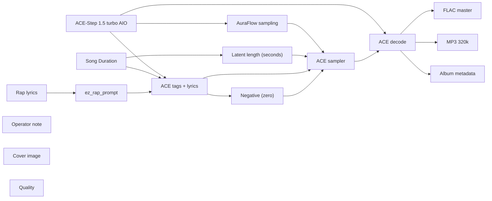

# audio/albums/nill-bye/thirty-four-counts

**What's on this page**

- **Every track, cover, and album-pack graph** in this folder
- **Shared ACE-Step topology** (one printer, unique widgets per take)
- **Node parameter reference** for the types on these graphs

**What this enables**

- **Queuing one numbered take** or `album-render`
- **Reading tags, lyrics, seed, BPM** without opening raw JSON

**Who this is for:** studio users after `download-music`. Occupancy **audio** (cover stills are **klein** — separate session).

> Generated from `workflows/_lab/audio/albums/nill-bye/thirty-four-counts/`. Do not hand-edit this file.

## Purpose

Numbered takes under `audio/albums/nill-bye/thirty-four-counts/`. Queue one track, or `./scripts/manage.sh album-render --album nill-bye/thirty-four-counts`.

```text
## 01-thirty-four-counts

US-safe rap **180 s diss** take: **thirty four counts**. Fictional MC **Nill Bye** (science guy) roasting public-record satire of **Donald Trump**. Trump is a satire target, not a vocal identity. Native ACE-Step 1.5 turbo AIO. Queue this graph **on its own** — draft-first is the generic lane, not a prerequisite. Occupancy **audio** only; a longer Queue is expected.

1. Weights: `./scripts/manage.sh download-music --tier turbo` (same AIO dest as `download-podcast --tier acestep`; ~10 GB, opt-in, not `download-models`).
2. Prompt enhance is **off** so tags, BPM, language, and `[verse]`/`[chorus]` stay as written. Turn Enhance on only if you want the 4B rewriter.
3. Tags vs lyrics: tags are genre/instrument/vocal hints; lyrics are the bars. Section tags `[verse]` / `[chorus]` / `[spoken word]` are vocal hints operators may add.
4. Original lyrics only. No “in the style of <living artist>”. No living-MC names. No famous-hook paraphrases.
5. ACE-Step vocal is an **invented** identity, not a cloned MC.
6. Sampler: 8 steps, cfg 1, euler, simple. Duration 180 s, bpm 88, language en, timesignature 4, generate_audio_codes true. Seed 367.
7. Saves: `01 - Thirty Four Counts` FLAC master + 320 kbps MP3 under `${COMFY_OUTPUT_DIR}`.
8. Cover separately: Queue **klein/thumbnail.json** or **klein/podcast-cover.json**. Do not embed Klein here.
9. Human rewrite the lyrics before any release. Prompts are not authorship (USCO Part 2 / Thaler).
10. Do not co-resident with LTX / Wan / Klein on this Spark.

Beat-only pass: append instrumental, no vocals, and replace lyrics with [inst].

Occupancy: audio — stop Klein / Wan / LTX session. One GB10 job.
```

## Shared graph



## Graphs in this album

| Graph | Nodes | Occupancy |
| --- | --- | --- |
| `audio/albums/nill-bye/thirty-four-counts/01-thirty-four-counts` | 16 | audio |
| `audio/albums/nill-bye/thirty-four-counts/02-one-eighty-seven` | 16 | audio |
| `audio/albums/nill-bye/thirty-four-counts/03-eleven-seven-eighty` | 16 | audio |
| `audio/albums/nill-bye/thirty-four-counts/04-fake-electors` | 16 | audio |
| `audio/albums/nill-bye/thirty-four-counts/05-bathroom-boxes` | 16 | audio |
| `audio/albums/nill-bye/thirty-four-counts/06-statement-of-worth` | 16 | audio |
| `audio/albums/nill-bye/thirty-four-counts/07-university-tab` | 16 | audio |
| `audio/albums/nill-bye/thirty-four-counts/08-ukraine-hold` | 16 | audio |
| `audio/albums/nill-bye/thirty-four-counts/09-travel-memo` | 16 | audio |
| `audio/albums/nill-bye/thirty-four-counts/10-zero-tolerance` | 16 | audio |
| `audio/albums/nill-bye/thirty-four-counts/11-census-question` | 16 | audio |
| `audio/albums/nill-bye/thirty-four-counts/12-paris-walkout` | 16 | audio |
| `audio/albums/nill-bye/thirty-four-counts/13-emoluments-suite` | 16 | audio |
| `audio/albums/nill-bye/thirty-four-counts/14-seven-fifty` | 16 | audio |
| `audio/albums/nill-bye/thirty-four-counts/15-carroll-tab` | 16 | audio |
| `audio/albums/nill-bye/thirty-four-counts/album` | 3 | none |
| `audio/albums/nill-bye/thirty-four-counts/cover` | 14 | klein |

## `01-thirty-four-counts`

Catalog id `audio/albums/nill-bye/thirty-four-counts/01-thirty-four-counts`.

US-safe rap 180s diss: Nill Bye thirty-four-counts roast of Trump, ACE-Step 1.5 turbo AIO, invented vocal
Prompt enhance is **off** so authored text (recipe, script labels, ACE tags, or film shots) is encoded as written. Turn Enhance on only if you want the 4B rewriter.

**ACE-Step 1.5 turbo AIO** (`CheckpointLoaderSimple`)

| Slot | Value |
| --- | --- |
| 0 | `ace_step_1.5_turbo_aio.safetensors` |

**AuraFlow sampling** (`ModelSamplingAuraFlow`)

| Slot | Value |
| --- | --- |
| 0 | `3` |

**Song Duration** (`PrimitiveNode`)

| Slot | Value |
| --- | --- |
| 0 | `180.0` |
| 1 | `fixed` |

**Latent length (seconds)** (`EmptyAceStep1.5LatentAudio`)

| Slot | Value |
| --- | --- |
| 0 | `180.0` |
| 1 | `1` |

**Rap lyrics** (`EZRapLyrics`)

| Slot | Value |
| --- | --- |
| 0 | `custom` |
| 1 | `[intro] yeah ledger open Nill Bye counting felonies [verse] May thirty, twenty-…` |
| 2 | `false` |
| 3 | `audio/albums/nill-bye/thirty-four-counts/01-thirty-four-counts` |

```text
[intro]
yeah
ledger open
Nill Bye counting felonies

[verse]
May thirty, twenty-twenty-four
Manhattan found every count, felonies
One hundred thirty thousand hush, merchan
Wired so a story stayed buried
Trump repaid it as a retainer
The stubs said legal, the purpose didn't
Nill Bye opening the reimbursement
Cohen was the pass-through, not a firm
Pecker bagged the National Enquirer lane
Catch-and-kill as a campaign tool, enquirer
First former president with a felony sheet, pecker
The verdict sheet did not stutter

[chorus]
Thirty four counts
Nill Bye on the reimbursement
Trump labeled a legal fee
A jury labeled thirty-four felonies
Discharge is not an acquittal
Your records failed the catch-and-kill

[verse]
Thirty-four identical false entries
A pattern, not a clerical oops
Trump needed the 2016 news quiet
So the books learned a second language
Nill Bye tracing the stub to the motive
Election influence dressed as payroll
Merchan kept the courtroom from a rally
You treated the bench like a bleacher
A gag order is not persecution
It is a ruler for a loud defendant
The jury sat through the whole method, stubs
Then they filled every box the same

[chorus]
Thirty four counts
Nill Bye on the reimbursement
Trump labeled a legal fee
A jury labeled thirty-four felonies
Discharge is not an acquittal
Your records failed the catch-and-kill

[verse]
January ten, twenty-twenty-five
Unconditional discharge ten days out
Trump called it proof he won the case
Merchan called it the only sentence left
Nill Bye reading the discharge as a comma
The presidency ducked the penalty
It did not erase the thirty-four felonies
A comma is not a retraction
You ran on the silence you bought
Then you ran on the verdict as a trophy-claim, felonies
I score the entries, you score the rally
The ledger still has thirty-four ticks

[chorus]
Thirty four counts
Nill Bye on the reimbursement
Trump labeled a legal fee
A jury labeled thirty-four felonies
Discharge is not an acquittal
Your records failed the catch-and-kill

[verse]
Science guy with a scarlet marker
A reimbursement is a data trail
Trump still selling innocence as a brand, merchan
The brand cannot un-check a box
Nill Bye posting the thirty four counts
Catch-and-kill is a method, not a vibe, enquirer
You hid a story from a ballot
Then you hid the payment from a ledger
Two hides, one motive, thirty-four boxes
A discharge is a courtesy of the office
Bring a reversal, not a rally chant
The counts already did the talking

[chorus]
Thirty four counts
Nill Bye on the reimbursement
Trump labeled a legal fee
A jury labeled thirty-four felonies
Discharge is not an acquittal
Your records failed the catch-and-kill

[outro]
stubs close
felonies stay
cut
yeah
```

**ez_rap_prompt** (`EZAceStepPromptEnhance`)

| Slot | Value |
| --- | --- |
| 0 | `custom` |
| 1 | `boom bap, hip-hop, dusty drums, vinyl crackle, sampled piano stab, male rap voc…` |
| 2 | `[intro] yeah ledger open Nill Bye counting felonies [verse] May thirty, twenty-…` |
| 3 | `false` |
| 4 | `vocal` |
| 5 | `audio/albums/nill-bye/thirty-four-counts/01-thirty-four-counts` |

```text
boom bap, hip-hop, dusty drums, vinyl crackle, sampled piano stab, male rap vocals, dry booth, no autotune, 88 bpm
```

```text
[intro]
yeah
ledger open
Nill Bye counting felonies

[verse]
May thirty, twenty-twenty-four
Manhattan found every count, felonies
One hundred thirty thousand hush, merchan
Wired so a story stayed buried
Trump repaid it as a retainer
The stubs said legal, the purpose didn't
Nill Bye opening the reimbursement
Cohen was the pass-through, not a firm
Pecker bagged the National Enquirer lane
Catch-and-kill as a campaign tool, enquirer
First former president with a felony sheet, pecker
The verdict sheet did not stutter

[chorus]
Thirty four counts
Nill Bye on the reimbursement
Trump labeled a legal fee
A jury labeled thirty-four felonies
Discharge is not an acquittal
Your records failed the catch-and-kill

[verse]
Thirty-four identical false entries
A pattern, not a clerical oops
Trump needed the 2016 news quiet
So the books learned a second language
Nill Bye tracing the stub to the motive
Election influence dressed as payroll
Merchan kept the courtroom from a rally
You treated the bench like a bleacher
A gag order is not persecution
It is a ruler for a loud defendant
The jury sat through the whole method, stubs
Then they filled every box the same

[chorus]
Thirty four counts
Nill Bye on the reimbursement
Trump labeled a legal fee
A jury labeled thirty-four felonies
Discharge is not an acquittal
Your records failed the catch-and-kill

[verse]
January ten, twenty-twenty-five
Unconditional discharge ten days out
Trump called it proof he won the case
Merchan called it the only sentence left
Nill Bye reading the discharge as a comma
The presidency ducked the penalty
It did not erase the thirty-four felonies
A comma is not a retraction
You ran on the silence you bought
Then you ran on the verdict as a trophy-claim, felonies
I score the entries, you score the rally
The ledger still has thirty-four ticks

[chorus]
Thirty four counts
Nill Bye on the reimbursement
Trump labeled a legal fee
A jury labeled thirty-four felonies
Discharge is not an acquittal
Your records failed the catch-and-kill

[verse]
Science guy with a scarlet marker
A reimbursement is a data trail
Trump still selling innocence as a brand, merchan
The brand cannot un-check a box
Nill Bye posting the thirty four counts
Catch-and-kill is a method, not a vibe, enquirer
You hid a story from a ballot
Then you hid the payment from a ledger
Two hides, one motive, thirty-four boxes
A discharge is a courtesy of the office
Bring a reversal, not a rally chant
The counts already did the talking

[chorus]
Thirty four counts
Nill Bye on the reimbursement
Trump labeled a legal fee
A jury labeled thirty-four felonies
Discharge is not an acquittal
Your records failed the catch-and-kill

[outro]
stubs close
felonies stay
cut
yeah
```

**ACE tags + lyrics** (`TextEncodeAceStepAudio1.5`)

| Slot | Value |
| --- | --- |
| 0 | `boom bap, hip-hop, dusty drums, vinyl crackle, sampled piano stab, male rap voc…` |
| 1 | `[intro] yeah ledger open Nill Bye counting felonies [verse] May thirty, twenty-…` |
| 2 | `367` |
| 3 | `fixed` |
| 4 | `88` |
| 5 | `180.0` |
| 6 | `4` |
| 7 | `en` |
| 8 | `C minor` |
| 9 | `true` |
| 10 | `2.0` |
| 11 | `0.85` |
| 12 | `0.9` |
| 13 | `0` |
| 14 | `0.0` |

```text
boom bap, hip-hop, dusty drums, vinyl crackle, sampled piano stab, male rap vocals, dry booth, no autotune, 88 bpm
```

```text
[intro]
yeah
ledger open
Nill Bye counting felonies

[verse]
May thirty, twenty-twenty-four
Manhattan found every count, felonies
One hundred thirty thousand hush, merchan
Wired so a story stayed buried
Trump repaid it as a retainer
The stubs said legal, the purpose didn't
Nill Bye opening the reimbursement
Cohen was the pass-through, not a firm
Pecker bagged the National Enquirer lane
Catch-and-kill as a campaign tool, enquirer
First former president with a felony sheet, pecker
The verdict sheet did not stutter

[chorus]
Thirty four counts
Nill Bye on the reimbursement
Trump labeled a legal fee
A jury labeled thirty-four felonies
Discharge is not an acquittal
Your records failed the catch-and-kill

[verse]
Thirty-four identical false entries
A pattern, not a clerical oops
Trump needed the 2016 news quiet
So the books learned a second language
Nill Bye tracing the stub to the motive
Election influence dressed as payroll
Merchan kept the courtroom from a rally
You treated the bench like a bleacher
A gag order is not persecution
It is a ruler for a loud defendant
The jury sat through the whole method, stubs
Then they filled every box the same

[chorus]
Thirty four counts
Nill Bye on the reimbursement
Trump labeled a legal fee
A jury labeled thirty-four felonies
Discharge is not an acquittal
Your records failed the catch-and-kill

[verse]
January ten, twenty-twenty-five
Unconditional discharge ten days out
Trump called it proof he won the case
Merchan called it the only sentence left
Nill Bye reading the discharge as a comma
The presidency ducked the penalty
It did not erase the thirty-four felonies
A comma is not a retraction
You ran on the silence you bought
Then you ran on the verdict as a trophy-claim, felonies
I score the entries, you score the rally
The ledger still has thirty-four ticks

[chorus]
Thirty four counts
Nill Bye on the reimbursement
Trump labeled a legal fee
A jury labeled thirty-four felonies
Discharge is not an acquittal
Your records failed the catch-and-kill

[verse]
Science guy with a scarlet marker
A reimbursement is a data trail
Trump still selling innocence as a brand, merchan
The brand cannot un-check a box
Nill Bye posting the thirty four counts
Catch-and-kill is a method, not a vibe, enquirer
You hid a story from a ballot
Then you hid the payment from a ledger
Two hides, one motive, thirty-four boxes
A discharge is a courtesy of the office
Bring a reversal, not a rally chant
The counts already did the talking

[chorus]
Thirty four counts
Nill Bye on the reimbursement
Trump labeled a legal fee
A jury labeled thirty-four felonies
Discharge is not an acquittal
Your records failed the catch-and-kill

[outro]
stubs close
felonies stay
cut
yeah
```

**ACE sampler** (`KSampler`)

| Slot | Value |
| --- | --- |
| 0 | `367` |
| 1 | `fixed` |
| 2 | `8` |
| 3 | `1.0` |
| 4 | `euler` |
| 5 | `simple` |
| 6 | `1.0` |

**FLAC master** (`SaveAudio`)

| Slot | Value |
| --- | --- |
| 0 | `01 - Thirty Four Counts` |

**MP3 320k** (`SaveAudioMP3`)

| Slot | Value |
| --- | --- |
| 0 | `01 - Thirty Four Counts` |
| 1 | `320k` |

**Cover image** (`LoadImage`)

| Slot | Value |
| --- | --- |
| 0 | `cover.png` |
| 1 | `image` |

**Album metadata** (`EZAudioMetadata`)

| Slot | Value |
| --- | --- |
| 0 | `Nill Bye` |
| 1 | `Thirty Four Counts` |
| 2 | `Thirty Four Counts` |
| 3 | `1` |
| 4 | `15` |
| 5 | `2026` |
| 6 | `skip` |
| 7 | `01 - Thirty Four Counts` |

**Quality** (`EZQuality`)

| Slot | Value |
| --- | --- |
| 0 | `lab` |

## `02-one-eighty-seven`

Catalog id `audio/albums/nill-bye/thirty-four-counts/02-one-eighty-seven`.

US-safe rap 180s diss: Nill Bye one-eighty-seven roast of Trump, ACE-Step 1.5 turbo AIO, invented vocal
Prompt enhance is **off** so authored text (recipe, script labels, ACE tags, or film shots) is encoded as written. Turn Enhance on only if you want the 4B rewriter.

**ACE-Step 1.5 turbo AIO** (`CheckpointLoaderSimple`)

| Slot | Value |
| --- | --- |
| 0 | `ace_step_1.5_turbo_aio.safetensors` |

**AuraFlow sampling** (`ModelSamplingAuraFlow`)

| Slot | Value |
| --- | --- |
| 0 | `3` |

**Song Duration** (`PrimitiveNode`)

| Slot | Value |
| --- | --- |
| 0 | `180.0` |
| 1 | `fixed` |

**Latent length (seconds)** (`EmptyAceStep1.5LatentAudio`)

| Slot | Value |
| --- | --- |
| 0 | `180.0` |
| 1 | `1` |

**Rap lyrics** (`EZRapLyrics`)

| Slot | Value |
| --- | --- |
| 0 | `custom` |
| 1 | `[spoken word] One ten p.m. Ellipse Four seventeen the video One hundred eighty-…` |
| 2 | `false` |
| 3 | `audio/albums/nill-bye/thirty-four-counts/02-one-eighty-seven` |

```text
[spoken word]
One ten p.m. Ellipse
Four seventeen the video
One hundred eighty-seven minutes
Dining room, Fox on
Dereliction

[intro]
stopwatch click
Nill Bye stopwatching the Ellipse

[verse]
One ten, the Ellipse speech closed, ellipse
March to the Capitol was the last cue
Trump wanted a motorcade into the riot
Secret Service boxed the tantrum in the car
Nill Bye timing the idle minutes
One twenty-five, a dining-room head-of-table, cipollone
Fox as the only brief in the room, stopwatch
Photographer told to bag the camera
Cipollone said say it now, leave
You could not be moved, the committee said
Officers took the beating in the meantime
The switch stayed off on purpose

[chorus]
One eighty seven
Nill Bye on the idle minutes
Trump watched the breach on cable
Then praised the crowd as very special
A president is a switch, not a spectator
Your dining room failed the Capitol

[verse]
Pence was the named target in the chant
You had the one voice the mob would hear
Trump sat through the smash and the crush
Aides, family, allies texting Meadows
Nill Bye mad at a spectator presidency
The only person who could call it off
Waited until four seventeen for a clip, dereliction
Then mixed go-home with you are special
A script said peaceful. You skipped the word
You kept the steal in the same breath
That is not confusion, that is a choice
The stopwatch already filed it

[chorus]
One eighty seven
Nill Bye on the idle minutes
Trump watched the breach on cable
Then praised the crowd as very special
A president is a switch, not a spectator
Your dining room failed the Capitol

[verse]
One hundred eighty-seven is a measurement
Not a mood, not a vibe, a duration
Trump later called it a loving afternoon
The officers called it a war zone
Nill Bye keeping the committee clock, ellipse
Cheney named it supreme dereliction
Thompson said something is wrong with that wait
A dining room is not a command post
Cable is not an intelligence brief
Special is not an order to disperse
You praised the people who broke the glass
Then you ran on their mugshots as saints

[chorus]
One eighty seven
Nill Bye on the idle minutes
Trump watched the breach on cable
Then praised the crowd as very special
A president is a switch, not a spectator
Your dining room failed the Capitol

[verse]
Twenty-twenty-five you called them hostages
The minutes did not get shorter with the brand, cipollone
Trump still selling a tourist afternoon
The tape is the officers, not the merch
Nill Bye posting the one eighty seven
A stopwatch does not take a side
I want a switch flipped at one eleven
You wanted a show from a dining chair, stopwatch
Keep the boom-bap, print the duration
One ten to four seventeen is the whole thesis
Very special is a tell, not a pardon of physics
The Capitol already knew the idle minutes

[chorus]
One eighty seven
Nill Bye on the idle minutes
Trump watched the breach on cable
Then praised the crowd as very special
A president is a switch, not a spectator
Your dining room failed the Capitol

[outro]
stopwatch rest
minutes stand
cut
```

**ez_rap_prompt** (`EZAceStepPromptEnhance`)

| Slot | Value |
| --- | --- |
| 0 | `custom` |
| 1 | `boom bap, hip-hop, dry snare, upright bass, male rap vocals, dry booth, no auto…` |
| 2 | `[spoken word] One ten p.m. Ellipse Four seventeen the video One hundred eighty-…` |
| 3 | `false` |
| 4 | `vocal` |
| 5 | `audio/albums/nill-bye/thirty-four-counts/02-one-eighty-seven` |

```text
boom bap, hip-hop, dry snare, upright bass, male rap vocals, dry booth, no autotune, 86 bpm
```

```text
[spoken word]
One ten p.m. Ellipse
Four seventeen the video
One hundred eighty-seven minutes
Dining room, Fox on
Dereliction

[intro]
stopwatch click
Nill Bye stopwatching the Ellipse

[verse]
One ten, the Ellipse speech closed, ellipse
March to the Capitol was the last cue
Trump wanted a motorcade into the riot
Secret Service boxed the tantrum in the car
Nill Bye timing the idle minutes
One twenty-five, a dining-room head-of-table, cipollone
Fox as the only brief in the room, stopwatch
Photographer told to bag the camera
Cipollone said say it now, leave
You could not be moved, the committee said
Officers took the beating in the meantime
The switch stayed off on purpose

[chorus]
One eighty seven
Nill Bye on the idle minutes
Trump watched the breach on cable
Then praised the crowd as very special
A president is a switch, not a spectator
Your dining room failed the Capitol

[verse]
Pence was the named target in the chant
You had the one voice the mob would hear
Trump sat through the smash and the crush
Aides, family, allies texting Meadows
Nill Bye mad at a spectator presidency
The only person who could call it off
Waited until four seventeen for a clip, dereliction
Then mixed go-home with you are special
A script said peaceful. You skipped the word
You kept the steal in the same breath
That is not confusion, that is a choice
The stopwatch already filed it

[chorus]
One eighty seven
Nill Bye on the idle minutes
Trump watched the breach on cable
Then praised the crowd as very special
A president is a switch, not a spectator
Your dining room failed the Capitol

[verse]
One hundred eighty-seven is a measurement
Not a mood, not a vibe, a duration
Trump later called it a loving afternoon
The officers called it a war zone
Nill Bye keeping the committee clock, ellipse
Cheney named it supreme dereliction
Thompson said something is wrong with that wait
A dining room is not a command post
Cable is not an intelligence brief
Special is not an order to disperse
You praised the people who broke the glass
Then you ran on their mugshots as saints

[chorus]
One eighty seven
Nill Bye on the idle minutes
Trump watched the breach on cable
Then praised the crowd as very special
A president is a switch, not a spectator
Your dining room failed the Capitol

[verse]
Twenty-twenty-five you called them hostages
The minutes did not get shorter with the brand, cipollone
Trump still selling a tourist afternoon
The tape is the officers, not the merch
Nill Bye posting the one eighty seven
A stopwatch does not take a side
I want a switch flipped at one eleven
You wanted a show from a dining chair, stopwatch
Keep the boom-bap, print the duration
One ten to four seventeen is the whole thesis
Very special is a tell, not a pardon of physics
The Capitol already knew the idle minutes

[chorus]
One eighty seven
Nill Bye on the idle minutes
Trump watched the breach on cable
Then praised the crowd as very special
A president is a switch, not a spectator
Your dining room failed the Capitol

[outro]
stopwatch rest
minutes stand
cut
```

**ACE tags + lyrics** (`TextEncodeAceStepAudio1.5`)

| Slot | Value |
| --- | --- |
| 0 | `boom bap, hip-hop, dry snare, upright bass, male rap vocals, dry booth, no auto…` |
| 1 | `[spoken word] One ten p.m. Ellipse Four seventeen the video One hundred eighty-…` |
| 2 | `373` |
| 3 | `fixed` |
| 4 | `86` |
| 5 | `180.0` |
| 6 | `4` |
| 7 | `en` |
| 8 | `C minor` |
| 9 | `true` |
| 10 | `2.0` |
| 11 | `0.85` |
| 12 | `0.9` |
| 13 | `0` |
| 14 | `0.0` |

```text
boom bap, hip-hop, dry snare, upright bass, male rap vocals, dry booth, no autotune, 86 bpm
```

```text
[spoken word]
One ten p.m. Ellipse
Four seventeen the video
One hundred eighty-seven minutes
Dining room, Fox on
Dereliction

[intro]
stopwatch click
Nill Bye stopwatching the Ellipse

[verse]
One ten, the Ellipse speech closed, ellipse
March to the Capitol was the last cue
Trump wanted a motorcade into the riot
Secret Service boxed the tantrum in the car
Nill Bye timing the idle minutes
One twenty-five, a dining-room head-of-table, cipollone
Fox as the only brief in the room, stopwatch
Photographer told to bag the camera
Cipollone said say it now, leave
You could not be moved, the committee said
Officers took the beating in the meantime
The switch stayed off on purpose

[chorus]
One eighty seven
Nill Bye on the idle minutes
Trump watched the breach on cable
Then praised the crowd as very special
A president is a switch, not a spectator
Your dining room failed the Capitol

[verse]
Pence was the named target in the chant
You had the one voice the mob would hear
Trump sat through the smash and the crush
Aides, family, allies texting Meadows
Nill Bye mad at a spectator presidency
The only person who could call it off
Waited until four seventeen for a clip, dereliction
Then mixed go-home with you are special
A script said peaceful. You skipped the word
You kept the steal in the same breath
That is not confusion, that is a choice
The stopwatch already filed it

[chorus]
One eighty seven
Nill Bye on the idle minutes
Trump watched the breach on cable
Then praised the crowd as very special
A president is a switch, not a spectator
Your dining room failed the Capitol

[verse]
One hundred eighty-seven is a measurement
Not a mood, not a vibe, a duration
Trump later called it a loving afternoon
The officers called it a war zone
Nill Bye keeping the committee clock, ellipse
Cheney named it supreme dereliction
Thompson said something is wrong with that wait
A dining room is not a command post
Cable is not an intelligence brief
Special is not an order to disperse
You praised the people who broke the glass
Then you ran on their mugshots as saints

[chorus]
One eighty seven
Nill Bye on the idle minutes
Trump watched the breach on cable
Then praised the crowd as very special
A president is a switch, not a spectator
Your dining room failed the Capitol

[verse]
Twenty-twenty-five you called them hostages
The minutes did not get shorter with the brand, cipollone
Trump still selling a tourist afternoon
The tape is the officers, not the merch
Nill Bye posting the one eighty seven
A stopwatch does not take a side
I want a switch flipped at one eleven
You wanted a show from a dining chair, stopwatch
Keep the boom-bap, print the duration
One ten to four seventeen is the whole thesis
Very special is a tell, not a pardon of physics
The Capitol already knew the idle minutes

[chorus]
One eighty seven
Nill Bye on the idle minutes
Trump watched the breach on cable
Then praised the crowd as very special
A president is a switch, not a spectator
Your dining room failed the Capitol

[outro]
stopwatch rest
minutes stand
cut
```

**ACE sampler** (`KSampler`)

| Slot | Value |
| --- | --- |
| 0 | `373` |
| 1 | `fixed` |
| 2 | `8` |
| 3 | `1.0` |
| 4 | `euler` |
| 5 | `simple` |
| 6 | `1.0` |

**FLAC master** (`SaveAudio`)

| Slot | Value |
| --- | --- |
| 0 | `02 - One Eighty Seven` |

**MP3 320k** (`SaveAudioMP3`)

| Slot | Value |
| --- | --- |
| 0 | `02 - One Eighty Seven` |
| 1 | `320k` |

**Cover image** (`LoadImage`)

| Slot | Value |
| --- | --- |
| 0 | `cover.png` |
| 1 | `image` |

**Album metadata** (`EZAudioMetadata`)

| Slot | Value |
| --- | --- |
| 0 | `Nill Bye` |
| 1 | `Thirty Four Counts` |
| 2 | `One Eighty Seven` |
| 3 | `2` |
| 4 | `15` |
| 5 | `2026` |
| 6 | `skip` |
| 7 | `02 - One Eighty Seven` |

**Quality** (`EZQuality`)

| Slot | Value |
| --- | --- |
| 0 | `lab` |

## `03-eleven-seven-eighty`

Catalog id `audio/albums/nill-bye/thirty-four-counts/03-eleven-seven-eighty`.

US-safe rap 180s diss: Nill Bye eleven-seven-eighty roast of Trump, ACE-Step 1.5 turbo AIO, invented vocal
Prompt enhance is **off** so authored text (recipe, script labels, ACE tags, or film shots) is encoded as written. Turn Enhance on only if you want the 4B rewriter.

**ACE-Step 1.5 turbo AIO** (`CheckpointLoaderSimple`)

| Slot | Value |
| --- | --- |
| 0 | `ace_step_1.5_turbo_aio.safetensors` |

**AuraFlow sampling** (`ModelSamplingAuraFlow`)

| Slot | Value |
| --- | --- |
| 0 | `3` |

**Song Duration** (`PrimitiveNode`)

| Slot | Value |
| --- | --- |
| 0 | `180.0` |
| 1 | `fixed` |

**Latent length (seconds)** (`EmptyAceStep1.5LatentAudio`)

| Slot | Value |
| --- | --- |
| 0 | `180.0` |
| 1 | `1` |

**Rap lyrics** (`EZRapLyrics`)

| Slot | Value |
| --- | --- |
| 0 | `custom` |
| 1 | `[intro] tape hiss Nill Bye transcribing [verse] January two, a Saturday pressur…` |
| 2 | `false` |
| 3 | `audio/albums/nill-bye/thirty-four-counts/03-eleven-seven-eighty` |

```text
[intro]
tape hiss
Nill Bye transcribing

[verse]
January two, a Saturday pressure-call, raffensperger
Brad Raffensperger, fellow Republican
Trump wanted eleven thousand seven hundred eighty
One more than the eleven thousand seven hundred seventy-nine
Nill Bye transcribing the Georgia tape
The state had counted, audited, recounted
Biden's margin did not move for a threat
You offered a criminal overlay if they refused
Dead voters at five thousand, they found two
The data you have is wrong, he said
You said recalculate. He said stand by the numbers
A secretary of state is not a vending slot, canvass

[chorus]
Eleven seven eighty
Nill Bye on the Georgia tape
Trump asked to find a margin-plus-one
Raffensperger kept the certified math
Three counts, same winner, one ask
Your find was a demand, not an audit

[verse]
Jazz hop brushes on a recorded hour
Muted trumpet under a demand dressed as math, remainder
Trump treated a certified result as a suggestion
Find is a verb with a destination built in
Nill Bye mad at a hunt for uncast ballots
You do not find votes the way you find a sock
You count them, then you live with the total
Meadows asked for compromise on a certified sheet, raffensperger
Compromise is for a bill, not a tally
Georgia already ran the machine and the hand
Three methods, one winner, zero magic remainder
The tape is the exhibit, not a gossip mill

[chorus]
Eleven seven eighty
Nill Bye on the Georgia tape
Trump asked to find a margin-plus-one
Raffensperger kept the certified math
Three counts, same winner, one ask
Your find was a demand, not an audit

[verse]
Fulton theories, suitcase lore, scanned-thrice myths
Each one died in the same conversation
Trump kept stacking debunked clips as if volume were proof
Raffensperger kept answering with the actual canvass
Nill Bye filing the margin-plus-one ask
One more than you lost by is not a coincidence
It is the tell that the number was the goal
Accuracy was the costume, canvass
A Republican official still said no
That no is the whole civic method, remainder
You wanted a colleague to break his own count, raffensperger
He declined, and the tape kept running

[chorus]
Eleven seven eighty
Nill Bye on the Georgia tape
Trump asked to find a margin-plus-one
Raffensperger kept the certified math
Three counts, same winner, one ask
Your find was a demand, not an audit

[verse]
Years on, you still tour the same remainder
As if a recording were a rumor you could out-shout
Trump still sure Georgia hid a sock-drawer of ballots
The drawer was a certified canvass
Nill Bye posting the eleven seven eighty
A find-request is a pressure campaign
I want a tally, you want a remainder that fits
Keep the brushes, print the ask
Eleven thousand seven hundred eighty is not an audit finding
It is a shopping list, canvass
The tape already priced the errand, remainder
Raffensperger already closed the register

[chorus]
Eleven seven eighty
Nill Bye on the Georgia tape
Trump asked to find a margin-plus-one
Raffensperger kept the certified math
Three counts, same winner, one ask
Your find was a demand, not an audit

[outro]
tape stop
margin holds
cut
yeah
```

**ez_rap_prompt** (`EZAceStepPromptEnhance`)

| Slot | Value |
| --- | --- |
| 0 | `custom` |
| 1 | `jazz hop, brushed drums, upright bass, muted trumpet, male rap vocals, dry boot…` |
| 2 | `[intro] tape hiss Nill Bye transcribing [verse] January two, a Saturday pressur…` |
| 3 | `false` |
| 4 | `vocal` |
| 5 | `audio/albums/nill-bye/thirty-four-counts/03-eleven-seven-eighty` |

```text
jazz hop, brushed drums, upright bass, muted trumpet, male rap vocals, dry booth, no autotune, 90 bpm
```

```text
[intro]
tape hiss
Nill Bye transcribing

[verse]
January two, a Saturday pressure-call, raffensperger
Brad Raffensperger, fellow Republican
Trump wanted eleven thousand seven hundred eighty
One more than the eleven thousand seven hundred seventy-nine
Nill Bye transcribing the Georgia tape
The state had counted, audited, recounted
Biden's margin did not move for a threat
You offered a criminal overlay if they refused
Dead voters at five thousand, they found two
The data you have is wrong, he said
You said recalculate. He said stand by the numbers
A secretary of state is not a vending slot, canvass

[chorus]
Eleven seven eighty
Nill Bye on the Georgia tape
Trump asked to find a margin-plus-one
Raffensperger kept the certified math
Three counts, same winner, one ask
Your find was a demand, not an audit

[verse]
Jazz hop brushes on a recorded hour
Muted trumpet under a demand dressed as math, remainder
Trump treated a certified result as a suggestion
Find is a verb with a destination built in
Nill Bye mad at a hunt for uncast ballots
You do not find votes the way you find a sock
You count them, then you live with the total
Meadows asked for compromise on a certified sheet, raffensperger
Compromise is for a bill, not a tally
Georgia already ran the machine and the hand
Three methods, one winner, zero magic remainder
The tape is the exhibit, not a gossip mill

[chorus]
Eleven seven eighty
Nill Bye on the Georgia tape
Trump asked to find a margin-plus-one
Raffensperger kept the certified math
Three counts, same winner, one ask
Your find was a demand, not an audit

[verse]
Fulton theories, suitcase lore, scanned-thrice myths
Each one died in the same conversation
Trump kept stacking debunked clips as if volume were proof
Raffensperger kept answering with the actual canvass
Nill Bye filing the margin-plus-one ask
One more than you lost by is not a coincidence
It is the tell that the number was the goal
Accuracy was the costume, canvass
A Republican official still said no
That no is the whole civic method, remainder
You wanted a colleague to break his own count, raffensperger
He declined, and the tape kept running

[chorus]
Eleven seven eighty
Nill Bye on the Georgia tape
Trump asked to find a margin-plus-one
Raffensperger kept the certified math
Three counts, same winner, one ask
Your find was a demand, not an audit

[verse]
Years on, you still tour the same remainder
As if a recording were a rumor you could out-shout
Trump still sure Georgia hid a sock-drawer of ballots
The drawer was a certified canvass
Nill Bye posting the eleven seven eighty
A find-request is a pressure campaign
I want a tally, you want a remainder that fits
Keep the brushes, print the ask
Eleven thousand seven hundred eighty is not an audit finding
It is a shopping list, canvass
The tape already priced the errand, remainder
Raffensperger already closed the register

[chorus]
Eleven seven eighty
Nill Bye on the Georgia tape
Trump asked to find a margin-plus-one
Raffensperger kept the certified math
Three counts, same winner, one ask
Your find was a demand, not an audit

[outro]
tape stop
margin holds
cut
yeah
```

**ACE tags + lyrics** (`TextEncodeAceStepAudio1.5`)

| Slot | Value |
| --- | --- |
| 0 | `jazz hop, brushed drums, upright bass, muted trumpet, male rap vocals, dry boot…` |
| 1 | `[intro] tape hiss Nill Bye transcribing [verse] January two, a Saturday pressur…` |
| 2 | `379` |
| 3 | `fixed` |
| 4 | `90` |
| 5 | `180.0` |
| 6 | `4` |
| 7 | `en` |
| 8 | `C minor` |
| 9 | `true` |
| 10 | `2.0` |
| 11 | `0.85` |
| 12 | `0.9` |
| 13 | `0` |
| 14 | `0.0` |

```text
jazz hop, brushed drums, upright bass, muted trumpet, male rap vocals, dry booth, no autotune, 90 bpm
```

```text
[intro]
tape hiss
Nill Bye transcribing

[verse]
January two, a Saturday pressure-call, raffensperger
Brad Raffensperger, fellow Republican
Trump wanted eleven thousand seven hundred eighty
One more than the eleven thousand seven hundred seventy-nine
Nill Bye transcribing the Georgia tape
The state had counted, audited, recounted
Biden's margin did not move for a threat
You offered a criminal overlay if they refused
Dead voters at five thousand, they found two
The data you have is wrong, he said
You said recalculate. He said stand by the numbers
A secretary of state is not a vending slot, canvass

[chorus]
Eleven seven eighty
Nill Bye on the Georgia tape
Trump asked to find a margin-plus-one
Raffensperger kept the certified math
Three counts, same winner, one ask
Your find was a demand, not an audit

[verse]
Jazz hop brushes on a recorded hour
Muted trumpet under a demand dressed as math, remainder
Trump treated a certified result as a suggestion
Find is a verb with a destination built in
Nill Bye mad at a hunt for uncast ballots
You do not find votes the way you find a sock
You count them, then you live with the total
Meadows asked for compromise on a certified sheet, raffensperger
Compromise is for a bill, not a tally
Georgia already ran the machine and the hand
Three methods, one winner, zero magic remainder
The tape is the exhibit, not a gossip mill

[chorus]
Eleven seven eighty
Nill Bye on the Georgia tape
Trump asked to find a margin-plus-one
Raffensperger kept the certified math
Three counts, same winner, one ask
Your find was a demand, not an audit

[verse]
Fulton theories, suitcase lore, scanned-thrice myths
Each one died in the same conversation
Trump kept stacking debunked clips as if volume were proof
Raffensperger kept answering with the actual canvass
Nill Bye filing the margin-plus-one ask
One more than you lost by is not a coincidence
It is the tell that the number was the goal
Accuracy was the costume, canvass
A Republican official still said no
That no is the whole civic method, remainder
You wanted a colleague to break his own count, raffensperger
He declined, and the tape kept running

[chorus]
Eleven seven eighty
Nill Bye on the Georgia tape
Trump asked to find a margin-plus-one
Raffensperger kept the certified math
Three counts, same winner, one ask
Your find was a demand, not an audit

[verse]
Years on, you still tour the same remainder
As if a recording were a rumor you could out-shout
Trump still sure Georgia hid a sock-drawer of ballots
The drawer was a certified canvass
Nill Bye posting the eleven seven eighty
A find-request is a pressure campaign
I want a tally, you want a remainder that fits
Keep the brushes, print the ask
Eleven thousand seven hundred eighty is not an audit finding
It is a shopping list, canvass
The tape already priced the errand, remainder
Raffensperger already closed the register

[chorus]
Eleven seven eighty
Nill Bye on the Georgia tape
Trump asked to find a margin-plus-one
Raffensperger kept the certified math
Three counts, same winner, one ask
Your find was a demand, not an audit

[outro]
tape stop
margin holds
cut
yeah
```

**ACE sampler** (`KSampler`)

| Slot | Value |
| --- | --- |
| 0 | `379` |
| 1 | `fixed` |
| 2 | `8` |
| 3 | `1.0` |
| 4 | `euler` |
| 5 | `simple` |
| 6 | `1.0` |

**FLAC master** (`SaveAudio`)

| Slot | Value |
| --- | --- |
| 0 | `03 - Eleven Seven Eighty` |

**MP3 320k** (`SaveAudioMP3`)

| Slot | Value |
| --- | --- |
| 0 | `03 - Eleven Seven Eighty` |
| 1 | `320k` |

**Cover image** (`LoadImage`)

| Slot | Value |
| --- | --- |
| 0 | `cover.png` |
| 1 | `image` |

**Album metadata** (`EZAudioMetadata`)

| Slot | Value |
| --- | --- |
| 0 | `Nill Bye` |
| 1 | `Thirty Four Counts` |
| 2 | `Eleven Seven Eighty` |
| 3 | `3` |
| 4 | `15` |
| 5 | `2026` |
| 6 | `skip` |
| 7 | `03 - Eleven Seven Eighty` |

**Quality** (`EZQuality`)

| Slot | Value |
| --- | --- |
| 0 | `lab` |

## `04-fake-electors`

Catalog id `audio/albums/nill-bye/thirty-four-counts/04-fake-electors`.

US-safe rap 180s diss: Nill Bye fake-electors roast of Trump, ACE-Step 1.5 turbo AIO, invented vocal
Prompt enhance is **off** so authored text (recipe, script labels, ACE tags, or film shots) is encoded as written. Turn Enhance on only if you want the 4B rewriter.

**ACE-Step 1.5 turbo AIO** (`CheckpointLoaderSimple`)

| Slot | Value |
| --- | --- |
| 0 | `ace_step_1.5_turbo_aio.safetensors` |

**AuraFlow sampling** (`ModelSamplingAuraFlow`)

| Slot | Value |
| --- | --- |
| 0 | `3` |

**Song Duration** (`PrimitiveNode`)

| Slot | Value |
| --- | --- |
| 0 | `180.0` |
| 1 | `fixed` |

**Latent length (seconds)** (`EmptyAceStep1.5LatentAudio`)

| Slot | Value |
| --- | --- |
| 0 | `180.0` |
| 1 | `1` |

**Rap lyrics** (`EZRapLyrics`)

| Slot | Value |
| --- | --- |
| 0 | `custom` |
| 1 | `[intro] metal hit Nill Bye reading slates [verse] Arizona, Georgia, Michigan, N…` |
| 2 | `false` |
| 3 | `audio/albums/nill-bye/thirty-four-counts/04-fake-electors` |

```text
[intro]
metal hit
Nill Bye reading slates

[verse]
Arizona, Georgia, Michigan, Nevada
New Mexico, Pennsylvania, Wisconsin
Trump lost the certified electors in all seven
So a parallel slate signed a fiction
Nill Bye reading the seven slates
Chesebro sketched the expansion after the first memo, ascertainment
Giuliani ran the phone tree like a field office
Wilenchik wrote fake in quotes and sent it anyway
Pence was supposed to treat the fiction as a fork
The Electoral Count Act does not sell forks
Judge Carter called the illegality obvious
Obvious is a holding, not an insult

[chorus]
Fake electors
Nill Bye on the seven slates
Trump needed a paper Biden did not win
So a memo tried to mint a second college
Eastman wrote the obvious illegal
Your ascertainment was a costume ballot

[verse]
Industrial percussion on a forged college
Distorted bass under a costume ballot
Trump was briefed that the Pence card was a violation
He still walked Eastman into the room, chesebro
Nill Bye mad at a second college as a prop
Dec fourteen the real electors met at noon
Your extras met in a different hallway
Same date, opposite authority
A certificate of ascertainment is a governor's act, wilenchik
You tried to photocopy the seal with a Sharpie energy
Ronna was asked to staff the extras
A party chair is not a printer for electors

[chorus]
Fake electors
Nill Bye on the seven slates
Trump needed a paper Biden did not win
So a memo tried to mint a second college
Eastman wrote the obvious illegal
Your ascertainment was a costume ballot

[verse]
April twenty-twenty-six, California closed the file, ascertainment
Eastman disbarred for the false statements and the scheme
Trump still touring the memo as a theory
A disbarment is a profession voting no
Nill Bye filing the architect's sanction
Patently false in court papers is not a vibe, chesebro
It is a finding with a five-thousand sanction beside it
Seven states is a conspiracy of paperwork
Not a grassroots mix-up
You needed Pence to launder the extras on January six
He would not, so the extras died as exhibits
The exhibits did not die as evidence

[chorus]
Fake electors
Nill Bye on the seven slates
Trump needed a paper Biden did not win
So a memo tried to mint a second college
Eastman wrote the obvious illegal
Your ascertainment was a costume ballot

[verse]
A college is a count, not a costume shop
You opened a second shop and called it law, wilenchik
Trump still sure a memo can mint a win
A memo cannot mint a slate the governor did not sign
Nill Bye posting the fake electors
I want a certificate, you want a photocopy
Keep the metal, print the seven names
Eastman paid a license, you kept the theory
The Pence card was never in the deck
It was a sticky note on a statute you disliked
Bring a governor's seal or sit down, ascertainment
The extras already told on the errand, chesebro

[chorus]
Fake electors
Nill Bye on the seven slates
Trump needed a paper Biden did not win
So a memo tried to mint a second college
Eastman wrote the obvious illegal
Your ascertainment was a costume ballot

[outro]
slates fold
college stands
cut
```

**ez_rap_prompt** (`EZAceStepPromptEnhance`)

| Slot | Value |
| --- | --- |
| 0 | `custom` |
| 1 | `industrial hip-hop, metal percussion, distorted bass, male rap vocals, dry boot…` |
| 2 | `[intro] metal hit Nill Bye reading slates [verse] Arizona, Georgia, Michigan, N…` |
| 3 | `false` |
| 4 | `vocal` |
| 5 | `audio/albums/nill-bye/thirty-four-counts/04-fake-electors` |

```text
industrial hip-hop, metal percussion, distorted bass, male rap vocals, dry booth, no autotune, 108 bpm
```

```text
[intro]
metal hit
Nill Bye reading slates

[verse]
Arizona, Georgia, Michigan, Nevada
New Mexico, Pennsylvania, Wisconsin
Trump lost the certified electors in all seven
So a parallel slate signed a fiction
Nill Bye reading the seven slates
Chesebro sketched the expansion after the first memo, ascertainment
Giuliani ran the phone tree like a field office
Wilenchik wrote fake in quotes and sent it anyway
Pence was supposed to treat the fiction as a fork
The Electoral Count Act does not sell forks
Judge Carter called the illegality obvious
Obvious is a holding, not an insult

[chorus]
Fake electors
Nill Bye on the seven slates
Trump needed a paper Biden did not win
So a memo tried to mint a second college
Eastman wrote the obvious illegal
Your ascertainment was a costume ballot

[verse]
Industrial percussion on a forged college
Distorted bass under a costume ballot
Trump was briefed that the Pence card was a violation
He still walked Eastman into the room, chesebro
Nill Bye mad at a second college as a prop
Dec fourteen the real electors met at noon
Your extras met in a different hallway
Same date, opposite authority
A certificate of ascertainment is a governor's act, wilenchik
You tried to photocopy the seal with a Sharpie energy
Ronna was asked to staff the extras
A party chair is not a printer for electors

[chorus]
Fake electors
Nill Bye on the seven slates
Trump needed a paper Biden did not win
So a memo tried to mint a second college
Eastman wrote the obvious illegal
Your ascertainment was a costume ballot

[verse]
April twenty-twenty-six, California closed the file, ascertainment
Eastman disbarred for the false statements and the scheme
Trump still touring the memo as a theory
A disbarment is a profession voting no
Nill Bye filing the architect's sanction
Patently false in court papers is not a vibe, chesebro
It is a finding with a five-thousand sanction beside it
Seven states is a conspiracy of paperwork
Not a grassroots mix-up
You needed Pence to launder the extras on January six
He would not, so the extras died as exhibits
The exhibits did not die as evidence

[chorus]
Fake electors
Nill Bye on the seven slates
Trump needed a paper Biden did not win
So a memo tried to mint a second college
Eastman wrote the obvious illegal
Your ascertainment was a costume ballot

[verse]
A college is a count, not a costume shop
You opened a second shop and called it law, wilenchik
Trump still sure a memo can mint a win
A memo cannot mint a slate the governor did not sign
Nill Bye posting the fake electors
I want a certificate, you want a photocopy
Keep the metal, print the seven names
Eastman paid a license, you kept the theory
The Pence card was never in the deck
It was a sticky note on a statute you disliked
Bring a governor's seal or sit down, ascertainment
The extras already told on the errand, chesebro

[chorus]
Fake electors
Nill Bye on the seven slates
Trump needed a paper Biden did not win
So a memo tried to mint a second college
Eastman wrote the obvious illegal
Your ascertainment was a costume ballot

[outro]
slates fold
college stands
cut
```

**ACE tags + lyrics** (`TextEncodeAceStepAudio1.5`)

| Slot | Value |
| --- | --- |
| 0 | `industrial hip-hop, metal percussion, distorted bass, male rap vocals, dry boot…` |
| 1 | `[intro] metal hit Nill Bye reading slates [verse] Arizona, Georgia, Michigan, N…` |
| 2 | `383` |
| 3 | `fixed` |
| 4 | `108` |
| 5 | `180.0` |
| 6 | `4` |
| 7 | `en` |
| 8 | `C minor` |
| 9 | `true` |
| 10 | `2.0` |
| 11 | `0.85` |
| 12 | `0.9` |
| 13 | `0` |
| 14 | `0.0` |

```text
industrial hip-hop, metal percussion, distorted bass, male rap vocals, dry booth, no autotune, 108 bpm
```

```text
[intro]
metal hit
Nill Bye reading slates

[verse]
Arizona, Georgia, Michigan, Nevada
New Mexico, Pennsylvania, Wisconsin
Trump lost the certified electors in all seven
So a parallel slate signed a fiction
Nill Bye reading the seven slates
Chesebro sketched the expansion after the first memo, ascertainment
Giuliani ran the phone tree like a field office
Wilenchik wrote fake in quotes and sent it anyway
Pence was supposed to treat the fiction as a fork
The Electoral Count Act does not sell forks
Judge Carter called the illegality obvious
Obvious is a holding, not an insult

[chorus]
Fake electors
Nill Bye on the seven slates
Trump needed a paper Biden did not win
So a memo tried to mint a second college
Eastman wrote the obvious illegal
Your ascertainment was a costume ballot

[verse]
Industrial percussion on a forged college
Distorted bass under a costume ballot
Trump was briefed that the Pence card was a violation
He still walked Eastman into the room, chesebro
Nill Bye mad at a second college as a prop
Dec fourteen the real electors met at noon
Your extras met in a different hallway
Same date, opposite authority
A certificate of ascertainment is a governor's act, wilenchik
You tried to photocopy the seal with a Sharpie energy
Ronna was asked to staff the extras
A party chair is not a printer for electors

[chorus]
Fake electors
Nill Bye on the seven slates
Trump needed a paper Biden did not win
So a memo tried to mint a second college
Eastman wrote the obvious illegal
Your ascertainment was a costume ballot

[verse]
April twenty-twenty-six, California closed the file, ascertainment
Eastman disbarred for the false statements and the scheme
Trump still touring the memo as a theory
A disbarment is a profession voting no
Nill Bye filing the architect's sanction
Patently false in court papers is not a vibe, chesebro
It is a finding with a five-thousand sanction beside it
Seven states is a conspiracy of paperwork
Not a grassroots mix-up
You needed Pence to launder the extras on January six
He would not, so the extras died as exhibits
The exhibits did not die as evidence

[chorus]
Fake electors
Nill Bye on the seven slates
Trump needed a paper Biden did not win
So a memo tried to mint a second college
Eastman wrote the obvious illegal
Your ascertainment was a costume ballot

[verse]
A college is a count, not a costume shop
You opened a second shop and called it law, wilenchik
Trump still sure a memo can mint a win
A memo cannot mint a slate the governor did not sign
Nill Bye posting the fake electors
I want a certificate, you want a photocopy
Keep the metal, print the seven names
Eastman paid a license, you kept the theory
The Pence card was never in the deck
It was a sticky note on a statute you disliked
Bring a governor's seal or sit down, ascertainment
The extras already told on the errand, chesebro

[chorus]
Fake electors
Nill Bye on the seven slates
Trump needed a paper Biden did not win
So a memo tried to mint a second college
Eastman wrote the obvious illegal
Your ascertainment was a costume ballot

[outro]
slates fold
college stands
cut
```

**ACE sampler** (`KSampler`)

| Slot | Value |
| --- | --- |
| 0 | `383` |
| 1 | `fixed` |
| 2 | `8` |
| 3 | `1.0` |
| 4 | `euler` |
| 5 | `simple` |
| 6 | `1.0` |

**FLAC master** (`SaveAudio`)

| Slot | Value |
| --- | --- |
| 0 | `04 - Fake Electors` |

**MP3 320k** (`SaveAudioMP3`)

| Slot | Value |
| --- | --- |
| 0 | `04 - Fake Electors` |
| 1 | `320k` |

**Cover image** (`LoadImage`)

| Slot | Value |
| --- | --- |
| 0 | `cover.png` |
| 1 | `image` |

**Album metadata** (`EZAudioMetadata`)

| Slot | Value |
| --- | --- |
| 0 | `Nill Bye` |
| 1 | `Thirty Four Counts` |
| 2 | `Fake Electors` |
| 3 | `4` |
| 4 | `15` |
| 5 | `2026` |
| 6 | `skip` |
| 7 | `04 - Fake Electors` |

**Quality** (`EZQuality`)

| Slot | Value |
| --- | --- |
| 0 | `lab` |

## `05-bathroom-boxes`

Catalog id `audio/albums/nill-bye/thirty-four-counts/05-bathroom-boxes`.

US-safe rap 180s diss: Nill Bye bathroom-boxes roast of Trump, ACE-Step 1.5 turbo AIO, invented vocal
Prompt enhance is **off** so authored text (recipe, script labels, ACE tags, or film shots) is encoded as written. Turn Enhance on only if you want the 4B rewriter.

**ACE-Step 1.5 turbo AIO** (`CheckpointLoaderSimple`)

| Slot | Value |
| --- | --- |
| 0 | `ace_step_1.5_turbo_aio.safetensors` |

**AuraFlow sampling** (`ModelSamplingAuraFlow`)

| Slot | Value |
| --- | --- |
| 0 | `3` |

**Song Duration** (`PrimitiveNode`)

| Slot | Value |
| --- | --- |
| 0 | `180.0` |
| 1 | `fixed` |

**Latent length (seconds)** (`EmptyAceStep1.5LatentAudio`)

| Slot | Value |
| --- | --- |
| 0 | `180.0` |
| 1 | `1` |

**Rap lyrics** (`EZRapLyrics`)

| Slot | Value |
| --- | --- |
| 0 | `custom` |
| 1 | `[intro] brass sting Nill Bye inventorying [verse] Boxes in a bath, boxes on a s…` |
| 2 | `false` |
| 3 | `audio/albums/nill-bye/thirty-four-counts/05-bathroom-boxes` |

```text
[intro]
brass sting
Nill Bye inventorying

[verse]
Boxes in a bath, boxes on a stage, maralago
A chandelier over a classified pile
Trump treated a club as a file room, sf312
NARA asked, the club slow-walked
Nill Bye inventorying the Mar-a-Lago stacks
A SCIF has a door, a lock, a method, chandelier
A toilet has none of those on purpose
The FBI found what the subpoena already named
Empty folders with classified banners still on them
A banner is not a souvenir
It is a handling instruction you ignored
The photo did the cataloging for you

[chorus]
Bathroom boxes
Nill Bye on the Mar-a-Lago stacks
Trump stored classifieds by a toilet
A ballroom closet is not a SCIF
The photo is the inventory
Your storage failed the classification

[verse]
Brass band snare on a closet inventory
Tuba under a chandelier that never signed an SF-312
Trump said I declassified with my mind
A mind is not a marking, a log, or a courier
Nill Bye mad at telepathy as a records act, maralago
The Espionage Act cares about possession and storage
Not about a feeling you had on a fairway
Later dockets moved, later charges shifted
The boxes did not become a spa display
A dropped case is not a clean closet
The inventory still sits in the photograph
You cannot un-stack a picture

[chorus]
Bathroom boxes
Nill Bye on the Mar-a-Lago stacks
Trump stored classifieds by a toilet
A ballroom closet is not a SCIF
The photo is the inventory
Your storage failed the classification

[verse]
Mar-a-Lago is a club that sells memberships
Members walk halls. Staff walk halls. Cameras walk halls
Trump stored the country's paper in a traffic pattern
That is the opposite of need-to-know
Nill Bye filing the bathroom as a storage site
A ballroom is for dancing, not for compartments
You mixed the two and called it a library
Libraries have catalogs. You had piles
The subpoena named documents. The bath produced boxes
A mismatch that large is a method, sf312
Not a packing error on moving day
Moving day does not last two years

[chorus]
Bathroom boxes
Nill Bye on the Mar-a-Lago stacks
Trump stored classifieds by a toilet
A ballroom closet is not a SCIF
The photo is the inventory
Your storage failed the classification

[verse]
Keep the tuba, print the chandelier shot, chandelier
A classified banner in a bathroom is the whole joke
Trump still selling mind-powers as a records policy, maralago
The policy is a lock, a log, a courier, a SCIF
Nill Bye posting the bathroom boxes
I want a compartment, you want a closet
I want a marking, you want a vibe, sf312
The photo already picked a side
Storage is the offense the picture proves
Later lawyering cannot redecorate the tile
Bring a SCIF, lose the toilet
The stacks already told on the club

[chorus]
Bathroom boxes
Nill Bye on the Mar-a-Lago stacks
Trump stored classifieds by a toilet
A ballroom closet is not a SCIF
The photo is the inventory
Your storage failed the classification

[outro]
tuba mute
boxes stay
cut
yeah
```

**ez_rap_prompt** (`EZAceStepPromptEnhance`)

| Slot | Value |
| --- | --- |
| 0 | `custom` |
| 1 | `brass band, tuba bass, snare cadence, male rap vocals, dry booth, no autotune, …` |
| 2 | `[intro] brass sting Nill Bye inventorying [verse] Boxes in a bath, boxes on a s…` |
| 3 | `false` |
| 4 | `vocal` |
| 5 | `audio/albums/nill-bye/thirty-four-counts/05-bathroom-boxes` |

```text
brass band, tuba bass, snare cadence, male rap vocals, dry booth, no autotune, 112 bpm
```

```text
[intro]
brass sting
Nill Bye inventorying

[verse]
Boxes in a bath, boxes on a stage, maralago
A chandelier over a classified pile
Trump treated a club as a file room, sf312
NARA asked, the club slow-walked
Nill Bye inventorying the Mar-a-Lago stacks
A SCIF has a door, a lock, a method, chandelier
A toilet has none of those on purpose
The FBI found what the subpoena already named
Empty folders with classified banners still on them
A banner is not a souvenir
It is a handling instruction you ignored
The photo did the cataloging for you

[chorus]
Bathroom boxes
Nill Bye on the Mar-a-Lago stacks
Trump stored classifieds by a toilet
A ballroom closet is not a SCIF
The photo is the inventory
Your storage failed the classification

[verse]
Brass band snare on a closet inventory
Tuba under a chandelier that never signed an SF-312
Trump said I declassified with my mind
A mind is not a marking, a log, or a courier
Nill Bye mad at telepathy as a records act, maralago
The Espionage Act cares about possession and storage
Not about a feeling you had on a fairway
Later dockets moved, later charges shifted
The boxes did not become a spa display
A dropped case is not a clean closet
The inventory still sits in the photograph
You cannot un-stack a picture

[chorus]
Bathroom boxes
Nill Bye on the Mar-a-Lago stacks
Trump stored classifieds by a toilet
A ballroom closet is not a SCIF
The photo is the inventory
Your storage failed the classification

[verse]
Mar-a-Lago is a club that sells memberships
Members walk halls. Staff walk halls. Cameras walk halls
Trump stored the country's paper in a traffic pattern
That is the opposite of need-to-know
Nill Bye filing the bathroom as a storage site
A ballroom is for dancing, not for compartments
You mixed the two and called it a library
Libraries have catalogs. You had piles
The subpoena named documents. The bath produced boxes
A mismatch that large is a method, sf312
Not a packing error on moving day
Moving day does not last two years

[chorus]
Bathroom boxes
Nill Bye on the Mar-a-Lago stacks
Trump stored classifieds by a toilet
A ballroom closet is not a SCIF
The photo is the inventory
Your storage failed the classification

[verse]
Keep the tuba, print the chandelier shot, chandelier
A classified banner in a bathroom is the whole joke
Trump still selling mind-powers as a records policy, maralago
The policy is a lock, a log, a courier, a SCIF
Nill Bye posting the bathroom boxes
I want a compartment, you want a closet
I want a marking, you want a vibe, sf312
The photo already picked a side
Storage is the offense the picture proves
Later lawyering cannot redecorate the tile
Bring a SCIF, lose the toilet
The stacks already told on the club

[chorus]
Bathroom boxes
Nill Bye on the Mar-a-Lago stacks
Trump stored classifieds by a toilet
A ballroom closet is not a SCIF
The photo is the inventory
Your storage failed the classification

[outro]
tuba mute
boxes stay
cut
yeah
```

**ACE tags + lyrics** (`TextEncodeAceStepAudio1.5`)

| Slot | Value |
| --- | --- |
| 0 | `brass band, tuba bass, snare cadence, male rap vocals, dry booth, no autotune, …` |
| 1 | `[intro] brass sting Nill Bye inventorying [verse] Boxes in a bath, boxes on a s…` |
| 2 | `389` |
| 3 | `fixed` |
| 4 | `112` |
| 5 | `180.0` |
| 6 | `4` |
| 7 | `en` |
| 8 | `C minor` |
| 9 | `true` |
| 10 | `2.0` |
| 11 | `0.85` |
| 12 | `0.9` |
| 13 | `0` |
| 14 | `0.0` |

```text
brass band, tuba bass, snare cadence, male rap vocals, dry booth, no autotune, 112 bpm
```

```text
[intro]
brass sting
Nill Bye inventorying

[verse]
Boxes in a bath, boxes on a stage, maralago
A chandelier over a classified pile
Trump treated a club as a file room, sf312
NARA asked, the club slow-walked
Nill Bye inventorying the Mar-a-Lago stacks
A SCIF has a door, a lock, a method, chandelier
A toilet has none of those on purpose
The FBI found what the subpoena already named
Empty folders with classified banners still on them
A banner is not a souvenir
It is a handling instruction you ignored
The photo did the cataloging for you

[chorus]
Bathroom boxes
Nill Bye on the Mar-a-Lago stacks
Trump stored classifieds by a toilet
A ballroom closet is not a SCIF
The photo is the inventory
Your storage failed the classification

[verse]
Brass band snare on a closet inventory
Tuba under a chandelier that never signed an SF-312
Trump said I declassified with my mind
A mind is not a marking, a log, or a courier
Nill Bye mad at telepathy as a records act, maralago
The Espionage Act cares about possession and storage
Not about a feeling you had on a fairway
Later dockets moved, later charges shifted
The boxes did not become a spa display
A dropped case is not a clean closet
The inventory still sits in the photograph
You cannot un-stack a picture

[chorus]
Bathroom boxes
Nill Bye on the Mar-a-Lago stacks
Trump stored classifieds by a toilet
A ballroom closet is not a SCIF
The photo is the inventory
Your storage failed the classification

[verse]
Mar-a-Lago is a club that sells memberships
Members walk halls. Staff walk halls. Cameras walk halls
Trump stored the country's paper in a traffic pattern
That is the opposite of need-to-know
Nill Bye filing the bathroom as a storage site
A ballroom is for dancing, not for compartments
You mixed the two and called it a library
Libraries have catalogs. You had piles
The subpoena named documents. The bath produced boxes
A mismatch that large is a method, sf312
Not a packing error on moving day
Moving day does not last two years

[chorus]
Bathroom boxes
Nill Bye on the Mar-a-Lago stacks
Trump stored classifieds by a toilet
A ballroom closet is not a SCIF
The photo is the inventory
Your storage failed the classification

[verse]
Keep the tuba, print the chandelier shot, chandelier
A classified banner in a bathroom is the whole joke
Trump still selling mind-powers as a records policy, maralago
The policy is a lock, a log, a courier, a SCIF
Nill Bye posting the bathroom boxes
I want a compartment, you want a closet
I want a marking, you want a vibe, sf312
The photo already picked a side
Storage is the offense the picture proves
Later lawyering cannot redecorate the tile
Bring a SCIF, lose the toilet
The stacks already told on the club

[chorus]
Bathroom boxes
Nill Bye on the Mar-a-Lago stacks
Trump stored classifieds by a toilet
A ballroom closet is not a SCIF
The photo is the inventory
Your storage failed the classification

[outro]
tuba mute
boxes stay
cut
yeah
```

**ACE sampler** (`KSampler`)

| Slot | Value |
| --- | --- |
| 0 | `389` |
| 1 | `fixed` |
| 2 | `8` |
| 3 | `1.0` |
| 4 | `euler` |
| 5 | `simple` |
| 6 | `1.0` |

**FLAC master** (`SaveAudio`)

| Slot | Value |
| --- | --- |
| 0 | `05 - Bathroom Boxes` |

**MP3 320k** (`SaveAudioMP3`)

| Slot | Value |
| --- | --- |
| 0 | `05 - Bathroom Boxes` |
| 1 | `320k` |

**Cover image** (`LoadImage`)

| Slot | Value |
| --- | --- |
| 0 | `cover.png` |
| 1 | `image` |

**Album metadata** (`EZAudioMetadata`)

| Slot | Value |
| --- | --- |
| 0 | `Nill Bye` |
| 1 | `Thirty Four Counts` |
| 2 | `Bathroom Boxes` |
| 3 | `5` |
| 4 | `15` |
| 5 | `2026` |
| 6 | `skip` |
| 7 | `05 - Bathroom Boxes` |

**Quality** (`EZQuality`)

| Slot | Value |
| --- | --- |
| 0 | `lab` |

## `06-statement-of-worth`

Catalog id `audio/albums/nill-bye/thirty-four-counts/06-statement-of-worth`.

US-safe rap 180s diss: Nill Bye statement-of-worth roast of Trump, ACE-Step 1.5 turbo AIO, invented vocal
Prompt enhance is **off** so authored text (recipe, script labels, ACE tags, or film shots) is encoded as written. Turn Enhance on only if you want the 4B rewriter.

**ACE-Step 1.5 turbo AIO** (`CheckpointLoaderSimple`)

| Slot | Value |
| --- | --- |
| 0 | `ace_step_1.5_turbo_aio.safetensors` |

**AuraFlow sampling** (`ModelSamplingAuraFlow`)

| Slot | Value |
| --- | --- |
| 0 | `3` |

**Song Duration** (`PrimitiveNode`)

| Slot | Value |
| --- | --- |
| 0 | `180.0` |
| 1 | `fixed` |

**Latent length (seconds)** (`EmptyAceStep1.5LatentAudio`)

| Slot | Value |
| --- | --- |
| 0 | `180.0` |
| 1 | `1` |

**Rap lyrics** (`EZRapLyrics`)

| Slot | Value |
| --- | --- |
| 0 | `custom` |
| 1 | `[intro] folk scrape Nill Bye tape-measuring [verse] A statement of financial co…` |
| 2 | `false` |
| 3 | `audio/albums/nill-bye/thirty-four-counts/06-statement-of-worth` |

```text
[intro]
folk scrape
Nill Bye tape-measuring

[verse]
A statement of financial condition is a tool, engoron
Banks and insurers price the person from the tool, triplex
Trump's tool grew penthouses, clubs, and air
Triplex square-footage that a tape would not love
Nill Bye appraising the inflated SFSs
Engoron sat through the three-month bench trial, disgorgement
The ill-gotten savings had a dollar figure
Three hundred fifty-four million and change at first blush
Interest made it uglier while the appeal slept
Then August twenty-twenty-five, a panel called the fine excessive
Eighth Amendment on the disgorgement, split on the merits
Excessive is a size complaint, not a blessing of the books

[chorus]
Statement of worth
Nill Bye on the inflated SFSs
Trump sold a number banks could price
Engoron found the number was a costume
A tossed fine is not a tossed finding
Your penthouse gained a phantom floor

[verse]
Folk guitar on a phantom floor, engoron
Room mic on a square-foot that never existed
Trump blamed accountants, then praised the same books
A defendant cannot be the author and the bystander
Nill Bye mad at a costume net-worth
Mar-a-Lago as a palace on paper, a club in fact, triplex
Golf courses priced like they had never met weather, disgorgement
The Old Post Office lease rode the same costume, engoron
You do not get cheaper money for a fiction
And then keep the fiction when the tape comes out
A gag order followed the courtroom mouth
The books were the exhibit, the mouth was the encore

[chorus]
Statement of worth
Nill Bye on the inflated SFSs
Trump sold a number banks could price
Engoron found the number was a costume
A tossed fine is not a tossed finding
Your penthouse gained a phantom floor

[verse]
James brought the case as a consumer protection
You brought a rally as a defense exhibit
Trump still touring the tossed penalty as innocence
A vacated dollar is not a vacated appraisal
Nill Bye filing the difference with a scarlet marker
The panel said the fine was too big
It did not say the penthouse grew an extra floor in reality
Size of remedy and truth of statement are different axes
You collapsed them because the collapse is useful
Useful is not the same as accurate
I want the square-footage, you want the headline, triplex
The tape already walked the triplex

[chorus]
Statement of worth
Nill Bye on the inflated SFSs
Trump sold a number banks could price
Engoron found the number was a costume
A tossed fine is not a tossed finding
Your penthouse gained a phantom floor

[verse]
Keep the fiddle, print the phantom floor, disgorgement
A statement of worth is a representation
Trump still sure a tossed fine un-inflates a club
Un-inflate is a verb the building cannot do
Nill Bye posting the statement of worth
Bring a tape measure, lose the costume, engoron
Banks priced the costume. That was the harm
A later size-check on the remedy is not a blessing
The finding was the inflation
The fight was the dollar
You won a size argument and sold it as a baptism
The penthouse still has the floors it has

[chorus]
Statement of worth
Nill Bye on the inflated SFSs
Trump sold a number banks could price
Engoron found the number was a costume
A tossed fine is not a tossed finding
Your penthouse gained a phantom floor

[outro]
folk strings rest
appraisal holds
cut
```

**ez_rap_prompt** (`EZAceStepPromptEnhance`)

| Slot | Value |
| --- | --- |
| 0 | `custom` |
| 1 | `folk, acoustic guitar, shaker, room mic, male rap vocals, dry booth, no autotun…` |
| 2 | `[intro] folk scrape Nill Bye tape-measuring [verse] A statement of financial co…` |
| 3 | `false` |
| 4 | `vocal` |
| 5 | `audio/albums/nill-bye/thirty-four-counts/06-statement-of-worth` |

```text
folk, acoustic guitar, shaker, room mic, male rap vocals, dry booth, no autotune, 82 bpm
```

```text
[intro]
folk scrape
Nill Bye tape-measuring

[verse]
A statement of financial condition is a tool, engoron
Banks and insurers price the person from the tool, triplex
Trump's tool grew penthouses, clubs, and air
Triplex square-footage that a tape would not love
Nill Bye appraising the inflated SFSs
Engoron sat through the three-month bench trial, disgorgement
The ill-gotten savings had a dollar figure
Three hundred fifty-four million and change at first blush
Interest made it uglier while the appeal slept
Then August twenty-twenty-five, a panel called the fine excessive
Eighth Amendment on the disgorgement, split on the merits
Excessive is a size complaint, not a blessing of the books

[chorus]
Statement of worth
Nill Bye on the inflated SFSs
Trump sold a number banks could price
Engoron found the number was a costume
A tossed fine is not a tossed finding
Your penthouse gained a phantom floor

[verse]
Folk guitar on a phantom floor, engoron
Room mic on a square-foot that never existed
Trump blamed accountants, then praised the same books
A defendant cannot be the author and the bystander
Nill Bye mad at a costume net-worth
Mar-a-Lago as a palace on paper, a club in fact, triplex
Golf courses priced like they had never met weather, disgorgement
The Old Post Office lease rode the same costume, engoron
You do not get cheaper money for a fiction
And then keep the fiction when the tape comes out
A gag order followed the courtroom mouth
The books were the exhibit, the mouth was the encore

[chorus]
Statement of worth
Nill Bye on the inflated SFSs
Trump sold a number banks could price
Engoron found the number was a costume
A tossed fine is not a tossed finding
Your penthouse gained a phantom floor

[verse]
James brought the case as a consumer protection
You brought a rally as a defense exhibit
Trump still touring the tossed penalty as innocence
A vacated dollar is not a vacated appraisal
Nill Bye filing the difference with a scarlet marker
The panel said the fine was too big
It did not say the penthouse grew an extra floor in reality
Size of remedy and truth of statement are different axes
You collapsed them because the collapse is useful
Useful is not the same as accurate
I want the square-footage, you want the headline, triplex
The tape already walked the triplex

[chorus]
Statement of worth
Nill Bye on the inflated SFSs
Trump sold a number banks could price
Engoron found the number was a costume
A tossed fine is not a tossed finding
Your penthouse gained a phantom floor

[verse]
Keep the fiddle, print the phantom floor, disgorgement
A statement of worth is a representation
Trump still sure a tossed fine un-inflates a club
Un-inflate is a verb the building cannot do
Nill Bye posting the statement of worth
Bring a tape measure, lose the costume, engoron
Banks priced the costume. That was the harm
A later size-check on the remedy is not a blessing
The finding was the inflation
The fight was the dollar
You won a size argument and sold it as a baptism
The penthouse still has the floors it has

[chorus]
Statement of worth
Nill Bye on the inflated SFSs
Trump sold a number banks could price
Engoron found the number was a costume
A tossed fine is not a tossed finding
Your penthouse gained a phantom floor

[outro]
folk strings rest
appraisal holds
cut
```

**ACE tags + lyrics** (`TextEncodeAceStepAudio1.5`)

| Slot | Value |
| --- | --- |
| 0 | `folk, acoustic guitar, shaker, room mic, male rap vocals, dry booth, no autotun…` |
| 1 | `[intro] folk scrape Nill Bye tape-measuring [verse] A statement of financial co…` |
| 2 | `397` |
| 3 | `fixed` |
| 4 | `82` |
| 5 | `180.0` |
| 6 | `4` |
| 7 | `en` |
| 8 | `C minor` |
| 9 | `true` |
| 10 | `2.0` |
| 11 | `0.85` |
| 12 | `0.9` |
| 13 | `0` |
| 14 | `0.0` |

```text
folk, acoustic guitar, shaker, room mic, male rap vocals, dry booth, no autotune, 82 bpm
```

```text
[intro]
folk scrape
Nill Bye tape-measuring

[verse]
A statement of financial condition is a tool, engoron
Banks and insurers price the person from the tool, triplex
Trump's tool grew penthouses, clubs, and air
Triplex square-footage that a tape would not love
Nill Bye appraising the inflated SFSs
Engoron sat through the three-month bench trial, disgorgement
The ill-gotten savings had a dollar figure
Three hundred fifty-four million and change at first blush
Interest made it uglier while the appeal slept
Then August twenty-twenty-five, a panel called the fine excessive
Eighth Amendment on the disgorgement, split on the merits
Excessive is a size complaint, not a blessing of the books

[chorus]
Statement of worth
Nill Bye on the inflated SFSs
Trump sold a number banks could price
Engoron found the number was a costume
A tossed fine is not a tossed finding
Your penthouse gained a phantom floor

[verse]
Folk guitar on a phantom floor, engoron
Room mic on a square-foot that never existed
Trump blamed accountants, then praised the same books
A defendant cannot be the author and the bystander
Nill Bye mad at a costume net-worth
Mar-a-Lago as a palace on paper, a club in fact, triplex
Golf courses priced like they had never met weather, disgorgement
The Old Post Office lease rode the same costume, engoron
You do not get cheaper money for a fiction
And then keep the fiction when the tape comes out
A gag order followed the courtroom mouth
The books were the exhibit, the mouth was the encore

[chorus]
Statement of worth
Nill Bye on the inflated SFSs
Trump sold a number banks could price
Engoron found the number was a costume
A tossed fine is not a tossed finding
Your penthouse gained a phantom floor

[verse]
James brought the case as a consumer protection
You brought a rally as a defense exhibit
Trump still touring the tossed penalty as innocence
A vacated dollar is not a vacated appraisal
Nill Bye filing the difference with a scarlet marker
The panel said the fine was too big
It did not say the penthouse grew an extra floor in reality
Size of remedy and truth of statement are different axes
You collapsed them because the collapse is useful
Useful is not the same as accurate
I want the square-footage, you want the headline, triplex
The tape already walked the triplex

[chorus]
Statement of worth
Nill Bye on the inflated SFSs
Trump sold a number banks could price
Engoron found the number was a costume
A tossed fine is not a tossed finding
Your penthouse gained a phantom floor

[verse]
Keep the fiddle, print the phantom floor, disgorgement
A statement of worth is a representation
Trump still sure a tossed fine un-inflates a club
Un-inflate is a verb the building cannot do
Nill Bye posting the statement of worth
Bring a tape measure, lose the costume, engoron
Banks priced the costume. That was the harm
A later size-check on the remedy is not a blessing
The finding was the inflation
The fight was the dollar
You won a size argument and sold it as a baptism
The penthouse still has the floors it has

[chorus]
Statement of worth
Nill Bye on the inflated SFSs
Trump sold a number banks could price
Engoron found the number was a costume
A tossed fine is not a tossed finding
Your penthouse gained a phantom floor

[outro]
folk strings rest
appraisal holds
cut
```

**ACE sampler** (`KSampler`)

| Slot | Value |
| --- | --- |
| 0 | `397` |
| 1 | `fixed` |
| 2 | `8` |
| 3 | `1.0` |
| 4 | `euler` |
| 5 | `simple` |
| 6 | `1.0` |

**FLAC master** (`SaveAudio`)

| Slot | Value |
| --- | --- |
| 0 | `06 - Statement of Worth` |

**MP3 320k** (`SaveAudioMP3`)

| Slot | Value |
| --- | --- |
| 0 | `06 - Statement of Worth` |
| 1 | `320k` |

**Cover image** (`LoadImage`)

| Slot | Value |
| --- | --- |
| 0 | `cover.png` |
| 1 | `image` |

**Album metadata** (`EZAudioMetadata`)

| Slot | Value |
| --- | --- |
| 0 | `Nill Bye` |
| 1 | `Thirty Four Counts` |
| 2 | `Statement of Worth` |
| 3 | `6` |
| 4 | `15` |
| 5 | `2026` |
| 6 | `skip` |
| 7 | `06 - Statement of Worth` |

**Quality** (`EZQuality`)

| Slot | Value |
| --- | --- |
| 0 | `lab` |

## `07-university-tab`

Catalog id `audio/albums/nill-bye/thirty-four-counts/07-university-tab`.

US-safe rap 180s diss: Nill Bye university-tab roast of Trump, ACE-Step 1.5 turbo AIO, invented vocal
Prompt enhance is **off** so authored text (recipe, script labels, ACE tags, or film shots) is encoded as written. Turn Enhance on only if you want the 4B rewriter.

**ACE-Step 1.5 turbo AIO** (`CheckpointLoaderSimple`)

| Slot | Value |
| --- | --- |
| 0 | `ace_step_1.5_turbo_aio.safetensors` |

**AuraFlow sampling** (`ModelSamplingAuraFlow`)

| Slot | Value |
| --- | --- |
| 0 | `3` |

**Song Duration** (`PrimitiveNode`)

| Slot | Value |
| --- | --- |
| 0 | `180.0` |
| 1 | `fixed` |

**Latent length (seconds)** (`EmptyAceStep1.5LatentAudio`)

| Slot | Value |
| --- | --- |
| 0 | `180.0` |
| 1 | `1` |

**Rap lyrics** (`EZRapLyrics`)

| Slot | Value |
| --- | --- |
| 0 | `custom` |
| 1 | `[intro] steel guitar Nill Bye totaling tuition [verse] Up to thirty-five thousa…` |
| 2 | `false` |
| 3 | `audio/albums/nill-bye/thirty-four-counts/07-university-tab` |

```text
[intro]
steel guitar
Nill Bye totaling tuition

[verse]
Up to thirty-five thousand for a mentorship
Three-day tickets in the fifteen-hundred lane
Trump's name on the banner, not in the classroom
Depositions said he did not choose the instructors
Nill Bye totaling the twenty-five million
High-pressure upsells after the free taste
A university that was a seminar with a trademark
Schneiderman stacked the New York piece beside the class
Curiel had a jury date ten days from the deal
You settled so the oath would not share a week with a stand
A president-elect does not like a witness chair, curiel
The students liked a refund more than a cameo

[chorus]
University tab
Nill Bye on the twenty-five million
Trump sold a last name as a faculty
Instructors he did not pick taught the pitch
A settlement is a refund with a calendar
Your seminar failed the students

[verse]
Country train-beat on a sold last name
Fiddle under a faculty that never met the dean
Trump mocked businessmen who settle, then settled
The mock is the tell when the check follows
Nill Bye mad at a trademark dressed as a campus
Hand-picked was the ad. Unpicked was the deposition
Those two sentences cannot share a catalog
Restitution around half the fees for the class
A million in penalties to New York on the education law, schneiderman
You called it a university. The state called it a violation
Sell, sell, sell was the instructor's job description
A job description is a method, not a vibe, mentorship

[chorus]
University tab
Nill Bye on the twenty-five million
Trump sold a last name as a faculty
Instructors he did not pick taught the pitch
A settlement is a refund with a calendar
Your seminar failed the students

[verse]
March twenty-seventeen, final approval landed
The refunds moved. The trademark did not become a campus
Trump still selling the deal as a nuisance tax
Twenty-five million is a large nuisance if it is only noise
Nill Bye filing the university tab, curiel
A last name is not a syllabus
A syllabus is not a pressure room, schneiderman
You stacked all three and cashed the confusion
Students paid for Trump. They got a closer
That delta is the whole consumer case
Bring a faculty, lose the upsell
The settlement already priced the delta

[chorus]
University tab
Nill Bye on the twenty-five million
Trump sold a last name as a faculty
Instructors he did not pick taught the pitch
A settlement is a refund with a calendar
Your seminar failed the students

[verse]
Keep the steel, print the twenty-five million
A seminar can be honest. This one sold a ghost dean
Trump still sure a trademark teaches real estate
A trademark teaches recognition, not a deal
Nill Bye posting the seminar refund
I want a syllabus, you want a closer
I want a pick, you want a poster
The deposition already picked a side
Hand-picked died on the record, mentorship
The refund is the aftertaste
Keep the fiddle, lose the campus costume, curiel
The students already sat the course

[chorus]
University tab
Nill Bye on the twenty-five million
Trump sold a last name as a faculty
Instructors he did not pick taught the pitch
A settlement is a refund with a calendar
Your seminar failed the students

[outro]
steel rest
refunds move
cut
yeah
```

**ez_rap_prompt** (`EZAceStepPromptEnhance`)

| Slot | Value |
| --- | --- |
| 0 | `custom` |
| 1 | `country, steel guitar, fiddle, train beat, male rap vocals, dry booth, no autot…` |
| 2 | `[intro] steel guitar Nill Bye totaling tuition [verse] Up to thirty-five thousa…` |
| 3 | `false` |
| 4 | `vocal` |
| 5 | `audio/albums/nill-bye/thirty-four-counts/07-university-tab` |

```text
country, steel guitar, fiddle, train beat, male rap vocals, dry booth, no autotune, 100 bpm
```

```text
[intro]
steel guitar
Nill Bye totaling tuition

[verse]
Up to thirty-five thousand for a mentorship
Three-day tickets in the fifteen-hundred lane
Trump's name on the banner, not in the classroom
Depositions said he did not choose the instructors
Nill Bye totaling the twenty-five million
High-pressure upsells after the free taste
A university that was a seminar with a trademark
Schneiderman stacked the New York piece beside the class
Curiel had a jury date ten days from the deal
You settled so the oath would not share a week with a stand
A president-elect does not like a witness chair, curiel
The students liked a refund more than a cameo

[chorus]
University tab
Nill Bye on the twenty-five million
Trump sold a last name as a faculty
Instructors he did not pick taught the pitch
A settlement is a refund with a calendar
Your seminar failed the students

[verse]
Country train-beat on a sold last name
Fiddle under a faculty that never met the dean
Trump mocked businessmen who settle, then settled
The mock is the tell when the check follows
Nill Bye mad at a trademark dressed as a campus
Hand-picked was the ad. Unpicked was the deposition
Those two sentences cannot share a catalog
Restitution around half the fees for the class
A million in penalties to New York on the education law, schneiderman
You called it a university. The state called it a violation
Sell, sell, sell was the instructor's job description
A job description is a method, not a vibe, mentorship

[chorus]
University tab
Nill Bye on the twenty-five million
Trump sold a last name as a faculty
Instructors he did not pick taught the pitch
A settlement is a refund with a calendar
Your seminar failed the students

[verse]
March twenty-seventeen, final approval landed
The refunds moved. The trademark did not become a campus
Trump still selling the deal as a nuisance tax
Twenty-five million is a large nuisance if it is only noise
Nill Bye filing the university tab, curiel
A last name is not a syllabus
A syllabus is not a pressure room, schneiderman
You stacked all three and cashed the confusion
Students paid for Trump. They got a closer
That delta is the whole consumer case
Bring a faculty, lose the upsell
The settlement already priced the delta

[chorus]
University tab
Nill Bye on the twenty-five million
Trump sold a last name as a faculty
Instructors he did not pick taught the pitch
A settlement is a refund with a calendar
Your seminar failed the students

[verse]
Keep the steel, print the twenty-five million
A seminar can be honest. This one sold a ghost dean
Trump still sure a trademark teaches real estate
A trademark teaches recognition, not a deal
Nill Bye posting the seminar refund
I want a syllabus, you want a closer
I want a pick, you want a poster
The deposition already picked a side
Hand-picked died on the record, mentorship
The refund is the aftertaste
Keep the fiddle, lose the campus costume, curiel
The students already sat the course

[chorus]
University tab
Nill Bye on the twenty-five million
Trump sold a last name as a faculty
Instructors he did not pick taught the pitch
A settlement is a refund with a calendar
Your seminar failed the students

[outro]
steel rest
refunds move
cut
yeah
```

**ACE tags + lyrics** (`TextEncodeAceStepAudio1.5`)

| Slot | Value |
| --- | --- |
| 0 | `country, steel guitar, fiddle, train beat, male rap vocals, dry booth, no autot…` |
| 1 | `[intro] steel guitar Nill Bye totaling tuition [verse] Up to thirty-five thousa…` |
| 2 | `401` |
| 3 | `fixed` |
| 4 | `100` |
| 5 | `180.0` |
| 6 | `4` |
| 7 | `en` |
| 8 | `C minor` |
| 9 | `true` |
| 10 | `2.0` |
| 11 | `0.85` |
| 12 | `0.9` |
| 13 | `0` |
| 14 | `0.0` |

```text
country, steel guitar, fiddle, train beat, male rap vocals, dry booth, no autotune, 100 bpm
```

```text
[intro]
steel guitar
Nill Bye totaling tuition

[verse]
Up to thirty-five thousand for a mentorship
Three-day tickets in the fifteen-hundred lane
Trump's name on the banner, not in the classroom
Depositions said he did not choose the instructors
Nill Bye totaling the twenty-five million
High-pressure upsells after the free taste
A university that was a seminar with a trademark
Schneiderman stacked the New York piece beside the class
Curiel had a jury date ten days from the deal
You settled so the oath would not share a week with a stand
A president-elect does not like a witness chair, curiel
The students liked a refund more than a cameo

[chorus]
University tab
Nill Bye on the twenty-five million
Trump sold a last name as a faculty
Instructors he did not pick taught the pitch
A settlement is a refund with a calendar
Your seminar failed the students

[verse]
Country train-beat on a sold last name
Fiddle under a faculty that never met the dean
Trump mocked businessmen who settle, then settled
The mock is the tell when the check follows
Nill Bye mad at a trademark dressed as a campus
Hand-picked was the ad. Unpicked was the deposition
Those two sentences cannot share a catalog
Restitution around half the fees for the class
A million in penalties to New York on the education law, schneiderman
You called it a university. The state called it a violation
Sell, sell, sell was the instructor's job description
A job description is a method, not a vibe, mentorship

[chorus]
University tab
Nill Bye on the twenty-five million
Trump sold a last name as a faculty
Instructors he did not pick taught the pitch
A settlement is a refund with a calendar
Your seminar failed the students

[verse]
March twenty-seventeen, final approval landed
The refunds moved. The trademark did not become a campus
Trump still selling the deal as a nuisance tax
Twenty-five million is a large nuisance if it is only noise
Nill Bye filing the university tab, curiel
A last name is not a syllabus
A syllabus is not a pressure room, schneiderman
You stacked all three and cashed the confusion
Students paid for Trump. They got a closer
That delta is the whole consumer case
Bring a faculty, lose the upsell
The settlement already priced the delta

[chorus]
University tab
Nill Bye on the twenty-five million
Trump sold a last name as a faculty
Instructors he did not pick taught the pitch
A settlement is a refund with a calendar
Your seminar failed the students

[verse]
Keep the steel, print the twenty-five million
A seminar can be honest. This one sold a ghost dean
Trump still sure a trademark teaches real estate
A trademark teaches recognition, not a deal
Nill Bye posting the seminar refund
I want a syllabus, you want a closer
I want a pick, you want a poster
The deposition already picked a side
Hand-picked died on the record, mentorship
The refund is the aftertaste
Keep the fiddle, lose the campus costume, curiel
The students already sat the course

[chorus]
University tab
Nill Bye on the twenty-five million
Trump sold a last name as a faculty
Instructors he did not pick taught the pitch
A settlement is a refund with a calendar
Your seminar failed the students

[outro]
steel rest
refunds move
cut
yeah
```

**ACE sampler** (`KSampler`)

| Slot | Value |
| --- | --- |
| 0 | `401` |
| 1 | `fixed` |
| 2 | `8` |
| 3 | `1.0` |
| 4 | `euler` |
| 5 | `simple` |
| 6 | `1.0` |

**FLAC master** (`SaveAudio`)

| Slot | Value |
| --- | --- |
| 0 | `07 - University Tab` |

**MP3 320k** (`SaveAudioMP3`)

| Slot | Value |
| --- | --- |
| 0 | `07 - University Tab` |
| 1 | `320k` |

**Cover image** (`LoadImage`)

| Slot | Value |
| --- | --- |
| 0 | `cover.png` |
| 1 | `image` |

**Album metadata** (`EZAudioMetadata`)

| Slot | Value |
| --- | --- |
| 0 | `Nill Bye` |
| 1 | `Thirty Four Counts` |
| 2 | `University Tab` |
| 3 | `7` |
| 4 | `15` |
| 5 | `2026` |
| 6 | `skip` |
| 7 | `07 - University Tab` |

**Quality** (`EZQuality`)

| Slot | Value |
| --- | --- |
| 0 | `lab` |

## `08-ukraine-hold`

Catalog id `audio/albums/nill-bye/thirty-four-counts/08-ukraine-hold`.

US-safe rap 180s diss: Nill Bye ukraine-hold roast of Trump, ACE-Step 1.5 turbo AIO, invented vocal
Prompt enhance is **off** so authored text (recipe, script labels, ACE tags, or film shots) is encoded as written. Turn Enhance on only if you want the 4B rewriter.

**ACE-Step 1.5 turbo AIO** (`CheckpointLoaderSimple`)

| Slot | Value |
| --- | --- |
| 0 | `ace_step_1.5_turbo_aio.safetensors` |

**AuraFlow sampling** (`ModelSamplingAuraFlow`)

| Slot | Value |
| --- | --- |
| 0 | `3` |

**Song Duration** (`PrimitiveNode`)

| Slot | Value |
| --- | --- |
| 0 | `180.0` |
| 1 | `fixed` |

**Latent length (seconds)** (`EmptyAceStep1.5LatentAudio`)

| Slot | Value |
| --- | --- |
| 0 | `180.0` |
| 1 | `1` |

**Rap lyrics** (`EZRapLyrics`)

| Slot | Value |
| --- | --- |
| 0 | `custom` |
| 1 | `[intro] blues harp bite Nill Bye tracing aid [verse] Three hundred ninety-one m…` |
| 2 | `false` |
| 3 | `audio/albums/nill-bye/thirty-four-counts/08-ukraine-hold` |

```text
[intro]
blues harp bite
Nill Bye tracing aid

[verse]
Three hundred ninety-one million in security assistance
Voted, appropriated, then paused in the pipeline
Trump wanted a public Ukraine statement on a rival
The pause sat on the money until the press got loud, sondland
Nill Bye tracing the frozen assistance
A president can review a flow. He cannot pawn it
Sondland told the committees the why was the ask
The ask was dirt, the pawn was Javelins and support
Ambassadors shuffled. A memo became a talking point, javelins
The perfect call was imperfect on arrival
A transcript is not a blessing
It is a record of the errand, assistance

[chorus]
Ukraine hold
Nill Bye on the frozen assistance
Trump wanted a personal errand for a pause
Sondland said the hold had a why
The House wrote articles. The Senate sat on them
Your freeze was a quid, not a review

[verse]
Blues shuffle on a paused appropriation
Guitar sting under a personal errand in a war budget
Trump treated a partner as a campaign research desk, sondland
Aid is not a retainer for a smear
Nill Bye mad at a freeze with a why
The House impeached. That is a constitutional instrument
The Senate acquitted. That is a vote, not a lab result
Acquittal is not a finding that the pause was a review
It is a finding that two-thirds would not remove
Those are different machines
You sold the second as if it un-paused the first, javelins
The money had already learned the errand, assistance

[chorus]
Ukraine hold
Nill Bye on the frozen assistance
Trump wanted a personal errand for a pause
Sondland said the hold had a why
The House wrote articles. The Senate sat on them
Your freeze was a quid, not a review

[verse]
A rival's name in a security pipeline is the tell, sondland
Reviews do not need a presser from Kyiv
Trump still touring the perfect-call brand, javelins
Perfect is a marketing word for a messy transcript
Nill Bye filing the Ukraine hold
Quid pro quo is Latin for the why Sondland named
You can dislike the Latin. You cannot dislike the pause, assistance
The pause is in the OMB paper and the calendar
The articles are in the Congressional Record, sondland
I want an appropriation that arrives
You wanted a statement that campaigns
Those wants do not share a national-security file, javelins

[chorus]
Ukraine hold
Nill Bye on the frozen assistance
Trump wanted a personal errand for a pause
Sondland said the hold had a why
The House wrote articles. The Senate sat on them
Your freeze was a quid, not a review

[verse]
Keep the harmonica, print the three-ninety-one
A freeze is a lever. You put a rival on the lever
Trump still sure an acquittal un-asks the ask
An acquittal un-removes a person, not an errand, assistance
Nill Bye posting the Ukraine hold
Bring a review memo that never names a rival
Lose the pawn-shop in a security pipeline
The House already wrote the instrument
The Senate already sat
The money already waited
Waiting was the policy, sondland
The errand was the why

[chorus]
Ukraine hold
Nill Bye on the frozen assistance
Trump wanted a personal errand for a pause
Sondland said the hold had a why
The House wrote articles. The Senate sat on them
Your freeze was a quid, not a review

[outro]
harmonica rest
aid unpaused
cut
```

**ez_rap_prompt** (`EZAceStepPromptEnhance`)

| Slot | Value |
| --- | --- |
| 0 | `custom` |
| 1 | `blues, guitar sting, shuffled snare, harmonica, male rap vocals, dry booth, no …` |
| 2 | `[intro] blues harp bite Nill Bye tracing aid [verse] Three hundred ninety-one m…` |
| 3 | `false` |
| 4 | `vocal` |
| 5 | `audio/albums/nill-bye/thirty-four-counts/08-ukraine-hold` |

```text
blues, guitar sting, shuffled snare, harmonica, male rap vocals, dry booth, no autotune, 74 bpm
```

```text
[intro]
blues harp bite
Nill Bye tracing aid

[verse]
Three hundred ninety-one million in security assistance
Voted, appropriated, then paused in the pipeline
Trump wanted a public Ukraine statement on a rival
The pause sat on the money until the press got loud, sondland
Nill Bye tracing the frozen assistance
A president can review a flow. He cannot pawn it
Sondland told the committees the why was the ask
The ask was dirt, the pawn was Javelins and support
Ambassadors shuffled. A memo became a talking point, javelins
The perfect call was imperfect on arrival
A transcript is not a blessing
It is a record of the errand, assistance

[chorus]
Ukraine hold
Nill Bye on the frozen assistance
Trump wanted a personal errand for a pause
Sondland said the hold had a why
The House wrote articles. The Senate sat on them
Your freeze was a quid, not a review

[verse]
Blues shuffle on a paused appropriation
Guitar sting under a personal errand in a war budget
Trump treated a partner as a campaign research desk, sondland
Aid is not a retainer for a smear
Nill Bye mad at a freeze with a why
The House impeached. That is a constitutional instrument
The Senate acquitted. That is a vote, not a lab result
Acquittal is not a finding that the pause was a review
It is a finding that two-thirds would not remove
Those are different machines
You sold the second as if it un-paused the first, javelins
The money had already learned the errand, assistance

[chorus]
Ukraine hold
Nill Bye on the frozen assistance
Trump wanted a personal errand for a pause
Sondland said the hold had a why
The House wrote articles. The Senate sat on them
Your freeze was a quid, not a review

[verse]
A rival's name in a security pipeline is the tell, sondland
Reviews do not need a presser from Kyiv
Trump still touring the perfect-call brand, javelins
Perfect is a marketing word for a messy transcript
Nill Bye filing the Ukraine hold
Quid pro quo is Latin for the why Sondland named
You can dislike the Latin. You cannot dislike the pause, assistance
The pause is in the OMB paper and the calendar
The articles are in the Congressional Record, sondland
I want an appropriation that arrives
You wanted a statement that campaigns
Those wants do not share a national-security file, javelins

[chorus]
Ukraine hold
Nill Bye on the frozen assistance
Trump wanted a personal errand for a pause
Sondland said the hold had a why
The House wrote articles. The Senate sat on them
Your freeze was a quid, not a review

[verse]
Keep the harmonica, print the three-ninety-one
A freeze is a lever. You put a rival on the lever
Trump still sure an acquittal un-asks the ask
An acquittal un-removes a person, not an errand, assistance
Nill Bye posting the Ukraine hold
Bring a review memo that never names a rival
Lose the pawn-shop in a security pipeline
The House already wrote the instrument
The Senate already sat
The money already waited
Waiting was the policy, sondland
The errand was the why

[chorus]
Ukraine hold
Nill Bye on the frozen assistance
Trump wanted a personal errand for a pause
Sondland said the hold had a why
The House wrote articles. The Senate sat on them
Your freeze was a quid, not a review

[outro]
harmonica rest
aid unpaused
cut
```

**ACE tags + lyrics** (`TextEncodeAceStepAudio1.5`)

| Slot | Value |
| --- | --- |
| 0 | `blues, guitar sting, shuffled snare, harmonica, male rap vocals, dry booth, no …` |
| 1 | `[intro] blues harp bite Nill Bye tracing aid [verse] Three hundred ninety-one m…` |
| 2 | `409` |
| 3 | `fixed` |
| 4 | `74` |
| 5 | `180.0` |
| 6 | `4` |
| 7 | `en` |
| 8 | `C minor` |
| 9 | `true` |
| 10 | `2.0` |
| 11 | `0.85` |
| 12 | `0.9` |
| 13 | `0` |
| 14 | `0.0` |

```text
blues, guitar sting, shuffled snare, harmonica, male rap vocals, dry booth, no autotune, 74 bpm
```

```text
[intro]
blues harp bite
Nill Bye tracing aid

[verse]
Three hundred ninety-one million in security assistance
Voted, appropriated, then paused in the pipeline
Trump wanted a public Ukraine statement on a rival
The pause sat on the money until the press got loud, sondland
Nill Bye tracing the frozen assistance
A president can review a flow. He cannot pawn it
Sondland told the committees the why was the ask
The ask was dirt, the pawn was Javelins and support
Ambassadors shuffled. A memo became a talking point, javelins
The perfect call was imperfect on arrival
A transcript is not a blessing
It is a record of the errand, assistance

[chorus]
Ukraine hold
Nill Bye on the frozen assistance
Trump wanted a personal errand for a pause
Sondland said the hold had a why
The House wrote articles. The Senate sat on them
Your freeze was a quid, not a review

[verse]
Blues shuffle on a paused appropriation
Guitar sting under a personal errand in a war budget
Trump treated a partner as a campaign research desk, sondland
Aid is not a retainer for a smear
Nill Bye mad at a freeze with a why
The House impeached. That is a constitutional instrument
The Senate acquitted. That is a vote, not a lab result
Acquittal is not a finding that the pause was a review
It is a finding that two-thirds would not remove
Those are different machines
You sold the second as if it un-paused the first, javelins
The money had already learned the errand, assistance

[chorus]
Ukraine hold
Nill Bye on the frozen assistance
Trump wanted a personal errand for a pause
Sondland said the hold had a why
The House wrote articles. The Senate sat on them
Your freeze was a quid, not a review

[verse]
A rival's name in a security pipeline is the tell, sondland
Reviews do not need a presser from Kyiv
Trump still touring the perfect-call brand, javelins
Perfect is a marketing word for a messy transcript
Nill Bye filing the Ukraine hold
Quid pro quo is Latin for the why Sondland named
You can dislike the Latin. You cannot dislike the pause, assistance
The pause is in the OMB paper and the calendar
The articles are in the Congressional Record, sondland
I want an appropriation that arrives
You wanted a statement that campaigns
Those wants do not share a national-security file, javelins

[chorus]
Ukraine hold
Nill Bye on the frozen assistance
Trump wanted a personal errand for a pause
Sondland said the hold had a why
The House wrote articles. The Senate sat on them
Your freeze was a quid, not a review

[verse]
Keep the harmonica, print the three-ninety-one
A freeze is a lever. You put a rival on the lever
Trump still sure an acquittal un-asks the ask
An acquittal un-removes a person, not an errand, assistance
Nill Bye posting the Ukraine hold
Bring a review memo that never names a rival
Lose the pawn-shop in a security pipeline
The House already wrote the instrument
The Senate already sat
The money already waited
Waiting was the policy, sondland
The errand was the why

[chorus]
Ukraine hold
Nill Bye on the frozen assistance
Trump wanted a personal errand for a pause
Sondland said the hold had a why
The House wrote articles. The Senate sat on them
Your freeze was a quid, not a review

[outro]
harmonica rest
aid unpaused
cut
```

**ACE sampler** (`KSampler`)

| Slot | Value |
| --- | --- |
| 0 | `409` |
| 1 | `fixed` |
| 2 | `8` |
| 3 | `1.0` |
| 4 | `euler` |
| 5 | `simple` |
| 6 | `1.0` |

**FLAC master** (`SaveAudio`)

| Slot | Value |
| --- | --- |
| 0 | `08 - Ukraine Hold` |

**MP3 320k** (`SaveAudioMP3`)

| Slot | Value |
| --- | --- |
| 0 | `08 - Ukraine Hold` |
| 1 | `320k` |

**Cover image** (`LoadImage`)

| Slot | Value |
| --- | --- |
| 0 | `cover.png` |
| 1 | `image` |

**Album metadata** (`EZAudioMetadata`)

| Slot | Value |
| --- | --- |
| 0 | `Nill Bye` |
| 1 | `Thirty Four Counts` |
| 2 | `Ukraine Hold` |
| 3 | `8` |
| 4 | `15` |
| 5 | `2026` |
| 6 | `skip` |
| 7 | `08 - Ukraine Hold` |

**Quality** (`EZQuality`)

| Slot | Value |
| --- | --- |
| 0 | `lab` |

## `09-travel-memo`

Catalog id `audio/albums/nill-bye/thirty-four-counts/09-travel-memo`.

US-safe rap 180s diss: Nill Bye travel-memo roast of Trump, ACE-Step 1.5 turbo AIO, invented vocal
Prompt enhance is **off** so authored text (recipe, script labels, ACE tags, or film shots) is encoded as written. Turn Enhance on only if you want the 4B rewriter.

**ACE-Step 1.5 turbo AIO** (`CheckpointLoaderSimple`)

| Slot | Value |
| --- | --- |
| 0 | `ace_step_1.5_turbo_aio.safetensors` |

**AuraFlow sampling** (`ModelSamplingAuraFlow`)

| Slot | Value |
| --- | --- |
| 0 | `3` |

**Song Duration** (`PrimitiveNode`)

| Slot | Value |
| --- | --- |
| 0 | `180.0` |
| 1 | `fixed` |

**Latent length (seconds)** (`EmptyAceStep1.5LatentAudio`)

| Slot | Value |
| --- | --- |
| 0 | `180.0` |
| 1 | `1` |

**Rap lyrics** (`EZRapLyrics`)

| Slot | Value |
| --- | --- |
| 0 | `custom` |
| 1 | `[intro] lo-fi rhodes Nill Bye reading the roster [verse] January twenty-seven, …` |
| 2 | `false` |
| 3 | `audio/albums/nill-bye/thirty-four-counts/09-travel-memo` |

```text
[intro]
lo-fi rhodes
Nill Bye reading the roster

[verse]
January twenty-seven, twenty-seventeen
Executive Order 13769, a seven-country roster
Trump froze entry on a Friday and stunned the airports
Green-card holders in the same blunt net at first, entryfreeze
Nill Bye reading the entry freeze
A security method names a person, a visa, a fact, rosterseven
A roster names a map and calls the map a threat
Airports became the implementation desk, terminals
Lawyers slept on floors. That is a design tell, entryfreeze
You can screen. You cannot outsource screening to a continent-color
The blunt tool was the point of the presser, rosterseven
Precision would not have made the same noise

[chorus]
Travel memo
Nill Bye on the seven-country list
Trump signed a blunt entry freeze
A list is not a security method
Courts made you revise the blunt tool
Your ban was a headline with a roster

[verse]
Lo-fi drums on a revised roster
Vinyl crackle under a headline that needed a court
Trump had to walk the first order into a second, then a third
Revision is an admission dressed as a sequel
Nill Bye mad at a list sold as a method, terminals
Hawaii went up. Other benches went up
The Supreme Court later blessed a narrower later version
A later version is not a baptism of the first weekend
The first weekend is the implementation you chose
Chaos at a terminal is a policy output
Not an accident of paperwork
You wanted the noise. The noise arrived

[chorus]
Travel memo
Nill Bye on the seven-country list
Trump signed a blunt entry freeze
A list is not a security method
Courts made you revise the blunt tool
Your ban was a headline with a roster

[verse]
A faith is not a security file, entryfreeze
I will not borrow your smear to roast the smear
Trump campaigned on a total shutdown of a faith
Then the counsel shop turned it into a country roster
Nill Bye filing the translation as the tell, rosterseven
If the method were vetting, the memo would vet
The memo listed. Listing is easier than vetting
Easier is not safer
Safer is casework, interviews, data, appeals
You picked a roster because a roster photographs
A photograph is not a screen
The terminals already knew the difference

[chorus]
Travel memo
Nill Bye on the seven-country list
Trump signed a blunt entry freeze
A list is not a security method
Courts made you revise the blunt tool
Your ban was a headline with a roster

[verse]
Keep the rhodes, print the seven names
A blunt tool can be revised. The bluntness was the design
Trump still selling the first weekend as strength
Strength would have been a method that survived the first bench
Nill Bye posting the travel memo, terminals
I want a screen, you want a roster
I want a person, you want a map, entryfreeze
The airports already graded the implementation
Revision is the aftertaste of a blunt tool, rosterseven
Bring casework, lose the continent-color
The list already told on the headline, terminals
A headline is not a security method, entryfreeze

[chorus]
Travel memo
Nill Bye on the seven-country list
Trump signed a blunt entry freeze
A list is not a security method
Courts made you revise the blunt tool
Your ban was a headline with a roster

[outro]
rhodes fade
roster stays
cut
yeah
```

**ez_rap_prompt** (`EZAceStepPromptEnhance`)

| Slot | Value |
| --- | --- |
| 0 | `custom` |
| 1 | `lo-fi hip-hop, dusty drums, rhodes, vinyl crackle, male rap vocals, dry booth, …` |
| 2 | `[intro] lo-fi rhodes Nill Bye reading the roster [verse] January twenty-seven, …` |
| 3 | `false` |
| 4 | `vocal` |
| 5 | `audio/albums/nill-bye/thirty-four-counts/09-travel-memo` |

```text
lo-fi hip-hop, dusty drums, rhodes, vinyl crackle, male rap vocals, dry booth, no autotune, 86 bpm
```

```text
[intro]
lo-fi rhodes
Nill Bye reading the roster

[verse]
January twenty-seven, twenty-seventeen
Executive Order 13769, a seven-country roster
Trump froze entry on a Friday and stunned the airports
Green-card holders in the same blunt net at first, entryfreeze
Nill Bye reading the entry freeze
A security method names a person, a visa, a fact, rosterseven
A roster names a map and calls the map a threat
Airports became the implementation desk, terminals
Lawyers slept on floors. That is a design tell, entryfreeze
You can screen. You cannot outsource screening to a continent-color
The blunt tool was the point of the presser, rosterseven
Precision would not have made the same noise

[chorus]
Travel memo
Nill Bye on the seven-country list
Trump signed a blunt entry freeze
A list is not a security method
Courts made you revise the blunt tool
Your ban was a headline with a roster

[verse]
Lo-fi drums on a revised roster
Vinyl crackle under a headline that needed a court
Trump had to walk the first order into a second, then a third
Revision is an admission dressed as a sequel
Nill Bye mad at a list sold as a method, terminals
Hawaii went up. Other benches went up
The Supreme Court later blessed a narrower later version
A later version is not a baptism of the first weekend
The first weekend is the implementation you chose
Chaos at a terminal is a policy output
Not an accident of paperwork
You wanted the noise. The noise arrived

[chorus]
Travel memo
Nill Bye on the seven-country list
Trump signed a blunt entry freeze
A list is not a security method
Courts made you revise the blunt tool
Your ban was a headline with a roster

[verse]
A faith is not a security file, entryfreeze
I will not borrow your smear to roast the smear
Trump campaigned on a total shutdown of a faith
Then the counsel shop turned it into a country roster
Nill Bye filing the translation as the tell, rosterseven
If the method were vetting, the memo would vet
The memo listed. Listing is easier than vetting
Easier is not safer
Safer is casework, interviews, data, appeals
You picked a roster because a roster photographs
A photograph is not a screen
The terminals already knew the difference

[chorus]
Travel memo
Nill Bye on the seven-country list
Trump signed a blunt entry freeze
A list is not a security method
Courts made you revise the blunt tool
Your ban was a headline with a roster

[verse]
Keep the rhodes, print the seven names
A blunt tool can be revised. The bluntness was the design
Trump still selling the first weekend as strength
Strength would have been a method that survived the first bench
Nill Bye posting the travel memo, terminals
I want a screen, you want a roster
I want a person, you want a map, entryfreeze
The airports already graded the implementation
Revision is the aftertaste of a blunt tool, rosterseven
Bring casework, lose the continent-color
The list already told on the headline, terminals
A headline is not a security method, entryfreeze

[chorus]
Travel memo
Nill Bye on the seven-country list
Trump signed a blunt entry freeze
A list is not a security method
Courts made you revise the blunt tool
Your ban was a headline with a roster

[outro]
rhodes fade
roster stays
cut
yeah
```

**ACE tags + lyrics** (`TextEncodeAceStepAudio1.5`)

| Slot | Value |
| --- | --- |
| 0 | `lo-fi hip-hop, dusty drums, rhodes, vinyl crackle, male rap vocals, dry booth, …` |
| 1 | `[intro] lo-fi rhodes Nill Bye reading the roster [verse] January twenty-seven, …` |
| 2 | `419` |
| 3 | `fixed` |
| 4 | `86` |
| 5 | `180.0` |
| 6 | `4` |
| 7 | `en` |
| 8 | `C minor` |
| 9 | `true` |
| 10 | `2.0` |
| 11 | `0.85` |
| 12 | `0.9` |
| 13 | `0` |
| 14 | `0.0` |

```text
lo-fi hip-hop, dusty drums, rhodes, vinyl crackle, male rap vocals, dry booth, no autotune, 86 bpm
```

```text
[intro]
lo-fi rhodes
Nill Bye reading the roster

[verse]
January twenty-seven, twenty-seventeen
Executive Order 13769, a seven-country roster
Trump froze entry on a Friday and stunned the airports
Green-card holders in the same blunt net at first, entryfreeze
Nill Bye reading the entry freeze
A security method names a person, a visa, a fact, rosterseven
A roster names a map and calls the map a threat
Airports became the implementation desk, terminals
Lawyers slept on floors. That is a design tell, entryfreeze
You can screen. You cannot outsource screening to a continent-color
The blunt tool was the point of the presser, rosterseven
Precision would not have made the same noise

[chorus]
Travel memo
Nill Bye on the seven-country list
Trump signed a blunt entry freeze
A list is not a security method
Courts made you revise the blunt tool
Your ban was a headline with a roster

[verse]
Lo-fi drums on a revised roster
Vinyl crackle under a headline that needed a court
Trump had to walk the first order into a second, then a third
Revision is an admission dressed as a sequel
Nill Bye mad at a list sold as a method, terminals
Hawaii went up. Other benches went up
The Supreme Court later blessed a narrower later version
A later version is not a baptism of the first weekend
The first weekend is the implementation you chose
Chaos at a terminal is a policy output
Not an accident of paperwork
You wanted the noise. The noise arrived

[chorus]
Travel memo
Nill Bye on the seven-country list
Trump signed a blunt entry freeze
A list is not a security method
Courts made you revise the blunt tool
Your ban was a headline with a roster

[verse]
A faith is not a security file, entryfreeze
I will not borrow your smear to roast the smear
Trump campaigned on a total shutdown of a faith
Then the counsel shop turned it into a country roster
Nill Bye filing the translation as the tell, rosterseven
If the method were vetting, the memo would vet
The memo listed. Listing is easier than vetting
Easier is not safer
Safer is casework, interviews, data, appeals
You picked a roster because a roster photographs
A photograph is not a screen
The terminals already knew the difference

[chorus]
Travel memo
Nill Bye on the seven-country list
Trump signed a blunt entry freeze
A list is not a security method
Courts made you revise the blunt tool
Your ban was a headline with a roster

[verse]
Keep the rhodes, print the seven names
A blunt tool can be revised. The bluntness was the design
Trump still selling the first weekend as strength
Strength would have been a method that survived the first bench
Nill Bye posting the travel memo, terminals
I want a screen, you want a roster
I want a person, you want a map, entryfreeze
The airports already graded the implementation
Revision is the aftertaste of a blunt tool, rosterseven
Bring casework, lose the continent-color
The list already told on the headline, terminals
A headline is not a security method, entryfreeze

[chorus]
Travel memo
Nill Bye on the seven-country list
Trump signed a blunt entry freeze
A list is not a security method
Courts made you revise the blunt tool
Your ban was a headline with a roster

[outro]
rhodes fade
roster stays
cut
yeah
```

**ACE sampler** (`KSampler`)

| Slot | Value |
| --- | --- |
| 0 | `419` |
| 1 | `fixed` |
| 2 | `8` |
| 3 | `1.0` |
| 4 | `euler` |
| 5 | `simple` |
| 6 | `1.0` |

**FLAC master** (`SaveAudio`)

| Slot | Value |
| --- | --- |
| 0 | `09 - Travel Memo` |

**MP3 320k** (`SaveAudioMP3`)

| Slot | Value |
| --- | --- |
| 0 | `09 - Travel Memo` |
| 1 | `320k` |

**Cover image** (`LoadImage`)

| Slot | Value |
| --- | --- |
| 0 | `cover.png` |
| 1 | `image` |

**Album metadata** (`EZAudioMetadata`)

| Slot | Value |
| --- | --- |
| 0 | `Nill Bye` |
| 1 | `Thirty Four Counts` |
| 2 | `Travel Memo` |
| 3 | `9` |
| 4 | `15` |
| 5 | `2026` |
| 6 | `skip` |
| 7 | `09 - Travel Memo` |

**Quality** (`EZQuality`)

| Slot | Value |
| --- | --- |
| 0 | `lab` |

## `10-zero-tolerance`

Catalog id `audio/albums/nill-bye/thirty-four-counts/10-zero-tolerance`.

US-safe rap 180s diss: Nill Bye zero-tolerance roast of Trump, ACE-Step 1.5 turbo AIO, invented vocal
Prompt enhance is **off** so authored text (recipe, script labels, ACE tags, or film shots) is encoded as written. Turn Enhance on only if you want the 4B rewriter.

**ACE-Step 1.5 turbo AIO** (`CheckpointLoaderSimple`)

| Slot | Value |
| --- | --- |
| 0 | `ace_step_1.5_turbo_aio.safetensors` |

**AuraFlow sampling** (`ModelSamplingAuraFlow`)

| Slot | Value |
| --- | --- |
| 0 | `3` |

**Song Duration** (`PrimitiveNode`)

| Slot | Value |
| --- | --- |
| 0 | `180.0` |
| 1 | `fixed` |

**Latent length (seconds)** (`EmptyAceStep1.5LatentAudio`)

| Slot | Value |
| --- | --- |
| 0 | `180.0` |
| 1 | `1` |

**Rap lyrics** (`EZRapLyrics`)

| Slot | Value |
| --- | --- |
| 0 | `custom` |
| 1 | `[intro] soft snare Nill Bye reading memos [verse] Spring twenty-eighteen, a pro…` |
| 2 | `false` |
| 3 | `audio/albums/nill-bye/thirty-four-counts/10-zero-tolerance` |

```text
[intro]
soft snare
Nill Bye reading memos

[verse]
Spring twenty-eighteen, a prosecutorial switch
Misdemeanor crossing charged as a rule, not a triage
Trump's cabinet put children on a different bus
Because the adult went to a dock
Nill Bye reading the separation memo, oigcount
DHS OIG later counted the chaos in the handoff
Thousands of children, tracking that lagged the policy, reunification
A government that cannot find the child it moved
Has confessed the design was the shock, not the file, handoff
Deterrence that uses a child is not border craft
It is a lever pulled on a person who cannot vote the lever
That is the punch-up: the lever, not the child

[chorus]
Zero tolerance
Nill Bye on the separation memo
Trump's shop made parenting a prosecutorial step
Kids as a deterrent is a policy confession
A later executive undo is not a time machine
Your memo failed the families it used

[verse]
Neo-soul keys on a prosecutorial parenting step
Warm bass under a file that lost its own matches
Trump said the law made him do it
The law did not require the child on a separate bus
Nill Bye mad at a choice sold as a statute, oigcount
Sessions announced the zero. Nielsen inherited the mess
A later order tried to look like mercy
Mercy after the shock is a presser, not a method, reunification
Reunification became a scavenger hunt with lawyers
A scavenger hunt is not a child-welfare system
You do not get to lose the match and keep the talking point, handoff
The match was the minimum the state owed

[chorus]
Zero tolerance
Nill Bye on the separation memo
Trump's shop made parenting a prosecutorial step
Kids as a deterrent is a policy confession
A later executive undo is not a time machine
Your memo failed the families it used

[verse]
I will not mock a child. I will mock the memo, oigcount
The memo treated a family as a deterrent poster
Trump still touring toughness as if toughness were tracking
Toughness that loses a child is incompetence with a slogan, reunification
Nill Bye filing the zero tolerance
A prosecutorial switch can exist without the bus split
You added the split because the split photographs as pain
Pain as a message is the confession
OIG papered the tracking failure
Paper is the opposite of a vibe, handoff
I want a file that can find a child
You wanted a headline that could move a poll

[chorus]
Zero tolerance
Nill Bye on the separation memo
Trump's shop made parenting a prosecutorial step
Kids as a deterrent is a policy confession
A later executive undo is not a time machine
Your memo failed the families it used

[verse]
Keep the rhodes, print the OIG count, oigcount
A later undo does not un-ride the bus
Trump still sure a slogan is a child-welfare plan, reunification
A plan has matches, beds, counsel, a clock, handoff
Nill Bye posting the zero tolerance
Bring a match, lose the deterrent poster
The families were not a talking point, oigcount
They were the people the memo used
Used is the verb. I will keep using it
A state does not get to use a child as a lever
The lever already told on the shop
The OIG already counted the lost matches

[chorus]
Zero tolerance
Nill Bye on the separation memo
Trump's shop made parenting a prosecutorial step
Kids as a deterrent is a policy confession
A later executive undo is not a time machine
Your memo failed the families it used

[outro]
keys rest
matches due
cut
```

**ez_rap_prompt** (`EZAceStepPromptEnhance`)

| Slot | Value |
| --- | --- |
| 0 | `custom` |
| 1 | `neo-soul, rhodes, soft snare, warm bass, male rap vocals, dry booth, no autotun…` |
| 2 | `[intro] soft snare Nill Bye reading memos [verse] Spring twenty-eighteen, a pro…` |
| 3 | `false` |
| 4 | `vocal` |
| 5 | `audio/albums/nill-bye/thirty-four-counts/10-zero-tolerance` |

```text
neo-soul, rhodes, soft snare, warm bass, male rap vocals, dry booth, no autotune, 84 bpm
```

```text
[intro]
soft snare
Nill Bye reading memos

[verse]
Spring twenty-eighteen, a prosecutorial switch
Misdemeanor crossing charged as a rule, not a triage
Trump's cabinet put children on a different bus
Because the adult went to a dock
Nill Bye reading the separation memo, oigcount
DHS OIG later counted the chaos in the handoff
Thousands of children, tracking that lagged the policy, reunification
A government that cannot find the child it moved
Has confessed the design was the shock, not the file, handoff
Deterrence that uses a child is not border craft
It is a lever pulled on a person who cannot vote the lever
That is the punch-up: the lever, not the child

[chorus]
Zero tolerance
Nill Bye on the separation memo
Trump's shop made parenting a prosecutorial step
Kids as a deterrent is a policy confession
A later executive undo is not a time machine
Your memo failed the families it used

[verse]
Neo-soul keys on a prosecutorial parenting step
Warm bass under a file that lost its own matches
Trump said the law made him do it
The law did not require the child on a separate bus
Nill Bye mad at a choice sold as a statute, oigcount
Sessions announced the zero. Nielsen inherited the mess
A later order tried to look like mercy
Mercy after the shock is a presser, not a method, reunification
Reunification became a scavenger hunt with lawyers
A scavenger hunt is not a child-welfare system
You do not get to lose the match and keep the talking point, handoff
The match was the minimum the state owed

[chorus]
Zero tolerance
Nill Bye on the separation memo
Trump's shop made parenting a prosecutorial step
Kids as a deterrent is a policy confession
A later executive undo is not a time machine
Your memo failed the families it used

[verse]
I will not mock a child. I will mock the memo, oigcount
The memo treated a family as a deterrent poster
Trump still touring toughness as if toughness were tracking
Toughness that loses a child is incompetence with a slogan, reunification
Nill Bye filing the zero tolerance
A prosecutorial switch can exist without the bus split
You added the split because the split photographs as pain
Pain as a message is the confession
OIG papered the tracking failure
Paper is the opposite of a vibe, handoff
I want a file that can find a child
You wanted a headline that could move a poll

[chorus]
Zero tolerance
Nill Bye on the separation memo
Trump's shop made parenting a prosecutorial step
Kids as a deterrent is a policy confession
A later executive undo is not a time machine
Your memo failed the families it used

[verse]
Keep the rhodes, print the OIG count, oigcount
A later undo does not un-ride the bus
Trump still sure a slogan is a child-welfare plan, reunification
A plan has matches, beds, counsel, a clock, handoff
Nill Bye posting the zero tolerance
Bring a match, lose the deterrent poster
The families were not a talking point, oigcount
They were the people the memo used
Used is the verb. I will keep using it
A state does not get to use a child as a lever
The lever already told on the shop
The OIG already counted the lost matches

[chorus]
Zero tolerance
Nill Bye on the separation memo
Trump's shop made parenting a prosecutorial step
Kids as a deterrent is a policy confession
A later executive undo is not a time machine
Your memo failed the families it used

[outro]
keys rest
matches due
cut
```

**ACE tags + lyrics** (`TextEncodeAceStepAudio1.5`)

| Slot | Value |
| --- | --- |
| 0 | `neo-soul, rhodes, soft snare, warm bass, male rap vocals, dry booth, no autotun…` |
| 1 | `[intro] soft snare Nill Bye reading memos [verse] Spring twenty-eighteen, a pro…` |
| 2 | `421` |
| 3 | `fixed` |
| 4 | `84` |
| 5 | `180.0` |
| 6 | `4` |
| 7 | `en` |
| 8 | `C minor` |
| 9 | `true` |
| 10 | `2.0` |
| 11 | `0.85` |
| 12 | `0.9` |
| 13 | `0` |
| 14 | `0.0` |

```text
neo-soul, rhodes, soft snare, warm bass, male rap vocals, dry booth, no autotune, 84 bpm
```

```text
[intro]
soft snare
Nill Bye reading memos

[verse]
Spring twenty-eighteen, a prosecutorial switch
Misdemeanor crossing charged as a rule, not a triage
Trump's cabinet put children on a different bus
Because the adult went to a dock
Nill Bye reading the separation memo, oigcount
DHS OIG later counted the chaos in the handoff
Thousands of children, tracking that lagged the policy, reunification
A government that cannot find the child it moved
Has confessed the design was the shock, not the file, handoff
Deterrence that uses a child is not border craft
It is a lever pulled on a person who cannot vote the lever
That is the punch-up: the lever, not the child

[chorus]
Zero tolerance
Nill Bye on the separation memo
Trump's shop made parenting a prosecutorial step
Kids as a deterrent is a policy confession
A later executive undo is not a time machine
Your memo failed the families it used

[verse]
Neo-soul keys on a prosecutorial parenting step
Warm bass under a file that lost its own matches
Trump said the law made him do it
The law did not require the child on a separate bus
Nill Bye mad at a choice sold as a statute, oigcount
Sessions announced the zero. Nielsen inherited the mess
A later order tried to look like mercy
Mercy after the shock is a presser, not a method, reunification
Reunification became a scavenger hunt with lawyers
A scavenger hunt is not a child-welfare system
You do not get to lose the match and keep the talking point, handoff
The match was the minimum the state owed

[chorus]
Zero tolerance
Nill Bye on the separation memo
Trump's shop made parenting a prosecutorial step
Kids as a deterrent is a policy confession
A later executive undo is not a time machine
Your memo failed the families it used

[verse]
I will not mock a child. I will mock the memo, oigcount
The memo treated a family as a deterrent poster
Trump still touring toughness as if toughness were tracking
Toughness that loses a child is incompetence with a slogan, reunification
Nill Bye filing the zero tolerance
A prosecutorial switch can exist without the bus split
You added the split because the split photographs as pain
Pain as a message is the confession
OIG papered the tracking failure
Paper is the opposite of a vibe, handoff
I want a file that can find a child
You wanted a headline that could move a poll

[chorus]
Zero tolerance
Nill Bye on the separation memo
Trump's shop made parenting a prosecutorial step
Kids as a deterrent is a policy confession
A later executive undo is not a time machine
Your memo failed the families it used

[verse]
Keep the rhodes, print the OIG count, oigcount
A later undo does not un-ride the bus
Trump still sure a slogan is a child-welfare plan, reunification
A plan has matches, beds, counsel, a clock, handoff
Nill Bye posting the zero tolerance
Bring a match, lose the deterrent poster
The families were not a talking point, oigcount
They were the people the memo used
Used is the verb. I will keep using it
A state does not get to use a child as a lever
The lever already told on the shop
The OIG already counted the lost matches

[chorus]
Zero tolerance
Nill Bye on the separation memo
Trump's shop made parenting a prosecutorial step
Kids as a deterrent is a policy confession
A later executive undo is not a time machine
Your memo failed the families it used

[outro]
keys rest
matches due
cut
```

**ACE sampler** (`KSampler`)

| Slot | Value |
| --- | --- |
| 0 | `421` |
| 1 | `fixed` |
| 2 | `8` |
| 3 | `1.0` |
| 4 | `euler` |
| 5 | `simple` |
| 6 | `1.0` |

**FLAC master** (`SaveAudio`)

| Slot | Value |
| --- | --- |
| 0 | `10 - Zero Tolerance` |

**MP3 320k** (`SaveAudioMP3`)

| Slot | Value |
| --- | --- |
| 0 | `10 - Zero Tolerance` |
| 1 | `320k` |

**Cover image** (`LoadImage`)

| Slot | Value |
| --- | --- |
| 0 | `cover.png` |
| 1 | `image` |

**Album metadata** (`EZAudioMetadata`)

| Slot | Value |
| --- | --- |
| 0 | `Nill Bye` |
| 1 | `Thirty Four Counts` |
| 2 | `Zero Tolerance` |
| 3 | `10` |
| 4 | `15` |
| 5 | `2026` |
| 6 | `skip` |
| 7 | `10 - Zero Tolerance` |

**Quality** (`EZQuality`)

| Slot | Value |
| --- | --- |
| 0 | `lab` |

## `11-census-question`

Catalog id `audio/albums/nill-bye/thirty-four-counts/11-census-question`.

US-safe rap 180s diss: Nill Bye census-question roast of Trump, ACE-Step 1.5 turbo AIO, invented vocal
Prompt enhance is **off** so authored text (recipe, script labels, ACE tags, or film shots) is encoded as written. Turn Enhance on only if you want the 4B rewriter.

**ACE-Step 1.5 turbo AIO** (`CheckpointLoaderSimple`)

| Slot | Value |
| --- | --- |
| 0 | `ace_step_1.5_turbo_aio.safetensors` |

**AuraFlow sampling** (`ModelSamplingAuraFlow`)

| Slot | Value |
| --- | --- |
| 0 | `3` |

**Song Duration** (`PrimitiveNode`)

| Slot | Value |
| --- | --- |
| 0 | `180.0` |
| 1 | `fixed` |

**Latent length (seconds)** (`EmptyAceStep1.5LatentAudio`)

| Slot | Value |
| --- | --- |
| 0 | `180.0` |
| 1 | `1` |

**Rap lyrics** (`EZRapLyrics`)

| Slot | Value |
| --- | --- |
| 0 | `custom` |
| 1 | `[intro] 8-bit blip Nill Bye reading Commerce [verse] A census is a count, not a…` |
| 2 | `false` |
| 3 | `audio/albums/nill-bye/thirty-four-counts/11-census-question` |

```text
[intro]
8-bit blip
Nill Bye reading Commerce

[verse]
A census is a count, not a trapdoor
Adding a citizenship box late is a method with a why
Trump's Commerce, Ross at the desk, wanted the box
The stated why was Voting Rights Act enforcement
Nill Bye reading the pretext file, hofeller
The record showed the VRA costume arriving after the want
A why that arrives after the want is a pretext
Department of Commerce v. New York, twenty-nineteen
Roberts wrote that the explanation was contrived
Contrived is a Supreme Court adjective, not a tweet
The box dropped. The count went on without the trapdoor
A dropped box is not a blessing of the costume, pretextbox

[chorus]
Census question
Nill Bye on the pretext file
Trump's Commerce wanted a citizenship box
The box had a Voting Rights costume
Roberts called the reason contrived
Your questionnaire failed the Administrative Procedure

[verse]
Chiptune square-lead on a late questionnaire
Eight-bit drums under a VRA costume that did not fit
Trump wanted a question that would chill a household
Chill is a census error with a political use
Nill Bye mad at a count that tries to scare itself small
Apportionment rides the count. Money rides the count, contrived
A scared household is a theft from a city, hofeller
You do not get to shrink a city with a box
And then call the shrink a civil-rights tool, pretextbox
The VRA is a sword against dilution
You tried to borrow the sword as a scarecrow
The Court declined to lend it

[chorus]
Census question
Nill Bye on the pretext file
Trump's Commerce wanted a citizenship box
The box had a Voting Rights costume
Roberts called the reason contrived
Your questionnaire failed the Administrative Procedure

[verse]
Hofeller files later made the political use uglier
A strategist's memo is not a Commerce justification
Trump still touring the box as a common-sense ask
Common sense would have shown up in the original record, contrived
Nill Bye filing the census question
APA is a boring statute until you lie to it
Then it becomes a holding with an adjective
Contrived is the holding, hofeller
I want a count, you want a chill
I want a why that exists before the want
You wanted the want, then shopped a why
Shopping a why is the whole case

[chorus]
Census question
Nill Bye on the pretext file
Trump's Commerce wanted a citizenship box
The box had a Voting Rights costume
Roberts called the reason contrived
Your questionnaire failed the Administrative Procedure

[verse]
Keep the blips, print the Roberts adjective
A questionnaire is a method. Pretext is a tell, pretextbox
Trump still sure a box is just a question
A question at census scale is a policy machine
Nill Bye posting the census question
Bring a why that predates the want
Lose the VRA costume on a scarecrow
The record already sequenced the want and the why
Sequence is the science, contrived
The Court already ran the sequence
Contrived is the aftertaste
The count already refused the trapdoor

[chorus]
Census question
Nill Bye on the pretext file
Trump's Commerce wanted a citizenship box
The box had a Voting Rights costume
Roberts called the reason contrived
Your questionnaire failed the Administrative Procedure

[outro]
blips halt
count stands
cut
yeah
```

**ez_rap_prompt** (`EZAceStepPromptEnhance`)

| Slot | Value |
| --- | --- |
| 0 | `custom` |
| 1 | `chiptune, square lead, 8-bit drums, male rap vocals, dry booth, no autotune, 10…` |
| 2 | `[intro] 8-bit blip Nill Bye reading Commerce [verse] A census is a count, not a…` |
| 3 | `false` |
| 4 | `vocal` |
| 5 | `audio/albums/nill-bye/thirty-four-counts/11-census-question` |

```text
chiptune, square lead, 8-bit drums, male rap vocals, dry booth, no autotune, 100 bpm
```

```text
[intro]
8-bit blip
Nill Bye reading Commerce

[verse]
A census is a count, not a trapdoor
Adding a citizenship box late is a method with a why
Trump's Commerce, Ross at the desk, wanted the box
The stated why was Voting Rights Act enforcement
Nill Bye reading the pretext file, hofeller
The record showed the VRA costume arriving after the want
A why that arrives after the want is a pretext
Department of Commerce v. New York, twenty-nineteen
Roberts wrote that the explanation was contrived
Contrived is a Supreme Court adjective, not a tweet
The box dropped. The count went on without the trapdoor
A dropped box is not a blessing of the costume, pretextbox

[chorus]
Census question
Nill Bye on the pretext file
Trump's Commerce wanted a citizenship box
The box had a Voting Rights costume
Roberts called the reason contrived
Your questionnaire failed the Administrative Procedure

[verse]
Chiptune square-lead on a late questionnaire
Eight-bit drums under a VRA costume that did not fit
Trump wanted a question that would chill a household
Chill is a census error with a political use
Nill Bye mad at a count that tries to scare itself small
Apportionment rides the count. Money rides the count, contrived
A scared household is a theft from a city, hofeller
You do not get to shrink a city with a box
And then call the shrink a civil-rights tool, pretextbox
The VRA is a sword against dilution
You tried to borrow the sword as a scarecrow
The Court declined to lend it

[chorus]
Census question
Nill Bye on the pretext file
Trump's Commerce wanted a citizenship box
The box had a Voting Rights costume
Roberts called the reason contrived
Your questionnaire failed the Administrative Procedure

[verse]
Hofeller files later made the political use uglier
A strategist's memo is not a Commerce justification
Trump still touring the box as a common-sense ask
Common sense would have shown up in the original record, contrived
Nill Bye filing the census question
APA is a boring statute until you lie to it
Then it becomes a holding with an adjective
Contrived is the holding, hofeller
I want a count, you want a chill
I want a why that exists before the want
You wanted the want, then shopped a why
Shopping a why is the whole case

[chorus]
Census question
Nill Bye on the pretext file
Trump's Commerce wanted a citizenship box
The box had a Voting Rights costume
Roberts called the reason contrived
Your questionnaire failed the Administrative Procedure

[verse]
Keep the blips, print the Roberts adjective
A questionnaire is a method. Pretext is a tell, pretextbox
Trump still sure a box is just a question
A question at census scale is a policy machine
Nill Bye posting the census question
Bring a why that predates the want
Lose the VRA costume on a scarecrow
The record already sequenced the want and the why
Sequence is the science, contrived
The Court already ran the sequence
Contrived is the aftertaste
The count already refused the trapdoor

[chorus]
Census question
Nill Bye on the pretext file
Trump's Commerce wanted a citizenship box
The box had a Voting Rights costume
Roberts called the reason contrived
Your questionnaire failed the Administrative Procedure

[outro]
blips halt
count stands
cut
yeah
```

**ACE tags + lyrics** (`TextEncodeAceStepAudio1.5`)

| Slot | Value |
| --- | --- |
| 0 | `chiptune, square lead, 8-bit drums, male rap vocals, dry booth, no autotune, 10…` |
| 1 | `[intro] 8-bit blip Nill Bye reading Commerce [verse] A census is a count, not a…` |
| 2 | `431` |
| 3 | `fixed` |
| 4 | `100` |
| 5 | `180.0` |
| 6 | `4` |
| 7 | `en` |
| 8 | `C minor` |
| 9 | `true` |
| 10 | `2.0` |
| 11 | `0.85` |
| 12 | `0.9` |
| 13 | `0` |
| 14 | `0.0` |

```text
chiptune, square lead, 8-bit drums, male rap vocals, dry booth, no autotune, 100 bpm
```

```text
[intro]
8-bit blip
Nill Bye reading Commerce

[verse]
A census is a count, not a trapdoor
Adding a citizenship box late is a method with a why
Trump's Commerce, Ross at the desk, wanted the box
The stated why was Voting Rights Act enforcement
Nill Bye reading the pretext file, hofeller
The record showed the VRA costume arriving after the want
A why that arrives after the want is a pretext
Department of Commerce v. New York, twenty-nineteen
Roberts wrote that the explanation was contrived
Contrived is a Supreme Court adjective, not a tweet
The box dropped. The count went on without the trapdoor
A dropped box is not a blessing of the costume, pretextbox

[chorus]
Census question
Nill Bye on the pretext file
Trump's Commerce wanted a citizenship box
The box had a Voting Rights costume
Roberts called the reason contrived
Your questionnaire failed the Administrative Procedure

[verse]
Chiptune square-lead on a late questionnaire
Eight-bit drums under a VRA costume that did not fit
Trump wanted a question that would chill a household
Chill is a census error with a political use
Nill Bye mad at a count that tries to scare itself small
Apportionment rides the count. Money rides the count, contrived
A scared household is a theft from a city, hofeller
You do not get to shrink a city with a box
And then call the shrink a civil-rights tool, pretextbox
The VRA is a sword against dilution
You tried to borrow the sword as a scarecrow
The Court declined to lend it

[chorus]
Census question
Nill Bye on the pretext file
Trump's Commerce wanted a citizenship box
The box had a Voting Rights costume
Roberts called the reason contrived
Your questionnaire failed the Administrative Procedure

[verse]
Hofeller files later made the political use uglier
A strategist's memo is not a Commerce justification
Trump still touring the box as a common-sense ask
Common sense would have shown up in the original record, contrived
Nill Bye filing the census question
APA is a boring statute until you lie to it
Then it becomes a holding with an adjective
Contrived is the holding, hofeller
I want a count, you want a chill
I want a why that exists before the want
You wanted the want, then shopped a why
Shopping a why is the whole case

[chorus]
Census question
Nill Bye on the pretext file
Trump's Commerce wanted a citizenship box
The box had a Voting Rights costume
Roberts called the reason contrived
Your questionnaire failed the Administrative Procedure

[verse]
Keep the blips, print the Roberts adjective
A questionnaire is a method. Pretext is a tell, pretextbox
Trump still sure a box is just a question
A question at census scale is a policy machine
Nill Bye posting the census question
Bring a why that predates the want
Lose the VRA costume on a scarecrow
The record already sequenced the want and the why
Sequence is the science, contrived
The Court already ran the sequence
Contrived is the aftertaste
The count already refused the trapdoor

[chorus]
Census question
Nill Bye on the pretext file
Trump's Commerce wanted a citizenship box
The box had a Voting Rights costume
Roberts called the reason contrived
Your questionnaire failed the Administrative Procedure

[outro]
blips halt
count stands
cut
yeah
```

**ACE sampler** (`KSampler`)

| Slot | Value |
| --- | --- |
| 0 | `431` |
| 1 | `fixed` |
| 2 | `8` |
| 3 | `1.0` |
| 4 | `euler` |
| 5 | `simple` |
| 6 | `1.0` |

**FLAC master** (`SaveAudio`)

| Slot | Value |
| --- | --- |
| 0 | `11 - Census Question` |

**MP3 320k** (`SaveAudioMP3`)

| Slot | Value |
| --- | --- |
| 0 | `11 - Census Question` |
| 1 | `320k` |

**Cover image** (`LoadImage`)

| Slot | Value |
| --- | --- |
| 0 | `cover.png` |
| 1 | `image` |

**Album metadata** (`EZAudioMetadata`)

| Slot | Value |
| --- | --- |
| 0 | `Nill Bye` |
| 1 | `Thirty Four Counts` |
| 2 | `Census Question` |
| 3 | `11` |
| 4 | `15` |
| 5 | `2026` |
| 6 | `skip` |
| 7 | `11 - Census Question` |

**Quality** (`EZQuality`)

| Slot | Value |
| --- | --- |
| 0 | `lab` |

## `12-paris-walkout`

Catalog id `audio/albums/nill-bye/thirty-four-counts/12-paris-walkout`.

US-safe rap 180s diss: Nill Bye paris-walkout roast of Trump, ACE-Step 1.5 turbo AIO, invented vocal
Prompt enhance is **off** so authored text (recipe, script labels, ACE tags, or film shots) is encoded as written. Turn Enhance on only if you want the 4B rewriter.

**ACE-Step 1.5 turbo AIO** (`CheckpointLoaderSimple`)

| Slot | Value |
| --- | --- |
| 0 | `ace_step_1.5_turbo_aio.safetensors` |

**AuraFlow sampling** (`ModelSamplingAuraFlow`)

| Slot | Value |
| --- | --- |
| 0 | `3` |

**Song Duration** (`PrimitiveNode`)

| Slot | Value |
| --- | --- |
| 0 | `180.0` |
| 1 | `fixed` |

**Latent length (seconds)** (`EmptyAceStep1.5LatentAudio`)

| Slot | Value |
| --- | --- |
| 0 | `180.0` |
| 1 | `1` |

**Rap lyrics** (`EZRapLyrics`)

| Slot | Value |
| --- | --- |
| 0 | `custom` |
| 1 | `[intro] analog neon Nill Bye reading accords [verse] June twenty-seventeen, a R…` |
| 2 | `false` |
| 3 | `audio/albums/nill-bye/thirty-four-counts/12-paris-walkout` |

```text
[intro]
analog neon
Nill Bye reading accords

[verse]
June twenty-seventeen, a Rose Garden exit speech
Paris Agreement as a bad deal in the stump cadence
Trump started the withdrawal clock the statute allowed
The letter landed, the parties kept meeting without the chair, ndcpledge
Nill Bye reading the withdrawal letter
An accord is not a vibe. It is a nationally determined contribution
You can argue the contribution. You cannot argue the thermometer
Celsius kept moving while the letter sat in a tray
A presser does not renegotiate physics
Other parties priced the absence and moved
Absence is also a policy, celsius
It just is not a method, emptychair

[chorus]
Paris walkout
Nill Bye on the withdrawal letter
Trump treated a treaty-shaped deal as a presser
Celsius does not pause for a rally
A later rejoin is not a time machine either
Your walkout failed the atmosphere

[verse]
Synthwave gates on a treaty-shaped walkout
Analog bass under a Rose Garden as a climate desk, ndcpledge
Trump sold jobs as if the accord were a factory lock
The factories already had a transition either way
Nill Bye mad at a presser as an energy model
NDCs are pledges. Pledges can be rewritten at the table, celsius
Walking out of the table is not a rewrite
It is a refusal to sit where the rewrite happens
You cannot win a negotiation you declined to attend
Then claim the non-attendance as leverage
Leverage is a seat. A letter is a seat thrown away
The parties noticed the empty chair, emptychair

[chorus]
Paris walkout
Nill Bye on the withdrawal letter
Trump treated a treaty-shaped deal as a presser
Celsius does not pause for a rally
A later rejoin is not a time machine either
Your walkout failed the atmosphere

[verse]
A later administration sat down again
Sitting down again does not un-emit the gap years
Trump still touring the walkout as a win for coal towns
Coal towns needed a transition plan, not a letter
Nill Bye filing the Paris walkout
Physics is not a party in an accord
Physics is the reason the accord exists
You argued with the party and ignored the reason
I want a contribution, you want a presser, ndcpledge
I want a seat, you want a walkout clip, celsius
The thermometer already graded the clip, emptychair
Celsius does not watch cable

[chorus]
Paris walkout
Nill Bye on the withdrawal letter
Trump treated a treaty-shaped deal as a presser
Celsius does not pause for a rally
A later rejoin is not a time machine either
Your walkout failed the atmosphere

[verse]
Keep the neon, print the withdrawal clock, ndcpledge
A letter can leave a chair. It cannot pause a degree
Trump still sure a Rose Garden un-warms a decade
Un-warm is not a verb a letter owns
Nill Bye posting the Paris walkout
Bring a contribution, lose the empty-chair brand, celsius
The parties already met without the brand, emptychair
Meeting is the method, ndcpledge
Walking is the presser, celsius
The atmosphere already filed the gap years
Gap years are policy, emptychair
The letter already told on the method, ndcpledge

[chorus]
Paris walkout
Nill Bye on the withdrawal letter
Trump treated a treaty-shaped deal as a presser
Celsius does not pause for a rally
A later rejoin is not a time machine either
Your walkout failed the atmosphere

[outro]
synth pads sit
celsius moves
cut
```

**ez_rap_prompt** (`EZAceStepPromptEnhance`)

| Slot | Value |
| --- | --- |
| 0 | `custom` |
| 1 | `synthwave, analog bass, gated snare, neon pads, male rap vocals, dry booth, no …` |
| 2 | `[intro] analog neon Nill Bye reading accords [verse] June twenty-seventeen, a R…` |
| 3 | `false` |
| 4 | `vocal` |
| 5 | `audio/albums/nill-bye/thirty-four-counts/12-paris-walkout` |

```text
synthwave, analog bass, gated snare, neon pads, male rap vocals, dry booth, no autotune, 104 bpm
```

```text
[intro]
analog neon
Nill Bye reading accords

[verse]
June twenty-seventeen, a Rose Garden exit speech
Paris Agreement as a bad deal in the stump cadence
Trump started the withdrawal clock the statute allowed
The letter landed, the parties kept meeting without the chair, ndcpledge
Nill Bye reading the withdrawal letter
An accord is not a vibe. It is a nationally determined contribution
You can argue the contribution. You cannot argue the thermometer
Celsius kept moving while the letter sat in a tray
A presser does not renegotiate physics
Other parties priced the absence and moved
Absence is also a policy, celsius
It just is not a method, emptychair

[chorus]
Paris walkout
Nill Bye on the withdrawal letter
Trump treated a treaty-shaped deal as a presser
Celsius does not pause for a rally
A later rejoin is not a time machine either
Your walkout failed the atmosphere

[verse]
Synthwave gates on a treaty-shaped walkout
Analog bass under a Rose Garden as a climate desk, ndcpledge
Trump sold jobs as if the accord were a factory lock
The factories already had a transition either way
Nill Bye mad at a presser as an energy model
NDCs are pledges. Pledges can be rewritten at the table, celsius
Walking out of the table is not a rewrite
It is a refusal to sit where the rewrite happens
You cannot win a negotiation you declined to attend
Then claim the non-attendance as leverage
Leverage is a seat. A letter is a seat thrown away
The parties noticed the empty chair, emptychair

[chorus]
Paris walkout
Nill Bye on the withdrawal letter
Trump treated a treaty-shaped deal as a presser
Celsius does not pause for a rally
A later rejoin is not a time machine either
Your walkout failed the atmosphere

[verse]
A later administration sat down again
Sitting down again does not un-emit the gap years
Trump still touring the walkout as a win for coal towns
Coal towns needed a transition plan, not a letter
Nill Bye filing the Paris walkout
Physics is not a party in an accord
Physics is the reason the accord exists
You argued with the party and ignored the reason
I want a contribution, you want a presser, ndcpledge
I want a seat, you want a walkout clip, celsius
The thermometer already graded the clip, emptychair
Celsius does not watch cable

[chorus]
Paris walkout
Nill Bye on the withdrawal letter
Trump treated a treaty-shaped deal as a presser
Celsius does not pause for a rally
A later rejoin is not a time machine either
Your walkout failed the atmosphere

[verse]
Keep the neon, print the withdrawal clock, ndcpledge
A letter can leave a chair. It cannot pause a degree
Trump still sure a Rose Garden un-warms a decade
Un-warm is not a verb a letter owns
Nill Bye posting the Paris walkout
Bring a contribution, lose the empty-chair brand, celsius
The parties already met without the brand, emptychair
Meeting is the method, ndcpledge
Walking is the presser, celsius
The atmosphere already filed the gap years
Gap years are policy, emptychair
The letter already told on the method, ndcpledge

[chorus]
Paris walkout
Nill Bye on the withdrawal letter
Trump treated a treaty-shaped deal as a presser
Celsius does not pause for a rally
A later rejoin is not a time machine either
Your walkout failed the atmosphere

[outro]
synth pads sit
celsius moves
cut
```

**ACE tags + lyrics** (`TextEncodeAceStepAudio1.5`)

| Slot | Value |
| --- | --- |
| 0 | `synthwave, analog bass, gated snare, neon pads, male rap vocals, dry booth, no …` |
| 1 | `[intro] analog neon Nill Bye reading accords [verse] June twenty-seventeen, a R…` |
| 2 | `433` |
| 3 | `fixed` |
| 4 | `104` |
| 5 | `180.0` |
| 6 | `4` |
| 7 | `en` |
| 8 | `C minor` |
| 9 | `true` |
| 10 | `2.0` |
| 11 | `0.85` |
| 12 | `0.9` |
| 13 | `0` |
| 14 | `0.0` |

```text
synthwave, analog bass, gated snare, neon pads, male rap vocals, dry booth, no autotune, 104 bpm
```

```text
[intro]
analog neon
Nill Bye reading accords

[verse]
June twenty-seventeen, a Rose Garden exit speech
Paris Agreement as a bad deal in the stump cadence
Trump started the withdrawal clock the statute allowed
The letter landed, the parties kept meeting without the chair, ndcpledge
Nill Bye reading the withdrawal letter
An accord is not a vibe. It is a nationally determined contribution
You can argue the contribution. You cannot argue the thermometer
Celsius kept moving while the letter sat in a tray
A presser does not renegotiate physics
Other parties priced the absence and moved
Absence is also a policy, celsius
It just is not a method, emptychair

[chorus]
Paris walkout
Nill Bye on the withdrawal letter
Trump treated a treaty-shaped deal as a presser
Celsius does not pause for a rally
A later rejoin is not a time machine either
Your walkout failed the atmosphere

[verse]
Synthwave gates on a treaty-shaped walkout
Analog bass under a Rose Garden as a climate desk, ndcpledge
Trump sold jobs as if the accord were a factory lock
The factories already had a transition either way
Nill Bye mad at a presser as an energy model
NDCs are pledges. Pledges can be rewritten at the table, celsius
Walking out of the table is not a rewrite
It is a refusal to sit where the rewrite happens
You cannot win a negotiation you declined to attend
Then claim the non-attendance as leverage
Leverage is a seat. A letter is a seat thrown away
The parties noticed the empty chair, emptychair

[chorus]
Paris walkout
Nill Bye on the withdrawal letter
Trump treated a treaty-shaped deal as a presser
Celsius does not pause for a rally
A later rejoin is not a time machine either
Your walkout failed the atmosphere

[verse]
A later administration sat down again
Sitting down again does not un-emit the gap years
Trump still touring the walkout as a win for coal towns
Coal towns needed a transition plan, not a letter
Nill Bye filing the Paris walkout
Physics is not a party in an accord
Physics is the reason the accord exists
You argued with the party and ignored the reason
I want a contribution, you want a presser, ndcpledge
I want a seat, you want a walkout clip, celsius
The thermometer already graded the clip, emptychair
Celsius does not watch cable

[chorus]
Paris walkout
Nill Bye on the withdrawal letter
Trump treated a treaty-shaped deal as a presser
Celsius does not pause for a rally
A later rejoin is not a time machine either
Your walkout failed the atmosphere

[verse]
Keep the neon, print the withdrawal clock, ndcpledge
A letter can leave a chair. It cannot pause a degree
Trump still sure a Rose Garden un-warms a decade
Un-warm is not a verb a letter owns
Nill Bye posting the Paris walkout
Bring a contribution, lose the empty-chair brand, celsius
The parties already met without the brand, emptychair
Meeting is the method, ndcpledge
Walking is the presser, celsius
The atmosphere already filed the gap years
Gap years are policy, emptychair
The letter already told on the method, ndcpledge

[chorus]
Paris walkout
Nill Bye on the withdrawal letter
Trump treated a treaty-shaped deal as a presser
Celsius does not pause for a rally
A later rejoin is not a time machine either
Your walkout failed the atmosphere

[outro]
synth pads sit
celsius moves
cut
```

**ACE sampler** (`KSampler`)

| Slot | Value |
| --- | --- |
| 0 | `433` |
| 1 | `fixed` |
| 2 | `8` |
| 3 | `1.0` |
| 4 | `euler` |
| 5 | `simple` |
| 6 | `1.0` |

**FLAC master** (`SaveAudio`)

| Slot | Value |
| --- | --- |
| 0 | `12 - Paris Walkout` |

**MP3 320k** (`SaveAudioMP3`)

| Slot | Value |
| --- | --- |
| 0 | `12 - Paris Walkout` |
| 1 | `320k` |

**Cover image** (`LoadImage`)

| Slot | Value |
| --- | --- |
| 0 | `cover.png` |
| 1 | `image` |

**Album metadata** (`EZAudioMetadata`)

| Slot | Value |
| --- | --- |
| 0 | `Nill Bye` |
| 1 | `Thirty Four Counts` |
| 2 | `Paris Walkout` |
| 3 | `12` |
| 4 | `15` |
| 5 | `2026` |
| 6 | `skip` |
| 7 | `12 - Paris Walkout` |

**Quality** (`EZQuality`)

| Slot | Value |
| --- | --- |
| 0 | `lab` |

## `13-emoluments-suite`

Catalog id `audio/albums/nill-bye/thirty-four-counts/13-emoluments-suite`.

US-safe rap 180s diss: Nill Bye emoluments-suite roast of Trump, ACE-Step 1.5 turbo AIO, invented vocal
Prompt enhance is **off** so authored text (recipe, script labels, ACE tags, or film shots) is encoded as written. Turn Enhance on only if you want the 4B rewriter.

**ACE-Step 1.5 turbo AIO** (`CheckpointLoaderSimple`)

| Slot | Value |
| --- | --- |
| 0 | `ace_step_1.5_turbo_aio.safetensors` |

**AuraFlow sampling** (`ModelSamplingAuraFlow`)

| Slot | Value |
| --- | --- |
| 0 | `3` |

**Song Duration** (`PrimitiveNode`)

| Slot | Value |
| --- | --- |
| 0 | `180.0` |
| 1 | `fixed` |

**Latent length (seconds)** (`EmptyAceStep1.5LatentAudio`)

| Slot | Value |
| --- | --- |
| 0 | `180.0` |
| 1 | `1` |

**Rap lyrics** (`EZRapLyrics`)

| Slot | Value |
| --- | --- |
| 0 | `custom` |
| 1 | `[intro] choir organ rise Nill Bye watching the lobby [verse] The Old Post Offic…` |
| 2 | `false` |
| 3 | `audio/albums/nill-bye/thirty-four-counts/13-emoluments-suite` |

```text
[intro]
choir organ rise
Nill Bye watching the lobby

[verse]
The Old Post Office, a federal lease, a private brand, awning
Guests with foreign flags checking in downstairs
Trump did not put the hotel in a blind anything
He put a president's name on the awning and the room service
Nill Bye watching the DC hotel
Emoluments is a clause with a simple fear
That a gift from a foreign state might buy a favor
A suite is a gift you can invoice, folio
Invoicing does not clean a conflict. It itemizes it
Diplomats knew where the boss could see a booking
Knowing is the market. The market opened
A receiving line with pillows is still a receiving line, concierge

[chorus]
Emoluments suite
Nill Bye on the DC hotel
Trump kept a lease while he kept the office
Foreign stays became a lobby with pillows
A clause is a conflict rule, not a vibe
Your ballroom was a second receiving line

[verse]
Gospel organ on a conflict clause
Hand claps under a lobby that doubled as a diplomatic desk, awning
Trump said no conflict because he would donate profits
A donation after the booking is not a blind trust before it
Nill Bye mad at a tip jar as an ethics plan, folio
The clause does not say you may keep the stream if you tithe
It says you may not take the stream from a foreign state, concierge
Lawsuits came. Standing fights came. The lease kept earning
A standing fight is not a finding of cleanliness
It is a door fight about who may sue
The bookings did not wait for the door fight
The awning kept doing the advertising

[chorus]
Emoluments suite
Nill Bye on the DC hotel
Trump kept a lease while he kept the office
Foreign stays became a lobby with pillows
A clause is a conflict rule, not a vibe
Your ballroom was a second receiving line

[verse]
A president has a White House. He does not need a second till
The till taught foreign missions where to be seen
Trump still touring the hotel as a success story, awning
Success at a conflict is not a defense
Nill Bye filing the emoluments suite
I want a blind trust, you want a branded canopy
I want a clause, you want a loyalty discount for a flag
The GSA lease sat under a tenant who was also the landlord's boss
That sentence is the whole ethics cartoon
Cartoons are funny until they are a receiving line, folio
Bring a divestment, lose the canopy
The lobby already sold the view

[chorus]
Emoluments suite
Nill Bye on the DC hotel
Trump kept a lease while he kept the office
Foreign stays became a lobby with pillows
A clause is a conflict rule, not a vibe
Your ballroom was a second receiving line

[verse]
Keep the organ, print the foreign folio
A suite can be a room. This suite was a message
Trump still sure a profit pledge un-clauses a stay
A pledge is not the clause. The clause is the clause
Nill Bye posting the emoluments suite
The second receiving line already had a concierge
Concierge is not a national-security clearance
It is a smile that knows who paid
Who paid is the emolument question
The awning already answered it in lights
Lights are not a blind trust
The pillows already knew the flag

[chorus]
Emoluments suite
Nill Bye on the DC hotel
Trump kept a lease while he kept the office
Foreign stays became a lobby with pillows
A clause is a conflict rule, not a vibe
Your ballroom was a second receiving line

[outro]
choir organ sit
awning dark
cut
yeah
```

**ez_rap_prompt** (`EZAceStepPromptEnhance`)

| Slot | Value |
| --- | --- |
| 0 | `custom` |
| 1 | `gospel, organ, hand claps, choir vowels, male rap vocals, dry booth, no autotun…` |
| 2 | `[intro] choir organ rise Nill Bye watching the lobby [verse] The Old Post Offic…` |
| 3 | `false` |
| 4 | `vocal` |
| 5 | `audio/albums/nill-bye/thirty-four-counts/13-emoluments-suite` |

```text
gospel, organ, hand claps, choir vowels, male rap vocals, dry booth, no autotune, 78 bpm
```

```text
[intro]
choir organ rise
Nill Bye watching the lobby

[verse]
The Old Post Office, a federal lease, a private brand, awning
Guests with foreign flags checking in downstairs
Trump did not put the hotel in a blind anything
He put a president's name on the awning and the room service
Nill Bye watching the DC hotel
Emoluments is a clause with a simple fear
That a gift from a foreign state might buy a favor
A suite is a gift you can invoice, folio
Invoicing does not clean a conflict. It itemizes it
Diplomats knew where the boss could see a booking
Knowing is the market. The market opened
A receiving line with pillows is still a receiving line, concierge

[chorus]
Emoluments suite
Nill Bye on the DC hotel
Trump kept a lease while he kept the office
Foreign stays became a lobby with pillows
A clause is a conflict rule, not a vibe
Your ballroom was a second receiving line

[verse]
Gospel organ on a conflict clause
Hand claps under a lobby that doubled as a diplomatic desk, awning
Trump said no conflict because he would donate profits
A donation after the booking is not a blind trust before it
Nill Bye mad at a tip jar as an ethics plan, folio
The clause does not say you may keep the stream if you tithe
It says you may not take the stream from a foreign state, concierge
Lawsuits came. Standing fights came. The lease kept earning
A standing fight is not a finding of cleanliness
It is a door fight about who may sue
The bookings did not wait for the door fight
The awning kept doing the advertising

[chorus]
Emoluments suite
Nill Bye on the DC hotel
Trump kept a lease while he kept the office
Foreign stays became a lobby with pillows
A clause is a conflict rule, not a vibe
Your ballroom was a second receiving line

[verse]
A president has a White House. He does not need a second till
The till taught foreign missions where to be seen
Trump still touring the hotel as a success story, awning
Success at a conflict is not a defense
Nill Bye filing the emoluments suite
I want a blind trust, you want a branded canopy
I want a clause, you want a loyalty discount for a flag
The GSA lease sat under a tenant who was also the landlord's boss
That sentence is the whole ethics cartoon
Cartoons are funny until they are a receiving line, folio
Bring a divestment, lose the canopy
The lobby already sold the view

[chorus]
Emoluments suite
Nill Bye on the DC hotel
Trump kept a lease while he kept the office
Foreign stays became a lobby with pillows
A clause is a conflict rule, not a vibe
Your ballroom was a second receiving line

[verse]
Keep the organ, print the foreign folio
A suite can be a room. This suite was a message
Trump still sure a profit pledge un-clauses a stay
A pledge is not the clause. The clause is the clause
Nill Bye posting the emoluments suite
The second receiving line already had a concierge
Concierge is not a national-security clearance
It is a smile that knows who paid
Who paid is the emolument question
The awning already answered it in lights
Lights are not a blind trust
The pillows already knew the flag

[chorus]
Emoluments suite
Nill Bye on the DC hotel
Trump kept a lease while he kept the office
Foreign stays became a lobby with pillows
A clause is a conflict rule, not a vibe
Your ballroom was a second receiving line

[outro]
choir organ sit
awning dark
cut
yeah
```

**ACE tags + lyrics** (`TextEncodeAceStepAudio1.5`)

| Slot | Value |
| --- | --- |
| 0 | `gospel, organ, hand claps, choir vowels, male rap vocals, dry booth, no autotun…` |
| 1 | `[intro] choir organ rise Nill Bye watching the lobby [verse] The Old Post Offic…` |
| 2 | `439` |
| 3 | `fixed` |
| 4 | `78` |
| 5 | `180.0` |
| 6 | `4` |
| 7 | `en` |
| 8 | `C minor` |
| 9 | `true` |
| 10 | `2.0` |
| 11 | `0.85` |
| 12 | `0.9` |
| 13 | `0` |
| 14 | `0.0` |

```text
gospel, organ, hand claps, choir vowels, male rap vocals, dry booth, no autotune, 78 bpm
```

```text
[intro]
choir organ rise
Nill Bye watching the lobby

[verse]
The Old Post Office, a federal lease, a private brand, awning
Guests with foreign flags checking in downstairs
Trump did not put the hotel in a blind anything
He put a president's name on the awning and the room service
Nill Bye watching the DC hotel
Emoluments is a clause with a simple fear
That a gift from a foreign state might buy a favor
A suite is a gift you can invoice, folio
Invoicing does not clean a conflict. It itemizes it
Diplomats knew where the boss could see a booking
Knowing is the market. The market opened
A receiving line with pillows is still a receiving line, concierge

[chorus]
Emoluments suite
Nill Bye on the DC hotel
Trump kept a lease while he kept the office
Foreign stays became a lobby with pillows
A clause is a conflict rule, not a vibe
Your ballroom was a second receiving line

[verse]
Gospel organ on a conflict clause
Hand claps under a lobby that doubled as a diplomatic desk, awning
Trump said no conflict because he would donate profits
A donation after the booking is not a blind trust before it
Nill Bye mad at a tip jar as an ethics plan, folio
The clause does not say you may keep the stream if you tithe
It says you may not take the stream from a foreign state, concierge
Lawsuits came. Standing fights came. The lease kept earning
A standing fight is not a finding of cleanliness
It is a door fight about who may sue
The bookings did not wait for the door fight
The awning kept doing the advertising

[chorus]
Emoluments suite
Nill Bye on the DC hotel
Trump kept a lease while he kept the office
Foreign stays became a lobby with pillows
A clause is a conflict rule, not a vibe
Your ballroom was a second receiving line

[verse]
A president has a White House. He does not need a second till
The till taught foreign missions where to be seen
Trump still touring the hotel as a success story, awning
Success at a conflict is not a defense
Nill Bye filing the emoluments suite
I want a blind trust, you want a branded canopy
I want a clause, you want a loyalty discount for a flag
The GSA lease sat under a tenant who was also the landlord's boss
That sentence is the whole ethics cartoon
Cartoons are funny until they are a receiving line, folio
Bring a divestment, lose the canopy
The lobby already sold the view

[chorus]
Emoluments suite
Nill Bye on the DC hotel
Trump kept a lease while he kept the office
Foreign stays became a lobby with pillows
A clause is a conflict rule, not a vibe
Your ballroom was a second receiving line

[verse]
Keep the organ, print the foreign folio
A suite can be a room. This suite was a message
Trump still sure a profit pledge un-clauses a stay
A pledge is not the clause. The clause is the clause
Nill Bye posting the emoluments suite
The second receiving line already had a concierge
Concierge is not a national-security clearance
It is a smile that knows who paid
Who paid is the emolument question
The awning already answered it in lights
Lights are not a blind trust
The pillows already knew the flag

[chorus]
Emoluments suite
Nill Bye on the DC hotel
Trump kept a lease while he kept the office
Foreign stays became a lobby with pillows
A clause is a conflict rule, not a vibe
Your ballroom was a second receiving line

[outro]
choir organ sit
awning dark
cut
yeah
```

**ACE sampler** (`KSampler`)

| Slot | Value |
| --- | --- |
| 0 | `439` |
| 1 | `fixed` |
| 2 | `8` |
| 3 | `1.0` |
| 4 | `euler` |
| 5 | `simple` |
| 6 | `1.0` |

**FLAC master** (`SaveAudio`)

| Slot | Value |
| --- | --- |
| 0 | `13 - Emoluments Suite` |

**MP3 320k** (`SaveAudioMP3`)

| Slot | Value |
| --- | --- |
| 0 | `13 - Emoluments Suite` |
| 1 | `320k` |

**Cover image** (`LoadImage`)

| Slot | Value |
| --- | --- |
| 0 | `cover.png` |
| 1 | `image` |

**Album metadata** (`EZAudioMetadata`)

| Slot | Value |
| --- | --- |
| 0 | `Nill Bye` |
| 1 | `Thirty Four Counts` |
| 2 | `Emoluments Suite` |
| 3 | `13` |
| 4 | `15` |
| 5 | `2026` |
| 6 | `skip` |
| 7 | `13 - Emoluments Suite` |

**Quality** (`EZQuality`)

| Slot | Value |
| --- | --- |
| 0 | `lab` |

## `14-seven-fifty`

Catalog id `audio/albums/nill-bye/thirty-four-counts/14-seven-fifty`.

US-safe rap 180s diss: Nill Bye seven-fifty roast of Trump, ACE-Step 1.5 turbo AIO, invented vocal
Prompt enhance is **off** so authored text (recipe, script labels, ACE tags, or film shots) is encoded as written. Turn Enhance on only if you want the 4B rewriter.

**ACE-Step 1.5 turbo AIO** (`CheckpointLoaderSimple`)

| Slot | Value |
| --- | --- |
| 0 | `ace_step_1.5_turbo_aio.safetensors` |

**AuraFlow sampling** (`ModelSamplingAuraFlow`)

| Slot | Value |
| --- | --- |
| 0 | `3` |

**Song Duration** (`PrimitiveNode`)

| Slot | Value |
| --- | --- |
| 0 | `180.0` |
| 1 | `fixed` |

**Latent length (seconds)** (`EmptyAceStep1.5LatentAudio`)

| Slot | Value |
| --- | --- |
| 0 | `180.0` |
| 1 | `1` |

**Rap lyrics** (`EZRapLyrics`)

| Slot | Value |
| --- | --- |
| 0 | `custom` |
| 1 | `[intro] cinematic timpani Nill Bye reading returns [verse] The New York Times s…` |
| 2 | `false` |
| 3 | `audio/albums/nill-bye/thirty-four-counts/14-seven-fifty` |

```text
[intro]
cinematic timpani
Nill Bye reading returns

[verse]
The New York Times sat with eighteen years of returns
A portrait in deductions, losses, and a tiny federal line, irstick
Trump had refused the modern candidate ritual of release, nytimes
Audit was the costume for the refusal
Nill Bye reading the reported federal income tax
Seven hundred fifty dollars in some of those years
A number so small it becomes a punchline without a writer
The writer was the return
A billionaire brand beside a three-digit IRS tick
Cannot share a patriotic sentence without a footnote
The footnote is depreciation, write-offs, and a cash story, depreciation
Cash story and taxable story are different movies

[chorus]
Seven fifty
Nill Bye on the reported federal income tax
Trump sold a billionaire as a patriot brand
Some years the federal line was seven hundred fifty
A loss is a tool. A tool can be a costume
Your returns failed the boast

[verse]
Cinematic strings on a three-digit IRS tick
Low brass under a patriot brand that underpaid the IRS tick
Trump called the reporting fake and kept the returns closed, irstick
Closure is not a rebuttal. Release is a rebuttal
Nill Bye mad at a ritual skipped and then mocked
Candidates release so the public can price the conflict
You skipped, won, skipped, and sold the skip as strength
Strength would have been a stack of PDFs
A stack is boring. Boring is the point of disclosure
You prefer a rally to a PDF
The Times did the PDF without your permission
Permission is not a requirement for a tax portrait

[chorus]
Seven fifty
Nill Bye on the reported federal income tax
Trump sold a billionaire as a patriot brand
Some years the federal line was seven hundred fifty
A loss is a tool. A tool can be a costume
Your returns failed the boast

[verse]
Losses can be real. Losses can also be a costume, nytimes
The reporting showed a pattern of losses doing work
Trump still touring the billionaire as a self-fund flex, depreciation
Self-fund and seven-fifty can both be true in different ledgers
Nill Bye filing the seven fifty
I want a return, you want a brand, irstick
I want a PDF, you want an audit costume, nytimes
The ritual exists because the office is a conflict machine
You ran the machine without the ritual
Then you called the portrait a smear
A portrait with numbers is a dataset
Datasets do not smear. They sit, depreciation

[chorus]
Seven fifty
Nill Bye on the reported federal income tax
Trump sold a billionaire as a patriot brand
Some years the federal line was seven hundred fifty
A loss is a tool. A tool can be a costume
Your returns failed the boast

[verse]
Keep the timpani, print the three-digit line, irstick
A patriot brand that pays seven-fifty owes a footnote
Trump still sure a closed return is a private matter
The office is not a private matter
Nill Bye posting the seven fifty
Bring a PDF, lose the audit costume, nytimes
The Times already sat with the years
Years are the science, depreciation
The federal line already did the punchline
I did not have to write a joke
The return wrote it
The boast already bounced off the line, irstick

[chorus]
Seven fifty
Nill Bye on the reported federal income tax
Trump sold a billionaire as a patriot brand
Some years the federal line was seven hundred fifty
A loss is a tool. A tool can be a costume
Your returns failed the boast

[outro]
cinematic rest
returns closed
cut
```

**ez_rap_prompt** (`EZAceStepPromptEnhance`)

| Slot | Value |
| --- | --- |
| 0 | `custom` |
| 1 | `cinematic, strings, timpani, low brass, male rap vocals, dry booth, no autotune…` |
| 2 | `[intro] cinematic timpani Nill Bye reading returns [verse] The New York Times s…` |
| 3 | `false` |
| 4 | `vocal` |
| 5 | `audio/albums/nill-bye/thirty-four-counts/14-seven-fifty` |

```text
cinematic, strings, timpani, low brass, male rap vocals, dry booth, no autotune, 76 bpm
```

```text
[intro]
cinematic timpani
Nill Bye reading returns

[verse]
The New York Times sat with eighteen years of returns
A portrait in deductions, losses, and a tiny federal line, irstick
Trump had refused the modern candidate ritual of release, nytimes
Audit was the costume for the refusal
Nill Bye reading the reported federal income tax
Seven hundred fifty dollars in some of those years
A number so small it becomes a punchline without a writer
The writer was the return
A billionaire brand beside a three-digit IRS tick
Cannot share a patriotic sentence without a footnote
The footnote is depreciation, write-offs, and a cash story, depreciation
Cash story and taxable story are different movies

[chorus]
Seven fifty
Nill Bye on the reported federal income tax
Trump sold a billionaire as a patriot brand
Some years the federal line was seven hundred fifty
A loss is a tool. A tool can be a costume
Your returns failed the boast

[verse]
Cinematic strings on a three-digit IRS tick
Low brass under a patriot brand that underpaid the IRS tick
Trump called the reporting fake and kept the returns closed, irstick
Closure is not a rebuttal. Release is a rebuttal
Nill Bye mad at a ritual skipped and then mocked
Candidates release so the public can price the conflict
You skipped, won, skipped, and sold the skip as strength
Strength would have been a stack of PDFs
A stack is boring. Boring is the point of disclosure
You prefer a rally to a PDF
The Times did the PDF without your permission
Permission is not a requirement for a tax portrait

[chorus]
Seven fifty
Nill Bye on the reported federal income tax
Trump sold a billionaire as a patriot brand
Some years the federal line was seven hundred fifty
A loss is a tool. A tool can be a costume
Your returns failed the boast

[verse]
Losses can be real. Losses can also be a costume, nytimes
The reporting showed a pattern of losses doing work
Trump still touring the billionaire as a self-fund flex, depreciation
Self-fund and seven-fifty can both be true in different ledgers
Nill Bye filing the seven fifty
I want a return, you want a brand, irstick
I want a PDF, you want an audit costume, nytimes
The ritual exists because the office is a conflict machine
You ran the machine without the ritual
Then you called the portrait a smear
A portrait with numbers is a dataset
Datasets do not smear. They sit, depreciation

[chorus]
Seven fifty
Nill Bye on the reported federal income tax
Trump sold a billionaire as a patriot brand
Some years the federal line was seven hundred fifty
A loss is a tool. A tool can be a costume
Your returns failed the boast

[verse]
Keep the timpani, print the three-digit line, irstick
A patriot brand that pays seven-fifty owes a footnote
Trump still sure a closed return is a private matter
The office is not a private matter
Nill Bye posting the seven fifty
Bring a PDF, lose the audit costume, nytimes
The Times already sat with the years
Years are the science, depreciation
The federal line already did the punchline
I did not have to write a joke
The return wrote it
The boast already bounced off the line, irstick

[chorus]
Seven fifty
Nill Bye on the reported federal income tax
Trump sold a billionaire as a patriot brand
Some years the federal line was seven hundred fifty
A loss is a tool. A tool can be a costume
Your returns failed the boast

[outro]
cinematic rest
returns closed
cut
```

**ACE tags + lyrics** (`TextEncodeAceStepAudio1.5`)

| Slot | Value |
| --- | --- |
| 0 | `cinematic, strings, timpani, low brass, male rap vocals, dry booth, no autotune…` |
| 1 | `[intro] cinematic timpani Nill Bye reading returns [verse] The New York Times s…` |
| 2 | `443` |
| 3 | `fixed` |
| 4 | `76` |
| 5 | `180.0` |
| 6 | `4` |
| 7 | `en` |
| 8 | `C minor` |
| 9 | `true` |
| 10 | `2.0` |
| 11 | `0.85` |
| 12 | `0.9` |
| 13 | `0` |
| 14 | `0.0` |

```text
cinematic, strings, timpani, low brass, male rap vocals, dry booth, no autotune, 76 bpm
```

```text
[intro]
cinematic timpani
Nill Bye reading returns

[verse]
The New York Times sat with eighteen years of returns
A portrait in deductions, losses, and a tiny federal line, irstick
Trump had refused the modern candidate ritual of release, nytimes
Audit was the costume for the refusal
Nill Bye reading the reported federal income tax
Seven hundred fifty dollars in some of those years
A number so small it becomes a punchline without a writer
The writer was the return
A billionaire brand beside a three-digit IRS tick
Cannot share a patriotic sentence without a footnote
The footnote is depreciation, write-offs, and a cash story, depreciation
Cash story and taxable story are different movies

[chorus]
Seven fifty
Nill Bye on the reported federal income tax
Trump sold a billionaire as a patriot brand
Some years the federal line was seven hundred fifty
A loss is a tool. A tool can be a costume
Your returns failed the boast

[verse]
Cinematic strings on a three-digit IRS tick
Low brass under a patriot brand that underpaid the IRS tick
Trump called the reporting fake and kept the returns closed, irstick
Closure is not a rebuttal. Release is a rebuttal
Nill Bye mad at a ritual skipped and then mocked
Candidates release so the public can price the conflict
You skipped, won, skipped, and sold the skip as strength
Strength would have been a stack of PDFs
A stack is boring. Boring is the point of disclosure
You prefer a rally to a PDF
The Times did the PDF without your permission
Permission is not a requirement for a tax portrait

[chorus]
Seven fifty
Nill Bye on the reported federal income tax
Trump sold a billionaire as a patriot brand
Some years the federal line was seven hundred fifty
A loss is a tool. A tool can be a costume
Your returns failed the boast

[verse]
Losses can be real. Losses can also be a costume, nytimes
The reporting showed a pattern of losses doing work
Trump still touring the billionaire as a self-fund flex, depreciation
Self-fund and seven-fifty can both be true in different ledgers
Nill Bye filing the seven fifty
I want a return, you want a brand, irstick
I want a PDF, you want an audit costume, nytimes
The ritual exists because the office is a conflict machine
You ran the machine without the ritual
Then you called the portrait a smear
A portrait with numbers is a dataset
Datasets do not smear. They sit, depreciation

[chorus]
Seven fifty
Nill Bye on the reported federal income tax
Trump sold a billionaire as a patriot brand
Some years the federal line was seven hundred fifty
A loss is a tool. A tool can be a costume
Your returns failed the boast

[verse]
Keep the timpani, print the three-digit line, irstick
A patriot brand that pays seven-fifty owes a footnote
Trump still sure a closed return is a private matter
The office is not a private matter
Nill Bye posting the seven fifty
Bring a PDF, lose the audit costume, nytimes
The Times already sat with the years
Years are the science, depreciation
The federal line already did the punchline
I did not have to write a joke
The return wrote it
The boast already bounced off the line, irstick

[chorus]
Seven fifty
Nill Bye on the reported federal income tax
Trump sold a billionaire as a patriot brand
Some years the federal line was seven hundred fifty
A loss is a tool. A tool can be a costume
Your returns failed the boast

[outro]
cinematic rest
returns closed
cut
```

**ACE sampler** (`KSampler`)

| Slot | Value |
| --- | --- |
| 0 | `443` |
| 1 | `fixed` |
| 2 | `8` |
| 3 | `1.0` |
| 4 | `euler` |
| 5 | `simple` |
| 6 | `1.0` |

**FLAC master** (`SaveAudio`)

| Slot | Value |
| --- | --- |
| 0 | `14 - Seven Fifty` |

**MP3 320k** (`SaveAudioMP3`)

| Slot | Value |
| --- | --- |
| 0 | `14 - Seven Fifty` |
| 1 | `320k` |

**Cover image** (`LoadImage`)

| Slot | Value |
| --- | --- |
| 0 | `cover.png` |
| 1 | `image` |

**Album metadata** (`EZAudioMetadata`)

| Slot | Value |
| --- | --- |
| 0 | `Nill Bye` |
| 1 | `Thirty Four Counts` |
| 2 | `Seven Fifty` |
| 3 | `14` |
| 4 | `15` |
| 5 | `2026` |
| 6 | `skip` |
| 7 | `14 - Seven Fifty` |

**Quality** (`EZQuality`)

| Slot | Value |
| --- | --- |
| 0 | `lab` |

## `15-carroll-tab`

Catalog id `audio/albums/nill-bye/thirty-four-counts/15-carroll-tab`.

US-safe rap 180s diss: Nill Bye carroll-tab roast of Trump, ACE-Step 1.5 turbo AIO, invented vocal
Prompt enhance is **off** so authored text (recipe, script labels, ACE tags, or film shots) is encoded as written. Turn Enhance on only if you want the 4B rewriter.

**ACE-Step 1.5 turbo AIO** (`CheckpointLoaderSimple`)

| Slot | Value |
| --- | --- |
| 0 | `ace_step_1.5_turbo_aio.safetensors` |

**AuraFlow sampling** (`ModelSamplingAuraFlow`)

| Slot | Value |
| --- | --- |
| 0 | `3` |

**Song Duration** (`PrimitiveNode`)

| Slot | Value |
| --- | --- |
| 0 | `180.0` |
| 1 | `fixed` |

**Latent length (seconds)** (`EmptyAceStep1.5LatentAudio`)

| Slot | Value |
| --- | --- |
| 0 | `180.0` |
| 1 | `1` |

**Rap lyrics** (`EZRapLyrics`)

| Slot | Value |
| --- | --- |
| 0 | `custom` |
| 1 | `[intro] live-kit stomp Nill Bye reading verdicts [verse] A civil jury found lia…` |
| 2 | `false` |
| 3 | `audio/albums/nill-bye/thirty-four-counts/15-carroll-tab` |

```text
[intro]
live-kit stomp
Nill Bye reading verdicts

[verse]
A civil jury found liability on a sexual-abuse claim, kaplan
Then found the follow-up statements were defamation
Trump kept talking after the finding as if a finding were a dare
A dare is not a defense. A judgment is a stop sign
Nill Bye reading the defamation ledger
Five million on the first ticket, later eighty-three point three on the encore
I will not narrate the underlying facts. The docket did, surcharge
This bar is about the mouth after the docket, encorelie
A defendant who lost may still appeal
He may not keep punching the plaintiff for a crowd, kaplan
That punch is a second tort with a second price
The second price is the Carroll tab, surcharge

[chorus]
Carroll tab
Nill Bye on the defamation ledger
Trump lost a civil finding, then talked anyway
A second jury priced the encore lie
The lie got more expensive after the finding
Your mouth failed the judgment

[verse]
Rap-rock stomp on an encore lie, encorelie
Overdriven guitar under a stop sign you ran
Trump treated a jury as a commentator to dunk on
A jury is not a pundit. It is a finder of fact, kaplan
Nill Bye mad at a mouth that invoices itself
Defamation after a finding is not courage
It is a surcharge you chose
Kaplan kept the federal docket from becoming a rally
You kept trying to drag the rally in
A courtroom is a bad venue for a brand repair
The brand repair became another judgment
That is the science of a loose mouth

[chorus]
Carroll tab
Nill Bye on the defamation ledger
Trump lost a civil finding, then talked anyway
A second jury priced the encore lie
The lie got more expensive after the finding
Your mouth failed the judgment

[verse]
SFW on purpose. The facts are in the opinions
I am here for the expensive encore, not a replay
Trump still touring the case as politics in a wig
A jury of New Yorkers is not a party organ
Nill Bye filing the Carroll tab, surcharge
I want a stop after a finding
You wanted a crowd after a finding
The crowd does not pay the surcharge. You do
Until you don't, and the judgment still sits
Sitting is what judgments do
Talking is what you did, encorelie
The delta is the tab, kaplan

[chorus]
Carroll tab
Nill Bye on the defamation ledger
Trump lost a civil finding, then talked anyway
A second jury priced the encore lie
The lie got more expensive after the finding
Your mouth failed the judgment

[verse]
Keep the stomp, print the eighty-three point three
A lie after a finding is a business decision
Trump still sure a rally un-prices a jury
Un-price is not a verb a rally owns
Nill Bye posting the encore surcharge
Bring an appeal, lose the encore punch
The second jury already invoiced the encore
I will not add a graphic bar, surcharge
The docket is graphic enough in legal English
Legal English is the science here
The mouth already wrote the surcharge
The judgment already mailed it

[chorus]
Carroll tab
Nill Bye on the defamation ledger
Trump lost a civil finding, then talked anyway
A second jury priced the encore lie
The lie got more expensive after the finding
Your mouth failed the judgment

[outro]
live-kit halt
judgment sits
cut
yeah
```

**ez_rap_prompt** (`EZAceStepPromptEnhance`)

| Slot | Value |
| --- | --- |
| 0 | `custom` |
| 1 | `rap rock, live drums, overdriven guitar, crowd stomp, male rap vocals, dry boot…` |
| 2 | `[intro] live-kit stomp Nill Bye reading verdicts [verse] A civil jury found lia…` |
| 3 | `false` |
| 4 | `vocal` |
| 5 | `audio/albums/nill-bye/thirty-four-counts/15-carroll-tab` |

```text
rap rock, live drums, overdriven guitar, crowd stomp, male rap vocals, dry booth, no autotune, 168 bpm
```

```text
[intro]
live-kit stomp
Nill Bye reading verdicts

[verse]
A civil jury found liability on a sexual-abuse claim, kaplan
Then found the follow-up statements were defamation
Trump kept talking after the finding as if a finding were a dare
A dare is not a defense. A judgment is a stop sign
Nill Bye reading the defamation ledger
Five million on the first ticket, later eighty-three point three on the encore
I will not narrate the underlying facts. The docket did, surcharge
This bar is about the mouth after the docket, encorelie
A defendant who lost may still appeal
He may not keep punching the plaintiff for a crowd, kaplan
That punch is a second tort with a second price
The second price is the Carroll tab, surcharge

[chorus]
Carroll tab
Nill Bye on the defamation ledger
Trump lost a civil finding, then talked anyway
A second jury priced the encore lie
The lie got more expensive after the finding
Your mouth failed the judgment

[verse]
Rap-rock stomp on an encore lie, encorelie
Overdriven guitar under a stop sign you ran
Trump treated a jury as a commentator to dunk on
A jury is not a pundit. It is a finder of fact, kaplan
Nill Bye mad at a mouth that invoices itself
Defamation after a finding is not courage
It is a surcharge you chose
Kaplan kept the federal docket from becoming a rally
You kept trying to drag the rally in
A courtroom is a bad venue for a brand repair
The brand repair became another judgment
That is the science of a loose mouth

[chorus]
Carroll tab
Nill Bye on the defamation ledger
Trump lost a civil finding, then talked anyway
A second jury priced the encore lie
The lie got more expensive after the finding
Your mouth failed the judgment

[verse]
SFW on purpose. The facts are in the opinions
I am here for the expensive encore, not a replay
Trump still touring the case as politics in a wig
A jury of New Yorkers is not a party organ
Nill Bye filing the Carroll tab, surcharge
I want a stop after a finding
You wanted a crowd after a finding
The crowd does not pay the surcharge. You do
Until you don't, and the judgment still sits
Sitting is what judgments do
Talking is what you did, encorelie
The delta is the tab, kaplan

[chorus]
Carroll tab
Nill Bye on the defamation ledger
Trump lost a civil finding, then talked anyway
A second jury priced the encore lie
The lie got more expensive after the finding
Your mouth failed the judgment

[verse]
Keep the stomp, print the eighty-three point three
A lie after a finding is a business decision
Trump still sure a rally un-prices a jury
Un-price is not a verb a rally owns
Nill Bye posting the encore surcharge
Bring an appeal, lose the encore punch
The second jury already invoiced the encore
I will not add a graphic bar, surcharge
The docket is graphic enough in legal English
Legal English is the science here
The mouth already wrote the surcharge
The judgment already mailed it

[chorus]
Carroll tab
Nill Bye on the defamation ledger
Trump lost a civil finding, then talked anyway
A second jury priced the encore lie
The lie got more expensive after the finding
Your mouth failed the judgment

[outro]
live-kit halt
judgment sits
cut
yeah
```

**ACE tags + lyrics** (`TextEncodeAceStepAudio1.5`)

| Slot | Value |
| --- | --- |
| 0 | `rap rock, live drums, overdriven guitar, crowd stomp, male rap vocals, dry boot…` |
| 1 | `[intro] live-kit stomp Nill Bye reading verdicts [verse] A civil jury found lia…` |
| 2 | `449` |
| 3 | `fixed` |
| 4 | `168` |
| 5 | `180.0` |
| 6 | `4` |
| 7 | `en` |
| 8 | `C minor` |
| 9 | `true` |
| 10 | `2.0` |
| 11 | `0.85` |
| 12 | `0.9` |
| 13 | `0` |
| 14 | `0.0` |

```text
rap rock, live drums, overdriven guitar, crowd stomp, male rap vocals, dry booth, no autotune, 168 bpm
```

```text
[intro]
live-kit stomp
Nill Bye reading verdicts

[verse]
A civil jury found liability on a sexual-abuse claim, kaplan
Then found the follow-up statements were defamation
Trump kept talking after the finding as if a finding were a dare
A dare is not a defense. A judgment is a stop sign
Nill Bye reading the defamation ledger
Five million on the first ticket, later eighty-three point three on the encore
I will not narrate the underlying facts. The docket did, surcharge
This bar is about the mouth after the docket, encorelie
A defendant who lost may still appeal
He may not keep punching the plaintiff for a crowd, kaplan
That punch is a second tort with a second price
The second price is the Carroll tab, surcharge

[chorus]
Carroll tab
Nill Bye on the defamation ledger
Trump lost a civil finding, then talked anyway
A second jury priced the encore lie
The lie got more expensive after the finding
Your mouth failed the judgment

[verse]
Rap-rock stomp on an encore lie, encorelie
Overdriven guitar under a stop sign you ran
Trump treated a jury as a commentator to dunk on
A jury is not a pundit. It is a finder of fact, kaplan
Nill Bye mad at a mouth that invoices itself
Defamation after a finding is not courage
It is a surcharge you chose
Kaplan kept the federal docket from becoming a rally
You kept trying to drag the rally in
A courtroom is a bad venue for a brand repair
The brand repair became another judgment
That is the science of a loose mouth

[chorus]
Carroll tab
Nill Bye on the defamation ledger
Trump lost a civil finding, then talked anyway
A second jury priced the encore lie
The lie got more expensive after the finding
Your mouth failed the judgment

[verse]
SFW on purpose. The facts are in the opinions
I am here for the expensive encore, not a replay
Trump still touring the case as politics in a wig
A jury of New Yorkers is not a party organ
Nill Bye filing the Carroll tab, surcharge
I want a stop after a finding
You wanted a crowd after a finding
The crowd does not pay the surcharge. You do
Until you don't, and the judgment still sits
Sitting is what judgments do
Talking is what you did, encorelie
The delta is the tab, kaplan

[chorus]
Carroll tab
Nill Bye on the defamation ledger
Trump lost a civil finding, then talked anyway
A second jury priced the encore lie
The lie got more expensive after the finding
Your mouth failed the judgment

[verse]
Keep the stomp, print the eighty-three point three
A lie after a finding is a business decision
Trump still sure a rally un-prices a jury
Un-price is not a verb a rally owns
Nill Bye posting the encore surcharge
Bring an appeal, lose the encore punch
The second jury already invoiced the encore
I will not add a graphic bar, surcharge
The docket is graphic enough in legal English
Legal English is the science here
The mouth already wrote the surcharge
The judgment already mailed it

[chorus]
Carroll tab
Nill Bye on the defamation ledger
Trump lost a civil finding, then talked anyway
A second jury priced the encore lie
The lie got more expensive after the finding
Your mouth failed the judgment

[outro]
live-kit halt
judgment sits
cut
yeah
```

**ACE sampler** (`KSampler`)

| Slot | Value |
| --- | --- |
| 0 | `449` |
| 1 | `fixed` |
| 2 | `8` |
| 3 | `1.0` |
| 4 | `euler` |
| 5 | `simple` |
| 6 | `1.0` |

**FLAC master** (`SaveAudio`)

| Slot | Value |
| --- | --- |
| 0 | `15 - Carroll Tab` |

**MP3 320k** (`SaveAudioMP3`)

| Slot | Value |
| --- | --- |
| 0 | `15 - Carroll Tab` |
| 1 | `320k` |

**Cover image** (`LoadImage`)

| Slot | Value |
| --- | --- |
| 0 | `cover.png` |
| 1 | `image` |

**Album metadata** (`EZAudioMetadata`)

| Slot | Value |
| --- | --- |
| 0 | `Nill Bye` |
| 1 | `Thirty Four Counts` |
| 2 | `Carroll Tab` |
| 3 | `15` |
| 4 | `15` |
| 5 | `2026` |
| 6 | `skip` |
| 7 | `15 - Carroll Tab` |

**Quality** (`EZQuality`)

| Slot | Value |
| --- | --- |
| 0 | `lab` |

## `album`

Catalog id `audio/albums/nill-bye/thirty-four-counts/album`.

Pack Thirty Four Counts zip + m3u
Prompt enhance is **off** so authored text (recipe, script labels, ACE tags, or film shots) is encoded as written. Turn Enhance on only if you want the 4B rewriter.

**Pack album zip** (`EZAlbumPack`)

| Slot | Value |
| --- | --- |
| 0 | `Nill Bye` |
| 1 | `Thirty Four Counts` |

**Quality** (`EZQuality`)

| Slot | Value |
| --- | --- |
| 0 | `lab` |

## `cover`

Catalog id `audio/albums/nill-bye/thirty-four-counts/cover`.

Album cover still for Nill Bye / Thirty Four Counts

**Klein 4B distilled FP8** (`UNETLoader`)

| Slot | Value |
| --- | --- |
| 0 | `flux-2-klein-4b-fp8.safetensors` |
| 1 | `default` |

**Qwen3-4B TE** (`CLIPLoader`)

| Slot | Value |
| --- | --- |
| 0 | `qwen_3_4b.safetensors` |
| 1 | `flux2` |
| 2 | `default` |

**Flux2 VAE** (`VAELoader`)

| Slot | Value |
| --- | --- |
| 0 | `flux2-vae.safetensors` |

**Positive** (`CLIPTextEncode`)

| Slot | Value |
| --- | --- |
| 0 | `square album cover, graphic print, ledger book, tally marks, marble courthouse …` |

```text
square album cover, graphic print, ledger book, tally marks, marble courthouse steps, no faces, fictional act Nill Bye, album Thirty Four Counts, no text, no letters, no logos, no living person likeness, no celebrity, no photograph
```

**Negative** (`CLIPTextEncode`)

| Slot | Value |
| --- | --- |
| 0 | `game-engine cutscene, Pixar rounded cartoon, illustration, muddy textures, melt…` |

```text
game-engine cutscene, Pixar rounded cartoon, illustration, muddy textures, melted geometry, duplicate limbs, watermarks, oversharpen halos, muddy blacks
```

**Size 1:1 Instagram** (`EmptyFlux2LatentImage`)

| Slot | Value |
| --- | --- |
| 0 | `1024` |
| 1 | `1024` |
| 2 | `1` |

**KSampler** (`KSampler`)

| Slot | Value |
| --- | --- |
| 0 | `42` |
| 1 | `fixed` |
| 2 | `8` |
| 3 | `1.0` |
| 4 | `euler` |
| 5 | `simple` |
| 6 | `1.0` |

**Save PNG** (`SaveImage`)

| Slot | Value |
| --- | --- |
| 0 | `albums/Nill Bye/Thirty Four Counts/cover` |

**Draft still (set to ez_still_draft_00001_.png)** (`LoadImage`)

| Slot | Value |
| --- | --- |
| 0 | `example.png` |
| 1 | `image` |

**Klein Prompt Enhance** (`EZKleinPromptEnhance`)

| Slot | Value |
| --- | --- |
| 0 | `custom` |
| 1 | `square album cover, graphic print, ledger book, tally marks, marble courthouse …` |
| 2 | `true` |
| 3 | `t2i` |
| 4 | `YouTube 16:9 still` |
| 5 | `none` |
| 6 | `audio/albums/nill-bye/thirty-four-counts/cover` |

```text
square album cover, graphic print, ledger book, tally marks, marble courthouse steps, no faces, fictional act Nill Bye, album Thirty Four Counts, no text, no letters, no logos, no living person likeness, no celebrity, no photograph
```

**Negative Prompt Enhance** (`EZNegativePromptEnhance`)

| Slot | Value |
| --- | --- |
| 0 | `game-engine cutscene, Pixar rounded cartoon, illustration, muddy textures, melt…` |
| 1 | `true` |
| 2 | `klein` |

```text
game-engine cutscene, Pixar rounded cartoon, illustration, muddy textures, melted geometry, duplicate limbs, watermarks, oversharpen halos, muddy blacks
```

**Quality** (`EZQuality`)

| Slot | Value |
| --- | --- |
| 0 | `lab` |

## Node parameter reference

Every unique node type on this graph. Widgets are in lab JSON order. Choices are ComfyUI v0.34.6 / lab `INPUT_TYPES` — not SD1.5 folklore.

### `CheckpointLoaderSimple` — Load Checkpoint

Load a single-file checkpoint that bundles MODEL + CLIP + VAE.

!!! warning "Lab notes"

    ACE-Step 1.5 turbo AIO (ace_step_1.5_turbo_aio.safetensors) on every music graph.

| Socket | Dir | Type | What it carries |
| --- | --- | --- | --- |
| `MODEL` | out | `MODEL` | ACE denoiser (then ModelSamplingAuraFlow). |
| `CLIP` | out | `CLIP` | ACE text encoder. |
| `VAE` | out | `VAE` | ACE audio VAE. |

#### `ckpt_name`

Type `STRING`.

Filename under checkpoints/.

**How it affects generation:** Lab music is the turbo AIO. XL is opt-in via download-music --tier xl — swap only if you meant to.

**This graph (all 15 instances):** `ace_step_1.5_turbo_aio.safetensors`

### `ModelSamplingAuraFlow` — ModelSamplingAuraFlow

Patch ACE-Step with AuraFlow sampling shift.

!!! warning "Lab notes"

    Every ACE graph uses shift 3.

| Socket | Dir | Type | What it carries |
| --- | --- | --- | --- |
| `model` | in | `MODEL` | ACE checkpoint MODEL. |
| `MODEL` | out | `MODEL` | Shifted ACE denoiser. |

#### `shift`

Type `FLOAT`. Range / default: 3 (lab ACE).

AuraFlow shift.

**How it affects generation:** 3 is the ACE-Step 1.5 lab value. Higher shift changes timing/attack of the beat.

**This graph (all 15 instances):** `3`

### `PrimitiveNode` — Primitive

A typed constant (string or float) with seed-style control.

!!! warning "Lab notes"

    Music Duration (FLOAT) and Prompt Forge Context (STRING). widgets[1] is always control_after_generate.

| Socket | Dir | Type | What it carries |
| --- | --- | --- | --- |
| `value` | out | `FLOAT\|STRING` | Wired into duration / context / lyrics. |

#### `value`

Type `FLOAT|STRING`.

The constant.

**How it affects generation:** FLOAT seconds drive ACE latent length. STRING context is bible/research for Enhance.

**This graph (all 15 instances):** `180.0`

#### `control_after_generate`

Type `COMBO`. Range / default: fixed.

Whether the primitive mutates after Queue.

**How it affects generation:** fixed keeps duration/context pinned.

**This graph (all 15 instances):** `fixed`

**Other choices**

| Choice | What it does |
| --- | --- |
| `fixed` | Keep this seed on the next Queue. Lab default for reproducible stills and 5 s prints. |
| `increment` | Add 1 after Queue. Use for a sequence of variations. |
| `decrement` | Subtract 1 after Queue. |
| `randomize` | Draw a new seed after Queue. Exploration only. |

### `EmptyAceStep1.5LatentAudio` — Empty ACE-Step 1.5 Latent Audio

Allocate an ACE-Step audio latent for N seconds.

!!! warning "Lab notes"

    Draft 32 s, full 96 s, album takes 180 s. seconds is also a socket from PrimitiveNode so App Duration stays in one place.

| Socket | Dir | Type | What it carries |
| --- | --- | --- | --- |
| `seconds` | in | `FLOAT` | Wired from Song Duration primitive on music graphs. |
| `LATENT` | out | `LATENT` | Audio latent for KSampler. |

#### `seconds`

Type `FLOAT`. Range / default: 32 / 96 / 180 lab.

Duration in seconds.

**How it affects generation:** Longer latents cost RAM/time linearly. Stay at the seeded length unless you have headroom.

**This graph (all 15 instances):** `180.0`

#### `batch_size`

Type `INT`. Range / default: 1.

Takes per Queue.

**How it affects generation:** Stay 1.

**This graph (all 15 instances):** `1`

### `EZRapLyrics` — Rap Lyrics

Draft original rap lyrics via the on-box GGUF. Forbids living-MC names.

| Socket | Dir | Type | What it carries |
| --- | --- | --- | --- |
| `context` | in | `STRING` | Optional. Ignored when Enhance is off. |
| `lyrics` | out | `STRING` | Sectioned lyrics for ACE. |

#### `sample`

Type `COMBO`. Range / default: custom.

Sample or Custom.

**How it affects generation:** Custom keeps authored bars.

**This graph (all 15 instances):** `custom`

#### `lyrics`

Type `STRING`.

Sectioned lyrics.

**How it affects generation:** Human rewrite required before any release. Catalog takes keep Enhance off.

| Instance | Value |
| --- | --- |
| Rap lyrics | `[intro] yeah ledger open Nill Bye counting felonies [verse] May thirty, twenty-…` |
| Rap lyrics | `[spoken word] One ten p.m. Ellipse Four seventeen the video One hundred eighty-…` |
| Rap lyrics | `[intro] tape hiss Nill Bye transcribing [verse] January two, a Saturday pressur…` |
| Rap lyrics | `[intro] metal hit Nill Bye reading slates [verse] Arizona, Georgia, Michigan, N…` |
| Rap lyrics | `[intro] brass sting Nill Bye inventorying [verse] Boxes in a bath, boxes on a s…` |
| Rap lyrics | `[intro] folk scrape Nill Bye tape-measuring [verse] A statement of financial co…` |
| Rap lyrics | `[intro] steel guitar Nill Bye totaling tuition [verse] Up to thirty-five thousa…` |
| Rap lyrics | `[intro] blues harp bite Nill Bye tracing aid [verse] Three hundred ninety-one m…` |
| Rap lyrics | `[intro] lo-fi rhodes Nill Bye reading the roster [verse] January twenty-seven, …` |
| Rap lyrics | `[intro] soft snare Nill Bye reading memos [verse] Spring twenty-eighteen, a pro…` |
| Rap lyrics | `[intro] 8-bit blip Nill Bye reading Commerce [verse] A census is a count, not a…` |
| Rap lyrics | `[intro] analog neon Nill Bye reading accords [verse] June twenty-seventeen, a R…` |
| Rap lyrics | `[intro] choir organ rise Nill Bye watching the lobby [verse] The Old Post Offic…` |
| Rap lyrics | `[intro] cinematic timpani Nill Bye reading returns [verse] The New York Times s…` |
| Rap lyrics | `[intro] live-kit stomp Nill Bye reading verdicts [verse] A civil jury found lia…` |

#### `enhance`

Type `BOOLEAN`. Range / default: false on albums.

Run the lyrics writer.

**How it affects generation:** On only for a lazy draft. Off pins exclusive verses.

**This graph (all 15 instances):** `false`

#### `catalog`

Type `STRING`.

Catalog id.

**How it affects generation:** Leave as stamped.

| Instance | Value |
| --- | --- |
| Rap lyrics | `audio/albums/nill-bye/thirty-four-counts/01-thirty-four-counts` |
| Rap lyrics | `audio/albums/nill-bye/thirty-four-counts/02-one-eighty-seven` |
| Rap lyrics | `audio/albums/nill-bye/thirty-four-counts/03-eleven-seven-eighty` |
| Rap lyrics | `audio/albums/nill-bye/thirty-four-counts/04-fake-electors` |
| Rap lyrics | `audio/albums/nill-bye/thirty-four-counts/05-bathroom-boxes` |
| Rap lyrics | `audio/albums/nill-bye/thirty-four-counts/06-statement-of-worth` |
| Rap lyrics | `audio/albums/nill-bye/thirty-four-counts/07-university-tab` |
| Rap lyrics | `audio/albums/nill-bye/thirty-four-counts/08-ukraine-hold` |
| Rap lyrics | `audio/albums/nill-bye/thirty-four-counts/09-travel-memo` |
| Rap lyrics | `audio/albums/nill-bye/thirty-four-counts/10-zero-tolerance` |
| Rap lyrics | `audio/albums/nill-bye/thirty-four-counts/11-census-question` |
| Rap lyrics | `audio/albums/nill-bye/thirty-four-counts/12-paris-walkout` |
| Rap lyrics | `audio/albums/nill-bye/thirty-four-counts/13-emoluments-suite` |
| Rap lyrics | `audio/albums/nill-bye/thirty-four-counts/14-seven-fifty` |
| Rap lyrics | `audio/albums/nill-bye/thirty-four-counts/15-carroll-tab` |

### `EZAceStepPromptEnhance` — ACE-Step Prompt Enhance

Rewrite ACE tags (genre first) and lyrics. Instrumental mode forces [inst].

!!! warning "Lab notes"

    Enhance off on authored album takes. Instrumental sanitizes lyrics into bracket cues.

| Socket | Dir | Type | What it carries |
| --- | --- | --- | --- |
| `lyrics` | in | `STRING` | Optional lyrics override (EZRapLyrics). |
| `tags` | out | `STRING` | Tags for the ACE encoder. |
| `lyrics` | out | `STRING` | Lyrics / [inst] for the ACE encoder. |

#### `sample`

Type `COMBO`. Range / default: custom.

Sample or Custom.

**How it affects generation:** Custom keeps authored tags/lyrics.

**This graph (all 15 instances):** `custom`

#### `tags`

Type `STRING`.

Genre-first tags.

**How it affects generation:** Keep vocal identity tags stable across an album. Drive-through is not rap-over-club.

| Instance | Value |
| --- | --- |
| ez_rap_prompt | `boom bap, hip-hop, dusty drums, vinyl crackle, sampled piano stab, male rap voc…` |
| ez_rap_prompt | `boom bap, hip-hop, dry snare, upright bass, male rap vocals, dry booth, no auto…` |
| ez_rap_prompt | `jazz hop, brushed drums, upright bass, muted trumpet, male rap vocals, dry boot…` |
| ez_rap_prompt | `industrial hip-hop, metal percussion, distorted bass, male rap vocals, dry boot…` |
| ez_rap_prompt | `brass band, tuba bass, snare cadence, male rap vocals, dry booth, no autotune, …` |
| ez_rap_prompt | `folk, acoustic guitar, shaker, room mic, male rap vocals, dry booth, no autotun…` |
| ez_rap_prompt | `country, steel guitar, fiddle, train beat, male rap vocals, dry booth, no autot…` |
| ez_rap_prompt | `blues, guitar sting, shuffled snare, harmonica, male rap vocals, dry booth, no …` |
| ez_rap_prompt | `lo-fi hip-hop, dusty drums, rhodes, vinyl crackle, male rap vocals, dry booth, …` |
| ez_rap_prompt | `neo-soul, rhodes, soft snare, warm bass, male rap vocals, dry booth, no autotun…` |
| ez_rap_prompt | `chiptune, square lead, 8-bit drums, male rap vocals, dry booth, no autotune, 10…` |
| ez_rap_prompt | `synthwave, analog bass, gated snare, neon pads, male rap vocals, dry booth, no …` |
| ez_rap_prompt | `gospel, organ, hand claps, choir vowels, male rap vocals, dry booth, no autotun…` |
| ez_rap_prompt | `cinematic, strings, timpani, low brass, male rap vocals, dry booth, no autotune…` |
| ez_rap_prompt | `rap rock, live drums, overdriven guitar, crowd stomp, male rap vocals, dry boot…` |

#### `lyrics`

Type `STRING`.

Sectioned lyrics.

**How it affects generation:** Enhance off on catalog takes so exclusive verses stay pinned.

| Instance | Value |
| --- | --- |
| ez_rap_prompt | `[intro] yeah ledger open Nill Bye counting felonies [verse] May thirty, twenty-…` |
| ez_rap_prompt | `[spoken word] One ten p.m. Ellipse Four seventeen the video One hundred eighty-…` |
| ez_rap_prompt | `[intro] tape hiss Nill Bye transcribing [verse] January two, a Saturday pressur…` |
| ez_rap_prompt | `[intro] metal hit Nill Bye reading slates [verse] Arizona, Georgia, Michigan, N…` |
| ez_rap_prompt | `[intro] brass sting Nill Bye inventorying [verse] Boxes in a bath, boxes on a s…` |
| ez_rap_prompt | `[intro] folk scrape Nill Bye tape-measuring [verse] A statement of financial co…` |
| ez_rap_prompt | `[intro] steel guitar Nill Bye totaling tuition [verse] Up to thirty-five thousa…` |
| ez_rap_prompt | `[intro] blues harp bite Nill Bye tracing aid [verse] Three hundred ninety-one m…` |
| ez_rap_prompt | `[intro] lo-fi rhodes Nill Bye reading the roster [verse] January twenty-seven, …` |
| ez_rap_prompt | `[intro] soft snare Nill Bye reading memos [verse] Spring twenty-eighteen, a pro…` |
| ez_rap_prompt | `[intro] 8-bit blip Nill Bye reading Commerce [verse] A census is a count, not a…` |
| ez_rap_prompt | `[intro] analog neon Nill Bye reading accords [verse] June twenty-seventeen, a R…` |
| ez_rap_prompt | `[intro] choir organ rise Nill Bye watching the lobby [verse] The Old Post Offic…` |
| ez_rap_prompt | `[intro] cinematic timpani Nill Bye reading returns [verse] The New York Times s…` |
| ez_rap_prompt | `[intro] live-kit stomp Nill Bye reading verdicts [verse] A civil jury found lia…` |

#### `enhance`

Type `BOOLEAN`. Range / default: false on albums.

Run the rewriter.

**How it affects generation:** On only when you typed a lazy hook and want the GGUF to expand it.

**This graph (all 15 instances):** `false`

#### `mode`

Type `COMBO`.

Vocal vs instrumental sanitizer.

**How it affects generation:** instrumental forces no-vocals tags and [inst] lyrics.

**This graph (all 15 instances):** `vocal`

**Other choices**

| Choice | What it does |
| --- | --- |
| `vocal` | Nill Bye / rap-draft / rap-full. |
| `instrumental` | Drive-through EDM. |

#### `catalog`

Type `STRING`.

Sample-catalog id.

**How it affects generation:** Leave as stamped.

| Instance | Value |
| --- | --- |
| ez_rap_prompt | `audio/albums/nill-bye/thirty-four-counts/01-thirty-four-counts` |
| ez_rap_prompt | `audio/albums/nill-bye/thirty-four-counts/02-one-eighty-seven` |
| ez_rap_prompt | `audio/albums/nill-bye/thirty-four-counts/03-eleven-seven-eighty` |
| ez_rap_prompt | `audio/albums/nill-bye/thirty-four-counts/04-fake-electors` |
| ez_rap_prompt | `audio/albums/nill-bye/thirty-four-counts/05-bathroom-boxes` |
| ez_rap_prompt | `audio/albums/nill-bye/thirty-four-counts/06-statement-of-worth` |
| ez_rap_prompt | `audio/albums/nill-bye/thirty-four-counts/07-university-tab` |
| ez_rap_prompt | `audio/albums/nill-bye/thirty-four-counts/08-ukraine-hold` |
| ez_rap_prompt | `audio/albums/nill-bye/thirty-four-counts/09-travel-memo` |
| ez_rap_prompt | `audio/albums/nill-bye/thirty-four-counts/10-zero-tolerance` |
| ez_rap_prompt | `audio/albums/nill-bye/thirty-four-counts/11-census-question` |
| ez_rap_prompt | `audio/albums/nill-bye/thirty-four-counts/12-paris-walkout` |
| ez_rap_prompt | `audio/albums/nill-bye/thirty-four-counts/13-emoluments-suite` |
| ez_rap_prompt | `audio/albums/nill-bye/thirty-four-counts/14-seven-fifty` |
| ez_rap_prompt | `audio/albums/nill-bye/thirty-four-counts/15-carroll-tab` |

### `TextEncodeAceStepAudio1.5` — ACE-Step 1.5 Text Encode

Pack tags, lyrics, BPM, key, and duration into ACE conditioning.

!!! warning "Lab notes"

    15 widgets including control_after_generate after seed (see _ace_widgets_contract.py). Vocal graphs language=en; instrumental unknown. generate_audio_codes stays true.

| Socket | Dir | Type | What it carries |
| --- | --- | --- | --- |
| `clip` | in | `CLIP` | ACE CLIP from the AIO checkpoint. |
| `tags` | in | `STRING` | Often wired from EZAceStepPromptEnhance. |
| `lyrics` | in | `STRING` | Wired lyrics / [inst]. |
| `duration` | in | `FLOAT` | Same seconds as the empty latent. |
| `CONDITIONING` | out | `CONDITIONING` | Positive for KSampler. |

#### `tags`

Type `STRING`.

Genre-first tags, BPM last.

**How it affects generation:** ACE reads tags as the arrangement. Keep dry-booth vocal tags on Nill Bye; Drive-through is warped bass, no rap vocal.

| Instance | Value |
| --- | --- |
| ACE tags + lyrics | `boom bap, hip-hop, dusty drums, vinyl crackle, sampled piano stab, male rap voc…` |
| ACE tags + lyrics | `boom bap, hip-hop, dry snare, upright bass, male rap vocals, dry booth, no auto…` |
| ACE tags + lyrics | `jazz hop, brushed drums, upright bass, muted trumpet, male rap vocals, dry boot…` |
| ACE tags + lyrics | `industrial hip-hop, metal percussion, distorted bass, male rap vocals, dry boot…` |
| ACE tags + lyrics | `brass band, tuba bass, snare cadence, male rap vocals, dry booth, no autotune, …` |
| ACE tags + lyrics | `folk, acoustic guitar, shaker, room mic, male rap vocals, dry booth, no autotun…` |
| ACE tags + lyrics | `country, steel guitar, fiddle, train beat, male rap vocals, dry booth, no autot…` |
| ACE tags + lyrics | `blues, guitar sting, shuffled snare, harmonica, male rap vocals, dry booth, no …` |
| ACE tags + lyrics | `lo-fi hip-hop, dusty drums, rhodes, vinyl crackle, male rap vocals, dry booth, …` |
| ACE tags + lyrics | `neo-soul, rhodes, soft snare, warm bass, male rap vocals, dry booth, no autotun…` |
| ACE tags + lyrics | `chiptune, square lead, 8-bit drums, male rap vocals, dry booth, no autotune, 10…` |
| ACE tags + lyrics | `synthwave, analog bass, gated snare, neon pads, male rap vocals, dry booth, no …` |
| ACE tags + lyrics | `gospel, organ, hand claps, choir vowels, male rap vocals, dry booth, no autotun…` |
| ACE tags + lyrics | `cinematic, strings, timpani, low brass, male rap vocals, dry booth, no autotune…` |
| ACE tags + lyrics | `rap rock, live drums, overdriven guitar, crowd stomp, male rap vocals, dry boot…` |

#### `lyrics`

Type `STRING`.

Sectioned lyrics or [inst] cues.

**How it affects generation:** Non-empty lines under a section are sung. Instrumental graphs must keep cues inside [brackets].

| Instance | Value |
| --- | --- |
| ACE tags + lyrics | `[intro] yeah ledger open Nill Bye counting felonies [verse] May thirty, twenty-…` |
| ACE tags + lyrics | `[spoken word] One ten p.m. Ellipse Four seventeen the video One hundred eighty-…` |
| ACE tags + lyrics | `[intro] tape hiss Nill Bye transcribing [verse] January two, a Saturday pressur…` |
| ACE tags + lyrics | `[intro] metal hit Nill Bye reading slates [verse] Arizona, Georgia, Michigan, N…` |
| ACE tags + lyrics | `[intro] brass sting Nill Bye inventorying [verse] Boxes in a bath, boxes on a s…` |
| ACE tags + lyrics | `[intro] folk scrape Nill Bye tape-measuring [verse] A statement of financial co…` |
| ACE tags + lyrics | `[intro] steel guitar Nill Bye totaling tuition [verse] Up to thirty-five thousa…` |
| ACE tags + lyrics | `[intro] blues harp bite Nill Bye tracing aid [verse] Three hundred ninety-one m…` |
| ACE tags + lyrics | `[intro] lo-fi rhodes Nill Bye reading the roster [verse] January twenty-seven, …` |
| ACE tags + lyrics | `[intro] soft snare Nill Bye reading memos [verse] Spring twenty-eighteen, a pro…` |
| ACE tags + lyrics | `[intro] 8-bit blip Nill Bye reading Commerce [verse] A census is a count, not a…` |
| ACE tags + lyrics | `[intro] analog neon Nill Bye reading accords [verse] June twenty-seventeen, a R…` |
| ACE tags + lyrics | `[intro] choir organ rise Nill Bye watching the lobby [verse] The Old Post Offic…` |
| ACE tags + lyrics | `[intro] cinematic timpani Nill Bye reading returns [verse] The New York Times s…` |
| ACE tags + lyrics | `[intro] live-kit stomp Nill Bye reading verdicts [verse] A civil jury found lia…` |

#### `seed`

Type `INT`.

ACE encoder seed (audio-codes LLM).

**How it affects generation:** Independent from KSampler seed. Lab locks it with the take.

| Instance | Value |
| --- | --- |
| ACE tags + lyrics | `367` |
| ACE tags + lyrics | `373` |
| ACE tags + lyrics | `379` |
| ACE tags + lyrics | `383` |
| ACE tags + lyrics | `389` |
| ACE tags + lyrics | `397` |
| ACE tags + lyrics | `401` |
| ACE tags + lyrics | `409` |
| ACE tags + lyrics | `419` |
| ACE tags + lyrics | `421` |
| ACE tags + lyrics | `431` |
| ACE tags + lyrics | `433` |
| ACE tags + lyrics | `439` |
| ACE tags + lyrics | `443` |
| ACE tags + lyrics | `449` |

#### `control_after_generate`

Type `COMBO`. Range / default: fixed.

Seed control.

**How it affects generation:** fixed on every lab take.

**This graph (all 15 instances):** `fixed`

**Other choices**

| Choice | What it does |
| --- | --- |
| `fixed` | Keep this seed on the next Queue. Lab default for reproducible stills and 5 s prints. |
| `increment` | Add 1 after Queue. Use for a sequence of variations. |
| `decrement` | Subtract 1 after Queue. |
| `randomize` | Draw a new seed after Queue. Exploration only. |

#### `bpm`

Type `INT`. Range / default: 10–300.

Tempo written into the codes.

**How it affects generation:** Must match the tags' BPM. Mismatch makes the vocal drift the grid.

| Instance | Value |
| --- | --- |
| ACE tags + lyrics | `88` |
| ACE tags + lyrics | `86` |
| ACE tags + lyrics | `90` |
| ACE tags + lyrics | `108` |
| ACE tags + lyrics | `112` |
| ACE tags + lyrics | `82` |
| ACE tags + lyrics | `100` |
| ACE tags + lyrics | `74` |
| ACE tags + lyrics | `86` |
| ACE tags + lyrics | `84` |
| ACE tags + lyrics | `100` |
| ACE tags + lyrics | `104` |
| ACE tags + lyrics | `78` |
| ACE tags + lyrics | `76` |
| ACE tags + lyrics | `168` |

#### `duration`

Type `FLOAT`.

Seconds (duplicated on the latent).

**How it affects generation:** Keep in lockstep with EmptyAceStep1.5LatentAudio / Primitive.

**This graph (all 15 instances):** `180.0`

#### `timesignature`

Type `COMBO`. Range / default: 4.

Beats per bar.

**How it affects generation:** 4 is lab 4/4. 3 is waltz; 6 is 6/8.

**This graph (all 15 instances):** `4`

**Other choices**

| Choice | What it does |
| --- | --- |
| `2` | 2/4. |
| `3` | 3/4. |
| `4` | Lab 4/4. |
| `6` | 6/8. |

#### `language`

Type `COMBO`. Range / default: en / unknown.

Lyric language.

**How it affects generation:** en for sung English. unknown for instrumental (do not leave en on a no-vocal take).

**This graph (all 15 instances):** `en`

**Other choices**

| Choice | What it does |
| --- | --- |
| `en` | English lyrics. Lab vocal graphs. |
| `unknown` | No lyric language. Lab instrumental / Drive-through graphs. |
| `ja` | Japanese. |
| `zh` | Chinese. |
| `yue` | Cantonese. |
| `es` | Spanish. |
| `de` | German. |
| `fr` | French. |
| `pt` | Portuguese. |
| `ru` | Russian. |
| `it` | Italian. |
| `ko` | Korean. |
| `ar` | Arabic. |
| `hi` | Hindi. |
| `id` | Indonesian. |
| `vi` | Vietnamese. |
| `th` | Thai. |
| `tr` | Turkish. |
| `pl` | Polish. |
| `nl` | Dutch. |
| `sv` | Swedish. |
| `uk` | Ukrainian. |
| `he` | Hebrew. |
| `fa` | Persian. |
| `cs` | Czech. |
| `el` | Greek. |
| `hu` | Hungarian. |
| `ro` | Romanian. |
| `fi` | Finnish. |
| `da` | Danish. |
| `no` | Norwegian. |
| `ms` | Malay. |
| `ta` | Tamil. |
| `te` | Telugu. |
| `bn` | Bengali. |
| `ur` | Urdu. |
| `pa` | Punjabi. |
| `tl` | Tagalog. |
| `sw` | Swahili. |
| `az` | Azerbaijani. |
| `bg` | Bulgarian. |
| `ca` | Catalan. |
| `hr` | Croatian. |
| `ht` | Haitian Creole. |
| `is` | Icelandic. |
| `la` | Latin. |
| `lt` | Lithuanian. |
| `ne` | Nepali. |
| `sa` | Sanskrit. |
| `sk` | Slovak. |
| `sr` | Serbian. |

#### `keyscale`

Type `COMBO`. Range / default: C minor.

Musical key.

**How it affects generation:** Lab C minor. Changing key is a new arrangement, not a mix tweak.

**This graph (all 15 instances):** `C minor`

**Other choices**

| Choice | What it does |
| --- | --- |
| `C major` | Major key of C. |
| `C# major` | Major key of C#. |
| `Db major` | Major key of Db. |
| `D major` | Major key of D. |
| `D# major` | Major key of D#. |
| `Eb major` | Major key of Eb. |
| `E major` | Major key of E. |
| `F major` | Major key of F. |
| `F# major` | Major key of F#. |
| `Gb major` | Major key of Gb. |
| `G major` | Major key of G. |
| `G# major` | Major key of G#. |
| `Ab major` | Major key of Ab. |
| `A major` | Major key of A. |
| `A# major` | Major key of A#. |
| `Bb major` | Major key of Bb. |
| `B major` | Major key of B. |
| `C minor` | Lab ships C minor on ACE graphs. Changing key reshapes harmony; keep vocal graphs in one key per album unless you mean a new arrangement. |
| `C# minor` | Minor key of C#. |
| `Db minor` | Minor key of Db. |
| `D minor` | Minor key of D. |
| `D# minor` | Minor key of D#. |
| `Eb minor` | Minor key of Eb. |
| `E minor` | Minor key of E. |
| `F minor` | Minor key of F. |
| `F# minor` | Minor key of F#. |
| `Gb minor` | Minor key of Gb. |
| `G minor` | Minor key of G. |
| `G# minor` | Minor key of G#. |
| `Ab minor` | Minor key of Ab. |
| `A minor` | Minor key of A. |
| `A# minor` | Minor key of A#. |
| `Bb minor` | Minor key of Bb. |
| `B minor` | Minor key of B. |

#### `generate_audio_codes`

Type `BOOLEAN`. Range / default: true.

Run the ACE LLM that drafts audio codes.

**How it affects generation:** true = higher quality, slower. Off only if you pass a reference timbre (lab graphs do not).

**This graph (all 15 instances):** `true`

#### `cfg_scale`

Type `FLOAT`. Range / default: 2.0.

Guidance inside audio-code generation.

**How it affects generation:** 2.0 is the ACE default. Higher follows tags/lyrics more tightly and can sound rigid.

**This graph (all 15 instances):** `2.0`

#### `temperature`

Type `FLOAT`. Range / default: 0.85.

Sampling temperature for audio codes.

**How it affects generation:** Lower = more deterministic. Higher = wilder fills.

**This graph (all 15 instances):** `0.85`

#### `top_p`

Type `FLOAT`. Range / default: 0.9.

Nucleus sampling.

**How it affects generation:** 0.9 is the lab default.

**This graph (all 15 instances):** `0.9`

#### `top_k`

Type `INT`. Range / default: 0 = off.

Top-k token cap.

**How it affects generation:** 0 disables top-k (lab).

**This graph (all 15 instances):** `0`

#### `min_p`

Type `FLOAT`. Range / default: 0.0.

Minimum probability floor.

**How it affects generation:** 0.0 disables min-p (lab).

**This graph (all 15 instances):** `0.0`

### `ConditioningZeroOut` — Conditioning Zero Out

Replace a conditioning with zeros (unconditional / empty negative).

!!! warning "Lab notes"

    ACE graphs zero the negative so CFG 1.0 stays a true uncond skip.

| Socket | Dir | Type | What it carries |
| --- | --- | --- | --- |
| `conditioning` | in | `CONDITIONING` | Usually an unused negative encode. |
| `CONDITIONING` | out | `CONDITIONING` | Zeroed cond for KSampler.negative. |

No widgets. Sockets only.

### `KSampler` — KSampler

Denoise a latent for N steps at a CFG, sampler, and scheduler.

!!! warning "Lab notes"

    Distilled Klein is CFG 1.0 / 4 steps / euler / simple. Raising CFG is not a quality knob. Wan 5B uses uni_pc and CFG 5. LTX distilled uses euler / simple / CFG 1.0 / 20 steps. ACE-Step uses 8 steps / CFG 1.0 / euler. TRELLIS uses 12 steps / CFG 7.5 / euler / normal.

| Socket | Dir | Type | What it carries |
| --- | --- | --- | --- |
| `model` | in | `MODEL` | UNET / transformer after any ModelSampling* patch. |
| `positive` | in | `CONDITIONING` | What to include (CLIP / ACE / LTX prompt). |
| `negative` | in | `CONDITIONING` | What to avoid. Distilled Klein ignores this well — put constraints in the positive. |
| `latent_image` | in | `LATENT` | Noise canvas or encoded start image / video / audio latent. |
| `LATENT` | out | `LATENT` | Denoised latent for VAE decode. |

#### `seed`

Type `INT`. Range / default: 0 … 2^64-1; lab 42.

Random seed for the noise tensor.

**How it affects generation:** Same seed + same graph ≈ same picture or clip. Lab locks 42 on smokes so drafts are comparable.

| Instance | Value |
| --- | --- |
| ACE sampler | `367` |
| ACE sampler | `373` |
| ACE sampler | `379` |
| ACE sampler | `383` |
| ACE sampler | `389` |
| ACE sampler | `397` |
| ACE sampler | `401` |
| ACE sampler | `409` |
| ACE sampler | `419` |
| ACE sampler | `421` |
| ACE sampler | `431` |
| ACE sampler | `433` |
| ACE sampler | `439` |
| ACE sampler | `443` |
| ACE sampler | `449` |
| KSampler | `42` |

#### `control_after_generate`

Type `COMBO`. Range / default: fixed (lab).

What happens to seed after Queue.

**How it affects generation:** fixed keeps iteration honest while you change the prompt.

**This graph (all 16 instances):** `fixed`

**Other choices**

| Choice | What it does |
| --- | --- |
| `fixed` | Keep this seed on the next Queue. Lab default for reproducible stills and 5 s prints. |
| `increment` | Add 1 after Queue. Use for a sequence of variations. |
| `decrement` | Subtract 1 after Queue. |
| `randomize` | Draw a new seed after Queue. Exploration only. |

#### `steps`

Type `INT`. Range / default: 1–10000; Klein distilled 4; LTX 20; Wan 20; ACE 8; TRELLIS 12.

Denoising iterations.

**How it affects generation:** More steps refine detail with diminishing returns. Distilled Klein is authored at 4 — raising steps is slower, not a quality knob. Do not raise LTX/Wan toward a 90 s denoise.

**This graph (all 16 instances):** `8`

#### `cfg`

Type `FLOAT`. Range / default: 0–100; Klein/LTX/ACE 1.0; Wan 5; TRELLIS 7.5.

Classifier-free guidance scale.

**How it affects generation:** Distilled Klein is CFG 1.0 — raising CFG is the wrong quality lever (use the Positive prompt, resolution, or still-hero). Wan silent 5B uses CFG 5. TRELLIS structure uses 7.5. At CFG 1.0 Comfy skips the negative pass.

**This graph (all 16 instances):** `1.0`

#### `sampler_name`

Type `COMBO`. Range / default: euler (most lab); uni_pc (Wan).

ODE / SDE algorithm that removes noise.

**How it affects generation:** euler is the lab still/AV/ACE default. uni_pc is the Wan 5B silent default. Ancestral/SDE samplers add extra randomness and weaken seed lock.

**This graph (all 16 instances):** `euler`

**Other choices**

| Choice | What it does |
| --- | --- |
| `euler` | First-order ODE. Lab default for Klein, LTX, ACE, and most stills. Fast and stable at CFG 1.0. |
| `euler_cfg_pp` | Euler with CFG++. Rarely needed on distilled Klein (CFG is already 1.0). |
| `euler_ancestral` | Adds ancestral noise each step. More variation; weaker exact seed lock. |
| `euler_ancestral_cfg_pp` | Ancestral Euler with CFG++. |
| `heun` | Second-order Heun. Slower, sometimes smoother; not a lab default. |
| `heunpp2` | Higher-order Heun variant. |
| `exp_heun_2_x0` | Exponential Heun (x0 prediction). |
| `exp_heun_2_x0_sde` | Exponential Heun SDE. Extra stochasticity. |
| `dpm_2` | DPM-Solver-2. Two function evals per step. |
| `dpm_2_ancestral` | Ancestral DPM-2. |
| `lms` | Linear multistep. Older; keep for experiments only. |
| `dpm_fast` | Fast DPM. Coarse, good for previews. |
| `dpm_adaptive` | Adaptive DPM. Step count is a hint, not a hard budget. |
| `dpmpp_2s_ancestral` | DPM++ 2S ancestral. Common SD1.5 pick; not a Klein default. |
| `dpmpp_2s_ancestral_cfg_pp` | DPM++ 2S ancestral with CFG++. |
| `dpmpp_sde` | DPM++ SDE. Stochastic, slower. |
| `dpmpp_sde_gpu` | DPM++ SDE on GPU noise. |
| `dpmpp_2m` | DPM++ 2M. Smooth; often used on SD-family, not distilled Klein. |
| `dpmpp_2m_cfg_pp` | DPM++ 2M with CFG++. |
| `dpmpp_2m_sde` | DPM++ 2M SDE. |
| `dpmpp_2m_sde_gpu` | DPM++ 2M SDE GPU noise. |
| `dpmpp_2m_sde_heun` | DPM++ 2M SDE Heun. |
| `dpmpp_2m_sde_heun_gpu` | DPM++ 2M SDE Heun GPU. |
| `dpmpp_3m_sde` | DPM++ 3M SDE. |
| `dpmpp_3m_sde_gpu` | DPM++ 3M SDE GPU. |
| `ddpm` | Classic DDPM. Slow; do not use on 121-frame LTX. |
| `lcm` | Latent Consistency. Needs an LCM-tuned model; not lab Klein/Wan/LTX. |
| `ipndm` | iPNDM multistep. |
| `ipndm_v` | iPNDM (v-prediction). |
| `deis` | DEIS multistep. |
| `res_multistep` | Res multistep. Some turbo recipes. |
| `res_multistep_cfg_pp` | Res multistep CFG++. |
| `res_multistep_ancestral` | Ancestral res multistep. |
| `res_multistep_ancestral_cfg_pp` | Ancestral res multistep CFG++. |
| `gradient_estimation` | Gradient-estimation sampler. |
| `gradient_estimation_cfg_pp` | Gradient-estimation CFG++. |
| `er_sde` | ER-SDE sampler. |
| `seeds_2` | SEEDS-2. |
| `seeds_3` | SEEDS-3. |
| `sa_solver` | SA-Solver. |
| `sa_solver_pece` | SA-Solver PECE. |
| `ddim` | DDIM. Deterministic; not a lab default. |
| `uni_pc` | UniPC. Lab Wan 5B silent graphs use this with CFG 5. |
| `uni_pc_bh2` | UniPC BH2 variant. |

#### `scheduler`

Type `COMBO`. Range / default: simple (most lab); normal (TRELLIS).

How sigmas are spaced across steps.

**How it affects generation:** simple is even spacing and matches distilled Klein / LTX / ACE. normal is the TRELLIS pair. Do not copy karras from an SD1.5 recipe onto Klein.

**This graph (all 16 instances):** `simple`

**Other choices**

| Choice | What it does |
| --- | --- |
| `simple` | Even sigma spacing. Lab default for Klein, Wan, LTX, and ACE. |
| `normal` | Linear timestep schedule. TRELLIS structure/texture stages use this. |
| `karras` | Karras sigmas. Often sharper on SD-family; not the lab default. |
| `exponential` | Exponential sigma decay. |
| `sgm_uniform` | SGM uniform. SD3-family default; Wan uses ModelSamplingSD3 shift instead. |
| `ddim_uniform` | Uniform DDIM schedule. |
| `beta` | Beta-distribution timesteps. |
| `linear_quadratic` | Linear then quadratic (Mochi-style). |
| `kl_optimal` | KL-optimal sigma curve. |

#### `denoise`

Type `FLOAT`. Range / default: 0–1; lab 1.0.

Fraction of the latent to replace with denoised signal.

**How it affects generation:** 1.0 is full generation (T2I / T2V / ACE). Values below 1 keep structure from an encoded start image (Klein edit / clay). Lab I2V uses dedicated latent nodes, not denoise<1 on empty noise.

**This graph (all 16 instances):** `1.0`

### `VAEDecodeAudio` — VAE Decode Audio

Decode an ACE audio latent to AUDIO.

| Socket | Dir | Type | What it carries |
| --- | --- | --- | --- |
| `samples` | in | `LATENT` | ACE KSampler output. |
| `vae` | in | `VAE` | ACE VAE from the AIO checkpoint. |
| `AUDIO` | out | `AUDIO` | Waveform for SaveAudio. |

No widgets. Sockets only.

### `SaveAudio` — Save Audio

Write a FLAC/wav master.

!!! warning "Lab notes"

    Music graphs pair this with SaveAudioMP3 and EZAudioMetadata. Stem mix uses ez_stem_mix.

| Socket | Dir | Type | What it carries |
| --- | --- | --- | --- |
| `audio` | in | `AUDIO` | Decoded ACE or mix. |

#### `filename_prefix`

Type `STRING`.

Save stem.

**How it affects generation:** Album tracks use NN - Song Title. Tags come from EZAudioMetadata.

| Instance | Value |
| --- | --- |
| FLAC master | `01 - Thirty Four Counts` |
| FLAC master | `02 - One Eighty Seven` |
| FLAC master | `03 - Eleven Seven Eighty` |
| FLAC master | `04 - Fake Electors` |
| FLAC master | `05 - Bathroom Boxes` |
| FLAC master | `06 - Statement of Worth` |
| FLAC master | `07 - University Tab` |
| FLAC master | `08 - Ukraine Hold` |
| FLAC master | `09 - Travel Memo` |
| FLAC master | `10 - Zero Tolerance` |
| FLAC master | `11 - Census Question` |
| FLAC master | `12 - Paris Walkout` |
| FLAC master | `13 - Emoluments Suite` |
| FLAC master | `14 - Seven Fifty` |
| FLAC master | `15 - Carroll Tab` |

### `SaveAudioMP3` — Save Audio (MP3)

Write an MP3 copy of the same take.

| Socket | Dir | Type | What it carries |
| --- | --- | --- | --- |
| `audio` | in | `AUDIO` | Same AUDIO as SaveAudio. |

#### `filename_prefix`

Type `STRING`.

Save stem (match FLAC).

**How it affects generation:** Same NN - Song Title as the FLAC.

| Instance | Value |
| --- | --- |
| MP3 320k | `01 - Thirty Four Counts` |
| MP3 320k | `02 - One Eighty Seven` |
| MP3 320k | `03 - Eleven Seven Eighty` |
| MP3 320k | `04 - Fake Electors` |
| MP3 320k | `05 - Bathroom Boxes` |
| MP3 320k | `06 - Statement of Worth` |
| MP3 320k | `07 - University Tab` |
| MP3 320k | `08 - Ukraine Hold` |
| MP3 320k | `09 - Travel Memo` |
| MP3 320k | `10 - Zero Tolerance` |
| MP3 320k | `11 - Census Question` |
| MP3 320k | `12 - Paris Walkout` |
| MP3 320k | `13 - Emoluments Suite` |
| MP3 320k | `14 - Seven Fifty` |
| MP3 320k | `15 - Carroll Tab` |

#### `quality`

Type `COMBO`. Range / default: 320k.

Bitrate preset.

**How it affects generation:** 320k is the lab master. Lower bitrates are smaller and harsher on hats.

**This graph (all 15 instances):** `320k`

**Other choices**

| Choice | What it does |
| --- | --- |
| `320k` | Lab default. |
| `192k` | Smaller, more artifacts. |
| `128k` | Preview only. |

### `Note` — Note

On-canvas operator note (not executed).

!!! warning "Lab notes"

    Every lab graph has one. Purpose, models, sampler, occupancy, run steps.

#### `text`

Type `STRING`.

Markdown-ish operator note.

**How it affects generation:** Does not affect pixels. Read it before Queue.

| Instance | Value |
| --- | --- |
| Operator note | `## 01-thirty-four-counts US-safe rap **180 s diss** take: **thirty four counts*…` |
| Operator note | `## 02-one-eighty-seven US-safe rap **180 s diss** take: **one eighty seven**. F…` |
| Operator note | `## 03-eleven-seven-eighty US-safe rap **180 s diss** take: **eleven seven eight…` |
| Operator note | `## 04-fake-electors US-safe rap **180 s diss** take: **fake electors**. Fiction…` |
| Operator note | `## 05-bathroom-boxes US-safe rap **180 s diss** take: **bathroom boxes**. Ficti…` |
| Operator note | `## 06-statement-of-worth US-safe rap **180 s diss** take: **statement of worth*…` |
| Operator note | `## 07-university-tab US-safe rap **180 s diss** take: **university tab**. Ficti…` |
| Operator note | `## 08-ukraine-hold US-safe rap **180 s diss** take: **ukraine hold**. Fictional…` |
| Operator note | `## 09-travel-memo US-safe rap **180 s diss** take: **travel memo**. Fictional M…` |
| Operator note | `## 10-zero-tolerance US-safe rap **180 s diss** take: **zero tolerance**. Ficti…` |
| Operator note | `## 11-census-question US-safe rap **180 s diss** take: **census question**. Fic…` |
| Operator note | `## 12-paris-walkout US-safe rap **180 s diss** take: **paris walkout**. Fiction…` |
| Operator note | `## 13-emoluments-suite US-safe rap **180 s diss** take: **emoluments suite**. F…` |
| Operator note | `## 14-seven-fifty US-safe rap **180 s diss** take: **seven fifty**. Fictional M…` |
| Operator note | `## 15-carroll-tab US-safe rap **180 s diss** take: **carroll tab**. Fictional M…` |
| Operator note | `## audio/albums/nill-bye/thirty-four-counts/album Album **Thirty Four Counts** …` |
| Operator note | `## audio/albums/nill-bye/thirty-four-counts/cover Album cover for **Nill Bye — …` |

### `LoadImage` — Load Image

Load a still from Comfy input/ (or upload).

!!! warning "Lab notes"

    I2V / edit graphs default example.png until you pick ez_still_*.png. App Mode shows Start image only when this node is wired.

| Socket | Dir | Type | What it carries |
| --- | --- | --- | --- |
| `IMAGE` | out | `IMAGE` | RGB still. |
| `MASK` | out | `MASK` | Alpha if present. |

#### `image`

Type `STRING`.

Filename in input/.

**How it affects generation:** Point at the Klein still you just saved (ez_still_draft_*.png, ez_character_*.png, first.png).

| Instance | Value |
| --- | --- |
| Cover image | `cover.png` |
| Cover image | `cover.png` |
| Cover image | `cover.png` |
| Cover image | `cover.png` |
| Cover image | `cover.png` |
| Cover image | `cover.png` |
| Cover image | `cover.png` |
| Cover image | `cover.png` |
| Cover image | `cover.png` |
| Cover image | `cover.png` |
| Cover image | `cover.png` |
| Cover image | `cover.png` |
| Cover image | `cover.png` |
| Cover image | `cover.png` |
| Cover image | `cover.png` |
| Draft still (set to ez_still_draft_0000… | `example.png` |

#### `upload`

Type `COMBO`. Range / default: image.

Upload widget type.

**How it affects generation:** Leave image. This is the choose-file control, not a generation knob.

**This graph (all 16 instances):** `image`

### `EZAudioMetadata` — Audio Metadata

Stamp artist/album/title tags and optional cover on saved audio.

| Socket | Dir | Type | What it carries |
| --- | --- | --- | --- |
| `audio` | in | `AUDIO` | Pass-through AUDIO. |
| `cover` | in | `IMAGE` | Optional. Unwired so App Queue does not require a file. |
| `audio` | out | `AUDIO` | Same AUDIO; files on disk get tags. |

#### `artist`

Type `STRING`.

ID3/Vorbis artist.

**How it affects generation:** Nill Bye vs Drive-through.

**This graph (all 15 instances):** `Nill Bye`

#### `album`

Type `STRING`.

Album title.

**How it affects generation:** Must match the folder album-slug display name.

**This graph (all 15 instances):** `Thirty Four Counts`

#### `title`

Type `STRING`.

Track title.

**How it affects generation:** Pairs with SaveAudio stem NN - Song Title.

| Instance | Value |
| --- | --- |
| Album metadata | `Thirty Four Counts` |
| Album metadata | `One Eighty Seven` |
| Album metadata | `Eleven Seven Eighty` |
| Album metadata | `Fake Electors` |
| Album metadata | `Bathroom Boxes` |
| Album metadata | `Statement of Worth` |
| Album metadata | `University Tab` |
| Album metadata | `Ukraine Hold` |
| Album metadata | `Travel Memo` |
| Album metadata | `Zero Tolerance` |
| Album metadata | `Census Question` |
| Album metadata | `Paris Walkout` |
| Album metadata | `Emoluments Suite` |
| Album metadata | `Seven Fifty` |
| Album metadata | `Carroll Tab` |

#### `track`

Type `INT`. Range / default: 1–99.

Track number.

**How it affects generation:** Numbered takes 01–20.

| Instance | Value |
| --- | --- |
| Album metadata | `1` |
| Album metadata | `2` |
| Album metadata | `3` |
| Album metadata | `4` |
| Album metadata | `5` |
| Album metadata | `6` |
| Album metadata | `7` |
| Album metadata | `8` |
| Album metadata | `9` |
| Album metadata | `10` |
| Album metadata | `11` |
| Album metadata | `12` |
| Album metadata | `13` |
| Album metadata | `14` |
| Album metadata | `15` |

#### `tracktotal`

Type `INT`.

Album track count.

**How it affects generation:** 15 or 20 depending on the album.

**This graph (all 15 instances):** `15`

#### `year`

Type `INT`. Range / default: 2026.

Tag year.

**How it affects generation:** Does not affect audio.

**This graph (all 15 instances):** `2026`

#### `art_mode`

Type `COMBO`. Range / default: skip.

Cover art policy.

**How it affects generation:** skip on every audio Queue (Cover LoadImage is bypassed). generate is klein occupancy — later session. upload: graph view, Ctrl+B Cover image, then wire.

**This graph (all 15 instances):** `skip`

**Other choices**

| Choice | What it does |
| --- | --- |
| `skip` | Lab default. No cover required. |
| `upload` | Un-bypass Cover image and wire the socket. |
| `generate` | Use cover.jpg from the album folder (klein session). |

#### `prefix`

Type `STRING`.

SaveAudio stem to stamp.

**How it affects generation:** Must match SaveAudio / SaveAudioMP3.

| Instance | Value |
| --- | --- |
| Album metadata | `01 - Thirty Four Counts` |
| Album metadata | `02 - One Eighty Seven` |
| Album metadata | `03 - Eleven Seven Eighty` |
| Album metadata | `04 - Fake Electors` |
| Album metadata | `05 - Bathroom Boxes` |
| Album metadata | `06 - Statement of Worth` |
| Album metadata | `07 - University Tab` |
| Album metadata | `08 - Ukraine Hold` |
| Album metadata | `09 - Travel Memo` |
| Album metadata | `10 - Zero Tolerance` |
| Album metadata | `11 - Census Question` |
| Album metadata | `12 - Paris Walkout` |
| Album metadata | `13 - Emoluments Suite` |
| Album metadata | `14 - Seven Fifty` |
| Album metadata | `15 - Carroll Tab` |

### `EZQuality` — Quality

Workflow-global Lab / Draft / High combo. JS overlays family-specific sampler and Klein UNET widgets.

!!! warning "Lab notes"

    Default lab leaves authored widgets. Draft is faster. High is slower. Distilled Klein High without Klein base keeps CFG 1.0. Never selects banned weights. Not --tier quality.

| Socket | Dir | Type | What it carries |
| --- | --- | --- | --- |
| `quality` | out | `STRING` | Selected quality id (lab, draft, high). |

#### `quality`

Type `COMBO`. Range / default: lab.

Lab default, Draft (faster), or High (slower).

**How it affects generation:** Family-specific overlays on steps, CFG, and Klein 4B UNET. Does not change size, length, CLIP, or VAE. Klein base High needs download-image --tier base.

**This graph (all 17 instances):** `lab`

**Other choices**

| Choice | What it does |
| --- | --- |
| `lab` | Authored lab widgets. Default. |
| `draft` | Faster: fewer steps. Klein stays CFG 1.0 distilled when already distilled. |
| `high` | Slower: more steps. Klein base 4B + CFG 3.5 when that UNET is on disk; else extra distilled steps at CFG 1.0. |

### `EZAlbumPack` — Album Pack

Write <Album>.m3u and <Album>.zip under albums/<Artist>/<Album>/.

| Socket | Dir | Type | What it carries |
| --- | --- | --- | --- |
| `zip_path` | out | `STRING` | Zip path or empty on failure. |

#### `artist`

Type `STRING`.

Artist folder.

**How it affects generation:** Drive-through or Nill Bye.

**This graph:** `Nill Bye`

#### `album`

Type `STRING`.

Album folder display name.

**How it affects generation:** Queue tracks first (or album-render). CPU only.

**This graph:** `Thirty Four Counts`

### `UNETLoader` — Load Diffusion Model

Load a standalone transformer/UNET from diffusion_models/.

!!! warning "Lab notes"

    Lab files: flux-2-klein-4b-fp8.safetensors, wan2.2_ti2v_5B_fp16.safetensors, ltx-2.5-22b-distilled-transformer-comfy-int8-convrot.safetensors. weight_dtype stays default.

| Socket | Dir | Type | What it carries |
| --- | --- | --- | --- |
| `MODEL` | out | `MODEL` | Denoiser weights. |

#### `unet_name`

Type `STRING`.

Checkpoint filename under MODELS_DIR diffusion_models.

**How it affects generation:** Wrong family = Queue error or a melted picture. Do not swap Klein 9B / FLUX.2-dev / MiniMax.

**This graph:** `flux-2-klein-4b-fp8.safetensors`

#### `weight_dtype`

Type `COMBO`. Range / default: default.

Cast at load.

**How it affects generation:** default keeps the file's dtype (Klein FP8, LTX INT8-convrot, Wan FP16).

**This graph:** `default`

**Other choices**

| Choice | What it does |
| --- | --- |
| `default` | Load weights as stored. Lab UNETLoader always uses this. |
| `fp8_e4m3fn` | Cast to FP8 e4m3fn. Can save memory; may shift Klein/LTX quality. |
| `fp8_e4m3fn_fast` | FP8 e4m3fn with fast optimizations. |
| `fp8_e5m2` | Cast to FP8 e5m2. |

### `CLIPLoader` — Load CLIP

Load a text encoder. The type combo must match the UNET family.

!!! warning "Lab notes"

    Lab types: flux2 (Qwen3-4B), wan (UMT5), ltxv (Gemma4-with-proj). Wrong type is a Queue error, not a bad prompt. MiniMax type is banned.

| Socket | Dir | Type | What it carries |
| --- | --- | --- | --- |
| `CLIP` | out | `CLIP` | Text encoder for CLIPTextEncode / ACE / LTX. |

#### `clip_name`

Type `STRING`.

Filename under text_encoders.

**How it affects generation:** Must match the family (qwen_3_4b, umt5_xxl, gemma4-12b-with-proj).

**This graph:** `qwen_3_4b.safetensors`

#### `type`

Type `COMBO`.

CLIPType enum. Picks tokenizer + template.

**How it affects generation:** flux2 wraps Klein strings in a Qwen chat template — do not paste <|im_start|>. wan is UMT5. ltxv is Gemma4-with-proj.

**This graph:** `flux2`

**Other choices**

| Choice | What it does |
| --- | --- |
| `flux2` | Klein 4B / Qwen3-4B text encoder. Lab stills. |
| `wan` | Wan 2.2 UMT5-XXL. Lab silent motion. |
| `ltxv` | LTX-2.5 Gemma4-with-proj. Lab AV. |
| `ace` | ACE-Step text encoder. Music graphs use CheckpointLoaderSimple instead. |
| `stable_diffusion` | SD1.x CLIP. Not a lab default. |
| `stable_cascade` | Stable Cascade CLIP. |
| `sd3` | SD3 CLIP stack. |
| `stable_audio` | Stable Audio T5. |
| `mochi` | Mochi T5. |
| `pixart` | PixArt. |
| `cosmos` | Cosmos T5. |
| `lumina2` | Lumina-2 Gemma. |
| `hidream` | HiDream. |
| `chroma` | Chroma. |
| `omnigen2` | OmniGen2. |
| `qwen_image` | Qwen-Image. |
| `hunyuan_image` | Hunyuan image. |
| `ovis` | Ovis. |
| `longcat_image` | LongCat image. Optional stub only. |
| `cogvideox` | CogVideoX T5. |
| `lens` | Lens. |
| `pixeldit` | PixelDit. |
| `ideogram4` | Ideogram. |
| `boogu` | Boogu. |
| `krea2` | Krea. |
| `joyimage` | JoyImage Qwen3-VL. |
| `mage` | Mage. |
| `minimax` | MiniMax. Banned in this studio (US Excluded Territory). Do not pick. |

#### `device`

Type `COMBO`. Range / default: default.

Where to load the encoder.

**How it affects generation:** default uses GPU. cpu is a debug escape hatch.

**This graph:** `default`

**Other choices**

| Choice | What it does |
| --- | --- |
| `default` | Load on the Comfy compute device (GPU). Lab default. |
| `cpu` | Force CPU. Much slower; only for debugging a CLIP load. |

### `VAELoader` — Load VAE

Load the autoencoder that maps pixels ↔ latents (and LTX audio).

!!! warning "Lab notes"

    Do not mix families: flux2-vae, wan2.2_vae, ltx-2.5-video-vae-bf16, ltx-2.5-audio-vae-bf16.

| Socket | Dir | Type | What it carries |
| --- | --- | --- | --- |
| `VAE` | out | `VAE` | Encoder/decoder. |

#### `vae_name`

Type `STRING`.

Filename under vae/.

**How it affects generation:** Wrong VAE = color trash or a shape error.

**This graph:** `flux2-vae.safetensors`

### `CLIPTextEncode` — CLIP Text Encode

Turn a prompt string into CONDITIONING for the sampler.

!!! warning "Lab notes"

    The dim CLIP box after Queue is this string. Prompt Enhance nodes rewrite it when Enhance is on.

| Socket | Dir | Type | What it carries |
| --- | --- | --- | --- |
| `clip` | in | `CLIP` | Matching family encoder. |
| `text` | in | `STRING` | Often wired from Prompt Enhance so the widget is a preview. |
| `CONDITIONING` | out | `CONDITIONING` | Positive or negative cond. |

#### `text`

Type `STRING`.

Prompt encoded by CLIP.

**How it affects generation:** Klein: sentences, subject → place → light → camera. Wan I2V: motion + one camera only. LTX: present-tense paragraph with audio interleaved. Distilled Klein quality lives here, not in CFG.

| Instance | Value |
| --- | --- |
| Positive | `square album cover, graphic print, ledger book, tally marks, marble courthouse …` |
| Negative | `game-engine cutscene, Pixar rounded cartoon, illustration, muddy textures, melt…` |

### `EmptyFlux2LatentImage` — Empty Flux.2 Latent

Allocate a Klein / Flux.2 still latent (width × height × batch).

!!! warning "Lab notes"

    Draft 768×432 batch 2. Hero / LTX feeders 1280×704. Portrait 1024×1280 or 768×1280. 1280×720 is OK for thumbnails, not for LTX feeders.

| Socket | Dir | Type | What it carries |
| --- | --- | --- | --- |
| `LATENT` | out | `LATENT` | Noise canvas for KSampler. |

#### `width`

Type `INT`. Range / default: lab 768 / 1280 / 1024 / 432….

Latent pixel width.

**How it affects generation:** Sets the still's width. Match the intended platform (16:9, 9:16, 1:1, 4:5).

**This graph:** `1024`

#### `height`

Type `INT`.

Latent pixel height.

**How it affects generation:** 1280×704 is the LTX VAE grid (÷32). 1280×720 is not.

**This graph:** `1024`

#### `batch_size`

Type `INT`. Range / default: draft 2; others 1.

How many stills in one Queue.

**How it affects generation:** Draft uses 2 for a cheap fork. Heroes stay 1.

**This graph:** `1`

### `VAEDecode` — VAE Decode

Decode image/video latents to pixels.

| Socket | Dir | Type | What it carries |
| --- | --- | --- | --- |
| `samples` | in | `LATENT` | KSampler output (video or still). |
| `vae` | in | `VAE` | Matching family VAE. |
| `IMAGE` | out | `IMAGE` | Frames or still. |

No widgets. Sockets only.

### `SaveImage` — Save Image

Write PNG stills under the output folder.

| Socket | Dir | Type | What it carries |
| --- | --- | --- | --- |
| `images` | in | `IMAGE` | Decoded still or last-frame. |

#### `filename_prefix`

Type `STRING`.

Save prefix.

**How it affects generation:** Lab prefixes start with ez_. Last-frame savers on shot graphs feed concat-shots.

**This graph:** `albums/Nill Bye/Thirty Four Counts/cover`

### `EZKleinPromptEnhance` — Klein Prompt Enhance

Rewrite a lazy still/edit prompt for Klein 4B with on-box Qwen3-4B-Instruct.

!!! warning "Lab notes"

    Enhance on for lazy CLIP printers; off for authored recipes. Style ignored when it would fight an I2V start frame (not used here). Occupancy llm for the GGUF, then klein for the UNET.

| Socket | Dir | Type | What it carries |
| --- | --- | --- | --- |
| `prompt` | in | `STRING` | Optional override of the widget (usually unwired). |
| `context` | in | `STRING` | Bible/research. Ignored when Enhance is off. |
| `prompt` | out | `STRING` | String CLIP actually encodes. |

#### `sample`

Type `COMBO`. Range / default: custom.

Lab sample prompt or Custom.

**How it affects generation:** Custom keeps the textarea. Picking a sample fills and locks the Prompt. Python combo is the union of every catalog so Comfy accepts place recipes (Cliff villa on dream-house); JS still filters the App dropdown to this graph.

**This graph:** `custom`

#### `prompt`

Type `STRING`.

Lazy sentence or authored still prompt.

**How it affects generation:** When Enhance is on, the GGUF expands this into Klein-native sentences.

**This graph:** `square album cover, graphic print, ledger book, tally marks, marble courthouse steps, no faces, fictional act Nill Bye, album Thirty Four Counts, no text, no letters, no logos, no living person liken…`

```text
square album cover, graphic print, ledger book, tally marks, marble courthouse steps, no faces, fictional act Nill Bye, album Thirty Four Counts, no text, no letters, no logos, no living person likeness, no celebrity, no photograph
```

#### `enhance`

Type `BOOLEAN`. Range / default: on for lazy printers.

Run the rewriter.

**How it affects generation:** Off = encode the widget as-is (plus style suffix if set).

**This graph:** `true`

#### `mode`

Type `COMBO`. Range / default: t2i / edit / identity.

System prompt flavor.

**How it affects generation:** t2i = new still. edit = change an existing still. identity = camera-free bible (identity-sheet).

**This graph:** `t2i`

**Other choices**

| Choice | What it does |
| --- | --- |
| `t2i` | New still. |
| `edit` | Klein-edit / clay / tweak. |
| `identity` | Camera-free identity bible. |

#### `duration_hint`

Type `STRING`.

Framing hint (YouTube 16:9 still, Instagram 4:5, …).

**How it affects generation:** Steers aspect language in the rewrite. Does not set the latent size — EmptyFlux2LatentImage does.

**This graph:** `YouTube 16:9 still`

#### `style`

Type `COMBO`. Range / default: none.

Look reference woven into the CLIP prompt.

**How it affects generation:** none = off. Dropdown wins over style words already in the source. Hidden on I2V graphs.

**This graph:** `none`

**Other choices**

| Choice | What it does |
| --- | --- |
| `none` | Off. Do not weave a look reference into the CLIP prompt. |
| `photorealistic` | Photoreal photograph, natural materials, physically plausible light. |
| `cinematic_film_still` | Cinematic feature-film still, widescreen, motivated practicals. |
| `documentary_photography` | Observational documentary photograph, available light. |
| `analog_35mm_film` | Analog 35mm color-negative film grain and organic color. |
| `analog_120_medium_format` | Medium-format 120 film, creamy tones, fine grain. |
| `polaroid_instant` | Instant Polaroid print look, soft contrast, creamy highlights. |
| `golden_hour_photography` | Golden-hour photograph, warm sidelight, long shadows. |
| `overcast_natural_light` | Overcast natural light, soft sky-fill, open shadows. |
| `studio_product_photography` | Studio product photograph, seamless backdrop, soft key. |
| `editorial_fashion_photography` | Editorial fashion photograph, precise styling, magazine light. |
| `street_photography` | Candid street photograph, mixed city light, layered depth. |
| `architectural_photography` | Architectural photograph, corrected verticals, material texture. |
| `anime` | Japanese anime still, clean cel color, sharp line. |
| `manga_screentone` | Black-and-white manga ink and screentone. |
| `cartoon` | Bold cartoon illustration, thick outline, flat color. |
| `western_comic_book` | Western comic-book inks, Ben-Day dots, saturated print color. |
| `saturday_morning_cartoon` | Saturday-morning cartoon cel, limited palette, painted background. |
| `storybook_illustration` | Storybook illustration, soft paint, narrative composition. |
| `watercolor_illustration` | Transparent watercolor on paper, wet-into-wet blooms. |
| `gouache_illustration` | Opaque gouache painting, matte pigment, graphic shapes. |
| `ink_and_wash` | Ink-and-wash drawing, black ink and grey washes. |
| `colored_pencil` | Colored-pencil drawing, layered strokes, paper grain. |
| `charcoal_sketch` | Charcoal sketch, vine blacks and kneaded-eraser lights. |
| `line_art` | Clean black line art, minimal fill. |
| `cel_shaded` | Cel-shaded illustration, hard shadow bands, graphic highlights. |
| `risograph_print` | Risograph print, limited spot inks, grainy stipple. |
| `3d_feature_animation` | 3D feature-animation still, rounded forms, physically based materials. |
| `pixar_like_3d` | Stylized feature 3D, appealing proportions, soft GI. |
| `claymation` | Claymation still, fingerprint clay, miniature set. |
| `stop_motion` | Stop-motion puppet still, practical miniature set. |
| `unreal_engine_cinematic` | Real-time cinematic 3D, sharp materials, cinematic camera. |
| `isometric_3d` | Isometric 3D diorama, even light, readable volumes. |
| `low_poly` | Low-poly 3D, faceted geometry, flat vertex color. |
| `voxel` | Voxel art, cubic voxels, limited palette. |
| `oil_painting` | Oil painting on canvas, visible brushwork, rich impasto. |
| `impressionist_painting` | Impressionist oil, broken color, outdoor light. |
| `cubist` | Cubist painting, faceted planes, simultaneous viewpoints. |
| `art_nouveau` | Art Nouveau illustration, whiplash curves, botanical ornament. |
| `ukiyo_e_woodblock` | Ukiyo-e woodblock print, mineral pigments, keyblock line. |
| `baroque_oil` | Baroque oil, dramatic chiaroscuro, theatrical spotlight. |
| `digital_matte_painting` | Digital matte painting, epic environment, atmospheric perspective. |
| `concept_art` | Production concept art, readable design, cinematic key light. |
| `cyberpunk` | Cyberpunk night, wet asphalt, neon magenta and cyan. |
| `solarpunk` | Solarpunk day, greenery on architecture, warm sun. |
| `film_noir` | Film-noir still, high-contrast black and white, hard key. |
| `1970s_grain` | 1970s film still, warm print, heavy grain. |
| `vaporwave` | Vaporwave still, pastel neon, chrome, VHS softness. |
| `pixel_art` | Pixel art, limited palette, visible pixels, cluster shading. |
| `papercraft` | Papercraft diorama, cut paper layers, studio light. |
| `blueprint_technical_drawing` | Blueprint technical drawing, white line on cyan ground. |
| `black_and_white_photography` | Black-and-white still photograph, silver-gelatin tonal scale. |
| `infrared_false_color` | False-color infrared still, pale foliage, dark sky. |
| `long_exposure_night` | Long-exposure night photograph, light trails, frozen ambient glow. |
| `underwater_photography` | Submerged still through water, cyan-green falloff, caustic rays. |
| `aerial_oblique` | Oblique aerial still from high altitude, wide ground coverage. |
| `tilt_shift_miniature` | Tilt-shift still, miniaturized real scene, razor plane of focus. |
| `double_exposure_film` | Double-exposure analog still, two scenes overlaid in one frame. |
| `wet_plate_collodion` | Wet-plate collodion still, silvered highlights, uneven edges. |
| `cyanotype_print` | Cyanotype print, Prussian-blue iron process on paper. |
| `platinum_print` | Platinum-palladium contact print, matte noble-metal tones. |
| `daguerreotype` | Daguerreotype plate, mirrored silver, razor-thin focal plane. |
| `tintype` | Tintype ferrotype on dark lacquered metal. |
| `pinhole_camera` | Pinhole-camera still, infinite depth, soft vignetting. |
| `large_format_view_camera` | Large-format view-camera still, extreme resolving power. |
| `macro_photography` | Macro still at life-size or greater, shallow plane on a tiny subject. |
| `astrophotography` | Astrophotograph of night sky, tracked stars, deep black sky. |
| `high_key_studio_portrait` | High-key studio sitter still, bright seamless, open shadows. |
| `low_key_studio_portrait` | Low-key studio sitter still, face emerging from deep black. |
| `newspaper_halftone` | Newspaper halftone photograph, coarse ink dots on newsprint. |
| `cctv_security_still` | Security-camera still, wide-angle compression, surveillance color. |
| `pastel_drawing` | Soft-pastel drawing on toned paper, chalk dust. |
| `oil_pastel` | Oil-pastel drawing, waxy dense sticks on paper. |
| `marker_illustration` | Alcohol-marker illustration, streaked fills on layout paper. |
| `ballpoint_pen` | Ballpoint-pen drawing on notebook paper, hatching density. |
| `crosshatch_pen_ink` | Crosshatched dip-pen and ink drawing on Bristol. |
| `linocut_print` | Linocut relief print, carved gouge marks on paper. |
| `woodcut_print` | Northern woodcut relief print, carved plank grain. |
| `etching_intaglio` | Copper-plate etching, bitten line and plate tone. |
| `stipple_illustration` | Stipple illustration built from ink dots only. |
| `graffiti_mural` | Spray-paint graffiti mural on brick or concrete. |
| `botanical_illustration` | Scientific botanical illustration on white vellum. |
| `medical_illustration` | Didactic medical illustration, cutaways, clean anatomy. |
| `fashion_croquis` | Fashion croquis, elongated figure, garment flats. |
| `retro_travel_poster` | Mid-century travel poster, flat lithograph color. |
| `pop_art_screenprint` | Pop-art screenprint, hard color flats, commercial-print dots. |
| `manhwa_webtoon` | Full-color Korean webtoon still, soft painterly cells. |
| `gongbi_meticulous` | Gongbi meticulous painting, fine-outline mineral color on silk. |
| `illuminated_manuscript` | Medieval illuminated-manuscript miniature on vellum, gold leaf. |
| `silhouette_cutout` | Black paper-cut silhouette on a pale field. |
| `cloisonne_enamel` | Cloisonné enamel, metal cloisons holding vitreous color. |
| `stained_glass` | Stained-glass window, lead cames, pot-metal color. |
| `mosaic_tile` | Secular tesserae mosaic of stone and glass tiles. |
| `pointillism` | Pointillist painting, discrete dots of pure pigment. |
| `fauvism` | Fauvist painting, violent unmixed color, wild brush. |
| `surrealism` | Surrealist painting, dream logic, precise impossible objects. |
| `expressionism` | Expressionist painting, distorted form, emotional color. |
| `abstract_expressionism` | Abstract-expressionist canvas, gestural drips, stained fields. |
| `rococo` | Rococo painting, pastel silk, ornamental lightness. |
| `neoclassical_oil` | Neoclassical oil, marble-smooth figures, civic clarity. |
| `romantic_landscape` | Romantic landscape oil, sublime weather, tiny figures. |
| `dutch_golden_age` | Dutch Golden Age oil, north-window light, quiet interior. |
| `fresco_buon` | Buon fresco on wet plaster, mineral pigment locked in lime. |
| `tempera_panel` | Egg-tempera on gessoed panel, fine hatch, matte finish. |
| `byzantine_mosaic_icon` | Byzantine gold-ground mosaic icon, frontal sacred geometry. |
| `art_deco` | Art Deco illustration, sunburst geometry, chrome and lacquer. |
| `constructivist_poster` | Constructivist poster, diagonal photomontage, block geometry. |
| `naive_folk_painting` | Naive folk painting, flat perspective, patterned interiors. |
| `encaustic_wax` | Encaustic painting, fused beeswax and pigment. |
| `photoreal_oil_painting` | Photoreal oil painting on canvas, brush and weave, not a camera capture. |
| `pre_raphaelite` | Pre-Raphaelite oil, jewel color, botanical minuteness. |
| `symbolism` | Symbolist painting, mythic hush, jeweled dusk. |
| `bauhaus_graphic` | Bauhaus graphic, primary geometry, spare workshop color. |
| `toon_shaded_3d` | Toon-shaded 3D, inked volume outlines on modeled forms. |
| `early_cgi_scanline` | Early-1990s scanline CGI, plastic shaders, visible aliasing. |
| `miniature_tabletop` | Painted tabletop wargame miniature on hobby basing. |
| `interlocking_brick` | Interlocking-brick diorama, studded plastic bricks. |
| `plush_toy` | Plush-toy still, stitched felt and pile fabric. |
| `felt_craft` | Needle-felted wool sculpture, fuzzy fibers standing off the form. |
| `origami` | Folded origami paper, visible crease pattern holding the form. |
| `sand_animation` | Sand-on-glass animation still, grains pushed into form. |
| `cutout_animation` | Hinged cutout-animation still, paper puppets on a painted board. |
| `rotoscope` | Rotoscoped still, traced live-action with graphic paint-over. |
| `porcelain_figurine` | Glazed porcelain figurine, kiln shine, collectible scale. |
| `wood_carving` | Carved wood sculpture, chisel facets and open grain. |
| `blown_glass` | Blown-glass sculpture, transparent color, furnace stretch. |
| `ice_sculpture` | Carved ice sculpture, internal fractures, cold speculars. |
| `neon_tube` | Bent neon-tube sculpture, glowing gas in glass. |
| `painted_resin_miniature` | Hand-painted display resin figure, garage-kit scale. |
| `inflatable_sculpture` | Inflatable vinyl sculpture, seams and gloss holding air. |
| `paper_theater_2_5d` | 2.5D paper theater, layered flats with shallow parallax. |
| `steampunk` | Brass-and-steam Victorian machine-age still. |
| `dieselpunk` | Interwar dieselpunk still, riveted steel, wartime chrome. |
| `cottagecore` | Cottagecore still, linen, wildflowers, hearth warmth. |
| `dark_academia` | Dark-academia still, oak libraries, wool, lamplight. |
| `synthwave` | Synthwave still, hot magenta-orange sunset grid. |
| `gothic_horror` | Gothic-horror still, candlelit stone, deep umber dread. |
| `high_fantasy` | High-fantasy painterly still, mythic armor, enchanted dusk. |
| `western_dust` | Dust-bowl western still, hard sun on adobe and sage. |
| `retrofuturism_1950s` | 1950s retrofuturist still, atomic-age chrome and aqua. |
| `brutalist` | Brutalist concrete still, board-formed mass, overcast civic light. |
| `memphis_design` | Memphis-Milano still, squiggle laminates, candy geometry. |
| `y2k_gloss` | Y2K gloss still, iridescent plastics, icy chrome orbs. |
| `vhs_tracking` | VHS tracking-error still, warped scanlines, chroma smear. |
| `crt_scanlines` | CRT monitor still, RGB phosphor, visible scanlines. |
| `glitch_art` | Datamosh glitch still, blocky codec tears across the frame. |
| `holographic` | Holographic-foil still, rainbow diffraction on chrome. |
| `bioluminescent` | Bioluminescent night still, living glow in deep-blue dark. |
| `post_apocalyptic` | Post-apocalyptic still, rust, dust, broken concrete, sickly sun. |
| `afrofuturism` | Afrofuturist still, diasporic ornament, cosmic metals, sunlit future. |
| `psychedelic_1960s` | 1960s psychedelic still, molten contour, vibrating complementary color. |

#### `catalog`

Type `STRING`.

Sample-catalog id (graph stem).

**How it affects generation:** Internal. Leave as stamped so sample dropdowns resolve.

**This graph:** `audio/albums/nill-bye/thirty-four-counts/cover`

### `EZNegativePromptEnhance` — Negative Prompt Enhance

Rewrite a negative CLIP seed so it does not fight the positive.

| Socket | Dir | Type | What it carries |
| --- | --- | --- | --- |
| `positive` | in | `STRING` | Positive CLIP string as context. |
| `prompt` | out | `STRING` | Negative string. |

#### `prompt`

Type `STRING`.

Negative seed (artifacts, not style).

**How it affects generation:** FLUX-family models do not use negatives well. Keep this short; put constraints in the positive.

**This graph:** `game-engine cutscene, Pixar rounded cartoon, illustration, muddy textures, melted geometry, duplicate limbs, watermarks, oversharpen halos, muddy blacks`

```text
game-engine cutscene, Pixar rounded cartoon, illustration, muddy textures, melted geometry, duplicate limbs, watermarks, oversharpen halos, muddy blacks
```

#### `enhance`

Type `BOOLEAN`.

Rewrite using the positive as context.

**How it affects generation:** Stops canned 'illustration / Pixar' terms from fighting a cartoon-positive.

**This graph:** `true`

#### `family`

Type `COMBO`.

Which negative family.

**How it affects generation:** Must match the UNET on the canvas.

**This graph:** `klein`

**Other choices**

| Choice | What it does |
| --- | --- |
| `klein` | Klein stills. |
| `wan` | Wan silent. |
| `ltx` | LTX AV. |
| `zimage` | Z-Image Turbo (CFG 1; list is documentation). |
| `longcat` | LongCat-Video. |
| `dreamx` | DreamX-Creator AV. |
| `s2v` | Wan S2V; wav owns speech. |
