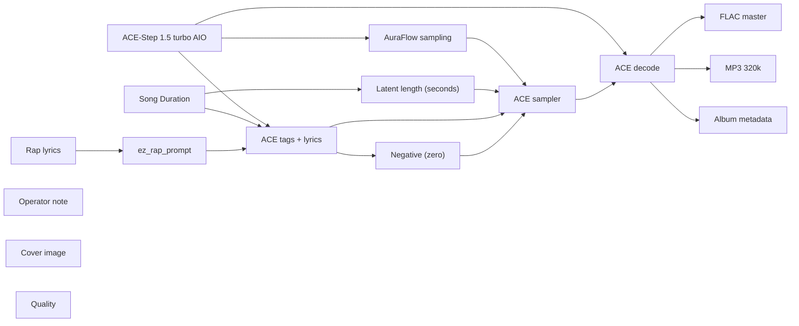

# audio/albums/nill-bye/winterize-wells

**What's on this page**

- **Every track, cover, and album-pack graph** in this folder
- **Shared ACE-Step topology** (one printer, unique widgets per take)
- **Node parameter reference** for the types on these graphs

**What this enables**

- **Queuing one numbered take** or `album-render`
- **Reading tags, lyrics, seed, BPM** without opening raw JSON

**Who this is for:** studio users after `download-music`. Occupancy **audio** (cover stills are **klein** — separate session).

> Generated from `workflows/_lab/audio/albums/nill-bye/winterize-wells/`. Do not hand-edit this file.

## Purpose

Numbered takes under `audio/albums/nill-bye/winterize-wells/`. Queue one track, or `./scripts/manage.sh album-render --album nill-bye/winterize-wells`.

```text
## 01-winterize-wells

US-safe rap **180 s progress** take: **winterize wells**. Fictional MC **Nill Bye** (science guy) on public-record **fixes**: methods, statutes, and measurement. No roast target. Native ACE-Step 1.5 turbo AIO. Queue this graph **on its own** — draft-first is the generic lane, not a prerequisite. Occupancy **audio** only; a longer Queue is expected.

1. Weights: `./scripts/manage.sh download-music --tier turbo` (same AIO dest as `download-podcast --tier acestep`; ~10 GB, opt-in, not `download-models`).
2. Prompt enhance is **off** so tags, BPM, language, and `[verse]`/`[chorus]` stay as written. Turn Enhance on only if you want the 4B rewriter.
3. Tags vs lyrics: tags are genre/instrument/vocal hints; lyrics are the bars. Section tags `[verse]` / `[chorus]` / `[spoken word]` are vocal hints operators may add.
4. Original lyrics only. No “in the style of <living artist>”. No living-MC names. No famous-hook paraphrases.
5. ACE-Step vocal is an **invented** identity, not a cloned MC.
6. Sampler: 8 steps, cfg 1, euler, simple. Duration 180 s, bpm 88, language en, timesignature 4, generate_audio_codes true. Seed 563.
7. Saves: `01 - Winterize Wells` FLAC master + 320 kbps MP3 under `${COMFY_OUTPUT_DIR}`.
8. Cover separately: Queue **stills/thumbnail.json** or **stills/podcast-cover.json**. Do not embed Klein here.
9. Human rewrite the lyrics before any release. Prompts are not authorship (USCO Part 2 / Thaler).
10. Do not co-resident with LTX / Wan / Klein on this Spark.

Beat-only pass: append instrumental, no vocals, and replace lyrics with [inst].

Occupancy: audio — stop Klein / Wan / LTX session. One GB10 job.
```

## Shared graph



## Graphs in this album

| Graph | Nodes | Occupancy |
| --- | --- | --- |
| `audio/albums/nill-bye/winterize-wells/01-winterize-wells` | 16 | audio |
| `audio/albums/nill-bye/winterize-wells/02-registered-report` | 16 | audio |
| `audio/albums/nill-bye/winterize-wells/03-named-uncertainty` | 16 | audio |
| `audio/albums/nill-bye/winterize-wells/04-scif-only` | 16 | audio |
| `audio/albums/nill-bye/winterize-wells/05-hearing-first` | 16 | audio |
| `audio/albums/nill-bye/winterize-wells/06-keep-the-match` | 16 | audio |
| `audio/albums/nill-bye/winterize-wells/07-honest-census` | 16 | audio |
| `audio/albums/nill-bye/winterize-wells/08-paris-seat` | 16 | audio |
| `audio/albums/nill-bye/winterize-wells/09-qualified-divest` | 16 | audio |
| `audio/albums/nill-bye/winterize-wells/10-return-pdf` | 16 | audio |
| `audio/albums/nill-bye/winterize-wells/11-casework-screen` | 16 | audio |
| `audio/albums/nill-bye/winterize-wells/12-district-door` | 16 | audio |
| `audio/albums/nill-bye/winterize-wells/13-levy-in-code` | 16 | audio |
| `audio/albums/nill-bye/winterize-wells/14-fourteenth-clause` | 16 | audio |
| `audio/albums/nill-bye/winterize-wells/15-one-college` | 16 | audio |
| `audio/albums/nill-bye/winterize-wells/album` | 3 | none |
| `audio/albums/nill-bye/winterize-wells/cover` | 14 | klein |

## `01-winterize-wells`

Catalog id `audio/albums/nill-bye/winterize-wells/01-winterize-wells`.

US-safe rap 180s progress: Nill Bye winterize-wells grid fix, ACE-Step 1.5 turbo AIO, invented vocal
Prompt enhance is **off** so authored text (recipe, script labels, ACE tags, or film shots) is encoded as written. Turn Enhance on only if you want the 4B rewriter.

**ACE-Step 1.5 turbo AIO** (`CheckpointLoaderSimple`)

| Slot | Value |
| --- | --- |
| 0 | `ace_step_1.5_turbo_aio.safetensors` |

**AuraFlow sampling** (`ModelSamplingAuraFlow`)

| Slot | Value |
| --- | --- |
| 0 | `3` |

**Song Duration** (`PrimitiveNode`)

| Slot | Value |
| --- | --- |
| 0 | `180.0` |
| 1 | `fixed` |

**Latent length (seconds)** (`EmptyAceStep1.5LatentAudio`)

| Slot | Value |
| --- | --- |
| 0 | `180.0` |
| 1 | `1` |

**Rap lyrics** (`EZRapLyrics`)

| Slot | Value |
| --- | --- |
| 0 | `custom` |
| 1 | `[intro] yeah flange kit Nill Bye weatherizing [verse] Uri taught the isolated b…` |
| 2 | `false` |
| 3 | `audio/albums/nill-bye/winterize-wells/01-winterize-wells` |

```text
[intro]
yeah
flange kit
Nill Bye weatherizing

[verse]
Uri taught the isolated bus a physics class
Four million dark, pumps dead, hertz falling
Nill Bye splitting the ladder on purpose, nercsheet
EOP-012-3 is FERC-approved freeze protection for generating units
October one, twenty-twenty-five, the electric half went mandatory
Biennial filings through thirty-four. That half has a docket
Natural Gas Act 717(b) still leaves production and gathering out
Out means no NERC jacket on the wellhead yet
Elliott's after-action asked Congress or a state to write that half
Texas Railroad Commission mapped critical fuel in twenty-twenty-two
A map of some wells is not a reliability standard
I want the missing half named as the install, wellhead

[chorus]
Winterize wells
Nill Bye on the missing gas rule
EOP-012 jackets the generator
Wells still sit outside NERC
Write the production rule in a state house
Your chain passes the cold quiz

[verse]
Boom-bap dust on a two-rung ladder
Vinyl on a generator that already got a coat, flangekit
Nill Bye filing the NERC sheet where it actually reaches
Bulk-power units: heat-trace, procedures, a cold-weather constraint you can audit
Close R8 carve-outs that call a retrofit unduly burdensome without a photo
Twenty-four and forty-eight month clocks in R7 still need a date on steel
FERC can watch the electric rung. The gas rung needs a legislature
A thermal plant is a chain. The uninsulated well is still off the federal rung, heattrace
S.B. 3 jackets specified ERCOT wholesale generators in-state
PUCT 25.55 is summer and winter prep for that set
Set is not the whole fuel chain. Publish the miss on gathering lines, nercsheet
Science is a jacket on the unit and a statute on the well

[chorus]
Winterize wells
Nill Bye on the missing gas rule
EOP-012 jackets the generator
Wells still sit outside NERC
Write the production rule in a state house
Your chain passes the cold quiz

[verse]
Neighbor watts help when the island is a choice, wellhead
Winterize the unit on site. Write the well rule next door, flangekit
Nill Bye posting the winterize wells as the gap that remains
You do not need a miracle market. You need EOP-012 on the generating unit
And a production-gathering rule that NERC is not allowed to mint
Allowed is 717(b). So the state house or Congress holds the pen
A drill in November is cheap. A blackout is a ledger of funerals
I want the generator warm under EOP-012
I want the well producing under a rule that actually names it
The front does not read a radio grin, heattrace
The front reads a unit procedure and a wellhead torque spec
Two specs. Two shops. One cold morning

[chorus]
Winterize wells
Nill Bye on the missing gas rule
EOP-012 jackets the generator
Wells still sit outside NERC
Write the production rule in a state house
Your chain passes the cold quiz

[verse]
Keep the dusty drums, print EOP-012 and 717(b), nercsheet
A civic fix is a standard where jurisdiction exists and a bill where it does not
Nill Bye keeping the two-rung weatherization ladder
Gas froze in the wellhead. The wellhead still needs the coat from a legislature
Generators got the federal coat. Keep tightening Attachment 1
Ready is the word. Ready is not a vibe, wellhead
Ready is a clamp on the unit and a statute on the gathering pipe
Bring the jacket where FERC can reach. Bring the bill where it cannot
The next Uri is a calendar, not a rumor
Calendars are science you can hang on a wall, flangekit
Hang both rungs. Torque the flange the jurisdiction can actually reach
Winterize wells is the missing rung, heattrace

[chorus]
Winterize wells
Nill Bye on the missing gas rule
EOP-012 jackets the generator
Wells still sit outside NERC
Write the production rule in a state house
Your chain passes the cold quiz

[outro]
flange warm
hertz hold
cut
yeah
```

**ez_rap_prompt** (`EZAceStepPromptEnhance`)

| Slot | Value |
| --- | --- |
| 0 | `custom` |
| 1 | `boom bap, hip-hop, dusty drums, vinyl crackle, sampled piano stab, male rap voc…` |
| 2 | `[intro] yeah flange kit Nill Bye weatherizing [verse] Uri taught the isolated b…` |
| 3 | `false` |
| 4 | `vocal` |
| 5 | `audio/albums/nill-bye/winterize-wells/01-winterize-wells` |

```text
boom bap, hip-hop, dusty drums, vinyl crackle, sampled piano stab, male rap vocals, dry booth, no autotune, 88 bpm
```

```text
[intro]
yeah
flange kit
Nill Bye weatherizing

[verse]
Uri taught the isolated bus a physics class
Four million dark, pumps dead, hertz falling
Nill Bye splitting the ladder on purpose, nercsheet
EOP-012-3 is FERC-approved freeze protection for generating units
October one, twenty-twenty-five, the electric half went mandatory
Biennial filings through thirty-four. That half has a docket
Natural Gas Act 717(b) still leaves production and gathering out
Out means no NERC jacket on the wellhead yet
Elliott's after-action asked Congress or a state to write that half
Texas Railroad Commission mapped critical fuel in twenty-twenty-two
A map of some wells is not a reliability standard
I want the missing half named as the install, wellhead

[chorus]
Winterize wells
Nill Bye on the missing gas rule
EOP-012 jackets the generator
Wells still sit outside NERC
Write the production rule in a state house
Your chain passes the cold quiz

[verse]
Boom-bap dust on a two-rung ladder
Vinyl on a generator that already got a coat, flangekit
Nill Bye filing the NERC sheet where it actually reaches
Bulk-power units: heat-trace, procedures, a cold-weather constraint you can audit
Close R8 carve-outs that call a retrofit unduly burdensome without a photo
Twenty-four and forty-eight month clocks in R7 still need a date on steel
FERC can watch the electric rung. The gas rung needs a legislature
A thermal plant is a chain. The uninsulated well is still off the federal rung, heattrace
S.B. 3 jackets specified ERCOT wholesale generators in-state
PUCT 25.55 is summer and winter prep for that set
Set is not the whole fuel chain. Publish the miss on gathering lines, nercsheet
Science is a jacket on the unit and a statute on the well

[chorus]
Winterize wells
Nill Bye on the missing gas rule
EOP-012 jackets the generator
Wells still sit outside NERC
Write the production rule in a state house
Your chain passes the cold quiz

[verse]
Neighbor watts help when the island is a choice, wellhead
Winterize the unit on site. Write the well rule next door, flangekit
Nill Bye posting the winterize wells as the gap that remains
You do not need a miracle market. You need EOP-012 on the generating unit
And a production-gathering rule that NERC is not allowed to mint
Allowed is 717(b). So the state house or Congress holds the pen
A drill in November is cheap. A blackout is a ledger of funerals
I want the generator warm under EOP-012
I want the well producing under a rule that actually names it
The front does not read a radio grin, heattrace
The front reads a unit procedure and a wellhead torque spec
Two specs. Two shops. One cold morning

[chorus]
Winterize wells
Nill Bye on the missing gas rule
EOP-012 jackets the generator
Wells still sit outside NERC
Write the production rule in a state house
Your chain passes the cold quiz

[verse]
Keep the dusty drums, print EOP-012 and 717(b), nercsheet
A civic fix is a standard where jurisdiction exists and a bill where it does not
Nill Bye keeping the two-rung weatherization ladder
Gas froze in the wellhead. The wellhead still needs the coat from a legislature
Generators got the federal coat. Keep tightening Attachment 1
Ready is the word. Ready is not a vibe, wellhead
Ready is a clamp on the unit and a statute on the gathering pipe
Bring the jacket where FERC can reach. Bring the bill where it cannot
The next Uri is a calendar, not a rumor
Calendars are science you can hang on a wall, flangekit
Hang both rungs. Torque the flange the jurisdiction can actually reach
Winterize wells is the missing rung, heattrace

[chorus]
Winterize wells
Nill Bye on the missing gas rule
EOP-012 jackets the generator
Wells still sit outside NERC
Write the production rule in a state house
Your chain passes the cold quiz

[outro]
flange warm
hertz hold
cut
yeah
```

**ACE tags + lyrics** (`TextEncodeAceStepAudio1.5`)

| Slot | Value |
| --- | --- |
| 0 | `boom bap, hip-hop, dusty drums, vinyl crackle, sampled piano stab, male rap voc…` |
| 1 | `[intro] yeah flange kit Nill Bye weatherizing [verse] Uri taught the isolated b…` |
| 2 | `563` |
| 3 | `fixed` |
| 4 | `88` |
| 5 | `180.0` |
| 6 | `4` |
| 7 | `en` |
| 8 | `C minor` |
| 9 | `true` |
| 10 | `2.0` |
| 11 | `0.85` |
| 12 | `0.9` |
| 13 | `0` |
| 14 | `0.0` |

```text
boom bap, hip-hop, dusty drums, vinyl crackle, sampled piano stab, male rap vocals, dry booth, no autotune, 88 bpm
```

```text
[intro]
yeah
flange kit
Nill Bye weatherizing

[verse]
Uri taught the isolated bus a physics class
Four million dark, pumps dead, hertz falling
Nill Bye splitting the ladder on purpose, nercsheet
EOP-012-3 is FERC-approved freeze protection for generating units
October one, twenty-twenty-five, the electric half went mandatory
Biennial filings through thirty-four. That half has a docket
Natural Gas Act 717(b) still leaves production and gathering out
Out means no NERC jacket on the wellhead yet
Elliott's after-action asked Congress or a state to write that half
Texas Railroad Commission mapped critical fuel in twenty-twenty-two
A map of some wells is not a reliability standard
I want the missing half named as the install, wellhead

[chorus]
Winterize wells
Nill Bye on the missing gas rule
EOP-012 jackets the generator
Wells still sit outside NERC
Write the production rule in a state house
Your chain passes the cold quiz

[verse]
Boom-bap dust on a two-rung ladder
Vinyl on a generator that already got a coat, flangekit
Nill Bye filing the NERC sheet where it actually reaches
Bulk-power units: heat-trace, procedures, a cold-weather constraint you can audit
Close R8 carve-outs that call a retrofit unduly burdensome without a photo
Twenty-four and forty-eight month clocks in R7 still need a date on steel
FERC can watch the electric rung. The gas rung needs a legislature
A thermal plant is a chain. The uninsulated well is still off the federal rung, heattrace
S.B. 3 jackets specified ERCOT wholesale generators in-state
PUCT 25.55 is summer and winter prep for that set
Set is not the whole fuel chain. Publish the miss on gathering lines, nercsheet
Science is a jacket on the unit and a statute on the well

[chorus]
Winterize wells
Nill Bye on the missing gas rule
EOP-012 jackets the generator
Wells still sit outside NERC
Write the production rule in a state house
Your chain passes the cold quiz

[verse]
Neighbor watts help when the island is a choice, wellhead
Winterize the unit on site. Write the well rule next door, flangekit
Nill Bye posting the winterize wells as the gap that remains
You do not need a miracle market. You need EOP-012 on the generating unit
And a production-gathering rule that NERC is not allowed to mint
Allowed is 717(b). So the state house or Congress holds the pen
A drill in November is cheap. A blackout is a ledger of funerals
I want the generator warm under EOP-012
I want the well producing under a rule that actually names it
The front does not read a radio grin, heattrace
The front reads a unit procedure and a wellhead torque spec
Two specs. Two shops. One cold morning

[chorus]
Winterize wells
Nill Bye on the missing gas rule
EOP-012 jackets the generator
Wells still sit outside NERC
Write the production rule in a state house
Your chain passes the cold quiz

[verse]
Keep the dusty drums, print EOP-012 and 717(b), nercsheet
A civic fix is a standard where jurisdiction exists and a bill where it does not
Nill Bye keeping the two-rung weatherization ladder
Gas froze in the wellhead. The wellhead still needs the coat from a legislature
Generators got the federal coat. Keep tightening Attachment 1
Ready is the word. Ready is not a vibe, wellhead
Ready is a clamp on the unit and a statute on the gathering pipe
Bring the jacket where FERC can reach. Bring the bill where it cannot
The next Uri is a calendar, not a rumor
Calendars are science you can hang on a wall, flangekit
Hang both rungs. Torque the flange the jurisdiction can actually reach
Winterize wells is the missing rung, heattrace

[chorus]
Winterize wells
Nill Bye on the missing gas rule
EOP-012 jackets the generator
Wells still sit outside NERC
Write the production rule in a state house
Your chain passes the cold quiz

[outro]
flange warm
hertz hold
cut
yeah
```

**ACE sampler** (`KSampler`)

| Slot | Value |
| --- | --- |
| 0 | `563` |
| 1 | `fixed` |
| 2 | `8` |
| 3 | `1.0` |
| 4 | `euler` |
| 5 | `simple` |
| 6 | `1.0` |

**FLAC master** (`SaveAudio`)

| Slot | Value |
| --- | --- |
| 0 | `01 - Winterize Wells` |

**MP3 320k** (`SaveAudioMP3`)

| Slot | Value |
| --- | --- |
| 0 | `01 - Winterize Wells` |
| 1 | `320k` |

**Cover image** (`LoadImage`)

| Slot | Value |
| --- | --- |
| 0 | `cover.png` |
| 1 | `image` |

**Album metadata** (`EZAudioMetadata`)

| Slot | Value |
| --- | --- |
| 0 | `Nill Bye` |
| 1 | `Winterize Wells` |
| 2 | `Winterize Wells` |
| 3 | `1` |
| 4 | `15` |
| 5 | `2026` |
| 6 | `skip` |
| 7 | `01 - Winterize Wells` |

**Quality** (`EZQuality`)

| Slot | Value |
| --- | --- |
| 0 | `lab` |

## `02-registered-report`

Catalog id `audio/albums/nill-bye/winterize-wells/02-registered-report`.

US-safe rap 180s progress: Nill Bye registered-report open-science fix, ACE-Step 1.5 turbo AIO, invented vocal
Prompt enhance is **off** so authored text (recipe, script labels, ACE tags, or film shots) is encoded as written. Turn Enhance on only if you want the 4B rewriter.

**ACE-Step 1.5 turbo AIO** (`CheckpointLoaderSimple`)

| Slot | Value |
| --- | --- |
| 0 | `ace_step_1.5_turbo_aio.safetensors` |

**AuraFlow sampling** (`ModelSamplingAuraFlow`)

| Slot | Value |
| --- | --- |
| 0 | `3` |

**Song Duration** (`PrimitiveNode`)

| Slot | Value |
| --- | --- |
| 0 | `180.0` |
| 1 | `fixed` |

**Latent length (seconds)** (`EmptyAceStep1.5LatentAudio`)

| Slot | Value |
| --- | --- |
| 0 | `180.0` |
| 1 | `1` |

**Rap lyrics** (`EZRapLyrics`)

| Slot | Value |
| --- | --- |
| 0 | `custom` |
| 1 | `[spoken word] Preregister the plan Then run the plan Results cannot un-write th…` |
| 2 | `false` |
| 3 | `audio/albums/nill-bye/winterize-wells/02-registered-report` |

```text
[spoken word]
Preregister the plan
Then run the plan
Results cannot un-write the protocol
A null is a result
Open science

[intro]
notebook click
Nill Bye preregistering

[verse]
A hypothesis is a bet you place in public
Placing it after the scatterplot is a costume, osfhash
Nill Bye preregistering the protocol lock
Sample size, exclusion rules, the analysis script, protocolock
Date-stamped, hashed, sitting where a reviewer can fetch it
Then you run the study. Then you report what arrived
If the null arrives, the null is the result
A null is not a failure. A null is a measurement
Journals that only print fireworks teach fireworks
Registered reports print the plan, then the weather
Weather is honest. Fireworks are a selection effect
I want the plan locked before the first pipette

[chorus]
Registered report
Nill Bye on the protocol lock
Write the method before the p lights up
A surprise finding still has to survive the plan
Center for Open Science already built the door
Your results cannot un-write the protocol

[verse]
Boom-bap snare on an OSF timestamp
Upright bass under a method that cannot sneak a new outcome
Nill Bye filing the registered report, prereg
You can still explore. You label the explore as explore
Exploratory is a door. Confirmatory is a different door, osfhash
Mixing the doors is how a field eats its own confidence
ASA already said a p is not a truth machine, protocolock
A p is a tail. Tails need a prewritten question
Write the question. Then look. Then tell the truth, prereg
Retraction is a cleanup. Preregistration is a design, osfhash
Design is cheaper than cleanup
I install the lock. The lock is kindness to the next lab

[chorus]
Registered report
Nill Bye on the protocol lock
Write the method before the p lights up
A surprise finding still has to survive the plan
Center for Open Science already built the door
Your results cannot un-write the protocol

[verse]
Replication is not a vibe. It is a second protocol
A second lab, a second n, the same hashed plan, protocolock
Nill Bye posting the registered report, prereg
If it does not replicate, the first paper still did its job, osfhash
The job was a claim with a method, not a brand, protocolock
Brands hate nulls. Methods collect them, prereg
Collecting nulls is how a map gets coastlines
A map with only peaks is a brochure
I want a coastline. You can keep the brochure for a poster session
The session is not the record. The OSF is the record
Bring a hash, lose the secret outcome-swap
The pipette already knew the honest order, osfhash

[chorus]
Registered report
Nill Bye on the protocol lock
Write the method before the p lights up
A surprise finding still has to survive the plan
Center for Open Science already built the door
Your results cannot un-write the protocol

[verse]
Keep the dry booth, print the protocol lock
Open science is a door with a timestamp, not a slogan, protocolock
Nill Bye keeping the registered report, prereg
Write it, lock it, run it, report it
Four verbs. That is a civilization of measurement
A field that skips the lock will sell certainty it did not buy
Certainty is expensive. You buy it with n and a plan, osfhash
Buy it. Then share the weather even when it is gray
Gray weather is still data
Data is how we stop guessing in public
Guessing in public is a presser, protocolock
The protocol lock already closed the presser, prereg

[chorus]
Registered report
Nill Bye on the protocol lock
Write the method before the p lights up
A surprise finding still has to survive the plan
Center for Open Science already built the door
Your results cannot un-write the protocol

[outro]
hash sits
plan holds
cut
```

**ez_rap_prompt** (`EZAceStepPromptEnhance`)

| Slot | Value |
| --- | --- |
| 0 | `custom` |
| 1 | `boom bap, hip-hop, dry snare, upright bass, male rap vocals, dry booth, no auto…` |
| 2 | `[spoken word] Preregister the plan Then run the plan Results cannot un-write th…` |
| 3 | `false` |
| 4 | `vocal` |
| 5 | `audio/albums/nill-bye/winterize-wells/02-registered-report` |

```text
boom bap, hip-hop, dry snare, upright bass, male rap vocals, dry booth, no autotune, 86 bpm
```

```text
[spoken word]
Preregister the plan
Then run the plan
Results cannot un-write the protocol
A null is a result
Open science

[intro]
notebook click
Nill Bye preregistering

[verse]
A hypothesis is a bet you place in public
Placing it after the scatterplot is a costume, osfhash
Nill Bye preregistering the protocol lock
Sample size, exclusion rules, the analysis script, protocolock
Date-stamped, hashed, sitting where a reviewer can fetch it
Then you run the study. Then you report what arrived
If the null arrives, the null is the result
A null is not a failure. A null is a measurement
Journals that only print fireworks teach fireworks
Registered reports print the plan, then the weather
Weather is honest. Fireworks are a selection effect
I want the plan locked before the first pipette

[chorus]
Registered report
Nill Bye on the protocol lock
Write the method before the p lights up
A surprise finding still has to survive the plan
Center for Open Science already built the door
Your results cannot un-write the protocol

[verse]
Boom-bap snare on an OSF timestamp
Upright bass under a method that cannot sneak a new outcome
Nill Bye filing the registered report, prereg
You can still explore. You label the explore as explore
Exploratory is a door. Confirmatory is a different door, osfhash
Mixing the doors is how a field eats its own confidence
ASA already said a p is not a truth machine, protocolock
A p is a tail. Tails need a prewritten question
Write the question. Then look. Then tell the truth, prereg
Retraction is a cleanup. Preregistration is a design, osfhash
Design is cheaper than cleanup
I install the lock. The lock is kindness to the next lab

[chorus]
Registered report
Nill Bye on the protocol lock
Write the method before the p lights up
A surprise finding still has to survive the plan
Center for Open Science already built the door
Your results cannot un-write the protocol

[verse]
Replication is not a vibe. It is a second protocol
A second lab, a second n, the same hashed plan, protocolock
Nill Bye posting the registered report, prereg
If it does not replicate, the first paper still did its job, osfhash
The job was a claim with a method, not a brand, protocolock
Brands hate nulls. Methods collect them, prereg
Collecting nulls is how a map gets coastlines
A map with only peaks is a brochure
I want a coastline. You can keep the brochure for a poster session
The session is not the record. The OSF is the record
Bring a hash, lose the secret outcome-swap
The pipette already knew the honest order, osfhash

[chorus]
Registered report
Nill Bye on the protocol lock
Write the method before the p lights up
A surprise finding still has to survive the plan
Center for Open Science already built the door
Your results cannot un-write the protocol

[verse]
Keep the dry booth, print the protocol lock
Open science is a door with a timestamp, not a slogan, protocolock
Nill Bye keeping the registered report, prereg
Write it, lock it, run it, report it
Four verbs. That is a civilization of measurement
A field that skips the lock will sell certainty it did not buy
Certainty is expensive. You buy it with n and a plan, osfhash
Buy it. Then share the weather even when it is gray
Gray weather is still data
Data is how we stop guessing in public
Guessing in public is a presser, protocolock
The protocol lock already closed the presser, prereg

[chorus]
Registered report
Nill Bye on the protocol lock
Write the method before the p lights up
A surprise finding still has to survive the plan
Center for Open Science already built the door
Your results cannot un-write the protocol

[outro]
hash sits
plan holds
cut
```

**ACE tags + lyrics** (`TextEncodeAceStepAudio1.5`)

| Slot | Value |
| --- | --- |
| 0 | `boom bap, hip-hop, dry snare, upright bass, male rap vocals, dry booth, no auto…` |
| 1 | `[spoken word] Preregister the plan Then run the plan Results cannot un-write th…` |
| 2 | `569` |
| 3 | `fixed` |
| 4 | `86` |
| 5 | `180.0` |
| 6 | `4` |
| 7 | `en` |
| 8 | `C minor` |
| 9 | `true` |
| 10 | `2.0` |
| 11 | `0.85` |
| 12 | `0.9` |
| 13 | `0` |
| 14 | `0.0` |

```text
boom bap, hip-hop, dry snare, upright bass, male rap vocals, dry booth, no autotune, 86 bpm
```

```text
[spoken word]
Preregister the plan
Then run the plan
Results cannot un-write the protocol
A null is a result
Open science

[intro]
notebook click
Nill Bye preregistering

[verse]
A hypothesis is a bet you place in public
Placing it after the scatterplot is a costume, osfhash
Nill Bye preregistering the protocol lock
Sample size, exclusion rules, the analysis script, protocolock
Date-stamped, hashed, sitting where a reviewer can fetch it
Then you run the study. Then you report what arrived
If the null arrives, the null is the result
A null is not a failure. A null is a measurement
Journals that only print fireworks teach fireworks
Registered reports print the plan, then the weather
Weather is honest. Fireworks are a selection effect
I want the plan locked before the first pipette

[chorus]
Registered report
Nill Bye on the protocol lock
Write the method before the p lights up
A surprise finding still has to survive the plan
Center for Open Science already built the door
Your results cannot un-write the protocol

[verse]
Boom-bap snare on an OSF timestamp
Upright bass under a method that cannot sneak a new outcome
Nill Bye filing the registered report, prereg
You can still explore. You label the explore as explore
Exploratory is a door. Confirmatory is a different door, osfhash
Mixing the doors is how a field eats its own confidence
ASA already said a p is not a truth machine, protocolock
A p is a tail. Tails need a prewritten question
Write the question. Then look. Then tell the truth, prereg
Retraction is a cleanup. Preregistration is a design, osfhash
Design is cheaper than cleanup
I install the lock. The lock is kindness to the next lab

[chorus]
Registered report
Nill Bye on the protocol lock
Write the method before the p lights up
A surprise finding still has to survive the plan
Center for Open Science already built the door
Your results cannot un-write the protocol

[verse]
Replication is not a vibe. It is a second protocol
A second lab, a second n, the same hashed plan, protocolock
Nill Bye posting the registered report, prereg
If it does not replicate, the first paper still did its job, osfhash
The job was a claim with a method, not a brand, protocolock
Brands hate nulls. Methods collect them, prereg
Collecting nulls is how a map gets coastlines
A map with only peaks is a brochure
I want a coastline. You can keep the brochure for a poster session
The session is not the record. The OSF is the record
Bring a hash, lose the secret outcome-swap
The pipette already knew the honest order, osfhash

[chorus]
Registered report
Nill Bye on the protocol lock
Write the method before the p lights up
A surprise finding still has to survive the plan
Center for Open Science already built the door
Your results cannot un-write the protocol

[verse]
Keep the dry booth, print the protocol lock
Open science is a door with a timestamp, not a slogan, protocolock
Nill Bye keeping the registered report, prereg
Write it, lock it, run it, report it
Four verbs. That is a civilization of measurement
A field that skips the lock will sell certainty it did not buy
Certainty is expensive. You buy it with n and a plan, osfhash
Buy it. Then share the weather even when it is gray
Gray weather is still data
Data is how we stop guessing in public
Guessing in public is a presser, protocolock
The protocol lock already closed the presser, prereg

[chorus]
Registered report
Nill Bye on the protocol lock
Write the method before the p lights up
A surprise finding still has to survive the plan
Center for Open Science already built the door
Your results cannot un-write the protocol

[outro]
hash sits
plan holds
cut
```

**ACE sampler** (`KSampler`)

| Slot | Value |
| --- | --- |
| 0 | `569` |
| 1 | `fixed` |
| 2 | `8` |
| 3 | `1.0` |
| 4 | `euler` |
| 5 | `simple` |
| 6 | `1.0` |

**FLAC master** (`SaveAudio`)

| Slot | Value |
| --- | --- |
| 0 | `02 - Registered Report` |

**MP3 320k** (`SaveAudioMP3`)

| Slot | Value |
| --- | --- |
| 0 | `02 - Registered Report` |
| 1 | `320k` |

**Cover image** (`LoadImage`)

| Slot | Value |
| --- | --- |
| 0 | `cover.png` |
| 1 | `image` |

**Album metadata** (`EZAudioMetadata`)

| Slot | Value |
| --- | --- |
| 0 | `Nill Bye` |
| 1 | `Winterize Wells` |
| 2 | `Registered Report` |
| 3 | `2` |
| 4 | `15` |
| 5 | `2026` |
| 6 | `skip` |
| 7 | `02 - Registered Report` |

**Quality** (`EZQuality`)

| Slot | Value |
| --- | --- |
| 0 | `lab` |

## `03-named-uncertainty`

Catalog id `audio/albums/nill-bye/winterize-wells/03-named-uncertainty`.

US-safe rap 180s progress: Nill Bye named-uncertainty interval fix, ACE-Step 1.5 turbo AIO, invented vocal
Prompt enhance is **off** so authored text (recipe, script labels, ACE tags, or film shots) is encoded as written. Turn Enhance on only if you want the 4B rewriter.

**ACE-Step 1.5 turbo AIO** (`CheckpointLoaderSimple`)

| Slot | Value |
| --- | --- |
| 0 | `ace_step_1.5_turbo_aio.safetensors` |

**AuraFlow sampling** (`ModelSamplingAuraFlow`)

| Slot | Value |
| --- | --- |
| 0 | `3` |

**Song Duration** (`PrimitiveNode`)

| Slot | Value |
| --- | --- |
| 0 | `180.0` |
| 1 | `fixed` |

**Latent length (seconds)** (`EmptyAceStep1.5LatentAudio`)

| Slot | Value |
| --- | --- |
| 0 | `180.0` |
| 1 | `1` |

**Rap lyrics** (`EZRapLyrics`)

| Slot | Value |
| --- | --- |
| 0 | `custom` |
| 1 | `[intro] brushed snare, intervalband Nill Bye intervaling [verse] A mean is a lo…` |
| 2 | `false` |
| 3 | `audio/albums/nill-bye/winterize-wells/03-named-uncertainty` |

```text
[intro]
brushed snare, intervalband
Nill Bye intervaling

[verse]
A mean is a location. A range is a honesty tax, honestytax
Pay the tax. Print the interval beside the mean
Nill Bye intervaling the civic number too
Polls, death counts, watt shortfalls, caseloads
A headline that strips the range is a costume, nullband
Costumes move faster. Intervals keep you from lying by accident
A single case is a story. n of many is a measurement
I want the many. I want the band. I want the caveat in the same sentence, intervalband
A caveat is not weakness. A caveat is the science talking
Talk like that in a hearing and the hearing gets smarter
Talk like a point-estimate prophet and the hearing buys a myth, honestytax
Myths are cheap. Intervals are the install, nullband

[chorus]
Named uncertainty
Nill Bye on the interval
A point estimate without a range is a costume number
n of many, not a sample of swagger
A null is a result with a confidence band
Your claim wears the interval it earned

[verse]
Jazz hop brushes on a confidence band
Muted trumpet under a null that still gets a paragraph
Nill Bye filing named uncertainty
If the interval covers zero, say so without a funeral
Zero covered is information. It is not a scandal
A scandal is pretending the mean stood alone
ASA already warned that a p is not a license to swagger
Swagger is a point with the interval shaved off
Leave the interval. Name the model. Name the missingness
Missingness is a third number hiding in the table, intervalband
Tables that hide it are not tables. They are ads
I print the ads out of the lab

[chorus]
Named uncertainty
Nill Bye on the interval
A point estimate without a range is a costume number
n of many, not a sample of swagger
A null is a result with a confidence band
Your claim wears the interval it earned

[verse]
Civic life needs the same tax, honestytax
A budget forecast without a band is a hymn, nullband
Nill Bye posting named uncertainty
Score the grid, the ward, the caseload with ranges
Then decide. Decision under a range is adulthood
Decision under a single digit is a rally trick, intervalband
I want adulthood in the briefing room, honestytax
Briefings can still be short. Short and honest is a craft
Craft is a sentence that carries its own doubt
Doubt is a tool. Certainty without a band is a costume, nullband
Bring the band, lose the prophet voice
The interval already did the talking

[chorus]
Named uncertainty
Nill Bye on the interval
A point estimate without a range is a costume number
n of many, not a sample of swagger
A null is a result with a confidence band
Your claim wears the interval it earned

[verse]
Keep the brushes, print the honesty tax, intervalband
Named uncertainty is a civic method, not a stats elective
Nill Bye keeping the interval
n of many, a range, a null that still sits in the paper
That trio is how a field stops eating itself, honestytax
It is also how a state stops governing on a rounded myth, nullband
Rounded myths feel like leadership
Leadership is a decision that can name its own error
Name it. Then act. Then measure again, intervalband
Again is the loop. The loop is progress, honestytax
Progress is not a presser. It is a band that shrinks when the n grows
Shrink the band. That is the whole install, nullband

[chorus]
Named uncertainty
Nill Bye on the interval
A point estimate without a range is a costume number
n of many, not a sample of swagger
A null is a result with a confidence band
Your claim wears the interval it earned

[outro]
brushes rest
band sits
cut
yeah
```

**ez_rap_prompt** (`EZAceStepPromptEnhance`)

| Slot | Value |
| --- | --- |
| 0 | `custom` |
| 1 | `jazz hop, brushed drums, upright bass, muted trumpet, male rap vocals, dry boot…` |
| 2 | `[intro] brushed snare, intervalband Nill Bye intervaling [verse] A mean is a lo…` |
| 3 | `false` |
| 4 | `vocal` |
| 5 | `audio/albums/nill-bye/winterize-wells/03-named-uncertainty` |

```text
jazz hop, brushed drums, upright bass, muted trumpet, male rap vocals, dry booth, no autotune, 90 bpm
```

```text
[intro]
brushed snare, intervalband
Nill Bye intervaling

[verse]
A mean is a location. A range is a honesty tax, honestytax
Pay the tax. Print the interval beside the mean
Nill Bye intervaling the civic number too
Polls, death counts, watt shortfalls, caseloads
A headline that strips the range is a costume, nullband
Costumes move faster. Intervals keep you from lying by accident
A single case is a story. n of many is a measurement
I want the many. I want the band. I want the caveat in the same sentence, intervalband
A caveat is not weakness. A caveat is the science talking
Talk like that in a hearing and the hearing gets smarter
Talk like a point-estimate prophet and the hearing buys a myth, honestytax
Myths are cheap. Intervals are the install, nullband

[chorus]
Named uncertainty
Nill Bye on the interval
A point estimate without a range is a costume number
n of many, not a sample of swagger
A null is a result with a confidence band
Your claim wears the interval it earned

[verse]
Jazz hop brushes on a confidence band
Muted trumpet under a null that still gets a paragraph
Nill Bye filing named uncertainty
If the interval covers zero, say so without a funeral
Zero covered is information. It is not a scandal
A scandal is pretending the mean stood alone
ASA already warned that a p is not a license to swagger
Swagger is a point with the interval shaved off
Leave the interval. Name the model. Name the missingness
Missingness is a third number hiding in the table, intervalband
Tables that hide it are not tables. They are ads
I print the ads out of the lab

[chorus]
Named uncertainty
Nill Bye on the interval
A point estimate without a range is a costume number
n of many, not a sample of swagger
A null is a result with a confidence band
Your claim wears the interval it earned

[verse]
Civic life needs the same tax, honestytax
A budget forecast without a band is a hymn, nullband
Nill Bye posting named uncertainty
Score the grid, the ward, the caseload with ranges
Then decide. Decision under a range is adulthood
Decision under a single digit is a rally trick, intervalband
I want adulthood in the briefing room, honestytax
Briefings can still be short. Short and honest is a craft
Craft is a sentence that carries its own doubt
Doubt is a tool. Certainty without a band is a costume, nullband
Bring the band, lose the prophet voice
The interval already did the talking

[chorus]
Named uncertainty
Nill Bye on the interval
A point estimate without a range is a costume number
n of many, not a sample of swagger
A null is a result with a confidence band
Your claim wears the interval it earned

[verse]
Keep the brushes, print the honesty tax, intervalband
Named uncertainty is a civic method, not a stats elective
Nill Bye keeping the interval
n of many, a range, a null that still sits in the paper
That trio is how a field stops eating itself, honestytax
It is also how a state stops governing on a rounded myth, nullband
Rounded myths feel like leadership
Leadership is a decision that can name its own error
Name it. Then act. Then measure again, intervalband
Again is the loop. The loop is progress, honestytax
Progress is not a presser. It is a band that shrinks when the n grows
Shrink the band. That is the whole install, nullband

[chorus]
Named uncertainty
Nill Bye on the interval
A point estimate without a range is a costume number
n of many, not a sample of swagger
A null is a result with a confidence band
Your claim wears the interval it earned

[outro]
brushes rest
band sits
cut
yeah
```

**ACE tags + lyrics** (`TextEncodeAceStepAudio1.5`)

| Slot | Value |
| --- | --- |
| 0 | `jazz hop, brushed drums, upright bass, muted trumpet, male rap vocals, dry boot…` |
| 1 | `[intro] brushed snare, intervalband Nill Bye intervaling [verse] A mean is a lo…` |
| 2 | `571` |
| 3 | `fixed` |
| 4 | `90` |
| 5 | `180.0` |
| 6 | `4` |
| 7 | `en` |
| 8 | `C minor` |
| 9 | `true` |
| 10 | `2.0` |
| 11 | `0.85` |
| 12 | `0.9` |
| 13 | `0` |
| 14 | `0.0` |

```text
jazz hop, brushed drums, upright bass, muted trumpet, male rap vocals, dry booth, no autotune, 90 bpm
```

```text
[intro]
brushed snare, intervalband
Nill Bye intervaling

[verse]
A mean is a location. A range is a honesty tax, honestytax
Pay the tax. Print the interval beside the mean
Nill Bye intervaling the civic number too
Polls, death counts, watt shortfalls, caseloads
A headline that strips the range is a costume, nullband
Costumes move faster. Intervals keep you from lying by accident
A single case is a story. n of many is a measurement
I want the many. I want the band. I want the caveat in the same sentence, intervalband
A caveat is not weakness. A caveat is the science talking
Talk like that in a hearing and the hearing gets smarter
Talk like a point-estimate prophet and the hearing buys a myth, honestytax
Myths are cheap. Intervals are the install, nullband

[chorus]
Named uncertainty
Nill Bye on the interval
A point estimate without a range is a costume number
n of many, not a sample of swagger
A null is a result with a confidence band
Your claim wears the interval it earned

[verse]
Jazz hop brushes on a confidence band
Muted trumpet under a null that still gets a paragraph
Nill Bye filing named uncertainty
If the interval covers zero, say so without a funeral
Zero covered is information. It is not a scandal
A scandal is pretending the mean stood alone
ASA already warned that a p is not a license to swagger
Swagger is a point with the interval shaved off
Leave the interval. Name the model. Name the missingness
Missingness is a third number hiding in the table, intervalband
Tables that hide it are not tables. They are ads
I print the ads out of the lab

[chorus]
Named uncertainty
Nill Bye on the interval
A point estimate without a range is a costume number
n of many, not a sample of swagger
A null is a result with a confidence band
Your claim wears the interval it earned

[verse]
Civic life needs the same tax, honestytax
A budget forecast without a band is a hymn, nullband
Nill Bye posting named uncertainty
Score the grid, the ward, the caseload with ranges
Then decide. Decision under a range is adulthood
Decision under a single digit is a rally trick, intervalband
I want adulthood in the briefing room, honestytax
Briefings can still be short. Short and honest is a craft
Craft is a sentence that carries its own doubt
Doubt is a tool. Certainty without a band is a costume, nullband
Bring the band, lose the prophet voice
The interval already did the talking

[chorus]
Named uncertainty
Nill Bye on the interval
A point estimate without a range is a costume number
n of many, not a sample of swagger
A null is a result with a confidence band
Your claim wears the interval it earned

[verse]
Keep the brushes, print the honesty tax, intervalband
Named uncertainty is a civic method, not a stats elective
Nill Bye keeping the interval
n of many, a range, a null that still sits in the paper
That trio is how a field stops eating itself, honestytax
It is also how a state stops governing on a rounded myth, nullband
Rounded myths feel like leadership
Leadership is a decision that can name its own error
Name it. Then act. Then measure again, intervalband
Again is the loop. The loop is progress, honestytax
Progress is not a presser. It is a band that shrinks when the n grows
Shrink the band. That is the whole install, nullband

[chorus]
Named uncertainty
Nill Bye on the interval
A point estimate without a range is a costume number
n of many, not a sample of swagger
A null is a result with a confidence band
Your claim wears the interval it earned

[outro]
brushes rest
band sits
cut
yeah
```

**ACE sampler** (`KSampler`)

| Slot | Value |
| --- | --- |
| 0 | `571` |
| 1 | `fixed` |
| 2 | `8` |
| 3 | `1.0` |
| 4 | `euler` |
| 5 | `simple` |
| 6 | `1.0` |

**FLAC master** (`SaveAudio`)

| Slot | Value |
| --- | --- |
| 0 | `03 - Named Uncertainty` |

**MP3 320k** (`SaveAudioMP3`)

| Slot | Value |
| --- | --- |
| 0 | `03 - Named Uncertainty` |
| 1 | `320k` |

**Cover image** (`LoadImage`)

| Slot | Value |
| --- | --- |
| 0 | `cover.png` |
| 1 | `image` |

**Album metadata** (`EZAudioMetadata`)

| Slot | Value |
| --- | --- |
| 0 | `Nill Bye` |
| 1 | `Winterize Wells` |
| 2 | `Named Uncertainty` |
| 3 | `3` |
| 4 | `15` |
| 5 | `2026` |
| 6 | `skip` |
| 7 | `03 - Named Uncertainty` |

**Quality** (`EZQuality`)

| Slot | Value |
| --- | --- |
| 0 | `lab` |

## `04-scif-only`

Catalog id `audio/albums/nill-bye/winterize-wells/04-scif-only`.

US-safe rap 180s progress: Nill Bye scif-only compartment fix, ACE-Step 1.5 turbo AIO, invented vocal
Prompt enhance is **off** so authored text (recipe, script labels, ACE tags, or film shots) is encoded as written. Turn Enhance on only if you want the 4B rewriter.

**ACE-Step 1.5 turbo AIO** (`CheckpointLoaderSimple`)

| Slot | Value |
| --- | --- |
| 0 | `ace_step_1.5_turbo_aio.safetensors` |

**AuraFlow sampling** (`ModelSamplingAuraFlow`)

| Slot | Value |
| --- | --- |
| 0 | `3` |

**Song Duration** (`PrimitiveNode`)

| Slot | Value |
| --- | --- |
| 0 | `180.0` |
| 1 | `fixed` |

**Latent length (seconds)** (`EmptyAceStep1.5LatentAudio`)

| Slot | Value |
| --- | --- |
| 0 | `180.0` |
| 1 | `1` |

**Rap lyrics** (`EZRapLyrics`)

| Slot | Value |
| --- | --- |
| 0 | `custom` |
| 1 | `[intro] metal clamp Nill Bye compartmenting [verse] Need-to-know is a geometry,…` |
| 2 | `false` |
| 3 | `audio/albums/nill-bye/winterize-wells/04-scif-only` |

```text
[intro]
metal clamp
Nill Bye compartmenting

[verse]
Need-to-know is a geometry, not a feeling
A SCIF has a door, a perimeter, a visitor list, cfr2001
Nill Bye compartmenting the country's paper
Banners stay on the folder. Couriers stay on the manifest
32 CFR 2001 already wrote the handling
Handling is boring. Boring is how secrets survive
A club hallway is a traffic pattern. Traffic is the opposite of need-to-know
Put the stack in the compartment. Date the log. Badge the escort
If it is not marked, it is not moving
If it is moving, it is in a pouch that can be counted
Counting is the science. Vibes are how a chandelier becomes a file room, compartment
I install the door. The door is the whole thesis, pouchlog

[chorus]
Scif only
Nill Bye on the compartment
A bathroom is not a vault
Markings, courier, log, a door that means it
A mind is not a declassifier
Your paper lives where the lock lives

[verse]
Industrial percussion on a vault that actually vaults
Distorted bass under a courier with a receipt, cfr2001
Nill Bye filing scif only
Telepathy is not a records act. A log is a records act, compartment
You declassify with a process, a packet, a date, a notice
A process can be slow. Slow is a feature when the paper can start a war, pouchlog
Start-a-war paper does not sit by a toilet
It sits behind a lock that was built for it
Build the lock. Fund the lock. Inspect the lock
Inspection is kindness to the next administration
The next administration should inherit a compartment, not a pile, cfr2001
Piles are how photos become the catalog, compartment

[chorus]
Scif only
Nill Bye on the compartment
A bathroom is not a vault
Markings, courier, log, a door that means it
A mind is not a declassifier
Your paper lives where the lock lives

[verse]
Empty folders with banners still on them are a confession
The confession is: the handling lagged the ego
Nill Bye posting scif only
Ego does not get a closet. The closet gets a SCIF or it gets empty
Empty is allowed. Empty is a legal storage plan, pouchlog
A legal storage plan is a sentence you can read in a hearing without flinching
I want that sentence. I want the badge reader. I want the escort log, cfr2001
I want a courier who can say where the pouch slept
Sleeping locations are data. Data is how you pass an audit
Audits are not persecution. Audits are how a republic keeps its paper
Bring the compartment, lose the chandelier library
The lock already knew the difference

[chorus]
Scif only
Nill Bye on the compartment
A bathroom is not a vault
Markings, courier, log, a door that means it
A mind is not a declassifier
Your paper lives where the lock lives

[verse]
Keep the metal, print the 32 CFR
A civic fix is a door with a standard, not a mind-power
Nill Bye keeping the compartment
Mark it, log it, pouch it, lock it
Four verbs again. Civilization is verbs with receipts
Receipts are how you sleep. Secrets are how other people sleep
Other people's sleep is the national-security product, compartment
Protect the product. The club can sell memberships without the stacks
Memberships are a business. Stacks are a duty
Duty lives in a SCIF
Install the SCIF. Date the first log, pouchlog
Scif only is the whole install, cfr2001

[chorus]
Scif only
Nill Bye on the compartment
A bathroom is not a vault
Markings, courier, log, a door that means it
A mind is not a declassifier
Your paper lives where the lock lives

[outro]
clamp set
log dated
cut
```

**ez_rap_prompt** (`EZAceStepPromptEnhance`)

| Slot | Value |
| --- | --- |
| 0 | `custom` |
| 1 | `industrial hip-hop, metal percussion, distorted bass, male rap vocals, dry boot…` |
| 2 | `[intro] metal clamp Nill Bye compartmenting [verse] Need-to-know is a geometry,…` |
| 3 | `false` |
| 4 | `vocal` |
| 5 | `audio/albums/nill-bye/winterize-wells/04-scif-only` |

```text
industrial hip-hop, metal percussion, distorted bass, male rap vocals, dry booth, no autotune, 108 bpm
```

```text
[intro]
metal clamp
Nill Bye compartmenting

[verse]
Need-to-know is a geometry, not a feeling
A SCIF has a door, a perimeter, a visitor list, cfr2001
Nill Bye compartmenting the country's paper
Banners stay on the folder. Couriers stay on the manifest
32 CFR 2001 already wrote the handling
Handling is boring. Boring is how secrets survive
A club hallway is a traffic pattern. Traffic is the opposite of need-to-know
Put the stack in the compartment. Date the log. Badge the escort
If it is not marked, it is not moving
If it is moving, it is in a pouch that can be counted
Counting is the science. Vibes are how a chandelier becomes a file room, compartment
I install the door. The door is the whole thesis, pouchlog

[chorus]
Scif only
Nill Bye on the compartment
A bathroom is not a vault
Markings, courier, log, a door that means it
A mind is not a declassifier
Your paper lives where the lock lives

[verse]
Industrial percussion on a vault that actually vaults
Distorted bass under a courier with a receipt, cfr2001
Nill Bye filing scif only
Telepathy is not a records act. A log is a records act, compartment
You declassify with a process, a packet, a date, a notice
A process can be slow. Slow is a feature when the paper can start a war, pouchlog
Start-a-war paper does not sit by a toilet
It sits behind a lock that was built for it
Build the lock. Fund the lock. Inspect the lock
Inspection is kindness to the next administration
The next administration should inherit a compartment, not a pile, cfr2001
Piles are how photos become the catalog, compartment

[chorus]
Scif only
Nill Bye on the compartment
A bathroom is not a vault
Markings, courier, log, a door that means it
A mind is not a declassifier
Your paper lives where the lock lives

[verse]
Empty folders with banners still on them are a confession
The confession is: the handling lagged the ego
Nill Bye posting scif only
Ego does not get a closet. The closet gets a SCIF or it gets empty
Empty is allowed. Empty is a legal storage plan, pouchlog
A legal storage plan is a sentence you can read in a hearing without flinching
I want that sentence. I want the badge reader. I want the escort log, cfr2001
I want a courier who can say where the pouch slept
Sleeping locations are data. Data is how you pass an audit
Audits are not persecution. Audits are how a republic keeps its paper
Bring the compartment, lose the chandelier library
The lock already knew the difference

[chorus]
Scif only
Nill Bye on the compartment
A bathroom is not a vault
Markings, courier, log, a door that means it
A mind is not a declassifier
Your paper lives where the lock lives

[verse]
Keep the metal, print the 32 CFR
A civic fix is a door with a standard, not a mind-power
Nill Bye keeping the compartment
Mark it, log it, pouch it, lock it
Four verbs again. Civilization is verbs with receipts
Receipts are how you sleep. Secrets are how other people sleep
Other people's sleep is the national-security product, compartment
Protect the product. The club can sell memberships without the stacks
Memberships are a business. Stacks are a duty
Duty lives in a SCIF
Install the SCIF. Date the first log, pouchlog
Scif only is the whole install, cfr2001

[chorus]
Scif only
Nill Bye on the compartment
A bathroom is not a vault
Markings, courier, log, a door that means it
A mind is not a declassifier
Your paper lives where the lock lives

[outro]
clamp set
log dated
cut
```

**ACE tags + lyrics** (`TextEncodeAceStepAudio1.5`)

| Slot | Value |
| --- | --- |
| 0 | `industrial hip-hop, metal percussion, distorted bass, male rap vocals, dry boot…` |
| 1 | `[intro] metal clamp Nill Bye compartmenting [verse] Need-to-know is a geometry,…` |
| 2 | `577` |
| 3 | `fixed` |
| 4 | `108` |
| 5 | `180.0` |
| 6 | `4` |
| 7 | `en` |
| 8 | `C minor` |
| 9 | `true` |
| 10 | `2.0` |
| 11 | `0.85` |
| 12 | `0.9` |
| 13 | `0` |
| 14 | `0.0` |

```text
industrial hip-hop, metal percussion, distorted bass, male rap vocals, dry booth, no autotune, 108 bpm
```

```text
[intro]
metal clamp
Nill Bye compartmenting

[verse]
Need-to-know is a geometry, not a feeling
A SCIF has a door, a perimeter, a visitor list, cfr2001
Nill Bye compartmenting the country's paper
Banners stay on the folder. Couriers stay on the manifest
32 CFR 2001 already wrote the handling
Handling is boring. Boring is how secrets survive
A club hallway is a traffic pattern. Traffic is the opposite of need-to-know
Put the stack in the compartment. Date the log. Badge the escort
If it is not marked, it is not moving
If it is moving, it is in a pouch that can be counted
Counting is the science. Vibes are how a chandelier becomes a file room, compartment
I install the door. The door is the whole thesis, pouchlog

[chorus]
Scif only
Nill Bye on the compartment
A bathroom is not a vault
Markings, courier, log, a door that means it
A mind is not a declassifier
Your paper lives where the lock lives

[verse]
Industrial percussion on a vault that actually vaults
Distorted bass under a courier with a receipt, cfr2001
Nill Bye filing scif only
Telepathy is not a records act. A log is a records act, compartment
You declassify with a process, a packet, a date, a notice
A process can be slow. Slow is a feature when the paper can start a war, pouchlog
Start-a-war paper does not sit by a toilet
It sits behind a lock that was built for it
Build the lock. Fund the lock. Inspect the lock
Inspection is kindness to the next administration
The next administration should inherit a compartment, not a pile, cfr2001
Piles are how photos become the catalog, compartment

[chorus]
Scif only
Nill Bye on the compartment
A bathroom is not a vault
Markings, courier, log, a door that means it
A mind is not a declassifier
Your paper lives where the lock lives

[verse]
Empty folders with banners still on them are a confession
The confession is: the handling lagged the ego
Nill Bye posting scif only
Ego does not get a closet. The closet gets a SCIF or it gets empty
Empty is allowed. Empty is a legal storage plan, pouchlog
A legal storage plan is a sentence you can read in a hearing without flinching
I want that sentence. I want the badge reader. I want the escort log, cfr2001
I want a courier who can say where the pouch slept
Sleeping locations are data. Data is how you pass an audit
Audits are not persecution. Audits are how a republic keeps its paper
Bring the compartment, lose the chandelier library
The lock already knew the difference

[chorus]
Scif only
Nill Bye on the compartment
A bathroom is not a vault
Markings, courier, log, a door that means it
A mind is not a declassifier
Your paper lives where the lock lives

[verse]
Keep the metal, print the 32 CFR
A civic fix is a door with a standard, not a mind-power
Nill Bye keeping the compartment
Mark it, log it, pouch it, lock it
Four verbs again. Civilization is verbs with receipts
Receipts are how you sleep. Secrets are how other people sleep
Other people's sleep is the national-security product, compartment
Protect the product. The club can sell memberships without the stacks
Memberships are a business. Stacks are a duty
Duty lives in a SCIF
Install the SCIF. Date the first log, pouchlog
Scif only is the whole install, cfr2001

[chorus]
Scif only
Nill Bye on the compartment
A bathroom is not a vault
Markings, courier, log, a door that means it
A mind is not a declassifier
Your paper lives where the lock lives

[outro]
clamp set
log dated
cut
```

**ACE sampler** (`KSampler`)

| Slot | Value |
| --- | --- |
| 0 | `577` |
| 1 | `fixed` |
| 2 | `8` |
| 3 | `1.0` |
| 4 | `euler` |
| 5 | `simple` |
| 6 | `1.0` |

**FLAC master** (`SaveAudio`)

| Slot | Value |
| --- | --- |
| 0 | `04 - Scif Only` |

**MP3 320k** (`SaveAudioMP3`)

| Slot | Value |
| --- | --- |
| 0 | `04 - Scif Only` |
| 1 | `320k` |

**Cover image** (`LoadImage`)

| Slot | Value |
| --- | --- |
| 0 | `cover.png` |
| 1 | `image` |

**Album metadata** (`EZAudioMetadata`)

| Slot | Value |
| --- | --- |
| 0 | `Nill Bye` |
| 1 | `Winterize Wells` |
| 2 | `Scif Only` |
| 3 | `4` |
| 4 | `15` |
| 5 | `2026` |
| 6 | `skip` |
| 7 | `04 - Scif Only` |

**Quality** (`EZQuality`)

| Slot | Value |
| --- | --- |
| 0 | `lab` |

## `05-hearing-first`

Catalog id `audio/albums/nill-bye/winterize-wells/05-hearing-first`.

US-safe rap 180s progress: Nill Bye hearing-first process fix, ACE-Step 1.5 turbo AIO, invented vocal
Prompt enhance is **off** so authored text (recipe, script labels, ACE tags, or film shots) is encoded as written. Turn Enhance on only if you want the 4B rewriter.

**ACE-Step 1.5 turbo AIO** (`CheckpointLoaderSimple`)

| Slot | Value |
| --- | --- |
| 0 | `ace_step_1.5_turbo_aio.safetensors` |

**AuraFlow sampling** (`ModelSamplingAuraFlow`)

| Slot | Value |
| --- | --- |
| 0 | `3` |

**Song Duration** (`PrimitiveNode`)

| Slot | Value |
| --- | --- |
| 0 | `180.0` |
| 1 | `fixed` |

**Latent length (seconds)** (`EmptyAceStep1.5LatentAudio`)

| Slot | Value |
| --- | --- |
| 0 | `180.0` |
| 1 | `1` |

**Rap lyrics** (`EZRapLyrics`)

| Slot | Value |
| --- | --- |
| 0 | `custom` |
| 1 | `[intro] tuba swell Nill Bye docketing the hearing [verse] A withholding is a co…` |
| 2 | `false` |
| 3 | `audio/albums/nill-bye/winterize-wells/05-hearing-first` |

```text
[intro]
tuba swell
Nill Bye docketing the hearing

[verse]
A withholding is a court-shaped shield already on the file, withholdflag
You do not step over a shield because a parking lot is convenient
Nill Bye docketing the hearing first, tarmaclast
Notice, counsel, a judge, a record that can be read later
Later is how a republic proves it did not shrug, flowchartred
A shrug that puts a person on a plane is not an error you can brand, withholdflag
Call it an administrative miss if you must. Then reverse the miss
Reverse means facilitate. Facilitate means work, tarmaclast
Work is phone calls, paper, a return, a new hearing on the merits
Merits are facts. Facts need a room with a clock and a transcript
I want that room before the tarmac
The tarmac is a last tool, not a personality

[chorus]
Hearing first
Nill Bye on the withholding
A plane is a last step, not a first shrug
Facilitate means work, not a foreign-sovereign alibi
The file that already won a shield keeps the shield
Your process is the plane's permission slip

[verse]
Brass cadence on a process that can find its own file, flowchartred
Snare under a child who should not be the first witness to a shrug, withholdflag
Nill Bye filing hearing first, tarmaclast
I will not punch the person. I will punch the skipped step
The skipped step is the whole constitutional insult
Fix the step and the insult shrinks
Train the officers on the withholding flag
A flag in the database is cheaper than a mega-prison sequel, flowchartred
Cheaper and cleaner. Cleaner is a hearing, withholdflag
If the government already lost the shield fight, it does not get a plane as a do-over
Do-overs are for sports. Files are for law, tarmaclast
Install the flag. Date the training. Publish the miss-rate, flowchartred

[chorus]
Hearing first
Nill Bye on the withholding
A plane is a last step, not a first shrug
Facilitate means work, not a foreign-sovereign alibi
The file that already won a shield keeps the shield
Your process is the plane's permission slip

[verse]
A social post is not a holding. A holding is facilitate
Obey the holding. Then try the case you actually have
Nill Bye posting hearing first, withholdflag
If you have a charge, bring a charge in a courtroom
If you have a removal, bring a removal after a hearing, tarmaclast
If you have neither, you have a shrug, and a shrug is not a policy
Policy is a flowchart that a night officer can follow
Flowcharts are science for a shop that moves people
People are not dartboards. Dartboards are how sequels get ugly
I want the flowchart. I want the withheld name to light up red
Red is a stop. Stop is the install, flowchartred
The parking lot already needed that red light, withholdflag

[chorus]
Hearing first
Nill Bye on the withholding
A plane is a last step, not a first shrug
Facilitate means work, not a foreign-sovereign alibi
The file that already won a shield keeps the shield
Your process is the plane's permission slip

[verse]
Keep the tuba, print the withholding flag
Hearing first is a civic method you can train in a week
Nill Bye keeping the process, tarmaclast
Notice, counsel, transcript, then the plane if the plane is still lawful
Lawful is a word a bench can read without adjectives
Adjectives from a bench are expensive. Buy fewer of them, flowchartred
Buy them by skipping steps. Save them by installing steps
Install the steps. That is progress you can photograph as a flowchart
Photographs of flowcharts are not glamorous
Glamour is optional. Process is not
Bring the hearing, lose the shrug, withholdflag
The shield already knew the order, tarmaclast

[chorus]
Hearing first
Nill Bye on the withholding
A plane is a last step, not a first shrug
Facilitate means work, not a foreign-sovereign alibi
The file that already won a shield keeps the shield
Your process is the plane's permission slip

[outro]
tuba rest
flag red
cut
yeah
```

**ez_rap_prompt** (`EZAceStepPromptEnhance`)

| Slot | Value |
| --- | --- |
| 0 | `custom` |
| 1 | `brass band, tuba bass, snare cadence, male rap vocals, dry booth, no autotune, …` |
| 2 | `[intro] tuba swell Nill Bye docketing the hearing [verse] A withholding is a co…` |
| 3 | `false` |
| 4 | `vocal` |
| 5 | `audio/albums/nill-bye/winterize-wells/05-hearing-first` |

```text
brass band, tuba bass, snare cadence, male rap vocals, dry booth, no autotune, 112 bpm
```

```text
[intro]
tuba swell
Nill Bye docketing the hearing

[verse]
A withholding is a court-shaped shield already on the file, withholdflag
You do not step over a shield because a parking lot is convenient
Nill Bye docketing the hearing first, tarmaclast
Notice, counsel, a judge, a record that can be read later
Later is how a republic proves it did not shrug, flowchartred
A shrug that puts a person on a plane is not an error you can brand, withholdflag
Call it an administrative miss if you must. Then reverse the miss
Reverse means facilitate. Facilitate means work, tarmaclast
Work is phone calls, paper, a return, a new hearing on the merits
Merits are facts. Facts need a room with a clock and a transcript
I want that room before the tarmac
The tarmac is a last tool, not a personality

[chorus]
Hearing first
Nill Bye on the withholding
A plane is a last step, not a first shrug
Facilitate means work, not a foreign-sovereign alibi
The file that already won a shield keeps the shield
Your process is the plane's permission slip

[verse]
Brass cadence on a process that can find its own file, flowchartred
Snare under a child who should not be the first witness to a shrug, withholdflag
Nill Bye filing hearing first, tarmaclast
I will not punch the person. I will punch the skipped step
The skipped step is the whole constitutional insult
Fix the step and the insult shrinks
Train the officers on the withholding flag
A flag in the database is cheaper than a mega-prison sequel, flowchartred
Cheaper and cleaner. Cleaner is a hearing, withholdflag
If the government already lost the shield fight, it does not get a plane as a do-over
Do-overs are for sports. Files are for law, tarmaclast
Install the flag. Date the training. Publish the miss-rate, flowchartred

[chorus]
Hearing first
Nill Bye on the withholding
A plane is a last step, not a first shrug
Facilitate means work, not a foreign-sovereign alibi
The file that already won a shield keeps the shield
Your process is the plane's permission slip

[verse]
A social post is not a holding. A holding is facilitate
Obey the holding. Then try the case you actually have
Nill Bye posting hearing first, withholdflag
If you have a charge, bring a charge in a courtroom
If you have a removal, bring a removal after a hearing, tarmaclast
If you have neither, you have a shrug, and a shrug is not a policy
Policy is a flowchart that a night officer can follow
Flowcharts are science for a shop that moves people
People are not dartboards. Dartboards are how sequels get ugly
I want the flowchart. I want the withheld name to light up red
Red is a stop. Stop is the install, flowchartred
The parking lot already needed that red light, withholdflag

[chorus]
Hearing first
Nill Bye on the withholding
A plane is a last step, not a first shrug
Facilitate means work, not a foreign-sovereign alibi
The file that already won a shield keeps the shield
Your process is the plane's permission slip

[verse]
Keep the tuba, print the withholding flag
Hearing first is a civic method you can train in a week
Nill Bye keeping the process, tarmaclast
Notice, counsel, transcript, then the plane if the plane is still lawful
Lawful is a word a bench can read without adjectives
Adjectives from a bench are expensive. Buy fewer of them, flowchartred
Buy them by skipping steps. Save them by installing steps
Install the steps. That is progress you can photograph as a flowchart
Photographs of flowcharts are not glamorous
Glamour is optional. Process is not
Bring the hearing, lose the shrug, withholdflag
The shield already knew the order, tarmaclast

[chorus]
Hearing first
Nill Bye on the withholding
A plane is a last step, not a first shrug
Facilitate means work, not a foreign-sovereign alibi
The file that already won a shield keeps the shield
Your process is the plane's permission slip

[outro]
tuba rest
flag red
cut
yeah
```

**ACE tags + lyrics** (`TextEncodeAceStepAudio1.5`)

| Slot | Value |
| --- | --- |
| 0 | `brass band, tuba bass, snare cadence, male rap vocals, dry booth, no autotune, …` |
| 1 | `[intro] tuba swell Nill Bye docketing the hearing [verse] A withholding is a co…` |
| 2 | `587` |
| 3 | `fixed` |
| 4 | `112` |
| 5 | `180.0` |
| 6 | `4` |
| 7 | `en` |
| 8 | `C minor` |
| 9 | `true` |
| 10 | `2.0` |
| 11 | `0.85` |
| 12 | `0.9` |
| 13 | `0` |
| 14 | `0.0` |

```text
brass band, tuba bass, snare cadence, male rap vocals, dry booth, no autotune, 112 bpm
```

```text
[intro]
tuba swell
Nill Bye docketing the hearing

[verse]
A withholding is a court-shaped shield already on the file, withholdflag
You do not step over a shield because a parking lot is convenient
Nill Bye docketing the hearing first, tarmaclast
Notice, counsel, a judge, a record that can be read later
Later is how a republic proves it did not shrug, flowchartred
A shrug that puts a person on a plane is not an error you can brand, withholdflag
Call it an administrative miss if you must. Then reverse the miss
Reverse means facilitate. Facilitate means work, tarmaclast
Work is phone calls, paper, a return, a new hearing on the merits
Merits are facts. Facts need a room with a clock and a transcript
I want that room before the tarmac
The tarmac is a last tool, not a personality

[chorus]
Hearing first
Nill Bye on the withholding
A plane is a last step, not a first shrug
Facilitate means work, not a foreign-sovereign alibi
The file that already won a shield keeps the shield
Your process is the plane's permission slip

[verse]
Brass cadence on a process that can find its own file, flowchartred
Snare under a child who should not be the first witness to a shrug, withholdflag
Nill Bye filing hearing first, tarmaclast
I will not punch the person. I will punch the skipped step
The skipped step is the whole constitutional insult
Fix the step and the insult shrinks
Train the officers on the withholding flag
A flag in the database is cheaper than a mega-prison sequel, flowchartred
Cheaper and cleaner. Cleaner is a hearing, withholdflag
If the government already lost the shield fight, it does not get a plane as a do-over
Do-overs are for sports. Files are for law, tarmaclast
Install the flag. Date the training. Publish the miss-rate, flowchartred

[chorus]
Hearing first
Nill Bye on the withholding
A plane is a last step, not a first shrug
Facilitate means work, not a foreign-sovereign alibi
The file that already won a shield keeps the shield
Your process is the plane's permission slip

[verse]
A social post is not a holding. A holding is facilitate
Obey the holding. Then try the case you actually have
Nill Bye posting hearing first, withholdflag
If you have a charge, bring a charge in a courtroom
If you have a removal, bring a removal after a hearing, tarmaclast
If you have neither, you have a shrug, and a shrug is not a policy
Policy is a flowchart that a night officer can follow
Flowcharts are science for a shop that moves people
People are not dartboards. Dartboards are how sequels get ugly
I want the flowchart. I want the withheld name to light up red
Red is a stop. Stop is the install, flowchartred
The parking lot already needed that red light, withholdflag

[chorus]
Hearing first
Nill Bye on the withholding
A plane is a last step, not a first shrug
Facilitate means work, not a foreign-sovereign alibi
The file that already won a shield keeps the shield
Your process is the plane's permission slip

[verse]
Keep the tuba, print the withholding flag
Hearing first is a civic method you can train in a week
Nill Bye keeping the process, tarmaclast
Notice, counsel, transcript, then the plane if the plane is still lawful
Lawful is a word a bench can read without adjectives
Adjectives from a bench are expensive. Buy fewer of them, flowchartred
Buy them by skipping steps. Save them by installing steps
Install the steps. That is progress you can photograph as a flowchart
Photographs of flowcharts are not glamorous
Glamour is optional. Process is not
Bring the hearing, lose the shrug, withholdflag
The shield already knew the order, tarmaclast

[chorus]
Hearing first
Nill Bye on the withholding
A plane is a last step, not a first shrug
Facilitate means work, not a foreign-sovereign alibi
The file that already won a shield keeps the shield
Your process is the plane's permission slip

[outro]
tuba rest
flag red
cut
yeah
```

**ACE sampler** (`KSampler`)

| Slot | Value |
| --- | --- |
| 0 | `587` |
| 1 | `fixed` |
| 2 | `8` |
| 3 | `1.0` |
| 4 | `euler` |
| 5 | `simple` |
| 6 | `1.0` |

**FLAC master** (`SaveAudio`)

| Slot | Value |
| --- | --- |
| 0 | `05 - Hearing First` |

**MP3 320k** (`SaveAudioMP3`)

| Slot | Value |
| --- | --- |
| 0 | `05 - Hearing First` |
| 1 | `320k` |

**Cover image** (`LoadImage`)

| Slot | Value |
| --- | --- |
| 0 | `cover.png` |
| 1 | `image` |

**Album metadata** (`EZAudioMetadata`)

| Slot | Value |
| --- | --- |
| 0 | `Nill Bye` |
| 1 | `Winterize Wells` |
| 2 | `Hearing First` |
| 3 | `5` |
| 4 | `15` |
| 5 | `2026` |
| 6 | `skip` |
| 7 | `05 - Hearing First` |

**Quality** (`EZQuality`)

| Slot | Value |
| --- | --- |
| 0 | `lab` |

## `06-keep-the-match`

Catalog id `audio/albums/nill-bye/winterize-wells/06-keep-the-match`.

US-safe rap 180s progress: Nill Bye keep-the-match family-unity fix, ACE-Step 1.5 turbo AIO, invented vocal
Prompt enhance is **off** so authored text (recipe, script labels, ACE tags, or film shots) is encoded as written. Turn Enhance on only if you want the 4B rewriter.

**ACE-Step 1.5 turbo AIO** (`CheckpointLoaderSimple`)

| Slot | Value |
| --- | --- |
| 0 | `ace_step_1.5_turbo_aio.safetensors` |

**AuraFlow sampling** (`ModelSamplingAuraFlow`)

| Slot | Value |
| --- | --- |
| 0 | `3` |

**Song Duration** (`PrimitiveNode`)

| Slot | Value |
| --- | --- |
| 0 | `180.0` |
| 1 | `fixed` |

**Latent length (seconds)** (`EmptyAceStep1.5LatentAudio`)

| Slot | Value |
| --- | --- |
| 0 | `180.0` |
| 1 | `1` |

**Rap lyrics** (`EZRapLyrics`)

| Slot | Value |
| --- | --- |
| 0 | `custom` |
| 1 | `[intro] folk scrape, caseidrow Nill Bye matching files [verse] A prosecutorial …` |
| 2 | `false` |
| 3 | `audio/albums/nill-bye/winterize-wells/06-keep-the-match` |

```text
[intro]
folk scrape, caseidrow
Nill Bye matching files

[verse]
A prosecutorial switch can exist without a bus split
The split is a choice. Un-choose it in the memo, reunifydesk
Nill Bye matching files before anyone boards
One case-id that follows the adult and the child, nightbed
Wristbands, photos, a number a night officer can type
If the number does not resolve, the bus does not move
That stop is the whole child-welfare science, caseidrow
OIG already counted what happens when the stop is missing
Missing matches are not toughness. They are a lost file, reunifydesk
A lost file is incompetence with a slogan, nightbed
I want the slogan gone. I want the case-id
I want a bed the database can find at 3 a.m.

[chorus]
Keep the match
Nill Bye on the family file
A child is not a deterrent poster
One case-id, two humans, a bed that can be found
Reunification is a database, not a scavenger hunt
Your memo owes the match it moved

[verse]
Acoustic guitar on a reunification table, caseidrow
Shaker under a memo that keeps the family on one ticket
Nill Bye filing keep the match
Deterrence that uses a child is a lever pulled on someone who cannot vote the lever
Put the lever down. Write family-unity as the default
Default is a flowchart. Exceptions get a supervisor and a clock, reunifydesk
Clocks are how exceptions do not become a season
A season of lost matches is a policy confession
Confess by installing the database, not by a later mercy presser, nightbed
Mercy after the shock is a caption. Captions do not find children
Databases find children. Fund the database. Staff the night desk, caseidrow
Night desks are the install, reunifydesk

[chorus]
Keep the match
Nill Bye on the family file
A child is not a deterrent poster
One case-id, two humans, a bed that can be found
Reunification is a database, not a scavenger hunt
Your memo owes the match it moved

[verse]
I will not mock a child. I will mock a memo that treated a family as a poster, nightbed
The fix is the memo, the id, the bed, the counsel
Nill Bye posting keep the match
Counsel for the parent. A guardian for the child. A court that can see both
Seeing both is the minimum a state owes
Owe it in the first hour, not after a scavenger hunt with lawyers
Lawyers should not have to be detectives for a government's own bus
Detectives are for crimes. This is a filing problem, caseidrow
Filing problems have filing solutions
Bring the case-id, lose the deterrent poster, reunifydesk
The family was never a talking point, nightbed
The family is two humans the file must be able to rejoin

[chorus]
Keep the match
Nill Bye on the family file
A child is not a deterrent poster
One case-id, two humans, a bed that can be found
Reunification is a database, not a scavenger hunt
Your memo owes the match it moved

[verse]
Keep the folk scrape, caseidrow, print the case-id
Keep the match is a civic method you can ship as software
Nill Bye keeping the reunification table, caseidrow
One number, two names, a bed, a clock, a supervisor
Five nouns. That is a civilization of care
Care is not a vibe. Care is a row in a table that resolves
If it does not resolve, the bus waits
Waiting is cheaper than a lost child, reunifydesk
Cheaper is allowed to be the argument
The argument still ends at the same install, nightbed
Install the row. Date the first resolve
Keep the match is the whole install, caseidrow

[chorus]
Keep the match
Nill Bye on the family file
A child is not a deterrent poster
One case-id, two humans, a bed that can be found
Reunification is a database, not a scavenger hunt
Your memo owes the match it moved

[outro]
strings rest
row resolves
cut
```

**ez_rap_prompt** (`EZAceStepPromptEnhance`)

| Slot | Value |
| --- | --- |
| 0 | `custom` |
| 1 | `folk, acoustic guitar, shaker, room mic, male rap vocals, dry booth, no autotun…` |
| 2 | `[intro] folk scrape, caseidrow Nill Bye matching files [verse] A prosecutorial …` |
| 3 | `false` |
| 4 | `vocal` |
| 5 | `audio/albums/nill-bye/winterize-wells/06-keep-the-match` |

```text
folk, acoustic guitar, shaker, room mic, male rap vocals, dry booth, no autotune, 82 bpm
```

```text
[intro]
folk scrape, caseidrow
Nill Bye matching files

[verse]
A prosecutorial switch can exist without a bus split
The split is a choice. Un-choose it in the memo, reunifydesk
Nill Bye matching files before anyone boards
One case-id that follows the adult and the child, nightbed
Wristbands, photos, a number a night officer can type
If the number does not resolve, the bus does not move
That stop is the whole child-welfare science, caseidrow
OIG already counted what happens when the stop is missing
Missing matches are not toughness. They are a lost file, reunifydesk
A lost file is incompetence with a slogan, nightbed
I want the slogan gone. I want the case-id
I want a bed the database can find at 3 a.m.

[chorus]
Keep the match
Nill Bye on the family file
A child is not a deterrent poster
One case-id, two humans, a bed that can be found
Reunification is a database, not a scavenger hunt
Your memo owes the match it moved

[verse]
Acoustic guitar on a reunification table, caseidrow
Shaker under a memo that keeps the family on one ticket
Nill Bye filing keep the match
Deterrence that uses a child is a lever pulled on someone who cannot vote the lever
Put the lever down. Write family-unity as the default
Default is a flowchart. Exceptions get a supervisor and a clock, reunifydesk
Clocks are how exceptions do not become a season
A season of lost matches is a policy confession
Confess by installing the database, not by a later mercy presser, nightbed
Mercy after the shock is a caption. Captions do not find children
Databases find children. Fund the database. Staff the night desk, caseidrow
Night desks are the install, reunifydesk

[chorus]
Keep the match
Nill Bye on the family file
A child is not a deterrent poster
One case-id, two humans, a bed that can be found
Reunification is a database, not a scavenger hunt
Your memo owes the match it moved

[verse]
I will not mock a child. I will mock a memo that treated a family as a poster, nightbed
The fix is the memo, the id, the bed, the counsel
Nill Bye posting keep the match
Counsel for the parent. A guardian for the child. A court that can see both
Seeing both is the minimum a state owes
Owe it in the first hour, not after a scavenger hunt with lawyers
Lawyers should not have to be detectives for a government's own bus
Detectives are for crimes. This is a filing problem, caseidrow
Filing problems have filing solutions
Bring the case-id, lose the deterrent poster, reunifydesk
The family was never a talking point, nightbed
The family is two humans the file must be able to rejoin

[chorus]
Keep the match
Nill Bye on the family file
A child is not a deterrent poster
One case-id, two humans, a bed that can be found
Reunification is a database, not a scavenger hunt
Your memo owes the match it moved

[verse]
Keep the folk scrape, caseidrow, print the case-id
Keep the match is a civic method you can ship as software
Nill Bye keeping the reunification table, caseidrow
One number, two names, a bed, a clock, a supervisor
Five nouns. That is a civilization of care
Care is not a vibe. Care is a row in a table that resolves
If it does not resolve, the bus waits
Waiting is cheaper than a lost child, reunifydesk
Cheaper is allowed to be the argument
The argument still ends at the same install, nightbed
Install the row. Date the first resolve
Keep the match is the whole install, caseidrow

[chorus]
Keep the match
Nill Bye on the family file
A child is not a deterrent poster
One case-id, two humans, a bed that can be found
Reunification is a database, not a scavenger hunt
Your memo owes the match it moved

[outro]
strings rest
row resolves
cut
```

**ACE tags + lyrics** (`TextEncodeAceStepAudio1.5`)

| Slot | Value |
| --- | --- |
| 0 | `folk, acoustic guitar, shaker, room mic, male rap vocals, dry booth, no autotun…` |
| 1 | `[intro] folk scrape, caseidrow Nill Bye matching files [verse] A prosecutorial …` |
| 2 | `593` |
| 3 | `fixed` |
| 4 | `82` |
| 5 | `180.0` |
| 6 | `4` |
| 7 | `en` |
| 8 | `C minor` |
| 9 | `true` |
| 10 | `2.0` |
| 11 | `0.85` |
| 12 | `0.9` |
| 13 | `0` |
| 14 | `0.0` |

```text
folk, acoustic guitar, shaker, room mic, male rap vocals, dry booth, no autotune, 82 bpm
```

```text
[intro]
folk scrape, caseidrow
Nill Bye matching files

[verse]
A prosecutorial switch can exist without a bus split
The split is a choice. Un-choose it in the memo, reunifydesk
Nill Bye matching files before anyone boards
One case-id that follows the adult and the child, nightbed
Wristbands, photos, a number a night officer can type
If the number does not resolve, the bus does not move
That stop is the whole child-welfare science, caseidrow
OIG already counted what happens when the stop is missing
Missing matches are not toughness. They are a lost file, reunifydesk
A lost file is incompetence with a slogan, nightbed
I want the slogan gone. I want the case-id
I want a bed the database can find at 3 a.m.

[chorus]
Keep the match
Nill Bye on the family file
A child is not a deterrent poster
One case-id, two humans, a bed that can be found
Reunification is a database, not a scavenger hunt
Your memo owes the match it moved

[verse]
Acoustic guitar on a reunification table, caseidrow
Shaker under a memo that keeps the family on one ticket
Nill Bye filing keep the match
Deterrence that uses a child is a lever pulled on someone who cannot vote the lever
Put the lever down. Write family-unity as the default
Default is a flowchart. Exceptions get a supervisor and a clock, reunifydesk
Clocks are how exceptions do not become a season
A season of lost matches is a policy confession
Confess by installing the database, not by a later mercy presser, nightbed
Mercy after the shock is a caption. Captions do not find children
Databases find children. Fund the database. Staff the night desk, caseidrow
Night desks are the install, reunifydesk

[chorus]
Keep the match
Nill Bye on the family file
A child is not a deterrent poster
One case-id, two humans, a bed that can be found
Reunification is a database, not a scavenger hunt
Your memo owes the match it moved

[verse]
I will not mock a child. I will mock a memo that treated a family as a poster, nightbed
The fix is the memo, the id, the bed, the counsel
Nill Bye posting keep the match
Counsel for the parent. A guardian for the child. A court that can see both
Seeing both is the minimum a state owes
Owe it in the first hour, not after a scavenger hunt with lawyers
Lawyers should not have to be detectives for a government's own bus
Detectives are for crimes. This is a filing problem, caseidrow
Filing problems have filing solutions
Bring the case-id, lose the deterrent poster, reunifydesk
The family was never a talking point, nightbed
The family is two humans the file must be able to rejoin

[chorus]
Keep the match
Nill Bye on the family file
A child is not a deterrent poster
One case-id, two humans, a bed that can be found
Reunification is a database, not a scavenger hunt
Your memo owes the match it moved

[verse]
Keep the folk scrape, caseidrow, print the case-id
Keep the match is a civic method you can ship as software
Nill Bye keeping the reunification table, caseidrow
One number, two names, a bed, a clock, a supervisor
Five nouns. That is a civilization of care
Care is not a vibe. Care is a row in a table that resolves
If it does not resolve, the bus waits
Waiting is cheaper than a lost child, reunifydesk
Cheaper is allowed to be the argument
The argument still ends at the same install, nightbed
Install the row. Date the first resolve
Keep the match is the whole install, caseidrow

[chorus]
Keep the match
Nill Bye on the family file
A child is not a deterrent poster
One case-id, two humans, a bed that can be found
Reunification is a database, not a scavenger hunt
Your memo owes the match it moved

[outro]
strings rest
row resolves
cut
```

**ACE sampler** (`KSampler`)

| Slot | Value |
| --- | --- |
| 0 | `593` |
| 1 | `fixed` |
| 2 | `8` |
| 3 | `1.0` |
| 4 | `euler` |
| 5 | `simple` |
| 6 | `1.0` |

**FLAC master** (`SaveAudio`)

| Slot | Value |
| --- | --- |
| 0 | `06 - Keep the Match` |

**MP3 320k** (`SaveAudioMP3`)

| Slot | Value |
| --- | --- |
| 0 | `06 - Keep the Match` |
| 1 | `320k` |

**Cover image** (`LoadImage`)

| Slot | Value |
| --- | --- |
| 0 | `cover.png` |
| 1 | `image` |

**Album metadata** (`EZAudioMetadata`)

| Slot | Value |
| --- | --- |
| 0 | `Nill Bye` |
| 1 | `Winterize Wells` |
| 2 | `Keep the Match` |
| 3 | `6` |
| 4 | `15` |
| 5 | `2026` |
| 6 | `skip` |
| 7 | `06 - Keep the Match` |

**Quality** (`EZQuality`)

| Slot | Value |
| --- | --- |
| 0 | `lab` |

## `07-honest-census`

Catalog id `audio/albums/nill-bye/winterize-wells/07-honest-census`.

US-safe rap 180s progress: Nill Bye honest-census count fix, ACE-Step 1.5 turbo AIO, invented vocal
Prompt enhance is **off** so authored text (recipe, script labels, ACE tags, or film shots) is encoded as written. Turn Enhance on only if you want the 4B rewriter.

**ACE-Step 1.5 turbo AIO** (`CheckpointLoaderSimple`)

| Slot | Value |
| --- | --- |
| 0 | `ace_step_1.5_turbo_aio.safetensors` |

**AuraFlow sampling** (`ModelSamplingAuraFlow`)

| Slot | Value |
| --- | --- |
| 0 | `3` |

**Song Duration** (`PrimitiveNode`)

| Slot | Value |
| --- | --- |
| 0 | `180.0` |
| 1 | `fixed` |

**Latent length (seconds)** (`EmptyAceStep1.5LatentAudio`)

| Slot | Value |
| --- | --- |
| 0 | `180.0` |
| 1 | `1` |

**Rap lyrics** (`EZRapLyrics`)

| Slot | Value |
| --- | --- |
| 0 | `custom` |
| 1 | `[intro] train beat Nill Bye counting households [verse] A census is a map of wh…` |
| 2 | `false` |
| 3 | `audio/albums/nill-bye/winterize-wells/07-honest-census` |

```text
[intro]
train beat
Nill Bye counting households

[verse]
A census is a map of who is here
Money and seats ride the map. So the map has to be boring
Nill Bye counting households without a trapdoor
Boring is a short form that does not chill a kitchen table, enumerator
Chill is a census error with a political use, apakitchentable
Use is the tell. The tell is a why that arrived after the want
Roberts already named that why contrived
Contrived is an adjective a Court spends rarely. Spend it, then obey it
Obey it by not shopping a civil-rights costume for a scarecrow
The VRA is a sword against dilution. It is not a scarecrow
I want the sword used as a sword
I want the count used as a count

[chorus]
Honest census
Nill Bye on the count, apakitchentable
A box that arrives after the want is a pretext
APA wants a why that predates the want
A scared household is a theft from a city
Your questionnaire is a count, not a trapdoor

[verse]
Country fiddle on a questionnaire that does not flinch a household
Steel guitar under an APA file that sequences want and why, apakitchentable
Nill Bye filing honest census
If you need citizenship data, build a method that does not shrink the count
Shrinking the count steals from a city that already showed up
Showing up is the civic act. Do not punish it with a box, undercountplan
A box at census scale is a policy machine, enumerator
Machines need a why that exists in the original record
Original is the science. Sequels are how pretext gets dressed
Dressing is not a method. Sequence is a method, apakitchentable
Sequence the want after a true operational need, or drop the box, undercountplan
Dropping the box is allowed. It is how the 2020 count survived

[chorus]
Honest census
Nill Bye on the count, apakitchentable
A box that arrives after the want is a pretext
APA wants a why that predates the want
A scared household is a theft from a city
Your questionnaire is a count, not a trapdoor

[verse]
Apportionment is too important to be a chill experiment
Experiments belong in a lab with consent. A census is not that lab
Nill Bye posting honest census
Print the form. Fund the enumerators. Translate the form
Knock the door. Count the people who live there
Living there is the jurisdiction the clause already named
I want that clause left alone at the kitchen table, enumerator
Kitchen tables fill in honest forms when the form is not a trap
Traps produce undercounts. Undercounts produce crooked money
Crooked money is a quiet raid
Bring a boring form, lose the scarecrow
The Court already sequenced the want and the why, apakitchentable

[chorus]
Honest census
Nill Bye on the count, apakitchentable
A box that arrives after the want is a pretext
APA wants a why that predates the want
A scared household is a theft from a city
Your questionnaire is a count, not a trapdoor

[verse]
Keep the train beat, print the APA order, undercountplan
Honest census is a civic method: count, do not chill
Nill Bye keeping the questionnaire
A why before the want, a form that does not shrink a city, enumerator
That pair is progress you can put in a Bureau handbook
Handbooks are not glamorous. Handbooks are how a decade stays fair
Fair is a census, not a text thread, enumerator
Fair is a count that can survive a kitchen-table pause, apakitchentable
Pause, then check the box that is actually about who lives there
Who lives there is the whole job, undercountplan
Do the job. Date the form. Publish the undercount plan, enumerator
Honest census is the whole install, apakitchentable

[chorus]
Honest census
Nill Bye on the count, apakitchentable
A box that arrives after the want is a pretext
APA wants a why that predates the want
A scared household is a theft from a city
Your questionnaire is a count, not a trapdoor

[outro]
fiddle rest, undercountplan
count stands, undercountplan
cut
yeah
```

**ez_rap_prompt** (`EZAceStepPromptEnhance`)

| Slot | Value |
| --- | --- |
| 0 | `custom` |
| 1 | `country, steel guitar, fiddle, train beat, male rap vocals, dry booth, no autot…` |
| 2 | `[intro] train beat Nill Bye counting households [verse] A census is a map of wh…` |
| 3 | `false` |
| 4 | `vocal` |
| 5 | `audio/albums/nill-bye/winterize-wells/07-honest-census` |

```text
country, steel guitar, fiddle, train beat, male rap vocals, dry booth, no autotune, 100 bpm
```

```text
[intro]
train beat
Nill Bye counting households

[verse]
A census is a map of who is here
Money and seats ride the map. So the map has to be boring
Nill Bye counting households without a trapdoor
Boring is a short form that does not chill a kitchen table, enumerator
Chill is a census error with a political use, apakitchentable
Use is the tell. The tell is a why that arrived after the want
Roberts already named that why contrived
Contrived is an adjective a Court spends rarely. Spend it, then obey it
Obey it by not shopping a civil-rights costume for a scarecrow
The VRA is a sword against dilution. It is not a scarecrow
I want the sword used as a sword
I want the count used as a count

[chorus]
Honest census
Nill Bye on the count, apakitchentable
A box that arrives after the want is a pretext
APA wants a why that predates the want
A scared household is a theft from a city
Your questionnaire is a count, not a trapdoor

[verse]
Country fiddle on a questionnaire that does not flinch a household
Steel guitar under an APA file that sequences want and why, apakitchentable
Nill Bye filing honest census
If you need citizenship data, build a method that does not shrink the count
Shrinking the count steals from a city that already showed up
Showing up is the civic act. Do not punish it with a box, undercountplan
A box at census scale is a policy machine, enumerator
Machines need a why that exists in the original record
Original is the science. Sequels are how pretext gets dressed
Dressing is not a method. Sequence is a method, apakitchentable
Sequence the want after a true operational need, or drop the box, undercountplan
Dropping the box is allowed. It is how the 2020 count survived

[chorus]
Honest census
Nill Bye on the count, apakitchentable
A box that arrives after the want is a pretext
APA wants a why that predates the want
A scared household is a theft from a city
Your questionnaire is a count, not a trapdoor

[verse]
Apportionment is too important to be a chill experiment
Experiments belong in a lab with consent. A census is not that lab
Nill Bye posting honest census
Print the form. Fund the enumerators. Translate the form
Knock the door. Count the people who live there
Living there is the jurisdiction the clause already named
I want that clause left alone at the kitchen table, enumerator
Kitchen tables fill in honest forms when the form is not a trap
Traps produce undercounts. Undercounts produce crooked money
Crooked money is a quiet raid
Bring a boring form, lose the scarecrow
The Court already sequenced the want and the why, apakitchentable

[chorus]
Honest census
Nill Bye on the count, apakitchentable
A box that arrives after the want is a pretext
APA wants a why that predates the want
A scared household is a theft from a city
Your questionnaire is a count, not a trapdoor

[verse]
Keep the train beat, print the APA order, undercountplan
Honest census is a civic method: count, do not chill
Nill Bye keeping the questionnaire
A why before the want, a form that does not shrink a city, enumerator
That pair is progress you can put in a Bureau handbook
Handbooks are not glamorous. Handbooks are how a decade stays fair
Fair is a census, not a text thread, enumerator
Fair is a count that can survive a kitchen-table pause, apakitchentable
Pause, then check the box that is actually about who lives there
Who lives there is the whole job, undercountplan
Do the job. Date the form. Publish the undercount plan, enumerator
Honest census is the whole install, apakitchentable

[chorus]
Honest census
Nill Bye on the count, apakitchentable
A box that arrives after the want is a pretext
APA wants a why that predates the want
A scared household is a theft from a city
Your questionnaire is a count, not a trapdoor

[outro]
fiddle rest, undercountplan
count stands, undercountplan
cut
yeah
```

**ACE tags + lyrics** (`TextEncodeAceStepAudio1.5`)

| Slot | Value |
| --- | --- |
| 0 | `country, steel guitar, fiddle, train beat, male rap vocals, dry booth, no autot…` |
| 1 | `[intro] train beat Nill Bye counting households [verse] A census is a map of wh…` |
| 2 | `599` |
| 3 | `fixed` |
| 4 | `100` |
| 5 | `180.0` |
| 6 | `4` |
| 7 | `en` |
| 8 | `C minor` |
| 9 | `true` |
| 10 | `2.0` |
| 11 | `0.85` |
| 12 | `0.9` |
| 13 | `0` |
| 14 | `0.0` |

```text
country, steel guitar, fiddle, train beat, male rap vocals, dry booth, no autotune, 100 bpm
```

```text
[intro]
train beat
Nill Bye counting households

[verse]
A census is a map of who is here
Money and seats ride the map. So the map has to be boring
Nill Bye counting households without a trapdoor
Boring is a short form that does not chill a kitchen table, enumerator
Chill is a census error with a political use, apakitchentable
Use is the tell. The tell is a why that arrived after the want
Roberts already named that why contrived
Contrived is an adjective a Court spends rarely. Spend it, then obey it
Obey it by not shopping a civil-rights costume for a scarecrow
The VRA is a sword against dilution. It is not a scarecrow
I want the sword used as a sword
I want the count used as a count

[chorus]
Honest census
Nill Bye on the count, apakitchentable
A box that arrives after the want is a pretext
APA wants a why that predates the want
A scared household is a theft from a city
Your questionnaire is a count, not a trapdoor

[verse]
Country fiddle on a questionnaire that does not flinch a household
Steel guitar under an APA file that sequences want and why, apakitchentable
Nill Bye filing honest census
If you need citizenship data, build a method that does not shrink the count
Shrinking the count steals from a city that already showed up
Showing up is the civic act. Do not punish it with a box, undercountplan
A box at census scale is a policy machine, enumerator
Machines need a why that exists in the original record
Original is the science. Sequels are how pretext gets dressed
Dressing is not a method. Sequence is a method, apakitchentable
Sequence the want after a true operational need, or drop the box, undercountplan
Dropping the box is allowed. It is how the 2020 count survived

[chorus]
Honest census
Nill Bye on the count, apakitchentable
A box that arrives after the want is a pretext
APA wants a why that predates the want
A scared household is a theft from a city
Your questionnaire is a count, not a trapdoor

[verse]
Apportionment is too important to be a chill experiment
Experiments belong in a lab with consent. A census is not that lab
Nill Bye posting honest census
Print the form. Fund the enumerators. Translate the form
Knock the door. Count the people who live there
Living there is the jurisdiction the clause already named
I want that clause left alone at the kitchen table, enumerator
Kitchen tables fill in honest forms when the form is not a trap
Traps produce undercounts. Undercounts produce crooked money
Crooked money is a quiet raid
Bring a boring form, lose the scarecrow
The Court already sequenced the want and the why, apakitchentable

[chorus]
Honest census
Nill Bye on the count, apakitchentable
A box that arrives after the want is a pretext
APA wants a why that predates the want
A scared household is a theft from a city
Your questionnaire is a count, not a trapdoor

[verse]
Keep the train beat, print the APA order, undercountplan
Honest census is a civic method: count, do not chill
Nill Bye keeping the questionnaire
A why before the want, a form that does not shrink a city, enumerator
That pair is progress you can put in a Bureau handbook
Handbooks are not glamorous. Handbooks are how a decade stays fair
Fair is a census, not a text thread, enumerator
Fair is a count that can survive a kitchen-table pause, apakitchentable
Pause, then check the box that is actually about who lives there
Who lives there is the whole job, undercountplan
Do the job. Date the form. Publish the undercount plan, enumerator
Honest census is the whole install, apakitchentable

[chorus]
Honest census
Nill Bye on the count, apakitchentable
A box that arrives after the want is a pretext
APA wants a why that predates the want
A scared household is a theft from a city
Your questionnaire is a count, not a trapdoor

[outro]
fiddle rest, undercountplan
count stands, undercountplan
cut
yeah
```

**ACE sampler** (`KSampler`)

| Slot | Value |
| --- | --- |
| 0 | `599` |
| 1 | `fixed` |
| 2 | `8` |
| 3 | `1.0` |
| 4 | `euler` |
| 5 | `simple` |
| 6 | `1.0` |

**FLAC master** (`SaveAudio`)

| Slot | Value |
| --- | --- |
| 0 | `07 - Honest Census` |

**MP3 320k** (`SaveAudioMP3`)

| Slot | Value |
| --- | --- |
| 0 | `07 - Honest Census` |
| 1 | `320k` |

**Cover image** (`LoadImage`)

| Slot | Value |
| --- | --- |
| 0 | `cover.png` |
| 1 | `image` |

**Album metadata** (`EZAudioMetadata`)

| Slot | Value |
| --- | --- |
| 0 | `Nill Bye` |
| 1 | `Winterize Wells` |
| 2 | `Honest Census` |
| 3 | `7` |
| 4 | `15` |
| 5 | `2026` |
| 6 | `skip` |
| 7 | `07 - Honest Census` |

**Quality** (`EZQuality`)

| Slot | Value |
| --- | --- |
| 0 | `lab` |

## `08-paris-seat`

Catalog id `audio/albums/nill-bye/winterize-wells/08-paris-seat`.

US-safe rap 180s progress: Nill Bye paris-seat NDC fix, ACE-Step 1.5 turbo AIO, invented vocal
Prompt enhance is **off** so authored text (recipe, script labels, ACE tags, or film shots) is encoded as written. Turn Enhance on only if you want the 4B rewriter.

**ACE-Step 1.5 turbo AIO** (`CheckpointLoaderSimple`)

| Slot | Value |
| --- | --- |
| 0 | `ace_step_1.5_turbo_aio.safetensors` |

**AuraFlow sampling** (`ModelSamplingAuraFlow`)

| Slot | Value |
| --- | --- |
| 0 | `3` |

**Song Duration** (`PrimitiveNode`)

| Slot | Value |
| --- | --- |
| 0 | `180.0` |
| 1 | `fixed` |

**Latent length (seconds)** (`EmptyAceStep1.5LatentAudio`)

| Slot | Value |
| --- | --- |
| 0 | `180.0` |
| 1 | `1` |

**Rap lyrics** (`EZRapLyrics`)

| Slot | Value |
| --- | --- |
| 0 | `custom` |
| 1 | `[intro] harmonica air Nill Bye sitting the NDC [verse] An accord is a nationall…` |
| 2 | `false` |
| 3 | `audio/albums/nill-bye/winterize-wells/08-paris-seat` |

```text
[intro]
harmonica air
Nill Bye sitting the NDC

[verse]
An accord is a nationally determined contribution
You can argue the contribution. You cannot argue the thermometer, articlefour
Nill Bye sitting the NDC at the table, gigaton
Article Four is a pledge you can tighten at the next meeting
Meetings are where rewrites happen. Letters are where chairs get thrown
I want the seat. I want the inventory. I want the next tighter number
Tighter is a slope. Slopes are science, articlefour
A presser is not a slope. A presser is a caption on a walkout
Captions do not un-emit a gigaton
Gigatons are the unit. Units are how adults talk about air
Talk in units. Then stay for the inventory review
Reviews are how pledges become more than posters

[chorus]
Paris seat
Nill Bye on the Article Four pledge
Celsius does not watch cable, ndcslope
A contribution is a number you bring to the table
Walking out is not a rewrite. Sitting is a rewrite
Your empty chair is a policy. Fill it

[verse]
Blues shuffle on a chair that stays filled
Guitar sting under a thermometer that does not take a party whip
Nill Bye filing the paris seat
Physics is not a party in the accord. Physics is the reason the accord exists
Argue with the contribution. Do not argue with the reason, ndcslope
The reason is radiative physics you can put in a textbook
Textbooks do not care who is in the Rose Garden
The Rose Garden can still host a tighter NDC
Hosting a tighter NDC is leadership that shows up as a number
Numbers can be attacked. That is allowed. Attack them at the table, gigaton
The table is the method. The letter is the refusal of the method, articlefour
I install the seat. The seat is the install, ndcslope

[chorus]
Paris seat
Nill Bye on the Article Four pledge
Celsius does not watch cable, ndcslope
A contribution is a number you bring to the table
Walking out is not a rewrite. Sitting is a rewrite
Your empty chair is a policy. Fill it

[verse]
Gap years still emit. Sitting down later does not un-emit them, gigaton
So sit now. Inventory now. Tighten now
Nill Bye posting the paris seat
Coal towns needed a transition plan, not an empty chair as a brand, articlefour
Plans have retraining, timelines, replacement watts
Replacement watts can be nuclear uprates, wind, gas with a jacket, storage
A mix is an engineering sentence. A letter is a political sentence, ndcslope
I want the engineering sentence funded
Fund it, then bring the NDC that matches the fund
Matching is honesty. Honesty is a slope you can defend
Bring a slope, lose the empty-chair brand, gigaton
Celsius already graded the clip, articlefour

[chorus]
Paris seat
Nill Bye on the Article Four pledge
Celsius does not watch cable, ndcslope
A contribution is a number you bring to the table
Walking out is not a rewrite. Sitting is a rewrite
Your empty chair is a policy. Fill it

[verse]
Keep the harmonica, print Article Four
Paris seat is a civic method: stay, inventory, tighten
Nill Bye keeping the chair
A contribution is a number. A number is a promise with units
Promises with units can be checked. Checking is the science, ndcslope
Checking is also the diplomacy. They are the same loop
Loop: sit, count, tighten, sit again, gigaton
Again is progress. Progress is not a walkout video
Videos are easy. Slopes are work, articlefour
Do the work. Date the inventory. Publish the next NDC
The parties already know how to meet
Fill the chair. That is the whole install, ndcslope

[chorus]
Paris seat
Nill Bye on the Article Four pledge
Celsius does not watch cable, ndcslope
A contribution is a number you bring to the table
Walking out is not a rewrite. Sitting is a rewrite
Your empty chair is a policy. Fill it

[outro]
harp rest
slope holds
cut
```

**ez_rap_prompt** (`EZAceStepPromptEnhance`)

| Slot | Value |
| --- | --- |
| 0 | `custom` |
| 1 | `blues, guitar sting, shuffled snare, harmonica, male rap vocals, dry booth, no …` |
| 2 | `[intro] harmonica air Nill Bye sitting the NDC [verse] An accord is a nationall…` |
| 3 | `false` |
| 4 | `vocal` |
| 5 | `audio/albums/nill-bye/winterize-wells/08-paris-seat` |

```text
blues, guitar sting, shuffled snare, harmonica, male rap vocals, dry booth, no autotune, 74 bpm
```

```text
[intro]
harmonica air
Nill Bye sitting the NDC

[verse]
An accord is a nationally determined contribution
You can argue the contribution. You cannot argue the thermometer, articlefour
Nill Bye sitting the NDC at the table, gigaton
Article Four is a pledge you can tighten at the next meeting
Meetings are where rewrites happen. Letters are where chairs get thrown
I want the seat. I want the inventory. I want the next tighter number
Tighter is a slope. Slopes are science, articlefour
A presser is not a slope. A presser is a caption on a walkout
Captions do not un-emit a gigaton
Gigatons are the unit. Units are how adults talk about air
Talk in units. Then stay for the inventory review
Reviews are how pledges become more than posters

[chorus]
Paris seat
Nill Bye on the Article Four pledge
Celsius does not watch cable, ndcslope
A contribution is a number you bring to the table
Walking out is not a rewrite. Sitting is a rewrite
Your empty chair is a policy. Fill it

[verse]
Blues shuffle on a chair that stays filled
Guitar sting under a thermometer that does not take a party whip
Nill Bye filing the paris seat
Physics is not a party in the accord. Physics is the reason the accord exists
Argue with the contribution. Do not argue with the reason, ndcslope
The reason is radiative physics you can put in a textbook
Textbooks do not care who is in the Rose Garden
The Rose Garden can still host a tighter NDC
Hosting a tighter NDC is leadership that shows up as a number
Numbers can be attacked. That is allowed. Attack them at the table, gigaton
The table is the method. The letter is the refusal of the method, articlefour
I install the seat. The seat is the install, ndcslope

[chorus]
Paris seat
Nill Bye on the Article Four pledge
Celsius does not watch cable, ndcslope
A contribution is a number you bring to the table
Walking out is not a rewrite. Sitting is a rewrite
Your empty chair is a policy. Fill it

[verse]
Gap years still emit. Sitting down later does not un-emit them, gigaton
So sit now. Inventory now. Tighten now
Nill Bye posting the paris seat
Coal towns needed a transition plan, not an empty chair as a brand, articlefour
Plans have retraining, timelines, replacement watts
Replacement watts can be nuclear uprates, wind, gas with a jacket, storage
A mix is an engineering sentence. A letter is a political sentence, ndcslope
I want the engineering sentence funded
Fund it, then bring the NDC that matches the fund
Matching is honesty. Honesty is a slope you can defend
Bring a slope, lose the empty-chair brand, gigaton
Celsius already graded the clip, articlefour

[chorus]
Paris seat
Nill Bye on the Article Four pledge
Celsius does not watch cable, ndcslope
A contribution is a number you bring to the table
Walking out is not a rewrite. Sitting is a rewrite
Your empty chair is a policy. Fill it

[verse]
Keep the harmonica, print Article Four
Paris seat is a civic method: stay, inventory, tighten
Nill Bye keeping the chair
A contribution is a number. A number is a promise with units
Promises with units can be checked. Checking is the science, ndcslope
Checking is also the diplomacy. They are the same loop
Loop: sit, count, tighten, sit again, gigaton
Again is progress. Progress is not a walkout video
Videos are easy. Slopes are work, articlefour
Do the work. Date the inventory. Publish the next NDC
The parties already know how to meet
Fill the chair. That is the whole install, ndcslope

[chorus]
Paris seat
Nill Bye on the Article Four pledge
Celsius does not watch cable, ndcslope
A contribution is a number you bring to the table
Walking out is not a rewrite. Sitting is a rewrite
Your empty chair is a policy. Fill it

[outro]
harp rest
slope holds
cut
```

**ACE tags + lyrics** (`TextEncodeAceStepAudio1.5`)

| Slot | Value |
| --- | --- |
| 0 | `blues, guitar sting, shuffled snare, harmonica, male rap vocals, dry booth, no …` |
| 1 | `[intro] harmonica air Nill Bye sitting the NDC [verse] An accord is a nationall…` |
| 2 | `601` |
| 3 | `fixed` |
| 4 | `74` |
| 5 | `180.0` |
| 6 | `4` |
| 7 | `en` |
| 8 | `C minor` |
| 9 | `true` |
| 10 | `2.0` |
| 11 | `0.85` |
| 12 | `0.9` |
| 13 | `0` |
| 14 | `0.0` |

```text
blues, guitar sting, shuffled snare, harmonica, male rap vocals, dry booth, no autotune, 74 bpm
```

```text
[intro]
harmonica air
Nill Bye sitting the NDC

[verse]
An accord is a nationally determined contribution
You can argue the contribution. You cannot argue the thermometer, articlefour
Nill Bye sitting the NDC at the table, gigaton
Article Four is a pledge you can tighten at the next meeting
Meetings are where rewrites happen. Letters are where chairs get thrown
I want the seat. I want the inventory. I want the next tighter number
Tighter is a slope. Slopes are science, articlefour
A presser is not a slope. A presser is a caption on a walkout
Captions do not un-emit a gigaton
Gigatons are the unit. Units are how adults talk about air
Talk in units. Then stay for the inventory review
Reviews are how pledges become more than posters

[chorus]
Paris seat
Nill Bye on the Article Four pledge
Celsius does not watch cable, ndcslope
A contribution is a number you bring to the table
Walking out is not a rewrite. Sitting is a rewrite
Your empty chair is a policy. Fill it

[verse]
Blues shuffle on a chair that stays filled
Guitar sting under a thermometer that does not take a party whip
Nill Bye filing the paris seat
Physics is not a party in the accord. Physics is the reason the accord exists
Argue with the contribution. Do not argue with the reason, ndcslope
The reason is radiative physics you can put in a textbook
Textbooks do not care who is in the Rose Garden
The Rose Garden can still host a tighter NDC
Hosting a tighter NDC is leadership that shows up as a number
Numbers can be attacked. That is allowed. Attack them at the table, gigaton
The table is the method. The letter is the refusal of the method, articlefour
I install the seat. The seat is the install, ndcslope

[chorus]
Paris seat
Nill Bye on the Article Four pledge
Celsius does not watch cable, ndcslope
A contribution is a number you bring to the table
Walking out is not a rewrite. Sitting is a rewrite
Your empty chair is a policy. Fill it

[verse]
Gap years still emit. Sitting down later does not un-emit them, gigaton
So sit now. Inventory now. Tighten now
Nill Bye posting the paris seat
Coal towns needed a transition plan, not an empty chair as a brand, articlefour
Plans have retraining, timelines, replacement watts
Replacement watts can be nuclear uprates, wind, gas with a jacket, storage
A mix is an engineering sentence. A letter is a political sentence, ndcslope
I want the engineering sentence funded
Fund it, then bring the NDC that matches the fund
Matching is honesty. Honesty is a slope you can defend
Bring a slope, lose the empty-chair brand, gigaton
Celsius already graded the clip, articlefour

[chorus]
Paris seat
Nill Bye on the Article Four pledge
Celsius does not watch cable, ndcslope
A contribution is a number you bring to the table
Walking out is not a rewrite. Sitting is a rewrite
Your empty chair is a policy. Fill it

[verse]
Keep the harmonica, print Article Four
Paris seat is a civic method: stay, inventory, tighten
Nill Bye keeping the chair
A contribution is a number. A number is a promise with units
Promises with units can be checked. Checking is the science, ndcslope
Checking is also the diplomacy. They are the same loop
Loop: sit, count, tighten, sit again, gigaton
Again is progress. Progress is not a walkout video
Videos are easy. Slopes are work, articlefour
Do the work. Date the inventory. Publish the next NDC
The parties already know how to meet
Fill the chair. That is the whole install, ndcslope

[chorus]
Paris seat
Nill Bye on the Article Four pledge
Celsius does not watch cable, ndcslope
A contribution is a number you bring to the table
Walking out is not a rewrite. Sitting is a rewrite
Your empty chair is a policy. Fill it

[outro]
harp rest
slope holds
cut
```

**ACE sampler** (`KSampler`)

| Slot | Value |
| --- | --- |
| 0 | `601` |
| 1 | `fixed` |
| 2 | `8` |
| 3 | `1.0` |
| 4 | `euler` |
| 5 | `simple` |
| 6 | `1.0` |

**FLAC master** (`SaveAudio`)

| Slot | Value |
| --- | --- |
| 0 | `08 - Paris Seat` |

**MP3 320k** (`SaveAudioMP3`)

| Slot | Value |
| --- | --- |
| 0 | `08 - Paris Seat` |
| 1 | `320k` |

**Cover image** (`LoadImage`)

| Slot | Value |
| --- | --- |
| 0 | `cover.png` |
| 1 | `image` |

**Album metadata** (`EZAudioMetadata`)

| Slot | Value |
| --- | --- |
| 0 | `Nill Bye` |
| 1 | `Winterize Wells` |
| 2 | `Paris Seat` |
| 3 | `8` |
| 4 | `15` |
| 5 | `2026` |
| 6 | `skip` |
| 7 | `08 - Paris Seat` |

**Quality** (`EZQuality`)

| Slot | Value |
| --- | --- |
| 0 | `lab` |

## `09-qualified-divest`

Catalog id `audio/albums/nill-bye/winterize-wells/09-qualified-divest`.

US-safe rap 180s progress: Nill Bye qualified-divest conflict fix, ACE-Step 1.5 turbo AIO, invented vocal
Prompt enhance is **off** so authored text (recipe, script labels, ACE tags, or film shots) is encoded as written. Turn Enhance on only if you want the 4B rewriter.

**ACE-Step 1.5 turbo AIO** (`CheckpointLoaderSimple`)

| Slot | Value |
| --- | --- |
| 0 | `ace_step_1.5_turbo_aio.safetensors` |

**AuraFlow sampling** (`ModelSamplingAuraFlow`)

| Slot | Value |
| --- | --- |
| 0 | `3` |

**Song Duration** (`PrimitiveNode`)

| Slot | Value |
| --- | --- |
| 0 | `180.0` |
| 1 | `fixed` |

**Latent length (seconds)** (`EmptyAceStep1.5LatentAudio`)

| Slot | Value |
| --- | --- |
| 0 | `180.0` |
| 1 | `1` |

**Rap lyrics** (`EZRapLyrics`)

| Slot | Value |
| --- | --- |
| 0 | `custom` |
| 1 | `[intro] rhodes wash, usc208 Nill Bye boxing the till [verse] 18 U.S.C. 208 is a…` |
| 2 | `false` |
| 3 | `audio/albums/nill-bye/winterize-wells/09-qualified-divest` |

```text
[intro]
rhodes wash, usc208
Nill Bye boxing the till

[verse]
18 U.S.C. 208 is a boring conflict rule
Boring is the point. The office should not have a second receiving line, trustee
Nill Bye boxing the till before the oath
A qualified instrument with an independent trustee
The trustee does not take captions. The trustee sells
Selling is how a canopy stops being a foreign folio
A folio with a flag is an emolument question even if you invoice it
Invoicing itemizes a conflict. It does not clean it
Clean is gone. Gone is a sale, a trust, a wall the president cannot peek through, awningdark
Peeking is the market. The market opened last time on an awning
I want the awning dark. I want the ticker gone
I want the SKU un-launched

[chorus]
Qualified divest
Nill Bye on the blind instrument
The office is a conflict machine. Take the till off the desk
No ticker, no canopy, no SKU-as-status
A donation after the booking is not a blind anything
Your duty starts when the asset leaves the room

[verse]
Lo-fi drums on an asset that left the room, usc208
Vinyl under a trustee who does not need a social post, trustee
Nill Bye filing qualified divest
A souvenir that wires is a gift with extra steps
Extra steps are still a stream from anyone, including a foreign desk, awningdark
Wallets shrug. Folios at least had names. Shrugging is worse
Worse is not a brand. Worse is a national-security blind spot you built
Do not build it. Do not launch a float three days before the oath
Three days is a tell. The tell is: the office and the till were going to share a desk, usc208
Unshare them. That is the whole ethics cartoon, inverted into a fix
Inversion is allowed when the cartoon was the problem, trustee
Install the wall. Date the sale. Publish the trustee

[chorus]
Qualified divest
Nill Bye on the blind instrument
The office is a conflict machine. Take the till off the desk
No ticker, no canopy, no SKU-as-status
A donation after the booking is not a blind anything
Your duty starts when the asset leaves the room

[verse]
A million-dollar pathway is a checkout, not a statute, awningdark
Statutes have criteria. Checkouts have SKUs
Nill Bye posting qualified divest
If Congress wants a capital visa, Congress writes EB-5 rules, usc208
Rules are boring. Boring is the opposite of a launch photo
Launch photos belong in a catalog, not an EO
I want the EO unused for a family float
I want the hotel lease not sitting under a tenant who is also the landlord's boss
That sentence was the cartoon. The fix is: do not be the tenant
Do not be the ticker. Do not be the SKU
Bring a trustee, lose the canopy
The desk already had enough conflicts without a second till, trustee

[chorus]
Qualified divest
Nill Bye on the blind instrument
The office is a conflict machine. Take the till off the desk
No ticker, no canopy, no SKU-as-status
A donation after the booking is not a blind anything
Your duty starts when the asset leaves the room

[verse]
Keep the rhodes, print the 208
Qualified divest is a civic method: the asset leaves, the duty stays
Nill Bye keeping the wall, awningdark
Sell, trust, wall, publish
Four verbs. The office can survive without a souvenir coin
Souvenirs are for tourists. The desk is for the republic
The republic does not need a family float to feel loved
Love is not a ticker. Love is a conflict rule you obey
Obey it early. Early is before the oath, not after the first booking
Bookings are the stream. Cut the stream
Cut it, date it, let the trustee work in the dark
Dark is how a blind instrument earns the word blind

[chorus]
Qualified divest
Nill Bye on the blind instrument
The office is a conflict machine. Take the till off the desk
No ticker, no canopy, no SKU-as-status
A donation after the booking is not a blind anything
Your duty starts when the asset leaves the room

[outro]
rhodes sit
wall holds
cut
yeah
```

**ez_rap_prompt** (`EZAceStepPromptEnhance`)

| Slot | Value |
| --- | --- |
| 0 | `custom` |
| 1 | `lo-fi hip-hop, dusty drums, rhodes, vinyl crackle, male rap vocals, dry booth, …` |
| 2 | `[intro] rhodes wash, usc208 Nill Bye boxing the till [verse] 18 U.S.C. 208 is a…` |
| 3 | `false` |
| 4 | `vocal` |
| 5 | `audio/albums/nill-bye/winterize-wells/09-qualified-divest` |

```text
lo-fi hip-hop, dusty drums, rhodes, vinyl crackle, male rap vocals, dry booth, no autotune, 86 bpm
```

```text
[intro]
rhodes wash, usc208
Nill Bye boxing the till

[verse]
18 U.S.C. 208 is a boring conflict rule
Boring is the point. The office should not have a second receiving line, trustee
Nill Bye boxing the till before the oath
A qualified instrument with an independent trustee
The trustee does not take captions. The trustee sells
Selling is how a canopy stops being a foreign folio
A folio with a flag is an emolument question even if you invoice it
Invoicing itemizes a conflict. It does not clean it
Clean is gone. Gone is a sale, a trust, a wall the president cannot peek through, awningdark
Peeking is the market. The market opened last time on an awning
I want the awning dark. I want the ticker gone
I want the SKU un-launched

[chorus]
Qualified divest
Nill Bye on the blind instrument
The office is a conflict machine. Take the till off the desk
No ticker, no canopy, no SKU-as-status
A donation after the booking is not a blind anything
Your duty starts when the asset leaves the room

[verse]
Lo-fi drums on an asset that left the room, usc208
Vinyl under a trustee who does not need a social post, trustee
Nill Bye filing qualified divest
A souvenir that wires is a gift with extra steps
Extra steps are still a stream from anyone, including a foreign desk, awningdark
Wallets shrug. Folios at least had names. Shrugging is worse
Worse is not a brand. Worse is a national-security blind spot you built
Do not build it. Do not launch a float three days before the oath
Three days is a tell. The tell is: the office and the till were going to share a desk, usc208
Unshare them. That is the whole ethics cartoon, inverted into a fix
Inversion is allowed when the cartoon was the problem, trustee
Install the wall. Date the sale. Publish the trustee

[chorus]
Qualified divest
Nill Bye on the blind instrument
The office is a conflict machine. Take the till off the desk
No ticker, no canopy, no SKU-as-status
A donation after the booking is not a blind anything
Your duty starts when the asset leaves the room

[verse]
A million-dollar pathway is a checkout, not a statute, awningdark
Statutes have criteria. Checkouts have SKUs
Nill Bye posting qualified divest
If Congress wants a capital visa, Congress writes EB-5 rules, usc208
Rules are boring. Boring is the opposite of a launch photo
Launch photos belong in a catalog, not an EO
I want the EO unused for a family float
I want the hotel lease not sitting under a tenant who is also the landlord's boss
That sentence was the cartoon. The fix is: do not be the tenant
Do not be the ticker. Do not be the SKU
Bring a trustee, lose the canopy
The desk already had enough conflicts without a second till, trustee

[chorus]
Qualified divest
Nill Bye on the blind instrument
The office is a conflict machine. Take the till off the desk
No ticker, no canopy, no SKU-as-status
A donation after the booking is not a blind anything
Your duty starts when the asset leaves the room

[verse]
Keep the rhodes, print the 208
Qualified divest is a civic method: the asset leaves, the duty stays
Nill Bye keeping the wall, awningdark
Sell, trust, wall, publish
Four verbs. The office can survive without a souvenir coin
Souvenirs are for tourists. The desk is for the republic
The republic does not need a family float to feel loved
Love is not a ticker. Love is a conflict rule you obey
Obey it early. Early is before the oath, not after the first booking
Bookings are the stream. Cut the stream
Cut it, date it, let the trustee work in the dark
Dark is how a blind instrument earns the word blind

[chorus]
Qualified divest
Nill Bye on the blind instrument
The office is a conflict machine. Take the till off the desk
No ticker, no canopy, no SKU-as-status
A donation after the booking is not a blind anything
Your duty starts when the asset leaves the room

[outro]
rhodes sit
wall holds
cut
yeah
```

**ACE tags + lyrics** (`TextEncodeAceStepAudio1.5`)

| Slot | Value |
| --- | --- |
| 0 | `lo-fi hip-hop, dusty drums, rhodes, vinyl crackle, male rap vocals, dry booth, …` |
| 1 | `[intro] rhodes wash, usc208 Nill Bye boxing the till [verse] 18 U.S.C. 208 is a…` |
| 2 | `607` |
| 3 | `fixed` |
| 4 | `86` |
| 5 | `180.0` |
| 6 | `4` |
| 7 | `en` |
| 8 | `C minor` |
| 9 | `true` |
| 10 | `2.0` |
| 11 | `0.85` |
| 12 | `0.9` |
| 13 | `0` |
| 14 | `0.0` |

```text
lo-fi hip-hop, dusty drums, rhodes, vinyl crackle, male rap vocals, dry booth, no autotune, 86 bpm
```

```text
[intro]
rhodes wash, usc208
Nill Bye boxing the till

[verse]
18 U.S.C. 208 is a boring conflict rule
Boring is the point. The office should not have a second receiving line, trustee
Nill Bye boxing the till before the oath
A qualified instrument with an independent trustee
The trustee does not take captions. The trustee sells
Selling is how a canopy stops being a foreign folio
A folio with a flag is an emolument question even if you invoice it
Invoicing itemizes a conflict. It does not clean it
Clean is gone. Gone is a sale, a trust, a wall the president cannot peek through, awningdark
Peeking is the market. The market opened last time on an awning
I want the awning dark. I want the ticker gone
I want the SKU un-launched

[chorus]
Qualified divest
Nill Bye on the blind instrument
The office is a conflict machine. Take the till off the desk
No ticker, no canopy, no SKU-as-status
A donation after the booking is not a blind anything
Your duty starts when the asset leaves the room

[verse]
Lo-fi drums on an asset that left the room, usc208
Vinyl under a trustee who does not need a social post, trustee
Nill Bye filing qualified divest
A souvenir that wires is a gift with extra steps
Extra steps are still a stream from anyone, including a foreign desk, awningdark
Wallets shrug. Folios at least had names. Shrugging is worse
Worse is not a brand. Worse is a national-security blind spot you built
Do not build it. Do not launch a float three days before the oath
Three days is a tell. The tell is: the office and the till were going to share a desk, usc208
Unshare them. That is the whole ethics cartoon, inverted into a fix
Inversion is allowed when the cartoon was the problem, trustee
Install the wall. Date the sale. Publish the trustee

[chorus]
Qualified divest
Nill Bye on the blind instrument
The office is a conflict machine. Take the till off the desk
No ticker, no canopy, no SKU-as-status
A donation after the booking is not a blind anything
Your duty starts when the asset leaves the room

[verse]
A million-dollar pathway is a checkout, not a statute, awningdark
Statutes have criteria. Checkouts have SKUs
Nill Bye posting qualified divest
If Congress wants a capital visa, Congress writes EB-5 rules, usc208
Rules are boring. Boring is the opposite of a launch photo
Launch photos belong in a catalog, not an EO
I want the EO unused for a family float
I want the hotel lease not sitting under a tenant who is also the landlord's boss
That sentence was the cartoon. The fix is: do not be the tenant
Do not be the ticker. Do not be the SKU
Bring a trustee, lose the canopy
The desk already had enough conflicts without a second till, trustee

[chorus]
Qualified divest
Nill Bye on the blind instrument
The office is a conflict machine. Take the till off the desk
No ticker, no canopy, no SKU-as-status
A donation after the booking is not a blind anything
Your duty starts when the asset leaves the room

[verse]
Keep the rhodes, print the 208
Qualified divest is a civic method: the asset leaves, the duty stays
Nill Bye keeping the wall, awningdark
Sell, trust, wall, publish
Four verbs. The office can survive without a souvenir coin
Souvenirs are for tourists. The desk is for the republic
The republic does not need a family float to feel loved
Love is not a ticker. Love is a conflict rule you obey
Obey it early. Early is before the oath, not after the first booking
Bookings are the stream. Cut the stream
Cut it, date it, let the trustee work in the dark
Dark is how a blind instrument earns the word blind

[chorus]
Qualified divest
Nill Bye on the blind instrument
The office is a conflict machine. Take the till off the desk
No ticker, no canopy, no SKU-as-status
A donation after the booking is not a blind anything
Your duty starts when the asset leaves the room

[outro]
rhodes sit
wall holds
cut
yeah
```

**ACE sampler** (`KSampler`)

| Slot | Value |
| --- | --- |
| 0 | `607` |
| 1 | `fixed` |
| 2 | `8` |
| 3 | `1.0` |
| 4 | `euler` |
| 5 | `simple` |
| 6 | `1.0` |

**FLAC master** (`SaveAudio`)

| Slot | Value |
| --- | --- |
| 0 | `09 - Qualified Divest` |

**MP3 320k** (`SaveAudioMP3`)

| Slot | Value |
| --- | --- |
| 0 | `09 - Qualified Divest` |
| 1 | `320k` |

**Cover image** (`LoadImage`)

| Slot | Value |
| --- | --- |
| 0 | `cover.png` |
| 1 | `image` |

**Album metadata** (`EZAudioMetadata`)

| Slot | Value |
| --- | --- |
| 0 | `Nill Bye` |
| 1 | `Winterize Wells` |
| 2 | `Qualified Divest` |
| 3 | `9` |
| 4 | `15` |
| 5 | `2026` |
| 6 | `skip` |
| 7 | `09 - Qualified Divest` |

**Quality** (`EZQuality`)

| Slot | Value |
| --- | --- |
| 0 | `lab` |

## `10-return-pdf`

Catalog id `audio/albums/nill-bye/winterize-wells/10-return-pdf`.

US-safe rap 180s progress: Nill Bye return-pdf disclosure fix, ACE-Step 1.5 turbo AIO, invented vocal
Prompt enhance is **off** so authored text (recipe, script labels, ACE tags, or film shots) is encoded as written. Turn Enhance on only if you want the 4B rewriter.

**ACE-Step 1.5 turbo AIO** (`CheckpointLoaderSimple`)

| Slot | Value |
| --- | --- |
| 0 | `ace_step_1.5_turbo_aio.safetensors` |

**AuraFlow sampling** (`ModelSamplingAuraFlow`)

| Slot | Value |
| --- | --- |
| 0 | `3` |

**Song Duration** (`PrimitiveNode`)

| Slot | Value |
| --- | --- |
| 0 | `180.0` |
| 1 | `fixed` |

**Latent length (seconds)** (`EmptyAceStep1.5LatentAudio`)

| Slot | Value |
| --- | --- |
| 0 | `180.0` |
| 1 | `1` |

**Rap lyrics** (`EZRapLyrics`)

| Slot | Value |
| --- | --- |
| 0 | `custom` |
| 1 | `[intro] soft keys Nill Bye stacking PDFs [verse] Candidates release so the publ…` |
| 2 | `false` |
| 3 | `audio/albums/nill-bye/winterize-wells/10-return-pdf` |

```text
[intro]
soft keys
Nill Bye stacking PDFs

[verse]
Candidates release so the public can price the conflict, jctcolumn
Pricing needs a PDF, not an audit costume, disclosureurl
Nill Bye stacking PDFs before the first debate
JCT already showed how to read net tax beside total tax, form1040
Net tax of seven hundred fifty in a year is a tick, not a myth, jctcolumn
A line that small beside a billionaire brand is a footnote the brand owes
Owe the footnote in public. That is the ritual
Rituals are boring. Boring is how conflict machines get inspected
Inspect the depreciation, the write-off, the cash story versus the taxable story, disclosureurl
Two stories can both be true in different ledgers
The public is allowed to see both ledgers
Seeing is the install, form1040

[chorus]
Return pdf
Nill Bye on the disclosure stack
Net tax is a number. Total tax is a different number
A closed return is not a rebuttal. A PDF is a rebuttal
The office is a conflict machine. Show the machine the 1040
Your ritual is a stack the public can price

[verse]
Neo-soul keys on a 1040 that actually lands
Warm bass under a ritual that does not need a rally to replace it
Nill Bye filing the return pdf
Audit is a process. It is not a costume for a skip
If an audit is running, say so and still release the years that are closed, jctcolumn
Closed years are data. Data is how a conflict gets priced
Priced is not smeared. A dataset does not smear. It sits, disclosureurl
Sitting is what PDFs do. Let them sit on a government page, form1040
A government page is a better venue than a leak
Leaks happen when the ritual is skipped, jctcolumn
Do not skip. Date the upload. Check the redactions for actual secrets
Redactions are a tool. They are not a black square over the whole return

[chorus]
Return pdf
Nill Bye on the disclosure stack
Net tax is a number. Total tax is a different number
A closed return is not a rebuttal. A PDF is a rebuttal
The office is a conflict machine. Show the machine the 1040
Your ritual is a stack the public can price

[verse]
A patriot brand that pays a three-digit federal line still owes the stack, disclosureurl
Owing the stack is not persecution. It is the job interview
Nill Bye posting the return pdf
The office is not a private matter. The 1040 is the interview take-home
Take-homes are allowed to be ugly. Ugly is information
Information is how voters stop guessing the conflict
Guessing is a presser. Pressers are not disclosure
Disclosure is a URL with six years of PDFs
Six is a habit. Habits are how rituals survive a cycle
Bring the URL, lose the audit costume, form1040
The Times should not have to be the disclosure office, jctcolumn
The candidate can be the disclosure office. That is the upgrade

[chorus]
Return pdf
Nill Bye on the disclosure stack
Net tax is a number. Total tax is a different number
A closed return is not a rebuttal. A PDF is a rebuttal
The office is a conflict machine. Show the machine the 1040
Your ritual is a stack the public can price

[verse]
Keep the keys, print the JCT columns
Return pdf is a civic method: net, total, years, a URL
Nill Bye keeping the stack, disclosureurl
Show the machine the 1040. Let the public do arithmetic
Arithmetic is not a smear. Arithmetic is a civic skill
Skill is cheaper than a portrait assembled from leaks
Leaks are a failure of the ritual. Run the ritual
Run it early. Early is before the convention, not after the oath
After the oath is late. Late is how conflicts get a head start
Do not give them a head start
Upload, date, leave the PDF sitting
Return pdf is the whole install, form1040

[chorus]
Return pdf
Nill Bye on the disclosure stack
Net tax is a number. Total tax is a different number
A closed return is not a rebuttal. A PDF is a rebuttal
The office is a conflict machine. Show the machine the 1040
Your ritual is a stack the public can price

[outro]
keys rest, form1040
URL sits
cut
```

**ez_rap_prompt** (`EZAceStepPromptEnhance`)

| Slot | Value |
| --- | --- |
| 0 | `custom` |
| 1 | `neo-soul, rhodes, soft snare, warm bass, male rap vocals, dry booth, no autotun…` |
| 2 | `[intro] soft keys Nill Bye stacking PDFs [verse] Candidates release so the publ…` |
| 3 | `false` |
| 4 | `vocal` |
| 5 | `audio/albums/nill-bye/winterize-wells/10-return-pdf` |

```text
neo-soul, rhodes, soft snare, warm bass, male rap vocals, dry booth, no autotune, 84 bpm
```

```text
[intro]
soft keys
Nill Bye stacking PDFs

[verse]
Candidates release so the public can price the conflict, jctcolumn
Pricing needs a PDF, not an audit costume, disclosureurl
Nill Bye stacking PDFs before the first debate
JCT already showed how to read net tax beside total tax, form1040
Net tax of seven hundred fifty in a year is a tick, not a myth, jctcolumn
A line that small beside a billionaire brand is a footnote the brand owes
Owe the footnote in public. That is the ritual
Rituals are boring. Boring is how conflict machines get inspected
Inspect the depreciation, the write-off, the cash story versus the taxable story, disclosureurl
Two stories can both be true in different ledgers
The public is allowed to see both ledgers
Seeing is the install, form1040

[chorus]
Return pdf
Nill Bye on the disclosure stack
Net tax is a number. Total tax is a different number
A closed return is not a rebuttal. A PDF is a rebuttal
The office is a conflict machine. Show the machine the 1040
Your ritual is a stack the public can price

[verse]
Neo-soul keys on a 1040 that actually lands
Warm bass under a ritual that does not need a rally to replace it
Nill Bye filing the return pdf
Audit is a process. It is not a costume for a skip
If an audit is running, say so and still release the years that are closed, jctcolumn
Closed years are data. Data is how a conflict gets priced
Priced is not smeared. A dataset does not smear. It sits, disclosureurl
Sitting is what PDFs do. Let them sit on a government page, form1040
A government page is a better venue than a leak
Leaks happen when the ritual is skipped, jctcolumn
Do not skip. Date the upload. Check the redactions for actual secrets
Redactions are a tool. They are not a black square over the whole return

[chorus]
Return pdf
Nill Bye on the disclosure stack
Net tax is a number. Total tax is a different number
A closed return is not a rebuttal. A PDF is a rebuttal
The office is a conflict machine. Show the machine the 1040
Your ritual is a stack the public can price

[verse]
A patriot brand that pays a three-digit federal line still owes the stack, disclosureurl
Owing the stack is not persecution. It is the job interview
Nill Bye posting the return pdf
The office is not a private matter. The 1040 is the interview take-home
Take-homes are allowed to be ugly. Ugly is information
Information is how voters stop guessing the conflict
Guessing is a presser. Pressers are not disclosure
Disclosure is a URL with six years of PDFs
Six is a habit. Habits are how rituals survive a cycle
Bring the URL, lose the audit costume, form1040
The Times should not have to be the disclosure office, jctcolumn
The candidate can be the disclosure office. That is the upgrade

[chorus]
Return pdf
Nill Bye on the disclosure stack
Net tax is a number. Total tax is a different number
A closed return is not a rebuttal. A PDF is a rebuttal
The office is a conflict machine. Show the machine the 1040
Your ritual is a stack the public can price

[verse]
Keep the keys, print the JCT columns
Return pdf is a civic method: net, total, years, a URL
Nill Bye keeping the stack, disclosureurl
Show the machine the 1040. Let the public do arithmetic
Arithmetic is not a smear. Arithmetic is a civic skill
Skill is cheaper than a portrait assembled from leaks
Leaks are a failure of the ritual. Run the ritual
Run it early. Early is before the convention, not after the oath
After the oath is late. Late is how conflicts get a head start
Do not give them a head start
Upload, date, leave the PDF sitting
Return pdf is the whole install, form1040

[chorus]
Return pdf
Nill Bye on the disclosure stack
Net tax is a number. Total tax is a different number
A closed return is not a rebuttal. A PDF is a rebuttal
The office is a conflict machine. Show the machine the 1040
Your ritual is a stack the public can price

[outro]
keys rest, form1040
URL sits
cut
```

**ACE tags + lyrics** (`TextEncodeAceStepAudio1.5`)

| Slot | Value |
| --- | --- |
| 0 | `neo-soul, rhodes, soft snare, warm bass, male rap vocals, dry booth, no autotun…` |
| 1 | `[intro] soft keys Nill Bye stacking PDFs [verse] Candidates release so the publ…` |
| 2 | `613` |
| 3 | `fixed` |
| 4 | `84` |
| 5 | `180.0` |
| 6 | `4` |
| 7 | `en` |
| 8 | `C minor` |
| 9 | `true` |
| 10 | `2.0` |
| 11 | `0.85` |
| 12 | `0.9` |
| 13 | `0` |
| 14 | `0.0` |

```text
neo-soul, rhodes, soft snare, warm bass, male rap vocals, dry booth, no autotune, 84 bpm
```

```text
[intro]
soft keys
Nill Bye stacking PDFs

[verse]
Candidates release so the public can price the conflict, jctcolumn
Pricing needs a PDF, not an audit costume, disclosureurl
Nill Bye stacking PDFs before the first debate
JCT already showed how to read net tax beside total tax, form1040
Net tax of seven hundred fifty in a year is a tick, not a myth, jctcolumn
A line that small beside a billionaire brand is a footnote the brand owes
Owe the footnote in public. That is the ritual
Rituals are boring. Boring is how conflict machines get inspected
Inspect the depreciation, the write-off, the cash story versus the taxable story, disclosureurl
Two stories can both be true in different ledgers
The public is allowed to see both ledgers
Seeing is the install, form1040

[chorus]
Return pdf
Nill Bye on the disclosure stack
Net tax is a number. Total tax is a different number
A closed return is not a rebuttal. A PDF is a rebuttal
The office is a conflict machine. Show the machine the 1040
Your ritual is a stack the public can price

[verse]
Neo-soul keys on a 1040 that actually lands
Warm bass under a ritual that does not need a rally to replace it
Nill Bye filing the return pdf
Audit is a process. It is not a costume for a skip
If an audit is running, say so and still release the years that are closed, jctcolumn
Closed years are data. Data is how a conflict gets priced
Priced is not smeared. A dataset does not smear. It sits, disclosureurl
Sitting is what PDFs do. Let them sit on a government page, form1040
A government page is a better venue than a leak
Leaks happen when the ritual is skipped, jctcolumn
Do not skip. Date the upload. Check the redactions for actual secrets
Redactions are a tool. They are not a black square over the whole return

[chorus]
Return pdf
Nill Bye on the disclosure stack
Net tax is a number. Total tax is a different number
A closed return is not a rebuttal. A PDF is a rebuttal
The office is a conflict machine. Show the machine the 1040
Your ritual is a stack the public can price

[verse]
A patriot brand that pays a three-digit federal line still owes the stack, disclosureurl
Owing the stack is not persecution. It is the job interview
Nill Bye posting the return pdf
The office is not a private matter. The 1040 is the interview take-home
Take-homes are allowed to be ugly. Ugly is information
Information is how voters stop guessing the conflict
Guessing is a presser. Pressers are not disclosure
Disclosure is a URL with six years of PDFs
Six is a habit. Habits are how rituals survive a cycle
Bring the URL, lose the audit costume, form1040
The Times should not have to be the disclosure office, jctcolumn
The candidate can be the disclosure office. That is the upgrade

[chorus]
Return pdf
Nill Bye on the disclosure stack
Net tax is a number. Total tax is a different number
A closed return is not a rebuttal. A PDF is a rebuttal
The office is a conflict machine. Show the machine the 1040
Your ritual is a stack the public can price

[verse]
Keep the keys, print the JCT columns
Return pdf is a civic method: net, total, years, a URL
Nill Bye keeping the stack, disclosureurl
Show the machine the 1040. Let the public do arithmetic
Arithmetic is not a smear. Arithmetic is a civic skill
Skill is cheaper than a portrait assembled from leaks
Leaks are a failure of the ritual. Run the ritual
Run it early. Early is before the convention, not after the oath
After the oath is late. Late is how conflicts get a head start
Do not give them a head start
Upload, date, leave the PDF sitting
Return pdf is the whole install, form1040

[chorus]
Return pdf
Nill Bye on the disclosure stack
Net tax is a number. Total tax is a different number
A closed return is not a rebuttal. A PDF is a rebuttal
The office is a conflict machine. Show the machine the 1040
Your ritual is a stack the public can price

[outro]
keys rest, form1040
URL sits
cut
```

**ACE sampler** (`KSampler`)

| Slot | Value |
| --- | --- |
| 0 | `613` |
| 1 | `fixed` |
| 2 | `8` |
| 3 | `1.0` |
| 4 | `euler` |
| 5 | `simple` |
| 6 | `1.0` |

**FLAC master** (`SaveAudio`)

| Slot | Value |
| --- | --- |
| 0 | `10 - Return Pdf` |

**MP3 320k** (`SaveAudioMP3`)

| Slot | Value |
| --- | --- |
| 0 | `10 - Return Pdf` |
| 1 | `320k` |

**Cover image** (`LoadImage`)

| Slot | Value |
| --- | --- |
| 0 | `cover.png` |
| 1 | `image` |

**Album metadata** (`EZAudioMetadata`)

| Slot | Value |
| --- | --- |
| 0 | `Nill Bye` |
| 1 | `Winterize Wells` |
| 2 | `Return Pdf` |
| 3 | `10` |
| 4 | `15` |
| 5 | `2026` |
| 6 | `skip` |
| 7 | `10 - Return Pdf` |

**Quality** (`EZQuality`)

| Slot | Value |
| --- | --- |
| 0 | `lab` |

## `11-casework-screen`

Catalog id `audio/albums/nill-bye/winterize-wells/11-casework-screen`.

US-safe rap 180s progress: Nill Bye casework-screen vetting fix, ACE-Step 1.5 turbo AIO, invented vocal
Prompt enhance is **off** so authored text (recipe, script labels, ACE tags, or film shots) is encoded as written. Turn Enhance on only if you want the 4B rewriter.

**ACE-Step 1.5 turbo AIO** (`CheckpointLoaderSimple`)

| Slot | Value |
| --- | --- |
| 0 | `ace_step_1.5_turbo_aio.safetensors` |

**AuraFlow sampling** (`ModelSamplingAuraFlow`)

| Slot | Value |
| --- | --- |
| 0 | `3` |

**Song Duration** (`PrimitiveNode`)

| Slot | Value |
| --- | --- |
| 0 | `180.0` |
| 1 | `fixed` |

**Latent length (seconds)** (`EmptyAceStep1.5LatentAudio`)

| Slot | Value |
| --- | --- |
| 0 | `180.0` |
| 1 | `1` |

**Rap lyrics** (`EZRapLyrics`)

| Slot | Value |
| --- | --- |
| 0 | `custom` |
| 1 | `[intro] 8-bit tick Nill Bye casing the file [verse] A security method names a p…` |
| 2 | `false` |
| 3 | `audio/albums/nill-bye/winterize-wells/11-casework-screen` |

```text
[intro]
8-bit tick
Nill Bye casing the file

[verse]
A security method names a person, a visa, a fact
A roster names a map and calls the map a threat, personfile
Nill Bye casing the file at the person level
Interviews, watchlists that actually match, a right to appeal
Appeals are how you do not outsource screening to a continent-color
Color is not a screen. Color is a photograph of a policy
Photographs made the first weekend loud. Loud is not safer
Safer is casework that survives the first bench because it was casework
If the method were vetting, the memo would vet, visaappeal
Vetting is slower. Slower is a feature when the cost of a miss is a life, personfile
The cost of a blunt tool is a terminal full of people who were never the miss
I install the file. The file is the method, visaappeal

[chorus]
Casework screen
Nill Bye on the person-level file
A roster is a map. A screen is a person, a visa, a fact
Airports should not be the implementation desk of a blunt tool
Precision is interviews, data, appeals
Your method names a file, not a continent-color

[verse]
Chiptune square-lead on a visa that has a fact pattern
Eight-bit drums under an appeal that can actually reverse a miss
Nill Bye filing the casework screen
A faith is not a security file. I will not borrow a smear to write a screen
A screen does not need a smear. A screen needs data and a human reviewer
Humans with training, not a Friday roster that stuns an airport
Friday rosters are how you get lawyers on floors
Lawyers on floors are a design tell. Redesign
Redesign is: match the name, check the visa, read the fact, write the reason, reviewer
Reasons can be appealed. Rosters cannot be appealed except as a class
Class tools are for true classes. People are not a class because a map is handy
Handy is not a method. Handy is a headline, personfile

[chorus]
Casework screen
Nill Bye on the person-level file
A roster is a map. A screen is a person, a visa, a fact
Airports should not be the implementation desk of a blunt tool
Precision is interviews, data, appeals
Your method names a file, not a continent-color

[verse]
Green-card holders in a blunt net is the implementation you do not repeat
Do not repeat it. Write the exception into the first draft
Nill Bye posting the casework screen
The first draft should survive a bench because it named files, not countries as a mood, visaappeal
Moods are for rallies. Files are for ports
Ports can be strict. Strict and precise can share a sentence, reviewer
Share it. Fund the interviewers. Fund the translators. Fund the appeal clock, personfile
Clocks that actually run are how precision stays strict
Strict without a clock is just a roster with better lighting
Bring the file, lose the continent-color
The terminals already graded the blunt tool, visaappeal
Grade the next memo by whether a single person can appeal it

[chorus]
Casework screen
Nill Bye on the person-level file
A roster is a map. A screen is a person, a visa, a fact
Airports should not be the implementation desk of a blunt tool
Precision is interviews, data, appeals
Your method names a file, not a continent-color

[verse]
Keep the blips, print the person-level file, reviewer
Casework screen is a civic method: fact, visa, appeal
Nill Bye keeping the reviewer
A map can inform a risk model. A map cannot be the whole model
Models that collapse to a roster will stun an airport again, personfile
Again is optional. Make it optional by installing casework
Casework is interviews and data and a reason on a page, visaappeal
Pages can be wrong. Pages can be reversed. That is the adult version of strict
Adult strict is progress, reviewer
Progress is not a total shutdown of a faith as a campaign tape
Tapes are not screens. Screens are files
Casework screen is the whole install, personfile

[chorus]
Casework screen
Nill Bye on the person-level file
A roster is a map. A screen is a person, a visa, a fact
Airports should not be the implementation desk of a blunt tool
Precision is interviews, data, appeals
Your method names a file, not a continent-color

[outro]
blips halt, reviewer
file sits
cut
yeah
```

**ez_rap_prompt** (`EZAceStepPromptEnhance`)

| Slot | Value |
| --- | --- |
| 0 | `custom` |
| 1 | `chiptune, square lead, 8-bit drums, male rap vocals, dry booth, no autotune, 10…` |
| 2 | `[intro] 8-bit tick Nill Bye casing the file [verse] A security method names a p…` |
| 3 | `false` |
| 4 | `vocal` |
| 5 | `audio/albums/nill-bye/winterize-wells/11-casework-screen` |

```text
chiptune, square lead, 8-bit drums, male rap vocals, dry booth, no autotune, 100 bpm
```

```text
[intro]
8-bit tick
Nill Bye casing the file

[verse]
A security method names a person, a visa, a fact
A roster names a map and calls the map a threat, personfile
Nill Bye casing the file at the person level
Interviews, watchlists that actually match, a right to appeal
Appeals are how you do not outsource screening to a continent-color
Color is not a screen. Color is a photograph of a policy
Photographs made the first weekend loud. Loud is not safer
Safer is casework that survives the first bench because it was casework
If the method were vetting, the memo would vet, visaappeal
Vetting is slower. Slower is a feature when the cost of a miss is a life, personfile
The cost of a blunt tool is a terminal full of people who were never the miss
I install the file. The file is the method, visaappeal

[chorus]
Casework screen
Nill Bye on the person-level file
A roster is a map. A screen is a person, a visa, a fact
Airports should not be the implementation desk of a blunt tool
Precision is interviews, data, appeals
Your method names a file, not a continent-color

[verse]
Chiptune square-lead on a visa that has a fact pattern
Eight-bit drums under an appeal that can actually reverse a miss
Nill Bye filing the casework screen
A faith is not a security file. I will not borrow a smear to write a screen
A screen does not need a smear. A screen needs data and a human reviewer
Humans with training, not a Friday roster that stuns an airport
Friday rosters are how you get lawyers on floors
Lawyers on floors are a design tell. Redesign
Redesign is: match the name, check the visa, read the fact, write the reason, reviewer
Reasons can be appealed. Rosters cannot be appealed except as a class
Class tools are for true classes. People are not a class because a map is handy
Handy is not a method. Handy is a headline, personfile

[chorus]
Casework screen
Nill Bye on the person-level file
A roster is a map. A screen is a person, a visa, a fact
Airports should not be the implementation desk of a blunt tool
Precision is interviews, data, appeals
Your method names a file, not a continent-color

[verse]
Green-card holders in a blunt net is the implementation you do not repeat
Do not repeat it. Write the exception into the first draft
Nill Bye posting the casework screen
The first draft should survive a bench because it named files, not countries as a mood, visaappeal
Moods are for rallies. Files are for ports
Ports can be strict. Strict and precise can share a sentence, reviewer
Share it. Fund the interviewers. Fund the translators. Fund the appeal clock, personfile
Clocks that actually run are how precision stays strict
Strict without a clock is just a roster with better lighting
Bring the file, lose the continent-color
The terminals already graded the blunt tool, visaappeal
Grade the next memo by whether a single person can appeal it

[chorus]
Casework screen
Nill Bye on the person-level file
A roster is a map. A screen is a person, a visa, a fact
Airports should not be the implementation desk of a blunt tool
Precision is interviews, data, appeals
Your method names a file, not a continent-color

[verse]
Keep the blips, print the person-level file, reviewer
Casework screen is a civic method: fact, visa, appeal
Nill Bye keeping the reviewer
A map can inform a risk model. A map cannot be the whole model
Models that collapse to a roster will stun an airport again, personfile
Again is optional. Make it optional by installing casework
Casework is interviews and data and a reason on a page, visaappeal
Pages can be wrong. Pages can be reversed. That is the adult version of strict
Adult strict is progress, reviewer
Progress is not a total shutdown of a faith as a campaign tape
Tapes are not screens. Screens are files
Casework screen is the whole install, personfile

[chorus]
Casework screen
Nill Bye on the person-level file
A roster is a map. A screen is a person, a visa, a fact
Airports should not be the implementation desk of a blunt tool
Precision is interviews, data, appeals
Your method names a file, not a continent-color

[outro]
blips halt, reviewer
file sits
cut
yeah
```

**ACE tags + lyrics** (`TextEncodeAceStepAudio1.5`)

| Slot | Value |
| --- | --- |
| 0 | `chiptune, square lead, 8-bit drums, male rap vocals, dry booth, no autotune, 10…` |
| 1 | `[intro] 8-bit tick Nill Bye casing the file [verse] A security method names a p…` |
| 2 | `617` |
| 3 | `fixed` |
| 4 | `100` |
| 5 | `180.0` |
| 6 | `4` |
| 7 | `en` |
| 8 | `C minor` |
| 9 | `true` |
| 10 | `2.0` |
| 11 | `0.85` |
| 12 | `0.9` |
| 13 | `0` |
| 14 | `0.0` |

```text
chiptune, square lead, 8-bit drums, male rap vocals, dry booth, no autotune, 100 bpm
```

```text
[intro]
8-bit tick
Nill Bye casing the file

[verse]
A security method names a person, a visa, a fact
A roster names a map and calls the map a threat, personfile
Nill Bye casing the file at the person level
Interviews, watchlists that actually match, a right to appeal
Appeals are how you do not outsource screening to a continent-color
Color is not a screen. Color is a photograph of a policy
Photographs made the first weekend loud. Loud is not safer
Safer is casework that survives the first bench because it was casework
If the method were vetting, the memo would vet, visaappeal
Vetting is slower. Slower is a feature when the cost of a miss is a life, personfile
The cost of a blunt tool is a terminal full of people who were never the miss
I install the file. The file is the method, visaappeal

[chorus]
Casework screen
Nill Bye on the person-level file
A roster is a map. A screen is a person, a visa, a fact
Airports should not be the implementation desk of a blunt tool
Precision is interviews, data, appeals
Your method names a file, not a continent-color

[verse]
Chiptune square-lead on a visa that has a fact pattern
Eight-bit drums under an appeal that can actually reverse a miss
Nill Bye filing the casework screen
A faith is not a security file. I will not borrow a smear to write a screen
A screen does not need a smear. A screen needs data and a human reviewer
Humans with training, not a Friday roster that stuns an airport
Friday rosters are how you get lawyers on floors
Lawyers on floors are a design tell. Redesign
Redesign is: match the name, check the visa, read the fact, write the reason, reviewer
Reasons can be appealed. Rosters cannot be appealed except as a class
Class tools are for true classes. People are not a class because a map is handy
Handy is not a method. Handy is a headline, personfile

[chorus]
Casework screen
Nill Bye on the person-level file
A roster is a map. A screen is a person, a visa, a fact
Airports should not be the implementation desk of a blunt tool
Precision is interviews, data, appeals
Your method names a file, not a continent-color

[verse]
Green-card holders in a blunt net is the implementation you do not repeat
Do not repeat it. Write the exception into the first draft
Nill Bye posting the casework screen
The first draft should survive a bench because it named files, not countries as a mood, visaappeal
Moods are for rallies. Files are for ports
Ports can be strict. Strict and precise can share a sentence, reviewer
Share it. Fund the interviewers. Fund the translators. Fund the appeal clock, personfile
Clocks that actually run are how precision stays strict
Strict without a clock is just a roster with better lighting
Bring the file, lose the continent-color
The terminals already graded the blunt tool, visaappeal
Grade the next memo by whether a single person can appeal it

[chorus]
Casework screen
Nill Bye on the person-level file
A roster is a map. A screen is a person, a visa, a fact
Airports should not be the implementation desk of a blunt tool
Precision is interviews, data, appeals
Your method names a file, not a continent-color

[verse]
Keep the blips, print the person-level file, reviewer
Casework screen is a civic method: fact, visa, appeal
Nill Bye keeping the reviewer
A map can inform a risk model. A map cannot be the whole model
Models that collapse to a roster will stun an airport again, personfile
Again is optional. Make it optional by installing casework
Casework is interviews and data and a reason on a page, visaappeal
Pages can be wrong. Pages can be reversed. That is the adult version of strict
Adult strict is progress, reviewer
Progress is not a total shutdown of a faith as a campaign tape
Tapes are not screens. Screens are files
Casework screen is the whole install, personfile

[chorus]
Casework screen
Nill Bye on the person-level file
A roster is a map. A screen is a person, a visa, a fact
Airports should not be the implementation desk of a blunt tool
Precision is interviews, data, appeals
Your method names a file, not a continent-color

[outro]
blips halt, reviewer
file sits
cut
yeah
```

**ACE sampler** (`KSampler`)

| Slot | Value |
| --- | --- |
| 0 | `617` |
| 1 | `fixed` |
| 2 | `8` |
| 3 | `1.0` |
| 4 | `euler` |
| 5 | `simple` |
| 6 | `1.0` |

**FLAC master** (`SaveAudio`)

| Slot | Value |
| --- | --- |
| 0 | `11 - Casework Screen` |

**MP3 320k** (`SaveAudioMP3`)

| Slot | Value |
| --- | --- |
| 0 | `11 - Casework Screen` |
| 1 | `320k` |

**Cover image** (`LoadImage`)

| Slot | Value |
| --- | --- |
| 0 | `cover.png` |
| 1 | `image` |

**Album metadata** (`EZAudioMetadata`)

| Slot | Value |
| --- | --- |
| 0 | `Nill Bye` |
| 1 | `Winterize Wells` |
| 2 | `Casework Screen` |
| 3 | `11` |
| 4 | `15` |
| 5 | `2026` |
| 6 | `skip` |
| 7 | `11 - Casework Screen` |

**Quality** (`EZQuality`)

| Slot | Value |
| --- | --- |
| 0 | `lab` |

## `12-district-door`

Catalog id `audio/albums/nill-bye/winterize-wells/12-district-door`.

US-safe rap 180s progress: Nill Bye district-door funding fix, ACE-Step 1.5 turbo AIO, invented vocal
Prompt enhance is **off** so authored text (recipe, script labels, ACE tags, or film shots) is encoded as written. Turn Enhance on only if you want the 4B rewriter.

**ACE-Step 1.5 turbo AIO** (`CheckpointLoaderSimple`)

| Slot | Value |
| --- | --- |
| 0 | `ace_step_1.5_turbo_aio.safetensors` |

**AuraFlow sampling** (`ModelSamplingAuraFlow`)

| Slot | Value |
| --- | --- |
| 0 | `3` |

**Song Duration** (`PrimitiveNode`)

| Slot | Value |
| --- | --- |
| 0 | `180.0` |
| 1 | `fixed` |

**Latent length (seconds)** (`EmptyAceStep1.5LatentAudio`)

| Slot | Value |
| --- | --- |
| 0 | `180.0` |
| 1 | `1` |

**Rap lyrics** (`EZRapLyrics`)

| Slot | Value |
| --- | --- |
| 0 | `custom` |
| 1 | `[intro] neon pad Nill Bye totaling unit funding [verse] A public door has to ta…` |
| 2 | `false` |
| 3 | `audio/albums/nill-bye/winterize-wells/12-district-door` |

```text
[intro]
neon pad
Nill Bye totaling unit funding

[verse]
A public door has to take every child who shows up
That is the job. The job is expensive and it is the point, hardcase
Nill Bye totaling unit funding at the campus that cannot pick
Private pews can pick. Public doors cannot. Fund the cannot
An ESA that follows the already-private kid first is a subsidy, not a rescue
Rescues start at the campus that is required to enroll the hard case, mondayopen
Hard cases are the civic product. Do not siphon the product to a sector that can say no
Saying no is allowed in a pew school. It is not allowed at the public door, unitfunding
So the dollar should be heavier at the door that cannot say no
Heavier is a formula. Formulas are science for a budget
I want that formula in statute, hardcase
I want the rural campus to keep the teacher when the formula runs

[chorus]
District door
Nill Bye on the district that takes every child
A transfer to the already-private is not a market
Unit funding follows the child who still needs the public door
Choice that loots the campus is a raid with a brochure
Your ESA can wait. The district cannot

[verse]
Synthwave gates on a district that still has a science lab
Analog bass under a formula that does not raid the lab for a pew
Nill Bye filing district door, mondayopen
Out-of-state cash for a primary is a donor errand, not a parent bill of rights
Parent bills of rights can exist. They should not be a pipe off the tax roll, unitfunding
Pipes off the tax roll need a statute that names who still gets served
Served means transportation, hard-case services, English learners, a counselor
Those lines live on the district door. Keep them alive
Alive is a teacher, a nurse, a bus, a lab
Labs are how a state grows the next measurement crew
Bring the unit, lose the raid brochure
The already-private kid was never the emergency, hardcase

[chorus]
District door
Nill Bye on the district that takes every child
A transfer to the already-private is not a market
Unit funding follows the child who still needs the public door
Choice that loots the campus is a raid with a brochure
Your ESA can wait. The district cannot

[verse]
Local boards should not be gutted to pass a loyalty test, mondayopen
Loyalty tests are for caucuses. Campuses are for children
Nill Bye posting district door, unitfunding
If you want a market, the market has to take the hard case too
If it will not take the hard case, it is not a market. It is a skim
Skims are allowed to be named. Name them. Then fund the door, hardcase
The door is the progress. Progress is a kid who can still walk in Monday
Monday is a test you can photograph without a donor
Photograph the lab. Photograph the nurse. Photograph the bus
Those photos are the opposite of a brochure
Brochures sell a pew. The bus serves a county
Serve the county. Date the formula. Publish the unit

[chorus]
District door
Nill Bye on the district that takes every child
A transfer to the already-private is not a market
Unit funding follows the child who still needs the public door
Choice that loots the campus is a raid with a brochure
Your ESA can wait. The district cannot

[verse]
Keep the neon, print the unit funding
District door is a civic method: the door that cannot pick gets the dollar
Nill Bye keeping the district
Every child, a formula, a lab, a nurse, a bus
Five nouns again. Civilization is nouns you can fund
Fund them in statute so a primary cannot loot them, mondayopen
Primaries are for candidates. Campuses are for the hard case, unitfunding
The hard case is the point of a public door, hardcase
Keep the point. Keep the teacher. Keep the lab
Keep the Monday that still opens
Open is the install, mondayopen
District door is the whole install, unitfunding

[chorus]
District door
Nill Bye on the district that takes every child
A transfer to the already-private is not a market
Unit funding follows the child who still needs the public door
Choice that loots the campus is a raid with a brochure
Your ESA can wait. The district cannot

[outro]
pads sit
door open, unitfunding
cut
```

**ez_rap_prompt** (`EZAceStepPromptEnhance`)

| Slot | Value |
| --- | --- |
| 0 | `custom` |
| 1 | `synthwave, analog bass, gated snare, neon pads, male rap vocals, dry booth, no …` |
| 2 | `[intro] neon pad Nill Bye totaling unit funding [verse] A public door has to ta…` |
| 3 | `false` |
| 4 | `vocal` |
| 5 | `audio/albums/nill-bye/winterize-wells/12-district-door` |

```text
synthwave, analog bass, gated snare, neon pads, male rap vocals, dry booth, no autotune, 104 bpm
```

```text
[intro]
neon pad
Nill Bye totaling unit funding

[verse]
A public door has to take every child who shows up
That is the job. The job is expensive and it is the point, hardcase
Nill Bye totaling unit funding at the campus that cannot pick
Private pews can pick. Public doors cannot. Fund the cannot
An ESA that follows the already-private kid first is a subsidy, not a rescue
Rescues start at the campus that is required to enroll the hard case, mondayopen
Hard cases are the civic product. Do not siphon the product to a sector that can say no
Saying no is allowed in a pew school. It is not allowed at the public door, unitfunding
So the dollar should be heavier at the door that cannot say no
Heavier is a formula. Formulas are science for a budget
I want that formula in statute, hardcase
I want the rural campus to keep the teacher when the formula runs

[chorus]
District door
Nill Bye on the district that takes every child
A transfer to the already-private is not a market
Unit funding follows the child who still needs the public door
Choice that loots the campus is a raid with a brochure
Your ESA can wait. The district cannot

[verse]
Synthwave gates on a district that still has a science lab
Analog bass under a formula that does not raid the lab for a pew
Nill Bye filing district door, mondayopen
Out-of-state cash for a primary is a donor errand, not a parent bill of rights
Parent bills of rights can exist. They should not be a pipe off the tax roll, unitfunding
Pipes off the tax roll need a statute that names who still gets served
Served means transportation, hard-case services, English learners, a counselor
Those lines live on the district door. Keep them alive
Alive is a teacher, a nurse, a bus, a lab
Labs are how a state grows the next measurement crew
Bring the unit, lose the raid brochure
The already-private kid was never the emergency, hardcase

[chorus]
District door
Nill Bye on the district that takes every child
A transfer to the already-private is not a market
Unit funding follows the child who still needs the public door
Choice that loots the campus is a raid with a brochure
Your ESA can wait. The district cannot

[verse]
Local boards should not be gutted to pass a loyalty test, mondayopen
Loyalty tests are for caucuses. Campuses are for children
Nill Bye posting district door, unitfunding
If you want a market, the market has to take the hard case too
If it will not take the hard case, it is not a market. It is a skim
Skims are allowed to be named. Name them. Then fund the door, hardcase
The door is the progress. Progress is a kid who can still walk in Monday
Monday is a test you can photograph without a donor
Photograph the lab. Photograph the nurse. Photograph the bus
Those photos are the opposite of a brochure
Brochures sell a pew. The bus serves a county
Serve the county. Date the formula. Publish the unit

[chorus]
District door
Nill Bye on the district that takes every child
A transfer to the already-private is not a market
Unit funding follows the child who still needs the public door
Choice that loots the campus is a raid with a brochure
Your ESA can wait. The district cannot

[verse]
Keep the neon, print the unit funding
District door is a civic method: the door that cannot pick gets the dollar
Nill Bye keeping the district
Every child, a formula, a lab, a nurse, a bus
Five nouns again. Civilization is nouns you can fund
Fund them in statute so a primary cannot loot them, mondayopen
Primaries are for candidates. Campuses are for the hard case, unitfunding
The hard case is the point of a public door, hardcase
Keep the point. Keep the teacher. Keep the lab
Keep the Monday that still opens
Open is the install, mondayopen
District door is the whole install, unitfunding

[chorus]
District door
Nill Bye on the district that takes every child
A transfer to the already-private is not a market
Unit funding follows the child who still needs the public door
Choice that loots the campus is a raid with a brochure
Your ESA can wait. The district cannot

[outro]
pads sit
door open, unitfunding
cut
```

**ACE tags + lyrics** (`TextEncodeAceStepAudio1.5`)

| Slot | Value |
| --- | --- |
| 0 | `synthwave, analog bass, gated snare, neon pads, male rap vocals, dry booth, no …` |
| 1 | `[intro] neon pad Nill Bye totaling unit funding [verse] A public door has to ta…` |
| 2 | `619` |
| 3 | `fixed` |
| 4 | `104` |
| 5 | `180.0` |
| 6 | `4` |
| 7 | `en` |
| 8 | `C minor` |
| 9 | `true` |
| 10 | `2.0` |
| 11 | `0.85` |
| 12 | `0.9` |
| 13 | `0` |
| 14 | `0.0` |

```text
synthwave, analog bass, gated snare, neon pads, male rap vocals, dry booth, no autotune, 104 bpm
```

```text
[intro]
neon pad
Nill Bye totaling unit funding

[verse]
A public door has to take every child who shows up
That is the job. The job is expensive and it is the point, hardcase
Nill Bye totaling unit funding at the campus that cannot pick
Private pews can pick. Public doors cannot. Fund the cannot
An ESA that follows the already-private kid first is a subsidy, not a rescue
Rescues start at the campus that is required to enroll the hard case, mondayopen
Hard cases are the civic product. Do not siphon the product to a sector that can say no
Saying no is allowed in a pew school. It is not allowed at the public door, unitfunding
So the dollar should be heavier at the door that cannot say no
Heavier is a formula. Formulas are science for a budget
I want that formula in statute, hardcase
I want the rural campus to keep the teacher when the formula runs

[chorus]
District door
Nill Bye on the district that takes every child
A transfer to the already-private is not a market
Unit funding follows the child who still needs the public door
Choice that loots the campus is a raid with a brochure
Your ESA can wait. The district cannot

[verse]
Synthwave gates on a district that still has a science lab
Analog bass under a formula that does not raid the lab for a pew
Nill Bye filing district door, mondayopen
Out-of-state cash for a primary is a donor errand, not a parent bill of rights
Parent bills of rights can exist. They should not be a pipe off the tax roll, unitfunding
Pipes off the tax roll need a statute that names who still gets served
Served means transportation, hard-case services, English learners, a counselor
Those lines live on the district door. Keep them alive
Alive is a teacher, a nurse, a bus, a lab
Labs are how a state grows the next measurement crew
Bring the unit, lose the raid brochure
The already-private kid was never the emergency, hardcase

[chorus]
District door
Nill Bye on the district that takes every child
A transfer to the already-private is not a market
Unit funding follows the child who still needs the public door
Choice that loots the campus is a raid with a brochure
Your ESA can wait. The district cannot

[verse]
Local boards should not be gutted to pass a loyalty test, mondayopen
Loyalty tests are for caucuses. Campuses are for children
Nill Bye posting district door, unitfunding
If you want a market, the market has to take the hard case too
If it will not take the hard case, it is not a market. It is a skim
Skims are allowed to be named. Name them. Then fund the door, hardcase
The door is the progress. Progress is a kid who can still walk in Monday
Monday is a test you can photograph without a donor
Photograph the lab. Photograph the nurse. Photograph the bus
Those photos are the opposite of a brochure
Brochures sell a pew. The bus serves a county
Serve the county. Date the formula. Publish the unit

[chorus]
District door
Nill Bye on the district that takes every child
A transfer to the already-private is not a market
Unit funding follows the child who still needs the public door
Choice that loots the campus is a raid with a brochure
Your ESA can wait. The district cannot

[verse]
Keep the neon, print the unit funding
District door is a civic method: the door that cannot pick gets the dollar
Nill Bye keeping the district
Every child, a formula, a lab, a nurse, a bus
Five nouns again. Civilization is nouns you can fund
Fund them in statute so a primary cannot loot them, mondayopen
Primaries are for candidates. Campuses are for the hard case, unitfunding
The hard case is the point of a public door, hardcase
Keep the point. Keep the teacher. Keep the lab
Keep the Monday that still opens
Open is the install, mondayopen
District door is the whole install, unitfunding

[chorus]
District door
Nill Bye on the district that takes every child
A transfer to the already-private is not a market
Unit funding follows the child who still needs the public door
Choice that loots the campus is a raid with a brochure
Your ESA can wait. The district cannot

[outro]
pads sit
door open, unitfunding
cut
```

**ACE sampler** (`KSampler`)

| Slot | Value |
| --- | --- |
| 0 | `619` |
| 1 | `fixed` |
| 2 | `8` |
| 3 | `1.0` |
| 4 | `euler` |
| 5 | `simple` |
| 6 | `1.0` |

**FLAC master** (`SaveAudio`)

| Slot | Value |
| --- | --- |
| 0 | `12 - District Door` |

**MP3 320k** (`SaveAudioMP3`)

| Slot | Value |
| --- | --- |
| 0 | `12 - District Door` |
| 1 | `320k` |

**Cover image** (`LoadImage`)

| Slot | Value |
| --- | --- |
| 0 | `cover.png` |
| 1 | `image` |

**Album metadata** (`EZAudioMetadata`)

| Slot | Value |
| --- | --- |
| 0 | `Nill Bye` |
| 1 | `Winterize Wells` |
| 2 | `District Door` |
| 3 | `12` |
| 4 | `15` |
| 5 | `2026` |
| 6 | `skip` |
| 7 | `12 - District Door` |

**Quality** (`EZQuality`)

| Slot | Value |
| --- | --- |
| 0 | `lab` |

## `13-levy-in-code`

Catalog id `audio/albums/nill-bye/winterize-wells/13-levy-in-code`.

US-safe rap 180s progress: Nill Bye levy-in-code statute fix, ACE-Step 1.5 turbo AIO, invented vocal
Prompt enhance is **off** so authored text (recipe, script labels, ACE tags, or film shots) is encoded as written. Turn Enhance on only if you want the 4B rewriter.

**ACE-Step 1.5 turbo AIO** (`CheckpointLoaderSimple`)

| Slot | Value |
| --- | --- |
| 0 | `ace_step_1.5_turbo_aio.safetensors` |

**AuraFlow sampling** (`ModelSamplingAuraFlow`)

| Slot | Value |
| --- | --- |
| 0 | `3` |

**Song Duration** (`PrimitiveNode`)

| Slot | Value |
| --- | --- |
| 0 | `180.0` |
| 1 | `fixed` |

**Latent length (seconds)** (`EmptyAceStep1.5LatentAudio`)

| Slot | Value |
| --- | --- |
| 0 | `180.0` |
| 1 | `1` |

**Rap lyrics** (`EZRapLyrics`)

| Slot | Value |
| --- | --- |
| 0 | `custom` |
| 1 | `[intro] organ rise Nill Bye drafting the roll [verse] A homestead story that sk…` |
| 2 | `false` |
| 3 | `audio/albums/nill-bye/winterize-wells/13-levy-in-code` |

```text
[intro]
organ rise
Nill Bye drafting the roll

[verse]
A homestead story that skips the renter is a choir, not a cut, appraisaldistrict
Write the cut in the code. Date the effective. Publish the roll delta
Nill Bye drafting the roll so the kitchen table can check it
Appraisal districts are the machine. Machines need a statute, not a stump
Stumps photograph. Statutes move the levy
I want the levy moved for the household that actually pays it
Paying it is the civic act. Do not hide it under a no-income-tax sticker, renterclause
Stickers are allowed. They are not the body of the song
The body is the appraisal, the recapture, the local squeeze
Name those in the bill. Then pass the bill. Then show the new roll, rolldelta
Showing the roll is the science, appraisaldistrict
Science is a PDF of parcels, not a hymn, renterclause

[chorus]
Levy in code
Nill Bye on the appraisal statute
A cut you can campaign is not a cut you passed, rolldelta
Until the roll actually moves, the hymn is a sticker
No income tax is a bumper. The levy is the body of the song
Your kitchen table wants a statute, not a choir

[verse]
Gospel organ on a statute that actually moves a number
Hand claps under a kitchen table that can find the delta
Nill Bye filing levy in code, rolldelta
Local governments catch the blame when the cap arrives without the funding
If you cap, you replace. Replacement is a line in the same bill
A line in the same bill is adulthood
Adulthood is not a tour in quarter four about affordability
Affordability is a roll that moved in January
January is a date. Dates are how hymns become laws
Bring the date, lose the hymnal
The renter is still in the song. Write the renter in
Writing the renter in is the whole fairness test, appraisaldistrict

[chorus]
Levy in code
Nill Bye on the appraisal statute
A cut you can campaign is not a cut you passed, rolldelta
Until the roll actually moves, the hymn is a sticker
No income tax is a bumper. The levy is the body of the song
Your kitchen table wants a statute, not a choir

[verse]
Oil can pay a severance story. Households pay the monthly truth, renterclause
Monthly truth is the levy. Put the levy in code where a clerk can apply it
Nill Bye posting levy in code, rolldelta
Clerks are the implementation desk. Give them a formula, not a choir packet
Choir packets are for Sundays. Formulas are for appraisal season
Season is a calendar. Calendars are science you can hang
Hang the effective date. Hang the delta. Hang the renter clause, appraisaldistrict
Three hangings. That is a bill
A bill that cannot hang those three is still a hymn, renterclause
I want a bill. The table already knows the key
The key is the monthly number, not the slogan, rolldelta
Match the monthly number to a statute and the slogan can rest

[chorus]
Levy in code
Nill Bye on the appraisal statute
A cut you can campaign is not a cut you passed, rolldelta
Until the roll actually moves, the hymn is a sticker
No income tax is a bumper. The levy is the body of the song
Your kitchen table wants a statute, not a choir

[verse]
Keep the organ, print the roll delta
Levy in code is a civic method: pass, date, publish, check
Nill Bye keeping the appraisal
A cut in code is a cut. A cut in a stump speech is a promise
Promises are cheap. Rolls are not
Move the roll. Then campaign on the PDF
PDFs are allowed to be the campaign
That campaign would be progress, appraisaldistrict
Progress is a kitchen table that can find the new number without a choir
Without a choir is the test, renterclause
Pass the test. Date the statute. Publish the parcels
Levy in code is the whole install, rolldelta

[chorus]
Levy in code
Nill Bye on the appraisal statute
A cut you can campaign is not a cut you passed, rolldelta
Until the roll actually moves, the hymn is a sticker
No income tax is a bumper. The levy is the body of the song
Your kitchen table wants a statute, not a choir

[outro]
organ sit
roll moved
cut
yeah
```

**ez_rap_prompt** (`EZAceStepPromptEnhance`)

| Slot | Value |
| --- | --- |
| 0 | `custom` |
| 1 | `gospel, organ, hand claps, choir vowels, male rap vocals, dry booth, no autotun…` |
| 2 | `[intro] organ rise Nill Bye drafting the roll [verse] A homestead story that sk…` |
| 3 | `false` |
| 4 | `vocal` |
| 5 | `audio/albums/nill-bye/winterize-wells/13-levy-in-code` |

```text
gospel, organ, hand claps, choir vowels, male rap vocals, dry booth, no autotune, 78 bpm
```

```text
[intro]
organ rise
Nill Bye drafting the roll

[verse]
A homestead story that skips the renter is a choir, not a cut, appraisaldistrict
Write the cut in the code. Date the effective. Publish the roll delta
Nill Bye drafting the roll so the kitchen table can check it
Appraisal districts are the machine. Machines need a statute, not a stump
Stumps photograph. Statutes move the levy
I want the levy moved for the household that actually pays it
Paying it is the civic act. Do not hide it under a no-income-tax sticker, renterclause
Stickers are allowed. They are not the body of the song
The body is the appraisal, the recapture, the local squeeze
Name those in the bill. Then pass the bill. Then show the new roll, rolldelta
Showing the roll is the science, appraisaldistrict
Science is a PDF of parcels, not a hymn, renterclause

[chorus]
Levy in code
Nill Bye on the appraisal statute
A cut you can campaign is not a cut you passed, rolldelta
Until the roll actually moves, the hymn is a sticker
No income tax is a bumper. The levy is the body of the song
Your kitchen table wants a statute, not a choir

[verse]
Gospel organ on a statute that actually moves a number
Hand claps under a kitchen table that can find the delta
Nill Bye filing levy in code, rolldelta
Local governments catch the blame when the cap arrives without the funding
If you cap, you replace. Replacement is a line in the same bill
A line in the same bill is adulthood
Adulthood is not a tour in quarter four about affordability
Affordability is a roll that moved in January
January is a date. Dates are how hymns become laws
Bring the date, lose the hymnal
The renter is still in the song. Write the renter in
Writing the renter in is the whole fairness test, appraisaldistrict

[chorus]
Levy in code
Nill Bye on the appraisal statute
A cut you can campaign is not a cut you passed, rolldelta
Until the roll actually moves, the hymn is a sticker
No income tax is a bumper. The levy is the body of the song
Your kitchen table wants a statute, not a choir

[verse]
Oil can pay a severance story. Households pay the monthly truth, renterclause
Monthly truth is the levy. Put the levy in code where a clerk can apply it
Nill Bye posting levy in code, rolldelta
Clerks are the implementation desk. Give them a formula, not a choir packet
Choir packets are for Sundays. Formulas are for appraisal season
Season is a calendar. Calendars are science you can hang
Hang the effective date. Hang the delta. Hang the renter clause, appraisaldistrict
Three hangings. That is a bill
A bill that cannot hang those three is still a hymn, renterclause
I want a bill. The table already knows the key
The key is the monthly number, not the slogan, rolldelta
Match the monthly number to a statute and the slogan can rest

[chorus]
Levy in code
Nill Bye on the appraisal statute
A cut you can campaign is not a cut you passed, rolldelta
Until the roll actually moves, the hymn is a sticker
No income tax is a bumper. The levy is the body of the song
Your kitchen table wants a statute, not a choir

[verse]
Keep the organ, print the roll delta
Levy in code is a civic method: pass, date, publish, check
Nill Bye keeping the appraisal
A cut in code is a cut. A cut in a stump speech is a promise
Promises are cheap. Rolls are not
Move the roll. Then campaign on the PDF
PDFs are allowed to be the campaign
That campaign would be progress, appraisaldistrict
Progress is a kitchen table that can find the new number without a choir
Without a choir is the test, renterclause
Pass the test. Date the statute. Publish the parcels
Levy in code is the whole install, rolldelta

[chorus]
Levy in code
Nill Bye on the appraisal statute
A cut you can campaign is not a cut you passed, rolldelta
Until the roll actually moves, the hymn is a sticker
No income tax is a bumper. The levy is the body of the song
Your kitchen table wants a statute, not a choir

[outro]
organ sit
roll moved
cut
yeah
```

**ACE tags + lyrics** (`TextEncodeAceStepAudio1.5`)

| Slot | Value |
| --- | --- |
| 0 | `gospel, organ, hand claps, choir vowels, male rap vocals, dry booth, no autotun…` |
| 1 | `[intro] organ rise Nill Bye drafting the roll [verse] A homestead story that sk…` |
| 2 | `631` |
| 3 | `fixed` |
| 4 | `78` |
| 5 | `180.0` |
| 6 | `4` |
| 7 | `en` |
| 8 | `C minor` |
| 9 | `true` |
| 10 | `2.0` |
| 11 | `0.85` |
| 12 | `0.9` |
| 13 | `0` |
| 14 | `0.0` |

```text
gospel, organ, hand claps, choir vowels, male rap vocals, dry booth, no autotune, 78 bpm
```

```text
[intro]
organ rise
Nill Bye drafting the roll

[verse]
A homestead story that skips the renter is a choir, not a cut, appraisaldistrict
Write the cut in the code. Date the effective. Publish the roll delta
Nill Bye drafting the roll so the kitchen table can check it
Appraisal districts are the machine. Machines need a statute, not a stump
Stumps photograph. Statutes move the levy
I want the levy moved for the household that actually pays it
Paying it is the civic act. Do not hide it under a no-income-tax sticker, renterclause
Stickers are allowed. They are not the body of the song
The body is the appraisal, the recapture, the local squeeze
Name those in the bill. Then pass the bill. Then show the new roll, rolldelta
Showing the roll is the science, appraisaldistrict
Science is a PDF of parcels, not a hymn, renterclause

[chorus]
Levy in code
Nill Bye on the appraisal statute
A cut you can campaign is not a cut you passed, rolldelta
Until the roll actually moves, the hymn is a sticker
No income tax is a bumper. The levy is the body of the song
Your kitchen table wants a statute, not a choir

[verse]
Gospel organ on a statute that actually moves a number
Hand claps under a kitchen table that can find the delta
Nill Bye filing levy in code, rolldelta
Local governments catch the blame when the cap arrives without the funding
If you cap, you replace. Replacement is a line in the same bill
A line in the same bill is adulthood
Adulthood is not a tour in quarter four about affordability
Affordability is a roll that moved in January
January is a date. Dates are how hymns become laws
Bring the date, lose the hymnal
The renter is still in the song. Write the renter in
Writing the renter in is the whole fairness test, appraisaldistrict

[chorus]
Levy in code
Nill Bye on the appraisal statute
A cut you can campaign is not a cut you passed, rolldelta
Until the roll actually moves, the hymn is a sticker
No income tax is a bumper. The levy is the body of the song
Your kitchen table wants a statute, not a choir

[verse]
Oil can pay a severance story. Households pay the monthly truth, renterclause
Monthly truth is the levy. Put the levy in code where a clerk can apply it
Nill Bye posting levy in code, rolldelta
Clerks are the implementation desk. Give them a formula, not a choir packet
Choir packets are for Sundays. Formulas are for appraisal season
Season is a calendar. Calendars are science you can hang
Hang the effective date. Hang the delta. Hang the renter clause, appraisaldistrict
Three hangings. That is a bill
A bill that cannot hang those three is still a hymn, renterclause
I want a bill. The table already knows the key
The key is the monthly number, not the slogan, rolldelta
Match the monthly number to a statute and the slogan can rest

[chorus]
Levy in code
Nill Bye on the appraisal statute
A cut you can campaign is not a cut you passed, rolldelta
Until the roll actually moves, the hymn is a sticker
No income tax is a bumper. The levy is the body of the song
Your kitchen table wants a statute, not a choir

[verse]
Keep the organ, print the roll delta
Levy in code is a civic method: pass, date, publish, check
Nill Bye keeping the appraisal
A cut in code is a cut. A cut in a stump speech is a promise
Promises are cheap. Rolls are not
Move the roll. Then campaign on the PDF
PDFs are allowed to be the campaign
That campaign would be progress, appraisaldistrict
Progress is a kitchen table that can find the new number without a choir
Without a choir is the test, renterclause
Pass the test. Date the statute. Publish the parcels
Levy in code is the whole install, rolldelta

[chorus]
Levy in code
Nill Bye on the appraisal statute
A cut you can campaign is not a cut you passed, rolldelta
Until the roll actually moves, the hymn is a sticker
No income tax is a bumper. The levy is the body of the song
Your kitchen table wants a statute, not a choir

[outro]
organ sit
roll moved
cut
yeah
```

**ACE sampler** (`KSampler`)

| Slot | Value |
| --- | --- |
| 0 | `631` |
| 1 | `fixed` |
| 2 | `8` |
| 3 | `1.0` |
| 4 | `euler` |
| 5 | `simple` |
| 6 | `1.0` |

**FLAC master** (`SaveAudio`)

| Slot | Value |
| --- | --- |
| 0 | `13 - Levy In Code` |

**MP3 320k** (`SaveAudioMP3`)

| Slot | Value |
| --- | --- |
| 0 | `13 - Levy In Code` |
| 1 | `320k` |

**Cover image** (`LoadImage`)

| Slot | Value |
| --- | --- |
| 0 | `cover.png` |
| 1 | `image` |

**Album metadata** (`EZAudioMetadata`)

| Slot | Value |
| --- | --- |
| 0 | `Nill Bye` |
| 1 | `Winterize Wells` |
| 2 | `Levy In Code` |
| 3 | `13` |
| 4 | `15` |
| 5 | `2026` |
| 6 | `skip` |
| 7 | `13 - Levy In Code` |

**Quality** (`EZQuality`)

| Slot | Value |
| --- | --- |
| 0 | `lab` |

## `14-fourteenth-clause`

Catalog id `audio/albums/nill-bye/winterize-wells/14-fourteenth-clause`.

US-safe rap 180s progress: Nill Bye fourteenth-clause citizenship fix, ACE-Step 1.5 turbo AIO, invented vocal
Prompt enhance is **off** so authored text (recipe, script labels, ACE tags, or film shots) is encoded as written. Turn Enhance on only if you want the 4B rewriter.

**ACE-Step 1.5 turbo AIO** (`CheckpointLoaderSimple`)

| Slot | Value |
| --- | --- |
| 0 | `ace_step_1.5_turbo_aio.safetensors` |

**AuraFlow sampling** (`ModelSamplingAuraFlow`)

| Slot | Value |
| --- | --- |
| 0 | `3` |

**Song Duration** (`PrimitiveNode`)

| Slot | Value |
| --- | --- |
| 0 | `180.0` |
| 1 | `fixed` |

**Latent length (seconds)** (`EmptyAceStep1.5LatentAudio`)

| Slot | Value |
| --- | --- |
| 0 | `180.0` |
| 1 | `1` |

**Rap lyrics** (`EZRapLyrics`)

| Slot | Value |
| --- | --- |
| 0 | `custom` |
| 1 | `[intro] timpani low Nill Bye reading the clause [verse] A clause older than the…` |
| 2 | `false` |
| 3 | `audio/albums/nill-bye/winterize-wells/14-fourteenth-clause` |

```text
[intro]
timpani low
Nill Bye reading the clause

[verse]
A clause older than the brand, written after a war about who counts, barbarahold
Counting is the civic science. The sentence already did the counting rule
Nill Bye reading the citizenship sentence as the install, wongkim
Born here, subject to the jurisdiction, a citizen at birth
That is the holding Barbara reaffirmed. Keep the holding
Keep it without a day-one pen. Pens are fast. Who-counts is slow on purpose, barbarahold
Slow is two-thirds and the states. That is the method for a change
If you want a change, bring an amendment. Do not bring a January stack, slowdoor
January stacks are EOs. EOs are not conventions
I want the convention process if the sentence is to move
Until then the sentence stands, including the children a pen aimed at
Aimed is a verb I keep on the pen, not the child, wongkim

[chorus]
Fourteenth clause
Nill Bye on the citizenship sentence
Subject to the jurisdiction is a sentence, not a vibe, slowdoor
Wong Kim Ark already walked this ground
A pen does not edit who counts. An amendment does
Your clause survived. Keep it

[verse]
Cinematic strings on a clause that does not take a poll as a rewrite
Low brass under Wong Kim Ark walking the same ground in the nineteenth century
Nill Bye filing the fourteenth clause, barbarahold
A century is not a rumor you skip because a rally likes a pen, slowdoor
Jurisdiction is a legal word with a history, not a mood, wongkim
Moods do not write the Fourteenth. Congress and the states did, the hard way, wongkim
The hard way is the point of an amendment, barbarahold
Speed is the point of an EO. Speed lost, and that is the method working
Working methods should be kept. Keep the clause. Keep the slow door, barbarahold
The slow door is how a republic does not let a tenant rewrite the lease, slowdoor
The lease is the people. The people include the children born here
Include them. That is the install, wongkim

[chorus]
Fourteenth clause
Nill Bye on the citizenship sentence
Subject to the jurisdiction is a sentence, not a vibe, slowdoor
Wong Kim Ark already walked this ground
A pen does not edit who counts. An amendment does
Your clause survived. Keep it

[verse]
I will not punch a child. I will keep the sentence that already included them, barbarahold
Keeping is a civic act. Keeping is also a legal act, slowdoor
Nill Bye posting the fourteenth clause, wongkim
Train the agencies to obey the holding
Obey is a flowchart: born here, subject to the jurisdiction, issue the paper
Paper is a certificate, not a test case as a personality
Personalities can still argue for an amendment. Argue it the hard way, barbarahold
The hard way is public, slow, and bicameral
Bicameral is a pulse. A pulse is how who-counts questions stay adult
Adult is progress. Progress is not a day-one surprise
Bring an amendment if you want a change
Until then keep the clause. Date the agency memo that obeys Barbara

[chorus]
Fourteenth clause
Nill Bye on the citizenship sentence
Subject to the jurisdiction is a sentence, not a vibe, slowdoor
Wong Kim Ark already walked this ground
A pen does not edit who counts. An amendment does
Your clause survived. Keep it

[verse]
Keep the timpani, print the sentence, slowdoor
Fourteenth clause is a civic method: obey the holding, use the slow door for change
Nill Bye keeping the citizenship sentence, wongkim
A poll is not two-thirds. A pen is not a convention
Two-thirds is the science of a hard change
Hard changes are allowed. They are just not EO-shaped
EO-shaped tools bounce off this sentence. That bounce is a feature
Features should be kept. Keep the bounce. Keep the children in the sentence, barbarahold
Keep Wong Kim on the shelf beside Barbara
Shelves are how a republic remembers
Remember, obey, amend only the hard way, slowdoor
Fourteenth clause is the whole install, wongkim

[chorus]
Fourteenth clause
Nill Bye on the citizenship sentence
Subject to the jurisdiction is a sentence, not a vibe, slowdoor
Wong Kim Ark already walked this ground
A pen does not edit who counts. An amendment does
Your clause survived. Keep it

[outro]
timpani rest, wongkim
clause stands, slowdoor
cut
```

**ez_rap_prompt** (`EZAceStepPromptEnhance`)

| Slot | Value |
| --- | --- |
| 0 | `custom` |
| 1 | `cinematic, strings, timpani, low brass, male rap vocals, dry booth, no autotune…` |
| 2 | `[intro] timpani low Nill Bye reading the clause [verse] A clause older than the…` |
| 3 | `false` |
| 4 | `vocal` |
| 5 | `audio/albums/nill-bye/winterize-wells/14-fourteenth-clause` |

```text
cinematic, strings, timpani, low brass, male rap vocals, dry booth, no autotune, 76 bpm
```

```text
[intro]
timpani low
Nill Bye reading the clause

[verse]
A clause older than the brand, written after a war about who counts, barbarahold
Counting is the civic science. The sentence already did the counting rule
Nill Bye reading the citizenship sentence as the install, wongkim
Born here, subject to the jurisdiction, a citizen at birth
That is the holding Barbara reaffirmed. Keep the holding
Keep it without a day-one pen. Pens are fast. Who-counts is slow on purpose, barbarahold
Slow is two-thirds and the states. That is the method for a change
If you want a change, bring an amendment. Do not bring a January stack, slowdoor
January stacks are EOs. EOs are not conventions
I want the convention process if the sentence is to move
Until then the sentence stands, including the children a pen aimed at
Aimed is a verb I keep on the pen, not the child, wongkim

[chorus]
Fourteenth clause
Nill Bye on the citizenship sentence
Subject to the jurisdiction is a sentence, not a vibe, slowdoor
Wong Kim Ark already walked this ground
A pen does not edit who counts. An amendment does
Your clause survived. Keep it

[verse]
Cinematic strings on a clause that does not take a poll as a rewrite
Low brass under Wong Kim Ark walking the same ground in the nineteenth century
Nill Bye filing the fourteenth clause, barbarahold
A century is not a rumor you skip because a rally likes a pen, slowdoor
Jurisdiction is a legal word with a history, not a mood, wongkim
Moods do not write the Fourteenth. Congress and the states did, the hard way, wongkim
The hard way is the point of an amendment, barbarahold
Speed is the point of an EO. Speed lost, and that is the method working
Working methods should be kept. Keep the clause. Keep the slow door, barbarahold
The slow door is how a republic does not let a tenant rewrite the lease, slowdoor
The lease is the people. The people include the children born here
Include them. That is the install, wongkim

[chorus]
Fourteenth clause
Nill Bye on the citizenship sentence
Subject to the jurisdiction is a sentence, not a vibe, slowdoor
Wong Kim Ark already walked this ground
A pen does not edit who counts. An amendment does
Your clause survived. Keep it

[verse]
I will not punch a child. I will keep the sentence that already included them, barbarahold
Keeping is a civic act. Keeping is also a legal act, slowdoor
Nill Bye posting the fourteenth clause, wongkim
Train the agencies to obey the holding
Obey is a flowchart: born here, subject to the jurisdiction, issue the paper
Paper is a certificate, not a test case as a personality
Personalities can still argue for an amendment. Argue it the hard way, barbarahold
The hard way is public, slow, and bicameral
Bicameral is a pulse. A pulse is how who-counts questions stay adult
Adult is progress. Progress is not a day-one surprise
Bring an amendment if you want a change
Until then keep the clause. Date the agency memo that obeys Barbara

[chorus]
Fourteenth clause
Nill Bye on the citizenship sentence
Subject to the jurisdiction is a sentence, not a vibe, slowdoor
Wong Kim Ark already walked this ground
A pen does not edit who counts. An amendment does
Your clause survived. Keep it

[verse]
Keep the timpani, print the sentence, slowdoor
Fourteenth clause is a civic method: obey the holding, use the slow door for change
Nill Bye keeping the citizenship sentence, wongkim
A poll is not two-thirds. A pen is not a convention
Two-thirds is the science of a hard change
Hard changes are allowed. They are just not EO-shaped
EO-shaped tools bounce off this sentence. That bounce is a feature
Features should be kept. Keep the bounce. Keep the children in the sentence, barbarahold
Keep Wong Kim on the shelf beside Barbara
Shelves are how a republic remembers
Remember, obey, amend only the hard way, slowdoor
Fourteenth clause is the whole install, wongkim

[chorus]
Fourteenth clause
Nill Bye on the citizenship sentence
Subject to the jurisdiction is a sentence, not a vibe, slowdoor
Wong Kim Ark already walked this ground
A pen does not edit who counts. An amendment does
Your clause survived. Keep it

[outro]
timpani rest, wongkim
clause stands, slowdoor
cut
```

**ACE tags + lyrics** (`TextEncodeAceStepAudio1.5`)

| Slot | Value |
| --- | --- |
| 0 | `cinematic, strings, timpani, low brass, male rap vocals, dry booth, no autotune…` |
| 1 | `[intro] timpani low Nill Bye reading the clause [verse] A clause older than the…` |
| 2 | `641` |
| 3 | `fixed` |
| 4 | `76` |
| 5 | `180.0` |
| 6 | `4` |
| 7 | `en` |
| 8 | `C minor` |
| 9 | `true` |
| 10 | `2.0` |
| 11 | `0.85` |
| 12 | `0.9` |
| 13 | `0` |
| 14 | `0.0` |

```text
cinematic, strings, timpani, low brass, male rap vocals, dry booth, no autotune, 76 bpm
```

```text
[intro]
timpani low
Nill Bye reading the clause

[verse]
A clause older than the brand, written after a war about who counts, barbarahold
Counting is the civic science. The sentence already did the counting rule
Nill Bye reading the citizenship sentence as the install, wongkim
Born here, subject to the jurisdiction, a citizen at birth
That is the holding Barbara reaffirmed. Keep the holding
Keep it without a day-one pen. Pens are fast. Who-counts is slow on purpose, barbarahold
Slow is two-thirds and the states. That is the method for a change
If you want a change, bring an amendment. Do not bring a January stack, slowdoor
January stacks are EOs. EOs are not conventions
I want the convention process if the sentence is to move
Until then the sentence stands, including the children a pen aimed at
Aimed is a verb I keep on the pen, not the child, wongkim

[chorus]
Fourteenth clause
Nill Bye on the citizenship sentence
Subject to the jurisdiction is a sentence, not a vibe, slowdoor
Wong Kim Ark already walked this ground
A pen does not edit who counts. An amendment does
Your clause survived. Keep it

[verse]
Cinematic strings on a clause that does not take a poll as a rewrite
Low brass under Wong Kim Ark walking the same ground in the nineteenth century
Nill Bye filing the fourteenth clause, barbarahold
A century is not a rumor you skip because a rally likes a pen, slowdoor
Jurisdiction is a legal word with a history, not a mood, wongkim
Moods do not write the Fourteenth. Congress and the states did, the hard way, wongkim
The hard way is the point of an amendment, barbarahold
Speed is the point of an EO. Speed lost, and that is the method working
Working methods should be kept. Keep the clause. Keep the slow door, barbarahold
The slow door is how a republic does not let a tenant rewrite the lease, slowdoor
The lease is the people. The people include the children born here
Include them. That is the install, wongkim

[chorus]
Fourteenth clause
Nill Bye on the citizenship sentence
Subject to the jurisdiction is a sentence, not a vibe, slowdoor
Wong Kim Ark already walked this ground
A pen does not edit who counts. An amendment does
Your clause survived. Keep it

[verse]
I will not punch a child. I will keep the sentence that already included them, barbarahold
Keeping is a civic act. Keeping is also a legal act, slowdoor
Nill Bye posting the fourteenth clause, wongkim
Train the agencies to obey the holding
Obey is a flowchart: born here, subject to the jurisdiction, issue the paper
Paper is a certificate, not a test case as a personality
Personalities can still argue for an amendment. Argue it the hard way, barbarahold
The hard way is public, slow, and bicameral
Bicameral is a pulse. A pulse is how who-counts questions stay adult
Adult is progress. Progress is not a day-one surprise
Bring an amendment if you want a change
Until then keep the clause. Date the agency memo that obeys Barbara

[chorus]
Fourteenth clause
Nill Bye on the citizenship sentence
Subject to the jurisdiction is a sentence, not a vibe, slowdoor
Wong Kim Ark already walked this ground
A pen does not edit who counts. An amendment does
Your clause survived. Keep it

[verse]
Keep the timpani, print the sentence, slowdoor
Fourteenth clause is a civic method: obey the holding, use the slow door for change
Nill Bye keeping the citizenship sentence, wongkim
A poll is not two-thirds. A pen is not a convention
Two-thirds is the science of a hard change
Hard changes are allowed. They are just not EO-shaped
EO-shaped tools bounce off this sentence. That bounce is a feature
Features should be kept. Keep the bounce. Keep the children in the sentence, barbarahold
Keep Wong Kim on the shelf beside Barbara
Shelves are how a republic remembers
Remember, obey, amend only the hard way, slowdoor
Fourteenth clause is the whole install, wongkim

[chorus]
Fourteenth clause
Nill Bye on the citizenship sentence
Subject to the jurisdiction is a sentence, not a vibe, slowdoor
Wong Kim Ark already walked this ground
A pen does not edit who counts. An amendment does
Your clause survived. Keep it

[outro]
timpani rest, wongkim
clause stands, slowdoor
cut
```

**ACE sampler** (`KSampler`)

| Slot | Value |
| --- | --- |
| 0 | `641` |
| 1 | `fixed` |
| 2 | `8` |
| 3 | `1.0` |
| 4 | `euler` |
| 5 | `simple` |
| 6 | `1.0` |

**FLAC master** (`SaveAudio`)

| Slot | Value |
| --- | --- |
| 0 | `14 - Fourteenth Clause` |

**MP3 320k** (`SaveAudioMP3`)

| Slot | Value |
| --- | --- |
| 0 | `14 - Fourteenth Clause` |
| 1 | `320k` |

**Cover image** (`LoadImage`)

| Slot | Value |
| --- | --- |
| 0 | `cover.png` |
| 1 | `image` |

**Album metadata** (`EZAudioMetadata`)

| Slot | Value |
| --- | --- |
| 0 | `Nill Bye` |
| 1 | `Winterize Wells` |
| 2 | `Fourteenth Clause` |
| 3 | `14` |
| 4 | `15` |
| 5 | `2026` |
| 6 | `skip` |
| 7 | `14 - Fourteenth Clause` |

**Quality** (`EZQuality`)

| Slot | Value |
| --- | --- |
| 0 | `lab` |

## `15-one-college`

Catalog id `audio/albums/nill-bye/winterize-wells/15-one-college`.

US-safe rap 180s progress: Nill Bye one-college canvass fix, ACE-Step 1.5 turbo AIO, invented vocal
Prompt enhance is **off** so authored text (recipe, script labels, ACE tags, or film shots) is encoded as written. Turn Enhance on only if you want the 4B rewriter.

**ACE-Step 1.5 turbo AIO** (`CheckpointLoaderSimple`)

| Slot | Value |
| --- | --- |
| 0 | `ace_step_1.5_turbo_aio.safetensors` |

**AuraFlow sampling** (`ModelSamplingAuraFlow`)

| Slot | Value |
| --- | --- |
| 0 | `3` |

**Song Duration** (`PrimitiveNode`)

| Slot | Value |
| --- | --- |
| 0 | `180.0` |
| 1 | `fixed` |

**Latent length (seconds)** (`EmptyAceStep1.5LatentAudio`)

| Slot | Value |
| --- | --- |
| 0 | `180.0` |
| 1 | `1` |

**Rap lyrics** (`EZRapLyrics`)

| Slot | Value |
| --- | --- |
| 0 | `custom` |
| 1 | `[intro] live-kit stomp, governorseal Nill Bye certifying one slate [verse] Dec …` |
| 2 | `false` |
| 3 | `audio/albums/nill-bye/winterize-wells/15-one-college` |

```text
[intro]
live-kit stomp, governorseal
Nill Bye certifying one slate

[verse]
Dec fourteen the real electors meet at noon
Noon is a clock. Clocks are how a college stays one college
Nill Bye certifying one slate with a governor's seal, noonmeeting
The Electoral Count Reform Act already wrote the objection rules tighter
Tighter is a feature. Implement it. Fund the clerks who run it
Clerks are the implementation desk of a republic's math, ecrafile
Math is a canvass you live with. Living with it is adulthood
Adulthood is not a hallway extras meeting with a costume ballot
Costume ballots are how a memo tries to mint a fork
Forks are not in the Act. The Act is one file, governorseal
I install the one file. The one file is the thesis, noonmeeting
A party chair is not a printer for electors, ecrafile

[chorus]
One college
Nill Bye on the certified slate
A governor's seal is the ascertainment
A photocopy with a Sharpie energy is not a second college
Electoral Count Reform Act already named the one file
Your extras can sit down. The canvass already stood

[verse]
Rap-rock stomp on a seal that actually issued
Overdriven guitar under a canvass that already ran three times
Nill Bye filing one college
Find is a verb with a destination. Count is a verb with a total
Use count. Then live with the total
Living with the total is how a secretary of state stays a civic officer
Civic officers need backup: paper, audits, a public canvass, a statute that names one slate
Name it. Train the electors. Date the meeting. Publish the certificate
Certificates are boring. Boring is how extras die as exhibits instead of as a government, ecrafile
I want them to stay exhibits. Exhibits are for museums and dockets
Governments are for one college
Bring the seal, lose the photocopy

[chorus]
One college
Nill Bye on the certified slate
A governor's seal is the ascertainment
A photocopy with a Sharpie energy is not a second college
Electoral Count Reform Act already named the one file
Your extras can sit down. The canvass already stood

[verse]
Pence was never a fork. The Act does not sell forks
Do not ask a vice president to launder extras. Ask a governor to certify the winner
Nill Bye posting one college
Winners are allowed to be the other party. That is the design, governorseal
The design is a clock, a seal, a meeting, a count in January that is a math problem, noonmeeting
Math problems are not memos. Memos that mint slates are a costume shop
Close the shop. Keep the Act. Keep the clerks
Keep the three-count habit in close states because habit is a civic science, ecrafile
Habits that survive a pressure-call are the product, governorseal
The product is a total you can stand by
Stand by the numbers. That sentence is the whole install, noonmeeting
The tape already taught the opposite. Do not teach the opposite again, ecrafile

[chorus]
One college
Nill Bye on the certified slate
A governor's seal is the ascertainment
A photocopy with a Sharpie energy is not a second college
Electoral Count Reform Act already named the one file
Your extras can sit down. The canvass already stood

[verse]
Keep the stomp, print the Reform Act, governorseal
One college is a civic method: seal, noon, one file, live with it
Nill Bye keeping the canvass
A second college is not a theory. It is a costume, noonmeeting
Costumes can be studied. They should not be run, ecrafile
Run the one file. Date the certificate. Publish the electors
Publishing is how extras fail in daylight
Daylight is progress, governorseal
Progress is a January that is boring because the math already happened
Boring Januarys are a feature
Keep the feature. Keep the seal. Keep the noon meeting
One college is the whole install, noonmeeting

[chorus]
One college
Nill Bye on the certified slate
A governor's seal is the ascertainment
A photocopy with a Sharpie energy is not a second college
Electoral Count Reform Act already named the one file
Your extras can sit down. The canvass already stood

[outro]
kit halt
seal sits
cut
yeah
```

**ez_rap_prompt** (`EZAceStepPromptEnhance`)

| Slot | Value |
| --- | --- |
| 0 | `custom` |
| 1 | `rap rock, live drums, overdriven guitar, crowd stomp, male rap vocals, dry boot…` |
| 2 | `[intro] live-kit stomp, governorseal Nill Bye certifying one slate [verse] Dec …` |
| 3 | `false` |
| 4 | `vocal` |
| 5 | `audio/albums/nill-bye/winterize-wells/15-one-college` |

```text
rap rock, live drums, overdriven guitar, crowd stomp, male rap vocals, dry booth, no autotune, 168 bpm
```

```text
[intro]
live-kit stomp, governorseal
Nill Bye certifying one slate

[verse]
Dec fourteen the real electors meet at noon
Noon is a clock. Clocks are how a college stays one college
Nill Bye certifying one slate with a governor's seal, noonmeeting
The Electoral Count Reform Act already wrote the objection rules tighter
Tighter is a feature. Implement it. Fund the clerks who run it
Clerks are the implementation desk of a republic's math, ecrafile
Math is a canvass you live with. Living with it is adulthood
Adulthood is not a hallway extras meeting with a costume ballot
Costume ballots are how a memo tries to mint a fork
Forks are not in the Act. The Act is one file, governorseal
I install the one file. The one file is the thesis, noonmeeting
A party chair is not a printer for electors, ecrafile

[chorus]
One college
Nill Bye on the certified slate
A governor's seal is the ascertainment
A photocopy with a Sharpie energy is not a second college
Electoral Count Reform Act already named the one file
Your extras can sit down. The canvass already stood

[verse]
Rap-rock stomp on a seal that actually issued
Overdriven guitar under a canvass that already ran three times
Nill Bye filing one college
Find is a verb with a destination. Count is a verb with a total
Use count. Then live with the total
Living with the total is how a secretary of state stays a civic officer
Civic officers need backup: paper, audits, a public canvass, a statute that names one slate
Name it. Train the electors. Date the meeting. Publish the certificate
Certificates are boring. Boring is how extras die as exhibits instead of as a government, ecrafile
I want them to stay exhibits. Exhibits are for museums and dockets
Governments are for one college
Bring the seal, lose the photocopy

[chorus]
One college
Nill Bye on the certified slate
A governor's seal is the ascertainment
A photocopy with a Sharpie energy is not a second college
Electoral Count Reform Act already named the one file
Your extras can sit down. The canvass already stood

[verse]
Pence was never a fork. The Act does not sell forks
Do not ask a vice president to launder extras. Ask a governor to certify the winner
Nill Bye posting one college
Winners are allowed to be the other party. That is the design, governorseal
The design is a clock, a seal, a meeting, a count in January that is a math problem, noonmeeting
Math problems are not memos. Memos that mint slates are a costume shop
Close the shop. Keep the Act. Keep the clerks
Keep the three-count habit in close states because habit is a civic science, ecrafile
Habits that survive a pressure-call are the product, governorseal
The product is a total you can stand by
Stand by the numbers. That sentence is the whole install, noonmeeting
The tape already taught the opposite. Do not teach the opposite again, ecrafile

[chorus]
One college
Nill Bye on the certified slate
A governor's seal is the ascertainment
A photocopy with a Sharpie energy is not a second college
Electoral Count Reform Act already named the one file
Your extras can sit down. The canvass already stood

[verse]
Keep the stomp, print the Reform Act, governorseal
One college is a civic method: seal, noon, one file, live with it
Nill Bye keeping the canvass
A second college is not a theory. It is a costume, noonmeeting
Costumes can be studied. They should not be run, ecrafile
Run the one file. Date the certificate. Publish the electors
Publishing is how extras fail in daylight
Daylight is progress, governorseal
Progress is a January that is boring because the math already happened
Boring Januarys are a feature
Keep the feature. Keep the seal. Keep the noon meeting
One college is the whole install, noonmeeting

[chorus]
One college
Nill Bye on the certified slate
A governor's seal is the ascertainment
A photocopy with a Sharpie energy is not a second college
Electoral Count Reform Act already named the one file
Your extras can sit down. The canvass already stood

[outro]
kit halt
seal sits
cut
yeah
```

**ACE tags + lyrics** (`TextEncodeAceStepAudio1.5`)

| Slot | Value |
| --- | --- |
| 0 | `rap rock, live drums, overdriven guitar, crowd stomp, male rap vocals, dry boot…` |
| 1 | `[intro] live-kit stomp, governorseal Nill Bye certifying one slate [verse] Dec …` |
| 2 | `643` |
| 3 | `fixed` |
| 4 | `168` |
| 5 | `180.0` |
| 6 | `4` |
| 7 | `en` |
| 8 | `C minor` |
| 9 | `true` |
| 10 | `2.0` |
| 11 | `0.85` |
| 12 | `0.9` |
| 13 | `0` |
| 14 | `0.0` |

```text
rap rock, live drums, overdriven guitar, crowd stomp, male rap vocals, dry booth, no autotune, 168 bpm
```

```text
[intro]
live-kit stomp, governorseal
Nill Bye certifying one slate

[verse]
Dec fourteen the real electors meet at noon
Noon is a clock. Clocks are how a college stays one college
Nill Bye certifying one slate with a governor's seal, noonmeeting
The Electoral Count Reform Act already wrote the objection rules tighter
Tighter is a feature. Implement it. Fund the clerks who run it
Clerks are the implementation desk of a republic's math, ecrafile
Math is a canvass you live with. Living with it is adulthood
Adulthood is not a hallway extras meeting with a costume ballot
Costume ballots are how a memo tries to mint a fork
Forks are not in the Act. The Act is one file, governorseal
I install the one file. The one file is the thesis, noonmeeting
A party chair is not a printer for electors, ecrafile

[chorus]
One college
Nill Bye on the certified slate
A governor's seal is the ascertainment
A photocopy with a Sharpie energy is not a second college
Electoral Count Reform Act already named the one file
Your extras can sit down. The canvass already stood

[verse]
Rap-rock stomp on a seal that actually issued
Overdriven guitar under a canvass that already ran three times
Nill Bye filing one college
Find is a verb with a destination. Count is a verb with a total
Use count. Then live with the total
Living with the total is how a secretary of state stays a civic officer
Civic officers need backup: paper, audits, a public canvass, a statute that names one slate
Name it. Train the electors. Date the meeting. Publish the certificate
Certificates are boring. Boring is how extras die as exhibits instead of as a government, ecrafile
I want them to stay exhibits. Exhibits are for museums and dockets
Governments are for one college
Bring the seal, lose the photocopy

[chorus]
One college
Nill Bye on the certified slate
A governor's seal is the ascertainment
A photocopy with a Sharpie energy is not a second college
Electoral Count Reform Act already named the one file
Your extras can sit down. The canvass already stood

[verse]
Pence was never a fork. The Act does not sell forks
Do not ask a vice president to launder extras. Ask a governor to certify the winner
Nill Bye posting one college
Winners are allowed to be the other party. That is the design, governorseal
The design is a clock, a seal, a meeting, a count in January that is a math problem, noonmeeting
Math problems are not memos. Memos that mint slates are a costume shop
Close the shop. Keep the Act. Keep the clerks
Keep the three-count habit in close states because habit is a civic science, ecrafile
Habits that survive a pressure-call are the product, governorseal
The product is a total you can stand by
Stand by the numbers. That sentence is the whole install, noonmeeting
The tape already taught the opposite. Do not teach the opposite again, ecrafile

[chorus]
One college
Nill Bye on the certified slate
A governor's seal is the ascertainment
A photocopy with a Sharpie energy is not a second college
Electoral Count Reform Act already named the one file
Your extras can sit down. The canvass already stood

[verse]
Keep the stomp, print the Reform Act, governorseal
One college is a civic method: seal, noon, one file, live with it
Nill Bye keeping the canvass
A second college is not a theory. It is a costume, noonmeeting
Costumes can be studied. They should not be run, ecrafile
Run the one file. Date the certificate. Publish the electors
Publishing is how extras fail in daylight
Daylight is progress, governorseal
Progress is a January that is boring because the math already happened
Boring Januarys are a feature
Keep the feature. Keep the seal. Keep the noon meeting
One college is the whole install, noonmeeting

[chorus]
One college
Nill Bye on the certified slate
A governor's seal is the ascertainment
A photocopy with a Sharpie energy is not a second college
Electoral Count Reform Act already named the one file
Your extras can sit down. The canvass already stood

[outro]
kit halt
seal sits
cut
yeah
```

**ACE sampler** (`KSampler`)

| Slot | Value |
| --- | --- |
| 0 | `643` |
| 1 | `fixed` |
| 2 | `8` |
| 3 | `1.0` |
| 4 | `euler` |
| 5 | `simple` |
| 6 | `1.0` |

**FLAC master** (`SaveAudio`)

| Slot | Value |
| --- | --- |
| 0 | `15 - One College` |

**MP3 320k** (`SaveAudioMP3`)

| Slot | Value |
| --- | --- |
| 0 | `15 - One College` |
| 1 | `320k` |

**Cover image** (`LoadImage`)

| Slot | Value |
| --- | --- |
| 0 | `cover.png` |
| 1 | `image` |

**Album metadata** (`EZAudioMetadata`)

| Slot | Value |
| --- | --- |
| 0 | `Nill Bye` |
| 1 | `Winterize Wells` |
| 2 | `One College` |
| 3 | `15` |
| 4 | `15` |
| 5 | `2026` |
| 6 | `skip` |
| 7 | `15 - One College` |

**Quality** (`EZQuality`)

| Slot | Value |
| --- | --- |
| 0 | `lab` |

## `album`

Catalog id `audio/albums/nill-bye/winterize-wells/album`.

Pack Winterize Wells zip + m3u
Prompt enhance is **off** so authored text (recipe, script labels, ACE tags, or film shots) is encoded as written. Turn Enhance on only if you want the 4B rewriter.

**Pack album zip** (`EZAlbumPack`)

| Slot | Value |
| --- | --- |
| 0 | `Nill Bye` |
| 1 | `Winterize Wells` |

**Quality** (`EZQuality`)

| Slot | Value |
| --- | --- |
| 0 | `lab` |

## `cover`

Catalog id `audio/albums/nill-bye/winterize-wells/cover`.

Album cover still for Nill Bye / Winterize Wells

**Klein 4B distilled FP8** (`UNETLoader`)

| Slot | Value |
| --- | --- |
| 0 | `flux-2-klein-4b-fp8.safetensors` |
| 1 | `default` |

**Qwen3-4B TE** (`CLIPLoader`)

| Slot | Value |
| --- | --- |
| 0 | `qwen_3_4b.safetensors` |
| 1 | `flux2` |
| 2 | `default` |

**Flux2 VAE** (`VAELoader`)

| Slot | Value |
| --- | --- |
| 0 | `flux2-vae.safetensors` |

**Positive** (`CLIPTextEncode`)

| Slot | Value |
| --- | --- |
| 0 | `square album cover, graphic print, wellhead jacket, frost, measurement clipboar…` |

```text
square album cover, graphic print, wellhead jacket, frost, measurement clipboard, dawn light, fictional act Nill Bye, album Winterize Wells, no text, no letters, no logos, no living person likeness, no celebrity, no photograph
```

**Negative** (`CLIPTextEncode`)

| Slot | Value |
| --- | --- |
| 0 | `game-engine cutscene, Pixar rounded cartoon, illustration, muddy textures, melt…` |

```text
game-engine cutscene, Pixar rounded cartoon, illustration, muddy textures, melted geometry, duplicate limbs, watermarks, oversharpen halos, muddy blacks
```

**Size 1:1 Instagram** (`EmptyFlux2LatentImage`)

| Slot | Value |
| --- | --- |
| 0 | `1024` |
| 1 | `1024` |
| 2 | `1` |

**KSampler** (`KSampler`)

| Slot | Value |
| --- | --- |
| 0 | `42` |
| 1 | `fixed` |
| 2 | `8` |
| 3 | `1.0` |
| 4 | `euler` |
| 5 | `simple` |
| 6 | `1.0` |

**Save PNG** (`SaveImage`)

| Slot | Value |
| --- | --- |
| 0 | `albums/Nill Bye/Winterize Wells/cover` |

**Draft still (set to ez_still_draft_00001_.png)** (`LoadImage`)

| Slot | Value |
| --- | --- |
| 0 | `example.png` |
| 1 | `image` |

**Klein Prompt Enhance** (`EZKleinPromptEnhance`)

| Slot | Value |
| --- | --- |
| 0 | `custom` |
| 1 | `square album cover, graphic print, wellhead jacket, frost, measurement clipboar…` |
| 2 | `true` |
| 3 | `t2i` |
| 4 | `YouTube 16:9 still` |
| 5 | `none` |
| 6 | `audio/albums/nill-bye/winterize-wells/cover` |

```text
square album cover, graphic print, wellhead jacket, frost, measurement clipboard, dawn light, fictional act Nill Bye, album Winterize Wells, no text, no letters, no logos, no living person likeness, no celebrity, no photograph
```

**Negative Prompt Enhance** (`EZNegativePromptEnhance`)

| Slot | Value |
| --- | --- |
| 0 | `game-engine cutscene, Pixar rounded cartoon, illustration, muddy textures, melt…` |
| 1 | `true` |
| 2 | `klein` |

```text
game-engine cutscene, Pixar rounded cartoon, illustration, muddy textures, melted geometry, duplicate limbs, watermarks, oversharpen halos, muddy blacks
```

**Quality** (`EZQuality`)

| Slot | Value |
| --- | --- |
| 0 | `lab` |

## Node parameter reference

Every unique node type on this graph. Widgets are in lab JSON order. Choices are ComfyUI v0.37.0 / lab `INPUT_TYPES` — not SD1.5 folklore.

### `CheckpointLoaderSimple` — Load Checkpoint

Load a single-file checkpoint that bundles MODEL + CLIP + VAE.

!!! warning "Lab notes"

    ACE-Step 1.5 turbo AIO (ace_step_1.5_turbo_aio.safetensors) on every music graph.

| Socket | Dir | Type | What it carries |
| --- | --- | --- | --- |
| `MODEL` | out | `MODEL` | ACE denoiser (then ModelSamplingAuraFlow). |
| `CLIP` | out | `CLIP` | ACE text encoder. |
| `VAE` | out | `VAE` | ACE audio VAE. |

#### `ckpt_name`

Type `STRING`.

Filename under checkpoints/.

**How it affects generation:** Lab music is the turbo AIO. XL is opt-in via download-music --tier xl — swap only if you meant to.

**This graph (all 15 instances):** `ace_step_1.5_turbo_aio.safetensors`

### `ModelSamplingAuraFlow` — ModelSamplingAuraFlow

Patch ACE-Step with AuraFlow sampling shift.

!!! warning "Lab notes"

    Every ACE graph uses shift 3.

| Socket | Dir | Type | What it carries |
| --- | --- | --- | --- |
| `model` | in | `MODEL` | ACE checkpoint MODEL. |
| `MODEL` | out | `MODEL` | Shifted ACE denoiser. |

#### `shift`

Type `FLOAT`. Range / default: 3 (lab ACE).

AuraFlow shift.

**How it affects generation:** 3 is the ACE-Step 1.5 lab value. Higher shift changes timing/attack of the beat.

**This graph (all 15 instances):** `3`

### `PrimitiveNode` — Primitive

A typed constant (string or float) with seed-style control.

!!! warning "Lab notes"

    Music Duration (FLOAT) and Prompt Forge Context (STRING). widgets[1] is always control_after_generate.

| Socket | Dir | Type | What it carries |
| --- | --- | --- | --- |
| `value` | out | `FLOAT\|STRING` | Wired into duration / context / lyrics. |

#### `value`

Type `FLOAT|STRING`.

The constant.

**How it affects generation:** FLOAT seconds drive ACE latent length. STRING context is bible/research for Enhance.

**This graph (all 15 instances):** `180.0`

#### `control_after_generate`

Type `COMBO`. Range / default: fixed.

Whether the primitive mutates after Queue.

**How it affects generation:** fixed keeps duration/context pinned.

**This graph (all 15 instances):** `fixed`

**Other choices**

| Choice | What it does |
| --- | --- |
| `fixed` | Keep this seed on the next Queue. Lab default for reproducible stills and 5 s prints. |
| `increment` | Add 1 after Queue. Use for a sequence of variations. |
| `decrement` | Subtract 1 after Queue. |
| `randomize` | Draw a new seed after Queue. Exploration only. |

### `EmptyAceStep1.5LatentAudio` — Empty ACE-Step 1.5 Latent Audio

Allocate an ACE-Step audio latent for N seconds.

!!! warning "Lab notes"

    Draft 32 s, full 96 s, album takes 180 s. seconds is also a socket from PrimitiveNode so App Duration stays in one place.

| Socket | Dir | Type | What it carries |
| --- | --- | --- | --- |
| `seconds` | in | `FLOAT` | Wired from Song Duration primitive on music graphs. |
| `LATENT` | out | `LATENT` | Audio latent for KSampler. |

#### `seconds`

Type `FLOAT`. Range / default: 32 / 96 / 180 lab.

Duration in seconds.

**How it affects generation:** Longer latents cost RAM/time linearly. Stay at the seeded length unless you have headroom.

**This graph (all 15 instances):** `180.0`

#### `batch_size`

Type `INT`. Range / default: 1.

Takes per Queue.

**How it affects generation:** Stay 1.

**This graph (all 15 instances):** `1`

### `EZRapLyrics` — Rap Lyrics

Draft original rap lyrics via the on-box GGUF. Forbids living-MC names.

| Socket | Dir | Type | What it carries |
| --- | --- | --- | --- |
| `context` | in | `STRING` | Optional. Ignored when Enhance is off. |
| `lyrics` | out | `STRING` | Sectioned lyrics for ACE. |

#### `sample`

Type `COMBO`. Range / default: custom.

Sample or Custom.

**How it affects generation:** Custom keeps authored bars.

**This graph (all 15 instances):** `custom`

#### `lyrics`

Type `STRING`.

Sectioned lyrics.

**How it affects generation:** Human rewrite required before any release. Catalog takes keep Enhance off.

| Instance | Value |
| --- | --- |
| Rap lyrics | `[intro] yeah flange kit Nill Bye weatherizing [verse] Uri taught the isolated b…` |
| Rap lyrics | `[spoken word] Preregister the plan Then run the plan Results cannot un-write th…` |
| Rap lyrics | `[intro] brushed snare, intervalband Nill Bye intervaling [verse] A mean is a lo…` |
| Rap lyrics | `[intro] metal clamp Nill Bye compartmenting [verse] Need-to-know is a geometry,…` |
| Rap lyrics | `[intro] tuba swell Nill Bye docketing the hearing [verse] A withholding is a co…` |
| Rap lyrics | `[intro] folk scrape, caseidrow Nill Bye matching files [verse] A prosecutorial …` |
| Rap lyrics | `[intro] train beat Nill Bye counting households [verse] A census is a map of wh…` |
| Rap lyrics | `[intro] harmonica air Nill Bye sitting the NDC [verse] An accord is a nationall…` |
| Rap lyrics | `[intro] rhodes wash, usc208 Nill Bye boxing the till [verse] 18 U.S.C. 208 is a…` |
| Rap lyrics | `[intro] soft keys Nill Bye stacking PDFs [verse] Candidates release so the publ…` |
| Rap lyrics | `[intro] 8-bit tick Nill Bye casing the file [verse] A security method names a p…` |
| Rap lyrics | `[intro] neon pad Nill Bye totaling unit funding [verse] A public door has to ta…` |
| Rap lyrics | `[intro] organ rise Nill Bye drafting the roll [verse] A homestead story that sk…` |
| Rap lyrics | `[intro] timpani low Nill Bye reading the clause [verse] A clause older than the…` |
| Rap lyrics | `[intro] live-kit stomp, governorseal Nill Bye certifying one slate [verse] Dec …` |

#### `enhance`

Type `BOOLEAN`. Range / default: false on albums.

Run the lyrics writer.

**How it affects generation:** On only for a lazy draft. Off pins exclusive verses.

**This graph (all 15 instances):** `false`

#### `catalog`

Type `STRING`.

Catalog id.

**How it affects generation:** Leave as stamped.

| Instance | Value |
| --- | --- |
| Rap lyrics | `audio/albums/nill-bye/winterize-wells/01-winterize-wells` |
| Rap lyrics | `audio/albums/nill-bye/winterize-wells/02-registered-report` |
| Rap lyrics | `audio/albums/nill-bye/winterize-wells/03-named-uncertainty` |
| Rap lyrics | `audio/albums/nill-bye/winterize-wells/04-scif-only` |
| Rap lyrics | `audio/albums/nill-bye/winterize-wells/05-hearing-first` |
| Rap lyrics | `audio/albums/nill-bye/winterize-wells/06-keep-the-match` |
| Rap lyrics | `audio/albums/nill-bye/winterize-wells/07-honest-census` |
| Rap lyrics | `audio/albums/nill-bye/winterize-wells/08-paris-seat` |
| Rap lyrics | `audio/albums/nill-bye/winterize-wells/09-qualified-divest` |
| Rap lyrics | `audio/albums/nill-bye/winterize-wells/10-return-pdf` |
| Rap lyrics | `audio/albums/nill-bye/winterize-wells/11-casework-screen` |
| Rap lyrics | `audio/albums/nill-bye/winterize-wells/12-district-door` |
| Rap lyrics | `audio/albums/nill-bye/winterize-wells/13-levy-in-code` |
| Rap lyrics | `audio/albums/nill-bye/winterize-wells/14-fourteenth-clause` |
| Rap lyrics | `audio/albums/nill-bye/winterize-wells/15-one-college` |

### `EZAceStepPromptEnhance` — ACE-Step Prompt Enhance

Rewrite ACE tags (genre first) and lyrics. Instrumental mode forces [inst].

!!! warning "Lab notes"

    Enhance off on authored album takes. Instrumental sanitizes lyrics into bracket cues.

| Socket | Dir | Type | What it carries |
| --- | --- | --- | --- |
| `lyrics` | in | `STRING` | Optional lyrics override (EZRapLyrics). |
| `tags` | out | `STRING` | Tags for the ACE encoder. |
| `lyrics` | out | `STRING` | Lyrics / [inst] for the ACE encoder. |

#### `sample`

Type `COMBO`. Range / default: custom.

Sample or Custom.

**How it affects generation:** Custom keeps authored tags/lyrics.

**This graph (all 15 instances):** `custom`

#### `tags`

Type `STRING`.

Genre-first tags.

**How it affects generation:** Keep vocal identity tags stable across an album. Drive-through is not rap-over-club.

| Instance | Value |
| --- | --- |
| ez_rap_prompt | `boom bap, hip-hop, dusty drums, vinyl crackle, sampled piano stab, male rap voc…` |
| ez_rap_prompt | `boom bap, hip-hop, dry snare, upright bass, male rap vocals, dry booth, no auto…` |
| ez_rap_prompt | `jazz hop, brushed drums, upright bass, muted trumpet, male rap vocals, dry boot…` |
| ez_rap_prompt | `industrial hip-hop, metal percussion, distorted bass, male rap vocals, dry boot…` |
| ez_rap_prompt | `brass band, tuba bass, snare cadence, male rap vocals, dry booth, no autotune, …` |
| ez_rap_prompt | `folk, acoustic guitar, shaker, room mic, male rap vocals, dry booth, no autotun…` |
| ez_rap_prompt | `country, steel guitar, fiddle, train beat, male rap vocals, dry booth, no autot…` |
| ez_rap_prompt | `blues, guitar sting, shuffled snare, harmonica, male rap vocals, dry booth, no …` |
| ez_rap_prompt | `lo-fi hip-hop, dusty drums, rhodes, vinyl crackle, male rap vocals, dry booth, …` |
| ez_rap_prompt | `neo-soul, rhodes, soft snare, warm bass, male rap vocals, dry booth, no autotun…` |
| ez_rap_prompt | `chiptune, square lead, 8-bit drums, male rap vocals, dry booth, no autotune, 10…` |
| ez_rap_prompt | `synthwave, analog bass, gated snare, neon pads, male rap vocals, dry booth, no …` |
| ez_rap_prompt | `gospel, organ, hand claps, choir vowels, male rap vocals, dry booth, no autotun…` |
| ez_rap_prompt | `cinematic, strings, timpani, low brass, male rap vocals, dry booth, no autotune…` |
| ez_rap_prompt | `rap rock, live drums, overdriven guitar, crowd stomp, male rap vocals, dry boot…` |

#### `lyrics`

Type `STRING`.

Sectioned lyrics.

**How it affects generation:** Enhance off on catalog takes so exclusive verses stay pinned.

| Instance | Value |
| --- | --- |
| ez_rap_prompt | `[intro] yeah flange kit Nill Bye weatherizing [verse] Uri taught the isolated b…` |
| ez_rap_prompt | `[spoken word] Preregister the plan Then run the plan Results cannot un-write th…` |
| ez_rap_prompt | `[intro] brushed snare, intervalband Nill Bye intervaling [verse] A mean is a lo…` |
| ez_rap_prompt | `[intro] metal clamp Nill Bye compartmenting [verse] Need-to-know is a geometry,…` |
| ez_rap_prompt | `[intro] tuba swell Nill Bye docketing the hearing [verse] A withholding is a co…` |
| ez_rap_prompt | `[intro] folk scrape, caseidrow Nill Bye matching files [verse] A prosecutorial …` |
| ez_rap_prompt | `[intro] train beat Nill Bye counting households [verse] A census is a map of wh…` |
| ez_rap_prompt | `[intro] harmonica air Nill Bye sitting the NDC [verse] An accord is a nationall…` |
| ez_rap_prompt | `[intro] rhodes wash, usc208 Nill Bye boxing the till [verse] 18 U.S.C. 208 is a…` |
| ez_rap_prompt | `[intro] soft keys Nill Bye stacking PDFs [verse] Candidates release so the publ…` |
| ez_rap_prompt | `[intro] 8-bit tick Nill Bye casing the file [verse] A security method names a p…` |
| ez_rap_prompt | `[intro] neon pad Nill Bye totaling unit funding [verse] A public door has to ta…` |
| ez_rap_prompt | `[intro] organ rise Nill Bye drafting the roll [verse] A homestead story that sk…` |
| ez_rap_prompt | `[intro] timpani low Nill Bye reading the clause [verse] A clause older than the…` |
| ez_rap_prompt | `[intro] live-kit stomp, governorseal Nill Bye certifying one slate [verse] Dec …` |

#### `enhance`

Type `BOOLEAN`. Range / default: false on albums.

Run the rewriter.

**How it affects generation:** On only when you typed a lazy hook and want the GGUF to expand it.

**This graph (all 15 instances):** `false`

#### `mode`

Type `COMBO`.

Vocal vs instrumental sanitizer.

**How it affects generation:** instrumental forces no-vocals tags and [inst] lyrics.

**This graph (all 15 instances):** `vocal`

**Other choices**

| Choice | What it does |
| --- | --- |
| `vocal` | Nill Bye / rap-draft / rap-full. |
| `instrumental` | Drive-through EDM. |

#### `catalog`

Type `STRING`.

Sample-catalog id.

**How it affects generation:** Leave as stamped.

| Instance | Value |
| --- | --- |
| ez_rap_prompt | `audio/albums/nill-bye/winterize-wells/01-winterize-wells` |
| ez_rap_prompt | `audio/albums/nill-bye/winterize-wells/02-registered-report` |
| ez_rap_prompt | `audio/albums/nill-bye/winterize-wells/03-named-uncertainty` |
| ez_rap_prompt | `audio/albums/nill-bye/winterize-wells/04-scif-only` |
| ez_rap_prompt | `audio/albums/nill-bye/winterize-wells/05-hearing-first` |
| ez_rap_prompt | `audio/albums/nill-bye/winterize-wells/06-keep-the-match` |
| ez_rap_prompt | `audio/albums/nill-bye/winterize-wells/07-honest-census` |
| ez_rap_prompt | `audio/albums/nill-bye/winterize-wells/08-paris-seat` |
| ez_rap_prompt | `audio/albums/nill-bye/winterize-wells/09-qualified-divest` |
| ez_rap_prompt | `audio/albums/nill-bye/winterize-wells/10-return-pdf` |
| ez_rap_prompt | `audio/albums/nill-bye/winterize-wells/11-casework-screen` |
| ez_rap_prompt | `audio/albums/nill-bye/winterize-wells/12-district-door` |
| ez_rap_prompt | `audio/albums/nill-bye/winterize-wells/13-levy-in-code` |
| ez_rap_prompt | `audio/albums/nill-bye/winterize-wells/14-fourteenth-clause` |
| ez_rap_prompt | `audio/albums/nill-bye/winterize-wells/15-one-college` |

### `TextEncodeAceStepAudio1.5` — ACE-Step 1.5 Text Encode

Pack tags, lyrics, BPM, key, and duration into ACE conditioning.

!!! warning "Lab notes"

    15 widgets including control_after_generate after seed (see _ace_widgets_contract.py). Vocal graphs language=en; instrumental unknown. generate_audio_codes stays true.

| Socket | Dir | Type | What it carries |
| --- | --- | --- | --- |
| `clip` | in | `CLIP` | ACE CLIP from the AIO checkpoint. |
| `tags` | in | `STRING` | Often wired from EZAceStepPromptEnhance. |
| `lyrics` | in | `STRING` | Wired lyrics / [inst]. |
| `duration` | in | `FLOAT` | Same seconds as the empty latent. |
| `CONDITIONING` | out | `CONDITIONING` | Positive for KSampler. |

#### `tags`

Type `STRING`.

Genre-first tags, BPM last.

**How it affects generation:** ACE reads tags as the arrangement. Keep dry-booth vocal tags on Nill Bye; Drive-through is warped bass, no rap vocal.

| Instance | Value |
| --- | --- |
| ACE tags + lyrics | `boom bap, hip-hop, dusty drums, vinyl crackle, sampled piano stab, male rap voc…` |
| ACE tags + lyrics | `boom bap, hip-hop, dry snare, upright bass, male rap vocals, dry booth, no auto…` |
| ACE tags + lyrics | `jazz hop, brushed drums, upright bass, muted trumpet, male rap vocals, dry boot…` |
| ACE tags + lyrics | `industrial hip-hop, metal percussion, distorted bass, male rap vocals, dry boot…` |
| ACE tags + lyrics | `brass band, tuba bass, snare cadence, male rap vocals, dry booth, no autotune, …` |
| ACE tags + lyrics | `folk, acoustic guitar, shaker, room mic, male rap vocals, dry booth, no autotun…` |
| ACE tags + lyrics | `country, steel guitar, fiddle, train beat, male rap vocals, dry booth, no autot…` |
| ACE tags + lyrics | `blues, guitar sting, shuffled snare, harmonica, male rap vocals, dry booth, no …` |
| ACE tags + lyrics | `lo-fi hip-hop, dusty drums, rhodes, vinyl crackle, male rap vocals, dry booth, …` |
| ACE tags + lyrics | `neo-soul, rhodes, soft snare, warm bass, male rap vocals, dry booth, no autotun…` |
| ACE tags + lyrics | `chiptune, square lead, 8-bit drums, male rap vocals, dry booth, no autotune, 10…` |
| ACE tags + lyrics | `synthwave, analog bass, gated snare, neon pads, male rap vocals, dry booth, no …` |
| ACE tags + lyrics | `gospel, organ, hand claps, choir vowels, male rap vocals, dry booth, no autotun…` |
| ACE tags + lyrics | `cinematic, strings, timpani, low brass, male rap vocals, dry booth, no autotune…` |
| ACE tags + lyrics | `rap rock, live drums, overdriven guitar, crowd stomp, male rap vocals, dry boot…` |

#### `lyrics`

Type `STRING`.

Sectioned lyrics or [inst] cues.

**How it affects generation:** Non-empty lines under a section are sung. Instrumental graphs must keep cues inside [brackets].

| Instance | Value |
| --- | --- |
| ACE tags + lyrics | `[intro] yeah flange kit Nill Bye weatherizing [verse] Uri taught the isolated b…` |
| ACE tags + lyrics | `[spoken word] Preregister the plan Then run the plan Results cannot un-write th…` |
| ACE tags + lyrics | `[intro] brushed snare, intervalband Nill Bye intervaling [verse] A mean is a lo…` |
| ACE tags + lyrics | `[intro] metal clamp Nill Bye compartmenting [verse] Need-to-know is a geometry,…` |
| ACE tags + lyrics | `[intro] tuba swell Nill Bye docketing the hearing [verse] A withholding is a co…` |
| ACE tags + lyrics | `[intro] folk scrape, caseidrow Nill Bye matching files [verse] A prosecutorial …` |
| ACE tags + lyrics | `[intro] train beat Nill Bye counting households [verse] A census is a map of wh…` |
| ACE tags + lyrics | `[intro] harmonica air Nill Bye sitting the NDC [verse] An accord is a nationall…` |
| ACE tags + lyrics | `[intro] rhodes wash, usc208 Nill Bye boxing the till [verse] 18 U.S.C. 208 is a…` |
| ACE tags + lyrics | `[intro] soft keys Nill Bye stacking PDFs [verse] Candidates release so the publ…` |
| ACE tags + lyrics | `[intro] 8-bit tick Nill Bye casing the file [verse] A security method names a p…` |
| ACE tags + lyrics | `[intro] neon pad Nill Bye totaling unit funding [verse] A public door has to ta…` |
| ACE tags + lyrics | `[intro] organ rise Nill Bye drafting the roll [verse] A homestead story that sk…` |
| ACE tags + lyrics | `[intro] timpani low Nill Bye reading the clause [verse] A clause older than the…` |
| ACE tags + lyrics | `[intro] live-kit stomp, governorseal Nill Bye certifying one slate [verse] Dec …` |

#### `seed`

Type `INT`.

ACE encoder seed (audio-codes LLM).

**How it affects generation:** Independent from KSampler seed. Lab locks it with the take.

| Instance | Value |
| --- | --- |
| ACE tags + lyrics | `563` |
| ACE tags + lyrics | `569` |
| ACE tags + lyrics | `571` |
| ACE tags + lyrics | `577` |
| ACE tags + lyrics | `587` |
| ACE tags + lyrics | `593` |
| ACE tags + lyrics | `599` |
| ACE tags + lyrics | `601` |
| ACE tags + lyrics | `607` |
| ACE tags + lyrics | `613` |
| ACE tags + lyrics | `617` |
| ACE tags + lyrics | `619` |
| ACE tags + lyrics | `631` |
| ACE tags + lyrics | `641` |
| ACE tags + lyrics | `643` |

#### `control_after_generate`

Type `COMBO`. Range / default: fixed.

Seed control.

**How it affects generation:** fixed on every lab take.

**This graph (all 15 instances):** `fixed`

**Other choices**

| Choice | What it does |
| --- | --- |
| `fixed` | Keep this seed on the next Queue. Lab default for reproducible stills and 5 s prints. |
| `increment` | Add 1 after Queue. Use for a sequence of variations. |
| `decrement` | Subtract 1 after Queue. |
| `randomize` | Draw a new seed after Queue. Exploration only. |

#### `bpm`

Type `INT`. Range / default: 10–300.

Tempo written into the codes.

**How it affects generation:** Must match the tags' BPM. Mismatch makes the vocal drift the grid.

| Instance | Value |
| --- | --- |
| ACE tags + lyrics | `88` |
| ACE tags + lyrics | `86` |
| ACE tags + lyrics | `90` |
| ACE tags + lyrics | `108` |
| ACE tags + lyrics | `112` |
| ACE tags + lyrics | `82` |
| ACE tags + lyrics | `100` |
| ACE tags + lyrics | `74` |
| ACE tags + lyrics | `86` |
| ACE tags + lyrics | `84` |
| ACE tags + lyrics | `100` |
| ACE tags + lyrics | `104` |
| ACE tags + lyrics | `78` |
| ACE tags + lyrics | `76` |
| ACE tags + lyrics | `168` |

#### `duration`

Type `FLOAT`.

Seconds (duplicated on the latent).

**How it affects generation:** Keep in lockstep with EmptyAceStep1.5LatentAudio / Primitive.

**This graph (all 15 instances):** `180.0`

#### `timesignature`

Type `COMBO`. Range / default: 4.

Beats per bar.

**How it affects generation:** 4 is lab 4/4. 3 is waltz; 6 is 6/8.

**This graph (all 15 instances):** `4`

**Other choices**

| Choice | What it does |
| --- | --- |
| `2` | 2/4. |
| `3` | 3/4. |
| `4` | Lab 4/4. |
| `6` | 6/8. |

#### `language`

Type `COMBO`. Range / default: en / unknown.

Lyric language.

**How it affects generation:** en for sung English. unknown for instrumental (do not leave en on a no-vocal take).

**This graph (all 15 instances):** `en`

**Other choices**

| Choice | What it does |
| --- | --- |
| `en` | English lyrics. Lab vocal graphs. |
| `unknown` | No lyric language. Lab instrumental / Drive-through graphs. |
| `ja` | Japanese. |
| `zh` | Chinese. |
| `yue` | Cantonese. |
| `es` | Spanish. |
| `de` | German. |
| `fr` | French. |
| `pt` | Portuguese. |
| `ru` | Russian. |
| `it` | Italian. |
| `ko` | Korean. |
| `ar` | Arabic. |
| `hi` | Hindi. |
| `id` | Indonesian. |
| `vi` | Vietnamese. |
| `th` | Thai. |
| `tr` | Turkish. |
| `pl` | Polish. |
| `nl` | Dutch. |
| `sv` | Swedish. |
| `uk` | Ukrainian. |
| `he` | Hebrew. |
| `fa` | Persian. |
| `cs` | Czech. |
| `el` | Greek. |
| `hu` | Hungarian. |
| `ro` | Romanian. |
| `fi` | Finnish. |
| `da` | Danish. |
| `no` | Norwegian. |
| `ms` | Malay. |
| `ta` | Tamil. |
| `te` | Telugu. |
| `bn` | Bengali. |
| `ur` | Urdu. |
| `pa` | Punjabi. |
| `tl` | Tagalog. |
| `sw` | Swahili. |
| `az` | Azerbaijani. |
| `bg` | Bulgarian. |
| `ca` | Catalan. |
| `hr` | Croatian. |
| `ht` | Haitian Creole. |
| `is` | Icelandic. |
| `la` | Latin. |
| `lt` | Lithuanian. |
| `ne` | Nepali. |
| `sa` | Sanskrit. |
| `sk` | Slovak. |
| `sr` | Serbian. |

#### `keyscale`

Type `COMBO`. Range / default: C minor.

Musical key.

**How it affects generation:** Lab C minor. Changing key is a new arrangement, not a mix tweak.

**This graph (all 15 instances):** `C minor`

**Other choices**

| Choice | What it does |
| --- | --- |
| `C major` | Major key of C. |
| `C# major` | Major key of C#. |
| `Db major` | Major key of Db. |
| `D major` | Major key of D. |
| `D# major` | Major key of D#. |
| `Eb major` | Major key of Eb. |
| `E major` | Major key of E. |
| `F major` | Major key of F. |
| `F# major` | Major key of F#. |
| `Gb major` | Major key of Gb. |
| `G major` | Major key of G. |
| `G# major` | Major key of G#. |
| `Ab major` | Major key of Ab. |
| `A major` | Major key of A. |
| `A# major` | Major key of A#. |
| `Bb major` | Major key of Bb. |
| `B major` | Major key of B. |
| `C minor` | Lab ships C minor on ACE graphs. Changing key reshapes harmony; keep vocal graphs in one key per album unless you mean a new arrangement. |
| `C# minor` | Minor key of C#. |
| `Db minor` | Minor key of Db. |
| `D minor` | Minor key of D. |
| `D# minor` | Minor key of D#. |
| `Eb minor` | Minor key of Eb. |
| `E minor` | Minor key of E. |
| `F minor` | Minor key of F. |
| `F# minor` | Minor key of F#. |
| `Gb minor` | Minor key of Gb. |
| `G minor` | Minor key of G. |
| `G# minor` | Minor key of G#. |
| `Ab minor` | Minor key of Ab. |
| `A minor` | Minor key of A. |
| `A# minor` | Minor key of A#. |
| `Bb minor` | Minor key of Bb. |
| `B minor` | Minor key of B. |

#### `generate_audio_codes`

Type `BOOLEAN`. Range / default: true.

Run the ACE LLM that drafts audio codes.

**How it affects generation:** true = higher quality, slower. Off only if you pass a reference timbre (lab graphs do not).

**This graph (all 15 instances):** `true`

#### `cfg_scale`

Type `FLOAT`. Range / default: 2.0.

Guidance inside audio-code generation.

**How it affects generation:** 2.0 is the ACE default. Higher follows tags/lyrics more tightly and can sound rigid.

**This graph (all 15 instances):** `2.0`

#### `temperature`

Type `FLOAT`. Range / default: 0.85.

Sampling temperature for audio codes.

**How it affects generation:** Lower = more deterministic. Higher = wilder fills.

**This graph (all 15 instances):** `0.85`

#### `top_p`

Type `FLOAT`. Range / default: 0.9.

Nucleus sampling.

**How it affects generation:** 0.9 is the lab default.

**This graph (all 15 instances):** `0.9`

#### `top_k`

Type `INT`. Range / default: 0 = off.

Top-k token cap.

**How it affects generation:** 0 disables top-k (lab).

**This graph (all 15 instances):** `0`

#### `min_p`

Type `FLOAT`. Range / default: 0.0.

Minimum probability floor.

**How it affects generation:** 0.0 disables min-p (lab).

**This graph (all 15 instances):** `0.0`

### `ConditioningZeroOut` — Conditioning Zero Out

Replace a conditioning with zeros (unconditional / empty negative).

!!! warning "Lab notes"

    ACE graphs zero the negative so CFG 1.0 stays a true uncond skip.

| Socket | Dir | Type | What it carries |
| --- | --- | --- | --- |
| `conditioning` | in | `CONDITIONING` | Usually an unused negative encode. |
| `CONDITIONING` | out | `CONDITIONING` | Zeroed cond for KSampler.negative. |

No widgets. Sockets only.

### `KSampler` — KSampler

Denoise a latent for N steps at a CFG, sampler, and scheduler.

!!! warning "Lab notes"

    Distilled Klein is CFG 1.0 / 4 steps / euler / simple. Raising CFG is not a quality knob. Wan 5B uses uni_pc and CFG 5. LTX distilled uses euler / simple / CFG 1.0 / 20 steps. ACE-Step uses 8 steps / CFG 1.0 / euler. TRELLIS uses 12 steps / CFG 7.5 / euler / normal.

| Socket | Dir | Type | What it carries |
| --- | --- | --- | --- |
| `model` | in | `MODEL` | UNET / transformer after any ModelSampling* patch. |
| `positive` | in | `CONDITIONING` | What to include (CLIP / ACE / LTX prompt). |
| `negative` | in | `CONDITIONING` | What to avoid. Distilled Klein ignores this well — put constraints in the positive. |
| `latent_image` | in | `LATENT` | Noise canvas or encoded start image / video / audio latent. |
| `LATENT` | out | `LATENT` | Denoised latent for VAE decode. |

#### `seed`

Type `INT`. Range / default: 0 … 2^64-1; lab 42.

Random seed for the noise tensor.

**How it affects generation:** Same seed + same graph ≈ same picture or clip. Lab locks 42 on smokes so drafts are comparable.

| Instance | Value |
| --- | --- |
| ACE sampler | `563` |
| ACE sampler | `569` |
| ACE sampler | `571` |
| ACE sampler | `577` |
| ACE sampler | `587` |
| ACE sampler | `593` |
| ACE sampler | `599` |
| ACE sampler | `601` |
| ACE sampler | `607` |
| ACE sampler | `613` |
| ACE sampler | `617` |
| ACE sampler | `619` |
| ACE sampler | `631` |
| ACE sampler | `641` |
| ACE sampler | `643` |
| KSampler | `42` |

#### `control_after_generate`

Type `COMBO`. Range / default: fixed (lab).

What happens to seed after Queue.

**How it affects generation:** fixed keeps iteration honest while you change the prompt.

**This graph (all 16 instances):** `fixed`

**Other choices**

| Choice | What it does |
| --- | --- |
| `fixed` | Keep this seed on the next Queue. Lab default for reproducible stills and 5 s prints. |
| `increment` | Add 1 after Queue. Use for a sequence of variations. |
| `decrement` | Subtract 1 after Queue. |
| `randomize` | Draw a new seed after Queue. Exploration only. |

#### `steps`

Type `INT`. Range / default: 1–10000; Klein distilled 4; LTX 20; Wan 20; ACE 8; TRELLIS 12.

Denoising iterations.

**How it affects generation:** More steps refine detail with diminishing returns. Distilled Klein is authored at 4 — raising steps is slower, not a quality knob. Do not raise LTX/Wan toward a 90 s denoise.

**This graph (all 16 instances):** `8`

#### `cfg`

Type `FLOAT`. Range / default: 0–100; Klein/LTX/ACE 1.0; Wan 5; TRELLIS 7.5.

Classifier-free guidance scale.

**How it affects generation:** Distilled Klein is CFG 1.0 — raising CFG is the wrong quality lever (use the Positive prompt, resolution, or still-hero). Wan silent 5B uses CFG 5. TRELLIS structure uses 7.5. At CFG 1.0 Comfy skips the negative pass.

**This graph (all 16 instances):** `1.0`

#### `sampler_name`

Type `COMBO`. Range / default: euler (most lab); uni_pc (Wan).

ODE / SDE algorithm that removes noise.

**How it affects generation:** euler is the lab still/AV/ACE default. uni_pc is the Wan 5B silent default. Ancestral/SDE samplers add extra randomness and weaken seed lock.

**This graph (all 16 instances):** `euler`

**Other choices**

| Choice | What it does |
| --- | --- |
| `euler` | First-order ODE. Lab default for Klein, LTX, ACE, and most stills. Fast and stable at CFG 1.0. |
| `euler_cfg_pp` | Euler with CFG++. Rarely needed on distilled Klein (CFG is already 1.0). |
| `euler_ancestral` | Adds ancestral noise each step. More variation; weaker exact seed lock. |
| `euler_ancestral_cfg_pp` | Ancestral Euler with CFG++. |
| `heun` | Second-order Heun. Slower, sometimes smoother; not a lab default. |
| `heunpp2` | Higher-order Heun variant. |
| `exp_heun_2_x0` | Exponential Heun (x0 prediction). |
| `exp_heun_2_x0_sde` | Exponential Heun SDE. Extra stochasticity. |
| `dpm_2` | DPM-Solver-2. Two function evals per step. |
| `dpm_2_ancestral` | Ancestral DPM-2. |
| `lms` | Linear multistep. Older; keep for experiments only. |
| `dpm_fast` | Fast DPM. Coarse, good for previews. |
| `dpm_adaptive` | Adaptive DPM. Step count is a hint, not a hard budget. |
| `dpmpp_2s_ancestral` | DPM++ 2S ancestral. Common SD1.5 pick; not a Klein default. |
| `dpmpp_2s_ancestral_cfg_pp` | DPM++ 2S ancestral with CFG++. |
| `dpmpp_sde` | DPM++ SDE. Stochastic, slower. |
| `dpmpp_sde_gpu` | DPM++ SDE on GPU noise. |
| `dpmpp_2m` | DPM++ 2M. Smooth; often used on SD-family, not distilled Klein. |
| `dpmpp_2m_cfg_pp` | DPM++ 2M with CFG++. |
| `dpmpp_2m_sde` | DPM++ 2M SDE. |
| `dpmpp_2m_sde_gpu` | DPM++ 2M SDE GPU noise. |
| `dpmpp_2m_sde_heun` | DPM++ 2M SDE Heun. |
| `dpmpp_2m_sde_heun_gpu` | DPM++ 2M SDE Heun GPU. |
| `dpmpp_3m_sde` | DPM++ 3M SDE. |
| `dpmpp_3m_sde_gpu` | DPM++ 3M SDE GPU. |
| `ddpm` | Classic DDPM. Slow; do not use on 121-frame LTX. |
| `lcm` | Latent Consistency. Needs an LCM-tuned model; not lab Klein/Wan/LTX. |
| `ipndm` | iPNDM multistep. |
| `ipndm_v` | iPNDM (v-prediction). |
| `deis` | DEIS multistep. |
| `cfgpp_ud10_ab` | CFG++ UD10 AB. Added in ComfyUI 0.35; not a lab default. |
| `res_multistep` | Res multistep. Some turbo recipes. |
| `res_multistep_cfg_pp` | Res multistep CFG++. |
| `res_multistep_ancestral` | Ancestral res multistep. |
| `res_multistep_ancestral_cfg_pp` | Ancestral res multistep CFG++. |
| `gradient_estimation` | Gradient-estimation sampler. |
| `gradient_estimation_cfg_pp` | Gradient-estimation CFG++. |
| `er_sde` | ER-SDE sampler. |
| `seeds_2` | SEEDS-2. |
| `seeds_3` | SEEDS-3. |
| `sa_solver` | SA-Solver. |
| `sa_solver_pece` | SA-Solver PECE. |
| `ddim` | DDIM. Deterministic; not a lab default. |
| `uni_pc` | UniPC. Lab Wan 5B silent graphs use this with CFG 5. |
| `uni_pc_bh2` | UniPC BH2 variant. |

#### `scheduler`

Type `COMBO`. Range / default: simple (most lab); normal (TRELLIS).

How sigmas are spaced across steps.

**How it affects generation:** simple is even spacing and matches distilled Klein / LTX / ACE. normal is the TRELLIS pair. Do not copy karras from an SD1.5 recipe onto Klein.

**This graph (all 16 instances):** `simple`

**Other choices**

| Choice | What it does |
| --- | --- |
| `simple` | Even sigma spacing. Lab default for Klein, Wan, LTX, and ACE. |
| `normal` | Linear timestep schedule. TRELLIS structure/texture stages use this. |
| `karras` | Karras sigmas. Often sharper on SD-family; not the lab default. |
| `exponential` | Exponential sigma decay. |
| `sgm_uniform` | SGM uniform. SD3-family default; Wan uses ModelSamplingSD3 shift instead. |
| `ddim_uniform` | Uniform DDIM schedule. |
| `beta` | Beta-distribution timesteps. |
| `linear_quadratic` | Linear then quadratic (Mochi-style). |
| `kl_optimal` | KL-optimal sigma curve. |

#### `denoise`

Type `FLOAT`. Range / default: 0–1; lab 1.0.

Fraction of the latent to replace with denoised signal.

**How it affects generation:** 1.0 is full generation (T2I / T2V / ACE). Values below 1 keep structure from an encoded start image (Klein edit / clay). Lab I2V uses dedicated latent nodes, not denoise<1 on empty noise.

**This graph (all 16 instances):** `1.0`

### `VAEDecodeAudio` — VAE Decode Audio

Decode an ACE audio latent to AUDIO.

| Socket | Dir | Type | What it carries |
| --- | --- | --- | --- |
| `samples` | in | `LATENT` | ACE KSampler output. |
| `vae` | in | `VAE` | ACE VAE from the AIO checkpoint. |
| `AUDIO` | out | `AUDIO` | Waveform for SaveAudio. |

No widgets. Sockets only.

### `SaveAudio` — Save Audio

Write a FLAC/wav master.

!!! warning "Lab notes"

    Music graphs pair this with SaveAudioMP3 and EZAudioMetadata. Stem mix uses ez_stem_mix.

| Socket | Dir | Type | What it carries |
| --- | --- | --- | --- |
| `audio` | in | `AUDIO` | Decoded ACE or mix. |

#### `filename_prefix`

Type `STRING`.

Save stem.

**How it affects generation:** Album tracks use NN - Song Title. Tags come from EZAudioMetadata.

| Instance | Value |
| --- | --- |
| FLAC master | `01 - Winterize Wells` |
| FLAC master | `02 - Registered Report` |
| FLAC master | `03 - Named Uncertainty` |
| FLAC master | `04 - Scif Only` |
| FLAC master | `05 - Hearing First` |
| FLAC master | `06 - Keep the Match` |
| FLAC master | `07 - Honest Census` |
| FLAC master | `08 - Paris Seat` |
| FLAC master | `09 - Qualified Divest` |
| FLAC master | `10 - Return Pdf` |
| FLAC master | `11 - Casework Screen` |
| FLAC master | `12 - District Door` |
| FLAC master | `13 - Levy In Code` |
| FLAC master | `14 - Fourteenth Clause` |
| FLAC master | `15 - One College` |

### `SaveAudioMP3` — Save Audio (MP3)

Write an MP3 copy of the same take.

| Socket | Dir | Type | What it carries |
| --- | --- | --- | --- |
| `audio` | in | `AUDIO` | Same AUDIO as SaveAudio. |

#### `filename_prefix`

Type `STRING`.

Save stem (match FLAC).

**How it affects generation:** Same NN - Song Title as the FLAC.

| Instance | Value |
| --- | --- |
| MP3 320k | `01 - Winterize Wells` |
| MP3 320k | `02 - Registered Report` |
| MP3 320k | `03 - Named Uncertainty` |
| MP3 320k | `04 - Scif Only` |
| MP3 320k | `05 - Hearing First` |
| MP3 320k | `06 - Keep the Match` |
| MP3 320k | `07 - Honest Census` |
| MP3 320k | `08 - Paris Seat` |
| MP3 320k | `09 - Qualified Divest` |
| MP3 320k | `10 - Return Pdf` |
| MP3 320k | `11 - Casework Screen` |
| MP3 320k | `12 - District Door` |
| MP3 320k | `13 - Levy In Code` |
| MP3 320k | `14 - Fourteenth Clause` |
| MP3 320k | `15 - One College` |

#### `quality`

Type `COMBO`. Range / default: 320k.

Bitrate preset.

**How it affects generation:** 320k is the lab master. Lower bitrates are smaller and harsher on hats.

**This graph (all 15 instances):** `320k`

**Other choices**

| Choice | What it does |
| --- | --- |
| `320k` | Lab default. |
| `192k` | Smaller, more artifacts. |
| `128k` | Preview only. |

### `Note` — Note

On-canvas operator note (not executed).

!!! warning "Lab notes"

    Every lab graph has one. Purpose, models, sampler, occupancy, run steps.

#### `text`

Type `STRING`.

Markdown-ish operator note.

**How it affects generation:** Does not affect pixels. Read it before Queue.

| Instance | Value |
| --- | --- |
| Operator note | `## 01-winterize-wells US-safe rap **180 s progress** take: **winterize wells**.…` |
| Operator note | `## 02-registered-report US-safe rap **180 s progress** take: **registered repor…` |
| Operator note | `## 03-named-uncertainty US-safe rap **180 s progress** take: **named uncertaint…` |
| Operator note | `## 04-scif-only US-safe rap **180 s progress** take: **scif only**. Fictional M…` |
| Operator note | `## 05-hearing-first US-safe rap **180 s progress** take: **hearing first**. Fic…` |
| Operator note | `## 06-keep-the-match US-safe rap **180 s progress** take: **keep the match**. F…` |
| Operator note | `## 07-honest-census US-safe rap **180 s progress** take: **honest census**. Fic…` |
| Operator note | `## 08-paris-seat US-safe rap **180 s progress** take: **paris seat**. Fictional…` |
| Operator note | `## 09-qualified-divest US-safe rap **180 s progress** take: **qualified divest*…` |
| Operator note | `## 10-return-pdf US-safe rap **180 s progress** take: **return pdf**. Fictional…` |
| Operator note | `## 11-casework-screen US-safe rap **180 s progress** take: **casework screen**.…` |
| Operator note | `## 12-district-door US-safe rap **180 s progress** take: **district door**. Fic…` |
| Operator note | `## 13-levy-in-code US-safe rap **180 s progress** take: **levy in code**. Ficti…` |
| Operator note | `## 14-fourteenth-clause US-safe rap **180 s progress** take: **fourteenth claus…` |
| Operator note | `## 15-one-college US-safe rap **180 s progress** take: **one college**. Fiction…` |
| Operator note | `## audio/albums/nill-bye/winterize-wells/album Album **Winterize Wells** by **N…` |
| Operator note | `## audio/albums/nill-bye/winterize-wells/cover Album cover for **Nill Bye — Win…` |

### `LoadImage` — Load Image

Load a still from Comfy input/ (or upload).

!!! warning "Lab notes"

    I2V / edit graphs default example.png until you pick ez_still_*.png. App Mode shows Start image only when this node is wired.

| Socket | Dir | Type | What it carries |
| --- | --- | --- | --- |
| `IMAGE` | out | `IMAGE` | RGB still. |
| `MASK` | out | `MASK` | Alpha if present. |

#### `image`

Type `STRING`.

Filename in input/.

**How it affects generation:** Point at the Klein still you just saved (ez_still_draft_*.png, ez_character_*.png, first.png).

| Instance | Value |
| --- | --- |
| Cover image | `cover.png` |
| Cover image | `cover.png` |
| Cover image | `cover.png` |
| Cover image | `cover.png` |
| Cover image | `cover.png` |
| Cover image | `cover.png` |
| Cover image | `cover.png` |
| Cover image | `cover.png` |
| Cover image | `cover.png` |
| Cover image | `cover.png` |
| Cover image | `cover.png` |
| Cover image | `cover.png` |
| Cover image | `cover.png` |
| Cover image | `cover.png` |
| Cover image | `cover.png` |
| Draft still (set to ez_still_draft_0000… | `example.png` |

#### `upload`

Type `COMBO`. Range / default: image.

Upload widget type.

**How it affects generation:** Leave image. This is the choose-file control, not a generation knob.

**This graph (all 16 instances):** `image`

### `EZAudioMetadata` — Audio Metadata

Stamp artist/album/title tags and optional cover on saved audio.

| Socket | Dir | Type | What it carries |
| --- | --- | --- | --- |
| `audio` | in | `AUDIO` | Pass-through AUDIO. |
| `cover` | in | `IMAGE` | Optional. Unwired so App Queue does not require a file. |
| `audio` | out | `AUDIO` | Same AUDIO; files on disk get tags. |

#### `artist`

Type `STRING`.

ID3/Vorbis artist.

**How it affects generation:** Nill Bye vs Drive-through.

**This graph (all 15 instances):** `Nill Bye`

#### `album`

Type `STRING`.

Album title.

**How it affects generation:** Must match the folder album-slug display name.

**This graph (all 15 instances):** `Winterize Wells`

#### `title`

Type `STRING`.

Track title.

**How it affects generation:** Pairs with SaveAudio stem NN - Song Title.

| Instance | Value |
| --- | --- |
| Album metadata | `Winterize Wells` |
| Album metadata | `Registered Report` |
| Album metadata | `Named Uncertainty` |
| Album metadata | `Scif Only` |
| Album metadata | `Hearing First` |
| Album metadata | `Keep the Match` |
| Album metadata | `Honest Census` |
| Album metadata | `Paris Seat` |
| Album metadata | `Qualified Divest` |
| Album metadata | `Return Pdf` |
| Album metadata | `Casework Screen` |
| Album metadata | `District Door` |
| Album metadata | `Levy In Code` |
| Album metadata | `Fourteenth Clause` |
| Album metadata | `One College` |

#### `track`

Type `INT`. Range / default: 1–99.

Track number.

**How it affects generation:** Numbered takes 01–20.

| Instance | Value |
| --- | --- |
| Album metadata | `1` |
| Album metadata | `2` |
| Album metadata | `3` |
| Album metadata | `4` |
| Album metadata | `5` |
| Album metadata | `6` |
| Album metadata | `7` |
| Album metadata | `8` |
| Album metadata | `9` |
| Album metadata | `10` |
| Album metadata | `11` |
| Album metadata | `12` |
| Album metadata | `13` |
| Album metadata | `14` |
| Album metadata | `15` |

#### `tracktotal`

Type `INT`.

Album track count.

**How it affects generation:** 15 or 20 depending on the album.

**This graph (all 15 instances):** `15`

#### `year`

Type `INT`. Range / default: 2026.

Tag year.

**How it affects generation:** Does not affect audio.

**This graph (all 15 instances):** `2026`

#### `art_mode`

Type `COMBO`. Range / default: skip.

Cover art policy.

**How it affects generation:** skip on every audio Queue (Cover LoadImage is bypassed). generate is klein occupancy — later session. upload: graph view, Ctrl+B Cover image, then wire.

**This graph (all 15 instances):** `skip`

**Other choices**

| Choice | What it does |
| --- | --- |
| `skip` | Lab default. No cover required. |
| `upload` | Un-bypass Cover image and wire the socket. |
| `generate` | Use cover.jpg from the album folder (klein session). |

#### `prefix`

Type `STRING`.

SaveAudio stem to stamp.

**How it affects generation:** Must match SaveAudio / SaveAudioMP3.

| Instance | Value |
| --- | --- |
| Album metadata | `01 - Winterize Wells` |
| Album metadata | `02 - Registered Report` |
| Album metadata | `03 - Named Uncertainty` |
| Album metadata | `04 - Scif Only` |
| Album metadata | `05 - Hearing First` |
| Album metadata | `06 - Keep the Match` |
| Album metadata | `07 - Honest Census` |
| Album metadata | `08 - Paris Seat` |
| Album metadata | `09 - Qualified Divest` |
| Album metadata | `10 - Return Pdf` |
| Album metadata | `11 - Casework Screen` |
| Album metadata | `12 - District Door` |
| Album metadata | `13 - Levy In Code` |
| Album metadata | `14 - Fourteenth Clause` |
| Album metadata | `15 - One College` |

### `EZQuality` — Quality

Workflow-global quality combo. JS overlays family-specific sampler, UNET, CLIP, and VAE widgets.

!!! warning "Lab notes"

    custom freezes the last overlay. lab restores authored widgets. Free Commercial Use (<$10M) pins Apache Klein 4B (never 9B / FLUX.2-dev) and LTX-2.5 steps; Wan / audio / trellis are no-ops. ultra/max may select Klein 9B or FLUX.2-dev when those files are on disk (FLUX Non-Commercial, not YouTube-ok). Never changes size. Not --tier quality.

| Socket | Dir | Type | What it carries |
| --- | --- | --- | --- |
| `quality` | out | `STRING` | Selected quality id. |

#### `quality`

Type `COMBO`. Range / default: lab.

custom freezes last overlay; lab restores graph defaults.

**How it affects generation:** Named qualities may swap UNET, CLIP, and VAE. Does not change size or length. Free Commercial Use (<$10M) is Klein 4B + LTX (never 9B / FLUX.2-dev). ultra/max need download-image --tier 9b or flux2-dev.

**This graph (all 17 instances):** `lab`

**Other choices**

| Choice | What it does |
| --- | --- |
| `custom` | Freeze current widgets. Queue does not overlay. |
| `draft` | Faster Apache Klein 4B (NVFP4 if on disk). |
| `lab` | Authored lab widgets. Default. |
| `standard` | Distilled 4B, 8 steps, CFG 1.0. |
| `high` | Klein base 4B + CFG 3.5 when on disk; else extra distilled steps at CFG 1.0. |
| `Free Commercial Use (<$10M)` | Klein 4B stills (never 9B / FLUX.2-dev) + LTX-2.5 steps. Optional SeedVR2 polish on the PNG, not 4K. Wan / audio / trellis are no-ops. |
| `ultra` | Klein 9B distilled when on disk (FLUX Non-Commercial). Else high. |
| `max` | Klein 9B base or FLUX.2-dev when on disk (FLUX Non-Commercial). Else high. |

### `EZAlbumPack` — Album Pack

Write <Album>.m3u and <Album>.zip under albums/<Artist>/<Album>/.

| Socket | Dir | Type | What it carries |
| --- | --- | --- | --- |
| `zip_path` | out | `STRING` | Zip path or empty on failure. |

#### `artist`

Type `STRING`.

Artist folder.

**How it affects generation:** Drive-through or Nill Bye.

**This graph:** `Nill Bye`

#### `album`

Type `STRING`.

Album folder display name.

**How it affects generation:** Queue tracks first (or album-render). CPU only.

**This graph:** `Winterize Wells`

### `UNETLoader` — Load Diffusion Model

Load a standalone transformer/UNET from diffusion_models/.

!!! warning "Lab notes"

    Lab files: flux-2-klein-4b-fp8.safetensors, wan2.2_ti2v_5B_fp16.safetensors, ltx-2.5-22b-distilled-transformer-comfy-int8-convrot.safetensors. weight_dtype stays default.

| Socket | Dir | Type | What it carries |
| --- | --- | --- | --- |
| `MODEL` | out | `MODEL` | Denoiser weights. |

#### `unet_name`

Type `STRING`.

Checkpoint filename under MODELS_DIR diffusion_models.

**How it affects generation:** Wrong family = Queue error or a melted picture. Lab pins Apache Klein 4B. Klein 9B / FLUX.2-dev are opt-in NC. MiniMax is banned.

**This graph:** `flux-2-klein-4b-fp8.safetensors`

#### `weight_dtype`

Type `COMBO`. Range / default: default.

Cast at load.

**How it affects generation:** default keeps the file's dtype (Klein FP8, LTX INT8-convrot, Wan FP16).

**This graph:** `default`

**Other choices**

| Choice | What it does |
| --- | --- |
| `default` | Load weights as stored. Lab UNETLoader always uses this. |
| `fp8_e4m3fn` | Cast to FP8 e4m3fn. Can save memory; may shift Klein/LTX quality. |
| `fp8_e4m3fn_fast` | FP8 e4m3fn with fast optimizations. |
| `fp8_e5m2` | Cast to FP8 e5m2. |

### `CLIPLoader` — Load CLIP

Load a text encoder. The type combo must match the UNET family.

!!! warning "Lab notes"

    Lab types: flux2 (Qwen3-4B), wan (UMT5), ltxv (Gemma4-with-proj). Wrong type is a Queue error, not a bad prompt. MiniMax type is banned.

| Socket | Dir | Type | What it carries |
| --- | --- | --- | --- |
| `CLIP` | out | `CLIP` | Text encoder for CLIPTextEncode / ACE / LTX. |

#### `clip_name`

Type `STRING`.

Filename under text_encoders.

**How it affects generation:** Must match the family (qwen_3_4b, umt5_xxl, gemma4-12b-with-proj).

**This graph:** `qwen_3_4b.safetensors`

#### `type`

Type `COMBO`.

CLIPType enum. Picks tokenizer + template.

**How it affects generation:** flux2 wraps Klein strings in a Qwen chat template — do not paste <|im_start|>. wan is UMT5. ltxv is Gemma4-with-proj.

**This graph:** `flux2`

**Other choices**

| Choice | What it does |
| --- | --- |
| `flux2` | Klein 4B / Qwen3-4B text encoder. Lab stills. |
| `wan` | Wan 2.2 UMT5-XXL. Lab silent motion. |
| `ltxv` | LTX-2.5 Gemma4-with-proj. Lab AV. |
| `ace` | ACE-Step text encoder. Music graphs use CheckpointLoaderSimple instead. |
| `stable_diffusion` | SD1.x CLIP. Not a lab default. |
| `stable_cascade` | Stable Cascade CLIP. |
| `sd3` | SD3 CLIP stack. |
| `stable_audio` | Stable Audio T5. |
| `mochi` | Mochi T5. |
| `pixart` | PixArt. |
| `cosmos` | Cosmos T5. |
| `lumina2` | Lumina-2 Gemma. |
| `hidream` | HiDream. |
| `chroma` | Chroma. |
| `omnigen2` | OmniGen2. |
| `qwen_image` | Qwen-Image. |
| `hunyuan_image` | Hunyuan image. |
| `ovis` | Ovis. |
| `longcat_image` | LongCat image. Optional stub only. |
| `cogvideox` | CogVideoX T5. |
| `lens` | Lens. |
| `pixeldit` | PixelDit. |
| `ideogram4` | Ideogram. |
| `boogu` | Boogu. |
| `krea2` | Krea. |
| `joyimage` | JoyImage Qwen3-VL. |
| `mage` | Mage. |
| `minimax` | MiniMax. Banned in this studio (US Excluded Territory). Do not pick. |

#### `device`

Type `COMBO`. Range / default: default.

Where to load the encoder.

**How it affects generation:** default uses GPU. cpu is a debug escape hatch.

**This graph:** `default`

**Other choices**

| Choice | What it does |
| --- | --- |
| `default` | Load on the Comfy compute device (GPU). Lab default. |
| `cpu` | Force CPU. Much slower; only for debugging a CLIP load. |

### `VAELoader` — Load VAE

Load the autoencoder that maps pixels ↔ latents (and LTX audio).

!!! warning "Lab notes"

    Do not mix families: flux2-vae, wan2.2_vae, ltx-2.5-video-vae-bf16, ltx-2.5-audio-vae-bf16.

| Socket | Dir | Type | What it carries |
| --- | --- | --- | --- |
| `VAE` | out | `VAE` | Encoder/decoder. |

#### `vae_name`

Type `STRING`.

Filename under vae/.

**How it affects generation:** Wrong VAE = color trash or a shape error.

**This graph:** `flux2-vae.safetensors`

### `CLIPTextEncode` — CLIP Text Encode

Turn a prompt string into CONDITIONING for the sampler.

!!! warning "Lab notes"

    The dim CLIP box after Queue is this string. Prompt Enhance nodes rewrite it when Enhance is on.

| Socket | Dir | Type | What it carries |
| --- | --- | --- | --- |
| `clip` | in | `CLIP` | Matching family encoder. |
| `text` | in | `STRING` | Often wired from Prompt Enhance so the widget is a preview. |
| `CONDITIONING` | out | `CONDITIONING` | Positive or negative cond. |

#### `text`

Type `STRING`.

Prompt encoded by CLIP.

**How it affects generation:** Klein: sentences, subject → place → light → camera. Wan I2V: motion + one camera only. LTX: present-tense paragraph with audio interleaved. Distilled Klein quality lives here, not in CFG.

| Instance | Value |
| --- | --- |
| Positive | `square album cover, graphic print, wellhead jacket, frost, measurement clipboar…` |
| Negative | `game-engine cutscene, Pixar rounded cartoon, illustration, muddy textures, melt…` |

### `EmptyFlux2LatentImage` — Empty Flux.2 Latent

Allocate a Klein / Flux.2 still latent (width × height × batch).

!!! warning "Lab notes"

    Draft 768×432 batch 2. Hero / LTX feeders 1280×704. Portrait 1024×1280 or 768×1280. 1280×720 is OK for thumbnails, not for LTX feeders.

| Socket | Dir | Type | What it carries |
| --- | --- | --- | --- |
| `LATENT` | out | `LATENT` | Noise canvas for KSampler. |

#### `width`

Type `INT`. Range / default: lab 768 / 1280 / 1024 / 432….

Latent pixel width.

**How it affects generation:** Sets the still's width. Match the intended platform (16:9, 9:16, 1:1, 4:5).

**This graph:** `1024`

#### `height`

Type `INT`.

Latent pixel height.

**How it affects generation:** 1280×704 is the LTX VAE grid (÷32). 1280×720 is not.

**This graph:** `1024`

#### `batch_size`

Type `INT`. Range / default: draft 2; others 1.

How many stills in one Queue.

**How it affects generation:** Draft uses 2 for a cheap fork. Heroes stay 1.

**This graph:** `1`

### `VAEDecode` — VAE Decode

Decode image/video latents to pixels.

| Socket | Dir | Type | What it carries |
| --- | --- | --- | --- |
| `samples` | in | `LATENT` | KSampler output (video or still). |
| `vae` | in | `VAE` | Matching family VAE. |
| `IMAGE` | out | `IMAGE` | Frames or still. |

No widgets. Sockets only.

### `SaveImage` — Save Image

Write PNG stills under the output folder.

| Socket | Dir | Type | What it carries |
| --- | --- | --- | --- |
| `images` | in | `IMAGE` | Decoded still or last-frame. |

#### `filename_prefix`

Type `STRING`.

Save prefix.

**How it affects generation:** Lab prefixes start with ez_. Last-frame savers on shot graphs feed concat-shots.

**This graph:** `albums/Nill Bye/Winterize Wells/cover`

### `EZKleinPromptEnhance` — Klein Prompt Enhance

Rewrite a lazy still/edit prompt for Klein 4B with on-box Qwen3-4B-Instruct.

!!! warning "Lab notes"

    Enhance on for lazy CLIP printers; off for authored recipes. Style ignored when it would fight an I2V start frame (not used here). Occupancy llm for the GGUF, then klein for the UNET.

| Socket | Dir | Type | What it carries |
| --- | --- | --- | --- |
| `prompt` | in | `STRING` | Optional override of the widget (usually unwired). |
| `context` | in | `STRING` | Bible/research. Ignored when Enhance is off. |
| `image_desc` | in | `STRING` | Optional still caption from EZImageDescribe. |
| `background_cast` | in | `STRING` | Optional compact token from EZBackgroundCast. |
| `prompt` | out | `STRING` | String CLIP actually encodes. |

#### `sample`

Type `COMBO`. Range / default: custom.

Lab sample prompt or Custom.

**How it affects generation:** Custom keeps the textarea. Picking a sample fills and locks the Prompt. The App dropdown lists this graph's 30 recipes plus Custom (place recipes such as Cliff villa on stills/dream-house).

**This graph:** `custom`

#### `prompt`

Type `STRING`.

Lazy sentence or authored still prompt.

**How it affects generation:** When Enhance is on, the GGUF expands this into Klein-native sentences.

**This graph:** `square album cover, graphic print, wellhead jacket, frost, measurement clipboard, dawn light, fictional act Nill Bye, album Winterize Wells, no text, no letters, no logos, no living person likeness, …`

```text
square album cover, graphic print, wellhead jacket, frost, measurement clipboard, dawn light, fictional act Nill Bye, album Winterize Wells, no text, no letters, no logos, no living person likeness, no celebrity, no photograph
```

#### `enhance`

Type `BOOLEAN`. Range / default: on for lazy printers.

Run the rewriter.

**How it affects generation:** Off = encode the widget as-is (plus style suffix if set).

**This graph:** `true`

#### `mode`

Type `COMBO`. Range / default: t2i / edit / identity / text_swap / background_swap / background_edit.

System prompt flavor.

**How it affects generation:** t2i = new still. edit = change an existing still. identity = camera-free bible (identity-sheet). text_swap = glyph-lock lettering on a source still. background_swap = replace environment including ground. background_edit = restyle the environment in place.

**This graph:** `t2i`

**Other choices**

| Choice | What it does |
| --- | --- |
| `t2i` | New still. |
| `edit` | Klein-edit / clay / tweak. |
| `identity` | Camera-free identity bible. |
| `text_swap` | Replace lettering; source still owns look and size. |
| `background_swap` | Replace backdrop, ground, and nearby set dressing. |
| `background_edit` | Restyle or rewrite the environment; keep the subject. |

#### `duration_hint`

Type `STRING`.

Framing hint (YouTube 16:9 still, Instagram 4:5, …).

**How it affects generation:** Steers aspect language in the rewrite. Does not set the latent size — EmptyFlux2LatentImage does.

**This graph:** `YouTube 16:9 still`

#### `style`

Type `COMBO`. Range / default: none.

Look reference woven into the CLIP prompt.

**How it affects generation:** none = off. Dropdown wins over style words already in the source. Hidden on I2V graphs.

**This graph:** `none`

**Other choices**

| Choice | What it does |
| --- | --- |
| `none` | Off. Do not weave a look reference into the CLIP prompt. |
| `photorealistic` | Photoreal photograph, natural materials, physically plausible light. |
| `cinematic_film_still` | Cinematic feature-film still, widescreen, motivated practicals. |
| `documentary_photography` | Observational documentary photograph, available light. |
| `analog_35mm_film` | Analog 35mm color-negative film grain and organic color. |
| `analog_120_medium_format` | Medium-format 120 film, creamy tones, fine grain. |
| `polaroid_instant` | Instant Polaroid print look, soft contrast, creamy highlights. |
| `golden_hour_photography` | Golden-hour photograph, warm sidelight, long shadows. |
| `overcast_natural_light` | Overcast natural light, soft sky-fill, open shadows. |
| `studio_product_photography` | Studio product photograph, seamless backdrop, soft key. |
| `editorial_fashion_photography` | Editorial fashion photograph, precise styling, magazine light. |
| `street_photography` | Candid street photograph, mixed city light, layered depth. |
| `architectural_photography` | Architectural photograph, corrected verticals, material texture. |
| `anime` | Japanese anime still, clean cel color, sharp line. |
| `manga_screentone` | Black-and-white manga ink and screentone. |
| `cartoon` | Bold cartoon illustration, thick outline, flat color. |
| `western_comic_book` | Western comic-book inks, Ben-Day dots, saturated print color. |
| `saturday_morning_cartoon` | Saturday-morning cartoon cel, limited palette, painted background. |
| `storybook_illustration` | Storybook illustration, soft paint, narrative composition. |
| `watercolor_illustration` | Transparent watercolor on paper, wet-into-wet blooms. |
| `gouache_illustration` | Opaque gouache painting, matte pigment, graphic shapes. |
| `ink_and_wash` | Ink-and-wash drawing, black ink and grey washes. |
| `colored_pencil` | Colored-pencil drawing, layered strokes, paper grain. |
| `charcoal_sketch` | Charcoal sketch, vine blacks and kneaded-eraser lights. |
| `line_art` | Clean black line art, minimal fill. |
| `cel_shaded` | Cel-shaded illustration, hard shadow bands, graphic highlights. |
| `risograph_print` | Risograph print, limited spot inks, grainy stipple. |
| `3d_feature_animation` | 3D feature-animation still, rounded forms, physically based materials. |
| `pixar_like_3d` | Stylized feature 3D, appealing proportions, soft GI. |
| `claymation` | Claymation still, fingerprint clay, miniature set. |
| `stop_motion` | Stop-motion puppet still, practical miniature set. |
| `unreal_engine_cinematic` | Real-time cinematic 3D, sharp materials, cinematic camera. |
| `isometric_3d` | Isometric 3D diorama, even light, readable volumes. |
| `low_poly` | Low-poly 3D, faceted geometry, flat vertex color. |
| `voxel` | Voxel art, cubic voxels, limited palette. |
| `oil_painting` | Oil painting on canvas, visible brushwork, rich impasto. |
| `impressionist_painting` | Impressionist oil, broken color, outdoor light. |
| `cubist` | Cubist painting, faceted planes, simultaneous viewpoints. |
| `art_nouveau` | Art Nouveau illustration, whiplash curves, botanical ornament. |
| `ukiyo_e_woodblock` | Ukiyo-e woodblock print, mineral pigments, keyblock line. |
| `baroque_oil` | Baroque oil, dramatic chiaroscuro, theatrical spotlight. |
| `digital_matte_painting` | Digital matte painting, epic environment, atmospheric perspective. |
| `concept_art` | Production concept art, readable design, cinematic key light. |
| `cyberpunk` | Cyberpunk night, wet asphalt, neon magenta and cyan. |
| `solarpunk` | Solarpunk day, greenery on architecture, warm sun. |
| `film_noir` | Film-noir still, high-contrast black and white, hard key. |
| `1970s_grain` | 1970s film still, warm print, heavy grain. |
| `vaporwave` | Vaporwave still, pastel neon, chrome, VHS softness. |
| `pixel_art` | Pixel art, limited palette, visible pixels, cluster shading. |
| `papercraft` | Papercraft diorama, cut paper layers, studio light. |
| `blueprint_technical_drawing` | Blueprint technical drawing, white line on cyan ground. |
| `black_and_white_photography` | Black-and-white still photograph, silver-gelatin tonal scale. |
| `infrared_false_color` | False-color infrared still, pale foliage, dark sky. |
| `long_exposure_night` | Long-exposure night photograph, light trails, frozen ambient glow. |
| `underwater_photography` | Submerged still through water, cyan-green falloff, caustic rays. |
| `aerial_oblique` | Oblique aerial still from high altitude, wide ground coverage. |
| `tilt_shift_miniature` | Tilt-shift still, miniaturized real scene, razor plane of focus. |
| `double_exposure_film` | Double-exposure analog still, two scenes overlaid in one frame. |
| `wet_plate_collodion` | Wet-plate collodion still, silvered highlights, uneven edges. |
| `cyanotype_print` | Cyanotype print, Prussian-blue iron process on paper. |
| `platinum_print` | Platinum-palladium contact print, matte noble-metal tones. |
| `daguerreotype` | Daguerreotype plate, mirrored silver, razor-thin focal plane. |
| `tintype` | Tintype ferrotype on dark lacquered metal. |
| `pinhole_camera` | Pinhole-camera still, infinite depth, soft vignetting. |
| `large_format_view_camera` | Large-format view-camera still, extreme resolving power. |
| `macro_photography` | Macro still at life-size or greater, shallow plane on a tiny subject. |
| `astrophotography` | Astrophotograph of night sky, tracked stars, deep black sky. |
| `high_key_studio_portrait` | High-key studio sitter still, bright seamless, open shadows. |
| `low_key_studio_portrait` | Low-key studio sitter still, face emerging from deep black. |
| `newspaper_halftone` | Newspaper halftone photograph, coarse ink dots on newsprint. |
| `cctv_security_still` | Security-camera still, wide-angle compression, surveillance color. |
| `pastel_drawing` | Soft-pastel drawing on toned paper, chalk dust. |
| `oil_pastel` | Oil-pastel drawing, waxy dense sticks on paper. |
| `marker_illustration` | Alcohol-marker illustration, streaked fills on layout paper. |
| `ballpoint_pen` | Ballpoint-pen drawing on notebook paper, hatching density. |
| `crosshatch_pen_ink` | Crosshatched dip-pen and ink drawing on Bristol. |
| `linocut_print` | Linocut relief print, carved gouge marks on paper. |
| `woodcut_print` | Northern woodcut relief print, carved plank grain. |
| `etching_intaglio` | Copper-plate etching, bitten line and plate tone. |
| `stipple_illustration` | Stipple illustration built from ink dots only. |
| `graffiti_mural` | Spray-paint graffiti mural on brick or concrete. |
| `botanical_illustration` | Scientific botanical illustration on white vellum. |
| `medical_illustration` | Didactic medical illustration, cutaways, clean anatomy. |
| `fashion_croquis` | Fashion croquis, elongated figure, garment flats. |
| `retro_travel_poster` | Mid-century travel poster, flat lithograph color. |
| `pop_art_screenprint` | Pop-art screenprint, hard color flats, commercial-print dots. |
| `manhwa_webtoon` | Full-color Korean webtoon still, soft painterly cells. |
| `gongbi_meticulous` | Gongbi meticulous painting, fine-outline mineral color on silk. |
| `illuminated_manuscript` | Medieval illuminated-manuscript miniature on vellum, gold leaf. |
| `silhouette_cutout` | Black paper-cut silhouette on a pale field. |
| `cloisonne_enamel` | Cloisonné enamel, metal cloisons holding vitreous color. |
| `stained_glass` | Stained-glass window, lead cames, pot-metal color. |
| `mosaic_tile` | Secular tesserae mosaic of stone and glass tiles. |
| `pointillism` | Pointillist painting, discrete dots of pure pigment. |
| `fauvism` | Fauvist painting, violent unmixed color, wild brush. |
| `surrealism` | Surrealist painting, dream logic, precise impossible objects. |
| `expressionism` | Expressionist painting, distorted form, emotional color. |
| `abstract_expressionism` | Abstract-expressionist canvas, gestural drips, stained fields. |
| `rococo` | Rococo painting, pastel silk, ornamental lightness. |
| `neoclassical_oil` | Neoclassical oil, marble-smooth figures, civic clarity. |
| `romantic_landscape` | Romantic landscape oil, sublime weather, tiny figures. |
| `dutch_golden_age` | Dutch Golden Age oil, north-window light, quiet interior. |
| `fresco_buon` | Buon fresco on wet plaster, mineral pigment locked in lime. |
| `tempera_panel` | Egg-tempera on gessoed panel, fine hatch, matte finish. |
| `byzantine_mosaic_icon` | Byzantine gold-ground mosaic icon, frontal sacred geometry. |
| `art_deco` | Art Deco illustration, sunburst geometry, chrome and lacquer. |
| `constructivist_poster` | Constructivist poster, diagonal photomontage, block geometry. |
| `naive_folk_painting` | Naive folk painting, flat perspective, patterned interiors. |
| `encaustic_wax` | Encaustic painting, fused beeswax and pigment. |
| `photoreal_oil_painting` | Photoreal oil painting on canvas, brush and weave, not a camera capture. |
| `pre_raphaelite` | Pre-Raphaelite oil, jewel color, botanical minuteness. |
| `symbolism` | Symbolist painting, mythic hush, jeweled dusk. |
| `bauhaus_graphic` | Bauhaus graphic, primary geometry, spare workshop color. |
| `toon_shaded_3d` | Toon-shaded 3D, inked volume outlines on modeled forms. |
| `early_cgi_scanline` | Early-1990s scanline CGI, plastic shaders, visible aliasing. |
| `miniature_tabletop` | Painted tabletop wargame miniature on hobby basing. |
| `interlocking_brick` | Interlocking-brick diorama, studded plastic bricks. |
| `plush_toy` | Plush-toy still, stitched felt and pile fabric. |
| `felt_craft` | Needle-felted wool sculpture, fuzzy fibers standing off the form. |
| `origami` | Folded origami paper, visible crease pattern holding the form. |
| `sand_animation` | Sand-on-glass animation still, grains pushed into form. |
| `cutout_animation` | Hinged cutout-animation still, paper puppets on a painted board. |
| `rotoscope` | Rotoscoped still, traced live-action with graphic paint-over. |
| `porcelain_figurine` | Glazed porcelain figurine, kiln shine, collectible scale. |
| `wood_carving` | Carved wood sculpture, chisel facets and open grain. |
| `blown_glass` | Blown-glass sculpture, transparent color, furnace stretch. |
| `ice_sculpture` | Carved ice sculpture, internal fractures, cold speculars. |
| `neon_tube` | Bent neon-tube sculpture, glowing gas in glass. |
| `painted_resin_miniature` | Hand-painted display resin figure, garage-kit scale. |
| `inflatable_sculpture` | Inflatable vinyl sculpture, seams and gloss holding air. |
| `paper_theater_2_5d` | 2.5D paper theater, layered flats with shallow parallax. |
| `steampunk` | Brass-and-steam Victorian machine-age still. |
| `dieselpunk` | Interwar dieselpunk still, riveted steel, wartime chrome. |
| `cottagecore` | Cottagecore still, linen, wildflowers, hearth warmth. |
| `dark_academia` | Dark-academia still, oak libraries, wool, lamplight. |
| `synthwave` | Synthwave still, hot magenta-orange sunset grid. |
| `gothic_horror` | Gothic-horror still, candlelit stone, deep umber dread. |
| `high_fantasy` | High-fantasy painterly still, mythic armor, enchanted dusk. |
| `western_dust` | Dust-bowl western still, hard sun on adobe and sage. |
| `retrofuturism_1950s` | 1950s retrofuturist still, atomic-age chrome and aqua. |
| `brutalist` | Brutalist concrete still, board-formed mass, overcast civic light. |
| `memphis_design` | Memphis-Milano still, squiggle laminates, candy geometry. |
| `y2k_gloss` | Y2K gloss still, iridescent plastics, icy chrome orbs. |
| `vhs_tracking` | VHS tracking-error still, warped scanlines, chroma smear. |
| `crt_scanlines` | CRT monitor still, RGB phosphor, visible scanlines. |
| `glitch_art` | Datamosh glitch still, blocky codec tears across the frame. |
| `holographic` | Holographic-foil still, rainbow diffraction on chrome. |
| `bioluminescent` | Bioluminescent night still, living glow in deep-blue dark. |
| `post_apocalyptic` | Post-apocalyptic still, rust, dust, broken concrete, sickly sun. |
| `afrofuturism` | Afrofuturist still, diasporic ornament, cosmic metals, sunlit future. |
| `psychedelic_1960s` | 1960s psychedelic still, molten contour, vibrating complementary color. |
| `webtoon_color_hold` | Webtoon color hold, hard flats. |
| `ova_paint_nineties` | 1990s OVA paint, acetate cel. |
| `late_night_cel_city` | Late-night cel city, neon planes. |
| `watercolor_layout_bg` | Watercolor layout background, paper tooth. |
| `thick_ink_action_still` | Thick-ink action still, speedlines. |
| `soft_pastel_romance_still` | Soft pastel romance still, airbrush blush. |
| `analog_acetate_cel` | Analog acetate cel, pegbar. |
| `digital_paint_anime_still` | Digital-paint anime still, soft blends. |
| `limited_tv_color_hold` | Limited TV color hold, small palette. |
| `sparkle_highlight_anime` | Sparkle-highlight anime, catchlights. |
| `heavy_screentone_color` | Heavy screentone color, tone sheets. |
| `school_rooftop_cel` | School-rooftop cel, chain-link sky. |
| `train_window_anime_bg` | Train-window anime background, BG streaks. |
| `festival_lantern_cel` | Festival-lantern cel, paper glow. |
| `rain_reflection_anime` | Rain-reflection anime, wet cel. |
| `winter_breath_cel` | Winter-breath cel, vapor clouds. |
| `summer_heat_cel` | Summer-heat cel, heat haze. |
| `mecha_cockpit_cel` | Mecha-cockpit cel, instrument glow. |
| `magic_circle_cel` | Magic-circle cel, glyph glow. |
| `food_steam_anime` | Food-steam anime, steam curls. |
| `sports_speedline_cel` | Sports-speedline cel, radial lines. |
| `horror_shadow_cel` | Horror-shadow cel, graphic bands. |
| `slice_of_life_flat` | Slice-of-life flat cel, household props. |
| `historical_ink_anime` | Historical ink anime, ink-wash architecture. |
| `stage_spotlight_cel` | Stage-spotlight cel, cone key. |
| `beach_sparkle_cel` | Beach-sparkle cel, water glitter. |
| `shrine_steps_cel` | Shrine-steps cel, dawn mist. |
| `subway_rush_cel` | Subway-rush cel, packed car. |
| `library_dust_cel` | Library-dust cel, sunshaft motes. |
| `rooftop_laundry_cel` | Rooftop-laundry cel, sheet lines. |
| `convenience_night_cel` | Convenience-night cel, interior glow. |
| `petal_fall_cel` | Petal-fall cel, blossom ticks. |
| `maple_path_cel` | Maple-path cel, fallen leaves. |
| `snow_footprint_cel` | Snow-footprint cel, trail of prints. |
| `cat_alley_cel` | Cat-alley cel, watching cat. |
| `bicycle_slope_cel` | Bicycle-slope cel, sky rim. |
| `river_firefly_cel` | River-firefly cel, firefly ticks. |
| `clock_tower_cel` | Clock-tower cel, unmarked face. |
| `greenhouse_cel_still` | Greenhouse cel still, glass dapples. |
| `bakery_dawn_cel` | Bakery-dawn cel, oven glow. |
| `radio_booth_cel` | Radio-booth cel, foam wedges. |
| `observatory_cel_still` | Observatory cel still, dome and stars. |
| `fishing_pier_cel` | Fishing-pier cel, wet planks. |
| `desert_bus_cel` | Desert-bus cel, heat haze. |
| `island_ferry_cel` | Island-ferry cel, wake water. |
| `attic_window_cel` | Attic-window cel, dust shaft. |
| `rooftop_pool_cel` | Rooftop-pool cel, water caustics. |
| `night_market_cel` | Night-market cel, stall glow. |
| `dawn_switchback_cel` | Dawn-switchback cel, raking dawn. |
| `clockwork_festival_cel` | Clockwork-festival cel, decorative gears. |
| `rubber_hose_ink` | Rubber-hose ink, looping limbs. |
| `sunday_funnies_halftone` | Sunday-funnies halftone, newsprint primaries. |
| `editorial_gag_panel` | Editorial gag panel, brush contour. |
| `limited_tv_paint` | Limited TV paint, tiny paint set. |
| `crayon_saturday_still` | Crayon Saturday still, wax stroke. |
| `marker_comp_toon` | Marker-comp toon, felt-tip bleed. |
| `flat_shape_toon` | Flat-shape toon, simple geometry. |
| `clay_outline_toon` | Clay-outline toon, rounded contour. |
| `newsprint_comic_color` | Newsprint comic color, off-register primaries. |
| `brush_pen_toon` | Brush-pen toon, dry-brush contour. |
| `chalkboard_toon` | Chalkboard toon, chalk dust. |
| `felt_board_toon` | Felt-board toon, cut-cloth shapes. |
| `sticker_sheet_toon` | Sticker-sheet toon, die-cut gloss. |
| `balloon_animal_toon` | Balloon-animal toon, inflated gloss. |
| `woodcut_toon` | Woodcut toon, gouge marks. |
| `linocut_toon` | Linocut toon, rolled-ink flats. |
| `collage_cutout_toon` | Collage-cutout toon, scissor edges. |
| `puppet_show_toon` | Puppet-show toon, cloth and rods. |
| `matchstick_toon` | Matchstick toon, stick limbs. |
| `doodle_margin_toon` | Doodle-margin toon, ruled paper. |
| `cereal_box_toon` | Cereal-box toon, loud pack art. |
| `birthday_card_toon` | Birthday-card toon, foil balloons. |
| `sidewalk_chalk_toon` | Sidewalk-chalk toon, pavement tooth. |
| `window_paint_toon` | Window-paint toon, tempera on glass. |
| `yarn_outline_toon` | Yarn-outline toon, stitched contour. |
| `button_eye_toon` | Button-eye toon, felt and buttons. |
| `paper_bag_toon` | Paper-bag toon, kraft crayon. |
| `sock_puppet_toon` | Sock-puppet toon, googly craft eyes. |
| `party_banner_toon` | Party-banner toon, bunting shapes. |
| `ice_cream_toon` | Ice-cream toon, drip scoops. |
| `circus_poster_toon` | Circus-poster toon, big-top shapes. |
| `toy_block_toon` | Toy-block toon, wooden cubes. |
| `marble_run_toon` | Marble-run toon, glass orbs. |
| `kaleidoscope_toon` | Kaleidoscope toon, mirrored shards. |
| `snow_globe_toon` | Snow-globe toon, glitter in glass. |
| `cookie_cutter_toon` | Cookie-cutter toon, cut dough. |
| `shadow_puppet_toon` | Shadow-puppet toon, backlit silhouettes. |
| `flipbook_toon` | Flipbook toon, page corners. |
| `stencil_spray_toon` | Stencil-spray toon, crisp masks. |
| `gag_balloon_toon` | Gag-balloon toon, empty speech shapes. |
| `pie_gag_toon` | Pie-gag toon, flying cream. |
| `anvil_gag_toon` | Anvil-gag toon, scale gag. |
| `spring_shoes_toon` | Spring-shoes toon, coiled bounce. |
| `cannon_gag_toon` | Cannon-gag toon, smoke puffs. |
| `trampoline_toon` | Trampoline toon, stretch bounce. |
| `whoopee_cushion_toon` | Whoopee-cushion toon, rubber disc. |
| `banana_peel_toon` | Banana-peel toon, slip setup. |
| `magnet_gag_toon` | Magnet-gag toon, flying metal. |
| `invisible_ink_toon` | Invisible-ink toon, UV glow doodle. |
| `jack_in_box_toon` | Jack-in-box toon, sprung lid. |
| `stop_motion_felt` | Stop-motion felt, felt nap. |
| `paper_cutout_two_five` | Paper cutout 2.5D, stacked card planes. |
| `paint_on_glass` | Paint-on-glass, wet pigment smears. |
| `toon_shaded_cgi` | Toon-shaded CGI, banded shadow. |
| `claymation_armature` | Claymation armature, thumbprints. |
| `sand_animation_still` | Sand animation still, poured grains. |
| `pinboard_animation` | Pinboard animation, raised pins. |
| `hinged_silhouette_sheet` | Hinged silhouette sheet, hinged black figures. |
| `pixilation_live` | Pixilation live, stepped pose. |
| `rotoscope_paint` | Rotoscope paint, traced contour. |
| `replacement_animation` | Replacement animation, swapped mouth card. |
| `cutout_multiplane` | Cutout multiplane, glass layers. |
| `object_animation_still` | Object animation still, posed household items. |
| `stratacut_clay` | Stratacut clay, sliced color loaf. |
| `time_lapse_animation` | Time-lapse animation still, stepped daylight. |
| `go_motion_still` | Go-motion still, smear tails. |
| `clay_morph_still` | Clay-morph still, mid-reshape. |
| `wire_puppet_still` | Wire-puppet still, visible armature. |
| `foam_latex_puppet` | Foam-latex puppet, painted foam skin. |
| `ball_and_socket_puppet` | Ball-and-socket puppet, machined joints. |
| `pixel_stop_motion` | Pixel stop-motion, physical beads. |
| `lego_brick_still` | Brick-built animation still, interlocking studs. |
| `wool_needle_felt` | Wool needle-felt, stab texture. |
| `origami_animation` | Origami animation still, fold creases. |
| `kirigami_still` | Kirigami still, cut-and-fold architecture. |
| `zoetrope_still` | Zoetrope still, sequential strip. |
| `phenakistoscope_still` | Phenakistoscope still, radial sequence. |
| `thaumatrope_still` | Thaumatrope still, two-sided hold. |
| `flipbook_stack_3d` | Flipbook stack 3D, page thickness. |
| `cymatics_animation` | Cymatics animation still, standing-wave powder. |
| `ferrofluid_still` | Ferrofluid still, spiked magnetic liquid. |
| `ink_in_water_still` | Ink-in-water still, blooming plumes. |
| `oil_on_water_still` | Oil-on-water still, swirling film. |
| `smoke_tank_still` | Smoke-tank still, volume wisps. |
| `sparkler_trails_still` | Sparkler-trails still, held light paths. |
| `light_painting_anim` | Light-painting animation still, drawn light path. |
| `diorama_tilt_band` | Diorama tilt-band still, diorama world. |
| `forced_perspective_set` | Forced-perspective set still, giant prop. |
| `rear_projection_still` | Rear-projection still, screen world. |
| `front_projection_still` | Front-projection still, reflected plate. |
| `motion_control_miniature` | Motion-control miniature still, repeatable rig. |
| `animatronic_still` | Animatronic still, mechanical brows. |
| `suitmation_still` | Suitmation still, built creature suit. |
| `prosthetic_creature_still` | Prosthetic creature still, foam appliances. |
| `stop_frame_city` | Stop-frame city still, block metropolis. |
| `garden_stop_motion` | Garden stop-motion still, posed plants. |
| `kitchen_stop_motion` | Kitchen stop-motion still, walking utensils. |
| `office_stop_motion` | Office stop-motion still, marching stationery. |
| `workshop_stop_motion` | Workshop stop-motion still, posed tools. |
| `harbor_stop_motion` | Harbor stop-motion still, tactile toy quay. |

#### `catalog`

Type `STRING`.

Sample-catalog id (graph stem).

**How it affects generation:** Internal. Leave as stamped so sample dropdowns resolve.

**This graph:** `audio/albums/nill-bye/winterize-wells/cover`

### `EZNegativePromptEnhance` — Negative Prompt Enhance

Rewrite a negative CLIP seed so it does not fight the positive.

| Socket | Dir | Type | What it carries |
| --- | --- | --- | --- |
| `positive` | in | `STRING` | Positive CLIP string as context. |
| `prompt` | out | `STRING` | Negative string. |

#### `prompt`

Type `STRING`.

Negative seed (artifacts, not style).

**How it affects generation:** FLUX-family models do not use negatives well. Keep this short; put constraints in the positive.

**This graph:** `game-engine cutscene, Pixar rounded cartoon, illustration, muddy textures, melted geometry, duplicate limbs, watermarks, oversharpen halos, muddy blacks`

```text
game-engine cutscene, Pixar rounded cartoon, illustration, muddy textures, melted geometry, duplicate limbs, watermarks, oversharpen halos, muddy blacks
```

#### `enhance`

Type `BOOLEAN`.

Rewrite using the positive as context.

**How it affects generation:** Stops canned 'illustration / Pixar' terms from fighting a cartoon-positive.

**This graph:** `true`

#### `family`

Type `COMBO`.

Which negative family.

**How it affects generation:** Must match the UNET on the canvas.

**This graph:** `klein`

**Other choices**

| Choice | What it does |
| --- | --- |
| `klein` | Klein stills. |
| `wan` | Wan silent. |
| `ltx` | LTX AV. |
| `zimage` | Z-Image Turbo (CFG 1; list is documentation). |
| `longcat` | LongCat-Video. |
| `dreamx` | DreamX-Creator AV. |
| `s2v` | Wan S2V; wav owns speech. |
