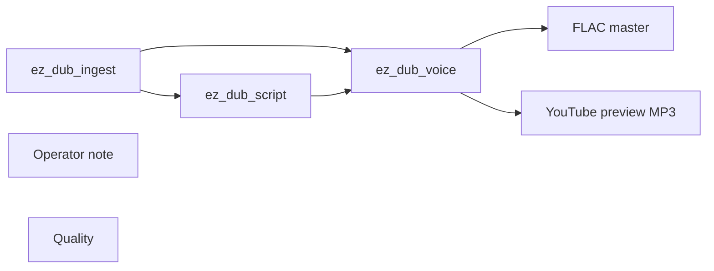

# audio/dub/localize

**What's on this page**

- **Purpose, occupancy, and models** from the on-canvas Note
- **Graph flow** (groups when the canvas is large)
- **Every node id** on this graph
- **Node parameter reference** for each type, with this graph's values and the other legal choices

**What this enables**

- **Queuing this filename** with known widgets
- **Changing a parameter** with a documented generation effect

**Who this is for:** studio users who loaded `audio/dub/localize` from Apps or Workflows.

> Generated from `workflows/_lab/audio/dub/localize.json`. Do not hand-edit this file. Re-run `python3 docs/generate_workflow_docs.py` (or `make docs`).

## Purpose

Occupancy **audio**. Outputs under `${COMFY_OUTPUT_DIR}`. Unload the previous family before Queue.

```text
## audio/dub/localize

US-safe multi-speaker clone-and-translate (YouTube / podcast localization). Occupancy **audio** — stop Klein / Wan / LTX first.

1. **I have rights** must be on. Queue refuses otherwise. Clone only recordings you own or have speaker consent to translate.
2. **Source file**: pick wav/mp4/mkv already in `${COMFY_OUTPUT_DIR}/input` (container `/inputs`), or **Upload media**. Optional **Source URL** for http(s) (`yt-dlp`). Host helper: `./scripts/utilities/dub-fetch.sh run --url URL` then reload the App so the file appears in the dropdown.
3. First Queue is **Stage all** (default): analyze then clone in one pass. Faster-whisper segments become turns, speakers cluster with Chatterbox `ve.pt`, same-speaker turns closer than 0.35 s merge, per-speaker clone refs write under `dubs/<slug>/speakers/` (6–10 s, one clean take when possible), then per-turn GGUF translate and Chatterbox clone. After Queue, **Dub status** lists speaker/turn counts and `translated N/M`. To edit translations first: set Stage **analyze**, Queue, edit `text_target`, turn Rewrite translation **off**, set Stage **render**, Queue again. Missing llama.cpp / GGUF with Rewrite translation **on** is blocking (empty mix, empty `text_target`) — Queue does not clone English as the target.
4. Chatterbox Multilingual V3 (MIT, PerTh on) — ISO `language_id` (`es`, not `Spanish`). **Clone CFG** auto is 0 on EN→ES (less English accent; retries once at 0.25 if that take is not speech-like); 0.5 same-language. TTS is onset-cropped (leading hush / PerTh floor) and T3 is capped per line before fit. Duration lock pitch-preserves up to 1.25× (ffmpeg `atempo`), then spills, then fade-trims — it does not crush a long clone into the original window. Raw clones: `dubs/<slug>/render/turn_NNNN.raw.wav` (post-crop). A drone / hush leftover on a cross-language job is a blocking miss: **empty mix**, not a duration-locked YT wav of the bed. Needs the complete snapshot (`ve.pt`, `s3gen.pt`, T3 V3, tokenizer JSON, `conds.pt`), not t3-only `comfy/tts`, and a wheel whose `from_local` accepts `t3_model=v3` (GitHub pin, not PyPI 0.1.7). Qwen3-TTS Base clones from the same refs (`download-podcast --tier qwen3tts`). Missing ASR/clone/llama.cpp: empty mix + **Dub status** (never the original recording). Clone lines longer than 300 characters are split. **Job slug** is a string; Upload media does not occupy a widget slot.
5. MLA master is the duration-locked job-dir WAV `${COMFY_OUTPUT_DIR}/dubs/<slug>/ez_dub_yt.wav`. Optional `ez_dub_yt_48k.mp3` (48 kHz / 320k) is fail-soft in the job dir. Comfy `ez_dub_yt_*.mp3` is a 24 kHz preview — not the 320k master. Job dir also has mix WAV, SRT, speaker refs, `qc.json`, and disclosure sidecars.
6. YouTube Studio: Languages → Add language → upload `ez_dub_yt.wav` (audio-only, same length). Flip the synthetic/altered-content toggle. MLA eligibility varies by channel. Spoken bumper default **off**; sidecar is always written (localized `ez_dub.disclosure.txt` + English `ez_dub.disclosure.en.txt`). If you turn the bumper on, it overlays `ez_dub_mix.wav` only — it does not eat t=0 speech on the YT wav. If you leave it off, `ez_dub_mix` starts on speech (leading hush stripped); the YT wav stays source-timed.
7. Loudness is in-graph raise-to-peak plus optional ffmpeg −14 LUFS (`loudnorm`). `./scripts/utilities/podcast-loudnorm.sh run --in FILE --target youtube` remains an operator fallback, not required.
8. No lip-sync. No celebrity refs.

Disclosure sidecar: This audio is an AI-translated dub. Voices are synthesized from the original speakers with the rights-holder's authorization.

Weights: `./scripts/manage.sh download-dub --tier asr` then `--tier clone` (pip-installs faster-whisper, the llama-cpp-python CPU wheel, then the Chatterbox V3 GitHub zip --no-deps --force-reinstall so torch 2.14 stays). Queue self-heals a missing llama.cpp wheel (needed for `text_target`). Missing pack is not a doctor failure. On DGX Spark, faster-whisper uses the CPU CTranslate2 wheel.

Occupancy: audio — stop Klein / Wan / LTX session. One GB10 job.
Prompt enhance is **off** so authored text (recipe, script labels, ACE tags, or film shots) is encoded as written. Turn Enhance on only if you want the 4B rewriter.
```

## How to Queue

1. `./scripts/manage.sh start` so `_lab` is seeded
2. Load **audio/dub/localize** from **Apps** or **Workflows**
3. Read the on-canvas Note, change widgets, Queue

Do not edit raw `_lab` JSON. Save keepers under `_user/`.

## Graph



## Nodes on this graph

| Id | Title | Type | Group |
| --- | --- | --- | --- |
| 1 | ez_dub_ingest | `EZDubIngest` | INPUT |
| 2 | ez_dub_script | `EZDubScript` | PROMPT |
| 3 | ez_dub_voice | `EZDubRender` | PROMPT |
| 4 | FLAC master | `SaveAudio` | OUTPUT |
| 5 | YouTube preview MP3 | `SaveAudioMP3` | OUTPUT |
| 6 | Operator note | `Note` | OUTPUT |
| 7 | Quality | `EZQuality` | Ungrouped |

## Node parameter reference

Every unique node type on this graph. Widgets are in lab JSON order. Choices are ComfyUI v0.34.6 / lab `INPUT_TYPES` — not SD1.5 folklore.

### `EZDubIngest` — Dub ingest (file or URL)

Extract audio from input/ or a URL. Queue refuses unless I have rights is on.

| Socket | Dir | Type | What it carries |
| --- | --- | --- | --- |
| `job_id` | out | `STRING` | Job slug. |
| `audio` | out | `AUDIO` | Short preview AUDIO (full wav is on disk). |

#### `source`

Type `COMBO`. Range / default: (none).

File in Comfy input/.

**How it affects generation:** Pick a file or leave (none) and use source_url.

**This graph:** `(none)`

#### `have_rights`

Type `BOOLEAN`. Range / default: false.

Rights gate.

**How it affects generation:** Queue refuses unless true. Not legal advice.

**This graph:** `false`

#### `job_slug`

Type `STRING`. Range / default: episode.

Job folder name.

**How it affects generation:** Sanitized slug under the dub jobstore.

**This graph:** `episode`

#### `source_url`

Type `STRING`.

Optional http(s) URL.

**How it affects generation:** Empty unless you ingest from the network.

### `EZDubScript` — Dub transcript + translate

Diarize + ASR + on-box GGUF translation. Widget JSON is the human edit surface.

| Socket | Dir | Type | What it carries |
| --- | --- | --- | --- |
| `job_id` | in | `STRING` | From ingest. |
| `script` | out | `STRING` | Translation JSON. |

#### `prompt`

Type `STRING`.

Editable translation JSON.

**How it affects generation:** Turn Enhance off to pin widget text after a human rewrite.

**This graph:** `{ "target_language": "es", "source_language": "auto", "stage": "all", "status": "", "turns": [] }`

```text
{
  "target_language": "es",
  "source_language": "auto",
  "stage": "all",
  "status": "",
  "turns": []
}
```

#### `enhance`

Type `BOOLEAN`.

Rewrite translation via GGUF.

**How it affects generation:** Off pins your edits.

**This graph:** `true`

#### `target_language`

Type `COMBO`. Range / default: es.

Target ISO code.

**How it affects generation:** es is the lab smoke. Clone CFG auto 0 on EN→ES.

**This graph:** `es`

**Other choices**

| Choice | What it does |
| --- | --- |
| `es` | Spanish (lab default target). |
| `en` | English. |
| `ar` | Arabic. |
| `da` | Danish. |
| `de` | German. |
| `el` | Greek. |
| `fi` | Finnish. |
| `fr` | French. |
| `he` | Hebrew. |
| `hi` | Hindi. |
| `it` | Italian. |
| `ja` | Japanese. |
| `ko` | Korean. |
| `ms` | Malay. |
| `nl` | Dutch. |
| `no` | Norwegian. |
| `pl` | Polish. |
| `pt` | Portuguese. |
| `ru` | Russian. |
| `sv` | Swedish. |
| `sw` | Swahili. |
| `tr` | Turkish. |
| `zh` | Chinese. |

#### `source_language`

Type `COMBO`. Range / default: auto.

Source language.

**How it affects generation:** auto detects. Pin en if ASR mis-detects.

**This graph:** `auto`

**Other choices**

| Choice | What it does |
| --- | --- |
| `auto` | Detect. |
| `es` | Spanish (lab default target). |
| `en` | English. |
| `ar` | Arabic. |
| `da` | Danish. |
| `de` | German. |
| `el` | Greek. |
| `fi` | Finnish. |
| `fr` | French. |
| `he` | Hebrew. |
| `hi` | Hindi. |
| `it` | Italian. |
| `ja` | Japanese. |
| `ko` | Korean. |
| `ms` | Malay. |
| `nl` | Dutch. |
| `no` | Norwegian. |
| `pl` | Polish. |
| `pt` | Portuguese. |
| `ru` | Russian. |
| `sv` | Swedish. |
| `sw` | Swahili. |
| `tr` | Turkish. |
| `zh` | Chinese. |

#### `max_speakers`

Type `INT`. Range / default: 0–12, 0 = auto.

Diarize cap.

**How it affects generation:** 0 lets the pipeline decide.

**This graph:** `0`

#### `stage`

Type `COMBO`. Range / default: all.

Analyze vs render vs both.

**How it affects generation:** all analyzes then clones. render skips ASR. analyze stops after JSON.

**This graph:** `all`

**Other choices**

| Choice | What it does |
| --- | --- |
| `all` | Analyze then clone (lab). |
| `analyze` | ASR/translate only. |
| `render` | Skip ASR; clone widget JSON. |

### `EZDubRender` — Dub clone + mix

Zero-shot clone, duration-lock, mix, SRT, disclosure sidecar.

| Socket | Dir | Type | What it carries |
| --- | --- | --- | --- |
| `script` | in | `STRING` | Translation JSON. |
| `job_id` | in | `STRING` | Job slug. |
| `audio` | out | `AUDIO` | Mix (empty on analyze stage). |

#### `engine`

Type `COMBO`. Range / default: chatterbox-ml.

Clone engine.

**How it affects generation:** chatterbox-ml is the lab default. qwen3tts is opt-in.

**This graph:** `chatterbox-ml`

**Other choices**

| Choice | What it does |
| --- | --- |
| `chatterbox-ml` | Lab default. |
| `qwen3tts` | Opt-in Qwen3-TTS. |

#### `keep_bed`

Type `BOOLEAN`. Range / default: true.

Keep source bed under the clone.

**How it affects generation:** true duration-locks to the source (YouTube Languages).

**This graph:** `true`

#### `spoken_disclosure`

Type `BOOLEAN`. Range / default: false.

Overlay a spoken bumper on the mix wav.

**How it affects generation:** Off: mix starts on speech. YT wav stays source-timed either way.

**This graph:** `false`

#### `speed`

Type `FLOAT`. Range / default: 0.5–1.5, 1.0.

Clone speaking rate.

**How it affects generation:** Stay near 1.0 or the duration lock fights you.

**This graph:** `1.0`

#### `cfg_weight`

Type `FLOAT`. Range / default: −1.0 = auto.

Clone CFG.

**How it affects generation:** −1 auto. Lab auto 0 on EN→ES.

**This graph:** `-1.0`

#### `exaggeration`

Type `FLOAT`. Range / default: 0.25–2.0, 0.5.

Chatterbox exaggeration.

**How it affects generation:** 0.5 is the lab default. Higher is cartoon-emotive.

**This graph:** `0.5`

### `SaveAudio` — Save Audio

Write a FLAC/wav master.

!!! warning "Lab notes"

    Music graphs pair this with SaveAudioMP3 and EZAudioMetadata. Stem mix uses ez_stem_mix.

| Socket | Dir | Type | What it carries |
| --- | --- | --- | --- |
| `audio` | in | `AUDIO` | Decoded ACE or mix. |

#### `filename_prefix`

Type `STRING`.

Save stem.

**How it affects generation:** Album tracks use NN - Song Title. Tags come from EZAudioMetadata.

**This graph:** `ez_dub_mix`

### `SaveAudioMP3` — Save Audio (MP3)

Write an MP3 copy of the same take.

| Socket | Dir | Type | What it carries |
| --- | --- | --- | --- |
| `audio` | in | `AUDIO` | Same AUDIO as SaveAudio. |

#### `filename_prefix`

Type `STRING`.

Save stem (match FLAC).

**How it affects generation:** Same NN - Song Title as the FLAC.

**This graph:** `ez_dub_yt`

#### `quality`

Type `COMBO`. Range / default: 320k.

Bitrate preset.

**How it affects generation:** 320k is the lab master. Lower bitrates are smaller and harsher on hats.

**This graph:** `320k`

**Other choices**

| Choice | What it does |
| --- | --- |
| `320k` | Lab default. |
| `192k` | Smaller, more artifacts. |
| `128k` | Preview only. |

### `Note` — Note

On-canvas operator note (not executed).

!!! warning "Lab notes"

    Every lab graph has one. Purpose, models, sampler, occupancy, run steps.

#### `text`

Type `STRING`.

Markdown-ish operator note.

**How it affects generation:** Does not affect pixels. Read it before Queue.

**This graph:** `## audio/dub/localize US-safe multi-speaker clone-and-translate (YouTube / podcast localization). Occupancy **audio** — stop Klein / Wan / LTX first. 1. **I have rights** must be on. Queue refuses ot…`

```text
## audio/dub/localize

US-safe multi-speaker clone-and-translate (YouTube / podcast localization). Occupancy **audio** — stop Klein / Wan / LTX first.

1. **I have rights** must be on. Queue refuses otherwise. Clone only recordings you own or have speaker consent to translate.
2. **Source file**: pick wav/mp4/mkv already in `${COMFY_OUTPUT_DIR}/input` (container `/inputs`), or **Upload media**. Optional **Source URL** for http(s) (`yt-dlp`). Host helper: `./scripts/utilities/dub-fetch.sh run --url URL` then reload the App so the file appears in the dropdown.
3. First Queue is **Stage all** (default): analyze then clone in one pass. Faster-whisper segments become turns, speakers cluster with Chatterbox `ve.pt`, same-speaker turns closer than 0.35 s merge, per-speaker clone refs write under `dubs/<slug>/speakers/` (6–10 s, one clean take when possible), then per-turn GGUF translate and Chatterbox clone. After Queue, **Dub status** lists speaker/turn counts and `translated N/M`. To edit translations first: set Stage **analyze**, Queue, edit `text_target`, turn Rewrite translation **off**, set Stage **render**, Queue again. Missing llama.cpp / GGUF with Rewrite translation **on** is blocking (empty mix, empty `text_target`) — Queue does not clone English as the target.
4. Chatterbox Multilingual V3 (MIT, PerTh on) — ISO `language_id` (`es`, not `Spanish`). **Clone CFG** auto is 0 on EN→ES (less English accent; retries once at 0.25 if that take is not speech-like); 0.5 same-language. TTS is onset-cropped (leading hush / PerTh floor) and T3 is capped per line before fit. Duration lock pitch-preserves up to 1.25× (ffmpeg `atempo`), then spills, then fade-trims — it does not crush a long clone into the original window. Raw clones: `dubs/<slug>/render/turn_NNNN.raw.wav` (post-crop). A drone / hush leftover on a cross-language job is a blocking miss: **empty mix**, not a duration-locked YT wav of the bed. Needs the complete snapshot (`ve.pt`, `s3gen.pt`, T3 V3, tokenizer JSON, `conds.pt`), not t3-only `comfy/tts`, and a wheel whose `from_local` accepts `t3_model=v3` (GitHub pin, not PyPI 0.1.7). Qwen3-TTS Base clones from the same refs (`download-podcast --tier qwen3tts`). Missing ASR/clone/llama.cpp: empty mix + **Dub status** (never the original recording). Clone lines longer than 300 characters are split. **Job slug** is a string; Upload media does not occupy a widget slot.
5. MLA master is the duration-locked job-dir WAV `${COMFY_OUTPUT_DIR}/dubs/<slug>/ez_dub_yt.wav`. Optional `ez_dub_yt_48k.mp3` (48 kHz / 320k) is fail-soft in the job dir. Comfy `ez_dub_yt_*.mp3` is a 24 kHz preview — not the 320k master. Job dir also has mix WAV, SRT, speaker refs, `qc.json`, and disclosure sidecars.
6. YouTube Studio: Languages → Add language → upload `ez_dub_yt.wav` (audio-only, same length). Flip the synthetic/altered-content toggle. MLA eligibility varies by channel. Spoken bumper default **off**; sidecar is always written (localized `ez_dub.disclosure.txt` + English `ez_dub.disclosure.en.txt`). If you turn the bumper on, it overlays `ez_dub_mix.wav` only — it does not eat t=0 speech on the YT wav. If you leave it off, `ez_dub_mix` starts on speech (leading hush stripped); the YT wav stays source-timed.
7. Loudness is in-graph raise-to-peak plus optional ffmpeg −14 LUFS (`loudnorm`). `./scripts/utilities/podcast-loudnorm.sh run --in FILE --target youtube` remains an operator fallback, not required.
8. No lip-sync. No celebrity refs.

Disclosure sidecar: This audio is an AI-translated dub. Voices are synthesized from the original speakers with the rights-holder's authorization.

Weights: `./scripts/manage.sh download-dub --tier asr` then `--tier clone` (pip-installs faster-whisper, the llama-cpp-python CPU wheel, then the Chatterbox V3 GitHub zip --no-deps --force-reinstall so torch 2.14 stays). Queue self-heals a missing llama.cpp wheel (needed for `text_target`). Missing pack is not a doctor failure. On DGX Spark, faster-whisper uses the CPU CTranslate2 wheel.

Occupancy: audio — stop Klein / Wan / LTX session. One GB10 job.
Prompt enhance is **off** so authored text (recipe, script labels, ACE tags, or film shots) is encoded as written. Turn Enhance on only if you want the 4B rewriter.
```

### `EZQuality` — Quality

Workflow-global Lab / Draft / High combo. JS overlays family-specific sampler and Klein UNET widgets.

!!! warning "Lab notes"

    Default lab leaves authored widgets. Draft is faster. High is slower. Distilled Klein High without Klein base keeps CFG 1.0. Never selects banned weights. Not --tier quality.

| Socket | Dir | Type | What it carries |
| --- | --- | --- | --- |
| `quality` | out | `STRING` | Selected quality id (lab, draft, high). |

#### `quality`

Type `COMBO`. Range / default: lab.

Lab default, Draft (faster), or High (slower).

**How it affects generation:** Family-specific overlays on steps, CFG, and Klein 4B UNET. Does not change size, length, CLIP, or VAE. Klein base High needs download-image --tier base.

**This graph:** `lab`

**Other choices**

| Choice | What it does |
| --- | --- |
| `lab` | Authored lab widgets. Default. |
| `draft` | Faster: fewer steps. Klein stays CFG 1.0 distilled when already distilled. |
| `high` | Slower: more steps. Klein base 4B + CFG 3.5 when that UNET is on disk; else extra distilled steps at CFG 1.0. |
