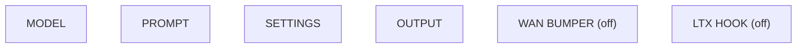

# audio/podcast/radio-drama

**What's on this page**

- **Purpose, occupancy, and models** from the on-canvas Note
- **Graph flow** (groups when the canvas is large)
- **Every node id** on this graph
- **Node parameter reference** for each type, with this graph's values and the other legal choices

**What this enables**

- **Queuing this filename** with known widgets
- **Changing a parameter** with a documented generation effect

**Who this is for:** studio users who loaded `audio/podcast/radio-drama` from Apps or Workflows.

> Generated from `workflows/_lab/audio/podcast/radio-drama.json`. Do not hand-edit this file. Re-run `python3 docs/generate_workflow_docs.py` (or `make docs`).

## Purpose

Occupancy **audio**. Outputs under `${COMFY_OUTPUT_DIR}`. Unload the previous family before Queue.

```text
## audio/podcast/radio-drama

US-safe one-graph radio drama (Option B). Lab-original fiction. Same legal engines as Option A.

- Writer flavor `radio_drama` (enhance **off** so Speaker A/B / Announcer labels stay parser input). Announcer + two Kokoro stock voices.
- ACE-Step sting + bed, instrumental only, empty lyrics. Script STRING is wired into both ACE enhance nodes as context. One 48 kHz-class master (`ez_radio_ep` / `ez_radio_mix`).
- Optional Wan silent bumper / LTX 5s hook groups are **off** (node mode never). Queue **motion/loops/bumper-loop** / **motion/av/hook-av** in a later session — not a one-graph film.
- Cover: Queue **stills/podcast-cover.json** separately.

Voices and music on this show are synthesized. The hosts are original characters, not recordings of real people.
Prompt enhance is **off** so authored text (recipe, script labels, ACE tags, or film shots) is encoded as written. Turn Enhance on only if you want the 4B rewriter.

Occupancy: audio — stop Klein / Wan / LTX session. One GB10 job.
```

## How to Queue

1. `./scripts/manage.sh start` so `_lab` is seeded
2. Load **audio/podcast/radio-drama** from **Apps** or **Workflows**
3. Read the on-canvas Note, change widgets, Queue

Do not edit raw `_lab` JSON. Save keepers under `_user/`.

## Graph



## Nodes on this graph

| Id | Title | Type | Group |
| --- | --- | --- | --- |
| 1 | ACE-Step 1.5 turbo AIO | `CheckpointLoaderSimple` | MODEL |
| 2 | ez_radio_script | `EZPodcastScript` | PROMPT |
| 3 | Disclosure bumper | `EZPodcastDisclosure` | PROMPT |
| 4 | ez_radio_voice | `EZKokoroTTS` | PROMPT |
| 5 | ez_radio_sting | `TextEncodeAceStepAudio1.5` | MODEL |
| 6 | ez_radio_bed | `TextEncodeAceStepAudio1.5` | MODEL |
| 7 | ACE negative | `TextEncodeAceStepAudio1.5` | MODEL |
| 8 | Sting length | `EmptyAceStep1.5LatentAudio` | SETTINGS |
| 9 | Bed length | `EmptyAceStep1.5LatentAudio` | SETTINGS |
| 10 | Sting sampler | `KSampler` | SETTINGS |
| 11 | Bed sampler | `KSampler` | SETTINGS |
| 12 | Sting decode | `VAEDecodeAudio` | OUTPUT |
| 13 | Bed decode | `VAEDecodeAudio` | OUTPUT |
| 14 | Sting then bed | `AudioConcat` | OUTPUT |
| 15 | Duck −15 dB | `AudioAdjustVolume` | OUTPUT |
| 16 | 48 kHz-class mix | `AudioMerge` | OUTPUT |
| 17 | FLAC master | `SaveAudio` | OUTPUT |
| 18 | MP3 320k | `SaveAudioMP3` | OUTPUT |
| 19 | Operator note | `Note` | OUTPUT |
| 30 | Wan bumper (off) | `UNETLoader` | WAN BUMPER (off) |
| 31 | ez_radio_bumper preview (off) | `VHS_VideoCombine` | WAN BUMPER (off) |
| 32 | LTX hook (off) | `UNETLoader` | LTX HOOK (off) |
| 33 | ez_radio_hook preview (off) | `VHS_VideoCombine` | LTX HOOK (off) |
| 34 | ez_radio_sting enhance | `EZAceStepPromptEnhance` | Ungrouped |
| 35 | ez_radio_bed enhance | `EZAceStepPromptEnhance` | Ungrouped |
| 36 | Quality | `EZQuality` | Ungrouped |

## Node parameter reference

Every unique node type on this graph. Widgets are in lab JSON order. Choices are ComfyUI v0.37.0 / lab `INPUT_TYPES` — not SD1.5 folklore.

### `CheckpointLoaderSimple` — Load Checkpoint

Load a single-file checkpoint that bundles MODEL + CLIP + VAE.

!!! warning "Lab notes"

    ACE-Step 1.5 turbo AIO (ace_step_1.5_turbo_aio.safetensors) on every music graph.

| Socket | Dir | Type | What it carries |
| --- | --- | --- | --- |
| `MODEL` | out | `MODEL` | ACE denoiser (then ModelSamplingAuraFlow). |
| `CLIP` | out | `CLIP` | ACE text encoder. |
| `VAE` | out | `VAE` | ACE audio VAE. |

#### `ckpt_name`

Type `STRING`.

Filename under checkpoints/.

**How it affects generation:** Lab music is the turbo AIO. XL is opt-in via download-music --tier xl — swap only if you meant to.

**This graph:** `ace_step_1.5_turbo_aio.safetensors`

### `EZPodcastScript` — Podcast Script

Draft Speaker A/B (and Announcer) lines via the on-box GGUF.

| Socket | Dir | Type | What it carries |
| --- | --- | --- | --- |
| `script` | out | `STRING` | Labeled script for TTS. |

#### `sample`

Type `COMBO`. Range / default: custom.

Sample or Custom.

**How it affects generation:** Custom keeps authored turns.

**This graph:** `custom`

#### `prompt`

Type `STRING`.

Speaker A/B script.

**How it affects generation:** Keep hosts original. No celebrity refs.

**This graph:** `Announcer: Tonight on the machine-only hour: a story that never left the rack. Speaker A: The transmitter light is steady. We do not borrow a voice from the wire. Speaker B: If the card goes dark, th…`

```text
Announcer: Tonight on the machine-only hour: a story that never left the rack.
Speaker A: The transmitter light is steady. We do not borrow a voice from the wire.
Speaker B: If the card goes dark, the play ends. That is the bargain.
Speaker A: Then say the line like you mean the cut, not the cloud.
Speaker B: Cue the bed. Keep it instrumental. We own the silence between words.
Announcer: End of scene. The hosts are invented. The mix is local.
```

#### `enhance`

Type `BOOLEAN`. Range / default: false on seeded graphs.

Run the writer.

**How it affects generation:** Off pins the canned lab script.

**This graph:** `false`

#### `flavor`

Type `COMBO`.

Two-host vs radio drama.

**How it affects generation:** radio_drama allows Announcer lines.

**This graph:** `radio_drama`

**Other choices**

| Choice | What it does |
| --- | --- |
| `podcast_two_host` | Two-host episode (lab podcast). |
| `radio_drama` | Radio drama with announcer. |

#### `catalog`

Type `STRING`.

Catalog id.

**How it affects generation:** Leave as stamped.

**This graph:** `audio/podcast/radio-drama`

### `EZPodcastDisclosure` — Podcast Disclosure

Prepend the fixed synthesized-voices bumper. Operators cannot edit the string.

| Socket | Dir | Type | What it carries |
| --- | --- | --- | --- |
| `script` | in | `STRING` | Episode script. |
| `script` | out | `STRING` | Disclosure + script. |

No widgets. Sockets only.

### `EZKokoroTTS` — Kokoro TTS

Two-host (plus optional announcer) TTS. Kokoro-82M stock voices by default.

!!! warning "Lab notes"

    Never ships celebrity WAVs. Empty clone refs fall back to Kokoro.

| Socket | Dir | Type | What it carries |
| --- | --- | --- | --- |
| `script` | in | `STRING` | Labeled script. |
| `audio` | out | `AUDIO` | Speech stem. |

#### `speaker_a_voice`

Type `COMBO`. Range / default: af_heart / af_bella.

Kokoro voice A.

**How it affects generation:** Stock voices only. Changing voice changes timbre, not the script.

**This graph:** `af_bella`

#### `speaker_b_voice`

Type `COMBO`. Range / default: am_michael.

Kokoro voice B.

**How it affects generation:** Keep A/B distinct so the mix reads as two hosts.

**This graph:** `am_michael`

#### `announcer_voice`

Type `COMBO`. Range / default: bm_george.

Announcer voice.

**How it affects generation:** Used when include_announcer is on.

**This graph:** `bm_george`

#### `include_announcer`

Type `BOOLEAN`.

Speak Announcer lines.

**How it affects generation:** true on radio-drama; false on two-host podcast.

**This graph:** `true`

#### `backend`

Type `COMBO`. Range / default: kokoro.

TTS engine.

**How it affects generation:** kokoro is the lab default. chatterbox/qwen3tts need operator-owned refs.

**This graph:** `kokoro`

**Other choices**

| Choice | What it does |
| --- | --- |
| `kokoro` | Kokoro-82M ONNX/CPU (lab). |
| `chatterbox` | Opt-in clone. Empty ref falls back. |
| `qwen3tts` | Opt-in clone. Empty ref falls back. |

#### `speaker_a_ref`

Type `STRING`.

Optional clone reference path.

**How it affects generation:** Leave empty. Do not paste celebrity WAVs.

#### `speaker_b_ref`

Type `STRING`.

Optional clone reference path.

**How it affects generation:** Leave empty.

#### `speed`

Type `FLOAT`. Range / default: 0.5–1.5, lab 1.0.

Speaking rate.

**How it affects generation:** 1.0 is natural. Faster shrinks the episode and can clip diction.

**This graph:** `1.0`

### `TextEncodeAceStepAudio1.5` — ACE-Step 1.5 Text Encode

Pack tags, lyrics, BPM, key, and duration into ACE conditioning.

!!! warning "Lab notes"

    15 widgets including control_after_generate after seed (see _ace_widgets_contract.py). Vocal graphs language=en; instrumental unknown. generate_audio_codes stays true.

| Socket | Dir | Type | What it carries |
| --- | --- | --- | --- |
| `clip` | in | `CLIP` | ACE CLIP from the AIO checkpoint. |
| `tags` | in | `STRING` | Often wired from EZAceStepPromptEnhance. |
| `lyrics` | in | `STRING` | Wired lyrics / [inst]. |
| `duration` | in | `FLOAT` | Same seconds as the empty latent. |
| `CONDITIONING` | out | `CONDITIONING` | Positive for KSampler. |

#### `tags`

Type `STRING`.

Genre-first tags, BPM last.

**How it affects generation:** ACE reads tags as the arrangement. Keep dry-booth vocal tags on Nill Bye; Drive-through is warped bass, no rap vocal.

| Instance | Value |
| --- | --- |
| ez_radio_sting | `short instrumental sting, analog keys hit, no vocals, instrumental` |
| ez_radio_bed | `instrumental lo-fi bed, warm analog keys, light drums, no vocals, instrumental` |
| ACE negative | `vocals, singing, choir, rap` |

#### `lyrics`

Type `STRING`.

Sectioned lyrics or [inst] cues.

**How it affects generation:** Non-empty lines under a section are sung. Instrumental graphs must keep cues inside [brackets].

#### `seed`

Type `INT`.

ACE encoder seed (audio-codes LLM).

**How it affects generation:** Independent from KSampler seed. Lab locks it with the take.

| Instance | Value |
| --- | --- |
| ez_radio_sting | `11` |
| ez_radio_bed | `13` |
| ACE negative | `7` |

#### `control_after_generate`

Type `COMBO`. Range / default: fixed.

Seed control.

**How it affects generation:** fixed on every lab take.

**This graph (all 3 instances):** `fixed`

**Other choices**

| Choice | What it does |
| --- | --- |
| `fixed` | Keep this seed on the next Queue. Lab default for reproducible stills and 5 s prints. |
| `increment` | Add 1 after Queue. Use for a sequence of variations. |
| `decrement` | Subtract 1 after Queue. |
| `randomize` | Draw a new seed after Queue. Exploration only. |

#### `bpm`

Type `INT`. Range / default: 10–300.

Tempo written into the codes.

**How it affects generation:** Must match the tags' BPM. Mismatch makes the vocal drift the grid.

**This graph (all 3 instances):** `90`

#### `duration`

Type `FLOAT`.

Seconds (duplicated on the latent).

**How it affects generation:** Keep in lockstep with EmptyAceStep1.5LatentAudio / Primitive.

| Instance | Value |
| --- | --- |
| ez_radio_sting | `4.0` |
| ez_radio_bed | `40.0` |
| ACE negative | `40.0` |

#### `timesignature`

Type `COMBO`. Range / default: 4.

Beats per bar.

**How it affects generation:** 4 is lab 4/4. 3 is waltz; 6 is 6/8.

**This graph (all 3 instances):** `4`

**Other choices**

| Choice | What it does |
| --- | --- |
| `2` | 2/4. |
| `3` | 3/4. |
| `4` | Lab 4/4. |
| `6` | 6/8. |

#### `language`

Type `COMBO`. Range / default: en / unknown.

Lyric language.

**How it affects generation:** en for sung English. unknown for instrumental (do not leave en on a no-vocal take).

**This graph (all 3 instances):** `en`

**Other choices**

| Choice | What it does |
| --- | --- |
| `en` | English lyrics. Lab vocal graphs. |
| `unknown` | No lyric language. Lab instrumental / Drive-through graphs. |
| `ja` | Japanese. |
| `zh` | Chinese. |
| `yue` | Cantonese. |
| `es` | Spanish. |
| `de` | German. |
| `fr` | French. |
| `pt` | Portuguese. |
| `ru` | Russian. |
| `it` | Italian. |
| `ko` | Korean. |
| `ar` | Arabic. |
| `hi` | Hindi. |
| `id` | Indonesian. |
| `vi` | Vietnamese. |
| `th` | Thai. |
| `tr` | Turkish. |
| `pl` | Polish. |
| `nl` | Dutch. |
| `sv` | Swedish. |
| `uk` | Ukrainian. |
| `he` | Hebrew. |
| `fa` | Persian. |
| `cs` | Czech. |
| `el` | Greek. |
| `hu` | Hungarian. |
| `ro` | Romanian. |
| `fi` | Finnish. |
| `da` | Danish. |
| `no` | Norwegian. |
| `ms` | Malay. |
| `ta` | Tamil. |
| `te` | Telugu. |
| `bn` | Bengali. |
| `ur` | Urdu. |
| `pa` | Punjabi. |
| `tl` | Tagalog. |
| `sw` | Swahili. |
| `az` | Azerbaijani. |
| `bg` | Bulgarian. |
| `ca` | Catalan. |
| `hr` | Croatian. |
| `ht` | Haitian Creole. |
| `is` | Icelandic. |
| `la` | Latin. |
| `lt` | Lithuanian. |
| `ne` | Nepali. |
| `sa` | Sanskrit. |
| `sk` | Slovak. |
| `sr` | Serbian. |

#### `keyscale`

Type `COMBO`. Range / default: C minor.

Musical key.

**How it affects generation:** Lab C minor. Changing key is a new arrangement, not a mix tweak.

**This graph (all 3 instances):** `C major`

**Other choices**

| Choice | What it does |
| --- | --- |
| `C major` | Major key of C. |
| `C# major` | Major key of C#. |
| `Db major` | Major key of Db. |
| `D major` | Major key of D. |
| `D# major` | Major key of D#. |
| `Eb major` | Major key of Eb. |
| `E major` | Major key of E. |
| `F major` | Major key of F. |
| `F# major` | Major key of F#. |
| `Gb major` | Major key of Gb. |
| `G major` | Major key of G. |
| `G# major` | Major key of G#. |
| `Ab major` | Major key of Ab. |
| `A major` | Major key of A. |
| `A# major` | Major key of A#. |
| `Bb major` | Major key of Bb. |
| `B major` | Major key of B. |
| `C minor` | Lab ships C minor on ACE graphs. Changing key reshapes harmony; keep vocal graphs in one key per album unless you mean a new arrangement. |
| `C# minor` | Minor key of C#. |
| `Db minor` | Minor key of Db. |
| `D minor` | Minor key of D. |
| `D# minor` | Minor key of D#. |
| `Eb minor` | Minor key of Eb. |
| `E minor` | Minor key of E. |
| `F minor` | Minor key of F. |
| `F# minor` | Minor key of F#. |
| `Gb minor` | Minor key of Gb. |
| `G minor` | Minor key of G. |
| `G# minor` | Minor key of G#. |
| `Ab minor` | Minor key of Ab. |
| `A minor` | Minor key of A. |
| `A# minor` | Minor key of A#. |
| `Bb minor` | Minor key of Bb. |
| `B minor` | Minor key of B. |

#### `generate_audio_codes`

Type `BOOLEAN`. Range / default: true.

Run the ACE LLM that drafts audio codes.

**How it affects generation:** true = higher quality, slower. Off only if you pass a reference timbre (lab graphs do not).

**This graph (all 3 instances):** `false`

#### `cfg_scale`

Type `FLOAT`. Range / default: 2.0.

Guidance inside audio-code generation.

**How it affects generation:** 2.0 is the ACE default. Higher follows tags/lyrics more tightly and can sound rigid.

**This graph (all 3 instances):** `2.0`

#### `temperature`

Type `FLOAT`. Range / default: 0.85.

Sampling temperature for audio codes.

**How it affects generation:** Lower = more deterministic. Higher = wilder fills.

**This graph (all 3 instances):** `0.85`

#### `top_p`

Type `FLOAT`. Range / default: 0.9.

Nucleus sampling.

**How it affects generation:** 0.9 is the lab default.

**This graph (all 3 instances):** `0.9`

#### `top_k`

Type `INT`. Range / default: 0 = off.

Top-k token cap.

**How it affects generation:** 0 disables top-k (lab).

**This graph (all 3 instances):** `0`

#### `min_p`

Type `FLOAT`. Range / default: 0.0.

Minimum probability floor.

**How it affects generation:** 0.0 disables min-p (lab).

**This graph (all 3 instances):** `0.0`

### `EmptyAceStep1.5LatentAudio` — Empty ACE-Step 1.5 Latent Audio

Allocate an ACE-Step audio latent for N seconds.

!!! warning "Lab notes"

    Draft 32 s, full 96 s, album takes 180 s. seconds is also a socket from PrimitiveNode so App Duration stays in one place.

| Socket | Dir | Type | What it carries |
| --- | --- | --- | --- |
| `seconds` | in | `FLOAT` | Wired from Song Duration primitive on music graphs. |
| `LATENT` | out | `LATENT` | Audio latent for KSampler. |

#### `seconds`

Type `FLOAT`. Range / default: 32 / 96 / 180 lab.

Duration in seconds.

**How it affects generation:** Longer latents cost RAM/time linearly. Stay at the seeded length unless you have headroom.

| Instance | Value |
| --- | --- |
| Sting length | `4.0` |
| Bed length | `40.0` |

#### `batch_size`

Type `INT`. Range / default: 1.

Takes per Queue.

**How it affects generation:** Stay 1.

**This graph (all 2 instances):** `1`

### `KSampler` — KSampler

Denoise a latent for N steps at a CFG, sampler, and scheduler.

!!! warning "Lab notes"

    Distilled Klein is CFG 1.0 / 4 steps / euler / simple. Raising CFG is not a quality knob. Wan 5B uses uni_pc and CFG 5. LTX distilled uses euler / simple / CFG 1.0 / 20 steps. ACE-Step uses 8 steps / CFG 1.0 / euler. TRELLIS uses 12 steps / CFG 7.5 / euler / normal.

| Socket | Dir | Type | What it carries |
| --- | --- | --- | --- |
| `model` | in | `MODEL` | UNET / transformer after any ModelSampling* patch. |
| `positive` | in | `CONDITIONING` | What to include (CLIP / ACE / LTX prompt). |
| `negative` | in | `CONDITIONING` | What to avoid. Distilled Klein ignores this well — put constraints in the positive. |
| `latent_image` | in | `LATENT` | Noise canvas or encoded start image / video / audio latent. |
| `LATENT` | out | `LATENT` | Denoised latent for VAE decode. |

#### `seed`

Type `INT`. Range / default: 0 … 2^64-1; lab 42.

Random seed for the noise tensor.

**How it affects generation:** Same seed + same graph ≈ same picture or clip. Lab locks 42 on smokes so drafts are comparable.

| Instance | Value |
| --- | --- |
| Sting sampler | `42` |
| Bed sampler | `43` |

#### `control_after_generate`

Type `COMBO`. Range / default: fixed (lab).

What happens to seed after Queue.

**How it affects generation:** fixed keeps iteration honest while you change the prompt.

**This graph (all 2 instances):** `fixed`

**Other choices**

| Choice | What it does |
| --- | --- |
| `fixed` | Keep this seed on the next Queue. Lab default for reproducible stills and 5 s prints. |
| `increment` | Add 1 after Queue. Use for a sequence of variations. |
| `decrement` | Subtract 1 after Queue. |
| `randomize` | Draw a new seed after Queue. Exploration only. |

#### `steps`

Type `INT`. Range / default: 1–10000; Klein distilled 4; LTX 20; Wan 20; ACE 8; TRELLIS 12.

Denoising iterations.

**How it affects generation:** More steps refine detail with diminishing returns. Distilled Klein is authored at 4 — raising steps is slower, not a quality knob. Do not raise LTX/Wan toward a 90 s denoise.

**This graph (all 2 instances):** `8`

#### `cfg`

Type `FLOAT`. Range / default: 0–100; Klein/LTX/ACE 1.0; Wan 5; TRELLIS 7.5.

Classifier-free guidance scale.

**How it affects generation:** Distilled Klein is CFG 1.0 — raising CFG is the wrong quality lever (use the Positive prompt, resolution, or still-hero). Wan silent 5B uses CFG 5. TRELLIS structure uses 7.5. At CFG 1.0 Comfy skips the negative pass.

**This graph (all 2 instances):** `1.0`

#### `sampler_name`

Type `COMBO`. Range / default: euler (most lab); uni_pc (Wan).

ODE / SDE algorithm that removes noise.

**How it affects generation:** euler is the lab still/AV/ACE default. uni_pc is the Wan 5B silent default. Ancestral/SDE samplers add extra randomness and weaken seed lock.

**This graph (all 2 instances):** `euler`

**Other choices**

| Choice | What it does |
| --- | --- |
| `euler` | First-order ODE. Lab default for Klein, LTX, ACE, and most stills. Fast and stable at CFG 1.0. |
| `euler_cfg_pp` | Euler with CFG++. Rarely needed on distilled Klein (CFG is already 1.0). |
| `euler_ancestral` | Adds ancestral noise each step. More variation; weaker exact seed lock. |
| `euler_ancestral_cfg_pp` | Ancestral Euler with CFG++. |
| `heun` | Second-order Heun. Slower, sometimes smoother; not a lab default. |
| `heunpp2` | Higher-order Heun variant. |
| `exp_heun_2_x0` | Exponential Heun (x0 prediction). |
| `exp_heun_2_x0_sde` | Exponential Heun SDE. Extra stochasticity. |
| `dpm_2` | DPM-Solver-2. Two function evals per step. |
| `dpm_2_ancestral` | Ancestral DPM-2. |
| `lms` | Linear multistep. Older; keep for experiments only. |
| `dpm_fast` | Fast DPM. Coarse, good for previews. |
| `dpm_adaptive` | Adaptive DPM. Step count is a hint, not a hard budget. |
| `dpmpp_2s_ancestral` | DPM++ 2S ancestral. Common SD1.5 pick; not a Klein default. |
| `dpmpp_2s_ancestral_cfg_pp` | DPM++ 2S ancestral with CFG++. |
| `dpmpp_sde` | DPM++ SDE. Stochastic, slower. |
| `dpmpp_sde_gpu` | DPM++ SDE on GPU noise. |
| `dpmpp_2m` | DPM++ 2M. Smooth; often used on SD-family, not distilled Klein. |
| `dpmpp_2m_cfg_pp` | DPM++ 2M with CFG++. |
| `dpmpp_2m_sde` | DPM++ 2M SDE. |
| `dpmpp_2m_sde_gpu` | DPM++ 2M SDE GPU noise. |
| `dpmpp_2m_sde_heun` | DPM++ 2M SDE Heun. |
| `dpmpp_2m_sde_heun_gpu` | DPM++ 2M SDE Heun GPU. |
| `dpmpp_3m_sde` | DPM++ 3M SDE. |
| `dpmpp_3m_sde_gpu` | DPM++ 3M SDE GPU. |
| `ddpm` | Classic DDPM. Slow; do not use on 121-frame LTX. |
| `lcm` | Latent Consistency. Needs an LCM-tuned model; not lab Klein/Wan/LTX. |
| `ipndm` | iPNDM multistep. |
| `ipndm_v` | iPNDM (v-prediction). |
| `deis` | DEIS multistep. |
| `cfgpp_ud10_ab` | CFG++ UD10 AB. Added in ComfyUI 0.35; not a lab default. |
| `res_multistep` | Res multistep. Some turbo recipes. |
| `res_multistep_cfg_pp` | Res multistep CFG++. |
| `res_multistep_ancestral` | Ancestral res multistep. |
| `res_multistep_ancestral_cfg_pp` | Ancestral res multistep CFG++. |
| `gradient_estimation` | Gradient-estimation sampler. |
| `gradient_estimation_cfg_pp` | Gradient-estimation CFG++. |
| `er_sde` | ER-SDE sampler. |
| `seeds_2` | SEEDS-2. |
| `seeds_3` | SEEDS-3. |
| `sa_solver` | SA-Solver. |
| `sa_solver_pece` | SA-Solver PECE. |
| `ddim` | DDIM. Deterministic; not a lab default. |
| `uni_pc` | UniPC. Lab Wan 5B silent graphs use this with CFG 5. |
| `uni_pc_bh2` | UniPC BH2 variant. |

#### `scheduler`

Type `COMBO`. Range / default: simple (most lab); normal (TRELLIS).

How sigmas are spaced across steps.

**How it affects generation:** simple is even spacing and matches distilled Klein / LTX / ACE. normal is the TRELLIS pair. Do not copy karras from an SD1.5 recipe onto Klein.

**This graph (all 2 instances):** `simple`

**Other choices**

| Choice | What it does |
| --- | --- |
| `simple` | Even sigma spacing. Lab default for Klein, Wan, LTX, and ACE. |
| `normal` | Linear timestep schedule. TRELLIS structure/texture stages use this. |
| `karras` | Karras sigmas. Often sharper on SD-family; not the lab default. |
| `exponential` | Exponential sigma decay. |
| `sgm_uniform` | SGM uniform. SD3-family default; Wan uses ModelSamplingSD3 shift instead. |
| `ddim_uniform` | Uniform DDIM schedule. |
| `beta` | Beta-distribution timesteps. |
| `linear_quadratic` | Linear then quadratic (Mochi-style). |
| `kl_optimal` | KL-optimal sigma curve. |

#### `denoise`

Type `FLOAT`. Range / default: 0–1; lab 1.0.

Fraction of the latent to replace with denoised signal.

**How it affects generation:** 1.0 is full generation (T2I / T2V / ACE). Values below 1 keep structure from an encoded start image (Klein edit / clay). Lab I2V uses dedicated latent nodes, not denoise<1 on empty noise.

**This graph (all 2 instances):** `1.0`

### `VAEDecodeAudio` — VAE Decode Audio

Decode an ACE audio latent to AUDIO.

| Socket | Dir | Type | What it carries |
| --- | --- | --- | --- |
| `samples` | in | `LATENT` | ACE KSampler output. |
| `vae` | in | `VAE` | ACE VAE from the AIO checkpoint. |
| `AUDIO` | out | `AUDIO` | Waveform for SaveAudio. |

No widgets. Sockets only.

### `AudioConcat` — Audio Concat

Play two AUDIO tensors in sequence.

| Socket | Dir | Type | What it carries |
| --- | --- | --- | --- |
| `audio1` | in | `AUDIO` | First clip (sting). |
| `audio2` | in | `AUDIO` | Second clip (bed). |
| `AUDIO` | out | `AUDIO` | Sting then bed. |

#### `method`

Type `COMBO`. Range / default: after.

Order.

**How it affects generation:** after = audio1 then audio2 (lab sting then bed).

**This graph:** `after`

**Other choices**

| Choice | What it does |
| --- | --- |
| `after` | audio1 then audio2 (lab). |
| `before` | audio2 then audio1. |

### `AudioAdjustVolume` — Audio Adjust Volume

Gain an AUDIO tensor in dB.

!!! warning "Lab notes"

    Podcast duck −15 dB on the ACE bed under Kokoro speech.

| Socket | Dir | Type | What it carries |
| --- | --- | --- | --- |
| `audio` | in | `AUDIO` | Bed or sting. |
| `AUDIO` | out | `AUDIO` | Gained audio. |

#### `volume_db`

Type `FLOAT`. Range / default: lab −15.

Gain in decibels.

**How it affects generation:** Negative ducks the bed. −15 dB is the lab podcast duck (same idea as host stem-mix.sh).

**This graph:** `-15`

### `AudioMerge` — Audio Merge

Mix two AUDIO tensors.

| Socket | Dir | Type | What it carries |
| --- | --- | --- | --- |
| `audio1` | in | `AUDIO` | Speech or sting. |
| `audio2` | in | `AUDIO` | Bed. |
| `AUDIO` | out | `AUDIO` | Mix. |

#### `merge_method`

Type `COMBO`. Range / default: overlay.

How to combine overlapping samples.

**How it affects generation:** overlay keeps both (lab podcast mix). add can clip. mean quiets both.

**This graph:** `overlay`

**Other choices**

| Choice | What it does |
| --- | --- |
| `overlay` | Layer both (lab). |
| `add` | Sum. Can clip. |
| `mean` | Average. Quieter. |

### `SaveAudio` — Save Audio

Write a FLAC/wav master.

!!! warning "Lab notes"

    Music graphs pair this with SaveAudioMP3 and EZAudioMetadata. Stem mix uses ez_stem_mix.

| Socket | Dir | Type | What it carries |
| --- | --- | --- | --- |
| `audio` | in | `AUDIO` | Decoded ACE or mix. |

#### `filename_prefix`

Type `STRING`.

Save stem.

**How it affects generation:** Album tracks use NN - Song Title. Tags come from EZAudioMetadata.

**This graph:** `ez_radio_ep`

### `SaveAudioMP3` — Save Audio (MP3)

Write an MP3 copy of the same take.

| Socket | Dir | Type | What it carries |
| --- | --- | --- | --- |
| `audio` | in | `AUDIO` | Same AUDIO as SaveAudio. |

#### `filename_prefix`

Type `STRING`.

Save stem (match FLAC).

**How it affects generation:** Same NN - Song Title as the FLAC.

**This graph:** `ez_radio_mix`

#### `quality`

Type `COMBO`. Range / default: 320k.

Bitrate preset.

**How it affects generation:** 320k is the lab master. Lower bitrates are smaller and harsher on hats.

**This graph:** `320k`

**Other choices**

| Choice | What it does |
| --- | --- |
| `320k` | Lab default. |
| `192k` | Smaller, more artifacts. |
| `128k` | Preview only. |

### `Note` — Note

On-canvas operator note (not executed).

!!! warning "Lab notes"

    Every lab graph has one. Purpose, models, sampler, occupancy, run steps.

#### `text`

Type `STRING`.

Markdown-ish operator note.

**How it affects generation:** Does not affect pixels. Read it before Queue.

**This graph:** `## audio/podcast/radio-drama US-safe one-graph radio drama (Option B). Lab-original fiction. Same legal engines as Option A. - Writer flavor `radio_drama` (enhance **off** so Speaker A/B / Announcer …`

```text
## audio/podcast/radio-drama

US-safe one-graph radio drama (Option B). Lab-original fiction. Same legal engines as Option A.

- Writer flavor `radio_drama` (enhance **off** so Speaker A/B / Announcer labels stay parser input). Announcer + two Kokoro stock voices.
- ACE-Step sting + bed, instrumental only, empty lyrics. Script STRING is wired into both ACE enhance nodes as context. One 48 kHz-class master (`ez_radio_ep` / `ez_radio_mix`).
- Optional Wan silent bumper / LTX 5s hook groups are **off** (node mode never). Queue **motion/loops/bumper-loop** / **motion/av/hook-av** in a later session — not a one-graph film.
- Cover: Queue **stills/podcast-cover.json** separately.

Voices and music on this show are synthesized. The hosts are original characters, not recordings of real people.
Prompt enhance is **off** so authored text (recipe, script labels, ACE tags, or film shots) is encoded as written. Turn Enhance on only if you want the 4B rewriter.

Occupancy: audio — stop Klein / Wan / LTX session. One GB10 job.
```

### `UNETLoader` — Load Diffusion Model

Load a standalone transformer/UNET from diffusion_models/.

!!! warning "Lab notes"

    Lab files: flux-2-klein-4b-fp8.safetensors, wan2.2_ti2v_5B_fp16.safetensors, ltx-2.5-22b-distilled-transformer-comfy-int8-convrot.safetensors. weight_dtype stays default.

| Socket | Dir | Type | What it carries |
| --- | --- | --- | --- |
| `MODEL` | out | `MODEL` | Denoiser weights. |

#### `unet_name`

Type `STRING`.

Checkpoint filename under MODELS_DIR diffusion_models.

**How it affects generation:** Wrong family = Queue error or a melted picture. Lab pins Apache Klein 4B. Klein 9B / FLUX.2-dev are opt-in NC. MiniMax is banned.

| Instance | Value |
| --- | --- |
| Wan bumper (off) | `wan2.2_ti2v_5B_fp16.safetensors` |
| LTX hook (off) | `ltx-2.5-22b-distilled-transformer-comfy-int8-convrot.safetensors` |

#### `weight_dtype`

Type `COMBO`. Range / default: default.

Cast at load.

**How it affects generation:** default keeps the file's dtype (Klein FP8, LTX INT8-convrot, Wan FP16).

**This graph (all 2 instances):** `default`

**Other choices**

| Choice | What it does |
| --- | --- |
| `default` | Load weights as stored. Lab UNETLoader always uses this. |
| `fp8_e4m3fn` | Cast to FP8 e4m3fn. Can save memory; may shift Klein/LTX quality. |
| `fp8_e4m3fn_fast` | FP8 e4m3fn with fast optimizations. |
| `fp8_e5m2` | Cast to FP8 e5m2. |

### `VHS_VideoCombine` — VHS Video Combine

Encode frames (and optional audio) to MP4 or GIF.

!!! warning "Lab notes"

    Lab clips set save_output true. After Queue open the node for preview. GIF graphs use image/gif + pingpong.

| Socket | Dir | Type | What it carries |
| --- | --- | --- | --- |
| `images` | in | `IMAGE` | Decoded frames. |
| `audio` | in | `AUDIO` | LTX decoded audio or unused. |
| `meta_batch` | in | `VHS_BatchManager` | Optional batch manager (unwired). |
| `vae` | in | `VAE` | Optional (unwired). |
| `Filenames` | out | `VHS_FILENAMES` | Path list for EZFilmConcat. |

#### `frame_rate`

Type `FLOAT`.

Output fps.

**How it affects generation:** Unused bumper previews on podcast graphs may sit at 16.

| Instance | Value |
| --- | --- |
| ez_radio_bumper preview (off) | `16` |
| ez_radio_hook preview (off) | `24` |

#### `loop_count`

Type `INT`.

Loop count.

**How it affects generation:** 0 default.

| Instance | Value |
| --- | --- |
| ez_radio_bumper preview (off) | `0` |
| ez_radio_hook preview (off) | `1` |

#### `filename_prefix`

Type `STRING`.

Save prefix.

**How it affects generation:** Preview-only groups can stay unwired.

| Instance | Value |
| --- | --- |
| ez_radio_bumper preview (off) | `ez_radio_bumper` |
| ez_radio_hook preview (off) | `ez_radio_hook` |

#### `format`

Type `COMBO`.

Container.

**How it affects generation:** video/h264-mp4 on unused bumper groups.

**This graph (all 2 instances):** `video/h264-mp4`

**Other choices**

| Choice | What it does |
| --- | --- |
| `video/h264-mp4` | H.264 MP4. |
| `image/gif` | GIF. |

#### `pingpong`

Type `BOOLEAN`.

Ping-pong.

**How it affects generation:** true on unused bumper groups so a later enable still loops.

| Instance | Value |
| --- | --- |
| ez_radio_bumper preview (off) | `true` |
| ez_radio_hook preview (off) | `false` |

#### `save_output`

Type `BOOLEAN`.

Write the file.

**How it affects generation:** Keep true if you enable the group.

**This graph (all 2 instances):** `true`

### `EZAceStepPromptEnhance` — ACE-Step Prompt Enhance

Rewrite ACE tags (genre first) and lyrics. Instrumental mode forces [inst].

!!! warning "Lab notes"

    Enhance off on authored album takes. Instrumental sanitizes lyrics into bracket cues.

| Socket | Dir | Type | What it carries |
| --- | --- | --- | --- |
| `lyrics` | in | `STRING` | Optional lyrics override (EZRapLyrics). |
| `tags` | out | `STRING` | Tags for the ACE encoder. |
| `lyrics` | out | `STRING` | Lyrics / [inst] for the ACE encoder. |

#### `sample`

Type `COMBO`. Range / default: custom.

Sample or Custom.

**How it affects generation:** Custom keeps authored tags/lyrics.

**This graph (all 2 instances):** `custom`

#### `tags`

Type `STRING`.

Genre-first tags.

**How it affects generation:** Keep vocal identity tags stable across an album. Drive-through is not rap-over-club.

| Instance | Value |
| --- | --- |
| ez_radio_sting enhance | `short instrumental sting, analog keys hit, no vocals, instrumental` |
| ez_radio_bed enhance | `instrumental lo-fi bed, warm analog keys, light drums, no vocals, instrumental` |

#### `lyrics`

Type `STRING`.

Sectioned lyrics.

**How it affects generation:** Enhance off on catalog takes so exclusive verses stay pinned.

#### `enhance`

Type `BOOLEAN`. Range / default: false on albums.

Run the rewriter.

**How it affects generation:** On only when you typed a lazy hook and want the GGUF to expand it.

**This graph (all 2 instances):** `false`

#### `mode`

Type `COMBO`.

Vocal vs instrumental sanitizer.

**How it affects generation:** instrumental forces no-vocals tags and [inst] lyrics.

**This graph (all 2 instances):** `instrumental`

**Other choices**

| Choice | What it does |
| --- | --- |
| `vocal` | Nill Bye / rap-draft / rap-full. |
| `instrumental` | Drive-through EDM. |

#### `catalog`

Type `STRING`.

Sample-catalog id.

**How it affects generation:** Leave as stamped.

**This graph (all 2 instances):** `audio/podcast/radio-drama`

### `EZQuality` — Quality

Workflow-global quality combo. JS overlays family-specific sampler, UNET, CLIP, and VAE widgets.

!!! warning "Lab notes"

    custom freezes the last overlay. lab restores authored widgets. Free Commercial Use (<$10M) pins Apache Klein 4B (never 9B / FLUX.2-dev) and LTX-2.5 steps; Wan / audio / trellis are no-ops. ultra/max may select Klein 9B or FLUX.2-dev when those files are on disk (FLUX Non-Commercial, not YouTube-ok). Never changes size. Not --tier quality.

| Socket | Dir | Type | What it carries |
| --- | --- | --- | --- |
| `quality` | out | `STRING` | Selected quality id. |

#### `quality`

Type `COMBO`. Range / default: lab.

custom freezes last overlay; lab restores graph defaults.

**How it affects generation:** Named qualities may swap UNET, CLIP, and VAE. Does not change size or length. Free Commercial Use (<$10M) is Klein 4B + LTX (never 9B / FLUX.2-dev). ultra/max need download-image --tier 9b or flux2-dev.

**This graph:** `lab`

**Other choices**

| Choice | What it does |
| --- | --- |
| `custom` | Freeze current widgets. Queue does not overlay. |
| `draft` | Faster Apache Klein 4B (NVFP4 if on disk). |
| `lab` | Authored lab widgets. Default. |
| `standard` | Distilled 4B, 8 steps, CFG 1.0. |
| `high` | Klein base 4B + CFG 3.5 when on disk; else extra distilled steps at CFG 1.0. |
| `Free Commercial Use (<$10M)` | Klein 4B stills (never 9B / FLUX.2-dev) + LTX-2.5 steps. Optional SeedVR2 polish on the PNG, not 4K. Wan / audio / trellis are no-ops. |
| `ultra` | Klein 9B distilled when on disk (FLUX Non-Commercial). Else high. |
| `max` | Klein 9B base or FLUX.2-dev when on disk (FLUX Non-Commercial). Else high. |
