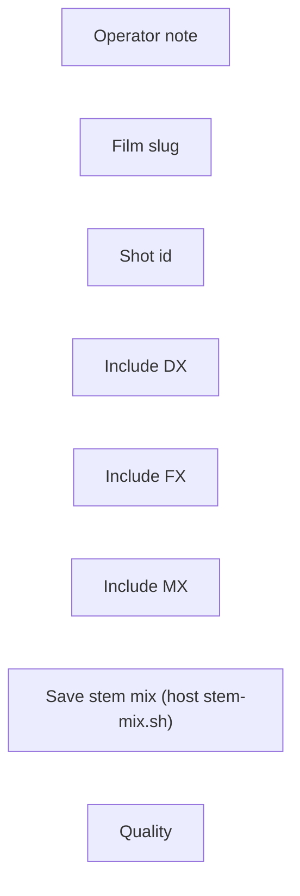

# audio/stem-mix

**What's on this page**

- **Purpose, occupancy, and models** from the on-canvas Note
- **Graph flow** (groups when the canvas is large)
- **Every node id** on this graph
- **Node parameter reference** for each type, with this graph's values and the other legal choices

**What this enables**

- **Queuing this filename** with known widgets
- **Changing a parameter** with a documented generation effect

**Who this is for:** studio users who loaded `audio/stem-mix` from Apps or Workflows.

> Generated from `workflows/_lab/audio/stem-mix.json`. Do not hand-edit this file. Re-run `python3 docs/generate_workflow_docs.py` (or `make docs`).

## Purpose

Occupancy **audio**. Outputs under `${COMFY_OUTPUT_DIR}`. Unload the previous family before Queue.

```text
## audio/stem-mix

Picture-lock stem mix. Occupancy **audio** — stop Klein / Wan / LTX first. ACE-Step
score is a later session if `score: acestep-instrumental`.

This canvas does not denoise video. Mix on the host:

  ./scripts/manage.sh stem-mix --film <slug> --shot <id> --bg PATH [--dx PATH]

Stems: BG = demuxed LTX world bed, FX = optional Templates LTX-2.5 T2A (same distilled
transformer; not a vendored subgraph), DX = Kokoro / Qwen3-TTS, MX = ACE-Step
instrumental. Duck beds −15 dB under DX. YouTube loudnorm I=-14.

A2V lock (talking-head): mix DX first, then Templates → LTX-2.5 A2V freeze. Mouths will
not match (banned lip-sync OSS stays out). Foley V2A LoRA is not in v1.

Do not start Docker. Do not co-resident ACE-Step with LTX.

Occupancy: audio — stop Klein / Wan / LTX session. One GB10 job.
Prompt enhance is on by default (on-box Qwen3-4B-Instruct-2507). After Queue, the Enhance node shows the prompt CLIP used (or a passthrough reason). Turn Enhance off to use the widget text as-is. Optional style dropdown.
```

## How to Queue

1. `./scripts/manage.sh start` so `_lab` is seeded
2. Load **audio/stem-mix** from **Apps** or **Workflows**
3. Read the on-canvas Note, change widgets, Queue

Do not edit raw `_lab` JSON. Save keepers under `_user/`.

## Graph



## Nodes on this graph

| Id | Title | Type | Group |
| --- | --- | --- | --- |
| 1 | Operator note | `Note` | NOTE |
| 2 | Film slug | `PrimitiveNode` | STEMS |
| 3 | Shot id | `PrimitiveNode` | STEMS |
| 4 | Include DX | `PrimitiveNode` | STEMS |
| 5 | Include FX | `PrimitiveNode` | STEMS |
| 6 | Include MX | `PrimitiveNode` | STEMS |
| 7 | Save stem mix (host stem-mix.sh) | `SaveAudio` | Ungrouped |
| 8 | Quality | `EZQuality` | Ungrouped |

## Node parameter reference

Every unique node type on this graph. Widgets are in lab JSON order. Choices are ComfyUI v0.34.6 / lab `INPUT_TYPES` — not SD1.5 folklore.

### `Note` — Note

On-canvas operator note (not executed).

!!! warning "Lab notes"

    Every lab graph has one. Purpose, models, sampler, occupancy, run steps.

#### `text`

Type `STRING`.

Markdown-ish operator note.

**How it affects generation:** Does not affect pixels. Read it before Queue.

**This graph:** `## audio/stem-mix Picture-lock stem mix. Occupancy **audio** — stop Klein / Wan / LTX first. ACE-Step score is a later session if `score: acestep-instrumental`. This canvas does not denoise video. Mi…`

```text
## audio/stem-mix

Picture-lock stem mix. Occupancy **audio** — stop Klein / Wan / LTX first. ACE-Step
score is a later session if `score: acestep-instrumental`.

This canvas does not denoise video. Mix on the host:

  ./scripts/manage.sh stem-mix --film <slug> --shot <id> --bg PATH [--dx PATH]

Stems: BG = demuxed LTX world bed, FX = optional Templates LTX-2.5 T2A (same distilled
transformer; not a vendored subgraph), DX = Kokoro / Qwen3-TTS, MX = ACE-Step
instrumental. Duck beds −15 dB under DX. YouTube loudnorm I=-14.

A2V lock (talking-head): mix DX first, then Templates → LTX-2.5 A2V freeze. Mouths will
not match (banned lip-sync OSS stays out). Foley V2A LoRA is not in v1.

Do not start Docker. Do not co-resident ACE-Step with LTX.

Occupancy: audio — stop Klein / Wan / LTX session. One GB10 job.
Prompt enhance is on by default (on-box Qwen3-4B-Instruct-2507). After Queue, the Enhance node shows the prompt CLIP used (or a passthrough reason). Turn Enhance off to use the widget text as-is. Optional style dropdown.
```

### `PrimitiveNode` — Primitive

A typed constant (string or float) with seed-style control.

!!! warning "Lab notes"

    Music Duration (FLOAT) and Prompt Forge Context (STRING). widgets[1] is always control_after_generate.

| Socket | Dir | Type | What it carries |
| --- | --- | --- | --- |
| `value` | out | `FLOAT\|STRING` | Wired into duration / context / lyrics. |

#### `value`

Type `FLOAT|STRING`.

The constant.

**How it affects generation:** FLOAT seconds drive ACE latent length. STRING context is bible/research for Enhance.

| Instance | Value |
| --- | --- |
| Film slug | `go-see` |
| Shot id | `01` |
| Include DX | `no` |
| Include FX | `no` |
| Include MX | `no` |

#### `control_after_generate`

Type `COMBO`. Range / default: fixed.

Whether the primitive mutates after Queue.

**How it affects generation:** fixed keeps duration/context pinned.

**This graph (all 5 instances):** `fixed`

**Other choices**

| Choice | What it does |
| --- | --- |
| `fixed` | Keep this seed on the next Queue. Lab default for reproducible stills and 5 s prints. |
| `increment` | Add 1 after Queue. Use for a sequence of variations. |
| `decrement` | Subtract 1 after Queue. |
| `randomize` | Draw a new seed after Queue. Exploration only. |

### `SaveAudio` — Save Audio

Write a FLAC/wav master.

!!! warning "Lab notes"

    Music graphs pair this with SaveAudioMP3 and EZAudioMetadata. Stem mix uses ez_stem_mix.

| Socket | Dir | Type | What it carries |
| --- | --- | --- | --- |
| `audio` | in | `AUDIO` | Decoded ACE or mix. |

#### `filename_prefix`

Type `STRING`.

Save stem.

**How it affects generation:** Album tracks use NN - Song Title. Tags come from EZAudioMetadata.

**This graph:** `ez_stem_mix`

### `EZQuality` — Quality

Workflow-global quality combo. JS overlays family-specific sampler, UNET, CLIP, and VAE widgets.

!!! warning "Lab notes"

    custom freezes the last overlay. lab restores authored widgets. ultra/max may select Klein 9B or FLUX.2-dev when those files are on disk (FLUX Non-Commercial, not YouTube-ok). Never changes size. Not --tier quality.

| Socket | Dir | Type | What it carries |
| --- | --- | --- | --- |
| `quality` | out | `STRING` | Selected quality id. |

#### `quality`

Type `COMBO`. Range / default: lab.

custom freezes last overlay; lab restores graph defaults.

**How it affects generation:** Named qualities may swap UNET, CLIP, and VAE. Does not change size or length. ultra/max need download-image --tier 9b or flux2-dev.

**This graph:** `lab`

**Other choices**

| Choice | What it does |
| --- | --- |
| `custom` | Freeze current widgets. Queue does not overlay. |
| `draft` | Faster Apache Klein 4B (NVFP4 if on disk). |
| `lab` | Authored lab widgets. Default. |
| `standard` | Distilled 4B, 8 steps, CFG 1.0. |
| `high` | Klein base 4B + CFG 3.5 when on disk; else extra distilled steps at CFG 1.0. |
| `ultra` | Klein 9B distilled when on disk (FLUX Non-Commercial). Else high. |
| `max` | Klein 9B base or FLUX.2-dev when on disk (FLUX Non-Commercial). Else high. |
