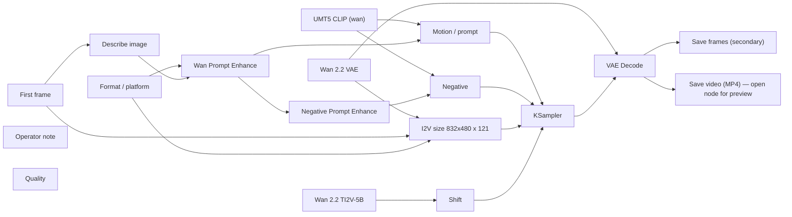

# creator/silent/fabric-breeze

**What's on this page**

- **Purpose, occupancy, and models** from the on-canvas Note
- **Graph flow** (groups when the canvas is large)
- **Every node id** on this graph
- **Node parameter reference** for each type, with this graph's values and the other legal choices

**What this enables**

- **Queuing this filename** with known widgets
- **Changing a parameter** with a documented generation effect

**Who this is for:** studio users who loaded `creator/silent/fabric-breeze` from Apps or Workflows.

> Generated from `workflows/_lab/creator/silent/fabric-breeze.json`. Do not hand-edit this file. Re-run `python3 docs/generate_workflow_docs.py` (or `make docs`).

## Purpose

Occupancy **wan**. Outputs under `${COMFY_OUTPUT_DIR}`. Unload the previous family before Queue.

```text
## creator/silent/fabric-breeze

Format / platform sets pixels (Custom uses Width × Height). Quality does not change size.

Silent fabric/hair breeze ~5 s. Lab size **832×480**. Prefix `ez_breeze`.
Empty of lettering. Add titles in your editor, not in the prompt.
Occupancy: wan — stop LTX, podcast, music. One GB10 job.
Handoff: none.
After Queue, click **Save video (MP4) — open node for preview**. File lands on `${COMFY_OUTPUT_DIR}`.
LoadImage defaults to example.png so Queue smokes.
Prompt enhance is **off** so authored text (recipe, script labels, ACE tags, or film shots) is encoded as written. Turn Enhance on only if you want the 4B rewriter.
```

## How to Queue

1. `./scripts/manage.sh start` so `_lab` is seeded
2. Load **creator/silent/fabric-breeze** from **Apps** or **Workflows**
3. Read the on-canvas Note, change widgets, Queue

Do not edit raw `_lab` JSON. Save keepers under `_user/`.

## Graph



## Nodes on this graph

| Id | Title | Type | Group |
| --- | --- | --- | --- |
| 1 | Wan 2.2 TI2V-5B | `UNETLoader` | Load models |
| 2 | UMT5 CLIP (wan) | `CLIPLoader` | Load models |
| 3 | Wan 2.2 VAE | `VAELoader` | Load models |
| 4 | First frame | `LoadImage` | For i2v, LoadImage enabled (byp… |
| 6 | Motion / prompt | `CLIPTextEncode` | Ungrouped |
| 7 | Negative | `CLIPTextEncode` | Ungrouped |
| 8 | I2V size 832x480 x 121 | `Wan22ImageToVideoLatent` | Ungrouped |
| 9 | Shift | `ModelSamplingSD3` | Ungrouped |
| 10 | KSampler | `KSampler` | Ungrouped |
| 11 | VAE Decode | `VAEDecode` | Ungrouped |
| 12 | Save frames (secondary) | `SaveImage` | Ungrouped |
| 13 | Save video (MP4) — open node for preview | `VHS_VideoCombine` | Ungrouped |
| 14 | Operator note | `Note` | Ungrouped |
| 15 | Wan Prompt Enhance | `EZWanPromptEnhance` | Ungrouped |
| 16 | Negative Prompt Enhance | `EZNegativePromptEnhance` | Ungrouped |
| 17 | Quality | `EZQuality` | Ungrouped |
| 18 | Format / platform | `EZVideoFormat` | Ungrouped |
| 19 | Describe image | `EZImageDescribe` | Ungrouped |

## Node parameter reference

Every unique node type on this graph. Widgets are in lab JSON order. Choices are ComfyUI v0.34.6 / lab `INPUT_TYPES` — not SD1.5 folklore.

### `UNETLoader` — Load Diffusion Model

Load a standalone transformer/UNET from diffusion_models/.

!!! warning "Lab notes"

    Lab files: flux-2-klein-4b-fp8.safetensors, wan2.2_ti2v_5B_fp16.safetensors, ltx-2.5-22b-distilled-transformer-comfy-int8-convrot.safetensors. weight_dtype stays default.

| Socket | Dir | Type | What it carries |
| --- | --- | --- | --- |
| `MODEL` | out | `MODEL` | Denoiser weights. |

#### `unet_name`

Type `STRING`.

Checkpoint filename under MODELS_DIR diffusion_models.

**How it affects generation:** Wrong family = Queue error or a melted picture. Lab pins Apache Klein 4B. Klein 9B / FLUX.2-dev are opt-in NC. MiniMax is banned.

**This graph:** `wan2.2_ti2v_5B_fp16.safetensors`

#### `weight_dtype`

Type `COMBO`. Range / default: default.

Cast at load.

**How it affects generation:** default keeps the file's dtype (Klein FP8, LTX INT8-convrot, Wan FP16).

**This graph:** `default`

**Other choices**

| Choice | What it does |
| --- | --- |
| `default` | Load weights as stored. Lab UNETLoader always uses this. |
| `fp8_e4m3fn` | Cast to FP8 e4m3fn. Can save memory; may shift Klein/LTX quality. |
| `fp8_e4m3fn_fast` | FP8 e4m3fn with fast optimizations. |
| `fp8_e5m2` | Cast to FP8 e5m2. |

### `CLIPLoader` — Load CLIP

Load a text encoder. The type combo must match the UNET family.

!!! warning "Lab notes"

    Lab types: flux2 (Qwen3-4B), wan (UMT5), ltxv (Gemma4-with-proj). Wrong type is a Queue error, not a bad prompt. MiniMax type is banned.

| Socket | Dir | Type | What it carries |
| --- | --- | --- | --- |
| `CLIP` | out | `CLIP` | Text encoder for CLIPTextEncode / ACE / LTX. |

#### `clip_name`

Type `STRING`.

Filename under text_encoders.

**How it affects generation:** Must match the family (qwen_3_4b, umt5_xxl, gemma4-12b-with-proj).

**This graph:** `umt5_xxl_fp8_e4m3fn_scaled.safetensors`

#### `type`

Type `COMBO`.

CLIPType enum. Picks tokenizer + template.

**How it affects generation:** flux2 wraps Klein strings in a Qwen chat template — do not paste <|im_start|>. wan is UMT5. ltxv is Gemma4-with-proj.

**This graph:** `wan`

**Other choices**

| Choice | What it does |
| --- | --- |
| `flux2` | Klein 4B / Qwen3-4B text encoder. Lab stills. |
| `wan` | Wan 2.2 UMT5-XXL. Lab silent motion. |
| `ltxv` | LTX-2.5 Gemma4-with-proj. Lab AV. |
| `ace` | ACE-Step text encoder. Music graphs use CheckpointLoaderSimple instead. |
| `stable_diffusion` | SD1.x CLIP. Not a lab default. |
| `stable_cascade` | Stable Cascade CLIP. |
| `sd3` | SD3 CLIP stack. |
| `stable_audio` | Stable Audio T5. |
| `mochi` | Mochi T5. |
| `pixart` | PixArt. |
| `cosmos` | Cosmos T5. |
| `lumina2` | Lumina-2 Gemma. |
| `hidream` | HiDream. |
| `chroma` | Chroma. |
| `omnigen2` | OmniGen2. |
| `qwen_image` | Qwen-Image. |
| `hunyuan_image` | Hunyuan image. |
| `ovis` | Ovis. |
| `longcat_image` | LongCat image. Optional stub only. |
| `cogvideox` | CogVideoX T5. |
| `lens` | Lens. |
| `pixeldit` | PixelDit. |
| `ideogram4` | Ideogram. |
| `boogu` | Boogu. |
| `krea2` | Krea. |
| `joyimage` | JoyImage Qwen3-VL. |
| `mage` | Mage. |
| `minimax` | MiniMax. Banned in this studio (US Excluded Territory). Do not pick. |

#### `device`

Type `COMBO`. Range / default: default.

Where to load the encoder.

**How it affects generation:** default uses GPU. cpu is a debug escape hatch.

**This graph:** `default`

**Other choices**

| Choice | What it does |
| --- | --- |
| `default` | Load on the Comfy compute device (GPU). Lab default. |
| `cpu` | Force CPU. Much slower; only for debugging a CLIP load. |

### `VAELoader` — Load VAE

Load the autoencoder that maps pixels ↔ latents (and LTX audio).

!!! warning "Lab notes"

    Do not mix families: flux2-vae, wan2.2_vae, ltx-2.5-video-vae-bf16, ltx-2.5-audio-vae-bf16.

| Socket | Dir | Type | What it carries |
| --- | --- | --- | --- |
| `VAE` | out | `VAE` | Encoder/decoder. |

#### `vae_name`

Type `STRING`.

Filename under vae/.

**How it affects generation:** Wrong VAE = color trash or a shape error.

**This graph:** `wan2.2_vae.safetensors`

### `LoadImage` — Load Image

Load a still from Comfy input/ (or upload).

!!! warning "Lab notes"

    I2V / edit graphs default example.png until you pick ez_still_*.png. App Mode shows Start image only when this node is wired.

| Socket | Dir | Type | What it carries |
| --- | --- | --- | --- |
| `IMAGE` | out | `IMAGE` | RGB still. |
| `MASK` | out | `MASK` | Alpha if present. |

#### `image`

Type `STRING`.

Filename in input/.

**How it affects generation:** Point at the Klein still you just saved (ez_still_draft_*.png, ez_character_*.png, first.png).

**This graph:** `example.png`

#### `upload`

Type `COMBO`. Range / default: image.

Upload widget type.

**How it affects generation:** Leave image. This is the choose-file control, not a generation knob.

**This graph:** `image`

### `CLIPTextEncode` — CLIP Text Encode

Turn a prompt string into CONDITIONING for the sampler.

!!! warning "Lab notes"

    The dim CLIP box after Queue is this string. Prompt Enhance nodes rewrite it when Enhance is on.

| Socket | Dir | Type | What it carries |
| --- | --- | --- | --- |
| `clip` | in | `CLIP` | Matching family encoder. |
| `text` | in | `STRING` | Often wired from Prompt Enhance so the widget is a preview. |
| `CONDITIONING` | out | `CONDITIONING` | Positive or negative cond. |

#### `text`

Type `STRING`.

Prompt encoded by CLIP.

**How it affects generation:** Klein: sentences, subject → place → light → camera. Wan I2V: motion + one camera only. LTX: present-tense paragraph with audio interleaved. Distilled Klein quality lives here, not in CFG.

| Instance | Value |
| --- | --- |
| Motion / prompt | `A warm breeze moves coat hem and hair. Locked camera otherwise. Keep every obje…` |
| Negative | `morphing, identity drift, warping objects, face melting, flicker, jitter, frame…` |

### `Wan22ImageToVideoLatent` — Wan 2.2 Image to Video Latent

Build a Wan 5B I2V latent from a start image (or empty for T2V).

!!! warning "Lab notes"

    Smoke 832×480 × 121 frames. Shot graphs use 120 frames for concat. GIF 49 frames. VACE join 17 frames (1+8n).

| Socket | Dir | Type | What it carries |
| --- | --- | --- | --- |
| `vae` | in | `VAE` | wan2.2_vae. |
| `start_image` | in | `IMAGE` | Optional. T2V graphs leave LoadImage bypassed. |
| `LATENT` | out | `LATENT` | Video latent for KSampler. |

#### `width`

Type `INT`. Range / default: 832 landscape / 480 portrait.

Frame width.

**How it affects generation:** 832×480 is the Wan 5B smoke size. Larger melts GB10.

**This graph:** `832`

#### `height`

Type `INT`.

Frame height.

**How it affects generation:** Swap for 9:16 shorts (480×832).

**This graph:** `480`

#### `length`

Type `INT`. Range / default: 121 smoke / 120 shot / 49 GIF / 17 VACE.

Frame count.

**How it affects generation:** Duration = length / fps. 121 @ 24 fps is the 5 s smoke. Shot graphs use 120 so concat-shots stays 5.00 s.

**This graph:** `121`

#### `batch_size`

Type `INT`. Range / default: 1.

Clips per Queue.

**How it affects generation:** Stay 1 on GB10.

**This graph:** `1`

### `ModelSamplingSD3` — ModelSamplingSD3

Patch a model with SD3-style flow-matching shift.

!!! warning "Lab notes"

    Wan 5B graphs use shift 8.

| Socket | Dir | Type | What it carries |
| --- | --- | --- | --- |
| `model` | in | `MODEL` | Wan UNET. |
| `MODEL` | out | `MODEL` | Shifted model for KSampler. |

#### `shift`

Type `FLOAT`. Range / default: 8 (lab Wan).

Flow-matching shift.

**How it affects generation:** 8 is the Wan 2.2 TI2V lab value. Changing it moves the noise schedule; do not copy SD3 defaults blindly.

**This graph:** `8`

### `KSampler` — KSampler

Denoise a latent for N steps at a CFG, sampler, and scheduler.

!!! warning "Lab notes"

    Distilled Klein is CFG 1.0 / 4 steps / euler / simple. Raising CFG is not a quality knob. Wan 5B uses uni_pc and CFG 5. LTX distilled uses euler / simple / CFG 1.0 / 20 steps. ACE-Step uses 8 steps / CFG 1.0 / euler. TRELLIS uses 12 steps / CFG 7.5 / euler / normal.

| Socket | Dir | Type | What it carries |
| --- | --- | --- | --- |
| `model` | in | `MODEL` | UNET / transformer after any ModelSampling* patch. |
| `positive` | in | `CONDITIONING` | What to include (CLIP / ACE / LTX prompt). |
| `negative` | in | `CONDITIONING` | What to avoid. Distilled Klein ignores this well — put constraints in the positive. |
| `latent_image` | in | `LATENT` | Noise canvas or encoded start image / video / audio latent. |
| `LATENT` | out | `LATENT` | Denoised latent for VAE decode. |

#### `seed`

Type `INT`. Range / default: 0 … 2^64-1; lab 42.

Random seed for the noise tensor.

**How it affects generation:** Same seed + same graph ≈ same picture or clip. Lab locks 42 on smokes so drafts are comparable.

**This graph:** `42`

#### `control_after_generate`

Type `COMBO`. Range / default: fixed (lab).

What happens to seed after Queue.

**How it affects generation:** fixed keeps iteration honest while you change the prompt.

**This graph:** `fixed`

**Other choices**

| Choice | What it does |
| --- | --- |
| `fixed` | Keep this seed on the next Queue. Lab default for reproducible stills and 5 s prints. |
| `increment` | Add 1 after Queue. Use for a sequence of variations. |
| `decrement` | Subtract 1 after Queue. |
| `randomize` | Draw a new seed after Queue. Exploration only. |

#### `steps`

Type `INT`. Range / default: 1–10000; Klein distilled 4; LTX 20; Wan 20; ACE 8; TRELLIS 12.

Denoising iterations.

**How it affects generation:** More steps refine detail with diminishing returns. Distilled Klein is authored at 4 — raising steps is slower, not a quality knob. Do not raise LTX/Wan toward a 90 s denoise.

**This graph:** `20`

#### `cfg`

Type `FLOAT`. Range / default: 0–100; Klein/LTX/ACE 1.0; Wan 5; TRELLIS 7.5.

Classifier-free guidance scale.

**How it affects generation:** Distilled Klein is CFG 1.0 — raising CFG is the wrong quality lever (use the Positive prompt, resolution, or still-hero). Wan silent 5B uses CFG 5. TRELLIS structure uses 7.5. At CFG 1.0 Comfy skips the negative pass.

**This graph:** `5`

#### `sampler_name`

Type `COMBO`. Range / default: euler (most lab); uni_pc (Wan).

ODE / SDE algorithm that removes noise.

**How it affects generation:** euler is the lab still/AV/ACE default. uni_pc is the Wan 5B silent default. Ancestral/SDE samplers add extra randomness and weaken seed lock.

**This graph:** `uni_pc`

**Other choices**

| Choice | What it does |
| --- | --- |
| `euler` | First-order ODE. Lab default for Klein, LTX, ACE, and most stills. Fast and stable at CFG 1.0. |
| `euler_cfg_pp` | Euler with CFG++. Rarely needed on distilled Klein (CFG is already 1.0). |
| `euler_ancestral` | Adds ancestral noise each step. More variation; weaker exact seed lock. |
| `euler_ancestral_cfg_pp` | Ancestral Euler with CFG++. |
| `heun` | Second-order Heun. Slower, sometimes smoother; not a lab default. |
| `heunpp2` | Higher-order Heun variant. |
| `exp_heun_2_x0` | Exponential Heun (x0 prediction). |
| `exp_heun_2_x0_sde` | Exponential Heun SDE. Extra stochasticity. |
| `dpm_2` | DPM-Solver-2. Two function evals per step. |
| `dpm_2_ancestral` | Ancestral DPM-2. |
| `lms` | Linear multistep. Older; keep for experiments only. |
| `dpm_fast` | Fast DPM. Coarse, good for previews. |
| `dpm_adaptive` | Adaptive DPM. Step count is a hint, not a hard budget. |
| `dpmpp_2s_ancestral` | DPM++ 2S ancestral. Common SD1.5 pick; not a Klein default. |
| `dpmpp_2s_ancestral_cfg_pp` | DPM++ 2S ancestral with CFG++. |
| `dpmpp_sde` | DPM++ SDE. Stochastic, slower. |
| `dpmpp_sde_gpu` | DPM++ SDE on GPU noise. |
| `dpmpp_2m` | DPM++ 2M. Smooth; often used on SD-family, not distilled Klein. |
| `dpmpp_2m_cfg_pp` | DPM++ 2M with CFG++. |
| `dpmpp_2m_sde` | DPM++ 2M SDE. |
| `dpmpp_2m_sde_gpu` | DPM++ 2M SDE GPU noise. |
| `dpmpp_2m_sde_heun` | DPM++ 2M SDE Heun. |
| `dpmpp_2m_sde_heun_gpu` | DPM++ 2M SDE Heun GPU. |
| `dpmpp_3m_sde` | DPM++ 3M SDE. |
| `dpmpp_3m_sde_gpu` | DPM++ 3M SDE GPU. |
| `ddpm` | Classic DDPM. Slow; do not use on 121-frame LTX. |
| `lcm` | Latent Consistency. Needs an LCM-tuned model; not lab Klein/Wan/LTX. |
| `ipndm` | iPNDM multistep. |
| `ipndm_v` | iPNDM (v-prediction). |
| `deis` | DEIS multistep. |
| `res_multistep` | Res multistep. Some turbo recipes. |
| `res_multistep_cfg_pp` | Res multistep CFG++. |
| `res_multistep_ancestral` | Ancestral res multistep. |
| `res_multistep_ancestral_cfg_pp` | Ancestral res multistep CFG++. |
| `gradient_estimation` | Gradient-estimation sampler. |
| `gradient_estimation_cfg_pp` | Gradient-estimation CFG++. |
| `er_sde` | ER-SDE sampler. |
| `seeds_2` | SEEDS-2. |
| `seeds_3` | SEEDS-3. |
| `sa_solver` | SA-Solver. |
| `sa_solver_pece` | SA-Solver PECE. |
| `ddim` | DDIM. Deterministic; not a lab default. |
| `uni_pc` | UniPC. Lab Wan 5B silent graphs use this with CFG 5. |
| `uni_pc_bh2` | UniPC BH2 variant. |

#### `scheduler`

Type `COMBO`. Range / default: simple (most lab); normal (TRELLIS).

How sigmas are spaced across steps.

**How it affects generation:** simple is even spacing and matches distilled Klein / LTX / ACE. normal is the TRELLIS pair. Do not copy karras from an SD1.5 recipe onto Klein.

**This graph:** `simple`

**Other choices**

| Choice | What it does |
| --- | --- |
| `simple` | Even sigma spacing. Lab default for Klein, Wan, LTX, and ACE. |
| `normal` | Linear timestep schedule. TRELLIS structure/texture stages use this. |
| `karras` | Karras sigmas. Often sharper on SD-family; not the lab default. |
| `exponential` | Exponential sigma decay. |
| `sgm_uniform` | SGM uniform. SD3-family default; Wan uses ModelSamplingSD3 shift instead. |
| `ddim_uniform` | Uniform DDIM schedule. |
| `beta` | Beta-distribution timesteps. |
| `linear_quadratic` | Linear then quadratic (Mochi-style). |
| `kl_optimal` | KL-optimal sigma curve. |

#### `denoise`

Type `FLOAT`. Range / default: 0–1; lab 1.0.

Fraction of the latent to replace with denoised signal.

**How it affects generation:** 1.0 is full generation (T2I / T2V / ACE). Values below 1 keep structure from an encoded start image (Klein edit / clay). Lab I2V uses dedicated latent nodes, not denoise<1 on empty noise.

**This graph:** `1`

### `VAEDecode` — VAE Decode

Decode image/video latents to pixels.

| Socket | Dir | Type | What it carries |
| --- | --- | --- | --- |
| `samples` | in | `LATENT` | KSampler output (video or still). |
| `vae` | in | `VAE` | Matching family VAE. |
| `IMAGE` | out | `IMAGE` | Frames or still. |

No widgets. Sockets only.

### `SaveImage` — Save Image

Write PNG stills under the output folder.

| Socket | Dir | Type | What it carries |
| --- | --- | --- | --- |
| `images` | in | `IMAGE` | Decoded still or last-frame. |

#### `filename_prefix`

Type `STRING`.

Save prefix.

**How it affects generation:** Lab prefixes start with ez_. Last-frame savers on shot graphs feed concat-shots.

**This graph:** `ez_wan_draft_frames`

### `VHS_VideoCombine` — VHS Video Combine

Encode frames (and optional audio) to MP4 or GIF.

!!! warning "Lab notes"

    Lab clips set save_output true. After Queue open the node for preview. GIF graphs use image/gif + pingpong.

| Socket | Dir | Type | What it carries |
| --- | --- | --- | --- |
| `images` | in | `IMAGE` | Decoded frames. |
| `audio` | in | `AUDIO` | LTX decoded audio or unused. |
| `meta_batch` | in | `VHS_BatchManager` | Optional batch manager (unwired). |
| `vae` | in | `VAE` | Optional (unwired). |
| `Filenames` | out | `VHS_FILENAMES` | Path list for EZFilmConcat. |

#### `frame_rate`

Type `FLOAT`. Range / default: lab 24 (GIF 12/16).

Output frames per second.

**How it affects generation:** 24 fps is the lab motion/AV printer. GIF loops use 12. Changing fps without changing frame count changes duration.

**This graph:** `24`

#### `loop_count`

Type `INT`. Range / default: 0 = infinite in players that honor it.

How many times the file loops.

**How it affects generation:** 0 is the lab default (play once / player default).

**This graph:** `0`

#### `filename_prefix`

Type `STRING`.

Save prefix under the output folder.

**How it affects generation:** Lab prefixes start with ez_. The host file is ${COMFY_OUTPUT_DIR}/<prefix>_*.mp4 (or .gif).

**This graph:** `ez_breeze`

#### `format`

Type `COMBO`.

Container / codec.

**How it affects generation:** video/h264-mp4 is every lab clip except motion/loops/gif-loop (image/gif).

**This graph:** `video/h264-mp4`

**Other choices**

| Choice | What it does |
| --- | --- |
| `video/h264-mp4` | H.264 MP4. Lab default; save_output must stay true. |
| `image/gif` | Animated GIF. motion/loops/gif-loop only. |

#### `pix_fmt`

Type `COMBO`. Range / default: yuv420p.

Pixel format for H.264.

**How it affects generation:** yuv420p plays everywhere. Other formats can break QuickTime/YouTube.

**This graph:** `yuv420p`

#### `crf`

Type `INT`. Range / default: lab 18.

H.264 constant-rate-factor. Lower is bigger/cleaner.

**How it affects generation:** 18 is the lab visually-lossless-ish setting. Raising CRF shrinks files and adds blockiness.

**This graph:** `18`

#### `save_metadata`

Type `BOOLEAN`.

Embed workflow JSON in the file.

**How it affects generation:** true keeps provenance on the MP4.

**This graph:** `true`

#### `trim_to_audio`

Type `BOOLEAN`.

Cut picture to audio length.

**How it affects generation:** Lab false except when you mean to lock to a bed. ltx/a2v muxes the original wav instead.

**This graph:** `false`

#### `pingpong`

Type `BOOLEAN`.

Play frames forward then reverse.

**How it affects generation:** true on motion/loops/gif-loop, bumper-loop, sticker-loop. false on 5 s narrative prints.

**This graph:** `false`

#### `save_output`

Type `BOOLEAN`.

Write the file to disk.

**How it affects generation:** Lab video graphs require true. After Queue, open the node for the inline preview.

**This graph:** `true`

### `Note` — Note

On-canvas operator note (not executed).

!!! warning "Lab notes"

    Every lab graph has one. Purpose, models, sampler, occupancy, run steps.

#### `text`

Type `STRING`.

Markdown-ish operator note.

**How it affects generation:** Does not affect pixels. Read it before Queue.

**This graph:** `## creator/silent/fabric-breeze Format / platform sets pixels (Custom uses Width × Height). Quality does not change size. Silent fabric/hair breeze ~5 s. Lab size **832×480**. Prefix `ez_breeze`. Emp…`

```text
## creator/silent/fabric-breeze

Format / platform sets pixels (Custom uses Width × Height). Quality does not change size.

Silent fabric/hair breeze ~5 s. Lab size **832×480**. Prefix `ez_breeze`.
Empty of lettering. Add titles in your editor, not in the prompt.
Occupancy: wan — stop LTX, podcast, music. One GB10 job.
Handoff: none.
After Queue, click **Save video (MP4) — open node for preview**. File lands on `${COMFY_OUTPUT_DIR}`.
LoadImage defaults to example.png so Queue smokes.
Prompt enhance is **off** so authored text (recipe, script labels, ACE tags, or film shots) is encoded as written. Turn Enhance on only if you want the 4B rewriter.
```

### `EZWanPromptEnhance` — Wan Prompt Enhance

Rewrite a lazy prompt for Wan 2.2 TI2V-5B (silent).

| Socket | Dir | Type | What it carries |
| --- | --- | --- | --- |
| `prompt` | in | `STRING` | Optional. |
| `context` | in | `STRING` | Bible/research. Ignored when Enhance is off. |
| `prompt` | out | `STRING` | Motion string for CLIP. |

#### `sample`

Type `COMBO`. Range / default: custom.

Sample or Custom.

**How it affects generation:** Custom keeps the textarea.

**This graph:** `custom`

#### `prompt`

Type `STRING`.

Lazy motion sentence.

**How it affects generation:** I2V rewrites to motion + one camera only. Do not prompt audio — Wan is silent.

**This graph:** `A warm breeze moves coat hem and hair. Locked camera otherwise. Keep every object and surface from the start image; do not redesign.`

```text
A warm breeze moves coat hem and hair. Locked camera otherwise. Keep every object and surface from the start image; do not redesign.
```

#### `enhance`

Type `BOOLEAN`.

Run the rewriter.

**How it affects generation:** Off on authored camera-verb graphs (orbit, push-in, gif-loop).

**This graph:** `false`

#### `mode`

Type `COMBO`.

System flavor.

**How it affects generation:** i2v is the smoke. t2v when LoadImage is bypassed. flf / vace / s2v for those opt-in graphs.

**This graph:** `i2v`

**Other choices**

| Choice | What it does |
| --- | --- |
| `t2v` | Text to silent video. |
| `i2v` | Start image owns look; prompt is motion. |
| `flf` | First-last-frame. |
| `vace` | VACE join. |
| `s2v` | Speech-to-video; wav owns lip-sync. |

#### `duration_hint`

Type `STRING`. Range / default: 5 seconds, 24 fps.

Duration/fps hint for the rewriter.

**How it affects generation:** Does not change latent length — Wan22ImageToVideoLatent does.

**This graph:** `5 seconds, 24 fps`

#### `style`

Type `COMBO`. Range / default: none.

Look reference. Ignored on I2V.

**How it affects generation:** Start frame owns look on I2V.

**This graph:** `none`

**Other choices**

| Choice | What it does |
| --- | --- |
| `none` | Off. Do not weave a look reference into the CLIP prompt. |
| `photorealistic` | Photoreal photograph, natural materials, physically plausible light. |
| `cinematic_film_still` | Cinematic feature-film still, widescreen, motivated practicals. |
| `documentary_photography` | Observational documentary photograph, available light. |
| `analog_35mm_film` | Analog 35mm color-negative film grain and organic color. |
| `analog_120_medium_format` | Medium-format 120 film, creamy tones, fine grain. |
| `polaroid_instant` | Instant Polaroid print look, soft contrast, creamy highlights. |
| `golden_hour_photography` | Golden-hour photograph, warm sidelight, long shadows. |
| `overcast_natural_light` | Overcast natural light, soft sky-fill, open shadows. |
| `studio_product_photography` | Studio product photograph, seamless backdrop, soft key. |
| `editorial_fashion_photography` | Editorial fashion photograph, precise styling, magazine light. |
| `street_photography` | Candid street photograph, mixed city light, layered depth. |
| `architectural_photography` | Architectural photograph, corrected verticals, material texture. |
| `anime` | Japanese anime still, clean cel color, sharp line. |
| `manga_screentone` | Black-and-white manga ink and screentone. |
| `cartoon` | Bold cartoon illustration, thick outline, flat color. |
| `western_comic_book` | Western comic-book inks, Ben-Day dots, saturated print color. |
| `saturday_morning_cartoon` | Saturday-morning cartoon cel, limited palette, painted background. |
| `storybook_illustration` | Storybook illustration, soft paint, narrative composition. |
| `watercolor_illustration` | Transparent watercolor on paper, wet-into-wet blooms. |
| `gouache_illustration` | Opaque gouache painting, matte pigment, graphic shapes. |
| `ink_and_wash` | Ink-and-wash drawing, black ink and grey washes. |
| `colored_pencil` | Colored-pencil drawing, layered strokes, paper grain. |
| `charcoal_sketch` | Charcoal sketch, vine blacks and kneaded-eraser lights. |
| `line_art` | Clean black line art, minimal fill. |
| `cel_shaded` | Cel-shaded illustration, hard shadow bands, graphic highlights. |
| `risograph_print` | Risograph print, limited spot inks, grainy stipple. |
| `3d_feature_animation` | 3D feature-animation still, rounded forms, physically based materials. |
| `pixar_like_3d` | Stylized feature 3D, appealing proportions, soft GI. |
| `claymation` | Claymation still, fingerprint clay, miniature set. |
| `stop_motion` | Stop-motion puppet still, practical miniature set. |
| `unreal_engine_cinematic` | Real-time cinematic 3D, sharp materials, cinematic camera. |
| `isometric_3d` | Isometric 3D diorama, even light, readable volumes. |
| `low_poly` | Low-poly 3D, faceted geometry, flat vertex color. |
| `voxel` | Voxel art, cubic voxels, limited palette. |
| `oil_painting` | Oil painting on canvas, visible brushwork, rich impasto. |
| `impressionist_painting` | Impressionist oil, broken color, outdoor light. |
| `cubist` | Cubist painting, faceted planes, simultaneous viewpoints. |
| `art_nouveau` | Art Nouveau illustration, whiplash curves, botanical ornament. |
| `ukiyo_e_woodblock` | Ukiyo-e woodblock print, mineral pigments, keyblock line. |
| `baroque_oil` | Baroque oil, dramatic chiaroscuro, theatrical spotlight. |
| `digital_matte_painting` | Digital matte painting, epic environment, atmospheric perspective. |
| `concept_art` | Production concept art, readable design, cinematic key light. |
| `cyberpunk` | Cyberpunk night, wet asphalt, neon magenta and cyan. |
| `solarpunk` | Solarpunk day, greenery on architecture, warm sun. |
| `film_noir` | Film-noir still, high-contrast black and white, hard key. |
| `1970s_grain` | 1970s film still, warm print, heavy grain. |
| `vaporwave` | Vaporwave still, pastel neon, chrome, VHS softness. |
| `pixel_art` | Pixel art, limited palette, visible pixels, cluster shading. |
| `papercraft` | Papercraft diorama, cut paper layers, studio light. |
| `blueprint_technical_drawing` | Blueprint technical drawing, white line on cyan ground. |
| `black_and_white_photography` | Black-and-white still photograph, silver-gelatin tonal scale. |
| `infrared_false_color` | False-color infrared still, pale foliage, dark sky. |
| `long_exposure_night` | Long-exposure night photograph, light trails, frozen ambient glow. |
| `underwater_photography` | Submerged still through water, cyan-green falloff, caustic rays. |
| `aerial_oblique` | Oblique aerial still from high altitude, wide ground coverage. |
| `tilt_shift_miniature` | Tilt-shift still, miniaturized real scene, razor plane of focus. |
| `double_exposure_film` | Double-exposure analog still, two scenes overlaid in one frame. |
| `wet_plate_collodion` | Wet-plate collodion still, silvered highlights, uneven edges. |
| `cyanotype_print` | Cyanotype print, Prussian-blue iron process on paper. |
| `platinum_print` | Platinum-palladium contact print, matte noble-metal tones. |
| `daguerreotype` | Daguerreotype plate, mirrored silver, razor-thin focal plane. |
| `tintype` | Tintype ferrotype on dark lacquered metal. |
| `pinhole_camera` | Pinhole-camera still, infinite depth, soft vignetting. |
| `large_format_view_camera` | Large-format view-camera still, extreme resolving power. |
| `macro_photography` | Macro still at life-size or greater, shallow plane on a tiny subject. |
| `astrophotography` | Astrophotograph of night sky, tracked stars, deep black sky. |
| `high_key_studio_portrait` | High-key studio sitter still, bright seamless, open shadows. |
| `low_key_studio_portrait` | Low-key studio sitter still, face emerging from deep black. |
| `newspaper_halftone` | Newspaper halftone photograph, coarse ink dots on newsprint. |
| `cctv_security_still` | Security-camera still, wide-angle compression, surveillance color. |
| `pastel_drawing` | Soft-pastel drawing on toned paper, chalk dust. |
| `oil_pastel` | Oil-pastel drawing, waxy dense sticks on paper. |
| `marker_illustration` | Alcohol-marker illustration, streaked fills on layout paper. |
| `ballpoint_pen` | Ballpoint-pen drawing on notebook paper, hatching density. |
| `crosshatch_pen_ink` | Crosshatched dip-pen and ink drawing on Bristol. |
| `linocut_print` | Linocut relief print, carved gouge marks on paper. |
| `woodcut_print` | Northern woodcut relief print, carved plank grain. |
| `etching_intaglio` | Copper-plate etching, bitten line and plate tone. |
| `stipple_illustration` | Stipple illustration built from ink dots only. |
| `graffiti_mural` | Spray-paint graffiti mural on brick or concrete. |
| `botanical_illustration` | Scientific botanical illustration on white vellum. |
| `medical_illustration` | Didactic medical illustration, cutaways, clean anatomy. |
| `fashion_croquis` | Fashion croquis, elongated figure, garment flats. |
| `retro_travel_poster` | Mid-century travel poster, flat lithograph color. |
| `pop_art_screenprint` | Pop-art screenprint, hard color flats, commercial-print dots. |
| `manhwa_webtoon` | Full-color Korean webtoon still, soft painterly cells. |
| `gongbi_meticulous` | Gongbi meticulous painting, fine-outline mineral color on silk. |
| `illuminated_manuscript` | Medieval illuminated-manuscript miniature on vellum, gold leaf. |
| `silhouette_cutout` | Black paper-cut silhouette on a pale field. |
| `cloisonne_enamel` | Cloisonné enamel, metal cloisons holding vitreous color. |
| `stained_glass` | Stained-glass window, lead cames, pot-metal color. |
| `mosaic_tile` | Secular tesserae mosaic of stone and glass tiles. |
| `pointillism` | Pointillist painting, discrete dots of pure pigment. |
| `fauvism` | Fauvist painting, violent unmixed color, wild brush. |
| `surrealism` | Surrealist painting, dream logic, precise impossible objects. |
| `expressionism` | Expressionist painting, distorted form, emotional color. |
| `abstract_expressionism` | Abstract-expressionist canvas, gestural drips, stained fields. |
| `rococo` | Rococo painting, pastel silk, ornamental lightness. |
| `neoclassical_oil` | Neoclassical oil, marble-smooth figures, civic clarity. |
| `romantic_landscape` | Romantic landscape oil, sublime weather, tiny figures. |
| `dutch_golden_age` | Dutch Golden Age oil, north-window light, quiet interior. |
| `fresco_buon` | Buon fresco on wet plaster, mineral pigment locked in lime. |
| `tempera_panel` | Egg-tempera on gessoed panel, fine hatch, matte finish. |
| `byzantine_mosaic_icon` | Byzantine gold-ground mosaic icon, frontal sacred geometry. |
| `art_deco` | Art Deco illustration, sunburst geometry, chrome and lacquer. |
| `constructivist_poster` | Constructivist poster, diagonal photomontage, block geometry. |
| `naive_folk_painting` | Naive folk painting, flat perspective, patterned interiors. |
| `encaustic_wax` | Encaustic painting, fused beeswax and pigment. |
| `photoreal_oil_painting` | Photoreal oil painting on canvas, brush and weave, not a camera capture. |
| `pre_raphaelite` | Pre-Raphaelite oil, jewel color, botanical minuteness. |
| `symbolism` | Symbolist painting, mythic hush, jeweled dusk. |
| `bauhaus_graphic` | Bauhaus graphic, primary geometry, spare workshop color. |
| `toon_shaded_3d` | Toon-shaded 3D, inked volume outlines on modeled forms. |
| `early_cgi_scanline` | Early-1990s scanline CGI, plastic shaders, visible aliasing. |
| `miniature_tabletop` | Painted tabletop wargame miniature on hobby basing. |
| `interlocking_brick` | Interlocking-brick diorama, studded plastic bricks. |
| `plush_toy` | Plush-toy still, stitched felt and pile fabric. |
| `felt_craft` | Needle-felted wool sculpture, fuzzy fibers standing off the form. |
| `origami` | Folded origami paper, visible crease pattern holding the form. |
| `sand_animation` | Sand-on-glass animation still, grains pushed into form. |
| `cutout_animation` | Hinged cutout-animation still, paper puppets on a painted board. |
| `rotoscope` | Rotoscoped still, traced live-action with graphic paint-over. |
| `porcelain_figurine` | Glazed porcelain figurine, kiln shine, collectible scale. |
| `wood_carving` | Carved wood sculpture, chisel facets and open grain. |
| `blown_glass` | Blown-glass sculpture, transparent color, furnace stretch. |
| `ice_sculpture` | Carved ice sculpture, internal fractures, cold speculars. |
| `neon_tube` | Bent neon-tube sculpture, glowing gas in glass. |
| `painted_resin_miniature` | Hand-painted display resin figure, garage-kit scale. |
| `inflatable_sculpture` | Inflatable vinyl sculpture, seams and gloss holding air. |
| `paper_theater_2_5d` | 2.5D paper theater, layered flats with shallow parallax. |
| `steampunk` | Brass-and-steam Victorian machine-age still. |
| `dieselpunk` | Interwar dieselpunk still, riveted steel, wartime chrome. |
| `cottagecore` | Cottagecore still, linen, wildflowers, hearth warmth. |
| `dark_academia` | Dark-academia still, oak libraries, wool, lamplight. |
| `synthwave` | Synthwave still, hot magenta-orange sunset grid. |
| `gothic_horror` | Gothic-horror still, candlelit stone, deep umber dread. |
| `high_fantasy` | High-fantasy painterly still, mythic armor, enchanted dusk. |
| `western_dust` | Dust-bowl western still, hard sun on adobe and sage. |
| `retrofuturism_1950s` | 1950s retrofuturist still, atomic-age chrome and aqua. |
| `brutalist` | Brutalist concrete still, board-formed mass, overcast civic light. |
| `memphis_design` | Memphis-Milano still, squiggle laminates, candy geometry. |
| `y2k_gloss` | Y2K gloss still, iridescent plastics, icy chrome orbs. |
| `vhs_tracking` | VHS tracking-error still, warped scanlines, chroma smear. |
| `crt_scanlines` | CRT monitor still, RGB phosphor, visible scanlines. |
| `glitch_art` | Datamosh glitch still, blocky codec tears across the frame. |
| `holographic` | Holographic-foil still, rainbow diffraction on chrome. |
| `bioluminescent` | Bioluminescent night still, living glow in deep-blue dark. |
| `post_apocalyptic` | Post-apocalyptic still, rust, dust, broken concrete, sickly sun. |
| `afrofuturism` | Afrofuturist still, diasporic ornament, cosmic metals, sunlit future. |
| `psychedelic_1960s` | 1960s psychedelic still, molten contour, vibrating complementary color. |

#### `catalog`

Type `STRING`.

Sample-catalog id.

**How it affects generation:** Leave as stamped.

**This graph:** `creator/silent/fabric-breeze`

### `EZNegativePromptEnhance` — Negative Prompt Enhance

Rewrite a negative CLIP seed so it does not fight the positive.

| Socket | Dir | Type | What it carries |
| --- | --- | --- | --- |
| `positive` | in | `STRING` | Positive CLIP string as context. |
| `prompt` | out | `STRING` | Negative string. |

#### `prompt`

Type `STRING`.

Negative seed (artifacts, not style).

**How it affects generation:** FLUX-family models do not use negatives well. Keep this short; put constraints in the positive.

**This graph:** `morphing, identity drift, warping objects, face melting, flicker, jitter, frame stutter, rubbery motion, melting edges, texture crawl, sudden cuts, watermark, burned-in text`

```text
morphing, identity drift, warping objects, face melting, flicker, jitter, frame stutter, rubbery motion, melting edges, texture crawl, sudden cuts, watermark, burned-in text
```

#### `enhance`

Type `BOOLEAN`.

Rewrite using the positive as context.

**How it affects generation:** Stops canned 'illustration / Pixar' terms from fighting a cartoon-positive.

**This graph:** `false`

#### `family`

Type `COMBO`.

Which negative family.

**How it affects generation:** Must match the UNET on the canvas.

**This graph:** `wan`

**Other choices**

| Choice | What it does |
| --- | --- |
| `klein` | Klein stills. |
| `wan` | Wan silent. |
| `ltx` | LTX AV. |
| `zimage` | Z-Image Turbo (CFG 1; list is documentation). |
| `longcat` | LongCat-Video. |
| `dreamx` | DreamX-Creator AV. |
| `s2v` | Wan S2V; wav owns speech. |

### `EZQuality` — Quality

Workflow-global quality combo. JS overlays family-specific sampler, UNET, CLIP, and VAE widgets.

!!! warning "Lab notes"

    custom freezes the last overlay. lab restores authored widgets. Free Commercial Use (<$10M) pins Apache Klein 4B (never 9B / FLUX.2-dev) and LTX-2.5 steps; Wan / audio / trellis are no-ops. ultra/max may select Klein 9B or FLUX.2-dev when those files are on disk (FLUX Non-Commercial, not YouTube-ok). Never changes size. Not --tier quality.

| Socket | Dir | Type | What it carries |
| --- | --- | --- | --- |
| `quality` | out | `STRING` | Selected quality id. |

#### `quality`

Type `COMBO`. Range / default: lab.

custom freezes last overlay; lab restores graph defaults.

**How it affects generation:** Named qualities may swap UNET, CLIP, and VAE. Does not change size or length. Free Commercial Use (<$10M) is Klein 4B + LTX (never 9B / FLUX.2-dev). ultra/max need download-image --tier 9b or flux2-dev.

**This graph:** `lab`

**Other choices**

| Choice | What it does |
| --- | --- |
| `custom` | Freeze current widgets. Queue does not overlay. |
| `draft` | Faster Apache Klein 4B (NVFP4 if on disk). |
| `lab` | Authored lab widgets. Default. |
| `standard` | Distilled 4B, 8 steps, CFG 1.0. |
| `high` | Klein base 4B + CFG 3.5 when on disk; else extra distilled steps at CFG 1.0. |
| `Free Commercial Use (<$10M)` | Klein 4B stills (never 9B / FLUX.2-dev) + LTX-2.5 steps. Optional SeedVR2 polish on the PNG, not 4K. Wan / audio / trellis are no-ops. |
| `ultra` | Klein 9B distilled when on disk (FLUX Non-Commercial). Else high. |
| `max` | Klein 9B base or FLUX.2-dev when on disk (FLUX Non-Commercial). Else high. |

### `EZVideoFormat` — Format / platform (video)

Pick a Wan or LTX clip canvas (aspect or named platform).

!!! warning "Lab notes"

    Wan and LTX printers wire width/height into Wan22ImageToVideoLatent, LTXVImgToVideo, or EmptyLTXVLatentVideo. Hint feeds Enhance duration_hint on non-loop graphs. Length stays on the latent node. Quality does not change size.

| Socket | Dir | Type | What it carries |
| --- | --- | --- | --- |
| `width` | out | `INT` | Latent width (Wan ÷16, LTX ÷32). |
| `height` | out | `INT` | Latent height (Wan ÷16, LTX ÷32). |
| `hint` | out | `STRING` | Enhance duration / framing line. |
| `prefix` | out | `STRING` | Optional filename prefix (often unwired). |

#### `family`

Type `COMBO`. Range / default: Wan 5B / LTX-2.5.

Which VAE grid to use.

**How it affects generation:** Wan snaps ÷16 (max 1024). LTX snaps ÷32 (max 1280). App Mode hides this — occupancy already picks the model.

**This graph:** `Wan 5B`

**Other choices**

| Choice | What it does |
| --- | --- |
| `Wan 5B` | wan VAE grid ÷16. |
| `LTX-2.5` | ltx VAE grid ÷32. |

#### `format`

Type `COMBO`. Range / default: 16:9 YouTube / 9:16 Shorts / Custom.

Aspect or named platform job.

**How it affects generation:** Preset writes pixels and Rewrite prompt framing. Custom uses Width × Height. Does not change Quality, length, CLIP, or VAE.

**This graph:** `Wan · 16:9 YouTube (832×480)`

**Other choices**

| Choice | What it does |
| --- | --- |
| `Custom` | Width × Height widgets, snapped to the Family VAE grid. |
| `Wan · 16:9 YouTube (832×480)` | 832×480. wan. |
| `Wan · 16:9 mid (1024×576)` | 1024×576. wan. |
| `Wan · 9:16 Shorts (480×832)` | 480×832. wan. |
| `Wan · 1:1 square (768×768)` | 768×768. wan. |
| `LTX · 16:9 YouTube (1280×704)` | 1280×704. ltx. |
| `LTX · 9:16 Shorts (768×1280)` | 768×1280. ltx. |
| `LTX · 1:1 square (768×768)` | 768×768. ltx. |
| `LTX · 4:5 portrait (1024×1280)` | 1024×1280. ltx. |

#### `width`

Type `INT`. Range / default: 16–1280.

Custom width.

**How it affects generation:** Used when Format is Custom. Presets ignore this widget at Queue. LTX Custom snaps 720→704.

**This graph:** `832`

#### `height`

Type `INT`. Range / default: 16–1280.

Custom height.

**How it affects generation:** Used when Format is Custom. Presets ignore this widget at Queue.

**This graph:** `480`

### `EZImageDescribe` — Describe image

Caption a source still so Prompt Enhance can name inventory and lettering.

!!! warning "Lab notes"

    Off (default) returns empty and does not load the describe GGUF. Opt-in: download-llm --tier describe (Qwen2.5-VL-3B Apache).

| Socket | Dir | Type | What it carries |
| --- | --- | --- | --- |
| `image` | in | `IMAGE` | Source still. Lazy — skipped when enable is off. |
| `caption` | out | `STRING` | Short caption, or empty. |

#### `enable`

Type `BOOLEAN`. Range / default: off.

Run the captioner.

**How it affects generation:** Off skips the VLM. On needs download-llm --tier describe.

**This graph:** `false`
