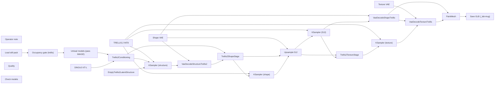

# dcc/still-to-mesh

**What's on this page**

- **Purpose, occupancy, and models** from the on-canvas Note
- **Graph flow** (groups when the canvas is large)
- **Every node id** on this graph
- **Node parameter reference** for each type, with this graph's values and the other legal choices

**What this enables**

- **Queuing this filename** with known widgets
- **Changing a parameter** with a documented generation effect

**Who this is for:** studio users who loaded `dcc/still-to-mesh` from Apps or Workflows.

> Generated from `workflows/_lab/dcc/still-to-mesh.json`. Do not hand-edit this file. Re-run `python3 docs/generate_workflow_docs.py` (or `make docs`).

## Purpose

Occupancy **trellis**. Outputs under `${COMFY_OUTPUT_DIR}`. Unload the previous family before Queue.

````text
## dcc/still-to-mesh

Still pack plate → native TRELLIS.2 INT8 mesh (Comfy core nodes). Occupancy: **trellis**.

```bash
./scripts/manage.sh download-3d --tier trellis2
./scripts/manage.sh occupancy enter trellis --yes
```

EZDCCLoadStillPack slug ``go-see`` plate ``mug`` → OccupancyGate → EZUnloadModels → TRELLIS.2 INT8. Save under ``assets/objects/_lab-mug/`` (output tree, never MODELS_DIR). Do not mint an Asset Bible row from this graph.

No Preview3D / Load3D / Save3D types in-tree — inspect the GLB with core Load 3D / Preview 3D after Queue. Native INT8 only.
````

## How to Queue

1. `./scripts/manage.sh start` so `_lab` is seeded
2. Load **dcc/still-to-mesh** from **Apps** or **Workflows**
3. Read the on-canvas Note, change widgets, Queue

Do not edit raw `_lab` JSON. Save keepers under `_user/`.

## Graph



## Nodes on this graph

| Id | Title | Type | Group |
| --- | --- | --- | --- |
| 1 | Operator note | `Note` | Ungrouped |
| 2 | Load still pack | `EZDCCLoadStillPack` | Ungrouped |
| 3 | Unload models (pass IMAGE) | `EZUnloadModels` | Ungrouped |
| 4 | DINOv3 ViT-L | `CLIPVisionLoader` | Ungrouped |
| 5 | TRELLIS.2 INT8 | `UNETLoader` | Ungrouped |
| 6 | Shape VAE | `VAELoader` | Ungrouped |
| 7 | Texture VAE | `VAELoader` | Ungrouped |
| 8 | Trellis2Conditioning | `Trellis2Conditioning` | Ungrouped |
| 9 | EmptyTrellis2LatentStructure | `EmptyTrellis2LatentStructure` | Ungrouped |
| 10 | KSampler (structure) | `KSampler` | Ungrouped |
| 11 | VaeDecodeStructureTrellis2 | `VaeDecodeStructureTrellis2` | Ungrouped |
| 12 | Trellis2ShapeStage | `Trellis2ShapeStage` | Ungrouped |
| 13 | KSampler (shape) | `KSampler` | Ungrouped |
| 14 | Upsample 512 | `Trellis2UpsampleStage` | Ungrouped |
| 15 | KSampler (512) | `KSampler` | Ungrouped |
| 16 | VaeDecodeShapeTrellis | `VaeDecodeShapeTrellis` | Ungrouped |
| 17 | Trellis2TextureStage | `Trellis2TextureStage` | Ungrouped |
| 18 | KSampler (texture) | `KSampler` | Ungrouped |
| 19 | VaeDecodeTextureTrellis | `VaeDecodeTextureTrellis` | Ungrouped |
| 20 | PaintMesh | `PaintMesh` | Ungrouped |
| 21 | Save GLB (_lab-mug) | `MeshToFile3D` | Ungrouped |
| 22 | Occupancy gate (trellis) | `EZDCCOccupancyGate` | Ungrouped |
| 23 | Quality | `EZQuality` | Ungrouped |
| 24 | Check models | `EZModelCheck` | Ungrouped |

## Node parameter reference

Every unique node type on this graph. Widgets are in lab JSON order. Choices are ComfyUI v0.37.0 / lab `INPUT_TYPES` — not SD1.5 folklore.

### `Note` — Note

On-canvas operator note (not executed).

!!! warning "Lab notes"

    Every lab graph has one. Purpose, models, sampler, occupancy, run steps.

#### `text`

Type `STRING`.

Markdown-ish operator note.

**How it affects generation:** Does not affect pixels. Read it before Queue.

**This graph:** `## dcc/still-to-mesh Still pack plate → native TRELLIS.2 INT8 mesh (Comfy core nodes). Occupancy: **trellis**. ```bash ./scripts/manage.sh download-3d --tier trellis2 ./scripts/manage.sh occupancy en…`

````text
## dcc/still-to-mesh

Still pack plate → native TRELLIS.2 INT8 mesh (Comfy core nodes). Occupancy: **trellis**.

```bash
./scripts/manage.sh download-3d --tier trellis2
./scripts/manage.sh occupancy enter trellis --yes
```

EZDCCLoadStillPack slug ``go-see`` plate ``mug`` → OccupancyGate → EZUnloadModels → TRELLIS.2 INT8. Save under ``assets/objects/_lab-mug/`` (output tree, never MODELS_DIR). Do not mint an Asset Bible row from this graph.

No Preview3D / Load3D / Save3D types in-tree — inspect the GLB with core Load 3D / Preview 3D after Queue. Native INT8 only.
````

### `EZDCCLoadStillPack` — Load still pack

Load a blender-stills plate from guides/<slug>/stills/<plate>/.

| Socket | Dir | Type | What it carries |
| --- | --- | --- | --- |
| `image` | out | `IMAGE` | Plate. |
| `mask` | out | `MASK` | Alpha. |
| `metadata` | out | `STRING` | Pack JSON. |

#### `slug`

Type `STRING`. Range / default: go-see.

Pack slug.

**How it affects generation:** guides/<slug>/stills/.

**This graph:** `go-see`

#### `plate`

Type `STRING`. Range / default: mug.

Plate id.

**How it affects generation:** Lab TRELLIS mug uses plate=mug.

**This graph:** `mug`

#### `layer`

Type `COMBO`. Range / default: first.

Which layer.

**How it affects generation:** first is the RGB hero. depth/canny/normal are workbench passes.

**This graph:** `first`

**Other choices**

| Choice | What it does |
| --- | --- |
| `first` | RGB hero. |
| `rgb` | RGB alias. |
| `depth` | Depth. |
| `canny` | Canny. |
| `normal` | Normals. |

### `EZUnloadModels` — Unload models

Pass-through IMAGE that unloads diffusion models first.

!!! warning "Lab notes"

    Keeps Klein 4B and LTX-2.5 from sitting in memory together on 90s one-click films.

| Socket | Dir | Type | What it carries |
| --- | --- | --- | --- |
| `image` | in | `IMAGE` | Identity still. |
| `image` | out | `IMAGE` | Same still after unload. |

No widgets. Sockets only.

### `CLIPVisionLoader` — Load CLIP Vision

Load an image encoder for TRELLIS.2 conditioning.

!!! warning "Lab notes"

    Lab: dino_v3_vit_l.safetensors. Occupancy trellis.

| Socket | Dir | Type | What it carries |
| --- | --- | --- | --- |
| `CLIP_VISION` | out | `CLIP_VISION` | Vision tower. |

#### `clip_name`

Type `STRING`.

Vision checkpoint filename.

**How it affects generation:** DINOv3 ViT-L is the TRELLIS.2 pair. A text CLIP will not work here.

**This graph:** `dino_v3_vit_l.safetensors`

### `UNETLoader` — Load Diffusion Model

Load a standalone transformer/UNET from diffusion_models/.

!!! warning "Lab notes"

    Lab files: flux-2-klein-4b-fp8.safetensors, wan2.2_ti2v_5B_fp16.safetensors, ltx-2.5-22b-distilled-transformer-comfy-int8-convrot.safetensors. weight_dtype stays default.

| Socket | Dir | Type | What it carries |
| --- | --- | --- | --- |
| `MODEL` | out | `MODEL` | Denoiser weights. |

#### `unet_name`

Type `STRING`.

Checkpoint filename under MODELS_DIR diffusion_models.

**How it affects generation:** Wrong family = Queue error or a melted picture. Lab pins Apache Klein 4B. Klein 9B / FLUX.2-dev are opt-in NC. MiniMax is banned.

**This graph:** `trellis_2_int8_convrot.safetensors`

#### `weight_dtype`

Type `COMBO`. Range / default: default.

Cast at load.

**How it affects generation:** default keeps the file's dtype (Klein FP8, LTX INT8-convrot, Wan FP16).

**This graph:** `default`

**Other choices**

| Choice | What it does |
| --- | --- |
| `default` | Load weights as stored. Lab UNETLoader always uses this. |
| `fp8_e4m3fn` | Cast to FP8 e4m3fn. Can save memory; may shift Klein/LTX quality. |
| `fp8_e4m3fn_fast` | FP8 e4m3fn with fast optimizations. |
| `fp8_e5m2` | Cast to FP8 e5m2. |

### `VAELoader` — Load VAE

Load the autoencoder that maps pixels ↔ latents (and LTX audio).

!!! warning "Lab notes"

    Do not mix families: flux2-vae, wan2.2_vae, ltx-2.5-video-vae-bf16, ltx-2.5-audio-vae-bf16.

| Socket | Dir | Type | What it carries |
| --- | --- | --- | --- |
| `VAE` | out | `VAE` | Encoder/decoder. |

#### `vae_name`

Type `STRING`.

Filename under vae/.

**How it affects generation:** Wrong VAE = color trash or a shape error.

| Instance | Value |
| --- | --- |
| Shape VAE | `trellis_2_shape_vae_bf16.safetensors` |
| Texture VAE | `trellis_2_texture_vae_bf16.safetensors` |

### `Trellis2Conditioning` — TRELLIS.2 Conditioning

Encode a still with CLIP Vision into TRELLIS positive/negative.

| Socket | Dir | Type | What it carries |
| --- | --- | --- | --- |
| `clip_vision_model` | in | `CLIP_VISION` | DINOv3 ViT-L. |
| `image` | in | `IMAGE` | Klein still. |
| `positive` | out | `CONDITIONING` | Shape/texture positive. |
| `negative` | out | `CONDITIONING` | Negative. |

No widgets. Sockets only.

### `EmptyTrellis2LatentStructure` — Empty TRELLIS.2 Latent Structure

Allocate a TRELLIS.2 structure latent (batch only).

!!! warning "Lab notes"

    Occupancy trellis. Unload Klein first.

| Socket | Dir | Type | What it carries |
| --- | --- | --- | --- |
| `LATENT` | out | `LATENT` | Structure noise. |

#### `batch_size`

Type `INT`. Range / default: 1.

Meshes per Queue.

**How it affects generation:** Stay 1 on GB10.

**This graph:** `1`

### `KSampler` — KSampler

Denoise a latent for N steps at a CFG, sampler, and scheduler.

!!! warning "Lab notes"

    Distilled Klein is CFG 1.0 / 4 steps / euler / simple. Raising CFG is not a quality knob. Wan 5B uses uni_pc and CFG 5. LTX distilled uses euler / simple / CFG 1.0 / 20 steps. ACE-Step uses 8 steps / CFG 1.0 / euler. TRELLIS uses 12 steps / CFG 7.5 / euler / normal.

| Socket | Dir | Type | What it carries |
| --- | --- | --- | --- |
| `model` | in | `MODEL` | UNET / transformer after any ModelSampling* patch. |
| `positive` | in | `CONDITIONING` | What to include (CLIP / ACE / LTX prompt). |
| `negative` | in | `CONDITIONING` | What to avoid. Distilled Klein ignores this well — put constraints in the positive. |
| `latent_image` | in | `LATENT` | Noise canvas or encoded start image / video / audio latent. |
| `LATENT` | out | `LATENT` | Denoised latent for VAE decode. |

#### `seed`

Type `INT`. Range / default: 0 … 2^64-1; lab 42.

Random seed for the noise tensor.

**How it affects generation:** Same seed + same graph ≈ same picture or clip. Lab locks 42 on smokes so drafts are comparable.

| Instance | Value |
| --- | --- |
| KSampler (structure) | `42` |
| KSampler (shape) | `42` |
| KSampler (512) | `42` |
| KSampler (texture) | `43` |

#### `control_after_generate`

Type `COMBO`. Range / default: fixed (lab).

What happens to seed after Queue.

**How it affects generation:** fixed keeps iteration honest while you change the prompt.

**This graph (all 4 instances):** `fixed`

**Other choices**

| Choice | What it does |
| --- | --- |
| `fixed` | Keep this seed on the next Queue. Lab default for reproducible stills and 5 s prints. |
| `increment` | Add 1 after Queue. Use for a sequence of variations. |
| `decrement` | Subtract 1 after Queue. |
| `randomize` | Draw a new seed after Queue. Exploration only. |

#### `steps`

Type `INT`. Range / default: 1–10000; Klein distilled 4; LTX 20; Wan 20; ACE 8; TRELLIS 12.

Denoising iterations.

**How it affects generation:** More steps refine detail with diminishing returns. Distilled Klein is authored at 4 — raising steps is slower, not a quality knob. Do not raise LTX/Wan toward a 90 s denoise.

**This graph (all 4 instances):** `12`

#### `cfg`

Type `FLOAT`. Range / default: 0–100; Klein/LTX/ACE 1.0; Wan 5; TRELLIS 7.5.

Classifier-free guidance scale.

**How it affects generation:** Distilled Klein is CFG 1.0 — raising CFG is the wrong quality lever (use the Positive prompt, resolution, or still-hero). Wan silent 5B uses CFG 5. TRELLIS structure uses 7.5. At CFG 1.0 Comfy skips the negative pass.

| Instance | Value |
| --- | --- |
| KSampler (structure) | `7.5` |
| KSampler (shape) | `7.5` |
| KSampler (512) | `7.5` |
| KSampler (texture) | `1` |

#### `sampler_name`

Type `COMBO`. Range / default: euler (most lab); uni_pc (Wan).

ODE / SDE algorithm that removes noise.

**How it affects generation:** euler is the lab still/AV/ACE default. uni_pc is the Wan 5B silent default. Ancestral/SDE samplers add extra randomness and weaken seed lock.

**This graph (all 4 instances):** `euler`

**Other choices**

| Choice | What it does |
| --- | --- |
| `euler` | First-order ODE. Lab default for Klein, LTX, ACE, and most stills. Fast and stable at CFG 1.0. |
| `euler_cfg_pp` | Euler with CFG++. Rarely needed on distilled Klein (CFG is already 1.0). |
| `euler_ancestral` | Adds ancestral noise each step. More variation; weaker exact seed lock. |
| `euler_ancestral_cfg_pp` | Ancestral Euler with CFG++. |
| `heun` | Second-order Heun. Slower, sometimes smoother; not a lab default. |
| `heunpp2` | Higher-order Heun variant. |
| `exp_heun_2_x0` | Exponential Heun (x0 prediction). |
| `exp_heun_2_x0_sde` | Exponential Heun SDE. Extra stochasticity. |
| `dpm_2` | DPM-Solver-2. Two function evals per step. |
| `dpm_2_ancestral` | Ancestral DPM-2. |
| `lms` | Linear multistep. Older; keep for experiments only. |
| `dpm_fast` | Fast DPM. Coarse, good for previews. |
| `dpm_adaptive` | Adaptive DPM. Step count is a hint, not a hard budget. |
| `dpmpp_2s_ancestral` | DPM++ 2S ancestral. Common SD1.5 pick; not a Klein default. |
| `dpmpp_2s_ancestral_cfg_pp` | DPM++ 2S ancestral with CFG++. |
| `dpmpp_sde` | DPM++ SDE. Stochastic, slower. |
| `dpmpp_sde_gpu` | DPM++ SDE on GPU noise. |
| `dpmpp_2m` | DPM++ 2M. Smooth; often used on SD-family, not distilled Klein. |
| `dpmpp_2m_cfg_pp` | DPM++ 2M with CFG++. |
| `dpmpp_2m_sde` | DPM++ 2M SDE. |
| `dpmpp_2m_sde_gpu` | DPM++ 2M SDE GPU noise. |
| `dpmpp_2m_sde_heun` | DPM++ 2M SDE Heun. |
| `dpmpp_2m_sde_heun_gpu` | DPM++ 2M SDE Heun GPU. |
| `dpmpp_3m_sde` | DPM++ 3M SDE. |
| `dpmpp_3m_sde_gpu` | DPM++ 3M SDE GPU. |
| `ddpm` | Classic DDPM. Slow; do not use on 121-frame LTX. |
| `lcm` | Latent Consistency. Needs an LCM-tuned model; not lab Klein/Wan/LTX. |
| `ipndm` | iPNDM multistep. |
| `ipndm_v` | iPNDM (v-prediction). |
| `deis` | DEIS multistep. |
| `cfgpp_ud10_ab` | CFG++ UD10 AB. Added in ComfyUI 0.35; not a lab default. |
| `res_multistep` | Res multistep. Some turbo recipes. |
| `res_multistep_cfg_pp` | Res multistep CFG++. |
| `res_multistep_ancestral` | Ancestral res multistep. |
| `res_multistep_ancestral_cfg_pp` | Ancestral res multistep CFG++. |
| `gradient_estimation` | Gradient-estimation sampler. |
| `gradient_estimation_cfg_pp` | Gradient-estimation CFG++. |
| `er_sde` | ER-SDE sampler. |
| `seeds_2` | SEEDS-2. |
| `seeds_3` | SEEDS-3. |
| `sa_solver` | SA-Solver. |
| `sa_solver_pece` | SA-Solver PECE. |
| `ddim` | DDIM. Deterministic; not a lab default. |
| `uni_pc` | UniPC. Lab Wan 5B silent graphs use this with CFG 5. |
| `uni_pc_bh2` | UniPC BH2 variant. |

#### `scheduler`

Type `COMBO`. Range / default: simple (most lab); normal (TRELLIS).

How sigmas are spaced across steps.

**How it affects generation:** simple is even spacing and matches distilled Klein / LTX / ACE. normal is the TRELLIS pair. Do not copy karras from an SD1.5 recipe onto Klein.

| Instance | Value |
| --- | --- |
| KSampler (structure) | `normal` |
| KSampler (shape) | `normal` |
| KSampler (512) | `simple` |
| KSampler (texture) | `normal` |

**Other choices**

| Choice | What it does |
| --- | --- |
| `simple` | Even sigma spacing. Lab default for Klein, Wan, LTX, and ACE. |
| `normal` | Linear timestep schedule. TRELLIS structure/texture stages use this. |
| `karras` | Karras sigmas. Often sharper on SD-family; not the lab default. |
| `exponential` | Exponential sigma decay. |
| `sgm_uniform` | SGM uniform. SD3-family default; Wan uses ModelSamplingSD3 shift instead. |
| `ddim_uniform` | Uniform DDIM schedule. |
| `beta` | Beta-distribution timesteps. |
| `linear_quadratic` | Linear then quadratic (Mochi-style). |
| `kl_optimal` | KL-optimal sigma curve. |

#### `denoise`

Type `FLOAT`. Range / default: 0–1; lab 1.0.

Fraction of the latent to replace with denoised signal.

**How it affects generation:** 1.0 is full generation (T2I / T2V / ACE). Values below 1 keep structure from an encoded start image (Klein edit / clay). Lab I2V uses dedicated latent nodes, not denoise<1 on empty noise.

**This graph (all 4 instances):** `1`

### `VaeDecodeStructureTrellis2` — TRELLIS.2 Decode Structure

Decode structure latent to voxels.

| Socket | Dir | Type | What it carries |
| --- | --- | --- | --- |
| `samples` | in | `LATENT` | Structure latent. |
| `vae` | in | `VAE` | TRELLIS VAE. |
| `voxel` | out | `LATENT` | Voxel grid. |

#### `resolution`

Type `COMBO`. Range / default: 32.

Voxel grid size.

**How it affects generation:** 32 is the lab structure decode.

**This graph:** `32`

**Other choices**

| Choice | What it does |
| --- | --- |
| `32` | Lab default. |

### `Trellis2ShapeStage` — TRELLIS.2 Shape Stage

Sample structure from a voxel latent.

| Socket | Dir | Type | What it carries |
| --- | --- | --- | --- |
| `positive` | in | `CONDITIONING` | Vision cond. |
| `negative` | in | `CONDITIONING` | Negative. |
| `voxel` | in | `LATENT` | Structure decode voxels. |
| `positive` | out | `CONDITIONING` | Pass-through. |
| `negative` | out | `CONDITIONING` | Pass-through. |
| `LATENT` | out | `LATENT` | Shape latent. |

No widgets. Sockets only.

### `Trellis2UpsampleStage` — TRELLIS.2 Upsample Stage

Upsample the shape latent toward 512.

!!! warning "Lab notes"

    Lab widget 512. download-3d --tier trellis2.

| Socket | Dir | Type | What it carries |
| --- | --- | --- | --- |
| `positive` | in | `CONDITIONING` | Cond. |
| `negative` | in | `CONDITIONING` | Cond. |
| `shape_latent` | in | `LATENT` | Shape latent. |
| `vae` | in | `VAE` | TRELLIS VAE. |
| `positive` | out | `CONDITIONING` | Cond. |
| `negative` | out | `CONDITIONING` | Cond. |
| `LATENT` | out | `LATENT` | Upsampled shape. |

#### `resolution`

Type `COMBO`. Range / default: 512.

Target structure resolution.

**How it affects generation:** 512 is the lab INT8 mesh. Lower is faster and blockier.

**This graph:** `512`

**Other choices**

| Choice | What it does |
| --- | --- |
| `512` | Lab default. |
| `256` | Faster, coarser. |

### `VaeDecodeShapeTrellis` — TRELLIS Decode Shape

Decode shape latent to a mesh.

| Socket | Dir | Type | What it carries |
| --- | --- | --- | --- |
| `samples` | in | `LATENT` | Shape latent. |
| `vae` | in | `VAE` | VAE. |
| `mesh` | out | `MESH` | Untextured mesh. |
| `shape_subdivides` | out | `SHAPE_SUBDIVIDES` | Subdivision payload for texture decode. |

No widgets. Sockets only.

### `Trellis2TextureStage` — TRELLIS.2 Texture Stage

Sample voxel colors for the mesh.

| Socket | Dir | Type | What it carries |
| --- | --- | --- | --- |
| `positive` | in | `CONDITIONING` | Cond. |
| `negative` | in | `CONDITIONING` | Cond. |
| `shape_latent` | in | `LATENT` | Shape. |
| `positive` | out | `CONDITIONING` | Cond. |
| `negative` | out | `CONDITIONING` | Cond. |
| `LATENT` | out | `LATENT` | Texture latent. |

No widgets. Sockets only.

### `VaeDecodeTextureTrellis` — TRELLIS Decode Texture

Decode texture latent to voxel colors.

| Socket | Dir | Type | What it carries |
| --- | --- | --- | --- |
| `samples` | in | `LATENT` | Texture latent. |
| `vae` | in | `VAE` | VAE. |
| `shape_subdivides` | in | `SHAPE_SUBDIVIDES` | From shape decode. |
| `voxel_colors` | out | `VOXEL_COLORS` | Colors for PaintMesh. |

No widgets. Sockets only.

### `PaintMesh` — Paint Mesh

Apply voxel colors onto the mesh.

| Socket | Dir | Type | What it carries |
| --- | --- | --- | --- |
| `mesh` | in | `MESH` | Shape mesh. |
| `voxel_colors` | in | `VOXEL_COLORS` | Decoded colors. |
| `mesh` | out | `MESH` | Painted mesh. |

No widgets. Sockets only.

### `MeshToFile3D` — Mesh to File 3D

Write a GLB/mesh file.

!!! warning "Lab notes"

    optional/trellis2 may leave the path empty (Comfy default). dcc/still-to-mesh writes assets/objects/_lab-mug/mesh.

| Socket | Dir | Type | What it carries |
| --- | --- | --- | --- |
| `mesh` | in | `MESH` | Painted mesh. |
| `model_3d` | out | `MODEL_3D` | File handle. |

#### `filename_prefix`

Type `STRING`.

Output stem under the output folder.

**How it affects generation:** Lab mug pack uses assets/objects/_lab-mug/mesh.

**This graph:** `assets/objects/_lab-mug/mesh`

### `EZDCCOccupancyGate` — Occupancy gate

Pass-through IMAGE that fail-closes on occupancy XOR. Does not start Compose.

!!! warning "Lab notes"

    Missing .occupancy.json passes. idle / blender-desk / llm-desk / mismatch fail.

| Socket | Dir | Type | What it carries |
| --- | --- | --- | --- |
| `image` | in | `IMAGE` | Still to gate. |
| `image` | out | `IMAGE` | Same still if occupancy matches. |

#### `required_mode`

Type `COMBO`.

Heavy GPU mode that must already be entered.

**How it affects generation:** klein / wan / ltx / trellis. Pick the family you are about to Queue.

**This graph:** `trellis`

**Other choices**

| Choice | What it does |
| --- | --- |
| `klein` | Klein 4B stills. |
| `trellis` | TRELLIS.2. |
| `wan` | Wan 5B. |
| `ltx` | LTX-2.5. |

### `EZQuality` — Quality

Workflow-global quality combo. JS overlays family-specific sampler, UNET, CLIP, and VAE widgets.

!!! warning "Lab notes"

    custom freezes the last overlay. lab restores authored widgets. Free Commercial Use (<$10M) pins Apache Klein 4B (never 9B / FLUX.2-dev) and LTX-2.5 steps; Wan / audio / trellis are no-ops. ultra/max may select Klein 9B or FLUX.2-dev when those files are on disk (FLUX Non-Commercial, not YouTube-ok). Never changes size. Not --tier quality.

| Socket | Dir | Type | What it carries |
| --- | --- | --- | --- |
| `quality` | out | `STRING` | Selected quality id. |

#### `quality`

Type `COMBO`. Range / default: lab.

custom freezes last overlay; lab restores graph defaults.

**How it affects generation:** Named qualities may swap UNET, CLIP, and VAE. Does not change size or length. Free Commercial Use (<$10M) is Klein 4B + LTX (never 9B / FLUX.2-dev). ultra/max need download-image --tier 9b or flux2-dev.

**This graph:** `lab`

**Other choices**

| Choice | What it does |
| --- | --- |
| `custom` | Freeze current widgets. Queue does not overlay. |
| `draft` | Faster Apache Klein 4B (NVFP4 if on disk). |
| `lab` | Authored lab widgets. Default. |
| `standard` | Distilled 4B, 8 steps, CFG 1.0. |
| `high` | Klein base 4B + CFG 3.5 when on disk; else extra distilled steps at CFG 1.0. |
| `Free Commercial Use (<$10M)` | Klein 4B stills (never 9B / FLUX.2-dev) + LTX-2.5 steps. Optional SeedVR2 polish on the PNG, not 4K. Wan / audio / trellis are no-ops. |
| `ultra` | Klein 9B distilled when on disk (FLUX Non-Commercial). Else high. |
| `max` | Klein 9B base or FLUX.2-dev when on disk (FLUX Non-Commercial). Else high. |

### `EZModelCheck` — Check models

Manual disk check for occupancy + Quality weights. Queue does not run this node.

!!! warning "Lab notes"

    Click Check models (canvas button or App occupancy chip). Reports Ready, or missing files plus the host download command. Not an output node.

#### `status`

Type `STRING`.

Last check result.

**How it affects generation:** JS overwrites after Check models. Queue ignores this node.

**This graph:** `Click Check models. Queue does not run this node.`
