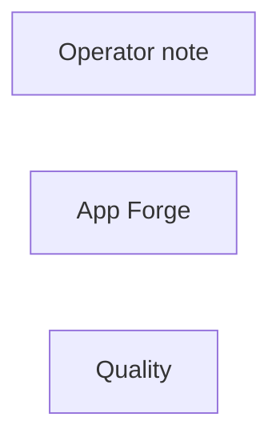

# inspire/app-forge

**What's on this page**

- **Purpose, occupancy, and models** from the on-canvas Note
- **Graph flow** (groups when the canvas is large)
- **Every node id** on this graph
- **Node parameter reference** for each type, with this graph's values and the other legal choices

**What this enables**

- **Queuing this filename** with known widgets
- **Changing a parameter** with a documented generation effect

**Who this is for:** studio users who loaded `inspire/app-forge` from Apps or Workflows.

> Generated from `workflows/_lab/inspire/app-forge.json`. Do not hand-edit this file. Re-run `python3 docs/generate_workflow_docs.py` (or `make docs`).

## Purpose

Occupancy **llm**. Outputs under `${COMFY_OUTPUT_DIR}`. Unload the previous family before Queue.

```text
## inspire/app-forge

App Forge — clone a shipped lab graph into live `_user/` as a new App.
No UNET, no VAE, no KSampler. Does not Queue the result.

Occupancy: llm — graph label (not a CLI mode). Prefer GPU 35B:

  ./scripts/manage.sh occupancy enter llm-desk --yes

Falls back to on-box Qwen3-4B if the sidecar is down, then a keyword
heuristic if the GGUF is missing. CPU 4B is required next to Wan/LTX/TRELLIS.

1. Type a **Brief** (or pick a sample). Leave **Template** on auto, or pin
   a lab id such as klein/ig-square.
2. Set **Slug** (lowercase, hyphen). **As app** on writes `*.app.json`.
3. Queue. Read **Path**, **Picked template**, and **Result occupancy**.
4. Open `_user/<slug>` from the Apps sidebar. Queue that graph when GB10
   occupancy matches the result (klein / wan / ltx / …).

Laptop agents: `./scripts/manage.sh studio-mcp --stdio` (Path D). Same
pipeline as this App. Does not queue Comfy. Does not refuse a GPU session.
Does not write `workflows/_lab/`. Keepers: `promote-workflow`.
Prompt enhance is on by default (on-box Qwen3-4B-Instruct-2507). After Queue, the Enhance node shows the prompt CLIP used (or a passthrough reason). Turn Enhance off to use the widget text as-is. Optional style dropdown.
```

## How to Queue

1. `./scripts/manage.sh start` so `_lab` is seeded
2. Load **inspire/app-forge** from **Apps** or **Workflows**
3. Read the on-canvas Note, change widgets, Queue

Do not edit raw `_lab` JSON. Save keepers under `_user/`.

## Graph



## Nodes on this graph

| Id | Title | Type | Group |
| --- | --- | --- | --- |
| 1 | Operator note | `Note` | NOTE |
| 2 | App Forge | `EZAppForge` | FORGE |
| 3 | Quality | `EZQuality` | Ungrouped |

## Node parameter reference

Every unique node type on this graph. Widgets are in lab JSON order. Choices are ComfyUI v0.34.6 / lab `INPUT_TYPES` — not SD1.5 folklore.

### `Note` — Note

On-canvas operator note (not executed).

!!! warning "Lab notes"

    Every lab graph has one. Purpose, models, sampler, occupancy, run steps.

#### `text`

Type `STRING`.

Markdown-ish operator note.

**How it affects generation:** Does not affect pixels. Read it before Queue.

**This graph:** `## inspire/app-forge App Forge — clone a shipped lab graph into live `_user/` as a new App. No UNET, no VAE, no KSampler. Does not Queue the result. Occupancy: llm — graph label (not a CLI mode). Pre…`

```text
## inspire/app-forge

App Forge — clone a shipped lab graph into live `_user/` as a new App.
No UNET, no VAE, no KSampler. Does not Queue the result.

Occupancy: llm — graph label (not a CLI mode). Prefer GPU 35B:

  ./scripts/manage.sh occupancy enter llm-desk --yes

Falls back to on-box Qwen3-4B if the sidecar is down, then a keyword
heuristic if the GGUF is missing. CPU 4B is required next to Wan/LTX/TRELLIS.

1. Type a **Brief** (or pick a sample). Leave **Template** on auto, or pin
   a lab id such as klein/ig-square.
2. Set **Slug** (lowercase, hyphen). **As app** on writes `*.app.json`.
3. Queue. Read **Path**, **Picked template**, and **Result occupancy**.
4. Open `_user/<slug>` from the Apps sidebar. Queue that graph when GB10
   occupancy matches the result (klein / wan / ltx / …).

Laptop agents: `./scripts/manage.sh studio-mcp --stdio` (Path D). Same
pipeline as this App. Does not queue Comfy. Does not refuse a GPU session.
Does not write `workflows/_lab/`. Keepers: `promote-workflow`.
Prompt enhance is on by default (on-box Qwen3-4B-Instruct-2507). After Queue, the Enhance node shows the prompt CLIP used (or a passthrough reason). Turn Enhance off to use the widget text as-is. Optional style dropdown.
```

### `EZAppForge` — App Forge

Clone a shipped lab graph into live _user/ as a new App. No UNET.

!!! warning "Lab notes"

    Occupancy llm. Does not Queue the result. Does not write _lab. Keyword heuristic if GGUF is missing. Path D: studio-mcp. Not Comfy Cloud MCP.

| Socket | Dir | Type | What it carries |
| --- | --- | --- | --- |
| `path` | out | `STRING` | Written _user path or error. |

#### `sample`

Type `COMBO`. Range / default: custom.

Sample brief or Custom.

**How it affects generation:** Custom uses the Brief box.

**This graph:** `custom`

#### `prompt`

Type `STRING`.

Brief.

**How it affects generation:** What the new App should make. Template auto picks a lab graph.

**This graph:** `1:1 IG still of a chipped cobalt mug on pale stone, unmarked surfaces.`

#### `template`

Type `COMBO`. Range / default: auto.

Lab graph to clone.

**How it affects generation:** auto uses the GGUF planner or a keyword heuristic. Pin klein/ig-square to skip.

**This graph:** `auto`

#### `slug`

Type `STRING`.

Filename stem.

**How it affects generation:** Live _user/<slug>.app.json. Lowercase letters, digits, hyphen.

**This graph:** `mug-ig`

#### `as_app`

Type `BOOLEAN`. Range / default: true.

Write an App.

**How it affects generation:** true writes *.app.json for the Apps sidebar.

**This graph:** `true`

#### `overwrite`

Type `BOOLEAN`. Range / default: false.

Replace existing.

**How it affects generation:** false refuses an existing _user file.

**This graph:** `false`

#### `catalog`

Type `STRING`.

Catalog id.

**How it affects generation:** Leave as stamped.

**This graph:** `inspire/app-forge`

### `EZQuality` — Quality

Workflow-global Lab / Draft / High combo. JS overlays family-specific sampler and Klein UNET widgets.

!!! warning "Lab notes"

    Default lab leaves authored widgets. Draft is faster. High is slower. Distilled Klein High without Klein base keeps CFG 1.0. Never selects banned weights. Not --tier quality.

| Socket | Dir | Type | What it carries |
| --- | --- | --- | --- |
| `quality` | out | `STRING` | Selected quality id (lab, draft, high). |

#### `quality`

Type `COMBO`. Range / default: lab.

Lab default, Draft (faster), or High (slower).

**How it affects generation:** Family-specific overlays on steps, CFG, and Klein 4B UNET. Does not change size, length, CLIP, or VAE. Klein base High needs download-image --tier base.

**This graph:** `lab`

**Other choices**

| Choice | What it does |
| --- | --- |
| `lab` | Authored lab widgets. Default. |
| `draft` | Faster: fewer steps. Klein stays CFG 1.0 distilled when already distilled. |
| `high` | Slower: more steps. Klein base 4B + CFG 3.5 when that UNET is on disk; else extra distilled steps at CFG 1.0. |
