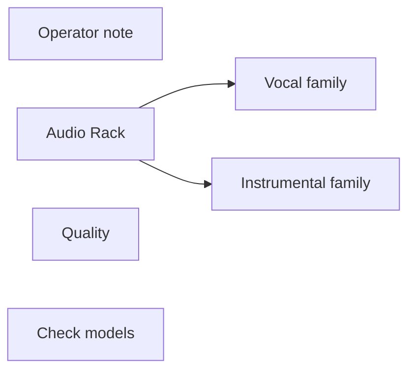

# inspire/audio-rack

**What's on this page**

- **Purpose, occupancy, and models** from the on-canvas Note
- **Graph flow** (groups when the canvas is large)
- **Every node id** on this graph
- **Node parameter reference** for each type, with this graph's values and the other legal choices

**What this enables**

- **Queuing this filename** with known widgets
- **Changing a parameter** with a documented generation effect

**Who this is for:** studio users who loaded `inspire/audio-rack` from Apps or Workflows.

> Generated from `workflows/_lab/inspire/audio-rack.json`. Do not hand-edit this file. Re-run `python3 docs/generate_workflow_docs.py` (or `make docs`).

## Purpose

Occupancy **llm**. Outputs under `${COMFY_OUTPUT_DIR}`. Unload the previous family before Queue.

```text
## inspire/audio-rack

Audio Rack - pick one audio/music technique per axis and splice ACE-Step tags and lyrics form. No UNET, no VAE, no KSampler.

Occupancy: llm - graph label (not a CLI mode). Prefer GPU 35B:

  ./scripts/manage.sh occupancy enter llm-desk --yes

Falls back to on-box Qwen3-4B if the sidecar is down. CPU 4B is required next to Wan/LTX/TRELLIS.

Do **not** load ACE-Step on this canvas. Copy tags/lyrics into audio/music/rap-draft or a podcast bed.

1. Optional **Brief** (what the track is about). Ignored on instrumental / podcast-bed.
2. Optional **Recipe** fills empty axes. Explicit dropdowns win.
3. Pick at most one technique per axis (genre, tempo, drums, bass, ...).
4. Set **Family** (ace_vocal, ace_instrumental, or podcast_bed).
5. Queue. Vocal / instrumental Enhance nodes preview rewritten tags and lyrics.
6. Copy tags into **audio/music/rap-draft**. Match encoder BPM to the notes line.

Instrumental forces no-vocals tags and [inst] / [drop] form. ACE sings any free-text under a section marker.
Audio Rack is deterministic (no LLM). Enhance is optional downstream.
Prompt enhance is on by default (on-box Qwen3-4B-Instruct-2507). After Queue, the Enhance node shows the prompt CLIP used (or a passthrough reason). Turn Enhance off to use the widget text as-is. Optional style dropdown.
```

## How to Queue

1. `./scripts/manage.sh start` so `_lab` is seeded
2. Load **inspire/audio-rack** from **Apps** or **Workflows**
3. Read the on-canvas Note, change widgets, Queue

Do not edit raw `_lab` JSON. Save keepers under `_user/`.

## Graph



## Nodes on this graph

| Id | Title | Type | Group |
| --- | --- | --- | --- |
| 1 | Operator note | `Note` | NOTE |
| 5 | Audio Rack | `EZAudioRack` | RACK |
| 2 | Vocal family | `EZAceStepPromptEnhance` | VOCAL |
| 3 | Instrumental family | `EZAceStepPromptEnhance` | INST |
| 6 | Quality | `EZQuality` | QUALITY |
| 7 | Check models | `EZModelCheck` | QUALITY |

## Node parameter reference

Every unique node type on this graph. Widgets are in lab JSON order. Choices are ComfyUI v0.37.0 / lab `INPUT_TYPES` - not SD1.5 folklore.

### `Note` - Note

On-canvas operator note (not executed).

!!! warning "Lab notes"

    Every lab graph has one. Purpose, models, sampler, occupancy, run steps.

#### `text`

Type `STRING`.

Markdown-ish operator note.

**How it affects generation:** Does not affect pixels. Read it before Queue.

**This graph:** `## inspire/audio-rack Audio Rack - pick one audio/music technique per axis and splice ACE-Step tags and lyrics form. No UNET, no VAE, no KSampler. Occupancy: llm - graph label (not a CLI mode). Prefe...`

```text
## inspire/audio-rack

Audio Rack - pick one audio/music technique per axis and splice ACE-Step tags and lyrics form. No UNET, no VAE, no KSampler.

Occupancy: llm - graph label (not a CLI mode). Prefer GPU 35B:

  ./scripts/manage.sh occupancy enter llm-desk --yes

Falls back to on-box Qwen3-4B if the sidecar is down. CPU 4B is required next to Wan/LTX/TRELLIS.

Do **not** load ACE-Step on this canvas. Copy tags/lyrics into audio/music/rap-draft or a podcast bed.

1. Optional **Brief** (what the track is about). Ignored on instrumental / podcast-bed.
2. Optional **Recipe** fills empty axes. Explicit dropdowns win.
3. Pick at most one technique per axis (genre, tempo, drums, bass, ...).
4. Set **Family** (ace_vocal, ace_instrumental, or podcast_bed).
5. Queue. Vocal / instrumental Enhance nodes preview rewritten tags and lyrics.
6. Copy tags into **audio/music/rap-draft**. Match encoder BPM to the notes line.

Instrumental forces no-vocals tags and [inst] / [drop] form. ACE sings any free-text under a section marker.
Audio Rack is deterministic (no LLM). Enhance is optional downstream.
Prompt enhance is on by default (on-box Qwen3-4B-Instruct-2507). After Queue, the Enhance node shows the prompt CLIP used (or a passthrough reason). Turn Enhance off to use the widget text as-is. Optional style dropdown.
```

### `EZAudioRack` - Audio Rack

Pick one audio/music technique per axis and splice ACE-Step tags and lyrics form.

!!! warning "Lab notes"

    Deterministic. No LLM. Recipe fills empty axes. Vocal omitted on instrumental/podcast. Instrumental forces no-vocals tags and [inst] form. Exactly one BPM when tempo is picked.

| Socket | Dir | Type | What it carries |
| --- | --- | --- | --- |
| `tags` | out | `STRING` | Genre-first ACE tags. |
| `lyrics` | out | `STRING` | Lyrics form / [inst] skeleton. |
| `notes` | out | `STRING` | Dropped conflicts and BPM token. |

#### `brief`

Type `STRING`.

Optional lyrics seed.

**How it affects generation:** Ignored on instrumental and podcast-bed so ACE does not sing free text.

**This graph:** `local booth bars on a dusty pocket`

#### `flavor`

Type `COMBO`. Range / default: ace_vocal.

Family renderer.

**How it affects generation:** ace_vocal keeps vocal identity. ace_instrumental and podcast_bed omit it and force no-vocals tags.

**This graph:** `ace_vocal`

**Other choices**

| Choice | What it does |
| --- | --- |
| `ace_vocal` | Vocal tags + lyrics form. |
| `ace_instrumental` | No-vocals tags and [inst]/[drop]. |
| `podcast_bed` | Instrumental bed; drop-first EDM dropped. |

#### `recipe`

Type `COMBO`. Range / default: none.

Named splice.

**How it affects generation:** Fills axes that are still none. Explicit picks win.

**This graph:** `none`

#### `genre_style`

Type `COMBO`. Range / default: none.

Genre.

**How it affects generation:** Genre-first ACE tags. Catalog under generated/audio.

**This graph:** `none`

#### `tempo_groove`

Type `COMBO`. Range / default: none.

Tempo.

**How it affects generation:** Pocket and BPM token. Match the ACE encoder BPM. Catalog under generated/audio.

**This graph:** `none`

#### `drums_rhythm`

Type `COMBO`. Range / default: none.

Drums.

**How it affects generation:** Kit, hats, and groove. Catalog under generated/audio.

**This graph:** `none`

#### `bass_low_end`

Type `COMBO`. Range / default: none.

Bass.

**How it affects generation:** Upright, 808, sub, walking. Catalog under generated/audio.

**This graph:** `none`

#### `harmony_mode`

Type `COMBO`. Range / default: none.

Harmony.

**How it affects generation:** Mode color in tags. Does not set ACE keyscale. Catalog under generated/audio.

**This graph:** `none`

#### `instruments_texture`

Type `COMBO`. Range / default: none.

Instruments.

**How it affects generation:** Specific instruments and timbre. Catalog under generated/audio.

**This graph:** `none`

#### `vocal_identity`

Type `COMBO`. Range / default: none.

Vocal.

**How it affects generation:** One vocal identity. Omitted on instrumental/podcast. Catalog under generated/audio.

**This graph:** `none`

#### `arrangement_form`

Type `COMBO`. Range / default: none.

Form.

**How it affects generation:** Lyrics skeleton. Instrumental uses [inst]/[drop]. Catalog under generated/audio.

**This graph:** `none`

#### `mix_production`

Type `COMBO`. Range / default: none.

Mix.

**How it affects generation:** Vinyl dirt, dry booth, club loudness, duck. Catalog under generated/audio.

**This graph:** `none`

#### `space_ambience`

Type `COMBO`. Range / default: none.

Space.

**How it affects generation:** Booth dry, hall, mono drums, width. Catalog under generated/audio.

**This graph:** `none`

#### `sound_design_fx`

Type `COMBO`. Range / default: none.

Sound design.

**How it affects generation:** Tape stop, riser, reverse cymbal. Catalog under generated/audio.

**This graph:** `none`

#### `mood_energy`

Type `COMBO`. Range / default: none.

Mood.

**How it affects generation:** Menace, laid-back, civic-serious. Catalog under generated/audio.

**This graph:** `none`

#### `use_case`

Type `COMBO`. Range / default: none.

Use.

**How it affects generation:** Draft, album take, 30 s bed, bumper. Catalog under generated/audio.

**This graph:** `none`

### `EZAceStepPromptEnhance` - ACE-Step Prompt Enhance

Rewrite ACE tags (genre first) and lyrics. Instrumental mode forces [inst].

!!! warning "Lab notes"

    Enhance off on authored album takes. Instrumental sanitizes lyrics into bracket cues.

| Socket | Dir | Type | What it carries |
| --- | --- | --- | --- |
| `lyrics` | in | `STRING` | Optional lyrics override (EZRapLyrics). |
| `tags` | out | `STRING` | Tags for the ACE encoder. |
| `lyrics` | out | `STRING` | Lyrics / [inst] for the ACE encoder. |

#### `sample`

Type `COMBO`. Range / default: custom.

Sample or Custom.

**How it affects generation:** Custom keeps authored tags/lyrics.

**This graph (all 2 instances):** `custom`

#### `tags`

Type `STRING`.

Genre-first tags.

**How it affects generation:** Keep vocal identity tags stable across an album. Drive-through is not rap-over-club.

#### `lyrics`

Type `STRING`.

Sectioned lyrics.

**How it affects generation:** Enhance off on catalog takes so exclusive verses stay pinned.

#### `enhance`

Type `BOOLEAN`. Range / default: false on albums.

Run the rewriter.

**How it affects generation:** On only when you typed a lazy hook and want the GGUF to expand it.

**This graph (all 2 instances):** `true`

#### `mode`

Type `COMBO`.

Vocal vs instrumental sanitizer.

**How it affects generation:** instrumental forces no-vocals tags and [inst] lyrics.

| Instance | Value |
| --- | --- |
| Vocal family | `vocal` |
| Instrumental family | `instrumental` |

**Other choices**

| Choice | What it does |
| --- | --- |
| `vocal` | Nill Bye / rap-draft / rap-full. |
| `instrumental` | Drive-through EDM. |

#### `catalog`

Type `STRING`.

Sample-catalog id.

**How it affects generation:** Leave as stamped.

**This graph (all 2 instances):** `inspire/audio-rack`

### `EZQuality` - Quality

Workflow-global quality combo. JS overlays family-specific sampler, UNET, CLIP, and VAE widgets.

!!! warning "Lab notes"

    custom freezes the last overlay. lab restores authored widgets. Free Commercial Use (<$10M) pins Apache Klein 4B (never 9B / FLUX.2-dev) and LTX-2.5 steps; Wan / audio / trellis are no-ops. ultra/max may select Klein 9B or FLUX.2-dev when those files are on disk (FLUX Non-Commercial, not YouTube-ok). Never changes size. Not --tier quality.

| Socket | Dir | Type | What it carries |
| --- | --- | --- | --- |
| `quality` | out | `STRING` | Selected quality id. |

#### `quality`

Type `COMBO`. Range / default: lab.

custom freezes last overlay; lab restores graph defaults.

**How it affects generation:** Named qualities may swap UNET, CLIP, and VAE. Does not change size or length. Free Commercial Use (<$10M) is Klein 4B + LTX (never 9B / FLUX.2-dev). ultra/max need download-image --tier 9b or flux2-dev.

**This graph:** `lab`

**Other choices**

| Choice | What it does |
| --- | --- |
| `custom` | Freeze current widgets. Queue does not overlay. |
| `draft` | Faster Apache Klein 4B (NVFP4 if on disk). |
| `lab` | Authored lab widgets. Default. |
| `standard` | Distilled 4B, 8 steps, CFG 1.0. |
| `high` | Klein base 4B + CFG 3.5 when on disk; else extra distilled steps at CFG 1.0. |
| `Free Commercial Use (<$10M)` | Klein 4B stills (never 9B / FLUX.2-dev) + LTX-2.5 steps. Optional SeedVR2 polish on the PNG, not 4K. Wan / audio / trellis are no-ops. |
| `ultra` | Klein 9B distilled when on disk (FLUX Non-Commercial). Else high. |
| `max` | Klein 9B base or FLUX.2-dev when on disk (FLUX Non-Commercial). Else high. |

### `EZModelCheck` - Check models

Manual disk check for occupancy + Quality weights. Queue does not run this node.

!!! warning "Lab notes"

    Click Check models (canvas button or App occupancy chip). Reports Ready, or missing files plus the host download command. Not an output node.

#### `status`

Type `STRING`.

Last check result.

**How it affects generation:** JS overwrites after Check models. Queue ignores this node.

**This graph:** `Click Check models. Queue does not run this node.`
