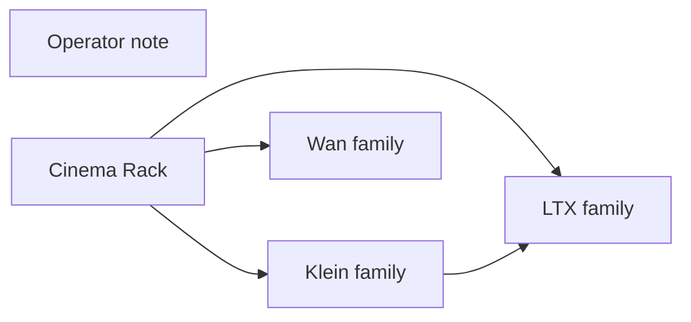

# inspire/cinema-rack

**What's on this page**

- **Purpose, occupancy, and models** from the on-canvas Note
- **Graph flow** (groups when the canvas is large)
- **Every node id** on this graph
- **Node parameter reference** for each type, with this graph's values and the other legal choices

**What this enables**

- **Queuing this filename** with known widgets
- **Changing a parameter** with a documented generation effect

**Who this is for:** studio users who loaded `inspire/cinema-rack` from Apps or Workflows.

> Generated from `workflows/_lab/inspire/cinema-rack.json`. Do not hand-edit this file. Re-run `python3 docs/generate_workflow_docs.py` (or `make docs`).

## Purpose

Occupancy **llm**. Outputs under `${COMFY_OUTPUT_DIR}`. Unload the previous family before Queue.

```text
## inspire/cinema-rack

Cinema Rack — pick one cinematography technique per axis and splice a Klein / Wan / LTX prompt. No UNET, no VAE, no KSampler.

Occupancy: llm — graph label (not a CLI mode). Prefer GPU 35B:

  ./scripts/manage.sh occupancy enter llm-desk --yes

Falls back to on-box Qwen3-4B if the sidecar is down. CPU 4B is required next to Wan/LTX/TRELLIS.

1. Type a **Subject** (who/what). Leave empty to splice techniques only.
2. Optional **Recipe** fills empty axes. Explicit dropdowns win.
3. Pick at most one technique per axis (shot size, angle, move, lens, …).
4. Set **Family** (klein, wan_t2v, ltx_t2v, or the i2v / identity flavors).
5. Queue. Each Enhance node previews the rewritten STRING. Style stays **none** so cinema clauses are not stripped.
6. Copy the family you need into **klein/still-draft** or an I2V graph.

Wan emits **one** camera verb. I2V drops look axes (start image owns grade). Editing is omitted on stills.
Cinema Rack is deterministic (no LLM). Enhance is optional downstream.
Prompt enhance is on by default (on-box Qwen3-4B-Instruct-2507). After Queue, the Enhance node shows the prompt CLIP used (or a passthrough reason). Turn Enhance off to use the widget text as-is. Optional style dropdown.
```

## How to Queue

1. `./scripts/manage.sh start` so `_lab` is seeded
2. Load **inspire/cinema-rack** from **Apps** or **Workflows**
3. Read the on-canvas Note, change widgets, Queue

Do not edit raw `_lab` JSON. Save keepers under `_user/`.

## Graph



## Nodes on this graph

| Id | Title | Type | Group |
| --- | --- | --- | --- |
| 1 | Operator note | `Note` | NOTE |
| 5 | Cinema Rack | `EZCinemaRack` | RACK |
| 2 | Klein family | `EZKleinPromptEnhance` | KLEIN |
| 3 | Wan family | `EZWanPromptEnhance` | WAN |
| 4 | LTX family | `EZLTXPromptEnhance` | LTX |

## Node parameter reference

Every unique node type on this graph. Widgets are in lab JSON order. Choices are ComfyUI v0.34.6 / lab `INPUT_TYPES` — not SD1.5 folklore.

### `Note` — Note

On-canvas operator note (not executed).

!!! warning "Lab notes"

    Every lab graph has one. Purpose, models, sampler, occupancy, run steps.

#### `text`

Type `STRING`.

Markdown-ish operator note.

**How it affects generation:** Does not affect pixels. Read it before Queue.

**This graph:** `## inspire/cinema-rack Cinema Rack — pick one cinematography technique per axis and splice a Klein / Wan / LTX prompt. No UNET, no VAE, no KSampler. Occupancy: llm — graph label (not a CLI mode). Pre…`

```text
## inspire/cinema-rack

Cinema Rack — pick one cinematography technique per axis and splice a Klein / Wan / LTX prompt. No UNET, no VAE, no KSampler.

Occupancy: llm — graph label (not a CLI mode). Prefer GPU 35B:

  ./scripts/manage.sh occupancy enter llm-desk --yes

Falls back to on-box Qwen3-4B if the sidecar is down. CPU 4B is required next to Wan/LTX/TRELLIS.

1. Type a **Subject** (who/what). Leave empty to splice techniques only.
2. Optional **Recipe** fills empty axes. Explicit dropdowns win.
3. Pick at most one technique per axis (shot size, angle, move, lens, …).
4. Set **Family** (klein, wan_t2v, ltx_t2v, or the i2v / identity flavors).
5. Queue. Each Enhance node previews the rewritten STRING. Style stays **none** so cinema clauses are not stripped.
6. Copy the family you need into **klein/still-draft** or an I2V graph.

Wan emits **one** camera verb. I2V drops look axes (start image owns grade). Editing is omitted on stills.
Cinema Rack is deterministic (no LLM). Enhance is optional downstream.
Prompt enhance is on by default (on-box Qwen3-4B-Instruct-2507). After Queue, the Enhance node shows the prompt CLIP used (or a passthrough reason). Turn Enhance off to use the widget text as-is. Optional style dropdown.
```

### `EZCinemaRack` — Cinema Rack

Pick one cinematography technique per axis and splice a Klein / Wan / LTX prompt.

!!! warning "Lab notes"

    Deterministic. No LLM. Recipe fills empty axes. Wan emits one camera verb. I2V drops look. Editing omitted on stills. Style on downstream Enhance stays none.

| Socket | Dir | Type | What it carries |
| --- | --- | --- | --- |
| `prompt` | out | `STRING` | Spliced prompt for CLIP / Enhance. |
| `notes` | out | `STRING` | Dropped conflicts and Wan camera token. |

#### `subject`

Type `STRING`.

Who or what is in the shot.

**How it affects generation:** Front-loaded except on I2V (start image owns identity).

**This graph:** `A techno wizard on a sunny tropical city rooftop.`

#### `flavor`

Type `COMBO`. Range / default: klein.

Family renderer.

**How it affects generation:** klein stills freeze motion axes. wan_t2v appends one camera token. i2v drops look.

**This graph:** `klein`

**Other choices**

| Choice | What it does |
| --- | --- |
| `klein` | Still sentences. |
| `klein_edit` | Edit still. |
| `klein_identity` | Camera-free bible. |
| `wan_t2v` | Look + one camera. |
| `wan_i2v` | Motion + camera only. |
| `ltx_t2v` | Present tense + foley. |
| `ltx_i2v` | I2V AV; look dropped. |

#### `recipe`

Type `COMBO`. Range / default: none.

Named splice.

**How it affects generation:** Fills axes that are still none. Explicit picks win.

**This graph:** `none`

#### `framing_shot_size`

Type `COMBO`. Range / default: none.

Shot size.

**How it affects generation:** How much of the subject fills the frame. Catalog under generated/cinema.

**This graph:** `none`

#### `camera_angles`

Type `COMBO`. Range / default: none.

Camera angle.

**How it affects generation:** Height and subject-relative angle. Catalog under generated/cinema.

**This graph:** `none`

#### `camera_movement`

Type `COMBO`. Range / default: none.

Camera move.

**How it affects generation:** The single Wan camera verb. Catalog under generated/cinema.

**This graph:** `none`

#### `lenses_optics`

Type `COMBO`. Range / default: none.

Lens and optic.

**How it affects generation:** Focal length and optic character. Catalog under generated/cinema.

**This graph:** `none`

#### `composition`

Type `COMBO`. Range / default: none.

Composition.

**How it affects generation:** Where masses sit in the frame. Catalog under generated/cinema.

**This graph:** `none`

#### `lighting`

Type `COMBO`. Range / default: none.

Lighting.

**How it affects generation:** Key quality, direction, and motivation. Catalog under generated/cinema.

**This graph:** `none`

#### `color_film_look`

Type `COMBO`. Range / default: none.

Color and film look.

**How it affects generation:** Grade and photochemical grammar, no stock names. Catalog under generated/cinema.

**This graph:** `none`

#### `time_motion`

Type `COMBO`. Range / default: none.

Time and motion.

**How it affects generation:** Shutter and temporal grammar. Catalog under generated/cinema.

**This graph:** `none`

#### `in_camera_optical`

Type `COMBO`. Range / default: none.

In-camera / optical.

**How it affects generation:** Flare, zoom, and in-camera tricks. Catalog under generated/cinema.

**This graph:** `none`

#### `editing_transitions`

Type `COMBO`. Range / default: none.

Editing.

**How it affects generation:** Named cuts. Omitted on Klein stills. Catalog under generated/cinema.

**This graph:** `none`

#### `atmosphere_weather`

Type `COMBO`. Range / default: none.

Atmosphere.

**How it affects generation:** Air, precip, ground. LTX interleaves foley. Catalog under generated/cinema.

**This graph:** `none`

#### `genre_looks`

Type `COMBO`. Range / default: none.

Genre grammar.

**How it affects generation:** Genre lighting and texture, not a titled film. Catalog under generated/cinema.

**This graph:** `none`

#### `viral_looks`

Type `COMBO`. Range / default: none.

Short-form hook.

**How it affects generation:** Platform-agnostic hook grammar. Catalog under generated/cinema.

**This graph:** `none`

### `EZKleinPromptEnhance` — Klein Prompt Enhance

Rewrite a lazy still/edit prompt for Klein 4B with on-box Qwen3-4B-Instruct.

!!! warning "Lab notes"

    Enhance on for lazy CLIP printers; off for authored recipes. Style ignored when it would fight an I2V start frame (not used here). Occupancy llm for the GGUF, then klein for the UNET.

| Socket | Dir | Type | What it carries |
| --- | --- | --- | --- |
| `prompt` | in | `STRING` | Optional override of the widget (usually unwired). |
| `context` | in | `STRING` | Bible/research. Ignored when Enhance is off. |
| `prompt` | out | `STRING` | String CLIP actually encodes. |

#### `sample`

Type `COMBO`. Range / default: custom.

Lab sample prompt or Custom.

**How it affects generation:** Custom keeps the textarea. Picking a sample fills and locks the Prompt. Python combo is the union of every catalog so Comfy accepts place recipes (Cliff villa on dream-house); JS still filters the App dropdown to this graph.

**This graph:** `custom`

#### `prompt`

Type `STRING`.

Lazy sentence or authored still prompt.

**How it affects generation:** When Enhance is on, the GGUF expands this into Klein-native sentences.

**This graph:** `A techno wizard on a sunny tropical city rooftop.`

#### `enhance`

Type `BOOLEAN`. Range / default: on for lazy printers.

Run the rewriter.

**How it affects generation:** Off = encode the widget as-is (plus style suffix if set).

**This graph:** `true`

#### `mode`

Type `COMBO`. Range / default: t2i / edit / identity.

System prompt flavor.

**How it affects generation:** t2i = new still. edit = change an existing still. identity = camera-free bible (identity-sheet).

**This graph:** `t2i`

**Other choices**

| Choice | What it does |
| --- | --- |
| `t2i` | New still. |
| `edit` | Klein-edit / clay / tweak. |
| `identity` | Camera-free identity bible. |

#### `duration_hint`

Type `STRING`.

Framing hint (YouTube 16:9 still, Instagram 4:5, …).

**How it affects generation:** Steers aspect language in the rewrite. Does not set the latent size — EmptyFlux2LatentImage does.

**This graph:** `YouTube 16:9 still`

#### `style`

Type `COMBO`. Range / default: none.

Look reference woven into the CLIP prompt.

**How it affects generation:** none = off. Dropdown wins over style words already in the source. Hidden on I2V graphs.

**This graph:** `none`

**Other choices**

| Choice | What it does |
| --- | --- |
| `none` | Off. Do not weave a look reference into the CLIP prompt. |
| `photorealistic` | Photoreal photograph, natural materials, physically plausible light. |
| `cinematic_film_still` | Cinematic feature-film still, widescreen, motivated practicals. |
| `documentary_photography` | Observational documentary photograph, available light. |
| `analog_35mm_film` | Analog 35mm color-negative film grain and organic color. |
| `analog_120_medium_format` | Medium-format 120 film, creamy tones, fine grain. |
| `polaroid_instant` | Instant Polaroid print look, soft contrast, creamy highlights. |
| `golden_hour_photography` | Golden-hour photograph, warm sidelight, long shadows. |
| `overcast_natural_light` | Overcast natural light, soft sky-fill, open shadows. |
| `studio_product_photography` | Studio product photograph, seamless backdrop, soft key. |
| `editorial_fashion_photography` | Editorial fashion photograph, precise styling, magazine light. |
| `street_photography` | Candid street photograph, mixed city light, layered depth. |
| `architectural_photography` | Architectural photograph, corrected verticals, material texture. |
| `anime` | Japanese anime still, clean cel color, sharp line. |
| `manga_screentone` | Black-and-white manga ink and screentone. |
| `cartoon` | Bold cartoon illustration, thick outline, flat color. |
| `western_comic_book` | Western comic-book inks, Ben-Day dots, saturated print color. |
| `saturday_morning_cartoon` | Saturday-morning cartoon cel, limited palette, painted background. |
| `storybook_illustration` | Storybook illustration, soft paint, narrative composition. |
| `watercolor_illustration` | Transparent watercolor on paper, wet-into-wet blooms. |
| `gouache_illustration` | Opaque gouache painting, matte pigment, graphic shapes. |
| `ink_and_wash` | Ink-and-wash drawing, black ink and grey washes. |
| `colored_pencil` | Colored-pencil drawing, layered strokes, paper grain. |
| `charcoal_sketch` | Charcoal sketch, vine blacks and kneaded-eraser lights. |
| `line_art` | Clean black line art, minimal fill. |
| `cel_shaded` | Cel-shaded illustration, hard shadow bands, graphic highlights. |
| `risograph_print` | Risograph print, limited spot inks, grainy stipple. |
| `3d_feature_animation` | 3D feature-animation still, rounded forms, physically based materials. |
| `pixar_like_3d` | Stylized feature 3D, appealing proportions, soft GI. |
| `claymation` | Claymation still, fingerprint clay, miniature set. |
| `stop_motion` | Stop-motion puppet still, practical miniature set. |
| `unreal_engine_cinematic` | Real-time cinematic 3D, sharp materials, cinematic camera. |
| `isometric_3d` | Isometric 3D diorama, even light, readable volumes. |
| `low_poly` | Low-poly 3D, faceted geometry, flat vertex color. |
| `voxel` | Voxel art, cubic voxels, limited palette. |
| `oil_painting` | Oil painting on canvas, visible brushwork, rich impasto. |
| `impressionist_painting` | Impressionist oil, broken color, outdoor light. |
| `cubist` | Cubist painting, faceted planes, simultaneous viewpoints. |
| `art_nouveau` | Art Nouveau illustration, whiplash curves, botanical ornament. |
| `ukiyo_e_woodblock` | Ukiyo-e woodblock print, mineral pigments, keyblock line. |
| `baroque_oil` | Baroque oil, dramatic chiaroscuro, theatrical spotlight. |
| `digital_matte_painting` | Digital matte painting, epic environment, atmospheric perspective. |
| `concept_art` | Production concept art, readable design, cinematic key light. |
| `cyberpunk` | Cyberpunk night, wet asphalt, neon magenta and cyan. |
| `solarpunk` | Solarpunk day, greenery on architecture, warm sun. |
| `film_noir` | Film-noir still, high-contrast black and white, hard key. |
| `1970s_grain` | 1970s film still, warm print, heavy grain. |
| `vaporwave` | Vaporwave still, pastel neon, chrome, VHS softness. |
| `pixel_art` | Pixel art, limited palette, visible pixels, cluster shading. |
| `papercraft` | Papercraft diorama, cut paper layers, studio light. |
| `blueprint_technical_drawing` | Blueprint technical drawing, white line on cyan ground. |

#### `catalog`

Type `STRING`.

Sample-catalog id (graph stem).

**How it affects generation:** Internal. Leave as stamped so sample dropdowns resolve.

**This graph:** `inspire/cinema-rack`

### `EZWanPromptEnhance` — Wan Prompt Enhance

Rewrite a lazy prompt for Wan 2.2 TI2V-5B (silent).

| Socket | Dir | Type | What it carries |
| --- | --- | --- | --- |
| `prompt` | in | `STRING` | Optional. |
| `context` | in | `STRING` | Bible/research. Ignored when Enhance is off. |
| `prompt` | out | `STRING` | Motion string for CLIP. |

#### `sample`

Type `COMBO`. Range / default: custom.

Sample or Custom.

**How it affects generation:** Custom keeps the textarea.

**This graph:** `custom`

#### `prompt`

Type `STRING`.

Lazy motion sentence.

**How it affects generation:** I2V rewrites to motion + one camera only. Do not prompt audio — Wan is silent.

**This graph:** `A techno wizard on a sunny tropical city rooftop.`

#### `enhance`

Type `BOOLEAN`.

Run the rewriter.

**How it affects generation:** Off on authored camera-verb graphs (orbit, push-in, gif-loop).

**This graph:** `true`

#### `mode`

Type `COMBO`.

System flavor.

**How it affects generation:** i2v is the smoke. t2v when LoadImage is bypassed. flf / vace for those opt-in graphs.

**This graph:** `t2v`

**Other choices**

| Choice | What it does |
| --- | --- |
| `t2v` | Text to silent video. |
| `i2v` | Start image owns look; prompt is motion. |
| `flf` | First-last-frame. |
| `vace` | VACE join. |

#### `duration_hint`

Type `STRING`. Range / default: 5 seconds, 24 fps.

Duration/fps hint for the rewriter.

**How it affects generation:** Does not change latent length — Wan22ImageToVideoLatent does.

**This graph:** `5 seconds, 24 fps`

#### `style`

Type `COMBO`. Range / default: none.

Look reference. Ignored on I2V.

**How it affects generation:** Start frame owns look on I2V.

**This graph:** `none`

**Other choices**

| Choice | What it does |
| --- | --- |
| `none` | Off. Do not weave a look reference into the CLIP prompt. |
| `photorealistic` | Photoreal photograph, natural materials, physically plausible light. |
| `cinematic_film_still` | Cinematic feature-film still, widescreen, motivated practicals. |
| `documentary_photography` | Observational documentary photograph, available light. |
| `analog_35mm_film` | Analog 35mm color-negative film grain and organic color. |
| `analog_120_medium_format` | Medium-format 120 film, creamy tones, fine grain. |
| `polaroid_instant` | Instant Polaroid print look, soft contrast, creamy highlights. |
| `golden_hour_photography` | Golden-hour photograph, warm sidelight, long shadows. |
| `overcast_natural_light` | Overcast natural light, soft sky-fill, open shadows. |
| `studio_product_photography` | Studio product photograph, seamless backdrop, soft key. |
| `editorial_fashion_photography` | Editorial fashion photograph, precise styling, magazine light. |
| `street_photography` | Candid street photograph, mixed city light, layered depth. |
| `architectural_photography` | Architectural photograph, corrected verticals, material texture. |
| `anime` | Japanese anime still, clean cel color, sharp line. |
| `manga_screentone` | Black-and-white manga ink and screentone. |
| `cartoon` | Bold cartoon illustration, thick outline, flat color. |
| `western_comic_book` | Western comic-book inks, Ben-Day dots, saturated print color. |
| `saturday_morning_cartoon` | Saturday-morning cartoon cel, limited palette, painted background. |
| `storybook_illustration` | Storybook illustration, soft paint, narrative composition. |
| `watercolor_illustration` | Transparent watercolor on paper, wet-into-wet blooms. |
| `gouache_illustration` | Opaque gouache painting, matte pigment, graphic shapes. |
| `ink_and_wash` | Ink-and-wash drawing, black ink and grey washes. |
| `colored_pencil` | Colored-pencil drawing, layered strokes, paper grain. |
| `charcoal_sketch` | Charcoal sketch, vine blacks and kneaded-eraser lights. |
| `line_art` | Clean black line art, minimal fill. |
| `cel_shaded` | Cel-shaded illustration, hard shadow bands, graphic highlights. |
| `risograph_print` | Risograph print, limited spot inks, grainy stipple. |
| `3d_feature_animation` | 3D feature-animation still, rounded forms, physically based materials. |
| `pixar_like_3d` | Stylized feature 3D, appealing proportions, soft GI. |
| `claymation` | Claymation still, fingerprint clay, miniature set. |
| `stop_motion` | Stop-motion puppet still, practical miniature set. |
| `unreal_engine_cinematic` | Real-time cinematic 3D, sharp materials, cinematic camera. |
| `isometric_3d` | Isometric 3D diorama, even light, readable volumes. |
| `low_poly` | Low-poly 3D, faceted geometry, flat vertex color. |
| `voxel` | Voxel art, cubic voxels, limited palette. |
| `oil_painting` | Oil painting on canvas, visible brushwork, rich impasto. |
| `impressionist_painting` | Impressionist oil, broken color, outdoor light. |
| `cubist` | Cubist painting, faceted planes, simultaneous viewpoints. |
| `art_nouveau` | Art Nouveau illustration, whiplash curves, botanical ornament. |
| `ukiyo_e_woodblock` | Ukiyo-e woodblock print, mineral pigments, keyblock line. |
| `baroque_oil` | Baroque oil, dramatic chiaroscuro, theatrical spotlight. |
| `digital_matte_painting` | Digital matte painting, epic environment, atmospheric perspective. |
| `concept_art` | Production concept art, readable design, cinematic key light. |
| `cyberpunk` | Cyberpunk night, wet asphalt, neon magenta and cyan. |
| `solarpunk` | Solarpunk day, greenery on architecture, warm sun. |
| `film_noir` | Film-noir still, high-contrast black and white, hard key. |
| `1970s_grain` | 1970s film still, warm print, heavy grain. |
| `vaporwave` | Vaporwave still, pastel neon, chrome, VHS softness. |
| `pixel_art` | Pixel art, limited palette, visible pixels, cluster shading. |
| `papercraft` | Papercraft diorama, cut paper layers, studio light. |
| `blueprint_technical_drawing` | Blueprint technical drawing, white line on cyan ground. |

#### `catalog`

Type `STRING`.

Sample-catalog id.

**How it affects generation:** Leave as stamped.

**This graph:** `inspire/cinema-rack`

### `EZLTXPromptEnhance` — LTX Prompt Enhance

Rewrite a lazy prompt for LTX-2.5 (present-tense paragraph, audio interleaved).

!!! warning "Lab notes"

    Off on 90s films, talking-head, authored showcase. On for generic 5 s printers.

| Socket | Dir | Type | What it carries |
| --- | --- | --- | --- |
| `prompt` | out | `STRING` | Paragraph CLIP encodes. |

#### `sample`

Type `COMBO`. Range / default: custom.

Sample or Custom.

**How it affects generation:** Custom keeps the textarea.

**This graph:** `custom`

#### `prompt`

Type `STRING`.

Lazy sentence or authored LTX paragraph.

**How it affects generation:** I2V: start image holds look; prompt is motion + world SFX. Dialogue belongs in "quotes" only if you asked for speech.

**This graph:** `A techno wizard on a sunny tropical city rooftop.`

#### `enhance`

Type `BOOLEAN`.

Run the rewriter.

**How it affects generation:** Off keeps authored film/shot text pinned.

**This graph:** `true`

#### `mode`

Type `COMBO`.

t2v vs i2v system prompt.

**How it affects generation:** i2v when a start still is wired.

**This graph:** `t2v`

**Other choices**

| Choice | What it does |
| --- | --- |
| `t2v` | Text to AV. |
| `i2v` | Start still owns look. |

#### `duration_hint`

Type `STRING`. Range / default: 5 seconds, 24 fps.

Duration hint.

**How it affects generation:** Does not set 121 frames — LTXVImgToVideo does.

**This graph:** `5 seconds, 24 fps`

#### `audio_notes`

Type `STRING`.

World SFX / no-score policy.

**How it affects generation:** Lab 5 s printers ask for world SFX matching the start image, no score.

**This graph:** `world SFX, no score`

#### `style`

Type `COMBO`. Range / default: none.

Look reference. Ignored on I2V.

**How it affects generation:** Start frame owns look.

**This graph:** `none`

**Other choices**

| Choice | What it does |
| --- | --- |
| `none` | Off. Do not weave a look reference into the CLIP prompt. |
| `photorealistic` | Photoreal photograph, natural materials, physically plausible light. |
| `cinematic_film_still` | Cinematic feature-film still, widescreen, motivated practicals. |
| `documentary_photography` | Observational documentary photograph, available light. |
| `analog_35mm_film` | Analog 35mm color-negative film grain and organic color. |
| `analog_120_medium_format` | Medium-format 120 film, creamy tones, fine grain. |
| `polaroid_instant` | Instant Polaroid print look, soft contrast, creamy highlights. |
| `golden_hour_photography` | Golden-hour photograph, warm sidelight, long shadows. |
| `overcast_natural_light` | Overcast natural light, soft sky-fill, open shadows. |
| `studio_product_photography` | Studio product photograph, seamless backdrop, soft key. |
| `editorial_fashion_photography` | Editorial fashion photograph, precise styling, magazine light. |
| `street_photography` | Candid street photograph, mixed city light, layered depth. |
| `architectural_photography` | Architectural photograph, corrected verticals, material texture. |
| `anime` | Japanese anime still, clean cel color, sharp line. |
| `manga_screentone` | Black-and-white manga ink and screentone. |
| `cartoon` | Bold cartoon illustration, thick outline, flat color. |
| `western_comic_book` | Western comic-book inks, Ben-Day dots, saturated print color. |
| `saturday_morning_cartoon` | Saturday-morning cartoon cel, limited palette, painted background. |
| `storybook_illustration` | Storybook illustration, soft paint, narrative composition. |
| `watercolor_illustration` | Transparent watercolor on paper, wet-into-wet blooms. |
| `gouache_illustration` | Opaque gouache painting, matte pigment, graphic shapes. |
| `ink_and_wash` | Ink-and-wash drawing, black ink and grey washes. |
| `colored_pencil` | Colored-pencil drawing, layered strokes, paper grain. |
| `charcoal_sketch` | Charcoal sketch, vine blacks and kneaded-eraser lights. |
| `line_art` | Clean black line art, minimal fill. |
| `cel_shaded` | Cel-shaded illustration, hard shadow bands, graphic highlights. |
| `risograph_print` | Risograph print, limited spot inks, grainy stipple. |
| `3d_feature_animation` | 3D feature-animation still, rounded forms, physically based materials. |
| `pixar_like_3d` | Stylized feature 3D, appealing proportions, soft GI. |
| `claymation` | Claymation still, fingerprint clay, miniature set. |
| `stop_motion` | Stop-motion puppet still, practical miniature set. |
| `unreal_engine_cinematic` | Real-time cinematic 3D, sharp materials, cinematic camera. |
| `isometric_3d` | Isometric 3D diorama, even light, readable volumes. |
| `low_poly` | Low-poly 3D, faceted geometry, flat vertex color. |
| `voxel` | Voxel art, cubic voxels, limited palette. |
| `oil_painting` | Oil painting on canvas, visible brushwork, rich impasto. |
| `impressionist_painting` | Impressionist oil, broken color, outdoor light. |
| `cubist` | Cubist painting, faceted planes, simultaneous viewpoints. |
| `art_nouveau` | Art Nouveau illustration, whiplash curves, botanical ornament. |
| `ukiyo_e_woodblock` | Ukiyo-e woodblock print, mineral pigments, keyblock line. |
| `baroque_oil` | Baroque oil, dramatic chiaroscuro, theatrical spotlight. |
| `digital_matte_painting` | Digital matte painting, epic environment, atmospheric perspective. |
| `concept_art` | Production concept art, readable design, cinematic key light. |
| `cyberpunk` | Cyberpunk night, wet asphalt, neon magenta and cyan. |
| `solarpunk` | Solarpunk day, greenery on architecture, warm sun. |
| `film_noir` | Film-noir still, high-contrast black and white, hard key. |
| `1970s_grain` | 1970s film still, warm print, heavy grain. |
| `vaporwave` | Vaporwave still, pastel neon, chrome, VHS softness. |
| `pixel_art` | Pixel art, limited palette, visible pixels, cluster shading. |
| `papercraft` | Papercraft diorama, cut paper layers, studio light. |
| `blueprint_technical_drawing` | Blueprint technical drawing, white line on cyan ground. |

#### `catalog`

Type `STRING`.

Sample-catalog id.

**How it affects generation:** Leave as stamped.

**This graph:** `inspire/cinema-rack`
