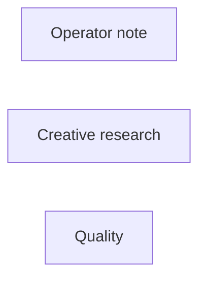

# inspire/research-chat

**What's on this page**

- **Purpose, occupancy, and models** from the on-canvas Note
- **Graph flow** (groups when the canvas is large)
- **Every node id** on this graph
- **Node parameter reference** for each type, with this graph's values and the other legal choices

**What this enables**

- **Queuing this filename** with known widgets
- **Changing a parameter** with a documented generation effect

**Who this is for:** studio users who loaded `inspire/research-chat` from Apps or Workflows.

> Generated from `workflows/_lab/inspire/research-chat.json`. Do not hand-edit this file. Re-run `python3 docs/generate_workflow_docs.py` (or `make docs`).

## Purpose

Occupancy **llm**. Outputs under `${COMFY_OUTPUT_DIR}`. Unload the previous family before Queue.

```text
## inspire/research-chat

Creative research desk — chat LLM with web search and sequential research
subagents. No UNET, no VAE, no KSampler.

Occupancy: llm — graph label (not a CLI mode). Prefer GPU 35B:

  ./scripts/manage.sh occupancy enter llm-desk --yes

Falls back to on-box Qwen3-4B if the sidecar is down. CPU 4B is required next to Wan/LTX/TRELLIS.
Web search is SSRF-safe HTTPS (Wikipedia + DuckDuckGo HTML). Fail-soft if the
network or GGUF is missing.

1. Type a question (look, camera, lighting, world, reference).
2. Mode **research** (planner + search subagents) or **chat** (one turn).
3. Queue. Read **Reply** and **Sources**. Copy prompt ingredients into
   **inspire/prompt-forge**, then **klein/still-draft**.

Laptop agents: `./scripts/manage.sh research-mcp --stdio` (Path D). Same
pipeline as this App. Does not queue Comfy. Does not refuse a GPU session.
Prompt enhance is on by default (on-box Qwen3-4B-Instruct-2507). After Queue, the Enhance node shows the prompt CLIP used (or a passthrough reason). Turn Enhance off to use the widget text as-is. Optional style dropdown.
```

## How to Queue

1. `./scripts/manage.sh start` so `_lab` is seeded
2. Load **inspire/research-chat** from **Apps** or **Workflows**
3. Read the on-canvas Note, change widgets, Queue

Do not edit raw `_lab` JSON. Save keepers under `_user/`.

## Graph



## Nodes on this graph

| Id | Title | Type | Group |
| --- | --- | --- | --- |
| 1 | Operator note | `Note` | NOTE |
| 2 | Creative research | `EZCreativeResearch` | RESEARCH |
| 3 | Quality | `EZQuality` | Ungrouped |

## Node parameter reference

Every unique node type on this graph. Widgets are in lab JSON order. Choices are ComfyUI v0.34.6 / lab `INPUT_TYPES` — not SD1.5 folklore.

### `Note` — Note

On-canvas operator note (not executed).

!!! warning "Lab notes"

    Every lab graph has one. Purpose, models, sampler, occupancy, run steps.

#### `text`

Type `STRING`.

Markdown-ish operator note.

**How it affects generation:** Does not affect pixels. Read it before Queue.

**This graph:** `## inspire/research-chat Creative research desk — chat LLM with web search and sequential research subagents. No UNET, no VAE, no KSampler. Occupancy: llm — graph label (not a CLI mode). Prefer GPU 3…`

```text
## inspire/research-chat

Creative research desk — chat LLM with web search and sequential research
subagents. No UNET, no VAE, no KSampler.

Occupancy: llm — graph label (not a CLI mode). Prefer GPU 35B:

  ./scripts/manage.sh occupancy enter llm-desk --yes

Falls back to on-box Qwen3-4B if the sidecar is down. CPU 4B is required next to Wan/LTX/TRELLIS.
Web search is SSRF-safe HTTPS (Wikipedia + DuckDuckGo HTML). Fail-soft if the
network or GGUF is missing.

1. Type a question (look, camera, lighting, world, reference).
2. Mode **research** (planner + search subagents) or **chat** (one turn).
3. Queue. Read **Reply** and **Sources**. Copy prompt ingredients into
   **inspire/prompt-forge**, then **klein/still-draft**.

Laptop agents: `./scripts/manage.sh research-mcp --stdio` (Path D). Same
pipeline as this App. Does not queue Comfy. Does not refuse a GPU session.
Prompt enhance is on by default (on-box Qwen3-4B-Instruct-2507). After Queue, the Enhance node shows the prompt CLIP used (or a passthrough reason). Turn Enhance off to use the widget text as-is. Optional style dropdown.
```

### `EZCreativeResearch` — Creative research

Creative-process chat with optional web search and sequential research subagents. No UNET.

!!! warning "Lab notes"

    Occupancy llm. Handoff Prompt Forge. Fail-soft without a GGUF. Not Comfy Cloud's In-App Agent.

| Socket | Dir | Type | What it carries |
| --- | --- | --- | --- |
| `reply` | out | `STRING` | Assistant reply / brief. |

#### `sample`

Type `COMBO`. Range / default: custom.

Sample question or Custom.

**How it affects generation:** Custom uses the Message box.

**This graph:** `custom`

#### `prompt`

Type `STRING`.

Message.

**How it affects generation:** One widget, then Queue. Not a streaming chat box.

**This graph:** `What lighting and camera language fits a night rooftop still of a techno wizard in a tropical city?`

```text
What lighting and camera language fits a night rooftop still of a techno wizard in a tropical city?
```

#### `mode`

Type `COMBO`. Range / default: research.

Chat vs planner+search.

**How it affects generation:** research runs subagents. chat is a single turn.

**This graph:** `research`

**Other choices**

| Choice | What it does |
| --- | --- |
| `chat` | Single-turn chat. |
| `research` | Planner + sequential subagents (lab). |

#### `web_search`

Type `BOOLEAN`. Range / default: true.

Allow web search.

**How it affects generation:** true uses the research MCP. Off stays on-box.

**This graph:** `true`

#### `subagents`

Type `INT`. Range / default: 1–3, lab 2.

How many research subagents.

**How it affects generation:** 2 is the lab default. 3 is slower.

**This graph:** `2`

#### `history`

Type `STRING`.

Prior turns.

**How it affects generation:** Paste if you continue a desk session.

#### `catalog`

Type `STRING`.

Catalog id.

**How it affects generation:** Leave as stamped.

**This graph:** `inspire/research-chat`

### `EZQuality` — Quality

Workflow-global quality combo. JS overlays family-specific sampler, UNET, CLIP, and VAE widgets.

!!! warning "Lab notes"

    custom freezes the last overlay. lab restores authored widgets. ultra/max may select Klein 9B or FLUX.2-dev when those files are on disk (FLUX Non-Commercial, not YouTube-ok). Never changes size. Not --tier quality.

| Socket | Dir | Type | What it carries |
| --- | --- | --- | --- |
| `quality` | out | `STRING` | Selected quality id. |

#### `quality`

Type `COMBO`. Range / default: lab.

custom freezes last overlay; lab restores graph defaults.

**How it affects generation:** Named qualities may swap UNET, CLIP, and VAE. Does not change size or length. ultra/max need download-image --tier 9b or flux2-dev.

**This graph:** `lab`

**Other choices**

| Choice | What it does |
| --- | --- |
| `custom` | Freeze current widgets. Queue does not overlay. |
| `draft` | Faster Apache Klein 4B (NVFP4 if on disk). |
| `lab` | Authored lab widgets. Default. |
| `standard` | Distilled 4B, 8 steps, CFG 1.0. |
| `high` | Klein base 4B + CFG 3.5 when on disk; else extra distilled steps at CFG 1.0. |
| `ultra` | Klein 9B distilled when on disk (FLUX Non-Commercial). Else high. |
| `max` | Klein 9B base or FLUX.2-dev when on disk (FLUX Non-Commercial). Else high. |
