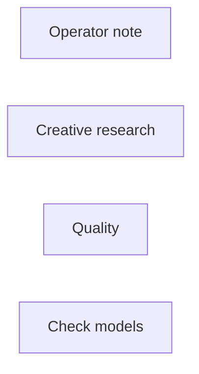

# inspire/research-chat

**What's on this page**

- **Purpose, occupancy, and models** from the on-canvas Note
- **Graph flow** (groups when the canvas is large)
- **Every node id** on this graph
- **Node parameter reference** for each type, with this graph's values and the other legal choices

**What this enables**

- **Queuing this filename** with known widgets
- **Changing a parameter** with a documented generation effect

**Who this is for:** studio users who loaded `inspire/research-chat` from Apps or Workflows.

> Generated from `workflows/_lab/inspire/research-chat.json`. Do not hand-edit this file. Re-run `bazelisk run //docs:docs`.

## Purpose

Occupancy **llm**. Outputs under `${COMFY_OUTPUT_DIR}`. Unload the previous family before Queue.

```text
## inspire/research-chat

Creative research desk - chat LLM with web search and sequential research
subagents. No UNET, no VAE, no KSampler.

Occupancy: llm - graph label (not a CLI mode). Prefer GPU 35B:

  ./scripts/manage.sh occupancy enter llm-desk --yes

Falls back to on-box Qwen3-4B if the sidecar is down. CPU 4B is required next to Wan/LTX/TRELLIS.
Web search is SSRF-safe HTTPS (Wikipedia + DuckDuckGo HTML). Fail-soft if the
network or GGUF is missing.

1. Type a question (look, camera, lighting, world, reference).
2. Mode **research** (planner + search subagents) or **chat** (one turn).
3. Queue. Read **Reply** and **Sources**. Copy prompt ingredients into
   **inspire/prompt-forge**, then **stills/still-draft**.

Laptop agents: `./scripts/manage.sh research-mcp --stdio` (Path D). Same
pipeline as this App. Does not queue Comfy. Does not refuse a GPU session.
Prompt enhance is on by default (on-box Qwen3-4B-Instruct-2507). After Queue, the Enhance node shows the prompt CLIP used (or a passthrough reason). Turn Enhance off to use the widget text as-is. Optional style dropdown.
```

## How to Queue

1. `./scripts/manage.sh start` so `_lab` is seeded
2. Load **inspire/research-chat** from **Apps** or **Workflows**
3. Read the on-canvas Note, change widgets, Queue

Do not edit raw `_lab` JSON. Save keepers under `_user/`.

## Graph


```mermaid
flowchart LR
  N1["Operator note"]
  N2["Creative research"]
  N3["Quality"]
  N4["Check models"]
```

## Nodes on this graph

| Id | Title | Type | Group |
| --- | --- | --- | --- |
| 1 | Operator note | `Note` | NOTE |
| 2 | Creative research | `EZCreativeResearch` | RESEARCH |
| 3 | Quality | `EZQuality` | QUALITY |
| 4 | Check models | `EZModelCheck` | QUALITY |

## Node parameter reference

Every unique node type on this graph. Widgets are in lab JSON order. Choices are ComfyUI v0.43.0 / lab `INPUT_TYPES` - not SD1.5 folklore.

### `Note` - Note

On-canvas operator note (not executed).

!!! warning "Lab notes"

    Every lab graph has one. Purpose, models, sampler, occupancy, run steps.

#### `text`

Type `STRING`.

Markdown-ish operator note.

**How it affects generation:** Does not affect pixels. Read it before Queue.

**This graph:** `## inspire/research-chat Creative research desk - chat LLM with web search and sequential research subagents. No UNET, no VAE, no KSampler. Occupancy: llm - graph label (not a CLI mode). Prefer GPU 3...`

```text
## inspire/research-chat

Creative research desk - chat LLM with web search and sequential research
subagents. No UNET, no VAE, no KSampler.

Occupancy: llm - graph label (not a CLI mode). Prefer GPU 35B:

  ./scripts/manage.sh occupancy enter llm-desk --yes

Falls back to on-box Qwen3-4B if the sidecar is down. CPU 4B is required next to Wan/LTX/TRELLIS.
Web search is SSRF-safe HTTPS (Wikipedia + DuckDuckGo HTML). Fail-soft if the
network or GGUF is missing.

1. Type a question (look, camera, lighting, world, reference).
2. Mode **research** (planner + search subagents) or **chat** (one turn).
3. Queue. Read **Reply** and **Sources**. Copy prompt ingredients into
   **inspire/prompt-forge**, then **stills/still-draft**.

Laptop agents: `./scripts/manage.sh research-mcp --stdio` (Path D). Same
pipeline as this App. Does not queue Comfy. Does not refuse a GPU session.
Prompt enhance is on by default (on-box Qwen3-4B-Instruct-2507). After Queue, the Enhance node shows the prompt CLIP used (or a passthrough reason). Turn Enhance off to use the widget text as-is. Optional style dropdown.
```

### `EZCreativeResearch` - Creative research

Creative-process chat with optional web search and sequential research subagents. No UNET.

!!! warning "Lab notes"

    Occupancy llm. Handoff Prompt Forge. Fail-soft without a GGUF. Not Comfy Cloud's In-App Agent.

| Socket | Dir | Type | What it carries |
| --- | --- | --- | --- |
| `reply` | out | `STRING` | Assistant reply / brief. |

#### `sample`

Type `COMBO`. Range / default: custom.

Sample question or Custom.

**How it affects generation:** Custom uses the Message box.

**This graph:** `custom`

#### `prompt`

Type `STRING`.

Message.

**How it affects generation:** One widget, then Queue. Not a streaming chat box.

**This graph:** `What lighting and camera language fits a night rooftop still of a techno wizard in a tropical city?`

```text
What lighting and camera language fits a night rooftop still of a techno wizard in a tropical city?
```

#### `mode`

Type `COMBO`. Range / default: research.

Chat vs planner+search.

**How it affects generation:** research runs subagents. chat is a single turn.

**This graph:** `research`

**Other choices**

| Choice | What it does |
| --- | --- |
| `chat` | Single-turn chat. |
| `research` | Planner + sequential subagents (lab). |

#### `web_search`

Type `BOOLEAN`. Range / default: true.

Allow web search.

**How it affects generation:** true uses the research MCP. Off stays on-box.

**This graph:** `true`

#### `subagents`

Type `INT`. Range / default: 1-3, lab 2.

How many research subagents.

**How it affects generation:** 2 is the lab default. 3 is slower.

**This graph:** `2`

#### `history`

Type `STRING`.

Prior turns.

**How it affects generation:** Paste if you continue a desk session.

#### `catalog`

Type `STRING`.

Catalog id.

**How it affects generation:** Leave as stamped.

**This graph:** `inspire/research-chat`

### `EZQuality` - Quality

Workflow-global quality combo. JS overlays family-specific sampler, UNET, CLIP, and VAE widgets.

!!! warning "Lab notes"

    Workflow-global quality combo. presets.py is the only tier definition and the frontend reads a table generated from it. The combo is DERIVED from the widgets, not typed: it names the tier whose owned parameters the widgets actually hold, lab when they match the load-time authored values, custom otherwise, and it re-derives on load, graph change, widget edit, and Queue. custom is not absorbing - putting the owned widgets back on a tier's values re-derives that tier. A tier value that cannot be written (weight not installed, widget not built) is a FAILED apply: the combo drops to custom and the caption names what diverged. Writes resolve per node instance, so every sampler and loader in a graph is written. Only parameters the family's tiers own are compared, so a CFG edit on a steps-only family keeps the level. A combo whose node mode is nonzero is ignored. Never --tier quality.

| Socket | Dir | Type | What it carries |
| --- | --- | --- | --- |
| `quality` | out | `STRING` | Selected quality id. |

#### `quality`

Type `COMBO`. Range / default: lab.

Derived from the widgets: the named tier they match, lab for the authored values, custom otherwise.

**How it affects generation:** Named qualities may swap UNET, CLIP, and VAE, per node instance. A tier value that cannot be written is a failed apply, so the combo drops to custom rather than claiming a swap the prompt does not contain. Quality does not touch the Width / Height or Duration widgets; the one size effect is Free Commercial Use (<$10M) on Klein stills, where a generic 16:9 / 9:16 Format row retargets to the LTX feeder size (1280x704 / 768x1280). On Klein, high and Free Commercial Use (<$10M) are the same profile (Apache Klein 4B base, 24 steps, CFG 3.5 - never 9B / FLUX.2-dev) and ultra/max swap in Klein 9B or FLUX.2-dev when those files are on disk (FLUX Non-Commercial, not YouTube-ok); ultra/max are no-ops on audio and trellis. Wan / LTX / film / audio / trellis tiers set steps only, never CFG or weights. flux3-* need the gated FLUX 3 pull (download-image --tier flux3 / flux3-base / flux3-nvfp4) and are the only tiers that write on a graph pinning FLUX 3 Klein weights.

**This graph:** `lab`

**Other choices**

| Choice | What it does |
| --- | --- |
| `custom` | Widgets match no tier, so they queue as they are. No overlay. |
| `draft` | Faster Apache Klein 4B (NVFP4 if on disk). |
| `lab` | Authored lab widgets. Default. |
| `standard` | Distilled 4B, 8 steps, CFG 1.0. |
| `high` | Klein base 4B + CFG 3.5 when on disk; else extra distilled steps at CFG 1.0. |
| `Free Commercial Use (<$10M)` | Klein 4B stills (never 9B / FLUX.2-dev) + LTX-2.5 steps. Optional SeedVR2 polish on the PNG, not 4K. Wan / audio / trellis are no-ops. |
| `ultra` | Klein 9B distilled when on disk (FLUX Non-Commercial). Else high. |
| `max` | Klein 9B base or FLUX.2-dev when on disk (FLUX Non-Commercial). Else high. |
| `flux3-fast` | FLUX 3 Image Klein distilled INT8 (flux3-image-klein-int8-convrot.safetensors), 16 steps, CFG 1.0. Gated FLUX Kommunity; writes only on a FLUX 3 graph. |
| `flux3-quality` | FLUX 3 Image Klein base INT8 (flux3-image-klein-base-int8-convrot.safetensors), 50 steps, CFG 3.5. Gated FLUX Kommunity; writes only on a FLUX 3 graph. |
| `flux3-nvfp4` | FLUX 3 Image Klein base NVFP4 (flux3-image-klein-base-nvfp4.safetensors), 50 steps, CFG 3.5. Gated FLUX Kommunity; writes only on a FLUX 3 graph. |

### `EZModelCheck` - Check models

Manual disk check for occupancy + Quality weights. Queue does not run this node.

!!! warning "Lab notes"

    Click Check models (canvas button or App occupancy chip). Reports Ready, or missing files plus the host download command. Not an output node.

#### `status`

Type `STRING`.

Last check result.

**How it affects generation:** JS overwrites after Check models. Queue ignores this node.

**This graph:** `Click Check models. Queue does not run this node.`
