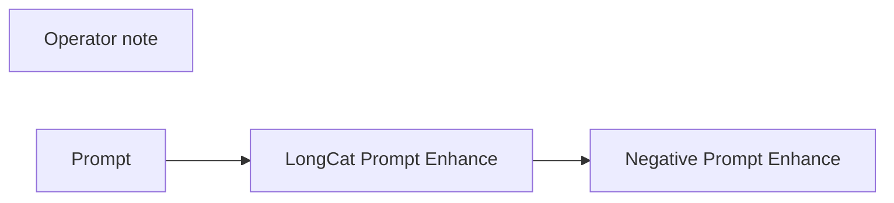

# optional/longcat-video

**What's on this page**

- **Purpose, occupancy, and models** from the on-canvas Note
- **Graph flow** (groups when the canvas is large)
- **Every node id** on this graph
- **Node parameter reference** for each type, with this graph's values and the other legal choices

**What this enables**

- **Queuing this filename** with known widgets
- **Changing a parameter** with a documented generation effect

**Who this is for:** studio users who loaded `optional/longcat-video` from Apps or Workflows.

> Generated from `workflows/_lab/optional/longcat-video.json`. Do not hand-edit this file. Re-run `python3 docs/generate_workflow_docs.py` (or `make docs`).

## Purpose

Occupancy **—**. Outputs under `${COMFY_OUTPUT_DIR}`. Unload the previous family before Queue.

```text
## optional/longcat-video

Opt-in LongCat-Video (MIT) prompt preview. Not download-models. No UNET on this canvas.

Download: ./scripts/manage.sh download-longcat --tier video
Context-parallel two-Spark only with LAB_ALLOW_CONTEXT_PARALLEL=1. NCCL is out of this sample — tensor-parallel LLMs belong in nvidia-dgx-spark-lab.
Unload LTX first. Occupancy: one heavy job when you Queue a real LongCat printer.

This canvas rewrites a lazy sentence with LongCat Prompt Enhance (T2V / I2V / continuation). Copy the CLIP box into your LongCat graph. Distilled LongCat is CFG 1 (negatives ignored); standard CFG is about 4.

Prompt enhance is on by default (on-box Qwen3-4B-Instruct-2507). Turn Enhance off to pin the widget text.
```

## How to Queue

1. `./scripts/manage.sh start` so `_lab` is seeded
2. Load **optional/longcat-video** from **Apps** or **Workflows**
3. Read the on-canvas Note, change widgets, Queue

Do not edit raw `_lab` JSON. Save keepers under `_user/`.

## Graph



## Nodes on this graph

| Id | Title | Type | Group |
| --- | --- | --- | --- |
| 1 | Operator note | `Note` | Ungrouped |
| 2 | Prompt | `EZSamplePrompt` | Ungrouped |
| 3 | LongCat Prompt Enhance | `EZLongCatPromptEnhance` | Ungrouped |
| 4 | Negative Prompt Enhance | `EZNegativePromptEnhance` | Ungrouped |

## Node parameter reference

Every unique node type on this graph. Widgets are in lab JSON order. Choices are ComfyUI v0.34.6 / lab `INPUT_TYPES` — not SD1.5 folklore.

### `Note` — Note

On-canvas operator note (not executed).

!!! warning "Lab notes"

    Every lab graph has one. Purpose, models, sampler, occupancy, run steps.

#### `text`

Type `STRING`.

Markdown-ish operator note.

**How it affects generation:** Does not affect pixels. Read it before Queue.

**This graph:** `## optional/longcat-video Opt-in LongCat-Video (MIT) prompt preview. Not download-models. No UNET on this canvas. Download: ./scripts/manage.sh download-longcat --tier video Context-parallel two-Spar…`

```text
## optional/longcat-video

Opt-in LongCat-Video (MIT) prompt preview. Not download-models. No UNET on this canvas.

Download: ./scripts/manage.sh download-longcat --tier video
Context-parallel two-Spark only with LAB_ALLOW_CONTEXT_PARALLEL=1. NCCL is out of this sample — tensor-parallel LLMs belong in nvidia-dgx-spark-lab.
Unload LTX first. Occupancy: one heavy job when you Queue a real LongCat printer.

This canvas rewrites a lazy sentence with LongCat Prompt Enhance (T2V / I2V / continuation). Copy the CLIP box into your LongCat graph. Distilled LongCat is CFG 1 (negatives ignored); standard CFG is about 4.

Prompt enhance is on by default (on-box Qwen3-4B-Instruct-2507). Turn Enhance off to pin the widget text.
```

### `EZSamplePrompt` — Sample Prompt

STRING source with a sample-prompt combo plus Custom textarea.

| Socket | Dir | Type | What it carries |
| --- | --- | --- | --- |
| `prompt` | out | `STRING` | Resolved prompt. |

#### `sample`

Type `COMBO`. Range / default: custom.

Sample or Custom.

**How it affects generation:** Custom uses the textarea as typed.

**This graph:** `custom`

#### `prompt`

Type `STRING`.

Custom textarea.

**How it affects generation:** Ignored when a sample is selected.

**This graph:** `A techno wizard on a sunny tropical city rooftop.`

#### `catalog`

Type `STRING`.

Catalog id (inspire/prompt-forge).

**How it affects generation:** Leave as stamped.

**This graph:** `optional/longcat-video`

### `EZLongCatPromptEnhance` — LongCat Prompt Enhance

Rewrite a lazy prompt for LongCat-Video (T2V / I2V / continuation).

!!! warning "Lab notes"

    No native audio. Standard CFG ~4; distilled CFG 1 ignores negatives. Optional stub preview on optional/longcat-video.

| Socket | Dir | Type | What it carries |
| --- | --- | --- | --- |
| `prompt` | in | `STRING` | Optional. |
| `context` | in | `STRING` | Bible/research. Ignored when Enhance is off. |
| `prompt` | out | `STRING` | Motion string for CLIP. |

#### `sample`

Type `COMBO`. Range / default: custom.

Sample or Custom.

**How it affects generation:** Custom keeps the textarea.

**This graph:** `custom`

#### `prompt`

Type `STRING`.

Lazy motion sentence.

**How it affects generation:** T2V is scene+motion+camera. I2V extends the still. vc continues previous frames.

**This graph:** `A techno wizard on a sunny tropical city rooftop.`

#### `enhance`

Type `BOOLEAN`.

Run the rewriter.

**How it affects generation:** Off pins the widget text.

**This graph:** `true`

#### `mode`

Type `COMBO`.

System flavor.

**How it affects generation:** t2v on the stub. i2v / vc when start frames exist.

**This graph:** `t2v`

**Other choices**

| Choice | What it does |
| --- | --- |
| `t2v` | Text to video. |
| `i2v` | Start image owns look. |
| `vc` | Continue previous frames. |

#### `duration_hint`

Type `STRING`. Range / default: 5 seconds, 30 fps.

Duration/fps hint for the rewriter.

**How it affects generation:** Does not change latent length.

**This graph:** `5 seconds, 30 fps`

#### `style`

Type `COMBO`. Range / default: none.

Look reference. Ignored on I2V/vc.

**How it affects generation:** Start frames own look on I2V/vc.

**This graph:** `none`

**Other choices**

| Choice | What it does |
| --- | --- |
| `none` | Off. Do not weave a look reference into the CLIP prompt. |
| `photorealistic` | Photoreal photograph, natural materials, physically plausible light. |
| `cinematic_film_still` | Cinematic feature-film still, widescreen, motivated practicals. |
| `documentary_photography` | Observational documentary photograph, available light. |
| `analog_35mm_film` | Analog 35mm color-negative film grain and organic color. |
| `analog_120_medium_format` | Medium-format 120 film, creamy tones, fine grain. |
| `polaroid_instant` | Instant Polaroid print look, soft contrast, creamy highlights. |
| `golden_hour_photography` | Golden-hour photograph, warm sidelight, long shadows. |
| `overcast_natural_light` | Overcast natural light, soft sky-fill, open shadows. |
| `studio_product_photography` | Studio product photograph, seamless backdrop, soft key. |
| `editorial_fashion_photography` | Editorial fashion photograph, precise styling, magazine light. |
| `street_photography` | Candid street photograph, mixed city light, layered depth. |
| `architectural_photography` | Architectural photograph, corrected verticals, material texture. |
| `anime` | Japanese anime still, clean cel color, sharp line. |
| `manga_screentone` | Black-and-white manga ink and screentone. |
| `cartoon` | Bold cartoon illustration, thick outline, flat color. |
| `western_comic_book` | Western comic-book inks, Ben-Day dots, saturated print color. |
| `saturday_morning_cartoon` | Saturday-morning cartoon cel, limited palette, painted background. |
| `storybook_illustration` | Storybook illustration, soft paint, narrative composition. |
| `watercolor_illustration` | Transparent watercolor on paper, wet-into-wet blooms. |
| `gouache_illustration` | Opaque gouache painting, matte pigment, graphic shapes. |
| `ink_and_wash` | Ink-and-wash drawing, black ink and grey washes. |
| `colored_pencil` | Colored-pencil drawing, layered strokes, paper grain. |
| `charcoal_sketch` | Charcoal sketch, vine blacks and kneaded-eraser lights. |
| `line_art` | Clean black line art, minimal fill. |
| `cel_shaded` | Cel-shaded illustration, hard shadow bands, graphic highlights. |
| `risograph_print` | Risograph print, limited spot inks, grainy stipple. |
| `3d_feature_animation` | 3D feature-animation still, rounded forms, physically based materials. |
| `pixar_like_3d` | Stylized feature 3D, appealing proportions, soft GI. |
| `claymation` | Claymation still, fingerprint clay, miniature set. |
| `stop_motion` | Stop-motion puppet still, practical miniature set. |
| `unreal_engine_cinematic` | Real-time cinematic 3D, sharp materials, cinematic camera. |
| `isometric_3d` | Isometric 3D diorama, even light, readable volumes. |
| `low_poly` | Low-poly 3D, faceted geometry, flat vertex color. |
| `voxel` | Voxel art, cubic voxels, limited palette. |
| `oil_painting` | Oil painting on canvas, visible brushwork, rich impasto. |
| `impressionist_painting` | Impressionist oil, broken color, outdoor light. |
| `cubist` | Cubist painting, faceted planes, simultaneous viewpoints. |
| `art_nouveau` | Art Nouveau illustration, whiplash curves, botanical ornament. |
| `ukiyo_e_woodblock` | Ukiyo-e woodblock print, mineral pigments, keyblock line. |
| `baroque_oil` | Baroque oil, dramatic chiaroscuro, theatrical spotlight. |
| `digital_matte_painting` | Digital matte painting, epic environment, atmospheric perspective. |
| `concept_art` | Production concept art, readable design, cinematic key light. |
| `cyberpunk` | Cyberpunk night, wet asphalt, neon magenta and cyan. |
| `solarpunk` | Solarpunk day, greenery on architecture, warm sun. |
| `film_noir` | Film-noir still, high-contrast black and white, hard key. |
| `1970s_grain` | 1970s film still, warm print, heavy grain. |
| `vaporwave` | Vaporwave still, pastel neon, chrome, VHS softness. |
| `pixel_art` | Pixel art, limited palette, visible pixels, cluster shading. |
| `papercraft` | Papercraft diorama, cut paper layers, studio light. |
| `blueprint_technical_drawing` | Blueprint technical drawing, white line on cyan ground. |

#### `catalog`

Type `STRING`.

Sample-catalog id.

**How it affects generation:** Leave as stamped.

**This graph:** `optional/longcat-video`

### `EZNegativePromptEnhance` — Negative Prompt Enhance

Rewrite a negative CLIP seed so it does not fight the positive.

| Socket | Dir | Type | What it carries |
| --- | --- | --- | --- |
| `positive` | in | `STRING` | Positive CLIP string as context. |
| `prompt` | out | `STRING` | Negative string. |

#### `prompt`

Type `STRING`.

Negative seed (artifacts, not style).

**How it affects generation:** FLUX-family models do not use negatives well. Keep this short; put constraints in the positive.

**This graph:** `overexposed, static, subtitles, extra fingers, still picture, watermark`

#### `enhance`

Type `BOOLEAN`.

Rewrite using the positive as context.

**How it affects generation:** Stops canned 'illustration / Pixar' terms from fighting a cartoon-positive.

**This graph:** `true`

#### `family`

Type `COMBO`.

Which negative family.

**How it affects generation:** Must match the UNET on the canvas.

**This graph:** `longcat`

**Other choices**

| Choice | What it does |
| --- | --- |
| `klein` | Klein stills. |
| `wan` | Wan silent. |
| `ltx` | LTX AV. |
| `zimage` | Z-Image Turbo (CFG 1; list is documentation). |
| `longcat` | LongCat-Video. |
| `dreamx` | DreamX-Creator AV. |
| `s2v` | Wan S2V; wav owns speech. |
