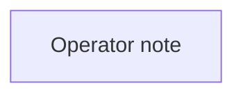

# optional/longcat-video

**What's on this page**

- **Purpose, occupancy, and models** from the on-canvas Note
- **Graph flow** (groups when the canvas is large)
- **Every node id** on this graph
- **Node parameter reference** for each type, with this graph's values and the other legal choices

**What this enables**

- **Queuing this filename** with known widgets
- **Changing a parameter** with a documented generation effect

**Who this is for:** studio users who loaded `optional/longcat-video` from Apps or Workflows.

> Generated from `workflows/_lab/optional/longcat-video.json`. Do not hand-edit this file. Re-run `python3 docs/generate_workflow_docs.py` (or `make docs`).

## Purpose

Occupancy **—**. Outputs under `${COMFY_OUTPUT_DIR}`. Unload the previous family before Queue.

```text
## optional/longcat-video

Opt-in LongCat-Video (MIT) second stack. Not download-models.
Download: ./scripts/manage.sh download-longcat --tier video
Context-parallel two-Spark only with LAB_ALLOW_CONTEXT_PARALLEL=1. NCCL is out of this sample — tensor-parallel LLMs belong in nvidia-dgx-spark-lab.
This canvas is a lab note, not a 90s default printer. Unload LTX first. Occupancy: one heavy job.
Prompt enhance is on by default (on-box Qwen3-4B-Instruct-2507). After Queue, the Enhance node shows the prompt CLIP used (or a passthrough reason). Turn Enhance off to use the widget text as-is. Optional style dropdown.
```

## How to Queue

1. `./scripts/manage.sh start` so `_lab` is seeded
2. Load **optional/longcat-video** from **Apps** or **Workflows**
3. Read the on-canvas Note, change widgets, Queue

Do not edit raw `_lab` JSON. Save keepers under `_user/`.

## Graph



## Nodes on this graph

| Id | Title | Type | Group |
| --- | --- | --- | --- |
| 1 | Operator note | `Note` | Ungrouped |

## Node parameter reference

Every unique node type on this graph. Widgets are in lab JSON order. Choices are ComfyUI v0.34.6 / lab `INPUT_TYPES` — not SD1.5 folklore.

### `Note` — Note

On-canvas operator note (not executed).

!!! warning "Lab notes"

    Every lab graph has one. Purpose, models, sampler, occupancy, run steps.

#### `text`

Type `STRING`.

Markdown-ish operator note.

**How it affects generation:** Does not affect pixels. Read it before Queue.

**This graph:** `## optional/longcat-video Opt-in LongCat-Video (MIT) second stack. Not download-models. Download: ./scripts/manage.sh download-longcat --tier video Context-parallel two-Spark only with LAB_ALLOW_CONT…`

```text
## optional/longcat-video

Opt-in LongCat-Video (MIT) second stack. Not download-models.
Download: ./scripts/manage.sh download-longcat --tier video
Context-parallel two-Spark only with LAB_ALLOW_CONTEXT_PARALLEL=1. NCCL is out of this sample — tensor-parallel LLMs belong in nvidia-dgx-spark-lab.
This canvas is a lab note, not a 90s default printer. Unload LTX first. Occupancy: one heavy job.
Prompt enhance is on by default (on-box Qwen3-4B-Instruct-2507). After Queue, the Enhance node shows the prompt CLIP used (or a passthrough reason). Turn Enhance off to use the widget text as-is. Optional style dropdown.
```
