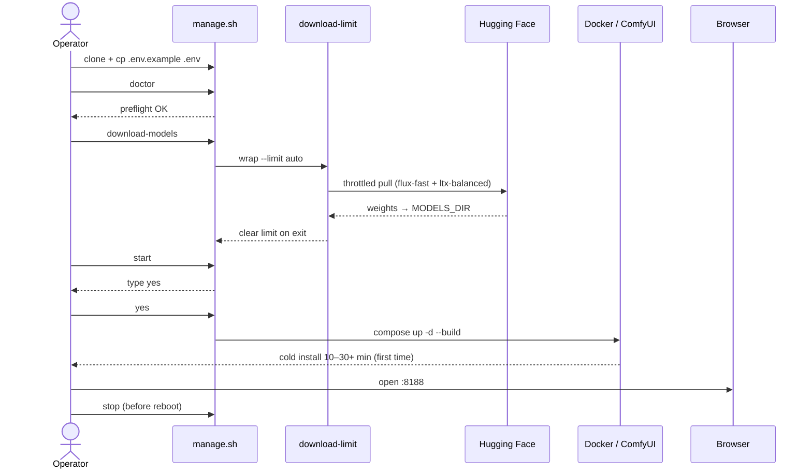
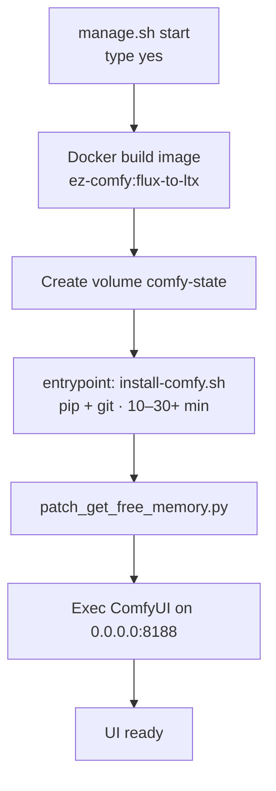

# Getting Started

**What's on this page**

- Prerequisites on the Spark host
- Environment setup
- Download models (throttled)
- Start / status / stop
- First-run and cold-start diagrams

**What this enables**

- A first successful open of ComfyUI at port 8188
- Safe downloads that leave bandwidth for SSH

## Prerequisites

- NVIDIA DGX Spark (or compatible GB10 host) with drivers + **NVIDIA Container Toolkit**
- Docker with Compose v2 plugin (prefer apt `docker-ce`, not snap; user in `docker` group). Image build uses public **Docker Hub** `nvidia/cuda` (no NGC/`nvcr.io` login required)
- Writable shared model cache: default `/mnt/models` (`sudo mkdir -p /mnt/models && sudo chown $USER:$USER /mnt/models`) or override `MODELS_DIR` in `.env`
- `git`, `python3`, `pip` / `pipx`
- Hugging Face CLI: `hf` from `huggingface_hub` (`pipx install huggingface_hub` or `pip install -U 'huggingface_hub[cli]'`) — **not** the deprecated `huggingface-cli` stub
- Optional: `wondershaper`, `speedtest-cli` (auto-installed / used by download-limit; HTB/`sch_htb` when shaping is desired)
- Hugging Face account with licenses accepted for FLUX / LTX models; `HF_TOKEN` in `.env` or `hf auth login` if gated


## Setup

```bash
git clone https://github.com/toxicoder/ez-comfy-stack.git
cd ez-comfy-stack
git checkout development   # or your feature branch

# One-shot host bootstrap: .env, MODELS_DIR (sudo), Docker CE if missing, doctor
./scripts/manage.sh setup --install-docker
# approve sudo + type yes if prompted; edit .env for HF_TOKEN if models are gated
```

`setup` will:

1. Create `.env` from `.env.example` if missing  
2. Create and own `MODELS_DIR` (default `/mnt/models`) via sudo when needed  
3. **Install Docker CE + compose plugin** when missing (`--install-docker` or interactive yes; apt preferred, not snap)  
4. Add your user to the `docker` group; configure `nvidia-ctk` when present  
5. Re-run `doctor`

If the current shell lacks the docker group after install:

```bash
newgrp docker   # or re-login SSH
./scripts/manage.sh doctor
```

Non-interactive:

```bash
LAB_NON_INTERACTIVE=1 LAB_CONFIRM_TOKEN=yes SETUP_INSTALL_DOCKER=1 ./scripts/manage.sh setup
```

## Doctor

```bash
./scripts/manage.sh doctor
```

Fix any errors before downloading multi-GB models. Hard failures include **docker missing**, **docker compose missing**, **host headroom**, and **MODELS_DIR not writable**. Prefer `./scripts/manage.sh setup` first. See [Troubleshooting](troubleshooting.md) for copy-paste fixes.
## Download models (shared cache)

```bash
# Ensure HF token for gated repos (FLUX):
# echo 'HF_TOKEN=hf_...' >> .env   # or: hf auth login

./scripts/manage.sh download-models
```

This runs **flux-fast** + **ltx-balanced** under `download-limit wrap --limit auto` (speedtest → **85%** cap), using **`hf download`**. Weights land under `MODELS_DIR` (default `/mnt/models`) in a layout compatible with nvidia-dgx-spark-lab. If bandwidth shaping fails on the kernel, downloads continue unthrottled with a warning (`DOWNLOAD_LIMIT=off` to skip shaping).

LTX **balanced** pulls a **selective** subset of `Kijai/LTX2.3_comfy` (distilled FP8 + TE + VAEs, ~30 GB), not the full multi-variant monorepo (~400 GB). See [Models & Cache](models-and-cache.md).

## Start the stack

```bash
./scripts/manage.sh start
# type: yes
./scripts/manage.sh status
```

Open `http://<spark-ip>:8188` (or port-forward if needed).

### Example workflows (image + video frames)

After `download-models` + `start`, open ComfyUI and load one of:

| Workflow | What it does |
| --- | --- |
| **lab-flux-txt2img** | Text → image 1024² (Flux.2 Klein NVFP4 + Qwen TE + flux2 VAE) |
| **lab-flux-txt2img-portrait** | Text → image **768×1024** portrait |
| **lab-flux-txt2img-landscape** | Text → image **1280×720** landscape |
| **lab-flux-txt2img-quick** | Smoke test: **768²**, **4** steps |
| **lab-flux-img2img** | Image → image (same Flux pack; set LoadImage input) |
| **lab-ltx-i2v** | Image → video frames (~97 @ 24 fps; set start frame) |
| **lab-ltx-i2v-short** | Faster I2V: **33** frames @ 24 fps |
| **lab-ltx-t2v** | Text → video frames (~97 @ 24 fps) |
| **lab-ltx-t2v-short** | Faster T2V: **33** frames @ 24 fps |
| **lab-flux-to-ltx** | Flux txt2img + handoff notes → load **lab-ltx-i2v** for video frames |

These are under `user/default/workflows/` (copied from the host `workflows/` mount).

**Lab details**

- Flux CLIP loader type is **`flux2`** with `qwen_3_8b_fp4mixed` + `EmptyFlux2LatentImage` (simplified `KSampler`, not the full official advanced sampler subgraph)
- LTX graphs save **frames** via `SaveImage` (no VideoHelperSuite / VHS required)
- `download-models` also places `LTX23_audio_vae_bf16` for advanced AV experiments; **lab examples do not wire audio**
- **Not Z-Image.** Community Z-Image templates need different weights (`ae` / `qwen_3_4b` / `z_image_turbo_*`)

!!! tip "Prebuilt image (GHCR)"
    `manage.sh start` pulls a **branch-aligned** arm64 image published by the `publish-image` workflow:

    | Git branch | Image tag |
    | --- | --- |
    | `main` | `ghcr.io/toxicoder/ez-comfy:flux-to-ltx` |
    | `development` (and feature branches) | `ghcr.io/toxicoder/ez-comfy:flux-to-ltx-development` |

    Override with `EZ_COMFY_IMAGE` in `.env` if needed.  
    Multi-stage: **devel** builder installs Comfy+torch in **phased layers** (torch separate from custom nodes); final stage is **CUDA runtime** (no nvcc).  
    It includes ComfyUI + PyTorch; **not** FLUX/LTX weights (those stay on `MODELS_DIR`).  
    First start **seeds** the volume from `/opt/comfy-prebuilt` (local copy) instead of multi‑GB pip.  
    No tokens or host secrets are baked into the image. Pull is public for public packages.  
    `./scripts/manage.sh doctor` prints the resolved default image before you start.

!!! tip "Dev: edit scripts without rebuilding"
    Compose bind-mounts `docker/entrypoint.sh`, `docker/install-comfy.sh`, and `docker/patch_get_free_memory.py` into the container.  
    Change those files on the host, then restart the stack — **no multi‑GB image rebuild**.  
    Rebuild (`LAB_STACK_FORCE_BUILD=1` or publish) only when you need a new baked `/opt/comfy-prebuilt` tree (torch / Comfy / nodes).  
    See [Models & Cache](models-and-cache.md#image-layer-cache-high-velocity-rebuilds) for what invalidates which layers.

!!! warning "Cold start without prebuilt"
    If GHCR pull fails or you force a thin/local build without prebuild, first start can take **10–30+ minutes** of pip.  
    `manage.sh start` streams logs until port 8188 responds (Ctrl+C detaches only).  
    `LAB_STACK_FOLLOW=0` returns immediately after the container is up.

### First-run journey



### Cold-start phases (first `start`)



## Stop (always before reboot)

```bash
./scripts/manage.sh stop
```

## Development tests

```bash
make test
make coverage
make docs
```
