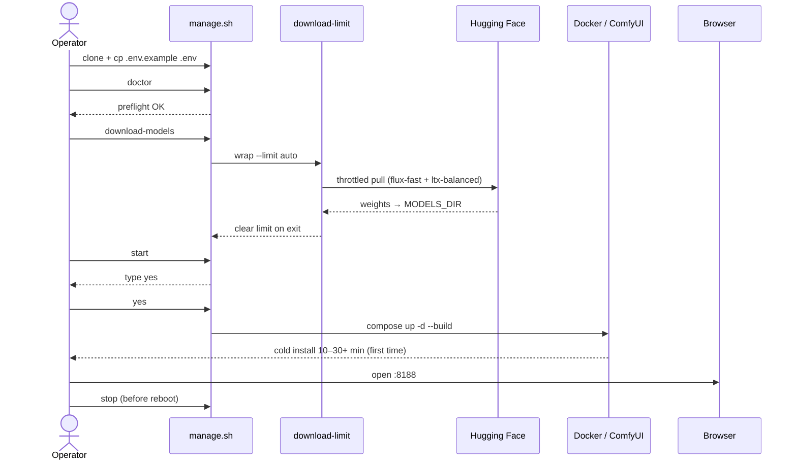
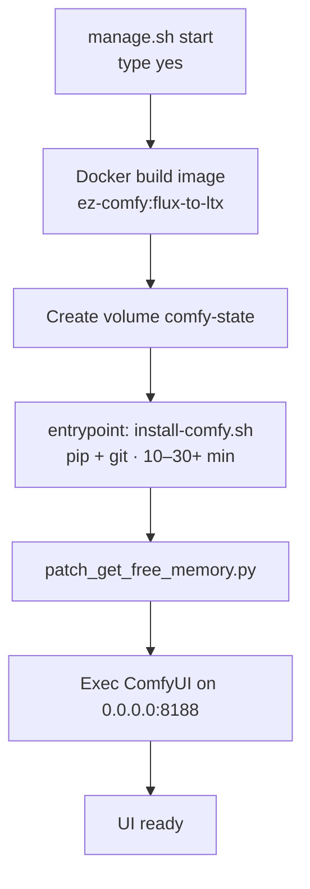

# Getting Started

**What's on this page**

- Prerequisites on the Spark host
- Environment setup
- Download models (throttled)
- Start / status / stop
- First-run and cold-start diagrams

**What this enables**

- A first successful open of ComfyUI at port 8188
- Safe downloads that leave bandwidth for SSH

## Prerequisites

- NVIDIA DGX Spark (or compatible GB10 host) with drivers + **NVIDIA Container Toolkit**
- Docker with Compose v2 plugin (prefer apt `docker-ce`, not snap; user in `docker` group)
- Writable shared model cache: default `/mnt/models` (`sudo mkdir -p /mnt/models && sudo chown $USER:$USER /mnt/models`) or override `MODELS_DIR` in `.env`
- `git`, `python3`, `pip` (`huggingface_hub` for downloads)
- Optional: `wondershaper`, `speedtest-cli` (auto-installed / used by download-limit; HTB/`sch_htb` when shaping is desired)
- Hugging Face account with licenses accepted for FLUX / LTX models; `HF_TOKEN` if gated


## Setup

```bash
git clone https://github.com/toxicoder/ez-comfy-stack.git
cd ez-comfy-stack
git checkout development   # or your feature branch
cp .env.example .env
# edit .env: HF_TOKEN, MODELS_DIR=/mnt/models
```

## Doctor

```bash
./scripts/manage.sh doctor
```

Fix any errors before downloading multi-GB models. Hard failures include **docker missing**, **docker compose missing**, **host headroom**, and **MODELS_DIR not writable**. See [Troubleshooting](troubleshooting.md) for copy-paste fixes.

## Download models (shared cache)

```bash
./scripts/manage.sh download-models
```

This runs **flux-fast** + **ltx-balanced** under `download-limit wrap --limit auto` (speedtest → **85%** cap). Weights land under `MODELS_DIR` (default `/mnt/models`) in a layout compatible with nvidia-dgx-spark-lab.

## Start the stack

```bash
./scripts/manage.sh start
# type: yes
./scripts/manage.sh status
```

Open `http://<spark-ip>:8188` (or port-forward if needed).

!!! warning "Cold start"
    First container start installs ComfyUI into the `comfy-state` volume and can take **10–30+ minutes**.

### First-run journey



### Cold-start phases (first `start`)



## Stop (always before reboot)

```bash
./scripts/manage.sh stop
```

## Development tests

```bash
make test
make coverage
make docs
```
