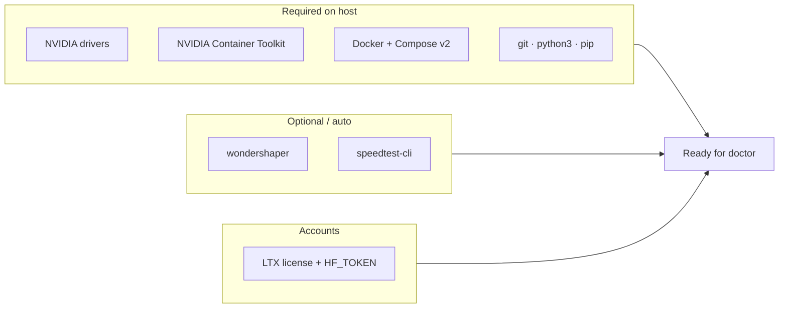

# Getting Started

**What's on this page**

- What success looks like
- Session variables (copy-paste)
- Prerequisites checklist
- Setup, doctor, download, start, first still, stop
- Optional: build the Docker image locally instead of pulling GHCR
- `manage.sh` command catalog

**What this enables**

- A first successful open of ComfyUI at `${COMFY_PORT}` (default **8188**)
- Safe model downloads that leave bandwidth for SSH
- Choosing prebuilt GHCR pull (default) or a local Dockerfile build
- One queued **still-draft** before you move to the [studio playbook](visual-generative-ai.md)

---

## You will end here

| Goal | Detail |
| --- | --- |
| **UI** | ComfyUI at `http://${SPARK_HOST}:${COMFY_PORT}` |
| **Workflow** | **klein-still-draft-lab-example** queued without missing-weight errors |
| **Weights** | Klein 4B + Wan 2.2 5B + LTX-2.5 distilled under `${MODELS_DIR}` (default `/mnt/models`) |
| **Output** | `ez_still_draft_*.png` under `${COMFY_OUTPUT_DIR}` (default `/mnt/comfy-output`) |

**Expect** multi‑GB Hugging Face pulls (throttled by default). First start usually **seeds** from a prebuilt GHCR image; without that image, cold pip can take **10–30+ minutes**.

---

## Session variables

Run these from the **repo root** on the Spark. Defaults match `.env.example`. Change `SPARK_HOST` to this machine’s LAN IP or DNS if you will open the UI from another computer.

```bash
export SPARK_HOST="${SPARK_HOST:-127.0.0.1}"
export SPARK_USER="${SPARK_USER:-$USER}"
export MODELS_DIR="${MODELS_DIR:-/mnt/models}"
export COMFY_OUTPUT_DIR="${COMFY_OUTPUT_DIR:-/mnt/comfy-output}"
export COMFY_PORT="${COMFY_PORT:-8188}"
export DOWNLOAD_LIMIT="${DOWNLOAD_LIMIT:-auto}"   # auto | off | integer Mbps
```

Later command blocks assume these exports. After `setup`, the same keys live in `.env` (`manage.sh` loads `.env` automatically; the exports are for **your** shell — `ls`, `ssh -L`, the browser URL).

---

## Path at a glance

1. **Clone** this repo (branch that matches these docs)
2. **`setup`** — `.env`, model dir, output dir, Docker if needed
3. **`doctor`** — fix hard failures before multi‑GB downloads
4. **Accept LTX-2.5** on Hugging Face (gated) and set `HF_TOKEN`
5. **`download-models`** — Klein 4B + Wan 5B + LTX-2.5 (throttled)
6. **`start`** — type `yes`, then open the UI
7. **Queue klein-still-draft-lab-example**
8. **`stop`** — always, before reboot

```bash
git clone -b __DOCS_GIT_REF__ https://github.com/toxicoder/ez-comfy-stack.git
cd ez-comfy-stack

export SPARK_HOST="${SPARK_HOST:-127.0.0.1}"
export SPARK_USER="${SPARK_USER:-$USER}"
export MODELS_DIR="${MODELS_DIR:-/mnt/models}"
export COMFY_OUTPUT_DIR="${COMFY_OUTPUT_DIR:-/mnt/comfy-output}"
export COMFY_PORT="${COMFY_PORT:-8188}"
export DOWNLOAD_LIMIT="${DOWNLOAD_LIMIT:-auto}"

./scripts/manage.sh setup --install-docker   # approve sudo; edit .env for HF_TOKEN
./scripts/manage.sh doctor
./scripts/manage.sh download-models
./scripts/manage.sh start                    # type: yes
./scripts/manage.sh status
# LAN / on-box:  open http://${SPARK_HOST}:${COMFY_PORT}
# Laptop:        ssh -L "${COMFY_PORT}:127.0.0.1:${COMFY_PORT}" "${SPARK_USER}@${SPARK_HOST}"
#                then open http://127.0.0.1:${COMFY_PORT}
./scripts/manage.sh stop                     # before reboot
```

Sections below unpack each step. Feature work still branches from `development` (see [Conventions](project-conventions.md)).

---

## Prerequisites

### Checklist

- [ ] **NVIDIA DGX Spark** (or compatible GB10) with drivers + **NVIDIA Container Toolkit**
- [ ] **Docker** with Compose v2 (prefer apt `docker-ce`, not snap; user in `docker` group)
- [ ] **Writable model cache** — default `/mnt/models`, or set `MODELS_DIR` in `.env`
- [ ] **Writable media output dir** — default `/mnt/comfy-output`, or set `COMFY_OUTPUT_DIR` in `.env`
- [ ] **git**, **python3**, **pip** / **pipx**
- [ ] **Hugging Face CLI** — modern `hf` from `huggingface_hub` (**not** the deprecated `huggingface-cli` stub)
- [ ] **HF account** — accept the LTX-2.5 license; `HF_TOKEN` in `.env` or `hf auth login`

### At a glance

| Kind | Items |
| --- | --- |
| **Required on host** | NVIDIA drivers, Container Toolkit, Docker + Compose v2, git, python3, pip/pipx |
| **Optional / auto** | `wondershaper`, `speedtest-cli` (used by download-limit; HTB/`sch_htb` when shaping is available) |
| **Accounts** | LTX-2.5 license click + `HF_TOKEN` (Klein 4B and Wan 5B are Apache) |
| **Image base** | Public Docker Hub `nvidia/cuda` — **no** NGC / `nvcr.io` login required |

```bash
# Prefer: ./scripts/manage.sh setup  (creates and chowns both dirs)
sudo mkdir -p "${MODELS_DIR}" "${COMFY_OUTPUT_DIR}"
sudo chown "$USER:$USER" "${MODELS_DIR}" "${COMFY_OUTPUT_DIR}"

command -v hf || pipx install huggingface_hub
# or: pip install -U 'huggingface_hub[cli]'
```



---

## Setup

Clone the **same long-lived branch these docs describe** (`main` for [latest](https://toxicoder.github.io/ez-comfy-stack/latest/), `development` for [development](https://toxicoder.github.io/ez-comfy-stack/development/)).

=== "Interactive"

    ```bash
    git clone -b __DOCS_GIT_REF__ https://github.com/toxicoder/ez-comfy-stack.git
    cd ez-comfy-stack

    ./scripts/manage.sh setup --install-docker
    # approve sudo + type yes if prompted; edit .env for HF_TOKEN
    ```

=== "Non-interactive"

    ```bash
    git clone -b __DOCS_GIT_REF__ https://github.com/toxicoder/ez-comfy-stack.git
    cd ez-comfy-stack

    LAB_NON_INTERACTIVE=1 LAB_CONFIRM_TOKEN=yes SETUP_INSTALL_DOCKER=1 \
      ./scripts/manage.sh setup
    ```

`setup` will:

1. Create `.env` from `.env.example` if missing
2. Create and own `MODELS_DIR` and `COMFY_OUTPUT_DIR` via sudo when needed
3. **Install Docker CE + compose plugin** when missing (`--install-docker` or interactive yes; apt preferred, not snap)
4. Add your user to the `docker` group; configure `nvidia-ctk` when present
5. Re-run `doctor`

??? tip "Docker group not active in this shell"

    After install, if `docker` permission is denied:

    ```bash
    newgrp docker   # or re-login SSH
    ./scripts/manage.sh doctor
    ```

---

## Doctor

```bash
./scripts/manage.sh doctor
```

Fix any errors **before** downloading multi‑GB models. Missing lab weights are a **warning**, not a hard doctor failure (download next).

!!! warning "Hard failures to clear first"

    - **docker missing**
    - **docker compose missing**
    - **host headroom** (RAM/disk)
    - **MODELS_DIR or COMFY_OUTPUT_DIR not writable**

    Prefer `./scripts/manage.sh setup` first. Copy-paste fixes: [Troubleshooting](troubleshooting.md).

`doctor` also prints the **license policy one-liner**, image tag for this git branch, and JSON status from `download-image` / `download-wan` / `download-ltx` / `download-llm`. Analog **podcast** JSON is printed as a soft line — a missing podcast pack is **not** a doctor failure.

---

## Download models

LTX-2.5 is **gated**. Klein 4B and Wan 5B are Apache — a token in `.env` is **not** the same as accepting the Lightricks license. Policy: [Model licenses](licenses.md).

```bash
# 1. echo 'HF_TOKEN=hf_...' >> .env   # or: hf auth login
# 2. Open https://huggingface.co/Lightricks/LTX-2.5 as THAT user and click Agree
# 3. Fine-grained tokens need gated-repo read
hf auth whoami

./scripts/manage.sh download-models
# Manual cap (Mbps; 40 ≈ 5 MB/s). Overrides DOWNLOAD_LIMIT for this run:
# ./scripts/manage.sh download-models --limit 40
```

| What | Detail |
| --- | --- |
| **Tiers** | `download-image --tier fast` + `download-wan --tier 5b` + `download-ltx --tier 2.5` + `download-llm` |
| **Throttle** | Default `auto` (speedtest → **85%**). Manual: `--limit 40` (Mbps). Persistent: `DOWNLOAD_LIMIT=40` in `.env`. `off` is SSH risk. |
| **CLI** | Modern **`hf download`** |
| **Layout** | Weights under `${MODELS_DIR}` with relative `comfy/` symlinks |
| **LTX size** | Selective `Lightricks/LTX-2.5` distilled set (status floor ~**30 GB**), not the Kijai 2.3 monorepo (~400 GB) |

`download-models` **exits non-zero** until every lab basename is present under `${MODELS_DIR}/comfy/`:

| File | Folder |
| --- | --- |
| `flux-2-klein-4b-fp8.safetensors` | `diffusion_models/` |
| `wan2.2_ti2v_5B_fp16.safetensors` | `diffusion_models/` |
| `ltx-2.5-22b-distilled-transformer-comfy-int8-convrot.safetensors` | `diffusion_models/` |
| `qwen_3_4b.safetensors` | `text_encoders/` |
| `umt5_xxl_fp8_e4m3fn_scaled.safetensors` | `text_encoders/` |
| `gemma4-12b-with-proj-ltx-2.5-comfy-int8-convrot.safetensors` | `text_encoders/` |
| `flux2-vae.safetensors` | `vae/` |
| `wan2.2_vae.safetensors` | `vae/` |
| `ltx-2.5-video-vae-bf16.safetensors` | `vae/` |
| `ltx-2.5-audio-vae-bf16.safetensors` | `vae/` |
| `Qwen3-4B-Instruct-2507-Q4_K_M.gguf` | `llm/` |

!!! tip "Bandwidth shaping soft-fail"

    If kernel HTB is missing (common on DGX Spark), downloads continue with gentle HF workers and a warning. Use `DOWNLOAD_LIMIT=off` only when you accept SSH risk. See [Download Limit](download-limit.md).

!!! tip "Stuck resume (0 MiB/s, incomplete file)"

    Heartbeats showing `found N incomplete` and `0 MiB/s` mean `hf` is alive but the partial is not growing. **Do not** `HF_LOCK_CLEAR_FORCE=1` while it runs. ++ctrl+c++, then:

    ```bash
    ./scripts/manage.sh download-models --drop-incomplete --limit 1000
    ```

    That deletes `*.incomplete` (finished weights stay) and re-pulls. See [Models & Cache](models-and-cache.md#resume-cache).

If Comfy shows **Missing Models** on **klein-still-draft-lab-example**, re-run download and `doctor`. Full cache layout: [Models & Cache](models-and-cache.md).

---

## Start the stack

```bash
./scripts/manage.sh start
# type: yes
./scripts/manage.sh status
```

Open **`http://${SPARK_HOST}:${COMFY_PORT}`**.

From a laptop (Spark is remote):

```bash
ssh -L "${COMFY_PORT}:127.0.0.1:${COMFY_PORT}" "${SPARK_USER}@${SPARK_HOST}"
# then open http://127.0.0.1:${COMFY_PORT}
```

!!! success "First Queue"

    In ComfyUI, load **klein-still-draft-lab-example** from `user/default/workflows/` (seeded from host `workflows/`). Leave **Enhance** off. Queue. PNG lands at `${COMFY_OUTPUT_DIR}/ez_still_draft_*.png`.

    Next: [Prompting](prompting.md), then the still → Wan → LTX loop on [Visual Generative AI](visual-generative-ai.md). After that first still, optional audio: [Local podcast](podcast.md) (`download-podcast --tier analog`, then **podcast-audio-first-lab-example**) or rap-first [Local music](music.md) (`download-music --tier turbo`, then **music-rap-draft-lab-example** — do not co-resident with LTX/Wan/Klein).

### Build the image locally (optional)

By default, `manage.sh start` **pulls** a branch-aligned prebuilt image from GHCR (ComfyUI + PyTorch baked in; **not** Klein/Wan/LTX weights). You can instead **build** `docker/Dockerfile` on the host and still use the same start path.

=== "One-shot env"

    ```bash
    LAB_STACK_FORCE_BUILD=1 ./scripts/manage.sh start
    # type: yes
    ```

=== "Persist in .env"

    ```bash
    # in .env (see .env.example)
    LAB_STACK_FORCE_BUILD=1

    ./scripts/manage.sh start
    # type: yes
    ```

| When to use local build | When to stick with GHCR pull |
| --- | --- |
| GHCR tag missing, private, or pull denied | Normal first install / fastest path |
| Rebaking `/opt/comfy-prebuilt` after pin or phase changes | Ops-script-only edits (entrypoint / install / patch) |
| Developing the image layers themselves | You only need Comfy + weights running |

**Still the same safety path:** type `yes`, host headroom preflight, `restart: "no"`, and weights via `download-models` / `MODELS_DIR`. Local build does **not** skip confirmation or put models inside the image.

!!! warning "Expect a long Docker build"

    With default `EZ_COMFY_PREBUILD=1`, local build installs torch and Comfy into the image and can take **30+ minutes** (multi‑GB wheels). Base layers come from public Docker Hub `nvidia/cuda` (no NGC login by default). Compose may use a previously pulled GHCR image as build cache (`cache_from`) when present.

After a successful prebuild image, first container start **seeds** the `comfy-state` volume from `/opt/comfy-prebuilt` (same as the GHCR path). A thin build (`EZ_COMFY_PREBUILD=0`) or `LAB_FORCE_COLD_INSTALL=1` falls back to cold multi‑GB pip at runtime.

| Variable | Role |
| --- | --- |
| `LAB_STACK_FORCE_BUILD=1` | Prefer local `compose up --build` (skip pull-first path) |
| `LAB_STACK_SKIP_PULL=1` | Do not `docker pull`; start falls through to local `compose --build` |
| `EZ_COMFY_PREBUILD=1` (default) | Bake Comfy + torch into the image during build |
| `EZ_COMFY_PREBUILD=0` | Thin image → cold pip at first container start |
| `EZ_COMFY_IMAGE` | Tag for the pulled or built image (branch default if unset) |

Pull failures already fall back to local build automatically. Force-build is for when you **want** a rebuild even if GHCR is available.

Layer invalidation and pin bumps: [Models & Cache](models-and-cache.md#prebuilt-container-image-ghcr). Recovery rows: [Troubleshooting](troubleshooting.md).

---

## Stop (always before reboot)

!!! danger "Golden rule"

    **Never reboot with the heavy ComfyUI stack still running.** Always stop first. See [Reboot Safety](reboot-safety.md).

```bash
./scripts/manage.sh stop
```

`stop` keeps `${MODELS_DIR}`, `${COMFY_OUTPUT_DIR}`, and the `ez-comfy-state` volume.

---

## manage.sh catalog

| Command | Purpose |
| --- | --- |
| `setup [--install-docker] [--yes]` | `.env`, dirs, optional Docker CE, then doctor |
| `doctor` | Preflight (docker, GPU, RAM/disk, dirs, license one-liner) |
| `status [--json]` | Compose project; prints `MODELS_DIR`, `COMFY_OUTPUT_DIR`, port |
| `start` | Type `yes`; headroom; compose up |
| `stop` | Stop containers; keep models, outputs, volume |
| `restart` | `stop` + `start` (full confirm again) |
| `logs` | Follow compose logs (`logs --tail 100` works) |
| `download-models [--limit auto\|N\|off] [--drop-incomplete]` | Default pack, throttled wrap (does **not** pull podcast or music weights) |
| `download-podcast [--tier analog\|…] [--limit auto\|N\|off]` | Opt-in Kokoro / ACE-Step / optional TTS |
| `download-music [--tier turbo\|xl\|all] [--limit auto\|N\|off]` | Opt-in ACE-Step 1.5 rap AIO (~10 GB; shared dest with `download-podcast --tier acestep`) |
| `download-limit …` | Proxy to `scripts/utilities/download-limit.sh` |
| `clear-hf-locks` | Stale Hugging Face `.lock` files under `MODELS_DIR` |
| `reset-hf-partials [--yes] [--force]` | Delete `*.incomplete` (finished weights kept) |
| `cleanup` | Type `DELETE`; remove `ez-comfy-state` only |

`download-h3`, `queue-h3`, `farm-h3`, and `stitch-h3` are **banned** aliases (MiniMax H3).

---

## Optional deep-dives

??? tip "Prebuilt image (GHCR)"

    `manage.sh start` pulls a **branch-aligned** arm64 image published by the `publish-image` workflow:

    | Git branch | Image tag |
    | --- | --- |
    | `main` | `ghcr.io/toxicoder/ez-comfy:us-safe-studio` |
    | `development` (and feature branches) | `ghcr.io/toxicoder/ez-comfy:us-safe-studio-development` |

    Override with `EZ_COMFY_IMAGE` in `.env` if needed. Old `flux-to-ltx*` tags freeze on the previous image.

    Multi-stage: **devel** builder installs Comfy+torch in **phased modules** (torch separate from custom nodes); final stage is **CUDA runtime** (no nvcc) with **split layers** (venv vs app) so pulls reuse multi‑GB torch when only app bits change.

    It includes ComfyUI + PyTorch (pinned refs — see [Models & Cache](models-and-cache.md#prebuild-version-pins-validated)); **not** Klein/Wan/LTX weights (those stay on `MODELS_DIR`).

    First start **seeds** the volume from `/opt/comfy-prebuilt` (local copy) instead of multi‑GB pip.

    No tokens or host secrets are baked into the image. Pull is public for public packages.

    `./scripts/manage.sh doctor` prints the resolved default image before you start.

??? tip "Dev: edit scripts without rebuilding"

    Compose bind-mounts `docker/entrypoint.sh`, `docker/install-comfy.sh`, `docker/install-comfy/`, and `docker/patch_get_free_memory.py` into the container.

    Change those files on the host, then restart the stack — **no multi‑GB image rebuild**.

    Rebuild only when you need a new baked `/opt/comfy-prebuilt` tree (torch / Comfy / nodes): [build the image locally](getting-started.md#build-the-image-locally-optional) or publish.

    See [Models & Cache](models-and-cache.md#image-layer-cache-high-velocity-rebuilds-pulls) for what invalidates which layers.

??? warning "Cold start without prebuilt"

    If GHCR pull fails or you force a thin/local build without prebuild, first start can take **10–30+ minutes** of pip.

    `manage.sh start` streams logs until port `${COMFY_PORT}` responds (++ctrl+c++ detaches only).

    `LAB_STACK_FOLLOW=0` returns immediately after the container is up.

??? abstract "First-run journey (sequence)"

    ```mermaid
    sequenceDiagram
      actor Op as Operator
      participant M as manage.sh
      participant DL as download-limit
      participant HF as Hugging Face
      participant D as Docker / ComfyUI
      participant B as Browser

      Op->>M: clone + setup
      Op->>M: doctor
      M-->>Op: preflight OK
      Op->>M: download-models
      M->>DL: wrap --limit auto or N Mbps
      DL->>HF: image fast + wan 5b + ltx 2.5
      HF-->>DL: weights → MODELS_DIR
      DL-->>M: clear limit on exit
      Op->>M: start
      M-->>Op: type yes
      Op->>M: yes
      M->>D: compose up -d
      D-->>Op: seed prebuilt or cold install
      Op->>B: open SPARK_HOST:COMFY_PORT
      Op->>M: stop (before reboot)
    ```

??? abstract "Cold-start phases (first start without prebuilt)"

    ```mermaid
    flowchart TB
      A["manage.sh start<br/>type yes"] --> B["Docker build image<br/>ez-comfy:us-safe-studio"]
      B --> C["Create volume comfy-state"]
      C --> D["entrypoint: install-comfy.sh<br/>pip + git · 10–30+ min"]
      D --> E["patch_get_free_memory.py"]
      E --> F["Exec ComfyUI on 0.0.0.0:8188"]
      F --> G["UI ready"]
    ```

---

## Next steps

| Need | Page |
| --- | --- |
| How to write Klein / Wan / LTX prompts | [Prompting](prompting.md) |
| Licenses, $10M LTX cap, banned models | [Model licenses](licenses.md) |
| Still → Wan 5 s → LTX 5 s AV playbook | [Visual Generative AI](visual-generative-ai.md) |
| 90s films | [90s shorts](shorts.md) |
| Cache layout, basenames, layer pins | [Models & Cache](models-and-cache.md) |
| Bandwidth throttle details | [Download Limit](download-limit.md) |
| Reboot / recovery | [Reboot Safety](reboot-safety.md) |
| Symptom → fix | [Troubleshooting](troubleshooting.md) |
| Contributing / shell style | [Conventions](project-conventions.md) |
