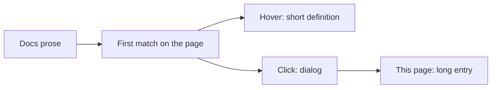

# Glossary

**What's on this page**

- **Dotted words** — hover for a short definition, click for the dialog
- **Categories** — Models, Modalities, Studio, Downloads, Hardware and safety, Film, Audio, Licenses
- **See also** — each entry links to the guide that teaches it

**What this enables**

- **Looking up** Klein, Wan, LTX, `--tier`, Queue, latent, headroom, and the rest without leaving the page
- **Teaching** vocabulary once so Create and Operate pages can stay task-focused

<Callout type="info" title="Dotted words open a definition">
  Across the docs, the **first** time a glossary term appears on a page it is underlined with dots.

  - **Hover** (or keyboard focus) to read the short definition
  - **Click** or press ++enter++ / ++space++ to open the dialog
  - **Open full glossary entry** jumps here
  - ++esc++ or the backdrop closes the dialog

  Terms inside code, headings, and links stay plain so copy-paste and navigation do not fight the modal.

  Categories below are Models, Modalities, Studio, Downloads, Hardware and safety, Film, Audio, then Licenses.
</Callout>

Add or change a term in `includes/glossary.json` (unique `id` and aliases). Conventions: [Project conventions](project-conventions.md).

<GlossaryBody />
