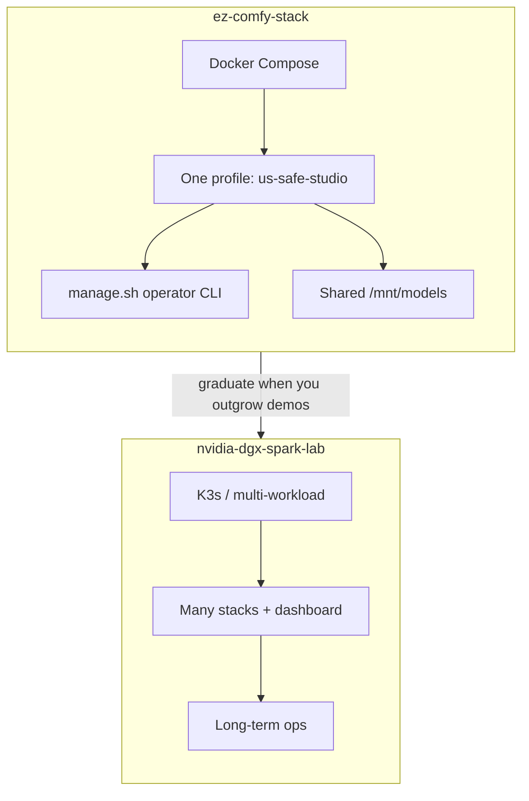
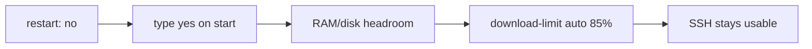
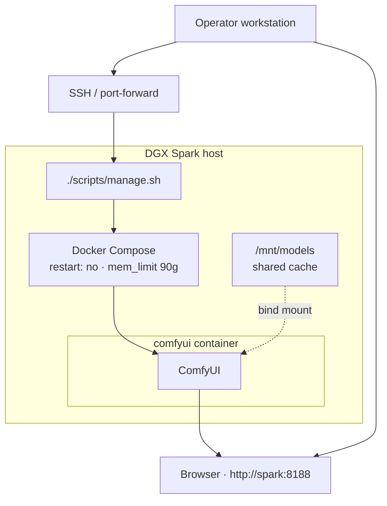
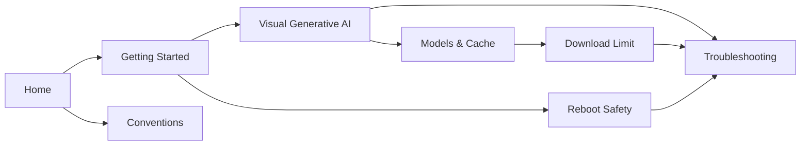

# ez-comfy-stack

**What's on this page**

- What this project is (and is not)
- Default stack and safety principles
- How pieces connect
- Where to read next

**What this enables**

- Spinning up a **US-safe local studio** (Klein 4B + Wan 2.2 + LTX-2.5) on one Spark quickly
- Sharing model weights with other stacks via `/mnt/models`
- Operating the stack safely over SSH without locking yourself out

!!! tip "Start here"

    New to this repo? Follow **[Getting Started](getting-started.md)** for setup → doctor → download → start → stop.

    Licenses (US self-host): [Model licenses](licenses.md). Contributors: [Conventions](project-conventions.md).

---

## Purpose

This is a **sample / demo** repository for **Visual Generative AI** on a **single NVIDIA DGX Spark (GB10)**. It is deliberately smaller than [nvidia-dgx-spark-lab](https://github.com/toxicoder/nvidia-dgx-spark-lab): Docker Compose instead of K3s, one unified profile instead of a full lab.

Long-term multi-workload operations should use the full lab project. Use **ez-comfy-stack** when you want faster experimentation.

### This stack vs the full lab

---

## Default stack

| Item | Value |
| --- | --- |
| Runtime | ComfyUI (Docker) |
| Pipeline | **studio** (Klein 4B still → Wan 2.2 5s silent → LTX-2.5 AV; see [licenses](licenses.md)) |
| Flux tier | fast — FLUX.2 Klein 9B NVFP4 + Nunchaku |
| LTX tier | balanced — LTX-2.3 distilled FP8 |
| Models | host `/mnt/models` |
| UI | port **8188** |
| Memory limit | **90g** (host headroom reserved for SSH) |

---

## Safety first

!!! warning "Remote Spark rules"

    These defaults protect SSH recoverability on a remotely managed host. Do not weaken them for demos.

| Guard | Behavior |
| --- | --- |
| **No auto-start** | Compose `restart: "no"` after reboot |
| **Heavy confirmation** | Type `yes` on `start` |
| **Headroom preflight** | Free host RAM/disk checked before start |
| **Download throttle** | `download-limit auto` = **85%** of speedtest (when HTB works) |

Details: [Reboot Safety](reboot-safety.md) · [Download Limit](download-limit.md).

---

## System context

How an operator reaches ComfyUI on a remotely managed Spark:

---

## Documentation path

| When | Read |
| --- | --- |
| **First run** | [Getting Started](getting-started.md) |
| **How the pipeline works** | [Visual Generative AI](visual-generative-ai.md) |
| **Weights, cache, image pins** | [Models & Cache](models-and-cache.md) |
| **Throttled downloads** | [Download Limit](download-limit.md) |
| **Before reboot** | [Reboot Safety](reboot-safety.md) |
| **Something broke** | [Troubleshooting](troubleshooting.md) |
| **Contributing** | [Conventions](project-conventions.md) |

