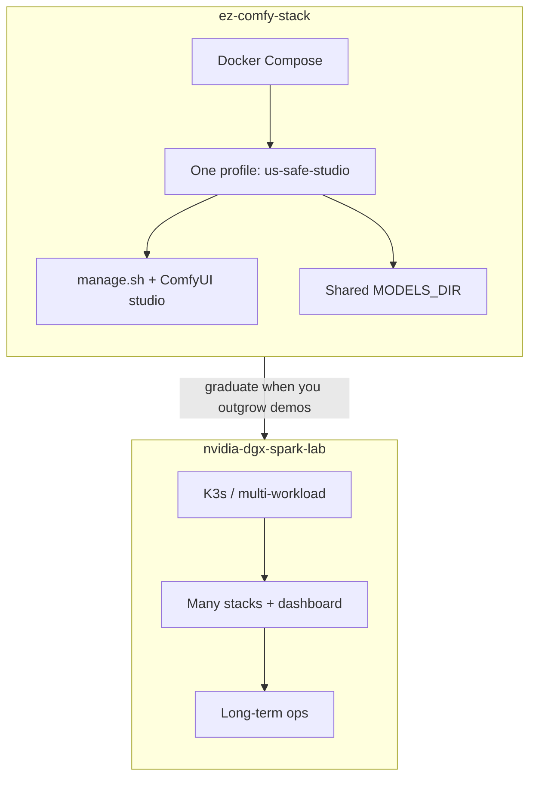
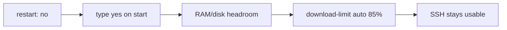
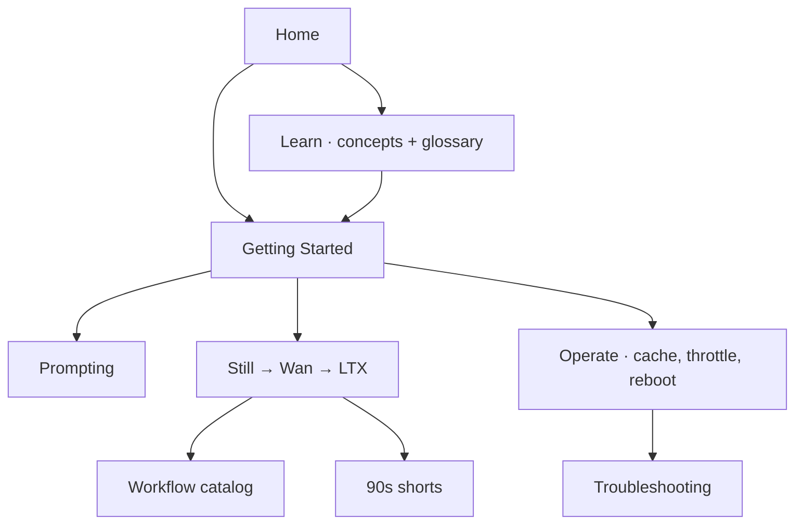

# ez-comfy-stack

**What's on this page**

- What this project is (and is not)
- Choose a path: learn, first install, create, recover
- Default stack and the four SSH-safe guards

**What this enables**

- Finding the right page in one screen instead of scrolling a dump
- Spinning up a **US-safe local studio** (Klein 4B + Wan 2.2 + LTX-2.5) on one Spark

---

## Choose a path

-   :material-school:{ .lg .middle } **New to the studio**

    ---

    What ComfyUI, Klein, Wan, LTX, latents, and Queue mean — then a glossary dialog on dotted terms.

    [:octicons-arrow-right-24: How the studio works](learn/index.md)

-   :material-rocket-launch:{ .lg .middle } **First install**

    ---

    Clone → setup → doctor → download → start (type **yes**) → Queue a still → stop.

    [:octicons-arrow-right-24: Getting Started](getting-started.md)

-   :material-movie-open:{ .lg .middle } **Make something**

    ---

    Still → silent 5 s → AV 5 s, or pick a thumbnail / GIF / 90s film from the catalog.

    [:octicons-arrow-right-24: Still to motion to AV](visual-generative-ai.md)

-   :material-lifebuoy:{ .lg .middle } **Something broke**

    ---

    `doctor` first. Missing Models, LTX 720, Kitchen fallback, stuck downloads.

    [:octicons-arrow-right-24: Troubleshooting](troubleshooting.md)

Contributors: [Conventions](project-conventions.md). Licenses before a 30 GB pull: [Model licenses](licenses.md).

---

## Purpose

This is a **sample / demo** repository for **Visual Generative AI** on a **single NVIDIA DGX Spark (GB10)**. It is deliberately smaller than [nvidia-dgx-spark-lab](https://github.com/toxicoder/nvidia-dgx-spark-lab): Docker Compose instead of K3s, one unified profile instead of a full lab.

Long-term multi-workload operations should use the full lab project. Use **ez-comfy-stack** when you want faster experimentation.

---

## Default stack

| Item | Value |
| --- | --- |
| Runtime | ComfyUI (Docker) |
| Pipeline | **studio** — Klein 4B still → Wan 2.2 5 s silent → LTX-2.5 AV ([licenses](licenses.md)) |
| Image tier | **fast** — FLUX.2 Klein 4B distilled FP8 (Apache) |
| Wan tier | **5b** — Wan 2.2 TI2V-5B (Apache, silent) |
| LTX tier | **2.5** — LTX-2.5 distilled INT8-convrot (Community License, gated) |
| Models | host `${MODELS_DIR}` (default `/mnt/models`) |
| Outputs | host `${COMFY_OUTPUT_DIR}` (default `/mnt/comfy-output`) |
| UI | port **`${COMFY_PORT}`** (default **8188**) |
| Memory limit | **90g** (host headroom reserved for SSH) |

Klein 9B, FLUX.2-dev, Nunchaku 9B, and MiniMax H3 are **not** defaults. Session variables and port-forward copy-paste live on [Getting Started](getting-started.md). Opt-in audio: [Local podcast](podcast.md) and [Local music](music.md) (not part of `download-models`).

---

## Safety first

!!! warning "Remote Spark rules"

    These defaults protect SSH recoverability on a remotely managed host. Do not weaken them for demos.

| Guard | Behavior |
| --- | --- |
| **No auto-start** | Compose `restart: "no"` after reboot |
| **Heavy confirmation** | Type `yes` on `start` |
| **Headroom preflight** | Free host RAM/disk checked before start |
| **Download throttle** | `download-limit auto` = **85%** of speedtest (when HTB works) |

Why those exist: [Hardware, memory, and safety](learn/hardware.md). Operator details: [Reboot safety](reboot-safety.md) · [Download limit](download-limit.md).

---

## Documentation map

| When | Read |
| --- | --- |
| **What is this?** | [How the studio works](learn/index.md) · [Glossary](glossary.md) |
| **First run** | [Getting Started](getting-started.md) |
| **How to prompt** | [Prompting](prompting.md) |
| **Licenses before a 30 GB pull** | [Model licenses](licenses.md) |
| **Still → silent 5 s → AV 5 s** | [Visual Generative AI](visual-generative-ai.md) |
| **Which graph?** | [Workflow catalog](studio-workflows.md) |
| **90s films** | [90s shorts](shorts.md) |
| **Three Sparks, one weight copy** | [Spark farm](spark-farm.md) |
| **`manage.sh` verbs** | [manage.sh reference](manage-cli.md) |
| **Weights, cache, image pins** | [Models and cache](models-and-cache.md) |
| **What `--tier` means** | [Download tiers](download-tiers.md) |
| **Free disk (safely)** | [Disk wizard](disk-wizard.md) |
| **Something broke** | [Troubleshooting](troubleshooting.md) |
| **Contributing** | [Conventions](project-conventions.md) |
