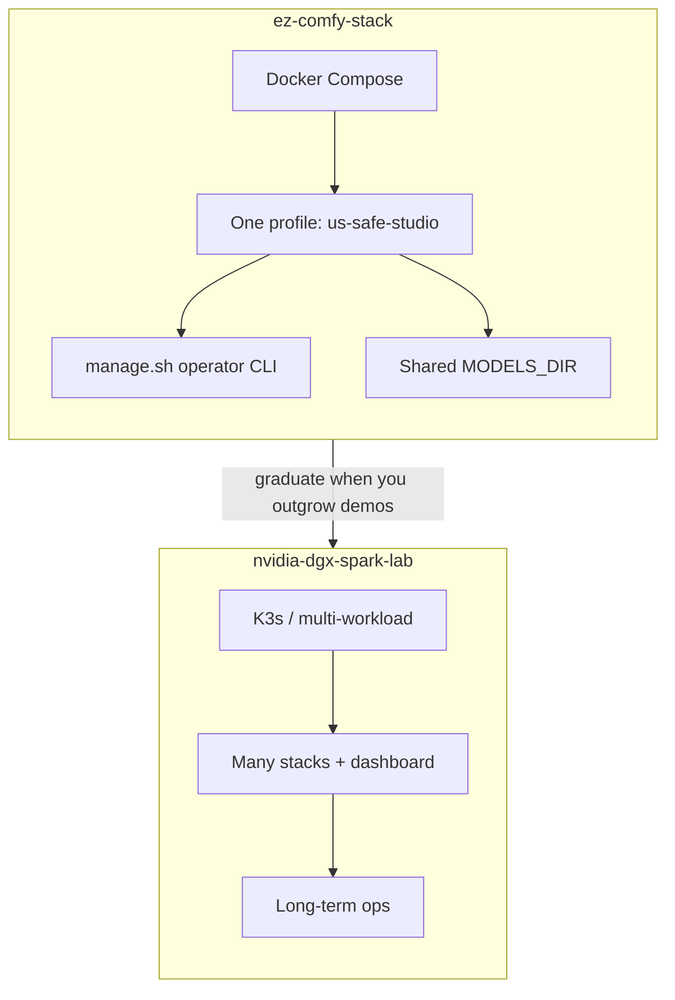
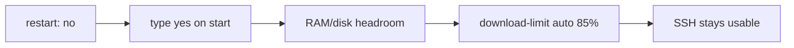
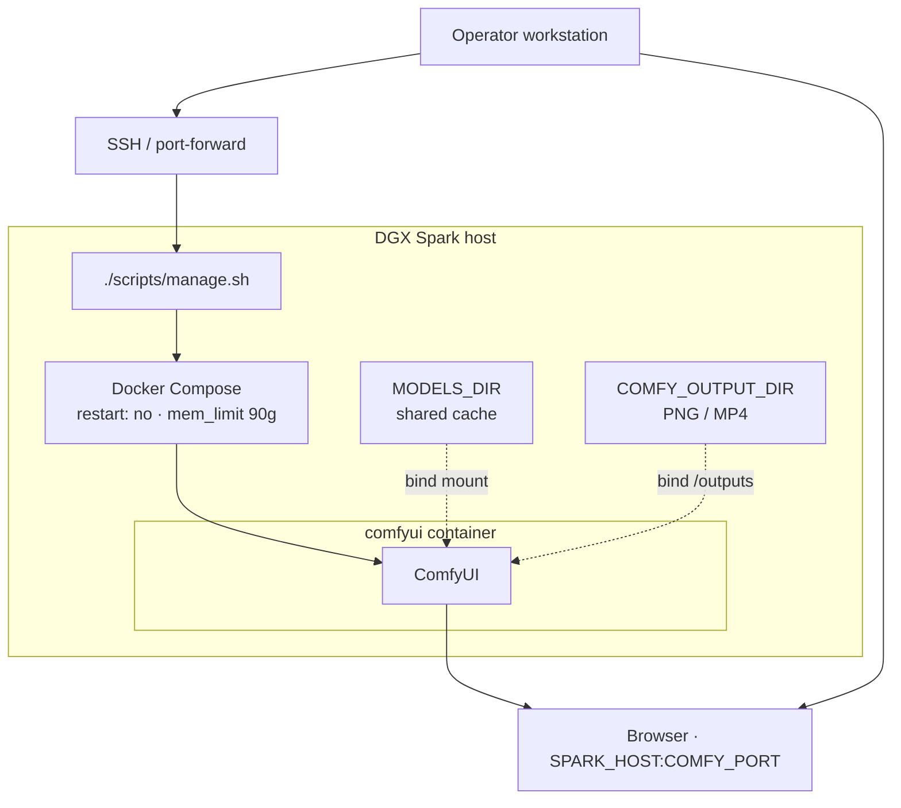
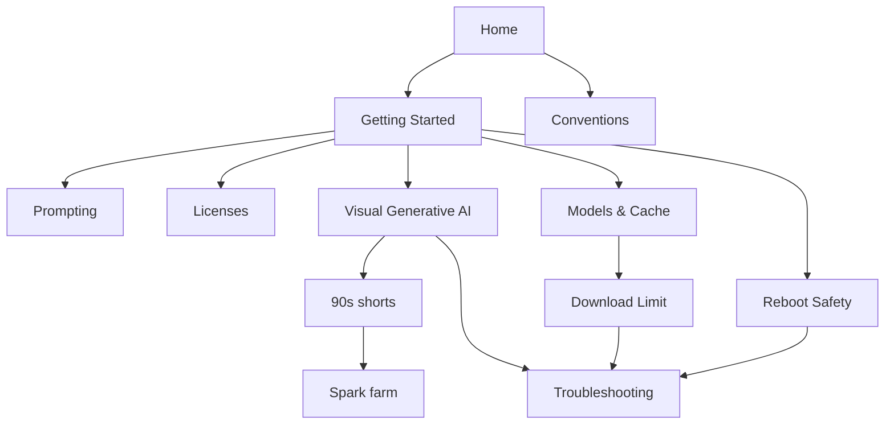

# ez-comfy-stack

**What's on this page**

- What this project is (and is not)
- Default stack and safety principles
- How pieces connect
- Where to read next

**What this enables**

- Spinning up a **US-safe local studio** (Klein 4B + Wan 2.2 + LTX-2.5) on one Spark quickly
- Sharing model weights with other stacks via `${MODELS_DIR}` (default `/mnt/models`)
- Operating the stack safely over SSH without locking yourself out

!!! tip "Start here"

    New to this repo? Follow **[Getting Started](getting-started.md)** for setup → doctor → download → start → first still → stop.

    Then: [Prompting](prompting.md) · [Model licenses](licenses.md) · studio playbook [Visual Generative AI](visual-generative-ai.md) · opt-in [Local podcast](podcast.md) · opt-in [Local music](music.md).

    Contributors: [Conventions](project-conventions.md).

---

## Purpose

This is a **sample / demo** repository for **Visual Generative AI** on a **single NVIDIA DGX Spark (GB10)**. It is deliberately smaller than [nvidia-dgx-spark-lab](https://github.com/toxicoder/nvidia-dgx-spark-lab): Docker Compose instead of K3s, one unified profile instead of a full lab.

Long-term multi-workload operations should use the full lab project. Use **ez-comfy-stack** when you want faster experimentation.

### This stack vs the full lab



---

## Default stack

| Item | Value |
| --- | --- |
| Runtime | ComfyUI (Docker) |
| Pipeline | **studio** — Klein 4B still → Wan 2.2 5 s silent → LTX-2.5 AV ([licenses](licenses.md)) |
| Image tier | **fast** — FLUX.2 Klein 4B distilled FP8 (Apache) |
| Wan tier | **5b** — Wan 2.2 TI2V-5B (Apache, silent) |
| LTX tier | **2.5** — LTX-2.5 distilled INT8-convrot (Community License, gated) |
| Models | host `${MODELS_DIR}` (default `/mnt/models`) |
| Outputs | host `${COMFY_OUTPUT_DIR}` (default `/mnt/comfy-output`) |
| UI | port **`${COMFY_PORT}`** (default **8188**) |
| Memory limit | **90g** (host headroom reserved for SSH) |

Klein 9B, FLUX.2-dev, Nunchaku 9B, and MiniMax H3 are **not** defaults. Optional fallbacks (Z-Image, Wan A14B, LTX-2.3) are documented on [Models & Cache](models-and-cache.md). Opt-in audio: [Local podcast](podcast.md) (Kokoro + native ACE-Step) and [Local music](music.md) (rap-first ACE-Step; not part of `download-models`).

---

## Session variables

Set these once per SSH session (defaults match `.env.example`). Getting Started repeats them in the copy-paste path.

```bash
export SPARK_HOST="${SPARK_HOST:-127.0.0.1}"          # LAN IP or DNS of this Spark
export SPARK_USER="${SPARK_USER:-$USER}"
export MODELS_DIR="${MODELS_DIR:-/mnt/models}"
export COMFY_OUTPUT_DIR="${COMFY_OUTPUT_DIR:-/mnt/comfy-output}"
export COMFY_PORT="${COMFY_PORT:-8188}"
export DOWNLOAD_LIMIT="${DOWNLOAD_LIMIT:-auto}"        # auto | off | integer Mbps
```

UI: `http://${SPARK_HOST}:${COMFY_PORT}`. From a laptop, port-forward first (see [Getting Started](getting-started.md)).

---

## Safety first

!!! warning "Remote Spark rules"

    These defaults protect SSH recoverability on a remotely managed host. Do not weaken them for demos.

| Guard | Behavior |
| --- | --- |
| **No auto-start** | Compose `restart: "no"` after reboot |
| **Heavy confirmation** | Type `yes` on `start` |
| **Headroom preflight** | Free host RAM/disk checked before start |
| **Download throttle** | `download-limit auto` = **85%** of speedtest (when HTB works) |



Details: [Reboot Safety](reboot-safety.md) · [Download Limit](download-limit.md).

---

## System context

How an operator reaches ComfyUI on a remotely managed Spark:



---

## Documentation path

| When | Read |
| --- | --- |
| **First run** | [Getting Started](getting-started.md) |
| **How to prompt Klein / Wan / LTX** | [Prompting](prompting.md) |
| **Licenses before a 30 GB pull** | [Model licenses](licenses.md) |
| **Still → silent 5 s → AV 5 s** | [Visual Generative AI](visual-generative-ai.md) |
| **90s films (first-person running go-see / still-here / switchyard)** | [90s shorts](shorts.md) |
| **Three Sparks, one weight copy** | [Spark farm](spark-farm.md) |
| **Weights, cache, image pins** | [Models & Cache](models-and-cache.md) |
| **Throttled downloads** | [Download Limit](download-limit.md) |
| **Before reboot** | [Reboot Safety](reboot-safety.md) |
| **Something broke** | [Troubleshooting](troubleshooting.md) |
| **Contributing** | [Conventions](project-conventions.md) |


