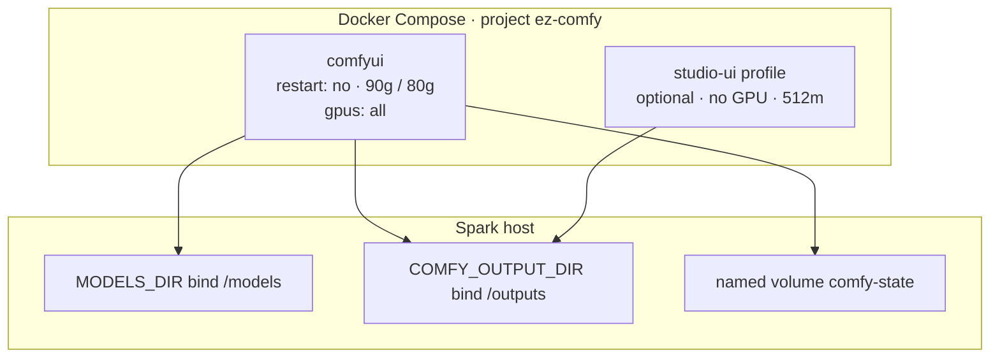
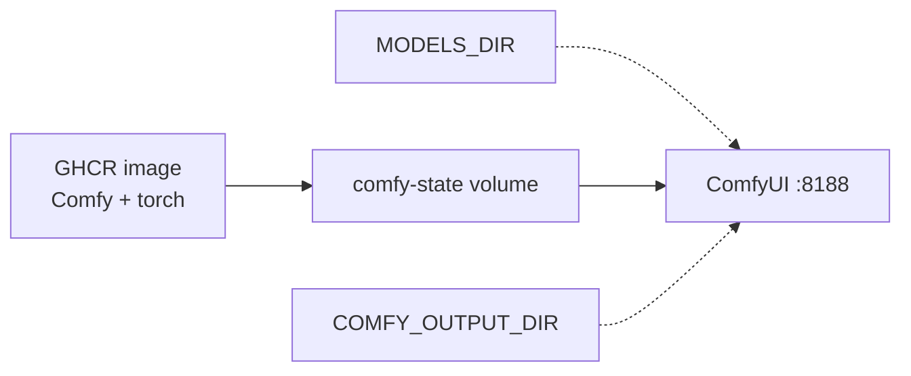
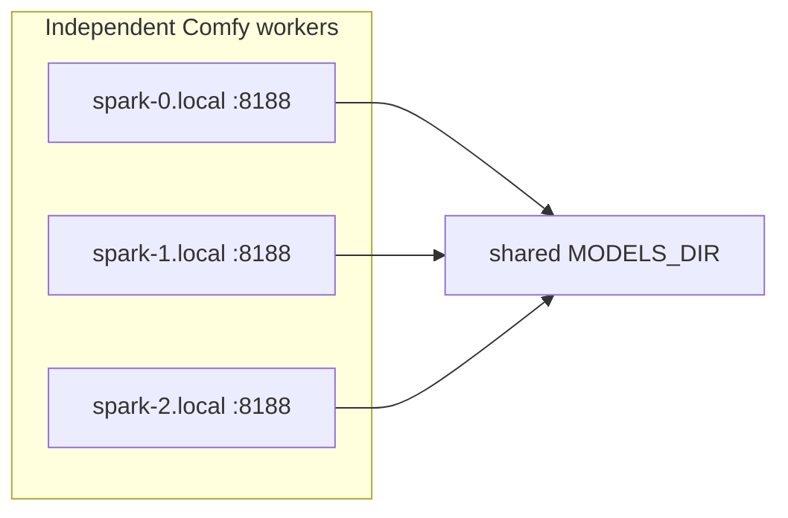

# Architecture

**What's on this page**

- **Compose services** — `comfyui` plus optional `studio-ui` profile
- **Three stores** — GHCR image vs `${MODELS_DIR}` vs `comfy-state`
- **Occupancy XOR** — park vs stop; one heavy GPU job
- **Host sidecars** vs Compose
- **Spark farm** — independent workers and a shared `${MODELS_DIR}`; no in-tree NCCL

**What this enables**

- **Naming** what `start` / `stop` / `cleanup` actually touch
- **Keeping** SSH-safe defaults (`restart: "no"`, 90g/80g, headroom)
- **Knowing** when to stay on this Compose demo vs [nvidia-dgx-spark-lab](https://github.com/toxicoder/nvidia-dgx-spark-lab)

This is a **sample Compose studio** on one NVIDIA DGX Spark (GB10). It is not K3s, not Bazel, and not multi-node NCCL. Graduate to the lab when you outgrow a demo: [When to use vs spark-lab](../start/when-to-use-vs-spark-lab.md).

```bash
export SPARK_HOST="${SPARK_HOST:-127.0.0.1}"
export SPARK_USER="${SPARK_USER:-$USER}"
export MODELS_DIR="${MODELS_DIR:-/mnt/models}"
export COMFY_OUTPUT_DIR="${COMFY_OUTPUT_DIR:-/mnt/comfy-output}"
export COMFY_PORT="${COMFY_PORT:-8188}"
export DOWNLOAD_LIMIT="${DOWNLOAD_LIMIT:-auto}"
```

!!! danger "Do not weaken SSH-safe defaults"

    Compose `restart: "no"`, type **yes** on `start`, headroom preflight (`MIN_HOST_FREE_GIB` 28), and download-limit **clear-on-exit** stay in force. Occupancy does **not** start Compose and does **not** turn this into two GPU jobs.

---

## Compose services

Source of truth: `docker/docker-compose.yml` (operator entry: `./scripts/manage.sh`).

| Service | Profile | GPU | Memory | Restart | Port |
| --- | --- | --- | --- | --- | --- |
| **comfyui** (`ez-comfy-studio`) | default | `gpus: all` | `mem_limit` **90g**, `mem_reservation` **80g**, `shm_size` 16gb, `cpus: 16.0` | `"no"` | `${COMFY_PORT}` → 8188 |
| **studio-ui** (`ez-comfy-studio-ui`) | `studio-ui` | **none** | `mem_limit` 512m | `"no"` | `${STUDIO_UI_PORT:-8190}` → 8190 |

Default `./scripts/manage.sh start` starts **comfyui only**. The jobstore board is opt-in: [studio-ui](../reference/studio-ui.md).



---

## Three stores

| Store | Holds | Destroyed by |
| --- | --- | --- |
| **GHCR image** | ComfyUI + PyTorch (no Klein / Wan / LTX weights) | Re-pull / rebuild |
| **`${MODELS_DIR}`** | Weights + `comfy/` relative symlinks | You, `reap-models`, or disk-wizard — **not** `cleanup` |
| **`comfy-state` volume** (`ez-comfy-state`) | Comfy install, venv, lab `ez_*` packs | `cleanup` (type **DELETE**) only |

Generated media, LoadImage inputs, Comfy `user/`, occupancy JSON, and operator `_user` node packs live on **`${COMFY_OUTPUT_DIR}`**. Inside the container that tree is `/outputs` (`COMFY_OUTPUT_DIR=/outputs`) plus the `comfy-user` bind at `/comfy-state/ComfyUI/user`. `cleanup` does not delete the host tree. Layout: [Hardware, memory, and safety](hardware.md) · [Models and cache](../models-and-cache.md) · [Backup and restore](../operate/backup-restore.md).



---

## Occupancy XOR and park vs stop

GB10 is **one** heavy GPU job. CLI modes: `idle`, `blender-desk`, `llm-desk`, `klein`, `trellis`, `wan`, `ltx`. Matrix: [Occupancy matrix](../operate/occupancy-matrix.md). Narrative: [Occupancy desk](../occupancy.md).

| Action | What it does |
| --- | --- |
| **`occupancy enter blender-desk`** (park) | Compose may stay **up**; empty queue; `POST /free` unload. Workbench dumps allowed. |
| **`stop`** | Container **down**; volumes kept. Use for NVENC, SuperSplat, or a wedged UI. |
| **`occupancy enter idle`** | Stop sidecars **and** Compose. |

`occupancy enter` **does not** start Compose. Heavy modes tell you to `./scripts/manage.sh start` (type **yes**) when the container is down.

Graph occupancy labels (`none` / `llm` / `film` / `audio` / …) on App Mode are **not** CLI modes.

---

## Host sidecars vs Compose

Sidecars are **host processes**, not Compose services. They are never in `docker/Dockerfile`.

| Process | Where | Occupancy |
| --- | --- | --- |
| **ComfyUI** | Compose `comfyui` | `klein` / `trellis` / `wan` / `ltx` |
| **studio-ui** | Optional Compose profile | No GPU |
| **Blender** | Host `PATH` | `blender-desk` (Workbench). Cycles CUDA refused while Compose is up |
| **llama-server 35B** | Host `127.0.0.1:30000` | `llm-desk` **is** the GPU job |
| **NVENC / SuperSplat** | Host | XOR with **compose-up** (park is not enough) |

MCP stdio servers (`blender-mcp`, `research-mcp`) are host Python, not containers: [MCP](../operate/mcp.md). Sidecar catalog: [Studio sidecars](../studio-sidecars.md).

---

## Spark farm (independent workers)

Three Sparks can share **one** `${MODELS_DIR}` (NFS over the fabric, or rsync replicas). Each node still runs **its own** Compose `comfyui` with `restart: "no"` and local **yes** on `start`. That is throughput + one weight copy — **not** slicing one sampler.

There is **no** in-tree NCCL, no multi-GPU graph, and no MiniMax H3. Tensor-parallel LLMs belong in nvidia-dgx-spark-lab.



Runbook: [Spark farm](../spark-farm.md).

---

## Related

| Need | Page |
| --- | --- |
| First install | [Getting Started](../getting-started.md) |
| Mode × legal GPU jobs | [Occupancy matrix](../operate/occupancy-matrix.md) |
| Compose demo vs K3s lab | [When to use vs spark-lab](../start/when-to-use-vs-spark-lab.md) |
| FAQ | [FAQ](../start/faq.md) |
